<div align="center">


</div>

# Station (rain, Pmax24h): 26135330

Probable Maximum Precipitation (PMP) is the greatest amount of rainfall for a specific duration that is meteorologically possible for a given location, acting as a "worst-case" scenario for extreme storms, crucial for designing safety-critical infrastructure like bridges, river deviations, dams, spillways, and nuclear plants to prevent catastrophic failure. PMP is calculated by hydrologists using meteorological data to determine the upper limit of extreme rainfall, often leading to the Probable Maximum Flood (PMF) for flood control design, and is increasingly being studied for climate change impacts.

<div align="center">

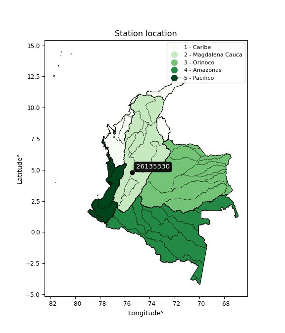</img>

</div>


## A. General information


### 1. General running parameters

• app_version: _v20251225_. • runtime: _2025-12-26 14:29:50.888910_. • Python version: _3.14.0_. • SciPy version: _1.16.3_. • Pandas version: _2.3.3_. • NumPy version: _2.3.5_. • Stations dataset (station_dataset_file): _dataset/pmax24h_in/automatic_colombia.csv_. • Stations catalog (station_catalog_file): _dataset/CNE_IDEAM.xls_. • Plot only fit distributions with Δo > Δ (plot_only_fit): _True_. • Eval low extreme values, if False, evaluates high extreme values (low_extreme): _False_. • Eval every SciPy distribution as logarithmic (pdist_logarithmic_on): _True_. • Standard deviation normalized (ddof): _1.0_. • Return periods to eval in years (Tr): _[2, 2.33, 5, 10, 15, 20, 25, 50, 75, 100, 200, 250, 500, 750, 1000]_. • Minimum data sample per station, 0 means any (minimum_sample): _5_. • Z-Score threshold to adjust a value, 0 means disable (zscore): _3.5_. • Avoid zeros, e.g. rain = 0 (avoid_zeros): _True_. • Avoid null values (avoid_nans): _True_. [:file_folder:Dataset file.](../../dataset/pmax24h_in/automatic_colombia.csv)


### 2. Station info and location

|   id |   CODIGO | NOMBRE                               | CATEGORIA               | TECNOLOGIA                              | ESTADO           | FECHA_INSTALACION   |   FECHA_SUSPENSION |   ALTITUD |   LATITUD |   LONGITUD | DEPARTAMENTO   | MUNICIPIO   | AREA_OPERATIVA                         | ENTIDAD                                                     | AREA_HIDROGRAFICA   | ZONA_HIDROGRAFICA   | SUBZONA_HIDROGRAFICA               |   CORRIENTE | OBSERVACION                                                                                                                                                                                                                                    |   SUBRED | Catalogo   |
|-----:|---------:|:-------------------------------------|:------------------------|:----------------------------------------|:-----------------|:--------------------|-------------------:|----------:|----------:|-----------:|:---------------|:------------|:---------------------------------------|:------------------------------------------------------------|:--------------------|:--------------------|:-----------------------------------|------------:|:-----------------------------------------------------------------------------------------------------------------------------------------------------------------------------------------------------------------------------------------------|---------:|:-----------|
|    0 | 26135330 | LA LAGUNA DEL OTUN  - AUT [26135330] | Climatológica Principal | Automática con Telemetría, Convencional | En Mantenimiento | 11/10/2005          |                nan |      3944 |   4.77636 |   -75.4125 | Risaralda      | Pereira     | Area Operativa 09 - Cauca-Valle-Caldas | INSTITUTO DE HIDROLOGIA METEOROLOGIA Y ESTUDIOS AMBIENTALES | Magdalena Cauca     | Cauca               | Río Otún y otros directos al Cauca |         nan | Cambio de tecnología por instalación o repotenciación de estaciones proyecto Fondo de Adaptación|24/08/2022$Migracion$Se Cambia Estado por orden de la Coordinación de Planeacion Operativa Decisión tomada en la Reunión de la RED 19/08/2022 |      nan | CNE_IDEAM  |

<div align="center">

Map location in: [:earth_americas:Google](http://maps.google.com/maps?q=4.776361111,-75.4125) [:earth_americas:OSM](https://www.openstreetmap.org/#map=18/4.776361111/-75.4125&layers=P) [:earth_americas:Bing](https://www.bing.com/maps?cp=4.776361111~-75.4125&lvl=18) [:earth_americas:Apple](https://maps.apple.com/frame?center=4.776361111%2C-75.4125&span=0.003%2C0.006)

</div>


<div align="center">

```geojson
{
  "type": "Feature",
  "geometry": {
    "type": "Point", 
    "coordinates": [-75.4125, 4.776361111]
  }, 
  "properties": {
    "Name": "26135330"
  }
}
```

</div>


### 3. Discrete values table and plot

|               |           0 |           1 |           2 |           3 |          4 |
|:--------------|------------:|------------:|------------:|------------:|-----------:|
| Date          | 2017        | 2018        | 2019        | 2020        | 2021       |
| Value         |   17.3      |   19        |   15        |   11.2      |    4       |
| Value_initial |   17.3      |   19        |   15        |   11.2      |    4       |
| count         |    5        |    5        |    5        |    5        |    5       |
| mean          |   13.3      |   13.3      |   13.3      |   13.3      |   13.3     |
| std           |    5.96406  |    5.96406  |    5.96406  |    5.96406  |    5.96406 |
| zscore        |    0.670684 |    0.955725 |    0.285041 |   -0.352109 |   -1.55934 |

<div align="center">

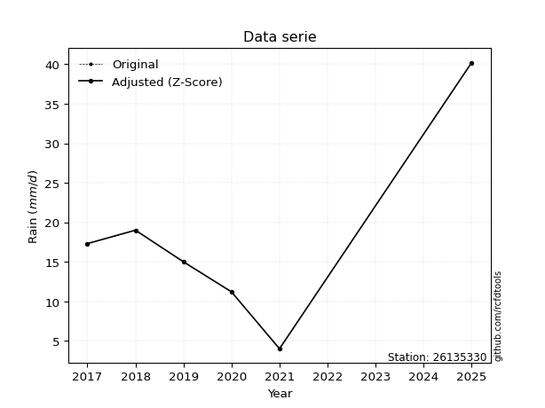</img>

</div>

> If Z-Score is active, values out of range or outliers are replaced with the station mean value.


### 4. Active continuous probability distributions from SciPy (45 of 104 available)

[scipy.stats](https://docs.scipy.org/doc/scipy/reference/stats.html) is a Python´s powerful submodule within the SciPy library for comprehensive statistical analysis, offering over 130 probability distributions (like Normal, Poisson), functions for descriptive stats (mean, variance), hypothesis testing (t-tests, chi-square), random variable generation, and statistical tests, making it essential for data science, modeling, and research. It provides tools to explore, model, and draw conclusions from data efficiently, working seamlessly with NumPy.

<div align="center">

|   id | p_dist             |   n_parameter | fit_method   | label                                                                       | active   | ref                                                                                                        |
|-----:|:-------------------|--------------:|:-------------|:----------------------------------------------------------------------------|:---------|:-----------------------------------------------------------------------------------------------------------|
|    0 | alpha              |             3 | MLE          | Alpha                                                                       | True     | [:mortar_board:](https://docs.scipy.org/doc/scipy/reference/generated/scipy.stats.alpha.html)              |
|    1 | betaprime          |             4 | MLE          | Beta prime                                                                  | True     | [:mortar_board:](https://docs.scipy.org/doc/scipy/reference/generated/scipy.stats.betaprime.html)          |
|    2 | chi2               |             3 | MLE          | Chi²                                                                        | True     | [:mortar_board:](https://docs.scipy.org/doc/scipy/reference/generated/scipy.stats.chi2.html)               |
|    3 | crystalball        |             4 | MLE          | Crystalball                                                                 | True     | [:mortar_board:](https://docs.scipy.org/doc/scipy/reference/generated/scipy.stats.crystalball.html)        |
|    4 | erlang             |             3 | MLE          | Erlang                                                                      | True     | [:mortar_board:](https://docs.scipy.org/doc/scipy/reference/generated/scipy.stats.erlang.html)             |
|    5 | expon              |             2 | MLE          | Exponential                                                                 | True     | [:mortar_board:](https://docs.scipy.org/doc/scipy/reference/generated/scipy.stats.expon.html)              |
|    6 | exponnorm          |             3 | MLE          | Exponentially modified Normal                                               | True     | [:mortar_board:](https://docs.scipy.org/doc/scipy/reference/generated/scipy.stats.exponnorm.html)          |
|    7 | f                  |             4 | MLE          | F                                                                           | True     | [:mortar_board:](https://docs.scipy.org/doc/scipy/reference/generated/scipy.stats.f.html)                  |
|    8 | fatiguelife        |             3 | MLE          | Fatigue-life (Birnbaum-Saunders)                                            | True     | [:mortar_board:](https://docs.scipy.org/doc/scipy/reference/generated/scipy.stats.fatiguelife.html)        |
|    9 | fisk               |             3 | MLE          | Fisk                                                                        | True     | [:mortar_board:](https://docs.scipy.org/doc/scipy/reference/generated/scipy.stats.fisk.html)               |
|   10 | gamma              |             3 | MLE          | Gamma                                                                       | True     | [:mortar_board:](https://docs.scipy.org/doc/scipy/reference/generated/scipy.stats.gamma.html)              |
|   11 | genexpon           |             5 | MLE          | Generalized exponential                                                     | True     | [:mortar_board:](https://docs.scipy.org/doc/scipy/reference/generated/scipy.stats.genexpon.html)           |
|   12 | genlogistic        |             3 | MLE          | Generalized logistic                                                        | True     | [:mortar_board:](https://docs.scipy.org/doc/scipy/reference/generated/scipy.stats.genlogistic.html)        |
|   13 | gibrat             |             2 | MM           | Gibrat                                                                      | True     | [:mortar_board:](https://docs.scipy.org/doc/scipy/reference/generated/scipy.stats.gibrat.html)             |
|   14 | gompertz           |             3 | MLE          | Gompertz (or truncated Gumbel)                                              | True     | [:mortar_board:](https://docs.scipy.org/doc/scipy/reference/generated/scipy.stats.gompertz.html)           |
|   15 | gumbel_l           |             2 | MM           | Gumbel Left Skew                                                            | True     | [:mortar_board:](https://docs.scipy.org/doc/scipy/reference/generated/scipy.stats.gumbel_l.html)           |
|   16 | gumbel_r           |             2 | MM           | Gumbel Right Skew                                                           | True     | [:mortar_board:](https://docs.scipy.org/doc/scipy/reference/generated/scipy.stats.gumbel_r.html)           |
|   17 | halflogistic       |             2 | MM           | Half-logistic                                                               | True     | [:mortar_board:](https://docs.scipy.org/doc/scipy/reference/generated/scipy.stats.halflogistic.html)       |
|   18 | halfnorm           |             2 | MM           | Half Normal                                                                 | True     | [:mortar_board:](https://docs.scipy.org/doc/scipy/reference/generated/scipy.stats.halfnorm.html)           |
|   19 | hypsecant          |             2 | MM           | hyperbolic secant                                                           | True     | [:mortar_board:](https://docs.scipy.org/doc/scipy/reference/generated/scipy.stats.hypsecant.html)          |
|   20 | invgamma           |             3 | MLE          | Inverted gamma                                                              | True     | [:mortar_board:](https://docs.scipy.org/doc/scipy/reference/generated/scipy.stats.invgamma.html)           |
|   21 | invgauss           |             3 | MLE          | Inverse Gaussian                                                            | True     | [:mortar_board:](https://docs.scipy.org/doc/scipy/reference/generated/scipy.stats.invgauss.html)           |
|   22 | invweibull         |             3 | MLE          | Inverted Weibull                                                            | True     | [:mortar_board:](https://docs.scipy.org/doc/scipy/reference/generated/scipy.stats.invweibull.html)         |
|   23 | johnsonsu          |             4 | MLE          | Johnson Su                                                                  | True     | [:mortar_board:](https://docs.scipy.org/doc/scipy/reference/generated/scipy.stats.johnsonsu.html)          |
|   24 | kstwobign          |             2 | MLE          | Limiting distribution of scaled Kolmogorov-Smirnov two-sided test statistic | True     | [:mortar_board:](https://docs.scipy.org/doc/scipy/reference/generated/scipy.stats.kstwobign.html)          |
|   25 | laplace            |             2 | MM           | Laplace                                                                     | True     | [:mortar_board:](https://docs.scipy.org/doc/scipy/reference/generated/scipy.stats.laplace.html)            |
|   26 | laplace_asymmetric |             3 | MLE          | Asymmetric Laplace                                                          | True     | [:mortar_board:](https://docs.scipy.org/doc/scipy/reference/generated/scipy.stats.laplace_asymmetric.html) |
|   27 | loggamma           |             3 | MLE          | Log gamma                                                                   | True     | [:mortar_board:](https://docs.scipy.org/doc/scipy/reference/generated/scipy.stats.loggamma.html)           |
|   28 | logistic           |             2 | MM           | Logistic (or Sech-squared)                                                  | True     | [:mortar_board:](https://docs.scipy.org/doc/scipy/reference/generated/scipy.stats.logistic.html)           |
|   29 | lognorm            |             3 | MLE          | Log Normal                                                                  | True     | [:mortar_board:](https://docs.scipy.org/doc/scipy/reference/generated/scipy.stats.lognorm.html)            |
|   30 | maxwell            |             2 | MM           | Maxwell                                                                     | True     | [:mortar_board:](https://docs.scipy.org/doc/scipy/reference/generated/scipy.stats.maxwell.html)            |
|   31 | mielke             |             4 | MLE          | Mielke Beta-Kappa / Dagum                                                   | True     | [:mortar_board:](https://docs.scipy.org/doc/scipy/reference/generated/scipy.stats.mielke.html)             |
|   32 | moyal              |             2 | MM           | Moyal                                                                       | True     | [:mortar_board:](https://docs.scipy.org/doc/scipy/reference/generated/scipy.stats.moyal.html)              |
|   33 | nakagami           |             3 | MLE          | Nakagami                                                                    | True     | [:mortar_board:](https://docs.scipy.org/doc/scipy/reference/generated/scipy.stats.nakagami.html)           |
|   34 | ncf                |             5 | MLE          | Non-central F distribution                                                  | True     | [:mortar_board:](https://docs.scipy.org/doc/scipy/reference/generated/scipy.stats.ncf.html)                |
|   35 | nct                |             4 | MLE          | Non-central Student’s t                                                     | True     | [:mortar_board:](https://docs.scipy.org/doc/scipy/reference/generated/scipy.stats.nct.html)                |
|   36 | norm               |             2 | MM           | Normal                                                                      | True     | [:mortar_board:](https://docs.scipy.org/doc/scipy/reference/generated/scipy.stats.norm.html)               |
|   37 | pareto             |             3 | MLE          | Pareto                                                                      | True     | [:mortar_board:](https://docs.scipy.org/doc/scipy/reference/generated/scipy.stats.pareto.html)             |
|   38 | pearson3           |             3 | MM           | Pearson type III                                                            | True     | [:mortar_board:](https://docs.scipy.org/doc/scipy/reference/generated/scipy.stats.pearson3.html)           |
|   39 | rayleigh           |             2 | MM           | Rayleigh                                                                    | True     | [:mortar_board:](https://docs.scipy.org/doc/scipy/reference/generated/scipy.stats.rayleigh.html)           |
|   40 | rice               |             3 | MLE          | Rice                                                                        | True     | [:mortar_board:](https://docs.scipy.org/doc/scipy/reference/generated/scipy.stats.rice.html)               |
|   41 | t                  |             3 | MLE          | Student’s t                                                                 | True     | [:mortar_board:](https://docs.scipy.org/doc/scipy/reference/generated/scipy.stats.t.html)                  |
|   42 | truncnorm          |             4 | MLE          | Truncated normal                                                            | True     | [:mortar_board:](https://docs.scipy.org/doc/scipy/reference/generated/scipy.stats.truncnorm.html)          |
|   43 | wald               |             2 | MM           | Wald                                                                        | True     | [:mortar_board:](https://docs.scipy.org/doc/scipy/reference/generated/scipy.stats.wald.html)               |
|   44 | weibull_min        |             3 | MLE          | Weibull minimum                                                             | True     | [:mortar_board:](https://docs.scipy.org/doc/scipy/reference/generated/scipy.stats.weibull_min.html)        |

</div>

> **n_parameter:** # arguments & localization & scale.
>
> **Fit methods:** (MLE) maximum likelihood, (MM) L-moments.
>
>**Inactive:** foldnorm, gennorm, norminvgauss, powernorm, powerlognorm, skewnorm, genextreme, anglit, arcsine, argus, beta, bradford, burr, burr12, cauchy, cosine, halfcauchy, foldcauchy, skewcauchy, wrapcauchy, dgamma, gengamma, exponweib, exponpow, truncexpon, gausshyper, genhalflogistic, genhyperbolic, geninvgauss, halfgennorm, johnsonsb, kappa4, kappa3, ksone, kstwo, loglaplace, levy, levy_l, levy_stable, ncx2, genpareto, truncpareto, lomax, powerlaw, rdist, rel_breitwigner, recipinvgauss, semicircular, studentized_range, trapezoid, triang, truncweibull_min, tukeylambda, uniform, loguniform, vonmises, vonmises_line, weibull_max, dweibull, 


## B. Probability distributions vs. Empirical distributions

A continuous probability distribution (CPD) describes probabilities for variables that can take any value within a range (like rain any time), unlike discrete variables with specific outcomes (like temperature). It uses a Probability Density Function (PDF), a curve where the total area under it equals 1, and the probability of the variable falling within an interval (a to b) is found by calculating the area under the curve between those points. A key feature is that the probability of hitting any single exact value is zero, so probabilities are always expressed for ranges, e.g., $P(a ≤ X ≤ b)$.

<div align="center">

Distributions parameters
|    |   station | p_dist                |   n |               loc |            scale | shape                  | shape1             | shape2                | shape3   |
|---:|----------:|:----------------------|----:|------------------:|-----------------:|:-----------------------|:-------------------|:----------------------|:---------|
|  0 |  26135330 | alpha                 |   5 |     -72.0891      |   1269.31        | 14.930533613434033     |                    |                       |          |
|  1 |  26135330 | betaprime             |   5 |     -93.1466      |   5661.58        | 389.61912872364474     | 20716.68683447571  |                       |          |
|  2 |  26135330 | chi2                  |   5 |     -60.2338      |      0.206912    | 355.39781620667736     |                    |                       |          |
|  3 |  26135330 | crystalball           |   5 |      13.3         |      5.33442     | 916.5501790071096      | 1291.105350912802  |                       |          |
|  4 |  26135330 | erlang                |   5 |     -59.8546      |      0.416633    | 175.43676831346693     |                    |                       |          |
|  5 |  26135330 | expon                 |   5 |       4           |      9.3         |                        |                    |                       |          |
|  6 |  26135330 | exponnorm             |   5 |      13.2978      |      5.3344      | 0.00042493328854062104 |                    |                       |          |
|  7 |  26135330 | f                     |   5 |   -1718.63        |   1731.92        | 210456.89327124218     | 66928434.67169949  |                       |          |
|  8 |  26135330 | fatiguelife           |   5 |       4           |      3.87498e-06 | 1409.2883251682924     |                    |                       |          |
|  9 |  26135330 | fisk                  |   5 |  -13493.2         |  13507.2         | 4357.895791587323      |                    |                       |          |
| 10 |  26135330 | gamma                 |   5 |     -79.0483      |      0.324934    | 284.18602867660036     |                    |                       |          |
| 11 |  26135330 | genexpon              |   5 |       3.99702     |     16.6252      | 1.0216800592926545     | 3.393359420937645  | 0.6998568016346782    |          |
| 12 |  26135330 | genlogistic           |   5 |      19.0001      |      5.51737e-06 | 9.670680849785025e-07  |                    |                       |          |
| 13 |  26135330 | gibrat                |   5 |       9.23056     |      2.46825     |                        |                    |                       |          |
| 14 |  26135330 | gompertz              |   5 |       4           |      2.91838     | 0.015675479362419018   |                    |                       |          |
| 15 |  26135330 | gumbel_l              |   5 |      15.7008      |      4.15923     |                        |                    |                       |          |
| 16 |  26135330 | gumbel_r              |   5 |      10.8992      |      4.15923     |                        |                    |                       |          |
| 17 |  26135330 | halflogistic          |   5 |       6.97743     |      4.56077     |                        |                    |                       |          |
| 18 |  26135330 | halfnorm              |   5 |       6.23927     |      8.8493      |                        |                    |                       |          |
| 19 |  26135330 | hypsecant             |   5 |      13.3         |      3.396       |                        |                    |                       |          |
| 20 |  26135330 | invgamma              |   5 |     -68.4026      |  17057.2         | 210.18913845576276     |                    |                       |          |
| 21 |  26135330 | invgauss              |   5 |     -29.7116      |   2424.07        | 0.0177257169821258     |                    |                       |          |
| 22 |  26135330 | invweibull            |   5 |       4           |      1.2538      | 0.04229210438141015    |                    |                       |          |
| 23 |  26135330 | johnsonsu             |   5 |      19.0039      |      0.00321014  | 2.324153320628633      | 0.3686087804982833 |                       |          |
| 24 |  26135330 | kstwobign             |   5 |      -9.08        |     25.507       |                        |                    |                       |          |
| 25 |  26135330 | laplace               |   5 |      13.3         |      3.772       |                        |                    |                       |          |
| 26 |  26135330 | laplace_asymmetric    |   5 |      19.0002      |      0.0625422   | 91.0556807169769       |                    |                       |          |
| 27 |  26135330 | loggamma              |   5 |      19.0001      |      5.13095e-06 | 9.029963145864192e-07  |                    |                       |          |
| 28 |  26135330 | logistic              |   5 |      13.3         |      2.94102     |                        |                    |                       |          |
| 29 |  26135330 | lognorm               |   5 |       4           |      0.00675202  | 14.831815696900245     |                    |                       |          |
| 30 |  26135330 | maxwell               |   5 |       0.659673    |      7.92115     |                        |                    |                       |          |
| 31 |  26135330 | mielke                |   5 |    -122.262       |    141.39        | 23.322794645960784     | 3818.0787084186795 |                       |          |
| 32 |  26135330 | moyal                 |   5 |      10.2494      |      2.40133     |                        |                    |                       |          |
| 33 |  26135330 | nakagami              |   5 |      11.2         |      5.10241     | 0.18395992958000584    |                    |                       |          |
| 34 |  26135330 | ncf                   |   5 |       0.00741664  |      3.04511e-05 | 5.769810686092278e-05  | 39.44631829296224  | 24.429098771295426    |          |
| 35 |  26135330 | nct                   |   5 |    -299.068       |      5.28194     | 80010.59537943773      | 59.13784151283241  |                       |          |
| 36 |  26135330 | norm                  |   5 |      13.3         |      5.33442     |                        |                    |                       |          |
| 37 |  26135330 | pareto                |   5 |       3.9061      |      0.0938996   | 0.26089712420318606    |                    |                       |          |
| 38 |  26135330 | pearson3              |   5 |      13.3         |      5.33438     | -0.7371171777595827    |                    |                       |          |
| 39 |  26135330 | rayleigh              |   5 |       3.09495     |      8.14245     |                        |                    |                       |          |
| 40 |  26135330 | rice                  |   5 |       0.408404    |      5.86176     | 1.9144064853392855     |                    |                       |          |
| 41 |  26135330 | t                     |   5 |      13.3004      |      5.33447     | 14163452.21262634      |                    |                       |          |
| 42 |  26135330 | truncnorm             |   5 |      10.7667      |     13.1769      | -19.36765190716723     | 0.624831513135564  |                       |          |
| 43 |  26135330 | wald                  |   5 |       7.96556     |      5.33444     |                        |                    |                       |          |
| 44 |  26135330 | weibull_min           |   5 |      -1.59417e+08 |      1.59417e+08 | 40935923.59826077      |                    |                       |          |
| 45 |  26135330 | logalpha              |   5 |     -15.3087      |    528.794       | 29.80692374615667      |                    |                       |          |
| 46 |  26135330 | logbetaprime          |   5 |      -0.325696    |      1.76544e+10 | 16.824950066331166     | 106114743064.63992 |                       |          |
| 47 |  26135330 | logchi2               |   5 |       1.38629     |      0.933253    | 1.1002763197130692     |                    |                       |          |
| 48 |  26135330 | logcrystalball        |   5 |       2.46108     |      0.566329    | 7.48404244604847       | 135.188680536485   |                       |          |
| 49 |  26135330 | logerlang             |   5 |      -6.53495     |      0.0397442   | 226.06145046036875     |                    |                       |          |
| 50 |  26135330 | logexpon              |   5 |       1.38629     |      1.07479     |                        |                    |                       |          |
| 51 |  26135330 | logexponnorm          |   5 |       2.46072     |      0.566329    | 0.0006418462464466629  |                    |                       |          |
| 52 |  26135330 | logf                  |   5 |    -604.67        |    607.13        | 3705085.5769833317     | 5902150.188268686  |                       |          |
| 53 |  26135330 | logfatiguelife        |   5 |    -308.666       |    311.129       | 0.0018211855935862877  |                    |                       |          |
| 54 |  26135330 | logfisk               |   5 |      -2.1875e+06  |      2.1875e+06  | 7156158.207629323      |                    |                       |          |
| 55 |  26135330 | loggamma              |   5 |      -7.22845     |      0.0352022   | 275.0344229989338      |                    |                       |          |
| 56 |  26135330 | loggenexpon           |   5 |       1.38541     |      0.00621651  | 0.0023631288307564323  | 0.7925461096814148 | 3.874504937786536e-05 |          |
| 57 |  26135330 | loggenlogistic        |   5 |       2.94444     |      4.25679e-07 | 8.829526212937644e-07  |                    |                       |          |
| 58 |  26135330 | loggibrat             |   5 |       2.029       |      0.262061    |                        |                    |                       |          |
| 59 |  26135330 | loggompertz           |   5 |       1.38628     |      0.396378    | 0.0387946803156086     |                    |                       |          |
| 60 |  26135330 | loggumbel_l           |   5 |       2.71596     |      0.441565    |                        |                    |                       |          |
| 61 |  26135330 | loggumbel_r           |   5 |       2.2062      |      0.441565    |                        |                    |                       |          |
| 62 |  26135330 | loghalflogistic       |   5 |       1.78983     |      0.484203    |                        |                    |                       |          |
| 63 |  26135330 | loghalfnorm           |   5 |       1.71149     |      0.939482    |                        |                    |                       |          |
| 64 |  26135330 | loghypsecant          |   5 |       2.46108     |      0.360536    |                        |                    |                       |          |
| 65 |  26135330 | loginvgamma           |   5 |     -10.0089      |   5477.28        | 440.6564419411278      |                    |                       |          |
| 66 |  26135330 | loginvgauss           |   5 |      -3.79262     |    640.296       | 0.00976349420195959    |                    |                       |          |
| 67 |  26135330 | loginvweibull         |   5 | -513111           | 513114           | 801576.6510086386      |                    |                       |          |
| 68 |  26135330 | logjohnsonsu          |   5 |       2.94444     |      2.66857e-11 | 6.974999087669202      | 0.3136487982197642 |                       |          |
| 69 |  26135330 | logkstwobign          |   5 |      -0.0898329   |      2.90719     |                        |                    |                       |          |
| 70 |  26135330 | loglaplace            |   5 |       2.46108     |      0.400455    |                        |                    |                       |          |
| 71 |  26135330 | loglaplace_asymmetric |   5 |       2.94444     |      0.00413334  | 116.74084345833526     |                    |                       |          |
| 72 |  26135330 | logloggamma           |   5 |       2.94449     |      4.08258e-06 | 8.45612752269261e-06   |                    |                       |          |
| 73 |  26135330 | loglogistic           |   5 |       2.46108     |      0.312234    |                        |                    |                       |          |
| 74 |  26135330 | loglognorm            |   5 |       1.38629     |      0.000928342 | 14.531458756062708     |                    |                       |          |
| 75 |  26135330 | logmaxwell            |   5 |       1.11912     |      0.84095     |                        |                    |                       |          |
| 76 |  26135330 | logmielke             |   5 |      -7.45562e+07 |      7.45562e+07 | 145235548.83312327     | 4951612081.983124  |                       |          |
| 77 |  26135330 | logmoyal              |   5 |       2.13722     |      0.254938    |                        |                    |                       |          |
| 78 |  26135330 | lognakagami           |   5 |       2.41591     |      0.36965     | 0.05128239295517427    |                    |                       |          |
| 79 |  26135330 | logncf                |   5 |      -7.24833     |      0.00488836  | 0.7673727385115372     | 1610.3136255412514 | 1521.6438045791915    |          |
| 80 |  26135330 | lognct                |   5 |     -36.0514      |      0.553897    | 46548.94248249722      | 69.52942356270032  |                       |          |
| 81 |  26135330 | lognorm               |   5 |       2.46108     |      0.566329    |                        |                    |                       |          |
| 82 |  26135330 | logpareto             |   5 |       1.37525     |      0.0110394   | 0.2605279564723698     |                    |                       |          |
| 83 |  26135330 | logpearson3           |   5 |       2.46108     |      0.566329    | -1.1611239591751192    |                    |                       |          |
| 84 |  26135330 | lograyleigh           |   5 |       1.37766     |      0.864445    |                        |                    |                       |          |
| 85 |  26135330 | logrice               |   5 |       0.951196    |      0.610799    | 2.229458586075361      |                    |                       |          |
| 86 |  26135330 | logt                  |   5 |       2.46108     |      0.566329    | 33229199507.79273      |                    |                       |          |
| 87 |  26135330 | logtruncnorm          |   5 |      -0.129104    |      1.48566     | 1.7130529461518722     | 2.0688050463159064 |                       |          |
| 88 |  26135330 | logwald               |   5 |       1.8947      |      0.566369    |                        |                    |                       |          |
| 89 |  26135330 | logweibull_min        |   5 |      -3.25511e+07 |      3.25511e+07 | 90176387.28860992      |                    |                       |          |

</div>

> **loc** (Location parameter): This shifts the distribution along the x-axis. For many common distributions, like the normal (Gaussian) distribution, loc represents the mean $μ$. For others, like the uniform distribution, it might represent the minimum value, or for the beta distribution, the left end of the support interval.
>
> **scale** (Scale parameter): This determines the width or spread of the distribution. For the normal distribution, scale represents the standard deviation $σ$. For a uniform distribution, it defines the length of the interval (from $loc$ to $loc + scale$).
>
> **shape** (Shape parameters): Refers to parameters that define the specific form of a probability distribution, distinct from its location (loc) and scale (scale). These parameters are required arguments for most distribution functions. For example, a normal (Gaussian) distribution is fully defined by its location (mean) and scale (standard deviation), so it has no specific shape parameters beyond loc and scale. However, other distributions have intrinsic properties that need specification, as Gamma distribution that takes a shape parameter, often named $a$ or $alpha$.


### 0. Cumulative distribution values - CDF (90 evaluated)

> Ordered by x ascending and calculating $log(f(x))$ separately. 

|   id |   Station |   date |    x |   count |   mean |     std |    zscore |   Value_initial |   station |   m |     alpha |   alpha_pdf |   betaprime |   betaprime_pdf |      chi2 |   chi2_pdf |   crystalball |   crystalball_pdf |    erlang |   erlang_pdf |    expon |   expon_pdf |   exponnorm |   exponnorm_pdf |         f |     f_pdf |   fatiguelife |   fatiguelife_pdf |      fisk |   fisk_pdf |     gamma |   gamma_pdf |    genexpon |   genexpon_pdf |   genlogistic |   genlogistic_pdf |   gibrat |   gibrat_pdf |    gompertz |   gompertz_pdf |   gumbel_l |   gumbel_l_pdf |   gumbel_r |   gumbel_r_pdf |   halflogistic |   halflogistic_pdf |   halfnorm |   halfnorm_pdf |   hypsecant |   hypsecant_pdf |   invgamma |   invgamma_pdf |   invgauss |   invgauss_pdf |   invweibull |   invweibull_pdf |   johnsonsu |   johnsonsu_pdf |   kstwobign |   kstwobign_pdf |   laplace |   laplace_pdf |   laplace_asymmetric |   laplace_asymmetric_pdf |   loggamma |   loggamma_pdf |   logistic |   logistic_pdf |   lognorm |   lognorm_pdf |   maxwell |   maxwell_pdf |    mielke |   mielke_pdf |       moyal |   moyal_pdf |    nakagami |   nakagami_pdf |       ncf |   ncf_pdf |       nct |   nct_pdf |      norm |   norm_pdf |      pareto |   pareto_pdf |   pearson3 |   pearson3_pdf |   rayleigh |   rayleigh_pdf |      rice |   rice_pdf |         t |     t_pdf |   truncnorm |   truncnorm_pdf |     wald |   wald_pdf |   weibull_min |   weibull_min_pdf |   logalpha |   logalpha_pdf |   logbetaprime |   logbetaprime_pdf |     logchi2 |   logchi2_pdf |   logcrystalball |   logcrystalball_pdf |   logerlang |   logerlang_pdf |   logexpon |   logexpon_pdf |   logexponnorm |   logexponnorm_pdf |      logf |   logf_pdf |   logfatiguelife |   logfatiguelife_pdf |   logfisk |   logfisk_pdf |   loggenexpon |   loggenexpon_pdf |   loggenlogistic |   loggenlogistic_pdf |   loggibrat |   loggibrat_pdf |   loggompertz |   loggompertz_pdf |   loggumbel_l |   loggumbel_l_pdf |   loggumbel_r |   loggumbel_r_pdf |   loghalflogistic |   loghalflogistic_pdf |   loghalfnorm |   loghalfnorm_pdf |   loghypsecant |   loghypsecant_pdf |   loginvgamma |   loginvgamma_pdf |   loginvgauss |   loginvgauss_pdf |   loginvweibull |   loginvweibull_pdf |   logjohnsonsu |   logjohnsonsu_pdf |   logkstwobign |   logkstwobign_pdf |   loglaplace |   loglaplace_pdf |   loglaplace_asymmetric |   loglaplace_asymmetric_pdf |   logloggamma |   logloggamma_pdf |   loglogistic |   loglogistic_pdf |   loglognorm |   loglognorm_pdf |   logmaxwell |   logmaxwell_pdf |   logmielke |   logmielke_pdf |    logmoyal |   logmoyal_pdf |   lognakagami |   lognakagami_pdf |    logncf |   logncf_pdf |    lognct |   lognct_pdf |   logpareto |   logpareto_pdf |   logpearson3 |   logpearson3_pdf |   lograyleigh |   lograyleigh_pdf |   logrice |   logrice_pdf |      logt |   logt_pdf |   logtruncnorm |   logtruncnorm_pdf |   logwald |   logwald_pdf |   logweibull_min |   logweibull_min_pdf |
|-----:|----------:|-------:|-----:|--------:|-------:|--------:|----------:|----------------:|----------:|----:|----------:|------------:|------------:|----------------:|----------:|-----------:|--------------:|------------------:|----------:|-------------:|---------:|------------:|------------:|----------------:|----------:|----------:|--------------:|------------------:|----------:|-----------:|----------:|------------:|------------:|---------------:|--------------:|------------------:|---------:|-------------:|------------:|---------------:|-----------:|---------------:|-----------:|---------------:|---------------:|-------------------:|-----------:|---------------:|------------:|----------------:|-----------:|---------------:|-----------:|---------------:|-------------:|-----------------:|------------:|----------------:|------------:|----------------:|----------:|--------------:|---------------------:|-------------------------:|-----------:|---------------:|-----------:|---------------:|----------:|--------------:|----------:|--------------:|----------:|-------------:|------------:|------------:|------------:|---------------:|----------:|----------:|----------:|----------:|----------:|-----------:|------------:|-------------:|-----------:|---------------:|-----------:|---------------:|----------:|-----------:|----------:|----------:|------------:|----------------:|---------:|-----------:|--------------:|------------------:|-----------:|---------------:|---------------:|-------------------:|------------:|--------------:|-----------------:|---------------------:|------------:|----------------:|-----------:|---------------:|---------------:|-------------------:|----------:|-----------:|-----------------:|---------------------:|----------:|--------------:|--------------:|------------------:|-----------------:|---------------------:|------------:|----------------:|--------------:|------------------:|--------------:|------------------:|--------------:|------------------:|------------------:|----------------------:|--------------:|------------------:|---------------:|-------------------:|--------------:|------------------:|--------------:|------------------:|----------------:|--------------------:|---------------:|-------------------:|---------------:|-------------------:|-------------:|-----------------:|------------------------:|----------------------------:|--------------:|------------------:|--------------:|------------------:|-------------:|-----------------:|-------------:|-----------------:|------------:|----------------:|------------:|---------------:|--------------:|------------------:|----------:|-------------:|----------:|-------------:|------------:|----------------:|--------------:|------------------:|--------------:|------------------:|----------:|--------------:|----------:|-----------:|---------------:|-------------------:|----------:|--------------:|-----------------:|---------------------:|
|    0 |  26135330 |   2021 |  4   |       5 |   13.3 | 5.96406 | -1.55934  |             4   |  26135330 |   1 | 0.0399384 |   0.0188693 |   0.0399817 |       0.0168391 | 0.0411187 |  0.0174885 |     0.0406322 |         0.0163614 | 0.0422777 |    0.0178787 | 0        |   0.107527  |   0.0406308 |       0.0163609 | 0.0410287 | 0.01651   |     0.0401342 |       1.18502e+11 | 0.0383127 |  0.0118962 | 0.0411798 |   0.0172914 | 0.000182963 |      0.061468  |      0        |         0.0126441 | 0        |    0         | 3.94378e-09 |      0.0053713 |  0.0582469 |      0.0135883 | 0.00523243 |     0.00660827 |       0        |          0         |   0        |      0         |   0.0411104 |       0.0120719 |  0.0437498 |      0.0192776 |  0.0388135 |      0.018917  |    0.0126217 |      2.62779e+12 |    0.147781 |      0.00567136 |    0.044838 |       0.0287368 | 0.0424817 |     0.0112624 |            0.0717818 |                0.0126047 |  0.0300996 |       0.126368 |  0.0406144 |      0.0132488 | 0.0288604 |      0.116344 | 0.0189134 |     0.0163885 | 0.0714099 |    0.0131906 | 0.000238908 | 0.000715618 | 0           |    0           | 0.0236516 | 0.0190435 | 0.0407568 | 0.0164072 | 0.0406322 |  0.0163614 | 1.11022e-16 |   2.77847    |  0.0564354 |      0.0153336 | 0.00615835 |      0.0135669 | 0.0322139 |  0.0190584 | 0.0406267 | 0.0163594 |    0.413909 |       0.0361544 | 0        |  0         |     0.0479716 |         0.0120181 |   0.030964 |       0.132516 |      0.0375535 |           0.167344 | 1.95179e-09 |   4.83576e+06 |        0.0288604 |             0.116344 |   0.0334298 |        0.135471 |   0        |       0.930417 |      0.0288602 |           0.116343 | 0.0295103 |   0.118131 |        0.0284171 |             0.115195 | 0.0204821 |     0.0656324 |   0.000337831 |          0.380714 |         0        |            0.0818914 |    0        |        0        |   9.74508e-07 |         0.0978752 |     0.0480377 |          0.106134 |    0.00165598 |         0.0240142 |          0        |              0        |      0        |          0        |      0.0322732 |          0.0893613 |      0.03096  |          0.132459 |     0.0313822 |          0.138806 |       0.0369537 |            0.190394 |       0.154367 |          0.0478368 |      0.0412302 |           0.239388 |    0.0341477 |        0.0852723 |               0.0395894 |                   0.0820455 |     0.0396591 |         0.0821446 |     0.0310008 |         0.0962092 |    0.0227552 |      1.67361e+13 |   0.00827535 |        0.0910553 |   0.0455932 |       0.0888156 | 1.29323e-05 |     0.00050564 |     0         |        0          | 0.0328988 |     0.133413 | 0.0290938 |     0.117074 | 1.11022e-16 |      23.5999    |     0.0503826 |          0.112335 |   4.98802e-05 |         0.0115538 | 0.0249152 |      0.130955 | 0.0288603 |   0.116344 |    0           |            0       |  0        |      0        |        0.0259771 |            0.0710217 |
|    1 |  26135330 |   2020 | 11.2 |       5 |   13.3 | 5.96406 | -0.352109 |            11.2 |  26135330 |   2 | 0.37854   |   0.0695867 |   0.352867  |       0.0691667 | 0.359535  |  0.069103  |     0.346912  |         0.0692103 | 0.364072  |    0.0693408 | 0.538925 |   0.049578  |   0.346908  |       0.0692101 | 0.348469  | 0.0692119 |     0.833286  |       0.0167853   | 0.28929   |  0.0663479 | 0.357451  |   0.069174  | 0.47514     |      0.0602753 |      0        |         0.0446648 | 0.410694 |    0.19747   | 0.155588    |      0.0534678 |  0.28743   |      0.0580574 | 0.39446    |     0.0882235  |       0.432464 |          0.089127  |   0.424915 |      0.0770536 |   0.314629  |       0.078281  |  0.380829  |      0.0698312 |  0.38097   |      0.0701349 |    0.39505   |      0.00215513  |    0.210397 |      0.013628   |    0.447826 |       0.0641093 | 0.286539  |     0.0759647 |            0.254153  |                0.0446288 |  0.482406  |       0.684389 |  0.328707  |      0.075028  | 0.468216  |      0.702199 | 0.378657  |     0.0735856 | 0.260307  |    0.0454892 | 0.41197     | 0.0973502   | 1.63056e-06 |    3.37722e+08 | 0.407699  | 0.0705649 | 0.347358  | 0.0691986 | 0.346912  |  0.0692103 | 0.678762    |   0.0114904  |  0.309268  |      0.0601669 | 0.390683   |      0.0744884 | 0.361182  |  0.0695184 | 0.346884  | 0.0692074 |    0.699109 |       0.0412278 | 0.451116 |  0.139397  |     0.268233  |         0.0586822 |   0.489273 |       0.67125  |      0.498631  |           0.591784 | 0.67569     |   0.249605    |        0.468216  |             0.702199 |   0.48628   |        0.668811 |   0.616331 |       0.356972 |      0.468216  |           0.702199 | 0.469189  |   0.698956 |        0.466457  |             0.701686 | 0.377722  |     0.768932  |   0.55636     |          0.530749 |         0        |            0.693015  |    0.651591 |        0.955727 |   0.38262     |         0.811587  |     0.397621  |          0.691465 |    0.536907   |         0.756217  |          0.569317 |              0.697928 |      0.546628 |          0.641165 |      0.460227  |          0.875996  |      0.490304 |          0.673863 |     0.491774  |          0.650965 |       0.516713  |            0.532968 |       0.248639 |          0.188034  |      0.552599  |           0.511938 |    0.44667   |        1.1154    |               0.334407  |                   0.693029  |     0.334601  |         0.693049  |     0.463899  |         0.796508  |    0.685271  |      0.0237341   |   0.502247   |        0.68708   |   0.338817  |       0.660015  | 0.562646    |     0.766154   |     0.0260306 |        6.0119e+12 | 0.479577  |     0.662135 | 0.468381  |     0.700113 | 0.694069    |       0.0765895 |     0.39255   |          0.652665 |   0.513869    |         0.675433  | 0.478011  |      0.685579 | 0.468216  |   0.702199 |    1.89041e-06 |            2.57216 |  0.634294 |      0.795135 |        0.366249  |            0.800765  |
|    2 |  26135330 |   2019 | 15   |       5 |   13.3 | 5.96406 |  0.285041 |            15   |  26135330 |   3 | 0.638949  |   0.0626736 |   0.626022  |       0.0688471 | 0.629451  |  0.0674338 |     0.625017  |         0.0710836 | 0.633772  |    0.0671058 | 0.693579 |   0.0329485 |   0.625014  |       0.0710841 | 0.625978  | 0.0708067 |     0.884061  |       0.0106092   | 0.581093  |  0.0785313 | 0.629075  |   0.0681414 | 0.675179    |      0.04454   |      0        |         0.0869417 | 0.802078 |    0.0482206 | 0.485107    |      0.11988   |  0.570418  |      0.0872691 | 0.688606   |     0.0617685  |       0.706179 |          0.0549591 |   0.677822 |      0.0552343 |   0.653076  |       0.0830997 |  0.644973  |      0.0641227 |  0.642711  |      0.0628308 |    0.401621  |      0.00140862  |    0.288063 |      0.0314141  |    0.665161 |       0.0488607 | 0.681406  |     0.084463  |            0.495322  |                0.0869776 |  0.674566  |       0.606206 |  0.640614  |      0.0782816 | 0.668614  |      0.640539 | 0.649212  |     0.0641202 | 0.501018  |    0.0851301 | 0.709973    | 0.0576557   | 0.701277    |    0.0622727   | 0.650623  | 0.0544991 | 0.625232  | 0.0709884 | 0.625017  |  0.0710836 | 0.712054    |   0.00677168 |  0.582245  |      0.0792917 | 0.656601   |      0.0616623 | 0.632186  |  0.0677891 | 0.624985  | 0.0710848 |    0.852904 |       0.0391753 | 0.769911 |  0.0475211 |     0.563337  |         0.0929091 |   0.676112 |       0.585491 |      0.661073  |           0.507517 | 0.739479    |   0.190757    |        0.668614  |             0.640539 |   0.673794  |        0.591859 |   0.707644 |       0.272013 |      0.668613  |           0.64054  | 0.668561  |   0.637216 |        0.66685   |             0.641051 | 0.612174  |     0.776681  |   0.697571    |          0.431501 |         0        |            1.2703    |    0.829481 |        0.373388 |   0.650086    |         0.961224  |     0.625532  |          0.832994 |    0.725471   |         0.52728   |          0.738958 |              0.468751 |      0.711201 |          0.483855 |      0.702755  |          0.709747  |      0.677851 |          0.587436 |     0.671951  |          0.563239 |       0.658144  |            0.430103 |       0.334902 |          0.483319  |      0.687502  |           0.408993 |    0.730145  |        0.673872  |               0.612645  |                   1.26965   |     0.612796  |         1.26927   |     0.688041  |         0.687436  |    0.69135   |      0.018333    |   0.688206   |        0.568357  |   0.598569  |       1.16601   | 0.744102    |     0.484309   |     0.860254  |        0.292956   | 0.665851  |     0.590501 | 0.668133  |     0.638509 | 0.713168    |       0.0560685 |     0.610434  |          0.817598 |   0.694033    |         0.544727  | 0.671662  |      0.614815 | 0.668614  |   0.640539 |    0.634208    |            1.8014  |  0.797456 |      0.383083 |        0.641045  |            1.01884   |
|    3 |  26135330 |   2017 | 17.3 |       5 |   13.3 | 5.96406 |  0.670684 |            17.3 |  26135330 |   4 | 0.767508  |   0.0485267 |   0.769229  |       0.0544986 | 0.769402  |  0.0532087 |     0.773327  |         0.0564583 | 0.77274   |    0.0527158 | 0.760717 |   0.0257294 |   0.773324  |       0.0564588 | 0.773631  | 0.0561913 |     0.905677  |       0.00830914  | 0.744445  |  0.0613652 | 0.770602  |   0.0538045 | 0.766299    |      0.0348155 |      0        |         0.130109  | 0.881907 |    0.024511  | 0.772053    |      0.116717  |  0.769817  |      0.0812918 | 0.806856   |     0.0416326  |       0.81159  |          0.0374193 |   0.788664 |      0.0412851 |   0.809827  |       0.0527267 |  0.776612  |      0.0496149 |  0.771409  |      0.0484987 |    0.404562  |      0.00116417  |    0.403564 |      0.0837697  |    0.764898 |       0.0379435 | 0.826849  |     0.0459042 |            0.741803  |                0.130259  |  0.755394  |       0.523751 |  0.795772  |      0.0552595 | 0.754269  |      0.555982 | 0.779829  |     0.0489327 | 0.738194  |    0.123363  | 0.817801    | 0.0372706   | 0.815439    |    0.0393099   | 0.760376  | 0.0410047 | 0.773326  | 0.0563749 | 0.773327  |  0.0564583 | 0.725865    |   0.00533982 |  0.760063  |      0.0722429 | 0.781672   |      0.046778  | 0.773102  |  0.0536432 | 0.7733    | 0.0564614 |    0.940091 |       0.036479  | 0.853647 |  0.0275136 |     0.775904  |         0.0860684 |   0.754091 |       0.505102 |      0.729145  |           0.445521 | 0.765081    |   0.168758    |        0.754269  |             0.555982 |   0.752841  |        0.513355 |   0.743984 |       0.238202 |      0.754268  |           0.555983 | 0.753798  |   0.553511 |        0.752615  |             0.556999 | 0.715682  |     0.665665  |   0.755237    |          0.376729 |         0        |            1.70771   |    0.87344  |        0.252697 |   0.78167     |         0.859565  |     0.742527  |          0.791163 |    0.792683   |         0.417074  |          0.798873 |              0.373605 |      0.774719 |          0.407151 |      0.791719  |          0.537348  |      0.75605  |          0.506192 |     0.74708   |          0.487884 |       0.715508  |            0.374181 |       0.445796 |          1.32254   |      0.742096  |           0.356593 |    0.811018  |        0.471918  |               0.823389  |                   1.7064    |     0.823457  |         1.7056    |     0.77693   |         0.555064  |    0.693829  |      0.0164884   |   0.763296   |        0.482893  |   0.790311  |       1.53902   | 0.805094    |     0.374566   |     0.894405  |        0.197204   | 0.744926  |     0.515095 | 0.753539  |     0.554577 | 0.720667    |       0.0493233 |     0.72829   |          0.821892 |   0.765869    |         0.461532  | 0.753855  |      0.533916 | 0.754269  |   0.555982 |    0.86866     |            1.49269 |  0.844217 |      0.279181 |        0.781538  |            0.920606  |
|    4 |  26135330 |   2018 | 19   |       5 |   13.3 | 5.96406 |  0.955725 |            19   |  26135330 |   5 | 0.840297  |   0.0371768 |   0.850663  |       0.0412172 | 0.849011  |  0.0403912 |     0.85736   |         0.0422564 | 0.851499  |    0.0398985 | 0.800692 |   0.021431  |   0.857358  |       0.0422569 | 0.857279  | 0.0420771 |     0.918655  |       0.007006    | 0.834452  |  0.0445529 | 0.851005  |   0.0407143 | 0.819837    |      0.0282903 |      0.999979 |         0.175273  | 0.915551 |    0.0158507 | 0.930049    |      0.0641328 |  0.890357  |      0.0582725 | 0.867095   |     0.02973    |       0.866297 |          0.0273562 |   0.850699 |      0.0318787 |   0.882518  |       0.0338141 |  0.850718  |      0.0376106 |  0.844055  |      0.0370402 |    0.406424  |      0.00103172  |    0.974148 |      4.3812     |    0.822964 |       0.0304996 | 0.88967   |     0.0292497 |            0.999845  |                0.175571  |  0.801609  |       0.461725 |  0.874144  |      0.0374076 | 0.803307  |      0.489396 | 0.852801  |     0.0370071 | 0.978868  |    0.156717  | 0.871543    | 0.0265146   | 0.872577    |    0.0284776   | 0.822191  | 0.0319235 | 0.857245  | 0.042207  | 0.85736   |  0.0422564 | 0.73428     |   0.00459296 |  0.869911  |      0.0555883 | 0.851591   |      0.0356028 | 0.853333  |  0.0406552 | 0.857339  | 0.0422601 |    1        |       0.033935  | 0.892722 |  0.0190753 |     0.901167  |         0.0587351 |   0.79869  |       0.446077 |      0.768867  |           0.401847 | 0.780295    |   0.156075    |        0.803307  |             0.489396 |   0.798226  |        0.454439 |   0.765365 |       0.218308 |      0.803307  |           0.489396 | 0.802638  |   0.487652 |        0.801763  |             0.490701 | 0.77378   |     0.572638  |   0.788852    |          0.34057  |         0.999989 |            2.07419   |    0.894501 |        0.199316 |   0.856017    |         0.718086  |     0.8132    |          0.709743 |    0.8287     |         0.352632  |          0.831285 |              0.319045 |      0.810607 |          0.358965 |      0.837068  |          0.432439  |      0.800722 |          0.446522 |     0.790274  |          0.433418 |       0.74889   |            0.338293 |       0.998503 |        324.331     |      0.773946  |           0.323209 |    0.850457  |        0.373433  |               0.999926  |                   2.07226   |     0.999902  |         2.07106   |     0.824634  |         0.463155  |    0.695325  |      0.0154629   |   0.805798   |        0.423905  |   0.944382  |       1.57818   | 0.83732     |     0.314599   |     0.911047  |        0.159997   | 0.790564  |     0.458051 | 0.80247   |     0.488519 | 0.725113    |       0.0456388 |     0.803516  |          0.775709 |   0.806508    |         0.405691  | 0.801023  |      0.471742 | 0.803307  |   0.489396 |    0.999998    |            1.31265 |  0.867957 |      0.229353 |        0.860844  |            0.760277  |

An Empirical Distribution Function (EDF) is a step-function estimate of a true cumulative distribution function (CDF) based on observed sample data, representing the proportion of data points less than or equal to a given value. It is calculated by ordering your data and jumping up by $1/n$ (where $n$ is sample size) at each unique data point, allowing analysis without assuming an underlying population distribution, and it gets closer to the true CDF as the sample size grows.


### 1. Empirical - EDF California (1923)

California´s estimates the true probability distribution of water-related data (like rainfall, streamflow) using observed samples, crucial for risk assessment.

<div align="center">


$P=m/n$


</div>


**1.1. Empirical values**

<div align="center">

|                | 0              | 1                  | 2              | 3                 | 4              |
|:---------------|:---------------|:-------------------|:---------------|:------------------|:---------------|
| date           | 2021           | 2020               | 2019           | 2017              | 2018           |
| x              | 4.0            | 11.2               | 15.0           | 17.3              | 19.0           |
| m              | 1              | 2                  | 3              | 4                 | 5              |
| empirical_dist | edf_california | edf_california     | edf_california | edf_california    | edf_california |
| empirical      | 0.2            | 0.4                | 0.6            | 0.8               | 1.0            |
| empirical_tr   | 1.25           | 1.6666666666666667 | 2.5            | 5.000000000000001 | inf            |

</div>


**1.2. Kolmogorov-Smirnov fit test (sorted by Δ)**


<div align="center">

|                | 0                   | 1                   | 2                   | 3                   | 4                   | 5                   | 6                   | 7                   | 8                   | 9                   | 10                  | 11                  | 12                  | 13                 | 14                  | 15                  | 16                  | 17                  | 18                  | 19                  | 20                  | 21                  | 22                    | 23                  | 24                  | 25                  | 26                 | 27                  | 28                  | 29                  | 30                  | 31                  | 32                 | 33                  | 34                  | 35                  | 36                  | 37                  | 38                 | 39                 | 40                  | 41                  | 42                  | 43                  | 44                  | 45                  | 46                 | 47                 | 48                 | 49                  | 50                  | 51                  | 52                  | 53                  | 54                 | 55                  | 56                 | 57                 | 58                 | 59                 | 60                 | 61                 | 62                  | 63                  | 64                  | 65                  | 66                  | 67                  | 68                  | 69                 | 70                  | 71                  | 72                 | 73                  | 74                 | 75                 | 76                  | 77                 | 78                  | 79                  | 80                 | 81                 | 82                  | 83                 | 84                 | 85                  | 86                  | 87                 | 88                 | 89                 |
|:---------------|:--------------------|:--------------------|:--------------------|:--------------------|:--------------------|:--------------------|:--------------------|:--------------------|:--------------------|:--------------------|:--------------------|:--------------------|:--------------------|:-------------------|:--------------------|:--------------------|:--------------------|:--------------------|:--------------------|:--------------------|:--------------------|:--------------------|:----------------------|:--------------------|:--------------------|:--------------------|:-------------------|:--------------------|:--------------------|:--------------------|:--------------------|:--------------------|:-------------------|:--------------------|:--------------------|:--------------------|:--------------------|:--------------------|:-------------------|:-------------------|:--------------------|:--------------------|:--------------------|:--------------------|:--------------------|:--------------------|:-------------------|:-------------------|:-------------------|:--------------------|:--------------------|:--------------------|:--------------------|:--------------------|:-------------------|:--------------------|:-------------------|:-------------------|:-------------------|:-------------------|:-------------------|:-------------------|:--------------------|:--------------------|:--------------------|:--------------------|:--------------------|:--------------------|:--------------------|:-------------------|:--------------------|:--------------------|:-------------------|:--------------------|:-------------------|:-------------------|:--------------------|:-------------------|:--------------------|:--------------------|:-------------------|:-------------------|:--------------------|:-------------------|:-------------------|:--------------------|:--------------------|:-------------------|:-------------------|:-------------------|
| station        | 26135330            | 26135330            | 26135330            | 26135330            | 26135330            | 26135330            | 26135330            | 26135330            | 26135330            | 26135330            | 26135330            | 26135330            | 26135330            | 26135330           | 26135330            | 26135330            | 26135330            | 26135330            | 26135330            | 26135330            | 26135330            | 26135330            | 26135330              | 26135330            | 26135330            | 26135330            | 26135330           | 26135330            | 26135330            | 26135330            | 26135330            | 26135330            | 26135330           | 26135330            | 26135330            | 26135330            | 26135330            | 26135330            | 26135330           | 26135330           | 26135330            | 26135330            | 26135330            | 26135330            | 26135330            | 26135330            | 26135330           | 26135330           | 26135330           | 26135330            | 26135330            | 26135330            | 26135330            | 26135330            | 26135330           | 26135330            | 26135330           | 26135330           | 26135330           | 26135330           | 26135330           | 26135330           | 26135330            | 26135330            | 26135330            | 26135330            | 26135330            | 26135330            | 26135330            | 26135330           | 26135330            | 26135330            | 26135330           | 26135330            | 26135330           | 26135330           | 26135330            | 26135330           | 26135330            | 26135330            | 26135330           | 26135330           | 26135330            | 26135330           | 26135330           | 26135330            | 26135330            | 26135330           | 26135330           | 26135330           |
| empirical_dist | edf_california      | edf_california      | edf_california      | edf_california      | edf_california      | edf_california      | edf_california      | edf_california      | edf_california      | edf_california      | edf_california      | edf_california      | edf_california      | edf_california     | edf_california      | edf_california      | edf_california      | edf_california      | edf_california      | edf_california      | edf_california      | edf_california      | edf_california        | edf_california      | edf_california      | edf_california      | edf_california     | edf_california      | edf_california      | edf_california      | edf_california      | edf_california      | edf_california     | edf_california      | edf_california      | edf_california      | edf_california      | edf_california      | edf_california     | edf_california     | edf_california      | edf_california      | edf_california      | edf_california      | edf_california      | edf_california      | edf_california     | edf_california     | edf_california     | edf_california      | edf_california      | edf_california      | edf_california      | edf_california      | edf_california     | edf_california      | edf_california     | edf_california     | edf_california     | edf_california     | edf_california     | edf_california     | edf_california      | edf_california      | edf_california      | edf_california      | edf_california      | edf_california      | edf_california      | edf_california     | edf_california      | edf_california      | edf_california     | edf_california      | edf_california     | edf_california     | edf_california      | edf_california     | edf_california      | edf_california      | edf_california     | edf_california     | edf_california      | edf_california     | edf_california     | edf_california      | edf_california      | edf_california     | edf_california     | edf_california     |
| p_dist         | mielke              | gumbel_l            | pearson3            | laplace_asymmetric  | weibull_min         | logmielke           | invgamma            | laplace             | erlang              | gamma               | chi2                | hypsecant           | f                   | nct                | norm                | crystalball         | exponnorm           | t                   | logistic            | betaprime           | alpha               | logloggamma         | loglaplace_asymmetric | invgauss            | fisk                | loglaplace          | loghypsecant       | rice                | logweibull_min      | loglogistic         | kstwobign           | ncf                 | maxwell            | loggumbel_l         | rayleigh            | logmaxwell          | gumbel_r            | logpearson3         | lognorm            | lognorm            | logcrystalball      | logt                | logexponnorm        | logf                | lognct              | logfatiguelife      | loggumbel_r        | loggamma           | loggamma           | logrice             | loginvgamma         | moyal               | genexpon            | lograyleigh         | logmoyal           | loggompertz         | expon              | loghalfnorm        | wald               | loghalflogistic    | halfnorm           | halflogistic       | logalpha            | logerlang           | gibrat              | logncf              | loginvgauss         | loggenexpon         | logkstwobign        | logfisk            | logbetaprime        | logwald             | logexpon           | gompertz            | loginvweibull      | loggibrat          | logchi2             | pareto             | logpareto           | truncnorm           | loglognorm         | logjohnsonsu       | lognakagami         | johnsonsu          | logtruncnorm       | nakagami            | fatiguelife         | invweibull         | loggenlogistic     | genlogistic        |
| delta          | 0.13969279259723838 | 0.14175306601979026 | 0.14356463579033382 | 0.14584698613494756 | 0.15202841089050734 | 0.15440680968141796 | 0.15625015172404336 | 0.15751827600474366 | 0.15772233280256534 | 0.15882019693283828 | 0.15888130543543916 | 0.15888959276341674 | 0.15897127626689042 | 0.1592431945103111 | 0.15936775876113074 | 0.15936776030170172 | 0.15936917789367672 | 0.15937330298070954 | 0.15938559979336642 | 0.16001827178835681 | 0.16006161725018847 | 0.16034094540737562 | 0.1604106444481018    | 0.16118645075698054 | 0.16554810541956544 | 0.16585227568329902 | 0.1677267558804317 | 0.16778610062363458 | 0.17402285792123018 | 0.17536576704773488 | 0.17703641168808715 | 0.17780930494524605 | 0.181086575533363  | 0.18680045790030908 | 0.19384165095126943 | 0.19420223285927252 | 0.19476757172379391 | 0.19648371945814758 | 0.1966928337085354 | 0.1966928337085354 | 0.19669283975780127 | 0.19669285537675985 | 0.19669318816358639 | 0.19736208853160409 | 0.19752954336255268 | 0.19823730721627086 | 0.1983440221332802 | 0.1983906959987105 | 0.1983906959987105 | 0.19897685878387383 | 0.19927839718270524 | 0.19976109210812357 | 0.19981703673599696 | 0.19995011975555813 | 0.1999870677310668 | 0.19999902549205956 | 0.2                | 0.2                | 0.2                | 0.2                | 0.2                | 0.2                | 0.20130951049115098 | 0.20177444454345528 | 0.20207769083527238 | 0.20943624454703735 | 0.20972621075672793 | 0.21114845858543263 | 0.22605359258539348 | 0.2262202343975741 | 0.23113333972631067 | 0.23429369976422154 | 0.2346348256712536 | 0.24441178576061565 | 0.2511104885540739 | 0.2515911989184686 | 0.27569048712905553 | 0.2787618245635409 | 0.29406930725248037 | 0.29910893524161397 | 0.3046747806786947 | 0.3542044158763588 | 0.37396944239709984 | 0.3964360775163994 | 0.3999981095903041 | 0.39999836944280615 | 0.43328643139125667 | 0.5935756032468725 | 0.8                | 0.8                |
| deltao         | 0.5865427407550001  | 0.5865427407550001  | 0.5865427407550001  | 0.5865427407550001  | 0.5865427407550001  | 0.5865427407550001  | 0.5865427407550001  | 0.5865427407550001  | 0.5865427407550001  | 0.5865427407550001  | 0.5865427407550001  | 0.5865427407550001  | 0.5865427407550001  | 0.5865427407550001 | 0.5865427407550001  | 0.5865427407550001  | 0.5865427407550001  | 0.5865427407550001  | 0.5865427407550001  | 0.5865427407550001  | 0.5865427407550001  | 0.5865427407550001  | 0.5865427407550001    | 0.5865427407550001  | 0.5865427407550001  | 0.5865427407550001  | 0.5865427407550001 | 0.5865427407550001  | 0.5865427407550001  | 0.5865427407550001  | 0.5865427407550001  | 0.5865427407550001  | 0.5865427407550001 | 0.5865427407550001  | 0.5865427407550001  | 0.5865427407550001  | 0.5865427407550001  | 0.5865427407550001  | 0.5865427407550001 | 0.5865427407550001 | 0.5865427407550001  | 0.5865427407550001  | 0.5865427407550001  | 0.5865427407550001  | 0.5865427407550001  | 0.5865427407550001  | 0.5865427407550001 | 0.5865427407550001 | 0.5865427407550001 | 0.5865427407550001  | 0.5865427407550001  | 0.5865427407550001  | 0.5865427407550001  | 0.5865427407550001  | 0.5865427407550001 | 0.5865427407550001  | 0.5865427407550001 | 0.5865427407550001 | 0.5865427407550001 | 0.5865427407550001 | 0.5865427407550001 | 0.5865427407550001 | 0.5865427407550001  | 0.5865427407550001  | 0.5865427407550001  | 0.5865427407550001  | 0.5865427407550001  | 0.5865427407550001  | 0.5865427407550001  | 0.5865427407550001 | 0.5865427407550001  | 0.5865427407550001  | 0.5865427407550001 | 0.5865427407550001  | 0.5865427407550001 | 0.5865427407550001 | 0.5865427407550001  | 0.5865427407550001 | 0.5865427407550001  | 0.5865427407550001  | 0.5865427407550001 | 0.5865427407550001 | 0.5865427407550001  | 0.5865427407550001 | 0.5865427407550001 | 0.5865427407550001  | 0.5865427407550001  | 0.5865427407550001 | 0.5865427407550001 | 0.5865427407550001 |
| eval           | Δo > Δ              | Δo > Δ              | Δo > Δ              | Δo > Δ              | Δo > Δ              | Δo > Δ              | Δo > Δ              | Δo > Δ              | Δo > Δ              | Δo > Δ              | Δo > Δ              | Δo > Δ              | Δo > Δ              | Δo > Δ             | Δo > Δ              | Δo > Δ              | Δo > Δ              | Δo > Δ              | Δo > Δ              | Δo > Δ              | Δo > Δ              | Δo > Δ              | Δo > Δ                | Δo > Δ              | Δo > Δ              | Δo > Δ              | Δo > Δ             | Δo > Δ              | Δo > Δ              | Δo > Δ              | Δo > Δ              | Δo > Δ              | Δo > Δ             | Δo > Δ              | Δo > Δ              | Δo > Δ              | Δo > Δ              | Δo > Δ              | Δo > Δ             | Δo > Δ             | Δo > Δ              | Δo > Δ              | Δo > Δ              | Δo > Δ              | Δo > Δ              | Δo > Δ              | Δo > Δ             | Δo > Δ             | Δo > Δ             | Δo > Δ              | Δo > Δ              | Δo > Δ              | Δo > Δ              | Δo > Δ              | Δo > Δ             | Δo > Δ              | Δo > Δ             | Δo > Δ             | Δo > Δ             | Δo > Δ             | Δo > Δ             | Δo > Δ             | Δo > Δ              | Δo > Δ              | Δo > Δ              | Δo > Δ              | Δo > Δ              | Δo > Δ              | Δo > Δ              | Δo > Δ             | Δo > Δ              | Δo > Δ              | Δo > Δ             | Δo > Δ              | Δo > Δ             | Δo > Δ             | Δo > Δ              | Δo > Δ             | Δo > Δ              | Δo > Δ              | Δo > Δ             | Δo > Δ             | Δo > Δ              | Δo > Δ             | Δo > Δ             | Δo > Δ              | Δo > Δ              | Δo <= Δ            | Δo <= Δ            | Δo <= Δ            |
| fit            | 1                   | 1                   | 1                   | 1                   | 1                   | 1                   | 1                   | 1                   | 1                   | 1                   | 1                   | 1                   | 1                   | 1                  | 1                   | 1                   | 1                   | 1                   | 1                   | 1                   | 1                   | 1                   | 1                     | 1                   | 1                   | 1                   | 1                  | 1                   | 1                   | 1                   | 1                   | 1                   | 1                  | 1                   | 1                   | 1                   | 1                   | 1                   | 1                  | 1                  | 1                   | 1                   | 1                   | 1                   | 1                   | 1                   | 1                  | 1                  | 1                  | 1                   | 1                   | 1                   | 1                   | 1                   | 1                  | 1                   | 1                  | 1                  | 1                  | 1                  | 1                  | 1                  | 1                   | 1                   | 1                   | 1                   | 1                   | 1                   | 1                   | 1                  | 1                   | 1                   | 1                  | 1                   | 1                  | 1                  | 1                   | 1                  | 1                   | 1                   | 1                  | 1                  | 1                   | 1                  | 1                  | 1                   | 1                   | 0                  | 0                  | 0                  |
| n              | 5                   | 5                   | 5                   | 5                   | 5                   | 5                   | 5                   | 5                   | 5                   | 5                   | 5                   | 5                   | 5                   | 5                  | 5                   | 5                   | 5                   | 5                   | 5                   | 5                   | 5                   | 5                   | 5                     | 5                   | 5                   | 5                   | 5                  | 5                   | 5                   | 5                   | 5                   | 5                   | 5                  | 5                   | 5                   | 5                   | 5                   | 5                   | 5                  | 5                  | 5                   | 5                   | 5                   | 5                   | 5                   | 5                   | 5                  | 5                  | 5                  | 5                   | 5                   | 5                   | 5                   | 5                   | 5                  | 5                   | 5                  | 5                  | 5                  | 5                  | 5                  | 5                  | 5                   | 5                   | 5                   | 5                   | 5                   | 5                   | 5                   | 5                  | 5                   | 5                   | 5                  | 5                   | 5                  | 5                  | 5                   | 5                  | 5                   | 5                   | 5                  | 5                  | 5                   | 5                  | 5                  | 5                   | 5                   | 5                  | 5                  | 5                  |
| best_fit       | 1                   | 0                   | 0                   | 0                   | 0                   | 0                   | 0                   | 0                   | 0                   | 0                   | 0                   | 0                   | 0                   | 0                  | 0                   | 0                   | 0                   | 0                   | 0                   | 0                   | 0                   | 0                   | 0                     | 0                   | 0                   | 0                   | 0                  | 0                   | 0                   | 0                   | 0                   | 0                   | 0                  | 0                   | 0                   | 0                   | 0                   | 0                   | 0                  | 0                  | 0                   | 0                   | 0                   | 0                   | 0                   | 0                   | 0                  | 0                  | 0                  | 0                   | 0                   | 0                   | 0                   | 0                   | 0                  | 0                   | 0                  | 0                  | 0                  | 0                  | 0                  | 0                  | 0                   | 0                   | 0                   | 0                   | 0                   | 0                   | 0                   | 0                  | 0                   | 0                   | 0                  | 0                   | 0                  | 0                  | 0                   | 0                  | 0                   | 0                   | 0                  | 0                  | 0                   | 0                  | 0                  | 0                   | 0                   | 0                  | 0                  | 0                  |
| best_fit_sort  | 1                   | 2                   | 3                   | 4                   | 5                   | 6                   | 7                   | 8                   | 9                   | 10                  | 11                  | 12                  | 13                  | 14                 | 15                  | 16                  | 17                  | 18                  | 19                  | 20                  | 21                  | 22                  | 23                    | 24                  | 25                  | 26                  | 27                 | 28                  | 29                  | 30                  | 31                  | 32                  | 33                 | 34                  | 35                  | 36                  | 37                  | 38                  | 39                 | 40                 | 41                  | 42                  | 43                  | 44                  | 45                  | 46                  | 47                 | 48                 | 49                 | 50                  | 51                  | 52                  | 53                  | 54                  | 55                 | 56                  | 57                 | 58                 | 59                 | 60                 | 61                 | 62                 | 63                  | 64                  | 65                  | 66                  | 67                  | 68                  | 69                  | 70                 | 71                  | 72                  | 73                 | 74                  | 75                 | 76                 | 77                  | 78                 | 79                  | 80                  | 81                 | 82                 | 83                  | 84                 | 85                 | 86                  | 87                  | 88                 | 89                 | 90                 |

</div>


<div align="center">

</img>

</div>


**1.3. Best fit**

<div align="center">

|   id |   station | empirical_dist   | p_dist   |    delta |   deltao | eval   |   fit |   n |   best_fit |   best_fit_sort |
|-----:|----------:|:-----------------|:---------|---------:|---------:|:-------|------:|----:|-----------:|----------------:|
|    0 |  26135330 | edf_california   | mielke   | 0.139693 | 0.586543 | Δo > Δ |     1 |   5 |          1 |               1 |

</div>


<div align="center">

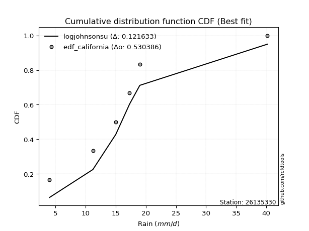</img>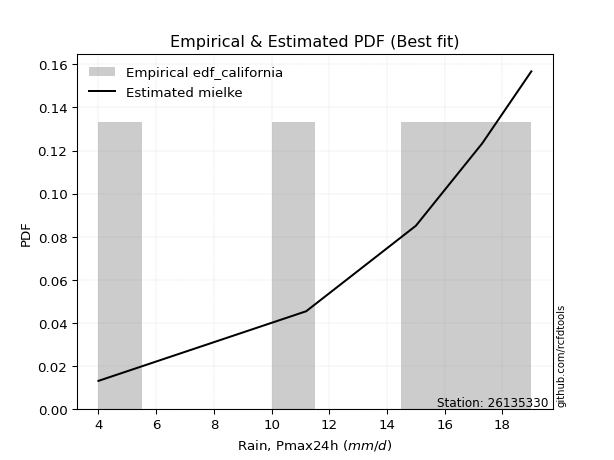</img>

</div>


### 2. Empirical - EDF Hazen (1930)

Hazen method for plotting positions is a formula used to estimate the empirical cumulative probability distribution of flood events or other hydrological data. This formula often results in biased estimations, particularly when extrapolating to extreme events (high return periods).

<div align="center">


$P=(m-0.5)/n$


</div>


**2.1. Empirical values**

<div align="center">

|                | 0                  | 1                  | 2         | 3                 | 4                  |
|:---------------|:-------------------|:-------------------|:----------|:------------------|:-------------------|
| date           | 2021               | 2020               | 2019      | 2017              | 2018               |
| x              | 4.0                | 11.2               | 15.0      | 17.3              | 19.0               |
| m              | 1                  | 2                  | 3         | 4                 | 5                  |
| empirical_dist | edf_hazen          | edf_hazen          | edf_hazen | edf_hazen         | edf_hazen          |
| empirical      | 0.1                | 0.3                | 0.5       | 0.7               | 0.9                |
| empirical_tr   | 1.1111111111111112 | 1.4285714285714286 | 2.0       | 3.333333333333333 | 10.000000000000002 |

</div>


**2.2. Kolmogorov-Smirnov fit test (sorted by Δ)**


<div align="center">

|                | 0                   | 1                   | 2                   | 3                   | 4                   | 5                   | 6                   | 7                  | 8                     | 9                  | 10                  | 11                  | 12                  | 13                 | 14                 | 15                  | 16                 | 17                 | 18                  | 19                  | 20                 | 21                  | 22                 | 23                  | 24                 | 25                 | 26                  | 27                 | 28                  | 29                 | 30                  | 31                  | 32                  | 33                 | 34                 | 35                 | 36                  | 37                 | 38                  | 39                 | 40                 | 41                 | 42                 | 43                  | 44                  | 45                 | 46                  | 47                  | 48                  | 49                  | 50                  | 51                 | 52                  | 53                 | 54                  | 55                  | 56                  | 57                  | 58                  | 59                 | 60                 | 61                  | 62                  | 63                  | 64                  | 65                 | 66                 | 67                 | 68                 | 69                  | 70                  | 71                  | 72                 | 73                  | 74                  | 75                 | 76                  | 77                  | 78                 | 79                  | 80                  | 81                  | 82                  | 83                  | 84                 | 85                 | 86                  | 87                 | 88                 | 89                 |
|:---------------|:--------------------|:--------------------|:--------------------|:--------------------|:--------------------|:--------------------|:--------------------|:-------------------|:----------------------|:-------------------|:--------------------|:--------------------|:--------------------|:-------------------|:-------------------|:--------------------|:-------------------|:-------------------|:--------------------|:--------------------|:-------------------|:--------------------|:-------------------|:--------------------|:-------------------|:-------------------|:--------------------|:-------------------|:--------------------|:-------------------|:--------------------|:--------------------|:--------------------|:-------------------|:-------------------|:-------------------|:--------------------|:-------------------|:--------------------|:-------------------|:-------------------|:-------------------|:-------------------|:--------------------|:--------------------|:-------------------|:--------------------|:--------------------|:--------------------|:--------------------|:--------------------|:-------------------|:--------------------|:-------------------|:--------------------|:--------------------|:--------------------|:--------------------|:--------------------|:-------------------|:-------------------|:--------------------|:--------------------|:--------------------|:--------------------|:-------------------|:-------------------|:-------------------|:-------------------|:--------------------|:--------------------|:--------------------|:-------------------|:--------------------|:--------------------|:-------------------|:--------------------|:--------------------|:-------------------|:--------------------|:--------------------|:--------------------|:--------------------|:--------------------|:-------------------|:-------------------|:--------------------|:-------------------|:-------------------|:-------------------|
| station        | 26135330            | 26135330            | 26135330            | 26135330            | 26135330            | 26135330            | 26135330            | 26135330           | 26135330              | 26135330           | 26135330            | 26135330            | 26135330            | 26135330           | 26135330           | 26135330            | 26135330           | 26135330           | 26135330            | 26135330            | 26135330           | 26135330            | 26135330           | 26135330            | 26135330           | 26135330           | 26135330            | 26135330           | 26135330            | 26135330           | 26135330            | 26135330            | 26135330            | 26135330           | 26135330           | 26135330           | 26135330            | 26135330           | 26135330            | 26135330           | 26135330           | 26135330           | 26135330           | 26135330            | 26135330            | 26135330           | 26135330            | 26135330            | 26135330            | 26135330            | 26135330            | 26135330           | 26135330            | 26135330           | 26135330            | 26135330            | 26135330            | 26135330            | 26135330            | 26135330           | 26135330           | 26135330            | 26135330            | 26135330            | 26135330            | 26135330           | 26135330           | 26135330           | 26135330           | 26135330            | 26135330            | 26135330            | 26135330           | 26135330            | 26135330            | 26135330           | 26135330            | 26135330            | 26135330           | 26135330            | 26135330            | 26135330            | 26135330            | 26135330            | 26135330           | 26135330           | 26135330            | 26135330           | 26135330           | 26135330           |
| empirical_dist | edf_hazen           | edf_hazen           | edf_hazen           | edf_hazen           | edf_hazen           | edf_hazen           | edf_hazen           | edf_hazen          | edf_hazen             | edf_hazen          | edf_hazen           | edf_hazen           | edf_hazen           | edf_hazen          | edf_hazen          | edf_hazen           | edf_hazen          | edf_hazen          | edf_hazen           | edf_hazen           | edf_hazen          | edf_hazen           | edf_hazen          | edf_hazen           | edf_hazen          | edf_hazen          | edf_hazen           | edf_hazen          | edf_hazen           | edf_hazen          | edf_hazen           | edf_hazen           | edf_hazen           | edf_hazen          | edf_hazen          | edf_hazen          | edf_hazen           | edf_hazen          | edf_hazen           | edf_hazen          | edf_hazen          | edf_hazen          | edf_hazen          | edf_hazen           | edf_hazen           | edf_hazen          | edf_hazen           | edf_hazen           | edf_hazen           | edf_hazen           | edf_hazen           | edf_hazen          | edf_hazen           | edf_hazen          | edf_hazen           | edf_hazen           | edf_hazen           | edf_hazen           | edf_hazen           | edf_hazen          | edf_hazen          | edf_hazen           | edf_hazen           | edf_hazen           | edf_hazen           | edf_hazen          | edf_hazen          | edf_hazen          | edf_hazen          | edf_hazen           | edf_hazen           | edf_hazen           | edf_hazen          | edf_hazen           | edf_hazen           | edf_hazen          | edf_hazen           | edf_hazen           | edf_hazen          | edf_hazen           | edf_hazen           | edf_hazen           | edf_hazen           | edf_hazen           | edf_hazen          | edf_hazen          | edf_hazen           | edf_hazen          | edf_hazen          | edf_hazen          |
| p_dist         | gumbel_l            | weibull_min         | mielke              | fisk                | pearson3            | logmielke           | laplace_asymmetric  | logpearson3        | loglaplace_asymmetric | logloggamma        | t                   | exponnorm           | crystalball         | norm               | nct                | loggumbel_l         | f                  | betaprime          | logfisk             | gamma               | chi2               | rice                | erlang             | alpha               | logistic           | logweibull_min     | invgauss            | gompertz           | invgamma            | maxwell            | loggompertz         | ncf                 | hypsecant           | rayleigh           | kstwobign          | logfatiguelife     | lognct              | logexponnorm       | logt                | logcrystalball     | lognorm            | lognorm            | logf               | genexpon            | halfnorm            | logrice            | logncf              | laplace             | loggamma            | loggamma            | logerlang           | loglogistic        | gumbel_r            | logalpha           | loginvgamma         | loginvgauss         | logbetaprime        | logmaxwell          | loghypsecant        | halflogistic       | moyal              | lograyleigh         | loginvweibull       | loglaplace          | loggumbel_r         | expon              | loghalfnorm        | logkstwobign       | logjohnsonsu       | loggenexpon         | logmoyal            | loghalflogistic     | wald               | johnsonsu           | logtruncnorm        | nakagami           | gibrat              | logexpon            | logwald            | loggibrat           | lognakagami         | logchi2             | pareto              | loglognorm          | logpareto          | truncnorm          | invweibull          | fatiguelife        | loggenlogistic     | genlogistic        |
| delta          | 0.07041822462801695 | 0.07590364343539702 | 0.07886779647423925 | 0.08109253438532504 | 0.08224509329914775 | 0.09856873791217069 | 0.09984540543981568 | 0.1104344332378393 | 0.12338873558300911   | 0.1234574796986031 | 0.12498521043593191 | 0.12501359114913413 | 0.12501738174722266 | 0.1250174085982667 | 0.1252320223648673 | 0.12553189319726887 | 0.1259777626606695 | 0.126022308719004  | 0.12622023439757413 | 0.12907516294149735 | 0.1294509517077509 | 0.13218631457743857 | 0.1337715126589153 | 0.13894870941593296 | 0.1406142475008354 | 0.1410445457238848 | 0.14271123876898184 | 0.1444117857606156 | 0.14497338998100262 | 0.1492123137104071 | 0.15008635255510105 | 0.15062268514318655 | 0.15307647427697157 | 0.1566012666317147 | 0.1651606953147149 | 0.1668501613643515 | 0.16838135765717843 | 0.1686130723254684 | 0.16861357037545788 | 0.1686136280405034 | 0.1686136350603329 | 0.1686136350603329 | 0.169188593956353  | 0.17517890155785465 | 0.17782167845047925 | 0.1780109722016373 | 0.17957703699892263 | 0.18140552292948509 | 0.18240628182031066 | 0.18240628182031066 | 0.18627983140004767 | 0.1880409700418404 | 0.18860577525123767 | 0.1892726169162876 | 0.19030447137560452 | 0.19177362947543514 | 0.19863056882641933 | 0.20224719554428844 | 0.20275451202530304 | 0.20617899916977   | 0.2099732546539671 | 0.21386935203803242 | 0.21671311804721888 | 0.23014460663628655 | 0.23690704137293922 | 0.2389245338408727 | 0.2466277284327974 | 0.2525991253314291 | 0.2542044158763587 | 0.25636014363090404 | 0.26264552476685094 | 0.26931745628115983 | 0.2699110596010468 | 0.29643607751639933 | 0.29999810959030404 | 0.2999983694428061 | 0.30207769083527236 | 0.31633129614245087 | 0.3342936997642216 | 0.35159119891846863 | 0.36025411027654763 | 0.37569048712905556 | 0.37876182456354096 | 0.38527145032931526 | 0.3940693072524804 | 0.399108935241614  | 0.49357560324687255 | 0.5332864313912566 | 0.7                | 0.7                |
| deltao         | 0.5865427407550001  | 0.5865427407550001  | 0.5865427407550001  | 0.5865427407550001  | 0.5865427407550001  | 0.5865427407550001  | 0.5865427407550001  | 0.5865427407550001 | 0.5865427407550001    | 0.5865427407550001 | 0.5865427407550001  | 0.5865427407550001  | 0.5865427407550001  | 0.5865427407550001 | 0.5865427407550001 | 0.5865427407550001  | 0.5865427407550001 | 0.5865427407550001 | 0.5865427407550001  | 0.5865427407550001  | 0.5865427407550001 | 0.5865427407550001  | 0.5865427407550001 | 0.5865427407550001  | 0.5865427407550001 | 0.5865427407550001 | 0.5865427407550001  | 0.5865427407550001 | 0.5865427407550001  | 0.5865427407550001 | 0.5865427407550001  | 0.5865427407550001  | 0.5865427407550001  | 0.5865427407550001 | 0.5865427407550001 | 0.5865427407550001 | 0.5865427407550001  | 0.5865427407550001 | 0.5865427407550001  | 0.5865427407550001 | 0.5865427407550001 | 0.5865427407550001 | 0.5865427407550001 | 0.5865427407550001  | 0.5865427407550001  | 0.5865427407550001 | 0.5865427407550001  | 0.5865427407550001  | 0.5865427407550001  | 0.5865427407550001  | 0.5865427407550001  | 0.5865427407550001 | 0.5865427407550001  | 0.5865427407550001 | 0.5865427407550001  | 0.5865427407550001  | 0.5865427407550001  | 0.5865427407550001  | 0.5865427407550001  | 0.5865427407550001 | 0.5865427407550001 | 0.5865427407550001  | 0.5865427407550001  | 0.5865427407550001  | 0.5865427407550001  | 0.5865427407550001 | 0.5865427407550001 | 0.5865427407550001 | 0.5865427407550001 | 0.5865427407550001  | 0.5865427407550001  | 0.5865427407550001  | 0.5865427407550001 | 0.5865427407550001  | 0.5865427407550001  | 0.5865427407550001 | 0.5865427407550001  | 0.5865427407550001  | 0.5865427407550001 | 0.5865427407550001  | 0.5865427407550001  | 0.5865427407550001  | 0.5865427407550001  | 0.5865427407550001  | 0.5865427407550001 | 0.5865427407550001 | 0.5865427407550001  | 0.5865427407550001 | 0.5865427407550001 | 0.5865427407550001 |
| eval           | Δo > Δ              | Δo > Δ              | Δo > Δ              | Δo > Δ              | Δo > Δ              | Δo > Δ              | Δo > Δ              | Δo > Δ             | Δo > Δ                | Δo > Δ             | Δo > Δ              | Δo > Δ              | Δo > Δ              | Δo > Δ             | Δo > Δ             | Δo > Δ              | Δo > Δ             | Δo > Δ             | Δo > Δ              | Δo > Δ              | Δo > Δ             | Δo > Δ              | Δo > Δ             | Δo > Δ              | Δo > Δ             | Δo > Δ             | Δo > Δ              | Δo > Δ             | Δo > Δ              | Δo > Δ             | Δo > Δ              | Δo > Δ              | Δo > Δ              | Δo > Δ             | Δo > Δ             | Δo > Δ             | Δo > Δ              | Δo > Δ             | Δo > Δ              | Δo > Δ             | Δo > Δ             | Δo > Δ             | Δo > Δ             | Δo > Δ              | Δo > Δ              | Δo > Δ             | Δo > Δ              | Δo > Δ              | Δo > Δ              | Δo > Δ              | Δo > Δ              | Δo > Δ             | Δo > Δ              | Δo > Δ             | Δo > Δ              | Δo > Δ              | Δo > Δ              | Δo > Δ              | Δo > Δ              | Δo > Δ             | Δo > Δ             | Δo > Δ              | Δo > Δ              | Δo > Δ              | Δo > Δ              | Δo > Δ             | Δo > Δ             | Δo > Δ             | Δo > Δ             | Δo > Δ              | Δo > Δ              | Δo > Δ              | Δo > Δ             | Δo > Δ              | Δo > Δ              | Δo > Δ             | Δo > Δ              | Δo > Δ              | Δo > Δ             | Δo > Δ              | Δo > Δ              | Δo > Δ              | Δo > Δ              | Δo > Δ              | Δo > Δ             | Δo > Δ             | Δo > Δ              | Δo > Δ             | Δo <= Δ            | Δo <= Δ            |
| fit            | 1                   | 1                   | 1                   | 1                   | 1                   | 1                   | 1                   | 1                  | 1                     | 1                  | 1                   | 1                   | 1                   | 1                  | 1                  | 1                   | 1                  | 1                  | 1                   | 1                   | 1                  | 1                   | 1                  | 1                   | 1                  | 1                  | 1                   | 1                  | 1                   | 1                  | 1                   | 1                   | 1                   | 1                  | 1                  | 1                  | 1                   | 1                  | 1                   | 1                  | 1                  | 1                  | 1                  | 1                   | 1                   | 1                  | 1                   | 1                   | 1                   | 1                   | 1                   | 1                  | 1                   | 1                  | 1                   | 1                   | 1                   | 1                   | 1                   | 1                  | 1                  | 1                   | 1                   | 1                   | 1                   | 1                  | 1                  | 1                  | 1                  | 1                   | 1                   | 1                   | 1                  | 1                   | 1                   | 1                  | 1                   | 1                   | 1                  | 1                   | 1                   | 1                   | 1                   | 1                   | 1                  | 1                  | 1                   | 1                  | 0                  | 0                  |
| n              | 5                   | 5                   | 5                   | 5                   | 5                   | 5                   | 5                   | 5                  | 5                     | 5                  | 5                   | 5                   | 5                   | 5                  | 5                  | 5                   | 5                  | 5                  | 5                   | 5                   | 5                  | 5                   | 5                  | 5                   | 5                  | 5                  | 5                   | 5                  | 5                   | 5                  | 5                   | 5                   | 5                   | 5                  | 5                  | 5                  | 5                   | 5                  | 5                   | 5                  | 5                  | 5                  | 5                  | 5                   | 5                   | 5                  | 5                   | 5                   | 5                   | 5                   | 5                   | 5                  | 5                   | 5                  | 5                   | 5                   | 5                   | 5                   | 5                   | 5                  | 5                  | 5                   | 5                   | 5                   | 5                   | 5                  | 5                  | 5                  | 5                  | 5                   | 5                   | 5                   | 5                  | 5                   | 5                   | 5                  | 5                   | 5                   | 5                  | 5                   | 5                   | 5                   | 5                   | 5                   | 5                  | 5                  | 5                   | 5                  | 5                  | 5                  |
| best_fit       | 1                   | 0                   | 0                   | 0                   | 0                   | 0                   | 0                   | 0                  | 0                     | 0                  | 0                   | 0                   | 0                   | 0                  | 0                  | 0                   | 0                  | 0                  | 0                   | 0                   | 0                  | 0                   | 0                  | 0                   | 0                  | 0                  | 0                   | 0                  | 0                   | 0                  | 0                   | 0                   | 0                   | 0                  | 0                  | 0                  | 0                   | 0                  | 0                   | 0                  | 0                  | 0                  | 0                  | 0                   | 0                   | 0                  | 0                   | 0                   | 0                   | 0                   | 0                   | 0                  | 0                   | 0                  | 0                   | 0                   | 0                   | 0                   | 0                   | 0                  | 0                  | 0                   | 0                   | 0                   | 0                   | 0                  | 0                  | 0                  | 0                  | 0                   | 0                   | 0                   | 0                  | 0                   | 0                   | 0                  | 0                   | 0                   | 0                  | 0                   | 0                   | 0                   | 0                   | 0                   | 0                  | 0                  | 0                   | 0                  | 0                  | 0                  |
| best_fit_sort  | 1                   | 2                   | 3                   | 4                   | 5                   | 6                   | 7                   | 8                  | 9                     | 10                 | 11                  | 12                  | 13                  | 14                 | 15                 | 16                  | 17                 | 18                 | 19                  | 20                  | 21                 | 22                  | 23                 | 24                  | 25                 | 26                 | 27                  | 28                 | 29                  | 30                 | 31                  | 32                  | 33                  | 34                 | 35                 | 36                 | 37                  | 38                 | 39                  | 40                 | 41                 | 42                 | 43                 | 44                  | 45                  | 46                 | 47                  | 48                  | 49                  | 50                  | 51                  | 52                 | 53                  | 54                 | 55                  | 56                  | 57                  | 58                  | 59                  | 60                 | 61                 | 62                  | 63                  | 64                  | 65                  | 66                 | 67                 | 68                 | 69                 | 70                  | 71                  | 72                  | 73                 | 74                  | 75                  | 76                 | 77                  | 78                  | 79                 | 80                  | 81                  | 82                  | 83                  | 84                  | 85                 | 86                 | 87                  | 88                 | 89                 | 90                 |

</div>


<div align="center">

</img>

</div>


**2.3. Best fit**

<div align="center">

|   id |   station | empirical_dist   | p_dist   |     delta |   deltao | eval   |   fit |   n |   best_fit |   best_fit_sort |
|-----:|----------:|:-----------------|:---------|----------:|---------:|:-------|------:|----:|-----------:|----------------:|
|    0 |  26135330 | edf_hazen        | gumbel_l | 0.0704182 | 0.586543 | Δo > Δ |     1 |   5 |          1 |               1 |

</div>


<div align="center">

</img>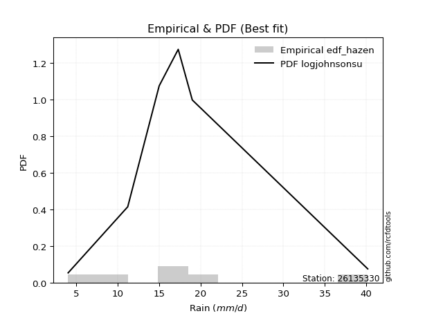</img>

</div>


### 3. Empirical - EDF Weibull (1939)

Weibull plotting position formula is an empirical method used to estimate the non-exceedance probability or plotting position for a set of observed data, is often recommended or widely used in practice, particularly in flood frequency analysis.

<div align="center">


$P=m/(n+1)$


</div>


**3.1. Empirical values**

<div align="center">

|                | 0                   | 1                  | 2           | 3                  | 4                  |
|:---------------|:--------------------|:-------------------|:------------|:-------------------|:-------------------|
| date           | 2021                | 2020               | 2019        | 2017               | 2018               |
| x              | 4.0                 | 11.2               | 15.0        | 17.3               | 19.0               |
| m              | 1                   | 2                  | 3           | 4                  | 5                  |
| empirical_dist | edf_weibull         | edf_weibull        | edf_weibull | edf_weibull        | edf_weibull        |
| empirical      | 0.16666666666666666 | 0.3333333333333333 | 0.5         | 0.6666666666666666 | 0.8333333333333334 |
| empirical_tr   | 1.2                 | 1.4999999999999998 | 2.0         | 2.9999999999999996 | 6.000000000000002  |

</div>


**3.2. Kolmogorov-Smirnov fit test (sorted by Δ)**


<div align="center">

|                | 0                   | 1                   | 2                  | 3                   | 4                   | 5                   | 6                   | 7                  | 8                  | 9                   | 10                  | 11                  | 12                 | 13                 | 14                  | 15                 | 16                 | 17                 | 18                  | 19                 | 20                 | 21                  | 22                  | 23                 | 24                  | 25                 | 26                  | 27                  | 28                  | 29                 | 30                 | 31                  | 32                  | 33                  | 34                    | 35                 | 36                 | 37                 | 38                 | 39                 | 40                  | 41                 | 42                 | 43                 | 44                  | 45                  | 46                  | 47                  | 48                  | 49                  | 50                 | 51                  | 52                  | 53                 | 54                  | 55                  | 56                 | 57                  | 58                  | 59                  | 60                  | 61                  | 62                 | 63                 | 64                  | 65                  | 66                 | 67                 | 68                  | 69                  | 70                 | 71                 | 72                 | 73                 | 74                  | 75                  | 76                  | 77                 | 78                  | 79                  | 80                  | 81                  | 82                  | 83                  | 84                 | 85                 | 86                 | 87                 | 88                 | 89                 |
|:---------------|:--------------------|:--------------------|:-------------------|:--------------------|:--------------------|:--------------------|:--------------------|:-------------------|:-------------------|:--------------------|:--------------------|:--------------------|:-------------------|:-------------------|:--------------------|:-------------------|:-------------------|:-------------------|:--------------------|:-------------------|:-------------------|:--------------------|:--------------------|:-------------------|:--------------------|:-------------------|:--------------------|:--------------------|:--------------------|:-------------------|:-------------------|:--------------------|:--------------------|:--------------------|:----------------------|:-------------------|:-------------------|:-------------------|:-------------------|:-------------------|:--------------------|:-------------------|:-------------------|:-------------------|:--------------------|:--------------------|:--------------------|:--------------------|:--------------------|:--------------------|:-------------------|:--------------------|:--------------------|:-------------------|:--------------------|:--------------------|:-------------------|:--------------------|:--------------------|:--------------------|:--------------------|:--------------------|:-------------------|:-------------------|:--------------------|:--------------------|:-------------------|:-------------------|:--------------------|:--------------------|:-------------------|:-------------------|:-------------------|:-------------------|:--------------------|:--------------------|:--------------------|:-------------------|:--------------------|:--------------------|:--------------------|:--------------------|:--------------------|:--------------------|:-------------------|:-------------------|:-------------------|:-------------------|:-------------------|:-------------------|
| station        | 26135330            | 26135330            | 26135330           | 26135330            | 26135330            | 26135330            | 26135330            | 26135330           | 26135330           | 26135330            | 26135330            | 26135330            | 26135330           | 26135330           | 26135330            | 26135330           | 26135330           | 26135330           | 26135330            | 26135330           | 26135330           | 26135330            | 26135330            | 26135330           | 26135330            | 26135330           | 26135330            | 26135330            | 26135330            | 26135330           | 26135330           | 26135330            | 26135330            | 26135330            | 26135330              | 26135330           | 26135330           | 26135330           | 26135330           | 26135330           | 26135330            | 26135330           | 26135330           | 26135330           | 26135330            | 26135330            | 26135330            | 26135330            | 26135330            | 26135330            | 26135330           | 26135330            | 26135330            | 26135330           | 26135330            | 26135330            | 26135330           | 26135330            | 26135330            | 26135330            | 26135330            | 26135330            | 26135330           | 26135330           | 26135330            | 26135330            | 26135330           | 26135330           | 26135330            | 26135330            | 26135330           | 26135330           | 26135330           | 26135330           | 26135330            | 26135330            | 26135330            | 26135330           | 26135330            | 26135330            | 26135330            | 26135330            | 26135330            | 26135330            | 26135330           | 26135330           | 26135330           | 26135330           | 26135330           | 26135330           |
| empirical_dist | edf_weibull         | edf_weibull         | edf_weibull        | edf_weibull         | edf_weibull         | edf_weibull         | edf_weibull         | edf_weibull        | edf_weibull        | edf_weibull         | edf_weibull         | edf_weibull         | edf_weibull        | edf_weibull        | edf_weibull         | edf_weibull        | edf_weibull        | edf_weibull        | edf_weibull         | edf_weibull        | edf_weibull        | edf_weibull         | edf_weibull         | edf_weibull        | edf_weibull         | edf_weibull        | edf_weibull         | edf_weibull         | edf_weibull         | edf_weibull        | edf_weibull        | edf_weibull         | edf_weibull         | edf_weibull         | edf_weibull           | edf_weibull        | edf_weibull        | edf_weibull        | edf_weibull        | edf_weibull        | edf_weibull         | edf_weibull        | edf_weibull        | edf_weibull        | edf_weibull         | edf_weibull         | edf_weibull         | edf_weibull         | edf_weibull         | edf_weibull         | edf_weibull        | edf_weibull         | edf_weibull         | edf_weibull        | edf_weibull         | edf_weibull         | edf_weibull        | edf_weibull         | edf_weibull         | edf_weibull         | edf_weibull         | edf_weibull         | edf_weibull        | edf_weibull        | edf_weibull         | edf_weibull         | edf_weibull        | edf_weibull        | edf_weibull         | edf_weibull         | edf_weibull        | edf_weibull        | edf_weibull        | edf_weibull        | edf_weibull         | edf_weibull         | edf_weibull         | edf_weibull        | edf_weibull         | edf_weibull         | edf_weibull         | edf_weibull         | edf_weibull         | edf_weibull         | edf_weibull        | edf_weibull        | edf_weibull        | edf_weibull        | edf_weibull        | edf_weibull        |
| p_dist         | gumbel_l            | pearson3            | logpearson3        | weibull_min         | logmielke           | loggumbel_l         | nct                 | f                  | norm               | crystalball         | exponnorm           | t                   | betaprime          | fisk               | gamma               | chi2               | erlang             | rice               | alpha               | logistic           | logweibull_min     | invgauss            | invgamma            | mielke             | logfisk             | maxwell            | ncf                 | hypsecant           | rayleigh            | kstwobign          | logbetaprime       | logncf              | laplace_asymmetric  | logloggamma         | loglaplace_asymmetric | loggompertz        | logfatiguelife     | lognct             | logf               | logexponnorm       | logt                | logcrystalball     | lognorm            | lognorm            | logrice             | loginvgauss         | logerlang           | loggamma            | loggamma            | genexpon            | logalpha           | gompertz            | halfnorm            | loginvgamma        | laplace             | loginvweibull       | loglogistic        | logmaxwell          | gumbel_r            | lograyleigh         | loghypsecant        | expon               | halflogistic       | moyal              | loghalfnorm         | logkstwobign        | logjohnsonsu       | loggenexpon        | loggumbel_r         | loglaplace          | loghalflogistic    | logmoyal           | johnsonsu          | wald               | logexpon            | logwald             | gibrat              | loggibrat          | logtruncnorm        | nakagami            | logchi2             | pareto              | loglognorm          | lognakagami         | logpareto          | truncnorm          | invweibull         | fatiguelife        | loggenlogistic     | genlogistic        |
| delta          | 0.10841973268645692 | 0.11023130245700047 | 0.1162840688674214 | 0.11869507755717398 | 0.12364430367190105 | 0.12553189319726887 | 0.12590986117697775 | 0.1259777626606695 | 0.1260344254277974 | 0.12603442696836836 | 0.12603584456034336 | 0.12603996964737618 | 0.1266849384550235 | 0.1283539569373555 | 0.12907516294149735 | 0.1294509517077509 | 0.1337715126589153 | 0.1344527672903012 | 0.13894870941593296 | 0.1406142475008354 | 0.1410445457238848 | 0.14271123876898184 | 0.14497338998100262 | 0.1455344631409059 | 0.14618455795491356 | 0.1492123137104071 | 0.15062268514318655 | 0.15307647427697157 | 0.16050831761793605 | 0.1651606953147149 | 0.165297235493086  | 0.16585082088872238 | 0.16651207210648233 | 0.16656855662700343 | 0.1665923134470445    | 0.1666656921587262 | 0.1668501613643515 | 0.168132691966685  | 0.1685607694090776 | 0.1686130723254684 | 0.16861357037545788 | 0.1686136280405034 | 0.1686136350603329 | 0.1686136350603329 | 0.17166246834601062 | 0.17195109904834882 | 0.17379369730624883 | 0.17456577581239918 | 0.17456577581239918 | 0.17517890155785465 | 0.1761116811497594 | 0.17774511909394894 | 0.17782167845047925 | 0.1778514360016985 | 0.18140552292948509 | 0.18337978471388555 | 0.1880409700418404 | 0.18820563838125337 | 0.18860577525123767 | 0.19403300028523462 | 0.20275451202530304 | 0.20559120050753937 | 0.20617899916977   | 0.2099732546539671 | 0.21329439509946407 | 0.21926579199809576 | 0.2208710825430254 | 0.2230268102975707 | 0.22547130325666875 | 0.23014460663628655 | 0.2389579471003751 | 0.2441024735000532 | 0.263102744183066  | 0.2699110596010468 | 0.28299796280911754 | 0.30096036643088825 | 0.30207769083527236 | 0.3294806075343337 | 0.33333144292363737 | 0.33333170277613944 | 0.34235715379572224 | 0.34542849123020763 | 0.35193811699598193 | 0.36025411027654763 | 0.3607359739191471 | 0.3657756019082807 | 0.4269089365802059 | 0.4999530980579234 | 0.6666666666666666 | 0.6666666666666666 |
| deltao         | 0.5865427407550001  | 0.5865427407550001  | 0.5865427407550001 | 0.5865427407550001  | 0.5865427407550001  | 0.5865427407550001  | 0.5865427407550001  | 0.5865427407550001 | 0.5865427407550001 | 0.5865427407550001  | 0.5865427407550001  | 0.5865427407550001  | 0.5865427407550001 | 0.5865427407550001 | 0.5865427407550001  | 0.5865427407550001 | 0.5865427407550001 | 0.5865427407550001 | 0.5865427407550001  | 0.5865427407550001 | 0.5865427407550001 | 0.5865427407550001  | 0.5865427407550001  | 0.5865427407550001 | 0.5865427407550001  | 0.5865427407550001 | 0.5865427407550001  | 0.5865427407550001  | 0.5865427407550001  | 0.5865427407550001 | 0.5865427407550001 | 0.5865427407550001  | 0.5865427407550001  | 0.5865427407550001  | 0.5865427407550001    | 0.5865427407550001 | 0.5865427407550001 | 0.5865427407550001 | 0.5865427407550001 | 0.5865427407550001 | 0.5865427407550001  | 0.5865427407550001 | 0.5865427407550001 | 0.5865427407550001 | 0.5865427407550001  | 0.5865427407550001  | 0.5865427407550001  | 0.5865427407550001  | 0.5865427407550001  | 0.5865427407550001  | 0.5865427407550001 | 0.5865427407550001  | 0.5865427407550001  | 0.5865427407550001 | 0.5865427407550001  | 0.5865427407550001  | 0.5865427407550001 | 0.5865427407550001  | 0.5865427407550001  | 0.5865427407550001  | 0.5865427407550001  | 0.5865427407550001  | 0.5865427407550001 | 0.5865427407550001 | 0.5865427407550001  | 0.5865427407550001  | 0.5865427407550001 | 0.5865427407550001 | 0.5865427407550001  | 0.5865427407550001  | 0.5865427407550001 | 0.5865427407550001 | 0.5865427407550001 | 0.5865427407550001 | 0.5865427407550001  | 0.5865427407550001  | 0.5865427407550001  | 0.5865427407550001 | 0.5865427407550001  | 0.5865427407550001  | 0.5865427407550001  | 0.5865427407550001  | 0.5865427407550001  | 0.5865427407550001  | 0.5865427407550001 | 0.5865427407550001 | 0.5865427407550001 | 0.5865427407550001 | 0.5865427407550001 | 0.5865427407550001 |
| eval           | Δo > Δ              | Δo > Δ              | Δo > Δ             | Δo > Δ              | Δo > Δ              | Δo > Δ              | Δo > Δ              | Δo > Δ             | Δo > Δ             | Δo > Δ              | Δo > Δ              | Δo > Δ              | Δo > Δ             | Δo > Δ             | Δo > Δ              | Δo > Δ             | Δo > Δ             | Δo > Δ             | Δo > Δ              | Δo > Δ             | Δo > Δ             | Δo > Δ              | Δo > Δ              | Δo > Δ             | Δo > Δ              | Δo > Δ             | Δo > Δ              | Δo > Δ              | Δo > Δ              | Δo > Δ             | Δo > Δ             | Δo > Δ              | Δo > Δ              | Δo > Δ              | Δo > Δ                | Δo > Δ             | Δo > Δ             | Δo > Δ             | Δo > Δ             | Δo > Δ             | Δo > Δ              | Δo > Δ             | Δo > Δ             | Δo > Δ             | Δo > Δ              | Δo > Δ              | Δo > Δ              | Δo > Δ              | Δo > Δ              | Δo > Δ              | Δo > Δ             | Δo > Δ              | Δo > Δ              | Δo > Δ             | Δo > Δ              | Δo > Δ              | Δo > Δ             | Δo > Δ              | Δo > Δ              | Δo > Δ              | Δo > Δ              | Δo > Δ              | Δo > Δ             | Δo > Δ             | Δo > Δ              | Δo > Δ              | Δo > Δ             | Δo > Δ             | Δo > Δ              | Δo > Δ              | Δo > Δ             | Δo > Δ             | Δo > Δ             | Δo > Δ             | Δo > Δ              | Δo > Δ              | Δo > Δ              | Δo > Δ             | Δo > Δ              | Δo > Δ              | Δo > Δ              | Δo > Δ              | Δo > Δ              | Δo > Δ              | Δo > Δ             | Δo > Δ             | Δo > Δ             | Δo > Δ             | Δo <= Δ            | Δo <= Δ            |
| fit            | 1                   | 1                   | 1                  | 1                   | 1                   | 1                   | 1                   | 1                  | 1                  | 1                   | 1                   | 1                   | 1                  | 1                  | 1                   | 1                  | 1                  | 1                  | 1                   | 1                  | 1                  | 1                   | 1                   | 1                  | 1                   | 1                  | 1                   | 1                   | 1                   | 1                  | 1                  | 1                   | 1                   | 1                   | 1                     | 1                  | 1                  | 1                  | 1                  | 1                  | 1                   | 1                  | 1                  | 1                  | 1                   | 1                   | 1                   | 1                   | 1                   | 1                   | 1                  | 1                   | 1                   | 1                  | 1                   | 1                   | 1                  | 1                   | 1                   | 1                   | 1                   | 1                   | 1                  | 1                  | 1                   | 1                   | 1                  | 1                  | 1                   | 1                   | 1                  | 1                  | 1                  | 1                  | 1                   | 1                   | 1                   | 1                  | 1                   | 1                   | 1                   | 1                   | 1                   | 1                   | 1                  | 1                  | 1                  | 1                  | 0                  | 0                  |
| n              | 5                   | 5                   | 5                  | 5                   | 5                   | 5                   | 5                   | 5                  | 5                  | 5                   | 5                   | 5                   | 5                  | 5                  | 5                   | 5                  | 5                  | 5                  | 5                   | 5                  | 5                  | 5                   | 5                   | 5                  | 5                   | 5                  | 5                   | 5                   | 5                   | 5                  | 5                  | 5                   | 5                   | 5                   | 5                     | 5                  | 5                  | 5                  | 5                  | 5                  | 5                   | 5                  | 5                  | 5                  | 5                   | 5                   | 5                   | 5                   | 5                   | 5                   | 5                  | 5                   | 5                   | 5                  | 5                   | 5                   | 5                  | 5                   | 5                   | 5                   | 5                   | 5                   | 5                  | 5                  | 5                   | 5                   | 5                  | 5                  | 5                   | 5                   | 5                  | 5                  | 5                  | 5                  | 5                   | 5                   | 5                   | 5                  | 5                   | 5                   | 5                   | 5                   | 5                   | 5                   | 5                  | 5                  | 5                  | 5                  | 5                  | 5                  |
| best_fit       | 1                   | 0                   | 0                  | 0                   | 0                   | 0                   | 0                   | 0                  | 0                  | 0                   | 0                   | 0                   | 0                  | 0                  | 0                   | 0                  | 0                  | 0                  | 0                   | 0                  | 0                  | 0                   | 0                   | 0                  | 0                   | 0                  | 0                   | 0                   | 0                   | 0                  | 0                  | 0                   | 0                   | 0                   | 0                     | 0                  | 0                  | 0                  | 0                  | 0                  | 0                   | 0                  | 0                  | 0                  | 0                   | 0                   | 0                   | 0                   | 0                   | 0                   | 0                  | 0                   | 0                   | 0                  | 0                   | 0                   | 0                  | 0                   | 0                   | 0                   | 0                   | 0                   | 0                  | 0                  | 0                   | 0                   | 0                  | 0                  | 0                   | 0                   | 0                  | 0                  | 0                  | 0                  | 0                   | 0                   | 0                   | 0                  | 0                   | 0                   | 0                   | 0                   | 0                   | 0                   | 0                  | 0                  | 0                  | 0                  | 0                  | 0                  |
| best_fit_sort  | 1                   | 2                   | 3                  | 4                   | 5                   | 6                   | 7                   | 8                  | 9                  | 10                  | 11                  | 12                  | 13                 | 14                 | 15                  | 16                 | 17                 | 18                 | 19                  | 20                 | 21                 | 22                  | 23                  | 24                 | 25                  | 26                 | 27                  | 28                  | 29                  | 30                 | 31                 | 32                  | 33                  | 34                  | 35                    | 36                 | 37                 | 38                 | 39                 | 40                 | 41                  | 42                 | 43                 | 44                 | 45                  | 46                  | 47                  | 48                  | 49                  | 50                  | 51                 | 52                  | 53                  | 54                 | 55                  | 56                  | 57                 | 58                  | 59                  | 60                  | 61                  | 62                  | 63                 | 64                 | 65                  | 66                  | 67                 | 68                 | 69                  | 70                  | 71                 | 72                 | 73                 | 74                 | 75                  | 76                  | 77                  | 78                 | 79                  | 80                  | 81                  | 82                  | 83                  | 84                  | 85                 | 86                 | 87                 | 88                 | 89                 | 90                 |

</div>


<div align="center">

</img>

</div>


**3.3. Best fit**

<div align="center">

|   id |   station | empirical_dist   | p_dist   |   delta |   deltao | eval   |   fit |   n |   best_fit |   best_fit_sort |
|-----:|----------:|:-----------------|:---------|--------:|---------:|:-------|------:|----:|-----------:|----------------:|
|    0 |  26135330 | edf_weibull      | gumbel_l | 0.10842 | 0.586543 | Δo > Δ |     1 |   5 |          1 |               1 |

</div>


<div align="center">

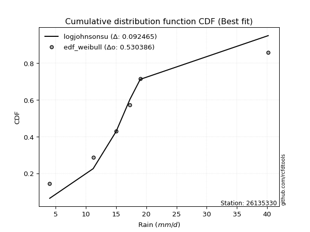</img></img>

</div>


### 4. Empirical - EDF Beard (1943)

The Beard formula (or Beard´s plotting position formula) in hydrology is used to estimate the empirical non-exceedance probability _(P)_ of a flood event (or other extreme hydrological data point) within a given dataset.

<div align="center">


$P=(m-0.31)/(n+0.38)$


</div>


**4.1. Empirical values**

<div align="center">

|                | 0                   | 1                  | 2         | 3                  | 4                  |
|:---------------|:--------------------|:-------------------|:----------|:-------------------|:-------------------|
| date           | 2021                | 2020               | 2019      | 2017               | 2018               |
| x              | 4.0                 | 11.2               | 15.0      | 17.3               | 19.0               |
| m              | 1                   | 2                  | 3         | 4                  | 5                  |
| empirical_dist | edf_beard           | edf_beard          | edf_beard | edf_beard          | edf_beard          |
| empirical      | 0.12825278810408922 | 0.3141263940520446 | 0.5       | 0.6858736059479554 | 0.8717472118959109 |
| empirical_tr   | 1.1471215351812367  | 1.4579945799457996 | 2.0       | 3.183431952662722  | 7.797101449275368  |

</div>


**4.2. Kolmogorov-Smirnov fit test (sorted by Δ)**


<div align="center">

|                | 0                   | 1                   | 2                   | 3                   | 4                   | 5                  | 6                  | 7                   | 8                   | 9                   | 10                  | 11                 | 12                 | 13                  | 14                 | 15                 | 16                  | 17                  | 18                 | 19                  | 20                 | 21                    | 22                  | 23                  | 24                 | 25                 | 26                  | 27                  | 28                 | 29                  | 30                  | 31                  | 32                 | 33                  | 34                 | 35                  | 36                 | 37                 | 38                 | 39                 | 40                  | 41                 | 42                 | 43                 | 44                  | 45                  | 46                  | 47                  | 48                  | 49                 | 50                 | 51                  | 52                 | 53                  | 54                 | 55                 | 56                  | 57                  | 58                 | 59                  | 60                  | 61                 | 62                 | 63                  | 64                  | 65                  | 66                  | 67                  | 68                 | 69                 | 70                 | 71                 | 72                 | 73                 | 74                  | 75                  | 76                 | 77                  | 78                  | 79                 | 80                  | 81                  | 82                  | 83                 | 84                 | 85                  | 86                 | 87                 | 88                 | 89                 |
|:---------------|:--------------------|:--------------------|:--------------------|:--------------------|:--------------------|:-------------------|:-------------------|:--------------------|:--------------------|:--------------------|:--------------------|:-------------------|:-------------------|:--------------------|:-------------------|:-------------------|:--------------------|:--------------------|:-------------------|:--------------------|:-------------------|:----------------------|:--------------------|:--------------------|:-------------------|:-------------------|:--------------------|:--------------------|:-------------------|:--------------------|:--------------------|:--------------------|:-------------------|:--------------------|:-------------------|:--------------------|:-------------------|:-------------------|:-------------------|:-------------------|:--------------------|:-------------------|:-------------------|:-------------------|:--------------------|:--------------------|:--------------------|:--------------------|:--------------------|:-------------------|:-------------------|:--------------------|:-------------------|:--------------------|:-------------------|:-------------------|:--------------------|:--------------------|:-------------------|:--------------------|:--------------------|:-------------------|:-------------------|:--------------------|:--------------------|:--------------------|:--------------------|:--------------------|:-------------------|:-------------------|:-------------------|:-------------------|:-------------------|:-------------------|:--------------------|:--------------------|:-------------------|:--------------------|:--------------------|:-------------------|:--------------------|:--------------------|:--------------------|:-------------------|:-------------------|:--------------------|:-------------------|:-------------------|:-------------------|:-------------------|
| station        | 26135330            | 26135330            | 26135330            | 26135330            | 26135330            | 26135330           | 26135330           | 26135330            | 26135330            | 26135330            | 26135330            | 26135330           | 26135330           | 26135330            | 26135330           | 26135330           | 26135330            | 26135330            | 26135330           | 26135330            | 26135330           | 26135330              | 26135330            | 26135330            | 26135330           | 26135330           | 26135330            | 26135330            | 26135330           | 26135330            | 26135330            | 26135330            | 26135330           | 26135330            | 26135330           | 26135330            | 26135330           | 26135330           | 26135330           | 26135330           | 26135330            | 26135330           | 26135330           | 26135330           | 26135330            | 26135330            | 26135330            | 26135330            | 26135330            | 26135330           | 26135330           | 26135330            | 26135330           | 26135330            | 26135330           | 26135330           | 26135330            | 26135330            | 26135330           | 26135330            | 26135330            | 26135330           | 26135330           | 26135330            | 26135330            | 26135330            | 26135330            | 26135330            | 26135330           | 26135330           | 26135330           | 26135330           | 26135330           | 26135330           | 26135330            | 26135330            | 26135330           | 26135330            | 26135330            | 26135330           | 26135330            | 26135330            | 26135330            | 26135330           | 26135330           | 26135330            | 26135330           | 26135330           | 26135330           | 26135330           |
| empirical_dist | edf_beard           | edf_beard           | edf_beard           | edf_beard           | edf_beard           | edf_beard          | edf_beard          | edf_beard           | edf_beard           | edf_beard           | edf_beard           | edf_beard          | edf_beard          | edf_beard           | edf_beard          | edf_beard          | edf_beard           | edf_beard           | edf_beard          | edf_beard           | edf_beard          | edf_beard             | edf_beard           | edf_beard           | edf_beard          | edf_beard          | edf_beard           | edf_beard           | edf_beard          | edf_beard           | edf_beard           | edf_beard           | edf_beard          | edf_beard           | edf_beard          | edf_beard           | edf_beard          | edf_beard          | edf_beard          | edf_beard          | edf_beard           | edf_beard          | edf_beard          | edf_beard          | edf_beard           | edf_beard           | edf_beard           | edf_beard           | edf_beard           | edf_beard          | edf_beard          | edf_beard           | edf_beard          | edf_beard           | edf_beard          | edf_beard          | edf_beard           | edf_beard           | edf_beard          | edf_beard           | edf_beard           | edf_beard          | edf_beard          | edf_beard           | edf_beard           | edf_beard           | edf_beard           | edf_beard           | edf_beard          | edf_beard          | edf_beard          | edf_beard          | edf_beard          | edf_beard          | edf_beard           | edf_beard           | edf_beard          | edf_beard           | edf_beard           | edf_beard          | edf_beard           | edf_beard           | edf_beard           | edf_beard          | edf_beard          | edf_beard           | edf_beard          | edf_beard          | edf_beard          | edf_beard          |
| p_dist         | pearson3            | gumbel_l            | fisk                | weibull_min         | logmielke           | mielke             | logpearson3        | logfisk             | t                   | exponnorm           | crystalball         | norm               | nct                | loggumbel_l         | f                  | betaprime          | laplace_asymmetric  | gamma               | chi2               | rice                | erlang             | loglaplace_asymmetric | logloggamma         | alpha               | logistic           | logweibull_min     | invgauss            | invgamma            | maxwell            | loggompertz         | ncf                 | hypsecant           | rayleigh           | gompertz            | kstwobign          | logncf              | logfatiguelife     | lognct             | logf               | logexponnorm       | logt                | logcrystalball     | lognorm            | lognorm            | logrice             | logerlang           | loggamma            | loggamma            | genexpon            | logalpha           | loginvgauss        | halfnorm            | loginvgamma        | laplace             | logbetaprime       | loglogistic        | logmaxwell          | gumbel_r            | lograyleigh        | loginvweibull       | loghypsecant        | halflogistic       | moyal              | expon               | loggumbel_r         | loglaplace          | loghalfnorm         | logkstwobign        | logjohnsonsu       | loggenexpon        | logmoyal           | loghalflogistic    | wald               | johnsonsu          | gibrat              | logexpon            | logtruncnorm       | nakagami            | logwald             | loggibrat          | lognakagami         | logchi2             | pareto              | loglognorm         | logpareto          | truncnorm           | invweibull         | fatiguelife        | loggenlogistic     | genlogistic        |
| delta          | 0.08224509329914775 | 0.08394364471397964 | 0.08994007837477805 | 0.09003003748744154 | 0.10443736439061224 | 0.1071205845783284 | 0.1104344332378393 | 0.11217415066548864 | 0.12498521043593191 | 0.12501359114913413 | 0.12501738174722266 | 0.1250174085982667 | 0.1252320223648673 | 0.12553189319726887 | 0.1259777626606695 | 0.126022308719004  | 0.12809819354390484 | 0.12907516294149735 | 0.1294509517077509 | 0.13218631457743857 | 0.1337715126589153 | 0.13751512963505363   | 0.13758387375064762 | 0.13894870941593296 | 0.1406142475008354 | 0.1410445457238848 | 0.14271123876898184 | 0.14497338998100262 | 0.1492123137104071 | 0.15008635255510105 | 0.15062268514318655 | 0.15307647427697157 | 0.1566012666317147 | 0.15853817981266025 | 0.1651606953147149 | 0.16585082088872238 | 0.1668501613643515 | 0.168132691966685  | 0.1685607694090776 | 0.1686130723254684 | 0.16861357037545788 | 0.1686136280405034 | 0.1686136350603329 | 0.1686136350603329 | 0.17166246834601062 | 0.17379369730624883 | 0.17456577581239918 | 0.17456577581239918 | 0.17517890155785465 | 0.1761116811497594 | 0.1776472354233905 | 0.17782167845047925 | 0.1778514360016985 | 0.18140552292948509 | 0.1845041747743747 | 0.1880409700418404 | 0.18820563838125337 | 0.18860577525123767 | 0.1997429579859878 | 0.20258672399517424 | 0.20275451202530304 | 0.20617899916977   | 0.2099732546539671 | 0.22479813978882807 | 0.22547130325666875 | 0.23014460663628655 | 0.23250133438075277 | 0.23847273127938445 | 0.2400780218243142 | 0.2422337495788594 | 0.2485191307148063 | 0.2551910622291152 | 0.2699110596010468 | 0.2823096834643548 | 0.30207769083527236 | 0.30220490209040624 | 0.3141245036423487 | 0.31412476349485075 | 0.32016730571217694 | 0.337464804866424  | 0.36025411027654763 | 0.36156409307701093 | 0.36463543051149633 | 0.3711450562772706 | 0.3799429132004358 | 0.38498254118956937 | 0.4653228151427834 | 0.519160037339212  | 0.6858736059479554 | 0.6858736059479554 |
| deltao         | 0.5865427407550001  | 0.5865427407550001  | 0.5865427407550001  | 0.5865427407550001  | 0.5865427407550001  | 0.5865427407550001 | 0.5865427407550001 | 0.5865427407550001  | 0.5865427407550001  | 0.5865427407550001  | 0.5865427407550001  | 0.5865427407550001 | 0.5865427407550001 | 0.5865427407550001  | 0.5865427407550001 | 0.5865427407550001 | 0.5865427407550001  | 0.5865427407550001  | 0.5865427407550001 | 0.5865427407550001  | 0.5865427407550001 | 0.5865427407550001    | 0.5865427407550001  | 0.5865427407550001  | 0.5865427407550001 | 0.5865427407550001 | 0.5865427407550001  | 0.5865427407550001  | 0.5865427407550001 | 0.5865427407550001  | 0.5865427407550001  | 0.5865427407550001  | 0.5865427407550001 | 0.5865427407550001  | 0.5865427407550001 | 0.5865427407550001  | 0.5865427407550001 | 0.5865427407550001 | 0.5865427407550001 | 0.5865427407550001 | 0.5865427407550001  | 0.5865427407550001 | 0.5865427407550001 | 0.5865427407550001 | 0.5865427407550001  | 0.5865427407550001  | 0.5865427407550001  | 0.5865427407550001  | 0.5865427407550001  | 0.5865427407550001 | 0.5865427407550001 | 0.5865427407550001  | 0.5865427407550001 | 0.5865427407550001  | 0.5865427407550001 | 0.5865427407550001 | 0.5865427407550001  | 0.5865427407550001  | 0.5865427407550001 | 0.5865427407550001  | 0.5865427407550001  | 0.5865427407550001 | 0.5865427407550001 | 0.5865427407550001  | 0.5865427407550001  | 0.5865427407550001  | 0.5865427407550001  | 0.5865427407550001  | 0.5865427407550001 | 0.5865427407550001 | 0.5865427407550001 | 0.5865427407550001 | 0.5865427407550001 | 0.5865427407550001 | 0.5865427407550001  | 0.5865427407550001  | 0.5865427407550001 | 0.5865427407550001  | 0.5865427407550001  | 0.5865427407550001 | 0.5865427407550001  | 0.5865427407550001  | 0.5865427407550001  | 0.5865427407550001 | 0.5865427407550001 | 0.5865427407550001  | 0.5865427407550001 | 0.5865427407550001 | 0.5865427407550001 | 0.5865427407550001 |
| eval           | Δo > Δ              | Δo > Δ              | Δo > Δ              | Δo > Δ              | Δo > Δ              | Δo > Δ             | Δo > Δ             | Δo > Δ              | Δo > Δ              | Δo > Δ              | Δo > Δ              | Δo > Δ             | Δo > Δ             | Δo > Δ              | Δo > Δ             | Δo > Δ             | Δo > Δ              | Δo > Δ              | Δo > Δ             | Δo > Δ              | Δo > Δ             | Δo > Δ                | Δo > Δ              | Δo > Δ              | Δo > Δ             | Δo > Δ             | Δo > Δ              | Δo > Δ              | Δo > Δ             | Δo > Δ              | Δo > Δ              | Δo > Δ              | Δo > Δ             | Δo > Δ              | Δo > Δ             | Δo > Δ              | Δo > Δ             | Δo > Δ             | Δo > Δ             | Δo > Δ             | Δo > Δ              | Δo > Δ             | Δo > Δ             | Δo > Δ             | Δo > Δ              | Δo > Δ              | Δo > Δ              | Δo > Δ              | Δo > Δ              | Δo > Δ             | Δo > Δ             | Δo > Δ              | Δo > Δ             | Δo > Δ              | Δo > Δ             | Δo > Δ             | Δo > Δ              | Δo > Δ              | Δo > Δ             | Δo > Δ              | Δo > Δ              | Δo > Δ             | Δo > Δ             | Δo > Δ              | Δo > Δ              | Δo > Δ              | Δo > Δ              | Δo > Δ              | Δo > Δ             | Δo > Δ             | Δo > Δ             | Δo > Δ             | Δo > Δ             | Δo > Δ             | Δo > Δ              | Δo > Δ              | Δo > Δ             | Δo > Δ              | Δo > Δ              | Δo > Δ             | Δo > Δ              | Δo > Δ              | Δo > Δ              | Δo > Δ             | Δo > Δ             | Δo > Δ              | Δo > Δ             | Δo > Δ             | Δo <= Δ            | Δo <= Δ            |
| fit            | 1                   | 1                   | 1                   | 1                   | 1                   | 1                  | 1                  | 1                   | 1                   | 1                   | 1                   | 1                  | 1                  | 1                   | 1                  | 1                  | 1                   | 1                   | 1                  | 1                   | 1                  | 1                     | 1                   | 1                   | 1                  | 1                  | 1                   | 1                   | 1                  | 1                   | 1                   | 1                   | 1                  | 1                   | 1                  | 1                   | 1                  | 1                  | 1                  | 1                  | 1                   | 1                  | 1                  | 1                  | 1                   | 1                   | 1                   | 1                   | 1                   | 1                  | 1                  | 1                   | 1                  | 1                   | 1                  | 1                  | 1                   | 1                   | 1                  | 1                   | 1                   | 1                  | 1                  | 1                   | 1                   | 1                   | 1                   | 1                   | 1                  | 1                  | 1                  | 1                  | 1                  | 1                  | 1                   | 1                   | 1                  | 1                   | 1                   | 1                  | 1                   | 1                   | 1                   | 1                  | 1                  | 1                   | 1                  | 1                  | 0                  | 0                  |
| n              | 5                   | 5                   | 5                   | 5                   | 5                   | 5                  | 5                  | 5                   | 5                   | 5                   | 5                   | 5                  | 5                  | 5                   | 5                  | 5                  | 5                   | 5                   | 5                  | 5                   | 5                  | 5                     | 5                   | 5                   | 5                  | 5                  | 5                   | 5                   | 5                  | 5                   | 5                   | 5                   | 5                  | 5                   | 5                  | 5                   | 5                  | 5                  | 5                  | 5                  | 5                   | 5                  | 5                  | 5                  | 5                   | 5                   | 5                   | 5                   | 5                   | 5                  | 5                  | 5                   | 5                  | 5                   | 5                  | 5                  | 5                   | 5                   | 5                  | 5                   | 5                   | 5                  | 5                  | 5                   | 5                   | 5                   | 5                   | 5                   | 5                  | 5                  | 5                  | 5                  | 5                  | 5                  | 5                   | 5                   | 5                  | 5                   | 5                   | 5                  | 5                   | 5                   | 5                   | 5                  | 5                  | 5                   | 5                  | 5                  | 5                  | 5                  |
| best_fit       | 1                   | 0                   | 0                   | 0                   | 0                   | 0                  | 0                  | 0                   | 0                   | 0                   | 0                   | 0                  | 0                  | 0                   | 0                  | 0                  | 0                   | 0                   | 0                  | 0                   | 0                  | 0                     | 0                   | 0                   | 0                  | 0                  | 0                   | 0                   | 0                  | 0                   | 0                   | 0                   | 0                  | 0                   | 0                  | 0                   | 0                  | 0                  | 0                  | 0                  | 0                   | 0                  | 0                  | 0                  | 0                   | 0                   | 0                   | 0                   | 0                   | 0                  | 0                  | 0                   | 0                  | 0                   | 0                  | 0                  | 0                   | 0                   | 0                  | 0                   | 0                   | 0                  | 0                  | 0                   | 0                   | 0                   | 0                   | 0                   | 0                  | 0                  | 0                  | 0                  | 0                  | 0                  | 0                   | 0                   | 0                  | 0                   | 0                   | 0                  | 0                   | 0                   | 0                   | 0                  | 0                  | 0                   | 0                  | 0                  | 0                  | 0                  |
| best_fit_sort  | 1                   | 2                   | 3                   | 4                   | 5                   | 6                  | 7                  | 8                   | 9                   | 10                  | 11                  | 12                 | 13                 | 14                  | 15                 | 16                 | 17                  | 18                  | 19                 | 20                  | 21                 | 22                    | 23                  | 24                  | 25                 | 26                 | 27                  | 28                  | 29                 | 30                  | 31                  | 32                  | 33                 | 34                  | 35                 | 36                  | 37                 | 38                 | 39                 | 40                 | 41                  | 42                 | 43                 | 44                 | 45                  | 46                  | 47                  | 48                  | 49                  | 50                 | 51                 | 52                  | 53                 | 54                  | 55                 | 56                 | 57                  | 58                  | 59                 | 60                  | 61                  | 62                 | 63                 | 64                  | 65                  | 66                  | 67                  | 68                  | 69                 | 70                 | 71                 | 72                 | 73                 | 74                 | 75                  | 76                  | 77                 | 78                  | 79                  | 80                 | 81                  | 82                  | 83                  | 84                 | 85                 | 86                  | 87                 | 88                 | 89                 | 90                 |

</div>


<div align="center">

</img>

</div>


**4.3. Best fit**

<div align="center">

|   id |   station | empirical_dist   | p_dist   |     delta |   deltao | eval   |   fit |   n |   best_fit |   best_fit_sort |
|-----:|----------:|:-----------------|:---------|----------:|---------:|:-------|------:|----:|-----------:|----------------:|
|    0 |  26135330 | edf_beard        | pearson3 | 0.0822451 | 0.586543 | Δo > Δ |     1 |   5 |          1 |               1 |

</div>


<div align="center">

</img></img>

</div>


### 5. Empirical - EDF Chegodayev (1955)

The Chegodayev formula is an empirical plotting position formula used in hydrological frequency analysis to estimate the exceedance probability or return period of a specific event from a set of observed data. It is primarily used for plotting observed data points on probability paper to fit a theoretical distribution, particularly for analyzing extreme events like maximum flood flows or rainfall intensities. The constant _b_ value in the generalized plotting position formula is 0.3.

<div align="center">


$P=(m-b)/(n+1-2b)$


</div>


**5.1. Empirical values**

<div align="center">

|                | 0                   | 1                   | 2              | 3                  | 4                  |
|:---------------|:--------------------|:--------------------|:---------------|:-------------------|:-------------------|
| date           | 2021                | 2020                | 2019           | 2017               | 2018               |
| x              | 4.0                 | 11.2                | 15.0           | 17.3               | 19.0               |
| m              | 1                   | 2                   | 3              | 4                  | 5                  |
| empirical_dist | edf_chegodayev      | edf_chegodayev      | edf_chegodayev | edf_chegodayev     | edf_chegodayev     |
| empirical      | 0.12962962962962962 | 0.31481481481481477 | 0.5            | 0.6851851851851851 | 0.8703703703703703 |
| empirical_tr   | 1.148936170212766   | 1.4594594594594594  | 2.0            | 3.1764705882352935 | 7.714285714285713  |

</div>


**5.2. Kolmogorov-Smirnov fit test (sorted by Δ)**


<div align="center">

|                | 0                   | 1                   | 2                   | 3                   | 4                   | 5                   | 6                  | 7                   | 8                   | 9                   | 10                  | 11                 | 12                 | 13                  | 14                 | 15                 | 16                  | 17                 | 18                  | 19                  | 20                 | 21                    | 22                  | 23                  | 24                 | 25                 | 26                  | 27                  | 28                 | 29                  | 30                  | 31                  | 32                 | 33                 | 34                 | 35                  | 36                 | 37                 | 38                 | 39                 | 40                  | 41                 | 42                 | 43                 | 44                  | 45                  | 46                  | 47                  | 48                  | 49                 | 50                  | 51                  | 52                 | 53                  | 54                  | 55                 | 56                  | 57                  | 58                  | 59                 | 60                  | 61                 | 62                 | 63                  | 64                  | 65                  | 66                  | 67                 | 68                 | 69                  | 70                  | 71                  | 72                 | 73                 | 74                 | 75                  | 76                 | 77                 | 78                 | 79                  | 80                  | 81                 | 82                 | 83                 | 84                 | 85                 | 86                 | 87                 | 88                 | 89                 |
|:---------------|:--------------------|:--------------------|:--------------------|:--------------------|:--------------------|:--------------------|:-------------------|:--------------------|:--------------------|:--------------------|:--------------------|:-------------------|:-------------------|:--------------------|:-------------------|:-------------------|:--------------------|:-------------------|:--------------------|:--------------------|:-------------------|:----------------------|:--------------------|:--------------------|:-------------------|:-------------------|:--------------------|:--------------------|:-------------------|:--------------------|:--------------------|:--------------------|:-------------------|:-------------------|:-------------------|:--------------------|:-------------------|:-------------------|:-------------------|:-------------------|:--------------------|:-------------------|:-------------------|:-------------------|:--------------------|:--------------------|:--------------------|:--------------------|:--------------------|:-------------------|:--------------------|:--------------------|:-------------------|:--------------------|:--------------------|:-------------------|:--------------------|:--------------------|:--------------------|:-------------------|:--------------------|:-------------------|:-------------------|:--------------------|:--------------------|:--------------------|:--------------------|:-------------------|:-------------------|:--------------------|:--------------------|:--------------------|:-------------------|:-------------------|:-------------------|:--------------------|:-------------------|:-------------------|:-------------------|:--------------------|:--------------------|:-------------------|:-------------------|:-------------------|:-------------------|:-------------------|:-------------------|:-------------------|:-------------------|:-------------------|
| station        | 26135330            | 26135330            | 26135330            | 26135330            | 26135330            | 26135330            | 26135330           | 26135330            | 26135330            | 26135330            | 26135330            | 26135330           | 26135330           | 26135330            | 26135330           | 26135330           | 26135330            | 26135330           | 26135330            | 26135330            | 26135330           | 26135330              | 26135330            | 26135330            | 26135330           | 26135330           | 26135330            | 26135330            | 26135330           | 26135330            | 26135330            | 26135330            | 26135330           | 26135330           | 26135330           | 26135330            | 26135330           | 26135330           | 26135330           | 26135330           | 26135330            | 26135330           | 26135330           | 26135330           | 26135330            | 26135330            | 26135330            | 26135330            | 26135330            | 26135330           | 26135330            | 26135330            | 26135330           | 26135330            | 26135330            | 26135330           | 26135330            | 26135330            | 26135330            | 26135330           | 26135330            | 26135330           | 26135330           | 26135330            | 26135330            | 26135330            | 26135330            | 26135330           | 26135330           | 26135330            | 26135330            | 26135330            | 26135330           | 26135330           | 26135330           | 26135330            | 26135330           | 26135330           | 26135330           | 26135330            | 26135330            | 26135330           | 26135330           | 26135330           | 26135330           | 26135330           | 26135330           | 26135330           | 26135330           | 26135330           |
| empirical_dist | edf_chegodayev      | edf_chegodayev      | edf_chegodayev      | edf_chegodayev      | edf_chegodayev      | edf_chegodayev      | edf_chegodayev     | edf_chegodayev      | edf_chegodayev      | edf_chegodayev      | edf_chegodayev      | edf_chegodayev     | edf_chegodayev     | edf_chegodayev      | edf_chegodayev     | edf_chegodayev     | edf_chegodayev      | edf_chegodayev     | edf_chegodayev      | edf_chegodayev      | edf_chegodayev     | edf_chegodayev        | edf_chegodayev      | edf_chegodayev      | edf_chegodayev     | edf_chegodayev     | edf_chegodayev      | edf_chegodayev      | edf_chegodayev     | edf_chegodayev      | edf_chegodayev      | edf_chegodayev      | edf_chegodayev     | edf_chegodayev     | edf_chegodayev     | edf_chegodayev      | edf_chegodayev     | edf_chegodayev     | edf_chegodayev     | edf_chegodayev     | edf_chegodayev      | edf_chegodayev     | edf_chegodayev     | edf_chegodayev     | edf_chegodayev      | edf_chegodayev      | edf_chegodayev      | edf_chegodayev      | edf_chegodayev      | edf_chegodayev     | edf_chegodayev      | edf_chegodayev      | edf_chegodayev     | edf_chegodayev      | edf_chegodayev      | edf_chegodayev     | edf_chegodayev      | edf_chegodayev      | edf_chegodayev      | edf_chegodayev     | edf_chegodayev      | edf_chegodayev     | edf_chegodayev     | edf_chegodayev      | edf_chegodayev      | edf_chegodayev      | edf_chegodayev      | edf_chegodayev     | edf_chegodayev     | edf_chegodayev      | edf_chegodayev      | edf_chegodayev      | edf_chegodayev     | edf_chegodayev     | edf_chegodayev     | edf_chegodayev      | edf_chegodayev     | edf_chegodayev     | edf_chegodayev     | edf_chegodayev      | edf_chegodayev      | edf_chegodayev     | edf_chegodayev     | edf_chegodayev     | edf_chegodayev     | edf_chegodayev     | edf_chegodayev     | edf_chegodayev     | edf_chegodayev     | edf_chegodayev     |
| p_dist         | pearson3            | gumbel_l            | weibull_min         | fisk                | logmielke           | mielke              | logpearson3        | logfisk             | t                   | exponnorm           | crystalball         | norm               | nct                | loggumbel_l         | f                  | betaprime          | gamma               | chi2               | laplace_asymmetric  | rice                | erlang             | loglaplace_asymmetric | logloggamma         | alpha               | logistic           | logweibull_min     | invgauss            | invgamma            | maxwell            | loggompertz         | ncf                 | hypsecant           | rayleigh           | gompertz           | kstwobign          | logncf              | logfatiguelife     | lognct             | logf               | logexponnorm       | logt                | logcrystalball     | lognorm            | lognorm            | logrice             | logerlang           | loggamma            | loggamma            | genexpon            | logalpha           | loginvgauss         | halfnorm            | loginvgamma        | laplace             | logbetaprime        | loglogistic        | logmaxwell          | gumbel_r            | lograyleigh         | loginvweibull      | loghypsecant        | halflogistic       | moyal              | expon               | loggumbel_r         | loglaplace          | loghalfnorm         | logkstwobign       | logjohnsonsu       | loggenexpon         | logmoyal            | loghalflogistic     | wald               | johnsonsu          | logexpon           | gibrat              | logtruncnorm       | nakagami           | logwald            | loggibrat           | lognakagami         | logchi2            | pareto             | loglognorm         | logpareto          | truncnorm          | invweibull         | fatiguelife        | loggenlogistic     | genlogistic        |
| delta          | 0.08224509329914775 | 0.08463206547674995 | 0.09071845825021185 | 0.09131691990031846 | 0.10512578515338256 | 0.10849742610386892 | 0.1104344332378393 | 0.11217415066548864 | 0.12498521043593191 | 0.12501359114913413 | 0.12501738174722266 | 0.1250174085982667 | 0.1252320223648673 | 0.12553189319726887 | 0.1259777626606695 | 0.126022308719004  | 0.12907516294149735 | 0.1294509517077509 | 0.12947503506944535 | 0.13218631457743857 | 0.1337715126589153 | 0.13820355039782395   | 0.13827229451341794 | 0.13894870941593296 | 0.1406142475008354 | 0.1410445457238848 | 0.14271123876898184 | 0.14497338998100262 | 0.1492123137104071 | 0.15008635255510105 | 0.15062268514318655 | 0.15307647427697157 | 0.1566012666317147 | 0.1592266005754304 | 0.1651606953147149 | 0.16585082088872238 | 0.1668501613643515 | 0.168132691966685  | 0.1685607694090776 | 0.1686130723254684 | 0.16861357037545788 | 0.1686136280405034 | 0.1686136350603329 | 0.1686136350603329 | 0.17166246834601062 | 0.17379369730624883 | 0.17456577581239918 | 0.17456577581239918 | 0.17517890155785465 | 0.1761116811497594 | 0.17695881466062036 | 0.17782167845047925 | 0.1778514360016985 | 0.18140552292948509 | 0.18381575401160455 | 0.1880409700418404 | 0.18820563838125337 | 0.18860577525123767 | 0.19905453722321764 | 0.2018983032324041 | 0.20275451202530304 | 0.20617899916977   | 0.2099732546539671 | 0.22410971902605792 | 0.22547130325666875 | 0.23014460663628655 | 0.23181291361798262 | 0.2377843105166143 | 0.2393896010615439 | 0.24154532881608926 | 0.24783070995203615 | 0.25450264146634505 | 0.2699110596010468 | 0.2816212627015845 | 0.3015164813276361 | 0.30207769083527236 | 0.3148129244051188 | 0.3148131842576209 | 0.3194788849494068 | 0.33677638410365385 | 0.36025411027654763 | 0.3608756723142408 | 0.3639470097487262 | 0.3704566355145005 | 0.3792544924376656 | 0.3842941204267992 | 0.4639459736172429 | 0.5184716165764419 | 0.6851851851851851 | 0.6851851851851851 |
| deltao         | 0.5865427407550001  | 0.5865427407550001  | 0.5865427407550001  | 0.5865427407550001  | 0.5865427407550001  | 0.5865427407550001  | 0.5865427407550001 | 0.5865427407550001  | 0.5865427407550001  | 0.5865427407550001  | 0.5865427407550001  | 0.5865427407550001 | 0.5865427407550001 | 0.5865427407550001  | 0.5865427407550001 | 0.5865427407550001 | 0.5865427407550001  | 0.5865427407550001 | 0.5865427407550001  | 0.5865427407550001  | 0.5865427407550001 | 0.5865427407550001    | 0.5865427407550001  | 0.5865427407550001  | 0.5865427407550001 | 0.5865427407550001 | 0.5865427407550001  | 0.5865427407550001  | 0.5865427407550001 | 0.5865427407550001  | 0.5865427407550001  | 0.5865427407550001  | 0.5865427407550001 | 0.5865427407550001 | 0.5865427407550001 | 0.5865427407550001  | 0.5865427407550001 | 0.5865427407550001 | 0.5865427407550001 | 0.5865427407550001 | 0.5865427407550001  | 0.5865427407550001 | 0.5865427407550001 | 0.5865427407550001 | 0.5865427407550001  | 0.5865427407550001  | 0.5865427407550001  | 0.5865427407550001  | 0.5865427407550001  | 0.5865427407550001 | 0.5865427407550001  | 0.5865427407550001  | 0.5865427407550001 | 0.5865427407550001  | 0.5865427407550001  | 0.5865427407550001 | 0.5865427407550001  | 0.5865427407550001  | 0.5865427407550001  | 0.5865427407550001 | 0.5865427407550001  | 0.5865427407550001 | 0.5865427407550001 | 0.5865427407550001  | 0.5865427407550001  | 0.5865427407550001  | 0.5865427407550001  | 0.5865427407550001 | 0.5865427407550001 | 0.5865427407550001  | 0.5865427407550001  | 0.5865427407550001  | 0.5865427407550001 | 0.5865427407550001 | 0.5865427407550001 | 0.5865427407550001  | 0.5865427407550001 | 0.5865427407550001 | 0.5865427407550001 | 0.5865427407550001  | 0.5865427407550001  | 0.5865427407550001 | 0.5865427407550001 | 0.5865427407550001 | 0.5865427407550001 | 0.5865427407550001 | 0.5865427407550001 | 0.5865427407550001 | 0.5865427407550001 | 0.5865427407550001 |
| eval           | Δo > Δ              | Δo > Δ              | Δo > Δ              | Δo > Δ              | Δo > Δ              | Δo > Δ              | Δo > Δ             | Δo > Δ              | Δo > Δ              | Δo > Δ              | Δo > Δ              | Δo > Δ             | Δo > Δ             | Δo > Δ              | Δo > Δ             | Δo > Δ             | Δo > Δ              | Δo > Δ             | Δo > Δ              | Δo > Δ              | Δo > Δ             | Δo > Δ                | Δo > Δ              | Δo > Δ              | Δo > Δ             | Δo > Δ             | Δo > Δ              | Δo > Δ              | Δo > Δ             | Δo > Δ              | Δo > Δ              | Δo > Δ              | Δo > Δ             | Δo > Δ             | Δo > Δ             | Δo > Δ              | Δo > Δ             | Δo > Δ             | Δo > Δ             | Δo > Δ             | Δo > Δ              | Δo > Δ             | Δo > Δ             | Δo > Δ             | Δo > Δ              | Δo > Δ              | Δo > Δ              | Δo > Δ              | Δo > Δ              | Δo > Δ             | Δo > Δ              | Δo > Δ              | Δo > Δ             | Δo > Δ              | Δo > Δ              | Δo > Δ             | Δo > Δ              | Δo > Δ              | Δo > Δ              | Δo > Δ             | Δo > Δ              | Δo > Δ             | Δo > Δ             | Δo > Δ              | Δo > Δ              | Δo > Δ              | Δo > Δ              | Δo > Δ             | Δo > Δ             | Δo > Δ              | Δo > Δ              | Δo > Δ              | Δo > Δ             | Δo > Δ             | Δo > Δ             | Δo > Δ              | Δo > Δ             | Δo > Δ             | Δo > Δ             | Δo > Δ              | Δo > Δ              | Δo > Δ             | Δo > Δ             | Δo > Δ             | Δo > Δ             | Δo > Δ             | Δo > Δ             | Δo > Δ             | Δo <= Δ            | Δo <= Δ            |
| fit            | 1                   | 1                   | 1                   | 1                   | 1                   | 1                   | 1                  | 1                   | 1                   | 1                   | 1                   | 1                  | 1                  | 1                   | 1                  | 1                  | 1                   | 1                  | 1                   | 1                   | 1                  | 1                     | 1                   | 1                   | 1                  | 1                  | 1                   | 1                   | 1                  | 1                   | 1                   | 1                   | 1                  | 1                  | 1                  | 1                   | 1                  | 1                  | 1                  | 1                  | 1                   | 1                  | 1                  | 1                  | 1                   | 1                   | 1                   | 1                   | 1                   | 1                  | 1                   | 1                   | 1                  | 1                   | 1                   | 1                  | 1                   | 1                   | 1                   | 1                  | 1                   | 1                  | 1                  | 1                   | 1                   | 1                   | 1                   | 1                  | 1                  | 1                   | 1                   | 1                   | 1                  | 1                  | 1                  | 1                   | 1                  | 1                  | 1                  | 1                   | 1                   | 1                  | 1                  | 1                  | 1                  | 1                  | 1                  | 1                  | 0                  | 0                  |
| n              | 5                   | 5                   | 5                   | 5                   | 5                   | 5                   | 5                  | 5                   | 5                   | 5                   | 5                   | 5                  | 5                  | 5                   | 5                  | 5                  | 5                   | 5                  | 5                   | 5                   | 5                  | 5                     | 5                   | 5                   | 5                  | 5                  | 5                   | 5                   | 5                  | 5                   | 5                   | 5                   | 5                  | 5                  | 5                  | 5                   | 5                  | 5                  | 5                  | 5                  | 5                   | 5                  | 5                  | 5                  | 5                   | 5                   | 5                   | 5                   | 5                   | 5                  | 5                   | 5                   | 5                  | 5                   | 5                   | 5                  | 5                   | 5                   | 5                   | 5                  | 5                   | 5                  | 5                  | 5                   | 5                   | 5                   | 5                   | 5                  | 5                  | 5                   | 5                   | 5                   | 5                  | 5                  | 5                  | 5                   | 5                  | 5                  | 5                  | 5                   | 5                   | 5                  | 5                  | 5                  | 5                  | 5                  | 5                  | 5                  | 5                  | 5                  |
| best_fit       | 1                   | 0                   | 0                   | 0                   | 0                   | 0                   | 0                  | 0                   | 0                   | 0                   | 0                   | 0                  | 0                  | 0                   | 0                  | 0                  | 0                   | 0                  | 0                   | 0                   | 0                  | 0                     | 0                   | 0                   | 0                  | 0                  | 0                   | 0                   | 0                  | 0                   | 0                   | 0                   | 0                  | 0                  | 0                  | 0                   | 0                  | 0                  | 0                  | 0                  | 0                   | 0                  | 0                  | 0                  | 0                   | 0                   | 0                   | 0                   | 0                   | 0                  | 0                   | 0                   | 0                  | 0                   | 0                   | 0                  | 0                   | 0                   | 0                   | 0                  | 0                   | 0                  | 0                  | 0                   | 0                   | 0                   | 0                   | 0                  | 0                  | 0                   | 0                   | 0                   | 0                  | 0                  | 0                  | 0                   | 0                  | 0                  | 0                  | 0                   | 0                   | 0                  | 0                  | 0                  | 0                  | 0                  | 0                  | 0                  | 0                  | 0                  |
| best_fit_sort  | 1                   | 2                   | 3                   | 4                   | 5                   | 6                   | 7                  | 8                   | 9                   | 10                  | 11                  | 12                 | 13                 | 14                  | 15                 | 16                 | 17                  | 18                 | 19                  | 20                  | 21                 | 22                    | 23                  | 24                  | 25                 | 26                 | 27                  | 28                  | 29                 | 30                  | 31                  | 32                  | 33                 | 34                 | 35                 | 36                  | 37                 | 38                 | 39                 | 40                 | 41                  | 42                 | 43                 | 44                 | 45                  | 46                  | 47                  | 48                  | 49                  | 50                 | 51                  | 52                  | 53                 | 54                  | 55                  | 56                 | 57                  | 58                  | 59                  | 60                 | 61                  | 62                 | 63                 | 64                  | 65                  | 66                  | 67                  | 68                 | 69                 | 70                  | 71                  | 72                  | 73                 | 74                 | 75                 | 76                  | 77                 | 78                 | 79                 | 80                  | 81                  | 82                 | 83                 | 84                 | 85                 | 86                 | 87                 | 88                 | 89                 | 90                 |

</div>


<div align="center">

</img>

</div>


**5.3. Best fit**

<div align="center">

|   id |   station | empirical_dist   | p_dist   |     delta |   deltao | eval   |   fit |   n |   best_fit |   best_fit_sort |
|-----:|----------:|:-----------------|:---------|----------:|---------:|:-------|------:|----:|-----------:|----------------:|
|    0 |  26135330 | edf_chegodayev   | pearson3 | 0.0822451 | 0.586543 | Δo > Δ |     1 |   5 |          1 |               1 |

</div>


<div align="center">

</img>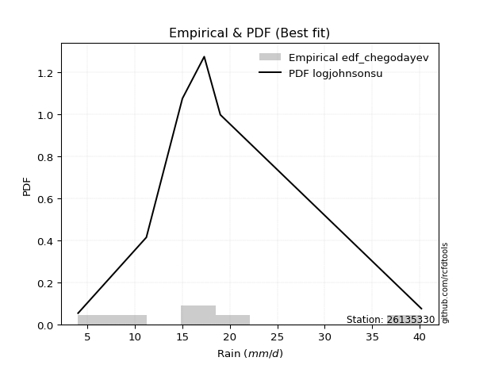</img>

</div>


### 6. Empirical - EDF Blom (1958)

The Blom formula is a specific "plotting position" formula used in hydrology and statistical analysis to estimate the empirical cumulative probability (or non-exceedance probability) of a data series. It is particularly recommended for data that are approximately normally distributed. The constant _a_ is set to 0.375 (or 3/8).

<div align="center">


$P=(m-a)/(n+1-2a)$


</div>


**6.1. Empirical values**

<div align="center">

|                | 0                   | 1                   | 2        | 3                  | 4                  |
|:---------------|:--------------------|:--------------------|:---------|:-------------------|:-------------------|
| date           | 2021                | 2020                | 2019     | 2017               | 2018               |
| x              | 4.0                 | 11.2                | 15.0     | 17.3               | 19.0               |
| m              | 1                   | 2                   | 3        | 4                  | 5                  |
| empirical_dist | edf_blom            | edf_blom            | edf_blom | edf_blom           | edf_blom           |
| empirical      | 0.11904761904761904 | 0.30952380952380953 | 0.5      | 0.6904761904761905 | 0.8809523809523809 |
| empirical_tr   | 1.135135135135135   | 1.4482758620689655  | 2.0      | 3.230769230769231  | 8.399999999999999  |

</div>


**6.2. Kolmogorov-Smirnov fit test (sorted by Δ)**


<div align="center">

|                | 0                  | 1                   | 2                   | 3                  | 4                   | 5                   | 6                  | 7                   | 8                   | 9                   | 10                  | 11                  | 12                 | 13                 | 14                  | 15                 | 16                 | 17                  | 18                 | 19                  | 20                    | 21                 | 22                 | 23                  | 24                 | 25                 | 26                  | 27                  | 28                 | 29                  | 30                  | 31                  | 32                  | 33                 | 34                 | 35                 | 36                 | 37                 | 38                 | 39                  | 40                 | 41                 | 42                 | 43                 | 44                  | 45                  | 46                  | 47                  | 48                  | 49                  | 50                  | 51                  | 52                  | 53                 | 54                 | 55                  | 56                  | 57                 | 58                  | 59                  | 60                 | 61                  | 62                 | 63                  | 64                  | 65                  | 66                  | 67                  | 68                  | 69                 | 70                 | 71                 | 72                 | 73                  | 74                  | 75                 | 76                 | 77                  | 78                  | 79                 | 80                  | 81                 | 82                 | 83                 | 84                  | 85                  | 86                  | 87                 | 88                 | 89                 |
|:---------------|:-------------------|:--------------------|:--------------------|:-------------------|:--------------------|:--------------------|:-------------------|:--------------------|:--------------------|:--------------------|:--------------------|:--------------------|:-------------------|:-------------------|:--------------------|:-------------------|:-------------------|:--------------------|:-------------------|:--------------------|:----------------------|:-------------------|:-------------------|:--------------------|:-------------------|:-------------------|:--------------------|:--------------------|:-------------------|:--------------------|:--------------------|:--------------------|:--------------------|:-------------------|:-------------------|:-------------------|:-------------------|:-------------------|:-------------------|:--------------------|:-------------------|:-------------------|:-------------------|:-------------------|:--------------------|:--------------------|:--------------------|:--------------------|:--------------------|:--------------------|:--------------------|:--------------------|:--------------------|:-------------------|:-------------------|:--------------------|:--------------------|:-------------------|:--------------------|:--------------------|:-------------------|:--------------------|:-------------------|:--------------------|:--------------------|:--------------------|:--------------------|:--------------------|:--------------------|:-------------------|:-------------------|:-------------------|:-------------------|:--------------------|:--------------------|:-------------------|:-------------------|:--------------------|:--------------------|:-------------------|:--------------------|:-------------------|:-------------------|:-------------------|:--------------------|:--------------------|:--------------------|:-------------------|:-------------------|:-------------------|
| station        | 26135330           | 26135330            | 26135330            | 26135330           | 26135330            | 26135330            | 26135330           | 26135330            | 26135330            | 26135330            | 26135330            | 26135330            | 26135330           | 26135330           | 26135330            | 26135330           | 26135330           | 26135330            | 26135330           | 26135330            | 26135330              | 26135330           | 26135330           | 26135330            | 26135330           | 26135330           | 26135330            | 26135330            | 26135330           | 26135330            | 26135330            | 26135330            | 26135330            | 26135330           | 26135330           | 26135330           | 26135330           | 26135330           | 26135330           | 26135330            | 26135330           | 26135330           | 26135330           | 26135330           | 26135330            | 26135330            | 26135330            | 26135330            | 26135330            | 26135330            | 26135330            | 26135330            | 26135330            | 26135330           | 26135330           | 26135330            | 26135330            | 26135330           | 26135330            | 26135330            | 26135330           | 26135330            | 26135330           | 26135330            | 26135330            | 26135330            | 26135330            | 26135330            | 26135330            | 26135330           | 26135330           | 26135330           | 26135330           | 26135330            | 26135330            | 26135330           | 26135330           | 26135330            | 26135330            | 26135330           | 26135330            | 26135330           | 26135330           | 26135330           | 26135330            | 26135330            | 26135330            | 26135330           | 26135330           | 26135330           |
| empirical_dist | edf_blom           | edf_blom            | edf_blom            | edf_blom           | edf_blom            | edf_blom            | edf_blom           | edf_blom            | edf_blom            | edf_blom            | edf_blom            | edf_blom            | edf_blom           | edf_blom           | edf_blom            | edf_blom           | edf_blom           | edf_blom            | edf_blom           | edf_blom            | edf_blom              | edf_blom           | edf_blom           | edf_blom            | edf_blom           | edf_blom           | edf_blom            | edf_blom            | edf_blom           | edf_blom            | edf_blom            | edf_blom            | edf_blom            | edf_blom           | edf_blom           | edf_blom           | edf_blom           | edf_blom           | edf_blom           | edf_blom            | edf_blom           | edf_blom           | edf_blom           | edf_blom           | edf_blom            | edf_blom            | edf_blom            | edf_blom            | edf_blom            | edf_blom            | edf_blom            | edf_blom            | edf_blom            | edf_blom           | edf_blom           | edf_blom            | edf_blom            | edf_blom           | edf_blom            | edf_blom            | edf_blom           | edf_blom            | edf_blom           | edf_blom            | edf_blom            | edf_blom            | edf_blom            | edf_blom            | edf_blom            | edf_blom           | edf_blom           | edf_blom           | edf_blom           | edf_blom            | edf_blom            | edf_blom           | edf_blom           | edf_blom            | edf_blom            | edf_blom           | edf_blom            | edf_blom           | edf_blom           | edf_blom           | edf_blom            | edf_blom            | edf_blom            | edf_blom           | edf_blom           | edf_blom           |
| p_dist         | gumbel_l           | fisk                | pearson3            | weibull_min        | mielke              | logmielke           | logpearson3        | logfisk             | laplace_asymmetric  | t                   | exponnorm           | crystalball         | norm               | nct                | loggumbel_l         | f                  | betaprime          | gamma               | chi2               | rice                | loglaplace_asymmetric | logloggamma        | erlang             | alpha               | logistic           | logweibull_min     | invgauss            | invgamma            | maxwell            | loggompertz         | ncf                 | hypsecant           | gompertz            | rayleigh           | kstwobign          | logfatiguelife     | lognct             | logf               | logexponnorm       | logt                | logcrystalball     | lognorm            | lognorm            | logncf             | logrice             | loggamma            | loggamma            | genexpon            | logerlang           | halfnorm            | logalpha            | loginvgamma         | laplace             | loginvgauss        | loglogistic        | gumbel_r            | logbetaprime        | logmaxwell         | loghypsecant        | lograyleigh         | halflogistic       | loginvweibull       | moyal              | loggumbel_r         | expon               | loglaplace          | loghalfnorm         | logkstwobign        | logjohnsonsu        | loggenexpon        | logmoyal           | loghalflogistic    | wald               | johnsonsu           | gibrat              | logexpon           | logtruncnorm       | nakagami            | logwald             | loggibrat          | lognakagami         | logchi2            | pareto             | loglognorm         | logpareto           | truncnorm           | invweibull          | fatiguelife        | loggenlogistic     | genlogistic        |
| delta          | 0.0793410601857446 | 0.08109253438532504 | 0.08224509329914775 | 0.0854274529592065 | 0.09791541552185834 | 0.09983477986237721 | 0.1104344332378393 | 0.11217415066548864 | 0.11889302448743477 | 0.12498521043593191 | 0.12501359114913413 | 0.12501738174722266 | 0.1250174085982667 | 0.1252320223648673 | 0.12553189319726887 | 0.1259777626606695 | 0.126022308719004  | 0.12907516294149735 | 0.1294509517077509 | 0.13218631457743857 | 0.1329125451068186    | 0.1329812892224126 | 0.1337715126589153 | 0.13894870941593296 | 0.1406142475008354 | 0.1410445457238848 | 0.14271123876898184 | 0.14497338998100262 | 0.1492123137104071 | 0.15008635255510105 | 0.15062268514318655 | 0.15307647427697157 | 0.15393559528442516 | 0.1566012666317147 | 0.1651606953147149 | 0.1668501613643515 | 0.168132691966685  | 0.1685607694090776 | 0.1686130723254684 | 0.16861357037545788 | 0.1686136280405034 | 0.1686136350603329 | 0.1686136350603329 | 0.1700532274751131 | 0.17166246834601062 | 0.17456577581239918 | 0.17456577581239918 | 0.17517890155785465 | 0.17675602187623812 | 0.17782167845047925 | 0.17974880739247806 | 0.18078066185179498 | 0.18140552292948509 | 0.1822498199516256 | 0.1880409700418404 | 0.18860577525123767 | 0.18910675930260978 | 0.1927233860204789 | 0.20275451202530304 | 0.20434554251422288 | 0.20617899916977   | 0.20718930852340933 | 0.2099732546539671 | 0.22738323184912967 | 0.22940072431706315 | 0.23014460663628655 | 0.23710391890898785 | 0.24307531580761954 | 0.24468060635254923 | 0.2468363341070945 | 0.2531217152430414 | 0.2597936467573503 | 0.2699110596010468 | 0.28691226799258984 | 0.30207769083527236 | 0.3068074866186413 | 0.3095219191141136 | 0.30952217896661566 | 0.32476989024041203 | 0.3420673893946591 | 0.36025411027654763 | 0.366166677605246  | 0.3692380150397314 | 0.3757476408055057 | 0.38454549772867086 | 0.38958512571780446 | 0.47452798419925346 | 0.5237626218674472 | 0.6904761904761905 | 0.6904761904761905 |
| deltao         | 0.5865427407550001 | 0.5865427407550001  | 0.5865427407550001  | 0.5865427407550001 | 0.5865427407550001  | 0.5865427407550001  | 0.5865427407550001 | 0.5865427407550001  | 0.5865427407550001  | 0.5865427407550001  | 0.5865427407550001  | 0.5865427407550001  | 0.5865427407550001 | 0.5865427407550001 | 0.5865427407550001  | 0.5865427407550001 | 0.5865427407550001 | 0.5865427407550001  | 0.5865427407550001 | 0.5865427407550001  | 0.5865427407550001    | 0.5865427407550001 | 0.5865427407550001 | 0.5865427407550001  | 0.5865427407550001 | 0.5865427407550001 | 0.5865427407550001  | 0.5865427407550001  | 0.5865427407550001 | 0.5865427407550001  | 0.5865427407550001  | 0.5865427407550001  | 0.5865427407550001  | 0.5865427407550001 | 0.5865427407550001 | 0.5865427407550001 | 0.5865427407550001 | 0.5865427407550001 | 0.5865427407550001 | 0.5865427407550001  | 0.5865427407550001 | 0.5865427407550001 | 0.5865427407550001 | 0.5865427407550001 | 0.5865427407550001  | 0.5865427407550001  | 0.5865427407550001  | 0.5865427407550001  | 0.5865427407550001  | 0.5865427407550001  | 0.5865427407550001  | 0.5865427407550001  | 0.5865427407550001  | 0.5865427407550001 | 0.5865427407550001 | 0.5865427407550001  | 0.5865427407550001  | 0.5865427407550001 | 0.5865427407550001  | 0.5865427407550001  | 0.5865427407550001 | 0.5865427407550001  | 0.5865427407550001 | 0.5865427407550001  | 0.5865427407550001  | 0.5865427407550001  | 0.5865427407550001  | 0.5865427407550001  | 0.5865427407550001  | 0.5865427407550001 | 0.5865427407550001 | 0.5865427407550001 | 0.5865427407550001 | 0.5865427407550001  | 0.5865427407550001  | 0.5865427407550001 | 0.5865427407550001 | 0.5865427407550001  | 0.5865427407550001  | 0.5865427407550001 | 0.5865427407550001  | 0.5865427407550001 | 0.5865427407550001 | 0.5865427407550001 | 0.5865427407550001  | 0.5865427407550001  | 0.5865427407550001  | 0.5865427407550001 | 0.5865427407550001 | 0.5865427407550001 |
| eval           | Δo > Δ             | Δo > Δ              | Δo > Δ              | Δo > Δ             | Δo > Δ              | Δo > Δ              | Δo > Δ             | Δo > Δ              | Δo > Δ              | Δo > Δ              | Δo > Δ              | Δo > Δ              | Δo > Δ             | Δo > Δ             | Δo > Δ              | Δo > Δ             | Δo > Δ             | Δo > Δ              | Δo > Δ             | Δo > Δ              | Δo > Δ                | Δo > Δ             | Δo > Δ             | Δo > Δ              | Δo > Δ             | Δo > Δ             | Δo > Δ              | Δo > Δ              | Δo > Δ             | Δo > Δ              | Δo > Δ              | Δo > Δ              | Δo > Δ              | Δo > Δ             | Δo > Δ             | Δo > Δ             | Δo > Δ             | Δo > Δ             | Δo > Δ             | Δo > Δ              | Δo > Δ             | Δo > Δ             | Δo > Δ             | Δo > Δ             | Δo > Δ              | Δo > Δ              | Δo > Δ              | Δo > Δ              | Δo > Δ              | Δo > Δ              | Δo > Δ              | Δo > Δ              | Δo > Δ              | Δo > Δ             | Δo > Δ             | Δo > Δ              | Δo > Δ              | Δo > Δ             | Δo > Δ              | Δo > Δ              | Δo > Δ             | Δo > Δ              | Δo > Δ             | Δo > Δ              | Δo > Δ              | Δo > Δ              | Δo > Δ              | Δo > Δ              | Δo > Δ              | Δo > Δ             | Δo > Δ             | Δo > Δ             | Δo > Δ             | Δo > Δ              | Δo > Δ              | Δo > Δ             | Δo > Δ             | Δo > Δ              | Δo > Δ              | Δo > Δ             | Δo > Δ              | Δo > Δ             | Δo > Δ             | Δo > Δ             | Δo > Δ              | Δo > Δ              | Δo > Δ              | Δo > Δ             | Δo <= Δ            | Δo <= Δ            |
| fit            | 1                  | 1                   | 1                   | 1                  | 1                   | 1                   | 1                  | 1                   | 1                   | 1                   | 1                   | 1                   | 1                  | 1                  | 1                   | 1                  | 1                  | 1                   | 1                  | 1                   | 1                     | 1                  | 1                  | 1                   | 1                  | 1                  | 1                   | 1                   | 1                  | 1                   | 1                   | 1                   | 1                   | 1                  | 1                  | 1                  | 1                  | 1                  | 1                  | 1                   | 1                  | 1                  | 1                  | 1                  | 1                   | 1                   | 1                   | 1                   | 1                   | 1                   | 1                   | 1                   | 1                   | 1                  | 1                  | 1                   | 1                   | 1                  | 1                   | 1                   | 1                  | 1                   | 1                  | 1                   | 1                   | 1                   | 1                   | 1                   | 1                   | 1                  | 1                  | 1                  | 1                  | 1                   | 1                   | 1                  | 1                  | 1                   | 1                   | 1                  | 1                   | 1                  | 1                  | 1                  | 1                   | 1                   | 1                   | 1                  | 0                  | 0                  |
| n              | 5                  | 5                   | 5                   | 5                  | 5                   | 5                   | 5                  | 5                   | 5                   | 5                   | 5                   | 5                   | 5                  | 5                  | 5                   | 5                  | 5                  | 5                   | 5                  | 5                   | 5                     | 5                  | 5                  | 5                   | 5                  | 5                  | 5                   | 5                   | 5                  | 5                   | 5                   | 5                   | 5                   | 5                  | 5                  | 5                  | 5                  | 5                  | 5                  | 5                   | 5                  | 5                  | 5                  | 5                  | 5                   | 5                   | 5                   | 5                   | 5                   | 5                   | 5                   | 5                   | 5                   | 5                  | 5                  | 5                   | 5                   | 5                  | 5                   | 5                   | 5                  | 5                   | 5                  | 5                   | 5                   | 5                   | 5                   | 5                   | 5                   | 5                  | 5                  | 5                  | 5                  | 5                   | 5                   | 5                  | 5                  | 5                   | 5                   | 5                  | 5                   | 5                  | 5                  | 5                  | 5                   | 5                   | 5                   | 5                  | 5                  | 5                  |
| best_fit       | 1                  | 0                   | 0                   | 0                  | 0                   | 0                   | 0                  | 0                   | 0                   | 0                   | 0                   | 0                   | 0                  | 0                  | 0                   | 0                  | 0                  | 0                   | 0                  | 0                   | 0                     | 0                  | 0                  | 0                   | 0                  | 0                  | 0                   | 0                   | 0                  | 0                   | 0                   | 0                   | 0                   | 0                  | 0                  | 0                  | 0                  | 0                  | 0                  | 0                   | 0                  | 0                  | 0                  | 0                  | 0                   | 0                   | 0                   | 0                   | 0                   | 0                   | 0                   | 0                   | 0                   | 0                  | 0                  | 0                   | 0                   | 0                  | 0                   | 0                   | 0                  | 0                   | 0                  | 0                   | 0                   | 0                   | 0                   | 0                   | 0                   | 0                  | 0                  | 0                  | 0                  | 0                   | 0                   | 0                  | 0                  | 0                   | 0                   | 0                  | 0                   | 0                  | 0                  | 0                  | 0                   | 0                   | 0                   | 0                  | 0                  | 0                  |
| best_fit_sort  | 1                  | 2                   | 3                   | 4                  | 5                   | 6                   | 7                  | 8                   | 9                   | 10                  | 11                  | 12                  | 13                 | 14                 | 15                  | 16                 | 17                 | 18                  | 19                 | 20                  | 21                    | 22                 | 23                 | 24                  | 25                 | 26                 | 27                  | 28                  | 29                 | 30                  | 31                  | 32                  | 33                  | 34                 | 35                 | 36                 | 37                 | 38                 | 39                 | 40                  | 41                 | 42                 | 43                 | 44                 | 45                  | 46                  | 47                  | 48                  | 49                  | 50                  | 51                  | 52                  | 53                  | 54                 | 55                 | 56                  | 57                  | 58                 | 59                  | 60                  | 61                 | 62                  | 63                 | 64                  | 65                  | 66                  | 67                  | 68                  | 69                  | 70                 | 71                 | 72                 | 73                 | 74                  | 75                  | 76                 | 77                 | 78                  | 79                  | 80                 | 81                  | 82                 | 83                 | 84                 | 85                  | 86                  | 87                  | 88                 | 89                 | 90                 |

</div>


<div align="center">

</img>

</div>


**6.3. Best fit**

<div align="center">

|   id |   station | empirical_dist   | p_dist   |     delta |   deltao | eval   |   fit |   n |   best_fit |   best_fit_sort |
|-----:|----------:|:-----------------|:---------|----------:|---------:|:-------|------:|----:|-----------:|----------------:|
|    0 |  26135330 | edf_blom         | gumbel_l | 0.0793411 | 0.586543 | Δo > Δ |     1 |   5 |          1 |               1 |

</div>


<div align="center">

</img>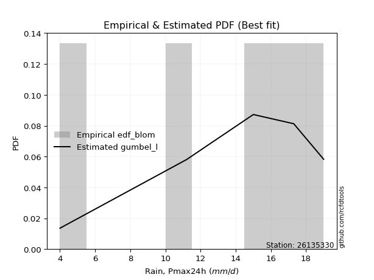</img>

</div>


### 7. Empirical - EDF Tukey (1962)

In hydrology, the Tukey formula is used as a plotting position formula to estimate the empirical probability or frequency of a flood event (or other hydrological data). The formula parameter is given as _c=0.333_ (or 1/3).

<div align="center">


$P=(m-c)/(n+1-2c)$


</div>


**7.1. Empirical values**

<div align="center">

|                | 0                  | 1                  | 2         | 3         | 4         |
|:---------------|:-------------------|:-------------------|:----------|:----------|:----------|
| date           | 2021               | 2020               | 2019      | 2017      | 2018      |
| x              | 4.0                | 11.2               | 15.0      | 17.3      | 19.0      |
| m              | 1                  | 2                  | 3         | 4         | 5         |
| empirical_dist | edf_tukey          | edf_tukey          | edf_tukey | edf_tukey | edf_tukey |
| empirical      | 0.125              | 0.3125             | 0.5       | 0.6875    | 0.875     |
| empirical_tr   | 1.1428571428571428 | 1.4545454545454546 | 2.0       | 3.2       | 8.0       |

</div>


**7.2. Kolmogorov-Smirnov fit test (sorted by Δ)**


<div align="center">

|                | 0                   | 1                   | 2                   | 3                   | 4                   | 5                   | 6                  | 7                   | 8                  | 9                   | 10                  | 11                  | 12                 | 13                 | 14                  | 15                 | 16                 | 17                  | 18                 | 19                  | 20                 | 21                    | 22                  | 23                  | 24                 | 25                 | 26                  | 27                  | 28                 | 29                  | 30                  | 31                  | 32                 | 33                  | 34                 | 35                 | 36                  | 37                 | 38                 | 39                 | 40                  | 41                 | 42                 | 43                 | 44                  | 45                  | 46                  | 47                  | 48                  | 49                 | 50                  | 51                 | 52                  | 53                  | 54                  | 55                 | 56                  | 57                  | 58                 | 59                  | 60                  | 61                 | 62                 | 63                  | 64                 | 65                  | 66                 | 67                  | 68                  | 69                  | 70                 | 71                 | 72                 | 73                 | 74                  | 75                  | 76                  | 77                 | 78                  | 79                 | 80                  | 81                  | 82                  | 83                  | 84                 | 85                 | 86                  | 87                 | 88                 | 89                 |
|:---------------|:--------------------|:--------------------|:--------------------|:--------------------|:--------------------|:--------------------|:-------------------|:--------------------|:-------------------|:--------------------|:--------------------|:--------------------|:-------------------|:-------------------|:--------------------|:-------------------|:-------------------|:--------------------|:-------------------|:--------------------|:-------------------|:----------------------|:--------------------|:--------------------|:-------------------|:-------------------|:--------------------|:--------------------|:-------------------|:--------------------|:--------------------|:--------------------|:-------------------|:--------------------|:-------------------|:-------------------|:--------------------|:-------------------|:-------------------|:-------------------|:--------------------|:-------------------|:-------------------|:-------------------|:--------------------|:--------------------|:--------------------|:--------------------|:--------------------|:-------------------|:--------------------|:-------------------|:--------------------|:--------------------|:--------------------|:-------------------|:--------------------|:--------------------|:-------------------|:--------------------|:--------------------|:-------------------|:-------------------|:--------------------|:-------------------|:--------------------|:-------------------|:--------------------|:--------------------|:--------------------|:-------------------|:-------------------|:-------------------|:-------------------|:--------------------|:--------------------|:--------------------|:-------------------|:--------------------|:-------------------|:--------------------|:--------------------|:--------------------|:--------------------|:-------------------|:-------------------|:--------------------|:-------------------|:-------------------|:-------------------|
| station        | 26135330            | 26135330            | 26135330            | 26135330            | 26135330            | 26135330            | 26135330           | 26135330            | 26135330           | 26135330            | 26135330            | 26135330            | 26135330           | 26135330           | 26135330            | 26135330           | 26135330           | 26135330            | 26135330           | 26135330            | 26135330           | 26135330              | 26135330            | 26135330            | 26135330           | 26135330           | 26135330            | 26135330            | 26135330           | 26135330            | 26135330            | 26135330            | 26135330           | 26135330            | 26135330           | 26135330           | 26135330            | 26135330           | 26135330           | 26135330           | 26135330            | 26135330           | 26135330           | 26135330           | 26135330            | 26135330            | 26135330            | 26135330            | 26135330            | 26135330           | 26135330            | 26135330           | 26135330            | 26135330            | 26135330            | 26135330           | 26135330            | 26135330            | 26135330           | 26135330            | 26135330            | 26135330           | 26135330           | 26135330            | 26135330           | 26135330            | 26135330           | 26135330            | 26135330            | 26135330            | 26135330           | 26135330           | 26135330           | 26135330           | 26135330            | 26135330            | 26135330            | 26135330           | 26135330            | 26135330           | 26135330            | 26135330            | 26135330            | 26135330            | 26135330           | 26135330           | 26135330            | 26135330           | 26135330           | 26135330           |
| empirical_dist | edf_tukey           | edf_tukey           | edf_tukey           | edf_tukey           | edf_tukey           | edf_tukey           | edf_tukey          | edf_tukey           | edf_tukey          | edf_tukey           | edf_tukey           | edf_tukey           | edf_tukey          | edf_tukey          | edf_tukey           | edf_tukey          | edf_tukey          | edf_tukey           | edf_tukey          | edf_tukey           | edf_tukey          | edf_tukey             | edf_tukey           | edf_tukey           | edf_tukey          | edf_tukey          | edf_tukey           | edf_tukey           | edf_tukey          | edf_tukey           | edf_tukey           | edf_tukey           | edf_tukey          | edf_tukey           | edf_tukey          | edf_tukey          | edf_tukey           | edf_tukey          | edf_tukey          | edf_tukey          | edf_tukey           | edf_tukey          | edf_tukey          | edf_tukey          | edf_tukey           | edf_tukey           | edf_tukey           | edf_tukey           | edf_tukey           | edf_tukey          | edf_tukey           | edf_tukey          | edf_tukey           | edf_tukey           | edf_tukey           | edf_tukey          | edf_tukey           | edf_tukey           | edf_tukey          | edf_tukey           | edf_tukey           | edf_tukey          | edf_tukey          | edf_tukey           | edf_tukey          | edf_tukey           | edf_tukey          | edf_tukey           | edf_tukey           | edf_tukey           | edf_tukey          | edf_tukey          | edf_tukey          | edf_tukey          | edf_tukey           | edf_tukey           | edf_tukey           | edf_tukey          | edf_tukey           | edf_tukey          | edf_tukey           | edf_tukey           | edf_tukey           | edf_tukey           | edf_tukey          | edf_tukey          | edf_tukey           | edf_tukey          | edf_tukey          | edf_tukey          |
| p_dist         | pearson3            | gumbel_l            | fisk                | weibull_min         | logmielke           | mielke              | logpearson3        | logfisk             | laplace_asymmetric | t                   | exponnorm           | crystalball         | norm               | nct                | loggumbel_l         | f                  | betaprime          | gamma               | chi2               | rice                | erlang             | loglaplace_asymmetric | logloggamma         | alpha               | logistic           | logweibull_min     | invgauss            | invgamma            | maxwell            | loggompertz         | ncf                 | hypsecant           | rayleigh           | gompertz            | kstwobign          | logfatiguelife     | logncf              | lognct             | logf               | logexponnorm       | logt                | logcrystalball     | lognorm            | lognorm            | logrice             | logerlang           | loggamma            | loggamma            | genexpon            | logalpha           | halfnorm            | loginvgamma        | loginvgauss         | laplace             | logbetaprime        | loglogistic        | gumbel_r            | logmaxwell          | lograyleigh        | loghypsecant        | loginvweibull       | halflogistic       | moyal              | loggumbel_r         | expon              | loglaplace          | loghalfnorm        | logkstwobign        | logjohnsonsu        | loggenexpon         | logmoyal           | loghalflogistic    | wald               | johnsonsu          | gibrat              | logexpon            | logtruncnorm        | nakagami           | logwald             | loggibrat          | lognakagami         | logchi2             | pareto              | loglognorm          | logpareto          | truncnorm          | invweibull          | fatiguelife        | loggenlogistic     | genlogistic        |
| delta          | 0.08224509329914775 | 0.08231725066193507 | 0.08668729027068883 | 0.08840364343539697 | 0.10281097033856768 | 0.10386779647423927 | 0.1104344332378393 | 0.11217415066548864 | 0.1248454054398157 | 0.12498521043593191 | 0.12501359114913413 | 0.12501738174722266 | 0.1250174085982667 | 0.1252320223648673 | 0.12553189319726887 | 0.1259777626606695 | 0.126022308719004  | 0.12907516294149735 | 0.1294509517077509 | 0.13218631457743857 | 0.1337715126589153 | 0.13588873558300907   | 0.13595747969860306 | 0.13894870941593296 | 0.1406142475008354 | 0.1410445457238848 | 0.14271123876898184 | 0.14497338998100262 | 0.1492123137104071 | 0.15008635255510105 | 0.15062268514318655 | 0.15307647427697157 | 0.1566012666317147 | 0.15691178576061562 | 0.1651606953147149 | 0.1668501613643515 | 0.16707703699892262 | 0.168132691966685  | 0.1685607694090776 | 0.1686130723254684 | 0.16861357037545788 | 0.1686136280405034 | 0.1686136350603329 | 0.1686136350603329 | 0.17166246834601062 | 0.17379369730624883 | 0.17456577581239918 | 0.17456577581239918 | 0.17517890155785465 | 0.1767726169162876 | 0.17782167845047925 | 0.1778514360016985 | 0.17927362947543513 | 0.18140552292948509 | 0.18613056882641932 | 0.1880409700418404 | 0.18860577525123767 | 0.18974719554428843 | 0.2013693520380324 | 0.20275451202530304 | 0.20421311804721887 | 0.20617899916977   | 0.2099732546539671 | 0.22547130325666875 | 0.2264245338408727 | 0.23014460663628655 | 0.2341277284327974 | 0.24009912533142908 | 0.24170441587635877 | 0.24386014363090402 | 0.2501455247668509 | 0.2568174562811598 | 0.2699110596010468 | 0.2839360775163994 | 0.30207769083527236 | 0.30383129614245086 | 0.31249810959030405 | 0.3124983694428061 | 0.32179369976422156 | 0.3390911989184686 | 0.36025411027654763 | 0.36319048712905555 | 0.36626182456354095 | 0.37277145032931525 | 0.3815693072524804 | 0.386608935241614  | 0.46857560324687253 | 0.5207864313912567 | 0.6875             | 0.6875             |
| deltao         | 0.5865427407550001  | 0.5865427407550001  | 0.5865427407550001  | 0.5865427407550001  | 0.5865427407550001  | 0.5865427407550001  | 0.5865427407550001 | 0.5865427407550001  | 0.5865427407550001 | 0.5865427407550001  | 0.5865427407550001  | 0.5865427407550001  | 0.5865427407550001 | 0.5865427407550001 | 0.5865427407550001  | 0.5865427407550001 | 0.5865427407550001 | 0.5865427407550001  | 0.5865427407550001 | 0.5865427407550001  | 0.5865427407550001 | 0.5865427407550001    | 0.5865427407550001  | 0.5865427407550001  | 0.5865427407550001 | 0.5865427407550001 | 0.5865427407550001  | 0.5865427407550001  | 0.5865427407550001 | 0.5865427407550001  | 0.5865427407550001  | 0.5865427407550001  | 0.5865427407550001 | 0.5865427407550001  | 0.5865427407550001 | 0.5865427407550001 | 0.5865427407550001  | 0.5865427407550001 | 0.5865427407550001 | 0.5865427407550001 | 0.5865427407550001  | 0.5865427407550001 | 0.5865427407550001 | 0.5865427407550001 | 0.5865427407550001  | 0.5865427407550001  | 0.5865427407550001  | 0.5865427407550001  | 0.5865427407550001  | 0.5865427407550001 | 0.5865427407550001  | 0.5865427407550001 | 0.5865427407550001  | 0.5865427407550001  | 0.5865427407550001  | 0.5865427407550001 | 0.5865427407550001  | 0.5865427407550001  | 0.5865427407550001 | 0.5865427407550001  | 0.5865427407550001  | 0.5865427407550001 | 0.5865427407550001 | 0.5865427407550001  | 0.5865427407550001 | 0.5865427407550001  | 0.5865427407550001 | 0.5865427407550001  | 0.5865427407550001  | 0.5865427407550001  | 0.5865427407550001 | 0.5865427407550001 | 0.5865427407550001 | 0.5865427407550001 | 0.5865427407550001  | 0.5865427407550001  | 0.5865427407550001  | 0.5865427407550001 | 0.5865427407550001  | 0.5865427407550001 | 0.5865427407550001  | 0.5865427407550001  | 0.5865427407550001  | 0.5865427407550001  | 0.5865427407550001 | 0.5865427407550001 | 0.5865427407550001  | 0.5865427407550001 | 0.5865427407550001 | 0.5865427407550001 |
| eval           | Δo > Δ              | Δo > Δ              | Δo > Δ              | Δo > Δ              | Δo > Δ              | Δo > Δ              | Δo > Δ             | Δo > Δ              | Δo > Δ             | Δo > Δ              | Δo > Δ              | Δo > Δ              | Δo > Δ             | Δo > Δ             | Δo > Δ              | Δo > Δ             | Δo > Δ             | Δo > Δ              | Δo > Δ             | Δo > Δ              | Δo > Δ             | Δo > Δ                | Δo > Δ              | Δo > Δ              | Δo > Δ             | Δo > Δ             | Δo > Δ              | Δo > Δ              | Δo > Δ             | Δo > Δ              | Δo > Δ              | Δo > Δ              | Δo > Δ             | Δo > Δ              | Δo > Δ             | Δo > Δ             | Δo > Δ              | Δo > Δ             | Δo > Δ             | Δo > Δ             | Δo > Δ              | Δo > Δ             | Δo > Δ             | Δo > Δ             | Δo > Δ              | Δo > Δ              | Δo > Δ              | Δo > Δ              | Δo > Δ              | Δo > Δ             | Δo > Δ              | Δo > Δ             | Δo > Δ              | Δo > Δ              | Δo > Δ              | Δo > Δ             | Δo > Δ              | Δo > Δ              | Δo > Δ             | Δo > Δ              | Δo > Δ              | Δo > Δ             | Δo > Δ             | Δo > Δ              | Δo > Δ             | Δo > Δ              | Δo > Δ             | Δo > Δ              | Δo > Δ              | Δo > Δ              | Δo > Δ             | Δo > Δ             | Δo > Δ             | Δo > Δ             | Δo > Δ              | Δo > Δ              | Δo > Δ              | Δo > Δ             | Δo > Δ              | Δo > Δ             | Δo > Δ              | Δo > Δ              | Δo > Δ              | Δo > Δ              | Δo > Δ             | Δo > Δ             | Δo > Δ              | Δo > Δ             | Δo <= Δ            | Δo <= Δ            |
| fit            | 1                   | 1                   | 1                   | 1                   | 1                   | 1                   | 1                  | 1                   | 1                  | 1                   | 1                   | 1                   | 1                  | 1                  | 1                   | 1                  | 1                  | 1                   | 1                  | 1                   | 1                  | 1                     | 1                   | 1                   | 1                  | 1                  | 1                   | 1                   | 1                  | 1                   | 1                   | 1                   | 1                  | 1                   | 1                  | 1                  | 1                   | 1                  | 1                  | 1                  | 1                   | 1                  | 1                  | 1                  | 1                   | 1                   | 1                   | 1                   | 1                   | 1                  | 1                   | 1                  | 1                   | 1                   | 1                   | 1                  | 1                   | 1                   | 1                  | 1                   | 1                   | 1                  | 1                  | 1                   | 1                  | 1                   | 1                  | 1                   | 1                   | 1                   | 1                  | 1                  | 1                  | 1                  | 1                   | 1                   | 1                   | 1                  | 1                   | 1                  | 1                   | 1                   | 1                   | 1                   | 1                  | 1                  | 1                   | 1                  | 0                  | 0                  |
| n              | 5                   | 5                   | 5                   | 5                   | 5                   | 5                   | 5                  | 5                   | 5                  | 5                   | 5                   | 5                   | 5                  | 5                  | 5                   | 5                  | 5                  | 5                   | 5                  | 5                   | 5                  | 5                     | 5                   | 5                   | 5                  | 5                  | 5                   | 5                   | 5                  | 5                   | 5                   | 5                   | 5                  | 5                   | 5                  | 5                  | 5                   | 5                  | 5                  | 5                  | 5                   | 5                  | 5                  | 5                  | 5                   | 5                   | 5                   | 5                   | 5                   | 5                  | 5                   | 5                  | 5                   | 5                   | 5                   | 5                  | 5                   | 5                   | 5                  | 5                   | 5                   | 5                  | 5                  | 5                   | 5                  | 5                   | 5                  | 5                   | 5                   | 5                   | 5                  | 5                  | 5                  | 5                  | 5                   | 5                   | 5                   | 5                  | 5                   | 5                  | 5                   | 5                   | 5                   | 5                   | 5                  | 5                  | 5                   | 5                  | 5                  | 5                  |
| best_fit       | 1                   | 0                   | 0                   | 0                   | 0                   | 0                   | 0                  | 0                   | 0                  | 0                   | 0                   | 0                   | 0                  | 0                  | 0                   | 0                  | 0                  | 0                   | 0                  | 0                   | 0                  | 0                     | 0                   | 0                   | 0                  | 0                  | 0                   | 0                   | 0                  | 0                   | 0                   | 0                   | 0                  | 0                   | 0                  | 0                  | 0                   | 0                  | 0                  | 0                  | 0                   | 0                  | 0                  | 0                  | 0                   | 0                   | 0                   | 0                   | 0                   | 0                  | 0                   | 0                  | 0                   | 0                   | 0                   | 0                  | 0                   | 0                   | 0                  | 0                   | 0                   | 0                  | 0                  | 0                   | 0                  | 0                   | 0                  | 0                   | 0                   | 0                   | 0                  | 0                  | 0                  | 0                  | 0                   | 0                   | 0                   | 0                  | 0                   | 0                  | 0                   | 0                   | 0                   | 0                   | 0                  | 0                  | 0                   | 0                  | 0                  | 0                  |
| best_fit_sort  | 1                   | 2                   | 3                   | 4                   | 5                   | 6                   | 7                  | 8                   | 9                  | 10                  | 11                  | 12                  | 13                 | 14                 | 15                  | 16                 | 17                 | 18                  | 19                 | 20                  | 21                 | 22                    | 23                  | 24                  | 25                 | 26                 | 27                  | 28                  | 29                 | 30                  | 31                  | 32                  | 33                 | 34                  | 35                 | 36                 | 37                  | 38                 | 39                 | 40                 | 41                  | 42                 | 43                 | 44                 | 45                  | 46                  | 47                  | 48                  | 49                  | 50                 | 51                  | 52                 | 53                  | 54                  | 55                  | 56                 | 57                  | 58                  | 59                 | 60                  | 61                  | 62                 | 63                 | 64                  | 65                 | 66                  | 67                 | 68                  | 69                  | 70                  | 71                 | 72                 | 73                 | 74                 | 75                  | 76                  | 77                  | 78                 | 79                  | 80                 | 81                  | 82                  | 83                  | 84                  | 85                 | 86                 | 87                  | 88                 | 89                 | 90                 |

</div>


<div align="center">

</img>

</div>


**7.3. Best fit**

<div align="center">

|   id |   station | empirical_dist   | p_dist   |     delta |   deltao | eval   |   fit |   n |   best_fit |   best_fit_sort |
|-----:|----------:|:-----------------|:---------|----------:|---------:|:-------|------:|----:|-----------:|----------------:|
|    0 |  26135330 | edf_tukey        | pearson3 | 0.0822451 | 0.586543 | Δo > Δ |     1 |   5 |          1 |               1 |

</div>


<div align="center">

</img></img>

</div>


### 8. Empirical - EDF Gringorten (1963)

Gringorten plotting position formula is essential for estimating the probability and return periods of extreme events like floods and heavy rainfall. The constant _a=0.44_.

<div align="center">


$P=(m-a)/(n+1-2a)$


</div>


**8.1. Empirical values**

<div align="center">

|                | 0                   | 1                  | 2              | 3                 | 4                  |
|:---------------|:--------------------|:-------------------|:---------------|:------------------|:-------------------|
| date           | 2021                | 2020               | 2019           | 2017              | 2018               |
| x              | 4.0                 | 11.2               | 15.0           | 17.3              | 19.0               |
| m              | 1                   | 2                  | 3              | 4                 | 5                  |
| empirical_dist | edf_gringorten      | edf_gringorten     | edf_gringorten | edf_gringorten    | edf_gringorten     |
| empirical      | 0.10937500000000001 | 0.3046875          | 0.5            | 0.6953125         | 0.8906249999999999 |
| empirical_tr   | 1.1228070175438596  | 1.4382022471910112 | 2.0            | 3.282051282051282 | 9.142857142857133  |

</div>


**8.2. Kolmogorov-Smirnov fit test (sorted by Δ)**


<div align="center">

|                | 0                   | 1                   | 2                   | 3                   | 4                   | 5                   | 6                   | 7                  | 8                  | 9                   | 10                  | 11                  | 12                 | 13                 | 14                  | 15                 | 16                 | 17                    | 18                  | 19                  | 20                 | 21                  | 22                 | 23                  | 24                 | 25                 | 26                  | 27                  | 28                  | 29                 | 30                  | 31                  | 32                  | 33                 | 34                 | 35                 | 36                 | 37                 | 38                 | 39                  | 40                 | 41                 | 42                 | 43                 | 44                  | 45                  | 46                  | 47                  | 48                  | 49                  | 50                  | 51                 | 52                 | 53                  | 54                 | 55                  | 56                  | 57                  | 58                  | 59                 | 60                 | 61                 | 62                  | 63                  | 64                 | 65                 | 66                 | 67                  | 68                  | 69                 | 70                 | 71                 | 72                 | 73                 | 74                  | 75                  | 76                 | 77                  | 78                  | 79                 | 80                  | 81                  | 82                  | 83                  | 84                 | 85                 | 86                 | 87                 | 88                 | 89                 |
|:---------------|:--------------------|:--------------------|:--------------------|:--------------------|:--------------------|:--------------------|:--------------------|:-------------------|:-------------------|:--------------------|:--------------------|:--------------------|:-------------------|:-------------------|:--------------------|:-------------------|:-------------------|:----------------------|:--------------------|:--------------------|:-------------------|:--------------------|:-------------------|:--------------------|:-------------------|:-------------------|:--------------------|:--------------------|:--------------------|:-------------------|:--------------------|:--------------------|:--------------------|:-------------------|:-------------------|:-------------------|:-------------------|:-------------------|:-------------------|:--------------------|:-------------------|:-------------------|:-------------------|:-------------------|:--------------------|:--------------------|:--------------------|:--------------------|:--------------------|:--------------------|:--------------------|:-------------------|:-------------------|:--------------------|:-------------------|:--------------------|:--------------------|:--------------------|:--------------------|:-------------------|:-------------------|:-------------------|:--------------------|:--------------------|:-------------------|:-------------------|:-------------------|:--------------------|:--------------------|:-------------------|:-------------------|:-------------------|:-------------------|:-------------------|:--------------------|:--------------------|:-------------------|:--------------------|:--------------------|:-------------------|:--------------------|:--------------------|:--------------------|:--------------------|:-------------------|:-------------------|:-------------------|:-------------------|:-------------------|:-------------------|
| station        | 26135330            | 26135330            | 26135330            | 26135330            | 26135330            | 26135330            | 26135330            | 26135330           | 26135330           | 26135330            | 26135330            | 26135330            | 26135330           | 26135330           | 26135330            | 26135330           | 26135330           | 26135330              | 26135330            | 26135330            | 26135330           | 26135330            | 26135330           | 26135330            | 26135330           | 26135330           | 26135330            | 26135330            | 26135330            | 26135330           | 26135330            | 26135330            | 26135330            | 26135330           | 26135330           | 26135330           | 26135330           | 26135330           | 26135330           | 26135330            | 26135330           | 26135330           | 26135330           | 26135330           | 26135330            | 26135330            | 26135330            | 26135330            | 26135330            | 26135330            | 26135330            | 26135330           | 26135330           | 26135330            | 26135330           | 26135330            | 26135330            | 26135330            | 26135330            | 26135330           | 26135330           | 26135330           | 26135330            | 26135330            | 26135330           | 26135330           | 26135330           | 26135330            | 26135330            | 26135330           | 26135330           | 26135330           | 26135330           | 26135330           | 26135330            | 26135330            | 26135330           | 26135330            | 26135330            | 26135330           | 26135330            | 26135330            | 26135330            | 26135330            | 26135330           | 26135330           | 26135330           | 26135330           | 26135330           | 26135330           |
| empirical_dist | edf_gringorten      | edf_gringorten      | edf_gringorten      | edf_gringorten      | edf_gringorten      | edf_gringorten      | edf_gringorten      | edf_gringorten     | edf_gringorten     | edf_gringorten      | edf_gringorten      | edf_gringorten      | edf_gringorten     | edf_gringorten     | edf_gringorten      | edf_gringorten     | edf_gringorten     | edf_gringorten        | edf_gringorten      | edf_gringorten      | edf_gringorten     | edf_gringorten      | edf_gringorten     | edf_gringorten      | edf_gringorten     | edf_gringorten     | edf_gringorten      | edf_gringorten      | edf_gringorten      | edf_gringorten     | edf_gringorten      | edf_gringorten      | edf_gringorten      | edf_gringorten     | edf_gringorten     | edf_gringorten     | edf_gringorten     | edf_gringorten     | edf_gringorten     | edf_gringorten      | edf_gringorten     | edf_gringorten     | edf_gringorten     | edf_gringorten     | edf_gringorten      | edf_gringorten      | edf_gringorten      | edf_gringorten      | edf_gringorten      | edf_gringorten      | edf_gringorten      | edf_gringorten     | edf_gringorten     | edf_gringorten      | edf_gringorten     | edf_gringorten      | edf_gringorten      | edf_gringorten      | edf_gringorten      | edf_gringorten     | edf_gringorten     | edf_gringorten     | edf_gringorten      | edf_gringorten      | edf_gringorten     | edf_gringorten     | edf_gringorten     | edf_gringorten      | edf_gringorten      | edf_gringorten     | edf_gringorten     | edf_gringorten     | edf_gringorten     | edf_gringorten     | edf_gringorten      | edf_gringorten      | edf_gringorten     | edf_gringorten      | edf_gringorten      | edf_gringorten     | edf_gringorten      | edf_gringorten      | edf_gringorten      | edf_gringorten      | edf_gringorten     | edf_gringorten     | edf_gringorten     | edf_gringorten     | edf_gringorten     | edf_gringorten     |
| p_dist         | gumbel_l            | weibull_min         | fisk                | pearson3            | mielke              | logmielke           | laplace_asymmetric  | logpearson3        | logfisk            | t                   | exponnorm           | crystalball         | norm               | nct                | loggumbel_l         | f                  | betaprime          | loglaplace_asymmetric | logloggamma         | gamma               | chi2               | rice                | erlang             | alpha               | logistic           | logweibull_min     | invgauss            | invgamma            | gompertz            | maxwell            | loggompertz         | ncf                 | hypsecant           | rayleigh           | kstwobign          | logfatiguelife     | lognct             | logf               | logexponnorm       | logt                | logcrystalball     | lognorm            | lognorm            | logrice            | logncf              | genexpon            | loggamma            | loggamma            | halfnorm            | laplace             | logerlang           | logalpha           | loginvgamma        | loginvgauss         | loglogistic        | gumbel_r            | logbetaprime        | logmaxwell          | loghypsecant        | halflogistic       | lograyleigh        | moyal              | loginvweibull       | loglaplace          | loggumbel_r        | expon              | loghalfnorm        | logkstwobign        | logjohnsonsu        | loggenexpon        | logmoyal           | loghalflogistic    | wald               | johnsonsu          | gibrat              | logtruncnorm        | nakagami           | logexpon            | logwald             | loggibrat          | lognakagami         | logchi2             | pareto              | loglognorm          | logpareto          | truncnorm          | invweibull         | fatiguelife        | loggenlogistic     | genlogistic        |
| delta          | 0.07450475066193507 | 0.08059114343539697 | 0.08109253438532504 | 0.08224509329914775 | 0.08824279647423938 | 0.09856873791217069 | 0.10922040543981582 | 0.1104344332378393 | 0.116845234397574  | 0.12498521043593191 | 0.12501359114913413 | 0.12501738174722266 | 0.1250174085982667 | 0.1252320223648673 | 0.12553189319726887 | 0.1259777626606695 | 0.126022308719004  | 0.12807623558300907   | 0.12814497969860306 | 0.12907516294149735 | 0.1294509517077509 | 0.13218631457743857 | 0.1337715126589153 | 0.13894870941593296 | 0.1406142475008354 | 0.1410445457238848 | 0.14271123876898184 | 0.14497338998100262 | 0.14909928576061562 | 0.1492123137104071 | 0.15008635255510105 | 0.15062268514318655 | 0.15307647427697157 | 0.1566012666317147 | 0.1651606953147149 | 0.1668501613643515 | 0.168132691966685  | 0.1685607694090776 | 0.1686130723254684 | 0.16861357037545788 | 0.1686136280405034 | 0.1686136350603329 | 0.1686136350603329 | 0.1733234722016373 | 0.17488953699892262 | 0.17517890155785465 | 0.17771878182031065 | 0.17771878182031065 | 0.17782167845047925 | 0.18140552292948509 | 0.18159233140004766 | 0.1845851169162876 | 0.1856169713756045 | 0.18708612947543513 | 0.1880409700418404 | 0.18860577525123767 | 0.19394306882641932 | 0.19755969554428843 | 0.20275451202530304 | 0.20617899916977   | 0.2091818520380324 | 0.2099732546539671 | 0.21202561804721887 | 0.23014460663628655 | 0.2322195413729392 | 0.2342370338408727 | 0.2419402284327974 | 0.24791162533142908 | 0.24951691587635877 | 0.251672643630904  | 0.2579580247668509 | 0.2646299562811598 | 0.2699110596010468 | 0.2917485775163994 | 0.30207769083527236 | 0.30468560959030405 | 0.3046858694428061 | 0.31164379614245086 | 0.32960619976422156 | 0.3469036989184686 | 0.36025411027654763 | 0.37100298712905555 | 0.37407432456354095 | 0.38058395032931525 | 0.3893818072524804 | 0.394421435241614  | 0.4842006032468724 | 0.5285989313912567 | 0.6953125          | 0.6953125          |
| deltao         | 0.5865427407550001  | 0.5865427407550001  | 0.5865427407550001  | 0.5865427407550001  | 0.5865427407550001  | 0.5865427407550001  | 0.5865427407550001  | 0.5865427407550001 | 0.5865427407550001 | 0.5865427407550001  | 0.5865427407550001  | 0.5865427407550001  | 0.5865427407550001 | 0.5865427407550001 | 0.5865427407550001  | 0.5865427407550001 | 0.5865427407550001 | 0.5865427407550001    | 0.5865427407550001  | 0.5865427407550001  | 0.5865427407550001 | 0.5865427407550001  | 0.5865427407550001 | 0.5865427407550001  | 0.5865427407550001 | 0.5865427407550001 | 0.5865427407550001  | 0.5865427407550001  | 0.5865427407550001  | 0.5865427407550001 | 0.5865427407550001  | 0.5865427407550001  | 0.5865427407550001  | 0.5865427407550001 | 0.5865427407550001 | 0.5865427407550001 | 0.5865427407550001 | 0.5865427407550001 | 0.5865427407550001 | 0.5865427407550001  | 0.5865427407550001 | 0.5865427407550001 | 0.5865427407550001 | 0.5865427407550001 | 0.5865427407550001  | 0.5865427407550001  | 0.5865427407550001  | 0.5865427407550001  | 0.5865427407550001  | 0.5865427407550001  | 0.5865427407550001  | 0.5865427407550001 | 0.5865427407550001 | 0.5865427407550001  | 0.5865427407550001 | 0.5865427407550001  | 0.5865427407550001  | 0.5865427407550001  | 0.5865427407550001  | 0.5865427407550001 | 0.5865427407550001 | 0.5865427407550001 | 0.5865427407550001  | 0.5865427407550001  | 0.5865427407550001 | 0.5865427407550001 | 0.5865427407550001 | 0.5865427407550001  | 0.5865427407550001  | 0.5865427407550001 | 0.5865427407550001 | 0.5865427407550001 | 0.5865427407550001 | 0.5865427407550001 | 0.5865427407550001  | 0.5865427407550001  | 0.5865427407550001 | 0.5865427407550001  | 0.5865427407550001  | 0.5865427407550001 | 0.5865427407550001  | 0.5865427407550001  | 0.5865427407550001  | 0.5865427407550001  | 0.5865427407550001 | 0.5865427407550001 | 0.5865427407550001 | 0.5865427407550001 | 0.5865427407550001 | 0.5865427407550001 |
| eval           | Δo > Δ              | Δo > Δ              | Δo > Δ              | Δo > Δ              | Δo > Δ              | Δo > Δ              | Δo > Δ              | Δo > Δ             | Δo > Δ             | Δo > Δ              | Δo > Δ              | Δo > Δ              | Δo > Δ             | Δo > Δ             | Δo > Δ              | Δo > Δ             | Δo > Δ             | Δo > Δ                | Δo > Δ              | Δo > Δ              | Δo > Δ             | Δo > Δ              | Δo > Δ             | Δo > Δ              | Δo > Δ             | Δo > Δ             | Δo > Δ              | Δo > Δ              | Δo > Δ              | Δo > Δ             | Δo > Δ              | Δo > Δ              | Δo > Δ              | Δo > Δ             | Δo > Δ             | Δo > Δ             | Δo > Δ             | Δo > Δ             | Δo > Δ             | Δo > Δ              | Δo > Δ             | Δo > Δ             | Δo > Δ             | Δo > Δ             | Δo > Δ              | Δo > Δ              | Δo > Δ              | Δo > Δ              | Δo > Δ              | Δo > Δ              | Δo > Δ              | Δo > Δ             | Δo > Δ             | Δo > Δ              | Δo > Δ             | Δo > Δ              | Δo > Δ              | Δo > Δ              | Δo > Δ              | Δo > Δ             | Δo > Δ             | Δo > Δ             | Δo > Δ              | Δo > Δ              | Δo > Δ             | Δo > Δ             | Δo > Δ             | Δo > Δ              | Δo > Δ              | Δo > Δ             | Δo > Δ             | Δo > Δ             | Δo > Δ             | Δo > Δ             | Δo > Δ              | Δo > Δ              | Δo > Δ             | Δo > Δ              | Δo > Δ              | Δo > Δ             | Δo > Δ              | Δo > Δ              | Δo > Δ              | Δo > Δ              | Δo > Δ             | Δo > Δ             | Δo > Δ             | Δo > Δ             | Δo <= Δ            | Δo <= Δ            |
| fit            | 1                   | 1                   | 1                   | 1                   | 1                   | 1                   | 1                   | 1                  | 1                  | 1                   | 1                   | 1                   | 1                  | 1                  | 1                   | 1                  | 1                  | 1                     | 1                   | 1                   | 1                  | 1                   | 1                  | 1                   | 1                  | 1                  | 1                   | 1                   | 1                   | 1                  | 1                   | 1                   | 1                   | 1                  | 1                  | 1                  | 1                  | 1                  | 1                  | 1                   | 1                  | 1                  | 1                  | 1                  | 1                   | 1                   | 1                   | 1                   | 1                   | 1                   | 1                   | 1                  | 1                  | 1                   | 1                  | 1                   | 1                   | 1                   | 1                   | 1                  | 1                  | 1                  | 1                   | 1                   | 1                  | 1                  | 1                  | 1                   | 1                   | 1                  | 1                  | 1                  | 1                  | 1                  | 1                   | 1                   | 1                  | 1                   | 1                   | 1                  | 1                   | 1                   | 1                   | 1                   | 1                  | 1                  | 1                  | 1                  | 0                  | 0                  |
| n              | 5                   | 5                   | 5                   | 5                   | 5                   | 5                   | 5                   | 5                  | 5                  | 5                   | 5                   | 5                   | 5                  | 5                  | 5                   | 5                  | 5                  | 5                     | 5                   | 5                   | 5                  | 5                   | 5                  | 5                   | 5                  | 5                  | 5                   | 5                   | 5                   | 5                  | 5                   | 5                   | 5                   | 5                  | 5                  | 5                  | 5                  | 5                  | 5                  | 5                   | 5                  | 5                  | 5                  | 5                  | 5                   | 5                   | 5                   | 5                   | 5                   | 5                   | 5                   | 5                  | 5                  | 5                   | 5                  | 5                   | 5                   | 5                   | 5                   | 5                  | 5                  | 5                  | 5                   | 5                   | 5                  | 5                  | 5                  | 5                   | 5                   | 5                  | 5                  | 5                  | 5                  | 5                  | 5                   | 5                   | 5                  | 5                   | 5                   | 5                  | 5                   | 5                   | 5                   | 5                   | 5                  | 5                  | 5                  | 5                  | 5                  | 5                  |
| best_fit       | 1                   | 0                   | 0                   | 0                   | 0                   | 0                   | 0                   | 0                  | 0                  | 0                   | 0                   | 0                   | 0                  | 0                  | 0                   | 0                  | 0                  | 0                     | 0                   | 0                   | 0                  | 0                   | 0                  | 0                   | 0                  | 0                  | 0                   | 0                   | 0                   | 0                  | 0                   | 0                   | 0                   | 0                  | 0                  | 0                  | 0                  | 0                  | 0                  | 0                   | 0                  | 0                  | 0                  | 0                  | 0                   | 0                   | 0                   | 0                   | 0                   | 0                   | 0                   | 0                  | 0                  | 0                   | 0                  | 0                   | 0                   | 0                   | 0                   | 0                  | 0                  | 0                  | 0                   | 0                   | 0                  | 0                  | 0                  | 0                   | 0                   | 0                  | 0                  | 0                  | 0                  | 0                  | 0                   | 0                   | 0                  | 0                   | 0                   | 0                  | 0                   | 0                   | 0                   | 0                   | 0                  | 0                  | 0                  | 0                  | 0                  | 0                  |
| best_fit_sort  | 1                   | 2                   | 3                   | 4                   | 5                   | 6                   | 7                   | 8                  | 9                  | 10                  | 11                  | 12                  | 13                 | 14                 | 15                  | 16                 | 17                 | 18                    | 19                  | 20                  | 21                 | 22                  | 23                 | 24                  | 25                 | 26                 | 27                  | 28                  | 29                  | 30                 | 31                  | 32                  | 33                  | 34                 | 35                 | 36                 | 37                 | 38                 | 39                 | 40                  | 41                 | 42                 | 43                 | 44                 | 45                  | 46                  | 47                  | 48                  | 49                  | 50                  | 51                  | 52                 | 53                 | 54                  | 55                 | 56                  | 57                  | 58                  | 59                  | 60                 | 61                 | 62                 | 63                  | 64                  | 65                 | 66                 | 67                 | 68                  | 69                  | 70                 | 71                 | 72                 | 73                 | 74                 | 75                  | 76                  | 77                 | 78                  | 79                  | 80                 | 81                  | 82                  | 83                  | 84                  | 85                 | 86                 | 87                 | 88                 | 89                 | 90                 |

</div>


<div align="center">

</img>

</div>


**8.3. Best fit**

<div align="center">

|   id |   station | empirical_dist   | p_dist   |     delta |   deltao | eval   |   fit |   n |   best_fit |   best_fit_sort |
|-----:|----------:|:-----------------|:---------|----------:|---------:|:-------|------:|----:|-----------:|----------------:|
|    0 |  26135330 | edf_gringorten   | gumbel_l | 0.0745048 | 0.586543 | Δo > Δ |     1 |   5 |          1 |               1 |

</div>


<div align="center">

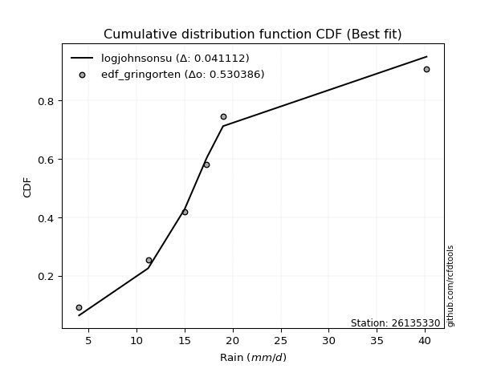</img></img>

</div>


### 9. Empirical - EDF Filliben (1975)

The specific values of the constants (0.3175) (often denoted as $alpha$) and (0.365) are derived from a method proposed by James J. Filliben in a 1975 paper. This particular formula is the mean value of the $i$-th order statistic of the normal distribution and is considered a robust and effective plotting position formula for the normal probability plot correlation coefficient test for normality.

<div align="center">


$P=(m-0.3175)/(n+0.365)$


</div>


**9.1. Empirical values**

<div align="center">

|                | 0                   | 1                  | 2            | 3                  | 4                  |
|:---------------|:--------------------|:-------------------|:-------------|:-------------------|:-------------------|
| date           | 2021                | 2020               | 2019         | 2017               | 2018               |
| x              | 4.0                 | 11.2               | 15.0         | 17.3               | 19.0               |
| m              | 1                   | 2                  | 3            | 4                  | 5                  |
| empirical_dist | edf_filliben        | edf_filliben       | edf_filliben | edf_filliben       | edf_filliben       |
| empirical      | 0.12721342031686858 | 0.3136067101584343 | 0.5          | 0.6863932898415657 | 0.8727865796831314 |
| empirical_tr   | 1.1457554725040042  | 1.456890699253225  | 2.0          | 3.188707280832095  | 7.860805860805863  |

</div>


**9.2. Kolmogorov-Smirnov fit test (sorted by Δ)**


<div align="center">

|                | 0                   | 1                  | 2                   | 3                  | 4                   | 5                   | 6                  | 7                   | 8                   | 9                   | 10                  | 11                 | 12                 | 13                  | 14                 | 15                 | 16                  | 17                  | 18                 | 19                  | 20                 | 21                    | 22                 | 23                  | 24                 | 25                 | 26                  | 27                  | 28                 | 29                  | 30                  | 31                  | 32                 | 33                 | 34                 | 35                  | 36                 | 37                 | 38                 | 39                 | 40                  | 41                 | 42                 | 43                 | 44                  | 45                  | 46                  | 47                  | 48                  | 49                 | 50                  | 51                 | 52                  | 53                  | 54                  | 55                 | 56                  | 57                  | 58                  | 59                  | 60                 | 61                 | 62                 | 63                 | 64                  | 65                  | 66                 | 67                 | 68                  | 69                  | 70                  | 71                  | 72                 | 73                  | 74                  | 75                 | 76                  | 77                 | 78                 | 79                  | 80                  | 81                 | 82                 | 83                  | 84                 | 85                 | 86                 | 87                 | 88                 | 89                 |
|:---------------|:--------------------|:-------------------|:--------------------|:-------------------|:--------------------|:--------------------|:-------------------|:--------------------|:--------------------|:--------------------|:--------------------|:-------------------|:-------------------|:--------------------|:-------------------|:-------------------|:--------------------|:--------------------|:-------------------|:--------------------|:-------------------|:----------------------|:-------------------|:--------------------|:-------------------|:-------------------|:--------------------|:--------------------|:-------------------|:--------------------|:--------------------|:--------------------|:-------------------|:-------------------|:-------------------|:--------------------|:-------------------|:-------------------|:-------------------|:-------------------|:--------------------|:-------------------|:-------------------|:-------------------|:--------------------|:--------------------|:--------------------|:--------------------|:--------------------|:-------------------|:--------------------|:-------------------|:--------------------|:--------------------|:--------------------|:-------------------|:--------------------|:--------------------|:--------------------|:--------------------|:-------------------|:-------------------|:-------------------|:-------------------|:--------------------|:--------------------|:-------------------|:-------------------|:--------------------|:--------------------|:--------------------|:--------------------|:-------------------|:--------------------|:--------------------|:-------------------|:--------------------|:-------------------|:-------------------|:--------------------|:--------------------|:-------------------|:-------------------|:--------------------|:-------------------|:-------------------|:-------------------|:-------------------|:-------------------|:-------------------|
| station        | 26135330            | 26135330           | 26135330            | 26135330           | 26135330            | 26135330            | 26135330           | 26135330            | 26135330            | 26135330            | 26135330            | 26135330           | 26135330           | 26135330            | 26135330           | 26135330           | 26135330            | 26135330            | 26135330           | 26135330            | 26135330           | 26135330              | 26135330           | 26135330            | 26135330           | 26135330           | 26135330            | 26135330            | 26135330           | 26135330            | 26135330            | 26135330            | 26135330           | 26135330           | 26135330           | 26135330            | 26135330           | 26135330           | 26135330           | 26135330           | 26135330            | 26135330           | 26135330           | 26135330           | 26135330            | 26135330            | 26135330            | 26135330            | 26135330            | 26135330           | 26135330            | 26135330           | 26135330            | 26135330            | 26135330            | 26135330           | 26135330            | 26135330            | 26135330            | 26135330            | 26135330           | 26135330           | 26135330           | 26135330           | 26135330            | 26135330            | 26135330           | 26135330           | 26135330            | 26135330            | 26135330            | 26135330            | 26135330           | 26135330            | 26135330            | 26135330           | 26135330            | 26135330           | 26135330           | 26135330            | 26135330            | 26135330           | 26135330           | 26135330            | 26135330           | 26135330           | 26135330           | 26135330           | 26135330           | 26135330           |
| empirical_dist | edf_filliben        | edf_filliben       | edf_filliben        | edf_filliben       | edf_filliben        | edf_filliben        | edf_filliben       | edf_filliben        | edf_filliben        | edf_filliben        | edf_filliben        | edf_filliben       | edf_filliben       | edf_filliben        | edf_filliben       | edf_filliben       | edf_filliben        | edf_filliben        | edf_filliben       | edf_filliben        | edf_filliben       | edf_filliben          | edf_filliben       | edf_filliben        | edf_filliben       | edf_filliben       | edf_filliben        | edf_filliben        | edf_filliben       | edf_filliben        | edf_filliben        | edf_filliben        | edf_filliben       | edf_filliben       | edf_filliben       | edf_filliben        | edf_filliben       | edf_filliben       | edf_filliben       | edf_filliben       | edf_filliben        | edf_filliben       | edf_filliben       | edf_filliben       | edf_filliben        | edf_filliben        | edf_filliben        | edf_filliben        | edf_filliben        | edf_filliben       | edf_filliben        | edf_filliben       | edf_filliben        | edf_filliben        | edf_filliben        | edf_filliben       | edf_filliben        | edf_filliben        | edf_filliben        | edf_filliben        | edf_filliben       | edf_filliben       | edf_filliben       | edf_filliben       | edf_filliben        | edf_filliben        | edf_filliben       | edf_filliben       | edf_filliben        | edf_filliben        | edf_filliben        | edf_filliben        | edf_filliben       | edf_filliben        | edf_filliben        | edf_filliben       | edf_filliben        | edf_filliben       | edf_filliben       | edf_filliben        | edf_filliben        | edf_filliben       | edf_filliben       | edf_filliben        | edf_filliben       | edf_filliben       | edf_filliben       | edf_filliben       | edf_filliben       | edf_filliben       |
| p_dist         | pearson3            | gumbel_l           | fisk                | weibull_min        | logmielke           | mielke              | logpearson3        | logfisk             | t                   | exponnorm           | crystalball         | norm               | nct                | loggumbel_l         | f                  | betaprime          | laplace_asymmetric  | gamma               | chi2               | rice                | erlang             | loglaplace_asymmetric | logloggamma        | alpha               | logistic           | logweibull_min     | invgauss            | invgamma            | maxwell            | loggompertz         | ncf                 | hypsecant           | rayleigh           | gompertz           | kstwobign          | logncf              | logfatiguelife     | lognct             | logf               | logexponnorm       | logt                | logcrystalball     | lognorm            | lognorm            | logrice             | logerlang           | loggamma            | loggamma            | genexpon            | logalpha           | halfnorm            | loginvgamma        | loginvgauss         | laplace             | logbetaprime        | loglogistic        | gumbel_r            | logmaxwell          | lograyleigh         | loghypsecant        | loginvweibull      | halflogistic       | moyal              | expon              | loggumbel_r         | loglaplace          | loghalfnorm        | logkstwobign       | logjohnsonsu        | loggenexpon         | logmoyal            | loghalflogistic     | wald               | johnsonsu           | gibrat              | logexpon           | logtruncnorm        | nakagami           | logwald            | loggibrat           | lognakagami         | logchi2            | pareto             | loglognorm          | logpareto          | truncnorm          | invweibull         | fatiguelife        | loggenlogistic     | genlogistic        |
| delta          | 0.08224509329914775 | 0.0834239608203694 | 0.08890071058755741 | 0.0895103535938313 | 0.10391768049700201 | 0.10608121679110782 | 0.1104344332378393 | 0.11217415066548864 | 0.12498521043593191 | 0.12501359114913413 | 0.12501738174722266 | 0.1250174085982667 | 0.1252320223648673 | 0.12553189319726887 | 0.1259777626606695 | 0.126022308719004  | 0.12705882575668426 | 0.12907516294149735 | 0.1294509517077509 | 0.13218631457743857 | 0.1337715126589153 | 0.1369954457414434    | 0.1370641898570374 | 0.13894870941593296 | 0.1406142475008354 | 0.1410445457238848 | 0.14271123876898184 | 0.14497338998100262 | 0.1492123137104071 | 0.15008635255510105 | 0.15062268514318655 | 0.15307647427697157 | 0.1566012666317147 | 0.1580184959190499 | 0.1651606953147149 | 0.16597032684048835 | 0.1668501613643515 | 0.168132691966685  | 0.1685607694090776 | 0.1686130723254684 | 0.16861357037545788 | 0.1686136280405034 | 0.1686136350603329 | 0.1686136350603329 | 0.17166246834601062 | 0.17379369730624883 | 0.17456577581239918 | 0.17456577581239918 | 0.17517890155785465 | 0.1761116811497594 | 0.17782167845047925 | 0.1778514360016985 | 0.17816691931700085 | 0.18140552292948509 | 0.18502385866798504 | 0.1880409700418404 | 0.18860577525123767 | 0.18864048538585415 | 0.20026264187959814 | 0.20275451202530304 | 0.2031064078887846 | 0.20617899916977   | 0.2099732546539671 | 0.2253178236824384 | 0.22547130325666875 | 0.23014460663628655 | 0.2330210182743631 | 0.2389924151729948 | 0.24059770571792444 | 0.24275343347246975 | 0.24903881460841665 | 0.25571074612272554 | 0.2699110596010468 | 0.28282936735796504 | 0.30207769083527236 | 0.3027245859840166 | 0.31360481974873833 | 0.3136050796012404 | 0.3206869896057873 | 0.33798448876003434 | 0.36025411027654763 | 0.3620837769706213 | 0.3651551144051067 | 0.37166474017088097 | 0.3804625970940461 | 0.3855022250831797 | 0.466362182930004  | 0.5196797212328224 | 0.6863932898415657 | 0.6863932898415657 |
| deltao         | 0.5865427407550001  | 0.5865427407550001 | 0.5865427407550001  | 0.5865427407550001 | 0.5865427407550001  | 0.5865427407550001  | 0.5865427407550001 | 0.5865427407550001  | 0.5865427407550001  | 0.5865427407550001  | 0.5865427407550001  | 0.5865427407550001 | 0.5865427407550001 | 0.5865427407550001  | 0.5865427407550001 | 0.5865427407550001 | 0.5865427407550001  | 0.5865427407550001  | 0.5865427407550001 | 0.5865427407550001  | 0.5865427407550001 | 0.5865427407550001    | 0.5865427407550001 | 0.5865427407550001  | 0.5865427407550001 | 0.5865427407550001 | 0.5865427407550001  | 0.5865427407550001  | 0.5865427407550001 | 0.5865427407550001  | 0.5865427407550001  | 0.5865427407550001  | 0.5865427407550001 | 0.5865427407550001 | 0.5865427407550001 | 0.5865427407550001  | 0.5865427407550001 | 0.5865427407550001 | 0.5865427407550001 | 0.5865427407550001 | 0.5865427407550001  | 0.5865427407550001 | 0.5865427407550001 | 0.5865427407550001 | 0.5865427407550001  | 0.5865427407550001  | 0.5865427407550001  | 0.5865427407550001  | 0.5865427407550001  | 0.5865427407550001 | 0.5865427407550001  | 0.5865427407550001 | 0.5865427407550001  | 0.5865427407550001  | 0.5865427407550001  | 0.5865427407550001 | 0.5865427407550001  | 0.5865427407550001  | 0.5865427407550001  | 0.5865427407550001  | 0.5865427407550001 | 0.5865427407550001 | 0.5865427407550001 | 0.5865427407550001 | 0.5865427407550001  | 0.5865427407550001  | 0.5865427407550001 | 0.5865427407550001 | 0.5865427407550001  | 0.5865427407550001  | 0.5865427407550001  | 0.5865427407550001  | 0.5865427407550001 | 0.5865427407550001  | 0.5865427407550001  | 0.5865427407550001 | 0.5865427407550001  | 0.5865427407550001 | 0.5865427407550001 | 0.5865427407550001  | 0.5865427407550001  | 0.5865427407550001 | 0.5865427407550001 | 0.5865427407550001  | 0.5865427407550001 | 0.5865427407550001 | 0.5865427407550001 | 0.5865427407550001 | 0.5865427407550001 | 0.5865427407550001 |
| eval           | Δo > Δ              | Δo > Δ             | Δo > Δ              | Δo > Δ             | Δo > Δ              | Δo > Δ              | Δo > Δ             | Δo > Δ              | Δo > Δ              | Δo > Δ              | Δo > Δ              | Δo > Δ             | Δo > Δ             | Δo > Δ              | Δo > Δ             | Δo > Δ             | Δo > Δ              | Δo > Δ              | Δo > Δ             | Δo > Δ              | Δo > Δ             | Δo > Δ                | Δo > Δ             | Δo > Δ              | Δo > Δ             | Δo > Δ             | Δo > Δ              | Δo > Δ              | Δo > Δ             | Δo > Δ              | Δo > Δ              | Δo > Δ              | Δo > Δ             | Δo > Δ             | Δo > Δ             | Δo > Δ              | Δo > Δ             | Δo > Δ             | Δo > Δ             | Δo > Δ             | Δo > Δ              | Δo > Δ             | Δo > Δ             | Δo > Δ             | Δo > Δ              | Δo > Δ              | Δo > Δ              | Δo > Δ              | Δo > Δ              | Δo > Δ             | Δo > Δ              | Δo > Δ             | Δo > Δ              | Δo > Δ              | Δo > Δ              | Δo > Δ             | Δo > Δ              | Δo > Δ              | Δo > Δ              | Δo > Δ              | Δo > Δ             | Δo > Δ             | Δo > Δ             | Δo > Δ             | Δo > Δ              | Δo > Δ              | Δo > Δ             | Δo > Δ             | Δo > Δ              | Δo > Δ              | Δo > Δ              | Δo > Δ              | Δo > Δ             | Δo > Δ              | Δo > Δ              | Δo > Δ             | Δo > Δ              | Δo > Δ             | Δo > Δ             | Δo > Δ              | Δo > Δ              | Δo > Δ             | Δo > Δ             | Δo > Δ              | Δo > Δ             | Δo > Δ             | Δo > Δ             | Δo > Δ             | Δo <= Δ            | Δo <= Δ            |
| fit            | 1                   | 1                  | 1                   | 1                  | 1                   | 1                   | 1                  | 1                   | 1                   | 1                   | 1                   | 1                  | 1                  | 1                   | 1                  | 1                  | 1                   | 1                   | 1                  | 1                   | 1                  | 1                     | 1                  | 1                   | 1                  | 1                  | 1                   | 1                   | 1                  | 1                   | 1                   | 1                   | 1                  | 1                  | 1                  | 1                   | 1                  | 1                  | 1                  | 1                  | 1                   | 1                  | 1                  | 1                  | 1                   | 1                   | 1                   | 1                   | 1                   | 1                  | 1                   | 1                  | 1                   | 1                   | 1                   | 1                  | 1                   | 1                   | 1                   | 1                   | 1                  | 1                  | 1                  | 1                  | 1                   | 1                   | 1                  | 1                  | 1                   | 1                   | 1                   | 1                   | 1                  | 1                   | 1                   | 1                  | 1                   | 1                  | 1                  | 1                   | 1                   | 1                  | 1                  | 1                   | 1                  | 1                  | 1                  | 1                  | 0                  | 0                  |
| n              | 5                   | 5                  | 5                   | 5                  | 5                   | 5                   | 5                  | 5                   | 5                   | 5                   | 5                   | 5                  | 5                  | 5                   | 5                  | 5                  | 5                   | 5                   | 5                  | 5                   | 5                  | 5                     | 5                  | 5                   | 5                  | 5                  | 5                   | 5                   | 5                  | 5                   | 5                   | 5                   | 5                  | 5                  | 5                  | 5                   | 5                  | 5                  | 5                  | 5                  | 5                   | 5                  | 5                  | 5                  | 5                   | 5                   | 5                   | 5                   | 5                   | 5                  | 5                   | 5                  | 5                   | 5                   | 5                   | 5                  | 5                   | 5                   | 5                   | 5                   | 5                  | 5                  | 5                  | 5                  | 5                   | 5                   | 5                  | 5                  | 5                   | 5                   | 5                   | 5                   | 5                  | 5                   | 5                   | 5                  | 5                   | 5                  | 5                  | 5                   | 5                   | 5                  | 5                  | 5                   | 5                  | 5                  | 5                  | 5                  | 5                  | 5                  |
| best_fit       | 1                   | 0                  | 0                   | 0                  | 0                   | 0                   | 0                  | 0                   | 0                   | 0                   | 0                   | 0                  | 0                  | 0                   | 0                  | 0                  | 0                   | 0                   | 0                  | 0                   | 0                  | 0                     | 0                  | 0                   | 0                  | 0                  | 0                   | 0                   | 0                  | 0                   | 0                   | 0                   | 0                  | 0                  | 0                  | 0                   | 0                  | 0                  | 0                  | 0                  | 0                   | 0                  | 0                  | 0                  | 0                   | 0                   | 0                   | 0                   | 0                   | 0                  | 0                   | 0                  | 0                   | 0                   | 0                   | 0                  | 0                   | 0                   | 0                   | 0                   | 0                  | 0                  | 0                  | 0                  | 0                   | 0                   | 0                  | 0                  | 0                   | 0                   | 0                   | 0                   | 0                  | 0                   | 0                   | 0                  | 0                   | 0                  | 0                  | 0                   | 0                   | 0                  | 0                  | 0                   | 0                  | 0                  | 0                  | 0                  | 0                  | 0                  |
| best_fit_sort  | 1                   | 2                  | 3                   | 4                  | 5                   | 6                   | 7                  | 8                   | 9                   | 10                  | 11                  | 12                 | 13                 | 14                  | 15                 | 16                 | 17                  | 18                  | 19                 | 20                  | 21                 | 22                    | 23                 | 24                  | 25                 | 26                 | 27                  | 28                  | 29                 | 30                  | 31                  | 32                  | 33                 | 34                 | 35                 | 36                  | 37                 | 38                 | 39                 | 40                 | 41                  | 42                 | 43                 | 44                 | 45                  | 46                  | 47                  | 48                  | 49                  | 50                 | 51                  | 52                 | 53                  | 54                  | 55                  | 56                 | 57                  | 58                  | 59                  | 60                  | 61                 | 62                 | 63                 | 64                 | 65                  | 66                  | 67                 | 68                 | 69                  | 70                  | 71                  | 72                  | 73                 | 74                  | 75                  | 76                 | 77                  | 78                 | 79                 | 80                  | 81                  | 82                 | 83                 | 84                  | 85                 | 86                 | 87                 | 88                 | 89                 | 90                 |

</div>


<div align="center">

</img>

</div>


**9.3. Best fit**

<div align="center">

|   id |   station | empirical_dist   | p_dist   |     delta |   deltao | eval   |   fit |   n |   best_fit |   best_fit_sort |
|-----:|----------:|:-----------------|:---------|----------:|---------:|:-------|------:|----:|-----------:|----------------:|
|    0 |  26135330 | edf_filliben     | pearson3 | 0.0822451 | 0.586543 | Δo > Δ |     1 |   5 |          1 |               1 |

</div>


<div align="center">

</img></img>

</div>


### 10. Empirical - EDF Jenkinson (1977)

The Jenkinson formula in hydrology is an empirical plotting position formula used to estimate the non-exceedance probability _(P)_ or return period _(T)_ of a given ordered observation within a sample. It is a widely used method in the frequency analysis of extreme events such as floods and rainfall, as it provides a distribution-free way to plot data. _a≈0.31_ and _b≈0.38_ are constants derived to approximate the median of the probability distribution for the given rank.

<div align="center">


$P=(m-a)/(n+b)$


</div>


**10.1. Empirical values**

<div align="center">

|                | 0                   | 1                  | 2             | 3                  | 4                  |
|:---------------|:--------------------|:-------------------|:--------------|:-------------------|:-------------------|
| date           | 2021                | 2020               | 2019          | 2017               | 2018               |
| x              | 4.0                 | 11.2               | 15.0          | 17.3               | 19.0               |
| m              | 1                   | 2                  | 3             | 4                  | 5                  |
| empirical_dist | edf_jenkinson       | edf_jenkinson      | edf_jenkinson | edf_jenkinson      | edf_jenkinson      |
| empirical      | 0.12825278810408922 | 0.3141263940520446 | 0.5           | 0.6858736059479554 | 0.8717472118959109 |
| empirical_tr   | 1.1471215351812367  | 1.4579945799457996 | 2.0           | 3.183431952662722  | 7.797101449275368  |

</div>


**10.2. Kolmogorov-Smirnov fit test (sorted by Δ)**


<div align="center">

|                | 0                   | 1                   | 2                   | 3                   | 4                   | 5                  | 6                  | 7                   | 8                   | 9                   | 10                  | 11                 | 12                 | 13                  | 14                 | 15                 | 16                  | 17                  | 18                 | 19                  | 20                 | 21                    | 22                  | 23                  | 24                 | 25                 | 26                  | 27                  | 28                 | 29                  | 30                  | 31                  | 32                 | 33                  | 34                 | 35                  | 36                 | 37                 | 38                 | 39                 | 40                  | 41                 | 42                 | 43                 | 44                  | 45                  | 46                  | 47                  | 48                  | 49                 | 50                 | 51                  | 52                 | 53                  | 54                 | 55                 | 56                  | 57                  | 58                 | 59                  | 60                  | 61                 | 62                 | 63                  | 64                  | 65                  | 66                  | 67                  | 68                 | 69                 | 70                 | 71                 | 72                 | 73                 | 74                  | 75                  | 76                 | 77                  | 78                  | 79                 | 80                  | 81                  | 82                  | 83                 | 84                 | 85                  | 86                 | 87                 | 88                 | 89                 |
|:---------------|:--------------------|:--------------------|:--------------------|:--------------------|:--------------------|:-------------------|:-------------------|:--------------------|:--------------------|:--------------------|:--------------------|:-------------------|:-------------------|:--------------------|:-------------------|:-------------------|:--------------------|:--------------------|:-------------------|:--------------------|:-------------------|:----------------------|:--------------------|:--------------------|:-------------------|:-------------------|:--------------------|:--------------------|:-------------------|:--------------------|:--------------------|:--------------------|:-------------------|:--------------------|:-------------------|:--------------------|:-------------------|:-------------------|:-------------------|:-------------------|:--------------------|:-------------------|:-------------------|:-------------------|:--------------------|:--------------------|:--------------------|:--------------------|:--------------------|:-------------------|:-------------------|:--------------------|:-------------------|:--------------------|:-------------------|:-------------------|:--------------------|:--------------------|:-------------------|:--------------------|:--------------------|:-------------------|:-------------------|:--------------------|:--------------------|:--------------------|:--------------------|:--------------------|:-------------------|:-------------------|:-------------------|:-------------------|:-------------------|:-------------------|:--------------------|:--------------------|:-------------------|:--------------------|:--------------------|:-------------------|:--------------------|:--------------------|:--------------------|:-------------------|:-------------------|:--------------------|:-------------------|:-------------------|:-------------------|:-------------------|
| station        | 26135330            | 26135330            | 26135330            | 26135330            | 26135330            | 26135330           | 26135330           | 26135330            | 26135330            | 26135330            | 26135330            | 26135330           | 26135330           | 26135330            | 26135330           | 26135330           | 26135330            | 26135330            | 26135330           | 26135330            | 26135330           | 26135330              | 26135330            | 26135330            | 26135330           | 26135330           | 26135330            | 26135330            | 26135330           | 26135330            | 26135330            | 26135330            | 26135330           | 26135330            | 26135330           | 26135330            | 26135330           | 26135330           | 26135330           | 26135330           | 26135330            | 26135330           | 26135330           | 26135330           | 26135330            | 26135330            | 26135330            | 26135330            | 26135330            | 26135330           | 26135330           | 26135330            | 26135330           | 26135330            | 26135330           | 26135330           | 26135330            | 26135330            | 26135330           | 26135330            | 26135330            | 26135330           | 26135330           | 26135330            | 26135330            | 26135330            | 26135330            | 26135330            | 26135330           | 26135330           | 26135330           | 26135330           | 26135330           | 26135330           | 26135330            | 26135330            | 26135330           | 26135330            | 26135330            | 26135330           | 26135330            | 26135330            | 26135330            | 26135330           | 26135330           | 26135330            | 26135330           | 26135330           | 26135330           | 26135330           |
| empirical_dist | edf_jenkinson       | edf_jenkinson       | edf_jenkinson       | edf_jenkinson       | edf_jenkinson       | edf_jenkinson      | edf_jenkinson      | edf_jenkinson       | edf_jenkinson       | edf_jenkinson       | edf_jenkinson       | edf_jenkinson      | edf_jenkinson      | edf_jenkinson       | edf_jenkinson      | edf_jenkinson      | edf_jenkinson       | edf_jenkinson       | edf_jenkinson      | edf_jenkinson       | edf_jenkinson      | edf_jenkinson         | edf_jenkinson       | edf_jenkinson       | edf_jenkinson      | edf_jenkinson      | edf_jenkinson       | edf_jenkinson       | edf_jenkinson      | edf_jenkinson       | edf_jenkinson       | edf_jenkinson       | edf_jenkinson      | edf_jenkinson       | edf_jenkinson      | edf_jenkinson       | edf_jenkinson      | edf_jenkinson      | edf_jenkinson      | edf_jenkinson      | edf_jenkinson       | edf_jenkinson      | edf_jenkinson      | edf_jenkinson      | edf_jenkinson       | edf_jenkinson       | edf_jenkinson       | edf_jenkinson       | edf_jenkinson       | edf_jenkinson      | edf_jenkinson      | edf_jenkinson       | edf_jenkinson      | edf_jenkinson       | edf_jenkinson      | edf_jenkinson      | edf_jenkinson       | edf_jenkinson       | edf_jenkinson      | edf_jenkinson       | edf_jenkinson       | edf_jenkinson      | edf_jenkinson      | edf_jenkinson       | edf_jenkinson       | edf_jenkinson       | edf_jenkinson       | edf_jenkinson       | edf_jenkinson      | edf_jenkinson      | edf_jenkinson      | edf_jenkinson      | edf_jenkinson      | edf_jenkinson      | edf_jenkinson       | edf_jenkinson       | edf_jenkinson      | edf_jenkinson       | edf_jenkinson       | edf_jenkinson      | edf_jenkinson       | edf_jenkinson       | edf_jenkinson       | edf_jenkinson      | edf_jenkinson      | edf_jenkinson       | edf_jenkinson      | edf_jenkinson      | edf_jenkinson      | edf_jenkinson      |
| p_dist         | pearson3            | gumbel_l            | fisk                | weibull_min         | logmielke           | mielke             | logpearson3        | logfisk             | t                   | exponnorm           | crystalball         | norm               | nct                | loggumbel_l         | f                  | betaprime          | laplace_asymmetric  | gamma               | chi2               | rice                | erlang             | loglaplace_asymmetric | logloggamma         | alpha               | logistic           | logweibull_min     | invgauss            | invgamma            | maxwell            | loggompertz         | ncf                 | hypsecant           | rayleigh           | gompertz            | kstwobign          | logncf              | logfatiguelife     | lognct             | logf               | logexponnorm       | logt                | logcrystalball     | lognorm            | lognorm            | logrice             | logerlang           | loggamma            | loggamma            | genexpon            | logalpha           | loginvgauss        | halfnorm            | loginvgamma        | laplace             | logbetaprime       | loglogistic        | logmaxwell          | gumbel_r            | lograyleigh        | loginvweibull       | loghypsecant        | halflogistic       | moyal              | expon               | loggumbel_r         | loglaplace          | loghalfnorm         | logkstwobign        | logjohnsonsu       | loggenexpon        | logmoyal           | loghalflogistic    | wald               | johnsonsu          | gibrat              | logexpon            | logtruncnorm       | nakagami            | logwald             | loggibrat          | lognakagami         | logchi2             | pareto              | loglognorm         | logpareto          | truncnorm           | invweibull         | fatiguelife        | loggenlogistic     | genlogistic        |
| delta          | 0.08224509329914775 | 0.08394364471397964 | 0.08994007837477805 | 0.09003003748744154 | 0.10443736439061224 | 0.1071205845783284 | 0.1104344332378393 | 0.11217415066548864 | 0.12498521043593191 | 0.12501359114913413 | 0.12501738174722266 | 0.1250174085982667 | 0.1252320223648673 | 0.12553189319726887 | 0.1259777626606695 | 0.126022308719004  | 0.12809819354390484 | 0.12907516294149735 | 0.1294509517077509 | 0.13218631457743857 | 0.1337715126589153 | 0.13751512963505363   | 0.13758387375064762 | 0.13894870941593296 | 0.1406142475008354 | 0.1410445457238848 | 0.14271123876898184 | 0.14497338998100262 | 0.1492123137104071 | 0.15008635255510105 | 0.15062268514318655 | 0.15307647427697157 | 0.1566012666317147 | 0.15853817981266025 | 0.1651606953147149 | 0.16585082088872238 | 0.1668501613643515 | 0.168132691966685  | 0.1685607694090776 | 0.1686130723254684 | 0.16861357037545788 | 0.1686136280405034 | 0.1686136350603329 | 0.1686136350603329 | 0.17166246834601062 | 0.17379369730624883 | 0.17456577581239918 | 0.17456577581239918 | 0.17517890155785465 | 0.1761116811497594 | 0.1776472354233905 | 0.17782167845047925 | 0.1778514360016985 | 0.18140552292948509 | 0.1845041747743747 | 0.1880409700418404 | 0.18820563838125337 | 0.18860577525123767 | 0.1997429579859878 | 0.20258672399517424 | 0.20275451202530304 | 0.20617899916977   | 0.2099732546539671 | 0.22479813978882807 | 0.22547130325666875 | 0.23014460663628655 | 0.23250133438075277 | 0.23847273127938445 | 0.2400780218243142 | 0.2422337495788594 | 0.2485191307148063 | 0.2551910622291152 | 0.2699110596010468 | 0.2823096834643548 | 0.30207769083527236 | 0.30220490209040624 | 0.3141245036423487 | 0.31412476349485075 | 0.32016730571217694 | 0.337464804866424  | 0.36025411027654763 | 0.36156409307701093 | 0.36463543051149633 | 0.3711450562772706 | 0.3799429132004358 | 0.38498254118956937 | 0.4653228151427834 | 0.519160037339212  | 0.6858736059479554 | 0.6858736059479554 |
| deltao         | 0.5865427407550001  | 0.5865427407550001  | 0.5865427407550001  | 0.5865427407550001  | 0.5865427407550001  | 0.5865427407550001 | 0.5865427407550001 | 0.5865427407550001  | 0.5865427407550001  | 0.5865427407550001  | 0.5865427407550001  | 0.5865427407550001 | 0.5865427407550001 | 0.5865427407550001  | 0.5865427407550001 | 0.5865427407550001 | 0.5865427407550001  | 0.5865427407550001  | 0.5865427407550001 | 0.5865427407550001  | 0.5865427407550001 | 0.5865427407550001    | 0.5865427407550001  | 0.5865427407550001  | 0.5865427407550001 | 0.5865427407550001 | 0.5865427407550001  | 0.5865427407550001  | 0.5865427407550001 | 0.5865427407550001  | 0.5865427407550001  | 0.5865427407550001  | 0.5865427407550001 | 0.5865427407550001  | 0.5865427407550001 | 0.5865427407550001  | 0.5865427407550001 | 0.5865427407550001 | 0.5865427407550001 | 0.5865427407550001 | 0.5865427407550001  | 0.5865427407550001 | 0.5865427407550001 | 0.5865427407550001 | 0.5865427407550001  | 0.5865427407550001  | 0.5865427407550001  | 0.5865427407550001  | 0.5865427407550001  | 0.5865427407550001 | 0.5865427407550001 | 0.5865427407550001  | 0.5865427407550001 | 0.5865427407550001  | 0.5865427407550001 | 0.5865427407550001 | 0.5865427407550001  | 0.5865427407550001  | 0.5865427407550001 | 0.5865427407550001  | 0.5865427407550001  | 0.5865427407550001 | 0.5865427407550001 | 0.5865427407550001  | 0.5865427407550001  | 0.5865427407550001  | 0.5865427407550001  | 0.5865427407550001  | 0.5865427407550001 | 0.5865427407550001 | 0.5865427407550001 | 0.5865427407550001 | 0.5865427407550001 | 0.5865427407550001 | 0.5865427407550001  | 0.5865427407550001  | 0.5865427407550001 | 0.5865427407550001  | 0.5865427407550001  | 0.5865427407550001 | 0.5865427407550001  | 0.5865427407550001  | 0.5865427407550001  | 0.5865427407550001 | 0.5865427407550001 | 0.5865427407550001  | 0.5865427407550001 | 0.5865427407550001 | 0.5865427407550001 | 0.5865427407550001 |
| eval           | Δo > Δ              | Δo > Δ              | Δo > Δ              | Δo > Δ              | Δo > Δ              | Δo > Δ             | Δo > Δ             | Δo > Δ              | Δo > Δ              | Δo > Δ              | Δo > Δ              | Δo > Δ             | Δo > Δ             | Δo > Δ              | Δo > Δ             | Δo > Δ             | Δo > Δ              | Δo > Δ              | Δo > Δ             | Δo > Δ              | Δo > Δ             | Δo > Δ                | Δo > Δ              | Δo > Δ              | Δo > Δ             | Δo > Δ             | Δo > Δ              | Δo > Δ              | Δo > Δ             | Δo > Δ              | Δo > Δ              | Δo > Δ              | Δo > Δ             | Δo > Δ              | Δo > Δ             | Δo > Δ              | Δo > Δ             | Δo > Δ             | Δo > Δ             | Δo > Δ             | Δo > Δ              | Δo > Δ             | Δo > Δ             | Δo > Δ             | Δo > Δ              | Δo > Δ              | Δo > Δ              | Δo > Δ              | Δo > Δ              | Δo > Δ             | Δo > Δ             | Δo > Δ              | Δo > Δ             | Δo > Δ              | Δo > Δ             | Δo > Δ             | Δo > Δ              | Δo > Δ              | Δo > Δ             | Δo > Δ              | Δo > Δ              | Δo > Δ             | Δo > Δ             | Δo > Δ              | Δo > Δ              | Δo > Δ              | Δo > Δ              | Δo > Δ              | Δo > Δ             | Δo > Δ             | Δo > Δ             | Δo > Δ             | Δo > Δ             | Δo > Δ             | Δo > Δ              | Δo > Δ              | Δo > Δ             | Δo > Δ              | Δo > Δ              | Δo > Δ             | Δo > Δ              | Δo > Δ              | Δo > Δ              | Δo > Δ             | Δo > Δ             | Δo > Δ              | Δo > Δ             | Δo > Δ             | Δo <= Δ            | Δo <= Δ            |
| fit            | 1                   | 1                   | 1                   | 1                   | 1                   | 1                  | 1                  | 1                   | 1                   | 1                   | 1                   | 1                  | 1                  | 1                   | 1                  | 1                  | 1                   | 1                   | 1                  | 1                   | 1                  | 1                     | 1                   | 1                   | 1                  | 1                  | 1                   | 1                   | 1                  | 1                   | 1                   | 1                   | 1                  | 1                   | 1                  | 1                   | 1                  | 1                  | 1                  | 1                  | 1                   | 1                  | 1                  | 1                  | 1                   | 1                   | 1                   | 1                   | 1                   | 1                  | 1                  | 1                   | 1                  | 1                   | 1                  | 1                  | 1                   | 1                   | 1                  | 1                   | 1                   | 1                  | 1                  | 1                   | 1                   | 1                   | 1                   | 1                   | 1                  | 1                  | 1                  | 1                  | 1                  | 1                  | 1                   | 1                   | 1                  | 1                   | 1                   | 1                  | 1                   | 1                   | 1                   | 1                  | 1                  | 1                   | 1                  | 1                  | 0                  | 0                  |
| n              | 5                   | 5                   | 5                   | 5                   | 5                   | 5                  | 5                  | 5                   | 5                   | 5                   | 5                   | 5                  | 5                  | 5                   | 5                  | 5                  | 5                   | 5                   | 5                  | 5                   | 5                  | 5                     | 5                   | 5                   | 5                  | 5                  | 5                   | 5                   | 5                  | 5                   | 5                   | 5                   | 5                  | 5                   | 5                  | 5                   | 5                  | 5                  | 5                  | 5                  | 5                   | 5                  | 5                  | 5                  | 5                   | 5                   | 5                   | 5                   | 5                   | 5                  | 5                  | 5                   | 5                  | 5                   | 5                  | 5                  | 5                   | 5                   | 5                  | 5                   | 5                   | 5                  | 5                  | 5                   | 5                   | 5                   | 5                   | 5                   | 5                  | 5                  | 5                  | 5                  | 5                  | 5                  | 5                   | 5                   | 5                  | 5                   | 5                   | 5                  | 5                   | 5                   | 5                   | 5                  | 5                  | 5                   | 5                  | 5                  | 5                  | 5                  |
| best_fit       | 1                   | 0                   | 0                   | 0                   | 0                   | 0                  | 0                  | 0                   | 0                   | 0                   | 0                   | 0                  | 0                  | 0                   | 0                  | 0                  | 0                   | 0                   | 0                  | 0                   | 0                  | 0                     | 0                   | 0                   | 0                  | 0                  | 0                   | 0                   | 0                  | 0                   | 0                   | 0                   | 0                  | 0                   | 0                  | 0                   | 0                  | 0                  | 0                  | 0                  | 0                   | 0                  | 0                  | 0                  | 0                   | 0                   | 0                   | 0                   | 0                   | 0                  | 0                  | 0                   | 0                  | 0                   | 0                  | 0                  | 0                   | 0                   | 0                  | 0                   | 0                   | 0                  | 0                  | 0                   | 0                   | 0                   | 0                   | 0                   | 0                  | 0                  | 0                  | 0                  | 0                  | 0                  | 0                   | 0                   | 0                  | 0                   | 0                   | 0                  | 0                   | 0                   | 0                   | 0                  | 0                  | 0                   | 0                  | 0                  | 0                  | 0                  |
| best_fit_sort  | 1                   | 2                   | 3                   | 4                   | 5                   | 6                  | 7                  | 8                   | 9                   | 10                  | 11                  | 12                 | 13                 | 14                  | 15                 | 16                 | 17                  | 18                  | 19                 | 20                  | 21                 | 22                    | 23                  | 24                  | 25                 | 26                 | 27                  | 28                  | 29                 | 30                  | 31                  | 32                  | 33                 | 34                  | 35                 | 36                  | 37                 | 38                 | 39                 | 40                 | 41                  | 42                 | 43                 | 44                 | 45                  | 46                  | 47                  | 48                  | 49                  | 50                 | 51                 | 52                  | 53                 | 54                  | 55                 | 56                 | 57                  | 58                  | 59                 | 60                  | 61                  | 62                 | 63                 | 64                  | 65                  | 66                  | 67                  | 68                  | 69                 | 70                 | 71                 | 72                 | 73                 | 74                 | 75                  | 76                  | 77                 | 78                  | 79                  | 80                 | 81                  | 82                  | 83                  | 84                 | 85                 | 86                  | 87                 | 88                 | 89                 | 90                 |

</div>


<div align="center">

</img>

</div>


**10.3. Best fit**

<div align="center">

|   id |   station | empirical_dist   | p_dist   |     delta |   deltao | eval   |   fit |   n |   best_fit |   best_fit_sort |
|-----:|----------:|:-----------------|:---------|----------:|---------:|:-------|------:|----:|-----------:|----------------:|
|    0 |  26135330 | edf_jenkinson    | pearson3 | 0.0822451 | 0.586543 | Δo > Δ |     1 |   5 |          1 |               1 |

</div>


<div align="center">

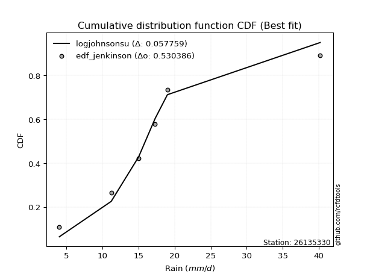</img>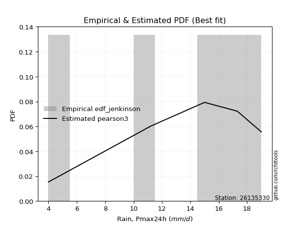</img>

</div>


### 11. Empirical - EDF Cunnane (1978)

Cunnane´s work in statistical hydrology has focused on the performance and evaluation of different probability distributions (such as GEV, Gumbel, Lognormal) for flood frequency estimation. _b_ is a constant, typically set to 0.4.

<div align="center">


$P=(m-b)/(n+1-2b)$


</div>


**11.1. Empirical values**

<div align="center">

|                | 0                   | 1                  | 2           | 3                  | 4                  |
|:---------------|:--------------------|:-------------------|:------------|:-------------------|:-------------------|
| date           | 2021                | 2020               | 2019        | 2017               | 2018               |
| x              | 4.0                 | 11.2               | 15.0        | 17.3               | 19.0               |
| m              | 1                   | 2                  | 3           | 4                  | 5                  |
| empirical_dist | edf_cunnane         | edf_cunnane        | edf_cunnane | edf_cunnane        | edf_cunnane        |
| empirical      | 0.11538461538461538 | 0.3076923076923077 | 0.5         | 0.6923076923076923 | 0.8846153846153845 |
| empirical_tr   | 1.1304347826086958  | 1.4444444444444444 | 2.0         | 3.25               | 8.666666666666655  |

</div>


**11.2. Kolmogorov-Smirnov fit test (sorted by Δ)**


<div align="center">

|                | 0                   | 1                   | 2                   | 3                   | 4                  | 5                   | 6                  | 7                   | 8                   | 9                   | 10                  | 11                  | 12                 | 13                 | 14                  | 15                 | 16                 | 17                  | 18                 | 19                    | 20                  | 21                  | 22                 | 23                  | 24                 | 25                 | 26                  | 27                  | 28                 | 29                  | 30                  | 31                  | 32                  | 33                 | 34                 | 35                 | 36                 | 37                 | 38                 | 39                  | 40                 | 41                 | 42                 | 43                  | 44                  | 45                  | 46                  | 47                  | 48                  | 49                  | 50                  | 51                  | 52                 | 53                  | 54                 | 55                  | 56                 | 57                  | 58                  | 59                 | 60                 | 61                  | 62                 | 63                 | 64                  | 65                  | 66                  | 67                  | 68                  | 69                  | 70                 | 71                 | 72                 | 73                  | 74                  | 75                  | 76                  | 77                  | 78                  | 79                 | 80                  | 81                  | 82                  | 83                  | 84                 | 85                 | 86                 | 87                 | 88                 | 89                 |
|:---------------|:--------------------|:--------------------|:--------------------|:--------------------|:-------------------|:--------------------|:-------------------|:--------------------|:--------------------|:--------------------|:--------------------|:--------------------|:-------------------|:-------------------|:--------------------|:-------------------|:-------------------|:--------------------|:-------------------|:----------------------|:--------------------|:--------------------|:-------------------|:--------------------|:-------------------|:-------------------|:--------------------|:--------------------|:-------------------|:--------------------|:--------------------|:--------------------|:--------------------|:-------------------|:-------------------|:-------------------|:-------------------|:-------------------|:-------------------|:--------------------|:-------------------|:-------------------|:-------------------|:--------------------|:--------------------|:--------------------|:--------------------|:--------------------|:--------------------|:--------------------|:--------------------|:--------------------|:-------------------|:--------------------|:-------------------|:--------------------|:-------------------|:--------------------|:--------------------|:-------------------|:-------------------|:--------------------|:-------------------|:-------------------|:--------------------|:--------------------|:--------------------|:--------------------|:--------------------|:--------------------|:-------------------|:-------------------|:-------------------|:--------------------|:--------------------|:--------------------|:--------------------|:--------------------|:--------------------|:-------------------|:--------------------|:--------------------|:--------------------|:--------------------|:-------------------|:-------------------|:-------------------|:-------------------|:-------------------|:-------------------|
| station        | 26135330            | 26135330            | 26135330            | 26135330            | 26135330           | 26135330            | 26135330           | 26135330            | 26135330            | 26135330            | 26135330            | 26135330            | 26135330           | 26135330           | 26135330            | 26135330           | 26135330           | 26135330            | 26135330           | 26135330              | 26135330            | 26135330            | 26135330           | 26135330            | 26135330           | 26135330           | 26135330            | 26135330            | 26135330           | 26135330            | 26135330            | 26135330            | 26135330            | 26135330           | 26135330           | 26135330           | 26135330           | 26135330           | 26135330           | 26135330            | 26135330           | 26135330           | 26135330           | 26135330            | 26135330            | 26135330            | 26135330            | 26135330            | 26135330            | 26135330            | 26135330            | 26135330            | 26135330           | 26135330            | 26135330           | 26135330            | 26135330           | 26135330            | 26135330            | 26135330           | 26135330           | 26135330            | 26135330           | 26135330           | 26135330            | 26135330            | 26135330            | 26135330            | 26135330            | 26135330            | 26135330           | 26135330           | 26135330           | 26135330            | 26135330            | 26135330            | 26135330            | 26135330            | 26135330            | 26135330           | 26135330            | 26135330            | 26135330            | 26135330            | 26135330           | 26135330           | 26135330           | 26135330           | 26135330           | 26135330           |
| empirical_dist | edf_cunnane         | edf_cunnane         | edf_cunnane         | edf_cunnane         | edf_cunnane        | edf_cunnane         | edf_cunnane        | edf_cunnane         | edf_cunnane         | edf_cunnane         | edf_cunnane         | edf_cunnane         | edf_cunnane        | edf_cunnane        | edf_cunnane         | edf_cunnane        | edf_cunnane        | edf_cunnane         | edf_cunnane        | edf_cunnane           | edf_cunnane         | edf_cunnane         | edf_cunnane        | edf_cunnane         | edf_cunnane        | edf_cunnane        | edf_cunnane         | edf_cunnane         | edf_cunnane        | edf_cunnane         | edf_cunnane         | edf_cunnane         | edf_cunnane         | edf_cunnane        | edf_cunnane        | edf_cunnane        | edf_cunnane        | edf_cunnane        | edf_cunnane        | edf_cunnane         | edf_cunnane        | edf_cunnane        | edf_cunnane        | edf_cunnane         | edf_cunnane         | edf_cunnane         | edf_cunnane         | edf_cunnane         | edf_cunnane         | edf_cunnane         | edf_cunnane         | edf_cunnane         | edf_cunnane        | edf_cunnane         | edf_cunnane        | edf_cunnane         | edf_cunnane        | edf_cunnane         | edf_cunnane         | edf_cunnane        | edf_cunnane        | edf_cunnane         | edf_cunnane        | edf_cunnane        | edf_cunnane         | edf_cunnane         | edf_cunnane         | edf_cunnane         | edf_cunnane         | edf_cunnane         | edf_cunnane        | edf_cunnane        | edf_cunnane        | edf_cunnane         | edf_cunnane         | edf_cunnane         | edf_cunnane         | edf_cunnane         | edf_cunnane         | edf_cunnane        | edf_cunnane         | edf_cunnane         | edf_cunnane         | edf_cunnane         | edf_cunnane        | edf_cunnane        | edf_cunnane        | edf_cunnane        | edf_cunnane        | edf_cunnane        |
| p_dist         | gumbel_l            | fisk                | pearson3            | weibull_min         | mielke             | logmielke           | logpearson3        | logfisk             | laplace_asymmetric  | t                   | exponnorm           | crystalball         | norm               | nct                | loggumbel_l         | f                  | betaprime          | gamma               | chi2               | loglaplace_asymmetric | logloggamma         | rice                | erlang             | alpha               | logistic           | logweibull_min     | invgauss            | invgamma            | maxwell            | loggompertz         | ncf                 | gompertz            | hypsecant           | rayleigh           | kstwobign          | logfatiguelife     | lognct             | logf               | logexponnorm       | logt                | logcrystalball     | lognorm            | lognorm            | logrice             | logncf              | loggamma            | loggamma            | genexpon            | halfnorm            | logerlang           | laplace             | logalpha            | loginvgamma        | loginvgauss         | loglogistic        | gumbel_r            | logbetaprime       | logmaxwell          | loghypsecant        | lograyleigh        | halflogistic       | loginvweibull       | moyal              | loggumbel_r        | loglaplace          | expon               | loghalfnorm         | logkstwobign        | logjohnsonsu        | loggenexpon         | logmoyal           | loghalflogistic    | wald               | johnsonsu           | gibrat              | logtruncnorm        | nakagami            | logexpon            | logwald             | loggibrat          | lognakagami         | logchi2             | pareto              | loglognorm          | logpareto          | truncnorm          | invweibull         | fatiguelife        | loggenlogistic     | genlogistic        |
| delta          | 0.07750955835424278 | 0.08109253438532504 | 0.08224509329914775 | 0.08359595112770468 | 0.0942524118588548 | 0.09856873791217069 | 0.1104344332378393 | 0.11217415066548864 | 0.11523002082443123 | 0.12498521043593191 | 0.12501359114913413 | 0.12501738174722266 | 0.1250174085982667 | 0.1252320223648673 | 0.12553189319726887 | 0.1259777626606695 | 0.126022308719004  | 0.12907516294149735 | 0.1294509517077509 | 0.13108104327531678   | 0.13114978739091077 | 0.13218631457743857 | 0.1337715126589153 | 0.13894870941593296 | 0.1406142475008354 | 0.1410445457238848 | 0.14271123876898184 | 0.14497338998100262 | 0.1492123137104071 | 0.15008635255510105 | 0.15062268514318655 | 0.15210409345292333 | 0.15307647427697157 | 0.1566012666317147 | 0.1651606953147149 | 0.1668501613643515 | 0.168132691966685  | 0.1685607694090776 | 0.1686130723254684 | 0.16861357037545788 | 0.1686136280405034 | 0.1686136350603329 | 0.1686136350603329 | 0.17166246834601062 | 0.17188472930661491 | 0.17471397412800294 | 0.17471397412800294 | 0.17517890155785465 | 0.17782167845047925 | 0.17858752370773995 | 0.18140552292948509 | 0.18158030922397989 | 0.1826121636832968 | 0.18408132178312742 | 0.1880409700418404 | 0.18860577525123767 | 0.1909382611341116 | 0.19455488785198072 | 0.20275451202530304 | 0.2061770443457247 | 0.20617899916977   | 0.20902081035491116 | 0.2099732546539671 | 0.2292147336806315 | 0.23014460663628655 | 0.23123222614856498 | 0.23893542074048968 | 0.24490681763912137 | 0.24651210818405106 | 0.24866783593859632 | 0.2549532170745432 | 0.2616251485888521 | 0.2699110596010468 | 0.28874376982409167 | 0.30207769083527236 | 0.30769041728261176 | 0.30769067713511383 | 0.30863898845014315 | 0.32660139207191385 | 0.3438988912261609 | 0.36025411027654763 | 0.36799817943674784 | 0.37106951687123324 | 0.37757914263700754 | 0.3863769995601727 | 0.3914166275493063 | 0.478190987862257  | 0.525594123698949  | 0.6923076923076923 | 0.6923076923076923 |
| deltao         | 0.5865427407550001  | 0.5865427407550001  | 0.5865427407550001  | 0.5865427407550001  | 0.5865427407550001 | 0.5865427407550001  | 0.5865427407550001 | 0.5865427407550001  | 0.5865427407550001  | 0.5865427407550001  | 0.5865427407550001  | 0.5865427407550001  | 0.5865427407550001 | 0.5865427407550001 | 0.5865427407550001  | 0.5865427407550001 | 0.5865427407550001 | 0.5865427407550001  | 0.5865427407550001 | 0.5865427407550001    | 0.5865427407550001  | 0.5865427407550001  | 0.5865427407550001 | 0.5865427407550001  | 0.5865427407550001 | 0.5865427407550001 | 0.5865427407550001  | 0.5865427407550001  | 0.5865427407550001 | 0.5865427407550001  | 0.5865427407550001  | 0.5865427407550001  | 0.5865427407550001  | 0.5865427407550001 | 0.5865427407550001 | 0.5865427407550001 | 0.5865427407550001 | 0.5865427407550001 | 0.5865427407550001 | 0.5865427407550001  | 0.5865427407550001 | 0.5865427407550001 | 0.5865427407550001 | 0.5865427407550001  | 0.5865427407550001  | 0.5865427407550001  | 0.5865427407550001  | 0.5865427407550001  | 0.5865427407550001  | 0.5865427407550001  | 0.5865427407550001  | 0.5865427407550001  | 0.5865427407550001 | 0.5865427407550001  | 0.5865427407550001 | 0.5865427407550001  | 0.5865427407550001 | 0.5865427407550001  | 0.5865427407550001  | 0.5865427407550001 | 0.5865427407550001 | 0.5865427407550001  | 0.5865427407550001 | 0.5865427407550001 | 0.5865427407550001  | 0.5865427407550001  | 0.5865427407550001  | 0.5865427407550001  | 0.5865427407550001  | 0.5865427407550001  | 0.5865427407550001 | 0.5865427407550001 | 0.5865427407550001 | 0.5865427407550001  | 0.5865427407550001  | 0.5865427407550001  | 0.5865427407550001  | 0.5865427407550001  | 0.5865427407550001  | 0.5865427407550001 | 0.5865427407550001  | 0.5865427407550001  | 0.5865427407550001  | 0.5865427407550001  | 0.5865427407550001 | 0.5865427407550001 | 0.5865427407550001 | 0.5865427407550001 | 0.5865427407550001 | 0.5865427407550001 |
| eval           | Δo > Δ              | Δo > Δ              | Δo > Δ              | Δo > Δ              | Δo > Δ             | Δo > Δ              | Δo > Δ             | Δo > Δ              | Δo > Δ              | Δo > Δ              | Δo > Δ              | Δo > Δ              | Δo > Δ             | Δo > Δ             | Δo > Δ              | Δo > Δ             | Δo > Δ             | Δo > Δ              | Δo > Δ             | Δo > Δ                | Δo > Δ              | Δo > Δ              | Δo > Δ             | Δo > Δ              | Δo > Δ             | Δo > Δ             | Δo > Δ              | Δo > Δ              | Δo > Δ             | Δo > Δ              | Δo > Δ              | Δo > Δ              | Δo > Δ              | Δo > Δ             | Δo > Δ             | Δo > Δ             | Δo > Δ             | Δo > Δ             | Δo > Δ             | Δo > Δ              | Δo > Δ             | Δo > Δ             | Δo > Δ             | Δo > Δ              | Δo > Δ              | Δo > Δ              | Δo > Δ              | Δo > Δ              | Δo > Δ              | Δo > Δ              | Δo > Δ              | Δo > Δ              | Δo > Δ             | Δo > Δ              | Δo > Δ             | Δo > Δ              | Δo > Δ             | Δo > Δ              | Δo > Δ              | Δo > Δ             | Δo > Δ             | Δo > Δ              | Δo > Δ             | Δo > Δ             | Δo > Δ              | Δo > Δ              | Δo > Δ              | Δo > Δ              | Δo > Δ              | Δo > Δ              | Δo > Δ             | Δo > Δ             | Δo > Δ             | Δo > Δ              | Δo > Δ              | Δo > Δ              | Δo > Δ              | Δo > Δ              | Δo > Δ              | Δo > Δ             | Δo > Δ              | Δo > Δ              | Δo > Δ              | Δo > Δ              | Δo > Δ             | Δo > Δ             | Δo > Δ             | Δo > Δ             | Δo <= Δ            | Δo <= Δ            |
| fit            | 1                   | 1                   | 1                   | 1                   | 1                  | 1                   | 1                  | 1                   | 1                   | 1                   | 1                   | 1                   | 1                  | 1                  | 1                   | 1                  | 1                  | 1                   | 1                  | 1                     | 1                   | 1                   | 1                  | 1                   | 1                  | 1                  | 1                   | 1                   | 1                  | 1                   | 1                   | 1                   | 1                   | 1                  | 1                  | 1                  | 1                  | 1                  | 1                  | 1                   | 1                  | 1                  | 1                  | 1                   | 1                   | 1                   | 1                   | 1                   | 1                   | 1                   | 1                   | 1                   | 1                  | 1                   | 1                  | 1                   | 1                  | 1                   | 1                   | 1                  | 1                  | 1                   | 1                  | 1                  | 1                   | 1                   | 1                   | 1                   | 1                   | 1                   | 1                  | 1                  | 1                  | 1                   | 1                   | 1                   | 1                   | 1                   | 1                   | 1                  | 1                   | 1                   | 1                   | 1                   | 1                  | 1                  | 1                  | 1                  | 0                  | 0                  |
| n              | 5                   | 5                   | 5                   | 5                   | 5                  | 5                   | 5                  | 5                   | 5                   | 5                   | 5                   | 5                   | 5                  | 5                  | 5                   | 5                  | 5                  | 5                   | 5                  | 5                     | 5                   | 5                   | 5                  | 5                   | 5                  | 5                  | 5                   | 5                   | 5                  | 5                   | 5                   | 5                   | 5                   | 5                  | 5                  | 5                  | 5                  | 5                  | 5                  | 5                   | 5                  | 5                  | 5                  | 5                   | 5                   | 5                   | 5                   | 5                   | 5                   | 5                   | 5                   | 5                   | 5                  | 5                   | 5                  | 5                   | 5                  | 5                   | 5                   | 5                  | 5                  | 5                   | 5                  | 5                  | 5                   | 5                   | 5                   | 5                   | 5                   | 5                   | 5                  | 5                  | 5                  | 5                   | 5                   | 5                   | 5                   | 5                   | 5                   | 5                  | 5                   | 5                   | 5                   | 5                   | 5                  | 5                  | 5                  | 5                  | 5                  | 5                  |
| best_fit       | 1                   | 0                   | 0                   | 0                   | 0                  | 0                   | 0                  | 0                   | 0                   | 0                   | 0                   | 0                   | 0                  | 0                  | 0                   | 0                  | 0                  | 0                   | 0                  | 0                     | 0                   | 0                   | 0                  | 0                   | 0                  | 0                  | 0                   | 0                   | 0                  | 0                   | 0                   | 0                   | 0                   | 0                  | 0                  | 0                  | 0                  | 0                  | 0                  | 0                   | 0                  | 0                  | 0                  | 0                   | 0                   | 0                   | 0                   | 0                   | 0                   | 0                   | 0                   | 0                   | 0                  | 0                   | 0                  | 0                   | 0                  | 0                   | 0                   | 0                  | 0                  | 0                   | 0                  | 0                  | 0                   | 0                   | 0                   | 0                   | 0                   | 0                   | 0                  | 0                  | 0                  | 0                   | 0                   | 0                   | 0                   | 0                   | 0                   | 0                  | 0                   | 0                   | 0                   | 0                   | 0                  | 0                  | 0                  | 0                  | 0                  | 0                  |
| best_fit_sort  | 1                   | 2                   | 3                   | 4                   | 5                  | 6                   | 7                  | 8                   | 9                   | 10                  | 11                  | 12                  | 13                 | 14                 | 15                  | 16                 | 17                 | 18                  | 19                 | 20                    | 21                  | 22                  | 23                 | 24                  | 25                 | 26                 | 27                  | 28                  | 29                 | 30                  | 31                  | 32                  | 33                  | 34                 | 35                 | 36                 | 37                 | 38                 | 39                 | 40                  | 41                 | 42                 | 43                 | 44                  | 45                  | 46                  | 47                  | 48                  | 49                  | 50                  | 51                  | 52                  | 53                 | 54                  | 55                 | 56                  | 57                 | 58                  | 59                  | 60                 | 61                 | 62                  | 63                 | 64                 | 65                  | 66                  | 67                  | 68                  | 69                  | 70                  | 71                 | 72                 | 73                 | 74                  | 75                  | 76                  | 77                  | 78                  | 79                  | 80                 | 81                  | 82                  | 83                  | 84                  | 85                 | 86                 | 87                 | 88                 | 89                 | 90                 |

</div>


<div align="center">

</img>

</div>


**11.3. Best fit**

<div align="center">

|   id |   station | empirical_dist   | p_dist   |     delta |   deltao | eval   |   fit |   n |   best_fit |   best_fit_sort |
|-----:|----------:|:-----------------|:---------|----------:|---------:|:-------|------:|----:|-----------:|----------------:|
|    0 |  26135330 | edf_cunnane      | gumbel_l | 0.0775096 | 0.586543 | Δo > Δ |     1 |   5 |          1 |               1 |

</div>


<div align="center">

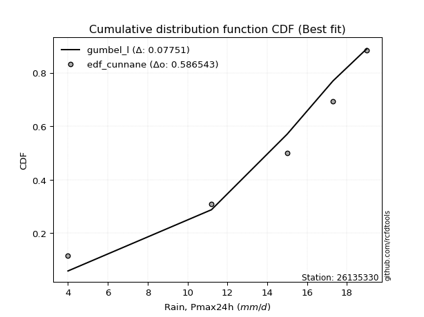</img>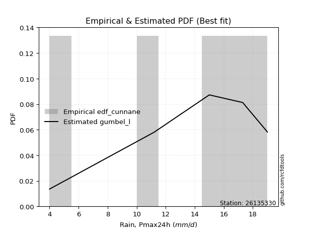</img>

</div>


### 12. Empirical - EDF Adamowski (1981)

The Adamowski formula in hydrology refers to a specific plotting position formula used for estimating the non-parametric empirical distribution of hydrological events (like flood peaks) to calculate their return periods. This formula provides an alternative to traditional parametric methods (like the Gumbel or Log Pearson Type III distributions). 

<div align="center">


$P=(m-0.25)/(n+0.5)$


</div>


**12.1. Empirical values**

<div align="center">

|                | 0                   | 1                  | 2             | 3                  | 4                  |
|:---------------|:--------------------|:-------------------|:--------------|:-------------------|:-------------------|
| date           | 2021                | 2020               | 2019          | 2017               | 2018               |
| x              | 4.0                 | 11.2               | 15.0          | 17.3               | 19.0               |
| m              | 1                   | 2                  | 3             | 4                  | 5                  |
| empirical_dist | edf_adamowski       | edf_adamowski      | edf_adamowski | edf_adamowski      | edf_adamowski      |
| empirical      | 0.13636363636363635 | 0.3181818181818182 | 0.5           | 0.6818181818181818 | 0.8636363636363636 |
| empirical_tr   | 1.1578947368421053  | 1.4666666666666666 | 2.0           | 3.1428571428571423 | 7.333333333333334  |

</div>


**12.2. Kolmogorov-Smirnov fit test (sorted by Δ)**


<div align="center">

|                | 0                   | 1                  | 2                  | 3                   | 4                   | 5                  | 6                   | 7                   | 8                   | 9                   | 10                  | 11                 | 12                 | 13                  | 14                 | 15                 | 16                  | 17                 | 18                  | 19                 | 20                  | 21                  | 22                 | 23                 | 24                    | 25                 | 26                  | 27                  | 28                 | 29                  | 30                  | 31                  | 32                 | 33                 | 34                 | 35                  | 36                 | 37                 | 38                 | 39                 | 40                  | 41                 | 42                 | 43                 | 44                  | 45                  | 46                  | 47                  | 48                  | 49                  | 50                 | 51                  | 52                 | 53                  | 54                  | 55                 | 56                  | 57                  | 58                  | 59                 | 60                  | 61                 | 62                 | 63                 | 64                  | 65                 | 66                  | 67                 | 68                  | 69                  | 70                  | 71                  | 72                 | 73                  | 74                 | 75                  | 76                 | 77                  | 78                 | 79                  | 80                 | 81                  | 82                 | 83                  | 84                 | 85                 | 86                 | 87                 | 88                 | 89                 |
|:---------------|:--------------------|:-------------------|:-------------------|:--------------------|:--------------------|:-------------------|:--------------------|:--------------------|:--------------------|:--------------------|:--------------------|:-------------------|:-------------------|:--------------------|:-------------------|:-------------------|:--------------------|:-------------------|:--------------------|:-------------------|:--------------------|:--------------------|:-------------------|:-------------------|:----------------------|:-------------------|:--------------------|:--------------------|:-------------------|:--------------------|:--------------------|:--------------------|:-------------------|:-------------------|:-------------------|:--------------------|:-------------------|:-------------------|:-------------------|:-------------------|:--------------------|:-------------------|:-------------------|:-------------------|:--------------------|:--------------------|:--------------------|:--------------------|:--------------------|:--------------------|:-------------------|:--------------------|:-------------------|:--------------------|:--------------------|:-------------------|:--------------------|:--------------------|:--------------------|:-------------------|:--------------------|:-------------------|:-------------------|:-------------------|:--------------------|:-------------------|:--------------------|:-------------------|:--------------------|:--------------------|:--------------------|:--------------------|:-------------------|:--------------------|:-------------------|:--------------------|:-------------------|:--------------------|:-------------------|:--------------------|:-------------------|:--------------------|:-------------------|:--------------------|:-------------------|:-------------------|:-------------------|:-------------------|:-------------------|:-------------------|
| station        | 26135330            | 26135330           | 26135330           | 26135330            | 26135330            | 26135330           | 26135330            | 26135330            | 26135330            | 26135330            | 26135330            | 26135330           | 26135330           | 26135330            | 26135330           | 26135330           | 26135330            | 26135330           | 26135330            | 26135330           | 26135330            | 26135330            | 26135330           | 26135330           | 26135330              | 26135330           | 26135330            | 26135330            | 26135330           | 26135330            | 26135330            | 26135330            | 26135330           | 26135330           | 26135330           | 26135330            | 26135330           | 26135330           | 26135330           | 26135330           | 26135330            | 26135330           | 26135330           | 26135330           | 26135330            | 26135330            | 26135330            | 26135330            | 26135330            | 26135330            | 26135330           | 26135330            | 26135330           | 26135330            | 26135330            | 26135330           | 26135330            | 26135330            | 26135330            | 26135330           | 26135330            | 26135330           | 26135330           | 26135330           | 26135330            | 26135330           | 26135330            | 26135330           | 26135330            | 26135330            | 26135330            | 26135330            | 26135330           | 26135330            | 26135330           | 26135330            | 26135330           | 26135330            | 26135330           | 26135330            | 26135330           | 26135330            | 26135330           | 26135330            | 26135330           | 26135330           | 26135330           | 26135330           | 26135330           | 26135330           |
| empirical_dist | edf_adamowski       | edf_adamowski      | edf_adamowski      | edf_adamowski       | edf_adamowski       | edf_adamowski      | edf_adamowski       | edf_adamowski       | edf_adamowski       | edf_adamowski       | edf_adamowski       | edf_adamowski      | edf_adamowski      | edf_adamowski       | edf_adamowski      | edf_adamowski      | edf_adamowski       | edf_adamowski      | edf_adamowski       | edf_adamowski      | edf_adamowski       | edf_adamowski       | edf_adamowski      | edf_adamowski      | edf_adamowski         | edf_adamowski      | edf_adamowski       | edf_adamowski       | edf_adamowski      | edf_adamowski       | edf_adamowski       | edf_adamowski       | edf_adamowski      | edf_adamowski      | edf_adamowski      | edf_adamowski       | edf_adamowski      | edf_adamowski      | edf_adamowski      | edf_adamowski      | edf_adamowski       | edf_adamowski      | edf_adamowski      | edf_adamowski      | edf_adamowski       | edf_adamowski       | edf_adamowski       | edf_adamowski       | edf_adamowski       | edf_adamowski       | edf_adamowski      | edf_adamowski       | edf_adamowski      | edf_adamowski       | edf_adamowski       | edf_adamowski      | edf_adamowski       | edf_adamowski       | edf_adamowski       | edf_adamowski      | edf_adamowski       | edf_adamowski      | edf_adamowski      | edf_adamowski      | edf_adamowski       | edf_adamowski      | edf_adamowski       | edf_adamowski      | edf_adamowski       | edf_adamowski       | edf_adamowski       | edf_adamowski       | edf_adamowski      | edf_adamowski       | edf_adamowski      | edf_adamowski       | edf_adamowski      | edf_adamowski       | edf_adamowski      | edf_adamowski       | edf_adamowski      | edf_adamowski       | edf_adamowski      | edf_adamowski       | edf_adamowski      | edf_adamowski      | edf_adamowski      | edf_adamowski      | edf_adamowski      | edf_adamowski      |
| p_dist         | pearson3            | gumbel_l           | weibull_min        | fisk                | logmielke           | logpearson3        | mielke              | logfisk             | t                   | exponnorm           | crystalball         | norm               | nct                | loggumbel_l         | f                  | betaprime          | gamma               | chi2               | rice                | erlang             | laplace_asymmetric  | alpha               | logistic           | logweibull_min     | loglaplace_asymmetric | logloggamma        | invgauss            | invgamma            | maxwell            | loggompertz         | ncf                 | hypsecant           | rayleigh           | gompertz           | kstwobign          | logncf              | logfatiguelife     | lognct             | logf               | logexponnorm       | logt                | logcrystalball     | lognorm            | lognorm            | logrice             | loginvgauss         | logerlang           | loggamma            | loggamma            | genexpon            | logalpha           | halfnorm            | loginvgamma        | logbetaprime        | laplace             | loglogistic        | logmaxwell          | gumbel_r            | lograyleigh         | loginvweibull      | loghypsecant        | halflogistic       | moyal              | expon              | loggumbel_r         | loghalfnorm        | loglaplace          | logkstwobign       | logjohnsonsu        | loggenexpon         | logmoyal            | loghalflogistic     | wald               | johnsonsu           | logexpon           | gibrat              | logwald            | logtruncnorm        | nakagami           | loggibrat           | logchi2            | lognakagami         | pareto             | loglognorm          | logpareto          | truncnorm          | invweibull         | fatiguelife        | loggenlogistic     | genlogistic        |
| delta          | 0.08224509329914775 | 0.0879990688437533 | 0.0940854616172152 | 0.09805092663432519 | 0.10849278852038591 | 0.1104344332378393 | 0.11523143283787562 | 0.11588152765188325 | 0.12498521043593191 | 0.12501359114913413 | 0.12501738174722266 | 0.1250174085982667 | 0.1252320223648673 | 0.12553189319726887 | 0.1259777626606695 | 0.126022308719004  | 0.12907516294149735 | 0.1294509517077509 | 0.13218631457743857 | 0.1337715126589153 | 0.13620904180345206 | 0.13894870941593296 | 0.1406142475008354 | 0.1410445457238848 | 0.1415705537648273    | 0.1416392978804213 | 0.14271123876898184 | 0.14497338998100262 | 0.1492123137104071 | 0.15008635255510105 | 0.15062268514318655 | 0.15307647427697157 | 0.1566012666317147 | 0.1625936039424338 | 0.1651606953147149 | 0.16585082088872238 | 0.1668501613643515 | 0.168132691966685  | 0.1685607694090776 | 0.1686130723254684 | 0.16861357037545788 | 0.1686136280405034 | 0.1686136350603329 | 0.1686136350603329 | 0.17166246834601062 | 0.17359181129361695 | 0.17379369730624883 | 0.17456577581239918 | 0.17456577581239918 | 0.17517890155785465 | 0.1761116811497594 | 0.17782167845047925 | 0.1778514360016985 | 0.18044875064460114 | 0.18140552292948509 | 0.1880409700418404 | 0.18820563838125337 | 0.18860577525123767 | 0.19568753385621424 | 0.1985312998654007 | 0.20275451202530304 | 0.20617899916977   | 0.2099732546539671 | 0.2207427156590545 | 0.22547130325666875 | 0.2284459102509792 | 0.23014460663628655 | 0.2344173071496109 | 0.23602259769454054 | 0.23817832544908585 | 0.24446370658503275 | 0.25113563809934164 | 0.2699110596010468 | 0.27825425933458114 | 0.2981494779606327 | 0.30207769083527236 | 0.3161118815824034 | 0.31817992777212223 | 0.3181801876246243 | 0.33340938073665044 | 0.3575086689472374 | 0.36025411027654763 | 0.3605800063817228 | 0.36708963214749707 | 0.3758874890706622 | 0.3809271170597958 | 0.4572119668832362 | 0.5151046132094386 | 0.6818181818181818 | 0.6818181818181818 |
| deltao         | 0.5865427407550001  | 0.5865427407550001 | 0.5865427407550001 | 0.5865427407550001  | 0.5865427407550001  | 0.5865427407550001 | 0.5865427407550001  | 0.5865427407550001  | 0.5865427407550001  | 0.5865427407550001  | 0.5865427407550001  | 0.5865427407550001 | 0.5865427407550001 | 0.5865427407550001  | 0.5865427407550001 | 0.5865427407550001 | 0.5865427407550001  | 0.5865427407550001 | 0.5865427407550001  | 0.5865427407550001 | 0.5865427407550001  | 0.5865427407550001  | 0.5865427407550001 | 0.5865427407550001 | 0.5865427407550001    | 0.5865427407550001 | 0.5865427407550001  | 0.5865427407550001  | 0.5865427407550001 | 0.5865427407550001  | 0.5865427407550001  | 0.5865427407550001  | 0.5865427407550001 | 0.5865427407550001 | 0.5865427407550001 | 0.5865427407550001  | 0.5865427407550001 | 0.5865427407550001 | 0.5865427407550001 | 0.5865427407550001 | 0.5865427407550001  | 0.5865427407550001 | 0.5865427407550001 | 0.5865427407550001 | 0.5865427407550001  | 0.5865427407550001  | 0.5865427407550001  | 0.5865427407550001  | 0.5865427407550001  | 0.5865427407550001  | 0.5865427407550001 | 0.5865427407550001  | 0.5865427407550001 | 0.5865427407550001  | 0.5865427407550001  | 0.5865427407550001 | 0.5865427407550001  | 0.5865427407550001  | 0.5865427407550001  | 0.5865427407550001 | 0.5865427407550001  | 0.5865427407550001 | 0.5865427407550001 | 0.5865427407550001 | 0.5865427407550001  | 0.5865427407550001 | 0.5865427407550001  | 0.5865427407550001 | 0.5865427407550001  | 0.5865427407550001  | 0.5865427407550001  | 0.5865427407550001  | 0.5865427407550001 | 0.5865427407550001  | 0.5865427407550001 | 0.5865427407550001  | 0.5865427407550001 | 0.5865427407550001  | 0.5865427407550001 | 0.5865427407550001  | 0.5865427407550001 | 0.5865427407550001  | 0.5865427407550001 | 0.5865427407550001  | 0.5865427407550001 | 0.5865427407550001 | 0.5865427407550001 | 0.5865427407550001 | 0.5865427407550001 | 0.5865427407550001 |
| eval           | Δo > Δ              | Δo > Δ             | Δo > Δ             | Δo > Δ              | Δo > Δ              | Δo > Δ             | Δo > Δ              | Δo > Δ              | Δo > Δ              | Δo > Δ              | Δo > Δ              | Δo > Δ             | Δo > Δ             | Δo > Δ              | Δo > Δ             | Δo > Δ             | Δo > Δ              | Δo > Δ             | Δo > Δ              | Δo > Δ             | Δo > Δ              | Δo > Δ              | Δo > Δ             | Δo > Δ             | Δo > Δ                | Δo > Δ             | Δo > Δ              | Δo > Δ              | Δo > Δ             | Δo > Δ              | Δo > Δ              | Δo > Δ              | Δo > Δ             | Δo > Δ             | Δo > Δ             | Δo > Δ              | Δo > Δ             | Δo > Δ             | Δo > Δ             | Δo > Δ             | Δo > Δ              | Δo > Δ             | Δo > Δ             | Δo > Δ             | Δo > Δ              | Δo > Δ              | Δo > Δ              | Δo > Δ              | Δo > Δ              | Δo > Δ              | Δo > Δ             | Δo > Δ              | Δo > Δ             | Δo > Δ              | Δo > Δ              | Δo > Δ             | Δo > Δ              | Δo > Δ              | Δo > Δ              | Δo > Δ             | Δo > Δ              | Δo > Δ             | Δo > Δ             | Δo > Δ             | Δo > Δ              | Δo > Δ             | Δo > Δ              | Δo > Δ             | Δo > Δ              | Δo > Δ              | Δo > Δ              | Δo > Δ              | Δo > Δ             | Δo > Δ              | Δo > Δ             | Δo > Δ              | Δo > Δ             | Δo > Δ              | Δo > Δ             | Δo > Δ              | Δo > Δ             | Δo > Δ              | Δo > Δ             | Δo > Δ              | Δo > Δ             | Δo > Δ             | Δo > Δ             | Δo > Δ             | Δo <= Δ            | Δo <= Δ            |
| fit            | 1                   | 1                  | 1                  | 1                   | 1                   | 1                  | 1                   | 1                   | 1                   | 1                   | 1                   | 1                  | 1                  | 1                   | 1                  | 1                  | 1                   | 1                  | 1                   | 1                  | 1                   | 1                   | 1                  | 1                  | 1                     | 1                  | 1                   | 1                   | 1                  | 1                   | 1                   | 1                   | 1                  | 1                  | 1                  | 1                   | 1                  | 1                  | 1                  | 1                  | 1                   | 1                  | 1                  | 1                  | 1                   | 1                   | 1                   | 1                   | 1                   | 1                   | 1                  | 1                   | 1                  | 1                   | 1                   | 1                  | 1                   | 1                   | 1                   | 1                  | 1                   | 1                  | 1                  | 1                  | 1                   | 1                  | 1                   | 1                  | 1                   | 1                   | 1                   | 1                   | 1                  | 1                   | 1                  | 1                   | 1                  | 1                   | 1                  | 1                   | 1                  | 1                   | 1                  | 1                   | 1                  | 1                  | 1                  | 1                  | 0                  | 0                  |
| n              | 5                   | 5                  | 5                  | 5                   | 5                   | 5                  | 5                   | 5                   | 5                   | 5                   | 5                   | 5                  | 5                  | 5                   | 5                  | 5                  | 5                   | 5                  | 5                   | 5                  | 5                   | 5                   | 5                  | 5                  | 5                     | 5                  | 5                   | 5                   | 5                  | 5                   | 5                   | 5                   | 5                  | 5                  | 5                  | 5                   | 5                  | 5                  | 5                  | 5                  | 5                   | 5                  | 5                  | 5                  | 5                   | 5                   | 5                   | 5                   | 5                   | 5                   | 5                  | 5                   | 5                  | 5                   | 5                   | 5                  | 5                   | 5                   | 5                   | 5                  | 5                   | 5                  | 5                  | 5                  | 5                   | 5                  | 5                   | 5                  | 5                   | 5                   | 5                   | 5                   | 5                  | 5                   | 5                  | 5                   | 5                  | 5                   | 5                  | 5                   | 5                  | 5                   | 5                  | 5                   | 5                  | 5                  | 5                  | 5                  | 5                  | 5                  |
| best_fit       | 1                   | 0                  | 0                  | 0                   | 0                   | 0                  | 0                   | 0                   | 0                   | 0                   | 0                   | 0                  | 0                  | 0                   | 0                  | 0                  | 0                   | 0                  | 0                   | 0                  | 0                   | 0                   | 0                  | 0                  | 0                     | 0                  | 0                   | 0                   | 0                  | 0                   | 0                   | 0                   | 0                  | 0                  | 0                  | 0                   | 0                  | 0                  | 0                  | 0                  | 0                   | 0                  | 0                  | 0                  | 0                   | 0                   | 0                   | 0                   | 0                   | 0                   | 0                  | 0                   | 0                  | 0                   | 0                   | 0                  | 0                   | 0                   | 0                   | 0                  | 0                   | 0                  | 0                  | 0                  | 0                   | 0                  | 0                   | 0                  | 0                   | 0                   | 0                   | 0                   | 0                  | 0                   | 0                  | 0                   | 0                  | 0                   | 0                  | 0                   | 0                  | 0                   | 0                  | 0                   | 0                  | 0                  | 0                  | 0                  | 0                  | 0                  |
| best_fit_sort  | 1                   | 2                  | 3                  | 4                   | 5                   | 6                  | 7                   | 8                   | 9                   | 10                  | 11                  | 12                 | 13                 | 14                  | 15                 | 16                 | 17                  | 18                 | 19                  | 20                 | 21                  | 22                  | 23                 | 24                 | 25                    | 26                 | 27                  | 28                  | 29                 | 30                  | 31                  | 32                  | 33                 | 34                 | 35                 | 36                  | 37                 | 38                 | 39                 | 40                 | 41                  | 42                 | 43                 | 44                 | 45                  | 46                  | 47                  | 48                  | 49                  | 50                  | 51                 | 52                  | 53                 | 54                  | 55                  | 56                 | 57                  | 58                  | 59                  | 60                 | 61                  | 62                 | 63                 | 64                 | 65                  | 66                 | 67                  | 68                 | 69                  | 70                  | 71                  | 72                  | 73                 | 74                  | 75                 | 76                  | 77                 | 78                  | 79                 | 80                  | 81                 | 82                  | 83                 | 84                  | 85                 | 86                 | 87                 | 88                 | 89                 | 90                 |

</div>


<div align="center">

</img>

</div>


**12.3. Best fit**

<div align="center">

|   id |   station | empirical_dist   | p_dist   |     delta |   deltao | eval   |   fit |   n |   best_fit |   best_fit_sort |
|-----:|----------:|:-----------------|:---------|----------:|---------:|:-------|------:|----:|-----------:|----------------:|
|    0 |  26135330 | edf_adamowski    | pearson3 | 0.0822451 | 0.586543 | Δo > Δ |     1 |   5 |          1 |               1 |

</div>


<div align="center">

</img>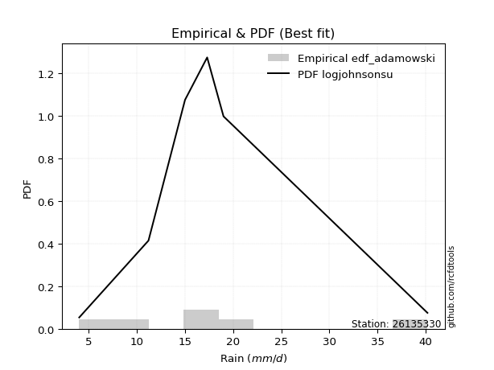</img>

</div>


## C. Best fit & Estimate extreme values for specific return periods - Tr


### 1. Best fit (ordered by delta Δ)

<div align="center">

|   id |   station | empirical_dist   | p_dist   |     delta |   deltao | eval   |   fit |   n |   best_fit |   best_fit_sort |
|-----:|----------:|:-----------------|:---------|----------:|---------:|:-------|------:|----:|-----------:|----------------:|
|    0 |  26135330 | edf_hazen        | gumbel_l | 0.0704182 | 0.586543 | Δo > Δ |     1 |   5 |          1 |               1 |
|    1 |  26135330 | edf_gringorten   | gumbel_l | 0.0745048 | 0.586543 | Δo > Δ |     1 |   5 |          1 |               2 |
|    2 |  26135330 | edf_cunnane      | gumbel_l | 0.0775096 | 0.586543 | Δo > Δ |     1 |   5 |          1 |               3 |
|    3 |  26135330 | edf_blom         | gumbel_l | 0.0793411 | 0.586543 | Δo > Δ |     1 |   5 |          1 |               4 |
|    4 |  26135330 | edf_filliben     | pearson3 | 0.0822451 | 0.586543 | Δo > Δ |     1 |   5 |          1 |               5 |
|    5 |  26135330 | edf_jenkinson    | pearson3 | 0.0822451 | 0.586543 | Δo > Δ |     1 |   5 |          1 |               6 |
|    6 |  26135330 | edf_tukey        | pearson3 | 0.0822451 | 0.586543 | Δo > Δ |     1 |   5 |          1 |               7 |
|    7 |  26135330 | edf_adamowski    | pearson3 | 0.0822451 | 0.586543 | Δo > Δ |     1 |   5 |          1 |               8 |
|    8 |  26135330 | edf_chegodayev   | pearson3 | 0.0822451 | 0.586543 | Δo > Δ |     1 |   5 |          1 |               9 |
|    9 |  26135330 | edf_beard        | pearson3 | 0.0822451 | 0.586543 | Δo > Δ |     1 |   5 |          1 |              10 |
|   10 |  26135330 | edf_weibull      | gumbel_l | 0.10842   | 0.586543 | Δo > Δ |     1 |   5 |          1 |              11 |
|   11 |  26135330 | edf_california   | mielke   | 0.139693  | 0.586543 | Δo > Δ |     1 |   5 |          1 |              12 |

</div>

:file_folder:Tables: [bestfit_26135330.csv](table/bestfit_26135330.csv) | [extreme_26135330.csv](table/extreme_26135330.csv)


### 2. Extreme values

In hydrology, a return period (or recurrence interval $Tr$) is the statistical average time between extreme events like floods or droughts of a specific magnitude, indicating how rare an event is, with a 100-year flood, for example, having a 1% chance of occurring in any given year, not that it happens exactly every century. It is a key tool for infrastructure design (like bridges or dams) and risk assessment, calculated from historical data to determine the probability of future events, although it is important to remember it is statistical average, and events can cluster or be missed.

> risk_rate: assuming the return period as the project useful life.

|   id |      tr |   prob_l |     prob_g |   alpha |   betaprime |    chi2 |   crystalball |   erlang |   expon |   exponnorm |       f |   fatiguelife |    fisk |   gamma |   genexpon |   genlogistic |   gibrat |   gompertz |   gumbel_l |   gumbel_r |   halflogistic |   halfnorm |   hypsecant |   invgamma |   invgauss |     invweibull |   johnsonsu |   kstwobign |   laplace |   laplace_asymmetric |   loggamma |   logistic |   lognorm |   maxwell |   mielke |   moyal |   nakagami |     ncf |     nct |    norm |           pareto |   pearson3 |   rayleigh |    rice |       t |   truncnorm |    wald |   weibull_min |   logalpha |   logbetaprime |      logchi2 |   logcrystalball |   logerlang |   logexpon |   logexponnorm |    logf |   logfatiguelife |   logfisk |   loggenexpon |   loggenlogistic |   loggibrat |   loggompertz |   loggumbel_l |   loggumbel_r |   loghalflogistic |   loghalfnorm |   loghypsecant |   loginvgamma |   loginvgauss |   loginvweibull |   logjohnsonsu |   logkstwobign |   loglaplace |   loglaplace_asymmetric |   logloggamma |   loglogistic |    loglognorm |   logmaxwell |   logmielke |   logmoyal |   lognakagami |   logncf |   lognct |      logpareto |   logpearson3 |   lograyleigh |   logrice |    logt |   logtruncnorm |   logwald |   logweibull_min |   station |   n |   risk_rate |
|-----:|--------:|---------:|-----------:|--------:|------------:|--------:|--------------:|---------:|--------:|------------:|--------:|--------------:|--------:|--------:|-----------:|--------------:|---------:|-----------:|-----------:|-----------:|---------------:|-----------:|------------:|-----------:|-----------:|---------------:|------------:|------------:|----------:|---------------------:|-----------:|-----------:|----------:|----------:|---------:|--------:|-----------:|--------:|--------:|--------:|-----------------:|-----------:|-----------:|--------:|--------:|------------:|--------:|--------------:|-----------:|---------------:|-------------:|-----------------:|------------:|-----------:|---------------:|--------:|-----------------:|----------:|--------------:|-----------------:|------------:|--------------:|--------------:|--------------:|------------------:|--------------:|---------------:|--------------:|--------------:|----------------:|---------------:|---------------:|-------------:|------------------------:|--------------:|--------------:|--------------:|-------------:|------------:|-----------:|--------------:|---------:|---------:|---------------:|--------------:|--------------:|----------:|--------:|---------------:|----------:|-----------------:|----------:|----:|------------:|
|    0 |    2    | 0.5      | 0.5        | 12.9255 |     13.2415 | 13.1643 |       13.3    |  13.0993 | 10.4463 |     13.3001 | 13.2817 |       4       | 13.9856 | 13.1851 |    11.6177 |           inf |  11.6988 |    15.1234 |    14.1764 |    12.4236 |        11.9879 |    12.208  |     13.3    |    12.8781 |    12.8798 | 7280.5         |     18.1253 |     12.0289 |   13.3    |              15.0535 |    11.4917 |    13.3    |   11.7175 |   12.8438 |  14.988  | 12.1407 |    12.6617 | 12.5368 | 13.2952 | 13.3    |      5.2442      |    13.9498 |    12.682  | 13.1338 | 13.3004 |     6.28831 | 11.5708 |       14.3049 |    11.3805 |        11.226  |      6.63536 |          11.7175 |     11.4322 |    8.42564 |        11.7175 | 11.7042 |          11.7471 |   13.0465 |       10.0988 |              inf |     9.88544 |       12.815  |       12.86   |       10.6765 |           10.1938 |       10.4349 |        11.7175 |       11.3624 |       11.3426 |         10.8569 |        17.8811 |        10.1358 |      11.7175 |                 13.5992 |       13.5968 |       11.7175 |   4.00372     |      11.1634 |     13.6765 |    10.3606 |       11.2163 |  11.551  |  11.7163 |   4.63281      |       13.0425 |       10.9733 |   11.565  | 11.7175 |        13.9695 |   9.75207 |          13.0266 |  26135330 |   5 |    0.75     |
|    1 |    2.33 | 0.570815 | 0.429185   | 13.9539 |     14.2156 | 14.152  |       14.2519 |  14.0874 | 11.8666 |     14.252  | 14.2362 |       4.24509 | 14.8696 | 14.1654 |    12.8765 |           inf |  12.181  |    15.6929 |    15.0046 |    13.3057 |        12.8949 |    13.2354 |     14.0618 |    13.8875 |    13.9015 |    1.09575e+06 |     18.4625 |     13.2206 |   13.8761 |              15.8079 |    12.7573 |    14.1387 |   12.9636 |   13.8328 |  15.7697 | 12.9757 |    13.3096 | 13.6325 | 14.2481 | 14.2519 |      6.30887     |    14.8557 |    13.6856 | 14.1173 | 14.2524 |     8.0711  | 12.195  |       15.0804 |    12.6639 |        12.6843 |      7.90132 |          12.9636 |     12.7229 |    9.92863 |        12.9636 | 12.9549 |          12.9973 |   14.2348 |       11.5116 |              inf |    10.4047  |       13.8146 |       14.0419 |       11.7246 |           11.2241 |       11.6375 |        12.7046 |       12.6378 |       12.6682 |         12.4356 |        18.3583 |        11.6104 |      12.4565 |                 14.4968 |       14.4948 |       12.8087 |   4.04996     |      12.3993 |     14.6388 |    11.3209 |       11.2592 |  12.8701 |  12.9666 |   5.25426      |       14.2837 |       12.2071 |   12.8336 | 12.9636 |        14.4925 |  10.4203  |          13.9974 |  26135330 |   5 |    0.729209 |
|    2 |    5    | 0.8      | 0.2        | 18.004  |     17.8889 | 17.9001 |       17.7896 |  17.8374 | 18.9678 |     17.7896 | 17.7861 |       9.45134 | 18.2831 | 17.8691 |    18.3282 |           inf |  14.9572 |    17.5449 |    17.6801 |    17.1378 |        16.9985 |    17.5801 |     17.1177 |    17.7884 |    17.9162 |    3.16957e+15 |     18.9144 |     18.2826 |   16.7563 |              17.7301 |    18.9341 |    17.3771 |   18.8727 |   17.7253 |  17.782  | 16.8435 |    16.9212 | 18.3395 | 17.7903 | 17.7896 |     48.7564      |    17.8703 |    17.7035 | 17.8202 | 17.79   |    13.6691  | 15.6892 |       17.5855 |    19.056  |        20.6103 |     21.7082  |          18.8727 |     19.0745 |   22.5581  |        18.8727 | 18.8979 |          18.9321 |   19.9311 |       19.6445 |              inf |    13.9715  |       17.679  |       18.6546 |       17.611  |           17.3524 |       18.4577 |        17.5734 |       18.9694 |       19.4381 |         22.4288 |        18.9214 |        20.6734 |      16.9118 |                 17.0611 |       17.0603 |       18.0641 |   1.54219e+83 |      18.7445 |     17.4086 |    17.0692 |       12.9123 |  19.4013 |  18.9045 | 807.88         |       18.9143 |       18.7011 |   18.9589 | 18.8727 |        16.5448 |  15.1007  |          17.656  |  26135330 |   5 |    0.67232  |
|    3 |   10    | 0.9      | 0.1        | 20.9078 |     20.3721 | 20.4544 |       20.1363 |  20.3935 | 25.414  |     20.1364 | 20.1438 |      16.6398  | 20.7976 | 20.3792 |    22.5723 |           inf |  18.1217 |    18.5816 |    19.1697 |    20.259  |        20.4063 |    20.7951 |     19.5579 |    20.5128 |    20.7764 |    1.61096e+23 |     18.9768 |     22.1367 |   19.3708 |              18.4009 |    24.7459 |    19.7621 |   24.2123 |   20.4647 |  18.491  | 20.211  |    20.0652 | 22.1058 | 20.1411 | 20.1363 |    643.04        |    19.5785 |    20.5684 | 20.3058 | 20.1368 |    16.2219  | 19.3974 |       18.9802 |    25.2527 |        29.2504 |     60.8636  |          24.2123 |     25.1158 |   47.5167  |        24.2123 | 24.2799 |          24.3033 |   25.538  |       28.9264 |              inf |    19.5506  |       20.3183 |       21.8508 |       24.5297 |           24.9166 |       25.9662 |        22.7702 |       25.0769 |       26.2277 |         36.2602 |        18.9807 |        32.0764 |      22.3224 |                 18.0588 |       18.0585 |       23.2691 | inf           |      25.0714 |     18.5013 |    24.4049 |       17.8155 |  25.668  |  24.2815 |   4.37482e+33  |       21.7775 |       25.3487 |   24.6125 | 24.2123 |        17.6724 |  22.3864  |          20.0927 |  26135330 |   5 |    0.651322 |
|    4 |   15    | 0.933333 | 0.0666667  | 22.4281 |     21.6252 | 21.7495 |       21.3074 |  21.6895 | 29.1849 |     21.3075 | 21.3211 |      21.3412  | 22.1678 | 21.6477 |    24.8689 |           inf |  20.3045 |    19.052  |    19.8443 |    22.02   |        22.3349 |    22.4681 |     20.9505 |    21.9152 |    22.2649 |    3.58749e+27 |     18.9891 |     24.1827 |   20.9002 |              18.608  |    28.3315 |    21.0615 |   27.4177 |   21.8703 |  18.7106 | 22.1653 |    21.7624 | 24.2109 | 21.3145 | 21.3074 |   3027.6         |    20.3487 |    22.0445 | 21.5523 | 21.3079 |    17.1154  | 21.7787 |       19.6118 |    29.1574 |        35.1339 |    114.502   |          27.4177 |     28.8687 |   73.4695  |        27.4177 | 27.5151 |          27.5313 |   29.231  |       35.3496 |              inf |    24.6494  |       21.6461 |       23.4732 |       29.5723 |           30.578  |       31.0133 |        26.3983 |       28.9112 |       30.6031 |         47.5481 |        18.9905 |        40.5008 |      26.2577 |                 18.3785 |       18.3784 |       26.7112 | inf           |      29.1061 |     18.8704 |    30.0321 |       22.3653 |  29.5848 |  27.5137 |   1.85709e+157 |       23.084  |       29.6494 |   28.0491 | 27.4177 |        18.09   |  28.8259  |          21.3042 |  26135330 |   5 |    0.644736 |
|    5 |   20    | 0.95     | 0.05       | 23.4509 |     22.4508 | 22.605  |       22.0743 |  22.5457 | 31.8603 |     22.0744 | 22.0924 |      24.8221  | 23.1149 | 22.4843 |    26.4365 |           inf |  22.0167 |    19.345  |    20.2642 |    23.2529 |        23.6861 |    23.5836 |     21.9329 |    22.8496 |    23.2623 |    3.9714e+30  |     18.994  |     25.561  |   21.9854 |              18.7088 |    30.976  |    21.9596 |   29.7435 |   22.8031 |  18.8177 | 23.5494 |    22.9049 | 25.6796 | 22.083  | 22.0743 |   9111.81        |    20.8246 |    23.0256 | 22.3704 | 22.0749 |    17.573   | 23.5532 |       20.005  |    32.075  |        39.7386 |    180.966   |          29.7435 |     31.6476 |  100.09    |        29.7435 | 29.8644 |          29.8749 |   32.0911 |       40.4033 |              inf |    29.5636  |       22.5178 |       24.5433 |       33.7081 |           35.2947 |       34.9122 |        29.3003 |       31.7696 |       33.9164 |         57.4839 |        18.994  |        47.3901 |      29.4638 |                 18.5362 |       18.5361 |       29.3835 | inf           |      32.1361 |     19.0688 |    34.7858 |       26.3689 |  32.4959 |  29.8608 | inf            |       23.8857 |       32.9042 |   30.5599 | 29.7435 |        18.3077 |  34.8021  |          22.0949 |  26135330 |   5 |    0.641514 |
|    6 |   25    | 0.96     | 0.04       | 24.218  |     23.0612 | 23.2385 |       22.6389 |  23.1798 | 33.9355 |     22.6389 | 22.6603 |      27.5877  | 23.8395 | 23.103  |    27.6225 |           inf |  23.4441 |    19.5536 |    20.563  |    24.2027 |        24.7271 |    24.4135 |     22.6932 |    23.5456 |    24.0081 |    8.78495e+32 |     18.9966 |     26.5934 |   22.8271 |              18.7684 |    33.0898 |    22.6467 |   31.5807 |   23.4956 |  18.8811 | 24.6222 |    23.7582 | 26.8092 | 22.6488 | 22.6389 |  21426.3         |    21.1607 |    23.7546 | 22.9735 | 22.6394 |    17.8516  | 24.9745 |       20.2848 |    34.4293 |        43.579  |    259.245   |          31.5807 |     33.875  |  127.218   |        31.5807 | 31.7212 |          31.7271 |   34.4666 |       44.6272 |              inf |    34.4013  |       23.1601 |       25.3344 |       37.284  |           39.4194 |       38.1279 |        31.7634 |       34.0721 |       36.6154 |         66.5313 |        18.9957 |        53.3077 |      32.2179 |                 18.6301 |       18.6301 |       31.6069 | inf           |      34.5878 |     19.1989 |    38.9821 |       29.9346 |  34.8356 |  31.716  | inf            |       24.4465 |       35.5518 |   32.5529 | 31.5807 |        18.4413 |  40.4709  |          22.6754 |  26135330 |   5 |    0.639603 |
|    7 |   50    | 0.98     | 0.02       | 26.4847 |     24.821  | 25.0703 |       24.2556 |  25.0133 | 40.3818 |     24.2556 | 24.2872 |      36.4611  | 26.0536 | 24.8885 |    31.1692 |           inf |  28.4757 |    20.1203 |    21.3742 |    27.1283 |        27.9347 |    26.8258 |     25.0505 |    25.578  |    26.1989 |    1.46875e+40 |     19.0013 |     29.625  |   25.4416 |              18.8858 |    40.0347 |    24.7459 |   37.4939 |   25.5041 |  19.0072 | 27.9527 |    26.2461 | 30.2885 | 24.2693 | 24.2556 | 305281           |    22.0592 |    25.8706 | 24.7041 | 24.2561 |    18.4185  | 29.6152 |       21.0443 |    42.2972 |        57.1855 |    807.822   |          37.4939 |     41.2285 |  267.972   |        37.4939 | 37.7031 |          37.6936 |   42.8701 |       59.5972 |              inf |    58.6926  |       25.0006 |       27.6128 |       50.8643 |           55.412  |       49.2568 |        40.7957 |       41.743  |       45.7871 |        104.37   |        18.9984 |        75.3098 |      42.5252 |                 18.8164 |       18.8165 |       39.4975 | inf           |      42.8082 |     19.5239 |    55.5166 |       43.7636 |  42.5978 |  37.693  | inf            |       25.9066 |       44.5068 |   39.0195 | 37.4939 |        18.7157 |  66.2405  |          24.3292 |  26135330 |   5 |    0.63583  |
|    8 |   75    | 0.986667 | 0.0133333  | 27.7455 |     25.7727 | 26.064  |       25.123  |  26.008  | 44.1526 |     25.123  | 25.1606 |      41.8051  | 27.3326 | 25.855  |    33.1647 |           inf |  31.874  |    20.407  |    21.7844 |    28.8288 |        29.7993 |    28.139  |     26.4281 |    26.6932 |    27.4086 |    2.31927e+44 |     19.003  |     31.2929 |   26.971  |              18.9244 |    44.3844 |    25.9583 |   41.1108 |   26.596  |  19.0513 | 29.9003 |    27.601  | 32.3168 | 25.1389 | 25.123  |      1.44424e+06 |    22.5032 |    27.0218 | 25.6346 | 25.1236 |    18.6107  | 32.4709 |       21.4283 |    47.3241 |        66.4699 |   1588.43    |          41.1108 |     45.8593 |  414.334   |        41.1108 | 41.366  |          41.3466 |   48.6276 |       69.7781 |              inf |    84.1942  |       25.9877 |       28.8418 |       60.9281 |           67.5422 |       56.6255 |        47.2205 |       46.6258 |       51.7582 |        135.593  |        18.9991 |        91.0782 |      50.0222 |                 18.878  |       18.8782 |       44.9232 | inf           |      48.0699 |     19.6819 |    68.2685 |       53.9682 |  47.5137 |  41.3531 | inf            |       26.5982 |       50.2927 |   43.0101 | 41.1108 |        18.8093 |  89.7012  |          25.2109 |  26135330 |   5 |    0.634587 |
|    9 |  100    | 0.99     | 0.01       | 28.6166 |     26.4192 | 26.7404 |       25.7097 |  26.6851 | 46.8281 |     25.7097 | 25.7515 |      45.6503  | 28.2356 | 26.5121 |    34.5512 |           inf |  34.5066 |    20.5946 |    22.0527 |    30.0323 |        31.1189 |    29.0336 |     27.4053 |    27.4574 |    28.2406 |    2.1718e+47  |     19.0039 |     32.4358 |   28.0562 |              18.9436 |    47.6085 |    26.8143 |   43.753  |   27.3398 |  19.0753 | 31.282  |    28.5233 | 33.7578 | 25.7272 | 25.7097 |      4.35032e+06 |    22.789  |    27.8061 | 26.2647 | 25.7103 |    18.7073  | 34.5529 |       21.6795 |    51.097  |        73.7265 |   2576.91    |          43.753  |     49.303  |  564.46    |        43.753  | 44.0434 |          44.0167 |   53.1523 |       77.7025 |              inf |   111.345   |       26.6548 |       29.6751 |       69.2323 |           77.7004 |       62.267  |        52.3824 |       50.2819 |       56.2918 |        163.186  |        18.9994 |       103.749  |      56.13   |                 18.9088 |       18.9089 |       49.1969 | inf           |      52.0195 |     19.7861 |    79.0548 |       62.2575 |  51.1824 |  44.0286 | inf            |       27.0294 |       54.6595 |   45.9406 | 43.753  |        18.8566 | 111.893   |          25.8048 |  26135330 |   5 |    0.633968 |
|   10 |  200    | 0.995    | 0.005      | 30.6502 |     27.8947 | 28.2876 |       27.0405 |  28.2339 | 53.2744 |     27.0406 | 27.0924 |      55.0626  | 30.4021 | 28.0125 |    37.8076 |           inf |  41.6688 |    21.0025 |    22.6358 |    32.9257 |        34.2917 |    31.0796 |     29.7594 |    29.2212 |    30.1696 |    3.02364e+54 |     19.0063 |     35.068  |   30.6707 |              18.9723 |    55.8776 |    28.8677 |   50.3928 |   29.0415 |  19.1194 | 34.611  |    30.6286 | 37.2484 | 27.0617 | 27.0405 |      6.19936e+07 |    23.3953 |    29.6006 | 27.6957 | 27.0411 |    18.8532  | 39.739  |       22.2255 |    60.9478 |        93.7825 |   8364.89    |          50.3928 |     58.1752 | 1188.98    |        50.3928 | 50.7777 |          50.7323 |   65.7976 |       99.4187 |              inf |   238.189   |       28.1659 |       31.5704 |       94.1273 |          108.82   |       77.3735 |        67.2554 |       59.7947 |       68.3203 |        254.732  |        18.9998 |       140.047  |      74.0874 |                 18.9548 |       18.955  |       61.1805 | inf           |      62.3195 |     20.0214 |   112.569  |       86.2123 |  60.6823 |  50.7588 | inf            |       27.8998 |       66.1312 |   53.3576 | 50.3928 |        18.928  | 194.059   |          27.1444 |  26135330 |   5 |    0.633042 |
|   11 |  250    | 0.996    | 0.004      | 31.2881 |     28.348  | 28.7639 |       27.4472 |  28.7108 | 55.3496 |     27.4473 | 27.5023 |      58.1301  | 31.0977 | 28.4738 |    38.8338 |           inf |  44.2386 |    21.1225 |    22.8074 |    33.8559 |        35.3117 |    31.709  |     30.5172 |    29.7687 |    30.7708 |    5.98589e+56 |     19.0072 |     35.8826 |   31.5124 |              18.9781 |    58.6981 |    29.5269 |   52.6163 |   29.5653 |  19.1311 | 35.6827 |    31.2748 | 38.3805 | 27.4696 | 27.4472 |      1.45813e+08 |    23.5693 |    30.153  | 28.1335 | 27.4478 |    18.8825  | 41.4548 |       22.3862 |    64.363  |       101.096  |  12257.3     |          52.6163 |     61.2137 | 1511.24    |        52.6163 | 53.0346 |          52.9829 |   70.4639 |      107.264  |              inf |   312.909   |       28.627  |       32.1507 |      103.897  |          121.266  |       82.7205 |        72.89   |       63.0821 |       72.5504 |        293.939  |        18.9998 |       153.672  |      81.0125 |                 18.964  |       18.9642 |       65.6157 | inf           |      65.8833 |     20.0943 |   126.134  |       95.2389 |  63.9507 |  53.0145 | inf            |       28.1368 |       70.1255 |   55.8569 | 52.6162 |        18.9423 | 232.834   |          27.5517 |  26135330 |   5 |    0.632858 |
|   12 |  500    | 0.998    | 0.002      | 33.2274 |     29.699  | 30.1866 |       28.6533 |  30.1351 | 61.7959 |     28.6533 | 28.7182 |      67.7528  | 33.2552 | 29.8496 |    41.964  |           inf |  53.1199 |    21.4667 |    23.2993 |    36.743  |        38.4775 |    33.5857 |     32.8712 |    31.4166 |    32.5862 |    8.04082e+63 |     19.0108 |     38.3237 |   34.127  |              18.9895 |    67.9841 |    31.5714 |   59.8037 |   31.1283 |  19.1634 | 39.0117 |    33.1972 | 41.9323 | 28.6793 | 28.6533 |      2.07789e+09 |    24.0552 |    31.8012 | 29.433  | 28.6539 |    18.9411  | 46.9102 |       22.8467 |    75.7952 |       126.856  |  40477.9     |          59.8037 |     71.2569 | 3183.29    |        59.8037 | 60.3356 |          60.2633 |   87.147  |      134.574  |              inf |   803.404   |       29.9916 |       33.8743 |      141.163  |          169.711  |      100.958  |        93.584  |       74.0505 |       86.914  |        458.391  |        19      |       202.97   |     106.93   |                 18.9823 |       18.9825 |       81.5214 | inf           |      77.7756 |     20.316  |   179.606  |      127.901  |  74.8049 |  60.3124 | inf            |       28.7635 |       83.5352 |   63.9844 | 59.8037 |        18.9711 | 415.525   |          28.7533 |  26135330 |   5 |    0.632489 |
|   13 |  750    | 0.998667 | 0.00133333 | 34.3364 |     30.4539 | 30.9833 |       29.3233 |  30.9328 | 65.5667 |     29.3233 | 29.3939 |      73.4383  | 34.5158 | 30.6188 |    43.7597 |           inf |  58.9933 |    21.6507 |    23.5622 |    38.4308 |        40.3283 |    34.6341 |     34.2482 |    32.3479 |    33.616  |    1.18146e+68 |     19.0138 |     39.6951 |   35.6564 |              18.9933 |    73.803  |    32.7658 |   64.2124 |   32.0026 |  19.1805 | 40.959  |    34.2681 | 44.039  | 29.3514 | 29.3233 |      9.83032e+09 |    24.3064 |    32.7229 | 30.1556 | 29.3239 |    18.9607  | 50.1812 |       23.0929 |    83.1005 |       144.308  |  81805.2     |          64.2124 |     77.579  | 4921.94    |        64.2124 | 64.8179 |          64.7331 |   98.6663 |      152.792  |              inf |  1498.87    |       30.7478 |       34.833  |      168.865  |          206.559  |      112.844  |       108.315  |       81.0319 |       96.2439 |        594.362  |        19      |       237.31   |     125.782  |                 18.9885 |       18.9887 |       92.543  | inf           |      85.3398 |     20.4441 |   220.854  |      150.593  |  81.6753 |  64.7933 | inf            |       29.0649 |       92.1222 |   69.0039 | 64.2124 |        18.9807 | 588.058   |          29.4168 |  26135330 |   5 |    0.632366 |
|   14 | 1000    | 0.999    | 0.001      | 35.1137 |     30.9754 | 31.5344 |       29.7846 |  31.4846 | 68.2421 |     29.7846 | 29.8592 |      77.4939  | 35.4099 | 31.1505 |    45.0199 |           inf |  63.488  |    21.7746 |    23.7391 |    39.6281 |        41.6411 |    35.3581 |     35.2251 |    32.9957 |    34.334  |    1.06738e+71 |     19.0165 |     40.6452 |   36.7415 |              18.9952 |    78.1138 |    33.6129 |   67.4353 |   32.6068 |  19.1922 | 42.3407 |    35.0063 | 45.5486 | 29.8141 | 29.7846 |      2.96107e+10 |    24.4719 |    33.3598 | 30.6534 | 29.7852 |    18.9706  | 52.5341 |       23.2585 |    88.5801 |       157.885  | 135017       |          67.4353 |     82.2758 | 6705.32    |        67.4353 | 68.0964 |          68.0024 |  107.747  |      166.813  |              inf |  2415.54    |       31.2676 |       35.4934 |      191.752  |          237.451  |      121.86   |       120.153  |       86.2552 |      103.314  |        714.621  |        19      |       264.45   |     141.14   |                 18.9915 |       18.9917 |      101.251  | inf           |      90.9937 |     20.5347 |   255.746  |      168.471  |  86.7973 |  68.071  | inf            |       29.2543 |       98.5667 |   72.6886 | 67.4353 |        18.9856 | 754.939   |          29.872  |  26135330 |   5 |    0.632305 |

<div align="center">

</img>

</div>


<div align="center">

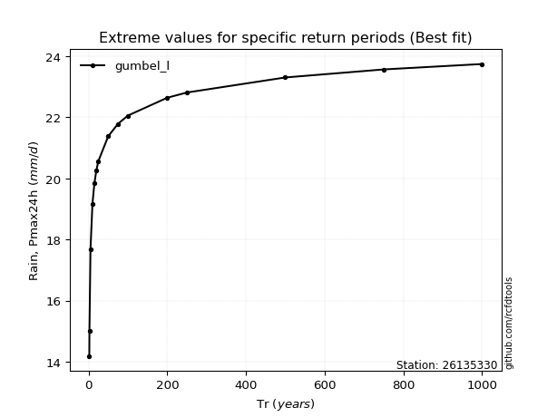</img>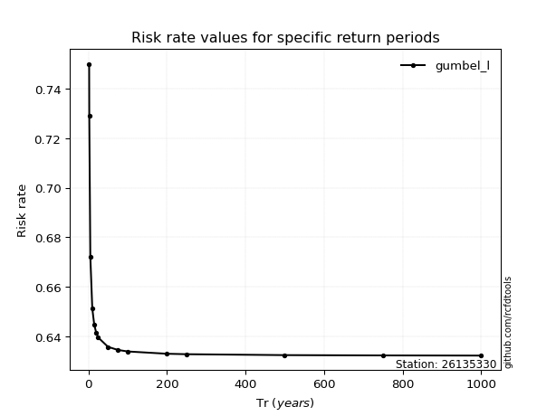</img>

</div>


<sub>**APP DISCLAIMER**: NO WARRANTY - This software is provided by [github.com/rcfdtools](https://github.com/rcfdtools) "as is", without any express or implied warranty, including warranties of merchantability, fitness for a particular purpose, or non-infringement. There is no guarantee that the software will be error-free or operate without interruption. LIMITATION OF LIABILITY - Neither the authors nor copyright holders will be liable for claims or damages arising from the software or its use. You are responsible for determining if the software is appropriate for your use and assume all associated risks, including errors, legal compliance, and data loss. NO PROFESSIONAL ADVICE - The software provides general information and does not offer professional advice. It should not replace consultation with professional advisors.</sub>