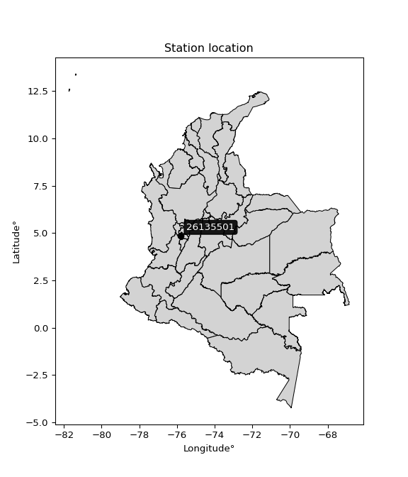

<div align="center">


</div>

# PMP Station (rain, Pmax24h): 26135501

Probable Maximum Precipitation (PMP) is the greatest amount of rainfall for a specific duration that is meteorologically possible for a given location, acting as a "worst-case" scenario for extreme storms, crucial for designing safety-critical infrastructure like bridges, river deviations, dams, spillways, and nuclear plants to prevent catastrophic failure. PMP is calculated by hydrologists using meteorological data to determine the upper limit of extreme rainfall, often leading to the Probable Maximum Flood (PMF) for flood control design, and is increasingly being studied for climate change impacts.

<div align="center">

</img>

</div>


## A. General information


### 1. General running parameters

• app_version: _v20251227_. • runtime: _2025-12-27 09:02:11.367833_. • Python version: _3.14.0_. • SciPy version: _1.16.3_. • Pandas version: _2.3.3_. • NumPy version: _2.3.5_. • Stations dataset (station_dataset_file): _dataset/pmax24h_in/automatic_colombia_2003_2024_filter.csv_. • Stations catalog (station_catalog_file): _dataset/CNE_IDEAM.xls_. • Minimum year to eval til year_max (date_min): _2003_. • Maximum year to eval since year_min (date_max): _2024_. • Creates, save and include plots into reports (create_plot): _False_. • Plot only fit distributions with Δo > Δ (plot_only_fit): _True_. • Eval low extreme values, if False, evaluates high extreme values (low_extreme): _False_. • Eval every SciPy distribution as logarithmic (pdist_logarithmic_on): _True_. • Standard deviation normalized (ddof): _1.0_. • Return periods to eval in years (Tr): _[2, 2.33, 5, 10, 15, 20, 25, 50, 75, 100, 200, 250, 500, 750, 1000]_. • Minimum data sample per station, 0 means any (minimum_sample): _5_. • Z-Score threshold to adjust a value, 0 means disable (zscore): _3.5_. • Avoid zeros, e.g. rain = 0 (avoid_zeros): _True_. • Avoid null values (avoid_nans): _True_. [:file_folder:Dataset file.](../../dataset/pmax24h_in/automatic_colombia_2003_2024_filter.csv)

> Delta Degrees of Freedom (DDOF): is a parameter used in the formulas for calculating variance and standard deviation. When ddof=0, the divisor is $N$ (the total number of observations) and this is used when your data set is the entire population. When ddof=1, the divisor is $N-1$ and this is used when your data set is a sample drawn from a larger population. Using $N-1$ provides an unbiased estimate of the population variance (known as Bessel´s correction).


### 2. Station info and location

|   id |   CODIGO | NOMBRE                       | CATEGORIA               | TECNOLOGIA                | ESTADO   | FECHA_INSTALACION   |   FECHA_SUSPENSION |   ALTITUD |   LATITUD |   LONGITUD | DEPARTAMENTO   | MUNICIPIO   | AREA_OPERATIVA                         | ENTIDAD                                    | AREA_HIDROGRAFICA   | ZONA_HIDROGRAFICA   | SUBZONA_HIDROGRAFICA               |   CORRIENTE | Catalogo   |
|-----:|---------:|:-----------------------------|:------------------------|:--------------------------|:---------|:--------------------|-------------------:|----------:|----------:|-----------:|:---------------|:------------|:---------------------------------------|:-------------------------------------------|:--------------------|:--------------------|:-----------------------------------|------------:|:-----------|
|    0 | 26135501 | EL PILAMO  - AUT  [26135501] | Climatológica Principal | Automática con Telemetría | Activa   | 19/09/2013          |                nan |      1113 |   4.86833 |   -75.7933 | Risaralda      | Pereira     | Area Operativa 09 - Cauca-Valle-Caldas | CENTRO NACIONAL DE INVESTIGACIONES DE CAFE | Magdalena Cauca     | Cauca               | Río Otún y otros directos al Cauca |         nan | CNE_OE     |

<div align="center">

Map location in: [:earth_americas:Google](http://maps.google.com/maps?q=4.868333333,-75.79333333) [:earth_americas:OSM](https://www.openstreetmap.org/#map=18/4.868333333/-75.79333333&layers=P) [:earth_americas:Bing](https://www.bing.com/maps?cp=4.868333333~-75.79333333&lvl=18) [:earth_americas:Apple](https://maps.apple.com/frame?center=4.868333333%2C-75.79333333&span=0.003%2C0.006)

</div>


<div align="center">

```geojson
{
  "type": "Feature",
  "geometry": {
    "type": "Point", 
    "coordinates": [-75.79333333, 4.868333333]
  }, 
  "properties": {
    "Name": "26135501"
  }
}
```

</div>


### 3. Discrete values table and plot

|               |          0 |           1 |           2 |           3 |          4 |          5 |
|:--------------|-----------:|------------:|------------:|------------:|-----------:|-----------:|
| Date          | 2018       | 2019        | 2020        | 2021        | 2022       | 2023       |
| Value         |  105.6     |   72.4      |   90.6      |   80.6      |   56.9     |   56       |
| Value_initial |  105.6     |   72.4      |   90.6      |   80.6      |   56.9     |   56       |
| count         |    6       |    6        |    6        |    6        |    6       |    6       |
| mean          |   77.0167  |   77.0167   |   77.0167   |   77.0167   |   77.0167  |   77.0167  |
| std           |   19.4013  |   19.4013   |   19.4013   |   19.4013   |   19.4013  |   19.4013  |
| zscore        |    1.47327 |   -0.237957 |    0.700126 |    0.184696 |   -1.03687 |   -1.08326 |

> The initial value (value_initial) correspond to the initial obtained or null completed value, and value (value) is adjusted only when the initial value is outside the valid range definite through the Z-Score value. If Z-Score is active, values out of range or outliers are replaced with the station mean value


### 4. Active continuous probability distributions from SciPy (45 of 104 available)

[scipy.stats](https://docs.scipy.org/doc/scipy/reference/stats.html) is a Python´s powerful submodule within the SciPy library for comprehensive statistical analysis, offering over 130 probability distributions (like Normal, Poisson), functions for descriptive stats (mean, variance), hypothesis testing (t-tests, chi-square), random variable generation, and statistical tests, making it essential for data science, modeling, and research. It provides tools to explore, model, and draw conclusions from data efficiently, working seamlessly with NumPy.

<div align="center">

|   id | p_dist             |   n_parameter | fit_method   | label                                                                       | active   | ref                                                                                                        |
|-----:|:-------------------|--------------:|:-------------|:----------------------------------------------------------------------------|:---------|:-----------------------------------------------------------------------------------------------------------|
|    0 | alpha              |             3 | MLE          | Alpha                                                                       | True     | [:mortar_board:](https://docs.scipy.org/doc/scipy/reference/generated/scipy.stats.alpha.html)              |
|    1 | betaprime          |             4 | MLE          | Beta prime                                                                  | True     | [:mortar_board:](https://docs.scipy.org/doc/scipy/reference/generated/scipy.stats.betaprime.html)          |
|    2 | chi2               |             3 | MLE          | Chi²                                                                        | True     | [:mortar_board:](https://docs.scipy.org/doc/scipy/reference/generated/scipy.stats.chi2.html)               |
|    3 | crystalball        |             4 | MLE          | Crystalball                                                                 | True     | [:mortar_board:](https://docs.scipy.org/doc/scipy/reference/generated/scipy.stats.crystalball.html)        |
|    4 | erlang             |             3 | MLE          | Erlang                                                                      | True     | [:mortar_board:](https://docs.scipy.org/doc/scipy/reference/generated/scipy.stats.erlang.html)             |
|    5 | expon              |             2 | MLE          | Exponential                                                                 | True     | [:mortar_board:](https://docs.scipy.org/doc/scipy/reference/generated/scipy.stats.expon.html)              |
|    6 | exponnorm          |             3 | MLE          | Exponentially modified Normal                                               | True     | [:mortar_board:](https://docs.scipy.org/doc/scipy/reference/generated/scipy.stats.exponnorm.html)          |
|    7 | f                  |             4 | MLE          | F                                                                           | True     | [:mortar_board:](https://docs.scipy.org/doc/scipy/reference/generated/scipy.stats.f.html)                  |
|    8 | fatiguelife        |             3 | MLE          | Fatigue-life (Birnbaum-Saunders)                                            | True     | [:mortar_board:](https://docs.scipy.org/doc/scipy/reference/generated/scipy.stats.fatiguelife.html)        |
|    9 | fisk               |             3 | MLE          | Fisk                                                                        | True     | [:mortar_board:](https://docs.scipy.org/doc/scipy/reference/generated/scipy.stats.fisk.html)               |
|   10 | gamma              |             3 | MLE          | Gamma                                                                       | True     | [:mortar_board:](https://docs.scipy.org/doc/scipy/reference/generated/scipy.stats.gamma.html)              |
|   11 | genexpon           |             5 | MLE          | Generalized exponential                                                     | True     | [:mortar_board:](https://docs.scipy.org/doc/scipy/reference/generated/scipy.stats.genexpon.html)           |
|   12 | genlogistic        |             3 | MLE          | Generalized logistic                                                        | True     | [:mortar_board:](https://docs.scipy.org/doc/scipy/reference/generated/scipy.stats.genlogistic.html)        |
|   13 | gibrat             |             2 | MM           | Gibrat                                                                      | True     | [:mortar_board:](https://docs.scipy.org/doc/scipy/reference/generated/scipy.stats.gibrat.html)             |
|   14 | gompertz           |             3 | MLE          | Gompertz (or truncated Gumbel)                                              | True     | [:mortar_board:](https://docs.scipy.org/doc/scipy/reference/generated/scipy.stats.gompertz.html)           |
|   15 | gumbel_l           |             2 | MM           | Gumbel Left Skew                                                            | True     | [:mortar_board:](https://docs.scipy.org/doc/scipy/reference/generated/scipy.stats.gumbel_l.html)           |
|   16 | gumbel_r           |             2 | MM           | Gumbel Right Skew                                                           | True     | [:mortar_board:](https://docs.scipy.org/doc/scipy/reference/generated/scipy.stats.gumbel_r.html)           |
|   17 | halflogistic       |             2 | MM           | Half-logistic                                                               | True     | [:mortar_board:](https://docs.scipy.org/doc/scipy/reference/generated/scipy.stats.halflogistic.html)       |
|   18 | halfnorm           |             2 | MM           | Half Normal                                                                 | True     | [:mortar_board:](https://docs.scipy.org/doc/scipy/reference/generated/scipy.stats.halfnorm.html)           |
|   19 | hypsecant          |             2 | MM           | hyperbolic secant                                                           | True     | [:mortar_board:](https://docs.scipy.org/doc/scipy/reference/generated/scipy.stats.hypsecant.html)          |
|   20 | invgamma           |             3 | MLE          | Inverted gamma                                                              | True     | [:mortar_board:](https://docs.scipy.org/doc/scipy/reference/generated/scipy.stats.invgamma.html)           |
|   21 | invgauss           |             3 | MLE          | Inverse Gaussian                                                            | True     | [:mortar_board:](https://docs.scipy.org/doc/scipy/reference/generated/scipy.stats.invgauss.html)           |
|   22 | invweibull         |             3 | MLE          | Inverted Weibull                                                            | True     | [:mortar_board:](https://docs.scipy.org/doc/scipy/reference/generated/scipy.stats.invweibull.html)         |
|   23 | johnsonsu          |             4 | MLE          | Johnson Su                                                                  | True     | [:mortar_board:](https://docs.scipy.org/doc/scipy/reference/generated/scipy.stats.johnsonsu.html)          |
|   24 | kstwobign          |             2 | MLE          | Limiting distribution of scaled Kolmogorov-Smirnov two-sided test statistic | True     | [:mortar_board:](https://docs.scipy.org/doc/scipy/reference/generated/scipy.stats.kstwobign.html)          |
|   25 | laplace            |             2 | MM           | Laplace                                                                     | True     | [:mortar_board:](https://docs.scipy.org/doc/scipy/reference/generated/scipy.stats.laplace.html)            |
|   26 | laplace_asymmetric |             3 | MLE          | Asymmetric Laplace                                                          | True     | [:mortar_board:](https://docs.scipy.org/doc/scipy/reference/generated/scipy.stats.laplace_asymmetric.html) |
|   27 | loggamma           |             3 | MLE          | Log gamma                                                                   | True     | [:mortar_board:](https://docs.scipy.org/doc/scipy/reference/generated/scipy.stats.loggamma.html)           |
|   28 | logistic           |             2 | MM           | Logistic (or Sech-squared)                                                  | True     | [:mortar_board:](https://docs.scipy.org/doc/scipy/reference/generated/scipy.stats.logistic.html)           |
|   29 | lognorm            |             3 | MLE          | Log Normal                                                                  | True     | [:mortar_board:](https://docs.scipy.org/doc/scipy/reference/generated/scipy.stats.lognorm.html)            |
|   30 | maxwell            |             2 | MM           | Maxwell                                                                     | True     | [:mortar_board:](https://docs.scipy.org/doc/scipy/reference/generated/scipy.stats.maxwell.html)            |
|   31 | mielke             |             4 | MLE          | Mielke Beta-Kappa / Dagum                                                   | True     | [:mortar_board:](https://docs.scipy.org/doc/scipy/reference/generated/scipy.stats.mielke.html)             |
|   32 | moyal              |             2 | MM           | Moyal                                                                       | True     | [:mortar_board:](https://docs.scipy.org/doc/scipy/reference/generated/scipy.stats.moyal.html)              |
|   33 | nakagami           |             3 | MLE          | Nakagami                                                                    | True     | [:mortar_board:](https://docs.scipy.org/doc/scipy/reference/generated/scipy.stats.nakagami.html)           |
|   34 | ncf                |             5 | MLE          | Non-central F distribution                                                  | True     | [:mortar_board:](https://docs.scipy.org/doc/scipy/reference/generated/scipy.stats.ncf.html)                |
|   35 | nct                |             4 | MLE          | Non-central Student’s t                                                     | True     | [:mortar_board:](https://docs.scipy.org/doc/scipy/reference/generated/scipy.stats.nct.html)                |
|   36 | norm               |             2 | MM           | Normal                                                                      | True     | [:mortar_board:](https://docs.scipy.org/doc/scipy/reference/generated/scipy.stats.norm.html)               |
|   37 | pareto             |             3 | MLE          | Pareto                                                                      | True     | [:mortar_board:](https://docs.scipy.org/doc/scipy/reference/generated/scipy.stats.pareto.html)             |
|   38 | pearson3           |             3 | MM           | Pearson type III                                                            | True     | [:mortar_board:](https://docs.scipy.org/doc/scipy/reference/generated/scipy.stats.pearson3.html)           |
|   39 | rayleigh           |             2 | MM           | Rayleigh                                                                    | True     | [:mortar_board:](https://docs.scipy.org/doc/scipy/reference/generated/scipy.stats.rayleigh.html)           |
|   40 | rice               |             3 | MLE          | Rice                                                                        | True     | [:mortar_board:](https://docs.scipy.org/doc/scipy/reference/generated/scipy.stats.rice.html)               |
|   41 | t                  |             3 | MLE          | Student’s t                                                                 | True     | [:mortar_board:](https://docs.scipy.org/doc/scipy/reference/generated/scipy.stats.t.html)                  |
|   42 | truncnorm          |             4 | MLE          | Truncated normal                                                            | True     | [:mortar_board:](https://docs.scipy.org/doc/scipy/reference/generated/scipy.stats.truncnorm.html)          |
|   43 | wald               |             2 | MM           | Wald                                                                        | True     | [:mortar_board:](https://docs.scipy.org/doc/scipy/reference/generated/scipy.stats.wald.html)               |
|   44 | weibull_min        |             3 | MLE          | Weibull minimum                                                             | True     | [:mortar_board:](https://docs.scipy.org/doc/scipy/reference/generated/scipy.stats.weibull_min.html)        |

</div>

> **n_parameter:** # arguments & localization & scale.
>
> **Fit methods:** (MLE) maximum likelihood, (MM) L-moments.
>
>**Inactive:** foldnorm, gennorm, norminvgauss, powernorm, powerlognorm, skewnorm, genextreme, anglit, arcsine, argus, beta, bradford, burr, burr12, cauchy, cosine, halfcauchy, foldcauchy, skewcauchy, wrapcauchy, dgamma, gengamma, exponweib, exponpow, truncexpon, gausshyper, genhalflogistic, genhyperbolic, geninvgauss, halfgennorm, johnsonsb, kappa4, kappa3, ksone, kstwo, loglaplace, levy, levy_l, levy_stable, ncx2, genpareto, truncpareto, lomax, powerlaw, rdist, rel_breitwigner, recipinvgauss, semicircular, studentized_range, trapezoid, triang, truncweibull_min, tukeylambda, uniform, loguniform, vonmises, vonmises_line, weibull_max, dweibull, 


## B. Probability distributions vs. Empirical distributions

A continuous probability distribution (CPD) describes probabilities for variables that can take any value within a range (like rain any time), unlike discrete variables with specific outcomes (like temperature). It uses a Probability Density Function (PDF), a curve where the total area under it equals 1, and the probability of the variable falling within an interval (a to b) is found by calculating the area under the curve between those points. A key feature is that the probability of hitting any single exact value is zero, so probabilities are always expressed for ranges, e.g., $P(a ≤ X ≤ b)$.

<div align="center">

Distributions parameters from station values
|    |   station | p_dist                |   n |             loc |          scale | shape                | shape1                | shape2                | shape3   |
|---:|----------:|:----------------------|----:|----------------:|---------------:|:---------------------|:----------------------|:----------------------|:---------|
|  0 |  26135501 | alpha                 |   6 |   -66.5848      | 1164.25        | 8.230232706189518    |                       |                       |          |
|  1 |  26135501 | betaprime             |   6 |    -0.401497    |    5.14985     | 294.0963292578821    | 20.549131337345777    |                       |          |
|  2 |  26135501 | chi2                  |   6 |    56           |    2.27973     | 0.31899091354627546  |                       |                       |          |
|  3 |  26135501 | crystalball           |   6 |    77.0167      |   17.7109      | 1943.4308160912917   | 11217.564764596773    |                       |          |
|  4 |  26135501 | erlang                |   6 |    56           |   21.2324      | 0.4592603316623869   |                       |                       |          |
|  5 |  26135501 | expon                 |   6 |    56           |   21.0167      |                      |                       |                       |          |
|  6 |  26135501 | exponnorm             |   6 |    72.9846      |   17.2481      | 0.23376917533909972  |                       |                       |          |
|  7 |  26135501 | f                     |   6 |    -2.47692     |   75.9158      | 532.4467538647903    | 43.82722058075938     |                       |          |
|  8 |  26135501 | fatiguelife           |   6 |    56           |    8.07947e-05 | 433.73810814860985   |                       |                       |          |
|  9 |  26135501 | fisk                  |   6 |    -0.235339    |   75.3458      | 7.070940072996409    |                       |                       |          |
| 10 |  26135501 | gamma                 |   6 |    56           |   16.0758      | 0.8118847320686886   |                       |                       |          |
| 11 |  26135501 | genexpon              |   6 |    55.9999      |    2.12189     | 0.10376271238905363  | 8.665209264014457e-07 | 2.376674428714648     |          |
| 12 |  26135501 | genlogistic           |   6 |   -31.3197      |   14.8135      | 839.6500190069269    |                       |                       |          |
| 13 |  26135501 | gibrat                |   6 |    63.5055      |    8.19492     |                      |                       |                       |          |
| 14 |  26135501 | gompertz              |   6 |    56           |   56.0244      | 1.8832028776664087   |                       |                       |          |
| 15 |  26135501 | gumbel_l              |   6 |    84.9875      |   13.8091      |                      |                       |                       |          |
| 16 |  26135501 | gumbel_r              |   6 |    69.0458      |   13.8091      |                      |                       |                       |          |
| 17 |  26135501 | halflogistic          |   6 |    56.0252      |   15.1422      |                      |                       |                       |          |
| 18 |  26135501 | halfnorm              |   6 |    53.5744      |   29.3805      |                      |                       |                       |          |
| 19 |  26135501 | hypsecant             |   6 |    77.0167      |   11.2751      |                      |                       |                       |          |
| 20 |  26135501 | invgamma              |   6 |     9.82483     |  895.751       | 14.306700267793934   |                       |                       |          |
| 21 |  26135501 | invgauss              |   6 |    52.811       |   13.5532      | 1.7859725370519133   |                       |                       |          |
| 22 |  26135501 | invweibull            |   6 |    -8.72289e+08 |    8.72289e+08 | 57392932.9342899     |                       |                       |          |
| 23 |  26135501 | johnsonsu             |   6 |    56           |    6.84715e-09 | -1.98436290928364    | 0.14321469360764127   |                       |          |
| 24 |  26135501 | kstwobign             |   6 |    17.6302      |   67.8124      |                      |                       |                       |          |
| 25 |  26135501 | laplace               |   6 |    77.0167      |   12.5235      |                      |                       |                       |          |
| 26 |  26135501 | laplace_asymmetric    |   6 |    72.4         |   14.7122      | 0.8553706081960426   |                       |                       |          |
| 27 |  26135501 | loggamma              |   6 | -4151.35        |  601.743       | 1126.8700277902653   |                       |                       |          |
| 28 |  26135501 | logistic              |   6 |    77.0167      |    9.76451     |                      |                       |                       |          |
| 29 |  26135501 | lognorm               |   6 |    56           |    0.0405224   | 13.20067810200192    |                       |                       |          |
| 30 |  26135501 | maxwell               |   6 |    35.0494      |   26.2991      |                      |                       |                       |          |
| 31 |  26135501 | mielke                |   6 |   -21.0566      |   31.587       | 4001.3404585165144   | 6.2845235251893214    |                       |          |
| 32 |  26135501 | moyal                 |   6 |    66.8885      |    7.97269     |                      |                       |                       |          |
| 33 |  26135501 | nakagami              |   6 |    56           |   24.9188      | 0.21127162649030773  |                       |                       |          |
| 34 |  26135501 | ncf                   |   6 |    -1.21281     |   75.6509      | 111.4788269741509    | 60.010095835057655    | 1.482564700759566e-07 |          |
| 35 |  26135501 | nct                   |   6 |    -0.162728    |    3.88924     | 10.519920951095939   | 18.42233195003655     |                       |          |
| 36 |  26135501 | norm                  |   6 |    77.0167      |   17.7109      |                      |                       |                       |          |
| 37 |  26135501 | pareto                |   6 |    55.9424      |    0.0576401   | 0.21675559352513182  |                       |                       |          |
| 38 |  26135501 | pearson3              |   6 |    77.0167      |   17.7109      | 0.25149889375510376  |                       |                       |          |
| 39 |  26135501 | rayleigh              |   6 |    43.1347      |   27.0339      |                      |                       |                       |          |
| 40 |  26135501 | rice                  |   6 |    45.4894      |   23.3123      | 0.6372818487237468   |                       |                       |          |
| 41 |  26135501 | t                     |   6 |    77.0146      |   17.7091      | 744942.5664439665    |                       |                       |          |
| 42 |  26135501 | truncnorm             |   6 |    79.8436      |   42.6644      | -407.86066816911193  | 0.6037018806693477    |                       |          |
| 43 |  26135501 | wald                  |   6 |    59.3058      |   17.7108      |                      |                       |                       |          |
| 44 |  26135501 | weibull_min           |   6 |    56           |   23.611       | 0.5806320232880685   |                       |                       |          |
| 45 |  26135501 | logalpha              |   6 |    -2.15437     |  180.739       | 27.961298998396927   |                       |                       |          |
| 46 |  26135501 | logbetaprime          |   6 |    -1.7215      |    6.71942     | 1292.21611602645     | 1438.8349992696812    |                       |          |
| 47 |  26135501 | logchi2               |   6 |     4.02535     |    0.981725    | 0.9387200427169515   |                       |                       |          |
| 48 |  26135501 | logcrystalball        |   6 |     4.31741     |    0.231245    | 13.8009428369463     | 2517.930289800515     |                       |          |
| 49 |  26135501 | logerlang             |   6 |   -23.1883      |    0.00194381  | 14150.445499827387   |                       |                       |          |
| 50 |  26135501 | logexpon              |   6 |     4.02535     |    0.292059    |                      |                       |                       |          |
| 51 |  26135501 | logexponnorm          |   6 |     4.31464     |    0.231228    | 0.012002284476632093 |                       |                       |          |
| 52 |  26135501 | logf                  |   6 |     4.02535     |    0.331435    | 0.8157337019678245   | 1373.1312713659408    |                       |          |
| 53 |  26135501 | logfatiguelife        |   6 |     4.02535     |    4.0524e-07  | 779.5495799041134    |                       |                       |          |
| 54 |  26135501 | logfisk               |   6 |    -1.88087e+06 |    1.88088e+06 | 13254275.715836741   |                       |                       |          |
| 55 |  26135501 | loggamma              |   6 |   -23.2031      |    0.00194298  | 14164.105291409862   |                       |                       |          |
| 56 |  26135501 | loggenexpon           |   6 |     4.02535     |    0.327684    | 0.9466013029274088   | 1.3560989903853815    | 0.19630142456719993   |          |
| 57 |  26135501 | loggenlogistic        |   6 |     2.95335     |    0.203369    | 465.6861451641503    |                       |                       |          |
| 58 |  26135501 | loggibrat             |   6 |     4.14104     |    0.106977    |                      |                       |                       |          |
| 59 |  26135501 | loggompertz           |   6 |     4.02535     |    0.51099     | 1.0456843367993396   |                       |                       |          |
| 60 |  26135501 | loggumbel_l           |   6 |     4.42148     |    0.180301    |                      |                       |                       |          |
| 61 |  26135501 | loggumbel_r           |   6 |     4.21334     |    0.180301    |                      |                       |                       |          |
| 62 |  26135501 | loghalflogistic       |   6 |     4.04336     |    0.197684    |                      |                       |                       |          |
| 63 |  26135501 | loghalfnorm           |   6 |     4.01133     |    0.383611    |                      |                       |                       |          |
| 64 |  26135501 | loghypsecant          |   6 |     4.31741     |    0.147215    |                      |                       |                       |          |
| 65 |  26135501 | loginvgamma           |   6 |     1.83193     |  283.107       | 114.97781584053357   |                       |                       |          |
| 66 |  26135501 | loginvgauss           |   6 |     3.55801     |    7.01798     | 0.10824012365461844  |                       |                       |          |
| 67 |  26135501 | loginvweibull         |   6 |    -1.78497e+07 |    1.78497e+07 | 91870002.16304314    |                       |                       |          |
| 68 |  26135501 | logjohnsonsu          |   6 |     7.99353e+06 |    1.17132e+07 | 39036311.322766766   | 61164245.76305516     |                       |          |
| 69 |  26135501 | logkstwobign          |   6 |     3.50899     |    0.92121     |                      |                       |                       |          |
| 70 |  26135501 | loglaplace            |   6 |     4.31741     |    0.163515    |                      |                       |                       |          |
| 71 |  26135501 | loglaplace_asymmetric |   6 |     4.3895      |    0.197319    | 1.1959966374889455   |                       |                       |          |
| 72 |  26135501 | logloggamma           |   6 |   -28.6407      |    5.27363     | 518.3019163684257    |                       |                       |          |
| 73 |  26135501 | loglogistic           |   6 |     4.31741     |    0.127492    |                      |                       |                       |          |
| 74 |  26135501 | loglognorm            |   6 |     4.02535     |    0.000859867 | 12.40240390854823    |                       |                       |          |
| 75 |  26135501 | logmaxwell            |   6 |     3.76946     |    0.343379    |                      |                       |                       |          |
| 76 |  26135501 | logmielke             |   6 |    -3.47072e+06 |    3.47072e+06 | 589676439.7362576    | 17200374.01055997     |                       |          |
| 77 |  26135501 | logmoyal              |   6 |     4.18517     |    0.104097    |                      |                       |                       |          |
| 78 |  26135501 | lognakagami           |   6 |     4.02535     |    0.543636    | 0.2794406893777164   |                       |                       |          |
| 79 |  26135501 | logncf                |   6 |    -2.42963     |    6.38437     | 2694.2939270163865   | 4595.5320365132075    | 151.81625354588994    |          |
| 80 |  26135501 | lognct                |   6 |     0.910233    |    0.19518     | 383.053321826259     | 17.42101923657348     |                       |          |
| 81 |  26135501 | lognorm               |   6 |     4.31741     |    0.231245    |                      |                       |                       |          |
| 82 |  26135501 | logpareto             |   6 |     4.02457     |    0.000781771 | 0.21329072735188243  |                       |                       |          |
| 83 |  26135501 | logpearson3           |   6 |     4.31741     |    0.231245    | 0.01636754219642776  |                       |                       |          |
| 84 |  26135501 | lograyleigh           |   6 |     3.87503     |    0.352972    |                      |                       |                       |          |
| 85 |  26135501 | logrice               |   6 |     3.88484     |    0.284545    | 0.9856877660708032   |                       |                       |          |
| 86 |  26135501 | logt                  |   6 |     4.31741     |    0.231229    | 4747.94901282743     |                       |                       |          |
| 87 |  26135501 | logtruncnorm          |   6 |    -0.0605694   |    1.15645     | 3.533167489169209    | 5.310311124921951     |                       |          |
| 88 |  26135501 | logwald               |   6 |     4.08615     |    0.23126     |                      |                       |                       |          |
| 89 |  26135501 | logweibull_min        |   6 |     4.02535     |    0.326365    | 0.5934511139574763   |                       |                       |          |

</div>

> **loc** (Location parameter): This shifts the distribution along the x-axis. For many common distributions, like the normal (Gaussian) distribution, loc represents the mean $μ$. For others, like the uniform distribution, it might represent the minimum value, or for the beta distribution, the left end of the support interval.
>
> **scale** (Scale parameter): This determines the width or spread of the distribution. For the normal distribution, scale represents the standard deviation $σ$. For a uniform distribution, it defines the length of the interval (from $loc$ to $loc + scale$).
>
> **shape** (Shape parameters): Refers to parameters that define the specific form of a probability distribution, distinct from its location (loc) and scale (scale). These parameters are required arguments for most distribution functions. For example, a normal (Gaussian) distribution is fully defined by its location (mean) and scale (standard deviation), so it has no specific shape parameters beyond loc and scale. However, other distributions have intrinsic properties that need specification, as Gamma distribution that takes a shape parameter, often named $a$ or $alpha$.


### 0. Cumulative distribution values - CDF (90 evaluated)

Cumulative Distribution Function (CDF), denoted as $F$<sub>$X$</sub>$(x)$, is a function that gives the probability that a random variable $X$ will take a value less than or equal to a specific value, $x$ (i.e., $(P(X≥x)$. It essentially "accumulates" probabilities from a given point up to the far right (positive infinity), providing a complete picture of the distribution´s probabilities for both discrete (like rain) and continuous (like temperature) variables, helping to find probabilities over ranges or above certain values.

<div align="center">

CDF ordered by x ascending and calculating $log(f(x))$ separately
|   id |   Station |   date |     x |   count |    mean |     std |    zscore |   Value_initial |   station |   m |    alpha |   alpha_pdf |   betaprime |   betaprime_pdf |       chi2 |    chi2_pdf |   crystalball |   crystalball_pdf |      erlang |     erlang_pdf |     expon |   expon_pdf |   exponnorm |   exponnorm_pdf |        f |      f_pdf |   fatiguelife |   fatiguelife_pdf |     fisk |   fisk_pdf |       gamma |   gamma_pdf |    genexpon |   genexpon_pdf |   genlogistic |   genlogistic_pdf |   gibrat |   gibrat_pdf |    gompertz |   gompertz_pdf |   gumbel_l |   gumbel_l_pdf |   gumbel_r |   gumbel_r_pdf |   halflogistic |   halflogistic_pdf |   halfnorm |   halfnorm_pdf |   hypsecant |   hypsecant_pdf |   invgamma |   invgamma_pdf |   invgauss |   invgauss_pdf |   invweibull |   invweibull_pdf |   johnsonsu |   johnsonsu_pdf |   kstwobign |   kstwobign_pdf |   laplace |   laplace_pdf |   laplace_asymmetric |   laplace_asymmetric_pdf |   loggamma |   loggamma_pdf |   logistic |   logistic_pdf |   lognorm |   lognorm_pdf |   maxwell |   maxwell_pdf |   mielke |   mielke_pdf |     moyal |   moyal_pdf |    nakagami |   nakagami_pdf |      ncf |    ncf_pdf |       nct |    nct_pdf |     norm |   norm_pdf |   pareto |   pareto_pdf |   pearson3 |   pearson3_pdf |   rayleigh |   rayleigh_pdf |      rice |   rice_pdf |        t |      t_pdf |   truncnorm |   truncnorm_pdf |     wald |   wald_pdf |   weibull_min |   weibull_min_pdf |   logalpha |   logalpha_pdf |   logbetaprime |   logbetaprime_pdf |     logchi2 |   logchi2_pdf |   logcrystalball |   logcrystalball_pdf |   logerlang |   logerlang_pdf |   logexpon |   logexpon_pdf |   logexponnorm |   logexponnorm_pdf |        logf |     logf_pdf |   logfatiguelife |   logfatiguelife_pdf |   logfisk |   logfisk_pdf |   loggenexpon |   loggenexpon_pdf |   loggenlogistic |   loggenlogistic_pdf |   loggibrat |   loggibrat_pdf |   loggompertz |   loggompertz_pdf |   loggumbel_l |   loggumbel_l_pdf |   loggumbel_r |   loggumbel_r_pdf |   loghalflogistic |   loghalflogistic_pdf |   loghalfnorm |   loghalfnorm_pdf |   loghypsecant |   loghypsecant_pdf |   loginvgamma |   loginvgamma_pdf |   loginvgauss |   loginvgauss_pdf |   loginvweibull |   loginvweibull_pdf |   logjohnsonsu |   logjohnsonsu_pdf |   logkstwobign |   logkstwobign_pdf |   loglaplace |   loglaplace_pdf |   loglaplace_asymmetric |   loglaplace_asymmetric_pdf |   logloggamma |   logloggamma_pdf |   loglogistic |   loglogistic_pdf |   loglognorm |   loglognorm_pdf |   logmaxwell |   logmaxwell_pdf |   logmielke |   logmielke_pdf |   logmoyal |   logmoyal_pdf |   lognakagami |   lognakagami_pdf |   logncf |   logncf_pdf |   lognct |   lognct_pdf |   logpareto |   logpareto_pdf |   logpearson3 |   logpearson3_pdf |   lograyleigh |   lograyleigh_pdf |   logrice |   logrice_pdf |     logt |   logt_pdf |   logtruncnorm |   logtruncnorm_pdf |   logwald |   logwald_pdf |   logweibull_min |   logweibull_min_pdf |
|-----:|----------:|-------:|------:|--------:|--------:|--------:|----------:|----------------:|----------:|----:|---------:|------------:|------------:|----------------:|-----------:|------------:|--------------:|------------------:|------------:|---------------:|----------:|------------:|------------:|----------------:|---------:|-----------:|--------------:|------------------:|---------:|-----------:|------------:|------------:|------------:|---------------:|--------------:|------------------:|---------:|-------------:|------------:|---------------:|-----------:|---------------:|-----------:|---------------:|---------------:|-------------------:|-----------:|---------------:|------------:|----------------:|-----------:|---------------:|-----------:|---------------:|-------------:|-----------------:|------------:|----------------:|------------:|----------------:|----------:|--------------:|---------------------:|-------------------------:|-----------:|---------------:|-----------:|---------------:|----------:|--------------:|----------:|--------------:|---------:|-------------:|----------:|------------:|------------:|---------------:|---------:|-----------:|----------:|-----------:|---------:|-----------:|---------:|-------------:|-----------:|---------------:|-----------:|---------------:|----------:|-----------:|---------:|-----------:|------------:|----------------:|---------:|-----------:|--------------:|------------------:|-----------:|---------------:|---------------:|-------------------:|------------:|--------------:|-----------------:|---------------------:|------------:|----------------:|-----------:|---------------:|---------------:|-------------------:|------------:|-------------:|-----------------:|---------------------:|----------:|--------------:|--------------:|------------------:|-----------------:|---------------------:|------------:|----------------:|--------------:|------------------:|--------------:|------------------:|--------------:|------------------:|------------------:|----------------------:|--------------:|------------------:|---------------:|-------------------:|--------------:|------------------:|--------------:|------------------:|----------------:|--------------------:|---------------:|-------------------:|---------------:|-------------------:|-------------:|-----------------:|------------------------:|----------------------------:|--------------:|------------------:|--------------:|------------------:|-------------:|-----------------:|-------------:|-----------------:|------------:|----------------:|-----------:|---------------:|--------------:|------------------:|---------:|-------------:|---------:|-------------:|------------:|----------------:|--------------:|------------------:|--------------:|------------------:|----------:|--------------:|---------:|-----------:|---------------:|-------------------:|----------:|--------------:|-----------------:|---------------------:|
|    0 |  26135501 |   2023 |  56   |       6 | 77.0167 | 19.4013 | -1.08326  |            56   |  26135501 |   1 | 0.102524 |  0.0138463  |   0.0996941 |      0.0146792  | 0.00467556 | 1.04952e+11 |      0.117682 |        0.0111403  | 4.24304e-06 | 59619.5        | 0         |  0.0475813  |    0.117227 |      0.0111985  | 0.100373 | 0.0145504  |     0.0259275 |       5.15651e+08 | 0.112191 |  0.0125241 | 2.30903e-10 |  9.38251    | 2.44665e-06 |     0.0489009  |     0.0993186 |        0.0154625  | 0        |   0          | 4.59261e-09 |     0.033614   |   0.115347 |     0.00785154 |  0.0763741 |     0.0142256  |      0         |          0         |  0.0657965 |     0.0270646  |   0.0979297 |      0.00854912 |  0.0969416 |     0.0155634  |   0.066824 |     0.0519671  |     0.101395 |       0.015269   |   0.0264166 |     1.21125e+06 |   0.0939461 |      0.0164214  | 0.0933566 |    0.00745453 |             0.114781 |               0.00912095 |   0.102994 |       0.780962 |   0.104112 |     0.00955218 |  0.103297 |      0.777068 |  0.111536 |    0.0140186  |      nan |          nan | 0.0477563 |  0.0139626  | 2.12524e-07 |    1.26383e+07 | 0.102363 | 0.0140649  | 0.0971325 | 0.0156233  | 0.117682 | 0.0111403  | 0        |   3.7605     |   0.113343 |     0.0120842  |   0.107061 |     0.015719   | 0.0796859 | 0.0145561  | 0.117683 | 0.0111414  |    0.396335 |       0.0110028 | 0        | 0          |   9.72088e-10 |    79435.8        |  0.0992678 |       0.82614  |       0.10137  |           0.803851 | 7.08997e-08 |   3.74671e+07 |         0.103297 |             0.777068 |    0.102971 |        0.780887 |  0         |       3.42396  |       0.103297 |           0.777069 | 0.000930798 | 16937.6      |        0.0311339 |          3.40937e+11 |  0.112184 |      0.701858 |   8.00444e-10 |          2.88877  |        0.0919672 |             1.07638  |    0        |        0        |   5.57736e-10 |          2.04639  |      0.105177 |          0.55153  |     0.0586212 |          0.922282 |          0        |              0        |     0.029151  |          2.07854  |      0.0870101 |           0.583708 |     0.0976728 |          0.876532 |     0.0884488 |          1.08843  |       0.0875642 |            1.09758  |       0.103889 |           0.778267 |      0.0881403 |           1.16983  |    0.0838036 |         0.512514 |                0.125789 |                    0.533021 |      0.104563 |          0.768081 |     0.0918875 |          0.654505 |    0.0130318 |      3.04533e+12 |    0.0934286 |         0.977565 |   0.0930683 |        1.05809  |  0.0311867 |       0.81043  |   4.23217e-09 |       2.66307e+06 | 0.101595 |     0.799021 | 0.101314 |     0.802554 |    0        |     272.83      |      0.103001 |          0.780842 |     0.0866987 |          1.10196  | 0.0726867 |      1.00193  | 0.103313 |   0.776971 |    3.91752e-08 |           3.27182  |  0        |      0        |      2.27124e-09 |          1.51757e+06 |
|    1 |  26135501 |   2022 |  56.9 |       6 | 77.0167 | 19.4013 | -1.03687  |            56.9 |  26135501 |   2 | 0.115443 |  0.0148606  |   0.113405  |      0.0157846  | 0.808726   | 0.12076     |      0.128012 |        0.0118174  | 0.260944    |     0.129334   | 0.0419192 |  0.0455867  |    0.127613 |      0.0118835  | 0.113959 | 0.0156365  |     0.596118  |       0.0523629   | 0.123869 |  0.0134309 | 0.100489    |  0.0878807  | 0.043059    |     0.0467957  |     0.113783  |        0.0166729  | 0        |   0          | 0.0300366   |     0.0331323  |   0.122618 |     0.00831141 |  0.0898313 |     0.0156764  |      0.0288797 |          0.0329928 |  0.09012   |     0.0269835  |   0.105923  |      0.00922203 |  0.111501  |     0.0167823  |   0.116196 |     0.0565445  |     0.115656 |       0.0164151  |   0.78587   |     0.046386    |   0.109305  |      0.0176962  | 0.100313  |    0.00800997 |             0.123291 |               0.00979715 |   0.115995 |       0.850249 |   0.113028 |     0.010267   |  0.116231 |      0.845755 |  0.12452  |    0.0148302  |      nan |          nan | 0.0613596 |  0.0162662  | 0.19336     |    0.0907606   | 0.115482 | 0.0150851  | 0.111755  | 0.0168632  | 0.128012 | 0.0118174  | 0.456181 |   0.12309    |   0.124564 |     0.0128523  |   0.121584 |     0.0165451  | 0.0932486 | 0.0155749  | 0.128014 | 0.0118187  |    0.406295 |       0.0111308 | 0        | 0          |   0.139312    |        0.0833032  |  0.113049  |       0.902841 |       0.114764 |           0.876627 | 0.117614    |   3.4433      |         0.116231 |             0.845755 |    0.115971 |        0.850178 |  0.0531272 |       3.24206  |       0.116231 |           0.845757 | 0.225557    |     5.69014  |        0.600422  |          3.08205     |  0.123871 |      0.764774 |   0.0453128   |          2.79542  |        0.110051  |             1.19136  |    0        |        0        |   0.0325981   |          2.04242  |      0.114324 |          0.596363 |     0.0745273 |          1.0733   |          0        |              0        |     0.0622558 |          2.07359  |      0.0968176 |           0.647567 |     0.112316  |          0.96047  |     0.106726  |          1.20341  |       0.106085  |            1.22497  |       0.11684  |           0.846688 |      0.107794  |           1.29398  |    0.0923866 |         0.565004 |                0.134581 |                    0.570276 |      0.11734  |          0.835052 |     0.102869  |          0.723864 |    0.593067  |      1.96236     |    0.109711  |         1.06451  |   0.110838  |        1.17033  |  0.0459519 |       1.04381  |   0.108144    |       3.79012     | 0.114907 |     0.871127 | 0.114688 |     0.875412 |    0.479693 |       6.63521   |      0.116    |          0.85011  |     0.105014  |          1.1944   | 0.0894375 |      1.09847  | 0.116246 |   0.845651 |    0.0509132   |           3.11597  |  0        |      0        |      0.15354     |          5.25195     |
|    2 |  26135501 |   2019 |  72.4 |       6 | 77.0167 | 19.4013 | -0.237957 |            72.4 |  26135501 |   3 | 0.441721 |  0.0237879  |   0.452161  |      0.0238834  | 0.998658   | 0.000351548 |      0.397174 |        0.0217729  | 0.806091    |     0.0129723  | 0.541747  |  0.0218043  |    0.398338 |      0.0218604  | 0.450299 | 0.0238365  |     0.850534  |       0.00736631  | 0.435595 |  0.0239333 | 0.719828    |  0.0194095  | 0.551563    |     0.0219292  |     0.465798  |        0.0240126  | 0.532643 |   0.0447026  | 0.47294     |     0.0237417  |   0.330957 |     0.0194721  |  0.456415  |     0.0259242  |      0.49352   |          0.0249778 |  0.478315  |     0.0221171  |   0.373162  |      0.0260195  |  0.463983  |     0.0239744  |   0.639742 |     0.0167281  |     0.459332 |       0.0235123  |   0.886452  |     0.00167975  |   0.468278  |      0.0237901  | 0.345837  |    0.0276151  |             0.422519 |               0.033575   |   0.440589 |       1.70752  |   0.383954 |     0.0242238  |  0.439499 |      1.70532  |  0.431122 |    0.0223213  |      nan |          nan | 0.479095  |  0.0275687  | 0.648981    |    0.0155      | 0.443103 | 0.0236827  | 0.466636  | 0.0240569  | 0.397174 | 0.0217729  | 0.706421 |   0.00386659 |   0.412342 |     0.022464   |   0.443422 |     0.0222876  | 0.421401  | 0.0236641  | 0.39721  | 0.0217755  |    0.592519 |       0.0126681 | 0.540078 | 0.033842   |   0.554825    |        0.0127553  |  0.452789  |       1.72821  |       0.446845 |           1.71807  | 0.41718     |   0.696871    |         0.439499 |             1.70532  |    0.440566 |        1.7076   |  0.584994  |       1.42097  |       0.4395   |           1.70532  | 0.645764    |     0.815757 |        0.846438  |          0.470816    |  0.435706 |      1.73258  |   0.559452    |          1.53266  |        0.508593  |             1.6896   |    0.60924  |        2.71939  |   0.494876    |          1.70879  |      0.369896 |          1.61412  |     0.505341  |          1.91295  |          0.539962 |              1.79186  |     0.519882  |          1.62099  |      0.424596  |           2.10183  |     0.466732  |          1.74217  |     0.505574  |          1.69688  |       0.522423  |            1.74581  |       0.439656 |           1.70099  |      0.518356  |           1.67755  |    0.40315   |         2.46553  |                0.373533 |                    1.58281  |      0.436872 |          1.69622  |     0.431403  |          1.924    |    0.677079  |      0.112683    |    0.473894  |         1.69917  |   0.505805  |        1.6917   |  0.530362  |       1.97498  |   0.504426    |       1.04518     | 0.445553 |     1.71669  | 0.446996 |     1.72135  |    0.709632 |       0.240389  |      0.44055  |          1.70742  |     0.485917  |          1.68012  | 0.465129  |      1.74553  | 0.439499 |   1.70534  |    0.578462    |           1.45636  |  0.599739 |      2.18     |      0.580001    |          0.841815    |
|    3 |  26135501 |   2021 |  80.6 |       6 | 77.0167 | 19.4013 |  0.184696 |            80.6 |  26135501 |   4 | 0.625548 |  0.0203697  |   0.633518  |      0.0197789  | 0.999834   | 4.13921e-05 |      0.580168 |        0.0220689  | 0.885297    |     0.00708061 | 0.689788  |  0.0147603  |    0.581658 |      0.022054   | 0.631887 | 0.0198664  |     0.898345  |       0.00459258  | 0.621817 |  0.0205703 | 0.839941    |  0.0107985  | 0.699701    |     0.014685   |     0.644478  |        0.0191079  | 0.768903 |   0.0178102  | 0.645913    |     0.018464   |   0.517031 |     0.0254547  |  0.648473  |     0.0203399  |      0.670401  |          0.0181798 |  0.642348  |     0.0177889  |   0.599501  |      0.0268632  |  0.64252   |     0.0191181  |   0.745844 |     0.00997242 |     0.635348 |       0.0189612  |   0.897233  |     0.00104222  |   0.645512  |      0.019085   | 0.624417  |    0.0299903  |             0.641502 |               0.0208432  |   0.623354 |       1.63922  |   0.590728 |     0.0247599  |  0.62238  |      1.64337  |  0.60836  |    0.0203089  |      nan |          nan | 0.672148  |  0.0193625  | 0.755856    |    0.0109387   | 0.625781 | 0.0202287  | 0.64506   | 0.019018   | 0.580168 | 0.0220689  | 0.731053 |   0.00236421 |   0.595795 |     0.0215004  |   0.617226 |     0.0196226  | 0.607434  | 0.0211012  | 0.580222 | 0.0220705  |    0.697507 |       0.0128604 | 0.737938 | 0.0167975  |   0.640884    |        0.00868055 |  0.63374   |       1.58828  |       0.628743 |           1.61407  | 0.483301    |   0.548253    |         0.62238  |             1.64337  |    0.623342 |        1.63933  |  0.712585  |       0.984101 |       0.622381 |           1.64337  | 0.719561    |     0.581374 |        0.88801   |          0.318017    |  0.621864 |      1.65706  |   0.700302    |          1.10884  |        0.67096   |             1.31597  |    0.800294 |        1.12579  |   0.662716    |          1.40759  |      0.567186 |          2.0103   |     0.68631   |          1.43285  |          0.704146 |              1.27522  |     0.675771  |          1.27945  |      0.649989  |           1.92658  |     0.645583  |          1.54001  |     0.669831  |          1.34222  |       0.688135  |            1.3238   |       0.622073 |           1.63951  |      0.679602  |           1.31306  |    0.67826   |         1.96765  |                0.588542 |                    2.49389  |      0.619682 |          1.65104  |     0.637708  |          1.81216  |    0.687115  |      0.0784297   |    0.646832  |         1.48401  |   0.668884  |        1.32528  |  0.70783   |       1.33888  |   0.604966    |       0.841324    | 0.627699 |     1.61968  | 0.629245 |     1.61683  |    0.730413 |       0.157566  |      0.623316 |          1.63932  |     0.654312  |          1.42747  | 0.643044  |      1.52985  | 0.622382 |   1.64337  |    0.71023     |           1.0235   |  0.768136 |      1.10653  |      0.656018    |          0.598241    |
|    4 |  26135501 |   2020 |  90.6 |       6 | 77.0167 | 19.4013 |  0.700126 |            90.6 |  26135501 |   5 | 0.794838 |  0.0133949  |   0.796302  |      0.0128041  | 0.999986   | 3.4665e-06  |      0.778444 |        0.0167858  | 0.936965    |     0.0036764  | 0.807241  |  0.00917174 |    0.779211 |      0.0166743  | 0.79578  | 0.0129161  |     0.934319  |       0.00278692  | 0.789511 |  0.0129363 | 0.917932    |  0.00543677 | 0.815848    |     0.00900531 |     0.799559  |        0.0120724  | 0.884116 |   0.00720302 | 0.799933    |     0.0124713  |   0.777194 |     0.0242255  |  0.810621  |     0.0123247  |      0.814977  |          0.0110887 |  0.792406  |     0.0122751  |   0.814584  |      0.0155304  |  0.797931  |     0.0121161  |   0.823224 |     0.00597527 |     0.790639 |       0.0122204  |   0.90571   |     0.000695734 |   0.802812  |      0.0124799  | 0.830987  |    0.0134957  |             0.799559 |               0.0116537  |   0.79346  |       1.22855  |   0.800767 |     0.0163387  |  0.79318  |      1.23514  |  0.784264 |    0.0145432  |      nan |          nan | 0.821171  |  0.0110254  | 0.846086    |    0.00734421  | 0.794201 | 0.0133693  | 0.798954  | 0.0119436  | 0.778444 | 0.0167858  | 0.750184 |   0.0015624  |   0.783832 |     0.0155612  |   0.785911 |     0.0139044  | 0.788241  | 0.0147728  | 0.778501 | 0.0167849  |    0.82468  |       0.0124601 | 0.856132 | 0.00811983 |   0.713044    |        0.00601178 |  0.795807  |       1.15474  |       0.794832 |           1.19141  | 0.541012    |   0.44558     |         0.79318  |             1.23514  |    0.793458 |        1.22863  |  0.807427  |       0.659364 |       0.79318  |           1.23514  | 0.777836    |     0.426908 |        0.918901  |          0.218193    |  0.789454 |      1.1713   |   0.808146    |          0.75303  |        0.798862  |             0.881916 |    0.890356 |        0.513384 |   0.805105    |          1.02254  |      0.798513 |          1.79027  |     0.821377  |          0.896417 |          0.824685 |              0.809105 |     0.803187  |          0.904296 |      0.828034  |           1.11213  |     0.800464  |          1.09034  |     0.801137  |          0.91037  |       0.814868  |            0.858637 |       0.792573 |           1.23406  |      0.808436  |           0.89826  |    0.842648  |         0.962309 |                0.797485 |                    1.22749  |      0.792048 |          1.25145  |     0.814993  |          1.18266  |    0.695026  |      0.0587021   |    0.797027  |         1.06963  |   0.797855  |        0.89     |  0.830784  |       0.800486 |   0.693386    |       0.677659    | 0.794628 |     1.1989   | 0.795498 |     1.19132  |    0.745933 |       0.112455  |      0.79344  |          1.22874  |     0.798116  |          1.02316  | 0.798089  |      1.10419  | 0.793175 |   1.23504  |    0.809238    |           0.690011 |  0.863181 |      0.585839 |      0.716055    |          0.440959    |
|    5 |  26135501 |   2018 | 105.6 |       6 | 77.0167 | 19.4013 |  1.47327  |           105.6 |  26135501 |   6 | 0.929027 |  0.00532892 |   0.925505  |      0.00523663 | 1          | 9.54247e-08 |      0.946724 |        0.00612466 | 0.973097    |     0.00149291 | 0.905583  |  0.00449249 |    0.946143 |      0.00608664 | 0.926084 | 0.00526855 |     0.964574  |       0.00142111  | 0.917031 |  0.0050833 | 0.969361    |  0.00199842 | 0.911567    |     0.00432448 |     0.921945  |        0.00505774 | 0.949122 |   0.00248431 | 0.931524    |     0.00557896 |   0.98831  |     0.00376641 |  0.931596  |     0.00478012 |      0.927049  |          0.004642  |  0.923398  |     0.00566242 |   0.94965   |      0.00444699 |  0.92079   |     0.00507372 |   0.889166 |     0.00320166 |     0.916167 |       0.00527789 |   0.914089  |     0.000452907 |   0.930929  |      0.00528467 | 0.94898   |    0.00407399 |             0.916202 |               0.00487207 |   0.930134 |       0.575031 |   0.949178 |     0.00494025 |  0.930566 |      0.577011 |  0.934108 |    0.00597619 |      nan |          nan | 0.92969   |  0.00439797 | 0.928064    |    0.0038815   | 0.928842 | 0.00538246 | 0.919813  | 0.00499413 | 0.946724 | 0.00612466 | 0.768918 |   0.00100867 |   0.940303 |     0.00592593 |   0.930714 |     0.00592203 | 0.93815   | 0.00584283 | 0.946754 | 0.00612253 |    0.999999 |       0.0107197 | 0.934754 | 0.00323863 |   0.785357    |        0.00386645 |  0.924616  |       0.553174 |       0.927545 |           0.564138 | 0.601944    |   0.3559      |         0.930566 |             0.577011 |    0.930138 |        0.575036 |  0.886033  |       0.39022  |       0.930566 |           0.577011 | 0.832757    |     0.30019  |        0.945743  |          0.139226    |  0.916922 |      0.536802 |   0.897049    |          0.432089 |        0.89966   |             0.467711 |    0.942781 |        0.221291 |   0.923663    |          0.540535 |      0.976414 |          0.49017  |     0.919314  |          0.428949 |          0.915224 |              0.410669 |     0.908983  |          0.498669 |      0.937935  |           0.418928 |     0.922054  |          0.527981 |     0.905109  |          0.479194 |       0.911146  |            0.436374 |       0.930052 |           0.578791 |      0.91173   |           0.478625 |    0.938346  |         0.377055 |                0.919985 |                    0.484987 |      0.931351 |          0.583335 |     0.936104  |          0.469156 |    0.702789  |      0.0440094   |    0.918655  |         0.542207 |   0.899536  |        0.471263 |  0.918456  |       0.390308 |   0.783866    |       0.510362    | 0.928116 |     0.56615  | 0.927982 |     0.561874 |    0.760461 |       0.0804478 |      0.930137 |          0.575121 |     0.915475  |          0.532316 | 0.92285   |      0.548153 | 0.930547 |   0.576946 |    0.89134     |           0.40535  |  0.926527 |      0.284038 |      0.773142    |          0.314852    |


</div>

An Empirical Distribution Function (EDF) is a step-function estimate of a true cumulative distribution function (CDF) based on observed sample data, representing the proportion of data points less than or equal to a given value. It is calculated by ordering your data and jumping up by $1/n$ (where $n$ is sample size) at each unique data point, allowing analysis without assuming an underlying population distribution, and it gets closer to the true CDF as the sample size grows.


### 1. Empirical - EDF California (1923)

California´s estimates the true probability distribution of water-related data (like rainfall, streamflow) using observed samples, crucial for risk assessment.

<div align="center">


$P=m/n$


</div>


**1.1. Empirical values**

<div align="center">

|                | 0                   | 1                  | 2              | 3                  | 4                  | 5              |
|:---------------|:--------------------|:-------------------|:---------------|:-------------------|:-------------------|:---------------|
| date           | 2023                | 2022               | 2019           | 2021               | 2020               | 2018           |
| x              | 56.0                | 56.9               | 72.4           | 80.6               | 90.6               | 105.6          |
| m              | 1                   | 2                  | 3              | 4                  | 5                  | 6              |
| empirical_dist | edf_california      | edf_california     | edf_california | edf_california     | edf_california     | edf_california |
| empirical      | 0.16666666666666666 | 0.3333333333333333 | 0.5            | 0.6666666666666666 | 0.8333333333333334 | 1.0            |
| empirical_tr   | 1.2                 | 1.4999999999999998 | 2.0            | 2.9999999999999996 | 6.000000000000002  | inf            |

</div>


**1.2. Kolmogorov-Smirnov fit test (sorted by Δ)**


<div align="center">

|                | 0                 | 1                  | 2                     | 3                 | 4                  | 5                   | 6                  | 7                   | 8                   | 9                   | 10                 | 11                  | 12                  | 13                 | 14                  | 15                  | 16                 | 17                  | 18                  | 19                 | 20                 | 21                 | 22                | 23                  | 24                  | 25                  | 26                  | 27                  | 28                  | 29                  | 30                  | 31                  | 32                  | 33                  | 34                | 35                  | 36                  | 37                  | 38                  | 39                  | 40                  | 41                  | 42                  | 43                  | 44                 | 45                 | 46                  | 47                  | 48                  | 49                 | 50                  | 51                  | 52                 | 53                  | 54                  | 55                  | 56                | 57                  | 58                  | 59                  | 60                  | 61                  | 62                  | 63                  | 64                  | 65                 | 66                  | 67                 | 68                 | 69                 | 70                 | 71                 | 72                  | 73                 | 74                  | 75                 | 76                 | 77                 | 78               | 79                 | 80                 | 81                 | 82                 | 83                 | 84                 | 85                 | 86                 | 87                 | 88                 | 89             |
|:---------------|:------------------|:-------------------|:----------------------|:------------------|:-------------------|:--------------------|:-------------------|:--------------------|:--------------------|:--------------------|:-------------------|:--------------------|:--------------------|:-------------------|:--------------------|:--------------------|:-------------------|:--------------------|:--------------------|:-------------------|:-------------------|:-------------------|:------------------|:--------------------|:--------------------|:--------------------|:--------------------|:--------------------|:--------------------|:--------------------|:--------------------|:--------------------|:--------------------|:--------------------|:------------------|:--------------------|:--------------------|:--------------------|:--------------------|:--------------------|:--------------------|:--------------------|:--------------------|:--------------------|:-------------------|:-------------------|:--------------------|:--------------------|:--------------------|:-------------------|:--------------------|:--------------------|:-------------------|:--------------------|:--------------------|:--------------------|:------------------|:--------------------|:--------------------|:--------------------|:--------------------|:--------------------|:--------------------|:--------------------|:--------------------|:-------------------|:--------------------|:-------------------|:-------------------|:-------------------|:-------------------|:-------------------|:--------------------|:-------------------|:--------------------|:-------------------|:-------------------|:-------------------|:-----------------|:-------------------|:-------------------|:-------------------|:-------------------|:-------------------|:-------------------|:-------------------|:-------------------|:-------------------|:-------------------|:---------------|
| station        | 26135501          | 26135501           | 26135501              | 26135501          | 26135501           | 26135501            | 26135501           | 26135501            | 26135501            | 26135501            | 26135501           | 26135501            | 26135501            | 26135501           | 26135501            | 26135501            | 26135501           | 26135501            | 26135501            | 26135501           | 26135501           | 26135501           | 26135501          | 26135501            | 26135501            | 26135501            | 26135501            | 26135501            | 26135501            | 26135501            | 26135501            | 26135501            | 26135501            | 26135501            | 26135501          | 26135501            | 26135501            | 26135501            | 26135501            | 26135501            | 26135501            | 26135501            | 26135501            | 26135501            | 26135501           | 26135501           | 26135501            | 26135501            | 26135501            | 26135501           | 26135501            | 26135501            | 26135501           | 26135501            | 26135501            | 26135501            | 26135501          | 26135501            | 26135501            | 26135501            | 26135501            | 26135501            | 26135501            | 26135501            | 26135501            | 26135501           | 26135501            | 26135501           | 26135501           | 26135501           | 26135501           | 26135501           | 26135501            | 26135501           | 26135501            | 26135501           | 26135501           | 26135501           | 26135501         | 26135501           | 26135501           | 26135501           | 26135501           | 26135501           | 26135501           | 26135501           | 26135501           | 26135501           | 26135501           | 26135501       |
| empirical_dist | edf_california    | edf_california     | edf_california        | edf_california    | edf_california     | edf_california      | edf_california     | edf_california      | edf_california      | edf_california      | edf_california     | edf_california      | edf_california      | edf_california     | edf_california      | edf_california      | edf_california     | edf_california      | edf_california      | edf_california     | edf_california     | edf_california     | edf_california    | edf_california      | edf_california      | edf_california      | edf_california      | edf_california      | edf_california      | edf_california      | edf_california      | edf_california      | edf_california      | edf_california      | edf_california    | edf_california      | edf_california      | edf_california      | edf_california      | edf_california      | edf_california      | edf_california      | edf_california      | edf_california      | edf_california     | edf_california     | edf_california      | edf_california      | edf_california      | edf_california     | edf_california      | edf_california      | edf_california     | edf_california      | edf_california      | edf_california      | edf_california    | edf_california      | edf_california      | edf_california      | edf_california      | edf_california      | edf_california      | edf_california      | edf_california      | edf_california     | edf_california      | edf_california     | edf_california     | edf_california     | edf_california     | edf_california     | edf_california      | edf_california     | edf_california      | edf_california     | edf_california     | edf_california     | edf_california   | edf_california     | edf_california     | edf_california     | edf_california     | edf_california     | edf_california     | edf_california     | edf_california     | edf_california     | edf_california     | edf_california |
| p_dist         | nakagami          | logf               | loglaplace_asymmetric | t                 | crystalball        | norm                | exponnorm          | pearson3            | maxwell             | logfisk             | fisk               | laplace_asymmetric  | gumbel_l            | rayleigh           | weibull_min         | logloggamma         | logjohnsonsu       | logt                | logexponnorm        | logcrystalball     | lognorm            | lognorm            | invgauss          | logpearson3         | loggamma            | loggamma            | logerlang           | invweibull          | ncf                 | alpha               | logncf              | logbetaprime        | lognct              | loggumbel_l         | f                 | genlogistic         | betaprime           | logalpha            | logistic            | loginvgamma         | nct                 | invgamma            | logmielke           | loggenlogistic      | logmaxwell         | kstwobign          | lognakagami         | logkstwobign        | loginvgauss         | logweibull_min     | loginvweibull       | hypsecant           | lograyleigh        | truncnorm           | loglogistic         | pareto              | gamma             | laplace             | loghypsecant        | logpareto           | rice                | loglaplace          | halfnorm            | gumbel_r            | logrice             | loggumbel_r        | loghalfnorm         | moyal              | logexpon           | logtruncnorm       | logmoyal           | loggenexpon        | genexpon            | expon              | loglognorm          | loggompertz        | gompertz           | halflogistic       | erlang           | gibrat             | logwald            | wald               | loggibrat          | loghalflogistic    | logfatiguelife     | fatiguelife        | logchi2            | johnsonsu          | chi2               | mielke         |
| delta          | 0.166666454142742 | 0.1672433563008242 | 0.19875195044122185   | 0.205319283301687 | 0.2053210687446536 | 0.20532107410079165 | 0.2057204371535217 | 0.20876937311366736 | 0.20881325014958735 | 0.20946231330036694 | 0.2094638745385296 | 0.21004259573248207 | 0.21071488596123766 | 0.2117493489389659 | 0.21464286612047878 | 0.21599356778701428 | 0.2164932012790099 | 0.21708773491629285 | 0.21710190406540608 | 0.2171019682178425 | 0.2171020147585203 | 0.2171020147585203 | 0.217137774793553 | 0.21733304252673227 | 0.21733863665359365 | 0.21733863665359365 | 0.21736191934415983 | 0.21767753599303058 | 0.21785109070619746 | 0.21789066238624089 | 0.21842680213097726 | 0.21856959474823207 | 0.21864489005119386 | 0.21900929754767273 | 0.219374398357797 | 0.21955066956142325 | 0.21992833619340024 | 0.22028442068300585 | 0.22030571035045599 | 0.22101739949488464 | 0.22157847122181548 | 0.22183263978944667 | 0.22249575729121812 | 0.22328242691634065 | 0.2236226875707032 | 0.2240283438746136 | 0.22518918038500624 | 0.22553949400815998 | 0.22660697119707435 | 0.2268579260886533 | 0.22724840009624162 | 0.22741005638441233 | 0.2283197826856014 | 0.22966825161072182 | 0.23046451512332022 | 0.23108178046722505 | 0.232843865603451 | 0.23302075490988133 | 0.23651573288807148 | 0.23953902742440325 | 0.24008471771922024 | 0.24094675819448746 | 0.24321329081639814 | 0.24350201318139575 | 0.24389585829867144 | 0.2588060603075952 | 0.27107749225622924 | 0.2719737167220174 | 0.2802061471989472 | 0.2824201817284576 | 0.2873814819036251 | 0.2880204982366183 | 0.29027434414420156 | 0.2914141390460997 | 0.29721137804001785 | 0.3007352375184008 | 0.3032967734784523 | 0.3044536118468391 | 0.30609105114861 | 0.3333333333333333 | 0.3333333333333333 | 0.3333333333333333 | 0.3333333333333333 | 0.3333333333333333 | 0.3464380947172363 | 0.3505337501479491 | 0.3980557874733184 | 0.4525364424874289 | 0.4986579832631768 | nan            |
| deltao         | 0.530385761606    | 0.530385761606     | 0.530385761606        | 0.530385761606    | 0.530385761606     | 0.530385761606      | 0.530385761606     | 0.530385761606      | 0.530385761606      | 0.530385761606      | 0.530385761606     | 0.530385761606      | 0.530385761606      | 0.530385761606     | 0.530385761606      | 0.530385761606      | 0.530385761606     | 0.530385761606      | 0.530385761606      | 0.530385761606     | 0.530385761606     | 0.530385761606     | 0.530385761606    | 0.530385761606      | 0.530385761606      | 0.530385761606      | 0.530385761606      | 0.530385761606      | 0.530385761606      | 0.530385761606      | 0.530385761606      | 0.530385761606      | 0.530385761606      | 0.530385761606      | 0.530385761606    | 0.530385761606      | 0.530385761606      | 0.530385761606      | 0.530385761606      | 0.530385761606      | 0.530385761606      | 0.530385761606      | 0.530385761606      | 0.530385761606      | 0.530385761606     | 0.530385761606     | 0.530385761606      | 0.530385761606      | 0.530385761606      | 0.530385761606     | 0.530385761606      | 0.530385761606      | 0.530385761606     | 0.530385761606      | 0.530385761606      | 0.530385761606      | 0.530385761606    | 0.530385761606      | 0.530385761606      | 0.530385761606      | 0.530385761606      | 0.530385761606      | 0.530385761606      | 0.530385761606      | 0.530385761606      | 0.530385761606     | 0.530385761606      | 0.530385761606     | 0.530385761606     | 0.530385761606     | 0.530385761606     | 0.530385761606     | 0.530385761606      | 0.530385761606     | 0.530385761606      | 0.530385761606     | 0.530385761606     | 0.530385761606     | 0.530385761606   | 0.530385761606     | 0.530385761606     | 0.530385761606     | 0.530385761606     | 0.530385761606     | 0.530385761606     | 0.530385761606     | 0.530385761606     | 0.530385761606     | 0.530385761606     | 0.530385761606 |
| eval           | Δo > Δ            | Δo > Δ             | Δo > Δ                | Δo > Δ            | Δo > Δ             | Δo > Δ              | Δo > Δ             | Δo > Δ              | Δo > Δ              | Δo > Δ              | Δo > Δ             | Δo > Δ              | Δo > Δ              | Δo > Δ             | Δo > Δ              | Δo > Δ              | Δo > Δ             | Δo > Δ              | Δo > Δ              | Δo > Δ             | Δo > Δ             | Δo > Δ             | Δo > Δ            | Δo > Δ              | Δo > Δ              | Δo > Δ              | Δo > Δ              | Δo > Δ              | Δo > Δ              | Δo > Δ              | Δo > Δ              | Δo > Δ              | Δo > Δ              | Δo > Δ              | Δo > Δ            | Δo > Δ              | Δo > Δ              | Δo > Δ              | Δo > Δ              | Δo > Δ              | Δo > Δ              | Δo > Δ              | Δo > Δ              | Δo > Δ              | Δo > Δ             | Δo > Δ             | Δo > Δ              | Δo > Δ              | Δo > Δ              | Δo > Δ             | Δo > Δ              | Δo > Δ              | Δo > Δ             | Δo > Δ              | Δo > Δ              | Δo > Δ              | Δo > Δ            | Δo > Δ              | Δo > Δ              | Δo > Δ              | Δo > Δ              | Δo > Δ              | Δo > Δ              | Δo > Δ              | Δo > Δ              | Δo > Δ             | Δo > Δ              | Δo > Δ             | Δo > Δ             | Δo > Δ             | Δo > Δ             | Δo > Δ             | Δo > Δ              | Δo > Δ             | Δo > Δ              | Δo > Δ             | Δo > Δ             | Δo > Δ             | Δo > Δ           | Δo > Δ             | Δo > Δ             | Δo > Δ             | Δo > Δ             | Δo > Δ             | Δo > Δ             | Δo > Δ             | Δo > Δ             | Δo > Δ             | Δo > Δ             | Δo <= Δ        |
| fit            | 1                 | 1                  | 1                     | 1                 | 1                  | 1                   | 1                  | 1                   | 1                   | 1                   | 1                  | 1                   | 1                   | 1                  | 1                   | 1                   | 1                  | 1                   | 1                   | 1                  | 1                  | 1                  | 1                 | 1                   | 1                   | 1                   | 1                   | 1                   | 1                   | 1                   | 1                   | 1                   | 1                   | 1                   | 1                 | 1                   | 1                   | 1                   | 1                   | 1                   | 1                   | 1                   | 1                   | 1                   | 1                  | 1                  | 1                   | 1                   | 1                   | 1                  | 1                   | 1                   | 1                  | 1                   | 1                   | 1                   | 1                 | 1                   | 1                   | 1                   | 1                   | 1                   | 1                   | 1                   | 1                   | 1                  | 1                   | 1                  | 1                  | 1                  | 1                  | 1                  | 1                   | 1                  | 1                   | 1                  | 1                  | 1                  | 1                | 1                  | 1                  | 1                  | 1                  | 1                  | 1                  | 1                  | 1                  | 1                  | 1                  | 0              |
| n              | 6                 | 6                  | 6                     | 6                 | 6                  | 6                   | 6                  | 6                   | 6                   | 6                   | 6                  | 6                   | 6                   | 6                  | 6                   | 6                   | 6                  | 6                   | 6                   | 6                  | 6                  | 6                  | 6                 | 6                   | 6                   | 6                   | 6                   | 6                   | 6                   | 6                   | 6                   | 6                   | 6                   | 6                   | 6                 | 6                   | 6                   | 6                   | 6                   | 6                   | 6                   | 6                   | 6                   | 6                   | 6                  | 6                  | 6                   | 6                   | 6                   | 6                  | 6                   | 6                   | 6                  | 6                   | 6                   | 6                   | 6                 | 6                   | 6                   | 6                   | 6                   | 6                   | 6                   | 6                   | 6                   | 6                  | 6                   | 6                  | 6                  | 6                  | 6                  | 6                  | 6                   | 6                  | 6                   | 6                  | 6                  | 6                  | 6                | 6                  | 6                  | 6                  | 6                  | 6                  | 6                  | 6                  | 6                  | 6                  | 6                  | 6              |
| best_fit       | 1                 | 0                  | 0                     | 0                 | 0                  | 0                   | 0                  | 0                   | 0                   | 0                   | 0                  | 0                   | 0                   | 0                  | 0                   | 0                   | 0                  | 0                   | 0                   | 0                  | 0                  | 0                  | 0                 | 0                   | 0                   | 0                   | 0                   | 0                   | 0                   | 0                   | 0                   | 0                   | 0                   | 0                   | 0                 | 0                   | 0                   | 0                   | 0                   | 0                   | 0                   | 0                   | 0                   | 0                   | 0                  | 0                  | 0                   | 0                   | 0                   | 0                  | 0                   | 0                   | 0                  | 0                   | 0                   | 0                   | 0                 | 0                   | 0                   | 0                   | 0                   | 0                   | 0                   | 0                   | 0                   | 0                  | 0                   | 0                  | 0                  | 0                  | 0                  | 0                  | 0                   | 0                  | 0                   | 0                  | 0                  | 0                  | 0                | 0                  | 0                  | 0                  | 0                  | 0                  | 0                  | 0                  | 0                  | 0                  | 0                  | 0              |
| best_fit_sort  | 1                 | 2                  | 3                     | 4                 | 5                  | 6                   | 7                  | 8                   | 9                   | 10                  | 11                 | 12                  | 13                  | 14                 | 15                  | 16                  | 17                 | 18                  | 19                  | 20                 | 21                 | 22                 | 23                | 24                  | 25                  | 26                  | 27                  | 28                  | 29                  | 30                  | 31                  | 32                  | 33                  | 34                  | 35                | 36                  | 37                  | 38                  | 39                  | 40                  | 41                  | 42                  | 43                  | 44                  | 45                 | 46                 | 47                  | 48                  | 49                  | 50                 | 51                  | 52                  | 53                 | 54                  | 55                  | 56                  | 57                | 58                  | 59                  | 60                  | 61                  | 62                  | 63                  | 64                  | 65                  | 66                 | 67                  | 68                 | 69                 | 70                 | 71                 | 72                 | 73                  | 74                 | 75                  | 76                 | 77                 | 78                 | 79               | 80                 | 81                 | 82                 | 83                 | 84                 | 85                 | 86                 | 87                 | 88                 | 89                 | 90             |

</div>


**1.3. Best fit**

<div align="center">

|   id |   station | empirical_dist   | p_dist   |    delta |   deltao | eval   |   fit |   n |   best_fit |   best_fit_sort |
|-----:|----------:|:-----------------|:---------|---------:|---------:|:-------|------:|----:|-----------:|----------------:|
|    0 |  26135501 | edf_california   | nakagami | 0.166666 | 0.530386 | Δo > Δ |     1 |   6 |          1 |               1 |

</div>


### 2. Empirical - EDF Hazen (1930)

Hazen method for plotting positions is a formula used to estimate the empirical cumulative probability distribution of flood events or other hydrological data. This formula often results in biased estimations, particularly when extrapolating to extreme events (high return periods).

<div align="center">


$P=(m-0.5)/n$


</div>


**2.1. Empirical values**

<div align="center">

|                | 0                   | 1                  | 2                  | 3                  | 4         | 5                  |
|:---------------|:--------------------|:-------------------|:-------------------|:-------------------|:----------|:-------------------|
| date           | 2023                | 2022               | 2019               | 2021               | 2020      | 2018               |
| x              | 56.0                | 56.9               | 72.4               | 80.6               | 90.6      | 105.6              |
| m              | 1                   | 2                  | 3                  | 4                  | 5         | 6                  |
| empirical_dist | edf_hazen           | edf_hazen          | edf_hazen          | edf_hazen          | edf_hazen | edf_hazen          |
| empirical      | 0.08333333333333333 | 0.25               | 0.4166666666666667 | 0.5833333333333334 | 0.75      | 0.9166666666666666 |
| empirical_tr   | 1.090909090909091   | 1.3333333333333333 | 1.7142857142857144 | 2.4000000000000004 | 4.0       | 11.999999999999995 |

</div>


**2.2. Kolmogorov-Smirnov fit test (sorted by Δ)**


<div align="center">

|                | 0                     | 1                   | 2                  | 3                   | 4                   | 5                   | 6                   | 7                   | 8                  | 9                   | 10                  | 11                 | 12                  | 13                  | 14                  | 15                  | 16                  | 17                | 18                | 19                  | 20                  | 21                  | 22                 | 23                  | 24                  | 25                  | 26                  | 27                  | 28                  | 29                  | 30                 | 31                  | 32                  | 33                  | 34                  | 35                  | 36                  | 37                  | 38                  | 39                 | 40                  | 41                  | 42                  | 43                  | 44                  | 45                  | 46                 | 47                  | 48                 | 49                 | 50                  | 51                  | 52                  | 53                  | 54                  | 55                  | 56                  | 57                 | 58                  | 59                 | 60                 | 61                  | 62                 | 63                 | 64                  | 65                  | 66                 | 67                  | 68                  | 69                  | 70                  | 71                  | 72                  | 73             | 74             | 75              | 76             | 77             | 78                 | 79                  | 80                  | 81                  | 82                | 83                 | 84                  | 85                 | 86                 | 87                 | 88               | 89             |
|:---------------|:----------------------|:--------------------|:-------------------|:--------------------|:--------------------|:--------------------|:--------------------|:--------------------|:-------------------|:--------------------|:--------------------|:-------------------|:--------------------|:--------------------|:--------------------|:--------------------|:--------------------|:------------------|:------------------|:--------------------|:--------------------|:--------------------|:-------------------|:--------------------|:--------------------|:--------------------|:--------------------|:--------------------|:--------------------|:--------------------|:-------------------|:--------------------|:--------------------|:--------------------|:--------------------|:--------------------|:--------------------|:--------------------|:--------------------|:-------------------|:--------------------|:--------------------|:--------------------|:--------------------|:--------------------|:--------------------|:-------------------|:--------------------|:-------------------|:-------------------|:--------------------|:--------------------|:--------------------|:--------------------|:--------------------|:--------------------|:--------------------|:-------------------|:--------------------|:-------------------|:-------------------|:--------------------|:-------------------|:-------------------|:--------------------|:--------------------|:-------------------|:--------------------|:--------------------|:--------------------|:--------------------|:--------------------|:--------------------|:---------------|:---------------|:----------------|:---------------|:---------------|:-------------------|:--------------------|:--------------------|:--------------------|:------------------|:-------------------|:--------------------|:-------------------|:-------------------|:-------------------|:-----------------|:---------------|
| station        | 26135501              | 26135501            | 26135501           | 26135501            | 26135501            | 26135501            | 26135501            | 26135501            | 26135501           | 26135501            | 26135501            | 26135501           | 26135501            | 26135501            | 26135501            | 26135501            | 26135501            | 26135501          | 26135501          | 26135501            | 26135501            | 26135501            | 26135501           | 26135501            | 26135501            | 26135501            | 26135501            | 26135501            | 26135501            | 26135501            | 26135501           | 26135501            | 26135501            | 26135501            | 26135501            | 26135501            | 26135501            | 26135501            | 26135501            | 26135501           | 26135501            | 26135501            | 26135501            | 26135501            | 26135501            | 26135501            | 26135501           | 26135501            | 26135501           | 26135501           | 26135501            | 26135501            | 26135501            | 26135501            | 26135501            | 26135501            | 26135501            | 26135501           | 26135501            | 26135501           | 26135501           | 26135501            | 26135501           | 26135501           | 26135501            | 26135501            | 26135501           | 26135501            | 26135501            | 26135501            | 26135501            | 26135501            | 26135501            | 26135501       | 26135501       | 26135501        | 26135501       | 26135501       | 26135501           | 26135501            | 26135501            | 26135501            | 26135501          | 26135501           | 26135501            | 26135501           | 26135501           | 26135501           | 26135501         | 26135501       |
| empirical_dist | edf_hazen             | edf_hazen           | edf_hazen          | edf_hazen           | edf_hazen           | edf_hazen           | edf_hazen           | edf_hazen           | edf_hazen          | edf_hazen           | edf_hazen           | edf_hazen          | edf_hazen           | edf_hazen           | edf_hazen           | edf_hazen           | edf_hazen           | edf_hazen         | edf_hazen         | edf_hazen           | edf_hazen           | edf_hazen           | edf_hazen          | edf_hazen           | edf_hazen           | edf_hazen           | edf_hazen           | edf_hazen           | edf_hazen           | edf_hazen           | edf_hazen          | edf_hazen           | edf_hazen           | edf_hazen           | edf_hazen           | edf_hazen           | edf_hazen           | edf_hazen           | edf_hazen           | edf_hazen          | edf_hazen           | edf_hazen           | edf_hazen           | edf_hazen           | edf_hazen           | edf_hazen           | edf_hazen          | edf_hazen           | edf_hazen          | edf_hazen          | edf_hazen           | edf_hazen           | edf_hazen           | edf_hazen           | edf_hazen           | edf_hazen           | edf_hazen           | edf_hazen          | edf_hazen           | edf_hazen          | edf_hazen          | edf_hazen           | edf_hazen          | edf_hazen          | edf_hazen           | edf_hazen           | edf_hazen          | edf_hazen           | edf_hazen           | edf_hazen           | edf_hazen           | edf_hazen           | edf_hazen           | edf_hazen      | edf_hazen      | edf_hazen       | edf_hazen      | edf_hazen      | edf_hazen          | edf_hazen           | edf_hazen           | edf_hazen           | edf_hazen         | edf_hazen          | edf_hazen           | edf_hazen          | edf_hazen          | edf_hazen          | edf_hazen        | edf_hazen      |
| p_dist         | loglaplace_asymmetric | t                   | crystalball        | norm                | exponnorm           | pearson3            | maxwell             | logfisk             | fisk               | laplace_asymmetric  | gumbel_l            | rayleigh           | logloggamma         | logjohnsonsu        | logt                | logexponnorm        | logcrystalball      | lognorm           | lognorm           | logpearson3         | loggamma            | loggamma            | logerlang          | invweibull          | ncf                 | alpha               | logncf              | logbetaprime        | lognct              | loggumbel_l         | f                  | genlogistic         | betaprime           | logalpha            | logistic            | loginvgamma         | weibull_min         | nct                 | invgamma            | logmielke          | loggenlogistic      | logmaxwell          | kstwobign           | lognakagami         | logkstwobign        | loginvgauss         | loginvweibull      | hypsecant           | lograyleigh        | loglogistic        | laplace             | loghypsecant        | rice                | loglaplace          | halfnorm            | gumbel_r            | logrice             | logweibull_min     | loggumbel_r         | loghalfnorm        | moyal              | logexpon            | logtruncnorm       | logmoyal           | loggenexpon         | genexpon            | expon              | loggompertz         | gompertz            | halflogistic        | invgauss            | logf                | nakagami            | loggibrat      | gibrat         | loghalflogistic | logwald        | wald           | pareto             | logpareto           | gamma               | truncnorm           | logchi2           | loglognorm         | erlang              | logfatiguelife     | fatiguelife        | johnsonsu          | chi2             | mielke         |
| delta          | 0.11541861710788853   | 0.12198594996835369 | 0.1219877354113203 | 0.12198774076745833 | 0.12238710382018839 | 0.12543603978033405 | 0.12547991681625403 | 0.12612897996703362 | 0.1261305412051963 | 0.12670926239914876 | 0.12738155262790435 | 0.1284160156056326 | 0.13266023445368097 | 0.13315986794567658 | 0.13375440158295954 | 0.13376857073207277 | 0.13376863488450919 | 0.133768681425187 | 0.133768681425187 | 0.13399970919339896 | 0.13400530332026034 | 0.13400530332026034 | 0.1340285860108265 | 0.13434420265969726 | 0.13451775737286414 | 0.13455732905290757 | 0.13509346879764395 | 0.13523626141489875 | 0.13531155671786055 | 0.13567596421433942 | 0.1360410650244637 | 0.13621733622808993 | 0.13659500286006693 | 0.13695108734967254 | 0.13697237701712267 | 0.13768406616155132 | 0.13815811536641293 | 0.13824513788848217 | 0.13849930645611336 | 0.1391624239578848 | 0.13994909358300733 | 0.14028935423736988 | 0.14069501054128028 | 0.14185584705167292 | 0.14220616067482666 | 0.14327363786374103 | 0.1439150667629083 | 0.14407672305107902 | 0.1449864493522681 | 0.1471311817899869 | 0.14968742157654802 | 0.15318239955473817 | 0.15675138438588693 | 0.15761342486115415 | 0.15987995748306483 | 0.16016867984806243 | 0.16056252496533813 | 0.1633347574226099 | 0.17547272697426186 | 0.1877441589228959 | 0.1886403833886841 | 0.19687281386561387 | 0.1990868483951243 | 0.2040481485702918 | 0.20468716490328498 | 0.20694101081086821 | 0.2080808057127664 | 0.21740190418506747 | 0.21996344014511898 | 0.22112027851350577 | 0.22307559041294095 | 0.22909724313777663 | 0.23231426163311336 | 0.25           | 0.25           | 0.25            | 0.25           | 0.25           | 0.2897538505100719 | 0.29296493186116584 | 0.30316131598493495 | 0.31300158494405517 | 0.314722454139985 | 0.3430668712876993 | 0.38942438448194333 | 0.4297714280505696 | 0.4338670834812824 | 0.5358697758207622 | 0.58199131659651 | nan            |
| deltao         | 0.530385761606        | 0.530385761606      | 0.530385761606     | 0.530385761606      | 0.530385761606      | 0.530385761606      | 0.530385761606      | 0.530385761606      | 0.530385761606     | 0.530385761606      | 0.530385761606      | 0.530385761606     | 0.530385761606      | 0.530385761606      | 0.530385761606      | 0.530385761606      | 0.530385761606      | 0.530385761606    | 0.530385761606    | 0.530385761606      | 0.530385761606      | 0.530385761606      | 0.530385761606     | 0.530385761606      | 0.530385761606      | 0.530385761606      | 0.530385761606      | 0.530385761606      | 0.530385761606      | 0.530385761606      | 0.530385761606     | 0.530385761606      | 0.530385761606      | 0.530385761606      | 0.530385761606      | 0.530385761606      | 0.530385761606      | 0.530385761606      | 0.530385761606      | 0.530385761606     | 0.530385761606      | 0.530385761606      | 0.530385761606      | 0.530385761606      | 0.530385761606      | 0.530385761606      | 0.530385761606     | 0.530385761606      | 0.530385761606     | 0.530385761606     | 0.530385761606      | 0.530385761606      | 0.530385761606      | 0.530385761606      | 0.530385761606      | 0.530385761606      | 0.530385761606      | 0.530385761606     | 0.530385761606      | 0.530385761606     | 0.530385761606     | 0.530385761606      | 0.530385761606     | 0.530385761606     | 0.530385761606      | 0.530385761606      | 0.530385761606     | 0.530385761606      | 0.530385761606      | 0.530385761606      | 0.530385761606      | 0.530385761606      | 0.530385761606      | 0.530385761606 | 0.530385761606 | 0.530385761606  | 0.530385761606 | 0.530385761606 | 0.530385761606     | 0.530385761606      | 0.530385761606      | 0.530385761606      | 0.530385761606    | 0.530385761606     | 0.530385761606      | 0.530385761606     | 0.530385761606     | 0.530385761606     | 0.530385761606   | 0.530385761606 |
| eval           | Δo > Δ                | Δo > Δ              | Δo > Δ             | Δo > Δ              | Δo > Δ              | Δo > Δ              | Δo > Δ              | Δo > Δ              | Δo > Δ             | Δo > Δ              | Δo > Δ              | Δo > Δ             | Δo > Δ              | Δo > Δ              | Δo > Δ              | Δo > Δ              | Δo > Δ              | Δo > Δ            | Δo > Δ            | Δo > Δ              | Δo > Δ              | Δo > Δ              | Δo > Δ             | Δo > Δ              | Δo > Δ              | Δo > Δ              | Δo > Δ              | Δo > Δ              | Δo > Δ              | Δo > Δ              | Δo > Δ             | Δo > Δ              | Δo > Δ              | Δo > Δ              | Δo > Δ              | Δo > Δ              | Δo > Δ              | Δo > Δ              | Δo > Δ              | Δo > Δ             | Δo > Δ              | Δo > Δ              | Δo > Δ              | Δo > Δ              | Δo > Δ              | Δo > Δ              | Δo > Δ             | Δo > Δ              | Δo > Δ             | Δo > Δ             | Δo > Δ              | Δo > Δ              | Δo > Δ              | Δo > Δ              | Δo > Δ              | Δo > Δ              | Δo > Δ              | Δo > Δ             | Δo > Δ              | Δo > Δ             | Δo > Δ             | Δo > Δ              | Δo > Δ             | Δo > Δ             | Δo > Δ              | Δo > Δ              | Δo > Δ             | Δo > Δ              | Δo > Δ              | Δo > Δ              | Δo > Δ              | Δo > Δ              | Δo > Δ              | Δo > Δ         | Δo > Δ         | Δo > Δ          | Δo > Δ         | Δo > Δ         | Δo > Δ             | Δo > Δ              | Δo > Δ              | Δo > Δ              | Δo > Δ            | Δo > Δ             | Δo > Δ              | Δo > Δ             | Δo > Δ             | Δo <= Δ            | Δo <= Δ          | Δo <= Δ        |
| fit            | 1                     | 1                   | 1                  | 1                   | 1                   | 1                   | 1                   | 1                   | 1                  | 1                   | 1                   | 1                  | 1                   | 1                   | 1                   | 1                   | 1                   | 1                 | 1                 | 1                   | 1                   | 1                   | 1                  | 1                   | 1                   | 1                   | 1                   | 1                   | 1                   | 1                   | 1                  | 1                   | 1                   | 1                   | 1                   | 1                   | 1                   | 1                   | 1                   | 1                  | 1                   | 1                   | 1                   | 1                   | 1                   | 1                   | 1                  | 1                   | 1                  | 1                  | 1                   | 1                   | 1                   | 1                   | 1                   | 1                   | 1                   | 1                  | 1                   | 1                  | 1                  | 1                   | 1                  | 1                  | 1                   | 1                   | 1                  | 1                   | 1                   | 1                   | 1                   | 1                   | 1                   | 1              | 1              | 1               | 1              | 1              | 1                  | 1                   | 1                   | 1                   | 1                 | 1                  | 1                   | 1                  | 1                  | 0                  | 0                | 0              |
| n              | 6                     | 6                   | 6                  | 6                   | 6                   | 6                   | 6                   | 6                   | 6                  | 6                   | 6                   | 6                  | 6                   | 6                   | 6                   | 6                   | 6                   | 6                 | 6                 | 6                   | 6                   | 6                   | 6                  | 6                   | 6                   | 6                   | 6                   | 6                   | 6                   | 6                   | 6                  | 6                   | 6                   | 6                   | 6                   | 6                   | 6                   | 6                   | 6                   | 6                  | 6                   | 6                   | 6                   | 6                   | 6                   | 6                   | 6                  | 6                   | 6                  | 6                  | 6                   | 6                   | 6                   | 6                   | 6                   | 6                   | 6                   | 6                  | 6                   | 6                  | 6                  | 6                   | 6                  | 6                  | 6                   | 6                   | 6                  | 6                   | 6                   | 6                   | 6                   | 6                   | 6                   | 6              | 6              | 6               | 6              | 6              | 6                  | 6                   | 6                   | 6                   | 6                 | 6                  | 6                   | 6                  | 6                  | 6                  | 6                | 6              |
| best_fit       | 1                     | 0                   | 0                  | 0                   | 0                   | 0                   | 0                   | 0                   | 0                  | 0                   | 0                   | 0                  | 0                   | 0                   | 0                   | 0                   | 0                   | 0                 | 0                 | 0                   | 0                   | 0                   | 0                  | 0                   | 0                   | 0                   | 0                   | 0                   | 0                   | 0                   | 0                  | 0                   | 0                   | 0                   | 0                   | 0                   | 0                   | 0                   | 0                   | 0                  | 0                   | 0                   | 0                   | 0                   | 0                   | 0                   | 0                  | 0                   | 0                  | 0                  | 0                   | 0                   | 0                   | 0                   | 0                   | 0                   | 0                   | 0                  | 0                   | 0                  | 0                  | 0                   | 0                  | 0                  | 0                   | 0                   | 0                  | 0                   | 0                   | 0                   | 0                   | 0                   | 0                   | 0              | 0              | 0               | 0              | 0              | 0                  | 0                   | 0                   | 0                   | 0                 | 0                  | 0                   | 0                  | 0                  | 0                  | 0                | 0              |
| best_fit_sort  | 1                     | 2                   | 3                  | 4                   | 5                   | 6                   | 7                   | 8                   | 9                  | 10                  | 11                  | 12                 | 13                  | 14                  | 15                  | 16                  | 17                  | 18                | 19                | 20                  | 21                  | 22                  | 23                 | 24                  | 25                  | 26                  | 27                  | 28                  | 29                  | 30                  | 31                 | 32                  | 33                  | 34                  | 35                  | 36                  | 37                  | 38                  | 39                  | 40                 | 41                  | 42                  | 43                  | 44                  | 45                  | 46                  | 47                 | 48                  | 49                 | 50                 | 51                  | 52                  | 53                  | 54                  | 55                  | 56                  | 57                  | 58                 | 59                  | 60                 | 61                 | 62                  | 63                 | 64                 | 65                  | 66                  | 67                 | 68                  | 69                  | 70                  | 71                  | 72                  | 73                  | 74             | 75             | 76              | 77             | 78             | 79                 | 80                  | 81                  | 82                  | 83                | 84                 | 85                  | 86                 | 87                 | 88                 | 89               | 90             |

</div>


**2.3. Best fit**

<div align="center">

|   id |   station | empirical_dist   | p_dist                |    delta |   deltao | eval   |   fit |   n |   best_fit |   best_fit_sort |
|-----:|----------:|:-----------------|:----------------------|---------:|---------:|:-------|------:|----:|-----------:|----------------:|
|    0 |  26135501 | edf_hazen        | loglaplace_asymmetric | 0.115419 | 0.530386 | Δo > Δ |     1 |   6 |          1 |               1 |

</div>


### 3. Empirical - EDF Weibull (1939)

Weibull plotting position formula is an empirical method used to estimate the non-exceedance probability or plotting position for a set of observed data, is often recommended or widely used in practice, particularly in flood frequency analysis.

<div align="center">


$P=m/(n+1)$


</div>


**3.1. Empirical values**

<div align="center">

|                | 0                   | 1                  | 2                   | 3                  | 4                  | 5                  |
|:---------------|:--------------------|:-------------------|:--------------------|:-------------------|:-------------------|:-------------------|
| date           | 2023                | 2022               | 2019                | 2021               | 2020               | 2018               |
| x              | 56.0                | 56.9               | 72.4                | 80.6               | 90.6               | 105.6              |
| m              | 1                   | 2                  | 3                   | 4                  | 5                  | 6                  |
| empirical_dist | edf_weibull         | edf_weibull        | edf_weibull         | edf_weibull        | edf_weibull        | edf_weibull        |
| empirical      | 0.14285714285714285 | 0.2857142857142857 | 0.42857142857142855 | 0.5714285714285714 | 0.7142857142857143 | 0.8571428571428571 |
| empirical_tr   | 1.1666666666666665  | 1.4                | 1.75                | 2.333333333333333  | 3.5                | 6.999999999999997  |

</div>


**3.2. Kolmogorov-Smirnov fit test (sorted by Δ)**


<div align="center">

|                | 0                   | 1                     | 2                   | 3                   | 4                 | 5                   | 6                   | 7                   | 8                   | 9                   | 10                | 11                  | 12                  | 13                 | 14                  | 15                  | 16                  | 17                  | 18                  | 19                 | 20                 | 21                  | 22                  | 23                  | 24                 | 25                  | 26                  | 27                  | 28                  | 29                  | 30                  | 31                  | 32                 | 33                  | 34                  | 35                  | 36                  | 37                  | 38                  | 39                  | 40                 | 41                  | 42                  | 43                  | 44                  | 45                  | 46                  | 47                | 48                  | 49                 | 50                 | 51                  | 52                  | 53                  | 54                  | 55                  | 56                  | 57                  | 58                 | 59                  | 60                  | 61                 | 62                 | 63                 | 64                  | 65               | 66                 | 67                  | 68                 | 69                 | 70                 | 71                  | 72                 | 73                 | 74                 | 75                  | 76                | 77                 | 78                 | 79                 | 80                 | 81                 | 82                 | 83                 | 84                  | 85                  | 86                 | 87                 | 88                 | 89             |
|:---------------|:--------------------|:----------------------|:--------------------|:--------------------|:------------------|:--------------------|:--------------------|:--------------------|:--------------------|:--------------------|:------------------|:--------------------|:--------------------|:-------------------|:--------------------|:--------------------|:--------------------|:--------------------|:--------------------|:-------------------|:-------------------|:--------------------|:--------------------|:--------------------|:-------------------|:--------------------|:--------------------|:--------------------|:--------------------|:--------------------|:--------------------|:--------------------|:-------------------|:--------------------|:--------------------|:--------------------|:--------------------|:--------------------|:--------------------|:--------------------|:-------------------|:--------------------|:--------------------|:--------------------|:--------------------|:--------------------|:--------------------|:------------------|:--------------------|:-------------------|:-------------------|:--------------------|:--------------------|:--------------------|:--------------------|:--------------------|:--------------------|:--------------------|:-------------------|:--------------------|:--------------------|:-------------------|:-------------------|:-------------------|:--------------------|:-----------------|:-------------------|:--------------------|:-------------------|:-------------------|:-------------------|:--------------------|:-------------------|:-------------------|:-------------------|:--------------------|:------------------|:-------------------|:-------------------|:-------------------|:-------------------|:-------------------|:-------------------|:-------------------|:--------------------|:--------------------|:-------------------|:-------------------|:-------------------|:---------------|
| station        | 26135501            | 26135501              | 26135501            | 26135501            | 26135501          | 26135501            | 26135501            | 26135501            | 26135501            | 26135501            | 26135501          | 26135501            | 26135501            | 26135501           | 26135501            | 26135501            | 26135501            | 26135501            | 26135501            | 26135501           | 26135501           | 26135501            | 26135501            | 26135501            | 26135501           | 26135501            | 26135501            | 26135501            | 26135501            | 26135501            | 26135501            | 26135501            | 26135501           | 26135501            | 26135501            | 26135501            | 26135501            | 26135501            | 26135501            | 26135501            | 26135501           | 26135501            | 26135501            | 26135501            | 26135501            | 26135501            | 26135501            | 26135501          | 26135501            | 26135501           | 26135501           | 26135501            | 26135501            | 26135501            | 26135501            | 26135501            | 26135501            | 26135501            | 26135501           | 26135501            | 26135501            | 26135501           | 26135501           | 26135501           | 26135501            | 26135501         | 26135501           | 26135501            | 26135501           | 26135501           | 26135501           | 26135501            | 26135501           | 26135501           | 26135501           | 26135501            | 26135501          | 26135501           | 26135501           | 26135501           | 26135501           | 26135501           | 26135501           | 26135501           | 26135501            | 26135501            | 26135501           | 26135501           | 26135501           | 26135501       |
| empirical_dist | edf_weibull         | edf_weibull           | edf_weibull         | edf_weibull         | edf_weibull       | edf_weibull         | edf_weibull         | edf_weibull         | edf_weibull         | edf_weibull         | edf_weibull       | edf_weibull         | edf_weibull         | edf_weibull        | edf_weibull         | edf_weibull         | edf_weibull         | edf_weibull         | edf_weibull         | edf_weibull        | edf_weibull        | edf_weibull         | edf_weibull         | edf_weibull         | edf_weibull        | edf_weibull         | edf_weibull         | edf_weibull         | edf_weibull         | edf_weibull         | edf_weibull         | edf_weibull         | edf_weibull        | edf_weibull         | edf_weibull         | edf_weibull         | edf_weibull         | edf_weibull         | edf_weibull         | edf_weibull         | edf_weibull        | edf_weibull         | edf_weibull         | edf_weibull         | edf_weibull         | edf_weibull         | edf_weibull         | edf_weibull       | edf_weibull         | edf_weibull        | edf_weibull        | edf_weibull         | edf_weibull         | edf_weibull         | edf_weibull         | edf_weibull         | edf_weibull         | edf_weibull         | edf_weibull        | edf_weibull         | edf_weibull         | edf_weibull        | edf_weibull        | edf_weibull        | edf_weibull         | edf_weibull      | edf_weibull        | edf_weibull         | edf_weibull        | edf_weibull        | edf_weibull        | edf_weibull         | edf_weibull        | edf_weibull        | edf_weibull        | edf_weibull         | edf_weibull       | edf_weibull        | edf_weibull        | edf_weibull        | edf_weibull        | edf_weibull        | edf_weibull        | edf_weibull        | edf_weibull         | edf_weibull         | edf_weibull        | edf_weibull        | edf_weibull        | edf_weibull    |
| p_dist         | weibull_min         | loglaplace_asymmetric | logweibull_min      | t                   | crystalball       | norm                | exponnorm           | pearson3            | maxwell             | logfisk             | fisk              | laplace_asymmetric  | gumbel_l            | rayleigh           | logloggamma         | logjohnsonsu        | logt                | logexponnorm        | logcrystalball      | lognorm            | lognorm            | logpearson3         | loggamma            | loggamma            | logerlang          | invweibull          | ncf                 | alpha               | logncf              | logbetaprime        | lognct              | loggumbel_l         | f                  | genlogistic         | betaprime           | logalpha            | logistic            | loginvgamma         | nct                 | invgamma            | logmielke          | loggenlogistic      | logmaxwell          | kstwobign           | lognakagami         | logkstwobign        | loginvgauss         | loginvweibull     | hypsecant           | lograyleigh        | loglogistic        | laplace             | loghypsecant        | rice                | loglaplace          | halfnorm            | gumbel_r            | logrice             | invgauss           | loggumbel_r         | logf                | nakagami           | loghalfnorm        | moyal              | logexpon            | logtruncnorm     | logmoyal           | loggenexpon         | genexpon           | expon              | loggompertz        | truncnorm           | logchi2            | gompertz           | halflogistic       | pareto              | logpareto         | wald               | gibrat             | loghalflogistic    | loggibrat          | logwald            | gamma              | loglognorm         | erlang              | logfatiguelife      | fatiguelife        | johnsonsu          | chi2               | mielke         |
| delta          | 0.14640264817031357 | 0.15113290282217423   | 0.15142999551784803 | 0.15770023568263938 | 0.157702021125606 | 0.15770202648174403 | 0.15810138953447408 | 0.16115032549461974 | 0.16119420253053973 | 0.16184326568131932 | 0.161844826919482 | 0.16242354811343446 | 0.16309583834219005 | 0.1641303013199183 | 0.16837452016796667 | 0.16887415365996228 | 0.16946868729724524 | 0.16948285644635847 | 0.16948292059879488 | 0.1694829671394727 | 0.1694829671394727 | 0.16971399490768466 | 0.16971958903454604 | 0.16971958903454604 | 0.1697428717251122 | 0.17005848837398296 | 0.17023204308714984 | 0.17027161476719327 | 0.17080775451192964 | 0.17095054712918445 | 0.17102584243214625 | 0.17139024992862512 | 0.1717553507387494 | 0.17193162194237563 | 0.17230928857435263 | 0.17266537306395824 | 0.17268666273140837 | 0.17339835187583702 | 0.17395942360276787 | 0.17421359217039906 | 0.1748767096721705 | 0.17566337929729303 | 0.17600363995165558 | 0.17640929625556598 | 0.17757013276595862 | 0.17792044638911236 | 0.17898792357802673 | 0.179629352477194 | 0.17979100876536472 | 0.1807007350665538 | 0.1828454675042726 | 0.18540170729083372 | 0.18889668526902387 | 0.19246567010017263 | 0.19332771057543985 | 0.19559424319735053 | 0.19588296556234813 | 0.19627681067962383 | 0.2111708285081791 | 0.21118701268854756 | 0.21719248123301477 | 0.2204094997283515 | 0.2234584446371816 | 0.2243546691029698 | 0.23258709957989956 | 0.23480113410941 | 0.2397624342845775 | 0.24040145061757068 | 0.2426552965251539 | 0.2437950914270521 | 0.2531161898993532 | 0.25347777542024563 | 0.2551986446161755 | 0.2556777258594047 | 0.2568345642277915 | 0.27784908860531005 | 0.281060169956404 | 0.2857142857142857 | 0.2857142857142857 | 0.2857142857142857 | 0.2857142857142857 | 0.2857142857142857 | 0.2912565540801731 | 0.3073525855734136 | 0.37751962257718147 | 0.41786666614580775 | 0.4219623215765205 | 0.5001554901064765 | 0.5700865546917482 | nan            |
| deltao         | 0.530385761606      | 0.530385761606        | 0.530385761606      | 0.530385761606      | 0.530385761606    | 0.530385761606      | 0.530385761606      | 0.530385761606      | 0.530385761606      | 0.530385761606      | 0.530385761606    | 0.530385761606      | 0.530385761606      | 0.530385761606     | 0.530385761606      | 0.530385761606      | 0.530385761606      | 0.530385761606      | 0.530385761606      | 0.530385761606     | 0.530385761606     | 0.530385761606      | 0.530385761606      | 0.530385761606      | 0.530385761606     | 0.530385761606      | 0.530385761606      | 0.530385761606      | 0.530385761606      | 0.530385761606      | 0.530385761606      | 0.530385761606      | 0.530385761606     | 0.530385761606      | 0.530385761606      | 0.530385761606      | 0.530385761606      | 0.530385761606      | 0.530385761606      | 0.530385761606      | 0.530385761606     | 0.530385761606      | 0.530385761606      | 0.530385761606      | 0.530385761606      | 0.530385761606      | 0.530385761606      | 0.530385761606    | 0.530385761606      | 0.530385761606     | 0.530385761606     | 0.530385761606      | 0.530385761606      | 0.530385761606      | 0.530385761606      | 0.530385761606      | 0.530385761606      | 0.530385761606      | 0.530385761606     | 0.530385761606      | 0.530385761606      | 0.530385761606     | 0.530385761606     | 0.530385761606     | 0.530385761606      | 0.530385761606   | 0.530385761606     | 0.530385761606      | 0.530385761606     | 0.530385761606     | 0.530385761606     | 0.530385761606      | 0.530385761606     | 0.530385761606     | 0.530385761606     | 0.530385761606      | 0.530385761606    | 0.530385761606     | 0.530385761606     | 0.530385761606     | 0.530385761606     | 0.530385761606     | 0.530385761606     | 0.530385761606     | 0.530385761606      | 0.530385761606      | 0.530385761606     | 0.530385761606     | 0.530385761606     | 0.530385761606 |
| eval           | Δo > Δ              | Δo > Δ                | Δo > Δ              | Δo > Δ              | Δo > Δ            | Δo > Δ              | Δo > Δ              | Δo > Δ              | Δo > Δ              | Δo > Δ              | Δo > Δ            | Δo > Δ              | Δo > Δ              | Δo > Δ             | Δo > Δ              | Δo > Δ              | Δo > Δ              | Δo > Δ              | Δo > Δ              | Δo > Δ             | Δo > Δ             | Δo > Δ              | Δo > Δ              | Δo > Δ              | Δo > Δ             | Δo > Δ              | Δo > Δ              | Δo > Δ              | Δo > Δ              | Δo > Δ              | Δo > Δ              | Δo > Δ              | Δo > Δ             | Δo > Δ              | Δo > Δ              | Δo > Δ              | Δo > Δ              | Δo > Δ              | Δo > Δ              | Δo > Δ              | Δo > Δ             | Δo > Δ              | Δo > Δ              | Δo > Δ              | Δo > Δ              | Δo > Δ              | Δo > Δ              | Δo > Δ            | Δo > Δ              | Δo > Δ             | Δo > Δ             | Δo > Δ              | Δo > Δ              | Δo > Δ              | Δo > Δ              | Δo > Δ              | Δo > Δ              | Δo > Δ              | Δo > Δ             | Δo > Δ              | Δo > Δ              | Δo > Δ             | Δo > Δ             | Δo > Δ             | Δo > Δ              | Δo > Δ           | Δo > Δ             | Δo > Δ              | Δo > Δ             | Δo > Δ             | Δo > Δ             | Δo > Δ              | Δo > Δ             | Δo > Δ             | Δo > Δ             | Δo > Δ              | Δo > Δ            | Δo > Δ             | Δo > Δ             | Δo > Δ             | Δo > Δ             | Δo > Δ             | Δo > Δ             | Δo > Δ             | Δo > Δ              | Δo > Δ              | Δo > Δ             | Δo > Δ             | Δo <= Δ            | Δo <= Δ        |
| fit            | 1                   | 1                     | 1                   | 1                   | 1                 | 1                   | 1                   | 1                   | 1                   | 1                   | 1                 | 1                   | 1                   | 1                  | 1                   | 1                   | 1                   | 1                   | 1                   | 1                  | 1                  | 1                   | 1                   | 1                   | 1                  | 1                   | 1                   | 1                   | 1                   | 1                   | 1                   | 1                   | 1                  | 1                   | 1                   | 1                   | 1                   | 1                   | 1                   | 1                   | 1                  | 1                   | 1                   | 1                   | 1                   | 1                   | 1                   | 1                 | 1                   | 1                  | 1                  | 1                   | 1                   | 1                   | 1                   | 1                   | 1                   | 1                   | 1                  | 1                   | 1                   | 1                  | 1                  | 1                  | 1                   | 1                | 1                  | 1                   | 1                  | 1                  | 1                  | 1                   | 1                  | 1                  | 1                  | 1                   | 1                 | 1                  | 1                  | 1                  | 1                  | 1                  | 1                  | 1                  | 1                   | 1                   | 1                  | 1                  | 0                  | 0              |
| n              | 6                   | 6                     | 6                   | 6                   | 6                 | 6                   | 6                   | 6                   | 6                   | 6                   | 6                 | 6                   | 6                   | 6                  | 6                   | 6                   | 6                   | 6                   | 6                   | 6                  | 6                  | 6                   | 6                   | 6                   | 6                  | 6                   | 6                   | 6                   | 6                   | 6                   | 6                   | 6                   | 6                  | 6                   | 6                   | 6                   | 6                   | 6                   | 6                   | 6                   | 6                  | 6                   | 6                   | 6                   | 6                   | 6                   | 6                   | 6                 | 6                   | 6                  | 6                  | 6                   | 6                   | 6                   | 6                   | 6                   | 6                   | 6                   | 6                  | 6                   | 6                   | 6                  | 6                  | 6                  | 6                   | 6                | 6                  | 6                   | 6                  | 6                  | 6                  | 6                   | 6                  | 6                  | 6                  | 6                   | 6                 | 6                  | 6                  | 6                  | 6                  | 6                  | 6                  | 6                  | 6                   | 6                   | 6                  | 6                  | 6                  | 6              |
| best_fit       | 1                   | 0                     | 0                   | 0                   | 0                 | 0                   | 0                   | 0                   | 0                   | 0                   | 0                 | 0                   | 0                   | 0                  | 0                   | 0                   | 0                   | 0                   | 0                   | 0                  | 0                  | 0                   | 0                   | 0                   | 0                  | 0                   | 0                   | 0                   | 0                   | 0                   | 0                   | 0                   | 0                  | 0                   | 0                   | 0                   | 0                   | 0                   | 0                   | 0                   | 0                  | 0                   | 0                   | 0                   | 0                   | 0                   | 0                   | 0                 | 0                   | 0                  | 0                  | 0                   | 0                   | 0                   | 0                   | 0                   | 0                   | 0                   | 0                  | 0                   | 0                   | 0                  | 0                  | 0                  | 0                   | 0                | 0                  | 0                   | 0                  | 0                  | 0                  | 0                   | 0                  | 0                  | 0                  | 0                   | 0                 | 0                  | 0                  | 0                  | 0                  | 0                  | 0                  | 0                  | 0                   | 0                   | 0                  | 0                  | 0                  | 0              |
| best_fit_sort  | 1                   | 2                     | 3                   | 4                   | 5                 | 6                   | 7                   | 8                   | 9                   | 10                  | 11                | 12                  | 13                  | 14                 | 15                  | 16                  | 17                  | 18                  | 19                  | 20                 | 21                 | 22                  | 23                  | 24                  | 25                 | 26                  | 27                  | 28                  | 29                  | 30                  | 31                  | 32                  | 33                 | 34                  | 35                  | 36                  | 37                  | 38                  | 39                  | 40                  | 41                 | 42                  | 43                  | 44                  | 45                  | 46                  | 47                  | 48                | 49                  | 50                 | 51                 | 52                  | 53                  | 54                  | 55                  | 56                  | 57                  | 58                  | 59                 | 60                  | 61                  | 62                 | 63                 | 64                 | 65                  | 66               | 67                 | 68                  | 69                 | 70                 | 71                 | 72                  | 73                 | 74                 | 75                 | 76                  | 77                | 78                 | 79                 | 80                 | 81                 | 82                 | 83                 | 84                 | 85                  | 86                  | 87                 | 88                 | 89                 | 90             |

</div>


**3.3. Best fit**

<div align="center">

|   id |   station | empirical_dist   | p_dist      |    delta |   deltao | eval   |   fit |   n |   best_fit |   best_fit_sort |
|-----:|----------:|:-----------------|:------------|---------:|---------:|:-------|------:|----:|-----------:|----------------:|
|    0 |  26135501 | edf_weibull      | weibull_min | 0.146403 | 0.530386 | Δo > Δ |     1 |   6 |          1 |               1 |

</div>


### 4. Empirical - EDF Beard (1943)

The Beard formula (or Beard´s plotting position formula) in hydrology is used to estimate the empirical non-exceedance probability _(P)_ of a flood event (or other extreme hydrological data point) within a given dataset.

<div align="center">


$P=(m-0.31)/(n+0.38)$


</div>


**4.1. Empirical values**

<div align="center">

|                | 0                   | 1                   | 2                  | 3                  | 4                  | 5                  |
|:---------------|:--------------------|:--------------------|:-------------------|:-------------------|:-------------------|:-------------------|
| date           | 2023                | 2022                | 2019               | 2021               | 2020               | 2018               |
| x              | 56.0                | 56.9                | 72.4               | 80.6               | 90.6               | 105.6              |
| m              | 1                   | 2                   | 3                  | 4                  | 5                  | 6                  |
| empirical_dist | edf_beard           | edf_beard           | edf_beard          | edf_beard          | edf_beard          | edf_beard          |
| empirical      | 0.10815047021943573 | 0.26489028213166144 | 0.4216300940438871 | 0.5783699059561128 | 0.7351097178683387 | 0.8918495297805643 |
| empirical_tr   | 1.1212653778558874  | 1.3603411513859276  | 1.7289972899728996 | 2.3717472118959106 | 3.7751479289940844 | 9.246376811594207  |

</div>


**4.2. Kolmogorov-Smirnov fit test (sorted by Δ)**


<div align="center">

|                | 0                     | 1                   | 2                   | 3                   | 4                   | 5                   | 6                   | 7                   | 8                   | 9                   | 10                 | 11                  | 12                  | 13                 | 14                  | 15                  | 16                 | 17                  | 18                  | 19                  | 20                 | 21                  | 22                  | 23                  | 24                 | 25                  | 26                | 27                  | 28                 | 29                  | 30                  | 31                  | 32                  | 33                  | 34                  | 35                 | 36                  | 37                 | 38                 | 39                  | 40                  | 41                  | 42                  | 43                  | 44                 | 45                  | 46                  | 47                  | 48                  | 49                  | 50                  | 51                  | 52                 | 53                  | 54                 | 55                  | 56                  | 57                  | 58                 | 59                  | 60                  | 61                 | 62                  | 63                 | 64                  | 65                  | 66                  | 67                  | 68                 | 69                  | 70                 | 71                  | 72                 | 73                  | 74                  | 75                  | 76                  | 77                  | 78                  | 79                 | 80                  | 81                 | 82                 | 83                  | 84                 | 85                 | 86                  | 87                 | 88                 | 89             |
|:---------------|:----------------------|:--------------------|:--------------------|:--------------------|:--------------------|:--------------------|:--------------------|:--------------------|:--------------------|:--------------------|:-------------------|:--------------------|:--------------------|:-------------------|:--------------------|:--------------------|:-------------------|:--------------------|:--------------------|:--------------------|:-------------------|:--------------------|:--------------------|:--------------------|:-------------------|:--------------------|:------------------|:--------------------|:-------------------|:--------------------|:--------------------|:--------------------|:--------------------|:--------------------|:--------------------|:-------------------|:--------------------|:-------------------|:-------------------|:--------------------|:--------------------|:--------------------|:--------------------|:--------------------|:-------------------|:--------------------|:--------------------|:--------------------|:--------------------|:--------------------|:--------------------|:--------------------|:-------------------|:--------------------|:-------------------|:--------------------|:--------------------|:--------------------|:-------------------|:--------------------|:--------------------|:-------------------|:--------------------|:-------------------|:--------------------|:--------------------|:--------------------|:--------------------|:-------------------|:--------------------|:-------------------|:--------------------|:-------------------|:--------------------|:--------------------|:--------------------|:--------------------|:--------------------|:--------------------|:-------------------|:--------------------|:-------------------|:-------------------|:--------------------|:-------------------|:-------------------|:--------------------|:-------------------|:-------------------|:---------------|
| station        | 26135501              | 26135501            | 26135501            | 26135501            | 26135501            | 26135501            | 26135501            | 26135501            | 26135501            | 26135501            | 26135501           | 26135501            | 26135501            | 26135501           | 26135501            | 26135501            | 26135501           | 26135501            | 26135501            | 26135501            | 26135501           | 26135501            | 26135501            | 26135501            | 26135501           | 26135501            | 26135501          | 26135501            | 26135501           | 26135501            | 26135501            | 26135501            | 26135501            | 26135501            | 26135501            | 26135501           | 26135501            | 26135501           | 26135501           | 26135501            | 26135501            | 26135501            | 26135501            | 26135501            | 26135501           | 26135501            | 26135501            | 26135501            | 26135501            | 26135501            | 26135501            | 26135501            | 26135501           | 26135501            | 26135501           | 26135501            | 26135501            | 26135501            | 26135501           | 26135501            | 26135501            | 26135501           | 26135501            | 26135501           | 26135501            | 26135501            | 26135501            | 26135501            | 26135501           | 26135501            | 26135501           | 26135501            | 26135501           | 26135501            | 26135501            | 26135501            | 26135501            | 26135501            | 26135501            | 26135501           | 26135501            | 26135501           | 26135501           | 26135501            | 26135501           | 26135501           | 26135501            | 26135501           | 26135501           | 26135501       |
| empirical_dist | edf_beard             | edf_beard           | edf_beard           | edf_beard           | edf_beard           | edf_beard           | edf_beard           | edf_beard           | edf_beard           | edf_beard           | edf_beard          | edf_beard           | edf_beard           | edf_beard          | edf_beard           | edf_beard           | edf_beard          | edf_beard           | edf_beard           | edf_beard           | edf_beard          | edf_beard           | edf_beard           | edf_beard           | edf_beard          | edf_beard           | edf_beard         | edf_beard           | edf_beard          | edf_beard           | edf_beard           | edf_beard           | edf_beard           | edf_beard           | edf_beard           | edf_beard          | edf_beard           | edf_beard          | edf_beard          | edf_beard           | edf_beard           | edf_beard           | edf_beard           | edf_beard           | edf_beard          | edf_beard           | edf_beard           | edf_beard           | edf_beard           | edf_beard           | edf_beard           | edf_beard           | edf_beard          | edf_beard           | edf_beard          | edf_beard           | edf_beard           | edf_beard           | edf_beard          | edf_beard           | edf_beard           | edf_beard          | edf_beard           | edf_beard          | edf_beard           | edf_beard           | edf_beard           | edf_beard           | edf_beard          | edf_beard           | edf_beard          | edf_beard           | edf_beard          | edf_beard           | edf_beard           | edf_beard           | edf_beard           | edf_beard           | edf_beard           | edf_beard          | edf_beard           | edf_beard          | edf_beard          | edf_beard           | edf_beard          | edf_beard          | edf_beard           | edf_beard          | edf_beard          | edf_beard      |
| p_dist         | loglaplace_asymmetric | weibull_min         | t                   | crystalball         | norm                | exponnorm           | pearson3            | maxwell             | logfisk             | fisk                | laplace_asymmetric | gumbel_l            | rayleigh            | logloggamma        | logjohnsonsu        | logt                | logexponnorm       | logcrystalball      | lognorm             | lognorm             | logpearson3        | loggamma            | loggamma            | logerlang           | invweibull         | ncf                 | alpha             | logncf              | logbetaprime       | lognct              | loggumbel_l         | f                   | genlogistic         | betaprime           | logalpha            | logistic           | loginvgamma         | nct                | invgamma           | logmielke           | loggenlogistic      | logmaxwell          | kstwobign           | lognakagami         | logkstwobign       | loginvgauss         | logweibull_min      | loginvweibull       | hypsecant           | lograyleigh         | loglogistic         | laplace             | loghypsecant       | rice                | loglaplace         | halfnorm            | gumbel_r            | logrice             | loggumbel_r        | loghalfnorm         | moyal               | logexpon           | logtruncnorm        | invgauss           | logmoyal            | loggenexpon         | genexpon            | expon               | logf               | nakagami            | loggompertz        | gompertz            | halflogistic       | loggibrat           | gibrat              | loghalflogistic     | logwald             | wald                | pareto              | logpareto          | truncnorm           | logchi2            | gamma              | loglognorm          | erlang             | logfatiguelife     | fatiguelife         | johnsonsu          | chi2               | mielke         |
| delta          | 0.13030889923954997   | 0.13319468798919248 | 0.13687623210001512 | 0.13687801754298173 | 0.13687802289911977 | 0.13727738595184982 | 0.14032632191199548 | 0.14037019894791547 | 0.14101926209869506 | 0.14102082333685773 | 0.1415995445308102 | 0.14227183475956579 | 0.14330629773729403 | 0.1475505165853424 | 0.14805015007733802 | 0.14864468371462097 | 0.1486588528637342 | 0.14865891701617062 | 0.14865896355684843 | 0.14865896355684843 | 0.1488899913250604 | 0.14889558545192177 | 0.14889558545192177 | 0.14891886814248795 | 0.1492344847913587 | 0.14940803950452558 | 0.149447611184569 | 0.14998375092930538 | 0.1501265435465602 | 0.15020183884952198 | 0.15056624634600085 | 0.15093134715612513 | 0.15110761835975137 | 0.15148528499172836 | 0.15184136948133398 | 0.1518626591487841 | 0.15257434829321276 | 0.1531354200201436 | 0.1533895885877748 | 0.15405270608954624 | 0.15483937571466877 | 0.15517963636903132 | 0.15558529267294172 | 0.15674612918333436 | 0.1570964428064881 | 0.15816391999540247 | 0.15837133004538945 | 0.15880534889456974 | 0.15896700518274046 | 0.15987673148392953 | 0.16202146392164835 | 0.16457770370820946 | 0.1680726816863996 | 0.17164166651754836 | 0.1725037069928156 | 0.17477023961472626 | 0.17505896197972387 | 0.17545280709699956 | 0.1903630091059233 | 0.20263444105455733 | 0.20353066552034554 | 0.2117630959972753 | 0.21397713052678574 | 0.2181121630357205 | 0.21893843070195323 | 0.21957744703494642 | 0.22183129294252965 | 0.22297108784442785 | 0.2241338157605562 | 0.22735083425589292 | 0.2322921863167289 | 0.23485372227678042 | 0.2360105606451672 | 0.26489028213166144 | 0.26489028213166144 | 0.26489028213166144 | 0.26489028213166144 | 0.26489028213166144 | 0.28479042313285147 | 0.2880015044839454 | 0.28818444805795274 | 0.2899053172538827 | 0.2981978886077145 | 0.32817658915603787 | 0.3844609571047229 | 0.4248080006733492 | 0.42890365610406195 | 0.5209794936891008 | 0.5770278892192897 | nan            |
| deltao         | 0.530385761606        | 0.530385761606      | 0.530385761606      | 0.530385761606      | 0.530385761606      | 0.530385761606      | 0.530385761606      | 0.530385761606      | 0.530385761606      | 0.530385761606      | 0.530385761606     | 0.530385761606      | 0.530385761606      | 0.530385761606     | 0.530385761606      | 0.530385761606      | 0.530385761606     | 0.530385761606      | 0.530385761606      | 0.530385761606      | 0.530385761606     | 0.530385761606      | 0.530385761606      | 0.530385761606      | 0.530385761606     | 0.530385761606      | 0.530385761606    | 0.530385761606      | 0.530385761606     | 0.530385761606      | 0.530385761606      | 0.530385761606      | 0.530385761606      | 0.530385761606      | 0.530385761606      | 0.530385761606     | 0.530385761606      | 0.530385761606     | 0.530385761606     | 0.530385761606      | 0.530385761606      | 0.530385761606      | 0.530385761606      | 0.530385761606      | 0.530385761606     | 0.530385761606      | 0.530385761606      | 0.530385761606      | 0.530385761606      | 0.530385761606      | 0.530385761606      | 0.530385761606      | 0.530385761606     | 0.530385761606      | 0.530385761606     | 0.530385761606      | 0.530385761606      | 0.530385761606      | 0.530385761606     | 0.530385761606      | 0.530385761606      | 0.530385761606     | 0.530385761606      | 0.530385761606     | 0.530385761606      | 0.530385761606      | 0.530385761606      | 0.530385761606      | 0.530385761606     | 0.530385761606      | 0.530385761606     | 0.530385761606      | 0.530385761606     | 0.530385761606      | 0.530385761606      | 0.530385761606      | 0.530385761606      | 0.530385761606      | 0.530385761606      | 0.530385761606     | 0.530385761606      | 0.530385761606     | 0.530385761606     | 0.530385761606      | 0.530385761606     | 0.530385761606     | 0.530385761606      | 0.530385761606     | 0.530385761606     | 0.530385761606 |
| eval           | Δo > Δ                | Δo > Δ              | Δo > Δ              | Δo > Δ              | Δo > Δ              | Δo > Δ              | Δo > Δ              | Δo > Δ              | Δo > Δ              | Δo > Δ              | Δo > Δ             | Δo > Δ              | Δo > Δ              | Δo > Δ             | Δo > Δ              | Δo > Δ              | Δo > Δ             | Δo > Δ              | Δo > Δ              | Δo > Δ              | Δo > Δ             | Δo > Δ              | Δo > Δ              | Δo > Δ              | Δo > Δ             | Δo > Δ              | Δo > Δ            | Δo > Δ              | Δo > Δ             | Δo > Δ              | Δo > Δ              | Δo > Δ              | Δo > Δ              | Δo > Δ              | Δo > Δ              | Δo > Δ             | Δo > Δ              | Δo > Δ             | Δo > Δ             | Δo > Δ              | Δo > Δ              | Δo > Δ              | Δo > Δ              | Δo > Δ              | Δo > Δ             | Δo > Δ              | Δo > Δ              | Δo > Δ              | Δo > Δ              | Δo > Δ              | Δo > Δ              | Δo > Δ              | Δo > Δ             | Δo > Δ              | Δo > Δ             | Δo > Δ              | Δo > Δ              | Δo > Δ              | Δo > Δ             | Δo > Δ              | Δo > Δ              | Δo > Δ             | Δo > Δ              | Δo > Δ             | Δo > Δ              | Δo > Δ              | Δo > Δ              | Δo > Δ              | Δo > Δ             | Δo > Δ              | Δo > Δ             | Δo > Δ              | Δo > Δ             | Δo > Δ              | Δo > Δ              | Δo > Δ              | Δo > Δ              | Δo > Δ              | Δo > Δ              | Δo > Δ             | Δo > Δ              | Δo > Δ             | Δo > Δ             | Δo > Δ              | Δo > Δ             | Δo > Δ             | Δo > Δ              | Δo > Δ             | Δo <= Δ            | Δo <= Δ        |
| fit            | 1                     | 1                   | 1                   | 1                   | 1                   | 1                   | 1                   | 1                   | 1                   | 1                   | 1                  | 1                   | 1                   | 1                  | 1                   | 1                   | 1                  | 1                   | 1                   | 1                   | 1                  | 1                   | 1                   | 1                   | 1                  | 1                   | 1                 | 1                   | 1                  | 1                   | 1                   | 1                   | 1                   | 1                   | 1                   | 1                  | 1                   | 1                  | 1                  | 1                   | 1                   | 1                   | 1                   | 1                   | 1                  | 1                   | 1                   | 1                   | 1                   | 1                   | 1                   | 1                   | 1                  | 1                   | 1                  | 1                   | 1                   | 1                   | 1                  | 1                   | 1                   | 1                  | 1                   | 1                  | 1                   | 1                   | 1                   | 1                   | 1                  | 1                   | 1                  | 1                   | 1                  | 1                   | 1                   | 1                   | 1                   | 1                   | 1                   | 1                  | 1                   | 1                  | 1                  | 1                   | 1                  | 1                  | 1                   | 1                  | 0                  | 0              |
| n              | 6                     | 6                   | 6                   | 6                   | 6                   | 6                   | 6                   | 6                   | 6                   | 6                   | 6                  | 6                   | 6                   | 6                  | 6                   | 6                   | 6                  | 6                   | 6                   | 6                   | 6                  | 6                   | 6                   | 6                   | 6                  | 6                   | 6                 | 6                   | 6                  | 6                   | 6                   | 6                   | 6                   | 6                   | 6                   | 6                  | 6                   | 6                  | 6                  | 6                   | 6                   | 6                   | 6                   | 6                   | 6                  | 6                   | 6                   | 6                   | 6                   | 6                   | 6                   | 6                   | 6                  | 6                   | 6                  | 6                   | 6                   | 6                   | 6                  | 6                   | 6                   | 6                  | 6                   | 6                  | 6                   | 6                   | 6                   | 6                   | 6                  | 6                   | 6                  | 6                   | 6                  | 6                   | 6                   | 6                   | 6                   | 6                   | 6                   | 6                  | 6                   | 6                  | 6                  | 6                   | 6                  | 6                  | 6                   | 6                  | 6                  | 6              |
| best_fit       | 1                     | 0                   | 0                   | 0                   | 0                   | 0                   | 0                   | 0                   | 0                   | 0                   | 0                  | 0                   | 0                   | 0                  | 0                   | 0                   | 0                  | 0                   | 0                   | 0                   | 0                  | 0                   | 0                   | 0                   | 0                  | 0                   | 0                 | 0                   | 0                  | 0                   | 0                   | 0                   | 0                   | 0                   | 0                   | 0                  | 0                   | 0                  | 0                  | 0                   | 0                   | 0                   | 0                   | 0                   | 0                  | 0                   | 0                   | 0                   | 0                   | 0                   | 0                   | 0                   | 0                  | 0                   | 0                  | 0                   | 0                   | 0                   | 0                  | 0                   | 0                   | 0                  | 0                   | 0                  | 0                   | 0                   | 0                   | 0                   | 0                  | 0                   | 0                  | 0                   | 0                  | 0                   | 0                   | 0                   | 0                   | 0                   | 0                   | 0                  | 0                   | 0                  | 0                  | 0                   | 0                  | 0                  | 0                   | 0                  | 0                  | 0              |
| best_fit_sort  | 1                     | 2                   | 3                   | 4                   | 5                   | 6                   | 7                   | 8                   | 9                   | 10                  | 11                 | 12                  | 13                  | 14                 | 15                  | 16                  | 17                 | 18                  | 19                  | 20                  | 21                 | 22                  | 23                  | 24                  | 25                 | 26                  | 27                | 28                  | 29                 | 30                  | 31                  | 32                  | 33                  | 34                  | 35                  | 36                 | 37                  | 38                 | 39                 | 40                  | 41                  | 42                  | 43                  | 44                  | 45                 | 46                  | 47                  | 48                  | 49                  | 50                  | 51                  | 52                  | 53                 | 54                  | 55                 | 56                  | 57                  | 58                  | 59                 | 60                  | 61                  | 62                 | 63                  | 64                 | 65                  | 66                  | 67                  | 68                  | 69                 | 70                  | 71                 | 72                  | 73                 | 74                  | 75                  | 76                  | 77                  | 78                  | 79                  | 80                 | 81                  | 82                 | 83                 | 84                  | 85                 | 86                 | 87                  | 88                 | 89                 | 90             |

</div>


**4.3. Best fit**

<div align="center">

|   id |   station | empirical_dist   | p_dist                |    delta |   deltao | eval   |   fit |   n |   best_fit |   best_fit_sort |
|-----:|----------:|:-----------------|:----------------------|---------:|---------:|:-------|------:|----:|-----------:|----------------:|
|    0 |  26135501 | edf_beard        | loglaplace_asymmetric | 0.130309 | 0.530386 | Δo > Δ |     1 |   6 |          1 |               1 |

</div>


### 5. Empirical - EDF Chegodayev (1955)

The Chegodayev formula is an empirical plotting position formula used in hydrological frequency analysis to estimate the exceedance probability or return period of a specific event from a set of observed data. It is primarily used for plotting observed data points on probability paper to fit a theoretical distribution, particularly for analyzing extreme events like maximum flood flows or rainfall intensities. The constant _b_ value in the generalized plotting position formula is 0.3.

<div align="center">


$P=(m-b)/(n+1-2b)$


</div>


**5.1. Empirical values**

<div align="center">

|                | 0                   | 1                  | 2                  | 3                  | 4                 | 5                 |
|:---------------|:--------------------|:-------------------|:-------------------|:-------------------|:------------------|:------------------|
| date           | 2023                | 2022               | 2019               | 2021               | 2020              | 2018              |
| x              | 56.0                | 56.9               | 72.4               | 80.6               | 90.6              | 105.6             |
| m              | 1                   | 2                  | 3                  | 4                  | 5                 | 6                 |
| empirical_dist | edf_chegodayev      | edf_chegodayev     | edf_chegodayev     | edf_chegodayev     | edf_chegodayev    | edf_chegodayev    |
| empirical      | 0.10937499999999999 | 0.265625           | 0.421875           | 0.578125           | 0.734375          | 0.890625          |
| empirical_tr   | 1.1228070175438596  | 1.3617021276595744 | 1.7297297297297298 | 2.3703703703703702 | 3.764705882352941 | 9.142857142857142 |

</div>


**5.2. Kolmogorov-Smirnov fit test (sorted by Δ)**


<div align="center">

|                | 0                     | 1                  | 2                   | 3                  | 4                   | 5                  | 6                   | 7                   | 8                   | 9                  | 10                  | 11                  | 12                 | 13                  | 14                  | 15                  | 16                  | 17                  | 18                | 19                | 20                  | 21                  | 22                  | 23                 | 24                  | 25                  | 26                  | 27                  | 28                  | 29                  | 30                  | 31                 | 32                  | 33                  | 34                  | 35                  | 36                  | 37                  | 38                  | 39                 | 40                  | 41                  | 42                  | 43                  | 44                  | 45                  | 46                  | 47                 | 48                  | 49                 | 50                 | 51                  | 52                  | 53                  | 54                  | 55                  | 56                  | 57                  | 58                  | 59                 | 60                 | 61                  | 62                 | 63                  | 64                 | 65                  | 66                  | 67                 | 68                  | 69                  | 70                  | 71                  | 72                  | 73             | 74             | 75              | 76             | 77             | 78                 | 79                 | 80                  | 81                 | 82                  | 83                 | 84               | 85                 | 86                 | 87                 | 88                 | 89             |
|:---------------|:----------------------|:-------------------|:--------------------|:-------------------|:--------------------|:-------------------|:--------------------|:--------------------|:--------------------|:-------------------|:--------------------|:--------------------|:-------------------|:--------------------|:--------------------|:--------------------|:--------------------|:--------------------|:------------------|:------------------|:--------------------|:--------------------|:--------------------|:-------------------|:--------------------|:--------------------|:--------------------|:--------------------|:--------------------|:--------------------|:--------------------|:-------------------|:--------------------|:--------------------|:--------------------|:--------------------|:--------------------|:--------------------|:--------------------|:-------------------|:--------------------|:--------------------|:--------------------|:--------------------|:--------------------|:--------------------|:--------------------|:-------------------|:--------------------|:-------------------|:-------------------|:--------------------|:--------------------|:--------------------|:--------------------|:--------------------|:--------------------|:--------------------|:--------------------|:-------------------|:-------------------|:--------------------|:-------------------|:--------------------|:-------------------|:--------------------|:--------------------|:-------------------|:--------------------|:--------------------|:--------------------|:--------------------|:--------------------|:---------------|:---------------|:----------------|:---------------|:---------------|:-------------------|:-------------------|:--------------------|:-------------------|:--------------------|:-------------------|:-----------------|:-------------------|:-------------------|:-------------------|:-------------------|:---------------|
| station        | 26135501              | 26135501           | 26135501            | 26135501           | 26135501            | 26135501           | 26135501            | 26135501            | 26135501            | 26135501           | 26135501            | 26135501            | 26135501           | 26135501            | 26135501            | 26135501            | 26135501            | 26135501            | 26135501          | 26135501          | 26135501            | 26135501            | 26135501            | 26135501           | 26135501            | 26135501            | 26135501            | 26135501            | 26135501            | 26135501            | 26135501            | 26135501           | 26135501            | 26135501            | 26135501            | 26135501            | 26135501            | 26135501            | 26135501            | 26135501           | 26135501            | 26135501            | 26135501            | 26135501            | 26135501            | 26135501            | 26135501            | 26135501           | 26135501            | 26135501           | 26135501           | 26135501            | 26135501            | 26135501            | 26135501            | 26135501            | 26135501            | 26135501            | 26135501            | 26135501           | 26135501           | 26135501            | 26135501           | 26135501            | 26135501           | 26135501            | 26135501            | 26135501           | 26135501            | 26135501            | 26135501            | 26135501            | 26135501            | 26135501       | 26135501       | 26135501        | 26135501       | 26135501       | 26135501           | 26135501           | 26135501            | 26135501           | 26135501            | 26135501           | 26135501         | 26135501           | 26135501           | 26135501           | 26135501           | 26135501       |
| empirical_dist | edf_chegodayev        | edf_chegodayev     | edf_chegodayev      | edf_chegodayev     | edf_chegodayev      | edf_chegodayev     | edf_chegodayev      | edf_chegodayev      | edf_chegodayev      | edf_chegodayev     | edf_chegodayev      | edf_chegodayev      | edf_chegodayev     | edf_chegodayev      | edf_chegodayev      | edf_chegodayev      | edf_chegodayev      | edf_chegodayev      | edf_chegodayev    | edf_chegodayev    | edf_chegodayev      | edf_chegodayev      | edf_chegodayev      | edf_chegodayev     | edf_chegodayev      | edf_chegodayev      | edf_chegodayev      | edf_chegodayev      | edf_chegodayev      | edf_chegodayev      | edf_chegodayev      | edf_chegodayev     | edf_chegodayev      | edf_chegodayev      | edf_chegodayev      | edf_chegodayev      | edf_chegodayev      | edf_chegodayev      | edf_chegodayev      | edf_chegodayev     | edf_chegodayev      | edf_chegodayev      | edf_chegodayev      | edf_chegodayev      | edf_chegodayev      | edf_chegodayev      | edf_chegodayev      | edf_chegodayev     | edf_chegodayev      | edf_chegodayev     | edf_chegodayev     | edf_chegodayev      | edf_chegodayev      | edf_chegodayev      | edf_chegodayev      | edf_chegodayev      | edf_chegodayev      | edf_chegodayev      | edf_chegodayev      | edf_chegodayev     | edf_chegodayev     | edf_chegodayev      | edf_chegodayev     | edf_chegodayev      | edf_chegodayev     | edf_chegodayev      | edf_chegodayev      | edf_chegodayev     | edf_chegodayev      | edf_chegodayev      | edf_chegodayev      | edf_chegodayev      | edf_chegodayev      | edf_chegodayev | edf_chegodayev | edf_chegodayev  | edf_chegodayev | edf_chegodayev | edf_chegodayev     | edf_chegodayev     | edf_chegodayev      | edf_chegodayev     | edf_chegodayev      | edf_chegodayev     | edf_chegodayev   | edf_chegodayev     | edf_chegodayev     | edf_chegodayev     | edf_chegodayev     | edf_chegodayev |
| p_dist         | loglaplace_asymmetric | weibull_min        | t                   | crystalball        | norm                | exponnorm          | pearson3            | maxwell             | logfisk             | fisk               | laplace_asymmetric  | gumbel_l            | rayleigh           | logloggamma         | logjohnsonsu        | logt                | logexponnorm        | logcrystalball      | lognorm           | lognorm           | logpearson3         | loggamma            | loggamma            | logerlang          | invweibull          | ncf                 | alpha               | logncf              | logbetaprime        | lognct              | loggumbel_l         | f                  | genlogistic         | betaprime           | logalpha            | logistic            | loginvgamma         | nct                 | invgamma            | logmielke          | loggenlogistic      | logmaxwell          | kstwobign           | lognakagami         | logkstwobign        | logweibull_min      | loginvgauss         | loginvweibull      | hypsecant           | lograyleigh        | loglogistic        | laplace             | loghypsecant        | rice                | loglaplace          | halfnorm            | gumbel_r            | logrice             | loggumbel_r         | loghalfnorm        | moyal              | logexpon            | logtruncnorm       | invgauss            | logmoyal           | loggenexpon         | genexpon            | expon              | logf                | nakagami            | loggompertz         | gompertz            | halflogistic        | loggibrat      | gibrat         | loghalflogistic | logwald        | wald           | pareto             | truncnorm          | logpareto           | logchi2            | gamma               | loglognorm         | erlang           | logfatiguelife     | fatiguelife        | johnsonsu          | chi2               | mielke         |
| delta          | 0.13104361710788853   | 0.1329497820330796 | 0.13761094996835369 | 0.1376127354113203 | 0.13761274076745833 | 0.1380121038201884 | 0.14106103978033405 | 0.14110491681625403 | 0.14175397996703362 | 0.1417555412051963 | 0.14233426239914876 | 0.14300655262790435 | 0.1440410156056326 | 0.14828523445368097 | 0.14878486794567658 | 0.14937940158295954 | 0.14939357073207277 | 0.14939363488450919 | 0.149393681425187 | 0.149393681425187 | 0.14962470919339896 | 0.14963030332026034 | 0.14963030332026034 | 0.1496535860108265 | 0.14996920265969726 | 0.15014275737286414 | 0.15018232905290757 | 0.15071846879764395 | 0.15086126141489875 | 0.15093655671786055 | 0.15130096421433942 | 0.1516660650244637 | 0.15184233622808993 | 0.15222000286006693 | 0.15257608734967254 | 0.15259737701712267 | 0.15330906616155132 | 0.15387013788848217 | 0.15412430645611336 | 0.1547874239578848 | 0.15557409358300733 | 0.15591435423736988 | 0.15632001054128028 | 0.15748084705167292 | 0.15783116067482666 | 0.15812642408927657 | 0.15889863786374103 | 0.1595400667629083 | 0.15970172305107902 | 0.1606114493522681 | 0.1627561817899869 | 0.16531242157654802 | 0.16880739955473817 | 0.17237638438588693 | 0.17323842486115415 | 0.17550495748306483 | 0.17579367984806243 | 0.17618752496533813 | 0.19109772697426186 | 0.2033691589228959 | 0.2042653833886841 | 0.21249781386561387 | 0.2147118483951243 | 0.21786725707960763 | 0.2196731485702918 | 0.22031216490328498 | 0.22256601081086821 | 0.2237058057127664 | 0.22388890980444331 | 0.22710592829978005 | 0.23302690418506747 | 0.23558844014511898 | 0.23674527851350577 | 0.265625       | 0.265625       | 0.265625        | 0.265625       | 0.265625       | 0.2845455171767386 | 0.2869599182773885 | 0.28775659852783253 | 0.2886807874733184 | 0.29795298265160164 | 0.3274418712876993 | 0.38421605114861 | 0.4245630947172363 | 0.4286587501479491 | 0.5202447758207622 | 0.5767829832631768 | nan            |
| deltao         | 0.530385761606        | 0.530385761606     | 0.530385761606      | 0.530385761606     | 0.530385761606      | 0.530385761606     | 0.530385761606      | 0.530385761606      | 0.530385761606      | 0.530385761606     | 0.530385761606      | 0.530385761606      | 0.530385761606     | 0.530385761606      | 0.530385761606      | 0.530385761606      | 0.530385761606      | 0.530385761606      | 0.530385761606    | 0.530385761606    | 0.530385761606      | 0.530385761606      | 0.530385761606      | 0.530385761606     | 0.530385761606      | 0.530385761606      | 0.530385761606      | 0.530385761606      | 0.530385761606      | 0.530385761606      | 0.530385761606      | 0.530385761606     | 0.530385761606      | 0.530385761606      | 0.530385761606      | 0.530385761606      | 0.530385761606      | 0.530385761606      | 0.530385761606      | 0.530385761606     | 0.530385761606      | 0.530385761606      | 0.530385761606      | 0.530385761606      | 0.530385761606      | 0.530385761606      | 0.530385761606      | 0.530385761606     | 0.530385761606      | 0.530385761606     | 0.530385761606     | 0.530385761606      | 0.530385761606      | 0.530385761606      | 0.530385761606      | 0.530385761606      | 0.530385761606      | 0.530385761606      | 0.530385761606      | 0.530385761606     | 0.530385761606     | 0.530385761606      | 0.530385761606     | 0.530385761606      | 0.530385761606     | 0.530385761606      | 0.530385761606      | 0.530385761606     | 0.530385761606      | 0.530385761606      | 0.530385761606      | 0.530385761606      | 0.530385761606      | 0.530385761606 | 0.530385761606 | 0.530385761606  | 0.530385761606 | 0.530385761606 | 0.530385761606     | 0.530385761606     | 0.530385761606      | 0.530385761606     | 0.530385761606      | 0.530385761606     | 0.530385761606   | 0.530385761606     | 0.530385761606     | 0.530385761606     | 0.530385761606     | 0.530385761606 |
| eval           | Δo > Δ                | Δo > Δ             | Δo > Δ              | Δo > Δ             | Δo > Δ              | Δo > Δ             | Δo > Δ              | Δo > Δ              | Δo > Δ              | Δo > Δ             | Δo > Δ              | Δo > Δ              | Δo > Δ             | Δo > Δ              | Δo > Δ              | Δo > Δ              | Δo > Δ              | Δo > Δ              | Δo > Δ            | Δo > Δ            | Δo > Δ              | Δo > Δ              | Δo > Δ              | Δo > Δ             | Δo > Δ              | Δo > Δ              | Δo > Δ              | Δo > Δ              | Δo > Δ              | Δo > Δ              | Δo > Δ              | Δo > Δ             | Δo > Δ              | Δo > Δ              | Δo > Δ              | Δo > Δ              | Δo > Δ              | Δo > Δ              | Δo > Δ              | Δo > Δ             | Δo > Δ              | Δo > Δ              | Δo > Δ              | Δo > Δ              | Δo > Δ              | Δo > Δ              | Δo > Δ              | Δo > Δ             | Δo > Δ              | Δo > Δ             | Δo > Δ             | Δo > Δ              | Δo > Δ              | Δo > Δ              | Δo > Δ              | Δo > Δ              | Δo > Δ              | Δo > Δ              | Δo > Δ              | Δo > Δ             | Δo > Δ             | Δo > Δ              | Δo > Δ             | Δo > Δ              | Δo > Δ             | Δo > Δ              | Δo > Δ              | Δo > Δ             | Δo > Δ              | Δo > Δ              | Δo > Δ              | Δo > Δ              | Δo > Δ              | Δo > Δ         | Δo > Δ         | Δo > Δ          | Δo > Δ         | Δo > Δ         | Δo > Δ             | Δo > Δ             | Δo > Δ              | Δo > Δ             | Δo > Δ              | Δo > Δ             | Δo > Δ           | Δo > Δ             | Δo > Δ             | Δo > Δ             | Δo <= Δ            | Δo <= Δ        |
| fit            | 1                     | 1                  | 1                   | 1                  | 1                   | 1                  | 1                   | 1                   | 1                   | 1                  | 1                   | 1                   | 1                  | 1                   | 1                   | 1                   | 1                   | 1                   | 1                 | 1                 | 1                   | 1                   | 1                   | 1                  | 1                   | 1                   | 1                   | 1                   | 1                   | 1                   | 1                   | 1                  | 1                   | 1                   | 1                   | 1                   | 1                   | 1                   | 1                   | 1                  | 1                   | 1                   | 1                   | 1                   | 1                   | 1                   | 1                   | 1                  | 1                   | 1                  | 1                  | 1                   | 1                   | 1                   | 1                   | 1                   | 1                   | 1                   | 1                   | 1                  | 1                  | 1                   | 1                  | 1                   | 1                  | 1                   | 1                   | 1                  | 1                   | 1                   | 1                   | 1                   | 1                   | 1              | 1              | 1               | 1              | 1              | 1                  | 1                  | 1                   | 1                  | 1                   | 1                  | 1                | 1                  | 1                  | 1                  | 0                  | 0              |
| n              | 6                     | 6                  | 6                   | 6                  | 6                   | 6                  | 6                   | 6                   | 6                   | 6                  | 6                   | 6                   | 6                  | 6                   | 6                   | 6                   | 6                   | 6                   | 6                 | 6                 | 6                   | 6                   | 6                   | 6                  | 6                   | 6                   | 6                   | 6                   | 6                   | 6                   | 6                   | 6                  | 6                   | 6                   | 6                   | 6                   | 6                   | 6                   | 6                   | 6                  | 6                   | 6                   | 6                   | 6                   | 6                   | 6                   | 6                   | 6                  | 6                   | 6                  | 6                  | 6                   | 6                   | 6                   | 6                   | 6                   | 6                   | 6                   | 6                   | 6                  | 6                  | 6                   | 6                  | 6                   | 6                  | 6                   | 6                   | 6                  | 6                   | 6                   | 6                   | 6                   | 6                   | 6              | 6              | 6               | 6              | 6              | 6                  | 6                  | 6                   | 6                  | 6                   | 6                  | 6                | 6                  | 6                  | 6                  | 6                  | 6              |
| best_fit       | 1                     | 0                  | 0                   | 0                  | 0                   | 0                  | 0                   | 0                   | 0                   | 0                  | 0                   | 0                   | 0                  | 0                   | 0                   | 0                   | 0                   | 0                   | 0                 | 0                 | 0                   | 0                   | 0                   | 0                  | 0                   | 0                   | 0                   | 0                   | 0                   | 0                   | 0                   | 0                  | 0                   | 0                   | 0                   | 0                   | 0                   | 0                   | 0                   | 0                  | 0                   | 0                   | 0                   | 0                   | 0                   | 0                   | 0                   | 0                  | 0                   | 0                  | 0                  | 0                   | 0                   | 0                   | 0                   | 0                   | 0                   | 0                   | 0                   | 0                  | 0                  | 0                   | 0                  | 0                   | 0                  | 0                   | 0                   | 0                  | 0                   | 0                   | 0                   | 0                   | 0                   | 0              | 0              | 0               | 0              | 0              | 0                  | 0                  | 0                   | 0                  | 0                   | 0                  | 0                | 0                  | 0                  | 0                  | 0                  | 0              |
| best_fit_sort  | 1                     | 2                  | 3                   | 4                  | 5                   | 6                  | 7                   | 8                   | 9                   | 10                 | 11                  | 12                  | 13                 | 14                  | 15                  | 16                  | 17                  | 18                  | 19                | 20                | 21                  | 22                  | 23                  | 24                 | 25                  | 26                  | 27                  | 28                  | 29                  | 30                  | 31                  | 32                 | 33                  | 34                  | 35                  | 36                  | 37                  | 38                  | 39                  | 40                 | 41                  | 42                  | 43                  | 44                  | 45                  | 46                  | 47                  | 48                 | 49                  | 50                 | 51                 | 52                  | 53                  | 54                  | 55                  | 56                  | 57                  | 58                  | 59                  | 60                 | 61                 | 62                  | 63                 | 64                  | 65                 | 66                  | 67                  | 68                 | 69                  | 70                  | 71                  | 72                  | 73                  | 74             | 75             | 76              | 77             | 78             | 79                 | 80                 | 81                  | 82                 | 83                  | 84                 | 85               | 86                 | 87                 | 88                 | 89                 | 90             |

</div>


**5.3. Best fit**

<div align="center">

|   id |   station | empirical_dist   | p_dist                |    delta |   deltao | eval   |   fit |   n |   best_fit |   best_fit_sort |
|-----:|----------:|:-----------------|:----------------------|---------:|---------:|:-------|------:|----:|-----------:|----------------:|
|    0 |  26135501 | edf_chegodayev   | loglaplace_asymmetric | 0.131044 | 0.530386 | Δo > Δ |     1 |   6 |          1 |               1 |

</div>


### 6. Empirical - EDF Blom (1958)

The Blom formula is a specific "plotting position" formula used in hydrology and statistical analysis to estimate the empirical cumulative probability (or non-exceedance probability) of a data series. It is particularly recommended for data that are approximately normally distributed. The constant _a_ is set to 0.375 (or 3/8).

<div align="center">


$P=(m-a)/(n+1-2a)$


</div>


**6.1. Empirical values**

<div align="center">

|                | 0                  | 1                  | 2                  | 3                 | 4                 | 5                  |
|:---------------|:-------------------|:-------------------|:-------------------|:------------------|:------------------|:-------------------|
| date           | 2023               | 2022               | 2019               | 2021              | 2020              | 2018               |
| x              | 56.0               | 56.9               | 72.4               | 80.6              | 90.6              | 105.6              |
| m              | 1                  | 2                  | 3                  | 4                 | 5                 | 6                  |
| empirical_dist | edf_blom           | edf_blom           | edf_blom           | edf_blom          | edf_blom          | edf_blom           |
| empirical      | 0.1                | 0.26               | 0.42               | 0.58              | 0.74              | 0.9                |
| empirical_tr   | 1.1111111111111112 | 1.3513513513513513 | 1.7241379310344827 | 2.380952380952381 | 3.846153846153846 | 10.000000000000002 |

</div>


**6.2. Kolmogorov-Smirnov fit test (sorted by Δ)**


<div align="center">

|                | 0                     | 1                  | 2                  | 3                   | 4                  | 5                   | 6                   | 7                   | 8                   | 9                  | 10                  | 11                  | 12                 | 13                  | 14                 | 15                  | 16                  | 17                 | 18                | 19                | 20                  | 21                  | 22                  | 23                  | 24                  | 25                  | 26                  | 27                  | 28                  | 29                  | 30                  | 31                 | 32                  | 33                  | 34                  | 35                  | 36                  | 37                  | 38                  | 39                  | 40                  | 41                 | 42                 | 43                  | 44                  | 45                  | 46                 | 47                  | 48                 | 49                  | 50                  | 51                 | 52                  | 53                  | 54                  | 55                  | 56                  | 57                  | 58                  | 59                 | 60                  | 61                  | 62                  | 63                 | 64                | 65                  | 66                  | 67                  | 68                  | 69                  | 70                  | 71                | 72                  | 73             | 74             | 75              | 76             | 77             | 78                 | 79                  | 80                  | 81                 | 82                  | 83                 | 84                  | 85                 | 86                 | 87                 | 88                 | 89             |
|:---------------|:----------------------|:-------------------|:-------------------|:--------------------|:-------------------|:--------------------|:--------------------|:--------------------|:--------------------|:-------------------|:--------------------|:--------------------|:-------------------|:--------------------|:-------------------|:--------------------|:--------------------|:-------------------|:------------------|:------------------|:--------------------|:--------------------|:--------------------|:--------------------|:--------------------|:--------------------|:--------------------|:--------------------|:--------------------|:--------------------|:--------------------|:-------------------|:--------------------|:--------------------|:--------------------|:--------------------|:--------------------|:--------------------|:--------------------|:--------------------|:--------------------|:-------------------|:-------------------|:--------------------|:--------------------|:--------------------|:-------------------|:--------------------|:-------------------|:--------------------|:--------------------|:-------------------|:--------------------|:--------------------|:--------------------|:--------------------|:--------------------|:--------------------|:--------------------|:-------------------|:--------------------|:--------------------|:--------------------|:-------------------|:------------------|:--------------------|:--------------------|:--------------------|:--------------------|:--------------------|:--------------------|:------------------|:--------------------|:---------------|:---------------|:----------------|:---------------|:---------------|:-------------------|:--------------------|:--------------------|:-------------------|:--------------------|:-------------------|:--------------------|:-------------------|:-------------------|:-------------------|:-------------------|:---------------|
| station        | 26135501              | 26135501           | 26135501           | 26135501            | 26135501           | 26135501            | 26135501            | 26135501            | 26135501            | 26135501           | 26135501            | 26135501            | 26135501           | 26135501            | 26135501           | 26135501            | 26135501            | 26135501           | 26135501          | 26135501          | 26135501            | 26135501            | 26135501            | 26135501            | 26135501            | 26135501            | 26135501            | 26135501            | 26135501            | 26135501            | 26135501            | 26135501           | 26135501            | 26135501            | 26135501            | 26135501            | 26135501            | 26135501            | 26135501            | 26135501            | 26135501            | 26135501           | 26135501           | 26135501            | 26135501            | 26135501            | 26135501           | 26135501            | 26135501           | 26135501            | 26135501            | 26135501           | 26135501            | 26135501            | 26135501            | 26135501            | 26135501            | 26135501            | 26135501            | 26135501           | 26135501            | 26135501            | 26135501            | 26135501           | 26135501          | 26135501            | 26135501            | 26135501            | 26135501            | 26135501            | 26135501            | 26135501          | 26135501            | 26135501       | 26135501       | 26135501        | 26135501       | 26135501       | 26135501           | 26135501            | 26135501            | 26135501           | 26135501            | 26135501           | 26135501            | 26135501           | 26135501           | 26135501           | 26135501           | 26135501       |
| empirical_dist | edf_blom              | edf_blom           | edf_blom           | edf_blom            | edf_blom           | edf_blom            | edf_blom            | edf_blom            | edf_blom            | edf_blom           | edf_blom            | edf_blom            | edf_blom           | edf_blom            | edf_blom           | edf_blom            | edf_blom            | edf_blom           | edf_blom          | edf_blom          | edf_blom            | edf_blom            | edf_blom            | edf_blom            | edf_blom            | edf_blom            | edf_blom            | edf_blom            | edf_blom            | edf_blom            | edf_blom            | edf_blom           | edf_blom            | edf_blom            | edf_blom            | edf_blom            | edf_blom            | edf_blom            | edf_blom            | edf_blom            | edf_blom            | edf_blom           | edf_blom           | edf_blom            | edf_blom            | edf_blom            | edf_blom           | edf_blom            | edf_blom           | edf_blom            | edf_blom            | edf_blom           | edf_blom            | edf_blom            | edf_blom            | edf_blom            | edf_blom            | edf_blom            | edf_blom            | edf_blom           | edf_blom            | edf_blom            | edf_blom            | edf_blom           | edf_blom          | edf_blom            | edf_blom            | edf_blom            | edf_blom            | edf_blom            | edf_blom            | edf_blom          | edf_blom            | edf_blom       | edf_blom       | edf_blom        | edf_blom       | edf_blom       | edf_blom           | edf_blom            | edf_blom            | edf_blom           | edf_blom            | edf_blom           | edf_blom            | edf_blom           | edf_blom           | edf_blom           | edf_blom           | edf_blom       |
| p_dist         | loglaplace_asymmetric | t                  | crystalball        | norm                | exponnorm          | weibull_min         | pearson3            | maxwell             | logfisk             | fisk               | laplace_asymmetric  | gumbel_l            | rayleigh           | logloggamma         | logjohnsonsu       | logt                | logexponnorm        | logcrystalball     | lognorm           | lognorm           | logpearson3         | loggamma            | loggamma            | logerlang           | invweibull          | ncf                 | alpha               | logncf              | logbetaprime        | lognct              | loggumbel_l         | f                  | genlogistic         | betaprime           | logalpha            | logistic            | loginvgamma         | nct                 | invgamma            | logmielke           | loggenlogistic      | logmaxwell         | kstwobign          | lognakagami         | logkstwobign        | loginvgauss         | loginvweibull      | hypsecant           | lograyleigh        | loglogistic         | laplace             | logweibull_min     | loghypsecant        | rice                | loglaplace          | halfnorm            | gumbel_r            | logrice             | loggumbel_r         | loghalfnorm        | moyal               | logexpon            | logtruncnorm        | logmoyal           | loggenexpon       | genexpon            | expon               | invgauss            | logf                | loggompertz         | nakagami            | gompertz          | halflogistic        | loggibrat      | gibrat         | loghalflogistic | logwald        | wald           | pareto             | logpareto           | truncnorm           | logchi2            | gamma               | loglognorm         | erlang              | logfatiguelife     | fatiguelife        | johnsonsu          | chi2               | mielke         |
| delta          | 0.12541861710788854   | 0.1319859499683537 | 0.1319877354113203 | 0.13198774076745834 | 0.1323871038201884 | 0.13482478203307963 | 0.13543603978033406 | 0.13547991681625404 | 0.13612897996703363 | 0.1361305412051963 | 0.13670926239914877 | 0.13738155262790436 | 0.1384160156056326 | 0.14266023445368098 | 0.1431598679456766 | 0.14375440158295955 | 0.14376857073207278 | 0.1437686348845092 | 0.143768681425187 | 0.143768681425187 | 0.14399970919339897 | 0.14400530332026035 | 0.14400530332026035 | 0.14402858601082652 | 0.14434420265969727 | 0.14451775737286415 | 0.14455732905290758 | 0.14509346879764395 | 0.14523626141489876 | 0.14531155671786056 | 0.14567596421433943 | 0.1460410650244637 | 0.14621733622808994 | 0.14659500286006694 | 0.14695108734967255 | 0.14697237701712268 | 0.14768406616155133 | 0.14824513788848218 | 0.14849930645611337 | 0.14916242395788482 | 0.14994909358300734 | 0.1502893542373699 | 0.1506950105412803 | 0.15185584705167293 | 0.15220616067482667 | 0.15327363786374104 | 0.1539150667629083 | 0.15407672305107903 | 0.1549864493522681 | 0.15713118178998692 | 0.15968742157654803 | 0.1600014240892766 | 0.16318239955473818 | 0.16675138438588694 | 0.16761342486115416 | 0.16987995748306484 | 0.17016867984806244 | 0.17056252496533814 | 0.18547272697426187 | 0.1977441589228959 | 0.19864038338868412 | 0.20687281386561387 | 0.20908684839512431 | 0.2140481485702918 | 0.214687164903285 | 0.21694101081086822 | 0.21808080571276642 | 0.21974225707960765 | 0.22576390980444333 | 0.22740190418506748 | 0.22898092829978006 | 0.229963440145119 | 0.23112027851350578 | 0.26           | 0.26           | 0.26            | 0.26           | 0.26           | 0.2864205171767386 | 0.28963159852783255 | 0.29633491827738845 | 0.2980557874733184 | 0.29982798265160165 | 0.3330668712876993 | 0.38609105114861003 | 0.4264380947172363 | 0.4305337501479491 | 0.5258697758207622 | 0.5786579832631769 | nan            |
| deltao         | 0.530385761606        | 0.530385761606     | 0.530385761606     | 0.530385761606      | 0.530385761606     | 0.530385761606      | 0.530385761606      | 0.530385761606      | 0.530385761606      | 0.530385761606     | 0.530385761606      | 0.530385761606      | 0.530385761606     | 0.530385761606      | 0.530385761606     | 0.530385761606      | 0.530385761606      | 0.530385761606     | 0.530385761606    | 0.530385761606    | 0.530385761606      | 0.530385761606      | 0.530385761606      | 0.530385761606      | 0.530385761606      | 0.530385761606      | 0.530385761606      | 0.530385761606      | 0.530385761606      | 0.530385761606      | 0.530385761606      | 0.530385761606     | 0.530385761606      | 0.530385761606      | 0.530385761606      | 0.530385761606      | 0.530385761606      | 0.530385761606      | 0.530385761606      | 0.530385761606      | 0.530385761606      | 0.530385761606     | 0.530385761606     | 0.530385761606      | 0.530385761606      | 0.530385761606      | 0.530385761606     | 0.530385761606      | 0.530385761606     | 0.530385761606      | 0.530385761606      | 0.530385761606     | 0.530385761606      | 0.530385761606      | 0.530385761606      | 0.530385761606      | 0.530385761606      | 0.530385761606      | 0.530385761606      | 0.530385761606     | 0.530385761606      | 0.530385761606      | 0.530385761606      | 0.530385761606     | 0.530385761606    | 0.530385761606      | 0.530385761606      | 0.530385761606      | 0.530385761606      | 0.530385761606      | 0.530385761606      | 0.530385761606    | 0.530385761606      | 0.530385761606 | 0.530385761606 | 0.530385761606  | 0.530385761606 | 0.530385761606 | 0.530385761606     | 0.530385761606      | 0.530385761606      | 0.530385761606     | 0.530385761606      | 0.530385761606     | 0.530385761606      | 0.530385761606     | 0.530385761606     | 0.530385761606     | 0.530385761606     | 0.530385761606 |
| eval           | Δo > Δ                | Δo > Δ             | Δo > Δ             | Δo > Δ              | Δo > Δ             | Δo > Δ              | Δo > Δ              | Δo > Δ              | Δo > Δ              | Δo > Δ             | Δo > Δ              | Δo > Δ              | Δo > Δ             | Δo > Δ              | Δo > Δ             | Δo > Δ              | Δo > Δ              | Δo > Δ             | Δo > Δ            | Δo > Δ            | Δo > Δ              | Δo > Δ              | Δo > Δ              | Δo > Δ              | Δo > Δ              | Δo > Δ              | Δo > Δ              | Δo > Δ              | Δo > Δ              | Δo > Δ              | Δo > Δ              | Δo > Δ             | Δo > Δ              | Δo > Δ              | Δo > Δ              | Δo > Δ              | Δo > Δ              | Δo > Δ              | Δo > Δ              | Δo > Δ              | Δo > Δ              | Δo > Δ             | Δo > Δ             | Δo > Δ              | Δo > Δ              | Δo > Δ              | Δo > Δ             | Δo > Δ              | Δo > Δ             | Δo > Δ              | Δo > Δ              | Δo > Δ             | Δo > Δ              | Δo > Δ              | Δo > Δ              | Δo > Δ              | Δo > Δ              | Δo > Δ              | Δo > Δ              | Δo > Δ             | Δo > Δ              | Δo > Δ              | Δo > Δ              | Δo > Δ             | Δo > Δ            | Δo > Δ              | Δo > Δ              | Δo > Δ              | Δo > Δ              | Δo > Δ              | Δo > Δ              | Δo > Δ            | Δo > Δ              | Δo > Δ         | Δo > Δ         | Δo > Δ          | Δo > Δ         | Δo > Δ         | Δo > Δ             | Δo > Δ              | Δo > Δ              | Δo > Δ             | Δo > Δ              | Δo > Δ             | Δo > Δ              | Δo > Δ             | Δo > Δ             | Δo > Δ             | Δo <= Δ            | Δo <= Δ        |
| fit            | 1                     | 1                  | 1                  | 1                   | 1                  | 1                   | 1                   | 1                   | 1                   | 1                  | 1                   | 1                   | 1                  | 1                   | 1                  | 1                   | 1                   | 1                  | 1                 | 1                 | 1                   | 1                   | 1                   | 1                   | 1                   | 1                   | 1                   | 1                   | 1                   | 1                   | 1                   | 1                  | 1                   | 1                   | 1                   | 1                   | 1                   | 1                   | 1                   | 1                   | 1                   | 1                  | 1                  | 1                   | 1                   | 1                   | 1                  | 1                   | 1                  | 1                   | 1                   | 1                  | 1                   | 1                   | 1                   | 1                   | 1                   | 1                   | 1                   | 1                  | 1                   | 1                   | 1                   | 1                  | 1                 | 1                   | 1                   | 1                   | 1                   | 1                   | 1                   | 1                 | 1                   | 1              | 1              | 1               | 1              | 1              | 1                  | 1                   | 1                   | 1                  | 1                   | 1                  | 1                   | 1                  | 1                  | 1                  | 0                  | 0              |
| n              | 6                     | 6                  | 6                  | 6                   | 6                  | 6                   | 6                   | 6                   | 6                   | 6                  | 6                   | 6                   | 6                  | 6                   | 6                  | 6                   | 6                   | 6                  | 6                 | 6                 | 6                   | 6                   | 6                   | 6                   | 6                   | 6                   | 6                   | 6                   | 6                   | 6                   | 6                   | 6                  | 6                   | 6                   | 6                   | 6                   | 6                   | 6                   | 6                   | 6                   | 6                   | 6                  | 6                  | 6                   | 6                   | 6                   | 6                  | 6                   | 6                  | 6                   | 6                   | 6                  | 6                   | 6                   | 6                   | 6                   | 6                   | 6                   | 6                   | 6                  | 6                   | 6                   | 6                   | 6                  | 6                 | 6                   | 6                   | 6                   | 6                   | 6                   | 6                   | 6                 | 6                   | 6              | 6              | 6               | 6              | 6              | 6                  | 6                   | 6                   | 6                  | 6                   | 6                  | 6                   | 6                  | 6                  | 6                  | 6                  | 6              |
| best_fit       | 1                     | 0                  | 0                  | 0                   | 0                  | 0                   | 0                   | 0                   | 0                   | 0                  | 0                   | 0                   | 0                  | 0                   | 0                  | 0                   | 0                   | 0                  | 0                 | 0                 | 0                   | 0                   | 0                   | 0                   | 0                   | 0                   | 0                   | 0                   | 0                   | 0                   | 0                   | 0                  | 0                   | 0                   | 0                   | 0                   | 0                   | 0                   | 0                   | 0                   | 0                   | 0                  | 0                  | 0                   | 0                   | 0                   | 0                  | 0                   | 0                  | 0                   | 0                   | 0                  | 0                   | 0                   | 0                   | 0                   | 0                   | 0                   | 0                   | 0                  | 0                   | 0                   | 0                   | 0                  | 0                 | 0                   | 0                   | 0                   | 0                   | 0                   | 0                   | 0                 | 0                   | 0              | 0              | 0               | 0              | 0              | 0                  | 0                   | 0                   | 0                  | 0                   | 0                  | 0                   | 0                  | 0                  | 0                  | 0                  | 0              |
| best_fit_sort  | 1                     | 2                  | 3                  | 4                   | 5                  | 6                   | 7                   | 8                   | 9                   | 10                 | 11                  | 12                  | 13                 | 14                  | 15                 | 16                  | 17                  | 18                 | 19                | 20                | 21                  | 22                  | 23                  | 24                  | 25                  | 26                  | 27                  | 28                  | 29                  | 30                  | 31                  | 32                 | 33                  | 34                  | 35                  | 36                  | 37                  | 38                  | 39                  | 40                  | 41                  | 42                 | 43                 | 44                  | 45                  | 46                  | 47                 | 48                  | 49                 | 50                  | 51                  | 52                 | 53                  | 54                  | 55                  | 56                  | 57                  | 58                  | 59                  | 60                 | 61                  | 62                  | 63                  | 64                 | 65                | 66                  | 67                  | 68                  | 69                  | 70                  | 71                  | 72                | 73                  | 74             | 75             | 76              | 77             | 78             | 79                 | 80                  | 81                  | 82                 | 83                  | 84                 | 85                  | 86                 | 87                 | 88                 | 89                 | 90             |

</div>


**6.3. Best fit**

<div align="center">

|   id |   station | empirical_dist   | p_dist                |    delta |   deltao | eval   |   fit |   n |   best_fit |   best_fit_sort |
|-----:|----------:|:-----------------|:----------------------|---------:|---------:|:-------|------:|----:|-----------:|----------------:|
|    0 |  26135501 | edf_blom         | loglaplace_asymmetric | 0.125419 | 0.530386 | Δo > Δ |     1 |   6 |          1 |               1 |

</div>


### 7. Empirical - EDF Tukey (1962)

In hydrology, the Tukey formula is used as a plotting position formula to estimate the empirical probability or frequency of a flood event (or other hydrological data). The formula parameter is given as _c=0.333_ (or 1/3).

<div align="center">


$P=(m-c)/(n+1-2c)$


</div>


**7.1. Empirical values**

<div align="center">

|                | 0                   | 1                  | 2                   | 3                  | 4                  | 5                  |
|:---------------|:--------------------|:-------------------|:--------------------|:-------------------|:-------------------|:-------------------|
| date           | 2023                | 2022               | 2019                | 2021               | 2020               | 2018               |
| x              | 56.0                | 56.9               | 72.4                | 80.6               | 90.6               | 105.6              |
| m              | 1                   | 2                  | 3                   | 4                  | 5                  | 6                  |
| empirical_dist | edf_tukey           | edf_tukey          | edf_tukey           | edf_tukey          | edf_tukey          | edf_tukey          |
| empirical      | 0.10526315789473684 | 0.2631578947368421 | 0.42105263157894735 | 0.5789473684210527 | 0.7368421052631579 | 0.8947368421052632 |
| empirical_tr   | 1.1176470588235294  | 1.357142857142857  | 1.7272727272727273  | 2.375              | 3.7999999999999994 | 9.5                |

</div>


**7.2. Kolmogorov-Smirnov fit test (sorted by Δ)**


<div align="center">

|                | 0                     | 1                   | 2                   | 3                  | 4                   | 5                   | 6                   | 7                   | 8                  | 9                   | 10                  | 11                  | 12                  | 13                  | 14                  | 15                  | 16                  | 17                  | 18                 | 19                 | 20                  | 21                  | 22                  | 23                 | 24                  | 25                  | 26                  | 27                  | 28                  | 29                  | 30                 | 31                 | 32                  | 33                  | 34                  | 35                  | 36                 | 37                  | 38                  | 39                 | 40                  | 41                  | 42                  | 43                | 44                  | 45                  | 46                 | 47                 | 48                  | 49                  | 50                | 51                 | 52                  | 53                  | 54                  | 55                  | 56                  | 57                  | 58                  | 59                  | 60                 | 61                  | 62                 | 63                 | 64                  | 65                 | 66                 | 67                 | 68                  | 69                 | 70                  | 71                  | 72                  | 73                 | 74                 | 75                 | 76                 | 77                 | 78                  | 79                 | 80                  | 81                  | 82                 | 83                 | 84                  | 85                  | 86                  | 87                 | 88                 | 89             |
|:---------------|:----------------------|:--------------------|:--------------------|:-------------------|:--------------------|:--------------------|:--------------------|:--------------------|:-------------------|:--------------------|:--------------------|:--------------------|:--------------------|:--------------------|:--------------------|:--------------------|:--------------------|:--------------------|:-------------------|:-------------------|:--------------------|:--------------------|:--------------------|:-------------------|:--------------------|:--------------------|:--------------------|:--------------------|:--------------------|:--------------------|:-------------------|:-------------------|:--------------------|:--------------------|:--------------------|:--------------------|:-------------------|:--------------------|:--------------------|:-------------------|:--------------------|:--------------------|:--------------------|:------------------|:--------------------|:--------------------|:-------------------|:-------------------|:--------------------|:--------------------|:------------------|:-------------------|:--------------------|:--------------------|:--------------------|:--------------------|:--------------------|:--------------------|:--------------------|:--------------------|:-------------------|:--------------------|:-------------------|:-------------------|:--------------------|:-------------------|:-------------------|:-------------------|:--------------------|:-------------------|:--------------------|:--------------------|:--------------------|:-------------------|:-------------------|:-------------------|:-------------------|:-------------------|:--------------------|:-------------------|:--------------------|:--------------------|:-------------------|:-------------------|:--------------------|:--------------------|:--------------------|:-------------------|:-------------------|:---------------|
| station        | 26135501              | 26135501            | 26135501            | 26135501           | 26135501            | 26135501            | 26135501            | 26135501            | 26135501           | 26135501            | 26135501            | 26135501            | 26135501            | 26135501            | 26135501            | 26135501            | 26135501            | 26135501            | 26135501           | 26135501           | 26135501            | 26135501            | 26135501            | 26135501           | 26135501            | 26135501            | 26135501            | 26135501            | 26135501            | 26135501            | 26135501           | 26135501           | 26135501            | 26135501            | 26135501            | 26135501            | 26135501           | 26135501            | 26135501            | 26135501           | 26135501            | 26135501            | 26135501            | 26135501          | 26135501            | 26135501            | 26135501           | 26135501           | 26135501            | 26135501            | 26135501          | 26135501           | 26135501            | 26135501            | 26135501            | 26135501            | 26135501            | 26135501            | 26135501            | 26135501            | 26135501           | 26135501            | 26135501           | 26135501           | 26135501            | 26135501           | 26135501           | 26135501           | 26135501            | 26135501           | 26135501            | 26135501            | 26135501            | 26135501           | 26135501           | 26135501           | 26135501           | 26135501           | 26135501            | 26135501           | 26135501            | 26135501            | 26135501           | 26135501           | 26135501            | 26135501            | 26135501            | 26135501           | 26135501           | 26135501       |
| empirical_dist | edf_tukey             | edf_tukey           | edf_tukey           | edf_tukey          | edf_tukey           | edf_tukey           | edf_tukey           | edf_tukey           | edf_tukey          | edf_tukey           | edf_tukey           | edf_tukey           | edf_tukey           | edf_tukey           | edf_tukey           | edf_tukey           | edf_tukey           | edf_tukey           | edf_tukey          | edf_tukey          | edf_tukey           | edf_tukey           | edf_tukey           | edf_tukey          | edf_tukey           | edf_tukey           | edf_tukey           | edf_tukey           | edf_tukey           | edf_tukey           | edf_tukey          | edf_tukey          | edf_tukey           | edf_tukey           | edf_tukey           | edf_tukey           | edf_tukey          | edf_tukey           | edf_tukey           | edf_tukey          | edf_tukey           | edf_tukey           | edf_tukey           | edf_tukey         | edf_tukey           | edf_tukey           | edf_tukey          | edf_tukey          | edf_tukey           | edf_tukey           | edf_tukey         | edf_tukey          | edf_tukey           | edf_tukey           | edf_tukey           | edf_tukey           | edf_tukey           | edf_tukey           | edf_tukey           | edf_tukey           | edf_tukey          | edf_tukey           | edf_tukey          | edf_tukey          | edf_tukey           | edf_tukey          | edf_tukey          | edf_tukey          | edf_tukey           | edf_tukey          | edf_tukey           | edf_tukey           | edf_tukey           | edf_tukey          | edf_tukey          | edf_tukey          | edf_tukey          | edf_tukey          | edf_tukey           | edf_tukey          | edf_tukey           | edf_tukey           | edf_tukey          | edf_tukey          | edf_tukey           | edf_tukey           | edf_tukey           | edf_tukey          | edf_tukey          | edf_tukey      |
| p_dist         | loglaplace_asymmetric | weibull_min         | t                   | crystalball        | norm                | exponnorm           | pearson3            | maxwell             | logfisk            | fisk                | laplace_asymmetric  | gumbel_l            | rayleigh            | logloggamma         | logjohnsonsu        | logt                | logexponnorm        | logcrystalball      | lognorm            | lognorm            | logpearson3         | loggamma            | loggamma            | logerlang          | invweibull          | ncf                 | alpha               | logncf              | logbetaprime        | lognct              | loggumbel_l        | f                  | genlogistic         | betaprime           | logalpha            | logistic            | loginvgamma        | nct                 | invgamma            | logmielke          | loggenlogistic      | logmaxwell          | kstwobign           | lognakagami       | logkstwobign        | loginvgauss         | loginvweibull      | hypsecant          | lograyleigh         | logweibull_min      | loglogistic       | laplace            | loghypsecant        | rice                | loglaplace          | halfnorm            | gumbel_r            | logrice             | loggumbel_r         | loghalfnorm         | moyal              | logexpon            | logtruncnorm       | logmoyal           | loggenexpon         | invgauss           | genexpon           | expon              | logf                | nakagami           | loggompertz         | gompertz            | halflogistic        | loggibrat          | gibrat             | loghalflogistic    | logwald            | wald               | pareto              | logpareto          | truncnorm           | logchi2             | gamma              | loglognorm         | erlang              | logfatiguelife      | fatiguelife         | johnsonsu          | chi2               | mielke         |
| delta          | 0.12857651184473062   | 0.13377215045413227 | 0.13514384470519578 | 0.1351456301481624 | 0.13514563550430042 | 0.13554499855703048 | 0.13859393451717614 | 0.13863781155309612 | 0.1392868747038757 | 0.13928843594203838 | 0.13986715713599085 | 0.14053944736474644 | 0.14157391034247468 | 0.14581812919052306 | 0.14631776268251867 | 0.14691229631980163 | 0.14692646546891486 | 0.14692652962135128 | 0.1469265761620291 | 0.1469265761620291 | 0.14715760393024105 | 0.14716319805710243 | 0.14716319805710243 | 0.1471864807476686 | 0.14750209739653936 | 0.14767565210970623 | 0.14771522378974966 | 0.14825136353448604 | 0.14839415615174084 | 0.14846945145470264 | 0.1488338589511815 | 0.1491989597613058 | 0.14937523096493202 | 0.14975289759690902 | 0.15010898208651463 | 0.15013027175396476 | 0.1508419608983934 | 0.15140303262532426 | 0.15165720119295545 | 0.1523203186947269 | 0.15310698831984942 | 0.15344724897421197 | 0.15385290527812237 | 0.155013741788515 | 0.15536405541166876 | 0.15643153260058312 | 0.1570729614997504 | 0.1572346177879211 | 0.15814434408911018 | 0.15894879251032923 | 0.160289076526829 | 0.1628453163133901 | 0.16634029429158026 | 0.16990927912272902 | 0.17077131959799624 | 0.17303785221990692 | 0.17332657458490452 | 0.17372041970218022 | 0.18863062171110395 | 0.20090205365973798 | 0.2017982781255262 | 0.21003070860245596 | 0.2122447431319664 | 0.2172060433071339 | 0.21784505964012707 | 0.2186896255006603 | 0.2200989055477103 | 0.2212387004496085 | 0.22471127822549597 | 0.2279282967208327 | 0.23055979892190956 | 0.23312133488196107 | 0.23427817325034786 | 0.2631578947368421 | 0.2631578947368421 | 0.2631578947368421 | 0.2631578947368421 | 0.2631578947368421 | 0.28536788559779125 | 0.2885789669488852 | 0.29107176038265165 | 0.29279262957858154 | 0.2987753510726543 | 0.3299089765508572 | 0.38503841956966267 | 0.42538546313828896 | 0.42948111856900173 | 0.5227118810839202 | 0.5776053516842294 | nan            |
| deltao         | 0.530385761606        | 0.530385761606      | 0.530385761606      | 0.530385761606     | 0.530385761606      | 0.530385761606      | 0.530385761606      | 0.530385761606      | 0.530385761606     | 0.530385761606      | 0.530385761606      | 0.530385761606      | 0.530385761606      | 0.530385761606      | 0.530385761606      | 0.530385761606      | 0.530385761606      | 0.530385761606      | 0.530385761606     | 0.530385761606     | 0.530385761606      | 0.530385761606      | 0.530385761606      | 0.530385761606     | 0.530385761606      | 0.530385761606      | 0.530385761606      | 0.530385761606      | 0.530385761606      | 0.530385761606      | 0.530385761606     | 0.530385761606     | 0.530385761606      | 0.530385761606      | 0.530385761606      | 0.530385761606      | 0.530385761606     | 0.530385761606      | 0.530385761606      | 0.530385761606     | 0.530385761606      | 0.530385761606      | 0.530385761606      | 0.530385761606    | 0.530385761606      | 0.530385761606      | 0.530385761606     | 0.530385761606     | 0.530385761606      | 0.530385761606      | 0.530385761606    | 0.530385761606     | 0.530385761606      | 0.530385761606      | 0.530385761606      | 0.530385761606      | 0.530385761606      | 0.530385761606      | 0.530385761606      | 0.530385761606      | 0.530385761606     | 0.530385761606      | 0.530385761606     | 0.530385761606     | 0.530385761606      | 0.530385761606     | 0.530385761606     | 0.530385761606     | 0.530385761606      | 0.530385761606     | 0.530385761606      | 0.530385761606      | 0.530385761606      | 0.530385761606     | 0.530385761606     | 0.530385761606     | 0.530385761606     | 0.530385761606     | 0.530385761606      | 0.530385761606     | 0.530385761606      | 0.530385761606      | 0.530385761606     | 0.530385761606     | 0.530385761606      | 0.530385761606      | 0.530385761606      | 0.530385761606     | 0.530385761606     | 0.530385761606 |
| eval           | Δo > Δ                | Δo > Δ              | Δo > Δ              | Δo > Δ             | Δo > Δ              | Δo > Δ              | Δo > Δ              | Δo > Δ              | Δo > Δ             | Δo > Δ              | Δo > Δ              | Δo > Δ              | Δo > Δ              | Δo > Δ              | Δo > Δ              | Δo > Δ              | Δo > Δ              | Δo > Δ              | Δo > Δ             | Δo > Δ             | Δo > Δ              | Δo > Δ              | Δo > Δ              | Δo > Δ             | Δo > Δ              | Δo > Δ              | Δo > Δ              | Δo > Δ              | Δo > Δ              | Δo > Δ              | Δo > Δ             | Δo > Δ             | Δo > Δ              | Δo > Δ              | Δo > Δ              | Δo > Δ              | Δo > Δ             | Δo > Δ              | Δo > Δ              | Δo > Δ             | Δo > Δ              | Δo > Δ              | Δo > Δ              | Δo > Δ            | Δo > Δ              | Δo > Δ              | Δo > Δ             | Δo > Δ             | Δo > Δ              | Δo > Δ              | Δo > Δ            | Δo > Δ             | Δo > Δ              | Δo > Δ              | Δo > Δ              | Δo > Δ              | Δo > Δ              | Δo > Δ              | Δo > Δ              | Δo > Δ              | Δo > Δ             | Δo > Δ              | Δo > Δ             | Δo > Δ             | Δo > Δ              | Δo > Δ             | Δo > Δ             | Δo > Δ             | Δo > Δ              | Δo > Δ             | Δo > Δ              | Δo > Δ              | Δo > Δ              | Δo > Δ             | Δo > Δ             | Δo > Δ             | Δo > Δ             | Δo > Δ             | Δo > Δ              | Δo > Δ             | Δo > Δ              | Δo > Δ              | Δo > Δ             | Δo > Δ             | Δo > Δ              | Δo > Δ              | Δo > Δ              | Δo > Δ             | Δo <= Δ            | Δo <= Δ        |
| fit            | 1                     | 1                   | 1                   | 1                  | 1                   | 1                   | 1                   | 1                   | 1                  | 1                   | 1                   | 1                   | 1                   | 1                   | 1                   | 1                   | 1                   | 1                   | 1                  | 1                  | 1                   | 1                   | 1                   | 1                  | 1                   | 1                   | 1                   | 1                   | 1                   | 1                   | 1                  | 1                  | 1                   | 1                   | 1                   | 1                   | 1                  | 1                   | 1                   | 1                  | 1                   | 1                   | 1                   | 1                 | 1                   | 1                   | 1                  | 1                  | 1                   | 1                   | 1                 | 1                  | 1                   | 1                   | 1                   | 1                   | 1                   | 1                   | 1                   | 1                   | 1                  | 1                   | 1                  | 1                  | 1                   | 1                  | 1                  | 1                  | 1                   | 1                  | 1                   | 1                   | 1                   | 1                  | 1                  | 1                  | 1                  | 1                  | 1                   | 1                  | 1                   | 1                   | 1                  | 1                  | 1                   | 1                   | 1                   | 1                  | 0                  | 0              |
| n              | 6                     | 6                   | 6                   | 6                  | 6                   | 6                   | 6                   | 6                   | 6                  | 6                   | 6                   | 6                   | 6                   | 6                   | 6                   | 6                   | 6                   | 6                   | 6                  | 6                  | 6                   | 6                   | 6                   | 6                  | 6                   | 6                   | 6                   | 6                   | 6                   | 6                   | 6                  | 6                  | 6                   | 6                   | 6                   | 6                   | 6                  | 6                   | 6                   | 6                  | 6                   | 6                   | 6                   | 6                 | 6                   | 6                   | 6                  | 6                  | 6                   | 6                   | 6                 | 6                  | 6                   | 6                   | 6                   | 6                   | 6                   | 6                   | 6                   | 6                   | 6                  | 6                   | 6                  | 6                  | 6                   | 6                  | 6                  | 6                  | 6                   | 6                  | 6                   | 6                   | 6                   | 6                  | 6                  | 6                  | 6                  | 6                  | 6                   | 6                  | 6                   | 6                   | 6                  | 6                  | 6                   | 6                   | 6                   | 6                  | 6                  | 6              |
| best_fit       | 1                     | 0                   | 0                   | 0                  | 0                   | 0                   | 0                   | 0                   | 0                  | 0                   | 0                   | 0                   | 0                   | 0                   | 0                   | 0                   | 0                   | 0                   | 0                  | 0                  | 0                   | 0                   | 0                   | 0                  | 0                   | 0                   | 0                   | 0                   | 0                   | 0                   | 0                  | 0                  | 0                   | 0                   | 0                   | 0                   | 0                  | 0                   | 0                   | 0                  | 0                   | 0                   | 0                   | 0                 | 0                   | 0                   | 0                  | 0                  | 0                   | 0                   | 0                 | 0                  | 0                   | 0                   | 0                   | 0                   | 0                   | 0                   | 0                   | 0                   | 0                  | 0                   | 0                  | 0                  | 0                   | 0                  | 0                  | 0                  | 0                   | 0                  | 0                   | 0                   | 0                   | 0                  | 0                  | 0                  | 0                  | 0                  | 0                   | 0                  | 0                   | 0                   | 0                  | 0                  | 0                   | 0                   | 0                   | 0                  | 0                  | 0              |
| best_fit_sort  | 1                     | 2                   | 3                   | 4                  | 5                   | 6                   | 7                   | 8                   | 9                  | 10                  | 11                  | 12                  | 13                  | 14                  | 15                  | 16                  | 17                  | 18                  | 19                 | 20                 | 21                  | 22                  | 23                  | 24                 | 25                  | 26                  | 27                  | 28                  | 29                  | 30                  | 31                 | 32                 | 33                  | 34                  | 35                  | 36                  | 37                 | 38                  | 39                  | 40                 | 41                  | 42                  | 43                  | 44                | 45                  | 46                  | 47                 | 48                 | 49                  | 50                  | 51                | 52                 | 53                  | 54                  | 55                  | 56                  | 57                  | 58                  | 59                  | 60                  | 61                 | 62                  | 63                 | 64                 | 65                  | 66                 | 67                 | 68                 | 69                  | 70                 | 71                  | 72                  | 73                  | 74                 | 75                 | 76                 | 77                 | 78                 | 79                  | 80                 | 81                  | 82                  | 83                 | 84                 | 85                  | 86                  | 87                  | 88                 | 89                 | 90             |

</div>


**7.3. Best fit**

<div align="center">

|   id |   station | empirical_dist   | p_dist                |    delta |   deltao | eval   |   fit |   n |   best_fit |   best_fit_sort |
|-----:|----------:|:-----------------|:----------------------|---------:|---------:|:-------|------:|----:|-----------:|----------------:|
|    0 |  26135501 | edf_tukey        | loglaplace_asymmetric | 0.128577 | 0.530386 | Δo > Δ |     1 |   6 |          1 |               1 |

</div>


### 8. Empirical - EDF Gringorten (1963)

Gringorten plotting position formula is essential for estimating the probability and return periods of extreme events like floods and heavy rainfall. The constant _a=0.44_.

<div align="center">


$P=(m-a)/(n+1-2a)$


</div>


**8.1. Empirical values**

<div align="center">

|                | 0                   | 1                  | 2                   | 3                  | 4                  | 5                  |
|:---------------|:--------------------|:-------------------|:--------------------|:-------------------|:-------------------|:-------------------|
| date           | 2023                | 2022               | 2019                | 2021               | 2020               | 2018               |
| x              | 56.0                | 56.9               | 72.4                | 80.6               | 90.6               | 105.6              |
| m              | 1                   | 2                  | 3                   | 4                  | 5                  | 6                  |
| empirical_dist | edf_gringorten      | edf_gringorten     | edf_gringorten      | edf_gringorten     | edf_gringorten     | edf_gringorten     |
| empirical      | 0.09150326797385622 | 0.2549019607843137 | 0.41830065359477125 | 0.5816993464052288 | 0.7450980392156862 | 0.9084967320261437 |
| empirical_tr   | 1.1007194244604317  | 1.3421052631578947 | 1.7191011235955058  | 2.3906250000000004 | 3.9230769230769216 | 10.928571428571415 |

</div>


**8.2. Kolmogorov-Smirnov fit test (sorted by Δ)**


<div align="center">

|                | 0                     | 1                  | 2                 | 3                   | 4                  | 5                   | 6                   | 7                   | 8                | 9                   | 10                  | 11                 | 12                  | 13                  | 14                 | 15                  | 16                  | 17                 | 18                 | 19                 | 20                  | 21                  | 22                  | 23                  | 24                  | 25                  | 26                  | 27                  | 28                  | 29                  | 30                  | 31                 | 32                  | 33                  | 34                  | 35                  | 36                  | 37                  | 38                  | 39                  | 40                  | 41                 | 42                | 43                  | 44                  | 45                  | 46                | 47                  | 48                 | 49                  | 50                  | 51                  | 52                  | 53                  | 54                  | 55                  | 56                  | 57                  | 58                  | 59                 | 60                  | 61                  | 62                | 63                 | 64                 | 65                  | 66                  | 67                  | 68                  | 69                 | 70                  | 71                  | 72                 | 73                 | 74                 | 75                 | 76                 | 77                 | 78                  | 79                 | 80                 | 81                  | 82                  | 83                 | 84                  | 85                  | 86                 | 87                 | 88                 | 89             |
|:---------------|:----------------------|:-------------------|:------------------|:--------------------|:-------------------|:--------------------|:--------------------|:--------------------|:-----------------|:--------------------|:--------------------|:-------------------|:--------------------|:--------------------|:-------------------|:--------------------|:--------------------|:-------------------|:-------------------|:-------------------|:--------------------|:--------------------|:--------------------|:--------------------|:--------------------|:--------------------|:--------------------|:--------------------|:--------------------|:--------------------|:--------------------|:-------------------|:--------------------|:--------------------|:--------------------|:--------------------|:--------------------|:--------------------|:--------------------|:--------------------|:--------------------|:-------------------|:------------------|:--------------------|:--------------------|:--------------------|:------------------|:--------------------|:-------------------|:--------------------|:--------------------|:--------------------|:--------------------|:--------------------|:--------------------|:--------------------|:--------------------|:--------------------|:--------------------|:-------------------|:--------------------|:--------------------|:------------------|:-------------------|:-------------------|:--------------------|:--------------------|:--------------------|:--------------------|:-------------------|:--------------------|:--------------------|:-------------------|:-------------------|:-------------------|:-------------------|:-------------------|:-------------------|:--------------------|:-------------------|:-------------------|:--------------------|:--------------------|:-------------------|:--------------------|:--------------------|:-------------------|:-------------------|:-------------------|:---------------|
| station        | 26135501              | 26135501           | 26135501          | 26135501            | 26135501           | 26135501            | 26135501            | 26135501            | 26135501         | 26135501            | 26135501            | 26135501           | 26135501            | 26135501            | 26135501           | 26135501            | 26135501            | 26135501           | 26135501           | 26135501           | 26135501            | 26135501            | 26135501            | 26135501            | 26135501            | 26135501            | 26135501            | 26135501            | 26135501            | 26135501            | 26135501            | 26135501           | 26135501            | 26135501            | 26135501            | 26135501            | 26135501            | 26135501            | 26135501            | 26135501            | 26135501            | 26135501           | 26135501          | 26135501            | 26135501            | 26135501            | 26135501          | 26135501            | 26135501           | 26135501            | 26135501            | 26135501            | 26135501            | 26135501            | 26135501            | 26135501            | 26135501            | 26135501            | 26135501            | 26135501           | 26135501            | 26135501            | 26135501          | 26135501           | 26135501           | 26135501            | 26135501            | 26135501            | 26135501            | 26135501           | 26135501            | 26135501            | 26135501           | 26135501           | 26135501           | 26135501           | 26135501           | 26135501           | 26135501            | 26135501           | 26135501           | 26135501            | 26135501            | 26135501           | 26135501            | 26135501            | 26135501           | 26135501           | 26135501           | 26135501       |
| empirical_dist | edf_gringorten        | edf_gringorten     | edf_gringorten    | edf_gringorten      | edf_gringorten     | edf_gringorten      | edf_gringorten      | edf_gringorten      | edf_gringorten   | edf_gringorten      | edf_gringorten      | edf_gringorten     | edf_gringorten      | edf_gringorten      | edf_gringorten     | edf_gringorten      | edf_gringorten      | edf_gringorten     | edf_gringorten     | edf_gringorten     | edf_gringorten      | edf_gringorten      | edf_gringorten      | edf_gringorten      | edf_gringorten      | edf_gringorten      | edf_gringorten      | edf_gringorten      | edf_gringorten      | edf_gringorten      | edf_gringorten      | edf_gringorten     | edf_gringorten      | edf_gringorten      | edf_gringorten      | edf_gringorten      | edf_gringorten      | edf_gringorten      | edf_gringorten      | edf_gringorten      | edf_gringorten      | edf_gringorten     | edf_gringorten    | edf_gringorten      | edf_gringorten      | edf_gringorten      | edf_gringorten    | edf_gringorten      | edf_gringorten     | edf_gringorten      | edf_gringorten      | edf_gringorten      | edf_gringorten      | edf_gringorten      | edf_gringorten      | edf_gringorten      | edf_gringorten      | edf_gringorten      | edf_gringorten      | edf_gringorten     | edf_gringorten      | edf_gringorten      | edf_gringorten    | edf_gringorten     | edf_gringorten     | edf_gringorten      | edf_gringorten      | edf_gringorten      | edf_gringorten      | edf_gringorten     | edf_gringorten      | edf_gringorten      | edf_gringorten     | edf_gringorten     | edf_gringorten     | edf_gringorten     | edf_gringorten     | edf_gringorten     | edf_gringorten      | edf_gringorten     | edf_gringorten     | edf_gringorten      | edf_gringorten      | edf_gringorten     | edf_gringorten      | edf_gringorten      | edf_gringorten     | edf_gringorten     | edf_gringorten     | edf_gringorten |
| p_dist         | loglaplace_asymmetric | t                  | crystalball       | norm                | exponnorm          | pearson3            | maxwell             | logfisk             | fisk             | laplace_asymmetric  | gumbel_l            | rayleigh           | weibull_min         | logloggamma         | logjohnsonsu       | logt                | logexponnorm        | logcrystalball     | lognorm            | lognorm            | logpearson3         | loggamma            | loggamma            | logerlang           | invweibull          | ncf                 | alpha               | logncf              | logbetaprime        | lognct              | loggumbel_l         | f                  | genlogistic         | betaprime           | logalpha            | logistic            | loginvgamma         | nct                 | invgamma            | logmielke           | loggenlogistic      | logmaxwell         | kstwobign         | lognakagami         | logkstwobign        | loginvgauss         | loginvweibull     | hypsecant           | lograyleigh        | loglogistic         | laplace             | loghypsecant        | rice                | logweibull_min      | loglaplace          | halfnorm            | gumbel_r            | logrice             | loggumbel_r         | loghalfnorm        | moyal               | logexpon            | logtruncnorm      | logmoyal           | loggenexpon        | genexpon            | expon               | invgauss            | loggompertz         | gompertz           | halflogistic        | logf                | nakagami           | loggibrat          | gibrat             | loghalflogistic    | logwald            | wald               | pareto              | logpareto          | gamma              | truncnorm           | logchi2             | loglognorm         | erlang              | logfatiguelife      | fatiguelife        | johnsonsu          | chi2               | mielke         |
| delta          | 0.12032057789220224   | 0.1268879107526674 | 0.126889696195634 | 0.12688970155177204 | 0.1272890646045021 | 0.13033800056464775 | 0.13038187760056774 | 0.13103094075134733 | 0.13103250198951 | 0.13161122318346247 | 0.13228351341221806 | 0.1333179763899463 | 0.13652412843830836 | 0.13756219523799468 | 0.1380618287299903 | 0.13865636236727324 | 0.13867053151638647 | 0.1386705956688229 | 0.1386706422095007 | 0.1386706422095007 | 0.13890166997771267 | 0.13890726410457405 | 0.13890726410457405 | 0.13893054679514022 | 0.13924616344401097 | 0.13941971815717785 | 0.13945928983722128 | 0.13999542958195765 | 0.14013822219921246 | 0.14021351750217426 | 0.14057792499865313 | 0.1409430258087774 | 0.14111929701240364 | 0.14149696364438064 | 0.14185304813398625 | 0.14187433780143638 | 0.14258602694586503 | 0.14314709867279587 | 0.14340126724042707 | 0.14406438474219851 | 0.14485105436732104 | 0.1451913150216836 | 0.145596971325594 | 0.14675780783598663 | 0.14710812145914037 | 0.14817559864805474 | 0.148817027547222 | 0.14897868383539273 | 0.1498884101365818 | 0.15203314257430062 | 0.15458938236086173 | 0.15808436033905188 | 0.16165334517020064 | 0.16170077049450532 | 0.16251538564546786 | 0.16478191826737854 | 0.16507064063237614 | 0.16546448574965184 | 0.18037468775857557 | 0.1926461197072096 | 0.19354234417299782 | 0.20177477464992757 | 0.203988809179438 | 0.2089501093546055 | 0.2095891256875987 | 0.21184297159518192 | 0.21298276649708012 | 0.22144160348483638 | 0.22230386496938118 | 0.2248654009294327 | 0.22602223929781948 | 0.22746325620967206 | 0.2306802747050088 | 0.2549019607843137 | 0.2549019607843137 | 0.2549019607843137 | 0.2549019607843137 | 0.2549019607843137 | 0.28811986358196734 | 0.2913309449330613 | 0.3015273290568304 | 0.30483165030353226 | 0.30655251949946205 | 0.3381649105033856 | 0.38779039755383876 | 0.42813744112246505 | 0.4322330965531778 | 0.5309678150364485 | 0.5803573296684055 | nan            |
| deltao         | 0.530385761606        | 0.530385761606     | 0.530385761606    | 0.530385761606      | 0.530385761606     | 0.530385761606      | 0.530385761606      | 0.530385761606      | 0.530385761606   | 0.530385761606      | 0.530385761606      | 0.530385761606     | 0.530385761606      | 0.530385761606      | 0.530385761606     | 0.530385761606      | 0.530385761606      | 0.530385761606     | 0.530385761606     | 0.530385761606     | 0.530385761606      | 0.530385761606      | 0.530385761606      | 0.530385761606      | 0.530385761606      | 0.530385761606      | 0.530385761606      | 0.530385761606      | 0.530385761606      | 0.530385761606      | 0.530385761606      | 0.530385761606     | 0.530385761606      | 0.530385761606      | 0.530385761606      | 0.530385761606      | 0.530385761606      | 0.530385761606      | 0.530385761606      | 0.530385761606      | 0.530385761606      | 0.530385761606     | 0.530385761606    | 0.530385761606      | 0.530385761606      | 0.530385761606      | 0.530385761606    | 0.530385761606      | 0.530385761606     | 0.530385761606      | 0.530385761606      | 0.530385761606      | 0.530385761606      | 0.530385761606      | 0.530385761606      | 0.530385761606      | 0.530385761606      | 0.530385761606      | 0.530385761606      | 0.530385761606     | 0.530385761606      | 0.530385761606      | 0.530385761606    | 0.530385761606     | 0.530385761606     | 0.530385761606      | 0.530385761606      | 0.530385761606      | 0.530385761606      | 0.530385761606     | 0.530385761606      | 0.530385761606      | 0.530385761606     | 0.530385761606     | 0.530385761606     | 0.530385761606     | 0.530385761606     | 0.530385761606     | 0.530385761606      | 0.530385761606     | 0.530385761606     | 0.530385761606      | 0.530385761606      | 0.530385761606     | 0.530385761606      | 0.530385761606      | 0.530385761606     | 0.530385761606     | 0.530385761606     | 0.530385761606 |
| eval           | Δo > Δ                | Δo > Δ             | Δo > Δ            | Δo > Δ              | Δo > Δ             | Δo > Δ              | Δo > Δ              | Δo > Δ              | Δo > Δ           | Δo > Δ              | Δo > Δ              | Δo > Δ             | Δo > Δ              | Δo > Δ              | Δo > Δ             | Δo > Δ              | Δo > Δ              | Δo > Δ             | Δo > Δ             | Δo > Δ             | Δo > Δ              | Δo > Δ              | Δo > Δ              | Δo > Δ              | Δo > Δ              | Δo > Δ              | Δo > Δ              | Δo > Δ              | Δo > Δ              | Δo > Δ              | Δo > Δ              | Δo > Δ             | Δo > Δ              | Δo > Δ              | Δo > Δ              | Δo > Δ              | Δo > Δ              | Δo > Δ              | Δo > Δ              | Δo > Δ              | Δo > Δ              | Δo > Δ             | Δo > Δ            | Δo > Δ              | Δo > Δ              | Δo > Δ              | Δo > Δ            | Δo > Δ              | Δo > Δ             | Δo > Δ              | Δo > Δ              | Δo > Δ              | Δo > Δ              | Δo > Δ              | Δo > Δ              | Δo > Δ              | Δo > Δ              | Δo > Δ              | Δo > Δ              | Δo > Δ             | Δo > Δ              | Δo > Δ              | Δo > Δ            | Δo > Δ             | Δo > Δ             | Δo > Δ              | Δo > Δ              | Δo > Δ              | Δo > Δ              | Δo > Δ             | Δo > Δ              | Δo > Δ              | Δo > Δ             | Δo > Δ             | Δo > Δ             | Δo > Δ             | Δo > Δ             | Δo > Δ             | Δo > Δ              | Δo > Δ             | Δo > Δ             | Δo > Δ              | Δo > Δ              | Δo > Δ             | Δo > Δ              | Δo > Δ              | Δo > Δ             | Δo <= Δ            | Δo <= Δ            | Δo <= Δ        |
| fit            | 1                     | 1                  | 1                 | 1                   | 1                  | 1                   | 1                   | 1                   | 1                | 1                   | 1                   | 1                  | 1                   | 1                   | 1                  | 1                   | 1                   | 1                  | 1                  | 1                  | 1                   | 1                   | 1                   | 1                   | 1                   | 1                   | 1                   | 1                   | 1                   | 1                   | 1                   | 1                  | 1                   | 1                   | 1                   | 1                   | 1                   | 1                   | 1                   | 1                   | 1                   | 1                  | 1                 | 1                   | 1                   | 1                   | 1                 | 1                   | 1                  | 1                   | 1                   | 1                   | 1                   | 1                   | 1                   | 1                   | 1                   | 1                   | 1                   | 1                  | 1                   | 1                   | 1                 | 1                  | 1                  | 1                   | 1                   | 1                   | 1                   | 1                  | 1                   | 1                   | 1                  | 1                  | 1                  | 1                  | 1                  | 1                  | 1                   | 1                  | 1                  | 1                   | 1                   | 1                  | 1                   | 1                   | 1                  | 0                  | 0                  | 0              |
| n              | 6                     | 6                  | 6                 | 6                   | 6                  | 6                   | 6                   | 6                   | 6                | 6                   | 6                   | 6                  | 6                   | 6                   | 6                  | 6                   | 6                   | 6                  | 6                  | 6                  | 6                   | 6                   | 6                   | 6                   | 6                   | 6                   | 6                   | 6                   | 6                   | 6                   | 6                   | 6                  | 6                   | 6                   | 6                   | 6                   | 6                   | 6                   | 6                   | 6                   | 6                   | 6                  | 6                 | 6                   | 6                   | 6                   | 6                 | 6                   | 6                  | 6                   | 6                   | 6                   | 6                   | 6                   | 6                   | 6                   | 6                   | 6                   | 6                   | 6                  | 6                   | 6                   | 6                 | 6                  | 6                  | 6                   | 6                   | 6                   | 6                   | 6                  | 6                   | 6                   | 6                  | 6                  | 6                  | 6                  | 6                  | 6                  | 6                   | 6                  | 6                  | 6                   | 6                   | 6                  | 6                   | 6                   | 6                  | 6                  | 6                  | 6              |
| best_fit       | 1                     | 0                  | 0                 | 0                   | 0                  | 0                   | 0                   | 0                   | 0                | 0                   | 0                   | 0                  | 0                   | 0                   | 0                  | 0                   | 0                   | 0                  | 0                  | 0                  | 0                   | 0                   | 0                   | 0                   | 0                   | 0                   | 0                   | 0                   | 0                   | 0                   | 0                   | 0                  | 0                   | 0                   | 0                   | 0                   | 0                   | 0                   | 0                   | 0                   | 0                   | 0                  | 0                 | 0                   | 0                   | 0                   | 0                 | 0                   | 0                  | 0                   | 0                   | 0                   | 0                   | 0                   | 0                   | 0                   | 0                   | 0                   | 0                   | 0                  | 0                   | 0                   | 0                 | 0                  | 0                  | 0                   | 0                   | 0                   | 0                   | 0                  | 0                   | 0                   | 0                  | 0                  | 0                  | 0                  | 0                  | 0                  | 0                   | 0                  | 0                  | 0                   | 0                   | 0                  | 0                   | 0                   | 0                  | 0                  | 0                  | 0              |
| best_fit_sort  | 1                     | 2                  | 3                 | 4                   | 5                  | 6                   | 7                   | 8                   | 9                | 10                  | 11                  | 12                 | 13                  | 14                  | 15                 | 16                  | 17                  | 18                 | 19                 | 20                 | 21                  | 22                  | 23                  | 24                  | 25                  | 26                  | 27                  | 28                  | 29                  | 30                  | 31                  | 32                 | 33                  | 34                  | 35                  | 36                  | 37                  | 38                  | 39                  | 40                  | 41                  | 42                 | 43                | 44                  | 45                  | 46                  | 47                | 48                  | 49                 | 50                  | 51                  | 52                  | 53                  | 54                  | 55                  | 56                  | 57                  | 58                  | 59                  | 60                 | 61                  | 62                  | 63                | 64                 | 65                 | 66                  | 67                  | 68                  | 69                  | 70                 | 71                  | 72                  | 73                 | 74                 | 75                 | 76                 | 77                 | 78                 | 79                  | 80                 | 81                 | 82                  | 83                  | 84                 | 85                  | 86                  | 87                 | 88                 | 89                 | 90             |

</div>


**8.3. Best fit**

<div align="center">

|   id |   station | empirical_dist   | p_dist                |    delta |   deltao | eval   |   fit |   n |   best_fit |   best_fit_sort |
|-----:|----------:|:-----------------|:----------------------|---------:|---------:|:-------|------:|----:|-----------:|----------------:|
|    0 |  26135501 | edf_gringorten   | loglaplace_asymmetric | 0.120321 | 0.530386 | Δo > Δ |     1 |   6 |          1 |               1 |

</div>


### 9. Empirical - EDF Filliben (1975)

The specific values of the constants (0.3175) (often denoted as $alpha$) and (0.365) are derived from a method proposed by James J. Filliben in a 1975 paper. This particular formula is the mean value of the $i$-th order statistic of the normal distribution and is considered a robust and effective plotting position formula for the normal probability plot correlation coefficient test for normality.

<div align="center">


$P=(m-0.3175)/(n+0.365)$


</div>


**9.1. Empirical values**

<div align="center">

|                | 0                   | 1                   | 2                  | 3                  | 4                  | 5                  |
|:---------------|:--------------------|:--------------------|:-------------------|:-------------------|:-------------------|:-------------------|
| date           | 2023                | 2022                | 2019               | 2021               | 2020               | 2018               |
| x              | 56.0                | 56.9                | 72.4               | 80.6               | 90.6               | 105.6              |
| m              | 1                   | 2                   | 3                  | 4                  | 5                  | 6                  |
| empirical_dist | edf_filliben        | edf_filliben        | edf_filliben       | edf_filliben       | edf_filliben       | edf_filliben       |
| empirical      | 0.10722702278083267 | 0.26433621366849963 | 0.4214454045561665 | 0.5785545954438335 | 0.7356637863315004 | 0.8927729772191673 |
| empirical_tr   | 1.1201055873295205  | 1.3593166043780034  | 1.7284453496266123 | 2.3727865796831313 | 3.783060921248143  | 9.326007326007321  |

</div>


**9.2. Kolmogorov-Smirnov fit test (sorted by Δ)**


<div align="center">

|                | 0                     | 1                   | 2                   | 3                   | 4                   | 5                   | 6                   | 7                   | 8                   | 9                   | 10                 | 11                  | 12                  | 13                 | 14                 | 15                  | 16                 | 17                  | 18                  | 19                  | 20                 | 21                  | 22                  | 23                  | 24                 | 25                  | 26                 | 27                  | 28                  | 29                  | 30                  | 31                  | 32                  | 33                  | 34                  | 35                 | 36                  | 37                 | 38                | 39                  | 40                  | 41                 | 42                 | 43                  | 44                 | 45                  | 46                  | 47                  | 48                  | 49                  | 50                  | 51                  | 52                 | 53                  | 54                  | 55                  | 56                  | 57                  | 58                 | 59                  | 60                  | 61                 | 62                  | 63                 | 64                  | 65                 | 66                  | 67                  | 68                 | 69                  | 70                 | 71                 | 72                 | 73                  | 74                  | 75                  | 76                  | 77                  | 78                  | 79                | 80                 | 81                  | 82                 | 83                 | 84                 | 85                 | 86                  | 87                 | 88                 | 89             |
|:---------------|:----------------------|:--------------------|:--------------------|:--------------------|:--------------------|:--------------------|:--------------------|:--------------------|:--------------------|:--------------------|:-------------------|:--------------------|:--------------------|:-------------------|:-------------------|:--------------------|:-------------------|:--------------------|:--------------------|:--------------------|:-------------------|:--------------------|:--------------------|:--------------------|:-------------------|:--------------------|:-------------------|:--------------------|:--------------------|:--------------------|:--------------------|:--------------------|:--------------------|:--------------------|:--------------------|:-------------------|:--------------------|:-------------------|:------------------|:--------------------|:--------------------|:-------------------|:-------------------|:--------------------|:-------------------|:--------------------|:--------------------|:--------------------|:--------------------|:--------------------|:--------------------|:--------------------|:-------------------|:--------------------|:--------------------|:--------------------|:--------------------|:--------------------|:-------------------|:--------------------|:--------------------|:-------------------|:--------------------|:-------------------|:--------------------|:-------------------|:--------------------|:--------------------|:-------------------|:--------------------|:-------------------|:-------------------|:-------------------|:--------------------|:--------------------|:--------------------|:--------------------|:--------------------|:--------------------|:------------------|:-------------------|:--------------------|:-------------------|:-------------------|:-------------------|:-------------------|:--------------------|:-------------------|:-------------------|:---------------|
| station        | 26135501              | 26135501            | 26135501            | 26135501            | 26135501            | 26135501            | 26135501            | 26135501            | 26135501            | 26135501            | 26135501           | 26135501            | 26135501            | 26135501           | 26135501           | 26135501            | 26135501           | 26135501            | 26135501            | 26135501            | 26135501           | 26135501            | 26135501            | 26135501            | 26135501           | 26135501            | 26135501           | 26135501            | 26135501            | 26135501            | 26135501            | 26135501            | 26135501            | 26135501            | 26135501            | 26135501           | 26135501            | 26135501           | 26135501          | 26135501            | 26135501            | 26135501           | 26135501           | 26135501            | 26135501           | 26135501            | 26135501            | 26135501            | 26135501            | 26135501            | 26135501            | 26135501            | 26135501           | 26135501            | 26135501            | 26135501            | 26135501            | 26135501            | 26135501           | 26135501            | 26135501            | 26135501           | 26135501            | 26135501           | 26135501            | 26135501           | 26135501            | 26135501            | 26135501           | 26135501            | 26135501           | 26135501           | 26135501           | 26135501            | 26135501            | 26135501            | 26135501            | 26135501            | 26135501            | 26135501          | 26135501           | 26135501            | 26135501           | 26135501           | 26135501           | 26135501           | 26135501            | 26135501           | 26135501           | 26135501       |
| empirical_dist | edf_filliben          | edf_filliben        | edf_filliben        | edf_filliben        | edf_filliben        | edf_filliben        | edf_filliben        | edf_filliben        | edf_filliben        | edf_filliben        | edf_filliben       | edf_filliben        | edf_filliben        | edf_filliben       | edf_filliben       | edf_filliben        | edf_filliben       | edf_filliben        | edf_filliben        | edf_filliben        | edf_filliben       | edf_filliben        | edf_filliben        | edf_filliben        | edf_filliben       | edf_filliben        | edf_filliben       | edf_filliben        | edf_filliben        | edf_filliben        | edf_filliben        | edf_filliben        | edf_filliben        | edf_filliben        | edf_filliben        | edf_filliben       | edf_filliben        | edf_filliben       | edf_filliben      | edf_filliben        | edf_filliben        | edf_filliben       | edf_filliben       | edf_filliben        | edf_filliben       | edf_filliben        | edf_filliben        | edf_filliben        | edf_filliben        | edf_filliben        | edf_filliben        | edf_filliben        | edf_filliben       | edf_filliben        | edf_filliben        | edf_filliben        | edf_filliben        | edf_filliben        | edf_filliben       | edf_filliben        | edf_filliben        | edf_filliben       | edf_filliben        | edf_filliben       | edf_filliben        | edf_filliben       | edf_filliben        | edf_filliben        | edf_filliben       | edf_filliben        | edf_filliben       | edf_filliben       | edf_filliben       | edf_filliben        | edf_filliben        | edf_filliben        | edf_filliben        | edf_filliben        | edf_filliben        | edf_filliben      | edf_filliben       | edf_filliben        | edf_filliben       | edf_filliben       | edf_filliben       | edf_filliben       | edf_filliben        | edf_filliben       | edf_filliben       | edf_filliben   |
| p_dist         | loglaplace_asymmetric | weibull_min         | t                   | crystalball         | norm                | exponnorm           | pearson3            | maxwell             | logfisk             | fisk                | laplace_asymmetric | gumbel_l            | rayleigh            | logloggamma        | logjohnsonsu       | logt                | logexponnorm       | logcrystalball      | lognorm             | lognorm             | logpearson3        | loggamma            | loggamma            | logerlang           | invweibull         | ncf                 | alpha              | logncf              | logbetaprime        | lognct              | loggumbel_l         | f                   | genlogistic         | betaprime           | logalpha            | logistic           | loginvgamma         | nct                | invgamma          | logmielke           | loggenlogistic      | logmaxwell         | kstwobign          | lognakagami         | logkstwobign       | loginvgauss         | loginvweibull       | hypsecant           | logweibull_min      | lograyleigh         | loglogistic         | laplace             | loghypsecant       | rice                | loglaplace          | halfnorm            | gumbel_r            | logrice             | loggumbel_r        | loghalfnorm         | moyal               | logexpon           | logtruncnorm        | invgauss           | logmoyal            | loggenexpon        | genexpon            | expon               | logf               | nakagami            | loggompertz        | gompertz           | halflogistic       | loggibrat           | gibrat              | loghalflogistic     | logwald             | wald                | pareto              | logpareto         | truncnorm          | logchi2             | gamma              | loglognorm         | erlang             | logfatiguelife     | fatiguelife         | johnsonsu          | chi2               | mielke         |
| delta          | 0.12975483077638816   | 0.13337937747691309 | 0.13632216363685332 | 0.13632394907981993 | 0.13632395443595796 | 0.13672331748868802 | 0.13977225344883368 | 0.13981613048475366 | 0.14046519363553325 | 0.14046675487369592 | 0.1410454760676484 | 0.14171776629640398 | 0.14275222927413223 | 0.1469964481221806 | 0.1474960816141762 | 0.14809061525145917 | 0.1481047844005724 | 0.14810484855300882 | 0.14810489509368663 | 0.14810489509368663 | 0.1483359228618986 | 0.14834151698875997 | 0.14834151698875997 | 0.14836479967932614 | 0.1486804163281969 | 0.14885397104136378 | 0.1488935427214072 | 0.14942968246614358 | 0.14957247508339838 | 0.14964777038636018 | 0.15001217788283905 | 0.15037727869296333 | 0.15055354989658956 | 0.15093121652856656 | 0.15128730101817217 | 0.1513085906856223 | 0.15202027983005095 | 0.1525813515569818 | 0.152835520124613 | 0.15349863762638444 | 0.15428530725150696 | 0.1546255679058695 | 0.1550312242097799 | 0.15619206072017255 | 0.1565423743433263 | 0.15760985153224066 | 0.15825128043140793 | 0.15841293671957865 | 0.15855601953311005 | 0.15932266302076772 | 0.16146739545848654 | 0.16402363524504765 | 0.1675186132232378 | 0.17108759805438656 | 0.17194963852965378 | 0.17421617115156446 | 0.17450489351656207 | 0.17489873863383776 | 0.1898089406427615 | 0.20208037259139552 | 0.20297659705718374 | 0.2112090275341135 | 0.21342306206362394 | 0.2182968525234411 | 0.21838436223879143 | 0.2190233785717846 | 0.22127722447936785 | 0.22241701938126604 | 0.2243185052482768 | 0.22753552374361352 | 0.2317381178535671 | 0.2342996538136186 | 0.2354564921820054 | 0.26433621366849963 | 0.26433621366849963 | 0.26433621366849963 | 0.26433621366849963 | 0.26433621366849963 | 0.28497511262057207 | 0.288186193971666 | 0.2891078954965558 | 0.29082876469248564 | 0.2983825780954351 | 0.3287306576191997 | 0.3846456465924435 | 0.4249926901610698 | 0.42908834559178255 | 0.5215335621522625 | 0.5772125787070103 | nan            |
| deltao         | 0.530385761606        | 0.530385761606      | 0.530385761606      | 0.530385761606      | 0.530385761606      | 0.530385761606      | 0.530385761606      | 0.530385761606      | 0.530385761606      | 0.530385761606      | 0.530385761606     | 0.530385761606      | 0.530385761606      | 0.530385761606     | 0.530385761606     | 0.530385761606      | 0.530385761606     | 0.530385761606      | 0.530385761606      | 0.530385761606      | 0.530385761606     | 0.530385761606      | 0.530385761606      | 0.530385761606      | 0.530385761606     | 0.530385761606      | 0.530385761606     | 0.530385761606      | 0.530385761606      | 0.530385761606      | 0.530385761606      | 0.530385761606      | 0.530385761606      | 0.530385761606      | 0.530385761606      | 0.530385761606     | 0.530385761606      | 0.530385761606     | 0.530385761606    | 0.530385761606      | 0.530385761606      | 0.530385761606     | 0.530385761606     | 0.530385761606      | 0.530385761606     | 0.530385761606      | 0.530385761606      | 0.530385761606      | 0.530385761606      | 0.530385761606      | 0.530385761606      | 0.530385761606      | 0.530385761606     | 0.530385761606      | 0.530385761606      | 0.530385761606      | 0.530385761606      | 0.530385761606      | 0.530385761606     | 0.530385761606      | 0.530385761606      | 0.530385761606     | 0.530385761606      | 0.530385761606     | 0.530385761606      | 0.530385761606     | 0.530385761606      | 0.530385761606      | 0.530385761606     | 0.530385761606      | 0.530385761606     | 0.530385761606     | 0.530385761606     | 0.530385761606      | 0.530385761606      | 0.530385761606      | 0.530385761606      | 0.530385761606      | 0.530385761606      | 0.530385761606    | 0.530385761606     | 0.530385761606      | 0.530385761606     | 0.530385761606     | 0.530385761606     | 0.530385761606     | 0.530385761606      | 0.530385761606     | 0.530385761606     | 0.530385761606 |
| eval           | Δo > Δ                | Δo > Δ              | Δo > Δ              | Δo > Δ              | Δo > Δ              | Δo > Δ              | Δo > Δ              | Δo > Δ              | Δo > Δ              | Δo > Δ              | Δo > Δ             | Δo > Δ              | Δo > Δ              | Δo > Δ             | Δo > Δ             | Δo > Δ              | Δo > Δ             | Δo > Δ              | Δo > Δ              | Δo > Δ              | Δo > Δ             | Δo > Δ              | Δo > Δ              | Δo > Δ              | Δo > Δ             | Δo > Δ              | Δo > Δ             | Δo > Δ              | Δo > Δ              | Δo > Δ              | Δo > Δ              | Δo > Δ              | Δo > Δ              | Δo > Δ              | Δo > Δ              | Δo > Δ             | Δo > Δ              | Δo > Δ             | Δo > Δ            | Δo > Δ              | Δo > Δ              | Δo > Δ             | Δo > Δ             | Δo > Δ              | Δo > Δ             | Δo > Δ              | Δo > Δ              | Δo > Δ              | Δo > Δ              | Δo > Δ              | Δo > Δ              | Δo > Δ              | Δo > Δ             | Δo > Δ              | Δo > Δ              | Δo > Δ              | Δo > Δ              | Δo > Δ              | Δo > Δ             | Δo > Δ              | Δo > Δ              | Δo > Δ             | Δo > Δ              | Δo > Δ             | Δo > Δ              | Δo > Δ             | Δo > Δ              | Δo > Δ              | Δo > Δ             | Δo > Δ              | Δo > Δ             | Δo > Δ             | Δo > Δ             | Δo > Δ              | Δo > Δ              | Δo > Δ              | Δo > Δ              | Δo > Δ              | Δo > Δ              | Δo > Δ            | Δo > Δ             | Δo > Δ              | Δo > Δ             | Δo > Δ             | Δo > Δ             | Δo > Δ             | Δo > Δ              | Δo > Δ             | Δo <= Δ            | Δo <= Δ        |
| fit            | 1                     | 1                   | 1                   | 1                   | 1                   | 1                   | 1                   | 1                   | 1                   | 1                   | 1                  | 1                   | 1                   | 1                  | 1                  | 1                   | 1                  | 1                   | 1                   | 1                   | 1                  | 1                   | 1                   | 1                   | 1                  | 1                   | 1                  | 1                   | 1                   | 1                   | 1                   | 1                   | 1                   | 1                   | 1                   | 1                  | 1                   | 1                  | 1                 | 1                   | 1                   | 1                  | 1                  | 1                   | 1                  | 1                   | 1                   | 1                   | 1                   | 1                   | 1                   | 1                   | 1                  | 1                   | 1                   | 1                   | 1                   | 1                   | 1                  | 1                   | 1                   | 1                  | 1                   | 1                  | 1                   | 1                  | 1                   | 1                   | 1                  | 1                   | 1                  | 1                  | 1                  | 1                   | 1                   | 1                   | 1                   | 1                   | 1                   | 1                 | 1                  | 1                   | 1                  | 1                  | 1                  | 1                  | 1                   | 1                  | 0                  | 0              |
| n              | 6                     | 6                   | 6                   | 6                   | 6                   | 6                   | 6                   | 6                   | 6                   | 6                   | 6                  | 6                   | 6                   | 6                  | 6                  | 6                   | 6                  | 6                   | 6                   | 6                   | 6                  | 6                   | 6                   | 6                   | 6                  | 6                   | 6                  | 6                   | 6                   | 6                   | 6                   | 6                   | 6                   | 6                   | 6                   | 6                  | 6                   | 6                  | 6                 | 6                   | 6                   | 6                  | 6                  | 6                   | 6                  | 6                   | 6                   | 6                   | 6                   | 6                   | 6                   | 6                   | 6                  | 6                   | 6                   | 6                   | 6                   | 6                   | 6                  | 6                   | 6                   | 6                  | 6                   | 6                  | 6                   | 6                  | 6                   | 6                   | 6                  | 6                   | 6                  | 6                  | 6                  | 6                   | 6                   | 6                   | 6                   | 6                   | 6                   | 6                 | 6                  | 6                   | 6                  | 6                  | 6                  | 6                  | 6                   | 6                  | 6                  | 6              |
| best_fit       | 1                     | 0                   | 0                   | 0                   | 0                   | 0                   | 0                   | 0                   | 0                   | 0                   | 0                  | 0                   | 0                   | 0                  | 0                  | 0                   | 0                  | 0                   | 0                   | 0                   | 0                  | 0                   | 0                   | 0                   | 0                  | 0                   | 0                  | 0                   | 0                   | 0                   | 0                   | 0                   | 0                   | 0                   | 0                   | 0                  | 0                   | 0                  | 0                 | 0                   | 0                   | 0                  | 0                  | 0                   | 0                  | 0                   | 0                   | 0                   | 0                   | 0                   | 0                   | 0                   | 0                  | 0                   | 0                   | 0                   | 0                   | 0                   | 0                  | 0                   | 0                   | 0                  | 0                   | 0                  | 0                   | 0                  | 0                   | 0                   | 0                  | 0                   | 0                  | 0                  | 0                  | 0                   | 0                   | 0                   | 0                   | 0                   | 0                   | 0                 | 0                  | 0                   | 0                  | 0                  | 0                  | 0                  | 0                   | 0                  | 0                  | 0              |
| best_fit_sort  | 1                     | 2                   | 3                   | 4                   | 5                   | 6                   | 7                   | 8                   | 9                   | 10                  | 11                 | 12                  | 13                  | 14                 | 15                 | 16                  | 17                 | 18                  | 19                  | 20                  | 21                 | 22                  | 23                  | 24                  | 25                 | 26                  | 27                 | 28                  | 29                  | 30                  | 31                  | 32                  | 33                  | 34                  | 35                  | 36                 | 37                  | 38                 | 39                | 40                  | 41                  | 42                 | 43                 | 44                  | 45                 | 46                  | 47                  | 48                  | 49                  | 50                  | 51                  | 52                  | 53                 | 54                  | 55                  | 56                  | 57                  | 58                  | 59                 | 60                  | 61                  | 62                 | 63                  | 64                 | 65                  | 66                 | 67                  | 68                  | 69                 | 70                  | 71                 | 72                 | 73                 | 74                  | 75                  | 76                  | 77                  | 78                  | 79                  | 80                | 81                 | 82                  | 83                 | 84                 | 85                 | 86                 | 87                  | 88                 | 89                 | 90             |

</div>


**9.3. Best fit**

<div align="center">

|   id |   station | empirical_dist   | p_dist                |    delta |   deltao | eval   |   fit |   n |   best_fit |   best_fit_sort |
|-----:|----------:|:-----------------|:----------------------|---------:|---------:|:-------|------:|----:|-----------:|----------------:|
|    0 |  26135501 | edf_filliben     | loglaplace_asymmetric | 0.129755 | 0.530386 | Δo > Δ |     1 |   6 |          1 |               1 |

</div>


### 10. Empirical - EDF Jenkinson (1977)

The Jenkinson formula in hydrology is an empirical plotting position formula used to estimate the non-exceedance probability _(P)_ or return period _(T)_ of a given ordered observation within a sample. It is a widely used method in the frequency analysis of extreme events such as floods and rainfall, as it provides a distribution-free way to plot data. _a≈0.31_ and _b≈0.38_ are constants derived to approximate the median of the probability distribution for the given rank.

<div align="center">


$P=(m-a)/(n+b)$


</div>


**10.1. Empirical values**

<div align="center">

|                | 0                   | 1                   | 2                  | 3                  | 4                  | 5                  |
|:---------------|:--------------------|:--------------------|:-------------------|:-------------------|:-------------------|:-------------------|
| date           | 2023                | 2022                | 2019               | 2021               | 2020               | 2018               |
| x              | 56.0                | 56.9                | 72.4               | 80.6               | 90.6               | 105.6              |
| m              | 1                   | 2                   | 3                  | 4                  | 5                  | 6                  |
| empirical_dist | edf_jenkinson       | edf_jenkinson       | edf_jenkinson      | edf_jenkinson      | edf_jenkinson      | edf_jenkinson      |
| empirical      | 0.10815047021943573 | 0.26489028213166144 | 0.4216300940438871 | 0.5783699059561128 | 0.7351097178683387 | 0.8918495297805643 |
| empirical_tr   | 1.1212653778558874  | 1.3603411513859276  | 1.7289972899728996 | 2.3717472118959106 | 3.7751479289940844 | 9.246376811594207  |

</div>


**10.2. Kolmogorov-Smirnov fit test (sorted by Δ)**


<div align="center">

|                | 0                     | 1                   | 2                   | 3                   | 4                   | 5                   | 6                   | 7                   | 8                   | 9                   | 10                 | 11                  | 12                  | 13                 | 14                  | 15                  | 16                 | 17                  | 18                  | 19                  | 20                 | 21                  | 22                  | 23                  | 24                 | 25                  | 26                | 27                  | 28                 | 29                  | 30                  | 31                  | 32                  | 33                  | 34                  | 35                 | 36                  | 37                 | 38                 | 39                  | 40                  | 41                  | 42                  | 43                  | 44                 | 45                  | 46                  | 47                  | 48                  | 49                  | 50                  | 51                  | 52                 | 53                  | 54                 | 55                  | 56                  | 57                  | 58                 | 59                  | 60                  | 61                 | 62                  | 63                 | 64                  | 65                  | 66                  | 67                  | 68                 | 69                  | 70                 | 71                  | 72                 | 73                  | 74                  | 75                  | 76                  | 77                  | 78                  | 79                 | 80                  | 81                 | 82                 | 83                  | 84                 | 85                 | 86                  | 87                 | 88                 | 89             |
|:---------------|:----------------------|:--------------------|:--------------------|:--------------------|:--------------------|:--------------------|:--------------------|:--------------------|:--------------------|:--------------------|:-------------------|:--------------------|:--------------------|:-------------------|:--------------------|:--------------------|:-------------------|:--------------------|:--------------------|:--------------------|:-------------------|:--------------------|:--------------------|:--------------------|:-------------------|:--------------------|:------------------|:--------------------|:-------------------|:--------------------|:--------------------|:--------------------|:--------------------|:--------------------|:--------------------|:-------------------|:--------------------|:-------------------|:-------------------|:--------------------|:--------------------|:--------------------|:--------------------|:--------------------|:-------------------|:--------------------|:--------------------|:--------------------|:--------------------|:--------------------|:--------------------|:--------------------|:-------------------|:--------------------|:-------------------|:--------------------|:--------------------|:--------------------|:-------------------|:--------------------|:--------------------|:-------------------|:--------------------|:-------------------|:--------------------|:--------------------|:--------------------|:--------------------|:-------------------|:--------------------|:-------------------|:--------------------|:-------------------|:--------------------|:--------------------|:--------------------|:--------------------|:--------------------|:--------------------|:-------------------|:--------------------|:-------------------|:-------------------|:--------------------|:-------------------|:-------------------|:--------------------|:-------------------|:-------------------|:---------------|
| station        | 26135501              | 26135501            | 26135501            | 26135501            | 26135501            | 26135501            | 26135501            | 26135501            | 26135501            | 26135501            | 26135501           | 26135501            | 26135501            | 26135501           | 26135501            | 26135501            | 26135501           | 26135501            | 26135501            | 26135501            | 26135501           | 26135501            | 26135501            | 26135501            | 26135501           | 26135501            | 26135501          | 26135501            | 26135501           | 26135501            | 26135501            | 26135501            | 26135501            | 26135501            | 26135501            | 26135501           | 26135501            | 26135501           | 26135501           | 26135501            | 26135501            | 26135501            | 26135501            | 26135501            | 26135501           | 26135501            | 26135501            | 26135501            | 26135501            | 26135501            | 26135501            | 26135501            | 26135501           | 26135501            | 26135501           | 26135501            | 26135501            | 26135501            | 26135501           | 26135501            | 26135501            | 26135501           | 26135501            | 26135501           | 26135501            | 26135501            | 26135501            | 26135501            | 26135501           | 26135501            | 26135501           | 26135501            | 26135501           | 26135501            | 26135501            | 26135501            | 26135501            | 26135501            | 26135501            | 26135501           | 26135501            | 26135501           | 26135501           | 26135501            | 26135501           | 26135501           | 26135501            | 26135501           | 26135501           | 26135501       |
| empirical_dist | edf_jenkinson         | edf_jenkinson       | edf_jenkinson       | edf_jenkinson       | edf_jenkinson       | edf_jenkinson       | edf_jenkinson       | edf_jenkinson       | edf_jenkinson       | edf_jenkinson       | edf_jenkinson      | edf_jenkinson       | edf_jenkinson       | edf_jenkinson      | edf_jenkinson       | edf_jenkinson       | edf_jenkinson      | edf_jenkinson       | edf_jenkinson       | edf_jenkinson       | edf_jenkinson      | edf_jenkinson       | edf_jenkinson       | edf_jenkinson       | edf_jenkinson      | edf_jenkinson       | edf_jenkinson     | edf_jenkinson       | edf_jenkinson      | edf_jenkinson       | edf_jenkinson       | edf_jenkinson       | edf_jenkinson       | edf_jenkinson       | edf_jenkinson       | edf_jenkinson      | edf_jenkinson       | edf_jenkinson      | edf_jenkinson      | edf_jenkinson       | edf_jenkinson       | edf_jenkinson       | edf_jenkinson       | edf_jenkinson       | edf_jenkinson      | edf_jenkinson       | edf_jenkinson       | edf_jenkinson       | edf_jenkinson       | edf_jenkinson       | edf_jenkinson       | edf_jenkinson       | edf_jenkinson      | edf_jenkinson       | edf_jenkinson      | edf_jenkinson       | edf_jenkinson       | edf_jenkinson       | edf_jenkinson      | edf_jenkinson       | edf_jenkinson       | edf_jenkinson      | edf_jenkinson       | edf_jenkinson      | edf_jenkinson       | edf_jenkinson       | edf_jenkinson       | edf_jenkinson       | edf_jenkinson      | edf_jenkinson       | edf_jenkinson      | edf_jenkinson       | edf_jenkinson      | edf_jenkinson       | edf_jenkinson       | edf_jenkinson       | edf_jenkinson       | edf_jenkinson       | edf_jenkinson       | edf_jenkinson      | edf_jenkinson       | edf_jenkinson      | edf_jenkinson      | edf_jenkinson       | edf_jenkinson      | edf_jenkinson      | edf_jenkinson       | edf_jenkinson      | edf_jenkinson      | edf_jenkinson  |
| p_dist         | loglaplace_asymmetric | weibull_min         | t                   | crystalball         | norm                | exponnorm           | pearson3            | maxwell             | logfisk             | fisk                | laplace_asymmetric | gumbel_l            | rayleigh            | logloggamma        | logjohnsonsu        | logt                | logexponnorm       | logcrystalball      | lognorm             | lognorm             | logpearson3        | loggamma            | loggamma            | logerlang           | invweibull         | ncf                 | alpha             | logncf              | logbetaprime       | lognct              | loggumbel_l         | f                   | genlogistic         | betaprime           | logalpha            | logistic           | loginvgamma         | nct                | invgamma           | logmielke           | loggenlogistic      | logmaxwell          | kstwobign           | lognakagami         | logkstwobign       | loginvgauss         | logweibull_min      | loginvweibull       | hypsecant           | lograyleigh         | loglogistic         | laplace             | loghypsecant       | rice                | loglaplace         | halfnorm            | gumbel_r            | logrice             | loggumbel_r        | loghalfnorm         | moyal               | logexpon           | logtruncnorm        | invgauss           | logmoyal            | loggenexpon         | genexpon            | expon               | logf               | nakagami            | loggompertz        | gompertz            | halflogistic       | loggibrat           | gibrat              | loghalflogistic     | logwald             | wald                | pareto              | logpareto          | truncnorm           | logchi2            | gamma              | loglognorm          | erlang             | logfatiguelife     | fatiguelife         | johnsonsu          | chi2               | mielke         |
| delta          | 0.13030889923954997   | 0.13319468798919248 | 0.13687623210001512 | 0.13687801754298173 | 0.13687802289911977 | 0.13727738595184982 | 0.14032632191199548 | 0.14037019894791547 | 0.14101926209869506 | 0.14102082333685773 | 0.1415995445308102 | 0.14227183475956579 | 0.14330629773729403 | 0.1475505165853424 | 0.14805015007733802 | 0.14864468371462097 | 0.1486588528637342 | 0.14865891701617062 | 0.14865896355684843 | 0.14865896355684843 | 0.1488899913250604 | 0.14889558545192177 | 0.14889558545192177 | 0.14891886814248795 | 0.1492344847913587 | 0.14940803950452558 | 0.149447611184569 | 0.14998375092930538 | 0.1501265435465602 | 0.15020183884952198 | 0.15056624634600085 | 0.15093134715612513 | 0.15110761835975137 | 0.15148528499172836 | 0.15184136948133398 | 0.1518626591487841 | 0.15257434829321276 | 0.1531354200201436 | 0.1533895885877748 | 0.15405270608954624 | 0.15483937571466877 | 0.15517963636903132 | 0.15558529267294172 | 0.15674612918333436 | 0.1570964428064881 | 0.15816391999540247 | 0.15837133004538945 | 0.15880534889456974 | 0.15896700518274046 | 0.15987673148392953 | 0.16202146392164835 | 0.16457770370820946 | 0.1680726816863996 | 0.17164166651754836 | 0.1725037069928156 | 0.17477023961472626 | 0.17505896197972387 | 0.17545280709699956 | 0.1903630091059233 | 0.20263444105455733 | 0.20353066552034554 | 0.2117630959972753 | 0.21397713052678574 | 0.2181121630357205 | 0.21893843070195323 | 0.21957744703494642 | 0.22183129294252965 | 0.22297108784442785 | 0.2241338157605562 | 0.22735083425589292 | 0.2322921863167289 | 0.23485372227678042 | 0.2360105606451672 | 0.26489028213166144 | 0.26489028213166144 | 0.26489028213166144 | 0.26489028213166144 | 0.26489028213166144 | 0.28479042313285147 | 0.2880015044839454 | 0.28818444805795274 | 0.2899053172538827 | 0.2981978886077145 | 0.32817658915603787 | 0.3844609571047229 | 0.4248080006733492 | 0.42890365610406195 | 0.5209794936891008 | 0.5770278892192897 | nan            |
| deltao         | 0.530385761606        | 0.530385761606      | 0.530385761606      | 0.530385761606      | 0.530385761606      | 0.530385761606      | 0.530385761606      | 0.530385761606      | 0.530385761606      | 0.530385761606      | 0.530385761606     | 0.530385761606      | 0.530385761606      | 0.530385761606     | 0.530385761606      | 0.530385761606      | 0.530385761606     | 0.530385761606      | 0.530385761606      | 0.530385761606      | 0.530385761606     | 0.530385761606      | 0.530385761606      | 0.530385761606      | 0.530385761606     | 0.530385761606      | 0.530385761606    | 0.530385761606      | 0.530385761606     | 0.530385761606      | 0.530385761606      | 0.530385761606      | 0.530385761606      | 0.530385761606      | 0.530385761606      | 0.530385761606     | 0.530385761606      | 0.530385761606     | 0.530385761606     | 0.530385761606      | 0.530385761606      | 0.530385761606      | 0.530385761606      | 0.530385761606      | 0.530385761606     | 0.530385761606      | 0.530385761606      | 0.530385761606      | 0.530385761606      | 0.530385761606      | 0.530385761606      | 0.530385761606      | 0.530385761606     | 0.530385761606      | 0.530385761606     | 0.530385761606      | 0.530385761606      | 0.530385761606      | 0.530385761606     | 0.530385761606      | 0.530385761606      | 0.530385761606     | 0.530385761606      | 0.530385761606     | 0.530385761606      | 0.530385761606      | 0.530385761606      | 0.530385761606      | 0.530385761606     | 0.530385761606      | 0.530385761606     | 0.530385761606      | 0.530385761606     | 0.530385761606      | 0.530385761606      | 0.530385761606      | 0.530385761606      | 0.530385761606      | 0.530385761606      | 0.530385761606     | 0.530385761606      | 0.530385761606     | 0.530385761606     | 0.530385761606      | 0.530385761606     | 0.530385761606     | 0.530385761606      | 0.530385761606     | 0.530385761606     | 0.530385761606 |
| eval           | Δo > Δ                | Δo > Δ              | Δo > Δ              | Δo > Δ              | Δo > Δ              | Δo > Δ              | Δo > Δ              | Δo > Δ              | Δo > Δ              | Δo > Δ              | Δo > Δ             | Δo > Δ              | Δo > Δ              | Δo > Δ             | Δo > Δ              | Δo > Δ              | Δo > Δ             | Δo > Δ              | Δo > Δ              | Δo > Δ              | Δo > Δ             | Δo > Δ              | Δo > Δ              | Δo > Δ              | Δo > Δ             | Δo > Δ              | Δo > Δ            | Δo > Δ              | Δo > Δ             | Δo > Δ              | Δo > Δ              | Δo > Δ              | Δo > Δ              | Δo > Δ              | Δo > Δ              | Δo > Δ             | Δo > Δ              | Δo > Δ             | Δo > Δ             | Δo > Δ              | Δo > Δ              | Δo > Δ              | Δo > Δ              | Δo > Δ              | Δo > Δ             | Δo > Δ              | Δo > Δ              | Δo > Δ              | Δo > Δ              | Δo > Δ              | Δo > Δ              | Δo > Δ              | Δo > Δ             | Δo > Δ              | Δo > Δ             | Δo > Δ              | Δo > Δ              | Δo > Δ              | Δo > Δ             | Δo > Δ              | Δo > Δ              | Δo > Δ             | Δo > Δ              | Δo > Δ             | Δo > Δ              | Δo > Δ              | Δo > Δ              | Δo > Δ              | Δo > Δ             | Δo > Δ              | Δo > Δ             | Δo > Δ              | Δo > Δ             | Δo > Δ              | Δo > Δ              | Δo > Δ              | Δo > Δ              | Δo > Δ              | Δo > Δ              | Δo > Δ             | Δo > Δ              | Δo > Δ             | Δo > Δ             | Δo > Δ              | Δo > Δ             | Δo > Δ             | Δo > Δ              | Δo > Δ             | Δo <= Δ            | Δo <= Δ        |
| fit            | 1                     | 1                   | 1                   | 1                   | 1                   | 1                   | 1                   | 1                   | 1                   | 1                   | 1                  | 1                   | 1                   | 1                  | 1                   | 1                   | 1                  | 1                   | 1                   | 1                   | 1                  | 1                   | 1                   | 1                   | 1                  | 1                   | 1                 | 1                   | 1                  | 1                   | 1                   | 1                   | 1                   | 1                   | 1                   | 1                  | 1                   | 1                  | 1                  | 1                   | 1                   | 1                   | 1                   | 1                   | 1                  | 1                   | 1                   | 1                   | 1                   | 1                   | 1                   | 1                   | 1                  | 1                   | 1                  | 1                   | 1                   | 1                   | 1                  | 1                   | 1                   | 1                  | 1                   | 1                  | 1                   | 1                   | 1                   | 1                   | 1                  | 1                   | 1                  | 1                   | 1                  | 1                   | 1                   | 1                   | 1                   | 1                   | 1                   | 1                  | 1                   | 1                  | 1                  | 1                   | 1                  | 1                  | 1                   | 1                  | 0                  | 0              |
| n              | 6                     | 6                   | 6                   | 6                   | 6                   | 6                   | 6                   | 6                   | 6                   | 6                   | 6                  | 6                   | 6                   | 6                  | 6                   | 6                   | 6                  | 6                   | 6                   | 6                   | 6                  | 6                   | 6                   | 6                   | 6                  | 6                   | 6                 | 6                   | 6                  | 6                   | 6                   | 6                   | 6                   | 6                   | 6                   | 6                  | 6                   | 6                  | 6                  | 6                   | 6                   | 6                   | 6                   | 6                   | 6                  | 6                   | 6                   | 6                   | 6                   | 6                   | 6                   | 6                   | 6                  | 6                   | 6                  | 6                   | 6                   | 6                   | 6                  | 6                   | 6                   | 6                  | 6                   | 6                  | 6                   | 6                   | 6                   | 6                   | 6                  | 6                   | 6                  | 6                   | 6                  | 6                   | 6                   | 6                   | 6                   | 6                   | 6                   | 6                  | 6                   | 6                  | 6                  | 6                   | 6                  | 6                  | 6                   | 6                  | 6                  | 6              |
| best_fit       | 1                     | 0                   | 0                   | 0                   | 0                   | 0                   | 0                   | 0                   | 0                   | 0                   | 0                  | 0                   | 0                   | 0                  | 0                   | 0                   | 0                  | 0                   | 0                   | 0                   | 0                  | 0                   | 0                   | 0                   | 0                  | 0                   | 0                 | 0                   | 0                  | 0                   | 0                   | 0                   | 0                   | 0                   | 0                   | 0                  | 0                   | 0                  | 0                  | 0                   | 0                   | 0                   | 0                   | 0                   | 0                  | 0                   | 0                   | 0                   | 0                   | 0                   | 0                   | 0                   | 0                  | 0                   | 0                  | 0                   | 0                   | 0                   | 0                  | 0                   | 0                   | 0                  | 0                   | 0                  | 0                   | 0                   | 0                   | 0                   | 0                  | 0                   | 0                  | 0                   | 0                  | 0                   | 0                   | 0                   | 0                   | 0                   | 0                   | 0                  | 0                   | 0                  | 0                  | 0                   | 0                  | 0                  | 0                   | 0                  | 0                  | 0              |
| best_fit_sort  | 1                     | 2                   | 3                   | 4                   | 5                   | 6                   | 7                   | 8                   | 9                   | 10                  | 11                 | 12                  | 13                  | 14                 | 15                  | 16                  | 17                 | 18                  | 19                  | 20                  | 21                 | 22                  | 23                  | 24                  | 25                 | 26                  | 27                | 28                  | 29                 | 30                  | 31                  | 32                  | 33                  | 34                  | 35                  | 36                 | 37                  | 38                 | 39                 | 40                  | 41                  | 42                  | 43                  | 44                  | 45                 | 46                  | 47                  | 48                  | 49                  | 50                  | 51                  | 52                  | 53                 | 54                  | 55                 | 56                  | 57                  | 58                  | 59                 | 60                  | 61                  | 62                 | 63                  | 64                 | 65                  | 66                  | 67                  | 68                  | 69                 | 70                  | 71                 | 72                  | 73                 | 74                  | 75                  | 76                  | 77                  | 78                  | 79                  | 80                 | 81                  | 82                 | 83                 | 84                  | 85                 | 86                 | 87                  | 88                 | 89                 | 90             |

</div>


**10.3. Best fit**

<div align="center">

|   id |   station | empirical_dist   | p_dist                |    delta |   deltao | eval   |   fit |   n |   best_fit |   best_fit_sort |
|-----:|----------:|:-----------------|:----------------------|---------:|---------:|:-------|------:|----:|-----------:|----------------:|
|    0 |  26135501 | edf_jenkinson    | loglaplace_asymmetric | 0.130309 | 0.530386 | Δo > Δ |     1 |   6 |          1 |               1 |

</div>


### 11. Empirical - EDF Cunnane (1978)

Cunnane´s work in statistical hydrology has focused on the performance and evaluation of different probability distributions (such as GEV, Gumbel, Lognormal) for flood frequency estimation. _b_ is a constant, typically set to 0.4.

<div align="center">


$P=(m-b)/(n+1-2b)$


</div>


**11.1. Empirical values**

<div align="center">

|                | 0                  | 1                   | 2                   | 3                  | 4                  | 5                  |
|:---------------|:-------------------|:--------------------|:--------------------|:-------------------|:-------------------|:-------------------|
| date           | 2023               | 2022                | 2019                | 2021               | 2020               | 2018               |
| x              | 56.0               | 56.9                | 72.4                | 80.6               | 90.6               | 105.6              |
| m              | 1                  | 2                   | 3                   | 4                  | 5                  | 6                  |
| empirical_dist | edf_cunnane        | edf_cunnane         | edf_cunnane         | edf_cunnane        | edf_cunnane        | edf_cunnane        |
| empirical      | 0.0967741935483871 | 0.25806451612903225 | 0.41935483870967744 | 0.5806451612903226 | 0.7419354838709676 | 0.9032258064516128 |
| empirical_tr   | 1.1071428571428572 | 1.3478260869565217  | 1.7222222222222225  | 2.384615384615385  | 3.8749999999999982 | 10.333333333333318 |

</div>


**11.2. Kolmogorov-Smirnov fit test (sorted by Δ)**


<div align="center">

|                | 0                     | 1                   | 2                   | 3                   | 4                   | 5                  | 6                   | 7                   | 8                   | 9                  | 10                 | 11                  | 12                  | 13                  | 14                  | 15                 | 16                  | 17                  | 18                  | 19                  | 20                 | 21                 | 22                 | 23                  | 24                  | 25                 | 26                  | 27                 | 28                | 29                 | 30                  | 31                  | 32                  | 33                  | 34                 | 35                  | 36                  | 37                  | 38                 | 39                  | 40                  | 41                  | 42                  | 43                  | 44                  | 45                  | 46                  | 47                  | 48                  | 49                  | 50                  | 51                  | 52                  | 53                  | 54                 | 55                  | 56                  | 57                  | 58                 | 59                  | 60                  | 61                  | 62                  | 63                  | 64                  | 65                  | 66                  | 67                 | 68                  | 69                  | 70                  | 71                  | 72                 | 73                  | 74                  | 75                  | 76                  | 77                  | 78                  | 79                 | 80                 | 81                 | 82                  | 83                  | 84                 | 85                  | 86                  | 87               | 88                 | 89             |
|:---------------|:----------------------|:--------------------|:--------------------|:--------------------|:--------------------|:-------------------|:--------------------|:--------------------|:--------------------|:-------------------|:-------------------|:--------------------|:--------------------|:--------------------|:--------------------|:-------------------|:--------------------|:--------------------|:--------------------|:--------------------|:-------------------|:-------------------|:-------------------|:--------------------|:--------------------|:-------------------|:--------------------|:-------------------|:------------------|:-------------------|:--------------------|:--------------------|:--------------------|:--------------------|:-------------------|:--------------------|:--------------------|:--------------------|:-------------------|:--------------------|:--------------------|:--------------------|:--------------------|:--------------------|:--------------------|:--------------------|:--------------------|:--------------------|:--------------------|:--------------------|:--------------------|:--------------------|:--------------------|:--------------------|:-------------------|:--------------------|:--------------------|:--------------------|:-------------------|:--------------------|:--------------------|:--------------------|:--------------------|:--------------------|:--------------------|:--------------------|:--------------------|:-------------------|:--------------------|:--------------------|:--------------------|:--------------------|:-------------------|:--------------------|:--------------------|:--------------------|:--------------------|:--------------------|:--------------------|:-------------------|:-------------------|:-------------------|:--------------------|:--------------------|:-------------------|:--------------------|:--------------------|:-----------------|:-------------------|:---------------|
| station        | 26135501              | 26135501            | 26135501            | 26135501            | 26135501            | 26135501           | 26135501            | 26135501            | 26135501            | 26135501           | 26135501           | 26135501            | 26135501            | 26135501            | 26135501            | 26135501           | 26135501            | 26135501            | 26135501            | 26135501            | 26135501           | 26135501           | 26135501           | 26135501            | 26135501            | 26135501           | 26135501            | 26135501           | 26135501          | 26135501           | 26135501            | 26135501            | 26135501            | 26135501            | 26135501           | 26135501            | 26135501            | 26135501            | 26135501           | 26135501            | 26135501            | 26135501            | 26135501            | 26135501            | 26135501            | 26135501            | 26135501            | 26135501            | 26135501            | 26135501            | 26135501            | 26135501            | 26135501            | 26135501            | 26135501           | 26135501            | 26135501            | 26135501            | 26135501           | 26135501            | 26135501            | 26135501            | 26135501            | 26135501            | 26135501            | 26135501            | 26135501            | 26135501           | 26135501            | 26135501            | 26135501            | 26135501            | 26135501           | 26135501            | 26135501            | 26135501            | 26135501            | 26135501            | 26135501            | 26135501           | 26135501           | 26135501           | 26135501            | 26135501            | 26135501           | 26135501            | 26135501            | 26135501         | 26135501           | 26135501       |
| empirical_dist | edf_cunnane           | edf_cunnane         | edf_cunnane         | edf_cunnane         | edf_cunnane         | edf_cunnane        | edf_cunnane         | edf_cunnane         | edf_cunnane         | edf_cunnane        | edf_cunnane        | edf_cunnane         | edf_cunnane         | edf_cunnane         | edf_cunnane         | edf_cunnane        | edf_cunnane         | edf_cunnane         | edf_cunnane         | edf_cunnane         | edf_cunnane        | edf_cunnane        | edf_cunnane        | edf_cunnane         | edf_cunnane         | edf_cunnane        | edf_cunnane         | edf_cunnane        | edf_cunnane       | edf_cunnane        | edf_cunnane         | edf_cunnane         | edf_cunnane         | edf_cunnane         | edf_cunnane        | edf_cunnane         | edf_cunnane         | edf_cunnane         | edf_cunnane        | edf_cunnane         | edf_cunnane         | edf_cunnane         | edf_cunnane         | edf_cunnane         | edf_cunnane         | edf_cunnane         | edf_cunnane         | edf_cunnane         | edf_cunnane         | edf_cunnane         | edf_cunnane         | edf_cunnane         | edf_cunnane         | edf_cunnane         | edf_cunnane        | edf_cunnane         | edf_cunnane         | edf_cunnane         | edf_cunnane        | edf_cunnane         | edf_cunnane         | edf_cunnane         | edf_cunnane         | edf_cunnane         | edf_cunnane         | edf_cunnane         | edf_cunnane         | edf_cunnane        | edf_cunnane         | edf_cunnane         | edf_cunnane         | edf_cunnane         | edf_cunnane        | edf_cunnane         | edf_cunnane         | edf_cunnane         | edf_cunnane         | edf_cunnane         | edf_cunnane         | edf_cunnane        | edf_cunnane        | edf_cunnane        | edf_cunnane         | edf_cunnane         | edf_cunnane        | edf_cunnane         | edf_cunnane         | edf_cunnane      | edf_cunnane        | edf_cunnane    |
| p_dist         | loglaplace_asymmetric | t                   | crystalball         | norm                | exponnorm           | pearson3           | maxwell             | logfisk             | fisk                | laplace_asymmetric | gumbel_l           | weibull_min         | rayleigh            | logloggamma         | logjohnsonsu        | logt               | logexponnorm        | logcrystalball      | lognorm             | lognorm             | logpearson3        | loggamma           | loggamma           | logerlang           | invweibull          | ncf                | alpha               | logncf             | logbetaprime      | lognct             | loggumbel_l         | f                   | genlogistic         | betaprime           | logalpha           | logistic            | loginvgamma         | nct                 | invgamma           | logmielke           | loggenlogistic      | logmaxwell          | kstwobign           | lognakagami         | logkstwobign        | loginvgauss         | loginvweibull       | hypsecant           | lograyleigh         | loglogistic         | laplace             | logweibull_min      | loghypsecant        | rice                | loglaplace         | halfnorm            | gumbel_r            | logrice             | loggumbel_r        | loghalfnorm         | moyal               | logexpon            | logtruncnorm        | logmoyal            | loggenexpon         | genexpon            | expon               | invgauss           | loggompertz         | logf                | gompertz            | halflogistic        | nakagami           | loggibrat           | gibrat              | loghalflogistic     | logwald             | wald                | pareto              | logpareto          | truncnorm          | gamma              | logchi2             | loglognorm          | erlang             | logfatiguelife      | fatiguelife         | johnsonsu        | chi2               | mielke         |
| delta          | 0.12348313323692078   | 0.13005046609738594 | 0.13005225154035255 | 0.13005225689649058 | 0.13045161994922064 | 0.1335005559093663 | 0.13354443294528628 | 0.13419349609606587 | 0.13419505733422854 | 0.134773778528181  | 0.1354460687569366 | 0.13546994332340218 | 0.13648053173466485 | 0.14072475058271322 | 0.14122438407470883 | 0.1418189177119918 | 0.14183308686110502 | 0.14183315101354144 | 0.14183319755421925 | 0.14183319755421925 | 0.1420642253224312 | 0.1420698194492926 | 0.1420698194492926 | 0.14209310213985876 | 0.14240871878872952 | 0.1425822735018964 | 0.14262184518193982 | 0.1431579849266762 | 0.143300777543931 | 0.1433760728468928 | 0.14374048034337167 | 0.14410558115349595 | 0.14428185235712218 | 0.14465951898909918 | 0.1450156034787048 | 0.14503689314615492 | 0.14574858229058357 | 0.14630965401751442 | 0.1465638225851456 | 0.14722694008691706 | 0.14801360971203958 | 0.14835387036640213 | 0.14875952667031253 | 0.14992036318070517 | 0.15027067680385892 | 0.15133815399277328 | 0.15197958289194055 | 0.15214123918011127 | 0.15305096548130034 | 0.15519569791901916 | 0.15775193770558027 | 0.16064658537959914 | 0.16124691568377042 | 0.16481590051491918 | 0.1656779409901864 | 0.16794447361209708 | 0.16823319597709468 | 0.16862704109437038 | 0.1835372431032941 | 0.19580867505192814 | 0.19670489951771636 | 0.20493732999464612 | 0.20715136452415656 | 0.21211266469932405 | 0.21275168103231723 | 0.21500552693990047 | 0.21614532184179866 | 0.2203874183699302 | 0.22546642031409972 | 0.22640907109476588 | 0.22802795627415123 | 0.22918479464253802 | 0.2296260895901026 | 0.25806451612903225 | 0.25806451612903225 | 0.25806451612903225 | 0.25806451612903225 | 0.25806451612903225 | 0.28706567846706116 | 0.2902767598181551 | 0.2995607247290014 | 0.3004731439419242 | 0.30128159392493115 | 0.33500235515866705 | 0.3867362124389326 | 0.42708325600755886 | 0.43117891143827164 | 0.52780525969173 | 0.5793031445534993 | nan            |
| deltao         | 0.530385761606        | 0.530385761606      | 0.530385761606      | 0.530385761606      | 0.530385761606      | 0.530385761606     | 0.530385761606      | 0.530385761606      | 0.530385761606      | 0.530385761606     | 0.530385761606     | 0.530385761606      | 0.530385761606      | 0.530385761606      | 0.530385761606      | 0.530385761606     | 0.530385761606      | 0.530385761606      | 0.530385761606      | 0.530385761606      | 0.530385761606     | 0.530385761606     | 0.530385761606     | 0.530385761606      | 0.530385761606      | 0.530385761606     | 0.530385761606      | 0.530385761606     | 0.530385761606    | 0.530385761606     | 0.530385761606      | 0.530385761606      | 0.530385761606      | 0.530385761606      | 0.530385761606     | 0.530385761606      | 0.530385761606      | 0.530385761606      | 0.530385761606     | 0.530385761606      | 0.530385761606      | 0.530385761606      | 0.530385761606      | 0.530385761606      | 0.530385761606      | 0.530385761606      | 0.530385761606      | 0.530385761606      | 0.530385761606      | 0.530385761606      | 0.530385761606      | 0.530385761606      | 0.530385761606      | 0.530385761606      | 0.530385761606     | 0.530385761606      | 0.530385761606      | 0.530385761606      | 0.530385761606     | 0.530385761606      | 0.530385761606      | 0.530385761606      | 0.530385761606      | 0.530385761606      | 0.530385761606      | 0.530385761606      | 0.530385761606      | 0.530385761606     | 0.530385761606      | 0.530385761606      | 0.530385761606      | 0.530385761606      | 0.530385761606     | 0.530385761606      | 0.530385761606      | 0.530385761606      | 0.530385761606      | 0.530385761606      | 0.530385761606      | 0.530385761606     | 0.530385761606     | 0.530385761606     | 0.530385761606      | 0.530385761606      | 0.530385761606     | 0.530385761606      | 0.530385761606      | 0.530385761606   | 0.530385761606     | 0.530385761606 |
| eval           | Δo > Δ                | Δo > Δ              | Δo > Δ              | Δo > Δ              | Δo > Δ              | Δo > Δ             | Δo > Δ              | Δo > Δ              | Δo > Δ              | Δo > Δ             | Δo > Δ             | Δo > Δ              | Δo > Δ              | Δo > Δ              | Δo > Δ              | Δo > Δ             | Δo > Δ              | Δo > Δ              | Δo > Δ              | Δo > Δ              | Δo > Δ             | Δo > Δ             | Δo > Δ             | Δo > Δ              | Δo > Δ              | Δo > Δ             | Δo > Δ              | Δo > Δ             | Δo > Δ            | Δo > Δ             | Δo > Δ              | Δo > Δ              | Δo > Δ              | Δo > Δ              | Δo > Δ             | Δo > Δ              | Δo > Δ              | Δo > Δ              | Δo > Δ             | Δo > Δ              | Δo > Δ              | Δo > Δ              | Δo > Δ              | Δo > Δ              | Δo > Δ              | Δo > Δ              | Δo > Δ              | Δo > Δ              | Δo > Δ              | Δo > Δ              | Δo > Δ              | Δo > Δ              | Δo > Δ              | Δo > Δ              | Δo > Δ             | Δo > Δ              | Δo > Δ              | Δo > Δ              | Δo > Δ             | Δo > Δ              | Δo > Δ              | Δo > Δ              | Δo > Δ              | Δo > Δ              | Δo > Δ              | Δo > Δ              | Δo > Δ              | Δo > Δ             | Δo > Δ              | Δo > Δ              | Δo > Δ              | Δo > Δ              | Δo > Δ             | Δo > Δ              | Δo > Δ              | Δo > Δ              | Δo > Δ              | Δo > Δ              | Δo > Δ              | Δo > Δ             | Δo > Δ             | Δo > Δ             | Δo > Δ              | Δo > Δ              | Δo > Δ             | Δo > Δ              | Δo > Δ              | Δo > Δ           | Δo <= Δ            | Δo <= Δ        |
| fit            | 1                     | 1                   | 1                   | 1                   | 1                   | 1                  | 1                   | 1                   | 1                   | 1                  | 1                  | 1                   | 1                   | 1                   | 1                   | 1                  | 1                   | 1                   | 1                   | 1                   | 1                  | 1                  | 1                  | 1                   | 1                   | 1                  | 1                   | 1                  | 1                 | 1                  | 1                   | 1                   | 1                   | 1                   | 1                  | 1                   | 1                   | 1                   | 1                  | 1                   | 1                   | 1                   | 1                   | 1                   | 1                   | 1                   | 1                   | 1                   | 1                   | 1                   | 1                   | 1                   | 1                   | 1                   | 1                  | 1                   | 1                   | 1                   | 1                  | 1                   | 1                   | 1                   | 1                   | 1                   | 1                   | 1                   | 1                   | 1                  | 1                   | 1                   | 1                   | 1                   | 1                  | 1                   | 1                   | 1                   | 1                   | 1                   | 1                   | 1                  | 1                  | 1                  | 1                   | 1                   | 1                  | 1                   | 1                   | 1                | 0                  | 0              |
| n              | 6                     | 6                   | 6                   | 6                   | 6                   | 6                  | 6                   | 6                   | 6                   | 6                  | 6                  | 6                   | 6                   | 6                   | 6                   | 6                  | 6                   | 6                   | 6                   | 6                   | 6                  | 6                  | 6                  | 6                   | 6                   | 6                  | 6                   | 6                  | 6                 | 6                  | 6                   | 6                   | 6                   | 6                   | 6                  | 6                   | 6                   | 6                   | 6                  | 6                   | 6                   | 6                   | 6                   | 6                   | 6                   | 6                   | 6                   | 6                   | 6                   | 6                   | 6                   | 6                   | 6                   | 6                   | 6                  | 6                   | 6                   | 6                   | 6                  | 6                   | 6                   | 6                   | 6                   | 6                   | 6                   | 6                   | 6                   | 6                  | 6                   | 6                   | 6                   | 6                   | 6                  | 6                   | 6                   | 6                   | 6                   | 6                   | 6                   | 6                  | 6                  | 6                  | 6                   | 6                   | 6                  | 6                   | 6                   | 6                | 6                  | 6              |
| best_fit       | 1                     | 0                   | 0                   | 0                   | 0                   | 0                  | 0                   | 0                   | 0                   | 0                  | 0                  | 0                   | 0                   | 0                   | 0                   | 0                  | 0                   | 0                   | 0                   | 0                   | 0                  | 0                  | 0                  | 0                   | 0                   | 0                  | 0                   | 0                  | 0                 | 0                  | 0                   | 0                   | 0                   | 0                   | 0                  | 0                   | 0                   | 0                   | 0                  | 0                   | 0                   | 0                   | 0                   | 0                   | 0                   | 0                   | 0                   | 0                   | 0                   | 0                   | 0                   | 0                   | 0                   | 0                   | 0                  | 0                   | 0                   | 0                   | 0                  | 0                   | 0                   | 0                   | 0                   | 0                   | 0                   | 0                   | 0                   | 0                  | 0                   | 0                   | 0                   | 0                   | 0                  | 0                   | 0                   | 0                   | 0                   | 0                   | 0                   | 0                  | 0                  | 0                  | 0                   | 0                   | 0                  | 0                   | 0                   | 0                | 0                  | 0              |
| best_fit_sort  | 1                     | 2                   | 3                   | 4                   | 5                   | 6                  | 7                   | 8                   | 9                   | 10                 | 11                 | 12                  | 13                  | 14                  | 15                  | 16                 | 17                  | 18                  | 19                  | 20                  | 21                 | 22                 | 23                 | 24                  | 25                  | 26                 | 27                  | 28                 | 29                | 30                 | 31                  | 32                  | 33                  | 34                  | 35                 | 36                  | 37                  | 38                  | 39                 | 40                  | 41                  | 42                  | 43                  | 44                  | 45                  | 46                  | 47                  | 48                  | 49                  | 50                  | 51                  | 52                  | 53                  | 54                  | 55                 | 56                  | 57                  | 58                  | 59                 | 60                  | 61                  | 62                  | 63                  | 64                  | 65                  | 66                  | 67                  | 68                 | 69                  | 70                  | 71                  | 72                  | 73                 | 74                  | 75                  | 76                  | 77                  | 78                  | 79                  | 80                 | 81                 | 82                 | 83                  | 84                  | 85                 | 86                  | 87                  | 88               | 89                 | 90             |

</div>


**11.3. Best fit**

<div align="center">

|   id |   station | empirical_dist   | p_dist                |    delta |   deltao | eval   |   fit |   n |   best_fit |   best_fit_sort |
|-----:|----------:|:-----------------|:----------------------|---------:|---------:|:-------|------:|----:|-----------:|----------------:|
|    0 |  26135501 | edf_cunnane      | loglaplace_asymmetric | 0.123483 | 0.530386 | Δo > Δ |     1 |   6 |          1 |               1 |

</div>


### 12. Empirical - EDF Adamowski (1981)

The Adamowski formula in hydrology refers to a specific plotting position formula used for estimating the non-parametric empirical distribution of hydrological events (like flood peaks) to calculate their return periods. This formula provides an alternative to traditional parametric methods (like the Gumbel or Log Pearson Type III distributions). 

<div align="center">


$P=(m-0.25)/(n+0.5)$


</div>


**12.1. Empirical values**

<div align="center">

|                | 0                   | 1                  | 2                  | 3                  | 4                  | 5                  |
|:---------------|:--------------------|:-------------------|:-------------------|:-------------------|:-------------------|:-------------------|
| date           | 2023                | 2022               | 2019               | 2021               | 2020               | 2018               |
| x              | 56.0                | 56.9               | 72.4               | 80.6               | 90.6               | 105.6              |
| m              | 1                   | 2                  | 3                  | 4                  | 5                  | 6                  |
| empirical_dist | edf_adamowski       | edf_adamowski      | edf_adamowski      | edf_adamowski      | edf_adamowski      | edf_adamowski      |
| empirical      | 0.11538461538461539 | 0.2692307692307692 | 0.4230769230769231 | 0.5769230769230769 | 0.7307692307692307 | 0.8846153846153846 |
| empirical_tr   | 1.1304347826086958  | 1.3684210526315788 | 1.7333333333333334 | 2.3636363636363633 | 3.7142857142857135 | 8.666666666666664  |

</div>


**12.2. Kolmogorov-Smirnov fit test (sorted by Δ)**


<div align="center">

|                | 0                   | 1                     | 2                  | 3                   | 4                   | 5                  | 6                   | 7                   | 8                   | 9                  | 10                  | 11                  | 12                 | 13                 | 14                 | 15                  | 16                  | 17                 | 18                  | 19                  | 20                  | 21                  | 22                  | 23                  | 24                  | 25                  | 26                 | 27                  | 28                  | 29                  | 30                  | 31                  | 32                  | 33                  | 34                  | 35                 | 36                  | 37                 | 38                  | 39                  | 40                  | 41                  | 42                 | 43                 | 44                  | 45                  | 46                  | 47                  | 48                  | 49                 | 50                  | 51                  | 52                 | 53                  | 54                  | 55                  | 56                  | 57                  | 58                  | 59                 | 60                  | 61                  | 62                  | 63                  | 64                  | 65                  | 66                 | 67                  | 68                  | 69                  | 70                 | 71                 | 72                | 73                 | 74                 | 75                 | 76                 | 77                 | 78                 | 79                  | 80                 | 81                  | 82                  | 83                 | 84                  | 85                 | 86                | 87                 | 88                 | 89             |
|:---------------|:--------------------|:----------------------|:-------------------|:--------------------|:--------------------|:-------------------|:--------------------|:--------------------|:--------------------|:-------------------|:--------------------|:--------------------|:-------------------|:-------------------|:-------------------|:--------------------|:--------------------|:-------------------|:--------------------|:--------------------|:--------------------|:--------------------|:--------------------|:--------------------|:--------------------|:--------------------|:-------------------|:--------------------|:--------------------|:--------------------|:--------------------|:--------------------|:--------------------|:--------------------|:--------------------|:-------------------|:--------------------|:-------------------|:--------------------|:--------------------|:--------------------|:--------------------|:-------------------|:-------------------|:--------------------|:--------------------|:--------------------|:--------------------|:--------------------|:-------------------|:--------------------|:--------------------|:-------------------|:--------------------|:--------------------|:--------------------|:--------------------|:--------------------|:--------------------|:-------------------|:--------------------|:--------------------|:--------------------|:--------------------|:--------------------|:--------------------|:-------------------|:--------------------|:--------------------|:--------------------|:-------------------|:-------------------|:------------------|:-------------------|:-------------------|:-------------------|:-------------------|:-------------------|:-------------------|:--------------------|:-------------------|:--------------------|:--------------------|:-------------------|:--------------------|:-------------------|:------------------|:-------------------|:-------------------|:---------------|
| station        | 26135501            | 26135501              | 26135501           | 26135501            | 26135501            | 26135501           | 26135501            | 26135501            | 26135501            | 26135501           | 26135501            | 26135501            | 26135501           | 26135501           | 26135501           | 26135501            | 26135501            | 26135501           | 26135501            | 26135501            | 26135501            | 26135501            | 26135501            | 26135501            | 26135501            | 26135501            | 26135501           | 26135501            | 26135501            | 26135501            | 26135501            | 26135501            | 26135501            | 26135501            | 26135501            | 26135501           | 26135501            | 26135501           | 26135501            | 26135501            | 26135501            | 26135501            | 26135501           | 26135501           | 26135501            | 26135501            | 26135501            | 26135501            | 26135501            | 26135501           | 26135501            | 26135501            | 26135501           | 26135501            | 26135501            | 26135501            | 26135501            | 26135501            | 26135501            | 26135501           | 26135501            | 26135501            | 26135501            | 26135501            | 26135501            | 26135501            | 26135501           | 26135501            | 26135501            | 26135501            | 26135501           | 26135501           | 26135501          | 26135501           | 26135501           | 26135501           | 26135501           | 26135501           | 26135501           | 26135501            | 26135501           | 26135501            | 26135501            | 26135501           | 26135501            | 26135501           | 26135501          | 26135501           | 26135501           | 26135501       |
| empirical_dist | edf_adamowski       | edf_adamowski         | edf_adamowski      | edf_adamowski       | edf_adamowski       | edf_adamowski      | edf_adamowski       | edf_adamowski       | edf_adamowski       | edf_adamowski      | edf_adamowski       | edf_adamowski       | edf_adamowski      | edf_adamowski      | edf_adamowski      | edf_adamowski       | edf_adamowski       | edf_adamowski      | edf_adamowski       | edf_adamowski       | edf_adamowski       | edf_adamowski       | edf_adamowski       | edf_adamowski       | edf_adamowski       | edf_adamowski       | edf_adamowski      | edf_adamowski       | edf_adamowski       | edf_adamowski       | edf_adamowski       | edf_adamowski       | edf_adamowski       | edf_adamowski       | edf_adamowski       | edf_adamowski      | edf_adamowski       | edf_adamowski      | edf_adamowski       | edf_adamowski       | edf_adamowski       | edf_adamowski       | edf_adamowski      | edf_adamowski      | edf_adamowski       | edf_adamowski       | edf_adamowski       | edf_adamowski       | edf_adamowski       | edf_adamowski      | edf_adamowski       | edf_adamowski       | edf_adamowski      | edf_adamowski       | edf_adamowski       | edf_adamowski       | edf_adamowski       | edf_adamowski       | edf_adamowski       | edf_adamowski      | edf_adamowski       | edf_adamowski       | edf_adamowski       | edf_adamowski       | edf_adamowski       | edf_adamowski       | edf_adamowski      | edf_adamowski       | edf_adamowski       | edf_adamowski       | edf_adamowski      | edf_adamowski      | edf_adamowski     | edf_adamowski      | edf_adamowski      | edf_adamowski      | edf_adamowski      | edf_adamowski      | edf_adamowski      | edf_adamowski       | edf_adamowski      | edf_adamowski       | edf_adamowski       | edf_adamowski      | edf_adamowski       | edf_adamowski      | edf_adamowski     | edf_adamowski      | edf_adamowski      | edf_adamowski  |
| p_dist         | weibull_min         | loglaplace_asymmetric | t                  | crystalball         | norm                | exponnorm          | pearson3            | maxwell             | logfisk             | fisk               | laplace_asymmetric  | gumbel_l            | rayleigh           | logloggamma        | logjohnsonsu       | logt                | logexponnorm        | logcrystalball     | lognorm             | lognorm             | logpearson3         | loggamma            | loggamma            | logerlang           | invweibull          | ncf                 | alpha              | logncf              | logbetaprime        | lognct              | loggumbel_l         | f                   | genlogistic         | betaprime           | logalpha            | logistic           | loginvgamma         | logweibull_min     | nct                 | invgamma            | logmielke           | loggenlogistic      | logmaxwell         | kstwobign          | lognakagami         | logkstwobign        | loginvgauss         | loginvweibull       | hypsecant           | lograyleigh        | loglogistic         | laplace             | loghypsecant       | rice                | loglaplace          | halfnorm            | gumbel_r            | logrice             | loggumbel_r         | loghalfnorm        | moyal               | logexpon            | invgauss            | logtruncnorm        | logf                | logmoyal            | loggenexpon        | nakagami            | genexpon            | expon               | loggompertz        | gompertz           | halflogistic      | loggibrat          | gibrat             | loghalflogistic    | logwald            | wald               | truncnorm          | logchi2             | pareto             | logpareto           | gamma               | loglognorm         | erlang              | logfatiguelife     | fatiguelife       | johnsonsu          | chi2               | mielke         |
| delta          | 0.13174785895615654 | 0.13464938633865775   | 0.1412167191991229 | 0.14121850464208952 | 0.14121850999822755 | 0.1416178730509576 | 0.14466680901110326 | 0.14471068604702325 | 0.14535974919780284 | 0.1453613104359655 | 0.14594003162991798 | 0.14661232185867357 | 0.1476467848364018 | 0.1518910036844502 | 0.1523906371764458 | 0.15298517081372875 | 0.15299933996284198 | 0.1529994041152784 | 0.15299945065595622 | 0.15299945065595622 | 0.15323047842416818 | 0.15323607255102956 | 0.15323607255102956 | 0.15325935524159573 | 0.15357497189046648 | 0.15374852660363336 | 0.1537880982836768 | 0.15432423802841316 | 0.15446703064566797 | 0.15454232594862977 | 0.15490673344510864 | 0.15527183425523292 | 0.15544810545885915 | 0.15582577209083615 | 0.15618185658044176 | 0.1562031462478919 | 0.15691483539232054 | 0.1569245010123535 | 0.15747590711925138 | 0.15773007568688258 | 0.15839319318865402 | 0.15917986281377655 | 0.1595201234681391 | 0.1599257797720495 | 0.16108661628244214 | 0.16143692990559588 | 0.16250440709451025 | 0.16314583599367752 | 0.16330749228184824 | 0.1642172185830373 | 0.16636195102075613 | 0.16891819080731724 | 0.1724131687855074 | 0.17598215361665615 | 0.17684419409192337 | 0.17911072671383405 | 0.17939944907883165 | 0.17979329419610734 | 0.19470349620503108 | 0.2069749281536651 | 0.20787115261945333 | 0.21610358309638308 | 0.21666533400268456 | 0.21831761762589352 | 0.22268698672752024 | 0.22327891780106102 | 0.2239179341340542 | 0.22590400522285697 | 0.22617178004163743 | 0.22731157494353563 | 0.2366326734158367 | 0.2391942093758882 | 0.240351047744275 | 0.2692307692307692 | 0.2692307692307692 | 0.2692307692307692 | 0.2692307692307692 | 0.2692307692307692 | 0.2809503028927731 | 0.28267117208870296 | 0.2833435940998155 | 0.28655467545090946 | 0.29675105957467857 | 0.3238361020569301 | 0.38301412807168694 | 0.4233611716403132 | 0.427456827071026 | 0.5166390065899931 | 0.5755810601862537 | nan            |
| deltao         | 0.530385761606      | 0.530385761606        | 0.530385761606     | 0.530385761606      | 0.530385761606      | 0.530385761606     | 0.530385761606      | 0.530385761606      | 0.530385761606      | 0.530385761606     | 0.530385761606      | 0.530385761606      | 0.530385761606     | 0.530385761606     | 0.530385761606     | 0.530385761606      | 0.530385761606      | 0.530385761606     | 0.530385761606      | 0.530385761606      | 0.530385761606      | 0.530385761606      | 0.530385761606      | 0.530385761606      | 0.530385761606      | 0.530385761606      | 0.530385761606     | 0.530385761606      | 0.530385761606      | 0.530385761606      | 0.530385761606      | 0.530385761606      | 0.530385761606      | 0.530385761606      | 0.530385761606      | 0.530385761606     | 0.530385761606      | 0.530385761606     | 0.530385761606      | 0.530385761606      | 0.530385761606      | 0.530385761606      | 0.530385761606     | 0.530385761606     | 0.530385761606      | 0.530385761606      | 0.530385761606      | 0.530385761606      | 0.530385761606      | 0.530385761606     | 0.530385761606      | 0.530385761606      | 0.530385761606     | 0.530385761606      | 0.530385761606      | 0.530385761606      | 0.530385761606      | 0.530385761606      | 0.530385761606      | 0.530385761606     | 0.530385761606      | 0.530385761606      | 0.530385761606      | 0.530385761606      | 0.530385761606      | 0.530385761606      | 0.530385761606     | 0.530385761606      | 0.530385761606      | 0.530385761606      | 0.530385761606     | 0.530385761606     | 0.530385761606    | 0.530385761606     | 0.530385761606     | 0.530385761606     | 0.530385761606     | 0.530385761606     | 0.530385761606     | 0.530385761606      | 0.530385761606     | 0.530385761606      | 0.530385761606      | 0.530385761606     | 0.530385761606      | 0.530385761606     | 0.530385761606    | 0.530385761606     | 0.530385761606     | 0.530385761606 |
| eval           | Δo > Δ              | Δo > Δ                | Δo > Δ             | Δo > Δ              | Δo > Δ              | Δo > Δ             | Δo > Δ              | Δo > Δ              | Δo > Δ              | Δo > Δ             | Δo > Δ              | Δo > Δ              | Δo > Δ             | Δo > Δ             | Δo > Δ             | Δo > Δ              | Δo > Δ              | Δo > Δ             | Δo > Δ              | Δo > Δ              | Δo > Δ              | Δo > Δ              | Δo > Δ              | Δo > Δ              | Δo > Δ              | Δo > Δ              | Δo > Δ             | Δo > Δ              | Δo > Δ              | Δo > Δ              | Δo > Δ              | Δo > Δ              | Δo > Δ              | Δo > Δ              | Δo > Δ              | Δo > Δ             | Δo > Δ              | Δo > Δ             | Δo > Δ              | Δo > Δ              | Δo > Δ              | Δo > Δ              | Δo > Δ             | Δo > Δ             | Δo > Δ              | Δo > Δ              | Δo > Δ              | Δo > Δ              | Δo > Δ              | Δo > Δ             | Δo > Δ              | Δo > Δ              | Δo > Δ             | Δo > Δ              | Δo > Δ              | Δo > Δ              | Δo > Δ              | Δo > Δ              | Δo > Δ              | Δo > Δ             | Δo > Δ              | Δo > Δ              | Δo > Δ              | Δo > Δ              | Δo > Δ              | Δo > Δ              | Δo > Δ             | Δo > Δ              | Δo > Δ              | Δo > Δ              | Δo > Δ             | Δo > Δ             | Δo > Δ            | Δo > Δ             | Δo > Δ             | Δo > Δ             | Δo > Δ             | Δo > Δ             | Δo > Δ             | Δo > Δ              | Δo > Δ             | Δo > Δ              | Δo > Δ              | Δo > Δ             | Δo > Δ              | Δo > Δ             | Δo > Δ            | Δo > Δ             | Δo <= Δ            | Δo <= Δ        |
| fit            | 1                   | 1                     | 1                  | 1                   | 1                   | 1                  | 1                   | 1                   | 1                   | 1                  | 1                   | 1                   | 1                  | 1                  | 1                  | 1                   | 1                   | 1                  | 1                   | 1                   | 1                   | 1                   | 1                   | 1                   | 1                   | 1                   | 1                  | 1                   | 1                   | 1                   | 1                   | 1                   | 1                   | 1                   | 1                   | 1                  | 1                   | 1                  | 1                   | 1                   | 1                   | 1                   | 1                  | 1                  | 1                   | 1                   | 1                   | 1                   | 1                   | 1                  | 1                   | 1                   | 1                  | 1                   | 1                   | 1                   | 1                   | 1                   | 1                   | 1                  | 1                   | 1                   | 1                   | 1                   | 1                   | 1                   | 1                  | 1                   | 1                   | 1                   | 1                  | 1                  | 1                 | 1                  | 1                  | 1                  | 1                  | 1                  | 1                  | 1                   | 1                  | 1                   | 1                   | 1                  | 1                   | 1                  | 1                 | 1                  | 0                  | 0              |
| n              | 6                   | 6                     | 6                  | 6                   | 6                   | 6                  | 6                   | 6                   | 6                   | 6                  | 6                   | 6                   | 6                  | 6                  | 6                  | 6                   | 6                   | 6                  | 6                   | 6                   | 6                   | 6                   | 6                   | 6                   | 6                   | 6                   | 6                  | 6                   | 6                   | 6                   | 6                   | 6                   | 6                   | 6                   | 6                   | 6                  | 6                   | 6                  | 6                   | 6                   | 6                   | 6                   | 6                  | 6                  | 6                   | 6                   | 6                   | 6                   | 6                   | 6                  | 6                   | 6                   | 6                  | 6                   | 6                   | 6                   | 6                   | 6                   | 6                   | 6                  | 6                   | 6                   | 6                   | 6                   | 6                   | 6                   | 6                  | 6                   | 6                   | 6                   | 6                  | 6                  | 6                 | 6                  | 6                  | 6                  | 6                  | 6                  | 6                  | 6                   | 6                  | 6                   | 6                   | 6                  | 6                   | 6                  | 6                 | 6                  | 6                  | 6              |
| best_fit       | 1                   | 0                     | 0                  | 0                   | 0                   | 0                  | 0                   | 0                   | 0                   | 0                  | 0                   | 0                   | 0                  | 0                  | 0                  | 0                   | 0                   | 0                  | 0                   | 0                   | 0                   | 0                   | 0                   | 0                   | 0                   | 0                   | 0                  | 0                   | 0                   | 0                   | 0                   | 0                   | 0                   | 0                   | 0                   | 0                  | 0                   | 0                  | 0                   | 0                   | 0                   | 0                   | 0                  | 0                  | 0                   | 0                   | 0                   | 0                   | 0                   | 0                  | 0                   | 0                   | 0                  | 0                   | 0                   | 0                   | 0                   | 0                   | 0                   | 0                  | 0                   | 0                   | 0                   | 0                   | 0                   | 0                   | 0                  | 0                   | 0                   | 0                   | 0                  | 0                  | 0                 | 0                  | 0                  | 0                  | 0                  | 0                  | 0                  | 0                   | 0                  | 0                   | 0                   | 0                  | 0                   | 0                  | 0                 | 0                  | 0                  | 0              |
| best_fit_sort  | 1                   | 2                     | 3                  | 4                   | 5                   | 6                  | 7                   | 8                   | 9                   | 10                 | 11                  | 12                  | 13                 | 14                 | 15                 | 16                  | 17                  | 18                 | 19                  | 20                  | 21                  | 22                  | 23                  | 24                  | 25                  | 26                  | 27                 | 28                  | 29                  | 30                  | 31                  | 32                  | 33                  | 34                  | 35                  | 36                 | 37                  | 38                 | 39                  | 40                  | 41                  | 42                  | 43                 | 44                 | 45                  | 46                  | 47                  | 48                  | 49                  | 50                 | 51                  | 52                  | 53                 | 54                  | 55                  | 56                  | 57                  | 58                  | 59                  | 60                 | 61                  | 62                  | 63                  | 64                  | 65                  | 66                  | 67                 | 68                  | 69                  | 70                  | 71                 | 72                 | 73                | 74                 | 75                 | 76                 | 77                 | 78                 | 79                 | 80                  | 81                 | 82                  | 83                  | 84                 | 85                  | 86                 | 87                | 88                 | 89                 | 90             |

</div>


**12.3. Best fit**

<div align="center">

|   id |   station | empirical_dist   | p_dist      |    delta |   deltao | eval   |   fit |   n |   best_fit |   best_fit_sort |
|-----:|----------:|:-----------------|:------------|---------:|---------:|:-------|------:|----:|-----------:|----------------:|
|    0 |  26135501 | edf_adamowski    | weibull_min | 0.131748 | 0.530386 | Δo > Δ |     1 |   6 |          1 |               1 |

</div>


## C. Best fit & Estimate extreme values for specific return periods - Tr


### 1. Best fit (ordered by delta Δ)

<div align="center">

|   id |   station | empirical_dist   | p_dist                |    delta |   deltao | eval   |   fit |   n |   best_fit |   best_fit_sort |
|-----:|----------:|:-----------------|:----------------------|---------:|---------:|:-------|------:|----:|-----------:|----------------:|
|    0 |  26135501 | edf_hazen        | loglaplace_asymmetric | 0.115419 | 0.530386 | Δo > Δ |     1 |   6 |          1 |               1 |
|    1 |  26135501 | edf_gringorten   | loglaplace_asymmetric | 0.120321 | 0.530386 | Δo > Δ |     1 |   6 |          1 |               2 |
|    2 |  26135501 | edf_cunnane      | loglaplace_asymmetric | 0.123483 | 0.530386 | Δo > Δ |     1 |   6 |          1 |               3 |
|    3 |  26135501 | edf_blom         | loglaplace_asymmetric | 0.125419 | 0.530386 | Δo > Δ |     1 |   6 |          1 |               4 |
|    4 |  26135501 | edf_tukey        | loglaplace_asymmetric | 0.128577 | 0.530386 | Δo > Δ |     1 |   6 |          1 |               5 |
|    5 |  26135501 | edf_filliben     | loglaplace_asymmetric | 0.129755 | 0.530386 | Δo > Δ |     1 |   6 |          1 |               6 |
|    6 |  26135501 | edf_beard        | loglaplace_asymmetric | 0.130309 | 0.530386 | Δo > Δ |     1 |   6 |          1 |               7 |
|    7 |  26135501 | edf_jenkinson    | loglaplace_asymmetric | 0.130309 | 0.530386 | Δo > Δ |     1 |   6 |          1 |               8 |
|    8 |  26135501 | edf_chegodayev   | loglaplace_asymmetric | 0.131044 | 0.530386 | Δo > Δ |     1 |   6 |          1 |               9 |
|    9 |  26135501 | edf_adamowski    | weibull_min           | 0.131748 | 0.530386 | Δo > Δ |     1 |   6 |          1 |              10 |
|   10 |  26135501 | edf_weibull      | weibull_min           | 0.146403 | 0.530386 | Δo > Δ |     1 |   6 |          1 |              11 |
|   11 |  26135501 | edf_california   | nakagami              | 0.166666 | 0.530386 | Δo > Δ |     1 |   6 |          1 |              12 |

</div>

:file_folder:Tables: [bestfit_26135501.csv](table/bestfit_26135501.csv) | [extreme_26135501.csv](table/extreme_26135501.csv)


### 2. Extreme values

In hydrology, a return period (or recurrence interval $Tr$) is the statistical average time between extreme events like floods or droughts of a specific magnitude, indicating how rare an event is, with a 100-year flood, for example, having a 1% chance of occurring in any given year, not that it happens exactly every century. It is a key tool for infrastructure design (like bridges or dams) and risk assessment, calculated from historical data to determine the probability of future events, although it is important to remember it is statistical average, and events can cluster or be missed.

> risk_rate: assuming the return period as the project useful life.

|   id |      tr |   prob_l |     prob_g |    alpha |   betaprime |    chi2 |   crystalball |   erlang |    expon |   exponnorm |        f |   fatiguelife |     fisk |    gamma |   genexpon |   genlogistic |   gibrat |   gompertz |   gumbel_l |   gumbel_r |   halflogistic |   halfnorm |   hypsecant |   invgamma |   invgauss |   invweibull |        johnsonsu |   kstwobign |   laplace |   laplace_asymmetric |   loggamma |   logistic |   lognorm |   maxwell |   mielke |    moyal |   nakagami |      ncf |      nct |     norm |           pareto |   pearson3 |   rayleigh |     rice |        t |   truncnorm |     wald |   weibull_min |   logalpha |   logbetaprime |          logchi2 |   logcrystalball |   logerlang |   logexpon |   logexponnorm |      logf |   logfatiguelife |   logfisk |   loggenexpon |   loggenlogistic |   loggibrat |   loggompertz |   loggumbel_l |   loggumbel_r |   loghalflogistic |   loghalfnorm |   loghypsecant |   loginvgamma |   loginvgauss |   loginvweibull |   logjohnsonsu |   logkstwobign |   loglaplace |   loglaplace_asymmetric |   logloggamma |   loglogistic |    loglognorm |   logmaxwell |   logmielke |   logmoyal |   lognakagami |   logncf |   lognct |      logpareto |   logpearson3 |   lograyleigh |   logrice |     logt |   logtruncnorm |   logwald |   logweibull_min |   station |   n |   risk_rate |
|-----:|--------:|---------:|-----------:|---------:|------------:|--------:|--------------:|---------:|---------:|------------:|---------:|--------------:|---------:|---------:|-----------:|--------------:|---------:|-----------:|-----------:|-----------:|---------------:|-----------:|------------:|-----------:|-----------:|-------------:|-----------------:|------------:|----------:|---------------------:|-----------:|-----------:|----------:|----------:|---------:|---------:|-----------:|---------:|---------:|---------:|-----------------:|-----------:|-----------:|---------:|---------:|------------:|---------:|--------------:|-----------:|---------------:|-----------------:|-----------------:|------------:|-----------:|---------------:|----------:|-----------------:|----------:|--------------:|-----------------:|------------:|--------------:|--------------:|--------------:|------------------:|--------------:|---------------:|--------------:|--------------:|----------------:|---------------:|---------------:|-------------:|------------------------:|--------------:|--------------:|--------------:|-------------:|------------:|-----------:|--------------:|---------:|---------:|---------------:|--------------:|--------------:|----------:|---------:|---------------:|----------:|-----------------:|----------:|----:|------------:|
|    0 |    2    | 0.5      | 0.5        |  74.8758 |     74.4291 | 56.0377 |       77.0167 |  60.098  |  70.5676 |     76.9522 |  74.5116 |       56.0001 |  75.1105 |  64.2408 |    70.1743 |       73.8424 |  71.7005 |    73.558  |    79.9263 |    74.1071 |        72.6605 |    73.3913 |     77.0167 |    73.9225 |    65.926  |      74.1548 |     56.0036      |     73.75   |   77.0167 |              74.8779 |    74.9451 |    77.0167 |   74.9942 |   75.5019 |  72.4761 |  73.1677 |    64.6133 |  74.8292 |  73.8048 |  77.0167 |     57.3534      |    76.275  |    74.9647 |  75.7555 |  77.0146 |     64.9475 |  71.2756 |       68.5596 |    74.4042 |        74.667  |     83.1701      |          74.9942 |     74.946  |    68.5656 |        74.9942 |   63.3285 |          56      |   75.1063 |       69.7839 |          72.0342 |     69.9664 |       72.6179 |       77.898  |       72.1986 |           70.8484 |       71.527  |        74.9942 |       73.7998 |       72.1631 |         71.4861 |        74.9941 |        71.619  |      74.9942 |                 77.5577 |       75.1186 |       74.9942 |  56.0482      |      73.5256 |     72.1526 |    71.3186 |       72.0955 |  74.7234 |  74.656  |  57.0956       |       74.9469 |       73.0116 |   73.8689 |  74.9942 |        68.8922 |   69.5778 |          66.7758 |  26135501 |   6 |    0.75     |
|    1 |    2.33 | 0.570815 | 0.429185   |  78.0109 |     77.578  | 56.0874 |       80.1772 |  61.7477 |  73.7773 |     80.1097 |  77.6629 |       56.4842 |  78.2114 |  66.3445 |    73.2974 |       76.9852 |  73.3014 |    76.7843 |    82.676  |    77.0356 |        75.6716 |    76.8023 |     79.546  |    77.0755 |    68.7989 |      77.3781 |     56.0124      |     76.9182 |   78.9293 |              77.5047 |    78.104  |    79.8013 |   78.1536 |   78.7855 |  75.6879 |  75.94   |    67.8949 |  77.9827 |  76.9467 |  80.1772 |     58.7968      |    79.4495 |    78.2968 |  78.8983 |  80.1748 |     70.6803 |  73.3479 |       73.6975 |    77.5583 |        77.8243 |     97.2319      |          78.1536 |     78.1047 |    71.6931 |        78.1536 |   66.9181 |          56.4409 |   78.2081 |       72.9446 |          75.2111 |     71.444  |       75.8099 |       80.7455 |       75.0128 |           73.6888 |       74.7846 |        77.5122 |       76.9353 |       75.3343 |         74.4932 |        78.162  |        74.7687 |      76.8905 |                 80.0204 |       78.2855 |       77.771  |  56.4421      |      76.7463 |     75.3367 |    73.9473 |       77.5104 |  77.8799 |  77.806  |  58.3126       |       78.1059 |       76.2582 |   77.0278 |  78.1536 |        72.024  |   71.4863 |          71.6293 |  26135501 |   6 |    0.729209 |
|    2 |    5    | 0.8      | 0.2        |  90.9893 |     90.891  | 56.8307 |       91.9225 |  71.9391 |  89.825  |     91.8832 |  90.9295 |       66.7666 |  91.4299 |  77.3119 |    88.9118 |       90.6366 |  82.5188 |    90.6054 |    91.559  |    89.7587 |        89.2959 |    91.227  |     89.6919 |    90.7715 |    87.0333 |      91.3813 |     57.2711      |     90.3759 |   88.4918 |              90.6379 |    91.0883 |    90.5532 |   91.1067 |   91.7093 |  90.9684 |  88.7814 |    85.0005 |  91.0386 |  90.6878 |  91.9225 |    152.64        |    91.6652 |    91.6368 |  91.4113 |  91.919  |     88.6301 |  84.9491 |      109.587  |    90.9318 |        90.997  |    253.121       |          91.1067 |     91.0884 |    89.6042 |        91.1067 |   95.7682 |          66.6722 |   91.4351 |       89.6429 |          90.7173 |     80.579  |       90.1524 |       90.6754 |       88.5687 |           88.0337 |       90.2832 |        88.4915 |       90.5615 |       90.4872 |         89.0965 |        91.1529 |        89.7671 |      87.1158 |                 90.787  |       91.1842 |       89.4923 |   3.13347e+14 |      90.8534 |     90.8196 |    87.4458 |      109.1    |  91.0102 |  90.9454 | 245.724        |       91.0897 |       90.7675 |   90.7574 |  91.1071 |        89.4216 |   83.1786 |         115.939  |  26135501 |   6 |    0.67232  |
|    3 |   10    | 0.9      | 0.1        | 100.965  |    101.367  | 58.1727 |       99.7141 |  82.8398 | 104.393  |     99.7356 | 101.31   |       80.9639 | 102.569  |  87.6233 |   103.086  |      101.754  |  93.0255 |   100.748  |    96.5047 |   100.121  |       100.61   |   101.901  |     97.7936 |   101.947  |   109.215  |     102.787  |     83.4329      |    100.622  |   97.1724 |             102.56   |   100.903  |    98.4715 |  100.863  |  100.804  | 105.178  |  99.9618 |    99.3311 | 101.024  | 102.049  |  99.7141 |   2423.04        |   100.137  |   101.148  | 100.263  |  99.7098 |     96.7773 |  97.2608 |      155.299  |   101.494  |       101.164  |    699.938       |         100.863  |    100.903  |   109.71   |       100.863  |  142.517  |          83.9154 |  102.587  |      106.333  |         105.677  |     92.4246 |      101.497  |       96.7239 |      101.401  |          102.047  |      103.785  |        98.3653 |      101.701  |      104.506  |        103.082  |       100.941  |       103.174  |      97.5707 |                101.786  |      100.811  |       99.2398 | inf           |     102.309  |    105.704  |   101.19   |      142.974  | 101.102  | 101.09   |   2.07488e+18  |      100.904  |      102.77   |  101.703  | 100.865  |       107.972  |   97.6851 |         211.873  |  26135501 |   6 |    0.651322 |
|    4 |   15    | 0.933333 | 0.0666667  | 106.432  |    107.174  | 59.172  |      103.602  |  89.6417 | 112.914  |    103.67   | 107.043  |       90.2493 | 109.198  |  93.7439 |   111.378  |      108.026  | 100.273  |   105.928  |    98.7445 |   105.968  |       107.013  |   107.456  |    102.417  |   108.285  |   124.494  |     109.221  |    183.059       |    106.062  |  102.25   |             109.534  |   106.2    |   102.786  |  106.116  |  105.471  | 113.976  | 106.45   |   107.001  | 106.459  | 108.563  | 103.602  |  15423.7         |   104.477  |   106.049  | 104.801  | 103.598  |     99.6205 | 105.167  |      187.299  |   107.362  |       106.725  |   1318.48        |         106.116  |    106.199  |   123.503  |       106.116  |  183.259  |          97.5386 |  109.225  |      116.881  |         115.18   |    101.595  |      107.602  |       99.5942 |      109.445  |          110.944  |      111.591  |       104.486  |      108.033  |      113.12   |        111.92   |       106.212  |       111.086  |     104.259  |                108.828  |      105.964  |      104.99   | inf           |     108.737  |    115.144  |   110.136  |      164.938  | 106.607  | 106.642  |   4.34449e+112 |      106.199  |      109.561  |  107.759  | 106.119  |       120.171  |  108.308  |         321.891  |  26135501 |   6 |    0.644736 |
|    5 |   20    | 0.95     | 0.05       | 110.209  |    111.208  | 59.9531 |      106.148  |  94.6054 | 118.96   |    106.253  | 111.018  |       97.1239 | 114.028  |  98.1151 |   117.261  |      112.418  | 105.957  |   109.333  |   100.139  |   110.062  |       111.499  |   111.159  |    105.679  |   112.748  |   136.274  |     113.727  |    402.717       |    109.726  |  105.853  |             114.482  |   109.822  |   105.768  |  109.703  |  108.568  | 120.499  | 111.046  |   112.154  | 110.196  | 113.182  | 106.148  |  58000.8         |   107.359  |   109.307  | 107.808  | 106.144  |    101.075  | 111.058  |      212.235  |   111.444  |       110.559  |   2092.07        |         109.703  |    109.821  |   134.328  |       109.703  |  220.401  |         109.031  |  114.062  |      124.75   |         122.338  |    109.421  |      111.74   |      101.424  |      115.453  |          117.635  |      117.12   |       109.032  |      112.497  |      119.473  |        118.555  |       109.812  |       116.756  |     109.28   |                114.118  |      109.47   |      109.159  | inf           |     113.224  |    122.248  |   116.947  |      181.497  | 110.395  | 110.471  | inf            |      109.821  |      114.321  |  111.951  | 109.708  |       129.474  |  116.969  |         445.208  |  26135501 |   6 |    0.641514 |
|    6 |   25    | 0.96     | 0.04       | 113.097  |    114.303  | 60.5933 |      108.023  |  98.5209 | 123.65   |    108.158  | 114.063  |      102.586  | 117.866  | 101.519  |   121.824  |      115.8    | 110.696  |   111.838  |   101.131  |   113.215  |       114.956  |   113.915  |    108.203  |   116.203  |   145.91   |     117.197  |    781.955       |    112.471  |  108.648  |             118.32   |   112.569  |   108.049  |  112.421  |  110.867  | 125.737  | 114.608  |   115.999  | 113.042  | 116.778  | 108.023  | 162278           |   109.501  |   111.727  | 110.039  | 108.018  |    101.96   | 115.777  |      232.813  |   114.578  |       113.483  |   3010.57        |         112.421  |    112.568  |   143.374  |       112.421  |  255.067  |         119.119  |  117.907  |      131.087  |         128.154  |    116.404  |      114.851  |      102.746  |      120.306  |          123.065  |      121.41   |       112.686  |      115.958  |      124.557  |        123.933  |       112.539  |       121.191  |     113.341  |                118.397  |      112.121  |      112.459  | inf           |     116.674  |    128.016  |   122.514  |      194.911  | 113.281  | 113.392  | inf            |      112.567  |      117.991  |  115.156  | 112.427  |       137.076  |  124.403  |         581.347  |  26135501 |   6 |    0.639603 |
|    7 |   50    | 0.98     | 0.02       | 121.913  |    123.793  | 62.7361 |      113.39   | 110.977  | 138.218  |    113.632  | 123.377  |      120.111  | 130.41   | 112.155  |   135.998  |      126.22   | 127.402  |   118.975  |   103.824  |   122.928  |       125.605  |   121.924  |    116.03   |   126.971  |   178.353  |     127.888  |   6080.75        |    120.531  |  117.328  |             130.242  |   120.831  |   115.018  |  120.582  |  117.536  | 143.122  | 125.665  |   127.201  | 121.659  | 128.092  | 113.39   |      3.97113e+06 |   115.732  |   118.752  | 116.493  | 113.385  |    103.758  | 131.185  |      303.392  |   124.203  |       122.361  |   9575.26        |         120.582  |    120.829  |   175.545  |       120.582  |  406.878  |         158.232  |  130.475  |      152.165  |         147.863  |    144.77   |      124.038  |      106.423  |      136.573  |          141.421  |      134.794  |       124.81   |      126.765  |      141.322  |        142.083  |       120.731  |       135.214  |     126.944  |                132.742  |      120.047  |      123.173  | inf           |     127.288  |    147.548  |   141.542  |      239.862  | 122.028  | 122.269  | inf            |      120.827  |      129.327  |  124.914  | 120.594  |       162.955  |  152.127  |        1444.81   |  26135501 |   6 |    0.63583  |
|    8 |   75    | 0.986667 | 0.0133333  | 127.01   |    129.301  | 64.0755 |      116.27   | 118.43   | 146.739  |    116.582  | 128.767  |      130.666  | 138.253  | 118.411  |   144.29   |      132.277  | 138.685  |   122.764  |   105.186  |   128.574  |       131.796  |   126.283  |    120.603  |   133.335  |   198.9    |     134.102  |  18808.6         |    124.965  |  122.406  |             137.216  |   125.518  |   119.044  |  125.203  |  121.161  | 154.158  | 132.131  |   133.3    | 126.588  | 134.86   | 116.27   |      2.57813e+07 |   119.135  |   122.575  | 119.993  | 116.265  |    104.367  | 140.666  |      349.19   |   129.798  |       127.453  |  19124.4         |         125.203  |    125.516  |   197.614  |       125.203  |  538.723  |         187.741  |  138.336  |      165.549  |         160.683  |    167.743  |      129.122  |      108.332  |      147.021  |          153.325  |      142.69   |       132.49   |      133.172  |      151.893  |        153.83   |       125.37   |       143.61   |     135.645  |                141.925  |      124.513  |      129.819  | inf           |     133.458  |    160.24   |   154.011  |      268.553  | 127.034  | 127.366  | inf            |      125.512  |      135.944  |  130.523  | 125.218  |       179.748  |  172.175  |        2600.23   |  26135501 |   6 |    0.634587 |
|    9 |  100    | 0.99     | 0.01       | 130.616  |    133.204  | 65.0565 |      118.218  | 123.778  | 152.785  |    118.583  | 132.581  |      138.26   | 144.072  | 122.863  |   150.172  |      136.563  | 147.425  |   125.304  |   106.076  |   132.57   |       136.177  |   129.254  |    123.848  |   137.895  |   214.097  |     138.5    |  40475.2         |    128.003  |  126.009  |             142.164  |   128.793  |   121.886  |  128.428  |  123.63   | 162.414  | 136.719  |   137.453  | 130.05   | 139.746  | 118.218  |      9.72092e+07 |   121.46   |   125.179  | 122.372  | 118.212  |    104.673  | 147.578  |      383.64   |   133.768  |       131.036  |  31412.7         |         128.428  |    128.791  |   214.935  |       128.428  |  659.244  |         212.322  |  144.169  |      175.553  |         170.423  |    188.017  |      132.616  |      109.6    |      154.895  |          162.352  |      148.332  |       138.223  |      137.771  |      159.772  |        162.726  |       128.608  |       149.661  |     142.179  |                148.824  |      127.621  |      134.727  | inf           |     137.831  |    169.876  |   163.518  |      290.03   | 130.55   | 130.955  | inf            |      128.785  |      140.646  |  134.471  | 128.446  |       192.421  |  188.439  |        4040.2    |  26135501 |   6 |    0.633968 |
|   10 |  200    | 0.995    | 0.005      | 139.317  |    142.628  | 67.5055 |      122.637  | 136.835  | 167.353  |    123.141  | 141.767  |      156.849  | 159.049  | 133.626  |   164.347  |      146.869  | 171.205  |   130.991  |   108.013  |   142.176  |       146.711  |   136.046  |    131.664  |   149.075  |   252.577  |     149.073  | 230801           |    135.001  |  134.689  |             154.086  |   136.549  |   128.703  |  136.055  |  129.28   | 183.891  | 147.772  |   146.935  | 138.313  | 151.858  | 122.637  |      2.37961e+09 |   126.806  |   131.137  | 127.804  | 122.63   |    105.135  | 164.797  |      473.128  |   143.365  |       139.601  | 105449           |         136.055  |    136.547  |   263.163  |       136.055  | 1080.68   |         286.943  |  159.184  |      201.525  |         196.323  |    256.455  |      140.694  |      112.406  |      175.595  |          186.286  |      162.089  |       153.074  |      149.078  |      180.173  |        186.276  |       136.266  |       164.587  |     159.242  |                166.854  |      134.943  |      147.27   | inf           |     148.383  |    195.48   |   188.903  |      345.77   | 138.941  | 139.542  | inf            |      136.539  |      152.024  |  143.912  | 136.082  |       225.493  |  235.946  |       12636.5    |  26135501 |   6 |    0.633042 |
|   11 |  250    | 0.996    | 0.004      | 142.131  |    145.676  | 68.3157 |      123.987  | 141.082  | 172.043  |    124.54   | 144.732  |      162.908  | 164.179  | 137.1    |   168.91   |      150.181  | 179.737  |   132.705  |   108.582  |   145.265  |       150.098  |   138.136  |    134.18   |   152.74   |   265.468  |     152.472  | 392999           |    137.167  |  137.484  |             157.924  |   139.014  |   130.892  |  138.475  |  131.019  | 191.315  | 151.33   |   149.847  | 140.956  | 155.871  | 123.987  |      6.66192e+09 |   128.459  |   132.971  | 129.472  | 123.981  |    105.228  | 170.493  |      503.843  |   146.473  |       142.345  | 156343           |         138.475  |    139.011  |   280.885  |       138.475  | 1269.65   |         316.537  |  164.329  |      210.483  |         205.458  |    286.67   |      143.201  |      113.245  |      182.82   |          194.707  |      166.572  |       158.186  |      152.795  |      187.2    |        194.549  |       138.696  |       169.501  |     165.159  |                173.111  |      137.258  |      151.539  | inf           |     151.791  |    204.504  |   197.886  |      364.963  | 141.625  | 142.296  | inf            |      139.003  |      155.708  |  146.937  | 138.505  |       236.855  |  254.165  |       18665.7    |  26135501 |   6 |    0.632858 |
|   12 |  500    | 0.998    | 0.002      | 150.948  |    155.215  | 70.8874 |      127.991  | 154.389  | 186.61   |    128.706  | 153.992  |      181.913  | 181.164  | 147.916  |   183.084  |      160.464  | 209.224  |   137.718  |   110.215  |   154.85   |       160.608  |   144.367  |    141.995  |   164.366  |   306.87   |     163.022  |      1.90529e+06 |    143.657  |  146.165  |             169.846  |   146.594  |   137.68   |  145.907  |  136.209  | 216.117  | 162.382  |   158.512  | 149.143  | 168.732  | 127.991  |      1.63079e+11 |   133.417  |   138.443  | 134.439  | 127.984  |    105.414  | 188.606  |      605.01   |   156.211  |       150.855  | 536806           |         145.907  |    146.591  |   343.911  |       145.907  | 2105.62   |         430.675  |  181.366  |      240.328  |         236.61   |    421.262  |      150.735  |      115.686  |      207.194  |          223.345  |      180.69   |       175.18   |      164.621  |      210.601  |        222.639  |       146.16   |       185.124  |     184.981  |                194.084  |      144.342  |      165.582  | inf           |     162.432  |    235.253  |   228.607  |      428.664  | 149.933  | 150.846  | inf            |      146.579  |      167.24   |  156.309  | 145.948  |       273.892  |  321.981  |       67201.6    |  26135501 |   6 |    0.632489 |
|   13 |  750    | 0.998667 | 0.00133333 | 156.176  |    160.858  | 72.4248 |      130.216  | 162.242  | 195.132  |    131.034  | 159.456  |      193.141  | 191.888  | 154.258  |   191.376  |      166.476  | 228.725  |   140.455  |   111.088  |   160.454  |       166.753  |   147.848  |    146.567  |   171.351  |   331.941  |     169.19   |      4.57954e+06 |    147.303  |  151.242  |             176.82   |   150.987  |   141.645  |  150.207  |  139.111  | 231.937  | 168.848  |   163.341  | 153.927  | 176.558  | 130.216  |      1.05875e+12 |   136.207  |   141.503  | 137.211  | 130.209  |    105.476  | 199.466  |      668.146  |   161.98   |       155.835  |      1.11151e+06 |         150.207  |    150.983  |   387.147  |       150.207  | 2839.94   |         516.606  |  192.126  |      259.299  |         256.965  |    543.386  |      154.979  |      117.011  |      222.922  |          242      |      189.091  |       185.955  |      171.752  |      225.481  |        240.903  |       150.479  |       194.524  |     197.661  |                207.512  |      148.425  |      174.382  | inf           |     168.706  |    255.327  |   248.742  |      468.913  | 154.785  | 155.854  | inf            |      150.969  |      174.058  |  161.786  | 150.255  |       296.274  |  371.034  |      149080      |  26135501 |   6 |    0.632366 |
|   14 | 1000    | 0.999    | 0.001      | 159.924  |    164.894  | 73.5283 |      131.747  | 167.841  | 201.178  |    132.643  | 163.359  |      201.151  | 199.875  | 158.764  |   197.259  |      170.74   | 243.648  |   142.32   |   111.676  |   164.429  |       171.112  |   150.252  |    149.811  |   176.396  |   350.069  |     173.565  |      8.37622e+06 |    149.829  |  154.845  |             181.768  |   154.089  |   144.458  |  153.241  |  141.117  | 243.794  | 173.435  |   166.672  | 157.323  | 182.256  | 131.747  |      3.99207e+12 |   138.142  |   143.617  | 139.124  | 131.74   |    105.507  | 207.277  |      714.677  |   166.11   |       159.373  |      1.86743e+06 |         153.241  |    154.085  |   421.081  |       153.241  | 3516.01   |         588.192  |  200.141  |      273.485  |         272.457  |    660.254  |      157.924  |      117.912  |      234.797  |          256.17   |      195.12   |       194      |      176.915  |      236.616  |        254.76   |       153.526  |       201.314  |     207.181  |                217.598  |      151.297  |      180.904  | inf           |     173.184  |    270.596  |   264.096  |      498.868  | 158.228  | 159.416  | inf            |      154.07   |      178.93   |  165.673  | 153.294  |       312.128  |  410.879  |      267887      |  26135501 |   6 |    0.632305 |

<sub>**APP DISCLAIMER**: NO WARRANTY - This software is provided by [github.com/rcfdtools](https://github.com/rcfdtools) "as is", without any express or implied warranty, including warranties of merchantability, fitness for a particular purpose, or non-infringement. There is no guarantee that the software will be error-free or operate without interruption. LIMITATION OF LIABILITY - Neither the authors nor copyright holders will be liable for claims or damages arising from the software or its use. You are responsible for determining if the software is appropriate for your use and assume all associated risks, including errors, legal compliance, and data loss. NO PROFESSIONAL ADVICE - The software provides general information and does not offer professional advice. It should not replace consultation with professional advisors.</sub>