<div align="center">


</div>

# Station (rain, Pmax24h): 26135502

Probable Maximum Precipitation (PMP) is the greatest amount of rainfall for a specific duration that is meteorologically possible for a given location, acting as a "worst-case" scenario for extreme storms, crucial for designing safety-critical infrastructure like bridges, river deviations, dams, spillways, and nuclear plants to prevent catastrophic failure. PMP is calculated by hydrologists using meteorological data to determine the upper limit of extreme rainfall, often leading to the Probable Maximum Flood (PMF) for flood control design, and is increasingly being studied for climate change impacts.

<div align="center">

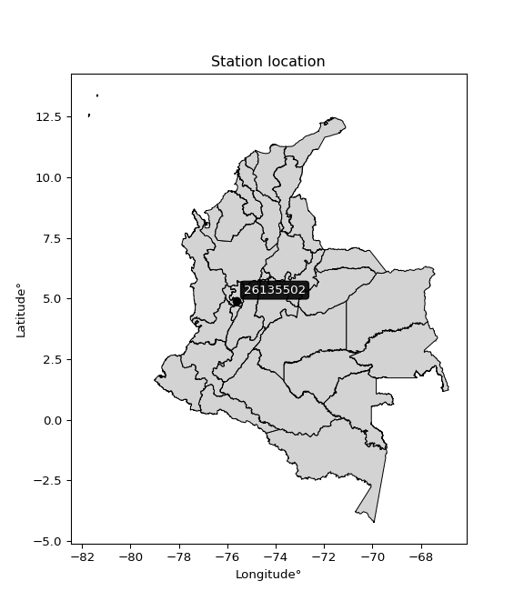</img>

</div>


## A. General information


### 1. General running parameters

• app_version: _v20251225_. • runtime: _2025-12-26 14:29:50.888910_. • Python version: _3.14.0_. • SciPy version: _1.16.3_. • Pandas version: _2.3.3_. • NumPy version: _2.3.5_. • Stations dataset (station_dataset_file): _dataset/pmax24h_in/automatic_colombia.csv_. • Stations catalog (station_catalog_file): _dataset/CNE_IDEAM.xls_. • Plot only fit distributions with Δo > Δ (plot_only_fit): _True_. • Eval low extreme values, if False, evaluates high extreme values (low_extreme): _False_. • Eval every SciPy distribution as logarithmic (pdist_logarithmic_on): _True_. • Standard deviation normalized (ddof): _1.0_. • Return periods to eval in years (Tr): _[2, 2.33, 5, 10, 15, 20, 25, 50, 75, 100, 200, 250, 500, 750, 1000]_. • Minimum data sample per station, 0 means any (minimum_sample): _5_. • Z-Score threshold to adjust a value, 0 means disable (zscore): _3.5_. • Avoid zeros, e.g. rain = 0 (avoid_zeros): _True_. • Avoid null values (avoid_nans): _True_. [:file_folder:Dataset file.](../../dataset/pmax24h_in/automatic_colombia.csv)


### 2. Station info and location

|   id |   CODIGO | NOMBRE                       | CATEGORIA               | TECNOLOGIA                | ESTADO   | FECHA_INSTALACION   |   FECHA_SUSPENSION |   ALTITUD |   LATITUD |   LONGITUD | DEPARTAMENTO   | MUNICIPIO           | AREA_OPERATIVA                         | ENTIDAD                                    | AREA_HIDROGRAFICA   | ZONA_HIDROGRAFICA   | SUBZONA_HIDROGRAFICA               |   CORRIENTE | OBSERVACION                                                                                                                                                                                                                                                   |   SUBRED | Catalogo   |
|-----:|---------:|:-----------------------------|:------------------------|:--------------------------|:---------|:--------------------|-------------------:|----------:|----------:|-----------:|:---------------|:--------------------|:---------------------------------------|:-------------------------------------------|:--------------------|:--------------------|:-----------------------------------|------------:|:--------------------------------------------------------------------------------------------------------------------------------------------------------------------------------------------------------------------------------------------------------------|---------:|:-----------|
|    0 | 26135502 | EL JAZMIN  - AUT  [26135502] | Climatológica Principal | Automática con Telemetría | Activa   | 30/09/2013          |                nan |      1635 |   4.91194 |   -75.6242 | Risaralda      | Santa Rosa De Cabal | Area Operativa 09 - Cauca-Valle-Caldas | CENTRO NACIONAL DE INVESTIGACIONES DE CAFE | Magdalena Cauca     | Cauca               | Río Otún y otros directos al Cauca |         nan | Mediante orfeo 20191040002573 se hace entrega del archivo Excel que contiene el catálogo de estaciones automáticas de Cenicafé, el cual comprende 103 estaciones, con el fin de que se actualice su metadata en el Catálogo Nacional de estaciones del IDEAM. |      nan | CNE_OE     |

<div align="center">

Map location in: [:earth_americas:Google](http://maps.google.com/maps?q=4.911944444,-75.62416389) [:earth_americas:OSM](https://www.openstreetmap.org/#map=18/4.911944444/-75.62416389&layers=P) [:earth_americas:Bing](https://www.bing.com/maps?cp=4.911944444~-75.62416389&lvl=18) [:earth_americas:Apple](https://maps.apple.com/frame?center=4.911944444%2C-75.62416389&span=0.003%2C0.006)

</div>


<div align="center">

```geojson
{
  "type": "Feature",
  "geometry": {
    "type": "Point", 
    "coordinates": [-75.62416389, 4.911944444]
  }, 
  "properties": {
    "Name": "26135502"
  }
}
```

</div>


### 3. Discrete values table and plot

|               |          0 |           1 |          2 |          3 |           4 |           5 |           6 |
|:--------------|-----------:|------------:|-----------:|-----------:|------------:|------------:|------------:|
| Date          | 2017       | 2018        | 2019       | 2020       | 2021        | 2022        | 2023        |
| Value         |   50.3     |   60.7      |   78.2     |   75.9     |   57.3      |   57.2      |   61.9      |
| Value_initial |   50.3     |   60.7      |   78.2     |   75.9     |   57.3      |   57.2      |   61.9      |
| count         |    7       |    7        |    7       |    7       |    7        |    7        |    7        |
| mean          |   63.0714  |   63.0714   |   63.0714  |   63.0714  |   63.0714   |   63.0714   |   63.0714   |
| std           |   10.2578  |   10.2578   |   10.2578  |   10.2578  |   10.2578   |   10.2578   |   10.2578   |
| zscore        |   -1.24505 |   -0.231183 |    1.47484 |    1.25062 |   -0.562638 |   -0.572387 |   -0.114199 |

<div align="center">

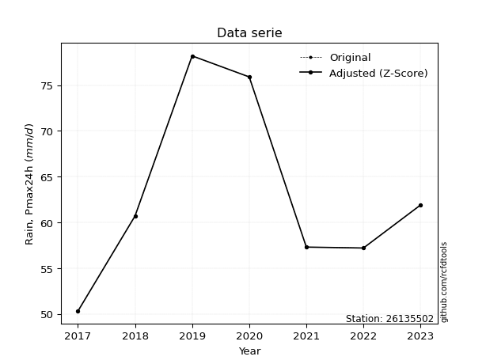</img>

</div>

> If Z-Score is active, values out of range or outliers are replaced with the station mean value.


### 4. Active continuous probability distributions from SciPy (45 of 104 available)

[scipy.stats](https://docs.scipy.org/doc/scipy/reference/stats.html) is a Python´s powerful submodule within the SciPy library for comprehensive statistical analysis, offering over 130 probability distributions (like Normal, Poisson), functions for descriptive stats (mean, variance), hypothesis testing (t-tests, chi-square), random variable generation, and statistical tests, making it essential for data science, modeling, and research. It provides tools to explore, model, and draw conclusions from data efficiently, working seamlessly with NumPy.

<div align="center">

|   id | p_dist             |   n_parameter | fit_method   | label                                                                       | active   | ref                                                                                                        |
|-----:|:-------------------|--------------:|:-------------|:----------------------------------------------------------------------------|:---------|:-----------------------------------------------------------------------------------------------------------|
|    0 | alpha              |             3 | MLE          | Alpha                                                                       | True     | [:mortar_board:](https://docs.scipy.org/doc/scipy/reference/generated/scipy.stats.alpha.html)              |
|    1 | betaprime          |             4 | MLE          | Beta prime                                                                  | True     | [:mortar_board:](https://docs.scipy.org/doc/scipy/reference/generated/scipy.stats.betaprime.html)          |
|    2 | chi2               |             3 | MLE          | Chi²                                                                        | True     | [:mortar_board:](https://docs.scipy.org/doc/scipy/reference/generated/scipy.stats.chi2.html)               |
|    3 | crystalball        |             4 | MLE          | Crystalball                                                                 | True     | [:mortar_board:](https://docs.scipy.org/doc/scipy/reference/generated/scipy.stats.crystalball.html)        |
|    4 | erlang             |             3 | MLE          | Erlang                                                                      | True     | [:mortar_board:](https://docs.scipy.org/doc/scipy/reference/generated/scipy.stats.erlang.html)             |
|    5 | expon              |             2 | MLE          | Exponential                                                                 | True     | [:mortar_board:](https://docs.scipy.org/doc/scipy/reference/generated/scipy.stats.expon.html)              |
|    6 | exponnorm          |             3 | MLE          | Exponentially modified Normal                                               | True     | [:mortar_board:](https://docs.scipy.org/doc/scipy/reference/generated/scipy.stats.exponnorm.html)          |
|    7 | f                  |             4 | MLE          | F                                                                           | True     | [:mortar_board:](https://docs.scipy.org/doc/scipy/reference/generated/scipy.stats.f.html)                  |
|    8 | fatiguelife        |             3 | MLE          | Fatigue-life (Birnbaum-Saunders)                                            | True     | [:mortar_board:](https://docs.scipy.org/doc/scipy/reference/generated/scipy.stats.fatiguelife.html)        |
|    9 | fisk               |             3 | MLE          | Fisk                                                                        | True     | [:mortar_board:](https://docs.scipy.org/doc/scipy/reference/generated/scipy.stats.fisk.html)               |
|   10 | gamma              |             3 | MLE          | Gamma                                                                       | True     | [:mortar_board:](https://docs.scipy.org/doc/scipy/reference/generated/scipy.stats.gamma.html)              |
|   11 | genexpon           |             5 | MLE          | Generalized exponential                                                     | True     | [:mortar_board:](https://docs.scipy.org/doc/scipy/reference/generated/scipy.stats.genexpon.html)           |
|   12 | genlogistic        |             3 | MLE          | Generalized logistic                                                        | True     | [:mortar_board:](https://docs.scipy.org/doc/scipy/reference/generated/scipy.stats.genlogistic.html)        |
|   13 | gibrat             |             2 | MM           | Gibrat                                                                      | True     | [:mortar_board:](https://docs.scipy.org/doc/scipy/reference/generated/scipy.stats.gibrat.html)             |
|   14 | gompertz           |             3 | MLE          | Gompertz (or truncated Gumbel)                                              | True     | [:mortar_board:](https://docs.scipy.org/doc/scipy/reference/generated/scipy.stats.gompertz.html)           |
|   15 | gumbel_l           |             2 | MM           | Gumbel Left Skew                                                            | True     | [:mortar_board:](https://docs.scipy.org/doc/scipy/reference/generated/scipy.stats.gumbel_l.html)           |
|   16 | gumbel_r           |             2 | MM           | Gumbel Right Skew                                                           | True     | [:mortar_board:](https://docs.scipy.org/doc/scipy/reference/generated/scipy.stats.gumbel_r.html)           |
|   17 | halflogistic       |             2 | MM           | Half-logistic                                                               | True     | [:mortar_board:](https://docs.scipy.org/doc/scipy/reference/generated/scipy.stats.halflogistic.html)       |
|   18 | halfnorm           |             2 | MM           | Half Normal                                                                 | True     | [:mortar_board:](https://docs.scipy.org/doc/scipy/reference/generated/scipy.stats.halfnorm.html)           |
|   19 | hypsecant          |             2 | MM           | hyperbolic secant                                                           | True     | [:mortar_board:](https://docs.scipy.org/doc/scipy/reference/generated/scipy.stats.hypsecant.html)          |
|   20 | invgamma           |             3 | MLE          | Inverted gamma                                                              | True     | [:mortar_board:](https://docs.scipy.org/doc/scipy/reference/generated/scipy.stats.invgamma.html)           |
|   21 | invgauss           |             3 | MLE          | Inverse Gaussian                                                            | True     | [:mortar_board:](https://docs.scipy.org/doc/scipy/reference/generated/scipy.stats.invgauss.html)           |
|   22 | invweibull         |             3 | MLE          | Inverted Weibull                                                            | True     | [:mortar_board:](https://docs.scipy.org/doc/scipy/reference/generated/scipy.stats.invweibull.html)         |
|   23 | johnsonsu          |             4 | MLE          | Johnson Su                                                                  | True     | [:mortar_board:](https://docs.scipy.org/doc/scipy/reference/generated/scipy.stats.johnsonsu.html)          |
|   24 | kstwobign          |             2 | MLE          | Limiting distribution of scaled Kolmogorov-Smirnov two-sided test statistic | True     | [:mortar_board:](https://docs.scipy.org/doc/scipy/reference/generated/scipy.stats.kstwobign.html)          |
|   25 | laplace            |             2 | MM           | Laplace                                                                     | True     | [:mortar_board:](https://docs.scipy.org/doc/scipy/reference/generated/scipy.stats.laplace.html)            |
|   26 | laplace_asymmetric |             3 | MLE          | Asymmetric Laplace                                                          | True     | [:mortar_board:](https://docs.scipy.org/doc/scipy/reference/generated/scipy.stats.laplace_asymmetric.html) |
|   27 | loggamma           |             3 | MLE          | Log gamma                                                                   | True     | [:mortar_board:](https://docs.scipy.org/doc/scipy/reference/generated/scipy.stats.loggamma.html)           |
|   28 | logistic           |             2 | MM           | Logistic (or Sech-squared)                                                  | True     | [:mortar_board:](https://docs.scipy.org/doc/scipy/reference/generated/scipy.stats.logistic.html)           |
|   29 | lognorm            |             3 | MLE          | Log Normal                                                                  | True     | [:mortar_board:](https://docs.scipy.org/doc/scipy/reference/generated/scipy.stats.lognorm.html)            |
|   30 | maxwell            |             2 | MM           | Maxwell                                                                     | True     | [:mortar_board:](https://docs.scipy.org/doc/scipy/reference/generated/scipy.stats.maxwell.html)            |
|   31 | mielke             |             4 | MLE          | Mielke Beta-Kappa / Dagum                                                   | True     | [:mortar_board:](https://docs.scipy.org/doc/scipy/reference/generated/scipy.stats.mielke.html)             |
|   32 | moyal              |             2 | MM           | Moyal                                                                       | True     | [:mortar_board:](https://docs.scipy.org/doc/scipy/reference/generated/scipy.stats.moyal.html)              |
|   33 | nakagami           |             3 | MLE          | Nakagami                                                                    | True     | [:mortar_board:](https://docs.scipy.org/doc/scipy/reference/generated/scipy.stats.nakagami.html)           |
|   34 | ncf                |             5 | MLE          | Non-central F distribution                                                  | True     | [:mortar_board:](https://docs.scipy.org/doc/scipy/reference/generated/scipy.stats.ncf.html)                |
|   35 | nct                |             4 | MLE          | Non-central Student’s t                                                     | True     | [:mortar_board:](https://docs.scipy.org/doc/scipy/reference/generated/scipy.stats.nct.html)                |
|   36 | norm               |             2 | MM           | Normal                                                                      | True     | [:mortar_board:](https://docs.scipy.org/doc/scipy/reference/generated/scipy.stats.norm.html)               |
|   37 | pareto             |             3 | MLE          | Pareto                                                                      | True     | [:mortar_board:](https://docs.scipy.org/doc/scipy/reference/generated/scipy.stats.pareto.html)             |
|   38 | pearson3           |             3 | MM           | Pearson type III                                                            | True     | [:mortar_board:](https://docs.scipy.org/doc/scipy/reference/generated/scipy.stats.pearson3.html)           |
|   39 | rayleigh           |             2 | MM           | Rayleigh                                                                    | True     | [:mortar_board:](https://docs.scipy.org/doc/scipy/reference/generated/scipy.stats.rayleigh.html)           |
|   40 | rice               |             3 | MLE          | Rice                                                                        | True     | [:mortar_board:](https://docs.scipy.org/doc/scipy/reference/generated/scipy.stats.rice.html)               |
|   41 | t                  |             3 | MLE          | Student’s t                                                                 | True     | [:mortar_board:](https://docs.scipy.org/doc/scipy/reference/generated/scipy.stats.t.html)                  |
|   42 | truncnorm          |             4 | MLE          | Truncated normal                                                            | True     | [:mortar_board:](https://docs.scipy.org/doc/scipy/reference/generated/scipy.stats.truncnorm.html)          |
|   43 | wald               |             2 | MM           | Wald                                                                        | True     | [:mortar_board:](https://docs.scipy.org/doc/scipy/reference/generated/scipy.stats.wald.html)               |
|   44 | weibull_min        |             3 | MLE          | Weibull minimum                                                             | True     | [:mortar_board:](https://docs.scipy.org/doc/scipy/reference/generated/scipy.stats.weibull_min.html)        |

</div>

> **n_parameter:** # arguments & localization & scale.
>
> **Fit methods:** (MLE) maximum likelihood, (MM) L-moments.
>
>**Inactive:** foldnorm, gennorm, norminvgauss, powernorm, powerlognorm, skewnorm, genextreme, anglit, arcsine, argus, beta, bradford, burr, burr12, cauchy, cosine, halfcauchy, foldcauchy, skewcauchy, wrapcauchy, dgamma, gengamma, exponweib, exponpow, truncexpon, gausshyper, genhalflogistic, genhyperbolic, geninvgauss, halfgennorm, johnsonsb, kappa4, kappa3, ksone, kstwo, loglaplace, levy, levy_l, levy_stable, ncx2, genpareto, truncpareto, lomax, powerlaw, rdist, rel_breitwigner, recipinvgauss, semicircular, studentized_range, trapezoid, triang, truncweibull_min, tukeylambda, uniform, loguniform, vonmises, vonmises_line, weibull_max, dweibull, 


## B. Probability distributions vs. Empirical distributions

A continuous probability distribution (CPD) describes probabilities for variables that can take any value within a range (like rain any time), unlike discrete variables with specific outcomes (like temperature). It uses a Probability Density Function (PDF), a curve where the total area under it equals 1, and the probability of the variable falling within an interval (a to b) is found by calculating the area under the curve between those points. A key feature is that the probability of hitting any single exact value is zero, so probabilities are always expressed for ranges, e.g., $P(a ≤ X ≤ b)$.

<div align="center">

Distributions parameters
|    |   station | p_dist                |   n |             loc |          scale | shape                 | shape1             | shape2               | shape3   |
|---:|----------:|:----------------------|----:|----------------:|---------------:|:----------------------|:-------------------|:---------------------|:---------|
|  0 |  26135502 | alpha                 |   7 |    15.8215      |  238.884       | 5.253398356451939     |                    |                      |          |
|  1 |  26135502 | betaprime             |   7 |    -1.70752     |   61.485       | 98.34398242448808     | 94.32189142397964  |                      |          |
|  2 |  26135502 | chi2                  |   7 |    50.3         |    8.46392     | 0.6736005931289537    |                    |                      |          |
|  3 |  26135502 | crystalball           |   7 |    63.0714      |    9.49687     | 122339.70637404837    | 10270.182200126463 |                      |          |
|  4 |  26135502 | erlang                |   7 |    50.3         |   11.2963      | 0.8556831589447866    |                    |                      |          |
|  5 |  26135502 | expon                 |   7 |    50.3         |   12.7714      |                       |                    |                      |          |
|  6 |  26135502 | exponnorm             |   7 |    53.2531      |    3.78863     | 2.5915206859799866    |                    |                      |          |
|  7 |  26135502 | f                     |   7 |    45.7823      |   15.3248      | 7.974677352110806     | 22.310527707380103 |                      |          |
|  8 |  26135502 | fatiguelife           |   7 |    50.3         |    2.21634e-05 | 675.7827366632337     |                    |                      |          |
|  9 |  26135502 | fisk                  |   7 |    -0.149687    |   61.8431      | 11.498591219442325    |                    |                      |          |
| 10 |  26135502 | gamma                 |   7 |    50.3         |   14.2413      | 0.45921644303799325   |                    |                      |          |
| 11 |  26135502 | genexpon              |   7 |    50.3         |    2.52352     | 0.12558355147338074   | 0.7760634418287315 | 0.025303517224957786 |          |
| 12 |  26135502 | genlogistic           |   7 |     8.12267     |    7.52997     | 817.1081422314961     |                    |                      |          |
| 13 |  26135502 | gibrat                |   7 |    55.8265      |    4.39429     |                       |                    |                      |          |
| 14 |  26135502 | gompertz              |   7 |    50.3         |   22.1741      | 1.0426327840044654    |                    |                      |          |
| 15 |  26135502 | gumbel_l              |   7 |    67.3455      |    7.40468     |                       |                    |                      |          |
| 16 |  26135502 | gumbel_r              |   7 |    58.7973      |    7.40468     |                       |                    |                      |          |
| 17 |  26135502 | halflogistic          |   7 |    51.8154      |    8.1195      |                       |                    |                      |          |
| 18 |  26135502 | halfnorm              |   7 |    50.5013      |   15.7543      |                       |                    |                      |          |
| 19 |  26135502 | hypsecant             |   7 |    63.0714      |    6.0459      |                       |                    |                      |          |
| 20 |  26135502 | invgamma              |   7 |    33.2881      |  280.764       | 10.404805337212927    |                    |                      |          |
| 21 |  26135502 | invgauss              |   7 |    40.656       |  109.538       | 0.20463559923191837   |                    |                      |          |
| 22 |  26135502 | invweibull            |   7 |  -218.862       |  277.376       | 37.256637470755955    |                    |                      |          |
| 23 |  26135502 | johnsonsu             |   7 |     2.33317e+08 |    2.93965e+06 | 125291648.71087864    | 24725562.50146413  |                      |          |
| 24 |  26135502 | kstwobign             |   7 |    32.0122      |   35.6446      |                       |                    |                      |          |
| 25 |  26135502 | laplace               |   7 |    63.0714      |    6.7153      |                       |                    |                      |          |
| 26 |  26135502 | laplace_asymmetric    |   7 |    57.2         |    5.82314     | 0.6157476460519185    |                    |                      |          |
| 27 |  26135502 | loggamma              |   7 | -2694.58        |  376.111       | 1528.8611867673958    |                    |                      |          |
| 28 |  26135502 | logistic              |   7 |    63.0714      |    5.2359      |                       |                    |                      |          |
| 29 |  26135502 | lognorm               |   7 |    50.3         |    0.0840254   | 12.299753710532295    |                    |                      |          |
| 30 |  26135502 | maxwell               |   7 |    40.5678      |   14.102       |                       |                    |                      |          |
| 31 |  26135502 | mielke                |   7 |     0.413894    |   32.0764      | 914.5732485006993     | 8.04657224464983   |                      |          |
| 32 |  26135502 | moyal                 |   7 |    57.6405      |    4.2751      |                       |                    |                      |          |
| 33 |  26135502 | nakagami              |   7 |    50.3         |   21.7075      | 0.1290525359415005    |                    |                      |          |
| 34 |  26135502 | ncf                   |   7 |     0.126628    |   21.5534      | 902.5332588277906     | 105.46308115780516 | 1680.523038613269    |          |
| 35 |  26135502 | nct                   |   7 |    -1.04635     |    0.307179    | 25.300228564039983    | 202.38217782298173 |                      |          |
| 36 |  26135502 | norm                  |   7 |    63.0714      |    9.49687     |                       |                    |                      |          |
| 37 |  26135502 | pareto                |   7 |    50.2878      |    0.0122199   | 0.16796142992697874   |                    |                      |          |
| 38 |  26135502 | pearson3              |   7 |    63.0714      |    9.49686     | 0.5139257038107988    |                    |                      |          |
| 39 |  26135502 | rayleigh              |   7 |    44.9034      |   14.496       |                       |                    |                      |          |
| 40 |  26135502 | rice                  |   7 |    46.3106      |   13.622       | 0.0027042054079856577 |                    |                      |          |
| 41 |  26135502 | t                     |   7 |    63.0705      |    9.49344     | 827556.5233808224     |                    |                      |          |
| 42 |  26135502 | truncnorm             |   7 |    -1.32143     |    4.46813     | 13.097526097400308    | 17.797486734867284 |                      |          |
| 43 |  26135502 | wald                  |   7 |    53.5746      |    9.49682     |                       |                    |                      |          |
| 44 |  26135502 | weibull_min           |   7 |    49.766       |   14.1246      | 1.2354537326907327    |                    |                      |          |
| 45 |  26135502 | logalpha              |   7 |     0.582007    |   87.448       | 24.664166740823234    |                    |                      |          |
| 46 |  26135502 | logbetaprime          |   7 |     2.53132     |    0.60091     | 417.45154374798767    | 157.61990410377268 |                      |          |
| 47 |  26135502 | logchi2               |   7 |     3.91801     |    0.965825    | 0.9333365323292178    |                    |                      |          |
| 48 |  26135502 | logcrystalball        |   7 |     4.13329     |    0.147083    | 35.091718369703564    | 168.50637397539174 |                      |          |
| 49 |  26135502 | logerlang             |   7 |     3.81509     |    0.0748568   | 4.2507861022108635    |                    |                      |          |
| 50 |  26135502 | logexpon              |   7 |     3.91801     |    0.215282    |                       |                    |                      |          |
| 51 |  26135502 | logexponnorm          |   7 |     3.98858     |    0.0755081   | 1.9164950950868085    |                    |                      |          |
| 52 |  26135502 | logf                  |   7 |     3.81019     |    0.321377    | 8.999996649529328     | 341.52083056044876 |                      |          |
| 53 |  26135502 | logfatiguelife        |   7 |     3.62869     |    0.483062    | 0.2985771632064159    |                    |                      |          |
| 54 |  26135502 | logfisk               |   7 |     3.7116      |    0.397614    | 4.742737311712144     |                    |                      |          |
| 55 |  26135502 | loggamma              |   7 |     3.81509     |    0.0748567   | 4.250799070291996     |                    |                      |          |
| 56 |  26135502 | loggenexpon           |   7 |     3.91757     |    1.3718      | 3.473705145434847     | 48.99676122910398  | 0.5381866048888546   |          |
| 57 |  26135502 | loggenlogistic        |   7 |     3.40788     |    0.123609    | 200.38058520462738    |                    |                      |          |
| 58 |  26135502 | loggibrat             |   7 |     4.02104     |    0.0680795   |                       |                    |                      |          |
| 59 |  26135502 | loggompertz           |   7 |     3.91801     |    0.43223     | 1.3852799176718253    |                    |                      |          |
| 60 |  26135502 | loggumbel_l           |   7 |     4.19948     |    0.11468     |                       |                    |                      |          |
| 61 |  26135502 | loggumbel_r           |   7 |     4.06709     |    0.11468     |                       |                    |                      |          |
| 62 |  26135502 | loghalflogistic       |   7 |     3.95897     |    0.125747    |                       |                    |                      |          |
| 63 |  26135502 | loghalfnorm           |   7 |     3.93863     |    0.243969    |                       |                    |                      |          |
| 64 |  26135502 | loghypsecant          |   7 |     4.13329     |    0.0936362   |                       |                    |                      |          |
| 65 |  26135502 | loginvgamma           |   7 |     3.3928      |   18.4877      | 25.958373492151278    |                    |                      |          |
| 66 |  26135502 | loginvgauss           |   7 |     3.61629     |    5.99443     | 0.08624708826213132   |                    |                      |          |
| 67 |  26135502 | loginvweibull         |   7 |    -3.98691e+06 |    3.98691e+06 | 32289137.089110088    |                    |                      |          |
| 68 |  26135502 | logjohnsonsu          |   7 |     5.31103e+06 | 8557.88        | 258110976.23607877    | 36232021.75894956  |                      |          |
| 69 |  26135502 | logkstwobign          |   7 |     3.62429     |    0.58358     |                       |                    |                      |          |
| 70 |  26135502 | loglaplace            |   7 |     4.13329     |    0.104004    |                       |                    |                      |          |
| 71 |  26135502 | loglaplace_asymmetric |   7 |     4.10594     |    0.111981    | 0.8853911257590289    |                    |                      |          |
| 72 |  26135502 | logloggamma           |   7 |   -30.2723      |    4.92112     | 1087.7839616699657    |                    |                      |          |
| 73 |  26135502 | loglogistic           |   7 |     4.13329     |    0.0810913   |                       |                    |                      |          |
| 74 |  26135502 | loglognorm            |   7 |     3.91801     |    0.00176169  | 11.851731308001563    |                    |                      |          |
| 75 |  26135502 | logmaxwell            |   7 |     3.78476     |    0.218406    |                       |                    |                      |          |
| 76 |  26135502 | logmielke             |   7 |  -364.192       |  367.884       | 68401.6208125637      | 3058.203262701685  |                      |          |
| 77 |  26135502 | logmoyal              |   7 |     4.04918     |    0.0662108   |                       |                    |                      |          |
| 78 |  26135502 | lognakagami           |   7 |     3.91801     |    0.254498    | 0.38981735787198046   |                    |                      |          |
| 79 |  26135502 | logncf                |   7 |    -4.54227     |    8.68401     | 1337.4210359802546    | 1577.3675684855507 | 0.04000644309091575  |          |
| 80 |  26135502 | lognct                |   7 |    -4.3448      |    0.0331245   | 1231.971759023049     | 255.81040443455834 |                      |          |
| 81 |  26135502 | lognorm               |   7 |     4.13329     |    0.147083    |                       |                    |                      |          |
| 82 |  26135502 | logpareto             |   7 |     3.91779     |    0.000213211 | 0.16792219008794912   |                    |                      |          |
| 83 |  26135502 | logpearson3           |   7 |     4.13329     |    0.147083    | 0.3511129914094228    |                    |                      |          |
| 84 |  26135502 | lograyleigh           |   7 |     3.85191     |    0.224508    |                       |                    |                      |          |
| 85 |  26135502 | logrice               |   7 |     3.85808     |    0.197894    | 0.6974639696076035    |                    |                      |          |
| 86 |  26135502 | logt                  |   7 |     4.1333      |    0.147083    | 8745172.228451004     |                    |                      |          |
| 87 |  26135502 | logtruncnorm          |   7 |    -0.061011    |    1.25401     | 3.173024576543652     | 3.52491076289961   |                      |          |
| 88 |  26135502 | logwald               |   7 |     3.98617     |    0.147118    |                       |                    |                      |          |
| 89 |  26135502 | logweibull_min        |   7 |     3.88368     |    0.278692    | 1.6955517283270827    |                    |                      |          |

</div>

> **loc** (Location parameter): This shifts the distribution along the x-axis. For many common distributions, like the normal (Gaussian) distribution, loc represents the mean $μ$. For others, like the uniform distribution, it might represent the minimum value, or for the beta distribution, the left end of the support interval.
>
> **scale** (Scale parameter): This determines the width or spread of the distribution. For the normal distribution, scale represents the standard deviation $σ$. For a uniform distribution, it defines the length of the interval (from $loc$ to $loc + scale$).
>
> **shape** (Shape parameters): Refers to parameters that define the specific form of a probability distribution, distinct from its location (loc) and scale (scale). These parameters are required arguments for most distribution functions. For example, a normal (Gaussian) distribution is fully defined by its location (mean) and scale (standard deviation), so it has no specific shape parameters beyond loc and scale. However, other distributions have intrinsic properties that need specification, as Gamma distribution that takes a shape parameter, often named $a$ or $alpha$.


### 0. Cumulative distribution values - CDF (90 evaluated)

> Ordered by x ascending and calculating $log(f(x))$ separately. 

|   id |   Station |   date |    x |   count |    mean |     std |    zscore |   Value_initial |   station |   m |    alpha |   alpha_pdf |   betaprime |   betaprime_pdf |        chi2 |    chi2_pdf |   crystalball |   crystalball_pdf |      erlang |   erlang_pdf |    expon |   expon_pdf |   exponnorm |   exponnorm_pdf |         f |      f_pdf |   fatiguelife |   fatiguelife_pdf |      fisk |   fisk_pdf |       gamma |   gamma_pdf |    genexpon |   genexpon_pdf |   genlogistic |   genlogistic_pdf |   gibrat |   gibrat_pdf |    gompertz |   gompertz_pdf |   gumbel_l |   gumbel_l_pdf |   gumbel_r |   gumbel_r_pdf |   halflogistic |   halflogistic_pdf |   halfnorm |   halfnorm_pdf |   hypsecant |   hypsecant_pdf |   invgamma |   invgamma_pdf |   invgauss |   invgauss_pdf |   invweibull |   invweibull_pdf |   johnsonsu |   johnsonsu_pdf |   kstwobign |   kstwobign_pdf |   laplace |   laplace_pdf |   laplace_asymmetric |   laplace_asymmetric_pdf |   loggamma |   loggamma_pdf |   logistic |   logistic_pdf |   lognorm |   lognorm_pdf |   maxwell |   maxwell_pdf |      mielke |   mielke_pdf |     moyal |   moyal_pdf |    nakagami |   nakagami_pdf |       ncf |    ncf_pdf |       nct |   nct_pdf |      norm |   norm_pdf |   pareto |   pareto_pdf |   pearson3 |   pearson3_pdf |   rayleigh |   rayleigh_pdf |      rice |   rice_pdf |         t |     t_pdf |   truncnorm |   truncnorm_pdf |     wald |   wald_pdf |   weibull_min |   weibull_min_pdf |   logalpha |   logalpha_pdf |   logbetaprime |   logbetaprime_pdf |     logchi2 |   logchi2_pdf |   logcrystalball |   logcrystalball_pdf |   logerlang |   logerlang_pdf |   logexpon |   logexpon_pdf |   logexponnorm |   logexponnorm_pdf |      logf |   logf_pdf |   logfatiguelife |   logfatiguelife_pdf |   logfisk |   logfisk_pdf |   loggenexpon |   loggenexpon_pdf |   loggenlogistic |   loggenlogistic_pdf |   loggibrat |   loggibrat_pdf |   loggompertz |   loggompertz_pdf |   loggumbel_l |   loggumbel_l_pdf |   loggumbel_r |   loggumbel_r_pdf |   loghalflogistic |   loghalflogistic_pdf |   loghalfnorm |   loghalfnorm_pdf |   loghypsecant |   loghypsecant_pdf |   loginvgamma |   loginvgamma_pdf |   loginvgauss |   loginvgauss_pdf |   loginvweibull |   loginvweibull_pdf |   logjohnsonsu |   logjohnsonsu_pdf |   logkstwobign |   logkstwobign_pdf |   loglaplace |   loglaplace_pdf |   loglaplace_asymmetric |   loglaplace_asymmetric_pdf |   logloggamma |   logloggamma_pdf |   loglogistic |   loglogistic_pdf |   loglognorm |   loglognorm_pdf |   logmaxwell |   logmaxwell_pdf |   logmielke |   logmielke_pdf |   logmoyal |   logmoyal_pdf |   lognakagami |   lognakagami_pdf |   logncf |   logncf_pdf |   lognct |   lognct_pdf |   logpareto |   logpareto_pdf |   logpearson3 |   logpearson3_pdf |   lograyleigh |   lograyleigh_pdf |   logrice |   logrice_pdf |      logt |   logt_pdf |   logtruncnorm |   logtruncnorm_pdf |   logwald |   logwald_pdf |   logweibull_min |   logweibull_min_pdf |
|-----:|----------:|-------:|-----:|--------:|--------:|--------:|----------:|----------------:|----------:|----:|---------:|------------:|------------:|----------------:|------------:|------------:|--------------:|------------------:|------------:|-------------:|---------:|------------:|------------:|----------------:|----------:|-----------:|--------------:|------------------:|----------:|-----------:|------------:|------------:|------------:|---------------:|--------------:|------------------:|---------:|-------------:|------------:|---------------:|-----------:|---------------:|-----------:|---------------:|---------------:|-------------------:|-----------:|---------------:|------------:|----------------:|-----------:|---------------:|-----------:|---------------:|-------------:|-----------------:|------------:|----------------:|------------:|----------------:|----------:|--------------:|---------------------:|-------------------------:|-----------:|---------------:|-----------:|---------------:|----------:|--------------:|----------:|--------------:|------------:|-------------:|----------:|------------:|------------:|---------------:|----------:|-----------:|----------:|----------:|----------:|-----------:|---------:|-------------:|-----------:|---------------:|-----------:|---------------:|----------:|-----------:|----------:|----------:|------------:|----------------:|---------:|-----------:|--------------:|------------------:|-----------:|---------------:|---------------:|-------------------:|------------:|--------------:|-----------------:|---------------------:|------------:|----------------:|-----------:|---------------:|---------------:|-------------------:|----------:|-----------:|-----------------:|---------------------:|----------:|--------------:|--------------:|------------------:|-----------------:|---------------------:|------------:|----------------:|--------------:|------------------:|--------------:|------------------:|--------------:|------------------:|------------------:|----------------------:|--------------:|------------------:|---------------:|-------------------:|--------------:|------------------:|--------------:|------------------:|----------------:|--------------------:|---------------:|-------------------:|---------------:|-------------------:|-------------:|-----------------:|------------------------:|----------------------------:|--------------:|------------------:|--------------:|------------------:|-------------:|-----------------:|-------------:|-----------------:|------------:|----------------:|-----------:|---------------:|--------------:|------------------:|---------:|-------------:|---------:|-------------:|------------:|----------------:|--------------:|------------------:|--------------:|------------------:|----------:|--------------:|----------:|-----------:|---------------:|-------------------:|----------:|--------------:|-----------------:|---------------------:|
|    0 |  26135502 |   2017 | 50.3 |       7 | 63.0714 | 10.2578 | -1.24505  |            50.3 |  26135502 |   1 | 0.046959 |  0.0197108  |   0.0735048 |       0.0185499 | 7.41946e-06 | 3.51686e+08 |     0.0893444 |         0.0170067 | 1.03742e-13 |  12.4932     | 0        |  0.0782998  |   0.0403893 |      0.0180744  | 0.0399702 | 0.0254545  |     0.0278614 |       4.61646e+09 | 0.0877522 | 0.0182455  | 1.06132e-07 | 6.85922e+06 | 9.39225e-09 |      0.0497651 |     0.0491844 |        0.0196388  | 0        |   0          | 1.29754e-06 |      0.0470202 |  0.0952162 |     0.0122263  |  0.0428306 |     0.0182233  |       0        |          0         |   0        |      0         |   0.0766244 |      0.0125517  |  0.0435257 |     0.0204701  |  0.0400104 |     0.0220621  |    0.0466686 |       0.019797   |   0.0879703 |       0.0169182 |   0.0450269 |       0.0206169 | 0.0746469 |    0.0111159  |            0.0401283 |               0.0111916  |  0.0369884 |       1.14651  |  0.0802317 |     0.014094   | 0.0716416 |      0.929273 | 0.0759276 |     0.021237  |   0.0404545 |    0.0206377 | 0.0182914 |  0.0136061  | 8.22672e-05 |    2.98836e+09 | 0.0621567 | 0.0182066  | 0.0614938 | 0.0191267 | 0.0893444 |  0.0170067 | 0        |  13.7449     |  0.0731629 |      0.0194671 |  0.0669513 |      0.0239624 | 0.0419792 |  0.0205971 | 0.0892824 | 0.017004  | 0           |     0           | 0        | 0          |     0.0173329 |        0.0397503  |  0.0606572 |       0.944054 |      0.0665684 |           1.01582  | 5.68569e-08 |   5.97477e+07 |        0.0716416 |             0.929275 |   0.0369881 |        1.14651  |   0        |       4.64507  |      0.0394454 |           0.936688 | 0.0371819 |   1.13909  |        0.0413013 |             1.05766  | 0.0427128 |      0.939541 |    0.00110095 |          2.53551  |        0.0404909 |             1.04206  |    0        |        0        |   1.90073e-07 |          3.20496  |     0.0823236 |          0.687458 |     0.0254926 |          0.815674 |          0        |              0        |      0        |          0        |       0.063669 |           0.675436 |     0.0447054 |          1.01392  |     0.0416282 |          1.05276  |       0.0396936 |            1.03724  |      0.0709654 |           0.925675 |      0.0381984 |           1.13681  |    0.0630962 |         0.606673 |               0.0660188 |                    0.665867 |     0.0752153 |          0.936899 |     0.0656931 |          0.756894 |   0.00718934 |       3.7907e+12 |    0.0540744 |         1.12881  |   0.0413727 |        1.02041  | 0.00708721 |       0.432211 |   2.43303e-12 |       4271.38     | 0.310163 |     0.792707 | 0.105637 |     1.09394  |    0        |      787.588    |     0.0603198 |          0.992976 |     0.0424124 |          1.25573  | 0.0353367 |      1.15892  | 0.0716331 |   0.929191 |    3.97674e-08 |            3.81911 |  0        |      0        |        0.0282854 |             1.37744  |
|    1 |  26135502 |   2022 | 57.2 |       7 | 63.0714 | 10.2578 | -0.572387 |            57.2 |  26135502 |   2 | 0.301623 |  0.0486283  |   0.278528  |       0.0395036 | 0.752104    | 0.0268897   |     0.268206  |         0.0347    | 0.530817    |   0.0466108  | 0.417408 |  0.0456168  |   0.315005  |      0.0546158  | 0.348122  | 0.0518524  |     0.7955    |       0.0169747   | 0.2958    | 0.0417645  | 0.701998    | 0.033189    | 0.33974     |      0.0464314 |     0.299349  |        0.0479142  | 0.12243  |   0.147708   | 0.316542    |      0.043867  |  0.224362  |     0.0266136  |  0.289166  |     0.0484537  |       0.319943 |          0.0552766 |   0.329307 |      0.0462682 |   0.230435  |      0.0348713  |  0.308395  |     0.0493239  |  0.318113  |     0.0494411  |    0.303154  |       0.0488301  |   0.266907  |       0.0348348 |   0.299838  |       0.0469186 | 0.20857   |    0.0310588  |            0.274913  |               0.0766718  |  0.323935  |       2.86977  |  0.245756  |     0.0354017  | 0.2777    |      2.27949  | 0.292359  |     0.0392587 |   0.319389  |    0.0513957 | 0.2924    |  0.0564448  | 0.606553    |    0.0224284   | 0.276397  | 0.0421066  | 0.285633  | 0.0432417 | 0.268206  |  0.0347    | 0.655112 |   0.0083805  |  0.28521   |      0.0400944 |  0.302175  |      0.0408353 | 0.273503  |  0.0426342 | 0.268166  | 0.0347098 | 4.28843e-06 |     2.9482      | 0.252078 | 0.107955   |     0.36396   |        0.04783    |  0.282086  |       2.46127  |      0.29426   |           2.44952  | 0.312205    |   1.08291     |        0.277701  |             2.2795   |   0.323935  |        2.86977  |   0.449605 |       2.55663  |      0.320328  |           3.16756  | 0.323684  |   2.87434  |        0.313471  |             2.84881  | 0.307173  |      3.0134   |    0.356758   |          2.76249  |        0.320035  |             2.94145  |    0.163168 |        9.65977  |   0.3811      |          2.67058  |     0.231679  |          1.76568  |     0.302363  |          3.15367  |          0.334843 |              3.53042  |      0.341783 |          2.96558  |       0.240053 |           2.32749  |     0.305846  |          2.80993  |     0.312583  |          2.84467  |       0.320074  |            2.95306  |      0.277034  |           2.28457  |      0.32827   |           2.88641  |    0.217166  |         2.08807  |               0.241407  |                    2.43484  |     0.279149  |          2.23914  |     0.255484  |          2.34565  |   0.641315   |       0.24525    |    0.303059  |         2.559    |   0.317636  |        2.94908  | 0.307731   |       3.6531   |   0.445632    |          2.51502  | 0.417334 |     0.864149 | 0.312188 |     2.06729  |    0.658798 |        0.444972 |     0.290378  |          2.5034   |     0.313284  |          2.65191  | 0.300746  |      2.66955  | 0.27768   |   2.27942  |    0.418421    |            2.74422 |  0.281063 |      6.75259  |        0.331161  |             2.80058  |
|    2 |  26135502 |   2021 | 57.3 |       7 | 63.0714 | 10.2578 | -0.562638 |            57.3 |  26135502 |   3 | 0.306492 |  0.0487408  |   0.282488  |       0.0397073 | 0.754772    | 0.0264774   |     0.271687  |         0.0349247 | 0.535453    |   0.0461042  | 0.421952 |  0.045261   |   0.320469  |      0.054674   | 0.353303  | 0.0517583  |     0.797187  |       0.0167699   | 0.299989  | 0.0420308  | 0.705292    | 0.0327013   | 0.344376    |      0.0462939 |     0.304147  |        0.0480408  | 0.137274 |   0.149041   | 0.320924    |      0.0437827 |  0.227036  |     0.0268825  |  0.294019  |     0.048606   |       0.32546  |          0.0550573 |   0.333927 |      0.0461425 |   0.233944  |      0.035304   |  0.313331  |     0.0493882  |  0.323057  |     0.0494386  |    0.308042  |       0.0489348  |   0.270402  |       0.0350632 |   0.304534  |       0.0469953 | 0.211699  |    0.0315248  |            0.28254   |               0.0758653  |  0.328951  |       2.87295  |  0.249313  |     0.0357448  | 0.281696  |      2.29535  | 0.296292  |     0.0394003 |   0.324529  |    0.0514055 | 0.298048  |  0.056508   | 0.608783    |    0.0221818   | 0.280619  | 0.0423229  | 0.289967  | 0.0434252 | 0.271687  |  0.0349247 | 0.655943 |   0.00824108 |  0.289228  |      0.0402732 |  0.306263  |      0.0409262 | 0.277774  |  0.0427728 | 0.271648  | 0.0349347 | 0.255524    |     2.19858     | 0.262815 | 0.106782   |     0.368732  |        0.0476207  |  0.286399  |       2.47669  |      0.29855   |           2.46257  | 0.314089    |   1.07417     |        0.281696  |             2.29536  |   0.32895   |        2.87295  |   0.454052 |       2.53597  |      0.325868  |           3.17634  | 0.328707  |   2.87764  |        0.318453  |             2.85563  | 0.312448  |      3.02603  |    0.361578   |          2.75664  |        0.325177  |             2.94702  |    0.180018 |        9.62682  |   0.385757    |          2.66122  |     0.234781  |          1.78555  |     0.30788   |          3.16267  |          0.340995 |              3.51389  |      0.346954 |          2.95613  |       0.244146 |           2.35915  |     0.310763  |          2.81957  |     0.317558  |          2.85179  |       0.325237  |            2.95854  |      0.281038  |           2.30057  |      0.333313  |           2.88822  |    0.220845  |         2.12343  |               0.245698  |                    2.47812  |     0.283073  |          2.25456  |     0.259603  |          2.37028  |   0.64174    |       0.241862   |    0.307538  |         2.56844  |   0.322794  |        2.95591  | 0.314114   |       3.65439  |   0.450012    |          2.50073  | 0.418843 |     0.86467  | 0.315808 |     2.07683  |    0.659569 |        0.438024 |     0.294763  |          2.51696  |     0.317921  |          2.65764  | 0.305416  |      2.67684  | 0.281675  |   2.29527  |    0.423204    |            2.73173 |  0.292774 |      6.65563  |        0.336053  |             2.8008   |
|    3 |  26135502 |   2018 | 60.7 |       7 | 63.0714 | 10.2578 | -0.231183 |            60.7 |  26135502 |   4 | 0.472296 |  0.0472031  |   0.425756  |       0.0435352 | 0.826196    | 0.0166578   |     0.401407  |         0.0407183 | 0.666962    |   0.0322264  | 0.557059 |  0.0346822  |   0.499546  |      0.0484585  | 0.519064  | 0.0447526  |     0.844626  |       0.0116311   | 0.453581  | 0.0468346  | 0.794079    | 0.0207922   | 0.49271     |      0.0406945 |     0.468615  |        0.0471494  | 0.541222 |   0.0814217  | 0.464167    |      0.0402722 |  0.334753  |     0.0366191  |  0.46144   |     0.0481964  |       0.498354 |          0.0462863 |   0.4826   |      0.0410715 |   0.37823   |      0.0488432  |  0.478833  |     0.0465108  |  0.485806  |     0.0451268  |    0.474065  |       0.0471565  |   0.400786  |       0.0409602 |   0.463691  |       0.0454064 | 0.35124   |    0.0523044  |            0.499205  |               0.0529548  |  0.492471  |       2.7273   |  0.388667  |     0.04538    | 0.42626   |      2.66589  | 0.435455  |     0.0416213 |   0.493267  |    0.0463836 | 0.484431  |  0.0510981  | 0.673043    |    0.0162706   | 0.432634  | 0.0458385  | 0.443485  | 0.045576  | 0.401407  |  0.0407183 | 0.678046 |   0.00519349 |  0.432896  |      0.0432109 |  0.447746  |      0.0415151 | 0.427605  |  0.0443873 | 0.401411  | 0.0407331 | 0.999976    |     7.59654e-05 | 0.54659  | 0.0620069  |     0.517522  |        0.0397324  |  0.439884  |       2.77738  |      0.449036  |           2.69093  | 0.369201    |   0.857563    |        0.426261  |             2.6659   |   0.49247   |        2.7273   |   0.582298 |       1.94025  |      0.507592  |           2.98775  | 0.492534  |   2.73211  |        0.483838  |             2.79741  | 0.4902    |      3.0056   |    0.513055   |          2.47204  |        0.493895  |             2.81369  |    0.587384 |        4.58568  |   0.529765    |          2.32795  |     0.357477  |          2.47838  |     0.49035   |          3.04709  |          0.525871 |              2.87665  |      0.507165 |          2.58508  |       0.408341 |           3.25947  |     0.476553  |          2.84099  |     0.482992  |          2.80226  |       0.494492  |            2.82027  |      0.42602   |           2.67466  |      0.496474  |           2.70299  |    0.384406  |         3.69608  |               0.439436  |                    4.43216  |     0.425068  |          2.62108  |     0.416492  |          2.99695  |   0.653218   |       0.165729   |    0.460645  |         2.67947  |   0.492966  |        2.85002  | 0.514815   |       3.17448  |   0.581338    |          2.06568  | 0.46904  |     0.874642 | 0.442481 |     2.28014  |    0.679851 |        0.285727 |     0.448582  |          2.7477   |     0.472797  |          2.6571   | 0.462706  |      2.71812  | 0.426237  |   2.66587  |    0.569333    |            2.34726 |  0.582328 |      3.61393  |        0.494081  |             2.62979  |
|    4 |  26135502 |   2023 | 61.9 |       7 | 63.0714 | 10.2578 | -0.114199 |            61.9 |  26135502 |   5 | 0.527553 |  0.0447777  |   0.477992  |       0.0433986 | 0.844807    | 0.0144338   |     0.450915  |         0.0416894 | 0.703362    |   0.0285255  | 0.596782 |  0.0315719  |   0.555157  |      0.0441632  | 0.570723  | 0.0413087  |     0.857812  |       0.0103792   | 0.509584  | 0.0463111  | 0.817312    | 0.0180161   | 0.540183    |      0.03841   |     0.52395   |        0.0449572  | 0.626892 |   0.0623341  | 0.511594    |      0.0387489 |  0.380787  |     0.0400817  |  0.518044  |     0.0460134  |       0.551831 |          0.0428279 |   0.530645 |      0.0389822 |   0.438708  |      0.0516759  |  0.533101  |     0.0438429  |  0.538327  |     0.0423429  |    0.529238  |       0.0446879  |   0.450596  |       0.0419497 |   0.517035  |       0.0434122 | 0.419963  |    0.0625382  |            0.558885  |               0.0466442  |  0.544615  |       2.59489  |  0.4443    |     0.0471547  | 0.478943  |      2.70858  | 0.485227  |     0.0412358 |   0.546984  |    0.043074  | 0.543427  |  0.0471448  | 0.691719    |    0.0148963   | 0.487413  | 0.0453177  | 0.497663  | 0.0445866 | 0.450915  |  0.0416894 | 0.683891 |   0.00457226 |  0.484579  |      0.0428108 |  0.497109  |      0.0406761 | 0.480486  |  0.0436462 | 0.450938  | 0.0417047 | 0.999999    |     1.76165e-06 | 0.613974 | 0.0507368  |     0.563464  |        0.0368414  |  0.494348  |       2.7781   |      0.501633  |           2.67479  | 0.385464    |   0.805218    |        0.478945  |             2.70858  |   0.544614  |        2.59489  |   0.618606 |       1.7716   |      0.564042  |           2.77167  | 0.544761  |   2.59851  |        0.537493  |             2.67772  | 0.547502  |      2.83869  |    0.560217   |          2.34423  |        0.547572  |             2.66394  |    0.665785 |        3.48376  |   0.574149    |          2.2059   |     0.408263  |          2.70735  |     0.548371  |          2.87288  |          0.579867 |              2.63925  |      0.556353 |          2.4388   |       0.473627 |           3.38777  |     0.531223  |          2.73664  |     0.53676   |          2.68429  |       0.548277  |            2.66856  |      0.47888   |           2.71778  |      0.54807   |           2.56403  |    0.46402   |         4.46158  |               0.519821  |                    3.79659  |     0.476905  |          2.66735  |     0.476073  |          3.07588  |   0.656299   |       0.149596   |    0.512709  |         2.63299  |   0.547379  |        2.7023   | 0.574221   |       2.89102  |   0.620432    |          1.92905  | 0.486167 |     0.874833 | 0.487305 |     2.29436  |    0.685129 |        0.254534 |     0.502249  |          2.72689  |     0.524143  |          2.58314  | 0.515336  |      2.65287  | 0.47892   |   2.70857  |    0.614111    |            2.22833 |  0.64618  |      2.93722  |        0.54444   |             2.51122  |
|    5 |  26135502 |   2020 | 75.9 |       7 | 63.0714 | 10.2578 |  1.25062  |            75.9 |  26135502 |   6 | 0.899235 |  0.0116798  |   0.906828  |       0.0148237 | 0.951859    | 0.00373426  |     0.911624  |         0.0168693 | 0.920555    |   0.00736854 | 0.865269 |  0.0105494  |   0.892702  |      0.0109284  | 0.900314  | 0.0106348  |     0.944123  |       0.0034988   | 0.915114  | 0.0117451  | 0.948733    | 0.00439353  | 0.889556    |      0.0131857 |     0.904176  |        0.0120947  | 0.935631 |   0.00626882 | 0.896175    |      0.0154874 |  0.958202  |     0.0179217  |  0.90548   |     0.0121417  |       0.902053 |          0.0114724 |   0.893076 |      0.0138087 |   0.92409   |      0.012437   |  0.896611  |     0.0117274  |  0.894117  |     0.0119953  |    0.901378  |       0.0118294  |   0.912985  |       0.0167809 |   0.903572  |       0.013319  | 0.925986  |    0.0110217  |            0.899624  |               0.0106139  |  0.890953  |       0.879001 |  0.92057   |     0.0139653  | 0.908809  |      1.1149   | 0.901131  |     0.015393  | nan         |  nan         | 0.905927  |  0.0109513  | 0.835392    |    0.00717934  | 0.913236  | 0.0138009  | 0.906416  | 0.0134407 | 0.911624  |  0.0168693 | 0.723219 |   0.00181509 |  0.903827  |      0.0147324 |  0.898341  |      0.0149955 | 0.905503  |  0.0150686 | 0.911718  | 0.016862  | 1           |     7.24209e-28 | 0.917456 | 0.00790586 |     0.882192  |        0.0119109  |  0.908006  |       1.02779  |      0.899497  |           1.02761  | 0.513735    |   0.50298     |        0.908811  |             1.11489  |   0.890953  |        0.879002 |   0.852073 |       0.687132 |      0.891303  |           0.751107 | 0.890718  |   0.875539 |        0.894899  |             0.884803 | 0.889942  |      0.75189  |    0.885796   |          0.897772 |        0.890601  |             0.834523 |    0.93456  |        0.413327 |   0.889554    |          0.916957 |     0.955175  |          1.21364  |     0.903458  |          0.799825 |          0.900149 |              0.754421 |      0.890799 |          0.906691 |       0.922012 |           0.82458  |     0.897553  |          0.887781 |     0.895264  |          0.885819 |       0.89113   |            0.831879 |      0.909555  |           1.1119   |      0.892131  |           0.892925 |    0.924146  |         0.729342 |               0.904222  |                    0.757277 |     0.906101  |          1.13793  |     0.918237  |          0.925846 |   0.677288   |       0.0736     |    0.898568  |         1.01384  |   0.893919  |        0.829805 | 0.904104   |       0.720676 |   0.887212    |          0.776226 | 0.65824  |     0.787527 | 0.868437 |     1.18104  |    0.719289 |        0.114516 |     0.903053  |          1.01416  |     0.895845  |          0.986728 | 0.89905   |      1.00619  | 0.9088    |   1.11498  |    0.963395    |            1.27789 |  0.916116 |      0.519899 |        0.891088  |             0.918587 |
|    6 |  26135502 |   2019 | 78.2 |       7 | 63.0714 | 10.2578 |  1.47484  |            78.2 |  26135502 |   7 | 0.92275  |  0.00888825 |   0.936125  |       0.0107984 | 0.959667    | 0.00307905  |     0.944421  |         0.0118109 | 0.935795    |   0.00593696 | 0.887473 |  0.00881082 |   0.91511   |      0.00864607 | 0.921959  | 0.00828289 |     0.951569  |       0.00299153  | 0.938217  | 0.00850711 | 0.957853    | 0.00356836  | 0.9166      |      0.0104094 |     0.928468  |        0.00915102 | 0.948192 |   0.00474192 | 0.927673    |      0.011968  |  0.986851  |     0.00769158 |  0.929806  |     0.00913889 |       0.925313 |          0.008855  |   0.921281 |      0.0107971 |   0.947979  |      0.00856617 |  0.920347  |     0.00902326 |  0.918536  |     0.00933882 |    0.925219  |       0.00901904 |   0.945543  |       0.0116958 |   0.930401  |       0.0101192 | 0.94745   |    0.00782536 |            0.921294  |               0.00832249 |  0.914581  |       0.708674 |  0.94732   |     0.00953135 | 0.937783  |      0.833198 | 0.931867  |     0.0114514 | nan         |  nan         | 0.928045  |  0.00839274 | 0.851121    |    0.00651221  | 0.940383  | 0.00996096 | 0.933139  | 0.0099369 | 0.944421  |  0.0118109 | 0.727188 |   0.00164164 |  0.93312   |      0.0108738 |  0.928495  |      0.0113302 | 0.935443  |  0.0110946 | 0.944496  | 0.0118024 | 1           |     8.68295e-32 | 0.933544 | 0.00616751 |     0.906854  |        0.00960631 |  0.934861  |       0.77842  |      0.926637  |           0.796649 | 0.528357    |   0.477104    |        0.937784  |             0.83319  |   0.91458   |        0.708675 |   0.871227 |       0.598159 |      0.911565  |           0.611112 | 0.914252  |   0.705903 |        0.918559  |             0.705615 | 0.910026  |      0.59958  |    0.910161   |          0.738021 |        0.913012  |             0.672045 |    0.945538 |        0.326352 |   0.914551    |          0.760153 |     0.982194  |          0.625444 |     0.924727  |          0.631026 |          0.92041  |              0.607747 |      0.915321 |          0.739751 |       0.943168 |           0.603726 |     0.921183  |          0.701059 |     0.918939  |          0.70565  |       0.913465  |            0.669592 |      0.938424  |           0.829304 |      0.916192  |           0.723307 |    0.943073  |         0.547359 |               0.924359  |                    0.598061 |     0.93575   |          0.855029 |     0.941957  |          0.674233 |   0.679406   |       0.0684331  |    0.925485  |         0.794746 |   0.916144  |        0.664503 | 0.923392   |       0.576736 |   0.908553    |          0.655767 | 0.681393 |     0.763195 | 0.900406 |     0.963484 |    0.72257  |        0.105524 |     0.929757  |          0.781158 |     0.922194  |          0.783193 | 0.925791  |      0.790356 | 0.937776  |   0.83327  |    0.999994    |            1.17536 |  0.930111 |      0.421672 |        0.915823  |             0.742717 |

An Empirical Distribution Function (EDF) is a step-function estimate of a true cumulative distribution function (CDF) based on observed sample data, representing the proportion of data points less than or equal to a given value. It is calculated by ordering your data and jumping up by $1/n$ (where $n$ is sample size) at each unique data point, allowing analysis without assuming an underlying population distribution, and it gets closer to the true CDF as the sample size grows.


### 1. Empirical - EDF California (1923)

California´s estimates the true probability distribution of water-related data (like rainfall, streamflow) using observed samples, crucial for risk assessment.

<div align="center">


$P=m/n$


</div>


**1.1. Empirical values**

<div align="center">

|                | 0                   | 1                  | 2                   | 3                  | 4                  | 5                  | 6              |
|:---------------|:--------------------|:-------------------|:--------------------|:-------------------|:-------------------|:-------------------|:---------------|
| date           | 2017                | 2022               | 2021                | 2018               | 2023               | 2020               | 2019           |
| x              | 50.3                | 57.2               | 57.3                | 60.7               | 61.9               | 75.9               | 78.2           |
| m              | 1                   | 2                  | 3                   | 4                  | 5                  | 6                  | 7              |
| empirical_dist | edf_california      | edf_california     | edf_california      | edf_california     | edf_california     | edf_california     | edf_california |
| empirical      | 0.14285714285714285 | 0.2857142857142857 | 0.42857142857142855 | 0.5714285714285714 | 0.7142857142857143 | 0.8571428571428571 | 1.0            |
| empirical_tr   | 1.1666666666666665  | 1.4                | 1.75                | 2.333333333333333  | 3.5                | 6.999999999999997  | inf            |

</div>


**1.2. Kolmogorov-Smirnov fit test (sorted by Δ)**


<div align="center">

|                | 0                   | 1                   | 2                   | 3                   | 4                   | 5                   | 6                   | 7                   | 8                   | 9                   | 10                  | 11                  | 12                  | 13                  | 14                  | 15                  | 16                  | 17                  | 18                  | 19                  | 20                  | 21                  | 22                  | 23                  | 24                  | 25                  | 26                  | 27                  | 28                  | 29                  | 30                  | 31                  | 32                  | 33                  | 34                  | 35                  | 36                  | 37                  | 38                  | 39                  | 40                  | 41                    | 42                  | 43                  | 44                  | 45                  | 46                  | 47                  | 48                  | 49                  | 50                  | 51                  | 52                  | 53                  | 54                  | 55                  | 56                  | 57                  | 58                  | 59                  | 60                  | 61                  | 62                  | 63                  | 64                  | 65                  | 66                  | 67                  | 68                  | 69                  | 70                  | 71                  | 72                  | 73                  | 74                  | 75                  | 76                  | 77                  | 78                  | 79                  | 80                  | 81                  | 82                  | 83                  | 84                  | 85                  | 86                  | 87                  | 88                  | 89                  |
|:---------------|:--------------------|:--------------------|:--------------------|:--------------------|:--------------------|:--------------------|:--------------------|:--------------------|:--------------------|:--------------------|:--------------------|:--------------------|:--------------------|:--------------------|:--------------------|:--------------------|:--------------------|:--------------------|:--------------------|:--------------------|:--------------------|:--------------------|:--------------------|:--------------------|:--------------------|:--------------------|:--------------------|:--------------------|:--------------------|:--------------------|:--------------------|:--------------------|:--------------------|:--------------------|:--------------------|:--------------------|:--------------------|:--------------------|:--------------------|:--------------------|:--------------------|:----------------------|:--------------------|:--------------------|:--------------------|:--------------------|:--------------------|:--------------------|:--------------------|:--------------------|:--------------------|:--------------------|:--------------------|:--------------------|:--------------------|:--------------------|:--------------------|:--------------------|:--------------------|:--------------------|:--------------------|:--------------------|:--------------------|:--------------------|:--------------------|:--------------------|:--------------------|:--------------------|:--------------------|:--------------------|:--------------------|:--------------------|:--------------------|:--------------------|:--------------------|:--------------------|:--------------------|:--------------------|:--------------------|:--------------------|:--------------------|:--------------------|:--------------------|:--------------------|:--------------------|:--------------------|:--------------------|:--------------------|:--------------------|:--------------------|
| station        | 26135502            | 26135502            | 26135502            | 26135502            | 26135502            | 26135502            | 26135502            | 26135502            | 26135502            | 26135502            | 26135502            | 26135502            | 26135502            | 26135502            | 26135502            | 26135502            | 26135502            | 26135502            | 26135502            | 26135502            | 26135502            | 26135502            | 26135502            | 26135502            | 26135502            | 26135502            | 26135502            | 26135502            | 26135502            | 26135502            | 26135502            | 26135502            | 26135502            | 26135502            | 26135502            | 26135502            | 26135502            | 26135502            | 26135502            | 26135502            | 26135502            | 26135502              | 26135502            | 26135502            | 26135502            | 26135502            | 26135502            | 26135502            | 26135502            | 26135502            | 26135502            | 26135502            | 26135502            | 26135502            | 26135502            | 26135502            | 26135502            | 26135502            | 26135502            | 26135502            | 26135502            | 26135502            | 26135502            | 26135502            | 26135502            | 26135502            | 26135502            | 26135502            | 26135502            | 26135502            | 26135502            | 26135502            | 26135502            | 26135502            | 26135502            | 26135502            | 26135502            | 26135502            | 26135502            | 26135502            | 26135502            | 26135502            | 26135502            | 26135502            | 26135502            | 26135502            | 26135502            | 26135502            | 26135502            | 26135502            |
| empirical_dist | edf_california      | edf_california      | edf_california      | edf_california      | edf_california      | edf_california      | edf_california      | edf_california      | edf_california      | edf_california      | edf_california      | edf_california      | edf_california      | edf_california      | edf_california      | edf_california      | edf_california      | edf_california      | edf_california      | edf_california      | edf_california      | edf_california      | edf_california      | edf_california      | edf_california      | edf_california      | edf_california      | edf_california      | edf_california      | edf_california      | edf_california      | edf_california      | edf_california      | edf_california      | edf_california      | edf_california      | edf_california      | edf_california      | edf_california      | edf_california      | edf_california      | edf_california        | edf_california      | edf_california      | edf_california      | edf_california      | edf_california      | edf_california      | edf_california      | edf_california      | edf_california      | edf_california      | edf_california      | edf_california      | edf_california      | edf_california      | edf_california      | edf_california      | edf_california      | edf_california      | edf_california      | edf_california      | edf_california      | edf_california      | edf_california      | edf_california      | edf_california      | edf_california      | edf_california      | edf_california      | edf_california      | edf_california      | edf_california      | edf_california      | edf_california      | edf_california      | edf_california      | edf_california      | edf_california      | edf_california      | edf_california      | edf_california      | edf_california      | edf_california      | edf_california      | edf_california      | edf_california      | edf_california      | edf_california      | edf_california      |
| p_dist         | logmoyal            | loggompertz         | logtruncnorm        | expon               | loghalflogistic     | logwald             | f                   | logexponnorm        | weibull_min         | loggenexpon         | laplace_asymmetric  | loghalfnorm         | exponnorm           | lognakagami         | halflogistic        | logexpon            | wald                | loggumbel_r         | loginvweibull       | logkstwobign        | loggenlogistic      | logfisk             | logmielke           | mielke              | logf                | loggamma            | loggamma            | logerlang           | logweibull_min      | moyal               | genexpon            | invgauss            | logfatiguelife      | loginvgauss         | invgamma            | loginvgamma         | halfnorm            | invweibull          | alpha               | lograyleigh         | genlogistic         | loglaplace_asymmetric | gumbel_r            | kstwobign           | logrice             | logmaxwell          | gompertz            | fisk                | logpearson3         | logbetaprime        | nct                 | rayleigh            | logalpha            | ncf                 | lognct              | maxwell             | pearson3            | rice                | logcrystalball      | lognorm             | lognorm             | logt                | logjohnsonsu        | betaprime           | logloggamma         | loglogistic         | loghypsecant        | erlang              | loggibrat           | loglaplace          | t                   | crystalball         | norm                | johnsonsu           | logistic            | hypsecant           | gibrat              | laplace             | loggumbel_l         | logncf              | nakagami            | gumbel_l            | loglognorm          | pareto              | logpareto           | gamma               | truncnorm           | chi2                | logchi2             | fatiguelife         |
| delta          | 0.14006445059568118 | 0.14285695278444083 | 0.1428571030897131  | 0.14285714285714285 | 0.14285714285714285 | 0.14285714285714285 | 0.14356256162257608 | 0.15024322330766782 | 0.15082195767059436 | 0.15406891527947508 | 0.15540097956720433 | 0.15793287330283468 | 0.15912840608822731 | 0.15991727232669256 | 0.16245440759798202 | 0.1638902266010427  | 0.16575595354925382 | 0.16591436576853413 | 0.16600862436197816 | 0.16621530173791044 | 0.16671409507669388 | 0.16678347248595826 | 0.16690706718456982 | 0.16730154582323398 | 0.1695244935565009  | 0.1696709849508783  | 0.1696709849508783  | 0.16967146988410386 | 0.1698460334484606  | 0.1708583981003461  | 0.17410243489328392 | 0.17595908959516315 | 0.17679275159739916 | 0.17752579831674586 | 0.18118465156865082 | 0.18306266504550672 | 0.18364112246238762 | 0.18504770529164782 | 0.186732399300777   | 0.19014279211535856 | 0.19033572873915072 | 0.19446495754823834   | 0.1962414512048114  | 0.1972504810373067  | 0.1989494462655197  | 0.20157718110651524 | 0.2026920405173268  | 0.20470166982196936 | 0.21203715169097825 | 0.2126523675669404  | 0.21662273282051048 | 0.2171763314005517  | 0.21993819921332053 | 0.22687237772014324 | 0.22698107168577986 | 0.22905852907920993 | 0.22970653275308162 | 0.23379943005608694 | 0.23534109679844906 | 0.23534261406530382 | 0.23534261406530382 | 0.23536586851147717 | 0.23540617925956236 | 0.23629341826244    | 0.23738098593009133 | 0.2382124573182019  | 0.24065866494571425 | 0.2451027893594726  | 0.24855325716707866 | 0.25026525742484457 | 0.26334794600954503 | 0.26337027992693646 | 0.26337028905895665 | 0.2636895211730197  | 0.26998608857267564 | 0.27557783727193264 | 0.2912972003177525  | 0.2943227757549618  | 0.30602286718573857 | 0.3186069888361781  | 0.3208385947092117  | 0.3334988900939709  | 0.3556004785396186  | 0.36939776321558526 | 0.37308342489364776 | 0.4162832680975659  | 0.42854710092696824 | 0.46638928002877433 | 0.4716427102145967  | 0.5097853957996027  |
| deltao         | 0.48442053926100004 | 0.48442053926100004 | 0.48442053926100004 | 0.48442053926100004 | 0.48442053926100004 | 0.48442053926100004 | 0.48442053926100004 | 0.48442053926100004 | 0.48442053926100004 | 0.48442053926100004 | 0.48442053926100004 | 0.48442053926100004 | 0.48442053926100004 | 0.48442053926100004 | 0.48442053926100004 | 0.48442053926100004 | 0.48442053926100004 | 0.48442053926100004 | 0.48442053926100004 | 0.48442053926100004 | 0.48442053926100004 | 0.48442053926100004 | 0.48442053926100004 | 0.48442053926100004 | 0.48442053926100004 | 0.48442053926100004 | 0.48442053926100004 | 0.48442053926100004 | 0.48442053926100004 | 0.48442053926100004 | 0.48442053926100004 | 0.48442053926100004 | 0.48442053926100004 | 0.48442053926100004 | 0.48442053926100004 | 0.48442053926100004 | 0.48442053926100004 | 0.48442053926100004 | 0.48442053926100004 | 0.48442053926100004 | 0.48442053926100004 | 0.48442053926100004   | 0.48442053926100004 | 0.48442053926100004 | 0.48442053926100004 | 0.48442053926100004 | 0.48442053926100004 | 0.48442053926100004 | 0.48442053926100004 | 0.48442053926100004 | 0.48442053926100004 | 0.48442053926100004 | 0.48442053926100004 | 0.48442053926100004 | 0.48442053926100004 | 0.48442053926100004 | 0.48442053926100004 | 0.48442053926100004 | 0.48442053926100004 | 0.48442053926100004 | 0.48442053926100004 | 0.48442053926100004 | 0.48442053926100004 | 0.48442053926100004 | 0.48442053926100004 | 0.48442053926100004 | 0.48442053926100004 | 0.48442053926100004 | 0.48442053926100004 | 0.48442053926100004 | 0.48442053926100004 | 0.48442053926100004 | 0.48442053926100004 | 0.48442053926100004 | 0.48442053926100004 | 0.48442053926100004 | 0.48442053926100004 | 0.48442053926100004 | 0.48442053926100004 | 0.48442053926100004 | 0.48442053926100004 | 0.48442053926100004 | 0.48442053926100004 | 0.48442053926100004 | 0.48442053926100004 | 0.48442053926100004 | 0.48442053926100004 | 0.48442053926100004 | 0.48442053926100004 | 0.48442053926100004 |
| eval           | Δo > Δ              | Δo > Δ              | Δo > Δ              | Δo > Δ              | Δo > Δ              | Δo > Δ              | Δo > Δ              | Δo > Δ              | Δo > Δ              | Δo > Δ              | Δo > Δ              | Δo > Δ              | Δo > Δ              | Δo > Δ              | Δo > Δ              | Δo > Δ              | Δo > Δ              | Δo > Δ              | Δo > Δ              | Δo > Δ              | Δo > Δ              | Δo > Δ              | Δo > Δ              | Δo > Δ              | Δo > Δ              | Δo > Δ              | Δo > Δ              | Δo > Δ              | Δo > Δ              | Δo > Δ              | Δo > Δ              | Δo > Δ              | Δo > Δ              | Δo > Δ              | Δo > Δ              | Δo > Δ              | Δo > Δ              | Δo > Δ              | Δo > Δ              | Δo > Δ              | Δo > Δ              | Δo > Δ                | Δo > Δ              | Δo > Δ              | Δo > Δ              | Δo > Δ              | Δo > Δ              | Δo > Δ              | Δo > Δ              | Δo > Δ              | Δo > Δ              | Δo > Δ              | Δo > Δ              | Δo > Δ              | Δo > Δ              | Δo > Δ              | Δo > Δ              | Δo > Δ              | Δo > Δ              | Δo > Δ              | Δo > Δ              | Δo > Δ              | Δo > Δ              | Δo > Δ              | Δo > Δ              | Δo > Δ              | Δo > Δ              | Δo > Δ              | Δo > Δ              | Δo > Δ              | Δo > Δ              | Δo > Δ              | Δo > Δ              | Δo > Δ              | Δo > Δ              | Δo > Δ              | Δo > Δ              | Δo > Δ              | Δo > Δ              | Δo > Δ              | Δo > Δ              | Δo > Δ              | Δo > Δ              | Δo > Δ              | Δo > Δ              | Δo > Δ              | Δo > Δ              | Δo > Δ              | Δo > Δ              | Δo <= Δ             |
| fit            | 1                   | 1                   | 1                   | 1                   | 1                   | 1                   | 1                   | 1                   | 1                   | 1                   | 1                   | 1                   | 1                   | 1                   | 1                   | 1                   | 1                   | 1                   | 1                   | 1                   | 1                   | 1                   | 1                   | 1                   | 1                   | 1                   | 1                   | 1                   | 1                   | 1                   | 1                   | 1                   | 1                   | 1                   | 1                   | 1                   | 1                   | 1                   | 1                   | 1                   | 1                   | 1                     | 1                   | 1                   | 1                   | 1                   | 1                   | 1                   | 1                   | 1                   | 1                   | 1                   | 1                   | 1                   | 1                   | 1                   | 1                   | 1                   | 1                   | 1                   | 1                   | 1                   | 1                   | 1                   | 1                   | 1                   | 1                   | 1                   | 1                   | 1                   | 1                   | 1                   | 1                   | 1                   | 1                   | 1                   | 1                   | 1                   | 1                   | 1                   | 1                   | 1                   | 1                   | 1                   | 1                   | 1                   | 1                   | 1                   | 1                   | 0                   |
| n              | 7                   | 7                   | 7                   | 7                   | 7                   | 7                   | 7                   | 7                   | 7                   | 7                   | 7                   | 7                   | 7                   | 7                   | 7                   | 7                   | 7                   | 7                   | 7                   | 7                   | 7                   | 7                   | 7                   | 7                   | 7                   | 7                   | 7                   | 7                   | 7                   | 7                   | 7                   | 7                   | 7                   | 7                   | 7                   | 7                   | 7                   | 7                   | 7                   | 7                   | 7                   | 7                     | 7                   | 7                   | 7                   | 7                   | 7                   | 7                   | 7                   | 7                   | 7                   | 7                   | 7                   | 7                   | 7                   | 7                   | 7                   | 7                   | 7                   | 7                   | 7                   | 7                   | 7                   | 7                   | 7                   | 7                   | 7                   | 7                   | 7                   | 7                   | 7                   | 7                   | 7                   | 7                   | 7                   | 7                   | 7                   | 7                   | 7                   | 7                   | 7                   | 7                   | 7                   | 7                   | 7                   | 7                   | 7                   | 7                   | 7                   | 7                   |
| best_fit       | 1                   | 0                   | 0                   | 0                   | 0                   | 0                   | 0                   | 0                   | 0                   | 0                   | 0                   | 0                   | 0                   | 0                   | 0                   | 0                   | 0                   | 0                   | 0                   | 0                   | 0                   | 0                   | 0                   | 0                   | 0                   | 0                   | 0                   | 0                   | 0                   | 0                   | 0                   | 0                   | 0                   | 0                   | 0                   | 0                   | 0                   | 0                   | 0                   | 0                   | 0                   | 0                     | 0                   | 0                   | 0                   | 0                   | 0                   | 0                   | 0                   | 0                   | 0                   | 0                   | 0                   | 0                   | 0                   | 0                   | 0                   | 0                   | 0                   | 0                   | 0                   | 0                   | 0                   | 0                   | 0                   | 0                   | 0                   | 0                   | 0                   | 0                   | 0                   | 0                   | 0                   | 0                   | 0                   | 0                   | 0                   | 0                   | 0                   | 0                   | 0                   | 0                   | 0                   | 0                   | 0                   | 0                   | 0                   | 0                   | 0                   | 0                   |
| best_fit_sort  | 1                   | 2                   | 3                   | 4                   | 5                   | 6                   | 7                   | 8                   | 9                   | 10                  | 11                  | 12                  | 13                  | 14                  | 15                  | 16                  | 17                  | 18                  | 19                  | 20                  | 21                  | 22                  | 23                  | 24                  | 25                  | 26                  | 27                  | 28                  | 29                  | 30                  | 31                  | 32                  | 33                  | 34                  | 35                  | 36                  | 37                  | 38                  | 39                  | 40                  | 41                  | 42                    | 43                  | 44                  | 45                  | 46                  | 47                  | 48                  | 49                  | 50                  | 51                  | 52                  | 53                  | 54                  | 55                  | 56                  | 57                  | 58                  | 59                  | 60                  | 61                  | 62                  | 63                  | 64                  | 65                  | 66                  | 67                  | 68                  | 69                  | 70                  | 71                  | 72                  | 73                  | 74                  | 75                  | 76                  | 77                  | 78                  | 79                  | 80                  | 81                  | 82                  | 83                  | 84                  | 85                  | 86                  | 87                  | 88                  | 89                  | 90                  |

</div>


<div align="center">

</img>

</div>


**1.3. Best fit**

<div align="center">

|   id |   station | empirical_dist   | p_dist   |    delta |   deltao | eval   |   fit |   n |   best_fit |   best_fit_sort |
|-----:|----------:|:-----------------|:---------|---------:|---------:|:-------|------:|----:|-----------:|----------------:|
|    0 |  26135502 | edf_california   | logmoyal | 0.140064 | 0.484421 | Δo > Δ |     1 |   7 |          1 |               1 |

</div>


<div align="center">

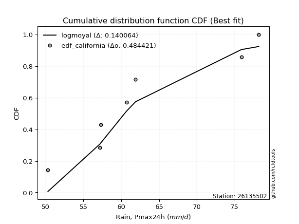</img>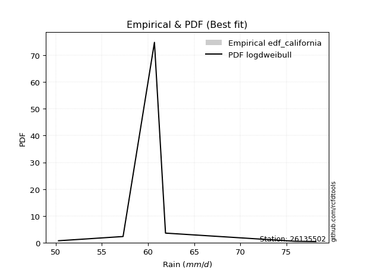</img>

</div>


### 2. Empirical - EDF Hazen (1930)

Hazen method for plotting positions is a formula used to estimate the empirical cumulative probability distribution of flood events or other hydrological data. This formula often results in biased estimations, particularly when extrapolating to extreme events (high return periods).

<div align="center">


$P=(m-0.5)/n$


</div>


**2.1. Empirical values**

<div align="center">

|                | 0                   | 1                   | 2                   | 3         | 4                  | 5                  | 6                  |
|:---------------|:--------------------|:--------------------|:--------------------|:----------|:-------------------|:-------------------|:-------------------|
| date           | 2017                | 2022                | 2021                | 2018      | 2023               | 2020               | 2019               |
| x              | 50.3                | 57.2                | 57.3                | 60.7      | 61.9               | 75.9               | 78.2               |
| m              | 1                   | 2                   | 3                   | 4         | 5                  | 6                  | 7                  |
| empirical_dist | edf_hazen           | edf_hazen           | edf_hazen           | edf_hazen | edf_hazen          | edf_hazen          | edf_hazen          |
| empirical      | 0.07142857142857142 | 0.21428571428571427 | 0.35714285714285715 | 0.5       | 0.6428571428571429 | 0.7857142857142857 | 0.9285714285714286 |
| empirical_tr   | 1.0769230769230769  | 1.2727272727272727  | 1.5555555555555558  | 2.0       | 2.8000000000000003 | 4.666666666666666  | 14.000000000000007 |

</div>


**2.2. Kolmogorov-Smirnov fit test (sorted by Δ)**


<div align="center">

|                | 0                   | 1                   | 2                   | 3                   | 4                   | 5                   | 6                   | 7                   | 8                   | 9                   | 10                  | 11                  | 12                  | 13                  | 14                  | 15                  | 16                  | 17                  | 18                  | 19                  | 20                  | 21                  | 22                  | 23                  | 24                  | 25                  | 26                  | 27                  | 28                  | 29                    | 30                  | 31                  | 32                  | 33                  | 34                  | 35                  | 36                  | 37                  | 38                  | 39                  | 40                  | 41                  | 42                  | 43                  | 44                  | 45                  | 46                  | 47                  | 48                  | 49                  | 50                  | 51                  | 52                  | 53                  | 54                  | 55                  | 56                  | 57                  | 58                  | 59                  | 60                  | 61                  | 62                  | 63                  | 64                  | 65                  | 66                  | 67                  | 68                  | 69                  | 70                  | 71                  | 72                  | 73                  | 74                  | 75                  | 76                  | 77                  | 78                  | 79                  | 80                  | 81                  | 82                  | 83                  | 84                  | 85                  | 86                  | 87                  | 88                  | 89                  |
|:---------------|:--------------------|:--------------------|:--------------------|:--------------------|:--------------------|:--------------------|:--------------------|:--------------------|:--------------------|:--------------------|:--------------------|:--------------------|:--------------------|:--------------------|:--------------------|:--------------------|:--------------------|:--------------------|:--------------------|:--------------------|:--------------------|:--------------------|:--------------------|:--------------------|:--------------------|:--------------------|:--------------------|:--------------------|:--------------------|:----------------------|:--------------------|:--------------------|:--------------------|:--------------------|:--------------------|:--------------------|:--------------------|:--------------------|:--------------------|:--------------------|:--------------------|:--------------------|:--------------------|:--------------------|:--------------------|:--------------------|:--------------------|:--------------------|:--------------------|:--------------------|:--------------------|:--------------------|:--------------------|:--------------------|:--------------------|:--------------------|:--------------------|:--------------------|:--------------------|:--------------------|:--------------------|:--------------------|:--------------------|:--------------------|:--------------------|:--------------------|:--------------------|:--------------------|:--------------------|:--------------------|:--------------------|:--------------------|:--------------------|:--------------------|:--------------------|:--------------------|:--------------------|:--------------------|:--------------------|:--------------------|:--------------------|:--------------------|:--------------------|:--------------------|:--------------------|:--------------------|:--------------------|:--------------------|:--------------------|:--------------------|
| station        | 26135502            | 26135502            | 26135502            | 26135502            | 26135502            | 26135502            | 26135502            | 26135502            | 26135502            | 26135502            | 26135502            | 26135502            | 26135502            | 26135502            | 26135502            | 26135502            | 26135502            | 26135502            | 26135502            | 26135502            | 26135502            | 26135502            | 26135502            | 26135502            | 26135502            | 26135502            | 26135502            | 26135502            | 26135502            | 26135502              | 26135502            | 26135502            | 26135502            | 26135502            | 26135502            | 26135502            | 26135502            | 26135502            | 26135502            | 26135502            | 26135502            | 26135502            | 26135502            | 26135502            | 26135502            | 26135502            | 26135502            | 26135502            | 26135502            | 26135502            | 26135502            | 26135502            | 26135502            | 26135502            | 26135502            | 26135502            | 26135502            | 26135502            | 26135502            | 26135502            | 26135502            | 26135502            | 26135502            | 26135502            | 26135502            | 26135502            | 26135502            | 26135502            | 26135502            | 26135502            | 26135502            | 26135502            | 26135502            | 26135502            | 26135502            | 26135502            | 26135502            | 26135502            | 26135502            | 26135502            | 26135502            | 26135502            | 26135502            | 26135502            | 26135502            | 26135502            | 26135502            | 26135502            | 26135502            | 26135502            |
| empirical_dist | edf_hazen           | edf_hazen           | edf_hazen           | edf_hazen           | edf_hazen           | edf_hazen           | edf_hazen           | edf_hazen           | edf_hazen           | edf_hazen           | edf_hazen           | edf_hazen           | edf_hazen           | edf_hazen           | edf_hazen           | edf_hazen           | edf_hazen           | edf_hazen           | edf_hazen           | edf_hazen           | edf_hazen           | edf_hazen           | edf_hazen           | edf_hazen           | edf_hazen           | edf_hazen           | edf_hazen           | edf_hazen           | edf_hazen           | edf_hazen             | edf_hazen           | edf_hazen           | edf_hazen           | edf_hazen           | edf_hazen           | edf_hazen           | edf_hazen           | edf_hazen           | edf_hazen           | edf_hazen           | edf_hazen           | edf_hazen           | edf_hazen           | edf_hazen           | edf_hazen           | edf_hazen           | edf_hazen           | edf_hazen           | edf_hazen           | edf_hazen           | edf_hazen           | edf_hazen           | edf_hazen           | edf_hazen           | edf_hazen           | edf_hazen           | edf_hazen           | edf_hazen           | edf_hazen           | edf_hazen           | edf_hazen           | edf_hazen           | edf_hazen           | edf_hazen           | edf_hazen           | edf_hazen           | edf_hazen           | edf_hazen           | edf_hazen           | edf_hazen           | edf_hazen           | edf_hazen           | edf_hazen           | edf_hazen           | edf_hazen           | edf_hazen           | edf_hazen           | edf_hazen           | edf_hazen           | edf_hazen           | edf_hazen           | edf_hazen           | edf_hazen           | edf_hazen           | edf_hazen           | edf_hazen           | edf_hazen           | edf_hazen           | edf_hazen           | edf_hazen           |
| p_dist         | logfisk             | mielke              | loggenlogistic      | loginvweibull       | logexponnorm        | exponnorm           | logmielke           | invgauss            | logfatiguelife      | logf                | loginvgauss         | logerlang           | loggamma            | loggamma            | invgamma            | loginvgamma         | laplace_asymmetric  | logkstwobign        | halfnorm            | alpha               | invweibull          | halflogistic        | logweibull_min      | loggumbel_r         | logmoyal            | lograyleigh         | genlogistic         | moyal               | loghalflogistic     | loglaplace_asymmetric | gumbel_r            | genexpon            | kstwobign           | loghalfnorm         | logrice             | logmaxwell          | logwald             | gompertz            | wald                | fisk                | f                   | logpearson3         | logbetaprime        | loggenexpon         | nct                 | rayleigh            | logalpha            | weibull_min         | ncf                 | lognct              | maxwell             | pearson3            | rice                | logcrystalball      | lognorm             | lognorm             | logt                | logjohnsonsu        | betaprime           | logloggamma         | loglogistic         | loggompertz         | loghypsecant        | loggibrat           | loglaplace          | t                   | crystalball         | norm                | johnsonsu           | logistic            | expon               | logtruncnorm        | hypsecant           | gibrat              | laplace             | lognakagami         | loggumbel_l         | logexpon            | logncf              | gumbel_l            | erlang              | nakagami            | logchi2             | loglognorm          | pareto              | logpareto           | gamma               | truncnorm           | chi2                | fatiguelife         |
| delta          | 0.10422794471070784 | 0.10510321127603225 | 0.10574879015502617 | 0.10578849483876832 | 0.10604209115382848 | 0.10698778092695915 | 0.10820433292044551 | 0.10840232299541186 | 0.10918436492187722 | 0.10939783850035259 | 0.10954960495639121 | 0.10964886037380886 | 0.10964932425694632 | 0.10964932425694632 | 0.1108971556454702  | 0.1118391671523784  | 0.11390955340491127 | 0.11398420328519734 | 0.11502119898425214 | 0.11530382787220561 | 0.11566420968132873 | 0.11633900455373081 | 0.1168748128891601  | 0.1177436185717079  | 0.11838958744341777 | 0.11871422068678716 | 0.11890715731057933 | 0.12021255995267832 | 0.12055726441447132 | 0.12303638611966694   | 0.12481287977624    | 0.12545411885815913 | 0.1258219096087353  | 0.12749695295447636 | 0.1275208748369483  | 0.13014860967794384 | 0.1304020313595895  | 0.1312634690887554  | 0.13174195759411167 | 0.13327309839339796 | 0.1338362886320483  | 0.14060858026240686 | 0.141223796138369   | 0.1424722062934123  | 0.14519416139193908 | 0.1457477599719803  | 0.14850962778474913 | 0.14967419500813542 | 0.15544380629157184 | 0.15555250025720846 | 0.15762995765063853 | 0.15827796132451022 | 0.16237085862751555 | 0.16391252536987766 | 0.16391404263673243 | 0.16391404263673243 | 0.16393729708290578 | 0.16397760783099097 | 0.1648648468338686  | 0.16595241450151993 | 0.1667838858896305  | 0.16681477602750658 | 0.16923009351714285 | 0.17712468573850726 | 0.17883668599627317 | 0.19191937458097363 | 0.19194170849836506 | 0.19194171763038526 | 0.1922609497444483  | 0.19855751714410425 | 0.20312245482704308 | 0.20413537075648572 | 0.20414926584336124 | 0.21986862888918113 | 0.2228942043263904  | 0.23134584375526399 | 0.23459429575716717 | 0.2353187980296141  | 0.2471784174076067  | 0.2620703186653995  | 0.316531360788044   | 0.3922671661377831  | 0.4002141387860253  | 0.42702904996819    | 0.44082633464415666 | 0.44451199632221916 | 0.4877118395261373  | 0.49997567235553964 | 0.5378178514573457  | 0.5812139672281741  |
| deltao         | 0.48442053926100004 | 0.48442053926100004 | 0.48442053926100004 | 0.48442053926100004 | 0.48442053926100004 | 0.48442053926100004 | 0.48442053926100004 | 0.48442053926100004 | 0.48442053926100004 | 0.48442053926100004 | 0.48442053926100004 | 0.48442053926100004 | 0.48442053926100004 | 0.48442053926100004 | 0.48442053926100004 | 0.48442053926100004 | 0.48442053926100004 | 0.48442053926100004 | 0.48442053926100004 | 0.48442053926100004 | 0.48442053926100004 | 0.48442053926100004 | 0.48442053926100004 | 0.48442053926100004 | 0.48442053926100004 | 0.48442053926100004 | 0.48442053926100004 | 0.48442053926100004 | 0.48442053926100004 | 0.48442053926100004   | 0.48442053926100004 | 0.48442053926100004 | 0.48442053926100004 | 0.48442053926100004 | 0.48442053926100004 | 0.48442053926100004 | 0.48442053926100004 | 0.48442053926100004 | 0.48442053926100004 | 0.48442053926100004 | 0.48442053926100004 | 0.48442053926100004 | 0.48442053926100004 | 0.48442053926100004 | 0.48442053926100004 | 0.48442053926100004 | 0.48442053926100004 | 0.48442053926100004 | 0.48442053926100004 | 0.48442053926100004 | 0.48442053926100004 | 0.48442053926100004 | 0.48442053926100004 | 0.48442053926100004 | 0.48442053926100004 | 0.48442053926100004 | 0.48442053926100004 | 0.48442053926100004 | 0.48442053926100004 | 0.48442053926100004 | 0.48442053926100004 | 0.48442053926100004 | 0.48442053926100004 | 0.48442053926100004 | 0.48442053926100004 | 0.48442053926100004 | 0.48442053926100004 | 0.48442053926100004 | 0.48442053926100004 | 0.48442053926100004 | 0.48442053926100004 | 0.48442053926100004 | 0.48442053926100004 | 0.48442053926100004 | 0.48442053926100004 | 0.48442053926100004 | 0.48442053926100004 | 0.48442053926100004 | 0.48442053926100004 | 0.48442053926100004 | 0.48442053926100004 | 0.48442053926100004 | 0.48442053926100004 | 0.48442053926100004 | 0.48442053926100004 | 0.48442053926100004 | 0.48442053926100004 | 0.48442053926100004 | 0.48442053926100004 | 0.48442053926100004 |
| eval           | Δo > Δ              | Δo > Δ              | Δo > Δ              | Δo > Δ              | Δo > Δ              | Δo > Δ              | Δo > Δ              | Δo > Δ              | Δo > Δ              | Δo > Δ              | Δo > Δ              | Δo > Δ              | Δo > Δ              | Δo > Δ              | Δo > Δ              | Δo > Δ              | Δo > Δ              | Δo > Δ              | Δo > Δ              | Δo > Δ              | Δo > Δ              | Δo > Δ              | Δo > Δ              | Δo > Δ              | Δo > Δ              | Δo > Δ              | Δo > Δ              | Δo > Δ              | Δo > Δ              | Δo > Δ                | Δo > Δ              | Δo > Δ              | Δo > Δ              | Δo > Δ              | Δo > Δ              | Δo > Δ              | Δo > Δ              | Δo > Δ              | Δo > Δ              | Δo > Δ              | Δo > Δ              | Δo > Δ              | Δo > Δ              | Δo > Δ              | Δo > Δ              | Δo > Δ              | Δo > Δ              | Δo > Δ              | Δo > Δ              | Δo > Δ              | Δo > Δ              | Δo > Δ              | Δo > Δ              | Δo > Δ              | Δo > Δ              | Δo > Δ              | Δo > Δ              | Δo > Δ              | Δo > Δ              | Δo > Δ              | Δo > Δ              | Δo > Δ              | Δo > Δ              | Δo > Δ              | Δo > Δ              | Δo > Δ              | Δo > Δ              | Δo > Δ              | Δo > Δ              | Δo > Δ              | Δo > Δ              | Δo > Δ              | Δo > Δ              | Δo > Δ              | Δo > Δ              | Δo > Δ              | Δo > Δ              | Δo > Δ              | Δo > Δ              | Δo > Δ              | Δo > Δ              | Δo > Δ              | Δo > Δ              | Δo > Δ              | Δo > Δ              | Δo > Δ              | Δo <= Δ             | Δo <= Δ             | Δo <= Δ             | Δo <= Δ             |
| fit            | 1                   | 1                   | 1                   | 1                   | 1                   | 1                   | 1                   | 1                   | 1                   | 1                   | 1                   | 1                   | 1                   | 1                   | 1                   | 1                   | 1                   | 1                   | 1                   | 1                   | 1                   | 1                   | 1                   | 1                   | 1                   | 1                   | 1                   | 1                   | 1                   | 1                     | 1                   | 1                   | 1                   | 1                   | 1                   | 1                   | 1                   | 1                   | 1                   | 1                   | 1                   | 1                   | 1                   | 1                   | 1                   | 1                   | 1                   | 1                   | 1                   | 1                   | 1                   | 1                   | 1                   | 1                   | 1                   | 1                   | 1                   | 1                   | 1                   | 1                   | 1                   | 1                   | 1                   | 1                   | 1                   | 1                   | 1                   | 1                   | 1                   | 1                   | 1                   | 1                   | 1                   | 1                   | 1                   | 1                   | 1                   | 1                   | 1                   | 1                   | 1                   | 1                   | 1                   | 1                   | 1                   | 1                   | 0                   | 0                   | 0                   | 0                   |
| n              | 7                   | 7                   | 7                   | 7                   | 7                   | 7                   | 7                   | 7                   | 7                   | 7                   | 7                   | 7                   | 7                   | 7                   | 7                   | 7                   | 7                   | 7                   | 7                   | 7                   | 7                   | 7                   | 7                   | 7                   | 7                   | 7                   | 7                   | 7                   | 7                   | 7                     | 7                   | 7                   | 7                   | 7                   | 7                   | 7                   | 7                   | 7                   | 7                   | 7                   | 7                   | 7                   | 7                   | 7                   | 7                   | 7                   | 7                   | 7                   | 7                   | 7                   | 7                   | 7                   | 7                   | 7                   | 7                   | 7                   | 7                   | 7                   | 7                   | 7                   | 7                   | 7                   | 7                   | 7                   | 7                   | 7                   | 7                   | 7                   | 7                   | 7                   | 7                   | 7                   | 7                   | 7                   | 7                   | 7                   | 7                   | 7                   | 7                   | 7                   | 7                   | 7                   | 7                   | 7                   | 7                   | 7                   | 7                   | 7                   | 7                   | 7                   |
| best_fit       | 1                   | 0                   | 0                   | 0                   | 0                   | 0                   | 0                   | 0                   | 0                   | 0                   | 0                   | 0                   | 0                   | 0                   | 0                   | 0                   | 0                   | 0                   | 0                   | 0                   | 0                   | 0                   | 0                   | 0                   | 0                   | 0                   | 0                   | 0                   | 0                   | 0                     | 0                   | 0                   | 0                   | 0                   | 0                   | 0                   | 0                   | 0                   | 0                   | 0                   | 0                   | 0                   | 0                   | 0                   | 0                   | 0                   | 0                   | 0                   | 0                   | 0                   | 0                   | 0                   | 0                   | 0                   | 0                   | 0                   | 0                   | 0                   | 0                   | 0                   | 0                   | 0                   | 0                   | 0                   | 0                   | 0                   | 0                   | 0                   | 0                   | 0                   | 0                   | 0                   | 0                   | 0                   | 0                   | 0                   | 0                   | 0                   | 0                   | 0                   | 0                   | 0                   | 0                   | 0                   | 0                   | 0                   | 0                   | 0                   | 0                   | 0                   |
| best_fit_sort  | 1                   | 2                   | 3                   | 4                   | 5                   | 6                   | 7                   | 8                   | 9                   | 10                  | 11                  | 12                  | 13                  | 14                  | 15                  | 16                  | 17                  | 18                  | 19                  | 20                  | 21                  | 22                  | 23                  | 24                  | 25                  | 26                  | 27                  | 28                  | 29                  | 30                    | 31                  | 32                  | 33                  | 34                  | 35                  | 36                  | 37                  | 38                  | 39                  | 40                  | 41                  | 42                  | 43                  | 44                  | 45                  | 46                  | 47                  | 48                  | 49                  | 50                  | 51                  | 52                  | 53                  | 54                  | 55                  | 56                  | 57                  | 58                  | 59                  | 60                  | 61                  | 62                  | 63                  | 64                  | 65                  | 66                  | 67                  | 68                  | 69                  | 70                  | 71                  | 72                  | 73                  | 74                  | 75                  | 76                  | 77                  | 78                  | 79                  | 80                  | 81                  | 82                  | 83                  | 84                  | 85                  | 86                  | 87                  | 88                  | 89                  | 90                  |

</div>


<div align="center">

</img>

</div>


**2.3. Best fit**

<div align="center">

|   id |   station | empirical_dist   | p_dist   |    delta |   deltao | eval   |   fit |   n |   best_fit |   best_fit_sort |
|-----:|----------:|:-----------------|:---------|---------:|---------:|:-------|------:|----:|-----------:|----------------:|
|    0 |  26135502 | edf_hazen        | logfisk  | 0.104228 | 0.484421 | Δo > Δ |     1 |   7 |          1 |               1 |

</div>


<div align="center">

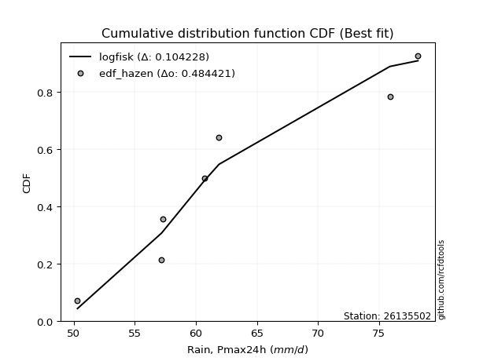</img>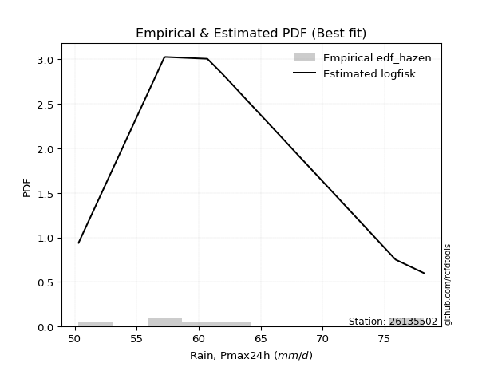</img>

</div>


### 3. Empirical - EDF Weibull (1939)

Weibull plotting position formula is an empirical method used to estimate the non-exceedance probability or plotting position for a set of observed data, is often recommended or widely used in practice, particularly in flood frequency analysis.

<div align="center">


$P=m/(n+1)$


</div>


**3.1. Empirical values**

<div align="center">

|                | 0                  | 1                  | 2           | 3           | 4                  | 5           | 6           |
|:---------------|:-------------------|:-------------------|:------------|:------------|:-------------------|:------------|:------------|
| date           | 2017               | 2022               | 2021        | 2018        | 2023               | 2020        | 2019        |
| x              | 50.3               | 57.2               | 57.3        | 60.7        | 61.9               | 75.9        | 78.2        |
| m              | 1                  | 2                  | 3           | 4           | 5                  | 6           | 7           |
| empirical_dist | edf_weibull        | edf_weibull        | edf_weibull | edf_weibull | edf_weibull        | edf_weibull | edf_weibull |
| empirical      | 0.125              | 0.25               | 0.375       | 0.5         | 0.625              | 0.75        | 0.875       |
| empirical_tr   | 1.1428571428571428 | 1.3333333333333333 | 1.6         | 2.0         | 2.6666666666666665 | 4.0         | 8.0         |

</div>


**3.2. Kolmogorov-Smirnov fit test (sorted by Δ)**


<div align="center">

|                | 0                   | 1                   | 2                   | 3                   | 4                   | 5                   | 6                   | 7                   | 8                   | 9                   | 10                  | 11                  | 12                  | 13                  | 14                  | 15                  | 16                  | 17                  | 18                  | 19                  | 20                  | 21                  | 22                  | 23                  | 24                  | 25                  | 26                  | 27                  | 28                  | 29                  | 30                  | 31                  | 32                  | 33                  | 34                  | 35                  | 36                  | 37                  | 38                  | 39                  | 40                  | 41                  | 42                  | 43                  | 44                    | 45                  | 46                  | 47                  | 48                  | 49                  | 50                  | 51                  | 52                  | 53                  | 54                  | 55                  | 56                  | 57                  | 58                  | 59                  | 60                  | 61                  | 62                  | 63                  | 64                  | 65                  | 66                  | 67                  | 68                  | 69                  | 70                  | 71                  | 72                  | 73                  | 74                  | 75                  | 76                  | 77                  | 78                  | 79                  | 80                  | 81                  | 82                  | 83                  | 84                  | 85                  | 86                  | 87                  | 88                  | 89                  |
|:---------------|:--------------------|:--------------------|:--------------------|:--------------------|:--------------------|:--------------------|:--------------------|:--------------------|:--------------------|:--------------------|:--------------------|:--------------------|:--------------------|:--------------------|:--------------------|:--------------------|:--------------------|:--------------------|:--------------------|:--------------------|:--------------------|:--------------------|:--------------------|:--------------------|:--------------------|:--------------------|:--------------------|:--------------------|:--------------------|:--------------------|:--------------------|:--------------------|:--------------------|:--------------------|:--------------------|:--------------------|:--------------------|:--------------------|:--------------------|:--------------------|:--------------------|:--------------------|:--------------------|:--------------------|:----------------------|:--------------------|:--------------------|:--------------------|:--------------------|:--------------------|:--------------------|:--------------------|:--------------------|:--------------------|:--------------------|:--------------------|:--------------------|:--------------------|:--------------------|:--------------------|:--------------------|:--------------------|:--------------------|:--------------------|:--------------------|:--------------------|:--------------------|:--------------------|:--------------------|:--------------------|:--------------------|:--------------------|:--------------------|:--------------------|:--------------------|:--------------------|:--------------------|:--------------------|:--------------------|:--------------------|:--------------------|:--------------------|:--------------------|:--------------------|:--------------------|:--------------------|:--------------------|:--------------------|:--------------------|:--------------------|
| station        | 26135502            | 26135502            | 26135502            | 26135502            | 26135502            | 26135502            | 26135502            | 26135502            | 26135502            | 26135502            | 26135502            | 26135502            | 26135502            | 26135502            | 26135502            | 26135502            | 26135502            | 26135502            | 26135502            | 26135502            | 26135502            | 26135502            | 26135502            | 26135502            | 26135502            | 26135502            | 26135502            | 26135502            | 26135502            | 26135502            | 26135502            | 26135502            | 26135502            | 26135502            | 26135502            | 26135502            | 26135502            | 26135502            | 26135502            | 26135502            | 26135502            | 26135502            | 26135502            | 26135502            | 26135502              | 26135502            | 26135502            | 26135502            | 26135502            | 26135502            | 26135502            | 26135502            | 26135502            | 26135502            | 26135502            | 26135502            | 26135502            | 26135502            | 26135502            | 26135502            | 26135502            | 26135502            | 26135502            | 26135502            | 26135502            | 26135502            | 26135502            | 26135502            | 26135502            | 26135502            | 26135502            | 26135502            | 26135502            | 26135502            | 26135502            | 26135502            | 26135502            | 26135502            | 26135502            | 26135502            | 26135502            | 26135502            | 26135502            | 26135502            | 26135502            | 26135502            | 26135502            | 26135502            | 26135502            | 26135502            |
| empirical_dist | edf_weibull         | edf_weibull         | edf_weibull         | edf_weibull         | edf_weibull         | edf_weibull         | edf_weibull         | edf_weibull         | edf_weibull         | edf_weibull         | edf_weibull         | edf_weibull         | edf_weibull         | edf_weibull         | edf_weibull         | edf_weibull         | edf_weibull         | edf_weibull         | edf_weibull         | edf_weibull         | edf_weibull         | edf_weibull         | edf_weibull         | edf_weibull         | edf_weibull         | edf_weibull         | edf_weibull         | edf_weibull         | edf_weibull         | edf_weibull         | edf_weibull         | edf_weibull         | edf_weibull         | edf_weibull         | edf_weibull         | edf_weibull         | edf_weibull         | edf_weibull         | edf_weibull         | edf_weibull         | edf_weibull         | edf_weibull         | edf_weibull         | edf_weibull         | edf_weibull           | edf_weibull         | edf_weibull         | edf_weibull         | edf_weibull         | edf_weibull         | edf_weibull         | edf_weibull         | edf_weibull         | edf_weibull         | edf_weibull         | edf_weibull         | edf_weibull         | edf_weibull         | edf_weibull         | edf_weibull         | edf_weibull         | edf_weibull         | edf_weibull         | edf_weibull         | edf_weibull         | edf_weibull         | edf_weibull         | edf_weibull         | edf_weibull         | edf_weibull         | edf_weibull         | edf_weibull         | edf_weibull         | edf_weibull         | edf_weibull         | edf_weibull         | edf_weibull         | edf_weibull         | edf_weibull         | edf_weibull         | edf_weibull         | edf_weibull         | edf_weibull         | edf_weibull         | edf_weibull         | edf_weibull         | edf_weibull         | edf_weibull         | edf_weibull         | edf_weibull         |
| p_dist         | mielke              | weibull_min         | loggenexpon         | lognct              | loggompertz         | genexpon            | logfisk             | loggenlogistic      | logf                | loghalfnorm         | logerlang           | loggamma            | loggamma            | logweibull_min      | loginvweibull       | logexponnorm        | logkstwobign        | exponnorm           | halfnorm            | logmielke           | invgauss            | logfatiguelife      | loginvgauss         | lograyleigh         | gompertz            | invgamma            | loginvgamma         | rayleigh            | logmaxwell          | logrice             | alpha               | logbetaprime        | laplace_asymmetric  | loghalflogistic     | f                   | maxwell             | invweibull          | halflogistic        | logpearson3         | loggumbel_r         | kstwobign           | pearson3            | logmoyal            | genlogistic         | loglaplace_asymmetric | gumbel_r            | rice                | moyal               | logloggamma         | nct                 | betaprime           | logalpha            | logt                | lognorm             | lognorm             | logcrystalball      | logjohnsonsu        | ncf                 | fisk                | logwald             | expon               | wald                | loglogistic         | loghypsecant        | t                   | crystalball         | norm                | loglaplace          | johnsonsu           | logistic            | hypsecant           | logncf              | loggibrat           | lognakagami         | logexpon            | laplace             | logtruncnorm        | loggumbel_l         | gibrat              | gumbel_l            | erlang              | logchi2             | nakagami            | loglognorm          | pareto              | logpareto           | gamma               | truncnorm           | chi2                | fatiguelife         |
| delta          | 0.08454552662170475 | 0.1321915092076703  | 0.13579617416095235 | 0.13769535740006555 | 0.1395539903554167  | 0.13955637752955952 | 0.13994223042499354 | 0.14060077567586626 | 0.14071800668621748 | 0.14079929560147408 | 0.1409527762671421  | 0.1409530745600116  | 0.1409530745600116  | 0.14108809210331585 | 0.14112954193271932 | 0.14130349329277658 | 0.14213098825610915 | 0.14270206664124485 | 0.14307604211288705 | 0.1439186186347312  | 0.14411660870969756 | 0.14489865063616292 | 0.1452638906706769  | 0.1458450855970972  | 0.1461752335184503  | 0.1466114413597559  | 0.1475534528666641  | 0.14834118183112    | 0.1485675568631113  | 0.14905017538490106 | 0.1492349635339848  | 0.1494968437769234  | 0.14962383911919697 | 0.15014870759452104 | 0.15031358187082255 | 0.15113104334892402 | 0.15137849539561443 | 0.1520532902680165  | 0.15305338336374397 | 0.1534579042859936  | 0.1535722768076233  | 0.15382691463889808 | 0.15410387315770346 | 0.1541764778666299  | 0.15422229492187467   | 0.15548006229299705 | 0.1555029011725747  | 0.15592684566696402 | 0.15610051041625683 | 0.15641555077798064 | 0.1568275871837116  | 0.1580064858769048  | 0.1588003081855014  | 0.1588093152958897  | 0.1588093152958897  | 0.15881056672298133 | 0.15955520602339535 | 0.16323596421769215 | 0.16511448803568518 | 0.1661163170738752  | 0.16740816911275735 | 0.16745624330839737 | 0.16823666671990234 | 0.17201154656843476 | 0.17406223172383073 | 0.17408456564122216 | 0.17408457477324235 | 0.17414581092683445 | 0.1744038068873054  | 0.18070037428696134 | 0.18629212298621833 | 0.1936069888361781  | 0.1949818285956501  | 0.19563155804097826 | 0.1996045123153284  | 0.2050370614692475  | 0.21339473868726033 | 0.21673715290002427 | 0.23772577174632398 | 0.24421317580825658 | 0.2808170750737583  | 0.3466427102145967  | 0.3565528804234974  | 0.3913147642539043  | 0.40511204892987096 | 0.40879771060793346 | 0.4519975538118516  | 0.49997567235553964 | 0.50210356574306    | 0.5454996815138884  |
| deltao         | 0.48442053926100004 | 0.48442053926100004 | 0.48442053926100004 | 0.48442053926100004 | 0.48442053926100004 | 0.48442053926100004 | 0.48442053926100004 | 0.48442053926100004 | 0.48442053926100004 | 0.48442053926100004 | 0.48442053926100004 | 0.48442053926100004 | 0.48442053926100004 | 0.48442053926100004 | 0.48442053926100004 | 0.48442053926100004 | 0.48442053926100004 | 0.48442053926100004 | 0.48442053926100004 | 0.48442053926100004 | 0.48442053926100004 | 0.48442053926100004 | 0.48442053926100004 | 0.48442053926100004 | 0.48442053926100004 | 0.48442053926100004 | 0.48442053926100004 | 0.48442053926100004 | 0.48442053926100004 | 0.48442053926100004 | 0.48442053926100004 | 0.48442053926100004 | 0.48442053926100004 | 0.48442053926100004 | 0.48442053926100004 | 0.48442053926100004 | 0.48442053926100004 | 0.48442053926100004 | 0.48442053926100004 | 0.48442053926100004 | 0.48442053926100004 | 0.48442053926100004 | 0.48442053926100004 | 0.48442053926100004 | 0.48442053926100004   | 0.48442053926100004 | 0.48442053926100004 | 0.48442053926100004 | 0.48442053926100004 | 0.48442053926100004 | 0.48442053926100004 | 0.48442053926100004 | 0.48442053926100004 | 0.48442053926100004 | 0.48442053926100004 | 0.48442053926100004 | 0.48442053926100004 | 0.48442053926100004 | 0.48442053926100004 | 0.48442053926100004 | 0.48442053926100004 | 0.48442053926100004 | 0.48442053926100004 | 0.48442053926100004 | 0.48442053926100004 | 0.48442053926100004 | 0.48442053926100004 | 0.48442053926100004 | 0.48442053926100004 | 0.48442053926100004 | 0.48442053926100004 | 0.48442053926100004 | 0.48442053926100004 | 0.48442053926100004 | 0.48442053926100004 | 0.48442053926100004 | 0.48442053926100004 | 0.48442053926100004 | 0.48442053926100004 | 0.48442053926100004 | 0.48442053926100004 | 0.48442053926100004 | 0.48442053926100004 | 0.48442053926100004 | 0.48442053926100004 | 0.48442053926100004 | 0.48442053926100004 | 0.48442053926100004 | 0.48442053926100004 | 0.48442053926100004 |
| eval           | Δo > Δ              | Δo > Δ              | Δo > Δ              | Δo > Δ              | Δo > Δ              | Δo > Δ              | Δo > Δ              | Δo > Δ              | Δo > Δ              | Δo > Δ              | Δo > Δ              | Δo > Δ              | Δo > Δ              | Δo > Δ              | Δo > Δ              | Δo > Δ              | Δo > Δ              | Δo > Δ              | Δo > Δ              | Δo > Δ              | Δo > Δ              | Δo > Δ              | Δo > Δ              | Δo > Δ              | Δo > Δ              | Δo > Δ              | Δo > Δ              | Δo > Δ              | Δo > Δ              | Δo > Δ              | Δo > Δ              | Δo > Δ              | Δo > Δ              | Δo > Δ              | Δo > Δ              | Δo > Δ              | Δo > Δ              | Δo > Δ              | Δo > Δ              | Δo > Δ              | Δo > Δ              | Δo > Δ              | Δo > Δ              | Δo > Δ              | Δo > Δ                | Δo > Δ              | Δo > Δ              | Δo > Δ              | Δo > Δ              | Δo > Δ              | Δo > Δ              | Δo > Δ              | Δo > Δ              | Δo > Δ              | Δo > Δ              | Δo > Δ              | Δo > Δ              | Δo > Δ              | Δo > Δ              | Δo > Δ              | Δo > Δ              | Δo > Δ              | Δo > Δ              | Δo > Δ              | Δo > Δ              | Δo > Δ              | Δo > Δ              | Δo > Δ              | Δo > Δ              | Δo > Δ              | Δo > Δ              | Δo > Δ              | Δo > Δ              | Δo > Δ              | Δo > Δ              | Δo > Δ              | Δo > Δ              | Δo > Δ              | Δo > Δ              | Δo > Δ              | Δo > Δ              | Δo > Δ              | Δo > Δ              | Δo > Δ              | Δo > Δ              | Δo > Δ              | Δo > Δ              | Δo <= Δ             | Δo <= Δ             | Δo <= Δ             |
| fit            | 1                   | 1                   | 1                   | 1                   | 1                   | 1                   | 1                   | 1                   | 1                   | 1                   | 1                   | 1                   | 1                   | 1                   | 1                   | 1                   | 1                   | 1                   | 1                   | 1                   | 1                   | 1                   | 1                   | 1                   | 1                   | 1                   | 1                   | 1                   | 1                   | 1                   | 1                   | 1                   | 1                   | 1                   | 1                   | 1                   | 1                   | 1                   | 1                   | 1                   | 1                   | 1                   | 1                   | 1                   | 1                     | 1                   | 1                   | 1                   | 1                   | 1                   | 1                   | 1                   | 1                   | 1                   | 1                   | 1                   | 1                   | 1                   | 1                   | 1                   | 1                   | 1                   | 1                   | 1                   | 1                   | 1                   | 1                   | 1                   | 1                   | 1                   | 1                   | 1                   | 1                   | 1                   | 1                   | 1                   | 1                   | 1                   | 1                   | 1                   | 1                   | 1                   | 1                   | 1                   | 1                   | 1                   | 1                   | 0                   | 0                   | 0                   |
| n              | 7                   | 7                   | 7                   | 7                   | 7                   | 7                   | 7                   | 7                   | 7                   | 7                   | 7                   | 7                   | 7                   | 7                   | 7                   | 7                   | 7                   | 7                   | 7                   | 7                   | 7                   | 7                   | 7                   | 7                   | 7                   | 7                   | 7                   | 7                   | 7                   | 7                   | 7                   | 7                   | 7                   | 7                   | 7                   | 7                   | 7                   | 7                   | 7                   | 7                   | 7                   | 7                   | 7                   | 7                   | 7                     | 7                   | 7                   | 7                   | 7                   | 7                   | 7                   | 7                   | 7                   | 7                   | 7                   | 7                   | 7                   | 7                   | 7                   | 7                   | 7                   | 7                   | 7                   | 7                   | 7                   | 7                   | 7                   | 7                   | 7                   | 7                   | 7                   | 7                   | 7                   | 7                   | 7                   | 7                   | 7                   | 7                   | 7                   | 7                   | 7                   | 7                   | 7                   | 7                   | 7                   | 7                   | 7                   | 7                   | 7                   | 7                   |
| best_fit       | 1                   | 0                   | 0                   | 0                   | 0                   | 0                   | 0                   | 0                   | 0                   | 0                   | 0                   | 0                   | 0                   | 0                   | 0                   | 0                   | 0                   | 0                   | 0                   | 0                   | 0                   | 0                   | 0                   | 0                   | 0                   | 0                   | 0                   | 0                   | 0                   | 0                   | 0                   | 0                   | 0                   | 0                   | 0                   | 0                   | 0                   | 0                   | 0                   | 0                   | 0                   | 0                   | 0                   | 0                   | 0                     | 0                   | 0                   | 0                   | 0                   | 0                   | 0                   | 0                   | 0                   | 0                   | 0                   | 0                   | 0                   | 0                   | 0                   | 0                   | 0                   | 0                   | 0                   | 0                   | 0                   | 0                   | 0                   | 0                   | 0                   | 0                   | 0                   | 0                   | 0                   | 0                   | 0                   | 0                   | 0                   | 0                   | 0                   | 0                   | 0                   | 0                   | 0                   | 0                   | 0                   | 0                   | 0                   | 0                   | 0                   | 0                   |
| best_fit_sort  | 1                   | 2                   | 3                   | 4                   | 5                   | 6                   | 7                   | 8                   | 9                   | 10                  | 11                  | 12                  | 13                  | 14                  | 15                  | 16                  | 17                  | 18                  | 19                  | 20                  | 21                  | 22                  | 23                  | 24                  | 25                  | 26                  | 27                  | 28                  | 29                  | 30                  | 31                  | 32                  | 33                  | 34                  | 35                  | 36                  | 37                  | 38                  | 39                  | 40                  | 41                  | 42                  | 43                  | 44                  | 45                    | 46                  | 47                  | 48                  | 49                  | 50                  | 51                  | 52                  | 53                  | 54                  | 55                  | 56                  | 57                  | 58                  | 59                  | 60                  | 61                  | 62                  | 63                  | 64                  | 65                  | 66                  | 67                  | 68                  | 69                  | 70                  | 71                  | 72                  | 73                  | 74                  | 75                  | 76                  | 77                  | 78                  | 79                  | 80                  | 81                  | 82                  | 83                  | 84                  | 85                  | 86                  | 87                  | 88                  | 89                  | 90                  |

</div>


<div align="center">

</img>

</div>


**3.3. Best fit**

<div align="center">

|   id |   station | empirical_dist   | p_dist   |     delta |   deltao | eval   |   fit |   n |   best_fit |   best_fit_sort |
|-----:|----------:|:-----------------|:---------|----------:|---------:|:-------|------:|----:|-----------:|----------------:|
|    0 |  26135502 | edf_weibull      | mielke   | 0.0845455 | 0.484421 | Δo > Δ |     1 |   7 |          1 |               1 |

</div>


<div align="center">

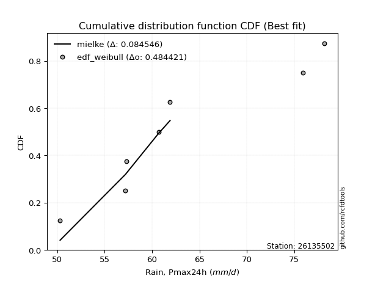</img></img>

</div>


### 4. Empirical - EDF Beard (1943)

The Beard formula (or Beard´s plotting position formula) in hydrology is used to estimate the empirical non-exceedance probability _(P)_ of a flood event (or other extreme hydrological data point) within a given dataset.

<div align="center">


$P=(m-0.31)/(n+0.38)$


</div>


**4.1. Empirical values**

<div align="center">

|                | 0                   | 1                   | 2                   | 3         | 4                  | 5                  | 6                  |
|:---------------|:--------------------|:--------------------|:--------------------|:----------|:-------------------|:-------------------|:-------------------|
| date           | 2017                | 2022                | 2021                | 2018      | 2023               | 2020               | 2019               |
| x              | 50.3                | 57.2                | 57.3                | 60.7      | 61.9               | 75.9               | 78.2               |
| m              | 1                   | 2                   | 3                   | 4         | 5                  | 6                  | 7                  |
| empirical_dist | edf_beard           | edf_beard           | edf_beard           | edf_beard | edf_beard          | edf_beard          | edf_beard          |
| empirical      | 0.09349593495934959 | 0.22899728997289973 | 0.36449864498644985 | 0.5       | 0.6355013550135502 | 0.7710027100271003 | 0.9065040650406505 |
| empirical_tr   | 1.1031390134529149  | 1.29701230228471    | 1.5735607675906182  | 2.0       | 2.743494423791822  | 4.366863905325444  | 10.695652173913055 |

</div>


**4.2. Kolmogorov-Smirnov fit test (sorted by Δ)**


<div align="center">

|                | 0                   | 1                   | 2                   | 3                   | 4                   | 5                   | 6                   | 7                   | 8                   | 9                   | 10                  | 11                  | 12                  | 13                  | 14                  | 15                  | 16                  | 17                  | 18                  | 19                  | 20                  | 21                  | 22                  | 23                  | 24                  | 25                  | 26                  | 27                  | 28                  | 29                  | 30                  | 31                  | 32                  | 33                  | 34                  | 35                  | 36                    | 37                  | 38                  | 39                  | 40                  | 41                  | 42                  | 43                  | 44                  | 45                  | 46                  | 47                  | 48                  | 49                  | 50                  | 51                  | 52                  | 53                  | 54                  | 55                  | 56                  | 57                  | 58                  | 59                  | 60                  | 61                  | 62                  | 63                  | 64                  | 65                  | 66                  | 67                  | 68                  | 69                  | 70                  | 71                  | 72                  | 73                  | 74                  | 75                  | 76                  | 77                  | 78                  | 79                  | 80                  | 81                  | 82                  | 83                  | 84                  | 85                  | 86                  | 87                  | 88                  | 89                  |
|:---------------|:--------------------|:--------------------|:--------------------|:--------------------|:--------------------|:--------------------|:--------------------|:--------------------|:--------------------|:--------------------|:--------------------|:--------------------|:--------------------|:--------------------|:--------------------|:--------------------|:--------------------|:--------------------|:--------------------|:--------------------|:--------------------|:--------------------|:--------------------|:--------------------|:--------------------|:--------------------|:--------------------|:--------------------|:--------------------|:--------------------|:--------------------|:--------------------|:--------------------|:--------------------|:--------------------|:--------------------|:----------------------|:--------------------|:--------------------|:--------------------|:--------------------|:--------------------|:--------------------|:--------------------|:--------------------|:--------------------|:--------------------|:--------------------|:--------------------|:--------------------|:--------------------|:--------------------|:--------------------|:--------------------|:--------------------|:--------------------|:--------------------|:--------------------|:--------------------|:--------------------|:--------------------|:--------------------|:--------------------|:--------------------|:--------------------|:--------------------|:--------------------|:--------------------|:--------------------|:--------------------|:--------------------|:--------------------|:--------------------|:--------------------|:--------------------|:--------------------|:--------------------|:--------------------|:--------------------|:--------------------|:--------------------|:--------------------|:--------------------|:--------------------|:--------------------|:--------------------|:--------------------|:--------------------|:--------------------|:--------------------|
| station        | 26135502            | 26135502            | 26135502            | 26135502            | 26135502            | 26135502            | 26135502            | 26135502            | 26135502            | 26135502            | 26135502            | 26135502            | 26135502            | 26135502            | 26135502            | 26135502            | 26135502            | 26135502            | 26135502            | 26135502            | 26135502            | 26135502            | 26135502            | 26135502            | 26135502            | 26135502            | 26135502            | 26135502            | 26135502            | 26135502            | 26135502            | 26135502            | 26135502            | 26135502            | 26135502            | 26135502            | 26135502              | 26135502            | 26135502            | 26135502            | 26135502            | 26135502            | 26135502            | 26135502            | 26135502            | 26135502            | 26135502            | 26135502            | 26135502            | 26135502            | 26135502            | 26135502            | 26135502            | 26135502            | 26135502            | 26135502            | 26135502            | 26135502            | 26135502            | 26135502            | 26135502            | 26135502            | 26135502            | 26135502            | 26135502            | 26135502            | 26135502            | 26135502            | 26135502            | 26135502            | 26135502            | 26135502            | 26135502            | 26135502            | 26135502            | 26135502            | 26135502            | 26135502            | 26135502            | 26135502            | 26135502            | 26135502            | 26135502            | 26135502            | 26135502            | 26135502            | 26135502            | 26135502            | 26135502            | 26135502            |
| empirical_dist | edf_beard           | edf_beard           | edf_beard           | edf_beard           | edf_beard           | edf_beard           | edf_beard           | edf_beard           | edf_beard           | edf_beard           | edf_beard           | edf_beard           | edf_beard           | edf_beard           | edf_beard           | edf_beard           | edf_beard           | edf_beard           | edf_beard           | edf_beard           | edf_beard           | edf_beard           | edf_beard           | edf_beard           | edf_beard           | edf_beard           | edf_beard           | edf_beard           | edf_beard           | edf_beard           | edf_beard           | edf_beard           | edf_beard           | edf_beard           | edf_beard           | edf_beard           | edf_beard             | edf_beard           | edf_beard           | edf_beard           | edf_beard           | edf_beard           | edf_beard           | edf_beard           | edf_beard           | edf_beard           | edf_beard           | edf_beard           | edf_beard           | edf_beard           | edf_beard           | edf_beard           | edf_beard           | edf_beard           | edf_beard           | edf_beard           | edf_beard           | edf_beard           | edf_beard           | edf_beard           | edf_beard           | edf_beard           | edf_beard           | edf_beard           | edf_beard           | edf_beard           | edf_beard           | edf_beard           | edf_beard           | edf_beard           | edf_beard           | edf_beard           | edf_beard           | edf_beard           | edf_beard           | edf_beard           | edf_beard           | edf_beard           | edf_beard           | edf_beard           | edf_beard           | edf_beard           | edf_beard           | edf_beard           | edf_beard           | edf_beard           | edf_beard           | edf_beard           | edf_beard           | edf_beard           |
| p_dist         | mielke              | genexpon            | logfisk             | loggenlogistic      | logf                | loghalfnorm         | logerlang           | loggamma            | loggamma            | logweibull_min      | loginvweibull       | logexponnorm        | logkstwobign        | exponnorm           | halfnorm            | logmielke           | invgauss            | logfatiguelife      | loginvgauss         | lograyleigh         | gompertz            | invgamma            | loginvgamma         | logmaxwell          | loggenexpon         | logrice             | alpha               | laplace_asymmetric  | loghalflogistic     | f                   | invweibull          | halflogistic        | loggumbel_r         | kstwobign           | logmoyal            | genlogistic         | loglaplace_asymmetric | logpearson3         | logbetaprime        | gumbel_r            | moyal               | weibull_min         | nct                 | rayleigh            | logalpha            | fisk                | logwald             | wald                | ncf                 | lognct              | maxwell             | pearson3            | loggompertz         | rice                | logcrystalball      | lognorm             | lognorm             | logt                | logjohnsonsu        | betaprime           | logloggamma         | loglogistic         | loghypsecant        | loglaplace          | loggibrat           | t                   | crystalball         | norm                | johnsonsu           | expon               | logistic            | logtruncnorm        | hypsecant           | laplace             | lognakagami         | logexpon            | logncf              | gibrat              | loggumbel_l         | gumbel_l            | erlang              | nakagami            | logchi2             | loglognorm          | pareto              | logpareto           | gamma               | truncnorm           | chi2                | fatiguelife         |
| delta          | 0.0903916355888468  | 0.11855366750245921 | 0.11893952039789324 | 0.11959806564876596 | 0.11971529665911718 | 0.11979658557437378 | 0.11995006624004179 | 0.1199503645329113  | 0.1199503645329113  | 0.12008538207621555 | 0.12012683190561901 | 0.12030078326567628 | 0.12112827822900885 | 0.12169935661414455 | 0.12207333208578675 | 0.12291590860763091 | 0.12311389868259726 | 0.12389594060906262 | 0.12426118064357661 | 0.12484237556999689 | 0.12517252349135    | 0.1256087313326556  | 0.1265507428395638  | 0.127564846836011   | 0.12776063060622686 | 0.12804746535780076 | 0.1282322535068845  | 0.12862112909209666 | 0.12914599756742073 | 0.12931087184372225 | 0.13037578536851413 | 0.1310505802409162  | 0.1324551942588933  | 0.132569566780523   | 0.13310116313060316 | 0.1331737678395296  | 0.13321958489477437   | 0.13325279241881416 | 0.1338680082947763  | 0.13447735226589674 | 0.13492413563986372 | 0.13496261932094997 | 0.13783837354834638 | 0.1383919721283876  | 0.14115383994115643 | 0.14411177800858488 | 0.1451136070467749  | 0.14645353328129707 | 0.14808801844797914 | 0.14819671241361576 | 0.15027416980704583 | 0.15092217348091752 | 0.15210320034032113 | 0.15501507078392285 | 0.15655673752628496 | 0.15655825479313973 | 0.15655825479313973 | 0.15658150923931308 | 0.15662181998739827 | 0.1575090589902759  | 0.15859662665792723 | 0.1594280980460378  | 0.16187430567355016 | 0.17148089815268047 | 0.18448047358209996 | 0.18456358673738094 | 0.18458592065477236 | 0.18458592978679256 | 0.1849051619008556  | 0.18841087913985763 | 0.19120172930051155 | 0.19239202866016003 | 0.19679347799976854 | 0.2155384164827977  | 0.21663426806807853 | 0.22060722234242866 | 0.22511105387682862 | 0.22722441673277383 | 0.22723850791357447 | 0.2547145308218068  | 0.3018197851008586  | 0.3775555904505977  | 0.3781467752552472  | 0.4123174742810046  | 0.42611475895697126 | 0.42980042063503376 | 0.4730002638389519  | 0.49997567235553964 | 0.5231062757701603  | 0.5665023915409887  |
| deltao         | 0.48442053926100004 | 0.48442053926100004 | 0.48442053926100004 | 0.48442053926100004 | 0.48442053926100004 | 0.48442053926100004 | 0.48442053926100004 | 0.48442053926100004 | 0.48442053926100004 | 0.48442053926100004 | 0.48442053926100004 | 0.48442053926100004 | 0.48442053926100004 | 0.48442053926100004 | 0.48442053926100004 | 0.48442053926100004 | 0.48442053926100004 | 0.48442053926100004 | 0.48442053926100004 | 0.48442053926100004 | 0.48442053926100004 | 0.48442053926100004 | 0.48442053926100004 | 0.48442053926100004 | 0.48442053926100004 | 0.48442053926100004 | 0.48442053926100004 | 0.48442053926100004 | 0.48442053926100004 | 0.48442053926100004 | 0.48442053926100004 | 0.48442053926100004 | 0.48442053926100004 | 0.48442053926100004 | 0.48442053926100004 | 0.48442053926100004 | 0.48442053926100004   | 0.48442053926100004 | 0.48442053926100004 | 0.48442053926100004 | 0.48442053926100004 | 0.48442053926100004 | 0.48442053926100004 | 0.48442053926100004 | 0.48442053926100004 | 0.48442053926100004 | 0.48442053926100004 | 0.48442053926100004 | 0.48442053926100004 | 0.48442053926100004 | 0.48442053926100004 | 0.48442053926100004 | 0.48442053926100004 | 0.48442053926100004 | 0.48442053926100004 | 0.48442053926100004 | 0.48442053926100004 | 0.48442053926100004 | 0.48442053926100004 | 0.48442053926100004 | 0.48442053926100004 | 0.48442053926100004 | 0.48442053926100004 | 0.48442053926100004 | 0.48442053926100004 | 0.48442053926100004 | 0.48442053926100004 | 0.48442053926100004 | 0.48442053926100004 | 0.48442053926100004 | 0.48442053926100004 | 0.48442053926100004 | 0.48442053926100004 | 0.48442053926100004 | 0.48442053926100004 | 0.48442053926100004 | 0.48442053926100004 | 0.48442053926100004 | 0.48442053926100004 | 0.48442053926100004 | 0.48442053926100004 | 0.48442053926100004 | 0.48442053926100004 | 0.48442053926100004 | 0.48442053926100004 | 0.48442053926100004 | 0.48442053926100004 | 0.48442053926100004 | 0.48442053926100004 | 0.48442053926100004 |
| eval           | Δo > Δ              | Δo > Δ              | Δo > Δ              | Δo > Δ              | Δo > Δ              | Δo > Δ              | Δo > Δ              | Δo > Δ              | Δo > Δ              | Δo > Δ              | Δo > Δ              | Δo > Δ              | Δo > Δ              | Δo > Δ              | Δo > Δ              | Δo > Δ              | Δo > Δ              | Δo > Δ              | Δo > Δ              | Δo > Δ              | Δo > Δ              | Δo > Δ              | Δo > Δ              | Δo > Δ              | Δo > Δ              | Δo > Δ              | Δo > Δ              | Δo > Δ              | Δo > Δ              | Δo > Δ              | Δo > Δ              | Δo > Δ              | Δo > Δ              | Δo > Δ              | Δo > Δ              | Δo > Δ              | Δo > Δ                | Δo > Δ              | Δo > Δ              | Δo > Δ              | Δo > Δ              | Δo > Δ              | Δo > Δ              | Δo > Δ              | Δo > Δ              | Δo > Δ              | Δo > Δ              | Δo > Δ              | Δo > Δ              | Δo > Δ              | Δo > Δ              | Δo > Δ              | Δo > Δ              | Δo > Δ              | Δo > Δ              | Δo > Δ              | Δo > Δ              | Δo > Δ              | Δo > Δ              | Δo > Δ              | Δo > Δ              | Δo > Δ              | Δo > Δ              | Δo > Δ              | Δo > Δ              | Δo > Δ              | Δo > Δ              | Δo > Δ              | Δo > Δ              | Δo > Δ              | Δo > Δ              | Δo > Δ              | Δo > Δ              | Δo > Δ              | Δo > Δ              | Δo > Δ              | Δo > Δ              | Δo > Δ              | Δo > Δ              | Δo > Δ              | Δo > Δ              | Δo > Δ              | Δo > Δ              | Δo > Δ              | Δo > Δ              | Δo > Δ              | Δo > Δ              | Δo <= Δ             | Δo <= Δ             | Δo <= Δ             |
| fit            | 1                   | 1                   | 1                   | 1                   | 1                   | 1                   | 1                   | 1                   | 1                   | 1                   | 1                   | 1                   | 1                   | 1                   | 1                   | 1                   | 1                   | 1                   | 1                   | 1                   | 1                   | 1                   | 1                   | 1                   | 1                   | 1                   | 1                   | 1                   | 1                   | 1                   | 1                   | 1                   | 1                   | 1                   | 1                   | 1                   | 1                     | 1                   | 1                   | 1                   | 1                   | 1                   | 1                   | 1                   | 1                   | 1                   | 1                   | 1                   | 1                   | 1                   | 1                   | 1                   | 1                   | 1                   | 1                   | 1                   | 1                   | 1                   | 1                   | 1                   | 1                   | 1                   | 1                   | 1                   | 1                   | 1                   | 1                   | 1                   | 1                   | 1                   | 1                   | 1                   | 1                   | 1                   | 1                   | 1                   | 1                   | 1                   | 1                   | 1                   | 1                   | 1                   | 1                   | 1                   | 1                   | 1                   | 1                   | 0                   | 0                   | 0                   |
| n              | 7                   | 7                   | 7                   | 7                   | 7                   | 7                   | 7                   | 7                   | 7                   | 7                   | 7                   | 7                   | 7                   | 7                   | 7                   | 7                   | 7                   | 7                   | 7                   | 7                   | 7                   | 7                   | 7                   | 7                   | 7                   | 7                   | 7                   | 7                   | 7                   | 7                   | 7                   | 7                   | 7                   | 7                   | 7                   | 7                   | 7                     | 7                   | 7                   | 7                   | 7                   | 7                   | 7                   | 7                   | 7                   | 7                   | 7                   | 7                   | 7                   | 7                   | 7                   | 7                   | 7                   | 7                   | 7                   | 7                   | 7                   | 7                   | 7                   | 7                   | 7                   | 7                   | 7                   | 7                   | 7                   | 7                   | 7                   | 7                   | 7                   | 7                   | 7                   | 7                   | 7                   | 7                   | 7                   | 7                   | 7                   | 7                   | 7                   | 7                   | 7                   | 7                   | 7                   | 7                   | 7                   | 7                   | 7                   | 7                   | 7                   | 7                   |
| best_fit       | 1                   | 0                   | 0                   | 0                   | 0                   | 0                   | 0                   | 0                   | 0                   | 0                   | 0                   | 0                   | 0                   | 0                   | 0                   | 0                   | 0                   | 0                   | 0                   | 0                   | 0                   | 0                   | 0                   | 0                   | 0                   | 0                   | 0                   | 0                   | 0                   | 0                   | 0                   | 0                   | 0                   | 0                   | 0                   | 0                   | 0                     | 0                   | 0                   | 0                   | 0                   | 0                   | 0                   | 0                   | 0                   | 0                   | 0                   | 0                   | 0                   | 0                   | 0                   | 0                   | 0                   | 0                   | 0                   | 0                   | 0                   | 0                   | 0                   | 0                   | 0                   | 0                   | 0                   | 0                   | 0                   | 0                   | 0                   | 0                   | 0                   | 0                   | 0                   | 0                   | 0                   | 0                   | 0                   | 0                   | 0                   | 0                   | 0                   | 0                   | 0                   | 0                   | 0                   | 0                   | 0                   | 0                   | 0                   | 0                   | 0                   | 0                   |
| best_fit_sort  | 1                   | 2                   | 3                   | 4                   | 5                   | 6                   | 7                   | 8                   | 9                   | 10                  | 11                  | 12                  | 13                  | 14                  | 15                  | 16                  | 17                  | 18                  | 19                  | 20                  | 21                  | 22                  | 23                  | 24                  | 25                  | 26                  | 27                  | 28                  | 29                  | 30                  | 31                  | 32                  | 33                  | 34                  | 35                  | 36                  | 37                    | 38                  | 39                  | 40                  | 41                  | 42                  | 43                  | 44                  | 45                  | 46                  | 47                  | 48                  | 49                  | 50                  | 51                  | 52                  | 53                  | 54                  | 55                  | 56                  | 57                  | 58                  | 59                  | 60                  | 61                  | 62                  | 63                  | 64                  | 65                  | 66                  | 67                  | 68                  | 69                  | 70                  | 71                  | 72                  | 73                  | 74                  | 75                  | 76                  | 77                  | 78                  | 79                  | 80                  | 81                  | 82                  | 83                  | 84                  | 85                  | 86                  | 87                  | 88                  | 89                  | 90                  |

</div>


<div align="center">

</img>

</div>


**4.3. Best fit**

<div align="center">

|   id |   station | empirical_dist   | p_dist   |     delta |   deltao | eval   |   fit |   n |   best_fit |   best_fit_sort |
|-----:|----------:|:-----------------|:---------|----------:|---------:|:-------|------:|----:|-----------:|----------------:|
|    0 |  26135502 | edf_beard        | mielke   | 0.0903916 | 0.484421 | Δo > Δ |     1 |   7 |          1 |               1 |

</div>


<div align="center">

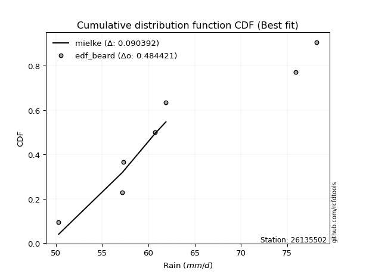</img></img>

</div>


### 5. Empirical - EDF Chegodayev (1955)

The Chegodayev formula is an empirical plotting position formula used in hydrological frequency analysis to estimate the exceedance probability or return period of a specific event from a set of observed data. It is primarily used for plotting observed data points on probability paper to fit a theoretical distribution, particularly for analyzing extreme events like maximum flood flows or rainfall intensities. The constant _b_ value in the generalized plotting position formula is 0.3.

<div align="center">


$P=(m-b)/(n+1-2b)$


</div>


**5.1. Empirical values**

<div align="center">

|                | 0                   | 1                   | 2                   | 3              | 4                  | 5                  | 6                  |
|:---------------|:--------------------|:--------------------|:--------------------|:---------------|:-------------------|:-------------------|:-------------------|
| date           | 2017                | 2022                | 2021                | 2018           | 2023               | 2020               | 2019               |
| x              | 50.3                | 57.2                | 57.3                | 60.7           | 61.9               | 75.9               | 78.2               |
| m              | 1                   | 2                   | 3                   | 4              | 5                  | 6                  | 7                  |
| empirical_dist | edf_chegodayev      | edf_chegodayev      | edf_chegodayev      | edf_chegodayev | edf_chegodayev     | edf_chegodayev     | edf_chegodayev     |
| empirical      | 0.09459459459459459 | 0.22972972972972971 | 0.36486486486486486 | 0.5            | 0.6351351351351351 | 0.7702702702702703 | 0.9054054054054054 |
| empirical_tr   | 1.1044776119402986  | 1.2982456140350878  | 1.574468085106383   | 2.0            | 2.7407407407407405 | 4.352941176470589  | 10.571428571428568 |

</div>


**5.2. Kolmogorov-Smirnov fit test (sorted by Δ)**


<div align="center">

|                | 0                   | 1                   | 2                   | 3                   | 4                   | 5                   | 6                   | 7                   | 8                   | 9                   | 10                  | 11                  | 12                  | 13                  | 14                  | 15                  | 16                  | 17                  | 18                  | 19                  | 20                  | 21                  | 22                  | 23                  | 24                  | 25                  | 26                  | 27                  | 28                  | 29                  | 30                  | 31                  | 32                  | 33                  | 34                  | 35                  | 36                  | 37                  | 38                    | 39                  | 40                  | 41                  | 42                  | 43                  | 44                  | 45                  | 46                  | 47                  | 48                  | 49                  | 50                  | 51                  | 52                  | 53                  | 54                  | 55                  | 56                  | 57                  | 58                  | 59                  | 60                  | 61                  | 62                  | 63                  | 64                  | 65                  | 66                  | 67                  | 68                  | 69                  | 70                  | 71                  | 72                  | 73                  | 74                  | 75                  | 76                  | 77                  | 78                  | 79                  | 80                  | 81                  | 82                  | 83                  | 84                  | 85                  | 86                  | 87                  | 88                  | 89                  |
|:---------------|:--------------------|:--------------------|:--------------------|:--------------------|:--------------------|:--------------------|:--------------------|:--------------------|:--------------------|:--------------------|:--------------------|:--------------------|:--------------------|:--------------------|:--------------------|:--------------------|:--------------------|:--------------------|:--------------------|:--------------------|:--------------------|:--------------------|:--------------------|:--------------------|:--------------------|:--------------------|:--------------------|:--------------------|:--------------------|:--------------------|:--------------------|:--------------------|:--------------------|:--------------------|:--------------------|:--------------------|:--------------------|:--------------------|:----------------------|:--------------------|:--------------------|:--------------------|:--------------------|:--------------------|:--------------------|:--------------------|:--------------------|:--------------------|:--------------------|:--------------------|:--------------------|:--------------------|:--------------------|:--------------------|:--------------------|:--------------------|:--------------------|:--------------------|:--------------------|:--------------------|:--------------------|:--------------------|:--------------------|:--------------------|:--------------------|:--------------------|:--------------------|:--------------------|:--------------------|:--------------------|:--------------------|:--------------------|:--------------------|:--------------------|:--------------------|:--------------------|:--------------------|:--------------------|:--------------------|:--------------------|:--------------------|:--------------------|:--------------------|:--------------------|:--------------------|:--------------------|:--------------------|:--------------------|:--------------------|:--------------------|
| station        | 26135502            | 26135502            | 26135502            | 26135502            | 26135502            | 26135502            | 26135502            | 26135502            | 26135502            | 26135502            | 26135502            | 26135502            | 26135502            | 26135502            | 26135502            | 26135502            | 26135502            | 26135502            | 26135502            | 26135502            | 26135502            | 26135502            | 26135502            | 26135502            | 26135502            | 26135502            | 26135502            | 26135502            | 26135502            | 26135502            | 26135502            | 26135502            | 26135502            | 26135502            | 26135502            | 26135502            | 26135502            | 26135502            | 26135502              | 26135502            | 26135502            | 26135502            | 26135502            | 26135502            | 26135502            | 26135502            | 26135502            | 26135502            | 26135502            | 26135502            | 26135502            | 26135502            | 26135502            | 26135502            | 26135502            | 26135502            | 26135502            | 26135502            | 26135502            | 26135502            | 26135502            | 26135502            | 26135502            | 26135502            | 26135502            | 26135502            | 26135502            | 26135502            | 26135502            | 26135502            | 26135502            | 26135502            | 26135502            | 26135502            | 26135502            | 26135502            | 26135502            | 26135502            | 26135502            | 26135502            | 26135502            | 26135502            | 26135502            | 26135502            | 26135502            | 26135502            | 26135502            | 26135502            | 26135502            | 26135502            |
| empirical_dist | edf_chegodayev      | edf_chegodayev      | edf_chegodayev      | edf_chegodayev      | edf_chegodayev      | edf_chegodayev      | edf_chegodayev      | edf_chegodayev      | edf_chegodayev      | edf_chegodayev      | edf_chegodayev      | edf_chegodayev      | edf_chegodayev      | edf_chegodayev      | edf_chegodayev      | edf_chegodayev      | edf_chegodayev      | edf_chegodayev      | edf_chegodayev      | edf_chegodayev      | edf_chegodayev      | edf_chegodayev      | edf_chegodayev      | edf_chegodayev      | edf_chegodayev      | edf_chegodayev      | edf_chegodayev      | edf_chegodayev      | edf_chegodayev      | edf_chegodayev      | edf_chegodayev      | edf_chegodayev      | edf_chegodayev      | edf_chegodayev      | edf_chegodayev      | edf_chegodayev      | edf_chegodayev      | edf_chegodayev      | edf_chegodayev        | edf_chegodayev      | edf_chegodayev      | edf_chegodayev      | edf_chegodayev      | edf_chegodayev      | edf_chegodayev      | edf_chegodayev      | edf_chegodayev      | edf_chegodayev      | edf_chegodayev      | edf_chegodayev      | edf_chegodayev      | edf_chegodayev      | edf_chegodayev      | edf_chegodayev      | edf_chegodayev      | edf_chegodayev      | edf_chegodayev      | edf_chegodayev      | edf_chegodayev      | edf_chegodayev      | edf_chegodayev      | edf_chegodayev      | edf_chegodayev      | edf_chegodayev      | edf_chegodayev      | edf_chegodayev      | edf_chegodayev      | edf_chegodayev      | edf_chegodayev      | edf_chegodayev      | edf_chegodayev      | edf_chegodayev      | edf_chegodayev      | edf_chegodayev      | edf_chegodayev      | edf_chegodayev      | edf_chegodayev      | edf_chegodayev      | edf_chegodayev      | edf_chegodayev      | edf_chegodayev      | edf_chegodayev      | edf_chegodayev      | edf_chegodayev      | edf_chegodayev      | edf_chegodayev      | edf_chegodayev      | edf_chegodayev      | edf_chegodayev      | edf_chegodayev      |
| p_dist         | mielke              | genexpon            | logfisk             | loggenlogistic      | logf                | loghalfnorm         | logerlang           | loggamma            | loggamma            | logweibull_min      | loginvweibull       | logexponnorm        | logkstwobign        | exponnorm           | halfnorm            | logmielke           | invgauss            | logfatiguelife      | loginvgauss         | lograyleigh         | gompertz            | invgamma            | loggenexpon         | loginvgamma         | logmaxwell          | logrice             | alpha               | laplace_asymmetric  | loghalflogistic     | f                   | invweibull          | halflogistic        | logpearson3         | loggumbel_r         | kstwobign           | logbetaprime        | logmoyal            | genlogistic         | loglaplace_asymmetric | weibull_min         | gumbel_r            | moyal               | nct                 | rayleigh            | logalpha            | fisk                | logwald             | wald                | ncf                 | lognct              | maxwell             | pearson3            | loggompertz         | rice                | logcrystalball      | lognorm             | lognorm             | logt                | logjohnsonsu        | betaprime           | logloggamma         | loglogistic         | loghypsecant        | loglaplace          | t                   | crystalball         | norm                | johnsonsu           | loggibrat           | expon               | logistic            | logtruncnorm        | hypsecant           | laplace             | lognakagami         | logexpon            | logncf              | loggumbel_l         | gibrat              | gumbel_l            | erlang              | nakagami            | logchi2             | loglognorm          | pareto              | logpareto           | gamma               | truncnorm           | chi2                | fatiguelife         |
| delta          | 0.08965919583201681 | 0.11928610725928923 | 0.11967196015472326 | 0.12033050540559598 | 0.12044773641594719 | 0.1205290253312038  | 0.1206825059968718  | 0.12068280428974132 | 0.12068280428974132 | 0.12081782183304557 | 0.12085927166244903 | 0.1210332230225063  | 0.12186071798583886 | 0.12243179637097457 | 0.12280577184261676 | 0.12364834836446092 | 0.12384633843942727 | 0.12462838036589263 | 0.12499362040040662 | 0.1255748153268269  | 0.12590496324818    | 0.12634117108948562 | 0.12702819084939687 | 0.12728318259639382 | 0.128297286592841   | 0.12877990511463078 | 0.1289646932637145  | 0.12935356884892668 | 0.12987843732425075 | 0.13004331160055227 | 0.13110822512534415 | 0.13178301999774622 | 0.13288657254039904 | 0.1331876340157233  | 0.13330200653735302 | 0.13350178841636118 | 0.13383360288743318 | 0.13390620759635963 | 0.13395202465160438   | 0.13423017956411998 | 0.13520979202272676 | 0.13565657539669373 | 0.13747215366993126 | 0.1380257522499725  | 0.14078762006274131 | 0.1448442177654149  | 0.1458460468036049  | 0.14718597303812708 | 0.14772179856956402 | 0.14783049253520064 | 0.1499079499286307  | 0.1505559536025024  | 0.15137076058349114 | 0.15464885090550773 | 0.15619051764786984 | 0.1561920349147246  | 0.1561920349147246  | 0.15621528936089796 | 0.15625560010898315 | 0.15714283911186078 | 0.1582304067795121  | 0.15906187816762268 | 0.16150808579513504 | 0.17111467827426535 | 0.18419736685896582 | 0.18421970077635724 | 0.18421970990837744 | 0.18453894202244048 | 0.18484669346051497 | 0.18767843938302764 | 0.19083550942209643 | 0.19312446841699005 | 0.19642725812135342 | 0.21517219660438258 | 0.21590182831124854 | 0.21987478258559867 | 0.22401239424158348 | 0.22687228803515935 | 0.22759063661118883 | 0.25434831094339166 | 0.3010873453440286  | 0.3768231506937677  | 0.37704811562000207 | 0.4115850345241746  | 0.42538231920014125 | 0.42906798087820375 | 0.47226782408212187 | 0.49997567235553964 | 0.5223738360133303  | 0.5657699517841587  |
| deltao         | 0.48442053926100004 | 0.48442053926100004 | 0.48442053926100004 | 0.48442053926100004 | 0.48442053926100004 | 0.48442053926100004 | 0.48442053926100004 | 0.48442053926100004 | 0.48442053926100004 | 0.48442053926100004 | 0.48442053926100004 | 0.48442053926100004 | 0.48442053926100004 | 0.48442053926100004 | 0.48442053926100004 | 0.48442053926100004 | 0.48442053926100004 | 0.48442053926100004 | 0.48442053926100004 | 0.48442053926100004 | 0.48442053926100004 | 0.48442053926100004 | 0.48442053926100004 | 0.48442053926100004 | 0.48442053926100004 | 0.48442053926100004 | 0.48442053926100004 | 0.48442053926100004 | 0.48442053926100004 | 0.48442053926100004 | 0.48442053926100004 | 0.48442053926100004 | 0.48442053926100004 | 0.48442053926100004 | 0.48442053926100004 | 0.48442053926100004 | 0.48442053926100004 | 0.48442053926100004 | 0.48442053926100004   | 0.48442053926100004 | 0.48442053926100004 | 0.48442053926100004 | 0.48442053926100004 | 0.48442053926100004 | 0.48442053926100004 | 0.48442053926100004 | 0.48442053926100004 | 0.48442053926100004 | 0.48442053926100004 | 0.48442053926100004 | 0.48442053926100004 | 0.48442053926100004 | 0.48442053926100004 | 0.48442053926100004 | 0.48442053926100004 | 0.48442053926100004 | 0.48442053926100004 | 0.48442053926100004 | 0.48442053926100004 | 0.48442053926100004 | 0.48442053926100004 | 0.48442053926100004 | 0.48442053926100004 | 0.48442053926100004 | 0.48442053926100004 | 0.48442053926100004 | 0.48442053926100004 | 0.48442053926100004 | 0.48442053926100004 | 0.48442053926100004 | 0.48442053926100004 | 0.48442053926100004 | 0.48442053926100004 | 0.48442053926100004 | 0.48442053926100004 | 0.48442053926100004 | 0.48442053926100004 | 0.48442053926100004 | 0.48442053926100004 | 0.48442053926100004 | 0.48442053926100004 | 0.48442053926100004 | 0.48442053926100004 | 0.48442053926100004 | 0.48442053926100004 | 0.48442053926100004 | 0.48442053926100004 | 0.48442053926100004 | 0.48442053926100004 | 0.48442053926100004 |
| eval           | Δo > Δ              | Δo > Δ              | Δo > Δ              | Δo > Δ              | Δo > Δ              | Δo > Δ              | Δo > Δ              | Δo > Δ              | Δo > Δ              | Δo > Δ              | Δo > Δ              | Δo > Δ              | Δo > Δ              | Δo > Δ              | Δo > Δ              | Δo > Δ              | Δo > Δ              | Δo > Δ              | Δo > Δ              | Δo > Δ              | Δo > Δ              | Δo > Δ              | Δo > Δ              | Δo > Δ              | Δo > Δ              | Δo > Δ              | Δo > Δ              | Δo > Δ              | Δo > Δ              | Δo > Δ              | Δo > Δ              | Δo > Δ              | Δo > Δ              | Δo > Δ              | Δo > Δ              | Δo > Δ              | Δo > Δ              | Δo > Δ              | Δo > Δ                | Δo > Δ              | Δo > Δ              | Δo > Δ              | Δo > Δ              | Δo > Δ              | Δo > Δ              | Δo > Δ              | Δo > Δ              | Δo > Δ              | Δo > Δ              | Δo > Δ              | Δo > Δ              | Δo > Δ              | Δo > Δ              | Δo > Δ              | Δo > Δ              | Δo > Δ              | Δo > Δ              | Δo > Δ              | Δo > Δ              | Δo > Δ              | Δo > Δ              | Δo > Δ              | Δo > Δ              | Δo > Δ              | Δo > Δ              | Δo > Δ              | Δo > Δ              | Δo > Δ              | Δo > Δ              | Δo > Δ              | Δo > Δ              | Δo > Δ              | Δo > Δ              | Δo > Δ              | Δo > Δ              | Δo > Δ              | Δo > Δ              | Δo > Δ              | Δo > Δ              | Δo > Δ              | Δo > Δ              | Δo > Δ              | Δo > Δ              | Δo > Δ              | Δo > Δ              | Δo > Δ              | Δo > Δ              | Δo <= Δ             | Δo <= Δ             | Δo <= Δ             |
| fit            | 1                   | 1                   | 1                   | 1                   | 1                   | 1                   | 1                   | 1                   | 1                   | 1                   | 1                   | 1                   | 1                   | 1                   | 1                   | 1                   | 1                   | 1                   | 1                   | 1                   | 1                   | 1                   | 1                   | 1                   | 1                   | 1                   | 1                   | 1                   | 1                   | 1                   | 1                   | 1                   | 1                   | 1                   | 1                   | 1                   | 1                   | 1                   | 1                     | 1                   | 1                   | 1                   | 1                   | 1                   | 1                   | 1                   | 1                   | 1                   | 1                   | 1                   | 1                   | 1                   | 1                   | 1                   | 1                   | 1                   | 1                   | 1                   | 1                   | 1                   | 1                   | 1                   | 1                   | 1                   | 1                   | 1                   | 1                   | 1                   | 1                   | 1                   | 1                   | 1                   | 1                   | 1                   | 1                   | 1                   | 1                   | 1                   | 1                   | 1                   | 1                   | 1                   | 1                   | 1                   | 1                   | 1                   | 1                   | 0                   | 0                   | 0                   |
| n              | 7                   | 7                   | 7                   | 7                   | 7                   | 7                   | 7                   | 7                   | 7                   | 7                   | 7                   | 7                   | 7                   | 7                   | 7                   | 7                   | 7                   | 7                   | 7                   | 7                   | 7                   | 7                   | 7                   | 7                   | 7                   | 7                   | 7                   | 7                   | 7                   | 7                   | 7                   | 7                   | 7                   | 7                   | 7                   | 7                   | 7                   | 7                   | 7                     | 7                   | 7                   | 7                   | 7                   | 7                   | 7                   | 7                   | 7                   | 7                   | 7                   | 7                   | 7                   | 7                   | 7                   | 7                   | 7                   | 7                   | 7                   | 7                   | 7                   | 7                   | 7                   | 7                   | 7                   | 7                   | 7                   | 7                   | 7                   | 7                   | 7                   | 7                   | 7                   | 7                   | 7                   | 7                   | 7                   | 7                   | 7                   | 7                   | 7                   | 7                   | 7                   | 7                   | 7                   | 7                   | 7                   | 7                   | 7                   | 7                   | 7                   | 7                   |
| best_fit       | 1                   | 0                   | 0                   | 0                   | 0                   | 0                   | 0                   | 0                   | 0                   | 0                   | 0                   | 0                   | 0                   | 0                   | 0                   | 0                   | 0                   | 0                   | 0                   | 0                   | 0                   | 0                   | 0                   | 0                   | 0                   | 0                   | 0                   | 0                   | 0                   | 0                   | 0                   | 0                   | 0                   | 0                   | 0                   | 0                   | 0                   | 0                   | 0                     | 0                   | 0                   | 0                   | 0                   | 0                   | 0                   | 0                   | 0                   | 0                   | 0                   | 0                   | 0                   | 0                   | 0                   | 0                   | 0                   | 0                   | 0                   | 0                   | 0                   | 0                   | 0                   | 0                   | 0                   | 0                   | 0                   | 0                   | 0                   | 0                   | 0                   | 0                   | 0                   | 0                   | 0                   | 0                   | 0                   | 0                   | 0                   | 0                   | 0                   | 0                   | 0                   | 0                   | 0                   | 0                   | 0                   | 0                   | 0                   | 0                   | 0                   | 0                   |
| best_fit_sort  | 1                   | 2                   | 3                   | 4                   | 5                   | 6                   | 7                   | 8                   | 9                   | 10                  | 11                  | 12                  | 13                  | 14                  | 15                  | 16                  | 17                  | 18                  | 19                  | 20                  | 21                  | 22                  | 23                  | 24                  | 25                  | 26                  | 27                  | 28                  | 29                  | 30                  | 31                  | 32                  | 33                  | 34                  | 35                  | 36                  | 37                  | 38                  | 39                    | 40                  | 41                  | 42                  | 43                  | 44                  | 45                  | 46                  | 47                  | 48                  | 49                  | 50                  | 51                  | 52                  | 53                  | 54                  | 55                  | 56                  | 57                  | 58                  | 59                  | 60                  | 61                  | 62                  | 63                  | 64                  | 65                  | 66                  | 67                  | 68                  | 69                  | 70                  | 71                  | 72                  | 73                  | 74                  | 75                  | 76                  | 77                  | 78                  | 79                  | 80                  | 81                  | 82                  | 83                  | 84                  | 85                  | 86                  | 87                  | 88                  | 89                  | 90                  |

</div>


<div align="center">

</img>

</div>


**5.3. Best fit**

<div align="center">

|   id |   station | empirical_dist   | p_dist   |     delta |   deltao | eval   |   fit |   n |   best_fit |   best_fit_sort |
|-----:|----------:|:-----------------|:---------|----------:|---------:|:-------|------:|----:|-----------:|----------------:|
|    0 |  26135502 | edf_chegodayev   | mielke   | 0.0896592 | 0.484421 | Δo > Δ |     1 |   7 |          1 |               1 |

</div>


<div align="center">

</img></img>

</div>


### 6. Empirical - EDF Blom (1958)

The Blom formula is a specific "plotting position" formula used in hydrology and statistical analysis to estimate the empirical cumulative probability (or non-exceedance probability) of a data series. It is particularly recommended for data that are approximately normally distributed. The constant _a_ is set to 0.375 (or 3/8).

<div align="center">


$P=(m-a)/(n+1-2a)$


</div>


**6.1. Empirical values**

<div align="center">

|                | 0                   | 1                   | 2                  | 3        | 4                  | 5                  | 6                  |
|:---------------|:--------------------|:--------------------|:-------------------|:---------|:-------------------|:-------------------|:-------------------|
| date           | 2017                | 2022                | 2021               | 2018     | 2023               | 2020               | 2019               |
| x              | 50.3                | 57.2                | 57.3               | 60.7     | 61.9               | 75.9               | 78.2               |
| m              | 1                   | 2                   | 3                  | 4        | 5                  | 6                  | 7                  |
| empirical_dist | edf_blom            | edf_blom            | edf_blom           | edf_blom | edf_blom           | edf_blom           | edf_blom           |
| empirical      | 0.08620689655172414 | 0.22413793103448276 | 0.3620689655172414 | 0.5      | 0.6379310344827587 | 0.7758620689655172 | 0.9137931034482759 |
| empirical_tr   | 1.0943396226415094  | 1.288888888888889   | 1.5675675675675675 | 2.0      | 2.7619047619047623 | 4.461538461538462  | 11.600000000000007 |

</div>


**6.2. Kolmogorov-Smirnov fit test (sorted by Δ)**


<div align="center">

|                | 0                   | 1                   | 2                   | 3                   | 4                   | 5                   | 6                   | 7                   | 8                   | 9                   | 10                  | 11                  | 12                  | 13                  | 14                  | 15                  | 16                  | 17                  | 18                  | 19                  | 20                  | 21                  | 22                  | 23                  | 24                  | 25                  | 26                  | 27                  | 28                  | 29                  | 30                  | 31                  | 32                  | 33                  | 34                  | 35                    | 36                  | 37                  | 38                  | 39                  | 40                  | 41                  | 42                  | 43                  | 44                  | 45                  | 46                  | 47                  | 48                  | 49                  | 50                  | 51                  | 52                  | 53                  | 54                  | 55                  | 56                  | 57                  | 58                  | 59                  | 60                  | 61                  | 62                  | 63                  | 64                  | 65                  | 66                  | 67                  | 68                  | 69                  | 70                  | 71                  | 72                  | 73                  | 74                  | 75                  | 76                  | 77                  | 78                  | 79                  | 80                  | 81                  | 82                  | 83                  | 84                  | 85                  | 86                  | 87                  | 88                  | 89                  |
|:---------------|:--------------------|:--------------------|:--------------------|:--------------------|:--------------------|:--------------------|:--------------------|:--------------------|:--------------------|:--------------------|:--------------------|:--------------------|:--------------------|:--------------------|:--------------------|:--------------------|:--------------------|:--------------------|:--------------------|:--------------------|:--------------------|:--------------------|:--------------------|:--------------------|:--------------------|:--------------------|:--------------------|:--------------------|:--------------------|:--------------------|:--------------------|:--------------------|:--------------------|:--------------------|:--------------------|:----------------------|:--------------------|:--------------------|:--------------------|:--------------------|:--------------------|:--------------------|:--------------------|:--------------------|:--------------------|:--------------------|:--------------------|:--------------------|:--------------------|:--------------------|:--------------------|:--------------------|:--------------------|:--------------------|:--------------------|:--------------------|:--------------------|:--------------------|:--------------------|:--------------------|:--------------------|:--------------------|:--------------------|:--------------------|:--------------------|:--------------------|:--------------------|:--------------------|:--------------------|:--------------------|:--------------------|:--------------------|:--------------------|:--------------------|:--------------------|:--------------------|:--------------------|:--------------------|:--------------------|:--------------------|:--------------------|:--------------------|:--------------------|:--------------------|:--------------------|:--------------------|:--------------------|:--------------------|:--------------------|:--------------------|
| station        | 26135502            | 26135502            | 26135502            | 26135502            | 26135502            | 26135502            | 26135502            | 26135502            | 26135502            | 26135502            | 26135502            | 26135502            | 26135502            | 26135502            | 26135502            | 26135502            | 26135502            | 26135502            | 26135502            | 26135502            | 26135502            | 26135502            | 26135502            | 26135502            | 26135502            | 26135502            | 26135502            | 26135502            | 26135502            | 26135502            | 26135502            | 26135502            | 26135502            | 26135502            | 26135502            | 26135502              | 26135502            | 26135502            | 26135502            | 26135502            | 26135502            | 26135502            | 26135502            | 26135502            | 26135502            | 26135502            | 26135502            | 26135502            | 26135502            | 26135502            | 26135502            | 26135502            | 26135502            | 26135502            | 26135502            | 26135502            | 26135502            | 26135502            | 26135502            | 26135502            | 26135502            | 26135502            | 26135502            | 26135502            | 26135502            | 26135502            | 26135502            | 26135502            | 26135502            | 26135502            | 26135502            | 26135502            | 26135502            | 26135502            | 26135502            | 26135502            | 26135502            | 26135502            | 26135502            | 26135502            | 26135502            | 26135502            | 26135502            | 26135502            | 26135502            | 26135502            | 26135502            | 26135502            | 26135502            | 26135502            |
| empirical_dist | edf_blom            | edf_blom            | edf_blom            | edf_blom            | edf_blom            | edf_blom            | edf_blom            | edf_blom            | edf_blom            | edf_blom            | edf_blom            | edf_blom            | edf_blom            | edf_blom            | edf_blom            | edf_blom            | edf_blom            | edf_blom            | edf_blom            | edf_blom            | edf_blom            | edf_blom            | edf_blom            | edf_blom            | edf_blom            | edf_blom            | edf_blom            | edf_blom            | edf_blom            | edf_blom            | edf_blom            | edf_blom            | edf_blom            | edf_blom            | edf_blom            | edf_blom              | edf_blom            | edf_blom            | edf_blom            | edf_blom            | edf_blom            | edf_blom            | edf_blom            | edf_blom            | edf_blom            | edf_blom            | edf_blom            | edf_blom            | edf_blom            | edf_blom            | edf_blom            | edf_blom            | edf_blom            | edf_blom            | edf_blom            | edf_blom            | edf_blom            | edf_blom            | edf_blom            | edf_blom            | edf_blom            | edf_blom            | edf_blom            | edf_blom            | edf_blom            | edf_blom            | edf_blom            | edf_blom            | edf_blom            | edf_blom            | edf_blom            | edf_blom            | edf_blom            | edf_blom            | edf_blom            | edf_blom            | edf_blom            | edf_blom            | edf_blom            | edf_blom            | edf_blom            | edf_blom            | edf_blom            | edf_blom            | edf_blom            | edf_blom            | edf_blom            | edf_blom            | edf_blom            | edf_blom            |
| p_dist         | mielke              | logfisk             | loggenlogistic      | logf                | logerlang           | loggamma            | loggamma            | logweibull_min      | loginvweibull       | logexponnorm        | genexpon            | logkstwobign        | exponnorm           | halfnorm            | loghalfnorm         | logmielke           | invgauss            | logfatiguelife      | loginvgauss         | lograyleigh         | invgamma            | loginvgamma         | logrice             | alpha               | laplace_asymmetric  | loghalflogistic     | f                   | logmaxwell          | invweibull          | halflogistic        | gompertz            | loggumbel_r         | kstwobign           | logmoyal            | genlogistic         | loglaplace_asymmetric | gumbel_r            | moyal               | loggenexpon         | logpearson3         | logbetaprime        | fisk                | weibull_min         | logwald             | nct                 | rayleigh            | wald                | logalpha            | ncf                 | lognct              | maxwell             | pearson3            | loggompertz         | rice                | logcrystalball      | lognorm             | lognorm             | logt                | logjohnsonsu        | betaprime           | logloggamma         | loglogistic         | loghypsecant        | loglaplace          | loggibrat           | t                   | crystalball         | norm                | johnsonsu           | expon               | logistic            | logtruncnorm        | hypsecant           | laplace             | lognakagami         | gibrat              | logexpon            | loggumbel_l         | logncf              | gumbel_l            | erlang              | nakagami            | logchi2             | loglognorm          | pareto              | logpareto           | gamma               | truncnorm           | chi2                | fatiguelife         |
| delta          | 0.09525099452726377 | 0.1140801614594763  | 0.11473870671034903 | 0.11485593772070024 | 0.11509070730162485 | 0.11509100559449437 | 0.11509100559449437 | 0.11522602313779862 | 0.11526747296720208 | 0.11544142432725935 | 0.11560190210939064 | 0.11626891929059191 | 0.11683999767572761 | 0.11721397314736981 | 0.11764473620570787 | 0.11805654966921397 | 0.11825453974418032 | 0.11903658167064568 | 0.11940182170515967 | 0.11998301663157995 | 0.12074937239423866 | 0.12169138390114687 | 0.12318810641938382 | 0.12337289456846756 | 0.12376177015367973 | 0.1242866386290038  | 0.12445151290530532 | 0.1252225013035596  | 0.1255164264300972  | 0.12619122130249927 | 0.12633736071437118 | 0.12759583532047636 | 0.12771020784210607 | 0.12824180419218623 | 0.12831440890111268 | 0.12836022595635743   | 0.1296179933274798  | 0.13006477670144678 | 0.13261998954464382 | 0.13568247188802263 | 0.13629768776398477 | 0.13925241907016794 | 0.13982197825936693 | 0.14025424810835796 | 0.14026805301755485 | 0.14082165159759608 | 0.14159417434288013 | 0.1435835194103649  | 0.1505176979171876  | 0.15062639188282423 | 0.1527038492762543  | 0.153351852950126   | 0.1569625592787381  | 0.15744475025313132 | 0.15898641699549343 | 0.1589879342623482  | 0.1589879342623482  | 0.15901118870852154 | 0.15905149945660674 | 0.15993873845948436 | 0.1610263061271357  | 0.16185777751524627 | 0.16430398514275862 | 0.17391057762188894 | 0.1820507941128915  | 0.1869932662065894  | 0.18701560012398083 | 0.18701560925600103 | 0.18733484137006406 | 0.1932702380782746  | 0.19363140876972001 | 0.19428315400771723 | 0.199223157468977   | 0.21796809595200617 | 0.2214936270064955  | 0.22479473726356536 | 0.22546658128084562 | 0.22966818738278294 | 0.23240009228445402 | 0.25714421029101525 | 0.30667914403927554 | 0.38241494938901466 | 0.3854358136628726  | 0.41717683321942156 | 0.4309741178953882  | 0.4346597795734507  | 0.4778596227773688  | 0.49997567235553964 | 0.5279656347085773  | 0.5713617504794056  |
| deltao         | 0.48442053926100004 | 0.48442053926100004 | 0.48442053926100004 | 0.48442053926100004 | 0.48442053926100004 | 0.48442053926100004 | 0.48442053926100004 | 0.48442053926100004 | 0.48442053926100004 | 0.48442053926100004 | 0.48442053926100004 | 0.48442053926100004 | 0.48442053926100004 | 0.48442053926100004 | 0.48442053926100004 | 0.48442053926100004 | 0.48442053926100004 | 0.48442053926100004 | 0.48442053926100004 | 0.48442053926100004 | 0.48442053926100004 | 0.48442053926100004 | 0.48442053926100004 | 0.48442053926100004 | 0.48442053926100004 | 0.48442053926100004 | 0.48442053926100004 | 0.48442053926100004 | 0.48442053926100004 | 0.48442053926100004 | 0.48442053926100004 | 0.48442053926100004 | 0.48442053926100004 | 0.48442053926100004 | 0.48442053926100004 | 0.48442053926100004   | 0.48442053926100004 | 0.48442053926100004 | 0.48442053926100004 | 0.48442053926100004 | 0.48442053926100004 | 0.48442053926100004 | 0.48442053926100004 | 0.48442053926100004 | 0.48442053926100004 | 0.48442053926100004 | 0.48442053926100004 | 0.48442053926100004 | 0.48442053926100004 | 0.48442053926100004 | 0.48442053926100004 | 0.48442053926100004 | 0.48442053926100004 | 0.48442053926100004 | 0.48442053926100004 | 0.48442053926100004 | 0.48442053926100004 | 0.48442053926100004 | 0.48442053926100004 | 0.48442053926100004 | 0.48442053926100004 | 0.48442053926100004 | 0.48442053926100004 | 0.48442053926100004 | 0.48442053926100004 | 0.48442053926100004 | 0.48442053926100004 | 0.48442053926100004 | 0.48442053926100004 | 0.48442053926100004 | 0.48442053926100004 | 0.48442053926100004 | 0.48442053926100004 | 0.48442053926100004 | 0.48442053926100004 | 0.48442053926100004 | 0.48442053926100004 | 0.48442053926100004 | 0.48442053926100004 | 0.48442053926100004 | 0.48442053926100004 | 0.48442053926100004 | 0.48442053926100004 | 0.48442053926100004 | 0.48442053926100004 | 0.48442053926100004 | 0.48442053926100004 | 0.48442053926100004 | 0.48442053926100004 | 0.48442053926100004 |
| eval           | Δo > Δ              | Δo > Δ              | Δo > Δ              | Δo > Δ              | Δo > Δ              | Δo > Δ              | Δo > Δ              | Δo > Δ              | Δo > Δ              | Δo > Δ              | Δo > Δ              | Δo > Δ              | Δo > Δ              | Δo > Δ              | Δo > Δ              | Δo > Δ              | Δo > Δ              | Δo > Δ              | Δo > Δ              | Δo > Δ              | Δo > Δ              | Δo > Δ              | Δo > Δ              | Δo > Δ              | Δo > Δ              | Δo > Δ              | Δo > Δ              | Δo > Δ              | Δo > Δ              | Δo > Δ              | Δo > Δ              | Δo > Δ              | Δo > Δ              | Δo > Δ              | Δo > Δ              | Δo > Δ                | Δo > Δ              | Δo > Δ              | Δo > Δ              | Δo > Δ              | Δo > Δ              | Δo > Δ              | Δo > Δ              | Δo > Δ              | Δo > Δ              | Δo > Δ              | Δo > Δ              | Δo > Δ              | Δo > Δ              | Δo > Δ              | Δo > Δ              | Δo > Δ              | Δo > Δ              | Δo > Δ              | Δo > Δ              | Δo > Δ              | Δo > Δ              | Δo > Δ              | Δo > Δ              | Δo > Δ              | Δo > Δ              | Δo > Δ              | Δo > Δ              | Δo > Δ              | Δo > Δ              | Δo > Δ              | Δo > Δ              | Δo > Δ              | Δo > Δ              | Δo > Δ              | Δo > Δ              | Δo > Δ              | Δo > Δ              | Δo > Δ              | Δo > Δ              | Δo > Δ              | Δo > Δ              | Δo > Δ              | Δo > Δ              | Δo > Δ              | Δo > Δ              | Δo > Δ              | Δo > Δ              | Δo > Δ              | Δo > Δ              | Δo > Δ              | Δo > Δ              | Δo <= Δ             | Δo <= Δ             | Δo <= Δ             |
| fit            | 1                   | 1                   | 1                   | 1                   | 1                   | 1                   | 1                   | 1                   | 1                   | 1                   | 1                   | 1                   | 1                   | 1                   | 1                   | 1                   | 1                   | 1                   | 1                   | 1                   | 1                   | 1                   | 1                   | 1                   | 1                   | 1                   | 1                   | 1                   | 1                   | 1                   | 1                   | 1                   | 1                   | 1                   | 1                   | 1                     | 1                   | 1                   | 1                   | 1                   | 1                   | 1                   | 1                   | 1                   | 1                   | 1                   | 1                   | 1                   | 1                   | 1                   | 1                   | 1                   | 1                   | 1                   | 1                   | 1                   | 1                   | 1                   | 1                   | 1                   | 1                   | 1                   | 1                   | 1                   | 1                   | 1                   | 1                   | 1                   | 1                   | 1                   | 1                   | 1                   | 1                   | 1                   | 1                   | 1                   | 1                   | 1                   | 1                   | 1                   | 1                   | 1                   | 1                   | 1                   | 1                   | 1                   | 1                   | 0                   | 0                   | 0                   |
| n              | 7                   | 7                   | 7                   | 7                   | 7                   | 7                   | 7                   | 7                   | 7                   | 7                   | 7                   | 7                   | 7                   | 7                   | 7                   | 7                   | 7                   | 7                   | 7                   | 7                   | 7                   | 7                   | 7                   | 7                   | 7                   | 7                   | 7                   | 7                   | 7                   | 7                   | 7                   | 7                   | 7                   | 7                   | 7                   | 7                     | 7                   | 7                   | 7                   | 7                   | 7                   | 7                   | 7                   | 7                   | 7                   | 7                   | 7                   | 7                   | 7                   | 7                   | 7                   | 7                   | 7                   | 7                   | 7                   | 7                   | 7                   | 7                   | 7                   | 7                   | 7                   | 7                   | 7                   | 7                   | 7                   | 7                   | 7                   | 7                   | 7                   | 7                   | 7                   | 7                   | 7                   | 7                   | 7                   | 7                   | 7                   | 7                   | 7                   | 7                   | 7                   | 7                   | 7                   | 7                   | 7                   | 7                   | 7                   | 7                   | 7                   | 7                   |
| best_fit       | 1                   | 0                   | 0                   | 0                   | 0                   | 0                   | 0                   | 0                   | 0                   | 0                   | 0                   | 0                   | 0                   | 0                   | 0                   | 0                   | 0                   | 0                   | 0                   | 0                   | 0                   | 0                   | 0                   | 0                   | 0                   | 0                   | 0                   | 0                   | 0                   | 0                   | 0                   | 0                   | 0                   | 0                   | 0                   | 0                     | 0                   | 0                   | 0                   | 0                   | 0                   | 0                   | 0                   | 0                   | 0                   | 0                   | 0                   | 0                   | 0                   | 0                   | 0                   | 0                   | 0                   | 0                   | 0                   | 0                   | 0                   | 0                   | 0                   | 0                   | 0                   | 0                   | 0                   | 0                   | 0                   | 0                   | 0                   | 0                   | 0                   | 0                   | 0                   | 0                   | 0                   | 0                   | 0                   | 0                   | 0                   | 0                   | 0                   | 0                   | 0                   | 0                   | 0                   | 0                   | 0                   | 0                   | 0                   | 0                   | 0                   | 0                   |
| best_fit_sort  | 1                   | 2                   | 3                   | 4                   | 5                   | 6                   | 7                   | 8                   | 9                   | 10                  | 11                  | 12                  | 13                  | 14                  | 15                  | 16                  | 17                  | 18                  | 19                  | 20                  | 21                  | 22                  | 23                  | 24                  | 25                  | 26                  | 27                  | 28                  | 29                  | 30                  | 31                  | 32                  | 33                  | 34                  | 35                  | 36                    | 37                  | 38                  | 39                  | 40                  | 41                  | 42                  | 43                  | 44                  | 45                  | 46                  | 47                  | 48                  | 49                  | 50                  | 51                  | 52                  | 53                  | 54                  | 55                  | 56                  | 57                  | 58                  | 59                  | 60                  | 61                  | 62                  | 63                  | 64                  | 65                  | 66                  | 67                  | 68                  | 69                  | 70                  | 71                  | 72                  | 73                  | 74                  | 75                  | 76                  | 77                  | 78                  | 79                  | 80                  | 81                  | 82                  | 83                  | 84                  | 85                  | 86                  | 87                  | 88                  | 89                  | 90                  |

</div>


<div align="center">

</img>

</div>


**6.3. Best fit**

<div align="center">

|   id |   station | empirical_dist   | p_dist   |    delta |   deltao | eval   |   fit |   n |   best_fit |   best_fit_sort |
|-----:|----------:|:-----------------|:---------|---------:|---------:|:-------|------:|----:|-----------:|----------------:|
|    0 |  26135502 | edf_blom         | mielke   | 0.095251 | 0.484421 | Δo > Δ |     1 |   7 |          1 |               1 |

</div>


<div align="center">

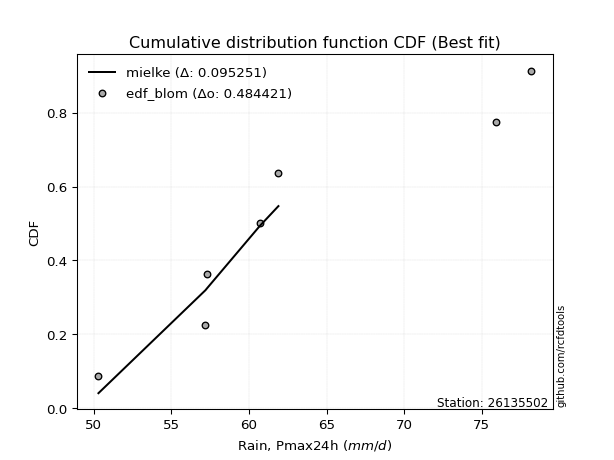</img></img>

</div>


### 7. Empirical - EDF Tukey (1962)

In hydrology, the Tukey formula is used as a plotting position formula to estimate the empirical probability or frequency of a flood event (or other hydrological data). The formula parameter is given as _c=0.333_ (or 1/3).

<div align="center">


$P=(m-c)/(n+1-2c)$


</div>


**7.1. Empirical values**

<div align="center">

|                | 0                   | 1                   | 2                   | 3         | 4                  | 5                  | 6                  |
|:---------------|:--------------------|:--------------------|:--------------------|:----------|:-------------------|:-------------------|:-------------------|
| date           | 2017                | 2022                | 2021                | 2018      | 2023               | 2020               | 2019               |
| x              | 50.3                | 57.2                | 57.3                | 60.7      | 61.9               | 75.9               | 78.2               |
| m              | 1                   | 2                   | 3                   | 4         | 5                  | 6                  | 7                  |
| empirical_dist | edf_tukey           | edf_tukey           | edf_tukey           | edf_tukey | edf_tukey          | edf_tukey          | edf_tukey          |
| empirical      | 0.09090909090909091 | 0.22727272727272727 | 0.36363636363636365 | 0.5       | 0.6363636363636364 | 0.7727272727272727 | 0.9090909090909091 |
| empirical_tr   | 1.1                 | 1.2941176470588236  | 1.5714285714285714  | 2.0       | 2.75               | 4.3999999999999995 | 10.999999999999996 |

</div>


**7.2. Kolmogorov-Smirnov fit test (sorted by Δ)**


<div align="center">

|                | 0                   | 1                   | 2                   | 3                   | 4                   | 5                   | 6                   | 7                   | 8                   | 9                   | 10                  | 11                  | 12                  | 13                  | 14                  | 15                  | 16                  | 17                  | 18                  | 19                  | 20                  | 21                  | 22                  | 23                  | 24                  | 25                  | 26                  | 27                  | 28                  | 29                  | 30                  | 31                  | 32                  | 33                  | 34                  | 35                  | 36                    | 37                  | 38                  | 39                  | 40                  | 41                  | 42                  | 43                  | 44                  | 45                  | 46                  | 47                  | 48                  | 49                  | 50                  | 51                  | 52                  | 53                  | 54                  | 55                  | 56                  | 57                  | 58                  | 59                  | 60                  | 61                  | 62                  | 63                  | 64                  | 65                  | 66                  | 67                  | 68                  | 69                  | 70                  | 71                  | 72                  | 73                  | 74                  | 75                  | 76                  | 77                  | 78                  | 79                  | 80                  | 81                  | 82                  | 83                  | 84                  | 85                  | 86                  | 87                  | 88                  | 89                  |
|:---------------|:--------------------|:--------------------|:--------------------|:--------------------|:--------------------|:--------------------|:--------------------|:--------------------|:--------------------|:--------------------|:--------------------|:--------------------|:--------------------|:--------------------|:--------------------|:--------------------|:--------------------|:--------------------|:--------------------|:--------------------|:--------------------|:--------------------|:--------------------|:--------------------|:--------------------|:--------------------|:--------------------|:--------------------|:--------------------|:--------------------|:--------------------|:--------------------|:--------------------|:--------------------|:--------------------|:--------------------|:----------------------|:--------------------|:--------------------|:--------------------|:--------------------|:--------------------|:--------------------|:--------------------|:--------------------|:--------------------|:--------------------|:--------------------|:--------------------|:--------------------|:--------------------|:--------------------|:--------------------|:--------------------|:--------------------|:--------------------|:--------------------|:--------------------|:--------------------|:--------------------|:--------------------|:--------------------|:--------------------|:--------------------|:--------------------|:--------------------|:--------------------|:--------------------|:--------------------|:--------------------|:--------------------|:--------------------|:--------------------|:--------------------|:--------------------|:--------------------|:--------------------|:--------------------|:--------------------|:--------------------|:--------------------|:--------------------|:--------------------|:--------------------|:--------------------|:--------------------|:--------------------|:--------------------|:--------------------|:--------------------|
| station        | 26135502            | 26135502            | 26135502            | 26135502            | 26135502            | 26135502            | 26135502            | 26135502            | 26135502            | 26135502            | 26135502            | 26135502            | 26135502            | 26135502            | 26135502            | 26135502            | 26135502            | 26135502            | 26135502            | 26135502            | 26135502            | 26135502            | 26135502            | 26135502            | 26135502            | 26135502            | 26135502            | 26135502            | 26135502            | 26135502            | 26135502            | 26135502            | 26135502            | 26135502            | 26135502            | 26135502            | 26135502              | 26135502            | 26135502            | 26135502            | 26135502            | 26135502            | 26135502            | 26135502            | 26135502            | 26135502            | 26135502            | 26135502            | 26135502            | 26135502            | 26135502            | 26135502            | 26135502            | 26135502            | 26135502            | 26135502            | 26135502            | 26135502            | 26135502            | 26135502            | 26135502            | 26135502            | 26135502            | 26135502            | 26135502            | 26135502            | 26135502            | 26135502            | 26135502            | 26135502            | 26135502            | 26135502            | 26135502            | 26135502            | 26135502            | 26135502            | 26135502            | 26135502            | 26135502            | 26135502            | 26135502            | 26135502            | 26135502            | 26135502            | 26135502            | 26135502            | 26135502            | 26135502            | 26135502            | 26135502            |
| empirical_dist | edf_tukey           | edf_tukey           | edf_tukey           | edf_tukey           | edf_tukey           | edf_tukey           | edf_tukey           | edf_tukey           | edf_tukey           | edf_tukey           | edf_tukey           | edf_tukey           | edf_tukey           | edf_tukey           | edf_tukey           | edf_tukey           | edf_tukey           | edf_tukey           | edf_tukey           | edf_tukey           | edf_tukey           | edf_tukey           | edf_tukey           | edf_tukey           | edf_tukey           | edf_tukey           | edf_tukey           | edf_tukey           | edf_tukey           | edf_tukey           | edf_tukey           | edf_tukey           | edf_tukey           | edf_tukey           | edf_tukey           | edf_tukey           | edf_tukey             | edf_tukey           | edf_tukey           | edf_tukey           | edf_tukey           | edf_tukey           | edf_tukey           | edf_tukey           | edf_tukey           | edf_tukey           | edf_tukey           | edf_tukey           | edf_tukey           | edf_tukey           | edf_tukey           | edf_tukey           | edf_tukey           | edf_tukey           | edf_tukey           | edf_tukey           | edf_tukey           | edf_tukey           | edf_tukey           | edf_tukey           | edf_tukey           | edf_tukey           | edf_tukey           | edf_tukey           | edf_tukey           | edf_tukey           | edf_tukey           | edf_tukey           | edf_tukey           | edf_tukey           | edf_tukey           | edf_tukey           | edf_tukey           | edf_tukey           | edf_tukey           | edf_tukey           | edf_tukey           | edf_tukey           | edf_tukey           | edf_tukey           | edf_tukey           | edf_tukey           | edf_tukey           | edf_tukey           | edf_tukey           | edf_tukey           | edf_tukey           | edf_tukey           | edf_tukey           | edf_tukey           |
| p_dist         | mielke              | genexpon            | logfisk             | loggenlogistic      | logf                | loghalfnorm         | logerlang           | loggamma            | loggamma            | logweibull_min      | loginvweibull       | logexponnorm        | logkstwobign        | exponnorm           | halfnorm            | logmielke           | invgauss            | logfatiguelife      | loginvgauss         | lograyleigh         | invgamma            | gompertz            | loginvgamma         | logmaxwell          | logrice             | alpha               | laplace_asymmetric  | loghalflogistic     | f                   | invweibull          | halflogistic        | loggenexpon         | loggumbel_r         | kstwobign           | logmoyal            | genlogistic         | loglaplace_asymmetric | gumbel_r            | moyal               | logpearson3         | logbetaprime        | weibull_min         | nct                 | rayleigh            | logalpha            | fisk                | logwald             | wald                | ncf                 | lognct              | maxwell             | pearson3            | loggompertz         | rice                | logcrystalball      | lognorm             | lognorm             | logt                | logjohnsonsu        | betaprime           | logloggamma         | loglogistic         | loghypsecant        | loglaplace          | loggibrat           | t                   | crystalball         | norm                | johnsonsu           | expon               | logtruncnorm        | logistic            | hypsecant           | laplace             | lognakagami         | logexpon            | gibrat              | logncf              | loggumbel_l         | gumbel_l            | erlang              | nakagami            | logchi2             | loglognorm          | pareto              | logpareto           | gamma               | truncnorm           | chi2                | fatiguelife         |
| delta          | 0.09211619828901926 | 0.11682910480228681 | 0.11721495769772083 | 0.11787350294859356 | 0.11799073395894477 | 0.11807202287420138 | 0.11822550353986938 | 0.1182258018327389  | 0.1182258018327389  | 0.11836081937604315 | 0.11840226920544661 | 0.11857622056550388 | 0.11940371552883644 | 0.11997479391397214 | 0.12034876938561434 | 0.1211913459074585  | 0.12138933598242485 | 0.12217137790889021 | 0.1225366179434042  | 0.12311781286982448 | 0.1238841686324832  | 0.12476996259524886 | 0.1248261801393914  | 0.1258402841358386  | 0.12632290265762836 | 0.1265076908067121  | 0.12689656639192426 | 0.12742143486724833 | 0.12758630914354985 | 0.12865122266834172 | 0.1293260175407438  | 0.12948519330639932 | 0.1307306315587209  | 0.1308450040803506  | 0.13137660043043076 | 0.1314492051393572  | 0.13149502219460196   | 0.13275278956572434 | 0.1331995729396913  | 0.1341150737689003  | 0.13473028964486244 | 0.13668718202112243 | 0.13870065489843253 | 0.13925425347847376 | 0.14201612129124258 | 0.14238721530841247 | 0.1433890443466025  | 0.14472897058112466 | 0.1489502997980653  | 0.1490589937637019  | 0.15113645115713198 | 0.15178445483100367 | 0.1538277630404936  | 0.155877352134009   | 0.1574190188763711  | 0.15742053614322588 | 0.15742053614322588 | 0.15744379058939922 | 0.15748410133748442 | 0.15837134034036204 | 0.15945890800801338 | 0.16029037939612395 | 0.1627365870236363  | 0.17234317950276662 | 0.18361819223201375 | 0.18542586808746708 | 0.1854482020048585  | 0.1854482111368787  | 0.18576744325094174 | 0.1901354418400301  | 0.19114835776947273 | 0.1920640106505977  | 0.1976557593498547  | 0.21640069783288385 | 0.218358830768251   | 0.22233178504260112 | 0.22636213538268762 | 0.22769789792708717 | 0.22810078926366062 | 0.25557681217189293 | 0.303544347801031   | 0.3792801531507701  | 0.38073361930550575 | 0.41404203698117703 | 0.42783932165714367 | 0.43152498333520617 | 0.4747248265391243  | 0.49997567235553964 | 0.5248308384703327  | 0.5682269542411611  |
| deltao         | 0.48442053926100004 | 0.48442053926100004 | 0.48442053926100004 | 0.48442053926100004 | 0.48442053926100004 | 0.48442053926100004 | 0.48442053926100004 | 0.48442053926100004 | 0.48442053926100004 | 0.48442053926100004 | 0.48442053926100004 | 0.48442053926100004 | 0.48442053926100004 | 0.48442053926100004 | 0.48442053926100004 | 0.48442053926100004 | 0.48442053926100004 | 0.48442053926100004 | 0.48442053926100004 | 0.48442053926100004 | 0.48442053926100004 | 0.48442053926100004 | 0.48442053926100004 | 0.48442053926100004 | 0.48442053926100004 | 0.48442053926100004 | 0.48442053926100004 | 0.48442053926100004 | 0.48442053926100004 | 0.48442053926100004 | 0.48442053926100004 | 0.48442053926100004 | 0.48442053926100004 | 0.48442053926100004 | 0.48442053926100004 | 0.48442053926100004 | 0.48442053926100004   | 0.48442053926100004 | 0.48442053926100004 | 0.48442053926100004 | 0.48442053926100004 | 0.48442053926100004 | 0.48442053926100004 | 0.48442053926100004 | 0.48442053926100004 | 0.48442053926100004 | 0.48442053926100004 | 0.48442053926100004 | 0.48442053926100004 | 0.48442053926100004 | 0.48442053926100004 | 0.48442053926100004 | 0.48442053926100004 | 0.48442053926100004 | 0.48442053926100004 | 0.48442053926100004 | 0.48442053926100004 | 0.48442053926100004 | 0.48442053926100004 | 0.48442053926100004 | 0.48442053926100004 | 0.48442053926100004 | 0.48442053926100004 | 0.48442053926100004 | 0.48442053926100004 | 0.48442053926100004 | 0.48442053926100004 | 0.48442053926100004 | 0.48442053926100004 | 0.48442053926100004 | 0.48442053926100004 | 0.48442053926100004 | 0.48442053926100004 | 0.48442053926100004 | 0.48442053926100004 | 0.48442053926100004 | 0.48442053926100004 | 0.48442053926100004 | 0.48442053926100004 | 0.48442053926100004 | 0.48442053926100004 | 0.48442053926100004 | 0.48442053926100004 | 0.48442053926100004 | 0.48442053926100004 | 0.48442053926100004 | 0.48442053926100004 | 0.48442053926100004 | 0.48442053926100004 | 0.48442053926100004 |
| eval           | Δo > Δ              | Δo > Δ              | Δo > Δ              | Δo > Δ              | Δo > Δ              | Δo > Δ              | Δo > Δ              | Δo > Δ              | Δo > Δ              | Δo > Δ              | Δo > Δ              | Δo > Δ              | Δo > Δ              | Δo > Δ              | Δo > Δ              | Δo > Δ              | Δo > Δ              | Δo > Δ              | Δo > Δ              | Δo > Δ              | Δo > Δ              | Δo > Δ              | Δo > Δ              | Δo > Δ              | Δo > Δ              | Δo > Δ              | Δo > Δ              | Δo > Δ              | Δo > Δ              | Δo > Δ              | Δo > Δ              | Δo > Δ              | Δo > Δ              | Δo > Δ              | Δo > Δ              | Δo > Δ              | Δo > Δ                | Δo > Δ              | Δo > Δ              | Δo > Δ              | Δo > Δ              | Δo > Δ              | Δo > Δ              | Δo > Δ              | Δo > Δ              | Δo > Δ              | Δo > Δ              | Δo > Δ              | Δo > Δ              | Δo > Δ              | Δo > Δ              | Δo > Δ              | Δo > Δ              | Δo > Δ              | Δo > Δ              | Δo > Δ              | Δo > Δ              | Δo > Δ              | Δo > Δ              | Δo > Δ              | Δo > Δ              | Δo > Δ              | Δo > Δ              | Δo > Δ              | Δo > Δ              | Δo > Δ              | Δo > Δ              | Δo > Δ              | Δo > Δ              | Δo > Δ              | Δo > Δ              | Δo > Δ              | Δo > Δ              | Δo > Δ              | Δo > Δ              | Δo > Δ              | Δo > Δ              | Δo > Δ              | Δo > Δ              | Δo > Δ              | Δo > Δ              | Δo > Δ              | Δo > Δ              | Δo > Δ              | Δo > Δ              | Δo > Δ              | Δo > Δ              | Δo <= Δ             | Δo <= Δ             | Δo <= Δ             |
| fit            | 1                   | 1                   | 1                   | 1                   | 1                   | 1                   | 1                   | 1                   | 1                   | 1                   | 1                   | 1                   | 1                   | 1                   | 1                   | 1                   | 1                   | 1                   | 1                   | 1                   | 1                   | 1                   | 1                   | 1                   | 1                   | 1                   | 1                   | 1                   | 1                   | 1                   | 1                   | 1                   | 1                   | 1                   | 1                   | 1                   | 1                     | 1                   | 1                   | 1                   | 1                   | 1                   | 1                   | 1                   | 1                   | 1                   | 1                   | 1                   | 1                   | 1                   | 1                   | 1                   | 1                   | 1                   | 1                   | 1                   | 1                   | 1                   | 1                   | 1                   | 1                   | 1                   | 1                   | 1                   | 1                   | 1                   | 1                   | 1                   | 1                   | 1                   | 1                   | 1                   | 1                   | 1                   | 1                   | 1                   | 1                   | 1                   | 1                   | 1                   | 1                   | 1                   | 1                   | 1                   | 1                   | 1                   | 1                   | 0                   | 0                   | 0                   |
| n              | 7                   | 7                   | 7                   | 7                   | 7                   | 7                   | 7                   | 7                   | 7                   | 7                   | 7                   | 7                   | 7                   | 7                   | 7                   | 7                   | 7                   | 7                   | 7                   | 7                   | 7                   | 7                   | 7                   | 7                   | 7                   | 7                   | 7                   | 7                   | 7                   | 7                   | 7                   | 7                   | 7                   | 7                   | 7                   | 7                   | 7                     | 7                   | 7                   | 7                   | 7                   | 7                   | 7                   | 7                   | 7                   | 7                   | 7                   | 7                   | 7                   | 7                   | 7                   | 7                   | 7                   | 7                   | 7                   | 7                   | 7                   | 7                   | 7                   | 7                   | 7                   | 7                   | 7                   | 7                   | 7                   | 7                   | 7                   | 7                   | 7                   | 7                   | 7                   | 7                   | 7                   | 7                   | 7                   | 7                   | 7                   | 7                   | 7                   | 7                   | 7                   | 7                   | 7                   | 7                   | 7                   | 7                   | 7                   | 7                   | 7                   | 7                   |
| best_fit       | 1                   | 0                   | 0                   | 0                   | 0                   | 0                   | 0                   | 0                   | 0                   | 0                   | 0                   | 0                   | 0                   | 0                   | 0                   | 0                   | 0                   | 0                   | 0                   | 0                   | 0                   | 0                   | 0                   | 0                   | 0                   | 0                   | 0                   | 0                   | 0                   | 0                   | 0                   | 0                   | 0                   | 0                   | 0                   | 0                   | 0                     | 0                   | 0                   | 0                   | 0                   | 0                   | 0                   | 0                   | 0                   | 0                   | 0                   | 0                   | 0                   | 0                   | 0                   | 0                   | 0                   | 0                   | 0                   | 0                   | 0                   | 0                   | 0                   | 0                   | 0                   | 0                   | 0                   | 0                   | 0                   | 0                   | 0                   | 0                   | 0                   | 0                   | 0                   | 0                   | 0                   | 0                   | 0                   | 0                   | 0                   | 0                   | 0                   | 0                   | 0                   | 0                   | 0                   | 0                   | 0                   | 0                   | 0                   | 0                   | 0                   | 0                   |
| best_fit_sort  | 1                   | 2                   | 3                   | 4                   | 5                   | 6                   | 7                   | 8                   | 9                   | 10                  | 11                  | 12                  | 13                  | 14                  | 15                  | 16                  | 17                  | 18                  | 19                  | 20                  | 21                  | 22                  | 23                  | 24                  | 25                  | 26                  | 27                  | 28                  | 29                  | 30                  | 31                  | 32                  | 33                  | 34                  | 35                  | 36                  | 37                    | 38                  | 39                  | 40                  | 41                  | 42                  | 43                  | 44                  | 45                  | 46                  | 47                  | 48                  | 49                  | 50                  | 51                  | 52                  | 53                  | 54                  | 55                  | 56                  | 57                  | 58                  | 59                  | 60                  | 61                  | 62                  | 63                  | 64                  | 65                  | 66                  | 67                  | 68                  | 69                  | 70                  | 71                  | 72                  | 73                  | 74                  | 75                  | 76                  | 77                  | 78                  | 79                  | 80                  | 81                  | 82                  | 83                  | 84                  | 85                  | 86                  | 87                  | 88                  | 89                  | 90                  |

</div>


<div align="center">

</img>

</div>


**7.3. Best fit**

<div align="center">

|   id |   station | empirical_dist   | p_dist   |     delta |   deltao | eval   |   fit |   n |   best_fit |   best_fit_sort |
|-----:|----------:|:-----------------|:---------|----------:|---------:|:-------|------:|----:|-----------:|----------------:|
|    0 |  26135502 | edf_tukey        | mielke   | 0.0921162 | 0.484421 | Δo > Δ |     1 |   7 |          1 |               1 |

</div>


<div align="center">

</img>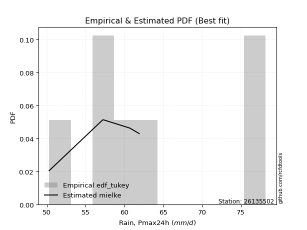</img>

</div>


### 8. Empirical - EDF Gringorten (1963)

Gringorten plotting position formula is essential for estimating the probability and return periods of extreme events like floods and heavy rainfall. The constant _a=0.44_.

<div align="center">


$P=(m-a)/(n+1-2a)$


</div>


**8.1. Empirical values**

<div align="center">

|                | 0                   | 1                   | 2                  | 3              | 4                  | 5                  | 6                  |
|:---------------|:--------------------|:--------------------|:-------------------|:---------------|:-------------------|:-------------------|:-------------------|
| date           | 2017                | 2022                | 2021               | 2018           | 2023               | 2020               | 2019               |
| x              | 50.3                | 57.2                | 57.3               | 60.7           | 61.9               | 75.9               | 78.2               |
| m              | 1                   | 2                   | 3                  | 4              | 5                  | 6                  | 7                  |
| empirical_dist | edf_gringorten      | edf_gringorten      | edf_gringorten     | edf_gringorten | edf_gringorten     | edf_gringorten     | edf_gringorten     |
| empirical      | 0.07865168539325844 | 0.21910112359550563 | 0.3595505617977528 | 0.5            | 0.6404494382022471 | 0.7808988764044943 | 0.9213483146067415 |
| empirical_tr   | 1.0853658536585364  | 1.2805755395683454  | 1.5614035087719298 | 2.0            | 2.781249999999999  | 4.564102564102562  | 12.714285714285701 |

</div>


**8.2. Kolmogorov-Smirnov fit test (sorted by Δ)**


<div align="center">

|                | 0                   | 1                   | 2                   | 3                   | 4                   | 5                   | 6                   | 7                   | 8                   | 9                   | 10                  | 11                  | 12                  | 13                  | 14                  | 15                  | 16                  | 17                  | 18                  | 19                  | 20                  | 21                  | 22                  | 23                  | 24                  | 25                  | 26                  | 27                  | 28                  | 29                  | 30                    | 31                  | 32                  | 33                  | 34                  | 35                  | 36                  | 37                  | 38                  | 39                  | 40                  | 41                  | 42                  | 43                  | 44                  | 45                  | 46                  | 47                  | 48                  | 49                  | 50                  | 51                  | 52                  | 53                  | 54                  | 55                  | 56                  | 57                  | 58                  | 59                  | 60                  | 61                  | 62                  | 63                  | 64                  | 65                  | 66                  | 67                  | 68                  | 69                  | 70                  | 71                  | 72                  | 73                  | 74                  | 75                  | 76                  | 77                  | 78                  | 79                  | 80                  | 81                  | 82                  | 83                  | 84                  | 85                  | 86                  | 87                  | 88                  | 89                  |
|:---------------|:--------------------|:--------------------|:--------------------|:--------------------|:--------------------|:--------------------|:--------------------|:--------------------|:--------------------|:--------------------|:--------------------|:--------------------|:--------------------|:--------------------|:--------------------|:--------------------|:--------------------|:--------------------|:--------------------|:--------------------|:--------------------|:--------------------|:--------------------|:--------------------|:--------------------|:--------------------|:--------------------|:--------------------|:--------------------|:--------------------|:----------------------|:--------------------|:--------------------|:--------------------|:--------------------|:--------------------|:--------------------|:--------------------|:--------------------|:--------------------|:--------------------|:--------------------|:--------------------|:--------------------|:--------------------|:--------------------|:--------------------|:--------------------|:--------------------|:--------------------|:--------------------|:--------------------|:--------------------|:--------------------|:--------------------|:--------------------|:--------------------|:--------------------|:--------------------|:--------------------|:--------------------|:--------------------|:--------------------|:--------------------|:--------------------|:--------------------|:--------------------|:--------------------|:--------------------|:--------------------|:--------------------|:--------------------|:--------------------|:--------------------|:--------------------|:--------------------|:--------------------|:--------------------|:--------------------|:--------------------|:--------------------|:--------------------|:--------------------|:--------------------|:--------------------|:--------------------|:--------------------|:--------------------|:--------------------|:--------------------|
| station        | 26135502            | 26135502            | 26135502            | 26135502            | 26135502            | 26135502            | 26135502            | 26135502            | 26135502            | 26135502            | 26135502            | 26135502            | 26135502            | 26135502            | 26135502            | 26135502            | 26135502            | 26135502            | 26135502            | 26135502            | 26135502            | 26135502            | 26135502            | 26135502            | 26135502            | 26135502            | 26135502            | 26135502            | 26135502            | 26135502            | 26135502              | 26135502            | 26135502            | 26135502            | 26135502            | 26135502            | 26135502            | 26135502            | 26135502            | 26135502            | 26135502            | 26135502            | 26135502            | 26135502            | 26135502            | 26135502            | 26135502            | 26135502            | 26135502            | 26135502            | 26135502            | 26135502            | 26135502            | 26135502            | 26135502            | 26135502            | 26135502            | 26135502            | 26135502            | 26135502            | 26135502            | 26135502            | 26135502            | 26135502            | 26135502            | 26135502            | 26135502            | 26135502            | 26135502            | 26135502            | 26135502            | 26135502            | 26135502            | 26135502            | 26135502            | 26135502            | 26135502            | 26135502            | 26135502            | 26135502            | 26135502            | 26135502            | 26135502            | 26135502            | 26135502            | 26135502            | 26135502            | 26135502            | 26135502            | 26135502            |
| empirical_dist | edf_gringorten      | edf_gringorten      | edf_gringorten      | edf_gringorten      | edf_gringorten      | edf_gringorten      | edf_gringorten      | edf_gringorten      | edf_gringorten      | edf_gringorten      | edf_gringorten      | edf_gringorten      | edf_gringorten      | edf_gringorten      | edf_gringorten      | edf_gringorten      | edf_gringorten      | edf_gringorten      | edf_gringorten      | edf_gringorten      | edf_gringorten      | edf_gringorten      | edf_gringorten      | edf_gringorten      | edf_gringorten      | edf_gringorten      | edf_gringorten      | edf_gringorten      | edf_gringorten      | edf_gringorten      | edf_gringorten        | edf_gringorten      | edf_gringorten      | edf_gringorten      | edf_gringorten      | edf_gringorten      | edf_gringorten      | edf_gringorten      | edf_gringorten      | edf_gringorten      | edf_gringorten      | edf_gringorten      | edf_gringorten      | edf_gringorten      | edf_gringorten      | edf_gringorten      | edf_gringorten      | edf_gringorten      | edf_gringorten      | edf_gringorten      | edf_gringorten      | edf_gringorten      | edf_gringorten      | edf_gringorten      | edf_gringorten      | edf_gringorten      | edf_gringorten      | edf_gringorten      | edf_gringorten      | edf_gringorten      | edf_gringorten      | edf_gringorten      | edf_gringorten      | edf_gringorten      | edf_gringorten      | edf_gringorten      | edf_gringorten      | edf_gringorten      | edf_gringorten      | edf_gringorten      | edf_gringorten      | edf_gringorten      | edf_gringorten      | edf_gringorten      | edf_gringorten      | edf_gringorten      | edf_gringorten      | edf_gringorten      | edf_gringorten      | edf_gringorten      | edf_gringorten      | edf_gringorten      | edf_gringorten      | edf_gringorten      | edf_gringorten      | edf_gringorten      | edf_gringorten      | edf_gringorten      | edf_gringorten      | edf_gringorten      |
| p_dist         | mielke              | logfisk             | loggenlogistic      | logf                | logerlang           | loggamma            | loggamma            | loginvweibull       | logexponnorm        | logkstwobign        | exponnorm           | logweibull_min      | halfnorm            | logmielke           | invgauss            | logfatiguelife      | loginvgauss         | invgamma            | lograyleigh         | loginvgamma         | alpha               | laplace_asymmetric  | loghalflogistic     | invweibull          | genexpon            | halflogistic        | loggumbel_r         | loghalfnorm         | logmoyal            | genlogistic         | loglaplace_asymmetric | kstwobign           | gumbel_r            | moyal               | logrice             | logmaxwell          | gompertz            | f                   | fisk                | logwald             | wald                | loggenexpon         | logpearson3         | logbetaprime        | nct                 | rayleigh            | weibull_min         | logalpha            | ncf                 | lognct              | maxwell             | pearson3            | rice                | logcrystalball      | lognorm             | lognorm             | logt                | logjohnsonsu        | loggompertz         | betaprime           | logloggamma         | loglogistic         | loghypsecant        | loglaplace          | loggibrat           | t                   | crystalball         | norm                | johnsonsu           | logistic            | expon               | logtruncnorm        | hypsecant           | laplace             | gibrat              | lognakagami         | logexpon            | loggumbel_l         | logncf              | gumbel_l            | erlang              | nakagami            | logchi2             | loglognorm          | pareto              | logpareto           | gamma               | truncnorm           | chi2                | fatiguelife         |
| delta          | 0.1002878019662409  | 0.10904335402049925 | 0.10970189927137197 | 0.10981913028172319 | 0.1100538998626478  | 0.11005419815551731 | 0.11005419815551731 | 0.11023066552822502 | 0.11040461688828229 | 0.11123211185161486 | 0.11180319023675056 | 0.11205940357936875 | 0.11217716570839276 | 0.11301974223023692 | 0.11321773230520327 | 0.11399977423166863 | 0.11436501426618262 | 0.11571256495526161 | 0.11630651603189135 | 0.11665457646216981 | 0.11833608712949051 | 0.11872496271470268 | 0.11924983119002674 | 0.12047961899112014 | 0.12063870954836778 | 0.12115441386352221 | 0.1225590278814993  | 0.122681543644685   | 0.12320499675320917 | 0.12327760146213562 | 0.12332341851738038   | 0.12341420495383948 | 0.12458118588850275 | 0.12502796926246973 | 0.12511317018205248 | 0.12774090502304802 | 0.1288557644338596  | 0.12902087932225695 | 0.1342156116311909  | 0.1352174406693809  | 0.13655736690390308 | 0.13765679698362096 | 0.13820087560751104 | 0.13881609148347318 | 0.14278645673704327 | 0.1433400553170845  | 0.14485878569834407 | 0.14610192312985332 | 0.15303610163667603 | 0.15314479560231264 | 0.15522225299574272 | 0.1558702566696144  | 0.15996315397261973 | 0.16150482071498184 | 0.1615063379818366  | 0.1615063379818366  | 0.16152959242800996 | 0.16156990317609515 | 0.16199936671771523 | 0.16245714217897278 | 0.16354470984662411 | 0.1643761812347347  | 0.16682238886224704 | 0.17642898134137736 | 0.1795323903934029  | 0.18951166992607782 | 0.18953400384346925 | 0.18953401297548944 | 0.18985324508955248 | 0.19614981248920843 | 0.19830704551725173 | 0.19931996144669437 | 0.20174156118846542 | 0.22048649967149458 | 0.22227633354407678 | 0.22653043444547263 | 0.23050338871982276 | 0.23218659110227136 | 0.2399553034429196  | 0.25966261401050367 | 0.3117159514782527  | 0.3874517568279918  | 0.3929910248213382  | 0.4222136406583987  | 0.43601092533436536 | 0.43969658701242786 | 0.482896430216346   | 0.49997567235553964 | 0.5330024421475544  | 0.5763985579183828  |
| deltao         | 0.48442053926100004 | 0.48442053926100004 | 0.48442053926100004 | 0.48442053926100004 | 0.48442053926100004 | 0.48442053926100004 | 0.48442053926100004 | 0.48442053926100004 | 0.48442053926100004 | 0.48442053926100004 | 0.48442053926100004 | 0.48442053926100004 | 0.48442053926100004 | 0.48442053926100004 | 0.48442053926100004 | 0.48442053926100004 | 0.48442053926100004 | 0.48442053926100004 | 0.48442053926100004 | 0.48442053926100004 | 0.48442053926100004 | 0.48442053926100004 | 0.48442053926100004 | 0.48442053926100004 | 0.48442053926100004 | 0.48442053926100004 | 0.48442053926100004 | 0.48442053926100004 | 0.48442053926100004 | 0.48442053926100004 | 0.48442053926100004   | 0.48442053926100004 | 0.48442053926100004 | 0.48442053926100004 | 0.48442053926100004 | 0.48442053926100004 | 0.48442053926100004 | 0.48442053926100004 | 0.48442053926100004 | 0.48442053926100004 | 0.48442053926100004 | 0.48442053926100004 | 0.48442053926100004 | 0.48442053926100004 | 0.48442053926100004 | 0.48442053926100004 | 0.48442053926100004 | 0.48442053926100004 | 0.48442053926100004 | 0.48442053926100004 | 0.48442053926100004 | 0.48442053926100004 | 0.48442053926100004 | 0.48442053926100004 | 0.48442053926100004 | 0.48442053926100004 | 0.48442053926100004 | 0.48442053926100004 | 0.48442053926100004 | 0.48442053926100004 | 0.48442053926100004 | 0.48442053926100004 | 0.48442053926100004 | 0.48442053926100004 | 0.48442053926100004 | 0.48442053926100004 | 0.48442053926100004 | 0.48442053926100004 | 0.48442053926100004 | 0.48442053926100004 | 0.48442053926100004 | 0.48442053926100004 | 0.48442053926100004 | 0.48442053926100004 | 0.48442053926100004 | 0.48442053926100004 | 0.48442053926100004 | 0.48442053926100004 | 0.48442053926100004 | 0.48442053926100004 | 0.48442053926100004 | 0.48442053926100004 | 0.48442053926100004 | 0.48442053926100004 | 0.48442053926100004 | 0.48442053926100004 | 0.48442053926100004 | 0.48442053926100004 | 0.48442053926100004 | 0.48442053926100004 |
| eval           | Δo > Δ              | Δo > Δ              | Δo > Δ              | Δo > Δ              | Δo > Δ              | Δo > Δ              | Δo > Δ              | Δo > Δ              | Δo > Δ              | Δo > Δ              | Δo > Δ              | Δo > Δ              | Δo > Δ              | Δo > Δ              | Δo > Δ              | Δo > Δ              | Δo > Δ              | Δo > Δ              | Δo > Δ              | Δo > Δ              | Δo > Δ              | Δo > Δ              | Δo > Δ              | Δo > Δ              | Δo > Δ              | Δo > Δ              | Δo > Δ              | Δo > Δ              | Δo > Δ              | Δo > Δ              | Δo > Δ                | Δo > Δ              | Δo > Δ              | Δo > Δ              | Δo > Δ              | Δo > Δ              | Δo > Δ              | Δo > Δ              | Δo > Δ              | Δo > Δ              | Δo > Δ              | Δo > Δ              | Δo > Δ              | Δo > Δ              | Δo > Δ              | Δo > Δ              | Δo > Δ              | Δo > Δ              | Δo > Δ              | Δo > Δ              | Δo > Δ              | Δo > Δ              | Δo > Δ              | Δo > Δ              | Δo > Δ              | Δo > Δ              | Δo > Δ              | Δo > Δ              | Δo > Δ              | Δo > Δ              | Δo > Δ              | Δo > Δ              | Δo > Δ              | Δo > Δ              | Δo > Δ              | Δo > Δ              | Δo > Δ              | Δo > Δ              | Δo > Δ              | Δo > Δ              | Δo > Δ              | Δo > Δ              | Δo > Δ              | Δo > Δ              | Δo > Δ              | Δo > Δ              | Δo > Δ              | Δo > Δ              | Δo > Δ              | Δo > Δ              | Δo > Δ              | Δo > Δ              | Δo > Δ              | Δo > Δ              | Δo > Δ              | Δo > Δ              | Δo > Δ              | Δo <= Δ             | Δo <= Δ             | Δo <= Δ             |
| fit            | 1                   | 1                   | 1                   | 1                   | 1                   | 1                   | 1                   | 1                   | 1                   | 1                   | 1                   | 1                   | 1                   | 1                   | 1                   | 1                   | 1                   | 1                   | 1                   | 1                   | 1                   | 1                   | 1                   | 1                   | 1                   | 1                   | 1                   | 1                   | 1                   | 1                   | 1                     | 1                   | 1                   | 1                   | 1                   | 1                   | 1                   | 1                   | 1                   | 1                   | 1                   | 1                   | 1                   | 1                   | 1                   | 1                   | 1                   | 1                   | 1                   | 1                   | 1                   | 1                   | 1                   | 1                   | 1                   | 1                   | 1                   | 1                   | 1                   | 1                   | 1                   | 1                   | 1                   | 1                   | 1                   | 1                   | 1                   | 1                   | 1                   | 1                   | 1                   | 1                   | 1                   | 1                   | 1                   | 1                   | 1                   | 1                   | 1                   | 1                   | 1                   | 1                   | 1                   | 1                   | 1                   | 1                   | 1                   | 0                   | 0                   | 0                   |
| n              | 7                   | 7                   | 7                   | 7                   | 7                   | 7                   | 7                   | 7                   | 7                   | 7                   | 7                   | 7                   | 7                   | 7                   | 7                   | 7                   | 7                   | 7                   | 7                   | 7                   | 7                   | 7                   | 7                   | 7                   | 7                   | 7                   | 7                   | 7                   | 7                   | 7                   | 7                     | 7                   | 7                   | 7                   | 7                   | 7                   | 7                   | 7                   | 7                   | 7                   | 7                   | 7                   | 7                   | 7                   | 7                   | 7                   | 7                   | 7                   | 7                   | 7                   | 7                   | 7                   | 7                   | 7                   | 7                   | 7                   | 7                   | 7                   | 7                   | 7                   | 7                   | 7                   | 7                   | 7                   | 7                   | 7                   | 7                   | 7                   | 7                   | 7                   | 7                   | 7                   | 7                   | 7                   | 7                   | 7                   | 7                   | 7                   | 7                   | 7                   | 7                   | 7                   | 7                   | 7                   | 7                   | 7                   | 7                   | 7                   | 7                   | 7                   |
| best_fit       | 1                   | 0                   | 0                   | 0                   | 0                   | 0                   | 0                   | 0                   | 0                   | 0                   | 0                   | 0                   | 0                   | 0                   | 0                   | 0                   | 0                   | 0                   | 0                   | 0                   | 0                   | 0                   | 0                   | 0                   | 0                   | 0                   | 0                   | 0                   | 0                   | 0                   | 0                     | 0                   | 0                   | 0                   | 0                   | 0                   | 0                   | 0                   | 0                   | 0                   | 0                   | 0                   | 0                   | 0                   | 0                   | 0                   | 0                   | 0                   | 0                   | 0                   | 0                   | 0                   | 0                   | 0                   | 0                   | 0                   | 0                   | 0                   | 0                   | 0                   | 0                   | 0                   | 0                   | 0                   | 0                   | 0                   | 0                   | 0                   | 0                   | 0                   | 0                   | 0                   | 0                   | 0                   | 0                   | 0                   | 0                   | 0                   | 0                   | 0                   | 0                   | 0                   | 0                   | 0                   | 0                   | 0                   | 0                   | 0                   | 0                   | 0                   |
| best_fit_sort  | 1                   | 2                   | 3                   | 4                   | 5                   | 6                   | 7                   | 8                   | 9                   | 10                  | 11                  | 12                  | 13                  | 14                  | 15                  | 16                  | 17                  | 18                  | 19                  | 20                  | 21                  | 22                  | 23                  | 24                  | 25                  | 26                  | 27                  | 28                  | 29                  | 30                  | 31                    | 32                  | 33                  | 34                  | 35                  | 36                  | 37                  | 38                  | 39                  | 40                  | 41                  | 42                  | 43                  | 44                  | 45                  | 46                  | 47                  | 48                  | 49                  | 50                  | 51                  | 52                  | 53                  | 54                  | 55                  | 56                  | 57                  | 58                  | 59                  | 60                  | 61                  | 62                  | 63                  | 64                  | 65                  | 66                  | 67                  | 68                  | 69                  | 70                  | 71                  | 72                  | 73                  | 74                  | 75                  | 76                  | 77                  | 78                  | 79                  | 80                  | 81                  | 82                  | 83                  | 84                  | 85                  | 86                  | 87                  | 88                  | 89                  | 90                  |

</div>


<div align="center">

</img>

</div>


**8.3. Best fit**

<div align="center">

|   id |   station | empirical_dist   | p_dist   |    delta |   deltao | eval   |   fit |   n |   best_fit |   best_fit_sort |
|-----:|----------:|:-----------------|:---------|---------:|---------:|:-------|------:|----:|-----------:|----------------:|
|    0 |  26135502 | edf_gringorten   | mielke   | 0.100288 | 0.484421 | Δo > Δ |     1 |   7 |          1 |               1 |

</div>


<div align="center">

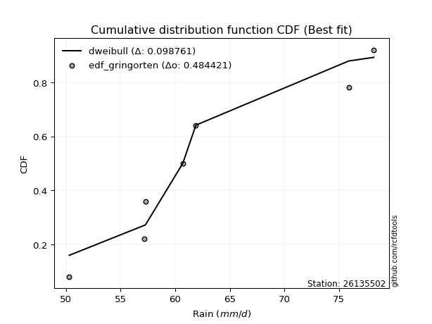</img>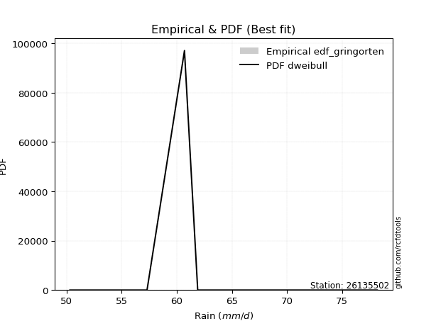</img>

</div>


### 9. Empirical - EDF Filliben (1975)

The specific values of the constants (0.3175) (often denoted as $alpha$) and (0.365) are derived from a method proposed by James J. Filliben in a 1975 paper. This particular formula is the mean value of the $i$-th order statistic of the normal distribution and is considered a robust and effective plotting position formula for the normal probability plot correlation coefficient test for normality.

<div align="center">


$P=(m-0.3175)/(n+0.365)$


</div>


**9.1. Empirical values**

<div align="center">

|                | 0                   | 1                   | 2                   | 3            | 4                  | 5                  | 6                  |
|:---------------|:--------------------|:--------------------|:--------------------|:-------------|:-------------------|:-------------------|:-------------------|
| date           | 2017                | 2022                | 2021                | 2018         | 2023               | 2020               | 2019               |
| x              | 50.3                | 57.2                | 57.3                | 60.7         | 61.9               | 75.9               | 78.2               |
| m              | 1                   | 2                   | 3                   | 4            | 5                  | 6                  | 7                  |
| empirical_dist | edf_filliben        | edf_filliben        | edf_filliben        | edf_filliben | edf_filliben       | edf_filliben       | edf_filliben       |
| empirical      | 0.09266802443991853 | 0.22844534962661237 | 0.36422267481330617 | 0.5          | 0.6357773251866938 | 0.7715546503733877 | 0.9073319755600815 |
| empirical_tr   | 1.1021324354657687  | 1.2960844698636163  | 1.5728777362520021  | 2.0          | 2.7455731593662627 | 4.377414561664191  | 10.791208791208794 |

</div>


**9.2. Kolmogorov-Smirnov fit test (sorted by Δ)**


<div align="center">

|                | 0                   | 1                   | 2                   | 3                   | 4                   | 5                   | 6                   | 7                   | 8                   | 9                   | 10                  | 11                  | 12                  | 13                  | 14                  | 15                  | 16                  | 17                  | 18                  | 19                  | 20                  | 21                  | 22                  | 23                  | 24                  | 25                  | 26                  | 27                  | 28                  | 29                  | 30                  | 31                  | 32                  | 33                  | 34                  | 35                  | 36                    | 37                  | 38                  | 39                  | 40                  | 41                  | 42                  | 43                  | 44                  | 45                  | 46                  | 47                  | 48                  | 49                  | 50                  | 51                  | 52                  | 53                  | 54                  | 55                  | 56                  | 57                  | 58                  | 59                  | 60                  | 61                  | 62                  | 63                  | 64                  | 65                  | 66                  | 67                  | 68                  | 69                  | 70                  | 71                  | 72                  | 73                  | 74                  | 75                  | 76                  | 77                  | 78                  | 79                  | 80                  | 81                  | 82                  | 83                  | 84                  | 85                  | 86                  | 87                  | 88                  | 89                  |
|:---------------|:--------------------|:--------------------|:--------------------|:--------------------|:--------------------|:--------------------|:--------------------|:--------------------|:--------------------|:--------------------|:--------------------|:--------------------|:--------------------|:--------------------|:--------------------|:--------------------|:--------------------|:--------------------|:--------------------|:--------------------|:--------------------|:--------------------|:--------------------|:--------------------|:--------------------|:--------------------|:--------------------|:--------------------|:--------------------|:--------------------|:--------------------|:--------------------|:--------------------|:--------------------|:--------------------|:--------------------|:----------------------|:--------------------|:--------------------|:--------------------|:--------------------|:--------------------|:--------------------|:--------------------|:--------------------|:--------------------|:--------------------|:--------------------|:--------------------|:--------------------|:--------------------|:--------------------|:--------------------|:--------------------|:--------------------|:--------------------|:--------------------|:--------------------|:--------------------|:--------------------|:--------------------|:--------------------|:--------------------|:--------------------|:--------------------|:--------------------|:--------------------|:--------------------|:--------------------|:--------------------|:--------------------|:--------------------|:--------------------|:--------------------|:--------------------|:--------------------|:--------------------|:--------------------|:--------------------|:--------------------|:--------------------|:--------------------|:--------------------|:--------------------|:--------------------|:--------------------|:--------------------|:--------------------|:--------------------|:--------------------|
| station        | 26135502            | 26135502            | 26135502            | 26135502            | 26135502            | 26135502            | 26135502            | 26135502            | 26135502            | 26135502            | 26135502            | 26135502            | 26135502            | 26135502            | 26135502            | 26135502            | 26135502            | 26135502            | 26135502            | 26135502            | 26135502            | 26135502            | 26135502            | 26135502            | 26135502            | 26135502            | 26135502            | 26135502            | 26135502            | 26135502            | 26135502            | 26135502            | 26135502            | 26135502            | 26135502            | 26135502            | 26135502              | 26135502            | 26135502            | 26135502            | 26135502            | 26135502            | 26135502            | 26135502            | 26135502            | 26135502            | 26135502            | 26135502            | 26135502            | 26135502            | 26135502            | 26135502            | 26135502            | 26135502            | 26135502            | 26135502            | 26135502            | 26135502            | 26135502            | 26135502            | 26135502            | 26135502            | 26135502            | 26135502            | 26135502            | 26135502            | 26135502            | 26135502            | 26135502            | 26135502            | 26135502            | 26135502            | 26135502            | 26135502            | 26135502            | 26135502            | 26135502            | 26135502            | 26135502            | 26135502            | 26135502            | 26135502            | 26135502            | 26135502            | 26135502            | 26135502            | 26135502            | 26135502            | 26135502            | 26135502            |
| empirical_dist | edf_filliben        | edf_filliben        | edf_filliben        | edf_filliben        | edf_filliben        | edf_filliben        | edf_filliben        | edf_filliben        | edf_filliben        | edf_filliben        | edf_filliben        | edf_filliben        | edf_filliben        | edf_filliben        | edf_filliben        | edf_filliben        | edf_filliben        | edf_filliben        | edf_filliben        | edf_filliben        | edf_filliben        | edf_filliben        | edf_filliben        | edf_filliben        | edf_filliben        | edf_filliben        | edf_filliben        | edf_filliben        | edf_filliben        | edf_filliben        | edf_filliben        | edf_filliben        | edf_filliben        | edf_filliben        | edf_filliben        | edf_filliben        | edf_filliben          | edf_filliben        | edf_filliben        | edf_filliben        | edf_filliben        | edf_filliben        | edf_filliben        | edf_filliben        | edf_filliben        | edf_filliben        | edf_filliben        | edf_filliben        | edf_filliben        | edf_filliben        | edf_filliben        | edf_filliben        | edf_filliben        | edf_filliben        | edf_filliben        | edf_filliben        | edf_filliben        | edf_filliben        | edf_filliben        | edf_filliben        | edf_filliben        | edf_filliben        | edf_filliben        | edf_filliben        | edf_filliben        | edf_filliben        | edf_filliben        | edf_filliben        | edf_filliben        | edf_filliben        | edf_filliben        | edf_filliben        | edf_filliben        | edf_filliben        | edf_filliben        | edf_filliben        | edf_filliben        | edf_filliben        | edf_filliben        | edf_filliben        | edf_filliben        | edf_filliben        | edf_filliben        | edf_filliben        | edf_filliben        | edf_filliben        | edf_filliben        | edf_filliben        | edf_filliben        | edf_filliben        |
| p_dist         | mielke              | genexpon            | logfisk             | loggenlogistic      | logf                | loghalfnorm         | logerlang           | loggamma            | loggamma            | logweibull_min      | loginvweibull       | logexponnorm        | logkstwobign        | exponnorm           | halfnorm            | logmielke           | invgauss            | logfatiguelife      | loginvgauss         | lograyleigh         | gompertz            | invgamma            | loginvgamma         | logmaxwell          | logrice             | alpha               | laplace_asymmetric  | loggenexpon         | loghalflogistic     | f                   | invweibull          | halflogistic        | loggumbel_r         | kstwobign           | logmoyal            | genlogistic         | loglaplace_asymmetric | logpearson3         | gumbel_r            | logbetaprime        | moyal               | weibull_min         | nct                 | rayleigh            | logalpha            | fisk                | logwald             | wald                | ncf                 | lognct              | maxwell             | pearson3            | loggompertz         | rice                | logcrystalball      | lognorm             | lognorm             | logt                | logjohnsonsu        | betaprime           | logloggamma         | loglogistic         | loghypsecant        | loglaplace          | loggibrat           | t                   | crystalball         | norm                | johnsonsu           | expon               | logistic            | logtruncnorm        | hypsecant           | laplace             | lognakagami         | logexpon            | logncf              | gibrat              | loggumbel_l         | gumbel_l            | erlang              | nakagami            | logchi2             | loglognorm          | pareto              | logpareto           | gamma               | truncnorm           | chi2                | fatiguelife         |
| delta          | 0.09094357593513416 | 0.11800172715617185 | 0.11838758005160588 | 0.1190461253024786  | 0.11916335631282982 | 0.11924464522808642 | 0.11939812589375443 | 0.11939842418662394 | 0.11939842418662394 | 0.11953344172992819 | 0.11957489155933165 | 0.11974884291938892 | 0.12057633788272148 | 0.12114741626785719 | 0.12152139173949938 | 0.12236396826134355 | 0.1225619583363099  | 0.12334400026277526 | 0.12370924029728925 | 0.12429043522370953 | 0.12462058314506264 | 0.12505679098636824 | 0.12599880249327644 | 0.12701290648972363 | 0.1274955250115134  | 0.12768031316059714 | 0.1280691887458093  | 0.12831257095251422 | 0.12859405722113337 | 0.1287589314974349  | 0.12982384502222677 | 0.13049863989462884 | 0.13190325391260593 | 0.13201762643423565 | 0.1325492227843158  | 0.13262182749324225 | 0.132667644548487     | 0.13352876259195778 | 0.13392541191960938 | 0.13414397846791992 | 0.13437219529357636 | 0.13551455966723733 | 0.13811434372149    | 0.13866794230153123 | 0.14142981011430006 | 0.14355983766229752 | 0.14456166670048753 | 0.1459015929350097  | 0.14836398862112277 | 0.14847268258675939 | 0.15055013998018946 | 0.15119814365406115 | 0.1526551406866085  | 0.15529104095706647 | 0.1568327076994286  | 0.15683422496628335 | 0.15683422496628335 | 0.1568574794124567  | 0.1568977901605419  | 0.15778502916341952 | 0.15887259683107086 | 0.15970406821918143 | 0.16215027584669378 | 0.1717568683258241  | 0.18420450340895628 | 0.18483955691052456 | 0.184861890827916   | 0.18486189995993618 | 0.18518113207399922 | 0.188962819486145   | 0.19147769947365517 | 0.19184008831387267 | 0.19706944817291216 | 0.21581438665594133 | 0.2171862084143659  | 0.22115916268871602 | 0.2259389643962596  | 0.22694844655963015 | 0.2275144780867181  | 0.2549905009949504  | 0.30237172544714597 | 0.3781075307968851  | 0.3789746857746782  | 0.412869414627292   | 0.4266666993032586  | 0.4303523609813211  | 0.47355220418523924 | 0.49997567235553964 | 0.5236582161164477  | 0.567054331887276   |
| deltao         | 0.48442053926100004 | 0.48442053926100004 | 0.48442053926100004 | 0.48442053926100004 | 0.48442053926100004 | 0.48442053926100004 | 0.48442053926100004 | 0.48442053926100004 | 0.48442053926100004 | 0.48442053926100004 | 0.48442053926100004 | 0.48442053926100004 | 0.48442053926100004 | 0.48442053926100004 | 0.48442053926100004 | 0.48442053926100004 | 0.48442053926100004 | 0.48442053926100004 | 0.48442053926100004 | 0.48442053926100004 | 0.48442053926100004 | 0.48442053926100004 | 0.48442053926100004 | 0.48442053926100004 | 0.48442053926100004 | 0.48442053926100004 | 0.48442053926100004 | 0.48442053926100004 | 0.48442053926100004 | 0.48442053926100004 | 0.48442053926100004 | 0.48442053926100004 | 0.48442053926100004 | 0.48442053926100004 | 0.48442053926100004 | 0.48442053926100004 | 0.48442053926100004   | 0.48442053926100004 | 0.48442053926100004 | 0.48442053926100004 | 0.48442053926100004 | 0.48442053926100004 | 0.48442053926100004 | 0.48442053926100004 | 0.48442053926100004 | 0.48442053926100004 | 0.48442053926100004 | 0.48442053926100004 | 0.48442053926100004 | 0.48442053926100004 | 0.48442053926100004 | 0.48442053926100004 | 0.48442053926100004 | 0.48442053926100004 | 0.48442053926100004 | 0.48442053926100004 | 0.48442053926100004 | 0.48442053926100004 | 0.48442053926100004 | 0.48442053926100004 | 0.48442053926100004 | 0.48442053926100004 | 0.48442053926100004 | 0.48442053926100004 | 0.48442053926100004 | 0.48442053926100004 | 0.48442053926100004 | 0.48442053926100004 | 0.48442053926100004 | 0.48442053926100004 | 0.48442053926100004 | 0.48442053926100004 | 0.48442053926100004 | 0.48442053926100004 | 0.48442053926100004 | 0.48442053926100004 | 0.48442053926100004 | 0.48442053926100004 | 0.48442053926100004 | 0.48442053926100004 | 0.48442053926100004 | 0.48442053926100004 | 0.48442053926100004 | 0.48442053926100004 | 0.48442053926100004 | 0.48442053926100004 | 0.48442053926100004 | 0.48442053926100004 | 0.48442053926100004 | 0.48442053926100004 |
| eval           | Δo > Δ              | Δo > Δ              | Δo > Δ              | Δo > Δ              | Δo > Δ              | Δo > Δ              | Δo > Δ              | Δo > Δ              | Δo > Δ              | Δo > Δ              | Δo > Δ              | Δo > Δ              | Δo > Δ              | Δo > Δ              | Δo > Δ              | Δo > Δ              | Δo > Δ              | Δo > Δ              | Δo > Δ              | Δo > Δ              | Δo > Δ              | Δo > Δ              | Δo > Δ              | Δo > Δ              | Δo > Δ              | Δo > Δ              | Δo > Δ              | Δo > Δ              | Δo > Δ              | Δo > Δ              | Δo > Δ              | Δo > Δ              | Δo > Δ              | Δo > Δ              | Δo > Δ              | Δo > Δ              | Δo > Δ                | Δo > Δ              | Δo > Δ              | Δo > Δ              | Δo > Δ              | Δo > Δ              | Δo > Δ              | Δo > Δ              | Δo > Δ              | Δo > Δ              | Δo > Δ              | Δo > Δ              | Δo > Δ              | Δo > Δ              | Δo > Δ              | Δo > Δ              | Δo > Δ              | Δo > Δ              | Δo > Δ              | Δo > Δ              | Δo > Δ              | Δo > Δ              | Δo > Δ              | Δo > Δ              | Δo > Δ              | Δo > Δ              | Δo > Δ              | Δo > Δ              | Δo > Δ              | Δo > Δ              | Δo > Δ              | Δo > Δ              | Δo > Δ              | Δo > Δ              | Δo > Δ              | Δo > Δ              | Δo > Δ              | Δo > Δ              | Δo > Δ              | Δo > Δ              | Δo > Δ              | Δo > Δ              | Δo > Δ              | Δo > Δ              | Δo > Δ              | Δo > Δ              | Δo > Δ              | Δo > Δ              | Δo > Δ              | Δo > Δ              | Δo > Δ              | Δo <= Δ             | Δo <= Δ             | Δo <= Δ             |
| fit            | 1                   | 1                   | 1                   | 1                   | 1                   | 1                   | 1                   | 1                   | 1                   | 1                   | 1                   | 1                   | 1                   | 1                   | 1                   | 1                   | 1                   | 1                   | 1                   | 1                   | 1                   | 1                   | 1                   | 1                   | 1                   | 1                   | 1                   | 1                   | 1                   | 1                   | 1                   | 1                   | 1                   | 1                   | 1                   | 1                   | 1                     | 1                   | 1                   | 1                   | 1                   | 1                   | 1                   | 1                   | 1                   | 1                   | 1                   | 1                   | 1                   | 1                   | 1                   | 1                   | 1                   | 1                   | 1                   | 1                   | 1                   | 1                   | 1                   | 1                   | 1                   | 1                   | 1                   | 1                   | 1                   | 1                   | 1                   | 1                   | 1                   | 1                   | 1                   | 1                   | 1                   | 1                   | 1                   | 1                   | 1                   | 1                   | 1                   | 1                   | 1                   | 1                   | 1                   | 1                   | 1                   | 1                   | 1                   | 0                   | 0                   | 0                   |
| n              | 7                   | 7                   | 7                   | 7                   | 7                   | 7                   | 7                   | 7                   | 7                   | 7                   | 7                   | 7                   | 7                   | 7                   | 7                   | 7                   | 7                   | 7                   | 7                   | 7                   | 7                   | 7                   | 7                   | 7                   | 7                   | 7                   | 7                   | 7                   | 7                   | 7                   | 7                   | 7                   | 7                   | 7                   | 7                   | 7                   | 7                     | 7                   | 7                   | 7                   | 7                   | 7                   | 7                   | 7                   | 7                   | 7                   | 7                   | 7                   | 7                   | 7                   | 7                   | 7                   | 7                   | 7                   | 7                   | 7                   | 7                   | 7                   | 7                   | 7                   | 7                   | 7                   | 7                   | 7                   | 7                   | 7                   | 7                   | 7                   | 7                   | 7                   | 7                   | 7                   | 7                   | 7                   | 7                   | 7                   | 7                   | 7                   | 7                   | 7                   | 7                   | 7                   | 7                   | 7                   | 7                   | 7                   | 7                   | 7                   | 7                   | 7                   |
| best_fit       | 1                   | 0                   | 0                   | 0                   | 0                   | 0                   | 0                   | 0                   | 0                   | 0                   | 0                   | 0                   | 0                   | 0                   | 0                   | 0                   | 0                   | 0                   | 0                   | 0                   | 0                   | 0                   | 0                   | 0                   | 0                   | 0                   | 0                   | 0                   | 0                   | 0                   | 0                   | 0                   | 0                   | 0                   | 0                   | 0                   | 0                     | 0                   | 0                   | 0                   | 0                   | 0                   | 0                   | 0                   | 0                   | 0                   | 0                   | 0                   | 0                   | 0                   | 0                   | 0                   | 0                   | 0                   | 0                   | 0                   | 0                   | 0                   | 0                   | 0                   | 0                   | 0                   | 0                   | 0                   | 0                   | 0                   | 0                   | 0                   | 0                   | 0                   | 0                   | 0                   | 0                   | 0                   | 0                   | 0                   | 0                   | 0                   | 0                   | 0                   | 0                   | 0                   | 0                   | 0                   | 0                   | 0                   | 0                   | 0                   | 0                   | 0                   |
| best_fit_sort  | 1                   | 2                   | 3                   | 4                   | 5                   | 6                   | 7                   | 8                   | 9                   | 10                  | 11                  | 12                  | 13                  | 14                  | 15                  | 16                  | 17                  | 18                  | 19                  | 20                  | 21                  | 22                  | 23                  | 24                  | 25                  | 26                  | 27                  | 28                  | 29                  | 30                  | 31                  | 32                  | 33                  | 34                  | 35                  | 36                  | 37                    | 38                  | 39                  | 40                  | 41                  | 42                  | 43                  | 44                  | 45                  | 46                  | 47                  | 48                  | 49                  | 50                  | 51                  | 52                  | 53                  | 54                  | 55                  | 56                  | 57                  | 58                  | 59                  | 60                  | 61                  | 62                  | 63                  | 64                  | 65                  | 66                  | 67                  | 68                  | 69                  | 70                  | 71                  | 72                  | 73                  | 74                  | 75                  | 76                  | 77                  | 78                  | 79                  | 80                  | 81                  | 82                  | 83                  | 84                  | 85                  | 86                  | 87                  | 88                  | 89                  | 90                  |

</div>


<div align="center">

</img>

</div>


**9.3. Best fit**

<div align="center">

|   id |   station | empirical_dist   | p_dist   |     delta |   deltao | eval   |   fit |   n |   best_fit |   best_fit_sort |
|-----:|----------:|:-----------------|:---------|----------:|---------:|:-------|------:|----:|-----------:|----------------:|
|    0 |  26135502 | edf_filliben     | mielke   | 0.0909436 | 0.484421 | Δo > Δ |     1 |   7 |          1 |               1 |

</div>


<div align="center">

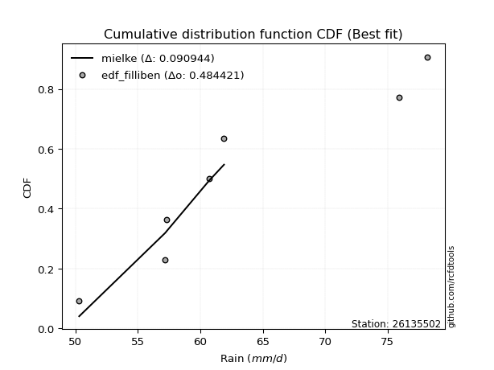</img>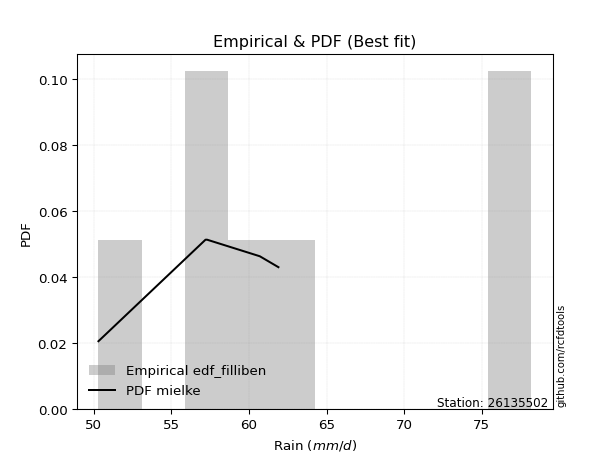</img>

</div>


### 10. Empirical - EDF Jenkinson (1977)

The Jenkinson formula in hydrology is an empirical plotting position formula used to estimate the non-exceedance probability _(P)_ or return period _(T)_ of a given ordered observation within a sample. It is a widely used method in the frequency analysis of extreme events such as floods and rainfall, as it provides a distribution-free way to plot data. _a≈0.31_ and _b≈0.38_ are constants derived to approximate the median of the probability distribution for the given rank.

<div align="center">


$P=(m-a)/(n+b)$


</div>


**10.1. Empirical values**

<div align="center">

|                | 0                   | 1                   | 2                   | 3             | 4                  | 5                  | 6                  |
|:---------------|:--------------------|:--------------------|:--------------------|:--------------|:-------------------|:-------------------|:-------------------|
| date           | 2017                | 2022                | 2021                | 2018          | 2023               | 2020               | 2019               |
| x              | 50.3                | 57.2                | 57.3                | 60.7          | 61.9               | 75.9               | 78.2               |
| m              | 1                   | 2                   | 3                   | 4             | 5                  | 6                  | 7                  |
| empirical_dist | edf_jenkinson       | edf_jenkinson       | edf_jenkinson       | edf_jenkinson | edf_jenkinson      | edf_jenkinson      | edf_jenkinson      |
| empirical      | 0.09349593495934959 | 0.22899728997289973 | 0.36449864498644985 | 0.5           | 0.6355013550135502 | 0.7710027100271003 | 0.9065040650406505 |
| empirical_tr   | 1.1031390134529149  | 1.29701230228471    | 1.5735607675906182  | 2.0           | 2.743494423791822  | 4.366863905325444  | 10.695652173913055 |

</div>


**10.2. Kolmogorov-Smirnov fit test (sorted by Δ)**


<div align="center">

|                | 0                   | 1                   | 2                   | 3                   | 4                   | 5                   | 6                   | 7                   | 8                   | 9                   | 10                  | 11                  | 12                  | 13                  | 14                  | 15                  | 16                  | 17                  | 18                  | 19                  | 20                  | 21                  | 22                  | 23                  | 24                  | 25                  | 26                  | 27                  | 28                  | 29                  | 30                  | 31                  | 32                  | 33                  | 34                  | 35                  | 36                    | 37                  | 38                  | 39                  | 40                  | 41                  | 42                  | 43                  | 44                  | 45                  | 46                  | 47                  | 48                  | 49                  | 50                  | 51                  | 52                  | 53                  | 54                  | 55                  | 56                  | 57                  | 58                  | 59                  | 60                  | 61                  | 62                  | 63                  | 64                  | 65                  | 66                  | 67                  | 68                  | 69                  | 70                  | 71                  | 72                  | 73                  | 74                  | 75                  | 76                  | 77                  | 78                  | 79                  | 80                  | 81                  | 82                  | 83                  | 84                  | 85                  | 86                  | 87                  | 88                  | 89                  |
|:---------------|:--------------------|:--------------------|:--------------------|:--------------------|:--------------------|:--------------------|:--------------------|:--------------------|:--------------------|:--------------------|:--------------------|:--------------------|:--------------------|:--------------------|:--------------------|:--------------------|:--------------------|:--------------------|:--------------------|:--------------------|:--------------------|:--------------------|:--------------------|:--------------------|:--------------------|:--------------------|:--------------------|:--------------------|:--------------------|:--------------------|:--------------------|:--------------------|:--------------------|:--------------------|:--------------------|:--------------------|:----------------------|:--------------------|:--------------------|:--------------------|:--------------------|:--------------------|:--------------------|:--------------------|:--------------------|:--------------------|:--------------------|:--------------------|:--------------------|:--------------------|:--------------------|:--------------------|:--------------------|:--------------------|:--------------------|:--------------------|:--------------------|:--------------------|:--------------------|:--------------------|:--------------------|:--------------------|:--------------------|:--------------------|:--------------------|:--------------------|:--------------------|:--------------------|:--------------------|:--------------------|:--------------------|:--------------------|:--------------------|:--------------------|:--------------------|:--------------------|:--------------------|:--------------------|:--------------------|:--------------------|:--------------------|:--------------------|:--------------------|:--------------------|:--------------------|:--------------------|:--------------------|:--------------------|:--------------------|:--------------------|
| station        | 26135502            | 26135502            | 26135502            | 26135502            | 26135502            | 26135502            | 26135502            | 26135502            | 26135502            | 26135502            | 26135502            | 26135502            | 26135502            | 26135502            | 26135502            | 26135502            | 26135502            | 26135502            | 26135502            | 26135502            | 26135502            | 26135502            | 26135502            | 26135502            | 26135502            | 26135502            | 26135502            | 26135502            | 26135502            | 26135502            | 26135502            | 26135502            | 26135502            | 26135502            | 26135502            | 26135502            | 26135502              | 26135502            | 26135502            | 26135502            | 26135502            | 26135502            | 26135502            | 26135502            | 26135502            | 26135502            | 26135502            | 26135502            | 26135502            | 26135502            | 26135502            | 26135502            | 26135502            | 26135502            | 26135502            | 26135502            | 26135502            | 26135502            | 26135502            | 26135502            | 26135502            | 26135502            | 26135502            | 26135502            | 26135502            | 26135502            | 26135502            | 26135502            | 26135502            | 26135502            | 26135502            | 26135502            | 26135502            | 26135502            | 26135502            | 26135502            | 26135502            | 26135502            | 26135502            | 26135502            | 26135502            | 26135502            | 26135502            | 26135502            | 26135502            | 26135502            | 26135502            | 26135502            | 26135502            | 26135502            |
| empirical_dist | edf_jenkinson       | edf_jenkinson       | edf_jenkinson       | edf_jenkinson       | edf_jenkinson       | edf_jenkinson       | edf_jenkinson       | edf_jenkinson       | edf_jenkinson       | edf_jenkinson       | edf_jenkinson       | edf_jenkinson       | edf_jenkinson       | edf_jenkinson       | edf_jenkinson       | edf_jenkinson       | edf_jenkinson       | edf_jenkinson       | edf_jenkinson       | edf_jenkinson       | edf_jenkinson       | edf_jenkinson       | edf_jenkinson       | edf_jenkinson       | edf_jenkinson       | edf_jenkinson       | edf_jenkinson       | edf_jenkinson       | edf_jenkinson       | edf_jenkinson       | edf_jenkinson       | edf_jenkinson       | edf_jenkinson       | edf_jenkinson       | edf_jenkinson       | edf_jenkinson       | edf_jenkinson         | edf_jenkinson       | edf_jenkinson       | edf_jenkinson       | edf_jenkinson       | edf_jenkinson       | edf_jenkinson       | edf_jenkinson       | edf_jenkinson       | edf_jenkinson       | edf_jenkinson       | edf_jenkinson       | edf_jenkinson       | edf_jenkinson       | edf_jenkinson       | edf_jenkinson       | edf_jenkinson       | edf_jenkinson       | edf_jenkinson       | edf_jenkinson       | edf_jenkinson       | edf_jenkinson       | edf_jenkinson       | edf_jenkinson       | edf_jenkinson       | edf_jenkinson       | edf_jenkinson       | edf_jenkinson       | edf_jenkinson       | edf_jenkinson       | edf_jenkinson       | edf_jenkinson       | edf_jenkinson       | edf_jenkinson       | edf_jenkinson       | edf_jenkinson       | edf_jenkinson       | edf_jenkinson       | edf_jenkinson       | edf_jenkinson       | edf_jenkinson       | edf_jenkinson       | edf_jenkinson       | edf_jenkinson       | edf_jenkinson       | edf_jenkinson       | edf_jenkinson       | edf_jenkinson       | edf_jenkinson       | edf_jenkinson       | edf_jenkinson       | edf_jenkinson       | edf_jenkinson       | edf_jenkinson       |
| p_dist         | mielke              | genexpon            | logfisk             | loggenlogistic      | logf                | loghalfnorm         | logerlang           | loggamma            | loggamma            | logweibull_min      | loginvweibull       | logexponnorm        | logkstwobign        | exponnorm           | halfnorm            | logmielke           | invgauss            | logfatiguelife      | loginvgauss         | lograyleigh         | gompertz            | invgamma            | loginvgamma         | logmaxwell          | loggenexpon         | logrice             | alpha               | laplace_asymmetric  | loghalflogistic     | f                   | invweibull          | halflogistic        | loggumbel_r         | kstwobign           | logmoyal            | genlogistic         | loglaplace_asymmetric | logpearson3         | logbetaprime        | gumbel_r            | moyal               | weibull_min         | nct                 | rayleigh            | logalpha            | fisk                | logwald             | wald                | ncf                 | lognct              | maxwell             | pearson3            | loggompertz         | rice                | logcrystalball      | lognorm             | lognorm             | logt                | logjohnsonsu        | betaprime           | logloggamma         | loglogistic         | loghypsecant        | loglaplace          | loggibrat           | t                   | crystalball         | norm                | johnsonsu           | expon               | logistic            | logtruncnorm        | hypsecant           | laplace             | lognakagami         | logexpon            | logncf              | gibrat              | loggumbel_l         | gumbel_l            | erlang              | nakagami            | logchi2             | loglognorm          | pareto              | logpareto           | gamma               | truncnorm           | chi2                | fatiguelife         |
| delta          | 0.0903916355888468  | 0.11855366750245921 | 0.11893952039789324 | 0.11959806564876596 | 0.11971529665911718 | 0.11979658557437378 | 0.11995006624004179 | 0.1199503645329113  | 0.1199503645329113  | 0.12008538207621555 | 0.12012683190561901 | 0.12030078326567628 | 0.12112827822900885 | 0.12169935661414455 | 0.12207333208578675 | 0.12291590860763091 | 0.12311389868259726 | 0.12389594060906262 | 0.12426118064357661 | 0.12484237556999689 | 0.12517252349135    | 0.1256087313326556  | 0.1265507428395638  | 0.127564846836011   | 0.12776063060622686 | 0.12804746535780076 | 0.1282322535068845  | 0.12862112909209666 | 0.12914599756742073 | 0.12931087184372225 | 0.13037578536851413 | 0.1310505802409162  | 0.1324551942588933  | 0.132569566780523   | 0.13310116313060316 | 0.1331737678395296  | 0.13321958489477437   | 0.13325279241881416 | 0.1338680082947763  | 0.13447735226589674 | 0.13492413563986372 | 0.13496261932094997 | 0.13783837354834638 | 0.1383919721283876  | 0.14115383994115643 | 0.14411177800858488 | 0.1451136070467749  | 0.14645353328129707 | 0.14808801844797914 | 0.14819671241361576 | 0.15027416980704583 | 0.15092217348091752 | 0.15210320034032113 | 0.15501507078392285 | 0.15655673752628496 | 0.15655825479313973 | 0.15655825479313973 | 0.15658150923931308 | 0.15662181998739827 | 0.1575090589902759  | 0.15859662665792723 | 0.1594280980460378  | 0.16187430567355016 | 0.17148089815268047 | 0.18448047358209996 | 0.18456358673738094 | 0.18458592065477236 | 0.18458592978679256 | 0.1849051619008556  | 0.18841087913985763 | 0.19120172930051155 | 0.19239202866016003 | 0.19679347799976854 | 0.2155384164827977  | 0.21663426806807853 | 0.22060722234242866 | 0.22511105387682862 | 0.22722441673277383 | 0.22723850791357447 | 0.2547145308218068  | 0.3018197851008586  | 0.3775555904505977  | 0.3781467752552472  | 0.4123174742810046  | 0.42611475895697126 | 0.42980042063503376 | 0.4730002638389519  | 0.49997567235553964 | 0.5231062757701603  | 0.5665023915409887  |
| deltao         | 0.48442053926100004 | 0.48442053926100004 | 0.48442053926100004 | 0.48442053926100004 | 0.48442053926100004 | 0.48442053926100004 | 0.48442053926100004 | 0.48442053926100004 | 0.48442053926100004 | 0.48442053926100004 | 0.48442053926100004 | 0.48442053926100004 | 0.48442053926100004 | 0.48442053926100004 | 0.48442053926100004 | 0.48442053926100004 | 0.48442053926100004 | 0.48442053926100004 | 0.48442053926100004 | 0.48442053926100004 | 0.48442053926100004 | 0.48442053926100004 | 0.48442053926100004 | 0.48442053926100004 | 0.48442053926100004 | 0.48442053926100004 | 0.48442053926100004 | 0.48442053926100004 | 0.48442053926100004 | 0.48442053926100004 | 0.48442053926100004 | 0.48442053926100004 | 0.48442053926100004 | 0.48442053926100004 | 0.48442053926100004 | 0.48442053926100004 | 0.48442053926100004   | 0.48442053926100004 | 0.48442053926100004 | 0.48442053926100004 | 0.48442053926100004 | 0.48442053926100004 | 0.48442053926100004 | 0.48442053926100004 | 0.48442053926100004 | 0.48442053926100004 | 0.48442053926100004 | 0.48442053926100004 | 0.48442053926100004 | 0.48442053926100004 | 0.48442053926100004 | 0.48442053926100004 | 0.48442053926100004 | 0.48442053926100004 | 0.48442053926100004 | 0.48442053926100004 | 0.48442053926100004 | 0.48442053926100004 | 0.48442053926100004 | 0.48442053926100004 | 0.48442053926100004 | 0.48442053926100004 | 0.48442053926100004 | 0.48442053926100004 | 0.48442053926100004 | 0.48442053926100004 | 0.48442053926100004 | 0.48442053926100004 | 0.48442053926100004 | 0.48442053926100004 | 0.48442053926100004 | 0.48442053926100004 | 0.48442053926100004 | 0.48442053926100004 | 0.48442053926100004 | 0.48442053926100004 | 0.48442053926100004 | 0.48442053926100004 | 0.48442053926100004 | 0.48442053926100004 | 0.48442053926100004 | 0.48442053926100004 | 0.48442053926100004 | 0.48442053926100004 | 0.48442053926100004 | 0.48442053926100004 | 0.48442053926100004 | 0.48442053926100004 | 0.48442053926100004 | 0.48442053926100004 |
| eval           | Δo > Δ              | Δo > Δ              | Δo > Δ              | Δo > Δ              | Δo > Δ              | Δo > Δ              | Δo > Δ              | Δo > Δ              | Δo > Δ              | Δo > Δ              | Δo > Δ              | Δo > Δ              | Δo > Δ              | Δo > Δ              | Δo > Δ              | Δo > Δ              | Δo > Δ              | Δo > Δ              | Δo > Δ              | Δo > Δ              | Δo > Δ              | Δo > Δ              | Δo > Δ              | Δo > Δ              | Δo > Δ              | Δo > Δ              | Δo > Δ              | Δo > Δ              | Δo > Δ              | Δo > Δ              | Δo > Δ              | Δo > Δ              | Δo > Δ              | Δo > Δ              | Δo > Δ              | Δo > Δ              | Δo > Δ                | Δo > Δ              | Δo > Δ              | Δo > Δ              | Δo > Δ              | Δo > Δ              | Δo > Δ              | Δo > Δ              | Δo > Δ              | Δo > Δ              | Δo > Δ              | Δo > Δ              | Δo > Δ              | Δo > Δ              | Δo > Δ              | Δo > Δ              | Δo > Δ              | Δo > Δ              | Δo > Δ              | Δo > Δ              | Δo > Δ              | Δo > Δ              | Δo > Δ              | Δo > Δ              | Δo > Δ              | Δo > Δ              | Δo > Δ              | Δo > Δ              | Δo > Δ              | Δo > Δ              | Δo > Δ              | Δo > Δ              | Δo > Δ              | Δo > Δ              | Δo > Δ              | Δo > Δ              | Δo > Δ              | Δo > Δ              | Δo > Δ              | Δo > Δ              | Δo > Δ              | Δo > Δ              | Δo > Δ              | Δo > Δ              | Δo > Δ              | Δo > Δ              | Δo > Δ              | Δo > Δ              | Δo > Δ              | Δo > Δ              | Δo > Δ              | Δo <= Δ             | Δo <= Δ             | Δo <= Δ             |
| fit            | 1                   | 1                   | 1                   | 1                   | 1                   | 1                   | 1                   | 1                   | 1                   | 1                   | 1                   | 1                   | 1                   | 1                   | 1                   | 1                   | 1                   | 1                   | 1                   | 1                   | 1                   | 1                   | 1                   | 1                   | 1                   | 1                   | 1                   | 1                   | 1                   | 1                   | 1                   | 1                   | 1                   | 1                   | 1                   | 1                   | 1                     | 1                   | 1                   | 1                   | 1                   | 1                   | 1                   | 1                   | 1                   | 1                   | 1                   | 1                   | 1                   | 1                   | 1                   | 1                   | 1                   | 1                   | 1                   | 1                   | 1                   | 1                   | 1                   | 1                   | 1                   | 1                   | 1                   | 1                   | 1                   | 1                   | 1                   | 1                   | 1                   | 1                   | 1                   | 1                   | 1                   | 1                   | 1                   | 1                   | 1                   | 1                   | 1                   | 1                   | 1                   | 1                   | 1                   | 1                   | 1                   | 1                   | 1                   | 0                   | 0                   | 0                   |
| n              | 7                   | 7                   | 7                   | 7                   | 7                   | 7                   | 7                   | 7                   | 7                   | 7                   | 7                   | 7                   | 7                   | 7                   | 7                   | 7                   | 7                   | 7                   | 7                   | 7                   | 7                   | 7                   | 7                   | 7                   | 7                   | 7                   | 7                   | 7                   | 7                   | 7                   | 7                   | 7                   | 7                   | 7                   | 7                   | 7                   | 7                     | 7                   | 7                   | 7                   | 7                   | 7                   | 7                   | 7                   | 7                   | 7                   | 7                   | 7                   | 7                   | 7                   | 7                   | 7                   | 7                   | 7                   | 7                   | 7                   | 7                   | 7                   | 7                   | 7                   | 7                   | 7                   | 7                   | 7                   | 7                   | 7                   | 7                   | 7                   | 7                   | 7                   | 7                   | 7                   | 7                   | 7                   | 7                   | 7                   | 7                   | 7                   | 7                   | 7                   | 7                   | 7                   | 7                   | 7                   | 7                   | 7                   | 7                   | 7                   | 7                   | 7                   |
| best_fit       | 1                   | 0                   | 0                   | 0                   | 0                   | 0                   | 0                   | 0                   | 0                   | 0                   | 0                   | 0                   | 0                   | 0                   | 0                   | 0                   | 0                   | 0                   | 0                   | 0                   | 0                   | 0                   | 0                   | 0                   | 0                   | 0                   | 0                   | 0                   | 0                   | 0                   | 0                   | 0                   | 0                   | 0                   | 0                   | 0                   | 0                     | 0                   | 0                   | 0                   | 0                   | 0                   | 0                   | 0                   | 0                   | 0                   | 0                   | 0                   | 0                   | 0                   | 0                   | 0                   | 0                   | 0                   | 0                   | 0                   | 0                   | 0                   | 0                   | 0                   | 0                   | 0                   | 0                   | 0                   | 0                   | 0                   | 0                   | 0                   | 0                   | 0                   | 0                   | 0                   | 0                   | 0                   | 0                   | 0                   | 0                   | 0                   | 0                   | 0                   | 0                   | 0                   | 0                   | 0                   | 0                   | 0                   | 0                   | 0                   | 0                   | 0                   |
| best_fit_sort  | 1                   | 2                   | 3                   | 4                   | 5                   | 6                   | 7                   | 8                   | 9                   | 10                  | 11                  | 12                  | 13                  | 14                  | 15                  | 16                  | 17                  | 18                  | 19                  | 20                  | 21                  | 22                  | 23                  | 24                  | 25                  | 26                  | 27                  | 28                  | 29                  | 30                  | 31                  | 32                  | 33                  | 34                  | 35                  | 36                  | 37                    | 38                  | 39                  | 40                  | 41                  | 42                  | 43                  | 44                  | 45                  | 46                  | 47                  | 48                  | 49                  | 50                  | 51                  | 52                  | 53                  | 54                  | 55                  | 56                  | 57                  | 58                  | 59                  | 60                  | 61                  | 62                  | 63                  | 64                  | 65                  | 66                  | 67                  | 68                  | 69                  | 70                  | 71                  | 72                  | 73                  | 74                  | 75                  | 76                  | 77                  | 78                  | 79                  | 80                  | 81                  | 82                  | 83                  | 84                  | 85                  | 86                  | 87                  | 88                  | 89                  | 90                  |

</div>


<div align="center">

</img>

</div>


**10.3. Best fit**

<div align="center">

|   id |   station | empirical_dist   | p_dist   |     delta |   deltao | eval   |   fit |   n |   best_fit |   best_fit_sort |
|-----:|----------:|:-----------------|:---------|----------:|---------:|:-------|------:|----:|-----------:|----------------:|
|    0 |  26135502 | edf_jenkinson    | mielke   | 0.0903916 | 0.484421 | Δo > Δ |     1 |   7 |          1 |               1 |

</div>


<div align="center">

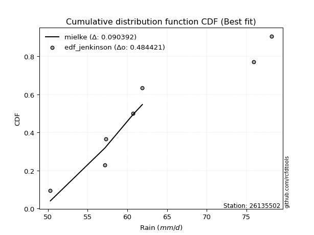</img></img>

</div>


### 11. Empirical - EDF Cunnane (1978)

Cunnane´s work in statistical hydrology has focused on the performance and evaluation of different probability distributions (such as GEV, Gumbel, Lognormal) for flood frequency estimation. _b_ is a constant, typically set to 0.4.

<div align="center">


$P=(m-b)/(n+1-2b)$


</div>


**11.1. Empirical values**

<div align="center">

|                | 0                   | 1                   | 2                  | 3           | 4                  | 5                  | 6                  |
|:---------------|:--------------------|:--------------------|:-------------------|:------------|:-------------------|:-------------------|:-------------------|
| date           | 2017                | 2022                | 2021               | 2018        | 2023               | 2020               | 2019               |
| x              | 50.3                | 57.2                | 57.3               | 60.7        | 61.9               | 75.9               | 78.2               |
| m              | 1                   | 2                   | 3                  | 4           | 5                  | 6                  | 7                  |
| empirical_dist | edf_cunnane         | edf_cunnane         | edf_cunnane        | edf_cunnane | edf_cunnane        | edf_cunnane        | edf_cunnane        |
| empirical      | 0.08333333333333333 | 0.22222222222222224 | 0.3611111111111111 | 0.5         | 0.6388888888888888 | 0.7777777777777777 | 0.9166666666666666 |
| empirical_tr   | 1.090909090909091   | 1.2857142857142856  | 1.565217391304348  | 2.0         | 2.7692307692307687 | 4.499999999999998  | 11.999999999999995 |

</div>


**11.2. Kolmogorov-Smirnov fit test (sorted by Δ)**


<div align="center">

|                | 0                   | 1                   | 2                   | 3                   | 4                   | 5                   | 6                   | 7                   | 8                   | 9                   | 10                  | 11                  | 12                  | 13                  | 14                  | 15                  | 16                  | 17                  | 18                  | 19                  | 20                  | 21                  | 22                  | 23                  | 24                  | 25                  | 26                  | 27                  | 28                  | 29                  | 30                  | 31                  | 32                  | 33                  | 34                    | 35                  | 36                  | 37                  | 38                  | 39                  | 40                  | 41                  | 42                  | 43                  | 44                  | 45                  | 46                  | 47                  | 48                  | 49                  | 50                  | 51                  | 52                  | 53                  | 54                  | 55                  | 56                  | 57                  | 58                  | 59                  | 60                  | 61                  | 62                  | 63                  | 64                  | 65                  | 66                  | 67                  | 68                  | 69                  | 70                  | 71                  | 72                  | 73                  | 74                  | 75                  | 76                  | 77                  | 78                  | 79                  | 80                  | 81                  | 82                  | 83                  | 84                  | 85                  | 86                  | 87                  | 88                  | 89                  |
|:---------------|:--------------------|:--------------------|:--------------------|:--------------------|:--------------------|:--------------------|:--------------------|:--------------------|:--------------------|:--------------------|:--------------------|:--------------------|:--------------------|:--------------------|:--------------------|:--------------------|:--------------------|:--------------------|:--------------------|:--------------------|:--------------------|:--------------------|:--------------------|:--------------------|:--------------------|:--------------------|:--------------------|:--------------------|:--------------------|:--------------------|:--------------------|:--------------------|:--------------------|:--------------------|:----------------------|:--------------------|:--------------------|:--------------------|:--------------------|:--------------------|:--------------------|:--------------------|:--------------------|:--------------------|:--------------------|:--------------------|:--------------------|:--------------------|:--------------------|:--------------------|:--------------------|:--------------------|:--------------------|:--------------------|:--------------------|:--------------------|:--------------------|:--------------------|:--------------------|:--------------------|:--------------------|:--------------------|:--------------------|:--------------------|:--------------------|:--------------------|:--------------------|:--------------------|:--------------------|:--------------------|:--------------------|:--------------------|:--------------------|:--------------------|:--------------------|:--------------------|:--------------------|:--------------------|:--------------------|:--------------------|:--------------------|:--------------------|:--------------------|:--------------------|:--------------------|:--------------------|:--------------------|:--------------------|:--------------------|:--------------------|
| station        | 26135502            | 26135502            | 26135502            | 26135502            | 26135502            | 26135502            | 26135502            | 26135502            | 26135502            | 26135502            | 26135502            | 26135502            | 26135502            | 26135502            | 26135502            | 26135502            | 26135502            | 26135502            | 26135502            | 26135502            | 26135502            | 26135502            | 26135502            | 26135502            | 26135502            | 26135502            | 26135502            | 26135502            | 26135502            | 26135502            | 26135502            | 26135502            | 26135502            | 26135502            | 26135502              | 26135502            | 26135502            | 26135502            | 26135502            | 26135502            | 26135502            | 26135502            | 26135502            | 26135502            | 26135502            | 26135502            | 26135502            | 26135502            | 26135502            | 26135502            | 26135502            | 26135502            | 26135502            | 26135502            | 26135502            | 26135502            | 26135502            | 26135502            | 26135502            | 26135502            | 26135502            | 26135502            | 26135502            | 26135502            | 26135502            | 26135502            | 26135502            | 26135502            | 26135502            | 26135502            | 26135502            | 26135502            | 26135502            | 26135502            | 26135502            | 26135502            | 26135502            | 26135502            | 26135502            | 26135502            | 26135502            | 26135502            | 26135502            | 26135502            | 26135502            | 26135502            | 26135502            | 26135502            | 26135502            | 26135502            |
| empirical_dist | edf_cunnane         | edf_cunnane         | edf_cunnane         | edf_cunnane         | edf_cunnane         | edf_cunnane         | edf_cunnane         | edf_cunnane         | edf_cunnane         | edf_cunnane         | edf_cunnane         | edf_cunnane         | edf_cunnane         | edf_cunnane         | edf_cunnane         | edf_cunnane         | edf_cunnane         | edf_cunnane         | edf_cunnane         | edf_cunnane         | edf_cunnane         | edf_cunnane         | edf_cunnane         | edf_cunnane         | edf_cunnane         | edf_cunnane         | edf_cunnane         | edf_cunnane         | edf_cunnane         | edf_cunnane         | edf_cunnane         | edf_cunnane         | edf_cunnane         | edf_cunnane         | edf_cunnane           | edf_cunnane         | edf_cunnane         | edf_cunnane         | edf_cunnane         | edf_cunnane         | edf_cunnane         | edf_cunnane         | edf_cunnane         | edf_cunnane         | edf_cunnane         | edf_cunnane         | edf_cunnane         | edf_cunnane         | edf_cunnane         | edf_cunnane         | edf_cunnane         | edf_cunnane         | edf_cunnane         | edf_cunnane         | edf_cunnane         | edf_cunnane         | edf_cunnane         | edf_cunnane         | edf_cunnane         | edf_cunnane         | edf_cunnane         | edf_cunnane         | edf_cunnane         | edf_cunnane         | edf_cunnane         | edf_cunnane         | edf_cunnane         | edf_cunnane         | edf_cunnane         | edf_cunnane         | edf_cunnane         | edf_cunnane         | edf_cunnane         | edf_cunnane         | edf_cunnane         | edf_cunnane         | edf_cunnane         | edf_cunnane         | edf_cunnane         | edf_cunnane         | edf_cunnane         | edf_cunnane         | edf_cunnane         | edf_cunnane         | edf_cunnane         | edf_cunnane         | edf_cunnane         | edf_cunnane         | edf_cunnane         | edf_cunnane         |
| p_dist         | mielke              | logfisk             | loggenlogistic      | logf                | logerlang           | loggamma            | loggamma            | logweibull_min      | loginvweibull       | logexponnorm        | logkstwobign        | exponnorm           | halfnorm            | logmielke           | invgauss            | logfatiguelife      | loginvgauss         | genexpon            | lograyleigh         | invgamma            | loghalfnorm         | loginvgamma         | alpha               | laplace_asymmetric  | loghalflogistic     | logrice             | invweibull          | halflogistic        | loggumbel_r         | kstwobign           | f                   | logmaxwell          | logmoyal            | genlogistic         | loglaplace_asymmetric | gompertz            | gumbel_r            | moyal               | loggenexpon         | logpearson3         | logbetaprime        | fisk                | logwald             | wald                | nct                 | weibull_min         | rayleigh            | logalpha            | ncf                 | lognct              | maxwell             | pearson3            | rice                | loggompertz         | logcrystalball      | lognorm             | lognorm             | logt                | logjohnsonsu        | betaprime           | logloggamma         | loglogistic         | loghypsecant        | loglaplace          | loggibrat           | t                   | crystalball         | norm                | johnsonsu           | logistic            | expon               | logtruncnorm        | hypsecant           | laplace             | lognakagami         | gibrat              | logexpon            | loggumbel_l         | logncf              | gumbel_l            | erlang              | nakagami            | logchi2             | loglognorm          | pareto              | logpareto           | gamma               | truncnorm           | chi2                | fatiguelife         |
| delta          | 0.09716670333952429 | 0.11216445264721586 | 0.11282299789808858 | 0.1129402289084398  | 0.11317499848936441 | 0.11317529678223393 | 0.11317529678223393 | 0.11331031432553818 | 0.11335176415494164 | 0.1135257155149989  | 0.11435321047833147 | 0.11492428886346717 | 0.11529826433510937 | 0.11614084085695353 | 0.11633883093191988 | 0.11712087285838524 | 0.11748611289289923 | 0.11751761092165117 | 0.11806730781931951 | 0.11883366358197822 | 0.11956044501796839 | 0.11977567508888642 | 0.12145718575620712 | 0.12184606134141929 | 0.12237092981674336 | 0.12355262086869423 | 0.12360071761783675 | 0.12427551249023883 | 0.12568012650821592 | 0.12579449902984563 | 0.12589978069554034 | 0.12618035570968977 | 0.12632609537992578 | 0.12639870008885223 | 0.126444517144097     | 0.12729521512050135 | 0.12770228451521937 | 0.12814906788918634 | 0.13453569835690435 | 0.1366403262941528  | 0.13725554217011493 | 0.1373367102579075  | 0.13833853929609752 | 0.1396784655306197  | 0.14122590742368502 | 0.14173768707162746 | 0.14177950600372624 | 0.14454137381649507 | 0.15147555232331777 | 0.1515842462889544  | 0.15366170368238447 | 0.15430970735625615 | 0.15840260465926148 | 0.15887826809099861 | 0.1599442714016236  | 0.15994578866847836 | 0.15994578866847836 | 0.1599690431146517  | 0.1600093538627369  | 0.16089659286561453 | 0.16198416053326586 | 0.16281563192137644 | 0.1652618395488888  | 0.1748684320280191  | 0.1810929397067612  | 0.18795112061271957 | 0.187973454530111   | 0.1879734636621312  | 0.18829269577619423 | 0.19458926317585018 | 0.19518594689053512 | 0.19619886281997775 | 0.20018101187510717 | 0.21892595035813633 | 0.22340933581875602 | 0.22383688285743508 | 0.22738229009310615 | 0.2306260417889131  | 0.23527365550284474 | 0.2581020646971454  | 0.3085948528515361  | 0.3843306582012752  | 0.3883093768812633  | 0.4190925420316821  | 0.43288982670764875 | 0.43657548838571125 | 0.4797753315896294  | 0.49997567235553964 | 0.5298813435208378  | 0.5732774592916662  |
| deltao         | 0.48442053926100004 | 0.48442053926100004 | 0.48442053926100004 | 0.48442053926100004 | 0.48442053926100004 | 0.48442053926100004 | 0.48442053926100004 | 0.48442053926100004 | 0.48442053926100004 | 0.48442053926100004 | 0.48442053926100004 | 0.48442053926100004 | 0.48442053926100004 | 0.48442053926100004 | 0.48442053926100004 | 0.48442053926100004 | 0.48442053926100004 | 0.48442053926100004 | 0.48442053926100004 | 0.48442053926100004 | 0.48442053926100004 | 0.48442053926100004 | 0.48442053926100004 | 0.48442053926100004 | 0.48442053926100004 | 0.48442053926100004 | 0.48442053926100004 | 0.48442053926100004 | 0.48442053926100004 | 0.48442053926100004 | 0.48442053926100004 | 0.48442053926100004 | 0.48442053926100004 | 0.48442053926100004 | 0.48442053926100004   | 0.48442053926100004 | 0.48442053926100004 | 0.48442053926100004 | 0.48442053926100004 | 0.48442053926100004 | 0.48442053926100004 | 0.48442053926100004 | 0.48442053926100004 | 0.48442053926100004 | 0.48442053926100004 | 0.48442053926100004 | 0.48442053926100004 | 0.48442053926100004 | 0.48442053926100004 | 0.48442053926100004 | 0.48442053926100004 | 0.48442053926100004 | 0.48442053926100004 | 0.48442053926100004 | 0.48442053926100004 | 0.48442053926100004 | 0.48442053926100004 | 0.48442053926100004 | 0.48442053926100004 | 0.48442053926100004 | 0.48442053926100004 | 0.48442053926100004 | 0.48442053926100004 | 0.48442053926100004 | 0.48442053926100004 | 0.48442053926100004 | 0.48442053926100004 | 0.48442053926100004 | 0.48442053926100004 | 0.48442053926100004 | 0.48442053926100004 | 0.48442053926100004 | 0.48442053926100004 | 0.48442053926100004 | 0.48442053926100004 | 0.48442053926100004 | 0.48442053926100004 | 0.48442053926100004 | 0.48442053926100004 | 0.48442053926100004 | 0.48442053926100004 | 0.48442053926100004 | 0.48442053926100004 | 0.48442053926100004 | 0.48442053926100004 | 0.48442053926100004 | 0.48442053926100004 | 0.48442053926100004 | 0.48442053926100004 | 0.48442053926100004 |
| eval           | Δo > Δ              | Δo > Δ              | Δo > Δ              | Δo > Δ              | Δo > Δ              | Δo > Δ              | Δo > Δ              | Δo > Δ              | Δo > Δ              | Δo > Δ              | Δo > Δ              | Δo > Δ              | Δo > Δ              | Δo > Δ              | Δo > Δ              | Δo > Δ              | Δo > Δ              | Δo > Δ              | Δo > Δ              | Δo > Δ              | Δo > Δ              | Δo > Δ              | Δo > Δ              | Δo > Δ              | Δo > Δ              | Δo > Δ              | Δo > Δ              | Δo > Δ              | Δo > Δ              | Δo > Δ              | Δo > Δ              | Δo > Δ              | Δo > Δ              | Δo > Δ              | Δo > Δ                | Δo > Δ              | Δo > Δ              | Δo > Δ              | Δo > Δ              | Δo > Δ              | Δo > Δ              | Δo > Δ              | Δo > Δ              | Δo > Δ              | Δo > Δ              | Δo > Δ              | Δo > Δ              | Δo > Δ              | Δo > Δ              | Δo > Δ              | Δo > Δ              | Δo > Δ              | Δo > Δ              | Δo > Δ              | Δo > Δ              | Δo > Δ              | Δo > Δ              | Δo > Δ              | Δo > Δ              | Δo > Δ              | Δo > Δ              | Δo > Δ              | Δo > Δ              | Δo > Δ              | Δo > Δ              | Δo > Δ              | Δo > Δ              | Δo > Δ              | Δo > Δ              | Δo > Δ              | Δo > Δ              | Δo > Δ              | Δo > Δ              | Δo > Δ              | Δo > Δ              | Δo > Δ              | Δo > Δ              | Δo > Δ              | Δo > Δ              | Δo > Δ              | Δo > Δ              | Δo > Δ              | Δo > Δ              | Δo > Δ              | Δo > Δ              | Δo > Δ              | Δo > Δ              | Δo <= Δ             | Δo <= Δ             | Δo <= Δ             |
| fit            | 1                   | 1                   | 1                   | 1                   | 1                   | 1                   | 1                   | 1                   | 1                   | 1                   | 1                   | 1                   | 1                   | 1                   | 1                   | 1                   | 1                   | 1                   | 1                   | 1                   | 1                   | 1                   | 1                   | 1                   | 1                   | 1                   | 1                   | 1                   | 1                   | 1                   | 1                   | 1                   | 1                   | 1                   | 1                     | 1                   | 1                   | 1                   | 1                   | 1                   | 1                   | 1                   | 1                   | 1                   | 1                   | 1                   | 1                   | 1                   | 1                   | 1                   | 1                   | 1                   | 1                   | 1                   | 1                   | 1                   | 1                   | 1                   | 1                   | 1                   | 1                   | 1                   | 1                   | 1                   | 1                   | 1                   | 1                   | 1                   | 1                   | 1                   | 1                   | 1                   | 1                   | 1                   | 1                   | 1                   | 1                   | 1                   | 1                   | 1                   | 1                   | 1                   | 1                   | 1                   | 1                   | 1                   | 1                   | 0                   | 0                   | 0                   |
| n              | 7                   | 7                   | 7                   | 7                   | 7                   | 7                   | 7                   | 7                   | 7                   | 7                   | 7                   | 7                   | 7                   | 7                   | 7                   | 7                   | 7                   | 7                   | 7                   | 7                   | 7                   | 7                   | 7                   | 7                   | 7                   | 7                   | 7                   | 7                   | 7                   | 7                   | 7                   | 7                   | 7                   | 7                   | 7                     | 7                   | 7                   | 7                   | 7                   | 7                   | 7                   | 7                   | 7                   | 7                   | 7                   | 7                   | 7                   | 7                   | 7                   | 7                   | 7                   | 7                   | 7                   | 7                   | 7                   | 7                   | 7                   | 7                   | 7                   | 7                   | 7                   | 7                   | 7                   | 7                   | 7                   | 7                   | 7                   | 7                   | 7                   | 7                   | 7                   | 7                   | 7                   | 7                   | 7                   | 7                   | 7                   | 7                   | 7                   | 7                   | 7                   | 7                   | 7                   | 7                   | 7                   | 7                   | 7                   | 7                   | 7                   | 7                   |
| best_fit       | 1                   | 0                   | 0                   | 0                   | 0                   | 0                   | 0                   | 0                   | 0                   | 0                   | 0                   | 0                   | 0                   | 0                   | 0                   | 0                   | 0                   | 0                   | 0                   | 0                   | 0                   | 0                   | 0                   | 0                   | 0                   | 0                   | 0                   | 0                   | 0                   | 0                   | 0                   | 0                   | 0                   | 0                   | 0                     | 0                   | 0                   | 0                   | 0                   | 0                   | 0                   | 0                   | 0                   | 0                   | 0                   | 0                   | 0                   | 0                   | 0                   | 0                   | 0                   | 0                   | 0                   | 0                   | 0                   | 0                   | 0                   | 0                   | 0                   | 0                   | 0                   | 0                   | 0                   | 0                   | 0                   | 0                   | 0                   | 0                   | 0                   | 0                   | 0                   | 0                   | 0                   | 0                   | 0                   | 0                   | 0                   | 0                   | 0                   | 0                   | 0                   | 0                   | 0                   | 0                   | 0                   | 0                   | 0                   | 0                   | 0                   | 0                   |
| best_fit_sort  | 1                   | 2                   | 3                   | 4                   | 5                   | 6                   | 7                   | 8                   | 9                   | 10                  | 11                  | 12                  | 13                  | 14                  | 15                  | 16                  | 17                  | 18                  | 19                  | 20                  | 21                  | 22                  | 23                  | 24                  | 25                  | 26                  | 27                  | 28                  | 29                  | 30                  | 31                  | 32                  | 33                  | 34                  | 35                    | 36                  | 37                  | 38                  | 39                  | 40                  | 41                  | 42                  | 43                  | 44                  | 45                  | 46                  | 47                  | 48                  | 49                  | 50                  | 51                  | 52                  | 53                  | 54                  | 55                  | 56                  | 57                  | 58                  | 59                  | 60                  | 61                  | 62                  | 63                  | 64                  | 65                  | 66                  | 67                  | 68                  | 69                  | 70                  | 71                  | 72                  | 73                  | 74                  | 75                  | 76                  | 77                  | 78                  | 79                  | 80                  | 81                  | 82                  | 83                  | 84                  | 85                  | 86                  | 87                  | 88                  | 89                  | 90                  |

</div>


<div align="center">

</img>

</div>


**11.3. Best fit**

<div align="center">

|   id |   station | empirical_dist   | p_dist   |     delta |   deltao | eval   |   fit |   n |   best_fit |   best_fit_sort |
|-----:|----------:|:-----------------|:---------|----------:|---------:|:-------|------:|----:|-----------:|----------------:|
|    0 |  26135502 | edf_cunnane      | mielke   | 0.0971667 | 0.484421 | Δo > Δ |     1 |   7 |          1 |               1 |

</div>


<div align="center">

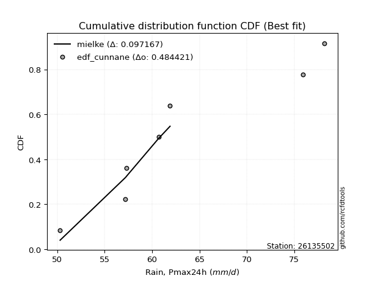</img>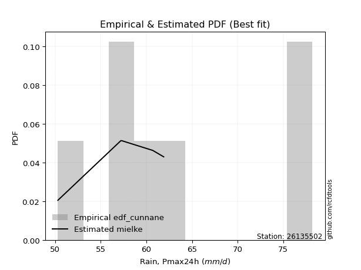</img>

</div>


### 12. Empirical - EDF Adamowski (1981)

The Adamowski formula in hydrology refers to a specific plotting position formula used for estimating the non-parametric empirical distribution of hydrological events (like flood peaks) to calculate their return periods. This formula provides an alternative to traditional parametric methods (like the Gumbel or Log Pearson Type III distributions). 

<div align="center">


$P=(m-0.25)/(n+0.5)$


</div>


**12.1. Empirical values**

<div align="center">

|                | 0                  | 1                   | 2                   | 3             | 4                  | 5                  | 6                  |
|:---------------|:-------------------|:--------------------|:--------------------|:--------------|:-------------------|:-------------------|:-------------------|
| date           | 2017               | 2022                | 2021                | 2018          | 2023               | 2020               | 2019               |
| x              | 50.3               | 57.2                | 57.3                | 60.7          | 61.9               | 75.9               | 78.2               |
| m              | 1                  | 2                   | 3                   | 4             | 5                  | 6                  | 7                  |
| empirical_dist | edf_adamowski      | edf_adamowski       | edf_adamowski       | edf_adamowski | edf_adamowski      | edf_adamowski      | edf_adamowski      |
| empirical      | 0.1                | 0.23333333333333334 | 0.36666666666666664 | 0.5           | 0.6333333333333333 | 0.7666666666666667 | 0.9                |
| empirical_tr   | 1.1111111111111112 | 1.3043478260869565  | 1.5789473684210527  | 2.0           | 2.727272727272727  | 4.2857142857142865 | 10.000000000000002 |

</div>


**12.2. Kolmogorov-Smirnov fit test (sorted by Δ)**


<div align="center">

|                | 0                   | 1                   | 2                   | 3                   | 4                   | 5                   | 6                   | 7                   | 8                   | 9                   | 10                  | 11                  | 12                  | 13                  | 14                  | 15                  | 16                  | 17                  | 18                  | 19                  | 20                  | 21                  | 22                  | 23                  | 24                  | 25                  | 26                  | 27                  | 28                  | 29                  | 30                  | 31                  | 32                  | 33                  | 34                  | 35                  | 36                  | 37                  | 38                  | 39                  | 40                    | 41                  | 42                  | 43                  | 44                  | 45                  | 46                  | 47                  | 48                  | 49                  | 50                  | 51                  | 52                  | 53                  | 54                  | 55                  | 56                  | 57                  | 58                  | 59                  | 60                  | 61                  | 62                  | 63                  | 64                  | 65                  | 66                  | 67                  | 68                  | 69                  | 70                  | 71                  | 72                  | 73                  | 74                  | 75                  | 76                  | 77                  | 78                  | 79                  | 80                  | 81                  | 82                  | 83                  | 84                  | 85                  | 86                  | 87                  | 88                  | 89                  |
|:---------------|:--------------------|:--------------------|:--------------------|:--------------------|:--------------------|:--------------------|:--------------------|:--------------------|:--------------------|:--------------------|:--------------------|:--------------------|:--------------------|:--------------------|:--------------------|:--------------------|:--------------------|:--------------------|:--------------------|:--------------------|:--------------------|:--------------------|:--------------------|:--------------------|:--------------------|:--------------------|:--------------------|:--------------------|:--------------------|:--------------------|:--------------------|:--------------------|:--------------------|:--------------------|:--------------------|:--------------------|:--------------------|:--------------------|:--------------------|:--------------------|:----------------------|:--------------------|:--------------------|:--------------------|:--------------------|:--------------------|:--------------------|:--------------------|:--------------------|:--------------------|:--------------------|:--------------------|:--------------------|:--------------------|:--------------------|:--------------------|:--------------------|:--------------------|:--------------------|:--------------------|:--------------------|:--------------------|:--------------------|:--------------------|:--------------------|:--------------------|:--------------------|:--------------------|:--------------------|:--------------------|:--------------------|:--------------------|:--------------------|:--------------------|:--------------------|:--------------------|:--------------------|:--------------------|:--------------------|:--------------------|:--------------------|:--------------------|:--------------------|:--------------------|:--------------------|:--------------------|:--------------------|:--------------------|:--------------------|:--------------------|
| station        | 26135502            | 26135502            | 26135502            | 26135502            | 26135502            | 26135502            | 26135502            | 26135502            | 26135502            | 26135502            | 26135502            | 26135502            | 26135502            | 26135502            | 26135502            | 26135502            | 26135502            | 26135502            | 26135502            | 26135502            | 26135502            | 26135502            | 26135502            | 26135502            | 26135502            | 26135502            | 26135502            | 26135502            | 26135502            | 26135502            | 26135502            | 26135502            | 26135502            | 26135502            | 26135502            | 26135502            | 26135502            | 26135502            | 26135502            | 26135502            | 26135502              | 26135502            | 26135502            | 26135502            | 26135502            | 26135502            | 26135502            | 26135502            | 26135502            | 26135502            | 26135502            | 26135502            | 26135502            | 26135502            | 26135502            | 26135502            | 26135502            | 26135502            | 26135502            | 26135502            | 26135502            | 26135502            | 26135502            | 26135502            | 26135502            | 26135502            | 26135502            | 26135502            | 26135502            | 26135502            | 26135502            | 26135502            | 26135502            | 26135502            | 26135502            | 26135502            | 26135502            | 26135502            | 26135502            | 26135502            | 26135502            | 26135502            | 26135502            | 26135502            | 26135502            | 26135502            | 26135502            | 26135502            | 26135502            | 26135502            |
| empirical_dist | edf_adamowski       | edf_adamowski       | edf_adamowski       | edf_adamowski       | edf_adamowski       | edf_adamowski       | edf_adamowski       | edf_adamowski       | edf_adamowski       | edf_adamowski       | edf_adamowski       | edf_adamowski       | edf_adamowski       | edf_adamowski       | edf_adamowski       | edf_adamowski       | edf_adamowski       | edf_adamowski       | edf_adamowski       | edf_adamowski       | edf_adamowski       | edf_adamowski       | edf_adamowski       | edf_adamowski       | edf_adamowski       | edf_adamowski       | edf_adamowski       | edf_adamowski       | edf_adamowski       | edf_adamowski       | edf_adamowski       | edf_adamowski       | edf_adamowski       | edf_adamowski       | edf_adamowski       | edf_adamowski       | edf_adamowski       | edf_adamowski       | edf_adamowski       | edf_adamowski       | edf_adamowski         | edf_adamowski       | edf_adamowski       | edf_adamowski       | edf_adamowski       | edf_adamowski       | edf_adamowski       | edf_adamowski       | edf_adamowski       | edf_adamowski       | edf_adamowski       | edf_adamowski       | edf_adamowski       | edf_adamowski       | edf_adamowski       | edf_adamowski       | edf_adamowski       | edf_adamowski       | edf_adamowski       | edf_adamowski       | edf_adamowski       | edf_adamowski       | edf_adamowski       | edf_adamowski       | edf_adamowski       | edf_adamowski       | edf_adamowski       | edf_adamowski       | edf_adamowski       | edf_adamowski       | edf_adamowski       | edf_adamowski       | edf_adamowski       | edf_adamowski       | edf_adamowski       | edf_adamowski       | edf_adamowski       | edf_adamowski       | edf_adamowski       | edf_adamowski       | edf_adamowski       | edf_adamowski       | edf_adamowski       | edf_adamowski       | edf_adamowski       | edf_adamowski       | edf_adamowski       | edf_adamowski       | edf_adamowski       | edf_adamowski       |
| p_dist         | mielke              | genexpon            | logfisk             | loggenexpon         | loggenlogistic      | logf                | loghalfnorm         | logerlang           | loggamma            | loggamma            | logweibull_min      | loginvweibull       | logexponnorm        | logkstwobign        | exponnorm           | halfnorm            | logmielke           | invgauss            | logfatiguelife      | loginvgauss         | lograyleigh         | gompertz            | invgamma            | weibull_min         | loginvgamma         | logmaxwell          | logrice             | alpha               | logbetaprime        | laplace_asymmetric  | loghalflogistic     | f                   | invweibull          | halflogistic        | rayleigh            | logpearson3         | loggumbel_r         | kstwobign           | logmoyal            | genlogistic         | loglaplace_asymmetric | gumbel_r            | moyal               | nct                 | logalpha            | lognct              | ncf                 | loggompertz         | maxwell             | fisk                | pearson3            | logwald             | wald                | rice                | logcrystalball      | lognorm             | lognorm             | logt                | logjohnsonsu        | betaprime           | logloggamma         | loglogistic         | loghypsecant        | loglaplace          | t                   | crystalball         | norm                | johnsonsu           | expon               | loggibrat           | logistic            | hypsecant           | logtruncnorm        | lognakagami         | laplace             | logexpon            | logncf              | loggumbel_l         | gibrat              | gumbel_l            | erlang              | logchi2             | nakagami            | loglognorm          | pareto              | logpareto           | gamma               | truncnorm           | chi2                | fatiguelife         |
| delta          | 0.08634916487085298 | 0.1228897108628928  | 0.12327556375832682 | 0.12342458724579325 | 0.12393410900919954 | 0.12405134001955076 | 0.12413262893480737 | 0.12428610960047537 | 0.12428640789334489 | 0.12428640789334489 | 0.12442142543664914 | 0.1244628752660526  | 0.12463682662610986 | 0.12546432158944243 | 0.12603539997457813 | 0.12640937544622033 | 0.1272519519680645  | 0.12744994204303084 | 0.1282319839694962  | 0.1285972240040102  | 0.12917841893043047 | 0.12950856685178358 | 0.12994477469308918 | 0.13062657596051636 | 0.13088678619999738 | 0.13190089019644458 | 0.13238350871823434 | 0.13256829686731808 | 0.1328301771102567  | 0.13295717245253025 | 0.13348204092785432 | 0.13364691520415584 | 0.1347118287289477  | 0.1353866236013498  | 0.1362239504481707  | 0.13638671669707725 | 0.13679123761932688 | 0.1369056101409566  | 0.13743720649103675 | 0.1375098111999632  | 0.13755562825520795   | 0.13881339562633033 | 0.1392601790002973  | 0.13974888411131392 | 0.14133981921023808 | 0.14602869073339886 | 0.14656929755102543 | 0.14776715697988752 | 0.14810614812682893 | 0.14844782136901846 | 0.14875415180070062 | 0.14944965040720848 | 0.15078957664173065 | 0.15284704910370595 | 0.15438871584606806 | 0.15439023311292283 | 0.15439023311292283 | 0.15441348755909617 | 0.15445379830718137 | 0.155341037310059   | 0.15642860497771033 | 0.1572600763658209  | 0.15970628399333325 | 0.16931287647246357 | 0.18239556505716403 | 0.18241789897455546 | 0.18241790810657565 | 0.1827371402206387  | 0.18407483577942402 | 0.18664849526231675 | 0.18903370762029464 | 0.19462545631955164 | 0.19672807202059361 | 0.21229822470764492 | 0.2133703948025808  | 0.21627117898199505 | 0.21860698883617813 | 0.22507048623335757 | 0.22939243841299062 | 0.2525465091415899  | 0.29748374174042497 | 0.3716427102145967  | 0.3732195470901641  | 0.407981430920571   | 0.4217787155965376  | 0.4254643772746001  | 0.46866422047851825 | 0.49997567235553964 | 0.5187702324097268  | 0.562166348180555   |
| deltao         | 0.48442053926100004 | 0.48442053926100004 | 0.48442053926100004 | 0.48442053926100004 | 0.48442053926100004 | 0.48442053926100004 | 0.48442053926100004 | 0.48442053926100004 | 0.48442053926100004 | 0.48442053926100004 | 0.48442053926100004 | 0.48442053926100004 | 0.48442053926100004 | 0.48442053926100004 | 0.48442053926100004 | 0.48442053926100004 | 0.48442053926100004 | 0.48442053926100004 | 0.48442053926100004 | 0.48442053926100004 | 0.48442053926100004 | 0.48442053926100004 | 0.48442053926100004 | 0.48442053926100004 | 0.48442053926100004 | 0.48442053926100004 | 0.48442053926100004 | 0.48442053926100004 | 0.48442053926100004 | 0.48442053926100004 | 0.48442053926100004 | 0.48442053926100004 | 0.48442053926100004 | 0.48442053926100004 | 0.48442053926100004 | 0.48442053926100004 | 0.48442053926100004 | 0.48442053926100004 | 0.48442053926100004 | 0.48442053926100004 | 0.48442053926100004   | 0.48442053926100004 | 0.48442053926100004 | 0.48442053926100004 | 0.48442053926100004 | 0.48442053926100004 | 0.48442053926100004 | 0.48442053926100004 | 0.48442053926100004 | 0.48442053926100004 | 0.48442053926100004 | 0.48442053926100004 | 0.48442053926100004 | 0.48442053926100004 | 0.48442053926100004 | 0.48442053926100004 | 0.48442053926100004 | 0.48442053926100004 | 0.48442053926100004 | 0.48442053926100004 | 0.48442053926100004 | 0.48442053926100004 | 0.48442053926100004 | 0.48442053926100004 | 0.48442053926100004 | 0.48442053926100004 | 0.48442053926100004 | 0.48442053926100004 | 0.48442053926100004 | 0.48442053926100004 | 0.48442053926100004 | 0.48442053926100004 | 0.48442053926100004 | 0.48442053926100004 | 0.48442053926100004 | 0.48442053926100004 | 0.48442053926100004 | 0.48442053926100004 | 0.48442053926100004 | 0.48442053926100004 | 0.48442053926100004 | 0.48442053926100004 | 0.48442053926100004 | 0.48442053926100004 | 0.48442053926100004 | 0.48442053926100004 | 0.48442053926100004 | 0.48442053926100004 | 0.48442053926100004 | 0.48442053926100004 |
| eval           | Δo > Δ              | Δo > Δ              | Δo > Δ              | Δo > Δ              | Δo > Δ              | Δo > Δ              | Δo > Δ              | Δo > Δ              | Δo > Δ              | Δo > Δ              | Δo > Δ              | Δo > Δ              | Δo > Δ              | Δo > Δ              | Δo > Δ              | Δo > Δ              | Δo > Δ              | Δo > Δ              | Δo > Δ              | Δo > Δ              | Δo > Δ              | Δo > Δ              | Δo > Δ              | Δo > Δ              | Δo > Δ              | Δo > Δ              | Δo > Δ              | Δo > Δ              | Δo > Δ              | Δo > Δ              | Δo > Δ              | Δo > Δ              | Δo > Δ              | Δo > Δ              | Δo > Δ              | Δo > Δ              | Δo > Δ              | Δo > Δ              | Δo > Δ              | Δo > Δ              | Δo > Δ                | Δo > Δ              | Δo > Δ              | Δo > Δ              | Δo > Δ              | Δo > Δ              | Δo > Δ              | Δo > Δ              | Δo > Δ              | Δo > Δ              | Δo > Δ              | Δo > Δ              | Δo > Δ              | Δo > Δ              | Δo > Δ              | Δo > Δ              | Δo > Δ              | Δo > Δ              | Δo > Δ              | Δo > Δ              | Δo > Δ              | Δo > Δ              | Δo > Δ              | Δo > Δ              | Δo > Δ              | Δo > Δ              | Δo > Δ              | Δo > Δ              | Δo > Δ              | Δo > Δ              | Δo > Δ              | Δo > Δ              | Δo > Δ              | Δo > Δ              | Δo > Δ              | Δo > Δ              | Δo > Δ              | Δo > Δ              | Δo > Δ              | Δo > Δ              | Δo > Δ              | Δo > Δ              | Δo > Δ              | Δo > Δ              | Δo > Δ              | Δo > Δ              | Δo > Δ              | Δo <= Δ             | Δo <= Δ             | Δo <= Δ             |
| fit            | 1                   | 1                   | 1                   | 1                   | 1                   | 1                   | 1                   | 1                   | 1                   | 1                   | 1                   | 1                   | 1                   | 1                   | 1                   | 1                   | 1                   | 1                   | 1                   | 1                   | 1                   | 1                   | 1                   | 1                   | 1                   | 1                   | 1                   | 1                   | 1                   | 1                   | 1                   | 1                   | 1                   | 1                   | 1                   | 1                   | 1                   | 1                   | 1                   | 1                   | 1                     | 1                   | 1                   | 1                   | 1                   | 1                   | 1                   | 1                   | 1                   | 1                   | 1                   | 1                   | 1                   | 1                   | 1                   | 1                   | 1                   | 1                   | 1                   | 1                   | 1                   | 1                   | 1                   | 1                   | 1                   | 1                   | 1                   | 1                   | 1                   | 1                   | 1                   | 1                   | 1                   | 1                   | 1                   | 1                   | 1                   | 1                   | 1                   | 1                   | 1                   | 1                   | 1                   | 1                   | 1                   | 1                   | 1                   | 0                   | 0                   | 0                   |
| n              | 7                   | 7                   | 7                   | 7                   | 7                   | 7                   | 7                   | 7                   | 7                   | 7                   | 7                   | 7                   | 7                   | 7                   | 7                   | 7                   | 7                   | 7                   | 7                   | 7                   | 7                   | 7                   | 7                   | 7                   | 7                   | 7                   | 7                   | 7                   | 7                   | 7                   | 7                   | 7                   | 7                   | 7                   | 7                   | 7                   | 7                   | 7                   | 7                   | 7                   | 7                     | 7                   | 7                   | 7                   | 7                   | 7                   | 7                   | 7                   | 7                   | 7                   | 7                   | 7                   | 7                   | 7                   | 7                   | 7                   | 7                   | 7                   | 7                   | 7                   | 7                   | 7                   | 7                   | 7                   | 7                   | 7                   | 7                   | 7                   | 7                   | 7                   | 7                   | 7                   | 7                   | 7                   | 7                   | 7                   | 7                   | 7                   | 7                   | 7                   | 7                   | 7                   | 7                   | 7                   | 7                   | 7                   | 7                   | 7                   | 7                   | 7                   |
| best_fit       | 1                   | 0                   | 0                   | 0                   | 0                   | 0                   | 0                   | 0                   | 0                   | 0                   | 0                   | 0                   | 0                   | 0                   | 0                   | 0                   | 0                   | 0                   | 0                   | 0                   | 0                   | 0                   | 0                   | 0                   | 0                   | 0                   | 0                   | 0                   | 0                   | 0                   | 0                   | 0                   | 0                   | 0                   | 0                   | 0                   | 0                   | 0                   | 0                   | 0                   | 0                     | 0                   | 0                   | 0                   | 0                   | 0                   | 0                   | 0                   | 0                   | 0                   | 0                   | 0                   | 0                   | 0                   | 0                   | 0                   | 0                   | 0                   | 0                   | 0                   | 0                   | 0                   | 0                   | 0                   | 0                   | 0                   | 0                   | 0                   | 0                   | 0                   | 0                   | 0                   | 0                   | 0                   | 0                   | 0                   | 0                   | 0                   | 0                   | 0                   | 0                   | 0                   | 0                   | 0                   | 0                   | 0                   | 0                   | 0                   | 0                   | 0                   |
| best_fit_sort  | 1                   | 2                   | 3                   | 4                   | 5                   | 6                   | 7                   | 8                   | 9                   | 10                  | 11                  | 12                  | 13                  | 14                  | 15                  | 16                  | 17                  | 18                  | 19                  | 20                  | 21                  | 22                  | 23                  | 24                  | 25                  | 26                  | 27                  | 28                  | 29                  | 30                  | 31                  | 32                  | 33                  | 34                  | 35                  | 36                  | 37                  | 38                  | 39                  | 40                  | 41                    | 42                  | 43                  | 44                  | 45                  | 46                  | 47                  | 48                  | 49                  | 50                  | 51                  | 52                  | 53                  | 54                  | 55                  | 56                  | 57                  | 58                  | 59                  | 60                  | 61                  | 62                  | 63                  | 64                  | 65                  | 66                  | 67                  | 68                  | 69                  | 70                  | 71                  | 72                  | 73                  | 74                  | 75                  | 76                  | 77                  | 78                  | 79                  | 80                  | 81                  | 82                  | 83                  | 84                  | 85                  | 86                  | 87                  | 88                  | 89                  | 90                  |

</div>


<div align="center">

</img>

</div>


**12.3. Best fit**

<div align="center">

|   id |   station | empirical_dist   | p_dist   |     delta |   deltao | eval   |   fit |   n |   best_fit |   best_fit_sort |
|-----:|----------:|:-----------------|:---------|----------:|---------:|:-------|------:|----:|-----------:|----------------:|
|    0 |  26135502 | edf_adamowski    | mielke   | 0.0863492 | 0.484421 | Δo > Δ |     1 |   7 |          1 |               1 |

</div>


<div align="center">

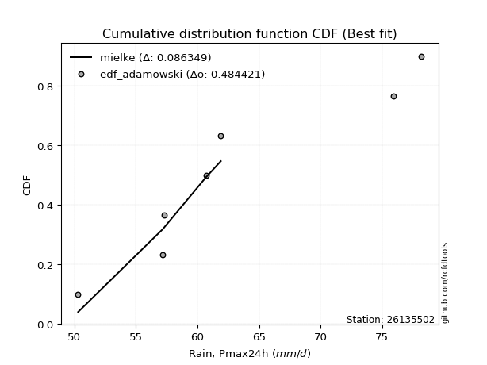</img></img>

</div>


## C. Best fit & Estimate extreme values for specific return periods - Tr


### 1. Best fit (ordered by delta Δ)

<div align="center">

|   id |   station | empirical_dist   | p_dist   |     delta |   deltao | eval   |   fit |   n |   best_fit |   best_fit_sort |
|-----:|----------:|:-----------------|:---------|----------:|---------:|:-------|------:|----:|-----------:|----------------:|
|    0 |  26135502 | edf_weibull      | mielke   | 0.0845455 | 0.484421 | Δo > Δ |     1 |   7 |          1 |               1 |
|    1 |  26135502 | edf_adamowski    | mielke   | 0.0863492 | 0.484421 | Δo > Δ |     1 |   7 |          1 |               2 |
|    2 |  26135502 | edf_chegodayev   | mielke   | 0.0896592 | 0.484421 | Δo > Δ |     1 |   7 |          1 |               3 |
|    3 |  26135502 | edf_jenkinson    | mielke   | 0.0903916 | 0.484421 | Δo > Δ |     1 |   7 |          1 |               4 |
|    4 |  26135502 | edf_beard        | mielke   | 0.0903916 | 0.484421 | Δo > Δ |     1 |   7 |          1 |               5 |
|    5 |  26135502 | edf_filliben     | mielke   | 0.0909436 | 0.484421 | Δo > Δ |     1 |   7 |          1 |               6 |
|    6 |  26135502 | edf_tukey        | mielke   | 0.0921162 | 0.484421 | Δo > Δ |     1 |   7 |          1 |               7 |
|    7 |  26135502 | edf_blom         | mielke   | 0.095251  | 0.484421 | Δo > Δ |     1 |   7 |          1 |               8 |
|    8 |  26135502 | edf_cunnane      | mielke   | 0.0971667 | 0.484421 | Δo > Δ |     1 |   7 |          1 |               9 |
|    9 |  26135502 | edf_gringorten   | mielke   | 0.100288  | 0.484421 | Δo > Δ |     1 |   7 |          1 |              10 |
|   10 |  26135502 | edf_hazen        | logfisk  | 0.104228  | 0.484421 | Δo > Δ |     1 |   7 |          1 |              11 |
|   11 |  26135502 | edf_california   | logmoyal | 0.140064  | 0.484421 | Δo > Δ |     1 |   7 |          1 |              12 |

</div>

:file_folder:Tables: [bestfit_26135502.csv](table/bestfit_26135502.csv) | [extreme_26135502.csv](table/extreme_26135502.csv)


### 2. Extreme values

In hydrology, a return period (or recurrence interval $Tr$) is the statistical average time between extreme events like floods or droughts of a specific magnitude, indicating how rare an event is, with a 100-year flood, for example, having a 1% chance of occurring in any given year, not that it happens exactly every century. It is a key tool for infrastructure design (like bridges or dams) and risk assessment, calculated from historical data to determine the probability of future events, although it is important to remember it is statistical average, and events can cluster or be missed.

> risk_rate: assuming the return period as the project useful life.

|   id |      tr |   prob_l |     prob_g |    alpha |   betaprime |     chi2 |   crystalball |   erlang |    expon |   exponnorm |        f |   fatiguelife |     fisk |    gamma |   genexpon |   genlogistic |   gibrat |   gompertz |   gumbel_l |   gumbel_r |   halflogistic |   halfnorm |   hypsecant |   invgamma |   invgauss |   invweibull |   johnsonsu |   kstwobign |   laplace |   laplace_asymmetric |   loggamma |   logistic |   lognorm |   maxwell |   mielke |    moyal |   nakagami |     ncf |      nct |    norm |           pareto |   pearson3 |   rayleigh |    rice |       t |   truncnorm |     wald |   weibull_min |   logalpha |   logbetaprime |          logchi2 |   logcrystalball |   logerlang |   logexpon |   logexponnorm |     logf |   logfatiguelife |   logfisk |   loggenexpon |   loggenlogistic |   loggibrat |   loggompertz |   loggumbel_l |   loggumbel_r |   loghalflogistic |   loghalfnorm |   loghypsecant |   loginvgamma |   loginvgauss |   loginvweibull |   logjohnsonsu |   logkstwobign |   loglaplace |   loglaplace_asymmetric |   logloggamma |   loglogistic |    loglognorm |   logmaxwell |   logmielke |   logmoyal |   lognakagami |   logncf |   lognct |      logpareto |   logpearson3 |   lograyleigh |   logrice |    logt |   logtruncnorm |   logwald |   logweibull_min |   station |   n |   risk_rate |
|-----:|--------:|---------:|-----------:|---------:|------------:|---------:|--------------:|---------:|---------:|------------:|---------:|--------------:|---------:|---------:|-----------:|--------------:|---------:|-----------:|-----------:|-----------:|---------------:|-----------:|------------:|-----------:|-----------:|-------------:|------------:|------------:|----------:|---------------------:|-----------:|-----------:|----------:|----------:|---------:|---------:|-----------:|--------:|---------:|--------:|-----------------:|-----------:|-----------:|--------:|--------:|------------:|---------:|--------------:|-----------:|---------------:|-----------------:|-----------------:|------------:|-----------:|---------------:|---------:|-----------------:|----------:|--------------:|-----------------:|------------:|--------------:|--------------:|--------------:|------------------:|--------------:|---------------:|--------------:|--------------:|----------------:|---------------:|---------------:|-------------:|------------------------:|--------------:|--------------:|--------------:|-------------:|------------:|-----------:|--------------:|---------:|---------:|---------------:|--------------:|--------------:|----------:|--------:|---------------:|----------:|-----------------:|----------:|----:|------------:|
|    0 |    2    | 0.5      | 0.5        |  61.2937 |     62.4086 |  51.958  |       63.0714 |  56.5618 |  59.1525 |     60.7094 |  60.2794 |       50.3    |  61.6934 |  53.0481 |    60.8799 |       61.3735 |  60.2208 |    61.6023 |    64.6316 |    61.5112 |        60.7356 |    61.1274 |     63.0714 |    61.1597 |    61.017  |      61.2561 |     63.0717 |     61.5108 |   63.0714 |              60.715  |    60.8683 |    63.0714 |   62.3826 |   62.2592 |  60.8457 |  61.0076 |    53.5497 | 62.1785 |  61.9525 | 63.0714 |     51.0452      |    62.2612 |    61.9711 | 62.3492 | 63.0705 |     57.4346 |  59.993  |       60.2648 |    62.0261 |        61.8622 |     73.9046      |          62.3826 |     60.8683 |    58.3948 |        60.5466 |  60.8666 |          61.0537 |   60.899  |       60.3824 |          60.8322 |     59.6874 |       59.9412 |       63.9084 |       60.8933 |           60.1663 |       60.5326 |        62.3826 |       61.2064 |       61.0716 |         60.819  |        62.3825 |        60.7794 |      62.3826 |                 61.5841 |       62.4375 |       62.3826 |  50.3887      |      61.6028 |     60.8504 |    60.4202 |       58.4967 |  62.887  |  62.2435 |   50.9589      |       61.849  |       61.3286 |   61.5447 | 62.3832 |        58.9979 |   59.4774 |          60.8371 |  26135502 |   7 |    0.75     |
|    1 |    2.33 | 0.570815 | 0.429185   |  62.8927 |     64.0813 |  52.852  |       64.7662 |  58.1008 |  61.1029 |     62.26   |  61.9022 |       50.6224 |  63.2464 |  54.1546 |    62.7144 |       62.9711 |  61.0792 |    63.4722 |    66.106  |    63.0816 |        62.3502 |    62.9565 |     64.4277 |    62.7826 |    62.6856 |      62.8551 |     64.7557 |     63.1761 |   64.097  |              62.1593 |    62.5379 |    64.5646 |   64.0417 |   64.0199 |  62.4642 |  62.4941 |    55.7416 | 63.784  |  63.5857 | 64.7662 |     52.168       |    63.9601 |    63.7579 | 64.0282 | 64.7646 |     57.4862 |  61.1042 |       62.1009 |    63.6498 |        63.5464 |     86.0995      |          64.0416 |     62.5379 |    60.3466 |        62.0523 |  62.5335 |          62.689  |   62.4183 |       62.1824 |          62.4505 |     60.4866 |       61.8067 |       65.3845 |       62.3925 |           61.6897 |       62.2717 |        63.7069 |       62.8194 |       62.7046 |         62.4326 |        64.0358 |        62.4593 |      63.3814 |                 62.7852 |       64.121  |       63.8421 |  51.0399      |      63.3058 |     62.447  |    61.8273 |       60.3942 |  68.2505 |  64.2122 |   51.9684      |       63.5013 |       63.0494 |   63.2342 | 64.0422 |        60.7384 |   60.5102 |          62.5632 |  26135502 |   7 |    0.729209 |
|    2 |    5    | 0.8      | 0.2        |  69.9683 |     70.6947 |  59.2653 |       71.0642 |  66.0341 |  70.8548 |     69.786  |  69.3714 |       57.4695 |  69.6175 |  60.9898 |    70.6455 |       69.9104 |  66.0218 |    71.0016 |    70.8693 |    69.9039 |        69.6558 |    70.6913 |     69.8681 |    70.0386 |    70.1683 |      69.9088 |     71.014  |     70.25   |   69.2246 |              69.3804 |    70.1574 |    70.3299 |   70.6032 |   70.9499 |  70.0047 |  69.3799 |    71.4389 | 70.2422 |  70.3143 | 71.0642 |    227.527       |    70.7364 |    70.911  | 70.7501 | 71.0604 |     57.7434 |  67.3249 |       70.5277 |    70.3031 |        70.5468 |    219.871       |          70.6031 |     70.1575 |    71.1285 |        69.4865 |  70.1543 |          70.0597 |   69.7005 |       70.369  |          69.9909 |     65.3002 |       70.1918 |       70.3904 |       69.3458 |           69.0796 |       70.1957 |        69.3073 |       70.0084 |       70.0534 |         69.955  |        70.5733 |        70.1286 |      68.62   |                 69.1511 |       70.7553 |       69.8049 |   1.35623e+18 |      70.4783 |     69.8404 |    68.7853 |       69.4644 |  93.1292 |  72.2078 | 1115.61        |       70.3799 |       70.4359 |   70.4179 | 70.6038 |        68.03   |   66.6316 |          70.2932 |  26135502 |   7 |    0.67232  |
|    3 |   10    | 0.9      | 0.1        |  75.9658 |     75.4527 |  66.8585 |       75.2422 |  73.4237 |  79.7073 |     76.5916 |  75.8706 |       66.9236 |  74.7154 |  68.301  |    76.7252 |       75.5616 |  71.6557 |    76.1502 |    73.5213 |    75.4606 |        75.7228 |    76.4148 |     74.2124 |    76.1938 |    76.4039 |      75.7843 |     75.1656 |     75.6358 |   73.8793 |              75.9355 |    76.7155 |    74.5759 |   75.3227 |   75.8268 |  76.8119 |  75.375  |    87.1734 | 74.9978 |  75.4365 | 75.2422 |  11035.7         |    75.6444 |    76.0113 | 75.5429 | 75.2368 |     57.9759 |  73.9266 |       77.5095 |    75.3301 |        75.9372 |    596.647       |          75.3227 |     76.7155 |    82.5753 |        76.8215 |  76.7411 |          76.3486 |   76.9783 |       77.177  |          76.7967 |     71.256  |       76.8013 |       73.3417 |       75.578  |           75.8851 |       76.7015 |        74.131  |       76.1117 |       76.3152 |         76.7467 |        75.2743 |        76.5932 |      73.7495 |                 75.487  |       75.5034 |       74.5495 | inf           |      76.0079 |     76.474  |    75.4779 |       77.2227 | 115.132  |  78.1671 |    1.62292e+85 |       75.6746 |       76.2254 |   75.9719 | 75.3233 |        72.4535 |   73.8066 |          76.6661 |  26135502 |   7 |    0.651322 |
|    4 |   15    | 0.933333 | 0.0666667  |  79.4846 |     77.9462 |  71.7724 |       77.3271 |  77.7932 |  84.8857 |     80.5726 |  79.6876 |       73.1067 |  77.6481 |  72.8631 |    79.9653 |       78.7498 |  75.5417 |    78.6871 |    74.7223 |    78.5956 |        79.1562 |    79.3934 |     76.6916 |    79.7733 |    79.9421 |      79.1517 |     77.2374 |     78.4951 |   76.6021 |              79.77   |    80.5405 |    76.8893 |   77.7946 |   78.3292 |  80.941  |  78.8543 |    95.9422 | 77.5266 |  78.2195 | 77.3271 | 122856           |    78.2196 |    78.6393 | 78.0124 | 77.321  |     58.1115 |  78.1659 |       81.4017 |    78.0481 |        78.8866 |   1111.21        |          77.7945 |     80.5406 |    90.1072 |        81.4639 |  80.5975 |          80.0094 |   81.8773 |       81.0193 |          80.9237 |     75.6778 |       80.3432 |       74.7187 |       79.3381 |           80.0293 |       80.3222 |        77.0328 |       79.6752 |       79.9586 |         80.8656 |        77.7361 |        80.2639 |      76.926  |                 79.4591 |       77.9824 |       77.2689 | inf           |      79.0114 |     80.4851 |    79.6567 |       81.6211 | 128.218  |  81.3583 |  inf           |       78.5667 |       79.3918 |   78.9825 | 77.7952 |        74.1902 |   78.8163 |          80.2553 |  26135502 |   7 |    0.644736 |
|    5 |   20    | 0.95     | 0.05       |  82.021  |     79.6241 |  75.4124 |       78.6924 |  80.9085 |  88.5598 |     83.3971 |  82.4251 |       77.6846 |  79.7419 |  76.1924 |    82.155  |       80.9821 |  78.59   |    80.3258 |    75.4699 |    80.7907 |        81.5617 |    81.3792 |     78.4406 |    82.3305 |    82.4229 |      81.5324 |     78.5941 |     80.4212 |   78.534  |              82.4906 |    83.2728 |    78.4882 |   79.4571 |   79.9899 |  83.9638 |  81.3184 |   101.894  | 79.2424 |  80.1317 | 78.6924 | 680935           |    79.9522 |    80.386  | 79.6537 | 78.6858 |     58.2075 |  81.325  |       84.0955 |    79.9103 |        80.921  |   1748.84        |          79.457  |     83.2729 |    95.8642 |        84.9269 |  83.3592 |          82.6237 |   85.7429 |       83.706  |          83.9444 |     79.3375 |       82.7369 |       75.5888 |       82.0817 |           83.067  |       82.8307 |        79.1479 |       82.2302 |       82.5601 |         83.8804 |        79.3917 |        82.8353 |      79.2624 |                 82.4034 |       79.6466 |       79.2063 | inf           |      81.0699 |     83.4167 |    82.7553 |       84.6965 | 137.675  |  83.5319 |  inf           |       80.5586 |       81.5688 |   81.0419 | 79.4578 |        75.1199 |   82.7695 |          82.7631 |  26135502 |   7 |    0.641514 |
|    6 |   25    | 0.96     | 0.04       |  84.0212 |     80.8826 |  78.3086 |       79.6975 |  83.332  |  91.4096 |     85.588  |  84.5711 |       81.3219 |  81.3816 |  78.8185 |    83.7996 |       82.7016 |  81.1312 |    81.5184 |    76.0018 |    82.4815 |        83.415  |    82.8567 |     79.7942 |    84.3307 |    84.3347 |      83.3791 |     79.5929 |     81.8639 |   80.0325 |              84.6009 |    85.4086 |    79.7114 |   80.7037 |   81.2227 |  86.3692 |  83.2284 |   106.355  | 80.5369 |  81.587  | 79.6975 |      2.57075e+06 |    81.2511 |    81.6837 | 80.8733 | 79.6905 |     58.2819 |  83.8554 |       86.151  |    81.3248 |        82.4736 |   2500.63        |          80.7036 |     85.4087 |   100.582  |        87.714  |  85.5223 |          84.6675 |   89.006  |       85.7735 |          86.3477 |     82.5233 |       84.5327 |       76.2142 |       84.2595 |           85.4858 |       84.7478 |        80.8247 |       84.235  |       84.5938 |         86.279  |        80.6329 |        84.8152 |      81.1235 |                 84.7622 |       80.8928 |       80.7211 | inf           |      82.6328 |     85.747  |    85.2398 |       87.0611 | 145.128  |  85.1759 |  inf           |       82.0771 |       83.2249 |   82.6029 | 80.7043 |        75.6994 |   86.0784 |          84.6921 |  26135502 |   7 |    0.639603 |
|    7 |   50    | 0.98     | 0.02       |  90.4808 |     84.5998 |  87.632  |       82.5756 |  90.8928 | 100.262  |     92.3935 |  91.3958 |       92.9919 |  86.603  |  87.1734 |    88.6546 |       87.9983 |  90.0891 |    84.8601 |    77.4459 |    87.6899 |        89.1255 |    87.1513 |     83.9909 |    90.6752 |    90.225  |      89.1396 |     82.4529 |     86.1004 |   84.6872 |              91.156  |    92.1672 |    83.4486 |   84.3824 |   84.7984 |  94.2223 |  89.1576 |   119.394  | 84.3975 |  85.9938 | 82.5756 |      1.59334e+08 |    85.0818 |    85.4509 | 84.4133 | 82.5677 |     58.5124 |  92.1172 |       92.3727 |    85.5931 |        87.1967 |   7795.26        |          84.3823 |     92.1673 |   116.769  |        96.9687 |  92.3923 |          91.1401 |  100.979  |       92.1356 |          94.1921 |     94.8088 |       89.8151 |       77.9379 |       91.3381 |           93.3903 |       90.5756 |        86.2525 |       90.637  |       91.0342 |         94.1076 |        84.2957 |        90.9068 |      87.1876 |                 92.5285 |       84.5627 |       85.5311 | inf           |      87.3379 |     93.3407 |    93.438  |       94.3194 | 169.05   |  90.1    |  inf           |       86.6846 |       88.225  |   87.288  | 84.3831 |        76.9113 |   97.8311 |          90.6237 |  26135502 |   7 |    0.63583  |
|    8 |   75    | 0.986667 | 0.0133333  |  94.4784 |     86.6659 |  93.27   |       84.1199 |  95.3339 | 105.44   |     96.3745 |  95.5196 |      100.02   |  89.7697 |  92.1722 |    91.3443 |       91.0769 |  96.1392 |    86.6043 |    78.1762 |    90.7173 |        92.4449 |    89.4891 |     86.4434 |    94.5019 |    93.6484 |      92.5382 |     83.9875 |     88.4313 |   87.41   |              94.9905 |    96.2278 |    85.6071 |   86.425  |   86.7424 |  99.1123 |  92.6249 |   126.503  | 86.5675 |  88.5145 | 84.1199 |      1.78119e+09 |    87.2058 |    87.5004 | 86.3392 | 84.1114 |     58.6468 |  97.201  |       95.9132 |    88.0251 |        89.9127 |  15385.4         |          86.4249 |     96.2279 |   127.419  |       102.829  |  96.5386 |          95.0342 |  109.612  |       95.8339 |          99.0748 |    104.125  |       92.7245 |       78.8244 |       95.7226 |           98.317  |       93.9148 |        89.5916 |       94.534  |       94.9093 |         98.9804 |        86.3292 |        94.443  |      90.9429 |                 97.3973 |       86.5952 |       88.4387 | inf           |      90.0074 |     98.0593 |    98.5928 |       98.522  | 183.654  |  92.8807 |  inf           |       89.3254 |       91.0703 |   89.9363 | 86.4257 |        77.332  |  105.847  |          94.0689 |  26135502 |   7 |    0.634587 |
|    9 |  100    | 0.99     | 0.01       |  97.4339 |     88.0925 |  97.3366 |       85.1645 |  98.4917 | 109.115  |     99.1991 |  98.5125 |      105.077  |  92.0748 |  95.7592 |    93.1955 |       93.2558 | 100.826  |    87.7636 |    78.6538 |    92.86   |        94.7944 |    91.0817 |     88.1831 |    97.2777 |    96.0711 |      94.9662 |     85.0254 |     90.0283 |   89.3419 |              97.7111 |    99.1644 |    87.131  |   87.8345 |   88.0665 | 102.726  |  95.0848 |   131.34   | 88.0759 |  90.2857 | 85.1645 |      9.87563e+09 |    88.6697 |    88.8967 | 87.6513 | 85.1556 |     58.7419 | 100.908  |       98.3867 |    89.7298 |        91.827  |  25057.8         |          87.8344 |     99.1645 |   135.56   |       107.2    |  99.5462 |          97.8537 |  116.665  |       98.4543 |         102.683  |    111.967  |       94.718  |       79.4097 |       98.9524 |          101.96   |       96.2598 |        92.0384 |       97.3796 |       97.7153 |        102.581  |        87.7323 |        96.945  |      93.705  |                101.006  |       87.9956 |       90.5508 | inf           |      91.8723 |    101.542  |   102.421  |      101.491  | 194.317  |  94.819  |  inf           |       91.1826 |       93.0612 |   91.782  | 87.8352 |        77.5457 |  112.103  |          96.5087 |  26135502 |   7 |    0.633968 |
|   10 |  200    | 0.995    | 0.005      | 105.038  |     91.419  | 107.322  |       87.5338 | 106.119  | 117.967  |    106.005  | 105.975  |      117.456  |  97.8481 | 104.516  |    97.4872 |       98.4942 | 113.577  |    90.3305 |    79.692  |    98.0111 |       100.443  |    94.7242 |     92.3742 |   104.199  |   101.896  |     100.881  |     87.3797 |     93.7066 |   93.9965 |             104.266  |   106.451  |    90.7866 |   91.1174 |   91.096  | 111.966  | 101.012  |   142.373  | 91.6249 |  94.5141 | 87.5338 |      6.12099e+11 |    92.0727 |    92.0915 | 90.6535 | 87.524  |     58.9706 | 110.141  |      104.23   |    93.7864 |        96.4165 |  82404           |          91.1172 |    106.452  |   157.376  |       118.51   | 107.042  |         104.863  |  137.754  |      104.774  |         111.903  |    136.423  |       99.3083 |       80.6968 |      107.17   |          111.281  |      101.846  |        98.2107 |      104.549  |      104.692  |        111.782  |        91      |       102.963  |     100.71   |                110.261  |       91.2507 |       95.8254 | inf           |      96.2856 |    110.431  |   112.268  |      108.621  | 221.122  |  99.3955 |  inf           |       95.6203 |       97.7817 |   96.1356 | 91.1181 |        77.8704 |  129.34   |         102.388  |  26135502 |   7 |    0.633042 |
|   11 |  250    | 0.996    | 0.004      | 107.653  |     92.4612 | 110.585  |       88.2578 | 108.58   | 120.817  |    108.195  | 108.459  |      121.49   |  99.7772 | 107.365  |    98.8236 |      100.178  | 118.152  |    91.0974 |    79.9975 |    99.6672 |       102.259  |    95.8447 |     93.7233 |   106.504  |   103.769  |     102.806  |     88.0992 |     94.845  |   95.495  |             106.376  |   108.866  |    91.9603 |   92.1449 |   92.0285 | 115.11   | 102.919  |   145.756  | 92.746  |  95.8678 | 88.2578 |      2.311e+12   |    93.1356 |    93.0749 | 91.5777 | 88.2478 |     59.0441 | 113.195  |      106.079  |    95.0813 |        97.8915 | 121365           |          92.1448 |    108.866  |   165.121  |       122.4    | 109.537  |         107.19   |  146.089  |      106.814  |         115.04   |    146.443  |      100.728  |       81.0795 |      109.954  |          114.455  |      103.628  |       100.284  |      106.962  |      107.009  |        114.912  |        92.0227 |       104.9    |     103.074  |                113.417  |       92.2676 |       97.5831 | inf           |      97.6863 |    113.452  |   115.635  |      110.912  | 230.106  | 100.846  |  inf           |       97.0418 |       99.2824 |   97.5132 | 92.1456 |        77.936  |  135.608  |         104.284  |  26135502 |   7 |    0.632858 |
|   12 |  500    | 0.998    | 0.002      | 116.394  |     95.6248 | 120.845  |       90.405  | 116.236  | 129.669  |    115.001  | 116.45   |      134.146  | 106.005  | 116.29   |   102.853  |      105.405  | 133.964  |    93.3234 |    80.8732 |   104.807  |       107.895  |    99.1858 |     97.9141 |   113.925  |   109.585  |     108.856  |     90.2328 |     98.2564 |  100.15   |             112.932  |   116.599  |    95.6    |   95.2607 |   94.8112 | 125.444  | 108.846  |   155.808  | 96.176  | 100.064  | 90.405  |      1.43237e+14 |    96.3513 |    96.0092 | 94.335  | 90.3942 |     59.2717 | 122.907  |      111.736  |    99.0833 |       102.48   | 408142           |          95.2605 |    116.599  |   191.694  |       135.314  | 117.56   |         114.656  |  178.593  |      113.18   |         125.347  |    187.092  |      104.979  |       82.1866 |      119.065  |          124.894  |      109.131  |       107.009  |      114.819  |      114.446  |        125.195  |        95.1236 |       110.925  |     110.779  |                123.809  |       95.3457 |      103.242  | inf           |     101.988  |    123.363  |   126.751  |      118.032  | 259.192  | 105.296  |  inf           |      101.449  |      103.898  |  101.732  | 95.2614 |        78.0678 |  157.625  |         110.197  |  26135502 |   7 |    0.632489 |
|   13 |  750    | 0.998667 | 0.00133333 | 122.008  |     97.4305 | 126.921  |       91.5977 | 120.722  | 134.848  |    118.982  | 121.329  |      141.623  | 109.821  | 121.558  |   105.134  |      108.461  | 144.42   |    94.5289 |    81.3412 |   107.812  |       111.19   |   101.052  |    100.365  |   118.463  |   112.988  |     112.445  |     91.4181 |    100.173  |  102.873  |             116.766  |   121.296  |    97.7265 |   97.0368 |   96.3676 | 131.911  | 112.313  |   161.4    | 98.1519 | 102.518  | 91.5977 |      1.60125e+15 |    98.179  |    97.6501 | 95.8769 | 91.5866 |     59.4044 | 128.73   |      114.989  |   101.416  |       105.176  | 834848           |          97.0366 |    121.296  |   209.178  |       143.491  | 122.459  |         119.203  |  203.741  |      116.931  |         131.795  |    219.995  |      107.364  |       82.7845 |      124.737  |          131.433  |      112.331  |       111.15   |      119.695  |      118.976  |        131.628  |        96.8911 |       114.461  |     115.551  |                130.324  |       97.0966 |      106.699  | inf           |     104.477  |    129.554  |   133.742  |      122.204  | 277.078  | 107.868  |  inf           |      104.027  |      106.573  |  104.164  | 97.0375 |        78.1119 |  172.506  |         113.676  |  26135502 |   7 |    0.632366 |
|   14 | 1000    | 0.999    | 0.001      | 126.253  |     98.6944 | 131.262  |       92.419  | 123.909  | 138.522  |    121.807  | 124.888  |      146.957  | 112.61   | 125.313  |   106.721  |      110.628  | 152.422  |    95.3461 |    81.6561 |   109.943  |       113.527  |   102.341  |    102.105  |   121.777  |   115.403  |     115.014  |     92.2342 |    101.501  |  104.804  |             119.487  |   124.711  |    99.2345 |   98.2789 |   97.4434 | 136.7    | 114.773  |   165.251  | 99.5426 | 104.262  | 92.419  |      8.87795e+15 |    99.4546 |    98.784  | 96.9424 | 92.4075 |     59.4984 | 132.919  |      117.274  |   103.071  |       107.097  |      1.39048e+06 |          98.2787 |    124.711  |   222.543  |       149.591  | 126.033  |         122.514  |  225.282  |      119.607  |         136.568  |    249.031  |      109.015  |       83.1893 |      128.923  |          136.277  |      114.596  |       114.185  |      123.292  |      122.275  |        136.39   |        98.127  |       116.976  |     119.06   |                135.153  |       98.3195 |      109.22   | inf           |     106.232  |    134.134  |   138.936  |      125.17   | 290.179  | 109.681  |  inf           |      105.858  |      108.461  |  105.876  | 98.2796 |        78.134  |  184.071  |         116.157  |  26135502 |   7 |    0.632305 |

<div align="center">

</img>

</div>


<div align="center">

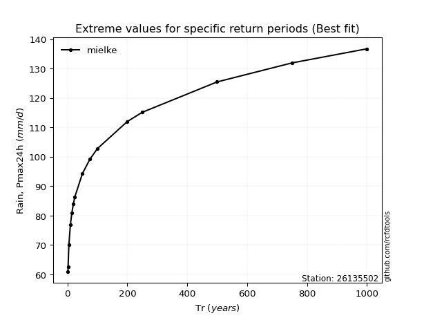</img>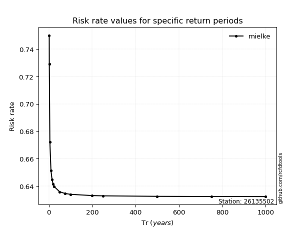</img>

</div>


<sub>**APP DISCLAIMER**: NO WARRANTY - This software is provided by [github.com/rcfdtools](https://github.com/rcfdtools) "as is", without any express or implied warranty, including warranties of merchantability, fitness for a particular purpose, or non-infringement. There is no guarantee that the software will be error-free or operate without interruption. LIMITATION OF LIABILITY - Neither the authors nor copyright holders will be liable for claims or damages arising from the software or its use. You are responsible for determining if the software is appropriate for your use and assume all associated risks, including errors, legal compliance, and data loss. NO PROFESSIONAL ADVICE - The software provides general information and does not offer professional advice. It should not replace consultation with professional advisors.</sub>