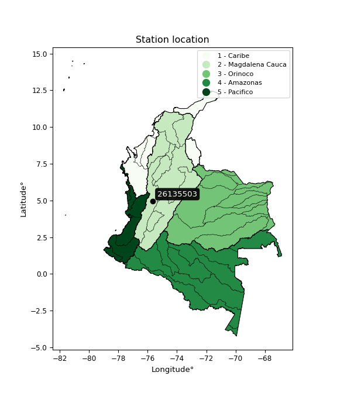

<div align="center">


</div>

# PMax24h Station (Rain): 26135503

Maximum Precipitation in 24 hours (PMax24h) is the greatest amount of rainfall for a specific duration that is meteorologically possible for a given location, acting as a "worst-case" scenario for extreme storms, crucial for designing safety-critical infrastructure like bridges, river deviations, dams, spillways, and nuclear plants to prevent catastrophic failure. The PMax24h is related with the Probable Maximum Precipitation (PMP) and it is calculated by hydrologists using meteorological data to determine the upper limit of extreme rainfall, often leading to the Probable Maximum Flood (PMF) for flood control design, and is increasingly being studied for climate change impacts. Probable Maximum Precipitation (PMP) is the theoretical upper limit of rainfall, a deterministic estimate for extreme events, while probability distributions (like GEV, Gumbel) describe the likelihood and frequency of various precipitation amounts, including rare ones, showing how often events occur, with PMP representing the extreme end of these distributions, used for critical infrastructure design to ensure safety against the worst conceivable weather, unlike standard statistical forecasts which cover typical probabilities.

The most common probability distributions in hydrology, used for analyzing floods, rainfall, and streamflow, include the Normal, Log-Normal, Gumbel, Gamma (including Log-Pearson Type III), and Generalized Extreme Value (GEV) distributions, often chosen based on the data´s skewness and whether modeling extremes or general conditions, with Gumbel and GEV popular for extreme events like floods, while the Normal distribution serves as a baseline, though often requiring transformations for skewed hydrological data. These distributions help in designing water infrastructure, managing water resources, and forecasting hydrologic events.

> Hydrological data often isn´t perfectly normal (it´s skewed), so different distributions are needed for different applications, such as: **Flood Frequency Analysis**: Using Gumbel, GEV, or Log-Pearson Type III for predicting extreme flood magnitudes and their return periods, **Rainfall Analysis**: Normal for annual totals, but Log-Normal, Weibull, or GEV for intensity or extreme daily rainfall, **Streamflow Modeling**: Gamma and Log-Normal for maximum flows, GEV for minimum flows, and Kappa for daily flows.

<div align="center">

</img>

</div>


## A. General information


### 1. General running parameters

• app_version: _v20260225_. • runtime: _2026-02-28 16:54:07.457399_. • Python version: _3.14.0_. • SciPy version: _1.16.3_. • Pandas version: _2.3.3_. • NumPy version: _2.3.5_. • Stations dataset (station_dataset_file): _dataset/pmax24h_in/automatic_colombia_2003_2025.csv_. • Stations catalog (station_catalog_file): _dataset/CNE.xls_. • Minimum year to eval til year_max (date_min): _1900_. • Maximum year to eval since year_min (date_max): _2025_. • Creates, save and include plots into reports (create_plot): _False_. • Plot only fit distributions with Δo > Δ (plot_only_fit): _True_. • Plot only simple graphs avoiding multiple CDFs and multiple Extreme values plots (plot_only_simple): _False_. • Eval low extreme values, if False, evaluates high extreme values (low_extreme): _False_. • Eval every SciPy distribution as logarithmic (pdist_logarithmic_on): _True_. • Standard deviation normalized (ddof): _1.0_. • Return periods to eval in years (Tr): _[2, 2.33, 5, 10, 15, 20, 25, 50, 75, 100, 200, 250, 500, 750, 1000]_. • Minimum data sample per station, 0 means any (minimum_sample): _5_. • Z-Score maximum threshold to adjust a value, 0 means disable (zscore_max): _3.5_. • Z-Score minimum threshold to adjust a value, 0 means disable (zscore_min): _-2.5_. • Avoid zeros, e.g. rain = 0 (avoid_zeros): _True_. • Avoid null values (avoid_nans): _True_. 

:file_folder:Table: [dataset.csv](../../dataset/pmax24h_in/automatic_colombia_2003_2025.csv)

> Delta Degrees of Freedom (DDOF): is a parameter used in the formulas for calculating variance and standard deviation. When ddof=0, the divisor is $N$ (the total number of observations) and this is used when your data set is the entire population. When ddof=1, the divisor is $N-1$ and this is used when your data set is a sample drawn from a larger population. Using $N-1$ provides an unbiased estimate of the population variance (known as Bessel´s correction).


### 2. Station info and location

|   id |   CODIGO | NOMBRE                      | CATEGORIA               | TECNOLOGIA                | ESTADO   | FECHA_INSTALACION   |   FECHA_SUSPENSION |   ALTITUD |   LATITUD |   LONGITUD | DEPARTAMENTO   | MUNICIPIO   | AREA_OPERATIVA                         | ENTIDAD                                    | AREA_HIDROGRAFICA   | ZONA_HIDROGRAFICA   | SUBZONA_HIDROGRAFICA               |   CORRIENTE | Catalogo   |   Version |
|-----:|---------:|:----------------------------|:------------------------|:--------------------------|:---------|:--------------------|-------------------:|----------:|----------:|-----------:|:---------------|:------------|:---------------------------------------|:-------------------------------------------|:--------------------|:--------------------|:-----------------------------------|------------:|:-----------|----------:|
|    0 | 26135503 | NARANJAL  - AUT  [26135503] | Climatológica Principal | Automática con Telemetría | Activa   | 04/03/2013          |                nan |      1381 |   4.97194 |   -75.6522 | Caldas         | Chinchina   | Area Operativa 09 - Cauca-Valle-Caldas | CENTRO NACIONAL DE INVESTIGACIONES DE CAFE | Magdalena Cauca     | Cauca               | Río Otún y otros directos al Cauca |         nan | CNE_OE     |  20251226 |

<div align="center">

Dynamic map: [:earth_americas:Google](http://maps.google.com/maps?q=4.971944444,-75.65221944) [:earth_americas:OSM](https://www.openstreetmap.org/#map=18/4.971944444/-75.65221944&layers=P) [:earth_americas:Bing](https://www.bing.com/maps?cp=4.971944444~-75.65221944&lvl=18) [:earth_americas:Apple](https://maps.apple.com/frame?center=4.971944444%2C-75.65221944&span=0.003%2C0.006)

</div>


<div align="center">

```geojson
{
  "type": "Feature",
  "geometry": {
    "type": "Point", 
    "coordinates": [-75.65221944, 4.971944444]
  }, 
  "properties": {
    "Name": "26135503"
  }
}
```

</div>


### 3. Discrete values table and plot

<div align="center">

|               |          0 |           1 |          2 |           3 |           4 |         5 |          6 |
|:--------------|-----------:|------------:|-----------:|------------:|------------:|----------:|-----------:|
| Date          | 2017       | 2018        | 2019       | 2020        | 2021        | 2022      | 2023       |
| Value         |  102.8     |   66.7      |  105.1     |   70.4      |   65        |   58.6    |   74.3     |
| Value_initial |  102.8     |   66.7      |  105.1     |   70.4      |   65        |   58.6    |   74.3     |
| count         |    7       |    7        |    7       |    7        |    7        |    7      |    7       |
| mean          |   77.5571  |   77.5571   |   77.5571  |   77.5571   |   77.5571   |   77.5571 |   77.5571  |
| std           |   18.6752  |   18.6752   |   18.6752  |   18.6752   |   18.6752   |   18.6752 |   18.6752  |
| zscore        |    1.35168 |   -0.581367 |    1.47484 |   -0.383243 |   -0.672397 |   -1.0151 |   -0.17441 |


</div>


> The initial value (value_initial) correspond to the initial obtained or null completed value, and value (value) is adjusted only when the initial value is outside the valid range (outlier) definite through the Z-Score value. If Z-Score is active, values out of range or outliers are replaced with the station mean value. A Z-Score (or standard score) measures how many standard deviations a data point is from the mean of a dataset, indicating its relative position; positive scores mean above the mean, negative mean below, and a score of zero is exactly at the mean, allowing for comparison of values from different distributions. It´s calculated using the formula $z=(x–μ)/σ$, where $x$ is the data point, $μ$ is the mean, and $σ$ is the standard deviation, helping identify outliers and understand probability.
>
> <sub>**Note**: In this study, "completing" (filling gaps in) and "extending" (forecasting or lengthening the historical record) rainfall data series are avoided for certain critical analyses because they introduce artificial bias and uncertainty, which can distort the statistics of rare events (extremes), alter day-to-day variability, and compromise the integrity and homogeneity of the original data. Some reasons against Completing/Extending rainfall data are: **Distortion of Extremes and Variability**: The primary issue is that most gap-filling or extension methods rely on averaging or regression with nearby stations, which inherently smooths the data. Rainfall is highly variable in space and time, with a large percentage of zero values and occasional large storms. Infilling methods often underestimate the highest values and overestimate the lowest (zero) values, which severely distorts analyses focused on flood frequency, drought severity, and intensity-duration-frequency (IDF) curves, **Loss of Data Homogeneity**: Infilled or extended data are synthetic estimates, not actual measurements. Combining these estimates with observed data can violate the assumption of data homogeneity, which requires that the data properties do not change over time. Inhomogeneity can lead to incorrect conclusions about long-term trends or changes in climate patterns, **Propagation of Errors**: Errors and biases from the original data (e.g., wind-induced undercatch, instrument errors, site changes) or the data used for imputation can propagate through the analysis, leading to unreliable hydrological models and inaccurate predictions, **Compromised Statistical Integrity**: For statistical analyses, especially those involving the frequency of events, using artificial data can introduce time bias or autocorrelation that doesn´t exist in reality, making it difficult to assess the true probability of events, **Difficulty in Validation**: It is difficult to accurately validate the quality of filled or extended data, especially for past periods where ground-truth measurements are unavailable. The reliability of imputation techniques heavily depends on the density of the surrounding station network and the complexity of the local topography.</sub>


### 4. Active continuous probability distributions from SciPy (80 of 104 available)

A Probability Density Function (PDF) describes the relative likelihood of a continuous random variable falling within a specific range, where the total area under its curve equals 1, and the area over any interval gives the actual probability for that range. Unlike discrete probabilities (like rolling a die), a PDF shows density, not direct probability for a single point (which is zero), with higher points indicating higher likelihood, often visualized as a bell curve for normal distributions.

A log of a probability density function (log-PDF) is simply the logarithm of the PDF´s value, denoted as $log(f(x))$, useful for converting multiplication of probabilities into addition, improving numerical stability with tiny numbers, and connecting to information theory concepts like entropy. Instead of dealing with very small probabilities (e.g., 0.000001), log-PDFs use negative numbers (e.g., $log(0.00001) ≈ -11.51$ that are easier for computers to handle, preventing underflow errors and simplifying complex calculations. In this study, each active probability distribution from SciPy is also evaluated in the $log$ form.

[scipy.stats](https://docs.scipy.org/doc/scipy/reference/stats.html) is a Python´s powerful submodule within the SciPy library for comprehensive statistical analysis, offering over 130 probability distributions (like Normal, Poisson, etc.), functions for descriptive stats (mean, variance), hypothesis testing (t-tests, chi-square), random variable generation, and statistical tests, making it essential for data science, modeling, and research. It provides tools to explore, model, and draw conclusions from data efficiently, working seamlessly with [NumPy](https://numpy.org/).

<div align="center">

|   id | p_dist           |   n_parameter | fit_method   | label                                                                       | active   | ref                                                                                                      |
|-----:|:-----------------|--------------:|:-------------|:----------------------------------------------------------------------------|:---------|:---------------------------------------------------------------------------------------------------------|
|    0 | alpha            |             3 | MLE          | Alpha                                                                       | True     | [:mortar_board:](https://docs.scipy.org/doc/scipy/reference/generated/scipy.stats.alpha.html)            |
|    1 | anglit           |             2 | MM           | Anglit                                                                      | True     | [:mortar_board:](https://docs.scipy.org/doc/scipy/reference/generated/scipy.stats.anglit.html)           |
|    2 | arcsine          |             2 | MM           | Arcsine                                                                     | True     | [:mortar_board:](https://docs.scipy.org/doc/scipy/reference/generated/scipy.stats.arcsine.html)          |
|    3 | argus            |             3 | MLE          | Argus                                                                       | True     | [:mortar_board:](https://docs.scipy.org/doc/scipy/reference/generated/scipy.stats.argus.html)            |
|    4 | beta             |             4 | MLE          | Beta                                                                        | True     | [:mortar_board:](https://docs.scipy.org/doc/scipy/reference/generated/scipy.stats.beta.html)             |
|    5 | betaprime        |             4 | MLE          | Beta prime                                                                  | True     | [:mortar_board:](https://docs.scipy.org/doc/scipy/reference/generated/scipy.stats.betaprime.html)        |
|    6 | bradford         |             3 | MLE          | Bradford                                                                    | True     | [:mortar_board:](https://docs.scipy.org/doc/scipy/reference/generated/scipy.stats.bradford.html)         |
|    7 | burr             |             4 | MLE          | Burr (Type III)                                                             | True     | [:mortar_board:](https://docs.scipy.org/doc/scipy/reference/generated/scipy.stats.burr.html)             |
|    8 | burr12           |             4 | MLE          | Burr (Type III) 12                                                          | True     | [:mortar_board:](https://docs.scipy.org/doc/scipy/reference/generated/scipy.stats.burr12.html)           |
|    9 | cosine           |             2 | MLE          | Cosine                                                                      | True     | [:mortar_board:](https://docs.scipy.org/doc/scipy/reference/generated/scipy.stats.cosine.html)           |
|   10 | crystalball      |             4 | MLE          | Crystalball                                                                 | True     | [:mortar_board:](https://docs.scipy.org/doc/scipy/reference/generated/scipy.stats.crystalball.html)      |
|   11 | dgamma           |             3 | MLE          | Double gamma                                                                | True     | [:mortar_board:](https://docs.scipy.org/doc/scipy/reference/generated/scipy.stats.dgamma.html)           |
|   12 | dweibull         |             3 | MLE          | Double Weibull                                                              | True     | [:mortar_board:](https://docs.scipy.org/doc/scipy/reference/generated/scipy.stats.dweibull.html)         |
|   13 | erlang           |             3 | MLE          | Erlang                                                                      | True     | [:mortar_board:](https://docs.scipy.org/doc/scipy/reference/generated/scipy.stats.erlang.html)           |
|   14 | exponnorm        |             3 | MLE          | Exponentially modified Normal                                               | True     | [:mortar_board:](https://docs.scipy.org/doc/scipy/reference/generated/scipy.stats.exponnorm.html)        |
|   15 | exponpow         |             3 | MLE          | Exponential power                                                           | True     | [:mortar_board:](https://docs.scipy.org/doc/scipy/reference/generated/scipy.stats.exponpow.html)         |
|   16 | exponweib        |             4 | MLE          | Exponentiated Weibull                                                       | True     | [:mortar_board:](https://docs.scipy.org/doc/scipy/reference/generated/scipy.stats.exponweib.html)        |
|   17 | f                |             4 | MLE          | F                                                                           | True     | [:mortar_board:](https://docs.scipy.org/doc/scipy/reference/generated/scipy.stats.f.html)                |
|   18 | fatiguelife      |             3 | MLE          | Fatigue-life (Birnbaum-Saunders)                                            | True     | [:mortar_board:](https://docs.scipy.org/doc/scipy/reference/generated/scipy.stats.fatiguelife.html)      |
|   19 | foldnorm         |             3 | MM           | Fold Normal                                                                 | True     | [:mortar_board:](https://docs.scipy.org/doc/scipy/reference/generated/scipy.stats.foldnorm.html)         |
|   20 | gamma            |             3 | MLE          | Gamma                                                                       | True     | [:mortar_board:](https://docs.scipy.org/doc/scipy/reference/generated/scipy.stats.gamma.html)            |
|   21 | gausshyper       |             6 | MLE          | Gauss hypergeometric                                                        | True     | [:mortar_board:](https://docs.scipy.org/doc/scipy/reference/generated/scipy.stats.gausshyper.html)       |
|   22 | genexpon         |             5 | MLE          | Generalized exponential                                                     | True     | [:mortar_board:](https://docs.scipy.org/doc/scipy/reference/generated/scipy.stats.genexpon.html)         |
|   23 | genextreme       |             3 | MLE          | Generalized exponential                                                     | True     | [:mortar_board:](https://docs.scipy.org/doc/scipy/reference/generated/scipy.stats.genextreme.html)       |
|   24 | gengamma         |             4 | MLE          | Generalized gamma                                                           | True     | [:mortar_board:](https://docs.scipy.org/doc/scipy/reference/generated/scipy.stats.gengamma.html)         |
|   25 | genhalflogistic  |             3 | MLE          | Generalized half-logistic                                                   | True     | [:mortar_board:](https://docs.scipy.org/doc/scipy/reference/generated/scipy.stats.genhalflogistic.html)  |
|   26 | genlogistic      |             3 | MLE          | Generalized logistic                                                        | True     | [:mortar_board:](https://docs.scipy.org/doc/scipy/reference/generated/scipy.stats.genlogistic.html)      |
|   27 | gennorm          |             3 | MLE          | Generalized Normal                                                          | True     | [:mortar_board:](https://docs.scipy.org/doc/scipy/reference/generated/scipy.stats.gennorm.html)          |
|   28 | genpareto        |             3 | MLE          | Generalized Pareto                                                          | True     | [:mortar_board:](https://docs.scipy.org/doc/scipy/reference/generated/scipy.stats.genpareto.html)        |
|   29 | gompertz         |             3 | MLE          | Gompertz (or truncated Gumbel)                                              | True     | [:mortar_board:](https://docs.scipy.org/doc/scipy/reference/generated/scipy.stats.gompertz.html)         |
|   30 | gumbel_l         |             2 | MM           | Gumbel Left Skew                                                            | True     | [:mortar_board:](https://docs.scipy.org/doc/scipy/reference/generated/scipy.stats.gumbel_l.html)         |
|   31 | gumbel_r         |             2 | MM           | Gumbel Right Skew                                                           | True     | [:mortar_board:](https://docs.scipy.org/doc/scipy/reference/generated/scipy.stats.gumbel_r.html)         |
|   32 | halfgennorm      |             3 | MLE          | Upper half of a generalized normal                                          | True     | [:mortar_board:](https://docs.scipy.org/doc/scipy/reference/generated/scipy.stats.halfgennorm.html)      |
|   33 | halflogistic     |             2 | MM           | Half-logistic                                                               | True     | [:mortar_board:](https://docs.scipy.org/doc/scipy/reference/generated/scipy.stats.halflogistic.html)     |
|   34 | halfnorm         |             2 | MM           | Half Normal                                                                 | True     | [:mortar_board:](https://docs.scipy.org/doc/scipy/reference/generated/scipy.stats.halfnorm.html)         |
|   35 | hypsecant        |             2 | MM           | hyperbolic secant                                                           | True     | [:mortar_board:](https://docs.scipy.org/doc/scipy/reference/generated/scipy.stats.hypsecant.html)        |
|   36 | invgamma         |             3 | MLE          | Inverted gamma                                                              | True     | [:mortar_board:](https://docs.scipy.org/doc/scipy/reference/generated/scipy.stats.invgamma.html)         |
|   37 | invgauss         |             3 | MLE          | Inverse Gaussian                                                            | True     | [:mortar_board:](https://docs.scipy.org/doc/scipy/reference/generated/scipy.stats.invgauss.html)         |
|   38 | invweibull       |             3 | MLE          | Inverted Weibull                                                            | True     | [:mortar_board:](https://docs.scipy.org/doc/scipy/reference/generated/scipy.stats.invweibull.html)       |
|   39 | johnsonsb        |             4 | MLE          | Johnson SB                                                                  | True     | [:mortar_board:](https://docs.scipy.org/doc/scipy/reference/generated/scipy.stats.johnsonsb.html)        |
|   40 | johnsonsu        |             4 | MLE          | Johnson Su                                                                  | True     | [:mortar_board:](https://docs.scipy.org/doc/scipy/reference/generated/scipy.stats.johnsonsu.html)        |
|   41 | kappa3           |             3 | MLE          | Kappa 3                                                                     | True     | [:mortar_board:](https://docs.scipy.org/doc/scipy/reference/generated/scipy.stats.kappa3.html)           |
|   42 | kappa4           |             4 | MLE          | Kappa 4                                                                     | True     | [:mortar_board:](https://docs.scipy.org/doc/scipy/reference/generated/scipy.stats.kappa4.html)           |
|   43 | ksone            |             3 | MLE          | Kolmogorov-Smirnov one-sided test statistic distribution                    | True     | [:mortar_board:](https://docs.scipy.org/doc/scipy/reference/generated/scipy.stats.ksone.html)            |
|   44 | kstwobign        |             2 | MLE          | Limiting distribution of scaled Kolmogorov-Smirnov two-sided test statistic | True     | [:mortar_board:](https://docs.scipy.org/doc/scipy/reference/generated/scipy.stats.kstwobign.html)        |
|   45 | laplace          |             2 | MM           | Laplace                                                                     | True     | [:mortar_board:](https://docs.scipy.org/doc/scipy/reference/generated/scipy.stats.laplace.html)          |
|   46 | levy_l           |             2 | MLE          | Left-skewed Levy                                                            | True     | [:mortar_board:](https://docs.scipy.org/doc/scipy/reference/generated/scipy.stats.levy_l.html)           |
|   47 | loggamma         |             3 | MLE          | Log gamma                                                                   | True     | [:mortar_board:](https://docs.scipy.org/doc/scipy/reference/generated/scipy.stats.loggamma.html)         |
|   48 | logistic         |             2 | MM           | Logistic (or Sech-squared)                                                  | True     | [:mortar_board:](https://docs.scipy.org/doc/scipy/reference/generated/scipy.stats.logistic.html)         |
|   49 | loglaplace       |             3 | MLE          | Log-Laplace                                                                 | True     | [:mortar_board:](https://docs.scipy.org/doc/scipy/reference/generated/scipy.stats.loglaplace.html)       |
|   50 | lomax            |             3 | MLE          | Lomax (Pareto of the second kind)                                           | True     | [:mortar_board:](https://docs.scipy.org/doc/scipy/reference/generated/scipy.stats.lomax.html)            |
|   51 | maxwell          |             2 | MM           | Maxwell                                                                     | True     | [:mortar_board:](https://docs.scipy.org/doc/scipy/reference/generated/scipy.stats.maxwell.html)          |
|   52 | mielke           |             4 | MLE          | Mielke Beta-Kappa / Dagum                                                   | True     | [:mortar_board:](https://docs.scipy.org/doc/scipy/reference/generated/scipy.stats.mielke.html)           |
|   53 | moyal            |             2 | MM           | Moyal                                                                       | True     | [:mortar_board:](https://docs.scipy.org/doc/scipy/reference/generated/scipy.stats.moyal.html)            |
|   54 | nakagami         |             3 | MLE          | Nakagami                                                                    | True     | [:mortar_board:](https://docs.scipy.org/doc/scipy/reference/generated/scipy.stats.nakagami.html)         |
|   55 | ncf              |             5 | MLE          | Non-central F distribution                                                  | True     | [:mortar_board:](https://docs.scipy.org/doc/scipy/reference/generated/scipy.stats.ncf.html)              |
|   56 | nct              |             4 | MLE          | Non-central Student’s t                                                     | True     | [:mortar_board:](https://docs.scipy.org/doc/scipy/reference/generated/scipy.stats.nct.html)              |
|   57 | norm             |             2 | MM           | Normal                                                                      | True     | [:mortar_board:](https://docs.scipy.org/doc/scipy/reference/generated/scipy.stats.norm.html)             |
|   58 | pearson3         |             3 | MM           | Pearson type III                                                            | True     | [:mortar_board:](https://docs.scipy.org/doc/scipy/reference/generated/scipy.stats.pearson3.html)         |
|   59 | powerlaw         |             3 | MLE          | Power-function                                                              | True     | [:mortar_board:](https://docs.scipy.org/doc/scipy/reference/generated/scipy.stats.powerlaw.html)         |
|   60 | rayleigh         |             2 | MM           | Rayleigh                                                                    | True     | [:mortar_board:](https://docs.scipy.org/doc/scipy/reference/generated/scipy.stats.rayleigh.html)         |
|   61 | rdist            |             3 | MLE          | R-distributed (symmetric beta)                                              | True     | [:mortar_board:](https://docs.scipy.org/doc/scipy/reference/generated/scipy.stats.rdist.html)            |
|   62 | rice             |             3 | MLE          | Rice                                                                        | True     | [:mortar_board:](https://docs.scipy.org/doc/scipy/reference/generated/scipy.stats.rice.html)             |
|   63 | semicircular     |             2 | MM           | Semicircular                                                                | True     | [:mortar_board:](https://docs.scipy.org/doc/scipy/reference/generated/scipy.stats.semicircular.html)     |
|   64 | skewnorm         |             3 | MLE          | Skew normal                                                                 | True     | [:mortar_board:](https://docs.scipy.org/doc/scipy/reference/generated/scipy.stats.skewnorm.html)         |
|   65 | t                |             3 | MLE          | Student’s t                                                                 | True     | [:mortar_board:](https://docs.scipy.org/doc/scipy/reference/generated/scipy.stats.t.html)                |
|   66 | trapezoid        |             4 | MLE          | Trapezoid                                                                   | True     | [:mortar_board:](https://docs.scipy.org/doc/scipy/reference/generated/scipy.stats.trapezoid.html)        |
|   67 | triang           |             3 | MLE          | Triangular                                                                  | True     | [:mortar_board:](https://docs.scipy.org/doc/scipy/reference/generated/scipy.stats.triang.html)           |
|   68 | truncexpon       |             3 | MLE          | Truncated exponential                                                       | True     | [:mortar_board:](https://docs.scipy.org/doc/scipy/reference/generated/scipy.stats.truncexpon.html)       |
|   69 | truncnorm        |             4 | MLE          | Truncated normal                                                            | True     | [:mortar_board:](https://docs.scipy.org/doc/scipy/reference/generated/scipy.stats.truncnorm.html)        |
|   70 | truncpareto      |             4 | MLE          | Upper truncated Pareto                                                      | True     | [:mortar_board:](https://docs.scipy.org/doc/scipy/reference/generated/scipy.stats.truncpareto.html)      |
|   71 | truncweibull_min |             5 | MLE          | Doubly truncated Weibull minimum                                            | True     | [:mortar_board:](https://docs.scipy.org/doc/scipy/reference/generated/scipy.stats.truncweibull_min.html) |
|   72 | tukeylambda      |             3 | MLE          | Tukey-Lamdba                                                                | True     | [:mortar_board:](https://docs.scipy.org/doc/scipy/reference/generated/scipy.stats.tukeylambda.html)      |
|   73 | uniform          |             2 | MLE          | Uniform                                                                     | True     | [:mortar_board:](https://docs.scipy.org/doc/scipy/reference/generated/scipy.stats.uniform.html)          |
|   74 | vonmises         |             3 | MLE          | Von Mises                                                                   | True     | [:mortar_board:](https://docs.scipy.org/doc/scipy/reference/generated/scipy.stats.vonmises.html)         |
|   75 | vonmises_line    |             3 | MLE          | Von Mises line                                                              | True     | [:mortar_board:](https://docs.scipy.org/doc/scipy/reference/generated/scipy.stats.vonmises_line.html)    |
|   76 | wald             |             2 | MM           | Wald                                                                        | True     | [:mortar_board:](https://docs.scipy.org/doc/scipy/reference/generated/scipy.stats.wald.html)             |
|   77 | weibull_max      |             3 | MLE          | Weibull maximum                                                             | True     | [:mortar_board:](https://docs.scipy.org/doc/scipy/reference/generated/scipy.stats.weibull_max.html)      |
|   78 | weibull_min      |             3 | MLE          | Weibull minimum                                                             | True     | [:mortar_board:](https://docs.scipy.org/doc/scipy/reference/generated/scipy.stats.weibull_min.html)      |
|   79 | wrapcauchy       |             3 | MLE          | Wrapped  Cauchy                                                             | True     | [:mortar_board:](https://docs.scipy.org/doc/scipy/reference/generated/scipy.stats.wrapcauchy.html)       |

</div>

> **n_parameter:** # arguments & localization & scale.
>
> **Fit methods:** (MLE) maximum likelihood, (MM) L-moments.
>
>**Inactive** (With the only purpose of prevent loops, zero divisions, infinite values, over high estimated values or horizontal trending for recurrence intervals estimations, the follow distributions were disabled.)**:** lognorm, norminvgauss, powernorm, powerlognorm, cauchy, halfcauchy, foldcauchy, skewcauchy, chi2, expon, fisk, genhyperbolic, geninvgauss, gibrat, kstwo, laplace_asymmetric, levy, levy_stable, ncx2, pareto, rel_breitwigner, recipinvgauss, studentized_range, loguniform, 


## B. Probability (PDF) vs. Empirical (EDF) distributions functions

A continuous probability distribution (CPD) describes probabilities for variables that can take any value within a range (like rain any time), unlike discrete variables with specific outcomes (like temperature). It uses a Probability Density Function (PDF), a curve where the total area under it equals 1, and the probability of the variable falling within an interval (a to b) is found by calculating the area under the curve between those points. A key feature is that the probability of hitting any single exact value is zero, so probabilities are always expressed for ranges, e.g., $P(a ≤ X ≤ b)$.

<div align="center">

Distributions parameters from station values
|     |   station | p_dist              |   n |             loc |          scale | shape                 | shape1                 | shape2                | shape3             |
|----:|----------:|:--------------------|----:|----------------:|---------------:|:----------------------|:-----------------------|:----------------------|:-------------------|
|   0 |  26135503 | alpha               |   7 |    38.7438      |   84.3606      | 2.571737066583764     |                        |                       |                    |
|   1 |  26135503 | anglit              |   7 |    77.5571      |   50.5798      |                       |                        |                       |                    |
|   2 |  26135503 | arcsine             |   7 |    53.1056      |   48.9032      |                       |                        |                       |                    |
|   3 |  26135503 | argus               |   7 |    42.2382      |   66.541       | 9.25576143397851e-07  |                        |                       |                    |
|   4 |  26135503 | beta                |   7 |    58.6         |   46.5034      | 0.16383593134659863   | 0.3202195485344488     |                       |                    |
|   5 |  26135503 | betaprime           |   7 |    -1.73411     |    3.01796     | 642.2338774982611     | 25.46738535868913      |                       |                    |
|   6 |  26135503 | bradford            |   7 |    58.5172      |   46.5828      | 4.422181505814878     |                        |                       |                    |
|   7 |  26135503 | burr                |   7 |    -1.05476     |   28.3235      | 6.413059927523339     | 326.26729618666366     |                       |                    |
|   8 |  26135503 | burr12              |   7 |    -1.09102     |   59.5072      | 1225.5758946934513    | 0.0031822115612983193  |                       |                    |
|   9 |  26135503 | cosine              |   7 |    79.2307      |   13.9487      |                       |                        |                       |                    |
|  10 |  26135503 | crystalball         |   7 |    77.5571      |   17.2899      | 3796.146401335633     | 7258.185719952591      |                       |                    |
|  11 |  26135503 | dgamma              |   7 |    70.4         |   14.1096      | 0.7482265101979142    |                        |                       |                    |
|  12 |  26135503 | dweibull            |   7 |    70.4         |   13.025       | 0.8388554606481731    |                        |                       |                    |
|  13 |  26135503 | erlang              |   7 |    58.6         |   14.8715      | 0.9511537563806147    |                        |                       |                    |
|  14 |  26135503 | exponnorm           |   7 |    58.5592      |    0.0121563   | 1567.5150384406465    |                        |                       |                    |
|  15 |  26135503 | exponpow            |   7 |    58.6         |   33.2657      | 0.18923313759477514   |                        |                       |                    |
|  16 |  26135503 | exponweib           |   7 |    58.6         |    1.39114     | 1.226250619283122     | 0.31981919459366204    |                       |                    |
|  17 |  26135503 | f                   |   7 |    -2.64953     |   77.0655      | 748.6615865749955     | 53.47737152162068      |                       |                    |
|  18 |  26135503 | fatiguelife         |   7 |    58.6         |    4.30796e-05 | 594.499509057769      |                        |                       |                    |
|  19 |  26135503 | foldnorm            |   7 |    52.6488      |   21.9857      | 0.9497284081810369    |                        |                       |                    |
|  20 |  26135503 | gamma               |   7 |    58.6         |   25.0271      | 0.18311685379311554   |                        |                       |                    |
|  21 |  26135503 | gausshyper          |   7 |    58.6         |   46.8362      | 0.9468352225894878    | 0.9594707852251254     | 1.0588372208959536    | 1.0845390197725795 |
|  22 |  26135503 | genexpon            |   7 |    58.6         |   25.7591      | 1.358812870637073     | 4.950801765276495e-10  | 1.7792979450558004    |                    |
|  23 |  26135503 | genextreme          |   7 |    58.677       |    0.418373    | -5.433798587257571    |                        |                       |                    |
|  24 |  26135503 | gengamma            |   7 |    58.6         |    1.31975     | 1.261552846746516     | 0.33590674323624226    |                       |                    |
|  25 |  26135503 | genhalflogistic     |   7 |    54.6279      |   53.6327      | 1.062621415994017     |                        |                       |                    |
|  26 |  26135503 | genlogistic         |   7 |   -18.5933      |   12.2         | 1392.143925894933     |                        |                       |                    |
|  27 |  26135503 | gennorm             |   7 |    70.4         |    1.07119     | 0.42646706346220736   |                        |                       |                    |
|  28 |  26135503 | genpareto           |   7 |    -0.871743    |  183.753       | -1.7339763903636154   |                        |                       |                    |
|  29 |  26135503 | gompertz            |   7 |    58.6         |  118.9         | 5.385601509698166     |                        |                       |                    |
|  30 |  26135503 | gumbel_l            |   7 |    85.3385      |   13.4809      |                       |                        |                       |                    |
|  31 |  26135503 | gumbel_r            |   7 |    69.7758      |   13.4809      |                       |                        |                       |                    |
|  32 |  26135503 | halfgennorm         |   7 |    58.6         |    1.3277      | 0.40127773315540805   |                        |                       |                    |
|  33 |  26135503 | halflogistic        |   7 |    57.0646      |   14.7822      |                       |                        |                       |                    |
|  34 |  26135503 | halfnorm            |   7 |    54.6721      |   28.6821      |                       |                        |                       |                    |
|  35 |  26135503 | hypsecant           |   7 |    77.5571      |   11.0071      |                       |                        |                       |                    |
|  36 |  26135503 | invgamma            |   7 |    49.927       |   55.4414      | 2.9160227845040043    |                        |                       |                    |
|  37 |  26135503 | invgauss            |   7 |    53.6698      |   31.4133      | 0.7604214986846607    |                        |                       |                    |
|  38 |  26135503 | invweibull          |   7 |    43.5499      |   23.8822      | 2.4707776409273845    |                        |                       |                    |
|  39 |  26135503 | johnsonsb           |   7 |    58.6         |   46.5072      | 2.0251636403578424    | 0.13214326874136006    |                       |                    |
|  40 |  26135503 | johnsonsu           |   7 |     1.25088e+09 |    9.6144e+08  | 97792678.91645771     | 90625251.93817222      |                       |                    |
|  41 |  26135503 | kappa3              |   7 |    58.5902      |   46.4417      | 1794.7240256157233    |                        |                       |                    |
|  42 |  26135503 | kappa4              |   7 |    51.9397      |   52.5375      | 1.1450181360947647    | 0.9856348745535598     |                       |                    |
|  43 |  26135503 | ksone               |   7 |    47.6102      |   59.8939      | 1.0                   |                        |                       |                    |
|  44 |  26135503 | kstwobign           |   7 |    26.6088      |   58.5825      |                       |                        |                       |                    |
|  45 |  26135503 | laplace             |   7 |    77.5571      |   12.2258      |                       |                        |                       |                    |
|  46 |  26135503 | levy_l              |   7 |   106.943       |    7.68193     |                       |                        |                       |                    |
|  47 |  26135503 | loggamma            |   7 | -3448.03        |  521.046       | 868.6519384285525     |                        |                       |                    |
|  48 |  26135503 | logistic            |   7 |    77.5571      |    9.5324      |                       |                        |                       |                    |
|  49 |  26135503 | loglaplace          |   7 |    -0.170165    |   70.5702      | 6.101271671676912     |                        |                       |                    |
|  50 |  26135503 | lomax               |   7 |    58.6         |    2.06659e+12 | 22959853221.58132     |                        |                       |                    |
|  51 |  26135503 | maxwell             |   7 |    36.5874      |   25.674       |                       |                        |                       |                    |
|  52 |  26135503 | mielke              |   7 |    -3.46722     |   37.1445      | 551.66608864686       | 6.630336353256         |                       |                    |
|  53 |  26135503 | moyal               |   7 |    67.6697      |    7.78318     |                       |                        |                       |                    |
|  54 |  26135503 | nakagami            |   7 |    58.6         |   30.5707      | 0.07582613789015766   |                        |                       |                    |
|  55 |  26135503 | ncf                 |   7 |     0.202607    |   87.8626      | 9.151165965177997     | 12.805109319354482     | 7.239229330257398e-11 |                    |
|  56 |  26135503 | nct                 |   7 |    -0.269111    |    1.34122     | 12.942225756219194    | 54.470796244383564     |                       |                    |
|  57 |  26135503 | norm                |   7 |    77.5571      |   17.2899      |                       |                        |                       |                    |
|  58 |  26135503 | pearson3            |   7 |    77.5571      |   17.2898      | 0.7326306966905025    |                        |                       |                    |
|  59 |  26135503 | powerlaw            |   7 |    58.6         |   46.5         | 0.1641035863703395    |                        |                       |                    |
|  60 |  26135503 | rayleigh            |   7 |    44.4806      |   26.3913      |                       |                        |                       |                    |
|  61 |  26135503 | rdist               |   7 |    66.632       |    8.03197     | 1.3271917393536723    |                        |                       |                    |
|  62 |  26135503 | rice                |   7 |    49.7217      |   23.1706      | 0.0003867797039378597 |                        |                       |                    |
|  63 |  26135503 | semicircular        |   7 |    77.5571      |   34.5797      |                       |                        |                       |                    |
|  64 |  26135503 | skewnorm            |   7 |    58.6         |   25.6568      | 5071578.91331581      |                        |                       |                    |
|  65 |  26135503 | t                   |   7 |    77.5582      |   17.2953      | 275366.24899223715    |                        |                       |                    |
|  66 |  26135503 | trapezoid           |   7 |    53.95        |   55.8         | 1.0                   | 1.0                    |                       |                    |
|  67 |  26135503 | triang              |   7 |    37.8671      |   67.2329      | 0.9999999999893052    |                        |                       |                    |
|  68 |  26135503 | truncexpon          |   7 |    58.6         |   53.2669      | 0.8729631910088853    |                        |                       |                    |
|  69 |  26135503 | truncnorm           |   7 |    77.5571      |   17.2899      | -71.40350707925828    | 2335.3290141326925     |                       |                    |
|  70 |  26135503 | truncpareto         |   7 |    58.584       |    0.0159532   | 0.16813094461296751   | 2915.7822516544265     |                       |                    |
|  71 |  26135503 | truncweibull_min    |   7 |    58.4872      |   58.1574      | 0.6417705502058644    | 0.001938983248043228   | 0.8014928768210546    |                    |
|  72 |  26135503 | tukeylambda         |   7 |    81.85        |   32.217       | 1.3856771700602208    |                        |                       |                    |
|  73 |  26135503 | uniform             |   7 |    58.6         |   46.5         |                       |                        |                       |                    |
|  74 |  26135503 | vonmises            |   7 |     2.68493     |    1           | 0.6058057891496925    |                        |                       |                    |
|  75 |  26135503 | vonmises_line       |   7 |    81.854       |    7.40206     | 9.500336714105037e-06 |                        |                       |                    |
|  76 |  26135503 | wald                |   7 |    60.2672      |   17.2899      |                       |                        |                       |                    |
|  77 |  26135503 | weibull_max         |   7 |   105.1         |    1.59883     | 0.23367485731032878   |                        |                       |                    |
|  78 |  26135503 | weibull_min         |   7 |    58.6         |   13.7043      | 0.1941791751959304    |                        |                       |                    |
|  79 |  26135503 | wrapcauchy          |   7 |    58.6         |    7.4007      | 0.5060695886611939    |                        |                       |                    |
|  80 |  26135503 | logalpha            |   7 |     2.34629     |   19.5833      | 10.041241454447324    |                        |                       |                    |
|  81 |  26135503 | loganglit           |   7 |     4.3279      |    0.617334    |                       |                        |                       |                    |
|  82 |  26135503 | logarcsine          |   7 |     4.02945     |    0.596909    |                       |                        |                       |                    |
|  83 |  26135503 | logargus            |   7 |     3.89106     |    0.810771    | 7.985430363789784e-05 |                        |                       |                    |
|  84 |  26135503 | logbeta             |   7 |     4.07073     |    0.674294    | 0.2861339118674221    | 0.5140428345570147     |                       |                    |
|  85 |  26135503 | logbetaprime        |   7 |     3.04413     |    0.16642     | 366.79355751436947    | 49.02800362290759      |                       |                    |
|  86 |  26135503 | logbradford         |   7 |     4.07073     |    0.584183    | 1.076066946743139     |                        |                       |                    |
|  87 |  26135503 | logburr             |   7 |     3.01578     |    0.65276     | 8.132140925662622     | 143.35130703781073     |                       |                    |
|  88 |  26135503 | logburr12           |   7 |    -0.574938    |    4.68759     | 125.23851499712653    | 0.1738500130493908     |                       |                    |
|  89 |  26135503 | logcosine           |   7 |     4.34463     |    0.170545    |                       |                        |                       |                    |
|  90 |  26135503 | logcrystalball      |   7 |     4.3279      |    0.211026    | 41.02005507701589     | 463.2026827585121      |                       |                    |
|  91 |  26135503 | logdgamma           |   7 |     4.25419     |    0.23342     | 0.7706101262187279    |                        |                       |                    |
|  92 |  26135503 | logdweibull         |   7 |     4.25419     |    0.164149    | 0.7571225523129008    |                        |                       |                    |
|  93 |  26135503 | logerlang           |   7 |     4.07073     |    0.335939    | 0.6340419776821331    |                        |                       |                    |
|  94 |  26135503 | logexponnorm        |   7 |     4.10004     |    0.0581012   | 3.9217674406108234    |                        |                       |                    |
|  95 |  26135503 | logexponpow         |   7 |     4.07073     |    0.47681     | 0.5903734404694838    |                        |                       |                    |
|  96 |  26135503 | logexponweib        |   7 |     4.07073     |    0.389284    | 0.393005419315253     | 1.5995804430059226     |                       |                    |
|  97 |  26135503 | logf                |   7 |     4.07073     |    0.241976    | 1.6412633087994095    | 196.72742286988142     |                       |                    |
|  98 |  26135503 | logfatiguelife      |   7 |     3.98072     |    0.281699    | 0.679813989285646     |                        |                       |                    |
|  99 |  26135503 | logfoldnorm         |   7 |     4.02001     |    0.263495    | 1.0028029190216263    |                        |                       |                    |
| 100 |  26135503 | loggamma            |   7 |     4.07073     |    0.449167    | 0.38094152063583075   |                        |                       |                    |
| 101 |  26135503 | loggausshyper       |   7 |     4.01899     |    0.635925    | 1.2562675439165476    | 0.5346177419729032     | 0.9063148699979775    | 1.3983863580234384 |
| 102 |  26135503 | loggenexpon         |   7 |     4.07073     |    0.459009    | 1.4800398374775203    | 2.038790642506747      | 0.364120002313515     |                    |
| 103 |  26135503 | loggenextreme       |   7 |     4.21408     |    0.143097    | -0.20643816511821128  |                        |                       |                    |
| 104 |  26135503 | loggengamma         |   7 |     4.07073     |    1.09671     | 0.26859379261149996   | 1.3289635398720743     |                       |                    |
| 105 |  26135503 | loggenhalflogistic  |   7 |     4.05245     |    0.669217    | 1.1107997945304757    |                        |                       |                    |
| 106 |  26135503 | loggenlogistic      |   7 |     3.15157     |    0.158306    | 911.1693282878787     |                        |                       |                    |
| 107 |  26135503 | loggennorm          |   7 |     4.25419     |    0.00234234  | 0.31690034353962826   |                        |                       |                    |
| 108 |  26135503 | loggenpareto        |   7 |    -0.0166651   |   15.7523      | -3.3719499322400814   |                        |                       |                    |
| 109 |  26135503 | loggompertz         |   7 |     4.07073     |    0.490203    | 1.1564793530446393    |                        |                       |                    |
| 110 |  26135503 | loggumbel_l         |   7 |     4.42288     |    0.164536    |                       |                        |                       |                    |
| 111 |  26135503 | loggumbel_r         |   7 |     4.23293     |    0.164536    |                       |                        |                       |                    |
| 112 |  26135503 | loghalfgennorm      |   7 |     4.07073     |    0.346215    | 1.3032343391762682    |                        |                       |                    |
| 113 |  26135503 | loghalflogistic     |   7 |     4.07786     |    0.180373    |                       |                        |                       |                    |
| 114 |  26135503 | loghalfnorm         |   7 |     4.04859     |    0.35007     |                       |                        |                       |                    |
| 115 |  26135503 | loghypsecant        |   7 |     4.3279      |    0.134343    |                       |                        |                       |                    |
| 116 |  26135503 | loginvgamma         |   7 |    -2.73454     | 8154.86        | 1155.7303833230271    |                        |                       |                    |
| 117 |  26135503 | loginvgauss         |   7 |     3.96081     |    0.863746    | 0.42500550675690474   |                        |                       |                    |
| 118 |  26135503 | loginvweibull       |   7 |     3.52096     |    0.693109    | 4.843923631549695     |                        |                       |                    |
| 119 |  26135503 | logjohnsonsb        |   7 |     4.07033     |    0.584581    | 0.017173571981533343  | 0.16311784511635735    |                       |                    |
| 120 |  26135503 | logjohnsonsu        |   7 |     8.79558e+06 |    2.26091e+06 | 88968154.29415038     | 43026516.03111966      |                       |                    |
| 121 |  26135503 | logkappa3           |   7 |     4.07073     |    0.583985    | 5859.755139657771     |                        |                       |                    |
| 122 |  26135503 | logkappa4           |   7 |     4.04866     |    0.642133    | 1.0356470438982743    | 1.059151169684296      |                       |                    |
| 123 |  26135503 | logksone            |   7 |     3.9624      |    0.731014    | 1.0                   |                        |                       |                    |
| 124 |  26135503 | logkstwobign        |   7 |     3.67309     |    0.751807    |                       |                        |                       |                    |
| 125 |  26135503 | loglaplace          |   7 |     4.3279      |    0.149218    |                       |                        |                       |                    |
| 126 |  26135503 | loglevy_l           |   7 |     4.67531     |    0.0839285   |                       |                        |                       |                    |
| 127 |  26135503 | logloggamma         |   7 |   -52.2182      |    7.8542      | 1339.1697457874652    |                        |                       |                    |
| 128 |  26135503 | loglogistic         |   7 |     4.3279      |    0.116345    |                       |                        |                       |                    |
| 129 |  26135503 | logloglaplace       |   7 |    -0.0733786   |    4.32757     | 26.993196203767585    |                        |                       |                    |
| 130 |  26135503 | loglomax            |   7 |     4.07073     |   46.7438      | 182.42880582583015    |                        |                       |                    |
| 131 |  26135503 | logmaxwell          |   7 |     3.82786     |    0.313355    |                       |                        |                       |                    |
| 132 |  26135503 | logmielke           |   7 |     3.05301     |    0.694657    | 433.2201014229305     | 7.782774026053165      |                       |                    |
| 133 |  26135503 | logmoyal            |   7 |     4.20723     |    0.0949949   |                       |                        |                       |                    |
| 134 |  26135503 | lognakagami         |   7 |     4.07073     |    0.373854    | 0.3898150417746729    |                        |                       |                    |
| 135 |  26135503 | logncf              |   7 |     4.02312     |    0.000166192 | 0.005346421623262584  | 1127.71735411301       | 9.931537774211192     |                    |
| 136 |  26135503 | lognct              |   7 |     0.268501    |    0.078995    | 225.62704103532235    | 51.198290226276384     |                       |                    |
| 137 |  26135503 | lognorm             |   7 |     4.3279      |    0.211026    |                       |                        |                       |                    |
| 138 |  26135503 | logpearson3         |   7 |     4.3279      |    0.211026    | 0.610982373818219     |                        |                       |                    |
| 139 |  26135503 | logpowerlaw         |   7 |     4.07073     |    0.584178    | 0.1774258068417381    |                        |                       |                    |
| 140 |  26135503 | lograyleigh         |   7 |     3.9242      |    0.322109    |                       |                        |                       |                    |
| 141 |  26135503 | logrdist            |   7 |     4.45603     |    0.385294    | 1.02788388638258      |                        |                       |                    |
| 142 |  26135503 | logrice             |   7 |     3.97317     |    0.291866    | 0.0006795557224492104 |                        |                       |                    |
| 143 |  26135503 | logsemicircular     |   7 |     4.3279      |    0.422051    |                       |                        |                       |                    |
| 144 |  26135503 | logskewnorm         |   7 |     4.07073     |    0.332635    | 12201373.977604646    |                        |                       |                    |
| 145 |  26135503 | logt                |   7 |     4.3279      |    0.211025    | 2672539484.866518     |                        |                       |                    |
| 146 |  26135503 | logtrapezoid        |   7 |     4.01232     |    0.701013    | 1.0                   | 1.0                    |                       |                    |
| 147 |  26135503 | logtriang           |   7 |     3.84135     |    0.813566    | 0.9999995812166608    |                        |                       |                    |
| 148 |  26135503 | logtruncexpon       |   7 |     4.07006     |    0.6459      | 0.9054908935885109    |                        |                       |                    |
| 149 |  26135503 | logtruncnorm        |   7 |    -1.93123     |    1.49578     | 4.012608970410307     | 4.403162144352255      |                       |                    |
| 150 |  26135503 | logtruncpareto      |   7 |     4.0705      |    0.000232212 | 0.1680444488687352    | 2516.7110411606063     |                       |                    |
| 151 |  26135503 | logtruncweibull_min |   7 |     4.07073     |    0.666582    | 0.5145922403242122    | 1.5360351664775464e-16 | 0.9561609062068132    |                    |
| 152 |  26135503 | logtukeylambda      |   7 |     4.36266     |    0.305571    | 1.045573995383398     |                        |                       |                    |
| 153 |  26135503 | loguniform          |   7 |     4.07073     |    0.584178    |                       |                        |                       |                    |
| 154 |  26135503 | logvonmises         |   7 |    -1.95625     |    1           | 22.867574242755367    |                        |                       |                    |
| 155 |  26135503 | logvonmises_line    |   7 |     4.37571     |    0.0970778   | 2.655109138545571e-05 |                        |                       |                    |
| 156 |  26135503 | logwald             |   7 |     4.1169      |    0.21101     |                       |                        |                       |                    |
| 157 |  26135503 | logweibull_max      |   7 |     7.21519e+06 |    7.21519e+06 | 45537305.33129288     |                        |                       |                    |
| 158 |  26135503 | logweibull_min      |   7 |     4.07073     |    0.267731    | 0.537452904040461     |                        |                       |                    |
| 159 |  26135503 | logwrapcauchy       |   7 |     4.07073     |    0.0929747   | 0.5                   |                        |                       |                    |

</div>

> **loc** (Location parameter): This shifts the distribution along the x-axis. For many common distributions, like the normal (Gaussian) distribution, loc represents the mean $μ$. For others, like the uniform distribution, it might represent the minimum value, or for the beta distribution, the left end of the support interval.
>
> **scale** (Scale parameter): This determines the width or spread of the distribution. For the normal distribution, scale represents the standard deviation $σ$. For a uniform distribution, it defines the length of the interval (from $loc$ to $loc + scale$).
>
> **shape** (Shape parameters): Refers to parameters that define the specific form of a probability distribution, distinct from its location (loc) and scale (scale). These parameters are required arguments for most distribution functions. For example, a normal (Gaussian) distribution is fully defined by its location (mean) and scale (standard deviation), so it has no specific shape parameters beyond loc and scale. However, other distributions have intrinsic properties that need specification, as Gamma distribution that takes a shape parameter, often named $a$ or $alpha$.


### 0. Cumulative distribution values - CDF (160 evaluated)

Cumulative Distribution Function (CDF), denoted as $F$<sub>$X$</sub>$(x)$, is a function that gives the probability that a random variable $X$ will take a value less than or equal to a specific value, $x$ (i.e., $(P(X≥x)$. It essentially "accumulates" probabilities from a given point up to the far right (positive infinity), providing a complete picture of the distribution´s probabilities for both discrete (like rain) and continuous (like temperature) variables, helping to find probabilities over ranges or above certain values. Each station is evaluated separately ordering the $x$ values ascending, calculating the CDF and PDF values for the activated distributions and their logarithmic forms.

<div align="center">

CDF ordered by x ascending and calculating $log(f(x))$ separately
|   id |   Station |   date |     x |   count |    mean |     std |    zscore |   Value_initial |   station |   m |     alpha |   alpha_pdf |   anglit |   anglit_pdf |   arcsine |   arcsine_pdf |     argus |   argus_pdf |      beta |   beta_pdf |   betaprime |   betaprime_pdf |   bradford |   bradford_pdf |      burr |   burr_pdf |    burr12 |   burr12_pdf |   cosine |   cosine_pdf |   crystalball |   crystalball_pdf |   dgamma |   dgamma_pdf |   dweibull |   dweibull_pdf |      erlang |   erlang_pdf |   exponnorm |   exponnorm_pdf |   exponpow |   exponpow_pdf |   exponweib |   exponweib_pdf |        f |      f_pdf |   fatiguelife |   fatiguelife_pdf |   foldnorm |   foldnorm_pdf |      gamma |   gamma_pdf |   gausshyper |   gausshyper_pdf |    genexpon |   genexpon_pdf |   genextreme |   genextreme_pdf |    gengamma |   gengamma_pdf |   genhalflogistic |   genhalflogistic_pdf |   genlogistic |   genlogistic_pdf |   gennorm |   gennorm_pdf |   genpareto |   genpareto_pdf |    gompertz |   gompertz_pdf |   gumbel_l |   gumbel_l_pdf |   gumbel_r |   gumbel_r_pdf |   halfgennorm |   halfgennorm_pdf |   halflogistic |   halflogistic_pdf |   halfnorm |   halfnorm_pdf |   hypsecant |   hypsecant_pdf |   invgamma |   invgamma_pdf |   invgauss |   invgauss_pdf |   invweibull |   invweibull_pdf |   johnsonsb |   johnsonsb_pdf |   johnsonsu |   johnsonsu_pdf |      kappa3 |   kappa3_pdf |      kappa4 |   kappa4_pdf |    ksone |   ksone_pdf |   kstwobign |   kstwobign_pdf |   laplace |   laplace_pdf |   levy_l |   levy_l_pdf |    loggamma |   loggamma_pdf |   logistic |   logistic_pdf |   loglaplace |   loglaplace_pdf |      lomax |   lomax_pdf |   maxwell |   maxwell_pdf |    mielke |   mielke_pdf |     moyal |   moyal_pdf |   nakagami |   nakagami_pdf |      ncf |    ncf_pdf |       nct |    nct_pdf |     norm |   norm_pdf |   pearson3 |   pearson3_pdf |   powerlaw |   powerlaw_pdf |   rayleigh |   rayleigh_pdf |      rdist |    rdist_pdf |     rice |   rice_pdf |   semicircular |   semicircular_pdf |   skewnorm |   skewnorm_pdf |        t |      t_pdf |   trapezoid |   trapezoid_pdf |    triang |   triang_pdf |   truncexpon |   truncexpon_pdf |   truncnorm |   truncnorm_pdf |   truncpareto |   truncpareto_pdf |   truncweibull_min |   truncweibull_min_pdf |   tukeylambda |   tukeylambda_pdf |   uniform |   uniform_pdf |   vonmises |   vonmises_pdf |   vonmises_line |   vonmises_line_pdf |     wald |   wald_pdf |   weibull_max |   weibull_max_pdf |   weibull_min |   weibull_min_pdf |   wrapcauchy |   wrapcauchy_pdf |   logalpha |   logalpha_pdf |   loganglit |   loganglit_pdf |   logarcsine |   logarcsine_pdf |   logargus |   logargus_pdf |     logbeta |   logbeta_pdf |   logbetaprime |   logbetaprime_pdf |   logbradford |   logbradford_pdf |   logburr |   logburr_pdf |   logburr12 |   logburr12_pdf |   logcosine |   logcosine_pdf |   logcrystalball |   logcrystalball_pdf |   logdgamma |   logdgamma_pdf |   logdweibull |   logdweibull_pdf |   logerlang |   logerlang_pdf |   logexponnorm |   logexponnorm_pdf |   logexponpow |   logexponpow_pdf |   logexponweib |   logexponweib_pdf |        logf |   logf_pdf |   logfatiguelife |   logfatiguelife_pdf |   logfoldnorm |   logfoldnorm_pdf |   loggausshyper |   loggausshyper_pdf |   loggenexpon |   loggenexpon_pdf |   loggenextreme |   loggenextreme_pdf |   loggengamma |   loggengamma_pdf |   loggenhalflogistic |   loggenhalflogistic_pdf |   loggenlogistic |   loggenlogistic_pdf |   loggennorm |   loggennorm_pdf |   loggenpareto |   loggenpareto_pdf |   loggompertz |   loggompertz_pdf |   loggumbel_l |   loggumbel_l_pdf |   loggumbel_r |   loggumbel_r_pdf |   loghalfgennorm |   loghalfgennorm_pdf |   loghalflogistic |   loghalflogistic_pdf |   loghalfnorm |   loghalfnorm_pdf |   loghypsecant |   loghypsecant_pdf |   loginvgamma |   loginvgamma_pdf |   loginvgauss |   loginvgauss_pdf |   loginvweibull |   loginvweibull_pdf |   logjohnsonsb |   logjohnsonsb_pdf |   logjohnsonsu |   logjohnsonsu_pdf |   logkappa3 |   logkappa3_pdf |   logkappa4 |   logkappa4_pdf |   logksone |   logksone_pdf |   logkstwobign |   logkstwobign_pdf |   loglevy_l |   loglevy_l_pdf |   logloggamma |   logloggamma_pdf |   loglogistic |   loglogistic_pdf |   logloglaplace |   logloglaplace_pdf |    loglomax |   loglomax_pdf |   logmaxwell |   logmaxwell_pdf |   logmielke |   logmielke_pdf |   logmoyal |   logmoyal_pdf |   lognakagami |   lognakagami_pdf |   logncf |   logncf_pdf |   lognct |   lognct_pdf |   lognorm |   lognorm_pdf |   logpearson3 |   logpearson3_pdf |   logpowerlaw |   logpowerlaw_pdf |   lograyleigh |   lograyleigh_pdf |   logrdist |   logrdist_pdf |   logrice |   logrice_pdf |   logsemicircular |   logsemicircular_pdf |   logskewnorm |   logskewnorm_pdf |     logt |   logt_pdf |   logtrapezoid |   logtrapezoid_pdf |   logtriang |   logtriang_pdf |   logtruncexpon |   logtruncexpon_pdf |   logtruncnorm |   logtruncnorm_pdf |   logtruncpareto |   logtruncpareto_pdf |   logtruncweibull_min |   logtruncweibull_min_pdf |   logtukeylambda |   logtukeylambda_pdf |   loguniform |   loguniform_pdf |   logvonmises |   logvonmises_pdf |   logvonmises_line |   logvonmises_line_pdf |   logwald |   logwald_pdf |   logweibull_max |   logweibull_max_pdf |   logweibull_min |   logweibull_min_pdf |   logwrapcauchy |   logwrapcauchy_pdf |
|-----:|----------:|-------:|------:|--------:|--------:|--------:|----------:|----------------:|----------:|----:|----------:|------------:|---------:|-------------:|----------:|--------------:|----------:|------------:|----------:|-----------:|------------:|----------------:|-----------:|---------------:|----------:|-----------:|----------:|-------------:|---------:|-------------:|--------------:|------------------:|---------:|-------------:|-----------:|---------------:|------------:|-------------:|------------:|----------------:|-----------:|---------------:|------------:|----------------:|---------:|-----------:|--------------:|------------------:|-----------:|---------------:|-----------:|------------:|-------------:|-----------------:|------------:|---------------:|-------------:|-----------------:|------------:|---------------:|------------------:|----------------------:|--------------:|------------------:|----------:|--------------:|------------:|----------------:|------------:|---------------:|-----------:|---------------:|-----------:|---------------:|--------------:|------------------:|---------------:|-------------------:|-----------:|---------------:|------------:|----------------:|-----------:|---------------:|-----------:|---------------:|-------------:|-----------------:|------------:|----------------:|------------:|----------------:|------------:|-------------:|------------:|-------------:|---------:|------------:|------------:|----------------:|----------:|--------------:|---------:|-------------:|------------:|---------------:|-----------:|---------------:|-------------:|-----------------:|-----------:|------------:|----------:|--------------:|----------:|-------------:|----------:|------------:|-----------:|---------------:|---------:|-----------:|----------:|-----------:|---------:|-----------:|-----------:|---------------:|-----------:|---------------:|-----------:|---------------:|-----------:|-------------:|---------:|-----------:|---------------:|-------------------:|-----------:|---------------:|---------:|-----------:|------------:|----------------:|----------:|-------------:|-------------:|-----------------:|------------:|----------------:|--------------:|------------------:|-------------------:|-----------------------:|--------------:|------------------:|----------:|--------------:|-----------:|---------------:|----------------:|--------------------:|---------:|-----------:|--------------:|------------------:|--------------:|------------------:|-------------:|-----------------:|-----------:|---------------:|------------:|----------------:|-------------:|-----------------:|-----------:|---------------:|------------:|--------------:|---------------:|-------------------:|--------------:|------------------:|----------:|--------------:|------------:|----------------:|------------:|----------------:|-----------------:|---------------------:|------------:|----------------:|--------------:|------------------:|------------:|----------------:|---------------:|-------------------:|--------------:|------------------:|---------------:|-------------------:|------------:|-----------:|-----------------:|---------------------:|--------------:|------------------:|----------------:|--------------------:|--------------:|------------------:|----------------:|--------------------:|--------------:|------------------:|---------------------:|-------------------------:|-----------------:|---------------------:|-------------:|-----------------:|---------------:|-------------------:|--------------:|------------------:|--------------:|------------------:|--------------:|------------------:|-----------------:|---------------------:|------------------:|----------------------:|--------------:|------------------:|---------------:|-------------------:|--------------:|------------------:|--------------:|------------------:|----------------:|--------------------:|---------------:|-------------------:|---------------:|-------------------:|------------:|----------------:|------------:|----------------:|-----------:|---------------:|---------------:|-------------------:|------------:|----------------:|--------------:|------------------:|--------------:|------------------:|----------------:|--------------------:|------------:|---------------:|-------------:|-----------------:|------------:|----------------:|-----------:|---------------:|--------------:|------------------:|---------:|-------------:|---------:|-------------:|----------:|--------------:|--------------:|------------------:|--------------:|------------------:|--------------:|------------------:|-----------:|---------------:|----------:|--------------:|------------------:|----------------------:|--------------:|------------------:|---------:|-----------:|---------------:|-------------------:|------------:|----------------:|----------------:|--------------------:|---------------:|-------------------:|-----------------:|---------------------:|----------------------:|--------------------------:|-----------------:|---------------------:|-------------:|-----------------:|--------------:|------------------:|-------------------:|-----------------------:|----------:|--------------:|-----------------:|---------------------:|-----------------:|---------------------:|----------------:|--------------------:|
|    0 |  26135503 |   2022 |  58.6 |       7 | 77.5571 | 18.6752 | -1.0151   |            58.6 |  26135503 |   1 | 0.0470246 |  0.0210323  | 0.159329 |    0.0144715 |  0.217602 |     0.0206111 | 0.0893082 |   0.0107456 | 0.0018081 | 4.1691e+10 |    0.105197 |      0.0160337  | 0.00463037 |      0.0557182 | 0.0648208 | 0.0189868  | 0.0120274 |   0.0631109  | 0.106117 |    0.0124554 |      0.136445 |        0.0126495  | 0.156883 |   0.013082   |   0.199163 |     0.0130326  | 2.73042e-15 |   0.365502   |  0.00214129 |      0.0523462  | 0.00108303 |    2.88434e+10 |  2.4835e-06 |     1.37073e+08 | 0.106997 | 0.0160449  |     0.0444872 |       1.89551e+09 |   0.137401 |     0.0230262  | 0.00154168 | 3.97313e+10 |  1.51856e-15 |        0.202364  | 2.34753e-10 |     0.0527508  |   0.00171419 |    610.445       | 7.87458e-07 |    4.69633e+07 |         0.0385494 |             0.010104  |     0.0833011 |        0.0169543  |  0.156749 |    0.0102758  |    0.378144 |      0.00771247 | 1.83125e-07 |     0.0452952  |   0.128548 |     0.00889463 |   0.10116  |     0.017192   |    3.4296e-11 |        0.228607   |      0.0518864 |         0.0337333  |   0.108926 |     0.0275586  |    0.112551 |      0.0100136  |   0.042395 |     0.0232805  |  0.0387098 |     0.027465   |    0.0437377 |       0.0224715  |  0.00265855 |     1.52581e+11 |    0.138087 |      0.0126661  | 0.000210038 |    0.0214427 | 1.16434e-14 |    1.99231   | 0.183488 |   0.0166962 |   0.0733077 |      0.0166684  |  0.106062 |    0.00867525 | 0.309832 |   0.00303833 | 2.81857e-06 |    1.20889e+09 |   0.120394 |     0.0111094  |    0.0892245 |         0.597949 | 4.7862e-11 |  0.01111    |  0.135085 |    0.0158188  | 0.0658334 |   0.0188238  | 0.0733299 |  0.0184685  | 0.00364082 |    7.77066e+10 | 0.27143  | 0.00877955 | 0.0964095 | 0.0169376  | 0.136445 | 0.0126495  |   0.122115 |     0.0165602  |  0.0025384 |    5.86257e+10 |   0.133345 |     0.0175688  | 1.8839e-11 | 7009.69      | 0.07078  | 0.0153665  |       0.169365 |          0.0153971 |   0        |     0.0310983  | 0.136507 | 0.0126494  |  0.00694444 |      0.00298686 | 0.0950946 |   0.00917331 |  2.83779e-07 |        0.0322407 |    0.136445 |      0.0126495  |      0        |       14.2708     |        5.14217e-12 |             0.180628   |   1.17835e-07 |         0.0309736 |  0        |     0.0215054 |    9.33753 |      0.237073  |     6.28717e-06 |           0.0215012 | 0        | 0          |      0.11103  |       0.00122636  |    0.00107569 |       2.93809e+10 |     0        |       0.0655732  |  0.0942516 |       1.10659  |    0.129969 |        1.08943  |     0.169421 |          2.10164 |  0.0727514 |       0.799592 | 4.14283e-05 |   1.33465e+10 |      0.0905063 |           1.09564  |   3.22986e-06 |           2.52165 | 0.0571534 |      1.24841  |   0.0477036 |        1.09386  |   0.0853442 |        0.900388 |         0.111486 |             0.899662 |    0.172055 |        0.860385 |      0.16847  |          0.756345 | 6.36661e-10 |   454492        |      0.0440462 |           1.15388  |   2.01322e-09 |       1.33819e+06 |    6.24518e-10 |      442027        | 6.38184e-12 | 842.356    |        0.0383021 |             1.58664  |     0.0929111 |          1.83146  |        0.03632  |          0.860205   |   1.97578e-11 |          3.22442  |        0.046344 |            1.25415  |   4.54425e-06 |        1.8263e+09 |            0.0138732 |                 0.770381 |         0.064745 |             1.11783  |     0.134574 |         0.54348  |       0.460208 |        0.274032    |   7.59186e-10 |          2.35918  |      0.110975 |          0.63558  |     0.0685695 |          1.11684  |      4.48399e-08 |             3.12894  |          0        |              0        |     0.0504413 |          2.27466  |      0.0931973 |           0.683857 |      0.106139 |          0.926605 |     0.0397104 |          1.47938  |       0.0463392 |            1.25415  |       0.120973 |       81.4719      |       0.111537 |           0.899778 | 9.12928e-08 |         1.70984 | 3.93159e-16 |         5.52628 |   0.148202 |        1.36796 |      0.0576071 |           1.13289  |    0.290545 |        0.229373 |      0.116135 |          0.900726 |     0.0988193 |          0.765434 |        0.155294 |            1.01153  | 7.52194e-13 |       3.90274  |     0.103736 |         1.13276  |   0.0621204 |        1.2876   |  0.0402495 |       1.051    |   3.09525e-12 |       2716.96     | 0.048461 |     1.18277  | 0.104493 |     0.961495 |  0.111486 |      0.899664 |     0.0952524 |          1.09863  |    0.00234907 |       4.69259e+11 |     0.0983035 |          1.27349  | 2.8454e-09 |    3.41865e+07 | 0.0543439 |      1.08313  |          0.137647 |              1.19603  |      0        |          2.39868  | 0.111485 |   0.899664 |     0.00694444 |           0.237751 |    0.079498 |        0.693131 |      0.00176375 |             2.59646 |    9.19393e-06 |           3.44508  |         0        |           988.931    |           2.38262e-08 |               2.05727e+07 |      0.000634698 |              1.90828 |     0        |          1.71181 |       1.1122  |          0.899377 |        6.56583e-06 |                1.63941 |  0        |      0        |        0.0644579 |             1.11538  |      1.65239e-08 |          9.99891e+06 |        0        |            5.13542  |
|    1 |  26135503 |   2021 |  65   |       7 | 77.5571 | 18.6752 | -0.672397 |            65   |  26135503 |   2 | 0.262008  |  0.0399484  | 0.261812 |    0.0173833 |  0.32833  |     0.0151714 | 0.17028   |   0.0144919 | 0.516878  | 0.0144299  |    0.234162 |      0.0236591  | 0.283701   |      0.0347625 | 0.240225  | 0.0331898  | 0.335854  |   0.0391914  | 0.201991 |    0.0173795 |      0.233836 |        0.0177247  | 0.273338 |   0.0250692  |   0.310077 |     0.0230143  | 0.373789    |   0.0442093  |  0.286811   |      0.0374274  | 0.660184   |    0.0152944   |  0.765183   |     0.0186327   | 0.235654 | 0.0235667  |     0.741616  |       0.0163768   |   0.283699 |     0.0226199  | 0.812948   | 0.0187034   |  0.204616    |        0.0281912 | 0.286523    |     0.0376365  |   0.641908   |      0.0081827   | 0.740667    |    0.0207157   |         0.107823  |             0.0115976 |     0.229621  |        0.0276777  |  0.253976 |    0.0226131  |    0.429044 |      0.00821136 | 0.257575    |     0.035488   |   0.198442 |     0.0131522  |   0.240477 |     0.0254221  |    0.417649   |        0.0348947  |      0.262144  |         0.0315     |   0.281213 |     0.026072   |    0.196906 |      0.0167698  |   0.272516 |     0.0403457  |  0.288479  |     0.0399705  |    0.271464  |       0.0407728  |  0.962678   |     0.00194992  |    0.235355 |      0.0176668  | 0.137443    |    0.0214427 | 0.17854     |    0.0243368 | 0.290343 |   0.0166962 |   0.216296  |      0.0267351  |  0.179021 |    0.0146429  | 0.33132  |   0.00371433 | 0.605435    |    1.87854     |   0.211266 |     0.0174807  |    0.178716  |         1.19769  | 0.0686352  |  0.0103475  |  0.252917 |    0.0206319  | 0.239209  |   0.0328523  | 0.235193  |  0.0300772  | 0.67452    |    0.0159339   | 0.327488 | 0.00870155 | 0.235471  | 0.0256258  | 0.233836 | 0.0177247  |   0.249007 |     0.0225205  |  0.722208  |    0.0185183   |   0.260853 |     0.0217758  | 0.421332   |    0.0486636 | 0.195386 | 0.0228975  |       0.274007 |          0.0171534 |   0.196985 |     0.0301457  | 0.233887 | 0.0177213  |  0.0392154  |      0.0070978  | 0.162865  |   0.012005   |  0.194427    |        0.0285907 |    0.233836 |      0.0177247  |      0.860048 |        0.0129465  |        0.355069    |             0.0336565  |   0.150742    |         0.0218443 |  0.137634 |     0.0215054 |   10.3658  |      0.246373  |     0.137614    |           0.0215013 | 0.137634 | 0.061475   |      0.119648 |       0.00148035  |    0.57792    |       0.011046    |     0.303344 |       0.0266884  |  0.251071  |       1.86634  |    0.261449 |        1.42362  |     0.328026 |          1.24366 |  0.177461  |       1.21151  | 0.44671     |   1.31395     |      0.247587  |           1.88327  |   0.239208    |           2.11738 | 0.261138  |      2.44956  |   0.270744  |        2.79939  |   0.207361  |        1.43884  |         0.233466 |             1.45096  |    0.294995 |        1.62357  |      0.280159 |          1.53958  | 0.470838    |        2.37446  |      0.268085  |           2.77172  |   0.394122    |       2.10405     |    0.42516     |           2.4264   | 0.387601    |   2.51319  |        0.289646  |             2.64423  |     0.282312  |          1.81663  |        0.137333 |          1.05483    |   0.297169    |          2.51264  |        0.264324 |            2.60708  |   0.472885    |        1.57349    |            0.101445  |                 0.927098 |         0.240933 |             2.16439  |     0.223246 |         1.36843  |       0.490588 |        0.314393    |   0.238383    |          2.21988  |      0.198168 |          1.0763   |     0.239946  |          2.08152  |      0.296923    |             2.54214  |          0.261379 |              2.58265  |     0.280668  |          2.1367   |      0.196556  |           1.37187  |      0.233154 |          1.51611  |     0.281325  |          2.63745  |       0.264331  |            2.60724  |       0.408118 |        0.740538    |       0.233518 |           1.45085  | 0.177229    |         1.70984 | 0.179056    |         1.67742 |   0.289995 |        1.36796 |      0.23443   |           2.12763  |    0.317699 |        0.299794 |      0.237047 |          1.42914  |     0.210901  |          1.43042  |        0.302527 |            1.92246  | 0.33241     |       2.59967  |     0.252487 |         1.68946  |   0.266198  |        2.41637  |  0.234565  |       2.46294  |   0.284564    |          2.09464  | 0.225771 |     2.09585  | 0.236686 |     1.57428  |  0.233466 |      1.45096  |     0.246481  |          1.76582  |    0.735799   |       1.25949     |     0.260398  |          1.78343  | 0.234947   |    1.22081     | 0.211528  |      1.86249  |          0.273649 |              1.40507  |      0.244664 |          2.285    | 0.233466 |   1.45096  |     0.0534509  |           0.659601 |    0.167575 |        1.00633  |      0.250409   |             2.2115  |    0.31152     |           2.60253  |         0.876551 |             0.792626 |           0.511053    |               2.08139     |      0.180966    |              1.70802 |     0.177433 |          1.71181 |       1.23432 |          1.45468  |        0.169937    |                1.63944 |  0.136285 |      5.03263  |        0.240427  |             2.16282  |      0.451457    |          1.70795     |        0.343695 |            1.58562  |
|    2 |  26135503 |   2018 |  66.7 |       7 | 77.5571 | 18.6752 | -0.581367 |            66.7 |  26135503 |   3 | 0.329515  |  0.0391858  | 0.291879 |    0.0179766 |  0.35355  |     0.0145288 | 0.195705  |   0.0154136 | 0.539375  | 0.0122042  |    0.275515 |      0.0249281  | 0.340028   |      0.0316051 | 0.297567  | 0.034076   | 0.398484  |   0.0346055  | 0.232517 |    0.0185174 |      0.265019 |        0.0189449  | 0.320758 |   0.0311033  |   0.353071 |     0.0278516  | 0.444393    |   0.0389826  |  0.347682   |      0.034233   | 0.683335   |    0.0121741   |  0.792666   |     0.0140654   | 0.276841 | 0.0248261  |     0.767115  |       0.0137668   |   0.321995 |     0.0224267  | 0.840836   | 0.0144162   |  0.251428    |        0.0269109 | 0.34772     |     0.0344083  |   0.654095   |      0.00630859  | 0.771309    |    0.0157243   |         0.127922  |             0.012053  |     0.278027  |        0.0291575  |  0.298494 |    0.0304281  |    0.443131 |      0.00836331 | 0.315918    |     0.0331701  |   0.221921 |     0.0144829  |   0.28471  |     0.0265322  |    0.471652   |        0.0289617  |      0.314842  |         0.0304716  |   0.32504  |     0.0254767  |    0.227241 |      0.0189356  |   0.339756 |     0.0385438  |  0.354039  |     0.0370589  |    0.339606  |       0.0391443  |  0.965582   |     0.00150555  |    0.266421 |      0.0188659  | 0.173896    |    0.0214427 | 0.219266    |    0.0236075 | 0.318727 |   0.0166962 |   0.2629    |      0.0279903  |  0.205728 |    0.0168274  | 0.337821 |   0.0039369  | 0.649383    |    1.54548     |   0.242509 |     0.0192709  |    0.212473  |         1.42392  | 0.0860608  |  0.0101539  |  0.288749 |    0.02149    | 0.296029  |   0.0338033  | 0.287204  |  0.0309634  | 0.698954   |    0.0130216   | 0.342235 | 0.00864637 | 0.280162  | 0.026866   | 0.265019 | 0.0189449  |   0.28813  |     0.0234559  |  0.750673  |    0.0152084   |   0.298417 |     0.0223816  | 0.503264   |    0.0479794 | 0.235446 | 0.0241785  |       0.303452 |          0.0174792 |   0.247775 |     0.0295865  | 0.265063 | 0.0189406  |  0.0522098  |      0.00818977 | 0.183913  |   0.0127572  |  0.242264    |        0.0276926 |    0.265019 |      0.0189449  |      0.879191 |        0.00983809 |        0.408819    |             0.0297774  |   0.187522    |         0.0214451 |  0.174194 |     0.0215054 |   10.7783  |      0.182932  |     0.174167    |           0.0215013 | 0.242092 | 0.0598506  |      0.122234 |       0.00156339  |    0.59462    |       0.00877474  |     0.342829 |       0.0201981  |  0.300855  |       1.98362  |    0.298995 |        1.48321  |     0.359266 |          1.17999 |  0.209947  |       1.30427  | 0.478327    |   1.14657     |      0.297893  |           2.00702  |   0.29281     |           2.03607 | 0.325219  |      2.49835  |   0.342454  |        2.72927  |   0.245988  |        1.55134  |         0.272544 |             1.57419  |    0.341269 |        1.98354  |      0.324968 |          1.96365  | 0.527451    |        2.02694  |      0.339244  |           2.71392  |   0.44518     |       1.86212     |    0.48416     |           2.15459  | 0.448465    |   2.21162  |        0.356415  |             2.51811  |     0.329062  |          1.80404  |        0.164951 |          1.08427    |   0.359824    |          2.34174  |        0.331916 |            2.61038  |   0.510367    |        1.34356    |            0.125981  |                 0.974214 |         0.298434 |             2.27804  |     0.265356 |         1.95432  |       0.498863 |        0.326846    |   0.295015    |          2.16593  |      0.227697 |          1.21278  |     0.295212  |          2.18905  |      0.360341    |             2.37068  |          0.326723 |              2.47612  |     0.33506   |          2.07517  |      0.234811  |           1.59358  |      0.273958 |          1.64213  |     0.348381  |          2.54459  |       0.331927  |            2.61052  |       0.425741 |        0.632983    |       0.272593 |           1.57402  | 0.221373    |         1.70984 | 0.222257    |         1.66968 |   0.325312 |        1.36796 |      0.290644  |           2.21621  |    0.325733 |        0.323085 |      0.275497 |          1.54744  |     0.250191  |          1.61241  |        0.356288 |            2.25042  | 0.396247    |       2.34978  |     0.297259 |         1.77468  |   0.329304  |        2.45693  |  0.299434  |       2.54363  |   0.336871    |          1.96125  | 0.281132 |     2.18354  | 0.278974 |     1.69827  |  0.272544 |      1.57419  |     0.293444  |          1.86662  |    0.765415   |       1.04892     |     0.307267  |          1.84279  | 0.265043   |    1.11695     | 0.261073  |      1.96941  |          0.31036  |              1.43769  |      0.302891 |          2.22369  | 0.272544 |   1.5742   |     0.0718366  |           0.764675 |    0.194563 |        1.08435  |      0.306379   |             2.12485 |    0.376396    |           2.42512  |         0.894491 |             0.611608 |           0.560724    |               1.78344     |      0.224982    |              1.70204 |     0.221628 |          1.71181 |       1.27351 |          1.57925  |        0.212264    |                1.63945 |  0.265382 |      4.79271  |        0.297892  |             2.27683  |      0.491726    |          1.42786     |        0.379221 |            1.19687  |
|    3 |  26135503 |   2020 |  70.4 |       7 | 77.5571 | 18.6752 | -0.383243 |            70.4 |  26135503 |   4 | 0.465241  |  0.0336086  | 0.360379 |    0.0189843 |  0.405444 |     0.0136142 | 0.256262  |   0.0172879 | 0.578994  | 0.0095453  |    0.370911 |      0.0263241  | 0.446736   |      0.0263885 | 0.422163  | 0.032631   | 0.511081  |   0.026672   | 0.305079 |    0.0206089 |      0.339455 |        0.0211792  | 0.5      | 144.665      |   0.5      |     7.42062    | 0.570894    |   0.0298427  |  0.462806   |      0.0281914  | 0.720523   |    0.00837981  |  0.833654   |     0.00878013  | 0.371859 | 0.0262275  |     0.810663  |       0.010101    |   0.403961 |     0.0218382  | 0.883276   | 0.00914467  |  0.34656     |        0.0246023 | 0.463377    |     0.0283073  |   0.672937   |      0.00415717  | 0.817292    |    0.00988094  |         0.174496  |             0.0131472 |     0.388569  |        0.030097   |  0.5      |    0.165995   |    0.474737 |      0.00872979 | 0.429878    |     0.0285181  |   0.281203 |     0.017605   |   0.384908 |     0.0272602  |    0.562062   |        0.020682   |      0.422771  |         0.0277788  |   0.416549 |     0.0239351  |    0.306235 |      0.0237242  |   0.470965 |     0.0320905  |  0.478114  |     0.0300339  |    0.472979  |       0.0325867  |  0.970123   |     0.00101757  |    0.340486 |      0.0210589  | 0.253234    |    0.0214427 | 0.30438     |    0.0224778 | 0.380503 |   0.0166962 |   0.368643  |      0.0287544  |  0.278438 |    0.0227746  | 0.353401 |   0.00450594 | 0.719809    |    1.10448     |   0.320642 |     0.0228516  |    0.305096  |         2.04464  | 0.122869   |  0.00974496 |  0.370706 |    0.0226453  | 0.419942  |   0.0325349  | 0.401401  |  0.0302468  | 0.739684   |    0.00940701  | 0.373946 | 0.00848589 | 0.382046  | 0.0278207  | 0.339455 | 0.0211792  |   0.377187 |     0.024447   |  0.798481  |    0.0111045   |   0.382626 |     0.0229749  | 0.685695   |    0.0521626 | 0.328487 | 0.025864   |       0.369183 |          0.0180115 |   0.354425 |     0.0279773  | 0.33948  | 0.0211731  |  0.0869087  |      0.0105664  | 0.234143  |   0.0143943  |  0.341249    |        0.0258343 |    0.339455 |      0.0211792  |      0.908255 |        0.00634388 |        0.507704    |             0.0241373  |   0.265703    |         0.0208669 |  0.253763 |     0.0215054 |   11.1844  |      0.161279  |     0.253722    |           0.0215014 | 0.435786 | 0.0444348  |      0.128395 |       0.00177478  |    0.621435   |       0.00605124  |     0.401333 |       0.0124978  |  0.411754  |       2.09353  |    0.38173  |        1.5739   |     0.420564 |          1.10062 |  0.285261  |       1.48173  | 0.534054    |   0.940516    |      0.410341  |           2.12643  |   0.398544    |           1.88474 | 0.457189  |      2.34327  |   0.478908  |        2.29412  |   0.335113  |        1.73827  |         0.363432 |             1.77861  |    0.5      |     3628.73     |      0.5      |       6729.26     | 0.622171    |        1.51933  |      0.475152  |           2.28589  |   0.53536     |       1.50289     |    0.588339    |           1.72856  | 0.554112    |   1.72906  |        0.482611  |             2.14409  |     0.425335  |          1.75726  |        0.225051 |          1.14191    |   0.476945    |          2.00121  |        0.466991 |            2.349    |   0.57389     |        1.03744    |            0.181513  |                 1.08629  |         0.423183 |             2.29773  |     0.5      |        29.1511   |       0.5173   |        0.357237    |   0.408401    |          2.02919  |      0.301431 |          1.52302  |     0.41529   |          2.21804  |      0.478806    |             2.02105  |          0.453274 |              2.2025   |     0.443014  |          1.91814  |      0.333507  |           2.05259  |      0.368411 |          1.83989  |     0.476975  |          2.19872  |       0.467008  |            2.34908  |       0.456241 |        0.513218    |       0.363468 |           1.77831  | 0.313685    |         1.70984 | 0.312135    |         1.66128 |   0.399166 |        1.36796 |      0.411273  |           2.21524  |    0.344712 |        0.382807 |      0.364735 |          1.74518  |     0.346704  |          1.94681  |        0.5      |            3.11875  | 0.510607    |       1.90251  |     0.396113 |         1.86798  |   0.458907  |        2.29986  |  0.434816  |       2.41771  |   0.436371    |          1.73266  | 0.400467 |     2.20341  | 0.376101 |     1.88042  |  0.363433 |      1.77861  |     0.397593  |          1.96635  |    0.814242   |       0.787467    |     0.408312  |          1.88188  | 0.321388   |    0.984079    | 0.370957  |      2.07522  |          0.389383 |              1.48521  |      0.418731 |          2.06024  | 0.363433 |   1.77862  |     0.119051   |           0.984399 |    0.257509 |        1.24748  |      0.416433   |             1.95446 |    0.498074    |           2.09023  |         0.921306 |             0.40732  |           0.645248    |               1.3838      |      0.316635    |              1.6941  |     0.314046 |          1.71181 |       1.36474 |          1.78579  |        0.300775    |                1.63947 |  0.48293  |      3.27975  |        0.422597  |             2.29731  |      0.55787     |          1.05712     |        0.430951 |            0.782058 |
|    4 |  26135503 |   2023 |  74.3 |       7 | 77.5571 | 18.6752 | -0.17441  |            74.3 |  26135503 |   5 | 0.581866  |  0.0262308  | 0.435782 |    0.019607  |  0.457472 |     0.013135  | 0.327176  |   0.0190355 | 0.613211  | 0.00815239 |    0.473298 |      0.0258834  | 0.541618   |      0.0224778 | 0.541429  | 0.0282445  | 0.602561  |   0.0205599  | 0.388645 |    0.0221146 |      0.425288 |        0.0226679  | 0.685378 |   0.0302618  |   0.652432 |     0.0271859  | 0.672557    |   0.0226406  |  0.562231   |      0.0229737  | 0.748687   |    0.00625711  |  0.861962   |     0.00601916  | 0.473925 | 0.0258178  |     0.845056  |       0.00770429  |   0.487458 |     0.0209278  | 0.912657   | 0.00619703  |  0.438561    |        0.0226437 | 0.56316     |     0.0230437  |   0.686722   |      0.00302527  | 0.8492      |    0.00679322  |         0.228304  |             0.0144808 |     0.503231  |        0.0283186  |  0.707476 |    0.0292783  |    0.50964  |      0.00918166 | 0.532437    |     0.0241678  |   0.356574 |     0.021046   |   0.489238 |     0.0259449  |    0.631732   |        0.0154487  |      0.524825  |         0.0245078  |   0.50623  |     0.022011   |    0.407153 |      0.0276971  |   0.582022 |     0.0250042  |  0.582116  |     0.0235268  |    0.585362  |       0.0251879  |  0.973572   |     0.000777967 |    0.425786 |      0.0225185  | 0.33686     |    0.0214427 | 0.390335    |    0.021644  | 0.445618 |   0.0166962 |   0.478594  |      0.0273268  |  0.38306  |    0.0313322  | 0.3724   |   0.00527051 | 0.771583    |    0.835127    |   0.415399 |     0.0254755  |    0.437887  |         2.93456  | 0.160062   |  0.00933174 |  0.459667 |    0.0227982  | 0.539136  |   0.0282921  | 0.513656  |  0.0270478  | 0.77195    |    0.00731918  | 0.406629 | 0.00826697 | 0.488823  | 0.026615   | 0.425288 | 0.0226679  |   0.472208 |     0.0240569  |  0.83679   |    0.00874651  |   0.471828 |     0.0226128  | 0.940803   |    0.108437  | 0.430274 | 0.0260822  |       0.440124 |          0.0183283 |   0.459412 |     0.0257885  | 0.425287 | 0.0226608  |  0.133003   |      0.0130715  | 0.293646  |   0.0161198  |  0.438403    |        0.0240104 |    0.425288 |      0.0226679  |      0.92913  |        0.00454628 |        0.593866    |             0.0202926  |   0.34633     |         0.0205137 |  0.337634 |     0.0215054 |   11.9469  |      0.0895505 |     0.337577    |           0.0215015 | 0.580982 | 0.0308743  |      0.135845 |       0.00205739  |    0.641831   |       0.00454837  |     0.442238 |       0.00895891 |  0.523549  |       2.02637  |    0.46796  |        1.61654  |     0.478876 |          1.06888 |  0.369342  |       1.6322   | 0.581454    |   0.828025    |      0.524012  |           2.0619   |   0.49657     |           1.7545  | 0.574721  |      1.99921  |   0.58954   |        1.81926  |   0.432107  |        1.84512  |         0.462635 |             1.88219  |    0.658591 |        1.98474  |      0.674893 |          1.96511  | 0.69434     |        1.1776   |      0.585488  |           1.81841  |   0.609213    |       1.24885     |    0.672551    |           1.40784  | 0.637339    |   1.3748   |        0.587576  |             1.75406  |     0.518063  |          1.6761   |        0.288227 |          1.2028     |   0.576297    |          1.68921  |        0.582762 |            1.93637  |   0.624333    |        0.846313   |            0.243596  |                 1.22092  |         0.542369 |             2.0954   |     0.734506 |         1.95651  |       0.537549 |        0.395461    |   0.513452    |          1.8629   |      0.392147 |          1.83913  |     0.530873  |          2.04311  |      0.578916    |             1.69758  |          0.563723 |              1.89112  |     0.541515  |          1.73158  |      0.453271  |           2.3439   |      0.470386 |          1.92162  |     0.58487   |          1.80497  |       0.582782  |            1.93639  |       0.482297 |        0.460865    |       0.462653 |           1.88183  | 0.405875    |         1.70984 | 0.401641    |         1.65976 |   0.472924 |        1.36796 |      0.526529  |           2.03844  |    0.367408 |        0.463315 |      0.462099 |          1.84858  |     0.457571  |          2.13332  |        0.642057 |            2.20519  | 0.603101    |       1.54117  |     0.496777 |         1.84804  |   0.574324  |        1.96517  |  0.556522  |       2.07739  |   0.524413    |          1.53663  | 0.515852 |     2.05417  | 0.479575 |     1.93553  |  0.462636 |      1.88219  |     0.503026  |          1.92255  |    0.852329   |       0.63707     |     0.508489  |          1.81868  | 0.372264   |    0.90986     | 0.48237   |      2.0353   |          0.470155 |              1.50674  |      0.52454  |          1.85946  | 0.462636 |   1.8822   |     0.178044   |           1.20384  |    0.329162 |        1.4104   |      0.517534   |             1.79793 |    0.602755    |           1.7996   |         0.940153 |             0.301563 |           0.712702    |               1.13515     |      0.407855    |              1.69006 |     0.406343 |          1.71181 |       1.46434 |          1.88944  |        0.389172    |                1.63949 |  0.627886 |      2.18106  |        0.54178   |             2.0957   |      0.608344    |          0.831227    |        0.467956 |            0.616707 |
|    5 |  26135503 |   2017 | 102.8 |       7 | 77.5571 | 18.6752 |  1.35168  |           102.8 |  26135503 |   6 | 0.899769  |  0.00375189 | 0.920232 |    0.0107131 |  1        |     0         | 0.92889   |   0.0170001 | 0.860706  | 0.0199983  |    0.924074 |      0.0061372  | 0.975687   |      0.0107913 | 0.92452   | 0.00447986 | 0.886196  |   0.00427217 | 0.926957 |    0.0100564 |      0.927852 |        0.00794804 | 0.969304 |   0.00235592 |   0.941629 |     0.00324587 | 0.953504    |   0.00316693 |  0.901895   |      0.00514846 | 0.846292   |    0.00199489  |  0.940647   |     0.00129072  | 0.924774 | 0.0061352  |     0.955792  |       0.00180096  |   0.907846 |     0.00757777 | 0.984134   | 0.000851956 |  0.957903    |        0.0155952 | 0.902859    |     0.00512429 |   0.732977   |      0.000948033 | 0.937818    |    0.00143944  |         0.896334  |             0.0402176 |     0.935734  |        0.00509459 |  0.945493 |    0.00229747 |    0.890184 |      0.0275356  | 0.911514    |     0.00581265 |   0.974061 |     0.00702689 |   0.917302 |     0.00587352 |    0.8537     |        0.00385778 |      0.913284  |         0.00561186 |   0.906648 |     0.00680658 |    0.935963 |      0.00577864 |   0.900469 |     0.00410638 |  0.901652  |     0.00454358 |    0.899493  |       0.00397319 |  0.99214    |     0.00130065  |    0.92647  |      0.00800931 | 0.947976    |    0.0214427 | 0.956042    |    0.0183168 | 0.92146  |   0.0166962 |   0.932112  |      0.00602795 |  0.936573 |    0.00518795 | 0.826687 |   0.0518824  | 0.920186    |    0.237734    |   0.933894 |     0.0064764  |    0.935193  |         0.43431  | 0.388025   |  0.00679905 |  0.916111 |    0.00743137 | 0.924788  |   0.00450952 | 0.916627  |  0.00533646 | 0.894716   |    0.00264824  | 0.61134  | 0.00600654 | 0.92358   | 0.00567907 | 0.927852 | 0.00794804 |   0.915768 |     0.00672717 |  0.99171   |    0.00368197  |   0.912979 |     0.00728645 | 1          |    0         | 0.927473 | 0.00717039 |       0.919286 |          0.0125826 |   0.915064 |     0.00705148 | 0.927781 | 0.00795155 |  0.766409   |      0.0313781  | 0.932751  |   0.0287297  |  0.968347    |        0.0140616 |    0.927852 |      0.00794804 |      0.996968 |        0.00135796 |        0.978996    |             0.0093442  |   0.941932    |         0.0236793 |  0.950538 |     0.0215054 |   16.391   |      0.253234  |     0.95037     |           0.0215012 | 0.925203 | 0.00387763 |      0.336658 |       0.0372371   |    0.715014   |       0.00157165  |     0.858156 |       0.0547017  |  0.930094  |       0.502417 |    0.917391 |        0.89187  |     1        |          0       |  0.934145  |       1.36698  | 0.826556    |   0.866257    |      0.934926  |           0.493025 |   0.972852    |           1.23896 | 0.914252  |      0.41207  |   0.898836  |        0.422951 |   0.926946  |        0.822572 |         0.925737 |             0.665761 |    0.93292  |        0.315835 |      0.923912 |          0.286481 | 0.905025    |        0.326795 |      0.900293  |           0.437583 |   0.866024    |       0.466798    |    0.931416    |           0.371474 | 0.88909     |   0.393966 |        0.898165  |             0.437038 |     0.90661   |          0.637172 |        0.844469 |          3.78118    |   0.899195    |          0.486104 |        0.903598 |            0.399061 |   0.804544    |        0.36728    |            0.902831  |                 3.76134  |         0.924307 |             0.459554 |     0.928967 |         0.194446 |       0.795533 |        2.74045     |   0.91654     |          0.619709 |      0.972164 |          0.605902 |     0.915743  |          0.489884 |      0.899536    |             0.477279 |          0.911831 |              0.467264 |     0.904843  |          0.566309 |      0.934424  |           0.484675 |      0.926108 |          0.636609 |     0.900429  |          0.432063 |       0.903609  |            0.399028 |       0.707104 |        2.63489     |       0.9257   |           0.665879 | 0.961016    |         1.70984 | 0.95603     |         1.87651 |   0.917066 |        1.36796 |      0.92315   |           0.521857 |    0.839925 |        4.91268  |      0.923153 |          0.680563 |     0.93217   |          0.543467 |        0.948024 |            0.29812  | 0.88701     |       0.435732 |     0.914137 |         0.620189 |   0.911263  |        0.416816 |  0.915211  |       0.4446   |   0.86303     |          0.616153 | 0.919929 |     0.527673 | 0.924893 |     0.614488 |  0.925737 |      0.665759 |     0.915135  |          0.577841 |    0.993172   |       0.313521    |     0.911045  |          0.607514 | 0.654451   |    0.944492    | 0.922216  |      0.602304 |          0.915955 |              1.04305  |      0.908913 |          0.575445 | 0.925738 |   0.665756 |     0.783406   |           2.52521  |    0.946344 |        2.39145  |      0.976342   |             1.08759 |    0.984773    |           0.710758 |         0.997615 |             0.110261 |           0.961894    |               0.538069    |      0.960316    |              1.75812 |     0.962123 |          1.71181 |       1.92629 |          0.656424 |        0.921467    |                1.63942 |  0.924181 |      0.322707 |        0.924067  |             0.460561 |      0.774561    |          0.32114     |        0.890379 |            4.6151   |
|    6 |  26135503 |   2019 | 105.1 |       7 | 77.5571 | 18.6752 |  1.47484  |           105.1 |  26135503 |   7 | 0.907863  |  0.00329823 | 0.943102 |    0.0091597 |  1        |     0         | 0.964741  |   0.0139665 | 0.982832  | 1.59682    |    0.937044 |      0.00516456 | 1          |      0.0103567 | 0.934077  | 0.0038479  | 0.895512  |   0.00383751 | 0.947957 |    0.0082151 |      0.944421 |        0.00648741 | 0.974261 |   0.00196729 |   0.9486   |     0.0028268  | 0.960244    |   0.00270642 |  0.91305    |      0.00456307 | 0.850743   |    0.00187808  |  0.943495   |     0.00118746  | 0.937734 | 0.00515775 |     0.959732  |       0.00162812  |   0.924068 |     0.00654127 | 0.985969   | 0.000745605 |  0.99425     |        0.0164484 | 0.913958    |     0.00453881 |   0.735096   |      0.000895348 | 0.940991    |    0.00132198  |         1         |             0.324954  |     0.946474  |        0.00426771 |  0.950453 |    0.00202339 |    1        |  30846          | 0.924034    |     0.00508768 |   0.986851 |     0.00422478 |   0.929806 |     0.00501975 |    0.862209   |        0.00354717 |      0.925313  |         0.00486382 |   0.92128  |     0.00593056 |    0.947979 |      0.00470517 |   0.909353 |     0.00363099 |  0.911509  |     0.00403932 |    0.90809   |       0.00351451 |  0.999276   |     0.0461011   |    0.943188 |      0.00655552 | 0.99729     |    0.021278  | 0.99754     |    0.0174664 | 0.959861 |   0.0166962 |   0.944823  |      0.00504748 |  0.94745  |    0.00429826 | 0.958792 |   0.0549915  | 0.925258    |    0.220961    |   0.94732  |     0.00523532 |    0.944125  |         0.374455 | 0.403464   |  0.00662752 |  0.931867 |    0.00628996 | 0.934404  |   0.00387008 | 0.928045  |  0.00460991 | 0.900627   |    0.00249412  | 0.624937 | 0.00581672 | 0.935614  | 0.00480732 | 0.944421 | 0.00648741 |   0.930064 |     0.00572407 |  1         |    0.00352911  |   0.928495 |     0.00622339 | 1          |    0         | 0.942508 | 0.00593023 |       0.946615 |          0.0111314 |   0.930073 |     0.00601818 | 0.944357 | 0.00649115 |  0.840278   |      0.0328554  | 1         |   0.0297474  |  1           |        0.0134673 |    0.944421 |      0.00648741 |      1        |        0.00127986 |        1           |             0.00892545 |   1           |         0.0310375 |  1        |     0.0215054 |   16.8833  |      0.120716  |     0.999823    |           0.0215012 | 0.933543 | 0.00338767 |      0.999479 |       8.55772e+09 |    0.718533   |       0.00149007  |     1        |       0.0655732  |  0.940453  |       0.435109 |    0.936036 |        0.792727 |     1        |          0       |  0.962317  |       1.16872  | 0.846462    |   0.937594    |      0.94506   |           0.424349 |   0.999995    |           1.21463 | 0.922866  |      0.367425 |   0.907757  |        0.384024 |   0.943826  |        0.703615 |         0.939383 |             0.569036 |    0.939544 |        0.283552 |      0.929954 |          0.26012  | 0.911974    |        0.30167  |      0.90952   |           0.397088 |   0.876011    |       0.436167    |    0.939223    |           0.334652 | 0.897463    |   0.363267 |        0.907384  |             0.396923 |     0.919929  |          0.567355 |        1        |          1.5123e+07 |   0.909447    |          0.441148 |        0.911976 |            0.358951 |   0.812485    |        0.350596   |            1         |               116.654    |         0.933845 |             0.403737 |     0.933079 |         0.177532 |       0.999981 |        1.06092e+10 |   0.929451    |          0.548028 |      0.983377 |          0.413922 |     0.925941  |          0.433012 |      0.909602    |             0.433139 |          0.921611 |              0.41756  |     0.916728  |          0.5086   |      0.944327  |           0.412298 |      0.939171 |          0.545517 |     0.909531  |          0.39133  |       0.911986  |            0.35892  |       1        |        1.41287e+07 |       0.939349 |           0.569171 | 0.998849    |         1.70783 | 0.999958    |         2.82633 |   0.947335 |        1.36796 |      0.933986  |           0.458636 |    0.957472 |        5.07049  |      0.937126 |          0.583684 |     0.943251  |          0.460089 |        0.954205 |            0.261436 | 0.896249    |       0.399914 |     0.927014 |         0.54478  |   0.919986  |        0.37248  |  0.924503  |       0.396188 |   0.87614     |          0.569209 | 0.930881 |     0.463321 | 0.93753  |     0.529125 |  0.939383 |      0.569035 |     0.927131  |          0.507558 |    1          |       0.303719    |     0.923701  |          0.537351 | 0.675716   |    0.978871    | 0.934652  |      0.522982 |          0.938071 |              0.953604 |      0.920948 |          0.513132 | 0.939383 |   0.569032 |     0.840278   |           2.61526  |    1        |        2.45831  |      1          |             1.05097 |    1           |           0.666011 |         1        |             0.1054   |           0.973581    |               0.518459    |      1           |              2.66806 |     1        |          1.71181 |       1.93974 |          0.560666 |        0.957743    |                1.63942 |  0.930952 |      0.289957 |        0.933628  |             0.404677 |      0.781495    |          0.305753    |        1        |            5.13542  |


</div>

An Empirical Distribution Function (EDF) is a step-function estimate of a true cumulative distribution function (CDF) based on observed sample data, representing the proportion of data points less than or equal to a given value. It is calculated by ordering your data and jumping up by $1/n$ (where $n$ is sample size) at each unique data point, allowing analysis without assuming an underlying population distribution, and it gets closer to the true CDF as the sample size grows. For the empirical probability calculations, the parameter $m$ correspond to the order number which means the position of the $x$ values in an ascending order list.

The Kolmogorov-Smirnov (K-S) test is a non-parametric statistical test used to determine if a sample data set comes from a specific theoretical distribution (one-sample) or if two different samples come from the same underlying distribution (two-sample), by comparing their cumulative distribution functions (CDFs). It calculates the maximum vertical difference (D statistic) between these functions, with a small p-value indicating a significant difference and rejection of the null hypothesis (that the data/samples match).


### 1. EDF California (1923)

California´s estimates the true probability distribution of water-related data (like rainfall, streamflow) using observed samples, crucial for risk assessment.

<div align="center">


$P=m/n$


</div>


**1.1. Empirical values**

<div align="center">

|                | 0                   | 1                  | 2                   | 3                  | 4                  | 5                  | 6              |
|:---------------|:--------------------|:-------------------|:--------------------|:-------------------|:-------------------|:-------------------|:---------------|
| date           | 2022                | 2021               | 2018                | 2020               | 2023               | 2017               | 2019           |
| x              | 58.6                | 65.0               | 66.7                | 70.4               | 74.3               | 102.8              | 105.1          |
| m              | 1                   | 2                  | 3                   | 4                  | 5                  | 6                  | 7              |
| empirical_dist | edf_california      | edf_california     | edf_california      | edf_california     | edf_california     | edf_california     | edf_california |
| empirical      | 0.14285714285714285 | 0.2857142857142857 | 0.42857142857142855 | 0.5714285714285714 | 0.7142857142857143 | 0.8571428571428571 | 1.0            |
| empirical_tr   | 1.1666666666666665  | 1.4                | 1.75                | 2.333333333333333  | 3.5                | 6.999999999999997  | inf            |

</div>


**1.2. Kolmogorov-Smirnov fit test (sorted by Δ)**


<div align="center">

|                | 0                   | 1                   | 2                   | 3                   | 4                   | 5                   | 6                   | 7                   | 8                   | 9                   | 10                  | 11                  | 12                  | 13                  | 14                  | 15                  | 16                  | 17                  | 18                  | 19                  | 20                  | 21                  | 22                  | 23                  | 24                  | 25                  | 26                  | 27                  | 28                  | 29                  | 30                  | 31                  | 32                  | 33                  | 34                  | 35                  | 36                  | 37                  | 38                  | 39                  | 40                  | 41                  | 42                  | 43                  | 44                  | 45                  | 46                  | 47                  | 48                  | 49                  | 50                  | 51                  | 52                  | 53                  | 54                  | 55                  | 56                  | 57                  | 58                  | 59                  | 60                  | 61                  | 62                  | 63                  | 64                  | 65                  | 66                  | 67                  | 68                  | 69                  | 70                  | 71                  | 72                  | 73                  | 74                  | 75                  | 76                  | 77                  | 78                  | 79                  | 80                  | 81                  | 82                  | 83                  | 84                  | 85                  | 86                  | 87                  | 88                  | 89                  | 90                  | 91                  | 92                  | 93                  | 94                  | 95                  | 96                  | 97                  | 98                  | 99                  | 100                 | 101                 | 102                 | 103                 | 104                 | 105                 | 106                 | 107                 | 108                 | 109                 | 110                 | 111                 | 112                 | 113                 | 114                 | 115                 | 116                 | 117                 | 118                 | 119                 | 120                 | 121                 | 122                 | 123                 | 124                 | 125                 | 126                 | 127                 | 128                 | 129                 | 130                 | 131                 | 132                 | 133                 | 134                 | 135                 | 136                 | 137                 | 138                 | 139                 | 140                 | 141                 | 142                 | 143                 | 144                 | 145                 | 146                 | 147                 | 148                 | 149                 | 150                 | 151                 | 152                 | 153                 | 154                 | 155                 | 156                 | 157                 | 158                 | 159                 |
|:---------------|:--------------------|:--------------------|:--------------------|:--------------------|:--------------------|:--------------------|:--------------------|:--------------------|:--------------------|:--------------------|:--------------------|:--------------------|:--------------------|:--------------------|:--------------------|:--------------------|:--------------------|:--------------------|:--------------------|:--------------------|:--------------------|:--------------------|:--------------------|:--------------------|:--------------------|:--------------------|:--------------------|:--------------------|:--------------------|:--------------------|:--------------------|:--------------------|:--------------------|:--------------------|:--------------------|:--------------------|:--------------------|:--------------------|:--------------------|:--------------------|:--------------------|:--------------------|:--------------------|:--------------------|:--------------------|:--------------------|:--------------------|:--------------------|:--------------------|:--------------------|:--------------------|:--------------------|:--------------------|:--------------------|:--------------------|:--------------------|:--------------------|:--------------------|:--------------------|:--------------------|:--------------------|:--------------------|:--------------------|:--------------------|:--------------------|:--------------------|:--------------------|:--------------------|:--------------------|:--------------------|:--------------------|:--------------------|:--------------------|:--------------------|:--------------------|:--------------------|:--------------------|:--------------------|:--------------------|:--------------------|:--------------------|:--------------------|:--------------------|:--------------------|:--------------------|:--------------------|:--------------------|:--------------------|:--------------------|:--------------------|:--------------------|:--------------------|:--------------------|:--------------------|:--------------------|:--------------------|:--------------------|:--------------------|:--------------------|:--------------------|:--------------------|:--------------------|:--------------------|:--------------------|:--------------------|:--------------------|:--------------------|:--------------------|:--------------------|:--------------------|:--------------------|:--------------------|:--------------------|:--------------------|:--------------------|:--------------------|:--------------------|:--------------------|:--------------------|:--------------------|:--------------------|:--------------------|:--------------------|:--------------------|:--------------------|:--------------------|:--------------------|:--------------------|:--------------------|:--------------------|:--------------------|:--------------------|:--------------------|:--------------------|:--------------------|:--------------------|:--------------------|:--------------------|:--------------------|:--------------------|:--------------------|:--------------------|:--------------------|:--------------------|:--------------------|:--------------------|:--------------------|:--------------------|:--------------------|:--------------------|:--------------------|:--------------------|:--------------------|:--------------------|:--------------------|:--------------------|:--------------------|:--------------------|:--------------------|:--------------------|
| station        | 26135503            | 26135503            | 26135503            | 26135503            | 26135503            | 26135503            | 26135503            | 26135503            | 26135503            | 26135503            | 26135503            | 26135503            | 26135503            | 26135503            | 26135503            | 26135503            | 26135503            | 26135503            | 26135503            | 26135503            | 26135503            | 26135503            | 26135503            | 26135503            | 26135503            | 26135503            | 26135503            | 26135503            | 26135503            | 26135503            | 26135503            | 26135503            | 26135503            | 26135503            | 26135503            | 26135503            | 26135503            | 26135503            | 26135503            | 26135503            | 26135503            | 26135503            | 26135503            | 26135503            | 26135503            | 26135503            | 26135503            | 26135503            | 26135503            | 26135503            | 26135503            | 26135503            | 26135503            | 26135503            | 26135503            | 26135503            | 26135503            | 26135503            | 26135503            | 26135503            | 26135503            | 26135503            | 26135503            | 26135503            | 26135503            | 26135503            | 26135503            | 26135503            | 26135503            | 26135503            | 26135503            | 26135503            | 26135503            | 26135503            | 26135503            | 26135503            | 26135503            | 26135503            | 26135503            | 26135503            | 26135503            | 26135503            | 26135503            | 26135503            | 26135503            | 26135503            | 26135503            | 26135503            | 26135503            | 26135503            | 26135503            | 26135503            | 26135503            | 26135503            | 26135503            | 26135503            | 26135503            | 26135503            | 26135503            | 26135503            | 26135503            | 26135503            | 26135503            | 26135503            | 26135503            | 26135503            | 26135503            | 26135503            | 26135503            | 26135503            | 26135503            | 26135503            | 26135503            | 26135503            | 26135503            | 26135503            | 26135503            | 26135503            | 26135503            | 26135503            | 26135503            | 26135503            | 26135503            | 26135503            | 26135503            | 26135503            | 26135503            | 26135503            | 26135503            | 26135503            | 26135503            | 26135503            | 26135503            | 26135503            | 26135503            | 26135503            | 26135503            | 26135503            | 26135503            | 26135503            | 26135503            | 26135503            | 26135503            | 26135503            | 26135503            | 26135503            | 26135503            | 26135503            | 26135503            | 26135503            | 26135503            | 26135503            | 26135503            | 26135503            | 26135503            | 26135503            | 26135503            | 26135503            | 26135503            | 26135503            |
| empirical_dist | edf_california      | edf_california      | edf_california      | edf_california      | edf_california      | edf_california      | edf_california      | edf_california      | edf_california      | edf_california      | edf_california      | edf_california      | edf_california      | edf_california      | edf_california      | edf_california      | edf_california      | edf_california      | edf_california      | edf_california      | edf_california      | edf_california      | edf_california      | edf_california      | edf_california      | edf_california      | edf_california      | edf_california      | edf_california      | edf_california      | edf_california      | edf_california      | edf_california      | edf_california      | edf_california      | edf_california      | edf_california      | edf_california      | edf_california      | edf_california      | edf_california      | edf_california      | edf_california      | edf_california      | edf_california      | edf_california      | edf_california      | edf_california      | edf_california      | edf_california      | edf_california      | edf_california      | edf_california      | edf_california      | edf_california      | edf_california      | edf_california      | edf_california      | edf_california      | edf_california      | edf_california      | edf_california      | edf_california      | edf_california      | edf_california      | edf_california      | edf_california      | edf_california      | edf_california      | edf_california      | edf_california      | edf_california      | edf_california      | edf_california      | edf_california      | edf_california      | edf_california      | edf_california      | edf_california      | edf_california      | edf_california      | edf_california      | edf_california      | edf_california      | edf_california      | edf_california      | edf_california      | edf_california      | edf_california      | edf_california      | edf_california      | edf_california      | edf_california      | edf_california      | edf_california      | edf_california      | edf_california      | edf_california      | edf_california      | edf_california      | edf_california      | edf_california      | edf_california      | edf_california      | edf_california      | edf_california      | edf_california      | edf_california      | edf_california      | edf_california      | edf_california      | edf_california      | edf_california      | edf_california      | edf_california      | edf_california      | edf_california      | edf_california      | edf_california      | edf_california      | edf_california      | edf_california      | edf_california      | edf_california      | edf_california      | edf_california      | edf_california      | edf_california      | edf_california      | edf_california      | edf_california      | edf_california      | edf_california      | edf_california      | edf_california      | edf_california      | edf_california      | edf_california      | edf_california      | edf_california      | edf_california      | edf_california      | edf_california      | edf_california      | edf_california      | edf_california      | edf_california      | edf_california      | edf_california      | edf_california      | edf_california      | edf_california      | edf_california      | edf_california      | edf_california      | edf_california      | edf_california      | edf_california      | edf_california      | edf_california      |
| p_dist         | dweibull            | logdgamma           | logloglaplace       | logdweibull         | dgamma              | logburr12           | logfatiguelife      | logexponnorm        | invweibull          | loginvgauss         | gennorm             | burr12              | loginvweibull       | loggenextreme       | invgauss            | invgamma            | alpha               | logburr             | logmielke           | logtruncnorm        | loghalfgennorm      | logexponpow         | logexponweib        | halfgennorm         | loggenexpon         | logf                | truncweibull_min    | loglomax            | erlang              | loghalflogistic     | genexpon            | exponnorm           | logmoyal            | logbeta             | logwald             | loggennorm          | loggenlogistic      | logweibull_max      | bradford            | loghalfnorm         | burr                | mielke              | gompertz            | loggumbel_r         | logerlang           | wald                | loggengamma         | logkstwobign        | halflogistic        | logskewnorm         | lognakagami         | logbetaprime        | logalpha            | logfoldnorm         | logtruncexpon       | logncf              | moyal               | loggompertz         | lograyleigh         | halfnorm            | genlogistic         | logpearson3         | logmaxwell          | logbradford         | logweibull_min      | gumbel_r            | logtruncweibull_min | nct                 | rdist               | foldnorm            | beta                | logrice             | logjohnsonsb        | lognct              | genpareto           | logarcsine          | kstwobign           | f                   | betaprime           | logksone            | pearson3            | rayleigh            | loginvgamma         | logsemicircular     | loganglit           | logwrapcauchy       | logjohnsonsu        | logt                | lognorm             | logcrystalball      | logloggamma         | maxwell             | skewnorm            | loglogistic         | arcsine             | loghypsecant        | ksone               | wrapcauchy          | semicircular        | gausshyper          | truncexpon          | loglaplace          | loglaplace          | anglit              | logcosine           | rice                | johnsonsu           | norm                | crystalball         | truncnorm           | t                   | weibull_min         | logistic            | logtukeylambda      | hypsecant           | loguniform          | logkappa3           | logkappa4           | loggenpareto        | loggamma            | loggamma            | loggumbel_l         | kappa4              | logvonmises_line    | cosine              | laplace             | levy_l              | logrdist            | logargus            | loglevy_l           | genextreme          | gumbel_l            | tukeylambda         | exponpow            | ncf                 | uniform             | vonmises_line       | kappa3              | logtriang           | argus               | nakagami            | triang              | loggausshyper       | powerlaw            | logpowerlaw         | gengamma            | fatiguelife         | loggenhalflogistic  | exponweib           | genhalflogistic     | gamma               | logtrapezoid        | truncpareto         | weibull_max         | trapezoid           | logtruncpareto      | lomax               | johnsonsb           | logvonmises         | vonmises            |
| delta          | 0.08448619429158288 | 0.08730275686632372 | 0.09088110484156786 | 0.1036032187418433  | 0.11216069016726837 | 0.12474595956204138 | 0.12670934907039821 | 0.1287975970997276  | 0.1289237680698414  | 0.12941525857950176 | 0.13007773091890112 | 0.1308297021010831  | 0.13150416135539855 | 0.13152406580299447 | 0.13216996985337637 | 0.13226382436069561 | 0.13241947534335974 | 0.13956461790632624 | 0.13996200770208012 | 0.14284794892325653 | 0.14285709801722843 | 0.14285714084392523 | 0.14285714223262522 | 0.1428571428228469  | 0.14285714283738507 | 0.142857142850761   | 0.14285714285200068 | 0.14285714285639065 | 0.14285714285714013 | 0.15056243154585247 | 0.15112571855031376 | 0.1520545298720294  | 0.15776408909438977 | 0.16099522993806503 | 0.1631889863087072  | 0.16321545102593843 | 0.17191693541588127 | 0.17250551566139583 | 0.17266740481720277 | 0.1727706441081731  | 0.17285690938819376 | 0.17514927650452772 | 0.18184823727228505 | 0.1834123339299839  | 0.18512357626032844 | 0.1864798043271915  | 0.18751543185428876 | 0.18775709403000806 | 0.1894604548155715  | 0.18974525405232556 | 0.18987300115545436 | 0.19027369332049526 | 0.19073703783187468 | 0.19622297212126905 | 0.19675139516571705 | 0.1984338437633515  | 0.20063016569441217 | 0.20083383635780516 | 0.20579631059678405 | 0.2080560133126289  | 0.21105495625701332 | 0.21125963545026372 | 0.21750828659125754 | 0.21771601011102043 | 0.2185053283456755  | 0.22504797071742833 | 0.22533883979743197 | 0.22546278117393936 | 0.22651778444237203 | 0.22682821370034217 | 0.2311637174252391  | 0.23191619905506472 | 0.23198838019733548 | 0.2347103146652803  | 0.23528698982826945 | 0.23541018650419865 | 0.23569134775310618 | 0.24036033243373695 | 0.24098770830867677 | 0.24136201646593192 | 0.24207814405082195 | 0.24245776923070161 | 0.2438997391120819  | 0.24413066214987988 | 0.2463260582641546  | 0.24632939682688876 | 0.25163225314556603 | 0.2516495010683022  | 0.2516497371579688  | 0.25165028484985397 | 0.2521862923146708  | 0.25461829882405845 | 0.2548736907832152  | 0.25671478544195114 | 0.2568135103038593  | 0.2610144929077355  | 0.26866762535728445 | 0.27204813935464656 | 0.27416156435273153 | 0.2757250281916897  | 0.2758830317758098  | 0.27639829248086945 | 0.27639829248086945 | 0.2785039918495306  | 0.28217917373299617 | 0.28401168939415494 | 0.2884994577220328  | 0.28899807626279544 | 0.28899808591679466 | 0.28899811152697663 | 0.2889991572398485  | 0.29220553784097947 | 0.29888709445467265 | 0.30643110265560736 | 0.3071326400832028  | 0.30794308365527184 | 0.3084105278505111  | 0.31264509728184164 | 0.3173507220201705  | 0.3197207516245809  | 0.3197207516245809  | 0.32213878001645685 | 0.3239506754680283  | 0.3251133579430391  | 0.32564114984118653 | 0.33122548566694926 | 0.341885798986287   | 0.34202172917083506 | 0.3449437447079311  | 0.3468776596442734  | 0.3561939330128674  | 0.35771182294524184 | 0.3679556176673192  | 0.3744692457449088  | 0.37506329282839324 | 0.3766513056835638  | 0.37670825251221585 | 0.37742567385599846 | 0.3851235125752734  | 0.3871099305515593  | 0.38880610638093294 | 0.42064006868912734 | 0.42605865158710765 | 0.4364932494242725  | 0.45008517442368456 | 0.45495289618943946 | 0.4559015821516752  | 0.47068942289374727 | 0.4794682546808625  | 0.48598183104126075 | 0.5272334566358672  | 0.53624206179005    | 0.5743334873961256  | 0.5784411664249757  | 0.5812830229019963  | 0.5908371928517286  | 0.5965355399521459  | 0.676963803380352   | 1.0691433008400844  | 15.883340261882964  |
| deltao         | 0.48442053926100004 | 0.48442053926100004 | 0.48442053926100004 | 0.48442053926100004 | 0.48442053926100004 | 0.48442053926100004 | 0.48442053926100004 | 0.48442053926100004 | 0.48442053926100004 | 0.48442053926100004 | 0.48442053926100004 | 0.48442053926100004 | 0.48442053926100004 | 0.48442053926100004 | 0.48442053926100004 | 0.48442053926100004 | 0.48442053926100004 | 0.48442053926100004 | 0.48442053926100004 | 0.48442053926100004 | 0.48442053926100004 | 0.48442053926100004 | 0.48442053926100004 | 0.48442053926100004 | 0.48442053926100004 | 0.48442053926100004 | 0.48442053926100004 | 0.48442053926100004 | 0.48442053926100004 | 0.48442053926100004 | 0.48442053926100004 | 0.48442053926100004 | 0.48442053926100004 | 0.48442053926100004 | 0.48442053926100004 | 0.48442053926100004 | 0.48442053926100004 | 0.48442053926100004 | 0.48442053926100004 | 0.48442053926100004 | 0.48442053926100004 | 0.48442053926100004 | 0.48442053926100004 | 0.48442053926100004 | 0.48442053926100004 | 0.48442053926100004 | 0.48442053926100004 | 0.48442053926100004 | 0.48442053926100004 | 0.48442053926100004 | 0.48442053926100004 | 0.48442053926100004 | 0.48442053926100004 | 0.48442053926100004 | 0.48442053926100004 | 0.48442053926100004 | 0.48442053926100004 | 0.48442053926100004 | 0.48442053926100004 | 0.48442053926100004 | 0.48442053926100004 | 0.48442053926100004 | 0.48442053926100004 | 0.48442053926100004 | 0.48442053926100004 | 0.48442053926100004 | 0.48442053926100004 | 0.48442053926100004 | 0.48442053926100004 | 0.48442053926100004 | 0.48442053926100004 | 0.48442053926100004 | 0.48442053926100004 | 0.48442053926100004 | 0.48442053926100004 | 0.48442053926100004 | 0.48442053926100004 | 0.48442053926100004 | 0.48442053926100004 | 0.48442053926100004 | 0.48442053926100004 | 0.48442053926100004 | 0.48442053926100004 | 0.48442053926100004 | 0.48442053926100004 | 0.48442053926100004 | 0.48442053926100004 | 0.48442053926100004 | 0.48442053926100004 | 0.48442053926100004 | 0.48442053926100004 | 0.48442053926100004 | 0.48442053926100004 | 0.48442053926100004 | 0.48442053926100004 | 0.48442053926100004 | 0.48442053926100004 | 0.48442053926100004 | 0.48442053926100004 | 0.48442053926100004 | 0.48442053926100004 | 0.48442053926100004 | 0.48442053926100004 | 0.48442053926100004 | 0.48442053926100004 | 0.48442053926100004 | 0.48442053926100004 | 0.48442053926100004 | 0.48442053926100004 | 0.48442053926100004 | 0.48442053926100004 | 0.48442053926100004 | 0.48442053926100004 | 0.48442053926100004 | 0.48442053926100004 | 0.48442053926100004 | 0.48442053926100004 | 0.48442053926100004 | 0.48442053926100004 | 0.48442053926100004 | 0.48442053926100004 | 0.48442053926100004 | 0.48442053926100004 | 0.48442053926100004 | 0.48442053926100004 | 0.48442053926100004 | 0.48442053926100004 | 0.48442053926100004 | 0.48442053926100004 | 0.48442053926100004 | 0.48442053926100004 | 0.48442053926100004 | 0.48442053926100004 | 0.48442053926100004 | 0.48442053926100004 | 0.48442053926100004 | 0.48442053926100004 | 0.48442053926100004 | 0.48442053926100004 | 0.48442053926100004 | 0.48442053926100004 | 0.48442053926100004 | 0.48442053926100004 | 0.48442053926100004 | 0.48442053926100004 | 0.48442053926100004 | 0.48442053926100004 | 0.48442053926100004 | 0.48442053926100004 | 0.48442053926100004 | 0.48442053926100004 | 0.48442053926100004 | 0.48442053926100004 | 0.48442053926100004 | 0.48442053926100004 | 0.48442053926100004 | 0.48442053926100004 | 0.48442053926100004 | 0.48442053926100004 | 0.48442053926100004 |
| eval           | Δo > Δ              | Δo > Δ              | Δo > Δ              | Δo > Δ              | Δo > Δ              | Δo > Δ              | Δo > Δ              | Δo > Δ              | Δo > Δ              | Δo > Δ              | Δo > Δ              | Δo > Δ              | Δo > Δ              | Δo > Δ              | Δo > Δ              | Δo > Δ              | Δo > Δ              | Δo > Δ              | Δo > Δ              | Δo > Δ              | Δo > Δ              | Δo > Δ              | Δo > Δ              | Δo > Δ              | Δo > Δ              | Δo > Δ              | Δo > Δ              | Δo > Δ              | Δo > Δ              | Δo > Δ              | Δo > Δ              | Δo > Δ              | Δo > Δ              | Δo > Δ              | Δo > Δ              | Δo > Δ              | Δo > Δ              | Δo > Δ              | Δo > Δ              | Δo > Δ              | Δo > Δ              | Δo > Δ              | Δo > Δ              | Δo > Δ              | Δo > Δ              | Δo > Δ              | Δo > Δ              | Δo > Δ              | Δo > Δ              | Δo > Δ              | Δo > Δ              | Δo > Δ              | Δo > Δ              | Δo > Δ              | Δo > Δ              | Δo > Δ              | Δo > Δ              | Δo > Δ              | Δo > Δ              | Δo > Δ              | Δo > Δ              | Δo > Δ              | Δo > Δ              | Δo > Δ              | Δo > Δ              | Δo > Δ              | Δo > Δ              | Δo > Δ              | Δo > Δ              | Δo > Δ              | Δo > Δ              | Δo > Δ              | Δo > Δ              | Δo > Δ              | Δo > Δ              | Δo > Δ              | Δo > Δ              | Δo > Δ              | Δo > Δ              | Δo > Δ              | Δo > Δ              | Δo > Δ              | Δo > Δ              | Δo > Δ              | Δo > Δ              | Δo > Δ              | Δo > Δ              | Δo > Δ              | Δo > Δ              | Δo > Δ              | Δo > Δ              | Δo > Δ              | Δo > Δ              | Δo > Δ              | Δo > Δ              | Δo > Δ              | Δo > Δ              | Δo > Δ              | Δo > Δ              | Δo > Δ              | Δo > Δ              | Δo > Δ              | Δo > Δ              | Δo > Δ              | Δo > Δ              | Δo > Δ              | Δo > Δ              | Δo > Δ              | Δo > Δ              | Δo > Δ              | Δo > Δ              | Δo > Δ              | Δo > Δ              | Δo > Δ              | Δo > Δ              | Δo > Δ              | Δo > Δ              | Δo > Δ              | Δo > Δ              | Δo > Δ              | Δo > Δ              | Δo > Δ              | Δo > Δ              | Δo > Δ              | Δo > Δ              | Δo > Δ              | Δo > Δ              | Δo > Δ              | Δo > Δ              | Δo > Δ              | Δo > Δ              | Δo > Δ              | Δo > Δ              | Δo > Δ              | Δo > Δ              | Δo > Δ              | Δo > Δ              | Δo > Δ              | Δo > Δ              | Δo > Δ              | Δo > Δ              | Δo > Δ              | Δo > Δ              | Δo > Δ              | Δo > Δ              | Δo > Δ              | Δo > Δ              | Δo > Δ              | Δo > Δ              | Δo <= Δ             | Δo <= Δ             | Δo <= Δ             | Δo <= Δ             | Δo <= Δ             | Δo <= Δ             | Δo <= Δ             | Δo <= Δ             | Δo <= Δ             | Δo <= Δ             | Δo <= Δ             |
| fit            | 1                   | 1                   | 1                   | 1                   | 1                   | 1                   | 1                   | 1                   | 1                   | 1                   | 1                   | 1                   | 1                   | 1                   | 1                   | 1                   | 1                   | 1                   | 1                   | 1                   | 1                   | 1                   | 1                   | 1                   | 1                   | 1                   | 1                   | 1                   | 1                   | 1                   | 1                   | 1                   | 1                   | 1                   | 1                   | 1                   | 1                   | 1                   | 1                   | 1                   | 1                   | 1                   | 1                   | 1                   | 1                   | 1                   | 1                   | 1                   | 1                   | 1                   | 1                   | 1                   | 1                   | 1                   | 1                   | 1                   | 1                   | 1                   | 1                   | 1                   | 1                   | 1                   | 1                   | 1                   | 1                   | 1                   | 1                   | 1                   | 1                   | 1                   | 1                   | 1                   | 1                   | 1                   | 1                   | 1                   | 1                   | 1                   | 1                   | 1                   | 1                   | 1                   | 1                   | 1                   | 1                   | 1                   | 1                   | 1                   | 1                   | 1                   | 1                   | 1                   | 1                   | 1                   | 1                   | 1                   | 1                   | 1                   | 1                   | 1                   | 1                   | 1                   | 1                   | 1                   | 1                   | 1                   | 1                   | 1                   | 1                   | 1                   | 1                   | 1                   | 1                   | 1                   | 1                   | 1                   | 1                   | 1                   | 1                   | 1                   | 1                   | 1                   | 1                   | 1                   | 1                   | 1                   | 1                   | 1                   | 1                   | 1                   | 1                   | 1                   | 1                   | 1                   | 1                   | 1                   | 1                   | 1                   | 1                   | 1                   | 1                   | 1                   | 1                   | 1                   | 1                   | 1                   | 1                   | 1                   | 1                   | 0                   | 0                   | 0                   | 0                   | 0                   | 0                   | 0                   | 0                   | 0                   | 0                   | 0                   |
| n              | 7                   | 7                   | 7                   | 7                   | 7                   | 7                   | 7                   | 7                   | 7                   | 7                   | 7                   | 7                   | 7                   | 7                   | 7                   | 7                   | 7                   | 7                   | 7                   | 7                   | 7                   | 7                   | 7                   | 7                   | 7                   | 7                   | 7                   | 7                   | 7                   | 7                   | 7                   | 7                   | 7                   | 7                   | 7                   | 7                   | 7                   | 7                   | 7                   | 7                   | 7                   | 7                   | 7                   | 7                   | 7                   | 7                   | 7                   | 7                   | 7                   | 7                   | 7                   | 7                   | 7                   | 7                   | 7                   | 7                   | 7                   | 7                   | 7                   | 7                   | 7                   | 7                   | 7                   | 7                   | 7                   | 7                   | 7                   | 7                   | 7                   | 7                   | 7                   | 7                   | 7                   | 7                   | 7                   | 7                   | 7                   | 7                   | 7                   | 7                   | 7                   | 7                   | 7                   | 7                   | 7                   | 7                   | 7                   | 7                   | 7                   | 7                   | 7                   | 7                   | 7                   | 7                   | 7                   | 7                   | 7                   | 7                   | 7                   | 7                   | 7                   | 7                   | 7                   | 7                   | 7                   | 7                   | 7                   | 7                   | 7                   | 7                   | 7                   | 7                   | 7                   | 7                   | 7                   | 7                   | 7                   | 7                   | 7                   | 7                   | 7                   | 7                   | 7                   | 7                   | 7                   | 7                   | 7                   | 7                   | 7                   | 7                   | 7                   | 7                   | 7                   | 7                   | 7                   | 7                   | 7                   | 7                   | 7                   | 7                   | 7                   | 7                   | 7                   | 7                   | 7                   | 7                   | 7                   | 7                   | 7                   | 7                   | 7                   | 7                   | 7                   | 7                   | 7                   | 7                   | 7                   | 7                   | 7                   | 7                   |
| best_fit       | 1                   | 0                   | 0                   | 0                   | 0                   | 0                   | 0                   | 0                   | 0                   | 0                   | 0                   | 0                   | 0                   | 0                   | 0                   | 0                   | 0                   | 0                   | 0                   | 0                   | 0                   | 0                   | 0                   | 0                   | 0                   | 0                   | 0                   | 0                   | 0                   | 0                   | 0                   | 0                   | 0                   | 0                   | 0                   | 0                   | 0                   | 0                   | 0                   | 0                   | 0                   | 0                   | 0                   | 0                   | 0                   | 0                   | 0                   | 0                   | 0                   | 0                   | 0                   | 0                   | 0                   | 0                   | 0                   | 0                   | 0                   | 0                   | 0                   | 0                   | 0                   | 0                   | 0                   | 0                   | 0                   | 0                   | 0                   | 0                   | 0                   | 0                   | 0                   | 0                   | 0                   | 0                   | 0                   | 0                   | 0                   | 0                   | 0                   | 0                   | 0                   | 0                   | 0                   | 0                   | 0                   | 0                   | 0                   | 0                   | 0                   | 0                   | 0                   | 0                   | 0                   | 0                   | 0                   | 0                   | 0                   | 0                   | 0                   | 0                   | 0                   | 0                   | 0                   | 0                   | 0                   | 0                   | 0                   | 0                   | 0                   | 0                   | 0                   | 0                   | 0                   | 0                   | 0                   | 0                   | 0                   | 0                   | 0                   | 0                   | 0                   | 0                   | 0                   | 0                   | 0                   | 0                   | 0                   | 0                   | 0                   | 0                   | 0                   | 0                   | 0                   | 0                   | 0                   | 0                   | 0                   | 0                   | 0                   | 0                   | 0                   | 0                   | 0                   | 0                   | 0                   | 0                   | 0                   | 0                   | 0                   | 0                   | 0                   | 0                   | 0                   | 0                   | 0                   | 0                   | 0                   | 0                   | 0                   | 0                   |
| best_fit_sort  | 1                   | 2                   | 3                   | 4                   | 5                   | 6                   | 7                   | 8                   | 9                   | 10                  | 11                  | 12                  | 13                  | 14                  | 15                  | 16                  | 17                  | 18                  | 19                  | 20                  | 21                  | 22                  | 23                  | 24                  | 25                  | 26                  | 27                  | 28                  | 29                  | 30                  | 31                  | 32                  | 33                  | 34                  | 35                  | 36                  | 37                  | 38                  | 39                  | 40                  | 41                  | 42                  | 43                  | 44                  | 45                  | 46                  | 47                  | 48                  | 49                  | 50                  | 51                  | 52                  | 53                  | 54                  | 55                  | 56                  | 57                  | 58                  | 59                  | 60                  | 61                  | 62                  | 63                  | 64                  | 65                  | 66                  | 67                  | 68                  | 69                  | 70                  | 71                  | 72                  | 73                  | 74                  | 75                  | 76                  | 77                  | 78                  | 79                  | 80                  | 81                  | 82                  | 83                  | 84                  | 85                  | 86                  | 87                  | 88                  | 89                  | 90                  | 91                  | 92                  | 93                  | 94                  | 95                  | 96                  | 97                  | 98                  | 99                  | 100                 | 101                 | 102                 | 103                 | 104                 | 105                 | 106                 | 107                 | 108                 | 109                 | 110                 | 111                 | 112                 | 113                 | 114                 | 115                 | 116                 | 117                 | 118                 | 119                 | 120                 | 121                 | 122                 | 123                 | 124                 | 125                 | 126                 | 127                 | 128                 | 129                 | 130                 | 131                 | 132                 | 133                 | 134                 | 135                 | 136                 | 137                 | 138                 | 139                 | 140                 | 141                 | 142                 | 143                 | 144                 | 145                 | 146                 | 147                 | 148                 | 149                 | 150                 | 151                 | 152                 | 153                 | 154                 | 155                 | 156                 | 157                 | 158                 | 159                 | 160                 |

</div>


**1.3. Best fit**

<div align="center">

|   id |   station | empirical_dist   | p_dist   |     delta |   deltao | eval   |   fit |   n |   best_fit |   best_fit_sort |
|-----:|----------:|:-----------------|:---------|----------:|---------:|:-------|------:|----:|-----------:|----------------:|
|    0 |  26135503 | edf_california   | dweibull | 0.0844862 | 0.484421 | Δo > Δ |     1 |   7 |          1 |               1 |

</div>


### 2. EDF Hazen (1930)

Hazen method for plotting positions is a formula used to estimate the empirical cumulative probability distribution of flood events or other hydrological data. This formula often results in biased estimations, particularly when extrapolating to extreme events (high return periods).

<div align="center">


$P=(m-0.5)/n$


</div>


**2.1. Empirical values**

<div align="center">

|                | 0                   | 1                   | 2                   | 3         | 4                  | 5                  | 6                  |
|:---------------|:--------------------|:--------------------|:--------------------|:----------|:-------------------|:-------------------|:-------------------|
| date           | 2022                | 2021                | 2018                | 2020      | 2023               | 2017               | 2019               |
| x              | 58.6                | 65.0                | 66.7                | 70.4      | 74.3               | 102.8              | 105.1              |
| m              | 1                   | 2                   | 3                   | 4         | 5                  | 6                  | 7                  |
| empirical_dist | edf_hazen           | edf_hazen           | edf_hazen           | edf_hazen | edf_hazen          | edf_hazen          | edf_hazen          |
| empirical      | 0.07142857142857142 | 0.21428571428571427 | 0.35714285714285715 | 0.5       | 0.6428571428571429 | 0.7857142857142857 | 0.9285714285714286 |
| empirical_tr   | 1.0769230769230769  | 1.2727272727272727  | 1.5555555555555558  | 2.0       | 2.8000000000000003 | 4.666666666666666  | 14.000000000000007 |

</div>


**2.2. Kolmogorov-Smirnov fit test (sorted by Δ)**


<div align="center">

|                | 0                   | 1                   | 2                   | 3                   | 4                   | 5                   | 6                   | 7                   | 8                   | 9                   | 10                  | 11                  | 12                  | 13                  | 14                  | 15                  | 16                  | 17                  | 18                  | 19                  | 20                  | 21                  | 22                  | 23                  | 24                  | 25                  | 26                  | 27                  | 28                  | 29                  | 30                  | 31                  | 32                  | 33                  | 34                  | 35                  | 36                  | 37                  | 38                  | 39                  | 40                  | 41                  | 42                  | 43                  | 44                  | 45                  | 46                  | 47                  | 48                  | 49                  | 50                  | 51                  | 52                  | 53                  | 54                  | 55                  | 56                  | 57                  | 58                  | 59                  | 60                  | 61                  | 62                  | 63                  | 64                  | 65                  | 66                  | 67                  | 68                  | 69                  | 70                  | 71                  | 72                  | 73                  | 74                  | 75                  | 76                  | 77                  | 78                  | 79                  | 80                  | 81                  | 82                  | 83                  | 84                  | 85                  | 86                  | 87                  | 88                  | 89                  | 90                  | 91                  | 92                  | 93                  | 94                  | 95                  | 96                  | 97                  | 98                  | 99                  | 100                 | 101                 | 102                 | 103                 | 104                 | 105                 | 106                 | 107                 | 108                 | 109                 | 110                 | 111                 | 112                 | 113                 | 114                 | 115                 | 116                 | 117                 | 118                 | 119                 | 120                 | 121                 | 122                 | 123                 | 124                 | 125                 | 126                 | 127                 | 128                 | 129                 | 130                 | 131                 | 132                 | 133                 | 134                 | 135                 | 136                 | 137                 | 138                 | 139                 | 140                 | 141                 | 142                 | 143                 | 144                 | 145                 | 146                 | 147                 | 148                 | 149                 | 150                 | 151                 | 152                 | 153                 | 154                 | 155                 | 156                 | 157                 | 158                 | 159                 |
|:---------------|:--------------------|:--------------------|:--------------------|:--------------------|:--------------------|:--------------------|:--------------------|:--------------------|:--------------------|:--------------------|:--------------------|:--------------------|:--------------------|:--------------------|:--------------------|:--------------------|:--------------------|:--------------------|:--------------------|:--------------------|:--------------------|:--------------------|:--------------------|:--------------------|:--------------------|:--------------------|:--------------------|:--------------------|:--------------------|:--------------------|:--------------------|:--------------------|:--------------------|:--------------------|:--------------------|:--------------------|:--------------------|:--------------------|:--------------------|:--------------------|:--------------------|:--------------------|:--------------------|:--------------------|:--------------------|:--------------------|:--------------------|:--------------------|:--------------------|:--------------------|:--------------------|:--------------------|:--------------------|:--------------------|:--------------------|:--------------------|:--------------------|:--------------------|:--------------------|:--------------------|:--------------------|:--------------------|:--------------------|:--------------------|:--------------------|:--------------------|:--------------------|:--------------------|:--------------------|:--------------------|:--------------------|:--------------------|:--------------------|:--------------------|:--------------------|:--------------------|:--------------------|:--------------------|:--------------------|:--------------------|:--------------------|:--------------------|:--------------------|:--------------------|:--------------------|:--------------------|:--------------------|:--------------------|:--------------------|:--------------------|:--------------------|:--------------------|:--------------------|:--------------------|:--------------------|:--------------------|:--------------------|:--------------------|:--------------------|:--------------------|:--------------------|:--------------------|:--------------------|:--------------------|:--------------------|:--------------------|:--------------------|:--------------------|:--------------------|:--------------------|:--------------------|:--------------------|:--------------------|:--------------------|:--------------------|:--------------------|:--------------------|:--------------------|:--------------------|:--------------------|:--------------------|:--------------------|:--------------------|:--------------------|:--------------------|:--------------------|:--------------------|:--------------------|:--------------------|:--------------------|:--------------------|:--------------------|:--------------------|:--------------------|:--------------------|:--------------------|:--------------------|:--------------------|:--------------------|:--------------------|:--------------------|:--------------------|:--------------------|:--------------------|:--------------------|:--------------------|:--------------------|:--------------------|:--------------------|:--------------------|:--------------------|:--------------------|:--------------------|:--------------------|:--------------------|:--------------------|:--------------------|:--------------------|:--------------------|:--------------------|
| station        | 26135503            | 26135503            | 26135503            | 26135503            | 26135503            | 26135503            | 26135503            | 26135503            | 26135503            | 26135503            | 26135503            | 26135503            | 26135503            | 26135503            | 26135503            | 26135503            | 26135503            | 26135503            | 26135503            | 26135503            | 26135503            | 26135503            | 26135503            | 26135503            | 26135503            | 26135503            | 26135503            | 26135503            | 26135503            | 26135503            | 26135503            | 26135503            | 26135503            | 26135503            | 26135503            | 26135503            | 26135503            | 26135503            | 26135503            | 26135503            | 26135503            | 26135503            | 26135503            | 26135503            | 26135503            | 26135503            | 26135503            | 26135503            | 26135503            | 26135503            | 26135503            | 26135503            | 26135503            | 26135503            | 26135503            | 26135503            | 26135503            | 26135503            | 26135503            | 26135503            | 26135503            | 26135503            | 26135503            | 26135503            | 26135503            | 26135503            | 26135503            | 26135503            | 26135503            | 26135503            | 26135503            | 26135503            | 26135503            | 26135503            | 26135503            | 26135503            | 26135503            | 26135503            | 26135503            | 26135503            | 26135503            | 26135503            | 26135503            | 26135503            | 26135503            | 26135503            | 26135503            | 26135503            | 26135503            | 26135503            | 26135503            | 26135503            | 26135503            | 26135503            | 26135503            | 26135503            | 26135503            | 26135503            | 26135503            | 26135503            | 26135503            | 26135503            | 26135503            | 26135503            | 26135503            | 26135503            | 26135503            | 26135503            | 26135503            | 26135503            | 26135503            | 26135503            | 26135503            | 26135503            | 26135503            | 26135503            | 26135503            | 26135503            | 26135503            | 26135503            | 26135503            | 26135503            | 26135503            | 26135503            | 26135503            | 26135503            | 26135503            | 26135503            | 26135503            | 26135503            | 26135503            | 26135503            | 26135503            | 26135503            | 26135503            | 26135503            | 26135503            | 26135503            | 26135503            | 26135503            | 26135503            | 26135503            | 26135503            | 26135503            | 26135503            | 26135503            | 26135503            | 26135503            | 26135503            | 26135503            | 26135503            | 26135503            | 26135503            | 26135503            | 26135503            | 26135503            | 26135503            | 26135503            | 26135503            | 26135503            |
| empirical_dist | edf_hazen           | edf_hazen           | edf_hazen           | edf_hazen           | edf_hazen           | edf_hazen           | edf_hazen           | edf_hazen           | edf_hazen           | edf_hazen           | edf_hazen           | edf_hazen           | edf_hazen           | edf_hazen           | edf_hazen           | edf_hazen           | edf_hazen           | edf_hazen           | edf_hazen           | edf_hazen           | edf_hazen           | edf_hazen           | edf_hazen           | edf_hazen           | edf_hazen           | edf_hazen           | edf_hazen           | edf_hazen           | edf_hazen           | edf_hazen           | edf_hazen           | edf_hazen           | edf_hazen           | edf_hazen           | edf_hazen           | edf_hazen           | edf_hazen           | edf_hazen           | edf_hazen           | edf_hazen           | edf_hazen           | edf_hazen           | edf_hazen           | edf_hazen           | edf_hazen           | edf_hazen           | edf_hazen           | edf_hazen           | edf_hazen           | edf_hazen           | edf_hazen           | edf_hazen           | edf_hazen           | edf_hazen           | edf_hazen           | edf_hazen           | edf_hazen           | edf_hazen           | edf_hazen           | edf_hazen           | edf_hazen           | edf_hazen           | edf_hazen           | edf_hazen           | edf_hazen           | edf_hazen           | edf_hazen           | edf_hazen           | edf_hazen           | edf_hazen           | edf_hazen           | edf_hazen           | edf_hazen           | edf_hazen           | edf_hazen           | edf_hazen           | edf_hazen           | edf_hazen           | edf_hazen           | edf_hazen           | edf_hazen           | edf_hazen           | edf_hazen           | edf_hazen           | edf_hazen           | edf_hazen           | edf_hazen           | edf_hazen           | edf_hazen           | edf_hazen           | edf_hazen           | edf_hazen           | edf_hazen           | edf_hazen           | edf_hazen           | edf_hazen           | edf_hazen           | edf_hazen           | edf_hazen           | edf_hazen           | edf_hazen           | edf_hazen           | edf_hazen           | edf_hazen           | edf_hazen           | edf_hazen           | edf_hazen           | edf_hazen           | edf_hazen           | edf_hazen           | edf_hazen           | edf_hazen           | edf_hazen           | edf_hazen           | edf_hazen           | edf_hazen           | edf_hazen           | edf_hazen           | edf_hazen           | edf_hazen           | edf_hazen           | edf_hazen           | edf_hazen           | edf_hazen           | edf_hazen           | edf_hazen           | edf_hazen           | edf_hazen           | edf_hazen           | edf_hazen           | edf_hazen           | edf_hazen           | edf_hazen           | edf_hazen           | edf_hazen           | edf_hazen           | edf_hazen           | edf_hazen           | edf_hazen           | edf_hazen           | edf_hazen           | edf_hazen           | edf_hazen           | edf_hazen           | edf_hazen           | edf_hazen           | edf_hazen           | edf_hazen           | edf_hazen           | edf_hazen           | edf_hazen           | edf_hazen           | edf_hazen           | edf_hazen           | edf_hazen           | edf_hazen           | edf_hazen           | edf_hazen           | edf_hazen           | edf_hazen           |
| p_dist         | logfatiguelife      | logburr12           | loggenexpon         | invweibull          | loghalfgennorm      | alpha               | logexponnorm        | loginvgauss         | invgamma            | invgauss            | exponnorm           | genexpon            | loggenextreme       | loginvweibull       | loglomax            | lognakagami         | loghalfnorm         | burr12              | logskewnorm         | logfoldnorm         | logmielke           | gompertz            | loghalflogistic     | halflogistic        | logburr             | logmoyal            | loggumbel_r         | loggompertz         | moyal               | logncf              | lograyleigh         | halfnorm            | logkstwobign        | logdweibull         | logweibull_max      | logwald             | loggenlogistic      | burr                | mielke              | wald                | logpearson3         | loggennorm          | logalpha            | logmaxwell          | logdgamma           | logbetaprime        | genlogistic         | gumbel_r            | nct                 | foldnorm            | dweibull            | gennorm             | logrice             | logloglaplace       | lognct              | kstwobign           | erlang              | f                   | betaprime           | logksone            | pearson3            | rayleigh            | loginvgamma         | logsemicircular     | logf                | loganglit           | logwrapcauchy       | logexponpow         | logjohnsonsu        | logt                | lognorm             | logcrystalball      | logloggamma         | maxwell             | skewnorm            | dgamma              | loglogistic         | logbradford         | loghypsecant        | bradford            | logtruncexpon       | truncweibull_min    | logjohnsonsb        | ksone               | logtruncnorm        | wrapcauchy          | semicircular        | halfgennorm         | gausshyper          | truncexpon          | loglaplace          | loglaplace          | anglit              | logcosine           | logexponweib        | rice                | arcsine             | logarcsine          | johnsonsu           | norm                | crystalball         | truncnorm           | t                   | logistic            | logbeta             | logtukeylambda      | hypsecant           | loguniform          | logkappa3           | logweibull_min      | logkappa4           | loggumbel_l         | kappa4              | logvonmises_line    | cosine              | logerlang           | loggengamma         | laplace             | levy_l              | logrdist            | logargus            | loglevy_l           | gumbel_l            | tukeylambda         | logtruncweibull_min | rdist               | beta                | ncf                 | uniform             | vonmises_line       | kappa3              | genpareto           | logtriang           | argus               | triang              | loggausshyper       | weibull_min         | loggenpareto        | loggamma            | loggamma            | loggenhalflogistic  | genhalflogistic     | genextreme          | exponpow            | nakagami            | logtrapezoid        | weibull_max         | powerlaw            | trapezoid           | logpowerlaw         | lomax               | gengamma            | fatiguelife         | exponweib           | gamma               | truncpareto         | logtruncpareto      | johnsonsb           | logvonmises         | vonmises            |
| delta          | 0.11245080385113815 | 0.11312161884330973 | 0.11348092183305503 | 0.11377827955336306 | 0.11382203048515116 | 0.11405490195172208 | 0.11457839635584455 | 0.11471459125102335 | 0.11475473610661602 | 0.11593757168134844 | 0.1161806938912916  | 0.11714428899524498 | 0.11788398040108594 | 0.11789441238559639 | 0.1181243924071965  | 0.11844442972688296 | 0.11912879372867347 | 0.12156800843689383 | 0.1231989050643788  | 0.12479440069269765 | 0.1255491574142864  | 0.12579932717207598 | 0.12611687053423892 | 0.12757020188089274 | 0.12853749777816714 | 0.12949634379771247 | 0.13002833042025042 | 0.13082565005130464 | 0.13091244364472532 | 0.13421503925407507 | 0.13436773916821265 | 0.1366274418840575  | 0.1374355594719746  | 0.1381978885808014  | 0.13835307674963804 | 0.13846699199334267 | 0.13859228793650358 | 0.1388058194657691  | 0.13907362455067018 | 0.13948870543974667 | 0.13983106402169232 | 0.14325298106370832 | 0.14438019118769496 | 0.14607971516268614 | 0.14720536237229787 | 0.14921164036029788 | 0.15001938388736702 | 0.15361939928885693 | 0.15403420974536797 | 0.15539964227177078 | 0.15591476572015428 | 0.15977855351480574 | 0.16048762762649332 | 0.16230967627013926 | 0.1632817432367089  | 0.1642627763245348  | 0.16778975285856024 | 0.16893176100516555 | 0.16955913688010538 | 0.16993344503736052 | 0.17064957262225056 | 0.17102919780213022 | 0.1724711676835105  | 0.1727020907213085  | 0.1733157066234364  | 0.1748974868355832  | 0.17490082539831736 | 0.17983606689854806 | 0.18020368171699463 | 0.1802209296397308  | 0.1802211657293974  | 0.18022171342128257 | 0.18075772088609943 | 0.18318972739548706 | 0.1834451193546438  | 0.18358926159583977 | 0.18528621401337975 | 0.1871376591573981  | 0.1895859214791641  | 0.1899723654512666  | 0.19062812311727395 | 0.19328178379141359 | 0.19383217622841073 | 0.19723905392871305 | 0.19905893361085536 | 0.20061956792607516 | 0.20273299292416014 | 0.20336284351510917 | 0.2042964567631183  | 0.2044544603472384  | 0.20496972105229805 | 0.20496972105229805 | 0.20707542042095922 | 0.21075060230442477 | 0.2108743384918377  | 0.21258311796558355 | 0.2142857142857143  | 0.2142857142857143  | 0.21707088629346138 | 0.21756950483422405 | 0.21756951448822326 | 0.21756954009840523 | 0.21757058581127708 | 0.22745852302610126 | 0.23242380136663646 | 0.23500253122703596 | 0.2357040686546314  | 0.23651451222670045 | 0.2369819564219397  | 0.23717111009993144 | 0.24121652585327025 | 0.25071020858788545 | 0.2525221040394569  | 0.2536847865144677  | 0.25421257841261513 | 0.2565521476888999  | 0.2585997069384911  | 0.25979691423837786 | 0.2704572275577156  | 0.27059315774226367 | 0.2735151732793597  | 0.275449088215702   | 0.28628325151667045 | 0.2965270462387478  | 0.29676741122600336 | 0.2979463558709434  | 0.3025922888538105  | 0.30363472139982184 | 0.3052227342549924  | 0.30527968108364445 | 0.30599710242742706 | 0.30671556125684085 | 0.313694941146702   | 0.3156813591229879  | 0.34921149726055595 | 0.35463008015853625 | 0.36363410926955086 | 0.38877929344874196 | 0.3911493230531523  | 0.3911493230531523  | 0.39926085146517587 | 0.41455325961268935 | 0.4276225044414388  | 0.4458978171734802  | 0.46023467780950433 | 0.46481349036147857 | 0.5070125949964043  | 0.5079218208528439  | 0.5098544514734249  | 0.521513745852256   | 0.5251069685235745  | 0.5263814676180109  | 0.5273301535802466  | 0.5508968261094339  | 0.5986620280644386  | 0.645762058824697   | 0.6622657642803     | 0.7483923748089234  | 1.140571872268656   | 15.954768833311535  |
| deltao         | 0.48442053926100004 | 0.48442053926100004 | 0.48442053926100004 | 0.48442053926100004 | 0.48442053926100004 | 0.48442053926100004 | 0.48442053926100004 | 0.48442053926100004 | 0.48442053926100004 | 0.48442053926100004 | 0.48442053926100004 | 0.48442053926100004 | 0.48442053926100004 | 0.48442053926100004 | 0.48442053926100004 | 0.48442053926100004 | 0.48442053926100004 | 0.48442053926100004 | 0.48442053926100004 | 0.48442053926100004 | 0.48442053926100004 | 0.48442053926100004 | 0.48442053926100004 | 0.48442053926100004 | 0.48442053926100004 | 0.48442053926100004 | 0.48442053926100004 | 0.48442053926100004 | 0.48442053926100004 | 0.48442053926100004 | 0.48442053926100004 | 0.48442053926100004 | 0.48442053926100004 | 0.48442053926100004 | 0.48442053926100004 | 0.48442053926100004 | 0.48442053926100004 | 0.48442053926100004 | 0.48442053926100004 | 0.48442053926100004 | 0.48442053926100004 | 0.48442053926100004 | 0.48442053926100004 | 0.48442053926100004 | 0.48442053926100004 | 0.48442053926100004 | 0.48442053926100004 | 0.48442053926100004 | 0.48442053926100004 | 0.48442053926100004 | 0.48442053926100004 | 0.48442053926100004 | 0.48442053926100004 | 0.48442053926100004 | 0.48442053926100004 | 0.48442053926100004 | 0.48442053926100004 | 0.48442053926100004 | 0.48442053926100004 | 0.48442053926100004 | 0.48442053926100004 | 0.48442053926100004 | 0.48442053926100004 | 0.48442053926100004 | 0.48442053926100004 | 0.48442053926100004 | 0.48442053926100004 | 0.48442053926100004 | 0.48442053926100004 | 0.48442053926100004 | 0.48442053926100004 | 0.48442053926100004 | 0.48442053926100004 | 0.48442053926100004 | 0.48442053926100004 | 0.48442053926100004 | 0.48442053926100004 | 0.48442053926100004 | 0.48442053926100004 | 0.48442053926100004 | 0.48442053926100004 | 0.48442053926100004 | 0.48442053926100004 | 0.48442053926100004 | 0.48442053926100004 | 0.48442053926100004 | 0.48442053926100004 | 0.48442053926100004 | 0.48442053926100004 | 0.48442053926100004 | 0.48442053926100004 | 0.48442053926100004 | 0.48442053926100004 | 0.48442053926100004 | 0.48442053926100004 | 0.48442053926100004 | 0.48442053926100004 | 0.48442053926100004 | 0.48442053926100004 | 0.48442053926100004 | 0.48442053926100004 | 0.48442053926100004 | 0.48442053926100004 | 0.48442053926100004 | 0.48442053926100004 | 0.48442053926100004 | 0.48442053926100004 | 0.48442053926100004 | 0.48442053926100004 | 0.48442053926100004 | 0.48442053926100004 | 0.48442053926100004 | 0.48442053926100004 | 0.48442053926100004 | 0.48442053926100004 | 0.48442053926100004 | 0.48442053926100004 | 0.48442053926100004 | 0.48442053926100004 | 0.48442053926100004 | 0.48442053926100004 | 0.48442053926100004 | 0.48442053926100004 | 0.48442053926100004 | 0.48442053926100004 | 0.48442053926100004 | 0.48442053926100004 | 0.48442053926100004 | 0.48442053926100004 | 0.48442053926100004 | 0.48442053926100004 | 0.48442053926100004 | 0.48442053926100004 | 0.48442053926100004 | 0.48442053926100004 | 0.48442053926100004 | 0.48442053926100004 | 0.48442053926100004 | 0.48442053926100004 | 0.48442053926100004 | 0.48442053926100004 | 0.48442053926100004 | 0.48442053926100004 | 0.48442053926100004 | 0.48442053926100004 | 0.48442053926100004 | 0.48442053926100004 | 0.48442053926100004 | 0.48442053926100004 | 0.48442053926100004 | 0.48442053926100004 | 0.48442053926100004 | 0.48442053926100004 | 0.48442053926100004 | 0.48442053926100004 | 0.48442053926100004 | 0.48442053926100004 | 0.48442053926100004 | 0.48442053926100004 | 0.48442053926100004 |
| eval           | Δo > Δ              | Δo > Δ              | Δo > Δ              | Δo > Δ              | Δo > Δ              | Δo > Δ              | Δo > Δ              | Δo > Δ              | Δo > Δ              | Δo > Δ              | Δo > Δ              | Δo > Δ              | Δo > Δ              | Δo > Δ              | Δo > Δ              | Δo > Δ              | Δo > Δ              | Δo > Δ              | Δo > Δ              | Δo > Δ              | Δo > Δ              | Δo > Δ              | Δo > Δ              | Δo > Δ              | Δo > Δ              | Δo > Δ              | Δo > Δ              | Δo > Δ              | Δo > Δ              | Δo > Δ              | Δo > Δ              | Δo > Δ              | Δo > Δ              | Δo > Δ              | Δo > Δ              | Δo > Δ              | Δo > Δ              | Δo > Δ              | Δo > Δ              | Δo > Δ              | Δo > Δ              | Δo > Δ              | Δo > Δ              | Δo > Δ              | Δo > Δ              | Δo > Δ              | Δo > Δ              | Δo > Δ              | Δo > Δ              | Δo > Δ              | Δo > Δ              | Δo > Δ              | Δo > Δ              | Δo > Δ              | Δo > Δ              | Δo > Δ              | Δo > Δ              | Δo > Δ              | Δo > Δ              | Δo > Δ              | Δo > Δ              | Δo > Δ              | Δo > Δ              | Δo > Δ              | Δo > Δ              | Δo > Δ              | Δo > Δ              | Δo > Δ              | Δo > Δ              | Δo > Δ              | Δo > Δ              | Δo > Δ              | Δo > Δ              | Δo > Δ              | Δo > Δ              | Δo > Δ              | Δo > Δ              | Δo > Δ              | Δo > Δ              | Δo > Δ              | Δo > Δ              | Δo > Δ              | Δo > Δ              | Δo > Δ              | Δo > Δ              | Δo > Δ              | Δo > Δ              | Δo > Δ              | Δo > Δ              | Δo > Δ              | Δo > Δ              | Δo > Δ              | Δo > Δ              | Δo > Δ              | Δo > Δ              | Δo > Δ              | Δo > Δ              | Δo > Δ              | Δo > Δ              | Δo > Δ              | Δo > Δ              | Δo > Δ              | Δo > Δ              | Δo > Δ              | Δo > Δ              | Δo > Δ              | Δo > Δ              | Δo > Δ              | Δo > Δ              | Δo > Δ              | Δo > Δ              | Δo > Δ              | Δo > Δ              | Δo > Δ              | Δo > Δ              | Δo > Δ              | Δo > Δ              | Δo > Δ              | Δo > Δ              | Δo > Δ              | Δo > Δ              | Δo > Δ              | Δo > Δ              | Δo > Δ              | Δo > Δ              | Δo > Δ              | Δo > Δ              | Δo > Δ              | Δo > Δ              | Δo > Δ              | Δo > Δ              | Δo > Δ              | Δo > Δ              | Δo > Δ              | Δo > Δ              | Δo > Δ              | Δo > Δ              | Δo > Δ              | Δo > Δ              | Δo > Δ              | Δo > Δ              | Δo > Δ              | Δo > Δ              | Δo > Δ              | Δo > Δ              | Δo > Δ              | Δo <= Δ             | Δo <= Δ             | Δo <= Δ             | Δo <= Δ             | Δo <= Δ             | Δo <= Δ             | Δo <= Δ             | Δo <= Δ             | Δo <= Δ             | Δo <= Δ             | Δo <= Δ             | Δo <= Δ             | Δo <= Δ             | Δo <= Δ             |
| fit            | 1                   | 1                   | 1                   | 1                   | 1                   | 1                   | 1                   | 1                   | 1                   | 1                   | 1                   | 1                   | 1                   | 1                   | 1                   | 1                   | 1                   | 1                   | 1                   | 1                   | 1                   | 1                   | 1                   | 1                   | 1                   | 1                   | 1                   | 1                   | 1                   | 1                   | 1                   | 1                   | 1                   | 1                   | 1                   | 1                   | 1                   | 1                   | 1                   | 1                   | 1                   | 1                   | 1                   | 1                   | 1                   | 1                   | 1                   | 1                   | 1                   | 1                   | 1                   | 1                   | 1                   | 1                   | 1                   | 1                   | 1                   | 1                   | 1                   | 1                   | 1                   | 1                   | 1                   | 1                   | 1                   | 1                   | 1                   | 1                   | 1                   | 1                   | 1                   | 1                   | 1                   | 1                   | 1                   | 1                   | 1                   | 1                   | 1                   | 1                   | 1                   | 1                   | 1                   | 1                   | 1                   | 1                   | 1                   | 1                   | 1                   | 1                   | 1                   | 1                   | 1                   | 1                   | 1                   | 1                   | 1                   | 1                   | 1                   | 1                   | 1                   | 1                   | 1                   | 1                   | 1                   | 1                   | 1                   | 1                   | 1                   | 1                   | 1                   | 1                   | 1                   | 1                   | 1                   | 1                   | 1                   | 1                   | 1                   | 1                   | 1                   | 1                   | 1                   | 1                   | 1                   | 1                   | 1                   | 1                   | 1                   | 1                   | 1                   | 1                   | 1                   | 1                   | 1                   | 1                   | 1                   | 1                   | 1                   | 1                   | 1                   | 1                   | 1                   | 1                   | 1                   | 1                   | 0                   | 0                   | 0                   | 0                   | 0                   | 0                   | 0                   | 0                   | 0                   | 0                   | 0                   | 0                   | 0                   | 0                   |
| n              | 7                   | 7                   | 7                   | 7                   | 7                   | 7                   | 7                   | 7                   | 7                   | 7                   | 7                   | 7                   | 7                   | 7                   | 7                   | 7                   | 7                   | 7                   | 7                   | 7                   | 7                   | 7                   | 7                   | 7                   | 7                   | 7                   | 7                   | 7                   | 7                   | 7                   | 7                   | 7                   | 7                   | 7                   | 7                   | 7                   | 7                   | 7                   | 7                   | 7                   | 7                   | 7                   | 7                   | 7                   | 7                   | 7                   | 7                   | 7                   | 7                   | 7                   | 7                   | 7                   | 7                   | 7                   | 7                   | 7                   | 7                   | 7                   | 7                   | 7                   | 7                   | 7                   | 7                   | 7                   | 7                   | 7                   | 7                   | 7                   | 7                   | 7                   | 7                   | 7                   | 7                   | 7                   | 7                   | 7                   | 7                   | 7                   | 7                   | 7                   | 7                   | 7                   | 7                   | 7                   | 7                   | 7                   | 7                   | 7                   | 7                   | 7                   | 7                   | 7                   | 7                   | 7                   | 7                   | 7                   | 7                   | 7                   | 7                   | 7                   | 7                   | 7                   | 7                   | 7                   | 7                   | 7                   | 7                   | 7                   | 7                   | 7                   | 7                   | 7                   | 7                   | 7                   | 7                   | 7                   | 7                   | 7                   | 7                   | 7                   | 7                   | 7                   | 7                   | 7                   | 7                   | 7                   | 7                   | 7                   | 7                   | 7                   | 7                   | 7                   | 7                   | 7                   | 7                   | 7                   | 7                   | 7                   | 7                   | 7                   | 7                   | 7                   | 7                   | 7                   | 7                   | 7                   | 7                   | 7                   | 7                   | 7                   | 7                   | 7                   | 7                   | 7                   | 7                   | 7                   | 7                   | 7                   | 7                   | 7                   |
| best_fit       | 1                   | 0                   | 0                   | 0                   | 0                   | 0                   | 0                   | 0                   | 0                   | 0                   | 0                   | 0                   | 0                   | 0                   | 0                   | 0                   | 0                   | 0                   | 0                   | 0                   | 0                   | 0                   | 0                   | 0                   | 0                   | 0                   | 0                   | 0                   | 0                   | 0                   | 0                   | 0                   | 0                   | 0                   | 0                   | 0                   | 0                   | 0                   | 0                   | 0                   | 0                   | 0                   | 0                   | 0                   | 0                   | 0                   | 0                   | 0                   | 0                   | 0                   | 0                   | 0                   | 0                   | 0                   | 0                   | 0                   | 0                   | 0                   | 0                   | 0                   | 0                   | 0                   | 0                   | 0                   | 0                   | 0                   | 0                   | 0                   | 0                   | 0                   | 0                   | 0                   | 0                   | 0                   | 0                   | 0                   | 0                   | 0                   | 0                   | 0                   | 0                   | 0                   | 0                   | 0                   | 0                   | 0                   | 0                   | 0                   | 0                   | 0                   | 0                   | 0                   | 0                   | 0                   | 0                   | 0                   | 0                   | 0                   | 0                   | 0                   | 0                   | 0                   | 0                   | 0                   | 0                   | 0                   | 0                   | 0                   | 0                   | 0                   | 0                   | 0                   | 0                   | 0                   | 0                   | 0                   | 0                   | 0                   | 0                   | 0                   | 0                   | 0                   | 0                   | 0                   | 0                   | 0                   | 0                   | 0                   | 0                   | 0                   | 0                   | 0                   | 0                   | 0                   | 0                   | 0                   | 0                   | 0                   | 0                   | 0                   | 0                   | 0                   | 0                   | 0                   | 0                   | 0                   | 0                   | 0                   | 0                   | 0                   | 0                   | 0                   | 0                   | 0                   | 0                   | 0                   | 0                   | 0                   | 0                   | 0                   |
| best_fit_sort  | 1                   | 2                   | 3                   | 4                   | 5                   | 6                   | 7                   | 8                   | 9                   | 10                  | 11                  | 12                  | 13                  | 14                  | 15                  | 16                  | 17                  | 18                  | 19                  | 20                  | 21                  | 22                  | 23                  | 24                  | 25                  | 26                  | 27                  | 28                  | 29                  | 30                  | 31                  | 32                  | 33                  | 34                  | 35                  | 36                  | 37                  | 38                  | 39                  | 40                  | 41                  | 42                  | 43                  | 44                  | 45                  | 46                  | 47                  | 48                  | 49                  | 50                  | 51                  | 52                  | 53                  | 54                  | 55                  | 56                  | 57                  | 58                  | 59                  | 60                  | 61                  | 62                  | 63                  | 64                  | 65                  | 66                  | 67                  | 68                  | 69                  | 70                  | 71                  | 72                  | 73                  | 74                  | 75                  | 76                  | 77                  | 78                  | 79                  | 80                  | 81                  | 82                  | 83                  | 84                  | 85                  | 86                  | 87                  | 88                  | 89                  | 90                  | 91                  | 92                  | 93                  | 94                  | 95                  | 96                  | 97                  | 98                  | 99                  | 100                 | 101                 | 102                 | 103                 | 104                 | 105                 | 106                 | 107                 | 108                 | 109                 | 110                 | 111                 | 112                 | 113                 | 114                 | 115                 | 116                 | 117                 | 118                 | 119                 | 120                 | 121                 | 122                 | 123                 | 124                 | 125                 | 126                 | 127                 | 128                 | 129                 | 130                 | 131                 | 132                 | 133                 | 134                 | 135                 | 136                 | 137                 | 138                 | 139                 | 140                 | 141                 | 142                 | 143                 | 144                 | 145                 | 146                 | 147                 | 148                 | 149                 | 150                 | 151                 | 152                 | 153                 | 154                 | 155                 | 156                 | 157                 | 158                 | 159                 | 160                 |

</div>


**2.3. Best fit**

<div align="center">

|   id |   station | empirical_dist   | p_dist         |    delta |   deltao | eval   |   fit |   n |   best_fit |   best_fit_sort |
|-----:|----------:|:-----------------|:---------------|---------:|---------:|:-------|------:|----:|-----------:|----------------:|
|    0 |  26135503 | edf_hazen        | logfatiguelife | 0.112451 | 0.484421 | Δo > Δ |     1 |   7 |          1 |               1 |

</div>


### 3. EDF Weibull (1939)

Weibull plotting position formula is an empirical method used to estimate the non-exceedance probability or plotting position for a set of observed data, is often recommended or widely used in practice, particularly in flood frequency analysis.

<div align="center">


$P=m/(n+1)$


</div>


**3.1. Empirical values**

<div align="center">

|                | 0                  | 1                  | 2           | 3           | 4                  | 5           | 6           |
|:---------------|:-------------------|:-------------------|:------------|:------------|:-------------------|:------------|:------------|
| date           | 2022               | 2021               | 2018        | 2020        | 2023               | 2017        | 2019        |
| x              | 58.6               | 65.0               | 66.7        | 70.4        | 74.3               | 102.8       | 105.1       |
| m              | 1                  | 2                  | 3           | 4           | 5                  | 6           | 7           |
| empirical_dist | edf_weibull        | edf_weibull        | edf_weibull | edf_weibull | edf_weibull        | edf_weibull | edf_weibull |
| empirical      | 0.125              | 0.25               | 0.375       | 0.5         | 0.625              | 0.75        | 0.875       |
| empirical_tr   | 1.1428571428571428 | 1.3333333333333333 | 1.6         | 2.0         | 2.6666666666666665 | 4.0         | 8.0         |

</div>


**3.2. Kolmogorov-Smirnov fit test (sorted by Δ)**


<div align="center">

|                | 0                   | 1                   | 2                   | 3                   | 4                   | 5                   | 6                   | 7                   | 8                   | 9                   | 10                  | 11                  | 12                  | 13                  | 14                  | 15                  | 16                  | 17                  | 18                  | 19                  | 20                  | 21                  | 22                  | 23                  | 24                  | 25                  | 26                  | 27                  | 28                  | 29                  | 30                  | 31                  | 32                  | 33                  | 34                  | 35                  | 36                  | 37                  | 38                  | 39                  | 40                  | 41                  | 42                  | 43                  | 44                  | 45                  | 46                  | 47                  | 48                  | 49                  | 50                  | 51                  | 52                  | 53                  | 54                  | 55                  | 56                  | 57                  | 58                  | 59                  | 60                  | 61                  | 62                  | 63                  | 64                  | 65                  | 66                  | 67                  | 68                  | 69                  | 70                  | 71                  | 72                  | 73                  | 74                  | 75                  | 76                  | 77                  | 78                  | 79                  | 80                  | 81                  | 82                  | 83                  | 84                  | 85                  | 86                  | 87                  | 88                  | 89                  | 90                  | 91                  | 92                  | 93                  | 94                  | 95                  | 96                  | 97                  | 98                  | 99                  | 100                 | 101                 | 102                 | 103                 | 104                 | 105                 | 106                 | 107                 | 108                 | 109                 | 110                 | 111                 | 112                 | 113                 | 114                 | 115                 | 116                 | 117                 | 118                 | 119                 | 120                 | 121                 | 122                 | 123                 | 124                 | 125                 | 126                 | 127                 | 128                 | 129                 | 130                 | 131                 | 132                 | 133                 | 134                 | 135                 | 136                 | 137                 | 138                 | 139                 | 140                 | 141                 | 142                 | 143                 | 144                 | 145                 | 146                 | 147                 | 148                 | 149                 | 150                 | 151                 | 152                 | 153                 | 154                 | 155                 | 156                 | 157                 | 158                 | 159                 |
|:---------------|:--------------------|:--------------------|:--------------------|:--------------------|:--------------------|:--------------------|:--------------------|:--------------------|:--------------------|:--------------------|:--------------------|:--------------------|:--------------------|:--------------------|:--------------------|:--------------------|:--------------------|:--------------------|:--------------------|:--------------------|:--------------------|:--------------------|:--------------------|:--------------------|:--------------------|:--------------------|:--------------------|:--------------------|:--------------------|:--------------------|:--------------------|:--------------------|:--------------------|:--------------------|:--------------------|:--------------------|:--------------------|:--------------------|:--------------------|:--------------------|:--------------------|:--------------------|:--------------------|:--------------------|:--------------------|:--------------------|:--------------------|:--------------------|:--------------------|:--------------------|:--------------------|:--------------------|:--------------------|:--------------------|:--------------------|:--------------------|:--------------------|:--------------------|:--------------------|:--------------------|:--------------------|:--------------------|:--------------------|:--------------------|:--------------------|:--------------------|:--------------------|:--------------------|:--------------------|:--------------------|:--------------------|:--------------------|:--------------------|:--------------------|:--------------------|:--------------------|:--------------------|:--------------------|:--------------------|:--------------------|:--------------------|:--------------------|:--------------------|:--------------------|:--------------------|:--------------------|:--------------------|:--------------------|:--------------------|:--------------------|:--------------------|:--------------------|:--------------------|:--------------------|:--------------------|:--------------------|:--------------------|:--------------------|:--------------------|:--------------------|:--------------------|:--------------------|:--------------------|:--------------------|:--------------------|:--------------------|:--------------------|:--------------------|:--------------------|:--------------------|:--------------------|:--------------------|:--------------------|:--------------------|:--------------------|:--------------------|:--------------------|:--------------------|:--------------------|:--------------------|:--------------------|:--------------------|:--------------------|:--------------------|:--------------------|:--------------------|:--------------------|:--------------------|:--------------------|:--------------------|:--------------------|:--------------------|:--------------------|:--------------------|:--------------------|:--------------------|:--------------------|:--------------------|:--------------------|:--------------------|:--------------------|:--------------------|:--------------------|:--------------------|:--------------------|:--------------------|:--------------------|:--------------------|:--------------------|:--------------------|:--------------------|:--------------------|:--------------------|:--------------------|:--------------------|:--------------------|:--------------------|:--------------------|:--------------------|:--------------------|
| station        | 26135503            | 26135503            | 26135503            | 26135503            | 26135503            | 26135503            | 26135503            | 26135503            | 26135503            | 26135503            | 26135503            | 26135503            | 26135503            | 26135503            | 26135503            | 26135503            | 26135503            | 26135503            | 26135503            | 26135503            | 26135503            | 26135503            | 26135503            | 26135503            | 26135503            | 26135503            | 26135503            | 26135503            | 26135503            | 26135503            | 26135503            | 26135503            | 26135503            | 26135503            | 26135503            | 26135503            | 26135503            | 26135503            | 26135503            | 26135503            | 26135503            | 26135503            | 26135503            | 26135503            | 26135503            | 26135503            | 26135503            | 26135503            | 26135503            | 26135503            | 26135503            | 26135503            | 26135503            | 26135503            | 26135503            | 26135503            | 26135503            | 26135503            | 26135503            | 26135503            | 26135503            | 26135503            | 26135503            | 26135503            | 26135503            | 26135503            | 26135503            | 26135503            | 26135503            | 26135503            | 26135503            | 26135503            | 26135503            | 26135503            | 26135503            | 26135503            | 26135503            | 26135503            | 26135503            | 26135503            | 26135503            | 26135503            | 26135503            | 26135503            | 26135503            | 26135503            | 26135503            | 26135503            | 26135503            | 26135503            | 26135503            | 26135503            | 26135503            | 26135503            | 26135503            | 26135503            | 26135503            | 26135503            | 26135503            | 26135503            | 26135503            | 26135503            | 26135503            | 26135503            | 26135503            | 26135503            | 26135503            | 26135503            | 26135503            | 26135503            | 26135503            | 26135503            | 26135503            | 26135503            | 26135503            | 26135503            | 26135503            | 26135503            | 26135503            | 26135503            | 26135503            | 26135503            | 26135503            | 26135503            | 26135503            | 26135503            | 26135503            | 26135503            | 26135503            | 26135503            | 26135503            | 26135503            | 26135503            | 26135503            | 26135503            | 26135503            | 26135503            | 26135503            | 26135503            | 26135503            | 26135503            | 26135503            | 26135503            | 26135503            | 26135503            | 26135503            | 26135503            | 26135503            | 26135503            | 26135503            | 26135503            | 26135503            | 26135503            | 26135503            | 26135503            | 26135503            | 26135503            | 26135503            | 26135503            | 26135503            |
| empirical_dist | edf_weibull         | edf_weibull         | edf_weibull         | edf_weibull         | edf_weibull         | edf_weibull         | edf_weibull         | edf_weibull         | edf_weibull         | edf_weibull         | edf_weibull         | edf_weibull         | edf_weibull         | edf_weibull         | edf_weibull         | edf_weibull         | edf_weibull         | edf_weibull         | edf_weibull         | edf_weibull         | edf_weibull         | edf_weibull         | edf_weibull         | edf_weibull         | edf_weibull         | edf_weibull         | edf_weibull         | edf_weibull         | edf_weibull         | edf_weibull         | edf_weibull         | edf_weibull         | edf_weibull         | edf_weibull         | edf_weibull         | edf_weibull         | edf_weibull         | edf_weibull         | edf_weibull         | edf_weibull         | edf_weibull         | edf_weibull         | edf_weibull         | edf_weibull         | edf_weibull         | edf_weibull         | edf_weibull         | edf_weibull         | edf_weibull         | edf_weibull         | edf_weibull         | edf_weibull         | edf_weibull         | edf_weibull         | edf_weibull         | edf_weibull         | edf_weibull         | edf_weibull         | edf_weibull         | edf_weibull         | edf_weibull         | edf_weibull         | edf_weibull         | edf_weibull         | edf_weibull         | edf_weibull         | edf_weibull         | edf_weibull         | edf_weibull         | edf_weibull         | edf_weibull         | edf_weibull         | edf_weibull         | edf_weibull         | edf_weibull         | edf_weibull         | edf_weibull         | edf_weibull         | edf_weibull         | edf_weibull         | edf_weibull         | edf_weibull         | edf_weibull         | edf_weibull         | edf_weibull         | edf_weibull         | edf_weibull         | edf_weibull         | edf_weibull         | edf_weibull         | edf_weibull         | edf_weibull         | edf_weibull         | edf_weibull         | edf_weibull         | edf_weibull         | edf_weibull         | edf_weibull         | edf_weibull         | edf_weibull         | edf_weibull         | edf_weibull         | edf_weibull         | edf_weibull         | edf_weibull         | edf_weibull         | edf_weibull         | edf_weibull         | edf_weibull         | edf_weibull         | edf_weibull         | edf_weibull         | edf_weibull         | edf_weibull         | edf_weibull         | edf_weibull         | edf_weibull         | edf_weibull         | edf_weibull         | edf_weibull         | edf_weibull         | edf_weibull         | edf_weibull         | edf_weibull         | edf_weibull         | edf_weibull         | edf_weibull         | edf_weibull         | edf_weibull         | edf_weibull         | edf_weibull         | edf_weibull         | edf_weibull         | edf_weibull         | edf_weibull         | edf_weibull         | edf_weibull         | edf_weibull         | edf_weibull         | edf_weibull         | edf_weibull         | edf_weibull         | edf_weibull         | edf_weibull         | edf_weibull         | edf_weibull         | edf_weibull         | edf_weibull         | edf_weibull         | edf_weibull         | edf_weibull         | edf_weibull         | edf_weibull         | edf_weibull         | edf_weibull         | edf_weibull         | edf_weibull         | edf_weibull         | edf_weibull         | edf_weibull         |
| p_dist         | lognakagami         | burr12              | loglomax            | logf                | logexponpow         | logfatiguelife      | logburr12           | loggenexpon         | invweibull          | loghalfgennorm      | alpha               | logexponnorm        | loginvgauss         | invgamma            | invgauss            | exponnorm           | genexpon            | loggenextreme       | loginvweibull       | loghalfnorm         | logfoldnorm         | halfnorm            | logwrapcauchy       | foldnorm            | logjohnsonsb        | logskewnorm         | lograyleigh         | logmielke           | gompertz            | loghalflogistic     | rayleigh            | halflogistic        | logmaxwell          | logburr             | logpearson3         | logmoyal            | skewnorm            | loggumbel_r         | pearson3            | logsemicircular     | maxwell             | loggompertz         | moyal               | logksone            | gumbel_r            | loganglit           | halfgennorm         | logncf              | logrice             | logkstwobign        | logloggamma         | nct                 | logdweibull         | logweibull_max      | betaprime           | logwald             | loggenlogistic      | burr                | f                   | mielke              | lognct              | wald                | logjohnsonsu        | logcrystalball      | lognorm             | logt                | loginvgamma         | loggennorm          | ksone               | logalpha            | logexponweib        | kstwobign           | loglogistic         | wrapcauchy          | logdgamma           | loghypsecant        | semicircular        | logbetaprime        | genlogistic         | anglit              | dweibull            | logcosine           | rice                | loglaplace          | loglaplace          | gennorm             | logbeta             | logloglaplace       | johnsonsu           | norm                | crystalball         | truncnorm           | t                   | logweibull_min      | erlang              | gausshyper          | logistic            | logtukeylambda      | hypsecant           | truncexpon          | loguniform          | logkappa3           | dgamma              | logerlang           | logbradford         | loggengamma         | logkappa4           | bradford            | logtruncexpon       | truncweibull_min    | loggumbel_l         | kappa4              | logtruncnorm        | logvonmises_line    | cosine              | laplace             | arcsine             | logarcsine          | ncf                 | levy_l              | logrdist            | genpareto           | logargus            | loglevy_l           | logtruncweibull_min | beta                | gumbel_l            | tukeylambda         | uniform             | vonmises_line       | kappa3              | logtriang           | argus               | rdist               | weibull_min         | triang              | loggenpareto        | loggausshyper       | loggamma            | loggamma            | loggenhalflogistic  | genextreme          | genhalflogistic     | exponpow            | nakagami            | logtrapezoid        | lomax               | powerlaw            | logpowerlaw         | weibull_max         | gengamma            | fatiguelife         | trapezoid           | exponweib           | gamma               | truncpareto         | logtruncpareto      | johnsonsb           | logvonmises         | vonmises            |
| delta          | 0.12499999999690475 | 0.13619618027516278 | 0.13700988042139783 | 0.13909038075797153 | 0.14412178118426233 | 0.14816508956542385 | 0.14883590455759543 | 0.14919520754734072 | 0.14949256526764876 | 0.14953631619943686 | 0.14976918766600777 | 0.15029268207013025 | 0.15042887696530904 | 0.15046902182090172 | 0.15165185739563414 | 0.1518949796055773  | 0.15285857470953068 | 0.15359826611537164 | 0.1536086980998821  | 0.15484307944295916 | 0.1566099690798104  | 0.15664807346820708 | 0.15704368254117446 | 0.15784636576749866 | 0.158117890514125   | 0.1589131907786645  | 0.1610448729708116  | 0.1612634431285721  | 0.16151361288636168 | 0.16183115624852462 | 0.1629791713801496  | 0.16328448759517844 | 0.16413693132108487 | 0.16425178349245284 | 0.16513505446574706 | 0.16521062951199816 | 0.1655879764975009  | 0.1657426161345361  | 0.16576833031810911 | 0.16595488789827129 | 0.16611064770754036 | 0.16653993576559034 | 0.16662672935901102 | 0.1670661829183656  | 0.16730209779463756 | 0.16739054033450596 | 0.16764855780082344 | 0.16992932496836077 | 0.17221644155801763 | 0.1731498451862603  | 0.17315311708790893 | 0.17357986739465092 | 0.1739121742950871  | 0.17406736246392374 | 0.17407426442906748 | 0.17418127770762837 | 0.17430657365078928 | 0.17452010518005479 | 0.1747742654440032  | 0.17478791026495588 | 0.17489307343893024 | 0.17520299115403237 | 0.17570029902612416 | 0.17573692039500233 | 0.17573729405402827 | 0.17573785407593523 | 0.17610777326383076 | 0.17896726677799402 | 0.17938191107157014 | 0.18009447690198066 | 0.18141611336159125 | 0.18211212625726958 | 0.18216958813127815 | 0.18276242506893225 | 0.18291964808658356 | 0.18442438408384199 | 0.18487585006701723 | 0.18492592607458358 | 0.18573366960165272 | 0.18921827756381632 | 0.19162905143443998 | 0.19289345944728187 | 0.19472597510844064 | 0.19490417341773486 | 0.19490417341773486 | 0.19549283922909144 | 0.19670951565235073 | 0.19802396198442496 | 0.19921374343631848 | 0.19971236197708114 | 0.19971237163108035 | 0.19971239724126233 | 0.19971344295413418 | 0.20145682438564572 | 0.20350403857284594 | 0.20790268344397622 | 0.20960138016895835 | 0.21714538836989306 | 0.2178469257974885  | 0.21834652605657856 | 0.21865736936955754 | 0.2191248135647968  | 0.21930354731012547 | 0.22083786197461414 | 0.2228519448716838  | 0.2228854212242054  | 0.22335938299612734 | 0.2256866511655523  | 0.22634240883155965 | 0.22899606950569928 | 0.23285306573074255 | 0.234664961182314   | 0.23477321932514106 | 0.23582764365732478 | 0.23635543555547223 | 0.24193977138123496 | 0.25                | 0.25                | 0.25006329282839324 | 0.2526000847005727  | 0.25273601488512076 | 0.2531441326854123  | 0.2556580304222168  | 0.2575919453585591  | 0.26105312551171767 | 0.2668780031395248  | 0.26842610865952754 | 0.2786699033816049  | 0.2873655913978495  | 0.28742253822650154 | 0.28813995957028415 | 0.2958377982895591  | 0.297824216265845   | 0.31580349872808633 | 0.32791982355526517 | 0.33135435440341304 | 0.33520786487731336 | 0.33677293730139335 | 0.3554350373388666  | 0.3554350373388666  | 0.38140370860803297 | 0.3919082187271531  | 0.39669611675554645 | 0.4101835314591945  | 0.42452039209521863 | 0.44695634750433566 | 0.4715355399521459  | 0.4722075351385582  | 0.48579946013797026 | 0.48915545213926137 | 0.49066718190372516 | 0.4916158678659609  | 0.49199730861628194 | 0.5151825403951482  | 0.5629477423501529  | 0.6100477731104113  | 0.6265514785660143  | 0.7126780890946377  | 1.1762861579829416  | 16.008340261882964  |
| deltao         | 0.48442053926100004 | 0.48442053926100004 | 0.48442053926100004 | 0.48442053926100004 | 0.48442053926100004 | 0.48442053926100004 | 0.48442053926100004 | 0.48442053926100004 | 0.48442053926100004 | 0.48442053926100004 | 0.48442053926100004 | 0.48442053926100004 | 0.48442053926100004 | 0.48442053926100004 | 0.48442053926100004 | 0.48442053926100004 | 0.48442053926100004 | 0.48442053926100004 | 0.48442053926100004 | 0.48442053926100004 | 0.48442053926100004 | 0.48442053926100004 | 0.48442053926100004 | 0.48442053926100004 | 0.48442053926100004 | 0.48442053926100004 | 0.48442053926100004 | 0.48442053926100004 | 0.48442053926100004 | 0.48442053926100004 | 0.48442053926100004 | 0.48442053926100004 | 0.48442053926100004 | 0.48442053926100004 | 0.48442053926100004 | 0.48442053926100004 | 0.48442053926100004 | 0.48442053926100004 | 0.48442053926100004 | 0.48442053926100004 | 0.48442053926100004 | 0.48442053926100004 | 0.48442053926100004 | 0.48442053926100004 | 0.48442053926100004 | 0.48442053926100004 | 0.48442053926100004 | 0.48442053926100004 | 0.48442053926100004 | 0.48442053926100004 | 0.48442053926100004 | 0.48442053926100004 | 0.48442053926100004 | 0.48442053926100004 | 0.48442053926100004 | 0.48442053926100004 | 0.48442053926100004 | 0.48442053926100004 | 0.48442053926100004 | 0.48442053926100004 | 0.48442053926100004 | 0.48442053926100004 | 0.48442053926100004 | 0.48442053926100004 | 0.48442053926100004 | 0.48442053926100004 | 0.48442053926100004 | 0.48442053926100004 | 0.48442053926100004 | 0.48442053926100004 | 0.48442053926100004 | 0.48442053926100004 | 0.48442053926100004 | 0.48442053926100004 | 0.48442053926100004 | 0.48442053926100004 | 0.48442053926100004 | 0.48442053926100004 | 0.48442053926100004 | 0.48442053926100004 | 0.48442053926100004 | 0.48442053926100004 | 0.48442053926100004 | 0.48442053926100004 | 0.48442053926100004 | 0.48442053926100004 | 0.48442053926100004 | 0.48442053926100004 | 0.48442053926100004 | 0.48442053926100004 | 0.48442053926100004 | 0.48442053926100004 | 0.48442053926100004 | 0.48442053926100004 | 0.48442053926100004 | 0.48442053926100004 | 0.48442053926100004 | 0.48442053926100004 | 0.48442053926100004 | 0.48442053926100004 | 0.48442053926100004 | 0.48442053926100004 | 0.48442053926100004 | 0.48442053926100004 | 0.48442053926100004 | 0.48442053926100004 | 0.48442053926100004 | 0.48442053926100004 | 0.48442053926100004 | 0.48442053926100004 | 0.48442053926100004 | 0.48442053926100004 | 0.48442053926100004 | 0.48442053926100004 | 0.48442053926100004 | 0.48442053926100004 | 0.48442053926100004 | 0.48442053926100004 | 0.48442053926100004 | 0.48442053926100004 | 0.48442053926100004 | 0.48442053926100004 | 0.48442053926100004 | 0.48442053926100004 | 0.48442053926100004 | 0.48442053926100004 | 0.48442053926100004 | 0.48442053926100004 | 0.48442053926100004 | 0.48442053926100004 | 0.48442053926100004 | 0.48442053926100004 | 0.48442053926100004 | 0.48442053926100004 | 0.48442053926100004 | 0.48442053926100004 | 0.48442053926100004 | 0.48442053926100004 | 0.48442053926100004 | 0.48442053926100004 | 0.48442053926100004 | 0.48442053926100004 | 0.48442053926100004 | 0.48442053926100004 | 0.48442053926100004 | 0.48442053926100004 | 0.48442053926100004 | 0.48442053926100004 | 0.48442053926100004 | 0.48442053926100004 | 0.48442053926100004 | 0.48442053926100004 | 0.48442053926100004 | 0.48442053926100004 | 0.48442053926100004 | 0.48442053926100004 | 0.48442053926100004 | 0.48442053926100004 | 0.48442053926100004 | 0.48442053926100004 |
| eval           | Δo > Δ              | Δo > Δ              | Δo > Δ              | Δo > Δ              | Δo > Δ              | Δo > Δ              | Δo > Δ              | Δo > Δ              | Δo > Δ              | Δo > Δ              | Δo > Δ              | Δo > Δ              | Δo > Δ              | Δo > Δ              | Δo > Δ              | Δo > Δ              | Δo > Δ              | Δo > Δ              | Δo > Δ              | Δo > Δ              | Δo > Δ              | Δo > Δ              | Δo > Δ              | Δo > Δ              | Δo > Δ              | Δo > Δ              | Δo > Δ              | Δo > Δ              | Δo > Δ              | Δo > Δ              | Δo > Δ              | Δo > Δ              | Δo > Δ              | Δo > Δ              | Δo > Δ              | Δo > Δ              | Δo > Δ              | Δo > Δ              | Δo > Δ              | Δo > Δ              | Δo > Δ              | Δo > Δ              | Δo > Δ              | Δo > Δ              | Δo > Δ              | Δo > Δ              | Δo > Δ              | Δo > Δ              | Δo > Δ              | Δo > Δ              | Δo > Δ              | Δo > Δ              | Δo > Δ              | Δo > Δ              | Δo > Δ              | Δo > Δ              | Δo > Δ              | Δo > Δ              | Δo > Δ              | Δo > Δ              | Δo > Δ              | Δo > Δ              | Δo > Δ              | Δo > Δ              | Δo > Δ              | Δo > Δ              | Δo > Δ              | Δo > Δ              | Δo > Δ              | Δo > Δ              | Δo > Δ              | Δo > Δ              | Δo > Δ              | Δo > Δ              | Δo > Δ              | Δo > Δ              | Δo > Δ              | Δo > Δ              | Δo > Δ              | Δo > Δ              | Δo > Δ              | Δo > Δ              | Δo > Δ              | Δo > Δ              | Δo > Δ              | Δo > Δ              | Δo > Δ              | Δo > Δ              | Δo > Δ              | Δo > Δ              | Δo > Δ              | Δo > Δ              | Δo > Δ              | Δo > Δ              | Δo > Δ              | Δo > Δ              | Δo > Δ              | Δo > Δ              | Δo > Δ              | Δo > Δ              | Δo > Δ              | Δo > Δ              | Δo > Δ              | Δo > Δ              | Δo > Δ              | Δo > Δ              | Δo > Δ              | Δo > Δ              | Δo > Δ              | Δo > Δ              | Δo > Δ              | Δo > Δ              | Δo > Δ              | Δo > Δ              | Δo > Δ              | Δo > Δ              | Δo > Δ              | Δo > Δ              | Δo > Δ              | Δo > Δ              | Δo > Δ              | Δo > Δ              | Δo > Δ              | Δo > Δ              | Δo > Δ              | Δo > Δ              | Δo > Δ              | Δo > Δ              | Δo > Δ              | Δo > Δ              | Δo > Δ              | Δo > Δ              | Δo > Δ              | Δo > Δ              | Δo > Δ              | Δo > Δ              | Δo > Δ              | Δo > Δ              | Δo > Δ              | Δo > Δ              | Δo > Δ              | Δo > Δ              | Δo > Δ              | Δo > Δ              | Δo > Δ              | Δo > Δ              | Δo > Δ              | Δo > Δ              | Δo <= Δ             | Δo <= Δ             | Δo <= Δ             | Δo <= Δ             | Δo <= Δ             | Δo <= Δ             | Δo <= Δ             | Δo <= Δ             | Δo <= Δ             | Δo <= Δ             | Δo <= Δ             | Δo <= Δ             |
| fit            | 1                   | 1                   | 1                   | 1                   | 1                   | 1                   | 1                   | 1                   | 1                   | 1                   | 1                   | 1                   | 1                   | 1                   | 1                   | 1                   | 1                   | 1                   | 1                   | 1                   | 1                   | 1                   | 1                   | 1                   | 1                   | 1                   | 1                   | 1                   | 1                   | 1                   | 1                   | 1                   | 1                   | 1                   | 1                   | 1                   | 1                   | 1                   | 1                   | 1                   | 1                   | 1                   | 1                   | 1                   | 1                   | 1                   | 1                   | 1                   | 1                   | 1                   | 1                   | 1                   | 1                   | 1                   | 1                   | 1                   | 1                   | 1                   | 1                   | 1                   | 1                   | 1                   | 1                   | 1                   | 1                   | 1                   | 1                   | 1                   | 1                   | 1                   | 1                   | 1                   | 1                   | 1                   | 1                   | 1                   | 1                   | 1                   | 1                   | 1                   | 1                   | 1                   | 1                   | 1                   | 1                   | 1                   | 1                   | 1                   | 1                   | 1                   | 1                   | 1                   | 1                   | 1                   | 1                   | 1                   | 1                   | 1                   | 1                   | 1                   | 1                   | 1                   | 1                   | 1                   | 1                   | 1                   | 1                   | 1                   | 1                   | 1                   | 1                   | 1                   | 1                   | 1                   | 1                   | 1                   | 1                   | 1                   | 1                   | 1                   | 1                   | 1                   | 1                   | 1                   | 1                   | 1                   | 1                   | 1                   | 1                   | 1                   | 1                   | 1                   | 1                   | 1                   | 1                   | 1                   | 1                   | 1                   | 1                   | 1                   | 1                   | 1                   | 1                   | 1                   | 1                   | 1                   | 1                   | 1                   | 0                   | 0                   | 0                   | 0                   | 0                   | 0                   | 0                   | 0                   | 0                   | 0                   | 0                   | 0                   |
| n              | 7                   | 7                   | 7                   | 7                   | 7                   | 7                   | 7                   | 7                   | 7                   | 7                   | 7                   | 7                   | 7                   | 7                   | 7                   | 7                   | 7                   | 7                   | 7                   | 7                   | 7                   | 7                   | 7                   | 7                   | 7                   | 7                   | 7                   | 7                   | 7                   | 7                   | 7                   | 7                   | 7                   | 7                   | 7                   | 7                   | 7                   | 7                   | 7                   | 7                   | 7                   | 7                   | 7                   | 7                   | 7                   | 7                   | 7                   | 7                   | 7                   | 7                   | 7                   | 7                   | 7                   | 7                   | 7                   | 7                   | 7                   | 7                   | 7                   | 7                   | 7                   | 7                   | 7                   | 7                   | 7                   | 7                   | 7                   | 7                   | 7                   | 7                   | 7                   | 7                   | 7                   | 7                   | 7                   | 7                   | 7                   | 7                   | 7                   | 7                   | 7                   | 7                   | 7                   | 7                   | 7                   | 7                   | 7                   | 7                   | 7                   | 7                   | 7                   | 7                   | 7                   | 7                   | 7                   | 7                   | 7                   | 7                   | 7                   | 7                   | 7                   | 7                   | 7                   | 7                   | 7                   | 7                   | 7                   | 7                   | 7                   | 7                   | 7                   | 7                   | 7                   | 7                   | 7                   | 7                   | 7                   | 7                   | 7                   | 7                   | 7                   | 7                   | 7                   | 7                   | 7                   | 7                   | 7                   | 7                   | 7                   | 7                   | 7                   | 7                   | 7                   | 7                   | 7                   | 7                   | 7                   | 7                   | 7                   | 7                   | 7                   | 7                   | 7                   | 7                   | 7                   | 7                   | 7                   | 7                   | 7                   | 7                   | 7                   | 7                   | 7                   | 7                   | 7                   | 7                   | 7                   | 7                   | 7                   | 7                   |
| best_fit       | 1                   | 0                   | 0                   | 0                   | 0                   | 0                   | 0                   | 0                   | 0                   | 0                   | 0                   | 0                   | 0                   | 0                   | 0                   | 0                   | 0                   | 0                   | 0                   | 0                   | 0                   | 0                   | 0                   | 0                   | 0                   | 0                   | 0                   | 0                   | 0                   | 0                   | 0                   | 0                   | 0                   | 0                   | 0                   | 0                   | 0                   | 0                   | 0                   | 0                   | 0                   | 0                   | 0                   | 0                   | 0                   | 0                   | 0                   | 0                   | 0                   | 0                   | 0                   | 0                   | 0                   | 0                   | 0                   | 0                   | 0                   | 0                   | 0                   | 0                   | 0                   | 0                   | 0                   | 0                   | 0                   | 0                   | 0                   | 0                   | 0                   | 0                   | 0                   | 0                   | 0                   | 0                   | 0                   | 0                   | 0                   | 0                   | 0                   | 0                   | 0                   | 0                   | 0                   | 0                   | 0                   | 0                   | 0                   | 0                   | 0                   | 0                   | 0                   | 0                   | 0                   | 0                   | 0                   | 0                   | 0                   | 0                   | 0                   | 0                   | 0                   | 0                   | 0                   | 0                   | 0                   | 0                   | 0                   | 0                   | 0                   | 0                   | 0                   | 0                   | 0                   | 0                   | 0                   | 0                   | 0                   | 0                   | 0                   | 0                   | 0                   | 0                   | 0                   | 0                   | 0                   | 0                   | 0                   | 0                   | 0                   | 0                   | 0                   | 0                   | 0                   | 0                   | 0                   | 0                   | 0                   | 0                   | 0                   | 0                   | 0                   | 0                   | 0                   | 0                   | 0                   | 0                   | 0                   | 0                   | 0                   | 0                   | 0                   | 0                   | 0                   | 0                   | 0                   | 0                   | 0                   | 0                   | 0                   | 0                   |
| best_fit_sort  | 1                   | 2                   | 3                   | 4                   | 5                   | 6                   | 7                   | 8                   | 9                   | 10                  | 11                  | 12                  | 13                  | 14                  | 15                  | 16                  | 17                  | 18                  | 19                  | 20                  | 21                  | 22                  | 23                  | 24                  | 25                  | 26                  | 27                  | 28                  | 29                  | 30                  | 31                  | 32                  | 33                  | 34                  | 35                  | 36                  | 37                  | 38                  | 39                  | 40                  | 41                  | 42                  | 43                  | 44                  | 45                  | 46                  | 47                  | 48                  | 49                  | 50                  | 51                  | 52                  | 53                  | 54                  | 55                  | 56                  | 57                  | 58                  | 59                  | 60                  | 61                  | 62                  | 63                  | 64                  | 65                  | 66                  | 67                  | 68                  | 69                  | 70                  | 71                  | 72                  | 73                  | 74                  | 75                  | 76                  | 77                  | 78                  | 79                  | 80                  | 81                  | 82                  | 83                  | 84                  | 85                  | 86                  | 87                  | 88                  | 89                  | 90                  | 91                  | 92                  | 93                  | 94                  | 95                  | 96                  | 97                  | 98                  | 99                  | 100                 | 101                 | 102                 | 103                 | 104                 | 105                 | 106                 | 107                 | 108                 | 109                 | 110                 | 111                 | 112                 | 113                 | 114                 | 115                 | 116                 | 117                 | 118                 | 119                 | 120                 | 121                 | 122                 | 123                 | 124                 | 125                 | 126                 | 127                 | 128                 | 129                 | 130                 | 131                 | 132                 | 133                 | 134                 | 135                 | 136                 | 137                 | 138                 | 139                 | 140                 | 141                 | 142                 | 143                 | 144                 | 145                 | 146                 | 147                 | 148                 | 149                 | 150                 | 151                 | 152                 | 153                 | 154                 | 155                 | 156                 | 157                 | 158                 | 159                 | 160                 |

</div>


**3.3. Best fit**

<div align="center">

|   id |   station | empirical_dist   | p_dist      |   delta |   deltao | eval   |   fit |   n |   best_fit |   best_fit_sort |
|-----:|----------:|:-----------------|:------------|--------:|---------:|:-------|------:|----:|-----------:|----------------:|
|    0 |  26135503 | edf_weibull      | lognakagami |   0.125 | 0.484421 | Δo > Δ |     1 |   7 |          1 |               1 |

</div>


### 4. EDF Beard (1943)

The Beard formula (or Beard´s plotting position formula) in hydrology is used to estimate the empirical non-exceedance probability _(P)_ of a flood event (or other extreme hydrological data point) within a given dataset.

<div align="center">


$P=(m-0.31)/(n+0.38)$


</div>


**4.1. Empirical values**

<div align="center">

|                | 0                   | 1                   | 2                   | 3         | 4                  | 5                  | 6                  |
|:---------------|:--------------------|:--------------------|:--------------------|:----------|:-------------------|:-------------------|:-------------------|
| date           | 2022                | 2021                | 2018                | 2020      | 2023               | 2017               | 2019               |
| x              | 58.6                | 65.0                | 66.7                | 70.4      | 74.3               | 102.8              | 105.1              |
| m              | 1                   | 2                   | 3                   | 4         | 5                  | 6                  | 7                  |
| empirical_dist | edf_beard           | edf_beard           | edf_beard           | edf_beard | edf_beard          | edf_beard          | edf_beard          |
| empirical      | 0.09349593495934959 | 0.22899728997289973 | 0.36449864498644985 | 0.5       | 0.6355013550135502 | 0.7710027100271003 | 0.9065040650406505 |
| empirical_tr   | 1.1031390134529149  | 1.29701230228471    | 1.5735607675906182  | 2.0       | 2.743494423791822  | 4.366863905325444  | 10.695652173913055 |

</div>


**4.2. Kolmogorov-Smirnov fit test (sorted by Δ)**


<div align="center">

|                | 0                   | 1                   | 2                   | 3                   | 4                   | 5                   | 6                   | 7                   | 8                   | 9                   | 10                  | 11                  | 12                  | 13                  | 14                  | 15                  | 16                  | 17                  | 18                  | 19                  | 20                  | 21                  | 22                  | 23                  | 24                  | 25                  | 26                  | 27                  | 28                  | 29                  | 30                  | 31                  | 32                  | 33                  | 34                  | 35                  | 36                  | 37                  | 38                  | 39                  | 40                  | 41                  | 42                  | 43                  | 44                  | 45                  | 46                  | 47                  | 48                  | 49                  | 50                  | 51                  | 52                  | 53                  | 54                  | 55                  | 56                  | 57                  | 58                  | 59                  | 60                  | 61                  | 62                  | 63                  | 64                  | 65                  | 66                  | 67                  | 68                  | 69                  | 70                  | 71                  | 72                  | 73                  | 74                  | 75                  | 76                  | 77                  | 78                  | 79                  | 80                  | 81                  | 82                  | 83                  | 84                  | 85                  | 86                  | 87                  | 88                  | 89                  | 90                  | 91                  | 92                  | 93                  | 94                  | 95                  | 96                  | 97                  | 98                  | 99                  | 100                 | 101                 | 102                 | 103                 | 104                 | 105                 | 106                 | 107                 | 108                 | 109                 | 110                 | 111                 | 112                 | 113                 | 114                 | 115                 | 116                 | 117                 | 118                 | 119                 | 120                 | 121                 | 122                 | 123                 | 124                 | 125                 | 126                 | 127                 | 128                 | 129                 | 130                 | 131                 | 132                 | 133                 | 134                 | 135                 | 136                 | 137                 | 138                 | 139                 | 140                 | 141                 | 142                 | 143                 | 144                 | 145                 | 146                 | 147                 | 148                 | 149                 | 150                 | 151                 | 152                 | 153                 | 154                 | 155                 | 156                 | 157                 | 158                 | 159                 |
|:---------------|:--------------------|:--------------------|:--------------------|:--------------------|:--------------------|:--------------------|:--------------------|:--------------------|:--------------------|:--------------------|:--------------------|:--------------------|:--------------------|:--------------------|:--------------------|:--------------------|:--------------------|:--------------------|:--------------------|:--------------------|:--------------------|:--------------------|:--------------------|:--------------------|:--------------------|:--------------------|:--------------------|:--------------------|:--------------------|:--------------------|:--------------------|:--------------------|:--------------------|:--------------------|:--------------------|:--------------------|:--------------------|:--------------------|:--------------------|:--------------------|:--------------------|:--------------------|:--------------------|:--------------------|:--------------------|:--------------------|:--------------------|:--------------------|:--------------------|:--------------------|:--------------------|:--------------------|:--------------------|:--------------------|:--------------------|:--------------------|:--------------------|:--------------------|:--------------------|:--------------------|:--------------------|:--------------------|:--------------------|:--------------------|:--------------------|:--------------------|:--------------------|:--------------------|:--------------------|:--------------------|:--------------------|:--------------------|:--------------------|:--------------------|:--------------------|:--------------------|:--------------------|:--------------------|:--------------------|:--------------------|:--------------------|:--------------------|:--------------------|:--------------------|:--------------------|:--------------------|:--------------------|:--------------------|:--------------------|:--------------------|:--------------------|:--------------------|:--------------------|:--------------------|:--------------------|:--------------------|:--------------------|:--------------------|:--------------------|:--------------------|:--------------------|:--------------------|:--------------------|:--------------------|:--------------------|:--------------------|:--------------------|:--------------------|:--------------------|:--------------------|:--------------------|:--------------------|:--------------------|:--------------------|:--------------------|:--------------------|:--------------------|:--------------------|:--------------------|:--------------------|:--------------------|:--------------------|:--------------------|:--------------------|:--------------------|:--------------------|:--------------------|:--------------------|:--------------------|:--------------------|:--------------------|:--------------------|:--------------------|:--------------------|:--------------------|:--------------------|:--------------------|:--------------------|:--------------------|:--------------------|:--------------------|:--------------------|:--------------------|:--------------------|:--------------------|:--------------------|:--------------------|:--------------------|:--------------------|:--------------------|:--------------------|:--------------------|:--------------------|:--------------------|:--------------------|:--------------------|:--------------------|:--------------------|:--------------------|:--------------------|
| station        | 26135503            | 26135503            | 26135503            | 26135503            | 26135503            | 26135503            | 26135503            | 26135503            | 26135503            | 26135503            | 26135503            | 26135503            | 26135503            | 26135503            | 26135503            | 26135503            | 26135503            | 26135503            | 26135503            | 26135503            | 26135503            | 26135503            | 26135503            | 26135503            | 26135503            | 26135503            | 26135503            | 26135503            | 26135503            | 26135503            | 26135503            | 26135503            | 26135503            | 26135503            | 26135503            | 26135503            | 26135503            | 26135503            | 26135503            | 26135503            | 26135503            | 26135503            | 26135503            | 26135503            | 26135503            | 26135503            | 26135503            | 26135503            | 26135503            | 26135503            | 26135503            | 26135503            | 26135503            | 26135503            | 26135503            | 26135503            | 26135503            | 26135503            | 26135503            | 26135503            | 26135503            | 26135503            | 26135503            | 26135503            | 26135503            | 26135503            | 26135503            | 26135503            | 26135503            | 26135503            | 26135503            | 26135503            | 26135503            | 26135503            | 26135503            | 26135503            | 26135503            | 26135503            | 26135503            | 26135503            | 26135503            | 26135503            | 26135503            | 26135503            | 26135503            | 26135503            | 26135503            | 26135503            | 26135503            | 26135503            | 26135503            | 26135503            | 26135503            | 26135503            | 26135503            | 26135503            | 26135503            | 26135503            | 26135503            | 26135503            | 26135503            | 26135503            | 26135503            | 26135503            | 26135503            | 26135503            | 26135503            | 26135503            | 26135503            | 26135503            | 26135503            | 26135503            | 26135503            | 26135503            | 26135503            | 26135503            | 26135503            | 26135503            | 26135503            | 26135503            | 26135503            | 26135503            | 26135503            | 26135503            | 26135503            | 26135503            | 26135503            | 26135503            | 26135503            | 26135503            | 26135503            | 26135503            | 26135503            | 26135503            | 26135503            | 26135503            | 26135503            | 26135503            | 26135503            | 26135503            | 26135503            | 26135503            | 26135503            | 26135503            | 26135503            | 26135503            | 26135503            | 26135503            | 26135503            | 26135503            | 26135503            | 26135503            | 26135503            | 26135503            | 26135503            | 26135503            | 26135503            | 26135503            | 26135503            | 26135503            |
| empirical_dist | edf_beard           | edf_beard           | edf_beard           | edf_beard           | edf_beard           | edf_beard           | edf_beard           | edf_beard           | edf_beard           | edf_beard           | edf_beard           | edf_beard           | edf_beard           | edf_beard           | edf_beard           | edf_beard           | edf_beard           | edf_beard           | edf_beard           | edf_beard           | edf_beard           | edf_beard           | edf_beard           | edf_beard           | edf_beard           | edf_beard           | edf_beard           | edf_beard           | edf_beard           | edf_beard           | edf_beard           | edf_beard           | edf_beard           | edf_beard           | edf_beard           | edf_beard           | edf_beard           | edf_beard           | edf_beard           | edf_beard           | edf_beard           | edf_beard           | edf_beard           | edf_beard           | edf_beard           | edf_beard           | edf_beard           | edf_beard           | edf_beard           | edf_beard           | edf_beard           | edf_beard           | edf_beard           | edf_beard           | edf_beard           | edf_beard           | edf_beard           | edf_beard           | edf_beard           | edf_beard           | edf_beard           | edf_beard           | edf_beard           | edf_beard           | edf_beard           | edf_beard           | edf_beard           | edf_beard           | edf_beard           | edf_beard           | edf_beard           | edf_beard           | edf_beard           | edf_beard           | edf_beard           | edf_beard           | edf_beard           | edf_beard           | edf_beard           | edf_beard           | edf_beard           | edf_beard           | edf_beard           | edf_beard           | edf_beard           | edf_beard           | edf_beard           | edf_beard           | edf_beard           | edf_beard           | edf_beard           | edf_beard           | edf_beard           | edf_beard           | edf_beard           | edf_beard           | edf_beard           | edf_beard           | edf_beard           | edf_beard           | edf_beard           | edf_beard           | edf_beard           | edf_beard           | edf_beard           | edf_beard           | edf_beard           | edf_beard           | edf_beard           | edf_beard           | edf_beard           | edf_beard           | edf_beard           | edf_beard           | edf_beard           | edf_beard           | edf_beard           | edf_beard           | edf_beard           | edf_beard           | edf_beard           | edf_beard           | edf_beard           | edf_beard           | edf_beard           | edf_beard           | edf_beard           | edf_beard           | edf_beard           | edf_beard           | edf_beard           | edf_beard           | edf_beard           | edf_beard           | edf_beard           | edf_beard           | edf_beard           | edf_beard           | edf_beard           | edf_beard           | edf_beard           | edf_beard           | edf_beard           | edf_beard           | edf_beard           | edf_beard           | edf_beard           | edf_beard           | edf_beard           | edf_beard           | edf_beard           | edf_beard           | edf_beard           | edf_beard           | edf_beard           | edf_beard           | edf_beard           | edf_beard           | edf_beard           | edf_beard           |
| p_dist         | lognakagami         | burr12              | loglomax            | logfatiguelife      | logburr12           | loggenexpon         | invweibull          | loghalfgennorm      | alpha               | logexponnorm        | loginvgauss         | invgamma            | invgauss            | exponnorm           | genexpon            | loggenextreme       | loginvweibull       | loghalfnorm         | logfoldnorm         | halfnorm            | logskewnorm         | lograyleigh         | logmielke           | gompertz            | loghalflogistic     | halflogistic        | logmaxwell          | logburr             | logpearson3         | logmoyal            | loggumbel_r         | loggompertz         | moyal               | gumbel_r            | foldnorm            | logncf              | logkstwobign        | nct                 | logdweibull         | logweibull_max      | logrice             | logwald             | loggenlogistic      | burr                | mielke              | wald                | lognct              | loggennorm          | logf                | logalpha            | kstwobign           | f                   | logdgamma           | betaprime           | logksone            | pearson3            | rayleigh            | logbetaprime        | genlogistic         | loginvgamma         | logexponpow         | logsemicircular     | loganglit           | logwrapcauchy       | dweibull            | logjohnsonsu        | logt                | lognorm             | logcrystalball      | logloggamma         | gennorm             | maxwell             | skewnorm            | logloglaplace       | loglogistic         | logjohnsonsb        | loghypsecant        | erlang              | halfgennorm         | ksone               | wrapcauchy          | semicircular        | logexponweib        | gausshyper          | truncexpon          | loglaplace          | loglaplace          | dgamma              | anglit              | logbradford         | logcosine           | bradford            | rice                | logtruncexpon       | truncweibull_min    | johnsonsu           | norm                | crystalball         | truncnorm           | t                   | logtruncnorm        | logbeta             | logistic            | logweibull_min      | logtukeylambda      | hypsecant           | arcsine             | logarcsine          | loguniform          | logkappa3           | logkappa4           | logerlang           | loggumbel_l         | loggengamma         | kappa4              | logvonmises_line    | cosine              | laplace             | levy_l              | logrdist            | logargus            | loglevy_l           | gumbel_l            | ncf                 | logtruncweibull_min | genpareto           | beta                | tukeylambda         | uniform             | vonmises_line       | kappa3              | rdist               | logtriang           | argus               | triang              | loggausshyper       | weibull_min         | loggenpareto        | loggamma            | loggamma            | loggenhalflogistic  | genhalflogistic     | genextreme          | exponpow            | nakagami            | logtrapezoid        | powerlaw            | weibull_max         | trapezoid           | lomax               | logpowerlaw         | gengamma            | fatiguelife         | exponweib           | gamma               | truncpareto         | logtruncpareto      | johnsonsb           | logvonmises         | vonmises            |
| delta          | 0.11108864188329026 | 0.11519347024806248 | 0.11600717039429753 | 0.12716237953832354 | 0.12783319453049513 | 0.12819249752024042 | 0.12848985524054846 | 0.12853360617233656 | 0.12876647763890747 | 0.12928997204302994 | 0.12942616693820874 | 0.12946631179380141 | 0.13064914736853384 | 0.130892269578477   | 0.13185586468243038 | 0.13259555608827134 | 0.1326059880727818  | 0.13384036941585886 | 0.1356072590527101  | 0.13564536344110678 | 0.1379104807515642  | 0.1400421629437113  | 0.1402607331014718  | 0.14051090285926138 | 0.14082844622142432 | 0.14228177756807814 | 0.14313422129398456 | 0.14324907346535254 | 0.14413234443864675 | 0.14420791948489786 | 0.1447399061074358  | 0.14553722573849004 | 0.14562401933191071 | 0.14629938776753726 | 0.14804385442817808 | 0.14892661494126047 | 0.15214713515916    | 0.15257715736755062 | 0.1529094642679868  | 0.15306465243682343 | 0.15313183978290063 | 0.15317856768052807 | 0.15330386362368897 | 0.15351739515295448 | 0.15378520023785558 | 0.15420028112693207 | 0.1559259553931162  | 0.15796455675089371 | 0.15860413093625095 | 0.15909176687488036 | 0.16110941623016928 | 0.16157597316157285 | 0.16191693805948326 | 0.16220334903651268 | 0.16257765719376782 | 0.16329378477865786 | 0.16367340995853752 | 0.16392321604748328 | 0.16473095957455242 | 0.1651153798399178  | 0.1651244912113626  | 0.1653463028777158  | 0.1675416989919905  | 0.16754503755472466 | 0.17062634140733968 | 0.17284789387340194 | 0.1728651417961381  | 0.1728653778858047  | 0.17286592557768987 | 0.17340193304250673 | 0.17449012920199114 | 0.17583393955189436 | 0.1760893315110511  | 0.17702125195732465 | 0.17793042616978705 | 0.17912060054122528 | 0.1822301336355714  | 0.18250132854574563 | 0.1886512678279237  | 0.18988326608512035 | 0.19326378008248246 | 0.19537720508056744 | 0.19616276280465225 | 0.1969406689195256  | 0.19734381602947826 | 0.19761393320870535 | 0.19761393320870535 | 0.19830083728302517 | 0.19971963257736652 | 0.2018492348445835  | 0.20339481446083207 | 0.204683941138452   | 0.20522733012199085 | 0.20533969880445935 | 0.20799335947859898 | 0.2097150984498687  | 0.21021371699063135 | 0.21021372664463056 | 0.21021375225481254 | 0.21021479796768439 | 0.21377050929804076 | 0.217712225679451   | 0.22010273518250856 | 0.222459534412746   | 0.22764674338344326 | 0.2283482808110387  | 0.2289972899728997  | 0.2289972899728997  | 0.22915872438310775 | 0.229626168578347   | 0.23386073800967755 | 0.2418405720017144  | 0.24335442074429275 | 0.24388813125130568 | 0.2451663161958642  | 0.246328998670875   | 0.24685679056902243 | 0.25244112639478516 | 0.2631014397141229  | 0.26323736989867097 | 0.266159385435767   | 0.2680933003721093  | 0.27892746367307775 | 0.28156735786904374 | 0.28205583553881797 | 0.2846481977260627  | 0.2878807131666251  | 0.2891712583951551  | 0.2978669464113997  | 0.29792389324005175 | 0.29864131458383436 | 0.3053021437145361  | 0.3063391533031093  | 0.3083255712793952  | 0.34185570941696325 | 0.34727429231494356 | 0.34892253358236547 | 0.36671192991796375 | 0.3764377473659669  | 0.3764377473659669  | 0.39190506362158317 | 0.40719747176909665 | 0.4129109287542534  | 0.4311862414862948  | 0.44552310212231894 | 0.45745770251788587 | 0.4932102451656585  | 0.4996568071528116  | 0.5024986636298321  | 0.5030396049927964  | 0.5068021701650706  | 0.5116698919308255  | 0.5126185778930612  | 0.5361852504222485  | 0.5839504523772532  | 0.6310504831375116  | 0.6475541885931146  | 0.733680799121738   | 1.1552834479558411  | 15.976836196842314  |
| deltao         | 0.48442053926100004 | 0.48442053926100004 | 0.48442053926100004 | 0.48442053926100004 | 0.48442053926100004 | 0.48442053926100004 | 0.48442053926100004 | 0.48442053926100004 | 0.48442053926100004 | 0.48442053926100004 | 0.48442053926100004 | 0.48442053926100004 | 0.48442053926100004 | 0.48442053926100004 | 0.48442053926100004 | 0.48442053926100004 | 0.48442053926100004 | 0.48442053926100004 | 0.48442053926100004 | 0.48442053926100004 | 0.48442053926100004 | 0.48442053926100004 | 0.48442053926100004 | 0.48442053926100004 | 0.48442053926100004 | 0.48442053926100004 | 0.48442053926100004 | 0.48442053926100004 | 0.48442053926100004 | 0.48442053926100004 | 0.48442053926100004 | 0.48442053926100004 | 0.48442053926100004 | 0.48442053926100004 | 0.48442053926100004 | 0.48442053926100004 | 0.48442053926100004 | 0.48442053926100004 | 0.48442053926100004 | 0.48442053926100004 | 0.48442053926100004 | 0.48442053926100004 | 0.48442053926100004 | 0.48442053926100004 | 0.48442053926100004 | 0.48442053926100004 | 0.48442053926100004 | 0.48442053926100004 | 0.48442053926100004 | 0.48442053926100004 | 0.48442053926100004 | 0.48442053926100004 | 0.48442053926100004 | 0.48442053926100004 | 0.48442053926100004 | 0.48442053926100004 | 0.48442053926100004 | 0.48442053926100004 | 0.48442053926100004 | 0.48442053926100004 | 0.48442053926100004 | 0.48442053926100004 | 0.48442053926100004 | 0.48442053926100004 | 0.48442053926100004 | 0.48442053926100004 | 0.48442053926100004 | 0.48442053926100004 | 0.48442053926100004 | 0.48442053926100004 | 0.48442053926100004 | 0.48442053926100004 | 0.48442053926100004 | 0.48442053926100004 | 0.48442053926100004 | 0.48442053926100004 | 0.48442053926100004 | 0.48442053926100004 | 0.48442053926100004 | 0.48442053926100004 | 0.48442053926100004 | 0.48442053926100004 | 0.48442053926100004 | 0.48442053926100004 | 0.48442053926100004 | 0.48442053926100004 | 0.48442053926100004 | 0.48442053926100004 | 0.48442053926100004 | 0.48442053926100004 | 0.48442053926100004 | 0.48442053926100004 | 0.48442053926100004 | 0.48442053926100004 | 0.48442053926100004 | 0.48442053926100004 | 0.48442053926100004 | 0.48442053926100004 | 0.48442053926100004 | 0.48442053926100004 | 0.48442053926100004 | 0.48442053926100004 | 0.48442053926100004 | 0.48442053926100004 | 0.48442053926100004 | 0.48442053926100004 | 0.48442053926100004 | 0.48442053926100004 | 0.48442053926100004 | 0.48442053926100004 | 0.48442053926100004 | 0.48442053926100004 | 0.48442053926100004 | 0.48442053926100004 | 0.48442053926100004 | 0.48442053926100004 | 0.48442053926100004 | 0.48442053926100004 | 0.48442053926100004 | 0.48442053926100004 | 0.48442053926100004 | 0.48442053926100004 | 0.48442053926100004 | 0.48442053926100004 | 0.48442053926100004 | 0.48442053926100004 | 0.48442053926100004 | 0.48442053926100004 | 0.48442053926100004 | 0.48442053926100004 | 0.48442053926100004 | 0.48442053926100004 | 0.48442053926100004 | 0.48442053926100004 | 0.48442053926100004 | 0.48442053926100004 | 0.48442053926100004 | 0.48442053926100004 | 0.48442053926100004 | 0.48442053926100004 | 0.48442053926100004 | 0.48442053926100004 | 0.48442053926100004 | 0.48442053926100004 | 0.48442053926100004 | 0.48442053926100004 | 0.48442053926100004 | 0.48442053926100004 | 0.48442053926100004 | 0.48442053926100004 | 0.48442053926100004 | 0.48442053926100004 | 0.48442053926100004 | 0.48442053926100004 | 0.48442053926100004 | 0.48442053926100004 | 0.48442053926100004 | 0.48442053926100004 | 0.48442053926100004 | 0.48442053926100004 |
| eval           | Δo > Δ              | Δo > Δ              | Δo > Δ              | Δo > Δ              | Δo > Δ              | Δo > Δ              | Δo > Δ              | Δo > Δ              | Δo > Δ              | Δo > Δ              | Δo > Δ              | Δo > Δ              | Δo > Δ              | Δo > Δ              | Δo > Δ              | Δo > Δ              | Δo > Δ              | Δo > Δ              | Δo > Δ              | Δo > Δ              | Δo > Δ              | Δo > Δ              | Δo > Δ              | Δo > Δ              | Δo > Δ              | Δo > Δ              | Δo > Δ              | Δo > Δ              | Δo > Δ              | Δo > Δ              | Δo > Δ              | Δo > Δ              | Δo > Δ              | Δo > Δ              | Δo > Δ              | Δo > Δ              | Δo > Δ              | Δo > Δ              | Δo > Δ              | Δo > Δ              | Δo > Δ              | Δo > Δ              | Δo > Δ              | Δo > Δ              | Δo > Δ              | Δo > Δ              | Δo > Δ              | Δo > Δ              | Δo > Δ              | Δo > Δ              | Δo > Δ              | Δo > Δ              | Δo > Δ              | Δo > Δ              | Δo > Δ              | Δo > Δ              | Δo > Δ              | Δo > Δ              | Δo > Δ              | Δo > Δ              | Δo > Δ              | Δo > Δ              | Δo > Δ              | Δo > Δ              | Δo > Δ              | Δo > Δ              | Δo > Δ              | Δo > Δ              | Δo > Δ              | Δo > Δ              | Δo > Δ              | Δo > Δ              | Δo > Δ              | Δo > Δ              | Δo > Δ              | Δo > Δ              | Δo > Δ              | Δo > Δ              | Δo > Δ              | Δo > Δ              | Δo > Δ              | Δo > Δ              | Δo > Δ              | Δo > Δ              | Δo > Δ              | Δo > Δ              | Δo > Δ              | Δo > Δ              | Δo > Δ              | Δo > Δ              | Δo > Δ              | Δo > Δ              | Δo > Δ              | Δo > Δ              | Δo > Δ              | Δo > Δ              | Δo > Δ              | Δo > Δ              | Δo > Δ              | Δo > Δ              | Δo > Δ              | Δo > Δ              | Δo > Δ              | Δo > Δ              | Δo > Δ              | Δo > Δ              | Δo > Δ              | Δo > Δ              | Δo > Δ              | Δo > Δ              | Δo > Δ              | Δo > Δ              | Δo > Δ              | Δo > Δ              | Δo > Δ              | Δo > Δ              | Δo > Δ              | Δo > Δ              | Δo > Δ              | Δo > Δ              | Δo > Δ              | Δo > Δ              | Δo > Δ              | Δo > Δ              | Δo > Δ              | Δo > Δ              | Δo > Δ              | Δo > Δ              | Δo > Δ              | Δo > Δ              | Δo > Δ              | Δo > Δ              | Δo > Δ              | Δo > Δ              | Δo > Δ              | Δo > Δ              | Δo > Δ              | Δo > Δ              | Δo > Δ              | Δo > Δ              | Δo > Δ              | Δo > Δ              | Δo > Δ              | Δo > Δ              | Δo > Δ              | Δo > Δ              | Δo <= Δ             | Δo <= Δ             | Δo <= Δ             | Δo <= Δ             | Δo <= Δ             | Δo <= Δ             | Δo <= Δ             | Δo <= Δ             | Δo <= Δ             | Δo <= Δ             | Δo <= Δ             | Δo <= Δ             | Δo <= Δ             | Δo <= Δ             |
| fit            | 1                   | 1                   | 1                   | 1                   | 1                   | 1                   | 1                   | 1                   | 1                   | 1                   | 1                   | 1                   | 1                   | 1                   | 1                   | 1                   | 1                   | 1                   | 1                   | 1                   | 1                   | 1                   | 1                   | 1                   | 1                   | 1                   | 1                   | 1                   | 1                   | 1                   | 1                   | 1                   | 1                   | 1                   | 1                   | 1                   | 1                   | 1                   | 1                   | 1                   | 1                   | 1                   | 1                   | 1                   | 1                   | 1                   | 1                   | 1                   | 1                   | 1                   | 1                   | 1                   | 1                   | 1                   | 1                   | 1                   | 1                   | 1                   | 1                   | 1                   | 1                   | 1                   | 1                   | 1                   | 1                   | 1                   | 1                   | 1                   | 1                   | 1                   | 1                   | 1                   | 1                   | 1                   | 1                   | 1                   | 1                   | 1                   | 1                   | 1                   | 1                   | 1                   | 1                   | 1                   | 1                   | 1                   | 1                   | 1                   | 1                   | 1                   | 1                   | 1                   | 1                   | 1                   | 1                   | 1                   | 1                   | 1                   | 1                   | 1                   | 1                   | 1                   | 1                   | 1                   | 1                   | 1                   | 1                   | 1                   | 1                   | 1                   | 1                   | 1                   | 1                   | 1                   | 1                   | 1                   | 1                   | 1                   | 1                   | 1                   | 1                   | 1                   | 1                   | 1                   | 1                   | 1                   | 1                   | 1                   | 1                   | 1                   | 1                   | 1                   | 1                   | 1                   | 1                   | 1                   | 1                   | 1                   | 1                   | 1                   | 1                   | 1                   | 1                   | 1                   | 1                   | 1                   | 0                   | 0                   | 0                   | 0                   | 0                   | 0                   | 0                   | 0                   | 0                   | 0                   | 0                   | 0                   | 0                   | 0                   |
| n              | 7                   | 7                   | 7                   | 7                   | 7                   | 7                   | 7                   | 7                   | 7                   | 7                   | 7                   | 7                   | 7                   | 7                   | 7                   | 7                   | 7                   | 7                   | 7                   | 7                   | 7                   | 7                   | 7                   | 7                   | 7                   | 7                   | 7                   | 7                   | 7                   | 7                   | 7                   | 7                   | 7                   | 7                   | 7                   | 7                   | 7                   | 7                   | 7                   | 7                   | 7                   | 7                   | 7                   | 7                   | 7                   | 7                   | 7                   | 7                   | 7                   | 7                   | 7                   | 7                   | 7                   | 7                   | 7                   | 7                   | 7                   | 7                   | 7                   | 7                   | 7                   | 7                   | 7                   | 7                   | 7                   | 7                   | 7                   | 7                   | 7                   | 7                   | 7                   | 7                   | 7                   | 7                   | 7                   | 7                   | 7                   | 7                   | 7                   | 7                   | 7                   | 7                   | 7                   | 7                   | 7                   | 7                   | 7                   | 7                   | 7                   | 7                   | 7                   | 7                   | 7                   | 7                   | 7                   | 7                   | 7                   | 7                   | 7                   | 7                   | 7                   | 7                   | 7                   | 7                   | 7                   | 7                   | 7                   | 7                   | 7                   | 7                   | 7                   | 7                   | 7                   | 7                   | 7                   | 7                   | 7                   | 7                   | 7                   | 7                   | 7                   | 7                   | 7                   | 7                   | 7                   | 7                   | 7                   | 7                   | 7                   | 7                   | 7                   | 7                   | 7                   | 7                   | 7                   | 7                   | 7                   | 7                   | 7                   | 7                   | 7                   | 7                   | 7                   | 7                   | 7                   | 7                   | 7                   | 7                   | 7                   | 7                   | 7                   | 7                   | 7                   | 7                   | 7                   | 7                   | 7                   | 7                   | 7                   | 7                   |
| best_fit       | 1                   | 0                   | 0                   | 0                   | 0                   | 0                   | 0                   | 0                   | 0                   | 0                   | 0                   | 0                   | 0                   | 0                   | 0                   | 0                   | 0                   | 0                   | 0                   | 0                   | 0                   | 0                   | 0                   | 0                   | 0                   | 0                   | 0                   | 0                   | 0                   | 0                   | 0                   | 0                   | 0                   | 0                   | 0                   | 0                   | 0                   | 0                   | 0                   | 0                   | 0                   | 0                   | 0                   | 0                   | 0                   | 0                   | 0                   | 0                   | 0                   | 0                   | 0                   | 0                   | 0                   | 0                   | 0                   | 0                   | 0                   | 0                   | 0                   | 0                   | 0                   | 0                   | 0                   | 0                   | 0                   | 0                   | 0                   | 0                   | 0                   | 0                   | 0                   | 0                   | 0                   | 0                   | 0                   | 0                   | 0                   | 0                   | 0                   | 0                   | 0                   | 0                   | 0                   | 0                   | 0                   | 0                   | 0                   | 0                   | 0                   | 0                   | 0                   | 0                   | 0                   | 0                   | 0                   | 0                   | 0                   | 0                   | 0                   | 0                   | 0                   | 0                   | 0                   | 0                   | 0                   | 0                   | 0                   | 0                   | 0                   | 0                   | 0                   | 0                   | 0                   | 0                   | 0                   | 0                   | 0                   | 0                   | 0                   | 0                   | 0                   | 0                   | 0                   | 0                   | 0                   | 0                   | 0                   | 0                   | 0                   | 0                   | 0                   | 0                   | 0                   | 0                   | 0                   | 0                   | 0                   | 0                   | 0                   | 0                   | 0                   | 0                   | 0                   | 0                   | 0                   | 0                   | 0                   | 0                   | 0                   | 0                   | 0                   | 0                   | 0                   | 0                   | 0                   | 0                   | 0                   | 0                   | 0                   | 0                   |
| best_fit_sort  | 1                   | 2                   | 3                   | 4                   | 5                   | 6                   | 7                   | 8                   | 9                   | 10                  | 11                  | 12                  | 13                  | 14                  | 15                  | 16                  | 17                  | 18                  | 19                  | 20                  | 21                  | 22                  | 23                  | 24                  | 25                  | 26                  | 27                  | 28                  | 29                  | 30                  | 31                  | 32                  | 33                  | 34                  | 35                  | 36                  | 37                  | 38                  | 39                  | 40                  | 41                  | 42                  | 43                  | 44                  | 45                  | 46                  | 47                  | 48                  | 49                  | 50                  | 51                  | 52                  | 53                  | 54                  | 55                  | 56                  | 57                  | 58                  | 59                  | 60                  | 61                  | 62                  | 63                  | 64                  | 65                  | 66                  | 67                  | 68                  | 69                  | 70                  | 71                  | 72                  | 73                  | 74                  | 75                  | 76                  | 77                  | 78                  | 79                  | 80                  | 81                  | 82                  | 83                  | 84                  | 85                  | 86                  | 87                  | 88                  | 89                  | 90                  | 91                  | 92                  | 93                  | 94                  | 95                  | 96                  | 97                  | 98                  | 99                  | 100                 | 101                 | 102                 | 103                 | 104                 | 105                 | 106                 | 107                 | 108                 | 109                 | 110                 | 111                 | 112                 | 113                 | 114                 | 115                 | 116                 | 117                 | 118                 | 119                 | 120                 | 121                 | 122                 | 123                 | 124                 | 125                 | 126                 | 127                 | 128                 | 129                 | 130                 | 131                 | 132                 | 133                 | 134                 | 135                 | 136                 | 137                 | 138                 | 139                 | 140                 | 141                 | 142                 | 143                 | 144                 | 145                 | 146                 | 147                 | 148                 | 149                 | 150                 | 151                 | 152                 | 153                 | 154                 | 155                 | 156                 | 157                 | 158                 | 159                 | 160                 |

</div>


**4.3. Best fit**

<div align="center">

|   id |   station | empirical_dist   | p_dist      |    delta |   deltao | eval   |   fit |   n |   best_fit |   best_fit_sort |
|-----:|----------:|:-----------------|:------------|---------:|---------:|:-------|------:|----:|-----------:|----------------:|
|    0 |  26135503 | edf_beard        | lognakagami | 0.111089 | 0.484421 | Δo > Δ |     1 |   7 |          1 |               1 |

</div>


### 5. EDF Chegodayev (1955)

The Chegodayev formula is an empirical plotting position formula used in hydrological frequency analysis to estimate the exceedance probability or return period of a specific event from a set of observed data. It is primarily used for plotting observed data points on probability paper to fit a theoretical distribution, particularly for analyzing extreme events like maximum flood flows or rainfall intensities. The constant _b_ value in the generalized plotting position formula is 0.3.

<div align="center">


$P=(m-b)/(n+1-2b)$


</div>


**5.1. Empirical values**

<div align="center">

|                | 0                   | 1                   | 2                   | 3              | 4                  | 5                  | 6                  |
|:---------------|:--------------------|:--------------------|:--------------------|:---------------|:-------------------|:-------------------|:-------------------|
| date           | 2022                | 2021                | 2018                | 2020           | 2023               | 2017               | 2019               |
| x              | 58.6                | 65.0                | 66.7                | 70.4           | 74.3               | 102.8              | 105.1              |
| m              | 1                   | 2                   | 3                   | 4              | 5                  | 6                  | 7                  |
| empirical_dist | edf_chegodayev      | edf_chegodayev      | edf_chegodayev      | edf_chegodayev | edf_chegodayev     | edf_chegodayev     | edf_chegodayev     |
| empirical      | 0.09459459459459459 | 0.22972972972972971 | 0.36486486486486486 | 0.5            | 0.6351351351351351 | 0.7702702702702703 | 0.9054054054054054 |
| empirical_tr   | 1.1044776119402986  | 1.2982456140350878  | 1.574468085106383   | 2.0            | 2.7407407407407405 | 4.352941176470589  | 10.571428571428568 |

</div>


**5.2. Kolmogorov-Smirnov fit test (sorted by Δ)**


<div align="center">

|                | 0                   | 1                   | 2                   | 3                   | 4                   | 5                   | 6                   | 7                   | 8                   | 9                   | 10                  | 11                  | 12                  | 13                  | 14                  | 15                  | 16                  | 17                  | 18                  | 19                  | 20                  | 21                  | 22                  | 23                  | 24                  | 25                  | 26                  | 27                  | 28                  | 29                  | 30                  | 31                  | 32                  | 33                  | 34                  | 35                  | 36                  | 37                  | 38                  | 39                  | 40                  | 41                  | 42                  | 43                  | 44                  | 45                  | 46                  | 47                  | 48                  | 49                  | 50                  | 51                  | 52                  | 53                  | 54                  | 55                  | 56                  | 57                  | 58                  | 59                  | 60                  | 61                  | 62                  | 63                  | 64                  | 65                  | 66                  | 67                  | 68                  | 69                  | 70                  | 71                  | 72                  | 73                  | 74                  | 75                  | 76                  | 77                  | 78                  | 79                  | 80                  | 81                  | 82                  | 83                  | 84                  | 85                  | 86                  | 87                  | 88                  | 89                  | 90                  | 91                  | 92                  | 93                  | 94                  | 95                  | 96                  | 97                  | 98                  | 99                  | 100                 | 101                 | 102                 | 103                 | 104                 | 105                 | 106                 | 107                 | 108                 | 109                 | 110                 | 111                 | 112                 | 113                 | 114                 | 115                 | 116                 | 117                 | 118                 | 119                 | 120                 | 121                 | 122                 | 123                 | 124                 | 125                 | 126                 | 127                 | 128                 | 129                 | 130                 | 131                 | 132                 | 133                 | 134                 | 135                 | 136                 | 137                 | 138                 | 139                 | 140                 | 141                 | 142                 | 143                 | 144                 | 145                 | 146                 | 147                 | 148                 | 149                 | 150                 | 151                 | 152                 | 153                 | 154                 | 155                 | 156                 | 157                 | 158                 | 159                 |
|:---------------|:--------------------|:--------------------|:--------------------|:--------------------|:--------------------|:--------------------|:--------------------|:--------------------|:--------------------|:--------------------|:--------------------|:--------------------|:--------------------|:--------------------|:--------------------|:--------------------|:--------------------|:--------------------|:--------------------|:--------------------|:--------------------|:--------------------|:--------------------|:--------------------|:--------------------|:--------------------|:--------------------|:--------------------|:--------------------|:--------------------|:--------------------|:--------------------|:--------------------|:--------------------|:--------------------|:--------------------|:--------------------|:--------------------|:--------------------|:--------------------|:--------------------|:--------------------|:--------------------|:--------------------|:--------------------|:--------------------|:--------------------|:--------------------|:--------------------|:--------------------|:--------------------|:--------------------|:--------------------|:--------------------|:--------------------|:--------------------|:--------------------|:--------------------|:--------------------|:--------------------|:--------------------|:--------------------|:--------------------|:--------------------|:--------------------|:--------------------|:--------------------|:--------------------|:--------------------|:--------------------|:--------------------|:--------------------|:--------------------|:--------------------|:--------------------|:--------------------|:--------------------|:--------------------|:--------------------|:--------------------|:--------------------|:--------------------|:--------------------|:--------------------|:--------------------|:--------------------|:--------------------|:--------------------|:--------------------|:--------------------|:--------------------|:--------------------|:--------------------|:--------------------|:--------------------|:--------------------|:--------------------|:--------------------|:--------------------|:--------------------|:--------------------|:--------------------|:--------------------|:--------------------|:--------------------|:--------------------|:--------------------|:--------------------|:--------------------|:--------------------|:--------------------|:--------------------|:--------------------|:--------------------|:--------------------|:--------------------|:--------------------|:--------------------|:--------------------|:--------------------|:--------------------|:--------------------|:--------------------|:--------------------|:--------------------|:--------------------|:--------------------|:--------------------|:--------------------|:--------------------|:--------------------|:--------------------|:--------------------|:--------------------|:--------------------|:--------------------|:--------------------|:--------------------|:--------------------|:--------------------|:--------------------|:--------------------|:--------------------|:--------------------|:--------------------|:--------------------|:--------------------|:--------------------|:--------------------|:--------------------|:--------------------|:--------------------|:--------------------|:--------------------|:--------------------|:--------------------|:--------------------|:--------------------|:--------------------|:--------------------|
| station        | 26135503            | 26135503            | 26135503            | 26135503            | 26135503            | 26135503            | 26135503            | 26135503            | 26135503            | 26135503            | 26135503            | 26135503            | 26135503            | 26135503            | 26135503            | 26135503            | 26135503            | 26135503            | 26135503            | 26135503            | 26135503            | 26135503            | 26135503            | 26135503            | 26135503            | 26135503            | 26135503            | 26135503            | 26135503            | 26135503            | 26135503            | 26135503            | 26135503            | 26135503            | 26135503            | 26135503            | 26135503            | 26135503            | 26135503            | 26135503            | 26135503            | 26135503            | 26135503            | 26135503            | 26135503            | 26135503            | 26135503            | 26135503            | 26135503            | 26135503            | 26135503            | 26135503            | 26135503            | 26135503            | 26135503            | 26135503            | 26135503            | 26135503            | 26135503            | 26135503            | 26135503            | 26135503            | 26135503            | 26135503            | 26135503            | 26135503            | 26135503            | 26135503            | 26135503            | 26135503            | 26135503            | 26135503            | 26135503            | 26135503            | 26135503            | 26135503            | 26135503            | 26135503            | 26135503            | 26135503            | 26135503            | 26135503            | 26135503            | 26135503            | 26135503            | 26135503            | 26135503            | 26135503            | 26135503            | 26135503            | 26135503            | 26135503            | 26135503            | 26135503            | 26135503            | 26135503            | 26135503            | 26135503            | 26135503            | 26135503            | 26135503            | 26135503            | 26135503            | 26135503            | 26135503            | 26135503            | 26135503            | 26135503            | 26135503            | 26135503            | 26135503            | 26135503            | 26135503            | 26135503            | 26135503            | 26135503            | 26135503            | 26135503            | 26135503            | 26135503            | 26135503            | 26135503            | 26135503            | 26135503            | 26135503            | 26135503            | 26135503            | 26135503            | 26135503            | 26135503            | 26135503            | 26135503            | 26135503            | 26135503            | 26135503            | 26135503            | 26135503            | 26135503            | 26135503            | 26135503            | 26135503            | 26135503            | 26135503            | 26135503            | 26135503            | 26135503            | 26135503            | 26135503            | 26135503            | 26135503            | 26135503            | 26135503            | 26135503            | 26135503            | 26135503            | 26135503            | 26135503            | 26135503            | 26135503            | 26135503            |
| empirical_dist | edf_chegodayev      | edf_chegodayev      | edf_chegodayev      | edf_chegodayev      | edf_chegodayev      | edf_chegodayev      | edf_chegodayev      | edf_chegodayev      | edf_chegodayev      | edf_chegodayev      | edf_chegodayev      | edf_chegodayev      | edf_chegodayev      | edf_chegodayev      | edf_chegodayev      | edf_chegodayev      | edf_chegodayev      | edf_chegodayev      | edf_chegodayev      | edf_chegodayev      | edf_chegodayev      | edf_chegodayev      | edf_chegodayev      | edf_chegodayev      | edf_chegodayev      | edf_chegodayev      | edf_chegodayev      | edf_chegodayev      | edf_chegodayev      | edf_chegodayev      | edf_chegodayev      | edf_chegodayev      | edf_chegodayev      | edf_chegodayev      | edf_chegodayev      | edf_chegodayev      | edf_chegodayev      | edf_chegodayev      | edf_chegodayev      | edf_chegodayev      | edf_chegodayev      | edf_chegodayev      | edf_chegodayev      | edf_chegodayev      | edf_chegodayev      | edf_chegodayev      | edf_chegodayev      | edf_chegodayev      | edf_chegodayev      | edf_chegodayev      | edf_chegodayev      | edf_chegodayev      | edf_chegodayev      | edf_chegodayev      | edf_chegodayev      | edf_chegodayev      | edf_chegodayev      | edf_chegodayev      | edf_chegodayev      | edf_chegodayev      | edf_chegodayev      | edf_chegodayev      | edf_chegodayev      | edf_chegodayev      | edf_chegodayev      | edf_chegodayev      | edf_chegodayev      | edf_chegodayev      | edf_chegodayev      | edf_chegodayev      | edf_chegodayev      | edf_chegodayev      | edf_chegodayev      | edf_chegodayev      | edf_chegodayev      | edf_chegodayev      | edf_chegodayev      | edf_chegodayev      | edf_chegodayev      | edf_chegodayev      | edf_chegodayev      | edf_chegodayev      | edf_chegodayev      | edf_chegodayev      | edf_chegodayev      | edf_chegodayev      | edf_chegodayev      | edf_chegodayev      | edf_chegodayev      | edf_chegodayev      | edf_chegodayev      | edf_chegodayev      | edf_chegodayev      | edf_chegodayev      | edf_chegodayev      | edf_chegodayev      | edf_chegodayev      | edf_chegodayev      | edf_chegodayev      | edf_chegodayev      | edf_chegodayev      | edf_chegodayev      | edf_chegodayev      | edf_chegodayev      | edf_chegodayev      | edf_chegodayev      | edf_chegodayev      | edf_chegodayev      | edf_chegodayev      | edf_chegodayev      | edf_chegodayev      | edf_chegodayev      | edf_chegodayev      | edf_chegodayev      | edf_chegodayev      | edf_chegodayev      | edf_chegodayev      | edf_chegodayev      | edf_chegodayev      | edf_chegodayev      | edf_chegodayev      | edf_chegodayev      | edf_chegodayev      | edf_chegodayev      | edf_chegodayev      | edf_chegodayev      | edf_chegodayev      | edf_chegodayev      | edf_chegodayev      | edf_chegodayev      | edf_chegodayev      | edf_chegodayev      | edf_chegodayev      | edf_chegodayev      | edf_chegodayev      | edf_chegodayev      | edf_chegodayev      | edf_chegodayev      | edf_chegodayev      | edf_chegodayev      | edf_chegodayev      | edf_chegodayev      | edf_chegodayev      | edf_chegodayev      | edf_chegodayev      | edf_chegodayev      | edf_chegodayev      | edf_chegodayev      | edf_chegodayev      | edf_chegodayev      | edf_chegodayev      | edf_chegodayev      | edf_chegodayev      | edf_chegodayev      | edf_chegodayev      | edf_chegodayev      | edf_chegodayev      | edf_chegodayev      | edf_chegodayev      | edf_chegodayev      |
| p_dist         | lognakagami         | burr12              | loglomax            | logfatiguelife      | logburr12           | loggenexpon         | invweibull          | loghalfgennorm      | alpha               | logexponnorm        | loginvgauss         | invgamma            | invgauss            | exponnorm           | genexpon            | loggenextreme       | loginvweibull       | loghalfnorm         | logfoldnorm         | halfnorm            | logskewnorm         | lograyleigh         | logmielke           | gompertz            | loghalflogistic     | halflogistic        | logmaxwell          | logburr             | logpearson3         | logmoyal            | loggumbel_r         | loggompertz         | moyal               | gumbel_r            | foldnorm            | logncf              | logrice             | logkstwobign        | nct                 | logdweibull         | logweibull_max      | logwald             | loggenlogistic      | burr                | mielke              | wald                | lognct              | logf                | loggennorm          | logalpha            | f                   | betaprime           | kstwobign           | logksone            | logdgamma           | pearson3            | rayleigh            | logexponpow         | logbetaprime        | loginvgamma         | logsemicircular     | genlogistic         | loganglit           | logwrapcauchy       | dweibull            | logjohnsonsu        | logt                | lognorm             | logcrystalball      | logloggamma         | gennorm             | maxwell             | skewnorm            | loglogistic         | logloglaplace       | logjohnsonsb        | loghypsecant        | erlang              | halfgennorm         | ksone               | wrapcauchy          | semicircular        | logexponweib        | gausshyper          | loglaplace          | loglaplace          | truncexpon          | dgamma              | anglit              | logbradford         | logcosine           | rice                | bradford            | logtruncexpon       | truncweibull_min    | johnsonsu           | norm                | crystalball         | truncnorm           | t                   | logtruncnorm        | logbeta             | logistic            | logweibull_min      | logtukeylambda      | hypsecant           | loguniform          | logkappa3           | logarcsine          | arcsine             | logkappa4           | logerlang           | loggumbel_l         | loggengamma         | kappa4              | logvonmises_line    | cosine              | laplace             | levy_l              | logrdist            | logargus            | loglevy_l           | gumbel_l            | ncf                 | logtruncweibull_min | genpareto           | beta                | tukeylambda         | uniform             | vonmises_line       | kappa3              | rdist               | logtriang           | argus               | triang              | loggausshyper       | weibull_min         | loggenpareto        | loggamma            | loggamma            | loggenhalflogistic  | genhalflogistic     | genextreme          | exponpow            | nakagami            | logtrapezoid        | powerlaw            | weibull_max         | lomax               | trapezoid           | logpowerlaw         | gengamma            | fatiguelife         | exponweib           | gamma               | truncpareto         | logtruncpareto      | johnsonsb           | logvonmises         | vonmises            |
| delta          | 0.11072242200487514 | 0.1159259100048925  | 0.11673961015112755 | 0.12789481929515356 | 0.12856563428732515 | 0.12892493727707044 | 0.12922229499737847 | 0.12926604592916657 | 0.1294989173957375  | 0.13002241179985996 | 0.13015860669503876 | 0.13019875155063143 | 0.13138158712536385 | 0.131624709335307   | 0.1325883044392604  | 0.13332799584510135 | 0.1333384278296118  | 0.13457280917268888 | 0.1363396988095401  | 0.1363778031979368  | 0.13864292050839422 | 0.14077460270054132 | 0.14099317285830182 | 0.1412433426160914  | 0.14156088597825434 | 0.14301421732490815 | 0.14386666105081458 | 0.14398151322218256 | 0.14486478419547677 | 0.14494035924172788 | 0.14547234586426583 | 0.14626966549532006 | 0.14635645908874073 | 0.14703182752436728 | 0.14767763454976296 | 0.1496590546980905  | 0.1527656199044855  | 0.15287957491599002 | 0.15330959712438064 | 0.1536419040248168  | 0.15379709219365345 | 0.15391100743735808 | 0.154036303380519   | 0.1542498349097845  | 0.1545176399946856  | 0.1549327208837621  | 0.1555597355147011  | 0.15787169117942096 | 0.15869699650772373 | 0.15982420663171037 | 0.16120975328315773 | 0.16183712915809756 | 0.1618418559869993  | 0.1622114373153527  | 0.16264937781631328 | 0.16292756490024274 | 0.1633071900801224  | 0.16439205145453262 | 0.1646556558043133  | 0.1647491599615027  | 0.16498008299930067 | 0.16546339933138243 | 0.1671754791135754  | 0.16717881767630954 | 0.1713587811641697  | 0.17248167399498682 | 0.17249892191772298 | 0.17249915800738957 | 0.17249970569927475 | 0.1730357131640916  | 0.17522256895882116 | 0.17546771967347924 | 0.175723111632636   | 0.17756420629137193 | 0.17775369171415467 | 0.1783881607843953  | 0.18186391375715627 | 0.18323376830257565 | 0.18791882807109372 | 0.18951704620670523 | 0.19289756020406734 | 0.19501098520215232 | 0.19543032304782226 | 0.1965744490411105  | 0.19724771333029023 | 0.19724771333029023 | 0.19807625578630828 | 0.19903327703985518 | 0.1993534126989514  | 0.20258167460141352 | 0.20302859458241695 | 0.20486111024357573 | 0.20541638089528202 | 0.20607213856128936 | 0.208725799235429   | 0.20934887857145357 | 0.20984749711221623 | 0.20984750676621544 | 0.20984753237639742 | 0.20984857808926927 | 0.21450294905487077 | 0.21697978592262102 | 0.21973651530409344 | 0.221727094655916   | 0.22728052350502814 | 0.22798206093262358 | 0.22879250450469263 | 0.22925994869993188 | 0.22972972972972971 | 0.22972972972972971 | 0.23349451813126243 | 0.24110813224488442 | 0.24298820086587763 | 0.2431556914944757  | 0.2448000963174491  | 0.24596277879245987 | 0.2464905706906073  | 0.25207490651637005 | 0.2627352198357078  | 0.26287115002025585 | 0.2657931655573519  | 0.2677270804936942  | 0.2785612437946626  | 0.2804686982337986  | 0.28132339578198795 | 0.28354953809081773 | 0.2871482734097951  | 0.28880503851674    | 0.2975007265329846  | 0.29755767336163663 | 0.29827509470541924 | 0.30566836359295124 | 0.30597293342469417 | 0.3079593514009801  | 0.34148948953854813 | 0.34690807243652844 | 0.34819009382553545 | 0.3656132702827188  | 0.3757053076091369  | 0.3757053076091369  | 0.39153884374316805 | 0.40683125189068153 | 0.4121784889974234  | 0.4304538017294648  | 0.4447906623654889  | 0.45709148263947075 | 0.49247780540882846 | 0.49929058727439646 | 0.5019409453575513  | 0.502132443751417   | 0.5060697304082405  | 0.5109374521739954  | 0.5118861381362312  | 0.5354528106654185  | 0.5832180126204232  | 0.6303180433806815  | 0.6468217488362846  | 0.732948359364908   | 1.1560158877126714  | 15.977934856477559  |
| deltao         | 0.48442053926100004 | 0.48442053926100004 | 0.48442053926100004 | 0.48442053926100004 | 0.48442053926100004 | 0.48442053926100004 | 0.48442053926100004 | 0.48442053926100004 | 0.48442053926100004 | 0.48442053926100004 | 0.48442053926100004 | 0.48442053926100004 | 0.48442053926100004 | 0.48442053926100004 | 0.48442053926100004 | 0.48442053926100004 | 0.48442053926100004 | 0.48442053926100004 | 0.48442053926100004 | 0.48442053926100004 | 0.48442053926100004 | 0.48442053926100004 | 0.48442053926100004 | 0.48442053926100004 | 0.48442053926100004 | 0.48442053926100004 | 0.48442053926100004 | 0.48442053926100004 | 0.48442053926100004 | 0.48442053926100004 | 0.48442053926100004 | 0.48442053926100004 | 0.48442053926100004 | 0.48442053926100004 | 0.48442053926100004 | 0.48442053926100004 | 0.48442053926100004 | 0.48442053926100004 | 0.48442053926100004 | 0.48442053926100004 | 0.48442053926100004 | 0.48442053926100004 | 0.48442053926100004 | 0.48442053926100004 | 0.48442053926100004 | 0.48442053926100004 | 0.48442053926100004 | 0.48442053926100004 | 0.48442053926100004 | 0.48442053926100004 | 0.48442053926100004 | 0.48442053926100004 | 0.48442053926100004 | 0.48442053926100004 | 0.48442053926100004 | 0.48442053926100004 | 0.48442053926100004 | 0.48442053926100004 | 0.48442053926100004 | 0.48442053926100004 | 0.48442053926100004 | 0.48442053926100004 | 0.48442053926100004 | 0.48442053926100004 | 0.48442053926100004 | 0.48442053926100004 | 0.48442053926100004 | 0.48442053926100004 | 0.48442053926100004 | 0.48442053926100004 | 0.48442053926100004 | 0.48442053926100004 | 0.48442053926100004 | 0.48442053926100004 | 0.48442053926100004 | 0.48442053926100004 | 0.48442053926100004 | 0.48442053926100004 | 0.48442053926100004 | 0.48442053926100004 | 0.48442053926100004 | 0.48442053926100004 | 0.48442053926100004 | 0.48442053926100004 | 0.48442053926100004 | 0.48442053926100004 | 0.48442053926100004 | 0.48442053926100004 | 0.48442053926100004 | 0.48442053926100004 | 0.48442053926100004 | 0.48442053926100004 | 0.48442053926100004 | 0.48442053926100004 | 0.48442053926100004 | 0.48442053926100004 | 0.48442053926100004 | 0.48442053926100004 | 0.48442053926100004 | 0.48442053926100004 | 0.48442053926100004 | 0.48442053926100004 | 0.48442053926100004 | 0.48442053926100004 | 0.48442053926100004 | 0.48442053926100004 | 0.48442053926100004 | 0.48442053926100004 | 0.48442053926100004 | 0.48442053926100004 | 0.48442053926100004 | 0.48442053926100004 | 0.48442053926100004 | 0.48442053926100004 | 0.48442053926100004 | 0.48442053926100004 | 0.48442053926100004 | 0.48442053926100004 | 0.48442053926100004 | 0.48442053926100004 | 0.48442053926100004 | 0.48442053926100004 | 0.48442053926100004 | 0.48442053926100004 | 0.48442053926100004 | 0.48442053926100004 | 0.48442053926100004 | 0.48442053926100004 | 0.48442053926100004 | 0.48442053926100004 | 0.48442053926100004 | 0.48442053926100004 | 0.48442053926100004 | 0.48442053926100004 | 0.48442053926100004 | 0.48442053926100004 | 0.48442053926100004 | 0.48442053926100004 | 0.48442053926100004 | 0.48442053926100004 | 0.48442053926100004 | 0.48442053926100004 | 0.48442053926100004 | 0.48442053926100004 | 0.48442053926100004 | 0.48442053926100004 | 0.48442053926100004 | 0.48442053926100004 | 0.48442053926100004 | 0.48442053926100004 | 0.48442053926100004 | 0.48442053926100004 | 0.48442053926100004 | 0.48442053926100004 | 0.48442053926100004 | 0.48442053926100004 | 0.48442053926100004 | 0.48442053926100004 | 0.48442053926100004 | 0.48442053926100004 |
| eval           | Δo > Δ              | Δo > Δ              | Δo > Δ              | Δo > Δ              | Δo > Δ              | Δo > Δ              | Δo > Δ              | Δo > Δ              | Δo > Δ              | Δo > Δ              | Δo > Δ              | Δo > Δ              | Δo > Δ              | Δo > Δ              | Δo > Δ              | Δo > Δ              | Δo > Δ              | Δo > Δ              | Δo > Δ              | Δo > Δ              | Δo > Δ              | Δo > Δ              | Δo > Δ              | Δo > Δ              | Δo > Δ              | Δo > Δ              | Δo > Δ              | Δo > Δ              | Δo > Δ              | Δo > Δ              | Δo > Δ              | Δo > Δ              | Δo > Δ              | Δo > Δ              | Δo > Δ              | Δo > Δ              | Δo > Δ              | Δo > Δ              | Δo > Δ              | Δo > Δ              | Δo > Δ              | Δo > Δ              | Δo > Δ              | Δo > Δ              | Δo > Δ              | Δo > Δ              | Δo > Δ              | Δo > Δ              | Δo > Δ              | Δo > Δ              | Δo > Δ              | Δo > Δ              | Δo > Δ              | Δo > Δ              | Δo > Δ              | Δo > Δ              | Δo > Δ              | Δo > Δ              | Δo > Δ              | Δo > Δ              | Δo > Δ              | Δo > Δ              | Δo > Δ              | Δo > Δ              | Δo > Δ              | Δo > Δ              | Δo > Δ              | Δo > Δ              | Δo > Δ              | Δo > Δ              | Δo > Δ              | Δo > Δ              | Δo > Δ              | Δo > Δ              | Δo > Δ              | Δo > Δ              | Δo > Δ              | Δo > Δ              | Δo > Δ              | Δo > Δ              | Δo > Δ              | Δo > Δ              | Δo > Δ              | Δo > Δ              | Δo > Δ              | Δo > Δ              | Δo > Δ              | Δo > Δ              | Δo > Δ              | Δo > Δ              | Δo > Δ              | Δo > Δ              | Δo > Δ              | Δo > Δ              | Δo > Δ              | Δo > Δ              | Δo > Δ              | Δo > Δ              | Δo > Δ              | Δo > Δ              | Δo > Δ              | Δo > Δ              | Δo > Δ              | Δo > Δ              | Δo > Δ              | Δo > Δ              | Δo > Δ              | Δo > Δ              | Δo > Δ              | Δo > Δ              | Δo > Δ              | Δo > Δ              | Δo > Δ              | Δo > Δ              | Δo > Δ              | Δo > Δ              | Δo > Δ              | Δo > Δ              | Δo > Δ              | Δo > Δ              | Δo > Δ              | Δo > Δ              | Δo > Δ              | Δo > Δ              | Δo > Δ              | Δo > Δ              | Δo > Δ              | Δo > Δ              | Δo > Δ              | Δo > Δ              | Δo > Δ              | Δo > Δ              | Δo > Δ              | Δo > Δ              | Δo > Δ              | Δo > Δ              | Δo > Δ              | Δo > Δ              | Δo > Δ              | Δo > Δ              | Δo > Δ              | Δo > Δ              | Δo > Δ              | Δo > Δ              | Δo > Δ              | Δo > Δ              | Δo <= Δ             | Δo <= Δ             | Δo <= Δ             | Δo <= Δ             | Δo <= Δ             | Δo <= Δ             | Δo <= Δ             | Δo <= Δ             | Δo <= Δ             | Δo <= Δ             | Δo <= Δ             | Δo <= Δ             | Δo <= Δ             | Δo <= Δ             |
| fit            | 1                   | 1                   | 1                   | 1                   | 1                   | 1                   | 1                   | 1                   | 1                   | 1                   | 1                   | 1                   | 1                   | 1                   | 1                   | 1                   | 1                   | 1                   | 1                   | 1                   | 1                   | 1                   | 1                   | 1                   | 1                   | 1                   | 1                   | 1                   | 1                   | 1                   | 1                   | 1                   | 1                   | 1                   | 1                   | 1                   | 1                   | 1                   | 1                   | 1                   | 1                   | 1                   | 1                   | 1                   | 1                   | 1                   | 1                   | 1                   | 1                   | 1                   | 1                   | 1                   | 1                   | 1                   | 1                   | 1                   | 1                   | 1                   | 1                   | 1                   | 1                   | 1                   | 1                   | 1                   | 1                   | 1                   | 1                   | 1                   | 1                   | 1                   | 1                   | 1                   | 1                   | 1                   | 1                   | 1                   | 1                   | 1                   | 1                   | 1                   | 1                   | 1                   | 1                   | 1                   | 1                   | 1                   | 1                   | 1                   | 1                   | 1                   | 1                   | 1                   | 1                   | 1                   | 1                   | 1                   | 1                   | 1                   | 1                   | 1                   | 1                   | 1                   | 1                   | 1                   | 1                   | 1                   | 1                   | 1                   | 1                   | 1                   | 1                   | 1                   | 1                   | 1                   | 1                   | 1                   | 1                   | 1                   | 1                   | 1                   | 1                   | 1                   | 1                   | 1                   | 1                   | 1                   | 1                   | 1                   | 1                   | 1                   | 1                   | 1                   | 1                   | 1                   | 1                   | 1                   | 1                   | 1                   | 1                   | 1                   | 1                   | 1                   | 1                   | 1                   | 1                   | 1                   | 0                   | 0                   | 0                   | 0                   | 0                   | 0                   | 0                   | 0                   | 0                   | 0                   | 0                   | 0                   | 0                   | 0                   |
| n              | 7                   | 7                   | 7                   | 7                   | 7                   | 7                   | 7                   | 7                   | 7                   | 7                   | 7                   | 7                   | 7                   | 7                   | 7                   | 7                   | 7                   | 7                   | 7                   | 7                   | 7                   | 7                   | 7                   | 7                   | 7                   | 7                   | 7                   | 7                   | 7                   | 7                   | 7                   | 7                   | 7                   | 7                   | 7                   | 7                   | 7                   | 7                   | 7                   | 7                   | 7                   | 7                   | 7                   | 7                   | 7                   | 7                   | 7                   | 7                   | 7                   | 7                   | 7                   | 7                   | 7                   | 7                   | 7                   | 7                   | 7                   | 7                   | 7                   | 7                   | 7                   | 7                   | 7                   | 7                   | 7                   | 7                   | 7                   | 7                   | 7                   | 7                   | 7                   | 7                   | 7                   | 7                   | 7                   | 7                   | 7                   | 7                   | 7                   | 7                   | 7                   | 7                   | 7                   | 7                   | 7                   | 7                   | 7                   | 7                   | 7                   | 7                   | 7                   | 7                   | 7                   | 7                   | 7                   | 7                   | 7                   | 7                   | 7                   | 7                   | 7                   | 7                   | 7                   | 7                   | 7                   | 7                   | 7                   | 7                   | 7                   | 7                   | 7                   | 7                   | 7                   | 7                   | 7                   | 7                   | 7                   | 7                   | 7                   | 7                   | 7                   | 7                   | 7                   | 7                   | 7                   | 7                   | 7                   | 7                   | 7                   | 7                   | 7                   | 7                   | 7                   | 7                   | 7                   | 7                   | 7                   | 7                   | 7                   | 7                   | 7                   | 7                   | 7                   | 7                   | 7                   | 7                   | 7                   | 7                   | 7                   | 7                   | 7                   | 7                   | 7                   | 7                   | 7                   | 7                   | 7                   | 7                   | 7                   | 7                   |
| best_fit       | 1                   | 0                   | 0                   | 0                   | 0                   | 0                   | 0                   | 0                   | 0                   | 0                   | 0                   | 0                   | 0                   | 0                   | 0                   | 0                   | 0                   | 0                   | 0                   | 0                   | 0                   | 0                   | 0                   | 0                   | 0                   | 0                   | 0                   | 0                   | 0                   | 0                   | 0                   | 0                   | 0                   | 0                   | 0                   | 0                   | 0                   | 0                   | 0                   | 0                   | 0                   | 0                   | 0                   | 0                   | 0                   | 0                   | 0                   | 0                   | 0                   | 0                   | 0                   | 0                   | 0                   | 0                   | 0                   | 0                   | 0                   | 0                   | 0                   | 0                   | 0                   | 0                   | 0                   | 0                   | 0                   | 0                   | 0                   | 0                   | 0                   | 0                   | 0                   | 0                   | 0                   | 0                   | 0                   | 0                   | 0                   | 0                   | 0                   | 0                   | 0                   | 0                   | 0                   | 0                   | 0                   | 0                   | 0                   | 0                   | 0                   | 0                   | 0                   | 0                   | 0                   | 0                   | 0                   | 0                   | 0                   | 0                   | 0                   | 0                   | 0                   | 0                   | 0                   | 0                   | 0                   | 0                   | 0                   | 0                   | 0                   | 0                   | 0                   | 0                   | 0                   | 0                   | 0                   | 0                   | 0                   | 0                   | 0                   | 0                   | 0                   | 0                   | 0                   | 0                   | 0                   | 0                   | 0                   | 0                   | 0                   | 0                   | 0                   | 0                   | 0                   | 0                   | 0                   | 0                   | 0                   | 0                   | 0                   | 0                   | 0                   | 0                   | 0                   | 0                   | 0                   | 0                   | 0                   | 0                   | 0                   | 0                   | 0                   | 0                   | 0                   | 0                   | 0                   | 0                   | 0                   | 0                   | 0                   | 0                   |
| best_fit_sort  | 1                   | 2                   | 3                   | 4                   | 5                   | 6                   | 7                   | 8                   | 9                   | 10                  | 11                  | 12                  | 13                  | 14                  | 15                  | 16                  | 17                  | 18                  | 19                  | 20                  | 21                  | 22                  | 23                  | 24                  | 25                  | 26                  | 27                  | 28                  | 29                  | 30                  | 31                  | 32                  | 33                  | 34                  | 35                  | 36                  | 37                  | 38                  | 39                  | 40                  | 41                  | 42                  | 43                  | 44                  | 45                  | 46                  | 47                  | 48                  | 49                  | 50                  | 51                  | 52                  | 53                  | 54                  | 55                  | 56                  | 57                  | 58                  | 59                  | 60                  | 61                  | 62                  | 63                  | 64                  | 65                  | 66                  | 67                  | 68                  | 69                  | 70                  | 71                  | 72                  | 73                  | 74                  | 75                  | 76                  | 77                  | 78                  | 79                  | 80                  | 81                  | 82                  | 83                  | 84                  | 85                  | 86                  | 87                  | 88                  | 89                  | 90                  | 91                  | 92                  | 93                  | 94                  | 95                  | 96                  | 97                  | 98                  | 99                  | 100                 | 101                 | 102                 | 103                 | 104                 | 105                 | 106                 | 107                 | 108                 | 109                 | 110                 | 111                 | 112                 | 113                 | 114                 | 115                 | 116                 | 117                 | 118                 | 119                 | 120                 | 121                 | 122                 | 123                 | 124                 | 125                 | 126                 | 127                 | 128                 | 129                 | 130                 | 131                 | 132                 | 133                 | 134                 | 135                 | 136                 | 137                 | 138                 | 139                 | 140                 | 141                 | 142                 | 143                 | 144                 | 145                 | 146                 | 147                 | 148                 | 149                 | 150                 | 151                 | 152                 | 153                 | 154                 | 155                 | 156                 | 157                 | 158                 | 159                 | 160                 |

</div>


**5.3. Best fit**

<div align="center">

|   id |   station | empirical_dist   | p_dist      |    delta |   deltao | eval   |   fit |   n |   best_fit |   best_fit_sort |
|-----:|----------:|:-----------------|:------------|---------:|---------:|:-------|------:|----:|-----------:|----------------:|
|    0 |  26135503 | edf_chegodayev   | lognakagami | 0.110722 | 0.484421 | Δo > Δ |     1 |   7 |          1 |               1 |

</div>


### 6. EDF Blom (1958)

The Blom formula is a specific "plotting position" formula used in hydrology and statistical analysis to estimate the empirical cumulative probability (or non-exceedance probability) of a data series. It is particularly recommended for data that are approximately normally distributed. The constant _a_ is set to 0.375 (or 3/8).

<div align="center">


$P=(m-a)/(n+1-2a)$


</div>


**6.1. Empirical values**

<div align="center">

|                | 0                   | 1                   | 2                  | 3        | 4                  | 5                  | 6                  |
|:---------------|:--------------------|:--------------------|:-------------------|:---------|:-------------------|:-------------------|:-------------------|
| date           | 2022                | 2021                | 2018               | 2020     | 2023               | 2017               | 2019               |
| x              | 58.6                | 65.0                | 66.7               | 70.4     | 74.3               | 102.8              | 105.1              |
| m              | 1                   | 2                   | 3                  | 4        | 5                  | 6                  | 7                  |
| empirical_dist | edf_blom            | edf_blom            | edf_blom           | edf_blom | edf_blom           | edf_blom           | edf_blom           |
| empirical      | 0.08620689655172414 | 0.22413793103448276 | 0.3620689655172414 | 0.5      | 0.6379310344827587 | 0.7758620689655172 | 0.9137931034482759 |
| empirical_tr   | 1.0943396226415094  | 1.288888888888889   | 1.5675675675675675 | 2.0      | 2.7619047619047623 | 4.461538461538462  | 11.600000000000007 |

</div>


**6.2. Kolmogorov-Smirnov fit test (sorted by Δ)**


<div align="center">

|                | 0                   | 1                   | 2                   | 3                   | 4                   | 5                   | 6                   | 7                   | 8                   | 9                   | 10                  | 11                  | 12                  | 13                  | 14                  | 15                  | 16                  | 17                  | 18                  | 19                  | 20                  | 21                  | 22                  | 23                  | 24                  | 25                  | 26                  | 27                  | 28                  | 29                  | 30                  | 31                  | 32                  | 33                  | 34                  | 35                  | 36                  | 37                  | 38                  | 39                  | 40                  | 41                  | 42                  | 43                  | 44                  | 45                  | 46                  | 47                  | 48                  | 49                  | 50                  | 51                  | 52                  | 53                  | 54                  | 55                  | 56                  | 57                  | 58                  | 59                  | 60                  | 61                  | 62                  | 63                  | 64                  | 65                  | 66                  | 67                  | 68                  | 69                  | 70                  | 71                  | 72                  | 73                  | 74                  | 75                  | 76                  | 77                  | 78                  | 79                  | 80                  | 81                  | 82                  | 83                  | 84                  | 85                  | 86                  | 87                  | 88                  | 89                  | 90                  | 91                  | 92                  | 93                  | 94                  | 95                  | 96                  | 97                  | 98                  | 99                  | 100                 | 101                 | 102                 | 103                 | 104                 | 105                 | 106                 | 107                 | 108                 | 109                 | 110                 | 111                 | 112                 | 113                 | 114                 | 115                 | 116                 | 117                 | 118                 | 119                 | 120                 | 121                 | 122                 | 123                 | 124                 | 125                 | 126                 | 127                 | 128                 | 129                 | 130                 | 131                 | 132                 | 133                 | 134                 | 135                 | 136                 | 137                 | 138                 | 139                 | 140                 | 141                 | 142                 | 143                 | 144                 | 145                 | 146                 | 147                 | 148                 | 149                 | 150                 | 151                 | 152                 | 153                 | 154                 | 155                 | 156                 | 157                 | 158                 | 159                 |
|:---------------|:--------------------|:--------------------|:--------------------|:--------------------|:--------------------|:--------------------|:--------------------|:--------------------|:--------------------|:--------------------|:--------------------|:--------------------|:--------------------|:--------------------|:--------------------|:--------------------|:--------------------|:--------------------|:--------------------|:--------------------|:--------------------|:--------------------|:--------------------|:--------------------|:--------------------|:--------------------|:--------------------|:--------------------|:--------------------|:--------------------|:--------------------|:--------------------|:--------------------|:--------------------|:--------------------|:--------------------|:--------------------|:--------------------|:--------------------|:--------------------|:--------------------|:--------------------|:--------------------|:--------------------|:--------------------|:--------------------|:--------------------|:--------------------|:--------------------|:--------------------|:--------------------|:--------------------|:--------------------|:--------------------|:--------------------|:--------------------|:--------------------|:--------------------|:--------------------|:--------------------|:--------------------|:--------------------|:--------------------|:--------------------|:--------------------|:--------------------|:--------------------|:--------------------|:--------------------|:--------------------|:--------------------|:--------------------|:--------------------|:--------------------|:--------------------|:--------------------|:--------------------|:--------------------|:--------------------|:--------------------|:--------------------|:--------------------|:--------------------|:--------------------|:--------------------|:--------------------|:--------------------|:--------------------|:--------------------|:--------------------|:--------------------|:--------------------|:--------------------|:--------------------|:--------------------|:--------------------|:--------------------|:--------------------|:--------------------|:--------------------|:--------------------|:--------------------|:--------------------|:--------------------|:--------------------|:--------------------|:--------------------|:--------------------|:--------------------|:--------------------|:--------------------|:--------------------|:--------------------|:--------------------|:--------------------|:--------------------|:--------------------|:--------------------|:--------------------|:--------------------|:--------------------|:--------------------|:--------------------|:--------------------|:--------------------|:--------------------|:--------------------|:--------------------|:--------------------|:--------------------|:--------------------|:--------------------|:--------------------|:--------------------|:--------------------|:--------------------|:--------------------|:--------------------|:--------------------|:--------------------|:--------------------|:--------------------|:--------------------|:--------------------|:--------------------|:--------------------|:--------------------|:--------------------|:--------------------|:--------------------|:--------------------|:--------------------|:--------------------|:--------------------|:--------------------|:--------------------|:--------------------|:--------------------|:--------------------|:--------------------|
| station        | 26135503            | 26135503            | 26135503            | 26135503            | 26135503            | 26135503            | 26135503            | 26135503            | 26135503            | 26135503            | 26135503            | 26135503            | 26135503            | 26135503            | 26135503            | 26135503            | 26135503            | 26135503            | 26135503            | 26135503            | 26135503            | 26135503            | 26135503            | 26135503            | 26135503            | 26135503            | 26135503            | 26135503            | 26135503            | 26135503            | 26135503            | 26135503            | 26135503            | 26135503            | 26135503            | 26135503            | 26135503            | 26135503            | 26135503            | 26135503            | 26135503            | 26135503            | 26135503            | 26135503            | 26135503            | 26135503            | 26135503            | 26135503            | 26135503            | 26135503            | 26135503            | 26135503            | 26135503            | 26135503            | 26135503            | 26135503            | 26135503            | 26135503            | 26135503            | 26135503            | 26135503            | 26135503            | 26135503            | 26135503            | 26135503            | 26135503            | 26135503            | 26135503            | 26135503            | 26135503            | 26135503            | 26135503            | 26135503            | 26135503            | 26135503            | 26135503            | 26135503            | 26135503            | 26135503            | 26135503            | 26135503            | 26135503            | 26135503            | 26135503            | 26135503            | 26135503            | 26135503            | 26135503            | 26135503            | 26135503            | 26135503            | 26135503            | 26135503            | 26135503            | 26135503            | 26135503            | 26135503            | 26135503            | 26135503            | 26135503            | 26135503            | 26135503            | 26135503            | 26135503            | 26135503            | 26135503            | 26135503            | 26135503            | 26135503            | 26135503            | 26135503            | 26135503            | 26135503            | 26135503            | 26135503            | 26135503            | 26135503            | 26135503            | 26135503            | 26135503            | 26135503            | 26135503            | 26135503            | 26135503            | 26135503            | 26135503            | 26135503            | 26135503            | 26135503            | 26135503            | 26135503            | 26135503            | 26135503            | 26135503            | 26135503            | 26135503            | 26135503            | 26135503            | 26135503            | 26135503            | 26135503            | 26135503            | 26135503            | 26135503            | 26135503            | 26135503            | 26135503            | 26135503            | 26135503            | 26135503            | 26135503            | 26135503            | 26135503            | 26135503            | 26135503            | 26135503            | 26135503            | 26135503            | 26135503            | 26135503            |
| empirical_dist | edf_blom            | edf_blom            | edf_blom            | edf_blom            | edf_blom            | edf_blom            | edf_blom            | edf_blom            | edf_blom            | edf_blom            | edf_blom            | edf_blom            | edf_blom            | edf_blom            | edf_blom            | edf_blom            | edf_blom            | edf_blom            | edf_blom            | edf_blom            | edf_blom            | edf_blom            | edf_blom            | edf_blom            | edf_blom            | edf_blom            | edf_blom            | edf_blom            | edf_blom            | edf_blom            | edf_blom            | edf_blom            | edf_blom            | edf_blom            | edf_blom            | edf_blom            | edf_blom            | edf_blom            | edf_blom            | edf_blom            | edf_blom            | edf_blom            | edf_blom            | edf_blom            | edf_blom            | edf_blom            | edf_blom            | edf_blom            | edf_blom            | edf_blom            | edf_blom            | edf_blom            | edf_blom            | edf_blom            | edf_blom            | edf_blom            | edf_blom            | edf_blom            | edf_blom            | edf_blom            | edf_blom            | edf_blom            | edf_blom            | edf_blom            | edf_blom            | edf_blom            | edf_blom            | edf_blom            | edf_blom            | edf_blom            | edf_blom            | edf_blom            | edf_blom            | edf_blom            | edf_blom            | edf_blom            | edf_blom            | edf_blom            | edf_blom            | edf_blom            | edf_blom            | edf_blom            | edf_blom            | edf_blom            | edf_blom            | edf_blom            | edf_blom            | edf_blom            | edf_blom            | edf_blom            | edf_blom            | edf_blom            | edf_blom            | edf_blom            | edf_blom            | edf_blom            | edf_blom            | edf_blom            | edf_blom            | edf_blom            | edf_blom            | edf_blom            | edf_blom            | edf_blom            | edf_blom            | edf_blom            | edf_blom            | edf_blom            | edf_blom            | edf_blom            | edf_blom            | edf_blom            | edf_blom            | edf_blom            | edf_blom            | edf_blom            | edf_blom            | edf_blom            | edf_blom            | edf_blom            | edf_blom            | edf_blom            | edf_blom            | edf_blom            | edf_blom            | edf_blom            | edf_blom            | edf_blom            | edf_blom            | edf_blom            | edf_blom            | edf_blom            | edf_blom            | edf_blom            | edf_blom            | edf_blom            | edf_blom            | edf_blom            | edf_blom            | edf_blom            | edf_blom            | edf_blom            | edf_blom            | edf_blom            | edf_blom            | edf_blom            | edf_blom            | edf_blom            | edf_blom            | edf_blom            | edf_blom            | edf_blom            | edf_blom            | edf_blom            | edf_blom            | edf_blom            | edf_blom            | edf_blom            | edf_blom            | edf_blom            |
| p_dist         | loglomax            | burr12              | lognakagami         | logfatiguelife      | logburr12           | loggenexpon         | invweibull          | loghalfgennorm      | alpha               | logexponnorm        | loginvgauss         | invgamma            | invgauss            | exponnorm           | genexpon            | loggenextreme       | loginvweibull       | loghalfnorm         | logfoldnorm         | halfnorm            | logskewnorm         | lograyleigh         | logmielke           | gompertz            | loghalflogistic     | halflogistic        | logburr             | logpearson3         | logmoyal            | loggumbel_r         | loggompertz         | moyal               | logmaxwell          | logncf              | logkstwobign        | logdweibull         | logweibull_max      | logwald             | loggenlogistic      | burr                | gumbel_r            | mielke              | nct                 | wald                | foldnorm            | loggennorm          | logalpha            | logrice             | logdgamma           | lognct              | logbetaprime        | kstwobign           | genlogistic         | logf                | f                   | betaprime           | logksone            | pearson3            | dweibull            | rayleigh            | loginvgamma         | logsemicircular     | gennorm             | loganglit           | logwrapcauchy       | logexponpow         | logloglaplace       | logjohnsonsu        | logt                | lognorm             | logcrystalball      | logloggamma         | erlang              | maxwell             | skewnorm            | loglogistic         | logjohnsonsb        | loghypsecant        | ksone               | dgamma              | halfgennorm         | wrapcauchy          | logbradford         | semicircular        | gausshyper          | truncexpon          | bradford            | loglaplace          | loglaplace          | logtruncexpon       | logexponweib        | anglit              | truncweibull_min    | logcosine           | rice                | logtruncnorm        | johnsonsu           | norm                | crystalball         | truncnorm           | t                   | logistic            | logbeta             | arcsine             | logarcsine          | logweibull_min      | logtukeylambda      | hypsecant           | loguniform          | logkappa3           | logkappa4           | loggumbel_l         | logerlang           | kappa4              | loggengamma         | logvonmises_line    | cosine              | laplace             | levy_l              | logrdist            | logargus            | loglevy_l           | gumbel_l            | logtruncweibull_min | ncf                 | tukeylambda         | genpareto           | beta                | uniform             | vonmises_line       | kappa3              | rdist               | logtriang           | argus               | triang              | loggausshyper       | weibull_min         | loggenpareto        | loggamma            | loggamma            | loggenhalflogistic  | genhalflogistic     | genextreme          | exponpow            | nakagami            | logtrapezoid        | powerlaw            | weibull_max         | trapezoid           | lomax               | logpowerlaw         | gengamma            | fatiguelife         | exponweib           | gamma               | truncpareto         | logtruncpareto      | johnsonsb           | logvonmises         | vonmises            |
| delta          | 0.1111478114558806  | 0.11171579168812534 | 0.11351832135249873 | 0.12230302059990661 | 0.1229738355920782  | 0.12333313858182349 | 0.12363049630213152 | 0.12367424723391962 | 0.12390711870049054 | 0.12443061310461301 | 0.1245668079997918  | 0.12460695285538448 | 0.1257897884301169  | 0.12603291064006006 | 0.12699650574401344 | 0.1277361971498544  | 0.12774662913436485 | 0.12898101047744193 | 0.13074790011429316 | 0.13170133350967328 | 0.13305112181314727 | 0.13518280400529437 | 0.13540137416305487 | 0.13565154392084444 | 0.13596908728300738 | 0.1374224186296612  | 0.1383897145269356  | 0.13927298550022982 | 0.13934856054648093 | 0.13988054716901888 | 0.1406778668000731  | 0.14076466039349378 | 0.1411536067883019  | 0.14406725600284354 | 0.14728777622074307 | 0.14805010532956986 | 0.1482052934984065  | 0.14831920874211113 | 0.14844450468527204 | 0.14865803621453755 | 0.1486932909144727  | 0.14892584129943864 | 0.14910810137098374 | 0.14934092218851514 | 0.15047353389738655 | 0.15310519781247678 | 0.15423240793646342 | 0.1555615192521091  | 0.15705757912106633 | 0.15835563486232468 | 0.15906385710906634 | 0.15933666795015056 | 0.15987160063613548 | 0.1634634898746679  | 0.16400565263078132 | 0.16463302850572115 | 0.1650073366629763  | 0.16572346424786633 | 0.16576698246892274 | 0.166103089427746   | 0.16754505930912628 | 0.16777598234692426 | 0.1696307702635742  | 0.16997137846119897 | 0.16997471702393313 | 0.16998385014977957 | 0.17216189301890772 | 0.1752775733426104  | 0.17529482126534657 | 0.17529505735501316 | 0.17529560504689834 | 0.1758316125117152  | 0.1776419696073287  | 0.17826361902110283 | 0.17851901098025957 | 0.18036010563899552 | 0.18397995947964224 | 0.18465981310477986 | 0.19231294555432882 | 0.19344147834460823 | 0.19351062676634068 | 0.19569345955169093 | 0.19698987590616657 | 0.1978068845497759  | 0.19937034838873408 | 0.19952835197285418 | 0.19982458220003507 | 0.20004361267791382 | 0.20004361267791382 | 0.2004803398660424  | 0.20102212174306922 | 0.202149312046575   | 0.20313400054018205 | 0.20582449393004054 | 0.20765700959119932 | 0.20891115035962382 | 0.21214477791907715 | 0.21264339645983982 | 0.21264340611383903 | 0.212643431724021   | 0.21264447743689285 | 0.22253241465171703 | 0.22257158461786797 | 0.22413793103448276 | 0.22413793103448276 | 0.22731889335116295 | 0.23007642285265173 | 0.23077796028024716 | 0.23158840385231622 | 0.23205584804755547 | 0.23629041747888602 | 0.24578410021350122 | 0.24669993094013137 | 0.24759599566507268 | 0.24874749018972264 | 0.24875867814008346 | 0.2492864700382309  | 0.25487080586399363 | 0.2655311191833314  | 0.26566704936787944 | 0.26858906490497547 | 0.2705229798413178  | 0.2813571431422862  | 0.2869151944772349  | 0.28885639627666915 | 0.2916009378643636  | 0.29193723613368816 | 0.29274007210504205 | 0.3002966258806082  | 0.3003535727092602  | 0.30107099405304283 | 0.30287246424532765 | 0.30876883277231776 | 0.31075525074860366 | 0.3442853888861717  | 0.349703971784152   | 0.3537818925207824  | 0.3740009683255892  | 0.38129710630438385 | 0.38129710630438385 | 0.39433474309079164 | 0.4096271512383051  | 0.41777028769267033 | 0.43604560042471174 | 0.4503824610607359  | 0.45988738198709433 | 0.4980696041040754  | 0.50208648662202    | 0.5049283430990406  | 0.5103286434004218  | 0.5116615291034875  | 0.5165292508692424  | 0.5174779368314781  | 0.5410446093606655  | 0.5888098113156701  | 0.6359098420759285  | 0.6524135475315316  | 0.7385401580601549  | 1.1504240890174242  | 15.969547158434688  |
| deltao         | 0.48442053926100004 | 0.48442053926100004 | 0.48442053926100004 | 0.48442053926100004 | 0.48442053926100004 | 0.48442053926100004 | 0.48442053926100004 | 0.48442053926100004 | 0.48442053926100004 | 0.48442053926100004 | 0.48442053926100004 | 0.48442053926100004 | 0.48442053926100004 | 0.48442053926100004 | 0.48442053926100004 | 0.48442053926100004 | 0.48442053926100004 | 0.48442053926100004 | 0.48442053926100004 | 0.48442053926100004 | 0.48442053926100004 | 0.48442053926100004 | 0.48442053926100004 | 0.48442053926100004 | 0.48442053926100004 | 0.48442053926100004 | 0.48442053926100004 | 0.48442053926100004 | 0.48442053926100004 | 0.48442053926100004 | 0.48442053926100004 | 0.48442053926100004 | 0.48442053926100004 | 0.48442053926100004 | 0.48442053926100004 | 0.48442053926100004 | 0.48442053926100004 | 0.48442053926100004 | 0.48442053926100004 | 0.48442053926100004 | 0.48442053926100004 | 0.48442053926100004 | 0.48442053926100004 | 0.48442053926100004 | 0.48442053926100004 | 0.48442053926100004 | 0.48442053926100004 | 0.48442053926100004 | 0.48442053926100004 | 0.48442053926100004 | 0.48442053926100004 | 0.48442053926100004 | 0.48442053926100004 | 0.48442053926100004 | 0.48442053926100004 | 0.48442053926100004 | 0.48442053926100004 | 0.48442053926100004 | 0.48442053926100004 | 0.48442053926100004 | 0.48442053926100004 | 0.48442053926100004 | 0.48442053926100004 | 0.48442053926100004 | 0.48442053926100004 | 0.48442053926100004 | 0.48442053926100004 | 0.48442053926100004 | 0.48442053926100004 | 0.48442053926100004 | 0.48442053926100004 | 0.48442053926100004 | 0.48442053926100004 | 0.48442053926100004 | 0.48442053926100004 | 0.48442053926100004 | 0.48442053926100004 | 0.48442053926100004 | 0.48442053926100004 | 0.48442053926100004 | 0.48442053926100004 | 0.48442053926100004 | 0.48442053926100004 | 0.48442053926100004 | 0.48442053926100004 | 0.48442053926100004 | 0.48442053926100004 | 0.48442053926100004 | 0.48442053926100004 | 0.48442053926100004 | 0.48442053926100004 | 0.48442053926100004 | 0.48442053926100004 | 0.48442053926100004 | 0.48442053926100004 | 0.48442053926100004 | 0.48442053926100004 | 0.48442053926100004 | 0.48442053926100004 | 0.48442053926100004 | 0.48442053926100004 | 0.48442053926100004 | 0.48442053926100004 | 0.48442053926100004 | 0.48442053926100004 | 0.48442053926100004 | 0.48442053926100004 | 0.48442053926100004 | 0.48442053926100004 | 0.48442053926100004 | 0.48442053926100004 | 0.48442053926100004 | 0.48442053926100004 | 0.48442053926100004 | 0.48442053926100004 | 0.48442053926100004 | 0.48442053926100004 | 0.48442053926100004 | 0.48442053926100004 | 0.48442053926100004 | 0.48442053926100004 | 0.48442053926100004 | 0.48442053926100004 | 0.48442053926100004 | 0.48442053926100004 | 0.48442053926100004 | 0.48442053926100004 | 0.48442053926100004 | 0.48442053926100004 | 0.48442053926100004 | 0.48442053926100004 | 0.48442053926100004 | 0.48442053926100004 | 0.48442053926100004 | 0.48442053926100004 | 0.48442053926100004 | 0.48442053926100004 | 0.48442053926100004 | 0.48442053926100004 | 0.48442053926100004 | 0.48442053926100004 | 0.48442053926100004 | 0.48442053926100004 | 0.48442053926100004 | 0.48442053926100004 | 0.48442053926100004 | 0.48442053926100004 | 0.48442053926100004 | 0.48442053926100004 | 0.48442053926100004 | 0.48442053926100004 | 0.48442053926100004 | 0.48442053926100004 | 0.48442053926100004 | 0.48442053926100004 | 0.48442053926100004 | 0.48442053926100004 | 0.48442053926100004 | 0.48442053926100004 | 0.48442053926100004 |
| eval           | Δo > Δ              | Δo > Δ              | Δo > Δ              | Δo > Δ              | Δo > Δ              | Δo > Δ              | Δo > Δ              | Δo > Δ              | Δo > Δ              | Δo > Δ              | Δo > Δ              | Δo > Δ              | Δo > Δ              | Δo > Δ              | Δo > Δ              | Δo > Δ              | Δo > Δ              | Δo > Δ              | Δo > Δ              | Δo > Δ              | Δo > Δ              | Δo > Δ              | Δo > Δ              | Δo > Δ              | Δo > Δ              | Δo > Δ              | Δo > Δ              | Δo > Δ              | Δo > Δ              | Δo > Δ              | Δo > Δ              | Δo > Δ              | Δo > Δ              | Δo > Δ              | Δo > Δ              | Δo > Δ              | Δo > Δ              | Δo > Δ              | Δo > Δ              | Δo > Δ              | Δo > Δ              | Δo > Δ              | Δo > Δ              | Δo > Δ              | Δo > Δ              | Δo > Δ              | Δo > Δ              | Δo > Δ              | Δo > Δ              | Δo > Δ              | Δo > Δ              | Δo > Δ              | Δo > Δ              | Δo > Δ              | Δo > Δ              | Δo > Δ              | Δo > Δ              | Δo > Δ              | Δo > Δ              | Δo > Δ              | Δo > Δ              | Δo > Δ              | Δo > Δ              | Δo > Δ              | Δo > Δ              | Δo > Δ              | Δo > Δ              | Δo > Δ              | Δo > Δ              | Δo > Δ              | Δo > Δ              | Δo > Δ              | Δo > Δ              | Δo > Δ              | Δo > Δ              | Δo > Δ              | Δo > Δ              | Δo > Δ              | Δo > Δ              | Δo > Δ              | Δo > Δ              | Δo > Δ              | Δo > Δ              | Δo > Δ              | Δo > Δ              | Δo > Δ              | Δo > Δ              | Δo > Δ              | Δo > Δ              | Δo > Δ              | Δo > Δ              | Δo > Δ              | Δo > Δ              | Δo > Δ              | Δo > Δ              | Δo > Δ              | Δo > Δ              | Δo > Δ              | Δo > Δ              | Δo > Δ              | Δo > Δ              | Δo > Δ              | Δo > Δ              | Δo > Δ              | Δo > Δ              | Δo > Δ              | Δo > Δ              | Δo > Δ              | Δo > Δ              | Δo > Δ              | Δo > Δ              | Δo > Δ              | Δo > Δ              | Δo > Δ              | Δo > Δ              | Δo > Δ              | Δo > Δ              | Δo > Δ              | Δo > Δ              | Δo > Δ              | Δo > Δ              | Δo > Δ              | Δo > Δ              | Δo > Δ              | Δo > Δ              | Δo > Δ              | Δo > Δ              | Δo > Δ              | Δo > Δ              | Δo > Δ              | Δo > Δ              | Δo > Δ              | Δo > Δ              | Δo > Δ              | Δo > Δ              | Δo > Δ              | Δo > Δ              | Δo > Δ              | Δo > Δ              | Δo > Δ              | Δo > Δ              | Δo > Δ              | Δo > Δ              | Δo > Δ              | Δo > Δ              | Δo > Δ              | Δo <= Δ             | Δo <= Δ             | Δo <= Δ             | Δo <= Δ             | Δo <= Δ             | Δo <= Δ             | Δo <= Δ             | Δo <= Δ             | Δo <= Δ             | Δo <= Δ             | Δo <= Δ             | Δo <= Δ             | Δo <= Δ             | Δo <= Δ             |
| fit            | 1                   | 1                   | 1                   | 1                   | 1                   | 1                   | 1                   | 1                   | 1                   | 1                   | 1                   | 1                   | 1                   | 1                   | 1                   | 1                   | 1                   | 1                   | 1                   | 1                   | 1                   | 1                   | 1                   | 1                   | 1                   | 1                   | 1                   | 1                   | 1                   | 1                   | 1                   | 1                   | 1                   | 1                   | 1                   | 1                   | 1                   | 1                   | 1                   | 1                   | 1                   | 1                   | 1                   | 1                   | 1                   | 1                   | 1                   | 1                   | 1                   | 1                   | 1                   | 1                   | 1                   | 1                   | 1                   | 1                   | 1                   | 1                   | 1                   | 1                   | 1                   | 1                   | 1                   | 1                   | 1                   | 1                   | 1                   | 1                   | 1                   | 1                   | 1                   | 1                   | 1                   | 1                   | 1                   | 1                   | 1                   | 1                   | 1                   | 1                   | 1                   | 1                   | 1                   | 1                   | 1                   | 1                   | 1                   | 1                   | 1                   | 1                   | 1                   | 1                   | 1                   | 1                   | 1                   | 1                   | 1                   | 1                   | 1                   | 1                   | 1                   | 1                   | 1                   | 1                   | 1                   | 1                   | 1                   | 1                   | 1                   | 1                   | 1                   | 1                   | 1                   | 1                   | 1                   | 1                   | 1                   | 1                   | 1                   | 1                   | 1                   | 1                   | 1                   | 1                   | 1                   | 1                   | 1                   | 1                   | 1                   | 1                   | 1                   | 1                   | 1                   | 1                   | 1                   | 1                   | 1                   | 1                   | 1                   | 1                   | 1                   | 1                   | 1                   | 1                   | 1                   | 1                   | 0                   | 0                   | 0                   | 0                   | 0                   | 0                   | 0                   | 0                   | 0                   | 0                   | 0                   | 0                   | 0                   | 0                   |
| n              | 7                   | 7                   | 7                   | 7                   | 7                   | 7                   | 7                   | 7                   | 7                   | 7                   | 7                   | 7                   | 7                   | 7                   | 7                   | 7                   | 7                   | 7                   | 7                   | 7                   | 7                   | 7                   | 7                   | 7                   | 7                   | 7                   | 7                   | 7                   | 7                   | 7                   | 7                   | 7                   | 7                   | 7                   | 7                   | 7                   | 7                   | 7                   | 7                   | 7                   | 7                   | 7                   | 7                   | 7                   | 7                   | 7                   | 7                   | 7                   | 7                   | 7                   | 7                   | 7                   | 7                   | 7                   | 7                   | 7                   | 7                   | 7                   | 7                   | 7                   | 7                   | 7                   | 7                   | 7                   | 7                   | 7                   | 7                   | 7                   | 7                   | 7                   | 7                   | 7                   | 7                   | 7                   | 7                   | 7                   | 7                   | 7                   | 7                   | 7                   | 7                   | 7                   | 7                   | 7                   | 7                   | 7                   | 7                   | 7                   | 7                   | 7                   | 7                   | 7                   | 7                   | 7                   | 7                   | 7                   | 7                   | 7                   | 7                   | 7                   | 7                   | 7                   | 7                   | 7                   | 7                   | 7                   | 7                   | 7                   | 7                   | 7                   | 7                   | 7                   | 7                   | 7                   | 7                   | 7                   | 7                   | 7                   | 7                   | 7                   | 7                   | 7                   | 7                   | 7                   | 7                   | 7                   | 7                   | 7                   | 7                   | 7                   | 7                   | 7                   | 7                   | 7                   | 7                   | 7                   | 7                   | 7                   | 7                   | 7                   | 7                   | 7                   | 7                   | 7                   | 7                   | 7                   | 7                   | 7                   | 7                   | 7                   | 7                   | 7                   | 7                   | 7                   | 7                   | 7                   | 7                   | 7                   | 7                   | 7                   |
| best_fit       | 1                   | 0                   | 0                   | 0                   | 0                   | 0                   | 0                   | 0                   | 0                   | 0                   | 0                   | 0                   | 0                   | 0                   | 0                   | 0                   | 0                   | 0                   | 0                   | 0                   | 0                   | 0                   | 0                   | 0                   | 0                   | 0                   | 0                   | 0                   | 0                   | 0                   | 0                   | 0                   | 0                   | 0                   | 0                   | 0                   | 0                   | 0                   | 0                   | 0                   | 0                   | 0                   | 0                   | 0                   | 0                   | 0                   | 0                   | 0                   | 0                   | 0                   | 0                   | 0                   | 0                   | 0                   | 0                   | 0                   | 0                   | 0                   | 0                   | 0                   | 0                   | 0                   | 0                   | 0                   | 0                   | 0                   | 0                   | 0                   | 0                   | 0                   | 0                   | 0                   | 0                   | 0                   | 0                   | 0                   | 0                   | 0                   | 0                   | 0                   | 0                   | 0                   | 0                   | 0                   | 0                   | 0                   | 0                   | 0                   | 0                   | 0                   | 0                   | 0                   | 0                   | 0                   | 0                   | 0                   | 0                   | 0                   | 0                   | 0                   | 0                   | 0                   | 0                   | 0                   | 0                   | 0                   | 0                   | 0                   | 0                   | 0                   | 0                   | 0                   | 0                   | 0                   | 0                   | 0                   | 0                   | 0                   | 0                   | 0                   | 0                   | 0                   | 0                   | 0                   | 0                   | 0                   | 0                   | 0                   | 0                   | 0                   | 0                   | 0                   | 0                   | 0                   | 0                   | 0                   | 0                   | 0                   | 0                   | 0                   | 0                   | 0                   | 0                   | 0                   | 0                   | 0                   | 0                   | 0                   | 0                   | 0                   | 0                   | 0                   | 0                   | 0                   | 0                   | 0                   | 0                   | 0                   | 0                   | 0                   |
| best_fit_sort  | 1                   | 2                   | 3                   | 4                   | 5                   | 6                   | 7                   | 8                   | 9                   | 10                  | 11                  | 12                  | 13                  | 14                  | 15                  | 16                  | 17                  | 18                  | 19                  | 20                  | 21                  | 22                  | 23                  | 24                  | 25                  | 26                  | 27                  | 28                  | 29                  | 30                  | 31                  | 32                  | 33                  | 34                  | 35                  | 36                  | 37                  | 38                  | 39                  | 40                  | 41                  | 42                  | 43                  | 44                  | 45                  | 46                  | 47                  | 48                  | 49                  | 50                  | 51                  | 52                  | 53                  | 54                  | 55                  | 56                  | 57                  | 58                  | 59                  | 60                  | 61                  | 62                  | 63                  | 64                  | 65                  | 66                  | 67                  | 68                  | 69                  | 70                  | 71                  | 72                  | 73                  | 74                  | 75                  | 76                  | 77                  | 78                  | 79                  | 80                  | 81                  | 82                  | 83                  | 84                  | 85                  | 86                  | 87                  | 88                  | 89                  | 90                  | 91                  | 92                  | 93                  | 94                  | 95                  | 96                  | 97                  | 98                  | 99                  | 100                 | 101                 | 102                 | 103                 | 104                 | 105                 | 106                 | 107                 | 108                 | 109                 | 110                 | 111                 | 112                 | 113                 | 114                 | 115                 | 116                 | 117                 | 118                 | 119                 | 120                 | 121                 | 122                 | 123                 | 124                 | 125                 | 126                 | 127                 | 128                 | 129                 | 130                 | 131                 | 132                 | 133                 | 134                 | 135                 | 136                 | 137                 | 138                 | 139                 | 140                 | 141                 | 142                 | 143                 | 144                 | 145                 | 146                 | 147                 | 148                 | 149                 | 150                 | 151                 | 152                 | 153                 | 154                 | 155                 | 156                 | 157                 | 158                 | 159                 | 160                 |

</div>


**6.3. Best fit**

<div align="center">

|   id |   station | empirical_dist   | p_dist   |    delta |   deltao | eval   |   fit |   n |   best_fit |   best_fit_sort |
|-----:|----------:|:-----------------|:---------|---------:|---------:|:-------|------:|----:|-----------:|----------------:|
|    0 |  26135503 | edf_blom         | loglomax | 0.111148 | 0.484421 | Δo > Δ |     1 |   7 |          1 |               1 |

</div>


### 7. EDF Tukey (1962)

In hydrology, the Tukey formula is used as a plotting position formula to estimate the empirical probability or frequency of a flood event (or other hydrological data). The formula parameter is given as _c=0.333_ (or 1/3).

<div align="center">


$P=(m-c)/(n+1-2c)$


</div>


**7.1. Empirical values**

<div align="center">

|                | 0                   | 1                   | 2                   | 3         | 4                  | 5                  | 6                  |
|:---------------|:--------------------|:--------------------|:--------------------|:----------|:-------------------|:-------------------|:-------------------|
| date           | 2022                | 2021                | 2018                | 2020      | 2023               | 2017               | 2019               |
| x              | 58.6                | 65.0                | 66.7                | 70.4      | 74.3               | 102.8              | 105.1              |
| m              | 1                   | 2                   | 3                   | 4         | 5                  | 6                  | 7                  |
| empirical_dist | edf_tukey           | edf_tukey           | edf_tukey           | edf_tukey | edf_tukey          | edf_tukey          | edf_tukey          |
| empirical      | 0.09090909090909091 | 0.22727272727272727 | 0.36363636363636365 | 0.5       | 0.6363636363636364 | 0.7727272727272727 | 0.9090909090909091 |
| empirical_tr   | 1.1                 | 1.2941176470588236  | 1.5714285714285714  | 2.0       | 2.75               | 4.3999999999999995 | 10.999999999999996 |

</div>


**7.2. Kolmogorov-Smirnov fit test (sorted by Δ)**


<div align="center">

|                | 0                   | 1                   | 2                   | 3                   | 4                   | 5                   | 6                   | 7                   | 8                   | 9                   | 10                  | 11                  | 12                  | 13                  | 14                  | 15                  | 16                  | 17                  | 18                  | 19                  | 20                  | 21                  | 22                  | 23                  | 24                  | 25                  | 26                  | 27                  | 28                  | 29                  | 30                  | 31                  | 32                  | 33                  | 34                  | 35                  | 36                  | 37                  | 38                  | 39                  | 40                  | 41                  | 42                  | 43                  | 44                  | 45                  | 46                  | 47                  | 48                  | 49                  | 50                  | 51                  | 52                  | 53                  | 54                  | 55                  | 56                  | 57                  | 58                  | 59                  | 60                  | 61                  | 62                  | 63                  | 64                  | 65                  | 66                  | 67                  | 68                  | 69                  | 70                  | 71                  | 72                  | 73                  | 74                  | 75                  | 76                  | 77                  | 78                  | 79                  | 80                  | 81                  | 82                  | 83                  | 84                  | 85                  | 86                  | 87                  | 88                  | 89                  | 90                  | 91                  | 92                  | 93                  | 94                  | 95                  | 96                  | 97                  | 98                  | 99                  | 100                 | 101                 | 102                 | 103                 | 104                 | 105                 | 106                 | 107                 | 108                 | 109                 | 110                 | 111                 | 112                 | 113                 | 114                 | 115                 | 116                 | 117                 | 118                 | 119                 | 120                 | 121                 | 122                 | 123                 | 124                 | 125                 | 126                 | 127                 | 128                 | 129                 | 130                 | 131                 | 132                 | 133                 | 134                 | 135                 | 136                 | 137                 | 138                 | 139                 | 140                 | 141                 | 142                 | 143                 | 144                 | 145                 | 146                 | 147                 | 148                 | 149                 | 150                 | 151                 | 152                 | 153                 | 154                 | 155                 | 156                 | 157                 | 158                 | 159                 |
|:---------------|:--------------------|:--------------------|:--------------------|:--------------------|:--------------------|:--------------------|:--------------------|:--------------------|:--------------------|:--------------------|:--------------------|:--------------------|:--------------------|:--------------------|:--------------------|:--------------------|:--------------------|:--------------------|:--------------------|:--------------------|:--------------------|:--------------------|:--------------------|:--------------------|:--------------------|:--------------------|:--------------------|:--------------------|:--------------------|:--------------------|:--------------------|:--------------------|:--------------------|:--------------------|:--------------------|:--------------------|:--------------------|:--------------------|:--------------------|:--------------------|:--------------------|:--------------------|:--------------------|:--------------------|:--------------------|:--------------------|:--------------------|:--------------------|:--------------------|:--------------------|:--------------------|:--------------------|:--------------------|:--------------------|:--------------------|:--------------------|:--------------------|:--------------------|:--------------------|:--------------------|:--------------------|:--------------------|:--------------------|:--------------------|:--------------------|:--------------------|:--------------------|:--------------------|:--------------------|:--------------------|:--------------------|:--------------------|:--------------------|:--------------------|:--------------------|:--------------------|:--------------------|:--------------------|:--------------------|:--------------------|:--------------------|:--------------------|:--------------------|:--------------------|:--------------------|:--------------------|:--------------------|:--------------------|:--------------------|:--------------------|:--------------------|:--------------------|:--------------------|:--------------------|:--------------------|:--------------------|:--------------------|:--------------------|:--------------------|:--------------------|:--------------------|:--------------------|:--------------------|:--------------------|:--------------------|:--------------------|:--------------------|:--------------------|:--------------------|:--------------------|:--------------------|:--------------------|:--------------------|:--------------------|:--------------------|:--------------------|:--------------------|:--------------------|:--------------------|:--------------------|:--------------------|:--------------------|:--------------------|:--------------------|:--------------------|:--------------------|:--------------------|:--------------------|:--------------------|:--------------------|:--------------------|:--------------------|:--------------------|:--------------------|:--------------------|:--------------------|:--------------------|:--------------------|:--------------------|:--------------------|:--------------------|:--------------------|:--------------------|:--------------------|:--------------------|:--------------------|:--------------------|:--------------------|:--------------------|:--------------------|:--------------------|:--------------------|:--------------------|:--------------------|:--------------------|:--------------------|:--------------------|:--------------------|:--------------------|:--------------------|
| station        | 26135503            | 26135503            | 26135503            | 26135503            | 26135503            | 26135503            | 26135503            | 26135503            | 26135503            | 26135503            | 26135503            | 26135503            | 26135503            | 26135503            | 26135503            | 26135503            | 26135503            | 26135503            | 26135503            | 26135503            | 26135503            | 26135503            | 26135503            | 26135503            | 26135503            | 26135503            | 26135503            | 26135503            | 26135503            | 26135503            | 26135503            | 26135503            | 26135503            | 26135503            | 26135503            | 26135503            | 26135503            | 26135503            | 26135503            | 26135503            | 26135503            | 26135503            | 26135503            | 26135503            | 26135503            | 26135503            | 26135503            | 26135503            | 26135503            | 26135503            | 26135503            | 26135503            | 26135503            | 26135503            | 26135503            | 26135503            | 26135503            | 26135503            | 26135503            | 26135503            | 26135503            | 26135503            | 26135503            | 26135503            | 26135503            | 26135503            | 26135503            | 26135503            | 26135503            | 26135503            | 26135503            | 26135503            | 26135503            | 26135503            | 26135503            | 26135503            | 26135503            | 26135503            | 26135503            | 26135503            | 26135503            | 26135503            | 26135503            | 26135503            | 26135503            | 26135503            | 26135503            | 26135503            | 26135503            | 26135503            | 26135503            | 26135503            | 26135503            | 26135503            | 26135503            | 26135503            | 26135503            | 26135503            | 26135503            | 26135503            | 26135503            | 26135503            | 26135503            | 26135503            | 26135503            | 26135503            | 26135503            | 26135503            | 26135503            | 26135503            | 26135503            | 26135503            | 26135503            | 26135503            | 26135503            | 26135503            | 26135503            | 26135503            | 26135503            | 26135503            | 26135503            | 26135503            | 26135503            | 26135503            | 26135503            | 26135503            | 26135503            | 26135503            | 26135503            | 26135503            | 26135503            | 26135503            | 26135503            | 26135503            | 26135503            | 26135503            | 26135503            | 26135503            | 26135503            | 26135503            | 26135503            | 26135503            | 26135503            | 26135503            | 26135503            | 26135503            | 26135503            | 26135503            | 26135503            | 26135503            | 26135503            | 26135503            | 26135503            | 26135503            | 26135503            | 26135503            | 26135503            | 26135503            | 26135503            | 26135503            |
| empirical_dist | edf_tukey           | edf_tukey           | edf_tukey           | edf_tukey           | edf_tukey           | edf_tukey           | edf_tukey           | edf_tukey           | edf_tukey           | edf_tukey           | edf_tukey           | edf_tukey           | edf_tukey           | edf_tukey           | edf_tukey           | edf_tukey           | edf_tukey           | edf_tukey           | edf_tukey           | edf_tukey           | edf_tukey           | edf_tukey           | edf_tukey           | edf_tukey           | edf_tukey           | edf_tukey           | edf_tukey           | edf_tukey           | edf_tukey           | edf_tukey           | edf_tukey           | edf_tukey           | edf_tukey           | edf_tukey           | edf_tukey           | edf_tukey           | edf_tukey           | edf_tukey           | edf_tukey           | edf_tukey           | edf_tukey           | edf_tukey           | edf_tukey           | edf_tukey           | edf_tukey           | edf_tukey           | edf_tukey           | edf_tukey           | edf_tukey           | edf_tukey           | edf_tukey           | edf_tukey           | edf_tukey           | edf_tukey           | edf_tukey           | edf_tukey           | edf_tukey           | edf_tukey           | edf_tukey           | edf_tukey           | edf_tukey           | edf_tukey           | edf_tukey           | edf_tukey           | edf_tukey           | edf_tukey           | edf_tukey           | edf_tukey           | edf_tukey           | edf_tukey           | edf_tukey           | edf_tukey           | edf_tukey           | edf_tukey           | edf_tukey           | edf_tukey           | edf_tukey           | edf_tukey           | edf_tukey           | edf_tukey           | edf_tukey           | edf_tukey           | edf_tukey           | edf_tukey           | edf_tukey           | edf_tukey           | edf_tukey           | edf_tukey           | edf_tukey           | edf_tukey           | edf_tukey           | edf_tukey           | edf_tukey           | edf_tukey           | edf_tukey           | edf_tukey           | edf_tukey           | edf_tukey           | edf_tukey           | edf_tukey           | edf_tukey           | edf_tukey           | edf_tukey           | edf_tukey           | edf_tukey           | edf_tukey           | edf_tukey           | edf_tukey           | edf_tukey           | edf_tukey           | edf_tukey           | edf_tukey           | edf_tukey           | edf_tukey           | edf_tukey           | edf_tukey           | edf_tukey           | edf_tukey           | edf_tukey           | edf_tukey           | edf_tukey           | edf_tukey           | edf_tukey           | edf_tukey           | edf_tukey           | edf_tukey           | edf_tukey           | edf_tukey           | edf_tukey           | edf_tukey           | edf_tukey           | edf_tukey           | edf_tukey           | edf_tukey           | edf_tukey           | edf_tukey           | edf_tukey           | edf_tukey           | edf_tukey           | edf_tukey           | edf_tukey           | edf_tukey           | edf_tukey           | edf_tukey           | edf_tukey           | edf_tukey           | edf_tukey           | edf_tukey           | edf_tukey           | edf_tukey           | edf_tukey           | edf_tukey           | edf_tukey           | edf_tukey           | edf_tukey           | edf_tukey           | edf_tukey           | edf_tukey           | edf_tukey           | edf_tukey           |
| p_dist         | lognakagami         | burr12              | loglomax            | logfatiguelife      | logburr12           | loggenexpon         | invweibull          | loghalfgennorm      | alpha               | logexponnorm        | loginvgauss         | invgamma            | invgauss            | exponnorm           | genexpon            | loggenextreme       | loginvweibull       | loghalfnorm         | logfoldnorm         | halfnorm            | logskewnorm         | lograyleigh         | logmielke           | gompertz            | loghalflogistic     | halflogistic        | logmaxwell          | logburr             | logpearson3         | logmoyal            | loggumbel_r         | loggompertz         | moyal               | gumbel_r            | logncf              | foldnorm            | logkstwobign        | nct                 | logdweibull         | logweibull_max      | logwald             | loggenlogistic      | burr                | mielke              | wald                | logrice             | loggennorm          | lognct              | logalpha            | kstwobign           | logdgamma           | logf                | logbetaprime        | f                   | genlogistic         | betaprime           | logksone            | pearson3            | rayleigh            | loginvgamma         | logsemicircular     | logexponpow         | loganglit           | logwrapcauchy       | dweibull            | gennorm             | logjohnsonsu        | logt                | lognorm             | logcrystalball      | logloggamma         | logloglaplace       | maxwell             | skewnorm            | loglogistic         | erlang              | logjohnsonsb        | loghypsecant        | halfgennorm         | ksone               | wrapcauchy          | semicircular        | dgamma              | gausshyper          | logexponweib        | truncexpon          | loglaplace          | loglaplace          | logbradford         | anglit              | bradford            | logtruncexpon       | logcosine           | rice                | truncweibull_min    | johnsonsu           | norm                | crystalball         | truncnorm           | t                   | logtruncnorm        | logbeta             | logistic            | logweibull_min      | arcsine             | logarcsine          | logtukeylambda      | hypsecant           | loguniform          | logkappa3           | logkappa4           | logerlang           | loggumbel_l         | loggengamma         | kappa4              | logvonmises_line    | cosine              | laplace             | levy_l              | logrdist            | logargus            | loglevy_l           | gumbel_l            | logtruncweibull_min | ncf                 | genpareto           | beta                | tukeylambda         | uniform             | vonmises_line       | kappa3              | rdist               | logtriang           | argus               | triang              | loggausshyper       | weibull_min         | loggenpareto        | loggamma            | loggamma            | loggenhalflogistic  | genhalflogistic     | genextreme          | exponpow            | nakagami            | logtrapezoid        | powerlaw            | weibull_max         | trapezoid           | lomax               | logpowerlaw         | gengamma            | fatiguelife         | exponweib           | gamma               | truncpareto         | logtruncpareto      | johnsonsb           | logvonmises         | vonmises            |
| delta          | 0.11195092323337641 | 0.11346890754789007 | 0.11428260769412513 | 0.12543781683815114 | 0.12610863183032273 | 0.12646793482006802 | 0.12676529254037605 | 0.12680904347216415 | 0.12704191493873507 | 0.12756540934285754 | 0.12770160423803634 | 0.127741749093629   | 0.12892458466836143 | 0.1291677068783046  | 0.13013130198225797 | 0.13087099338809893 | 0.13088142537260938 | 0.13211580671568646 | 0.1338826963525377  | 0.13392080074093438 | 0.1361859180513918  | 0.1383176002435389  | 0.1385361704012994  | 0.13878634015908897 | 0.13910388352125191 | 0.14055721486790573 | 0.14140965859381216 | 0.14152451076518013 | 0.14240778173847435 | 0.14248335678472546 | 0.1430153434072634  | 0.14381266303831763 | 0.1438994566317383  | 0.14712589279535038 | 0.14720205224108807 | 0.14890613577826423 | 0.1504225724589876  | 0.15085259466737821 | 0.1511849015678144  | 0.15134008973665103 | 0.15145400498035566 | 0.15157930092351657 | 0.15179283245278208 | 0.15206063753768317 | 0.15247571842675967 | 0.15399412113298677 | 0.1562399940507213  | 0.15678823674320236 | 0.15736720417470795 | 0.15938485352999687 | 0.16019237535931086 | 0.1603286936364234  | 0.16219865334731087 | 0.162438254511659   | 0.16300639687438    | 0.16306563038659883 | 0.16343993854385397 | 0.164156066128744   | 0.16453569130862367 | 0.16597766119000396 | 0.16620858422780194 | 0.16684905391153507 | 0.16840398034207665 | 0.1684073189048108  | 0.16890177870716727 | 0.17276556650181873 | 0.17371017522348808 | 0.17372742314622425 | 0.17372765923589084 | 0.17372820692777602 | 0.17426421439259288 | 0.17529668925715225 | 0.1766962209019805  | 0.17695161286113725 | 0.1787927075198732  | 0.18077676584557323 | 0.18084516324139774 | 0.18309241498565754 | 0.19037583052809617 | 0.1907455474352065  | 0.1941260614325686  | 0.1962394864306536  | 0.19657627458285276 | 0.19780295026961175 | 0.1978873255048247  | 0.19796095385373186 | 0.1984762145587915  | 0.1984762145587915  | 0.2001246721444111  | 0.20058191392745267 | 0.2029593784382796  | 0.20361513610428694 | 0.20425709581091822 | 0.206089611472077   | 0.20626879677842658 | 0.21057737979995483 | 0.2110759983407175  | 0.2110760079947167  | 0.21107603360489868 | 0.21107707931777053 | 0.21204594659786835 | 0.21943678837962347 | 0.2209650165325947  | 0.22418409711291845 | 0.2272727272727273  | 0.2272727272727273  | 0.2285090247335294  | 0.22921056216112484 | 0.2300210057331939  | 0.23048844992843315 | 0.2347230193597637  | 0.24356513470188687 | 0.2442167020943789  | 0.24561269395147814 | 0.24602859754595036 | 0.24719128002096113 | 0.24771907191910858 | 0.2533034077448713  | 0.26396372106420907 | 0.2640996512487571  | 0.26702166678585315 | 0.26895558172219547 | 0.2797897450231639  | 0.2837803982389904  | 0.2841542019193023  | 0.2872350417763214  | 0.2896052758667975  | 0.29003353974524126 | 0.29872922776148586 | 0.2987861745901379  | 0.2995035959339205  | 0.30443986236445    | 0.30720143465319544 | 0.30918785262948134 | 0.3427179907670494  | 0.3481365736650297  | 0.3506470962825379  | 0.3692987739682224  | 0.3781623100661393  | 0.3781623100661393  | 0.3927673449716693  | 0.4080597531191828  | 0.4146354914544258  | 0.4329108041864672  | 0.44724766482249134 | 0.458319983867972   | 0.4949348078658309  | 0.5005190885028977  | 0.5033609449799183  | 0.505626449043055   | 0.508526732865243   | 0.5133944546309979  | 0.5143431405932336  | 0.5379098131224209  | 0.5856750150774256  | 0.632775045837684   | 0.649278751293287   | 0.7354053618219104  | 1.1535588852556689  | 15.974249352792055  |
| deltao         | 0.48442053926100004 | 0.48442053926100004 | 0.48442053926100004 | 0.48442053926100004 | 0.48442053926100004 | 0.48442053926100004 | 0.48442053926100004 | 0.48442053926100004 | 0.48442053926100004 | 0.48442053926100004 | 0.48442053926100004 | 0.48442053926100004 | 0.48442053926100004 | 0.48442053926100004 | 0.48442053926100004 | 0.48442053926100004 | 0.48442053926100004 | 0.48442053926100004 | 0.48442053926100004 | 0.48442053926100004 | 0.48442053926100004 | 0.48442053926100004 | 0.48442053926100004 | 0.48442053926100004 | 0.48442053926100004 | 0.48442053926100004 | 0.48442053926100004 | 0.48442053926100004 | 0.48442053926100004 | 0.48442053926100004 | 0.48442053926100004 | 0.48442053926100004 | 0.48442053926100004 | 0.48442053926100004 | 0.48442053926100004 | 0.48442053926100004 | 0.48442053926100004 | 0.48442053926100004 | 0.48442053926100004 | 0.48442053926100004 | 0.48442053926100004 | 0.48442053926100004 | 0.48442053926100004 | 0.48442053926100004 | 0.48442053926100004 | 0.48442053926100004 | 0.48442053926100004 | 0.48442053926100004 | 0.48442053926100004 | 0.48442053926100004 | 0.48442053926100004 | 0.48442053926100004 | 0.48442053926100004 | 0.48442053926100004 | 0.48442053926100004 | 0.48442053926100004 | 0.48442053926100004 | 0.48442053926100004 | 0.48442053926100004 | 0.48442053926100004 | 0.48442053926100004 | 0.48442053926100004 | 0.48442053926100004 | 0.48442053926100004 | 0.48442053926100004 | 0.48442053926100004 | 0.48442053926100004 | 0.48442053926100004 | 0.48442053926100004 | 0.48442053926100004 | 0.48442053926100004 | 0.48442053926100004 | 0.48442053926100004 | 0.48442053926100004 | 0.48442053926100004 | 0.48442053926100004 | 0.48442053926100004 | 0.48442053926100004 | 0.48442053926100004 | 0.48442053926100004 | 0.48442053926100004 | 0.48442053926100004 | 0.48442053926100004 | 0.48442053926100004 | 0.48442053926100004 | 0.48442053926100004 | 0.48442053926100004 | 0.48442053926100004 | 0.48442053926100004 | 0.48442053926100004 | 0.48442053926100004 | 0.48442053926100004 | 0.48442053926100004 | 0.48442053926100004 | 0.48442053926100004 | 0.48442053926100004 | 0.48442053926100004 | 0.48442053926100004 | 0.48442053926100004 | 0.48442053926100004 | 0.48442053926100004 | 0.48442053926100004 | 0.48442053926100004 | 0.48442053926100004 | 0.48442053926100004 | 0.48442053926100004 | 0.48442053926100004 | 0.48442053926100004 | 0.48442053926100004 | 0.48442053926100004 | 0.48442053926100004 | 0.48442053926100004 | 0.48442053926100004 | 0.48442053926100004 | 0.48442053926100004 | 0.48442053926100004 | 0.48442053926100004 | 0.48442053926100004 | 0.48442053926100004 | 0.48442053926100004 | 0.48442053926100004 | 0.48442053926100004 | 0.48442053926100004 | 0.48442053926100004 | 0.48442053926100004 | 0.48442053926100004 | 0.48442053926100004 | 0.48442053926100004 | 0.48442053926100004 | 0.48442053926100004 | 0.48442053926100004 | 0.48442053926100004 | 0.48442053926100004 | 0.48442053926100004 | 0.48442053926100004 | 0.48442053926100004 | 0.48442053926100004 | 0.48442053926100004 | 0.48442053926100004 | 0.48442053926100004 | 0.48442053926100004 | 0.48442053926100004 | 0.48442053926100004 | 0.48442053926100004 | 0.48442053926100004 | 0.48442053926100004 | 0.48442053926100004 | 0.48442053926100004 | 0.48442053926100004 | 0.48442053926100004 | 0.48442053926100004 | 0.48442053926100004 | 0.48442053926100004 | 0.48442053926100004 | 0.48442053926100004 | 0.48442053926100004 | 0.48442053926100004 | 0.48442053926100004 | 0.48442053926100004 | 0.48442053926100004 |
| eval           | Δo > Δ              | Δo > Δ              | Δo > Δ              | Δo > Δ              | Δo > Δ              | Δo > Δ              | Δo > Δ              | Δo > Δ              | Δo > Δ              | Δo > Δ              | Δo > Δ              | Δo > Δ              | Δo > Δ              | Δo > Δ              | Δo > Δ              | Δo > Δ              | Δo > Δ              | Δo > Δ              | Δo > Δ              | Δo > Δ              | Δo > Δ              | Δo > Δ              | Δo > Δ              | Δo > Δ              | Δo > Δ              | Δo > Δ              | Δo > Δ              | Δo > Δ              | Δo > Δ              | Δo > Δ              | Δo > Δ              | Δo > Δ              | Δo > Δ              | Δo > Δ              | Δo > Δ              | Δo > Δ              | Δo > Δ              | Δo > Δ              | Δo > Δ              | Δo > Δ              | Δo > Δ              | Δo > Δ              | Δo > Δ              | Δo > Δ              | Δo > Δ              | Δo > Δ              | Δo > Δ              | Δo > Δ              | Δo > Δ              | Δo > Δ              | Δo > Δ              | Δo > Δ              | Δo > Δ              | Δo > Δ              | Δo > Δ              | Δo > Δ              | Δo > Δ              | Δo > Δ              | Δo > Δ              | Δo > Δ              | Δo > Δ              | Δo > Δ              | Δo > Δ              | Δo > Δ              | Δo > Δ              | Δo > Δ              | Δo > Δ              | Δo > Δ              | Δo > Δ              | Δo > Δ              | Δo > Δ              | Δo > Δ              | Δo > Δ              | Δo > Δ              | Δo > Δ              | Δo > Δ              | Δo > Δ              | Δo > Δ              | Δo > Δ              | Δo > Δ              | Δo > Δ              | Δo > Δ              | Δo > Δ              | Δo > Δ              | Δo > Δ              | Δo > Δ              | Δo > Δ              | Δo > Δ              | Δo > Δ              | Δo > Δ              | Δo > Δ              | Δo > Δ              | Δo > Δ              | Δo > Δ              | Δo > Δ              | Δo > Δ              | Δo > Δ              | Δo > Δ              | Δo > Δ              | Δo > Δ              | Δo > Δ              | Δo > Δ              | Δo > Δ              | Δo > Δ              | Δo > Δ              | Δo > Δ              | Δo > Δ              | Δo > Δ              | Δo > Δ              | Δo > Δ              | Δo > Δ              | Δo > Δ              | Δo > Δ              | Δo > Δ              | Δo > Δ              | Δo > Δ              | Δo > Δ              | Δo > Δ              | Δo > Δ              | Δo > Δ              | Δo > Δ              | Δo > Δ              | Δo > Δ              | Δo > Δ              | Δo > Δ              | Δo > Δ              | Δo > Δ              | Δo > Δ              | Δo > Δ              | Δo > Δ              | Δo > Δ              | Δo > Δ              | Δo > Δ              | Δo > Δ              | Δo > Δ              | Δo > Δ              | Δo > Δ              | Δo > Δ              | Δo > Δ              | Δo > Δ              | Δo > Δ              | Δo > Δ              | Δo > Δ              | Δo > Δ              | Δo > Δ              | Δo > Δ              | Δo <= Δ             | Δo <= Δ             | Δo <= Δ             | Δo <= Δ             | Δo <= Δ             | Δo <= Δ             | Δo <= Δ             | Δo <= Δ             | Δo <= Δ             | Δo <= Δ             | Δo <= Δ             | Δo <= Δ             | Δo <= Δ             | Δo <= Δ             |
| fit            | 1                   | 1                   | 1                   | 1                   | 1                   | 1                   | 1                   | 1                   | 1                   | 1                   | 1                   | 1                   | 1                   | 1                   | 1                   | 1                   | 1                   | 1                   | 1                   | 1                   | 1                   | 1                   | 1                   | 1                   | 1                   | 1                   | 1                   | 1                   | 1                   | 1                   | 1                   | 1                   | 1                   | 1                   | 1                   | 1                   | 1                   | 1                   | 1                   | 1                   | 1                   | 1                   | 1                   | 1                   | 1                   | 1                   | 1                   | 1                   | 1                   | 1                   | 1                   | 1                   | 1                   | 1                   | 1                   | 1                   | 1                   | 1                   | 1                   | 1                   | 1                   | 1                   | 1                   | 1                   | 1                   | 1                   | 1                   | 1                   | 1                   | 1                   | 1                   | 1                   | 1                   | 1                   | 1                   | 1                   | 1                   | 1                   | 1                   | 1                   | 1                   | 1                   | 1                   | 1                   | 1                   | 1                   | 1                   | 1                   | 1                   | 1                   | 1                   | 1                   | 1                   | 1                   | 1                   | 1                   | 1                   | 1                   | 1                   | 1                   | 1                   | 1                   | 1                   | 1                   | 1                   | 1                   | 1                   | 1                   | 1                   | 1                   | 1                   | 1                   | 1                   | 1                   | 1                   | 1                   | 1                   | 1                   | 1                   | 1                   | 1                   | 1                   | 1                   | 1                   | 1                   | 1                   | 1                   | 1                   | 1                   | 1                   | 1                   | 1                   | 1                   | 1                   | 1                   | 1                   | 1                   | 1                   | 1                   | 1                   | 1                   | 1                   | 1                   | 1                   | 1                   | 1                   | 0                   | 0                   | 0                   | 0                   | 0                   | 0                   | 0                   | 0                   | 0                   | 0                   | 0                   | 0                   | 0                   | 0                   |
| n              | 7                   | 7                   | 7                   | 7                   | 7                   | 7                   | 7                   | 7                   | 7                   | 7                   | 7                   | 7                   | 7                   | 7                   | 7                   | 7                   | 7                   | 7                   | 7                   | 7                   | 7                   | 7                   | 7                   | 7                   | 7                   | 7                   | 7                   | 7                   | 7                   | 7                   | 7                   | 7                   | 7                   | 7                   | 7                   | 7                   | 7                   | 7                   | 7                   | 7                   | 7                   | 7                   | 7                   | 7                   | 7                   | 7                   | 7                   | 7                   | 7                   | 7                   | 7                   | 7                   | 7                   | 7                   | 7                   | 7                   | 7                   | 7                   | 7                   | 7                   | 7                   | 7                   | 7                   | 7                   | 7                   | 7                   | 7                   | 7                   | 7                   | 7                   | 7                   | 7                   | 7                   | 7                   | 7                   | 7                   | 7                   | 7                   | 7                   | 7                   | 7                   | 7                   | 7                   | 7                   | 7                   | 7                   | 7                   | 7                   | 7                   | 7                   | 7                   | 7                   | 7                   | 7                   | 7                   | 7                   | 7                   | 7                   | 7                   | 7                   | 7                   | 7                   | 7                   | 7                   | 7                   | 7                   | 7                   | 7                   | 7                   | 7                   | 7                   | 7                   | 7                   | 7                   | 7                   | 7                   | 7                   | 7                   | 7                   | 7                   | 7                   | 7                   | 7                   | 7                   | 7                   | 7                   | 7                   | 7                   | 7                   | 7                   | 7                   | 7                   | 7                   | 7                   | 7                   | 7                   | 7                   | 7                   | 7                   | 7                   | 7                   | 7                   | 7                   | 7                   | 7                   | 7                   | 7                   | 7                   | 7                   | 7                   | 7                   | 7                   | 7                   | 7                   | 7                   | 7                   | 7                   | 7                   | 7                   | 7                   |
| best_fit       | 1                   | 0                   | 0                   | 0                   | 0                   | 0                   | 0                   | 0                   | 0                   | 0                   | 0                   | 0                   | 0                   | 0                   | 0                   | 0                   | 0                   | 0                   | 0                   | 0                   | 0                   | 0                   | 0                   | 0                   | 0                   | 0                   | 0                   | 0                   | 0                   | 0                   | 0                   | 0                   | 0                   | 0                   | 0                   | 0                   | 0                   | 0                   | 0                   | 0                   | 0                   | 0                   | 0                   | 0                   | 0                   | 0                   | 0                   | 0                   | 0                   | 0                   | 0                   | 0                   | 0                   | 0                   | 0                   | 0                   | 0                   | 0                   | 0                   | 0                   | 0                   | 0                   | 0                   | 0                   | 0                   | 0                   | 0                   | 0                   | 0                   | 0                   | 0                   | 0                   | 0                   | 0                   | 0                   | 0                   | 0                   | 0                   | 0                   | 0                   | 0                   | 0                   | 0                   | 0                   | 0                   | 0                   | 0                   | 0                   | 0                   | 0                   | 0                   | 0                   | 0                   | 0                   | 0                   | 0                   | 0                   | 0                   | 0                   | 0                   | 0                   | 0                   | 0                   | 0                   | 0                   | 0                   | 0                   | 0                   | 0                   | 0                   | 0                   | 0                   | 0                   | 0                   | 0                   | 0                   | 0                   | 0                   | 0                   | 0                   | 0                   | 0                   | 0                   | 0                   | 0                   | 0                   | 0                   | 0                   | 0                   | 0                   | 0                   | 0                   | 0                   | 0                   | 0                   | 0                   | 0                   | 0                   | 0                   | 0                   | 0                   | 0                   | 0                   | 0                   | 0                   | 0                   | 0                   | 0                   | 0                   | 0                   | 0                   | 0                   | 0                   | 0                   | 0                   | 0                   | 0                   | 0                   | 0                   | 0                   |
| best_fit_sort  | 1                   | 2                   | 3                   | 4                   | 5                   | 6                   | 7                   | 8                   | 9                   | 10                  | 11                  | 12                  | 13                  | 14                  | 15                  | 16                  | 17                  | 18                  | 19                  | 20                  | 21                  | 22                  | 23                  | 24                  | 25                  | 26                  | 27                  | 28                  | 29                  | 30                  | 31                  | 32                  | 33                  | 34                  | 35                  | 36                  | 37                  | 38                  | 39                  | 40                  | 41                  | 42                  | 43                  | 44                  | 45                  | 46                  | 47                  | 48                  | 49                  | 50                  | 51                  | 52                  | 53                  | 54                  | 55                  | 56                  | 57                  | 58                  | 59                  | 60                  | 61                  | 62                  | 63                  | 64                  | 65                  | 66                  | 67                  | 68                  | 69                  | 70                  | 71                  | 72                  | 73                  | 74                  | 75                  | 76                  | 77                  | 78                  | 79                  | 80                  | 81                  | 82                  | 83                  | 84                  | 85                  | 86                  | 87                  | 88                  | 89                  | 90                  | 91                  | 92                  | 93                  | 94                  | 95                  | 96                  | 97                  | 98                  | 99                  | 100                 | 101                 | 102                 | 103                 | 104                 | 105                 | 106                 | 107                 | 108                 | 109                 | 110                 | 111                 | 112                 | 113                 | 114                 | 115                 | 116                 | 117                 | 118                 | 119                 | 120                 | 121                 | 122                 | 123                 | 124                 | 125                 | 126                 | 127                 | 128                 | 129                 | 130                 | 131                 | 132                 | 133                 | 134                 | 135                 | 136                 | 137                 | 138                 | 139                 | 140                 | 141                 | 142                 | 143                 | 144                 | 145                 | 146                 | 147                 | 148                 | 149                 | 150                 | 151                 | 152                 | 153                 | 154                 | 155                 | 156                 | 157                 | 158                 | 159                 | 160                 |

</div>


**7.3. Best fit**

<div align="center">

|   id |   station | empirical_dist   | p_dist      |    delta |   deltao | eval   |   fit |   n |   best_fit |   best_fit_sort |
|-----:|----------:|:-----------------|:------------|---------:|---------:|:-------|------:|----:|-----------:|----------------:|
|    0 |  26135503 | edf_tukey        | lognakagami | 0.111951 | 0.484421 | Δo > Δ |     1 |   7 |          1 |               1 |

</div>


### 8. EDF Gringorten (1963)

Gringorten plotting position formula is essential for estimating the probability and return periods of extreme events like floods and heavy rainfall. The constant _a=0.44_.

<div align="center">


$P=(m-a)/(n+1-2a)$


</div>


**8.1. Empirical values**

<div align="center">

|                | 0                   | 1                   | 2                  | 3              | 4                  | 5                  | 6                  |
|:---------------|:--------------------|:--------------------|:-------------------|:---------------|:-------------------|:-------------------|:-------------------|
| date           | 2022                | 2021                | 2018               | 2020           | 2023               | 2017               | 2019               |
| x              | 58.6                | 65.0                | 66.7               | 70.4           | 74.3               | 102.8              | 105.1              |
| m              | 1                   | 2                   | 3                  | 4              | 5                  | 6                  | 7                  |
| empirical_dist | edf_gringorten      | edf_gringorten      | edf_gringorten     | edf_gringorten | edf_gringorten     | edf_gringorten     | edf_gringorten     |
| empirical      | 0.07865168539325844 | 0.21910112359550563 | 0.3595505617977528 | 0.5            | 0.6404494382022471 | 0.7808988764044943 | 0.9213483146067415 |
| empirical_tr   | 1.0853658536585364  | 1.2805755395683454  | 1.5614035087719298 | 2.0            | 2.781249999999999  | 4.564102564102562  | 12.714285714285701 |

</div>


**8.2. Kolmogorov-Smirnov fit test (sorted by Δ)**


<div align="center">

|                | 0                   | 1                   | 2                   | 3                   | 4                   | 5                   | 6                   | 7                   | 8                   | 9                   | 10                  | 11                  | 12                  | 13                  | 14                  | 15                  | 16                  | 17                  | 18                  | 19                  | 20                  | 21                  | 22                  | 23                  | 24                  | 25                  | 26                  | 27                  | 28                  | 29                  | 30                  | 31                  | 32                  | 33                  | 34                  | 35                  | 36                  | 37                  | 38                  | 39                  | 40                  | 41                  | 42                  | 43                  | 44                  | 45                  | 46                  | 47                  | 48                  | 49                  | 50                  | 51                  | 52                  | 53                  | 54                  | 55                  | 56                  | 57                  | 58                  | 59                  | 60                  | 61                  | 62                  | 63                  | 64                  | 65                  | 66                  | 67                  | 68                  | 69                  | 70                  | 71                  | 72                  | 73                  | 74                  | 75                  | 76                  | 77                  | 78                  | 79                  | 80                  | 81                  | 82                  | 83                  | 84                  | 85                  | 86                  | 87                  | 88                  | 89                  | 90                  | 91                  | 92                  | 93                  | 94                  | 95                  | 96                  | 97                  | 98                  | 99                  | 100                 | 101                 | 102                 | 103                 | 104                 | 105                 | 106                 | 107                 | 108                 | 109                 | 110                 | 111                 | 112                 | 113                 | 114                 | 115                 | 116                 | 117                 | 118                 | 119                 | 120                 | 121                 | 122                 | 123                 | 124                 | 125                 | 126                 | 127                 | 128                 | 129                 | 130                 | 131                 | 132                 | 133                 | 134                 | 135                 | 136                 | 137                 | 138                 | 139                 | 140                 | 141                 | 142                 | 143                 | 144                 | 145                 | 146                 | 147                 | 148                 | 149                 | 150                 | 151                 | 152                 | 153                 | 154                 | 155                 | 156                 | 157                 | 158                 | 159                 |
|:---------------|:--------------------|:--------------------|:--------------------|:--------------------|:--------------------|:--------------------|:--------------------|:--------------------|:--------------------|:--------------------|:--------------------|:--------------------|:--------------------|:--------------------|:--------------------|:--------------------|:--------------------|:--------------------|:--------------------|:--------------------|:--------------------|:--------------------|:--------------------|:--------------------|:--------------------|:--------------------|:--------------------|:--------------------|:--------------------|:--------------------|:--------------------|:--------------------|:--------------------|:--------------------|:--------------------|:--------------------|:--------------------|:--------------------|:--------------------|:--------------------|:--------------------|:--------------------|:--------------------|:--------------------|:--------------------|:--------------------|:--------------------|:--------------------|:--------------------|:--------------------|:--------------------|:--------------------|:--------------------|:--------------------|:--------------------|:--------------------|:--------------------|:--------------------|:--------------------|:--------------------|:--------------------|:--------------------|:--------------------|:--------------------|:--------------------|:--------------------|:--------------------|:--------------------|:--------------------|:--------------------|:--------------------|:--------------------|:--------------------|:--------------------|:--------------------|:--------------------|:--------------------|:--------------------|:--------------------|:--------------------|:--------------------|:--------------------|:--------------------|:--------------------|:--------------------|:--------------------|:--------------------|:--------------------|:--------------------|:--------------------|:--------------------|:--------------------|:--------------------|:--------------------|:--------------------|:--------------------|:--------------------|:--------------------|:--------------------|:--------------------|:--------------------|:--------------------|:--------------------|:--------------------|:--------------------|:--------------------|:--------------------|:--------------------|:--------------------|:--------------------|:--------------------|:--------------------|:--------------------|:--------------------|:--------------------|:--------------------|:--------------------|:--------------------|:--------------------|:--------------------|:--------------------|:--------------------|:--------------------|:--------------------|:--------------------|:--------------------|:--------------------|:--------------------|:--------------------|:--------------------|:--------------------|:--------------------|:--------------------|:--------------------|:--------------------|:--------------------|:--------------------|:--------------------|:--------------------|:--------------------|:--------------------|:--------------------|:--------------------|:--------------------|:--------------------|:--------------------|:--------------------|:--------------------|:--------------------|:--------------------|:--------------------|:--------------------|:--------------------|:--------------------|:--------------------|:--------------------|:--------------------|:--------------------|:--------------------|:--------------------|
| station        | 26135503            | 26135503            | 26135503            | 26135503            | 26135503            | 26135503            | 26135503            | 26135503            | 26135503            | 26135503            | 26135503            | 26135503            | 26135503            | 26135503            | 26135503            | 26135503            | 26135503            | 26135503            | 26135503            | 26135503            | 26135503            | 26135503            | 26135503            | 26135503            | 26135503            | 26135503            | 26135503            | 26135503            | 26135503            | 26135503            | 26135503            | 26135503            | 26135503            | 26135503            | 26135503            | 26135503            | 26135503            | 26135503            | 26135503            | 26135503            | 26135503            | 26135503            | 26135503            | 26135503            | 26135503            | 26135503            | 26135503            | 26135503            | 26135503            | 26135503            | 26135503            | 26135503            | 26135503            | 26135503            | 26135503            | 26135503            | 26135503            | 26135503            | 26135503            | 26135503            | 26135503            | 26135503            | 26135503            | 26135503            | 26135503            | 26135503            | 26135503            | 26135503            | 26135503            | 26135503            | 26135503            | 26135503            | 26135503            | 26135503            | 26135503            | 26135503            | 26135503            | 26135503            | 26135503            | 26135503            | 26135503            | 26135503            | 26135503            | 26135503            | 26135503            | 26135503            | 26135503            | 26135503            | 26135503            | 26135503            | 26135503            | 26135503            | 26135503            | 26135503            | 26135503            | 26135503            | 26135503            | 26135503            | 26135503            | 26135503            | 26135503            | 26135503            | 26135503            | 26135503            | 26135503            | 26135503            | 26135503            | 26135503            | 26135503            | 26135503            | 26135503            | 26135503            | 26135503            | 26135503            | 26135503            | 26135503            | 26135503            | 26135503            | 26135503            | 26135503            | 26135503            | 26135503            | 26135503            | 26135503            | 26135503            | 26135503            | 26135503            | 26135503            | 26135503            | 26135503            | 26135503            | 26135503            | 26135503            | 26135503            | 26135503            | 26135503            | 26135503            | 26135503            | 26135503            | 26135503            | 26135503            | 26135503            | 26135503            | 26135503            | 26135503            | 26135503            | 26135503            | 26135503            | 26135503            | 26135503            | 26135503            | 26135503            | 26135503            | 26135503            | 26135503            | 26135503            | 26135503            | 26135503            | 26135503            | 26135503            |
| empirical_dist | edf_gringorten      | edf_gringorten      | edf_gringorten      | edf_gringorten      | edf_gringorten      | edf_gringorten      | edf_gringorten      | edf_gringorten      | edf_gringorten      | edf_gringorten      | edf_gringorten      | edf_gringorten      | edf_gringorten      | edf_gringorten      | edf_gringorten      | edf_gringorten      | edf_gringorten      | edf_gringorten      | edf_gringorten      | edf_gringorten      | edf_gringorten      | edf_gringorten      | edf_gringorten      | edf_gringorten      | edf_gringorten      | edf_gringorten      | edf_gringorten      | edf_gringorten      | edf_gringorten      | edf_gringorten      | edf_gringorten      | edf_gringorten      | edf_gringorten      | edf_gringorten      | edf_gringorten      | edf_gringorten      | edf_gringorten      | edf_gringorten      | edf_gringorten      | edf_gringorten      | edf_gringorten      | edf_gringorten      | edf_gringorten      | edf_gringorten      | edf_gringorten      | edf_gringorten      | edf_gringorten      | edf_gringorten      | edf_gringorten      | edf_gringorten      | edf_gringorten      | edf_gringorten      | edf_gringorten      | edf_gringorten      | edf_gringorten      | edf_gringorten      | edf_gringorten      | edf_gringorten      | edf_gringorten      | edf_gringorten      | edf_gringorten      | edf_gringorten      | edf_gringorten      | edf_gringorten      | edf_gringorten      | edf_gringorten      | edf_gringorten      | edf_gringorten      | edf_gringorten      | edf_gringorten      | edf_gringorten      | edf_gringorten      | edf_gringorten      | edf_gringorten      | edf_gringorten      | edf_gringorten      | edf_gringorten      | edf_gringorten      | edf_gringorten      | edf_gringorten      | edf_gringorten      | edf_gringorten      | edf_gringorten      | edf_gringorten      | edf_gringorten      | edf_gringorten      | edf_gringorten      | edf_gringorten      | edf_gringorten      | edf_gringorten      | edf_gringorten      | edf_gringorten      | edf_gringorten      | edf_gringorten      | edf_gringorten      | edf_gringorten      | edf_gringorten      | edf_gringorten      | edf_gringorten      | edf_gringorten      | edf_gringorten      | edf_gringorten      | edf_gringorten      | edf_gringorten      | edf_gringorten      | edf_gringorten      | edf_gringorten      | edf_gringorten      | edf_gringorten      | edf_gringorten      | edf_gringorten      | edf_gringorten      | edf_gringorten      | edf_gringorten      | edf_gringorten      | edf_gringorten      | edf_gringorten      | edf_gringorten      | edf_gringorten      | edf_gringorten      | edf_gringorten      | edf_gringorten      | edf_gringorten      | edf_gringorten      | edf_gringorten      | edf_gringorten      | edf_gringorten      | edf_gringorten      | edf_gringorten      | edf_gringorten      | edf_gringorten      | edf_gringorten      | edf_gringorten      | edf_gringorten      | edf_gringorten      | edf_gringorten      | edf_gringorten      | edf_gringorten      | edf_gringorten      | edf_gringorten      | edf_gringorten      | edf_gringorten      | edf_gringorten      | edf_gringorten      | edf_gringorten      | edf_gringorten      | edf_gringorten      | edf_gringorten      | edf_gringorten      | edf_gringorten      | edf_gringorten      | edf_gringorten      | edf_gringorten      | edf_gringorten      | edf_gringorten      | edf_gringorten      | edf_gringorten      | edf_gringorten      | edf_gringorten      | edf_gringorten      |
| p_dist         | loglomax            | lognakagami         | burr12              | logfatiguelife      | logburr12           | loggenexpon         | invweibull          | loghalfgennorm      | alpha               | logexponnorm        | loginvgauss         | invgamma            | invgauss            | exponnorm           | genexpon            | loggenextreme       | loginvweibull       | loghalfnorm         | logfoldnorm         | logskewnorm         | logmielke           | gompertz            | loghalflogistic     | lograyleigh         | halflogistic        | logburr             | halfnorm            | logmoyal            | loggumbel_r         | loggompertz         | moyal               | logpearson3         | logncf              | logkstwobign        | logdweibull         | logweibull_max      | logwald             | loggenlogistic      | burr                | logmaxwell          | mielke              | wald                | loggennorm          | logalpha            | gumbel_r            | nct                 | logdgamma           | foldnorm            | logbetaprime        | genlogistic         | logrice             | dweibull            | lognct              | kstwobign           | gennorm             | f                   | logloglaplace       | betaprime           | logksone            | pearson3            | logf                | rayleigh            | loginvgamma         | logsemicircular     | loganglit           | logwrapcauchy       | erlang              | logexponpow         | logjohnsonsu        | logt                | lognorm             | logcrystalball      | logloggamma         | maxwell             | skewnorm            | loglogistic         | loghypsecant        | dgamma              | logjohnsonsb        | logbradford         | bradford            | ksone               | logtruncexpon       | truncweibull_min    | wrapcauchy          | halfgennorm         | semicircular        | gausshyper          | truncexpon          | loglaplace          | loglaplace          | logtruncnorm        | anglit              | logexponweib        | logcosine           | rice                | johnsonsu           | norm                | crystalball         | truncnorm           | t                   | logarcsine          | arcsine             | logistic            | logbeta             | logweibull_min      | logtukeylambda      | hypsecant           | loguniform          | logkappa3           | logkappa4           | loggumbel_l         | kappa4              | logvonmises_line    | logerlang           | cosine              | loggengamma         | laplace             | levy_l              | logrdist            | logargus            | loglevy_l           | gumbel_l            | logtruncweibull_min | tukeylambda         | ncf                 | beta                | genpareto           | rdist               | uniform             | vonmises_line       | kappa3              | logtriang           | argus               | triang              | loggausshyper       | weibull_min         | loggenpareto        | loggamma            | loggamma            | loggenhalflogistic  | genhalflogistic     | genextreme          | exponpow            | nakagami            | logtrapezoid        | powerlaw            | weibull_max         | trapezoid           | logpowerlaw         | lomax               | gengamma            | fatiguelife         | exponweib           | gamma               | truncpareto         | logtruncpareto      | johnsonsb           | logvonmises         | vonmises            |
| delta          | 0.11330898309740514 | 0.11603672507198715 | 0.11675259912710248 | 0.11726621316092956 | 0.11793702815310114 | 0.11829633114284643 | 0.11859368886315447 | 0.11863743979494257 | 0.11887031126151348 | 0.11939380566563595 | 0.11953000056081475 | 0.11957014541640743 | 0.12075298099113985 | 0.120996103201083   | 0.12195969830503639 | 0.12269938971087735 | 0.1227098216953878  | 0.12394420303846487 | 0.1257110926753161  | 0.1280143143741702  | 0.1303645667240778  | 0.1306147364818674  | 0.13093227984403033 | 0.13196003451331684 | 0.13238561119068415 | 0.13335290708795855 | 0.1342197372291617  | 0.13431175310750387 | 0.13484373973004182 | 0.13564105936109605 | 0.13572785295451673 | 0.1374233593667965  | 0.13903044856386648 | 0.14225096878176602 | 0.1430132978905928  | 0.14316848605942945 | 0.14328240130313408 | 0.14340769724629499 | 0.1436212287755605  | 0.14367201050779033 | 0.1438890338604616  | 0.14430411474953808 | 0.14806839037349973 | 0.14919560049748637 | 0.1512116946339611  | 0.15162650509047215 | 0.15202077168208927 | 0.15299193761687496 | 0.1540270496700893  | 0.15483479319715843 | 0.1580799229715975  | 0.1607301750299457  | 0.1608740385818131  | 0.16185507166963897 | 0.16459396282459715 | 0.16652405635026973 | 0.16712508557993067 | 0.16715143222520956 | 0.1675257403824647  | 0.16824186796735474 | 0.16850029731364505 | 0.1686214931472344  | 0.1700634630286147  | 0.17029438606641267 | 0.1724897821806874  | 0.17249312074342155 | 0.17260516216835164 | 0.1750206575887567  | 0.17779597706209882 | 0.17781322498483498 | 0.17781346107450158 | 0.17781400876638676 | 0.1783500162312036  | 0.18078202274059124 | 0.181037414699748   | 0.18287850935848393 | 0.18717821682426827 | 0.18840467090563118 | 0.18901676691861938 | 0.1919530684671895  | 0.19478777476105802 | 0.19483134927381723 | 0.19544353242706536 | 0.198097193101205   | 0.19821186327117934 | 0.1985474342053178  | 0.20032528826926432 | 0.2018887521082225  | 0.2020467556923426  | 0.20256201639740223 | 0.20256201639740223 | 0.20387434292064677 | 0.2046677157660634  | 0.20605892918204635 | 0.20834289764952896 | 0.21017541331068773 | 0.21466318163856557 | 0.21516180017932823 | 0.21516180983332744 | 0.21516183544350942 | 0.21516288115638127 | 0.2191011235955057  | 0.2191011235955057  | 0.22505081837120544 | 0.2276083920568451  | 0.2323557007901401  | 0.23259482657214015 | 0.23329636399973558 | 0.23410680757180463 | 0.23457425176704388 | 0.23880882119837443 | 0.24830250393298964 | 0.2501143993845611  | 0.25127708185957187 | 0.2517367383791085  | 0.2518048737577193  | 0.2537842976286998  | 0.25738920958348205 | 0.2680495229028198  | 0.26818545308736785 | 0.2711074686244639  | 0.2730413835608062  | 0.28387554686177463 | 0.29195200191621207 | 0.294119341583852   | 0.2964116074351347  | 0.2977768795440192  | 0.29949244729215385 | 0.30035406052583924 | 0.3028150296000966  | 0.30287197642874863 | 0.30358939777253124 | 0.3112872364918062  | 0.3132736544680921  | 0.34680379260566013 | 0.35222237550364044 | 0.35881869995975957 | 0.3815561794840549  | 0.386333913743361   | 0.386333913743361   | 0.39685314681028006 | 0.41214555495779354 | 0.4228070951316475  | 0.4410824078636889  | 0.45541926849971304 | 0.46240578570658275 | 0.5031064115430526  | 0.5046048903415085  | 0.5074467468185291  | 0.5166983365424647  | 0.5178838545588874  | 0.5215660583082196  | 0.5225147442704553  | 0.5460814167996426  | 0.5938466187546473  | 0.6409466495149057  | 0.6574503549705087  | 0.7435769654991321  | 1.1453872815784472  | 15.961991947276223  |
| deltao         | 0.48442053926100004 | 0.48442053926100004 | 0.48442053926100004 | 0.48442053926100004 | 0.48442053926100004 | 0.48442053926100004 | 0.48442053926100004 | 0.48442053926100004 | 0.48442053926100004 | 0.48442053926100004 | 0.48442053926100004 | 0.48442053926100004 | 0.48442053926100004 | 0.48442053926100004 | 0.48442053926100004 | 0.48442053926100004 | 0.48442053926100004 | 0.48442053926100004 | 0.48442053926100004 | 0.48442053926100004 | 0.48442053926100004 | 0.48442053926100004 | 0.48442053926100004 | 0.48442053926100004 | 0.48442053926100004 | 0.48442053926100004 | 0.48442053926100004 | 0.48442053926100004 | 0.48442053926100004 | 0.48442053926100004 | 0.48442053926100004 | 0.48442053926100004 | 0.48442053926100004 | 0.48442053926100004 | 0.48442053926100004 | 0.48442053926100004 | 0.48442053926100004 | 0.48442053926100004 | 0.48442053926100004 | 0.48442053926100004 | 0.48442053926100004 | 0.48442053926100004 | 0.48442053926100004 | 0.48442053926100004 | 0.48442053926100004 | 0.48442053926100004 | 0.48442053926100004 | 0.48442053926100004 | 0.48442053926100004 | 0.48442053926100004 | 0.48442053926100004 | 0.48442053926100004 | 0.48442053926100004 | 0.48442053926100004 | 0.48442053926100004 | 0.48442053926100004 | 0.48442053926100004 | 0.48442053926100004 | 0.48442053926100004 | 0.48442053926100004 | 0.48442053926100004 | 0.48442053926100004 | 0.48442053926100004 | 0.48442053926100004 | 0.48442053926100004 | 0.48442053926100004 | 0.48442053926100004 | 0.48442053926100004 | 0.48442053926100004 | 0.48442053926100004 | 0.48442053926100004 | 0.48442053926100004 | 0.48442053926100004 | 0.48442053926100004 | 0.48442053926100004 | 0.48442053926100004 | 0.48442053926100004 | 0.48442053926100004 | 0.48442053926100004 | 0.48442053926100004 | 0.48442053926100004 | 0.48442053926100004 | 0.48442053926100004 | 0.48442053926100004 | 0.48442053926100004 | 0.48442053926100004 | 0.48442053926100004 | 0.48442053926100004 | 0.48442053926100004 | 0.48442053926100004 | 0.48442053926100004 | 0.48442053926100004 | 0.48442053926100004 | 0.48442053926100004 | 0.48442053926100004 | 0.48442053926100004 | 0.48442053926100004 | 0.48442053926100004 | 0.48442053926100004 | 0.48442053926100004 | 0.48442053926100004 | 0.48442053926100004 | 0.48442053926100004 | 0.48442053926100004 | 0.48442053926100004 | 0.48442053926100004 | 0.48442053926100004 | 0.48442053926100004 | 0.48442053926100004 | 0.48442053926100004 | 0.48442053926100004 | 0.48442053926100004 | 0.48442053926100004 | 0.48442053926100004 | 0.48442053926100004 | 0.48442053926100004 | 0.48442053926100004 | 0.48442053926100004 | 0.48442053926100004 | 0.48442053926100004 | 0.48442053926100004 | 0.48442053926100004 | 0.48442053926100004 | 0.48442053926100004 | 0.48442053926100004 | 0.48442053926100004 | 0.48442053926100004 | 0.48442053926100004 | 0.48442053926100004 | 0.48442053926100004 | 0.48442053926100004 | 0.48442053926100004 | 0.48442053926100004 | 0.48442053926100004 | 0.48442053926100004 | 0.48442053926100004 | 0.48442053926100004 | 0.48442053926100004 | 0.48442053926100004 | 0.48442053926100004 | 0.48442053926100004 | 0.48442053926100004 | 0.48442053926100004 | 0.48442053926100004 | 0.48442053926100004 | 0.48442053926100004 | 0.48442053926100004 | 0.48442053926100004 | 0.48442053926100004 | 0.48442053926100004 | 0.48442053926100004 | 0.48442053926100004 | 0.48442053926100004 | 0.48442053926100004 | 0.48442053926100004 | 0.48442053926100004 | 0.48442053926100004 | 0.48442053926100004 | 0.48442053926100004 | 0.48442053926100004 |
| eval           | Δo > Δ              | Δo > Δ              | Δo > Δ              | Δo > Δ              | Δo > Δ              | Δo > Δ              | Δo > Δ              | Δo > Δ              | Δo > Δ              | Δo > Δ              | Δo > Δ              | Δo > Δ              | Δo > Δ              | Δo > Δ              | Δo > Δ              | Δo > Δ              | Δo > Δ              | Δo > Δ              | Δo > Δ              | Δo > Δ              | Δo > Δ              | Δo > Δ              | Δo > Δ              | Δo > Δ              | Δo > Δ              | Δo > Δ              | Δo > Δ              | Δo > Δ              | Δo > Δ              | Δo > Δ              | Δo > Δ              | Δo > Δ              | Δo > Δ              | Δo > Δ              | Δo > Δ              | Δo > Δ              | Δo > Δ              | Δo > Δ              | Δo > Δ              | Δo > Δ              | Δo > Δ              | Δo > Δ              | Δo > Δ              | Δo > Δ              | Δo > Δ              | Δo > Δ              | Δo > Δ              | Δo > Δ              | Δo > Δ              | Δo > Δ              | Δo > Δ              | Δo > Δ              | Δo > Δ              | Δo > Δ              | Δo > Δ              | Δo > Δ              | Δo > Δ              | Δo > Δ              | Δo > Δ              | Δo > Δ              | Δo > Δ              | Δo > Δ              | Δo > Δ              | Δo > Δ              | Δo > Δ              | Δo > Δ              | Δo > Δ              | Δo > Δ              | Δo > Δ              | Δo > Δ              | Δo > Δ              | Δo > Δ              | Δo > Δ              | Δo > Δ              | Δo > Δ              | Δo > Δ              | Δo > Δ              | Δo > Δ              | Δo > Δ              | Δo > Δ              | Δo > Δ              | Δo > Δ              | Δo > Δ              | Δo > Δ              | Δo > Δ              | Δo > Δ              | Δo > Δ              | Δo > Δ              | Δo > Δ              | Δo > Δ              | Δo > Δ              | Δo > Δ              | Δo > Δ              | Δo > Δ              | Δo > Δ              | Δo > Δ              | Δo > Δ              | Δo > Δ              | Δo > Δ              | Δo > Δ              | Δo > Δ              | Δo > Δ              | Δo > Δ              | Δo > Δ              | Δo > Δ              | Δo > Δ              | Δo > Δ              | Δo > Δ              | Δo > Δ              | Δo > Δ              | Δo > Δ              | Δo > Δ              | Δo > Δ              | Δo > Δ              | Δo > Δ              | Δo > Δ              | Δo > Δ              | Δo > Δ              | Δo > Δ              | Δo > Δ              | Δo > Δ              | Δo > Δ              | Δo > Δ              | Δo > Δ              | Δo > Δ              | Δo > Δ              | Δo > Δ              | Δo > Δ              | Δo > Δ              | Δo > Δ              | Δo > Δ              | Δo > Δ              | Δo > Δ              | Δo > Δ              | Δo > Δ              | Δo > Δ              | Δo > Δ              | Δo > Δ              | Δo > Δ              | Δo > Δ              | Δo > Δ              | Δo > Δ              | Δo > Δ              | Δo > Δ              | Δo > Δ              | Δo > Δ              | Δo <= Δ             | Δo <= Δ             | Δo <= Δ             | Δo <= Δ             | Δo <= Δ             | Δo <= Δ             | Δo <= Δ             | Δo <= Δ             | Δo <= Δ             | Δo <= Δ             | Δo <= Δ             | Δo <= Δ             | Δo <= Δ             | Δo <= Δ             |
| fit            | 1                   | 1                   | 1                   | 1                   | 1                   | 1                   | 1                   | 1                   | 1                   | 1                   | 1                   | 1                   | 1                   | 1                   | 1                   | 1                   | 1                   | 1                   | 1                   | 1                   | 1                   | 1                   | 1                   | 1                   | 1                   | 1                   | 1                   | 1                   | 1                   | 1                   | 1                   | 1                   | 1                   | 1                   | 1                   | 1                   | 1                   | 1                   | 1                   | 1                   | 1                   | 1                   | 1                   | 1                   | 1                   | 1                   | 1                   | 1                   | 1                   | 1                   | 1                   | 1                   | 1                   | 1                   | 1                   | 1                   | 1                   | 1                   | 1                   | 1                   | 1                   | 1                   | 1                   | 1                   | 1                   | 1                   | 1                   | 1                   | 1                   | 1                   | 1                   | 1                   | 1                   | 1                   | 1                   | 1                   | 1                   | 1                   | 1                   | 1                   | 1                   | 1                   | 1                   | 1                   | 1                   | 1                   | 1                   | 1                   | 1                   | 1                   | 1                   | 1                   | 1                   | 1                   | 1                   | 1                   | 1                   | 1                   | 1                   | 1                   | 1                   | 1                   | 1                   | 1                   | 1                   | 1                   | 1                   | 1                   | 1                   | 1                   | 1                   | 1                   | 1                   | 1                   | 1                   | 1                   | 1                   | 1                   | 1                   | 1                   | 1                   | 1                   | 1                   | 1                   | 1                   | 1                   | 1                   | 1                   | 1                   | 1                   | 1                   | 1                   | 1                   | 1                   | 1                   | 1                   | 1                   | 1                   | 1                   | 1                   | 1                   | 1                   | 1                   | 1                   | 1                   | 1                   | 0                   | 0                   | 0                   | 0                   | 0                   | 0                   | 0                   | 0                   | 0                   | 0                   | 0                   | 0                   | 0                   | 0                   |
| n              | 7                   | 7                   | 7                   | 7                   | 7                   | 7                   | 7                   | 7                   | 7                   | 7                   | 7                   | 7                   | 7                   | 7                   | 7                   | 7                   | 7                   | 7                   | 7                   | 7                   | 7                   | 7                   | 7                   | 7                   | 7                   | 7                   | 7                   | 7                   | 7                   | 7                   | 7                   | 7                   | 7                   | 7                   | 7                   | 7                   | 7                   | 7                   | 7                   | 7                   | 7                   | 7                   | 7                   | 7                   | 7                   | 7                   | 7                   | 7                   | 7                   | 7                   | 7                   | 7                   | 7                   | 7                   | 7                   | 7                   | 7                   | 7                   | 7                   | 7                   | 7                   | 7                   | 7                   | 7                   | 7                   | 7                   | 7                   | 7                   | 7                   | 7                   | 7                   | 7                   | 7                   | 7                   | 7                   | 7                   | 7                   | 7                   | 7                   | 7                   | 7                   | 7                   | 7                   | 7                   | 7                   | 7                   | 7                   | 7                   | 7                   | 7                   | 7                   | 7                   | 7                   | 7                   | 7                   | 7                   | 7                   | 7                   | 7                   | 7                   | 7                   | 7                   | 7                   | 7                   | 7                   | 7                   | 7                   | 7                   | 7                   | 7                   | 7                   | 7                   | 7                   | 7                   | 7                   | 7                   | 7                   | 7                   | 7                   | 7                   | 7                   | 7                   | 7                   | 7                   | 7                   | 7                   | 7                   | 7                   | 7                   | 7                   | 7                   | 7                   | 7                   | 7                   | 7                   | 7                   | 7                   | 7                   | 7                   | 7                   | 7                   | 7                   | 7                   | 7                   | 7                   | 7                   | 7                   | 7                   | 7                   | 7                   | 7                   | 7                   | 7                   | 7                   | 7                   | 7                   | 7                   | 7                   | 7                   | 7                   |
| best_fit       | 1                   | 0                   | 0                   | 0                   | 0                   | 0                   | 0                   | 0                   | 0                   | 0                   | 0                   | 0                   | 0                   | 0                   | 0                   | 0                   | 0                   | 0                   | 0                   | 0                   | 0                   | 0                   | 0                   | 0                   | 0                   | 0                   | 0                   | 0                   | 0                   | 0                   | 0                   | 0                   | 0                   | 0                   | 0                   | 0                   | 0                   | 0                   | 0                   | 0                   | 0                   | 0                   | 0                   | 0                   | 0                   | 0                   | 0                   | 0                   | 0                   | 0                   | 0                   | 0                   | 0                   | 0                   | 0                   | 0                   | 0                   | 0                   | 0                   | 0                   | 0                   | 0                   | 0                   | 0                   | 0                   | 0                   | 0                   | 0                   | 0                   | 0                   | 0                   | 0                   | 0                   | 0                   | 0                   | 0                   | 0                   | 0                   | 0                   | 0                   | 0                   | 0                   | 0                   | 0                   | 0                   | 0                   | 0                   | 0                   | 0                   | 0                   | 0                   | 0                   | 0                   | 0                   | 0                   | 0                   | 0                   | 0                   | 0                   | 0                   | 0                   | 0                   | 0                   | 0                   | 0                   | 0                   | 0                   | 0                   | 0                   | 0                   | 0                   | 0                   | 0                   | 0                   | 0                   | 0                   | 0                   | 0                   | 0                   | 0                   | 0                   | 0                   | 0                   | 0                   | 0                   | 0                   | 0                   | 0                   | 0                   | 0                   | 0                   | 0                   | 0                   | 0                   | 0                   | 0                   | 0                   | 0                   | 0                   | 0                   | 0                   | 0                   | 0                   | 0                   | 0                   | 0                   | 0                   | 0                   | 0                   | 0                   | 0                   | 0                   | 0                   | 0                   | 0                   | 0                   | 0                   | 0                   | 0                   | 0                   |
| best_fit_sort  | 1                   | 2                   | 3                   | 4                   | 5                   | 6                   | 7                   | 8                   | 9                   | 10                  | 11                  | 12                  | 13                  | 14                  | 15                  | 16                  | 17                  | 18                  | 19                  | 20                  | 21                  | 22                  | 23                  | 24                  | 25                  | 26                  | 27                  | 28                  | 29                  | 30                  | 31                  | 32                  | 33                  | 34                  | 35                  | 36                  | 37                  | 38                  | 39                  | 40                  | 41                  | 42                  | 43                  | 44                  | 45                  | 46                  | 47                  | 48                  | 49                  | 50                  | 51                  | 52                  | 53                  | 54                  | 55                  | 56                  | 57                  | 58                  | 59                  | 60                  | 61                  | 62                  | 63                  | 64                  | 65                  | 66                  | 67                  | 68                  | 69                  | 70                  | 71                  | 72                  | 73                  | 74                  | 75                  | 76                  | 77                  | 78                  | 79                  | 80                  | 81                  | 82                  | 83                  | 84                  | 85                  | 86                  | 87                  | 88                  | 89                  | 90                  | 91                  | 92                  | 93                  | 94                  | 95                  | 96                  | 97                  | 98                  | 99                  | 100                 | 101                 | 102                 | 103                 | 104                 | 105                 | 106                 | 107                 | 108                 | 109                 | 110                 | 111                 | 112                 | 113                 | 114                 | 115                 | 116                 | 117                 | 118                 | 119                 | 120                 | 121                 | 122                 | 123                 | 124                 | 125                 | 126                 | 127                 | 128                 | 129                 | 130                 | 131                 | 132                 | 133                 | 134                 | 135                 | 136                 | 137                 | 138                 | 139                 | 140                 | 141                 | 142                 | 143                 | 144                 | 145                 | 146                 | 147                 | 148                 | 149                 | 150                 | 151                 | 152                 | 153                 | 154                 | 155                 | 156                 | 157                 | 158                 | 159                 | 160                 |

</div>


**8.3. Best fit**

<div align="center">

|   id |   station | empirical_dist   | p_dist   |    delta |   deltao | eval   |   fit |   n |   best_fit |   best_fit_sort |
|-----:|----------:|:-----------------|:---------|---------:|---------:|:-------|------:|----:|-----------:|----------------:|
|    0 |  26135503 | edf_gringorten   | loglomax | 0.113309 | 0.484421 | Δo > Δ |     1 |   7 |          1 |               1 |

</div>


### 9. EDF Filliben (1975)

The specific values of the constants (0.3175) (often denoted as $alpha$) and (0.365) are derived from a method proposed by James J. Filliben in a 1975 paper. This particular formula is the mean value of the $i$-th order statistic of the normal distribution and is considered a robust and effective plotting position formula for the normal probability plot correlation coefficient test for normality.

<div align="center">


$P=(m-0.3175)/(n+0.365)$


</div>


**9.1. Empirical values**

<div align="center">

|                | 0                   | 1                   | 2                   | 3            | 4                  | 5                  | 6                  |
|:---------------|:--------------------|:--------------------|:--------------------|:-------------|:-------------------|:-------------------|:-------------------|
| date           | 2022                | 2021                | 2018                | 2020         | 2023               | 2017               | 2019               |
| x              | 58.6                | 65.0                | 66.7                | 70.4         | 74.3               | 102.8              | 105.1              |
| m              | 1                   | 2                   | 3                   | 4            | 5                  | 6                  | 7                  |
| empirical_dist | edf_filliben        | edf_filliben        | edf_filliben        | edf_filliben | edf_filliben       | edf_filliben       | edf_filliben       |
| empirical      | 0.09266802443991853 | 0.22844534962661237 | 0.36422267481330617 | 0.5          | 0.6357773251866938 | 0.7715546503733877 | 0.9073319755600815 |
| empirical_tr   | 1.1021324354657687  | 1.2960844698636163  | 1.5728777362520021  | 2.0          | 2.7455731593662627 | 4.377414561664191  | 10.791208791208794 |

</div>


**9.2. Kolmogorov-Smirnov fit test (sorted by Δ)**


<div align="center">

|                | 0                   | 1                   | 2                   | 3                   | 4                   | 5                   | 6                   | 7                   | 8                   | 9                   | 10                  | 11                  | 12                  | 13                  | 14                  | 15                  | 16                  | 17                  | 18                  | 19                  | 20                  | 21                  | 22                  | 23                  | 24                  | 25                  | 26                  | 27                  | 28                  | 29                  | 30                  | 31                  | 32                  | 33                  | 34                  | 35                  | 36                  | 37                  | 38                  | 39                  | 40                  | 41                  | 42                  | 43                  | 44                  | 45                  | 46                  | 47                  | 48                  | 49                  | 50                  | 51                  | 52                  | 53                  | 54                  | 55                  | 56                  | 57                  | 58                  | 59                  | 60                  | 61                  | 62                  | 63                  | 64                  | 65                  | 66                  | 67                  | 68                  | 69                  | 70                  | 71                  | 72                  | 73                  | 74                  | 75                  | 76                  | 77                  | 78                  | 79                  | 80                  | 81                  | 82                  | 83                  | 84                  | 85                  | 86                  | 87                  | 88                  | 89                  | 90                  | 91                  | 92                  | 93                  | 94                  | 95                  | 96                  | 97                  | 98                  | 99                  | 100                 | 101                 | 102                 | 103                 | 104                 | 105                 | 106                 | 107                 | 108                 | 109                 | 110                 | 111                 | 112                 | 113                 | 114                 | 115                 | 116                 | 117                 | 118                 | 119                 | 120                 | 121                 | 122                 | 123                 | 124                 | 125                 | 126                 | 127                 | 128                 | 129                 | 130                 | 131                 | 132                 | 133                 | 134                 | 135                 | 136                 | 137                 | 138                 | 139                 | 140                 | 141                 | 142                 | 143                 | 144                 | 145                 | 146                 | 147                 | 148                 | 149                 | 150                 | 151                 | 152                 | 153                 | 154                 | 155                 | 156                 | 157                 | 158                 | 159                 |
|:---------------|:--------------------|:--------------------|:--------------------|:--------------------|:--------------------|:--------------------|:--------------------|:--------------------|:--------------------|:--------------------|:--------------------|:--------------------|:--------------------|:--------------------|:--------------------|:--------------------|:--------------------|:--------------------|:--------------------|:--------------------|:--------------------|:--------------------|:--------------------|:--------------------|:--------------------|:--------------------|:--------------------|:--------------------|:--------------------|:--------------------|:--------------------|:--------------------|:--------------------|:--------------------|:--------------------|:--------------------|:--------------------|:--------------------|:--------------------|:--------------------|:--------------------|:--------------------|:--------------------|:--------------------|:--------------------|:--------------------|:--------------------|:--------------------|:--------------------|:--------------------|:--------------------|:--------------------|:--------------------|:--------------------|:--------------------|:--------------------|:--------------------|:--------------------|:--------------------|:--------------------|:--------------------|:--------------------|:--------------------|:--------------------|:--------------------|:--------------------|:--------------------|:--------------------|:--------------------|:--------------------|:--------------------|:--------------------|:--------------------|:--------------------|:--------------------|:--------------------|:--------------------|:--------------------|:--------------------|:--------------------|:--------------------|:--------------------|:--------------------|:--------------------|:--------------------|:--------------------|:--------------------|:--------------------|:--------------------|:--------------------|:--------------------|:--------------------|:--------------------|:--------------------|:--------------------|:--------------------|:--------------------|:--------------------|:--------------------|:--------------------|:--------------------|:--------------------|:--------------------|:--------------------|:--------------------|:--------------------|:--------------------|:--------------------|:--------------------|:--------------------|:--------------------|:--------------------|:--------------------|:--------------------|:--------------------|:--------------------|:--------------------|:--------------------|:--------------------|:--------------------|:--------------------|:--------------------|:--------------------|:--------------------|:--------------------|:--------------------|:--------------------|:--------------------|:--------------------|:--------------------|:--------------------|:--------------------|:--------------------|:--------------------|:--------------------|:--------------------|:--------------------|:--------------------|:--------------------|:--------------------|:--------------------|:--------------------|:--------------------|:--------------------|:--------------------|:--------------------|:--------------------|:--------------------|:--------------------|:--------------------|:--------------------|:--------------------|:--------------------|:--------------------|:--------------------|:--------------------|:--------------------|:--------------------|:--------------------|:--------------------|
| station        | 26135503            | 26135503            | 26135503            | 26135503            | 26135503            | 26135503            | 26135503            | 26135503            | 26135503            | 26135503            | 26135503            | 26135503            | 26135503            | 26135503            | 26135503            | 26135503            | 26135503            | 26135503            | 26135503            | 26135503            | 26135503            | 26135503            | 26135503            | 26135503            | 26135503            | 26135503            | 26135503            | 26135503            | 26135503            | 26135503            | 26135503            | 26135503            | 26135503            | 26135503            | 26135503            | 26135503            | 26135503            | 26135503            | 26135503            | 26135503            | 26135503            | 26135503            | 26135503            | 26135503            | 26135503            | 26135503            | 26135503            | 26135503            | 26135503            | 26135503            | 26135503            | 26135503            | 26135503            | 26135503            | 26135503            | 26135503            | 26135503            | 26135503            | 26135503            | 26135503            | 26135503            | 26135503            | 26135503            | 26135503            | 26135503            | 26135503            | 26135503            | 26135503            | 26135503            | 26135503            | 26135503            | 26135503            | 26135503            | 26135503            | 26135503            | 26135503            | 26135503            | 26135503            | 26135503            | 26135503            | 26135503            | 26135503            | 26135503            | 26135503            | 26135503            | 26135503            | 26135503            | 26135503            | 26135503            | 26135503            | 26135503            | 26135503            | 26135503            | 26135503            | 26135503            | 26135503            | 26135503            | 26135503            | 26135503            | 26135503            | 26135503            | 26135503            | 26135503            | 26135503            | 26135503            | 26135503            | 26135503            | 26135503            | 26135503            | 26135503            | 26135503            | 26135503            | 26135503            | 26135503            | 26135503            | 26135503            | 26135503            | 26135503            | 26135503            | 26135503            | 26135503            | 26135503            | 26135503            | 26135503            | 26135503            | 26135503            | 26135503            | 26135503            | 26135503            | 26135503            | 26135503            | 26135503            | 26135503            | 26135503            | 26135503            | 26135503            | 26135503            | 26135503            | 26135503            | 26135503            | 26135503            | 26135503            | 26135503            | 26135503            | 26135503            | 26135503            | 26135503            | 26135503            | 26135503            | 26135503            | 26135503            | 26135503            | 26135503            | 26135503            | 26135503            | 26135503            | 26135503            | 26135503            | 26135503            | 26135503            |
| empirical_dist | edf_filliben        | edf_filliben        | edf_filliben        | edf_filliben        | edf_filliben        | edf_filliben        | edf_filliben        | edf_filliben        | edf_filliben        | edf_filliben        | edf_filliben        | edf_filliben        | edf_filliben        | edf_filliben        | edf_filliben        | edf_filliben        | edf_filliben        | edf_filliben        | edf_filliben        | edf_filliben        | edf_filliben        | edf_filliben        | edf_filliben        | edf_filliben        | edf_filliben        | edf_filliben        | edf_filliben        | edf_filliben        | edf_filliben        | edf_filliben        | edf_filliben        | edf_filliben        | edf_filliben        | edf_filliben        | edf_filliben        | edf_filliben        | edf_filliben        | edf_filliben        | edf_filliben        | edf_filliben        | edf_filliben        | edf_filliben        | edf_filliben        | edf_filliben        | edf_filliben        | edf_filliben        | edf_filliben        | edf_filliben        | edf_filliben        | edf_filliben        | edf_filliben        | edf_filliben        | edf_filliben        | edf_filliben        | edf_filliben        | edf_filliben        | edf_filliben        | edf_filliben        | edf_filliben        | edf_filliben        | edf_filliben        | edf_filliben        | edf_filliben        | edf_filliben        | edf_filliben        | edf_filliben        | edf_filliben        | edf_filliben        | edf_filliben        | edf_filliben        | edf_filliben        | edf_filliben        | edf_filliben        | edf_filliben        | edf_filliben        | edf_filliben        | edf_filliben        | edf_filliben        | edf_filliben        | edf_filliben        | edf_filliben        | edf_filliben        | edf_filliben        | edf_filliben        | edf_filliben        | edf_filliben        | edf_filliben        | edf_filliben        | edf_filliben        | edf_filliben        | edf_filliben        | edf_filliben        | edf_filliben        | edf_filliben        | edf_filliben        | edf_filliben        | edf_filliben        | edf_filliben        | edf_filliben        | edf_filliben        | edf_filliben        | edf_filliben        | edf_filliben        | edf_filliben        | edf_filliben        | edf_filliben        | edf_filliben        | edf_filliben        | edf_filliben        | edf_filliben        | edf_filliben        | edf_filliben        | edf_filliben        | edf_filliben        | edf_filliben        | edf_filliben        | edf_filliben        | edf_filliben        | edf_filliben        | edf_filliben        | edf_filliben        | edf_filliben        | edf_filliben        | edf_filliben        | edf_filliben        | edf_filliben        | edf_filliben        | edf_filliben        | edf_filliben        | edf_filliben        | edf_filliben        | edf_filliben        | edf_filliben        | edf_filliben        | edf_filliben        | edf_filliben        | edf_filliben        | edf_filliben        | edf_filliben        | edf_filliben        | edf_filliben        | edf_filliben        | edf_filliben        | edf_filliben        | edf_filliben        | edf_filliben        | edf_filliben        | edf_filliben        | edf_filliben        | edf_filliben        | edf_filliben        | edf_filliben        | edf_filliben        | edf_filliben        | edf_filliben        | edf_filliben        | edf_filliben        | edf_filliben        | edf_filliben        | edf_filliben        |
| p_dist         | lognakagami         | burr12              | loglomax            | logfatiguelife      | logburr12           | loggenexpon         | invweibull          | loghalfgennorm      | alpha               | logexponnorm        | loginvgauss         | invgamma            | invgauss            | exponnorm           | genexpon            | loggenextreme       | loginvweibull       | loghalfnorm         | logfoldnorm         | halfnorm            | logskewnorm         | lograyleigh         | logmielke           | gompertz            | loghalflogistic     | halflogistic        | logmaxwell          | logburr             | logpearson3         | logmoyal            | loggumbel_r         | loggompertz         | moyal               | gumbel_r            | foldnorm            | logncf              | logkstwobign        | nct                 | logdweibull         | logweibull_max      | logwald             | loggenlogistic      | burr                | mielke              | logrice             | wald                | lognct              | loggennorm          | logalpha            | logf                | kstwobign           | logdgamma           | f                   | betaprime           | logksone            | logbetaprime        | pearson3            | rayleigh            | genlogistic         | loginvgamma         | logsemicircular     | logexponpow         | loganglit           | logwrapcauchy       | dweibull            | logjohnsonsu        | logt                | lognorm             | logcrystalball      | logloggamma         | gennorm             | maxwell             | skewnorm            | logloglaplace       | loglogistic         | logjohnsonsb        | erlang              | loghypsecant        | halfgennorm         | ksone               | wrapcauchy          | semicircular        | logexponweib        | gausshyper          | truncexpon          | dgamma              | loglaplace          | loglaplace          | anglit              | logbradford         | logcosine           | bradford            | logtruncexpon       | rice                | truncweibull_min    | johnsonsu           | norm                | crystalball         | truncnorm           | t                   | logtruncnorm        | logbeta             | logistic            | logweibull_min      | logtukeylambda      | arcsine             | logarcsine          | hypsecant           | loguniform          | logkappa3           | logkappa4           | logerlang           | loggumbel_l         | loggengamma         | kappa4              | logvonmises_line    | cosine              | laplace             | levy_l              | logrdist            | logargus            | loglevy_l           | gumbel_l            | ncf                 | logtruncweibull_min | genpareto           | beta                | tukeylambda         | uniform             | vonmises_line       | kappa3              | rdist               | logtriang           | argus               | triang              | loggausshyper       | weibull_min         | loggenpareto        | loggamma            | loggamma            | loggenhalflogistic  | genhalflogistic     | genextreme          | exponpow            | nakagami            | logtrapezoid        | powerlaw            | weibull_max         | trapezoid           | lomax               | logpowerlaw         | gengamma            | fatiguelife         | exponweib           | gamma               | truncpareto         | logtruncpareto      | johnsonsb           | logvonmises         | vonmises            |
| delta          | 0.11136461205643389 | 0.11464152990177512 | 0.11545523004801017 | 0.12661043919203618 | 0.12728125418420777 | 0.12764055717395306 | 0.1279379148942611  | 0.1279816658260492  | 0.1282145372926201  | 0.12873803169674258 | 0.12887422659192138 | 0.12891437144751405 | 0.13009720702224647 | 0.13034032923218963 | 0.13130392433614302 | 0.13204361574198398 | 0.13205404772649443 | 0.1332884290695715  | 0.13505531870642273 | 0.13509342309481942 | 0.13735854040527684 | 0.13949022259742394 | 0.13970879275518444 | 0.13995896251297402 | 0.14027650587513696 | 0.14172983722179078 | 0.1425822809476972  | 0.14269713311906518 | 0.1435804040923594  | 0.1436559791386105  | 0.14418796576114845 | 0.14498528539220268 | 0.14507207898562335 | 0.14653958161840785 | 0.1483198246013217  | 0.1483746745949731  | 0.15159519481287265 | 0.15202521702126326 | 0.15235752392169943 | 0.15251271209053607 | 0.1526266273342407  | 0.1527519232774016  | 0.15296545480666712 | 0.15323325989156822 | 0.15340780995604425 | 0.1536483407806447  | 0.15620192556625984 | 0.15741261640460635 | 0.158539826528593   | 0.1591560712825383  | 0.16055747588388192 | 0.1613649977131959  | 0.16185194333471647 | 0.1624793192096563  | 0.16285362736691145 | 0.16337127570119592 | 0.16356975495180148 | 0.16394938013168114 | 0.16417901922826506 | 0.16539135001306143 | 0.16562227305085941 | 0.16567643155764997 | 0.16781766916513413 | 0.1678210077278683  | 0.17007440106105232 | 0.17312386404654556 | 0.17314111196928172 | 0.17314134805894832 | 0.1731418957508335  | 0.17367790321565035 | 0.17393818885570378 | 0.17610990972503798 | 0.17636530168419473 | 0.1764693116110373  | 0.17820639634293067 | 0.17967254088751264 | 0.18194938819945827 | 0.18250610380871501 | 0.18920320817421107 | 0.19015923625826398 | 0.1935397502556261  | 0.19565317525371106 | 0.1967147031509396  | 0.19721663909266923 | 0.19737464267678934 | 0.1977488969367378  | 0.19788990338184897 | 0.19788990338184897 | 0.19999560275051015 | 0.20129729449829614 | 0.2036707846339757  | 0.20413200079216465 | 0.204787758458172   | 0.20550330029513447 | 0.20744141913231162 | 0.2099910686230123  | 0.21048968716377497 | 0.21048969681777419 | 0.21048972242795616 | 0.210490768140828   | 0.2132185689517534  | 0.21826416602573837 | 0.22037870535565218 | 0.22301147475903335 | 0.2279227135565869  | 0.22844534962661234 | 0.22844534962661234 | 0.22862425098418232 | 0.22943469455625137 | 0.22990213875149063 | 0.23413670818282117 | 0.24239251234800177 | 0.24363039091743638 | 0.24444007159759304 | 0.24544228636900783 | 0.2466049688440186  | 0.24713276074216606 | 0.2527170965679288  | 0.26337740988726654 | 0.2635133400718146  | 0.26643535560891063 | 0.26836927054525295 | 0.27920343384622137 | 0.28239526838847473 | 0.28260777588510533 | 0.28547610824549374 | 0.2884326535129125  | 0.28944722856829874 | 0.29814291658454334 | 0.2981998634131954  | 0.298917284756978   | 0.3050261735413925  | 0.3066151234762529  | 0.3086015414525388  | 0.3421316795901069  | 0.3475502624880872  | 0.34947447392865283 | 0.36753984043739485 | 0.3769896877122543  | 0.3769896877122543  | 0.3921810337947268  | 0.4074734419422403  | 0.41346286910054075 | 0.43173818183258217 | 0.4460750424686063  | 0.4577336726910295  | 0.49376218551194584 | 0.4999327773259552  | 0.5027746338029757  | 0.5038675155122274  | 0.5073541105113579  | 0.5122218322771128  | 0.5131705182393486  | 0.5367371907685359  | 0.5845023927235405  | 0.6316024234837989  | 0.648106128939402   | 0.7342327394680254  | 1.154731507609554   | 15.976008286322882  |
| deltao         | 0.48442053926100004 | 0.48442053926100004 | 0.48442053926100004 | 0.48442053926100004 | 0.48442053926100004 | 0.48442053926100004 | 0.48442053926100004 | 0.48442053926100004 | 0.48442053926100004 | 0.48442053926100004 | 0.48442053926100004 | 0.48442053926100004 | 0.48442053926100004 | 0.48442053926100004 | 0.48442053926100004 | 0.48442053926100004 | 0.48442053926100004 | 0.48442053926100004 | 0.48442053926100004 | 0.48442053926100004 | 0.48442053926100004 | 0.48442053926100004 | 0.48442053926100004 | 0.48442053926100004 | 0.48442053926100004 | 0.48442053926100004 | 0.48442053926100004 | 0.48442053926100004 | 0.48442053926100004 | 0.48442053926100004 | 0.48442053926100004 | 0.48442053926100004 | 0.48442053926100004 | 0.48442053926100004 | 0.48442053926100004 | 0.48442053926100004 | 0.48442053926100004 | 0.48442053926100004 | 0.48442053926100004 | 0.48442053926100004 | 0.48442053926100004 | 0.48442053926100004 | 0.48442053926100004 | 0.48442053926100004 | 0.48442053926100004 | 0.48442053926100004 | 0.48442053926100004 | 0.48442053926100004 | 0.48442053926100004 | 0.48442053926100004 | 0.48442053926100004 | 0.48442053926100004 | 0.48442053926100004 | 0.48442053926100004 | 0.48442053926100004 | 0.48442053926100004 | 0.48442053926100004 | 0.48442053926100004 | 0.48442053926100004 | 0.48442053926100004 | 0.48442053926100004 | 0.48442053926100004 | 0.48442053926100004 | 0.48442053926100004 | 0.48442053926100004 | 0.48442053926100004 | 0.48442053926100004 | 0.48442053926100004 | 0.48442053926100004 | 0.48442053926100004 | 0.48442053926100004 | 0.48442053926100004 | 0.48442053926100004 | 0.48442053926100004 | 0.48442053926100004 | 0.48442053926100004 | 0.48442053926100004 | 0.48442053926100004 | 0.48442053926100004 | 0.48442053926100004 | 0.48442053926100004 | 0.48442053926100004 | 0.48442053926100004 | 0.48442053926100004 | 0.48442053926100004 | 0.48442053926100004 | 0.48442053926100004 | 0.48442053926100004 | 0.48442053926100004 | 0.48442053926100004 | 0.48442053926100004 | 0.48442053926100004 | 0.48442053926100004 | 0.48442053926100004 | 0.48442053926100004 | 0.48442053926100004 | 0.48442053926100004 | 0.48442053926100004 | 0.48442053926100004 | 0.48442053926100004 | 0.48442053926100004 | 0.48442053926100004 | 0.48442053926100004 | 0.48442053926100004 | 0.48442053926100004 | 0.48442053926100004 | 0.48442053926100004 | 0.48442053926100004 | 0.48442053926100004 | 0.48442053926100004 | 0.48442053926100004 | 0.48442053926100004 | 0.48442053926100004 | 0.48442053926100004 | 0.48442053926100004 | 0.48442053926100004 | 0.48442053926100004 | 0.48442053926100004 | 0.48442053926100004 | 0.48442053926100004 | 0.48442053926100004 | 0.48442053926100004 | 0.48442053926100004 | 0.48442053926100004 | 0.48442053926100004 | 0.48442053926100004 | 0.48442053926100004 | 0.48442053926100004 | 0.48442053926100004 | 0.48442053926100004 | 0.48442053926100004 | 0.48442053926100004 | 0.48442053926100004 | 0.48442053926100004 | 0.48442053926100004 | 0.48442053926100004 | 0.48442053926100004 | 0.48442053926100004 | 0.48442053926100004 | 0.48442053926100004 | 0.48442053926100004 | 0.48442053926100004 | 0.48442053926100004 | 0.48442053926100004 | 0.48442053926100004 | 0.48442053926100004 | 0.48442053926100004 | 0.48442053926100004 | 0.48442053926100004 | 0.48442053926100004 | 0.48442053926100004 | 0.48442053926100004 | 0.48442053926100004 | 0.48442053926100004 | 0.48442053926100004 | 0.48442053926100004 | 0.48442053926100004 | 0.48442053926100004 | 0.48442053926100004 | 0.48442053926100004 |
| eval           | Δo > Δ              | Δo > Δ              | Δo > Δ              | Δo > Δ              | Δo > Δ              | Δo > Δ              | Δo > Δ              | Δo > Δ              | Δo > Δ              | Δo > Δ              | Δo > Δ              | Δo > Δ              | Δo > Δ              | Δo > Δ              | Δo > Δ              | Δo > Δ              | Δo > Δ              | Δo > Δ              | Δo > Δ              | Δo > Δ              | Δo > Δ              | Δo > Δ              | Δo > Δ              | Δo > Δ              | Δo > Δ              | Δo > Δ              | Δo > Δ              | Δo > Δ              | Δo > Δ              | Δo > Δ              | Δo > Δ              | Δo > Δ              | Δo > Δ              | Δo > Δ              | Δo > Δ              | Δo > Δ              | Δo > Δ              | Δo > Δ              | Δo > Δ              | Δo > Δ              | Δo > Δ              | Δo > Δ              | Δo > Δ              | Δo > Δ              | Δo > Δ              | Δo > Δ              | Δo > Δ              | Δo > Δ              | Δo > Δ              | Δo > Δ              | Δo > Δ              | Δo > Δ              | Δo > Δ              | Δo > Δ              | Δo > Δ              | Δo > Δ              | Δo > Δ              | Δo > Δ              | Δo > Δ              | Δo > Δ              | Δo > Δ              | Δo > Δ              | Δo > Δ              | Δo > Δ              | Δo > Δ              | Δo > Δ              | Δo > Δ              | Δo > Δ              | Δo > Δ              | Δo > Δ              | Δo > Δ              | Δo > Δ              | Δo > Δ              | Δo > Δ              | Δo > Δ              | Δo > Δ              | Δo > Δ              | Δo > Δ              | Δo > Δ              | Δo > Δ              | Δo > Δ              | Δo > Δ              | Δo > Δ              | Δo > Δ              | Δo > Δ              | Δo > Δ              | Δo > Δ              | Δo > Δ              | Δo > Δ              | Δo > Δ              | Δo > Δ              | Δo > Δ              | Δo > Δ              | Δo > Δ              | Δo > Δ              | Δo > Δ              | Δo > Δ              | Δo > Δ              | Δo > Δ              | Δo > Δ              | Δo > Δ              | Δo > Δ              | Δo > Δ              | Δo > Δ              | Δo > Δ              | Δo > Δ              | Δo > Δ              | Δo > Δ              | Δo > Δ              | Δo > Δ              | Δo > Δ              | Δo > Δ              | Δo > Δ              | Δo > Δ              | Δo > Δ              | Δo > Δ              | Δo > Δ              | Δo > Δ              | Δo > Δ              | Δo > Δ              | Δo > Δ              | Δo > Δ              | Δo > Δ              | Δo > Δ              | Δo > Δ              | Δo > Δ              | Δo > Δ              | Δo > Δ              | Δo > Δ              | Δo > Δ              | Δo > Δ              | Δo > Δ              | Δo > Δ              | Δo > Δ              | Δo > Δ              | Δo > Δ              | Δo > Δ              | Δo > Δ              | Δo > Δ              | Δo > Δ              | Δo > Δ              | Δo > Δ              | Δo > Δ              | Δo > Δ              | Δo > Δ              | Δo > Δ              | Δo <= Δ             | Δo <= Δ             | Δo <= Δ             | Δo <= Δ             | Δo <= Δ             | Δo <= Δ             | Δo <= Δ             | Δo <= Δ             | Δo <= Δ             | Δo <= Δ             | Δo <= Δ             | Δo <= Δ             | Δo <= Δ             | Δo <= Δ             |
| fit            | 1                   | 1                   | 1                   | 1                   | 1                   | 1                   | 1                   | 1                   | 1                   | 1                   | 1                   | 1                   | 1                   | 1                   | 1                   | 1                   | 1                   | 1                   | 1                   | 1                   | 1                   | 1                   | 1                   | 1                   | 1                   | 1                   | 1                   | 1                   | 1                   | 1                   | 1                   | 1                   | 1                   | 1                   | 1                   | 1                   | 1                   | 1                   | 1                   | 1                   | 1                   | 1                   | 1                   | 1                   | 1                   | 1                   | 1                   | 1                   | 1                   | 1                   | 1                   | 1                   | 1                   | 1                   | 1                   | 1                   | 1                   | 1                   | 1                   | 1                   | 1                   | 1                   | 1                   | 1                   | 1                   | 1                   | 1                   | 1                   | 1                   | 1                   | 1                   | 1                   | 1                   | 1                   | 1                   | 1                   | 1                   | 1                   | 1                   | 1                   | 1                   | 1                   | 1                   | 1                   | 1                   | 1                   | 1                   | 1                   | 1                   | 1                   | 1                   | 1                   | 1                   | 1                   | 1                   | 1                   | 1                   | 1                   | 1                   | 1                   | 1                   | 1                   | 1                   | 1                   | 1                   | 1                   | 1                   | 1                   | 1                   | 1                   | 1                   | 1                   | 1                   | 1                   | 1                   | 1                   | 1                   | 1                   | 1                   | 1                   | 1                   | 1                   | 1                   | 1                   | 1                   | 1                   | 1                   | 1                   | 1                   | 1                   | 1                   | 1                   | 1                   | 1                   | 1                   | 1                   | 1                   | 1                   | 1                   | 1                   | 1                   | 1                   | 1                   | 1                   | 1                   | 1                   | 0                   | 0                   | 0                   | 0                   | 0                   | 0                   | 0                   | 0                   | 0                   | 0                   | 0                   | 0                   | 0                   | 0                   |
| n              | 7                   | 7                   | 7                   | 7                   | 7                   | 7                   | 7                   | 7                   | 7                   | 7                   | 7                   | 7                   | 7                   | 7                   | 7                   | 7                   | 7                   | 7                   | 7                   | 7                   | 7                   | 7                   | 7                   | 7                   | 7                   | 7                   | 7                   | 7                   | 7                   | 7                   | 7                   | 7                   | 7                   | 7                   | 7                   | 7                   | 7                   | 7                   | 7                   | 7                   | 7                   | 7                   | 7                   | 7                   | 7                   | 7                   | 7                   | 7                   | 7                   | 7                   | 7                   | 7                   | 7                   | 7                   | 7                   | 7                   | 7                   | 7                   | 7                   | 7                   | 7                   | 7                   | 7                   | 7                   | 7                   | 7                   | 7                   | 7                   | 7                   | 7                   | 7                   | 7                   | 7                   | 7                   | 7                   | 7                   | 7                   | 7                   | 7                   | 7                   | 7                   | 7                   | 7                   | 7                   | 7                   | 7                   | 7                   | 7                   | 7                   | 7                   | 7                   | 7                   | 7                   | 7                   | 7                   | 7                   | 7                   | 7                   | 7                   | 7                   | 7                   | 7                   | 7                   | 7                   | 7                   | 7                   | 7                   | 7                   | 7                   | 7                   | 7                   | 7                   | 7                   | 7                   | 7                   | 7                   | 7                   | 7                   | 7                   | 7                   | 7                   | 7                   | 7                   | 7                   | 7                   | 7                   | 7                   | 7                   | 7                   | 7                   | 7                   | 7                   | 7                   | 7                   | 7                   | 7                   | 7                   | 7                   | 7                   | 7                   | 7                   | 7                   | 7                   | 7                   | 7                   | 7                   | 7                   | 7                   | 7                   | 7                   | 7                   | 7                   | 7                   | 7                   | 7                   | 7                   | 7                   | 7                   | 7                   | 7                   |
| best_fit       | 1                   | 0                   | 0                   | 0                   | 0                   | 0                   | 0                   | 0                   | 0                   | 0                   | 0                   | 0                   | 0                   | 0                   | 0                   | 0                   | 0                   | 0                   | 0                   | 0                   | 0                   | 0                   | 0                   | 0                   | 0                   | 0                   | 0                   | 0                   | 0                   | 0                   | 0                   | 0                   | 0                   | 0                   | 0                   | 0                   | 0                   | 0                   | 0                   | 0                   | 0                   | 0                   | 0                   | 0                   | 0                   | 0                   | 0                   | 0                   | 0                   | 0                   | 0                   | 0                   | 0                   | 0                   | 0                   | 0                   | 0                   | 0                   | 0                   | 0                   | 0                   | 0                   | 0                   | 0                   | 0                   | 0                   | 0                   | 0                   | 0                   | 0                   | 0                   | 0                   | 0                   | 0                   | 0                   | 0                   | 0                   | 0                   | 0                   | 0                   | 0                   | 0                   | 0                   | 0                   | 0                   | 0                   | 0                   | 0                   | 0                   | 0                   | 0                   | 0                   | 0                   | 0                   | 0                   | 0                   | 0                   | 0                   | 0                   | 0                   | 0                   | 0                   | 0                   | 0                   | 0                   | 0                   | 0                   | 0                   | 0                   | 0                   | 0                   | 0                   | 0                   | 0                   | 0                   | 0                   | 0                   | 0                   | 0                   | 0                   | 0                   | 0                   | 0                   | 0                   | 0                   | 0                   | 0                   | 0                   | 0                   | 0                   | 0                   | 0                   | 0                   | 0                   | 0                   | 0                   | 0                   | 0                   | 0                   | 0                   | 0                   | 0                   | 0                   | 0                   | 0                   | 0                   | 0                   | 0                   | 0                   | 0                   | 0                   | 0                   | 0                   | 0                   | 0                   | 0                   | 0                   | 0                   | 0                   | 0                   |
| best_fit_sort  | 1                   | 2                   | 3                   | 4                   | 5                   | 6                   | 7                   | 8                   | 9                   | 10                  | 11                  | 12                  | 13                  | 14                  | 15                  | 16                  | 17                  | 18                  | 19                  | 20                  | 21                  | 22                  | 23                  | 24                  | 25                  | 26                  | 27                  | 28                  | 29                  | 30                  | 31                  | 32                  | 33                  | 34                  | 35                  | 36                  | 37                  | 38                  | 39                  | 40                  | 41                  | 42                  | 43                  | 44                  | 45                  | 46                  | 47                  | 48                  | 49                  | 50                  | 51                  | 52                  | 53                  | 54                  | 55                  | 56                  | 57                  | 58                  | 59                  | 60                  | 61                  | 62                  | 63                  | 64                  | 65                  | 66                  | 67                  | 68                  | 69                  | 70                  | 71                  | 72                  | 73                  | 74                  | 75                  | 76                  | 77                  | 78                  | 79                  | 80                  | 81                  | 82                  | 83                  | 84                  | 85                  | 86                  | 87                  | 88                  | 89                  | 90                  | 91                  | 92                  | 93                  | 94                  | 95                  | 96                  | 97                  | 98                  | 99                  | 100                 | 101                 | 102                 | 103                 | 104                 | 105                 | 106                 | 107                 | 108                 | 109                 | 110                 | 111                 | 112                 | 113                 | 114                 | 115                 | 116                 | 117                 | 118                 | 119                 | 120                 | 121                 | 122                 | 123                 | 124                 | 125                 | 126                 | 127                 | 128                 | 129                 | 130                 | 131                 | 132                 | 133                 | 134                 | 135                 | 136                 | 137                 | 138                 | 139                 | 140                 | 141                 | 142                 | 143                 | 144                 | 145                 | 146                 | 147                 | 148                 | 149                 | 150                 | 151                 | 152                 | 153                 | 154                 | 155                 | 156                 | 157                 | 158                 | 159                 | 160                 |

</div>


**9.3. Best fit**

<div align="center">

|   id |   station | empirical_dist   | p_dist      |    delta |   deltao | eval   |   fit |   n |   best_fit |   best_fit_sort |
|-----:|----------:|:-----------------|:------------|---------:|---------:|:-------|------:|----:|-----------:|----------------:|
|    0 |  26135503 | edf_filliben     | lognakagami | 0.111365 | 0.484421 | Δo > Δ |     1 |   7 |          1 |               1 |

</div>


### 10. EDF Jenkinson (1977)

The Jenkinson formula in hydrology is an empirical plotting position formula used to estimate the non-exceedance probability _(P)_ or return period _(T)_ of a given ordered observation within a sample. It is a widely used method in the frequency analysis of extreme events such as floods and rainfall, as it provides a distribution-free way to plot data. _a≈0.31_ and _b≈0.38_ are constants derived to approximate the median of the probability distribution for the given rank.

<div align="center">


$P=(m-a)/(n+b)$


</div>


**10.1. Empirical values**

<div align="center">

|                | 0                   | 1                   | 2                   | 3             | 4                  | 5                  | 6                  |
|:---------------|:--------------------|:--------------------|:--------------------|:--------------|:-------------------|:-------------------|:-------------------|
| date           | 2022                | 2021                | 2018                | 2020          | 2023               | 2017               | 2019               |
| x              | 58.6                | 65.0                | 66.7                | 70.4          | 74.3               | 102.8              | 105.1              |
| m              | 1                   | 2                   | 3                   | 4             | 5                  | 6                  | 7                  |
| empirical_dist | edf_jenkinson       | edf_jenkinson       | edf_jenkinson       | edf_jenkinson | edf_jenkinson      | edf_jenkinson      | edf_jenkinson      |
| empirical      | 0.09349593495934959 | 0.22899728997289973 | 0.36449864498644985 | 0.5           | 0.6355013550135502 | 0.7710027100271003 | 0.9065040650406505 |
| empirical_tr   | 1.1031390134529149  | 1.29701230228471    | 1.5735607675906182  | 2.0           | 2.743494423791822  | 4.366863905325444  | 10.695652173913055 |

</div>


**10.2. Kolmogorov-Smirnov fit test (sorted by Δ)**


<div align="center">

|                | 0                   | 1                   | 2                   | 3                   | 4                   | 5                   | 6                   | 7                   | 8                   | 9                   | 10                  | 11                  | 12                  | 13                  | 14                  | 15                  | 16                  | 17                  | 18                  | 19                  | 20                  | 21                  | 22                  | 23                  | 24                  | 25                  | 26                  | 27                  | 28                  | 29                  | 30                  | 31                  | 32                  | 33                  | 34                  | 35                  | 36                  | 37                  | 38                  | 39                  | 40                  | 41                  | 42                  | 43                  | 44                  | 45                  | 46                  | 47                  | 48                  | 49                  | 50                  | 51                  | 52                  | 53                  | 54                  | 55                  | 56                  | 57                  | 58                  | 59                  | 60                  | 61                  | 62                  | 63                  | 64                  | 65                  | 66                  | 67                  | 68                  | 69                  | 70                  | 71                  | 72                  | 73                  | 74                  | 75                  | 76                  | 77                  | 78                  | 79                  | 80                  | 81                  | 82                  | 83                  | 84                  | 85                  | 86                  | 87                  | 88                  | 89                  | 90                  | 91                  | 92                  | 93                  | 94                  | 95                  | 96                  | 97                  | 98                  | 99                  | 100                 | 101                 | 102                 | 103                 | 104                 | 105                 | 106                 | 107                 | 108                 | 109                 | 110                 | 111                 | 112                 | 113                 | 114                 | 115                 | 116                 | 117                 | 118                 | 119                 | 120                 | 121                 | 122                 | 123                 | 124                 | 125                 | 126                 | 127                 | 128                 | 129                 | 130                 | 131                 | 132                 | 133                 | 134                 | 135                 | 136                 | 137                 | 138                 | 139                 | 140                 | 141                 | 142                 | 143                 | 144                 | 145                 | 146                 | 147                 | 148                 | 149                 | 150                 | 151                 | 152                 | 153                 | 154                 | 155                 | 156                 | 157                 | 158                 | 159                 |
|:---------------|:--------------------|:--------------------|:--------------------|:--------------------|:--------------------|:--------------------|:--------------------|:--------------------|:--------------------|:--------------------|:--------------------|:--------------------|:--------------------|:--------------------|:--------------------|:--------------------|:--------------------|:--------------------|:--------------------|:--------------------|:--------------------|:--------------------|:--------------------|:--------------------|:--------------------|:--------------------|:--------------------|:--------------------|:--------------------|:--------------------|:--------------------|:--------------------|:--------------------|:--------------------|:--------------------|:--------------------|:--------------------|:--------------------|:--------------------|:--------------------|:--------------------|:--------------------|:--------------------|:--------------------|:--------------------|:--------------------|:--------------------|:--------------------|:--------------------|:--------------------|:--------------------|:--------------------|:--------------------|:--------------------|:--------------------|:--------------------|:--------------------|:--------------------|:--------------------|:--------------------|:--------------------|:--------------------|:--------------------|:--------------------|:--------------------|:--------------------|:--------------------|:--------------------|:--------------------|:--------------------|:--------------------|:--------------------|:--------------------|:--------------------|:--------------------|:--------------------|:--------------------|:--------------------|:--------------------|:--------------------|:--------------------|:--------------------|:--------------------|:--------------------|:--------------------|:--------------------|:--------------------|:--------------------|:--------------------|:--------------------|:--------------------|:--------------------|:--------------------|:--------------------|:--------------------|:--------------------|:--------------------|:--------------------|:--------------------|:--------------------|:--------------------|:--------------------|:--------------------|:--------------------|:--------------------|:--------------------|:--------------------|:--------------------|:--------------------|:--------------------|:--------------------|:--------------------|:--------------------|:--------------------|:--------------------|:--------------------|:--------------------|:--------------------|:--------------------|:--------------------|:--------------------|:--------------------|:--------------------|:--------------------|:--------------------|:--------------------|:--------------------|:--------------------|:--------------------|:--------------------|:--------------------|:--------------------|:--------------------|:--------------------|:--------------------|:--------------------|:--------------------|:--------------------|:--------------------|:--------------------|:--------------------|:--------------------|:--------------------|:--------------------|:--------------------|:--------------------|:--------------------|:--------------------|:--------------------|:--------------------|:--------------------|:--------------------|:--------------------|:--------------------|:--------------------|:--------------------|:--------------------|:--------------------|:--------------------|:--------------------|
| station        | 26135503            | 26135503            | 26135503            | 26135503            | 26135503            | 26135503            | 26135503            | 26135503            | 26135503            | 26135503            | 26135503            | 26135503            | 26135503            | 26135503            | 26135503            | 26135503            | 26135503            | 26135503            | 26135503            | 26135503            | 26135503            | 26135503            | 26135503            | 26135503            | 26135503            | 26135503            | 26135503            | 26135503            | 26135503            | 26135503            | 26135503            | 26135503            | 26135503            | 26135503            | 26135503            | 26135503            | 26135503            | 26135503            | 26135503            | 26135503            | 26135503            | 26135503            | 26135503            | 26135503            | 26135503            | 26135503            | 26135503            | 26135503            | 26135503            | 26135503            | 26135503            | 26135503            | 26135503            | 26135503            | 26135503            | 26135503            | 26135503            | 26135503            | 26135503            | 26135503            | 26135503            | 26135503            | 26135503            | 26135503            | 26135503            | 26135503            | 26135503            | 26135503            | 26135503            | 26135503            | 26135503            | 26135503            | 26135503            | 26135503            | 26135503            | 26135503            | 26135503            | 26135503            | 26135503            | 26135503            | 26135503            | 26135503            | 26135503            | 26135503            | 26135503            | 26135503            | 26135503            | 26135503            | 26135503            | 26135503            | 26135503            | 26135503            | 26135503            | 26135503            | 26135503            | 26135503            | 26135503            | 26135503            | 26135503            | 26135503            | 26135503            | 26135503            | 26135503            | 26135503            | 26135503            | 26135503            | 26135503            | 26135503            | 26135503            | 26135503            | 26135503            | 26135503            | 26135503            | 26135503            | 26135503            | 26135503            | 26135503            | 26135503            | 26135503            | 26135503            | 26135503            | 26135503            | 26135503            | 26135503            | 26135503            | 26135503            | 26135503            | 26135503            | 26135503            | 26135503            | 26135503            | 26135503            | 26135503            | 26135503            | 26135503            | 26135503            | 26135503            | 26135503            | 26135503            | 26135503            | 26135503            | 26135503            | 26135503            | 26135503            | 26135503            | 26135503            | 26135503            | 26135503            | 26135503            | 26135503            | 26135503            | 26135503            | 26135503            | 26135503            | 26135503            | 26135503            | 26135503            | 26135503            | 26135503            | 26135503            |
| empirical_dist | edf_jenkinson       | edf_jenkinson       | edf_jenkinson       | edf_jenkinson       | edf_jenkinson       | edf_jenkinson       | edf_jenkinson       | edf_jenkinson       | edf_jenkinson       | edf_jenkinson       | edf_jenkinson       | edf_jenkinson       | edf_jenkinson       | edf_jenkinson       | edf_jenkinson       | edf_jenkinson       | edf_jenkinson       | edf_jenkinson       | edf_jenkinson       | edf_jenkinson       | edf_jenkinson       | edf_jenkinson       | edf_jenkinson       | edf_jenkinson       | edf_jenkinson       | edf_jenkinson       | edf_jenkinson       | edf_jenkinson       | edf_jenkinson       | edf_jenkinson       | edf_jenkinson       | edf_jenkinson       | edf_jenkinson       | edf_jenkinson       | edf_jenkinson       | edf_jenkinson       | edf_jenkinson       | edf_jenkinson       | edf_jenkinson       | edf_jenkinson       | edf_jenkinson       | edf_jenkinson       | edf_jenkinson       | edf_jenkinson       | edf_jenkinson       | edf_jenkinson       | edf_jenkinson       | edf_jenkinson       | edf_jenkinson       | edf_jenkinson       | edf_jenkinson       | edf_jenkinson       | edf_jenkinson       | edf_jenkinson       | edf_jenkinson       | edf_jenkinson       | edf_jenkinson       | edf_jenkinson       | edf_jenkinson       | edf_jenkinson       | edf_jenkinson       | edf_jenkinson       | edf_jenkinson       | edf_jenkinson       | edf_jenkinson       | edf_jenkinson       | edf_jenkinson       | edf_jenkinson       | edf_jenkinson       | edf_jenkinson       | edf_jenkinson       | edf_jenkinson       | edf_jenkinson       | edf_jenkinson       | edf_jenkinson       | edf_jenkinson       | edf_jenkinson       | edf_jenkinson       | edf_jenkinson       | edf_jenkinson       | edf_jenkinson       | edf_jenkinson       | edf_jenkinson       | edf_jenkinson       | edf_jenkinson       | edf_jenkinson       | edf_jenkinson       | edf_jenkinson       | edf_jenkinson       | edf_jenkinson       | edf_jenkinson       | edf_jenkinson       | edf_jenkinson       | edf_jenkinson       | edf_jenkinson       | edf_jenkinson       | edf_jenkinson       | edf_jenkinson       | edf_jenkinson       | edf_jenkinson       | edf_jenkinson       | edf_jenkinson       | edf_jenkinson       | edf_jenkinson       | edf_jenkinson       | edf_jenkinson       | edf_jenkinson       | edf_jenkinson       | edf_jenkinson       | edf_jenkinson       | edf_jenkinson       | edf_jenkinson       | edf_jenkinson       | edf_jenkinson       | edf_jenkinson       | edf_jenkinson       | edf_jenkinson       | edf_jenkinson       | edf_jenkinson       | edf_jenkinson       | edf_jenkinson       | edf_jenkinson       | edf_jenkinson       | edf_jenkinson       | edf_jenkinson       | edf_jenkinson       | edf_jenkinson       | edf_jenkinson       | edf_jenkinson       | edf_jenkinson       | edf_jenkinson       | edf_jenkinson       | edf_jenkinson       | edf_jenkinson       | edf_jenkinson       | edf_jenkinson       | edf_jenkinson       | edf_jenkinson       | edf_jenkinson       | edf_jenkinson       | edf_jenkinson       | edf_jenkinson       | edf_jenkinson       | edf_jenkinson       | edf_jenkinson       | edf_jenkinson       | edf_jenkinson       | edf_jenkinson       | edf_jenkinson       | edf_jenkinson       | edf_jenkinson       | edf_jenkinson       | edf_jenkinson       | edf_jenkinson       | edf_jenkinson       | edf_jenkinson       | edf_jenkinson       | edf_jenkinson       | edf_jenkinson       | edf_jenkinson       |
| p_dist         | lognakagami         | burr12              | loglomax            | logfatiguelife      | logburr12           | loggenexpon         | invweibull          | loghalfgennorm      | alpha               | logexponnorm        | loginvgauss         | invgamma            | invgauss            | exponnorm           | genexpon            | loggenextreme       | loginvweibull       | loghalfnorm         | logfoldnorm         | halfnorm            | logskewnorm         | lograyleigh         | logmielke           | gompertz            | loghalflogistic     | halflogistic        | logmaxwell          | logburr             | logpearson3         | logmoyal            | loggumbel_r         | loggompertz         | moyal               | gumbel_r            | foldnorm            | logncf              | logkstwobign        | nct                 | logdweibull         | logweibull_max      | logrice             | logwald             | loggenlogistic      | burr                | mielke              | wald                | lognct              | loggennorm          | logf                | logalpha            | kstwobign           | f                   | logdgamma           | betaprime           | logksone            | pearson3            | rayleigh            | logbetaprime        | genlogistic         | loginvgamma         | logexponpow         | logsemicircular     | loganglit           | logwrapcauchy       | dweibull            | logjohnsonsu        | logt                | lognorm             | logcrystalball      | logloggamma         | gennorm             | maxwell             | skewnorm            | logloglaplace       | loglogistic         | logjohnsonsb        | loghypsecant        | erlang              | halfgennorm         | ksone               | wrapcauchy          | semicircular        | logexponweib        | gausshyper          | truncexpon          | loglaplace          | loglaplace          | dgamma              | anglit              | logbradford         | logcosine           | bradford            | rice                | logtruncexpon       | truncweibull_min    | johnsonsu           | norm                | crystalball         | truncnorm           | t                   | logtruncnorm        | logbeta             | logistic            | logweibull_min      | logtukeylambda      | hypsecant           | arcsine             | logarcsine          | loguniform          | logkappa3           | logkappa4           | logerlang           | loggumbel_l         | loggengamma         | kappa4              | logvonmises_line    | cosine              | laplace             | levy_l              | logrdist            | logargus            | loglevy_l           | gumbel_l            | ncf                 | logtruncweibull_min | genpareto           | beta                | tukeylambda         | uniform             | vonmises_line       | kappa3              | rdist               | logtriang           | argus               | triang              | loggausshyper       | weibull_min         | loggenpareto        | loggamma            | loggamma            | loggenhalflogistic  | genhalflogistic     | genextreme          | exponpow            | nakagami            | logtrapezoid        | powerlaw            | weibull_max         | trapezoid           | lomax               | logpowerlaw         | gengamma            | fatiguelife         | exponweib           | gamma               | truncpareto         | logtruncpareto      | johnsonsb           | logvonmises         | vonmises            |
| delta          | 0.11108864188329026 | 0.11519347024806248 | 0.11600717039429753 | 0.12716237953832354 | 0.12783319453049513 | 0.12819249752024042 | 0.12848985524054846 | 0.12853360617233656 | 0.12876647763890747 | 0.12928997204302994 | 0.12942616693820874 | 0.12946631179380141 | 0.13064914736853384 | 0.130892269578477   | 0.13185586468243038 | 0.13259555608827134 | 0.1326059880727818  | 0.13384036941585886 | 0.1356072590527101  | 0.13564536344110678 | 0.1379104807515642  | 0.1400421629437113  | 0.1402607331014718  | 0.14051090285926138 | 0.14082844622142432 | 0.14228177756807814 | 0.14313422129398456 | 0.14324907346535254 | 0.14413234443864675 | 0.14420791948489786 | 0.1447399061074358  | 0.14553722573849004 | 0.14562401933191071 | 0.14629938776753726 | 0.14804385442817808 | 0.14892661494126047 | 0.15214713515916    | 0.15257715736755062 | 0.1529094642679868  | 0.15306465243682343 | 0.15313183978290063 | 0.15317856768052807 | 0.15330386362368897 | 0.15351739515295448 | 0.15378520023785558 | 0.15420028112693207 | 0.1559259553931162  | 0.15796455675089371 | 0.15860413093625095 | 0.15909176687488036 | 0.16110941623016928 | 0.16157597316157285 | 0.16191693805948326 | 0.16220334903651268 | 0.16257765719376782 | 0.16329378477865786 | 0.16367340995853752 | 0.16392321604748328 | 0.16473095957455242 | 0.1651153798399178  | 0.1651244912113626  | 0.1653463028777158  | 0.1675416989919905  | 0.16754503755472466 | 0.17062634140733968 | 0.17284789387340194 | 0.1728651417961381  | 0.1728653778858047  | 0.17286592557768987 | 0.17340193304250673 | 0.17449012920199114 | 0.17583393955189436 | 0.1760893315110511  | 0.17702125195732465 | 0.17793042616978705 | 0.17912060054122528 | 0.1822301336355714  | 0.18250132854574563 | 0.1886512678279237  | 0.18988326608512035 | 0.19326378008248246 | 0.19537720508056744 | 0.19616276280465225 | 0.1969406689195256  | 0.19734381602947826 | 0.19761393320870535 | 0.19761393320870535 | 0.19830083728302517 | 0.19971963257736652 | 0.2018492348445835  | 0.20339481446083207 | 0.204683941138452   | 0.20522733012199085 | 0.20533969880445935 | 0.20799335947859898 | 0.2097150984498687  | 0.21021371699063135 | 0.21021372664463056 | 0.21021375225481254 | 0.21021479796768439 | 0.21377050929804076 | 0.217712225679451   | 0.22010273518250856 | 0.222459534412746   | 0.22764674338344326 | 0.2283482808110387  | 0.2289972899728997  | 0.2289972899728997  | 0.22915872438310775 | 0.229626168578347   | 0.23386073800967755 | 0.2418405720017144  | 0.24335442074429275 | 0.24388813125130568 | 0.2451663161958642  | 0.246328998670875   | 0.24685679056902243 | 0.25244112639478516 | 0.2631014397141229  | 0.26323736989867097 | 0.266159385435767   | 0.2680933003721093  | 0.27892746367307775 | 0.28156735786904374 | 0.28205583553881797 | 0.2846481977260627  | 0.2878807131666251  | 0.2891712583951551  | 0.2978669464113997  | 0.29792389324005175 | 0.29864131458383436 | 0.3053021437145361  | 0.3063391533031093  | 0.3083255712793952  | 0.34185570941696325 | 0.34727429231494356 | 0.34892253358236547 | 0.36671192991796375 | 0.3764377473659669  | 0.3764377473659669  | 0.39190506362158317 | 0.40719747176909665 | 0.4129109287542534  | 0.4311862414862948  | 0.44552310212231894 | 0.45745770251788587 | 0.4932102451656585  | 0.4996568071528116  | 0.5024986636298321  | 0.5030396049927964  | 0.5068021701650706  | 0.5116698919308255  | 0.5126185778930612  | 0.5361852504222485  | 0.5839504523772532  | 0.6310504831375116  | 0.6475541885931146  | 0.733680799121738   | 1.1552834479558411  | 15.976836196842314  |
| deltao         | 0.48442053926100004 | 0.48442053926100004 | 0.48442053926100004 | 0.48442053926100004 | 0.48442053926100004 | 0.48442053926100004 | 0.48442053926100004 | 0.48442053926100004 | 0.48442053926100004 | 0.48442053926100004 | 0.48442053926100004 | 0.48442053926100004 | 0.48442053926100004 | 0.48442053926100004 | 0.48442053926100004 | 0.48442053926100004 | 0.48442053926100004 | 0.48442053926100004 | 0.48442053926100004 | 0.48442053926100004 | 0.48442053926100004 | 0.48442053926100004 | 0.48442053926100004 | 0.48442053926100004 | 0.48442053926100004 | 0.48442053926100004 | 0.48442053926100004 | 0.48442053926100004 | 0.48442053926100004 | 0.48442053926100004 | 0.48442053926100004 | 0.48442053926100004 | 0.48442053926100004 | 0.48442053926100004 | 0.48442053926100004 | 0.48442053926100004 | 0.48442053926100004 | 0.48442053926100004 | 0.48442053926100004 | 0.48442053926100004 | 0.48442053926100004 | 0.48442053926100004 | 0.48442053926100004 | 0.48442053926100004 | 0.48442053926100004 | 0.48442053926100004 | 0.48442053926100004 | 0.48442053926100004 | 0.48442053926100004 | 0.48442053926100004 | 0.48442053926100004 | 0.48442053926100004 | 0.48442053926100004 | 0.48442053926100004 | 0.48442053926100004 | 0.48442053926100004 | 0.48442053926100004 | 0.48442053926100004 | 0.48442053926100004 | 0.48442053926100004 | 0.48442053926100004 | 0.48442053926100004 | 0.48442053926100004 | 0.48442053926100004 | 0.48442053926100004 | 0.48442053926100004 | 0.48442053926100004 | 0.48442053926100004 | 0.48442053926100004 | 0.48442053926100004 | 0.48442053926100004 | 0.48442053926100004 | 0.48442053926100004 | 0.48442053926100004 | 0.48442053926100004 | 0.48442053926100004 | 0.48442053926100004 | 0.48442053926100004 | 0.48442053926100004 | 0.48442053926100004 | 0.48442053926100004 | 0.48442053926100004 | 0.48442053926100004 | 0.48442053926100004 | 0.48442053926100004 | 0.48442053926100004 | 0.48442053926100004 | 0.48442053926100004 | 0.48442053926100004 | 0.48442053926100004 | 0.48442053926100004 | 0.48442053926100004 | 0.48442053926100004 | 0.48442053926100004 | 0.48442053926100004 | 0.48442053926100004 | 0.48442053926100004 | 0.48442053926100004 | 0.48442053926100004 | 0.48442053926100004 | 0.48442053926100004 | 0.48442053926100004 | 0.48442053926100004 | 0.48442053926100004 | 0.48442053926100004 | 0.48442053926100004 | 0.48442053926100004 | 0.48442053926100004 | 0.48442053926100004 | 0.48442053926100004 | 0.48442053926100004 | 0.48442053926100004 | 0.48442053926100004 | 0.48442053926100004 | 0.48442053926100004 | 0.48442053926100004 | 0.48442053926100004 | 0.48442053926100004 | 0.48442053926100004 | 0.48442053926100004 | 0.48442053926100004 | 0.48442053926100004 | 0.48442053926100004 | 0.48442053926100004 | 0.48442053926100004 | 0.48442053926100004 | 0.48442053926100004 | 0.48442053926100004 | 0.48442053926100004 | 0.48442053926100004 | 0.48442053926100004 | 0.48442053926100004 | 0.48442053926100004 | 0.48442053926100004 | 0.48442053926100004 | 0.48442053926100004 | 0.48442053926100004 | 0.48442053926100004 | 0.48442053926100004 | 0.48442053926100004 | 0.48442053926100004 | 0.48442053926100004 | 0.48442053926100004 | 0.48442053926100004 | 0.48442053926100004 | 0.48442053926100004 | 0.48442053926100004 | 0.48442053926100004 | 0.48442053926100004 | 0.48442053926100004 | 0.48442053926100004 | 0.48442053926100004 | 0.48442053926100004 | 0.48442053926100004 | 0.48442053926100004 | 0.48442053926100004 | 0.48442053926100004 | 0.48442053926100004 | 0.48442053926100004 | 0.48442053926100004 |
| eval           | Δo > Δ              | Δo > Δ              | Δo > Δ              | Δo > Δ              | Δo > Δ              | Δo > Δ              | Δo > Δ              | Δo > Δ              | Δo > Δ              | Δo > Δ              | Δo > Δ              | Δo > Δ              | Δo > Δ              | Δo > Δ              | Δo > Δ              | Δo > Δ              | Δo > Δ              | Δo > Δ              | Δo > Δ              | Δo > Δ              | Δo > Δ              | Δo > Δ              | Δo > Δ              | Δo > Δ              | Δo > Δ              | Δo > Δ              | Δo > Δ              | Δo > Δ              | Δo > Δ              | Δo > Δ              | Δo > Δ              | Δo > Δ              | Δo > Δ              | Δo > Δ              | Δo > Δ              | Δo > Δ              | Δo > Δ              | Δo > Δ              | Δo > Δ              | Δo > Δ              | Δo > Δ              | Δo > Δ              | Δo > Δ              | Δo > Δ              | Δo > Δ              | Δo > Δ              | Δo > Δ              | Δo > Δ              | Δo > Δ              | Δo > Δ              | Δo > Δ              | Δo > Δ              | Δo > Δ              | Δo > Δ              | Δo > Δ              | Δo > Δ              | Δo > Δ              | Δo > Δ              | Δo > Δ              | Δo > Δ              | Δo > Δ              | Δo > Δ              | Δo > Δ              | Δo > Δ              | Δo > Δ              | Δo > Δ              | Δo > Δ              | Δo > Δ              | Δo > Δ              | Δo > Δ              | Δo > Δ              | Δo > Δ              | Δo > Δ              | Δo > Δ              | Δo > Δ              | Δo > Δ              | Δo > Δ              | Δo > Δ              | Δo > Δ              | Δo > Δ              | Δo > Δ              | Δo > Δ              | Δo > Δ              | Δo > Δ              | Δo > Δ              | Δo > Δ              | Δo > Δ              | Δo > Δ              | Δo > Δ              | Δo > Δ              | Δo > Δ              | Δo > Δ              | Δo > Δ              | Δo > Δ              | Δo > Δ              | Δo > Δ              | Δo > Δ              | Δo > Δ              | Δo > Δ              | Δo > Δ              | Δo > Δ              | Δo > Δ              | Δo > Δ              | Δo > Δ              | Δo > Δ              | Δo > Δ              | Δo > Δ              | Δo > Δ              | Δo > Δ              | Δo > Δ              | Δo > Δ              | Δo > Δ              | Δo > Δ              | Δo > Δ              | Δo > Δ              | Δo > Δ              | Δo > Δ              | Δo > Δ              | Δo > Δ              | Δo > Δ              | Δo > Δ              | Δo > Δ              | Δo > Δ              | Δo > Δ              | Δo > Δ              | Δo > Δ              | Δo > Δ              | Δo > Δ              | Δo > Δ              | Δo > Δ              | Δo > Δ              | Δo > Δ              | Δo > Δ              | Δo > Δ              | Δo > Δ              | Δo > Δ              | Δo > Δ              | Δo > Δ              | Δo > Δ              | Δo > Δ              | Δo > Δ              | Δo > Δ              | Δo > Δ              | Δo > Δ              | Δo > Δ              | Δo > Δ              | Δo <= Δ             | Δo <= Δ             | Δo <= Δ             | Δo <= Δ             | Δo <= Δ             | Δo <= Δ             | Δo <= Δ             | Δo <= Δ             | Δo <= Δ             | Δo <= Δ             | Δo <= Δ             | Δo <= Δ             | Δo <= Δ             | Δo <= Δ             |
| fit            | 1                   | 1                   | 1                   | 1                   | 1                   | 1                   | 1                   | 1                   | 1                   | 1                   | 1                   | 1                   | 1                   | 1                   | 1                   | 1                   | 1                   | 1                   | 1                   | 1                   | 1                   | 1                   | 1                   | 1                   | 1                   | 1                   | 1                   | 1                   | 1                   | 1                   | 1                   | 1                   | 1                   | 1                   | 1                   | 1                   | 1                   | 1                   | 1                   | 1                   | 1                   | 1                   | 1                   | 1                   | 1                   | 1                   | 1                   | 1                   | 1                   | 1                   | 1                   | 1                   | 1                   | 1                   | 1                   | 1                   | 1                   | 1                   | 1                   | 1                   | 1                   | 1                   | 1                   | 1                   | 1                   | 1                   | 1                   | 1                   | 1                   | 1                   | 1                   | 1                   | 1                   | 1                   | 1                   | 1                   | 1                   | 1                   | 1                   | 1                   | 1                   | 1                   | 1                   | 1                   | 1                   | 1                   | 1                   | 1                   | 1                   | 1                   | 1                   | 1                   | 1                   | 1                   | 1                   | 1                   | 1                   | 1                   | 1                   | 1                   | 1                   | 1                   | 1                   | 1                   | 1                   | 1                   | 1                   | 1                   | 1                   | 1                   | 1                   | 1                   | 1                   | 1                   | 1                   | 1                   | 1                   | 1                   | 1                   | 1                   | 1                   | 1                   | 1                   | 1                   | 1                   | 1                   | 1                   | 1                   | 1                   | 1                   | 1                   | 1                   | 1                   | 1                   | 1                   | 1                   | 1                   | 1                   | 1                   | 1                   | 1                   | 1                   | 1                   | 1                   | 1                   | 1                   | 0                   | 0                   | 0                   | 0                   | 0                   | 0                   | 0                   | 0                   | 0                   | 0                   | 0                   | 0                   | 0                   | 0                   |
| n              | 7                   | 7                   | 7                   | 7                   | 7                   | 7                   | 7                   | 7                   | 7                   | 7                   | 7                   | 7                   | 7                   | 7                   | 7                   | 7                   | 7                   | 7                   | 7                   | 7                   | 7                   | 7                   | 7                   | 7                   | 7                   | 7                   | 7                   | 7                   | 7                   | 7                   | 7                   | 7                   | 7                   | 7                   | 7                   | 7                   | 7                   | 7                   | 7                   | 7                   | 7                   | 7                   | 7                   | 7                   | 7                   | 7                   | 7                   | 7                   | 7                   | 7                   | 7                   | 7                   | 7                   | 7                   | 7                   | 7                   | 7                   | 7                   | 7                   | 7                   | 7                   | 7                   | 7                   | 7                   | 7                   | 7                   | 7                   | 7                   | 7                   | 7                   | 7                   | 7                   | 7                   | 7                   | 7                   | 7                   | 7                   | 7                   | 7                   | 7                   | 7                   | 7                   | 7                   | 7                   | 7                   | 7                   | 7                   | 7                   | 7                   | 7                   | 7                   | 7                   | 7                   | 7                   | 7                   | 7                   | 7                   | 7                   | 7                   | 7                   | 7                   | 7                   | 7                   | 7                   | 7                   | 7                   | 7                   | 7                   | 7                   | 7                   | 7                   | 7                   | 7                   | 7                   | 7                   | 7                   | 7                   | 7                   | 7                   | 7                   | 7                   | 7                   | 7                   | 7                   | 7                   | 7                   | 7                   | 7                   | 7                   | 7                   | 7                   | 7                   | 7                   | 7                   | 7                   | 7                   | 7                   | 7                   | 7                   | 7                   | 7                   | 7                   | 7                   | 7                   | 7                   | 7                   | 7                   | 7                   | 7                   | 7                   | 7                   | 7                   | 7                   | 7                   | 7                   | 7                   | 7                   | 7                   | 7                   | 7                   |
| best_fit       | 1                   | 0                   | 0                   | 0                   | 0                   | 0                   | 0                   | 0                   | 0                   | 0                   | 0                   | 0                   | 0                   | 0                   | 0                   | 0                   | 0                   | 0                   | 0                   | 0                   | 0                   | 0                   | 0                   | 0                   | 0                   | 0                   | 0                   | 0                   | 0                   | 0                   | 0                   | 0                   | 0                   | 0                   | 0                   | 0                   | 0                   | 0                   | 0                   | 0                   | 0                   | 0                   | 0                   | 0                   | 0                   | 0                   | 0                   | 0                   | 0                   | 0                   | 0                   | 0                   | 0                   | 0                   | 0                   | 0                   | 0                   | 0                   | 0                   | 0                   | 0                   | 0                   | 0                   | 0                   | 0                   | 0                   | 0                   | 0                   | 0                   | 0                   | 0                   | 0                   | 0                   | 0                   | 0                   | 0                   | 0                   | 0                   | 0                   | 0                   | 0                   | 0                   | 0                   | 0                   | 0                   | 0                   | 0                   | 0                   | 0                   | 0                   | 0                   | 0                   | 0                   | 0                   | 0                   | 0                   | 0                   | 0                   | 0                   | 0                   | 0                   | 0                   | 0                   | 0                   | 0                   | 0                   | 0                   | 0                   | 0                   | 0                   | 0                   | 0                   | 0                   | 0                   | 0                   | 0                   | 0                   | 0                   | 0                   | 0                   | 0                   | 0                   | 0                   | 0                   | 0                   | 0                   | 0                   | 0                   | 0                   | 0                   | 0                   | 0                   | 0                   | 0                   | 0                   | 0                   | 0                   | 0                   | 0                   | 0                   | 0                   | 0                   | 0                   | 0                   | 0                   | 0                   | 0                   | 0                   | 0                   | 0                   | 0                   | 0                   | 0                   | 0                   | 0                   | 0                   | 0                   | 0                   | 0                   | 0                   |
| best_fit_sort  | 1                   | 2                   | 3                   | 4                   | 5                   | 6                   | 7                   | 8                   | 9                   | 10                  | 11                  | 12                  | 13                  | 14                  | 15                  | 16                  | 17                  | 18                  | 19                  | 20                  | 21                  | 22                  | 23                  | 24                  | 25                  | 26                  | 27                  | 28                  | 29                  | 30                  | 31                  | 32                  | 33                  | 34                  | 35                  | 36                  | 37                  | 38                  | 39                  | 40                  | 41                  | 42                  | 43                  | 44                  | 45                  | 46                  | 47                  | 48                  | 49                  | 50                  | 51                  | 52                  | 53                  | 54                  | 55                  | 56                  | 57                  | 58                  | 59                  | 60                  | 61                  | 62                  | 63                  | 64                  | 65                  | 66                  | 67                  | 68                  | 69                  | 70                  | 71                  | 72                  | 73                  | 74                  | 75                  | 76                  | 77                  | 78                  | 79                  | 80                  | 81                  | 82                  | 83                  | 84                  | 85                  | 86                  | 87                  | 88                  | 89                  | 90                  | 91                  | 92                  | 93                  | 94                  | 95                  | 96                  | 97                  | 98                  | 99                  | 100                 | 101                 | 102                 | 103                 | 104                 | 105                 | 106                 | 107                 | 108                 | 109                 | 110                 | 111                 | 112                 | 113                 | 114                 | 115                 | 116                 | 117                 | 118                 | 119                 | 120                 | 121                 | 122                 | 123                 | 124                 | 125                 | 126                 | 127                 | 128                 | 129                 | 130                 | 131                 | 132                 | 133                 | 134                 | 135                 | 136                 | 137                 | 138                 | 139                 | 140                 | 141                 | 142                 | 143                 | 144                 | 145                 | 146                 | 147                 | 148                 | 149                 | 150                 | 151                 | 152                 | 153                 | 154                 | 155                 | 156                 | 157                 | 158                 | 159                 | 160                 |

</div>


**10.3. Best fit**

<div align="center">

|   id |   station | empirical_dist   | p_dist      |    delta |   deltao | eval   |   fit |   n |   best_fit |   best_fit_sort |
|-----:|----------:|:-----------------|:------------|---------:|---------:|:-------|------:|----:|-----------:|----------------:|
|    0 |  26135503 | edf_jenkinson    | lognakagami | 0.111089 | 0.484421 | Δo > Δ |     1 |   7 |          1 |               1 |

</div>


### 11. EDF Cunnane (1978)

Cunnane´s work in statistical hydrology has focused on the performance and evaluation of different probability distributions (such as GEV, Gumbel, Lognormal) for flood frequency estimation. _b_ is a constant, typically set to 0.4.

<div align="center">


$P=(m-b)/(n+1-2b)$


</div>


**11.1. Empirical values**

<div align="center">

|                | 0                   | 1                   | 2                  | 3           | 4                  | 5                  | 6                  |
|:---------------|:--------------------|:--------------------|:-------------------|:------------|:-------------------|:-------------------|:-------------------|
| date           | 2022                | 2021                | 2018               | 2020        | 2023               | 2017               | 2019               |
| x              | 58.6                | 65.0                | 66.7               | 70.4        | 74.3               | 102.8              | 105.1              |
| m              | 1                   | 2                   | 3                  | 4           | 5                  | 6                  | 7                  |
| empirical_dist | edf_cunnane         | edf_cunnane         | edf_cunnane        | edf_cunnane | edf_cunnane        | edf_cunnane        | edf_cunnane        |
| empirical      | 0.08333333333333333 | 0.22222222222222224 | 0.3611111111111111 | 0.5         | 0.6388888888888888 | 0.7777777777777777 | 0.9166666666666666 |
| empirical_tr   | 1.090909090909091   | 1.2857142857142856  | 1.565217391304348  | 2.0         | 2.7692307692307687 | 4.499999999999998  | 11.999999999999995 |

</div>


**11.2. Kolmogorov-Smirnov fit test (sorted by Δ)**


<div align="center">

|                | 0                   | 1                   | 2                   | 3                   | 4                   | 5                   | 6                   | 7                   | 8                   | 9                   | 10                  | 11                  | 12                  | 13                  | 14                  | 15                  | 16                  | 17                  | 18                  | 19                  | 20                  | 21                  | 22                  | 23                  | 24                  | 25                  | 26                  | 27                  | 28                  | 29                  | 30                  | 31                  | 32                  | 33                  | 34                  | 35                  | 36                  | 37                  | 38                  | 39                  | 40                  | 41                  | 42                  | 43                  | 44                  | 45                  | 46                  | 47                  | 48                  | 49                  | 50                  | 51                  | 52                  | 53                  | 54                  | 55                  | 56                  | 57                  | 58                  | 59                  | 60                  | 61                  | 62                  | 63                  | 64                  | 65                  | 66                  | 67                  | 68                  | 69                  | 70                  | 71                  | 72                  | 73                  | 74                  | 75                  | 76                  | 77                  | 78                  | 79                  | 80                  | 81                  | 82                  | 83                  | 84                  | 85                  | 86                  | 87                  | 88                  | 89                  | 90                  | 91                  | 92                  | 93                  | 94                  | 95                  | 96                  | 97                  | 98                  | 99                  | 100                 | 101                 | 102                 | 103                 | 104                 | 105                 | 106                 | 107                 | 108                 | 109                 | 110                 | 111                 | 112                 | 113                 | 114                 | 115                 | 116                 | 117                 | 118                 | 119                 | 120                 | 121                 | 122                 | 123                 | 124                 | 125                 | 126                 | 127                 | 128                 | 129                 | 130                 | 131                 | 132                 | 133                 | 134                 | 135                 | 136                 | 137                 | 138                 | 139                 | 140                 | 141                 | 142                 | 143                 | 144                 | 145                 | 146                 | 147                 | 148                 | 149                 | 150                 | 151                 | 152                 | 153                 | 154                 | 155                 | 156                 | 157                 | 158                 | 159                 |
|:---------------|:--------------------|:--------------------|:--------------------|:--------------------|:--------------------|:--------------------|:--------------------|:--------------------|:--------------------|:--------------------|:--------------------|:--------------------|:--------------------|:--------------------|:--------------------|:--------------------|:--------------------|:--------------------|:--------------------|:--------------------|:--------------------|:--------------------|:--------------------|:--------------------|:--------------------|:--------------------|:--------------------|:--------------------|:--------------------|:--------------------|:--------------------|:--------------------|:--------------------|:--------------------|:--------------------|:--------------------|:--------------------|:--------------------|:--------------------|:--------------------|:--------------------|:--------------------|:--------------------|:--------------------|:--------------------|:--------------------|:--------------------|:--------------------|:--------------------|:--------------------|:--------------------|:--------------------|:--------------------|:--------------------|:--------------------|:--------------------|:--------------------|:--------------------|:--------------------|:--------------------|:--------------------|:--------------------|:--------------------|:--------------------|:--------------------|:--------------------|:--------------------|:--------------------|:--------------------|:--------------------|:--------------------|:--------------------|:--------------------|:--------------------|:--------------------|:--------------------|:--------------------|:--------------------|:--------------------|:--------------------|:--------------------|:--------------------|:--------------------|:--------------------|:--------------------|:--------------------|:--------------------|:--------------------|:--------------------|:--------------------|:--------------------|:--------------------|:--------------------|:--------------------|:--------------------|:--------------------|:--------------------|:--------------------|:--------------------|:--------------------|:--------------------|:--------------------|:--------------------|:--------------------|:--------------------|:--------------------|:--------------------|:--------------------|:--------------------|:--------------------|:--------------------|:--------------------|:--------------------|:--------------------|:--------------------|:--------------------|:--------------------|:--------------------|:--------------------|:--------------------|:--------------------|:--------------------|:--------------------|:--------------------|:--------------------|:--------------------|:--------------------|:--------------------|:--------------------|:--------------------|:--------------------|:--------------------|:--------------------|:--------------------|:--------------------|:--------------------|:--------------------|:--------------------|:--------------------|:--------------------|:--------------------|:--------------------|:--------------------|:--------------------|:--------------------|:--------------------|:--------------------|:--------------------|:--------------------|:--------------------|:--------------------|:--------------------|:--------------------|:--------------------|:--------------------|:--------------------|:--------------------|:--------------------|:--------------------|:--------------------|
| station        | 26135503            | 26135503            | 26135503            | 26135503            | 26135503            | 26135503            | 26135503            | 26135503            | 26135503            | 26135503            | 26135503            | 26135503            | 26135503            | 26135503            | 26135503            | 26135503            | 26135503            | 26135503            | 26135503            | 26135503            | 26135503            | 26135503            | 26135503            | 26135503            | 26135503            | 26135503            | 26135503            | 26135503            | 26135503            | 26135503            | 26135503            | 26135503            | 26135503            | 26135503            | 26135503            | 26135503            | 26135503            | 26135503            | 26135503            | 26135503            | 26135503            | 26135503            | 26135503            | 26135503            | 26135503            | 26135503            | 26135503            | 26135503            | 26135503            | 26135503            | 26135503            | 26135503            | 26135503            | 26135503            | 26135503            | 26135503            | 26135503            | 26135503            | 26135503            | 26135503            | 26135503            | 26135503            | 26135503            | 26135503            | 26135503            | 26135503            | 26135503            | 26135503            | 26135503            | 26135503            | 26135503            | 26135503            | 26135503            | 26135503            | 26135503            | 26135503            | 26135503            | 26135503            | 26135503            | 26135503            | 26135503            | 26135503            | 26135503            | 26135503            | 26135503            | 26135503            | 26135503            | 26135503            | 26135503            | 26135503            | 26135503            | 26135503            | 26135503            | 26135503            | 26135503            | 26135503            | 26135503            | 26135503            | 26135503            | 26135503            | 26135503            | 26135503            | 26135503            | 26135503            | 26135503            | 26135503            | 26135503            | 26135503            | 26135503            | 26135503            | 26135503            | 26135503            | 26135503            | 26135503            | 26135503            | 26135503            | 26135503            | 26135503            | 26135503            | 26135503            | 26135503            | 26135503            | 26135503            | 26135503            | 26135503            | 26135503            | 26135503            | 26135503            | 26135503            | 26135503            | 26135503            | 26135503            | 26135503            | 26135503            | 26135503            | 26135503            | 26135503            | 26135503            | 26135503            | 26135503            | 26135503            | 26135503            | 26135503            | 26135503            | 26135503            | 26135503            | 26135503            | 26135503            | 26135503            | 26135503            | 26135503            | 26135503            | 26135503            | 26135503            | 26135503            | 26135503            | 26135503            | 26135503            | 26135503            | 26135503            |
| empirical_dist | edf_cunnane         | edf_cunnane         | edf_cunnane         | edf_cunnane         | edf_cunnane         | edf_cunnane         | edf_cunnane         | edf_cunnane         | edf_cunnane         | edf_cunnane         | edf_cunnane         | edf_cunnane         | edf_cunnane         | edf_cunnane         | edf_cunnane         | edf_cunnane         | edf_cunnane         | edf_cunnane         | edf_cunnane         | edf_cunnane         | edf_cunnane         | edf_cunnane         | edf_cunnane         | edf_cunnane         | edf_cunnane         | edf_cunnane         | edf_cunnane         | edf_cunnane         | edf_cunnane         | edf_cunnane         | edf_cunnane         | edf_cunnane         | edf_cunnane         | edf_cunnane         | edf_cunnane         | edf_cunnane         | edf_cunnane         | edf_cunnane         | edf_cunnane         | edf_cunnane         | edf_cunnane         | edf_cunnane         | edf_cunnane         | edf_cunnane         | edf_cunnane         | edf_cunnane         | edf_cunnane         | edf_cunnane         | edf_cunnane         | edf_cunnane         | edf_cunnane         | edf_cunnane         | edf_cunnane         | edf_cunnane         | edf_cunnane         | edf_cunnane         | edf_cunnane         | edf_cunnane         | edf_cunnane         | edf_cunnane         | edf_cunnane         | edf_cunnane         | edf_cunnane         | edf_cunnane         | edf_cunnane         | edf_cunnane         | edf_cunnane         | edf_cunnane         | edf_cunnane         | edf_cunnane         | edf_cunnane         | edf_cunnane         | edf_cunnane         | edf_cunnane         | edf_cunnane         | edf_cunnane         | edf_cunnane         | edf_cunnane         | edf_cunnane         | edf_cunnane         | edf_cunnane         | edf_cunnane         | edf_cunnane         | edf_cunnane         | edf_cunnane         | edf_cunnane         | edf_cunnane         | edf_cunnane         | edf_cunnane         | edf_cunnane         | edf_cunnane         | edf_cunnane         | edf_cunnane         | edf_cunnane         | edf_cunnane         | edf_cunnane         | edf_cunnane         | edf_cunnane         | edf_cunnane         | edf_cunnane         | edf_cunnane         | edf_cunnane         | edf_cunnane         | edf_cunnane         | edf_cunnane         | edf_cunnane         | edf_cunnane         | edf_cunnane         | edf_cunnane         | edf_cunnane         | edf_cunnane         | edf_cunnane         | edf_cunnane         | edf_cunnane         | edf_cunnane         | edf_cunnane         | edf_cunnane         | edf_cunnane         | edf_cunnane         | edf_cunnane         | edf_cunnane         | edf_cunnane         | edf_cunnane         | edf_cunnane         | edf_cunnane         | edf_cunnane         | edf_cunnane         | edf_cunnane         | edf_cunnane         | edf_cunnane         | edf_cunnane         | edf_cunnane         | edf_cunnane         | edf_cunnane         | edf_cunnane         | edf_cunnane         | edf_cunnane         | edf_cunnane         | edf_cunnane         | edf_cunnane         | edf_cunnane         | edf_cunnane         | edf_cunnane         | edf_cunnane         | edf_cunnane         | edf_cunnane         | edf_cunnane         | edf_cunnane         | edf_cunnane         | edf_cunnane         | edf_cunnane         | edf_cunnane         | edf_cunnane         | edf_cunnane         | edf_cunnane         | edf_cunnane         | edf_cunnane         | edf_cunnane         | edf_cunnane         | edf_cunnane         |
| p_dist         | loglomax            | burr12              | lognakagami         | logfatiguelife      | logburr12           | loggenexpon         | invweibull          | loghalfgennorm      | alpha               | logexponnorm        | loginvgauss         | invgamma            | invgauss            | exponnorm           | genexpon            | loggenextreme       | loginvweibull       | loghalfnorm         | logfoldnorm         | logskewnorm         | halfnorm            | lograyleigh         | logmielke           | gompertz            | loghalflogistic     | halflogistic        | logburr             | logpearson3         | logmoyal            | loggumbel_r         | loggompertz         | moyal               | logmaxwell          | logncf              | logkstwobign        | logdweibull         | logweibull_max      | logwald             | loggenlogistic      | burr                | mielke              | wald                | gumbel_r            | nct                 | loggennorm          | foldnorm            | logalpha            | logdgamma           | logrice             | logbetaprime        | genlogistic         | lognct              | kstwobign           | dweibull            | f                   | logf                | betaprime           | logksone            | pearson3            | rayleigh            | gennorm             | loginvgamma         | logsemicircular     | logloglaplace       | loganglit           | logwrapcauchy       | logexponpow         | erlang              | logjohnsonsu        | logt                | lognorm             | logcrystalball      | logloggamma         | maxwell             | skewnorm            | loglogistic         | loghypsecant        | logjohnsonsb        | dgamma              | ksone               | logbradford         | halfgennorm         | wrapcauchy          | bradford            | logtruncexpon       | semicircular        | gausshyper          | truncexpon          | loglaplace          | loglaplace          | truncweibull_min    | logexponweib        | anglit              | logcosine           | logtruncnorm        | rice                | johnsonsu           | norm                | crystalball         | truncnorm           | t                   | logarcsine          | arcsine             | logistic            | logbeta             | logweibull_min      | logtukeylambda      | hypsecant           | loguniform          | logkappa3           | logkappa4           | loggumbel_l         | kappa4              | logerlang           | logvonmises_line    | cosine              | loggengamma         | laplace             | levy_l              | logrdist            | logargus            | loglevy_l           | gumbel_l            | logtruncweibull_min | ncf                 | tukeylambda         | beta                | genpareto           | uniform             | vonmises_line       | rdist               | kappa3              | logtriang           | argus               | triang              | loggausshyper       | weibull_min         | loggenpareto        | loggamma            | loggamma            | loggenhalflogistic  | genhalflogistic     | genextreme          | exponpow            | nakagami            | logtrapezoid        | powerlaw            | weibull_max         | trapezoid           | lomax               | logpowerlaw         | gengamma            | fatiguelife         | exponweib           | gamma               | truncpareto         | logtruncpareto      | johnsonsb           | logvonmises         | vonmises            |
| delta          | 0.11018788447068853 | 0.11363150050038587 | 0.1144761757586289  | 0.12038731178764617 | 0.12105812677981775 | 0.12141742976956305 | 0.12171478748987108 | 0.12175853842165918 | 0.1219914098882301  | 0.12251490429235257 | 0.12265109918753136 | 0.12269124404312404 | 0.12387407961785646 | 0.12411720182779962 | 0.125080796931753   | 0.12582048833759396 | 0.1258309203221044  | 0.12706530166518148 | 0.12883219130203272 | 0.13113541300088682 | 0.13265918791580344 | 0.13326709519303392 | 0.13348566535079442 | 0.133735835108584   | 0.13405337847074694 | 0.13550670981740076 | 0.13647400571467516 | 0.13735727668796938 | 0.13743285173422048 | 0.13796483835675843 | 0.13876215798781266 | 0.13884895158123334 | 0.14211146119443208 | 0.1421515471905831  | 0.14537206740848263 | 0.14613439651730942 | 0.14628958468614606 | 0.1464034999298507  | 0.1465287958730116  | 0.1467423274022771  | 0.1470101324871782  | 0.1474252133762547  | 0.14965114532060286 | 0.1500659557771139  | 0.15118948900021634 | 0.1514313883035167  | 0.15231669912420298 | 0.15514187030880588 | 0.15651937365823926 | 0.1571481482968059  | 0.15795589182387504 | 0.15931348926845484 | 0.16029452235628072 | 0.1638512736566623  | 0.16496350703691148 | 0.16537919868692844 | 0.1655908829118513  | 0.16596519106910645 | 0.1666813186539965  | 0.16706094383387615 | 0.16771506145131376 | 0.16850291371525644 | 0.16873383675305442 | 0.17024618420664728 | 0.17092923286732914 | 0.1709325714300633  | 0.1718995589620401  | 0.17572626079506826 | 0.17623542774874057 | 0.17625267567147673 | 0.17625291176114333 | 0.1762534594530285  | 0.17678946691784536 | 0.179221473427233   | 0.17947686538638974 | 0.18131796004512568 | 0.18561766751091002 | 0.18589566829190277 | 0.1915257695323478  | 0.19327079996045898 | 0.19507416709390613 | 0.1954263355786012  | 0.1966513139578211  | 0.19790887338777463 | 0.19856463105378197 | 0.19876473895590607 | 0.20032820279486424 | 0.20048620637898434 | 0.20100146708404398 | 0.20100146708404398 | 0.2012182917279216  | 0.20293783055532974 | 0.20310716645270516 | 0.2067823483361707  | 0.20699544154736338 | 0.20861486399732948 | 0.21310263232520732 | 0.21360125086596998 | 0.2136012605199692  | 0.21360128613015117 | 0.21360233184302302 | 0.22222222222222232 | 0.22222222222222232 | 0.2234902690578472  | 0.2244872934301285  | 0.22923460216342348 | 0.2310342772587819  | 0.23173581468637733 | 0.23254625825844638 | 0.23301370245368563 | 0.23724827188501618 | 0.2467419546196314  | 0.24855385007120284 | 0.2486156397523919  | 0.24971653254621362 | 0.25024432444436107 | 0.2506631990019832  | 0.2558286602701238  | 0.26648897358946155 | 0.2666249037740096  | 0.26954691931110564 | 0.27148083424744796 | 0.2823149975484164  | 0.28883090328949546 | 0.29172995949505987 | 0.29255879227049375 | 0.2946557809173026  | 0.294810799352079   | 0.30125448028673835 | 0.3013114271153904  | 0.3019146098391975  | 0.302028848459173   | 0.3097266871784479  | 0.3117131051547338  | 0.3452432432923019  | 0.3506618261902822  | 0.35569760133304296 | 0.37687453154398004 | 0.3832128151166444  | 0.3832128151166444  | 0.3952925974969218  | 0.4105850056444353  | 0.4196859965049309  | 0.4379613092369723  | 0.4522981698729964  | 0.4608452363932245  | 0.49998531291633597 | 0.5030443410281502  | 0.5058861975051707  | 0.5132022066188126  | 0.513577237915748   | 0.518444959681503   | 0.5193936456437387  | 0.542960318172926   | 0.5907255201279307  | 0.637825550888189   | 0.6543292563437921  | 0.7404558668724155  | 1.1485083802051639  | 15.966673595216298  |
| deltao         | 0.48442053926100004 | 0.48442053926100004 | 0.48442053926100004 | 0.48442053926100004 | 0.48442053926100004 | 0.48442053926100004 | 0.48442053926100004 | 0.48442053926100004 | 0.48442053926100004 | 0.48442053926100004 | 0.48442053926100004 | 0.48442053926100004 | 0.48442053926100004 | 0.48442053926100004 | 0.48442053926100004 | 0.48442053926100004 | 0.48442053926100004 | 0.48442053926100004 | 0.48442053926100004 | 0.48442053926100004 | 0.48442053926100004 | 0.48442053926100004 | 0.48442053926100004 | 0.48442053926100004 | 0.48442053926100004 | 0.48442053926100004 | 0.48442053926100004 | 0.48442053926100004 | 0.48442053926100004 | 0.48442053926100004 | 0.48442053926100004 | 0.48442053926100004 | 0.48442053926100004 | 0.48442053926100004 | 0.48442053926100004 | 0.48442053926100004 | 0.48442053926100004 | 0.48442053926100004 | 0.48442053926100004 | 0.48442053926100004 | 0.48442053926100004 | 0.48442053926100004 | 0.48442053926100004 | 0.48442053926100004 | 0.48442053926100004 | 0.48442053926100004 | 0.48442053926100004 | 0.48442053926100004 | 0.48442053926100004 | 0.48442053926100004 | 0.48442053926100004 | 0.48442053926100004 | 0.48442053926100004 | 0.48442053926100004 | 0.48442053926100004 | 0.48442053926100004 | 0.48442053926100004 | 0.48442053926100004 | 0.48442053926100004 | 0.48442053926100004 | 0.48442053926100004 | 0.48442053926100004 | 0.48442053926100004 | 0.48442053926100004 | 0.48442053926100004 | 0.48442053926100004 | 0.48442053926100004 | 0.48442053926100004 | 0.48442053926100004 | 0.48442053926100004 | 0.48442053926100004 | 0.48442053926100004 | 0.48442053926100004 | 0.48442053926100004 | 0.48442053926100004 | 0.48442053926100004 | 0.48442053926100004 | 0.48442053926100004 | 0.48442053926100004 | 0.48442053926100004 | 0.48442053926100004 | 0.48442053926100004 | 0.48442053926100004 | 0.48442053926100004 | 0.48442053926100004 | 0.48442053926100004 | 0.48442053926100004 | 0.48442053926100004 | 0.48442053926100004 | 0.48442053926100004 | 0.48442053926100004 | 0.48442053926100004 | 0.48442053926100004 | 0.48442053926100004 | 0.48442053926100004 | 0.48442053926100004 | 0.48442053926100004 | 0.48442053926100004 | 0.48442053926100004 | 0.48442053926100004 | 0.48442053926100004 | 0.48442053926100004 | 0.48442053926100004 | 0.48442053926100004 | 0.48442053926100004 | 0.48442053926100004 | 0.48442053926100004 | 0.48442053926100004 | 0.48442053926100004 | 0.48442053926100004 | 0.48442053926100004 | 0.48442053926100004 | 0.48442053926100004 | 0.48442053926100004 | 0.48442053926100004 | 0.48442053926100004 | 0.48442053926100004 | 0.48442053926100004 | 0.48442053926100004 | 0.48442053926100004 | 0.48442053926100004 | 0.48442053926100004 | 0.48442053926100004 | 0.48442053926100004 | 0.48442053926100004 | 0.48442053926100004 | 0.48442053926100004 | 0.48442053926100004 | 0.48442053926100004 | 0.48442053926100004 | 0.48442053926100004 | 0.48442053926100004 | 0.48442053926100004 | 0.48442053926100004 | 0.48442053926100004 | 0.48442053926100004 | 0.48442053926100004 | 0.48442053926100004 | 0.48442053926100004 | 0.48442053926100004 | 0.48442053926100004 | 0.48442053926100004 | 0.48442053926100004 | 0.48442053926100004 | 0.48442053926100004 | 0.48442053926100004 | 0.48442053926100004 | 0.48442053926100004 | 0.48442053926100004 | 0.48442053926100004 | 0.48442053926100004 | 0.48442053926100004 | 0.48442053926100004 | 0.48442053926100004 | 0.48442053926100004 | 0.48442053926100004 | 0.48442053926100004 | 0.48442053926100004 | 0.48442053926100004 | 0.48442053926100004 |
| eval           | Δo > Δ              | Δo > Δ              | Δo > Δ              | Δo > Δ              | Δo > Δ              | Δo > Δ              | Δo > Δ              | Δo > Δ              | Δo > Δ              | Δo > Δ              | Δo > Δ              | Δo > Δ              | Δo > Δ              | Δo > Δ              | Δo > Δ              | Δo > Δ              | Δo > Δ              | Δo > Δ              | Δo > Δ              | Δo > Δ              | Δo > Δ              | Δo > Δ              | Δo > Δ              | Δo > Δ              | Δo > Δ              | Δo > Δ              | Δo > Δ              | Δo > Δ              | Δo > Δ              | Δo > Δ              | Δo > Δ              | Δo > Δ              | Δo > Δ              | Δo > Δ              | Δo > Δ              | Δo > Δ              | Δo > Δ              | Δo > Δ              | Δo > Δ              | Δo > Δ              | Δo > Δ              | Δo > Δ              | Δo > Δ              | Δo > Δ              | Δo > Δ              | Δo > Δ              | Δo > Δ              | Δo > Δ              | Δo > Δ              | Δo > Δ              | Δo > Δ              | Δo > Δ              | Δo > Δ              | Δo > Δ              | Δo > Δ              | Δo > Δ              | Δo > Δ              | Δo > Δ              | Δo > Δ              | Δo > Δ              | Δo > Δ              | Δo > Δ              | Δo > Δ              | Δo > Δ              | Δo > Δ              | Δo > Δ              | Δo > Δ              | Δo > Δ              | Δo > Δ              | Δo > Δ              | Δo > Δ              | Δo > Δ              | Δo > Δ              | Δo > Δ              | Δo > Δ              | Δo > Δ              | Δo > Δ              | Δo > Δ              | Δo > Δ              | Δo > Δ              | Δo > Δ              | Δo > Δ              | Δo > Δ              | Δo > Δ              | Δo > Δ              | Δo > Δ              | Δo > Δ              | Δo > Δ              | Δo > Δ              | Δo > Δ              | Δo > Δ              | Δo > Δ              | Δo > Δ              | Δo > Δ              | Δo > Δ              | Δo > Δ              | Δo > Δ              | Δo > Δ              | Δo > Δ              | Δo > Δ              | Δo > Δ              | Δo > Δ              | Δo > Δ              | Δo > Δ              | Δo > Δ              | Δo > Δ              | Δo > Δ              | Δo > Δ              | Δo > Δ              | Δo > Δ              | Δo > Δ              | Δo > Δ              | Δo > Δ              | Δo > Δ              | Δo > Δ              | Δo > Δ              | Δo > Δ              | Δo > Δ              | Δo > Δ              | Δo > Δ              | Δo > Δ              | Δo > Δ              | Δo > Δ              | Δo > Δ              | Δo > Δ              | Δo > Δ              | Δo > Δ              | Δo > Δ              | Δo > Δ              | Δo > Δ              | Δo > Δ              | Δo > Δ              | Δo > Δ              | Δo > Δ              | Δo > Δ              | Δo > Δ              | Δo > Δ              | Δo > Δ              | Δo > Δ              | Δo > Δ              | Δo > Δ              | Δo > Δ              | Δo > Δ              | Δo > Δ              | Δo > Δ              | Δo > Δ              | Δo <= Δ             | Δo <= Δ             | Δo <= Δ             | Δo <= Δ             | Δo <= Δ             | Δo <= Δ             | Δo <= Δ             | Δo <= Δ             | Δo <= Δ             | Δo <= Δ             | Δo <= Δ             | Δo <= Δ             | Δo <= Δ             | Δo <= Δ             |
| fit            | 1                   | 1                   | 1                   | 1                   | 1                   | 1                   | 1                   | 1                   | 1                   | 1                   | 1                   | 1                   | 1                   | 1                   | 1                   | 1                   | 1                   | 1                   | 1                   | 1                   | 1                   | 1                   | 1                   | 1                   | 1                   | 1                   | 1                   | 1                   | 1                   | 1                   | 1                   | 1                   | 1                   | 1                   | 1                   | 1                   | 1                   | 1                   | 1                   | 1                   | 1                   | 1                   | 1                   | 1                   | 1                   | 1                   | 1                   | 1                   | 1                   | 1                   | 1                   | 1                   | 1                   | 1                   | 1                   | 1                   | 1                   | 1                   | 1                   | 1                   | 1                   | 1                   | 1                   | 1                   | 1                   | 1                   | 1                   | 1                   | 1                   | 1                   | 1                   | 1                   | 1                   | 1                   | 1                   | 1                   | 1                   | 1                   | 1                   | 1                   | 1                   | 1                   | 1                   | 1                   | 1                   | 1                   | 1                   | 1                   | 1                   | 1                   | 1                   | 1                   | 1                   | 1                   | 1                   | 1                   | 1                   | 1                   | 1                   | 1                   | 1                   | 1                   | 1                   | 1                   | 1                   | 1                   | 1                   | 1                   | 1                   | 1                   | 1                   | 1                   | 1                   | 1                   | 1                   | 1                   | 1                   | 1                   | 1                   | 1                   | 1                   | 1                   | 1                   | 1                   | 1                   | 1                   | 1                   | 1                   | 1                   | 1                   | 1                   | 1                   | 1                   | 1                   | 1                   | 1                   | 1                   | 1                   | 1                   | 1                   | 1                   | 1                   | 1                   | 1                   | 1                   | 1                   | 0                   | 0                   | 0                   | 0                   | 0                   | 0                   | 0                   | 0                   | 0                   | 0                   | 0                   | 0                   | 0                   | 0                   |
| n              | 7                   | 7                   | 7                   | 7                   | 7                   | 7                   | 7                   | 7                   | 7                   | 7                   | 7                   | 7                   | 7                   | 7                   | 7                   | 7                   | 7                   | 7                   | 7                   | 7                   | 7                   | 7                   | 7                   | 7                   | 7                   | 7                   | 7                   | 7                   | 7                   | 7                   | 7                   | 7                   | 7                   | 7                   | 7                   | 7                   | 7                   | 7                   | 7                   | 7                   | 7                   | 7                   | 7                   | 7                   | 7                   | 7                   | 7                   | 7                   | 7                   | 7                   | 7                   | 7                   | 7                   | 7                   | 7                   | 7                   | 7                   | 7                   | 7                   | 7                   | 7                   | 7                   | 7                   | 7                   | 7                   | 7                   | 7                   | 7                   | 7                   | 7                   | 7                   | 7                   | 7                   | 7                   | 7                   | 7                   | 7                   | 7                   | 7                   | 7                   | 7                   | 7                   | 7                   | 7                   | 7                   | 7                   | 7                   | 7                   | 7                   | 7                   | 7                   | 7                   | 7                   | 7                   | 7                   | 7                   | 7                   | 7                   | 7                   | 7                   | 7                   | 7                   | 7                   | 7                   | 7                   | 7                   | 7                   | 7                   | 7                   | 7                   | 7                   | 7                   | 7                   | 7                   | 7                   | 7                   | 7                   | 7                   | 7                   | 7                   | 7                   | 7                   | 7                   | 7                   | 7                   | 7                   | 7                   | 7                   | 7                   | 7                   | 7                   | 7                   | 7                   | 7                   | 7                   | 7                   | 7                   | 7                   | 7                   | 7                   | 7                   | 7                   | 7                   | 7                   | 7                   | 7                   | 7                   | 7                   | 7                   | 7                   | 7                   | 7                   | 7                   | 7                   | 7                   | 7                   | 7                   | 7                   | 7                   | 7                   |
| best_fit       | 1                   | 0                   | 0                   | 0                   | 0                   | 0                   | 0                   | 0                   | 0                   | 0                   | 0                   | 0                   | 0                   | 0                   | 0                   | 0                   | 0                   | 0                   | 0                   | 0                   | 0                   | 0                   | 0                   | 0                   | 0                   | 0                   | 0                   | 0                   | 0                   | 0                   | 0                   | 0                   | 0                   | 0                   | 0                   | 0                   | 0                   | 0                   | 0                   | 0                   | 0                   | 0                   | 0                   | 0                   | 0                   | 0                   | 0                   | 0                   | 0                   | 0                   | 0                   | 0                   | 0                   | 0                   | 0                   | 0                   | 0                   | 0                   | 0                   | 0                   | 0                   | 0                   | 0                   | 0                   | 0                   | 0                   | 0                   | 0                   | 0                   | 0                   | 0                   | 0                   | 0                   | 0                   | 0                   | 0                   | 0                   | 0                   | 0                   | 0                   | 0                   | 0                   | 0                   | 0                   | 0                   | 0                   | 0                   | 0                   | 0                   | 0                   | 0                   | 0                   | 0                   | 0                   | 0                   | 0                   | 0                   | 0                   | 0                   | 0                   | 0                   | 0                   | 0                   | 0                   | 0                   | 0                   | 0                   | 0                   | 0                   | 0                   | 0                   | 0                   | 0                   | 0                   | 0                   | 0                   | 0                   | 0                   | 0                   | 0                   | 0                   | 0                   | 0                   | 0                   | 0                   | 0                   | 0                   | 0                   | 0                   | 0                   | 0                   | 0                   | 0                   | 0                   | 0                   | 0                   | 0                   | 0                   | 0                   | 0                   | 0                   | 0                   | 0                   | 0                   | 0                   | 0                   | 0                   | 0                   | 0                   | 0                   | 0                   | 0                   | 0                   | 0                   | 0                   | 0                   | 0                   | 0                   | 0                   | 0                   |
| best_fit_sort  | 1                   | 2                   | 3                   | 4                   | 5                   | 6                   | 7                   | 8                   | 9                   | 10                  | 11                  | 12                  | 13                  | 14                  | 15                  | 16                  | 17                  | 18                  | 19                  | 20                  | 21                  | 22                  | 23                  | 24                  | 25                  | 26                  | 27                  | 28                  | 29                  | 30                  | 31                  | 32                  | 33                  | 34                  | 35                  | 36                  | 37                  | 38                  | 39                  | 40                  | 41                  | 42                  | 43                  | 44                  | 45                  | 46                  | 47                  | 48                  | 49                  | 50                  | 51                  | 52                  | 53                  | 54                  | 55                  | 56                  | 57                  | 58                  | 59                  | 60                  | 61                  | 62                  | 63                  | 64                  | 65                  | 66                  | 67                  | 68                  | 69                  | 70                  | 71                  | 72                  | 73                  | 74                  | 75                  | 76                  | 77                  | 78                  | 79                  | 80                  | 81                  | 82                  | 83                  | 84                  | 85                  | 86                  | 87                  | 88                  | 89                  | 90                  | 91                  | 92                  | 93                  | 94                  | 95                  | 96                  | 97                  | 98                  | 99                  | 100                 | 101                 | 102                 | 103                 | 104                 | 105                 | 106                 | 107                 | 108                 | 109                 | 110                 | 111                 | 112                 | 113                 | 114                 | 115                 | 116                 | 117                 | 118                 | 119                 | 120                 | 121                 | 122                 | 123                 | 124                 | 125                 | 126                 | 127                 | 128                 | 129                 | 130                 | 131                 | 132                 | 133                 | 134                 | 135                 | 136                 | 137                 | 138                 | 139                 | 140                 | 141                 | 142                 | 143                 | 144                 | 145                 | 146                 | 147                 | 148                 | 149                 | 150                 | 151                 | 152                 | 153                 | 154                 | 155                 | 156                 | 157                 | 158                 | 159                 | 160                 |

</div>


**11.3. Best fit**

<div align="center">

|   id |   station | empirical_dist   | p_dist   |    delta |   deltao | eval   |   fit |   n |   best_fit |   best_fit_sort |
|-----:|----------:|:-----------------|:---------|---------:|---------:|:-------|------:|----:|-----------:|----------------:|
|    0 |  26135503 | edf_cunnane      | loglomax | 0.110188 | 0.484421 | Δo > Δ |     1 |   7 |          1 |               1 |

</div>


### 12. EDF Adamowski (1981)

The Adamowski formula in hydrology refers to a specific plotting position formula used for estimating the non-parametric empirical distribution of hydrological events (like flood peaks) to calculate their return periods. This formula provides an alternative to traditional parametric methods (like the Gumbel or Log Pearson Type III distributions). 

<div align="center">


$P=(m-0.25)/(n+0.5)$


</div>


**12.1. Empirical values**

<div align="center">

|                | 0                  | 1                   | 2                   | 3             | 4                  | 5                  | 6                  |
|:---------------|:-------------------|:--------------------|:--------------------|:--------------|:-------------------|:-------------------|:-------------------|
| date           | 2022               | 2021                | 2018                | 2020          | 2023               | 2017               | 2019               |
| x              | 58.6               | 65.0                | 66.7                | 70.4          | 74.3               | 102.8              | 105.1              |
| m              | 1                  | 2                   | 3                   | 4             | 5                  | 6                  | 7                  |
| empirical_dist | edf_adamowski      | edf_adamowski       | edf_adamowski       | edf_adamowski | edf_adamowski      | edf_adamowski      | edf_adamowski      |
| empirical      | 0.1                | 0.23333333333333334 | 0.36666666666666664 | 0.5           | 0.6333333333333333 | 0.7666666666666667 | 0.9                |
| empirical_tr   | 1.1111111111111112 | 1.3043478260869565  | 1.5789473684210527  | 2.0           | 2.727272727272727  | 4.2857142857142865 | 10.000000000000002 |

</div>


**12.2. Kolmogorov-Smirnov fit test (sorted by Δ)**


<div align="center">

|                | 0                   | 1                   | 2                   | 3                   | 4                   | 5                   | 6                   | 7                   | 8                   | 9                   | 10                  | 11                  | 12                  | 13                  | 14                  | 15                  | 16                  | 17                  | 18                  | 19                  | 20                  | 21                  | 22                  | 23                  | 24                  | 25                  | 26                  | 27                  | 28                  | 29                  | 30                  | 31                  | 32                  | 33                  | 34                  | 35                  | 36                  | 37                  | 38                  | 39                  | 40                  | 41                  | 42                  | 43                  | 44                  | 45                  | 46                  | 47                  | 48                  | 49                  | 50                  | 51                  | 52                  | 53                  | 54                  | 55                  | 56                  | 57                  | 58                  | 59                  | 60                  | 61                  | 62                  | 63                  | 64                  | 65                  | 66                  | 67                  | 68                  | 69                  | 70                  | 71                  | 72                  | 73                  | 74                  | 75                  | 76                  | 77                  | 78                  | 79                  | 80                  | 81                  | 82                  | 83                  | 84                  | 85                  | 86                  | 87                  | 88                  | 89                  | 90                  | 91                  | 92                  | 93                  | 94                  | 95                  | 96                  | 97                  | 98                  | 99                  | 100                 | 101                 | 102                 | 103                 | 104                 | 105                 | 106                 | 107                 | 108                 | 109                 | 110                 | 111                 | 112                 | 113                 | 114                 | 115                 | 116                 | 117                 | 118                 | 119                 | 120                 | 121                 | 122                 | 123                 | 124                 | 125                 | 126                 | 127                 | 128                 | 129                 | 130                 | 131                 | 132                 | 133                 | 134                 | 135                 | 136                 | 137                 | 138                 | 139                 | 140                 | 141                 | 142                 | 143                 | 144                 | 145                 | 146                 | 147                 | 148                 | 149                 | 150                 | 151                 | 152                 | 153                 | 154                 | 155                 | 156                 | 157                 | 158                 | 159                 |
|:---------------|:--------------------|:--------------------|:--------------------|:--------------------|:--------------------|:--------------------|:--------------------|:--------------------|:--------------------|:--------------------|:--------------------|:--------------------|:--------------------|:--------------------|:--------------------|:--------------------|:--------------------|:--------------------|:--------------------|:--------------------|:--------------------|:--------------------|:--------------------|:--------------------|:--------------------|:--------------------|:--------------------|:--------------------|:--------------------|:--------------------|:--------------------|:--------------------|:--------------------|:--------------------|:--------------------|:--------------------|:--------------------|:--------------------|:--------------------|:--------------------|:--------------------|:--------------------|:--------------------|:--------------------|:--------------------|:--------------------|:--------------------|:--------------------|:--------------------|:--------------------|:--------------------|:--------------------|:--------------------|:--------------------|:--------------------|:--------------------|:--------------------|:--------------------|:--------------------|:--------------------|:--------------------|:--------------------|:--------------------|:--------------------|:--------------------|:--------------------|:--------------------|:--------------------|:--------------------|:--------------------|:--------------------|:--------------------|:--------------------|:--------------------|:--------------------|:--------------------|:--------------------|:--------------------|:--------------------|:--------------------|:--------------------|:--------------------|:--------------------|:--------------------|:--------------------|:--------------------|:--------------------|:--------------------|:--------------------|:--------------------|:--------------------|:--------------------|:--------------------|:--------------------|:--------------------|:--------------------|:--------------------|:--------------------|:--------------------|:--------------------|:--------------------|:--------------------|:--------------------|:--------------------|:--------------------|:--------------------|:--------------------|:--------------------|:--------------------|:--------------------|:--------------------|:--------------------|:--------------------|:--------------------|:--------------------|:--------------------|:--------------------|:--------------------|:--------------------|:--------------------|:--------------------|:--------------------|:--------------------|:--------------------|:--------------------|:--------------------|:--------------------|:--------------------|:--------------------|:--------------------|:--------------------|:--------------------|:--------------------|:--------------------|:--------------------|:--------------------|:--------------------|:--------------------|:--------------------|:--------------------|:--------------------|:--------------------|:--------------------|:--------------------|:--------------------|:--------------------|:--------------------|:--------------------|:--------------------|:--------------------|:--------------------|:--------------------|:--------------------|:--------------------|:--------------------|:--------------------|:--------------------|:--------------------|:--------------------|:--------------------|
| station        | 26135503            | 26135503            | 26135503            | 26135503            | 26135503            | 26135503            | 26135503            | 26135503            | 26135503            | 26135503            | 26135503            | 26135503            | 26135503            | 26135503            | 26135503            | 26135503            | 26135503            | 26135503            | 26135503            | 26135503            | 26135503            | 26135503            | 26135503            | 26135503            | 26135503            | 26135503            | 26135503            | 26135503            | 26135503            | 26135503            | 26135503            | 26135503            | 26135503            | 26135503            | 26135503            | 26135503            | 26135503            | 26135503            | 26135503            | 26135503            | 26135503            | 26135503            | 26135503            | 26135503            | 26135503            | 26135503            | 26135503            | 26135503            | 26135503            | 26135503            | 26135503            | 26135503            | 26135503            | 26135503            | 26135503            | 26135503            | 26135503            | 26135503            | 26135503            | 26135503            | 26135503            | 26135503            | 26135503            | 26135503            | 26135503            | 26135503            | 26135503            | 26135503            | 26135503            | 26135503            | 26135503            | 26135503            | 26135503            | 26135503            | 26135503            | 26135503            | 26135503            | 26135503            | 26135503            | 26135503            | 26135503            | 26135503            | 26135503            | 26135503            | 26135503            | 26135503            | 26135503            | 26135503            | 26135503            | 26135503            | 26135503            | 26135503            | 26135503            | 26135503            | 26135503            | 26135503            | 26135503            | 26135503            | 26135503            | 26135503            | 26135503            | 26135503            | 26135503            | 26135503            | 26135503            | 26135503            | 26135503            | 26135503            | 26135503            | 26135503            | 26135503            | 26135503            | 26135503            | 26135503            | 26135503            | 26135503            | 26135503            | 26135503            | 26135503            | 26135503            | 26135503            | 26135503            | 26135503            | 26135503            | 26135503            | 26135503            | 26135503            | 26135503            | 26135503            | 26135503            | 26135503            | 26135503            | 26135503            | 26135503            | 26135503            | 26135503            | 26135503            | 26135503            | 26135503            | 26135503            | 26135503            | 26135503            | 26135503            | 26135503            | 26135503            | 26135503            | 26135503            | 26135503            | 26135503            | 26135503            | 26135503            | 26135503            | 26135503            | 26135503            | 26135503            | 26135503            | 26135503            | 26135503            | 26135503            | 26135503            |
| empirical_dist | edf_adamowski       | edf_adamowski       | edf_adamowski       | edf_adamowski       | edf_adamowski       | edf_adamowski       | edf_adamowski       | edf_adamowski       | edf_adamowski       | edf_adamowski       | edf_adamowski       | edf_adamowski       | edf_adamowski       | edf_adamowski       | edf_adamowski       | edf_adamowski       | edf_adamowski       | edf_adamowski       | edf_adamowski       | edf_adamowski       | edf_adamowski       | edf_adamowski       | edf_adamowski       | edf_adamowski       | edf_adamowski       | edf_adamowski       | edf_adamowski       | edf_adamowski       | edf_adamowski       | edf_adamowski       | edf_adamowski       | edf_adamowski       | edf_adamowski       | edf_adamowski       | edf_adamowski       | edf_adamowski       | edf_adamowski       | edf_adamowski       | edf_adamowski       | edf_adamowski       | edf_adamowski       | edf_adamowski       | edf_adamowski       | edf_adamowski       | edf_adamowski       | edf_adamowski       | edf_adamowski       | edf_adamowski       | edf_adamowski       | edf_adamowski       | edf_adamowski       | edf_adamowski       | edf_adamowski       | edf_adamowski       | edf_adamowski       | edf_adamowski       | edf_adamowski       | edf_adamowski       | edf_adamowski       | edf_adamowski       | edf_adamowski       | edf_adamowski       | edf_adamowski       | edf_adamowski       | edf_adamowski       | edf_adamowski       | edf_adamowski       | edf_adamowski       | edf_adamowski       | edf_adamowski       | edf_adamowski       | edf_adamowski       | edf_adamowski       | edf_adamowski       | edf_adamowski       | edf_adamowski       | edf_adamowski       | edf_adamowski       | edf_adamowski       | edf_adamowski       | edf_adamowski       | edf_adamowski       | edf_adamowski       | edf_adamowski       | edf_adamowski       | edf_adamowski       | edf_adamowski       | edf_adamowski       | edf_adamowski       | edf_adamowski       | edf_adamowski       | edf_adamowski       | edf_adamowski       | edf_adamowski       | edf_adamowski       | edf_adamowski       | edf_adamowski       | edf_adamowski       | edf_adamowski       | edf_adamowski       | edf_adamowski       | edf_adamowski       | edf_adamowski       | edf_adamowski       | edf_adamowski       | edf_adamowski       | edf_adamowski       | edf_adamowski       | edf_adamowski       | edf_adamowski       | edf_adamowski       | edf_adamowski       | edf_adamowski       | edf_adamowski       | edf_adamowski       | edf_adamowski       | edf_adamowski       | edf_adamowski       | edf_adamowski       | edf_adamowski       | edf_adamowski       | edf_adamowski       | edf_adamowski       | edf_adamowski       | edf_adamowski       | edf_adamowski       | edf_adamowski       | edf_adamowski       | edf_adamowski       | edf_adamowski       | edf_adamowski       | edf_adamowski       | edf_adamowski       | edf_adamowski       | edf_adamowski       | edf_adamowski       | edf_adamowski       | edf_adamowski       | edf_adamowski       | edf_adamowski       | edf_adamowski       | edf_adamowski       | edf_adamowski       | edf_adamowski       | edf_adamowski       | edf_adamowski       | edf_adamowski       | edf_adamowski       | edf_adamowski       | edf_adamowski       | edf_adamowski       | edf_adamowski       | edf_adamowski       | edf_adamowski       | edf_adamowski       | edf_adamowski       | edf_adamowski       | edf_adamowski       | edf_adamowski       | edf_adamowski       |
| p_dist         | lognakagami         | burr12              | loglomax            | logfatiguelife      | logburr12           | loggenexpon         | invweibull          | loghalfgennorm      | alpha               | logexponnorm        | loginvgauss         | invgamma            | invgauss            | exponnorm           | genexpon            | loggenextreme       | loginvweibull       | loghalfnorm         | logfoldnorm         | halfnorm            | logskewnorm         | lograyleigh         | logmielke           | gompertz            | loghalflogistic     | foldnorm            | halflogistic        | logmaxwell          | logburr             | logpearson3         | logmoyal            | loggumbel_r         | loggompertz         | moyal               | gumbel_r            | logncf              | logf                | logrice             | logkstwobign        | nct                 | logdweibull         | logweibull_max      | logwald             | loggenlogistic      | burr                | mielke              | lognct              | wald                | f                   | betaprime           | logksone            | logexponpow         | pearson3            | rayleigh            | loggennorm          | loginvgamma         | logsemicircular     | logalpha            | loganglit           | logwrapcauchy       | kstwobign           | logdgamma           | logbetaprime        | genlogistic         | logjohnsonsu        | logt                | lognorm             | logcrystalball      | logloggamma         | maxwell             | skewnorm            | logjohnsonsb        | dweibull            | loglogistic         | gennorm             | loghypsecant        | logloglaplace       | halfgennorm         | erlang              | ksone               | wrapcauchy          | logexponweib        | semicircular        | gausshyper          | loglaplace          | loglaplace          | anglit              | logcosine           | truncexpon          | dgamma              | rice                | logbradford         | johnsonsu           | norm                | crystalball         | truncnorm           | t                   | bradford            | logtruncexpon       | truncweibull_min    | logbeta             | logistic            | logtruncnorm        | logweibull_min      | logtukeylambda      | hypsecant           | loguniform          | logkappa3           | logkappa4           | logarcsine          | arcsine             | logerlang           | loggengamma         | loggumbel_l         | kappa4              | logvonmises_line    | cosine              | laplace             | levy_l              | logrdist            | logargus            | loglevy_l           | ncf                 | gumbel_l            | logtruncweibull_min | genpareto           | beta                | tukeylambda         | uniform             | vonmises_line       | kappa3              | logtriang           | argus               | rdist               | triang              | weibull_min         | loggausshyper       | loggenpareto        | loggamma            | loggamma            | loggenhalflogistic  | genhalflogistic     | genextreme          | exponpow            | nakagami            | logtrapezoid        | powerlaw            | lomax               | weibull_max         | trapezoid           | logpowerlaw         | gengamma            | fatiguelife         | exponweib           | gamma               | truncpareto         | logtruncpareto      | johnsonsb           | logvonmises         | vonmises            |
| delta          | 0.10892062020307336 | 0.11952951360849606 | 0.12034321375473112 | 0.13149842289875713 | 0.13216923789092871 | 0.132528540880674   | 0.13282589860098204 | 0.13286964953277014 | 0.13310252099934106 | 0.13362601540346353 | 0.13376221029864233 | 0.133802355154235   | 0.13498519072896742 | 0.13522831293891058 | 0.13619190804286396 | 0.13693159944870492 | 0.13694203143321537 | 0.13817641277629245 | 0.13994330241314368 | 0.13998140680154036 | 0.14224652411199779 | 0.14437820630414488 | 0.14459677646190539 | 0.14484694621969496 | 0.1451644895818579  | 0.14587583274796118 | 0.14661782092851172 | 0.14747026465441815 | 0.14758511682578612 | 0.14846838779908034 | 0.14854396284533145 | 0.1490759494678694  | 0.14987326909892362 | 0.1499600626923443  | 0.15063543112797084 | 0.15326265830169405 | 0.15426808757581734 | 0.1555497748913509  | 0.1564831785195936  | 0.1569132007279842  | 0.15724550762842038 | 0.15740069579725702 | 0.15751461104096165 | 0.15763990698412256 | 0.15785343851338807 | 0.15812124359828916 | 0.15822640677226352 | 0.15853632448736565 | 0.15940795148135595 | 0.16003532735629578 | 0.16040963551355092 | 0.160788447850929   | 0.16112576309844096 | 0.16150538827832062 | 0.1623006001113273  | 0.1629473581597009  | 0.1631782811974989  | 0.16342781023531394 | 0.1653736773117736  | 0.16537701587450776 | 0.16544545959060286 | 0.16625298141991685 | 0.16825925940791686 | 0.169067002934986   | 0.17067987219318503 | 0.1706971201159212  | 0.1706973562055878  | 0.17069790389747297 | 0.17123391136228983 | 0.17366591787167746 | 0.1739213098308342  | 0.17478455718079167 | 0.17496238476777326 | 0.17576240448957015 | 0.17882617256242472 | 0.1800621119553545  | 0.18135729531775824 | 0.1843152244674901  | 0.18683737190617922 | 0.18771524440490345 | 0.19109575840226556 | 0.19182671944421864 | 0.19320918340035054 | 0.1947726472393087  | 0.19544591152848845 | 0.19544591152848845 | 0.19755161089714962 | 0.20122679278061517 | 0.20167985938991184 | 0.20263688064345875 | 0.20305930844177394 | 0.2061852782050171  | 0.20754707676965178 | 0.20804569531041445 | 0.20804570496441366 | 0.20804573057459563 | 0.20804677628746748 | 0.2090199844988856  | 0.20967574216489293 | 0.21232940283903257 | 0.2133761823190174  | 0.21793471350229165 | 0.21810655265847434 | 0.21812349105231238 | 0.22547872170322636 | 0.2261802591308218  | 0.22699070270289085 | 0.2274581468981301  | 0.23169271632946065 | 0.23333333333333328 | 0.23333333333333328 | 0.2375045286412808  | 0.23955208789087207 | 0.24118639906407585 | 0.2429982945156473  | 0.24416097699065809 | 0.24468876888880553 | 0.25027310471456826 | 0.260933418033906   | 0.26106934821845407 | 0.2639913637555501  | 0.2659252786918924  | 0.27506329282839326 | 0.27675944199286084 | 0.27771979217838433 | 0.27814413268541227 | 0.2835446698061915  | 0.2870032367149382  | 0.2956989247311828  | 0.29575587155983485 | 0.29647329290361746 | 0.3041711316228924  | 0.3061575495991783  | 0.307470165394753   | 0.33968768773674635 | 0.34458649022193183 | 0.34510627063472665 | 0.3602078648773134  | 0.3721017040055333  | 0.3721017040055333  | 0.38973704194136627 | 0.40502945008887975 | 0.40857488539381975 | 0.42685019812586117 | 0.4411870587618853  | 0.45528968083766896 | 0.48887420180522484 | 0.49653553995214594 | 0.4974887854725947  | 0.5003306419496152  | 0.5024661268046369  | 0.5073338485703918  | 0.5082825345326276  | 0.5318492070618148  | 0.5796144090168196  | 0.6267144397770779  | 0.6432181452326811  | 0.7293447557613044  | 1.159619491316275   | 15.983340261882963  |
| deltao         | 0.48442053926100004 | 0.48442053926100004 | 0.48442053926100004 | 0.48442053926100004 | 0.48442053926100004 | 0.48442053926100004 | 0.48442053926100004 | 0.48442053926100004 | 0.48442053926100004 | 0.48442053926100004 | 0.48442053926100004 | 0.48442053926100004 | 0.48442053926100004 | 0.48442053926100004 | 0.48442053926100004 | 0.48442053926100004 | 0.48442053926100004 | 0.48442053926100004 | 0.48442053926100004 | 0.48442053926100004 | 0.48442053926100004 | 0.48442053926100004 | 0.48442053926100004 | 0.48442053926100004 | 0.48442053926100004 | 0.48442053926100004 | 0.48442053926100004 | 0.48442053926100004 | 0.48442053926100004 | 0.48442053926100004 | 0.48442053926100004 | 0.48442053926100004 | 0.48442053926100004 | 0.48442053926100004 | 0.48442053926100004 | 0.48442053926100004 | 0.48442053926100004 | 0.48442053926100004 | 0.48442053926100004 | 0.48442053926100004 | 0.48442053926100004 | 0.48442053926100004 | 0.48442053926100004 | 0.48442053926100004 | 0.48442053926100004 | 0.48442053926100004 | 0.48442053926100004 | 0.48442053926100004 | 0.48442053926100004 | 0.48442053926100004 | 0.48442053926100004 | 0.48442053926100004 | 0.48442053926100004 | 0.48442053926100004 | 0.48442053926100004 | 0.48442053926100004 | 0.48442053926100004 | 0.48442053926100004 | 0.48442053926100004 | 0.48442053926100004 | 0.48442053926100004 | 0.48442053926100004 | 0.48442053926100004 | 0.48442053926100004 | 0.48442053926100004 | 0.48442053926100004 | 0.48442053926100004 | 0.48442053926100004 | 0.48442053926100004 | 0.48442053926100004 | 0.48442053926100004 | 0.48442053926100004 | 0.48442053926100004 | 0.48442053926100004 | 0.48442053926100004 | 0.48442053926100004 | 0.48442053926100004 | 0.48442053926100004 | 0.48442053926100004 | 0.48442053926100004 | 0.48442053926100004 | 0.48442053926100004 | 0.48442053926100004 | 0.48442053926100004 | 0.48442053926100004 | 0.48442053926100004 | 0.48442053926100004 | 0.48442053926100004 | 0.48442053926100004 | 0.48442053926100004 | 0.48442053926100004 | 0.48442053926100004 | 0.48442053926100004 | 0.48442053926100004 | 0.48442053926100004 | 0.48442053926100004 | 0.48442053926100004 | 0.48442053926100004 | 0.48442053926100004 | 0.48442053926100004 | 0.48442053926100004 | 0.48442053926100004 | 0.48442053926100004 | 0.48442053926100004 | 0.48442053926100004 | 0.48442053926100004 | 0.48442053926100004 | 0.48442053926100004 | 0.48442053926100004 | 0.48442053926100004 | 0.48442053926100004 | 0.48442053926100004 | 0.48442053926100004 | 0.48442053926100004 | 0.48442053926100004 | 0.48442053926100004 | 0.48442053926100004 | 0.48442053926100004 | 0.48442053926100004 | 0.48442053926100004 | 0.48442053926100004 | 0.48442053926100004 | 0.48442053926100004 | 0.48442053926100004 | 0.48442053926100004 | 0.48442053926100004 | 0.48442053926100004 | 0.48442053926100004 | 0.48442053926100004 | 0.48442053926100004 | 0.48442053926100004 | 0.48442053926100004 | 0.48442053926100004 | 0.48442053926100004 | 0.48442053926100004 | 0.48442053926100004 | 0.48442053926100004 | 0.48442053926100004 | 0.48442053926100004 | 0.48442053926100004 | 0.48442053926100004 | 0.48442053926100004 | 0.48442053926100004 | 0.48442053926100004 | 0.48442053926100004 | 0.48442053926100004 | 0.48442053926100004 | 0.48442053926100004 | 0.48442053926100004 | 0.48442053926100004 | 0.48442053926100004 | 0.48442053926100004 | 0.48442053926100004 | 0.48442053926100004 | 0.48442053926100004 | 0.48442053926100004 | 0.48442053926100004 | 0.48442053926100004 | 0.48442053926100004 | 0.48442053926100004 |
| eval           | Δo > Δ              | Δo > Δ              | Δo > Δ              | Δo > Δ              | Δo > Δ              | Δo > Δ              | Δo > Δ              | Δo > Δ              | Δo > Δ              | Δo > Δ              | Δo > Δ              | Δo > Δ              | Δo > Δ              | Δo > Δ              | Δo > Δ              | Δo > Δ              | Δo > Δ              | Δo > Δ              | Δo > Δ              | Δo > Δ              | Δo > Δ              | Δo > Δ              | Δo > Δ              | Δo > Δ              | Δo > Δ              | Δo > Δ              | Δo > Δ              | Δo > Δ              | Δo > Δ              | Δo > Δ              | Δo > Δ              | Δo > Δ              | Δo > Δ              | Δo > Δ              | Δo > Δ              | Δo > Δ              | Δo > Δ              | Δo > Δ              | Δo > Δ              | Δo > Δ              | Δo > Δ              | Δo > Δ              | Δo > Δ              | Δo > Δ              | Δo > Δ              | Δo > Δ              | Δo > Δ              | Δo > Δ              | Δo > Δ              | Δo > Δ              | Δo > Δ              | Δo > Δ              | Δo > Δ              | Δo > Δ              | Δo > Δ              | Δo > Δ              | Δo > Δ              | Δo > Δ              | Δo > Δ              | Δo > Δ              | Δo > Δ              | Δo > Δ              | Δo > Δ              | Δo > Δ              | Δo > Δ              | Δo > Δ              | Δo > Δ              | Δo > Δ              | Δo > Δ              | Δo > Δ              | Δo > Δ              | Δo > Δ              | Δo > Δ              | Δo > Δ              | Δo > Δ              | Δo > Δ              | Δo > Δ              | Δo > Δ              | Δo > Δ              | Δo > Δ              | Δo > Δ              | Δo > Δ              | Δo > Δ              | Δo > Δ              | Δo > Δ              | Δo > Δ              | Δo > Δ              | Δo > Δ              | Δo > Δ              | Δo > Δ              | Δo > Δ              | Δo > Δ              | Δo > Δ              | Δo > Δ              | Δo > Δ              | Δo > Δ              | Δo > Δ              | Δo > Δ              | Δo > Δ              | Δo > Δ              | Δo > Δ              | Δo > Δ              | Δo > Δ              | Δo > Δ              | Δo > Δ              | Δo > Δ              | Δo > Δ              | Δo > Δ              | Δo > Δ              | Δo > Δ              | Δo > Δ              | Δo > Δ              | Δo > Δ              | Δo > Δ              | Δo > Δ              | Δo > Δ              | Δo > Δ              | Δo > Δ              | Δo > Δ              | Δo > Δ              | Δo > Δ              | Δo > Δ              | Δo > Δ              | Δo > Δ              | Δo > Δ              | Δo > Δ              | Δo > Δ              | Δo > Δ              | Δo > Δ              | Δo > Δ              | Δo > Δ              | Δo > Δ              | Δo > Δ              | Δo > Δ              | Δo > Δ              | Δo > Δ              | Δo > Δ              | Δo > Δ              | Δo > Δ              | Δo > Δ              | Δo > Δ              | Δo > Δ              | Δo > Δ              | Δo > Δ              | Δo > Δ              | Δo > Δ              | Δo <= Δ             | Δo <= Δ             | Δo <= Δ             | Δo <= Δ             | Δo <= Δ             | Δo <= Δ             | Δo <= Δ             | Δo <= Δ             | Δo <= Δ             | Δo <= Δ             | Δo <= Δ             | Δo <= Δ             | Δo <= Δ             | Δo <= Δ             |
| fit            | 1                   | 1                   | 1                   | 1                   | 1                   | 1                   | 1                   | 1                   | 1                   | 1                   | 1                   | 1                   | 1                   | 1                   | 1                   | 1                   | 1                   | 1                   | 1                   | 1                   | 1                   | 1                   | 1                   | 1                   | 1                   | 1                   | 1                   | 1                   | 1                   | 1                   | 1                   | 1                   | 1                   | 1                   | 1                   | 1                   | 1                   | 1                   | 1                   | 1                   | 1                   | 1                   | 1                   | 1                   | 1                   | 1                   | 1                   | 1                   | 1                   | 1                   | 1                   | 1                   | 1                   | 1                   | 1                   | 1                   | 1                   | 1                   | 1                   | 1                   | 1                   | 1                   | 1                   | 1                   | 1                   | 1                   | 1                   | 1                   | 1                   | 1                   | 1                   | 1                   | 1                   | 1                   | 1                   | 1                   | 1                   | 1                   | 1                   | 1                   | 1                   | 1                   | 1                   | 1                   | 1                   | 1                   | 1                   | 1                   | 1                   | 1                   | 1                   | 1                   | 1                   | 1                   | 1                   | 1                   | 1                   | 1                   | 1                   | 1                   | 1                   | 1                   | 1                   | 1                   | 1                   | 1                   | 1                   | 1                   | 1                   | 1                   | 1                   | 1                   | 1                   | 1                   | 1                   | 1                   | 1                   | 1                   | 1                   | 1                   | 1                   | 1                   | 1                   | 1                   | 1                   | 1                   | 1                   | 1                   | 1                   | 1                   | 1                   | 1                   | 1                   | 1                   | 1                   | 1                   | 1                   | 1                   | 1                   | 1                   | 1                   | 1                   | 1                   | 1                   | 1                   | 1                   | 0                   | 0                   | 0                   | 0                   | 0                   | 0                   | 0                   | 0                   | 0                   | 0                   | 0                   | 0                   | 0                   | 0                   |
| n              | 7                   | 7                   | 7                   | 7                   | 7                   | 7                   | 7                   | 7                   | 7                   | 7                   | 7                   | 7                   | 7                   | 7                   | 7                   | 7                   | 7                   | 7                   | 7                   | 7                   | 7                   | 7                   | 7                   | 7                   | 7                   | 7                   | 7                   | 7                   | 7                   | 7                   | 7                   | 7                   | 7                   | 7                   | 7                   | 7                   | 7                   | 7                   | 7                   | 7                   | 7                   | 7                   | 7                   | 7                   | 7                   | 7                   | 7                   | 7                   | 7                   | 7                   | 7                   | 7                   | 7                   | 7                   | 7                   | 7                   | 7                   | 7                   | 7                   | 7                   | 7                   | 7                   | 7                   | 7                   | 7                   | 7                   | 7                   | 7                   | 7                   | 7                   | 7                   | 7                   | 7                   | 7                   | 7                   | 7                   | 7                   | 7                   | 7                   | 7                   | 7                   | 7                   | 7                   | 7                   | 7                   | 7                   | 7                   | 7                   | 7                   | 7                   | 7                   | 7                   | 7                   | 7                   | 7                   | 7                   | 7                   | 7                   | 7                   | 7                   | 7                   | 7                   | 7                   | 7                   | 7                   | 7                   | 7                   | 7                   | 7                   | 7                   | 7                   | 7                   | 7                   | 7                   | 7                   | 7                   | 7                   | 7                   | 7                   | 7                   | 7                   | 7                   | 7                   | 7                   | 7                   | 7                   | 7                   | 7                   | 7                   | 7                   | 7                   | 7                   | 7                   | 7                   | 7                   | 7                   | 7                   | 7                   | 7                   | 7                   | 7                   | 7                   | 7                   | 7                   | 7                   | 7                   | 7                   | 7                   | 7                   | 7                   | 7                   | 7                   | 7                   | 7                   | 7                   | 7                   | 7                   | 7                   | 7                   | 7                   |
| best_fit       | 1                   | 0                   | 0                   | 0                   | 0                   | 0                   | 0                   | 0                   | 0                   | 0                   | 0                   | 0                   | 0                   | 0                   | 0                   | 0                   | 0                   | 0                   | 0                   | 0                   | 0                   | 0                   | 0                   | 0                   | 0                   | 0                   | 0                   | 0                   | 0                   | 0                   | 0                   | 0                   | 0                   | 0                   | 0                   | 0                   | 0                   | 0                   | 0                   | 0                   | 0                   | 0                   | 0                   | 0                   | 0                   | 0                   | 0                   | 0                   | 0                   | 0                   | 0                   | 0                   | 0                   | 0                   | 0                   | 0                   | 0                   | 0                   | 0                   | 0                   | 0                   | 0                   | 0                   | 0                   | 0                   | 0                   | 0                   | 0                   | 0                   | 0                   | 0                   | 0                   | 0                   | 0                   | 0                   | 0                   | 0                   | 0                   | 0                   | 0                   | 0                   | 0                   | 0                   | 0                   | 0                   | 0                   | 0                   | 0                   | 0                   | 0                   | 0                   | 0                   | 0                   | 0                   | 0                   | 0                   | 0                   | 0                   | 0                   | 0                   | 0                   | 0                   | 0                   | 0                   | 0                   | 0                   | 0                   | 0                   | 0                   | 0                   | 0                   | 0                   | 0                   | 0                   | 0                   | 0                   | 0                   | 0                   | 0                   | 0                   | 0                   | 0                   | 0                   | 0                   | 0                   | 0                   | 0                   | 0                   | 0                   | 0                   | 0                   | 0                   | 0                   | 0                   | 0                   | 0                   | 0                   | 0                   | 0                   | 0                   | 0                   | 0                   | 0                   | 0                   | 0                   | 0                   | 0                   | 0                   | 0                   | 0                   | 0                   | 0                   | 0                   | 0                   | 0                   | 0                   | 0                   | 0                   | 0                   | 0                   |
| best_fit_sort  | 1                   | 2                   | 3                   | 4                   | 5                   | 6                   | 7                   | 8                   | 9                   | 10                  | 11                  | 12                  | 13                  | 14                  | 15                  | 16                  | 17                  | 18                  | 19                  | 20                  | 21                  | 22                  | 23                  | 24                  | 25                  | 26                  | 27                  | 28                  | 29                  | 30                  | 31                  | 32                  | 33                  | 34                  | 35                  | 36                  | 37                  | 38                  | 39                  | 40                  | 41                  | 42                  | 43                  | 44                  | 45                  | 46                  | 47                  | 48                  | 49                  | 50                  | 51                  | 52                  | 53                  | 54                  | 55                  | 56                  | 57                  | 58                  | 59                  | 60                  | 61                  | 62                  | 63                  | 64                  | 65                  | 66                  | 67                  | 68                  | 69                  | 70                  | 71                  | 72                  | 73                  | 74                  | 75                  | 76                  | 77                  | 78                  | 79                  | 80                  | 81                  | 82                  | 83                  | 84                  | 85                  | 86                  | 87                  | 88                  | 89                  | 90                  | 91                  | 92                  | 93                  | 94                  | 95                  | 96                  | 97                  | 98                  | 99                  | 100                 | 101                 | 102                 | 103                 | 104                 | 105                 | 106                 | 107                 | 108                 | 109                 | 110                 | 111                 | 112                 | 113                 | 114                 | 115                 | 116                 | 117                 | 118                 | 119                 | 120                 | 121                 | 122                 | 123                 | 124                 | 125                 | 126                 | 127                 | 128                 | 129                 | 130                 | 131                 | 132                 | 133                 | 134                 | 135                 | 136                 | 137                 | 138                 | 139                 | 140                 | 141                 | 142                 | 143                 | 144                 | 145                 | 146                 | 147                 | 148                 | 149                 | 150                 | 151                 | 152                 | 153                 | 154                 | 155                 | 156                 | 157                 | 158                 | 159                 | 160                 |

</div>


**12.3. Best fit**

<div align="center">

|   id |   station | empirical_dist   | p_dist      |    delta |   deltao | eval   |   fit |   n |   best_fit |   best_fit_sort |
|-----:|----------:|:-----------------|:------------|---------:|---------:|:-------|------:|----:|-----------:|----------------:|
|    0 |  26135503 | edf_adamowski    | lognakagami | 0.108921 | 0.484421 | Δo > Δ |     1 |   7 |          1 |               1 |

</div>


## C. Best fit & Estimate extreme values for specific return periods - Tr

Best fit in probability distribution analysis means finding the theoretical distribution (like Normal, Poisson, Exponential, etc.) that most accurately mirrors your real-world data´s patterns (shape, center, spread) for better predictions, using methods like visual checks (Q-Q plots), goodness-of-fit tests (Kolmogorov-Smirnov, Chi-Squared), and information criteria (AIC) to score and select the simplest, most representative model.


### 1. Best fit (ordered by delta Δ)

:file_folder:Table: [bestfit_26135503.csv](table/bestfit_26135503.csv)

<div align="center">

|   id |   station | empirical_dist   | p_dist         |     delta |   deltao | eval   |   fit |   n |   best_fit |   best_fit_sort |
|-----:|----------:|:-----------------|:---------------|----------:|---------:|:-------|------:|----:|-----------:|----------------:|
|    0 |  26135503 | edf_california   | dweibull       | 0.0844862 | 0.484421 | Δo > Δ |     1 |   7 |          1 |               1 |
|    1 |  26135503 | edf_adamowski    | lognakagami    | 0.108921  | 0.484421 | Δo > Δ |     1 |   7 |          1 |               2 |
|    2 |  26135503 | edf_cunnane      | loglomax       | 0.110188  | 0.484421 | Δo > Δ |     1 |   7 |          1 |               3 |
|    3 |  26135503 | edf_chegodayev   | lognakagami    | 0.110722  | 0.484421 | Δo > Δ |     1 |   7 |          1 |               4 |
|    4 |  26135503 | edf_beard        | lognakagami    | 0.111089  | 0.484421 | Δo > Δ |     1 |   7 |          1 |               5 |
|    5 |  26135503 | edf_jenkinson    | lognakagami    | 0.111089  | 0.484421 | Δo > Δ |     1 |   7 |          1 |               6 |
|    6 |  26135503 | edf_blom         | loglomax       | 0.111148  | 0.484421 | Δo > Δ |     1 |   7 |          1 |               7 |
|    7 |  26135503 | edf_filliben     | lognakagami    | 0.111365  | 0.484421 | Δo > Δ |     1 |   7 |          1 |               8 |
|    8 |  26135503 | edf_tukey        | lognakagami    | 0.111951  | 0.484421 | Δo > Δ |     1 |   7 |          1 |               9 |
|    9 |  26135503 | edf_hazen        | logfatiguelife | 0.112451  | 0.484421 | Δo > Δ |     1 |   7 |          1 |              10 |
|   10 |  26135503 | edf_gringorten   | loglomax       | 0.113309  | 0.484421 | Δo > Δ |     1 |   7 |          1 |              11 |
|   11 |  26135503 | edf_weibull      | lognakagami    | 0.125     | 0.484421 | Δo > Δ |     1 |   7 |          1 |              12 |

</div>


### 2. Extreme values and % difference analysis

In hydrology, a return period (or recurrence interval $Tr$) is the statistical average time between extreme events like floods or droughts of a specific magnitude, indicating how rare an event is, with a 100-year flood, for example, having a 1% chance of occurring in any given year, not that it happens exactly every century. It is a key tool for infrastructure design (like bridges or dams) and risk assessment, calculated from historical data to determine the probability of future events, although it is important to remember it is statistical average, and events can cluster or be missed.

The extreme value porcentage difference is evaluated as $pdiff = 1 - (ETrBf / ETr) * 100$, where _ETrBf_ correspond to the bestfit extreme value for a specific recurrence interval and _ETr_ correspond to the extreme value for one of the most used PDFsused in hydrology.

> risk_rate: assuming the return period as the project useful life.

:file_folder:Table: [extreme_26135503.csv](table/extreme_26135503.csv), all PDFs.  
:file_folder:Table: [extremepdiff_26135503.csv](table/extremepdiff_26135503.csv), % difference between bestfit and most used PDFs in Hydrology.

<div align="center">

Extreme values table for only best fit PDFs
|   id |      tr |   prob_l |     prob_g |     alpha |   anglit |   arcsine |    argus |     beta |   betaprime |   bradford |     burr |   burr12 |   cosine |   crystalball |   dgamma |   dweibull |   erlang |   exponnorm |   exponpow |   exponweib |        f |   fatiguelife |   foldnorm |    gamma |   gausshyper |   genexpon |       genextreme |   gengamma |   genhalflogistic |   genlogistic |   gennorm |   genpareto |   gompertz |   gumbel_l |   gumbel_r |   halfgennorm |   halflogistic |   halfnorm |   hypsecant |   invgamma |   invgauss |   invweibull |   johnsonsb |   johnsonsu |   kappa3 |   kappa4 |    ksone |   kstwobign |   laplace |   levy_l |   loggamma |   logistic |   loglaplace |   lomax |   maxwell |   mielke |    moyal |   nakagami |      ncf |      nct |     norm |   pearson3 |   powerlaw |   rayleigh |   rdist |     rice |   semicircular |   skewnorm |        t |   trapezoid |   triang |   truncexpon |   truncnorm |   truncpareto |   truncweibull_min |   tukeylambda |   uniform |   vonmises |   vonmises_line |     wald |   weibull_max |   weibull_min |   wrapcauchy |   logalpha |   loganglit |   logarcsine |   logargus |   logbeta |   logbetaprime |   logbradford |   logburr |   logburr12 |   logcosine |   logcrystalball |   logdgamma |   logdweibull |   logerlang |   logexponnorm |   logexponpow |   logexponweib |     logf |   logfatiguelife |   logfoldnorm |   loggausshyper |   loggenexpon |   loggenextreme |   loggengamma |   loggenhalflogistic |   loggenlogistic |   loggennorm |   loggenpareto |   loggompertz |   loggumbel_l |   loggumbel_r |   loghalfgennorm |   loghalflogistic |   loghalfnorm |   loghypsecant |   loginvgamma |   loginvgauss |   loginvweibull |   logjohnsonsb |   logjohnsonsu |   logkappa3 |   logkappa4 |   logksone |   logkstwobign |   loglevy_l |   logloggamma |   loglogistic |   logloglaplace |   loglomax |   logmaxwell |   logmielke |   logmoyal |   lognakagami |   logncf |   lognct |   lognorm |   logpearson3 |   logpowerlaw |   lograyleigh |   logrdist |   logrice |   logsemicircular |   logskewnorm |     logt |   logtrapezoid |   logtriang |   logtruncexpon |   logtruncnorm |   logtruncpareto |   logtruncweibull_min |   logtukeylambda |   loguniform |   logvonmises |   logvonmises_line |   logwald |   logweibull_max |   logweibull_min |   logwrapcauchy |   station |   n |   risk_rate |
|-----:|--------:|---------:|-----------:|----------:|---------:|----------:|---------:|---------:|------------:|-----------:|---------:|---------:|---------:|--------------:|---------:|-----------:|---------:|------------:|-----------:|------------:|---------:|--------------:|-----------:|---------:|-------------:|-----------:|-----------------:|-----------:|------------------:|--------------:|----------:|------------:|-----------:|-----------:|-----------:|--------------:|---------------:|-----------:|------------:|-----------:|-----------:|-------------:|------------:|------------:|---------:|---------:|---------:|------------:|----------:|---------:|-----------:|-----------:|-------------:|--------:|----------:|---------:|---------:|-----------:|---------:|---------:|---------:|-----------:|-----------:|-----------:|--------:|---------:|---------------:|-----------:|---------:|------------:|---------:|-------------:|------------:|--------------:|-------------------:|--------------:|----------:|-----------:|----------------:|---------:|--------------:|--------------:|-------------:|-----------:|------------:|-------------:|-----------:|----------:|---------------:|--------------:|----------:|------------:|------------:|-----------------:|------------:|--------------:|------------:|---------------:|--------------:|---------------:|---------:|-----------------:|--------------:|----------------:|--------------:|----------------:|--------------:|---------------------:|-----------------:|-------------:|---------------:|--------------:|--------------:|--------------:|-----------------:|------------------:|--------------:|---------------:|--------------:|--------------:|----------------:|---------------:|---------------:|------------:|------------:|-----------:|---------------:|------------:|--------------:|--------------:|----------------:|-----------:|-------------:|------------:|-----------:|--------------:|---------:|---------:|----------:|--------------:|--------------:|--------------:|-----------:|----------:|------------------:|--------------:|---------:|---------------:|------------:|----------------:|---------------:|-----------------:|----------------------:|-----------------:|-------------:|--------------:|-------------------:|----------:|-----------------:|-----------------:|----------------:|----------:|----:|------------:|
|    0 |    2    | 0.5      | 0.5        |   71.4661 |  77.5571 |   77.5571 |  82.7157 |  63.9067 |     75.3393 |    72.5121 |  72.8787 |  69.9904 |  79.2307 |       77.5571 |  70.4    |    70.4    |  68.2063 |     71.7672 |    59.7223 |     59.406  |  75.3171 |       58.6    |    74.9017 |  58.9711 |      77.088  |    71.74   |     59.1641      |    59.7267 |           89.3945 |       74.1861 |   70.4    |     73.2425 |    72.9952 |    80.3976 |    74.7167 |       67.73   |        73.3046 |    74.0179 |     77.5571 |    71.3303 |    71.1455 |      71.2511 |     58.6    |     77.5574 |  58.5902 |  79.4693 |  77.5571 |     75.0902 |   77.5571 |  90.0576 |    62.1337 |    77.5571 |      75.7853 | 120.989 |   76.0784 |  72.9564 |  73.7997 |    59.4874 |  86.1925 |  74.7218 |  77.5571 |    75.4636 |    59.2809 |    75.5539 | 66.632  |  77.003  |        77.5571 |    75.9052 |  77.5582 |     93.4066 |  85.4079 |      76.9293 |     77.5571 |       58.8314 |            70.0834 |       81.85   |   81.85   |    2.68493 |         81.854  |  71.9525 |       104.767 |       60.6755 |      81.85   |    73.4476 |     75.7853 |      75.7852 |    80.1791 |   68.0288 |        73.4457 |       74.4456 |   71.7276 |     71.0627 |     77.0632 |          75.7853 |     70.4    |       70.4    |     65.8366 |        71.187  |       68.8298 |        67.2002 |  68.3668 |          70.9816 |       73.5081 |         87.1304 |       71.2305 |         71.4186 |       66.1982 |              87.9798 |          72.8457 |      70.4    |        66.9318 |       73.7688 |       78.4587 |       73.203  |          71.1546 |           71.9532 |       72.5813 |        75.7853 |       75.4535 |       71.1545 |         71.418  |        77.2657 |        75.7849 |     58.6    |     78.8314 |    75.7853 |        73.3518 |     89.1953 |       75.8337 |       75.7853 |         70.4    |    70.0128 |      74.4298 |     71.6973 |    72.3882 |       73.1491 |  73.7329 |  75.089  |   75.7853 |       74.1832 |       59.2924 |       73.9548 |    86.1447 |   74.9493 |           75.7853 |       73.3391 |  75.7853 |        90.7409 |     82.8163 |         73.5843 |        70.465  |          58.7914 |               64.6617 |          78.4656 |      78.4784 |      0.141387 |            79.4962 |   70.7749 |          72.8654 |     67.0949      |         78.4784 |  26135503 |   7 |    0.75     |
|    1 |    2.33 | 0.570815 | 0.429185   |   73.8847 |  81.1511 |   82.9522 |  85.9238 |  69.5621 |     78.2002 |    75.6315 |  75.3669 |  72.829  |  82.3469 |       80.6425 |  71.3607 |    71.7864 |  70.3974 |     74.6774 |    61.1041 |     60.0019 |  78.1816 |       59.0849 |    78.4057 |  59.3753 |      80.4911 |    74.6352 |     60.3859      |    60.4848 |           92.386  |       76.774  |   71.1695 |     80.6542 |    75.9455 |    83.0819 |    77.5756 |       70.8307 |        76.244  |    77.3479 |     80.0264 |    73.8584 |    73.8268 |      73.7338 |     58.6    |     80.664  |  58.5902 |  82.9069 |  81.7986 |     77.8272 |   79.4243 |  94.6528 |    63.8972 |    80.2756 |      77.5322 | 134.736 |   79.2839 |  75.4499 |  76.5061 |    60.7258 |  96.3438 |  77.5028 |  80.6425 |    78.5352 |    60.1262 |    78.8069 | 68.1024 |  79.8589 |        81.4117 |    78.8839 |  80.6446 |     96.1082 |  88.6631 |      80.1217 |     80.6425 |       58.9979 |            73.1897 |       85.3398 |   85.1429 |    2.95242 |         85.1475 |  73.9756 |       104.966 |       64.3873 |      90.7875 |    76.0856 |     79.1835 |      80.9438 |    83.3754 |   73.3632 |        76.0359 |       77.6023 |   74.1555 |     73.5561 |     80.056  |          78.6936 |     71.6345 |       71.3725 |     68.2384 |        73.7131 |       72.1565 |        69.7035 |  71.0983 |          73.6063 |       76.7228 |         91.1188 |       74.0605 |         73.8487 |       70.1929 |              91.1354 |          75.3337 |      70.8783 |        80.2614 |       76.6943 |       81.0718 |       75.8024 |          73.9491 |           74.5808 |       75.5919 |        78.104  |       78.3119 |       73.7323 |         73.8479 |        89.6931 |        78.6938 |     58.6    |     82.2516 |    79.8118 |        75.974  |     93.7877 |       78.7924 |       78.3419 |         72.15   |    72.8189 |      77.3994 |     74.1679 |    74.8193 |       76.6611 |  76.3741 |  77.9288 |   78.6936 |       77.03   |       60.0703 |       76.9501 |    93.6424 |   77.6946 |           79.4358 |       76.2267 |  78.6936 |        93.8736 |     86.1435 |         76.5885 |        73.024  |          58.9272 |               67.0844 |          81.8253 |      81.7931 |      0.146794 |            83.0052 |   72.5442 |          75.3555 |     71.2943      |         87.6803 |  26135503 |   7 |    0.729209 |
|    2 |    5    | 0.8      | 0.2        |   87.1022 |  93.8312 |   97.3389 |  96.2146 |  98.4237 |     90.1311 |    88.7146 |  87.1813 |  88.8154 |  93.5763 |       92.1087 |  79.3298 |    82.1359 |  81.4554 |     89.2274 |    85.2833 |     67.2426 |  90.0933 |       69.3848 |    92.2667 |  64.346  |      92.9672 |    89.1102 |    325.36        |    68.8026 |          100.213  |       88.0159 |   78.7262 |     98.5958 |    89.689  |    91.7538 |    89.9963 |       91.6922 |        89.5445 |    91.4297 |     89.931  |    87.5658 |    88.097  |      87.375  |     58.606  |     92.209  |  95.899  |  94.4987 |  95.5253 |     89.4532 |   88.7595 | 102.266  |    77.1072 |    90.7719 |      86.8889 | 203.463 |   91.9005 |  87.2425 |  89.0422 |    78.5795 | 145.247  |  89.4779 |  92.1087 |    91.1605 |    70.5374 |    91.8298 | 72.4405 |  91.2926 |        94.5656 |    91.4805 |  92.1143 |    103.859  |  98.002  |      92.0006 |     92.1087 |       61.8272 |            86.8274 |       96.4166 |   95.8    |    3.99081 |         95.8065 |  85.3011 |       105.097 |      217.53   |     101.638  |    87.7939 |     92.4374 |      96.4822 |    94.5133 |   99.5638 |        87.4488 |       90.1721 |   86.5891 |     87.5565 |     91.8378 |          90.5143 |     82.0899 |       81.4869 |     83.2353 |        87.7224 |       91.3785 |        83.0057 |  87.2413 |          87.897  |       90.7432 |        101.456  |       88.7146 |         86.9781 |      101.552  |              99.727  |          87.1659 |      77.7044 |       102.963  |       89.8542 |       90.1231 |       88.2105 |          88.5246 |           87.7223 |       89.7673 |        88.1403 |       90.1246 |       87.6785 |         86.9765 |       104.711  |        90.517  |     58.6    |     94.1726 |    94.3686 |        88.1987 |    101.922  |       90.7861 |       89.0495 |         81.7459 |    88.6721 |      90.2847 |     86.8684 |    87.1893 |       94.1545 |  88.6175 |  89.8563 |   90.5143 |       89.6942 |       69.1878 |       90.2067 |   117.286  |   89.7303 |           93.2697 |       89.7496 |  90.5142 |       103.474  |     96.4497 |         88.9545 |        84.699  |          61.209  |               81.1034 |          93.6702 |      93.5108 |      0.168801 |            95.4588 |   83.2972 |          87.1997 |    112.138       |        100.557  |  26135503 |   7 |    0.67232  |
|    3 |   10    | 0.9      | 0.1        |  102.862  | 101.008  |  100.812  | 101.177  | 104.268  |     99.3493 |    96.2165 |  98.1374 | inf      | 100.361  |       99.715  |  87.7094 |    93.3696 |  91.5741 |    102.435  |   143.769  |     82.9219 |  99.2617 |       83.6063 |   101.796  |  72.4321 |      99.1045 |   102.25   |  15799.6         |    85.21   |          102.891  |       97.1717 |   89.8729 |    103.145  |   100.923  |    96.582  |   100.113  |      118.347  |       100.59   |   101.85   |     97.8402 |   102.686  |   102.44   |     102.928  |     58.7667 |     99.8677 | 100.563  |  99.7739 | 101.515  |     98.305  |   97.2338 | 104.104  |    95.4058 |    98.502  |      96.3571 | 265.853 |  100.779  |  98.1235 |  99.9569 |   104.849  | 190.739  |  99.1623 |  99.715  |   100.625  |    83.0692 |   101.115  | 73.8664 |  99.445  |       101.315  |   100.802  |  99.723  |    106.887  | 101.65   |      98.1486 |     99.715  |       69.1785 |            95.0194 |      100.985  |  100.45   |    4.71274 |        100.457  |  97.3201 |       105.1   |     1063.74   |     103.529  |    97.6999 |    100.9    |     100.66   |   100.404  |  110.432  |        96.9758 |       97.0787 |   99.5821 |    103.085  |     99.7807 |          99.3198 |     94.5108 |       95.7703 |    101.273  |       102.731  |      111.633  |        95.7057 | 105.846  |         103.237  |      101.766  |        104.083  |      102.971  |        101.897  |      148.302  |             102.722  |          98.1622 |      91.7433 |       104.892  |      100.264  |       95.5935 |       99.803  |         102.9    |          100.379  |      101.942  |        97.0729 |       99.1311 |      102.698  |        101.894  |       105.074  |        99.3246 |     99.1962 |     99.6957 |   101.525  |        98.809  |    103.99   |       99.6865 |       97.8601 |         91.8418 |   106.109  |     100.619  |    100.23   |    99.6134 |      109.999  |  99.3438 |  99.1613 |   99.3197 |      100.32   |       80.9088 |      101.032  |   124.078  |   99.4345 |          101.278  |      101.278  |  99.3197 |       107.486  |    100.802  |         96.1731 |        92.7994 |          67.3288 |               92.5907 |          99.2968 |      99.1362 |      0.185274 |           101.463  |   96.457  |          98.2095 |    207.358       |        103.013  |  26135503 |   7 |    0.651322 |
|    4 |   15    | 0.933333 | 0.0666667  |  115.005  | 104.073  |  101.474  | 103.064  | 104.866  |    104.4    |    99.0124 | 104.908  | inf      | 103.451  |      103.511  |  92.8099 |   100.425  |  97.5131 |    110.162  |   197.468  |     97.6711 | 104.273  |       92.9074 |   106.588  |  78.2518 |     101.225  |   109.937  | 157154           |    99.857  |          103.69   |      102.337  |   98.1843 |    104.132  |   107.034  |    98.7685 |   105.82   |      137.397  |       106.841  |   107.273  |    102.354  |   113.16   |   111.4    |     114.027  |     59.4649 |    103.689  | 102.117  | 101.566  | 103.511  |    103.004  |  102.191  | 104.659  |   109.271  |   102.714  |     102.367  | 302.348 |  105.335  | 104.826  | 106.291  |   120.975  | 218.727  | 104.634  | 103.511  |   105.683  |    89.1398 |   105.9    | 74.229  | 103.645  |       103.947  |   105.652  | 103.52   |    107.858  | 102.82   |     100.366  |    103.511  |       75.2571 |            98.145  |      102.435  |  102      |    5.03755 |        102.008  | 105.038  |       105.1   |     2375.94   |     104.07   |   103.479  |    104.746  |     101.477  |   102.739  |  112.874  |       102.472  |       99.6182 |  108.389  |    113.692  |    103.623  |         104.029  |    102.935  |      106.515  |    114.041  |       112.675  |      124.531  |       103.338  | 118.776  |         113.501  |      107.794  |        104.622  |      111.822  |        112.698  |      185.869  |             103.607  |         104.967  |     105.251  |       105.047  |      105.863  |       98.179  |      107.003  |         111.914  |          108.335  |      108.917  |       102.571  |      104.022  |      112.827  |        112.694  |       105.093  |       104.035  |    101.149  |    101.548  |   104.03   |       104.951  |    104.622  |      104.435  |      103.022  |         98.4537 |   117.895  |     106.372  |    109.338  |   107.62   |      119.324  | 105.667  | 104.291  |  104.029  |      106.442  |       87.0697 |      107.107  |   125.462  |  104.837  |          104.585  |      107.852  | 104.029  |       108.805  |    102.24   |         98.9291 |        96.268  |          72.7263 |               97.7114 |         101.226  |     101.086  |      0.194127 |           103.547  |  105.984  |         105.024  |    323.636       |        103.727  |  26135503 |   7 |    0.644736 |
|    5 |   20    | 0.95     | 0.05       |  125.552  | 105.876  |  101.708  | 104.099  | 105.007  |    107.887  |   100.471  | 109.921  | inf      | 105.352  |      105.996  |  96.4857 |   105.603  | 101.733  |    115.644  |   244.749  |    111.17   | 107.728  |       99.7937 |   109.734  |  82.7438 |     102.293  |   115.39   | 786617           |   112.88   |          104.071  |      105.954  |  104.877  |    104.512  |   111.187  |   100.13   |   109.817  |      152.488  |       111.22   |   110.888  |    105.538  |   121.47   |   117.989  |     123.011  |     61.0766 |    106.192  | 102.894  | 102.471  | 104.509  |    106.17   |  105.708  | 104.944  |   120.748  |   105.625  |     106.857  | 328.242 |  108.359  | 109.779  | 110.777  |   132.202  | 239.374  | 108.479  | 105.996  |   109.119  |    92.6179 |   109.08   | 74.3815 | 106.437  |       105.407  |   108.886  | 106.006  |    108.337  | 103.398  |     101.511  |    105.996  |       79.7879 |            99.7918 |      103.139  |  102.775  |    5.21961 |        102.783  | 110.79   |       105.1   |     3956.15   |     104.332  |   107.623  |    107.076  |     101.767  |   104.044  |  113.778  |       106.383  |      100.937  |  115.323  |    122.01   |    106.059  |         107.234  |    109.457  |      115.365  |    124.224  |       120.308  |      134.127  |       108.843  | 128.998  |         121.44   |      111.942  |        104.82   |      118.358  |        121.593  |      218.16   |             104.024  |         110.011  |     118.305  |       105.08   |      109.655  |       99.8235 |      112.352  |         118.607  |          114.281  |      113.831  |       106.635  |      107.379  |      120.71   |        121.589  |       105.097  |       107.241  |    102.14   |    102.469  |   105.305  |       109.303  |    104.948  |      107.661  |      106.748  |        103.498  |   127.061  |     110.37   |    116.537  |   113.677  |      125.987  | 110.211  | 107.845  |  107.234  |      110.789  |       90.7627 |      111.346  |   125.963  |  108.59   |          106.465  |      112.47   | 107.234  |       109.462  |    102.957  |        100.384  |        98.2055 |          76.9808 |              100.594  |         102.197  |     102.075  |      0.200172 |           104.605  |  113.691  |         110.074  |    460.707       |        104.074  |  26135503 |   7 |    0.641514 |
|    6 |   25    | 0.96     | 0.04       |  135.175  | 107.098  |  101.816  | 104.767  | 105.055  |    110.548  |   101.365  | 113.944  | inf      | 106.684  |      107.826  |  99.3626 |   109.706  | 105.01   |    119.896  |   286.725  |    123.581  | 110.362  |      105.265  |   112.053  |  86.4008 |     102.934  |   119.62   |      2.72013e+06 |   124.624  |          104.293  |      108.74   |  110.524  |    104.701  |   114.311  |   101.098  |   112.895  |      165.106  |       114.594  |   113.578  |    108.002  |   128.479  |   123.223  |     130.704  |     63.7781 |    108.035  | 103.361  | 103.016  | 105.108  |    108.541  |  108.436  | 105.122  |   130.698  |   107.852  |     110.475  | 348.327 |  110.603  | 113.748  | 114.255  |   140.706  | 255.892  | 111.453  | 107.826  |   111.711  |    94.8593 |   111.442  | 74.4619 | 108.512  |       106.354  |   111.293  | 107.837  |    108.623  | 103.742  |     102.21   |    107.826  |       83.1957 |           100.808  |      103.553  |  103.24   |    5.33479 |        103.248  | 115.396  |       105.1   |     5701.14   |     104.487  |   110.875  |    108.685  |     101.901  |   104.894  |  114.209  |       109.436  |      101.744  |  121.154  |    128.962  |    107.802  |         109.656  |    114.842  |      123.012  |    132.826  |       126.584  |      141.82   |       113.165  | 137.584  |         128.003  |      115.1    |        104.916  |      123.582  |        129.34   |      246.93   |             104.264  |         114.06   |     131.059  |       105.091  |      112.506  |      101.011  |      116.653  |         123.979  |          119.085  |      117.63   |       109.892  |      109.932  |      127.259  |        129.336  |       105.099  |       109.663  |    102.739  |    103.017  |   106.078  |       112.68   |    105.153  |      110.096  |      109.689  |        107.627  |   134.67   |     113.436  |    122.609  |   118.605  |      131.188  | 113.779  | 110.565  |  109.656  |      114.174  |       93.2092 |      114.604  |   126.2    |  111.465  |          107.703  |      116.034  | 109.655  |       109.856  |    103.387  |        101.284  |        99.4443 |          80.3215 |              102.44   |         102.782  |     102.673  |      0.204753 |           105.245  |  120.266  |         114.13   |    618.732       |        104.281  |  26135503 |   7 |    0.639603 |
|    7 |   50    | 0.98     | 0.02       |  176.8    | 110.105  |  101.96   | 106.281  | 105.098  |    118.647  |   103.201  | 127.276  | inf      | 110.174  |      113.066  | 108.409  |   122.882  | 115.202  |    133.104  |   446.49   |    174.498  | 118.367  |      122.82   |   118.7    |  98.5331 |     104.211  |   132.76   |      1.24315e+08 |   171.254  |          104.718  |      117.321  |  130.614  |    104.98   |   123.523  |   103.727  |   122.377  |      209.467  |       124.991  |   121.397  |    115.643  |   153.889  |   140.103  |     159.408  |     84.3589 |    113.311  | 104.293  | 104.117  | 106.306  |    115.504  |  116.91   | 105.524  |   168.435  |   114.656  |     122.513  | 410.716 |  117.113  | 126.87   | 125.049  |   165.797  | 310.352  | 120.711  | 113.066  |   119.432  |    99.7138 |   118.301  | 74.5927 | 114.533  |       108.518  |   118.287  | 113.078  |    109.189  | 104.424  |     103.635  |    113.066  |       92.1327 |           102.908  |      104.355  |  104.17   |    5.57619 |        104.178  | 130.438  |       105.1   |    15463.4    |     104.795  |   121.271  |    112.748  |     102.081  |   106.847  |  114.801  |       119.086  |      103.396  |  142.311  |    153.747  |    112.501  |         116.898  |    133.54   |      151.864  |    163.986  |       148.242  |      167.083  |       126.894  | 168.409  |         150.901  |      124.652  |        105.05   |      140.741  |        159.51   |      361.511  |             104.716  |         127.496  |     193.053  |       105.099  |      120.915  |      104.304  |      130.966  |         141.74   |          135.191  |      129.408  |       120.632  |      117.649  |      150.331  |        159.503  |       105.1    |       116.907  |    103.948  |    104.096  |   107.64   |       123.212  |    105.615  |      117.365  |      119.187  |        121.787  |   161.408  |     122.816  |    144.769  |   135.308  |      147.564  | 125.153  | 118.876  |  116.898  |      124.822  |       98.6957 |      124.61   |   126.523  |  120.248  |          110.585  |      127.047  | 116.897  |       110.64   |    104.244  |        103.147  |       102.119  |          89.7036 |              106.423  |         103.95   |     103.879  |      0.218519 |           106.537  |  144.499  |         127.586  |   1734.88        |        104.691  |  26135503 |   7 |    0.63583  |
|    8 |   75    | 0.986667 | 0.0133333  |  213.728  | 111.429  |  101.987  | 106.881  | 105.102  |    123.305  |   103.827  | 135.724  | inf      | 111.841  |      115.878  | 113.761  |   130.855  | 121.171  |    140.83   |   560.15   |    214.161  | 122.962  |      133.392  |   122.27   | 106.062  |     104.631  |   140.447  |      1.14642e+09 |   206.414  |          104.852  |      122.309  |  144.166  |    105.041  |   128.598  |   105.057  |   127.889  |      239.109  |       131.034  |   125.653  |    120.108  |   171.741  |   150.369  |     180.257  |     96.2486 |    116.142  | 104.604  | 104.487  | 106.705  |    119.334  |  121.868  | 105.689  |   196.227  |   118.585  |     130.154  | 447.212 |  120.652  | 135.16   | 131.362  |   179.534  | 344.667  | 126.178  | 115.878  |   123.759  |   101.448  |   122.032  | 74.6253 | 117.809  |       109.382  |   122.094  | 115.891  |    109.377  | 104.65   |     104.119  |    115.878  |       95.9196 |           103.628  |      104.613  |  104.48   |    5.65905 |        104.488  | 139.693  |       105.1   |    25657.6    |     104.897  |   127.61   |    114.585  |     102.115  |   107.631  |  114.916  |       124.891  |      103.959  |  157.302  |    170.846  |    114.817  |         120.979  |    145.989  |      173.019  |    185.79   |       162.59   |      182.81   |       135.154  | 189.79   |         166.265  |      130.104  |        105.076  |      151.482  |        182.859  |      450.399  |             104.856  |         136.021  |     255.027  |       105.1    |      125.564  |      106.011  |      140.08   |         152.936  |          145.537  |      136.308  |       127.389  |      122.053  |      165.998  |        182.85   |       105.1    |       120.989  |    104.354  |    104.446  |   108.166  |       129.42   |    105.806  |      121.453  |      125.043  |        131.114  |   179.505  |     128.238  |    160.586  |   146.145  |      157.323  | 132.045  | 123.68   |  120.979  |      131.18   |      100.72   |      130.416  |   126.585  |  125.314  |          111.758  |      133.476  | 120.978  |       110.901  |    104.53   |        103.788  |       103.075  |          93.9702 |              107.844  |         104.338  |     104.285  |      0.226328 |           106.971  |  161.779  |         136.124  |   3432.53        |        104.827  |  26135503 |   7 |    0.634587 |
|    9 |  100    | 0.99     | 0.01       |  248.658  | 112.216  |  101.997  | 107.217  | 105.103  |    126.588  |   104.143  | 142.037  | inf      | 112.886  |      117.779  | 117.58   |   136.619  | 125.41   |    146.312  |   649.564  |    247.301  | 126.196  |      141      |   124.685  | 111.559  |     104.839  |   145.9    |      5.52342e+09 |   235.246  |          104.918  |      125.839  |  154.595  |    105.064  |   132.072  |   105.926  |   131.79   |      261.825  |       135.311  |   128.552  |    123.275  |   185.978  |   157.81   |     197.243  |    100.789  |    118.056  | 104.76   | 104.674  | 106.905  |    121.959  |  125.385  | 105.786  |   219.027  |   121.36   |     135.863  | 473.106 |  123.063  | 141.345  | 135.84   |   188.884  | 370.227  | 130.094  | 117.779  |   126.759  |   102.338  |   124.574  | 74.6389 | 120.041  |       109.866  |   124.688  | 117.793  |    109.47   | 104.763  |     104.363  |    117.779  |       97.9992 |           103.992  |      104.739  |  104.635  |    5.70076 |        104.643  | 146.442  |       105.1   |    35744.4    |     104.947  |   132.246  |    115.691  |     102.126  |   108.072  |  114.957  |       129.097  |      104.242  |  169.381  |    184.341  |    116.293  |         123.819  |    155.568  |      190.348  |    203.113  |       173.605  |      194.392  |       141.123  | 206.694  |         178.155  |      133.927  |        105.086  |      159.443  |        202.879  |      525.617  |             104.923  |         142.396  |     318.497  |       105.1    |      128.757  |      107.142  |      146.91   |         161.265  |          153.335  |      141.219  |       132.409  |      125.141  |      178.218  |        202.868  |       105.1    |       123.831  |    104.557  |    104.617  |   108.43   |       133.854  |    105.918  |      124.295  |      129.35   |        138.255  |   193.589  |     132.067  |    173.396  |   154.355  |      164.337  | 137.056  | 127.076  |  123.819  |      135.762  |      101.773  |      134.526  |   126.607  |  128.887  |          112.42   |      138.04   | 123.819  |       111.032  |    104.672  |        104.112  |       103.567  |          96.3916 |              108.574  |         104.531  |     104.488  |      0.231786 |           107.188  |  175.667  |         142.51   |   5768.14        |        104.895  |  26135503 |   7 |    0.633968 |
|   10 |  200    | 0.995    | 0.005      |  380.742  | 113.703  |  102.006  | 107.799  | 105.103  |    134.457  |   104.619  | 158.433  | inf      | 115.01   |      122.093  | 126.838  |   150.833  | 135.63   |    159.52   |   893.77   |    346.182  | 133.938  |      159.621  |   130.166  | 125.234  |     105.145  |   159.04   |      2.42037e+11 |   319.162  |          105.013  |      134.327  |  182.521  |    105.089  |   140.048  |   107.816  |   141.168  |      322.412  |       145.595  |   135.184  |    130.905  |   226.581  |   176.218  |     247.222  |    104.398  |    122.399  | 104.993  | 104.955  | 107.205  |    128.005  |  133.859  | 105.968  |   286.713  |   128.015  |     150.668  | 535.495 |  128.578  | 157.365  | 146.63   |   210.189  | 436.342  | 139.695  | 122.093  |   133.786  |   103.701  |   130.391  | 74.6551 | 125.148  |       110.71   |   130.62   | 122.108  |    109.61   | 104.932  |     104.73   |    122.093  |      101.378  |           104.543  |      104.924  |  104.867  |    5.76357 |        104.876  | 163.251  |       105.1   |    73524.1    |     105.024  |   143.953  |    117.809  |     102.138  |   108.842  |  114.997  |       139.576  |      104.669  |  204.623  |    222.324  |    119.352  |         130.513  |    181.466  |      241.772  |    252.187  |       203.308  |      223.736  |       155.904  | 254.29   |         210.595  |      143.022  |        105.096  |      179.865  |        267.551  |      758.475  |             105.018  |         158.974  |     594.98   |       105.1    |      136.13   |      109.642  |      164.726  |         182.742  |          173.835  |      153.124  |       145.333  |      132.493  |      211.961  |        267.535  |       105.1    |       130.526  |    104.864  |    104.869  |   108.827  |       144.652  |    106.13   |      130.978  |      140.296  |        157.467  |   232.347  |     141.263  |    211.069  |   176.083  |      181.57   | 149.583  | 135.249  |  130.513  |      147.085  |      103.404  |      144.423  |   126.629  |  137.45   |          113.584  |      149.075  | 130.512  |       111.227  |    104.886  |        104.603  |       104.322  |         100.448  |              109.692  |         104.819  |     104.793  |      0.244728 |           107.516  |  215.667  |         159.117  |  22653.2         |        104.998  |  26135503 |   7 |    0.633042 |
|   11 |  250    | 0.996    | 0.004      |  444.85   | 114.081  |  102.007  | 107.935  | 105.103  |    136.985  |   104.715  | 164.093  | inf      | 115.592  |      123.411  | 129.833  |   155.5    | 138.922  |    163.772  |   980.722  |    384.265  | 136.422  |      165.689  |   131.842  | 129.746  |     105.206  |   163.271  |      8.15934e+11 |   350.835  |          105.031  |      137.055  |  192.36   |    105.093  |   142.506  |   108.372  |   144.183  |      343.705  |       148.901  |   137.224  |    133.362  |   241.828  |   182.275  |     266.518  |    104.706  |    123.727  | 105.04   | 105.012  | 107.265  |    129.875  |  136.587  | 106.016  |   313.035  |   130.152  |     155.769  | 555.58  |  130.276  | 162.883  | 150.104  |   216.711  | 459.093  | 142.844  | 123.411  |   135.996  |   103.978  |   132.181  | 74.6576 | 126.72   |       110.908  |   132.444  | 123.427  |    109.638  | 104.965  |     104.804  |    123.411  |      102.094  |           104.654  |      104.96   |  104.914  |    5.77615 |        104.922  | 168.812  |       105.1   |    90913.6    |     105.039  |   147.903  |    118.355  |     102.139  |   109.023  |  115.002  |       143.065  |      104.755  |  218.209  |    236.448  |    120.205  |         132.629  |    190.731  |      261.796  |    270.496  |       213.913  |      233.616  |       160.789  | 271.963  |         222.3    |      145.923  |        105.098  |      186.835  |        295.021  |      852.154  |             105.036  |         164.704  |     748.407  |       105.1    |      138.417  |      110.389  |      170.9    |         190.103  |          180.99   |      156.984  |       149.756  |      134.84   |      224.27   |        295.003  |       105.1    |       132.644  |    104.925  |    104.918  |   108.906  |       148.167  |    106.185  |      133.088  |      144.002  |        164.321  |   246.442  |     144.221  |    225.702  |   183.708  |      187.225  | 153.761  | 137.885  |  132.629  |      150.823  |      103.738  |      147.614  |   126.632  |  140.199  |          113.858  |      152.645  | 132.629  |       111.266  |    104.929  |        104.702  |       104.476  |         101.328  |              109.919  |         104.876  |     104.855  |      0.248846 |           107.581  |  230.812  |         164.857  |  36436.5         |        105.018  |  26135503 |   7 |    0.632858 |
|   12 |  500    | 0.998    | 0.002      |  759.78   | 115.02   |  102.008  | 108.249  | 105.103  |    144.846  |   104.907  | 182.972  | inf      | 117.141  |      127.32   | 139.174  |   170.257  | 149.155  |    176.98   |  1275.36   |    524.19   | 144.135  |      184.726  |   136.811  | 144.043  |     105.324  |   176.411  |      3.54615e+13 |   464.983  |          105.067  |      145.524  |  225.596  |    105.098  |   149.831  |   109.967  |   153.541  |      415.524  |       159.162  |   143.307  |    140.991  |   297.327  |   201.45   |     338.844  |    105.034  |    127.663  | 105.134  | 105.126  | 107.384  |    135.482  |  145.061  | 106.139  |   412.44   |   136.778  |     172.743  | 617.969 |  135.342  | 181.243  | 160.894  |   236.053  | 534.771  | 152.838  | 127.32   |   142.72   |   104.536  |   137.523  | 74.6617 | 131.41   |       111.364  |   137.886  | 127.337  |    109.694  | 105.033  |     104.952  |    127.32   |      103.568  |           104.876  |      105.031  |  105.007  |    5.80133 |        105.015  | 186.494  |       105.1   |   167108      |     105.069  |   160.807  |    119.718  |     102.141  |   109.44   |  115.009  |       154.306  |      104.928  |  269.511  |    287.473  |    122.504  |         139.111  |    222.761  |      337.698  |    336.653  |       250.512  |      265.659  |       176.38   | 335.551  |         263.147  |      154.878  |        105.099  |      209.818  |        411.905  |     1217.64   |             105.071  |         183.835  |    1675.55   |       105.1    |      145.283  |      112.558  |      191.578  |         214.462  |          205.131  |      169.082  |       164.371  |      142.093  |      267.735  |        411.877  |       105.1    |       139.127  |    105.048  |    105.013  |   109.066  |       159.221  |    106.327  |      139.539  |      156.133  |        187.999  |   296.053  |     153.42   |    281.452  |   209.566  |      205.143  | 167.231  | 146.11   |  139.111  |      162.754  |      104.413  |      157.559  |   126.635  |  148.731  |          114.494  |      163.801  | 139.11   |       111.344  |    105.015  |        104.9    |       104.786  |         103.161  |              110.378  |         104.99   |     104.977  |      0.261535 |           107.713  |  286.403  |         184.023  | 177468           |        105.059  |  26135503 |   7 |    0.632489 |
|   13 |  750    | 0.998667 | 0.00133333 | 1071.6    | 115.435  |  102.009  | 108.375  | 105.103  |    149.46   |   104.971  | 194.993  | inf      | 117.892  |      129.492  | 144.661  |   179.06   | 155.144  |    184.706  |  1464.14   |    622.497  | 148.656  |      195.974  |   139.571  | 152.574  |     105.363  |   184.097  |      3.21654e+14 |   543.551  |          105.079  |      150.474  |  246.929  |    105.099  |   153.916  |   110.819  |   159.011  |      461.582  |       165.16   |   146.705  |    145.454  |   336.439  |   212.897  |     391.553  |    105.079  |    129.849  | 105.166  | 105.165  | 107.424  |    138.632  |  150.018  | 106.197  |   485.508  |   140.65   |     183.517  | 654.464 |  138.176  | 192.901  | 167.205  |   246.787  | 582.828  | 158.849  | 129.492  |   146.568  |   104.723  |   140.51   | 74.6627 | 134.032  |       111.547  |   140.925  | 129.509  |    109.713  | 105.055  |     105.001  |    129.492  |      104.072  |           104.951  |      105.055  |  105.038  |    5.80973 |        105.046  | 197.096  |       105.1   |   231374      |     105.08   |   168.848  |    120.327  |     102.141  |   109.608  |  115.01   |       161.189  |      104.985  |  307.558  |    323.225  |    123.634  |         142.847  |    244.018  |      393.859  |    382.874  |       274.76   |      285.354  |       185.809  | 379.794  |         290.56   |      160.089  |        105.1    |      224.255  |        512.467  |     1495.42   |             105.081  |         196.032  |    2875.58   |       105.1    |      149.147  |      113.735  |      204.806  |         229.821  |          220.709  |      176.242  |       173.573  |      146.319  |      297.316  |        512.43   |       105.1    |       142.864  |    105.089  |    105.044  |   109.119  |       165.789  |    106.395  |      143.251  |      163.687  |        203.73   |   329.689  |     158.819  |    323.25   |   226.348  |      215.884  | 175.477  | 150.959  |  142.847  |      169.975  |      104.641  |      163.41   |   126.636  |  153.727  |          114.75   |      170.385  | 142.847  |       111.371  |    105.043  |        104.967  |       104.89   |         103.795  |              110.531  |         105.027  |     105.018  |      0.268908 |           107.757  |  325.964  |         196.244  | 482559           |        105.073  |  26135503 |   7 |    0.632366 |
|   14 | 1000    | 0.999    | 0.001      | 1382.47   | 115.683  |  102.009  | 108.446  | 105.103  |    152.746  |   105.004  | 203.993  | inf      | 118.366  |      130.987  | 148.563  |   185.376  | 159.395  |    190.188  |  1605.09   |    700.223  | 151.871  |      203.998  |   141.472  | 158.691  |     105.382  |   189.551  |      1.537e+15   |   604.922  |          105.084  |      153.986  |  262.921  |    105.099  |   156.732  |   111.392  |   162.891  |      496.103  |       169.415  |   149.051  |    148.621  |   367.671  |   221.112  |     434.552  |    105.092  |    131.355  | 105.184  | 105.184  | 107.444  |    140.814  |  153.536  | 106.234  |   545.452  |   143.395  |     191.566  | 680.358 |  140.134  | 201.614  | 171.683  |   254.17   | 618.755  | 163.194  | 130.987  |   149.263  |   104.817  |   142.575  | 74.6632 | 135.845  |       111.65   |   143.024  | 131.005  |    109.722  | 105.066  |     105.026  |    130.987  |      104.326  |           104.988  |      105.066  |  105.053  |    5.81393 |        105.062  | 204.722  |       105.1   |   288027      |     105.085  |   174.795  |    120.691  |     102.141  |   109.702  |  115.011  |       166.221  |      105.014  |  339.139  |    351.726  |    124.352  |         145.478  |    260.353  |      440.199  |    419.576  |       293.374  |      299.756  |       192.644  | 414.85   |         311.778  |      163.778  |        105.1    |      234.972  |        605.263  |     1727.7    |             105.086  |         205.171  |    4356.69   |       105.1    |      151.826  |      114.533  |      214.739  |         241.245  |          232.471  |      181.363  |       180.413  |      149.315  |      320.423  |        605.218  |       105.1    |       145.496  |    105.109  |    105.059  |   109.145  |       170.497  |    106.438  |      145.861  |      169.265  |        215.843  |   355.899  |     162.661  |    358.209  |   239.064  |      223.625  | 181.501  | 154.422  |  145.478  |      175.213  |      104.755  |      167.579  |   126.636  |  157.277  |          114.895  |      175.086  | 145.477  |       111.384  |    105.057  |        105      |       104.943  |         104.117  |              110.609  |         105.045  |     105.039  |      0.274125 |           107.779  |  357.758  |         205.401  |      1.01405e+06 |        105.08   |  26135503 |   7 |    0.632305 |


</div>


<sub>**APP DISCLAIMER**: NO WARRANTY - This software is provided by [github.com/rcfdtools](https://github.com/rcfdtools) "as is", without any express or implied warranty, including warranties of merchantability, fitness for a particular purpose, or non-infringement. There is no guarantee that the software will be error-free or operate without interruption. LIMITATION OF LIABILITY - Neither the authors nor copyright holders will be liable for claims or damages arising from the software or its use. You are responsible for determining if the software is appropriate for your use and assume all associated risks, including errors, legal compliance, and data loss. NO PROFESSIONAL ADVICE - The software provides general information and does not offer professional advice. It should not replace consultation with professional advisors.</sub>