<div align="center">


</div>

# PMP Station (Rain, Pmax24h): 26135503

Probable Maximum Precipitation (PMP) is the greatest amount of rainfall for a specific duration that is meteorologically possible for a given location, acting as a "worst-case" scenario for extreme storms, crucial for designing safety-critical infrastructure like bridges, river deviations, dams, spillways, and nuclear plants to prevent catastrophic failure. PMP is calculated by hydrologists using meteorological data to determine the upper limit of extreme rainfall, often leading to the Probable Maximum Flood (PMF) for flood control design, and is increasingly being studied for climate change impacts. Probable Maximum Precipitation (PMP) is the theoretical upper limit of rainfall, a deterministic estimate for extreme events, while probability distributions (like GEV, Gumbel) describe the likelihood and frequency of various precipitation amounts, including rare ones, showing how often events occur, with PMP representing the extreme end of these distributions, used for critical infrastructure design to ensure safety against the worst conceivable weather, unlike standard statistical forecasts which cover typical probabilities.

The most common probability distributions in hydrology, used for analyzing floods, rainfall, and streamflow, include the Normal, Log-Normal, Gumbel, Gamma (including Log-Pearson Type III), and Generalized Extreme Value (GEV) distributions, often chosen based on the data´s skewness and whether modeling extremes or general conditions, with Gumbel and GEV popular for extreme events like floods, while the Normal distribution serves as a baseline, though often requiring transformations for skewed hydrological data. These distributions help in designing water infrastructure, managing water resources, and forecasting hydrologic events.

> Hydrological data often isn´t perfectly normal (it´s skewed), so different distributions are needed for different applications, such as: **Flood Frequency Analysis**: Using Gumbel, GEV, or Log-Pearson Type III for predicting extreme flood magnitudes and their return periods, **Rainfall Analysis**: Normal for annual totals, but Log-Normal, Weibull, or GEV for intensity or extreme daily rainfall, **Streamflow Modeling**: Gamma and Log-Normal for maximum flows, GEV for minimum flows, and Kappa for daily flows.

<div align="center">

</img>

</div>


## A. General information


### 1. General running parameters

• app_version: _v20260103_. • runtime: _2026-01-05 16:20:51.132608_. • Python version: _3.14.0_. • SciPy version: _1.16.3_. • Pandas version: _2.3.3_. • NumPy version: _2.3.5_. • Stations dataset (station_dataset_file): _dataset/pmax24h_in/automatic_colombia_2003_2024.csv_. • Stations catalog (station_catalog_file): _dataset/CNE.xls_. • Minimum year to eval til year_max (date_min): _1900_. • Maximum year to eval since year_min (date_max): _2024_. • Creates, save and include plots into reports (create_plot): _True_. • Plot only fit distributions with Δo > Δ (plot_only_fit): _True_. • Plot only simple graphs avoiding multiple CDFs and multiple Extreme values plots (plot_only_simple): _True_. • Eval low extreme values, if False, evaluates high extreme values (low_extreme): _False_. • Eval every SciPy distribution as logarithmic (pdist_logarithmic_on): _True_. • Standard deviation normalized (ddof): _1.0_. • Return periods to eval in years (Tr): _[2, 2.33, 5, 10, 15, 20, 25, 50, 75, 100, 200, 250, 500, 750, 1000]_. • Minimum data sample per station, 0 means any (minimum_sample): _5_. • Z-Score maximum threshold to adjust a value, 0 means disable (zscore_max): _3.5_. • Z-Score minimum threshold to adjust a value, 0 means disable (zscore_min): _-2.5_. • Avoid zeros, e.g. rain = 0 (avoid_zeros): _True_. • Avoid null values (avoid_nans): _True_. 

[:file_folder:Dataset file](../../dataset/pmax24h_in/automatic_colombia_2003_2024.csv)

> Delta Degrees of Freedom (DDOF): is a parameter used in the formulas for calculating variance and standard deviation. When ddof=0, the divisor is $N$ (the total number of observations) and this is used when your data set is the entire population. When ddof=1, the divisor is $N-1$ and this is used when your data set is a sample drawn from a larger population. Using $N-1$ provides an unbiased estimate of the population variance (known as Bessel´s correction).


### 2. Station info and location

|   id |   CODIGO | NOMBRE                      | CATEGORIA               | TECNOLOGIA                | ESTADO   | FECHA_INSTALACION   |   FECHA_SUSPENSION |   ALTITUD |   LATITUD |   LONGITUD | DEPARTAMENTO   | MUNICIPIO   | AREA_OPERATIVA                         | ENTIDAD                                    | AREA_HIDROGRAFICA   | ZONA_HIDROGRAFICA   | SUBZONA_HIDROGRAFICA               |   CORRIENTE | Catalogo   |   Version |
|-----:|---------:|:----------------------------|:------------------------|:--------------------------|:---------|:--------------------|-------------------:|----------:|----------:|-----------:|:---------------|:------------|:---------------------------------------|:-------------------------------------------|:--------------------|:--------------------|:-----------------------------------|------------:|:-----------|----------:|
|    0 | 26135503 | NARANJAL  - AUT  [26135503] | Climatológica Principal | Automática con Telemetría | Activa   | 04/03/2013          |                nan |      1381 |   4.97194 |   -75.6522 | Caldas         | Chinchina   | Area Operativa 09 - Cauca-Valle-Caldas | CENTRO NACIONAL DE INVESTIGACIONES DE CAFE | Magdalena Cauca     | Cauca               | Río Otún y otros directos al Cauca |         nan | CNE_OE     |  20251226 |

<div align="center">

Dynamic map: [:earth_americas:Google](http://maps.google.com/maps?q=4.971944444,-75.65221944) [:earth_americas:OSM](https://www.openstreetmap.org/#map=18/4.971944444/-75.65221944&layers=P) [:earth_americas:Bing](https://www.bing.com/maps?cp=4.971944444~-75.65221944&lvl=18) [:earth_americas:Apple](https://maps.apple.com/frame?center=4.971944444%2C-75.65221944&span=0.003%2C0.006)

</div>


<div align="center">

```geojson
{
  "type": "Feature",
  "geometry": {
    "type": "Point", 
    "coordinates": [-75.65221944, 4.971944444]
  }, 
  "properties": {
    "Name": "26135503"
  }
}
```

</div>


### 3. Discrete values table and plot

<div align="center">

|               |          0 |           1 |          2 |           3 |           4 |         5 |          6 |
|:--------------|-----------:|------------:|-----------:|------------:|------------:|----------:|-----------:|
| Date          | 2017       | 2018        | 2019       | 2020        | 2021        | 2022      | 2023       |
| Value         |  102.8     |   66.7      |  105.1     |   70.4      |   65        |   58.6    |   74.3     |
| Value_initial |  102.8     |   66.7      |  105.1     |   70.4      |   65        |   58.6    |   74.3     |
| count         |    7       |    7        |    7       |    7        |    7        |    7      |    7       |
| mean          |   77.5571  |   77.5571   |   77.5571  |   77.5571   |   77.5571   |   77.5571 |   77.5571  |
| std           |   18.6752  |   18.6752   |   18.6752  |   18.6752   |   18.6752   |   18.6752 |   18.6752  |
| zscore        |    1.35168 |   -0.581367 |    1.47484 |   -0.383243 |   -0.672397 |   -1.0151 |   -0.17441 |


</div>


<div align="center">

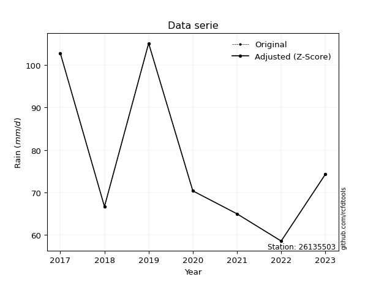</img>

</div>


> The initial value (value_initial) correspond to the initial obtained or null completed value, and value (value) is adjusted only when the initial value is outside the valid range (outlier) definite through the Z-Score value. If Z-Score is active, values out of range or outliers are replaced with the station mean value. A Z-Score (or standard score) measures how many standard deviations a data point is from the mean of a dataset, indicating its relative position; positive scores mean above the mean, negative mean below, and a score of zero is exactly at the mean, allowing for comparison of values from different distributions. It´s calculated using the formula $z=(x–μ)/σ$, where $x$ is the data point, $μ$ is the mean, and $σ$ is the standard deviation, helping identify outliers and understand probability.
>
> <sub>**Note**: In this study, "completing" (filling gaps in) and "extending" (forecasting or lengthening the historical record) rainfall data series are avoided for certain critical analyses because they introduce artificial bias and uncertainty, which can distort the statistics of rare events (extremes), alter day-to-day variability, and compromise the integrity and homogeneity of the original data. Some reasons against Completing/Extending rainfall data are: **Distortion of Extremes and Variability**: The primary issue is that most gap-filling or extension methods rely on averaging or regression with nearby stations, which inherently smooths the data. Rainfall is highly variable in space and time, with a large percentage of zero values and occasional large storms. Infilling methods often underestimate the highest values and overestimate the lowest (zero) values, which severely distorts analyses focused on flood frequency, drought severity, and intensity-duration-frequency (IDF) curves, **Loss of Data Homogeneity**: Infilled or extended data are synthetic estimates, not actual measurements. Combining these estimates with observed data can violate the assumption of data homogeneity, which requires that the data properties do not change over time. Inhomogeneity can lead to incorrect conclusions about long-term trends or changes in climate patterns, **Propagation of Errors**: Errors and biases from the original data (e.g., wind-induced undercatch, instrument errors, site changes) or the data used for imputation can propagate through the analysis, leading to unreliable hydrological models and inaccurate predictions, **Compromised Statistical Integrity**: For statistical analyses, especially those involving the frequency of events, using artificial data can introduce time bias or autocorrelation that doesn´t exist in reality, making it difficult to assess the true probability of events, **Difficulty in Validation**: It is difficult to accurately validate the quality of filled or extended data, especially for past periods where ground-truth measurements are unavailable. The reliability of imputation techniques heavily depends on the density of the surrounding station network and the complexity of the local topography.</sub>


### 4. Active continuous probability distributions from SciPy (44 of 104 available)

A Probability Density Function (PDF) describes the relative likelihood of a continuous random variable falling within a specific range, where the total area under its curve equals 1, and the area over any interval gives the actual probability for that range. Unlike discrete probabilities (like rolling a die), a PDF shows density, not direct probability for a single point (which is zero), with higher points indicating higher likelihood, often visualized as a bell curve for normal distributions.

A log of a probability density function (log-PDF) is simply the logarithm of the PDF´s value, denoted as $log(f(x))$, useful for converting multiplication of probabilities into addition, improving numerical stability with tiny numbers, and connecting to information theory concepts like entropy. Instead of dealing with very small probabilities (e.g., 0.000001), log-PDFs use negative numbers (e.g., $log(0.00001) ≈ -11.51$ that are easier for computers to handle, preventing underflow errors and simplifying complex calculations. In this study, each active probability distribution from SciPy is also evaluated in the $log$ form.

[scipy.stats](https://docs.scipy.org/doc/scipy/reference/stats.html) is a Python´s powerful submodule within the SciPy library for comprehensive statistical analysis, offering over 130 probability distributions (like Normal, Poisson), functions for descriptive stats (mean, variance), hypothesis testing (t-tests, chi-square), random variable generation, and statistical tests, making it essential for data science, modeling, and research. It provides tools to explore, model, and draw conclusions from data efficiently, working seamlessly with NumPy.

<div align="center">

|   id | p_dist             |   n_parameter | fit_method   | label                                                                       | active   | ref                                                                                                        |
|-----:|:-------------------|--------------:|:-------------|:----------------------------------------------------------------------------|:---------|:-----------------------------------------------------------------------------------------------------------|
|    0 | alpha              |             3 | MLE          | Alpha                                                                       | True     | [:mortar_board:](https://docs.scipy.org/doc/scipy/reference/generated/scipy.stats.alpha.html)              |
|    1 | betaprime          |             4 | MLE          | Beta prime                                                                  | True     | [:mortar_board:](https://docs.scipy.org/doc/scipy/reference/generated/scipy.stats.betaprime.html)          |
|    2 | chi2               |             3 | MLE          | Chi²                                                                        | True     | [:mortar_board:](https://docs.scipy.org/doc/scipy/reference/generated/scipy.stats.chi2.html)               |
|    3 | crystalball        |             4 | MLE          | Crystalball                                                                 | True     | [:mortar_board:](https://docs.scipy.org/doc/scipy/reference/generated/scipy.stats.crystalball.html)        |
|    4 | erlang             |             3 | MLE          | Erlang                                                                      | True     | [:mortar_board:](https://docs.scipy.org/doc/scipy/reference/generated/scipy.stats.erlang.html)             |
|    5 | expon              |             2 | MLE          | Exponential                                                                 | True     | [:mortar_board:](https://docs.scipy.org/doc/scipy/reference/generated/scipy.stats.expon.html)              |
|    6 | exponnorm          |             3 | MLE          | Exponentially modified Normal                                               | True     | [:mortar_board:](https://docs.scipy.org/doc/scipy/reference/generated/scipy.stats.exponnorm.html)          |
|    7 | f                  |             4 | MLE          | F                                                                           | True     | [:mortar_board:](https://docs.scipy.org/doc/scipy/reference/generated/scipy.stats.f.html)                  |
|    8 | fatiguelife        |             3 | MLE          | Fatigue-life (Birnbaum-Saunders)                                            | True     | [:mortar_board:](https://docs.scipy.org/doc/scipy/reference/generated/scipy.stats.fatiguelife.html)        |
|    9 | fisk               |             3 | MLE          | Fisk                                                                        | True     | [:mortar_board:](https://docs.scipy.org/doc/scipy/reference/generated/scipy.stats.fisk.html)               |
|   10 | gamma              |             3 | MLE          | Gamma                                                                       | True     | [:mortar_board:](https://docs.scipy.org/doc/scipy/reference/generated/scipy.stats.gamma.html)              |
|   11 | genexpon           |             5 | MLE          | Generalized exponential                                                     | True     | [:mortar_board:](https://docs.scipy.org/doc/scipy/reference/generated/scipy.stats.genexpon.html)           |
|   12 | genlogistic        |             3 | MLE          | Generalized logistic                                                        | True     | [:mortar_board:](https://docs.scipy.org/doc/scipy/reference/generated/scipy.stats.genlogistic.html)        |
|   13 | gibrat             |             2 | MM           | Gibrat                                                                      | True     | [:mortar_board:](https://docs.scipy.org/doc/scipy/reference/generated/scipy.stats.gibrat.html)             |
|   14 | gompertz           |             3 | MLE          | Gompertz (or truncated Gumbel)                                              | True     | [:mortar_board:](https://docs.scipy.org/doc/scipy/reference/generated/scipy.stats.gompertz.html)           |
|   15 | gumbel_l           |             2 | MM           | Gumbel Left Skew                                                            | True     | [:mortar_board:](https://docs.scipy.org/doc/scipy/reference/generated/scipy.stats.gumbel_l.html)           |
|   16 | gumbel_r           |             2 | MM           | Gumbel Right Skew                                                           | True     | [:mortar_board:](https://docs.scipy.org/doc/scipy/reference/generated/scipy.stats.gumbel_r.html)           |
|   17 | halflogistic       |             2 | MM           | Half-logistic                                                               | True     | [:mortar_board:](https://docs.scipy.org/doc/scipy/reference/generated/scipy.stats.halflogistic.html)       |
|   18 | halfnorm           |             2 | MM           | Half Normal                                                                 | True     | [:mortar_board:](https://docs.scipy.org/doc/scipy/reference/generated/scipy.stats.halfnorm.html)           |
|   19 | hypsecant          |             2 | MM           | hyperbolic secant                                                           | True     | [:mortar_board:](https://docs.scipy.org/doc/scipy/reference/generated/scipy.stats.hypsecant.html)          |
|   20 | invgamma           |             3 | MLE          | Inverted gamma                                                              | True     | [:mortar_board:](https://docs.scipy.org/doc/scipy/reference/generated/scipy.stats.invgamma.html)           |
|   21 | invgauss           |             3 | MLE          | Inverse Gaussian                                                            | True     | [:mortar_board:](https://docs.scipy.org/doc/scipy/reference/generated/scipy.stats.invgauss.html)           |
|   22 | invweibull         |             3 | MLE          | Inverted Weibull                                                            | True     | [:mortar_board:](https://docs.scipy.org/doc/scipy/reference/generated/scipy.stats.invweibull.html)         |
|   23 | johnsonsu          |             4 | MLE          | Johnson Su                                                                  | True     | [:mortar_board:](https://docs.scipy.org/doc/scipy/reference/generated/scipy.stats.johnsonsu.html)          |
|   24 | kstwobign          |             2 | MLE          | Limiting distribution of scaled Kolmogorov-Smirnov two-sided test statistic | True     | [:mortar_board:](https://docs.scipy.org/doc/scipy/reference/generated/scipy.stats.kstwobign.html)          |
|   25 | laplace            |             2 | MM           | Laplace                                                                     | True     | [:mortar_board:](https://docs.scipy.org/doc/scipy/reference/generated/scipy.stats.laplace.html)            |
|   26 | laplace_asymmetric |             3 | MLE          | Asymmetric Laplace                                                          | True     | [:mortar_board:](https://docs.scipy.org/doc/scipy/reference/generated/scipy.stats.laplace_asymmetric.html) |
|   27 | loggamma           |             3 | MLE          | Log gamma                                                                   | True     | [:mortar_board:](https://docs.scipy.org/doc/scipy/reference/generated/scipy.stats.loggamma.html)           |
|   28 | logistic           |             2 | MM           | Logistic (or Sech-squared)                                                  | True     | [:mortar_board:](https://docs.scipy.org/doc/scipy/reference/generated/scipy.stats.logistic.html)           |
|   29 | lognorm            |             3 | MLE          | Log Normal                                                                  | True     | [:mortar_board:](https://docs.scipy.org/doc/scipy/reference/generated/scipy.stats.lognorm.html)            |
|   30 | maxwell            |             2 | MM           | Maxwell                                                                     | True     | [:mortar_board:](https://docs.scipy.org/doc/scipy/reference/generated/scipy.stats.maxwell.html)            |
|   31 | mielke             |             4 | MLE          | Mielke Beta-Kappa / Dagum                                                   | True     | [:mortar_board:](https://docs.scipy.org/doc/scipy/reference/generated/scipy.stats.mielke.html)             |
|   32 | moyal              |             2 | MM           | Moyal                                                                       | True     | [:mortar_board:](https://docs.scipy.org/doc/scipy/reference/generated/scipy.stats.moyal.html)              |
|   33 | nakagami           |             3 | MLE          | Nakagami                                                                    | True     | [:mortar_board:](https://docs.scipy.org/doc/scipy/reference/generated/scipy.stats.nakagami.html)           |
|   34 | ncf                |             5 | MLE          | Non-central F distribution                                                  | True     | [:mortar_board:](https://docs.scipy.org/doc/scipy/reference/generated/scipy.stats.ncf.html)                |
|   35 | nct                |             4 | MLE          | Non-central Student’s t                                                     | True     | [:mortar_board:](https://docs.scipy.org/doc/scipy/reference/generated/scipy.stats.nct.html)                |
|   36 | norm               |             2 | MM           | Normal                                                                      | True     | [:mortar_board:](https://docs.scipy.org/doc/scipy/reference/generated/scipy.stats.norm.html)               |
|   37 | pearson3           |             3 | MM           | Pearson type III                                                            | True     | [:mortar_board:](https://docs.scipy.org/doc/scipy/reference/generated/scipy.stats.pearson3.html)           |
|   38 | rayleigh           |             2 | MM           | Rayleigh                                                                    | True     | [:mortar_board:](https://docs.scipy.org/doc/scipy/reference/generated/scipy.stats.rayleigh.html)           |
|   39 | rice               |             3 | MLE          | Rice                                                                        | True     | [:mortar_board:](https://docs.scipy.org/doc/scipy/reference/generated/scipy.stats.rice.html)               |
|   40 | t                  |             3 | MLE          | Student’s t                                                                 | True     | [:mortar_board:](https://docs.scipy.org/doc/scipy/reference/generated/scipy.stats.t.html)                  |
|   41 | truncnorm          |             4 | MLE          | Truncated normal                                                            | True     | [:mortar_board:](https://docs.scipy.org/doc/scipy/reference/generated/scipy.stats.truncnorm.html)          |
|   42 | wald               |             2 | MM           | Wald                                                                        | True     | [:mortar_board:](https://docs.scipy.org/doc/scipy/reference/generated/scipy.stats.wald.html)               |
|   43 | weibull_min        |             3 | MLE          | Weibull minimum                                                             | True     | [:mortar_board:](https://docs.scipy.org/doc/scipy/reference/generated/scipy.stats.weibull_min.html)        |

</div>

> **n_parameter:** # arguments & localization & scale.
>
> **Fit methods:** (MLE) maximum likelihood, (MM) L-moments.
>
>**Inactive** (With the only purpose of prevent loops, zero divisions, infinite values, over high estimated values or horizontal trending for recurrence intervals estimations, the follow distributions were disabled.)**:** foldnorm, gennorm, norminvgauss, powernorm, powerlognorm, skewnorm, genextreme, anglit, arcsine, argus, beta, bradford, burr, burr12, cauchy, cosine, halfcauchy, foldcauchy, skewcauchy, wrapcauchy, dgamma, gengamma, exponweib, exponpow, truncexpon, gausshyper, genhalflogistic, genhyperbolic, geninvgauss, halfgennorm, johnsonsb, kappa4, kappa3, ksone, kstwo, loglaplace, levy, levy_l, levy_stable, ncx2, pareto, genpareto, truncpareto, lomax, powerlaw, rdist, rel_breitwigner, recipinvgauss, semicircular, studentized_range, trapezoid, triang, truncweibull_min, tukeylambda, uniform, loguniform, vonmises, vonmises_line, weibull_max, dweibull, 


## B. Probability (PDF) vs. Empirical (EDF) distributions functions

A continuous probability distribution (CPD) describes probabilities for variables that can take any value within a range (like rain any time), unlike discrete variables with specific outcomes (like temperature). It uses a Probability Density Function (PDF), a curve where the total area under it equals 1, and the probability of the variable falling within an interval (a to b) is found by calculating the area under the curve between those points. A key feature is that the probability of hitting any single exact value is zero, so probabilities are always expressed for ranges, e.g., $P(a ≤ X ≤ b)$.

<div align="center">

Distributions parameters from station values
|    |   station | p_dist                |   n |             loc |          scale | shape                 | shape1                | shape2                | shape3   |
|---:|----------:|:----------------------|----:|----------------:|---------------:|:----------------------|:----------------------|:----------------------|:---------|
|  0 |  26135503 | alpha                 |   7 |    38.7438      |   84.3606      | 2.571737066583764     |                       |                       |          |
|  1 |  26135503 | betaprime             |   7 |    -1.73411     |    3.01796     | 642.2338774982611     | 25.46738535868913     |                       |          |
|  2 |  26135503 | chi2                  |   7 |    58.6         |    1.54296     | 0.47521110878835754   |                       |                       |          |
|  3 |  26135503 | crystalball           |   7 |    77.5571      |   17.2899      | 3796.146401335633     | 7258.185719952591     |                       |          |
|  4 |  26135503 | erlang                |   7 |    58.6         |   14.8715      | 0.9511537563806147    |                       |                       |          |
|  5 |  26135503 | expon                 |   7 |    58.6         |   18.9571      |                       |                       |                       |          |
|  6 |  26135503 | exponnorm             |   7 |    58.5592      |    0.0121563   | 1567.5150384406465    |                       |                       |          |
|  7 |  26135503 | f                     |   7 |    -2.64953     |   77.0655      | 748.6615865749955     | 53.47737152162068     |                       |          |
|  8 |  26135503 | fatiguelife           |   7 |    58.6         |    4.30796e-05 | 594.499509057769      |                       |                       |          |
|  9 |  26135503 | fisk                  |   7 |    56.8152      |   14.189       | 1.6796029011136868    |                       |                       |          |
| 10 |  26135503 | gamma                 |   7 |    58.6         |   25.0271      | 0.18311685379311554   |                       |                       |          |
| 11 |  26135503 | genexpon              |   7 |    58.6         |   25.7591      | 1.358812870637073     | 4.950801765276495e-10 | 1.7792979450558004    |          |
| 12 |  26135503 | genlogistic           |   7 |   -18.5933      |   12.2         | 1392.143925894933     |                       |                       |          |
| 13 |  26135503 | gibrat                |   7 |    64.3672      |    8.00012     |                       |                       |                       |          |
| 14 |  26135503 | gompertz              |   7 |    58.6         |  118.9         | 5.385601509698166     |                       |                       |          |
| 15 |  26135503 | gumbel_l              |   7 |    85.3385      |   13.4809      |                       |                       |                       |          |
| 16 |  26135503 | gumbel_r              |   7 |    69.7758      |   13.4809      |                       |                       |                       |          |
| 17 |  26135503 | halflogistic          |   7 |    57.0646      |   14.7822      |                       |                       |                       |          |
| 18 |  26135503 | halfnorm              |   7 |    54.6721      |   28.6821      |                       |                       |                       |          |
| 19 |  26135503 | hypsecant             |   7 |    77.5571      |   11.0071      |                       |                       |                       |          |
| 20 |  26135503 | invgamma              |   7 |    49.927       |   55.4414      | 2.9160227845040043    |                       |                       |          |
| 21 |  26135503 | invgauss              |   7 |    53.6698      |   31.4133      | 0.7604214986846607    |                       |                       |          |
| 22 |  26135503 | invweibull            |   7 |    43.5499      |   23.8822      | 2.4707776409273845    |                       |                       |          |
| 23 |  26135503 | johnsonsu             |   7 |     1.25088e+09 |    9.6144e+08  | 97792678.91645771     | 90625251.93817222     |                       |          |
| 24 |  26135503 | kstwobign             |   7 |    26.6088      |   58.5825      |                       |                       |                       |          |
| 25 |  26135503 | laplace               |   7 |    77.5571      |   12.2258      |                       |                       |                       |          |
| 26 |  26135503 | laplace_asymmetric    |   7 |    65           |    8.66722     | 0.5104097779345778    |                       |                       |          |
| 27 |  26135503 | loggamma              |   7 | -3448.03        |  521.046       | 868.6519384285525     |                       |                       |          |
| 28 |  26135503 | logistic              |   7 |    77.5571      |    9.5324      |                       |                       |                       |          |
| 29 |  26135503 | lognorm               |   7 |    58.6         |    0.104951    | 12.400118830159935    |                       |                       |          |
| 30 |  26135503 | maxwell               |   7 |    36.5874      |   25.674       |                       |                       |                       |          |
| 31 |  26135503 | mielke                |   7 |    -3.46722     |   37.1445      | 551.66608864686       | 6.630336353256        |                       |          |
| 32 |  26135503 | moyal                 |   7 |    67.6697      |    7.78318     |                       |                       |                       |          |
| 33 |  26135503 | nakagami              |   7 |    58.6         |   30.5707      | 0.07582613789015766   |                       |                       |          |
| 34 |  26135503 | ncf                   |   7 |     0.202607    |   87.8626      | 9.151165965177997     | 12.805109319354482    | 7.239229330257398e-11 |          |
| 35 |  26135503 | nct                   |   7 |    -0.269111    |    1.34122     | 12.942225756219194    | 54.470796244383564    |                       |          |
| 36 |  26135503 | norm                  |   7 |    77.5571      |   17.2899      |                       |                       |                       |          |
| 37 |  26135503 | pearson3              |   7 |    77.5571      |   17.2898      | 0.7326306966905025    |                       |                       |          |
| 38 |  26135503 | rayleigh              |   7 |    44.4806      |   26.3913      |                       |                       |                       |          |
| 39 |  26135503 | rice                  |   7 |    49.7217      |   23.1706      | 0.0003867797039378597 |                       |                       |          |
| 40 |  26135503 | t                     |   7 |    77.5582      |   17.2953      | 275366.24899223715    |                       |                       |          |
| 41 |  26135503 | truncnorm             |   7 |    77.5571      |   17.2899      | -71.40350707925828    | 2335.3290141326925    |                       |          |
| 42 |  26135503 | wald                  |   7 |    60.2672      |   17.2899      |                       |                       |                       |          |
| 43 |  26135503 | weibull_min           |   7 |    58.6         |   13.7043      | 0.1941791751959304    |                       |                       |          |
| 44 |  26135503 | logalpha              |   7 |     2.34629     |   19.5833      | 10.041241454447324    |                       |                       |          |
| 45 |  26135503 | logbetaprime          |   7 |     3.04413     |    0.16642     | 366.79355751436947    | 49.02800362290759     |                       |          |
| 46 |  26135503 | logchi2               |   7 |     4.07073     |    0.996755    | 0.9789916575942634    |                       |                       |          |
| 47 |  26135503 | logcrystalball        |   7 |     4.3279      |    0.211026    | 41.02005507701589     | 463.2026827585121     |                       |          |
| 48 |  26135503 | logerlang             |   7 |     4.07073     |    0.335939    | 0.6340419776821331    |                       |                       |          |
| 49 |  26135503 | logexpon              |   7 |     4.07073     |    0.257169    |                       |                       |                       |          |
| 50 |  26135503 | logexponnorm          |   7 |     4.10004     |    0.0581012   | 3.9217674406108234    |                       |                       |          |
| 51 |  26135503 | logf                  |   7 |     4.07073     |    0.241976    | 1.6412633087994095    | 196.72742286988142    |                       |          |
| 52 |  26135503 | logfatiguelife        |   7 |     3.98072     |    0.281699    | 0.679813989285646     |                       |                       |          |
| 53 |  26135503 | logfisk               |   7 |     4.01243     |    0.250713    | 2.250165807838416     |                       |                       |          |
| 54 |  26135503 | loggamma              |   7 |     4.07073     |    0.449167    | 0.38094152063583075   |                       |                       |          |
| 55 |  26135503 | loggenexpon           |   7 |     4.07073     |    0.459009    | 1.4800398374775203    | 2.038790642506747     | 0.364120002313515     |          |
| 56 |  26135503 | loggenlogistic        |   7 |     3.15157     |    0.158306    | 911.1693282878787     |                       |                       |          |
| 57 |  26135503 | loggibrat             |   7 |     4.16689     |    0.0976581   |                       |                       |                       |          |
| 58 |  26135503 | loggompertz           |   7 |     4.07073     |    0.490203    | 1.1564793530446393    |                       |                       |          |
| 59 |  26135503 | loggumbel_l           |   7 |     4.42288     |    0.164536    |                       |                       |                       |          |
| 60 |  26135503 | loggumbel_r           |   7 |     4.23293     |    0.164536    |                       |                       |                       |          |
| 61 |  26135503 | loghalflogistic       |   7 |     4.07786     |    0.180373    |                       |                       |                       |          |
| 62 |  26135503 | loghalfnorm           |   7 |     4.04859     |    0.35007     |                       |                       |                       |          |
| 63 |  26135503 | loghypsecant          |   7 |     4.3279      |    0.134343    |                       |                       |                       |          |
| 64 |  26135503 | loginvgamma           |   7 |    -2.73454     | 8154.86        | 1155.7303833230271    |                       |                       |          |
| 65 |  26135503 | loginvgauss           |   7 |     3.96081     |    0.863746    | 0.42500550675690474   |                       |                       |          |
| 66 |  26135503 | loginvweibull         |   7 |     3.52096     |    0.693109    | 4.843923631549695     |                       |                       |          |
| 67 |  26135503 | logjohnsonsu          |   7 |     8.79558e+06 |    2.26091e+06 | 88968154.29415038     | 43026516.03111966     |                       |          |
| 68 |  26135503 | logkstwobign          |   7 |     3.67309     |    0.751807    |                       |                       |                       |          |
| 69 |  26135503 | loglaplace            |   7 |     4.3279      |    0.149218    |                       |                       |                       |          |
| 70 |  26135503 | loglaplace_asymmetric |   7 |     4.17439     |    0.118871    | 0.5446210367124196    |                       |                       |          |
| 71 |  26135503 | logloggamma           |   7 |   -52.2182      |    7.8542      | 1339.1697457874652    |                       |                       |          |
| 72 |  26135503 | loglogistic           |   7 |     4.3279      |    0.116345    |                       |                       |                       |          |
| 73 |  26135503 | loglognorm            |   7 |     4.07073     |    0.00208349  | 11.644812591048126    |                       |                       |          |
| 74 |  26135503 | logmaxwell            |   7 |     3.82786     |    0.313355    |                       |                       |                       |          |
| 75 |  26135503 | logmielke             |   7 |     3.05301     |    0.694657    | 433.2201014229305     | 7.782774026053165     |                       |          |
| 76 |  26135503 | logmoyal              |   7 |     4.20723     |    0.0949949   |                       |                       |                       |          |
| 77 |  26135503 | lognakagami           |   7 |     4.07073     |    0.373854    | 0.3898150417746729    |                       |                       |          |
| 78 |  26135503 | logncf                |   7 |     4.02312     |    0.000166192 | 0.005346421623262584  | 1127.71735411301      | 9.931537774211192     |          |
| 79 |  26135503 | lognct                |   7 |     0.268501    |    0.078995    | 225.62704103532235    | 51.198290226276384    |                       |          |
| 80 |  26135503 | lognorm               |   7 |     4.3279      |    0.211026    |                       |                       |                       |          |
| 81 |  26135503 | logpearson3           |   7 |     4.3279      |    0.211026    | 0.610982373818219     |                       |                       |          |
| 82 |  26135503 | lograyleigh           |   7 |     3.9242      |    0.322109    |                       |                       |                       |          |
| 83 |  26135503 | logrice               |   7 |     3.97317     |    0.291866    | 0.0006795557224492104 |                       |                       |          |
| 84 |  26135503 | logt                  |   7 |     4.3279      |    0.211025    | 2672539484.866518     |                       |                       |          |
| 85 |  26135503 | logtruncnorm          |   7 |    -1.93123     |    1.49578     | 4.012608970410307     | 4.403162144352255     |                       |          |
| 86 |  26135503 | logwald               |   7 |     4.1169      |    0.21101     |                       |                       |                       |          |
| 87 |  26135503 | logweibull_min        |   7 |     4.07073     |    0.267731    | 0.537452904040461     |                       |                       |          |

</div>

> **loc** (Location parameter): This shifts the distribution along the x-axis. For many common distributions, like the normal (Gaussian) distribution, loc represents the mean $μ$. For others, like the uniform distribution, it might represent the minimum value, or for the beta distribution, the left end of the support interval.
>
> **scale** (Scale parameter): This determines the width or spread of the distribution. For the normal distribution, scale represents the standard deviation $σ$. For a uniform distribution, it defines the length of the interval (from $loc$ to $loc + scale$).
>
> **shape** (Shape parameters): Refers to parameters that define the specific form of a probability distribution, distinct from its location (loc) and scale (scale). These parameters are required arguments for most distribution functions. For example, a normal (Gaussian) distribution is fully defined by its location (mean) and scale (standard deviation), so it has no specific shape parameters beyond loc and scale. However, other distributions have intrinsic properties that need specification, as Gamma distribution that takes a shape parameter, often named $a$ or $alpha$.


### 0. Cumulative distribution values - CDF (88 evaluated)

Cumulative Distribution Function (CDF), denoted as $F$<sub>$X$</sub>$(x)$, is a function that gives the probability that a random variable $X$ will take a value less than or equal to a specific value, $x$ (i.e., $(P(X≥x)$. It essentially "accumulates" probabilities from a given point up to the far right (positive infinity), providing a complete picture of the distribution´s probabilities for both discrete (like rain) and continuous (like temperature) variables, helping to find probabilities over ranges or above certain values. Each station is evaluated separately ordering the $x$ values ascending, calculating the CDF and PDF values for the activated distributions and their logarithmic forms.

<div align="center">

CDF ordered by x ascending and calculating $log(f(x))$ separately
|   id |   Station |   date |     x |   count |    mean |     std |    zscore |   Value_initial |   station |   m |     alpha |   alpha_pdf |   betaprime |   betaprime_pdf |        chi2 |    chi2_pdf |   crystalball |   crystalball_pdf |      erlang |   erlang_pdf |    expon |   expon_pdf |   exponnorm |   exponnorm_pdf |        f |      f_pdf |   fatiguelife |   fatiguelife_pdf |      fisk |   fisk_pdf |      gamma |   gamma_pdf |    genexpon |   genexpon_pdf |   genlogistic |   genlogistic_pdf |     gibrat |   gibrat_pdf |    gompertz |   gompertz_pdf |   gumbel_l |   gumbel_l_pdf |   gumbel_r |   gumbel_r_pdf |   halflogistic |   halflogistic_pdf |   halfnorm |   halfnorm_pdf |   hypsecant |   hypsecant_pdf |   invgamma |   invgamma_pdf |   invgauss |   invgauss_pdf |   invweibull |   invweibull_pdf |   johnsonsu |   johnsonsu_pdf |   kstwobign |   kstwobign_pdf |   laplace |   laplace_pdf |   laplace_asymmetric |   laplace_asymmetric_pdf |    loggamma |   loggamma_pdf |   logistic |   logistic_pdf |   lognorm |   lognorm_pdf |   maxwell |   maxwell_pdf |    mielke |   mielke_pdf |     moyal |   moyal_pdf |   nakagami |   nakagami_pdf |      ncf |    ncf_pdf |       nct |    nct_pdf |     norm |   norm_pdf |   pearson3 |   pearson3_pdf |   rayleigh |   rayleigh_pdf |     rice |   rice_pdf |        t |      t_pdf |   truncnorm |   truncnorm_pdf |     wald |   wald_pdf |   weibull_min |   weibull_min_pdf |   logalpha |   logalpha_pdf |   logbetaprime |   logbetaprime_pdf |     logchi2 |   logchi2_pdf |   logcrystalball |   logcrystalball_pdf |   logerlang |   logerlang_pdf |   logexpon |   logexpon_pdf |   logexponnorm |   logexponnorm_pdf |        logf |   logf_pdf |   logfatiguelife |   logfatiguelife_pdf |   logfisk |   logfisk_pdf |   loggenexpon |   loggenexpon_pdf |   loggenlogistic |   loggenlogistic_pdf |   loggibrat |   loggibrat_pdf |   loggompertz |   loggompertz_pdf |   loggumbel_l |   loggumbel_l_pdf |   loggumbel_r |   loggumbel_r_pdf |   loghalflogistic |   loghalflogistic_pdf |   loghalfnorm |   loghalfnorm_pdf |   loghypsecant |   loghypsecant_pdf |   loginvgamma |   loginvgamma_pdf |   loginvgauss |   loginvgauss_pdf |   loginvweibull |   loginvweibull_pdf |   logjohnsonsu |   logjohnsonsu_pdf |   logkstwobign |   logkstwobign_pdf |   loglaplace |   loglaplace_pdf |   loglaplace_asymmetric |   loglaplace_asymmetric_pdf |   logloggamma |   logloggamma_pdf |   loglogistic |   loglogistic_pdf |   loglognorm |   loglognorm_pdf |   logmaxwell |   logmaxwell_pdf |   logmielke |   logmielke_pdf |   logmoyal |   logmoyal_pdf |   lognakagami |   lognakagami_pdf |   logncf |   logncf_pdf |   lognct |   lognct_pdf |   logpearson3 |   logpearson3_pdf |   lograyleigh |   lograyleigh_pdf |   logrice |   logrice_pdf |     logt |   logt_pdf |   logtruncnorm |   logtruncnorm_pdf |   logwald |   logwald_pdf |   logweibull_min |   logweibull_min_pdf |
|-----:|----------:|-------:|------:|--------:|--------:|--------:|----------:|----------------:|----------:|----:|----------:|------------:|------------:|----------------:|------------:|------------:|--------------:|------------------:|------------:|-------------:|---------:|------------:|------------:|----------------:|---------:|-----------:|--------------:|------------------:|----------:|-----------:|-----------:|------------:|------------:|---------------:|--------------:|------------------:|-----------:|-------------:|------------:|---------------:|-----------:|---------------:|-----------:|---------------:|---------------:|-------------------:|-----------:|---------------:|------------:|----------------:|-----------:|---------------:|-----------:|---------------:|-------------:|-----------------:|------------:|----------------:|------------:|----------------:|----------:|--------------:|---------------------:|-------------------------:|------------:|---------------:|-----------:|---------------:|----------:|--------------:|----------:|--------------:|----------:|-------------:|----------:|------------:|-----------:|---------------:|---------:|-----------:|----------:|-----------:|---------:|-----------:|-----------:|---------------:|-----------:|---------------:|---------:|-----------:|---------:|-----------:|------------:|----------------:|---------:|-----------:|--------------:|------------------:|-----------:|---------------:|---------------:|-------------------:|------------:|--------------:|-----------------:|---------------------:|------------:|----------------:|-----------:|---------------:|---------------:|-------------------:|------------:|-----------:|-----------------:|---------------------:|----------:|--------------:|--------------:|------------------:|-----------------:|---------------------:|------------:|----------------:|--------------:|------------------:|--------------:|------------------:|--------------:|------------------:|------------------:|----------------------:|--------------:|------------------:|---------------:|-------------------:|--------------:|------------------:|--------------:|------------------:|----------------:|--------------------:|---------------:|-------------------:|---------------:|-------------------:|-------------:|-----------------:|------------------------:|----------------------------:|--------------:|------------------:|--------------:|------------------:|-------------:|-----------------:|-------------:|-----------------:|------------:|----------------:|-----------:|---------------:|--------------:|------------------:|---------:|-------------:|---------:|-------------:|--------------:|------------------:|--------------:|------------------:|----------:|--------------:|---------:|-----------:|---------------:|-------------------:|----------:|--------------:|-----------------:|---------------------:|
|    0 |  26135503 |   2022 |  58.6 |       7 | 77.5571 | 18.6752 | -1.0151   |            58.6 |  26135503 |   1 | 0.0470246 |  0.0210323  |    0.105197 |      0.0160337  | 0.000365926 | 1.22366e+10 |      0.136445 |        0.0126495  | 2.73042e-15 |   0.365502   | 0        |  0.0527506  |  0.00214129 |      0.0523462  | 0.106997 | 0.0160449  |     0.0444872 |       1.89551e+09 | 0.0298263 | 0.0272311  | 0.00154168 | 3.97313e+10 | 2.34753e-10 |     0.0527508  |     0.0833011 |        0.0169543  | 0          |   0          | 1.83125e-07 |     0.0452952  |   0.128548 |     0.00889463 |   0.10116  |     0.017192   |      0.0518864 |         0.0337333  |   0.108926 |     0.0275586  |    0.112551 |      0.0100136  |   0.042395 |     0.0232805  |  0.0387098 |     0.027465   |    0.0437377 |       0.0224715  |    0.138087 |      0.0126661  |   0.0733077 |      0.0166684  |  0.106062 |    0.00867525 |            0.0486397 |               0.0109949  | 2.81857e-06 |    1.20889e+09 |   0.120394 |     0.0111094  |  0.111486 |      0.899664 |  0.135085 |    0.0158188  | 0.0658334 |   0.0188238  | 0.0733299 |  0.0184685  | 0.00364082 |    7.77066e+10 | 0.27143  | 0.00877955 | 0.0964095 | 0.0169376  | 0.136445 | 0.0126495  |   0.122115 |     0.0165602  |   0.133345 |     0.0175688  | 0.07078  | 0.0153665  | 0.136507 | 0.0126494  |    0.136445 |      0.0126495  | 0        | 0          |    0.00107569 |       2.93809e+10 |  0.0942516 |       1.10659  |      0.0905063 |           1.09564  | 3.45375e-08 |   1.90344e+07 |         0.111486 |             0.899662 | 6.36661e-10 |   454492        |   0        |       3.88849  |      0.0440462 |           1.15388  | 6.38184e-12 | 842.356    |        0.0383021 |             1.58664  | 0.0361855 |      1.34604  |   1.97578e-11 |          3.22442  |         0.064745 |             1.11783  |  0          |        0        |   7.59186e-10 |          2.35918  |      0.110975 |          0.63558  |     0.0685695 |          1.11684  |          0        |              0        |     0.0504413 |          2.27466  |      0.0931973 |           0.683857 |      0.106139 |          0.926605 |     0.0397104 |          1.47938  |       0.0463392 |            1.25415  |       0.111537 |           0.899778 |      0.0576071 |           1.13289  |    0.0892245 |         0.597949 |               0.0461367 |                    0.712647 |      0.116135 |          0.900726 |     0.0988193 |          0.765434 |    0.0072218 |      1.93671e+12 |     0.103736 |         1.13276  |   0.0621204 |        1.2876   |  0.0402495 |       1.051    |   3.09525e-12 |       2716.96     | 0.048461 |     1.18277  | 0.104493 |     0.961495 |     0.0952524 |          1.09863  |     0.0983035 |          1.27349  | 0.0543439 |      1.08313  | 0.111485 |   0.899664 |    9.19393e-06 |           3.44508  |  0        |      0        |      1.65239e-08 |          9.99891e+06 |
|    1 |  26135503 |   2021 |  65   |       7 | 77.5571 | 18.6752 | -0.672397 |            65   |  26135503 |   2 | 0.262008  |  0.0399484  |    0.234162 |      0.0236591  | 0.985287    | 0.00610469  |      0.233836 |        0.0177247  | 0.373789    |   0.0442093  | 0.286522 |  0.0376364  |  0.286811   |      0.0374274  | 0.235654 | 0.0235667  |     0.741616  |       0.0163768   | 0.284124  | 0.0417392  | 0.812948   | 0.0187034   | 0.286523    |     0.0376365  |     0.229621  |        0.0276777  | 0.00559016 |   0.0252331  | 0.257575    |     0.035488   |   0.198442 |     0.0131522  |   0.240477 |     0.0254221  |      0.262144  |         0.0315     |   0.281213 |     0.026072   |    0.196906 |      0.0167698  |   0.272516 |     0.0403457  |  0.288479  |     0.0399705  |    0.271464  |       0.0407728  |    0.235355 |      0.0176668  |   0.216296  |      0.0267351  |  0.179021 |    0.0146429  |            0.206675  |               0.0467186  | 0.605435    |    1.87854     |   0.211266 |     0.0174807  |  0.233466 |      1.45096  |  0.252917 |    0.0206319  | 0.239209  |   0.0328523  | 0.235193  |  0.0300772  | 0.67452    |    0.0159339   | 0.327488 | 0.00870155 | 0.235471  | 0.0256258  | 0.233836 | 0.0177247  |   0.249007 |     0.0225205  |   0.260853 |     0.0217758  | 0.195386 | 0.0228975  | 0.233887 | 0.0177213  |    0.233836 |      0.0177247  | 0.137634 | 0.061475   |    0.57792    |       0.011046    |  0.251071  |       1.86634  |      0.247587  |           1.88327  | 0.261035    |   1.1903      |         0.233466 |             1.45096  | 0.470838    |        2.37446  |   0.331722 |       2.59859  |      0.268085  |           2.77172  | 0.387601    |   2.51319  |        0.289646  |             2.64423  | 0.272237  |      2.75269  |   0.297169    |          2.51264  |         0.240933 |             2.16439  |  0.00512486 |        1.97219  |   0.238383    |          2.21988  |      0.198168 |          1.0763   |     0.239946  |          2.08152  |          0.261379 |              2.58265  |     0.280668  |          2.1367   |      0.196556  |           1.37187  |      0.233154 |          1.51611  |     0.281325  |          2.63745  |       0.264331  |            2.60724  |       0.233518 |           1.45085  |      0.23443   |           2.12763  |    0.178716  |         1.19769  |               0.228759  |                    3.53351  |      0.237047 |          1.42914  |     0.210901  |          1.43042  |    0.631381  |      0.31243     |     0.252487 |         1.68946  |   0.266198  |        2.41637  |  0.234565  |       2.46294  |   0.284564    |          2.09464  | 0.225771 |     2.09585  | 0.236686 |     1.57428  |     0.246481  |          1.76582  |     0.260398  |          1.78343  | 0.211528  |      1.86249  | 0.233466 |   1.45096  |    0.31152     |           2.60253  |  0.136285 |      5.03263  |      0.451457    |          1.70795     |
|    2 |  26135503 |   2018 |  66.7 |       7 | 77.5571 | 18.6752 | -0.581367 |            66.7 |  26135503 |   3 | 0.329515  |  0.0391858  |    0.275515 |      0.0249281  | 0.992625    | 0.00294048  |      0.265019 |        0.0189449  | 0.444393    |   0.0389826  | 0.347719 |  0.0344082  |  0.347682   |      0.034233   | 0.276841 | 0.0248261  |     0.767115  |       0.0137668   | 0.352716  | 0.0387935  | 0.840836   | 0.0144162   | 0.34772     |     0.0344083  |     0.278027  |        0.0291575  | 0.108905   |   0.0800267  | 0.315918    |     0.0331701  |   0.221921 |     0.0144829  |   0.28471  |     0.0265322  |      0.314842  |         0.0304716  |   0.32504  |     0.0254767  |    0.227241 |      0.0189356  |   0.339756 |     0.0385438  |  0.354039  |     0.0370589  |    0.339606  |       0.0391443  |    0.266421 |      0.0188659  |   0.2629    |      0.0279903  |  0.205728 |    0.0168274  |            0.282251  |               0.042268   | 0.649383    |    1.54548     |   0.242509 |     0.0192709  |  0.272544 |      1.57419  |  0.288749 |    0.02149    | 0.296029  |   0.0338033  | 0.287204  |  0.0309634  | 0.698954   |    0.0130216   | 0.342235 | 0.00864637 | 0.280162  | 0.026866   | 0.265019 | 0.0189449  |   0.28813  |     0.0234559  |   0.298417 |     0.0223816  | 0.235446 | 0.0241785  | 0.265063 | 0.0189406  |    0.265019 |      0.0189449  | 0.242092 | 0.0598506  |    0.59462    |       0.00877474  |  0.300855  |       1.98362  |      0.297893  |           2.00702  | 0.289841    |   1.04887     |         0.272544 |             1.57419  | 0.527451    |        2.02694  |   0.395554 |       2.35038  |      0.339244  |           2.71392  | 0.448465    |   2.21162  |        0.356415  |             2.51811  | 0.342883  |      2.70005  |   0.359824    |          2.34174  |         0.298434 |             2.27804  |  0.141065   |        6.71598  |   0.295015    |          2.16593  |      0.227697 |          1.21278  |     0.295212  |          2.18905  |          0.326723 |              2.47612  |     0.33506   |          2.07517  |      0.234811  |           1.59358  |      0.273958 |          1.64213  |     0.348381  |          2.54459  |       0.331927  |            2.61052  |       0.272593 |           1.57402  |      0.290644  |           2.21621  |    0.212473  |         1.42392  |               0.314798  |                    3.13932  |      0.275497 |          1.54744  |     0.250191  |          1.61241  |    0.63856   |      0.248486    |     0.297259 |         1.77468  |   0.329304  |        2.45693  |  0.299434  |       2.54363  |   0.336871    |          1.96125  | 0.281132 |     2.18354  | 0.278974 |     1.69827  |     0.293444  |          1.86662  |     0.307267  |          1.84279  | 0.261073  |      1.96941  | 0.272544 |   1.5742   |    0.376396    |           2.42512  |  0.265382 |      4.79271  |      0.491726    |          1.42786     |
|    3 |  26135503 |   2020 |  70.4 |       7 | 77.5571 | 18.6752 | -0.383243 |            70.4 |  26135503 |   4 | 0.465241  |  0.0336086  |    0.370911 |      0.0263241  | 0.99824     | 0.00066547  |      0.339455 |        0.0211792  | 0.570894    |   0.0298427  | 0.463375 |  0.0283072  |  0.462806   |      0.0281914  | 0.371859 | 0.0262275  |     0.810663  |       0.010101    | 0.481736  | 0.0308684  | 0.883276   | 0.00914467  | 0.463377    |     0.0283073  |     0.388569  |        0.030097   | 0.388879   |   0.0635464  | 0.429878    |     0.0285181  |   0.281203 |     0.017605   |   0.384908 |     0.0272602  |      0.422771  |         0.0277788  |   0.416549 |     0.0239351  |    0.306235 |      0.0237242  |   0.470965 |     0.0320905  |  0.478114  |     0.0300339  |    0.472979  |       0.0325867  |    0.340486 |      0.0210589  |   0.368643  |      0.0287544  |  0.278438 |    0.0227746  |            0.422777  |               0.0339925  | 0.719809    |    1.10448     |   0.320642 |     0.0228516  |  0.363433 |      1.77861  |  0.370706 |    0.0226453  | 0.419942  |   0.0325349  | 0.401401  |  0.0302468  | 0.739684   |    0.00940701  | 0.373946 | 0.00848589 | 0.382046  | 0.0278207  | 0.339455 | 0.0211792  |   0.377187 |     0.024447   |   0.382626 |     0.0229749  | 0.328487 | 0.025864   | 0.33948  | 0.0211731  |    0.339455 |      0.0211792  | 0.435786 | 0.0444348  |    0.621435   |       0.00605124  |  0.411754  |       2.09353  |      0.410341  |           2.12643  | 0.340776    |   0.854448    |         0.363432 |             1.77861  | 0.622171    |        1.51933  |   0.510013 |       1.90531  |      0.475152  |           2.28589  | 0.554112    |   1.72906  |        0.482611  |             2.14409  | 0.479558  |      2.32296  |   0.476945    |          2.00121  |         0.423183 |             2.29773  |  0.455366   |        4.54112  |   0.408401    |          2.02919  |      0.301431 |          1.52302  |     0.41529   |          2.21804  |          0.453274 |              2.2025   |     0.443014  |          1.91814  |      0.333507  |           2.05259  |      0.368411 |          1.83989  |     0.476975  |          2.19872  |       0.467008  |            2.34908  |       0.363468 |           1.77831  |      0.411273  |           2.21524  |    0.305096  |         2.04464  |               0.464949  |                    2.45139  |      0.364735 |          1.74518  |     0.346704  |          1.94681  |    0.649712  |      0.173432    |     0.396113 |         1.86798  |   0.458907  |        2.29986  |  0.434816  |       2.41771  |   0.436371    |          1.73266  | 0.400467 |     2.20341  | 0.376101 |     1.88042  |     0.397593  |          1.96635  |     0.408312  |          1.88188  | 0.370957  |      2.07522  | 0.363433 |   1.77862  |    0.498074    |           2.09023  |  0.48293  |      3.27975  |      0.55787     |          1.05712     |
|    4 |  26135503 |   2023 |  74.3 |       7 | 77.5571 | 18.6752 | -0.17441  |            74.3 |  26135503 |   5 | 0.581866  |  0.0262308  |    0.473298 |      0.0258834  | 0.999587    | 0.000151257 |      0.425288 |        0.0226679  | 0.672557    |   0.0226406  | 0.563158 |  0.0230437  |  0.562231   |      0.0229737  | 0.473925 | 0.0258178  |     0.845056  |       0.00770429  | 0.586814  | 0.0232912  | 0.912657   | 0.00619703  | 0.56316     |     0.0230437  |     0.503231  |        0.0283186  | 0.585658   |   0.0392346  | 0.532437    |     0.0241678  |   0.356574 |     0.021046   |   0.489238 |     0.0259449  |      0.524825  |         0.0245078  |   0.50623  |     0.022011   |    0.407153 |      0.0276971  |   0.582022 |     0.0250042  |  0.582116  |     0.0235268  |    0.585362  |       0.0251879  |    0.425786 |      0.0225185  |   0.478594  |      0.0273268  |  0.38306  |    0.0313322  |            0.541226  |               0.0270171  | 0.771583    |    0.835127    |   0.415399 |     0.0254755  |  0.462636 |      1.88219  |  0.459667 |    0.0227982  | 0.539136  |   0.0282921  | 0.513656  |  0.0270478  | 0.77195    |    0.00731918  | 0.406629 | 0.00826697 | 0.488823  | 0.026615   | 0.425288 | 0.0226679  |   0.472208 |     0.0240569  |   0.471828 |     0.0226128  | 0.430274 | 0.0260822  | 0.425287 | 0.0226608  |    0.425288 |      0.0226679  | 0.580982 | 0.0308743  |    0.641831   |       0.00454837  |  0.523549  |       2.02637  |      0.524012  |           2.0619   | 0.383259    |   0.729146    |         0.462635 |             1.88219  | 0.69434     |        1.1776   |   0.602688 |       1.54494  |      0.585488  |           1.81841  | 0.637339    |   1.3748   |        0.587576  |             1.75406  | 0.591748  |      1.83848  |   0.576297    |          1.68921  |         0.542369 |             2.0954   |  0.643874   |        2.63924  |   0.513452    |          1.8629   |      0.392147 |          1.83913  |     0.530873  |          2.04311  |          0.563723 |              1.89112  |     0.541515  |          1.73158  |      0.453271  |           2.3439   |      0.470386 |          1.92162  |     0.58487   |          1.80497  |       0.582782  |            1.93639  |       0.462653 |           1.88183  |      0.526529  |           2.03844  |    0.437887  |         2.93456  |               0.582062  |                    1.91482  |      0.462099 |          1.84858  |     0.457571  |          2.13332  |    0.657875  |      0.13287     |     0.496777 |         1.84804  |   0.574324  |        1.96517  |  0.556522  |       2.07739  |   0.524413    |          1.53663  | 0.515852 |     2.05417  | 0.479575 |     1.93553  |     0.503026  |          1.92255  |     0.508489  |          1.81868  | 0.48237   |      2.0353   | 0.462636 |   1.8822   |    0.602755    |           1.7996   |  0.627886 |      2.18106  |      0.608344    |          0.831227    |
|    5 |  26135503 |   2017 | 102.8 |       7 | 77.5571 | 18.6752 |  1.35168  |           102.8 |  26135503 |   6 | 0.899769  |  0.00375189 |    0.924074 |      0.0061372  | 1           | 6.69997e-09 |      0.927852 |        0.00794804 | 0.953504    |   0.00316693 | 0.902857 |  0.00512433 |  0.901895   |      0.00514846 | 0.924774 | 0.0061352  |     0.955792  |       0.00180096  | 0.878142  | 0.00390851 | 0.984134   | 0.000851956 | 0.902859    |     0.00512429 |     0.935734  |        0.00509459 | 0.941729   |   0.00302923 | 0.911514    |     0.00581265 |   0.974061 |     0.00702689 |   0.917302 |     0.00587352 |      0.913284  |         0.00561186 |   0.906648 |     0.00680658 |    0.935963 |      0.00577864 |   0.900469 |     0.00410638 |  0.901652  |     0.00454358 |    0.899493  |       0.00397319 |    0.92647  |      0.00800931 |   0.932112  |      0.00602795 |  0.936573 |    0.00518795 |            0.914356  |               0.00504357 | 0.920186    |    0.237734    |   0.933894 |     0.0064764  |  0.925737 |      0.665759 |  0.916111 |    0.00743137 | 0.924788  |   0.00450952 | 0.916627  |  0.00533646 | 0.894716   |    0.00264824  | 0.61134  | 0.00600654 | 0.92358   | 0.00567907 | 0.927852 | 0.00794804 |   0.915768 |     0.00672717 |   0.912979 |     0.00728645 | 0.927473 | 0.00717039 | 0.927781 | 0.00795155 |    0.927852 |      0.00794804 | 0.925203 | 0.00387763 |    0.715014   |       0.00157165  |  0.930094  |       0.502417 |      0.934926  |           0.493025 | 0.555539    |   0.399008    |         0.925737 |             0.665761 | 0.905025    |        0.326795 |   0.887582 |       0.437138 |      0.900293  |           0.437583 | 0.88909     |   0.393966 |        0.898165  |             0.437038 | 0.884791  |      0.369745 |   0.899195    |          0.486104 |         0.924307 |             0.459554 |  0.940913   |        0.252634 |   0.91654     |          0.619709 |      0.972164 |          0.605902 |     0.915743  |          0.489884 |          0.911831 |              0.467264 |     0.904843  |          0.566309 |      0.934424  |           0.484675 |      0.926108 |          0.636609 |     0.900429  |          0.432063 |       0.903609  |            0.399028 |       0.9257   |           0.665879 |      0.92315   |           0.521857 |    0.935193  |         0.43431  |               0.905575  |                    0.432617 |      0.923153 |          0.680563 |     0.93217   |          0.543467 |    0.684632  |      0.0543035   |     0.914137 |         0.620189 |   0.911263  |        0.416816 |  0.915211  |       0.4446   |   0.86303     |          0.616153 | 0.919929 |     0.527673 | 0.924893 |     0.614488 |     0.915135  |          0.577841 |     0.911045  |          0.607514 | 0.922216  |      0.602304 | 0.925738 |   0.665756 |    0.984773    |           0.710758 |  0.924181 |      0.322707 |      0.774561    |          0.32114     |
|    6 |  26135503 |   2019 | 105.1 |       7 | 77.5571 | 18.6752 |  1.47484  |           105.1 |  26135503 |   7 | 0.907863  |  0.00329823 |    0.937044 |      0.00516456 | 1           | 3.05906e-09 |      0.944421 |        0.00648741 | 0.960244    |   0.00270642 | 0.913956 |  0.00453885 |  0.91305    |      0.00456307 | 0.937734 | 0.00515775 |     0.959732  |       0.00162812  | 0.886646  | 0.00349611 | 0.985969   | 0.000745605 | 0.913958    |     0.00453881 |     0.946474  |        0.00426771 | 0.948193   |   0.0026046  | 0.924034    |     0.00508768 |   0.986851 |     0.00422478 |   0.929806 |     0.00501975 |      0.925313  |         0.00486382 |   0.92128  |     0.00593056 |    0.947979 |      0.00470517 |   0.909353 |     0.00363099 |  0.911509  |     0.00403932 |    0.90809   |       0.00351451 |    0.943188 |      0.00655552 |   0.944823  |      0.00504748 |  0.94745  |    0.00429826 |            0.925205  |               0.00440468 | 0.925258    |    0.220961    |   0.94732  |     0.00523532 |  0.939383 |      0.569035 |  0.931867 |    0.00628996 | 0.934404  |   0.00387008 | 0.928045  |  0.00460991 | 0.900627   |    0.00249412  | 0.624937 | 0.00581672 | 0.935614  | 0.00480732 | 0.944421 | 0.00648741 |   0.930064 |     0.00572407 |   0.928495 |     0.00622339 | 0.942508 | 0.00593023 | 0.944357 | 0.00649115 |    0.944421 |      0.00648741 | 0.933543 | 0.00338767 |    0.718533   |       0.00149007  |  0.940453  |       0.435109 |      0.94506   |           0.424349 | 0.564233    |   0.386901    |         0.939383 |             0.569036 | 0.911974    |        0.30167  |   0.89685  |       0.401099 |      0.90952   |           0.397088 | 0.897463    |   0.363267 |        0.907384  |             0.396923 | 0.892589  |      0.335779 |   0.909447    |          0.441148 |         0.933845 |             0.403737 |  0.946179   |        0.224071 |   0.929451    |          0.548028 |      0.983377 |          0.413922 |     0.925941  |          0.433012 |          0.921611 |              0.41756  |     0.916728  |          0.5086   |      0.944327  |           0.412298 |      0.939171 |          0.545517 |     0.909531  |          0.39133  |       0.911986  |            0.35892  |       0.939349 |           0.569171 |      0.933986  |           0.458636 |    0.944125  |         0.374455 |               0.914678  |                    0.39091  |      0.937126 |          0.583684 |     0.943251  |          0.460089 |    0.685809  |      0.0521631   |     0.927014 |         0.54478  |   0.919986  |        0.37248  |  0.924503  |       0.396188 |   0.87614     |          0.569209 | 0.930881 |     0.463321 | 0.93753  |     0.529125 |     0.927131  |          0.507558 |     0.923701  |          0.537351 | 0.934652  |      0.522982 | 0.939383 |   0.569032 |    1           |           0.666011 |  0.930952 |      0.289957 |      0.781495    |          0.305753    |


</div>

An Empirical Distribution Function (EDF) is a step-function estimate of a true cumulative distribution function (CDF) based on observed sample data, representing the proportion of data points less than or equal to a given value. It is calculated by ordering your data and jumping up by $1/n$ (where $n$ is sample size) at each unique data point, allowing analysis without assuming an underlying population distribution, and it gets closer to the true CDF as the sample size grows. For the empirical probability calculations, the parameter $m$ correspond to the order number which means the position of the $x$ values in an ascending order list.

The Kolmogorov-Smirnov (K-S) test is a non-parametric statistical test used to determine if a sample data set comes from a specific theoretical distribution (one-sample) or if two different samples come from the same underlying distribution (two-sample), by comparing their cumulative distribution functions (CDFs). It calculates the maximum vertical difference (D statistic) between these functions, with a small p-value indicating a significant difference and rejection of the null hypothesis (that the data/samples match).


### 1. EDF California (1923)

California´s estimates the true probability distribution of water-related data (like rainfall, streamflow) using observed samples, crucial for risk assessment.

<div align="center">


$P=m/n$


</div>


**1.1. Empirical values**

<div align="center">

|                | 0                   | 1                  | 2                   | 3                  | 4                  | 5                  | 6              |
|:---------------|:--------------------|:-------------------|:--------------------|:-------------------|:-------------------|:-------------------|:---------------|
| date           | 2022                | 2021               | 2018                | 2020               | 2023               | 2017               | 2019           |
| x              | 58.6                | 65.0               | 66.7                | 70.4               | 74.3               | 102.8              | 105.1          |
| m              | 1                   | 2                  | 3                   | 4                  | 5                  | 6                  | 7              |
| empirical_dist | edf_california      | edf_california     | edf_california      | edf_california     | edf_california     | edf_california     | edf_california |
| empirical      | 0.14285714285714285 | 0.2857142857142857 | 0.42857142857142855 | 0.5714285714285714 | 0.7142857142857143 | 0.8571428571428571 | 1.0            |
| empirical_tr   | 1.1666666666666665  | 1.4                | 1.75                | 2.333333333333333  | 3.5                | 6.999999999999997  | inf            |

</div>


**1.2. Kolmogorov-Smirnov fit test (sorted by Δ)**


<div align="center">

|                | 0                   | 1                   | 2                   | 3                   | 4                   | 5                   | 6                   | 7                   | 8                     | 9                   | 10                  | 11                  | 12                  | 13                  | 14                  | 15                  | 16                  | 17                  | 18                  | 19                  | 20                  | 21                  | 22                  | 23                  | 24                  | 25                  | 26                  | 27                  | 28                  | 29                  | 30                  | 31                  | 32                  | 33                  | 34                  | 35                  | 36                  | 37                  | 38                  | 39                  | 40                  | 41                  | 42                  | 43                  | 44                  | 45                  | 46                  | 47                  | 48                  | 49                  | 50                  | 51                  | 52                  | 53                  | 54                  | 55                  | 56                  | 57                  | 58                  | 59                  | 60                  | 61                  | 62                  | 63                  | 64                  | 65                  | 66                  | 67                  | 68                  | 69                  | 70                  | 71                  | 72                  | 73                  | 74                  | 75                  | 76                  | 77                  | 78                  | 79                  | 80                  | 81                  | 82                  | 83                  | 84                  | 85                  | 86                  | 87                  |
|:---------------|:--------------------|:--------------------|:--------------------|:--------------------|:--------------------|:--------------------|:--------------------|:--------------------|:----------------------|:--------------------|:--------------------|:--------------------|:--------------------|:--------------------|:--------------------|:--------------------|:--------------------|:--------------------|:--------------------|:--------------------|:--------------------|:--------------------|:--------------------|:--------------------|:--------------------|:--------------------|:--------------------|:--------------------|:--------------------|:--------------------|:--------------------|:--------------------|:--------------------|:--------------------|:--------------------|:--------------------|:--------------------|:--------------------|:--------------------|:--------------------|:--------------------|:--------------------|:--------------------|:--------------------|:--------------------|:--------------------|:--------------------|:--------------------|:--------------------|:--------------------|:--------------------|:--------------------|:--------------------|:--------------------|:--------------------|:--------------------|:--------------------|:--------------------|:--------------------|:--------------------|:--------------------|:--------------------|:--------------------|:--------------------|:--------------------|:--------------------|:--------------------|:--------------------|:--------------------|:--------------------|:--------------------|:--------------------|:--------------------|:--------------------|:--------------------|:--------------------|:--------------------|:--------------------|:--------------------|:--------------------|:--------------------|:--------------------|:--------------------|:--------------------|:--------------------|:--------------------|:--------------------|:--------------------|
| station        | 26135503            | 26135503            | 26135503            | 26135503            | 26135503            | 26135503            | 26135503            | 26135503            | 26135503              | 26135503            | 26135503            | 26135503            | 26135503            | 26135503            | 26135503            | 26135503            | 26135503            | 26135503            | 26135503            | 26135503            | 26135503            | 26135503            | 26135503            | 26135503            | 26135503            | 26135503            | 26135503            | 26135503            | 26135503            | 26135503            | 26135503            | 26135503            | 26135503            | 26135503            | 26135503            | 26135503            | 26135503            | 26135503            | 26135503            | 26135503            | 26135503            | 26135503            | 26135503            | 26135503            | 26135503            | 26135503            | 26135503            | 26135503            | 26135503            | 26135503            | 26135503            | 26135503            | 26135503            | 26135503            | 26135503            | 26135503            | 26135503            | 26135503            | 26135503            | 26135503            | 26135503            | 26135503            | 26135503            | 26135503            | 26135503            | 26135503            | 26135503            | 26135503            | 26135503            | 26135503            | 26135503            | 26135503            | 26135503            | 26135503            | 26135503            | 26135503            | 26135503            | 26135503            | 26135503            | 26135503            | 26135503            | 26135503            | 26135503            | 26135503            | 26135503            | 26135503            | 26135503            | 26135503            |
| empirical_dist | edf_california      | edf_california      | edf_california      | edf_california      | edf_california      | edf_california      | edf_california      | edf_california      | edf_california        | edf_california      | edf_california      | edf_california      | edf_california      | edf_california      | edf_california      | edf_california      | edf_california      | edf_california      | edf_california      | edf_california      | edf_california      | edf_california      | edf_california      | edf_california      | edf_california      | edf_california      | edf_california      | edf_california      | edf_california      | edf_california      | edf_california      | edf_california      | edf_california      | edf_california      | edf_california      | edf_california      | edf_california      | edf_california      | edf_california      | edf_california      | edf_california      | edf_california      | edf_california      | edf_california      | edf_california      | edf_california      | edf_california      | edf_california      | edf_california      | edf_california      | edf_california      | edf_california      | edf_california      | edf_california      | edf_california      | edf_california      | edf_california      | edf_california      | edf_california      | edf_california      | edf_california      | edf_california      | edf_california      | edf_california      | edf_california      | edf_california      | edf_california      | edf_california      | edf_california      | edf_california      | edf_california      | edf_california      | edf_california      | edf_california      | edf_california      | edf_california      | edf_california      | edf_california      | edf_california      | edf_california      | edf_california      | edf_california      | edf_california      | edf_california      | edf_california      | edf_california      | edf_california      | edf_california      |
| p_dist         | logfisk             | logfatiguelife      | fisk                | logexponnorm        | invweibull          | loginvgauss         | loginvweibull       | invgauss            | loglaplace_asymmetric | invgamma            | alpha               | logmielke           | logtruncnorm        | loggenexpon         | logf                | erlang              | logexpon            | loghalflogistic     | genexpon            | expon               | exponnorm           | logmoyal            | logwald             | loggenlogistic      | loghalfnorm         | laplace_asymmetric  | mielke              | gompertz            | loggumbel_r         | logerlang           | wald                | logkstwobign        | halflogistic        | lognakagami         | logbetaprime        | logalpha            | logncf              | moyal               | loggompertz         | lograyleigh         | halfnorm            | genlogistic         | logpearson3         | logmaxwell          | logweibull_min      | gumbel_r            | nct                 | logrice             | lognct              | kstwobign           | f                   | betaprime           | pearson3            | rayleigh            | loginvgamma         | logjohnsonsu        | logt                | lognorm             | lognorm             | logcrystalball      | logloggamma         | maxwell             | loglogistic         | loghypsecant        | loglaplace          | rice                | loggibrat           | johnsonsu           | norm                | crystalball         | truncnorm           | t                   | weibull_min         | logistic            | hypsecant           | gibrat              | loggamma            | loggamma            | loggumbel_l         | laplace             | loglognorm          | gumbel_l            | ncf                 | nakagami            | logchi2             | fatiguelife         | gamma               | chi2                |
| delta          | 0.12253735692551404 | 0.12670934907039821 | 0.1274716854373198  | 0.1287975970997276  | 0.1289237680698414  | 0.12941525857950176 | 0.13150416135539855 | 0.13216996985337637 | 0.13222358250432809   | 0.13226382436069561 | 0.13241947534335974 | 0.13996200770208012 | 0.14284794892325653 | 0.14285714283738507 | 0.142857142850761   | 0.14285714285714013 | 0.14285714285714285 | 0.15056243154585247 | 0.15112571855031376 | 0.15112764086530528 | 0.1520545298720294  | 0.15776408909438977 | 0.1631889863087072  | 0.17191693541588127 | 0.1727706441081731  | 0.17306010474086697 | 0.17514927650452772 | 0.18184823727228505 | 0.1834123339299839  | 0.18512357626032844 | 0.1864798043271915  | 0.18775709403000806 | 0.1894604548155715  | 0.18987300115545436 | 0.19027369332049526 | 0.19073703783187468 | 0.1984338437633515  | 0.20063016569441217 | 0.20083383635780516 | 0.20579631059678405 | 0.2080560133126289  | 0.21105495625701332 | 0.21125963545026372 | 0.21750828659125754 | 0.2185053283456755  | 0.22504797071742833 | 0.22546278117393936 | 0.23191619905506472 | 0.2347103146652803  | 0.23569134775310618 | 0.24036033243373695 | 0.24098770830867677 | 0.24207814405082195 | 0.24245776923070161 | 0.2438997391120819  | 0.25163225314556603 | 0.2516495010683022  | 0.2516497371579688  | 0.2516497371579688  | 0.25165028484985397 | 0.2521862923146708  | 0.25461829882405845 | 0.25671478544195114 | 0.2610144929077355  | 0.27639829248086945 | 0.28401168939415494 | 0.28750634171902023 | 0.2884994577220328  | 0.28899807626279544 | 0.28899808591679466 | 0.28899811152697663 | 0.2889991572398485  | 0.29220553784097947 | 0.29888709445467265 | 0.3071326400832028  | 0.31966691363406047 | 0.3197207516245809  | 0.3197207516245809  | 0.32213878001645685 | 0.33122548566694926 | 0.34566704322984665 | 0.35771182294524184 | 0.37506329282839324 | 0.38880610638093294 | 0.43576712048875044 | 0.4559015821516752  | 0.5272334566358672  | 0.6995722334110225  |
| deltao         | 0.48442053926100004 | 0.48442053926100004 | 0.48442053926100004 | 0.48442053926100004 | 0.48442053926100004 | 0.48442053926100004 | 0.48442053926100004 | 0.48442053926100004 | 0.48442053926100004   | 0.48442053926100004 | 0.48442053926100004 | 0.48442053926100004 | 0.48442053926100004 | 0.48442053926100004 | 0.48442053926100004 | 0.48442053926100004 | 0.48442053926100004 | 0.48442053926100004 | 0.48442053926100004 | 0.48442053926100004 | 0.48442053926100004 | 0.48442053926100004 | 0.48442053926100004 | 0.48442053926100004 | 0.48442053926100004 | 0.48442053926100004 | 0.48442053926100004 | 0.48442053926100004 | 0.48442053926100004 | 0.48442053926100004 | 0.48442053926100004 | 0.48442053926100004 | 0.48442053926100004 | 0.48442053926100004 | 0.48442053926100004 | 0.48442053926100004 | 0.48442053926100004 | 0.48442053926100004 | 0.48442053926100004 | 0.48442053926100004 | 0.48442053926100004 | 0.48442053926100004 | 0.48442053926100004 | 0.48442053926100004 | 0.48442053926100004 | 0.48442053926100004 | 0.48442053926100004 | 0.48442053926100004 | 0.48442053926100004 | 0.48442053926100004 | 0.48442053926100004 | 0.48442053926100004 | 0.48442053926100004 | 0.48442053926100004 | 0.48442053926100004 | 0.48442053926100004 | 0.48442053926100004 | 0.48442053926100004 | 0.48442053926100004 | 0.48442053926100004 | 0.48442053926100004 | 0.48442053926100004 | 0.48442053926100004 | 0.48442053926100004 | 0.48442053926100004 | 0.48442053926100004 | 0.48442053926100004 | 0.48442053926100004 | 0.48442053926100004 | 0.48442053926100004 | 0.48442053926100004 | 0.48442053926100004 | 0.48442053926100004 | 0.48442053926100004 | 0.48442053926100004 | 0.48442053926100004 | 0.48442053926100004 | 0.48442053926100004 | 0.48442053926100004 | 0.48442053926100004 | 0.48442053926100004 | 0.48442053926100004 | 0.48442053926100004 | 0.48442053926100004 | 0.48442053926100004 | 0.48442053926100004 | 0.48442053926100004 | 0.48442053926100004 |
| eval           | Δo > Δ              | Δo > Δ              | Δo > Δ              | Δo > Δ              | Δo > Δ              | Δo > Δ              | Δo > Δ              | Δo > Δ              | Δo > Δ                | Δo > Δ              | Δo > Δ              | Δo > Δ              | Δo > Δ              | Δo > Δ              | Δo > Δ              | Δo > Δ              | Δo > Δ              | Δo > Δ              | Δo > Δ              | Δo > Δ              | Δo > Δ              | Δo > Δ              | Δo > Δ              | Δo > Δ              | Δo > Δ              | Δo > Δ              | Δo > Δ              | Δo > Δ              | Δo > Δ              | Δo > Δ              | Δo > Δ              | Δo > Δ              | Δo > Δ              | Δo > Δ              | Δo > Δ              | Δo > Δ              | Δo > Δ              | Δo > Δ              | Δo > Δ              | Δo > Δ              | Δo > Δ              | Δo > Δ              | Δo > Δ              | Δo > Δ              | Δo > Δ              | Δo > Δ              | Δo > Δ              | Δo > Δ              | Δo > Δ              | Δo > Δ              | Δo > Δ              | Δo > Δ              | Δo > Δ              | Δo > Δ              | Δo > Δ              | Δo > Δ              | Δo > Δ              | Δo > Δ              | Δo > Δ              | Δo > Δ              | Δo > Δ              | Δo > Δ              | Δo > Δ              | Δo > Δ              | Δo > Δ              | Δo > Δ              | Δo > Δ              | Δo > Δ              | Δo > Δ              | Δo > Δ              | Δo > Δ              | Δo > Δ              | Δo > Δ              | Δo > Δ              | Δo > Δ              | Δo > Δ              | Δo > Δ              | Δo > Δ              | Δo > Δ              | Δo > Δ              | Δo > Δ              | Δo > Δ              | Δo > Δ              | Δo > Δ              | Δo > Δ              | Δo > Δ              | Δo <= Δ             | Δo <= Δ             |
| fit            | 1                   | 1                   | 1                   | 1                   | 1                   | 1                   | 1                   | 1                   | 1                     | 1                   | 1                   | 1                   | 1                   | 1                   | 1                   | 1                   | 1                   | 1                   | 1                   | 1                   | 1                   | 1                   | 1                   | 1                   | 1                   | 1                   | 1                   | 1                   | 1                   | 1                   | 1                   | 1                   | 1                   | 1                   | 1                   | 1                   | 1                   | 1                   | 1                   | 1                   | 1                   | 1                   | 1                   | 1                   | 1                   | 1                   | 1                   | 1                   | 1                   | 1                   | 1                   | 1                   | 1                   | 1                   | 1                   | 1                   | 1                   | 1                   | 1                   | 1                   | 1                   | 1                   | 1                   | 1                   | 1                   | 1                   | 1                   | 1                   | 1                   | 1                   | 1                   | 1                   | 1                   | 1                   | 1                   | 1                   | 1                   | 1                   | 1                   | 1                   | 1                   | 1                   | 1                   | 1                   | 1                   | 1                   | 0                   | 0                   |
| n              | 7                   | 7                   | 7                   | 7                   | 7                   | 7                   | 7                   | 7                   | 7                     | 7                   | 7                   | 7                   | 7                   | 7                   | 7                   | 7                   | 7                   | 7                   | 7                   | 7                   | 7                   | 7                   | 7                   | 7                   | 7                   | 7                   | 7                   | 7                   | 7                   | 7                   | 7                   | 7                   | 7                   | 7                   | 7                   | 7                   | 7                   | 7                   | 7                   | 7                   | 7                   | 7                   | 7                   | 7                   | 7                   | 7                   | 7                   | 7                   | 7                   | 7                   | 7                   | 7                   | 7                   | 7                   | 7                   | 7                   | 7                   | 7                   | 7                   | 7                   | 7                   | 7                   | 7                   | 7                   | 7                   | 7                   | 7                   | 7                   | 7                   | 7                   | 7                   | 7                   | 7                   | 7                   | 7                   | 7                   | 7                   | 7                   | 7                   | 7                   | 7                   | 7                   | 7                   | 7                   | 7                   | 7                   | 7                   | 7                   |
| best_fit       | 1                   | 0                   | 0                   | 0                   | 0                   | 0                   | 0                   | 0                   | 0                     | 0                   | 0                   | 0                   | 0                   | 0                   | 0                   | 0                   | 0                   | 0                   | 0                   | 0                   | 0                   | 0                   | 0                   | 0                   | 0                   | 0                   | 0                   | 0                   | 0                   | 0                   | 0                   | 0                   | 0                   | 0                   | 0                   | 0                   | 0                   | 0                   | 0                   | 0                   | 0                   | 0                   | 0                   | 0                   | 0                   | 0                   | 0                   | 0                   | 0                   | 0                   | 0                   | 0                   | 0                   | 0                   | 0                   | 0                   | 0                   | 0                   | 0                   | 0                   | 0                   | 0                   | 0                   | 0                   | 0                   | 0                   | 0                   | 0                   | 0                   | 0                   | 0                   | 0                   | 0                   | 0                   | 0                   | 0                   | 0                   | 0                   | 0                   | 0                   | 0                   | 0                   | 0                   | 0                   | 0                   | 0                   | 0                   | 0                   |
| best_fit_sort  | 1                   | 2                   | 3                   | 4                   | 5                   | 6                   | 7                   | 8                   | 9                     | 10                  | 11                  | 12                  | 13                  | 14                  | 15                  | 16                  | 17                  | 18                  | 19                  | 20                  | 21                  | 22                  | 23                  | 24                  | 25                  | 26                  | 27                  | 28                  | 29                  | 30                  | 31                  | 32                  | 33                  | 34                  | 35                  | 36                  | 37                  | 38                  | 39                  | 40                  | 41                  | 42                  | 43                  | 44                  | 45                  | 46                  | 47                  | 48                  | 49                  | 50                  | 51                  | 52                  | 53                  | 54                  | 55                  | 56                  | 57                  | 58                  | 59                  | 60                  | 61                  | 62                  | 63                  | 64                  | 65                  | 66                  | 67                  | 68                  | 69                  | 70                  | 71                  | 72                  | 73                  | 74                  | 75                  | 76                  | 77                  | 78                  | 79                  | 80                  | 81                  | 82                  | 83                  | 84                  | 85                  | 86                  | 87                  | 88                  |

</div>


**1.3. Best fit**

<div align="center">

|   id |   station | empirical_dist   | p_dist   |    delta |   deltao | eval   |   fit |   n |   best_fit |   best_fit_sort |
|-----:|----------:|:-----------------|:---------|---------:|---------:|:-------|------:|----:|-----------:|----------------:|
|    0 |  26135503 | edf_california   | logfisk  | 0.122537 | 0.484421 | Δo > Δ |     1 |   7 |          1 |               1 |

</div>


<div align="center">

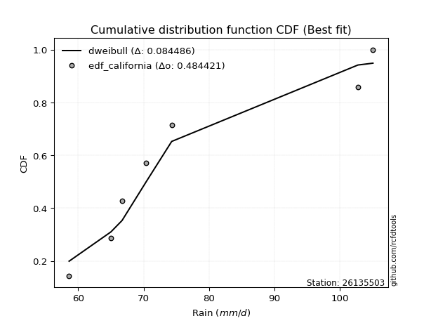</img>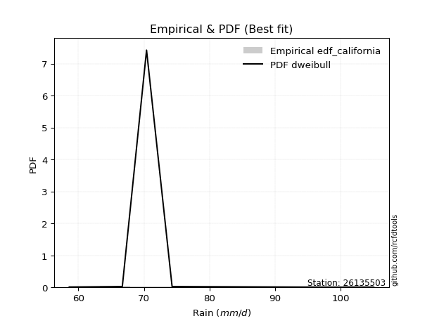</img>

</div>


### 2. EDF Hazen (1930)

Hazen method for plotting positions is a formula used to estimate the empirical cumulative probability distribution of flood events or other hydrological data. This formula often results in biased estimations, particularly when extrapolating to extreme events (high return periods).

<div align="center">


$P=(m-0.5)/n$


</div>


**2.1. Empirical values**

<div align="center">

|                | 0                   | 1                   | 2                   | 3         | 4                  | 5                  | 6                  |
|:---------------|:--------------------|:--------------------|:--------------------|:----------|:-------------------|:-------------------|:-------------------|
| date           | 2022                | 2021                | 2018                | 2020      | 2023               | 2017               | 2019               |
| x              | 58.6                | 65.0                | 66.7                | 70.4      | 74.3               | 102.8              | 105.1              |
| m              | 1                   | 2                   | 3                   | 4         | 5                  | 6                  | 7                  |
| empirical_dist | edf_hazen           | edf_hazen           | edf_hazen           | edf_hazen | edf_hazen          | edf_hazen          | edf_hazen          |
| empirical      | 0.07142857142857142 | 0.21428571428571427 | 0.35714285714285715 | 0.5       | 0.6428571428571429 | 0.7857142857142857 | 0.9285714285714286 |
| empirical_tr   | 1.0769230769230769  | 1.2727272727272727  | 1.5555555555555558  | 2.0       | 2.8000000000000003 | 4.666666666666666  | 14.000000000000007 |

</div>


**2.2. Kolmogorov-Smirnov fit test (sorted by Δ)**


<div align="center">

|                | 0                   | 1                   | 2                   | 3                   | 4                   | 5                   | 6                   | 7                   | 8                   | 9                   | 10                  | 11                  | 12                  | 13                  | 14                  | 15                  | 16                  | 17                    | 18                  | 19                  | 20                  | 21                  | 22                  | 23                  | 24                  | 25                  | 26                  | 27                  | 28                  | 29                  | 30                  | 31                  | 32                  | 33                  | 34                  | 35                  | 36                  | 37                  | 38                  | 39                  | 40                  | 41                  | 42                  | 43                  | 44                  | 45                  | 46                  | 47                  | 48                  | 49                  | 50                  | 51                  | 52                  | 53                  | 54                  | 55                  | 56                  | 57                  | 58                  | 59                  | 60                  | 61                  | 62                  | 63                  | 64                  | 65                  | 66                  | 67                  | 68                  | 69                  | 70                  | 71                  | 72                  | 73                  | 74                  | 75                  | 76                  | 77                  | 78                  | 79                  | 80                  | 81                  | 82                  | 83                  | 84                  | 85                  | 86                  | 87                  |
|:---------------|:--------------------|:--------------------|:--------------------|:--------------------|:--------------------|:--------------------|:--------------------|:--------------------|:--------------------|:--------------------|:--------------------|:--------------------|:--------------------|:--------------------|:--------------------|:--------------------|:--------------------|:----------------------|:--------------------|:--------------------|:--------------------|:--------------------|:--------------------|:--------------------|:--------------------|:--------------------|:--------------------|:--------------------|:--------------------|:--------------------|:--------------------|:--------------------|:--------------------|:--------------------|:--------------------|:--------------------|:--------------------|:--------------------|:--------------------|:--------------------|:--------------------|:--------------------|:--------------------|:--------------------|:--------------------|:--------------------|:--------------------|:--------------------|:--------------------|:--------------------|:--------------------|:--------------------|:--------------------|:--------------------|:--------------------|:--------------------|:--------------------|:--------------------|:--------------------|:--------------------|:--------------------|:--------------------|:--------------------|:--------------------|:--------------------|:--------------------|:--------------------|:--------------------|:--------------------|:--------------------|:--------------------|:--------------------|:--------------------|:--------------------|:--------------------|:--------------------|:--------------------|:--------------------|:--------------------|:--------------------|:--------------------|:--------------------|:--------------------|:--------------------|:--------------------|:--------------------|:--------------------|:--------------------|
| station        | 26135503            | 26135503            | 26135503            | 26135503            | 26135503            | 26135503            | 26135503            | 26135503            | 26135503            | 26135503            | 26135503            | 26135503            | 26135503            | 26135503            | 26135503            | 26135503            | 26135503            | 26135503              | 26135503            | 26135503            | 26135503            | 26135503            | 26135503            | 26135503            | 26135503            | 26135503            | 26135503            | 26135503            | 26135503            | 26135503            | 26135503            | 26135503            | 26135503            | 26135503            | 26135503            | 26135503            | 26135503            | 26135503            | 26135503            | 26135503            | 26135503            | 26135503            | 26135503            | 26135503            | 26135503            | 26135503            | 26135503            | 26135503            | 26135503            | 26135503            | 26135503            | 26135503            | 26135503            | 26135503            | 26135503            | 26135503            | 26135503            | 26135503            | 26135503            | 26135503            | 26135503            | 26135503            | 26135503            | 26135503            | 26135503            | 26135503            | 26135503            | 26135503            | 26135503            | 26135503            | 26135503            | 26135503            | 26135503            | 26135503            | 26135503            | 26135503            | 26135503            | 26135503            | 26135503            | 26135503            | 26135503            | 26135503            | 26135503            | 26135503            | 26135503            | 26135503            | 26135503            | 26135503            |
| empirical_dist | edf_hazen           | edf_hazen           | edf_hazen           | edf_hazen           | edf_hazen           | edf_hazen           | edf_hazen           | edf_hazen           | edf_hazen           | edf_hazen           | edf_hazen           | edf_hazen           | edf_hazen           | edf_hazen           | edf_hazen           | edf_hazen           | edf_hazen           | edf_hazen             | edf_hazen           | edf_hazen           | edf_hazen           | edf_hazen           | edf_hazen           | edf_hazen           | edf_hazen           | edf_hazen           | edf_hazen           | edf_hazen           | edf_hazen           | edf_hazen           | edf_hazen           | edf_hazen           | edf_hazen           | edf_hazen           | edf_hazen           | edf_hazen           | edf_hazen           | edf_hazen           | edf_hazen           | edf_hazen           | edf_hazen           | edf_hazen           | edf_hazen           | edf_hazen           | edf_hazen           | edf_hazen           | edf_hazen           | edf_hazen           | edf_hazen           | edf_hazen           | edf_hazen           | edf_hazen           | edf_hazen           | edf_hazen           | edf_hazen           | edf_hazen           | edf_hazen           | edf_hazen           | edf_hazen           | edf_hazen           | edf_hazen           | edf_hazen           | edf_hazen           | edf_hazen           | edf_hazen           | edf_hazen           | edf_hazen           | edf_hazen           | edf_hazen           | edf_hazen           | edf_hazen           | edf_hazen           | edf_hazen           | edf_hazen           | edf_hazen           | edf_hazen           | edf_hazen           | edf_hazen           | edf_hazen           | edf_hazen           | edf_hazen           | edf_hazen           | edf_hazen           | edf_hazen           | edf_hazen           | edf_hazen           | edf_hazen           | edf_hazen           |
| p_dist         | fisk                | logfisk             | logfatiguelife      | loggenexpon         | invweibull          | alpha               | logexponnorm        | loginvgauss         | invgamma            | invgauss            | exponnorm           | expon               | genexpon            | logexpon            | loginvweibull       | lognakagami         | loghalfnorm         | loglaplace_asymmetric | logmielke           | gompertz            | loghalflogistic     | halflogistic        | laplace_asymmetric  | logmoyal            | loggumbel_r         | loggompertz         | moyal               | logncf              | lograyleigh         | halfnorm            | logkstwobign        | logwald             | loggenlogistic      | mielke              | wald                | logpearson3         | logalpha            | logmaxwell          | logbetaprime        | genlogistic         | gumbel_r            | nct                 | logrice             | lognct              | kstwobign           | erlang              | f                   | betaprime           | pearson3            | rayleigh            | loginvgamma         | logf                | logjohnsonsu        | logt                | lognorm             | lognorm             | logcrystalball      | logloggamma         | maxwell             | loglogistic         | loghypsecant        | logtruncnorm        | loglaplace          | rice                | loggibrat           | johnsonsu           | norm                | crystalball         | truncnorm           | t                   | logistic            | hypsecant           | logweibull_min      | gibrat              | loggumbel_l         | logerlang           | laplace             | gumbel_l            | ncf                 | weibull_min         | logchi2             | loggamma            | loggamma            | loglognorm          | nakagami            | fatiguelife         | gamma               | chi2                |
| delta          | 0.09242759657531574 | 0.09907692954355507 | 0.11245080385113815 | 0.11348092183305503 | 0.11377827955336306 | 0.11405490195172208 | 0.11457839635584455 | 0.11471459125102335 | 0.11475473610661602 | 0.11593757168134844 | 0.1161806938912916  | 0.11714308555392938 | 0.11714428899524498 | 0.11743674846883592 | 0.11789441238559639 | 0.11844442972688296 | 0.11912879372867347 | 0.1198606846472251    | 0.1255491574142864  | 0.12579932717207598 | 0.12611687053423892 | 0.12757020188089274 | 0.1286413687262713  | 0.12949634379771247 | 0.13002833042025042 | 0.13082565005130464 | 0.13091244364472532 | 0.13421503925407507 | 0.13436773916821265 | 0.1366274418840575  | 0.1374355594719746  | 0.13846699199334267 | 0.13859228793650358 | 0.13907362455067018 | 0.13948870543974667 | 0.13983106402169232 | 0.14438019118769496 | 0.14607971516268614 | 0.14921164036029788 | 0.15001938388736702 | 0.15361939928885693 | 0.15403420974536797 | 0.16048762762649332 | 0.1632817432367089  | 0.1642627763245348  | 0.16778975285856024 | 0.16893176100516555 | 0.16955913688010538 | 0.17064957262225056 | 0.17102919780213022 | 0.1724711676835105  | 0.1733157066234364  | 0.18020368171699463 | 0.1802209296397308  | 0.1802211657293974  | 0.1802211657293974  | 0.18022171342128257 | 0.18075772088609943 | 0.18318972739548706 | 0.18528621401337975 | 0.1895859214791641  | 0.19905893361085536 | 0.20496972105229805 | 0.21258311796558355 | 0.21607777029044883 | 0.21707088629346138 | 0.21756950483422405 | 0.21756951448822326 | 0.21756954009840523 | 0.21757058581127708 | 0.22745852302610126 | 0.2357040686546314  | 0.23717111009993144 | 0.24823834220548907 | 0.25071020858788545 | 0.2565521476888999  | 0.25979691423837786 | 0.28628325151667045 | 0.30363472139982184 | 0.36363410926955086 | 0.36433854906017904 | 0.3911493230531523  | 0.3911493230531523  | 0.41709561465841805 | 0.46023467780950433 | 0.5273301535802466  | 0.5986620280644386  | 0.7710008048395939  |
| deltao         | 0.48442053926100004 | 0.48442053926100004 | 0.48442053926100004 | 0.48442053926100004 | 0.48442053926100004 | 0.48442053926100004 | 0.48442053926100004 | 0.48442053926100004 | 0.48442053926100004 | 0.48442053926100004 | 0.48442053926100004 | 0.48442053926100004 | 0.48442053926100004 | 0.48442053926100004 | 0.48442053926100004 | 0.48442053926100004 | 0.48442053926100004 | 0.48442053926100004   | 0.48442053926100004 | 0.48442053926100004 | 0.48442053926100004 | 0.48442053926100004 | 0.48442053926100004 | 0.48442053926100004 | 0.48442053926100004 | 0.48442053926100004 | 0.48442053926100004 | 0.48442053926100004 | 0.48442053926100004 | 0.48442053926100004 | 0.48442053926100004 | 0.48442053926100004 | 0.48442053926100004 | 0.48442053926100004 | 0.48442053926100004 | 0.48442053926100004 | 0.48442053926100004 | 0.48442053926100004 | 0.48442053926100004 | 0.48442053926100004 | 0.48442053926100004 | 0.48442053926100004 | 0.48442053926100004 | 0.48442053926100004 | 0.48442053926100004 | 0.48442053926100004 | 0.48442053926100004 | 0.48442053926100004 | 0.48442053926100004 | 0.48442053926100004 | 0.48442053926100004 | 0.48442053926100004 | 0.48442053926100004 | 0.48442053926100004 | 0.48442053926100004 | 0.48442053926100004 | 0.48442053926100004 | 0.48442053926100004 | 0.48442053926100004 | 0.48442053926100004 | 0.48442053926100004 | 0.48442053926100004 | 0.48442053926100004 | 0.48442053926100004 | 0.48442053926100004 | 0.48442053926100004 | 0.48442053926100004 | 0.48442053926100004 | 0.48442053926100004 | 0.48442053926100004 | 0.48442053926100004 | 0.48442053926100004 | 0.48442053926100004 | 0.48442053926100004 | 0.48442053926100004 | 0.48442053926100004 | 0.48442053926100004 | 0.48442053926100004 | 0.48442053926100004 | 0.48442053926100004 | 0.48442053926100004 | 0.48442053926100004 | 0.48442053926100004 | 0.48442053926100004 | 0.48442053926100004 | 0.48442053926100004 | 0.48442053926100004 | 0.48442053926100004 |
| eval           | Δo > Δ              | Δo > Δ              | Δo > Δ              | Δo > Δ              | Δo > Δ              | Δo > Δ              | Δo > Δ              | Δo > Δ              | Δo > Δ              | Δo > Δ              | Δo > Δ              | Δo > Δ              | Δo > Δ              | Δo > Δ              | Δo > Δ              | Δo > Δ              | Δo > Δ              | Δo > Δ                | Δo > Δ              | Δo > Δ              | Δo > Δ              | Δo > Δ              | Δo > Δ              | Δo > Δ              | Δo > Δ              | Δo > Δ              | Δo > Δ              | Δo > Δ              | Δo > Δ              | Δo > Δ              | Δo > Δ              | Δo > Δ              | Δo > Δ              | Δo > Δ              | Δo > Δ              | Δo > Δ              | Δo > Δ              | Δo > Δ              | Δo > Δ              | Δo > Δ              | Δo > Δ              | Δo > Δ              | Δo > Δ              | Δo > Δ              | Δo > Δ              | Δo > Δ              | Δo > Δ              | Δo > Δ              | Δo > Δ              | Δo > Δ              | Δo > Δ              | Δo > Δ              | Δo > Δ              | Δo > Δ              | Δo > Δ              | Δo > Δ              | Δo > Δ              | Δo > Δ              | Δo > Δ              | Δo > Δ              | Δo > Δ              | Δo > Δ              | Δo > Δ              | Δo > Δ              | Δo > Δ              | Δo > Δ              | Δo > Δ              | Δo > Δ              | Δo > Δ              | Δo > Δ              | Δo > Δ              | Δo > Δ              | Δo > Δ              | Δo > Δ              | Δo > Δ              | Δo > Δ              | Δo > Δ              | Δo > Δ              | Δo > Δ              | Δo > Δ              | Δo > Δ              | Δo > Δ              | Δo > Δ              | Δo > Δ              | Δo > Δ              | Δo <= Δ             | Δo <= Δ             | Δo <= Δ             |
| fit            | 1                   | 1                   | 1                   | 1                   | 1                   | 1                   | 1                   | 1                   | 1                   | 1                   | 1                   | 1                   | 1                   | 1                   | 1                   | 1                   | 1                   | 1                     | 1                   | 1                   | 1                   | 1                   | 1                   | 1                   | 1                   | 1                   | 1                   | 1                   | 1                   | 1                   | 1                   | 1                   | 1                   | 1                   | 1                   | 1                   | 1                   | 1                   | 1                   | 1                   | 1                   | 1                   | 1                   | 1                   | 1                   | 1                   | 1                   | 1                   | 1                   | 1                   | 1                   | 1                   | 1                   | 1                   | 1                   | 1                   | 1                   | 1                   | 1                   | 1                   | 1                   | 1                   | 1                   | 1                   | 1                   | 1                   | 1                   | 1                   | 1                   | 1                   | 1                   | 1                   | 1                   | 1                   | 1                   | 1                   | 1                   | 1                   | 1                   | 1                   | 1                   | 1                   | 1                   | 1                   | 1                   | 0                   | 0                   | 0                   |
| n              | 7                   | 7                   | 7                   | 7                   | 7                   | 7                   | 7                   | 7                   | 7                   | 7                   | 7                   | 7                   | 7                   | 7                   | 7                   | 7                   | 7                   | 7                     | 7                   | 7                   | 7                   | 7                   | 7                   | 7                   | 7                   | 7                   | 7                   | 7                   | 7                   | 7                   | 7                   | 7                   | 7                   | 7                   | 7                   | 7                   | 7                   | 7                   | 7                   | 7                   | 7                   | 7                   | 7                   | 7                   | 7                   | 7                   | 7                   | 7                   | 7                   | 7                   | 7                   | 7                   | 7                   | 7                   | 7                   | 7                   | 7                   | 7                   | 7                   | 7                   | 7                   | 7                   | 7                   | 7                   | 7                   | 7                   | 7                   | 7                   | 7                   | 7                   | 7                   | 7                   | 7                   | 7                   | 7                   | 7                   | 7                   | 7                   | 7                   | 7                   | 7                   | 7                   | 7                   | 7                   | 7                   | 7                   | 7                   | 7                   |
| best_fit       | 1                   | 0                   | 0                   | 0                   | 0                   | 0                   | 0                   | 0                   | 0                   | 0                   | 0                   | 0                   | 0                   | 0                   | 0                   | 0                   | 0                   | 0                     | 0                   | 0                   | 0                   | 0                   | 0                   | 0                   | 0                   | 0                   | 0                   | 0                   | 0                   | 0                   | 0                   | 0                   | 0                   | 0                   | 0                   | 0                   | 0                   | 0                   | 0                   | 0                   | 0                   | 0                   | 0                   | 0                   | 0                   | 0                   | 0                   | 0                   | 0                   | 0                   | 0                   | 0                   | 0                   | 0                   | 0                   | 0                   | 0                   | 0                   | 0                   | 0                   | 0                   | 0                   | 0                   | 0                   | 0                   | 0                   | 0                   | 0                   | 0                   | 0                   | 0                   | 0                   | 0                   | 0                   | 0                   | 0                   | 0                   | 0                   | 0                   | 0                   | 0                   | 0                   | 0                   | 0                   | 0                   | 0                   | 0                   | 0                   |
| best_fit_sort  | 1                   | 2                   | 3                   | 4                   | 5                   | 6                   | 7                   | 8                   | 9                   | 10                  | 11                  | 12                  | 13                  | 14                  | 15                  | 16                  | 17                  | 18                    | 19                  | 20                  | 21                  | 22                  | 23                  | 24                  | 25                  | 26                  | 27                  | 28                  | 29                  | 30                  | 31                  | 32                  | 33                  | 34                  | 35                  | 36                  | 37                  | 38                  | 39                  | 40                  | 41                  | 42                  | 43                  | 44                  | 45                  | 46                  | 47                  | 48                  | 49                  | 50                  | 51                  | 52                  | 53                  | 54                  | 55                  | 56                  | 57                  | 58                  | 59                  | 60                  | 61                  | 62                  | 63                  | 64                  | 65                  | 66                  | 67                  | 68                  | 69                  | 70                  | 71                  | 72                  | 73                  | 74                  | 75                  | 76                  | 77                  | 78                  | 79                  | 80                  | 81                  | 82                  | 83                  | 84                  | 85                  | 86                  | 87                  | 88                  |

</div>


**2.3. Best fit**

<div align="center">

|   id |   station | empirical_dist   | p_dist   |     delta |   deltao | eval   |   fit |   n |   best_fit |   best_fit_sort |
|-----:|----------:|:-----------------|:---------|----------:|---------:|:-------|------:|----:|-----------:|----------------:|
|    0 |  26135503 | edf_hazen        | fisk     | 0.0924276 | 0.484421 | Δo > Δ |     1 |   7 |          1 |               1 |

</div>


<div align="center">

</img></img>

</div>


### 3. EDF Weibull (1939)

Weibull plotting position formula is an empirical method used to estimate the non-exceedance probability or plotting position for a set of observed data, is often recommended or widely used in practice, particularly in flood frequency analysis.

<div align="center">


$P=m/(n+1)$


</div>


**3.1. Empirical values**

<div align="center">

|                | 0                  | 1                  | 2           | 3           | 4                  | 5           | 6           |
|:---------------|:-------------------|:-------------------|:------------|:------------|:-------------------|:------------|:------------|
| date           | 2022               | 2021               | 2018        | 2020        | 2023               | 2017        | 2019        |
| x              | 58.6               | 65.0               | 66.7        | 70.4        | 74.3               | 102.8       | 105.1       |
| m              | 1                  | 2                  | 3           | 4           | 5                  | 6           | 7           |
| empirical_dist | edf_weibull        | edf_weibull        | edf_weibull | edf_weibull | edf_weibull        | edf_weibull | edf_weibull |
| empirical      | 0.125              | 0.25               | 0.375       | 0.5         | 0.625              | 0.75        | 0.875       |
| empirical_tr   | 1.1428571428571428 | 1.3333333333333333 | 1.6         | 2.0         | 2.6666666666666665 | 4.0         | 8.0         |

</div>


**3.2. Kolmogorov-Smirnov fit test (sorted by Δ)**


<div align="center">

|                | 0                   | 1                   | 2                   | 3                   | 4                   | 5                   | 6                   | 7                   | 8                   | 9                   | 10                  | 11                  | 12                  | 13                  | 14                  | 15                  | 16                  | 17                  | 18                    | 19                  | 20                  | 21                  | 22                  | 23                  | 24                  | 25                  | 26                  | 27                  | 28                  | 29                  | 30                  | 31                  | 32                  | 33                  | 34                  | 35                  | 36                  | 37                  | 38                  | 39                  | 40                  | 41                  | 42                  | 43                  | 44                  | 45                  | 46                  | 47                  | 48                  | 49                  | 50                  | 51                  | 52                  | 53                  | 54                  | 55                  | 56                  | 57                  | 58                  | 59                  | 60                  | 61                  | 62                  | 63                  | 64                  | 65                  | 66                  | 67                  | 68                  | 69                  | 70                  | 71                  | 72                  | 73                  | 74                  | 75                  | 76                  | 77                  | 78                  | 79                  | 80                  | 81                  | 82                  | 83                  | 84                  | 85                  | 86                  | 87                  |
|:---------------|:--------------------|:--------------------|:--------------------|:--------------------|:--------------------|:--------------------|:--------------------|:--------------------|:--------------------|:--------------------|:--------------------|:--------------------|:--------------------|:--------------------|:--------------------|:--------------------|:--------------------|:--------------------|:----------------------|:--------------------|:--------------------|:--------------------|:--------------------|:--------------------|:--------------------|:--------------------|:--------------------|:--------------------|:--------------------|:--------------------|:--------------------|:--------------------|:--------------------|:--------------------|:--------------------|:--------------------|:--------------------|:--------------------|:--------------------|:--------------------|:--------------------|:--------------------|:--------------------|:--------------------|:--------------------|:--------------------|:--------------------|:--------------------|:--------------------|:--------------------|:--------------------|:--------------------|:--------------------|:--------------------|:--------------------|:--------------------|:--------------------|:--------------------|:--------------------|:--------------------|:--------------------|:--------------------|:--------------------|:--------------------|:--------------------|:--------------------|:--------------------|:--------------------|:--------------------|:--------------------|:--------------------|:--------------------|:--------------------|:--------------------|:--------------------|:--------------------|:--------------------|:--------------------|:--------------------|:--------------------|:--------------------|:--------------------|:--------------------|:--------------------|:--------------------|:--------------------|:--------------------|:--------------------|
| station        | 26135503            | 26135503            | 26135503            | 26135503            | 26135503            | 26135503            | 26135503            | 26135503            | 26135503            | 26135503            | 26135503            | 26135503            | 26135503            | 26135503            | 26135503            | 26135503            | 26135503            | 26135503            | 26135503              | 26135503            | 26135503            | 26135503            | 26135503            | 26135503            | 26135503            | 26135503            | 26135503            | 26135503            | 26135503            | 26135503            | 26135503            | 26135503            | 26135503            | 26135503            | 26135503            | 26135503            | 26135503            | 26135503            | 26135503            | 26135503            | 26135503            | 26135503            | 26135503            | 26135503            | 26135503            | 26135503            | 26135503            | 26135503            | 26135503            | 26135503            | 26135503            | 26135503            | 26135503            | 26135503            | 26135503            | 26135503            | 26135503            | 26135503            | 26135503            | 26135503            | 26135503            | 26135503            | 26135503            | 26135503            | 26135503            | 26135503            | 26135503            | 26135503            | 26135503            | 26135503            | 26135503            | 26135503            | 26135503            | 26135503            | 26135503            | 26135503            | 26135503            | 26135503            | 26135503            | 26135503            | 26135503            | 26135503            | 26135503            | 26135503            | 26135503            | 26135503            | 26135503            | 26135503            |
| empirical_dist | edf_weibull         | edf_weibull         | edf_weibull         | edf_weibull         | edf_weibull         | edf_weibull         | edf_weibull         | edf_weibull         | edf_weibull         | edf_weibull         | edf_weibull         | edf_weibull         | edf_weibull         | edf_weibull         | edf_weibull         | edf_weibull         | edf_weibull         | edf_weibull         | edf_weibull           | edf_weibull         | edf_weibull         | edf_weibull         | edf_weibull         | edf_weibull         | edf_weibull         | edf_weibull         | edf_weibull         | edf_weibull         | edf_weibull         | edf_weibull         | edf_weibull         | edf_weibull         | edf_weibull         | edf_weibull         | edf_weibull         | edf_weibull         | edf_weibull         | edf_weibull         | edf_weibull         | edf_weibull         | edf_weibull         | edf_weibull         | edf_weibull         | edf_weibull         | edf_weibull         | edf_weibull         | edf_weibull         | edf_weibull         | edf_weibull         | edf_weibull         | edf_weibull         | edf_weibull         | edf_weibull         | edf_weibull         | edf_weibull         | edf_weibull         | edf_weibull         | edf_weibull         | edf_weibull         | edf_weibull         | edf_weibull         | edf_weibull         | edf_weibull         | edf_weibull         | edf_weibull         | edf_weibull         | edf_weibull         | edf_weibull         | edf_weibull         | edf_weibull         | edf_weibull         | edf_weibull         | edf_weibull         | edf_weibull         | edf_weibull         | edf_weibull         | edf_weibull         | edf_weibull         | edf_weibull         | edf_weibull         | edf_weibull         | edf_weibull         | edf_weibull         | edf_weibull         | edf_weibull         | edf_weibull         | edf_weibull         | edf_weibull         |
| p_dist         | lognakagami         | fisk                | logfisk             | logexpon            | logf                | logfatiguelife      | loggenexpon         | invweibull          | alpha               | logexponnorm        | loginvgauss         | invgamma            | invgauss            | exponnorm           | expon               | genexpon            | loginvweibull       | loghalfnorm         | loglaplace_asymmetric | halfnorm            | lograyleigh         | logmielke           | gompertz            | loghalflogistic     | rayleigh            | halflogistic        | logmaxwell          | laplace_asymmetric  | logpearson3         | logmoyal            | loggumbel_r         | pearson3            | maxwell             | loggompertz         | moyal               | gumbel_r            | logncf              | logrice             | logkstwobign        | logloggamma         | nct                 | betaprime           | logwald             | loggenlogistic      | f                   | mielke              | lognct              | wald                | logjohnsonsu        | logcrystalball      | lognorm             | lognorm             | logt                | loginvgamma         | logalpha            | kstwobign           | loglogistic         | loghypsecant        | logbetaprime        | genlogistic         | rice                | loglaplace          | johnsonsu           | norm                | crystalball         | truncnorm           | t                   | logweibull_min      | erlang              | logistic            | hypsecant           | logerlang           | loggumbel_l         | logtruncnorm        | laplace             | loggibrat           | ncf                 | gibrat              | gumbel_l            | logchi2             | weibull_min         | loggamma            | loggamma            | loglognorm          | nakagami            | fatiguelife         | gamma               | chi2                |
| delta          | 0.12499999999690475 | 0.12814188228960144 | 0.13479121525784077 | 0.13758150959613724 | 0.13909038075797153 | 0.14816508956542385 | 0.14919520754734072 | 0.14949256526764876 | 0.14976918766600777 | 0.15029268207013025 | 0.15042887696530904 | 0.15046902182090172 | 0.15165185739563414 | 0.1518949796055773  | 0.15285737126821508 | 0.15285857470953068 | 0.1536086980998821  | 0.15484307944295916 | 0.1555749703615108    | 0.15664807346820708 | 0.1610448729708116  | 0.1612634431285721  | 0.16151361288636168 | 0.16183115624852462 | 0.1629791713801496  | 0.16328448759517844 | 0.16413693132108487 | 0.164355654440557   | 0.16513505446574706 | 0.16521062951199816 | 0.1657426161345361  | 0.16576833031810911 | 0.16611064770754036 | 0.16653993576559034 | 0.16662672935901102 | 0.16730209779463756 | 0.16992932496836077 | 0.17221644155801763 | 0.1731498451862603  | 0.17315311708790893 | 0.17357986739465092 | 0.17407426442906748 | 0.17418127770762837 | 0.17430657365078928 | 0.1747742654440032  | 0.17478791026495588 | 0.17489307343893024 | 0.17520299115403237 | 0.17570029902612416 | 0.17573692039500233 | 0.17573729405402827 | 0.17573729405402827 | 0.17573785407593523 | 0.17610777326383076 | 0.18009447690198066 | 0.18211212625726958 | 0.18216958813127815 | 0.18442438408384199 | 0.18492592607458358 | 0.18573366960165272 | 0.19472597510844064 | 0.19490417341773486 | 0.19921374343631848 | 0.19971236197708114 | 0.19971237163108035 | 0.19971239724126233 | 0.19971344295413418 | 0.20145682438564572 | 0.20350403857284594 | 0.20960138016895835 | 0.2178469257974885  | 0.22083786197461414 | 0.23285306573074255 | 0.23477321932514106 | 0.24193977138123496 | 0.244875137549827   | 0.25006329282839324 | 0.2660954850626319  | 0.26842610865952754 | 0.31076712048875044 | 0.32791982355526517 | 0.3554350373388666  | 0.3554350373388666  | 0.38138132894413235 | 0.42452039209521863 | 0.4916158678659609  | 0.5629477423501529  | 0.7352865191253082  |
| deltao         | 0.48442053926100004 | 0.48442053926100004 | 0.48442053926100004 | 0.48442053926100004 | 0.48442053926100004 | 0.48442053926100004 | 0.48442053926100004 | 0.48442053926100004 | 0.48442053926100004 | 0.48442053926100004 | 0.48442053926100004 | 0.48442053926100004 | 0.48442053926100004 | 0.48442053926100004 | 0.48442053926100004 | 0.48442053926100004 | 0.48442053926100004 | 0.48442053926100004 | 0.48442053926100004   | 0.48442053926100004 | 0.48442053926100004 | 0.48442053926100004 | 0.48442053926100004 | 0.48442053926100004 | 0.48442053926100004 | 0.48442053926100004 | 0.48442053926100004 | 0.48442053926100004 | 0.48442053926100004 | 0.48442053926100004 | 0.48442053926100004 | 0.48442053926100004 | 0.48442053926100004 | 0.48442053926100004 | 0.48442053926100004 | 0.48442053926100004 | 0.48442053926100004 | 0.48442053926100004 | 0.48442053926100004 | 0.48442053926100004 | 0.48442053926100004 | 0.48442053926100004 | 0.48442053926100004 | 0.48442053926100004 | 0.48442053926100004 | 0.48442053926100004 | 0.48442053926100004 | 0.48442053926100004 | 0.48442053926100004 | 0.48442053926100004 | 0.48442053926100004 | 0.48442053926100004 | 0.48442053926100004 | 0.48442053926100004 | 0.48442053926100004 | 0.48442053926100004 | 0.48442053926100004 | 0.48442053926100004 | 0.48442053926100004 | 0.48442053926100004 | 0.48442053926100004 | 0.48442053926100004 | 0.48442053926100004 | 0.48442053926100004 | 0.48442053926100004 | 0.48442053926100004 | 0.48442053926100004 | 0.48442053926100004 | 0.48442053926100004 | 0.48442053926100004 | 0.48442053926100004 | 0.48442053926100004 | 0.48442053926100004 | 0.48442053926100004 | 0.48442053926100004 | 0.48442053926100004 | 0.48442053926100004 | 0.48442053926100004 | 0.48442053926100004 | 0.48442053926100004 | 0.48442053926100004 | 0.48442053926100004 | 0.48442053926100004 | 0.48442053926100004 | 0.48442053926100004 | 0.48442053926100004 | 0.48442053926100004 | 0.48442053926100004 |
| eval           | Δo > Δ              | Δo > Δ              | Δo > Δ              | Δo > Δ              | Δo > Δ              | Δo > Δ              | Δo > Δ              | Δo > Δ              | Δo > Δ              | Δo > Δ              | Δo > Δ              | Δo > Δ              | Δo > Δ              | Δo > Δ              | Δo > Δ              | Δo > Δ              | Δo > Δ              | Δo > Δ              | Δo > Δ                | Δo > Δ              | Δo > Δ              | Δo > Δ              | Δo > Δ              | Δo > Δ              | Δo > Δ              | Δo > Δ              | Δo > Δ              | Δo > Δ              | Δo > Δ              | Δo > Δ              | Δo > Δ              | Δo > Δ              | Δo > Δ              | Δo > Δ              | Δo > Δ              | Δo > Δ              | Δo > Δ              | Δo > Δ              | Δo > Δ              | Δo > Δ              | Δo > Δ              | Δo > Δ              | Δo > Δ              | Δo > Δ              | Δo > Δ              | Δo > Δ              | Δo > Δ              | Δo > Δ              | Δo > Δ              | Δo > Δ              | Δo > Δ              | Δo > Δ              | Δo > Δ              | Δo > Δ              | Δo > Δ              | Δo > Δ              | Δo > Δ              | Δo > Δ              | Δo > Δ              | Δo > Δ              | Δo > Δ              | Δo > Δ              | Δo > Δ              | Δo > Δ              | Δo > Δ              | Δo > Δ              | Δo > Δ              | Δo > Δ              | Δo > Δ              | Δo > Δ              | Δo > Δ              | Δo > Δ              | Δo > Δ              | Δo > Δ              | Δo > Δ              | Δo > Δ              | Δo > Δ              | Δo > Δ              | Δo > Δ              | Δo > Δ              | Δo > Δ              | Δo > Δ              | Δo > Δ              | Δo > Δ              | Δo > Δ              | Δo <= Δ             | Δo <= Δ             | Δo <= Δ             |
| fit            | 1                   | 1                   | 1                   | 1                   | 1                   | 1                   | 1                   | 1                   | 1                   | 1                   | 1                   | 1                   | 1                   | 1                   | 1                   | 1                   | 1                   | 1                   | 1                     | 1                   | 1                   | 1                   | 1                   | 1                   | 1                   | 1                   | 1                   | 1                   | 1                   | 1                   | 1                   | 1                   | 1                   | 1                   | 1                   | 1                   | 1                   | 1                   | 1                   | 1                   | 1                   | 1                   | 1                   | 1                   | 1                   | 1                   | 1                   | 1                   | 1                   | 1                   | 1                   | 1                   | 1                   | 1                   | 1                   | 1                   | 1                   | 1                   | 1                   | 1                   | 1                   | 1                   | 1                   | 1                   | 1                   | 1                   | 1                   | 1                   | 1                   | 1                   | 1                   | 1                   | 1                   | 1                   | 1                   | 1                   | 1                   | 1                   | 1                   | 1                   | 1                   | 1                   | 1                   | 1                   | 1                   | 0                   | 0                   | 0                   |
| n              | 7                   | 7                   | 7                   | 7                   | 7                   | 7                   | 7                   | 7                   | 7                   | 7                   | 7                   | 7                   | 7                   | 7                   | 7                   | 7                   | 7                   | 7                   | 7                     | 7                   | 7                   | 7                   | 7                   | 7                   | 7                   | 7                   | 7                   | 7                   | 7                   | 7                   | 7                   | 7                   | 7                   | 7                   | 7                   | 7                   | 7                   | 7                   | 7                   | 7                   | 7                   | 7                   | 7                   | 7                   | 7                   | 7                   | 7                   | 7                   | 7                   | 7                   | 7                   | 7                   | 7                   | 7                   | 7                   | 7                   | 7                   | 7                   | 7                   | 7                   | 7                   | 7                   | 7                   | 7                   | 7                   | 7                   | 7                   | 7                   | 7                   | 7                   | 7                   | 7                   | 7                   | 7                   | 7                   | 7                   | 7                   | 7                   | 7                   | 7                   | 7                   | 7                   | 7                   | 7                   | 7                   | 7                   | 7                   | 7                   |
| best_fit       | 1                   | 0                   | 0                   | 0                   | 0                   | 0                   | 0                   | 0                   | 0                   | 0                   | 0                   | 0                   | 0                   | 0                   | 0                   | 0                   | 0                   | 0                   | 0                     | 0                   | 0                   | 0                   | 0                   | 0                   | 0                   | 0                   | 0                   | 0                   | 0                   | 0                   | 0                   | 0                   | 0                   | 0                   | 0                   | 0                   | 0                   | 0                   | 0                   | 0                   | 0                   | 0                   | 0                   | 0                   | 0                   | 0                   | 0                   | 0                   | 0                   | 0                   | 0                   | 0                   | 0                   | 0                   | 0                   | 0                   | 0                   | 0                   | 0                   | 0                   | 0                   | 0                   | 0                   | 0                   | 0                   | 0                   | 0                   | 0                   | 0                   | 0                   | 0                   | 0                   | 0                   | 0                   | 0                   | 0                   | 0                   | 0                   | 0                   | 0                   | 0                   | 0                   | 0                   | 0                   | 0                   | 0                   | 0                   | 0                   |
| best_fit_sort  | 1                   | 2                   | 3                   | 4                   | 5                   | 6                   | 7                   | 8                   | 9                   | 10                  | 11                  | 12                  | 13                  | 14                  | 15                  | 16                  | 17                  | 18                  | 19                    | 20                  | 21                  | 22                  | 23                  | 24                  | 25                  | 26                  | 27                  | 28                  | 29                  | 30                  | 31                  | 32                  | 33                  | 34                  | 35                  | 36                  | 37                  | 38                  | 39                  | 40                  | 41                  | 42                  | 43                  | 44                  | 45                  | 46                  | 47                  | 48                  | 49                  | 50                  | 51                  | 52                  | 53                  | 54                  | 55                  | 56                  | 57                  | 58                  | 59                  | 60                  | 61                  | 62                  | 63                  | 64                  | 65                  | 66                  | 67                  | 68                  | 69                  | 70                  | 71                  | 72                  | 73                  | 74                  | 75                  | 76                  | 77                  | 78                  | 79                  | 80                  | 81                  | 82                  | 83                  | 84                  | 85                  | 86                  | 87                  | 88                  |

</div>


**3.3. Best fit**

<div align="center">

|   id |   station | empirical_dist   | p_dist      |   delta |   deltao | eval   |   fit |   n |   best_fit |   best_fit_sort |
|-----:|----------:|:-----------------|:------------|--------:|---------:|:-------|------:|----:|-----------:|----------------:|
|    0 |  26135503 | edf_weibull      | lognakagami |   0.125 | 0.484421 | Δo > Δ |     1 |   7 |          1 |               1 |

</div>


<div align="center">

</img></img>

</div>


### 4. EDF Beard (1943)

The Beard formula (or Beard´s plotting position formula) in hydrology is used to estimate the empirical non-exceedance probability _(P)_ of a flood event (or other extreme hydrological data point) within a given dataset.

<div align="center">


$P=(m-0.31)/(n+0.38)$


</div>


**4.1. Empirical values**

<div align="center">

|                | 0                   | 1                   | 2                   | 3         | 4                  | 5                  | 6                  |
|:---------------|:--------------------|:--------------------|:--------------------|:----------|:-------------------|:-------------------|:-------------------|
| date           | 2022                | 2021                | 2018                | 2020      | 2023               | 2017               | 2019               |
| x              | 58.6                | 65.0                | 66.7                | 70.4      | 74.3               | 102.8              | 105.1              |
| m              | 1                   | 2                   | 3                   | 4         | 5                  | 6                  | 7                  |
| empirical_dist | edf_beard           | edf_beard           | edf_beard           | edf_beard | edf_beard          | edf_beard          | edf_beard          |
| empirical      | 0.09349593495934959 | 0.22899728997289973 | 0.36449864498644985 | 0.5       | 0.6355013550135502 | 0.7710027100271003 | 0.9065040650406505 |
| empirical_tr   | 1.1031390134529149  | 1.29701230228471    | 1.5735607675906182  | 2.0       | 2.743494423791822  | 4.366863905325444  | 10.695652173913055 |

</div>


**4.2. Kolmogorov-Smirnov fit test (sorted by Δ)**


<div align="center">

|                | 0                   | 1                   | 2                   | 3                   | 4                   | 5                   | 6                   | 7                   | 8                   | 9                   | 10                  | 11                  | 12                  | 13                  | 14                  | 15                  | 16                  | 17                    | 18                  | 19                  | 20                  | 21                  | 22                  | 23                  | 24                  | 25                  | 26                  | 27                  | 28                  | 29                  | 30                  | 31                  | 32                  | 33                  | 34                  | 35                  | 36                  | 37                  | 38                  | 39                  | 40                  | 41                  | 42                  | 43                  | 44                  | 45                  | 46                  | 47                  | 48                  | 49                  | 50                  | 51                  | 52                  | 53                  | 54                  | 55                  | 56                  | 57                  | 58                  | 59                  | 60                  | 61                  | 62                  | 63                  | 64                  | 65                  | 66                  | 67                  | 68                  | 69                  | 70                  | 71                  | 72                  | 73                  | 74                  | 75                  | 76                  | 77                  | 78                  | 79                  | 80                  | 81                  | 82                  | 83                  | 84                  | 85                  | 86                  | 87                  |
|:---------------|:--------------------|:--------------------|:--------------------|:--------------------|:--------------------|:--------------------|:--------------------|:--------------------|:--------------------|:--------------------|:--------------------|:--------------------|:--------------------|:--------------------|:--------------------|:--------------------|:--------------------|:----------------------|:--------------------|:--------------------|:--------------------|:--------------------|:--------------------|:--------------------|:--------------------|:--------------------|:--------------------|:--------------------|:--------------------|:--------------------|:--------------------|:--------------------|:--------------------|:--------------------|:--------------------|:--------------------|:--------------------|:--------------------|:--------------------|:--------------------|:--------------------|:--------------------|:--------------------|:--------------------|:--------------------|:--------------------|:--------------------|:--------------------|:--------------------|:--------------------|:--------------------|:--------------------|:--------------------|:--------------------|:--------------------|:--------------------|:--------------------|:--------------------|:--------------------|:--------------------|:--------------------|:--------------------|:--------------------|:--------------------|:--------------------|:--------------------|:--------------------|:--------------------|:--------------------|:--------------------|:--------------------|:--------------------|:--------------------|:--------------------|:--------------------|:--------------------|:--------------------|:--------------------|:--------------------|:--------------------|:--------------------|:--------------------|:--------------------|:--------------------|:--------------------|:--------------------|:--------------------|:--------------------|
| station        | 26135503            | 26135503            | 26135503            | 26135503            | 26135503            | 26135503            | 26135503            | 26135503            | 26135503            | 26135503            | 26135503            | 26135503            | 26135503            | 26135503            | 26135503            | 26135503            | 26135503            | 26135503              | 26135503            | 26135503            | 26135503            | 26135503            | 26135503            | 26135503            | 26135503            | 26135503            | 26135503            | 26135503            | 26135503            | 26135503            | 26135503            | 26135503            | 26135503            | 26135503            | 26135503            | 26135503            | 26135503            | 26135503            | 26135503            | 26135503            | 26135503            | 26135503            | 26135503            | 26135503            | 26135503            | 26135503            | 26135503            | 26135503            | 26135503            | 26135503            | 26135503            | 26135503            | 26135503            | 26135503            | 26135503            | 26135503            | 26135503            | 26135503            | 26135503            | 26135503            | 26135503            | 26135503            | 26135503            | 26135503            | 26135503            | 26135503            | 26135503            | 26135503            | 26135503            | 26135503            | 26135503            | 26135503            | 26135503            | 26135503            | 26135503            | 26135503            | 26135503            | 26135503            | 26135503            | 26135503            | 26135503            | 26135503            | 26135503            | 26135503            | 26135503            | 26135503            | 26135503            | 26135503            |
| empirical_dist | edf_beard           | edf_beard           | edf_beard           | edf_beard           | edf_beard           | edf_beard           | edf_beard           | edf_beard           | edf_beard           | edf_beard           | edf_beard           | edf_beard           | edf_beard           | edf_beard           | edf_beard           | edf_beard           | edf_beard           | edf_beard             | edf_beard           | edf_beard           | edf_beard           | edf_beard           | edf_beard           | edf_beard           | edf_beard           | edf_beard           | edf_beard           | edf_beard           | edf_beard           | edf_beard           | edf_beard           | edf_beard           | edf_beard           | edf_beard           | edf_beard           | edf_beard           | edf_beard           | edf_beard           | edf_beard           | edf_beard           | edf_beard           | edf_beard           | edf_beard           | edf_beard           | edf_beard           | edf_beard           | edf_beard           | edf_beard           | edf_beard           | edf_beard           | edf_beard           | edf_beard           | edf_beard           | edf_beard           | edf_beard           | edf_beard           | edf_beard           | edf_beard           | edf_beard           | edf_beard           | edf_beard           | edf_beard           | edf_beard           | edf_beard           | edf_beard           | edf_beard           | edf_beard           | edf_beard           | edf_beard           | edf_beard           | edf_beard           | edf_beard           | edf_beard           | edf_beard           | edf_beard           | edf_beard           | edf_beard           | edf_beard           | edf_beard           | edf_beard           | edf_beard           | edf_beard           | edf_beard           | edf_beard           | edf_beard           | edf_beard           | edf_beard           | edf_beard           |
| p_dist         | fisk                | lognakagami         | logfisk             | logexpon            | logfatiguelife      | loggenexpon         | invweibull          | alpha               | logexponnorm        | loginvgauss         | invgamma            | invgauss            | exponnorm           | expon               | genexpon            | loginvweibull       | loghalfnorm         | loglaplace_asymmetric | halfnorm            | lograyleigh         | logmielke           | gompertz            | loghalflogistic     | halflogistic        | logmaxwell          | laplace_asymmetric  | logpearson3         | logmoyal            | loggumbel_r         | loggompertz         | moyal               | gumbel_r            | logncf              | logkstwobign        | nct                 | logrice             | logwald             | loggenlogistic      | mielke              | wald                | lognct              | logf                | logalpha            | kstwobign           | f                   | betaprime           | pearson3            | rayleigh            | logbetaprime        | genlogistic         | loginvgamma         | logjohnsonsu        | logt                | lognorm             | lognorm             | logcrystalball      | logloggamma         | maxwell             | loglogistic         | loghypsecant        | erlang              | loglaplace          | rice                | johnsonsu           | norm                | crystalball         | truncnorm           | t                   | logtruncnorm        | logistic            | logweibull_min      | loggibrat           | hypsecant           | logerlang           | loggumbel_l         | laplace             | gibrat              | gumbel_l            | ncf                 | logchi2             | weibull_min         | loggamma            | loggamma            | loglognorm          | nakagami            | fatiguelife         | gamma               | chi2                |
| delta          | 0.10713917226250114 | 0.11108864188329026 | 0.11378850523074047 | 0.11657879956903694 | 0.12716237953832354 | 0.12819249752024042 | 0.12848985524054846 | 0.12876647763890747 | 0.12928997204302994 | 0.12942616693820874 | 0.12946631179380141 | 0.13064914736853384 | 0.130892269578477   | 0.13185466124111478 | 0.13185586468243038 | 0.1326059880727818  | 0.13384036941585886 | 0.1345722603344105    | 0.13564536344110678 | 0.1400421629437113  | 0.1402607331014718  | 0.14051090285926138 | 0.14082844622142432 | 0.14228177756807814 | 0.14313422129398456 | 0.1433529444134567  | 0.14413234443864675 | 0.14420791948489786 | 0.1447399061074358  | 0.14553722573849004 | 0.14562401933191071 | 0.14629938776753726 | 0.14892661494126047 | 0.15214713515916    | 0.15257715736755062 | 0.15313183978290063 | 0.15317856768052807 | 0.15330386362368897 | 0.15378520023785558 | 0.15420028112693207 | 0.1559259553931162  | 0.15860413093625095 | 0.15909176687488036 | 0.16110941623016928 | 0.16157597316157285 | 0.16220334903651268 | 0.16329378477865786 | 0.16367340995853752 | 0.16392321604748328 | 0.16473095957455242 | 0.1651153798399178  | 0.17284789387340194 | 0.1728651417961381  | 0.1728653778858047  | 0.1728653778858047  | 0.17286592557768987 | 0.17340193304250673 | 0.17583393955189436 | 0.17793042616978705 | 0.1822301336355714  | 0.18250132854574563 | 0.19761393320870535 | 0.20522733012199085 | 0.2097150984498687  | 0.21021371699063135 | 0.21021372664463056 | 0.21021375225481254 | 0.21021479796768439 | 0.21377050929804076 | 0.22010273518250856 | 0.222459534412746   | 0.22387242752272674 | 0.2283482808110387  | 0.2418405720017144  | 0.24335442074429275 | 0.25244112639478516 | 0.25559413004908177 | 0.27892746367307775 | 0.28156735786904374 | 0.34227118552940095 | 0.34892253358236547 | 0.3764377473659669  | 0.3764377473659669  | 0.40238403897123265 | 0.44552310212231894 | 0.5126185778930612  | 0.5839504523772532  | 0.7562892291524085  |
| deltao         | 0.48442053926100004 | 0.48442053926100004 | 0.48442053926100004 | 0.48442053926100004 | 0.48442053926100004 | 0.48442053926100004 | 0.48442053926100004 | 0.48442053926100004 | 0.48442053926100004 | 0.48442053926100004 | 0.48442053926100004 | 0.48442053926100004 | 0.48442053926100004 | 0.48442053926100004 | 0.48442053926100004 | 0.48442053926100004 | 0.48442053926100004 | 0.48442053926100004   | 0.48442053926100004 | 0.48442053926100004 | 0.48442053926100004 | 0.48442053926100004 | 0.48442053926100004 | 0.48442053926100004 | 0.48442053926100004 | 0.48442053926100004 | 0.48442053926100004 | 0.48442053926100004 | 0.48442053926100004 | 0.48442053926100004 | 0.48442053926100004 | 0.48442053926100004 | 0.48442053926100004 | 0.48442053926100004 | 0.48442053926100004 | 0.48442053926100004 | 0.48442053926100004 | 0.48442053926100004 | 0.48442053926100004 | 0.48442053926100004 | 0.48442053926100004 | 0.48442053926100004 | 0.48442053926100004 | 0.48442053926100004 | 0.48442053926100004 | 0.48442053926100004 | 0.48442053926100004 | 0.48442053926100004 | 0.48442053926100004 | 0.48442053926100004 | 0.48442053926100004 | 0.48442053926100004 | 0.48442053926100004 | 0.48442053926100004 | 0.48442053926100004 | 0.48442053926100004 | 0.48442053926100004 | 0.48442053926100004 | 0.48442053926100004 | 0.48442053926100004 | 0.48442053926100004 | 0.48442053926100004 | 0.48442053926100004 | 0.48442053926100004 | 0.48442053926100004 | 0.48442053926100004 | 0.48442053926100004 | 0.48442053926100004 | 0.48442053926100004 | 0.48442053926100004 | 0.48442053926100004 | 0.48442053926100004 | 0.48442053926100004 | 0.48442053926100004 | 0.48442053926100004 | 0.48442053926100004 | 0.48442053926100004 | 0.48442053926100004 | 0.48442053926100004 | 0.48442053926100004 | 0.48442053926100004 | 0.48442053926100004 | 0.48442053926100004 | 0.48442053926100004 | 0.48442053926100004 | 0.48442053926100004 | 0.48442053926100004 | 0.48442053926100004 |
| eval           | Δo > Δ              | Δo > Δ              | Δo > Δ              | Δo > Δ              | Δo > Δ              | Δo > Δ              | Δo > Δ              | Δo > Δ              | Δo > Δ              | Δo > Δ              | Δo > Δ              | Δo > Δ              | Δo > Δ              | Δo > Δ              | Δo > Δ              | Δo > Δ              | Δo > Δ              | Δo > Δ                | Δo > Δ              | Δo > Δ              | Δo > Δ              | Δo > Δ              | Δo > Δ              | Δo > Δ              | Δo > Δ              | Δo > Δ              | Δo > Δ              | Δo > Δ              | Δo > Δ              | Δo > Δ              | Δo > Δ              | Δo > Δ              | Δo > Δ              | Δo > Δ              | Δo > Δ              | Δo > Δ              | Δo > Δ              | Δo > Δ              | Δo > Δ              | Δo > Δ              | Δo > Δ              | Δo > Δ              | Δo > Δ              | Δo > Δ              | Δo > Δ              | Δo > Δ              | Δo > Δ              | Δo > Δ              | Δo > Δ              | Δo > Δ              | Δo > Δ              | Δo > Δ              | Δo > Δ              | Δo > Δ              | Δo > Δ              | Δo > Δ              | Δo > Δ              | Δo > Δ              | Δo > Δ              | Δo > Δ              | Δo > Δ              | Δo > Δ              | Δo > Δ              | Δo > Δ              | Δo > Δ              | Δo > Δ              | Δo > Δ              | Δo > Δ              | Δo > Δ              | Δo > Δ              | Δo > Δ              | Δo > Δ              | Δo > Δ              | Δo > Δ              | Δo > Δ              | Δo > Δ              | Δo > Δ              | Δo > Δ              | Δo > Δ              | Δo > Δ              | Δo > Δ              | Δo > Δ              | Δo > Δ              | Δo > Δ              | Δo > Δ              | Δo <= Δ             | Δo <= Δ             | Δo <= Δ             |
| fit            | 1                   | 1                   | 1                   | 1                   | 1                   | 1                   | 1                   | 1                   | 1                   | 1                   | 1                   | 1                   | 1                   | 1                   | 1                   | 1                   | 1                   | 1                     | 1                   | 1                   | 1                   | 1                   | 1                   | 1                   | 1                   | 1                   | 1                   | 1                   | 1                   | 1                   | 1                   | 1                   | 1                   | 1                   | 1                   | 1                   | 1                   | 1                   | 1                   | 1                   | 1                   | 1                   | 1                   | 1                   | 1                   | 1                   | 1                   | 1                   | 1                   | 1                   | 1                   | 1                   | 1                   | 1                   | 1                   | 1                   | 1                   | 1                   | 1                   | 1                   | 1                   | 1                   | 1                   | 1                   | 1                   | 1                   | 1                   | 1                   | 1                   | 1                   | 1                   | 1                   | 1                   | 1                   | 1                   | 1                   | 1                   | 1                   | 1                   | 1                   | 1                   | 1                   | 1                   | 1                   | 1                   | 0                   | 0                   | 0                   |
| n              | 7                   | 7                   | 7                   | 7                   | 7                   | 7                   | 7                   | 7                   | 7                   | 7                   | 7                   | 7                   | 7                   | 7                   | 7                   | 7                   | 7                   | 7                     | 7                   | 7                   | 7                   | 7                   | 7                   | 7                   | 7                   | 7                   | 7                   | 7                   | 7                   | 7                   | 7                   | 7                   | 7                   | 7                   | 7                   | 7                   | 7                   | 7                   | 7                   | 7                   | 7                   | 7                   | 7                   | 7                   | 7                   | 7                   | 7                   | 7                   | 7                   | 7                   | 7                   | 7                   | 7                   | 7                   | 7                   | 7                   | 7                   | 7                   | 7                   | 7                   | 7                   | 7                   | 7                   | 7                   | 7                   | 7                   | 7                   | 7                   | 7                   | 7                   | 7                   | 7                   | 7                   | 7                   | 7                   | 7                   | 7                   | 7                   | 7                   | 7                   | 7                   | 7                   | 7                   | 7                   | 7                   | 7                   | 7                   | 7                   |
| best_fit       | 1                   | 0                   | 0                   | 0                   | 0                   | 0                   | 0                   | 0                   | 0                   | 0                   | 0                   | 0                   | 0                   | 0                   | 0                   | 0                   | 0                   | 0                     | 0                   | 0                   | 0                   | 0                   | 0                   | 0                   | 0                   | 0                   | 0                   | 0                   | 0                   | 0                   | 0                   | 0                   | 0                   | 0                   | 0                   | 0                   | 0                   | 0                   | 0                   | 0                   | 0                   | 0                   | 0                   | 0                   | 0                   | 0                   | 0                   | 0                   | 0                   | 0                   | 0                   | 0                   | 0                   | 0                   | 0                   | 0                   | 0                   | 0                   | 0                   | 0                   | 0                   | 0                   | 0                   | 0                   | 0                   | 0                   | 0                   | 0                   | 0                   | 0                   | 0                   | 0                   | 0                   | 0                   | 0                   | 0                   | 0                   | 0                   | 0                   | 0                   | 0                   | 0                   | 0                   | 0                   | 0                   | 0                   | 0                   | 0                   |
| best_fit_sort  | 1                   | 2                   | 3                   | 4                   | 5                   | 6                   | 7                   | 8                   | 9                   | 10                  | 11                  | 12                  | 13                  | 14                  | 15                  | 16                  | 17                  | 18                    | 19                  | 20                  | 21                  | 22                  | 23                  | 24                  | 25                  | 26                  | 27                  | 28                  | 29                  | 30                  | 31                  | 32                  | 33                  | 34                  | 35                  | 36                  | 37                  | 38                  | 39                  | 40                  | 41                  | 42                  | 43                  | 44                  | 45                  | 46                  | 47                  | 48                  | 49                  | 50                  | 51                  | 52                  | 53                  | 54                  | 55                  | 56                  | 57                  | 58                  | 59                  | 60                  | 61                  | 62                  | 63                  | 64                  | 65                  | 66                  | 67                  | 68                  | 69                  | 70                  | 71                  | 72                  | 73                  | 74                  | 75                  | 76                  | 77                  | 78                  | 79                  | 80                  | 81                  | 82                  | 83                  | 84                  | 85                  | 86                  | 87                  | 88                  |

</div>


**4.3. Best fit**

<div align="center">

|   id |   station | empirical_dist   | p_dist   |    delta |   deltao | eval   |   fit |   n |   best_fit |   best_fit_sort |
|-----:|----------:|:-----------------|:---------|---------:|---------:|:-------|------:|----:|-----------:|----------------:|
|    0 |  26135503 | edf_beard        | fisk     | 0.107139 | 0.484421 | Δo > Δ |     1 |   7 |          1 |               1 |

</div>


<div align="center">

</img></img>

</div>


### 5. EDF Chegodayev (1955)

The Chegodayev formula is an empirical plotting position formula used in hydrological frequency analysis to estimate the exceedance probability or return period of a specific event from a set of observed data. It is primarily used for plotting observed data points on probability paper to fit a theoretical distribution, particularly for analyzing extreme events like maximum flood flows or rainfall intensities. The constant _b_ value in the generalized plotting position formula is 0.3.

<div align="center">


$P=(m-b)/(n+1-2b)$


</div>


**5.1. Empirical values**

<div align="center">

|                | 0                   | 1                   | 2                   | 3              | 4                  | 5                  | 6                  |
|:---------------|:--------------------|:--------------------|:--------------------|:---------------|:-------------------|:-------------------|:-------------------|
| date           | 2022                | 2021                | 2018                | 2020           | 2023               | 2017               | 2019               |
| x              | 58.6                | 65.0                | 66.7                | 70.4           | 74.3               | 102.8              | 105.1              |
| m              | 1                   | 2                   | 3                   | 4              | 5                  | 6                  | 7                  |
| empirical_dist | edf_chegodayev      | edf_chegodayev      | edf_chegodayev      | edf_chegodayev | edf_chegodayev     | edf_chegodayev     | edf_chegodayev     |
| empirical      | 0.09459459459459459 | 0.22972972972972971 | 0.36486486486486486 | 0.5            | 0.6351351351351351 | 0.7702702702702703 | 0.9054054054054054 |
| empirical_tr   | 1.1044776119402986  | 1.2982456140350878  | 1.574468085106383   | 2.0            | 2.7407407407407405 | 4.352941176470589  | 10.571428571428568 |

</div>


**5.2. Kolmogorov-Smirnov fit test (sorted by Δ)**


<div align="center">

|                | 0                   | 1                   | 2                   | 3                   | 4                   | 5                   | 6                   | 7                   | 8                   | 9                   | 10                  | 11                  | 12                  | 13                  | 14                  | 15                  | 16                  | 17                    | 18                  | 19                  | 20                  | 21                  | 22                  | 23                  | 24                  | 25                  | 26                  | 27                  | 28                  | 29                  | 30                  | 31                  | 32                  | 33                  | 34                  | 35                  | 36                  | 37                  | 38                  | 39                  | 40                  | 41                  | 42                  | 43                  | 44                  | 45                  | 46                  | 47                  | 48                  | 49                  | 50                  | 51                  | 52                  | 53                  | 54                  | 55                  | 56                  | 57                  | 58                  | 59                  | 60                  | 61                  | 62                  | 63                  | 64                  | 65                  | 66                  | 67                  | 68                  | 69                  | 70                  | 71                  | 72                  | 73                  | 74                  | 75                  | 76                  | 77                  | 78                  | 79                  | 80                  | 81                  | 82                  | 83                  | 84                  | 85                  | 86                  | 87                  |
|:---------------|:--------------------|:--------------------|:--------------------|:--------------------|:--------------------|:--------------------|:--------------------|:--------------------|:--------------------|:--------------------|:--------------------|:--------------------|:--------------------|:--------------------|:--------------------|:--------------------|:--------------------|:----------------------|:--------------------|:--------------------|:--------------------|:--------------------|:--------------------|:--------------------|:--------------------|:--------------------|:--------------------|:--------------------|:--------------------|:--------------------|:--------------------|:--------------------|:--------------------|:--------------------|:--------------------|:--------------------|:--------------------|:--------------------|:--------------------|:--------------------|:--------------------|:--------------------|:--------------------|:--------------------|:--------------------|:--------------------|:--------------------|:--------------------|:--------------------|:--------------------|:--------------------|:--------------------|:--------------------|:--------------------|:--------------------|:--------------------|:--------------------|:--------------------|:--------------------|:--------------------|:--------------------|:--------------------|:--------------------|:--------------------|:--------------------|:--------------------|:--------------------|:--------------------|:--------------------|:--------------------|:--------------------|:--------------------|:--------------------|:--------------------|:--------------------|:--------------------|:--------------------|:--------------------|:--------------------|:--------------------|:--------------------|:--------------------|:--------------------|:--------------------|:--------------------|:--------------------|:--------------------|:--------------------|
| station        | 26135503            | 26135503            | 26135503            | 26135503            | 26135503            | 26135503            | 26135503            | 26135503            | 26135503            | 26135503            | 26135503            | 26135503            | 26135503            | 26135503            | 26135503            | 26135503            | 26135503            | 26135503              | 26135503            | 26135503            | 26135503            | 26135503            | 26135503            | 26135503            | 26135503            | 26135503            | 26135503            | 26135503            | 26135503            | 26135503            | 26135503            | 26135503            | 26135503            | 26135503            | 26135503            | 26135503            | 26135503            | 26135503            | 26135503            | 26135503            | 26135503            | 26135503            | 26135503            | 26135503            | 26135503            | 26135503            | 26135503            | 26135503            | 26135503            | 26135503            | 26135503            | 26135503            | 26135503            | 26135503            | 26135503            | 26135503            | 26135503            | 26135503            | 26135503            | 26135503            | 26135503            | 26135503            | 26135503            | 26135503            | 26135503            | 26135503            | 26135503            | 26135503            | 26135503            | 26135503            | 26135503            | 26135503            | 26135503            | 26135503            | 26135503            | 26135503            | 26135503            | 26135503            | 26135503            | 26135503            | 26135503            | 26135503            | 26135503            | 26135503            | 26135503            | 26135503            | 26135503            | 26135503            |
| empirical_dist | edf_chegodayev      | edf_chegodayev      | edf_chegodayev      | edf_chegodayev      | edf_chegodayev      | edf_chegodayev      | edf_chegodayev      | edf_chegodayev      | edf_chegodayev      | edf_chegodayev      | edf_chegodayev      | edf_chegodayev      | edf_chegodayev      | edf_chegodayev      | edf_chegodayev      | edf_chegodayev      | edf_chegodayev      | edf_chegodayev        | edf_chegodayev      | edf_chegodayev      | edf_chegodayev      | edf_chegodayev      | edf_chegodayev      | edf_chegodayev      | edf_chegodayev      | edf_chegodayev      | edf_chegodayev      | edf_chegodayev      | edf_chegodayev      | edf_chegodayev      | edf_chegodayev      | edf_chegodayev      | edf_chegodayev      | edf_chegodayev      | edf_chegodayev      | edf_chegodayev      | edf_chegodayev      | edf_chegodayev      | edf_chegodayev      | edf_chegodayev      | edf_chegodayev      | edf_chegodayev      | edf_chegodayev      | edf_chegodayev      | edf_chegodayev      | edf_chegodayev      | edf_chegodayev      | edf_chegodayev      | edf_chegodayev      | edf_chegodayev      | edf_chegodayev      | edf_chegodayev      | edf_chegodayev      | edf_chegodayev      | edf_chegodayev      | edf_chegodayev      | edf_chegodayev      | edf_chegodayev      | edf_chegodayev      | edf_chegodayev      | edf_chegodayev      | edf_chegodayev      | edf_chegodayev      | edf_chegodayev      | edf_chegodayev      | edf_chegodayev      | edf_chegodayev      | edf_chegodayev      | edf_chegodayev      | edf_chegodayev      | edf_chegodayev      | edf_chegodayev      | edf_chegodayev      | edf_chegodayev      | edf_chegodayev      | edf_chegodayev      | edf_chegodayev      | edf_chegodayev      | edf_chegodayev      | edf_chegodayev      | edf_chegodayev      | edf_chegodayev      | edf_chegodayev      | edf_chegodayev      | edf_chegodayev      | edf_chegodayev      | edf_chegodayev      | edf_chegodayev      |
| p_dist         | fisk                | lognakagami         | logfisk             | logexpon            | logfatiguelife      | loggenexpon         | invweibull          | alpha               | logexponnorm        | loginvgauss         | invgamma            | invgauss            | exponnorm           | expon               | genexpon            | loginvweibull       | loghalfnorm         | loglaplace_asymmetric | halfnorm            | lograyleigh         | logmielke           | gompertz            | loghalflogistic     | halflogistic        | logmaxwell          | laplace_asymmetric  | logpearson3         | logmoyal            | loggumbel_r         | loggompertz         | moyal               | gumbel_r            | logncf              | logrice             | logkstwobign        | nct                 | logwald             | loggenlogistic      | mielke              | wald                | lognct              | logf                | logalpha            | f                   | betaprime           | kstwobign           | pearson3            | rayleigh            | logbetaprime        | loginvgamma         | genlogistic         | logjohnsonsu        | logt                | lognorm             | lognorm             | logcrystalball      | logloggamma         | maxwell             | loglogistic         | loghypsecant        | erlang              | loglaplace          | rice                | johnsonsu           | norm                | crystalball         | truncnorm           | t                   | logtruncnorm        | logistic            | logweibull_min      | loggibrat           | hypsecant           | logerlang           | loggumbel_l         | laplace             | gibrat              | gumbel_l            | ncf                 | logchi2             | weibull_min         | loggamma            | loggamma            | loglognorm          | nakagami            | fatiguelife         | gamma               | chi2                |
| delta          | 0.10787161201933115 | 0.11072242200487514 | 0.11452094498757048 | 0.11731123932586696 | 0.12789481929515356 | 0.12892493727707044 | 0.12922229499737847 | 0.1294989173957375  | 0.13002241179985996 | 0.13015860669503876 | 0.13019875155063143 | 0.13138158712536385 | 0.131624709335307   | 0.1325871009979448  | 0.1325883044392604  | 0.1333384278296118  | 0.13457280917268888 | 0.13530470009124052   | 0.1363778031979368  | 0.14077460270054132 | 0.14099317285830182 | 0.1412433426160914  | 0.14156088597825434 | 0.14301421732490815 | 0.14386666105081458 | 0.1440853841702867  | 0.14486478419547677 | 0.14494035924172788 | 0.14547234586426583 | 0.14626966549532006 | 0.14635645908874073 | 0.14703182752436728 | 0.1496590546980905  | 0.1527656199044855  | 0.15287957491599002 | 0.15330959712438064 | 0.15391100743735808 | 0.154036303380519   | 0.1545176399946856  | 0.1549327208837621  | 0.1555597355147011  | 0.15787169117942096 | 0.15982420663171037 | 0.16120975328315773 | 0.16183712915809756 | 0.1618418559869993  | 0.16292756490024274 | 0.1633071900801224  | 0.1646556558043133  | 0.1647491599615027  | 0.16546339933138243 | 0.17248167399498682 | 0.17249892191772298 | 0.17249915800738957 | 0.17249915800738957 | 0.17249970569927475 | 0.1730357131640916  | 0.17546771967347924 | 0.17756420629137193 | 0.18186391375715627 | 0.18323376830257565 | 0.19724771333029023 | 0.20486111024357573 | 0.20934887857145357 | 0.20984749711221623 | 0.20984750676621544 | 0.20984753237639742 | 0.20984857808926927 | 0.21450294905487077 | 0.21973651530409344 | 0.221727094655916   | 0.22460486727955672 | 0.22798206093262358 | 0.24110813224488442 | 0.24298820086587763 | 0.25207490651637005 | 0.2559603499274968  | 0.2785612437946626  | 0.2804686982337986  | 0.3411725258941558  | 0.34819009382553545 | 0.3757053076091369  | 0.3757053076091369  | 0.40165159921440263 | 0.4447906623654889  | 0.5118861381362312  | 0.5832180126204232  | 0.7555567893955785  |
| deltao         | 0.48442053926100004 | 0.48442053926100004 | 0.48442053926100004 | 0.48442053926100004 | 0.48442053926100004 | 0.48442053926100004 | 0.48442053926100004 | 0.48442053926100004 | 0.48442053926100004 | 0.48442053926100004 | 0.48442053926100004 | 0.48442053926100004 | 0.48442053926100004 | 0.48442053926100004 | 0.48442053926100004 | 0.48442053926100004 | 0.48442053926100004 | 0.48442053926100004   | 0.48442053926100004 | 0.48442053926100004 | 0.48442053926100004 | 0.48442053926100004 | 0.48442053926100004 | 0.48442053926100004 | 0.48442053926100004 | 0.48442053926100004 | 0.48442053926100004 | 0.48442053926100004 | 0.48442053926100004 | 0.48442053926100004 | 0.48442053926100004 | 0.48442053926100004 | 0.48442053926100004 | 0.48442053926100004 | 0.48442053926100004 | 0.48442053926100004 | 0.48442053926100004 | 0.48442053926100004 | 0.48442053926100004 | 0.48442053926100004 | 0.48442053926100004 | 0.48442053926100004 | 0.48442053926100004 | 0.48442053926100004 | 0.48442053926100004 | 0.48442053926100004 | 0.48442053926100004 | 0.48442053926100004 | 0.48442053926100004 | 0.48442053926100004 | 0.48442053926100004 | 0.48442053926100004 | 0.48442053926100004 | 0.48442053926100004 | 0.48442053926100004 | 0.48442053926100004 | 0.48442053926100004 | 0.48442053926100004 | 0.48442053926100004 | 0.48442053926100004 | 0.48442053926100004 | 0.48442053926100004 | 0.48442053926100004 | 0.48442053926100004 | 0.48442053926100004 | 0.48442053926100004 | 0.48442053926100004 | 0.48442053926100004 | 0.48442053926100004 | 0.48442053926100004 | 0.48442053926100004 | 0.48442053926100004 | 0.48442053926100004 | 0.48442053926100004 | 0.48442053926100004 | 0.48442053926100004 | 0.48442053926100004 | 0.48442053926100004 | 0.48442053926100004 | 0.48442053926100004 | 0.48442053926100004 | 0.48442053926100004 | 0.48442053926100004 | 0.48442053926100004 | 0.48442053926100004 | 0.48442053926100004 | 0.48442053926100004 | 0.48442053926100004 |
| eval           | Δo > Δ              | Δo > Δ              | Δo > Δ              | Δo > Δ              | Δo > Δ              | Δo > Δ              | Δo > Δ              | Δo > Δ              | Δo > Δ              | Δo > Δ              | Δo > Δ              | Δo > Δ              | Δo > Δ              | Δo > Δ              | Δo > Δ              | Δo > Δ              | Δo > Δ              | Δo > Δ                | Δo > Δ              | Δo > Δ              | Δo > Δ              | Δo > Δ              | Δo > Δ              | Δo > Δ              | Δo > Δ              | Δo > Δ              | Δo > Δ              | Δo > Δ              | Δo > Δ              | Δo > Δ              | Δo > Δ              | Δo > Δ              | Δo > Δ              | Δo > Δ              | Δo > Δ              | Δo > Δ              | Δo > Δ              | Δo > Δ              | Δo > Δ              | Δo > Δ              | Δo > Δ              | Δo > Δ              | Δo > Δ              | Δo > Δ              | Δo > Δ              | Δo > Δ              | Δo > Δ              | Δo > Δ              | Δo > Δ              | Δo > Δ              | Δo > Δ              | Δo > Δ              | Δo > Δ              | Δo > Δ              | Δo > Δ              | Δo > Δ              | Δo > Δ              | Δo > Δ              | Δo > Δ              | Δo > Δ              | Δo > Δ              | Δo > Δ              | Δo > Δ              | Δo > Δ              | Δo > Δ              | Δo > Δ              | Δo > Δ              | Δo > Δ              | Δo > Δ              | Δo > Δ              | Δo > Δ              | Δo > Δ              | Δo > Δ              | Δo > Δ              | Δo > Δ              | Δo > Δ              | Δo > Δ              | Δo > Δ              | Δo > Δ              | Δo > Δ              | Δo > Δ              | Δo > Δ              | Δo > Δ              | Δo > Δ              | Δo > Δ              | Δo <= Δ             | Δo <= Δ             | Δo <= Δ             |
| fit            | 1                   | 1                   | 1                   | 1                   | 1                   | 1                   | 1                   | 1                   | 1                   | 1                   | 1                   | 1                   | 1                   | 1                   | 1                   | 1                   | 1                   | 1                     | 1                   | 1                   | 1                   | 1                   | 1                   | 1                   | 1                   | 1                   | 1                   | 1                   | 1                   | 1                   | 1                   | 1                   | 1                   | 1                   | 1                   | 1                   | 1                   | 1                   | 1                   | 1                   | 1                   | 1                   | 1                   | 1                   | 1                   | 1                   | 1                   | 1                   | 1                   | 1                   | 1                   | 1                   | 1                   | 1                   | 1                   | 1                   | 1                   | 1                   | 1                   | 1                   | 1                   | 1                   | 1                   | 1                   | 1                   | 1                   | 1                   | 1                   | 1                   | 1                   | 1                   | 1                   | 1                   | 1                   | 1                   | 1                   | 1                   | 1                   | 1                   | 1                   | 1                   | 1                   | 1                   | 1                   | 1                   | 0                   | 0                   | 0                   |
| n              | 7                   | 7                   | 7                   | 7                   | 7                   | 7                   | 7                   | 7                   | 7                   | 7                   | 7                   | 7                   | 7                   | 7                   | 7                   | 7                   | 7                   | 7                     | 7                   | 7                   | 7                   | 7                   | 7                   | 7                   | 7                   | 7                   | 7                   | 7                   | 7                   | 7                   | 7                   | 7                   | 7                   | 7                   | 7                   | 7                   | 7                   | 7                   | 7                   | 7                   | 7                   | 7                   | 7                   | 7                   | 7                   | 7                   | 7                   | 7                   | 7                   | 7                   | 7                   | 7                   | 7                   | 7                   | 7                   | 7                   | 7                   | 7                   | 7                   | 7                   | 7                   | 7                   | 7                   | 7                   | 7                   | 7                   | 7                   | 7                   | 7                   | 7                   | 7                   | 7                   | 7                   | 7                   | 7                   | 7                   | 7                   | 7                   | 7                   | 7                   | 7                   | 7                   | 7                   | 7                   | 7                   | 7                   | 7                   | 7                   |
| best_fit       | 1                   | 0                   | 0                   | 0                   | 0                   | 0                   | 0                   | 0                   | 0                   | 0                   | 0                   | 0                   | 0                   | 0                   | 0                   | 0                   | 0                   | 0                     | 0                   | 0                   | 0                   | 0                   | 0                   | 0                   | 0                   | 0                   | 0                   | 0                   | 0                   | 0                   | 0                   | 0                   | 0                   | 0                   | 0                   | 0                   | 0                   | 0                   | 0                   | 0                   | 0                   | 0                   | 0                   | 0                   | 0                   | 0                   | 0                   | 0                   | 0                   | 0                   | 0                   | 0                   | 0                   | 0                   | 0                   | 0                   | 0                   | 0                   | 0                   | 0                   | 0                   | 0                   | 0                   | 0                   | 0                   | 0                   | 0                   | 0                   | 0                   | 0                   | 0                   | 0                   | 0                   | 0                   | 0                   | 0                   | 0                   | 0                   | 0                   | 0                   | 0                   | 0                   | 0                   | 0                   | 0                   | 0                   | 0                   | 0                   |
| best_fit_sort  | 1                   | 2                   | 3                   | 4                   | 5                   | 6                   | 7                   | 8                   | 9                   | 10                  | 11                  | 12                  | 13                  | 14                  | 15                  | 16                  | 17                  | 18                    | 19                  | 20                  | 21                  | 22                  | 23                  | 24                  | 25                  | 26                  | 27                  | 28                  | 29                  | 30                  | 31                  | 32                  | 33                  | 34                  | 35                  | 36                  | 37                  | 38                  | 39                  | 40                  | 41                  | 42                  | 43                  | 44                  | 45                  | 46                  | 47                  | 48                  | 49                  | 50                  | 51                  | 52                  | 53                  | 54                  | 55                  | 56                  | 57                  | 58                  | 59                  | 60                  | 61                  | 62                  | 63                  | 64                  | 65                  | 66                  | 67                  | 68                  | 69                  | 70                  | 71                  | 72                  | 73                  | 74                  | 75                  | 76                  | 77                  | 78                  | 79                  | 80                  | 81                  | 82                  | 83                  | 84                  | 85                  | 86                  | 87                  | 88                  |

</div>


**5.3. Best fit**

<div align="center">

|   id |   station | empirical_dist   | p_dist   |    delta |   deltao | eval   |   fit |   n |   best_fit |   best_fit_sort |
|-----:|----------:|:-----------------|:---------|---------:|---------:|:-------|------:|----:|-----------:|----------------:|
|    0 |  26135503 | edf_chegodayev   | fisk     | 0.107872 | 0.484421 | Δo > Δ |     1 |   7 |          1 |               1 |

</div>


<div align="center">

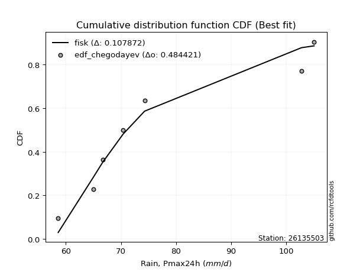</img>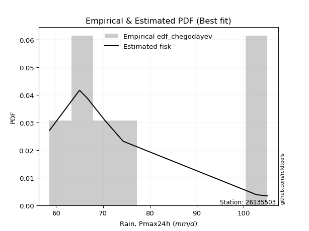</img>

</div>


### 6. EDF Blom (1958)

The Blom formula is a specific "plotting position" formula used in hydrology and statistical analysis to estimate the empirical cumulative probability (or non-exceedance probability) of a data series. It is particularly recommended for data that are approximately normally distributed. The constant _a_ is set to 0.375 (or 3/8).

<div align="center">


$P=(m-a)/(n+1-2a)$


</div>


**6.1. Empirical values**

<div align="center">

|                | 0                   | 1                   | 2                  | 3        | 4                  | 5                  | 6                  |
|:---------------|:--------------------|:--------------------|:-------------------|:---------|:-------------------|:-------------------|:-------------------|
| date           | 2022                | 2021                | 2018               | 2020     | 2023               | 2017               | 2019               |
| x              | 58.6                | 65.0                | 66.7               | 70.4     | 74.3               | 102.8              | 105.1              |
| m              | 1                   | 2                   | 3                  | 4        | 5                  | 6                  | 7                  |
| empirical_dist | edf_blom            | edf_blom            | edf_blom           | edf_blom | edf_blom           | edf_blom           | edf_blom           |
| empirical      | 0.08620689655172414 | 0.22413793103448276 | 0.3620689655172414 | 0.5      | 0.6379310344827587 | 0.7758620689655172 | 0.9137931034482759 |
| empirical_tr   | 1.0943396226415094  | 1.288888888888889   | 1.5675675675675675 | 2.0      | 2.7619047619047623 | 4.461538461538462  | 11.600000000000007 |

</div>


**6.2. Kolmogorov-Smirnov fit test (sorted by Δ)**


<div align="center">

|                | 0                   | 1                   | 2                   | 3                   | 4                   | 5                   | 6                   | 7                   | 8                   | 9                   | 10                  | 11                  | 12                  | 13                  | 14                  | 15                  | 16                  | 17                    | 18                  | 19                  | 20                  | 21                  | 22                  | 23                  | 24                  | 25                  | 26                  | 27                  | 28                  | 29                  | 30                  | 31                  | 32                  | 33                  | 34                  | 35                  | 36                  | 37                  | 38                  | 39                  | 40                  | 41                  | 42                  | 43                  | 44                  | 45                  | 46                  | 47                  | 48                  | 49                  | 50                  | 51                  | 52                  | 53                  | 54                  | 55                  | 56                  | 57                  | 58                  | 59                  | 60                  | 61                  | 62                  | 63                  | 64                  | 65                  | 66                  | 67                  | 68                  | 69                  | 70                  | 71                  | 72                  | 73                  | 74                  | 75                  | 76                  | 77                  | 78                  | 79                  | 80                  | 81                  | 82                  | 83                  | 84                  | 85                  | 86                  | 87                  |
|:---------------|:--------------------|:--------------------|:--------------------|:--------------------|:--------------------|:--------------------|:--------------------|:--------------------|:--------------------|:--------------------|:--------------------|:--------------------|:--------------------|:--------------------|:--------------------|:--------------------|:--------------------|:----------------------|:--------------------|:--------------------|:--------------------|:--------------------|:--------------------|:--------------------|:--------------------|:--------------------|:--------------------|:--------------------|:--------------------|:--------------------|:--------------------|:--------------------|:--------------------|:--------------------|:--------------------|:--------------------|:--------------------|:--------------------|:--------------------|:--------------------|:--------------------|:--------------------|:--------------------|:--------------------|:--------------------|:--------------------|:--------------------|:--------------------|:--------------------|:--------------------|:--------------------|:--------------------|:--------------------|:--------------------|:--------------------|:--------------------|:--------------------|:--------------------|:--------------------|:--------------------|:--------------------|:--------------------|:--------------------|:--------------------|:--------------------|:--------------------|:--------------------|:--------------------|:--------------------|:--------------------|:--------------------|:--------------------|:--------------------|:--------------------|:--------------------|:--------------------|:--------------------|:--------------------|:--------------------|:--------------------|:--------------------|:--------------------|:--------------------|:--------------------|:--------------------|:--------------------|:--------------------|:--------------------|
| station        | 26135503            | 26135503            | 26135503            | 26135503            | 26135503            | 26135503            | 26135503            | 26135503            | 26135503            | 26135503            | 26135503            | 26135503            | 26135503            | 26135503            | 26135503            | 26135503            | 26135503            | 26135503              | 26135503            | 26135503            | 26135503            | 26135503            | 26135503            | 26135503            | 26135503            | 26135503            | 26135503            | 26135503            | 26135503            | 26135503            | 26135503            | 26135503            | 26135503            | 26135503            | 26135503            | 26135503            | 26135503            | 26135503            | 26135503            | 26135503            | 26135503            | 26135503            | 26135503            | 26135503            | 26135503            | 26135503            | 26135503            | 26135503            | 26135503            | 26135503            | 26135503            | 26135503            | 26135503            | 26135503            | 26135503            | 26135503            | 26135503            | 26135503            | 26135503            | 26135503            | 26135503            | 26135503            | 26135503            | 26135503            | 26135503            | 26135503            | 26135503            | 26135503            | 26135503            | 26135503            | 26135503            | 26135503            | 26135503            | 26135503            | 26135503            | 26135503            | 26135503            | 26135503            | 26135503            | 26135503            | 26135503            | 26135503            | 26135503            | 26135503            | 26135503            | 26135503            | 26135503            | 26135503            |
| empirical_dist | edf_blom            | edf_blom            | edf_blom            | edf_blom            | edf_blom            | edf_blom            | edf_blom            | edf_blom            | edf_blom            | edf_blom            | edf_blom            | edf_blom            | edf_blom            | edf_blom            | edf_blom            | edf_blom            | edf_blom            | edf_blom              | edf_blom            | edf_blom            | edf_blom            | edf_blom            | edf_blom            | edf_blom            | edf_blom            | edf_blom            | edf_blom            | edf_blom            | edf_blom            | edf_blom            | edf_blom            | edf_blom            | edf_blom            | edf_blom            | edf_blom            | edf_blom            | edf_blom            | edf_blom            | edf_blom            | edf_blom            | edf_blom            | edf_blom            | edf_blom            | edf_blom            | edf_blom            | edf_blom            | edf_blom            | edf_blom            | edf_blom            | edf_blom            | edf_blom            | edf_blom            | edf_blom            | edf_blom            | edf_blom            | edf_blom            | edf_blom            | edf_blom            | edf_blom            | edf_blom            | edf_blom            | edf_blom            | edf_blom            | edf_blom            | edf_blom            | edf_blom            | edf_blom            | edf_blom            | edf_blom            | edf_blom            | edf_blom            | edf_blom            | edf_blom            | edf_blom            | edf_blom            | edf_blom            | edf_blom            | edf_blom            | edf_blom            | edf_blom            | edf_blom            | edf_blom            | edf_blom            | edf_blom            | edf_blom            | edf_blom            | edf_blom            | edf_blom            |
| p_dist         | fisk                | logfisk             | logexpon            | lognakagami         | logfatiguelife      | loggenexpon         | invweibull          | alpha               | logexponnorm        | loginvgauss         | invgamma            | invgauss            | exponnorm           | expon               | genexpon            | loginvweibull       | loghalfnorm         | loglaplace_asymmetric | halfnorm            | lograyleigh         | logmielke           | gompertz            | loghalflogistic     | halflogistic        | laplace_asymmetric  | logpearson3         | logmoyal            | loggumbel_r         | loggompertz         | moyal               | logmaxwell          | logncf              | logkstwobign        | logwald             | loggenlogistic      | gumbel_r            | mielke              | nct                 | wald                | logalpha            | logrice             | lognct              | logbetaprime        | kstwobign           | genlogistic         | logf                | f                   | betaprime           | pearson3            | rayleigh            | loginvgamma         | logjohnsonsu        | logt                | lognorm             | lognorm             | logcrystalball      | logloggamma         | erlang              | maxwell             | loglogistic         | loghypsecant        | loglaplace          | rice                | logtruncnorm        | johnsonsu           | norm                | crystalball         | truncnorm           | t                   | loggibrat           | logistic            | logweibull_min      | hypsecant           | loggumbel_l         | logerlang           | gibrat              | laplace             | gumbel_l            | ncf                 | logchi2             | weibull_min         | loggamma            | loggamma            | loglognorm          | nakagami            | fatiguelife         | gamma               | chi2                |
| delta          | 0.1022798133240842  | 0.10892914629232353 | 0.11171944063062    | 0.11351832135249873 | 0.12230302059990661 | 0.12333313858182349 | 0.12363049630213152 | 0.12390711870049054 | 0.12443061310461301 | 0.1245668079997918  | 0.12460695285538448 | 0.1257897884301169  | 0.12603291064006006 | 0.12699530230269784 | 0.12699650574401344 | 0.12774662913436485 | 0.12898101047744193 | 0.12971290139599356   | 0.13170133350967328 | 0.13518280400529437 | 0.13540137416305487 | 0.13565154392084444 | 0.13596908728300738 | 0.1374224186296612  | 0.13849358547503976 | 0.13927298550022982 | 0.13934856054648093 | 0.13988054716901888 | 0.1406778668000731  | 0.14076466039349378 | 0.1411536067883019  | 0.14406725600284354 | 0.14728777622074307 | 0.14831920874211113 | 0.14844450468527204 | 0.1486932909144727  | 0.14892584129943864 | 0.14910810137098374 | 0.14934092218851514 | 0.15423240793646342 | 0.1555615192521091  | 0.15835563486232468 | 0.15906385710906634 | 0.15933666795015056 | 0.15987160063613548 | 0.1634634898746679  | 0.16400565263078132 | 0.16463302850572115 | 0.16572346424786633 | 0.166103089427746   | 0.16754505930912628 | 0.1752775733426104  | 0.17529482126534657 | 0.17529505735501316 | 0.17529505735501316 | 0.17529560504689834 | 0.1758316125117152  | 0.1776419696073287  | 0.17826361902110283 | 0.18036010563899552 | 0.18465981310477986 | 0.20004361267791382 | 0.20765700959119932 | 0.20891115035962382 | 0.21214477791907715 | 0.21264339645983982 | 0.21264340611383903 | 0.212643431724021   | 0.21264447743689285 | 0.22100387866483306 | 0.22253241465171703 | 0.22731889335116295 | 0.23077796028024716 | 0.24578410021350122 | 0.24669993094013137 | 0.2531644505798733  | 0.25487080586399363 | 0.2813571431422862  | 0.28885639627666915 | 0.34956022393702635 | 0.3537818925207824  | 0.38129710630438385 | 0.38129710630438385 | 0.4072433979096496  | 0.4503824610607359  | 0.5174779368314781  | 0.5888098113156701  | 0.7611485880908254  |
| deltao         | 0.48442053926100004 | 0.48442053926100004 | 0.48442053926100004 | 0.48442053926100004 | 0.48442053926100004 | 0.48442053926100004 | 0.48442053926100004 | 0.48442053926100004 | 0.48442053926100004 | 0.48442053926100004 | 0.48442053926100004 | 0.48442053926100004 | 0.48442053926100004 | 0.48442053926100004 | 0.48442053926100004 | 0.48442053926100004 | 0.48442053926100004 | 0.48442053926100004   | 0.48442053926100004 | 0.48442053926100004 | 0.48442053926100004 | 0.48442053926100004 | 0.48442053926100004 | 0.48442053926100004 | 0.48442053926100004 | 0.48442053926100004 | 0.48442053926100004 | 0.48442053926100004 | 0.48442053926100004 | 0.48442053926100004 | 0.48442053926100004 | 0.48442053926100004 | 0.48442053926100004 | 0.48442053926100004 | 0.48442053926100004 | 0.48442053926100004 | 0.48442053926100004 | 0.48442053926100004 | 0.48442053926100004 | 0.48442053926100004 | 0.48442053926100004 | 0.48442053926100004 | 0.48442053926100004 | 0.48442053926100004 | 0.48442053926100004 | 0.48442053926100004 | 0.48442053926100004 | 0.48442053926100004 | 0.48442053926100004 | 0.48442053926100004 | 0.48442053926100004 | 0.48442053926100004 | 0.48442053926100004 | 0.48442053926100004 | 0.48442053926100004 | 0.48442053926100004 | 0.48442053926100004 | 0.48442053926100004 | 0.48442053926100004 | 0.48442053926100004 | 0.48442053926100004 | 0.48442053926100004 | 0.48442053926100004 | 0.48442053926100004 | 0.48442053926100004 | 0.48442053926100004 | 0.48442053926100004 | 0.48442053926100004 | 0.48442053926100004 | 0.48442053926100004 | 0.48442053926100004 | 0.48442053926100004 | 0.48442053926100004 | 0.48442053926100004 | 0.48442053926100004 | 0.48442053926100004 | 0.48442053926100004 | 0.48442053926100004 | 0.48442053926100004 | 0.48442053926100004 | 0.48442053926100004 | 0.48442053926100004 | 0.48442053926100004 | 0.48442053926100004 | 0.48442053926100004 | 0.48442053926100004 | 0.48442053926100004 | 0.48442053926100004 |
| eval           | Δo > Δ              | Δo > Δ              | Δo > Δ              | Δo > Δ              | Δo > Δ              | Δo > Δ              | Δo > Δ              | Δo > Δ              | Δo > Δ              | Δo > Δ              | Δo > Δ              | Δo > Δ              | Δo > Δ              | Δo > Δ              | Δo > Δ              | Δo > Δ              | Δo > Δ              | Δo > Δ                | Δo > Δ              | Δo > Δ              | Δo > Δ              | Δo > Δ              | Δo > Δ              | Δo > Δ              | Δo > Δ              | Δo > Δ              | Δo > Δ              | Δo > Δ              | Δo > Δ              | Δo > Δ              | Δo > Δ              | Δo > Δ              | Δo > Δ              | Δo > Δ              | Δo > Δ              | Δo > Δ              | Δo > Δ              | Δo > Δ              | Δo > Δ              | Δo > Δ              | Δo > Δ              | Δo > Δ              | Δo > Δ              | Δo > Δ              | Δo > Δ              | Δo > Δ              | Δo > Δ              | Δo > Δ              | Δo > Δ              | Δo > Δ              | Δo > Δ              | Δo > Δ              | Δo > Δ              | Δo > Δ              | Δo > Δ              | Δo > Δ              | Δo > Δ              | Δo > Δ              | Δo > Δ              | Δo > Δ              | Δo > Δ              | Δo > Δ              | Δo > Δ              | Δo > Δ              | Δo > Δ              | Δo > Δ              | Δo > Δ              | Δo > Δ              | Δo > Δ              | Δo > Δ              | Δo > Δ              | Δo > Δ              | Δo > Δ              | Δo > Δ              | Δo > Δ              | Δo > Δ              | Δo > Δ              | Δo > Δ              | Δo > Δ              | Δo > Δ              | Δo > Δ              | Δo > Δ              | Δo > Δ              | Δo > Δ              | Δo > Δ              | Δo <= Δ             | Δo <= Δ             | Δo <= Δ             |
| fit            | 1                   | 1                   | 1                   | 1                   | 1                   | 1                   | 1                   | 1                   | 1                   | 1                   | 1                   | 1                   | 1                   | 1                   | 1                   | 1                   | 1                   | 1                     | 1                   | 1                   | 1                   | 1                   | 1                   | 1                   | 1                   | 1                   | 1                   | 1                   | 1                   | 1                   | 1                   | 1                   | 1                   | 1                   | 1                   | 1                   | 1                   | 1                   | 1                   | 1                   | 1                   | 1                   | 1                   | 1                   | 1                   | 1                   | 1                   | 1                   | 1                   | 1                   | 1                   | 1                   | 1                   | 1                   | 1                   | 1                   | 1                   | 1                   | 1                   | 1                   | 1                   | 1                   | 1                   | 1                   | 1                   | 1                   | 1                   | 1                   | 1                   | 1                   | 1                   | 1                   | 1                   | 1                   | 1                   | 1                   | 1                   | 1                   | 1                   | 1                   | 1                   | 1                   | 1                   | 1                   | 1                   | 0                   | 0                   | 0                   |
| n              | 7                   | 7                   | 7                   | 7                   | 7                   | 7                   | 7                   | 7                   | 7                   | 7                   | 7                   | 7                   | 7                   | 7                   | 7                   | 7                   | 7                   | 7                     | 7                   | 7                   | 7                   | 7                   | 7                   | 7                   | 7                   | 7                   | 7                   | 7                   | 7                   | 7                   | 7                   | 7                   | 7                   | 7                   | 7                   | 7                   | 7                   | 7                   | 7                   | 7                   | 7                   | 7                   | 7                   | 7                   | 7                   | 7                   | 7                   | 7                   | 7                   | 7                   | 7                   | 7                   | 7                   | 7                   | 7                   | 7                   | 7                   | 7                   | 7                   | 7                   | 7                   | 7                   | 7                   | 7                   | 7                   | 7                   | 7                   | 7                   | 7                   | 7                   | 7                   | 7                   | 7                   | 7                   | 7                   | 7                   | 7                   | 7                   | 7                   | 7                   | 7                   | 7                   | 7                   | 7                   | 7                   | 7                   | 7                   | 7                   |
| best_fit       | 1                   | 0                   | 0                   | 0                   | 0                   | 0                   | 0                   | 0                   | 0                   | 0                   | 0                   | 0                   | 0                   | 0                   | 0                   | 0                   | 0                   | 0                     | 0                   | 0                   | 0                   | 0                   | 0                   | 0                   | 0                   | 0                   | 0                   | 0                   | 0                   | 0                   | 0                   | 0                   | 0                   | 0                   | 0                   | 0                   | 0                   | 0                   | 0                   | 0                   | 0                   | 0                   | 0                   | 0                   | 0                   | 0                   | 0                   | 0                   | 0                   | 0                   | 0                   | 0                   | 0                   | 0                   | 0                   | 0                   | 0                   | 0                   | 0                   | 0                   | 0                   | 0                   | 0                   | 0                   | 0                   | 0                   | 0                   | 0                   | 0                   | 0                   | 0                   | 0                   | 0                   | 0                   | 0                   | 0                   | 0                   | 0                   | 0                   | 0                   | 0                   | 0                   | 0                   | 0                   | 0                   | 0                   | 0                   | 0                   |
| best_fit_sort  | 1                   | 2                   | 3                   | 4                   | 5                   | 6                   | 7                   | 8                   | 9                   | 10                  | 11                  | 12                  | 13                  | 14                  | 15                  | 16                  | 17                  | 18                    | 19                  | 20                  | 21                  | 22                  | 23                  | 24                  | 25                  | 26                  | 27                  | 28                  | 29                  | 30                  | 31                  | 32                  | 33                  | 34                  | 35                  | 36                  | 37                  | 38                  | 39                  | 40                  | 41                  | 42                  | 43                  | 44                  | 45                  | 46                  | 47                  | 48                  | 49                  | 50                  | 51                  | 52                  | 53                  | 54                  | 55                  | 56                  | 57                  | 58                  | 59                  | 60                  | 61                  | 62                  | 63                  | 64                  | 65                  | 66                  | 67                  | 68                  | 69                  | 70                  | 71                  | 72                  | 73                  | 74                  | 75                  | 76                  | 77                  | 78                  | 79                  | 80                  | 81                  | 82                  | 83                  | 84                  | 85                  | 86                  | 87                  | 88                  |

</div>


**6.3. Best fit**

<div align="center">

|   id |   station | empirical_dist   | p_dist   |   delta |   deltao | eval   |   fit |   n |   best_fit |   best_fit_sort |
|-----:|----------:|:-----------------|:---------|--------:|---------:|:-------|------:|----:|-----------:|----------------:|
|    0 |  26135503 | edf_blom         | fisk     | 0.10228 | 0.484421 | Δo > Δ |     1 |   7 |          1 |               1 |

</div>


<div align="center">

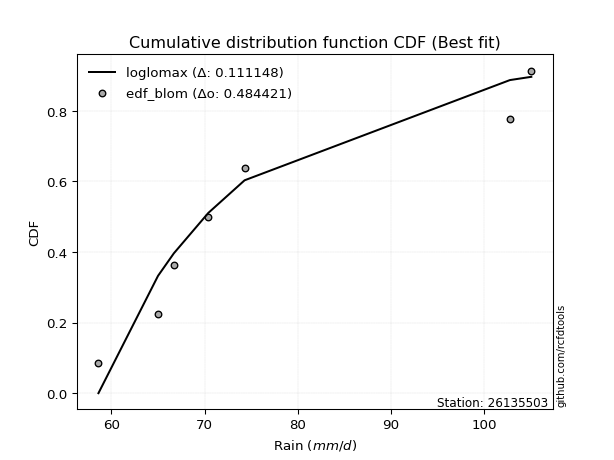</img>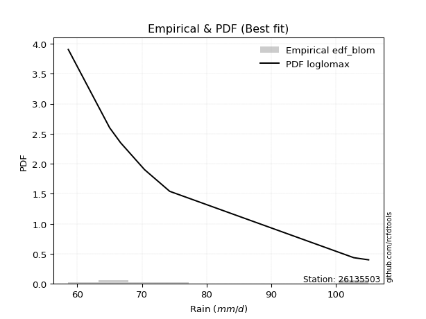</img>

</div>


### 7. EDF Tukey (1962)

In hydrology, the Tukey formula is used as a plotting position formula to estimate the empirical probability or frequency of a flood event (or other hydrological data). The formula parameter is given as _c=0.333_ (or 1/3).

<div align="center">


$P=(m-c)/(n+1-2c)$


</div>


**7.1. Empirical values**

<div align="center">

|                | 0                   | 1                   | 2                   | 3         | 4                  | 5                  | 6                  |
|:---------------|:--------------------|:--------------------|:--------------------|:----------|:-------------------|:-------------------|:-------------------|
| date           | 2022                | 2021                | 2018                | 2020      | 2023               | 2017               | 2019               |
| x              | 58.6                | 65.0                | 66.7                | 70.4      | 74.3               | 102.8              | 105.1              |
| m              | 1                   | 2                   | 3                   | 4         | 5                  | 6                  | 7                  |
| empirical_dist | edf_tukey           | edf_tukey           | edf_tukey           | edf_tukey | edf_tukey          | edf_tukey          | edf_tukey          |
| empirical      | 0.09090909090909091 | 0.22727272727272727 | 0.36363636363636365 | 0.5       | 0.6363636363636364 | 0.7727272727272727 | 0.9090909090909091 |
| empirical_tr   | 1.1                 | 1.2941176470588236  | 1.5714285714285714  | 2.0       | 2.75               | 4.3999999999999995 | 10.999999999999996 |

</div>


**7.2. Kolmogorov-Smirnov fit test (sorted by Δ)**


<div align="center">

|                | 0                   | 1                   | 2                   | 3                   | 4                   | 5                   | 6                   | 7                   | 8                   | 9                   | 10                  | 11                  | 12                  | 13                  | 14                  | 15                  | 16                  | 17                    | 18                  | 19                  | 20                  | 21                  | 22                  | 23                  | 24                  | 25                  | 26                  | 27                  | 28                  | 29                  | 30                  | 31                  | 32                  | 33                  | 34                  | 35                  | 36                  | 37                  | 38                  | 39                  | 40                  | 41                  | 42                  | 43                  | 44                  | 45                  | 46                  | 47                  | 48                  | 49                  | 50                  | 51                  | 52                  | 53                  | 54                  | 55                  | 56                  | 57                  | 58                  | 59                  | 60                  | 61                  | 62                  | 63                  | 64                  | 65                  | 66                  | 67                  | 68                  | 69                  | 70                  | 71                  | 72                  | 73                  | 74                  | 75                  | 76                  | 77                  | 78                  | 79                  | 80                  | 81                  | 82                  | 83                  | 84                  | 85                  | 86                  | 87                  |
|:---------------|:--------------------|:--------------------|:--------------------|:--------------------|:--------------------|:--------------------|:--------------------|:--------------------|:--------------------|:--------------------|:--------------------|:--------------------|:--------------------|:--------------------|:--------------------|:--------------------|:--------------------|:----------------------|:--------------------|:--------------------|:--------------------|:--------------------|:--------------------|:--------------------|:--------------------|:--------------------|:--------------------|:--------------------|:--------------------|:--------------------|:--------------------|:--------------------|:--------------------|:--------------------|:--------------------|:--------------------|:--------------------|:--------------------|:--------------------|:--------------------|:--------------------|:--------------------|:--------------------|:--------------------|:--------------------|:--------------------|:--------------------|:--------------------|:--------------------|:--------------------|:--------------------|:--------------------|:--------------------|:--------------------|:--------------------|:--------------------|:--------------------|:--------------------|:--------------------|:--------------------|:--------------------|:--------------------|:--------------------|:--------------------|:--------------------|:--------------------|:--------------------|:--------------------|:--------------------|:--------------------|:--------------------|:--------------------|:--------------------|:--------------------|:--------------------|:--------------------|:--------------------|:--------------------|:--------------------|:--------------------|:--------------------|:--------------------|:--------------------|:--------------------|:--------------------|:--------------------|:--------------------|:--------------------|
| station        | 26135503            | 26135503            | 26135503            | 26135503            | 26135503            | 26135503            | 26135503            | 26135503            | 26135503            | 26135503            | 26135503            | 26135503            | 26135503            | 26135503            | 26135503            | 26135503            | 26135503            | 26135503              | 26135503            | 26135503            | 26135503            | 26135503            | 26135503            | 26135503            | 26135503            | 26135503            | 26135503            | 26135503            | 26135503            | 26135503            | 26135503            | 26135503            | 26135503            | 26135503            | 26135503            | 26135503            | 26135503            | 26135503            | 26135503            | 26135503            | 26135503            | 26135503            | 26135503            | 26135503            | 26135503            | 26135503            | 26135503            | 26135503            | 26135503            | 26135503            | 26135503            | 26135503            | 26135503            | 26135503            | 26135503            | 26135503            | 26135503            | 26135503            | 26135503            | 26135503            | 26135503            | 26135503            | 26135503            | 26135503            | 26135503            | 26135503            | 26135503            | 26135503            | 26135503            | 26135503            | 26135503            | 26135503            | 26135503            | 26135503            | 26135503            | 26135503            | 26135503            | 26135503            | 26135503            | 26135503            | 26135503            | 26135503            | 26135503            | 26135503            | 26135503            | 26135503            | 26135503            | 26135503            |
| empirical_dist | edf_tukey           | edf_tukey           | edf_tukey           | edf_tukey           | edf_tukey           | edf_tukey           | edf_tukey           | edf_tukey           | edf_tukey           | edf_tukey           | edf_tukey           | edf_tukey           | edf_tukey           | edf_tukey           | edf_tukey           | edf_tukey           | edf_tukey           | edf_tukey             | edf_tukey           | edf_tukey           | edf_tukey           | edf_tukey           | edf_tukey           | edf_tukey           | edf_tukey           | edf_tukey           | edf_tukey           | edf_tukey           | edf_tukey           | edf_tukey           | edf_tukey           | edf_tukey           | edf_tukey           | edf_tukey           | edf_tukey           | edf_tukey           | edf_tukey           | edf_tukey           | edf_tukey           | edf_tukey           | edf_tukey           | edf_tukey           | edf_tukey           | edf_tukey           | edf_tukey           | edf_tukey           | edf_tukey           | edf_tukey           | edf_tukey           | edf_tukey           | edf_tukey           | edf_tukey           | edf_tukey           | edf_tukey           | edf_tukey           | edf_tukey           | edf_tukey           | edf_tukey           | edf_tukey           | edf_tukey           | edf_tukey           | edf_tukey           | edf_tukey           | edf_tukey           | edf_tukey           | edf_tukey           | edf_tukey           | edf_tukey           | edf_tukey           | edf_tukey           | edf_tukey           | edf_tukey           | edf_tukey           | edf_tukey           | edf_tukey           | edf_tukey           | edf_tukey           | edf_tukey           | edf_tukey           | edf_tukey           | edf_tukey           | edf_tukey           | edf_tukey           | edf_tukey           | edf_tukey           | edf_tukey           | edf_tukey           | edf_tukey           |
| p_dist         | fisk                | lognakagami         | logfisk             | logexpon            | logfatiguelife      | loggenexpon         | invweibull          | alpha               | logexponnorm        | loginvgauss         | invgamma            | invgauss            | exponnorm           | expon               | genexpon            | loginvweibull       | loghalfnorm         | loglaplace_asymmetric | halfnorm            | lograyleigh         | logmielke           | gompertz            | loghalflogistic     | halflogistic        | logmaxwell          | laplace_asymmetric  | logpearson3         | logmoyal            | loggumbel_r         | loggompertz         | moyal               | gumbel_r            | logncf              | logkstwobign        | nct                 | logwald             | loggenlogistic      | mielke              | wald                | logrice             | lognct              | logalpha            | kstwobign           | logf                | logbetaprime        | f                   | genlogistic         | betaprime           | pearson3            | rayleigh            | loginvgamma         | logjohnsonsu        | logt                | lognorm             | lognorm             | logcrystalball      | logloggamma         | maxwell             | loglogistic         | erlang              | loghypsecant        | loglaplace          | rice                | johnsonsu           | norm                | crystalball         | truncnorm           | t                   | logtruncnorm        | logistic            | loggibrat           | logweibull_min      | hypsecant           | logerlang           | loggumbel_l         | laplace             | gibrat              | gumbel_l            | ncf                 | logchi2             | weibull_min         | loggamma            | loggamma            | loglognorm          | nakagami            | fatiguelife         | gamma               | chi2                |
| delta          | 0.10541460956232873 | 0.11195092323337641 | 0.11206394253056806 | 0.11485423686886453 | 0.12543781683815114 | 0.12646793482006802 | 0.12676529254037605 | 0.12704191493873507 | 0.12756540934285754 | 0.12770160423803634 | 0.127741749093629   | 0.12892458466836143 | 0.1291677068783046  | 0.13013009854094237 | 0.13013130198225797 | 0.13088142537260938 | 0.13211580671568646 | 0.1328476976342381    | 0.13392080074093438 | 0.1383176002435389  | 0.1385361704012994  | 0.13878634015908897 | 0.13910388352125191 | 0.14055721486790573 | 0.14140965859381216 | 0.1416283817132843  | 0.14240778173847435 | 0.14248335678472546 | 0.1430153434072634  | 0.14381266303831763 | 0.1438994566317383  | 0.14712589279535038 | 0.14720205224108807 | 0.1504225724589876  | 0.15085259466737821 | 0.15145400498035566 | 0.15157930092351657 | 0.15206063753768317 | 0.15247571842675967 | 0.15399412113298677 | 0.15678823674320236 | 0.15736720417470795 | 0.15938485352999687 | 0.1603286936364234  | 0.16219865334731087 | 0.162438254511659   | 0.16300639687438    | 0.16306563038659883 | 0.164156066128744   | 0.16453569130862367 | 0.16597766119000396 | 0.17371017522348808 | 0.17372742314622425 | 0.17372765923589084 | 0.17372765923589084 | 0.17372820692777602 | 0.17426421439259288 | 0.1766962209019805  | 0.1787927075198732  | 0.18077676584557323 | 0.18309241498565754 | 0.1984762145587915  | 0.206089611472077   | 0.21057737979995483 | 0.2110759983407175  | 0.2110760079947167  | 0.21107603360489868 | 0.21107707931777053 | 0.21204594659786835 | 0.2209650165325947  | 0.22257127678395533 | 0.22418409711291845 | 0.22921056216112484 | 0.24356513470188687 | 0.2442167020943789  | 0.2533034077448713  | 0.25473184869899557 | 0.2797897450231639  | 0.2841542019193023  | 0.3448580295796595  | 0.3506470962825379  | 0.3781623100661393  | 0.3781623100661393  | 0.40410860167140505 | 0.44724766482249134 | 0.5143431405932336  | 0.5856750150774256  | 0.7580137918525809  |
| deltao         | 0.48442053926100004 | 0.48442053926100004 | 0.48442053926100004 | 0.48442053926100004 | 0.48442053926100004 | 0.48442053926100004 | 0.48442053926100004 | 0.48442053926100004 | 0.48442053926100004 | 0.48442053926100004 | 0.48442053926100004 | 0.48442053926100004 | 0.48442053926100004 | 0.48442053926100004 | 0.48442053926100004 | 0.48442053926100004 | 0.48442053926100004 | 0.48442053926100004   | 0.48442053926100004 | 0.48442053926100004 | 0.48442053926100004 | 0.48442053926100004 | 0.48442053926100004 | 0.48442053926100004 | 0.48442053926100004 | 0.48442053926100004 | 0.48442053926100004 | 0.48442053926100004 | 0.48442053926100004 | 0.48442053926100004 | 0.48442053926100004 | 0.48442053926100004 | 0.48442053926100004 | 0.48442053926100004 | 0.48442053926100004 | 0.48442053926100004 | 0.48442053926100004 | 0.48442053926100004 | 0.48442053926100004 | 0.48442053926100004 | 0.48442053926100004 | 0.48442053926100004 | 0.48442053926100004 | 0.48442053926100004 | 0.48442053926100004 | 0.48442053926100004 | 0.48442053926100004 | 0.48442053926100004 | 0.48442053926100004 | 0.48442053926100004 | 0.48442053926100004 | 0.48442053926100004 | 0.48442053926100004 | 0.48442053926100004 | 0.48442053926100004 | 0.48442053926100004 | 0.48442053926100004 | 0.48442053926100004 | 0.48442053926100004 | 0.48442053926100004 | 0.48442053926100004 | 0.48442053926100004 | 0.48442053926100004 | 0.48442053926100004 | 0.48442053926100004 | 0.48442053926100004 | 0.48442053926100004 | 0.48442053926100004 | 0.48442053926100004 | 0.48442053926100004 | 0.48442053926100004 | 0.48442053926100004 | 0.48442053926100004 | 0.48442053926100004 | 0.48442053926100004 | 0.48442053926100004 | 0.48442053926100004 | 0.48442053926100004 | 0.48442053926100004 | 0.48442053926100004 | 0.48442053926100004 | 0.48442053926100004 | 0.48442053926100004 | 0.48442053926100004 | 0.48442053926100004 | 0.48442053926100004 | 0.48442053926100004 | 0.48442053926100004 |
| eval           | Δo > Δ              | Δo > Δ              | Δo > Δ              | Δo > Δ              | Δo > Δ              | Δo > Δ              | Δo > Δ              | Δo > Δ              | Δo > Δ              | Δo > Δ              | Δo > Δ              | Δo > Δ              | Δo > Δ              | Δo > Δ              | Δo > Δ              | Δo > Δ              | Δo > Δ              | Δo > Δ                | Δo > Δ              | Δo > Δ              | Δo > Δ              | Δo > Δ              | Δo > Δ              | Δo > Δ              | Δo > Δ              | Δo > Δ              | Δo > Δ              | Δo > Δ              | Δo > Δ              | Δo > Δ              | Δo > Δ              | Δo > Δ              | Δo > Δ              | Δo > Δ              | Δo > Δ              | Δo > Δ              | Δo > Δ              | Δo > Δ              | Δo > Δ              | Δo > Δ              | Δo > Δ              | Δo > Δ              | Δo > Δ              | Δo > Δ              | Δo > Δ              | Δo > Δ              | Δo > Δ              | Δo > Δ              | Δo > Δ              | Δo > Δ              | Δo > Δ              | Δo > Δ              | Δo > Δ              | Δo > Δ              | Δo > Δ              | Δo > Δ              | Δo > Δ              | Δo > Δ              | Δo > Δ              | Δo > Δ              | Δo > Δ              | Δo > Δ              | Δo > Δ              | Δo > Δ              | Δo > Δ              | Δo > Δ              | Δo > Δ              | Δo > Δ              | Δo > Δ              | Δo > Δ              | Δo > Δ              | Δo > Δ              | Δo > Δ              | Δo > Δ              | Δo > Δ              | Δo > Δ              | Δo > Δ              | Δo > Δ              | Δo > Δ              | Δo > Δ              | Δo > Δ              | Δo > Δ              | Δo > Δ              | Δo > Δ              | Δo > Δ              | Δo <= Δ             | Δo <= Δ             | Δo <= Δ             |
| fit            | 1                   | 1                   | 1                   | 1                   | 1                   | 1                   | 1                   | 1                   | 1                   | 1                   | 1                   | 1                   | 1                   | 1                   | 1                   | 1                   | 1                   | 1                     | 1                   | 1                   | 1                   | 1                   | 1                   | 1                   | 1                   | 1                   | 1                   | 1                   | 1                   | 1                   | 1                   | 1                   | 1                   | 1                   | 1                   | 1                   | 1                   | 1                   | 1                   | 1                   | 1                   | 1                   | 1                   | 1                   | 1                   | 1                   | 1                   | 1                   | 1                   | 1                   | 1                   | 1                   | 1                   | 1                   | 1                   | 1                   | 1                   | 1                   | 1                   | 1                   | 1                   | 1                   | 1                   | 1                   | 1                   | 1                   | 1                   | 1                   | 1                   | 1                   | 1                   | 1                   | 1                   | 1                   | 1                   | 1                   | 1                   | 1                   | 1                   | 1                   | 1                   | 1                   | 1                   | 1                   | 1                   | 0                   | 0                   | 0                   |
| n              | 7                   | 7                   | 7                   | 7                   | 7                   | 7                   | 7                   | 7                   | 7                   | 7                   | 7                   | 7                   | 7                   | 7                   | 7                   | 7                   | 7                   | 7                     | 7                   | 7                   | 7                   | 7                   | 7                   | 7                   | 7                   | 7                   | 7                   | 7                   | 7                   | 7                   | 7                   | 7                   | 7                   | 7                   | 7                   | 7                   | 7                   | 7                   | 7                   | 7                   | 7                   | 7                   | 7                   | 7                   | 7                   | 7                   | 7                   | 7                   | 7                   | 7                   | 7                   | 7                   | 7                   | 7                   | 7                   | 7                   | 7                   | 7                   | 7                   | 7                   | 7                   | 7                   | 7                   | 7                   | 7                   | 7                   | 7                   | 7                   | 7                   | 7                   | 7                   | 7                   | 7                   | 7                   | 7                   | 7                   | 7                   | 7                   | 7                   | 7                   | 7                   | 7                   | 7                   | 7                   | 7                   | 7                   | 7                   | 7                   |
| best_fit       | 1                   | 0                   | 0                   | 0                   | 0                   | 0                   | 0                   | 0                   | 0                   | 0                   | 0                   | 0                   | 0                   | 0                   | 0                   | 0                   | 0                   | 0                     | 0                   | 0                   | 0                   | 0                   | 0                   | 0                   | 0                   | 0                   | 0                   | 0                   | 0                   | 0                   | 0                   | 0                   | 0                   | 0                   | 0                   | 0                   | 0                   | 0                   | 0                   | 0                   | 0                   | 0                   | 0                   | 0                   | 0                   | 0                   | 0                   | 0                   | 0                   | 0                   | 0                   | 0                   | 0                   | 0                   | 0                   | 0                   | 0                   | 0                   | 0                   | 0                   | 0                   | 0                   | 0                   | 0                   | 0                   | 0                   | 0                   | 0                   | 0                   | 0                   | 0                   | 0                   | 0                   | 0                   | 0                   | 0                   | 0                   | 0                   | 0                   | 0                   | 0                   | 0                   | 0                   | 0                   | 0                   | 0                   | 0                   | 0                   |
| best_fit_sort  | 1                   | 2                   | 3                   | 4                   | 5                   | 6                   | 7                   | 8                   | 9                   | 10                  | 11                  | 12                  | 13                  | 14                  | 15                  | 16                  | 17                  | 18                    | 19                  | 20                  | 21                  | 22                  | 23                  | 24                  | 25                  | 26                  | 27                  | 28                  | 29                  | 30                  | 31                  | 32                  | 33                  | 34                  | 35                  | 36                  | 37                  | 38                  | 39                  | 40                  | 41                  | 42                  | 43                  | 44                  | 45                  | 46                  | 47                  | 48                  | 49                  | 50                  | 51                  | 52                  | 53                  | 54                  | 55                  | 56                  | 57                  | 58                  | 59                  | 60                  | 61                  | 62                  | 63                  | 64                  | 65                  | 66                  | 67                  | 68                  | 69                  | 70                  | 71                  | 72                  | 73                  | 74                  | 75                  | 76                  | 77                  | 78                  | 79                  | 80                  | 81                  | 82                  | 83                  | 84                  | 85                  | 86                  | 87                  | 88                  |

</div>


**7.3. Best fit**

<div align="center">

|   id |   station | empirical_dist   | p_dist   |    delta |   deltao | eval   |   fit |   n |   best_fit |   best_fit_sort |
|-----:|----------:|:-----------------|:---------|---------:|---------:|:-------|------:|----:|-----------:|----------------:|
|    0 |  26135503 | edf_tukey        | fisk     | 0.105415 | 0.484421 | Δo > Δ |     1 |   7 |          1 |               1 |

</div>


<div align="center">

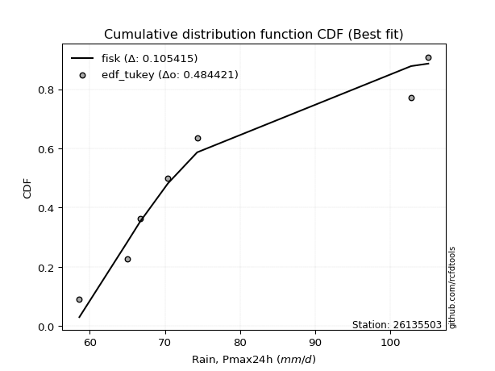</img>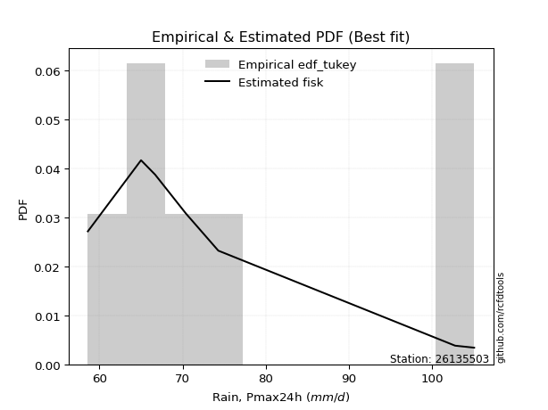</img>

</div>


### 8. EDF Gringorten (1963)

Gringorten plotting position formula is essential for estimating the probability and return periods of extreme events like floods and heavy rainfall. The constant _a=0.44_.

<div align="center">


$P=(m-a)/(n+1-2a)$


</div>


**8.1. Empirical values**

<div align="center">

|                | 0                   | 1                   | 2                  | 3              | 4                  | 5                  | 6                  |
|:---------------|:--------------------|:--------------------|:-------------------|:---------------|:-------------------|:-------------------|:-------------------|
| date           | 2022                | 2021                | 2018               | 2020           | 2023               | 2017               | 2019               |
| x              | 58.6                | 65.0                | 66.7               | 70.4           | 74.3               | 102.8              | 105.1              |
| m              | 1                   | 2                   | 3                  | 4              | 5                  | 6                  | 7                  |
| empirical_dist | edf_gringorten      | edf_gringorten      | edf_gringorten     | edf_gringorten | edf_gringorten     | edf_gringorten     | edf_gringorten     |
| empirical      | 0.07865168539325844 | 0.21910112359550563 | 0.3595505617977528 | 0.5            | 0.6404494382022471 | 0.7808988764044943 | 0.9213483146067415 |
| empirical_tr   | 1.0853658536585364  | 1.2805755395683454  | 1.5614035087719298 | 2.0            | 2.781249999999999  | 4.564102564102562  | 12.714285714285701 |

</div>


**8.2. Kolmogorov-Smirnov fit test (sorted by Δ)**


<div align="center">

|                | 0                   | 1                   | 2                   | 3                   | 4                   | 5                   | 6                   | 7                   | 8                   | 9                   | 10                  | 11                  | 12                  | 13                  | 14                  | 15                  | 16                  | 17                    | 18                  | 19                  | 20                  | 21                  | 22                  | 23                  | 24                  | 25                  | 26                  | 27                  | 28                  | 29                  | 30                  | 31                  | 32                  | 33                  | 34                  | 35                  | 36                  | 37                  | 38                  | 39                  | 40                  | 41                  | 42                  | 43                  | 44                  | 45                  | 46                  | 47                  | 48                  | 49                  | 50                  | 51                  | 52                  | 53                  | 54                  | 55                  | 56                  | 57                  | 58                  | 59                  | 60                  | 61                  | 62                  | 63                  | 64                  | 65                  | 66                  | 67                  | 68                  | 69                  | 70                  | 71                  | 72                  | 73                  | 74                  | 75                  | 76                  | 77                  | 78                  | 79                  | 80                  | 81                  | 82                  | 83                  | 84                  | 85                  | 86                  | 87                  |
|:---------------|:--------------------|:--------------------|:--------------------|:--------------------|:--------------------|:--------------------|:--------------------|:--------------------|:--------------------|:--------------------|:--------------------|:--------------------|:--------------------|:--------------------|:--------------------|:--------------------|:--------------------|:----------------------|:--------------------|:--------------------|:--------------------|:--------------------|:--------------------|:--------------------|:--------------------|:--------------------|:--------------------|:--------------------|:--------------------|:--------------------|:--------------------|:--------------------|:--------------------|:--------------------|:--------------------|:--------------------|:--------------------|:--------------------|:--------------------|:--------------------|:--------------------|:--------------------|:--------------------|:--------------------|:--------------------|:--------------------|:--------------------|:--------------------|:--------------------|:--------------------|:--------------------|:--------------------|:--------------------|:--------------------|:--------------------|:--------------------|:--------------------|:--------------------|:--------------------|:--------------------|:--------------------|:--------------------|:--------------------|:--------------------|:--------------------|:--------------------|:--------------------|:--------------------|:--------------------|:--------------------|:--------------------|:--------------------|:--------------------|:--------------------|:--------------------|:--------------------|:--------------------|:--------------------|:--------------------|:--------------------|:--------------------|:--------------------|:--------------------|:--------------------|:--------------------|:--------------------|:--------------------|:--------------------|
| station        | 26135503            | 26135503            | 26135503            | 26135503            | 26135503            | 26135503            | 26135503            | 26135503            | 26135503            | 26135503            | 26135503            | 26135503            | 26135503            | 26135503            | 26135503            | 26135503            | 26135503            | 26135503              | 26135503            | 26135503            | 26135503            | 26135503            | 26135503            | 26135503            | 26135503            | 26135503            | 26135503            | 26135503            | 26135503            | 26135503            | 26135503            | 26135503            | 26135503            | 26135503            | 26135503            | 26135503            | 26135503            | 26135503            | 26135503            | 26135503            | 26135503            | 26135503            | 26135503            | 26135503            | 26135503            | 26135503            | 26135503            | 26135503            | 26135503            | 26135503            | 26135503            | 26135503            | 26135503            | 26135503            | 26135503            | 26135503            | 26135503            | 26135503            | 26135503            | 26135503            | 26135503            | 26135503            | 26135503            | 26135503            | 26135503            | 26135503            | 26135503            | 26135503            | 26135503            | 26135503            | 26135503            | 26135503            | 26135503            | 26135503            | 26135503            | 26135503            | 26135503            | 26135503            | 26135503            | 26135503            | 26135503            | 26135503            | 26135503            | 26135503            | 26135503            | 26135503            | 26135503            | 26135503            |
| empirical_dist | edf_gringorten      | edf_gringorten      | edf_gringorten      | edf_gringorten      | edf_gringorten      | edf_gringorten      | edf_gringorten      | edf_gringorten      | edf_gringorten      | edf_gringorten      | edf_gringorten      | edf_gringorten      | edf_gringorten      | edf_gringorten      | edf_gringorten      | edf_gringorten      | edf_gringorten      | edf_gringorten        | edf_gringorten      | edf_gringorten      | edf_gringorten      | edf_gringorten      | edf_gringorten      | edf_gringorten      | edf_gringorten      | edf_gringorten      | edf_gringorten      | edf_gringorten      | edf_gringorten      | edf_gringorten      | edf_gringorten      | edf_gringorten      | edf_gringorten      | edf_gringorten      | edf_gringorten      | edf_gringorten      | edf_gringorten      | edf_gringorten      | edf_gringorten      | edf_gringorten      | edf_gringorten      | edf_gringorten      | edf_gringorten      | edf_gringorten      | edf_gringorten      | edf_gringorten      | edf_gringorten      | edf_gringorten      | edf_gringorten      | edf_gringorten      | edf_gringorten      | edf_gringorten      | edf_gringorten      | edf_gringorten      | edf_gringorten      | edf_gringorten      | edf_gringorten      | edf_gringorten      | edf_gringorten      | edf_gringorten      | edf_gringorten      | edf_gringorten      | edf_gringorten      | edf_gringorten      | edf_gringorten      | edf_gringorten      | edf_gringorten      | edf_gringorten      | edf_gringorten      | edf_gringorten      | edf_gringorten      | edf_gringorten      | edf_gringorten      | edf_gringorten      | edf_gringorten      | edf_gringorten      | edf_gringorten      | edf_gringorten      | edf_gringorten      | edf_gringorten      | edf_gringorten      | edf_gringorten      | edf_gringorten      | edf_gringorten      | edf_gringorten      | edf_gringorten      | edf_gringorten      | edf_gringorten      |
| p_dist         | fisk                | logfisk             | logexpon            | lognakagami         | logfatiguelife      | loggenexpon         | invweibull          | alpha               | logexponnorm        | loginvgauss         | invgamma            | invgauss            | exponnorm           | expon               | genexpon            | loginvweibull       | loghalfnorm         | loglaplace_asymmetric | logmielke           | gompertz            | loghalflogistic     | lograyleigh         | halflogistic        | laplace_asymmetric  | halfnorm            | logmoyal            | loggumbel_r         | loggompertz         | moyal               | logpearson3         | logncf              | logkstwobign        | logwald             | loggenlogistic      | logmaxwell          | mielke              | wald                | logalpha            | gumbel_r            | nct                 | logbetaprime        | genlogistic         | logrice             | lognct              | kstwobign           | f                   | betaprime           | pearson3            | logf                | rayleigh            | loginvgamma         | erlang              | logjohnsonsu        | logt                | lognorm             | lognorm             | logcrystalball      | logloggamma         | maxwell             | loglogistic         | loghypsecant        | loglaplace          | logtruncnorm        | rice                | johnsonsu           | norm                | crystalball         | truncnorm           | t                   | loggibrat           | logistic            | logweibull_min      | hypsecant           | loggumbel_l         | gibrat              | logerlang           | laplace             | gumbel_l            | ncf                 | logchi2             | weibull_min         | loggamma            | loggamma            | loglognorm          | nakagami            | fatiguelife         | gamma               | chi2                |
| delta          | 0.09724300588510715 | 0.10389233885334648 | 0.11262133915904457 | 0.11603672507198715 | 0.11726621316092956 | 0.11829633114284643 | 0.11859368886315447 | 0.11887031126151348 | 0.11939380566563595 | 0.11953000056081475 | 0.11957014541640743 | 0.12075298099113985 | 0.120996103201083   | 0.12195849486372079 | 0.12195969830503639 | 0.1227098216953878  | 0.12394420303846487 | 0.12467609395701651   | 0.1303645667240778  | 0.1306147364818674  | 0.13093227984403033 | 0.13196003451331684 | 0.13238561119068415 | 0.1334567780360627  | 0.1342197372291617  | 0.13431175310750387 | 0.13484373973004182 | 0.13564105936109605 | 0.13572785295451673 | 0.1374233593667965  | 0.13903044856386648 | 0.14225096878176602 | 0.14328240130313408 | 0.14340769724629499 | 0.14367201050779033 | 0.1438890338604616  | 0.14430411474953808 | 0.14919560049748637 | 0.1512116946339611  | 0.15162650509047215 | 0.1540270496700893  | 0.15483479319715843 | 0.1580799229715975  | 0.1608740385818131  | 0.16185507166963897 | 0.16652405635026973 | 0.16715143222520956 | 0.16824186796735474 | 0.16850029731364505 | 0.1686214931472344  | 0.1700634630286147  | 0.17260516216835164 | 0.17779597706209882 | 0.17781322498483498 | 0.17781346107450158 | 0.17781346107450158 | 0.17781400876638676 | 0.1783500162312036  | 0.18078202274059124 | 0.18287850935848393 | 0.18717821682426827 | 0.20256201639740223 | 0.20387434292064677 | 0.21017541331068773 | 0.21466318163856557 | 0.21516180017932823 | 0.21516180983332744 | 0.21516183544350942 | 0.21516288115638127 | 0.21848547494534448 | 0.22505081837120544 | 0.2323557007901401  | 0.23329636399973558 | 0.24830250393298964 | 0.2506460468603847  | 0.2517367383791085  | 0.25738920958348205 | 0.28387554686177463 | 0.2964116074351347  | 0.35711543509549193 | 0.35881869995975957 | 0.386333913743361   | 0.386333913743361   | 0.41228020534862675 | 0.45541926849971304 | 0.5225147442704553  | 0.5938466187546473  | 0.7661853955298026  |
| deltao         | 0.48442053926100004 | 0.48442053926100004 | 0.48442053926100004 | 0.48442053926100004 | 0.48442053926100004 | 0.48442053926100004 | 0.48442053926100004 | 0.48442053926100004 | 0.48442053926100004 | 0.48442053926100004 | 0.48442053926100004 | 0.48442053926100004 | 0.48442053926100004 | 0.48442053926100004 | 0.48442053926100004 | 0.48442053926100004 | 0.48442053926100004 | 0.48442053926100004   | 0.48442053926100004 | 0.48442053926100004 | 0.48442053926100004 | 0.48442053926100004 | 0.48442053926100004 | 0.48442053926100004 | 0.48442053926100004 | 0.48442053926100004 | 0.48442053926100004 | 0.48442053926100004 | 0.48442053926100004 | 0.48442053926100004 | 0.48442053926100004 | 0.48442053926100004 | 0.48442053926100004 | 0.48442053926100004 | 0.48442053926100004 | 0.48442053926100004 | 0.48442053926100004 | 0.48442053926100004 | 0.48442053926100004 | 0.48442053926100004 | 0.48442053926100004 | 0.48442053926100004 | 0.48442053926100004 | 0.48442053926100004 | 0.48442053926100004 | 0.48442053926100004 | 0.48442053926100004 | 0.48442053926100004 | 0.48442053926100004 | 0.48442053926100004 | 0.48442053926100004 | 0.48442053926100004 | 0.48442053926100004 | 0.48442053926100004 | 0.48442053926100004 | 0.48442053926100004 | 0.48442053926100004 | 0.48442053926100004 | 0.48442053926100004 | 0.48442053926100004 | 0.48442053926100004 | 0.48442053926100004 | 0.48442053926100004 | 0.48442053926100004 | 0.48442053926100004 | 0.48442053926100004 | 0.48442053926100004 | 0.48442053926100004 | 0.48442053926100004 | 0.48442053926100004 | 0.48442053926100004 | 0.48442053926100004 | 0.48442053926100004 | 0.48442053926100004 | 0.48442053926100004 | 0.48442053926100004 | 0.48442053926100004 | 0.48442053926100004 | 0.48442053926100004 | 0.48442053926100004 | 0.48442053926100004 | 0.48442053926100004 | 0.48442053926100004 | 0.48442053926100004 | 0.48442053926100004 | 0.48442053926100004 | 0.48442053926100004 | 0.48442053926100004 |
| eval           | Δo > Δ              | Δo > Δ              | Δo > Δ              | Δo > Δ              | Δo > Δ              | Δo > Δ              | Δo > Δ              | Δo > Δ              | Δo > Δ              | Δo > Δ              | Δo > Δ              | Δo > Δ              | Δo > Δ              | Δo > Δ              | Δo > Δ              | Δo > Δ              | Δo > Δ              | Δo > Δ                | Δo > Δ              | Δo > Δ              | Δo > Δ              | Δo > Δ              | Δo > Δ              | Δo > Δ              | Δo > Δ              | Δo > Δ              | Δo > Δ              | Δo > Δ              | Δo > Δ              | Δo > Δ              | Δo > Δ              | Δo > Δ              | Δo > Δ              | Δo > Δ              | Δo > Δ              | Δo > Δ              | Δo > Δ              | Δo > Δ              | Δo > Δ              | Δo > Δ              | Δo > Δ              | Δo > Δ              | Δo > Δ              | Δo > Δ              | Δo > Δ              | Δo > Δ              | Δo > Δ              | Δo > Δ              | Δo > Δ              | Δo > Δ              | Δo > Δ              | Δo > Δ              | Δo > Δ              | Δo > Δ              | Δo > Δ              | Δo > Δ              | Δo > Δ              | Δo > Δ              | Δo > Δ              | Δo > Δ              | Δo > Δ              | Δo > Δ              | Δo > Δ              | Δo > Δ              | Δo > Δ              | Δo > Δ              | Δo > Δ              | Δo > Δ              | Δo > Δ              | Δo > Δ              | Δo > Δ              | Δo > Δ              | Δo > Δ              | Δo > Δ              | Δo > Δ              | Δo > Δ              | Δo > Δ              | Δo > Δ              | Δo > Δ              | Δo > Δ              | Δo > Δ              | Δo > Δ              | Δo > Δ              | Δo > Δ              | Δo > Δ              | Δo <= Δ             | Δo <= Δ             | Δo <= Δ             |
| fit            | 1                   | 1                   | 1                   | 1                   | 1                   | 1                   | 1                   | 1                   | 1                   | 1                   | 1                   | 1                   | 1                   | 1                   | 1                   | 1                   | 1                   | 1                     | 1                   | 1                   | 1                   | 1                   | 1                   | 1                   | 1                   | 1                   | 1                   | 1                   | 1                   | 1                   | 1                   | 1                   | 1                   | 1                   | 1                   | 1                   | 1                   | 1                   | 1                   | 1                   | 1                   | 1                   | 1                   | 1                   | 1                   | 1                   | 1                   | 1                   | 1                   | 1                   | 1                   | 1                   | 1                   | 1                   | 1                   | 1                   | 1                   | 1                   | 1                   | 1                   | 1                   | 1                   | 1                   | 1                   | 1                   | 1                   | 1                   | 1                   | 1                   | 1                   | 1                   | 1                   | 1                   | 1                   | 1                   | 1                   | 1                   | 1                   | 1                   | 1                   | 1                   | 1                   | 1                   | 1                   | 1                   | 0                   | 0                   | 0                   |
| n              | 7                   | 7                   | 7                   | 7                   | 7                   | 7                   | 7                   | 7                   | 7                   | 7                   | 7                   | 7                   | 7                   | 7                   | 7                   | 7                   | 7                   | 7                     | 7                   | 7                   | 7                   | 7                   | 7                   | 7                   | 7                   | 7                   | 7                   | 7                   | 7                   | 7                   | 7                   | 7                   | 7                   | 7                   | 7                   | 7                   | 7                   | 7                   | 7                   | 7                   | 7                   | 7                   | 7                   | 7                   | 7                   | 7                   | 7                   | 7                   | 7                   | 7                   | 7                   | 7                   | 7                   | 7                   | 7                   | 7                   | 7                   | 7                   | 7                   | 7                   | 7                   | 7                   | 7                   | 7                   | 7                   | 7                   | 7                   | 7                   | 7                   | 7                   | 7                   | 7                   | 7                   | 7                   | 7                   | 7                   | 7                   | 7                   | 7                   | 7                   | 7                   | 7                   | 7                   | 7                   | 7                   | 7                   | 7                   | 7                   |
| best_fit       | 1                   | 0                   | 0                   | 0                   | 0                   | 0                   | 0                   | 0                   | 0                   | 0                   | 0                   | 0                   | 0                   | 0                   | 0                   | 0                   | 0                   | 0                     | 0                   | 0                   | 0                   | 0                   | 0                   | 0                   | 0                   | 0                   | 0                   | 0                   | 0                   | 0                   | 0                   | 0                   | 0                   | 0                   | 0                   | 0                   | 0                   | 0                   | 0                   | 0                   | 0                   | 0                   | 0                   | 0                   | 0                   | 0                   | 0                   | 0                   | 0                   | 0                   | 0                   | 0                   | 0                   | 0                   | 0                   | 0                   | 0                   | 0                   | 0                   | 0                   | 0                   | 0                   | 0                   | 0                   | 0                   | 0                   | 0                   | 0                   | 0                   | 0                   | 0                   | 0                   | 0                   | 0                   | 0                   | 0                   | 0                   | 0                   | 0                   | 0                   | 0                   | 0                   | 0                   | 0                   | 0                   | 0                   | 0                   | 0                   |
| best_fit_sort  | 1                   | 2                   | 3                   | 4                   | 5                   | 6                   | 7                   | 8                   | 9                   | 10                  | 11                  | 12                  | 13                  | 14                  | 15                  | 16                  | 17                  | 18                    | 19                  | 20                  | 21                  | 22                  | 23                  | 24                  | 25                  | 26                  | 27                  | 28                  | 29                  | 30                  | 31                  | 32                  | 33                  | 34                  | 35                  | 36                  | 37                  | 38                  | 39                  | 40                  | 41                  | 42                  | 43                  | 44                  | 45                  | 46                  | 47                  | 48                  | 49                  | 50                  | 51                  | 52                  | 53                  | 54                  | 55                  | 56                  | 57                  | 58                  | 59                  | 60                  | 61                  | 62                  | 63                  | 64                  | 65                  | 66                  | 67                  | 68                  | 69                  | 70                  | 71                  | 72                  | 73                  | 74                  | 75                  | 76                  | 77                  | 78                  | 79                  | 80                  | 81                  | 82                  | 83                  | 84                  | 85                  | 86                  | 87                  | 88                  |

</div>


**8.3. Best fit**

<div align="center">

|   id |   station | empirical_dist   | p_dist   |    delta |   deltao | eval   |   fit |   n |   best_fit |   best_fit_sort |
|-----:|----------:|:-----------------|:---------|---------:|---------:|:-------|------:|----:|-----------:|----------------:|
|    0 |  26135503 | edf_gringorten   | fisk     | 0.097243 | 0.484421 | Δo > Δ |     1 |   7 |          1 |               1 |

</div>


<div align="center">

</img>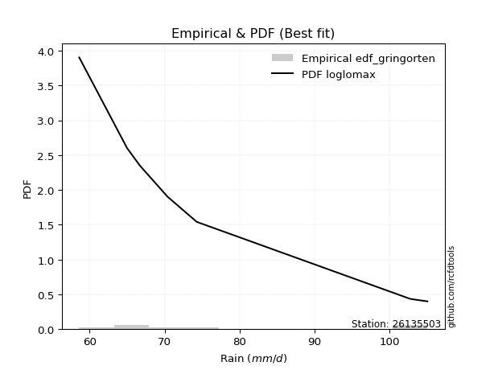</img>

</div>


### 9. EDF Filliben (1975)

The specific values of the constants (0.3175) (often denoted as $alpha$) and (0.365) are derived from a method proposed by James J. Filliben in a 1975 paper. This particular formula is the mean value of the $i$-th order statistic of the normal distribution and is considered a robust and effective plotting position formula for the normal probability plot correlation coefficient test for normality.

<div align="center">


$P=(m-0.3175)/(n+0.365)$


</div>


**9.1. Empirical values**

<div align="center">

|                | 0                   | 1                   | 2                   | 3            | 4                  | 5                  | 6                  |
|:---------------|:--------------------|:--------------------|:--------------------|:-------------|:-------------------|:-------------------|:-------------------|
| date           | 2022                | 2021                | 2018                | 2020         | 2023               | 2017               | 2019               |
| x              | 58.6                | 65.0                | 66.7                | 70.4         | 74.3               | 102.8              | 105.1              |
| m              | 1                   | 2                   | 3                   | 4            | 5                  | 6                  | 7                  |
| empirical_dist | edf_filliben        | edf_filliben        | edf_filliben        | edf_filliben | edf_filliben       | edf_filliben       | edf_filliben       |
| empirical      | 0.09266802443991853 | 0.22844534962661237 | 0.36422267481330617 | 0.5          | 0.6357773251866938 | 0.7715546503733877 | 0.9073319755600815 |
| empirical_tr   | 1.1021324354657687  | 1.2960844698636163  | 1.5728777362520021  | 2.0          | 2.7455731593662627 | 4.377414561664191  | 10.791208791208794 |

</div>


**9.2. Kolmogorov-Smirnov fit test (sorted by Δ)**


<div align="center">

|                | 0                   | 1                   | 2                   | 3                   | 4                   | 5                   | 6                   | 7                   | 8                   | 9                   | 10                  | 11                  | 12                  | 13                  | 14                  | 15                  | 16                  | 17                    | 18                  | 19                  | 20                  | 21                  | 22                  | 23                  | 24                  | 25                  | 26                  | 27                  | 28                  | 29                  | 30                  | 31                  | 32                  | 33                  | 34                  | 35                  | 36                  | 37                  | 38                  | 39                  | 40                  | 41                  | 42                  | 43                  | 44                  | 45                  | 46                  | 47                  | 48                  | 49                  | 50                  | 51                  | 52                  | 53                  | 54                  | 55                  | 56                  | 57                  | 58                  | 59                  | 60                  | 61                  | 62                  | 63                  | 64                  | 65                  | 66                  | 67                  | 68                  | 69                  | 70                  | 71                  | 72                  | 73                  | 74                  | 75                  | 76                  | 77                  | 78                  | 79                  | 80                  | 81                  | 82                  | 83                  | 84                  | 85                  | 86                  | 87                  |
|:---------------|:--------------------|:--------------------|:--------------------|:--------------------|:--------------------|:--------------------|:--------------------|:--------------------|:--------------------|:--------------------|:--------------------|:--------------------|:--------------------|:--------------------|:--------------------|:--------------------|:--------------------|:----------------------|:--------------------|:--------------------|:--------------------|:--------------------|:--------------------|:--------------------|:--------------------|:--------------------|:--------------------|:--------------------|:--------------------|:--------------------|:--------------------|:--------------------|:--------------------|:--------------------|:--------------------|:--------------------|:--------------------|:--------------------|:--------------------|:--------------------|:--------------------|:--------------------|:--------------------|:--------------------|:--------------------|:--------------------|:--------------------|:--------------------|:--------------------|:--------------------|:--------------------|:--------------------|:--------------------|:--------------------|:--------------------|:--------------------|:--------------------|:--------------------|:--------------------|:--------------------|:--------------------|:--------------------|:--------------------|:--------------------|:--------------------|:--------------------|:--------------------|:--------------------|:--------------------|:--------------------|:--------------------|:--------------------|:--------------------|:--------------------|:--------------------|:--------------------|:--------------------|:--------------------|:--------------------|:--------------------|:--------------------|:--------------------|:--------------------|:--------------------|:--------------------|:--------------------|:--------------------|:--------------------|
| station        | 26135503            | 26135503            | 26135503            | 26135503            | 26135503            | 26135503            | 26135503            | 26135503            | 26135503            | 26135503            | 26135503            | 26135503            | 26135503            | 26135503            | 26135503            | 26135503            | 26135503            | 26135503              | 26135503            | 26135503            | 26135503            | 26135503            | 26135503            | 26135503            | 26135503            | 26135503            | 26135503            | 26135503            | 26135503            | 26135503            | 26135503            | 26135503            | 26135503            | 26135503            | 26135503            | 26135503            | 26135503            | 26135503            | 26135503            | 26135503            | 26135503            | 26135503            | 26135503            | 26135503            | 26135503            | 26135503            | 26135503            | 26135503            | 26135503            | 26135503            | 26135503            | 26135503            | 26135503            | 26135503            | 26135503            | 26135503            | 26135503            | 26135503            | 26135503            | 26135503            | 26135503            | 26135503            | 26135503            | 26135503            | 26135503            | 26135503            | 26135503            | 26135503            | 26135503            | 26135503            | 26135503            | 26135503            | 26135503            | 26135503            | 26135503            | 26135503            | 26135503            | 26135503            | 26135503            | 26135503            | 26135503            | 26135503            | 26135503            | 26135503            | 26135503            | 26135503            | 26135503            | 26135503            |
| empirical_dist | edf_filliben        | edf_filliben        | edf_filliben        | edf_filliben        | edf_filliben        | edf_filliben        | edf_filliben        | edf_filliben        | edf_filliben        | edf_filliben        | edf_filliben        | edf_filliben        | edf_filliben        | edf_filliben        | edf_filliben        | edf_filliben        | edf_filliben        | edf_filliben          | edf_filliben        | edf_filliben        | edf_filliben        | edf_filliben        | edf_filliben        | edf_filliben        | edf_filliben        | edf_filliben        | edf_filliben        | edf_filliben        | edf_filliben        | edf_filliben        | edf_filliben        | edf_filliben        | edf_filliben        | edf_filliben        | edf_filliben        | edf_filliben        | edf_filliben        | edf_filliben        | edf_filliben        | edf_filliben        | edf_filliben        | edf_filliben        | edf_filliben        | edf_filliben        | edf_filliben        | edf_filliben        | edf_filliben        | edf_filliben        | edf_filliben        | edf_filliben        | edf_filliben        | edf_filliben        | edf_filliben        | edf_filliben        | edf_filliben        | edf_filliben        | edf_filliben        | edf_filliben        | edf_filliben        | edf_filliben        | edf_filliben        | edf_filliben        | edf_filliben        | edf_filliben        | edf_filliben        | edf_filliben        | edf_filliben        | edf_filliben        | edf_filliben        | edf_filliben        | edf_filliben        | edf_filliben        | edf_filliben        | edf_filliben        | edf_filliben        | edf_filliben        | edf_filliben        | edf_filliben        | edf_filliben        | edf_filliben        | edf_filliben        | edf_filliben        | edf_filliben        | edf_filliben        | edf_filliben        | edf_filliben        | edf_filliben        | edf_filliben        |
| p_dist         | fisk                | lognakagami         | logfisk             | logexpon            | logfatiguelife      | loggenexpon         | invweibull          | alpha               | logexponnorm        | loginvgauss         | invgamma            | invgauss            | exponnorm           | expon               | genexpon            | loginvweibull       | loghalfnorm         | loglaplace_asymmetric | halfnorm            | lograyleigh         | logmielke           | gompertz            | loghalflogistic     | halflogistic        | logmaxwell          | laplace_asymmetric  | logpearson3         | logmoyal            | loggumbel_r         | loggompertz         | moyal               | gumbel_r            | logncf              | logkstwobign        | nct                 | logwald             | loggenlogistic      | mielke              | logrice             | wald                | lognct              | logalpha            | logf                | kstwobign           | f                   | betaprime           | logbetaprime        | pearson3            | rayleigh            | genlogistic         | loginvgamma         | logjohnsonsu        | logt                | lognorm             | lognorm             | logcrystalball      | logloggamma         | maxwell             | loglogistic         | erlang              | loghypsecant        | loglaplace          | rice                | johnsonsu           | norm                | crystalball         | truncnorm           | t                   | logtruncnorm        | logistic            | logweibull_min      | loggibrat           | hypsecant           | logerlang           | loggumbel_l         | laplace             | gibrat              | gumbel_l            | ncf                 | logchi2             | weibull_min         | loggamma            | loggamma            | loglognorm          | nakagami            | fatiguelife         | gamma               | chi2                |
| delta          | 0.10658723191621378 | 0.11136461205643389 | 0.1132365648844531  | 0.11602685922274958 | 0.12661043919203618 | 0.12764055717395306 | 0.1279379148942611  | 0.1282145372926201  | 0.12873803169674258 | 0.12887422659192138 | 0.12891437144751405 | 0.13009720702224647 | 0.13034032923218963 | 0.13130272089482742 | 0.13130392433614302 | 0.13205404772649443 | 0.1332884290695715  | 0.13402031998812314   | 0.13509342309481942 | 0.13949022259742394 | 0.13970879275518444 | 0.13995896251297402 | 0.14027650587513696 | 0.14172983722179078 | 0.1425822809476972  | 0.14280100406716933 | 0.1435804040923594  | 0.1436559791386105  | 0.14418796576114845 | 0.14498528539220268 | 0.14507207898562335 | 0.14653958161840785 | 0.1483746745949731  | 0.15159519481287265 | 0.15202521702126326 | 0.1526266273342407  | 0.1527519232774016  | 0.15323325989156822 | 0.15340780995604425 | 0.1536483407806447  | 0.15620192556625984 | 0.158539826528593   | 0.1591560712825383  | 0.16055747588388192 | 0.16185194333471647 | 0.1624793192096563  | 0.16337127570119592 | 0.16356975495180148 | 0.16394938013168114 | 0.16417901922826506 | 0.16539135001306143 | 0.17312386404654556 | 0.17314111196928172 | 0.17314134805894832 | 0.17314134805894832 | 0.1731418957508335  | 0.17367790321565035 | 0.17610990972503798 | 0.17820639634293067 | 0.18194938819945827 | 0.18250610380871501 | 0.19788990338184897 | 0.20550330029513447 | 0.2099910686230123  | 0.21048968716377497 | 0.21048969681777419 | 0.21048972242795616 | 0.210490768140828   | 0.2132185689517534  | 0.22037870535565218 | 0.22301147475903335 | 0.22332048717643938 | 0.22862425098418232 | 0.24239251234800177 | 0.24363039091743638 | 0.2527170965679288  | 0.2553181598759381  | 0.27920343384622137 | 0.28239526838847473 | 0.34309909604883193 | 0.34947447392865283 | 0.3769896877122543  | 0.3769896877122543  | 0.40293597931752    | 0.4460750424686063  | 0.5131705182393486  | 0.5845023927235405  | 0.7568411694986958  |
| deltao         | 0.48442053926100004 | 0.48442053926100004 | 0.48442053926100004 | 0.48442053926100004 | 0.48442053926100004 | 0.48442053926100004 | 0.48442053926100004 | 0.48442053926100004 | 0.48442053926100004 | 0.48442053926100004 | 0.48442053926100004 | 0.48442053926100004 | 0.48442053926100004 | 0.48442053926100004 | 0.48442053926100004 | 0.48442053926100004 | 0.48442053926100004 | 0.48442053926100004   | 0.48442053926100004 | 0.48442053926100004 | 0.48442053926100004 | 0.48442053926100004 | 0.48442053926100004 | 0.48442053926100004 | 0.48442053926100004 | 0.48442053926100004 | 0.48442053926100004 | 0.48442053926100004 | 0.48442053926100004 | 0.48442053926100004 | 0.48442053926100004 | 0.48442053926100004 | 0.48442053926100004 | 0.48442053926100004 | 0.48442053926100004 | 0.48442053926100004 | 0.48442053926100004 | 0.48442053926100004 | 0.48442053926100004 | 0.48442053926100004 | 0.48442053926100004 | 0.48442053926100004 | 0.48442053926100004 | 0.48442053926100004 | 0.48442053926100004 | 0.48442053926100004 | 0.48442053926100004 | 0.48442053926100004 | 0.48442053926100004 | 0.48442053926100004 | 0.48442053926100004 | 0.48442053926100004 | 0.48442053926100004 | 0.48442053926100004 | 0.48442053926100004 | 0.48442053926100004 | 0.48442053926100004 | 0.48442053926100004 | 0.48442053926100004 | 0.48442053926100004 | 0.48442053926100004 | 0.48442053926100004 | 0.48442053926100004 | 0.48442053926100004 | 0.48442053926100004 | 0.48442053926100004 | 0.48442053926100004 | 0.48442053926100004 | 0.48442053926100004 | 0.48442053926100004 | 0.48442053926100004 | 0.48442053926100004 | 0.48442053926100004 | 0.48442053926100004 | 0.48442053926100004 | 0.48442053926100004 | 0.48442053926100004 | 0.48442053926100004 | 0.48442053926100004 | 0.48442053926100004 | 0.48442053926100004 | 0.48442053926100004 | 0.48442053926100004 | 0.48442053926100004 | 0.48442053926100004 | 0.48442053926100004 | 0.48442053926100004 | 0.48442053926100004 |
| eval           | Δo > Δ              | Δo > Δ              | Δo > Δ              | Δo > Δ              | Δo > Δ              | Δo > Δ              | Δo > Δ              | Δo > Δ              | Δo > Δ              | Δo > Δ              | Δo > Δ              | Δo > Δ              | Δo > Δ              | Δo > Δ              | Δo > Δ              | Δo > Δ              | Δo > Δ              | Δo > Δ                | Δo > Δ              | Δo > Δ              | Δo > Δ              | Δo > Δ              | Δo > Δ              | Δo > Δ              | Δo > Δ              | Δo > Δ              | Δo > Δ              | Δo > Δ              | Δo > Δ              | Δo > Δ              | Δo > Δ              | Δo > Δ              | Δo > Δ              | Δo > Δ              | Δo > Δ              | Δo > Δ              | Δo > Δ              | Δo > Δ              | Δo > Δ              | Δo > Δ              | Δo > Δ              | Δo > Δ              | Δo > Δ              | Δo > Δ              | Δo > Δ              | Δo > Δ              | Δo > Δ              | Δo > Δ              | Δo > Δ              | Δo > Δ              | Δo > Δ              | Δo > Δ              | Δo > Δ              | Δo > Δ              | Δo > Δ              | Δo > Δ              | Δo > Δ              | Δo > Δ              | Δo > Δ              | Δo > Δ              | Δo > Δ              | Δo > Δ              | Δo > Δ              | Δo > Δ              | Δo > Δ              | Δo > Δ              | Δo > Δ              | Δo > Δ              | Δo > Δ              | Δo > Δ              | Δo > Δ              | Δo > Δ              | Δo > Δ              | Δo > Δ              | Δo > Δ              | Δo > Δ              | Δo > Δ              | Δo > Δ              | Δo > Δ              | Δo > Δ              | Δo > Δ              | Δo > Δ              | Δo > Δ              | Δo > Δ              | Δo > Δ              | Δo <= Δ             | Δo <= Δ             | Δo <= Δ             |
| fit            | 1                   | 1                   | 1                   | 1                   | 1                   | 1                   | 1                   | 1                   | 1                   | 1                   | 1                   | 1                   | 1                   | 1                   | 1                   | 1                   | 1                   | 1                     | 1                   | 1                   | 1                   | 1                   | 1                   | 1                   | 1                   | 1                   | 1                   | 1                   | 1                   | 1                   | 1                   | 1                   | 1                   | 1                   | 1                   | 1                   | 1                   | 1                   | 1                   | 1                   | 1                   | 1                   | 1                   | 1                   | 1                   | 1                   | 1                   | 1                   | 1                   | 1                   | 1                   | 1                   | 1                   | 1                   | 1                   | 1                   | 1                   | 1                   | 1                   | 1                   | 1                   | 1                   | 1                   | 1                   | 1                   | 1                   | 1                   | 1                   | 1                   | 1                   | 1                   | 1                   | 1                   | 1                   | 1                   | 1                   | 1                   | 1                   | 1                   | 1                   | 1                   | 1                   | 1                   | 1                   | 1                   | 0                   | 0                   | 0                   |
| n              | 7                   | 7                   | 7                   | 7                   | 7                   | 7                   | 7                   | 7                   | 7                   | 7                   | 7                   | 7                   | 7                   | 7                   | 7                   | 7                   | 7                   | 7                     | 7                   | 7                   | 7                   | 7                   | 7                   | 7                   | 7                   | 7                   | 7                   | 7                   | 7                   | 7                   | 7                   | 7                   | 7                   | 7                   | 7                   | 7                   | 7                   | 7                   | 7                   | 7                   | 7                   | 7                   | 7                   | 7                   | 7                   | 7                   | 7                   | 7                   | 7                   | 7                   | 7                   | 7                   | 7                   | 7                   | 7                   | 7                   | 7                   | 7                   | 7                   | 7                   | 7                   | 7                   | 7                   | 7                   | 7                   | 7                   | 7                   | 7                   | 7                   | 7                   | 7                   | 7                   | 7                   | 7                   | 7                   | 7                   | 7                   | 7                   | 7                   | 7                   | 7                   | 7                   | 7                   | 7                   | 7                   | 7                   | 7                   | 7                   |
| best_fit       | 1                   | 0                   | 0                   | 0                   | 0                   | 0                   | 0                   | 0                   | 0                   | 0                   | 0                   | 0                   | 0                   | 0                   | 0                   | 0                   | 0                   | 0                     | 0                   | 0                   | 0                   | 0                   | 0                   | 0                   | 0                   | 0                   | 0                   | 0                   | 0                   | 0                   | 0                   | 0                   | 0                   | 0                   | 0                   | 0                   | 0                   | 0                   | 0                   | 0                   | 0                   | 0                   | 0                   | 0                   | 0                   | 0                   | 0                   | 0                   | 0                   | 0                   | 0                   | 0                   | 0                   | 0                   | 0                   | 0                   | 0                   | 0                   | 0                   | 0                   | 0                   | 0                   | 0                   | 0                   | 0                   | 0                   | 0                   | 0                   | 0                   | 0                   | 0                   | 0                   | 0                   | 0                   | 0                   | 0                   | 0                   | 0                   | 0                   | 0                   | 0                   | 0                   | 0                   | 0                   | 0                   | 0                   | 0                   | 0                   |
| best_fit_sort  | 1                   | 2                   | 3                   | 4                   | 5                   | 6                   | 7                   | 8                   | 9                   | 10                  | 11                  | 12                  | 13                  | 14                  | 15                  | 16                  | 17                  | 18                    | 19                  | 20                  | 21                  | 22                  | 23                  | 24                  | 25                  | 26                  | 27                  | 28                  | 29                  | 30                  | 31                  | 32                  | 33                  | 34                  | 35                  | 36                  | 37                  | 38                  | 39                  | 40                  | 41                  | 42                  | 43                  | 44                  | 45                  | 46                  | 47                  | 48                  | 49                  | 50                  | 51                  | 52                  | 53                  | 54                  | 55                  | 56                  | 57                  | 58                  | 59                  | 60                  | 61                  | 62                  | 63                  | 64                  | 65                  | 66                  | 67                  | 68                  | 69                  | 70                  | 71                  | 72                  | 73                  | 74                  | 75                  | 76                  | 77                  | 78                  | 79                  | 80                  | 81                  | 82                  | 83                  | 84                  | 85                  | 86                  | 87                  | 88                  |

</div>


**9.3. Best fit**

<div align="center">

|   id |   station | empirical_dist   | p_dist   |    delta |   deltao | eval   |   fit |   n |   best_fit |   best_fit_sort |
|-----:|----------:|:-----------------|:---------|---------:|---------:|:-------|------:|----:|-----------:|----------------:|
|    0 |  26135503 | edf_filliben     | fisk     | 0.106587 | 0.484421 | Δo > Δ |     1 |   7 |          1 |               1 |

</div>


<div align="center">

</img>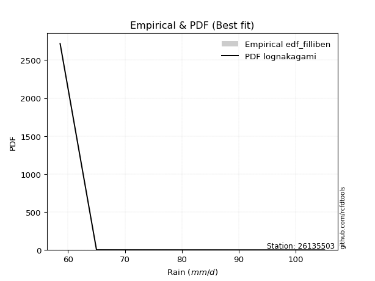</img>

</div>


### 10. EDF Jenkinson (1977)

The Jenkinson formula in hydrology is an empirical plotting position formula used to estimate the non-exceedance probability _(P)_ or return period _(T)_ of a given ordered observation within a sample. It is a widely used method in the frequency analysis of extreme events such as floods and rainfall, as it provides a distribution-free way to plot data. _a≈0.31_ and _b≈0.38_ are constants derived to approximate the median of the probability distribution for the given rank.

<div align="center">


$P=(m-a)/(n+b)$


</div>


**10.1. Empirical values**

<div align="center">

|                | 0                   | 1                   | 2                   | 3             | 4                  | 5                  | 6                  |
|:---------------|:--------------------|:--------------------|:--------------------|:--------------|:-------------------|:-------------------|:-------------------|
| date           | 2022                | 2021                | 2018                | 2020          | 2023               | 2017               | 2019               |
| x              | 58.6                | 65.0                | 66.7                | 70.4          | 74.3               | 102.8              | 105.1              |
| m              | 1                   | 2                   | 3                   | 4             | 5                  | 6                  | 7                  |
| empirical_dist | edf_jenkinson       | edf_jenkinson       | edf_jenkinson       | edf_jenkinson | edf_jenkinson      | edf_jenkinson      | edf_jenkinson      |
| empirical      | 0.09349593495934959 | 0.22899728997289973 | 0.36449864498644985 | 0.5           | 0.6355013550135502 | 0.7710027100271003 | 0.9065040650406505 |
| empirical_tr   | 1.1031390134529149  | 1.29701230228471    | 1.5735607675906182  | 2.0           | 2.743494423791822  | 4.366863905325444  | 10.695652173913055 |

</div>


**10.2. Kolmogorov-Smirnov fit test (sorted by Δ)**


<div align="center">

|                | 0                   | 1                   | 2                   | 3                   | 4                   | 5                   | 6                   | 7                   | 8                   | 9                   | 10                  | 11                  | 12                  | 13                  | 14                  | 15                  | 16                  | 17                    | 18                  | 19                  | 20                  | 21                  | 22                  | 23                  | 24                  | 25                  | 26                  | 27                  | 28                  | 29                  | 30                  | 31                  | 32                  | 33                  | 34                  | 35                  | 36                  | 37                  | 38                  | 39                  | 40                  | 41                  | 42                  | 43                  | 44                  | 45                  | 46                  | 47                  | 48                  | 49                  | 50                  | 51                  | 52                  | 53                  | 54                  | 55                  | 56                  | 57                  | 58                  | 59                  | 60                  | 61                  | 62                  | 63                  | 64                  | 65                  | 66                  | 67                  | 68                  | 69                  | 70                  | 71                  | 72                  | 73                  | 74                  | 75                  | 76                  | 77                  | 78                  | 79                  | 80                  | 81                  | 82                  | 83                  | 84                  | 85                  | 86                  | 87                  |
|:---------------|:--------------------|:--------------------|:--------------------|:--------------------|:--------------------|:--------------------|:--------------------|:--------------------|:--------------------|:--------------------|:--------------------|:--------------------|:--------------------|:--------------------|:--------------------|:--------------------|:--------------------|:----------------------|:--------------------|:--------------------|:--------------------|:--------------------|:--------------------|:--------------------|:--------------------|:--------------------|:--------------------|:--------------------|:--------------------|:--------------------|:--------------------|:--------------------|:--------------------|:--------------------|:--------------------|:--------------------|:--------------------|:--------------------|:--------------------|:--------------------|:--------------------|:--------------------|:--------------------|:--------------------|:--------------------|:--------------------|:--------------------|:--------------------|:--------------------|:--------------------|:--------------------|:--------------------|:--------------------|:--------------------|:--------------------|:--------------------|:--------------------|:--------------------|:--------------------|:--------------------|:--------------------|:--------------------|:--------------------|:--------------------|:--------------------|:--------------------|:--------------------|:--------------------|:--------------------|:--------------------|:--------------------|:--------------------|:--------------------|:--------------------|:--------------------|:--------------------|:--------------------|:--------------------|:--------------------|:--------------------|:--------------------|:--------------------|:--------------------|:--------------------|:--------------------|:--------------------|:--------------------|:--------------------|
| station        | 26135503            | 26135503            | 26135503            | 26135503            | 26135503            | 26135503            | 26135503            | 26135503            | 26135503            | 26135503            | 26135503            | 26135503            | 26135503            | 26135503            | 26135503            | 26135503            | 26135503            | 26135503              | 26135503            | 26135503            | 26135503            | 26135503            | 26135503            | 26135503            | 26135503            | 26135503            | 26135503            | 26135503            | 26135503            | 26135503            | 26135503            | 26135503            | 26135503            | 26135503            | 26135503            | 26135503            | 26135503            | 26135503            | 26135503            | 26135503            | 26135503            | 26135503            | 26135503            | 26135503            | 26135503            | 26135503            | 26135503            | 26135503            | 26135503            | 26135503            | 26135503            | 26135503            | 26135503            | 26135503            | 26135503            | 26135503            | 26135503            | 26135503            | 26135503            | 26135503            | 26135503            | 26135503            | 26135503            | 26135503            | 26135503            | 26135503            | 26135503            | 26135503            | 26135503            | 26135503            | 26135503            | 26135503            | 26135503            | 26135503            | 26135503            | 26135503            | 26135503            | 26135503            | 26135503            | 26135503            | 26135503            | 26135503            | 26135503            | 26135503            | 26135503            | 26135503            | 26135503            | 26135503            |
| empirical_dist | edf_jenkinson       | edf_jenkinson       | edf_jenkinson       | edf_jenkinson       | edf_jenkinson       | edf_jenkinson       | edf_jenkinson       | edf_jenkinson       | edf_jenkinson       | edf_jenkinson       | edf_jenkinson       | edf_jenkinson       | edf_jenkinson       | edf_jenkinson       | edf_jenkinson       | edf_jenkinson       | edf_jenkinson       | edf_jenkinson         | edf_jenkinson       | edf_jenkinson       | edf_jenkinson       | edf_jenkinson       | edf_jenkinson       | edf_jenkinson       | edf_jenkinson       | edf_jenkinson       | edf_jenkinson       | edf_jenkinson       | edf_jenkinson       | edf_jenkinson       | edf_jenkinson       | edf_jenkinson       | edf_jenkinson       | edf_jenkinson       | edf_jenkinson       | edf_jenkinson       | edf_jenkinson       | edf_jenkinson       | edf_jenkinson       | edf_jenkinson       | edf_jenkinson       | edf_jenkinson       | edf_jenkinson       | edf_jenkinson       | edf_jenkinson       | edf_jenkinson       | edf_jenkinson       | edf_jenkinson       | edf_jenkinson       | edf_jenkinson       | edf_jenkinson       | edf_jenkinson       | edf_jenkinson       | edf_jenkinson       | edf_jenkinson       | edf_jenkinson       | edf_jenkinson       | edf_jenkinson       | edf_jenkinson       | edf_jenkinson       | edf_jenkinson       | edf_jenkinson       | edf_jenkinson       | edf_jenkinson       | edf_jenkinson       | edf_jenkinson       | edf_jenkinson       | edf_jenkinson       | edf_jenkinson       | edf_jenkinson       | edf_jenkinson       | edf_jenkinson       | edf_jenkinson       | edf_jenkinson       | edf_jenkinson       | edf_jenkinson       | edf_jenkinson       | edf_jenkinson       | edf_jenkinson       | edf_jenkinson       | edf_jenkinson       | edf_jenkinson       | edf_jenkinson       | edf_jenkinson       | edf_jenkinson       | edf_jenkinson       | edf_jenkinson       | edf_jenkinson       |
| p_dist         | fisk                | lognakagami         | logfisk             | logexpon            | logfatiguelife      | loggenexpon         | invweibull          | alpha               | logexponnorm        | loginvgauss         | invgamma            | invgauss            | exponnorm           | expon               | genexpon            | loginvweibull       | loghalfnorm         | loglaplace_asymmetric | halfnorm            | lograyleigh         | logmielke           | gompertz            | loghalflogistic     | halflogistic        | logmaxwell          | laplace_asymmetric  | logpearson3         | logmoyal            | loggumbel_r         | loggompertz         | moyal               | gumbel_r            | logncf              | logkstwobign        | nct                 | logrice             | logwald             | loggenlogistic      | mielke              | wald                | lognct              | logf                | logalpha            | kstwobign           | f                   | betaprime           | pearson3            | rayleigh            | logbetaprime        | genlogistic         | loginvgamma         | logjohnsonsu        | logt                | lognorm             | lognorm             | logcrystalball      | logloggamma         | maxwell             | loglogistic         | loghypsecant        | erlang              | loglaplace          | rice                | johnsonsu           | norm                | crystalball         | truncnorm           | t                   | logtruncnorm        | logistic            | logweibull_min      | loggibrat           | hypsecant           | logerlang           | loggumbel_l         | laplace             | gibrat              | gumbel_l            | ncf                 | logchi2             | weibull_min         | loggamma            | loggamma            | loglognorm          | nakagami            | fatiguelife         | gamma               | chi2                |
| delta          | 0.10713917226250114 | 0.11108864188329026 | 0.11378850523074047 | 0.11657879956903694 | 0.12716237953832354 | 0.12819249752024042 | 0.12848985524054846 | 0.12876647763890747 | 0.12928997204302994 | 0.12942616693820874 | 0.12946631179380141 | 0.13064914736853384 | 0.130892269578477   | 0.13185466124111478 | 0.13185586468243038 | 0.1326059880727818  | 0.13384036941585886 | 0.1345722603344105    | 0.13564536344110678 | 0.1400421629437113  | 0.1402607331014718  | 0.14051090285926138 | 0.14082844622142432 | 0.14228177756807814 | 0.14313422129398456 | 0.1433529444134567  | 0.14413234443864675 | 0.14420791948489786 | 0.1447399061074358  | 0.14553722573849004 | 0.14562401933191071 | 0.14629938776753726 | 0.14892661494126047 | 0.15214713515916    | 0.15257715736755062 | 0.15313183978290063 | 0.15317856768052807 | 0.15330386362368897 | 0.15378520023785558 | 0.15420028112693207 | 0.1559259553931162  | 0.15860413093625095 | 0.15909176687488036 | 0.16110941623016928 | 0.16157597316157285 | 0.16220334903651268 | 0.16329378477865786 | 0.16367340995853752 | 0.16392321604748328 | 0.16473095957455242 | 0.1651153798399178  | 0.17284789387340194 | 0.1728651417961381  | 0.1728653778858047  | 0.1728653778858047  | 0.17286592557768987 | 0.17340193304250673 | 0.17583393955189436 | 0.17793042616978705 | 0.1822301336355714  | 0.18250132854574563 | 0.19761393320870535 | 0.20522733012199085 | 0.2097150984498687  | 0.21021371699063135 | 0.21021372664463056 | 0.21021375225481254 | 0.21021479796768439 | 0.21377050929804076 | 0.22010273518250856 | 0.222459534412746   | 0.22387242752272674 | 0.2283482808110387  | 0.2418405720017144  | 0.24335442074429275 | 0.25244112639478516 | 0.25559413004908177 | 0.27892746367307775 | 0.28156735786904374 | 0.34227118552940095 | 0.34892253358236547 | 0.3764377473659669  | 0.3764377473659669  | 0.40238403897123265 | 0.44552310212231894 | 0.5126185778930612  | 0.5839504523772532  | 0.7562892291524085  |
| deltao         | 0.48442053926100004 | 0.48442053926100004 | 0.48442053926100004 | 0.48442053926100004 | 0.48442053926100004 | 0.48442053926100004 | 0.48442053926100004 | 0.48442053926100004 | 0.48442053926100004 | 0.48442053926100004 | 0.48442053926100004 | 0.48442053926100004 | 0.48442053926100004 | 0.48442053926100004 | 0.48442053926100004 | 0.48442053926100004 | 0.48442053926100004 | 0.48442053926100004   | 0.48442053926100004 | 0.48442053926100004 | 0.48442053926100004 | 0.48442053926100004 | 0.48442053926100004 | 0.48442053926100004 | 0.48442053926100004 | 0.48442053926100004 | 0.48442053926100004 | 0.48442053926100004 | 0.48442053926100004 | 0.48442053926100004 | 0.48442053926100004 | 0.48442053926100004 | 0.48442053926100004 | 0.48442053926100004 | 0.48442053926100004 | 0.48442053926100004 | 0.48442053926100004 | 0.48442053926100004 | 0.48442053926100004 | 0.48442053926100004 | 0.48442053926100004 | 0.48442053926100004 | 0.48442053926100004 | 0.48442053926100004 | 0.48442053926100004 | 0.48442053926100004 | 0.48442053926100004 | 0.48442053926100004 | 0.48442053926100004 | 0.48442053926100004 | 0.48442053926100004 | 0.48442053926100004 | 0.48442053926100004 | 0.48442053926100004 | 0.48442053926100004 | 0.48442053926100004 | 0.48442053926100004 | 0.48442053926100004 | 0.48442053926100004 | 0.48442053926100004 | 0.48442053926100004 | 0.48442053926100004 | 0.48442053926100004 | 0.48442053926100004 | 0.48442053926100004 | 0.48442053926100004 | 0.48442053926100004 | 0.48442053926100004 | 0.48442053926100004 | 0.48442053926100004 | 0.48442053926100004 | 0.48442053926100004 | 0.48442053926100004 | 0.48442053926100004 | 0.48442053926100004 | 0.48442053926100004 | 0.48442053926100004 | 0.48442053926100004 | 0.48442053926100004 | 0.48442053926100004 | 0.48442053926100004 | 0.48442053926100004 | 0.48442053926100004 | 0.48442053926100004 | 0.48442053926100004 | 0.48442053926100004 | 0.48442053926100004 | 0.48442053926100004 |
| eval           | Δo > Δ              | Δo > Δ              | Δo > Δ              | Δo > Δ              | Δo > Δ              | Δo > Δ              | Δo > Δ              | Δo > Δ              | Δo > Δ              | Δo > Δ              | Δo > Δ              | Δo > Δ              | Δo > Δ              | Δo > Δ              | Δo > Δ              | Δo > Δ              | Δo > Δ              | Δo > Δ                | Δo > Δ              | Δo > Δ              | Δo > Δ              | Δo > Δ              | Δo > Δ              | Δo > Δ              | Δo > Δ              | Δo > Δ              | Δo > Δ              | Δo > Δ              | Δo > Δ              | Δo > Δ              | Δo > Δ              | Δo > Δ              | Δo > Δ              | Δo > Δ              | Δo > Δ              | Δo > Δ              | Δo > Δ              | Δo > Δ              | Δo > Δ              | Δo > Δ              | Δo > Δ              | Δo > Δ              | Δo > Δ              | Δo > Δ              | Δo > Δ              | Δo > Δ              | Δo > Δ              | Δo > Δ              | Δo > Δ              | Δo > Δ              | Δo > Δ              | Δo > Δ              | Δo > Δ              | Δo > Δ              | Δo > Δ              | Δo > Δ              | Δo > Δ              | Δo > Δ              | Δo > Δ              | Δo > Δ              | Δo > Δ              | Δo > Δ              | Δo > Δ              | Δo > Δ              | Δo > Δ              | Δo > Δ              | Δo > Δ              | Δo > Δ              | Δo > Δ              | Δo > Δ              | Δo > Δ              | Δo > Δ              | Δo > Δ              | Δo > Δ              | Δo > Δ              | Δo > Δ              | Δo > Δ              | Δo > Δ              | Δo > Δ              | Δo > Δ              | Δo > Δ              | Δo > Δ              | Δo > Δ              | Δo > Δ              | Δo > Δ              | Δo <= Δ             | Δo <= Δ             | Δo <= Δ             |
| fit            | 1                   | 1                   | 1                   | 1                   | 1                   | 1                   | 1                   | 1                   | 1                   | 1                   | 1                   | 1                   | 1                   | 1                   | 1                   | 1                   | 1                   | 1                     | 1                   | 1                   | 1                   | 1                   | 1                   | 1                   | 1                   | 1                   | 1                   | 1                   | 1                   | 1                   | 1                   | 1                   | 1                   | 1                   | 1                   | 1                   | 1                   | 1                   | 1                   | 1                   | 1                   | 1                   | 1                   | 1                   | 1                   | 1                   | 1                   | 1                   | 1                   | 1                   | 1                   | 1                   | 1                   | 1                   | 1                   | 1                   | 1                   | 1                   | 1                   | 1                   | 1                   | 1                   | 1                   | 1                   | 1                   | 1                   | 1                   | 1                   | 1                   | 1                   | 1                   | 1                   | 1                   | 1                   | 1                   | 1                   | 1                   | 1                   | 1                   | 1                   | 1                   | 1                   | 1                   | 1                   | 1                   | 0                   | 0                   | 0                   |
| n              | 7                   | 7                   | 7                   | 7                   | 7                   | 7                   | 7                   | 7                   | 7                   | 7                   | 7                   | 7                   | 7                   | 7                   | 7                   | 7                   | 7                   | 7                     | 7                   | 7                   | 7                   | 7                   | 7                   | 7                   | 7                   | 7                   | 7                   | 7                   | 7                   | 7                   | 7                   | 7                   | 7                   | 7                   | 7                   | 7                   | 7                   | 7                   | 7                   | 7                   | 7                   | 7                   | 7                   | 7                   | 7                   | 7                   | 7                   | 7                   | 7                   | 7                   | 7                   | 7                   | 7                   | 7                   | 7                   | 7                   | 7                   | 7                   | 7                   | 7                   | 7                   | 7                   | 7                   | 7                   | 7                   | 7                   | 7                   | 7                   | 7                   | 7                   | 7                   | 7                   | 7                   | 7                   | 7                   | 7                   | 7                   | 7                   | 7                   | 7                   | 7                   | 7                   | 7                   | 7                   | 7                   | 7                   | 7                   | 7                   |
| best_fit       | 1                   | 0                   | 0                   | 0                   | 0                   | 0                   | 0                   | 0                   | 0                   | 0                   | 0                   | 0                   | 0                   | 0                   | 0                   | 0                   | 0                   | 0                     | 0                   | 0                   | 0                   | 0                   | 0                   | 0                   | 0                   | 0                   | 0                   | 0                   | 0                   | 0                   | 0                   | 0                   | 0                   | 0                   | 0                   | 0                   | 0                   | 0                   | 0                   | 0                   | 0                   | 0                   | 0                   | 0                   | 0                   | 0                   | 0                   | 0                   | 0                   | 0                   | 0                   | 0                   | 0                   | 0                   | 0                   | 0                   | 0                   | 0                   | 0                   | 0                   | 0                   | 0                   | 0                   | 0                   | 0                   | 0                   | 0                   | 0                   | 0                   | 0                   | 0                   | 0                   | 0                   | 0                   | 0                   | 0                   | 0                   | 0                   | 0                   | 0                   | 0                   | 0                   | 0                   | 0                   | 0                   | 0                   | 0                   | 0                   |
| best_fit_sort  | 1                   | 2                   | 3                   | 4                   | 5                   | 6                   | 7                   | 8                   | 9                   | 10                  | 11                  | 12                  | 13                  | 14                  | 15                  | 16                  | 17                  | 18                    | 19                  | 20                  | 21                  | 22                  | 23                  | 24                  | 25                  | 26                  | 27                  | 28                  | 29                  | 30                  | 31                  | 32                  | 33                  | 34                  | 35                  | 36                  | 37                  | 38                  | 39                  | 40                  | 41                  | 42                  | 43                  | 44                  | 45                  | 46                  | 47                  | 48                  | 49                  | 50                  | 51                  | 52                  | 53                  | 54                  | 55                  | 56                  | 57                  | 58                  | 59                  | 60                  | 61                  | 62                  | 63                  | 64                  | 65                  | 66                  | 67                  | 68                  | 69                  | 70                  | 71                  | 72                  | 73                  | 74                  | 75                  | 76                  | 77                  | 78                  | 79                  | 80                  | 81                  | 82                  | 83                  | 84                  | 85                  | 86                  | 87                  | 88                  |

</div>


**10.3. Best fit**

<div align="center">

|   id |   station | empirical_dist   | p_dist   |    delta |   deltao | eval   |   fit |   n |   best_fit |   best_fit_sort |
|-----:|----------:|:-----------------|:---------|---------:|---------:|:-------|------:|----:|-----------:|----------------:|
|    0 |  26135503 | edf_jenkinson    | fisk     | 0.107139 | 0.484421 | Δo > Δ |     1 |   7 |          1 |               1 |

</div>


<div align="center">

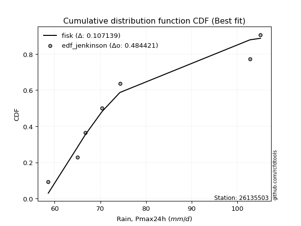</img>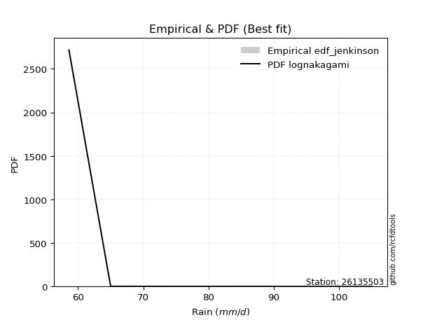</img>

</div>


### 11. EDF Cunnane (1978)

Cunnane´s work in statistical hydrology has focused on the performance and evaluation of different probability distributions (such as GEV, Gumbel, Lognormal) for flood frequency estimation. _b_ is a constant, typically set to 0.4.

<div align="center">


$P=(m-b)/(n+1-2b)$


</div>


**11.1. Empirical values**

<div align="center">

|                | 0                   | 1                   | 2                  | 3           | 4                  | 5                  | 6                  |
|:---------------|:--------------------|:--------------------|:-------------------|:------------|:-------------------|:-------------------|:-------------------|
| date           | 2022                | 2021                | 2018               | 2020        | 2023               | 2017               | 2019               |
| x              | 58.6                | 65.0                | 66.7               | 70.4        | 74.3               | 102.8              | 105.1              |
| m              | 1                   | 2                   | 3                  | 4           | 5                  | 6                  | 7                  |
| empirical_dist | edf_cunnane         | edf_cunnane         | edf_cunnane        | edf_cunnane | edf_cunnane        | edf_cunnane        | edf_cunnane        |
| empirical      | 0.08333333333333333 | 0.22222222222222224 | 0.3611111111111111 | 0.5         | 0.6388888888888888 | 0.7777777777777777 | 0.9166666666666666 |
| empirical_tr   | 1.090909090909091   | 1.2857142857142856  | 1.565217391304348  | 2.0         | 2.7692307692307687 | 4.499999999999998  | 11.999999999999995 |

</div>


**11.2. Kolmogorov-Smirnov fit test (sorted by Δ)**


<div align="center">

|                | 0                   | 1                   | 2                   | 3                   | 4                   | 5                   | 6                   | 7                   | 8                   | 9                   | 10                  | 11                  | 12                  | 13                  | 14                  | 15                  | 16                  | 17                    | 18                  | 19                  | 20                  | 21                  | 22                  | 23                  | 24                  | 25                  | 26                  | 27                  | 28                  | 29                  | 30                  | 31                  | 32                  | 33                  | 34                  | 35                  | 36                  | 37                  | 38                  | 39                  | 40                  | 41                  | 42                  | 43                  | 44                  | 45                  | 46                  | 47                  | 48                  | 49                  | 50                  | 51                  | 52                  | 53                  | 54                  | 55                  | 56                  | 57                  | 58                  | 59                  | 60                  | 61                  | 62                  | 63                  | 64                  | 65                  | 66                  | 67                  | 68                  | 69                  | 70                  | 71                  | 72                  | 73                  | 74                  | 75                  | 76                  | 77                  | 78                  | 79                  | 80                  | 81                  | 82                  | 83                  | 84                  | 85                  | 86                  | 87                  |
|:---------------|:--------------------|:--------------------|:--------------------|:--------------------|:--------------------|:--------------------|:--------------------|:--------------------|:--------------------|:--------------------|:--------------------|:--------------------|:--------------------|:--------------------|:--------------------|:--------------------|:--------------------|:----------------------|:--------------------|:--------------------|:--------------------|:--------------------|:--------------------|:--------------------|:--------------------|:--------------------|:--------------------|:--------------------|:--------------------|:--------------------|:--------------------|:--------------------|:--------------------|:--------------------|:--------------------|:--------------------|:--------------------|:--------------------|:--------------------|:--------------------|:--------------------|:--------------------|:--------------------|:--------------------|:--------------------|:--------------------|:--------------------|:--------------------|:--------------------|:--------------------|:--------------------|:--------------------|:--------------------|:--------------------|:--------------------|:--------------------|:--------------------|:--------------------|:--------------------|:--------------------|:--------------------|:--------------------|:--------------------|:--------------------|:--------------------|:--------------------|:--------------------|:--------------------|:--------------------|:--------------------|:--------------------|:--------------------|:--------------------|:--------------------|:--------------------|:--------------------|:--------------------|:--------------------|:--------------------|:--------------------|:--------------------|:--------------------|:--------------------|:--------------------|:--------------------|:--------------------|:--------------------|:--------------------|
| station        | 26135503            | 26135503            | 26135503            | 26135503            | 26135503            | 26135503            | 26135503            | 26135503            | 26135503            | 26135503            | 26135503            | 26135503            | 26135503            | 26135503            | 26135503            | 26135503            | 26135503            | 26135503              | 26135503            | 26135503            | 26135503            | 26135503            | 26135503            | 26135503            | 26135503            | 26135503            | 26135503            | 26135503            | 26135503            | 26135503            | 26135503            | 26135503            | 26135503            | 26135503            | 26135503            | 26135503            | 26135503            | 26135503            | 26135503            | 26135503            | 26135503            | 26135503            | 26135503            | 26135503            | 26135503            | 26135503            | 26135503            | 26135503            | 26135503            | 26135503            | 26135503            | 26135503            | 26135503            | 26135503            | 26135503            | 26135503            | 26135503            | 26135503            | 26135503            | 26135503            | 26135503            | 26135503            | 26135503            | 26135503            | 26135503            | 26135503            | 26135503            | 26135503            | 26135503            | 26135503            | 26135503            | 26135503            | 26135503            | 26135503            | 26135503            | 26135503            | 26135503            | 26135503            | 26135503            | 26135503            | 26135503            | 26135503            | 26135503            | 26135503            | 26135503            | 26135503            | 26135503            | 26135503            |
| empirical_dist | edf_cunnane         | edf_cunnane         | edf_cunnane         | edf_cunnane         | edf_cunnane         | edf_cunnane         | edf_cunnane         | edf_cunnane         | edf_cunnane         | edf_cunnane         | edf_cunnane         | edf_cunnane         | edf_cunnane         | edf_cunnane         | edf_cunnane         | edf_cunnane         | edf_cunnane         | edf_cunnane           | edf_cunnane         | edf_cunnane         | edf_cunnane         | edf_cunnane         | edf_cunnane         | edf_cunnane         | edf_cunnane         | edf_cunnane         | edf_cunnane         | edf_cunnane         | edf_cunnane         | edf_cunnane         | edf_cunnane         | edf_cunnane         | edf_cunnane         | edf_cunnane         | edf_cunnane         | edf_cunnane         | edf_cunnane         | edf_cunnane         | edf_cunnane         | edf_cunnane         | edf_cunnane         | edf_cunnane         | edf_cunnane         | edf_cunnane         | edf_cunnane         | edf_cunnane         | edf_cunnane         | edf_cunnane         | edf_cunnane         | edf_cunnane         | edf_cunnane         | edf_cunnane         | edf_cunnane         | edf_cunnane         | edf_cunnane         | edf_cunnane         | edf_cunnane         | edf_cunnane         | edf_cunnane         | edf_cunnane         | edf_cunnane         | edf_cunnane         | edf_cunnane         | edf_cunnane         | edf_cunnane         | edf_cunnane         | edf_cunnane         | edf_cunnane         | edf_cunnane         | edf_cunnane         | edf_cunnane         | edf_cunnane         | edf_cunnane         | edf_cunnane         | edf_cunnane         | edf_cunnane         | edf_cunnane         | edf_cunnane         | edf_cunnane         | edf_cunnane         | edf_cunnane         | edf_cunnane         | edf_cunnane         | edf_cunnane         | edf_cunnane         | edf_cunnane         | edf_cunnane         | edf_cunnane         |
| p_dist         | fisk                | logfisk             | logexpon            | lognakagami         | logfatiguelife      | loggenexpon         | invweibull          | alpha               | logexponnorm        | loginvgauss         | invgamma            | invgauss            | exponnorm           | expon               | genexpon            | loginvweibull       | loghalfnorm         | loglaplace_asymmetric | halfnorm            | lograyleigh         | logmielke           | gompertz            | loghalflogistic     | halflogistic        | laplace_asymmetric  | logpearson3         | logmoyal            | loggumbel_r         | loggompertz         | moyal               | logmaxwell          | logncf              | logkstwobign        | logwald             | loggenlogistic      | mielke              | wald                | gumbel_r            | nct                 | logalpha            | logrice             | logbetaprime        | genlogistic         | lognct              | kstwobign           | f                   | logf                | betaprime           | pearson3            | rayleigh            | loginvgamma         | erlang              | logjohnsonsu        | logt                | lognorm             | lognorm             | logcrystalball      | logloggamma         | maxwell             | loglogistic         | loghypsecant        | loglaplace          | logtruncnorm        | rice                | johnsonsu           | norm                | crystalball         | truncnorm           | t                   | loggibrat           | logistic            | logweibull_min      | hypsecant           | loggumbel_l         | logerlang           | gibrat              | laplace             | gumbel_l            | ncf                 | logchi2             | weibull_min         | loggamma            | loggamma            | loglognorm          | nakagami            | fatiguelife         | gamma               | chi2                |
| delta          | 0.10036410451182376 | 0.10701343748006309 | 0.10980373181835956 | 0.1144761757586289  | 0.12038731178764617 | 0.12141742976956305 | 0.12171478748987108 | 0.1219914098882301  | 0.12251490429235257 | 0.12265109918753136 | 0.12269124404312404 | 0.12387407961785646 | 0.12411720182779962 | 0.1250795934904374  | 0.125080796931753   | 0.1258309203221044  | 0.12706530166518148 | 0.12779719258373312   | 0.13265918791580344 | 0.13326709519303392 | 0.13348566535079442 | 0.133735835108584   | 0.13405337847074694 | 0.13550670981740076 | 0.13657787666277932 | 0.13735727668796938 | 0.13743285173422048 | 0.13796483835675843 | 0.13876215798781266 | 0.13884895158123334 | 0.14211146119443208 | 0.1421515471905831  | 0.14537206740848263 | 0.1464034999298507  | 0.1465287958730116  | 0.1470101324871782  | 0.1474252133762547  | 0.14965114532060286 | 0.1500659557771139  | 0.15231669912420298 | 0.15651937365823926 | 0.1571481482968059  | 0.15795589182387504 | 0.15931348926845484 | 0.16029452235628072 | 0.16496350703691148 | 0.16537919868692844 | 0.1655908829118513  | 0.1666813186539965  | 0.16706094383387615 | 0.16850291371525644 | 0.17572626079506826 | 0.17623542774874057 | 0.17625267567147673 | 0.17625291176114333 | 0.17625291176114333 | 0.1762534594530285  | 0.17678946691784536 | 0.179221473427233   | 0.18131796004512568 | 0.18561766751091002 | 0.20100146708404398 | 0.20699544154736338 | 0.20861486399732948 | 0.21310263232520732 | 0.21360125086596998 | 0.2136012605199692  | 0.21360128613015117 | 0.21360233184302302 | 0.2200460242587028  | 0.2234902690578472  | 0.22923460216342348 | 0.23173581468637733 | 0.2467419546196314  | 0.2486156397523919  | 0.252206596173743   | 0.2558286602701238  | 0.2823149975484164  | 0.29172995949505987 | 0.35243378715541707 | 0.35569760133304296 | 0.3832128151166444  | 0.3832128151166444  | 0.40915910672191014 | 0.4522981698729964  | 0.5193936456437387  | 0.5907255201279307  | 0.763064296903086   |
| deltao         | 0.48442053926100004 | 0.48442053926100004 | 0.48442053926100004 | 0.48442053926100004 | 0.48442053926100004 | 0.48442053926100004 | 0.48442053926100004 | 0.48442053926100004 | 0.48442053926100004 | 0.48442053926100004 | 0.48442053926100004 | 0.48442053926100004 | 0.48442053926100004 | 0.48442053926100004 | 0.48442053926100004 | 0.48442053926100004 | 0.48442053926100004 | 0.48442053926100004   | 0.48442053926100004 | 0.48442053926100004 | 0.48442053926100004 | 0.48442053926100004 | 0.48442053926100004 | 0.48442053926100004 | 0.48442053926100004 | 0.48442053926100004 | 0.48442053926100004 | 0.48442053926100004 | 0.48442053926100004 | 0.48442053926100004 | 0.48442053926100004 | 0.48442053926100004 | 0.48442053926100004 | 0.48442053926100004 | 0.48442053926100004 | 0.48442053926100004 | 0.48442053926100004 | 0.48442053926100004 | 0.48442053926100004 | 0.48442053926100004 | 0.48442053926100004 | 0.48442053926100004 | 0.48442053926100004 | 0.48442053926100004 | 0.48442053926100004 | 0.48442053926100004 | 0.48442053926100004 | 0.48442053926100004 | 0.48442053926100004 | 0.48442053926100004 | 0.48442053926100004 | 0.48442053926100004 | 0.48442053926100004 | 0.48442053926100004 | 0.48442053926100004 | 0.48442053926100004 | 0.48442053926100004 | 0.48442053926100004 | 0.48442053926100004 | 0.48442053926100004 | 0.48442053926100004 | 0.48442053926100004 | 0.48442053926100004 | 0.48442053926100004 | 0.48442053926100004 | 0.48442053926100004 | 0.48442053926100004 | 0.48442053926100004 | 0.48442053926100004 | 0.48442053926100004 | 0.48442053926100004 | 0.48442053926100004 | 0.48442053926100004 | 0.48442053926100004 | 0.48442053926100004 | 0.48442053926100004 | 0.48442053926100004 | 0.48442053926100004 | 0.48442053926100004 | 0.48442053926100004 | 0.48442053926100004 | 0.48442053926100004 | 0.48442053926100004 | 0.48442053926100004 | 0.48442053926100004 | 0.48442053926100004 | 0.48442053926100004 | 0.48442053926100004 |
| eval           | Δo > Δ              | Δo > Δ              | Δo > Δ              | Δo > Δ              | Δo > Δ              | Δo > Δ              | Δo > Δ              | Δo > Δ              | Δo > Δ              | Δo > Δ              | Δo > Δ              | Δo > Δ              | Δo > Δ              | Δo > Δ              | Δo > Δ              | Δo > Δ              | Δo > Δ              | Δo > Δ                | Δo > Δ              | Δo > Δ              | Δo > Δ              | Δo > Δ              | Δo > Δ              | Δo > Δ              | Δo > Δ              | Δo > Δ              | Δo > Δ              | Δo > Δ              | Δo > Δ              | Δo > Δ              | Δo > Δ              | Δo > Δ              | Δo > Δ              | Δo > Δ              | Δo > Δ              | Δo > Δ              | Δo > Δ              | Δo > Δ              | Δo > Δ              | Δo > Δ              | Δo > Δ              | Δo > Δ              | Δo > Δ              | Δo > Δ              | Δo > Δ              | Δo > Δ              | Δo > Δ              | Δo > Δ              | Δo > Δ              | Δo > Δ              | Δo > Δ              | Δo > Δ              | Δo > Δ              | Δo > Δ              | Δo > Δ              | Δo > Δ              | Δo > Δ              | Δo > Δ              | Δo > Δ              | Δo > Δ              | Δo > Δ              | Δo > Δ              | Δo > Δ              | Δo > Δ              | Δo > Δ              | Δo > Δ              | Δo > Δ              | Δo > Δ              | Δo > Δ              | Δo > Δ              | Δo > Δ              | Δo > Δ              | Δo > Δ              | Δo > Δ              | Δo > Δ              | Δo > Δ              | Δo > Δ              | Δo > Δ              | Δo > Δ              | Δo > Δ              | Δo > Δ              | Δo > Δ              | Δo > Δ              | Δo > Δ              | Δo > Δ              | Δo <= Δ             | Δo <= Δ             | Δo <= Δ             |
| fit            | 1                   | 1                   | 1                   | 1                   | 1                   | 1                   | 1                   | 1                   | 1                   | 1                   | 1                   | 1                   | 1                   | 1                   | 1                   | 1                   | 1                   | 1                     | 1                   | 1                   | 1                   | 1                   | 1                   | 1                   | 1                   | 1                   | 1                   | 1                   | 1                   | 1                   | 1                   | 1                   | 1                   | 1                   | 1                   | 1                   | 1                   | 1                   | 1                   | 1                   | 1                   | 1                   | 1                   | 1                   | 1                   | 1                   | 1                   | 1                   | 1                   | 1                   | 1                   | 1                   | 1                   | 1                   | 1                   | 1                   | 1                   | 1                   | 1                   | 1                   | 1                   | 1                   | 1                   | 1                   | 1                   | 1                   | 1                   | 1                   | 1                   | 1                   | 1                   | 1                   | 1                   | 1                   | 1                   | 1                   | 1                   | 1                   | 1                   | 1                   | 1                   | 1                   | 1                   | 1                   | 1                   | 0                   | 0                   | 0                   |
| n              | 7                   | 7                   | 7                   | 7                   | 7                   | 7                   | 7                   | 7                   | 7                   | 7                   | 7                   | 7                   | 7                   | 7                   | 7                   | 7                   | 7                   | 7                     | 7                   | 7                   | 7                   | 7                   | 7                   | 7                   | 7                   | 7                   | 7                   | 7                   | 7                   | 7                   | 7                   | 7                   | 7                   | 7                   | 7                   | 7                   | 7                   | 7                   | 7                   | 7                   | 7                   | 7                   | 7                   | 7                   | 7                   | 7                   | 7                   | 7                   | 7                   | 7                   | 7                   | 7                   | 7                   | 7                   | 7                   | 7                   | 7                   | 7                   | 7                   | 7                   | 7                   | 7                   | 7                   | 7                   | 7                   | 7                   | 7                   | 7                   | 7                   | 7                   | 7                   | 7                   | 7                   | 7                   | 7                   | 7                   | 7                   | 7                   | 7                   | 7                   | 7                   | 7                   | 7                   | 7                   | 7                   | 7                   | 7                   | 7                   |
| best_fit       | 1                   | 0                   | 0                   | 0                   | 0                   | 0                   | 0                   | 0                   | 0                   | 0                   | 0                   | 0                   | 0                   | 0                   | 0                   | 0                   | 0                   | 0                     | 0                   | 0                   | 0                   | 0                   | 0                   | 0                   | 0                   | 0                   | 0                   | 0                   | 0                   | 0                   | 0                   | 0                   | 0                   | 0                   | 0                   | 0                   | 0                   | 0                   | 0                   | 0                   | 0                   | 0                   | 0                   | 0                   | 0                   | 0                   | 0                   | 0                   | 0                   | 0                   | 0                   | 0                   | 0                   | 0                   | 0                   | 0                   | 0                   | 0                   | 0                   | 0                   | 0                   | 0                   | 0                   | 0                   | 0                   | 0                   | 0                   | 0                   | 0                   | 0                   | 0                   | 0                   | 0                   | 0                   | 0                   | 0                   | 0                   | 0                   | 0                   | 0                   | 0                   | 0                   | 0                   | 0                   | 0                   | 0                   | 0                   | 0                   |
| best_fit_sort  | 1                   | 2                   | 3                   | 4                   | 5                   | 6                   | 7                   | 8                   | 9                   | 10                  | 11                  | 12                  | 13                  | 14                  | 15                  | 16                  | 17                  | 18                    | 19                  | 20                  | 21                  | 22                  | 23                  | 24                  | 25                  | 26                  | 27                  | 28                  | 29                  | 30                  | 31                  | 32                  | 33                  | 34                  | 35                  | 36                  | 37                  | 38                  | 39                  | 40                  | 41                  | 42                  | 43                  | 44                  | 45                  | 46                  | 47                  | 48                  | 49                  | 50                  | 51                  | 52                  | 53                  | 54                  | 55                  | 56                  | 57                  | 58                  | 59                  | 60                  | 61                  | 62                  | 63                  | 64                  | 65                  | 66                  | 67                  | 68                  | 69                  | 70                  | 71                  | 72                  | 73                  | 74                  | 75                  | 76                  | 77                  | 78                  | 79                  | 80                  | 81                  | 82                  | 83                  | 84                  | 85                  | 86                  | 87                  | 88                  |

</div>


**11.3. Best fit**

<div align="center">

|   id |   station | empirical_dist   | p_dist   |    delta |   deltao | eval   |   fit |   n |   best_fit |   best_fit_sort |
|-----:|----------:|:-----------------|:---------|---------:|---------:|:-------|------:|----:|-----------:|----------------:|
|    0 |  26135503 | edf_cunnane      | fisk     | 0.100364 | 0.484421 | Δo > Δ |     1 |   7 |          1 |               1 |

</div>


<div align="center">

</img>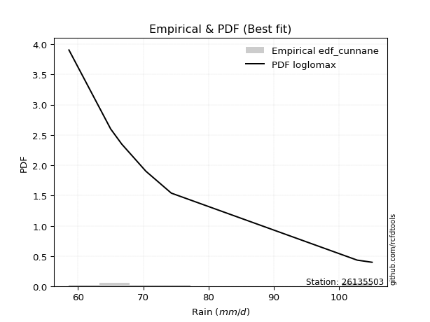</img>

</div>


### 12. EDF Adamowski (1981)

The Adamowski formula in hydrology refers to a specific plotting position formula used for estimating the non-parametric empirical distribution of hydrological events (like flood peaks) to calculate their return periods. This formula provides an alternative to traditional parametric methods (like the Gumbel or Log Pearson Type III distributions). 

<div align="center">


$P=(m-0.25)/(n+0.5)$


</div>


**12.1. Empirical values**

<div align="center">

|                | 0                  | 1                   | 2                   | 3             | 4                  | 5                  | 6                  |
|:---------------|:-------------------|:--------------------|:--------------------|:--------------|:-------------------|:-------------------|:-------------------|
| date           | 2022               | 2021                | 2018                | 2020          | 2023               | 2017               | 2019               |
| x              | 58.6               | 65.0                | 66.7                | 70.4          | 74.3               | 102.8              | 105.1              |
| m              | 1                  | 2                   | 3                   | 4             | 5                  | 6                  | 7                  |
| empirical_dist | edf_adamowski      | edf_adamowski       | edf_adamowski       | edf_adamowski | edf_adamowski      | edf_adamowski      | edf_adamowski      |
| empirical      | 0.1                | 0.23333333333333334 | 0.36666666666666664 | 0.5           | 0.6333333333333333 | 0.7666666666666667 | 0.9                |
| empirical_tr   | 1.1111111111111112 | 1.3043478260869565  | 1.5789473684210527  | 2.0           | 2.727272727272727  | 4.2857142857142865 | 10.000000000000002 |

</div>


**12.2. Kolmogorov-Smirnov fit test (sorted by Δ)**


<div align="center">

|                | 0                   | 1                   | 2                   | 3                   | 4                   | 5                   | 6                   | 7                   | 8                   | 9                   | 10                  | 11                  | 12                  | 13                  | 14                  | 15                  | 16                  | 17                    | 18                  | 19                  | 20                  | 21                  | 22                  | 23                  | 24                  | 25                  | 26                  | 27                  | 28                  | 29                  | 30                  | 31                  | 32                  | 33                  | 34                  | 35                  | 36                  | 37                  | 38                  | 39                  | 40                  | 41                  | 42                  | 43                  | 44                  | 45                  | 46                  | 47                  | 48                  | 49                  | 50                  | 51                  | 52                  | 53                  | 54                  | 55                  | 56                  | 57                  | 58                  | 59                  | 60                  | 61                  | 62                  | 63                  | 64                  | 65                  | 66                  | 67                  | 68                  | 69                  | 70                  | 71                  | 72                  | 73                  | 74                  | 75                  | 76                  | 77                  | 78                  | 79                  | 80                  | 81                  | 82                  | 83                  | 84                  | 85                  | 86                  | 87                  |
|:---------------|:--------------------|:--------------------|:--------------------|:--------------------|:--------------------|:--------------------|:--------------------|:--------------------|:--------------------|:--------------------|:--------------------|:--------------------|:--------------------|:--------------------|:--------------------|:--------------------|:--------------------|:----------------------|:--------------------|:--------------------|:--------------------|:--------------------|:--------------------|:--------------------|:--------------------|:--------------------|:--------------------|:--------------------|:--------------------|:--------------------|:--------------------|:--------------------|:--------------------|:--------------------|:--------------------|:--------------------|:--------------------|:--------------------|:--------------------|:--------------------|:--------------------|:--------------------|:--------------------|:--------------------|:--------------------|:--------------------|:--------------------|:--------------------|:--------------------|:--------------------|:--------------------|:--------------------|:--------------------|:--------------------|:--------------------|:--------------------|:--------------------|:--------------------|:--------------------|:--------------------|:--------------------|:--------------------|:--------------------|:--------------------|:--------------------|:--------------------|:--------------------|:--------------------|:--------------------|:--------------------|:--------------------|:--------------------|:--------------------|:--------------------|:--------------------|:--------------------|:--------------------|:--------------------|:--------------------|:--------------------|:--------------------|:--------------------|:--------------------|:--------------------|:--------------------|:--------------------|:--------------------|:--------------------|
| station        | 26135503            | 26135503            | 26135503            | 26135503            | 26135503            | 26135503            | 26135503            | 26135503            | 26135503            | 26135503            | 26135503            | 26135503            | 26135503            | 26135503            | 26135503            | 26135503            | 26135503            | 26135503              | 26135503            | 26135503            | 26135503            | 26135503            | 26135503            | 26135503            | 26135503            | 26135503            | 26135503            | 26135503            | 26135503            | 26135503            | 26135503            | 26135503            | 26135503            | 26135503            | 26135503            | 26135503            | 26135503            | 26135503            | 26135503            | 26135503            | 26135503            | 26135503            | 26135503            | 26135503            | 26135503            | 26135503            | 26135503            | 26135503            | 26135503            | 26135503            | 26135503            | 26135503            | 26135503            | 26135503            | 26135503            | 26135503            | 26135503            | 26135503            | 26135503            | 26135503            | 26135503            | 26135503            | 26135503            | 26135503            | 26135503            | 26135503            | 26135503            | 26135503            | 26135503            | 26135503            | 26135503            | 26135503            | 26135503            | 26135503            | 26135503            | 26135503            | 26135503            | 26135503            | 26135503            | 26135503            | 26135503            | 26135503            | 26135503            | 26135503            | 26135503            | 26135503            | 26135503            | 26135503            |
| empirical_dist | edf_adamowski       | edf_adamowski       | edf_adamowski       | edf_adamowski       | edf_adamowski       | edf_adamowski       | edf_adamowski       | edf_adamowski       | edf_adamowski       | edf_adamowski       | edf_adamowski       | edf_adamowski       | edf_adamowski       | edf_adamowski       | edf_adamowski       | edf_adamowski       | edf_adamowski       | edf_adamowski         | edf_adamowski       | edf_adamowski       | edf_adamowski       | edf_adamowski       | edf_adamowski       | edf_adamowski       | edf_adamowski       | edf_adamowski       | edf_adamowski       | edf_adamowski       | edf_adamowski       | edf_adamowski       | edf_adamowski       | edf_adamowski       | edf_adamowski       | edf_adamowski       | edf_adamowski       | edf_adamowski       | edf_adamowski       | edf_adamowski       | edf_adamowski       | edf_adamowski       | edf_adamowski       | edf_adamowski       | edf_adamowski       | edf_adamowski       | edf_adamowski       | edf_adamowski       | edf_adamowski       | edf_adamowski       | edf_adamowski       | edf_adamowski       | edf_adamowski       | edf_adamowski       | edf_adamowski       | edf_adamowski       | edf_adamowski       | edf_adamowski       | edf_adamowski       | edf_adamowski       | edf_adamowski       | edf_adamowski       | edf_adamowski       | edf_adamowski       | edf_adamowski       | edf_adamowski       | edf_adamowski       | edf_adamowski       | edf_adamowski       | edf_adamowski       | edf_adamowski       | edf_adamowski       | edf_adamowski       | edf_adamowski       | edf_adamowski       | edf_adamowski       | edf_adamowski       | edf_adamowski       | edf_adamowski       | edf_adamowski       | edf_adamowski       | edf_adamowski       | edf_adamowski       | edf_adamowski       | edf_adamowski       | edf_adamowski       | edf_adamowski       | edf_adamowski       | edf_adamowski       | edf_adamowski       |
| p_dist         | lognakagami         | fisk                | logfisk             | logexpon            | logfatiguelife      | loggenexpon         | invweibull          | alpha               | logexponnorm        | loginvgauss         | invgamma            | invgauss            | exponnorm           | expon               | genexpon            | loginvweibull       | loghalfnorm         | loglaplace_asymmetric | halfnorm            | lograyleigh         | logmielke           | gompertz            | loghalflogistic     | halflogistic        | logmaxwell          | laplace_asymmetric  | logpearson3         | logmoyal            | loggumbel_r         | loggompertz         | moyal               | gumbel_r            | logncf              | logf                | logrice             | logkstwobign        | nct                 | logwald             | loggenlogistic      | mielke              | lognct              | wald                | f                   | betaprime           | pearson3            | rayleigh            | loginvgamma         | logalpha            | kstwobign           | logbetaprime        | genlogistic         | logjohnsonsu        | logt                | lognorm             | lognorm             | logcrystalball      | logloggamma         | maxwell             | loglogistic         | loghypsecant        | erlang              | loglaplace          | rice                | johnsonsu           | norm                | crystalball         | truncnorm           | t                   | logistic            | logtruncnorm        | logweibull_min      | hypsecant           | loggibrat           | logerlang           | loggumbel_l         | laplace             | gibrat              | ncf                 | gumbel_l            | logchi2             | weibull_min         | loggamma            | loggamma            | loglognorm          | nakagami            | fatiguelife         | gamma               | chi2                |
| delta          | 0.10892062020307336 | 0.11147521562293472 | 0.11812454859117405 | 0.12091484292947052 | 0.13149842289875713 | 0.132528540880674   | 0.13282589860098204 | 0.13310252099934106 | 0.13362601540346353 | 0.13376221029864233 | 0.133802355154235   | 0.13498519072896742 | 0.13522831293891058 | 0.13619070460154836 | 0.13619190804286396 | 0.13694203143321537 | 0.13817641277629245 | 0.13890830369484408   | 0.13998140680154036 | 0.14437820630414488 | 0.14459677646190539 | 0.14484694621969496 | 0.1451644895818579  | 0.14661782092851172 | 0.14747026465441815 | 0.14768898777389028 | 0.14846838779908034 | 0.14854396284533145 | 0.1490759494678694  | 0.14987326909892362 | 0.1499600626923443  | 0.15063543112797084 | 0.15326265830169405 | 0.15426808757581734 | 0.1555497748913509  | 0.1564831785195936  | 0.1569132007279842  | 0.15751461104096165 | 0.15763990698412256 | 0.15812124359828916 | 0.15822640677226352 | 0.15853632448736565 | 0.15940795148135595 | 0.16003532735629578 | 0.16112576309844096 | 0.16150538827832062 | 0.1629473581597009  | 0.16342781023531394 | 0.16544545959060286 | 0.16825925940791686 | 0.169067002934986   | 0.17067987219318503 | 0.1706971201159212  | 0.1706973562055878  | 0.1706973562055878  | 0.17069790389747297 | 0.17123391136228983 | 0.17366591787167746 | 0.17576240448957015 | 0.1800621119553545  | 0.18683737190617922 | 0.19544591152848845 | 0.20305930844177394 | 0.20754707676965178 | 0.20804569531041445 | 0.20804570496441366 | 0.20804573057459563 | 0.20804677628746748 | 0.21793471350229165 | 0.21810655265847434 | 0.21812349105231238 | 0.2261802591308218  | 0.22820847088316035 | 0.2375045286412808  | 0.24118639906407585 | 0.25027310471456826 | 0.25776215172929856 | 0.27506329282839326 | 0.27675944199286084 | 0.33576712048875046 | 0.34458649022193183 | 0.3721017040055333  | 0.3721017040055333  | 0.398047995610799   | 0.4411870587618853  | 0.5082825345326276  | 0.5796144090168196  | 0.7519531857919748  |
| deltao         | 0.48442053926100004 | 0.48442053926100004 | 0.48442053926100004 | 0.48442053926100004 | 0.48442053926100004 | 0.48442053926100004 | 0.48442053926100004 | 0.48442053926100004 | 0.48442053926100004 | 0.48442053926100004 | 0.48442053926100004 | 0.48442053926100004 | 0.48442053926100004 | 0.48442053926100004 | 0.48442053926100004 | 0.48442053926100004 | 0.48442053926100004 | 0.48442053926100004   | 0.48442053926100004 | 0.48442053926100004 | 0.48442053926100004 | 0.48442053926100004 | 0.48442053926100004 | 0.48442053926100004 | 0.48442053926100004 | 0.48442053926100004 | 0.48442053926100004 | 0.48442053926100004 | 0.48442053926100004 | 0.48442053926100004 | 0.48442053926100004 | 0.48442053926100004 | 0.48442053926100004 | 0.48442053926100004 | 0.48442053926100004 | 0.48442053926100004 | 0.48442053926100004 | 0.48442053926100004 | 0.48442053926100004 | 0.48442053926100004 | 0.48442053926100004 | 0.48442053926100004 | 0.48442053926100004 | 0.48442053926100004 | 0.48442053926100004 | 0.48442053926100004 | 0.48442053926100004 | 0.48442053926100004 | 0.48442053926100004 | 0.48442053926100004 | 0.48442053926100004 | 0.48442053926100004 | 0.48442053926100004 | 0.48442053926100004 | 0.48442053926100004 | 0.48442053926100004 | 0.48442053926100004 | 0.48442053926100004 | 0.48442053926100004 | 0.48442053926100004 | 0.48442053926100004 | 0.48442053926100004 | 0.48442053926100004 | 0.48442053926100004 | 0.48442053926100004 | 0.48442053926100004 | 0.48442053926100004 | 0.48442053926100004 | 0.48442053926100004 | 0.48442053926100004 | 0.48442053926100004 | 0.48442053926100004 | 0.48442053926100004 | 0.48442053926100004 | 0.48442053926100004 | 0.48442053926100004 | 0.48442053926100004 | 0.48442053926100004 | 0.48442053926100004 | 0.48442053926100004 | 0.48442053926100004 | 0.48442053926100004 | 0.48442053926100004 | 0.48442053926100004 | 0.48442053926100004 | 0.48442053926100004 | 0.48442053926100004 | 0.48442053926100004 |
| eval           | Δo > Δ              | Δo > Δ              | Δo > Δ              | Δo > Δ              | Δo > Δ              | Δo > Δ              | Δo > Δ              | Δo > Δ              | Δo > Δ              | Δo > Δ              | Δo > Δ              | Δo > Δ              | Δo > Δ              | Δo > Δ              | Δo > Δ              | Δo > Δ              | Δo > Δ              | Δo > Δ                | Δo > Δ              | Δo > Δ              | Δo > Δ              | Δo > Δ              | Δo > Δ              | Δo > Δ              | Δo > Δ              | Δo > Δ              | Δo > Δ              | Δo > Δ              | Δo > Δ              | Δo > Δ              | Δo > Δ              | Δo > Δ              | Δo > Δ              | Δo > Δ              | Δo > Δ              | Δo > Δ              | Δo > Δ              | Δo > Δ              | Δo > Δ              | Δo > Δ              | Δo > Δ              | Δo > Δ              | Δo > Δ              | Δo > Δ              | Δo > Δ              | Δo > Δ              | Δo > Δ              | Δo > Δ              | Δo > Δ              | Δo > Δ              | Δo > Δ              | Δo > Δ              | Δo > Δ              | Δo > Δ              | Δo > Δ              | Δo > Δ              | Δo > Δ              | Δo > Δ              | Δo > Δ              | Δo > Δ              | Δo > Δ              | Δo > Δ              | Δo > Δ              | Δo > Δ              | Δo > Δ              | Δo > Δ              | Δo > Δ              | Δo > Δ              | Δo > Δ              | Δo > Δ              | Δo > Δ              | Δo > Δ              | Δo > Δ              | Δo > Δ              | Δo > Δ              | Δo > Δ              | Δo > Δ              | Δo > Δ              | Δo > Δ              | Δo > Δ              | Δo > Δ              | Δo > Δ              | Δo > Δ              | Δo > Δ              | Δo > Δ              | Δo <= Δ             | Δo <= Δ             | Δo <= Δ             |
| fit            | 1                   | 1                   | 1                   | 1                   | 1                   | 1                   | 1                   | 1                   | 1                   | 1                   | 1                   | 1                   | 1                   | 1                   | 1                   | 1                   | 1                   | 1                     | 1                   | 1                   | 1                   | 1                   | 1                   | 1                   | 1                   | 1                   | 1                   | 1                   | 1                   | 1                   | 1                   | 1                   | 1                   | 1                   | 1                   | 1                   | 1                   | 1                   | 1                   | 1                   | 1                   | 1                   | 1                   | 1                   | 1                   | 1                   | 1                   | 1                   | 1                   | 1                   | 1                   | 1                   | 1                   | 1                   | 1                   | 1                   | 1                   | 1                   | 1                   | 1                   | 1                   | 1                   | 1                   | 1                   | 1                   | 1                   | 1                   | 1                   | 1                   | 1                   | 1                   | 1                   | 1                   | 1                   | 1                   | 1                   | 1                   | 1                   | 1                   | 1                   | 1                   | 1                   | 1                   | 1                   | 1                   | 0                   | 0                   | 0                   |
| n              | 7                   | 7                   | 7                   | 7                   | 7                   | 7                   | 7                   | 7                   | 7                   | 7                   | 7                   | 7                   | 7                   | 7                   | 7                   | 7                   | 7                   | 7                     | 7                   | 7                   | 7                   | 7                   | 7                   | 7                   | 7                   | 7                   | 7                   | 7                   | 7                   | 7                   | 7                   | 7                   | 7                   | 7                   | 7                   | 7                   | 7                   | 7                   | 7                   | 7                   | 7                   | 7                   | 7                   | 7                   | 7                   | 7                   | 7                   | 7                   | 7                   | 7                   | 7                   | 7                   | 7                   | 7                   | 7                   | 7                   | 7                   | 7                   | 7                   | 7                   | 7                   | 7                   | 7                   | 7                   | 7                   | 7                   | 7                   | 7                   | 7                   | 7                   | 7                   | 7                   | 7                   | 7                   | 7                   | 7                   | 7                   | 7                   | 7                   | 7                   | 7                   | 7                   | 7                   | 7                   | 7                   | 7                   | 7                   | 7                   |
| best_fit       | 1                   | 0                   | 0                   | 0                   | 0                   | 0                   | 0                   | 0                   | 0                   | 0                   | 0                   | 0                   | 0                   | 0                   | 0                   | 0                   | 0                   | 0                     | 0                   | 0                   | 0                   | 0                   | 0                   | 0                   | 0                   | 0                   | 0                   | 0                   | 0                   | 0                   | 0                   | 0                   | 0                   | 0                   | 0                   | 0                   | 0                   | 0                   | 0                   | 0                   | 0                   | 0                   | 0                   | 0                   | 0                   | 0                   | 0                   | 0                   | 0                   | 0                   | 0                   | 0                   | 0                   | 0                   | 0                   | 0                   | 0                   | 0                   | 0                   | 0                   | 0                   | 0                   | 0                   | 0                   | 0                   | 0                   | 0                   | 0                   | 0                   | 0                   | 0                   | 0                   | 0                   | 0                   | 0                   | 0                   | 0                   | 0                   | 0                   | 0                   | 0                   | 0                   | 0                   | 0                   | 0                   | 0                   | 0                   | 0                   |
| best_fit_sort  | 1                   | 2                   | 3                   | 4                   | 5                   | 6                   | 7                   | 8                   | 9                   | 10                  | 11                  | 12                  | 13                  | 14                  | 15                  | 16                  | 17                  | 18                    | 19                  | 20                  | 21                  | 22                  | 23                  | 24                  | 25                  | 26                  | 27                  | 28                  | 29                  | 30                  | 31                  | 32                  | 33                  | 34                  | 35                  | 36                  | 37                  | 38                  | 39                  | 40                  | 41                  | 42                  | 43                  | 44                  | 45                  | 46                  | 47                  | 48                  | 49                  | 50                  | 51                  | 52                  | 53                  | 54                  | 55                  | 56                  | 57                  | 58                  | 59                  | 60                  | 61                  | 62                  | 63                  | 64                  | 65                  | 66                  | 67                  | 68                  | 69                  | 70                  | 71                  | 72                  | 73                  | 74                  | 75                  | 76                  | 77                  | 78                  | 79                  | 80                  | 81                  | 82                  | 83                  | 84                  | 85                  | 86                  | 87                  | 88                  |

</div>


**12.3. Best fit**

<div align="center">

|   id |   station | empirical_dist   | p_dist      |    delta |   deltao | eval   |   fit |   n |   best_fit |   best_fit_sort |
|-----:|----------:|:-----------------|:------------|---------:|---------:|:-------|------:|----:|-----------:|----------------:|
|    0 |  26135503 | edf_adamowski    | lognakagami | 0.108921 | 0.484421 | Δo > Δ |     1 |   7 |          1 |               1 |

</div>


<div align="center">

</img>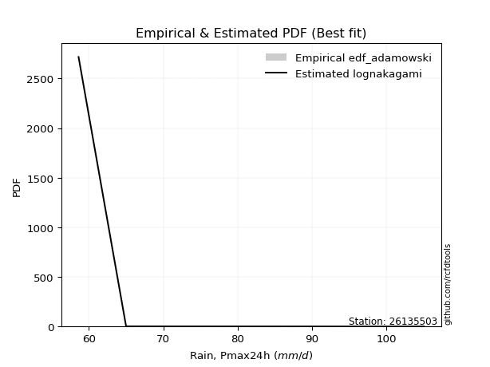</img>

</div>


## C. Best fit & Estimate extreme values for specific return periods - Tr

Best fit in probability distribution analysis means finding the theoretical distribution (like Normal, Poisson, Exponential) that most accurately mirrors your real-world data´s patterns (shape, center, spread) for better predictions, using methods like visual checks (Q-Q plots), goodness-of-fit tests (Kolmogorov-Smirnov, Chi-Squared), and information criteria (AIC) to score and select the simplest, most representative model.


### 1. Best fit (ordered by delta Δ)

<div align="center">

|   id |   station | empirical_dist   | p_dist      |     delta |   deltao | eval   |   fit |   n |   best_fit |   best_fit_sort |
|-----:|----------:|:-----------------|:------------|----------:|---------:|:-------|------:|----:|-----------:|----------------:|
|    0 |  26135503 | edf_hazen        | fisk        | 0.0924276 | 0.484421 | Δo > Δ |     1 |   7 |          1 |               1 |
|    1 |  26135503 | edf_gringorten   | fisk        | 0.097243  | 0.484421 | Δo > Δ |     1 |   7 |          1 |               2 |
|    2 |  26135503 | edf_cunnane      | fisk        | 0.100364  | 0.484421 | Δo > Δ |     1 |   7 |          1 |               3 |
|    3 |  26135503 | edf_blom         | fisk        | 0.10228   | 0.484421 | Δo > Δ |     1 |   7 |          1 |               4 |
|    4 |  26135503 | edf_tukey        | fisk        | 0.105415  | 0.484421 | Δo > Δ |     1 |   7 |          1 |               5 |
|    5 |  26135503 | edf_filliben     | fisk        | 0.106587  | 0.484421 | Δo > Δ |     1 |   7 |          1 |               6 |
|    6 |  26135503 | edf_beard        | fisk        | 0.107139  | 0.484421 | Δo > Δ |     1 |   7 |          1 |               7 |
|    7 |  26135503 | edf_jenkinson    | fisk        | 0.107139  | 0.484421 | Δo > Δ |     1 |   7 |          1 |               8 |
|    8 |  26135503 | edf_chegodayev   | fisk        | 0.107872  | 0.484421 | Δo > Δ |     1 |   7 |          1 |               9 |
|    9 |  26135503 | edf_adamowski    | lognakagami | 0.108921  | 0.484421 | Δo > Δ |     1 |   7 |          1 |              10 |
|   10 |  26135503 | edf_california   | logfisk     | 0.122537  | 0.484421 | Δo > Δ |     1 |   7 |          1 |              11 |
|   11 |  26135503 | edf_weibull      | lognakagami | 0.125     | 0.484421 | Δo > Δ |     1 |   7 |          1 |              12 |

</div>

:file_folder:Tables: [bestfit_26135503.csv](table/bestfit_26135503.csv) | [extreme_26135503.csv](table/extreme_26135503.csv)


### 2. Extreme values

In hydrology, a return period (or recurrence interval $Tr$) is the statistical average time between extreme events like floods or droughts of a specific magnitude, indicating how rare an event is, with a 100-year flood, for example, having a 1% chance of occurring in any given year, not that it happens exactly every century. It is a key tool for infrastructure design (like bridges or dams) and risk assessment, calculated from historical data to determine the probability of future events, although it is important to remember it is statistical average, and events can cluster or be missed.

> risk_rate: assuming the return period as the project useful life.

|   id |      tr |   prob_l |     prob_g |     alpha |   betaprime |    chi2 |   crystalball |   erlang |    expon |   exponnorm |        f |   fatiguelife |     fisk |    gamma |   genexpon |   genlogistic |   gibrat |   gompertz |   gumbel_l |   gumbel_r |   halflogistic |   halfnorm |   hypsecant |   invgamma |   invgauss |   invweibull |   johnsonsu |   kstwobign |   laplace |   laplace_asymmetric |   loggamma |   logistic |   lognorm |   maxwell |   mielke |    moyal |   nakagami |      ncf |      nct |     norm |   pearson3 |   rayleigh |     rice |        t |   truncnorm |     wald |   weibull_min |   logalpha |   logbetaprime |          logchi2 |   logcrystalball |   logerlang |   logexpon |   logexponnorm |     logf |   logfatiguelife |    logfisk |   loggenexpon |   loggenlogistic |   loggibrat |   loggompertz |   loggumbel_l |   loggumbel_r |   loghalflogistic |   loghalfnorm |   loghypsecant |   loginvgamma |   loginvgauss |   loginvweibull |   logjohnsonsu |   logkstwobign |   loglaplace |   loglaplace_asymmetric |   logloggamma |   loglogistic |    loglognorm |   logmaxwell |   logmielke |   logmoyal |   lognakagami |   logncf |   lognct |   logpearson3 |   lograyleigh |   logrice |     logt |   logtruncnorm |   logwald |   logweibull_min |   station |   n |   risk_rate |
|-----:|--------:|---------:|-----------:|----------:|------------:|--------:|--------------:|---------:|---------:|------------:|---------:|--------------:|---------:|---------:|-----------:|--------------:|---------:|-----------:|-----------:|-----------:|---------------:|-----------:|------------:|-----------:|-----------:|-------------:|------------:|------------:|----------:|---------------------:|-----------:|-----------:|----------:|----------:|---------:|---------:|-----------:|---------:|---------:|---------:|-----------:|-----------:|---------:|---------:|------------:|---------:|--------------:|-----------:|---------------:|-----------------:|-----------------:|------------:|-----------:|---------------:|---------:|-----------------:|-----------:|--------------:|-----------------:|------------:|--------------:|--------------:|--------------:|------------------:|--------------:|---------------:|--------------:|--------------:|----------------:|---------------:|---------------:|-------------:|------------------------:|--------------:|--------------:|--------------:|-------------:|------------:|-----------:|--------------:|---------:|---------:|--------------:|--------------:|----------:|---------:|---------------:|----------:|-----------------:|----------:|----:|------------:|
|    0 |    2    | 0.5      | 0.5        |   71.4661 |     75.3393 | 58.7151 |       77.5571 |  68.2063 |  71.7401 |     71.7672 |  75.3171 |       58.6    |  71.0042 |  58.9711 |    71.74   |       74.1861 |  72.3673 |    72.9952 |    80.3976 |    74.7167 |        73.3046 |    74.0179 |     77.5571 |    71.3303 |    71.1455 |      71.2511 |     77.5574 |     75.0902 |   77.5571 |              72.8388 |    62.1337 |    77.5571 |   75.7853 |   76.0784 |  72.9564 |  73.7997 |    59.4874 |  86.1925 |  74.7218 |  77.5571 |    75.4636 |    75.5539 |  77.003  |  77.5582 |     77.5571 |  71.9525 |       60.6755 |    73.4476 |        73.4457 |     90.5846      |          75.7853 |     65.8366 |    70.0347 |        71.187  |  68.3668 |          70.9816 |    71.033  |       71.2305 |          72.8457 |     71.133  |       73.7688 |       78.4587 |       73.203  |           71.9532 |       72.5813 |        75.7853 |       75.4535 |       71.1545 |         71.418  |        75.7849 |        73.3518 |      75.7853 |                 71.4488 |       75.8337 |       75.7853 |  58.7222      |      74.4298 |     71.6973 |    72.3882 |       73.1491 |  73.7329 |  75.089  |       74.1832 |       73.9548 |   74.9493 |  75.7853 |        70.465  |   70.7749 |     67.0949      |  26135503 |   7 |    0.75     |
|    1 |    2.33 | 0.570815 | 0.429185   |   73.8847 |     78.2002 | 58.8058 |       80.6425 |  70.3974 |  74.6352 |     74.6774 |  78.1816 |       59.0849 |  73.63   |  59.3753 |    74.6352 |       76.774  |  73.9302 |    75.9455 |    83.0819 |    77.5756 |        76.244  |    77.3479 |     80.0264 |    73.8584 |    73.8268 |      73.7338 |     80.664  |     77.8272 |   79.4243 |              75.4321 |    63.8972 |    80.2756 |   78.6936 |   79.2839 |  75.4499 |  76.5061 |    60.7258 |  96.3438 |  77.5028 |  80.6425 |    78.5352 |    78.8069 |  79.8589 |  80.6446 |     80.6425 |  73.9756 |       64.3873 |    76.0856 |        76.0359 |    106.925       |          78.6936 |     68.2384 |    72.8401 |        73.7131 |  71.0983 |          73.6063 |    73.4806 |       74.0605 |          75.3337 |     72.5031 |       76.6943 |       81.0718 |       75.8024 |           74.5808 |       75.5919 |        78.104  |       78.3119 |       73.7323 |         73.8479 |        78.6938 |        75.974  |      77.5322 |                 73.8706 |       78.7924 |       78.3419 |  59.5835      |      77.3994 |     74.1679 |    74.8193 |       76.6611 |  76.3741 |  77.9288 |       77.03   |       76.9501 |   77.6946 |  78.6936 |        73.024  |   72.5442 |     71.2943      |  26135503 |   7 |    0.729209 |
|    2 |    5    | 0.8      | 0.2        |   87.1022 |     90.1311 | 59.6449 |       92.1087 |  81.4554 |  89.1103 |     89.2274 |  90.0933 |       69.3848 |  89.2048 |  64.346  |    89.1102 |       88.0159 |  82.9285 |    89.689  |    91.7538 |    89.9963 |        89.5445 |    91.4297 |     89.931  |    87.5658 |    88.097  |      87.375  |     92.209  |     89.4532 |   88.7595 |              88.3983 |    77.1072 |    90.7719 |   90.5143 |   91.9005 |  87.2425 |  89.0422 |    78.5795 | 145.247  |  89.4779 |  92.1087 |    91.1605 |    91.8298 |  91.2926 |  92.1143 |     92.1087 |  85.3011 |      217.53   |    87.7939 |        87.4488 |    290.558       |          90.5143 |     83.2353 |    88.6444 |        87.7224 |  87.2413 |          87.897  |    87.9412 |       88.7146 |          87.1659 |     80.9209 |       89.8542 |       90.1231 |       88.2105 |           87.7223 |       89.7673 |        88.1403 |       90.1246 |       87.6785 |         86.9765 |        90.517  |        88.1987 |      86.8889 |                 87.2673 |       90.7861 |       89.0495 |   1.24235e+18 |      90.2847 |     86.8684 |    87.1893 |       94.1545 |  88.6175 |  89.8563 |       89.6942 |       90.2067 |   89.7303 |  90.5142 |        84.699  |   83.2972 |    112.138       |  26135503 |   7 |    0.67232  |
|    3 |   10    | 0.9      | 0.1        |  102.862  |     99.3493 | 60.8079 |       99.715  |  91.5741 | 102.25   |    102.435  |  99.2617 |       83.6063 | 109.307  |  72.4321 |   102.25   |       97.1717 |  93.1854 |   100.923  |    96.582  |   100.113  |       100.59   |   101.85   |     97.8402 |   102.686  |   102.44   |     102.928  |     99.8677 |     98.305  |   97.2338 |             100.169  |    95.4058 |    98.502  |   99.3197 |  100.779  |  98.1235 |  99.9569 |   104.849  | 190.739  |  99.1623 |  99.715  |   100.625  |   101.115  |  99.445  |  99.723  |     99.715  |  97.3201 |     1063.74   |    97.6999 |        96.9758 |    830.825       |          99.3198 |    101.273  |   105.942  |       102.731  | 105.846  |         103.237  |   107.565  |      102.971  |          98.1622 |     91.7144 |      100.264  |       95.5935 |       99.803  |          100.379  |      101.942  |        97.0729 |       99.1311 |      102.698  |        101.894  |        99.3246 |        98.809  |      96.3571 |                101.521  |       99.6865 |       97.8601 | inf           |     100.619  |    100.23   |    99.6134 |      109.999  |  99.3438 |  99.1613 |      100.32   |      101.032  |   99.4345 |  99.3197 |        92.7994 |   96.457  |    207.358       |  26135503 |   7 |    0.651322 |
|    4 |   15    | 0.933333 | 0.0666667  |  115.005  |    104.4    | 61.6019 |      103.511  |  97.5131 | 109.937  |    110.162  | 104.273  |       92.9074 | 125.101  |  78.2518 |   109.937  |      102.337  | 100.26   |   107.034  |    98.7685 |   105.82   |       106.841  |   107.273  |    102.354  |   113.16   |   111.4    |     114.027  |    103.689  |    103.004  |  102.191  |             107.054  |   109.271  |   102.714  |  104.029  |  105.335  | 104.826  | 106.291  |   120.975  | 218.727  | 104.634  | 103.511  |   105.683  |   105.9    | 103.645  | 103.52   |    103.511  | 105.038  |     2375.94   |   103.479  |       102.472  |   1593.56        |         104.029  |    114.041  |   117.585  |       112.675  | 118.776  |         113.501  |   124.277  |      111.822  |         104.967  |     99.9871 |      105.863  |       98.179  |      107.003  |          108.335  |      108.917  |       102.571  |      104.022  |      112.827  |        112.694  |       104.035  |       104.951  |     102.367  |                110.915  |      104.435  |      103.022  | inf           |     106.372  |    109.338  |   107.62   |      119.324  | 105.667  | 104.291  |      106.442  |      107.107  |  104.837  | 104.029  |        96.268  |  105.984  |    323.636       |  26135503 |   7 |    0.644736 |
|    5 |   20    | 0.95     | 0.05       |  125.552  |    107.887  | 62.2027 |      105.996  | 101.733  | 115.391  |    115.644  | 107.728  |       99.7937 | 138.717  |  82.7438 |   115.39   |      105.954  | 105.81   |   111.187  |   100.13   |   109.817  |       111.22   |   110.888  |    105.538  |   121.47   |   117.989  |     123.011  |    106.192  |    106.17   |  105.708  |             111.939  |   120.748  |   105.625  |  107.234  |  108.359  | 109.779  | 110.777  |   132.202  | 239.374  | 108.479  | 105.996  |   109.119  |   109.08   | 106.437  | 106.006  |    105.996  | 110.79   |     3956.15   |   107.623  |       106.383  |   2559.89        |         107.234  |    124.224  |   126.614  |       120.308  | 128.998  |         121.44   |   139.807  |      118.358  |         110.011  |    106.995  |      109.655  |       99.8235 |      112.352  |          114.281  |      113.831  |       106.635  |      107.379  |      120.71   |        121.589  |       107.241  |       109.303  |     106.857  |                118.103  |      107.661  |      106.748  | inf           |     110.37   |    116.537  |   113.677  |      125.987  | 110.211  | 107.845  |      110.789  |      111.346  |  108.59   | 107.234  |        98.2055 |  113.691  |    460.707       |  26135503 |   7 |    0.641514 |
|    6 |   25    | 0.96     | 0.04       |  135.175  |    110.548  | 62.6864 |      107.826  | 105.01   | 119.621  |    119.896  | 110.362  |      105.265  | 150.939  |  86.4008 |   119.62   |      108.74   | 110.436  |   114.311  |   101.098  |   112.895  |       114.594  |   113.578  |    108.002  |   128.479  |   123.223  |     130.704  |    108.035  |    108.541  |  108.436  |             115.728  |   130.698  |   107.852  |  109.656  |  110.603  | 113.748  | 114.255  |   140.706  | 255.892  | 111.453  | 107.826  |   111.711  |   111.442  | 108.512  | 107.837  |    107.826  | 115.396  |     5701.14   |   110.875  |       109.436  |   3718.28        |         109.656  |    132.826  |   134.093  |       126.584  | 137.584  |         128.003  |   154.744  |      123.582  |         114.06   |    113.212  |      112.506  |      101.011  |      116.653  |          119.085  |      117.63   |       109.892  |      109.932  |      127.259  |        129.336  |       109.663  |       112.68   |     110.475  |                123.997  |      110.096  |      109.689  | inf           |     113.436  |    122.609  |   118.605  |      131.188  | 113.779  | 110.565  |      114.174  |      114.604  |  111.465  | 109.655  |        99.4443 |  120.266  |    618.732       |  26135503 |   7 |    0.639603 |
|    7 |   50    | 0.98     | 0.02       |  176.8    |    118.647  | 64.2683 |      113.066  | 115.202  | 132.761  |    133.104  | 118.367  |      122.82   | 200.781  |  98.5331 |   132.76   |      117.321  | 126.745  |   123.523  |   103.727  |   122.377  |       124.991  |   121.397  |    115.643  |   153.889  |   140.103  |     159.408  |    113.311  |    115.504  |  116.91   |             127.498  |   168.435  |   114.656  |  116.898  |  117.113  | 126.87   | 125.049  |   165.797  | 310.352  | 120.711  | 113.066  |   119.432  |   118.301  | 114.533  | 113.078  |    113.066  | 130.438  |    15463.4    |   121.271  |       119.086  |  12160.6         |         116.898  |    163.986  |   160.258  |       148.242  | 168.409  |         150.901  |   227.241  |      140.741  |         127.496  |    138.15   |      120.915  |      104.304  |      130.966  |          135.191  |      129.408  |       120.632  |      117.649  |      150.331  |        159.503  |       116.907  |       123.212  |     122.513  |                144.25   |      117.365  |      119.187  | inf           |     122.816  |    144.769  |   135.308  |      147.564  | 125.153  | 118.876  |      124.822  |      124.61   |  120.248  | 116.897  |       102.119  |  144.499  |   1734.88        |  26135503 |   7 |    0.63583  |
|    8 |   75    | 0.986667 | 0.0133333  |  213.728  |    123.305  | 65.2382 |      115.878  | 121.171  | 140.447  |    140.83   | 122.962  |      133.392  | 240.83   | 106.062  |   140.447  |      122.309  | 137.76   |   128.598  |   105.057  |   127.889  |       131.034  |   125.653  |    120.108  |   171.741  |   150.369  |     180.257  |    116.142  |    119.334  |  121.868  |             134.383  |   196.227  |   118.585  |  120.979  |  120.652  | 135.16   | 131.362  |   179.534  | 344.667  | 126.178  | 115.878  |   123.759  |   122.032  | 117.809  | 115.891  |    115.878  | 139.693  |    25657.6    |   127.61   |       124.891  |  24673.1         |         120.979  |    185.79   |   177.871  |       162.59   | 189.79   |         166.265  |   301.94   |      151.482  |         136.021  |    158.032  |      125.564  |      106.011  |      140.08   |          145.537  |      136.308  |       127.389  |      122.053  |      165.998  |        182.85   |       120.989  |       129.42   |     130.154  |                157.598  |      121.453  |      125.043  | inf           |     128.238  |    160.586  |   146.145  |      157.323  | 132.045  | 123.68   |      131.18   |      130.416  |  125.314  | 120.978  |       103.075  |  161.779  |   3432.53        |  26135503 |   7 |    0.634587 |
|    9 |  100    | 0.99     | 0.01       |  248.658  |    126.588  | 65.9423 |      117.779  | 125.41   | 145.901  |    146.312  | 126.196  |      141      | 275.647  | 111.559  |   145.9    |      125.839  | 146.292  |   132.072  |   105.926  |   131.79   |       135.311  |   128.552  |    123.275  |   185.978  |   157.81   |     197.243  |    118.056  |    121.959  |  125.385  |             139.269  |   219.027  |   121.36   |  123.819  |  123.063  | 141.345  | 135.84   |   188.884  | 370.227  | 130.094  | 117.779  |   126.759  |   124.574  | 120.041  | 117.793  |    117.779  | 146.442  |    35744.4    |   132.246  |       129.097  |  40972.7         |         123.819  |    203.113  |   191.53   |       173.605  | 206.694  |         178.155  |   381.713  |      159.443  |         142.396  |    175.381  |      128.757  |      107.142  |      146.91   |          153.335  |      141.219  |       132.409  |      125.141  |      178.218  |        202.868  |       123.831  |       133.854  |     135.863  |                167.811  |      124.295  |      129.35   | inf           |     132.067  |    173.396  |   154.355  |      164.337  | 137.056  | 127.076  |      135.762  |      134.526  |  128.887  | 123.819  |       103.567  |  175.667  |   5768.14        |  26135503 |   7 |    0.633968 |
|   10 |  200    | 0.995    | 0.005      |  380.742  |    134.457  | 67.6838 |      122.093  | 135.63   | 159.041  |    159.52   | 133.938  |      159.621  | 388.435  | 125.234  |   159.04   |      134.327  | 169.506  |   140.048  |   107.816  |   141.168  |       145.595  |   135.184  |    130.905  |   226.581  |   176.218  |     247.222  |    122.399  |    128.005  |  133.859  |             151.039  |   286.713  |   128.015  |  130.513  |  128.578  | 157.365  | 146.63   |   210.189  | 436.342  | 139.695  | 122.093  |   133.786  |   130.391  | 125.148  | 122.108  |    122.093  | 163.251  |    73524.1    |   143.953  |       139.576  | 141133           |         130.513  |    252.187  |   228.903  |       203.308  | 254.29   |         210.595  |   770.958  |      179.865  |         158.974  |    232.836  |      136.13   |      109.642  |      164.726  |          173.835  |      153.124  |       145.333  |      132.493  |      211.961  |        267.535  |       130.526  |       144.652  |     150.668  |                195.22   |      130.978  |      140.296  | inf           |     141.263  |    211.069  |   176.083  |      181.57   | 149.583  | 135.249  |      147.085  |      144.423  |  137.45   | 130.512  |       104.322  |  215.667  |  22653.2         |  26135503 |   7 |    0.633042 |
|   11 |  250    | 0.996    | 0.004      |  444.85   |    136.985  | 68.2559 |      123.411  | 138.922  | 163.271  |    163.772  | 136.422  |      165.689  | 435.779  | 129.746  |   163.271  |      137.055  | 177.836  |   142.506  |   108.372  |   144.183  |       148.901  |   137.224  |    133.362  |   241.828  |   182.275  |     266.518  |    123.727  |    129.875  |  136.587  |             154.828  |   313.035  |   130.152  |  132.629  |  130.276  | 162.883  | 150.104  |   216.711  | 459.093  | 142.844  | 123.411  |   135.996  |   132.181  | 126.72   | 123.427  |    123.411  | 168.812  |    90913.6    |   147.903  |       143.065  | 210963           |         132.629  |    270.496  |   242.423  |       213.913  | 271.963  |         222.3    |  1016.03   |      186.835  |         164.704  |    257.756  |      138.417  |      110.389  |      170.9    |          180.99   |      156.984  |       149.756  |      134.84   |      224.27   |        295.003  |       132.644  |       148.167  |     155.769  |                204.963  |      133.088  |      144.002  | inf           |     144.221  |    225.702  |   183.708  |      187.225  | 153.761  | 137.885  |      150.823  |      147.614  |  140.199  | 132.629  |       104.476  |  230.812  |  36436.5         |  26135503 |   7 |    0.632858 |
|   12 |  500    | 0.998    | 0.002      |  759.78   |    144.846  | 70.0625 |      127.32   | 149.155  | 176.411  |    176.98   | 144.135  |      184.726  | 630.065  | 144.043  |   176.411  |      145.524  | 206.622  |   149.831  |   109.967  |   153.541  |       159.162  |   143.307  |    140.991  |   297.327  |   201.45   |     338.844  |    127.663  |    135.482  |  145.061  |             166.598  |   412.44   |   136.778  |  139.111  |  135.342  | 181.243  | 160.894  |   236.053  | 534.771  | 152.838  | 127.32   |   142.72   |   137.523  | 131.41   | 127.337  |    127.32   | 186.494  |   167108      |   160.807  |       154.306  | 742628           |         139.111  |    336.653  |   289.728  |       250.512  | 335.551  |         263.147  |  2914.46   |      209.818  |         183.835  |    366.283  |      145.283  |      112.558  |      191.578  |          205.131  |      169.082  |       164.371  |      142.093  |      267.735  |        411.877  |       139.127  |       159.221  |     172.743  |                238.441  |      139.539  |      156.133  | inf           |     153.42   |    281.452  |   209.566  |      205.143  | 167.231  | 146.11   |      162.754  |      157.559  |  148.731  | 139.11   |       104.786  |  286.403  | 177468           |  26135503 |   7 |    0.632489 |
|   13 |  750    | 0.998667 | 0.00133333 | 1071.6    |    149.46   | 71.1369 |      129.492  | 155.144  | 184.098  |    184.706  | 148.656  |      195.974  | 786.873  | 152.574  |   184.097  |      150.474  | 225.659  |   153.916  |   110.819  |   159.011  |       165.16   |   146.705  |    145.454  |   336.439  |   212.897  |     391.553  |    129.849  |    138.632  |  150.018  |             173.483  |   485.508  |   140.65   |  142.847  |  138.176  | 192.901  | 167.205  |   246.787  | 582.828  | 158.849  | 129.492  |   146.568  |   140.51   | 134.032  | 129.509  |    129.492  | 197.096  |   231374      |   168.848  |       161.189  |      1.55992e+06 |         142.847  |    382.874  |   321.57   |       274.76   | 379.794  |         290.56   |  6385.19   |      224.255  |         196.032  |    462.107  |      149.147  |      113.735  |      204.806  |          220.709  |      176.242  |       173.573  |      146.319  |      297.316  |        512.43   |       142.864  |       165.789  |     183.517  |                260.504  |      143.251  |      163.687  | inf           |     158.819  |    323.25   |   226.348  |      215.884  | 175.477  | 150.959  |      169.975  |      163.41   |  153.727  | 142.847  |       104.89   |  325.964  | 482559           |  26135503 |   7 |    0.632366 |
|   14 | 1000    | 0.999    | 0.001      | 1382.47   |    152.746  | 71.9061 |      130.987  | 159.395  | 189.551  |    190.188  | 151.871  |      203.998  | 923.437  | 158.691  |   189.551  |      153.986  | 240.227  |   156.732  |   111.392  |   162.891  |       169.415  |   149.051  |    148.621  |   367.671  |   221.112  |     434.552  |    131.355  |    140.814  |  153.536  |             178.368  |   545.452  |   143.395  |  145.478  |  140.134  | 201.614  | 171.683  |   254.17   | 618.755  | 163.194  | 130.987  |   149.263  |   142.575  | 135.845  | 131.005  |    130.987  | 204.722  |   288027      |   174.795  |       166.221  |      2.64739e+06 |         145.478  |    419.576  |   346.263  |       293.374  | 414.85   |         311.778  | 12213      |      234.972  |         205.171  |    552.046  |      151.826  |      114.533  |      214.739  |          232.471  |      181.363  |       180.413  |      149.315  |      320.423  |        605.218  |       145.496  |       170.497  |     191.566  |                277.386  |      145.861  |      169.265  | inf           |     162.661  |    358.209  |   239.064  |      223.625  | 181.501  | 154.422  |      175.213  |      167.579  |  157.277  | 145.477  |       104.943  |  357.758  |      1.01405e+06 |  26135503 |   7 |    0.632305 |

<div align="center">

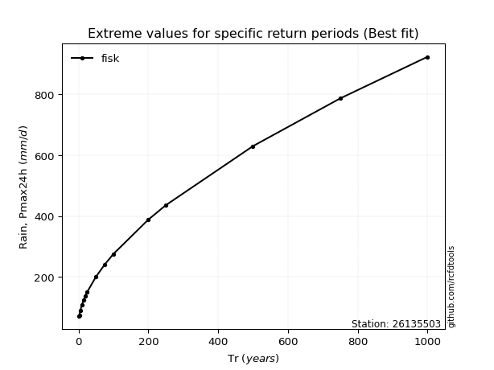</img>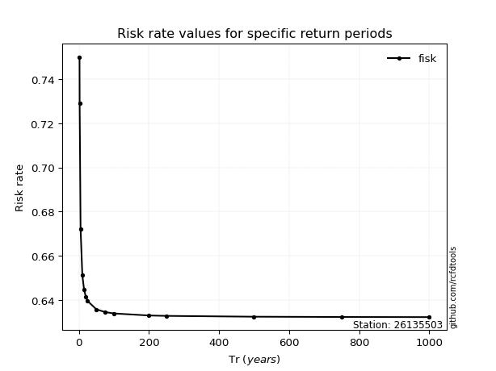</img>

</div>


<sub>**APP DISCLAIMER**: NO WARRANTY - This software is provided by [github.com/rcfdtools](https://github.com/rcfdtools) "as is", without any express or implied warranty, including warranties of merchantability, fitness for a particular purpose, or non-infringement. There is no guarantee that the software will be error-free or operate without interruption. LIMITATION OF LIABILITY - Neither the authors nor copyright holders will be liable for claims or damages arising from the software or its use. You are responsible for determining if the software is appropriate for your use and assume all associated risks, including errors, legal compliance, and data loss. NO PROFESSIONAL ADVICE - The software provides general information and does not offer professional advice. It should not replace consultation with professional advisors.</sub>