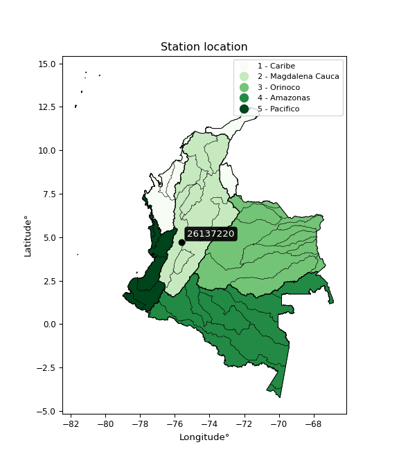

<div align="center">


</div>

# PMP Station (Rain, Pmax24h): 26137220

Probable Maximum Precipitation (PMP) is the greatest amount of rainfall for a specific duration that is meteorologically possible for a given location, acting as a "worst-case" scenario for extreme storms, crucial for designing safety-critical infrastructure like bridges, river deviations, dams, spillways, and nuclear plants to prevent catastrophic failure. PMP is calculated by hydrologists using meteorological data to determine the upper limit of extreme rainfall, often leading to the Probable Maximum Flood (PMF) for flood control design, and is increasingly being studied for climate change impacts. Probable Maximum Precipitation (PMP) is the theoretical upper limit of rainfall, a deterministic estimate for extreme events, while probability distributions (like GEV, Gumbel) describe the likelihood and frequency of various precipitation amounts, including rare ones, showing how often events occur, with PMP representing the extreme end of these distributions, used for critical infrastructure design to ensure safety against the worst conceivable weather, unlike standard statistical forecasts which cover typical probabilities.

The most common probability distributions in hydrology, used for analyzing floods, rainfall, and streamflow, include the Normal, Log-Normal, Gumbel, Gamma (including Log-Pearson Type III), and Generalized Extreme Value (GEV) distributions, often chosen based on the data´s skewness and whether modeling extremes or general conditions, with Gumbel and GEV popular for extreme events like floods, while the Normal distribution serves as a baseline, though often requiring transformations for skewed hydrological data. These distributions help in designing water infrastructure, managing water resources, and forecasting hydrologic events.

> Hydrological data often isn´t perfectly normal (it´s skewed), so different distributions are needed for different applications, such as: **Flood Frequency Analysis**: Using Gumbel, GEV, or Log-Pearson Type III for predicting extreme flood magnitudes and their return periods, **Rainfall Analysis**: Normal for annual totals, but Log-Normal, Weibull, or GEV for intensity or extreme daily rainfall, **Streamflow Modeling**: Gamma and Log-Normal for maximum flows, GEV for minimum flows, and Kappa for daily flows.

<div align="center">

</img>

</div>


## A. General information


### 1. General running parameters

• app_version: _v20260108_. • runtime: _2026-01-08 13:24:42.400241_. • Python version: _3.14.0_. • SciPy version: _1.16.3_. • Pandas version: _2.3.3_. • NumPy version: _2.3.5_. • Stations dataset (station_dataset_file): _dataset/pmax24h_in/automatic_colombia_2003_2024.csv_. • Stations catalog (station_catalog_file): _dataset/CNE.xls_. • Minimum year to eval til year_max (date_min): _1900_. • Maximum year to eval since year_min (date_max): _2024_. • Creates, save and include plots into reports (create_plot): _False_. • Plot only fit distributions with Δo > Δ (plot_only_fit): _True_. • Plot only simple graphs avoiding multiple CDFs and multiple Extreme values plots (plot_only_simple): _True_. • Eval low extreme values, if False, evaluates high extreme values (low_extreme): _False_. • Eval every SciPy distribution as logarithmic (pdist_logarithmic_on): _True_. • Standard deviation normalized (ddof): _1.0_. • Return periods to eval in years (Tr): _[2, 2.33, 5, 10, 15, 20, 25, 50, 75, 100, 200, 250, 500, 750, 1000]_. • Minimum data sample per station, 0 means any (minimum_sample): _5_. • Z-Score maximum threshold to adjust a value, 0 means disable (zscore_max): _3.5_. • Z-Score minimum threshold to adjust a value, 0 means disable (zscore_min): _-2.5_. • Avoid zeros, e.g. rain = 0 (avoid_zeros): _True_. • Avoid null values (avoid_nans): _True_. 

:file_folder:Table: [dataset.csv](../../dataset/pmax24h_in/automatic_colombia_2003_2024.csv)

> Delta Degrees of Freedom (DDOF): is a parameter used in the formulas for calculating variance and standard deviation. When ddof=0, the divisor is $N$ (the total number of observations) and this is used when your data set is the entire population. When ddof=1, the divisor is $N-1$ and this is used when your data set is a sample drawn from a larger population. Using $N-1$ provides an unbiased estimate of the population variance (known as Bessel´s correction).


### 2. Station info and location

|   id |   CODIGO | NOMBRE                    | CATEGORIA    | TECNOLOGIA                              | ESTADO           | FECHA_INSTALACION   |   FECHA_SUSPENSION |   ALTITUD |   LATITUD |   LONGITUD | DEPARTAMENTO   | MUNICIPIO   | AREA_OPERATIVA                         | ENTIDAD                                                     | AREA_HIDROGRAFICA   | ZONA_HIDROGRAFICA   | SUBZONA_HIDROGRAFICA   | CORRIENTE   | Catalogo   |   Version |
|-----:|---------:|:--------------------------|:-------------|:----------------------------------------|:-----------------|:--------------------|-------------------:|----------:|----------:|-----------:|:---------------|:------------|:---------------------------------------|:------------------------------------------------------------|:--------------------|:--------------------|:-----------------------|:------------|:-----------|----------:|
|    0 | 26137220 | EL RETEN - AUT [26137220] | Limnigráfica | Automática con Telemetría, Convencional | En Mantenimiento | 15/11/1993          |                nan |      1808 |   4.72819 |   -75.6034 | Risaralda      | Pereira     | Area Operativa 09 - Cauca-Valle-Caldas | INSTITUTO DE HIDROLOGIA METEOROLOGIA Y ESTUDIOS AMBIENTALES | Magdalena Cauca     | Cauca               | Río La Vieja           | Otun        | CNE_IDEAM  |  20251226 |

<div align="center">

Dynamic map: [:earth_americas:Google](http://maps.google.com/maps?q=4.728194444,-75.603444444) [:earth_americas:OSM](https://www.openstreetmap.org/#map=18/4.728194444/-75.603444444&layers=P) [:earth_americas:Bing](https://www.bing.com/maps?cp=4.728194444~-75.603444444&lvl=18) [:earth_americas:Apple](https://maps.apple.com/frame?center=4.728194444%2C-75.603444444&span=0.003%2C0.006)

</div>


<div align="center">

```geojson
{
  "type": "Feature",
  "geometry": {
    "type": "Point", 
    "coordinates": [-75.603444444, 4.728194444]
  }, 
  "properties": {
    "Name": "26137220"
  }
}
```

</div>


### 3. Discrete values table and plot

<div align="center">

|               |          0 |           1 |          2 |           3 |            4 |
|:--------------|-----------:|------------:|-----------:|------------:|-------------:|
| Date          | 2017       | 2018        | 2019       | 2020        | 2021         |
| Value         |    1       |   12.8      |  105.3     |   64.5      |   46.9       |
| Value_initial |    1       |   12.8      |  105.3     |   64.5      |   46.9       |
| count         |    5       |    5        |    5       |    5        |    5         |
| mean          |   46.1     |   46.1      |   46.1     |   46.1      |   46.1       |
| std           |   41.7934  |   41.7934   |   41.7934  |   41.7934   |   41.7934    |
| zscore        |   -1.07912 |   -0.796777 |    1.41649 |    0.440261 |    0.0191418 |


</div>


> The initial value (value_initial) correspond to the initial obtained or null completed value, and value (value) is adjusted only when the initial value is outside the valid range (outlier) definite through the Z-Score value. If Z-Score is active, values out of range or outliers are replaced with the station mean value. A Z-Score (or standard score) measures how many standard deviations a data point is from the mean of a dataset, indicating its relative position; positive scores mean above the mean, negative mean below, and a score of zero is exactly at the mean, allowing for comparison of values from different distributions. It´s calculated using the formula $z=(x–μ)/σ$, where $x$ is the data point, $μ$ is the mean, and $σ$ is the standard deviation, helping identify outliers and understand probability.
>
> <sub>**Note**: In this study, "completing" (filling gaps in) and "extending" (forecasting or lengthening the historical record) rainfall data series are avoided for certain critical analyses because they introduce artificial bias and uncertainty, which can distort the statistics of rare events (extremes), alter day-to-day variability, and compromise the integrity and homogeneity of the original data. Some reasons against Completing/Extending rainfall data are: **Distortion of Extremes and Variability**: The primary issue is that most gap-filling or extension methods rely on averaging or regression with nearby stations, which inherently smooths the data. Rainfall is highly variable in space and time, with a large percentage of zero values and occasional large storms. Infilling methods often underestimate the highest values and overestimate the lowest (zero) values, which severely distorts analyses focused on flood frequency, drought severity, and intensity-duration-frequency (IDF) curves, **Loss of Data Homogeneity**: Infilled or extended data are synthetic estimates, not actual measurements. Combining these estimates with observed data can violate the assumption of data homogeneity, which requires that the data properties do not change over time. Inhomogeneity can lead to incorrect conclusions about long-term trends or changes in climate patterns, **Propagation of Errors**: Errors and biases from the original data (e.g., wind-induced undercatch, instrument errors, site changes) or the data used for imputation can propagate through the analysis, leading to unreliable hydrological models and inaccurate predictions, **Compromised Statistical Integrity**: For statistical analyses, especially those involving the frequency of events, using artificial data can introduce time bias or autocorrelation that doesn´t exist in reality, making it difficult to assess the true probability of events, **Difficulty in Validation**: It is difficult to accurately validate the quality of filled or extended data, especially for past periods where ground-truth measurements are unavailable. The reliability of imputation techniques heavily depends on the density of the surrounding station network and the complexity of the local topography.</sub>


### 4. Active continuous probability distributions from SciPy (43 of 104 available)

A Probability Density Function (PDF) describes the relative likelihood of a continuous random variable falling within a specific range, where the total area under its curve equals 1, and the area over any interval gives the actual probability for that range. Unlike discrete probabilities (like rolling a die), a PDF shows density, not direct probability for a single point (which is zero), with higher points indicating higher likelihood, often visualized as a bell curve for normal distributions.

A log of a probability density function (log-PDF) is simply the logarithm of the PDF´s value, denoted as $log(f(x))$, useful for converting multiplication of probabilities into addition, improving numerical stability with tiny numbers, and connecting to information theory concepts like entropy. Instead of dealing with very small probabilities (e.g., 0.000001), log-PDFs use negative numbers (e.g., $log(0.00001) ≈ -11.51$ that are easier for computers to handle, preventing underflow errors and simplifying complex calculations. In this study, each active probability distribution from SciPy is also evaluated in the $log$ form.

[scipy.stats](https://docs.scipy.org/doc/scipy/reference/stats.html) is a Python´s powerful submodule within the SciPy library for comprehensive statistical analysis, offering over 130 probability distributions (like Normal, Poisson), functions for descriptive stats (mean, variance), hypothesis testing (t-tests, chi-square), random variable generation, and statistical tests, making it essential for data science, modeling, and research. It provides tools to explore, model, and draw conclusions from data efficiently, working seamlessly with NumPy.

<div align="center">

|   id | p_dist             |   n_parameter | fit_method   | label                                                                       | active   | ref                                                                                                        |
|-----:|:-------------------|--------------:|:-------------|:----------------------------------------------------------------------------|:---------|:-----------------------------------------------------------------------------------------------------------|
|    0 | alpha              |             3 | MLE          | Alpha                                                                       | True     | [:mortar_board:](https://docs.scipy.org/doc/scipy/reference/generated/scipy.stats.alpha.html)              |
|    1 | betaprime          |             4 | MLE          | Beta prime                                                                  | True     | [:mortar_board:](https://docs.scipy.org/doc/scipy/reference/generated/scipy.stats.betaprime.html)          |
|    2 | chi2               |             3 | MLE          | Chi²                                                                        | True     | [:mortar_board:](https://docs.scipy.org/doc/scipy/reference/generated/scipy.stats.chi2.html)               |
|    3 | crystalball        |             4 | MLE          | Crystalball                                                                 | True     | [:mortar_board:](https://docs.scipy.org/doc/scipy/reference/generated/scipy.stats.crystalball.html)        |
|    4 | erlang             |             3 | MLE          | Erlang                                                                      | True     | [:mortar_board:](https://docs.scipy.org/doc/scipy/reference/generated/scipy.stats.erlang.html)             |
|    5 | expon              |             2 | MLE          | Exponential                                                                 | True     | [:mortar_board:](https://docs.scipy.org/doc/scipy/reference/generated/scipy.stats.expon.html)              |
|    6 | exponnorm          |             3 | MLE          | Exponentially modified Normal                                               | True     | [:mortar_board:](https://docs.scipy.org/doc/scipy/reference/generated/scipy.stats.exponnorm.html)          |
|    7 | f                  |             4 | MLE          | F                                                                           | True     | [:mortar_board:](https://docs.scipy.org/doc/scipy/reference/generated/scipy.stats.f.html)                  |
|    8 | fatiguelife        |             3 | MLE          | Fatigue-life (Birnbaum-Saunders)                                            | True     | [:mortar_board:](https://docs.scipy.org/doc/scipy/reference/generated/scipy.stats.fatiguelife.html)        |
|    9 | fisk               |             3 | MLE          | Fisk                                                                        | True     | [:mortar_board:](https://docs.scipy.org/doc/scipy/reference/generated/scipy.stats.fisk.html)               |
|   10 | gamma              |             3 | MLE          | Gamma                                                                       | True     | [:mortar_board:](https://docs.scipy.org/doc/scipy/reference/generated/scipy.stats.gamma.html)              |
|   11 | genexpon           |             5 | MLE          | Generalized exponential                                                     | True     | [:mortar_board:](https://docs.scipy.org/doc/scipy/reference/generated/scipy.stats.genexpon.html)           |
|   12 | genlogistic        |             3 | MLE          | Generalized logistic                                                        | True     | [:mortar_board:](https://docs.scipy.org/doc/scipy/reference/generated/scipy.stats.genlogistic.html)        |
|   13 | gibrat             |             2 | MM           | Gibrat                                                                      | True     | [:mortar_board:](https://docs.scipy.org/doc/scipy/reference/generated/scipy.stats.gibrat.html)             |
|   14 | gompertz           |             3 | MLE          | Gompertz (or truncated Gumbel)                                              | True     | [:mortar_board:](https://docs.scipy.org/doc/scipy/reference/generated/scipy.stats.gompertz.html)           |
|   15 | gumbel_l           |             2 | MM           | Gumbel Left Skew                                                            | True     | [:mortar_board:](https://docs.scipy.org/doc/scipy/reference/generated/scipy.stats.gumbel_l.html)           |
|   16 | gumbel_r           |             2 | MM           | Gumbel Right Skew                                                           | True     | [:mortar_board:](https://docs.scipy.org/doc/scipy/reference/generated/scipy.stats.gumbel_r.html)           |
|   17 | halflogistic       |             2 | MM           | Half-logistic                                                               | True     | [:mortar_board:](https://docs.scipy.org/doc/scipy/reference/generated/scipy.stats.halflogistic.html)       |
|   18 | halfnorm           |             2 | MM           | Half Normal                                                                 | True     | [:mortar_board:](https://docs.scipy.org/doc/scipy/reference/generated/scipy.stats.halfnorm.html)           |
|   19 | hypsecant          |             2 | MM           | hyperbolic secant                                                           | True     | [:mortar_board:](https://docs.scipy.org/doc/scipy/reference/generated/scipy.stats.hypsecant.html)          |
|   20 | invgamma           |             3 | MLE          | Inverted gamma                                                              | True     | [:mortar_board:](https://docs.scipy.org/doc/scipy/reference/generated/scipy.stats.invgamma.html)           |
|   21 | invgauss           |             3 | MLE          | Inverse Gaussian                                                            | True     | [:mortar_board:](https://docs.scipy.org/doc/scipy/reference/generated/scipy.stats.invgauss.html)           |
|   22 | invweibull         |             3 | MLE          | Inverted Weibull                                                            | True     | [:mortar_board:](https://docs.scipy.org/doc/scipy/reference/generated/scipy.stats.invweibull.html)         |
|   23 | kstwobign          |             2 | MLE          | Limiting distribution of scaled Kolmogorov-Smirnov two-sided test statistic | True     | [:mortar_board:](https://docs.scipy.org/doc/scipy/reference/generated/scipy.stats.kstwobign.html)          |
|   24 | laplace            |             2 | MM           | Laplace                                                                     | True     | [:mortar_board:](https://docs.scipy.org/doc/scipy/reference/generated/scipy.stats.laplace.html)            |
|   25 | laplace_asymmetric |             3 | MLE          | Asymmetric Laplace                                                          | True     | [:mortar_board:](https://docs.scipy.org/doc/scipy/reference/generated/scipy.stats.laplace_asymmetric.html) |
|   26 | loggamma           |             3 | MLE          | Log gamma                                                                   | True     | [:mortar_board:](https://docs.scipy.org/doc/scipy/reference/generated/scipy.stats.loggamma.html)           |
|   27 | logistic           |             2 | MM           | Logistic (or Sech-squared)                                                  | True     | [:mortar_board:](https://docs.scipy.org/doc/scipy/reference/generated/scipy.stats.logistic.html)           |
|   28 | lognorm            |             3 | MLE          | Log Normal                                                                  | True     | [:mortar_board:](https://docs.scipy.org/doc/scipy/reference/generated/scipy.stats.lognorm.html)            |
|   29 | maxwell            |             2 | MM           | Maxwell                                                                     | True     | [:mortar_board:](https://docs.scipy.org/doc/scipy/reference/generated/scipy.stats.maxwell.html)            |
|   30 | mielke             |             4 | MLE          | Mielke Beta-Kappa / Dagum                                                   | True     | [:mortar_board:](https://docs.scipy.org/doc/scipy/reference/generated/scipy.stats.mielke.html)             |
|   31 | moyal              |             2 | MM           | Moyal                                                                       | True     | [:mortar_board:](https://docs.scipy.org/doc/scipy/reference/generated/scipy.stats.moyal.html)              |
|   32 | nakagami           |             3 | MLE          | Nakagami                                                                    | True     | [:mortar_board:](https://docs.scipy.org/doc/scipy/reference/generated/scipy.stats.nakagami.html)           |
|   33 | ncf                |             5 | MLE          | Non-central F distribution                                                  | True     | [:mortar_board:](https://docs.scipy.org/doc/scipy/reference/generated/scipy.stats.ncf.html)                |
|   34 | nct                |             4 | MLE          | Non-central Student’s t                                                     | True     | [:mortar_board:](https://docs.scipy.org/doc/scipy/reference/generated/scipy.stats.nct.html)                |
|   35 | norm               |             2 | MM           | Normal                                                                      | True     | [:mortar_board:](https://docs.scipy.org/doc/scipy/reference/generated/scipy.stats.norm.html)               |
|   36 | pearson3           |             3 | MM           | Pearson type III                                                            | True     | [:mortar_board:](https://docs.scipy.org/doc/scipy/reference/generated/scipy.stats.pearson3.html)           |
|   37 | rayleigh           |             2 | MM           | Rayleigh                                                                    | True     | [:mortar_board:](https://docs.scipy.org/doc/scipy/reference/generated/scipy.stats.rayleigh.html)           |
|   38 | rice               |             3 | MLE          | Rice                                                                        | True     | [:mortar_board:](https://docs.scipy.org/doc/scipy/reference/generated/scipy.stats.rice.html)               |
|   39 | t                  |             3 | MLE          | Student’s t                                                                 | True     | [:mortar_board:](https://docs.scipy.org/doc/scipy/reference/generated/scipy.stats.t.html)                  |
|   40 | truncnorm          |             4 | MLE          | Truncated normal                                                            | True     | [:mortar_board:](https://docs.scipy.org/doc/scipy/reference/generated/scipy.stats.truncnorm.html)          |
|   41 | wald               |             2 | MM           | Wald                                                                        | True     | [:mortar_board:](https://docs.scipy.org/doc/scipy/reference/generated/scipy.stats.wald.html)               |
|   42 | weibull_min        |             3 | MLE          | Weibull minimum                                                             | True     | [:mortar_board:](https://docs.scipy.org/doc/scipy/reference/generated/scipy.stats.weibull_min.html)        |

</div>

> **n_parameter:** # arguments & localization & scale.
>
> **Fit methods:** (MLE) maximum likelihood, (MM) L-moments.
>
>**Inactive** (With the only purpose of prevent loops, zero divisions, infinite values, over high estimated values or horizontal trending for recurrence intervals estimations, the follow distributions were disabled.)**:** foldnorm, gennorm, norminvgauss, powernorm, powerlognorm, skewnorm, genextreme, anglit, arcsine, argus, beta, bradford, burr, burr12, cauchy, cosine, halfcauchy, foldcauchy, skewcauchy, wrapcauchy, dgamma, gengamma, exponweib, exponpow, truncexpon, gausshyper, genhalflogistic, genhyperbolic, geninvgauss, halfgennorm, johnsonsb, johnsonsu, kappa4, kappa3, ksone, kstwo, loglaplace, levy, levy_l, levy_stable, ncx2, pareto, genpareto, truncpareto, lomax, powerlaw, rdist, rel_breitwigner, recipinvgauss, semicircular, studentized_range, trapezoid, triang, truncweibull_min, tukeylambda, uniform, loguniform, vonmises, vonmises_line, weibull_max, dweibull, 


## B. Probability (PDF) vs. Empirical (EDF) distributions functions

A continuous probability distribution (CPD) describes probabilities for variables that can take any value within a range (like rain any time), unlike discrete variables with specific outcomes (like temperature). It uses a Probability Density Function (PDF), a curve where the total area under it equals 1, and the probability of the variable falling within an interval (a to b) is found by calculating the area under the curve between those points. A key feature is that the probability of hitting any single exact value is zero, so probabilities are always expressed for ranges, e.g., $P(a ≤ X ≤ b)$.

<div align="center">

Distributions parameters from station values
|    |   station | p_dist                |   n |               loc |           scale | shape                  | shape1                 | shape2                 | shape3   |
|---:|----------:|:----------------------|----:|------------------:|----------------:|:-----------------------|:-----------------------|:-----------------------|:---------|
|  0 |  26137220 | alpha                 |   5 |   -175.133        |  1310.64        | 6.0934133045077346     |                        |                        |          |
|  1 |  26137220 | betaprime             |   5 |      1            |   306.95        | 0.7396480396983753     | 8.824936925969467      |                        |          |
|  2 |  26137220 | chi2                  |   5 |      1            |    21.9826      | 0.8975530567632335     |                        |                        |          |
|  3 |  26137220 | crystalball           |   5 |     46.1          |    37.3811      | 6779.309571547684      | 9022.064255631223      |                        |          |
|  4 |  26137220 | erlang                |   5 |      1            |    36.6984      | 0.6310366562001455     |                        |                        |          |
|  5 |  26137220 | expon                 |   5 |      1            |    45.1         |                        |                        |                        |          |
|  6 |  26137220 | exponnorm             |   5 |     34.0182       |    35.4087      | 0.341211145287735      |                        |                        |          |
|  7 |  26137220 | f                     |   5 |      1            |    37.4135      | 1.0935031273021976     | 1601.1953185918378     |                        |          |
|  8 |  26137220 | fatiguelife           |   5 |      1            |     0.000614388 | 224.97265607669624     |                        |                        |          |
|  9 |  26137220 | fisk                  |   5 |      1            |    20.7156      | 0.8189241631859617     |                        |                        |          |
| 10 |  26137220 | gamma                 |   5 |      1            |    32.541       | 0.8734896351815493     |                        |                        |          |
| 11 |  26137220 | genexpon              |   5 |      0.9999       |     2.15201     | 0.048922428034355425   | 4.1101249168583544e-07 | 2.599214739426923      |          |
| 12 |  26137220 | genlogistic           |   5 |   -182.421        |    30.6786      | 957.4869716532596      |                        |                        |          |
| 13 |  26137220 | gibrat                |   5 |     17.5829       |    17.2965      |                        |                        |                        |          |
| 14 |  26137220 | gompertz              |   5 |      1            |   114.78        | 1.7705925154215443     |                        |                        |          |
| 15 |  26137220 | gumbel_l              |   5 |     62.9235       |    29.1459      |                        |                        |                        |          |
| 16 |  26137220 | gumbel_r              |   5 |     29.2765       |    29.1459      |                        |                        |                        |          |
| 17 |  26137220 | halflogistic          |   5 |      1.79471      |    31.9595      |                        |                        |                        |          |
| 18 |  26137220 | halfnorm              |   5 |     -3.37795      |    62.0114      |                        |                        |                        |          |
| 19 |  26137220 | hypsecant             |   5 |     46.1          |    23.7976      |                        |                        |                        |          |
| 20 |  26137220 | invgamma              |   5 |    -59.5283       |   730.467       | 7.870442199290095      |                        |                        |          |
| 21 |  26137220 | invgauss              |   5 |    -14.0892       |    86.3744      | 0.6968409915645719     |                        |                        |          |
| 22 |  26137220 | invweibull            |   5 |      1            |     2.87415     | 0.04547069648736965    |                        |                        |          |
| 23 |  26137220 | kstwobign             |   5 |    -77.2214       |   140.925       |                        |                        |                        |          |
| 24 |  26137220 | laplace               |   5 |     46.1          |    26.4324      |                        |                        |                        |          |
| 25 |  26137220 | laplace_asymmetric    |   5 |     46.9          |    31.1901      | 1.012923632777059      |                        |                        |          |
| 26 |  26137220 | loggamma              |   5 | -10841.1          |  1481.77        | 1552.4170860555962     |                        |                        |          |
| 27 |  26137220 | logistic              |   5 |     46.1          |    20.6093      |                        |                        |                        |          |
| 28 |  26137220 | lognorm               |   5 |      1            |     0.0151439   | 15.943146165639869     |                        |                        |          |
| 29 |  26137220 | maxwell               |   5 |    -42.4776       |    55.5078      |                        |                        |                        |          |
| 30 |  26137220 | mielke                |   5 |      1            |   109.587       | 0.49996957317192364    | 25.43817692996106      |                        |          |
| 31 |  26137220 | moyal                 |   5 |     24.7231       |    16.8274      |                        |                        |                        |          |
| 32 |  26137220 | nakagami              |   5 |      1            |    82.5262      | 0.14677573175936945    |                        |                        |          |
| 33 |  26137220 | ncf                   |   5 |      1            |    15.2714      | 0.7960748803758231     | 138.4864872940808      | 2.5162680198759366     |          |
| 34 |  26137220 | nct                   |   5 |     -0.430402     |     0.0580644   | 0.3769792675996577     | 54.7361719500399       |                        |          |
| 35 |  26137220 | norm                  |   5 |     46.1          |    37.3811      |                        |                        |                        |          |
| 36 |  26137220 | pearson3              |   5 |     46.1          |    37.3811      | 0.325635767148453      |                        |                        |          |
| 37 |  26137220 | rayleigh              |   5 |    -25.4123       |    57.0585      |                        |                        |                        |          |
| 38 |  26137220 | rice                  |   5 |    -19.476        |    50.5757      | 0.4768999473318598     |                        |                        |          |
| 39 |  26137220 | t                     |   5 |     46.1004       |    37.3816      | 236349596.6239285      |                        |                        |          |
| 40 |  26137220 | truncnorm             |   5 |     -7.90478      |     4.16307     | -0.2576982967507211    | 27.192594161866907     |                        |          |
| 41 |  26137220 | wald                  |   5 |      8.71886      |    37.3811      |                        |                        |                        |          |
| 42 |  26137220 | weibull_min           |   5 |      1            |    56.7133      | 0.9805004976108989     |                        |                        |          |
| 43 |  26137220 | logalpha              |   5 |    -44.4987       |  1317.89        | 27.770948704089513     |                        |                        |          |
| 44 |  26137220 | logbetaprime          |   5 |     -2.0316e-30   |     2.6896      | 0.5873735909455355     | 1.1738620644752038     |                        |          |
| 45 |  26137220 | logchi2               |   5 |     -4.10995e-29  |     1.52432     | 1.6957818780173488     |                        |                        |          |
| 46 |  26137220 | logcrystalball        |   5 |      3.04419      |     1.67443     | 7.817052442063855      | 28.12884691410515      |                        |          |
| 47 |  26137220 | logerlang             |   5 |    -21.2055       |     0.12489     | 193.99286389678224     |                        |                        |          |
| 48 |  26137220 | logexpon              |   5 |      0            |     3.04419     |                        |                        |                        |          |
| 49 |  26137220 | logexponnorm          |   5 |      3.04366      |     1.67442     | 0.00031499805398796203 |                        |                        |          |
| 50 |  26137220 | logf                  |   5 |     -4.53647e-33  |     1.21935     | 1.4452656097633543     | 1.3394832357804192     |                        |          |
| 51 |  26137220 | logfatiguelife        |   5 |   -633.135        |   636.175       | 0.0026381265064949165  |                        |                        |          |
| 52 |  26137220 | logfisk               |   5 |     -7.90531e+06  |     7.90531e+06 | 8337493.930858405      |                        |                        |          |
| 53 |  26137220 | loggamma              |   5 |    -24.3924       |     0.111202    | 246.7938411731334      |                        |                        |          |
| 54 |  26137220 | loggenexpon           |   5 |     -9.40742e-05  |     0.0194048   | 0.002767814692137215   | 2.6347673837775334     | 1.3340449846487434e-05 |          |
| 55 |  26137220 | loggenlogistic        |   5 |      4.65693      |     1.18193e-05 | 7.322518338438794e-06  |                        |                        |          |
| 56 |  26137220 | loggibrat             |   5 |      1.76686      |     0.774751    |                        |                        |                        |          |
| 57 |  26137220 | loggompertz           |   5 |     -5.23504e-08  |     1.33062     | 0.06502126393670418    |                        |                        |          |
| 58 |  26137220 | loggumbel_l           |   5 |      3.79777      |     1.30554     |                        |                        |                        |          |
| 59 |  26137220 | loggumbel_r           |   5 |      2.29061      |     1.30554     |                        |                        |                        |          |
| 60 |  26137220 | loghalflogistic       |   5 |      1.05963      |     1.43156     |                        |                        |                        |          |
| 61 |  26137220 | loghalfnorm           |   5 |      0.827915     |     2.77768     |                        |                        |                        |          |
| 62 |  26137220 | loghypsecant          |   5 |      3.04419      |     1.06597     |                        |                        |                        |          |
| 63 |  26137220 | loginvgamma           |   5 |    -30.6841       | 12689.3         | 376.9885244317113      |                        |                        |          |
| 64 |  26137220 | loginvgauss           |   5 |    -12.2922       |  1092.98        | 0.013999183372983469   |                        |                        |          |
| 65 |  26137220 | loginvweibull         |   5 |     -1.07832e+06  |     1.07832e+06 | 603014.6844922364      |                        |                        |          |
| 66 |  26137220 | logkstwobign          |   5 |     -4.23007      |     8.28936     |                        |                        |                        |          |
| 67 |  26137220 | loglaplace            |   5 |      3.04419      |     1.184       |                        |                        |                        |          |
| 68 |  26137220 | loglaplace_asymmetric |   5 |      4.65681      |     0.0402848   | 40.36676568025969      |                        |                        |          |
| 69 |  26137220 | logloggamma           |   5 |      4.65688      |     2.69822e-06 | 1.6738090130754092e-06 |                        |                        |          |
| 70 |  26137220 | loglogistic           |   5 |      3.04419      |     0.923159    |                        |                        |                        |          |
| 71 |  26137220 | loglognorm            |   5 |     -4.94066e-324 |     6.2326e-65  | 298.3009863613327      |                        |                        |          |
| 72 |  26137220 | logmaxwell            |   5 |     -0.923498     |     2.48638     |                        |                        |                        |          |
| 73 |  26137220 | logmielke             |   5 |     -1.03997e-29  |     4.00776     | 0.23768780937928471    | 1.4045130297143158     |                        |          |
| 74 |  26137220 | logmoyal              |   5 |      2.08664      |     0.753756    |                        |                        |                        |          |
| 75 |  26137220 | lognakagami           |   5 |     -3.42211e-31  |     3.02925     | 0.13968797399451238    |                        |                        |          |
| 76 |  26137220 | logncf                |   5 |     -2.26242e-30  |     1.21818     | 1.451700224489222      | 1.2986865959742953     | 0.9851420555734933     |          |
| 77 |  26137220 | lognct                |   5 |    -92.1042       |     1.60141     | 17409.324444585734     | 59.41157024418635      |                        |          |
| 78 |  26137220 | lognorm               |   5 |      3.04419      |     1.67443     |                        |                        |                        |          |
| 79 |  26137220 | logpearson3           |   5 |      3.0442       |     1.67441     | -0.9459637862587864    |                        |                        |          |
| 80 |  26137220 | lograyleigh           |   5 |     -0.159086     |     2.55584     |                        |                        |                        |          |
| 81 |  26137220 | logrice               |   5 |     -1.19221      |     1.82266     | 2.0606579988425375     |                        |                        |          |
| 82 |  26137220 | logt                  |   5 |      3.04419      |     1.67443     | 68225884948.92401      |                        |                        |          |
| 83 |  26137220 | logtruncnorm          |   5 |     -0.00359673   |     3.47712     | 0.0010343990655444567  | 4.7995031830140515     |                        |          |
| 84 |  26137220 | logwald               |   5 |      1.36976      |     1.67444     |                        |                        |                        |          |
| 85 |  26137220 | logweibull_min        |   5 |     -1.09162e+08  |     1.09162e+08 | 97099636.30867693      |                        |                        |          |

</div>

> **loc** (Location parameter): This shifts the distribution along the x-axis. For many common distributions, like the normal (Gaussian) distribution, loc represents the mean $μ$. For others, like the uniform distribution, it might represent the minimum value, or for the beta distribution, the left end of the support interval.
>
> **scale** (Scale parameter): This determines the width or spread of the distribution. For the normal distribution, scale represents the standard deviation $σ$. For a uniform distribution, it defines the length of the interval (from $loc$ to $loc + scale$).
>
> **shape** (Shape parameters): Refers to parameters that define the specific form of a probability distribution, distinct from its location (loc) and scale (scale). These parameters are required arguments for most distribution functions. For example, a normal (Gaussian) distribution is fully defined by its location (mean) and scale (standard deviation), so it has no specific shape parameters beyond loc and scale. However, other distributions have intrinsic properties that need specification, as Gamma distribution that takes a shape parameter, often named $a$ or $alpha$.


### 0. Cumulative distribution values - CDF (86 evaluated)

Cumulative Distribution Function (CDF), denoted as $F$<sub>$X$</sub>$(x)$, is a function that gives the probability that a random variable $X$ will take a value less than or equal to a specific value, $x$ (i.e., $(P(X≥x)$. It essentially "accumulates" probabilities from a given point up to the far right (positive infinity), providing a complete picture of the distribution´s probabilities for both discrete (like rain) and continuous (like temperature) variables, helping to find probabilities over ranges or above certain values. Each station is evaluated separately ordering the $x$ values ascending, calculating the CDF and PDF values for the activated distributions and their logarithmic forms.

<div align="center">

CDF ordered by x ascending and calculating $log(f(x))$ separately
|   id |   Station |   date |     x |   count |   mean |     std |     zscore |   Value_initial |   station |   m |     alpha |   alpha_pdf |   betaprime |   betaprime_pdf |        chi2 |    chi2_pdf |   crystalball |   crystalball_pdf |      erlang |     erlang_pdf |    expon |   expon_pdf |   exponnorm |   exponnorm_pdf |           f |       f_pdf |   fatiguelife |   fatiguelife_pdf |        fisk |    fisk_pdf |       gamma |   gamma_pdf |    genexpon |   genexpon_pdf |   genlogistic |   genlogistic_pdf |   gibrat |   gibrat_pdf |    gompertz |   gompertz_pdf |   gumbel_l |   gumbel_l_pdf |   gumbel_r |   gumbel_r_pdf |   halflogistic |   halflogistic_pdf |   halfnorm |   halfnorm_pdf |   hypsecant |   hypsecant_pdf |   invgamma |   invgamma_pdf |   invgauss |   invgauss_pdf |   invweibull |   invweibull_pdf |   kstwobign |   kstwobign_pdf |   laplace |   laplace_pdf |   laplace_asymmetric |   laplace_asymmetric_pdf |   loggamma |   loggamma_pdf |   logistic |   logistic_pdf |   lognorm |   lognorm_pdf |   maxwell |   maxwell_pdf |      mielke |     mielke_pdf |     moyal |   moyal_pdf |    nakagami |   nakagami_pdf |         ncf |     ncf_pdf |       nct |     nct_pdf |     norm |   norm_pdf |   pearson3 |   pearson3_pdf |   rayleigh |   rayleigh_pdf |      rice |   rice_pdf |        t |      t_pdf |   truncnorm |   truncnorm_pdf |       wald |   wald_pdf |   weibull_min |   weibull_min_pdf |   logalpha |   logalpha_pdf |   logbetaprime |   logbetaprime_pdf |     logchi2 |   logchi2_pdf |   logcrystalball |   logcrystalball_pdf |   logerlang |   logerlang_pdf |   logexpon |   logexpon_pdf |   logexponnorm |   logexponnorm_pdf |        logf |    logf_pdf |   logfatiguelife |   logfatiguelife_pdf |   logfisk |   logfisk_pdf |   loggenexpon |   loggenexpon_pdf |   loggenlogistic |   loggenlogistic_pdf |   loggibrat |   loggibrat_pdf |   loggompertz |   loggompertz_pdf |   loggumbel_l |   loggumbel_l_pdf |   loggumbel_r |   loggumbel_r_pdf |   loghalflogistic |   loghalflogistic_pdf |   loghalfnorm |   loghalfnorm_pdf |   loghypsecant |   loghypsecant_pdf |   loginvgamma |   loginvgamma_pdf |   loginvgauss |   loginvgauss_pdf |   loginvweibull |   loginvweibull_pdf |   logkstwobign |   logkstwobign_pdf |   loglaplace |   loglaplace_pdf |   loglaplace_asymmetric |   loglaplace_asymmetric_pdf |   logloggamma |   logloggamma_pdf |   loglogistic |   loglogistic_pdf |   loglognorm |   loglognorm_pdf |   logmaxwell |   logmaxwell_pdf |   logmielke |   logmielke_pdf |    logmoyal |   logmoyal_pdf |   lognakagami |   lognakagami_pdf |      logncf |   logncf_pdf |    lognct |   lognct_pdf |   logpearson3 |   logpearson3_pdf |   lograyleigh |   lograyleigh_pdf |   logrice |   logrice_pdf |      logt |   logt_pdf |   logtruncnorm |   logtruncnorm_pdf |   logwald |   logwald_pdf |   logweibull_min |   logweibull_min_pdf |
|-----:|----------:|-------:|------:|--------:|-------:|--------:|-----------:|----------------:|----------:|----:|----------:|------------:|------------:|----------------:|------------:|------------:|--------------:|------------------:|------------:|---------------:|---------:|------------:|------------:|----------------:|------------:|------------:|--------------:|------------------:|------------:|------------:|------------:|------------:|------------:|---------------:|--------------:|------------------:|---------:|-------------:|------------:|---------------:|-----------:|---------------:|-----------:|---------------:|---------------:|-------------------:|-----------:|---------------:|------------:|----------------:|-----------:|---------------:|-----------:|---------------:|-------------:|-----------------:|------------:|----------------:|----------:|--------------:|---------------------:|-------------------------:|-----------:|---------------:|-----------:|---------------:|----------:|--------------:|----------:|--------------:|------------:|---------------:|----------:|------------:|------------:|---------------:|------------:|------------:|----------:|------------:|---------:|-----------:|-----------:|---------------:|-----------:|---------------:|----------:|-----------:|---------:|-----------:|------------:|----------------:|-----------:|-----------:|--------------:|------------------:|-----------:|---------------:|---------------:|-------------------:|------------:|--------------:|-----------------:|---------------------:|------------:|----------------:|-----------:|---------------:|---------------:|-------------------:|------------:|------------:|-----------------:|---------------------:|----------:|--------------:|--------------:|------------------:|-----------------:|---------------------:|------------:|----------------:|--------------:|------------------:|--------------:|------------------:|--------------:|------------------:|------------------:|----------------------:|--------------:|------------------:|---------------:|-------------------:|--------------:|------------------:|--------------:|------------------:|----------------:|--------------------:|---------------:|-------------------:|-------------:|-----------------:|------------------------:|----------------------------:|--------------:|------------------:|--------------:|------------------:|-------------:|-----------------:|-------------:|-----------------:|------------:|----------------:|------------:|---------------:|--------------:|------------------:|------------:|-------------:|----------:|-------------:|--------------:|------------------:|--------------:|------------------:|----------:|--------------:|----------:|-----------:|---------------:|-------------------:|----------:|--------------:|-----------------:|---------------------:|
|    0 |  26137220 |   2017 |   1   |       5 |   46.1 | 41.7934 | -1.07912   |             1   |  26137220 |   1 | 0.0888645 |  0.00679613 | 1.23656e-13 |    823.815      | 1.42986e-08 | 5.77979e+07 |      0.113814 |        0.00515435 | 7.47588e-10 | 4426.25        | 0        |  0.0221729  |    0.112476 |      0.00521994 | 2.11151e-10 | 1.03986e+06 |      0.053379 |       1.87776e+07 | 7.18544e-15 | 53.0014     | 1.06319e-15 | 4.18243     | 2.26758e-06 |     0.0227333  |     0.0888149 |        0.00700054 | 0        |   0          | 2.38597e-09 |     0.015426   |   0.112619 |     0.00363772 |  0.0714761 |     0.00647027 |       0        |         0          |  0.0562832 |     0.0128347  |   0.0949702 |      0.00393181 |  0.0799012 |     0.00795038 |  0.0609233 |     0.0126826  |    0.0045035 |      4.98274e+12 |   0.0823533 |      0.00737894 | 0.0907739 |    0.00343418 |             0.118453 |               0.00374934 |  0.0363508 |      0.0493695 |   0.100803 |     0.0043981  | 0.0345283 |     0.0456359 |  0.106668 |    0.00648914 | 3.13965e-07 | 14557.8        | 0.0430081 |  0.00619138 | 5.61748e-06 |    7.42652e+09 | 6.57246e-07 | 1.32231e+06 | 0.0545717 | 0.111283    | 0.113814 | 0.00515435 |   0.107349 |     0.00572209 |   0.101598 |     0.00728845 | 0.0705518 | 0.00664385 | 0.113815 | 0.0051543  |    0.973045 |    0.0161666    | 0          | 0          |   4.33539e-18 |        0.0382882  |  0.0324897 |      0.0483726 |    2.26444e-18 |        6.54691e+11 | 3.51351e-25 |  7248.46      |        0.0345283 |            0.0456359 |   0.0366248 |       0.0504044 |   0        |      0.328495  |       0.034528 |          0.0456356 | 2.79986e-24 | 4.46002e+08 |        0.0347458 |            0.0459855 | 0.0297673 |     0.0304601 |   1.34186e-05 |          0.142642 |         0        |            0.0345991 |    0        |       0         |   2.55813e-09 |         0.0488655 |     0.0530725 |         0.0395533 |    0.00308659 |         0.0136668 |          0        |              0        |      0        |          0        |      0.0365721 |          0.0342333 |     0.0327157 |         0.0477111 |      0.036051 |         0.0548604 |       0.0378188 |           0.0692615 |      0.0430285 |          0.0862099 |    0.0382253 |         0.032285 |               0.0570237 |                   0.0350664 |     0.0556408 |         0.0345161 |     0.0356544 |         0.0372451 |    0.0227502 |    inf           |    0.0130774 |        0.0413194 | 9.28532e-08 |     2.12218e+21 | 6.56608e-05 |    0.000733219 |   1.83321e-09 |        1.4966e+21 | 1.22199e-22 |   3.9205e+07 | 0.0348692 |    0.0460965 |     0.0534358 |         0.0431276 |    0.00193529 |         0.0243065 | 0.0284808 |     0.0522988 | 0.0345283 |  0.0456359 |    7.04995e-11 |          0.229657  |  0        |     0         |        0.0339061 |            0.0296424 |
|    1 |  26137220 |   2018 |  12.8 |       5 |   46.1 | 41.7934 | -0.796777  |            12.8 |  26137220 |   2 | 0.189278  |  0.0100465  | 0.418055    |      0.0211964  | 0.57757     | 0.0181953   |      0.186512 |        0.0071769  | 0.483099    |    0.0211153   | 0.230213 |  0.0170685  |    0.186305 |      0.00730045 | 0.405442    | 0.016781    |      0.731046 |       0.00861426  | 0.386777    |  0.0164604  | 0.367406    | 0.0222845   | 0.23529     |     0.0173846  |     0.192285  |        0.0103252  | 0        |   0          | 0.174456    |     0.0141137  |   0.163988 |     0.0051376  |  0.172046  |     0.0103891  |       0.170494 |         0.01519    |  0.20582   |     0.0124362  |   0.154021  |      0.00622251 |  0.198643  |     0.0117308  |  0.244621  |     0.016264   |    0.391489  |      0.00141475  |   0.190851  |      0.0106995  | 0.141853  |    0.00536663 |             0.17209  |               0.00544707 |  0.394361  |      0.223018  |   0.165788 |     0.00671069 | 0.383817  |     0.22808   |  0.196745 |    0.00868214 | 0.328165    |     0.0139044  | 0.154115  |  0.0122382  | 0.456197    |    0.0113193   | 0.234183    | 0.0104919   | 0.537903  | 0.0130467   | 0.186512 | 0.0071769  |   0.188629 |     0.00802265 |   0.200885 |     0.0093793  | 0.16628   | 0.00940096 | 0.186512 | 0.0071768  |    0.999999 |    6.77608e-07  | 0.00642068 | 0.00781079 |   0.193081    |        0.0143843  |  0.404952  |      0.230748  |    0.704595    |        0.0770132   | 0.638403    |     0.131053  |        0.383817  |            0.22808   |   0.401433  |       0.22522   |   0.5672   |      0.142173  |       0.383816 |          0.22808   | 0.633387    | 0.0710883   |        0.385172  |            0.227964  | 0.311031  |     0.226006  |   0.486681    |          0.195274 |         0        |            0.167889  |    0.504016 |       0.509746  |   0.313885    |         0.227773  |     0.319115  |         0.200458  |    0.440363   |         0.27664   |          0.477967 |              0.269478 |      0.464592 |          0.237054 |      0.3573    |          0.269102  |     0.395474  |         0.225972  |      0.421139 |         0.223148  |       0.455158  |           0.200344  |      0.484619  |          0.192204  |    0.329228  |         0.278065 |               0.273481  |                   0.168175  |     0.270544  |         0.167829  |     0.369136  |         0.252258  |    0.691018  |      0.00046323  |    0.417364  |        0.236035  | 0.83572     |     0.0509331   | 0.461942    |    0.297054    |   0.763812    |        0.0767223  | 0.518409    |   0.0790256  | 0.385289  |    0.227704  |     0.330173  |         0.197149  |    0.429662   |         0.236482  | 0.39659   |     0.226147  | 0.383817  |  0.22808   |    0.536816    |          0.175393  |  0.518618 |     0.378693  |        0.283322  |            0.212365  |
|    2 |  26137220 |   2021 |  46.9 |       5 |   46.1 | 41.7934 |  0.0191418 |            46.9 |  26137220 |   3 | 0.575545  |  0.0104154  | 0.799745    |      0.00562978 | 0.870308    | 0.00396214  |      0.508537 |        0.0106699  | 0.845065    |    0.00505115  | 0.638589 |  0.00801356 |    0.512518 |      0.0107169  | 0.727436    | 0.00550778  |      0.887803 |       0.00252412  | 0.657353    |  0.00401862 | 0.797994    | 0.00658066  | 0.647771    |     0.00800743 |     0.581086  |        0.0102794  | 0.701135 |   0.0118394  | 0.581278    |     0.00963502 |   0.438467 |     0.0111183  |  0.579113  |     0.0108538  |       0.60795  |         0.00986243 |  0.582511  |     0.00926236 |   0.510699  |      0.0133682  |  0.600655  |     0.00969704 |  0.652523  |     0.00778339 |    0.414109  |      0.000361675 |   0.580169  |      0.0101933  | 0.514906  |    0.0183522  |             0.50642  |               0.0160294  |  0.681793  |      0.200348  |   0.509703 |     0.0121259  | 0.684409  |     0.212325  |  0.541227 |    0.0101939  | 0.647201    |     0.00704969 | 0.604882  |  0.0107296  | 0.676073    |    0.00415573  | 0.510826    | 0.00653792  | 0.713754  | 0.00227827  | 0.508537 | 0.0106699  |   0.530158 |     0.0106093  |   0.552048 |     0.00994953 | 0.537274  | 0.010771   | 0.508532 | 0.0106697  |    1        |    3.71227e-39  | 0.676505   | 0.0103363  |   0.556332    |        0.00770215 |  0.695614  |      0.197319  |    0.780186    |        0.0439964   | 0.772741    |     0.080401  |        0.684409  |            0.212325  |   0.689094  |       0.198564  |   0.717494 |      0.0928019 |       0.684408 |          0.212325  | 0.703849    | 0.0416322   |        0.684962  |            0.211406  | 0.639746  |     0.243071  |   0.710442    |          0.145175 |         0        |            0.375335  |    0.838458 |       0.117646  |   0.669503    |         0.291144  |     0.646276  |         0.281571  |    0.738352   |         0.171551  |          0.750412 |              0.15259  |      0.723084 |          0.159057 |      0.720063  |          0.230045  |     0.6835    |         0.198431  |      0.695404 |         0.183694  |       0.683337  |           0.145503  |      0.701671  |          0.138873  |    0.746416  |         0.214176 |               0.60776   |                   0.373738  |     0.605461  |         0.375591  |     0.704899  |         0.225331  |    0.691504  |      0.000306694 |    0.702184  |        0.187431  | 0.884967    |     0.0281122   | 0.755903    |    0.156771    |   0.844568    |        0.0502525  | 0.599406    |   0.0494356  | 0.684674  |    0.211136  |     0.640798  |         0.26401   |    0.707424   |         0.179474  | 0.687724  |     0.202694  | 0.684409  |  0.212325  |    0.731789    |          0.124348  |  0.806731 |     0.122409  |        0.652658  |            0.32671   |
|    3 |  26137220 |   2020 |  64.5 |       5 |   46.1 | 41.7934 |  0.440261  |            64.5 |  26137220 |   4 | 0.733703  |  0.00749436 | 0.87564     |      0.00324789 | 0.922985    | 0.00222011  |      0.688721 |        0.00945466 | 0.911721    |    0.00277396  | 0.755364 |  0.00542431 |    0.692247 |      0.00936075 | 0.806856    | 0.00367638  |      0.923498 |       0.00161705  | 0.714496    |  0.00263076 | 0.885704    | 0.00367744  | 0.76392     |     0.00536695 |     0.736455  |        0.00734226 | 0.840831 |   0.00516835 | 0.729703    |     0.0072504  |   0.652009 |     0.0126032  |  0.741828  |     0.007601   |       0.753503 |         0.00676219 |  0.72631   |     0.00706792 |   0.72472   |      0.0101786  |  0.743477  |     0.0066078  |  0.763635  |     0.00505539 |    0.419492  |      0.00026095  |   0.736011  |      0.00748294 | 0.750741  |    0.00943005 |             0.721307 |               0.00905078 |  0.742474  |      0.179905  |   0.709468 |     0.0100015  | 0.748688  |     0.190309  |  0.705988 |    0.00833513 | 0.761229    |     0.00599356 | 0.759077  |  0.006937   | 0.739822    |    0.00316989  | 0.61492     | 0.00532265  | 0.7459    | 0.00147472  | 0.688721 | 0.00945466 |   0.703196 |     0.00878734 |   0.711066 |     0.00797951 | 0.709241  | 0.0085863  | 0.688714 | 0.00945461 |    1        |    3.29598e-67  | 0.809207   | 0.00539819 |   0.672806    |        0.00564431 |  0.755001  |      0.174933  |    0.793412    |        0.0391525   | 0.796921    |     0.0715505 |        0.748688  |            0.190309  |   0.749096  |       0.177473  |   0.74557  |      0.0835791 |       0.748687 |          0.19031   | 0.716413    | 0.0373532   |        0.748951  |            0.189428  | 0.713067  |     0.215788  |   0.754359    |          0.130442 |         0        |            0.457252  |    0.870889 |       0.0877328 |   0.759329    |         0.26938   |     0.734602  |         0.269663  |    0.788485   |         0.143524  |          0.795116 |              0.128458 |      0.770633 |          0.139485 |      0.786298  |          0.185752  |     0.743463  |         0.177385  |      0.750741 |         0.163309  |       0.727152  |           0.129561  |      0.743627  |          0.124516  |    0.80625   |         0.16364  |               0.73932   |                   0.45464   |     0.73779   |         0.457679  |     0.771343  |         0.191054  |    0.691598  |      0.000283202 |    0.758446  |        0.16543   | 0.893379    |     0.0247858   | 0.801322    |    0.129034    |   0.859833    |        0.0456431  | 0.61441     |   0.0448604  | 0.748589  |    0.189235  |     0.724156  |         0.256906  |    0.761234   |         0.158113  | 0.749068  |     0.18168   | 0.748688  |  0.190309  |    0.769416    |          0.111874  |  0.841404 |     0.0964739 |        0.754377  |            0.30674   |
|    4 |  26137220 |   2019 | 105.3 |       5 |   46.1 | 41.7934 |  1.41649   |           105.3 |  26137220 |   5 | 0.922165  |  0.00242668 | 0.953983    |      0.00105072 | 0.975113    | 0.000667652 |      0.943368 |        0.00304536 | 0.974709    |    0.000759892 | 0.901    |  0.00219512 |    0.941919 |      0.00298218 | 0.908236    | 0.00161814  |      0.966481 |       0.000654718 | 0.789796    |  0.00130351 | 0.968904    | 0.000985736 | 0.906623    |     0.00212279 |     0.922266  |        0.00243258 | 0.947771 |   0.00121731 | 0.927372    |     0.00277971 |   0.986157 |     0.00203283 |  0.928993  |     0.00234764 |       0.924525 |         0.00227245 |  0.92032   |     0.00277024 |   0.947215  |      0.00220793 |  0.910944  |     0.00227819 |  0.89699   |     0.00200298 |    0.427702  |      0.000158367 |   0.930179  |      0.00256642 | 0.946753  |    0.00201445 |             0.925924 |               0.00240569 |  0.821906  |      0.14365   |   0.94647  |     0.00245835 | 0.832249  |     0.149841  |  0.930848 |    0.00294446 | 0.970797    |     0.00362345 | 0.927299  |  0.00215422 | 0.840821    |    0.00192628  | 0.785073    | 0.00316301  | 0.788555  | 0.000753795 | 0.943368 | 0.00304536 |   0.935518 |     0.00289496 |   0.927487 |     0.00291134 | 0.935352  | 0.00285863 | 0.943364 | 0.00304548 |    1        |    4.31904e-162 | 0.932995   | 0.00158164 |   0.837545    |        0.00277547 |  0.831559  |      0.137208  |    0.811061    |        0.0331142   | 0.829047    |     0.059902  |        0.832249  |            0.149841  |   0.827193  |       0.140742  |   0.783408 |      0.0711494 |       0.832249 |          0.149841  | 0.733361    | 0.0320194   |        0.832129  |            0.149184  | 0.806476  |     0.164605  |   0.812756    |          0.107973 |         0.999926 |            0.619468  |    0.905989 |       0.0580351 |   0.876019    |         0.200574  |     0.854985  |         0.214479  |    0.849373   |         0.106213  |          0.850064 |              0.096884 |      0.831936 |          0.111084 |      0.861965  |          0.125471  |     0.821599  |         0.141044  |      0.822648 |         0.13002   |       0.784873  |           0.106319  |      0.799429  |          0.103446  |    0.871928  |         0.108169 |               0.999389  |                   0.612033  |     0.999962  |         0.620314  |     0.851556  |         0.13693   |    0.691729  |      0.000253347 |    0.830901  |        0.130244  | 0.904473    |     0.0206584   | 0.855748    |    0.0946392   |   0.880646    |        0.0394437  | 0.634919    |   0.0390392  | 0.831706  |    0.149132  |     0.84184   |         0.217327  |    0.830557   |         0.12492   | 0.829083  |     0.144203  | 0.832249  |  0.149841  |    0.819707    |          0.0935387 |  0.881334 |     0.068397  |        0.88596   |            0.220245  |


</div>

An Empirical Distribution Function (EDF) is a step-function estimate of a true cumulative distribution function (CDF) based on observed sample data, representing the proportion of data points less than or equal to a given value. It is calculated by ordering your data and jumping up by $1/n$ (where $n$ is sample size) at each unique data point, allowing analysis without assuming an underlying population distribution, and it gets closer to the true CDF as the sample size grows. For the empirical probability calculations, the parameter $m$ correspond to the order number which means the position of the $x$ values in an ascending order list.

The Kolmogorov-Smirnov (K-S) test is a non-parametric statistical test used to determine if a sample data set comes from a specific theoretical distribution (one-sample) or if two different samples come from the same underlying distribution (two-sample), by comparing their cumulative distribution functions (CDFs). It calculates the maximum vertical difference (D statistic) between these functions, with a small p-value indicating a significant difference and rejection of the null hypothesis (that the data/samples match).


### 1. EDF California (1923)

California´s estimates the true probability distribution of water-related data (like rainfall, streamflow) using observed samples, crucial for risk assessment.

<div align="center">


$P=m/n$


</div>


**1.1. Empirical values**

<div align="center">

|                | 0              | 1                  | 2              | 3                 | 4              |
|:---------------|:---------------|:-------------------|:---------------|:------------------|:---------------|
| date           | 2017           | 2018               | 2021           | 2020              | 2019           |
| x              | 1.0            | 12.8               | 46.9           | 64.5              | 105.3          |
| m              | 1              | 2                  | 3              | 4                 | 5              |
| empirical_dist | edf_california | edf_california     | edf_california | edf_california    | edf_california |
| empirical      | 0.2            | 0.4                | 0.6            | 0.8               | 1.0            |
| empirical_tr   | 1.25           | 1.6666666666666667 | 2.5            | 5.000000000000001 | inf            |

</div>


**1.2. Kolmogorov-Smirnov fit test (sorted by Δ)**


<div align="center">

|                | 0                     | 1                   | 2                   | 3                   | 4                   | 5                   | 6                   | 7                   | 8                  | 9                  | 10                  | 11                  | 12                  | 13                  | 14                  | 15                 | 16                  | 17                  | 18                  | 19                  | 20                 | 21                 | 22                 | 23                  | 24                  | 25                  | 26                 | 27                  | 28                  | 29                  | 30                  | 31                 | 32                  | 33                  | 34                  | 35                  | 36                  | 37                  | 38                  | 39                 | 40                 | 41                 | 42                 | 43                  | 44                  | 45                  | 46                  | 47                  | 48                 | 49                  | 50                  | 51                  | 52                 | 53                  | 54                  | 55                 | 56                  | 57                 | 58                  | 59                  | 60                  | 61                  | 62                  | 63                  | 64                 | 65                  | 66                  | 67                  | 68                 | 69                  | 70                  | 71                  | 72                  | 73                  | 74                 | 75                  | 76                  | 77                 | 78                 | 79                  | 80                  | 81                 | 82                 | 83                 | 84                 | 85                 |
|:---------------|:----------------------|:--------------------|:--------------------|:--------------------|:--------------------|:--------------------|:--------------------|:--------------------|:-------------------|:-------------------|:--------------------|:--------------------|:--------------------|:--------------------|:--------------------|:-------------------|:--------------------|:--------------------|:--------------------|:--------------------|:-------------------|:-------------------|:-------------------|:--------------------|:--------------------|:--------------------|:-------------------|:--------------------|:--------------------|:--------------------|:--------------------|:-------------------|:--------------------|:--------------------|:--------------------|:--------------------|:--------------------|:--------------------|:--------------------|:-------------------|:-------------------|:-------------------|:-------------------|:--------------------|:--------------------|:--------------------|:--------------------|:--------------------|:-------------------|:--------------------|:--------------------|:--------------------|:-------------------|:--------------------|:--------------------|:-------------------|:--------------------|:-------------------|:--------------------|:--------------------|:--------------------|:--------------------|:--------------------|:--------------------|:-------------------|:--------------------|:--------------------|:--------------------|:-------------------|:--------------------|:--------------------|:--------------------|:--------------------|:--------------------|:-------------------|:--------------------|:--------------------|:-------------------|:-------------------|:--------------------|:--------------------|:-------------------|:-------------------|:-------------------|:-------------------|:-------------------|
| station        | 26137220              | 26137220            | 26137220            | 26137220            | 26137220            | 26137220            | 26137220            | 26137220            | 26137220           | 26137220           | 26137220            | 26137220            | 26137220            | 26137220            | 26137220            | 26137220           | 26137220            | 26137220            | 26137220            | 26137220            | 26137220           | 26137220           | 26137220           | 26137220            | 26137220            | 26137220            | 26137220           | 26137220            | 26137220            | 26137220            | 26137220            | 26137220           | 26137220            | 26137220            | 26137220            | 26137220            | 26137220            | 26137220            | 26137220            | 26137220           | 26137220           | 26137220           | 26137220           | 26137220            | 26137220            | 26137220            | 26137220            | 26137220            | 26137220           | 26137220            | 26137220            | 26137220            | 26137220           | 26137220            | 26137220            | 26137220           | 26137220            | 26137220           | 26137220            | 26137220            | 26137220            | 26137220            | 26137220            | 26137220            | 26137220           | 26137220            | 26137220            | 26137220            | 26137220           | 26137220            | 26137220            | 26137220            | 26137220            | 26137220            | 26137220           | 26137220            | 26137220            | 26137220           | 26137220           | 26137220            | 26137220            | 26137220           | 26137220           | 26137220           | 26137220           | 26137220           |
| empirical_dist | edf_california        | edf_california      | edf_california      | edf_california      | edf_california      | edf_california      | edf_california      | edf_california      | edf_california     | edf_california     | edf_california      | edf_california      | edf_california      | edf_california      | edf_california      | edf_california     | edf_california      | edf_california      | edf_california      | edf_california      | edf_california     | edf_california     | edf_california     | edf_california      | edf_california      | edf_california      | edf_california     | edf_california      | edf_california      | edf_california      | edf_california      | edf_california     | edf_california      | edf_california      | edf_california      | edf_california      | edf_california      | edf_california      | edf_california      | edf_california     | edf_california     | edf_california     | edf_california     | edf_california      | edf_california      | edf_california      | edf_california      | edf_california      | edf_california     | edf_california      | edf_california      | edf_california      | edf_california     | edf_california      | edf_california      | edf_california     | edf_california      | edf_california     | edf_california      | edf_california      | edf_california      | edf_california      | edf_california      | edf_california      | edf_california     | edf_california      | edf_california      | edf_california      | edf_california     | edf_california      | edf_california      | edf_california      | edf_california      | edf_california      | edf_california     | edf_california      | edf_california      | edf_california     | edf_california     | edf_california      | edf_california      | edf_california     | edf_california     | edf_california     | edf_california     | edf_california     |
| p_dist         | loglaplace_asymmetric | logloggamma         | loggumbel_l         | invgauss            | logpearson3         | loglaplace          | loghypsecant        | loglogistic         | logweibull_min     | logt               | lognorm             | lognorm             | logcrystalball      | logexponnorm        | logfatiguelife      | lognct             | logalpha            | logrice             | logerlang           | loginvgauss         | loggamma           | loggamma           | loginvgamma        | logmaxwell          | logfisk             | halfnorm            | loggumbel_r        | lograyleigh         | rayleigh            | logmoyal            | loggenexpon         | nakagami           | genexpon            | mielke              | loggompertz         | f                   | logtruncnorm        | betaprime           | gamma               | loghalflogistic    | loghalfnorm        | expon              | logkstwobign       | invgamma            | maxwell             | logwald             | weibull_min         | genlogistic         | kstwobign          | fisk                | alpha               | pearson3            | nct                | t                   | norm                | crystalball        | exponnorm           | ncf                | loginvweibull       | logexpon            | gompertz            | laplace_asymmetric  | gumbel_r            | halflogistic        | rice               | logistic            | gumbel_l            | logchi2             | loggibrat          | erlang              | moyal               | hypsecant           | laplace             | logf                | chi2               | logbetaprime        | loglognorm          | fatiguelife        | lognakagami        | logncf              | wald                | gibrat             | logmielke          | invweibull         | truncnorm          | loggenlogistic     |
| delta          | 0.14297628539274543   | 0.14435915099227845 | 0.14692751463970524 | 0.15537945015352161 | 0.15816037727203314 | 0.16177466769558715 | 0.16342785607688293 | 0.16434556815915918 | 0.1660939204367598 | 0.1677507475876625 | 0.16775082580124923 | 0.16775082580124923 | 0.16775082823627652 | 0.16775097802677874 | 0.16787085449722805 | 0.1682936207482455 | 0.16844106143279758 | 0.17151918281106138 | 0.17280650356807215 | 0.17735183232633323 | 0.1780939479600524 | 0.1780939479600524 | 0.1784014543198157 | 0.18692258915060123 | 0.19352397275396038 | 0.19417991534745263 | 0.1969134116732689 | 0.19806471391226263 | 0.19911455191263638 | 0.19993433919622436 | 0.19998658135144015 | 0.199994382521441  | 0.19999773242244706 | 0.19999968603508084 | 0.19999999744187053 | 0.19999999978884894 | 0.19999999992950052 | 0.19999999999987636 | 0.19999999999999896 | 0.2                | 0.2                | 0.2                | 0.2005707248357561 | 0.20135696852648408 | 0.20325473568939723 | 0.20673118947592228 | 0.20691905537327046 | 0.20771541540284597 | 0.2091488738534584 | 0.21020384447647222 | 0.21072202883793156 | 0.21137076436496277 | 0.2114452810744314 | 0.21348817226297323 | 0.21348822084926927 | 0.2134882251724599 | 0.21369511245286377 | 0.2149268098909103 | 0.21512661165620395 | 0.21659220070723517 | 0.22554390000571575 | 0.22790985286508872 | 0.22795416413155795 | 0.22950596248771277 | 0.2337202483475235 | 0.23421178350079866 | 0.23601195503686515 | 0.23840345488357517 | 0.2384579606416507 | 0.24506528384961745 | 0.24588544345542848 | 0.24597921521044008 | 0.25814681526230643 | 0.26663910427691306 | 0.2703084349066124 | 0.30459504471736676 | 0.30827076603886394 | 0.3310464266040234 | 0.363811978519917  | 0.36508135986985635 | 0.39357931824813297 | 0.4                | 0.4357202656576128 | 0.5722981885191023 | 0.7730452262377112 | 0.8                |
| deltao         | 0.5865427407550001    | 0.5865427407550001  | 0.5865427407550001  | 0.5865427407550001  | 0.5865427407550001  | 0.5865427407550001  | 0.5865427407550001  | 0.5865427407550001  | 0.5865427407550001 | 0.5865427407550001 | 0.5865427407550001  | 0.5865427407550001  | 0.5865427407550001  | 0.5865427407550001  | 0.5865427407550001  | 0.5865427407550001 | 0.5865427407550001  | 0.5865427407550001  | 0.5865427407550001  | 0.5865427407550001  | 0.5865427407550001 | 0.5865427407550001 | 0.5865427407550001 | 0.5865427407550001  | 0.5865427407550001  | 0.5865427407550001  | 0.5865427407550001 | 0.5865427407550001  | 0.5865427407550001  | 0.5865427407550001  | 0.5865427407550001  | 0.5865427407550001 | 0.5865427407550001  | 0.5865427407550001  | 0.5865427407550001  | 0.5865427407550001  | 0.5865427407550001  | 0.5865427407550001  | 0.5865427407550001  | 0.5865427407550001 | 0.5865427407550001 | 0.5865427407550001 | 0.5865427407550001 | 0.5865427407550001  | 0.5865427407550001  | 0.5865427407550001  | 0.5865427407550001  | 0.5865427407550001  | 0.5865427407550001 | 0.5865427407550001  | 0.5865427407550001  | 0.5865427407550001  | 0.5865427407550001 | 0.5865427407550001  | 0.5865427407550001  | 0.5865427407550001 | 0.5865427407550001  | 0.5865427407550001 | 0.5865427407550001  | 0.5865427407550001  | 0.5865427407550001  | 0.5865427407550001  | 0.5865427407550001  | 0.5865427407550001  | 0.5865427407550001 | 0.5865427407550001  | 0.5865427407550001  | 0.5865427407550001  | 0.5865427407550001 | 0.5865427407550001  | 0.5865427407550001  | 0.5865427407550001  | 0.5865427407550001  | 0.5865427407550001  | 0.5865427407550001 | 0.5865427407550001  | 0.5865427407550001  | 0.5865427407550001 | 0.5865427407550001 | 0.5865427407550001  | 0.5865427407550001  | 0.5865427407550001 | 0.5865427407550001 | 0.5865427407550001 | 0.5865427407550001 | 0.5865427407550001 |
| eval           | Δo > Δ                | Δo > Δ              | Δo > Δ              | Δo > Δ              | Δo > Δ              | Δo > Δ              | Δo > Δ              | Δo > Δ              | Δo > Δ             | Δo > Δ             | Δo > Δ              | Δo > Δ              | Δo > Δ              | Δo > Δ              | Δo > Δ              | Δo > Δ             | Δo > Δ              | Δo > Δ              | Δo > Δ              | Δo > Δ              | Δo > Δ             | Δo > Δ             | Δo > Δ             | Δo > Δ              | Δo > Δ              | Δo > Δ              | Δo > Δ             | Δo > Δ              | Δo > Δ              | Δo > Δ              | Δo > Δ              | Δo > Δ             | Δo > Δ              | Δo > Δ              | Δo > Δ              | Δo > Δ              | Δo > Δ              | Δo > Δ              | Δo > Δ              | Δo > Δ             | Δo > Δ             | Δo > Δ             | Δo > Δ             | Δo > Δ              | Δo > Δ              | Δo > Δ              | Δo > Δ              | Δo > Δ              | Δo > Δ             | Δo > Δ              | Δo > Δ              | Δo > Δ              | Δo > Δ             | Δo > Δ              | Δo > Δ              | Δo > Δ             | Δo > Δ              | Δo > Δ             | Δo > Δ              | Δo > Δ              | Δo > Δ              | Δo > Δ              | Δo > Δ              | Δo > Δ              | Δo > Δ             | Δo > Δ              | Δo > Δ              | Δo > Δ              | Δo > Δ             | Δo > Δ              | Δo > Δ              | Δo > Δ              | Δo > Δ              | Δo > Δ              | Δo > Δ             | Δo > Δ              | Δo > Δ              | Δo > Δ             | Δo > Δ             | Δo > Δ              | Δo > Δ              | Δo > Δ             | Δo > Δ             | Δo > Δ             | Δo <= Δ            | Δo <= Δ            |
| fit            | 1                     | 1                   | 1                   | 1                   | 1                   | 1                   | 1                   | 1                   | 1                  | 1                  | 1                   | 1                   | 1                   | 1                   | 1                   | 1                  | 1                   | 1                   | 1                   | 1                   | 1                  | 1                  | 1                  | 1                   | 1                   | 1                   | 1                  | 1                   | 1                   | 1                   | 1                   | 1                  | 1                   | 1                   | 1                   | 1                   | 1                   | 1                   | 1                   | 1                  | 1                  | 1                  | 1                  | 1                   | 1                   | 1                   | 1                   | 1                   | 1                  | 1                   | 1                   | 1                   | 1                  | 1                   | 1                   | 1                  | 1                   | 1                  | 1                   | 1                   | 1                   | 1                   | 1                   | 1                   | 1                  | 1                   | 1                   | 1                   | 1                  | 1                   | 1                   | 1                   | 1                   | 1                   | 1                  | 1                   | 1                   | 1                  | 1                  | 1                   | 1                   | 1                  | 1                  | 1                  | 0                  | 0                  |
| n              | 5                     | 5                   | 5                   | 5                   | 5                   | 5                   | 5                   | 5                   | 5                  | 5                  | 5                   | 5                   | 5                   | 5                   | 5                   | 5                  | 5                   | 5                   | 5                   | 5                   | 5                  | 5                  | 5                  | 5                   | 5                   | 5                   | 5                  | 5                   | 5                   | 5                   | 5                   | 5                  | 5                   | 5                   | 5                   | 5                   | 5                   | 5                   | 5                   | 5                  | 5                  | 5                  | 5                  | 5                   | 5                   | 5                   | 5                   | 5                   | 5                  | 5                   | 5                   | 5                   | 5                  | 5                   | 5                   | 5                  | 5                   | 5                  | 5                   | 5                   | 5                   | 5                   | 5                   | 5                   | 5                  | 5                   | 5                   | 5                   | 5                  | 5                   | 5                   | 5                   | 5                   | 5                   | 5                  | 5                   | 5                   | 5                  | 5                  | 5                   | 5                   | 5                  | 5                  | 5                  | 5                  | 5                  |
| best_fit       | 1                     | 0                   | 0                   | 0                   | 0                   | 0                   | 0                   | 0                   | 0                  | 0                  | 0                   | 0                   | 0                   | 0                   | 0                   | 0                  | 0                   | 0                   | 0                   | 0                   | 0                  | 0                  | 0                  | 0                   | 0                   | 0                   | 0                  | 0                   | 0                   | 0                   | 0                   | 0                  | 0                   | 0                   | 0                   | 0                   | 0                   | 0                   | 0                   | 0                  | 0                  | 0                  | 0                  | 0                   | 0                   | 0                   | 0                   | 0                   | 0                  | 0                   | 0                   | 0                   | 0                  | 0                   | 0                   | 0                  | 0                   | 0                  | 0                   | 0                   | 0                   | 0                   | 0                   | 0                   | 0                  | 0                   | 0                   | 0                   | 0                  | 0                   | 0                   | 0                   | 0                   | 0                   | 0                  | 0                   | 0                   | 0                  | 0                  | 0                   | 0                   | 0                  | 0                  | 0                  | 0                  | 0                  |
| best_fit_sort  | 1                     | 2                   | 3                   | 4                   | 5                   | 6                   | 7                   | 8                   | 9                  | 10                 | 11                  | 12                  | 13                  | 14                  | 15                  | 16                 | 17                  | 18                  | 19                  | 20                  | 21                 | 22                 | 23                 | 24                  | 25                  | 26                  | 27                 | 28                  | 29                  | 30                  | 31                  | 32                 | 33                  | 34                  | 35                  | 36                  | 37                  | 38                  | 39                  | 40                 | 41                 | 42                 | 43                 | 44                  | 45                  | 46                  | 47                  | 48                  | 49                 | 50                  | 51                  | 52                  | 53                 | 54                  | 55                  | 56                 | 57                  | 58                 | 59                  | 60                  | 61                  | 62                  | 63                  | 64                  | 65                 | 66                  | 67                  | 68                  | 69                 | 70                  | 71                  | 72                  | 73                  | 74                  | 75                 | 76                  | 77                  | 78                 | 79                 | 80                  | 81                  | 82                 | 83                 | 84                 | 85                 | 86                 |

</div>


<div align="center">

</img>

</div>


**1.3. Best fit**

<div align="center">

|   id |   station | empirical_dist   | p_dist                |    delta |   deltao | eval   |   fit |   n |   best_fit |   best_fit_sort |
|-----:|----------:|:-----------------|:----------------------|---------:|---------:|:-------|------:|----:|-----------:|----------------:|
|    0 |  26137220 | edf_california   | loglaplace_asymmetric | 0.142976 | 0.586543 | Δo > Δ |     1 |   5 |          1 |               1 |

</div>


### 2. EDF Hazen (1930)

Hazen method for plotting positions is a formula used to estimate the empirical cumulative probability distribution of flood events or other hydrological data. This formula often results in biased estimations, particularly when extrapolating to extreme events (high return periods).

<div align="center">


$P=(m-0.5)/n$


</div>


**2.1. Empirical values**

<div align="center">

|                | 0                  | 1                  | 2         | 3                 | 4                  |
|:---------------|:-------------------|:-------------------|:----------|:------------------|:-------------------|
| date           | 2017               | 2018               | 2021      | 2020              | 2019               |
| x              | 1.0                | 12.8               | 46.9      | 64.5              | 105.3              |
| m              | 1                  | 2                  | 3         | 4                 | 5                  |
| empirical_dist | edf_hazen          | edf_hazen          | edf_hazen | edf_hazen         | edf_hazen          |
| empirical      | 0.1                | 0.3                | 0.5       | 0.7               | 0.9                |
| empirical_tr   | 1.1111111111111112 | 1.4285714285714286 | 2.0       | 3.333333333333333 | 10.000000000000002 |

</div>


**2.2. Kolmogorov-Smirnov fit test (sorted by Δ)**


<div align="center">

|                | 0                  | 1                   | 2                   | 3                   | 4                  | 5                   | 6                   | 7                     | 8                   | 9                   | 10                  | 11                 | 12                  | 13                  | 14                  | 15                  | 16                  | 17                  | 18                 | 19                  | 20                  | 21                  | 22                 | 23                  | 24                  | 25                 | 26                  | 27                  | 28                  | 29                  | 30                  | 31                 | 32                 | 33                  | 34                  | 35                  | 36                  | 37                  | 38                  | 39                  | 40                  | 41                  | 42                  | 43                 | 44                 | 45                  | 46                 | 47                  | 48                 | 49                  | 50                  | 51                  | 52                  | 53                 | 54                  | 55                  | 56                 | 57                 | 58                  | 59                 | 60                 | 61                  | 62                 | 63                 | 64                  | 65                  | 66                  | 67                 | 68                  | 69                 | 70                  | 71                 | 72                  | 73                  | 74                 | 75                 | 76                  | 77                  | 78                 | 79                 | 80                 | 81                 | 82                  | 83                 | 84                 | 85                 |
|:---------------|:-------------------|:--------------------|:--------------------|:--------------------|:-------------------|:--------------------|:--------------------|:----------------------|:--------------------|:--------------------|:--------------------|:-------------------|:--------------------|:--------------------|:--------------------|:--------------------|:--------------------|:--------------------|:-------------------|:--------------------|:--------------------|:--------------------|:-------------------|:--------------------|:--------------------|:-------------------|:--------------------|:--------------------|:--------------------|:--------------------|:--------------------|:-------------------|:-------------------|:--------------------|:--------------------|:--------------------|:--------------------|:--------------------|:--------------------|:--------------------|:--------------------|:--------------------|:--------------------|:-------------------|:-------------------|:--------------------|:-------------------|:--------------------|:-------------------|:--------------------|:--------------------|:--------------------|:--------------------|:-------------------|:--------------------|:--------------------|:-------------------|:-------------------|:--------------------|:-------------------|:-------------------|:--------------------|:-------------------|:-------------------|:--------------------|:--------------------|:--------------------|:-------------------|:--------------------|:-------------------|:--------------------|:-------------------|:--------------------|:--------------------|:-------------------|:-------------------|:--------------------|:--------------------|:-------------------|:-------------------|:-------------------|:-------------------|:--------------------|:-------------------|:-------------------|:-------------------|
| station        | 26137220           | 26137220            | 26137220            | 26137220            | 26137220           | 26137220            | 26137220            | 26137220              | 26137220            | 26137220            | 26137220            | 26137220           | 26137220            | 26137220            | 26137220            | 26137220            | 26137220            | 26137220            | 26137220           | 26137220            | 26137220            | 26137220            | 26137220           | 26137220            | 26137220            | 26137220           | 26137220            | 26137220            | 26137220            | 26137220            | 26137220            | 26137220           | 26137220           | 26137220            | 26137220            | 26137220            | 26137220            | 26137220            | 26137220            | 26137220            | 26137220            | 26137220            | 26137220            | 26137220           | 26137220           | 26137220            | 26137220           | 26137220            | 26137220           | 26137220            | 26137220            | 26137220            | 26137220            | 26137220           | 26137220            | 26137220            | 26137220           | 26137220           | 26137220            | 26137220           | 26137220           | 26137220            | 26137220           | 26137220           | 26137220            | 26137220            | 26137220            | 26137220           | 26137220            | 26137220           | 26137220            | 26137220           | 26137220            | 26137220            | 26137220           | 26137220           | 26137220            | 26137220            | 26137220           | 26137220           | 26137220           | 26137220           | 26137220            | 26137220           | 26137220           | 26137220           |
| empirical_dist | edf_hazen          | edf_hazen           | edf_hazen           | edf_hazen           | edf_hazen          | edf_hazen           | edf_hazen           | edf_hazen             | edf_hazen           | edf_hazen           | edf_hazen           | edf_hazen          | edf_hazen           | edf_hazen           | edf_hazen           | edf_hazen           | edf_hazen           | edf_hazen           | edf_hazen          | edf_hazen           | edf_hazen           | edf_hazen           | edf_hazen          | edf_hazen           | edf_hazen           | edf_hazen          | edf_hazen           | edf_hazen           | edf_hazen           | edf_hazen           | edf_hazen           | edf_hazen          | edf_hazen          | edf_hazen           | edf_hazen           | edf_hazen           | edf_hazen           | edf_hazen           | edf_hazen           | edf_hazen           | edf_hazen           | edf_hazen           | edf_hazen           | edf_hazen          | edf_hazen          | edf_hazen           | edf_hazen          | edf_hazen           | edf_hazen          | edf_hazen           | edf_hazen           | edf_hazen           | edf_hazen           | edf_hazen          | edf_hazen           | edf_hazen           | edf_hazen          | edf_hazen          | edf_hazen           | edf_hazen          | edf_hazen          | edf_hazen           | edf_hazen          | edf_hazen          | edf_hazen           | edf_hazen           | edf_hazen           | edf_hazen          | edf_hazen           | edf_hazen          | edf_hazen           | edf_hazen          | edf_hazen           | edf_hazen           | edf_hazen          | edf_hazen          | edf_hazen           | edf_hazen           | edf_hazen          | edf_hazen          | edf_hazen          | edf_hazen          | edf_hazen           | edf_hazen          | edf_hazen          | edf_hazen          |
| p_dist         | halfnorm           | rayleigh            | invgamma            | maxwell             | logloggamma        | weibull_min         | genlogistic         | loglaplace_asymmetric | kstwobign           | alpha               | pearson3            | t                  | norm                | crystalball         | exponnorm           | ncf                 | gompertz            | laplace_asymmetric  | gumbel_r           | halflogistic        | rice                | logistic            | gumbel_l           | expon               | logfisk             | logpearson3        | moyal               | hypsecant           | loggumbel_l         | mielke              | genexpon            | invgauss           | logweibull_min     | fisk                | laplace             | loggompertz         | nakagami            | loggamma            | loggamma            | loginvweibull       | loginvgamma         | logexponnorm        | logcrystalball      | lognorm            | lognorm            | logt                | lognct             | logfatiguelife      | logrice            | logerlang           | loginvgauss         | logalpha            | logkstwobign        | logmaxwell         | loglogistic         | lograyleigh         | loggenexpon        | loghypsecant       | loghalfnorm         | f                  | logtruncnorm       | nct                 | loggumbel_r        | loglaplace         | loghalflogistic     | logmoyal            | logncf              | logexpon           | wald                | gamma              | betaprime           | gibrat             | logwald             | logf                | logchi2            | loggibrat          | erlang              | chi2                | loglognorm         | logbetaprime       | fatiguelife        | lognakagami        | invweibull          | logmielke          | loggenlogistic     | truncnorm          |
| delta          | 0.0941799153474526 | 0.09911455191263635 | 0.10135696852648404 | 0.10325473568939719 | 0.1054609594761916 | 0.10691905537327043 | 0.10771541540284593 | 0.10776034417955904   | 0.10914887385345837 | 0.11072202883793153 | 0.11137076436496274 | 0.1134881722629732 | 0.11348822084926924 | 0.11348822517245988 | 0.11369511245286373 | 0.11492680989091031 | 0.12554390000571572 | 0.12790985286508869 | 0.1279541641315579 | 0.12950596248771273 | 0.13372024834752347 | 0.13421178350079863 | 0.1360119550368651 | 0.13858860067794865 | 0.13974573149420888 | 0.1407976106444382 | 0.14588544345542845 | 0.14597921521044005 | 0.14627622001699137 | 0.14720115145952462 | 0.14777068367643342 | 0.1525226992798695 | 0.1526584107024781 | 0.15735269903692628 | 0.15814681526230642 | 0.16950306411218197 | 0.17607309443889085 | 0.18179292366013322 | 0.18179292366013322 | 0.18333671912206762 | 0.18349993748100035 | 0.18440815625565077 | 0.18440859320216618 | 0.1844085949893669 | 0.1844085949893669 | 0.18440867777184877 | 0.1846738022168639 | 0.18496169399570794 | 0.1877244626438973 | 0.18909359005779858 | 0.19540354089682077 | 0.19561413960533558 | 0.20167149514664606 | 0.2021841214945871 | 0.20489911654996518 | 0.20742400534629235 | 0.210441500294427  | 0.2200632771653961 | 0.22308431740295065 | 0.2274355378748003 | 0.2368157710882503 | 0.23790285194723798 | 0.2383522727279409 | 0.2464155464910962 | 0.25041195604675937 | 0.25590336474575626 | 0.26508135986985637 | 0.2671999602914323 | 0.29357931824813294 | 0.2979944406904065 | 0.29974526324854867 | 0.3                | 0.30673118947592226 | 0.33338660310590224 | 0.3384034548835752 | 0.3384579606416507 | 0.34506528384961743 | 0.37030843490661236 | 0.391018105140619  | 0.4045950447173668 | 0.4310464266040234 | 0.463811978519917  | 0.47229818851910227 | 0.5357202656576128 | 0.7                | 0.8730452262377112 |
| deltao         | 0.5865427407550001 | 0.5865427407550001  | 0.5865427407550001  | 0.5865427407550001  | 0.5865427407550001 | 0.5865427407550001  | 0.5865427407550001  | 0.5865427407550001    | 0.5865427407550001  | 0.5865427407550001  | 0.5865427407550001  | 0.5865427407550001 | 0.5865427407550001  | 0.5865427407550001  | 0.5865427407550001  | 0.5865427407550001  | 0.5865427407550001  | 0.5865427407550001  | 0.5865427407550001 | 0.5865427407550001  | 0.5865427407550001  | 0.5865427407550001  | 0.5865427407550001 | 0.5865427407550001  | 0.5865427407550001  | 0.5865427407550001 | 0.5865427407550001  | 0.5865427407550001  | 0.5865427407550001  | 0.5865427407550001  | 0.5865427407550001  | 0.5865427407550001 | 0.5865427407550001 | 0.5865427407550001  | 0.5865427407550001  | 0.5865427407550001  | 0.5865427407550001  | 0.5865427407550001  | 0.5865427407550001  | 0.5865427407550001  | 0.5865427407550001  | 0.5865427407550001  | 0.5865427407550001  | 0.5865427407550001 | 0.5865427407550001 | 0.5865427407550001  | 0.5865427407550001 | 0.5865427407550001  | 0.5865427407550001 | 0.5865427407550001  | 0.5865427407550001  | 0.5865427407550001  | 0.5865427407550001  | 0.5865427407550001 | 0.5865427407550001  | 0.5865427407550001  | 0.5865427407550001 | 0.5865427407550001 | 0.5865427407550001  | 0.5865427407550001 | 0.5865427407550001 | 0.5865427407550001  | 0.5865427407550001 | 0.5865427407550001 | 0.5865427407550001  | 0.5865427407550001  | 0.5865427407550001  | 0.5865427407550001 | 0.5865427407550001  | 0.5865427407550001 | 0.5865427407550001  | 0.5865427407550001 | 0.5865427407550001  | 0.5865427407550001  | 0.5865427407550001 | 0.5865427407550001 | 0.5865427407550001  | 0.5865427407550001  | 0.5865427407550001 | 0.5865427407550001 | 0.5865427407550001 | 0.5865427407550001 | 0.5865427407550001  | 0.5865427407550001 | 0.5865427407550001 | 0.5865427407550001 |
| eval           | Δo > Δ             | Δo > Δ              | Δo > Δ              | Δo > Δ              | Δo > Δ             | Δo > Δ              | Δo > Δ              | Δo > Δ                | Δo > Δ              | Δo > Δ              | Δo > Δ              | Δo > Δ             | Δo > Δ              | Δo > Δ              | Δo > Δ              | Δo > Δ              | Δo > Δ              | Δo > Δ              | Δo > Δ             | Δo > Δ              | Δo > Δ              | Δo > Δ              | Δo > Δ             | Δo > Δ              | Δo > Δ              | Δo > Δ             | Δo > Δ              | Δo > Δ              | Δo > Δ              | Δo > Δ              | Δo > Δ              | Δo > Δ             | Δo > Δ             | Δo > Δ              | Δo > Δ              | Δo > Δ              | Δo > Δ              | Δo > Δ              | Δo > Δ              | Δo > Δ              | Δo > Δ              | Δo > Δ              | Δo > Δ              | Δo > Δ             | Δo > Δ             | Δo > Δ              | Δo > Δ             | Δo > Δ              | Δo > Δ             | Δo > Δ              | Δo > Δ              | Δo > Δ              | Δo > Δ              | Δo > Δ             | Δo > Δ              | Δo > Δ              | Δo > Δ             | Δo > Δ             | Δo > Δ              | Δo > Δ             | Δo > Δ             | Δo > Δ              | Δo > Δ             | Δo > Δ             | Δo > Δ              | Δo > Δ              | Δo > Δ              | Δo > Δ             | Δo > Δ              | Δo > Δ             | Δo > Δ              | Δo > Δ             | Δo > Δ              | Δo > Δ              | Δo > Δ             | Δo > Δ             | Δo > Δ              | Δo > Δ              | Δo > Δ             | Δo > Δ             | Δo > Δ             | Δo > Δ             | Δo > Δ              | Δo > Δ             | Δo <= Δ            | Δo <= Δ            |
| fit            | 1                  | 1                   | 1                   | 1                   | 1                  | 1                   | 1                   | 1                     | 1                   | 1                   | 1                   | 1                  | 1                   | 1                   | 1                   | 1                   | 1                   | 1                   | 1                  | 1                   | 1                   | 1                   | 1                  | 1                   | 1                   | 1                  | 1                   | 1                   | 1                   | 1                   | 1                   | 1                  | 1                  | 1                   | 1                   | 1                   | 1                   | 1                   | 1                   | 1                   | 1                   | 1                   | 1                   | 1                  | 1                  | 1                   | 1                  | 1                   | 1                  | 1                   | 1                   | 1                   | 1                   | 1                  | 1                   | 1                   | 1                  | 1                  | 1                   | 1                  | 1                  | 1                   | 1                  | 1                  | 1                   | 1                   | 1                   | 1                  | 1                   | 1                  | 1                   | 1                  | 1                   | 1                   | 1                  | 1                  | 1                   | 1                   | 1                  | 1                  | 1                  | 1                  | 1                   | 1                  | 0                  | 0                  |
| n              | 5                  | 5                   | 5                   | 5                   | 5                  | 5                   | 5                   | 5                     | 5                   | 5                   | 5                   | 5                  | 5                   | 5                   | 5                   | 5                   | 5                   | 5                   | 5                  | 5                   | 5                   | 5                   | 5                  | 5                   | 5                   | 5                  | 5                   | 5                   | 5                   | 5                   | 5                   | 5                  | 5                  | 5                   | 5                   | 5                   | 5                   | 5                   | 5                   | 5                   | 5                   | 5                   | 5                   | 5                  | 5                  | 5                   | 5                  | 5                   | 5                  | 5                   | 5                   | 5                   | 5                   | 5                  | 5                   | 5                   | 5                  | 5                  | 5                   | 5                  | 5                  | 5                   | 5                  | 5                  | 5                   | 5                   | 5                   | 5                  | 5                   | 5                  | 5                   | 5                  | 5                   | 5                   | 5                  | 5                  | 5                   | 5                   | 5                  | 5                  | 5                  | 5                  | 5                   | 5                  | 5                  | 5                  |
| best_fit       | 1                  | 0                   | 0                   | 0                   | 0                  | 0                   | 0                   | 0                     | 0                   | 0                   | 0                   | 0                  | 0                   | 0                   | 0                   | 0                   | 0                   | 0                   | 0                  | 0                   | 0                   | 0                   | 0                  | 0                   | 0                   | 0                  | 0                   | 0                   | 0                   | 0                   | 0                   | 0                  | 0                  | 0                   | 0                   | 0                   | 0                   | 0                   | 0                   | 0                   | 0                   | 0                   | 0                   | 0                  | 0                  | 0                   | 0                  | 0                   | 0                  | 0                   | 0                   | 0                   | 0                   | 0                  | 0                   | 0                   | 0                  | 0                  | 0                   | 0                  | 0                  | 0                   | 0                  | 0                  | 0                   | 0                   | 0                   | 0                  | 0                   | 0                  | 0                   | 0                  | 0                   | 0                   | 0                  | 0                  | 0                   | 0                   | 0                  | 0                  | 0                  | 0                  | 0                   | 0                  | 0                  | 0                  |
| best_fit_sort  | 1                  | 2                   | 3                   | 4                   | 5                  | 6                   | 7                   | 8                     | 9                   | 10                  | 11                  | 12                 | 13                  | 14                  | 15                  | 16                  | 17                  | 18                  | 19                 | 20                  | 21                  | 22                  | 23                 | 24                  | 25                  | 26                 | 27                  | 28                  | 29                  | 30                  | 31                  | 32                 | 33                 | 34                  | 35                  | 36                  | 37                  | 38                  | 39                  | 40                  | 41                  | 42                  | 43                  | 44                 | 45                 | 46                  | 47                 | 48                  | 49                 | 50                  | 51                  | 52                  | 53                  | 54                 | 55                  | 56                  | 57                 | 58                 | 59                  | 60                 | 61                 | 62                  | 63                 | 64                 | 65                  | 66                  | 67                  | 68                 | 69                  | 70                 | 71                  | 72                 | 73                  | 74                  | 75                 | 76                 | 77                  | 78                  | 79                 | 80                 | 81                 | 82                 | 83                  | 84                 | 85                 | 86                 |

</div>


<div align="center">

</img>

</div>


**2.3. Best fit**

<div align="center">

|   id |   station | empirical_dist   | p_dist   |     delta |   deltao | eval   |   fit |   n |   best_fit |   best_fit_sort |
|-----:|----------:|:-----------------|:---------|----------:|---------:|:-------|------:|----:|-----------:|----------------:|
|    0 |  26137220 | edf_hazen        | halfnorm | 0.0941799 | 0.586543 | Δo > Δ |     1 |   5 |          1 |               1 |

</div>


### 3. EDF Weibull (1939)

Weibull plotting position formula is an empirical method used to estimate the non-exceedance probability or plotting position for a set of observed data, is often recommended or widely used in practice, particularly in flood frequency analysis.

<div align="center">


$P=m/(n+1)$


</div>


**3.1. Empirical values**

<div align="center">

|                | 0                   | 1                  | 2           | 3                  | 4                  |
|:---------------|:--------------------|:-------------------|:------------|:-------------------|:-------------------|
| date           | 2017                | 2018               | 2021        | 2020               | 2019               |
| x              | 1.0                 | 12.8               | 46.9        | 64.5               | 105.3              |
| m              | 1                   | 2                  | 3           | 4                  | 5                  |
| empirical_dist | edf_weibull         | edf_weibull        | edf_weibull | edf_weibull        | edf_weibull        |
| empirical      | 0.16666666666666666 | 0.3333333333333333 | 0.5         | 0.6666666666666666 | 0.8333333333333334 |
| empirical_tr   | 1.2                 | 1.4999999999999998 | 2.0         | 2.9999999999999996 | 6.000000000000002  |

</div>


**3.2. Kolmogorov-Smirnov fit test (sorted by Δ)**


<div align="center">

|                | 0                   | 1                   | 2                   | 3                   | 4                   | 5                  | 6                   | 7                  | 8                   | 9                   | 10                  | 11                  | 12                  | 13                 | 14                  | 15                 | 16                 | 17                 | 18                  | 19                    | 20                  | 21                 | 22                  | 23                  | 24                  | 25                  | 26                  | 27                  | 28                  | 29                 | 30                  | 31                  | 32                  | 33                  | 34                  | 35                  | 36                  | 37                  | 38                  | 39                  | 40                  | 41                  | 42                 | 43                 | 44                  | 45                 | 46                  | 47                 | 48                  | 49                  | 50                  | 51                  | 52                  | 53                  | 54                 | 55                  | 56                  | 57                 | 58                 | 59                 | 60                  | 61                 | 62                 | 63                  | 64                 | 65                 | 66                  | 67                  | 68                 | 69                  | 70                 | 71                 | 72                  | 73                  | 74                 | 75                 | 76                  | 77                 | 78                  | 79                  | 80                 | 81                 | 82                 | 83                 | 84                 | 85                 |
|:---------------|:--------------------|:--------------------|:--------------------|:--------------------|:--------------------|:-------------------|:--------------------|:-------------------|:--------------------|:--------------------|:--------------------|:--------------------|:--------------------|:-------------------|:--------------------|:-------------------|:-------------------|:-------------------|:--------------------|:----------------------|:--------------------|:-------------------|:--------------------|:--------------------|:--------------------|:--------------------|:--------------------|:--------------------|:--------------------|:-------------------|:--------------------|:--------------------|:--------------------|:--------------------|:--------------------|:--------------------|:--------------------|:--------------------|:--------------------|:--------------------|:--------------------|:--------------------|:-------------------|:-------------------|:--------------------|:-------------------|:--------------------|:-------------------|:--------------------|:--------------------|:--------------------|:--------------------|:--------------------|:--------------------|:-------------------|:--------------------|:--------------------|:-------------------|:-------------------|:-------------------|:--------------------|:-------------------|:-------------------|:--------------------|:-------------------|:-------------------|:--------------------|:--------------------|:-------------------|:--------------------|:-------------------|:-------------------|:--------------------|:--------------------|:-------------------|:-------------------|:--------------------|:-------------------|:--------------------|:--------------------|:-------------------|:-------------------|:-------------------|:-------------------|:-------------------|:-------------------|
| station        | 26137220            | 26137220            | 26137220            | 26137220            | 26137220            | 26137220           | 26137220            | 26137220           | 26137220            | 26137220            | 26137220            | 26137220            | 26137220            | 26137220           | 26137220            | 26137220           | 26137220           | 26137220           | 26137220            | 26137220              | 26137220            | 26137220           | 26137220            | 26137220            | 26137220            | 26137220            | 26137220            | 26137220            | 26137220            | 26137220           | 26137220            | 26137220            | 26137220            | 26137220            | 26137220            | 26137220            | 26137220            | 26137220            | 26137220            | 26137220            | 26137220            | 26137220            | 26137220           | 26137220           | 26137220            | 26137220           | 26137220            | 26137220           | 26137220            | 26137220            | 26137220            | 26137220            | 26137220            | 26137220            | 26137220           | 26137220            | 26137220            | 26137220           | 26137220           | 26137220           | 26137220            | 26137220           | 26137220           | 26137220            | 26137220           | 26137220           | 26137220            | 26137220            | 26137220           | 26137220            | 26137220           | 26137220           | 26137220            | 26137220            | 26137220           | 26137220           | 26137220            | 26137220           | 26137220            | 26137220            | 26137220           | 26137220           | 26137220           | 26137220           | 26137220           | 26137220           |
| empirical_dist | edf_weibull         | edf_weibull         | edf_weibull         | edf_weibull         | edf_weibull         | edf_weibull        | edf_weibull         | edf_weibull        | edf_weibull         | edf_weibull         | edf_weibull         | edf_weibull         | edf_weibull         | edf_weibull        | edf_weibull         | edf_weibull        | edf_weibull        | edf_weibull        | edf_weibull         | edf_weibull           | edf_weibull         | edf_weibull        | edf_weibull         | edf_weibull         | edf_weibull         | edf_weibull         | edf_weibull         | edf_weibull         | edf_weibull         | edf_weibull        | edf_weibull         | edf_weibull         | edf_weibull         | edf_weibull         | edf_weibull         | edf_weibull         | edf_weibull         | edf_weibull         | edf_weibull         | edf_weibull         | edf_weibull         | edf_weibull         | edf_weibull        | edf_weibull        | edf_weibull         | edf_weibull        | edf_weibull         | edf_weibull        | edf_weibull         | edf_weibull         | edf_weibull         | edf_weibull         | edf_weibull         | edf_weibull         | edf_weibull        | edf_weibull         | edf_weibull         | edf_weibull        | edf_weibull        | edf_weibull        | edf_weibull         | edf_weibull        | edf_weibull        | edf_weibull         | edf_weibull        | edf_weibull        | edf_weibull         | edf_weibull         | edf_weibull        | edf_weibull         | edf_weibull        | edf_weibull        | edf_weibull         | edf_weibull         | edf_weibull        | edf_weibull        | edf_weibull         | edf_weibull        | edf_weibull         | edf_weibull         | edf_weibull        | edf_weibull        | edf_weibull        | edf_weibull        | edf_weibull        | edf_weibull        |
| p_dist         | halfnorm            | rayleigh            | invgamma            | maxwell             | logfisk             | logpearson3        | genlogistic         | kstwobign          | alpha               | pearson3            | loggumbel_l         | t                   | norm                | crystalball        | exponnorm           | invgauss           | logweibull_min     | laplace_asymmetric | gumbel_r            | loglaplace_asymmetric | logloggamma         | genexpon           | ncf                 | mielke              | gompertz            | fisk                | halflogistic        | expon               | weibull_min         | rice               | logistic            | gumbel_l            | loggompertz         | nakagami            | moyal               | hypsecant           | loggamma            | loggamma            | loginvweibull       | loginvgamma         | logexponnorm        | logcrystalball      | lognorm            | lognorm            | logt                | lognct             | logfatiguelife      | logrice            | logerlang           | laplace             | loginvgauss         | logalpha            | logncf              | logkstwobign        | logmaxwell         | loglogistic         | lograyleigh         | loggenexpon        | nct                | loghypsecant       | loghalfnorm         | f                  | logtruncnorm       | logexpon            | loggumbel_r        | loglaplace         | loghalflogistic     | logmoyal            | gamma              | betaprime           | logf               | logchi2            | logwald             | wald                | gibrat             | loggibrat          | erlang              | loglognorm         | chi2                | logbetaprime        | fatiguelife        | invweibull         | lognakagami        | logmielke          | loggenlogistic     | truncnorm          |
| delta          | 0.12751324868078592 | 0.13244788524596968 | 0.13469030185981737 | 0.13658806902273052 | 0.13974573149420888 | 0.1407976106444382 | 0.14104874873617926 | 0.1424822071867917 | 0.14405536217126486 | 0.14470409769829606 | 0.14627622001699137 | 0.14682150559630652 | 0.14682155418260256 | 0.1468215585057932 | 0.14702844578619706 | 0.1525226992798695 | 0.1526584107024781 | 0.161243186198422  | 0.16128749746489124 | 0.16605587726124815   | 0.16662838968699156 | 0.1666643990891137 | 0.16666600942113827 | 0.16666635270174748 | 0.16666666428069293 | 0.16666666666665947 | 0.16666666666666666 | 0.16666666666666666 | 0.16666666666666666 | 0.1670535816808568 | 0.16754511683413195 | 0.16934528837019844 | 0.16950306411218197 | 0.17607309443889085 | 0.17921877678876177 | 0.17931254854377338 | 0.18179292366013322 | 0.18179292366013322 | 0.18333671912206762 | 0.18349993748100035 | 0.18440815625565077 | 0.18440859320216618 | 0.1844085949893669 | 0.1844085949893669 | 0.18440867777184877 | 0.1846738022168639 | 0.18496169399570794 | 0.1877244626438973 | 0.18909359005779858 | 0.19148014859563975 | 0.19540354089682077 | 0.19561413960533558 | 0.19841469320318972 | 0.20167149514664606 | 0.2021841214945871 | 0.20489911654996518 | 0.20742400534629235 | 0.210441500294427  | 0.2137539938603059 | 0.2200632771653961 | 0.22308431740295065 | 0.2274355378748003 | 0.2317888753341707 | 0.23386662695809896 | 0.2383522727279409 | 0.2464155464910962 | 0.25041195604675937 | 0.25590336474575626 | 0.2979944406904065 | 0.29974526324854867 | 0.3000532697725689 | 0.3050701215502419 | 0.30673118947592226 | 0.32691265158146626 | 0.3333333333333333 | 0.3384579606416507 | 0.34506528384961743 | 0.3576847718072857 | 0.37030843490661236 | 0.37126171138403347 | 0.3977130932706901 | 0.4056315218524356 | 0.4304786451865837 | 0.5023869323242796 | 0.6666666666666666 | 0.8063785595710445 |
| deltao         | 0.5865427407550001  | 0.5865427407550001  | 0.5865427407550001  | 0.5865427407550001  | 0.5865427407550001  | 0.5865427407550001 | 0.5865427407550001  | 0.5865427407550001 | 0.5865427407550001  | 0.5865427407550001  | 0.5865427407550001  | 0.5865427407550001  | 0.5865427407550001  | 0.5865427407550001 | 0.5865427407550001  | 0.5865427407550001 | 0.5865427407550001 | 0.5865427407550001 | 0.5865427407550001  | 0.5865427407550001    | 0.5865427407550001  | 0.5865427407550001 | 0.5865427407550001  | 0.5865427407550001  | 0.5865427407550001  | 0.5865427407550001  | 0.5865427407550001  | 0.5865427407550001  | 0.5865427407550001  | 0.5865427407550001 | 0.5865427407550001  | 0.5865427407550001  | 0.5865427407550001  | 0.5865427407550001  | 0.5865427407550001  | 0.5865427407550001  | 0.5865427407550001  | 0.5865427407550001  | 0.5865427407550001  | 0.5865427407550001  | 0.5865427407550001  | 0.5865427407550001  | 0.5865427407550001 | 0.5865427407550001 | 0.5865427407550001  | 0.5865427407550001 | 0.5865427407550001  | 0.5865427407550001 | 0.5865427407550001  | 0.5865427407550001  | 0.5865427407550001  | 0.5865427407550001  | 0.5865427407550001  | 0.5865427407550001  | 0.5865427407550001 | 0.5865427407550001  | 0.5865427407550001  | 0.5865427407550001 | 0.5865427407550001 | 0.5865427407550001 | 0.5865427407550001  | 0.5865427407550001 | 0.5865427407550001 | 0.5865427407550001  | 0.5865427407550001 | 0.5865427407550001 | 0.5865427407550001  | 0.5865427407550001  | 0.5865427407550001 | 0.5865427407550001  | 0.5865427407550001 | 0.5865427407550001 | 0.5865427407550001  | 0.5865427407550001  | 0.5865427407550001 | 0.5865427407550001 | 0.5865427407550001  | 0.5865427407550001 | 0.5865427407550001  | 0.5865427407550001  | 0.5865427407550001 | 0.5865427407550001 | 0.5865427407550001 | 0.5865427407550001 | 0.5865427407550001 | 0.5865427407550001 |
| eval           | Δo > Δ              | Δo > Δ              | Δo > Δ              | Δo > Δ              | Δo > Δ              | Δo > Δ             | Δo > Δ              | Δo > Δ             | Δo > Δ              | Δo > Δ              | Δo > Δ              | Δo > Δ              | Δo > Δ              | Δo > Δ             | Δo > Δ              | Δo > Δ             | Δo > Δ             | Δo > Δ             | Δo > Δ              | Δo > Δ                | Δo > Δ              | Δo > Δ             | Δo > Δ              | Δo > Δ              | Δo > Δ              | Δo > Δ              | Δo > Δ              | Δo > Δ              | Δo > Δ              | Δo > Δ             | Δo > Δ              | Δo > Δ              | Δo > Δ              | Δo > Δ              | Δo > Δ              | Δo > Δ              | Δo > Δ              | Δo > Δ              | Δo > Δ              | Δo > Δ              | Δo > Δ              | Δo > Δ              | Δo > Δ             | Δo > Δ             | Δo > Δ              | Δo > Δ             | Δo > Δ              | Δo > Δ             | Δo > Δ              | Δo > Δ              | Δo > Δ              | Δo > Δ              | Δo > Δ              | Δo > Δ              | Δo > Δ             | Δo > Δ              | Δo > Δ              | Δo > Δ             | Δo > Δ             | Δo > Δ             | Δo > Δ              | Δo > Δ             | Δo > Δ             | Δo > Δ              | Δo > Δ             | Δo > Δ             | Δo > Δ              | Δo > Δ              | Δo > Δ             | Δo > Δ              | Δo > Δ             | Δo > Δ             | Δo > Δ              | Δo > Δ              | Δo > Δ             | Δo > Δ             | Δo > Δ              | Δo > Δ             | Δo > Δ              | Δo > Δ              | Δo > Δ             | Δo > Δ             | Δo > Δ             | Δo > Δ             | Δo <= Δ            | Δo <= Δ            |
| fit            | 1                   | 1                   | 1                   | 1                   | 1                   | 1                  | 1                   | 1                  | 1                   | 1                   | 1                   | 1                   | 1                   | 1                  | 1                   | 1                  | 1                  | 1                  | 1                   | 1                     | 1                   | 1                  | 1                   | 1                   | 1                   | 1                   | 1                   | 1                   | 1                   | 1                  | 1                   | 1                   | 1                   | 1                   | 1                   | 1                   | 1                   | 1                   | 1                   | 1                   | 1                   | 1                   | 1                  | 1                  | 1                   | 1                  | 1                   | 1                  | 1                   | 1                   | 1                   | 1                   | 1                   | 1                   | 1                  | 1                   | 1                   | 1                  | 1                  | 1                  | 1                   | 1                  | 1                  | 1                   | 1                  | 1                  | 1                   | 1                   | 1                  | 1                   | 1                  | 1                  | 1                   | 1                   | 1                  | 1                  | 1                   | 1                  | 1                   | 1                   | 1                  | 1                  | 1                  | 1                  | 0                  | 0                  |
| n              | 5                   | 5                   | 5                   | 5                   | 5                   | 5                  | 5                   | 5                  | 5                   | 5                   | 5                   | 5                   | 5                   | 5                  | 5                   | 5                  | 5                  | 5                  | 5                   | 5                     | 5                   | 5                  | 5                   | 5                   | 5                   | 5                   | 5                   | 5                   | 5                   | 5                  | 5                   | 5                   | 5                   | 5                   | 5                   | 5                   | 5                   | 5                   | 5                   | 5                   | 5                   | 5                   | 5                  | 5                  | 5                   | 5                  | 5                   | 5                  | 5                   | 5                   | 5                   | 5                   | 5                   | 5                   | 5                  | 5                   | 5                   | 5                  | 5                  | 5                  | 5                   | 5                  | 5                  | 5                   | 5                  | 5                  | 5                   | 5                   | 5                  | 5                   | 5                  | 5                  | 5                   | 5                   | 5                  | 5                  | 5                   | 5                  | 5                   | 5                   | 5                  | 5                  | 5                  | 5                  | 5                  | 5                  |
| best_fit       | 1                   | 0                   | 0                   | 0                   | 0                   | 0                  | 0                   | 0                  | 0                   | 0                   | 0                   | 0                   | 0                   | 0                  | 0                   | 0                  | 0                  | 0                  | 0                   | 0                     | 0                   | 0                  | 0                   | 0                   | 0                   | 0                   | 0                   | 0                   | 0                   | 0                  | 0                   | 0                   | 0                   | 0                   | 0                   | 0                   | 0                   | 0                   | 0                   | 0                   | 0                   | 0                   | 0                  | 0                  | 0                   | 0                  | 0                   | 0                  | 0                   | 0                   | 0                   | 0                   | 0                   | 0                   | 0                  | 0                   | 0                   | 0                  | 0                  | 0                  | 0                   | 0                  | 0                  | 0                   | 0                  | 0                  | 0                   | 0                   | 0                  | 0                   | 0                  | 0                  | 0                   | 0                   | 0                  | 0                  | 0                   | 0                  | 0                   | 0                   | 0                  | 0                  | 0                  | 0                  | 0                  | 0                  |
| best_fit_sort  | 1                   | 2                   | 3                   | 4                   | 5                   | 6                  | 7                   | 8                  | 9                   | 10                  | 11                  | 12                  | 13                  | 14                 | 15                  | 16                 | 17                 | 18                 | 19                  | 20                    | 21                  | 22                 | 23                  | 24                  | 25                  | 26                  | 27                  | 28                  | 29                  | 30                 | 31                  | 32                  | 33                  | 34                  | 35                  | 36                  | 37                  | 38                  | 39                  | 40                  | 41                  | 42                  | 43                 | 44                 | 45                  | 46                 | 47                  | 48                 | 49                  | 50                  | 51                  | 52                  | 53                  | 54                  | 55                 | 56                  | 57                  | 58                 | 59                 | 60                 | 61                  | 62                 | 63                 | 64                  | 65                 | 66                 | 67                  | 68                  | 69                 | 70                  | 71                 | 72                 | 73                  | 74                  | 75                 | 76                 | 77                  | 78                 | 79                  | 80                  | 81                 | 82                 | 83                 | 84                 | 85                 | 86                 |

</div>


<div align="center">

</img>

</div>


**3.3. Best fit**

<div align="center">

|   id |   station | empirical_dist   | p_dist   |    delta |   deltao | eval   |   fit |   n |   best_fit |   best_fit_sort |
|-----:|----------:|:-----------------|:---------|---------:|---------:|:-------|------:|----:|-----------:|----------------:|
|    0 |  26137220 | edf_weibull      | halfnorm | 0.127513 | 0.586543 | Δo > Δ |     1 |   5 |          1 |               1 |

</div>


### 4. EDF Beard (1943)

The Beard formula (or Beard´s plotting position formula) in hydrology is used to estimate the empirical non-exceedance probability _(P)_ of a flood event (or other extreme hydrological data point) within a given dataset.

<div align="center">


$P=(m-0.31)/(n+0.38)$


</div>


**4.1. Empirical values**

<div align="center">

|                | 0                   | 1                  | 2         | 3                  | 4                  |
|:---------------|:--------------------|:-------------------|:----------|:-------------------|:-------------------|
| date           | 2017                | 2018               | 2021      | 2020               | 2019               |
| x              | 1.0                 | 12.8               | 46.9      | 64.5               | 105.3              |
| m              | 1                   | 2                  | 3         | 4                  | 5                  |
| empirical_dist | edf_beard           | edf_beard          | edf_beard | edf_beard          | edf_beard          |
| empirical      | 0.12825278810408922 | 0.3141263940520446 | 0.5       | 0.6858736059479554 | 0.8717472118959109 |
| empirical_tr   | 1.1471215351812367  | 1.4579945799457996 | 2.0       | 3.183431952662722  | 7.797101449275368  |

</div>


**4.2. Kolmogorov-Smirnov fit test (sorted by Δ)**


<div align="center">

|                | 0                   | 1                   | 2                   | 3                   | 4                   | 5                  | 6                   | 7                   | 8                   | 9                   | 10                 | 11                    | 12                  | 13                  | 14                  | 15                  | 16                  | 17                  | 18                  | 19                 | 20                  | 21                  | 22                  | 23                  | 24                  | 25                  | 26                 | 27                  | 28                  | 29                 | 30                 | 31                  | 32                  | 33                  | 34                  | 35                  | 36                  | 37                  | 38                  | 39                  | 40                  | 41                  | 42                  | 43                 | 44                 | 45                  | 46                 | 47                  | 48                 | 49                  | 50                  | 51                  | 52                  | 53                 | 54                  | 55                  | 56                 | 57                 | 58                  | 59                  | 60                 | 61                 | 62                  | 63                 | 64                 | 65                  | 66                  | 67                  | 68                 | 69                  | 70                  | 71                  | 72                 | 73                 | 74                 | 75                 | 76                  | 77                  | 78                 | 79                  | 80                 | 81                 | 82                 | 83                 | 84                 | 85                 |
|:---------------|:--------------------|:--------------------|:--------------------|:--------------------|:--------------------|:-------------------|:--------------------|:--------------------|:--------------------|:--------------------|:-------------------|:----------------------|:--------------------|:--------------------|:--------------------|:--------------------|:--------------------|:--------------------|:--------------------|:-------------------|:--------------------|:--------------------|:--------------------|:--------------------|:--------------------|:--------------------|:-------------------|:--------------------|:--------------------|:-------------------|:-------------------|:--------------------|:--------------------|:--------------------|:--------------------|:--------------------|:--------------------|:--------------------|:--------------------|:--------------------|:--------------------|:--------------------|:--------------------|:-------------------|:-------------------|:--------------------|:-------------------|:--------------------|:-------------------|:--------------------|:--------------------|:--------------------|:--------------------|:-------------------|:--------------------|:--------------------|:-------------------|:-------------------|:--------------------|:--------------------|:-------------------|:-------------------|:--------------------|:-------------------|:-------------------|:--------------------|:--------------------|:--------------------|:-------------------|:--------------------|:--------------------|:--------------------|:-------------------|:-------------------|:-------------------|:-------------------|:--------------------|:--------------------|:-------------------|:--------------------|:-------------------|:-------------------|:-------------------|:-------------------|:-------------------|:-------------------|
| station        | 26137220            | 26137220            | 26137220            | 26137220            | 26137220            | 26137220           | 26137220            | 26137220            | 26137220            | 26137220            | 26137220           | 26137220              | 26137220            | 26137220            | 26137220            | 26137220            | 26137220            | 26137220            | 26137220            | 26137220           | 26137220            | 26137220            | 26137220            | 26137220            | 26137220            | 26137220            | 26137220           | 26137220            | 26137220            | 26137220           | 26137220           | 26137220            | 26137220            | 26137220            | 26137220            | 26137220            | 26137220            | 26137220            | 26137220            | 26137220            | 26137220            | 26137220            | 26137220            | 26137220           | 26137220           | 26137220            | 26137220           | 26137220            | 26137220           | 26137220            | 26137220            | 26137220            | 26137220            | 26137220           | 26137220            | 26137220            | 26137220           | 26137220           | 26137220            | 26137220            | 26137220           | 26137220           | 26137220            | 26137220           | 26137220           | 26137220            | 26137220            | 26137220            | 26137220           | 26137220            | 26137220            | 26137220            | 26137220           | 26137220           | 26137220           | 26137220           | 26137220            | 26137220            | 26137220           | 26137220            | 26137220           | 26137220           | 26137220           | 26137220           | 26137220           | 26137220           |
| empirical_dist | edf_beard           | edf_beard           | edf_beard           | edf_beard           | edf_beard           | edf_beard          | edf_beard           | edf_beard           | edf_beard           | edf_beard           | edf_beard          | edf_beard             | edf_beard           | edf_beard           | edf_beard           | edf_beard           | edf_beard           | edf_beard           | edf_beard           | edf_beard          | edf_beard           | edf_beard           | edf_beard           | edf_beard           | edf_beard           | edf_beard           | edf_beard          | edf_beard           | edf_beard           | edf_beard          | edf_beard          | edf_beard           | edf_beard           | edf_beard           | edf_beard           | edf_beard           | edf_beard           | edf_beard           | edf_beard           | edf_beard           | edf_beard           | edf_beard           | edf_beard           | edf_beard          | edf_beard          | edf_beard           | edf_beard          | edf_beard           | edf_beard          | edf_beard           | edf_beard           | edf_beard           | edf_beard           | edf_beard          | edf_beard           | edf_beard           | edf_beard          | edf_beard          | edf_beard           | edf_beard           | edf_beard          | edf_beard          | edf_beard           | edf_beard          | edf_beard          | edf_beard           | edf_beard           | edf_beard           | edf_beard          | edf_beard           | edf_beard           | edf_beard           | edf_beard          | edf_beard          | edf_beard          | edf_beard          | edf_beard           | edf_beard           | edf_beard          | edf_beard           | edf_beard          | edf_beard          | edf_beard          | edf_beard          | edf_beard          | edf_beard          |
| p_dist         | halfnorm            | rayleigh            | invgamma            | maxwell             | genlogistic         | kstwobign          | alpha               | pearson3            | t                   | norm                | crystalball        | loglaplace_asymmetric | exponnorm           | logloggamma         | ncf                 | weibull_min         | expon               | gompertz            | logfisk             | logpearson3        | laplace_asymmetric  | gumbel_r            | halflogistic        | loggumbel_l         | mielke              | genexpon            | rice               | logistic            | gumbel_l            | invgauss           | logweibull_min     | fisk                | moyal               | hypsecant           | loggompertz         | laplace             | nakagami            | loggamma            | loggamma            | loginvweibull       | loginvgamma         | logexponnorm        | logcrystalball      | lognorm            | lognorm            | logt                | lognct             | logfatiguelife      | logrice            | logerlang           | loginvgauss         | logalpha            | logkstwobign        | logmaxwell         | loglogistic         | lograyleigh         | loggenexpon        | loghypsecant       | loghalfnorm         | nct                 | f                  | logtruncnorm       | logncf              | loggumbel_r        | loglaplace         | loghalflogistic     | logexpon            | logmoyal            | gamma              | betaprime           | logwald             | wald                | gibrat             | logf               | logchi2            | loggibrat          | erlang              | chi2                | loglognorm         | logbetaprime        | fatiguelife        | invweibull         | lognakagami        | logmielke          | loggenlogistic     | truncnorm          |
| delta          | 0.10830630939949723 | 0.11324094596468098 | 0.11548336257852868 | 0.11738112974144183 | 0.12184180945489057 | 0.123275267905503  | 0.12484842288997616 | 0.12549715841700737 | 0.12761456631501783 | 0.12761461490131387 | 0.1276146192245045 | 0.12764199869867066   | 0.12782150650490837 | 0.12821451112441407 | 0.12825213085856083 | 0.12825278810408922 | 0.13858860067794865 | 0.13967029405776035 | 0.13974573149420888 | 0.1407976106444382 | 0.14203624691713332 | 0.14208055818360255 | 0.14363235653975737 | 0.14627622001699137 | 0.14720115145952462 | 0.14777068367643342 | 0.1478466423995681 | 0.14833817755284326 | 0.15013834908890974 | 0.1525226992798695 | 0.1526584107024781 | 0.15735269903692628 | 0.16001183750747308 | 0.16010560926248468 | 0.16950306411218197 | 0.17227320931435106 | 0.17607309443889085 | 0.18179292366013322 | 0.18179292366013322 | 0.18333671912206762 | 0.18349993748100035 | 0.18440815625565077 | 0.18440859320216618 | 0.1844085949893669 | 0.1844085949893669 | 0.18440867777184877 | 0.1846738022168639 | 0.18496169399570794 | 0.1877244626438973 | 0.18909359005779858 | 0.19540354089682077 | 0.19561413960533558 | 0.20167149514664606 | 0.2021841214945871 | 0.20489911654996518 | 0.20742400534629235 | 0.210441500294427  | 0.2200632771653961 | 0.22308431740295065 | 0.22377645789519335 | 0.2274355378748003 | 0.2317888753341707 | 0.23682857176576722 | 0.2383522727279409 | 0.2464155464910962 | 0.25041195604675937 | 0.25307356623938765 | 0.25590336474575626 | 0.2979944406904065 | 0.29974526324854867 | 0.30673118947592226 | 0.30770571230017757 | 0.3141263940520446 | 0.3192602090538576 | 0.3242770608315306 | 0.3384579606416507 | 0.34506528384961743 | 0.37030843490661236 | 0.3768917110885744 | 0.39046865066532216 | 0.4169200325519788 | 0.4440454004150131 | 0.4496855844678724 | 0.5215938716055681 | 0.6858736059479554 | 0.8447924381336219 |
| deltao         | 0.5865427407550001  | 0.5865427407550001  | 0.5865427407550001  | 0.5865427407550001  | 0.5865427407550001  | 0.5865427407550001 | 0.5865427407550001  | 0.5865427407550001  | 0.5865427407550001  | 0.5865427407550001  | 0.5865427407550001 | 0.5865427407550001    | 0.5865427407550001  | 0.5865427407550001  | 0.5865427407550001  | 0.5865427407550001  | 0.5865427407550001  | 0.5865427407550001  | 0.5865427407550001  | 0.5865427407550001 | 0.5865427407550001  | 0.5865427407550001  | 0.5865427407550001  | 0.5865427407550001  | 0.5865427407550001  | 0.5865427407550001  | 0.5865427407550001 | 0.5865427407550001  | 0.5865427407550001  | 0.5865427407550001 | 0.5865427407550001 | 0.5865427407550001  | 0.5865427407550001  | 0.5865427407550001  | 0.5865427407550001  | 0.5865427407550001  | 0.5865427407550001  | 0.5865427407550001  | 0.5865427407550001  | 0.5865427407550001  | 0.5865427407550001  | 0.5865427407550001  | 0.5865427407550001  | 0.5865427407550001 | 0.5865427407550001 | 0.5865427407550001  | 0.5865427407550001 | 0.5865427407550001  | 0.5865427407550001 | 0.5865427407550001  | 0.5865427407550001  | 0.5865427407550001  | 0.5865427407550001  | 0.5865427407550001 | 0.5865427407550001  | 0.5865427407550001  | 0.5865427407550001 | 0.5865427407550001 | 0.5865427407550001  | 0.5865427407550001  | 0.5865427407550001 | 0.5865427407550001 | 0.5865427407550001  | 0.5865427407550001 | 0.5865427407550001 | 0.5865427407550001  | 0.5865427407550001  | 0.5865427407550001  | 0.5865427407550001 | 0.5865427407550001  | 0.5865427407550001  | 0.5865427407550001  | 0.5865427407550001 | 0.5865427407550001 | 0.5865427407550001 | 0.5865427407550001 | 0.5865427407550001  | 0.5865427407550001  | 0.5865427407550001 | 0.5865427407550001  | 0.5865427407550001 | 0.5865427407550001 | 0.5865427407550001 | 0.5865427407550001 | 0.5865427407550001 | 0.5865427407550001 |
| eval           | Δo > Δ              | Δo > Δ              | Δo > Δ              | Δo > Δ              | Δo > Δ              | Δo > Δ             | Δo > Δ              | Δo > Δ              | Δo > Δ              | Δo > Δ              | Δo > Δ             | Δo > Δ                | Δo > Δ              | Δo > Δ              | Δo > Δ              | Δo > Δ              | Δo > Δ              | Δo > Δ              | Δo > Δ              | Δo > Δ             | Δo > Δ              | Δo > Δ              | Δo > Δ              | Δo > Δ              | Δo > Δ              | Δo > Δ              | Δo > Δ             | Δo > Δ              | Δo > Δ              | Δo > Δ             | Δo > Δ             | Δo > Δ              | Δo > Δ              | Δo > Δ              | Δo > Δ              | Δo > Δ              | Δo > Δ              | Δo > Δ              | Δo > Δ              | Δo > Δ              | Δo > Δ              | Δo > Δ              | Δo > Δ              | Δo > Δ             | Δo > Δ             | Δo > Δ              | Δo > Δ             | Δo > Δ              | Δo > Δ             | Δo > Δ              | Δo > Δ              | Δo > Δ              | Δo > Δ              | Δo > Δ             | Δo > Δ              | Δo > Δ              | Δo > Δ             | Δo > Δ             | Δo > Δ              | Δo > Δ              | Δo > Δ             | Δo > Δ             | Δo > Δ              | Δo > Δ             | Δo > Δ             | Δo > Δ              | Δo > Δ              | Δo > Δ              | Δo > Δ             | Δo > Δ              | Δo > Δ              | Δo > Δ              | Δo > Δ             | Δo > Δ             | Δo > Δ             | Δo > Δ             | Δo > Δ              | Δo > Δ              | Δo > Δ             | Δo > Δ              | Δo > Δ             | Δo > Δ             | Δo > Δ             | Δo > Δ             | Δo <= Δ            | Δo <= Δ            |
| fit            | 1                   | 1                   | 1                   | 1                   | 1                   | 1                  | 1                   | 1                   | 1                   | 1                   | 1                  | 1                     | 1                   | 1                   | 1                   | 1                   | 1                   | 1                   | 1                   | 1                  | 1                   | 1                   | 1                   | 1                   | 1                   | 1                   | 1                  | 1                   | 1                   | 1                  | 1                  | 1                   | 1                   | 1                   | 1                   | 1                   | 1                   | 1                   | 1                   | 1                   | 1                   | 1                   | 1                   | 1                  | 1                  | 1                   | 1                  | 1                   | 1                  | 1                   | 1                   | 1                   | 1                   | 1                  | 1                   | 1                   | 1                  | 1                  | 1                   | 1                   | 1                  | 1                  | 1                   | 1                  | 1                  | 1                   | 1                   | 1                   | 1                  | 1                   | 1                   | 1                   | 1                  | 1                  | 1                  | 1                  | 1                   | 1                   | 1                  | 1                   | 1                  | 1                  | 1                  | 1                  | 0                  | 0                  |
| n              | 5                   | 5                   | 5                   | 5                   | 5                   | 5                  | 5                   | 5                   | 5                   | 5                   | 5                  | 5                     | 5                   | 5                   | 5                   | 5                   | 5                   | 5                   | 5                   | 5                  | 5                   | 5                   | 5                   | 5                   | 5                   | 5                   | 5                  | 5                   | 5                   | 5                  | 5                  | 5                   | 5                   | 5                   | 5                   | 5                   | 5                   | 5                   | 5                   | 5                   | 5                   | 5                   | 5                   | 5                  | 5                  | 5                   | 5                  | 5                   | 5                  | 5                   | 5                   | 5                   | 5                   | 5                  | 5                   | 5                   | 5                  | 5                  | 5                   | 5                   | 5                  | 5                  | 5                   | 5                  | 5                  | 5                   | 5                   | 5                   | 5                  | 5                   | 5                   | 5                   | 5                  | 5                  | 5                  | 5                  | 5                   | 5                   | 5                  | 5                   | 5                  | 5                  | 5                  | 5                  | 5                  | 5                  |
| best_fit       | 1                   | 0                   | 0                   | 0                   | 0                   | 0                  | 0                   | 0                   | 0                   | 0                   | 0                  | 0                     | 0                   | 0                   | 0                   | 0                   | 0                   | 0                   | 0                   | 0                  | 0                   | 0                   | 0                   | 0                   | 0                   | 0                   | 0                  | 0                   | 0                   | 0                  | 0                  | 0                   | 0                   | 0                   | 0                   | 0                   | 0                   | 0                   | 0                   | 0                   | 0                   | 0                   | 0                   | 0                  | 0                  | 0                   | 0                  | 0                   | 0                  | 0                   | 0                   | 0                   | 0                   | 0                  | 0                   | 0                   | 0                  | 0                  | 0                   | 0                   | 0                  | 0                  | 0                   | 0                  | 0                  | 0                   | 0                   | 0                   | 0                  | 0                   | 0                   | 0                   | 0                  | 0                  | 0                  | 0                  | 0                   | 0                   | 0                  | 0                   | 0                  | 0                  | 0                  | 0                  | 0                  | 0                  |
| best_fit_sort  | 1                   | 2                   | 3                   | 4                   | 5                   | 6                  | 7                   | 8                   | 9                   | 10                  | 11                 | 12                    | 13                  | 14                  | 15                  | 16                  | 17                  | 18                  | 19                  | 20                 | 21                  | 22                  | 23                  | 24                  | 25                  | 26                  | 27                 | 28                  | 29                  | 30                 | 31                 | 32                  | 33                  | 34                  | 35                  | 36                  | 37                  | 38                  | 39                  | 40                  | 41                  | 42                  | 43                  | 44                 | 45                 | 46                  | 47                 | 48                  | 49                 | 50                  | 51                  | 52                  | 53                  | 54                 | 55                  | 56                  | 57                 | 58                 | 59                  | 60                  | 61                 | 62                 | 63                  | 64                 | 65                 | 66                  | 67                  | 68                  | 69                 | 70                  | 71                  | 72                  | 73                 | 74                 | 75                 | 76                 | 77                  | 78                  | 79                 | 80                  | 81                 | 82                 | 83                 | 84                 | 85                 | 86                 |

</div>


<div align="center">

</img>

</div>


**4.3. Best fit**

<div align="center">

|   id |   station | empirical_dist   | p_dist   |    delta |   deltao | eval   |   fit |   n |   best_fit |   best_fit_sort |
|-----:|----------:|:-----------------|:---------|---------:|---------:|:-------|------:|----:|-----------:|----------------:|
|    0 |  26137220 | edf_beard        | halfnorm | 0.108306 | 0.586543 | Δo > Δ |     1 |   5 |          1 |               1 |

</div>


### 5. EDF Chegodayev (1955)

The Chegodayev formula is an empirical plotting position formula used in hydrological frequency analysis to estimate the exceedance probability or return period of a specific event from a set of observed data. It is primarily used for plotting observed data points on probability paper to fit a theoretical distribution, particularly for analyzing extreme events like maximum flood flows or rainfall intensities. The constant _b_ value in the generalized plotting position formula is 0.3.

<div align="center">


$P=(m-b)/(n+1-2b)$


</div>


**5.1. Empirical values**

<div align="center">

|                | 0                   | 1                   | 2              | 3                  | 4                  |
|:---------------|:--------------------|:--------------------|:---------------|:-------------------|:-------------------|
| date           | 2017                | 2018                | 2021           | 2020               | 2019               |
| x              | 1.0                 | 12.8                | 46.9           | 64.5               | 105.3              |
| m              | 1                   | 2                   | 3              | 4                  | 5                  |
| empirical_dist | edf_chegodayev      | edf_chegodayev      | edf_chegodayev | edf_chegodayev     | edf_chegodayev     |
| empirical      | 0.12962962962962962 | 0.31481481481481477 | 0.5            | 0.6851851851851851 | 0.8703703703703703 |
| empirical_tr   | 1.148936170212766   | 1.4594594594594594  | 2.0            | 3.1764705882352935 | 7.714285714285713  |

</div>


**5.2. Kolmogorov-Smirnov fit test (sorted by Δ)**


<div align="center">

|                | 0                   | 1                   | 2                   | 3                   | 4                   | 5                   | 6                  | 7                   | 8                   | 9                   | 10                  | 11                  | 12                    | 13                  | 14                  | 15                  | 16                  | 17                  | 18                 | 19                 | 20                  | 21                 | 22                  | 23                  | 24                  | 25                  | 26                  | 27                 | 28                 | 29                 | 30                 | 31                  | 32                  | 33                  | 34                  | 35                 | 36                  | 37                  | 38                  | 39                  | 40                  | 41                  | 42                  | 43                 | 44                 | 45                  | 46                 | 47                  | 48                 | 49                  | 50                  | 51                  | 52                  | 53                 | 54                  | 55                  | 56                 | 57                 | 58                  | 59                 | 60                 | 61                 | 62                 | 63                 | 64                 | 65                  | 66                 | 67                  | 68                 | 69                  | 70                  | 71                 | 72                  | 73                  | 74                 | 75                 | 76                  | 77                  | 78                  | 79                 | 80                  | 81                 | 82                  | 83                 | 84                 | 85                 |
|:---------------|:--------------------|:--------------------|:--------------------|:--------------------|:--------------------|:--------------------|:-------------------|:--------------------|:--------------------|:--------------------|:--------------------|:--------------------|:----------------------|:--------------------|:--------------------|:--------------------|:--------------------|:--------------------|:-------------------|:-------------------|:--------------------|:-------------------|:--------------------|:--------------------|:--------------------|:--------------------|:--------------------|:-------------------|:-------------------|:-------------------|:-------------------|:--------------------|:--------------------|:--------------------|:--------------------|:-------------------|:--------------------|:--------------------|:--------------------|:--------------------|:--------------------|:--------------------|:--------------------|:-------------------|:-------------------|:--------------------|:-------------------|:--------------------|:-------------------|:--------------------|:--------------------|:--------------------|:--------------------|:-------------------|:--------------------|:--------------------|:-------------------|:-------------------|:--------------------|:-------------------|:-------------------|:-------------------|:-------------------|:-------------------|:-------------------|:--------------------|:-------------------|:--------------------|:-------------------|:--------------------|:--------------------|:-------------------|:--------------------|:--------------------|:-------------------|:-------------------|:--------------------|:--------------------|:--------------------|:-------------------|:--------------------|:-------------------|:--------------------|:-------------------|:-------------------|:-------------------|
| station        | 26137220            | 26137220            | 26137220            | 26137220            | 26137220            | 26137220            | 26137220           | 26137220            | 26137220            | 26137220            | 26137220            | 26137220            | 26137220              | 26137220            | 26137220            | 26137220            | 26137220            | 26137220            | 26137220           | 26137220           | 26137220            | 26137220           | 26137220            | 26137220            | 26137220            | 26137220            | 26137220            | 26137220           | 26137220           | 26137220           | 26137220           | 26137220            | 26137220            | 26137220            | 26137220            | 26137220           | 26137220            | 26137220            | 26137220            | 26137220            | 26137220            | 26137220            | 26137220            | 26137220           | 26137220           | 26137220            | 26137220           | 26137220            | 26137220           | 26137220            | 26137220            | 26137220            | 26137220            | 26137220           | 26137220            | 26137220            | 26137220           | 26137220           | 26137220            | 26137220           | 26137220           | 26137220           | 26137220           | 26137220           | 26137220           | 26137220            | 26137220           | 26137220            | 26137220           | 26137220            | 26137220            | 26137220           | 26137220            | 26137220            | 26137220           | 26137220           | 26137220            | 26137220            | 26137220            | 26137220           | 26137220            | 26137220           | 26137220            | 26137220           | 26137220           | 26137220           |
| empirical_dist | edf_chegodayev      | edf_chegodayev      | edf_chegodayev      | edf_chegodayev      | edf_chegodayev      | edf_chegodayev      | edf_chegodayev     | edf_chegodayev      | edf_chegodayev      | edf_chegodayev      | edf_chegodayev      | edf_chegodayev      | edf_chegodayev        | edf_chegodayev      | edf_chegodayev      | edf_chegodayev      | edf_chegodayev      | edf_chegodayev      | edf_chegodayev     | edf_chegodayev     | edf_chegodayev      | edf_chegodayev     | edf_chegodayev      | edf_chegodayev      | edf_chegodayev      | edf_chegodayev      | edf_chegodayev      | edf_chegodayev     | edf_chegodayev     | edf_chegodayev     | edf_chegodayev     | edf_chegodayev      | edf_chegodayev      | edf_chegodayev      | edf_chegodayev      | edf_chegodayev     | edf_chegodayev      | edf_chegodayev      | edf_chegodayev      | edf_chegodayev      | edf_chegodayev      | edf_chegodayev      | edf_chegodayev      | edf_chegodayev     | edf_chegodayev     | edf_chegodayev      | edf_chegodayev     | edf_chegodayev      | edf_chegodayev     | edf_chegodayev      | edf_chegodayev      | edf_chegodayev      | edf_chegodayev      | edf_chegodayev     | edf_chegodayev      | edf_chegodayev      | edf_chegodayev     | edf_chegodayev     | edf_chegodayev      | edf_chegodayev     | edf_chegodayev     | edf_chegodayev     | edf_chegodayev     | edf_chegodayev     | edf_chegodayev     | edf_chegodayev      | edf_chegodayev     | edf_chegodayev      | edf_chegodayev     | edf_chegodayev      | edf_chegodayev      | edf_chegodayev     | edf_chegodayev      | edf_chegodayev      | edf_chegodayev     | edf_chegodayev     | edf_chegodayev      | edf_chegodayev      | edf_chegodayev      | edf_chegodayev     | edf_chegodayev      | edf_chegodayev     | edf_chegodayev      | edf_chegodayev     | edf_chegodayev     | edf_chegodayev     |
| p_dist         | halfnorm            | rayleigh            | invgamma            | maxwell             | genlogistic         | kstwobign           | alpha              | pearson3            | t                   | norm                | crystalball         | exponnorm           | loglaplace_asymmetric | logloggamma         | ncf                 | weibull_min         | expon               | logfisk             | gompertz           | logpearson3        | laplace_asymmetric  | gumbel_r           | halflogistic        | loggumbel_l         | mielke              | genexpon            | rice                | logistic           | gumbel_l           | invgauss           | logweibull_min     | fisk                | moyal               | hypsecant           | loggompertz         | laplace            | nakagami            | loggamma            | loggamma            | loginvweibull       | loginvgamma         | logexponnorm        | logcrystalball      | lognorm            | lognorm            | logt                | lognct             | logfatiguelife      | logrice            | logerlang           | loginvgauss         | logalpha            | logkstwobign        | logmaxwell         | loglogistic         | lograyleigh         | loggenexpon        | loghypsecant       | loghalfnorm         | nct                | f                  | logtruncnorm       | logncf             | loggumbel_r        | loglaplace         | loghalflogistic     | logexpon           | logmoyal            | gamma              | betaprime           | logwald             | wald               | gibrat              | logf                | logchi2            | loggibrat          | erlang              | chi2                | loglognorm          | logbetaprime       | fatiguelife         | invweibull         | lognakagami         | logmielke          | loggenlogistic     | truncnorm          |
| delta          | 0.10899473016226738 | 0.11392936672745113 | 0.11617178334129882 | 0.11806955050421197 | 0.12253023021766071 | 0.12396368866827315 | 0.1255368436527463 | 0.12618557917977752 | 0.12830298707778798 | 0.12830303566408402 | 0.12830303998727466 | 0.12850992726767851 | 0.12901884022421117   | 0.12959135264995458 | 0.12962897238410123 | 0.12962962962962962 | 0.13858860067794865 | 0.13974573149420888 | 0.1403587148205305 | 0.1407976106444382 | 0.14272466767990347 | 0.1427689789463727 | 0.14432077730252751 | 0.14627622001699137 | 0.14720115145952462 | 0.14777068367643342 | 0.14853506316233825 | 0.1490265983156134 | 0.1508267698516799 | 0.1525226992798695 | 0.1526584107024781 | 0.15735269903692628 | 0.16070025827024323 | 0.16079403002525483 | 0.16950306411218197 | 0.1729616300771212 | 0.17607309443889085 | 0.18179292366013322 | 0.18179292366013322 | 0.18333671912206762 | 0.18349993748100035 | 0.18440815625565077 | 0.18440859320216618 | 0.1844085949893669 | 0.1844085949893669 | 0.18440867777184877 | 0.1846738022168639 | 0.18496169399570794 | 0.1877244626438973 | 0.18909359005779858 | 0.19540354089682077 | 0.19561413960533558 | 0.20167149514664606 | 0.2021841214945871 | 0.20489911654996518 | 0.20742400534629235 | 0.210441500294427  | 0.2200632771653961 | 0.22308431740295065 | 0.2230880371324232 | 0.2274355378748003 | 0.2317888753341707 | 0.2354517302402267 | 0.2383522727279409 | 0.2464155464910962 | 0.25041195604675937 | 0.2523851454766175 | 0.25590336474575626 | 0.2979944406904065 | 0.29974526324854867 | 0.30673118947592226 | 0.3083941330629477 | 0.31481481481481477 | 0.31857178829108745 | 0.3235886400687604 | 0.3384579606416507 | 0.34506528384961743 | 0.37030843490661236 | 0.37620329032580424 | 0.389780229902552  | 0.41623161178920864 | 0.4426685588894726 | 0.44899716370510223 | 0.520905450842798  | 0.6851851851851851 | 0.8434155966080815 |
| deltao         | 0.5865427407550001  | 0.5865427407550001  | 0.5865427407550001  | 0.5865427407550001  | 0.5865427407550001  | 0.5865427407550001  | 0.5865427407550001 | 0.5865427407550001  | 0.5865427407550001  | 0.5865427407550001  | 0.5865427407550001  | 0.5865427407550001  | 0.5865427407550001    | 0.5865427407550001  | 0.5865427407550001  | 0.5865427407550001  | 0.5865427407550001  | 0.5865427407550001  | 0.5865427407550001 | 0.5865427407550001 | 0.5865427407550001  | 0.5865427407550001 | 0.5865427407550001  | 0.5865427407550001  | 0.5865427407550001  | 0.5865427407550001  | 0.5865427407550001  | 0.5865427407550001 | 0.5865427407550001 | 0.5865427407550001 | 0.5865427407550001 | 0.5865427407550001  | 0.5865427407550001  | 0.5865427407550001  | 0.5865427407550001  | 0.5865427407550001 | 0.5865427407550001  | 0.5865427407550001  | 0.5865427407550001  | 0.5865427407550001  | 0.5865427407550001  | 0.5865427407550001  | 0.5865427407550001  | 0.5865427407550001 | 0.5865427407550001 | 0.5865427407550001  | 0.5865427407550001 | 0.5865427407550001  | 0.5865427407550001 | 0.5865427407550001  | 0.5865427407550001  | 0.5865427407550001  | 0.5865427407550001  | 0.5865427407550001 | 0.5865427407550001  | 0.5865427407550001  | 0.5865427407550001 | 0.5865427407550001 | 0.5865427407550001  | 0.5865427407550001 | 0.5865427407550001 | 0.5865427407550001 | 0.5865427407550001 | 0.5865427407550001 | 0.5865427407550001 | 0.5865427407550001  | 0.5865427407550001 | 0.5865427407550001  | 0.5865427407550001 | 0.5865427407550001  | 0.5865427407550001  | 0.5865427407550001 | 0.5865427407550001  | 0.5865427407550001  | 0.5865427407550001 | 0.5865427407550001 | 0.5865427407550001  | 0.5865427407550001  | 0.5865427407550001  | 0.5865427407550001 | 0.5865427407550001  | 0.5865427407550001 | 0.5865427407550001  | 0.5865427407550001 | 0.5865427407550001 | 0.5865427407550001 |
| eval           | Δo > Δ              | Δo > Δ              | Δo > Δ              | Δo > Δ              | Δo > Δ              | Δo > Δ              | Δo > Δ             | Δo > Δ              | Δo > Δ              | Δo > Δ              | Δo > Δ              | Δo > Δ              | Δo > Δ                | Δo > Δ              | Δo > Δ              | Δo > Δ              | Δo > Δ              | Δo > Δ              | Δo > Δ             | Δo > Δ             | Δo > Δ              | Δo > Δ             | Δo > Δ              | Δo > Δ              | Δo > Δ              | Δo > Δ              | Δo > Δ              | Δo > Δ             | Δo > Δ             | Δo > Δ             | Δo > Δ             | Δo > Δ              | Δo > Δ              | Δo > Δ              | Δo > Δ              | Δo > Δ             | Δo > Δ              | Δo > Δ              | Δo > Δ              | Δo > Δ              | Δo > Δ              | Δo > Δ              | Δo > Δ              | Δo > Δ             | Δo > Δ             | Δo > Δ              | Δo > Δ             | Δo > Δ              | Δo > Δ             | Δo > Δ              | Δo > Δ              | Δo > Δ              | Δo > Δ              | Δo > Δ             | Δo > Δ              | Δo > Δ              | Δo > Δ             | Δo > Δ             | Δo > Δ              | Δo > Δ             | Δo > Δ             | Δo > Δ             | Δo > Δ             | Δo > Δ             | Δo > Δ             | Δo > Δ              | Δo > Δ             | Δo > Δ              | Δo > Δ             | Δo > Δ              | Δo > Δ              | Δo > Δ             | Δo > Δ              | Δo > Δ              | Δo > Δ             | Δo > Δ             | Δo > Δ              | Δo > Δ              | Δo > Δ              | Δo > Δ             | Δo > Δ              | Δo > Δ             | Δo > Δ              | Δo > Δ             | Δo <= Δ            | Δo <= Δ            |
| fit            | 1                   | 1                   | 1                   | 1                   | 1                   | 1                   | 1                  | 1                   | 1                   | 1                   | 1                   | 1                   | 1                     | 1                   | 1                   | 1                   | 1                   | 1                   | 1                  | 1                  | 1                   | 1                  | 1                   | 1                   | 1                   | 1                   | 1                   | 1                  | 1                  | 1                  | 1                  | 1                   | 1                   | 1                   | 1                   | 1                  | 1                   | 1                   | 1                   | 1                   | 1                   | 1                   | 1                   | 1                  | 1                  | 1                   | 1                  | 1                   | 1                  | 1                   | 1                   | 1                   | 1                   | 1                  | 1                   | 1                   | 1                  | 1                  | 1                   | 1                  | 1                  | 1                  | 1                  | 1                  | 1                  | 1                   | 1                  | 1                   | 1                  | 1                   | 1                   | 1                  | 1                   | 1                   | 1                  | 1                  | 1                   | 1                   | 1                   | 1                  | 1                   | 1                  | 1                   | 1                  | 0                  | 0                  |
| n              | 5                   | 5                   | 5                   | 5                   | 5                   | 5                   | 5                  | 5                   | 5                   | 5                   | 5                   | 5                   | 5                     | 5                   | 5                   | 5                   | 5                   | 5                   | 5                  | 5                  | 5                   | 5                  | 5                   | 5                   | 5                   | 5                   | 5                   | 5                  | 5                  | 5                  | 5                  | 5                   | 5                   | 5                   | 5                   | 5                  | 5                   | 5                   | 5                   | 5                   | 5                   | 5                   | 5                   | 5                  | 5                  | 5                   | 5                  | 5                   | 5                  | 5                   | 5                   | 5                   | 5                   | 5                  | 5                   | 5                   | 5                  | 5                  | 5                   | 5                  | 5                  | 5                  | 5                  | 5                  | 5                  | 5                   | 5                  | 5                   | 5                  | 5                   | 5                   | 5                  | 5                   | 5                   | 5                  | 5                  | 5                   | 5                   | 5                   | 5                  | 5                   | 5                  | 5                   | 5                  | 5                  | 5                  |
| best_fit       | 1                   | 0                   | 0                   | 0                   | 0                   | 0                   | 0                  | 0                   | 0                   | 0                   | 0                   | 0                   | 0                     | 0                   | 0                   | 0                   | 0                   | 0                   | 0                  | 0                  | 0                   | 0                  | 0                   | 0                   | 0                   | 0                   | 0                   | 0                  | 0                  | 0                  | 0                  | 0                   | 0                   | 0                   | 0                   | 0                  | 0                   | 0                   | 0                   | 0                   | 0                   | 0                   | 0                   | 0                  | 0                  | 0                   | 0                  | 0                   | 0                  | 0                   | 0                   | 0                   | 0                   | 0                  | 0                   | 0                   | 0                  | 0                  | 0                   | 0                  | 0                  | 0                  | 0                  | 0                  | 0                  | 0                   | 0                  | 0                   | 0                  | 0                   | 0                   | 0                  | 0                   | 0                   | 0                  | 0                  | 0                   | 0                   | 0                   | 0                  | 0                   | 0                  | 0                   | 0                  | 0                  | 0                  |
| best_fit_sort  | 1                   | 2                   | 3                   | 4                   | 5                   | 6                   | 7                  | 8                   | 9                   | 10                  | 11                  | 12                  | 13                    | 14                  | 15                  | 16                  | 17                  | 18                  | 19                 | 20                 | 21                  | 22                 | 23                  | 24                  | 25                  | 26                  | 27                  | 28                 | 29                 | 30                 | 31                 | 32                  | 33                  | 34                  | 35                  | 36                 | 37                  | 38                  | 39                  | 40                  | 41                  | 42                  | 43                  | 44                 | 45                 | 46                  | 47                 | 48                  | 49                 | 50                  | 51                  | 52                  | 53                  | 54                 | 55                  | 56                  | 57                 | 58                 | 59                  | 60                 | 61                 | 62                 | 63                 | 64                 | 65                 | 66                  | 67                 | 68                  | 69                 | 70                  | 71                  | 72                 | 73                  | 74                  | 75                 | 76                 | 77                  | 78                  | 79                  | 80                 | 81                  | 82                 | 83                  | 84                 | 85                 | 86                 |

</div>


<div align="center">

</img>

</div>


**5.3. Best fit**

<div align="center">

|   id |   station | empirical_dist   | p_dist   |    delta |   deltao | eval   |   fit |   n |   best_fit |   best_fit_sort |
|-----:|----------:|:-----------------|:---------|---------:|---------:|:-------|------:|----:|-----------:|----------------:|
|    0 |  26137220 | edf_chegodayev   | halfnorm | 0.108995 | 0.586543 | Δo > Δ |     1 |   5 |          1 |               1 |

</div>


### 6. EDF Blom (1958)

The Blom formula is a specific "plotting position" formula used in hydrology and statistical analysis to estimate the empirical cumulative probability (or non-exceedance probability) of a data series. It is particularly recommended for data that are approximately normally distributed. The constant _a_ is set to 0.375 (or 3/8).

<div align="center">


$P=(m-a)/(n+1-2a)$


</div>


**6.1. Empirical values**

<div align="center">

|                | 0                   | 1                   | 2        | 3                  | 4                  |
|:---------------|:--------------------|:--------------------|:---------|:-------------------|:-------------------|
| date           | 2017                | 2018                | 2021     | 2020               | 2019               |
| x              | 1.0                 | 12.8                | 46.9     | 64.5               | 105.3              |
| m              | 1                   | 2                   | 3        | 4                  | 5                  |
| empirical_dist | edf_blom            | edf_blom            | edf_blom | edf_blom           | edf_blom           |
| empirical      | 0.11904761904761904 | 0.30952380952380953 | 0.5      | 0.6904761904761905 | 0.8809523809523809 |
| empirical_tr   | 1.135135135135135   | 1.4482758620689655  | 2.0      | 3.230769230769231  | 8.399999999999999  |

</div>


**6.2. Kolmogorov-Smirnov fit test (sorted by Δ)**


<div align="center">

|                | 0                   | 1                  | 2                   | 3                   | 4                   | 5                     | 6                   | 7                  | 8                   | 9                   | 10                  | 11                  | 12                  | 13                  | 14                  | 15                  | 16                  | 17                  | 18                  | 19                  | 20                  | 21                  | 22                 | 23                 | 24                  | 25                  | 26                  | 27                  | 28                  | 29                 | 30                 | 31                 | 32                 | 33                  | 34                  | 35                  | 36                  | 37                  | 38                  | 39                  | 40                  | 41                  | 42                  | 43                 | 44                 | 45                  | 46                 | 47                  | 48                 | 49                  | 50                  | 51                  | 52                  | 53                 | 54                  | 55                  | 56                 | 57                 | 58                  | 59                 | 60                  | 61                 | 62                 | 63                  | 64                 | 65                  | 66                  | 67                  | 68                 | 69                  | 70                 | 71                  | 72                  | 73                 | 74                  | 75                 | 76                  | 77                  | 78                 | 79                  | 80                 | 81                 | 82                  | 83                 | 84                 | 85                 |
|:---------------|:--------------------|:-------------------|:--------------------|:--------------------|:--------------------|:----------------------|:--------------------|:-------------------|:--------------------|:--------------------|:--------------------|:--------------------|:--------------------|:--------------------|:--------------------|:--------------------|:--------------------|:--------------------|:--------------------|:--------------------|:--------------------|:--------------------|:-------------------|:-------------------|:--------------------|:--------------------|:--------------------|:--------------------|:--------------------|:-------------------|:-------------------|:-------------------|:-------------------|:--------------------|:--------------------|:--------------------|:--------------------|:--------------------|:--------------------|:--------------------|:--------------------|:--------------------|:--------------------|:-------------------|:-------------------|:--------------------|:-------------------|:--------------------|:-------------------|:--------------------|:--------------------|:--------------------|:--------------------|:-------------------|:--------------------|:--------------------|:-------------------|:-------------------|:--------------------|:-------------------|:--------------------|:-------------------|:-------------------|:--------------------|:-------------------|:--------------------|:--------------------|:--------------------|:-------------------|:--------------------|:-------------------|:--------------------|:--------------------|:-------------------|:--------------------|:-------------------|:--------------------|:--------------------|:-------------------|:--------------------|:-------------------|:-------------------|:--------------------|:-------------------|:-------------------|:-------------------|
| station        | 26137220            | 26137220           | 26137220            | 26137220            | 26137220            | 26137220              | 26137220            | 26137220           | 26137220            | 26137220            | 26137220            | 26137220            | 26137220            | 26137220            | 26137220            | 26137220            | 26137220            | 26137220            | 26137220            | 26137220            | 26137220            | 26137220            | 26137220           | 26137220           | 26137220            | 26137220            | 26137220            | 26137220            | 26137220            | 26137220           | 26137220           | 26137220           | 26137220           | 26137220            | 26137220            | 26137220            | 26137220            | 26137220            | 26137220            | 26137220            | 26137220            | 26137220            | 26137220            | 26137220           | 26137220           | 26137220            | 26137220           | 26137220            | 26137220           | 26137220            | 26137220            | 26137220            | 26137220            | 26137220           | 26137220            | 26137220            | 26137220           | 26137220           | 26137220            | 26137220           | 26137220            | 26137220           | 26137220           | 26137220            | 26137220           | 26137220            | 26137220            | 26137220            | 26137220           | 26137220            | 26137220           | 26137220            | 26137220            | 26137220           | 26137220            | 26137220           | 26137220            | 26137220            | 26137220           | 26137220            | 26137220           | 26137220           | 26137220            | 26137220           | 26137220           | 26137220           |
| empirical_dist | edf_blom            | edf_blom           | edf_blom            | edf_blom            | edf_blom            | edf_blom              | edf_blom            | edf_blom           | edf_blom            | edf_blom            | edf_blom            | edf_blom            | edf_blom            | edf_blom            | edf_blom            | edf_blom            | edf_blom            | edf_blom            | edf_blom            | edf_blom            | edf_blom            | edf_blom            | edf_blom           | edf_blom           | edf_blom            | edf_blom            | edf_blom            | edf_blom            | edf_blom            | edf_blom           | edf_blom           | edf_blom           | edf_blom           | edf_blom            | edf_blom            | edf_blom            | edf_blom            | edf_blom            | edf_blom            | edf_blom            | edf_blom            | edf_blom            | edf_blom            | edf_blom           | edf_blom           | edf_blom            | edf_blom           | edf_blom            | edf_blom           | edf_blom            | edf_blom            | edf_blom            | edf_blom            | edf_blom           | edf_blom            | edf_blom            | edf_blom           | edf_blom           | edf_blom            | edf_blom           | edf_blom            | edf_blom           | edf_blom           | edf_blom            | edf_blom           | edf_blom            | edf_blom            | edf_blom            | edf_blom           | edf_blom            | edf_blom           | edf_blom            | edf_blom            | edf_blom           | edf_blom            | edf_blom           | edf_blom            | edf_blom            | edf_blom           | edf_blom            | edf_blom           | edf_blom           | edf_blom            | edf_blom           | edf_blom           | edf_blom           |
| p_dist         | halfnorm            | rayleigh           | invgamma            | maxwell             | genlogistic         | loglaplace_asymmetric | kstwobign           | logloggamma        | ncf                 | weibull_min         | alpha               | pearson3            | t                   | norm                | crystalball         | exponnorm           | gompertz            | laplace_asymmetric  | gumbel_r            | expon               | halflogistic        | logfisk             | logpearson3        | rice               | logistic            | gumbel_l            | loggumbel_l         | mielke              | genexpon            | invgauss           | logweibull_min     | moyal              | hypsecant          | fisk                | laplace             | loggompertz         | nakagami            | loggamma            | loggamma            | loginvweibull       | loginvgamma         | logexponnorm        | logcrystalball      | lognorm            | lognorm            | logt                | lognct             | logfatiguelife      | logrice            | logerlang           | loginvgauss         | logalpha            | logkstwobign        | logmaxwell         | loglogistic         | lograyleigh         | loggenexpon        | loghypsecant       | loghalfnorm         | f                  | nct                 | logtruncnorm       | loggumbel_r        | logncf              | loglaplace         | loghalflogistic     | logmoyal            | logexpon            | gamma              | betaprime           | wald               | logwald             | gibrat              | logf               | logchi2             | loggibrat          | erlang              | chi2                | loglognorm         | logbetaprime        | fatiguelife        | invweibull         | lognakagami         | logmielke          | loggenlogistic     | truncnorm          |
| delta          | 0.10370372487126214 | 0.1086383614364459 | 0.11088077805029359 | 0.11277854521320674 | 0.11723922492665548 | 0.11843682964220059   | 0.11867268337726791 | 0.119009342067944  | 0.11904696180209064 | 0.11904761904761904 | 0.12024583836174108 | 0.12089457388877228 | 0.12301198178678274 | 0.12301203037307878 | 0.12301203469626942 | 0.12321892197667328 | 0.13506770952952526 | 0.13743366238889823 | 0.13747797365536746 | 0.13858860067794865 | 0.13902977201152228 | 0.13974573149420888 | 0.1407976106444382 | 0.143244057871333  | 0.14373559302460817 | 0.14553576456067466 | 0.14627622001699137 | 0.14720115145952462 | 0.14777068367643342 | 0.1525226992798695 | 0.1526584107024781 | 0.155409252979238  | 0.1555030247342496 | 0.15735269903692628 | 0.16767062478611597 | 0.16950306411218197 | 0.17607309443889085 | 0.18179292366013322 | 0.18179292366013322 | 0.18333671912206762 | 0.18349993748100035 | 0.18440815625565077 | 0.18440859320216618 | 0.1844085949893669 | 0.1844085949893669 | 0.18440867777184877 | 0.1846738022168639 | 0.18496169399570794 | 0.1877244626438973 | 0.18909359005779858 | 0.19540354089682077 | 0.19561413960533558 | 0.20167149514664606 | 0.2021841214945871 | 0.20489911654996518 | 0.20742400534629235 | 0.210441500294427  | 0.2200632771653961 | 0.22308431740295065 | 0.2274355378748003 | 0.22837904242342844 | 0.2317888753341707 | 0.2383522727279409 | 0.24603374082223728 | 0.2464155464910962 | 0.25041195604675937 | 0.25590336474575626 | 0.25767615076762274 | 0.2979944406904065 | 0.29974526324854867 | 0.3031031277719425 | 0.30673118947592226 | 0.30952380952380953 | 0.3238627935820927 | 0.32887964535976566 | 0.3384579606416507 | 0.34506528384961743 | 0.37030843490661236 | 0.3814942956168095 | 0.39507123519355725 | 0.4215226170802139 | 0.4532505694714832 | 0.45428816899610747 | 0.5261964561338033 | 0.6904761904761905 | 0.8539976071900921 |
| deltao         | 0.5865427407550001  | 0.5865427407550001 | 0.5865427407550001  | 0.5865427407550001  | 0.5865427407550001  | 0.5865427407550001    | 0.5865427407550001  | 0.5865427407550001 | 0.5865427407550001  | 0.5865427407550001  | 0.5865427407550001  | 0.5865427407550001  | 0.5865427407550001  | 0.5865427407550001  | 0.5865427407550001  | 0.5865427407550001  | 0.5865427407550001  | 0.5865427407550001  | 0.5865427407550001  | 0.5865427407550001  | 0.5865427407550001  | 0.5865427407550001  | 0.5865427407550001 | 0.5865427407550001 | 0.5865427407550001  | 0.5865427407550001  | 0.5865427407550001  | 0.5865427407550001  | 0.5865427407550001  | 0.5865427407550001 | 0.5865427407550001 | 0.5865427407550001 | 0.5865427407550001 | 0.5865427407550001  | 0.5865427407550001  | 0.5865427407550001  | 0.5865427407550001  | 0.5865427407550001  | 0.5865427407550001  | 0.5865427407550001  | 0.5865427407550001  | 0.5865427407550001  | 0.5865427407550001  | 0.5865427407550001 | 0.5865427407550001 | 0.5865427407550001  | 0.5865427407550001 | 0.5865427407550001  | 0.5865427407550001 | 0.5865427407550001  | 0.5865427407550001  | 0.5865427407550001  | 0.5865427407550001  | 0.5865427407550001 | 0.5865427407550001  | 0.5865427407550001  | 0.5865427407550001 | 0.5865427407550001 | 0.5865427407550001  | 0.5865427407550001 | 0.5865427407550001  | 0.5865427407550001 | 0.5865427407550001 | 0.5865427407550001  | 0.5865427407550001 | 0.5865427407550001  | 0.5865427407550001  | 0.5865427407550001  | 0.5865427407550001 | 0.5865427407550001  | 0.5865427407550001 | 0.5865427407550001  | 0.5865427407550001  | 0.5865427407550001 | 0.5865427407550001  | 0.5865427407550001 | 0.5865427407550001  | 0.5865427407550001  | 0.5865427407550001 | 0.5865427407550001  | 0.5865427407550001 | 0.5865427407550001 | 0.5865427407550001  | 0.5865427407550001 | 0.5865427407550001 | 0.5865427407550001 |
| eval           | Δo > Δ              | Δo > Δ             | Δo > Δ              | Δo > Δ              | Δo > Δ              | Δo > Δ                | Δo > Δ              | Δo > Δ             | Δo > Δ              | Δo > Δ              | Δo > Δ              | Δo > Δ              | Δo > Δ              | Δo > Δ              | Δo > Δ              | Δo > Δ              | Δo > Δ              | Δo > Δ              | Δo > Δ              | Δo > Δ              | Δo > Δ              | Δo > Δ              | Δo > Δ             | Δo > Δ             | Δo > Δ              | Δo > Δ              | Δo > Δ              | Δo > Δ              | Δo > Δ              | Δo > Δ             | Δo > Δ             | Δo > Δ             | Δo > Δ             | Δo > Δ              | Δo > Δ              | Δo > Δ              | Δo > Δ              | Δo > Δ              | Δo > Δ              | Δo > Δ              | Δo > Δ              | Δo > Δ              | Δo > Δ              | Δo > Δ             | Δo > Δ             | Δo > Δ              | Δo > Δ             | Δo > Δ              | Δo > Δ             | Δo > Δ              | Δo > Δ              | Δo > Δ              | Δo > Δ              | Δo > Δ             | Δo > Δ              | Δo > Δ              | Δo > Δ             | Δo > Δ             | Δo > Δ              | Δo > Δ             | Δo > Δ              | Δo > Δ             | Δo > Δ             | Δo > Δ              | Δo > Δ             | Δo > Δ              | Δo > Δ              | Δo > Δ              | Δo > Δ             | Δo > Δ              | Δo > Δ             | Δo > Δ              | Δo > Δ              | Δo > Δ             | Δo > Δ              | Δo > Δ             | Δo > Δ              | Δo > Δ              | Δo > Δ             | Δo > Δ              | Δo > Δ             | Δo > Δ             | Δo > Δ              | Δo > Δ             | Δo <= Δ            | Δo <= Δ            |
| fit            | 1                   | 1                  | 1                   | 1                   | 1                   | 1                     | 1                   | 1                  | 1                   | 1                   | 1                   | 1                   | 1                   | 1                   | 1                   | 1                   | 1                   | 1                   | 1                   | 1                   | 1                   | 1                   | 1                  | 1                  | 1                   | 1                   | 1                   | 1                   | 1                   | 1                  | 1                  | 1                  | 1                  | 1                   | 1                   | 1                   | 1                   | 1                   | 1                   | 1                   | 1                   | 1                   | 1                   | 1                  | 1                  | 1                   | 1                  | 1                   | 1                  | 1                   | 1                   | 1                   | 1                   | 1                  | 1                   | 1                   | 1                  | 1                  | 1                   | 1                  | 1                   | 1                  | 1                  | 1                   | 1                  | 1                   | 1                   | 1                   | 1                  | 1                   | 1                  | 1                   | 1                   | 1                  | 1                   | 1                  | 1                   | 1                   | 1                  | 1                   | 1                  | 1                  | 1                   | 1                  | 0                  | 0                  |
| n              | 5                   | 5                  | 5                   | 5                   | 5                   | 5                     | 5                   | 5                  | 5                   | 5                   | 5                   | 5                   | 5                   | 5                   | 5                   | 5                   | 5                   | 5                   | 5                   | 5                   | 5                   | 5                   | 5                  | 5                  | 5                   | 5                   | 5                   | 5                   | 5                   | 5                  | 5                  | 5                  | 5                  | 5                   | 5                   | 5                   | 5                   | 5                   | 5                   | 5                   | 5                   | 5                   | 5                   | 5                  | 5                  | 5                   | 5                  | 5                   | 5                  | 5                   | 5                   | 5                   | 5                   | 5                  | 5                   | 5                   | 5                  | 5                  | 5                   | 5                  | 5                   | 5                  | 5                  | 5                   | 5                  | 5                   | 5                   | 5                   | 5                  | 5                   | 5                  | 5                   | 5                   | 5                  | 5                   | 5                  | 5                   | 5                   | 5                  | 5                   | 5                  | 5                  | 5                   | 5                  | 5                  | 5                  |
| best_fit       | 1                   | 0                  | 0                   | 0                   | 0                   | 0                     | 0                   | 0                  | 0                   | 0                   | 0                   | 0                   | 0                   | 0                   | 0                   | 0                   | 0                   | 0                   | 0                   | 0                   | 0                   | 0                   | 0                  | 0                  | 0                   | 0                   | 0                   | 0                   | 0                   | 0                  | 0                  | 0                  | 0                  | 0                   | 0                   | 0                   | 0                   | 0                   | 0                   | 0                   | 0                   | 0                   | 0                   | 0                  | 0                  | 0                   | 0                  | 0                   | 0                  | 0                   | 0                   | 0                   | 0                   | 0                  | 0                   | 0                   | 0                  | 0                  | 0                   | 0                  | 0                   | 0                  | 0                  | 0                   | 0                  | 0                   | 0                   | 0                   | 0                  | 0                   | 0                  | 0                   | 0                   | 0                  | 0                   | 0                  | 0                   | 0                   | 0                  | 0                   | 0                  | 0                  | 0                   | 0                  | 0                  | 0                  |
| best_fit_sort  | 1                   | 2                  | 3                   | 4                   | 5                   | 6                     | 7                   | 8                  | 9                   | 10                  | 11                  | 12                  | 13                  | 14                  | 15                  | 16                  | 17                  | 18                  | 19                  | 20                  | 21                  | 22                  | 23                 | 24                 | 25                  | 26                  | 27                  | 28                  | 29                  | 30                 | 31                 | 32                 | 33                 | 34                  | 35                  | 36                  | 37                  | 38                  | 39                  | 40                  | 41                  | 42                  | 43                  | 44                 | 45                 | 46                  | 47                 | 48                  | 49                 | 50                  | 51                  | 52                  | 53                  | 54                 | 55                  | 56                  | 57                 | 58                 | 59                  | 60                 | 61                  | 62                 | 63                 | 64                  | 65                 | 66                  | 67                  | 68                  | 69                 | 70                  | 71                 | 72                  | 73                  | 74                 | 75                  | 76                 | 77                  | 78                  | 79                 | 80                  | 81                 | 82                 | 83                  | 84                 | 85                 | 86                 |

</div>


<div align="center">

</img>

</div>


**6.3. Best fit**

<div align="center">

|   id |   station | empirical_dist   | p_dist   |    delta |   deltao | eval   |   fit |   n |   best_fit |   best_fit_sort |
|-----:|----------:|:-----------------|:---------|---------:|---------:|:-------|------:|----:|-----------:|----------------:|
|    0 |  26137220 | edf_blom         | halfnorm | 0.103704 | 0.586543 | Δo > Δ |     1 |   5 |          1 |               1 |

</div>


### 7. EDF Tukey (1962)

In hydrology, the Tukey formula is used as a plotting position formula to estimate the empirical probability or frequency of a flood event (or other hydrological data). The formula parameter is given as _c=0.333_ (or 1/3).

<div align="center">


$P=(m-c)/(n+1-2c)$


</div>


**7.1. Empirical values**

<div align="center">

|                | 0                  | 1                  | 2         | 3         | 4         |
|:---------------|:-------------------|:-------------------|:----------|:----------|:----------|
| date           | 2017               | 2018               | 2021      | 2020      | 2019      |
| x              | 1.0                | 12.8               | 46.9      | 64.5      | 105.3     |
| m              | 1                  | 2                  | 3         | 4         | 5         |
| empirical_dist | edf_tukey          | edf_tukey          | edf_tukey | edf_tukey | edf_tukey |
| empirical      | 0.125              | 0.3125             | 0.5       | 0.6875    | 0.875     |
| empirical_tr   | 1.1428571428571428 | 1.4545454545454546 | 2.0       | 3.2       | 8.0       |

</div>


**7.2. Kolmogorov-Smirnov fit test (sorted by Δ)**


<div align="center">

|                | 0                   | 1                   | 2                   | 3                  | 4                   | 5                   | 6                   | 7                   | 8                     | 9                   | 10                 | 11                 | 12                 | 13                  | 14                 | 15                  | 16                  | 17                  | 18                  | 19                 | 20                  | 21                 | 22                  | 23                  | 24                  | 25                  | 26                  | 27                  | 28                  | 29                 | 30                 | 31                  | 32                  | 33                  | 34                  | 35                  | 36                  | 37                  | 38                  | 39                  | 40                  | 41                  | 42                  | 43                 | 44                 | 45                  | 46                 | 47                  | 48                 | 49                  | 50                  | 51                  | 52                  | 53                 | 54                  | 55                  | 56                 | 57                 | 58                  | 59                  | 60                 | 61                 | 62                 | 63                  | 64                 | 65                  | 66                  | 67                  | 68                 | 69                  | 70                  | 71                  | 72                 | 73                 | 74                 | 75                 | 76                  | 77                  | 78                 | 79                 | 80                 | 81                  | 82                 | 83                 | 84                 | 85                 |
|:---------------|:--------------------|:--------------------|:--------------------|:-------------------|:--------------------|:--------------------|:--------------------|:--------------------|:----------------------|:--------------------|:-------------------|:-------------------|:-------------------|:--------------------|:-------------------|:--------------------|:--------------------|:--------------------|:--------------------|:-------------------|:--------------------|:-------------------|:--------------------|:--------------------|:--------------------|:--------------------|:--------------------|:--------------------|:--------------------|:-------------------|:-------------------|:--------------------|:--------------------|:--------------------|:--------------------|:--------------------|:--------------------|:--------------------|:--------------------|:--------------------|:--------------------|:--------------------|:--------------------|:-------------------|:-------------------|:--------------------|:-------------------|:--------------------|:-------------------|:--------------------|:--------------------|:--------------------|:--------------------|:-------------------|:--------------------|:--------------------|:-------------------|:-------------------|:--------------------|:--------------------|:-------------------|:-------------------|:-------------------|:--------------------|:-------------------|:--------------------|:--------------------|:--------------------|:-------------------|:--------------------|:--------------------|:--------------------|:-------------------|:-------------------|:-------------------|:-------------------|:--------------------|:--------------------|:-------------------|:-------------------|:-------------------|:--------------------|:-------------------|:-------------------|:-------------------|:-------------------|
| station        | 26137220            | 26137220            | 26137220            | 26137220           | 26137220            | 26137220            | 26137220            | 26137220            | 26137220              | 26137220            | 26137220           | 26137220           | 26137220           | 26137220            | 26137220           | 26137220            | 26137220            | 26137220            | 26137220            | 26137220           | 26137220            | 26137220           | 26137220            | 26137220            | 26137220            | 26137220            | 26137220            | 26137220            | 26137220            | 26137220           | 26137220           | 26137220            | 26137220            | 26137220            | 26137220            | 26137220            | 26137220            | 26137220            | 26137220            | 26137220            | 26137220            | 26137220            | 26137220            | 26137220           | 26137220           | 26137220            | 26137220           | 26137220            | 26137220           | 26137220            | 26137220            | 26137220            | 26137220            | 26137220           | 26137220            | 26137220            | 26137220           | 26137220           | 26137220            | 26137220            | 26137220           | 26137220           | 26137220           | 26137220            | 26137220           | 26137220            | 26137220            | 26137220            | 26137220           | 26137220            | 26137220            | 26137220            | 26137220           | 26137220           | 26137220           | 26137220           | 26137220            | 26137220            | 26137220           | 26137220           | 26137220           | 26137220            | 26137220           | 26137220           | 26137220           | 26137220           |
| empirical_dist | edf_tukey           | edf_tukey           | edf_tukey           | edf_tukey          | edf_tukey           | edf_tukey           | edf_tukey           | edf_tukey           | edf_tukey             | edf_tukey           | edf_tukey          | edf_tukey          | edf_tukey          | edf_tukey           | edf_tukey          | edf_tukey           | edf_tukey           | edf_tukey           | edf_tukey           | edf_tukey          | edf_tukey           | edf_tukey          | edf_tukey           | edf_tukey           | edf_tukey           | edf_tukey           | edf_tukey           | edf_tukey           | edf_tukey           | edf_tukey          | edf_tukey          | edf_tukey           | edf_tukey           | edf_tukey           | edf_tukey           | edf_tukey           | edf_tukey           | edf_tukey           | edf_tukey           | edf_tukey           | edf_tukey           | edf_tukey           | edf_tukey           | edf_tukey          | edf_tukey          | edf_tukey           | edf_tukey          | edf_tukey           | edf_tukey          | edf_tukey           | edf_tukey           | edf_tukey           | edf_tukey           | edf_tukey          | edf_tukey           | edf_tukey           | edf_tukey          | edf_tukey          | edf_tukey           | edf_tukey           | edf_tukey          | edf_tukey          | edf_tukey          | edf_tukey           | edf_tukey          | edf_tukey           | edf_tukey           | edf_tukey           | edf_tukey          | edf_tukey           | edf_tukey           | edf_tukey           | edf_tukey          | edf_tukey          | edf_tukey          | edf_tukey          | edf_tukey           | edf_tukey           | edf_tukey          | edf_tukey          | edf_tukey          | edf_tukey           | edf_tukey          | edf_tukey          | edf_tukey          | edf_tukey          |
| p_dist         | halfnorm            | rayleigh            | invgamma            | maxwell            | genlogistic         | kstwobign           | alpha               | pearson3            | loglaplace_asymmetric | logloggamma         | ncf                | weibull_min        | t                  | norm                | crystalball        | exponnorm           | gompertz            | expon               | logfisk             | laplace_asymmetric | gumbel_r            | logpearson3        | halflogistic        | rice                | loggumbel_l         | logistic            | mielke              | genexpon            | gumbel_l            | invgauss           | logweibull_min     | fisk                | moyal               | hypsecant           | loggompertz         | laplace             | nakagami            | loggamma            | loggamma            | loginvweibull       | loginvgamma         | logexponnorm        | logcrystalball      | lognorm            | lognorm            | logt                | lognct             | logfatiguelife      | logrice            | logerlang           | loginvgauss         | logalpha            | logkstwobign        | logmaxwell         | loglogistic         | lograyleigh         | loggenexpon        | loghypsecant       | loghalfnorm         | nct                 | f                  | logtruncnorm       | loggumbel_r        | logncf              | loglaplace         | loghalflogistic     | logexpon            | logmoyal            | gamma              | betaprime           | wald                | logwald             | gibrat             | logf               | logchi2            | loggibrat          | erlang              | chi2                | loglognorm         | logbetaprime       | fatiguelife        | invweibull          | lognakagami        | logmielke          | loggenlogistic     | truncnorm          |
| delta          | 0.10667991534745261 | 0.11161455191263636 | 0.11385696852648405 | 0.1157547356893972 | 0.12021541540284594 | 0.12164887385345838 | 0.12322202883793154 | 0.12387076436496275 | 0.12438921059458152   | 0.12496172302032493 | 0.1249993427544716 | 0.125              | 0.1259881722629732 | 0.12598822084926925 | 0.1259882251724599 | 0.12619511245286374 | 0.13804390000571573 | 0.13858860067794865 | 0.13974573149420888 | 0.1404098528650887 | 0.14045416413155792 | 0.1407976106444382 | 0.14200596248771274 | 0.14622024834752348 | 0.14627622001699137 | 0.14671178350079864 | 0.14720115145952462 | 0.14777068367643342 | 0.14851195503686512 | 0.1525226992798695 | 0.1526584107024781 | 0.15735269903692628 | 0.15838544345542846 | 0.15847921521044006 | 0.16950306411218197 | 0.17064681526230643 | 0.17607309443889085 | 0.18179292366013322 | 0.18179292366013322 | 0.18333671912206762 | 0.18349993748100035 | 0.18440815625565077 | 0.18440859320216618 | 0.1844085949893669 | 0.1844085949893669 | 0.18440867777184877 | 0.1846738022168639 | 0.18496169399570794 | 0.1877244626438973 | 0.18909359005779858 | 0.19540354089682077 | 0.19561413960533558 | 0.20167149514664606 | 0.2021841214945871 | 0.20489911654996518 | 0.20742400534629235 | 0.210441500294427  | 0.2200632771653961 | 0.22308431740295065 | 0.22540285194723797 | 0.2274355378748003 | 0.2317888753341707 | 0.2383522727279409 | 0.24008135986985635 | 0.2464155464910962 | 0.25041195604675937 | 0.25469996029143227 | 0.25590336474575626 | 0.2979944406904065 | 0.29974526324854867 | 0.30607931824813295 | 0.30673118947592226 | 0.3125             | 0.3208866031059022 | 0.3259034548835752 | 0.3384579606416507 | 0.34506528384961743 | 0.37030843490661236 | 0.378518105140619  | 0.3920950447173668 | 0.4185464266040234 | 0.44729818851910225 | 0.451311978519917  | 0.5232202656576128 | 0.6875             | 0.8480452262377112 |
| deltao         | 0.5865427407550001  | 0.5865427407550001  | 0.5865427407550001  | 0.5865427407550001 | 0.5865427407550001  | 0.5865427407550001  | 0.5865427407550001  | 0.5865427407550001  | 0.5865427407550001    | 0.5865427407550001  | 0.5865427407550001 | 0.5865427407550001 | 0.5865427407550001 | 0.5865427407550001  | 0.5865427407550001 | 0.5865427407550001  | 0.5865427407550001  | 0.5865427407550001  | 0.5865427407550001  | 0.5865427407550001 | 0.5865427407550001  | 0.5865427407550001 | 0.5865427407550001  | 0.5865427407550001  | 0.5865427407550001  | 0.5865427407550001  | 0.5865427407550001  | 0.5865427407550001  | 0.5865427407550001  | 0.5865427407550001 | 0.5865427407550001 | 0.5865427407550001  | 0.5865427407550001  | 0.5865427407550001  | 0.5865427407550001  | 0.5865427407550001  | 0.5865427407550001  | 0.5865427407550001  | 0.5865427407550001  | 0.5865427407550001  | 0.5865427407550001  | 0.5865427407550001  | 0.5865427407550001  | 0.5865427407550001 | 0.5865427407550001 | 0.5865427407550001  | 0.5865427407550001 | 0.5865427407550001  | 0.5865427407550001 | 0.5865427407550001  | 0.5865427407550001  | 0.5865427407550001  | 0.5865427407550001  | 0.5865427407550001 | 0.5865427407550001  | 0.5865427407550001  | 0.5865427407550001 | 0.5865427407550001 | 0.5865427407550001  | 0.5865427407550001  | 0.5865427407550001 | 0.5865427407550001 | 0.5865427407550001 | 0.5865427407550001  | 0.5865427407550001 | 0.5865427407550001  | 0.5865427407550001  | 0.5865427407550001  | 0.5865427407550001 | 0.5865427407550001  | 0.5865427407550001  | 0.5865427407550001  | 0.5865427407550001 | 0.5865427407550001 | 0.5865427407550001 | 0.5865427407550001 | 0.5865427407550001  | 0.5865427407550001  | 0.5865427407550001 | 0.5865427407550001 | 0.5865427407550001 | 0.5865427407550001  | 0.5865427407550001 | 0.5865427407550001 | 0.5865427407550001 | 0.5865427407550001 |
| eval           | Δo > Δ              | Δo > Δ              | Δo > Δ              | Δo > Δ             | Δo > Δ              | Δo > Δ              | Δo > Δ              | Δo > Δ              | Δo > Δ                | Δo > Δ              | Δo > Δ             | Δo > Δ             | Δo > Δ             | Δo > Δ              | Δo > Δ             | Δo > Δ              | Δo > Δ              | Δo > Δ              | Δo > Δ              | Δo > Δ             | Δo > Δ              | Δo > Δ             | Δo > Δ              | Δo > Δ              | Δo > Δ              | Δo > Δ              | Δo > Δ              | Δo > Δ              | Δo > Δ              | Δo > Δ             | Δo > Δ             | Δo > Δ              | Δo > Δ              | Δo > Δ              | Δo > Δ              | Δo > Δ              | Δo > Δ              | Δo > Δ              | Δo > Δ              | Δo > Δ              | Δo > Δ              | Δo > Δ              | Δo > Δ              | Δo > Δ             | Δo > Δ             | Δo > Δ              | Δo > Δ             | Δo > Δ              | Δo > Δ             | Δo > Δ              | Δo > Δ              | Δo > Δ              | Δo > Δ              | Δo > Δ             | Δo > Δ              | Δo > Δ              | Δo > Δ             | Δo > Δ             | Δo > Δ              | Δo > Δ              | Δo > Δ             | Δo > Δ             | Δo > Δ             | Δo > Δ              | Δo > Δ             | Δo > Δ              | Δo > Δ              | Δo > Δ              | Δo > Δ             | Δo > Δ              | Δo > Δ              | Δo > Δ              | Δo > Δ             | Δo > Δ             | Δo > Δ             | Δo > Δ             | Δo > Δ              | Δo > Δ              | Δo > Δ             | Δo > Δ             | Δo > Δ             | Δo > Δ              | Δo > Δ             | Δo > Δ             | Δo <= Δ            | Δo <= Δ            |
| fit            | 1                   | 1                   | 1                   | 1                  | 1                   | 1                   | 1                   | 1                   | 1                     | 1                   | 1                  | 1                  | 1                  | 1                   | 1                  | 1                   | 1                   | 1                   | 1                   | 1                  | 1                   | 1                  | 1                   | 1                   | 1                   | 1                   | 1                   | 1                   | 1                   | 1                  | 1                  | 1                   | 1                   | 1                   | 1                   | 1                   | 1                   | 1                   | 1                   | 1                   | 1                   | 1                   | 1                   | 1                  | 1                  | 1                   | 1                  | 1                   | 1                  | 1                   | 1                   | 1                   | 1                   | 1                  | 1                   | 1                   | 1                  | 1                  | 1                   | 1                   | 1                  | 1                  | 1                  | 1                   | 1                  | 1                   | 1                   | 1                   | 1                  | 1                   | 1                   | 1                   | 1                  | 1                  | 1                  | 1                  | 1                   | 1                   | 1                  | 1                  | 1                  | 1                   | 1                  | 1                  | 0                  | 0                  |
| n              | 5                   | 5                   | 5                   | 5                  | 5                   | 5                   | 5                   | 5                   | 5                     | 5                   | 5                  | 5                  | 5                  | 5                   | 5                  | 5                   | 5                   | 5                   | 5                   | 5                  | 5                   | 5                  | 5                   | 5                   | 5                   | 5                   | 5                   | 5                   | 5                   | 5                  | 5                  | 5                   | 5                   | 5                   | 5                   | 5                   | 5                   | 5                   | 5                   | 5                   | 5                   | 5                   | 5                   | 5                  | 5                  | 5                   | 5                  | 5                   | 5                  | 5                   | 5                   | 5                   | 5                   | 5                  | 5                   | 5                   | 5                  | 5                  | 5                   | 5                   | 5                  | 5                  | 5                  | 5                   | 5                  | 5                   | 5                   | 5                   | 5                  | 5                   | 5                   | 5                   | 5                  | 5                  | 5                  | 5                  | 5                   | 5                   | 5                  | 5                  | 5                  | 5                   | 5                  | 5                  | 5                  | 5                  |
| best_fit       | 1                   | 0                   | 0                   | 0                  | 0                   | 0                   | 0                   | 0                   | 0                     | 0                   | 0                  | 0                  | 0                  | 0                   | 0                  | 0                   | 0                   | 0                   | 0                   | 0                  | 0                   | 0                  | 0                   | 0                   | 0                   | 0                   | 0                   | 0                   | 0                   | 0                  | 0                  | 0                   | 0                   | 0                   | 0                   | 0                   | 0                   | 0                   | 0                   | 0                   | 0                   | 0                   | 0                   | 0                  | 0                  | 0                   | 0                  | 0                   | 0                  | 0                   | 0                   | 0                   | 0                   | 0                  | 0                   | 0                   | 0                  | 0                  | 0                   | 0                   | 0                  | 0                  | 0                  | 0                   | 0                  | 0                   | 0                   | 0                   | 0                  | 0                   | 0                   | 0                   | 0                  | 0                  | 0                  | 0                  | 0                   | 0                   | 0                  | 0                  | 0                  | 0                   | 0                  | 0                  | 0                  | 0                  |
| best_fit_sort  | 1                   | 2                   | 3                   | 4                  | 5                   | 6                   | 7                   | 8                   | 9                     | 10                  | 11                 | 12                 | 13                 | 14                  | 15                 | 16                  | 17                  | 18                  | 19                  | 20                 | 21                  | 22                 | 23                  | 24                  | 25                  | 26                  | 27                  | 28                  | 29                  | 30                 | 31                 | 32                  | 33                  | 34                  | 35                  | 36                  | 37                  | 38                  | 39                  | 40                  | 41                  | 42                  | 43                  | 44                 | 45                 | 46                  | 47                 | 48                  | 49                 | 50                  | 51                  | 52                  | 53                  | 54                 | 55                  | 56                  | 57                 | 58                 | 59                  | 60                  | 61                 | 62                 | 63                 | 64                  | 65                 | 66                  | 67                  | 68                  | 69                 | 70                  | 71                  | 72                  | 73                 | 74                 | 75                 | 76                 | 77                  | 78                  | 79                 | 80                 | 81                 | 82                  | 83                 | 84                 | 85                 | 86                 |

</div>


<div align="center">

</img>

</div>


**7.3. Best fit**

<div align="center">

|   id |   station | empirical_dist   | p_dist   |   delta |   deltao | eval   |   fit |   n |   best_fit |   best_fit_sort |
|-----:|----------:|:-----------------|:---------|--------:|---------:|:-------|------:|----:|-----------:|----------------:|
|    0 |  26137220 | edf_tukey        | halfnorm | 0.10668 | 0.586543 | Δo > Δ |     1 |   5 |          1 |               1 |

</div>


### 8. EDF Gringorten (1963)

Gringorten plotting position formula is essential for estimating the probability and return periods of extreme events like floods and heavy rainfall. The constant _a=0.44_.

<div align="center">


$P=(m-a)/(n+1-2a)$


</div>


**8.1. Empirical values**

<div align="center">

|                | 0                   | 1                  | 2              | 3                 | 4                  |
|:---------------|:--------------------|:-------------------|:---------------|:------------------|:-------------------|
| date           | 2017                | 2018               | 2021           | 2020              | 2019               |
| x              | 1.0                 | 12.8               | 46.9           | 64.5              | 105.3              |
| m              | 1                   | 2                  | 3              | 4                 | 5                  |
| empirical_dist | edf_gringorten      | edf_gringorten     | edf_gringorten | edf_gringorten    | edf_gringorten     |
| empirical      | 0.10937500000000001 | 0.3046875          | 0.5            | 0.6953125         | 0.8906249999999999 |
| empirical_tr   | 1.1228070175438596  | 1.4382022471910112 | 2.0            | 3.282051282051282 | 9.142857142857133  |

</div>


**8.2. Kolmogorov-Smirnov fit test (sorted by Δ)**


<div align="center">

|                | 0                   | 1                   | 2                   | 3                  | 4                     | 5                   | 6                   | 7                   | 8                   | 9                   | 10                  | 11                  | 12                  | 13                  | 14                  | 15                  | 16                  | 17                 | 18                  | 19                  | 20                  | 21                  | 22                  | 23                  | 24                  | 25                 | 26                  | 27                  | 28                  | 29                  | 30                  | 31                 | 32                 | 33                  | 34                  | 35                  | 36                  | 37                  | 38                  | 39                  | 40                  | 41                  | 42                  | 43                 | 44                 | 45                  | 46                 | 47                  | 48                 | 49                  | 50                  | 51                  | 52                  | 53                 | 54                  | 55                  | 56                 | 57                 | 58                  | 59                 | 60                 | 61                  | 62                 | 63                 | 64                  | 65                  | 66                  | 67                  | 68                 | 69                  | 70                  | 71                 | 72                  | 73                 | 74                 | 75                 | 76                  | 77                  | 78                 | 79                 | 80                 | 81                 | 82                  | 83                 | 84                 | 85                 |
|:---------------|:--------------------|:--------------------|:--------------------|:-------------------|:----------------------|:--------------------|:--------------------|:--------------------|:--------------------|:--------------------|:--------------------|:--------------------|:--------------------|:--------------------|:--------------------|:--------------------|:--------------------|:-------------------|:--------------------|:--------------------|:--------------------|:--------------------|:--------------------|:--------------------|:--------------------|:-------------------|:--------------------|:--------------------|:--------------------|:--------------------|:--------------------|:-------------------|:-------------------|:--------------------|:--------------------|:--------------------|:--------------------|:--------------------|:--------------------|:--------------------|:--------------------|:--------------------|:--------------------|:-------------------|:-------------------|:--------------------|:-------------------|:--------------------|:-------------------|:--------------------|:--------------------|:--------------------|:--------------------|:-------------------|:--------------------|:--------------------|:-------------------|:-------------------|:--------------------|:-------------------|:-------------------|:--------------------|:-------------------|:-------------------|:--------------------|:--------------------|:--------------------|:--------------------|:-------------------|:--------------------|:--------------------|:-------------------|:--------------------|:-------------------|:-------------------|:-------------------|:--------------------|:--------------------|:-------------------|:-------------------|:-------------------|:-------------------|:--------------------|:-------------------|:-------------------|:-------------------|
| station        | 26137220            | 26137220            | 26137220            | 26137220           | 26137220              | 26137220            | 26137220            | 26137220            | 26137220            | 26137220            | 26137220            | 26137220            | 26137220            | 26137220            | 26137220            | 26137220            | 26137220            | 26137220           | 26137220            | 26137220            | 26137220            | 26137220            | 26137220            | 26137220            | 26137220            | 26137220           | 26137220            | 26137220            | 26137220            | 26137220            | 26137220            | 26137220           | 26137220           | 26137220            | 26137220            | 26137220            | 26137220            | 26137220            | 26137220            | 26137220            | 26137220            | 26137220            | 26137220            | 26137220           | 26137220           | 26137220            | 26137220           | 26137220            | 26137220           | 26137220            | 26137220            | 26137220            | 26137220            | 26137220           | 26137220            | 26137220            | 26137220           | 26137220           | 26137220            | 26137220           | 26137220           | 26137220            | 26137220           | 26137220           | 26137220            | 26137220            | 26137220            | 26137220            | 26137220           | 26137220            | 26137220            | 26137220           | 26137220            | 26137220           | 26137220           | 26137220           | 26137220            | 26137220            | 26137220           | 26137220           | 26137220           | 26137220           | 26137220            | 26137220           | 26137220           | 26137220           |
| empirical_dist | edf_gringorten      | edf_gringorten      | edf_gringorten      | edf_gringorten     | edf_gringorten        | edf_gringorten      | edf_gringorten      | edf_gringorten      | edf_gringorten      | edf_gringorten      | edf_gringorten      | edf_gringorten      | edf_gringorten      | edf_gringorten      | edf_gringorten      | edf_gringorten      | edf_gringorten      | edf_gringorten     | edf_gringorten      | edf_gringorten      | edf_gringorten      | edf_gringorten      | edf_gringorten      | edf_gringorten      | edf_gringorten      | edf_gringorten     | edf_gringorten      | edf_gringorten      | edf_gringorten      | edf_gringorten      | edf_gringorten      | edf_gringorten     | edf_gringorten     | edf_gringorten      | edf_gringorten      | edf_gringorten      | edf_gringorten      | edf_gringorten      | edf_gringorten      | edf_gringorten      | edf_gringorten      | edf_gringorten      | edf_gringorten      | edf_gringorten     | edf_gringorten     | edf_gringorten      | edf_gringorten     | edf_gringorten      | edf_gringorten     | edf_gringorten      | edf_gringorten      | edf_gringorten      | edf_gringorten      | edf_gringorten     | edf_gringorten      | edf_gringorten      | edf_gringorten     | edf_gringorten     | edf_gringorten      | edf_gringorten     | edf_gringorten     | edf_gringorten      | edf_gringorten     | edf_gringorten     | edf_gringorten      | edf_gringorten      | edf_gringorten      | edf_gringorten      | edf_gringorten     | edf_gringorten      | edf_gringorten      | edf_gringorten     | edf_gringorten      | edf_gringorten     | edf_gringorten     | edf_gringorten     | edf_gringorten      | edf_gringorten      | edf_gringorten     | edf_gringorten     | edf_gringorten     | edf_gringorten     | edf_gringorten      | edf_gringorten     | edf_gringorten     | edf_gringorten     |
| p_dist         | halfnorm            | rayleigh            | invgamma            | maxwell            | loglaplace_asymmetric | logloggamma         | ncf                 | weibull_min         | genlogistic         | kstwobign           | alpha               | pearson3            | t                   | norm                | crystalball         | exponnorm           | gompertz            | laplace_asymmetric | gumbel_r            | halflogistic        | rice                | expon               | logistic            | logfisk             | gumbel_l            | logpearson3        | loggumbel_l         | mielke              | genexpon            | moyal               | hypsecant           | invgauss           | logweibull_min     | fisk                | laplace             | loggompertz         | nakagami            | loggamma            | loggamma            | loginvweibull       | loginvgamma         | logexponnorm        | logcrystalball      | lognorm            | lognorm            | logt                | lognct             | logfatiguelife      | logrice            | logerlang           | loginvgauss         | logalpha            | logkstwobign        | logmaxwell         | loglogistic         | lograyleigh         | loggenexpon        | loghypsecant       | loghalfnorm         | f                  | logtruncnorm       | nct                 | loggumbel_r        | loglaplace         | loghalflogistic     | logncf              | logmoyal            | logexpon            | gamma              | wald                | betaprime           | gibrat             | logwald             | logf               | logchi2            | loggibrat          | erlang              | chi2                | loglognorm         | logbetaprime       | fatiguelife        | lognakagami        | invweibull          | logmielke          | loggenlogistic     | truncnorm          |
| delta          | 0.09886741534745261 | 0.10380205191263636 | 0.10604446852648405 | 0.1079422356893972 | 0.10876421059458163   | 0.10933672302032504 | 0.10937434275447161 | 0.11160655537327044 | 0.11240291540284594 | 0.11383637385345838 | 0.11540952883793154 | 0.11605826436496275 | 0.11817567226297321 | 0.11817572084926925 | 0.11817572517245989 | 0.11838261245286374 | 0.13023140000571573 | 0.1325973528650887 | 0.13264166413155792 | 0.13419346248771274 | 0.13840774834752348 | 0.13858860067794865 | 0.13889928350079864 | 0.13974573149420888 | 0.14069945503686512 | 0.1407976106444382 | 0.14627622001699137 | 0.14720115145952462 | 0.14777068367643342 | 0.15057294345542846 | 0.15066671521044006 | 0.1525226992798695 | 0.1526584107024781 | 0.15735269903692628 | 0.16283431526230643 | 0.16950306411218197 | 0.17607309443889085 | 0.18179292366013322 | 0.18179292366013322 | 0.18333671912206762 | 0.18349993748100035 | 0.18440815625565077 | 0.18440859320216618 | 0.1844085949893669 | 0.1844085949893669 | 0.18440867777184877 | 0.1846738022168639 | 0.18496169399570794 | 0.1877244626438973 | 0.18909359005779858 | 0.19540354089682077 | 0.19561413960533558 | 0.20167149514664606 | 0.2021841214945871 | 0.20489911654996518 | 0.20742400534629235 | 0.210441500294427  | 0.2200632771653961 | 0.22308431740295065 | 0.2274355378748003 | 0.2321282710882503 | 0.23321535194723797 | 0.2383522727279409 | 0.2464155464910962 | 0.25041195604675937 | 0.25570635986985624 | 0.25590336474575626 | 0.26251246029143227 | 0.2979944406904065 | 0.29826681824813295 | 0.29974526324854867 | 0.3046875          | 0.30673118947592226 | 0.3286991031059022 | 0.3337159548835752 | 0.3384579606416507 | 0.34506528384961743 | 0.37030843490661236 | 0.386330605140619  | 0.3999075447173668 | 0.4263589266040234 | 0.459124478519917  | 0.46292318851910214 | 0.5310327656576128 | 0.6953125          | 0.8636702262377112 |
| deltao         | 0.5865427407550001  | 0.5865427407550001  | 0.5865427407550001  | 0.5865427407550001 | 0.5865427407550001    | 0.5865427407550001  | 0.5865427407550001  | 0.5865427407550001  | 0.5865427407550001  | 0.5865427407550001  | 0.5865427407550001  | 0.5865427407550001  | 0.5865427407550001  | 0.5865427407550001  | 0.5865427407550001  | 0.5865427407550001  | 0.5865427407550001  | 0.5865427407550001 | 0.5865427407550001  | 0.5865427407550001  | 0.5865427407550001  | 0.5865427407550001  | 0.5865427407550001  | 0.5865427407550001  | 0.5865427407550001  | 0.5865427407550001 | 0.5865427407550001  | 0.5865427407550001  | 0.5865427407550001  | 0.5865427407550001  | 0.5865427407550001  | 0.5865427407550001 | 0.5865427407550001 | 0.5865427407550001  | 0.5865427407550001  | 0.5865427407550001  | 0.5865427407550001  | 0.5865427407550001  | 0.5865427407550001  | 0.5865427407550001  | 0.5865427407550001  | 0.5865427407550001  | 0.5865427407550001  | 0.5865427407550001 | 0.5865427407550001 | 0.5865427407550001  | 0.5865427407550001 | 0.5865427407550001  | 0.5865427407550001 | 0.5865427407550001  | 0.5865427407550001  | 0.5865427407550001  | 0.5865427407550001  | 0.5865427407550001 | 0.5865427407550001  | 0.5865427407550001  | 0.5865427407550001 | 0.5865427407550001 | 0.5865427407550001  | 0.5865427407550001 | 0.5865427407550001 | 0.5865427407550001  | 0.5865427407550001 | 0.5865427407550001 | 0.5865427407550001  | 0.5865427407550001  | 0.5865427407550001  | 0.5865427407550001  | 0.5865427407550001 | 0.5865427407550001  | 0.5865427407550001  | 0.5865427407550001 | 0.5865427407550001  | 0.5865427407550001 | 0.5865427407550001 | 0.5865427407550001 | 0.5865427407550001  | 0.5865427407550001  | 0.5865427407550001 | 0.5865427407550001 | 0.5865427407550001 | 0.5865427407550001 | 0.5865427407550001  | 0.5865427407550001 | 0.5865427407550001 | 0.5865427407550001 |
| eval           | Δo > Δ              | Δo > Δ              | Δo > Δ              | Δo > Δ             | Δo > Δ                | Δo > Δ              | Δo > Δ              | Δo > Δ              | Δo > Δ              | Δo > Δ              | Δo > Δ              | Δo > Δ              | Δo > Δ              | Δo > Δ              | Δo > Δ              | Δo > Δ              | Δo > Δ              | Δo > Δ             | Δo > Δ              | Δo > Δ              | Δo > Δ              | Δo > Δ              | Δo > Δ              | Δo > Δ              | Δo > Δ              | Δo > Δ             | Δo > Δ              | Δo > Δ              | Δo > Δ              | Δo > Δ              | Δo > Δ              | Δo > Δ             | Δo > Δ             | Δo > Δ              | Δo > Δ              | Δo > Δ              | Δo > Δ              | Δo > Δ              | Δo > Δ              | Δo > Δ              | Δo > Δ              | Δo > Δ              | Δo > Δ              | Δo > Δ             | Δo > Δ             | Δo > Δ              | Δo > Δ             | Δo > Δ              | Δo > Δ             | Δo > Δ              | Δo > Δ              | Δo > Δ              | Δo > Δ              | Δo > Δ             | Δo > Δ              | Δo > Δ              | Δo > Δ             | Δo > Δ             | Δo > Δ              | Δo > Δ             | Δo > Δ             | Δo > Δ              | Δo > Δ             | Δo > Δ             | Δo > Δ              | Δo > Δ              | Δo > Δ              | Δo > Δ              | Δo > Δ             | Δo > Δ              | Δo > Δ              | Δo > Δ             | Δo > Δ              | Δo > Δ             | Δo > Δ             | Δo > Δ             | Δo > Δ              | Δo > Δ              | Δo > Δ             | Δo > Δ             | Δo > Δ             | Δo > Δ             | Δo > Δ              | Δo > Δ             | Δo <= Δ            | Δo <= Δ            |
| fit            | 1                   | 1                   | 1                   | 1                  | 1                     | 1                   | 1                   | 1                   | 1                   | 1                   | 1                   | 1                   | 1                   | 1                   | 1                   | 1                   | 1                   | 1                  | 1                   | 1                   | 1                   | 1                   | 1                   | 1                   | 1                   | 1                  | 1                   | 1                   | 1                   | 1                   | 1                   | 1                  | 1                  | 1                   | 1                   | 1                   | 1                   | 1                   | 1                   | 1                   | 1                   | 1                   | 1                   | 1                  | 1                  | 1                   | 1                  | 1                   | 1                  | 1                   | 1                   | 1                   | 1                   | 1                  | 1                   | 1                   | 1                  | 1                  | 1                   | 1                  | 1                  | 1                   | 1                  | 1                  | 1                   | 1                   | 1                   | 1                   | 1                  | 1                   | 1                   | 1                  | 1                   | 1                  | 1                  | 1                  | 1                   | 1                   | 1                  | 1                  | 1                  | 1                  | 1                   | 1                  | 0                  | 0                  |
| n              | 5                   | 5                   | 5                   | 5                  | 5                     | 5                   | 5                   | 5                   | 5                   | 5                   | 5                   | 5                   | 5                   | 5                   | 5                   | 5                   | 5                   | 5                  | 5                   | 5                   | 5                   | 5                   | 5                   | 5                   | 5                   | 5                  | 5                   | 5                   | 5                   | 5                   | 5                   | 5                  | 5                  | 5                   | 5                   | 5                   | 5                   | 5                   | 5                   | 5                   | 5                   | 5                   | 5                   | 5                  | 5                  | 5                   | 5                  | 5                   | 5                  | 5                   | 5                   | 5                   | 5                   | 5                  | 5                   | 5                   | 5                  | 5                  | 5                   | 5                  | 5                  | 5                   | 5                  | 5                  | 5                   | 5                   | 5                   | 5                   | 5                  | 5                   | 5                   | 5                  | 5                   | 5                  | 5                  | 5                  | 5                   | 5                   | 5                  | 5                  | 5                  | 5                  | 5                   | 5                  | 5                  | 5                  |
| best_fit       | 1                   | 0                   | 0                   | 0                  | 0                     | 0                   | 0                   | 0                   | 0                   | 0                   | 0                   | 0                   | 0                   | 0                   | 0                   | 0                   | 0                   | 0                  | 0                   | 0                   | 0                   | 0                   | 0                   | 0                   | 0                   | 0                  | 0                   | 0                   | 0                   | 0                   | 0                   | 0                  | 0                  | 0                   | 0                   | 0                   | 0                   | 0                   | 0                   | 0                   | 0                   | 0                   | 0                   | 0                  | 0                  | 0                   | 0                  | 0                   | 0                  | 0                   | 0                   | 0                   | 0                   | 0                  | 0                   | 0                   | 0                  | 0                  | 0                   | 0                  | 0                  | 0                   | 0                  | 0                  | 0                   | 0                   | 0                   | 0                   | 0                  | 0                   | 0                   | 0                  | 0                   | 0                  | 0                  | 0                  | 0                   | 0                   | 0                  | 0                  | 0                  | 0                  | 0                   | 0                  | 0                  | 0                  |
| best_fit_sort  | 1                   | 2                   | 3                   | 4                  | 5                     | 6                   | 7                   | 8                   | 9                   | 10                  | 11                  | 12                  | 13                  | 14                  | 15                  | 16                  | 17                  | 18                 | 19                  | 20                  | 21                  | 22                  | 23                  | 24                  | 25                  | 26                 | 27                  | 28                  | 29                  | 30                  | 31                  | 32                 | 33                 | 34                  | 35                  | 36                  | 37                  | 38                  | 39                  | 40                  | 41                  | 42                  | 43                  | 44                 | 45                 | 46                  | 47                 | 48                  | 49                 | 50                  | 51                  | 52                  | 53                  | 54                 | 55                  | 56                  | 57                 | 58                 | 59                  | 60                 | 61                 | 62                  | 63                 | 64                 | 65                  | 66                  | 67                  | 68                  | 69                 | 70                  | 71                  | 72                 | 73                  | 74                 | 75                 | 76                 | 77                  | 78                  | 79                 | 80                 | 81                 | 82                 | 83                  | 84                 | 85                 | 86                 |

</div>


<div align="center">

</img>

</div>


**8.3. Best fit**

<div align="center">

|   id |   station | empirical_dist   | p_dist   |     delta |   deltao | eval   |   fit |   n |   best_fit |   best_fit_sort |
|-----:|----------:|:-----------------|:---------|----------:|---------:|:-------|------:|----:|-----------:|----------------:|
|    0 |  26137220 | edf_gringorten   | halfnorm | 0.0988674 | 0.586543 | Δo > Δ |     1 |   5 |          1 |               1 |

</div>


### 9. EDF Filliben (1975)

The specific values of the constants (0.3175) (often denoted as $alpha$) and (0.365) are derived from a method proposed by James J. Filliben in a 1975 paper. This particular formula is the mean value of the $i$-th order statistic of the normal distribution and is considered a robust and effective plotting position formula for the normal probability plot correlation coefficient test for normality.

<div align="center">


$P=(m-0.3175)/(n+0.365)$


</div>


**9.1. Empirical values**

<div align="center">

|                | 0                   | 1                  | 2            | 3                  | 4                  |
|:---------------|:--------------------|:-------------------|:-------------|:-------------------|:-------------------|
| date           | 2017                | 2018               | 2021         | 2020               | 2019               |
| x              | 1.0                 | 12.8               | 46.9         | 64.5               | 105.3              |
| m              | 1                   | 2                  | 3            | 4                  | 5                  |
| empirical_dist | edf_filliben        | edf_filliben       | edf_filliben | edf_filliben       | edf_filliben       |
| empirical      | 0.12721342031686858 | 0.3136067101584343 | 0.5          | 0.6863932898415657 | 0.8727865796831314 |
| empirical_tr   | 1.1457554725040042  | 1.456890699253225  | 2.0          | 3.188707280832095  | 7.860805860805863  |

</div>


**9.2. Kolmogorov-Smirnov fit test (sorted by Δ)**


<div align="center">

|                | 0                   | 1                   | 2                   | 3                   | 4                   | 5                   | 6                   | 7                   | 8                     | 9                   | 10                  | 11                  | 12                  | 13                 | 14                  | 15                  | 16                  | 17                 | 18                  | 19                 | 20                  | 21                 | 22                  | 23                  | 24                  | 25                  | 26                  | 27                 | 28                 | 29                 | 30                 | 31                  | 32                  | 33                  | 34                  | 35                 | 36                  | 37                  | 38                  | 39                  | 40                  | 41                  | 42                  | 43                 | 44                 | 45                  | 46                 | 47                  | 48                 | 49                  | 50                  | 51                  | 52                  | 53                 | 54                  | 55                  | 56                 | 57                 | 58                  | 59                 | 60                 | 61                 | 62                 | 63                 | 64                 | 65                  | 66                 | 67                  | 68                 | 69                  | 70                  | 71                 | 72                 | 73                  | 74                 | 75                 | 76                  | 77                  | 78                  | 79                 | 80                  | 81                 | 82                 | 83                 | 84                 | 85                 |
|:---------------|:--------------------|:--------------------|:--------------------|:--------------------|:--------------------|:--------------------|:--------------------|:--------------------|:----------------------|:--------------------|:--------------------|:--------------------|:--------------------|:-------------------|:--------------------|:--------------------|:--------------------|:-------------------|:--------------------|:-------------------|:--------------------|:-------------------|:--------------------|:--------------------|:--------------------|:--------------------|:--------------------|:-------------------|:-------------------|:-------------------|:-------------------|:--------------------|:--------------------|:--------------------|:--------------------|:-------------------|:--------------------|:--------------------|:--------------------|:--------------------|:--------------------|:--------------------|:--------------------|:-------------------|:-------------------|:--------------------|:-------------------|:--------------------|:-------------------|:--------------------|:--------------------|:--------------------|:--------------------|:-------------------|:--------------------|:--------------------|:-------------------|:-------------------|:--------------------|:-------------------|:-------------------|:-------------------|:-------------------|:-------------------|:-------------------|:--------------------|:-------------------|:--------------------|:-------------------|:--------------------|:--------------------|:-------------------|:-------------------|:--------------------|:-------------------|:-------------------|:--------------------|:--------------------|:--------------------|:-------------------|:--------------------|:-------------------|:-------------------|:-------------------|:-------------------|:-------------------|
| station        | 26137220            | 26137220            | 26137220            | 26137220            | 26137220            | 26137220            | 26137220            | 26137220            | 26137220              | 26137220            | 26137220            | 26137220            | 26137220            | 26137220           | 26137220            | 26137220            | 26137220            | 26137220           | 26137220            | 26137220           | 26137220            | 26137220           | 26137220            | 26137220            | 26137220            | 26137220            | 26137220            | 26137220           | 26137220           | 26137220           | 26137220           | 26137220            | 26137220            | 26137220            | 26137220            | 26137220           | 26137220            | 26137220            | 26137220            | 26137220            | 26137220            | 26137220            | 26137220            | 26137220           | 26137220           | 26137220            | 26137220           | 26137220            | 26137220           | 26137220            | 26137220            | 26137220            | 26137220            | 26137220           | 26137220            | 26137220            | 26137220           | 26137220           | 26137220            | 26137220           | 26137220           | 26137220           | 26137220           | 26137220           | 26137220           | 26137220            | 26137220           | 26137220            | 26137220           | 26137220            | 26137220            | 26137220           | 26137220           | 26137220            | 26137220           | 26137220           | 26137220            | 26137220            | 26137220            | 26137220           | 26137220            | 26137220           | 26137220           | 26137220           | 26137220           | 26137220           |
| empirical_dist | edf_filliben        | edf_filliben        | edf_filliben        | edf_filliben        | edf_filliben        | edf_filliben        | edf_filliben        | edf_filliben        | edf_filliben          | edf_filliben        | edf_filliben        | edf_filliben        | edf_filliben        | edf_filliben       | edf_filliben        | edf_filliben        | edf_filliben        | edf_filliben       | edf_filliben        | edf_filliben       | edf_filliben        | edf_filliben       | edf_filliben        | edf_filliben        | edf_filliben        | edf_filliben        | edf_filliben        | edf_filliben       | edf_filliben       | edf_filliben       | edf_filliben       | edf_filliben        | edf_filliben        | edf_filliben        | edf_filliben        | edf_filliben       | edf_filliben        | edf_filliben        | edf_filliben        | edf_filliben        | edf_filliben        | edf_filliben        | edf_filliben        | edf_filliben       | edf_filliben       | edf_filliben        | edf_filliben       | edf_filliben        | edf_filliben       | edf_filliben        | edf_filliben        | edf_filliben        | edf_filliben        | edf_filliben       | edf_filliben        | edf_filliben        | edf_filliben       | edf_filliben       | edf_filliben        | edf_filliben       | edf_filliben       | edf_filliben       | edf_filliben       | edf_filliben       | edf_filliben       | edf_filliben        | edf_filliben       | edf_filliben        | edf_filliben       | edf_filliben        | edf_filliben        | edf_filliben       | edf_filliben       | edf_filliben        | edf_filliben       | edf_filliben       | edf_filliben        | edf_filliben        | edf_filliben        | edf_filliben       | edf_filliben        | edf_filliben       | edf_filliben       | edf_filliben       | edf_filliben       | edf_filliben       |
| p_dist         | halfnorm            | rayleigh            | invgamma            | maxwell             | genlogistic         | kstwobign           | alpha               | pearson3            | loglaplace_asymmetric | t                   | norm                | crystalball         | logloggamma         | ncf                | weibull_min         | exponnorm           | expon               | gompertz           | logfisk             | logpearson3        | laplace_asymmetric  | gumbel_r           | halflogistic        | loggumbel_l         | mielke              | rice                | genexpon            | logistic           | gumbel_l           | invgauss           | logweibull_min     | fisk                | moyal               | hypsecant           | loggompertz         | laplace            | nakagami            | loggamma            | loggamma            | loginvweibull       | loginvgamma         | logexponnorm        | logcrystalball      | lognorm            | lognorm            | logt                | lognct             | logfatiguelife      | logrice            | logerlang           | loginvgauss         | logalpha            | logkstwobign        | logmaxwell         | loglogistic         | lograyleigh         | loggenexpon        | loghypsecant       | loghalfnorm         | nct                | f                  | logtruncnorm       | logncf             | loggumbel_r        | loglaplace         | loghalflogistic     | logexpon           | logmoyal            | gamma              | betaprime           | logwald             | wald               | gibrat             | logf                | logchi2            | loggibrat          | erlang              | chi2                | loglognorm          | logbetaprime       | fatiguelife         | invweibull         | lognakagami        | logmielke          | loggenlogistic     | truncnorm          |
| delta          | 0.10778662550588688 | 0.11272126207107064 | 0.11496367868491833 | 0.11686144584783148 | 0.12132212556128022 | 0.12275558401189265 | 0.12432873899636582 | 0.12497747452339703 | 0.12660263091145008   | 0.12709488242140748 | 0.12709493100770353 | 0.12709493533089417 | 0.12717514333719349 | 0.1272127630713402 | 0.12721342031686858 | 0.12730182261129802 | 0.13858860067794865 | 0.13915061016415   | 0.13974573149420888 | 0.1407976106444382 | 0.14151656302352297 | 0.1415608742899922 | 0.14311267264614702 | 0.14627622001699137 | 0.14720115145952462 | 0.14732695850595776 | 0.14777068367643342 | 0.1478184936592329 | 0.1496186651952994 | 0.1525226992798695 | 0.1526584107024781 | 0.15735269903692628 | 0.15949215361386274 | 0.15958592536887434 | 0.16950306411218197 | 0.1717535254207407 | 0.17607309443889085 | 0.18179292366013322 | 0.18179292366013322 | 0.18333671912206762 | 0.18349993748100035 | 0.18440815625565077 | 0.18440859320216618 | 0.1844085949893669 | 0.1844085949893669 | 0.18440867777184877 | 0.1846738022168639 | 0.18496169399570794 | 0.1877244626438973 | 0.18909359005779858 | 0.19540354089682077 | 0.19561413960533558 | 0.20167149514664606 | 0.2021841214945871 | 0.20489911654996518 | 0.20742400534629235 | 0.210441500294427  | 0.2200632771653961 | 0.22308431740295065 | 0.2242961417888037 | 0.2274355378748003 | 0.2317888753341707 | 0.2378679395529878 | 0.2383522727279409 | 0.2464155464910962 | 0.25041195604675937 | 0.253593250132998  | 0.25590336474575626 | 0.2979944406904065 | 0.29974526324854867 | 0.30673118947592226 | 0.3071860284065672 | 0.3136067101584343 | 0.31977989294746795 | 0.3247967447251409 | 0.3384579606416507 | 0.34506528384961743 | 0.37030843490661236 | 0.37741139498218473 | 0.3909883345589325 | 0.41743971644558914 | 0.4450847682022337 | 0.4502052683614827 | 0.5221135554991785 | 0.6863932898415657 | 0.8458318059208426 |
| deltao         | 0.5865427407550001  | 0.5865427407550001  | 0.5865427407550001  | 0.5865427407550001  | 0.5865427407550001  | 0.5865427407550001  | 0.5865427407550001  | 0.5865427407550001  | 0.5865427407550001    | 0.5865427407550001  | 0.5865427407550001  | 0.5865427407550001  | 0.5865427407550001  | 0.5865427407550001 | 0.5865427407550001  | 0.5865427407550001  | 0.5865427407550001  | 0.5865427407550001 | 0.5865427407550001  | 0.5865427407550001 | 0.5865427407550001  | 0.5865427407550001 | 0.5865427407550001  | 0.5865427407550001  | 0.5865427407550001  | 0.5865427407550001  | 0.5865427407550001  | 0.5865427407550001 | 0.5865427407550001 | 0.5865427407550001 | 0.5865427407550001 | 0.5865427407550001  | 0.5865427407550001  | 0.5865427407550001  | 0.5865427407550001  | 0.5865427407550001 | 0.5865427407550001  | 0.5865427407550001  | 0.5865427407550001  | 0.5865427407550001  | 0.5865427407550001  | 0.5865427407550001  | 0.5865427407550001  | 0.5865427407550001 | 0.5865427407550001 | 0.5865427407550001  | 0.5865427407550001 | 0.5865427407550001  | 0.5865427407550001 | 0.5865427407550001  | 0.5865427407550001  | 0.5865427407550001  | 0.5865427407550001  | 0.5865427407550001 | 0.5865427407550001  | 0.5865427407550001  | 0.5865427407550001 | 0.5865427407550001 | 0.5865427407550001  | 0.5865427407550001 | 0.5865427407550001 | 0.5865427407550001 | 0.5865427407550001 | 0.5865427407550001 | 0.5865427407550001 | 0.5865427407550001  | 0.5865427407550001 | 0.5865427407550001  | 0.5865427407550001 | 0.5865427407550001  | 0.5865427407550001  | 0.5865427407550001 | 0.5865427407550001 | 0.5865427407550001  | 0.5865427407550001 | 0.5865427407550001 | 0.5865427407550001  | 0.5865427407550001  | 0.5865427407550001  | 0.5865427407550001 | 0.5865427407550001  | 0.5865427407550001 | 0.5865427407550001 | 0.5865427407550001 | 0.5865427407550001 | 0.5865427407550001 |
| eval           | Δo > Δ              | Δo > Δ              | Δo > Δ              | Δo > Δ              | Δo > Δ              | Δo > Δ              | Δo > Δ              | Δo > Δ              | Δo > Δ                | Δo > Δ              | Δo > Δ              | Δo > Δ              | Δo > Δ              | Δo > Δ             | Δo > Δ              | Δo > Δ              | Δo > Δ              | Δo > Δ             | Δo > Δ              | Δo > Δ             | Δo > Δ              | Δo > Δ             | Δo > Δ              | Δo > Δ              | Δo > Δ              | Δo > Δ              | Δo > Δ              | Δo > Δ             | Δo > Δ             | Δo > Δ             | Δo > Δ             | Δo > Δ              | Δo > Δ              | Δo > Δ              | Δo > Δ              | Δo > Δ             | Δo > Δ              | Δo > Δ              | Δo > Δ              | Δo > Δ              | Δo > Δ              | Δo > Δ              | Δo > Δ              | Δo > Δ             | Δo > Δ             | Δo > Δ              | Δo > Δ             | Δo > Δ              | Δo > Δ             | Δo > Δ              | Δo > Δ              | Δo > Δ              | Δo > Δ              | Δo > Δ             | Δo > Δ              | Δo > Δ              | Δo > Δ             | Δo > Δ             | Δo > Δ              | Δo > Δ             | Δo > Δ             | Δo > Δ             | Δo > Δ             | Δo > Δ             | Δo > Δ             | Δo > Δ              | Δo > Δ             | Δo > Δ              | Δo > Δ             | Δo > Δ              | Δo > Δ              | Δo > Δ             | Δo > Δ             | Δo > Δ              | Δo > Δ             | Δo > Δ             | Δo > Δ              | Δo > Δ              | Δo > Δ              | Δo > Δ             | Δo > Δ              | Δo > Δ             | Δo > Δ             | Δo > Δ             | Δo <= Δ            | Δo <= Δ            |
| fit            | 1                   | 1                   | 1                   | 1                   | 1                   | 1                   | 1                   | 1                   | 1                     | 1                   | 1                   | 1                   | 1                   | 1                  | 1                   | 1                   | 1                   | 1                  | 1                   | 1                  | 1                   | 1                  | 1                   | 1                   | 1                   | 1                   | 1                   | 1                  | 1                  | 1                  | 1                  | 1                   | 1                   | 1                   | 1                   | 1                  | 1                   | 1                   | 1                   | 1                   | 1                   | 1                   | 1                   | 1                  | 1                  | 1                   | 1                  | 1                   | 1                  | 1                   | 1                   | 1                   | 1                   | 1                  | 1                   | 1                   | 1                  | 1                  | 1                   | 1                  | 1                  | 1                  | 1                  | 1                  | 1                  | 1                   | 1                  | 1                   | 1                  | 1                   | 1                   | 1                  | 1                  | 1                   | 1                  | 1                  | 1                   | 1                   | 1                   | 1                  | 1                   | 1                  | 1                  | 1                  | 0                  | 0                  |
| n              | 5                   | 5                   | 5                   | 5                   | 5                   | 5                   | 5                   | 5                   | 5                     | 5                   | 5                   | 5                   | 5                   | 5                  | 5                   | 5                   | 5                   | 5                  | 5                   | 5                  | 5                   | 5                  | 5                   | 5                   | 5                   | 5                   | 5                   | 5                  | 5                  | 5                  | 5                  | 5                   | 5                   | 5                   | 5                   | 5                  | 5                   | 5                   | 5                   | 5                   | 5                   | 5                   | 5                   | 5                  | 5                  | 5                   | 5                  | 5                   | 5                  | 5                   | 5                   | 5                   | 5                   | 5                  | 5                   | 5                   | 5                  | 5                  | 5                   | 5                  | 5                  | 5                  | 5                  | 5                  | 5                  | 5                   | 5                  | 5                   | 5                  | 5                   | 5                   | 5                  | 5                  | 5                   | 5                  | 5                  | 5                   | 5                   | 5                   | 5                  | 5                   | 5                  | 5                  | 5                  | 5                  | 5                  |
| best_fit       | 1                   | 0                   | 0                   | 0                   | 0                   | 0                   | 0                   | 0                   | 0                     | 0                   | 0                   | 0                   | 0                   | 0                  | 0                   | 0                   | 0                   | 0                  | 0                   | 0                  | 0                   | 0                  | 0                   | 0                   | 0                   | 0                   | 0                   | 0                  | 0                  | 0                  | 0                  | 0                   | 0                   | 0                   | 0                   | 0                  | 0                   | 0                   | 0                   | 0                   | 0                   | 0                   | 0                   | 0                  | 0                  | 0                   | 0                  | 0                   | 0                  | 0                   | 0                   | 0                   | 0                   | 0                  | 0                   | 0                   | 0                  | 0                  | 0                   | 0                  | 0                  | 0                  | 0                  | 0                  | 0                  | 0                   | 0                  | 0                   | 0                  | 0                   | 0                   | 0                  | 0                  | 0                   | 0                  | 0                  | 0                   | 0                   | 0                   | 0                  | 0                   | 0                  | 0                  | 0                  | 0                  | 0                  |
| best_fit_sort  | 1                   | 2                   | 3                   | 4                   | 5                   | 6                   | 7                   | 8                   | 9                     | 10                  | 11                  | 12                  | 13                  | 14                 | 15                  | 16                  | 17                  | 18                 | 19                  | 20                 | 21                  | 22                 | 23                  | 24                  | 25                  | 26                  | 27                  | 28                 | 29                 | 30                 | 31                 | 32                  | 33                  | 34                  | 35                  | 36                 | 37                  | 38                  | 39                  | 40                  | 41                  | 42                  | 43                  | 44                 | 45                 | 46                  | 47                 | 48                  | 49                 | 50                  | 51                  | 52                  | 53                  | 54                 | 55                  | 56                  | 57                 | 58                 | 59                  | 60                 | 61                 | 62                 | 63                 | 64                 | 65                 | 66                  | 67                 | 68                  | 69                 | 70                  | 71                  | 72                 | 73                 | 74                  | 75                 | 76                 | 77                  | 78                  | 79                  | 80                 | 81                  | 82                 | 83                 | 84                 | 85                 | 86                 |

</div>


<div align="center">

</img>

</div>


**9.3. Best fit**

<div align="center">

|   id |   station | empirical_dist   | p_dist   |    delta |   deltao | eval   |   fit |   n |   best_fit |   best_fit_sort |
|-----:|----------:|:-----------------|:---------|---------:|---------:|:-------|------:|----:|-----------:|----------------:|
|    0 |  26137220 | edf_filliben     | halfnorm | 0.107787 | 0.586543 | Δo > Δ |     1 |   5 |          1 |               1 |

</div>


### 10. EDF Jenkinson (1977)

The Jenkinson formula in hydrology is an empirical plotting position formula used to estimate the non-exceedance probability _(P)_ or return period _(T)_ of a given ordered observation within a sample. It is a widely used method in the frequency analysis of extreme events such as floods and rainfall, as it provides a distribution-free way to plot data. _a≈0.31_ and _b≈0.38_ are constants derived to approximate the median of the probability distribution for the given rank.

<div align="center">


$P=(m-a)/(n+b)$


</div>


**10.1. Empirical values**

<div align="center">

|                | 0                   | 1                  | 2             | 3                  | 4                  |
|:---------------|:--------------------|:-------------------|:--------------|:-------------------|:-------------------|
| date           | 2017                | 2018               | 2021          | 2020               | 2019               |
| x              | 1.0                 | 12.8               | 46.9          | 64.5               | 105.3              |
| m              | 1                   | 2                  | 3             | 4                  | 5                  |
| empirical_dist | edf_jenkinson       | edf_jenkinson      | edf_jenkinson | edf_jenkinson      | edf_jenkinson      |
| empirical      | 0.12825278810408922 | 0.3141263940520446 | 0.5           | 0.6858736059479554 | 0.8717472118959109 |
| empirical_tr   | 1.1471215351812367  | 1.4579945799457996 | 2.0           | 3.183431952662722  | 7.797101449275368  |

</div>


**10.2. Kolmogorov-Smirnov fit test (sorted by Δ)**


<div align="center">

|                | 0                   | 1                   | 2                   | 3                   | 4                   | 5                  | 6                   | 7                   | 8                   | 9                   | 10                 | 11                    | 12                  | 13                  | 14                  | 15                  | 16                  | 17                  | 18                  | 19                 | 20                  | 21                  | 22                  | 23                  | 24                  | 25                  | 26                 | 27                  | 28                  | 29                 | 30                 | 31                  | 32                  | 33                  | 34                  | 35                  | 36                  | 37                  | 38                  | 39                  | 40                  | 41                  | 42                  | 43                 | 44                 | 45                  | 46                 | 47                  | 48                 | 49                  | 50                  | 51                  | 52                  | 53                 | 54                  | 55                  | 56                 | 57                 | 58                  | 59                  | 60                 | 61                 | 62                  | 63                 | 64                 | 65                  | 66                  | 67                  | 68                 | 69                  | 70                  | 71                  | 72                 | 73                 | 74                 | 75                 | 76                  | 77                  | 78                 | 79                  | 80                 | 81                 | 82                 | 83                 | 84                 | 85                 |
|:---------------|:--------------------|:--------------------|:--------------------|:--------------------|:--------------------|:-------------------|:--------------------|:--------------------|:--------------------|:--------------------|:-------------------|:----------------------|:--------------------|:--------------------|:--------------------|:--------------------|:--------------------|:--------------------|:--------------------|:-------------------|:--------------------|:--------------------|:--------------------|:--------------------|:--------------------|:--------------------|:-------------------|:--------------------|:--------------------|:-------------------|:-------------------|:--------------------|:--------------------|:--------------------|:--------------------|:--------------------|:--------------------|:--------------------|:--------------------|:--------------------|:--------------------|:--------------------|:--------------------|:-------------------|:-------------------|:--------------------|:-------------------|:--------------------|:-------------------|:--------------------|:--------------------|:--------------------|:--------------------|:-------------------|:--------------------|:--------------------|:-------------------|:-------------------|:--------------------|:--------------------|:-------------------|:-------------------|:--------------------|:-------------------|:-------------------|:--------------------|:--------------------|:--------------------|:-------------------|:--------------------|:--------------------|:--------------------|:-------------------|:-------------------|:-------------------|:-------------------|:--------------------|:--------------------|:-------------------|:--------------------|:-------------------|:-------------------|:-------------------|:-------------------|:-------------------|:-------------------|
| station        | 26137220            | 26137220            | 26137220            | 26137220            | 26137220            | 26137220           | 26137220            | 26137220            | 26137220            | 26137220            | 26137220           | 26137220              | 26137220            | 26137220            | 26137220            | 26137220            | 26137220            | 26137220            | 26137220            | 26137220           | 26137220            | 26137220            | 26137220            | 26137220            | 26137220            | 26137220            | 26137220           | 26137220            | 26137220            | 26137220           | 26137220           | 26137220            | 26137220            | 26137220            | 26137220            | 26137220            | 26137220            | 26137220            | 26137220            | 26137220            | 26137220            | 26137220            | 26137220            | 26137220           | 26137220           | 26137220            | 26137220           | 26137220            | 26137220           | 26137220            | 26137220            | 26137220            | 26137220            | 26137220           | 26137220            | 26137220            | 26137220           | 26137220           | 26137220            | 26137220            | 26137220           | 26137220           | 26137220            | 26137220           | 26137220           | 26137220            | 26137220            | 26137220            | 26137220           | 26137220            | 26137220            | 26137220            | 26137220           | 26137220           | 26137220           | 26137220           | 26137220            | 26137220            | 26137220           | 26137220            | 26137220           | 26137220           | 26137220           | 26137220           | 26137220           | 26137220           |
| empirical_dist | edf_jenkinson       | edf_jenkinson       | edf_jenkinson       | edf_jenkinson       | edf_jenkinson       | edf_jenkinson      | edf_jenkinson       | edf_jenkinson       | edf_jenkinson       | edf_jenkinson       | edf_jenkinson      | edf_jenkinson         | edf_jenkinson       | edf_jenkinson       | edf_jenkinson       | edf_jenkinson       | edf_jenkinson       | edf_jenkinson       | edf_jenkinson       | edf_jenkinson      | edf_jenkinson       | edf_jenkinson       | edf_jenkinson       | edf_jenkinson       | edf_jenkinson       | edf_jenkinson       | edf_jenkinson      | edf_jenkinson       | edf_jenkinson       | edf_jenkinson      | edf_jenkinson      | edf_jenkinson       | edf_jenkinson       | edf_jenkinson       | edf_jenkinson       | edf_jenkinson       | edf_jenkinson       | edf_jenkinson       | edf_jenkinson       | edf_jenkinson       | edf_jenkinson       | edf_jenkinson       | edf_jenkinson       | edf_jenkinson      | edf_jenkinson      | edf_jenkinson       | edf_jenkinson      | edf_jenkinson       | edf_jenkinson      | edf_jenkinson       | edf_jenkinson       | edf_jenkinson       | edf_jenkinson       | edf_jenkinson      | edf_jenkinson       | edf_jenkinson       | edf_jenkinson      | edf_jenkinson      | edf_jenkinson       | edf_jenkinson       | edf_jenkinson      | edf_jenkinson      | edf_jenkinson       | edf_jenkinson      | edf_jenkinson      | edf_jenkinson       | edf_jenkinson       | edf_jenkinson       | edf_jenkinson      | edf_jenkinson       | edf_jenkinson       | edf_jenkinson       | edf_jenkinson      | edf_jenkinson      | edf_jenkinson      | edf_jenkinson      | edf_jenkinson       | edf_jenkinson       | edf_jenkinson      | edf_jenkinson       | edf_jenkinson      | edf_jenkinson      | edf_jenkinson      | edf_jenkinson      | edf_jenkinson      | edf_jenkinson      |
| p_dist         | halfnorm            | rayleigh            | invgamma            | maxwell             | genlogistic         | kstwobign          | alpha               | pearson3            | t                   | norm                | crystalball        | loglaplace_asymmetric | exponnorm           | logloggamma         | ncf                 | weibull_min         | expon               | gompertz            | logfisk             | logpearson3        | laplace_asymmetric  | gumbel_r            | halflogistic        | loggumbel_l         | mielke              | genexpon            | rice               | logistic            | gumbel_l            | invgauss           | logweibull_min     | fisk                | moyal               | hypsecant           | loggompertz         | laplace             | nakagami            | loggamma            | loggamma            | loginvweibull       | loginvgamma         | logexponnorm        | logcrystalball      | lognorm            | lognorm            | logt                | lognct             | logfatiguelife      | logrice            | logerlang           | loginvgauss         | logalpha            | logkstwobign        | logmaxwell         | loglogistic         | lograyleigh         | loggenexpon        | loghypsecant       | loghalfnorm         | nct                 | f                  | logtruncnorm       | logncf              | loggumbel_r        | loglaplace         | loghalflogistic     | logexpon            | logmoyal            | gamma              | betaprime           | logwald             | wald                | gibrat             | logf               | logchi2            | loggibrat          | erlang              | chi2                | loglognorm         | logbetaprime        | fatiguelife        | invweibull         | lognakagami        | logmielke          | loggenlogistic     | truncnorm          |
| delta          | 0.10830630939949723 | 0.11324094596468098 | 0.11548336257852868 | 0.11738112974144183 | 0.12184180945489057 | 0.123275267905503  | 0.12484842288997616 | 0.12549715841700737 | 0.12761456631501783 | 0.12761461490131387 | 0.1276146192245045 | 0.12764199869867066   | 0.12782150650490837 | 0.12821451112441407 | 0.12825213085856083 | 0.12825278810408922 | 0.13858860067794865 | 0.13967029405776035 | 0.13974573149420888 | 0.1407976106444382 | 0.14203624691713332 | 0.14208055818360255 | 0.14363235653975737 | 0.14627622001699137 | 0.14720115145952462 | 0.14777068367643342 | 0.1478466423995681 | 0.14833817755284326 | 0.15013834908890974 | 0.1525226992798695 | 0.1526584107024781 | 0.15735269903692628 | 0.16001183750747308 | 0.16010560926248468 | 0.16950306411218197 | 0.17227320931435106 | 0.17607309443889085 | 0.18179292366013322 | 0.18179292366013322 | 0.18333671912206762 | 0.18349993748100035 | 0.18440815625565077 | 0.18440859320216618 | 0.1844085949893669 | 0.1844085949893669 | 0.18440867777184877 | 0.1846738022168639 | 0.18496169399570794 | 0.1877244626438973 | 0.18909359005779858 | 0.19540354089682077 | 0.19561413960533558 | 0.20167149514664606 | 0.2021841214945871 | 0.20489911654996518 | 0.20742400534629235 | 0.210441500294427  | 0.2200632771653961 | 0.22308431740295065 | 0.22377645789519335 | 0.2274355378748003 | 0.2317888753341707 | 0.23682857176576722 | 0.2383522727279409 | 0.2464155464910962 | 0.25041195604675937 | 0.25307356623938765 | 0.25590336474575626 | 0.2979944406904065 | 0.29974526324854867 | 0.30673118947592226 | 0.30770571230017757 | 0.3141263940520446 | 0.3192602090538576 | 0.3242770608315306 | 0.3384579606416507 | 0.34506528384961743 | 0.37030843490661236 | 0.3768917110885744 | 0.39046865066532216 | 0.4169200325519788 | 0.4440454004150131 | 0.4496855844678724 | 0.5215938716055681 | 0.6858736059479554 | 0.8447924381336219 |
| deltao         | 0.5865427407550001  | 0.5865427407550001  | 0.5865427407550001  | 0.5865427407550001  | 0.5865427407550001  | 0.5865427407550001 | 0.5865427407550001  | 0.5865427407550001  | 0.5865427407550001  | 0.5865427407550001  | 0.5865427407550001 | 0.5865427407550001    | 0.5865427407550001  | 0.5865427407550001  | 0.5865427407550001  | 0.5865427407550001  | 0.5865427407550001  | 0.5865427407550001  | 0.5865427407550001  | 0.5865427407550001 | 0.5865427407550001  | 0.5865427407550001  | 0.5865427407550001  | 0.5865427407550001  | 0.5865427407550001  | 0.5865427407550001  | 0.5865427407550001 | 0.5865427407550001  | 0.5865427407550001  | 0.5865427407550001 | 0.5865427407550001 | 0.5865427407550001  | 0.5865427407550001  | 0.5865427407550001  | 0.5865427407550001  | 0.5865427407550001  | 0.5865427407550001  | 0.5865427407550001  | 0.5865427407550001  | 0.5865427407550001  | 0.5865427407550001  | 0.5865427407550001  | 0.5865427407550001  | 0.5865427407550001 | 0.5865427407550001 | 0.5865427407550001  | 0.5865427407550001 | 0.5865427407550001  | 0.5865427407550001 | 0.5865427407550001  | 0.5865427407550001  | 0.5865427407550001  | 0.5865427407550001  | 0.5865427407550001 | 0.5865427407550001  | 0.5865427407550001  | 0.5865427407550001 | 0.5865427407550001 | 0.5865427407550001  | 0.5865427407550001  | 0.5865427407550001 | 0.5865427407550001 | 0.5865427407550001  | 0.5865427407550001 | 0.5865427407550001 | 0.5865427407550001  | 0.5865427407550001  | 0.5865427407550001  | 0.5865427407550001 | 0.5865427407550001  | 0.5865427407550001  | 0.5865427407550001  | 0.5865427407550001 | 0.5865427407550001 | 0.5865427407550001 | 0.5865427407550001 | 0.5865427407550001  | 0.5865427407550001  | 0.5865427407550001 | 0.5865427407550001  | 0.5865427407550001 | 0.5865427407550001 | 0.5865427407550001 | 0.5865427407550001 | 0.5865427407550001 | 0.5865427407550001 |
| eval           | Δo > Δ              | Δo > Δ              | Δo > Δ              | Δo > Δ              | Δo > Δ              | Δo > Δ             | Δo > Δ              | Δo > Δ              | Δo > Δ              | Δo > Δ              | Δo > Δ             | Δo > Δ                | Δo > Δ              | Δo > Δ              | Δo > Δ              | Δo > Δ              | Δo > Δ              | Δo > Δ              | Δo > Δ              | Δo > Δ             | Δo > Δ              | Δo > Δ              | Δo > Δ              | Δo > Δ              | Δo > Δ              | Δo > Δ              | Δo > Δ             | Δo > Δ              | Δo > Δ              | Δo > Δ             | Δo > Δ             | Δo > Δ              | Δo > Δ              | Δo > Δ              | Δo > Δ              | Δo > Δ              | Δo > Δ              | Δo > Δ              | Δo > Δ              | Δo > Δ              | Δo > Δ              | Δo > Δ              | Δo > Δ              | Δo > Δ             | Δo > Δ             | Δo > Δ              | Δo > Δ             | Δo > Δ              | Δo > Δ             | Δo > Δ              | Δo > Δ              | Δo > Δ              | Δo > Δ              | Δo > Δ             | Δo > Δ              | Δo > Δ              | Δo > Δ             | Δo > Δ             | Δo > Δ              | Δo > Δ              | Δo > Δ             | Δo > Δ             | Δo > Δ              | Δo > Δ             | Δo > Δ             | Δo > Δ              | Δo > Δ              | Δo > Δ              | Δo > Δ             | Δo > Δ              | Δo > Δ              | Δo > Δ              | Δo > Δ             | Δo > Δ             | Δo > Δ             | Δo > Δ             | Δo > Δ              | Δo > Δ              | Δo > Δ             | Δo > Δ              | Δo > Δ             | Δo > Δ             | Δo > Δ             | Δo > Δ             | Δo <= Δ            | Δo <= Δ            |
| fit            | 1                   | 1                   | 1                   | 1                   | 1                   | 1                  | 1                   | 1                   | 1                   | 1                   | 1                  | 1                     | 1                   | 1                   | 1                   | 1                   | 1                   | 1                   | 1                   | 1                  | 1                   | 1                   | 1                   | 1                   | 1                   | 1                   | 1                  | 1                   | 1                   | 1                  | 1                  | 1                   | 1                   | 1                   | 1                   | 1                   | 1                   | 1                   | 1                   | 1                   | 1                   | 1                   | 1                   | 1                  | 1                  | 1                   | 1                  | 1                   | 1                  | 1                   | 1                   | 1                   | 1                   | 1                  | 1                   | 1                   | 1                  | 1                  | 1                   | 1                   | 1                  | 1                  | 1                   | 1                  | 1                  | 1                   | 1                   | 1                   | 1                  | 1                   | 1                   | 1                   | 1                  | 1                  | 1                  | 1                  | 1                   | 1                   | 1                  | 1                   | 1                  | 1                  | 1                  | 1                  | 0                  | 0                  |
| n              | 5                   | 5                   | 5                   | 5                   | 5                   | 5                  | 5                   | 5                   | 5                   | 5                   | 5                  | 5                     | 5                   | 5                   | 5                   | 5                   | 5                   | 5                   | 5                   | 5                  | 5                   | 5                   | 5                   | 5                   | 5                   | 5                   | 5                  | 5                   | 5                   | 5                  | 5                  | 5                   | 5                   | 5                   | 5                   | 5                   | 5                   | 5                   | 5                   | 5                   | 5                   | 5                   | 5                   | 5                  | 5                  | 5                   | 5                  | 5                   | 5                  | 5                   | 5                   | 5                   | 5                   | 5                  | 5                   | 5                   | 5                  | 5                  | 5                   | 5                   | 5                  | 5                  | 5                   | 5                  | 5                  | 5                   | 5                   | 5                   | 5                  | 5                   | 5                   | 5                   | 5                  | 5                  | 5                  | 5                  | 5                   | 5                   | 5                  | 5                   | 5                  | 5                  | 5                  | 5                  | 5                  | 5                  |
| best_fit       | 1                   | 0                   | 0                   | 0                   | 0                   | 0                  | 0                   | 0                   | 0                   | 0                   | 0                  | 0                     | 0                   | 0                   | 0                   | 0                   | 0                   | 0                   | 0                   | 0                  | 0                   | 0                   | 0                   | 0                   | 0                   | 0                   | 0                  | 0                   | 0                   | 0                  | 0                  | 0                   | 0                   | 0                   | 0                   | 0                   | 0                   | 0                   | 0                   | 0                   | 0                   | 0                   | 0                   | 0                  | 0                  | 0                   | 0                  | 0                   | 0                  | 0                   | 0                   | 0                   | 0                   | 0                  | 0                   | 0                   | 0                  | 0                  | 0                   | 0                   | 0                  | 0                  | 0                   | 0                  | 0                  | 0                   | 0                   | 0                   | 0                  | 0                   | 0                   | 0                   | 0                  | 0                  | 0                  | 0                  | 0                   | 0                   | 0                  | 0                   | 0                  | 0                  | 0                  | 0                  | 0                  | 0                  |
| best_fit_sort  | 1                   | 2                   | 3                   | 4                   | 5                   | 6                  | 7                   | 8                   | 9                   | 10                  | 11                 | 12                    | 13                  | 14                  | 15                  | 16                  | 17                  | 18                  | 19                  | 20                 | 21                  | 22                  | 23                  | 24                  | 25                  | 26                  | 27                 | 28                  | 29                  | 30                 | 31                 | 32                  | 33                  | 34                  | 35                  | 36                  | 37                  | 38                  | 39                  | 40                  | 41                  | 42                  | 43                  | 44                 | 45                 | 46                  | 47                 | 48                  | 49                 | 50                  | 51                  | 52                  | 53                  | 54                 | 55                  | 56                  | 57                 | 58                 | 59                  | 60                  | 61                 | 62                 | 63                  | 64                 | 65                 | 66                  | 67                  | 68                  | 69                 | 70                  | 71                  | 72                  | 73                 | 74                 | 75                 | 76                 | 77                  | 78                  | 79                 | 80                  | 81                 | 82                 | 83                 | 84                 | 85                 | 86                 |

</div>


<div align="center">

</img>

</div>


**10.3. Best fit**

<div align="center">

|   id |   station | empirical_dist   | p_dist   |    delta |   deltao | eval   |   fit |   n |   best_fit |   best_fit_sort |
|-----:|----------:|:-----------------|:---------|---------:|---------:|:-------|------:|----:|-----------:|----------------:|
|    0 |  26137220 | edf_jenkinson    | halfnorm | 0.108306 | 0.586543 | Δo > Δ |     1 |   5 |          1 |               1 |

</div>


### 11. EDF Cunnane (1978)

Cunnane´s work in statistical hydrology has focused on the performance and evaluation of different probability distributions (such as GEV, Gumbel, Lognormal) for flood frequency estimation. _b_ is a constant, typically set to 0.4.

<div align="center">


$P=(m-b)/(n+1-2b)$


</div>


**11.1. Empirical values**

<div align="center">

|                | 0                   | 1                  | 2           | 3                  | 4                  |
|:---------------|:--------------------|:-------------------|:------------|:-------------------|:-------------------|
| date           | 2017                | 2018               | 2021        | 2020               | 2019               |
| x              | 1.0                 | 12.8               | 46.9        | 64.5               | 105.3              |
| m              | 1                   | 2                  | 3           | 4                  | 5                  |
| empirical_dist | edf_cunnane         | edf_cunnane        | edf_cunnane | edf_cunnane        | edf_cunnane        |
| empirical      | 0.11538461538461538 | 0.3076923076923077 | 0.5         | 0.6923076923076923 | 0.8846153846153845 |
| empirical_tr   | 1.1304347826086958  | 1.4444444444444444 | 2.0         | 3.25               | 8.666666666666655  |

</div>


**11.2. Kolmogorov-Smirnov fit test (sorted by Δ)**


<div align="center">

|                | 0                   | 1                   | 2                   | 3                   | 4                     | 5                   | 6                   | 7                   | 8                   | 9                   | 10                  | 11                  | 12                  | 13                  | 14                 | 15                  | 16                  | 17                 | 18                  | 19                  | 20                  | 21                  | 22                 | 23                 | 24                  | 25                  | 26                  | 27                  | 28                  | 29                 | 30                 | 31                  | 32                  | 33                  | 34                  | 35                  | 36                  | 37                  | 38                  | 39                  | 40                  | 41                  | 42                  | 43                 | 44                 | 45                  | 46                 | 47                  | 48                 | 49                  | 50                  | 51                  | 52                  | 53                 | 54                  | 55                  | 56                 | 57                 | 58                  | 59                 | 60                  | 61                 | 62                 | 63                 | 64                  | 65                  | 66                  | 67                  | 68                 | 69                  | 70                  | 71                  | 72                 | 73                 | 74                 | 75                 | 76                  | 77                  | 78                 | 79                  | 80                 | 81                 | 82                 | 83                 | 84                 | 85                 |
|:---------------|:--------------------|:--------------------|:--------------------|:--------------------|:----------------------|:--------------------|:--------------------|:--------------------|:--------------------|:--------------------|:--------------------|:--------------------|:--------------------|:--------------------|:-------------------|:--------------------|:--------------------|:-------------------|:--------------------|:--------------------|:--------------------|:--------------------|:-------------------|:-------------------|:--------------------|:--------------------|:--------------------|:--------------------|:--------------------|:-------------------|:-------------------|:--------------------|:--------------------|:--------------------|:--------------------|:--------------------|:--------------------|:--------------------|:--------------------|:--------------------|:--------------------|:--------------------|:--------------------|:-------------------|:-------------------|:--------------------|:-------------------|:--------------------|:-------------------|:--------------------|:--------------------|:--------------------|:--------------------|:-------------------|:--------------------|:--------------------|:-------------------|:-------------------|:--------------------|:-------------------|:--------------------|:-------------------|:-------------------|:-------------------|:--------------------|:--------------------|:--------------------|:--------------------|:-------------------|:--------------------|:--------------------|:--------------------|:-------------------|:-------------------|:-------------------|:-------------------|:--------------------|:--------------------|:-------------------|:--------------------|:-------------------|:-------------------|:-------------------|:-------------------|:-------------------|:-------------------|
| station        | 26137220            | 26137220            | 26137220            | 26137220            | 26137220              | 26137220            | 26137220            | 26137220            | 26137220            | 26137220            | 26137220            | 26137220            | 26137220            | 26137220            | 26137220           | 26137220            | 26137220            | 26137220           | 26137220            | 26137220            | 26137220            | 26137220            | 26137220           | 26137220           | 26137220            | 26137220            | 26137220            | 26137220            | 26137220            | 26137220           | 26137220           | 26137220            | 26137220            | 26137220            | 26137220            | 26137220            | 26137220            | 26137220            | 26137220            | 26137220            | 26137220            | 26137220            | 26137220            | 26137220           | 26137220           | 26137220            | 26137220           | 26137220            | 26137220           | 26137220            | 26137220            | 26137220            | 26137220            | 26137220           | 26137220            | 26137220            | 26137220           | 26137220           | 26137220            | 26137220           | 26137220            | 26137220           | 26137220           | 26137220           | 26137220            | 26137220            | 26137220            | 26137220            | 26137220           | 26137220            | 26137220            | 26137220            | 26137220           | 26137220           | 26137220           | 26137220           | 26137220            | 26137220            | 26137220           | 26137220            | 26137220           | 26137220           | 26137220           | 26137220           | 26137220           | 26137220           |
| empirical_dist | edf_cunnane         | edf_cunnane         | edf_cunnane         | edf_cunnane         | edf_cunnane           | edf_cunnane         | edf_cunnane         | edf_cunnane         | edf_cunnane         | edf_cunnane         | edf_cunnane         | edf_cunnane         | edf_cunnane         | edf_cunnane         | edf_cunnane        | edf_cunnane         | edf_cunnane         | edf_cunnane        | edf_cunnane         | edf_cunnane         | edf_cunnane         | edf_cunnane         | edf_cunnane        | edf_cunnane        | edf_cunnane         | edf_cunnane         | edf_cunnane         | edf_cunnane         | edf_cunnane         | edf_cunnane        | edf_cunnane        | edf_cunnane         | edf_cunnane         | edf_cunnane         | edf_cunnane         | edf_cunnane         | edf_cunnane         | edf_cunnane         | edf_cunnane         | edf_cunnane         | edf_cunnane         | edf_cunnane         | edf_cunnane         | edf_cunnane        | edf_cunnane        | edf_cunnane         | edf_cunnane        | edf_cunnane         | edf_cunnane        | edf_cunnane         | edf_cunnane         | edf_cunnane         | edf_cunnane         | edf_cunnane        | edf_cunnane         | edf_cunnane         | edf_cunnane        | edf_cunnane        | edf_cunnane         | edf_cunnane        | edf_cunnane         | edf_cunnane        | edf_cunnane        | edf_cunnane        | edf_cunnane         | edf_cunnane         | edf_cunnane         | edf_cunnane         | edf_cunnane        | edf_cunnane         | edf_cunnane         | edf_cunnane         | edf_cunnane        | edf_cunnane        | edf_cunnane        | edf_cunnane        | edf_cunnane         | edf_cunnane         | edf_cunnane        | edf_cunnane         | edf_cunnane        | edf_cunnane        | edf_cunnane        | edf_cunnane        | edf_cunnane        | edf_cunnane        |
| p_dist         | halfnorm            | rayleigh            | invgamma            | maxwell             | loglaplace_asymmetric | logloggamma         | ncf                 | weibull_min         | genlogistic         | kstwobign           | alpha               | pearson3            | t                   | norm                | crystalball        | exponnorm           | gompertz            | laplace_asymmetric | gumbel_r            | halflogistic        | expon               | logfisk             | logpearson3        | rice               | logistic            | gumbel_l            | loggumbel_l         | mielke              | genexpon            | invgauss           | logweibull_min     | moyal               | hypsecant           | fisk                | laplace             | loggompertz         | nakagami            | loggamma            | loggamma            | loginvweibull       | loginvgamma         | logexponnorm        | logcrystalball      | lognorm            | lognorm            | logt                | lognct             | logfatiguelife      | logrice            | logerlang           | loginvgauss         | logalpha            | logkstwobign        | logmaxwell         | loglogistic         | lograyleigh         | loggenexpon        | loghypsecant       | loghalfnorm         | f                  | nct                 | logtruncnorm       | loggumbel_r        | loglaplace         | logncf              | loghalflogistic     | logmoyal            | logexpon            | gamma              | betaprime           | wald                | logwald             | gibrat             | logf               | logchi2            | loggibrat          | erlang              | chi2                | loglognorm         | logbetaprime        | fatiguelife        | lognakagami        | invweibull         | logmielke          | loggenlogistic     | truncnorm          |
| delta          | 0.10187222303976032 | 0.10680685960494407 | 0.10904927621879176 | 0.11094704338170491 | 0.11477382597919705   | 0.11534633840494046 | 0.11538395813908697 | 0.11538461538461538 | 0.11540772309515365 | 0.11684118154576609 | 0.11841433653023925 | 0.11906307205727046 | 0.12118047995528092 | 0.12118052854157696 | 0.1211805328647676 | 0.12138742014517145 | 0.13323620769802344 | 0.1356021605573964 | 0.13564647182386563 | 0.13719827018002045 | 0.13858860067794865 | 0.13974573149420888 | 0.1407976106444382 | 0.1414125560398312 | 0.14190409119310635 | 0.14370426272917283 | 0.14627622001699137 | 0.14720115145952462 | 0.14777068367643342 | 0.1525226992798695 | 0.1526584107024781 | 0.15357775114773617 | 0.15367152290274777 | 0.15735269903692628 | 0.16583912295461414 | 0.16950306411218197 | 0.17607309443889085 | 0.18179292366013322 | 0.18179292366013322 | 0.18333671912206762 | 0.18349993748100035 | 0.18440815625565077 | 0.18440859320216618 | 0.1844085949893669 | 0.1844085949893669 | 0.18440867777184877 | 0.1846738022168639 | 0.18496169399570794 | 0.1877244626438973 | 0.18909359005779858 | 0.19540354089682077 | 0.19561413960533558 | 0.20167149514664606 | 0.2021841214945871 | 0.20489911654996518 | 0.20742400534629235 | 0.210441500294427  | 0.2200632771653961 | 0.22308431740295065 | 0.2274355378748003 | 0.23021054425493026 | 0.2317888753341707 | 0.2383522727279409 | 0.2464155464910962 | 0.24969674448524082 | 0.25041195604675937 | 0.25590336474575626 | 0.25950765259912456 | 0.2979944406904065 | 0.29974526324854867 | 0.30127162594044066 | 0.30673118947592226 | 0.3076923076923077 | 0.3256942954135945 | 0.3307111471912675 | 0.3384579606416507 | 0.34506528384961743 | 0.37030843490661236 | 0.3833257974483113 | 0.39690273702505907 | 0.4233541189117157 | 0.4561196708276093 | 0.4569135731344867 | 0.5280279579653051 | 0.6923076923076923 | 0.8576606108530958 |
| deltao         | 0.5865427407550001  | 0.5865427407550001  | 0.5865427407550001  | 0.5865427407550001  | 0.5865427407550001    | 0.5865427407550001  | 0.5865427407550001  | 0.5865427407550001  | 0.5865427407550001  | 0.5865427407550001  | 0.5865427407550001  | 0.5865427407550001  | 0.5865427407550001  | 0.5865427407550001  | 0.5865427407550001 | 0.5865427407550001  | 0.5865427407550001  | 0.5865427407550001 | 0.5865427407550001  | 0.5865427407550001  | 0.5865427407550001  | 0.5865427407550001  | 0.5865427407550001 | 0.5865427407550001 | 0.5865427407550001  | 0.5865427407550001  | 0.5865427407550001  | 0.5865427407550001  | 0.5865427407550001  | 0.5865427407550001 | 0.5865427407550001 | 0.5865427407550001  | 0.5865427407550001  | 0.5865427407550001  | 0.5865427407550001  | 0.5865427407550001  | 0.5865427407550001  | 0.5865427407550001  | 0.5865427407550001  | 0.5865427407550001  | 0.5865427407550001  | 0.5865427407550001  | 0.5865427407550001  | 0.5865427407550001 | 0.5865427407550001 | 0.5865427407550001  | 0.5865427407550001 | 0.5865427407550001  | 0.5865427407550001 | 0.5865427407550001  | 0.5865427407550001  | 0.5865427407550001  | 0.5865427407550001  | 0.5865427407550001 | 0.5865427407550001  | 0.5865427407550001  | 0.5865427407550001 | 0.5865427407550001 | 0.5865427407550001  | 0.5865427407550001 | 0.5865427407550001  | 0.5865427407550001 | 0.5865427407550001 | 0.5865427407550001 | 0.5865427407550001  | 0.5865427407550001  | 0.5865427407550001  | 0.5865427407550001  | 0.5865427407550001 | 0.5865427407550001  | 0.5865427407550001  | 0.5865427407550001  | 0.5865427407550001 | 0.5865427407550001 | 0.5865427407550001 | 0.5865427407550001 | 0.5865427407550001  | 0.5865427407550001  | 0.5865427407550001 | 0.5865427407550001  | 0.5865427407550001 | 0.5865427407550001 | 0.5865427407550001 | 0.5865427407550001 | 0.5865427407550001 | 0.5865427407550001 |
| eval           | Δo > Δ              | Δo > Δ              | Δo > Δ              | Δo > Δ              | Δo > Δ                | Δo > Δ              | Δo > Δ              | Δo > Δ              | Δo > Δ              | Δo > Δ              | Δo > Δ              | Δo > Δ              | Δo > Δ              | Δo > Δ              | Δo > Δ             | Δo > Δ              | Δo > Δ              | Δo > Δ             | Δo > Δ              | Δo > Δ              | Δo > Δ              | Δo > Δ              | Δo > Δ             | Δo > Δ             | Δo > Δ              | Δo > Δ              | Δo > Δ              | Δo > Δ              | Δo > Δ              | Δo > Δ             | Δo > Δ             | Δo > Δ              | Δo > Δ              | Δo > Δ              | Δo > Δ              | Δo > Δ              | Δo > Δ              | Δo > Δ              | Δo > Δ              | Δo > Δ              | Δo > Δ              | Δo > Δ              | Δo > Δ              | Δo > Δ             | Δo > Δ             | Δo > Δ              | Δo > Δ             | Δo > Δ              | Δo > Δ             | Δo > Δ              | Δo > Δ              | Δo > Δ              | Δo > Δ              | Δo > Δ             | Δo > Δ              | Δo > Δ              | Δo > Δ             | Δo > Δ             | Δo > Δ              | Δo > Δ             | Δo > Δ              | Δo > Δ             | Δo > Δ             | Δo > Δ             | Δo > Δ              | Δo > Δ              | Δo > Δ              | Δo > Δ              | Δo > Δ             | Δo > Δ              | Δo > Δ              | Δo > Δ              | Δo > Δ             | Δo > Δ             | Δo > Δ             | Δo > Δ             | Δo > Δ              | Δo > Δ              | Δo > Δ             | Δo > Δ              | Δo > Δ             | Δo > Δ             | Δo > Δ             | Δo > Δ             | Δo <= Δ            | Δo <= Δ            |
| fit            | 1                   | 1                   | 1                   | 1                   | 1                     | 1                   | 1                   | 1                   | 1                   | 1                   | 1                   | 1                   | 1                   | 1                   | 1                  | 1                   | 1                   | 1                  | 1                   | 1                   | 1                   | 1                   | 1                  | 1                  | 1                   | 1                   | 1                   | 1                   | 1                   | 1                  | 1                  | 1                   | 1                   | 1                   | 1                   | 1                   | 1                   | 1                   | 1                   | 1                   | 1                   | 1                   | 1                   | 1                  | 1                  | 1                   | 1                  | 1                   | 1                  | 1                   | 1                   | 1                   | 1                   | 1                  | 1                   | 1                   | 1                  | 1                  | 1                   | 1                  | 1                   | 1                  | 1                  | 1                  | 1                   | 1                   | 1                   | 1                   | 1                  | 1                   | 1                   | 1                   | 1                  | 1                  | 1                  | 1                  | 1                   | 1                   | 1                  | 1                   | 1                  | 1                  | 1                  | 1                  | 0                  | 0                  |
| n              | 5                   | 5                   | 5                   | 5                   | 5                     | 5                   | 5                   | 5                   | 5                   | 5                   | 5                   | 5                   | 5                   | 5                   | 5                  | 5                   | 5                   | 5                  | 5                   | 5                   | 5                   | 5                   | 5                  | 5                  | 5                   | 5                   | 5                   | 5                   | 5                   | 5                  | 5                  | 5                   | 5                   | 5                   | 5                   | 5                   | 5                   | 5                   | 5                   | 5                   | 5                   | 5                   | 5                   | 5                  | 5                  | 5                   | 5                  | 5                   | 5                  | 5                   | 5                   | 5                   | 5                   | 5                  | 5                   | 5                   | 5                  | 5                  | 5                   | 5                  | 5                   | 5                  | 5                  | 5                  | 5                   | 5                   | 5                   | 5                   | 5                  | 5                   | 5                   | 5                   | 5                  | 5                  | 5                  | 5                  | 5                   | 5                   | 5                  | 5                   | 5                  | 5                  | 5                  | 5                  | 5                  | 5                  |
| best_fit       | 1                   | 0                   | 0                   | 0                   | 0                     | 0                   | 0                   | 0                   | 0                   | 0                   | 0                   | 0                   | 0                   | 0                   | 0                  | 0                   | 0                   | 0                  | 0                   | 0                   | 0                   | 0                   | 0                  | 0                  | 0                   | 0                   | 0                   | 0                   | 0                   | 0                  | 0                  | 0                   | 0                   | 0                   | 0                   | 0                   | 0                   | 0                   | 0                   | 0                   | 0                   | 0                   | 0                   | 0                  | 0                  | 0                   | 0                  | 0                   | 0                  | 0                   | 0                   | 0                   | 0                   | 0                  | 0                   | 0                   | 0                  | 0                  | 0                   | 0                  | 0                   | 0                  | 0                  | 0                  | 0                   | 0                   | 0                   | 0                   | 0                  | 0                   | 0                   | 0                   | 0                  | 0                  | 0                  | 0                  | 0                   | 0                   | 0                  | 0                   | 0                  | 0                  | 0                  | 0                  | 0                  | 0                  |
| best_fit_sort  | 1                   | 2                   | 3                   | 4                   | 5                     | 6                   | 7                   | 8                   | 9                   | 10                  | 11                  | 12                  | 13                  | 14                  | 15                 | 16                  | 17                  | 18                 | 19                  | 20                  | 21                  | 22                  | 23                 | 24                 | 25                  | 26                  | 27                  | 28                  | 29                  | 30                 | 31                 | 32                  | 33                  | 34                  | 35                  | 36                  | 37                  | 38                  | 39                  | 40                  | 41                  | 42                  | 43                  | 44                 | 45                 | 46                  | 47                 | 48                  | 49                 | 50                  | 51                  | 52                  | 53                  | 54                 | 55                  | 56                  | 57                 | 58                 | 59                  | 60                 | 61                  | 62                 | 63                 | 64                 | 65                  | 66                  | 67                  | 68                  | 69                 | 70                  | 71                  | 72                  | 73                 | 74                 | 75                 | 76                 | 77                  | 78                  | 79                 | 80                  | 81                 | 82                 | 83                 | 84                 | 85                 | 86                 |

</div>


<div align="center">

</img>

</div>


**11.3. Best fit**

<div align="center">

|   id |   station | empirical_dist   | p_dist   |    delta |   deltao | eval   |   fit |   n |   best_fit |   best_fit_sort |
|-----:|----------:|:-----------------|:---------|---------:|---------:|:-------|------:|----:|-----------:|----------------:|
|    0 |  26137220 | edf_cunnane      | halfnorm | 0.101872 | 0.586543 | Δo > Δ |     1 |   5 |          1 |               1 |

</div>


### 12. EDF Adamowski (1981)

The Adamowski formula in hydrology refers to a specific plotting position formula used for estimating the non-parametric empirical distribution of hydrological events (like flood peaks) to calculate their return periods. This formula provides an alternative to traditional parametric methods (like the Gumbel or Log Pearson Type III distributions). 

<div align="center">


$P=(m-0.25)/(n+0.5)$


</div>


**12.1. Empirical values**

<div align="center">

|                | 0                   | 1                  | 2             | 3                  | 4                  |
|:---------------|:--------------------|:-------------------|:--------------|:-------------------|:-------------------|
| date           | 2017                | 2018               | 2021          | 2020               | 2019               |
| x              | 1.0                 | 12.8               | 46.9          | 64.5               | 105.3              |
| m              | 1                   | 2                  | 3             | 4                  | 5                  |
| empirical_dist | edf_adamowski       | edf_adamowski      | edf_adamowski | edf_adamowski      | edf_adamowski      |
| empirical      | 0.13636363636363635 | 0.3181818181818182 | 0.5           | 0.6818181818181818 | 0.8636363636363636 |
| empirical_tr   | 1.1578947368421053  | 1.4666666666666666 | 2.0           | 3.1428571428571423 | 7.333333333333334  |

</div>


**12.2. Kolmogorov-Smirnov fit test (sorted by Δ)**


<div align="center">

|                | 0                   | 1                   | 2                   | 3                   | 4                   | 5                   | 6                   | 7                   | 8                   | 9                   | 10                  | 11                  | 12                    | 13                 | 14                  | 15                  | 16                  | 17                  | 18                 | 19                 | 20                  | 21                 | 22                  | 23                  | 24                  | 25                  | 26                  | 27                 | 28                 | 29                 | 30                 | 31                  | 32                  | 33                  | 34                  | 35                  | 36                 | 37                  | 38                  | 39                  | 40                  | 41                  | 42                  | 43                 | 44                 | 45                  | 46                 | 47                  | 48                 | 49                  | 50                  | 51                  | 52                  | 53                 | 54                  | 55                  | 56                 | 57                 | 58                 | 59                  | 60                 | 61                 | 62                 | 63                 | 64                 | 65                 | 66                  | 67                  | 68                 | 69                  | 70                  | 71                 | 72                  | 73                 | 74                 | 75                 | 76                  | 77                  | 78                  | 79                 | 80                  | 81                 | 82                 | 83                 | 84                 | 85                 |
|:---------------|:--------------------|:--------------------|:--------------------|:--------------------|:--------------------|:--------------------|:--------------------|:--------------------|:--------------------|:--------------------|:--------------------|:--------------------|:----------------------|:-------------------|:--------------------|:--------------------|:--------------------|:--------------------|:-------------------|:-------------------|:--------------------|:-------------------|:--------------------|:--------------------|:--------------------|:--------------------|:--------------------|:-------------------|:-------------------|:-------------------|:-------------------|:--------------------|:--------------------|:--------------------|:--------------------|:--------------------|:-------------------|:--------------------|:--------------------|:--------------------|:--------------------|:--------------------|:--------------------|:-------------------|:-------------------|:--------------------|:-------------------|:--------------------|:-------------------|:--------------------|:--------------------|:--------------------|:--------------------|:-------------------|:--------------------|:--------------------|:-------------------|:-------------------|:-------------------|:--------------------|:-------------------|:-------------------|:-------------------|:-------------------|:-------------------|:-------------------|:--------------------|:--------------------|:-------------------|:--------------------|:--------------------|:-------------------|:--------------------|:-------------------|:-------------------|:-------------------|:--------------------|:--------------------|:--------------------|:-------------------|:--------------------|:-------------------|:-------------------|:-------------------|:-------------------|:-------------------|
| station        | 26137220            | 26137220            | 26137220            | 26137220            | 26137220            | 26137220            | 26137220            | 26137220            | 26137220            | 26137220            | 26137220            | 26137220            | 26137220              | 26137220           | 26137220            | 26137220            | 26137220            | 26137220            | 26137220           | 26137220           | 26137220            | 26137220           | 26137220            | 26137220            | 26137220            | 26137220            | 26137220            | 26137220           | 26137220           | 26137220           | 26137220           | 26137220            | 26137220            | 26137220            | 26137220            | 26137220            | 26137220           | 26137220            | 26137220            | 26137220            | 26137220            | 26137220            | 26137220            | 26137220           | 26137220           | 26137220            | 26137220           | 26137220            | 26137220           | 26137220            | 26137220            | 26137220            | 26137220            | 26137220           | 26137220            | 26137220            | 26137220           | 26137220           | 26137220           | 26137220            | 26137220           | 26137220           | 26137220           | 26137220           | 26137220           | 26137220           | 26137220            | 26137220            | 26137220           | 26137220            | 26137220            | 26137220           | 26137220            | 26137220           | 26137220           | 26137220           | 26137220            | 26137220            | 26137220            | 26137220           | 26137220            | 26137220           | 26137220           | 26137220           | 26137220           | 26137220           |
| empirical_dist | edf_adamowski       | edf_adamowski       | edf_adamowski       | edf_adamowski       | edf_adamowski       | edf_adamowski       | edf_adamowski       | edf_adamowski       | edf_adamowski       | edf_adamowski       | edf_adamowski       | edf_adamowski       | edf_adamowski         | edf_adamowski      | edf_adamowski       | edf_adamowski       | edf_adamowski       | edf_adamowski       | edf_adamowski      | edf_adamowski      | edf_adamowski       | edf_adamowski      | edf_adamowski       | edf_adamowski       | edf_adamowski       | edf_adamowski       | edf_adamowski       | edf_adamowski      | edf_adamowski      | edf_adamowski      | edf_adamowski      | edf_adamowski       | edf_adamowski       | edf_adamowski       | edf_adamowski       | edf_adamowski       | edf_adamowski      | edf_adamowski       | edf_adamowski       | edf_adamowski       | edf_adamowski       | edf_adamowski       | edf_adamowski       | edf_adamowski      | edf_adamowski      | edf_adamowski       | edf_adamowski      | edf_adamowski       | edf_adamowski      | edf_adamowski       | edf_adamowski       | edf_adamowski       | edf_adamowski       | edf_adamowski      | edf_adamowski       | edf_adamowski       | edf_adamowski      | edf_adamowski      | edf_adamowski      | edf_adamowski       | edf_adamowski      | edf_adamowski      | edf_adamowski      | edf_adamowski      | edf_adamowski      | edf_adamowski      | edf_adamowski       | edf_adamowski       | edf_adamowski      | edf_adamowski       | edf_adamowski       | edf_adamowski      | edf_adamowski       | edf_adamowski      | edf_adamowski      | edf_adamowski      | edf_adamowski       | edf_adamowski       | edf_adamowski       | edf_adamowski      | edf_adamowski       | edf_adamowski      | edf_adamowski      | edf_adamowski      | edf_adamowski      | edf_adamowski      |
| p_dist         | halfnorm            | rayleigh            | invgamma            | maxwell             | genlogistic         | kstwobign           | alpha               | pearson3            | t                   | norm                | crystalball         | exponnorm           | loglaplace_asymmetric | logloggamma        | ncf                 | weibull_min         | expon               | logfisk             | logpearson3        | gompertz           | laplace_asymmetric  | gumbel_r           | loggumbel_l         | mielke              | halflogistic        | genexpon            | rice                | logistic           | invgauss           | logweibull_min     | gumbel_l           | fisk                | moyal               | hypsecant           | loggompertz         | nakagami            | laplace            | loggamma            | loggamma            | loginvweibull       | loginvgamma         | logexponnorm        | logcrystalball      | lognorm            | lognorm            | logt                | lognct             | logfatiguelife      | logrice            | logerlang           | loginvgauss         | logalpha            | logkstwobign        | logmaxwell         | loglogistic         | lograyleigh         | loggenexpon        | nct                | loghypsecant       | loghalfnorm         | f                  | logncf             | logtruncnorm       | loggumbel_r        | loglaplace         | logexpon           | loghalflogistic     | logmoyal            | gamma              | betaprime           | logwald             | wald               | logf                | gibrat             | logchi2            | loggibrat          | erlang              | chi2                | loglognorm          | logbetaprime       | fatiguelife         | invweibull         | lognakagami        | logmielke          | loggenlogistic     | truncnorm          |
| delta          | 0.11236173352927079 | 0.11729637009445454 | 0.11953878670830223 | 0.12143655387121538 | 0.12589723358466412 | 0.12733069203527655 | 0.12890384701974972 | 0.12955258254678093 | 0.13166999044479138 | 0.13167003903108743 | 0.13167004335427807 | 0.13187693063468192 | 0.13575284695821788   | 0.1363253593839613 | 0.13636297911810796 | 0.13636363636363635 | 0.13858860067794865 | 0.13974573149420888 | 0.1407976106444382 | 0.1437257181875339 | 0.14609167104690687 | 0.1461359823133761 | 0.14627622001699137 | 0.14720115145952462 | 0.14768778066953092 | 0.14777068367643342 | 0.15190206652934166 | 0.1523936016826168 | 0.1525226992798695 | 0.1526584107024781 | 0.1541937732186833 | 0.15735269903692628 | 0.16406726163724664 | 0.16416103339225824 | 0.16950306411218197 | 0.17607309443889085 | 0.1763286334441246 | 0.18179292366013322 | 0.18179292366013322 | 0.18333671912206762 | 0.18349993748100035 | 0.18440815625565077 | 0.18440859320216618 | 0.1844085949893669 | 0.1844085949893669 | 0.18440867777184877 | 0.1846738022168639 | 0.18496169399570794 | 0.1877244626438973 | 0.18909359005779858 | 0.19540354089682077 | 0.19561413960533558 | 0.20167149514664606 | 0.2021841214945871 | 0.20489911654996518 | 0.20742400534629235 | 0.210441500294427  | 0.2197210337654198 | 0.2200632771653961 | 0.22308431740295065 | 0.2274355378748003 | 0.22871772350622   | 0.2317888753341707 | 0.2383522727279409 | 0.2464155464910962 | 0.2490181421096141 | 0.25041195604675937 | 0.25590336474575626 | 0.2979944406904065 | 0.29974526324854867 | 0.30673118947592226 | 0.3117611364299511 | 0.31520478492408405 | 0.3181818181818182 | 0.320221636701757  | 0.3384579606416507 | 0.34506528384961743 | 0.37030843490661236 | 0.37283628695880083 | 0.3864132265355486 | 0.41286460842220524 | 0.4359345521554659 | 0.4456301603380988 | 0.5175384474757947 | 0.6818181818181818 | 0.8366815898740748 |
| deltao         | 0.5865427407550001  | 0.5865427407550001  | 0.5865427407550001  | 0.5865427407550001  | 0.5865427407550001  | 0.5865427407550001  | 0.5865427407550001  | 0.5865427407550001  | 0.5865427407550001  | 0.5865427407550001  | 0.5865427407550001  | 0.5865427407550001  | 0.5865427407550001    | 0.5865427407550001 | 0.5865427407550001  | 0.5865427407550001  | 0.5865427407550001  | 0.5865427407550001  | 0.5865427407550001 | 0.5865427407550001 | 0.5865427407550001  | 0.5865427407550001 | 0.5865427407550001  | 0.5865427407550001  | 0.5865427407550001  | 0.5865427407550001  | 0.5865427407550001  | 0.5865427407550001 | 0.5865427407550001 | 0.5865427407550001 | 0.5865427407550001 | 0.5865427407550001  | 0.5865427407550001  | 0.5865427407550001  | 0.5865427407550001  | 0.5865427407550001  | 0.5865427407550001 | 0.5865427407550001  | 0.5865427407550001  | 0.5865427407550001  | 0.5865427407550001  | 0.5865427407550001  | 0.5865427407550001  | 0.5865427407550001 | 0.5865427407550001 | 0.5865427407550001  | 0.5865427407550001 | 0.5865427407550001  | 0.5865427407550001 | 0.5865427407550001  | 0.5865427407550001  | 0.5865427407550001  | 0.5865427407550001  | 0.5865427407550001 | 0.5865427407550001  | 0.5865427407550001  | 0.5865427407550001 | 0.5865427407550001 | 0.5865427407550001 | 0.5865427407550001  | 0.5865427407550001 | 0.5865427407550001 | 0.5865427407550001 | 0.5865427407550001 | 0.5865427407550001 | 0.5865427407550001 | 0.5865427407550001  | 0.5865427407550001  | 0.5865427407550001 | 0.5865427407550001  | 0.5865427407550001  | 0.5865427407550001 | 0.5865427407550001  | 0.5865427407550001 | 0.5865427407550001 | 0.5865427407550001 | 0.5865427407550001  | 0.5865427407550001  | 0.5865427407550001  | 0.5865427407550001 | 0.5865427407550001  | 0.5865427407550001 | 0.5865427407550001 | 0.5865427407550001 | 0.5865427407550001 | 0.5865427407550001 |
| eval           | Δo > Δ              | Δo > Δ              | Δo > Δ              | Δo > Δ              | Δo > Δ              | Δo > Δ              | Δo > Δ              | Δo > Δ              | Δo > Δ              | Δo > Δ              | Δo > Δ              | Δo > Δ              | Δo > Δ                | Δo > Δ             | Δo > Δ              | Δo > Δ              | Δo > Δ              | Δo > Δ              | Δo > Δ             | Δo > Δ             | Δo > Δ              | Δo > Δ             | Δo > Δ              | Δo > Δ              | Δo > Δ              | Δo > Δ              | Δo > Δ              | Δo > Δ             | Δo > Δ             | Δo > Δ             | Δo > Δ             | Δo > Δ              | Δo > Δ              | Δo > Δ              | Δo > Δ              | Δo > Δ              | Δo > Δ             | Δo > Δ              | Δo > Δ              | Δo > Δ              | Δo > Δ              | Δo > Δ              | Δo > Δ              | Δo > Δ             | Δo > Δ             | Δo > Δ              | Δo > Δ             | Δo > Δ              | Δo > Δ             | Δo > Δ              | Δo > Δ              | Δo > Δ              | Δo > Δ              | Δo > Δ             | Δo > Δ              | Δo > Δ              | Δo > Δ             | Δo > Δ             | Δo > Δ             | Δo > Δ              | Δo > Δ             | Δo > Δ             | Δo > Δ             | Δo > Δ             | Δo > Δ             | Δo > Δ             | Δo > Δ              | Δo > Δ              | Δo > Δ             | Δo > Δ              | Δo > Δ              | Δo > Δ             | Δo > Δ              | Δo > Δ             | Δo > Δ             | Δo > Δ             | Δo > Δ              | Δo > Δ              | Δo > Δ              | Δo > Δ             | Δo > Δ              | Δo > Δ             | Δo > Δ             | Δo > Δ             | Δo <= Δ            | Δo <= Δ            |
| fit            | 1                   | 1                   | 1                   | 1                   | 1                   | 1                   | 1                   | 1                   | 1                   | 1                   | 1                   | 1                   | 1                     | 1                  | 1                   | 1                   | 1                   | 1                   | 1                  | 1                  | 1                   | 1                  | 1                   | 1                   | 1                   | 1                   | 1                   | 1                  | 1                  | 1                  | 1                  | 1                   | 1                   | 1                   | 1                   | 1                   | 1                  | 1                   | 1                   | 1                   | 1                   | 1                   | 1                   | 1                  | 1                  | 1                   | 1                  | 1                   | 1                  | 1                   | 1                   | 1                   | 1                   | 1                  | 1                   | 1                   | 1                  | 1                  | 1                  | 1                   | 1                  | 1                  | 1                  | 1                  | 1                  | 1                  | 1                   | 1                   | 1                  | 1                   | 1                   | 1                  | 1                   | 1                  | 1                  | 1                  | 1                   | 1                   | 1                   | 1                  | 1                   | 1                  | 1                  | 1                  | 0                  | 0                  |
| n              | 5                   | 5                   | 5                   | 5                   | 5                   | 5                   | 5                   | 5                   | 5                   | 5                   | 5                   | 5                   | 5                     | 5                  | 5                   | 5                   | 5                   | 5                   | 5                  | 5                  | 5                   | 5                  | 5                   | 5                   | 5                   | 5                   | 5                   | 5                  | 5                  | 5                  | 5                  | 5                   | 5                   | 5                   | 5                   | 5                   | 5                  | 5                   | 5                   | 5                   | 5                   | 5                   | 5                   | 5                  | 5                  | 5                   | 5                  | 5                   | 5                  | 5                   | 5                   | 5                   | 5                   | 5                  | 5                   | 5                   | 5                  | 5                  | 5                  | 5                   | 5                  | 5                  | 5                  | 5                  | 5                  | 5                  | 5                   | 5                   | 5                  | 5                   | 5                   | 5                  | 5                   | 5                  | 5                  | 5                  | 5                   | 5                   | 5                   | 5                  | 5                   | 5                  | 5                  | 5                  | 5                  | 5                  |
| best_fit       | 1                   | 0                   | 0                   | 0                   | 0                   | 0                   | 0                   | 0                   | 0                   | 0                   | 0                   | 0                   | 0                     | 0                  | 0                   | 0                   | 0                   | 0                   | 0                  | 0                  | 0                   | 0                  | 0                   | 0                   | 0                   | 0                   | 0                   | 0                  | 0                  | 0                  | 0                  | 0                   | 0                   | 0                   | 0                   | 0                   | 0                  | 0                   | 0                   | 0                   | 0                   | 0                   | 0                   | 0                  | 0                  | 0                   | 0                  | 0                   | 0                  | 0                   | 0                   | 0                   | 0                   | 0                  | 0                   | 0                   | 0                  | 0                  | 0                  | 0                   | 0                  | 0                  | 0                  | 0                  | 0                  | 0                  | 0                   | 0                   | 0                  | 0                   | 0                   | 0                  | 0                   | 0                  | 0                  | 0                  | 0                   | 0                   | 0                   | 0                  | 0                   | 0                  | 0                  | 0                  | 0                  | 0                  |
| best_fit_sort  | 1                   | 2                   | 3                   | 4                   | 5                   | 6                   | 7                   | 8                   | 9                   | 10                  | 11                  | 12                  | 13                    | 14                 | 15                  | 16                  | 17                  | 18                  | 19                 | 20                 | 21                  | 22                 | 23                  | 24                  | 25                  | 26                  | 27                  | 28                 | 29                 | 30                 | 31                 | 32                  | 33                  | 34                  | 35                  | 36                  | 37                 | 38                  | 39                  | 40                  | 41                  | 42                  | 43                  | 44                 | 45                 | 46                  | 47                 | 48                  | 49                 | 50                  | 51                  | 52                  | 53                  | 54                 | 55                  | 56                  | 57                 | 58                 | 59                 | 60                  | 61                 | 62                 | 63                 | 64                 | 65                 | 66                 | 67                  | 68                  | 69                 | 70                  | 71                  | 72                 | 73                  | 74                 | 75                 | 76                 | 77                  | 78                  | 79                  | 80                 | 81                  | 82                 | 83                 | 84                 | 85                 | 86                 |

</div>


<div align="center">

</img>

</div>


**12.3. Best fit**

<div align="center">

|   id |   station | empirical_dist   | p_dist   |    delta |   deltao | eval   |   fit |   n |   best_fit |   best_fit_sort |
|-----:|----------:|:-----------------|:---------|---------:|---------:|:-------|------:|----:|-----------:|----------------:|
|    0 |  26137220 | edf_adamowski    | halfnorm | 0.112362 | 0.586543 | Δo > Δ |     1 |   5 |          1 |               1 |

</div>


## C. Best fit & Estimate extreme values for specific return periods - Tr

Best fit in probability distribution analysis means finding the theoretical distribution (like Normal, Poisson, Exponential) that most accurately mirrors your real-world data´s patterns (shape, center, spread) for better predictions, using methods like visual checks (Q-Q plots), goodness-of-fit tests (Kolmogorov-Smirnov, Chi-Squared), and information criteria (AIC) to score and select the simplest, most representative model.


### 1. Best fit (ordered by delta Δ)

:file_folder:Table: [bestfit_26137220.csv](table/bestfit_26137220.csv)

<div align="center">

|   id |   station | empirical_dist   | p_dist                |     delta |   deltao | eval   |   fit |   n |   best_fit |   best_fit_sort |
|-----:|----------:|:-----------------|:----------------------|----------:|---------:|:-------|------:|----:|-----------:|----------------:|
|    0 |  26137220 | edf_hazen        | halfnorm              | 0.0941799 | 0.586543 | Δo > Δ |     1 |   5 |          1 |               1 |
|    1 |  26137220 | edf_gringorten   | halfnorm              | 0.0988674 | 0.586543 | Δo > Δ |     1 |   5 |          1 |               2 |
|    2 |  26137220 | edf_cunnane      | halfnorm              | 0.101872  | 0.586543 | Δo > Δ |     1 |   5 |          1 |               3 |
|    3 |  26137220 | edf_blom         | halfnorm              | 0.103704  | 0.586543 | Δo > Δ |     1 |   5 |          1 |               4 |
|    4 |  26137220 | edf_tukey        | halfnorm              | 0.10668   | 0.586543 | Δo > Δ |     1 |   5 |          1 |               5 |
|    5 |  26137220 | edf_filliben     | halfnorm              | 0.107787  | 0.586543 | Δo > Δ |     1 |   5 |          1 |               6 |
|    6 |  26137220 | edf_beard        | halfnorm              | 0.108306  | 0.586543 | Δo > Δ |     1 |   5 |          1 |               7 |
|    7 |  26137220 | edf_jenkinson    | halfnorm              | 0.108306  | 0.586543 | Δo > Δ |     1 |   5 |          1 |               8 |
|    8 |  26137220 | edf_chegodayev   | halfnorm              | 0.108995  | 0.586543 | Δo > Δ |     1 |   5 |          1 |               9 |
|    9 |  26137220 | edf_adamowski    | halfnorm              | 0.112362  | 0.586543 | Δo > Δ |     1 |   5 |          1 |              10 |
|   10 |  26137220 | edf_weibull      | halfnorm              | 0.127513  | 0.586543 | Δo > Δ |     1 |   5 |          1 |              11 |
|   11 |  26137220 | edf_california   | loglaplace_asymmetric | 0.142976  | 0.586543 | Δo > Δ |     1 |   5 |          1 |              12 |

</div>


### 2. Extreme values and % difference analysis

In hydrology, a return period (or recurrence interval $Tr$) is the statistical average time between extreme events like floods or droughts of a specific magnitude, indicating how rare an event is, with a 100-year flood, for example, having a 1% chance of occurring in any given year, not that it happens exactly every century. It is a key tool for infrastructure design (like bridges or dams) and risk assessment, calculated from historical data to determine the probability of future events, although it is important to remember it is statistical average, and events can cluster or be missed.

> risk_rate: assuming the return period as the project useful life.

:file_folder:Table: [extreme_26137220.csv](table/extreme_26137220.csv), all PDFs.  
:file_folder:Table: [extremepdiff_26137220.csv](table/extremepdiff_26137220.csv), % difference between bestfit and most used PDFs in Hydrology.

<div align="center">

Extreme values table for only best fit PDFs
|   id |      tr |   prob_l |     prob_g |    alpha |   betaprime |     chi2 |   crystalball |   erlang |    expon |   exponnorm |        f |   fatiguelife |       fisk |    gamma |   genexpon |   genlogistic |   gibrat |   gompertz |   gumbel_l |   gumbel_r |   halflogistic |   halfnorm |   hypsecant |   invgamma |   invgauss |       invweibull |   kstwobign |   laplace |   laplace_asymmetric |   loggamma |   logistic |   lognorm |   maxwell |   mielke |    moyal |   nakagami |      ncf |              nct |     norm |   pearson3 |   rayleigh |     rice |        t |   truncnorm |     wald |   weibull_min |   logalpha |     logbetaprime |          logchi2 |   logcrystalball |   logerlang |         logexpon |   logexponnorm |            logf |   logfatiguelife |    logfisk |   loggenexpon |   loggenlogistic |        loggibrat |   loggompertz |   loggumbel_l |   loggumbel_r |   loghalflogistic |   loghalfnorm |   loghypsecant |   loginvgamma |   loginvgauss |    loginvweibull |   logkstwobign |   loglaplace |   loglaplace_asymmetric |   logloggamma |   loglogistic |   loglognorm |   logmaxwell |       logmielke |    logmoyal |      lognakagami |         logncf |    lognct |   logpearson3 |   lograyleigh |   logrice |      logt |   logtruncnorm |          logwald |   logweibull_min |   station |   n |   risk_rate |
|-----:|--------:|---------:|-----------:|---------:|------------:|---------:|--------------:|---------:|---------:|------------:|---------:|--------------:|-----------:|---------:|-----------:|--------------:|---------:|-----------:|-----------:|-----------:|---------------:|-----------:|------------:|-----------:|-----------:|-----------------:|------------:|----------:|---------------------:|-----------:|-----------:|----------:|----------:|---------:|---------:|-----------:|---------:|-----------------:|---------:|-----------:|-----------:|---------:|---------:|------------:|---------:|--------------:|-----------:|-----------------:|-----------------:|-----------------:|------------:|-----------------:|---------------:|----------------:|-----------------:|-----------:|--------------:|-----------------:|-----------------:|--------------:|--------------:|--------------:|------------------:|--------------:|---------------:|--------------:|--------------:|-----------------:|---------------:|-------------:|------------------------:|--------------:|--------------:|-------------:|-------------:|----------------:|------------:|-----------------:|---------------:|----------:|--------------:|--------------:|----------:|----------:|---------------:|-----------------:|-----------------:|----------:|----:|------------:|
|    0 |    2    | 0.5      | 0.5        |  39.9582 |     17.0931 |   9.1036 |       46.1    |  13.6195 |  32.2609 |     45.7326 |  19.3587 |       1.00061 |    21.7156 |  19.592  |    31.4899 |       39.3998 |  34.8794 |    38.9193 |    52.2411 |    39.9589 |        36.9058 |    38.4481 |     46.1    |    37.3541 |    30.9348 |   9102.35        |     39.4041 |   46.1    |              46.4969 |    20.3799 |    46.1    |   20.993  |   42.9029 |  28.3943 |  37.9763 |    17.1442 |  45.2595 |     10.2777      |  46.1    |    44.0745 |    41.769  |  43.483  |  46.1004 |  -5.73172   |  33.9826 |       40.0252 |    19.2396 |     2.60991      |      5.29759     |          20.993  |     19.7009 |      8.24882     |        20.993  |    3.57523      |          20.8885 |    27.2084 |       13.708  |          inf     |     12.7001      |       26.2653 |       27.6402 |       15.9444 |           13.9066 |       14.9011 |        20.993  |       20.1943 |       18.2171 |     16.0671      |        13.8736 |      20.993  |                 34.1456 |       34.4499 |       20.993  |            1 |      18.192  |     1.24556     |     14.5895 |      1.71121     |  10.2509       |   20.8911 |       27.2321 |       17.2911 |   20.0616 |   20.993  |        10.4222 |     12.1998      |          29.1711 |  26137220 |   5 |    0.75     |
|    1 |    2.33 | 0.570815 | 0.429185   |  46.4474 |     21.6382 |  12.4335 |       52.7707 |  17.5173 |  39.1487 |     52.3794 |  25.7266 |       1.99146 |    30.345  |  24.0947 |    38.2078 |       45.9081 |  38.2585 |    45.8224 |    58.0447 |    46.14   |        43.261  |    45.6475 |     51.4385 |    43.9069 |    37.5751 | 965287           |     45.9881 |   50.1368 |              51.2047 |    27.8611 |    51.9773 |   28.3036 |   49.8333 |  36.7042 |  43.8275 |    26.4421 |  56.5971 |     15.6887      |  52.7707 |    50.7754 |    48.8019 |  50.0569 |  52.7712 |  -5.20375   |  38.3566 |       48.8125 |    26.1509 |     3.81748      |      8.00219     |          28.3036 |     26.899  |     13.1311      |        28.3037 |    6.21278      |          28.1843 |    35.6561 |       19.998  |          inf     |     14.7754      |       33.5299 |       35.846  |       21.0306 |           18.4863 |       20.5717 |        26.6641 |       27.579  |       25.1792 |     23.4768      |        20.4353 |      25.1538 |                 42.3527 |       42.6501 |       27.3155 |            1 |      24.8142 |     1.47543     |     18.9612 |      2.37672     |  27.6081       |   28.2    |       35.9364 |       23.6939 |   27.3058 |   28.3036 |        15.6033 |     14.8403      |          36.4899 |  26137220 |   5 |    0.729209 |
|    2 |    5    | 0.8      | 0.2        |  74.4275 |     46.9453 |  33.197  |       77.5607 |  39.1575 |  73.5856 |     77.3052 |  62.672  |      23.0272  |   113.585  |  47.2063 |    71.7956 |       74.1794 |  57.7129 |    75.2131 |    76.7936 |    72.9937 |        72.0169 |    76.0929 |     72.8527 |    74.1024 |    72.3913 |      6.08925e+14 |     73.9554 |   70.3198 |              74.7166 |    90.9246 |    74.6705 |   85.9203 |   77.1108 |  71.1335 |  70.931  |    86.3274 | 110.176  |    122.121       |  77.5607 |    76.825  |    76.9577 |  76.3249 |  77.5616 |  -3.02021   |  62.8426 |       93.1445 |    84.7836 |    76.7177       |     67.3588      |          85.9203 |     87.6027 |    134.214       |        85.9205 | 2101.06         |          85.9072 |   101.287  |       93.8263 |          inf     |     35.3174      |       75.3806 |       83.018  |       70.0246 |           67.0267 |       80.4518 |        69.5837 |       90.8759 |       89.113  |    121.948       |       105.883  |      62.1204 |                 73.3277 |       73.491  |       75.4869 |          inf |      84.2059 |     7.07342     |     63.8446 |     21.4284      |   1.12059e+06  |   86.1174 |       87.5945 |       83.6306 |   86.9357 |   85.9203 |        85.9822 |     44.4409      |          75.2054 |  26137220 |   5 |    0.67232  |
|    3 |   10    | 0.9      | 0.1        |  97.2438 |     72.9794 |  55.553  |       94.0058 |  60.546  | 104.847  |     94.097  | 100.441  |      52.0722  |   304.065  |  68.6575 |   102.286  |       97.2033 |  79.8888 |    96.6239 |    87.2322 |    94.8656 |        95.8975 |    98.6218 |     89.9525 |   100.782  |   106.828  |      8.95281e+21 |     95.249  |   88.6414 |              96.0601 |   202.932  |    91.3832 |  179.478  |   96.3072 |  89.7804 |  94.5287 |   142.888  | 155.889  |    770.246       |  94.0058 |    95.1193 |    97.0334 |  94.9996 |  94.0069 |  -1.43801   |  88.8279 |      133.771  |   191.114  | 13354.5          |    491.529       |         179.478  |    195.693  |   1107.1         |       179.478  |    1.22492e+10  |         180.13   |   218.515  |      287.986  |          inf     |     95.3622      |      119.517  |      132.507  |      186.524  |          195.346  |      220.698  |       149.678  |      206.727  |      217.765  |    466.629       |       370.498  |     141.141  |                 88.8077 |       88.8573 |      159.585  |          inf |     198.967  |    85.4855      |    183.731  |    178.941       |   5.86866e+18  |  180.843  |      141.192  |      205.545  |  188.867  |  179.478  |       304.032  |    142.329       |         112.49   |  26137220 |   5 |    0.651322 |
|    4 |   15    | 0.933333 | 0.0666667  | 110.265  |     89.448  |  69.537  |      102.212  |  73.4979 | 123.133  |    102.579  | 123.62   |      71.0682  |   520.817  |  81.3228 |   120.121  |      110.193  |  95.1846 |   107.516  |    91.9595 |   107.206  |       109.412  |   110.346  |     99.7112 |   116.714  |   128.167  |      9.90246e+25 |    106.553  |   99.3588 |             108.545  |   304.592  |   100.489  |  259.212  |  106.157  |  96.5752 | 108.224  |   173.982  | 181.841  |   2258.92        | 102.212  |   104.556  |   107.377  | 104.602  | 102.213  |  -0.621952  | 105.515  |      157.656  |   289.639  |     1.61114e+06  |   1593.19        |         259.212  |    294.059  |   3804.02        |       259.212  |    6.61549e+18  |         260.728  |   332.216  |      515.133  |          inf     |    189.203       |      147.496  |      163.758  |      324.184  |          357.851  |      373.138  |       231.74   |      314.537  |      345.962  |    994.9         |       720.381  |     228.11   |                 94.2182 |       94.2223 |      239.957  |          inf |     309.305  |   688.146       |    339.313  |    578.001       |   3.79377e+35  |  261.979  |      173.657  |      326.688  |  278.623  |  259.212  |       586.637  |    300.544       |         134.991  |  26137220 |   5 |    0.644736 |
|    5 |   20    | 0.95     | 0.05       | 119.488  |    101.684  |  79.7522 |      107.586  |  82.8296 | 136.108  |    108.177  | 140.418  |      85.1324  |   755.747  |  90.3468 |   132.776  |      119.288  | 107.183  |   114.662  |    94.9021 |   115.846  |       118.88   |   118.162  |    106.596  |   128.273  |   143.797  |      6.71578e+28 |    114.168  |  106.963  |             117.404  |   398.179  |   106.783  |  329.763  |  112.693  | 100.199  | 117.923  |   195.013  | 199.999  |   4845.81        | 107.586  |   110.848  |   114.253  | 110.978  | 107.588  |  -0.0800336 | 117.949  |      174.646  |   381.725  |     1.54318e+08  |   3685.54        |         329.763  |    384.79   |   9132.3         |       329.763  |    1.37375e+29  |         332.21   |   443.783  |      758.986  |          inf     |    323.843       |      168.198  |      186.83   |      477.388  |          546.885  |      529.574  |       315.446  |      415.5    |      471.424  |   1690.45        |      1127.44   |     320.68   |                 96.9694 |       96.9494 |      318.103  |          inf |     414.525  |  4420.48        |    523.94   |   1278.73        |   5.69867e+55  |  333.996  |      196.754  |      444.509  |  359.596  |  329.763  |       909.254  |    524.579       |         151.216  |  26137220 |   5 |    0.641514 |
|    6 |   25    | 0.96     | 0.04       | 126.668  |    111.492  |  87.815  |      111.543  |  90.1354 | 146.171  |    112.324  | 153.616  |      96.3069  |  1004.91   |  97.3644 |   142.591  |      126.293  | 117.186  |   119.913  |    96.996  |   122.501  |       126.175  |   123.978  |    111.923  |   137.415  |   156.182  |      1.01855e+31 |    119.872  |  112.861  |             124.275  |   485.478  |   111.597  |  393.697  |  117.546  | 102.527  | 125.441  |   210.753  | 213.963  |   8758.97        | 111.543  |   115.536  |   119.361  | 115.711  | 111.544  |   0.3222    | 127.909  |      187.847  |   468.656  |     1.25231e+10  |   7078.04        |         393.697  |    469.556  |  18013.3         |       393.697  |    6.61479e+40  |         397.098  |   553.821  |     1012.72   |          inf     |    506.893       |      184.708  |      205.202  |      643.187  |          758.244  |      687.167  |       400.472  |      510.923  |      593.924  |   2542.93        |      1576.89   |     417.651  |                 98.6347 |       98.5998 |      394.665  |          inf |     515.176  | 24486.7         |    733.719  |   2317.42        |   7.46484e+78  |  399.408  |      214.58   |      558.796  |  433.986  |  393.697  |      1259.76   |    819.539       |         163.936  |  26137220 |   5 |    0.639603 |
|    7 |   50    | 0.98     | 0.02       | 149.31   |    143.771  | 113.487  |      122.871  | 113.134  | 177.432  |    124.335  | 195.374  |     132.16    |  2401.05   | 119.244  |   173.081  |      147.873  | 152.445  |   134.844  |   102.68   |   143.002  |       148.652  |   140.882  |    128.442  |   166.972  |   195.979  |      5.32423e+37 |    136.621  |  131.183  |             145.618  |   860.506  |   126.308  |  653.955  |  131.621  | 108.095  | 148.779  |   256.708  | 256.816  |  55081.2         | 122.871  |   129.23   |   134.189  | 129.431  | 122.873  |   1.48734   | 160.429  |      228.965  |   851.274  |     9.51018e+18  |  54236           |         653.955  |    834.829  | 148588           |       653.954  |    4.46886e+115 |         662.072  |  1089.65   |     2343.7    |          inf     |   2459.34        |      238.316  |      264.702  |     1611.24   |         2075.21   |     1465.24   |       839.303  |      931.546  |     1168.54   |   8945.67        |      4223.55   |     948.926  |                101.998  |      101.932  |      762.772  |          inf |     967.717  |     3.74052e+07 |   2087.09   |  13160.2         |   3.45549e+230 |  666.812  |      268.733  |     1085.71   |  744.282  |  653.954  |      3249.9    |   3517.17        |         204.123  |  26137220 |   5 |    0.63583  |
|    8 |   75    | 0.986667 | 0.0133333  | 162.918  |    163.963  | 128.858  |      128.95   | 126.76   | 195.719  |    130.876  | 220.236  |     153.752   |  3971.48   | 132.089  |   190.917  |      160.416  | 176.259  |   142.755  |   105.554  |   154.918  |       161.718  |   150.084  |    138.096  |   185.194  |   220.098  |      4.27735e+41 |    145.837  |  141.9    |             158.103  |  1173.26   |   134.804  |  858.617  |  139.272  | 110.675  | 162.427  |   281.749  | 281.599  | 161479           | 128.95   |   136.743  |   142.256  | 136.883  | 128.952  |   2.11946   | 180.44   |      253.086  |  1179.48   |     1.56989e+27  | 179432           |         858.617  |   1140.53   | 510551           |       858.616  |    1.62525e+212 |         871.164  |  1610.8    |     3703.32   |          inf     |   7146.26        |      271.179  |      301.074  |     2747.72   |         3725.96   |     2212.67   |      1293.34   |     1292.68   |     1696.14   |  18583.6         |      7262.6    |    1533.64   |                103.129  |      103.052  |     1116.02   |          inf |    1363.34   |     1.9042e+10  |   3846.27   |  33909.7         | inf            |  878.071  |      299.144  |     1558.29   |  994.634  |  858.617  |      5443.95   |   8619.48        |         228.057  |  26137220 |   5 |    0.634587 |
|    9 |  100    | 0.99     | 0.01       | 172.788  |    178.899  | 139.892  |      133.061  | 136.49   | 208.693  |    135.344  | 238.036  |     169.289   |  5665.94   | 141.219  |   203.571  |      169.293  | 194.707  |   148.054  |   107.435  |   163.352  |       170.966  |   156.353  |    144.943  |   198.591  |   237.547  |      2.48271e+44 |    152.151  |  149.504  |             166.962  |  1448.63   |   140.802  | 1032.24   |  144.484  | 112.341  | 172.109  |   298.79   | 299.088  | 346368           | 133.061  |   141.89   |   147.752  | 141.956  | 133.063  |   2.54935   | 195.03   |      270.228  |  1474.02   |     1.02352e+35  | 420149           |        1032.24   |   1410.34   |      1.22568e+06 |      1032.24   |  inf            |        1048.93   |  2122.72   |     5059.43   |          inf     |  16328.6         |      295.118  |      327.527  |     4009.04   |         5638.16   |     2929.98   |      1757.61   |     1616.83   |     2190.59   |  31178.7         |     10529      |    2156.01   |                103.696  |      103.614  |     1460.04   |          inf |    1721.86   |     5.27871e+12 |   5934.72   |  64574.2         | inf            | 1057.81   |      320.012  |     1993.26   | 1210.36   | 1032.24   |      7736.35   |  16569.5         |         245.21   |  26137220 |   5 |    0.633968 |
|   10 |  200    | 0.995    | 0.005      | 197.464  |    217.054  | 166.841  |      142.387  | 160.114  | 239.954  |    145.631  | 281.38   |     207.319   | 13289      | 163.267  |   234.061  |      190.635  | 244.897  |   159.9    |   111.521  |   183.628  |       193.199  |   170.69   |    161.44   |   232.625  |   280.623  |      1.09461e+51 |    166.694  |  167.826  |             188.305  |  2345.02   |   155.191  | 1567.48   |  156.409  | 116.043  | 195.438  |   337.669  | 340.979  |      2.17806e+06 | 142.387  |   153.764  |   160.327  | 153.548  | 142.389  |   3.53062   | 231.372  |      311.616  |  2461.72   |     8.86267e+63  |      3.28149e+06 |        1567.48   |   2291.85   |      1.01104e+07 |      1567.47   |  inf            |        1598.71   |  4115.22   |    10341      |          104.464 | 154631           |      354.786  |      393.319  |     9942.02   |        15263      |     5568.96   |      3679.94   |     2703.5    |     3958.88   | 108174           |     24768      |    4898.58   |                104.549  |      104.459  |     2781.52   |          inf |    2937.43   |     1.264e+21   |  16874.1    | 280654           | inf            | 1614.29   |      367.579  |     3501.04   | 1890.25   | 1567.48   |     17281.3    |  84390.3         |         287.074  |  26137220 |   5 |    0.633042 |
|   11 |  250    | 0.996    | 0.004      | 205.718  |    230.015  | 175.61   |      145.237  | 167.765  | 250.018  |    148.822  | 295.453  |     219.713   | 17472.5    | 170.377  |   243.877  |      197.496  | 262.905  |   163.467  |   112.723  |   190.146  |       200.347  |   175.101  |    166.75   |   244.149  |   294.774  |      1.49733e+53 |    171.194  |  173.724  |             195.176  |  2719.5    |   159.811  | 1780.91   |  160.079  | 117.18   | 202.948  |   349.596  | 354.408  |      3.93677e+06 | 145.237  |   157.447  |   164.198  | 157.113  | 145.239  |   3.83201   | 243.395  |      324.964  |  2885.28   |     3.41589e+77  |      6.3689e+06  |        1780.91   |   2661.29   |      1.99426e+07 |      1780.91   |  inf            |        1818.54   |  5089.72   |    12889.3    |          104.634 | 346428           |      374.562  |      415.083  |    13313.1    |        21022.5    |     6785.45   |      4668.18   |     3169.21   |     4758.97   | 161366           |     32274.8    |    6379.86   |                104.72   |      104.628  |     3420.96   |          inf |    3462.37   |     6.26223e+24 |  23621.9    | 440449           | inf            | 1837.01   |      382.026  |     4163.91   | 2166.41   | 1780.91   |     22128      | 144605           |         300.702  |  26137220 |   5 |    0.632858 |
|   12 |  500    | 0.998    | 0.002      | 232.499  |    272.5    | 203.093  |      153.689  | 191.652  | 281.279  |    158.435  | 339.483  |     258.593   | 40831.6    | 192.495  |   274.367  |      218.792  | 325.141  |   173.89   |   116.17   |   210.378  |       222.531  |   188.252  |    183.246  |   281.883  |   339.513  |      6.38558e+59 |    184.682  |  192.046  |             216.52   |  4231      |   174.137  | 2600.49   |  171.033  | 120.64   | 226.276  |   385.048  | 396.005  |      2.47555e+07 | 153.689  |   168.523  |   175.748  | 167.737  | 153.691  |   4.72944   | 281.624  |      366.492  |  4646.68   |     4.98705e+140 |      5.01487e+07 |        2600.49   |   4157.83   |      1.64503e+08 |      2600.49   |  inf            |        2665.15   |  9838.89   |    24883.6    |          104.973 |      5.62725e+06 |      437.636  |      484.381  |    32950.1    |        56786.9    |    12229.4    |      9773.32   |     5103.56   |     8288.57   | 558347           |     71352.4    |   14495.4    |                105.062  |      104.967  |     6499.07   |          inf |    5655.27   |     6.6069e+40  |  67161.9    |      1.68108e+06 | inf            | 2695.57   |      424.115  |     6985.3    | 3247.19   | 2600.49   |     46238      | 801453           |         343.46   |  26137220 |   5 |    0.632489 |
|   13 |  750    | 0.998667 | 0.00133333 | 249.07   |    298.986  | 219.316  |      158.384  | 205.699  | 299.565  |    163.884  | 365.433  |     281.566   | 67046.2    | 205.454  |   292.202  |      231.241  | 366.3    |   179.575  |   118.012  |   222.205  |       235.5    |   195.599  |    192.895  |   305.409  |   366.184  |      4.79756e+63 |    192.258  |  202.763  |             229.005  |  5417.74   |   182.508  | 3209.14   |  177.159  | 122.646  | 239.922  |   404.78   | 420.282  |      7.25744e+07 | 158.384  |   174.774  |   182.207  | 173.672  | 158.386  |   5.23009   | 304.545  |      390.827  |  6077.72   |     1.36687e+199 |      1.68068e+08 |        3209.14   |   5337.63   |      5.65233e+08 |      3209.13   |  inf            |        3295.94   | 14460.5    |    35959.4    |          105.086 |      3.55604e+07 |      475.631  |      526.045  |    55968.1    |       101517      |    16995.2    |     15057.5    |     6672.35   |    11347.1    |      1.15361e+06 |    111420      |   23427.3    |                105.176  |      105.08   |     9455.38   |          inf |    7440.97   |     3.72463e+54 | 123761      |      3.54226e+06 | inf            | 3335.96   |      446.774  |     9328.82   | 4066.64   | 3209.14   |     69780.5    |      2.23758e+06 |         368.752  |  26137220 |   5 |    0.632366 |
|   14 | 1000    | 0.999    | 0.001      | 261.284  |    318.545  | 230.884  |      161.616  | 215.694  | 312.54   |    167.686  | 383.922  |     297.952   | 95304.6    | 214.656  |   304.857  |      240.072  | 397.798  |   183.444  |   119.252  |   230.595  |       244.7    |   200.672  |    199.741  |   322.799  |   385.31   |      2.69333e+66 |    197.508  |  210.367  |             237.863  |  6427.68   |   188.443  | 3709.13   |  181.393  | 124.072  | 249.603  |   418.375  | 437.493  |      1.5567e+08  | 161.616  |   179.119  |   186.67   | 177.77   | 161.618  |   5.57559   | 321.033  |      408.112  |  7323.33   |     5.0269e+254  |      3.96758e+08 |        3709.13   |   6344.33   |      1.35695e+09 |      3709.12   |  inf            |        3815.2    | 19001.4    |    46383.7    |          105.143 |      1.45775e+08 |      503.058  |      556.086  |    81498.2    |       153286      |    21331.8    |     20461.3    |     8035.95   |    14121.1    |      1.93022e+06 |    151726      |   32934.3    |                105.233  |      105.137  |    12335.3    |          inf |    8994.97   |     1.07357e+67 | 190954      |      5.91947e+06 | inf            | 3863.48   |      461.986  |    11393.3    | 4748.49   | 3709.13   |     92709.6    |      4.68306e+06 |         386.815  |  26137220 |   5 |    0.632305 |


</div>


<div align="center">

</img>

</div>


<sub>**APP DISCLAIMER**: NO WARRANTY - This software is provided by [github.com/rcfdtools](https://github.com/rcfdtools) "as is", without any express or implied warranty, including warranties of merchantability, fitness for a particular purpose, or non-infringement. There is no guarantee that the software will be error-free or operate without interruption. LIMITATION OF LIABILITY - Neither the authors nor copyright holders will be liable for claims or damages arising from the software or its use. You are responsible for determining if the software is appropriate for your use and assume all associated risks, including errors, legal compliance, and data loss. NO PROFESSIONAL ADVICE - The software provides general information and does not offer professional advice. It should not replace consultation with professional advisors.</sub>