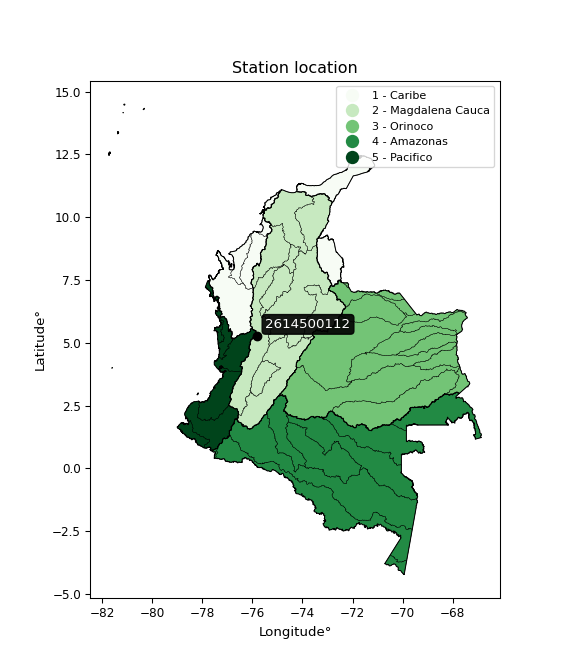

<div align="center">


</div>

# PMP Station (Rain, Pmax24h): 2614500112

Probable Maximum Precipitation (PMP) is the greatest amount of rainfall for a specific duration that is meteorologically possible for a given location, acting as a "worst-case" scenario for extreme storms, crucial for designing safety-critical infrastructure like bridges, river deviations, dams, spillways, and nuclear plants to prevent catastrophic failure. PMP is calculated by hydrologists using meteorological data to determine the upper limit of extreme rainfall, often leading to the Probable Maximum Flood (PMF) for flood control design, and is increasingly being studied for climate change impacts. Probable Maximum Precipitation (PMP) is the theoretical upper limit of rainfall, a deterministic estimate for extreme events, while probability distributions (like GEV, Gumbel) describe the likelihood and frequency of various precipitation amounts, including rare ones, showing how often events occur, with PMP representing the extreme end of these distributions, used for critical infrastructure design to ensure safety against the worst conceivable weather, unlike standard statistical forecasts which cover typical probabilities.

The most common probability distributions in hydrology, used for analyzing floods, rainfall, and streamflow, include the Normal, Log-Normal, Gumbel, Gamma (including Log-Pearson Type III), and Generalized Extreme Value (GEV) distributions, often chosen based on the data´s skewness and whether modeling extremes or general conditions, with Gumbel and GEV popular for extreme events like floods, while the Normal distribution serves as a baseline, though often requiring transformations for skewed hydrological data. These distributions help in designing water infrastructure, managing water resources, and forecasting hydrologic events.

> Hydrological data often isn´t perfectly normal (it´s skewed), so different distributions are needed for different applications, such as: **Flood Frequency Analysis**: Using Gumbel, GEV, or Log-Pearson Type III for predicting extreme flood magnitudes and their return periods, **Rainfall Analysis**: Normal for annual totals, but Log-Normal, Weibull, or GEV for intensity or extreme daily rainfall, **Streamflow Modeling**: Gamma and Log-Normal for maximum flows, GEV for minimum flows, and Kappa for daily flows.

<div align="center">

</img>

</div>


## A. General information


### 1. General running parameters

• app_version: _v20260108_. • runtime: _2026-01-08 13:24:42.400241_. • Python version: _3.14.0_. • SciPy version: _1.16.3_. • Pandas version: _2.3.3_. • NumPy version: _2.3.5_. • Stations dataset (station_dataset_file): _dataset/pmax24h_in/automatic_colombia_2003_2024.csv_. • Stations catalog (station_catalog_file): _dataset/CNE.xls_. • Minimum year to eval til year_max (date_min): _1900_. • Maximum year to eval since year_min (date_max): _2024_. • Creates, save and include plots into reports (create_plot): _False_. • Plot only fit distributions with Δo > Δ (plot_only_fit): _True_. • Plot only simple graphs avoiding multiple CDFs and multiple Extreme values plots (plot_only_simple): _True_. • Eval low extreme values, if False, evaluates high extreme values (low_extreme): _False_. • Eval every SciPy distribution as logarithmic (pdist_logarithmic_on): _True_. • Standard deviation normalized (ddof): _1.0_. • Return periods to eval in years (Tr): _[2, 2.33, 5, 10, 15, 20, 25, 50, 75, 100, 200, 250, 500, 750, 1000]_. • Minimum data sample per station, 0 means any (minimum_sample): _5_. • Z-Score maximum threshold to adjust a value, 0 means disable (zscore_max): _3.5_. • Z-Score minimum threshold to adjust a value, 0 means disable (zscore_min): _-2.5_. • Avoid zeros, e.g. rain = 0 (avoid_zeros): _True_. • Avoid null values (avoid_nans): _True_. 

:file_folder:Table: [dataset.csv](../../dataset/pmax24h_in/automatic_colombia_2003_2024.csv)

> Delta Degrees of Freedom (DDOF): is a parameter used in the formulas for calculating variance and standard deviation. When ddof=0, the divisor is $N$ (the total number of observations) and this is used when your data set is the entire population. When ddof=1, the divisor is $N-1$ and this is used when your data set is a sample drawn from a larger population. Using $N-1$ provides an unbiased estimate of the population variance (known as Bessel´s correction).


### 2. Station info and location

|   id |     CODIGO | NOMBRE                                        | CATEGORIA               | TECNOLOGIA                | ESTADO           | FECHA_INSTALACION   |   FECHA_SUSPENSION |   ALTITUD |   LATITUD |   LONGITUD | DEPARTAMENTO   | MUNICIPIO   | AREA_OPERATIVA                         | ENTIDAD                                                     | AREA_HIDROGRAFICA   | ZONA_HIDROGRAFICA   | SUBZONA_HIDROGRAFICA   |   CORRIENTE | Catalogo   |   Version |
|-----:|-----------:|:----------------------------------------------|:------------------------|:--------------------------|:-----------------|:--------------------|-------------------:|----------:|----------:|-----------:|:---------------|:------------|:---------------------------------------|:------------------------------------------------------------|:--------------------|:--------------------|:-----------------------|------------:|:-----------|----------:|
|    0 | 2614500112 | BELLAVISTA - JESUS MARIA - AUT   [2614500112] | Climatológica Principal | Automática con Telemetría | En Mantenimiento | 03/06/2017          |                nan |      1984 |   5.27594 |   -75.8002 | Caldas         | Anserma     | Area Operativa 09 - Cauca-Valle-Caldas | INSTITUTO DE HIDROLOGIA METEOROLOGIA Y ESTUDIOS AMBIENTALES | Magdalena Cauca     | Cauca               | Río Risaralda          |         nan | CNE_IDEAM  |  20251226 |

<div align="center">

Dynamic map: [:earth_americas:Google](http://maps.google.com/maps?q=5.275944444,-75.800166667) [:earth_americas:OSM](https://www.openstreetmap.org/#map=18/5.275944444/-75.800166667&layers=P) [:earth_americas:Bing](https://www.bing.com/maps?cp=5.275944444~-75.800166667&lvl=18) [:earth_americas:Apple](https://maps.apple.com/frame?center=5.275944444%2C-75.800166667&span=0.003%2C0.006)

</div>


<div align="center">

```geojson
{
  "type": "Feature",
  "geometry": {
    "type": "Point", 
    "coordinates": [-75.800166667, 5.275944444]
  }, 
  "properties": {
    "Name": "2614500112"
  }
}
```

</div>


### 3. Discrete values table and plot

<div align="center">

|               |           0 |           1 |          2 |           3 |           4 |
|:--------------|------------:|------------:|-----------:|------------:|------------:|
| Date          | 2019        | 2020        | 2021       | 2022        | 2023        |
| Value         |   37.2      |   42        |   69.4     |   55.4      |   41.2      |
| Value_initial |   37.2      |   42        |   69.4     |   55.4      |   41.2      |
| count         |    5        |    5        |    5       |    5        |    5        |
| mean          |   49.04     |   49.04     |   49.04    |   49.04     |   49.04     |
| std           |   13.2871   |   13.2871   |   13.2871  |   13.2871   |   13.2871   |
| zscore        |   -0.891087 |   -0.529836 |    1.53231 |    0.478658 |   -0.590044 |


</div>


> The initial value (value_initial) correspond to the initial obtained or null completed value, and value (value) is adjusted only when the initial value is outside the valid range (outlier) definite through the Z-Score value. If Z-Score is active, values out of range or outliers are replaced with the station mean value. A Z-Score (or standard score) measures how many standard deviations a data point is from the mean of a dataset, indicating its relative position; positive scores mean above the mean, negative mean below, and a score of zero is exactly at the mean, allowing for comparison of values from different distributions. It´s calculated using the formula $z=(x–μ)/σ$, where $x$ is the data point, $μ$ is the mean, and $σ$ is the standard deviation, helping identify outliers and understand probability.
>
> <sub>**Note**: In this study, "completing" (filling gaps in) and "extending" (forecasting or lengthening the historical record) rainfall data series are avoided for certain critical analyses because they introduce artificial bias and uncertainty, which can distort the statistics of rare events (extremes), alter day-to-day variability, and compromise the integrity and homogeneity of the original data. Some reasons against Completing/Extending rainfall data are: **Distortion of Extremes and Variability**: The primary issue is that most gap-filling or extension methods rely on averaging or regression with nearby stations, which inherently smooths the data. Rainfall is highly variable in space and time, with a large percentage of zero values and occasional large storms. Infilling methods often underestimate the highest values and overestimate the lowest (zero) values, which severely distorts analyses focused on flood frequency, drought severity, and intensity-duration-frequency (IDF) curves, **Loss of Data Homogeneity**: Infilled or extended data are synthetic estimates, not actual measurements. Combining these estimates with observed data can violate the assumption of data homogeneity, which requires that the data properties do not change over time. Inhomogeneity can lead to incorrect conclusions about long-term trends or changes in climate patterns, **Propagation of Errors**: Errors and biases from the original data (e.g., wind-induced undercatch, instrument errors, site changes) or the data used for imputation can propagate through the analysis, leading to unreliable hydrological models and inaccurate predictions, **Compromised Statistical Integrity**: For statistical analyses, especially those involving the frequency of events, using artificial data can introduce time bias or autocorrelation that doesn´t exist in reality, making it difficult to assess the true probability of events, **Difficulty in Validation**: It is difficult to accurately validate the quality of filled or extended data, especially for past periods where ground-truth measurements are unavailable. The reliability of imputation techniques heavily depends on the density of the surrounding station network and the complexity of the local topography.</sub>


### 4. Active continuous probability distributions from SciPy (43 of 104 available)

A Probability Density Function (PDF) describes the relative likelihood of a continuous random variable falling within a specific range, where the total area under its curve equals 1, and the area over any interval gives the actual probability for that range. Unlike discrete probabilities (like rolling a die), a PDF shows density, not direct probability for a single point (which is zero), with higher points indicating higher likelihood, often visualized as a bell curve for normal distributions.

A log of a probability density function (log-PDF) is simply the logarithm of the PDF´s value, denoted as $log(f(x))$, useful for converting multiplication of probabilities into addition, improving numerical stability with tiny numbers, and connecting to information theory concepts like entropy. Instead of dealing with very small probabilities (e.g., 0.000001), log-PDFs use negative numbers (e.g., $log(0.00001) ≈ -11.51$ that are easier for computers to handle, preventing underflow errors and simplifying complex calculations. In this study, each active probability distribution from SciPy is also evaluated in the $log$ form.

[scipy.stats](https://docs.scipy.org/doc/scipy/reference/stats.html) is a Python´s powerful submodule within the SciPy library for comprehensive statistical analysis, offering over 130 probability distributions (like Normal, Poisson), functions for descriptive stats (mean, variance), hypothesis testing (t-tests, chi-square), random variable generation, and statistical tests, making it essential for data science, modeling, and research. It provides tools to explore, model, and draw conclusions from data efficiently, working seamlessly with NumPy.

<div align="center">

|   id | p_dist             |   n_parameter | fit_method   | label                                                                       | active   | ref                                                                                                        |
|-----:|:-------------------|--------------:|:-------------|:----------------------------------------------------------------------------|:---------|:-----------------------------------------------------------------------------------------------------------|
|    0 | alpha              |             3 | MLE          | Alpha                                                                       | True     | [:mortar_board:](https://docs.scipy.org/doc/scipy/reference/generated/scipy.stats.alpha.html)              |
|    1 | betaprime          |             4 | MLE          | Beta prime                                                                  | True     | [:mortar_board:](https://docs.scipy.org/doc/scipy/reference/generated/scipy.stats.betaprime.html)          |
|    2 | chi2               |             3 | MLE          | Chi²                                                                        | True     | [:mortar_board:](https://docs.scipy.org/doc/scipy/reference/generated/scipy.stats.chi2.html)               |
|    3 | crystalball        |             4 | MLE          | Crystalball                                                                 | True     | [:mortar_board:](https://docs.scipy.org/doc/scipy/reference/generated/scipy.stats.crystalball.html)        |
|    4 | erlang             |             3 | MLE          | Erlang                                                                      | True     | [:mortar_board:](https://docs.scipy.org/doc/scipy/reference/generated/scipy.stats.erlang.html)             |
|    5 | expon              |             2 | MLE          | Exponential                                                                 | True     | [:mortar_board:](https://docs.scipy.org/doc/scipy/reference/generated/scipy.stats.expon.html)              |
|    6 | exponnorm          |             3 | MLE          | Exponentially modified Normal                                               | True     | [:mortar_board:](https://docs.scipy.org/doc/scipy/reference/generated/scipy.stats.exponnorm.html)          |
|    7 | f                  |             4 | MLE          | F                                                                           | True     | [:mortar_board:](https://docs.scipy.org/doc/scipy/reference/generated/scipy.stats.f.html)                  |
|    8 | fatiguelife        |             3 | MLE          | Fatigue-life (Birnbaum-Saunders)                                            | True     | [:mortar_board:](https://docs.scipy.org/doc/scipy/reference/generated/scipy.stats.fatiguelife.html)        |
|    9 | fisk               |             3 | MLE          | Fisk                                                                        | True     | [:mortar_board:](https://docs.scipy.org/doc/scipy/reference/generated/scipy.stats.fisk.html)               |
|   10 | gamma              |             3 | MLE          | Gamma                                                                       | True     | [:mortar_board:](https://docs.scipy.org/doc/scipy/reference/generated/scipy.stats.gamma.html)              |
|   11 | genexpon           |             5 | MLE          | Generalized exponential                                                     | True     | [:mortar_board:](https://docs.scipy.org/doc/scipy/reference/generated/scipy.stats.genexpon.html)           |
|   12 | genlogistic        |             3 | MLE          | Generalized logistic                                                        | True     | [:mortar_board:](https://docs.scipy.org/doc/scipy/reference/generated/scipy.stats.genlogistic.html)        |
|   13 | gibrat             |             2 | MM           | Gibrat                                                                      | True     | [:mortar_board:](https://docs.scipy.org/doc/scipy/reference/generated/scipy.stats.gibrat.html)             |
|   14 | gompertz           |             3 | MLE          | Gompertz (or truncated Gumbel)                                              | True     | [:mortar_board:](https://docs.scipy.org/doc/scipy/reference/generated/scipy.stats.gompertz.html)           |
|   15 | gumbel_l           |             2 | MM           | Gumbel Left Skew                                                            | True     | [:mortar_board:](https://docs.scipy.org/doc/scipy/reference/generated/scipy.stats.gumbel_l.html)           |
|   16 | gumbel_r           |             2 | MM           | Gumbel Right Skew                                                           | True     | [:mortar_board:](https://docs.scipy.org/doc/scipy/reference/generated/scipy.stats.gumbel_r.html)           |
|   17 | halflogistic       |             2 | MM           | Half-logistic                                                               | True     | [:mortar_board:](https://docs.scipy.org/doc/scipy/reference/generated/scipy.stats.halflogistic.html)       |
|   18 | halfnorm           |             2 | MM           | Half Normal                                                                 | True     | [:mortar_board:](https://docs.scipy.org/doc/scipy/reference/generated/scipy.stats.halfnorm.html)           |
|   19 | hypsecant          |             2 | MM           | hyperbolic secant                                                           | True     | [:mortar_board:](https://docs.scipy.org/doc/scipy/reference/generated/scipy.stats.hypsecant.html)          |
|   20 | invgamma           |             3 | MLE          | Inverted gamma                                                              | True     | [:mortar_board:](https://docs.scipy.org/doc/scipy/reference/generated/scipy.stats.invgamma.html)           |
|   21 | invgauss           |             3 | MLE          | Inverse Gaussian                                                            | True     | [:mortar_board:](https://docs.scipy.org/doc/scipy/reference/generated/scipy.stats.invgauss.html)           |
|   22 | invweibull         |             3 | MLE          | Inverted Weibull                                                            | True     | [:mortar_board:](https://docs.scipy.org/doc/scipy/reference/generated/scipy.stats.invweibull.html)         |
|   23 | kstwobign          |             2 | MLE          | Limiting distribution of scaled Kolmogorov-Smirnov two-sided test statistic | True     | [:mortar_board:](https://docs.scipy.org/doc/scipy/reference/generated/scipy.stats.kstwobign.html)          |
|   24 | laplace            |             2 | MM           | Laplace                                                                     | True     | [:mortar_board:](https://docs.scipy.org/doc/scipy/reference/generated/scipy.stats.laplace.html)            |
|   25 | laplace_asymmetric |             3 | MLE          | Asymmetric Laplace                                                          | True     | [:mortar_board:](https://docs.scipy.org/doc/scipy/reference/generated/scipy.stats.laplace_asymmetric.html) |
|   26 | loggamma           |             3 | MLE          | Log gamma                                                                   | True     | [:mortar_board:](https://docs.scipy.org/doc/scipy/reference/generated/scipy.stats.loggamma.html)           |
|   27 | logistic           |             2 | MM           | Logistic (or Sech-squared)                                                  | True     | [:mortar_board:](https://docs.scipy.org/doc/scipy/reference/generated/scipy.stats.logistic.html)           |
|   28 | lognorm            |             3 | MLE          | Log Normal                                                                  | True     | [:mortar_board:](https://docs.scipy.org/doc/scipy/reference/generated/scipy.stats.lognorm.html)            |
|   29 | maxwell            |             2 | MM           | Maxwell                                                                     | True     | [:mortar_board:](https://docs.scipy.org/doc/scipy/reference/generated/scipy.stats.maxwell.html)            |
|   30 | mielke             |             4 | MLE          | Mielke Beta-Kappa / Dagum                                                   | True     | [:mortar_board:](https://docs.scipy.org/doc/scipy/reference/generated/scipy.stats.mielke.html)             |
|   31 | moyal              |             2 | MM           | Moyal                                                                       | True     | [:mortar_board:](https://docs.scipy.org/doc/scipy/reference/generated/scipy.stats.moyal.html)              |
|   32 | nakagami           |             3 | MLE          | Nakagami                                                                    | True     | [:mortar_board:](https://docs.scipy.org/doc/scipy/reference/generated/scipy.stats.nakagami.html)           |
|   33 | ncf                |             5 | MLE          | Non-central F distribution                                                  | True     | [:mortar_board:](https://docs.scipy.org/doc/scipy/reference/generated/scipy.stats.ncf.html)                |
|   34 | nct                |             4 | MLE          | Non-central Student’s t                                                     | True     | [:mortar_board:](https://docs.scipy.org/doc/scipy/reference/generated/scipy.stats.nct.html)                |
|   35 | norm               |             2 | MM           | Normal                                                                      | True     | [:mortar_board:](https://docs.scipy.org/doc/scipy/reference/generated/scipy.stats.norm.html)               |
|   36 | pearson3           |             3 | MM           | Pearson type III                                                            | True     | [:mortar_board:](https://docs.scipy.org/doc/scipy/reference/generated/scipy.stats.pearson3.html)           |
|   37 | rayleigh           |             2 | MM           | Rayleigh                                                                    | True     | [:mortar_board:](https://docs.scipy.org/doc/scipy/reference/generated/scipy.stats.rayleigh.html)           |
|   38 | rice               |             3 | MLE          | Rice                                                                        | True     | [:mortar_board:](https://docs.scipy.org/doc/scipy/reference/generated/scipy.stats.rice.html)               |
|   39 | t                  |             3 | MLE          | Student’s t                                                                 | True     | [:mortar_board:](https://docs.scipy.org/doc/scipy/reference/generated/scipy.stats.t.html)                  |
|   40 | truncnorm          |             4 | MLE          | Truncated normal                                                            | True     | [:mortar_board:](https://docs.scipy.org/doc/scipy/reference/generated/scipy.stats.truncnorm.html)          |
|   41 | wald               |             2 | MM           | Wald                                                                        | True     | [:mortar_board:](https://docs.scipy.org/doc/scipy/reference/generated/scipy.stats.wald.html)               |
|   42 | weibull_min        |             3 | MLE          | Weibull minimum                                                             | True     | [:mortar_board:](https://docs.scipy.org/doc/scipy/reference/generated/scipy.stats.weibull_min.html)        |

</div>

> **n_parameter:** # arguments & localization & scale.
>
> **Fit methods:** (MLE) maximum likelihood, (MM) L-moments.
>
>**Inactive** (With the only purpose of prevent loops, zero divisions, infinite values, over high estimated values or horizontal trending for recurrence intervals estimations, the follow distributions were disabled.)**:** foldnorm, gennorm, norminvgauss, powernorm, powerlognorm, skewnorm, genextreme, anglit, arcsine, argus, beta, bradford, burr, burr12, cauchy, cosine, halfcauchy, foldcauchy, skewcauchy, wrapcauchy, dgamma, gengamma, exponweib, exponpow, truncexpon, gausshyper, genhalflogistic, genhyperbolic, geninvgauss, halfgennorm, johnsonsb, johnsonsu, kappa4, kappa3, ksone, kstwo, loglaplace, levy, levy_l, levy_stable, ncx2, pareto, genpareto, truncpareto, lomax, powerlaw, rdist, rel_breitwigner, recipinvgauss, semicircular, studentized_range, trapezoid, triang, truncweibull_min, tukeylambda, uniform, loguniform, vonmises, vonmises_line, weibull_max, dweibull, 


## B. Probability (PDF) vs. Empirical (EDF) distributions functions

A continuous probability distribution (CPD) describes probabilities for variables that can take any value within a range (like rain any time), unlike discrete variables with specific outcomes (like temperature). It uses a Probability Density Function (PDF), a curve where the total area under it equals 1, and the probability of the variable falling within an interval (a to b) is found by calculating the area under the curve between those points. A key feature is that the probability of hitting any single exact value is zero, so probabilities are always expressed for ranges, e.g., $P(a ≤ X ≤ b)$.

<div align="center">

Distributions parameters from station values
|    |    station | p_dist                |   n |           loc |         scale | shape                  | shape1                | shape2             | shape3   |
|---:|-----------:|:----------------------|----:|--------------:|--------------:|:-----------------------|:----------------------|:-------------------|:---------|
|  0 | 2614500112 | alpha                 |   5 |     34.0086   |   6.06001     | 1.6486977574923457e-08 |                       |                    |          |
|  1 | 2614500112 | betaprime             |   5 |     -0.559195 |  21.0731      | 66.14544168438195      | 29.21732765478299     |                    |          |
|  2 | 2614500112 | chi2                  |   5 |     37.2      |   1.15723     | 0.8828186291539708     |                       |                    |          |
|  3 | 2614500112 | crystalball           |   5 |     49.04     |  11.8844      | 4728.632823400763      | 51.57849712313464     |                    |          |
|  4 | 2614500112 | erlang                |   5 |     37.2      |   8.47113     | 0.6192233039056283     |                       |                    |          |
|  5 | 2614500112 | expon                 |   5 |     37.2      |  11.84        |                        |                       |                    |          |
|  6 | 2614500112 | exponnorm             |   5 |     37.19     |   0.00284938  | 4141.577059067141      |                       |                    |          |
|  7 | 2614500112 | f                     |   5 |     34.1616   |   7.41709     | 11516.644342747422     | 3.1975666801342983    |                    |          |
|  8 | 2614500112 | fatiguelife           |   5 |     37.2      |   4.49119e-06 | 1609.4599330132887     |                       |                    |          |
|  9 | 2614500112 | fisk                  |   5 |     37.2      |   5.50959     | 0.8524787659225639     |                       |                    |          |
| 10 | 2614500112 | gamma                 |   5 |     37.2      |  13.5034      | 0.28565472682982473    |                       |                    |          |
| 11 | 2614500112 | genexpon              |   5 |     37.2      |  14.0567      | 1.1872145736605606     | 2.878329929599195e-06 | 1.2134422852880986 |          |
| 12 | 2614500112 | genlogistic           |   5 |    -19.1192   |   8.40842     | 1741.5007994613547     |                       |                    |          |
| 13 | 2614500112 | gibrat                |   5 |     39.9737   |   5.49899     |                        |                       |                    |          |
| 14 | 2614500112 | gompertz              |   5 |     37.2      |  23.6359      | 1.0260020584380154     |                       |                    |          |
| 15 | 2614500112 | gumbel_l              |   5 |     54.3886   |   9.26621     |                        |                       |                    |          |
| 16 | 2614500112 | gumbel_r              |   5 |     43.6914   |   9.26621     |                        |                       |                    |          |
| 17 | 2614500112 | halflogistic          |   5 |     34.9543   |  10.1607      |                        |                       |                    |          |
| 18 | 2614500112 | halfnorm              |   5 |     33.3097   |  19.715       |                        |                       |                    |          |
| 19 | 2614500112 | hypsecant             |   5 |     49.04     |   7.56583     |                        |                       |                    |          |
| 20 | 2614500112 | invgamma              |   5 |     34.1606   |  11.8588      | 1.5987747587614587     |                       |                    |          |
| 21 | 2614500112 | invgauss              |   5 |     35.4807   |   8.05403     | 1.6835396378315355     |                       |                    |          |
| 22 | 2614500112 | invweibull            |   5 |     33.8965   |   7.15969     | 1.3485499537970225     |                       |                    |          |
| 23 | 2614500112 | kstwobign             |   5 |     14.2234   |  39.9918      |                        |                       |                    |          |
| 24 | 2614500112 | laplace               |   5 |     49.04     |   8.40352     |                        |                       |                    |          |
| 25 | 2614500112 | laplace_asymmetric    |   5 |     41.2      |   6.21613     | 0.551638189767542      |                       |                    |          |
| 26 | 2614500112 | loggamma              |   5 |  -2984.78     | 425.502       | 1249.4394615307283     |                       |                    |          |
| 27 | 2614500112 | logistic              |   5 |     49.04     |   6.5522      |                        |                       |                    |          |
| 28 | 2614500112 | lognorm               |   5 |     37.2      |   0.00956233  | 13.986185439855282     |                       |                    |          |
| 29 | 2614500112 | maxwell               |   5 |     20.879    |  17.6473      |                        |                       |                    |          |
| 30 | 2614500112 | mielke                |   5 |     21.7598   |   5.61121     | 221.50489090243514     | 3.3194448619894406    |                    |          |
| 31 | 2614500112 | moyal                 |   5 |     42.2438   |   5.34985     |                        |                       |                    |          |
| 32 | 2614500112 | nakagami              |   5 |     37.2      |  18.4144      | 0.11647000416270084    |                       |                    |          |
| 33 | 2614500112 | ncf                   |   5 |     34.1642   |   0.287743    | 245.21671365201428     | 3.197553966041502     | 6074.82231108491   |          |
| 34 | 2614500112 | nct                   |   5 |     -0.238745 |   0.845262    | 11.104828250237446     | 54.15910276991457     |                    |          |
| 35 | 2614500112 | norm                  |   5 |     49.04     |  11.8844      |                        |                       |                    |          |
| 36 | 2614500112 | pearson3              |   5 |     49.04     |  11.8844      | 0.7394655196470069     |                       |                    |          |
| 37 | 2614500112 | rayleigh              |   5 |     26.3045   |  18.1403      |                        |                       |                    |          |
| 38 | 2614500112 | rice                  |   5 |     30.0608   |  15.8343      | 0.0005764071040268923  |                       |                    |          |
| 39 | 2614500112 | t                     |   5 |     49.042    |  11.8853      | 2032456.6436570175     |                       |                    |          |
| 40 | 2614500112 | truncnorm             |   5 | -16444.4      | 443.055       | 37.19998988154424      | 71.28523520468516     |                    |          |
| 41 | 2614500112 | wald                  |   5 |     37.1556   |  11.8844      |                        |                       |                    |          |
| 42 | 2614500112 | weibull_min           |   5 |     37.2      |  13.4088      | 0.8151327458272595     |                       |                    |          |
| 43 | 2614500112 | logalpha              |   5 |      2.64662  |   6.75925     | 5.744316574433363      |                       |                    |          |
| 44 | 2614500112 | logbetaprime          |   5 |      1.49257  |   0.310669    | 1024.4521224087985     | 135.39474101421428    |                    |          |
| 45 | 2614500112 | logchi2               |   5 |      3.61631  |   0.952144    | 1.0075430927094198     |                       |                    |          |
| 46 | 2614500112 | logcrystalball        |   5 |      3.86538  |   0.229109    | 3668.0862016210394     | 254.01627656088857    |                    |          |
| 47 | 2614500112 | logerlang             |   5 |      3.61631  |   0.218328    | 0.4164327337263912     |                       |                    |          |
| 48 | 2614500112 | logexpon              |   5 |      3.61631  |   0.249068    |                        |                       |                    |          |
| 49 | 2614500112 | logexponnorm          |   5 |      3.61602  |   8.81243e-05 | 2829.8549743829108     |                       |                    |          |
| 50 | 2614500112 | logf                  |   5 |      3.50575  |   0.234066    | 1743.5207938449685     | 4.992285037594227     |                    |          |
| 51 | 2614500112 | logfatiguelife        |   5 |      3.61631  |   1.95687e-06 | 363.44386665049126     |                       |                    |          |
| 52 | 2614500112 | logfisk               |   5 |      3.61631  |   0.259864    | 0.7009544552052991     |                       |                    |          |
| 53 | 2614500112 | loggamma              |   5 |      3.61631  |   0.212404    | 0.8942292847766685     |                       |                    |          |
| 54 | 2614500112 | loggenexpon           |   5 |      3.61631  |   0.315276    | 1.26370241889314       | 0.0011235974230067104 | 2.372112056808695  |          |
| 55 | 2614500112 | loggenlogistic        |   5 |      2.46175  |   0.170637    | 2004.1738890157199     |                       |                    |          |
| 56 | 2614500112 | loggibrat             |   5 |      3.69062  |   0.105996    |                        |                       |                    |          |
| 57 | 2614500112 | loggompertz           |   5 |      3.61631  |   0.527074    | 1.2895847880758549     |                       |                    |          |
| 58 | 2614500112 | loggumbel_l           |   5 |      3.96849  |   0.178635    |                        |                       |                    |          |
| 59 | 2614500112 | loggumbel_r           |   5 |      3.76227  |   0.178635    |                        |                       |                    |          |
| 60 | 2614500112 | loghalflogistic       |   5 |      3.59383  |   0.19588     |                        |                       |                    |          |
| 61 | 2614500112 | loghalfnorm           |   5 |      3.56213  |   0.380068    |                        |                       |                    |          |
| 62 | 2614500112 | loghypsecant          |   5 |      3.86538  |   0.145855    |                        |                       |                    |          |
| 63 | 2614500112 | loginvgamma           |   5 |      3.50542  |   0.584572    | 2.495299139384082      |                       |                    |          |
| 64 | 2614500112 | loginvgauss           |   5 |      3.56002  |   0.294068    | 1.0383761645585365     |                       |                    |          |
| 65 | 2614500112 | loginvweibull         |   5 |      3.45024  |   0.270919    | 2.0815463787621944     |                       |                    |          |
| 66 | 2614500112 | logkstwobign          |   5 |      3.16746  |   0.799941    |                        |                       |                    |          |
| 67 | 2614500112 | loglaplace            |   5 |      3.86538  |   0.162004    |                        |                       |                    |          |
| 68 | 2614500112 | loglaplace_asymmetric |   5 |      3.71844  |   0.133605    | 0.591123537173114      |                       |                    |          |
| 69 | 2614500112 | logloggamma           |   5 |    -35.7451   |   6.08279     | 673.5868105969948      |                       |                    |          |
| 70 | 2614500112 | loglogistic           |   5 |      3.86538  |   0.126314    |                        |                       |                    |          |
| 71 | 2614500112 | loglognorm            |   5 |      3.61631  |   0.000267395 | 13.579265723536407     |                       |                    |          |
| 72 | 2614500112 | logmaxwell            |   5 |      3.32248  |   0.340207    |                        |                       |                    |          |
| 73 | 2614500112 | logmielke             |   5 |      3.10836  |   0.245626    | 239.52363852659087     | 4.252853000090405     |                    |          |
| 74 | 2614500112 | logmoyal              |   5 |      3.73436  |   0.103135    |                        |                       |                    |          |
| 75 | 2614500112 | lognakagami           |   5 |      3.61631  |   0.533709    | 0.14968810832910423    |                       |                    |          |
| 76 | 2614500112 | logncf                |   5 |      1.1259   |   2.73337     | 402.93904903660496     | 1166.8355052275106    | 0.1670898163690242 |          |
| 77 | 2614500112 | lognct                |   5 |     -1.7555   |   0.137383    | 461.0576624523694      | 40.83174677434714     |                    |          |
| 78 | 2614500112 | lognorm               |   5 |      3.86538  |   0.229109    |                        |                       |                    |          |
| 79 | 2614500112 | logpearson3           |   5 |      3.86538  |   0.229109    | 0.5844265967988662     |                       |                    |          |
| 80 | 2614500112 | lograyleigh           |   5 |      3.42708  |   0.349712    |                        |                       |                    |          |
| 81 | 2614500112 | logrice               |   5 |      3.48793  |   0.312214    | 0.00320865646065035    |                       |                    |          |
| 82 | 2614500112 | logt                  |   5 |      3.86538  |   0.229108    | 1059837935.7269397     |                       |                    |          |
| 83 | 2614500112 | logtruncnorm          |   5 |     -1.74388  |   1.49768     | 3.5789870604073464     | 3.995351071076823     |                    |          |
| 84 | 2614500112 | logwald               |   5 |      3.63629  |   0.229085    |                        |                       |                    |          |
| 85 | 2614500112 | logweibull_min        |   5 |      3.61631  |   0.240961    | 0.4155053812327621     |                       |                    |          |

</div>

> **loc** (Location parameter): This shifts the distribution along the x-axis. For many common distributions, like the normal (Gaussian) distribution, loc represents the mean $μ$. For others, like the uniform distribution, it might represent the minimum value, or for the beta distribution, the left end of the support interval.
>
> **scale** (Scale parameter): This determines the width or spread of the distribution. For the normal distribution, scale represents the standard deviation $σ$. For a uniform distribution, it defines the length of the interval (from $loc$ to $loc + scale$).
>
> **shape** (Shape parameters): Refers to parameters that define the specific form of a probability distribution, distinct from its location (loc) and scale (scale). These parameters are required arguments for most distribution functions. For example, a normal (Gaussian) distribution is fully defined by its location (mean) and scale (standard deviation), so it has no specific shape parameters beyond loc and scale. However, other distributions have intrinsic properties that need specification, as Gamma distribution that takes a shape parameter, often named $a$ or $alpha$.


### 0. Cumulative distribution values - CDF (86 evaluated)

Cumulative Distribution Function (CDF), denoted as $F$<sub>$X$</sub>$(x)$, is a function that gives the probability that a random variable $X$ will take a value less than or equal to a specific value, $x$ (i.e., $(P(X≥x)$. It essentially "accumulates" probabilities from a given point up to the far right (positive infinity), providing a complete picture of the distribution´s probabilities for both discrete (like rain) and continuous (like temperature) variables, helping to find probabilities over ranges or above certain values. Each station is evaluated separately ordering the $x$ values ascending, calculating the CDF and PDF values for the activated distributions and their logarithmic forms.

<div align="center">

CDF ordered by x ascending and calculating $log(f(x))$ separately
|   id |    Station |   date |    x |   count |   mean |     std |    zscore |   Value_initial |    station |   m |     alpha |   alpha_pdf |   betaprime |   betaprime_pdf |        chi2 |    chi2_pdf |   crystalball |   crystalball_pdf |      erlang |     erlang_pdf |    expon |   expon_pdf |   exponnorm |   exponnorm_pdf |         f |      f_pdf |   fatiguelife |   fatiguelife_pdf |       fisk |    fisk_pdf |       gamma |   gamma_pdf |    genexpon |   genexpon_pdf |   genlogistic |   genlogistic_pdf |    gibrat |   gibrat_pdf |    gompertz |   gompertz_pdf |   gumbel_l |   gumbel_l_pdf |   gumbel_r |   gumbel_r_pdf |   halflogistic |   halflogistic_pdf |   halfnorm |   halfnorm_pdf |   hypsecant |   hypsecant_pdf |   invgamma |   invgamma_pdf |   invgauss |   invgauss_pdf |   invweibull |   invweibull_pdf |   kstwobign |   kstwobign_pdf |   laplace |   laplace_pdf |   laplace_asymmetric |   laplace_asymmetric_pdf |    loggamma |   loggamma_pdf |   logistic |   logistic_pdf |   lognorm |   lognorm_pdf |   maxwell |   maxwell_pdf |   mielke |   mielke_pdf |    moyal |   moyal_pdf |   nakagami |   nakagami_pdf |       ncf |    ncf_pdf |      nct |    nct_pdf |     norm |   norm_pdf |   pearson3 |   pearson3_pdf |   rayleigh |   rayleigh_pdf |      rice |   rice_pdf |        t |      t_pdf |   truncnorm |   truncnorm_pdf |        wald |    wald_pdf |   weibull_min |   weibull_min_pdf |   logalpha |   logalpha_pdf |   logbetaprime |   logbetaprime_pdf |     logchi2 |   logchi2_pdf |   logcrystalball |   logcrystalball_pdf |   logerlang |   logerlang_pdf |   logexpon |   logexpon_pdf |   logexponnorm |   logexponnorm_pdf |      logf |   logf_pdf |   logfatiguelife |   logfatiguelife_pdf |     logfisk |   logfisk_pdf |   loggenexpon |   loggenexpon_pdf |   loggenlogistic |   loggenlogistic_pdf |   loggibrat |   loggibrat_pdf |   loggompertz |   loggompertz_pdf |   loggumbel_l |   loggumbel_l_pdf |   loggumbel_r |   loggumbel_r_pdf |   loghalflogistic |   loghalflogistic_pdf |   loghalfnorm |   loghalfnorm_pdf |   loghypsecant |   loghypsecant_pdf |   loginvgamma |   loginvgamma_pdf |   loginvgauss |   loginvgauss_pdf |   loginvweibull |   loginvweibull_pdf |   logkstwobign |   logkstwobign_pdf |   loglaplace |   loglaplace_pdf |   loglaplace_asymmetric |   loglaplace_asymmetric_pdf |   logloggamma |   logloggamma_pdf |   loglogistic |   loglogistic_pdf |   loglognorm |   loglognorm_pdf |   logmaxwell |   logmaxwell_pdf |   logmielke |   logmielke_pdf |   logmoyal |   logmoyal_pdf |   lognakagami |   lognakagami_pdf |   logncf |   logncf_pdf |   lognct |   lognct_pdf |   logpearson3 |   logpearson3_pdf |   lograyleigh |   lograyleigh_pdf |   logrice |   logrice_pdf |     logt |   logt_pdf |   logtruncnorm |   logtruncnorm_pdf |   logwald |   logwald_pdf |   logweibull_min |   logweibull_min_pdf |
|-----:|-----------:|-------:|-----:|--------:|-------:|--------:|----------:|----------------:|-----------:|----:|----------:|------------:|------------:|----------------:|------------:|------------:|--------------:|------------------:|------------:|---------------:|---------:|------------:|------------:|----------------:|----------:|-----------:|--------------:|------------------:|-----------:|------------:|------------:|------------:|------------:|---------------:|--------------:|------------------:|----------:|-------------:|------------:|---------------:|-----------:|---------------:|-----------:|---------------:|---------------:|-------------------:|-----------:|---------------:|------------:|----------------:|-----------:|---------------:|-----------:|---------------:|-------------:|-----------------:|------------:|----------------:|----------:|--------------:|---------------------:|-------------------------:|------------:|---------------:|-----------:|---------------:|----------:|--------------:|----------:|--------------:|---------:|-------------:|---------:|------------:|-----------:|---------------:|----------:|-----------:|---------:|-----------:|---------:|-----------:|-----------:|---------------:|-----------:|---------------:|----------:|-----------:|---------:|-----------:|------------:|----------------:|------------:|------------:|--------------:|------------------:|-----------:|---------------:|---------------:|-------------------:|------------:|--------------:|-----------------:|---------------------:|------------:|----------------:|-----------:|---------------:|---------------:|-------------------:|----------:|-----------:|-----------------:|---------------------:|------------:|--------------:|--------------:|------------------:|-----------------:|---------------------:|------------:|----------------:|--------------:|------------------:|--------------:|------------------:|--------------:|------------------:|------------------:|----------------------:|--------------:|------------------:|---------------:|-------------------:|--------------:|------------------:|--------------:|------------------:|----------------:|--------------------:|---------------:|-------------------:|-------------:|-----------------:|------------------------:|----------------------------:|--------------:|------------------:|--------------:|------------------:|-------------:|-----------------:|-------------:|-----------------:|------------:|----------------:|-----------:|---------------:|--------------:|------------------:|---------:|-------------:|---------:|-------------:|--------------:|------------------:|--------------:|------------------:|----------:|--------------:|---------:|-----------:|---------------:|-------------------:|----------:|--------------:|-----------------:|---------------------:|
|    0 | 2614500112 |   2019 | 37.2 |       5 |  49.04 | 13.2871 | -0.891087 |            37.2 | 2614500112 |   1 | 0.0575846 |  0.0782521  |    0.137077 |      0.0268069  | 4.43163e-07 | 2.75305e+07 |      0.15956  |        0.0204364  | 5.15406e-10 | 44916.6        | 0        |   0.0844595 | 0.000850569 |      0.0846492  | 0.0583373 | 0.0656106  |     0.0106346 |       9.90783e+10 | 1.1936e-12 | 17.9003     | 4.80173e-05 | 1.93041e+09 | 2.75549e-11 |     0.0844588  |      0.116867 |        0.0298185  | 0         |   0          | 5.82495e-11 |     0.0434086  |   0.144831 |     0.0144392  |   0.13334  |     0.0289936  |       0.110064 |          0.048613  |   0.156427 |     0.0396907  |    0.131228 |      0.0168577  |  0.0583379 |     0.0656111  |  0.0535531 |     0.0841929  |    0.0585476 |       0.0678262  |    0.103896 |      0.0292788  |  0.122202 |    0.0145418  |            0.0726647 |                0.0211909 | 7.77691e-14 |     156.598    |   0.140998 |     0.018485   |  0.138493 |      0.96436  |  0.16381  |    0.0252154  | 0.10243  |   0.0493297  | 0.109106 |   0.0331016 | 0.00021155 |    6.93531e+09 | 0.0583376 | 0.065611   | 0.125711 | 0.0295427  | 0.15956  | 0.0204364  |   0.152341 |     0.0269891  |   0.165043 |      0.0276454 | 0.0966466 |  0.0257223 | 0.159538 | 0.020433   |    0        |      0.084023   | 9.24494e-60 | 2.79994e-56 |   3.53342e-13 |       40.5353     |   0.110055 |       1.35217  |       0.125578 |           1.09085  | 1.50419e-08 |   1.70634e+07 |         0.138493 |             0.96436  |   8.595e-07 |     8.05973e+08 |   0        |       4.01497  |     0.00114244 |           4.00294  | 0.0608796 |   2.21264  |         0.08513  |          1.35608e+10 | 4.45463e-11 |  70312.4      |    4.7215e-10 |          4.00824  |        0.0994972 |             1.34479  |   0         |        0        |   9.46621e-10 |          2.44669  |      0.129988 |          0.678184 |      0.10395  |          1.31736  |         0.0573175 |              2.5442   |      0.113362 |           2.0781  |       0.114175 |           0.766119 |     0.0608838 |          2.21259  |     0.0544403 |          2.84955  |       0.0626826 |            2.17605  |      0.0887596 |           1.35207  |     0.107468 |         0.663365 |               0.0710552 |                    0.899697 |      0.144296 |          0.955934 |      0.122195 |          0.849176 |    0.0228889 |      8.99911e+12 |     0.137645 |         1.20479  |   0.0815831 |        1.67432  |  0.0763381 |       1.42544  |   2.46628e-05 |       1.66261e+10 | 0.130972 |     1.02841  | 0.141331 |     1.0218   |      0.129372 |          1.1895   |      0.136185 |          1.33657  | 0.0810624 |      1.21024  | 0.138492 |   0.96436  |    8.12045e-06 |           3.14324  |  0        |      0        |      7.54651e-07 |          7.06077e+08 |
|    1 | 2614500112 |   2023 | 41.2 |       5 |  49.04 | 13.2871 | -0.590044 |            41.2 | 2614500112 |   2 | 0.399411  |  0.0655524  |    0.263848 |      0.035709   | 0.947223    | 0.0281684   |      0.254727 |        0.0270043  | 0.59133     |     0.0677175  | 0.286689 |   0.0602459 | 0.288093    |      0.0603265  | 0.369938  | 0.0679097  |     0.721185  |       0.0246223   | 0.43218    |  0.0522997  | 0.737477    | 0.041694    | 0.286687    |     0.0602456  |      0.263324 |        0.0417721  | 0.0667351 |   0.105528   | 0.172372    |     0.0425509  |   0.214094 |     0.0204332  |   0.270229 |     0.0381592  |       0.298022 |          0.0448385 |   0.311003 |     0.0373562  |    0.217045 |      0.0265156  |  0.369939  |     0.0679096  |  0.396489  |     0.0654142  |    0.377746  |       0.0679024  |    0.246927 |      0.0404819  |  0.196697 |    0.0234065  |            0.233308  |                0.0680386 | 0.43567     |       2.93036  |   0.23209  |     0.0272007  |  0.260648 |      1.41759  |  0.277024 |    0.0308934  | 0.342903 |   0.0621679  | 0.270259 |   0.044772  | 0.57695    |    0.0334337   | 0.369939  | 0.0679097  | 0.266902 | 0.0396003  | 0.254727 | 0.0270043  |   0.275504 |     0.0338101  |   0.28618  |      0.0323113 | 0.219208  |  0.0346891 | 0.254688 | 0.0270002  |    0.285472 |      0.0600514  | 0.208813    | 0.0892138   |   0.311381    |        0.0523521  |   0.287046 |       2.00436  |       0.266385 |           1.6355   | 0.253841    |   1.20809     |         0.260648 |             1.41759  |   0.722966  |     2.09971     |   0.336381 |       2.66441  |     0.3368     |           2.65941  | 0.358078  |   2.82903  |         0.735183 |          1.00763     | 0.341946    |      1.54439  |    0.335998   |          2.66275  |        0.281209  |             2.09008  |   0.0904949 |        5.86139  |   0.240982    |          2.25415  |      0.218588 |          1.07894  |      0.278577 |          1.9931   |         0.307765  |              2.31081  |      0.319128 |           1.92908 |       0.222889 |           1.4063   |     0.358046  |          2.8286   |     0.388212  |          2.76749  |       0.360155  |            2.85454  |      0.270158  |           2.0599   |     0.201866 |         1.24605  |               0.258945  |                    3.27874  |      0.26426  |          1.38399  |      0.238073 |          1.43605  |    0.669241  |      0.261372    |     0.283783 |         1.61383  |   0.312341  |        2.50768  |  0.280039  |       2.33148  |   0.491223    |       1.43309     | 0.262361 |     1.52424  | 0.269799 |     1.47598  |      0.278514 |          1.68105  |      0.29324  |          1.68377  | 0.238559  |      1.80059  | 0.260648 |   1.41759  |    0.284646    |           2.45683  |  0.228069 |      4.56971  |      0.503418    |          1.41422     |
|    2 | 2614500112 |   2020 | 42   |       5 |  49.04 | 13.2871 | -0.529836 |            42   | 2614500112 |   3 | 0.448262  |  0.0567933  |    0.292863 |      0.0367853  | 0.965362    | 0.018006    |      0.2768   |        0.0281666  | 0.641246    |     0.0574826  | 0.333294 |   0.0563097 | 0.334755    |      0.0563724  | 0.421469  | 0.0609689  |     0.739671  |       0.0217173   | 0.47065    |  0.0442469  | 0.767803    | 0.034497    | 0.333292    |     0.0563094  |      0.297212 |        0.0428718  | 0.159055  |   0.119612   | 0.206282    |     0.0422123  |   0.230982 |     0.021797   |   0.301117 |     0.0390038  |       0.333459 |          0.0437373 |   0.340639 |     0.0367242  |    0.239135 |      0.0287168  |  0.42147   |     0.0609688  |  0.445609  |     0.0575837  |    0.429041  |       0.060418   |    0.279723 |      0.0414374  |  0.216343 |    0.0257443  |            0.285852  |                0.0633757 | 0.489053    |       2.62829  |   0.254558 |     0.028961   |  0.288624 |      1.49073  |  0.302049 |    0.0316437  | 0.391745 |   0.059788   | 0.306288 |   0.0452056 | 0.601829   |    0.0289999   | 0.42147   | 0.0609688  | 0.298968 | 0.0405014  | 0.2768   | 0.0281666  |   0.302873 |     0.0345783  |   0.312236 |      0.0328039 | 0.247433  |  0.0358364 | 0.276758 | 0.0281625  |    0.331935 |      0.0561492  | 0.278248    | 0.0838704   |   0.351337    |        0.0476799  |   0.326039 |       2.04634  |       0.298567 |           1.70922  | 0.27597     |   1.09783     |         0.288624 |             1.49073  |   0.75971   |     1.73852     |   0.385693 |       2.46642  |     0.386021   |           2.46203  | 0.410555  |   2.62493  |         0.75339  |          0.890596    | 0.369654    |      1.34582  |    0.385283   |          2.46525  |        0.321912  |             2.13774  |   0.208338  |        6.09688  |   0.283874    |          2.2058   |      0.240191 |          1.16836  |      0.317392 |          2.03904  |         0.351509  |              2.23719  |      0.355828 |           1.88693 |       0.251308 |           1.5495   |     0.410515  |          2.62453  |     0.438831  |          2.49984  |       0.413073  |            2.64482  |      0.310181  |           2.09768  |     0.22731  |         1.40311  |               0.319391  |                    3.0113   |      0.291554 |          1.45357  |      0.266779 |          1.54858  |    0.673834  |      0.218716    |     0.315269 |         1.65877  |   0.36021   |        2.46318  |  0.325081  |       2.34555  |   0.51711     |       1.26706     | 0.292393 |     1.59737  | 0.298849 |     1.5438   |      0.31138  |          1.73447  |      0.325911 |          1.71193  | 0.27379   |      1.86055  | 0.288624 |   1.49074  |    0.330804    |           2.34423  |  0.312303 |      4.16394  |      0.528591    |          1.21375     |
|    3 | 2614500112 |   2022 | 55.4 |       5 |  49.04 | 13.2871 |  0.478658 |            55.4 | 2614500112 |   4 | 0.776953  |  0.010151   |    0.751689 |      0.0248534  | 0.999943    | 2.61607e-05 |      0.703729 |        0.02909    | 0.946817    |     0.00711451 | 0.78501  |   0.018158  | 0.786284    |      0.0181102  | 0.802359  | 0.0118765  |     0.894489  |       0.00627014  | 0.73471    |  0.00912954 | 0.951391    | 0.00493547  | 0.785008    |     0.018158   |      0.781458 |        0.0229162  | 0.848849  |   0.0151915  | 0.695765    |     0.0285232  |   0.672192 |     0.0394566  |   0.753791 |     0.0229923  |       0.764151 |          0.0204746 |   0.737492 |     0.0216033  |    0.740695 |      0.0306062  |  0.802359  |     0.0118764  |  0.808192  |     0.0121812  |    0.796968  |       0.0113425  |    0.760413 |      0.0245454  |  0.765423 |    0.0279141  |            0.782558  |                0.0192965 | 0.87152     |       0.629359 |   0.725252 |     0.0304114  |  0.742552 |      1.40856  |  0.71919  |    0.0255354  | 0.839849 |   0.014445   | 0.769971 |   0.0208928 | 0.81214    |    0.0093848   | 0.802359  | 0.0118764  | 0.762759 | 0.0229124  | 0.703729 | 0.02909    |   0.734073 |     0.0244086  |   0.723701 |      0.0244296 | 0.722085  |  0.0280872 | 0.703657 | 0.0290911  |    0.783478 |      0.0182129  | 0.817637    | 0.0160766   |   0.722735    |        0.0159296  |   0.789068 |       1.04371  |       0.770042 |           1.29255  | 0.479135    |   0.526353    |         0.742552 |             1.40856  |   0.956814  |     0.244442    |   0.797911 |       0.811383 |     0.797738   |           0.811061 | 0.805915  |   0.663711 |         0.892748 |          0.28774     | 0.574269    |      0.430291 |    0.797565   |          0.812095 |        0.799526  |             1.04827  |   0.868049  |        0.659756 |   0.766802    |          1.21469  |      0.725929 |          1.98588  |      0.783844 |          1.06867  |         0.790964  |              0.955628 |      0.766132 |           1.03358 |       0.780276 |           1.38963  |     0.805845  |          0.663757 |     0.80836   |          0.653435 |       0.804871  |            0.644433 |      0.787942  |           1.11887  |     0.800936 |         1.22876  |               0.800099  |                    0.884445 |      0.736641 |          1.40418  |      0.765164 |          1.42255  |    0.704725  |      0.0638255   |     0.75311  |         1.22567  |   0.804054  |        0.821346 |  0.797147  |       0.961965 |   0.730959    |       0.510935    | 0.75402  |     1.34589  | 0.748441 |     1.34     |      0.761187 |          1.203    |      0.756133 |          1.1715   | 0.758931  |      1.30243  | 0.742552 |   1.40856  |    0.800248    |           1.17134  |  0.83829  |      0.721763 |      0.708346    |          0.374924    |
|    4 | 2614500112 |   2021 | 69.4 |       5 |  49.04 | 13.2871 |  1.53231  |            69.4 | 2614500112 |   5 | 0.864044  |  0.00380409 |    0.949949 |      0.00626324 | 1           | 4.48969e-08 |      0.95666  |        0.00773774 | 0.991422    |     0.0010966  | 0.934099 |   0.005566  | 0.934745    |      0.00552965 | 0.899839  | 0.00397729 |     0.951911  |       0.00258269  | 0.818324   |  0.00393597 | 0.987253    | 0.00116429  | 0.934097    |     0.00556606 |      0.954416 |        0.00529573 | 0.95326   |   0.00332085 | 0.94925     |     0.00860334 |   0.993611 |     0.00348417 |   0.939522 |     0.00632526 |       0.934787 |          0.0062089 |   0.93284  |     0.00757636 |    0.956897 |      0.00567969 |  0.899838  |     0.00397728 |  0.912094  |     0.00438524 |    0.890999  |       0.00390591 |    0.955577 |      0.00613013 |  0.955663 |    0.00527598 |            0.937227  |                0.0055707 | 0.957081    |       0.207791 |   0.957195 |     0.00625327 |  0.948938 |      0.457763 |  0.943955 |    0.00780192 | 0.946451 |   0.00362793 | 0.937016 |   0.0058743 | 0.906553   |    0.0047545   | 0.899839  | 0.00397729 | 0.943162 | 0.00592568 | 0.95666  | 0.00773774 |   0.94101  |     0.00715171 |   0.940508 |      0.0077911 | 0.954325  |  0.0071665 | 0.956632 | 0.00774109 |    0.933342 |      0.00561173 | 0.940176    | 0.0043734   |   0.870277    |        0.00670689 |   0.933442 |       0.343871 |       0.95029  |           0.392458 | 0.5788      |   0.374345    |         0.948938 |             0.457763 |   0.987414  |     0.0670456   |   0.918214 |       0.328369 |     0.918052   |           0.32861  | 0.901644  |   0.262233 |         0.939812 |          0.14872     | 0.648752    |      0.256148 |    0.918014   |          0.32891  |        0.942003  |             0.329829 |   0.950034  |        0.187669 |   0.946078    |          0.430683 |      0.989632 |          0.265197 |      0.933331 |          0.360484 |         0.928736  |              0.35085  |      0.925456 |           0.4281  |       0.951259 |           0.332873 |     0.901589  |          0.262301 |     0.906173  |          0.278745 |       0.897739  |            0.255287 |      0.945056  |           0.368303 |     0.950455 |         0.305824 |               0.926229  |                    0.326394 |      0.946085 |          0.476818 |      0.950963 |          0.369175 |    0.716019  |      0.0400249   |     0.936275 |         0.449584 |   0.918581  |        0.292984 |  0.931289  |       0.332289 |   0.823623    |       0.330675    | 0.947327 |     0.430984 | 0.94469  |     0.448884 |      0.936167 |          0.421395 |      0.932863 |          0.446204 | 0.944995  |      0.424314 | 0.948938 |   0.457761 |    1           |           0.649481 |  0.935941 |      0.245205 |      0.773385    |          0.224159    |


</div>

An Empirical Distribution Function (EDF) is a step-function estimate of a true cumulative distribution function (CDF) based on observed sample data, representing the proportion of data points less than or equal to a given value. It is calculated by ordering your data and jumping up by $1/n$ (where $n$ is sample size) at each unique data point, allowing analysis without assuming an underlying population distribution, and it gets closer to the true CDF as the sample size grows. For the empirical probability calculations, the parameter $m$ correspond to the order number which means the position of the $x$ values in an ascending order list.

The Kolmogorov-Smirnov (K-S) test is a non-parametric statistical test used to determine if a sample data set comes from a specific theoretical distribution (one-sample) or if two different samples come from the same underlying distribution (two-sample), by comparing their cumulative distribution functions (CDFs). It calculates the maximum vertical difference (D statistic) between these functions, with a small p-value indicating a significant difference and rejection of the null hypothesis (that the data/samples match).


### 1. EDF California (1923)

California´s estimates the true probability distribution of water-related data (like rainfall, streamflow) using observed samples, crucial for risk assessment.

<div align="center">


$P=m/n$


</div>


**1.1. Empirical values**

<div align="center">

|                | 0              | 1                  | 2              | 3                 | 4              |
|:---------------|:---------------|:-------------------|:---------------|:------------------|:---------------|
| date           | 2019           | 2023               | 2020           | 2022              | 2021           |
| x              | 37.2           | 41.2               | 42.0           | 55.4              | 69.4           |
| m              | 1              | 2                  | 3              | 4                 | 5              |
| empirical_dist | edf_california | edf_california     | edf_california | edf_california    | edf_california |
| empirical      | 0.2            | 0.4                | 0.6            | 0.8               | 1.0            |
| empirical_tr   | 1.25           | 1.6666666666666667 | 2.5            | 5.000000000000001 | inf            |

</div>


**1.2. Kolmogorov-Smirnov fit test (sorted by Δ)**


<div align="center">

|                | 0                  | 1                  | 2                  | 3                  | 4                   | 5                  | 6                   | 7                  | 8                  | 9                  | 10                  | 11                  | 12                  | 13                 | 14                  | 15                  | 16                  | 17                  | 18                 | 19                  | 20                  | 21                  | 22                 | 23                  | 24                 | 25                 | 26                 | 27                 | 28                 | 29                  | 30                 | 31                 | 32                  | 33                  | 34                  | 35                 | 36                    | 37                 | 38                  | 39                  | 40                 | 41                 | 42                  | 43                 | 44                 | 45                 | 46                  | 47                 | 48                  | 49                 | 50                 | 51                  | 52                 | 53                 | 54                  | 55                  | 56                  | 57                 | 58                 | 59                 | 60                  | 61                 | 62                  | 63                  | 64                  | 65                  | 66                 | 67                 | 68                  | 69                 | 70                  | 71                 | 72                 | 73                 | 74                 | 75                  | 76                 | 77                  | 78                  | 79                  | 80                  | 81                  | 82                 | 83                  | 84                 | 85                 |
|:---------------|:-------------------|:-------------------|:-------------------|:-------------------|:--------------------|:-------------------|:--------------------|:-------------------|:-------------------|:-------------------|:--------------------|:--------------------|:--------------------|:-------------------|:--------------------|:--------------------|:--------------------|:--------------------|:-------------------|:--------------------|:--------------------|:--------------------|:-------------------|:--------------------|:-------------------|:-------------------|:-------------------|:-------------------|:-------------------|:--------------------|:-------------------|:-------------------|:--------------------|:--------------------|:--------------------|:-------------------|:----------------------|:-------------------|:--------------------|:--------------------|:-------------------|:-------------------|:--------------------|:-------------------|:-------------------|:-------------------|:--------------------|:-------------------|:--------------------|:-------------------|:-------------------|:--------------------|:-------------------|:-------------------|:--------------------|:--------------------|:--------------------|:-------------------|:-------------------|:-------------------|:--------------------|:-------------------|:--------------------|:--------------------|:--------------------|:--------------------|:-------------------|:-------------------|:--------------------|:-------------------|:--------------------|:-------------------|:-------------------|:-------------------|:-------------------|:--------------------|:-------------------|:--------------------|:--------------------|:--------------------|:--------------------|:--------------------|:-------------------|:--------------------|:-------------------|:-------------------|
| station        | 2614500112         | 2614500112         | 2614500112         | 2614500112         | 2614500112          | 2614500112         | 2614500112          | 2614500112         | 2614500112         | 2614500112         | 2614500112          | 2614500112          | 2614500112          | 2614500112         | 2614500112          | 2614500112          | 2614500112          | 2614500112          | 2614500112         | 2614500112          | 2614500112          | 2614500112          | 2614500112         | 2614500112          | 2614500112         | 2614500112         | 2614500112         | 2614500112         | 2614500112         | 2614500112          | 2614500112         | 2614500112         | 2614500112          | 2614500112          | 2614500112          | 2614500112         | 2614500112            | 2614500112         | 2614500112          | 2614500112          | 2614500112         | 2614500112         | 2614500112          | 2614500112         | 2614500112         | 2614500112         | 2614500112          | 2614500112         | 2614500112          | 2614500112         | 2614500112         | 2614500112          | 2614500112         | 2614500112         | 2614500112          | 2614500112          | 2614500112          | 2614500112         | 2614500112         | 2614500112         | 2614500112          | 2614500112         | 2614500112          | 2614500112          | 2614500112          | 2614500112          | 2614500112         | 2614500112         | 2614500112          | 2614500112         | 2614500112          | 2614500112         | 2614500112         | 2614500112         | 2614500112         | 2614500112          | 2614500112         | 2614500112          | 2614500112          | 2614500112          | 2614500112          | 2614500112          | 2614500112         | 2614500112          | 2614500112         | 2614500112         |
| empirical_dist | edf_california     | edf_california     | edf_california     | edf_california     | edf_california      | edf_california     | edf_california      | edf_california     | edf_california     | edf_california     | edf_california      | edf_california      | edf_california      | edf_california     | edf_california      | edf_california      | edf_california      | edf_california      | edf_california     | edf_california      | edf_california      | edf_california      | edf_california     | edf_california      | edf_california     | edf_california     | edf_california     | edf_california     | edf_california     | edf_california      | edf_california     | edf_california     | edf_california      | edf_california      | edf_california      | edf_california     | edf_california        | edf_california     | edf_california      | edf_california      | edf_california     | edf_california     | edf_california      | edf_california     | edf_california     | edf_california     | edf_california      | edf_california     | edf_california      | edf_california     | edf_california     | edf_california      | edf_california     | edf_california     | edf_california      | edf_california      | edf_california      | edf_california     | edf_california     | edf_california     | edf_california      | edf_california     | edf_california      | edf_california      | edf_california      | edf_california      | edf_california     | edf_california     | edf_california      | edf_california     | edf_california      | edf_california     | edf_california     | edf_california     | edf_california     | edf_california      | edf_california     | edf_california      | edf_california      | edf_california      | edf_california      | edf_california      | edf_california     | edf_california      | edf_california     | edf_california     |
| p_dist         | alpha              | invgauss           | loginvgauss        | invweibull         | invgamma            | ncf                | f                   | loginvweibull      | logf               | loginvgamma        | nakagami            | lognakagami         | erlang              | fisk               | loggamma            | loggamma            | mielke              | logexponnorm        | logexpon           | loggenexpon         | logweibull_min      | logmielke           | loghalfnorm        | loghalflogistic     | weibull_min        | halfnorm           | exponnorm          | halflogistic       | expon              | genexpon            | truncnorm          | logtruncnorm       | logalpha            | lograyleigh         | logmoyal            | loggenlogistic     | loglaplace_asymmetric | loggumbel_r        | loglognorm          | logmaxwell          | logwald            | rayleigh           | logpearson3         | logkstwobign       | moyal              | pearson3           | maxwell             | gumbel_r           | nct                 | lognct             | logbetaprime       | genlogistic         | betaprime          | logncf             | logloggamma         | lognorm             | lognorm             | logcrystalball     | logt               | laplace_asymmetric | loggompertz         | kstwobign          | fatiguelife         | wald                | logerlang           | crystalball         | norm               | t                  | logrice             | loglogistic        | logfatiguelife      | gamma              | logistic           | loghypsecant       | logfisk            | rice                | loggumbel_l        | hypsecant           | gumbel_l            | loglaplace          | laplace             | loggibrat           | gompertz           | logchi2             | gibrat             | chi2               |
| delta          | 0.1517376716844422 | 0.1543910685240455 | 0.1611690441613005 | 0.1709593649024525 | 0.17852950613455099 | 0.1785299018302437 | 0.17853061078315502 | 0.1869270773756715 | 0.1894451139855607 | 0.1894852918771655 | 0.19978845049152746 | 0.19997533716795116 | 0.19999999948459418 | 0.1999999999988064 | 0.19999999999992224 | 0.19999999999992224 | 0.20825516489880763 | 0.21397861640521265 | 0.2143071629479804 | 0.21471727114695882 | 0.22661513088771068 | 0.23978959028293612 | 0.2441720431095868 | 0.24849119479943715 | 0.2486628511940029 | 0.2593612688112582 | 0.2652453766082099 | 0.2665409690197536 | 0.2667064696566675 | 0.26670842628260655 | 0.2680654750906853 | 0.2691963683920811 | 0.27396052262173987 | 0.27408917761309437 | 0.27491942297534144 | 0.2780877547230578 | 0.2806086407496472    | 0.2826077202056443 | 0.28398134583820167 | 0.28473083387650167 | 0.2876967320845098 | 0.2877637669241268 | 0.28861998884233947 | 0.2898190631045649 | 0.2937122721316572 | 0.2971267300248262 | 0.29795139174026614 | 0.2988825672330823 | 0.30103226321136756 | 0.3011506643842099 | 0.3014327302323933 | 0.30278777742483776 | 0.3071369986678508 | 0.3076068620780323 | 0.30844581927084275 | 0.31137553470234863 | 0.31137553470234863 | 0.311375557777394  | 0.311375905450906  | 0.3141483423819099 | 0.31612630375366074 | 0.3202772864569533 | 0.32118515030841044 | 0.32175191591776603 | 0.32296550782760836 | 0.32320003113184326 | 0.323200039611796  | 0.3232416459130526 | 0.32621002650691994 | 0.3332208257338268 | 0.33518254168233585 | 0.3374772068344203 | 0.3454419325095306 | 0.3486919374948905 | 0.3512484004498543 | 0.35256721375429967 | 0.3598090211372038 | 0.36086524102320544 | 0.36901754600535275 | 0.37269002361344084 | 0.38365719254875247 | 0.39166240388738954 | 0.3937184845957526 | 0.42120030643415185 | 0.4409450647211376 | 0.5472225467454066 |
| deltao         | 0.5865427407550001 | 0.5865427407550001 | 0.5865427407550001 | 0.5865427407550001 | 0.5865427407550001  | 0.5865427407550001 | 0.5865427407550001  | 0.5865427407550001 | 0.5865427407550001 | 0.5865427407550001 | 0.5865427407550001  | 0.5865427407550001  | 0.5865427407550001  | 0.5865427407550001 | 0.5865427407550001  | 0.5865427407550001  | 0.5865427407550001  | 0.5865427407550001  | 0.5865427407550001 | 0.5865427407550001  | 0.5865427407550001  | 0.5865427407550001  | 0.5865427407550001 | 0.5865427407550001  | 0.5865427407550001 | 0.5865427407550001 | 0.5865427407550001 | 0.5865427407550001 | 0.5865427407550001 | 0.5865427407550001  | 0.5865427407550001 | 0.5865427407550001 | 0.5865427407550001  | 0.5865427407550001  | 0.5865427407550001  | 0.5865427407550001 | 0.5865427407550001    | 0.5865427407550001 | 0.5865427407550001  | 0.5865427407550001  | 0.5865427407550001 | 0.5865427407550001 | 0.5865427407550001  | 0.5865427407550001 | 0.5865427407550001 | 0.5865427407550001 | 0.5865427407550001  | 0.5865427407550001 | 0.5865427407550001  | 0.5865427407550001 | 0.5865427407550001 | 0.5865427407550001  | 0.5865427407550001 | 0.5865427407550001 | 0.5865427407550001  | 0.5865427407550001  | 0.5865427407550001  | 0.5865427407550001 | 0.5865427407550001 | 0.5865427407550001 | 0.5865427407550001  | 0.5865427407550001 | 0.5865427407550001  | 0.5865427407550001  | 0.5865427407550001  | 0.5865427407550001  | 0.5865427407550001 | 0.5865427407550001 | 0.5865427407550001  | 0.5865427407550001 | 0.5865427407550001  | 0.5865427407550001 | 0.5865427407550001 | 0.5865427407550001 | 0.5865427407550001 | 0.5865427407550001  | 0.5865427407550001 | 0.5865427407550001  | 0.5865427407550001  | 0.5865427407550001  | 0.5865427407550001  | 0.5865427407550001  | 0.5865427407550001 | 0.5865427407550001  | 0.5865427407550001 | 0.5865427407550001 |
| eval           | Δo > Δ             | Δo > Δ             | Δo > Δ             | Δo > Δ             | Δo > Δ              | Δo > Δ             | Δo > Δ              | Δo > Δ             | Δo > Δ             | Δo > Δ             | Δo > Δ              | Δo > Δ              | Δo > Δ              | Δo > Δ             | Δo > Δ              | Δo > Δ              | Δo > Δ              | Δo > Δ              | Δo > Δ             | Δo > Δ              | Δo > Δ              | Δo > Δ              | Δo > Δ             | Δo > Δ              | Δo > Δ             | Δo > Δ             | Δo > Δ             | Δo > Δ             | Δo > Δ             | Δo > Δ              | Δo > Δ             | Δo > Δ             | Δo > Δ              | Δo > Δ              | Δo > Δ              | Δo > Δ             | Δo > Δ                | Δo > Δ             | Δo > Δ              | Δo > Δ              | Δo > Δ             | Δo > Δ             | Δo > Δ              | Δo > Δ             | Δo > Δ             | Δo > Δ             | Δo > Δ              | Δo > Δ             | Δo > Δ              | Δo > Δ             | Δo > Δ             | Δo > Δ              | Δo > Δ             | Δo > Δ             | Δo > Δ              | Δo > Δ              | Δo > Δ              | Δo > Δ             | Δo > Δ             | Δo > Δ             | Δo > Δ              | Δo > Δ             | Δo > Δ              | Δo > Δ              | Δo > Δ              | Δo > Δ              | Δo > Δ             | Δo > Δ             | Δo > Δ              | Δo > Δ             | Δo > Δ              | Δo > Δ             | Δo > Δ             | Δo > Δ             | Δo > Δ             | Δo > Δ              | Δo > Δ             | Δo > Δ              | Δo > Δ              | Δo > Δ              | Δo > Δ              | Δo > Δ              | Δo > Δ             | Δo > Δ              | Δo > Δ             | Δo > Δ             |
| fit            | 1                  | 1                  | 1                  | 1                  | 1                   | 1                  | 1                   | 1                  | 1                  | 1                  | 1                   | 1                   | 1                   | 1                  | 1                   | 1                   | 1                   | 1                   | 1                  | 1                   | 1                   | 1                   | 1                  | 1                   | 1                  | 1                  | 1                  | 1                  | 1                  | 1                   | 1                  | 1                  | 1                   | 1                   | 1                   | 1                  | 1                     | 1                  | 1                   | 1                   | 1                  | 1                  | 1                   | 1                  | 1                  | 1                  | 1                   | 1                  | 1                   | 1                  | 1                  | 1                   | 1                  | 1                  | 1                   | 1                   | 1                   | 1                  | 1                  | 1                  | 1                   | 1                  | 1                   | 1                   | 1                   | 1                   | 1                  | 1                  | 1                   | 1                  | 1                   | 1                  | 1                  | 1                  | 1                  | 1                   | 1                  | 1                   | 1                   | 1                   | 1                   | 1                   | 1                  | 1                   | 1                  | 1                  |
| n              | 5                  | 5                  | 5                  | 5                  | 5                   | 5                  | 5                   | 5                  | 5                  | 5                  | 5                   | 5                   | 5                   | 5                  | 5                   | 5                   | 5                   | 5                   | 5                  | 5                   | 5                   | 5                   | 5                  | 5                   | 5                  | 5                  | 5                  | 5                  | 5                  | 5                   | 5                  | 5                  | 5                   | 5                   | 5                   | 5                  | 5                     | 5                  | 5                   | 5                   | 5                  | 5                  | 5                   | 5                  | 5                  | 5                  | 5                   | 5                  | 5                   | 5                  | 5                  | 5                   | 5                  | 5                  | 5                   | 5                   | 5                   | 5                  | 5                  | 5                  | 5                   | 5                  | 5                   | 5                   | 5                   | 5                   | 5                  | 5                  | 5                   | 5                  | 5                   | 5                  | 5                  | 5                  | 5                  | 5                   | 5                  | 5                   | 5                   | 5                   | 5                   | 5                   | 5                  | 5                   | 5                  | 5                  |
| best_fit       | 1                  | 0                  | 0                  | 0                  | 0                   | 0                  | 0                   | 0                  | 0                  | 0                  | 0                   | 0                   | 0                   | 0                  | 0                   | 0                   | 0                   | 0                   | 0                  | 0                   | 0                   | 0                   | 0                  | 0                   | 0                  | 0                  | 0                  | 0                  | 0                  | 0                   | 0                  | 0                  | 0                   | 0                   | 0                   | 0                  | 0                     | 0                  | 0                   | 0                   | 0                  | 0                  | 0                   | 0                  | 0                  | 0                  | 0                   | 0                  | 0                   | 0                  | 0                  | 0                   | 0                  | 0                  | 0                   | 0                   | 0                   | 0                  | 0                  | 0                  | 0                   | 0                  | 0                   | 0                   | 0                   | 0                   | 0                  | 0                  | 0                   | 0                  | 0                   | 0                  | 0                  | 0                  | 0                  | 0                   | 0                  | 0                   | 0                   | 0                   | 0                   | 0                   | 0                  | 0                   | 0                  | 0                  |
| best_fit_sort  | 1                  | 2                  | 3                  | 4                  | 5                   | 6                  | 7                   | 8                  | 9                  | 10                 | 11                  | 12                  | 13                  | 14                 | 15                  | 16                  | 17                  | 18                  | 19                 | 20                  | 21                  | 22                  | 23                 | 24                  | 25                 | 26                 | 27                 | 28                 | 29                 | 30                  | 31                 | 32                 | 33                  | 34                  | 35                  | 36                 | 37                    | 38                 | 39                  | 40                  | 41                 | 42                 | 43                  | 44                 | 45                 | 46                 | 47                  | 48                 | 49                  | 50                 | 51                 | 52                  | 53                 | 54                 | 55                  | 56                  | 57                  | 58                 | 59                 | 60                 | 61                  | 62                 | 63                  | 64                  | 65                  | 66                  | 67                 | 68                 | 69                  | 70                 | 71                  | 72                 | 73                 | 74                 | 75                 | 76                  | 77                 | 78                  | 79                  | 80                  | 81                  | 82                  | 83                 | 84                  | 85                 | 86                 |

</div>


<div align="center">

</img>

</div>


**1.3. Best fit**

<div align="center">

|   id |    station | empirical_dist   | p_dist   |    delta |   deltao | eval   |   fit |   n |   best_fit |   best_fit_sort |
|-----:|-----------:|:-----------------|:---------|---------:|---------:|:-------|------:|----:|-----------:|----------------:|
|    0 | 2614500112 | edf_california   | alpha    | 0.151738 | 0.586543 | Δo > Δ |     1 |   5 |          1 |               1 |

</div>


### 2. EDF Hazen (1930)

Hazen method for plotting positions is a formula used to estimate the empirical cumulative probability distribution of flood events or other hydrological data. This formula often results in biased estimations, particularly when extrapolating to extreme events (high return periods).

<div align="center">


$P=(m-0.5)/n$


</div>


**2.1. Empirical values**

<div align="center">

|                | 0                  | 1                  | 2         | 3                 | 4                  |
|:---------------|:-------------------|:-------------------|:----------|:------------------|:-------------------|
| date           | 2019               | 2023               | 2020      | 2022              | 2021               |
| x              | 37.2               | 41.2               | 42.0      | 55.4              | 69.4               |
| m              | 1                  | 2                  | 3         | 4                 | 5                  |
| empirical_dist | edf_hazen          | edf_hazen          | edf_hazen | edf_hazen         | edf_hazen          |
| empirical      | 0.1                | 0.3                | 0.5       | 0.7               | 0.9                |
| empirical_tr   | 1.1111111111111112 | 1.4285714285714286 | 2.0       | 3.333333333333333 | 10.000000000000002 |

</div>


**2.2. Kolmogorov-Smirnov fit test (sorted by Δ)**


<div align="center">

|                | 0                  | 1                   | 2                  | 3                   | 4                   | 5                  | 6                   | 7                   | 8                   | 9                   | 10                  | 11                  | 12                  | 13                 | 14                  | 15                 | 16                 | 17                  | 18                 | 19                  | 20                  | 21                  | 22                  | 23                  | 24                 | 25                  | 26                  | 27                  | 28                 | 29                 | 30                  | 31                  | 32                    | 33                 | 34                 | 35                  | 36                  | 37                 | 38                  | 39                 | 40                 | 41                  | 42                  | 43                  | 44                  | 45                  | 46                  | 47                  | 48                  | 49                  | 50                 | 51                  | 52                  | 53                  | 54                  | 55                 | 56                  | 57                  | 58                  | 59                  | 60                  | 61                  | 62                  | 63                  | 64                 | 65                 | 66                  | 67                 | 68                 | 69                  | 70                  | 71                  | 72                  | 73                 | 74                 | 75                  | 76                  | 77                 | 78                  | 79                 | 80                 | 81                  | 82                 | 83                 | 84                 | 85                 |
|:---------------|:-------------------|:--------------------|:-------------------|:--------------------|:--------------------|:-------------------|:--------------------|:--------------------|:--------------------|:--------------------|:--------------------|:--------------------|:--------------------|:-------------------|:--------------------|:-------------------|:-------------------|:--------------------|:-------------------|:--------------------|:--------------------|:--------------------|:--------------------|:--------------------|:-------------------|:--------------------|:--------------------|:--------------------|:-------------------|:-------------------|:--------------------|:--------------------|:----------------------|:-------------------|:-------------------|:--------------------|:--------------------|:-------------------|:--------------------|:-------------------|:-------------------|:--------------------|:--------------------|:--------------------|:--------------------|:--------------------|:--------------------|:--------------------|:--------------------|:--------------------|:-------------------|:--------------------|:--------------------|:--------------------|:--------------------|:-------------------|:--------------------|:--------------------|:--------------------|:--------------------|:--------------------|:--------------------|:--------------------|:--------------------|:-------------------|:-------------------|:--------------------|:-------------------|:-------------------|:--------------------|:--------------------|:--------------------|:--------------------|:-------------------|:-------------------|:--------------------|:--------------------|:-------------------|:--------------------|:-------------------|:-------------------|:--------------------|:-------------------|:-------------------|:-------------------|:-------------------|
| station        | 2614500112         | 2614500112          | 2614500112         | 2614500112          | 2614500112          | 2614500112         | 2614500112          | 2614500112          | 2614500112          | 2614500112          | 2614500112          | 2614500112          | 2614500112          | 2614500112         | 2614500112          | 2614500112         | 2614500112         | 2614500112          | 2614500112         | 2614500112          | 2614500112          | 2614500112          | 2614500112          | 2614500112          | 2614500112         | 2614500112          | 2614500112          | 2614500112          | 2614500112         | 2614500112         | 2614500112          | 2614500112          | 2614500112            | 2614500112         | 2614500112         | 2614500112          | 2614500112          | 2614500112         | 2614500112          | 2614500112         | 2614500112         | 2614500112          | 2614500112          | 2614500112          | 2614500112          | 2614500112          | 2614500112          | 2614500112          | 2614500112          | 2614500112          | 2614500112         | 2614500112          | 2614500112          | 2614500112          | 2614500112          | 2614500112         | 2614500112          | 2614500112          | 2614500112          | 2614500112          | 2614500112          | 2614500112          | 2614500112          | 2614500112          | 2614500112         | 2614500112         | 2614500112          | 2614500112         | 2614500112         | 2614500112          | 2614500112          | 2614500112          | 2614500112          | 2614500112         | 2614500112         | 2614500112          | 2614500112          | 2614500112         | 2614500112          | 2614500112         | 2614500112         | 2614500112          | 2614500112         | 2614500112         | 2614500112         | 2614500112         |
| empirical_dist | edf_hazen          | edf_hazen           | edf_hazen          | edf_hazen           | edf_hazen           | edf_hazen          | edf_hazen           | edf_hazen           | edf_hazen           | edf_hazen           | edf_hazen           | edf_hazen           | edf_hazen           | edf_hazen          | edf_hazen           | edf_hazen          | edf_hazen          | edf_hazen           | edf_hazen          | edf_hazen           | edf_hazen           | edf_hazen           | edf_hazen           | edf_hazen           | edf_hazen          | edf_hazen           | edf_hazen           | edf_hazen           | edf_hazen          | edf_hazen          | edf_hazen           | edf_hazen           | edf_hazen             | edf_hazen          | edf_hazen          | edf_hazen           | edf_hazen           | edf_hazen          | edf_hazen           | edf_hazen          | edf_hazen          | edf_hazen           | edf_hazen           | edf_hazen           | edf_hazen           | edf_hazen           | edf_hazen           | edf_hazen           | edf_hazen           | edf_hazen           | edf_hazen          | edf_hazen           | edf_hazen           | edf_hazen           | edf_hazen           | edf_hazen          | edf_hazen           | edf_hazen           | edf_hazen           | edf_hazen           | edf_hazen           | edf_hazen           | edf_hazen           | edf_hazen           | edf_hazen          | edf_hazen          | edf_hazen           | edf_hazen          | edf_hazen          | edf_hazen           | edf_hazen           | edf_hazen           | edf_hazen           | edf_hazen          | edf_hazen          | edf_hazen           | edf_hazen           | edf_hazen          | edf_hazen           | edf_hazen          | edf_hazen          | edf_hazen           | edf_hazen          | edf_hazen          | edf_hazen          | edf_hazen          |
| p_dist         | invweibull         | alpha               | invgamma           | ncf                 | f                   | loginvweibull      | loginvgamma         | logf                | invgauss            | loginvgauss         | logexponnorm        | logexpon            | loggenexpon         | fisk               | logmielke           | mielke             | loghalfnorm        | loghalflogistic     | weibull_min        | halfnorm            | exponnorm           | halflogistic        | expon               | genexpon            | truncnorm          | logtruncnorm        | loggamma            | loggamma            | logalpha           | lograyleigh        | logmoyal            | loggenlogistic      | loglaplace_asymmetric | loggumbel_r        | logmaxwell         | logwald             | rayleigh            | logpearson3        | logkstwobign        | lognakagami        | moyal              | pearson3            | maxwell             | gumbel_r            | nct                 | lognct              | logbetaprime        | genlogistic         | logweibull_min      | betaprime           | logncf             | logloggamma         | lognorm             | lognorm             | logcrystalball      | logt               | laplace_asymmetric  | loggompertz         | kstwobign           | wald                | crystalball         | norm                | t                   | logrice             | loglogistic        | logistic           | loghypsecant        | logfisk            | rice               | loggumbel_l         | hypsecant           | gumbel_l            | loglaplace          | nakagami           | laplace            | erlang              | loggibrat           | gompertz           | logchi2             | gibrat             | loglognorm         | fatiguelife         | logerlang          | logfatiguelife     | gamma              | chi2               |
| delta          | 0.096968413867494  | 0.09941137384826104 | 0.102358678932291  | 0.10235868845012319 | 0.10235878658553765 | 0.1048706535245516 | 0.10584510228714972 | 0.10591504118054229 | 0.10819181389011212 | 0.10835997323448632 | 0.11397861640521267 | 0.11430716294798043 | 0.11471727114695884 | 0.1321804588791391 | 0.13978959028293614 | 0.1398492303868104 | 0.1441720431095868 | 0.14849119479943718 | 0.1486628511940029 | 0.15936126881125823 | 0.16524537660820993 | 0.16654096901975363 | 0.16670646965666752 | 0.16670842628260657 | 0.1680654750906853 | 0.16919636839208113 | 0.17152028679470743 | 0.17152028679470743 | 0.1739605226217399 | 0.1740891776130944 | 0.17491942297534147 | 0.17808775472305782 | 0.18060864074964722   | 0.1826077202056443 | 0.1847308338765017 | 0.18769673208450982 | 0.18776376692412683 | 0.1886199888423395 | 0.18981906310456492 | 0.1912234197154397 | 0.1937122721316572 | 0.19712673002482622 | 0.19795139174026616 | 0.19888256723308234 | 0.20103226321136758 | 0.20115066438420992 | 0.20143273023239333 | 0.20278777742483778 | 0.20341768232854346 | 0.20713699866785085 | 0.2076068620780323 | 0.20844581927084277 | 0.21137553470234866 | 0.21137553470234866 | 0.21137555777739403 | 0.211375905450906  | 0.21414834238190994 | 0.21612630375366076 | 0.22027728645695333 | 0.22175191591776605 | 0.22320003113184328 | 0.22320003961179602 | 0.22324164591305262 | 0.22621002650691996 | 0.2332208257338268 | 0.2454419325095306 | 0.24869193749489055 | 0.2512484004498543 | 0.2525672137542997 | 0.25980902113720383 | 0.26086524102320546 | 0.26901754600535277 | 0.27269002361344086 | 0.2769496064769163 | 0.2836571925487525 | 0.29133004125430256 | 0.29166240388738957 | 0.2937184845957526 | 0.32120030643415187 | 0.3409450647211376 | 0.3692414642806681 | 0.42118515030841047 | 0.4229655078276084 | 0.4351825416823359 | 0.4374772068344203 | 0.6472225467454067 |
| deltao         | 0.5865427407550001 | 0.5865427407550001  | 0.5865427407550001 | 0.5865427407550001  | 0.5865427407550001  | 0.5865427407550001 | 0.5865427407550001  | 0.5865427407550001  | 0.5865427407550001  | 0.5865427407550001  | 0.5865427407550001  | 0.5865427407550001  | 0.5865427407550001  | 0.5865427407550001 | 0.5865427407550001  | 0.5865427407550001 | 0.5865427407550001 | 0.5865427407550001  | 0.5865427407550001 | 0.5865427407550001  | 0.5865427407550001  | 0.5865427407550001  | 0.5865427407550001  | 0.5865427407550001  | 0.5865427407550001 | 0.5865427407550001  | 0.5865427407550001  | 0.5865427407550001  | 0.5865427407550001 | 0.5865427407550001 | 0.5865427407550001  | 0.5865427407550001  | 0.5865427407550001    | 0.5865427407550001 | 0.5865427407550001 | 0.5865427407550001  | 0.5865427407550001  | 0.5865427407550001 | 0.5865427407550001  | 0.5865427407550001 | 0.5865427407550001 | 0.5865427407550001  | 0.5865427407550001  | 0.5865427407550001  | 0.5865427407550001  | 0.5865427407550001  | 0.5865427407550001  | 0.5865427407550001  | 0.5865427407550001  | 0.5865427407550001  | 0.5865427407550001 | 0.5865427407550001  | 0.5865427407550001  | 0.5865427407550001  | 0.5865427407550001  | 0.5865427407550001 | 0.5865427407550001  | 0.5865427407550001  | 0.5865427407550001  | 0.5865427407550001  | 0.5865427407550001  | 0.5865427407550001  | 0.5865427407550001  | 0.5865427407550001  | 0.5865427407550001 | 0.5865427407550001 | 0.5865427407550001  | 0.5865427407550001 | 0.5865427407550001 | 0.5865427407550001  | 0.5865427407550001  | 0.5865427407550001  | 0.5865427407550001  | 0.5865427407550001 | 0.5865427407550001 | 0.5865427407550001  | 0.5865427407550001  | 0.5865427407550001 | 0.5865427407550001  | 0.5865427407550001 | 0.5865427407550001 | 0.5865427407550001  | 0.5865427407550001 | 0.5865427407550001 | 0.5865427407550001 | 0.5865427407550001 |
| eval           | Δo > Δ             | Δo > Δ              | Δo > Δ             | Δo > Δ              | Δo > Δ              | Δo > Δ             | Δo > Δ              | Δo > Δ              | Δo > Δ              | Δo > Δ              | Δo > Δ              | Δo > Δ              | Δo > Δ              | Δo > Δ             | Δo > Δ              | Δo > Δ             | Δo > Δ             | Δo > Δ              | Δo > Δ             | Δo > Δ              | Δo > Δ              | Δo > Δ              | Δo > Δ              | Δo > Δ              | Δo > Δ             | Δo > Δ              | Δo > Δ              | Δo > Δ              | Δo > Δ             | Δo > Δ             | Δo > Δ              | Δo > Δ              | Δo > Δ                | Δo > Δ             | Δo > Δ             | Δo > Δ              | Δo > Δ              | Δo > Δ             | Δo > Δ              | Δo > Δ             | Δo > Δ             | Δo > Δ              | Δo > Δ              | Δo > Δ              | Δo > Δ              | Δo > Δ              | Δo > Δ              | Δo > Δ              | Δo > Δ              | Δo > Δ              | Δo > Δ             | Δo > Δ              | Δo > Δ              | Δo > Δ              | Δo > Δ              | Δo > Δ             | Δo > Δ              | Δo > Δ              | Δo > Δ              | Δo > Δ              | Δo > Δ              | Δo > Δ              | Δo > Δ              | Δo > Δ              | Δo > Δ             | Δo > Δ             | Δo > Δ              | Δo > Δ             | Δo > Δ             | Δo > Δ              | Δo > Δ              | Δo > Δ              | Δo > Δ              | Δo > Δ             | Δo > Δ             | Δo > Δ              | Δo > Δ              | Δo > Δ             | Δo > Δ              | Δo > Δ             | Δo > Δ             | Δo > Δ              | Δo > Δ             | Δo > Δ             | Δo > Δ             | Δo <= Δ            |
| fit            | 1                  | 1                   | 1                  | 1                   | 1                   | 1                  | 1                   | 1                   | 1                   | 1                   | 1                   | 1                   | 1                   | 1                  | 1                   | 1                  | 1                  | 1                   | 1                  | 1                   | 1                   | 1                   | 1                   | 1                   | 1                  | 1                   | 1                   | 1                   | 1                  | 1                  | 1                   | 1                   | 1                     | 1                  | 1                  | 1                   | 1                   | 1                  | 1                   | 1                  | 1                  | 1                   | 1                   | 1                   | 1                   | 1                   | 1                   | 1                   | 1                   | 1                   | 1                  | 1                   | 1                   | 1                   | 1                   | 1                  | 1                   | 1                   | 1                   | 1                   | 1                   | 1                   | 1                   | 1                   | 1                  | 1                  | 1                   | 1                  | 1                  | 1                   | 1                   | 1                   | 1                   | 1                  | 1                  | 1                   | 1                   | 1                  | 1                   | 1                  | 1                  | 1                   | 1                  | 1                  | 1                  | 0                  |
| n              | 5                  | 5                   | 5                  | 5                   | 5                   | 5                  | 5                   | 5                   | 5                   | 5                   | 5                   | 5                   | 5                   | 5                  | 5                   | 5                  | 5                  | 5                   | 5                  | 5                   | 5                   | 5                   | 5                   | 5                   | 5                  | 5                   | 5                   | 5                   | 5                  | 5                  | 5                   | 5                   | 5                     | 5                  | 5                  | 5                   | 5                   | 5                  | 5                   | 5                  | 5                  | 5                   | 5                   | 5                   | 5                   | 5                   | 5                   | 5                   | 5                   | 5                   | 5                  | 5                   | 5                   | 5                   | 5                   | 5                  | 5                   | 5                   | 5                   | 5                   | 5                   | 5                   | 5                   | 5                   | 5                  | 5                  | 5                   | 5                  | 5                  | 5                   | 5                   | 5                   | 5                   | 5                  | 5                  | 5                   | 5                   | 5                  | 5                   | 5                  | 5                  | 5                   | 5                  | 5                  | 5                  | 5                  |
| best_fit       | 1                  | 0                   | 0                  | 0                   | 0                   | 0                  | 0                   | 0                   | 0                   | 0                   | 0                   | 0                   | 0                   | 0                  | 0                   | 0                  | 0                  | 0                   | 0                  | 0                   | 0                   | 0                   | 0                   | 0                   | 0                  | 0                   | 0                   | 0                   | 0                  | 0                  | 0                   | 0                   | 0                     | 0                  | 0                  | 0                   | 0                   | 0                  | 0                   | 0                  | 0                  | 0                   | 0                   | 0                   | 0                   | 0                   | 0                   | 0                   | 0                   | 0                   | 0                  | 0                   | 0                   | 0                   | 0                   | 0                  | 0                   | 0                   | 0                   | 0                   | 0                   | 0                   | 0                   | 0                   | 0                  | 0                  | 0                   | 0                  | 0                  | 0                   | 0                   | 0                   | 0                   | 0                  | 0                  | 0                   | 0                   | 0                  | 0                   | 0                  | 0                  | 0                   | 0                  | 0                  | 0                  | 0                  |
| best_fit_sort  | 1                  | 2                   | 3                  | 4                   | 5                   | 6                  | 7                   | 8                   | 9                   | 10                  | 11                  | 12                  | 13                  | 14                 | 15                  | 16                 | 17                 | 18                  | 19                 | 20                  | 21                  | 22                  | 23                  | 24                  | 25                 | 26                  | 27                  | 28                  | 29                 | 30                 | 31                  | 32                  | 33                    | 34                 | 35                 | 36                  | 37                  | 38                 | 39                  | 40                 | 41                 | 42                  | 43                  | 44                  | 45                  | 46                  | 47                  | 48                  | 49                  | 50                  | 51                 | 52                  | 53                  | 54                  | 55                  | 56                 | 57                  | 58                  | 59                  | 60                  | 61                  | 62                  | 63                  | 64                  | 65                 | 66                 | 67                  | 68                 | 69                 | 70                  | 71                  | 72                  | 73                  | 74                 | 75                 | 76                  | 77                  | 78                 | 79                  | 80                 | 81                 | 82                  | 83                 | 84                 | 85                 | 86                 |

</div>


<div align="center">

</img>

</div>


**2.3. Best fit**

<div align="center">

|   id |    station | empirical_dist   | p_dist     |     delta |   deltao | eval   |   fit |   n |   best_fit |   best_fit_sort |
|-----:|-----------:|:-----------------|:-----------|----------:|---------:|:-------|------:|----:|-----------:|----------------:|
|    0 | 2614500112 | edf_hazen        | invweibull | 0.0969684 | 0.586543 | Δo > Δ |     1 |   5 |          1 |               1 |

</div>


### 3. EDF Weibull (1939)

Weibull plotting position formula is an empirical method used to estimate the non-exceedance probability or plotting position for a set of observed data, is often recommended or widely used in practice, particularly in flood frequency analysis.

<div align="center">


$P=m/(n+1)$


</div>


**3.1. Empirical values**

<div align="center">

|                | 0                   | 1                  | 2           | 3                  | 4                  |
|:---------------|:--------------------|:-------------------|:------------|:-------------------|:-------------------|
| date           | 2019                | 2023               | 2020        | 2022               | 2021               |
| x              | 37.2                | 41.2               | 42.0        | 55.4               | 69.4               |
| m              | 1                   | 2                  | 3           | 4                  | 5                  |
| empirical_dist | edf_weibull         | edf_weibull        | edf_weibull | edf_weibull        | edf_weibull        |
| empirical      | 0.16666666666666666 | 0.3333333333333333 | 0.5         | 0.6666666666666666 | 0.8333333333333334 |
| empirical_tr   | 1.2                 | 1.4999999999999998 | 2.0         | 2.9999999999999996 | 6.000000000000002  |

</div>


**3.2. Kolmogorov-Smirnov fit test (sorted by Δ)**


<div align="center">

|                | 0                   | 1                   | 2                   | 3                   | 4                   | 5                   | 6                   | 7                   | 8                   | 9                   | 10                  | 11                 | 12                  | 13                  | 14                  | 15                  | 16                  | 17                 | 18                  | 19                  | 20                  | 21                  | 22                  | 23                  | 24                 | 25                  | 26                  | 27                  | 28                 | 29                 | 30                  | 31                  | 32                    | 33                 | 34                  | 35                 | 36                  | 37                  | 38                 | 39                  | 40                 | 41                  | 42                  | 43                  | 44                  | 45                  | 46                  | 47                  | 48                  | 49                  | 50                  | 51                 | 52                  | 53                  | 54                  | 55                  | 56                 | 57                  | 58                  | 59                  | 60                  | 61                  | 62                  | 63                  | 64                  | 65                 | 66                  | 67                 | 68                  | 69                 | 70                 | 71                  | 72                  | 73                  | 74                  | 75                 | 76                 | 77                  | 78                 | 79                 | 80                 | 81                  | 82                  | 83                  | 84                 | 85                 |
|:---------------|:--------------------|:--------------------|:--------------------|:--------------------|:--------------------|:--------------------|:--------------------|:--------------------|:--------------------|:--------------------|:--------------------|:-------------------|:--------------------|:--------------------|:--------------------|:--------------------|:--------------------|:-------------------|:--------------------|:--------------------|:--------------------|:--------------------|:--------------------|:--------------------|:-------------------|:--------------------|:--------------------|:--------------------|:-------------------|:-------------------|:--------------------|:--------------------|:----------------------|:-------------------|:--------------------|:-------------------|:--------------------|:--------------------|:-------------------|:--------------------|:-------------------|:--------------------|:--------------------|:--------------------|:--------------------|:--------------------|:--------------------|:--------------------|:--------------------|:--------------------|:--------------------|:-------------------|:--------------------|:--------------------|:--------------------|:--------------------|:-------------------|:--------------------|:--------------------|:--------------------|:--------------------|:--------------------|:--------------------|:--------------------|:--------------------|:-------------------|:--------------------|:-------------------|:--------------------|:-------------------|:-------------------|:--------------------|:--------------------|:--------------------|:--------------------|:-------------------|:-------------------|:--------------------|:-------------------|:-------------------|:-------------------|:--------------------|:--------------------|:--------------------|:-------------------|:-------------------|
| station        | 2614500112          | 2614500112          | 2614500112          | 2614500112          | 2614500112          | 2614500112          | 2614500112          | 2614500112          | 2614500112          | 2614500112          | 2614500112          | 2614500112         | 2614500112          | 2614500112          | 2614500112          | 2614500112          | 2614500112          | 2614500112         | 2614500112          | 2614500112          | 2614500112          | 2614500112          | 2614500112          | 2614500112          | 2614500112         | 2614500112          | 2614500112          | 2614500112          | 2614500112         | 2614500112         | 2614500112          | 2614500112          | 2614500112            | 2614500112         | 2614500112          | 2614500112         | 2614500112          | 2614500112          | 2614500112         | 2614500112          | 2614500112         | 2614500112          | 2614500112          | 2614500112          | 2614500112          | 2614500112          | 2614500112          | 2614500112          | 2614500112          | 2614500112          | 2614500112          | 2614500112         | 2614500112          | 2614500112          | 2614500112          | 2614500112          | 2614500112         | 2614500112          | 2614500112          | 2614500112          | 2614500112          | 2614500112          | 2614500112          | 2614500112          | 2614500112          | 2614500112         | 2614500112          | 2614500112         | 2614500112          | 2614500112         | 2614500112         | 2614500112          | 2614500112          | 2614500112          | 2614500112          | 2614500112         | 2614500112         | 2614500112          | 2614500112         | 2614500112         | 2614500112         | 2614500112          | 2614500112          | 2614500112          | 2614500112         | 2614500112         |
| empirical_dist | edf_weibull         | edf_weibull         | edf_weibull         | edf_weibull         | edf_weibull         | edf_weibull         | edf_weibull         | edf_weibull         | edf_weibull         | edf_weibull         | edf_weibull         | edf_weibull        | edf_weibull         | edf_weibull         | edf_weibull         | edf_weibull         | edf_weibull         | edf_weibull        | edf_weibull         | edf_weibull         | edf_weibull         | edf_weibull         | edf_weibull         | edf_weibull         | edf_weibull        | edf_weibull         | edf_weibull         | edf_weibull         | edf_weibull        | edf_weibull        | edf_weibull         | edf_weibull         | edf_weibull           | edf_weibull        | edf_weibull         | edf_weibull        | edf_weibull         | edf_weibull         | edf_weibull        | edf_weibull         | edf_weibull        | edf_weibull         | edf_weibull         | edf_weibull         | edf_weibull         | edf_weibull         | edf_weibull         | edf_weibull         | edf_weibull         | edf_weibull         | edf_weibull         | edf_weibull        | edf_weibull         | edf_weibull         | edf_weibull         | edf_weibull         | edf_weibull        | edf_weibull         | edf_weibull         | edf_weibull         | edf_weibull         | edf_weibull         | edf_weibull         | edf_weibull         | edf_weibull         | edf_weibull        | edf_weibull         | edf_weibull        | edf_weibull         | edf_weibull        | edf_weibull        | edf_weibull         | edf_weibull         | edf_weibull         | edf_weibull         | edf_weibull        | edf_weibull        | edf_weibull         | edf_weibull        | edf_weibull        | edf_weibull        | edf_weibull         | edf_weibull         | edf_weibull         | edf_weibull        | edf_weibull        |
| p_dist         | alpha               | invweibull          | invgamma            | ncf                 | f                   | loginvweibull       | loginvgamma         | logf                | logmielke           | invgauss            | loginvgauss         | loghalfnorm        | loghalflogistic     | halfnorm            | logexponnorm        | exponnorm           | halflogistic        | lognakagami        | loggenexpon         | fisk                | weibull_min         | logexpon            | expon               | genexpon            | truncnorm          | logtruncnorm        | logweibull_min      | mielke              | logalpha           | lograyleigh        | logmoyal            | loggenlogistic      | loglaplace_asymmetric | loggumbel_r        | logfisk             | logmaxwell         | logwald             | rayleigh            | logpearson3        | logkstwobign        | moyal              | pearson3            | maxwell             | gumbel_r            | nct                 | lognct              | logbetaprime        | genlogistic         | loggamma            | loggamma            | betaprime           | logncf             | logloggamma         | lognorm             | lognorm             | logcrystalball      | logt               | laplace_asymmetric  | loggompertz         | kstwobign           | wald                | crystalball         | norm                | t                   | logrice             | loglogistic        | nakagami            | logistic           | loghypsecant        | rice               | logchi2            | loggumbel_l         | hypsecant           | gumbel_l            | loglaplace          | erlang             | laplace            | loggibrat           | gompertz           | loglognorm         | gibrat             | fatiguelife         | logerlang           | logfatiguelife      | gamma              | chi2               |
| delta          | 0.11028648970950328 | 0.13030174720082732 | 0.13569201226562433 | 0.13569202178345652 | 0.13569211991887098 | 0.13820398685788493 | 0.13917843562048304 | 0.13924837451387562 | 0.13978959028293614 | 0.14152514722344545 | 0.14169330656781964 | 0.1441720431095868 | 0.14849119479943718 | 0.15936126881125823 | 0.16552422685850957 | 0.16581609729284733 | 0.16654096901975363 | 0.1666420038346178 | 0.16666666619451692 | 0.16666666666547306 | 0.16666666666631333 | 0.16666666666666666 | 0.16670646965666752 | 0.16670842628260657 | 0.1680654750906853 | 0.16919636839208113 | 0.17008434899521013 | 0.17318256372014373 | 0.1739605226217399 | 0.1740891776130944 | 0.17491942297534147 | 0.17808775472305782 | 0.18060864074964722   | 0.1826077202056443 | 0.18458173378318765 | 0.1847308338765017 | 0.18769673208450982 | 0.18776376692412683 | 0.1886199888423395 | 0.18981906310456492 | 0.1937122721316572 | 0.19712673002482622 | 0.19795139174026616 | 0.19888256723308234 | 0.20103226321136758 | 0.20115066438420992 | 0.20143273023239333 | 0.20278777742483778 | 0.20485362012804076 | 0.20485362012804076 | 0.20713699866785085 | 0.2076068620780323 | 0.20844581927084277 | 0.21137553470234866 | 0.21137553470234866 | 0.21137555777739403 | 0.211375905450906  | 0.21414834238190994 | 0.21612630375366076 | 0.22027728645695333 | 0.22175191591776605 | 0.22320003113184328 | 0.22320003961179602 | 0.22324164591305262 | 0.22621002650691996 | 0.2332208257338268 | 0.24361627314358297 | 0.2454419325095306 | 0.24869193749489055 | 0.2525672137542997 | 0.2545336397674852 | 0.25980902113720383 | 0.26086524102320546 | 0.26901754600535277 | 0.27269002361344086 | 0.2801501758146686 | 0.2836571925487525 | 0.29166240388738957 | 0.2937184845957526 | 0.3359081309473348 | 0.3409450647211376 | 0.38785181697507715 | 0.38963217449427506 | 0.40184920834900256 | 0.404143873501087  | 0.6138892134120733 |
| deltao         | 0.5865427407550001  | 0.5865427407550001  | 0.5865427407550001  | 0.5865427407550001  | 0.5865427407550001  | 0.5865427407550001  | 0.5865427407550001  | 0.5865427407550001  | 0.5865427407550001  | 0.5865427407550001  | 0.5865427407550001  | 0.5865427407550001 | 0.5865427407550001  | 0.5865427407550001  | 0.5865427407550001  | 0.5865427407550001  | 0.5865427407550001  | 0.5865427407550001 | 0.5865427407550001  | 0.5865427407550001  | 0.5865427407550001  | 0.5865427407550001  | 0.5865427407550001  | 0.5865427407550001  | 0.5865427407550001 | 0.5865427407550001  | 0.5865427407550001  | 0.5865427407550001  | 0.5865427407550001 | 0.5865427407550001 | 0.5865427407550001  | 0.5865427407550001  | 0.5865427407550001    | 0.5865427407550001 | 0.5865427407550001  | 0.5865427407550001 | 0.5865427407550001  | 0.5865427407550001  | 0.5865427407550001 | 0.5865427407550001  | 0.5865427407550001 | 0.5865427407550001  | 0.5865427407550001  | 0.5865427407550001  | 0.5865427407550001  | 0.5865427407550001  | 0.5865427407550001  | 0.5865427407550001  | 0.5865427407550001  | 0.5865427407550001  | 0.5865427407550001  | 0.5865427407550001 | 0.5865427407550001  | 0.5865427407550001  | 0.5865427407550001  | 0.5865427407550001  | 0.5865427407550001 | 0.5865427407550001  | 0.5865427407550001  | 0.5865427407550001  | 0.5865427407550001  | 0.5865427407550001  | 0.5865427407550001  | 0.5865427407550001  | 0.5865427407550001  | 0.5865427407550001 | 0.5865427407550001  | 0.5865427407550001 | 0.5865427407550001  | 0.5865427407550001 | 0.5865427407550001 | 0.5865427407550001  | 0.5865427407550001  | 0.5865427407550001  | 0.5865427407550001  | 0.5865427407550001 | 0.5865427407550001 | 0.5865427407550001  | 0.5865427407550001 | 0.5865427407550001 | 0.5865427407550001 | 0.5865427407550001  | 0.5865427407550001  | 0.5865427407550001  | 0.5865427407550001 | 0.5865427407550001 |
| eval           | Δo > Δ              | Δo > Δ              | Δo > Δ              | Δo > Δ              | Δo > Δ              | Δo > Δ              | Δo > Δ              | Δo > Δ              | Δo > Δ              | Δo > Δ              | Δo > Δ              | Δo > Δ             | Δo > Δ              | Δo > Δ              | Δo > Δ              | Δo > Δ              | Δo > Δ              | Δo > Δ             | Δo > Δ              | Δo > Δ              | Δo > Δ              | Δo > Δ              | Δo > Δ              | Δo > Δ              | Δo > Δ             | Δo > Δ              | Δo > Δ              | Δo > Δ              | Δo > Δ             | Δo > Δ             | Δo > Δ              | Δo > Δ              | Δo > Δ                | Δo > Δ             | Δo > Δ              | Δo > Δ             | Δo > Δ              | Δo > Δ              | Δo > Δ             | Δo > Δ              | Δo > Δ             | Δo > Δ              | Δo > Δ              | Δo > Δ              | Δo > Δ              | Δo > Δ              | Δo > Δ              | Δo > Δ              | Δo > Δ              | Δo > Δ              | Δo > Δ              | Δo > Δ             | Δo > Δ              | Δo > Δ              | Δo > Δ              | Δo > Δ              | Δo > Δ             | Δo > Δ              | Δo > Δ              | Δo > Δ              | Δo > Δ              | Δo > Δ              | Δo > Δ              | Δo > Δ              | Δo > Δ              | Δo > Δ             | Δo > Δ              | Δo > Δ             | Δo > Δ              | Δo > Δ             | Δo > Δ             | Δo > Δ              | Δo > Δ              | Δo > Δ              | Δo > Δ              | Δo > Δ             | Δo > Δ             | Δo > Δ              | Δo > Δ             | Δo > Δ             | Δo > Δ             | Δo > Δ              | Δo > Δ              | Δo > Δ              | Δo > Δ             | Δo <= Δ            |
| fit            | 1                   | 1                   | 1                   | 1                   | 1                   | 1                   | 1                   | 1                   | 1                   | 1                   | 1                   | 1                  | 1                   | 1                   | 1                   | 1                   | 1                   | 1                  | 1                   | 1                   | 1                   | 1                   | 1                   | 1                   | 1                  | 1                   | 1                   | 1                   | 1                  | 1                  | 1                   | 1                   | 1                     | 1                  | 1                   | 1                  | 1                   | 1                   | 1                  | 1                   | 1                  | 1                   | 1                   | 1                   | 1                   | 1                   | 1                   | 1                   | 1                   | 1                   | 1                   | 1                  | 1                   | 1                   | 1                   | 1                   | 1                  | 1                   | 1                   | 1                   | 1                   | 1                   | 1                   | 1                   | 1                   | 1                  | 1                   | 1                  | 1                   | 1                  | 1                  | 1                   | 1                   | 1                   | 1                   | 1                  | 1                  | 1                   | 1                  | 1                  | 1                  | 1                   | 1                   | 1                   | 1                  | 0                  |
| n              | 5                   | 5                   | 5                   | 5                   | 5                   | 5                   | 5                   | 5                   | 5                   | 5                   | 5                   | 5                  | 5                   | 5                   | 5                   | 5                   | 5                   | 5                  | 5                   | 5                   | 5                   | 5                   | 5                   | 5                   | 5                  | 5                   | 5                   | 5                   | 5                  | 5                  | 5                   | 5                   | 5                     | 5                  | 5                   | 5                  | 5                   | 5                   | 5                  | 5                   | 5                  | 5                   | 5                   | 5                   | 5                   | 5                   | 5                   | 5                   | 5                   | 5                   | 5                   | 5                  | 5                   | 5                   | 5                   | 5                   | 5                  | 5                   | 5                   | 5                   | 5                   | 5                   | 5                   | 5                   | 5                   | 5                  | 5                   | 5                  | 5                   | 5                  | 5                  | 5                   | 5                   | 5                   | 5                   | 5                  | 5                  | 5                   | 5                  | 5                  | 5                  | 5                   | 5                   | 5                   | 5                  | 5                  |
| best_fit       | 1                   | 0                   | 0                   | 0                   | 0                   | 0                   | 0                   | 0                   | 0                   | 0                   | 0                   | 0                  | 0                   | 0                   | 0                   | 0                   | 0                   | 0                  | 0                   | 0                   | 0                   | 0                   | 0                   | 0                   | 0                  | 0                   | 0                   | 0                   | 0                  | 0                  | 0                   | 0                   | 0                     | 0                  | 0                   | 0                  | 0                   | 0                   | 0                  | 0                   | 0                  | 0                   | 0                   | 0                   | 0                   | 0                   | 0                   | 0                   | 0                   | 0                   | 0                   | 0                  | 0                   | 0                   | 0                   | 0                   | 0                  | 0                   | 0                   | 0                   | 0                   | 0                   | 0                   | 0                   | 0                   | 0                  | 0                   | 0                  | 0                   | 0                  | 0                  | 0                   | 0                   | 0                   | 0                   | 0                  | 0                  | 0                   | 0                  | 0                  | 0                  | 0                   | 0                   | 0                   | 0                  | 0                  |
| best_fit_sort  | 1                   | 2                   | 3                   | 4                   | 5                   | 6                   | 7                   | 8                   | 9                   | 10                  | 11                  | 12                 | 13                  | 14                  | 15                  | 16                  | 17                  | 18                 | 19                  | 20                  | 21                  | 22                  | 23                  | 24                  | 25                 | 26                  | 27                  | 28                  | 29                 | 30                 | 31                  | 32                  | 33                    | 34                 | 35                  | 36                 | 37                  | 38                  | 39                 | 40                  | 41                 | 42                  | 43                  | 44                  | 45                  | 46                  | 47                  | 48                  | 49                  | 50                  | 51                  | 52                 | 53                  | 54                  | 55                  | 56                  | 57                 | 58                  | 59                  | 60                  | 61                  | 62                  | 63                  | 64                  | 65                  | 66                 | 67                  | 68                 | 69                  | 70                 | 71                 | 72                  | 73                  | 74                  | 75                  | 76                 | 77                 | 78                  | 79                 | 80                 | 81                 | 82                  | 83                  | 84                  | 85                 | 86                 |

</div>


<div align="center">

</img>

</div>


**3.3. Best fit**

<div align="center">

|   id |    station | empirical_dist   | p_dist   |    delta |   deltao | eval   |   fit |   n |   best_fit |   best_fit_sort |
|-----:|-----------:|:-----------------|:---------|---------:|---------:|:-------|------:|----:|-----------:|----------------:|
|    0 | 2614500112 | edf_weibull      | alpha    | 0.110286 | 0.586543 | Δo > Δ |     1 |   5 |          1 |               1 |

</div>


### 4. EDF Beard (1943)

The Beard formula (or Beard´s plotting position formula) in hydrology is used to estimate the empirical non-exceedance probability _(P)_ of a flood event (or other extreme hydrological data point) within a given dataset.

<div align="center">


$P=(m-0.31)/(n+0.38)$


</div>


**4.1. Empirical values**

<div align="center">

|                | 0                   | 1                  | 2         | 3                  | 4                  |
|:---------------|:--------------------|:-------------------|:----------|:-------------------|:-------------------|
| date           | 2019                | 2023               | 2020      | 2022               | 2021               |
| x              | 37.2                | 41.2               | 42.0      | 55.4               | 69.4               |
| m              | 1                   | 2                  | 3         | 4                  | 5                  |
| empirical_dist | edf_beard           | edf_beard          | edf_beard | edf_beard          | edf_beard          |
| empirical      | 0.12825278810408922 | 0.3141263940520446 | 0.5       | 0.6858736059479554 | 0.8717472118959109 |
| empirical_tr   | 1.1471215351812367  | 1.4579945799457996 | 2.0       | 3.183431952662722  | 7.797101449275368  |

</div>


**4.2. Kolmogorov-Smirnov fit test (sorted by Δ)**


<div align="center">

|                | 0                   | 1                   | 2                   | 3                   | 4                   | 5                   | 6                   | 7                   | 8                   | 9                   | 10                  | 11                  | 12                  | 13                  | 14                  | 15                 | 16                  | 17                 | 18                  | 19                  | 20                  | 21                  | 22                  | 23                  | 24                 | 25                  | 26                 | 27                 | 28                  | 29                  | 30                  | 31                    | 32                 | 33                 | 34                  | 35                  | 36                  | 37                  | 38                 | 39                  | 40                  | 41                 | 42                  | 43                  | 44                  | 45                  | 46                  | 47                  | 48                  | 49                  | 50                 | 51                  | 52                  | 53                  | 54                  | 55                 | 56                  | 57                  | 58                  | 59                  | 60                  | 61                  | 62                  | 63                  | 64                  | 65                 | 66                 | 67                  | 68                 | 69                  | 70                  | 71                  | 72                  | 73                  | 74                  | 75                 | 76                  | 77                 | 78                 | 79                 | 80                 | 81                  | 82                  | 83                  | 84                 | 85                 |
|:---------------|:--------------------|:--------------------|:--------------------|:--------------------|:--------------------|:--------------------|:--------------------|:--------------------|:--------------------|:--------------------|:--------------------|:--------------------|:--------------------|:--------------------|:--------------------|:-------------------|:--------------------|:-------------------|:--------------------|:--------------------|:--------------------|:--------------------|:--------------------|:--------------------|:-------------------|:--------------------|:-------------------|:-------------------|:--------------------|:--------------------|:--------------------|:----------------------|:-------------------|:-------------------|:--------------------|:--------------------|:--------------------|:--------------------|:-------------------|:--------------------|:--------------------|:-------------------|:--------------------|:--------------------|:--------------------|:--------------------|:--------------------|:--------------------|:--------------------|:--------------------|:-------------------|:--------------------|:--------------------|:--------------------|:--------------------|:-------------------|:--------------------|:--------------------|:--------------------|:--------------------|:--------------------|:--------------------|:--------------------|:--------------------|:--------------------|:-------------------|:-------------------|:--------------------|:-------------------|:--------------------|:--------------------|:--------------------|:--------------------|:--------------------|:--------------------|:-------------------|:--------------------|:-------------------|:-------------------|:-------------------|:-------------------|:--------------------|:--------------------|:--------------------|:-------------------|:-------------------|
| station        | 2614500112          | 2614500112          | 2614500112          | 2614500112          | 2614500112          | 2614500112          | 2614500112          | 2614500112          | 2614500112          | 2614500112          | 2614500112          | 2614500112          | 2614500112          | 2614500112          | 2614500112          | 2614500112         | 2614500112          | 2614500112         | 2614500112          | 2614500112          | 2614500112          | 2614500112          | 2614500112          | 2614500112          | 2614500112         | 2614500112          | 2614500112         | 2614500112         | 2614500112          | 2614500112          | 2614500112          | 2614500112            | 2614500112         | 2614500112         | 2614500112          | 2614500112          | 2614500112          | 2614500112          | 2614500112         | 2614500112          | 2614500112          | 2614500112         | 2614500112          | 2614500112          | 2614500112          | 2614500112          | 2614500112          | 2614500112          | 2614500112          | 2614500112          | 2614500112         | 2614500112          | 2614500112          | 2614500112          | 2614500112          | 2614500112         | 2614500112          | 2614500112          | 2614500112          | 2614500112          | 2614500112          | 2614500112          | 2614500112          | 2614500112          | 2614500112          | 2614500112         | 2614500112         | 2614500112          | 2614500112         | 2614500112          | 2614500112          | 2614500112          | 2614500112          | 2614500112          | 2614500112          | 2614500112         | 2614500112          | 2614500112         | 2614500112         | 2614500112         | 2614500112         | 2614500112          | 2614500112          | 2614500112          | 2614500112         | 2614500112         |
| empirical_dist | edf_beard           | edf_beard           | edf_beard           | edf_beard           | edf_beard           | edf_beard           | edf_beard           | edf_beard           | edf_beard           | edf_beard           | edf_beard           | edf_beard           | edf_beard           | edf_beard           | edf_beard           | edf_beard          | edf_beard           | edf_beard          | edf_beard           | edf_beard           | edf_beard           | edf_beard           | edf_beard           | edf_beard           | edf_beard          | edf_beard           | edf_beard          | edf_beard          | edf_beard           | edf_beard           | edf_beard           | edf_beard             | edf_beard          | edf_beard          | edf_beard           | edf_beard           | edf_beard           | edf_beard           | edf_beard          | edf_beard           | edf_beard           | edf_beard          | edf_beard           | edf_beard           | edf_beard           | edf_beard           | edf_beard           | edf_beard           | edf_beard           | edf_beard           | edf_beard          | edf_beard           | edf_beard           | edf_beard           | edf_beard           | edf_beard          | edf_beard           | edf_beard           | edf_beard           | edf_beard           | edf_beard           | edf_beard           | edf_beard           | edf_beard           | edf_beard           | edf_beard          | edf_beard          | edf_beard           | edf_beard          | edf_beard           | edf_beard           | edf_beard           | edf_beard           | edf_beard           | edf_beard           | edf_beard          | edf_beard           | edf_beard          | edf_beard          | edf_beard          | edf_beard          | edf_beard           | edf_beard           | edf_beard           | edf_beard          | edf_beard          |
| p_dist         | alpha               | invweibull          | invgamma            | ncf                 | f                   | loginvweibull       | loginvgamma         | logf                | invgauss            | loginvgauss         | logexponnorm        | loggenexpon         | fisk                | logexpon            | logmielke           | loghalfnorm        | loghalflogistic     | weibull_min        | mielke              | halfnorm            | exponnorm           | halflogistic        | expon               | genexpon            | truncnorm          | logtruncnorm        | logalpha           | lograyleigh        | logmoyal            | lognakagami         | loggenlogistic      | loglaplace_asymmetric | loggumbel_r        | logmaxwell         | loggamma            | loggamma            | logwald             | rayleigh            | logpearson3        | logweibull_min      | logkstwobign        | moyal              | pearson3            | maxwell             | gumbel_r            | nct                 | lognct              | logbetaprime        | genlogistic         | betaprime           | logncf             | logloggamma         | lognorm             | lognorm             | logcrystalball      | logt               | laplace_asymmetric  | loggompertz         | kstwobign           | wald                | logfisk             | crystalball         | norm                | t                   | logrice             | loglogistic        | logistic           | loghypsecant        | rice               | loggumbel_l         | hypsecant           | nakagami            | gumbel_l            | loglaplace          | erlang              | laplace            | loggibrat           | logchi2            | gompertz           | gibrat             | loglognorm         | fatiguelife         | logerlang           | logfatiguelife      | gamma              | chi2               |
| delta          | 0.09107955042821447 | 0.11109480791953852 | 0.11648507298433552 | 0.11648508250216771 | 0.11648518063758218 | 0.11899704757659613 | 0.11997149633919424 | 0.12004143523258681 | 0.12231820794215664 | 0.12248636728653084 | 0.12711034829593212 | 0.12825278763193948 | 0.12825278810289562 | 0.12825278810408922 | 0.13978959028293614 | 0.1441720431095868 | 0.14849119479943718 | 0.1486628511940029 | 0.15397562443885493 | 0.15936126881125823 | 0.16524537660820993 | 0.16654096901975363 | 0.16670646965666752 | 0.16670842628260657 | 0.1680654750906853 | 0.16919636839208113 | 0.1739605226217399 | 0.1740891776130944 | 0.17491942297534147 | 0.17709702566339508 | 0.17808775472305782 | 0.18060864074964722   | 0.1826077202056443 | 0.1847308338765017 | 0.18564668084675195 | 0.18564668084675195 | 0.18769673208450982 | 0.18776376692412683 | 0.1886199888423395 | 0.18929128827649883 | 0.18981906310456492 | 0.1937122721316572 | 0.19712673002482622 | 0.19795139174026616 | 0.19888256723308234 | 0.20103226321136758 | 0.20115066438420992 | 0.20143273023239333 | 0.20278777742483778 | 0.20713699866785085 | 0.2076068620780323 | 0.20844581927084277 | 0.21137553470234866 | 0.21137553470234866 | 0.21137555777739403 | 0.211375905450906  | 0.21414834238190994 | 0.21612630375366076 | 0.22027728645695333 | 0.22175191591776605 | 0.22299561234576515 | 0.22320003113184328 | 0.22320003961179602 | 0.22324164591305262 | 0.22621002650691996 | 0.2332208257338268 | 0.2454419325095306 | 0.24869193749489055 | 0.2525672137542997 | 0.25980902113720383 | 0.26086524102320546 | 0.26282321242487167 | 0.26901754600535277 | 0.27269002361344086 | 0.27720364720225793 | 0.2836571925487525 | 0.29166240388738957 | 0.2929475183300627 | 0.2937184845957526 | 0.3409450647211376 | 0.3551150702286235 | 0.40705875625636584 | 0.40883911377556376 | 0.42105614763029126 | 0.4233508127823757 | 0.6330961526933621 |
| deltao         | 0.5865427407550001  | 0.5865427407550001  | 0.5865427407550001  | 0.5865427407550001  | 0.5865427407550001  | 0.5865427407550001  | 0.5865427407550001  | 0.5865427407550001  | 0.5865427407550001  | 0.5865427407550001  | 0.5865427407550001  | 0.5865427407550001  | 0.5865427407550001  | 0.5865427407550001  | 0.5865427407550001  | 0.5865427407550001 | 0.5865427407550001  | 0.5865427407550001 | 0.5865427407550001  | 0.5865427407550001  | 0.5865427407550001  | 0.5865427407550001  | 0.5865427407550001  | 0.5865427407550001  | 0.5865427407550001 | 0.5865427407550001  | 0.5865427407550001 | 0.5865427407550001 | 0.5865427407550001  | 0.5865427407550001  | 0.5865427407550001  | 0.5865427407550001    | 0.5865427407550001 | 0.5865427407550001 | 0.5865427407550001  | 0.5865427407550001  | 0.5865427407550001  | 0.5865427407550001  | 0.5865427407550001 | 0.5865427407550001  | 0.5865427407550001  | 0.5865427407550001 | 0.5865427407550001  | 0.5865427407550001  | 0.5865427407550001  | 0.5865427407550001  | 0.5865427407550001  | 0.5865427407550001  | 0.5865427407550001  | 0.5865427407550001  | 0.5865427407550001 | 0.5865427407550001  | 0.5865427407550001  | 0.5865427407550001  | 0.5865427407550001  | 0.5865427407550001 | 0.5865427407550001  | 0.5865427407550001  | 0.5865427407550001  | 0.5865427407550001  | 0.5865427407550001  | 0.5865427407550001  | 0.5865427407550001  | 0.5865427407550001  | 0.5865427407550001  | 0.5865427407550001 | 0.5865427407550001 | 0.5865427407550001  | 0.5865427407550001 | 0.5865427407550001  | 0.5865427407550001  | 0.5865427407550001  | 0.5865427407550001  | 0.5865427407550001  | 0.5865427407550001  | 0.5865427407550001 | 0.5865427407550001  | 0.5865427407550001 | 0.5865427407550001 | 0.5865427407550001 | 0.5865427407550001 | 0.5865427407550001  | 0.5865427407550001  | 0.5865427407550001  | 0.5865427407550001 | 0.5865427407550001 |
| eval           | Δo > Δ              | Δo > Δ              | Δo > Δ              | Δo > Δ              | Δo > Δ              | Δo > Δ              | Δo > Δ              | Δo > Δ              | Δo > Δ              | Δo > Δ              | Δo > Δ              | Δo > Δ              | Δo > Δ              | Δo > Δ              | Δo > Δ              | Δo > Δ             | Δo > Δ              | Δo > Δ             | Δo > Δ              | Δo > Δ              | Δo > Δ              | Δo > Δ              | Δo > Δ              | Δo > Δ              | Δo > Δ             | Δo > Δ              | Δo > Δ             | Δo > Δ             | Δo > Δ              | Δo > Δ              | Δo > Δ              | Δo > Δ                | Δo > Δ             | Δo > Δ             | Δo > Δ              | Δo > Δ              | Δo > Δ              | Δo > Δ              | Δo > Δ             | Δo > Δ              | Δo > Δ              | Δo > Δ             | Δo > Δ              | Δo > Δ              | Δo > Δ              | Δo > Δ              | Δo > Δ              | Δo > Δ              | Δo > Δ              | Δo > Δ              | Δo > Δ             | Δo > Δ              | Δo > Δ              | Δo > Δ              | Δo > Δ              | Δo > Δ             | Δo > Δ              | Δo > Δ              | Δo > Δ              | Δo > Δ              | Δo > Δ              | Δo > Δ              | Δo > Δ              | Δo > Δ              | Δo > Δ              | Δo > Δ             | Δo > Δ             | Δo > Δ              | Δo > Δ             | Δo > Δ              | Δo > Δ              | Δo > Δ              | Δo > Δ              | Δo > Δ              | Δo > Δ              | Δo > Δ             | Δo > Δ              | Δo > Δ             | Δo > Δ             | Δo > Δ             | Δo > Δ             | Δo > Δ              | Δo > Δ              | Δo > Δ              | Δo > Δ             | Δo <= Δ            |
| fit            | 1                   | 1                   | 1                   | 1                   | 1                   | 1                   | 1                   | 1                   | 1                   | 1                   | 1                   | 1                   | 1                   | 1                   | 1                   | 1                  | 1                   | 1                  | 1                   | 1                   | 1                   | 1                   | 1                   | 1                   | 1                  | 1                   | 1                  | 1                  | 1                   | 1                   | 1                   | 1                     | 1                  | 1                  | 1                   | 1                   | 1                   | 1                   | 1                  | 1                   | 1                   | 1                  | 1                   | 1                   | 1                   | 1                   | 1                   | 1                   | 1                   | 1                   | 1                  | 1                   | 1                   | 1                   | 1                   | 1                  | 1                   | 1                   | 1                   | 1                   | 1                   | 1                   | 1                   | 1                   | 1                   | 1                  | 1                  | 1                   | 1                  | 1                   | 1                   | 1                   | 1                   | 1                   | 1                   | 1                  | 1                   | 1                  | 1                  | 1                  | 1                  | 1                   | 1                   | 1                   | 1                  | 0                  |
| n              | 5                   | 5                   | 5                   | 5                   | 5                   | 5                   | 5                   | 5                   | 5                   | 5                   | 5                   | 5                   | 5                   | 5                   | 5                   | 5                  | 5                   | 5                  | 5                   | 5                   | 5                   | 5                   | 5                   | 5                   | 5                  | 5                   | 5                  | 5                  | 5                   | 5                   | 5                   | 5                     | 5                  | 5                  | 5                   | 5                   | 5                   | 5                   | 5                  | 5                   | 5                   | 5                  | 5                   | 5                   | 5                   | 5                   | 5                   | 5                   | 5                   | 5                   | 5                  | 5                   | 5                   | 5                   | 5                   | 5                  | 5                   | 5                   | 5                   | 5                   | 5                   | 5                   | 5                   | 5                   | 5                   | 5                  | 5                  | 5                   | 5                  | 5                   | 5                   | 5                   | 5                   | 5                   | 5                   | 5                  | 5                   | 5                  | 5                  | 5                  | 5                  | 5                   | 5                   | 5                   | 5                  | 5                  |
| best_fit       | 1                   | 0                   | 0                   | 0                   | 0                   | 0                   | 0                   | 0                   | 0                   | 0                   | 0                   | 0                   | 0                   | 0                   | 0                   | 0                  | 0                   | 0                  | 0                   | 0                   | 0                   | 0                   | 0                   | 0                   | 0                  | 0                   | 0                  | 0                  | 0                   | 0                   | 0                   | 0                     | 0                  | 0                  | 0                   | 0                   | 0                   | 0                   | 0                  | 0                   | 0                   | 0                  | 0                   | 0                   | 0                   | 0                   | 0                   | 0                   | 0                   | 0                   | 0                  | 0                   | 0                   | 0                   | 0                   | 0                  | 0                   | 0                   | 0                   | 0                   | 0                   | 0                   | 0                   | 0                   | 0                   | 0                  | 0                  | 0                   | 0                  | 0                   | 0                   | 0                   | 0                   | 0                   | 0                   | 0                  | 0                   | 0                  | 0                  | 0                  | 0                  | 0                   | 0                   | 0                   | 0                  | 0                  |
| best_fit_sort  | 1                   | 2                   | 3                   | 4                   | 5                   | 6                   | 7                   | 8                   | 9                   | 10                  | 11                  | 12                  | 13                  | 14                  | 15                  | 16                 | 17                  | 18                 | 19                  | 20                  | 21                  | 22                  | 23                  | 24                  | 25                 | 26                  | 27                 | 28                 | 29                  | 30                  | 31                  | 32                    | 33                 | 34                 | 35                  | 36                  | 37                  | 38                  | 39                 | 40                  | 41                  | 42                 | 43                  | 44                  | 45                  | 46                  | 47                  | 48                  | 49                  | 50                  | 51                 | 52                  | 53                  | 54                  | 55                  | 56                 | 57                  | 58                  | 59                  | 60                  | 61                  | 62                  | 63                  | 64                  | 65                  | 66                 | 67                 | 68                  | 69                 | 70                  | 71                  | 72                  | 73                  | 74                  | 75                  | 76                 | 77                  | 78                 | 79                 | 80                 | 81                 | 82                  | 83                  | 84                  | 85                 | 86                 |

</div>


<div align="center">

</img>

</div>


**4.3. Best fit**

<div align="center">

|   id |    station | empirical_dist   | p_dist   |     delta |   deltao | eval   |   fit |   n |   best_fit |   best_fit_sort |
|-----:|-----------:|:-----------------|:---------|----------:|---------:|:-------|------:|----:|-----------:|----------------:|
|    0 | 2614500112 | edf_beard        | alpha    | 0.0910796 | 0.586543 | Δo > Δ |     1 |   5 |          1 |               1 |

</div>


### 5. EDF Chegodayev (1955)

The Chegodayev formula is an empirical plotting position formula used in hydrological frequency analysis to estimate the exceedance probability or return period of a specific event from a set of observed data. It is primarily used for plotting observed data points on probability paper to fit a theoretical distribution, particularly for analyzing extreme events like maximum flood flows or rainfall intensities. The constant _b_ value in the generalized plotting position formula is 0.3.

<div align="center">


$P=(m-b)/(n+1-2b)$


</div>


**5.1. Empirical values**

<div align="center">

|                | 0                   | 1                   | 2              | 3                  | 4                  |
|:---------------|:--------------------|:--------------------|:---------------|:-------------------|:-------------------|
| date           | 2019                | 2023                | 2020           | 2022               | 2021               |
| x              | 37.2                | 41.2                | 42.0           | 55.4               | 69.4               |
| m              | 1                   | 2                   | 3              | 4                  | 5                  |
| empirical_dist | edf_chegodayev      | edf_chegodayev      | edf_chegodayev | edf_chegodayev     | edf_chegodayev     |
| empirical      | 0.12962962962962962 | 0.31481481481481477 | 0.5            | 0.6851851851851851 | 0.8703703703703703 |
| empirical_tr   | 1.148936170212766   | 1.4594594594594594  | 2.0            | 3.1764705882352935 | 7.714285714285713  |

</div>


**5.2. Kolmogorov-Smirnov fit test (sorted by Δ)**


<div align="center">

|                | 0                   | 1                   | 2                   | 3                   | 4                   | 5                   | 6                   | 7                   | 8                   | 9                   | 10                  | 11                 | 12                  | 13                  | 14                  | 15                 | 16                  | 17                 | 18                  | 19                  | 20                  | 21                  | 22                  | 23                  | 24                 | 25                  | 26                 | 27                 | 28                  | 29                  | 30                  | 31                    | 32                 | 33                 | 34                  | 35                  | 36                  | 37                  | 38                  | 39                 | 40                  | 41                 | 42                  | 43                  | 44                  | 45                  | 46                  | 47                  | 48                  | 49                  | 50                 | 51                  | 52                  | 53                  | 54                  | 55                 | 56                  | 57                  | 58                  | 59                  | 60                  | 61                  | 62                  | 63                  | 64                  | 65                 | 66                 | 67                  | 68                 | 69                  | 70                  | 71                 | 72                  | 73                  | 74                 | 75                 | 76                 | 77                  | 78                 | 79                 | 80                  | 81                 | 82                 | 83                 | 84                  | 85                 |
|:---------------|:--------------------|:--------------------|:--------------------|:--------------------|:--------------------|:--------------------|:--------------------|:--------------------|:--------------------|:--------------------|:--------------------|:-------------------|:--------------------|:--------------------|:--------------------|:-------------------|:--------------------|:-------------------|:--------------------|:--------------------|:--------------------|:--------------------|:--------------------|:--------------------|:-------------------|:--------------------|:-------------------|:-------------------|:--------------------|:--------------------|:--------------------|:----------------------|:-------------------|:-------------------|:--------------------|:--------------------|:--------------------|:--------------------|:--------------------|:-------------------|:--------------------|:-------------------|:--------------------|:--------------------|:--------------------|:--------------------|:--------------------|:--------------------|:--------------------|:--------------------|:-------------------|:--------------------|:--------------------|:--------------------|:--------------------|:-------------------|:--------------------|:--------------------|:--------------------|:--------------------|:--------------------|:--------------------|:--------------------|:--------------------|:--------------------|:-------------------|:-------------------|:--------------------|:-------------------|:--------------------|:--------------------|:-------------------|:--------------------|:--------------------|:-------------------|:-------------------|:-------------------|:--------------------|:-------------------|:-------------------|:--------------------|:-------------------|:-------------------|:-------------------|:--------------------|:-------------------|
| station        | 2614500112          | 2614500112          | 2614500112          | 2614500112          | 2614500112          | 2614500112          | 2614500112          | 2614500112          | 2614500112          | 2614500112          | 2614500112          | 2614500112         | 2614500112          | 2614500112          | 2614500112          | 2614500112         | 2614500112          | 2614500112         | 2614500112          | 2614500112          | 2614500112          | 2614500112          | 2614500112          | 2614500112          | 2614500112         | 2614500112          | 2614500112         | 2614500112         | 2614500112          | 2614500112          | 2614500112          | 2614500112            | 2614500112         | 2614500112         | 2614500112          | 2614500112          | 2614500112          | 2614500112          | 2614500112          | 2614500112         | 2614500112          | 2614500112         | 2614500112          | 2614500112          | 2614500112          | 2614500112          | 2614500112          | 2614500112          | 2614500112          | 2614500112          | 2614500112         | 2614500112          | 2614500112          | 2614500112          | 2614500112          | 2614500112         | 2614500112          | 2614500112          | 2614500112          | 2614500112          | 2614500112          | 2614500112          | 2614500112          | 2614500112          | 2614500112          | 2614500112         | 2614500112         | 2614500112          | 2614500112         | 2614500112          | 2614500112          | 2614500112         | 2614500112          | 2614500112          | 2614500112         | 2614500112         | 2614500112         | 2614500112          | 2614500112         | 2614500112         | 2614500112          | 2614500112         | 2614500112         | 2614500112         | 2614500112          | 2614500112         |
| empirical_dist | edf_chegodayev      | edf_chegodayev      | edf_chegodayev      | edf_chegodayev      | edf_chegodayev      | edf_chegodayev      | edf_chegodayev      | edf_chegodayev      | edf_chegodayev      | edf_chegodayev      | edf_chegodayev      | edf_chegodayev     | edf_chegodayev      | edf_chegodayev      | edf_chegodayev      | edf_chegodayev     | edf_chegodayev      | edf_chegodayev     | edf_chegodayev      | edf_chegodayev      | edf_chegodayev      | edf_chegodayev      | edf_chegodayev      | edf_chegodayev      | edf_chegodayev     | edf_chegodayev      | edf_chegodayev     | edf_chegodayev     | edf_chegodayev      | edf_chegodayev      | edf_chegodayev      | edf_chegodayev        | edf_chegodayev     | edf_chegodayev     | edf_chegodayev      | edf_chegodayev      | edf_chegodayev      | edf_chegodayev      | edf_chegodayev      | edf_chegodayev     | edf_chegodayev      | edf_chegodayev     | edf_chegodayev      | edf_chegodayev      | edf_chegodayev      | edf_chegodayev      | edf_chegodayev      | edf_chegodayev      | edf_chegodayev      | edf_chegodayev      | edf_chegodayev     | edf_chegodayev      | edf_chegodayev      | edf_chegodayev      | edf_chegodayev      | edf_chegodayev     | edf_chegodayev      | edf_chegodayev      | edf_chegodayev      | edf_chegodayev      | edf_chegodayev      | edf_chegodayev      | edf_chegodayev      | edf_chegodayev      | edf_chegodayev      | edf_chegodayev     | edf_chegodayev     | edf_chegodayev      | edf_chegodayev     | edf_chegodayev      | edf_chegodayev      | edf_chegodayev     | edf_chegodayev      | edf_chegodayev      | edf_chegodayev     | edf_chegodayev     | edf_chegodayev     | edf_chegodayev      | edf_chegodayev     | edf_chegodayev     | edf_chegodayev      | edf_chegodayev     | edf_chegodayev     | edf_chegodayev     | edf_chegodayev      | edf_chegodayev     |
| p_dist         | alpha               | invweibull          | invgamma            | ncf                 | f                   | loginvweibull       | loginvgamma         | logf                | invgauss            | loginvgauss         | logexponnorm        | loggenexpon        | fisk                | logexpon            | logmielke           | loghalfnorm        | loghalflogistic     | weibull_min        | mielke              | halfnorm            | exponnorm           | halflogistic        | expon               | genexpon            | truncnorm          | logtruncnorm        | logalpha           | lograyleigh        | logmoyal            | lognakagami         | loggenlogistic      | loglaplace_asymmetric | loggumbel_r        | logmaxwell         | loggamma            | loggamma            | logwald             | rayleigh            | logweibull_min      | logpearson3        | logkstwobign        | moyal              | pearson3            | maxwell             | gumbel_r            | nct                 | lognct              | logbetaprime        | genlogistic         | betaprime           | logncf             | logloggamma         | lognorm             | lognorm             | logcrystalball      | logt               | laplace_asymmetric  | loggompertz         | kstwobign           | logfisk             | wald                | crystalball         | norm                | t                   | logrice             | loglogistic        | logistic           | loghypsecant        | rice               | loggumbel_l         | hypsecant           | nakagami           | gumbel_l            | loglaplace          | erlang             | laplace            | logchi2            | loggibrat           | gompertz           | gibrat             | loglognorm          | fatiguelife        | logerlang          | logfatiguelife     | gamma               | chi2               |
| delta          | 0.09176797119098479 | 0.11178322868230883 | 0.11717349374710584 | 0.11717350326493803 | 0.11717360140035249 | 0.11968546833936644 | 0.12065991710196455 | 0.12072985599535713 | 0.12300662870492696 | 0.12317478804930115 | 0.12848718982147253 | 0.1296296291574799 | 0.12962962962843602 | 0.12962962962962962 | 0.13978959028293614 | 0.1441720431095868 | 0.14849119479943718 | 0.1486628511940029 | 0.15466404520162524 | 0.15936126881125823 | 0.16524537660820993 | 0.16654096901975363 | 0.16670646965666752 | 0.16670842628260657 | 0.1680654750906853 | 0.16919636839208113 | 0.1739605226217399 | 0.1740891776130944 | 0.17491942297534147 | 0.17640860490062493 | 0.17808775472305782 | 0.18060864074964722   | 0.1826077202056443 | 0.1847308338765017 | 0.18633510160952227 | 0.18633510160952227 | 0.18769673208450982 | 0.18776376692412683 | 0.18860286751372868 | 0.1886199888423395 | 0.18981906310456492 | 0.1937122721316572 | 0.19712673002482622 | 0.19795139174026616 | 0.19888256723308234 | 0.20103226321136758 | 0.20115066438420992 | 0.20143273023239333 | 0.20278777742483778 | 0.20713699866785085 | 0.2076068620780323 | 0.20844581927084277 | 0.21137553470234866 | 0.21137553470234866 | 0.21137555777739403 | 0.211375905450906  | 0.21414834238190994 | 0.21612630375366076 | 0.22027728645695333 | 0.22161877082022463 | 0.22175191591776605 | 0.22320003113184328 | 0.22320003961179602 | 0.22324164591305262 | 0.22621002650691996 | 0.2332208257338268 | 0.2454419325095306 | 0.24869193749489055 | 0.2525672137542997 | 0.25980902113720383 | 0.26086524102320546 | 0.2621347916621015 | 0.26901754600535277 | 0.27269002361344086 | 0.2765152264394878 | 0.2836571925487525 | 0.2915706768045222 | 0.29166240388738957 | 0.2937184845957526 | 0.3409450647211376 | 0.35442664946585334 | 0.4063703354935957 | 0.4081506930127936 | 0.4203677268675211 | 0.42266239201960554 | 0.6324077319305919 |
| deltao         | 0.5865427407550001  | 0.5865427407550001  | 0.5865427407550001  | 0.5865427407550001  | 0.5865427407550001  | 0.5865427407550001  | 0.5865427407550001  | 0.5865427407550001  | 0.5865427407550001  | 0.5865427407550001  | 0.5865427407550001  | 0.5865427407550001 | 0.5865427407550001  | 0.5865427407550001  | 0.5865427407550001  | 0.5865427407550001 | 0.5865427407550001  | 0.5865427407550001 | 0.5865427407550001  | 0.5865427407550001  | 0.5865427407550001  | 0.5865427407550001  | 0.5865427407550001  | 0.5865427407550001  | 0.5865427407550001 | 0.5865427407550001  | 0.5865427407550001 | 0.5865427407550001 | 0.5865427407550001  | 0.5865427407550001  | 0.5865427407550001  | 0.5865427407550001    | 0.5865427407550001 | 0.5865427407550001 | 0.5865427407550001  | 0.5865427407550001  | 0.5865427407550001  | 0.5865427407550001  | 0.5865427407550001  | 0.5865427407550001 | 0.5865427407550001  | 0.5865427407550001 | 0.5865427407550001  | 0.5865427407550001  | 0.5865427407550001  | 0.5865427407550001  | 0.5865427407550001  | 0.5865427407550001  | 0.5865427407550001  | 0.5865427407550001  | 0.5865427407550001 | 0.5865427407550001  | 0.5865427407550001  | 0.5865427407550001  | 0.5865427407550001  | 0.5865427407550001 | 0.5865427407550001  | 0.5865427407550001  | 0.5865427407550001  | 0.5865427407550001  | 0.5865427407550001  | 0.5865427407550001  | 0.5865427407550001  | 0.5865427407550001  | 0.5865427407550001  | 0.5865427407550001 | 0.5865427407550001 | 0.5865427407550001  | 0.5865427407550001 | 0.5865427407550001  | 0.5865427407550001  | 0.5865427407550001 | 0.5865427407550001  | 0.5865427407550001  | 0.5865427407550001 | 0.5865427407550001 | 0.5865427407550001 | 0.5865427407550001  | 0.5865427407550001 | 0.5865427407550001 | 0.5865427407550001  | 0.5865427407550001 | 0.5865427407550001 | 0.5865427407550001 | 0.5865427407550001  | 0.5865427407550001 |
| eval           | Δo > Δ              | Δo > Δ              | Δo > Δ              | Δo > Δ              | Δo > Δ              | Δo > Δ              | Δo > Δ              | Δo > Δ              | Δo > Δ              | Δo > Δ              | Δo > Δ              | Δo > Δ             | Δo > Δ              | Δo > Δ              | Δo > Δ              | Δo > Δ             | Δo > Δ              | Δo > Δ             | Δo > Δ              | Δo > Δ              | Δo > Δ              | Δo > Δ              | Δo > Δ              | Δo > Δ              | Δo > Δ             | Δo > Δ              | Δo > Δ             | Δo > Δ             | Δo > Δ              | Δo > Δ              | Δo > Δ              | Δo > Δ                | Δo > Δ             | Δo > Δ             | Δo > Δ              | Δo > Δ              | Δo > Δ              | Δo > Δ              | Δo > Δ              | Δo > Δ             | Δo > Δ              | Δo > Δ             | Δo > Δ              | Δo > Δ              | Δo > Δ              | Δo > Δ              | Δo > Δ              | Δo > Δ              | Δo > Δ              | Δo > Δ              | Δo > Δ             | Δo > Δ              | Δo > Δ              | Δo > Δ              | Δo > Δ              | Δo > Δ             | Δo > Δ              | Δo > Δ              | Δo > Δ              | Δo > Δ              | Δo > Δ              | Δo > Δ              | Δo > Δ              | Δo > Δ              | Δo > Δ              | Δo > Δ             | Δo > Δ             | Δo > Δ              | Δo > Δ             | Δo > Δ              | Δo > Δ              | Δo > Δ             | Δo > Δ              | Δo > Δ              | Δo > Δ             | Δo > Δ             | Δo > Δ             | Δo > Δ              | Δo > Δ             | Δo > Δ             | Δo > Δ              | Δo > Δ             | Δo > Δ             | Δo > Δ             | Δo > Δ              | Δo <= Δ            |
| fit            | 1                   | 1                   | 1                   | 1                   | 1                   | 1                   | 1                   | 1                   | 1                   | 1                   | 1                   | 1                  | 1                   | 1                   | 1                   | 1                  | 1                   | 1                  | 1                   | 1                   | 1                   | 1                   | 1                   | 1                   | 1                  | 1                   | 1                  | 1                  | 1                   | 1                   | 1                   | 1                     | 1                  | 1                  | 1                   | 1                   | 1                   | 1                   | 1                   | 1                  | 1                   | 1                  | 1                   | 1                   | 1                   | 1                   | 1                   | 1                   | 1                   | 1                   | 1                  | 1                   | 1                   | 1                   | 1                   | 1                  | 1                   | 1                   | 1                   | 1                   | 1                   | 1                   | 1                   | 1                   | 1                   | 1                  | 1                  | 1                   | 1                  | 1                   | 1                   | 1                  | 1                   | 1                   | 1                  | 1                  | 1                  | 1                   | 1                  | 1                  | 1                   | 1                  | 1                  | 1                  | 1                   | 0                  |
| n              | 5                   | 5                   | 5                   | 5                   | 5                   | 5                   | 5                   | 5                   | 5                   | 5                   | 5                   | 5                  | 5                   | 5                   | 5                   | 5                  | 5                   | 5                  | 5                   | 5                   | 5                   | 5                   | 5                   | 5                   | 5                  | 5                   | 5                  | 5                  | 5                   | 5                   | 5                   | 5                     | 5                  | 5                  | 5                   | 5                   | 5                   | 5                   | 5                   | 5                  | 5                   | 5                  | 5                   | 5                   | 5                   | 5                   | 5                   | 5                   | 5                   | 5                   | 5                  | 5                   | 5                   | 5                   | 5                   | 5                  | 5                   | 5                   | 5                   | 5                   | 5                   | 5                   | 5                   | 5                   | 5                   | 5                  | 5                  | 5                   | 5                  | 5                   | 5                   | 5                  | 5                   | 5                   | 5                  | 5                  | 5                  | 5                   | 5                  | 5                  | 5                   | 5                  | 5                  | 5                  | 5                   | 5                  |
| best_fit       | 1                   | 0                   | 0                   | 0                   | 0                   | 0                   | 0                   | 0                   | 0                   | 0                   | 0                   | 0                  | 0                   | 0                   | 0                   | 0                  | 0                   | 0                  | 0                   | 0                   | 0                   | 0                   | 0                   | 0                   | 0                  | 0                   | 0                  | 0                  | 0                   | 0                   | 0                   | 0                     | 0                  | 0                  | 0                   | 0                   | 0                   | 0                   | 0                   | 0                  | 0                   | 0                  | 0                   | 0                   | 0                   | 0                   | 0                   | 0                   | 0                   | 0                   | 0                  | 0                   | 0                   | 0                   | 0                   | 0                  | 0                   | 0                   | 0                   | 0                   | 0                   | 0                   | 0                   | 0                   | 0                   | 0                  | 0                  | 0                   | 0                  | 0                   | 0                   | 0                  | 0                   | 0                   | 0                  | 0                  | 0                  | 0                   | 0                  | 0                  | 0                   | 0                  | 0                  | 0                  | 0                   | 0                  |
| best_fit_sort  | 1                   | 2                   | 3                   | 4                   | 5                   | 6                   | 7                   | 8                   | 9                   | 10                  | 11                  | 12                 | 13                  | 14                  | 15                  | 16                 | 17                  | 18                 | 19                  | 20                  | 21                  | 22                  | 23                  | 24                  | 25                 | 26                  | 27                 | 28                 | 29                  | 30                  | 31                  | 32                    | 33                 | 34                 | 35                  | 36                  | 37                  | 38                  | 39                  | 40                 | 41                  | 42                 | 43                  | 44                  | 45                  | 46                  | 47                  | 48                  | 49                  | 50                  | 51                 | 52                  | 53                  | 54                  | 55                  | 56                 | 57                  | 58                  | 59                  | 60                  | 61                  | 62                  | 63                  | 64                  | 65                  | 66                 | 67                 | 68                  | 69                 | 70                  | 71                  | 72                 | 73                  | 74                  | 75                 | 76                 | 77                 | 78                  | 79                 | 80                 | 81                  | 82                 | 83                 | 84                 | 85                  | 86                 |

</div>


<div align="center">

</img>

</div>


**5.3. Best fit**

<div align="center">

|   id |    station | empirical_dist   | p_dist   |    delta |   deltao | eval   |   fit |   n |   best_fit |   best_fit_sort |
|-----:|-----------:|:-----------------|:---------|---------:|---------:|:-------|------:|----:|-----------:|----------------:|
|    0 | 2614500112 | edf_chegodayev   | alpha    | 0.091768 | 0.586543 | Δo > Δ |     1 |   5 |          1 |               1 |

</div>


### 6. EDF Blom (1958)

The Blom formula is a specific "plotting position" formula used in hydrology and statistical analysis to estimate the empirical cumulative probability (or non-exceedance probability) of a data series. It is particularly recommended for data that are approximately normally distributed. The constant _a_ is set to 0.375 (or 3/8).

<div align="center">


$P=(m-a)/(n+1-2a)$


</div>


**6.1. Empirical values**

<div align="center">

|                | 0                   | 1                   | 2        | 3                  | 4                  |
|:---------------|:--------------------|:--------------------|:---------|:-------------------|:-------------------|
| date           | 2019                | 2023                | 2020     | 2022               | 2021               |
| x              | 37.2                | 41.2                | 42.0     | 55.4               | 69.4               |
| m              | 1                   | 2                   | 3        | 4                  | 5                  |
| empirical_dist | edf_blom            | edf_blom            | edf_blom | edf_blom           | edf_blom           |
| empirical      | 0.11904761904761904 | 0.30952380952380953 | 0.5      | 0.6904761904761905 | 0.8809523809523809 |
| empirical_tr   | 1.135135135135135   | 1.4482758620689655  | 2.0      | 3.230769230769231  | 8.399999999999999  |

</div>


**6.2. Kolmogorov-Smirnov fit test (sorted by Δ)**


<div align="center">

|                | 0                  | 1                   | 2                   | 3                   | 4                   | 5                  | 6                   | 7                   | 8                   | 9                   | 10                  | 11                  | 12                  | 13                  | 14                  | 15                 | 16                  | 17                 | 18                 | 19                  | 20                  | 21                  | 22                  | 23                  | 24                 | 25                  | 26                 | 27                 | 28                  | 29                  | 30                    | 31                  | 32                  | 33                  | 34                 | 35                 | 36                  | 37                  | 38                 | 39                  | 40                 | 41                 | 42                  | 43                  | 44                  | 45                  | 46                  | 47                  | 48                  | 49                  | 50                 | 51                  | 52                  | 53                  | 54                  | 55                 | 56                  | 57                  | 58                  | 59                  | 60                  | 61                  | 62                  | 63                  | 64                 | 65                 | 66                 | 67                  | 68                 | 69                  | 70                  | 71                  | 72                  | 73                  | 74                 | 75                 | 76                  | 77                 | 78                 | 79                 | 80                 | 81                 | 82                  | 83                  | 84                 | 85                 |
|:---------------|:-------------------|:--------------------|:--------------------|:--------------------|:--------------------|:-------------------|:--------------------|:--------------------|:--------------------|:--------------------|:--------------------|:--------------------|:--------------------|:--------------------|:--------------------|:-------------------|:--------------------|:-------------------|:-------------------|:--------------------|:--------------------|:--------------------|:--------------------|:--------------------|:-------------------|:--------------------|:-------------------|:-------------------|:--------------------|:--------------------|:----------------------|:--------------------|:--------------------|:--------------------|:-------------------|:-------------------|:--------------------|:--------------------|:-------------------|:--------------------|:-------------------|:-------------------|:--------------------|:--------------------|:--------------------|:--------------------|:--------------------|:--------------------|:--------------------|:--------------------|:-------------------|:--------------------|:--------------------|:--------------------|:--------------------|:-------------------|:--------------------|:--------------------|:--------------------|:--------------------|:--------------------|:--------------------|:--------------------|:--------------------|:-------------------|:-------------------|:-------------------|:--------------------|:-------------------|:--------------------|:--------------------|:--------------------|:--------------------|:--------------------|:-------------------|:-------------------|:--------------------|:-------------------|:-------------------|:-------------------|:-------------------|:-------------------|:--------------------|:--------------------|:-------------------|:-------------------|
| station        | 2614500112         | 2614500112          | 2614500112          | 2614500112          | 2614500112          | 2614500112         | 2614500112          | 2614500112          | 2614500112          | 2614500112          | 2614500112          | 2614500112          | 2614500112          | 2614500112          | 2614500112          | 2614500112         | 2614500112          | 2614500112         | 2614500112         | 2614500112          | 2614500112          | 2614500112          | 2614500112          | 2614500112          | 2614500112         | 2614500112          | 2614500112         | 2614500112         | 2614500112          | 2614500112          | 2614500112            | 2614500112          | 2614500112          | 2614500112          | 2614500112         | 2614500112         | 2614500112          | 2614500112          | 2614500112         | 2614500112          | 2614500112         | 2614500112         | 2614500112          | 2614500112          | 2614500112          | 2614500112          | 2614500112          | 2614500112          | 2614500112          | 2614500112          | 2614500112         | 2614500112          | 2614500112          | 2614500112          | 2614500112          | 2614500112         | 2614500112          | 2614500112          | 2614500112          | 2614500112          | 2614500112          | 2614500112          | 2614500112          | 2614500112          | 2614500112         | 2614500112         | 2614500112         | 2614500112          | 2614500112         | 2614500112          | 2614500112          | 2614500112          | 2614500112          | 2614500112          | 2614500112         | 2614500112         | 2614500112          | 2614500112         | 2614500112         | 2614500112         | 2614500112         | 2614500112         | 2614500112          | 2614500112          | 2614500112         | 2614500112         |
| empirical_dist | edf_blom           | edf_blom            | edf_blom            | edf_blom            | edf_blom            | edf_blom           | edf_blom            | edf_blom            | edf_blom            | edf_blom            | edf_blom            | edf_blom            | edf_blom            | edf_blom            | edf_blom            | edf_blom           | edf_blom            | edf_blom           | edf_blom           | edf_blom            | edf_blom            | edf_blom            | edf_blom            | edf_blom            | edf_blom           | edf_blom            | edf_blom           | edf_blom           | edf_blom            | edf_blom            | edf_blom              | edf_blom            | edf_blom            | edf_blom            | edf_blom           | edf_blom           | edf_blom            | edf_blom            | edf_blom           | edf_blom            | edf_blom           | edf_blom           | edf_blom            | edf_blom            | edf_blom            | edf_blom            | edf_blom            | edf_blom            | edf_blom            | edf_blom            | edf_blom           | edf_blom            | edf_blom            | edf_blom            | edf_blom            | edf_blom           | edf_blom            | edf_blom            | edf_blom            | edf_blom            | edf_blom            | edf_blom            | edf_blom            | edf_blom            | edf_blom           | edf_blom           | edf_blom           | edf_blom            | edf_blom           | edf_blom            | edf_blom            | edf_blom            | edf_blom            | edf_blom            | edf_blom           | edf_blom           | edf_blom            | edf_blom           | edf_blom           | edf_blom           | edf_blom           | edf_blom           | edf_blom            | edf_blom            | edf_blom           | edf_blom           |
| p_dist         | alpha              | invweibull          | invgamma            | ncf                 | f                   | loginvweibull      | loginvgamma         | logf                | invgauss            | loginvgauss         | logexponnorm        | loggenexpon         | logexpon            | fisk                | logmielke           | loghalfnorm        | loghalflogistic     | weibull_min        | mielke             | halfnorm            | exponnorm           | halflogistic        | expon               | genexpon            | truncnorm          | logtruncnorm        | logalpha           | lograyleigh        | logmoyal            | loggenlogistic      | loglaplace_asymmetric | loggamma            | loggamma            | lognakagami         | loggumbel_r        | logmaxwell         | logwald             | rayleigh            | logpearson3        | logkstwobign        | moyal              | logweibull_min     | pearson3            | maxwell             | gumbel_r            | nct                 | lognct              | logbetaprime        | genlogistic         | betaprime           | logncf             | logloggamma         | lognorm             | lognorm             | logcrystalball      | logt               | laplace_asymmetric  | loggompertz         | kstwobign           | wald                | crystalball         | norm                | t                   | logrice             | logfisk            | loglogistic        | logistic           | loghypsecant        | rice               | loggumbel_l         | hypsecant           | nakagami            | gumbel_l            | loglaplace          | erlang             | laplace            | loggibrat           | gompertz           | logchi2            | gibrat             | loglognorm         | fatiguelife        | logerlang           | logfatiguelife      | gamma              | chi2               |
| delta          | 0.0898875643244515 | 0.10649222339130349 | 0.11188248845610049 | 0.11188249797393268 | 0.11188259610934714 | 0.1143944630483611 | 0.11536891181095921 | 0.11543885070435178 | 0.11771562341392161 | 0.11788378275829581 | 0.11790517923946195 | 0.11904761857546929 | 0.11904761904761904 | 0.12265664935532955 | 0.13978959028293614 | 0.1441720431095868 | 0.14849119479943718 | 0.1486628511940029 | 0.1493730399106199 | 0.15936126881125823 | 0.16524537660820993 | 0.16654096901975363 | 0.16670646965666752 | 0.16670842628260657 | 0.1680654750906853 | 0.16919636839208113 | 0.1739605226217399 | 0.1740891776130944 | 0.17491942297534147 | 0.17808775472305782 | 0.18060864074964722   | 0.18104409631851692 | 0.18104409631851692 | 0.18169961019163017 | 0.1826077202056443 | 0.1847308338765017 | 0.18769673208450982 | 0.18776376692412683 | 0.1886199888423395 | 0.18981906310456492 | 0.1937122721316572 | 0.1938938728047339 | 0.19712673002482622 | 0.19795139174026616 | 0.19888256723308234 | 0.20103226321136758 | 0.20115066438420992 | 0.20143273023239333 | 0.20278777742483778 | 0.20713699866785085 | 0.2076068620780323 | 0.20844581927084277 | 0.21137553470234866 | 0.21137553470234866 | 0.21137555777739403 | 0.211375905450906  | 0.21414834238190994 | 0.21612630375366076 | 0.22027728645695333 | 0.22175191591776605 | 0.22320003113184328 | 0.22320003961179602 | 0.22324164591305262 | 0.22621002650691996 | 0.2322007814022352 | 0.2332208257338268 | 0.2454419325095306 | 0.24869193749489055 | 0.2525672137542997 | 0.25980902113720383 | 0.26086524102320546 | 0.26742579695310675 | 0.26901754600535277 | 0.27269002361344086 | 0.281806231730493  | 0.2836571925487525 | 0.29166240388738957 | 0.2937184845957526 | 0.3021526873865328 | 0.3409450647211376 | 0.3597176547568586 | 0.4116613407846009 | 0.41344169830379884 | 0.42565873215852634 | 0.4279533973106108 | 0.6376987372215971 |
| deltao         | 0.5865427407550001 | 0.5865427407550001  | 0.5865427407550001  | 0.5865427407550001  | 0.5865427407550001  | 0.5865427407550001 | 0.5865427407550001  | 0.5865427407550001  | 0.5865427407550001  | 0.5865427407550001  | 0.5865427407550001  | 0.5865427407550001  | 0.5865427407550001  | 0.5865427407550001  | 0.5865427407550001  | 0.5865427407550001 | 0.5865427407550001  | 0.5865427407550001 | 0.5865427407550001 | 0.5865427407550001  | 0.5865427407550001  | 0.5865427407550001  | 0.5865427407550001  | 0.5865427407550001  | 0.5865427407550001 | 0.5865427407550001  | 0.5865427407550001 | 0.5865427407550001 | 0.5865427407550001  | 0.5865427407550001  | 0.5865427407550001    | 0.5865427407550001  | 0.5865427407550001  | 0.5865427407550001  | 0.5865427407550001 | 0.5865427407550001 | 0.5865427407550001  | 0.5865427407550001  | 0.5865427407550001 | 0.5865427407550001  | 0.5865427407550001 | 0.5865427407550001 | 0.5865427407550001  | 0.5865427407550001  | 0.5865427407550001  | 0.5865427407550001  | 0.5865427407550001  | 0.5865427407550001  | 0.5865427407550001  | 0.5865427407550001  | 0.5865427407550001 | 0.5865427407550001  | 0.5865427407550001  | 0.5865427407550001  | 0.5865427407550001  | 0.5865427407550001 | 0.5865427407550001  | 0.5865427407550001  | 0.5865427407550001  | 0.5865427407550001  | 0.5865427407550001  | 0.5865427407550001  | 0.5865427407550001  | 0.5865427407550001  | 0.5865427407550001 | 0.5865427407550001 | 0.5865427407550001 | 0.5865427407550001  | 0.5865427407550001 | 0.5865427407550001  | 0.5865427407550001  | 0.5865427407550001  | 0.5865427407550001  | 0.5865427407550001  | 0.5865427407550001 | 0.5865427407550001 | 0.5865427407550001  | 0.5865427407550001 | 0.5865427407550001 | 0.5865427407550001 | 0.5865427407550001 | 0.5865427407550001 | 0.5865427407550001  | 0.5865427407550001  | 0.5865427407550001 | 0.5865427407550001 |
| eval           | Δo > Δ             | Δo > Δ              | Δo > Δ              | Δo > Δ              | Δo > Δ              | Δo > Δ             | Δo > Δ              | Δo > Δ              | Δo > Δ              | Δo > Δ              | Δo > Δ              | Δo > Δ              | Δo > Δ              | Δo > Δ              | Δo > Δ              | Δo > Δ             | Δo > Δ              | Δo > Δ             | Δo > Δ             | Δo > Δ              | Δo > Δ              | Δo > Δ              | Δo > Δ              | Δo > Δ              | Δo > Δ             | Δo > Δ              | Δo > Δ             | Δo > Δ             | Δo > Δ              | Δo > Δ              | Δo > Δ                | Δo > Δ              | Δo > Δ              | Δo > Δ              | Δo > Δ             | Δo > Δ             | Δo > Δ              | Δo > Δ              | Δo > Δ             | Δo > Δ              | Δo > Δ             | Δo > Δ             | Δo > Δ              | Δo > Δ              | Δo > Δ              | Δo > Δ              | Δo > Δ              | Δo > Δ              | Δo > Δ              | Δo > Δ              | Δo > Δ             | Δo > Δ              | Δo > Δ              | Δo > Δ              | Δo > Δ              | Δo > Δ             | Δo > Δ              | Δo > Δ              | Δo > Δ              | Δo > Δ              | Δo > Δ              | Δo > Δ              | Δo > Δ              | Δo > Δ              | Δo > Δ             | Δo > Δ             | Δo > Δ             | Δo > Δ              | Δo > Δ             | Δo > Δ              | Δo > Δ              | Δo > Δ              | Δo > Δ              | Δo > Δ              | Δo > Δ             | Δo > Δ             | Δo > Δ              | Δo > Δ             | Δo > Δ             | Δo > Δ             | Δo > Δ             | Δo > Δ             | Δo > Δ              | Δo > Δ              | Δo > Δ             | Δo <= Δ            |
| fit            | 1                  | 1                   | 1                   | 1                   | 1                   | 1                  | 1                   | 1                   | 1                   | 1                   | 1                   | 1                   | 1                   | 1                   | 1                   | 1                  | 1                   | 1                  | 1                  | 1                   | 1                   | 1                   | 1                   | 1                   | 1                  | 1                   | 1                  | 1                  | 1                   | 1                   | 1                     | 1                   | 1                   | 1                   | 1                  | 1                  | 1                   | 1                   | 1                  | 1                   | 1                  | 1                  | 1                   | 1                   | 1                   | 1                   | 1                   | 1                   | 1                   | 1                   | 1                  | 1                   | 1                   | 1                   | 1                   | 1                  | 1                   | 1                   | 1                   | 1                   | 1                   | 1                   | 1                   | 1                   | 1                  | 1                  | 1                  | 1                   | 1                  | 1                   | 1                   | 1                   | 1                   | 1                   | 1                  | 1                  | 1                   | 1                  | 1                  | 1                  | 1                  | 1                  | 1                   | 1                   | 1                  | 0                  |
| n              | 5                  | 5                   | 5                   | 5                   | 5                   | 5                  | 5                   | 5                   | 5                   | 5                   | 5                   | 5                   | 5                   | 5                   | 5                   | 5                  | 5                   | 5                  | 5                  | 5                   | 5                   | 5                   | 5                   | 5                   | 5                  | 5                   | 5                  | 5                  | 5                   | 5                   | 5                     | 5                   | 5                   | 5                   | 5                  | 5                  | 5                   | 5                   | 5                  | 5                   | 5                  | 5                  | 5                   | 5                   | 5                   | 5                   | 5                   | 5                   | 5                   | 5                   | 5                  | 5                   | 5                   | 5                   | 5                   | 5                  | 5                   | 5                   | 5                   | 5                   | 5                   | 5                   | 5                   | 5                   | 5                  | 5                  | 5                  | 5                   | 5                  | 5                   | 5                   | 5                   | 5                   | 5                   | 5                  | 5                  | 5                   | 5                  | 5                  | 5                  | 5                  | 5                  | 5                   | 5                   | 5                  | 5                  |
| best_fit       | 1                  | 0                   | 0                   | 0                   | 0                   | 0                  | 0                   | 0                   | 0                   | 0                   | 0                   | 0                   | 0                   | 0                   | 0                   | 0                  | 0                   | 0                  | 0                  | 0                   | 0                   | 0                   | 0                   | 0                   | 0                  | 0                   | 0                  | 0                  | 0                   | 0                   | 0                     | 0                   | 0                   | 0                   | 0                  | 0                  | 0                   | 0                   | 0                  | 0                   | 0                  | 0                  | 0                   | 0                   | 0                   | 0                   | 0                   | 0                   | 0                   | 0                   | 0                  | 0                   | 0                   | 0                   | 0                   | 0                  | 0                   | 0                   | 0                   | 0                   | 0                   | 0                   | 0                   | 0                   | 0                  | 0                  | 0                  | 0                   | 0                  | 0                   | 0                   | 0                   | 0                   | 0                   | 0                  | 0                  | 0                   | 0                  | 0                  | 0                  | 0                  | 0                  | 0                   | 0                   | 0                  | 0                  |
| best_fit_sort  | 1                  | 2                   | 3                   | 4                   | 5                   | 6                  | 7                   | 8                   | 9                   | 10                  | 11                  | 12                  | 13                  | 14                  | 15                  | 16                 | 17                  | 18                 | 19                 | 20                  | 21                  | 22                  | 23                  | 24                  | 25                 | 26                  | 27                 | 28                 | 29                  | 30                  | 31                    | 32                  | 33                  | 34                  | 35                 | 36                 | 37                  | 38                  | 39                 | 40                  | 41                 | 42                 | 43                  | 44                  | 45                  | 46                  | 47                  | 48                  | 49                  | 50                  | 51                 | 52                  | 53                  | 54                  | 55                  | 56                 | 57                  | 58                  | 59                  | 60                  | 61                  | 62                  | 63                  | 64                  | 65                 | 66                 | 67                 | 68                  | 69                 | 70                  | 71                  | 72                  | 73                  | 74                  | 75                 | 76                 | 77                  | 78                 | 79                 | 80                 | 81                 | 82                 | 83                  | 84                  | 85                 | 86                 |

</div>


<div align="center">

</img>

</div>


**6.3. Best fit**

<div align="center">

|   id |    station | empirical_dist   | p_dist   |     delta |   deltao | eval   |   fit |   n |   best_fit |   best_fit_sort |
|-----:|-----------:|:-----------------|:---------|----------:|---------:|:-------|------:|----:|-----------:|----------------:|
|    0 | 2614500112 | edf_blom         | alpha    | 0.0898876 | 0.586543 | Δo > Δ |     1 |   5 |          1 |               1 |

</div>


### 7. EDF Tukey (1962)

In hydrology, the Tukey formula is used as a plotting position formula to estimate the empirical probability or frequency of a flood event (or other hydrological data). The formula parameter is given as _c=0.333_ (or 1/3).

<div align="center">


$P=(m-c)/(n+1-2c)$


</div>


**7.1. Empirical values**

<div align="center">

|                | 0                  | 1                  | 2         | 3         | 4         |
|:---------------|:-------------------|:-------------------|:----------|:----------|:----------|
| date           | 2019               | 2023               | 2020      | 2022      | 2021      |
| x              | 37.2               | 41.2               | 42.0      | 55.4      | 69.4      |
| m              | 1                  | 2                  | 3         | 4         | 5         |
| empirical_dist | edf_tukey          | edf_tukey          | edf_tukey | edf_tukey | edf_tukey |
| empirical      | 0.125              | 0.3125             | 0.5       | 0.6875    | 0.875     |
| empirical_tr   | 1.1428571428571428 | 1.4545454545454546 | 2.0       | 3.2       | 8.0       |

</div>


**7.2. Kolmogorov-Smirnov fit test (sorted by Δ)**


<div align="center">

|                | 0                  | 1                   | 2                   | 3                   | 4                   | 5                   | 6                   | 7                   | 8                   | 9                   | 10                  | 11                  | 12                 | 13                 | 14                  | 15                 | 16                  | 17                 | 18                  | 19                  | 20                  | 21                  | 22                  | 23                  | 24                 | 25                  | 26                 | 27                 | 28                  | 29                  | 30                 | 31                    | 32                 | 33                 | 34                 | 35                 | 36                  | 37                  | 38                 | 39                  | 40                  | 41                 | 42                  | 43                  | 44                  | 45                  | 46                  | 47                  | 48                  | 49                  | 50                 | 51                  | 52                  | 53                  | 54                  | 55                 | 56                  | 57                  | 58                  | 59                  | 60                  | 61                  | 62                  | 63                  | 64                  | 65                 | 66                 | 67                  | 68                 | 69                  | 70                  | 71                 | 72                  | 73                  | 74                  | 75                 | 76                  | 77                 | 78                  | 79                 | 80                 | 81                  | 82                 | 83                 | 84                 | 85                 |
|:---------------|:-------------------|:--------------------|:--------------------|:--------------------|:--------------------|:--------------------|:--------------------|:--------------------|:--------------------|:--------------------|:--------------------|:--------------------|:-------------------|:-------------------|:--------------------|:-------------------|:--------------------|:-------------------|:--------------------|:--------------------|:--------------------|:--------------------|:--------------------|:--------------------|:-------------------|:--------------------|:-------------------|:-------------------|:--------------------|:--------------------|:-------------------|:----------------------|:-------------------|:-------------------|:-------------------|:-------------------|:--------------------|:--------------------|:-------------------|:--------------------|:--------------------|:-------------------|:--------------------|:--------------------|:--------------------|:--------------------|:--------------------|:--------------------|:--------------------|:--------------------|:-------------------|:--------------------|:--------------------|:--------------------|:--------------------|:-------------------|:--------------------|:--------------------|:--------------------|:--------------------|:--------------------|:--------------------|:--------------------|:--------------------|:--------------------|:-------------------|:-------------------|:--------------------|:-------------------|:--------------------|:--------------------|:-------------------|:--------------------|:--------------------|:--------------------|:-------------------|:--------------------|:-------------------|:--------------------|:-------------------|:-------------------|:--------------------|:-------------------|:-------------------|:-------------------|:-------------------|
| station        | 2614500112         | 2614500112          | 2614500112          | 2614500112          | 2614500112          | 2614500112          | 2614500112          | 2614500112          | 2614500112          | 2614500112          | 2614500112          | 2614500112          | 2614500112         | 2614500112         | 2614500112          | 2614500112         | 2614500112          | 2614500112         | 2614500112          | 2614500112          | 2614500112          | 2614500112          | 2614500112          | 2614500112          | 2614500112         | 2614500112          | 2614500112         | 2614500112         | 2614500112          | 2614500112          | 2614500112         | 2614500112            | 2614500112         | 2614500112         | 2614500112         | 2614500112         | 2614500112          | 2614500112          | 2614500112         | 2614500112          | 2614500112          | 2614500112         | 2614500112          | 2614500112          | 2614500112          | 2614500112          | 2614500112          | 2614500112          | 2614500112          | 2614500112          | 2614500112         | 2614500112          | 2614500112          | 2614500112          | 2614500112          | 2614500112         | 2614500112          | 2614500112          | 2614500112          | 2614500112          | 2614500112          | 2614500112          | 2614500112          | 2614500112          | 2614500112          | 2614500112         | 2614500112         | 2614500112          | 2614500112         | 2614500112          | 2614500112          | 2614500112         | 2614500112          | 2614500112          | 2614500112          | 2614500112         | 2614500112          | 2614500112         | 2614500112          | 2614500112         | 2614500112         | 2614500112          | 2614500112         | 2614500112         | 2614500112         | 2614500112         |
| empirical_dist | edf_tukey          | edf_tukey           | edf_tukey           | edf_tukey           | edf_tukey           | edf_tukey           | edf_tukey           | edf_tukey           | edf_tukey           | edf_tukey           | edf_tukey           | edf_tukey           | edf_tukey          | edf_tukey          | edf_tukey           | edf_tukey          | edf_tukey           | edf_tukey          | edf_tukey           | edf_tukey           | edf_tukey           | edf_tukey           | edf_tukey           | edf_tukey           | edf_tukey          | edf_tukey           | edf_tukey          | edf_tukey          | edf_tukey           | edf_tukey           | edf_tukey          | edf_tukey             | edf_tukey          | edf_tukey          | edf_tukey          | edf_tukey          | edf_tukey           | edf_tukey           | edf_tukey          | edf_tukey           | edf_tukey           | edf_tukey          | edf_tukey           | edf_tukey           | edf_tukey           | edf_tukey           | edf_tukey           | edf_tukey           | edf_tukey           | edf_tukey           | edf_tukey          | edf_tukey           | edf_tukey           | edf_tukey           | edf_tukey           | edf_tukey          | edf_tukey           | edf_tukey           | edf_tukey           | edf_tukey           | edf_tukey           | edf_tukey           | edf_tukey           | edf_tukey           | edf_tukey           | edf_tukey          | edf_tukey          | edf_tukey           | edf_tukey          | edf_tukey           | edf_tukey           | edf_tukey          | edf_tukey           | edf_tukey           | edf_tukey           | edf_tukey          | edf_tukey           | edf_tukey          | edf_tukey           | edf_tukey          | edf_tukey          | edf_tukey           | edf_tukey          | edf_tukey          | edf_tukey          | edf_tukey          |
| p_dist         | alpha              | invweibull          | invgamma            | ncf                 | f                   | loginvweibull       | loginvgamma         | logf                | invgauss            | loginvgauss         | logexponnorm        | loggenexpon         | fisk               | logexpon           | logmielke           | loghalfnorm        | loghalflogistic     | weibull_min        | mielke              | halfnorm            | exponnorm           | halflogistic        | expon               | genexpon            | truncnorm          | logtruncnorm        | logalpha           | lograyleigh        | logmoyal            | loggenlogistic      | lognakagami        | loglaplace_asymmetric | loggumbel_r        | loggamma           | loggamma           | logmaxwell         | logwald             | rayleigh            | logpearson3        | logkstwobign        | logweibull_min      | moyal              | pearson3            | maxwell             | gumbel_r            | nct                 | lognct              | logbetaprime        | genlogistic         | betaprime           | logncf             | logloggamma         | lognorm             | lognorm             | logcrystalball      | logt               | laplace_asymmetric  | loggompertz         | kstwobign           | wald                | crystalball         | norm                | t                   | logrice             | logfisk             | loglogistic        | logistic           | loghypsecant        | rice               | loggumbel_l         | hypsecant           | nakagami           | gumbel_l            | loglaplace          | erlang              | laplace            | loggibrat           | gompertz           | logchi2             | gibrat             | loglognorm         | fatiguelife         | logerlang          | logfatiguelife     | gamma              | chi2               |
| delta          | 0.0894531563761699 | 0.10946841386749395 | 0.11485867893229096 | 0.11485868845012315 | 0.11485878658553761 | 0.11737065352455156 | 0.11834510228714967 | 0.11841504118054225 | 0.12069181389011208 | 0.12085997323448627 | 0.12385756019184291 | 0.12499999952785025 | 0.1249999999988064 | 0.125              | 0.13978959028293614 | 0.1441720431095868 | 0.14849119479943718 | 0.1486628511940029 | 0.15234923038681036 | 0.15936126881125823 | 0.16524537660820993 | 0.16654096901975363 | 0.16670646965666752 | 0.16670842628260657 | 0.1680654750906853 | 0.16919636839208113 | 0.1739605226217399 | 0.1740891776130944 | 0.17491942297534147 | 0.17808775472305782 | 0.1787234197154397 | 0.18060864074964722   | 0.1826077202056443 | 0.1840202867947074 | 0.1840202867947074 | 0.1847308338765017 | 0.18769673208450982 | 0.18776376692412683 | 0.1886199888423395 | 0.18981906310456492 | 0.19091768232854345 | 0.1937122721316572 | 0.19712673002482622 | 0.19795139174026616 | 0.19888256723308234 | 0.20103226321136758 | 0.20115066438420992 | 0.20143273023239333 | 0.20278777742483778 | 0.20713699866785085 | 0.2076068620780323 | 0.20844581927084277 | 0.21137553470234866 | 0.21137553470234866 | 0.21137555777739403 | 0.211375905450906  | 0.21414834238190994 | 0.21612630375366076 | 0.22027728645695333 | 0.22175191591776605 | 0.22320003113184328 | 0.22320003961179602 | 0.22324164591305262 | 0.22621002650691996 | 0.22624840044985428 | 0.2332208257338268 | 0.2454419325095306 | 0.24869193749489055 | 0.2525672137542997 | 0.25980902113720383 | 0.26086524102320546 | 0.2644496064769163 | 0.26901754600535277 | 0.27269002361344086 | 0.27883004125430255 | 0.2836571925487525 | 0.29166240388738957 | 0.2937184845957526 | 0.29620030643415185 | 0.3409450647211376 | 0.3567414642806681 | 0.40868515030841046 | 0.4104655078276084 | 0.4226825416823359 | 0.4249772068344203 | 0.6347225467454066 |
| deltao         | 0.5865427407550001 | 0.5865427407550001  | 0.5865427407550001  | 0.5865427407550001  | 0.5865427407550001  | 0.5865427407550001  | 0.5865427407550001  | 0.5865427407550001  | 0.5865427407550001  | 0.5865427407550001  | 0.5865427407550001  | 0.5865427407550001  | 0.5865427407550001 | 0.5865427407550001 | 0.5865427407550001  | 0.5865427407550001 | 0.5865427407550001  | 0.5865427407550001 | 0.5865427407550001  | 0.5865427407550001  | 0.5865427407550001  | 0.5865427407550001  | 0.5865427407550001  | 0.5865427407550001  | 0.5865427407550001 | 0.5865427407550001  | 0.5865427407550001 | 0.5865427407550001 | 0.5865427407550001  | 0.5865427407550001  | 0.5865427407550001 | 0.5865427407550001    | 0.5865427407550001 | 0.5865427407550001 | 0.5865427407550001 | 0.5865427407550001 | 0.5865427407550001  | 0.5865427407550001  | 0.5865427407550001 | 0.5865427407550001  | 0.5865427407550001  | 0.5865427407550001 | 0.5865427407550001  | 0.5865427407550001  | 0.5865427407550001  | 0.5865427407550001  | 0.5865427407550001  | 0.5865427407550001  | 0.5865427407550001  | 0.5865427407550001  | 0.5865427407550001 | 0.5865427407550001  | 0.5865427407550001  | 0.5865427407550001  | 0.5865427407550001  | 0.5865427407550001 | 0.5865427407550001  | 0.5865427407550001  | 0.5865427407550001  | 0.5865427407550001  | 0.5865427407550001  | 0.5865427407550001  | 0.5865427407550001  | 0.5865427407550001  | 0.5865427407550001  | 0.5865427407550001 | 0.5865427407550001 | 0.5865427407550001  | 0.5865427407550001 | 0.5865427407550001  | 0.5865427407550001  | 0.5865427407550001 | 0.5865427407550001  | 0.5865427407550001  | 0.5865427407550001  | 0.5865427407550001 | 0.5865427407550001  | 0.5865427407550001 | 0.5865427407550001  | 0.5865427407550001 | 0.5865427407550001 | 0.5865427407550001  | 0.5865427407550001 | 0.5865427407550001 | 0.5865427407550001 | 0.5865427407550001 |
| eval           | Δo > Δ             | Δo > Δ              | Δo > Δ              | Δo > Δ              | Δo > Δ              | Δo > Δ              | Δo > Δ              | Δo > Δ              | Δo > Δ              | Δo > Δ              | Δo > Δ              | Δo > Δ              | Δo > Δ             | Δo > Δ             | Δo > Δ              | Δo > Δ             | Δo > Δ              | Δo > Δ             | Δo > Δ              | Δo > Δ              | Δo > Δ              | Δo > Δ              | Δo > Δ              | Δo > Δ              | Δo > Δ             | Δo > Δ              | Δo > Δ             | Δo > Δ             | Δo > Δ              | Δo > Δ              | Δo > Δ             | Δo > Δ                | Δo > Δ             | Δo > Δ             | Δo > Δ             | Δo > Δ             | Δo > Δ              | Δo > Δ              | Δo > Δ             | Δo > Δ              | Δo > Δ              | Δo > Δ             | Δo > Δ              | Δo > Δ              | Δo > Δ              | Δo > Δ              | Δo > Δ              | Δo > Δ              | Δo > Δ              | Δo > Δ              | Δo > Δ             | Δo > Δ              | Δo > Δ              | Δo > Δ              | Δo > Δ              | Δo > Δ             | Δo > Δ              | Δo > Δ              | Δo > Δ              | Δo > Δ              | Δo > Δ              | Δo > Δ              | Δo > Δ              | Δo > Δ              | Δo > Δ              | Δo > Δ             | Δo > Δ             | Δo > Δ              | Δo > Δ             | Δo > Δ              | Δo > Δ              | Δo > Δ             | Δo > Δ              | Δo > Δ              | Δo > Δ              | Δo > Δ             | Δo > Δ              | Δo > Δ             | Δo > Δ              | Δo > Δ             | Δo > Δ             | Δo > Δ              | Δo > Δ             | Δo > Δ             | Δo > Δ             | Δo <= Δ            |
| fit            | 1                  | 1                   | 1                   | 1                   | 1                   | 1                   | 1                   | 1                   | 1                   | 1                   | 1                   | 1                   | 1                  | 1                  | 1                   | 1                  | 1                   | 1                  | 1                   | 1                   | 1                   | 1                   | 1                   | 1                   | 1                  | 1                   | 1                  | 1                  | 1                   | 1                   | 1                  | 1                     | 1                  | 1                  | 1                  | 1                  | 1                   | 1                   | 1                  | 1                   | 1                   | 1                  | 1                   | 1                   | 1                   | 1                   | 1                   | 1                   | 1                   | 1                   | 1                  | 1                   | 1                   | 1                   | 1                   | 1                  | 1                   | 1                   | 1                   | 1                   | 1                   | 1                   | 1                   | 1                   | 1                   | 1                  | 1                  | 1                   | 1                  | 1                   | 1                   | 1                  | 1                   | 1                   | 1                   | 1                  | 1                   | 1                  | 1                   | 1                  | 1                  | 1                   | 1                  | 1                  | 1                  | 0                  |
| n              | 5                  | 5                   | 5                   | 5                   | 5                   | 5                   | 5                   | 5                   | 5                   | 5                   | 5                   | 5                   | 5                  | 5                  | 5                   | 5                  | 5                   | 5                  | 5                   | 5                   | 5                   | 5                   | 5                   | 5                   | 5                  | 5                   | 5                  | 5                  | 5                   | 5                   | 5                  | 5                     | 5                  | 5                  | 5                  | 5                  | 5                   | 5                   | 5                  | 5                   | 5                   | 5                  | 5                   | 5                   | 5                   | 5                   | 5                   | 5                   | 5                   | 5                   | 5                  | 5                   | 5                   | 5                   | 5                   | 5                  | 5                   | 5                   | 5                   | 5                   | 5                   | 5                   | 5                   | 5                   | 5                   | 5                  | 5                  | 5                   | 5                  | 5                   | 5                   | 5                  | 5                   | 5                   | 5                   | 5                  | 5                   | 5                  | 5                   | 5                  | 5                  | 5                   | 5                  | 5                  | 5                  | 5                  |
| best_fit       | 1                  | 0                   | 0                   | 0                   | 0                   | 0                   | 0                   | 0                   | 0                   | 0                   | 0                   | 0                   | 0                  | 0                  | 0                   | 0                  | 0                   | 0                  | 0                   | 0                   | 0                   | 0                   | 0                   | 0                   | 0                  | 0                   | 0                  | 0                  | 0                   | 0                   | 0                  | 0                     | 0                  | 0                  | 0                  | 0                  | 0                   | 0                   | 0                  | 0                   | 0                   | 0                  | 0                   | 0                   | 0                   | 0                   | 0                   | 0                   | 0                   | 0                   | 0                  | 0                   | 0                   | 0                   | 0                   | 0                  | 0                   | 0                   | 0                   | 0                   | 0                   | 0                   | 0                   | 0                   | 0                   | 0                  | 0                  | 0                   | 0                  | 0                   | 0                   | 0                  | 0                   | 0                   | 0                   | 0                  | 0                   | 0                  | 0                   | 0                  | 0                  | 0                   | 0                  | 0                  | 0                  | 0                  |
| best_fit_sort  | 1                  | 2                   | 3                   | 4                   | 5                   | 6                   | 7                   | 8                   | 9                   | 10                  | 11                  | 12                  | 13                 | 14                 | 15                  | 16                 | 17                  | 18                 | 19                  | 20                  | 21                  | 22                  | 23                  | 24                  | 25                 | 26                  | 27                 | 28                 | 29                  | 30                  | 31                 | 32                    | 33                 | 34                 | 35                 | 36                 | 37                  | 38                  | 39                 | 40                  | 41                  | 42                 | 43                  | 44                  | 45                  | 46                  | 47                  | 48                  | 49                  | 50                  | 51                 | 52                  | 53                  | 54                  | 55                  | 56                 | 57                  | 58                  | 59                  | 60                  | 61                  | 62                  | 63                  | 64                  | 65                  | 66                 | 67                 | 68                  | 69                 | 70                  | 71                  | 72                 | 73                  | 74                  | 75                  | 76                 | 77                  | 78                 | 79                  | 80                 | 81                 | 82                  | 83                 | 84                 | 85                 | 86                 |

</div>


<div align="center">

</img>

</div>


**7.3. Best fit**

<div align="center">

|   id |    station | empirical_dist   | p_dist   |     delta |   deltao | eval   |   fit |   n |   best_fit |   best_fit_sort |
|-----:|-----------:|:-----------------|:---------|----------:|---------:|:-------|------:|----:|-----------:|----------------:|
|    0 | 2614500112 | edf_tukey        | alpha    | 0.0894532 | 0.586543 | Δo > Δ |     1 |   5 |          1 |               1 |

</div>


### 8. EDF Gringorten (1963)

Gringorten plotting position formula is essential for estimating the probability and return periods of extreme events like floods and heavy rainfall. The constant _a=0.44_.

<div align="center">


$P=(m-a)/(n+1-2a)$


</div>


**8.1. Empirical values**

<div align="center">

|                | 0                   | 1                  | 2              | 3                 | 4                  |
|:---------------|:--------------------|:-------------------|:---------------|:------------------|:-------------------|
| date           | 2019                | 2023               | 2020           | 2022              | 2021               |
| x              | 37.2                | 41.2               | 42.0           | 55.4              | 69.4               |
| m              | 1                   | 2                  | 3              | 4                 | 5                  |
| empirical_dist | edf_gringorten      | edf_gringorten     | edf_gringorten | edf_gringorten    | edf_gringorten     |
| empirical      | 0.10937500000000001 | 0.3046875          | 0.5            | 0.6953125         | 0.8906249999999999 |
| empirical_tr   | 1.1228070175438596  | 1.4382022471910112 | 2.0            | 3.282051282051282 | 9.142857142857133  |

</div>


**8.2. Kolmogorov-Smirnov fit test (sorted by Δ)**


<div align="center">

|                | 0                   | 1                   | 2                   | 3                   | 4                   | 5                   | 6                   | 7                   | 8                   | 9                   | 10                  | 11                  | 12                  | 13                  | 14                  | 15                 | 16                  | 17                  | 18                 | 19                  | 20                  | 21                  | 22                  | 23                  | 24                 | 25                  | 26                 | 27                 | 28                  | 29                 | 30                 | 31                  | 32                    | 33                 | 34                 | 35                 | 36                  | 37                  | 38                 | 39                  | 40                 | 41                  | 42                  | 43                  | 44                  | 45                  | 46                  | 47                  | 48                  | 49                  | 50                 | 51                  | 52                  | 53                  | 54                  | 55                 | 56                  | 57                  | 58                  | 59                  | 60                  | 61                  | 62                  | 63                  | 64                 | 65                  | 66                 | 67                  | 68                 | 69                  | 70                  | 71                  | 72                 | 73                  | 74                 | 75                  | 76                  | 77                 | 78                  | 79                 | 80                 | 81                  | 82                 | 83                 | 84                 | 85                 |
|:---------------|:--------------------|:--------------------|:--------------------|:--------------------|:--------------------|:--------------------|:--------------------|:--------------------|:--------------------|:--------------------|:--------------------|:--------------------|:--------------------|:--------------------|:--------------------|:-------------------|:--------------------|:--------------------|:-------------------|:--------------------|:--------------------|:--------------------|:--------------------|:--------------------|:-------------------|:--------------------|:-------------------|:-------------------|:--------------------|:-------------------|:-------------------|:--------------------|:----------------------|:-------------------|:-------------------|:-------------------|:--------------------|:--------------------|:-------------------|:--------------------|:-------------------|:--------------------|:--------------------|:--------------------|:--------------------|:--------------------|:--------------------|:--------------------|:--------------------|:--------------------|:-------------------|:--------------------|:--------------------|:--------------------|:--------------------|:-------------------|:--------------------|:--------------------|:--------------------|:--------------------|:--------------------|:--------------------|:--------------------|:--------------------|:-------------------|:--------------------|:-------------------|:--------------------|:-------------------|:--------------------|:--------------------|:--------------------|:-------------------|:--------------------|:-------------------|:--------------------|:--------------------|:-------------------|:--------------------|:-------------------|:-------------------|:--------------------|:-------------------|:-------------------|:-------------------|:-------------------|
| station        | 2614500112          | 2614500112          | 2614500112          | 2614500112          | 2614500112          | 2614500112          | 2614500112          | 2614500112          | 2614500112          | 2614500112          | 2614500112          | 2614500112          | 2614500112          | 2614500112          | 2614500112          | 2614500112         | 2614500112          | 2614500112          | 2614500112         | 2614500112          | 2614500112          | 2614500112          | 2614500112          | 2614500112          | 2614500112         | 2614500112          | 2614500112         | 2614500112         | 2614500112          | 2614500112         | 2614500112         | 2614500112          | 2614500112            | 2614500112         | 2614500112         | 2614500112         | 2614500112          | 2614500112          | 2614500112         | 2614500112          | 2614500112         | 2614500112          | 2614500112          | 2614500112          | 2614500112          | 2614500112          | 2614500112          | 2614500112          | 2614500112          | 2614500112          | 2614500112         | 2614500112          | 2614500112          | 2614500112          | 2614500112          | 2614500112         | 2614500112          | 2614500112          | 2614500112          | 2614500112          | 2614500112          | 2614500112          | 2614500112          | 2614500112          | 2614500112         | 2614500112          | 2614500112         | 2614500112          | 2614500112         | 2614500112          | 2614500112          | 2614500112          | 2614500112         | 2614500112          | 2614500112         | 2614500112          | 2614500112          | 2614500112         | 2614500112          | 2614500112         | 2614500112         | 2614500112          | 2614500112         | 2614500112         | 2614500112         | 2614500112         |
| empirical_dist | edf_gringorten      | edf_gringorten      | edf_gringorten      | edf_gringorten      | edf_gringorten      | edf_gringorten      | edf_gringorten      | edf_gringorten      | edf_gringorten      | edf_gringorten      | edf_gringorten      | edf_gringorten      | edf_gringorten      | edf_gringorten      | edf_gringorten      | edf_gringorten     | edf_gringorten      | edf_gringorten      | edf_gringorten     | edf_gringorten      | edf_gringorten      | edf_gringorten      | edf_gringorten      | edf_gringorten      | edf_gringorten     | edf_gringorten      | edf_gringorten     | edf_gringorten     | edf_gringorten      | edf_gringorten     | edf_gringorten     | edf_gringorten      | edf_gringorten        | edf_gringorten     | edf_gringorten     | edf_gringorten     | edf_gringorten      | edf_gringorten      | edf_gringorten     | edf_gringorten      | edf_gringorten     | edf_gringorten      | edf_gringorten      | edf_gringorten      | edf_gringorten      | edf_gringorten      | edf_gringorten      | edf_gringorten      | edf_gringorten      | edf_gringorten      | edf_gringorten     | edf_gringorten      | edf_gringorten      | edf_gringorten      | edf_gringorten      | edf_gringorten     | edf_gringorten      | edf_gringorten      | edf_gringorten      | edf_gringorten      | edf_gringorten      | edf_gringorten      | edf_gringorten      | edf_gringorten      | edf_gringorten     | edf_gringorten      | edf_gringorten     | edf_gringorten      | edf_gringorten     | edf_gringorten      | edf_gringorten      | edf_gringorten      | edf_gringorten     | edf_gringorten      | edf_gringorten     | edf_gringorten      | edf_gringorten      | edf_gringorten     | edf_gringorten      | edf_gringorten     | edf_gringorten     | edf_gringorten      | edf_gringorten     | edf_gringorten     | edf_gringorten     | edf_gringorten     |
| p_dist         | alpha               | invweibull          | invgamma            | ncf                 | f                   | loginvweibull       | loginvgamma         | logf                | invgauss            | loginvgauss         | logexponnorm        | logexpon            | loggenexpon         | fisk                | logmielke           | loghalfnorm        | mielke              | loghalflogistic     | weibull_min        | halfnorm            | exponnorm           | halflogistic        | expon               | genexpon            | truncnorm          | logtruncnorm        | logalpha           | lograyleigh        | logmoyal            | loggamma           | loggamma           | loggenlogistic      | loglaplace_asymmetric | loggumbel_r        | logmaxwell         | lognakagami        | logwald             | rayleigh            | logpearson3        | logkstwobign        | moyal              | pearson3            | maxwell             | logweibull_min      | gumbel_r            | nct                 | lognct              | logbetaprime        | genlogistic         | betaprime           | logncf             | logloggamma         | lognorm             | lognorm             | logcrystalball      | logt               | laplace_asymmetric  | loggompertz         | kstwobign           | wald                | crystalball         | norm                | t                   | logrice             | loglogistic        | logfisk             | logistic           | loghypsecant        | rice               | loggumbel_l         | hypsecant           | gumbel_l            | nakagami           | loglaplace          | laplace            | erlang              | loggibrat           | gompertz           | logchi2             | gibrat             | loglognorm         | fatiguelife         | logerlang          | logfatiguelife     | gamma              | chi2               |
| delta          | 0.09472387384826103 | 0.10165591386749395 | 0.10704617893229096 | 0.10704618845012315 | 0.10704628658553761 | 0.10955815352455156 | 0.11053260228714967 | 0.11060254118054225 | 0.11287931389011208 | 0.11304747323448627 | 0.11397861640521267 | 0.11430716294798043 | 0.11471727114695884 | 0.12749295887913908 | 0.13978959028293614 | 0.1441720431095868 | 0.14453673038681036 | 0.14849119479943718 | 0.1486628511940029 | 0.15936126881125823 | 0.16524537660820993 | 0.16654096901975363 | 0.16670646965666752 | 0.16670842628260657 | 0.1680654750906853 | 0.16919636839208113 | 0.1739605226217399 | 0.1740891776130944 | 0.17491942297534147 | 0.1762077867947074 | 0.1762077867947074 | 0.17808775472305782 | 0.18060864074964722   | 0.1826077202056443 | 0.1847308338765017 | 0.1865359197154397 | 0.18769673208450982 | 0.18776376692412683 | 0.1886199888423395 | 0.18981906310456492 | 0.1937122721316572 | 0.19712673002482622 | 0.19795139174026616 | 0.19873018232854345 | 0.19888256723308234 | 0.20103226321136758 | 0.20115066438420992 | 0.20143273023239333 | 0.20278777742483778 | 0.20713699866785085 | 0.2076068620780323 | 0.20844581927084277 | 0.21137553470234866 | 0.21137553470234866 | 0.21137555777739403 | 0.211375905450906  | 0.21414834238190994 | 0.21612630375366076 | 0.22027728645695333 | 0.22175191591776605 | 0.22320003113184328 | 0.22320003961179602 | 0.22324164591305262 | 0.22621002650691996 | 0.2332208257338268 | 0.24187340044985417 | 0.2454419325095306 | 0.24869193749489055 | 0.2525672137542997 | 0.25980902113720383 | 0.26086524102320546 | 0.26901754600535277 | 0.2722621064769163 | 0.27269002361344086 | 0.2836571925487525 | 0.28664254125430255 | 0.29166240388738957 | 0.2937184845957526 | 0.31182530643415174 | 0.3409450647211376 | 0.3645539642806681 | 0.41649765030841046 | 0.4182780078276084 | 0.4304950416823359 | 0.4327897068344203 | 0.6425350467454066 |
| deltao         | 0.5865427407550001  | 0.5865427407550001  | 0.5865427407550001  | 0.5865427407550001  | 0.5865427407550001  | 0.5865427407550001  | 0.5865427407550001  | 0.5865427407550001  | 0.5865427407550001  | 0.5865427407550001  | 0.5865427407550001  | 0.5865427407550001  | 0.5865427407550001  | 0.5865427407550001  | 0.5865427407550001  | 0.5865427407550001 | 0.5865427407550001  | 0.5865427407550001  | 0.5865427407550001 | 0.5865427407550001  | 0.5865427407550001  | 0.5865427407550001  | 0.5865427407550001  | 0.5865427407550001  | 0.5865427407550001 | 0.5865427407550001  | 0.5865427407550001 | 0.5865427407550001 | 0.5865427407550001  | 0.5865427407550001 | 0.5865427407550001 | 0.5865427407550001  | 0.5865427407550001    | 0.5865427407550001 | 0.5865427407550001 | 0.5865427407550001 | 0.5865427407550001  | 0.5865427407550001  | 0.5865427407550001 | 0.5865427407550001  | 0.5865427407550001 | 0.5865427407550001  | 0.5865427407550001  | 0.5865427407550001  | 0.5865427407550001  | 0.5865427407550001  | 0.5865427407550001  | 0.5865427407550001  | 0.5865427407550001  | 0.5865427407550001  | 0.5865427407550001 | 0.5865427407550001  | 0.5865427407550001  | 0.5865427407550001  | 0.5865427407550001  | 0.5865427407550001 | 0.5865427407550001  | 0.5865427407550001  | 0.5865427407550001  | 0.5865427407550001  | 0.5865427407550001  | 0.5865427407550001  | 0.5865427407550001  | 0.5865427407550001  | 0.5865427407550001 | 0.5865427407550001  | 0.5865427407550001 | 0.5865427407550001  | 0.5865427407550001 | 0.5865427407550001  | 0.5865427407550001  | 0.5865427407550001  | 0.5865427407550001 | 0.5865427407550001  | 0.5865427407550001 | 0.5865427407550001  | 0.5865427407550001  | 0.5865427407550001 | 0.5865427407550001  | 0.5865427407550001 | 0.5865427407550001 | 0.5865427407550001  | 0.5865427407550001 | 0.5865427407550001 | 0.5865427407550001 | 0.5865427407550001 |
| eval           | Δo > Δ              | Δo > Δ              | Δo > Δ              | Δo > Δ              | Δo > Δ              | Δo > Δ              | Δo > Δ              | Δo > Δ              | Δo > Δ              | Δo > Δ              | Δo > Δ              | Δo > Δ              | Δo > Δ              | Δo > Δ              | Δo > Δ              | Δo > Δ             | Δo > Δ              | Δo > Δ              | Δo > Δ             | Δo > Δ              | Δo > Δ              | Δo > Δ              | Δo > Δ              | Δo > Δ              | Δo > Δ             | Δo > Δ              | Δo > Δ             | Δo > Δ             | Δo > Δ              | Δo > Δ             | Δo > Δ             | Δo > Δ              | Δo > Δ                | Δo > Δ             | Δo > Δ             | Δo > Δ             | Δo > Δ              | Δo > Δ              | Δo > Δ             | Δo > Δ              | Δo > Δ             | Δo > Δ              | Δo > Δ              | Δo > Δ              | Δo > Δ              | Δo > Δ              | Δo > Δ              | Δo > Δ              | Δo > Δ              | Δo > Δ              | Δo > Δ             | Δo > Δ              | Δo > Δ              | Δo > Δ              | Δo > Δ              | Δo > Δ             | Δo > Δ              | Δo > Δ              | Δo > Δ              | Δo > Δ              | Δo > Δ              | Δo > Δ              | Δo > Δ              | Δo > Δ              | Δo > Δ             | Δo > Δ              | Δo > Δ             | Δo > Δ              | Δo > Δ             | Δo > Δ              | Δo > Δ              | Δo > Δ              | Δo > Δ             | Δo > Δ              | Δo > Δ             | Δo > Δ              | Δo > Δ              | Δo > Δ             | Δo > Δ              | Δo > Δ             | Δo > Δ             | Δo > Δ              | Δo > Δ             | Δo > Δ             | Δo > Δ             | Δo <= Δ            |
| fit            | 1                   | 1                   | 1                   | 1                   | 1                   | 1                   | 1                   | 1                   | 1                   | 1                   | 1                   | 1                   | 1                   | 1                   | 1                   | 1                  | 1                   | 1                   | 1                  | 1                   | 1                   | 1                   | 1                   | 1                   | 1                  | 1                   | 1                  | 1                  | 1                   | 1                  | 1                  | 1                   | 1                     | 1                  | 1                  | 1                  | 1                   | 1                   | 1                  | 1                   | 1                  | 1                   | 1                   | 1                   | 1                   | 1                   | 1                   | 1                   | 1                   | 1                   | 1                  | 1                   | 1                   | 1                   | 1                   | 1                  | 1                   | 1                   | 1                   | 1                   | 1                   | 1                   | 1                   | 1                   | 1                  | 1                   | 1                  | 1                   | 1                  | 1                   | 1                   | 1                   | 1                  | 1                   | 1                  | 1                   | 1                   | 1                  | 1                   | 1                  | 1                  | 1                   | 1                  | 1                  | 1                  | 0                  |
| n              | 5                   | 5                   | 5                   | 5                   | 5                   | 5                   | 5                   | 5                   | 5                   | 5                   | 5                   | 5                   | 5                   | 5                   | 5                   | 5                  | 5                   | 5                   | 5                  | 5                   | 5                   | 5                   | 5                   | 5                   | 5                  | 5                   | 5                  | 5                  | 5                   | 5                  | 5                  | 5                   | 5                     | 5                  | 5                  | 5                  | 5                   | 5                   | 5                  | 5                   | 5                  | 5                   | 5                   | 5                   | 5                   | 5                   | 5                   | 5                   | 5                   | 5                   | 5                  | 5                   | 5                   | 5                   | 5                   | 5                  | 5                   | 5                   | 5                   | 5                   | 5                   | 5                   | 5                   | 5                   | 5                  | 5                   | 5                  | 5                   | 5                  | 5                   | 5                   | 5                   | 5                  | 5                   | 5                  | 5                   | 5                   | 5                  | 5                   | 5                  | 5                  | 5                   | 5                  | 5                  | 5                  | 5                  |
| best_fit       | 1                   | 0                   | 0                   | 0                   | 0                   | 0                   | 0                   | 0                   | 0                   | 0                   | 0                   | 0                   | 0                   | 0                   | 0                   | 0                  | 0                   | 0                   | 0                  | 0                   | 0                   | 0                   | 0                   | 0                   | 0                  | 0                   | 0                  | 0                  | 0                   | 0                  | 0                  | 0                   | 0                     | 0                  | 0                  | 0                  | 0                   | 0                   | 0                  | 0                   | 0                  | 0                   | 0                   | 0                   | 0                   | 0                   | 0                   | 0                   | 0                   | 0                   | 0                  | 0                   | 0                   | 0                   | 0                   | 0                  | 0                   | 0                   | 0                   | 0                   | 0                   | 0                   | 0                   | 0                   | 0                  | 0                   | 0                  | 0                   | 0                  | 0                   | 0                   | 0                   | 0                  | 0                   | 0                  | 0                   | 0                   | 0                  | 0                   | 0                  | 0                  | 0                   | 0                  | 0                  | 0                  | 0                  |
| best_fit_sort  | 1                   | 2                   | 3                   | 4                   | 5                   | 6                   | 7                   | 8                   | 9                   | 10                  | 11                  | 12                  | 13                  | 14                  | 15                  | 16                 | 17                  | 18                  | 19                 | 20                  | 21                  | 22                  | 23                  | 24                  | 25                 | 26                  | 27                 | 28                 | 29                  | 30                 | 31                 | 32                  | 33                    | 34                 | 35                 | 36                 | 37                  | 38                  | 39                 | 40                  | 41                 | 42                  | 43                  | 44                  | 45                  | 46                  | 47                  | 48                  | 49                  | 50                  | 51                 | 52                  | 53                  | 54                  | 55                  | 56                 | 57                  | 58                  | 59                  | 60                  | 61                  | 62                  | 63                  | 64                  | 65                 | 66                  | 67                 | 68                  | 69                 | 70                  | 71                  | 72                  | 73                 | 74                  | 75                 | 76                  | 77                  | 78                 | 79                  | 80                 | 81                 | 82                  | 83                 | 84                 | 85                 | 86                 |

</div>


<div align="center">

</img>

</div>


**8.3. Best fit**

<div align="center">

|   id |    station | empirical_dist   | p_dist   |     delta |   deltao | eval   |   fit |   n |   best_fit |   best_fit_sort |
|-----:|-----------:|:-----------------|:---------|----------:|---------:|:-------|------:|----:|-----------:|----------------:|
|    0 | 2614500112 | edf_gringorten   | alpha    | 0.0947239 | 0.586543 | Δo > Δ |     1 |   5 |          1 |               1 |

</div>


### 9. EDF Filliben (1975)

The specific values of the constants (0.3175) (often denoted as $alpha$) and (0.365) are derived from a method proposed by James J. Filliben in a 1975 paper. This particular formula is the mean value of the $i$-th order statistic of the normal distribution and is considered a robust and effective plotting position formula for the normal probability plot correlation coefficient test for normality.

<div align="center">


$P=(m-0.3175)/(n+0.365)$


</div>


**9.1. Empirical values**

<div align="center">

|                | 0                   | 1                  | 2            | 3                  | 4                  |
|:---------------|:--------------------|:-------------------|:-------------|:-------------------|:-------------------|
| date           | 2019                | 2023               | 2020         | 2022               | 2021               |
| x              | 37.2                | 41.2               | 42.0         | 55.4               | 69.4               |
| m              | 1                   | 2                  | 3            | 4                  | 5                  |
| empirical_dist | edf_filliben        | edf_filliben       | edf_filliben | edf_filliben       | edf_filliben       |
| empirical      | 0.12721342031686858 | 0.3136067101584343 | 0.5          | 0.6863932898415657 | 0.8727865796831314 |
| empirical_tr   | 1.1457554725040042  | 1.456890699253225  | 2.0          | 3.188707280832095  | 7.860805860805863  |

</div>


**9.2. Kolmogorov-Smirnov fit test (sorted by Δ)**


<div align="center">

|                | 0                   | 1                   | 2                   | 3                   | 4                   | 5                   | 6                  | 7                   | 8                   | 9                  | 10                 | 11                  | 12                  | 13                  | 14                  | 15                 | 16                  | 17                 | 18                 | 19                  | 20                  | 21                  | 22                  | 23                  | 24                 | 25                  | 26                 | 27                 | 28                  | 29                  | 30                  | 31                    | 32                 | 33                 | 34                  | 35                  | 36                  | 37                  | 38                 | 39                  | 40                  | 41                 | 42                  | 43                  | 44                  | 45                  | 46                  | 47                  | 48                  | 49                  | 50                 | 51                  | 52                  | 53                  | 54                  | 55                 | 56                  | 57                  | 58                  | 59                  | 60                  | 61                  | 62                  | 63                  | 64                  | 65                 | 66                 | 67                  | 68                 | 69                  | 70                  | 71                 | 72                  | 73                  | 74                 | 75                 | 76                  | 77                 | 78                 | 79                 | 80                  | 81                 | 82                 | 83                 | 84                  | 85                 |
|:---------------|:--------------------|:--------------------|:--------------------|:--------------------|:--------------------|:--------------------|:-------------------|:--------------------|:--------------------|:-------------------|:-------------------|:--------------------|:--------------------|:--------------------|:--------------------|:-------------------|:--------------------|:-------------------|:-------------------|:--------------------|:--------------------|:--------------------|:--------------------|:--------------------|:-------------------|:--------------------|:-------------------|:-------------------|:--------------------|:--------------------|:--------------------|:----------------------|:-------------------|:-------------------|:--------------------|:--------------------|:--------------------|:--------------------|:-------------------|:--------------------|:--------------------|:-------------------|:--------------------|:--------------------|:--------------------|:--------------------|:--------------------|:--------------------|:--------------------|:--------------------|:-------------------|:--------------------|:--------------------|:--------------------|:--------------------|:-------------------|:--------------------|:--------------------|:--------------------|:--------------------|:--------------------|:--------------------|:--------------------|:--------------------|:--------------------|:-------------------|:-------------------|:--------------------|:-------------------|:--------------------|:--------------------|:-------------------|:--------------------|:--------------------|:-------------------|:-------------------|:--------------------|:-------------------|:-------------------|:-------------------|:--------------------|:-------------------|:-------------------|:-------------------|:--------------------|:-------------------|
| station        | 2614500112          | 2614500112          | 2614500112          | 2614500112          | 2614500112          | 2614500112          | 2614500112         | 2614500112          | 2614500112          | 2614500112         | 2614500112         | 2614500112          | 2614500112          | 2614500112          | 2614500112          | 2614500112         | 2614500112          | 2614500112         | 2614500112         | 2614500112          | 2614500112          | 2614500112          | 2614500112          | 2614500112          | 2614500112         | 2614500112          | 2614500112         | 2614500112         | 2614500112          | 2614500112          | 2614500112          | 2614500112            | 2614500112         | 2614500112         | 2614500112          | 2614500112          | 2614500112          | 2614500112          | 2614500112         | 2614500112          | 2614500112          | 2614500112         | 2614500112          | 2614500112          | 2614500112          | 2614500112          | 2614500112          | 2614500112          | 2614500112          | 2614500112          | 2614500112         | 2614500112          | 2614500112          | 2614500112          | 2614500112          | 2614500112         | 2614500112          | 2614500112          | 2614500112          | 2614500112          | 2614500112          | 2614500112          | 2614500112          | 2614500112          | 2614500112          | 2614500112         | 2614500112         | 2614500112          | 2614500112         | 2614500112          | 2614500112          | 2614500112         | 2614500112          | 2614500112          | 2614500112         | 2614500112         | 2614500112          | 2614500112         | 2614500112         | 2614500112         | 2614500112          | 2614500112         | 2614500112         | 2614500112         | 2614500112          | 2614500112         |
| empirical_dist | edf_filliben        | edf_filliben        | edf_filliben        | edf_filliben        | edf_filliben        | edf_filliben        | edf_filliben       | edf_filliben        | edf_filliben        | edf_filliben       | edf_filliben       | edf_filliben        | edf_filliben        | edf_filliben        | edf_filliben        | edf_filliben       | edf_filliben        | edf_filliben       | edf_filliben       | edf_filliben        | edf_filliben        | edf_filliben        | edf_filliben        | edf_filliben        | edf_filliben       | edf_filliben        | edf_filliben       | edf_filliben       | edf_filliben        | edf_filliben        | edf_filliben        | edf_filliben          | edf_filliben       | edf_filliben       | edf_filliben        | edf_filliben        | edf_filliben        | edf_filliben        | edf_filliben       | edf_filliben        | edf_filliben        | edf_filliben       | edf_filliben        | edf_filliben        | edf_filliben        | edf_filliben        | edf_filliben        | edf_filliben        | edf_filliben        | edf_filliben        | edf_filliben       | edf_filliben        | edf_filliben        | edf_filliben        | edf_filliben        | edf_filliben       | edf_filliben        | edf_filliben        | edf_filliben        | edf_filliben        | edf_filliben        | edf_filliben        | edf_filliben        | edf_filliben        | edf_filliben        | edf_filliben       | edf_filliben       | edf_filliben        | edf_filliben       | edf_filliben        | edf_filliben        | edf_filliben       | edf_filliben        | edf_filliben        | edf_filliben       | edf_filliben       | edf_filliben        | edf_filliben       | edf_filliben       | edf_filliben       | edf_filliben        | edf_filliben       | edf_filliben       | edf_filliben       | edf_filliben        | edf_filliben       |
| p_dist         | alpha               | invweibull          | invgamma            | ncf                 | f                   | loginvweibull       | loginvgamma        | logf                | invgauss            | loginvgauss        | logexponnorm       | loggenexpon         | fisk                | logexpon            | logmielke           | loghalfnorm        | loghalflogistic     | weibull_min        | mielke             | halfnorm            | exponnorm           | halflogistic        | expon               | genexpon            | truncnorm          | logtruncnorm        | logalpha           | lograyleigh        | logmoyal            | lognakagami         | loggenlogistic      | loglaplace_asymmetric | loggumbel_r        | logmaxwell         | loggamma            | loggamma            | logwald             | rayleigh            | logpearson3        | logweibull_min      | logkstwobign        | moyal              | pearson3            | maxwell             | gumbel_r            | nct                 | lognct              | logbetaprime        | genlogistic         | betaprime           | logncf             | logloggamma         | lognorm             | lognorm             | logcrystalball      | logt               | laplace_asymmetric  | loggompertz         | kstwobign           | wald                | crystalball         | norm                | t                   | logfisk             | logrice             | loglogistic        | logistic           | loghypsecant        | rice               | loggumbel_l         | hypsecant           | nakagami           | gumbel_l            | loglaplace          | erlang             | laplace            | loggibrat           | gompertz           | logchi2            | gibrat             | loglognorm          | fatiguelife        | logerlang          | logfatiguelife     | gamma               | chi2               |
| delta          | 0.09055986653460424 | 0.11057512402592828 | 0.11596538909072529 | 0.11596539860855748 | 0.11596549674397194 | 0.11847736368298589 | 0.119451812445584  | 0.11952175133897658 | 0.12179852404854641 | 0.1219666833929206 | 0.1260709805087115 | 0.12721341984471884 | 0.12721342031567498 | 0.12721342031686858 | 0.13978959028293614 | 0.1441720431095868 | 0.14849119479943718 | 0.1486628511940029 | 0.1534559405452447 | 0.15936126881125823 | 0.16524537660820993 | 0.16654096901975363 | 0.16670646965666752 | 0.16670842628260657 | 0.1680654750906853 | 0.16919636839208113 | 0.1739605226217399 | 0.1740891776130944 | 0.17491942297534147 | 0.17761670955700543 | 0.17808775472305782 | 0.18060864074964722   | 0.1826077202056443 | 0.1847308338765017 | 0.18512699695314172 | 0.18512699695314172 | 0.18769673208450982 | 0.18776376692412683 | 0.1886199888423395 | 0.18981097217010917 | 0.18981906310456492 | 0.1937122721316572 | 0.19712673002482622 | 0.19795139174026616 | 0.19888256723308234 | 0.20103226321136758 | 0.20115066438420992 | 0.20143273023239333 | 0.20278777742483778 | 0.20713699866785085 | 0.2076068620780323 | 0.20844581927084277 | 0.21137553470234866 | 0.21137553470234866 | 0.21137555777739403 | 0.211375905450906  | 0.21414834238190994 | 0.21612630375366076 | 0.22027728645695333 | 0.22175191591776605 | 0.22320003113184328 | 0.22320003961179602 | 0.22324164591305262 | 0.22403498013298573 | 0.22621002650691996 | 0.2332208257338268 | 0.2454419325095306 | 0.24869193749489055 | 0.2525672137542997 | 0.25980902113720383 | 0.26086524102320546 | 0.263342896318482  | 0.26901754600535277 | 0.27269002361344086 | 0.2777233310958683 | 0.2836571925487525 | 0.29166240388738957 | 0.2937184845957526 | 0.2939868861172833 | 0.3409450647211376 | 0.35563475412223383 | 0.4075784401499762 | 0.4093587976691741 | 0.4215758315239016 | 0.42387049667598603 | 0.6336158365869724 |
| deltao         | 0.5865427407550001  | 0.5865427407550001  | 0.5865427407550001  | 0.5865427407550001  | 0.5865427407550001  | 0.5865427407550001  | 0.5865427407550001 | 0.5865427407550001  | 0.5865427407550001  | 0.5865427407550001 | 0.5865427407550001 | 0.5865427407550001  | 0.5865427407550001  | 0.5865427407550001  | 0.5865427407550001  | 0.5865427407550001 | 0.5865427407550001  | 0.5865427407550001 | 0.5865427407550001 | 0.5865427407550001  | 0.5865427407550001  | 0.5865427407550001  | 0.5865427407550001  | 0.5865427407550001  | 0.5865427407550001 | 0.5865427407550001  | 0.5865427407550001 | 0.5865427407550001 | 0.5865427407550001  | 0.5865427407550001  | 0.5865427407550001  | 0.5865427407550001    | 0.5865427407550001 | 0.5865427407550001 | 0.5865427407550001  | 0.5865427407550001  | 0.5865427407550001  | 0.5865427407550001  | 0.5865427407550001 | 0.5865427407550001  | 0.5865427407550001  | 0.5865427407550001 | 0.5865427407550001  | 0.5865427407550001  | 0.5865427407550001  | 0.5865427407550001  | 0.5865427407550001  | 0.5865427407550001  | 0.5865427407550001  | 0.5865427407550001  | 0.5865427407550001 | 0.5865427407550001  | 0.5865427407550001  | 0.5865427407550001  | 0.5865427407550001  | 0.5865427407550001 | 0.5865427407550001  | 0.5865427407550001  | 0.5865427407550001  | 0.5865427407550001  | 0.5865427407550001  | 0.5865427407550001  | 0.5865427407550001  | 0.5865427407550001  | 0.5865427407550001  | 0.5865427407550001 | 0.5865427407550001 | 0.5865427407550001  | 0.5865427407550001 | 0.5865427407550001  | 0.5865427407550001  | 0.5865427407550001 | 0.5865427407550001  | 0.5865427407550001  | 0.5865427407550001 | 0.5865427407550001 | 0.5865427407550001  | 0.5865427407550001 | 0.5865427407550001 | 0.5865427407550001 | 0.5865427407550001  | 0.5865427407550001 | 0.5865427407550001 | 0.5865427407550001 | 0.5865427407550001  | 0.5865427407550001 |
| eval           | Δo > Δ              | Δo > Δ              | Δo > Δ              | Δo > Δ              | Δo > Δ              | Δo > Δ              | Δo > Δ             | Δo > Δ              | Δo > Δ              | Δo > Δ             | Δo > Δ             | Δo > Δ              | Δo > Δ              | Δo > Δ              | Δo > Δ              | Δo > Δ             | Δo > Δ              | Δo > Δ             | Δo > Δ             | Δo > Δ              | Δo > Δ              | Δo > Δ              | Δo > Δ              | Δo > Δ              | Δo > Δ             | Δo > Δ              | Δo > Δ             | Δo > Δ             | Δo > Δ              | Δo > Δ              | Δo > Δ              | Δo > Δ                | Δo > Δ             | Δo > Δ             | Δo > Δ              | Δo > Δ              | Δo > Δ              | Δo > Δ              | Δo > Δ             | Δo > Δ              | Δo > Δ              | Δo > Δ             | Δo > Δ              | Δo > Δ              | Δo > Δ              | Δo > Δ              | Δo > Δ              | Δo > Δ              | Δo > Δ              | Δo > Δ              | Δo > Δ             | Δo > Δ              | Δo > Δ              | Δo > Δ              | Δo > Δ              | Δo > Δ             | Δo > Δ              | Δo > Δ              | Δo > Δ              | Δo > Δ              | Δo > Δ              | Δo > Δ              | Δo > Δ              | Δo > Δ              | Δo > Δ              | Δo > Δ             | Δo > Δ             | Δo > Δ              | Δo > Δ             | Δo > Δ              | Δo > Δ              | Δo > Δ             | Δo > Δ              | Δo > Δ              | Δo > Δ             | Δo > Δ             | Δo > Δ              | Δo > Δ             | Δo > Δ             | Δo > Δ             | Δo > Δ              | Δo > Δ             | Δo > Δ             | Δo > Δ             | Δo > Δ              | Δo <= Δ            |
| fit            | 1                   | 1                   | 1                   | 1                   | 1                   | 1                   | 1                  | 1                   | 1                   | 1                  | 1                  | 1                   | 1                   | 1                   | 1                   | 1                  | 1                   | 1                  | 1                  | 1                   | 1                   | 1                   | 1                   | 1                   | 1                  | 1                   | 1                  | 1                  | 1                   | 1                   | 1                   | 1                     | 1                  | 1                  | 1                   | 1                   | 1                   | 1                   | 1                  | 1                   | 1                   | 1                  | 1                   | 1                   | 1                   | 1                   | 1                   | 1                   | 1                   | 1                   | 1                  | 1                   | 1                   | 1                   | 1                   | 1                  | 1                   | 1                   | 1                   | 1                   | 1                   | 1                   | 1                   | 1                   | 1                   | 1                  | 1                  | 1                   | 1                  | 1                   | 1                   | 1                  | 1                   | 1                   | 1                  | 1                  | 1                   | 1                  | 1                  | 1                  | 1                   | 1                  | 1                  | 1                  | 1                   | 0                  |
| n              | 5                   | 5                   | 5                   | 5                   | 5                   | 5                   | 5                  | 5                   | 5                   | 5                  | 5                  | 5                   | 5                   | 5                   | 5                   | 5                  | 5                   | 5                  | 5                  | 5                   | 5                   | 5                   | 5                   | 5                   | 5                  | 5                   | 5                  | 5                  | 5                   | 5                   | 5                   | 5                     | 5                  | 5                  | 5                   | 5                   | 5                   | 5                   | 5                  | 5                   | 5                   | 5                  | 5                   | 5                   | 5                   | 5                   | 5                   | 5                   | 5                   | 5                   | 5                  | 5                   | 5                   | 5                   | 5                   | 5                  | 5                   | 5                   | 5                   | 5                   | 5                   | 5                   | 5                   | 5                   | 5                   | 5                  | 5                  | 5                   | 5                  | 5                   | 5                   | 5                  | 5                   | 5                   | 5                  | 5                  | 5                   | 5                  | 5                  | 5                  | 5                   | 5                  | 5                  | 5                  | 5                   | 5                  |
| best_fit       | 1                   | 0                   | 0                   | 0                   | 0                   | 0                   | 0                  | 0                   | 0                   | 0                  | 0                  | 0                   | 0                   | 0                   | 0                   | 0                  | 0                   | 0                  | 0                  | 0                   | 0                   | 0                   | 0                   | 0                   | 0                  | 0                   | 0                  | 0                  | 0                   | 0                   | 0                   | 0                     | 0                  | 0                  | 0                   | 0                   | 0                   | 0                   | 0                  | 0                   | 0                   | 0                  | 0                   | 0                   | 0                   | 0                   | 0                   | 0                   | 0                   | 0                   | 0                  | 0                   | 0                   | 0                   | 0                   | 0                  | 0                   | 0                   | 0                   | 0                   | 0                   | 0                   | 0                   | 0                   | 0                   | 0                  | 0                  | 0                   | 0                  | 0                   | 0                   | 0                  | 0                   | 0                   | 0                  | 0                  | 0                   | 0                  | 0                  | 0                  | 0                   | 0                  | 0                  | 0                  | 0                   | 0                  |
| best_fit_sort  | 1                   | 2                   | 3                   | 4                   | 5                   | 6                   | 7                  | 8                   | 9                   | 10                 | 11                 | 12                  | 13                  | 14                  | 15                  | 16                 | 17                  | 18                 | 19                 | 20                  | 21                  | 22                  | 23                  | 24                  | 25                 | 26                  | 27                 | 28                 | 29                  | 30                  | 31                  | 32                    | 33                 | 34                 | 35                  | 36                  | 37                  | 38                  | 39                 | 40                  | 41                  | 42                 | 43                  | 44                  | 45                  | 46                  | 47                  | 48                  | 49                  | 50                  | 51                 | 52                  | 53                  | 54                  | 55                  | 56                 | 57                  | 58                  | 59                  | 60                  | 61                  | 62                  | 63                  | 64                  | 65                  | 66                 | 67                 | 68                  | 69                 | 70                  | 71                  | 72                 | 73                  | 74                  | 75                 | 76                 | 77                  | 78                 | 79                 | 80                 | 81                  | 82                 | 83                 | 84                 | 85                  | 86                 |

</div>


<div align="center">

</img>

</div>


**9.3. Best fit**

<div align="center">

|   id |    station | empirical_dist   | p_dist   |     delta |   deltao | eval   |   fit |   n |   best_fit |   best_fit_sort |
|-----:|-----------:|:-----------------|:---------|----------:|---------:|:-------|------:|----:|-----------:|----------------:|
|    0 | 2614500112 | edf_filliben     | alpha    | 0.0905599 | 0.586543 | Δo > Δ |     1 |   5 |          1 |               1 |

</div>


### 10. EDF Jenkinson (1977)

The Jenkinson formula in hydrology is an empirical plotting position formula used to estimate the non-exceedance probability _(P)_ or return period _(T)_ of a given ordered observation within a sample. It is a widely used method in the frequency analysis of extreme events such as floods and rainfall, as it provides a distribution-free way to plot data. _a≈0.31_ and _b≈0.38_ are constants derived to approximate the median of the probability distribution for the given rank.

<div align="center">


$P=(m-a)/(n+b)$


</div>


**10.1. Empirical values**

<div align="center">

|                | 0                   | 1                  | 2             | 3                  | 4                  |
|:---------------|:--------------------|:-------------------|:--------------|:-------------------|:-------------------|
| date           | 2019                | 2023               | 2020          | 2022               | 2021               |
| x              | 37.2                | 41.2               | 42.0          | 55.4               | 69.4               |
| m              | 1                   | 2                  | 3             | 4                  | 5                  |
| empirical_dist | edf_jenkinson       | edf_jenkinson      | edf_jenkinson | edf_jenkinson      | edf_jenkinson      |
| empirical      | 0.12825278810408922 | 0.3141263940520446 | 0.5           | 0.6858736059479554 | 0.8717472118959109 |
| empirical_tr   | 1.1471215351812367  | 1.4579945799457996 | 2.0           | 3.183431952662722  | 7.797101449275368  |

</div>


**10.2. Kolmogorov-Smirnov fit test (sorted by Δ)**


<div align="center">

|                | 0                   | 1                   | 2                   | 3                   | 4                   | 5                   | 6                   | 7                   | 8                   | 9                   | 10                  | 11                  | 12                  | 13                  | 14                  | 15                 | 16                  | 17                 | 18                  | 19                  | 20                  | 21                  | 22                  | 23                  | 24                 | 25                  | 26                 | 27                 | 28                  | 29                  | 30                  | 31                    | 32                 | 33                 | 34                  | 35                  | 36                  | 37                  | 38                 | 39                  | 40                  | 41                 | 42                  | 43                  | 44                  | 45                  | 46                  | 47                  | 48                  | 49                  | 50                 | 51                  | 52                  | 53                  | 54                  | 55                 | 56                  | 57                  | 58                  | 59                  | 60                  | 61                  | 62                  | 63                  | 64                  | 65                 | 66                 | 67                  | 68                 | 69                  | 70                  | 71                  | 72                  | 73                  | 74                  | 75                 | 76                  | 77                 | 78                 | 79                 | 80                 | 81                  | 82                  | 83                  | 84                 | 85                 |
|:---------------|:--------------------|:--------------------|:--------------------|:--------------------|:--------------------|:--------------------|:--------------------|:--------------------|:--------------------|:--------------------|:--------------------|:--------------------|:--------------------|:--------------------|:--------------------|:-------------------|:--------------------|:-------------------|:--------------------|:--------------------|:--------------------|:--------------------|:--------------------|:--------------------|:-------------------|:--------------------|:-------------------|:-------------------|:--------------------|:--------------------|:--------------------|:----------------------|:-------------------|:-------------------|:--------------------|:--------------------|:--------------------|:--------------------|:-------------------|:--------------------|:--------------------|:-------------------|:--------------------|:--------------------|:--------------------|:--------------------|:--------------------|:--------------------|:--------------------|:--------------------|:-------------------|:--------------------|:--------------------|:--------------------|:--------------------|:-------------------|:--------------------|:--------------------|:--------------------|:--------------------|:--------------------|:--------------------|:--------------------|:--------------------|:--------------------|:-------------------|:-------------------|:--------------------|:-------------------|:--------------------|:--------------------|:--------------------|:--------------------|:--------------------|:--------------------|:-------------------|:--------------------|:-------------------|:-------------------|:-------------------|:-------------------|:--------------------|:--------------------|:--------------------|:-------------------|:-------------------|
| station        | 2614500112          | 2614500112          | 2614500112          | 2614500112          | 2614500112          | 2614500112          | 2614500112          | 2614500112          | 2614500112          | 2614500112          | 2614500112          | 2614500112          | 2614500112          | 2614500112          | 2614500112          | 2614500112         | 2614500112          | 2614500112         | 2614500112          | 2614500112          | 2614500112          | 2614500112          | 2614500112          | 2614500112          | 2614500112         | 2614500112          | 2614500112         | 2614500112         | 2614500112          | 2614500112          | 2614500112          | 2614500112            | 2614500112         | 2614500112         | 2614500112          | 2614500112          | 2614500112          | 2614500112          | 2614500112         | 2614500112          | 2614500112          | 2614500112         | 2614500112          | 2614500112          | 2614500112          | 2614500112          | 2614500112          | 2614500112          | 2614500112          | 2614500112          | 2614500112         | 2614500112          | 2614500112          | 2614500112          | 2614500112          | 2614500112         | 2614500112          | 2614500112          | 2614500112          | 2614500112          | 2614500112          | 2614500112          | 2614500112          | 2614500112          | 2614500112          | 2614500112         | 2614500112         | 2614500112          | 2614500112         | 2614500112          | 2614500112          | 2614500112          | 2614500112          | 2614500112          | 2614500112          | 2614500112         | 2614500112          | 2614500112         | 2614500112         | 2614500112         | 2614500112         | 2614500112          | 2614500112          | 2614500112          | 2614500112         | 2614500112         |
| empirical_dist | edf_jenkinson       | edf_jenkinson       | edf_jenkinson       | edf_jenkinson       | edf_jenkinson       | edf_jenkinson       | edf_jenkinson       | edf_jenkinson       | edf_jenkinson       | edf_jenkinson       | edf_jenkinson       | edf_jenkinson       | edf_jenkinson       | edf_jenkinson       | edf_jenkinson       | edf_jenkinson      | edf_jenkinson       | edf_jenkinson      | edf_jenkinson       | edf_jenkinson       | edf_jenkinson       | edf_jenkinson       | edf_jenkinson       | edf_jenkinson       | edf_jenkinson      | edf_jenkinson       | edf_jenkinson      | edf_jenkinson      | edf_jenkinson       | edf_jenkinson       | edf_jenkinson       | edf_jenkinson         | edf_jenkinson      | edf_jenkinson      | edf_jenkinson       | edf_jenkinson       | edf_jenkinson       | edf_jenkinson       | edf_jenkinson      | edf_jenkinson       | edf_jenkinson       | edf_jenkinson      | edf_jenkinson       | edf_jenkinson       | edf_jenkinson       | edf_jenkinson       | edf_jenkinson       | edf_jenkinson       | edf_jenkinson       | edf_jenkinson       | edf_jenkinson      | edf_jenkinson       | edf_jenkinson       | edf_jenkinson       | edf_jenkinson       | edf_jenkinson      | edf_jenkinson       | edf_jenkinson       | edf_jenkinson       | edf_jenkinson       | edf_jenkinson       | edf_jenkinson       | edf_jenkinson       | edf_jenkinson       | edf_jenkinson       | edf_jenkinson      | edf_jenkinson      | edf_jenkinson       | edf_jenkinson      | edf_jenkinson       | edf_jenkinson       | edf_jenkinson       | edf_jenkinson       | edf_jenkinson       | edf_jenkinson       | edf_jenkinson      | edf_jenkinson       | edf_jenkinson      | edf_jenkinson      | edf_jenkinson      | edf_jenkinson      | edf_jenkinson       | edf_jenkinson       | edf_jenkinson       | edf_jenkinson      | edf_jenkinson      |
| p_dist         | alpha               | invweibull          | invgamma            | ncf                 | f                   | loginvweibull       | loginvgamma         | logf                | invgauss            | loginvgauss         | logexponnorm        | loggenexpon         | fisk                | logexpon            | logmielke           | loghalfnorm        | loghalflogistic     | weibull_min        | mielke              | halfnorm            | exponnorm           | halflogistic        | expon               | genexpon            | truncnorm          | logtruncnorm        | logalpha           | lograyleigh        | logmoyal            | lognakagami         | loggenlogistic      | loglaplace_asymmetric | loggumbel_r        | logmaxwell         | loggamma            | loggamma            | logwald             | rayleigh            | logpearson3        | logweibull_min      | logkstwobign        | moyal              | pearson3            | maxwell             | gumbel_r            | nct                 | lognct              | logbetaprime        | genlogistic         | betaprime           | logncf             | logloggamma         | lognorm             | lognorm             | logcrystalball      | logt               | laplace_asymmetric  | loggompertz         | kstwobign           | wald                | logfisk             | crystalball         | norm                | t                   | logrice             | loglogistic        | logistic           | loghypsecant        | rice               | loggumbel_l         | hypsecant           | nakagami            | gumbel_l            | loglaplace          | erlang              | laplace            | loggibrat           | logchi2            | gompertz           | gibrat             | loglognorm         | fatiguelife         | logerlang           | logfatiguelife      | gamma              | chi2               |
| delta          | 0.09107955042821447 | 0.11109480791953852 | 0.11648507298433552 | 0.11648508250216771 | 0.11648518063758218 | 0.11899704757659613 | 0.11997149633919424 | 0.12004143523258681 | 0.12231820794215664 | 0.12248636728653084 | 0.12711034829593212 | 0.12825278763193948 | 0.12825278810289562 | 0.12825278810408922 | 0.13978959028293614 | 0.1441720431095868 | 0.14849119479943718 | 0.1486628511940029 | 0.15397562443885493 | 0.15936126881125823 | 0.16524537660820993 | 0.16654096901975363 | 0.16670646965666752 | 0.16670842628260657 | 0.1680654750906853 | 0.16919636839208113 | 0.1739605226217399 | 0.1740891776130944 | 0.17491942297534147 | 0.17709702566339508 | 0.17808775472305782 | 0.18060864074964722   | 0.1826077202056443 | 0.1847308338765017 | 0.18564668084675195 | 0.18564668084675195 | 0.18769673208450982 | 0.18776376692412683 | 0.1886199888423395 | 0.18929128827649883 | 0.18981906310456492 | 0.1937122721316572 | 0.19712673002482622 | 0.19795139174026616 | 0.19888256723308234 | 0.20103226321136758 | 0.20115066438420992 | 0.20143273023239333 | 0.20278777742483778 | 0.20713699866785085 | 0.2076068620780323 | 0.20844581927084277 | 0.21137553470234866 | 0.21137553470234866 | 0.21137555777739403 | 0.211375905450906  | 0.21414834238190994 | 0.21612630375366076 | 0.22027728645695333 | 0.22175191591776605 | 0.22299561234576515 | 0.22320003113184328 | 0.22320003961179602 | 0.22324164591305262 | 0.22621002650691996 | 0.2332208257338268 | 0.2454419325095306 | 0.24869193749489055 | 0.2525672137542997 | 0.25980902113720383 | 0.26086524102320546 | 0.26282321242487167 | 0.26901754600535277 | 0.27269002361344086 | 0.27720364720225793 | 0.2836571925487525 | 0.29166240388738957 | 0.2929475183300627 | 0.2937184845957526 | 0.3409450647211376 | 0.3551150702286235 | 0.40705875625636584 | 0.40883911377556376 | 0.42105614763029126 | 0.4233508127823757 | 0.6330961526933621 |
| deltao         | 0.5865427407550001  | 0.5865427407550001  | 0.5865427407550001  | 0.5865427407550001  | 0.5865427407550001  | 0.5865427407550001  | 0.5865427407550001  | 0.5865427407550001  | 0.5865427407550001  | 0.5865427407550001  | 0.5865427407550001  | 0.5865427407550001  | 0.5865427407550001  | 0.5865427407550001  | 0.5865427407550001  | 0.5865427407550001 | 0.5865427407550001  | 0.5865427407550001 | 0.5865427407550001  | 0.5865427407550001  | 0.5865427407550001  | 0.5865427407550001  | 0.5865427407550001  | 0.5865427407550001  | 0.5865427407550001 | 0.5865427407550001  | 0.5865427407550001 | 0.5865427407550001 | 0.5865427407550001  | 0.5865427407550001  | 0.5865427407550001  | 0.5865427407550001    | 0.5865427407550001 | 0.5865427407550001 | 0.5865427407550001  | 0.5865427407550001  | 0.5865427407550001  | 0.5865427407550001  | 0.5865427407550001 | 0.5865427407550001  | 0.5865427407550001  | 0.5865427407550001 | 0.5865427407550001  | 0.5865427407550001  | 0.5865427407550001  | 0.5865427407550001  | 0.5865427407550001  | 0.5865427407550001  | 0.5865427407550001  | 0.5865427407550001  | 0.5865427407550001 | 0.5865427407550001  | 0.5865427407550001  | 0.5865427407550001  | 0.5865427407550001  | 0.5865427407550001 | 0.5865427407550001  | 0.5865427407550001  | 0.5865427407550001  | 0.5865427407550001  | 0.5865427407550001  | 0.5865427407550001  | 0.5865427407550001  | 0.5865427407550001  | 0.5865427407550001  | 0.5865427407550001 | 0.5865427407550001 | 0.5865427407550001  | 0.5865427407550001 | 0.5865427407550001  | 0.5865427407550001  | 0.5865427407550001  | 0.5865427407550001  | 0.5865427407550001  | 0.5865427407550001  | 0.5865427407550001 | 0.5865427407550001  | 0.5865427407550001 | 0.5865427407550001 | 0.5865427407550001 | 0.5865427407550001 | 0.5865427407550001  | 0.5865427407550001  | 0.5865427407550001  | 0.5865427407550001 | 0.5865427407550001 |
| eval           | Δo > Δ              | Δo > Δ              | Δo > Δ              | Δo > Δ              | Δo > Δ              | Δo > Δ              | Δo > Δ              | Δo > Δ              | Δo > Δ              | Δo > Δ              | Δo > Δ              | Δo > Δ              | Δo > Δ              | Δo > Δ              | Δo > Δ              | Δo > Δ             | Δo > Δ              | Δo > Δ             | Δo > Δ              | Δo > Δ              | Δo > Δ              | Δo > Δ              | Δo > Δ              | Δo > Δ              | Δo > Δ             | Δo > Δ              | Δo > Δ             | Δo > Δ             | Δo > Δ              | Δo > Δ              | Δo > Δ              | Δo > Δ                | Δo > Δ             | Δo > Δ             | Δo > Δ              | Δo > Δ              | Δo > Δ              | Δo > Δ              | Δo > Δ             | Δo > Δ              | Δo > Δ              | Δo > Δ             | Δo > Δ              | Δo > Δ              | Δo > Δ              | Δo > Δ              | Δo > Δ              | Δo > Δ              | Δo > Δ              | Δo > Δ              | Δo > Δ             | Δo > Δ              | Δo > Δ              | Δo > Δ              | Δo > Δ              | Δo > Δ             | Δo > Δ              | Δo > Δ              | Δo > Δ              | Δo > Δ              | Δo > Δ              | Δo > Δ              | Δo > Δ              | Δo > Δ              | Δo > Δ              | Δo > Δ             | Δo > Δ             | Δo > Δ              | Δo > Δ             | Δo > Δ              | Δo > Δ              | Δo > Δ              | Δo > Δ              | Δo > Δ              | Δo > Δ              | Δo > Δ             | Δo > Δ              | Δo > Δ             | Δo > Δ             | Δo > Δ             | Δo > Δ             | Δo > Δ              | Δo > Δ              | Δo > Δ              | Δo > Δ             | Δo <= Δ            |
| fit            | 1                   | 1                   | 1                   | 1                   | 1                   | 1                   | 1                   | 1                   | 1                   | 1                   | 1                   | 1                   | 1                   | 1                   | 1                   | 1                  | 1                   | 1                  | 1                   | 1                   | 1                   | 1                   | 1                   | 1                   | 1                  | 1                   | 1                  | 1                  | 1                   | 1                   | 1                   | 1                     | 1                  | 1                  | 1                   | 1                   | 1                   | 1                   | 1                  | 1                   | 1                   | 1                  | 1                   | 1                   | 1                   | 1                   | 1                   | 1                   | 1                   | 1                   | 1                  | 1                   | 1                   | 1                   | 1                   | 1                  | 1                   | 1                   | 1                   | 1                   | 1                   | 1                   | 1                   | 1                   | 1                   | 1                  | 1                  | 1                   | 1                  | 1                   | 1                   | 1                   | 1                   | 1                   | 1                   | 1                  | 1                   | 1                  | 1                  | 1                  | 1                  | 1                   | 1                   | 1                   | 1                  | 0                  |
| n              | 5                   | 5                   | 5                   | 5                   | 5                   | 5                   | 5                   | 5                   | 5                   | 5                   | 5                   | 5                   | 5                   | 5                   | 5                   | 5                  | 5                   | 5                  | 5                   | 5                   | 5                   | 5                   | 5                   | 5                   | 5                  | 5                   | 5                  | 5                  | 5                   | 5                   | 5                   | 5                     | 5                  | 5                  | 5                   | 5                   | 5                   | 5                   | 5                  | 5                   | 5                   | 5                  | 5                   | 5                   | 5                   | 5                   | 5                   | 5                   | 5                   | 5                   | 5                  | 5                   | 5                   | 5                   | 5                   | 5                  | 5                   | 5                   | 5                   | 5                   | 5                   | 5                   | 5                   | 5                   | 5                   | 5                  | 5                  | 5                   | 5                  | 5                   | 5                   | 5                   | 5                   | 5                   | 5                   | 5                  | 5                   | 5                  | 5                  | 5                  | 5                  | 5                   | 5                   | 5                   | 5                  | 5                  |
| best_fit       | 1                   | 0                   | 0                   | 0                   | 0                   | 0                   | 0                   | 0                   | 0                   | 0                   | 0                   | 0                   | 0                   | 0                   | 0                   | 0                  | 0                   | 0                  | 0                   | 0                   | 0                   | 0                   | 0                   | 0                   | 0                  | 0                   | 0                  | 0                  | 0                   | 0                   | 0                   | 0                     | 0                  | 0                  | 0                   | 0                   | 0                   | 0                   | 0                  | 0                   | 0                   | 0                  | 0                   | 0                   | 0                   | 0                   | 0                   | 0                   | 0                   | 0                   | 0                  | 0                   | 0                   | 0                   | 0                   | 0                  | 0                   | 0                   | 0                   | 0                   | 0                   | 0                   | 0                   | 0                   | 0                   | 0                  | 0                  | 0                   | 0                  | 0                   | 0                   | 0                   | 0                   | 0                   | 0                   | 0                  | 0                   | 0                  | 0                  | 0                  | 0                  | 0                   | 0                   | 0                   | 0                  | 0                  |
| best_fit_sort  | 1                   | 2                   | 3                   | 4                   | 5                   | 6                   | 7                   | 8                   | 9                   | 10                  | 11                  | 12                  | 13                  | 14                  | 15                  | 16                 | 17                  | 18                 | 19                  | 20                  | 21                  | 22                  | 23                  | 24                  | 25                 | 26                  | 27                 | 28                 | 29                  | 30                  | 31                  | 32                    | 33                 | 34                 | 35                  | 36                  | 37                  | 38                  | 39                 | 40                  | 41                  | 42                 | 43                  | 44                  | 45                  | 46                  | 47                  | 48                  | 49                  | 50                  | 51                 | 52                  | 53                  | 54                  | 55                  | 56                 | 57                  | 58                  | 59                  | 60                  | 61                  | 62                  | 63                  | 64                  | 65                  | 66                 | 67                 | 68                  | 69                 | 70                  | 71                  | 72                  | 73                  | 74                  | 75                  | 76                 | 77                  | 78                 | 79                 | 80                 | 81                 | 82                  | 83                  | 84                  | 85                 | 86                 |

</div>


<div align="center">

</img>

</div>


**10.3. Best fit**

<div align="center">

|   id |    station | empirical_dist   | p_dist   |     delta |   deltao | eval   |   fit |   n |   best_fit |   best_fit_sort |
|-----:|-----------:|:-----------------|:---------|----------:|---------:|:-------|------:|----:|-----------:|----------------:|
|    0 | 2614500112 | edf_jenkinson    | alpha    | 0.0910796 | 0.586543 | Δo > Δ |     1 |   5 |          1 |               1 |

</div>


### 11. EDF Cunnane (1978)

Cunnane´s work in statistical hydrology has focused on the performance and evaluation of different probability distributions (such as GEV, Gumbel, Lognormal) for flood frequency estimation. _b_ is a constant, typically set to 0.4.

<div align="center">


$P=(m-b)/(n+1-2b)$


</div>


**11.1. Empirical values**

<div align="center">

|                | 0                   | 1                  | 2           | 3                  | 4                  |
|:---------------|:--------------------|:-------------------|:------------|:-------------------|:-------------------|
| date           | 2019                | 2023               | 2020        | 2022               | 2021               |
| x              | 37.2                | 41.2               | 42.0        | 55.4               | 69.4               |
| m              | 1                   | 2                  | 3           | 4                  | 5                  |
| empirical_dist | edf_cunnane         | edf_cunnane        | edf_cunnane | edf_cunnane        | edf_cunnane        |
| empirical      | 0.11538461538461538 | 0.3076923076923077 | 0.5         | 0.6923076923076923 | 0.8846153846153845 |
| empirical_tr   | 1.1304347826086958  | 1.4444444444444444 | 2.0         | 3.25               | 8.666666666666655  |

</div>


**11.2. Kolmogorov-Smirnov fit test (sorted by Δ)**


<div align="center">

|                | 0                   | 1                   | 2                   | 3                   | 4                   | 5                   | 6                   | 7                   | 8                   | 9                   | 10                  | 11                  | 12                  | 13                  | 14                  | 15                 | 16                  | 17                  | 18                 | 19                  | 20                  | 21                  | 22                  | 23                  | 24                 | 25                  | 26                 | 27                 | 28                  | 29                  | 30                 | 31                 | 32                    | 33                 | 34                 | 35                 | 36                  | 37                  | 38                 | 39                  | 40                 | 41                  | 42                  | 43                  | 44                  | 45                  | 46                  | 47                  | 48                  | 49                  | 50                 | 51                  | 52                  | 53                  | 54                  | 55                 | 56                  | 57                  | 58                  | 59                  | 60                  | 61                  | 62                  | 63                  | 64                 | 65                  | 66                 | 67                  | 68                 | 69                  | 70                  | 71                  | 72                 | 73                  | 74                  | 75                 | 76                  | 77                 | 78                 | 79                 | 80                 | 81                  | 82                  | 83                  | 84                 | 85                 |
|:---------------|:--------------------|:--------------------|:--------------------|:--------------------|:--------------------|:--------------------|:--------------------|:--------------------|:--------------------|:--------------------|:--------------------|:--------------------|:--------------------|:--------------------|:--------------------|:-------------------|:--------------------|:--------------------|:-------------------|:--------------------|:--------------------|:--------------------|:--------------------|:--------------------|:-------------------|:--------------------|:-------------------|:-------------------|:--------------------|:--------------------|:-------------------|:-------------------|:----------------------|:-------------------|:-------------------|:-------------------|:--------------------|:--------------------|:-------------------|:--------------------|:-------------------|:--------------------|:--------------------|:--------------------|:--------------------|:--------------------|:--------------------|:--------------------|:--------------------|:--------------------|:-------------------|:--------------------|:--------------------|:--------------------|:--------------------|:-------------------|:--------------------|:--------------------|:--------------------|:--------------------|:--------------------|:--------------------|:--------------------|:--------------------|:-------------------|:--------------------|:-------------------|:--------------------|:-------------------|:--------------------|:--------------------|:--------------------|:-------------------|:--------------------|:--------------------|:-------------------|:--------------------|:-------------------|:-------------------|:-------------------|:-------------------|:--------------------|:--------------------|:--------------------|:-------------------|:-------------------|
| station        | 2614500112          | 2614500112          | 2614500112          | 2614500112          | 2614500112          | 2614500112          | 2614500112          | 2614500112          | 2614500112          | 2614500112          | 2614500112          | 2614500112          | 2614500112          | 2614500112          | 2614500112          | 2614500112         | 2614500112          | 2614500112          | 2614500112         | 2614500112          | 2614500112          | 2614500112          | 2614500112          | 2614500112          | 2614500112         | 2614500112          | 2614500112         | 2614500112         | 2614500112          | 2614500112          | 2614500112         | 2614500112         | 2614500112            | 2614500112         | 2614500112         | 2614500112         | 2614500112          | 2614500112          | 2614500112         | 2614500112          | 2614500112         | 2614500112          | 2614500112          | 2614500112          | 2614500112          | 2614500112          | 2614500112          | 2614500112          | 2614500112          | 2614500112          | 2614500112         | 2614500112          | 2614500112          | 2614500112          | 2614500112          | 2614500112         | 2614500112          | 2614500112          | 2614500112          | 2614500112          | 2614500112          | 2614500112          | 2614500112          | 2614500112          | 2614500112         | 2614500112          | 2614500112         | 2614500112          | 2614500112         | 2614500112          | 2614500112          | 2614500112          | 2614500112         | 2614500112          | 2614500112          | 2614500112         | 2614500112          | 2614500112         | 2614500112         | 2614500112         | 2614500112         | 2614500112          | 2614500112          | 2614500112          | 2614500112         | 2614500112         |
| empirical_dist | edf_cunnane         | edf_cunnane         | edf_cunnane         | edf_cunnane         | edf_cunnane         | edf_cunnane         | edf_cunnane         | edf_cunnane         | edf_cunnane         | edf_cunnane         | edf_cunnane         | edf_cunnane         | edf_cunnane         | edf_cunnane         | edf_cunnane         | edf_cunnane        | edf_cunnane         | edf_cunnane         | edf_cunnane        | edf_cunnane         | edf_cunnane         | edf_cunnane         | edf_cunnane         | edf_cunnane         | edf_cunnane        | edf_cunnane         | edf_cunnane        | edf_cunnane        | edf_cunnane         | edf_cunnane         | edf_cunnane        | edf_cunnane        | edf_cunnane           | edf_cunnane        | edf_cunnane        | edf_cunnane        | edf_cunnane         | edf_cunnane         | edf_cunnane        | edf_cunnane         | edf_cunnane        | edf_cunnane         | edf_cunnane         | edf_cunnane         | edf_cunnane         | edf_cunnane         | edf_cunnane         | edf_cunnane         | edf_cunnane         | edf_cunnane         | edf_cunnane        | edf_cunnane         | edf_cunnane         | edf_cunnane         | edf_cunnane         | edf_cunnane        | edf_cunnane         | edf_cunnane         | edf_cunnane         | edf_cunnane         | edf_cunnane         | edf_cunnane         | edf_cunnane         | edf_cunnane         | edf_cunnane        | edf_cunnane         | edf_cunnane        | edf_cunnane         | edf_cunnane        | edf_cunnane         | edf_cunnane         | edf_cunnane         | edf_cunnane        | edf_cunnane         | edf_cunnane         | edf_cunnane        | edf_cunnane         | edf_cunnane        | edf_cunnane        | edf_cunnane        | edf_cunnane        | edf_cunnane         | edf_cunnane         | edf_cunnane         | edf_cunnane        | edf_cunnane        |
| p_dist         | alpha               | invweibull          | invgamma            | ncf                 | f                   | loginvweibull       | loginvgamma         | logf                | logexponnorm        | loggenexpon         | logexpon            | invgauss            | loginvgauss         | fisk                | logmielke           | loghalfnorm        | mielke              | loghalflogistic     | weibull_min        | halfnorm            | exponnorm           | halflogistic        | expon               | genexpon            | truncnorm          | logtruncnorm        | logalpha           | lograyleigh        | logmoyal            | loggenlogistic      | loggamma           | loggamma           | loglaplace_asymmetric | loggumbel_r        | lognakagami        | logmaxwell         | logwald             | rayleigh            | logpearson3        | logkstwobign        | moyal              | logweibull_min      | pearson3            | maxwell             | gumbel_r            | nct                 | lognct              | logbetaprime        | genlogistic         | betaprime           | logncf             | logloggamma         | lognorm             | lognorm             | logcrystalball      | logt               | laplace_asymmetric  | loggompertz         | kstwobign           | wald                | crystalball         | norm                | t                   | logrice             | loglogistic        | logfisk             | logistic           | loghypsecant        | rice               | loggumbel_l         | hypsecant           | gumbel_l            | nakagami           | loglaplace          | erlang              | laplace            | loggibrat           | gompertz           | logchi2            | gibrat             | loglognorm         | fatiguelife         | logerlang           | logfatiguelife      | gamma              | chi2               |
| delta          | 0.09171906615595332 | 0.10466072155980166 | 0.11005098662459867 | 0.11005099614243086 | 0.11005109427784532 | 0.11256296121685927 | 0.11353740997945738 | 0.11360734887284996 | 0.11424217557645829 | 0.11538461491246563 | 0.11538461538461538 | 0.11588412158241979 | 0.11605228092679398 | 0.12448815118683138 | 0.13978959028293614 | 0.1441720431095868 | 0.14754153807911807 | 0.14849119479943718 | 0.1486628511940029 | 0.15936126881125823 | 0.16524537660820993 | 0.16654096901975363 | 0.16670646965666752 | 0.16670842628260657 | 0.1680654750906853 | 0.16919636839208113 | 0.1739605226217399 | 0.1740891776130944 | 0.17491942297534147 | 0.17808775472305782 | 0.1792125944870151 | 0.1792125944870151 | 0.18060864074964722   | 0.1826077202056443 | 0.183531112023132  | 0.1847308338765017 | 0.18769673208450982 | 0.18776376692412683 | 0.1886199888423395 | 0.18981906310456492 | 0.1937122721316572 | 0.19572537463623574 | 0.19712673002482622 | 0.19795139174026616 | 0.19888256723308234 | 0.20103226321136758 | 0.20115066438420992 | 0.20143273023239333 | 0.20278777742483778 | 0.20713699866785085 | 0.2076068620780323 | 0.20844581927084277 | 0.21137553470234866 | 0.21137553470234866 | 0.21137555777739403 | 0.211375905450906  | 0.21414834238190994 | 0.21612630375366076 | 0.22027728645695333 | 0.22175191591776605 | 0.22320003113184328 | 0.22320003961179602 | 0.22324164591305262 | 0.22621002650691996 | 0.2332208257338268 | 0.23586378506523875 | 0.2454419325095306 | 0.24869193749489055 | 0.2525672137542997 | 0.25980902113720383 | 0.26086524102320546 | 0.26901754600535277 | 0.2692572987846086 | 0.27269002361344086 | 0.28363773356199484 | 0.2836571925487525 | 0.29166240388738957 | 0.2937184845957526 | 0.3058156910495363 | 0.3409450647211376 | 0.3615491565883604 | 0.41349284261610275 | 0.41527320013530067 | 0.42749023399002817 | 0.4297848991421126 | 0.6395302390530989 |
| deltao         | 0.5865427407550001  | 0.5865427407550001  | 0.5865427407550001  | 0.5865427407550001  | 0.5865427407550001  | 0.5865427407550001  | 0.5865427407550001  | 0.5865427407550001  | 0.5865427407550001  | 0.5865427407550001  | 0.5865427407550001  | 0.5865427407550001  | 0.5865427407550001  | 0.5865427407550001  | 0.5865427407550001  | 0.5865427407550001 | 0.5865427407550001  | 0.5865427407550001  | 0.5865427407550001 | 0.5865427407550001  | 0.5865427407550001  | 0.5865427407550001  | 0.5865427407550001  | 0.5865427407550001  | 0.5865427407550001 | 0.5865427407550001  | 0.5865427407550001 | 0.5865427407550001 | 0.5865427407550001  | 0.5865427407550001  | 0.5865427407550001 | 0.5865427407550001 | 0.5865427407550001    | 0.5865427407550001 | 0.5865427407550001 | 0.5865427407550001 | 0.5865427407550001  | 0.5865427407550001  | 0.5865427407550001 | 0.5865427407550001  | 0.5865427407550001 | 0.5865427407550001  | 0.5865427407550001  | 0.5865427407550001  | 0.5865427407550001  | 0.5865427407550001  | 0.5865427407550001  | 0.5865427407550001  | 0.5865427407550001  | 0.5865427407550001  | 0.5865427407550001 | 0.5865427407550001  | 0.5865427407550001  | 0.5865427407550001  | 0.5865427407550001  | 0.5865427407550001 | 0.5865427407550001  | 0.5865427407550001  | 0.5865427407550001  | 0.5865427407550001  | 0.5865427407550001  | 0.5865427407550001  | 0.5865427407550001  | 0.5865427407550001  | 0.5865427407550001 | 0.5865427407550001  | 0.5865427407550001 | 0.5865427407550001  | 0.5865427407550001 | 0.5865427407550001  | 0.5865427407550001  | 0.5865427407550001  | 0.5865427407550001 | 0.5865427407550001  | 0.5865427407550001  | 0.5865427407550001 | 0.5865427407550001  | 0.5865427407550001 | 0.5865427407550001 | 0.5865427407550001 | 0.5865427407550001 | 0.5865427407550001  | 0.5865427407550001  | 0.5865427407550001  | 0.5865427407550001 | 0.5865427407550001 |
| eval           | Δo > Δ              | Δo > Δ              | Δo > Δ              | Δo > Δ              | Δo > Δ              | Δo > Δ              | Δo > Δ              | Δo > Δ              | Δo > Δ              | Δo > Δ              | Δo > Δ              | Δo > Δ              | Δo > Δ              | Δo > Δ              | Δo > Δ              | Δo > Δ             | Δo > Δ              | Δo > Δ              | Δo > Δ             | Δo > Δ              | Δo > Δ              | Δo > Δ              | Δo > Δ              | Δo > Δ              | Δo > Δ             | Δo > Δ              | Δo > Δ             | Δo > Δ             | Δo > Δ              | Δo > Δ              | Δo > Δ             | Δo > Δ             | Δo > Δ                | Δo > Δ             | Δo > Δ             | Δo > Δ             | Δo > Δ              | Δo > Δ              | Δo > Δ             | Δo > Δ              | Δo > Δ             | Δo > Δ              | Δo > Δ              | Δo > Δ              | Δo > Δ              | Δo > Δ              | Δo > Δ              | Δo > Δ              | Δo > Δ              | Δo > Δ              | Δo > Δ             | Δo > Δ              | Δo > Δ              | Δo > Δ              | Δo > Δ              | Δo > Δ             | Δo > Δ              | Δo > Δ              | Δo > Δ              | Δo > Δ              | Δo > Δ              | Δo > Δ              | Δo > Δ              | Δo > Δ              | Δo > Δ             | Δo > Δ              | Δo > Δ             | Δo > Δ              | Δo > Δ             | Δo > Δ              | Δo > Δ              | Δo > Δ              | Δo > Δ             | Δo > Δ              | Δo > Δ              | Δo > Δ             | Δo > Δ              | Δo > Δ             | Δo > Δ             | Δo > Δ             | Δo > Δ             | Δo > Δ              | Δo > Δ              | Δo > Δ              | Δo > Δ             | Δo <= Δ            |
| fit            | 1                   | 1                   | 1                   | 1                   | 1                   | 1                   | 1                   | 1                   | 1                   | 1                   | 1                   | 1                   | 1                   | 1                   | 1                   | 1                  | 1                   | 1                   | 1                  | 1                   | 1                   | 1                   | 1                   | 1                   | 1                  | 1                   | 1                  | 1                  | 1                   | 1                   | 1                  | 1                  | 1                     | 1                  | 1                  | 1                  | 1                   | 1                   | 1                  | 1                   | 1                  | 1                   | 1                   | 1                   | 1                   | 1                   | 1                   | 1                   | 1                   | 1                   | 1                  | 1                   | 1                   | 1                   | 1                   | 1                  | 1                   | 1                   | 1                   | 1                   | 1                   | 1                   | 1                   | 1                   | 1                  | 1                   | 1                  | 1                   | 1                  | 1                   | 1                   | 1                   | 1                  | 1                   | 1                   | 1                  | 1                   | 1                  | 1                  | 1                  | 1                  | 1                   | 1                   | 1                   | 1                  | 0                  |
| n              | 5                   | 5                   | 5                   | 5                   | 5                   | 5                   | 5                   | 5                   | 5                   | 5                   | 5                   | 5                   | 5                   | 5                   | 5                   | 5                  | 5                   | 5                   | 5                  | 5                   | 5                   | 5                   | 5                   | 5                   | 5                  | 5                   | 5                  | 5                  | 5                   | 5                   | 5                  | 5                  | 5                     | 5                  | 5                  | 5                  | 5                   | 5                   | 5                  | 5                   | 5                  | 5                   | 5                   | 5                   | 5                   | 5                   | 5                   | 5                   | 5                   | 5                   | 5                  | 5                   | 5                   | 5                   | 5                   | 5                  | 5                   | 5                   | 5                   | 5                   | 5                   | 5                   | 5                   | 5                   | 5                  | 5                   | 5                  | 5                   | 5                  | 5                   | 5                   | 5                   | 5                  | 5                   | 5                   | 5                  | 5                   | 5                  | 5                  | 5                  | 5                  | 5                   | 5                   | 5                   | 5                  | 5                  |
| best_fit       | 1                   | 0                   | 0                   | 0                   | 0                   | 0                   | 0                   | 0                   | 0                   | 0                   | 0                   | 0                   | 0                   | 0                   | 0                   | 0                  | 0                   | 0                   | 0                  | 0                   | 0                   | 0                   | 0                   | 0                   | 0                  | 0                   | 0                  | 0                  | 0                   | 0                   | 0                  | 0                  | 0                     | 0                  | 0                  | 0                  | 0                   | 0                   | 0                  | 0                   | 0                  | 0                   | 0                   | 0                   | 0                   | 0                   | 0                   | 0                   | 0                   | 0                   | 0                  | 0                   | 0                   | 0                   | 0                   | 0                  | 0                   | 0                   | 0                   | 0                   | 0                   | 0                   | 0                   | 0                   | 0                  | 0                   | 0                  | 0                   | 0                  | 0                   | 0                   | 0                   | 0                  | 0                   | 0                   | 0                  | 0                   | 0                  | 0                  | 0                  | 0                  | 0                   | 0                   | 0                   | 0                  | 0                  |
| best_fit_sort  | 1                   | 2                   | 3                   | 4                   | 5                   | 6                   | 7                   | 8                   | 9                   | 10                  | 11                  | 12                  | 13                  | 14                  | 15                  | 16                 | 17                  | 18                  | 19                 | 20                  | 21                  | 22                  | 23                  | 24                  | 25                 | 26                  | 27                 | 28                 | 29                  | 30                  | 31                 | 32                 | 33                    | 34                 | 35                 | 36                 | 37                  | 38                  | 39                 | 40                  | 41                 | 42                  | 43                  | 44                  | 45                  | 46                  | 47                  | 48                  | 49                  | 50                  | 51                 | 52                  | 53                  | 54                  | 55                  | 56                 | 57                  | 58                  | 59                  | 60                  | 61                  | 62                  | 63                  | 64                  | 65                 | 66                  | 67                 | 68                  | 69                 | 70                  | 71                  | 72                  | 73                 | 74                  | 75                  | 76                 | 77                  | 78                 | 79                 | 80                 | 81                 | 82                  | 83                  | 84                  | 85                 | 86                 |

</div>


<div align="center">

</img>

</div>


**11.3. Best fit**

<div align="center">

|   id |    station | empirical_dist   | p_dist   |     delta |   deltao | eval   |   fit |   n |   best_fit |   best_fit_sort |
|-----:|-----------:|:-----------------|:---------|----------:|---------:|:-------|------:|----:|-----------:|----------------:|
|    0 | 2614500112 | edf_cunnane      | alpha    | 0.0917191 | 0.586543 | Δo > Δ |     1 |   5 |          1 |               1 |

</div>


### 12. EDF Adamowski (1981)

The Adamowski formula in hydrology refers to a specific plotting position formula used for estimating the non-parametric empirical distribution of hydrological events (like flood peaks) to calculate their return periods. This formula provides an alternative to traditional parametric methods (like the Gumbel or Log Pearson Type III distributions). 

<div align="center">


$P=(m-0.25)/(n+0.5)$


</div>


**12.1. Empirical values**

<div align="center">

|                | 0                   | 1                  | 2             | 3                  | 4                  |
|:---------------|:--------------------|:-------------------|:--------------|:-------------------|:-------------------|
| date           | 2019                | 2023               | 2020          | 2022               | 2021               |
| x              | 37.2                | 41.2               | 42.0          | 55.4               | 69.4               |
| m              | 1                   | 2                  | 3             | 4                  | 5                  |
| empirical_dist | edf_adamowski       | edf_adamowski      | edf_adamowski | edf_adamowski      | edf_adamowski      |
| empirical      | 0.13636363636363635 | 0.3181818181818182 | 0.5           | 0.6818181818181818 | 0.8636363636363636 |
| empirical_tr   | 1.1578947368421053  | 1.4666666666666666 | 2.0           | 3.1428571428571423 | 7.333333333333334  |

</div>


**12.2. Kolmogorov-Smirnov fit test (sorted by Δ)**


<div align="center">

|                | 0                   | 1                   | 2                   | 3                   | 4                   | 5                   | 6                  | 7                   | 8                  | 9                  | 10                  | 11                  | 12                  | 13                  | 14                  | 15                 | 16                  | 17                 | 18                 | 19                  | 20                  | 21                  | 22                  | 23                  | 24                 | 25                  | 26                  | 27                 | 28                 | 29                  | 30                  | 31                    | 32                 | 33                 | 34                  | 35                  | 36                  | 37                 | 38                  | 39                  | 40                  | 41                 | 42                  | 43                  | 44                  | 45                  | 46                  | 47                  | 48                  | 49                  | 50                 | 51                  | 52                  | 53                  | 54                  | 55                 | 56                  | 57                  | 58                  | 59                  | 60                  | 61                  | 62                  | 63                  | 64                  | 65                 | 66                 | 67                  | 68                 | 69                 | 70                  | 71                  | 72                  | 73                  | 74                 | 75                 | 76                 | 77                  | 78                 | 79                 | 80                  | 81                 | 82                 | 83                 | 84                  | 85                 |
|:---------------|:--------------------|:--------------------|:--------------------|:--------------------|:--------------------|:--------------------|:-------------------|:--------------------|:-------------------|:-------------------|:--------------------|:--------------------|:--------------------|:--------------------|:--------------------|:-------------------|:--------------------|:-------------------|:-------------------|:--------------------|:--------------------|:--------------------|:--------------------|:--------------------|:-------------------|:--------------------|:--------------------|:-------------------|:-------------------|:--------------------|:--------------------|:----------------------|:-------------------|:-------------------|:--------------------|:--------------------|:--------------------|:-------------------|:--------------------|:--------------------|:--------------------|:-------------------|:--------------------|:--------------------|:--------------------|:--------------------|:--------------------|:--------------------|:--------------------|:--------------------|:-------------------|:--------------------|:--------------------|:--------------------|:--------------------|:-------------------|:--------------------|:--------------------|:--------------------|:--------------------|:--------------------|:--------------------|:--------------------|:--------------------|:--------------------|:-------------------|:-------------------|:--------------------|:-------------------|:-------------------|:--------------------|:--------------------|:--------------------|:--------------------|:-------------------|:-------------------|:-------------------|:--------------------|:-------------------|:-------------------|:--------------------|:-------------------|:-------------------|:-------------------|:--------------------|:-------------------|
| station        | 2614500112          | 2614500112          | 2614500112          | 2614500112          | 2614500112          | 2614500112          | 2614500112         | 2614500112          | 2614500112         | 2614500112         | 2614500112          | 2614500112          | 2614500112          | 2614500112          | 2614500112          | 2614500112         | 2614500112          | 2614500112         | 2614500112         | 2614500112          | 2614500112          | 2614500112          | 2614500112          | 2614500112          | 2614500112         | 2614500112          | 2614500112          | 2614500112         | 2614500112         | 2614500112          | 2614500112          | 2614500112            | 2614500112         | 2614500112         | 2614500112          | 2614500112          | 2614500112          | 2614500112         | 2614500112          | 2614500112          | 2614500112          | 2614500112         | 2614500112          | 2614500112          | 2614500112          | 2614500112          | 2614500112          | 2614500112          | 2614500112          | 2614500112          | 2614500112         | 2614500112          | 2614500112          | 2614500112          | 2614500112          | 2614500112         | 2614500112          | 2614500112          | 2614500112          | 2614500112          | 2614500112          | 2614500112          | 2614500112          | 2614500112          | 2614500112          | 2614500112         | 2614500112         | 2614500112          | 2614500112         | 2614500112         | 2614500112          | 2614500112          | 2614500112          | 2614500112          | 2614500112         | 2614500112         | 2614500112         | 2614500112          | 2614500112         | 2614500112         | 2614500112          | 2614500112         | 2614500112         | 2614500112         | 2614500112          | 2614500112         |
| empirical_dist | edf_adamowski       | edf_adamowski       | edf_adamowski       | edf_adamowski       | edf_adamowski       | edf_adamowski       | edf_adamowski      | edf_adamowski       | edf_adamowski      | edf_adamowski      | edf_adamowski       | edf_adamowski       | edf_adamowski       | edf_adamowski       | edf_adamowski       | edf_adamowski      | edf_adamowski       | edf_adamowski      | edf_adamowski      | edf_adamowski       | edf_adamowski       | edf_adamowski       | edf_adamowski       | edf_adamowski       | edf_adamowski      | edf_adamowski       | edf_adamowski       | edf_adamowski      | edf_adamowski      | edf_adamowski       | edf_adamowski       | edf_adamowski         | edf_adamowski      | edf_adamowski      | edf_adamowski       | edf_adamowski       | edf_adamowski       | edf_adamowski      | edf_adamowski       | edf_adamowski       | edf_adamowski       | edf_adamowski      | edf_adamowski       | edf_adamowski       | edf_adamowski       | edf_adamowski       | edf_adamowski       | edf_adamowski       | edf_adamowski       | edf_adamowski       | edf_adamowski      | edf_adamowski       | edf_adamowski       | edf_adamowski       | edf_adamowski       | edf_adamowski      | edf_adamowski       | edf_adamowski       | edf_adamowski       | edf_adamowski       | edf_adamowski       | edf_adamowski       | edf_adamowski       | edf_adamowski       | edf_adamowski       | edf_adamowski      | edf_adamowski      | edf_adamowski       | edf_adamowski      | edf_adamowski      | edf_adamowski       | edf_adamowski       | edf_adamowski       | edf_adamowski       | edf_adamowski      | edf_adamowski      | edf_adamowski      | edf_adamowski       | edf_adamowski      | edf_adamowski      | edf_adamowski       | edf_adamowski      | edf_adamowski      | edf_adamowski      | edf_adamowski       | edf_adamowski      |
| p_dist         | alpha               | invweibull          | invgamma            | ncf                 | f                   | loginvweibull       | loginvgamma        | logf                | invgauss           | loginvgauss        | logexponnorm        | loggenexpon         | fisk                | logexpon            | logmielke           | loghalfnorm        | loghalflogistic     | weibull_min        | mielke             | halfnorm            | exponnorm           | halflogistic        | expon               | genexpon            | truncnorm          | logtruncnorm        | lognakagami         | logalpha           | lograyleigh        | logmoyal            | loggenlogistic      | loglaplace_asymmetric | loggumbel_r        | logmaxwell         | logweibull_min      | logwald             | rayleigh            | logpearson3        | loggamma            | loggamma            | logkstwobign        | moyal              | pearson3            | maxwell             | gumbel_r            | nct                 | lognct              | logbetaprime        | genlogistic         | betaprime           | logncf             | logloggamma         | lognorm             | lognorm             | logcrystalball      | logt               | laplace_asymmetric  | logfisk             | loggompertz         | kstwobign           | wald                | crystalball         | norm                | t                   | logrice             | loglogistic        | logistic           | loghypsecant        | rice               | nakagami           | loggumbel_l         | hypsecant           | gumbel_l            | loglaplace          | erlang             | laplace            | logchi2            | loggibrat           | gompertz           | gibrat             | loglognorm          | fatiguelife        | logerlang          | logfatiguelife     | gamma               | chi2               |
| delta          | 0.09513497455798814 | 0.11515023204931218 | 0.12054049711410919 | 0.12054050663194138 | 0.12054060476735584 | 0.12305247170636979 | 0.1240269204689679 | 0.12409685936236048 | 0.1263736320719303 | 0.1265417914163045 | 0.13522119655547926 | 0.13636363589148662 | 0.13636363636244275 | 0.13636363636363635 | 0.13978959028293614 | 0.1441720431095868 | 0.14849119479943718 | 0.1486628511940029 | 0.1580310485686286 | 0.15936126881125823 | 0.16524537660820993 | 0.16654096901975363 | 0.16670646965666752 | 0.16670842628260657 | 0.1680654750906853 | 0.16919636839208113 | 0.17304160153362153 | 0.1739605226217399 | 0.1740891776130944 | 0.17491942297534147 | 0.17808775472305782 | 0.18060864074964722   | 0.1826077202056443 | 0.1847308338765017 | 0.18523586414672527 | 0.18769673208450982 | 0.18776376692412683 | 0.1886199888423395 | 0.18970210497652562 | 0.18970210497652562 | 0.18981906310456492 | 0.1937122721316572 | 0.19712673002482622 | 0.19795139174026616 | 0.19888256723308234 | 0.20103226321136758 | 0.20115066438420992 | 0.20143273023239333 | 0.20278777742483778 | 0.20713699866785085 | 0.2076068620780323 | 0.20844581927084277 | 0.21137553470234866 | 0.21137553470234866 | 0.21137555777739403 | 0.211375905450906  | 0.21414834238190994 | 0.21488476408621793 | 0.21612630375366076 | 0.22027728645695333 | 0.22175191591776605 | 0.22320003113184328 | 0.22320003961179602 | 0.22324164591305262 | 0.22621002650691996 | 0.2332208257338268 | 0.2454419325095306 | 0.24869193749489055 | 0.2525672137542997 | 0.2587677882950981 | 0.25980902113720383 | 0.26086524102320546 | 0.26901754600535277 | 0.27269002361344086 | 0.2731482230724844 | 0.2836571925487525 | 0.2848366700705155 | 0.29166240388738957 | 0.2937184845957526 | 0.3409450647211376 | 0.35105964609884993 | 0.4030033321265923 | 0.4047836896457902 | 0.4170007235005177 | 0.41929538865260213 | 0.6290407285635884 |
| deltao         | 0.5865427407550001  | 0.5865427407550001  | 0.5865427407550001  | 0.5865427407550001  | 0.5865427407550001  | 0.5865427407550001  | 0.5865427407550001 | 0.5865427407550001  | 0.5865427407550001 | 0.5865427407550001 | 0.5865427407550001  | 0.5865427407550001  | 0.5865427407550001  | 0.5865427407550001  | 0.5865427407550001  | 0.5865427407550001 | 0.5865427407550001  | 0.5865427407550001 | 0.5865427407550001 | 0.5865427407550001  | 0.5865427407550001  | 0.5865427407550001  | 0.5865427407550001  | 0.5865427407550001  | 0.5865427407550001 | 0.5865427407550001  | 0.5865427407550001  | 0.5865427407550001 | 0.5865427407550001 | 0.5865427407550001  | 0.5865427407550001  | 0.5865427407550001    | 0.5865427407550001 | 0.5865427407550001 | 0.5865427407550001  | 0.5865427407550001  | 0.5865427407550001  | 0.5865427407550001 | 0.5865427407550001  | 0.5865427407550001  | 0.5865427407550001  | 0.5865427407550001 | 0.5865427407550001  | 0.5865427407550001  | 0.5865427407550001  | 0.5865427407550001  | 0.5865427407550001  | 0.5865427407550001  | 0.5865427407550001  | 0.5865427407550001  | 0.5865427407550001 | 0.5865427407550001  | 0.5865427407550001  | 0.5865427407550001  | 0.5865427407550001  | 0.5865427407550001 | 0.5865427407550001  | 0.5865427407550001  | 0.5865427407550001  | 0.5865427407550001  | 0.5865427407550001  | 0.5865427407550001  | 0.5865427407550001  | 0.5865427407550001  | 0.5865427407550001  | 0.5865427407550001 | 0.5865427407550001 | 0.5865427407550001  | 0.5865427407550001 | 0.5865427407550001 | 0.5865427407550001  | 0.5865427407550001  | 0.5865427407550001  | 0.5865427407550001  | 0.5865427407550001 | 0.5865427407550001 | 0.5865427407550001 | 0.5865427407550001  | 0.5865427407550001 | 0.5865427407550001 | 0.5865427407550001  | 0.5865427407550001 | 0.5865427407550001 | 0.5865427407550001 | 0.5865427407550001  | 0.5865427407550001 |
| eval           | Δo > Δ              | Δo > Δ              | Δo > Δ              | Δo > Δ              | Δo > Δ              | Δo > Δ              | Δo > Δ             | Δo > Δ              | Δo > Δ             | Δo > Δ             | Δo > Δ              | Δo > Δ              | Δo > Δ              | Δo > Δ              | Δo > Δ              | Δo > Δ             | Δo > Δ              | Δo > Δ             | Δo > Δ             | Δo > Δ              | Δo > Δ              | Δo > Δ              | Δo > Δ              | Δo > Δ              | Δo > Δ             | Δo > Δ              | Δo > Δ              | Δo > Δ             | Δo > Δ             | Δo > Δ              | Δo > Δ              | Δo > Δ                | Δo > Δ             | Δo > Δ             | Δo > Δ              | Δo > Δ              | Δo > Δ              | Δo > Δ             | Δo > Δ              | Δo > Δ              | Δo > Δ              | Δo > Δ             | Δo > Δ              | Δo > Δ              | Δo > Δ              | Δo > Δ              | Δo > Δ              | Δo > Δ              | Δo > Δ              | Δo > Δ              | Δo > Δ             | Δo > Δ              | Δo > Δ              | Δo > Δ              | Δo > Δ              | Δo > Δ             | Δo > Δ              | Δo > Δ              | Δo > Δ              | Δo > Δ              | Δo > Δ              | Δo > Δ              | Δo > Δ              | Δo > Δ              | Δo > Δ              | Δo > Δ             | Δo > Δ             | Δo > Δ              | Δo > Δ             | Δo > Δ             | Δo > Δ              | Δo > Δ              | Δo > Δ              | Δo > Δ              | Δo > Δ             | Δo > Δ             | Δo > Δ             | Δo > Δ              | Δo > Δ             | Δo > Δ             | Δo > Δ              | Δo > Δ             | Δo > Δ             | Δo > Δ             | Δo > Δ              | Δo <= Δ            |
| fit            | 1                   | 1                   | 1                   | 1                   | 1                   | 1                   | 1                  | 1                   | 1                  | 1                  | 1                   | 1                   | 1                   | 1                   | 1                   | 1                  | 1                   | 1                  | 1                  | 1                   | 1                   | 1                   | 1                   | 1                   | 1                  | 1                   | 1                   | 1                  | 1                  | 1                   | 1                   | 1                     | 1                  | 1                  | 1                   | 1                   | 1                   | 1                  | 1                   | 1                   | 1                   | 1                  | 1                   | 1                   | 1                   | 1                   | 1                   | 1                   | 1                   | 1                   | 1                  | 1                   | 1                   | 1                   | 1                   | 1                  | 1                   | 1                   | 1                   | 1                   | 1                   | 1                   | 1                   | 1                   | 1                   | 1                  | 1                  | 1                   | 1                  | 1                  | 1                   | 1                   | 1                   | 1                   | 1                  | 1                  | 1                  | 1                   | 1                  | 1                  | 1                   | 1                  | 1                  | 1                  | 1                   | 0                  |
| n              | 5                   | 5                   | 5                   | 5                   | 5                   | 5                   | 5                  | 5                   | 5                  | 5                  | 5                   | 5                   | 5                   | 5                   | 5                   | 5                  | 5                   | 5                  | 5                  | 5                   | 5                   | 5                   | 5                   | 5                   | 5                  | 5                   | 5                   | 5                  | 5                  | 5                   | 5                   | 5                     | 5                  | 5                  | 5                   | 5                   | 5                   | 5                  | 5                   | 5                   | 5                   | 5                  | 5                   | 5                   | 5                   | 5                   | 5                   | 5                   | 5                   | 5                   | 5                  | 5                   | 5                   | 5                   | 5                   | 5                  | 5                   | 5                   | 5                   | 5                   | 5                   | 5                   | 5                   | 5                   | 5                   | 5                  | 5                  | 5                   | 5                  | 5                  | 5                   | 5                   | 5                   | 5                   | 5                  | 5                  | 5                  | 5                   | 5                  | 5                  | 5                   | 5                  | 5                  | 5                  | 5                   | 5                  |
| best_fit       | 1                   | 0                   | 0                   | 0                   | 0                   | 0                   | 0                  | 0                   | 0                  | 0                  | 0                   | 0                   | 0                   | 0                   | 0                   | 0                  | 0                   | 0                  | 0                  | 0                   | 0                   | 0                   | 0                   | 0                   | 0                  | 0                   | 0                   | 0                  | 0                  | 0                   | 0                   | 0                     | 0                  | 0                  | 0                   | 0                   | 0                   | 0                  | 0                   | 0                   | 0                   | 0                  | 0                   | 0                   | 0                   | 0                   | 0                   | 0                   | 0                   | 0                   | 0                  | 0                   | 0                   | 0                   | 0                   | 0                  | 0                   | 0                   | 0                   | 0                   | 0                   | 0                   | 0                   | 0                   | 0                   | 0                  | 0                  | 0                   | 0                  | 0                  | 0                   | 0                   | 0                   | 0                   | 0                  | 0                  | 0                  | 0                   | 0                  | 0                  | 0                   | 0                  | 0                  | 0                  | 0                   | 0                  |
| best_fit_sort  | 1                   | 2                   | 3                   | 4                   | 5                   | 6                   | 7                  | 8                   | 9                  | 10                 | 11                  | 12                  | 13                  | 14                  | 15                  | 16                 | 17                  | 18                 | 19                 | 20                  | 21                  | 22                  | 23                  | 24                  | 25                 | 26                  | 27                  | 28                 | 29                 | 30                  | 31                  | 32                    | 33                 | 34                 | 35                  | 36                  | 37                  | 38                 | 39                  | 40                  | 41                  | 42                 | 43                  | 44                  | 45                  | 46                  | 47                  | 48                  | 49                  | 50                  | 51                 | 52                  | 53                  | 54                  | 55                  | 56                 | 57                  | 58                  | 59                  | 60                  | 61                  | 62                  | 63                  | 64                  | 65                  | 66                 | 67                 | 68                  | 69                 | 70                 | 71                  | 72                  | 73                  | 74                  | 75                 | 76                 | 77                 | 78                  | 79                 | 80                 | 81                  | 82                 | 83                 | 84                 | 85                  | 86                 |

</div>


<div align="center">

</img>

</div>


**12.3. Best fit**

<div align="center">

|   id |    station | empirical_dist   | p_dist   |    delta |   deltao | eval   |   fit |   n |   best_fit |   best_fit_sort |
|-----:|-----------:|:-----------------|:---------|---------:|---------:|:-------|------:|----:|-----------:|----------------:|
|    0 | 2614500112 | edf_adamowski    | alpha    | 0.095135 | 0.586543 | Δo > Δ |     1 |   5 |          1 |               1 |

</div>


## C. Best fit & Estimate extreme values for specific return periods - Tr

Best fit in probability distribution analysis means finding the theoretical distribution (like Normal, Poisson, Exponential) that most accurately mirrors your real-world data´s patterns (shape, center, spread) for better predictions, using methods like visual checks (Q-Q plots), goodness-of-fit tests (Kolmogorov-Smirnov, Chi-Squared), and information criteria (AIC) to score and select the simplest, most representative model.


### 1. Best fit (ordered by delta Δ)

:file_folder:Table: [bestfit_2614500112.csv](table/bestfit_2614500112.csv)

<div align="center">

|   id |    station | empirical_dist   | p_dist     |     delta |   deltao | eval   |   fit |   n |   best_fit |   best_fit_sort |
|-----:|-----------:|:-----------------|:-----------|----------:|---------:|:-------|------:|----:|-----------:|----------------:|
|    0 | 2614500112 | edf_tukey        | alpha      | 0.0894532 | 0.586543 | Δo > Δ |     1 |   5 |          1 |               1 |
|    1 | 2614500112 | edf_blom         | alpha      | 0.0898876 | 0.586543 | Δo > Δ |     1 |   5 |          1 |               2 |
|    2 | 2614500112 | edf_filliben     | alpha      | 0.0905599 | 0.586543 | Δo > Δ |     1 |   5 |          1 |               3 |
|    3 | 2614500112 | edf_jenkinson    | alpha      | 0.0910796 | 0.586543 | Δo > Δ |     1 |   5 |          1 |               4 |
|    4 | 2614500112 | edf_beard        | alpha      | 0.0910796 | 0.586543 | Δo > Δ |     1 |   5 |          1 |               5 |
|    5 | 2614500112 | edf_cunnane      | alpha      | 0.0917191 | 0.586543 | Δo > Δ |     1 |   5 |          1 |               6 |
|    6 | 2614500112 | edf_chegodayev   | alpha      | 0.091768  | 0.586543 | Δo > Δ |     1 |   5 |          1 |               7 |
|    7 | 2614500112 | edf_gringorten   | alpha      | 0.0947239 | 0.586543 | Δo > Δ |     1 |   5 |          1 |               8 |
|    8 | 2614500112 | edf_adamowski    | alpha      | 0.095135  | 0.586543 | Δo > Δ |     1 |   5 |          1 |               9 |
|    9 | 2614500112 | edf_hazen        | invweibull | 0.0969684 | 0.586543 | Δo > Δ |     1 |   5 |          1 |              10 |
|   10 | 2614500112 | edf_weibull      | alpha      | 0.110286  | 0.586543 | Δo > Δ |     1 |   5 |          1 |              11 |
|   11 | 2614500112 | edf_california   | alpha      | 0.151738  | 0.586543 | Δo > Δ |     1 |   5 |          1 |              12 |

</div>


### 2. Extreme values and % difference analysis

In hydrology, a return period (or recurrence interval $Tr$) is the statistical average time between extreme events like floods or droughts of a specific magnitude, indicating how rare an event is, with a 100-year flood, for example, having a 1% chance of occurring in any given year, not that it happens exactly every century. It is a key tool for infrastructure design (like bridges or dams) and risk assessment, calculated from historical data to determine the probability of future events, although it is important to remember it is statistical average, and events can cluster or be missed.

> risk_rate: assuming the return period as the project useful life.

:file_folder:Table: [extreme_2614500112.csv](table/extreme_2614500112.csv), all PDFs.  
:file_folder:Table: [extremepdiff_2614500112.csv](table/extremepdiff_2614500112.csv), % difference between bestfit and most used PDFs in Hydrology.

<div align="center">

Extreme values table for only best fit PDFs
|   id |      tr |   prob_l |     prob_g |     alpha |   betaprime |    chi2 |   crystalball |   erlang |    expon |   exponnorm |        f |   fatiguelife |       fisk |   gamma |   genexpon |   genlogistic |   gibrat |   gompertz |   gumbel_l |   gumbel_r |   halflogistic |   halfnorm |   hypsecant |   invgamma |   invgauss |   invweibull |   kstwobign |   laplace |   laplace_asymmetric |   loggamma |   logistic |   lognorm |   maxwell |   mielke |    moyal |   nakagami |      ncf |      nct |    norm |   pearson3 |   rayleigh |    rice |       t |   truncnorm |     wald |   weibull_min |   logalpha |   logbetaprime |          logchi2 |   logcrystalball |   logerlang |   logexpon |   logexponnorm |      logf |   logfatiguelife |          logfisk |   loggenexpon |   loggenlogistic |   loggibrat |   loggompertz |   loggumbel_l |   loggumbel_r |   loghalflogistic |   loghalfnorm |   loghypsecant |   loginvgamma |   loginvgauss |   loginvweibull |   logkstwobign |   loglaplace |   loglaplace_asymmetric |   logloggamma |   loglogistic |   loglognorm |   logmaxwell |   logmielke |   logmoyal |   lognakagami |   logncf |   lognct |   logpearson3 |   lograyleigh |   logrice |    logt |   logtruncnorm |   logwald |   logweibull_min |    station |   n |   risk_rate |
|-----:|--------:|---------:|-----------:|----------:|------------:|--------:|--------------:|---------:|---------:|------------:|---------:|--------------:|-----------:|--------:|-----------:|--------------:|---------:|-----------:|-----------:|-----------:|---------------:|-----------:|------------:|-----------:|-----------:|-------------:|------------:|----------:|---------------------:|-----------:|-----------:|----------:|----------:|---------:|---------:|-----------:|---------:|---------:|--------:|-----------:|-----------:|--------:|--------:|------------:|---------:|--------------:|-----------:|---------------:|-----------------:|-----------------:|------------:|-----------:|---------------:|----------:|-----------------:|-----------------:|--------------:|-----------------:|------------:|--------------:|--------------:|--------------:|------------------:|--------------:|---------------:|--------------:|--------------:|----------------:|---------------:|-------------:|------------------------:|--------------:|--------------:|-------------:|-------------:|------------:|-----------:|--------------:|---------:|---------:|--------------:|--------------:|----------:|--------:|---------------:|----------:|-----------------:|-----------:|----:|------------:|
|    0 |    2    | 0.5      | 0.5        |   42.9932 |     47.4549 | 37.6126 |       49.04   |  40.0218 |  45.4069 |     45.3697 |  43.4211 |       37.2    |    42.7096 | 38.0659 |    45.4069 |       46.7088 |  45.4727 |    49.3999 |    50.9924 |    47.0876 |        46.1169 |    46.6073 |     49.04   |    43.4211 |    43.0213 |      43.2921 |     47.3196 |   49.04   |              46.017  |    42.1774 |    49.04   |   47.7212 |   48.0236 |  43.9373 |  46.4573 |    39.3598 |  43.4211 |  46.9593 | 49.04   |    47.5878 |    47.6631 | 48.7042 | 49.042  |     45.4474 |  45.1876 |       45.7529 |    45.7553 |        46.9107 |     57.7225      |          47.7212 |     38.5062 |    44.2099 |        44.2069 |   43.5826 |          37.2001 |    48.2392       |       44.2197 |          45.6776 |     44.5502 |       46.6668 |       49.5517 |       45.9584 |           45.1065 |       45.5349 |        47.7212 |       43.5836 |       43.1166 |         43.5242 |        46.0383 |      47.7212 |                 45.0318 |       47.7886 |       47.7212 |  37.2099     |      46.7953 |     44.6187 |    45.4034 |       41.4586 |  47.3441 |  47.3605 |       46.6735 |       46.4712 |   47.2539 | 47.7212 |        45.4728 |   44.3059 |     41.1016      | 2614500112 |   5 |    0.75     |
|    1 |    2.33 | 0.570815 | 0.429185   |   44.6992 |     49.4088 | 37.7846 |       51.1608 |  40.9065 |  47.2151 |     47.172  |  45.0061 |       37.5705 |    44.8985 | 38.62   |    47.2151 |       48.4924 |  46.547  |    51.4115 |    52.8375 |    49.0527 |        48.1374 |    48.8961 |     50.7373 |    45.0061 |    44.6364 |      44.8922 |     49.188  |   50.3234 |              47.738  |    43.4579 |    50.9085 |   49.7127 |   50.2269 |  45.4076 |  48.3175 |    41.0198 |  45.0061 |  48.8594 | 51.1608 |    49.6985 |    49.899  | 50.6559 | 51.1629 |     47.264  |  46.5782 |       48.1196 |    47.5144 |        48.7701 |     67.9556      |          49.7127 |     39.0949 |    45.924  |        45.923  |   45.13   |          37.5076 |    54.962        |       45.9359 |          47.3611 |     45.4823 |       48.5281 |       51.3459 |       47.7329 |           46.8981 |       47.5891 |        49.3085 |       45.1315 |       44.6916 |         45.0589 |        47.7915 |      48.9167 |                 46.6133 |       49.8277 |       49.4716 |  37.3124     |      48.8258 |     46.2298 |    47.0612 |       44.0649 |  49.2811 |  49.3574 |       48.6228 |       48.5181 |   49.1078 | 49.7127 |        47.2585 |   45.5096 |     43.7009      | 2614500112 |   5 |    0.729209 |
|    2 |    5    | 0.8      | 0.2        |   57.9284 |     57.5056 | 38.8649 |       59.0421 |  45.8448 |  56.2557 |     56.1828 |  55.2033 |       45.4405 |    65.2134 | 43.0408 |    56.2559 |       56.2403 |  52.732  |    59.4977 |    58.7983 |    57.5902 |        57.2796 |    58.5755 |     57.5453 |    55.2033 |    54.7466 |      55.6707 |     57.1246 |   56.7401 |              56.3422 |    50.632  |    58.1233 |   57.87   |   58.8991 |  52.9965 |  56.9344 |    54.1506 |  55.2033 |  57.1475 | 59.0421 |    58.3822 |    58.8504 | 58.4694 | 59.0449 |     56.3436 |  54.3629 |       61.2401 |    55.9972 |        56.7601 |    179.897       |          57.87   |     43.1072 |    55.5436 |        55.5556 |   54.9183 |          44.6746 |   243.267        |       55.5674 |          55.4251 |     51.2413 |       57.0123 |       57.5986 |       56.2726 |           55.9367 |       57.3517 |        56.224  |       54.9239 |       54.7138 |         54.99   |        56.0139 |      55.3579 |                 55.3938 |       58.1496 |       56.8539 |   1.7549e+12 |      57.7106 |     55.1304 |    55.5657 |       64.889  |  57.4502 |  57.7244 |       57.3328 |       57.6565 |   57.2875 | 57.87   |        55.3883 |   52.8777 |     79.3408      | 2614500112 |   5 |    0.67232  |
|    3 |   10    | 0.9      | 0.1        |   82.2335 |     63.7063 | 40.0337 |       64.2704 |  50.7459 |  64.4626 |     64.3626 |  69.4406 |       56.3071 |   109.726  | 48.6403 |    64.4628 |       62.5505 |  59.7823 |    65.0166 |    62.1169 |    64.5438 |        64.8719 |    65.738  |     62.9818 |    69.4407 |    66.859  |      71.8817 |     63.1673 |   62.5649 |              64.1529 |    58.3133 |    63.4367 |   64.0069 |   65.0021 |  60.9305 |  64.4367 |    68.0636 |  69.4406 |  63.9704 | 64.2704 |    64.8989 |    65.233  | 64.0406 | 64.2736 |     64.5815 |  62.6242 |       74.5039 |    64.1491 |        63.1922 |    496.588       |          64.0069 |     48.003  |    66.0102 |        66.0387 |   68.9711 |          56.8743 | 14587.9          |       66.0477 |          62.9971 |     58.7002 |       63.8325 |       61.404  |       64.3451 |           64.7534 |       65.8436 |        62.4364 |       68.9855 |       67.9352 |         70.0276 |        63.2105 |      61.9367 |                 64.7887 |       64.377  |       62.9863 | inf          |      64.9162 |     65.6216 |    64.2124 |       93.2448 |  63.8517 |  64.223  |       64.6877 |       65.2057 |   63.9393 | 64.0069 |        60.9922 |   62.0058 |    223.581       | 2614500112 |   5 |    0.651322 |
|    4 |   15    | 0.933333 | 0.0666667  |  106.452  |     67.0844 | 40.7661 |       66.8795 |  53.7186 |  69.2633 |     69.1474 |  81.057  |       63.414  |   158.982  | 52.3494 |    69.2635 |       66.1106 |  64.6452 |    67.7334 |    63.6199 |    68.4669 |        69.1684 |    69.4653 |     66.0843 |    81.0571 |    75.1359 |      85.8918 |     66.3753 |   65.9723 |              68.7219 |    63.3762 |    66.3316 |   67.3086 |   68.1335 |  66.2629 |  68.7907 |    75.9185 |  81.0571 |  67.8702 | 66.8795 |    68.3837 |    68.5216 | 66.9111 | 66.8828 |     69.3985 |  67.9293 |       82.7167 |    69.3781 |        66.8116 |    930.226       |          67.3086 |     51.3725 |    73.0246 |        73.0654 |   81.2174 |          66.6029 |     2.76465e+06  |       73.0721 |          67.7168 |     64.4687 |       67.534  |       63.2092 |       69.4004 |           70.3452 |       70.749  |        66.2847 |       81.2416 |       78.1088 |         83.8504 |        67.3995 |      66.1417 |                 71.0067 |       67.7153 |       66.6015 | inf          |      68.9557 |     73.4481 |    69.8349 |      113.769  |  67.3887 |  67.7931 |       68.9436 |       69.4735 |   67.6626 | 67.3086 |        63.3775 |   68.6822 |    526.461       | 2614500112 |   5 |    0.644736 |
|    5 |   20    | 0.95     | 0.05       |  130.649  |     69.4081 | 41.3015 |       68.5881 |  55.8619 |  72.6695 |     72.5423 |  91.2625 |       68.6758 |   211.445  | 55.1226 |    72.6697 |       68.6032 |  68.4599 |    69.4877 |    64.5554 |    71.2139 |        72.1787 |    71.9503 |     68.273  |    91.2627 |    81.4923 |      98.6752 |     68.5363 |   68.3898 |              71.9637 |    67.2465 |    68.3326 |   69.5626 |   70.2117 |  70.422  |  71.8743 |    81.2681 |  91.2626 |  70.6299 | 68.5881 |    70.7513 |    70.7074 | 68.8191 | 68.5915 |     72.8153 |  71.8827 |       88.7182 |    73.3642 |        69.3488 |   1468.01        |          69.5626 |     53.9916 |    78.4491 |        78.4998 |   92.723  |          74.8628 |     1.26246e+09  |       78.5044 |          71.2304 |     69.3876 |       70.0535 |       64.3595 |       73.1745 |           74.5483 |       74.2209 |        69.1414 |       92.7579 |       86.6865 |         97.4018 |        70.3767 |      69.2973 |                 75.777  |       69.9894 |       69.2208 | inf          |      71.7744 |     80.0303 |    74.1121 |      130.147  |  69.8412 |  70.2604 |       71.9731 |       72.4635 |   70.2566 | 69.5625 |        64.7054 |   74.1207 |   1091.17        | 2614500112 |   5 |    0.641514 |
|    6 |   25    | 0.96     | 0.04       |  154.838  |     71.1781 | 41.7242 |       69.8458 |  57.5406 |  75.3115 |     75.1756 | 100.537  |       72.8565 |   266.38   | 57.3408 |    75.3117 |       70.5232 |  71.6399 |    70.764  |    65.2211 |    73.3297 |        74.4979 |    73.7993 |     69.9669 |   100.537  |    86.6795 |     110.627  |     70.1549 |   70.265  |              74.4781 |    70.4174 |    69.8632 |   71.2699 |   71.7545 |  73.8885 |  74.2644 |    85.2831 | 100.537  |  72.7748 | 69.8458 |    72.5379 |    72.3314 | 70.2367 | 69.8494 |     75.4651 |  75.0492 |       93.465  |    76.6408 |        71.3074 |   2102.17        |          71.2699 |     56.1572 |    82.9325 |        82.992  |  103.868  |          82.1499 |     1.20198e+12  |       82.9947 |          74.0606 |     73.774  |       71.953  |       65.1908 |       76.221  |           77.9571 |       76.9142 |        71.4365 |      103.915  |       94.2412 |        111.018  |        72.6927 |      71.8482 |                 79.6968 |       71.7093 |       71.2939 | inf          |      73.9413 |     85.8592 |    77.6069 |      143.926  |  71.7195 |  72.1455 |       74.3364 |       74.7681 |   72.2481 | 71.2698 |        65.5525 |   78.7859 |   2064.72        | 2614500112 |   5 |    0.639603 |
|    7 |   50    | 0.98     | 0.02       |  275.743  |     76.5421 | 43.0711 |       73.4475 |  62.8282 |  83.5184 |     83.3554 | 139.141  |       86.27   |   566.624  | 64.5321 |    83.5186 |       76.4378 |  82.8498 |    74.339  |    67.0282 |    79.8476 |        81.644  |    79.1736 |     75.2186 |   139.141  |   104.084  |     163.166  |     74.9081 |   76.0899 |              82.2889 |    81.2884 |    74.54   |   76.3943 |   76.2291 |  86.1954 |  81.6842 |    97.0336 | 139.141  |  79.5072 | 73.4475 |    77.8609 |    77.0457 | 74.3516 | 73.4514 |     83.6935 |  85.388  |      108.673  |    88.0685 |        77.381  |   6564           |          76.3943 |     63.6696 |    98.5602 |        98.6522 |  158.626  |         110.672  |     4.62259e+30  |       98.6476 |          83.5054 |     91.568  |       77.5863 |       67.5019 |       86.4261 |           89.4716 |       85.3104 |        79.0477 |      158.744  |      123.862  |        184.203  |        79.9432 |      80.3867 |                 93.2136 |       76.858  |       78.0203 | inf          |      80.6027 |    109.352  |    89.541  |      193.075  |  77.4648 |  77.8888 |       81.7939 |       81.8816 |   78.3545 | 76.3942 |        67.3761 |   96.1611 |  22890.9         | 2614500112 |   5 |    0.63583  |
|    8 |   75    | 0.986667 | 0.0133333  |  396.631  |     79.6128 | 43.878  |       75.3801 |  65.9627 |  88.3191 |     88.1402 | 170.8    |       94.3483 |   895.86   | 68.908  |    88.3194 |       79.8756 |  90.4209 |    76.2042 |    67.942  |    83.636  |        85.7979 |    82.0991 |     78.2877 |   170.801  |   115.071  |     208.947  |     77.5233 |   79.4972 |              86.8578 |    88.4319 |    77.2411 |   79.2942 |   78.6618 |  94.6423 |  86.0232 |   103.443  | 170.801  |  83.5217 | 75.3801 |    80.845  |    79.6104 | 76.5903 | 75.3841 |     88.5049 |  91.75   |      117.865  |    95.826  |        80.9516 |  12946.7         |          79.2942 |     68.6533 |   109.034  |       109.149  |  215.68   |         132.431  |     9.0736e+53   |      109.139  |          89.5391 |    105.956  |       80.7174 |       68.7016 |       92.9744 |           96.9312 |       90.2601 |        83.8658 |      215.892  |      146.589  |        270.23   |        84.2363 |      85.8443 |                102.16   |       79.7627 |       82.1907 | inf          |      84.4729 |    128.337  |    97.353  |      226.592  |  80.7881 |  81.1957 |       86.263  |       86.0318 |   81.8907 | 79.2941 |        68.0267 |  108.707  | 127884           | 2614500112 |   5 |    0.634587 |
|    9 |  100    | 0.99     | 0.01       |  517.515  |     81.7708 | 44.4574 |       76.6872 |  68.2017 |  91.7252 |     91.5351 | 198.657  |      100.161  |  1245.29   | 72.0737 |    91.7255 |       82.3087 |  96.286  |    77.4436 |    68.5398 |    86.3173 |        88.738  |    84.0921 |     80.4647 |   198.659  |   123.184  |     250.842  |     79.3151 |   81.9148 |              90.0996 |    93.8863 |    79.1481 |   81.3177 |   80.3188 | 101.281  |  89.1015 |   107.804  | 198.658  |  86.4145 | 76.6872 |    82.9144 |    81.3577 | 78.1155 | 76.6913 |     91.9177 |  96.3885 |      124.508  |   101.92   |        83.502  |  21063.6         |          81.3177 |     72.4744 |   117.133  |       117.267  |  276.959  |         150.688  |     8.35988e+80  |      117.253  |          94.0712 |    118.638  |       82.8744 |       69.4979 |       97.9067 |          102.584  |       93.7954 |        87.4605 |      277.289  |      165.765  |        372.33   |        87.3102 |      89.9399 |                109.023  |       81.7857 |       85.2686 | inf          |      87.2149 |    145.129  |   103.305  |      252.671  |  83.1383 |  83.5278 |       89.4913 |       88.9791 |   84.3908 | 81.3175 |        68.3607 |  118.875  | 502020           | 2614500112 |   5 |    0.633968 |
|   10 |  200    | 0.995    | 0.005      | 1001.04   |     86.9236 | 45.8728 |       79.6521 |  73.6393 |  99.9321 |     99.7149 | 290.45   |      114.389  |  2777.44   | 79.8726 |    99.9324 |       88.1581 | 112.243  |    80.1874 |    69.839  |    92.7635 |        95.8064 |    88.6503 |     85.7094 |   290.453  |   143.69   |     397.298  |     83.442  |   87.7397 |              97.9103 |   108.479  |    83.7228 |   86.1011 |   84.1099 | 119.823  |  96.5182 |   117.747  | 290.452  |  93.5654 | 79.6521 |    87.7629 |    85.3557 | 81.6053 | 79.6564 |    100.138  | 107.942  |      140.895  |   119.092  |        89.7289 |  68978.2         |          86.1011 |     82.7397 |   139.205  |       139.395  |  577.356  |         206.714  |     2.63122e+216 |      139.367  |         105.928  |    161.361  |       87.8756 |       71.2605 |      110.862  |          117.56   |      102.411  |        96.7659 |      578.422  |      225.221  |        992.043  |        94.8235 |     100.628  |                127.513  |       86.5556 |       93.13   | inf          |      93.8276 |    202.318  |   119.184  |      323.963  |  88.7967 |  89.1211 |       97.4922 |       96.1083 |   90.4022 | 86.1009 |        68.8732 |  148.53   |      2.28251e+07 | 2614500112 |   5 |    0.633042 |
|   11 |  250    | 0.996    | 0.004      | 1242.8    |     88.5732 | 46.3335 |       80.5582 |  75.401  | 102.574  |    102.348  | 329.529  |      119.026  |  3601.55   | 82.4273 |   102.574  |       90.0386 | 117.968  |    81.007  |    70.2212 |    94.8359 |        98.0788 |    90.0526 |     87.3977 |   329.533  |   150.551  |     462.851  |     84.7192 |   89.6148 |             100.425  |   113.651  |    85.1915 |   87.6182 |   85.2769 | 126.658  |  98.9058 |   120.796  | 329.532  |  95.9286 | 80.5582 |    89.2876 |    86.5864 | 82.6795 | 80.5626 |    102.783  | 111.765  |      146.278  |   125.523  |        91.7635 | 101411           |          87.6182 |     86.3882 |   147.161  |       147.372  |  766.321  |         229.147  |     2.39607e+297 |      147.338  |         110.048  |    180.189  |       89.432  |       71.7876 |      115.381  |          122.824  |      105.217  |        99.9673 |      767.944  |      249.277  |       1467.09   |        97.2771 |     104.333  |                134.109  |       88.0649 |       95.8045 | inf          |      95.9624 |    227.856  |   124.798  |      349.632  |  90.6218 |  90.9189 |      100.141  |       98.4158 |   92.3374 | 87.6181 |        68.9774 |  159.887  |      9.17384e+07 | 2614500112 |   5 |    0.632858 |
|   12 |  500    | 0.998    | 0.002      | 2451.6    |     93.6849 | 47.7776 |       83.2452 |  80.9019 | 110.781  |    110.528  | 492.331  |      133.572  |  8093.31   | 90.4757 |   110.781  |       95.8753 | 137.754  |    83.3854 |    71.3171 |   101.268  |       105.132  |    94.2335 |     92.642  |   492.337  |   172.56   |     751.622  |     88.5467 |   95.4397 |             108.236  |   131.366  |    89.7462 |   92.2764 |   88.7592 | 151.056  | 106.322  |   129.85   | 492.336  | 103.484  | 83.2452 |    93.9287 |    90.2583 | 85.8847 | 83.2497 |    110.998  | 123.919  |      163.309  |   149.145  |        98.195  | 338792           |          92.2764 |     98.9088 |   174.892  |       175.181  | 2210.43   |         316.575  |   inf            |      175.126  |         123.887  |    263.855  |       94.1191 |       73.3203 |      130.613  |          140.713  |      114.049  |       110.603  |     2217.51   |      344.274  |       6709.47   |       105.017  |     116.732  |                156.855  |       92.6883 |      104.597  | inf          |     102.626  |    343.818  |   143.98   |      438.581  |  96.3175 |  96.5107 |      108.619  |      105.635  |   98.3614 | 92.2763 |        69.1875 |  202.098  |      1.1672e+10  | 2614500112 |   5 |    0.632489 |
|   13 |  750    | 0.998667 | 0.00133333 | 3660.4    |     96.6736 | 48.6302 |       84.7378 |  84.1373 | 115.582  |    115.313  | 625.915  |      142.167  | 13009.9    | 95.252  |   115.582  |       99.2875 | 150.84   |    84.6733 |    71.9027 |   105.028  |       109.255  |    96.5692 |     95.7097 |   625.925  |   185.873  |    1003.61   |     90.6968 |   98.8471 |             112.804  |   142.998  |    92.4073 |   94.9703 |   90.7068 | 167.87   | 110.661  |   134.884  | 625.922  | 108.067  | 84.7378 |    96.5845 |    92.3117 | 87.677  | 84.7425 |    115.802  | 131.206  |      173.476  |   166.168  |       102.045  | 689867           |          94.9703 |    107.143  |   193.477  |       193.82   | 4775.67   |         383.184  |   inf            |      193.751  |         132.769  |    339.554  |       96.7661 |       74.1528 |      140.432  |          152.355  |      119.301  |       117.341  |     4794.98   |      417.86   |      21274      |       109.632  |     124.657  |                171.908  |       95.3546 |      110.103  | inf          |     106.552  |    451.97   |   156.54   |      497.558  |  99.6752 |  99.7941 |      113.765  |      109.9    |  101.9    | 94.9701 |        69.2581 |  232.577  |      2.90446e+11 | 2614500112 |   5 |    0.632366 |
|   14 | 1000    | 0.999    | 0.001      | 4869.2    |     98.7965 | 49.2383 |       85.7655 |  86.4397 | 118.988  |    118.708  | 743.48   |      148.297  | 18224.1    | 98.6673 |   118.988  |      101.708  | 160.854  |    85.5462 |    72.2969 |   107.695  |       112.18   |    98.1823 |     97.8863 |   743.492  |   195.494  |    1234.35   |     92.1865 |  101.265  |             116.046  |   151.877  |    94.2944 |   96.8706 |   92.053  | 181.106  | 113.739  |   138.351  | 743.489  | 111.398  | 85.7655 |    98.4455 |    93.7306 | 88.9155 | 85.7703 |    119.209  | 136.448  |      180.777  |   180.072  |       104.819  |      1.14504e+06 |          96.8706 |    113.433  |   207.848  |       208.236  | 8944.92   |         439.101  |   inf            |      208.155  |         139.453  |    411.847  |       98.6055 |       74.7184 |      147.842  |          161.192  |      123.07   |       122.369  |     8987.5    |      480.357  |      55907      |       112.948  |     130.604  |                183.458  |       97.2324 |      114.183  | inf          |     109.354  |    557.837  |   166.11   |      542.75   | 102.072  | 102.132  |      117.506  |      112.948  |  104.419  | 96.8704 |        69.2935 |  257.306  |      3.38449e+12 | 2614500112 |   5 |    0.632305 |


</div>


<div align="center">

</img>

</div>


<sub>**APP DISCLAIMER**: NO WARRANTY - This software is provided by [github.com/rcfdtools](https://github.com/rcfdtools) "as is", without any express or implied warranty, including warranties of merchantability, fitness for a particular purpose, or non-infringement. There is no guarantee that the software will be error-free or operate without interruption. LIMITATION OF LIABILITY - Neither the authors nor copyright holders will be liable for claims or damages arising from the software or its use. You are responsible for determining if the software is appropriate for your use and assume all associated risks, including errors, legal compliance, and data loss. NO PROFESSIONAL ADVICE - The software provides general information and does not offer professional advice. It should not replace consultation with professional advisors.</sub>