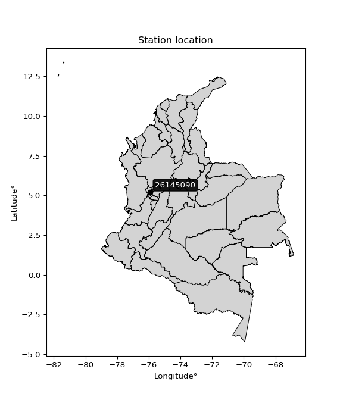

<div align="center">


</div>

# PMP Station (Rain, Pmax24h): 26145090

Probable Maximum Precipitation (PMP) is the greatest amount of rainfall for a specific duration that is meteorologically possible for a given location, acting as a "worst-case" scenario for extreme storms, crucial for designing safety-critical infrastructure like bridges, river deviations, dams, spillways, and nuclear plants to prevent catastrophic failure. PMP is calculated by hydrologists using meteorological data to determine the upper limit of extreme rainfall, often leading to the Probable Maximum Flood (PMF) for flood control design, and is increasingly being studied for climate change impacts. Probable Maximum Precipitation (PMP) is the theoretical upper limit of rainfall, a deterministic estimate for extreme events, while probability distributions (like GEV, Gumbel) describe the likelihood and frequency of various precipitation amounts, including rare ones, showing how often events occur, with PMP representing the extreme end of these distributions, used for critical infrastructure design to ensure safety against the worst conceivable weather, unlike standard statistical forecasts which cover typical probabilities.

The most common probability distributions in hydrology, used for analyzing floods, rainfall, and streamflow, include the Normal, Log-Normal, Gumbel, Gamma (including Log-Pearson Type III), and Generalized Extreme Value (GEV) distributions, often chosen based on the data´s skewness and whether modeling extremes or general conditions, with Gumbel and GEV popular for extreme events like floods, while the Normal distribution serves as a baseline, though often requiring transformations for skewed hydrological data. These distributions help in designing water infrastructure, managing water resources, and forecasting hydrologic events.

> Hydrological data often isn´t perfectly normal (it´s skewed), so different distributions are needed for different applications, such as: **Flood Frequency Analysis**: Using Gumbel, GEV, or Log-Pearson Type III for predicting extreme flood magnitudes and their return periods, **Rainfall Analysis**: Normal for annual totals, but Log-Normal, Weibull, or GEV for intensity or extreme daily rainfall, **Streamflow Modeling**: Gamma and Log-Normal for maximum flows, GEV for minimum flows, and Kappa for daily flows.

<div align="center">

</img>

</div>


## A. General information


### 1. General running parameters

• app_version: _v20260108_. • runtime: _2026-01-08 18:05:13.093906_. • Python version: _3.14.0_. • SciPy version: _1.16.3_. • Pandas version: _2.3.3_. • NumPy version: _2.3.5_. • Stations dataset (station_dataset_file): _dataset/pmax24h_in/automatic_colombia_2003_2024.csv_. • Stations catalog (station_catalog_file): _dataset/CNE.xls_. • Minimum year to eval til year_max (date_min): _1900_. • Maximum year to eval since year_min (date_max): _2024_. • Creates, save and include plots into reports (create_plot): _False_. • Plot only fit distributions with Δo > Δ (plot_only_fit): _True_. • Plot only simple graphs avoiding multiple CDFs and multiple Extreme values plots (plot_only_simple): _False_. • Eval low extreme values, if False, evaluates high extreme values (low_extreme): _False_. • Eval every SciPy distribution as logarithmic (pdist_logarithmic_on): _True_. • Standard deviation normalized (ddof): _1.0_. • Return periods to eval in years (Tr): _[2, 2.33, 5, 10, 15, 20, 25, 50, 75, 100, 200, 250, 500, 750, 1000]_. • Minimum data sample per station, 0 means any (minimum_sample): _5_. • Z-Score maximum threshold to adjust a value, 0 means disable (zscore_max): _3.5_. • Z-Score minimum threshold to adjust a value, 0 means disable (zscore_min): _-2.5_. • Avoid zeros, e.g. rain = 0 (avoid_zeros): _True_. • Avoid null values (avoid_nans): _True_. 

:file_folder:Table: [dataset.csv](../../dataset/pmax24h_in/automatic_colombia_2003_2024.csv)

> Delta Degrees of Freedom (DDOF): is a parameter used in the formulas for calculating variance and standard deviation. When ddof=0, the divisor is $N$ (the total number of observations) and this is used when your data set is the entire population. When ddof=1, the divisor is $N-1$ and this is used when your data set is a sample drawn from a larger population. Using $N-1$ provides an unbiased estimate of the population variance (known as Bessel´s correction).


### 2. Station info and location

|   id |   CODIGO | NOMBRE                        | CATEGORIA               | TECNOLOGIA                | ESTADO           | FECHA_INSTALACION   |   FECHA_SUSPENSION |   ALTITUD |   LATITUD |   LONGITUD | DEPARTAMENTO   | MUNICIPIO       | AREA_OPERATIVA                         | ENTIDAD                                                     | AREA_HIDROGRAFICA   | ZONA_HIDROGRAFICA   | SUBZONA_HIDROGRAFICA   |   CORRIENTE | Catalogo   |   Version |
|-----:|---------:|:------------------------------|:------------------------|:--------------------------|:-----------------|:--------------------|-------------------:|----------:|----------:|-----------:|:---------------|:----------------|:---------------------------------------|:------------------------------------------------------------|:--------------------|:--------------------|:-----------------------|------------:|:-----------|----------:|
|    0 | 26145090 | SANTA EMILIA - AUT [26145090] | Climatológica Principal | Automática con Telemetría | En Mantenimiento | 21/10/2005          |                nan |      1748 |   5.20747 |   -75.9029 | Risaralda      | Belén De Umbría | Area Operativa 09 - Cauca-Valle-Caldas | INSTITUTO DE HIDROLOGIA METEOROLOGIA Y ESTUDIOS AMBIENTALES | Magdalena Cauca     | Cauca               | Río Risaralda          |         nan | CNE_IDEAM  |  20251226 |

<div align="center">

Dynamic map: [:earth_americas:Google](http://maps.google.com/maps?q=5.207472222,-75.90294444) [:earth_americas:OSM](https://www.openstreetmap.org/#map=18/5.207472222/-75.90294444&layers=P) [:earth_americas:Bing](https://www.bing.com/maps?cp=5.207472222~-75.90294444&lvl=18) [:earth_americas:Apple](https://maps.apple.com/frame?center=5.207472222%2C-75.90294444&span=0.003%2C0.006)

</div>


<div align="center">

```geojson
{
  "type": "Feature",
  "geometry": {
    "type": "Point", 
    "coordinates": [-75.90294444, 5.207472222]
  }, 
  "properties": {
    "Name": "26145090"
  }
}
```

</div>


### 3. Discrete values table and plot

<div align="center">

|               |          0 |           1 |         2 |           3 |          4 |           5 |           6 |           7 |
|:--------------|-----------:|------------:|----------:|------------:|-----------:|------------:|------------:|------------:|
| Date          | 2016       | 2017        | 2018      | 2019        | 2020       | 2021        | 2022        | 2023        |
| Value         |    0.1     |   50.7      |   86.1    |   64.9      |    0.1     |   57.8      |   53.9      |   21.3      |
| Value_initial |    0.1     |   50.7      |   86.1    |   64.9      |    0.1     |   57.8      |   53.9      |   21.3      |
| count         |    8       |    8        |    8      |    8        |    8       |    8        |    8        |    8        |
| mean          |   41.8625  |   41.8625   |   41.8625 |   41.8625   |   41.8625  |   41.8625   |   41.8625   |   41.8625   |
| std           |   31.3408  |   31.3408   |   31.3408 |   31.3408   |   31.3408  |   31.3408   |   31.3408   |   31.3408   |
| zscore        |   -1.33253 |    0.281981 |    1.4115 |    0.735064 |   -1.33253 |    0.508522 |    0.384084 |   -0.656094 |


</div>


> The initial value (value_initial) correspond to the initial obtained or null completed value, and value (value) is adjusted only when the initial value is outside the valid range (outlier) definite through the Z-Score value. If Z-Score is active, values out of range or outliers are replaced with the station mean value. A Z-Score (or standard score) measures how many standard deviations a data point is from the mean of a dataset, indicating its relative position; positive scores mean above the mean, negative mean below, and a score of zero is exactly at the mean, allowing for comparison of values from different distributions. It´s calculated using the formula $z=(x–μ)/σ$, where $x$ is the data point, $μ$ is the mean, and $σ$ is the standard deviation, helping identify outliers and understand probability.
>
> <sub>**Note**: In this study, "completing" (filling gaps in) and "extending" (forecasting or lengthening the historical record) rainfall data series are avoided for certain critical analyses because they introduce artificial bias and uncertainty, which can distort the statistics of rare events (extremes), alter day-to-day variability, and compromise the integrity and homogeneity of the original data. Some reasons against Completing/Extending rainfall data are: **Distortion of Extremes and Variability**: The primary issue is that most gap-filling or extension methods rely on averaging or regression with nearby stations, which inherently smooths the data. Rainfall is highly variable in space and time, with a large percentage of zero values and occasional large storms. Infilling methods often underestimate the highest values and overestimate the lowest (zero) values, which severely distorts analyses focused on flood frequency, drought severity, and intensity-duration-frequency (IDF) curves, **Loss of Data Homogeneity**: Infilled or extended data are synthetic estimates, not actual measurements. Combining these estimates with observed data can violate the assumption of data homogeneity, which requires that the data properties do not change over time. Inhomogeneity can lead to incorrect conclusions about long-term trends or changes in climate patterns, **Propagation of Errors**: Errors and biases from the original data (e.g., wind-induced undercatch, instrument errors, site changes) or the data used for imputation can propagate through the analysis, leading to unreliable hydrological models and inaccurate predictions, **Compromised Statistical Integrity**: For statistical analyses, especially those involving the frequency of events, using artificial data can introduce time bias or autocorrelation that doesn´t exist in reality, making it difficult to assess the true probability of events, **Difficulty in Validation**: It is difficult to accurately validate the quality of filled or extended data, especially for past periods where ground-truth measurements are unavailable. The reliability of imputation techniques heavily depends on the density of the surrounding station network and the complexity of the local topography.</sub>


### 4. Active continuous probability distributions from SciPy (43 of 104 available)

A Probability Density Function (PDF) describes the relative likelihood of a continuous random variable falling within a specific range, where the total area under its curve equals 1, and the area over any interval gives the actual probability for that range. Unlike discrete probabilities (like rolling a die), a PDF shows density, not direct probability for a single point (which is zero), with higher points indicating higher likelihood, often visualized as a bell curve for normal distributions.

A log of a probability density function (log-PDF) is simply the logarithm of the PDF´s value, denoted as $log(f(x))$, useful for converting multiplication of probabilities into addition, improving numerical stability with tiny numbers, and connecting to information theory concepts like entropy. Instead of dealing with very small probabilities (e.g., 0.000001), log-PDFs use negative numbers (e.g., $log(0.00001) ≈ -11.51$ that are easier for computers to handle, preventing underflow errors and simplifying complex calculations. In this study, each active probability distribution from SciPy is also evaluated in the $log$ form.

[scipy.stats](https://docs.scipy.org/doc/scipy/reference/stats.html) is a Python´s powerful submodule within the SciPy library for comprehensive statistical analysis, offering over 130 probability distributions (like Normal, Poisson), functions for descriptive stats (mean, variance), hypothesis testing (t-tests, chi-square), random variable generation, and statistical tests, making it essential for data science, modeling, and research. It provides tools to explore, model, and draw conclusions from data efficiently, working seamlessly with NumPy.

<div align="center">

|   id | p_dist             |   n_parameter | fit_method   | label                                                                       | active   | ref                                                                                                        |
|-----:|:-------------------|--------------:|:-------------|:----------------------------------------------------------------------------|:---------|:-----------------------------------------------------------------------------------------------------------|
|    0 | alpha              |             3 | MLE          | Alpha                                                                       | True     | [:mortar_board:](https://docs.scipy.org/doc/scipy/reference/generated/scipy.stats.alpha.html)              |
|    1 | betaprime          |             4 | MLE          | Beta prime                                                                  | True     | [:mortar_board:](https://docs.scipy.org/doc/scipy/reference/generated/scipy.stats.betaprime.html)          |
|    2 | chi2               |             3 | MLE          | Chi²                                                                        | True     | [:mortar_board:](https://docs.scipy.org/doc/scipy/reference/generated/scipy.stats.chi2.html)               |
|    3 | crystalball        |             4 | MLE          | Crystalball                                                                 | True     | [:mortar_board:](https://docs.scipy.org/doc/scipy/reference/generated/scipy.stats.crystalball.html)        |
|    4 | erlang             |             3 | MLE          | Erlang                                                                      | True     | [:mortar_board:](https://docs.scipy.org/doc/scipy/reference/generated/scipy.stats.erlang.html)             |
|    5 | expon              |             2 | MLE          | Exponential                                                                 | True     | [:mortar_board:](https://docs.scipy.org/doc/scipy/reference/generated/scipy.stats.expon.html)              |
|    6 | exponnorm          |             3 | MLE          | Exponentially modified Normal                                               | True     | [:mortar_board:](https://docs.scipy.org/doc/scipy/reference/generated/scipy.stats.exponnorm.html)          |
|    7 | f                  |             4 | MLE          | F                                                                           | True     | [:mortar_board:](https://docs.scipy.org/doc/scipy/reference/generated/scipy.stats.f.html)                  |
|    8 | fatiguelife        |             3 | MLE          | Fatigue-life (Birnbaum-Saunders)                                            | True     | [:mortar_board:](https://docs.scipy.org/doc/scipy/reference/generated/scipy.stats.fatiguelife.html)        |
|    9 | fisk               |             3 | MLE          | Fisk                                                                        | True     | [:mortar_board:](https://docs.scipy.org/doc/scipy/reference/generated/scipy.stats.fisk.html)               |
|   10 | gamma              |             3 | MLE          | Gamma                                                                       | True     | [:mortar_board:](https://docs.scipy.org/doc/scipy/reference/generated/scipy.stats.gamma.html)              |
|   11 | genexpon           |             5 | MLE          | Generalized exponential                                                     | True     | [:mortar_board:](https://docs.scipy.org/doc/scipy/reference/generated/scipy.stats.genexpon.html)           |
|   12 | genlogistic        |             3 | MLE          | Generalized logistic                                                        | True     | [:mortar_board:](https://docs.scipy.org/doc/scipy/reference/generated/scipy.stats.genlogistic.html)        |
|   13 | gibrat             |             2 | MM           | Gibrat                                                                      | True     | [:mortar_board:](https://docs.scipy.org/doc/scipy/reference/generated/scipy.stats.gibrat.html)             |
|   14 | gompertz           |             3 | MLE          | Gompertz (or truncated Gumbel)                                              | True     | [:mortar_board:](https://docs.scipy.org/doc/scipy/reference/generated/scipy.stats.gompertz.html)           |
|   15 | gumbel_l           |             2 | MM           | Gumbel Left Skew                                                            | True     | [:mortar_board:](https://docs.scipy.org/doc/scipy/reference/generated/scipy.stats.gumbel_l.html)           |
|   16 | gumbel_r           |             2 | MM           | Gumbel Right Skew                                                           | True     | [:mortar_board:](https://docs.scipy.org/doc/scipy/reference/generated/scipy.stats.gumbel_r.html)           |
|   17 | halflogistic       |             2 | MM           | Half-logistic                                                               | True     | [:mortar_board:](https://docs.scipy.org/doc/scipy/reference/generated/scipy.stats.halflogistic.html)       |
|   18 | halfnorm           |             2 | MM           | Half Normal                                                                 | True     | [:mortar_board:](https://docs.scipy.org/doc/scipy/reference/generated/scipy.stats.halfnorm.html)           |
|   19 | hypsecant          |             2 | MM           | hyperbolic secant                                                           | True     | [:mortar_board:](https://docs.scipy.org/doc/scipy/reference/generated/scipy.stats.hypsecant.html)          |
|   20 | invgamma           |             3 | MLE          | Inverted gamma                                                              | True     | [:mortar_board:](https://docs.scipy.org/doc/scipy/reference/generated/scipy.stats.invgamma.html)           |
|   21 | invgauss           |             3 | MLE          | Inverse Gaussian                                                            | True     | [:mortar_board:](https://docs.scipy.org/doc/scipy/reference/generated/scipy.stats.invgauss.html)           |
|   22 | invweibull         |             3 | MLE          | Inverted Weibull                                                            | True     | [:mortar_board:](https://docs.scipy.org/doc/scipy/reference/generated/scipy.stats.invweibull.html)         |
|   23 | kstwobign          |             2 | MLE          | Limiting distribution of scaled Kolmogorov-Smirnov two-sided test statistic | True     | [:mortar_board:](https://docs.scipy.org/doc/scipy/reference/generated/scipy.stats.kstwobign.html)          |
|   24 | laplace            |             2 | MM           | Laplace                                                                     | True     | [:mortar_board:](https://docs.scipy.org/doc/scipy/reference/generated/scipy.stats.laplace.html)            |
|   25 | laplace_asymmetric |             3 | MLE          | Asymmetric Laplace                                                          | True     | [:mortar_board:](https://docs.scipy.org/doc/scipy/reference/generated/scipy.stats.laplace_asymmetric.html) |
|   26 | loggamma           |             3 | MLE          | Log gamma                                                                   | True     | [:mortar_board:](https://docs.scipy.org/doc/scipy/reference/generated/scipy.stats.loggamma.html)           |
|   27 | logistic           |             2 | MM           | Logistic (or Sech-squared)                                                  | True     | [:mortar_board:](https://docs.scipy.org/doc/scipy/reference/generated/scipy.stats.logistic.html)           |
|   28 | lognorm            |             3 | MLE          | Log Normal                                                                  | True     | [:mortar_board:](https://docs.scipy.org/doc/scipy/reference/generated/scipy.stats.lognorm.html)            |
|   29 | maxwell            |             2 | MM           | Maxwell                                                                     | True     | [:mortar_board:](https://docs.scipy.org/doc/scipy/reference/generated/scipy.stats.maxwell.html)            |
|   30 | mielke             |             4 | MLE          | Mielke Beta-Kappa / Dagum                                                   | True     | [:mortar_board:](https://docs.scipy.org/doc/scipy/reference/generated/scipy.stats.mielke.html)             |
|   31 | moyal              |             2 | MM           | Moyal                                                                       | True     | [:mortar_board:](https://docs.scipy.org/doc/scipy/reference/generated/scipy.stats.moyal.html)              |
|   32 | nakagami           |             3 | MLE          | Nakagami                                                                    | True     | [:mortar_board:](https://docs.scipy.org/doc/scipy/reference/generated/scipy.stats.nakagami.html)           |
|   33 | ncf                |             5 | MLE          | Non-central F distribution                                                  | True     | [:mortar_board:](https://docs.scipy.org/doc/scipy/reference/generated/scipy.stats.ncf.html)                |
|   34 | nct                |             4 | MLE          | Non-central Student’s t                                                     | True     | [:mortar_board:](https://docs.scipy.org/doc/scipy/reference/generated/scipy.stats.nct.html)                |
|   35 | norm               |             2 | MM           | Normal                                                                      | True     | [:mortar_board:](https://docs.scipy.org/doc/scipy/reference/generated/scipy.stats.norm.html)               |
|   36 | pearson3           |             3 | MM           | Pearson type III                                                            | True     | [:mortar_board:](https://docs.scipy.org/doc/scipy/reference/generated/scipy.stats.pearson3.html)           |
|   37 | rayleigh           |             2 | MM           | Rayleigh                                                                    | True     | [:mortar_board:](https://docs.scipy.org/doc/scipy/reference/generated/scipy.stats.rayleigh.html)           |
|   38 | rice               |             3 | MLE          | Rice                                                                        | True     | [:mortar_board:](https://docs.scipy.org/doc/scipy/reference/generated/scipy.stats.rice.html)               |
|   39 | t                  |             3 | MLE          | Student’s t                                                                 | True     | [:mortar_board:](https://docs.scipy.org/doc/scipy/reference/generated/scipy.stats.t.html)                  |
|   40 | truncnorm          |             4 | MLE          | Truncated normal                                                            | True     | [:mortar_board:](https://docs.scipy.org/doc/scipy/reference/generated/scipy.stats.truncnorm.html)          |
|   41 | wald               |             2 | MM           | Wald                                                                        | True     | [:mortar_board:](https://docs.scipy.org/doc/scipy/reference/generated/scipy.stats.wald.html)               |
|   42 | weibull_min        |             3 | MLE          | Weibull minimum                                                             | True     | [:mortar_board:](https://docs.scipy.org/doc/scipy/reference/generated/scipy.stats.weibull_min.html)        |

</div>

> **n_parameter:** # arguments & localization & scale.
>
> **Fit methods:** (MLE) maximum likelihood, (MM) L-moments.
>
>**Inactive** (With the only purpose of prevent loops, zero divisions, infinite values, over high estimated values or horizontal trending for recurrence intervals estimations, the follow distributions were disabled.)**:** foldnorm, gennorm, norminvgauss, powernorm, powerlognorm, skewnorm, genextreme, anglit, arcsine, argus, beta, bradford, burr, burr12, cauchy, cosine, halfcauchy, foldcauchy, skewcauchy, wrapcauchy, dgamma, gengamma, exponweib, exponpow, truncexpon, gausshyper, genhalflogistic, genhyperbolic, geninvgauss, halfgennorm, johnsonsb, johnsonsu, kappa4, kappa3, ksone, kstwo, loglaplace, levy, levy_l, levy_stable, ncx2, pareto, genpareto, truncpareto, lomax, powerlaw, rdist, rel_breitwigner, recipinvgauss, semicircular, studentized_range, trapezoid, triang, truncweibull_min, tukeylambda, uniform, loguniform, vonmises, vonmises_line, weibull_max, dweibull, 


## B. Probability (PDF) vs. Empirical (EDF) distributions functions

A continuous probability distribution (CPD) describes probabilities for variables that can take any value within a range (like rain any time), unlike discrete variables with specific outcomes (like temperature). It uses a Probability Density Function (PDF), a curve where the total area under it equals 1, and the probability of the variable falling within an interval (a to b) is found by calculating the area under the curve between those points. A key feature is that the probability of hitting any single exact value is zero, so probabilities are always expressed for ranges, e.g., $P(a ≤ X ≤ b)$.

<div align="center">

Distributions parameters from station values
|    |   station | p_dist                |   n |              loc |           scale | shape                 | shape1              | shape2             | shape3   |
|---:|----------:|:----------------------|----:|-----------------:|----------------:|:----------------------|:--------------------|:-------------------|:---------|
|  0 |  26145090 | alpha                 |   8 |      0.00573433  |     0.188133    | 5.838402137620127e-06 |                     |                    |          |
|  1 |  26145090 | betaprime             |   8 |      0.1         |   193.179       | 0.6488650892567678    | 1.9843263515090042  |                    |          |
|  2 |  26145090 | chi2                  |   8 |   -183.331       |     1.94265     | 115.82764745570859    |                     |                    |          |
|  3 |  26145090 | crystalball           |   8 |     41.8625      |    29.3166      | 3511.4669772460766    | 2200.523537461433   |                    |          |
|  4 |  26145090 | erlang                |   8 |   -452.159       |     1.76621     | 279.7006209393188     |                     |                    |          |
|  5 |  26145090 | expon                 |   8 |      0.1         |    41.7625      |                       |                     |                    |          |
|  6 |  26145090 | exponnorm             |   8 |     41.838       |    29.3166      | 0.0008319590709114438 |                     |                    |          |
|  7 |  26145090 | f                     |   8 |      0.1         |    84.3382      | 0.6155911217853723    | 31.130869034097557  |                    |          |
|  8 |  26145090 | fatiguelife           |   8 |  -1257.74        |  1299.08        | 0.022430466284751947  |                     |                    |          |
|  9 |  26145090 | fisk                  |   8 |      0.1         |    12.5462      | 0.6112659886076048    |                     |                    |          |
| 10 |  26145090 | gamma                 |   8 |   -476.101       |     1.6901      | 306.36083273196925    |                     |                    |          |
| 11 |  26145090 | genexpon              |   8 |     -6.29627     |     2.38828     | 6.882968317103546e-11 | 0.05402955003607693 | 0.5588247925433147 |          |
| 12 |  26145090 | genlogistic           |   8 |     67.3874      |     9.2984      | 0.3156475923810385    |                     |                    |          |
| 13 |  26145090 | gibrat                |   8 |     19.4976      |    13.565       |                       |                     |                    |          |
| 14 |  26145090 | gompertz              |   8 |     21.3         |    16.5683      | 0.0741167072899761    |                     |                    |          |
| 15 |  26145090 | gumbel_l              |   8 |     55.0565      |    22.8581      |                       |                     |                    |          |
| 16 |  26145090 | gumbel_r              |   8 |     28.6685      |    22.8581      |                       |                     |                    |          |
| 17 |  26145090 | halflogistic          |   8 |      7.1155      |    25.0647      |                       |                     |                    |          |
| 18 |  26145090 | halfnorm              |   8 |      3.05879     |    48.6332      |                       |                     |                    |          |
| 19 |  26145090 | hypsecant             |   8 |     41.8625      |    18.6635      |                       |                     |                    |          |
| 20 |  26145090 | invgamma              |   8 |      0.1         |     3.12421e-17 | 0.14523933341377054   |                     |                    |          |
| 21 |  26145090 | invgauss              |   8 |    -92.3795      |  2395.09        | 0.055954486275306775  |                     |                    |          |
| 22 |  26145090 | invweibull            |   8 |      0.1         |     3.26436     | 0.05181606893981318   |                     |                    |          |
| 23 |  26145090 | kstwobign             |   8 |    -67.6134      |   124.668       |                       |                     |                    |          |
| 24 |  26145090 | laplace               |   8 |     41.8625      |    20.73        |                       |                     |                    |          |
| 25 |  26145090 | laplace_asymmetric    |   8 |     57.8         |    20.3838      | 1.4646333948535728    |                     |                    |          |
| 26 |  26145090 | loggamma              |   8 |     13.8764      |    42.0733      | 2.423969630010812     |                     |                    |          |
| 27 |  26145090 | logistic              |   8 |     41.8625      |    16.1631      |                       |                     |                    |          |
| 28 |  26145090 | lognorm               |   8 |      0.1         |     0.00117259  | 18.51807031036854     |                     |                    |          |
| 29 |  26145090 | maxwell               |   8 |    -27.6056      |    43.5327      |                       |                     |                    |          |
| 30 |  26145090 | mielke                |   8 |      0.1         |    95.4915      | 0.33808955512345723   | 10.0907454821217    |                    |          |
| 31 |  26145090 | moyal                 |   8 |     25.0974      |    13.1971      |                       |                     |                    |          |
| 32 |  26145090 | nakagami              |   8 |      0.1         |    32.9227      | 0.1710028185022323    |                     |                    |          |
| 33 |  26145090 | ncf                   |   8 |      0.1         |     5.0177      | 0.4585784647901979    | 41.0053464830914    | 4.224864754896915  |          |
| 34 |  26145090 | nct                   |   8 |      0.1         |     2.24992e-18 | 0.21497182188495245   | 28.665296912903646  |                    |          |
| 35 |  26145090 | norm                  |   8 |     41.8625      |    29.3166      |                       |                     |                    |          |
| 36 |  26145090 | pearson3              |   8 |     41.8625      |    29.3167      | -0.2435338165296292   |                     |                    |          |
| 37 |  26145090 | rayleigh              |   8 |    -14.2219      |    44.7489      |                       |                     |                    |          |
| 38 |  26145090 | rice                  |   8 |    -18.0004      |    34.1458      | 1.3456247623762896    |                     |                    |          |
| 39 |  26145090 | t                     |   8 |      0.1         |     2.71379e-17 | 0.18312714869979507   |                     |                    |          |
| 40 |  26145090 | truncnorm             |   8 |     -4.36847     |    10.0565      | -0.46822746998676346  | 8.996058938127728   |                    |          |
| 41 |  26145090 | wald                  |   8 |     12.5459      |    29.3166      |                       |                     |                    |          |
| 42 |  26145090 | weibull_min           |   8 |    -66.9655      |   119.901       | 4.385126270953469     |                     |                    |          |
| 43 |  26145090 | logalpha              |   8 |    -37.9897      |   512.738       | 12.733970268011277    |                     |                    |          |
| 44 |  26145090 | logbetaprime          |   8 |     -2.30259     |     2.9901      | 0.09254108297672448   | 0.6385193155345699  |                    |          |
| 45 |  26145090 | logchi2               |   8 |     -2.30259     |     1.20974     | 1.0443961258567178    |                     |                    |          |
| 46 |  26145090 | logcrystalball        |   8 |      2.38149     |     2.72995     | 8.410208096716925     | 1.140881632705134   |                    |          |
| 47 |  26145090 | logerlang             |   8 |    -37.7431      |     0.197632    | 203.08556080049334    |                     |                    |          |
| 48 |  26145090 | logexpon              |   8 |     -2.30259     |     4.68408     |                       |                     |                    |          |
| 49 |  26145090 | logexponnorm          |   8 |      2.3798      |     2.72996     | 0.0006210260315213118 |                     |                    |          |
| 50 |  26145090 | logf                  |   8 |     -2.30259     |     1.04984     | 1.136044826126547     | 1.0594855642650196  |                    |          |
| 51 |  26145090 | logfatiguelife        |   8 |     -2.30259     |     1.55256e-06 | 1527.5756578340106    |                     |                    |          |
| 52 |  26145090 | logfisk               |   8 |     -2.30259     |     4.15112     | 0.1124571681022618    |                     |                    |          |
| 53 |  26145090 | loggamma              |   8 |    -42.3416      |     0.181427    | 246.3132137735371     |                     |                    |          |
| 54 |  26145090 | loggenexpon           |   8 |     -2.30259     |    14.8042      | 1.3525238650173486    | 16.49274245525438   | 0.5041284769916674 |          |
| 55 |  26145090 | loggenlogistic        |   8 |      4.45556     |     3.55811e-06 | 1.713240575114896e-06 |                     |                    |          |
| 56 |  26145090 | loggibrat             |   8 |      0.298895    |     1.26316     |                       |                     |                    |          |
| 57 |  26145090 | loggompertz           |   8 |     -2.30261     |     2.11126     | 0.0716801938885264    |                     |                    |          |
| 58 |  26145090 | loggumbel_l           |   8 |      3.61011     |     2.12853     |                       |                     |                    |          |
| 59 |  26145090 | loggumbel_r           |   8 |      1.15287     |     2.12853     |                       |                     |                    |          |
| 60 |  26145090 | loghalflogistic       |   8 |     -0.85411     |     2.334       |                       |                     |                    |          |
| 61 |  26145090 | loghalfnorm           |   8 |     -1.23192     |     4.52873     |                       |                     |                    |          |
| 62 |  26145090 | loghypsecant          |   8 |      2.38149     |     1.73794     |                       |                     |                    |          |
| 63 |  26145090 | loginvgamma           |   8 |    -50.7994      | 18638.8         | 351.22592834907994    |                     |                    |          |
| 64 |  26145090 | loginvgauss           |   8 |    -21.713       |  1517.5         | 0.015820048667294685  |                     |                    |          |
| 65 |  26145090 | loginvweibull         |   8 | -74575.7         | 74576.6         | 24960.34011909231     |                     |                    |          |
| 66 |  26145090 | logkstwobign          |   8 |     -9.40555     |    13.4006      |                       |                     |                    |          |
| 67 |  26145090 | loglaplace            |   8 |      2.38149     |     1.93036     |                       |                     |                    |          |
| 68 |  26145090 | loglaplace_asymmetric |   8 |      4.45556     |     0.0601501   | 34.02374792404032     |                     |                    |          |
| 69 |  26145090 | logloggamma           |   8 |      4.45566     |     1.3897e-05  | 6.680914129821398e-06 |                     |                    |          |
| 70 |  26145090 | loglogistic           |   8 |      2.38149     |     1.5051      |                       |                     |                    |          |
| 71 |  26145090 | loglognorm            |   8 |     -2.30259     |     1.56654     | 17.709041628533114    |                     |                    |          |
| 72 |  26145090 | logmaxwell            |   8 |     -4.08734     |     4.05374     |                       |                     |                    |          |
| 73 |  26145090 | logmielke             |   8 |     -2.30259     |     2.64189     | 0.10495611139213712   | 0.9512536093924662  |                    |          |
| 74 |  26145090 | logmoyal              |   8 |      0.820333    |     1.22891     |                       |                     |                    |          |
| 75 |  26145090 | lognakagami           |   8 |     -2.30259     |     5.8527      | 0.04796969367498534   |                     |                    |          |
| 76 |  26145090 | logncf                |   8 |     -2.30259     |     1.11246     | 1.0169657459633945    | 1.1221072531429213  | 1.033876853818446  |          |
| 77 |  26145090 | lognct                |   8 |   -165.141       |     2.68492     | 52785.42753569821     | 62.39256694525214   |                    |          |
| 78 |  26145090 | lognorm               |   8 |      2.38149     |     2.72995     |                       |                     |                    |          |
| 79 |  26145090 | logpearson3           |   8 |      2.38149     |     2.72995     | -1.0938562022864298   |                     |                    |          |
| 80 |  26145090 | lograyleigh           |   8 |     -2.84106     |     4.16699     |                       |                     |                    |          |
| 81 |  26145090 | logrice               |   8 |     -4.30452     |     2.9986      | 1.9494722420360708    |                     |                    |          |
| 82 |  26145090 | logt                  |   8 |      2.38149     |     2.72995     | 11542136568.469646    |                     |                    |          |
| 83 |  26145090 | logtruncnorm          |   8 |      1.67169     |     3.28327     | -1.2104632861337223   | 4.346653258141514   |                    |          |
| 84 |  26145090 | logwald               |   8 |     -0.34838     |     2.72992     |                       |                     |                    |          |
| 85 |  26145090 | logweibull_min        |   8 |     -1.74151e+08 |     1.74151e+08 | 108193247.67439158    |                     |                    |          |

</div>

> **loc** (Location parameter): This shifts the distribution along the x-axis. For many common distributions, like the normal (Gaussian) distribution, loc represents the mean $μ$. For others, like the uniform distribution, it might represent the minimum value, or for the beta distribution, the left end of the support interval.
>
> **scale** (Scale parameter): This determines the width or spread of the distribution. For the normal distribution, scale represents the standard deviation $σ$. For a uniform distribution, it defines the length of the interval (from $loc$ to $loc + scale$).
>
> **shape** (Shape parameters): Refers to parameters that define the specific form of a probability distribution, distinct from its location (loc) and scale (scale). These parameters are required arguments for most distribution functions. For example, a normal (Gaussian) distribution is fully defined by its location (mean) and scale (standard deviation), so it has no specific shape parameters beyond loc and scale. However, other distributions have intrinsic properties that need specification, as Gamma distribution that takes a shape parameter, often named $a$ or $alpha$.


### 0. Cumulative distribution values - CDF (86 evaluated)

Cumulative Distribution Function (CDF), denoted as $F$<sub>$X$</sub>$(x)$, is a function that gives the probability that a random variable $X$ will take a value less than or equal to a specific value, $x$ (i.e., $(P(X≥x)$. It essentially "accumulates" probabilities from a given point up to the far right (positive infinity), providing a complete picture of the distribution´s probabilities for both discrete (like rain) and continuous (like temperature) variables, helping to find probabilities over ranges or above certain values. Each station is evaluated separately ordering the $x$ values ascending, calculating the CDF and PDF values for the activated distributions and their logarithmic forms.

<div align="center">

CDF ordered by x ascending and calculating $log(f(x))$ separately
|   id |   Station |   date |    x |   count |    mean |     std |    zscore |   Value_initial |   station |   m |    alpha |   alpha_pdf |   betaprime |   betaprime_pdf |     chi2 |   chi2_pdf |   crystalball |   crystalball_pdf |    erlang |   erlang_pdf |    expon |   expon_pdf |   exponnorm |   exponnorm_pdf |           f |       f_pdf |   fatiguelife |   fatiguelife_pdf |       fisk |        fisk_pdf |     gamma |   gamma_pdf |   genexpon |   genexpon_pdf |   genlogistic |   genlogistic_pdf |    gibrat |   gibrat_pdf |   gompertz |   gompertz_pdf |   gumbel_l |   gumbel_l_pdf |   gumbel_r |   gumbel_r_pdf |   halflogistic |   halflogistic_pdf |   halfnorm |   halfnorm_pdf |   hypsecant |   hypsecant_pdf |   invgamma |   invgamma_pdf |   invgauss |   invgauss_pdf |   invweibull |   invweibull_pdf |   kstwobign |   kstwobign_pdf |   laplace |   laplace_pdf |   laplace_asymmetric |   laplace_asymmetric_pdf |   loggamma |   loggamma_pdf |   logistic |   logistic_pdf |   lognorm |   lognorm_pdf |   maxwell |   maxwell_pdf |      mielke |   mielke_pdf |      moyal |   moyal_pdf |    nakagami |   nakagami_pdf |         ncf |    ncf_pdf |       nct |     nct_pdf |      norm |   norm_pdf |   pearson3 |   pearson3_pdf |   rayleigh |   rayleigh_pdf |      rice |   rice_pdf |        t |       t_pdf |   truncnorm |   truncnorm_pdf |     wald |   wald_pdf |   weibull_min |   weibull_min_pdf |   logalpha |   logalpha_pdf |   logbetaprime |   logbetaprime_pdf |     logchi2 |   logchi2_pdf |   logcrystalball |   logcrystalball_pdf |   logerlang |   logerlang_pdf |   logexpon |   logexpon_pdf |   logexponnorm |   logexponnorm_pdf |        logf |    logf_pdf |   logfatiguelife |   logfatiguelife_pdf |   logfisk |   logfisk_pdf |   loggenexpon |   loggenexpon_pdf |   loggenlogistic |   loggenlogistic_pdf |   loggibrat |   loggibrat_pdf |   loggompertz |   loggompertz_pdf |   loggumbel_l |   loggumbel_l_pdf |   loggumbel_r |   loggumbel_r_pdf |   loghalflogistic |   loghalflogistic_pdf |   loghalfnorm |   loghalfnorm_pdf |   loghypsecant |   loghypsecant_pdf |   loginvgamma |   loginvgamma_pdf |   loginvgauss |   loginvgauss_pdf |   loginvweibull |   loginvweibull_pdf |   logkstwobign |   logkstwobign_pdf |   loglaplace |   loglaplace_pdf |   loglaplace_asymmetric |   loglaplace_asymmetric_pdf |   logloggamma |   logloggamma_pdf |   loglogistic |   loglogistic_pdf |   loglognorm |   loglognorm_pdf |   logmaxwell |   logmaxwell_pdf |   logmielke |   logmielke_pdf |    logmoyal |   logmoyal_pdf |   lognakagami |   lognakagami_pdf |      logncf |   logncf_pdf |    lognct |   lognct_pdf |   logpearson3 |   logpearson3_pdf |   lograyleigh |   lograyleigh_pdf |   logrice |   logrice_pdf |      logt |   logt_pdf |   logtruncnorm |   logtruncnorm_pdf |   logwald |   logwald_pdf |   logweibull_min |   logweibull_min_pdf |
|-----:|----------:|-------:|-----:|--------:|--------:|--------:|----------:|----------------:|----------:|----:|---------:|------------:|------------:|----------------:|---------:|-----------:|--------------:|------------------:|----------:|-------------:|---------:|------------:|------------:|----------------:|------------:|------------:|--------------:|------------------:|-----------:|----------------:|----------:|------------:|-----------:|---------------:|--------------:|------------------:|----------:|-------------:|-----------:|---------------:|-----------:|---------------:|-----------:|---------------:|---------------:|-------------------:|-----------:|---------------:|------------:|----------------:|-----------:|---------------:|-----------:|---------------:|-------------:|-----------------:|------------:|----------------:|----------:|--------------:|---------------------:|-------------------------:|-----------:|---------------:|-----------:|---------------:|----------:|--------------:|----------:|--------------:|------------:|-------------:|-----------:|------------:|------------:|---------------:|------------:|-----------:|----------:|------------:|----------:|-----------:|-----------:|---------------:|-----------:|---------------:|----------:|-----------:|---------:|------------:|------------:|----------------:|---------:|-----------:|--------------:|------------------:|-----------:|---------------:|---------------:|-------------------:|------------:|--------------:|-----------------:|---------------------:|------------:|----------------:|-----------:|---------------:|---------------:|-------------------:|------------:|------------:|-----------------:|---------------------:|----------:|--------------:|--------------:|------------------:|-----------------:|---------------------:|------------:|----------------:|--------------:|------------------:|--------------:|------------------:|--------------:|------------------:|------------------:|----------------------:|--------------:|------------------:|---------------:|-------------------:|--------------:|------------------:|--------------:|------------------:|----------------:|--------------------:|---------------:|-------------------:|-------------:|-----------------:|------------------------:|----------------------------:|--------------:|------------------:|--------------:|------------------:|-------------:|-----------------:|-------------:|-----------------:|------------:|----------------:|------------:|---------------:|--------------:|------------------:|------------:|-------------:|----------:|-------------:|--------------:|------------------:|--------------:|------------------:|----------:|--------------:|----------:|-----------:|---------------:|-------------------:|----------:|--------------:|-----------------:|---------------------:|
|    0 |  26145090 |   2016 |  0.1 |       8 | 41.8625 | 31.3408 | -1.33253  |             0.1 |  26145090 |   1 | 0.045959 | 2.30557     | 6.21079e-13 |  29039          | 0.072263 | 0.0053361  |     0.0771462 |        0.00493333 | 0.0755992 |   0.00511433 | 0        |  0.0239449  |   0.0771466 |      0.00493336 | 1.27498e-06 | 2.82777e+10 |     0.0751938 |        0.00502774 | 1.0568e-11 | 465480          | 0.0769558 |  0.00516051 |  0.0672918 |     0.0163764  |      0.101835 |        0.00345446 | 0         |   0          | 0          |     0          |  0.0863733 |     0.00361058 |  0.0305097 |     0.00465788 |       0        |         0          |   0        |     0          |   0.0676769 |      0.0035989  |  0.0766719 |    1.46684e+15 |  0.0705614 |     0.00632815 |   0.00035425 |      1.05093e+13 |   0.0704715 |      0.00766365 | 0.0666873 |    0.00321695 |             0.098733 |               0.0033071  |  0.0473071 |      0.0372943 |  0.0701873 |     0.00403765 | 0.0430982 |      0.033533 | 0.0608019 |    0.00606282 | 9.51763e-06 |  2.39929e+07 | 0.00993275 |  0.0028079  | 4.14602e-07 |    1.02175e+10 | 8.88513e-06 | 1.468e+11  | 0.0540906 | 4.31e+15    | 0.0771462 | 0.00493333 |  0.0823168 |     0.00465874 |  0.0499269 |     0.00679507 | 0.0563686 | 0.00617142 | 0.5      | 7.02963e+15 |    0.517195 |     0.05284     | 0        | 0          |     0.0752743 |        0.00473179 |  0.0511694 |      0.0422941 |      0.0319606 |        6.66007e+12 | 6.83225e-09 |   8.03394e+06 |        0.0430982 |             0.033533 |   0.0433141 |       0.0354678 |   0        |      0.213489  |      0.0430987 |          0.0335331 | 1.22945e-09 | 1.57256e+06 |         0.030524 |          3.40921e+11 | 0.0157431 |   3.92387e+12 |   4.31904e-08 |         0.0913606 |         0        |            0.0185941 |    0        |       0         |   7.36128e-07 |         0.0339517 |     0.0602799 |         0.0274487 |    0.00628057 |         0.0149607 |          0        |             0         |      0        |         0         |      0.0429254 |          0.0246242 |     0.0416884 |         0.0354916 |     0.0511631 |         0.0433583 |       0.0543298 |           0.0529661 |      0.0585747 |          0.0641774 |    0.0441717 |        0.0228825 |               0.0367689 |                   0.0179665 |     0.0388137 |         0.0186595 |     0.0426093 |         0.0271037 |    0.0216124 |      6.57436e+12 |    0.0214225 |        0.0346288 |   0.0220992 |     5.22292e+12 | 0.000366622 |      0.0020254 |     0.0252009 |       5.44431e+12 | 5.75482e-09 |  6.58928e+06 | 0.0432707 |    0.0336568 |     0.0627326 |         0.0291745 |    0.00831456 |         0.0307533 | 0.0364007 |      0.039177 | 0.0430984 |   0.033533 |    4.73844e-11 |          0.0658475 |  0        |     0         |        0.0261344 |            0.0160222 |
|    1 |  26145090 |   2020 |  0.1 |       8 | 41.8625 | 31.3408 | -1.33253  |             0.1 |  26145090 |   2 | 0.045959 | 2.30557     | 6.21079e-13 |  29039          | 0.072263 | 0.0053361  |     0.0771462 |        0.00493333 | 0.0755992 |   0.00511433 | 0        |  0.0239449  |   0.0771466 |      0.00493336 | 1.27498e-06 | 2.82777e+10 |     0.0751938 |        0.00502774 | 1.0568e-11 | 465480          | 0.0769558 |  0.00516051 |  0.0672918 |     0.0163764  |      0.101835 |        0.00345446 | 0         |   0          | 0          |     0          |  0.0863733 |     0.00361058 |  0.0305097 |     0.00465788 |       0        |         0          |   0        |     0          |   0.0676769 |      0.0035989  |  0.0766719 |    1.46684e+15 |  0.0705614 |     0.00632815 |   0.00035425 |      1.05093e+13 |   0.0704715 |      0.00766365 | 0.0666873 |    0.00321695 |             0.098733 |               0.0033071  |  0.0473071 |      0.0372943 |  0.0701873 |     0.00403765 | 0.0430982 |      0.033533 | 0.0608019 |    0.00606282 | 9.51763e-06 |  2.39929e+07 | 0.00993275 |  0.0028079  | 4.14602e-07 |    1.02175e+10 | 8.88513e-06 | 1.468e+11  | 0.0540906 | 4.31e+15    | 0.0771462 | 0.00493333 |  0.0823168 |     0.00465874 |  0.0499269 |     0.00679507 | 0.0563686 | 0.00617142 | 0.5      | 7.02963e+15 |    0.517195 |     0.05284     | 0        | 0          |     0.0752743 |        0.00473179 |  0.0511694 |      0.0422941 |      0.0319606 |        6.66007e+12 | 6.83225e-09 |   8.03394e+06 |        0.0430982 |             0.033533 |   0.0433141 |       0.0354678 |   0        |      0.213489  |      0.0430987 |          0.0335331 | 1.22945e-09 | 1.57256e+06 |         0.030524 |          3.40921e+11 | 0.0157431 |   3.92387e+12 |   4.31904e-08 |         0.0913606 |         0        |            0.0185941 |    0        |       0         |   7.36128e-07 |         0.0339517 |     0.0602799 |         0.0274487 |    0.00628057 |         0.0149607 |          0        |             0         |      0        |         0         |      0.0429254 |          0.0246242 |     0.0416884 |         0.0354916 |     0.0511631 |         0.0433583 |       0.0543298 |           0.0529661 |      0.0585747 |          0.0641774 |    0.0441717 |        0.0228825 |               0.0367689 |                   0.0179665 |     0.0388137 |         0.0186595 |     0.0426093 |         0.0271037 |    0.0216124 |      6.57436e+12 |    0.0214225 |        0.0346288 |   0.0220992 |     5.22292e+12 | 0.000366622 |      0.0020254 |     0.0252009 |       5.44431e+12 | 5.75482e-09 |  6.58928e+06 | 0.0432707 |    0.0336568 |     0.0627326 |         0.0291745 |    0.00831456 |         0.0307533 | 0.0364007 |      0.039177 | 0.0430984 |   0.033533 |    4.73844e-11 |          0.0658475 |  0        |     0         |        0.0261344 |            0.0160222 |
|    2 |  26145090 |   2023 | 21.3 |       8 | 41.8625 | 31.3408 | -0.656094 |            21.3 |  26145090 |   3 | 0.992951 | 0.000331025 | 0.351403    |      0.00909619 | 0.252342 | 0.0115038  |     0.241529  |        0.0106407  | 0.246463  |   0.0109828  | 0.398081 |  0.0144129  |   0.24153   |      0.0106407  | 0.494894    | 0.00676405  |     0.244164  |        0.0109376  | 0.579485   |      0.00702616 | 0.24856   |  0.0109993  |  0.410082  |     0.0133246  |      0.208729 |        0.00703609 | 0.0217757 |   0.0288691  | 2.3928e-10 |     0.0044734  |  0.20417   |     0.00795096 |  0.251484  |     0.0151869  |       0.275641 |         0.0184328  |   0.292397 |     0.0152918  |   0.204235  |      0.0102075  |  0.997249  |    1.88477e-05 |  0.279453  |     0.0126386  |   0.403489   |      0.000895071 |   0.310841  |      0.0134624  | 0.185432  |    0.0089451  |             0.200843 |               0.0067273  |  0.606468  |      0.133658  |  0.218883  |     0.010578   | 0.597959  |      0.141708 | 0.261843  |    0.0123071  | 0.601194    |  0.00958762  | 0.248199   |  0.0179212  | 0.679567    |    0.0103174   | 0.310281    | 0.0107325  | 0.999858  | 1.44306e-06 | 0.241529  | 0.0106407  |  0.234937  |     0.00992107 |  0.270258  |     0.012945   | 0.25334   | 0.0119192  | 0.999798 | 1.74339e-06 |    0.992137 |     0.00224458  | 0.164231 | 0.036593   |     0.229719  |        0.00998804 |  0.595966  |      0.117869  |      0.918487  |        0.00801311  | 0.962289    |   0.0181413   |        0.597959  |             0.141708 |   0.601958  |       0.135486  |   0.681642 |      0.067966  |      0.597959  |          0.141707  | 0.739239    | 0.0228571   |         0.888101 |          0.0215961   | 0.507192  |   0.00524285  |   0.633337    |         0.101663  |         0        |            0.245752  |    0.782759 |       0.106511  |   0.566838    |         0.186358  |     0.537811  |         0.167584  |    0.664677   |         0.127548  |          0.684866 |             0.113744  |      0.656577 |         0.112473  |      0.62101   |          0.170077  |     0.602011  |         0.133587  |     0.622672  |         0.122192  |       0.616212  |           0.0998524 |      0.647497  |          0.0962243 |    0.647946  |        0.182377  |               0.504894  |                   0.246707  |     0.510905  |         0.245615  |     0.610627  |         0.157971  |    0.527694  |      0.00419177  |    0.624664  |        0.129332  |   0.955544  |     0.00631859  | 0.68751     |      0.120431  |     0.878014  |       0.0151196   | 0.637133    |  0.0297995   | 0.598198  |    0.141436  |     0.529802  |         0.159432  |    0.632963   |         0.12471   | 0.606126  |      0.135346 | 0.597959  |   0.141707 |    0.620786    |          0.125301  |  0.751119 |     0.10226   |        0.523088  |            0.219377  |
|    3 |  26145090 |   2017 | 50.7 |       8 | 41.8625 | 31.3408 |  0.281981 |            50.7 |  26145090 |   4 | 0.997039 | 5.84093e-05 | 0.543588    |      0.00477779 | 0.634845 | 0.0123801  |     0.618464  |        0.0130036  | 0.624631  |   0.012689   | 0.702283 |  0.0071288  |   0.618466  |      0.0130036  | 0.631175    | 0.00332322  |     0.625592  |        0.0129139  | 0.701077   |      0.00253166 | 0.626359  |  0.0126561  |  0.696608  |     0.00686356 |      0.540637 |        0.0157374  | 0.797578  |   0.00903744 | 0.304387   |     0.0183506  |  0.562409  |     0.0158218  |  0.682887  |     0.0113951  |       0.70109  |         0.0101432  |   0.672717 |     0.0101538  |   0.645389  |      0.0153068  |  0.997575  |    6.95939e-06 |  0.653775  |     0.0109794  |   0.419957   |      0.000373112 |   0.671322  |      0.00987257 | 0.673545  |    0.015748   |             0.537692 |               0.0180102  |  0.715515  |      0.116393  |  0.633386  |     0.0143666  | 0.714214  |      0.124525 | 0.643293  |    0.0117619  | 0.806726    |  0.00538136  | 0.704629   |  0.0106649  | 0.875349    |    0.00417193  | 0.583907    | 0.00770617 | 0.999882  | 5.01475e-07 | 0.618464  | 0.0130036  |  0.604299  |     0.013467   |  0.650907  |     0.0113179  | 0.633496  | 0.0121648  | 0.999828 | 6.2286e-07  |    1        |     1.79678e-08 | 0.765491 | 0.00885101 |     0.601794  |        0.0136647  |  0.691939  |      0.102677  |      0.924745  |        0.00650646  | 0.975064    |   0.0118002   |        0.714214  |             0.124525 |   0.712536  |       0.118039  |   0.735449 |      0.0564789 |      0.714213  |          0.124525  | 0.757115    | 0.0186112   |         0.905103 |          0.0177762   | 0.511406  |   0.00451146  |   0.715075    |         0.0866953 |         0        |            0.373116  |    0.854241 |       0.0630612 |   0.726933    |         0.177157  |     0.686496  |         0.170844  |    0.76203    |         0.0972954 |          0.771492 |             0.0867183 |      0.745262 |         0.0921076 |      0.751635  |          0.128842  |     0.71077   |         0.115878  |     0.721295  |         0.104407  |       0.696147  |           0.0843866 |      0.724427  |          0.0811833 |    0.775352  |        0.116376  |               0.771316  |                   0.376889  |     0.775179  |         0.372663  |     0.736166  |         0.129045  |    0.531063  |      0.00360588  |    0.728381  |        0.109012  |   0.960399  |     0.00496268  | 0.777448    |      0.0881631 |     0.890174  |       0.0130185   | 0.660658    |  0.024714    | 0.714213  |    0.124259  |     0.673344  |         0.168449  |    0.732492   |         0.104253  | 0.716677  |      0.118119 | 0.714214  |   0.124525 |    0.722456    |          0.10823   |  0.823367 |     0.0673441 |        0.71889   |            0.221623  |
|    4 |  26145090 |   2022 | 53.9 |       8 | 41.8625 | 31.3408 |  0.384084 |            53.9 |  26145090 |   5 | 0.997215 | 5.16791e-05 | 0.558455    |      0.00451816 | 0.673508 | 0.0117682  |     0.659318  |        0.0125079  | 0.664395  |   0.0121445  | 0.724244 |  0.00660297 |   0.65932   |      0.0125079  | 0.641524    | 0.00314785  |     0.666075  |        0.0123674  | 0.708873   |      0.00234476 | 0.666015  |  0.01211    |  0.717795  |     0.00638425 |      0.591949 |        0.0162782  | 0.823978  |   0.00752064 | 0.366239   |     0.0202809  |  0.613515  |     0.0160738  |  0.717776  |     0.0104126  |       0.732118 |         0.00925613 |   0.704162 |     0.00949937 |   0.69239   |      0.0140336  |  0.997597  |    6.48741e-06 |  0.687839  |     0.0103044  |   0.421115   |      0.000350771 |   0.701885  |      0.00922923 | 0.720241  |    0.0134954  |             0.598527 |               0.0200479  |  0.722593  |      0.114883  |  0.678034  |     0.0135063  | 0.721787  |      0.122924 | 0.679944  |    0.0111345  | 0.823587    |  0.0051598   | 0.737024   |  0.00959451 | 0.888097    |    0.00380122  | 0.607993    | 0.00734801 | 0.999884  | 4.65471e-07 | 0.659318  | 0.0125079  |  0.646868  |     0.0131116  |  0.686113  |     0.0106781  | 0.671541  | 0.0115991  | 0.99983  | 5.79271e-07 |    1        |     2.99065e-09 | 0.791837 | 0.0076513  |     0.645044  |        0.0133387  |  0.698186  |      0.10145   |      0.925141  |        0.00641785  | 0.975775    |   0.0114518   |        0.721787  |             0.122924 |   0.719714  |       0.116505  |   0.738883 |      0.0557457 |      0.721786  |          0.122924  | 0.758247    | 0.0183616   |         0.906184 |          0.0175407   | 0.51168   |   0.00446744  |   0.720348    |         0.0856155 |         0        |            0.384275  |    0.858034 |       0.0609212 |   0.737716    |         0.175167  |     0.696927  |         0.169978  |    0.767923   |         0.0952686 |          0.776746 |             0.0849757 |      0.750856 |         0.0906924 |      0.759422  |          0.125619  |     0.717816  |         0.114356  |     0.727642  |         0.102989  |       0.701278  |           0.0832849 |      0.729363  |          0.0801292 |    0.782363  |        0.112744  |               0.794732  |                   0.388331  |     0.798327  |         0.383791  |     0.743988  |         0.12655   |    0.531282  |      0.00357064  |    0.735005  |        0.107416  |   0.9607    |     0.00488428  | 0.782782    |      0.0861618 |     0.890967  |       0.01289     | 0.662161    |  0.0244097   | 0.721769  |    0.122663  |     0.683649  |         0.168283  |    0.738825   |         0.102705  | 0.72386   |      0.116598 | 0.721786  |   0.122924 |    0.729037    |          0.106835  |  0.827431 |     0.0654828 |        0.732381  |            0.219164  |
|    5 |  26145090 |   2021 | 57.8 |       8 | 41.8625 | 31.3408 |  0.508522 |            57.8 |  26145090 |   6 | 0.997403 | 4.49398e-05 | 0.575505    |      0.00423031 | 0.717765 | 0.0109097  |     0.706653  |        0.0117387  | 0.710236  |   0.0113404  | 0.748829 |  0.00601427 |   0.706655  |      0.0117387  | 0.65342     | 0.00295633  |     0.71276   |        0.0115484  | 0.717622   |      0.00214675 | 0.711719  |  0.0113049  |  0.741627  |     0.00584511 |      0.65591  |        0.0164127  | 0.85037   |   0.00607731 | 0.449429   |     0.0222948  |  0.676165  |     0.0159738  |  0.756098  |     0.00924806 |       0.766206 |         0.00823725 |   0.739662 |     0.00870744 |   0.743765  |      0.0122937  |  0.997621  |    5.98775e-06 |  0.726361  |     0.00944666 |   0.422435   |      0.0003269   |   0.736357  |      0.00845065 | 0.768219  |    0.011181   |             0.68205  |               0.0228455  |  0.730557  |      0.113125  |  0.728305  |     0.0122425  | 0.730309  |      0.121049 | 0.721756  |    0.0102962  | 0.843218    |  0.00491035  | 0.772067   |  0.00839685 | 0.902106    |    0.00338946  | 0.63581     | 0.00691874 | 0.999885  | 4.27529e-07 | 0.706653  | 0.0117387  |  0.696822  |     0.0124695  |  0.726155  |     0.00984928 | 0.715265  | 0.0108065  | 0.999832 | 5.3324e-07  |    1        |     2.93249e-10 | 0.819248 | 0.00644771 |     0.69594   |        0.0127229  |  0.705223  |      0.100033  |      0.925586  |        0.00631911  | 0.976562    |   0.0110674   |        0.730309  |             0.121049 |   0.72779   |       0.114718  |   0.742748 |      0.0549205 |      0.730308  |          0.121048  | 0.75952     | 0.0180833   |         0.9074   |          0.0172767   | 0.511991  |   0.00441824  |   0.726286    |         0.0843825 |         0        |            0.397421  |    0.862208 |       0.0585883 |   0.749867    |         0.172671  |     0.708761  |         0.16879   |    0.774498   |         0.0929821 |          0.782613 |             0.0830156 |      0.757135 |         0.0890838 |      0.76807   |          0.121953  |     0.725743  |         0.112587  |     0.73478   |         0.101354  |       0.707052  |           0.0820301 |      0.734919  |          0.0789299 |    0.790098  |        0.108737  |               0.822328  |                   0.401815  |     0.825593  |         0.396899  |     0.752728  |         0.123665  |    0.53153   |      0.00353124  |    0.742444  |        0.10558   |   0.961038  |     0.0047971   | 0.788723    |      0.0839234 |     0.891862  |       0.0127462   | 0.663854    |  0.0240699   | 0.730273  |    0.120792  |     0.695394  |         0.167937  |    0.745938   |         0.10093   | 0.731944  |      0.114825 | 0.730308  |   0.121048 |    0.736444    |          0.10522   |  0.831934 |     0.0634345 |        0.74758   |            0.215886  |
|    6 |  26145090 |   2019 | 64.9 |       8 | 41.8625 | 31.3408 |  0.735064 |            64.9 |  26145090 |   7 | 0.997687 | 3.56442e-05 | 0.603872    |      0.00377365 | 0.789082 | 0.00915096 |     0.784013  |        0.00999323 | 0.78474   |   0.00960197 | 0.788098 |  0.00507398 |   0.784014  |      0.0099932  | 0.673317    | 0.00265799  |     0.788561  |        0.00975377 | 0.731772   |      0.00185155 | 0.785971  |  0.00956701 |  0.779966  |     0.00497778 |      0.768108 |        0.0147708  | 0.88649   |   0.00423563 | 0.615471   |     0.0239016  |  0.785239  |     0.0144523  |  0.814701  |     0.00730421 |       0.818649 |         0.00657925 |   0.796479 |     0.00730965 |   0.81971   |      0.00915175 |  0.997661  |    5.24257e-06 |  0.787815  |     0.00786901 |   0.424623   |      0.000290836 |   0.791464  |      0.00708773 | 0.835437  |    0.00793842 |             0.809102 |               0.0137165  |  0.743491  |      0.110133  |  0.80617   |     0.00966769 | 0.744148  |      0.11783  | 0.789088  |    0.00865571 | 0.876559    |  0.00448375  | 0.824819   |  0.0065294  | 0.923787    |    0.00273763  | 0.682237    | 0.00616659 | 0.999888  | 3.71306e-07 | 0.784013  | 0.00999323 |  0.779778  |     0.0108052  |  0.790524  |     0.00827689 | 0.786282  | 0.00916672 | 0.999836 | 4.6483e-07  |    1        |     2.90738e-12 | 0.858815 | 0.00479683 |     0.780752  |        0.0110645  |  0.716675  |      0.0976468 |      0.926309  |        0.0061607   | 0.977808    |   0.0104593   |        0.744148  |             0.11783  |   0.740906  |       0.111675  |   0.749033 |      0.0535787 |      0.744147  |          0.11783   | 0.761589    | 0.0176369   |         0.909377 |          0.0168498   | 0.512498  |   0.00433897  |   0.735944    |         0.0823378 |         0        |            0.420222  |    0.868783 |       0.05496   |   0.769609    |         0.168015  |     0.728181  |         0.166348  |    0.785054   |         0.0892564 |          0.792046 |             0.0798336 |      0.767303 |         0.0864333 |      0.781849  |          0.115925  |     0.738614  |         0.109584  |     0.746364  |         0.0986065 |       0.716436  |           0.0799574 |      0.743949  |          0.0769517 |    0.802326  |        0.102403  |               0.870225  |                   0.425219  |     0.872882  |         0.419633  |     0.766775  |         0.118817  |    0.531936  |      0.00346778  |    0.754499  |        0.102503  |   0.961586  |     0.00465767  | 0.798236    |      0.0803181 |     0.893325  |       0.0125137   | 0.666611    |  0.0235232   | 0.744083  |    0.117582  |     0.7148    |         0.166977  |    0.757461   |         0.0979709 | 0.745073  |      0.111801 | 0.744148  |   0.11783  |    0.748478    |          0.102493  |  0.839094 |     0.060207  |        0.772226  |            0.209345  |
|    7 |  26145090 |   2018 | 86.1 |       8 | 41.8625 | 31.3408 |  1.4115   |            86.1 |  26145090 |   8 | 0.998256 | 2.02513e-05 | 0.672493    |      0.00277514 | 0.927385 | 0.00414384 |     0.934345  |        0.00435876 | 0.929925  |   0.00429686 | 0.872452 |  0.00305412 |   0.934346  |      0.00435873 | 0.72239     | 0.00202206  |     0.934532  |        0.00423052 | 0.764344   |      0.00128026 | 0.930514  |  0.00427258 |  0.863792  |     0.00308139 |      0.961175 |        0.00384696 | 0.944223  |   0.00168884 | 0.973437   |     0.00593576 |  0.97953   |     0.00348256 |  0.922135  |     0.00327023 |       0.917914 |         0.00314054 |   0.912271 |     0.00381859 |   0.940676  |      0.00316022 |  0.997755  |    3.79112e-06 |  0.909912  |     0.00391224 |   0.429952   |      0.000218661 |   0.904389  |      0.0037812  | 0.940818  |    0.00285491 |             0.958385 |               0.00299016 |  0.773553  |      0.102505  |  0.939172  |     0.00353448 | 0.776291  |      0.109502 | 0.922219  |    0.00412674 | 0.955622    |  0.00278756  | 0.921026   |  0.0029823  | 0.966009    |    0.00137229  | 0.791565    | 0.00423185 | 0.999895  | 2.63259e-07 | 0.934345  | 0.00435876 |  0.941965  |     0.00453563 |  0.918977  |     0.00405917 | 0.926869  | 0.004275   | 0.999844 | 3.32552e-07 |    1        |     1.55708e-19 | 0.928406 | 0.00217515 |     0.945951  |        0.00451814 |  0.743437  |      0.0916805 |      0.927998  |        0.00580029  | 0.980571    |   0.00911796  |        0.776291  |             0.109502 |   0.771385  |       0.103912  |   0.76373  |      0.0504411 |      0.776291  |          0.109502  | 0.766428    | 0.0166212   |         0.913998 |          0.0158627   | 0.513698  |   0.00415697  |   0.758514    |         0.077367  |         0.999974 |            0.48149   |    0.883189 |       0.0472181 |   0.815212    |         0.154064  |     0.774089  |         0.157887  |    0.809039   |         0.0805446 |          0.813554 |             0.0724357 |      0.790831 |         0.0800728 |      0.812588  |          0.101713  |     0.768522  |         0.101973  |     0.773274  |         0.091774  |       0.738328  |           0.0749626 |      0.765025  |          0.0721929 |    0.829252  |        0.0884539 |               0.999114  |                   0.488198  |     0.999933  |         0.4807    |     0.798669  |         0.106835  |    0.532895  |      0.00332209  |    0.782399  |        0.0948851 |   0.962857  |     0.00434247  | 0.819756    |      0.0720748 |     0.896786  |       0.0119767   | 0.673081    |  0.0222718   | 0.77616   |    0.10928   |     0.761436  |         0.16247   |    0.784128   |         0.090713  | 0.775592  |      0.104066 | 0.776291  |   0.109502 |    0.776485    |          0.0956314 |  0.855088 |     0.053134  |        0.82854   |            0.18784   |


</div>

An Empirical Distribution Function (EDF) is a step-function estimate of a true cumulative distribution function (CDF) based on observed sample data, representing the proportion of data points less than or equal to a given value. It is calculated by ordering your data and jumping up by $1/n$ (where $n$ is sample size) at each unique data point, allowing analysis without assuming an underlying population distribution, and it gets closer to the true CDF as the sample size grows. For the empirical probability calculations, the parameter $m$ correspond to the order number which means the position of the $x$ values in an ascending order list.

The Kolmogorov-Smirnov (K-S) test is a non-parametric statistical test used to determine if a sample data set comes from a specific theoretical distribution (one-sample) or if two different samples come from the same underlying distribution (two-sample), by comparing their cumulative distribution functions (CDFs). It calculates the maximum vertical difference (D statistic) between these functions, with a small p-value indicating a significant difference and rejection of the null hypothesis (that the data/samples match).


### 1. EDF California (1923)

California´s estimates the true probability distribution of water-related data (like rainfall, streamflow) using observed samples, crucial for risk assessment.

<div align="center">


$P=m/n$


</div>


**1.1. Empirical values**

<div align="center">

|                | 0                  | 1                  | 2              | 3              | 4                  | 5              | 6              | 7              |
|:---------------|:-------------------|:-------------------|:---------------|:---------------|:-------------------|:---------------|:---------------|:---------------|
| date           | 2016               | 2020               | 2023           | 2017           | 2022               | 2021           | 2019           | 2018           |
| x              | 0.1                | 0.1                | 21.3           | 50.7           | 53.9               | 57.8           | 64.9           | 86.1           |
| m              | 1                  | 2                  | 3              | 4              | 5                  | 6              | 7              | 8              |
| empirical_dist | edf_california     | edf_california     | edf_california | edf_california | edf_california     | edf_california | edf_california | edf_california |
| empirical      | 0.125              | 0.25               | 0.375          | 0.5            | 0.625              | 0.75           | 0.875          | 1.0            |
| empirical_tr   | 1.1428571428571428 | 1.3333333333333333 | 1.6            | 2.0            | 2.6666666666666665 | 4.0            | 8.0            | inf            |

</div>


**1.2. Kolmogorov-Smirnov fit test (sorted by Δ)**


<div align="center">

|                | 0                  | 1                  | 2                   | 3                   | 4                   | 5                   | 6                   | 7                   | 8                   | 9                  | 10                  | 11                  | 12                  | 13                  | 14                 | 15                  | 16                  | 17                  | 18                  | 19                  | 20                  | 21                 | 22                  | 23                 | 24                 | 25                 | 26                 | 27                  | 28                  | 29                 | 30                  | 31                 | 32                 | 33                 | 34                 | 35                 | 36                  | 37                  | 38                  | 39                  | 40                  | 41                  | 42                  | 43                  | 44                 | 45                 | 46                 | 47                 | 48                 | 49                 | 50                  | 51                 | 52                 | 53                    | 54                 | 55                  | 56                 | 57                 | 58                 | 59                 | 60                 | 61                  | 62                 | 63                  | 64                 | 65                 | 66                  | 67                  | 68                 | 69                 | 70                  | 71                 | 72                  | 73                 | 74                 | 75                 | 76                 | 77                 | 78                 | 79                 | 80                 | 81                 | 82                 | 83                 | 84                 | 85                 |
|:---------------|:-------------------|:-------------------|:--------------------|:--------------------|:--------------------|:--------------------|:--------------------|:--------------------|:--------------------|:-------------------|:--------------------|:--------------------|:--------------------|:--------------------|:-------------------|:--------------------|:--------------------|:--------------------|:--------------------|:--------------------|:--------------------|:-------------------|:--------------------|:-------------------|:-------------------|:-------------------|:-------------------|:--------------------|:--------------------|:-------------------|:--------------------|:-------------------|:-------------------|:-------------------|:-------------------|:-------------------|:--------------------|:--------------------|:--------------------|:--------------------|:--------------------|:--------------------|:--------------------|:--------------------|:-------------------|:-------------------|:-------------------|:-------------------|:-------------------|:-------------------|:--------------------|:-------------------|:-------------------|:----------------------|:-------------------|:--------------------|:-------------------|:-------------------|:-------------------|:-------------------|:-------------------|:--------------------|:-------------------|:--------------------|:-------------------|:-------------------|:--------------------|:--------------------|:-------------------|:-------------------|:--------------------|:-------------------|:--------------------|:-------------------|:-------------------|:-------------------|:-------------------|:-------------------|:-------------------|:-------------------|:-------------------|:-------------------|:-------------------|:-------------------|:-------------------|:-------------------|
| station        | 26145090           | 26145090           | 26145090            | 26145090            | 26145090            | 26145090            | 26145090            | 26145090            | 26145090            | 26145090           | 26145090            | 26145090            | 26145090            | 26145090            | 26145090           | 26145090            | 26145090            | 26145090            | 26145090            | 26145090            | 26145090            | 26145090           | 26145090            | 26145090           | 26145090           | 26145090           | 26145090           | 26145090            | 26145090            | 26145090           | 26145090            | 26145090           | 26145090           | 26145090           | 26145090           | 26145090           | 26145090            | 26145090            | 26145090            | 26145090            | 26145090            | 26145090            | 26145090            | 26145090            | 26145090           | 26145090           | 26145090           | 26145090           | 26145090           | 26145090           | 26145090            | 26145090           | 26145090           | 26145090              | 26145090           | 26145090            | 26145090           | 26145090           | 26145090           | 26145090           | 26145090           | 26145090            | 26145090           | 26145090            | 26145090           | 26145090           | 26145090            | 26145090            | 26145090           | 26145090           | 26145090            | 26145090           | 26145090            | 26145090           | 26145090           | 26145090           | 26145090           | 26145090           | 26145090           | 26145090           | 26145090           | 26145090           | 26145090           | 26145090           | 26145090           | 26145090           |
| empirical_dist | edf_california     | edf_california     | edf_california      | edf_california      | edf_california      | edf_california      | edf_california      | edf_california      | edf_california      | edf_california     | edf_california      | edf_california      | edf_california      | edf_california      | edf_california     | edf_california      | edf_california      | edf_california      | edf_california      | edf_california      | edf_california      | edf_california     | edf_california      | edf_california     | edf_california     | edf_california     | edf_california     | edf_california      | edf_california      | edf_california     | edf_california      | edf_california     | edf_california     | edf_california     | edf_california     | edf_california     | edf_california      | edf_california      | edf_california      | edf_california      | edf_california      | edf_california      | edf_california      | edf_california      | edf_california     | edf_california     | edf_california     | edf_california     | edf_california     | edf_california     | edf_california      | edf_california     | edf_california     | edf_california        | edf_california     | edf_california      | edf_california     | edf_california     | edf_california     | edf_california     | edf_california     | edf_california      | edf_california     | edf_california      | edf_california     | edf_california     | edf_california      | edf_california      | edf_california     | edf_california     | edf_california      | edf_california     | edf_california      | edf_california     | edf_california     | edf_california     | edf_california     | edf_california     | edf_california     | edf_california     | edf_california     | edf_california     | edf_california     | edf_california     | edf_california     | edf_california     |
| p_dist         | genlogistic        | pearson3           | gumbel_l            | exponnorm           | crystalball         | norm                | gamma               | laplace_asymmetric  | erlang              | weibull_min        | fatiguelife         | chi2                | invgauss            | kstwobign           | logistic           | hypsecant           | maxwell             | laplace             | rice                | genexpon            | rayleigh            | gumbel_r           | logcrystalball      | lognorm            | lognorm            | logt               | logexponnorm       | lognct              | logweibull_min      | loggumbel_l        | logerlang           | logrice            | loggamma           | loggamma           | loginvgamma        | loglogistic        | logpearson3         | moyal               | loginvgauss         | logmaxwell          | ncf                 | loggompertz         | logtruncnorm        | fisk                | halfnorm           | halflogistic       | expon              | loghypsecant       | logalpha           | lograyleigh        | loggenexpon         | loginvweibull      | wald               | loglaplace_asymmetric | logkstwobign       | logloggamma         | loglaplace         | f                  | loghalfnorm        | loggumbel_r        | logexpon           | mielke              | loghalflogistic    | logmoyal            | logncf             | betaprime          | gibrat              | logf                | gompertz           | nakagami           | logwald             | loggibrat          | loglognorm          | logfisk            | lognakagami        | logfatiguelife     | logbetaprime       | invweibull         | logmielke          | logchi2            | truncnorm          | alpha              | invgamma           | t                  | nct                | loggenlogistic     |
| delta          | 0.1662710865174762 | 0.1676832031463332 | 0.17082972466392737 | 0.17285339900123392 | 0.17285383199234222 | 0.17285384046310956 | 0.17304423928216375 | 0.17415740214341444 | 0.17440078361130248 | 0.1747256784002087 | 0.17480615225662766 | 0.17773695250290172 | 0.17943855397177724 | 0.17952847455841836 | 0.1798127499155688 | 0.18232310709655744 | 0.18919811800463132 | 0.18956811389743397 | 0.19363140963075345 | 0.19660778122616063 | 0.20007314898274745 | 0.2194902707166637 | 0.22370866930942213 | 0.2237086777744024 | 0.2237086777744024 | 0.2237089393547853 | 0.2237094551704245 | 0.22383975829692015 | 0.22386557056080758 | 0.2259112049446793 | 0.22861502469118933 | 0.2311255175992627 | 0.2314678671085968 | 0.2314678671085968 | 0.2314778071314989 | 0.2361657248227771 | 0.23856391993797588 | 0.24006724837298102 | 0.24767178110218258 | 0.24966359937108373 | 0.24999111487498438 | 0.24999926387174304 | 0.24999999995261554 | 0.24999999998943204 | 0.25               | 0.25               | 0.25               | 0.2516353912921887 | 0.2565629049931606 | 0.2579625979165643 | 0.25833662647822053 | 0.2616717181452549 | 0.2654909833741611 | 0.2713160768259285    | 0.2724974705540957 | 0.27517902910525793 | 0.2753520250848628 | 0.2776102189957934 | 0.2815768488506396 | 0.2896770997953051 | 0.3066417724324313 | 0.30672607840422794 | 0.3098664889938614 | 0.31251041167255267 | 0.3269192455265706 | 0.3275071223572299 | 0.35322428805509537 | 0.36423861807136293 | 0.3749999997607196 | 0.3753487974187584 | 0.37611856868126814 | 0.4077585566671529 | 0.46710485488963494 | 0.4863015420655977 | 0.503013972939074  | 0.513100546853228  | 0.5434866257377597 | 0.5700483119369102 | 0.5805435864258678 | 0.5872887806766296 | 0.6171365827545466 | 0.6179508870190484 | 0.6222488703720334 | 0.6247981743058003 | 0.6248576892341919 | 0.875              |
| deltao         | 0.4472608134160001 | 0.4472608134160001 | 0.4472608134160001  | 0.4472608134160001  | 0.4472608134160001  | 0.4472608134160001  | 0.4472608134160001  | 0.4472608134160001  | 0.4472608134160001  | 0.4472608134160001 | 0.4472608134160001  | 0.4472608134160001  | 0.4472608134160001  | 0.4472608134160001  | 0.4472608134160001 | 0.4472608134160001  | 0.4472608134160001  | 0.4472608134160001  | 0.4472608134160001  | 0.4472608134160001  | 0.4472608134160001  | 0.4472608134160001 | 0.4472608134160001  | 0.4472608134160001 | 0.4472608134160001 | 0.4472608134160001 | 0.4472608134160001 | 0.4472608134160001  | 0.4472608134160001  | 0.4472608134160001 | 0.4472608134160001  | 0.4472608134160001 | 0.4472608134160001 | 0.4472608134160001 | 0.4472608134160001 | 0.4472608134160001 | 0.4472608134160001  | 0.4472608134160001  | 0.4472608134160001  | 0.4472608134160001  | 0.4472608134160001  | 0.4472608134160001  | 0.4472608134160001  | 0.4472608134160001  | 0.4472608134160001 | 0.4472608134160001 | 0.4472608134160001 | 0.4472608134160001 | 0.4472608134160001 | 0.4472608134160001 | 0.4472608134160001  | 0.4472608134160001 | 0.4472608134160001 | 0.4472608134160001    | 0.4472608134160001 | 0.4472608134160001  | 0.4472608134160001 | 0.4472608134160001 | 0.4472608134160001 | 0.4472608134160001 | 0.4472608134160001 | 0.4472608134160001  | 0.4472608134160001 | 0.4472608134160001  | 0.4472608134160001 | 0.4472608134160001 | 0.4472608134160001  | 0.4472608134160001  | 0.4472608134160001 | 0.4472608134160001 | 0.4472608134160001  | 0.4472608134160001 | 0.4472608134160001  | 0.4472608134160001 | 0.4472608134160001 | 0.4472608134160001 | 0.4472608134160001 | 0.4472608134160001 | 0.4472608134160001 | 0.4472608134160001 | 0.4472608134160001 | 0.4472608134160001 | 0.4472608134160001 | 0.4472608134160001 | 0.4472608134160001 | 0.4472608134160001 |
| eval           | Δo > Δ             | Δo > Δ             | Δo > Δ              | Δo > Δ              | Δo > Δ              | Δo > Δ              | Δo > Δ              | Δo > Δ              | Δo > Δ              | Δo > Δ             | Δo > Δ              | Δo > Δ              | Δo > Δ              | Δo > Δ              | Δo > Δ             | Δo > Δ              | Δo > Δ              | Δo > Δ              | Δo > Δ              | Δo > Δ              | Δo > Δ              | Δo > Δ             | Δo > Δ              | Δo > Δ             | Δo > Δ             | Δo > Δ             | Δo > Δ             | Δo > Δ              | Δo > Δ              | Δo > Δ             | Δo > Δ              | Δo > Δ             | Δo > Δ             | Δo > Δ             | Δo > Δ             | Δo > Δ             | Δo > Δ              | Δo > Δ              | Δo > Δ              | Δo > Δ              | Δo > Δ              | Δo > Δ              | Δo > Δ              | Δo > Δ              | Δo > Δ             | Δo > Δ             | Δo > Δ             | Δo > Δ             | Δo > Δ             | Δo > Δ             | Δo > Δ              | Δo > Δ             | Δo > Δ             | Δo > Δ                | Δo > Δ             | Δo > Δ              | Δo > Δ             | Δo > Δ             | Δo > Δ             | Δo > Δ             | Δo > Δ             | Δo > Δ              | Δo > Δ             | Δo > Δ              | Δo > Δ             | Δo > Δ             | Δo > Δ              | Δo > Δ              | Δo > Δ             | Δo > Δ             | Δo > Δ              | Δo > Δ             | Δo <= Δ             | Δo <= Δ            | Δo <= Δ            | Δo <= Δ            | Δo <= Δ            | Δo <= Δ            | Δo <= Δ            | Δo <= Δ            | Δo <= Δ            | Δo <= Δ            | Δo <= Δ            | Δo <= Δ            | Δo <= Δ            | Δo <= Δ            |
| fit            | 1                  | 1                  | 1                   | 1                   | 1                   | 1                   | 1                   | 1                   | 1                   | 1                  | 1                   | 1                   | 1                   | 1                   | 1                  | 1                   | 1                   | 1                   | 1                   | 1                   | 1                   | 1                  | 1                   | 1                  | 1                  | 1                  | 1                  | 1                   | 1                   | 1                  | 1                   | 1                  | 1                  | 1                  | 1                  | 1                  | 1                   | 1                   | 1                   | 1                   | 1                   | 1                   | 1                   | 1                   | 1                  | 1                  | 1                  | 1                  | 1                  | 1                  | 1                   | 1                  | 1                  | 1                     | 1                  | 1                   | 1                  | 1                  | 1                  | 1                  | 1                  | 1                   | 1                  | 1                   | 1                  | 1                  | 1                   | 1                   | 1                  | 1                  | 1                   | 1                  | 0                   | 0                  | 0                  | 0                  | 0                  | 0                  | 0                  | 0                  | 0                  | 0                  | 0                  | 0                  | 0                  | 0                  |
| n              | 8                  | 8                  | 8                   | 8                   | 8                   | 8                   | 8                   | 8                   | 8                   | 8                  | 8                   | 8                   | 8                   | 8                   | 8                  | 8                   | 8                   | 8                   | 8                   | 8                   | 8                   | 8                  | 8                   | 8                  | 8                  | 8                  | 8                  | 8                   | 8                   | 8                  | 8                   | 8                  | 8                  | 8                  | 8                  | 8                  | 8                   | 8                   | 8                   | 8                   | 8                   | 8                   | 8                   | 8                   | 8                  | 8                  | 8                  | 8                  | 8                  | 8                  | 8                   | 8                  | 8                  | 8                     | 8                  | 8                   | 8                  | 8                  | 8                  | 8                  | 8                  | 8                   | 8                  | 8                   | 8                  | 8                  | 8                   | 8                   | 8                  | 8                  | 8                   | 8                  | 8                   | 8                  | 8                  | 8                  | 8                  | 8                  | 8                  | 8                  | 8                  | 8                  | 8                  | 8                  | 8                  | 8                  |
| best_fit       | 1                  | 0                  | 0                   | 0                   | 0                   | 0                   | 0                   | 0                   | 0                   | 0                  | 0                   | 0                   | 0                   | 0                   | 0                  | 0                   | 0                   | 0                   | 0                   | 0                   | 0                   | 0                  | 0                   | 0                  | 0                  | 0                  | 0                  | 0                   | 0                   | 0                  | 0                   | 0                  | 0                  | 0                  | 0                  | 0                  | 0                   | 0                   | 0                   | 0                   | 0                   | 0                   | 0                   | 0                   | 0                  | 0                  | 0                  | 0                  | 0                  | 0                  | 0                   | 0                  | 0                  | 0                     | 0                  | 0                   | 0                  | 0                  | 0                  | 0                  | 0                  | 0                   | 0                  | 0                   | 0                  | 0                  | 0                   | 0                   | 0                  | 0                  | 0                   | 0                  | 0                   | 0                  | 0                  | 0                  | 0                  | 0                  | 0                  | 0                  | 0                  | 0                  | 0                  | 0                  | 0                  | 0                  |
| best_fit_sort  | 1                  | 2                  | 3                   | 4                   | 5                   | 6                   | 7                   | 8                   | 9                   | 10                 | 11                  | 12                  | 13                  | 14                  | 15                 | 16                  | 17                  | 18                  | 19                  | 20                  | 21                  | 22                 | 23                  | 24                 | 25                 | 26                 | 27                 | 28                  | 29                  | 30                 | 31                  | 32                 | 33                 | 34                 | 35                 | 36                 | 37                  | 38                  | 39                  | 40                  | 41                  | 42                  | 43                  | 44                  | 45                 | 46                 | 47                 | 48                 | 49                 | 50                 | 51                  | 52                 | 53                 | 54                    | 55                 | 56                  | 57                 | 58                 | 59                 | 60                 | 61                 | 62                  | 63                 | 64                  | 65                 | 66                 | 67                  | 68                  | 69                 | 70                 | 71                  | 72                 | 73                  | 74                 | 75                 | 76                 | 77                 | 78                 | 79                 | 80                 | 81                 | 82                 | 83                 | 84                 | 85                 | 86                 |

</div>


**1.3. Best fit**

<div align="center">

|   id |   station | empirical_dist   | p_dist      |    delta |   deltao | eval   |   fit |   n |   best_fit |   best_fit_sort |
|-----:|----------:|:-----------------|:------------|---------:|---------:|:-------|------:|----:|-----------:|----------------:|
|    0 |  26145090 | edf_california   | genlogistic | 0.166271 | 0.447261 | Δo > Δ |     1 |   8 |          1 |               1 |

</div>


### 2. EDF Hazen (1930)

Hazen method for plotting positions is a formula used to estimate the empirical cumulative probability distribution of flood events or other hydrological data. This formula often results in biased estimations, particularly when extrapolating to extreme events (high return periods).

<div align="center">


$P=(m-0.5)/n$


</div>


**2.1. Empirical values**

<div align="center">

|                | 0                  | 1                  | 2                  | 3                  | 4                  | 5         | 6                 | 7         |
|:---------------|:-------------------|:-------------------|:-------------------|:-------------------|:-------------------|:----------|:------------------|:----------|
| date           | 2016               | 2020               | 2023               | 2017               | 2022               | 2021      | 2019              | 2018      |
| x              | 0.1                | 0.1                | 21.3               | 50.7               | 53.9               | 57.8      | 64.9              | 86.1      |
| m              | 1                  | 2                  | 3                  | 4                  | 5                  | 6         | 7                 | 8         |
| empirical_dist | edf_hazen          | edf_hazen          | edf_hazen          | edf_hazen          | edf_hazen          | edf_hazen | edf_hazen         | edf_hazen |
| empirical      | 0.0625             | 0.1875             | 0.3125             | 0.4375             | 0.5625             | 0.6875    | 0.8125            | 0.9375    |
| empirical_tr   | 1.0666666666666667 | 1.2307692307692308 | 1.4545454545454546 | 1.7777777777777777 | 2.2857142857142856 | 3.2       | 5.333333333333333 | 16.0      |

</div>


**2.2. Kolmogorov-Smirnov fit test (sorted by Δ)**


<div align="center">

|                | 0                   | 1                   | 2                   | 3                   | 4                   | 5                  | 6                   | 7                  | 8                  | 9                   | 10                  | 11                 | 12                 | 13                 | 14                 | 15                  | 16                  | 17                  | 18                 | 19                  | 20                  | 21                 | 22                  | 23                 | 24                  | 25                  | 26                 | 27                  | 28                 | 29                 | 30                  | 31                 | 32                  | 33                 | 34                  | 35                 | 36                  | 37                  | 38                 | 39                 | 40                 | 41                 | 42                  | 43                 | 44                 | 45                 | 46                 | 47                 | 48                 | 49                 | 50                  | 51                 | 52                 | 53                 | 54                  | 55                  | 56                 | 57                    | 58                 | 59                  | 60                 | 61                 | 62                 | 63                  | 64                 | 65                  | 66                 | 67                  | 68                  | 69                 | 70                  | 71                 | 72                  | 73                 | 74                 | 75                 | 76                 | 77                 | 78                 | 79                 | 80                 | 81                 | 82                 | 83                 | 84                 | 85                 |
|:---------------|:--------------------|:--------------------|:--------------------|:--------------------|:--------------------|:-------------------|:--------------------|:-------------------|:-------------------|:--------------------|:--------------------|:-------------------|:-------------------|:-------------------|:-------------------|:--------------------|:--------------------|:--------------------|:-------------------|:--------------------|:--------------------|:-------------------|:--------------------|:-------------------|:--------------------|:--------------------|:-------------------|:--------------------|:-------------------|:-------------------|:--------------------|:-------------------|:--------------------|:-------------------|:--------------------|:-------------------|:--------------------|:--------------------|:-------------------|:-------------------|:-------------------|:-------------------|:--------------------|:-------------------|:-------------------|:-------------------|:-------------------|:-------------------|:-------------------|:-------------------|:--------------------|:-------------------|:-------------------|:-------------------|:--------------------|:--------------------|:-------------------|:----------------------|:-------------------|:--------------------|:-------------------|:-------------------|:-------------------|:--------------------|:-------------------|:--------------------|:-------------------|:--------------------|:--------------------|:-------------------|:--------------------|:-------------------|:--------------------|:-------------------|:-------------------|:-------------------|:-------------------|:-------------------|:-------------------|:-------------------|:-------------------|:-------------------|:-------------------|:-------------------|:-------------------|:-------------------|
| station        | 26145090            | 26145090            | 26145090            | 26145090            | 26145090            | 26145090           | 26145090            | 26145090           | 26145090           | 26145090            | 26145090            | 26145090           | 26145090           | 26145090           | 26145090           | 26145090            | 26145090            | 26145090            | 26145090           | 26145090            | 26145090            | 26145090           | 26145090            | 26145090           | 26145090            | 26145090            | 26145090           | 26145090            | 26145090           | 26145090           | 26145090            | 26145090           | 26145090            | 26145090           | 26145090            | 26145090           | 26145090            | 26145090            | 26145090           | 26145090           | 26145090           | 26145090           | 26145090            | 26145090           | 26145090           | 26145090           | 26145090           | 26145090           | 26145090           | 26145090           | 26145090            | 26145090           | 26145090           | 26145090           | 26145090            | 26145090            | 26145090           | 26145090              | 26145090           | 26145090            | 26145090           | 26145090           | 26145090           | 26145090            | 26145090           | 26145090            | 26145090           | 26145090            | 26145090            | 26145090           | 26145090            | 26145090           | 26145090            | 26145090           | 26145090           | 26145090           | 26145090           | 26145090           | 26145090           | 26145090           | 26145090           | 26145090           | 26145090           | 26145090           | 26145090           | 26145090           |
| empirical_dist | edf_hazen           | edf_hazen           | edf_hazen           | edf_hazen           | edf_hazen           | edf_hazen          | edf_hazen           | edf_hazen          | edf_hazen          | edf_hazen           | edf_hazen           | edf_hazen          | edf_hazen          | edf_hazen          | edf_hazen          | edf_hazen           | edf_hazen           | edf_hazen           | edf_hazen          | edf_hazen           | edf_hazen           | edf_hazen          | edf_hazen           | edf_hazen          | edf_hazen           | edf_hazen           | edf_hazen          | edf_hazen           | edf_hazen          | edf_hazen          | edf_hazen           | edf_hazen          | edf_hazen           | edf_hazen          | edf_hazen           | edf_hazen          | edf_hazen           | edf_hazen           | edf_hazen          | edf_hazen          | edf_hazen          | edf_hazen          | edf_hazen           | edf_hazen          | edf_hazen          | edf_hazen          | edf_hazen          | edf_hazen          | edf_hazen          | edf_hazen          | edf_hazen           | edf_hazen          | edf_hazen          | edf_hazen          | edf_hazen           | edf_hazen           | edf_hazen          | edf_hazen             | edf_hazen          | edf_hazen           | edf_hazen          | edf_hazen          | edf_hazen          | edf_hazen           | edf_hazen          | edf_hazen           | edf_hazen          | edf_hazen           | edf_hazen           | edf_hazen          | edf_hazen           | edf_hazen          | edf_hazen           | edf_hazen          | edf_hazen          | edf_hazen          | edf_hazen          | edf_hazen          | edf_hazen          | edf_hazen          | edf_hazen          | edf_hazen          | edf_hazen          | edf_hazen          | edf_hazen          | edf_hazen          |
| p_dist         | genlogistic         | laplace_asymmetric  | gumbel_l            | weibull_min         | pearson3            | norm               | crystalball         | exponnorm          | erlang             | ncf                 | fatiguelife         | gamma              | logistic           | rice               | chi2               | maxwell             | hypsecant           | rayleigh            | f                  | invgauss            | kstwobign           | halfnorm           | logpearson3         | laplace            | gumbel_r            | loggumbel_l         | genexpon           | halflogistic        | expon              | betaprime          | fisk                | moyal              | logweibull_min      | logalpha           | logexponnorm        | logt               | lognorm             | lognorm             | logcrystalball     | lognct             | loggompertz        | logerlang          | loginvgamma         | logrice            | loggamma           | loggamma           | loglogistic        | loginvweibull      | logtruncnorm       | loginvgauss        | logmaxwell          | gompertz           | loghypsecant       | lograyleigh        | loggenexpon         | logncf              | wald               | loglaplace_asymmetric | logkstwobign       | logloggamma         | loglaplace         | loghalfnorm        | loggumbel_r        | gibrat              | logexpon           | mielke              | loghalflogistic    | logmoyal            | loglognorm          | logfisk            | logf                | nakagami           | logwald             | loggibrat          | invweibull         | lognakagami        | logfatiguelife     | logbetaprime       | logmielke          | logchi2            | truncnorm          | alpha              | invgamma           | t                  | nct                | loggenlogistic     |
| delta          | 0.10377108651747621 | 0.11165740214341444 | 0.12490899753504148 | 0.16429403024852607 | 0.16679930756254424 | 0.180964335307374  | 0.18096434601695388 | 0.1809660204629776 | 0.187130955483661  | 0.18749111487498438 | 0.18809185324833733 | 0.1888591039550478 | 0.1958858634456585 | 0.1959962010224504 | 0.1973452813481762 | 0.20579311674008427 | 0.20788900316753312 | 0.21340724713020676 | 0.2151102189957934 | 0.21627496599585116 | 0.23382200421335553 | 0.2352172713756251 | 0.23584378108860293 | 0.2360445992940977 | 0.24538742949704562 | 0.24899589585577075 | 0.2591077812261606 | 0.26359013097634787 | 0.2647834112395073 | 0.2650071223572299 | 0.26698532654712503 | 0.2671285239212844 | 0.28138992039834876 | 0.2834655723837669 | 0.28545898664743363 | 0.2854593066533655 | 0.28545938543175386 | 0.28545938543175386 | 0.2854593933899736 | 0.2856976848094136 | 0.2894328799589536 | 0.2894577342234871 | 0.28951099028924787 | 0.2936255175992627 | 0.2939678671085968 | 0.2939678671085968 | 0.2986657248227771 | 0.3037115626693635 | 0.3082857661508518 | 0.3101717811021826 | 0.31216359937108373 | 0.3124999997607196 | 0.3141353912921887 | 0.3204625979165643 | 0.32083662647822053 | 0.32463336549588817 | 0.3279909833741611 | 0.3338160768259285    | 0.3349974705540957 | 0.33767902910525793 | 0.3378520250848628 | 0.3440768488506396 | 0.3521770997953051 | 0.36007822261790334 | 0.3691417724324313 | 0.36922607840422794 | 0.3723664889938614 | 0.37501041167255267 | 0.40460485488963494 | 0.4238015420655977 | 0.42673861807136293 | 0.4378487974187584 | 0.43861856868126814 | 0.4702585566671529 | 0.5075483119369102 | 0.565513972939074  | 0.575600546853228  | 0.6059866257377597 | 0.6430435864258678 | 0.6497887806766296 | 0.6796365827545466 | 0.6804508870190484 | 0.6847488703720334 | 0.6872981743058003 | 0.6873576892341919 | 0.8125             |
| deltao         | 0.4472608134160001  | 0.4472608134160001  | 0.4472608134160001  | 0.4472608134160001  | 0.4472608134160001  | 0.4472608134160001 | 0.4472608134160001  | 0.4472608134160001 | 0.4472608134160001 | 0.4472608134160001  | 0.4472608134160001  | 0.4472608134160001 | 0.4472608134160001 | 0.4472608134160001 | 0.4472608134160001 | 0.4472608134160001  | 0.4472608134160001  | 0.4472608134160001  | 0.4472608134160001 | 0.4472608134160001  | 0.4472608134160001  | 0.4472608134160001 | 0.4472608134160001  | 0.4472608134160001 | 0.4472608134160001  | 0.4472608134160001  | 0.4472608134160001 | 0.4472608134160001  | 0.4472608134160001 | 0.4472608134160001 | 0.4472608134160001  | 0.4472608134160001 | 0.4472608134160001  | 0.4472608134160001 | 0.4472608134160001  | 0.4472608134160001 | 0.4472608134160001  | 0.4472608134160001  | 0.4472608134160001 | 0.4472608134160001 | 0.4472608134160001 | 0.4472608134160001 | 0.4472608134160001  | 0.4472608134160001 | 0.4472608134160001 | 0.4472608134160001 | 0.4472608134160001 | 0.4472608134160001 | 0.4472608134160001 | 0.4472608134160001 | 0.4472608134160001  | 0.4472608134160001 | 0.4472608134160001 | 0.4472608134160001 | 0.4472608134160001  | 0.4472608134160001  | 0.4472608134160001 | 0.4472608134160001    | 0.4472608134160001 | 0.4472608134160001  | 0.4472608134160001 | 0.4472608134160001 | 0.4472608134160001 | 0.4472608134160001  | 0.4472608134160001 | 0.4472608134160001  | 0.4472608134160001 | 0.4472608134160001  | 0.4472608134160001  | 0.4472608134160001 | 0.4472608134160001  | 0.4472608134160001 | 0.4472608134160001  | 0.4472608134160001 | 0.4472608134160001 | 0.4472608134160001 | 0.4472608134160001 | 0.4472608134160001 | 0.4472608134160001 | 0.4472608134160001 | 0.4472608134160001 | 0.4472608134160001 | 0.4472608134160001 | 0.4472608134160001 | 0.4472608134160001 | 0.4472608134160001 |
| eval           | Δo > Δ              | Δo > Δ              | Δo > Δ              | Δo > Δ              | Δo > Δ              | Δo > Δ             | Δo > Δ              | Δo > Δ             | Δo > Δ             | Δo > Δ              | Δo > Δ              | Δo > Δ             | Δo > Δ             | Δo > Δ             | Δo > Δ             | Δo > Δ              | Δo > Δ              | Δo > Δ              | Δo > Δ             | Δo > Δ              | Δo > Δ              | Δo > Δ             | Δo > Δ              | Δo > Δ             | Δo > Δ              | Δo > Δ              | Δo > Δ             | Δo > Δ              | Δo > Δ             | Δo > Δ             | Δo > Δ              | Δo > Δ             | Δo > Δ              | Δo > Δ             | Δo > Δ              | Δo > Δ             | Δo > Δ              | Δo > Δ              | Δo > Δ             | Δo > Δ             | Δo > Δ             | Δo > Δ             | Δo > Δ              | Δo > Δ             | Δo > Δ             | Δo > Δ             | Δo > Δ             | Δo > Δ             | Δo > Δ             | Δo > Δ             | Δo > Δ              | Δo > Δ             | Δo > Δ             | Δo > Δ             | Δo > Δ              | Δo > Δ              | Δo > Δ             | Δo > Δ                | Δo > Δ             | Δo > Δ              | Δo > Δ             | Δo > Δ             | Δo > Δ             | Δo > Δ              | Δo > Δ             | Δo > Δ              | Δo > Δ             | Δo > Δ              | Δo > Δ              | Δo > Δ             | Δo > Δ              | Δo > Δ             | Δo > Δ              | Δo <= Δ            | Δo <= Δ            | Δo <= Δ            | Δo <= Δ            | Δo <= Δ            | Δo <= Δ            | Δo <= Δ            | Δo <= Δ            | Δo <= Δ            | Δo <= Δ            | Δo <= Δ            | Δo <= Δ            | Δo <= Δ            |
| fit            | 1                   | 1                   | 1                   | 1                   | 1                   | 1                  | 1                   | 1                  | 1                  | 1                   | 1                   | 1                  | 1                  | 1                  | 1                  | 1                   | 1                   | 1                   | 1                  | 1                   | 1                   | 1                  | 1                   | 1                  | 1                   | 1                   | 1                  | 1                   | 1                  | 1                  | 1                   | 1                  | 1                   | 1                  | 1                   | 1                  | 1                   | 1                   | 1                  | 1                  | 1                  | 1                  | 1                   | 1                  | 1                  | 1                  | 1                  | 1                  | 1                  | 1                  | 1                   | 1                  | 1                  | 1                  | 1                   | 1                   | 1                  | 1                     | 1                  | 1                   | 1                  | 1                  | 1                  | 1                   | 1                  | 1                   | 1                  | 1                   | 1                   | 1                  | 1                   | 1                  | 1                   | 0                  | 0                  | 0                  | 0                  | 0                  | 0                  | 0                  | 0                  | 0                  | 0                  | 0                  | 0                  | 0                  |
| n              | 8                   | 8                   | 8                   | 8                   | 8                   | 8                  | 8                   | 8                  | 8                  | 8                   | 8                   | 8                  | 8                  | 8                  | 8                  | 8                   | 8                   | 8                   | 8                  | 8                   | 8                   | 8                  | 8                   | 8                  | 8                   | 8                   | 8                  | 8                   | 8                  | 8                  | 8                   | 8                  | 8                   | 8                  | 8                   | 8                  | 8                   | 8                   | 8                  | 8                  | 8                  | 8                  | 8                   | 8                  | 8                  | 8                  | 8                  | 8                  | 8                  | 8                  | 8                   | 8                  | 8                  | 8                  | 8                   | 8                   | 8                  | 8                     | 8                  | 8                   | 8                  | 8                  | 8                  | 8                   | 8                  | 8                   | 8                  | 8                   | 8                   | 8                  | 8                   | 8                  | 8                   | 8                  | 8                  | 8                  | 8                  | 8                  | 8                  | 8                  | 8                  | 8                  | 8                  | 8                  | 8                  | 8                  |
| best_fit       | 1                   | 0                   | 0                   | 0                   | 0                   | 0                  | 0                   | 0                  | 0                  | 0                   | 0                   | 0                  | 0                  | 0                  | 0                  | 0                   | 0                   | 0                   | 0                  | 0                   | 0                   | 0                  | 0                   | 0                  | 0                   | 0                   | 0                  | 0                   | 0                  | 0                  | 0                   | 0                  | 0                   | 0                  | 0                   | 0                  | 0                   | 0                   | 0                  | 0                  | 0                  | 0                  | 0                   | 0                  | 0                  | 0                  | 0                  | 0                  | 0                  | 0                  | 0                   | 0                  | 0                  | 0                  | 0                   | 0                   | 0                  | 0                     | 0                  | 0                   | 0                  | 0                  | 0                  | 0                   | 0                  | 0                   | 0                  | 0                   | 0                   | 0                  | 0                   | 0                  | 0                   | 0                  | 0                  | 0                  | 0                  | 0                  | 0                  | 0                  | 0                  | 0                  | 0                  | 0                  | 0                  | 0                  |
| best_fit_sort  | 1                   | 2                   | 3                   | 4                   | 5                   | 6                  | 7                   | 8                  | 9                  | 10                  | 11                  | 12                 | 13                 | 14                 | 15                 | 16                  | 17                  | 18                  | 19                 | 20                  | 21                  | 22                 | 23                  | 24                 | 25                  | 26                  | 27                 | 28                  | 29                 | 30                 | 31                  | 32                 | 33                  | 34                 | 35                  | 36                 | 37                  | 38                  | 39                 | 40                 | 41                 | 42                 | 43                  | 44                 | 45                 | 46                 | 47                 | 48                 | 49                 | 50                 | 51                  | 52                 | 53                 | 54                 | 55                  | 56                  | 57                 | 58                    | 59                 | 60                  | 61                 | 62                 | 63                 | 64                  | 65                 | 66                  | 67                 | 68                  | 69                  | 70                 | 71                  | 72                 | 73                  | 74                 | 75                 | 76                 | 77                 | 78                 | 79                 | 80                 | 81                 | 82                 | 83                 | 84                 | 85                 | 86                 |

</div>


**2.3. Best fit**

<div align="center">

|   id |   station | empirical_dist   | p_dist      |    delta |   deltao | eval   |   fit |   n |   best_fit |   best_fit_sort |
|-----:|----------:|:-----------------|:------------|---------:|---------:|:-------|------:|----:|-----------:|----------------:|
|    0 |  26145090 | edf_hazen        | genlogistic | 0.103771 | 0.447261 | Δo > Δ |     1 |   8 |          1 |               1 |

</div>


### 3. EDF Weibull (1939)

Weibull plotting position formula is an empirical method used to estimate the non-exceedance probability or plotting position for a set of observed data, is often recommended or widely used in practice, particularly in flood frequency analysis.

<div align="center">


$P=m/(n+1)$


</div>


**3.1. Empirical values**

<div align="center">

|                | 0                  | 1                  | 2                  | 3                  | 4                  | 5                  | 6                  | 7                  |
|:---------------|:-------------------|:-------------------|:-------------------|:-------------------|:-------------------|:-------------------|:-------------------|:-------------------|
| date           | 2016               | 2020               | 2023               | 2017               | 2022               | 2021               | 2019               | 2018               |
| x              | 0.1                | 0.1                | 21.3               | 50.7               | 53.9               | 57.8               | 64.9               | 86.1               |
| m              | 1                  | 2                  | 3                  | 4                  | 5                  | 6                  | 7                  | 8                  |
| empirical_dist | edf_weibull        | edf_weibull        | edf_weibull        | edf_weibull        | edf_weibull        | edf_weibull        | edf_weibull        | edf_weibull        |
| empirical      | 0.1111111111111111 | 0.2222222222222222 | 0.3333333333333333 | 0.4444444444444444 | 0.5555555555555556 | 0.6666666666666666 | 0.7777777777777778 | 0.8888888888888888 |
| empirical_tr   | 1.125              | 1.2857142857142856 | 1.4999999999999998 | 1.7999999999999998 | 2.25               | 2.9999999999999996 | 4.5                | 8.999999999999996  |

</div>


**3.2. Kolmogorov-Smirnov fit test (sorted by Δ)**


<div align="center">

|                | 0                   | 1                   | 2                   | 3                   | 4                   | 5                   | 6                   | 7                  | 8                   | 9                  | 10                  | 11                  | 12                 | 13                  | 14                  | 15                 | 16                  | 17                  | 18                 | 19                  | 20                  | 21                 | 22                  | 23                 | 24                 | 25                 | 26                  | 27                 | 28                 | 29                  | 30                 | 31                  | 32                 | 33                  | 34                  | 35                  | 36                  | 37                 | 38                 | 39                 | 40                 | 41                 | 42                 | 43                 | 44                  | 45                 | 46                 | 47                 | 48                  | 49                 | 50                  | 51                  | 52                 | 53                  | 54                 | 55                  | 56                 | 57                 | 58                    | 59                 | 60                  | 61                 | 62                  | 63                 | 64                  | 65                 | 66                  | 67                 | 68                 | 69                  | 70                 | 71                 | 72                  | 73                  | 74                  | 75                 | 76                 | 77                 | 78                 | 79                 | 80                 | 81                 | 82                 | 83                 | 84                 | 85                 |
|:---------------|:--------------------|:--------------------|:--------------------|:--------------------|:--------------------|:--------------------|:--------------------|:-------------------|:--------------------|:-------------------|:--------------------|:--------------------|:-------------------|:--------------------|:--------------------|:-------------------|:--------------------|:--------------------|:-------------------|:--------------------|:--------------------|:-------------------|:--------------------|:-------------------|:-------------------|:-------------------|:--------------------|:-------------------|:-------------------|:--------------------|:-------------------|:--------------------|:-------------------|:--------------------|:--------------------|:--------------------|:--------------------|:-------------------|:-------------------|:-------------------|:-------------------|:-------------------|:-------------------|:-------------------|:--------------------|:-------------------|:-------------------|:-------------------|:--------------------|:-------------------|:--------------------|:--------------------|:-------------------|:--------------------|:-------------------|:--------------------|:-------------------|:-------------------|:----------------------|:-------------------|:--------------------|:-------------------|:--------------------|:-------------------|:--------------------|:-------------------|:--------------------|:-------------------|:-------------------|:--------------------|:-------------------|:-------------------|:--------------------|:--------------------|:--------------------|:-------------------|:-------------------|:-------------------|:-------------------|:-------------------|:-------------------|:-------------------|:-------------------|:-------------------|:-------------------|:-------------------|
| station        | 26145090            | 26145090            | 26145090            | 26145090            | 26145090            | 26145090            | 26145090            | 26145090           | 26145090            | 26145090           | 26145090            | 26145090            | 26145090           | 26145090            | 26145090            | 26145090           | 26145090            | 26145090            | 26145090           | 26145090            | 26145090            | 26145090           | 26145090            | 26145090           | 26145090           | 26145090           | 26145090            | 26145090           | 26145090           | 26145090            | 26145090           | 26145090            | 26145090           | 26145090            | 26145090            | 26145090            | 26145090            | 26145090           | 26145090           | 26145090           | 26145090           | 26145090           | 26145090           | 26145090           | 26145090            | 26145090           | 26145090           | 26145090           | 26145090            | 26145090           | 26145090            | 26145090            | 26145090           | 26145090            | 26145090           | 26145090            | 26145090           | 26145090           | 26145090              | 26145090           | 26145090            | 26145090           | 26145090            | 26145090           | 26145090            | 26145090           | 26145090            | 26145090           | 26145090           | 26145090            | 26145090           | 26145090           | 26145090            | 26145090            | 26145090            | 26145090           | 26145090           | 26145090           | 26145090           | 26145090           | 26145090           | 26145090           | 26145090           | 26145090           | 26145090           | 26145090           |
| empirical_dist | edf_weibull         | edf_weibull         | edf_weibull         | edf_weibull         | edf_weibull         | edf_weibull         | edf_weibull         | edf_weibull        | edf_weibull         | edf_weibull        | edf_weibull         | edf_weibull         | edf_weibull        | edf_weibull         | edf_weibull         | edf_weibull        | edf_weibull         | edf_weibull         | edf_weibull        | edf_weibull         | edf_weibull         | edf_weibull        | edf_weibull         | edf_weibull        | edf_weibull        | edf_weibull        | edf_weibull         | edf_weibull        | edf_weibull        | edf_weibull         | edf_weibull        | edf_weibull         | edf_weibull        | edf_weibull         | edf_weibull         | edf_weibull         | edf_weibull         | edf_weibull        | edf_weibull        | edf_weibull        | edf_weibull        | edf_weibull        | edf_weibull        | edf_weibull        | edf_weibull         | edf_weibull        | edf_weibull        | edf_weibull        | edf_weibull         | edf_weibull        | edf_weibull         | edf_weibull         | edf_weibull        | edf_weibull         | edf_weibull        | edf_weibull         | edf_weibull        | edf_weibull        | edf_weibull           | edf_weibull        | edf_weibull         | edf_weibull        | edf_weibull         | edf_weibull        | edf_weibull         | edf_weibull        | edf_weibull         | edf_weibull        | edf_weibull        | edf_weibull         | edf_weibull        | edf_weibull        | edf_weibull         | edf_weibull         | edf_weibull         | edf_weibull        | edf_weibull        | edf_weibull        | edf_weibull        | edf_weibull        | edf_weibull        | edf_weibull        | edf_weibull        | edf_weibull        | edf_weibull        | edf_weibull        |
| p_dist         | genlogistic         | laplace_asymmetric  | gumbel_l            | weibull_min         | pearson3            | norm                | crystalball         | exponnorm          | erlang              | fatiguelife        | gamma               | logistic            | rice               | chi2                | maxwell             | hypsecant          | rayleigh            | invgauss            | ncf                | f                   | betaprime           | kstwobign          | halfnorm            | logpearson3        | laplace            | gumbel_r           | loggumbel_l         | genexpon           | fisk               | halflogistic        | expon              | moyal               | logalpha           | logerlang           | loginvgamma         | lognct              | logexponnorm        | logt               | lognorm            | lognorm            | logcrystalball     | logrice            | loggamma           | loggamma           | logweibull_min      | loggompertz        | loginvweibull      | logtruncnorm       | loginvgauss         | logmaxwell         | loglogistic         | lograyleigh         | loggenexpon        | logncf              | loghypsecant       | logkstwobign        | wald               | loghalfnorm        | loglaplace_asymmetric | logloggamma        | loglaplace          | loggumbel_r        | gompertz            | logexpon           | loghalflogistic     | gibrat             | logmoyal            | loglognorm         | mielke             | logfisk             | logf               | logwald            | nakagami            | loggibrat           | invweibull          | lognakagami        | logfatiguelife     | logbetaprime       | logmielke          | logchi2            | truncnorm          | alpha              | invgamma           | t                  | nct                | loggenlogistic     |
| delta          | 0.12460441985080953 | 0.13249073547674775 | 0.13584890712480252 | 0.15734958580408165 | 0.15985486311809982 | 0.17401989086292957 | 0.17401990157250946 | 0.1740215760185332 | 0.18018651103921657 | 0.1811474088038929 | 0.18191465951060337 | 0.18894141900121408 | 0.189051756578006  | 0.19040083690373177 | 0.19884867229563985 | 0.2009445587230887 | 0.20646280268576234 | 0.20933052155140675 | 0.2222133370972066 | 0.22222094724543937 | 0.22222222222160112 | 0.2268775597689111 | 0.22827282693118067 | 0.2288993366441585 | 0.2291001548496533 | 0.2384429850526012 | 0.24205145141132633 | 0.2521633367817162 | 0.256632628188023  | 0.25664568653190345 | 0.2578389667950629 | 0.26018407947683997 | 0.2626322390504336 | 0.26862440089015377 | 0.26867765695591456 | 0.26976844759708996 | 0.26976871396368673 | 0.2697691847636332 | 0.2697693956950501 | 0.2697693956950501 | 0.2697694043230693 | 0.2727921842659294 | 0.2731345337752635 | 0.2731345337752635 | 0.27444547595390434 | 0.2824884355145092 | 0.2828782293360302 | 0.2874524328175185 | 0.28933844776884926 | 0.2913302660377504 | 0.29172128037833267 | 0.29962926458323097 | 0.3000032931448872 | 0.30380003216255486 | 0.3071909468477443 | 0.31416413722076236 | 0.3210465389297167 | 0.3232435155173063 | 0.3268716323814841    | 0.3307345846608135 | 0.33090758064041836 | 0.3313437664619718 | 0.33333333309405294 | 0.348308439099098  | 0.35153315566052806 | 0.3531337781734589 | 0.35417707833921935 | 0.3559937437785238 | 0.3622816339597835 | 0.37519043095448656 | 0.4059052847380296 | 0.4177852353479348 | 0.43090435297431395 | 0.44942522333381957 | 0.45893720082579903 | 0.5446806396057406 | 0.5547672135198947 | 0.5851532924044265 | 0.6222102530925344 | 0.6289554473432963 | 0.6588032494212133 | 0.6596175536857152 | 0.6639155370387    | 0.6664648409724669 | 0.6665243559008587 | 0.7777777777777778 |
| deltao         | 0.4472608134160001  | 0.4472608134160001  | 0.4472608134160001  | 0.4472608134160001  | 0.4472608134160001  | 0.4472608134160001  | 0.4472608134160001  | 0.4472608134160001 | 0.4472608134160001  | 0.4472608134160001 | 0.4472608134160001  | 0.4472608134160001  | 0.4472608134160001 | 0.4472608134160001  | 0.4472608134160001  | 0.4472608134160001 | 0.4472608134160001  | 0.4472608134160001  | 0.4472608134160001 | 0.4472608134160001  | 0.4472608134160001  | 0.4472608134160001 | 0.4472608134160001  | 0.4472608134160001 | 0.4472608134160001 | 0.4472608134160001 | 0.4472608134160001  | 0.4472608134160001 | 0.4472608134160001 | 0.4472608134160001  | 0.4472608134160001 | 0.4472608134160001  | 0.4472608134160001 | 0.4472608134160001  | 0.4472608134160001  | 0.4472608134160001  | 0.4472608134160001  | 0.4472608134160001 | 0.4472608134160001 | 0.4472608134160001 | 0.4472608134160001 | 0.4472608134160001 | 0.4472608134160001 | 0.4472608134160001 | 0.4472608134160001  | 0.4472608134160001 | 0.4472608134160001 | 0.4472608134160001 | 0.4472608134160001  | 0.4472608134160001 | 0.4472608134160001  | 0.4472608134160001  | 0.4472608134160001 | 0.4472608134160001  | 0.4472608134160001 | 0.4472608134160001  | 0.4472608134160001 | 0.4472608134160001 | 0.4472608134160001    | 0.4472608134160001 | 0.4472608134160001  | 0.4472608134160001 | 0.4472608134160001  | 0.4472608134160001 | 0.4472608134160001  | 0.4472608134160001 | 0.4472608134160001  | 0.4472608134160001 | 0.4472608134160001 | 0.4472608134160001  | 0.4472608134160001 | 0.4472608134160001 | 0.4472608134160001  | 0.4472608134160001  | 0.4472608134160001  | 0.4472608134160001 | 0.4472608134160001 | 0.4472608134160001 | 0.4472608134160001 | 0.4472608134160001 | 0.4472608134160001 | 0.4472608134160001 | 0.4472608134160001 | 0.4472608134160001 | 0.4472608134160001 | 0.4472608134160001 |
| eval           | Δo > Δ              | Δo > Δ              | Δo > Δ              | Δo > Δ              | Δo > Δ              | Δo > Δ              | Δo > Δ              | Δo > Δ             | Δo > Δ              | Δo > Δ             | Δo > Δ              | Δo > Δ              | Δo > Δ             | Δo > Δ              | Δo > Δ              | Δo > Δ             | Δo > Δ              | Δo > Δ              | Δo > Δ             | Δo > Δ              | Δo > Δ              | Δo > Δ             | Δo > Δ              | Δo > Δ             | Δo > Δ             | Δo > Δ             | Δo > Δ              | Δo > Δ             | Δo > Δ             | Δo > Δ              | Δo > Δ             | Δo > Δ              | Δo > Δ             | Δo > Δ              | Δo > Δ              | Δo > Δ              | Δo > Δ              | Δo > Δ             | Δo > Δ             | Δo > Δ             | Δo > Δ             | Δo > Δ             | Δo > Δ             | Δo > Δ             | Δo > Δ              | Δo > Δ             | Δo > Δ             | Δo > Δ             | Δo > Δ              | Δo > Δ             | Δo > Δ              | Δo > Δ              | Δo > Δ             | Δo > Δ              | Δo > Δ             | Δo > Δ              | Δo > Δ             | Δo > Δ             | Δo > Δ                | Δo > Δ             | Δo > Δ              | Δo > Δ             | Δo > Δ              | Δo > Δ             | Δo > Δ              | Δo > Δ             | Δo > Δ              | Δo > Δ             | Δo > Δ             | Δo > Δ              | Δo > Δ             | Δo > Δ             | Δo > Δ              | Δo <= Δ             | Δo <= Δ             | Δo <= Δ            | Δo <= Δ            | Δo <= Δ            | Δo <= Δ            | Δo <= Δ            | Δo <= Δ            | Δo <= Δ            | Δo <= Δ            | Δo <= Δ            | Δo <= Δ            | Δo <= Δ            |
| fit            | 1                   | 1                   | 1                   | 1                   | 1                   | 1                   | 1                   | 1                  | 1                   | 1                  | 1                   | 1                   | 1                  | 1                   | 1                   | 1                  | 1                   | 1                   | 1                  | 1                   | 1                   | 1                  | 1                   | 1                  | 1                  | 1                  | 1                   | 1                  | 1                  | 1                   | 1                  | 1                   | 1                  | 1                   | 1                   | 1                   | 1                   | 1                  | 1                  | 1                  | 1                  | 1                  | 1                  | 1                  | 1                   | 1                  | 1                  | 1                  | 1                   | 1                  | 1                   | 1                   | 1                  | 1                   | 1                  | 1                   | 1                  | 1                  | 1                     | 1                  | 1                   | 1                  | 1                   | 1                  | 1                   | 1                  | 1                   | 1                  | 1                  | 1                   | 1                  | 1                  | 1                   | 0                   | 0                   | 0                  | 0                  | 0                  | 0                  | 0                  | 0                  | 0                  | 0                  | 0                  | 0                  | 0                  |
| n              | 8                   | 8                   | 8                   | 8                   | 8                   | 8                   | 8                   | 8                  | 8                   | 8                  | 8                   | 8                   | 8                  | 8                   | 8                   | 8                  | 8                   | 8                   | 8                  | 8                   | 8                   | 8                  | 8                   | 8                  | 8                  | 8                  | 8                   | 8                  | 8                  | 8                   | 8                  | 8                   | 8                  | 8                   | 8                   | 8                   | 8                   | 8                  | 8                  | 8                  | 8                  | 8                  | 8                  | 8                  | 8                   | 8                  | 8                  | 8                  | 8                   | 8                  | 8                   | 8                   | 8                  | 8                   | 8                  | 8                   | 8                  | 8                  | 8                     | 8                  | 8                   | 8                  | 8                   | 8                  | 8                   | 8                  | 8                   | 8                  | 8                  | 8                   | 8                  | 8                  | 8                   | 8                   | 8                   | 8                  | 8                  | 8                  | 8                  | 8                  | 8                  | 8                  | 8                  | 8                  | 8                  | 8                  |
| best_fit       | 1                   | 0                   | 0                   | 0                   | 0                   | 0                   | 0                   | 0                  | 0                   | 0                  | 0                   | 0                   | 0                  | 0                   | 0                   | 0                  | 0                   | 0                   | 0                  | 0                   | 0                   | 0                  | 0                   | 0                  | 0                  | 0                  | 0                   | 0                  | 0                  | 0                   | 0                  | 0                   | 0                  | 0                   | 0                   | 0                   | 0                   | 0                  | 0                  | 0                  | 0                  | 0                  | 0                  | 0                  | 0                   | 0                  | 0                  | 0                  | 0                   | 0                  | 0                   | 0                   | 0                  | 0                   | 0                  | 0                   | 0                  | 0                  | 0                     | 0                  | 0                   | 0                  | 0                   | 0                  | 0                   | 0                  | 0                   | 0                  | 0                  | 0                   | 0                  | 0                  | 0                   | 0                   | 0                   | 0                  | 0                  | 0                  | 0                  | 0                  | 0                  | 0                  | 0                  | 0                  | 0                  | 0                  |
| best_fit_sort  | 1                   | 2                   | 3                   | 4                   | 5                   | 6                   | 7                   | 8                  | 9                   | 10                 | 11                  | 12                  | 13                 | 14                  | 15                  | 16                 | 17                  | 18                  | 19                 | 20                  | 21                  | 22                 | 23                  | 24                 | 25                 | 26                 | 27                  | 28                 | 29                 | 30                  | 31                 | 32                  | 33                 | 34                  | 35                  | 36                  | 37                  | 38                 | 39                 | 40                 | 41                 | 42                 | 43                 | 44                 | 45                  | 46                 | 47                 | 48                 | 49                  | 50                 | 51                  | 52                  | 53                 | 54                  | 55                 | 56                  | 57                 | 58                 | 59                    | 60                 | 61                  | 62                 | 63                  | 64                 | 65                  | 66                 | 67                  | 68                 | 69                 | 70                  | 71                 | 72                 | 73                  | 74                  | 75                  | 76                 | 77                 | 78                 | 79                 | 80                 | 81                 | 82                 | 83                 | 84                 | 85                 | 86                 |

</div>


**3.3. Best fit**

<div align="center">

|   id |   station | empirical_dist   | p_dist      |    delta |   deltao | eval   |   fit |   n |   best_fit |   best_fit_sort |
|-----:|----------:|:-----------------|:------------|---------:|---------:|:-------|------:|----:|-----------:|----------------:|
|    0 |  26145090 | edf_weibull      | genlogistic | 0.124604 | 0.447261 | Δo > Δ |     1 |   8 |          1 |               1 |

</div>


### 4. EDF Beard (1943)

The Beard formula (or Beard´s plotting position formula) in hydrology is used to estimate the empirical non-exceedance probability _(P)_ of a flood event (or other extreme hydrological data point) within a given dataset.

<div align="center">


$P=(m-0.31)/(n+0.38)$


</div>


**4.1. Empirical values**

<div align="center">

|                | 0                   | 1                   | 2                  | 3                   | 4                  | 5                  | 6                  | 7                  |
|:---------------|:--------------------|:--------------------|:-------------------|:--------------------|:-------------------|:-------------------|:-------------------|:-------------------|
| date           | 2016                | 2020                | 2023               | 2017                | 2022               | 2021               | 2019               | 2018               |
| x              | 0.1                 | 0.1                 | 21.3               | 50.7                | 53.9               | 57.8               | 64.9               | 86.1               |
| m              | 1                   | 2                   | 3                  | 4                   | 5                  | 6                  | 7                  | 8                  |
| empirical_dist | edf_beard           | edf_beard           | edf_beard          | edf_beard           | edf_beard          | edf_beard          | edf_beard          | edf_beard          |
| empirical      | 0.08233890214797135 | 0.20167064439140808 | 0.3210023866348448 | 0.44033412887828155 | 0.5596658711217184 | 0.6789976133651551 | 0.7983293556085919 | 0.9176610978520287 |
| empirical_tr   | 1.0897269180754225  | 1.2526158445440956  | 1.4727592267135323 | 1.7867803837953091  | 2.2710027100271004 | 3.115241635687732  | 4.958579881656804  | 12.144927536231886 |

</div>


**4.2. Kolmogorov-Smirnov fit test (sorted by Δ)**


<div align="center">

|                | 0                   | 1                   | 2                   | 3                   | 4                  | 5                   | 6                   | 7                   | 8                   | 9                   | 10                  | 11                  | 12                  | 13                  | 14                  | 15                  | 16                  | 17                  | 18                 | 19                  | 20                  | 21                  | 22                  | 23                  | 24                  | 25                  | 26                 | 27                 | 28                 | 29                 | 30                 | 31                  | 32                 | 33                 | 34                 | 35                  | 36                  | 37                 | 38                 | 39                 | 40                  | 41                  | 42                 | 43                 | 44                 | 45                  | 46                 | 47                  | 48                 | 49                  | 50                 | 51                  | 52                  | 53                 | 54                  | 55                  | 56                  | 57                  | 58                    | 59                 | 60                  | 61                 | 62                 | 63                 | 64                 | 65                  | 66                 | 67                  | 68                 | 69                 | 70                 | 71                 | 72                 | 73                  | 74                  | 75                 | 76                 | 77                 | 78                 | 79                 | 80                 | 81                 | 82                 | 83                 | 84                 | 85                 |
|:---------------|:--------------------|:--------------------|:--------------------|:--------------------|:-------------------|:--------------------|:--------------------|:--------------------|:--------------------|:--------------------|:--------------------|:--------------------|:--------------------|:--------------------|:--------------------|:--------------------|:--------------------|:--------------------|:-------------------|:--------------------|:--------------------|:--------------------|:--------------------|:--------------------|:--------------------|:--------------------|:-------------------|:-------------------|:-------------------|:-------------------|:-------------------|:--------------------|:-------------------|:-------------------|:-------------------|:--------------------|:--------------------|:-------------------|:-------------------|:-------------------|:--------------------|:--------------------|:-------------------|:-------------------|:-------------------|:--------------------|:-------------------|:--------------------|:-------------------|:--------------------|:-------------------|:--------------------|:--------------------|:-------------------|:--------------------|:--------------------|:--------------------|:--------------------|:----------------------|:-------------------|:--------------------|:-------------------|:-------------------|:-------------------|:-------------------|:--------------------|:-------------------|:--------------------|:-------------------|:-------------------|:-------------------|:-------------------|:-------------------|:--------------------|:--------------------|:-------------------|:-------------------|:-------------------|:-------------------|:-------------------|:-------------------|:-------------------|:-------------------|:-------------------|:-------------------|:-------------------|
| station        | 26145090            | 26145090            | 26145090            | 26145090            | 26145090           | 26145090            | 26145090            | 26145090            | 26145090            | 26145090            | 26145090            | 26145090            | 26145090            | 26145090            | 26145090            | 26145090            | 26145090            | 26145090            | 26145090           | 26145090            | 26145090            | 26145090            | 26145090            | 26145090            | 26145090            | 26145090            | 26145090           | 26145090           | 26145090           | 26145090           | 26145090           | 26145090            | 26145090           | 26145090           | 26145090           | 26145090            | 26145090            | 26145090           | 26145090           | 26145090           | 26145090            | 26145090            | 26145090           | 26145090           | 26145090           | 26145090            | 26145090           | 26145090            | 26145090           | 26145090            | 26145090           | 26145090            | 26145090            | 26145090           | 26145090            | 26145090            | 26145090            | 26145090            | 26145090              | 26145090           | 26145090            | 26145090           | 26145090           | 26145090           | 26145090           | 26145090            | 26145090           | 26145090            | 26145090           | 26145090           | 26145090           | 26145090           | 26145090           | 26145090            | 26145090            | 26145090           | 26145090           | 26145090           | 26145090           | 26145090           | 26145090           | 26145090           | 26145090           | 26145090           | 26145090           | 26145090           |
| empirical_dist | edf_beard           | edf_beard           | edf_beard           | edf_beard           | edf_beard          | edf_beard           | edf_beard           | edf_beard           | edf_beard           | edf_beard           | edf_beard           | edf_beard           | edf_beard           | edf_beard           | edf_beard           | edf_beard           | edf_beard           | edf_beard           | edf_beard          | edf_beard           | edf_beard           | edf_beard           | edf_beard           | edf_beard           | edf_beard           | edf_beard           | edf_beard          | edf_beard          | edf_beard          | edf_beard          | edf_beard          | edf_beard           | edf_beard          | edf_beard          | edf_beard          | edf_beard           | edf_beard           | edf_beard          | edf_beard          | edf_beard          | edf_beard           | edf_beard           | edf_beard          | edf_beard          | edf_beard          | edf_beard           | edf_beard          | edf_beard           | edf_beard          | edf_beard           | edf_beard          | edf_beard           | edf_beard           | edf_beard          | edf_beard           | edf_beard           | edf_beard           | edf_beard           | edf_beard             | edf_beard          | edf_beard           | edf_beard          | edf_beard          | edf_beard          | edf_beard          | edf_beard           | edf_beard          | edf_beard           | edf_beard          | edf_beard          | edf_beard          | edf_beard          | edf_beard          | edf_beard           | edf_beard           | edf_beard          | edf_beard          | edf_beard          | edf_beard          | edf_beard          | edf_beard          | edf_beard          | edf_beard          | edf_beard          | edf_beard          | edf_beard          |
| p_dist         | genlogistic         | laplace_asymmetric  | gumbel_l            | weibull_min         | pearson3           | norm                | crystalball         | exponnorm           | erlang              | fatiguelife         | gamma               | logistic            | rice                | chi2                | ncf                 | f                   | maxwell             | hypsecant           | rayleigh           | invgauss            | kstwobign           | halfnorm            | logpearson3         | laplace             | gumbel_r            | betaprime           | loggumbel_l        | genexpon           | fisk               | halflogistic       | expon              | moyal               | logalpha           | logexponnorm       | logt               | lognorm             | lognorm             | logcrystalball     | lognct             | logweibull_min     | logerlang           | loginvgamma         | logrice            | loggamma           | loggamma           | loggompertz         | loginvweibull      | loglogistic         | logtruncnorm       | loginvgauss         | logmaxwell         | loghypsecant        | lograyleigh         | loggenexpon        | logncf              | gompertz            | wald                | logkstwobign        | loglaplace_asymmetric | logloggamma        | loglaplace          | loghalfnorm        | loggumbel_r        | gibrat             | logexpon           | loghalflogistic     | mielke             | logmoyal            | loglognorm         | logfisk            | logf               | logwald            | nakagami           | loggibrat           | invweibull          | lognakagami        | logfatiguelife     | logbetaprime       | logmielke          | logchi2            | truncnorm          | alpha              | invgamma           | t                  | nct                | loggenlogistic     |
| delta          | 0.11227347315232103 | 0.12015978877825925 | 0.12207486865675993 | 0.16145990137024452 | 0.1639651786842627 | 0.17813020642909244 | 0.17813021713867233 | 0.17813189158469606 | 0.18429682660537944 | 0.18525772437005578 | 0.18602497507676624 | 0.19305173456737695 | 0.19316207214416886 | 0.19451115246989464 | 0.20166175926639246 | 0.20166936941462524 | 0.20295898786180272 | 0.20505487428925157 | 0.2105731182519252 | 0.21344083711756962 | 0.23098787533507398 | 0.23238314249734354 | 0.23300965221032138 | 0.23321047041581616 | 0.24255330061876407 | 0.24516822020925855 | 0.2461617669774892 | 0.2562736523478791 | 0.2607429437541859 | 0.2607560020980663 | 0.2619492823612258 | 0.26429439504300284 | 0.2749631857489221 | 0.2769566000125888 | 0.2769569200185207 | 0.27695699879690905 | 0.27695699879690905 | 0.2769570067551288 | 0.2771952981745688 | 0.2785557915200672 | 0.28095534758864227 | 0.28100860365440306 | 0.2851231309644179 | 0.285465480473752  | 0.285465480473752  | 0.28659875108067207 | 0.2952091760345187 | 0.29583159594449554 | 0.299783379516007  | 0.30166939446733776 | 0.3036612127362389 | 0.31130126241390715 | 0.31196021128171947 | 0.3123342398433757 | 0.31613097886104335 | 0.32100238639556444 | 0.32515685449587955 | 0.32649508391925086 | 0.33098194794764696   | 0.3348449002269764 | 0.33501789620658123 | 0.3355744622157948 | 0.3436747131604603 | 0.3572440937396218 | 0.3606393857975865 | 0.36386410235901656 | 0.3663919495259464 | 0.36650802503770785 | 0.3847659527416636 | 0.4039626399176264 | 0.4182362314365181 | 0.4301161820464233 | 0.4350146685404768 | 0.46175617003230807 | 0.48770940978893884 | 0.5570115863042292 | 0.5670981602183832 | 0.5974842391029149 | 0.634541199791023  | 0.6412863940417848 | 0.6711341961197018 | 0.6719485003842036 | 0.6762464837371885 | 0.6787957876709555 | 0.6788553025993471 | 0.7983293556085919 |
| deltao         | 0.4472608134160001  | 0.4472608134160001  | 0.4472608134160001  | 0.4472608134160001  | 0.4472608134160001 | 0.4472608134160001  | 0.4472608134160001  | 0.4472608134160001  | 0.4472608134160001  | 0.4472608134160001  | 0.4472608134160001  | 0.4472608134160001  | 0.4472608134160001  | 0.4472608134160001  | 0.4472608134160001  | 0.4472608134160001  | 0.4472608134160001  | 0.4472608134160001  | 0.4472608134160001 | 0.4472608134160001  | 0.4472608134160001  | 0.4472608134160001  | 0.4472608134160001  | 0.4472608134160001  | 0.4472608134160001  | 0.4472608134160001  | 0.4472608134160001 | 0.4472608134160001 | 0.4472608134160001 | 0.4472608134160001 | 0.4472608134160001 | 0.4472608134160001  | 0.4472608134160001 | 0.4472608134160001 | 0.4472608134160001 | 0.4472608134160001  | 0.4472608134160001  | 0.4472608134160001 | 0.4472608134160001 | 0.4472608134160001 | 0.4472608134160001  | 0.4472608134160001  | 0.4472608134160001 | 0.4472608134160001 | 0.4472608134160001 | 0.4472608134160001  | 0.4472608134160001 | 0.4472608134160001  | 0.4472608134160001 | 0.4472608134160001  | 0.4472608134160001 | 0.4472608134160001  | 0.4472608134160001  | 0.4472608134160001 | 0.4472608134160001  | 0.4472608134160001  | 0.4472608134160001  | 0.4472608134160001  | 0.4472608134160001    | 0.4472608134160001 | 0.4472608134160001  | 0.4472608134160001 | 0.4472608134160001 | 0.4472608134160001 | 0.4472608134160001 | 0.4472608134160001  | 0.4472608134160001 | 0.4472608134160001  | 0.4472608134160001 | 0.4472608134160001 | 0.4472608134160001 | 0.4472608134160001 | 0.4472608134160001 | 0.4472608134160001  | 0.4472608134160001  | 0.4472608134160001 | 0.4472608134160001 | 0.4472608134160001 | 0.4472608134160001 | 0.4472608134160001 | 0.4472608134160001 | 0.4472608134160001 | 0.4472608134160001 | 0.4472608134160001 | 0.4472608134160001 | 0.4472608134160001 |
| eval           | Δo > Δ              | Δo > Δ              | Δo > Δ              | Δo > Δ              | Δo > Δ             | Δo > Δ              | Δo > Δ              | Δo > Δ              | Δo > Δ              | Δo > Δ              | Δo > Δ              | Δo > Δ              | Δo > Δ              | Δo > Δ              | Δo > Δ              | Δo > Δ              | Δo > Δ              | Δo > Δ              | Δo > Δ             | Δo > Δ              | Δo > Δ              | Δo > Δ              | Δo > Δ              | Δo > Δ              | Δo > Δ              | Δo > Δ              | Δo > Δ             | Δo > Δ             | Δo > Δ             | Δo > Δ             | Δo > Δ             | Δo > Δ              | Δo > Δ             | Δo > Δ             | Δo > Δ             | Δo > Δ              | Δo > Δ              | Δo > Δ             | Δo > Δ             | Δo > Δ             | Δo > Δ              | Δo > Δ              | Δo > Δ             | Δo > Δ             | Δo > Δ             | Δo > Δ              | Δo > Δ             | Δo > Δ              | Δo > Δ             | Δo > Δ              | Δo > Δ             | Δo > Δ              | Δo > Δ              | Δo > Δ             | Δo > Δ              | Δo > Δ              | Δo > Δ              | Δo > Δ              | Δo > Δ                | Δo > Δ             | Δo > Δ              | Δo > Δ             | Δo > Δ             | Δo > Δ             | Δo > Δ             | Δo > Δ              | Δo > Δ             | Δo > Δ              | Δo > Δ             | Δo > Δ             | Δo > Δ             | Δo > Δ             | Δo > Δ             | Δo <= Δ             | Δo <= Δ             | Δo <= Δ            | Δo <= Δ            | Δo <= Δ            | Δo <= Δ            | Δo <= Δ            | Δo <= Δ            | Δo <= Δ            | Δo <= Δ            | Δo <= Δ            | Δo <= Δ            | Δo <= Δ            |
| fit            | 1                   | 1                   | 1                   | 1                   | 1                  | 1                   | 1                   | 1                   | 1                   | 1                   | 1                   | 1                   | 1                   | 1                   | 1                   | 1                   | 1                   | 1                   | 1                  | 1                   | 1                   | 1                   | 1                   | 1                   | 1                   | 1                   | 1                  | 1                  | 1                  | 1                  | 1                  | 1                   | 1                  | 1                  | 1                  | 1                   | 1                   | 1                  | 1                  | 1                  | 1                   | 1                   | 1                  | 1                  | 1                  | 1                   | 1                  | 1                   | 1                  | 1                   | 1                  | 1                   | 1                   | 1                  | 1                   | 1                   | 1                   | 1                   | 1                     | 1                  | 1                   | 1                  | 1                  | 1                  | 1                  | 1                   | 1                  | 1                   | 1                  | 1                  | 1                  | 1                  | 1                  | 0                   | 0                   | 0                  | 0                  | 0                  | 0                  | 0                  | 0                  | 0                  | 0                  | 0                  | 0                  | 0                  |
| n              | 8                   | 8                   | 8                   | 8                   | 8                  | 8                   | 8                   | 8                   | 8                   | 8                   | 8                   | 8                   | 8                   | 8                   | 8                   | 8                   | 8                   | 8                   | 8                  | 8                   | 8                   | 8                   | 8                   | 8                   | 8                   | 8                   | 8                  | 8                  | 8                  | 8                  | 8                  | 8                   | 8                  | 8                  | 8                  | 8                   | 8                   | 8                  | 8                  | 8                  | 8                   | 8                   | 8                  | 8                  | 8                  | 8                   | 8                  | 8                   | 8                  | 8                   | 8                  | 8                   | 8                   | 8                  | 8                   | 8                   | 8                   | 8                   | 8                     | 8                  | 8                   | 8                  | 8                  | 8                  | 8                  | 8                   | 8                  | 8                   | 8                  | 8                  | 8                  | 8                  | 8                  | 8                   | 8                   | 8                  | 8                  | 8                  | 8                  | 8                  | 8                  | 8                  | 8                  | 8                  | 8                  | 8                  |
| best_fit       | 1                   | 0                   | 0                   | 0                   | 0                  | 0                   | 0                   | 0                   | 0                   | 0                   | 0                   | 0                   | 0                   | 0                   | 0                   | 0                   | 0                   | 0                   | 0                  | 0                   | 0                   | 0                   | 0                   | 0                   | 0                   | 0                   | 0                  | 0                  | 0                  | 0                  | 0                  | 0                   | 0                  | 0                  | 0                  | 0                   | 0                   | 0                  | 0                  | 0                  | 0                   | 0                   | 0                  | 0                  | 0                  | 0                   | 0                  | 0                   | 0                  | 0                   | 0                  | 0                   | 0                   | 0                  | 0                   | 0                   | 0                   | 0                   | 0                     | 0                  | 0                   | 0                  | 0                  | 0                  | 0                  | 0                   | 0                  | 0                   | 0                  | 0                  | 0                  | 0                  | 0                  | 0                   | 0                   | 0                  | 0                  | 0                  | 0                  | 0                  | 0                  | 0                  | 0                  | 0                  | 0                  | 0                  |
| best_fit_sort  | 1                   | 2                   | 3                   | 4                   | 5                  | 6                   | 7                   | 8                   | 9                   | 10                  | 11                  | 12                  | 13                  | 14                  | 15                  | 16                  | 17                  | 18                  | 19                 | 20                  | 21                  | 22                  | 23                  | 24                  | 25                  | 26                  | 27                 | 28                 | 29                 | 30                 | 31                 | 32                  | 33                 | 34                 | 35                 | 36                  | 37                  | 38                 | 39                 | 40                 | 41                  | 42                  | 43                 | 44                 | 45                 | 46                  | 47                 | 48                  | 49                 | 50                  | 51                 | 52                  | 53                  | 54                 | 55                  | 56                  | 57                  | 58                  | 59                    | 60                 | 61                  | 62                 | 63                 | 64                 | 65                 | 66                  | 67                 | 68                  | 69                 | 70                 | 71                 | 72                 | 73                 | 74                  | 75                  | 76                 | 77                 | 78                 | 79                 | 80                 | 81                 | 82                 | 83                 | 84                 | 85                 | 86                 |

</div>


**4.3. Best fit**

<div align="center">

|   id |   station | empirical_dist   | p_dist      |    delta |   deltao | eval   |   fit |   n |   best_fit |   best_fit_sort |
|-----:|----------:|:-----------------|:------------|---------:|---------:|:-------|------:|----:|-----------:|----------------:|
|    0 |  26145090 | edf_beard        | genlogistic | 0.112273 | 0.447261 | Δo > Δ |     1 |   8 |          1 |               1 |

</div>


### 5. EDF Chegodayev (1955)

The Chegodayev formula is an empirical plotting position formula used in hydrological frequency analysis to estimate the exceedance probability or return period of a specific event from a set of observed data. It is primarily used for plotting observed data points on probability paper to fit a theoretical distribution, particularly for analyzing extreme events like maximum flood flows or rainfall intensities. The constant _b_ value in the generalized plotting position formula is 0.3.

<div align="center">


$P=(m-b)/(n+1-2b)$


</div>


**5.1. Empirical values**

<div align="center">

|                | 0                   | 1                   | 2                   | 3                   | 4                  | 5                  | 6                  | 7                  |
|:---------------|:--------------------|:--------------------|:--------------------|:--------------------|:-------------------|:-------------------|:-------------------|:-------------------|
| date           | 2016                | 2020                | 2023                | 2017                | 2022               | 2021               | 2019               | 2018               |
| x              | 0.1                 | 0.1                 | 21.3                | 50.7                | 53.9               | 57.8               | 64.9               | 86.1               |
| m              | 1                   | 2                   | 3                   | 4                   | 5                  | 6                  | 7                  | 8                  |
| empirical_dist | edf_chegodayev      | edf_chegodayev      | edf_chegodayev      | edf_chegodayev      | edf_chegodayev     | edf_chegodayev     | edf_chegodayev     | edf_chegodayev     |
| empirical      | 0.08333333333333333 | 0.20238095238095236 | 0.32142857142857145 | 0.44047619047619047 | 0.5595238095238095 | 0.6785714285714286 | 0.7976190476190476 | 0.9166666666666666 |
| empirical_tr   | 1.090909090909091   | 1.253731343283582   | 1.4736842105263157  | 1.7872340425531914  | 2.27027027027027   | 3.1111111111111116 | 4.941176470588234  | 11.999999999999995 |

</div>


**5.2. Kolmogorov-Smirnov fit test (sorted by Δ)**


<div align="center">

|                | 0                   | 1                   | 2                   | 3                  | 4                   | 5                   | 6                   | 7                   | 8                   | 9                   | 10                  | 11                  | 12                  | 13                  | 14                  | 15                 | 16                 | 17                  | 18                 | 19                 | 20                  | 21                  | 22                  | 23                  | 24                  | 25                  | 26                 | 27                  | 28                  | 29                 | 30                  | 31                 | 32                  | 33                 | 34                  | 35                 | 36                 | 37                  | 38                  | 39                 | 40                  | 41                 | 42                  | 43                  | 44                  | 45                  | 46                  | 47                 | 48                  | 49                 | 50                 | 51                  | 52                  | 53                 | 54                 | 55                 | 56                  | 57                 | 58                    | 59                  | 60                 | 61                  | 62                  | 63                 | 64                  | 65                 | 66                 | 67                 | 68                  | 69                  | 70                 | 71                 | 72                 | 73                  | 74                 | 75                 | 76                 | 77                 | 78                 | 79                 | 80                 | 81                 | 82                 | 83                 | 84                 | 85                 |
|:---------------|:--------------------|:--------------------|:--------------------|:-------------------|:--------------------|:--------------------|:--------------------|:--------------------|:--------------------|:--------------------|:--------------------|:--------------------|:--------------------|:--------------------|:--------------------|:-------------------|:-------------------|:--------------------|:-------------------|:-------------------|:--------------------|:--------------------|:--------------------|:--------------------|:--------------------|:--------------------|:-------------------|:--------------------|:--------------------|:-------------------|:--------------------|:-------------------|:--------------------|:-------------------|:--------------------|:-------------------|:-------------------|:--------------------|:--------------------|:-------------------|:--------------------|:-------------------|:--------------------|:--------------------|:--------------------|:--------------------|:--------------------|:-------------------|:--------------------|:-------------------|:-------------------|:--------------------|:--------------------|:-------------------|:-------------------|:-------------------|:--------------------|:-------------------|:----------------------|:--------------------|:-------------------|:--------------------|:--------------------|:-------------------|:--------------------|:-------------------|:-------------------|:-------------------|:--------------------|:--------------------|:-------------------|:-------------------|:-------------------|:--------------------|:-------------------|:-------------------|:-------------------|:-------------------|:-------------------|:-------------------|:-------------------|:-------------------|:-------------------|:-------------------|:-------------------|:-------------------|
| station        | 26145090            | 26145090            | 26145090            | 26145090           | 26145090            | 26145090            | 26145090            | 26145090            | 26145090            | 26145090            | 26145090            | 26145090            | 26145090            | 26145090            | 26145090            | 26145090           | 26145090           | 26145090            | 26145090           | 26145090           | 26145090            | 26145090            | 26145090            | 26145090            | 26145090            | 26145090            | 26145090           | 26145090            | 26145090            | 26145090           | 26145090            | 26145090           | 26145090            | 26145090           | 26145090            | 26145090           | 26145090           | 26145090            | 26145090            | 26145090           | 26145090            | 26145090           | 26145090            | 26145090            | 26145090            | 26145090            | 26145090            | 26145090           | 26145090            | 26145090           | 26145090           | 26145090            | 26145090            | 26145090           | 26145090           | 26145090           | 26145090            | 26145090           | 26145090              | 26145090            | 26145090           | 26145090            | 26145090            | 26145090           | 26145090            | 26145090           | 26145090           | 26145090           | 26145090            | 26145090            | 26145090           | 26145090           | 26145090           | 26145090            | 26145090           | 26145090           | 26145090           | 26145090           | 26145090           | 26145090           | 26145090           | 26145090           | 26145090           | 26145090           | 26145090           | 26145090           |
| empirical_dist | edf_chegodayev      | edf_chegodayev      | edf_chegodayev      | edf_chegodayev     | edf_chegodayev      | edf_chegodayev      | edf_chegodayev      | edf_chegodayev      | edf_chegodayev      | edf_chegodayev      | edf_chegodayev      | edf_chegodayev      | edf_chegodayev      | edf_chegodayev      | edf_chegodayev      | edf_chegodayev     | edf_chegodayev     | edf_chegodayev      | edf_chegodayev     | edf_chegodayev     | edf_chegodayev      | edf_chegodayev      | edf_chegodayev      | edf_chegodayev      | edf_chegodayev      | edf_chegodayev      | edf_chegodayev     | edf_chegodayev      | edf_chegodayev      | edf_chegodayev     | edf_chegodayev      | edf_chegodayev     | edf_chegodayev      | edf_chegodayev     | edf_chegodayev      | edf_chegodayev     | edf_chegodayev     | edf_chegodayev      | edf_chegodayev      | edf_chegodayev     | edf_chegodayev      | edf_chegodayev     | edf_chegodayev      | edf_chegodayev      | edf_chegodayev      | edf_chegodayev      | edf_chegodayev      | edf_chegodayev     | edf_chegodayev      | edf_chegodayev     | edf_chegodayev     | edf_chegodayev      | edf_chegodayev      | edf_chegodayev     | edf_chegodayev     | edf_chegodayev     | edf_chegodayev      | edf_chegodayev     | edf_chegodayev        | edf_chegodayev      | edf_chegodayev     | edf_chegodayev      | edf_chegodayev      | edf_chegodayev     | edf_chegodayev      | edf_chegodayev     | edf_chegodayev     | edf_chegodayev     | edf_chegodayev      | edf_chegodayev      | edf_chegodayev     | edf_chegodayev     | edf_chegodayev     | edf_chegodayev      | edf_chegodayev     | edf_chegodayev     | edf_chegodayev     | edf_chegodayev     | edf_chegodayev     | edf_chegodayev     | edf_chegodayev     | edf_chegodayev     | edf_chegodayev     | edf_chegodayev     | edf_chegodayev     | edf_chegodayev     |
| p_dist         | genlogistic         | laplace_asymmetric  | gumbel_l            | weibull_min        | pearson3            | norm                | crystalball         | exponnorm           | erlang              | fatiguelife         | gamma               | logistic            | rice                | chi2                | ncf                 | f                  | maxwell            | hypsecant           | rayleigh           | invgauss           | kstwobign           | halfnorm            | logpearson3         | laplace             | gumbel_r            | betaprime           | loggumbel_l        | genexpon            | fisk                | halflogistic       | expon               | moyal              | logalpha            | logexponnorm       | logt                | lognorm            | lognorm            | logcrystalball      | lognct              | logweibull_min     | logerlang           | loginvgamma        | logrice             | loggamma            | loggamma            | loggompertz         | loginvweibull       | loglogistic        | logtruncnorm        | loginvgauss        | logmaxwell         | loghypsecant        | lograyleigh         | loggenexpon        | logncf             | gompertz           | wald                | logkstwobign       | loglaplace_asymmetric | logloggamma         | loglaplace         | loghalfnorm         | loggumbel_r         | gibrat             | logexpon            | loghalflogistic    | logmoyal           | mielke             | loglognorm          | logfisk             | logf               | logwald            | nakagami           | loggibrat           | invweibull         | lognakagami        | logfatiguelife     | logbetaprime       | logmielke          | logchi2            | truncnorm          | alpha              | invgamma           | t                  | nct                | loggenlogistic     |
| delta          | 0.11269965794604767 | 0.12058597357198589 | 0.12193280705885101 | 0.1613178397723356 | 0.16382311708635378 | 0.17798814483118353 | 0.17798815554076342 | 0.17798982998678714 | 0.18415476500747052 | 0.18511566277214686 | 0.18588291347885733 | 0.19290967296946804 | 0.19302001054625995 | 0.19436909087198573 | 0.20237206725593673 | 0.2023796774041695 | 0.2028169262638938 | 0.20491281269134265 | 0.2104310566540163 | 0.2132987755196607 | 0.23084581373716506 | 0.23224108089943463 | 0.23286759061241247 | 0.23306840881790725 | 0.24241123902085515 | 0.24417378902389653 | 0.2460197053795803 | 0.25613159074997016 | 0.26060088215627697 | 0.2606139405001574 | 0.26180722076331686 | 0.2641523334450939 | 0.27453700095519545 | 0.2765304152188622 | 0.27653073522479404 | 0.2765308140031824 | 0.2765308140031824 | 0.27653082196140216 | 0.27676911338084215 | 0.2784137299221583 | 0.28052916279491563 | 0.2805824188606764 | 0.28469694617069125 | 0.28503929568002534 | 0.28503929568002534 | 0.28645668948276315 | 0.29478299124079205 | 0.2956895343465866 | 0.29935719472228034 | 0.3012432096736111 | 0.3032350279425123 | 0.31115920081599824 | 0.31153402648799283 | 0.3119080550496491 | 0.3157047940673167 | 0.3214285711892911 | 0.32501479289797064 | 0.3260688991255242 | 0.33083988634973804   | 0.33470283862906747 | 0.3348758346086723 | 0.33514827742206815 | 0.34324852836673364 | 0.3571020321417129 | 0.36021320100385984 | 0.3634379175652899 | 0.3660818402439812 | 0.3662498879280375 | 0.38377152155630156 | 0.40296820873226435 | 0.4178100466427915 | 0.4296899972526967 | 0.4348726069425679 | 0.46132998523858143 | 0.4867149786035768 | 0.5565854015105025 | 0.5666719754246565 | 0.5970580543091883 | 0.6341150149972963 | 0.6408602092480582 | 0.6707080113259751 | 0.671522315590477  | 0.6758202989434619 | 0.6783696028772288 | 0.6784291178056205 | 0.7976190476190476 |
| deltao         | 0.4472608134160001  | 0.4472608134160001  | 0.4472608134160001  | 0.4472608134160001 | 0.4472608134160001  | 0.4472608134160001  | 0.4472608134160001  | 0.4472608134160001  | 0.4472608134160001  | 0.4472608134160001  | 0.4472608134160001  | 0.4472608134160001  | 0.4472608134160001  | 0.4472608134160001  | 0.4472608134160001  | 0.4472608134160001 | 0.4472608134160001 | 0.4472608134160001  | 0.4472608134160001 | 0.4472608134160001 | 0.4472608134160001  | 0.4472608134160001  | 0.4472608134160001  | 0.4472608134160001  | 0.4472608134160001  | 0.4472608134160001  | 0.4472608134160001 | 0.4472608134160001  | 0.4472608134160001  | 0.4472608134160001 | 0.4472608134160001  | 0.4472608134160001 | 0.4472608134160001  | 0.4472608134160001 | 0.4472608134160001  | 0.4472608134160001 | 0.4472608134160001 | 0.4472608134160001  | 0.4472608134160001  | 0.4472608134160001 | 0.4472608134160001  | 0.4472608134160001 | 0.4472608134160001  | 0.4472608134160001  | 0.4472608134160001  | 0.4472608134160001  | 0.4472608134160001  | 0.4472608134160001 | 0.4472608134160001  | 0.4472608134160001 | 0.4472608134160001 | 0.4472608134160001  | 0.4472608134160001  | 0.4472608134160001 | 0.4472608134160001 | 0.4472608134160001 | 0.4472608134160001  | 0.4472608134160001 | 0.4472608134160001    | 0.4472608134160001  | 0.4472608134160001 | 0.4472608134160001  | 0.4472608134160001  | 0.4472608134160001 | 0.4472608134160001  | 0.4472608134160001 | 0.4472608134160001 | 0.4472608134160001 | 0.4472608134160001  | 0.4472608134160001  | 0.4472608134160001 | 0.4472608134160001 | 0.4472608134160001 | 0.4472608134160001  | 0.4472608134160001 | 0.4472608134160001 | 0.4472608134160001 | 0.4472608134160001 | 0.4472608134160001 | 0.4472608134160001 | 0.4472608134160001 | 0.4472608134160001 | 0.4472608134160001 | 0.4472608134160001 | 0.4472608134160001 | 0.4472608134160001 |
| eval           | Δo > Δ              | Δo > Δ              | Δo > Δ              | Δo > Δ             | Δo > Δ              | Δo > Δ              | Δo > Δ              | Δo > Δ              | Δo > Δ              | Δo > Δ              | Δo > Δ              | Δo > Δ              | Δo > Δ              | Δo > Δ              | Δo > Δ              | Δo > Δ             | Δo > Δ             | Δo > Δ              | Δo > Δ             | Δo > Δ             | Δo > Δ              | Δo > Δ              | Δo > Δ              | Δo > Δ              | Δo > Δ              | Δo > Δ              | Δo > Δ             | Δo > Δ              | Δo > Δ              | Δo > Δ             | Δo > Δ              | Δo > Δ             | Δo > Δ              | Δo > Δ             | Δo > Δ              | Δo > Δ             | Δo > Δ             | Δo > Δ              | Δo > Δ              | Δo > Δ             | Δo > Δ              | Δo > Δ             | Δo > Δ              | Δo > Δ              | Δo > Δ              | Δo > Δ              | Δo > Δ              | Δo > Δ             | Δo > Δ              | Δo > Δ             | Δo > Δ             | Δo > Δ              | Δo > Δ              | Δo > Δ             | Δo > Δ             | Δo > Δ             | Δo > Δ              | Δo > Δ             | Δo > Δ                | Δo > Δ              | Δo > Δ             | Δo > Δ              | Δo > Δ              | Δo > Δ             | Δo > Δ              | Δo > Δ             | Δo > Δ             | Δo > Δ             | Δo > Δ              | Δo > Δ              | Δo > Δ             | Δo > Δ             | Δo > Δ             | Δo <= Δ             | Δo <= Δ            | Δo <= Δ            | Δo <= Δ            | Δo <= Δ            | Δo <= Δ            | Δo <= Δ            | Δo <= Δ            | Δo <= Δ            | Δo <= Δ            | Δo <= Δ            | Δo <= Δ            | Δo <= Δ            |
| fit            | 1                   | 1                   | 1                   | 1                  | 1                   | 1                   | 1                   | 1                   | 1                   | 1                   | 1                   | 1                   | 1                   | 1                   | 1                   | 1                  | 1                  | 1                   | 1                  | 1                  | 1                   | 1                   | 1                   | 1                   | 1                   | 1                   | 1                  | 1                   | 1                   | 1                  | 1                   | 1                  | 1                   | 1                  | 1                   | 1                  | 1                  | 1                   | 1                   | 1                  | 1                   | 1                  | 1                   | 1                   | 1                   | 1                   | 1                   | 1                  | 1                   | 1                  | 1                  | 1                   | 1                   | 1                  | 1                  | 1                  | 1                   | 1                  | 1                     | 1                   | 1                  | 1                   | 1                   | 1                  | 1                   | 1                  | 1                  | 1                  | 1                   | 1                   | 1                  | 1                  | 1                  | 0                   | 0                  | 0                  | 0                  | 0                  | 0                  | 0                  | 0                  | 0                  | 0                  | 0                  | 0                  | 0                  |
| n              | 8                   | 8                   | 8                   | 8                  | 8                   | 8                   | 8                   | 8                   | 8                   | 8                   | 8                   | 8                   | 8                   | 8                   | 8                   | 8                  | 8                  | 8                   | 8                  | 8                  | 8                   | 8                   | 8                   | 8                   | 8                   | 8                   | 8                  | 8                   | 8                   | 8                  | 8                   | 8                  | 8                   | 8                  | 8                   | 8                  | 8                  | 8                   | 8                   | 8                  | 8                   | 8                  | 8                   | 8                   | 8                   | 8                   | 8                   | 8                  | 8                   | 8                  | 8                  | 8                   | 8                   | 8                  | 8                  | 8                  | 8                   | 8                  | 8                     | 8                   | 8                  | 8                   | 8                   | 8                  | 8                   | 8                  | 8                  | 8                  | 8                   | 8                   | 8                  | 8                  | 8                  | 8                   | 8                  | 8                  | 8                  | 8                  | 8                  | 8                  | 8                  | 8                  | 8                  | 8                  | 8                  | 8                  |
| best_fit       | 1                   | 0                   | 0                   | 0                  | 0                   | 0                   | 0                   | 0                   | 0                   | 0                   | 0                   | 0                   | 0                   | 0                   | 0                   | 0                  | 0                  | 0                   | 0                  | 0                  | 0                   | 0                   | 0                   | 0                   | 0                   | 0                   | 0                  | 0                   | 0                   | 0                  | 0                   | 0                  | 0                   | 0                  | 0                   | 0                  | 0                  | 0                   | 0                   | 0                  | 0                   | 0                  | 0                   | 0                   | 0                   | 0                   | 0                   | 0                  | 0                   | 0                  | 0                  | 0                   | 0                   | 0                  | 0                  | 0                  | 0                   | 0                  | 0                     | 0                   | 0                  | 0                   | 0                   | 0                  | 0                   | 0                  | 0                  | 0                  | 0                   | 0                   | 0                  | 0                  | 0                  | 0                   | 0                  | 0                  | 0                  | 0                  | 0                  | 0                  | 0                  | 0                  | 0                  | 0                  | 0                  | 0                  |
| best_fit_sort  | 1                   | 2                   | 3                   | 4                  | 5                   | 6                   | 7                   | 8                   | 9                   | 10                  | 11                  | 12                  | 13                  | 14                  | 15                  | 16                 | 17                 | 18                  | 19                 | 20                 | 21                  | 22                  | 23                  | 24                  | 25                  | 26                  | 27                 | 28                  | 29                  | 30                 | 31                  | 32                 | 33                  | 34                 | 35                  | 36                 | 37                 | 38                  | 39                  | 40                 | 41                  | 42                 | 43                  | 44                  | 45                  | 46                  | 47                  | 48                 | 49                  | 50                 | 51                 | 52                  | 53                  | 54                 | 55                 | 56                 | 57                  | 58                 | 59                    | 60                  | 61                 | 62                  | 63                  | 64                 | 65                  | 66                 | 67                 | 68                 | 69                  | 70                  | 71                 | 72                 | 73                 | 74                  | 75                 | 76                 | 77                 | 78                 | 79                 | 80                 | 81                 | 82                 | 83                 | 84                 | 85                 | 86                 |

</div>


**5.3. Best fit**

<div align="center">

|   id |   station | empirical_dist   | p_dist      |   delta |   deltao | eval   |   fit |   n |   best_fit |   best_fit_sort |
|-----:|----------:|:-----------------|:------------|--------:|---------:|:-------|------:|----:|-----------:|----------------:|
|    0 |  26145090 | edf_chegodayev   | genlogistic |  0.1127 | 0.447261 | Δo > Δ |     1 |   8 |          1 |               1 |

</div>


### 6. EDF Blom (1958)

The Blom formula is a specific "plotting position" formula used in hydrology and statistical analysis to estimate the empirical cumulative probability (or non-exceedance probability) of a data series. It is particularly recommended for data that are approximately normally distributed. The constant _a_ is set to 0.375 (or 3/8).

<div align="center">


$P=(m-a)/(n+1-2a)$


</div>


**6.1. Empirical values**

<div align="center">

|                | 0                   | 1                   | 2                  | 3                  | 4                  | 5                  | 6                 | 7                  |
|:---------------|:--------------------|:--------------------|:-------------------|:-------------------|:-------------------|:-------------------|:------------------|:-------------------|
| date           | 2016                | 2020                | 2023               | 2017               | 2022               | 2021               | 2019              | 2018               |
| x              | 0.1                 | 0.1                 | 21.3               | 50.7               | 53.9               | 57.8               | 64.9              | 86.1               |
| m              | 1                   | 2                   | 3                  | 4                  | 5                  | 6                  | 7                 | 8                  |
| empirical_dist | edf_blom            | edf_blom            | edf_blom           | edf_blom           | edf_blom           | edf_blom           | edf_blom          | edf_blom           |
| empirical      | 0.07575757575757576 | 0.19696969696969696 | 0.3181818181818182 | 0.4393939393939394 | 0.5606060606060606 | 0.6818181818181818 | 0.803030303030303 | 0.9242424242424242 |
| empirical_tr   | 1.0819672131147542  | 1.2452830188679247  | 1.4666666666666666 | 1.783783783783784  | 2.275862068965517  | 3.1428571428571423 | 5.076923076923076 | 13.199999999999992 |

</div>


**6.2. Kolmogorov-Smirnov fit test (sorted by Δ)**


<div align="center">

|                | 0                   | 1                   | 2                   | 3                   | 4                   | 5                  | 6                  | 7                  | 8                  | 9                   | 10                 | 11                 | 12                  | 13                 | 14                  | 15                 | 16                  | 17                  | 18                  | 19                  | 20                  | 21                 | 22                  | 23                  | 24                  | 25                  | 26                 | 27                  | 28                  | 29                 | 30                  | 31                 | 32                  | 33                  | 34                  | 35                 | 36                 | 37                 | 38                  | 39                 | 40                 | 41                 | 42                 | 43                 | 44                 | 45                 | 46                 | 47                 | 48                 | 49                 | 50                  | 51                 | 52                 | 53                  | 54                 | 55                 | 56                 | 57                 | 58                    | 59                  | 60                 | 61                  | 62                 | 63                  | 64                 | 65                 | 66                  | 67                 | 68                  | 69                 | 70                  | 71                  | 72                 | 73                 | 74                 | 75                 | 76                 | 77                 | 78                 | 79                 | 80                 | 81                 | 82                 | 83                 | 84                 | 85                 |
|:---------------|:--------------------|:--------------------|:--------------------|:--------------------|:--------------------|:-------------------|:-------------------|:-------------------|:-------------------|:--------------------|:-------------------|:-------------------|:--------------------|:-------------------|:--------------------|:-------------------|:--------------------|:--------------------|:--------------------|:--------------------|:--------------------|:-------------------|:--------------------|:--------------------|:--------------------|:--------------------|:-------------------|:--------------------|:--------------------|:-------------------|:--------------------|:-------------------|:--------------------|:--------------------|:--------------------|:-------------------|:-------------------|:-------------------|:--------------------|:-------------------|:-------------------|:-------------------|:-------------------|:-------------------|:-------------------|:-------------------|:-------------------|:-------------------|:-------------------|:-------------------|:--------------------|:-------------------|:-------------------|:--------------------|:-------------------|:-------------------|:-------------------|:-------------------|:----------------------|:--------------------|:-------------------|:--------------------|:-------------------|:--------------------|:-------------------|:-------------------|:--------------------|:-------------------|:--------------------|:-------------------|:--------------------|:--------------------|:-------------------|:-------------------|:-------------------|:-------------------|:-------------------|:-------------------|:-------------------|:-------------------|:-------------------|:-------------------|:-------------------|:-------------------|:-------------------|:-------------------|
| station        | 26145090            | 26145090            | 26145090            | 26145090            | 26145090            | 26145090           | 26145090           | 26145090           | 26145090           | 26145090            | 26145090           | 26145090           | 26145090            | 26145090           | 26145090            | 26145090           | 26145090            | 26145090            | 26145090            | 26145090            | 26145090            | 26145090           | 26145090            | 26145090            | 26145090            | 26145090            | 26145090           | 26145090            | 26145090            | 26145090           | 26145090            | 26145090           | 26145090            | 26145090            | 26145090            | 26145090           | 26145090           | 26145090           | 26145090            | 26145090           | 26145090           | 26145090           | 26145090           | 26145090           | 26145090           | 26145090           | 26145090           | 26145090           | 26145090           | 26145090           | 26145090            | 26145090           | 26145090           | 26145090            | 26145090           | 26145090           | 26145090           | 26145090           | 26145090              | 26145090            | 26145090           | 26145090            | 26145090           | 26145090            | 26145090           | 26145090           | 26145090            | 26145090           | 26145090            | 26145090           | 26145090            | 26145090            | 26145090           | 26145090           | 26145090           | 26145090           | 26145090           | 26145090           | 26145090           | 26145090           | 26145090           | 26145090           | 26145090           | 26145090           | 26145090           | 26145090           |
| empirical_dist | edf_blom            | edf_blom            | edf_blom            | edf_blom            | edf_blom            | edf_blom           | edf_blom           | edf_blom           | edf_blom           | edf_blom            | edf_blom           | edf_blom           | edf_blom            | edf_blom           | edf_blom            | edf_blom           | edf_blom            | edf_blom            | edf_blom            | edf_blom            | edf_blom            | edf_blom           | edf_blom            | edf_blom            | edf_blom            | edf_blom            | edf_blom           | edf_blom            | edf_blom            | edf_blom           | edf_blom            | edf_blom           | edf_blom            | edf_blom            | edf_blom            | edf_blom           | edf_blom           | edf_blom           | edf_blom            | edf_blom           | edf_blom           | edf_blom           | edf_blom           | edf_blom           | edf_blom           | edf_blom           | edf_blom           | edf_blom           | edf_blom           | edf_blom           | edf_blom            | edf_blom           | edf_blom           | edf_blom            | edf_blom           | edf_blom           | edf_blom           | edf_blom           | edf_blom              | edf_blom            | edf_blom           | edf_blom            | edf_blom           | edf_blom            | edf_blom           | edf_blom           | edf_blom            | edf_blom           | edf_blom            | edf_blom           | edf_blom            | edf_blom            | edf_blom           | edf_blom           | edf_blom           | edf_blom           | edf_blom           | edf_blom           | edf_blom           | edf_blom           | edf_blom           | edf_blom           | edf_blom           | edf_blom           | edf_blom           | edf_blom           |
| p_dist         | genlogistic         | laplace_asymmetric  | gumbel_l            | weibull_min         | pearson3            | norm               | crystalball        | exponnorm          | erlang             | fatiguelife         | gamma              | logistic           | rice                | chi2               | ncf                 | f                  | maxwell             | hypsecant           | rayleigh            | invgauss            | kstwobign           | halfnorm           | logpearson3         | laplace             | gumbel_r            | loggumbel_l         | betaprime          | genexpon            | fisk                | halflogistic       | expon               | moyal              | logalpha            | logweibull_min      | logexponnorm        | logt               | lognorm            | lognorm            | logcrystalball      | lognct             | logerlang          | loginvgamma        | loggompertz        | logrice            | loggamma           | loggamma           | loglogistic        | loginvweibull      | logtruncnorm       | loginvgauss        | logmaxwell          | loghypsecant       | lograyleigh        | loggenexpon         | gompertz           | logncf             | wald               | logkstwobign       | loglaplace_asymmetric | logloggamma         | loglaplace         | loghalfnorm         | loggumbel_r        | gibrat              | logexpon           | loghalflogistic    | mielke              | logmoyal           | loglognorm          | logfisk            | logf                | logwald             | nakagami           | loggibrat          | invweibull         | lognakagami        | logfatiguelife     | logbetaprime       | logmielke          | logchi2            | truncnorm          | alpha              | invgamma           | t                  | nct                | loggenlogistic     |
| delta          | 0.10945290469929439 | 0.11733922032523261 | 0.12301505814110208 | 0.16240009085458668 | 0.16490536816860485 | 0.1790703959134346 | 0.1790704066230145 | 0.1790720810690382 | 0.1852370160897216 | 0.18619791385439793 | 0.1869651645611084 | 0.1939919240517191 | 0.19410226162851102 | 0.1954513419542368 | 0.19696081184468134 | 0.2018526432382176 | 0.20389917734614488 | 0.20599506377359372 | 0.21151330773626736 | 0.21438102660191177 | 0.23192806481941614 | 0.2333233319816857 | 0.23394984169466354 | 0.23415065990015832 | 0.24349349010310622 | 0.24710195646183136 | 0.2517495465996541 | 0.25721384183222123 | 0.26168313323852804 | 0.2616961915824085 | 0.26288947184556793 | 0.265234584527345  | 0.27778375420194873 | 0.27949598100440937 | 0.27977716846561546 | 0.2797774884715473 | 0.2797775672499357 | 0.2797775672499357 | 0.27977757520815544 | 0.2800158666275954 | 0.2837759160416689 | 0.2838291721074297 | 0.2875389405650142 | 0.2879436994174445 | 0.2882860489267786 | 0.2882860489267786 | 0.2967717854288377 | 0.2980297444875453 | 0.3026039479690336 | 0.3044899629203644 | 0.30648178118926556 | 0.3122414518982493 | 0.3147807797347461 | 0.31515480829640236 | 0.3181818179425378 | 0.31895154731407   | 0.3260970439802217 | 0.3293156523722775 | 0.3319221374319891    | 0.33578508971131854 | 0.3359580856909234 | 0.33839503066882143 | 0.3464952816134869 | 0.35818428322396395 | 0.3634599542506131 | 0.3666846708120432 | 0.36733213901028855 | 0.3693285934907345 | 0.39134727913205913 | 0.4105439663080219 | 0.42105679988954475 | 0.43293675049944996 | 0.435954858024819  | 0.4645767384853347 | 0.4942907361793344 | 0.5598321547572558 | 0.5699187286714098 | 0.6003048075559416 | 0.6373617682440496 | 0.6441069624948115 | 0.6739547645727284 | 0.6747690688372303 | 0.6790670521902151 | 0.6816163561239821 | 0.6816758710523738 | 0.803030303030303  |
| deltao         | 0.4472608134160001  | 0.4472608134160001  | 0.4472608134160001  | 0.4472608134160001  | 0.4472608134160001  | 0.4472608134160001 | 0.4472608134160001 | 0.4472608134160001 | 0.4472608134160001 | 0.4472608134160001  | 0.4472608134160001 | 0.4472608134160001 | 0.4472608134160001  | 0.4472608134160001 | 0.4472608134160001  | 0.4472608134160001 | 0.4472608134160001  | 0.4472608134160001  | 0.4472608134160001  | 0.4472608134160001  | 0.4472608134160001  | 0.4472608134160001 | 0.4472608134160001  | 0.4472608134160001  | 0.4472608134160001  | 0.4472608134160001  | 0.4472608134160001 | 0.4472608134160001  | 0.4472608134160001  | 0.4472608134160001 | 0.4472608134160001  | 0.4472608134160001 | 0.4472608134160001  | 0.4472608134160001  | 0.4472608134160001  | 0.4472608134160001 | 0.4472608134160001 | 0.4472608134160001 | 0.4472608134160001  | 0.4472608134160001 | 0.4472608134160001 | 0.4472608134160001 | 0.4472608134160001 | 0.4472608134160001 | 0.4472608134160001 | 0.4472608134160001 | 0.4472608134160001 | 0.4472608134160001 | 0.4472608134160001 | 0.4472608134160001 | 0.4472608134160001  | 0.4472608134160001 | 0.4472608134160001 | 0.4472608134160001  | 0.4472608134160001 | 0.4472608134160001 | 0.4472608134160001 | 0.4472608134160001 | 0.4472608134160001    | 0.4472608134160001  | 0.4472608134160001 | 0.4472608134160001  | 0.4472608134160001 | 0.4472608134160001  | 0.4472608134160001 | 0.4472608134160001 | 0.4472608134160001  | 0.4472608134160001 | 0.4472608134160001  | 0.4472608134160001 | 0.4472608134160001  | 0.4472608134160001  | 0.4472608134160001 | 0.4472608134160001 | 0.4472608134160001 | 0.4472608134160001 | 0.4472608134160001 | 0.4472608134160001 | 0.4472608134160001 | 0.4472608134160001 | 0.4472608134160001 | 0.4472608134160001 | 0.4472608134160001 | 0.4472608134160001 | 0.4472608134160001 | 0.4472608134160001 |
| eval           | Δo > Δ              | Δo > Δ              | Δo > Δ              | Δo > Δ              | Δo > Δ              | Δo > Δ             | Δo > Δ             | Δo > Δ             | Δo > Δ             | Δo > Δ              | Δo > Δ             | Δo > Δ             | Δo > Δ              | Δo > Δ             | Δo > Δ              | Δo > Δ             | Δo > Δ              | Δo > Δ              | Δo > Δ              | Δo > Δ              | Δo > Δ              | Δo > Δ             | Δo > Δ              | Δo > Δ              | Δo > Δ              | Δo > Δ              | Δo > Δ             | Δo > Δ              | Δo > Δ              | Δo > Δ             | Δo > Δ              | Δo > Δ             | Δo > Δ              | Δo > Δ              | Δo > Δ              | Δo > Δ             | Δo > Δ             | Δo > Δ             | Δo > Δ              | Δo > Δ             | Δo > Δ             | Δo > Δ             | Δo > Δ             | Δo > Δ             | Δo > Δ             | Δo > Δ             | Δo > Δ             | Δo > Δ             | Δo > Δ             | Δo > Δ             | Δo > Δ              | Δo > Δ             | Δo > Δ             | Δo > Δ              | Δo > Δ             | Δo > Δ             | Δo > Δ             | Δo > Δ             | Δo > Δ                | Δo > Δ              | Δo > Δ             | Δo > Δ              | Δo > Δ             | Δo > Δ              | Δo > Δ             | Δo > Δ             | Δo > Δ              | Δo > Δ             | Δo > Δ              | Δo > Δ             | Δo > Δ              | Δo > Δ              | Δo > Δ             | Δo <= Δ            | Δo <= Δ            | Δo <= Δ            | Δo <= Δ            | Δo <= Δ            | Δo <= Δ            | Δo <= Δ            | Δo <= Δ            | Δo <= Δ            | Δo <= Δ            | Δo <= Δ            | Δo <= Δ            | Δo <= Δ            |
| fit            | 1                   | 1                   | 1                   | 1                   | 1                   | 1                  | 1                  | 1                  | 1                  | 1                   | 1                  | 1                  | 1                   | 1                  | 1                   | 1                  | 1                   | 1                   | 1                   | 1                   | 1                   | 1                  | 1                   | 1                   | 1                   | 1                   | 1                  | 1                   | 1                   | 1                  | 1                   | 1                  | 1                   | 1                   | 1                   | 1                  | 1                  | 1                  | 1                   | 1                  | 1                  | 1                  | 1                  | 1                  | 1                  | 1                  | 1                  | 1                  | 1                  | 1                  | 1                   | 1                  | 1                  | 1                   | 1                  | 1                  | 1                  | 1                  | 1                     | 1                   | 1                  | 1                   | 1                  | 1                   | 1                  | 1                  | 1                   | 1                  | 1                   | 1                  | 1                   | 1                   | 1                  | 0                  | 0                  | 0                  | 0                  | 0                  | 0                  | 0                  | 0                  | 0                  | 0                  | 0                  | 0                  | 0                  |
| n              | 8                   | 8                   | 8                   | 8                   | 8                   | 8                  | 8                  | 8                  | 8                  | 8                   | 8                  | 8                  | 8                   | 8                  | 8                   | 8                  | 8                   | 8                   | 8                   | 8                   | 8                   | 8                  | 8                   | 8                   | 8                   | 8                   | 8                  | 8                   | 8                   | 8                  | 8                   | 8                  | 8                   | 8                   | 8                   | 8                  | 8                  | 8                  | 8                   | 8                  | 8                  | 8                  | 8                  | 8                  | 8                  | 8                  | 8                  | 8                  | 8                  | 8                  | 8                   | 8                  | 8                  | 8                   | 8                  | 8                  | 8                  | 8                  | 8                     | 8                   | 8                  | 8                   | 8                  | 8                   | 8                  | 8                  | 8                   | 8                  | 8                   | 8                  | 8                   | 8                   | 8                  | 8                  | 8                  | 8                  | 8                  | 8                  | 8                  | 8                  | 8                  | 8                  | 8                  | 8                  | 8                  | 8                  |
| best_fit       | 1                   | 0                   | 0                   | 0                   | 0                   | 0                  | 0                  | 0                  | 0                  | 0                   | 0                  | 0                  | 0                   | 0                  | 0                   | 0                  | 0                   | 0                   | 0                   | 0                   | 0                   | 0                  | 0                   | 0                   | 0                   | 0                   | 0                  | 0                   | 0                   | 0                  | 0                   | 0                  | 0                   | 0                   | 0                   | 0                  | 0                  | 0                  | 0                   | 0                  | 0                  | 0                  | 0                  | 0                  | 0                  | 0                  | 0                  | 0                  | 0                  | 0                  | 0                   | 0                  | 0                  | 0                   | 0                  | 0                  | 0                  | 0                  | 0                     | 0                   | 0                  | 0                   | 0                  | 0                   | 0                  | 0                  | 0                   | 0                  | 0                   | 0                  | 0                   | 0                   | 0                  | 0                  | 0                  | 0                  | 0                  | 0                  | 0                  | 0                  | 0                  | 0                  | 0                  | 0                  | 0                  | 0                  |
| best_fit_sort  | 1                   | 2                   | 3                   | 4                   | 5                   | 6                  | 7                  | 8                  | 9                  | 10                  | 11                 | 12                 | 13                  | 14                 | 15                  | 16                 | 17                  | 18                  | 19                  | 20                  | 21                  | 22                 | 23                  | 24                  | 25                  | 26                  | 27                 | 28                  | 29                  | 30                 | 31                  | 32                 | 33                  | 34                  | 35                  | 36                 | 37                 | 38                 | 39                  | 40                 | 41                 | 42                 | 43                 | 44                 | 45                 | 46                 | 47                 | 48                 | 49                 | 50                 | 51                  | 52                 | 53                 | 54                  | 55                 | 56                 | 57                 | 58                 | 59                    | 60                  | 61                 | 62                  | 63                 | 64                  | 65                 | 66                 | 67                  | 68                 | 69                  | 70                 | 71                  | 72                  | 73                 | 74                 | 75                 | 76                 | 77                 | 78                 | 79                 | 80                 | 81                 | 82                 | 83                 | 84                 | 85                 | 86                 |

</div>


**6.3. Best fit**

<div align="center">

|   id |   station | empirical_dist   | p_dist      |    delta |   deltao | eval   |   fit |   n |   best_fit |   best_fit_sort |
|-----:|----------:|:-----------------|:------------|---------:|---------:|:-------|------:|----:|-----------:|----------------:|
|    0 |  26145090 | edf_blom         | genlogistic | 0.109453 | 0.447261 | Δo > Δ |     1 |   8 |          1 |               1 |

</div>


### 7. EDF Tukey (1962)

In hydrology, the Tukey formula is used as a plotting position formula to estimate the empirical probability or frequency of a flood event (or other hydrological data). The formula parameter is given as _c=0.333_ (or 1/3).

<div align="center">


$P=(m-c)/(n+1-2c)$


</div>


**7.1. Empirical values**

<div align="center">

|                | 0                  | 1         | 2                  | 3                  | 4                 | 5                  | 6                 | 7                  |
|:---------------|:-------------------|:----------|:-------------------|:-------------------|:------------------|:-------------------|:------------------|:-------------------|
| date           | 2016               | 2020      | 2023               | 2017               | 2022              | 2021               | 2019              | 2018               |
| x              | 0.1                | 0.1       | 21.3               | 50.7               | 53.9              | 57.8               | 64.9              | 86.1               |
| m              | 1                  | 2         | 3                  | 4                  | 5                 | 6                  | 7                 | 8                  |
| empirical_dist | edf_tukey          | edf_tukey | edf_tukey          | edf_tukey          | edf_tukey         | edf_tukey          | edf_tukey         | edf_tukey          |
| empirical      | 0.08               | 0.2       | 0.32               | 0.44               | 0.56              | 0.68               | 0.8               | 0.92               |
| empirical_tr   | 1.0869565217391304 | 1.25      | 1.4705882352941178 | 1.7857142857142856 | 2.272727272727273 | 3.1250000000000004 | 5.000000000000001 | 12.500000000000007 |

</div>


**7.2. Kolmogorov-Smirnov fit test (sorted by Δ)**


<div align="center">

|                | 0                   | 1                   | 2                   | 3                   | 4                   | 5                  | 6                   | 7                  | 8                   | 9                   | 10                 | 11                 | 12                 | 13                 | 14                 | 15                  | 16                  | 17                 | 18                  | 19                  | 20                  | 21                 | 22                  | 23                 | 24                  | 25                  | 26                  | 27                 | 28                  | 29                  | 30                 | 31                 | 32                 | 33                 | 34                 | 35                  | 36                  | 37                 | 38                 | 39                  | 40                 | 41                  | 42                 | 43                 | 44                 | 45                 | 46                 | 47                 | 48                 | 49                  | 50                 | 51                 | 52                 | 53                 | 54                  | 55                  | 56                 | 57                  | 58                    | 59                  | 60                 | 61                 | 62                 | 63                  | 64                 | 65                  | 66                  | 67                  | 68                 | 69                  | 70                 | 71                  | 72                  | 73                 | 74                  | 75                 | 76                 | 77                 | 78                 | 79                 | 80                 | 81                 | 82                 | 83                 | 84                 | 85                 |
|:---------------|:--------------------|:--------------------|:--------------------|:--------------------|:--------------------|:-------------------|:--------------------|:-------------------|:--------------------|:--------------------|:-------------------|:-------------------|:-------------------|:-------------------|:-------------------|:--------------------|:--------------------|:-------------------|:--------------------|:--------------------|:--------------------|:-------------------|:--------------------|:-------------------|:--------------------|:--------------------|:--------------------|:-------------------|:--------------------|:--------------------|:-------------------|:-------------------|:-------------------|:-------------------|:-------------------|:--------------------|:--------------------|:-------------------|:-------------------|:--------------------|:-------------------|:--------------------|:-------------------|:-------------------|:-------------------|:-------------------|:-------------------|:-------------------|:-------------------|:--------------------|:-------------------|:-------------------|:-------------------|:-------------------|:--------------------|:--------------------|:-------------------|:--------------------|:----------------------|:--------------------|:-------------------|:-------------------|:-------------------|:--------------------|:-------------------|:--------------------|:--------------------|:--------------------|:-------------------|:--------------------|:-------------------|:--------------------|:--------------------|:-------------------|:--------------------|:-------------------|:-------------------|:-------------------|:-------------------|:-------------------|:-------------------|:-------------------|:-------------------|:-------------------|:-------------------|:-------------------|
| station        | 26145090            | 26145090            | 26145090            | 26145090            | 26145090            | 26145090           | 26145090            | 26145090           | 26145090            | 26145090            | 26145090           | 26145090           | 26145090           | 26145090           | 26145090           | 26145090            | 26145090            | 26145090           | 26145090            | 26145090            | 26145090            | 26145090           | 26145090            | 26145090           | 26145090            | 26145090            | 26145090            | 26145090           | 26145090            | 26145090            | 26145090           | 26145090           | 26145090           | 26145090           | 26145090           | 26145090            | 26145090            | 26145090           | 26145090           | 26145090            | 26145090           | 26145090            | 26145090           | 26145090           | 26145090           | 26145090           | 26145090           | 26145090           | 26145090           | 26145090            | 26145090           | 26145090           | 26145090           | 26145090           | 26145090            | 26145090            | 26145090           | 26145090            | 26145090              | 26145090            | 26145090           | 26145090           | 26145090           | 26145090            | 26145090           | 26145090            | 26145090            | 26145090            | 26145090           | 26145090            | 26145090           | 26145090            | 26145090            | 26145090           | 26145090            | 26145090           | 26145090           | 26145090           | 26145090           | 26145090           | 26145090           | 26145090           | 26145090           | 26145090           | 26145090           | 26145090           |
| empirical_dist | edf_tukey           | edf_tukey           | edf_tukey           | edf_tukey           | edf_tukey           | edf_tukey          | edf_tukey           | edf_tukey          | edf_tukey           | edf_tukey           | edf_tukey          | edf_tukey          | edf_tukey          | edf_tukey          | edf_tukey          | edf_tukey           | edf_tukey           | edf_tukey          | edf_tukey           | edf_tukey           | edf_tukey           | edf_tukey          | edf_tukey           | edf_tukey          | edf_tukey           | edf_tukey           | edf_tukey           | edf_tukey          | edf_tukey           | edf_tukey           | edf_tukey          | edf_tukey          | edf_tukey          | edf_tukey          | edf_tukey          | edf_tukey           | edf_tukey           | edf_tukey          | edf_tukey          | edf_tukey           | edf_tukey          | edf_tukey           | edf_tukey          | edf_tukey          | edf_tukey          | edf_tukey          | edf_tukey          | edf_tukey          | edf_tukey          | edf_tukey           | edf_tukey          | edf_tukey          | edf_tukey          | edf_tukey          | edf_tukey           | edf_tukey           | edf_tukey          | edf_tukey           | edf_tukey             | edf_tukey           | edf_tukey          | edf_tukey          | edf_tukey          | edf_tukey           | edf_tukey          | edf_tukey           | edf_tukey           | edf_tukey           | edf_tukey          | edf_tukey           | edf_tukey          | edf_tukey           | edf_tukey           | edf_tukey          | edf_tukey           | edf_tukey          | edf_tukey          | edf_tukey          | edf_tukey          | edf_tukey          | edf_tukey          | edf_tukey          | edf_tukey          | edf_tukey          | edf_tukey          | edf_tukey          |
| p_dist         | genlogistic         | laplace_asymmetric  | gumbel_l            | weibull_min         | pearson3            | norm               | crystalball         | exponnorm          | erlang              | fatiguelife         | gamma              | logistic           | rice               | chi2               | ncf                | f                   | maxwell             | hypsecant          | rayleigh            | invgauss            | kstwobign           | halfnorm           | logpearson3         | laplace            | gumbel_r            | loggumbel_l         | betaprime           | genexpon           | fisk                | halflogistic        | expon              | moyal              | logalpha           | logexponnorm       | logt               | lognorm             | lognorm             | logcrystalball     | lognct             | logweibull_min      | logerlang          | loginvgamma         | logrice            | loggamma           | loggamma           | loggompertz        | loglogistic        | loginvweibull      | logtruncnorm       | loginvgauss         | logmaxwell         | loghypsecant       | lograyleigh        | loggenexpon        | logncf              | gompertz            | wald               | logkstwobign        | loglaplace_asymmetric | logloggamma         | loglaplace         | loghalfnorm        | loggumbel_r        | gibrat              | logexpon           | loghalflogistic     | mielke              | logmoyal            | loglognorm         | logfisk             | logf               | logwald             | nakagami            | loggibrat          | invweibull          | lognakagami        | logfatiguelife     | logbetaprime       | logmielke          | logchi2            | truncnorm          | alpha              | invgamma           | t                  | nct                | loggenlogistic     |
| delta          | 0.11127108651747622 | 0.11915740214341444 | 0.12240899753504147 | 0.16179403024852607 | 0.16429930756254424 | 0.178464335307374  | 0.17846434601695388 | 0.1784660204629776 | 0.18463095548366099 | 0.18559185324833732 | 0.1863591039550478 | 0.1933858634456585 | 0.1934962010224504 | 0.1948452813481762 | 0.1999911148749844 | 0.19999872502321717 | 0.20329311674008427 | 0.2053890031675331 | 0.21090724713020675 | 0.21377496599585116 | 0.23132200421335553 | 0.2327172713756251 | 0.23334378108860293 | 0.2335445992940977 | 0.24288742949704561 | 0.24649589585577075 | 0.24750712235722994 | 0.2566077812261606 | 0.26107707263246743 | 0.26109013097634787 | 0.2622834112395073 | 0.2646285239212844 | 0.2759655723837669 | 0.2779589866474336 | 0.2779593066533655 | 0.27795938543175386 | 0.27795938543175386 | 0.2779593933899736 | 0.2781976848094136 | 0.27888992039834876 | 0.2819577342234871 | 0.28201099028924786 | 0.2861255175992627 | 0.2864678671085968 | 0.2864678671085968 | 0.2869328799589536 | 0.2961657248227771 | 0.2962115626693635 | 0.3007857661508518 | 0.30267178110218257 | 0.3046635993710837 | 0.3116353912921887 | 0.3129625979165643 | 0.3133366264782205 | 0.31713336549588816 | 0.31999999976071963 | 0.3254909833741611 | 0.32749747055409567 | 0.3313160768259285    | 0.33517902910525793 | 0.3353520250848628 | 0.3365768488506396 | 0.3446770997953051 | 0.35757822261790334 | 0.3616417724324313 | 0.36486648899386137 | 0.36672607840422794 | 0.36751041167255266 | 0.387104854889635  | 0.40630154206559776 | 0.4192386180713629 | 0.43111856868126813 | 0.43534879741875837 | 0.4627585566671529 | 0.49004831193691023 | 0.5580139729390741 | 0.5681005468532281 | 0.5984866257377597 | 0.6355435864258678 | 0.6422887806766295 | 0.6721365827545467 | 0.6729508870190484 | 0.6772488703720334 | 0.6797981743058004 | 0.6798576892341919 | 0.8                |
| deltao         | 0.4472608134160001  | 0.4472608134160001  | 0.4472608134160001  | 0.4472608134160001  | 0.4472608134160001  | 0.4472608134160001 | 0.4472608134160001  | 0.4472608134160001 | 0.4472608134160001  | 0.4472608134160001  | 0.4472608134160001 | 0.4472608134160001 | 0.4472608134160001 | 0.4472608134160001 | 0.4472608134160001 | 0.4472608134160001  | 0.4472608134160001  | 0.4472608134160001 | 0.4472608134160001  | 0.4472608134160001  | 0.4472608134160001  | 0.4472608134160001 | 0.4472608134160001  | 0.4472608134160001 | 0.4472608134160001  | 0.4472608134160001  | 0.4472608134160001  | 0.4472608134160001 | 0.4472608134160001  | 0.4472608134160001  | 0.4472608134160001 | 0.4472608134160001 | 0.4472608134160001 | 0.4472608134160001 | 0.4472608134160001 | 0.4472608134160001  | 0.4472608134160001  | 0.4472608134160001 | 0.4472608134160001 | 0.4472608134160001  | 0.4472608134160001 | 0.4472608134160001  | 0.4472608134160001 | 0.4472608134160001 | 0.4472608134160001 | 0.4472608134160001 | 0.4472608134160001 | 0.4472608134160001 | 0.4472608134160001 | 0.4472608134160001  | 0.4472608134160001 | 0.4472608134160001 | 0.4472608134160001 | 0.4472608134160001 | 0.4472608134160001  | 0.4472608134160001  | 0.4472608134160001 | 0.4472608134160001  | 0.4472608134160001    | 0.4472608134160001  | 0.4472608134160001 | 0.4472608134160001 | 0.4472608134160001 | 0.4472608134160001  | 0.4472608134160001 | 0.4472608134160001  | 0.4472608134160001  | 0.4472608134160001  | 0.4472608134160001 | 0.4472608134160001  | 0.4472608134160001 | 0.4472608134160001  | 0.4472608134160001  | 0.4472608134160001 | 0.4472608134160001  | 0.4472608134160001 | 0.4472608134160001 | 0.4472608134160001 | 0.4472608134160001 | 0.4472608134160001 | 0.4472608134160001 | 0.4472608134160001 | 0.4472608134160001 | 0.4472608134160001 | 0.4472608134160001 | 0.4472608134160001 |
| eval           | Δo > Δ              | Δo > Δ              | Δo > Δ              | Δo > Δ              | Δo > Δ              | Δo > Δ             | Δo > Δ              | Δo > Δ             | Δo > Δ              | Δo > Δ              | Δo > Δ             | Δo > Δ             | Δo > Δ             | Δo > Δ             | Δo > Δ             | Δo > Δ              | Δo > Δ              | Δo > Δ             | Δo > Δ              | Δo > Δ              | Δo > Δ              | Δo > Δ             | Δo > Δ              | Δo > Δ             | Δo > Δ              | Δo > Δ              | Δo > Δ              | Δo > Δ             | Δo > Δ              | Δo > Δ              | Δo > Δ             | Δo > Δ             | Δo > Δ             | Δo > Δ             | Δo > Δ             | Δo > Δ              | Δo > Δ              | Δo > Δ             | Δo > Δ             | Δo > Δ              | Δo > Δ             | Δo > Δ              | Δo > Δ             | Δo > Δ             | Δo > Δ             | Δo > Δ             | Δo > Δ             | Δo > Δ             | Δo > Δ             | Δo > Δ              | Δo > Δ             | Δo > Δ             | Δo > Δ             | Δo > Δ             | Δo > Δ              | Δo > Δ              | Δo > Δ             | Δo > Δ              | Δo > Δ                | Δo > Δ              | Δo > Δ             | Δo > Δ             | Δo > Δ             | Δo > Δ              | Δo > Δ             | Δo > Δ              | Δo > Δ              | Δo > Δ              | Δo > Δ             | Δo > Δ              | Δo > Δ             | Δo > Δ              | Δo > Δ              | Δo <= Δ            | Δo <= Δ             | Δo <= Δ            | Δo <= Δ            | Δo <= Δ            | Δo <= Δ            | Δo <= Δ            | Δo <= Δ            | Δo <= Δ            | Δo <= Δ            | Δo <= Δ            | Δo <= Δ            | Δo <= Δ            |
| fit            | 1                   | 1                   | 1                   | 1                   | 1                   | 1                  | 1                   | 1                  | 1                   | 1                   | 1                  | 1                  | 1                  | 1                  | 1                  | 1                   | 1                   | 1                  | 1                   | 1                   | 1                   | 1                  | 1                   | 1                  | 1                   | 1                   | 1                   | 1                  | 1                   | 1                   | 1                  | 1                  | 1                  | 1                  | 1                  | 1                   | 1                   | 1                  | 1                  | 1                   | 1                  | 1                   | 1                  | 1                  | 1                  | 1                  | 1                  | 1                  | 1                  | 1                   | 1                  | 1                  | 1                  | 1                  | 1                   | 1                   | 1                  | 1                   | 1                     | 1                   | 1                  | 1                  | 1                  | 1                   | 1                  | 1                   | 1                   | 1                   | 1                  | 1                   | 1                  | 1                   | 1                   | 0                  | 0                   | 0                  | 0                  | 0                  | 0                  | 0                  | 0                  | 0                  | 0                  | 0                  | 0                  | 0                  |
| n              | 8                   | 8                   | 8                   | 8                   | 8                   | 8                  | 8                   | 8                  | 8                   | 8                   | 8                  | 8                  | 8                  | 8                  | 8                  | 8                   | 8                   | 8                  | 8                   | 8                   | 8                   | 8                  | 8                   | 8                  | 8                   | 8                   | 8                   | 8                  | 8                   | 8                   | 8                  | 8                  | 8                  | 8                  | 8                  | 8                   | 8                   | 8                  | 8                  | 8                   | 8                  | 8                   | 8                  | 8                  | 8                  | 8                  | 8                  | 8                  | 8                  | 8                   | 8                  | 8                  | 8                  | 8                  | 8                   | 8                   | 8                  | 8                   | 8                     | 8                   | 8                  | 8                  | 8                  | 8                   | 8                  | 8                   | 8                   | 8                   | 8                  | 8                   | 8                  | 8                   | 8                   | 8                  | 8                   | 8                  | 8                  | 8                  | 8                  | 8                  | 8                  | 8                  | 8                  | 8                  | 8                  | 8                  |
| best_fit       | 1                   | 0                   | 0                   | 0                   | 0                   | 0                  | 0                   | 0                  | 0                   | 0                   | 0                  | 0                  | 0                  | 0                  | 0                  | 0                   | 0                   | 0                  | 0                   | 0                   | 0                   | 0                  | 0                   | 0                  | 0                   | 0                   | 0                   | 0                  | 0                   | 0                   | 0                  | 0                  | 0                  | 0                  | 0                  | 0                   | 0                   | 0                  | 0                  | 0                   | 0                  | 0                   | 0                  | 0                  | 0                  | 0                  | 0                  | 0                  | 0                  | 0                   | 0                  | 0                  | 0                  | 0                  | 0                   | 0                   | 0                  | 0                   | 0                     | 0                   | 0                  | 0                  | 0                  | 0                   | 0                  | 0                   | 0                   | 0                   | 0                  | 0                   | 0                  | 0                   | 0                   | 0                  | 0                   | 0                  | 0                  | 0                  | 0                  | 0                  | 0                  | 0                  | 0                  | 0                  | 0                  | 0                  |
| best_fit_sort  | 1                   | 2                   | 3                   | 4                   | 5                   | 6                  | 7                   | 8                  | 9                   | 10                  | 11                 | 12                 | 13                 | 14                 | 15                 | 16                  | 17                  | 18                 | 19                  | 20                  | 21                  | 22                 | 23                  | 24                 | 25                  | 26                  | 27                  | 28                 | 29                  | 30                  | 31                 | 32                 | 33                 | 34                 | 35                 | 36                  | 37                  | 38                 | 39                 | 40                  | 41                 | 42                  | 43                 | 44                 | 45                 | 46                 | 47                 | 48                 | 49                 | 50                  | 51                 | 52                 | 53                 | 54                 | 55                  | 56                  | 57                 | 58                  | 59                    | 60                  | 61                 | 62                 | 63                 | 64                  | 65                 | 66                  | 67                  | 68                  | 69                 | 70                  | 71                 | 72                  | 73                  | 74                 | 75                  | 76                 | 77                 | 78                 | 79                 | 80                 | 81                 | 82                 | 83                 | 84                 | 85                 | 86                 |

</div>


**7.3. Best fit**

<div align="center">

|   id |   station | empirical_dist   | p_dist      |    delta |   deltao | eval   |   fit |   n |   best_fit |   best_fit_sort |
|-----:|----------:|:-----------------|:------------|---------:|---------:|:-------|------:|----:|-----------:|----------------:|
|    0 |  26145090 | edf_tukey        | genlogistic | 0.111271 | 0.447261 | Δo > Δ |     1 |   8 |          1 |               1 |

</div>


### 8. EDF Gringorten (1963)

Gringorten plotting position formula is essential for estimating the probability and return periods of extreme events like floods and heavy rainfall. The constant _a=0.44_.

<div align="center">


$P=(m-a)/(n+1-2a)$


</div>


**8.1. Empirical values**

<div align="center">

|                | 0                   | 1                   | 2                  | 3                  | 4                  | 5                  | 6                  | 7                  |
|:---------------|:--------------------|:--------------------|:-------------------|:-------------------|:-------------------|:-------------------|:-------------------|:-------------------|
| date           | 2016                | 2020                | 2023               | 2017               | 2022               | 2021               | 2019               | 2018               |
| x              | 0.1                 | 0.1                 | 21.3               | 50.7               | 53.9               | 57.8               | 64.9               | 86.1               |
| m              | 1                   | 2                   | 3                  | 4                  | 5                  | 6                  | 7                  | 8                  |
| empirical_dist | edf_gringorten      | edf_gringorten      | edf_gringorten     | edf_gringorten     | edf_gringorten     | edf_gringorten     | edf_gringorten     | edf_gringorten     |
| empirical      | 0.06896551724137932 | 0.19211822660098524 | 0.3152709359605912 | 0.4384236453201971 | 0.5615763546798029 | 0.6847290640394089 | 0.8078817733990148 | 0.9310344827586208 |
| empirical_tr   | 1.0740740740740742  | 1.2378048780487805  | 1.460431654676259  | 1.780701754385965  | 2.2808988764044944 | 3.1718750000000004 | 5.205128205128205  | 14.500000000000018 |

</div>


**8.2. Kolmogorov-Smirnov fit test (sorted by Δ)**


<div align="center">

|                | 0                  | 1                   | 2                   | 3                   | 4                   | 5                   | 6                   | 7                  | 8                   | 9                  | 10                  | 11                 | 12                  | 13                 | 14                  | 15                  | 16                 | 17                  | 18                  | 19                  | 20                 | 21                  | 22                 | 23                 | 24                 | 25                  | 26                 | 27                  | 28                  | 29                 | 30                  | 31                  | 32                  | 33                 | 34                  | 35                 | 36                 | 37                 | 38                 | 39                 | 40                 | 41                 | 42                 | 43                 | 44                 | 45                 | 46                  | 47                 | 48                 | 49                 | 50                  | 51                 | 52                 | 53                 | 54                  | 55                 | 56                 | 57                 | 58                    | 59                 | 60                  | 61                 | 62                 | 63                 | 64                 | 65                 | 66                 | 67                 | 68                 | 69                 | 70                  | 71                  | 72                  | 73                 | 74                 | 75                 | 76                 | 77                 | 78                 | 79                 | 80                 | 81                 | 82                 | 83                 | 84                 | 85                 |
|:---------------|:-------------------|:--------------------|:--------------------|:--------------------|:--------------------|:--------------------|:--------------------|:-------------------|:--------------------|:-------------------|:--------------------|:-------------------|:--------------------|:-------------------|:--------------------|:--------------------|:-------------------|:--------------------|:--------------------|:--------------------|:-------------------|:--------------------|:-------------------|:-------------------|:-------------------|:--------------------|:-------------------|:--------------------|:--------------------|:-------------------|:--------------------|:--------------------|:--------------------|:-------------------|:--------------------|:-------------------|:-------------------|:-------------------|:-------------------|:-------------------|:-------------------|:-------------------|:-------------------|:-------------------|:-------------------|:-------------------|:--------------------|:-------------------|:-------------------|:-------------------|:--------------------|:-------------------|:-------------------|:-------------------|:--------------------|:-------------------|:-------------------|:-------------------|:----------------------|:-------------------|:--------------------|:-------------------|:-------------------|:-------------------|:-------------------|:-------------------|:-------------------|:-------------------|:-------------------|:-------------------|:--------------------|:--------------------|:--------------------|:-------------------|:-------------------|:-------------------|:-------------------|:-------------------|:-------------------|:-------------------|:-------------------|:-------------------|:-------------------|:-------------------|:-------------------|:-------------------|
| station        | 26145090           | 26145090            | 26145090            | 26145090            | 26145090            | 26145090            | 26145090            | 26145090           | 26145090            | 26145090           | 26145090            | 26145090           | 26145090            | 26145090           | 26145090            | 26145090            | 26145090           | 26145090            | 26145090            | 26145090            | 26145090           | 26145090            | 26145090           | 26145090           | 26145090           | 26145090            | 26145090           | 26145090            | 26145090            | 26145090           | 26145090            | 26145090            | 26145090            | 26145090           | 26145090            | 26145090           | 26145090           | 26145090           | 26145090           | 26145090           | 26145090           | 26145090           | 26145090           | 26145090           | 26145090           | 26145090           | 26145090            | 26145090           | 26145090           | 26145090           | 26145090            | 26145090           | 26145090           | 26145090           | 26145090            | 26145090           | 26145090           | 26145090           | 26145090              | 26145090           | 26145090            | 26145090           | 26145090           | 26145090           | 26145090           | 26145090           | 26145090           | 26145090           | 26145090           | 26145090           | 26145090            | 26145090            | 26145090            | 26145090           | 26145090           | 26145090           | 26145090           | 26145090           | 26145090           | 26145090           | 26145090           | 26145090           | 26145090           | 26145090           | 26145090           | 26145090           |
| empirical_dist | edf_gringorten     | edf_gringorten      | edf_gringorten      | edf_gringorten      | edf_gringorten      | edf_gringorten      | edf_gringorten      | edf_gringorten     | edf_gringorten      | edf_gringorten     | edf_gringorten      | edf_gringorten     | edf_gringorten      | edf_gringorten     | edf_gringorten      | edf_gringorten      | edf_gringorten     | edf_gringorten      | edf_gringorten      | edf_gringorten      | edf_gringorten     | edf_gringorten      | edf_gringorten     | edf_gringorten     | edf_gringorten     | edf_gringorten      | edf_gringorten     | edf_gringorten      | edf_gringorten      | edf_gringorten     | edf_gringorten      | edf_gringorten      | edf_gringorten      | edf_gringorten     | edf_gringorten      | edf_gringorten     | edf_gringorten     | edf_gringorten     | edf_gringorten     | edf_gringorten     | edf_gringorten     | edf_gringorten     | edf_gringorten     | edf_gringorten     | edf_gringorten     | edf_gringorten     | edf_gringorten      | edf_gringorten     | edf_gringorten     | edf_gringorten     | edf_gringorten      | edf_gringorten     | edf_gringorten     | edf_gringorten     | edf_gringorten      | edf_gringorten     | edf_gringorten     | edf_gringorten     | edf_gringorten        | edf_gringorten     | edf_gringorten      | edf_gringorten     | edf_gringorten     | edf_gringorten     | edf_gringorten     | edf_gringorten     | edf_gringorten     | edf_gringorten     | edf_gringorten     | edf_gringorten     | edf_gringorten      | edf_gringorten      | edf_gringorten      | edf_gringorten     | edf_gringorten     | edf_gringorten     | edf_gringorten     | edf_gringorten     | edf_gringorten     | edf_gringorten     | edf_gringorten     | edf_gringorten     | edf_gringorten     | edf_gringorten     | edf_gringorten     | edf_gringorten     |
| p_dist         | genlogistic        | laplace_asymmetric  | gumbel_l            | weibull_min         | pearson3            | norm                | crystalball         | exponnorm          | erlang              | fatiguelife        | gamma               | ncf                | logistic            | rice               | chi2                | maxwell             | hypsecant          | f                   | rayleigh            | invgauss            | kstwobign          | halfnorm            | logpearson3        | laplace            | gumbel_r           | loggumbel_l         | genexpon           | betaprime           | halflogistic        | expon              | fisk                | moyal               | logweibull_min      | logalpha           | logexponnorm        | logt               | lognorm            | lognorm            | logcrystalball     | lognct             | logerlang          | loginvgamma        | loggompertz        | logrice            | loggamma           | loggamma           | loglogistic         | loginvweibull      | logtruncnorm       | loginvgauss        | logmaxwell          | loghypsecant       | gompertz           | lograyleigh        | loggenexpon         | logncf             | wald               | logkstwobign       | loglaplace_asymmetric | logloggamma        | loglaplace          | loghalfnorm        | loggumbel_r        | gibrat             | logexpon           | mielke             | loghalflogistic    | logmoyal           | loglognorm         | logfisk            | logf                | logwald             | nakagami            | loggibrat          | invweibull         | lognakagami        | logfatiguelife     | logbetaprime       | logmielke          | logchi2            | truncnorm          | alpha              | invgamma           | t                  | nct                | loggenlogistic     |
| delta          | 0.1065420224780674 | 0.11442833810400563 | 0.12398535221484436 | 0.16337038492832895 | 0.16587566224234712 | 0.18004068998717687 | 0.18004070069675676 | 0.1800423751427805 | 0.18620731016346387 | 0.1871682079281402 | 0.18793545863485067 | 0.1921093414759696 | 0.19496221812546138 | 0.1950725557022533 | 0.19642163602797907 | 0.20486947141988715 | 0.206965357847336  | 0.20864470175441419 | 0.21248360181000964 | 0.21535132067565405 | 0.2328983588931584 | 0.23429362605542797 | 0.2349201357684058 | 0.2351209539739006 | 0.2444637841768485 | 0.24807225053557364 | 0.2581841359059635 | 0.25854160511585067 | 0.26266648565615075 | 0.2638597659193102 | 0.26421439058653384 | 0.26620487860108727 | 0.28046627507815164 | 0.2806946364231757 | 0.28268805068684244 | 0.2826883706927743 | 0.2826884494711627 | 0.2826884494711627 | 0.2826884574293824 | 0.2829267488488224 | 0.2866867982628959 | 0.2867400543286567 | 0.2885092346387565 | 0.2908545816386715 | 0.2911969311480056 | 0.2911969311480056 | 0.29774207950257997 | 0.3009406267087723 | 0.3055148301902606 | 0.3074008451415914 | 0.30939266341049254 | 0.3132117459719916 | 0.3152709357213108 | 0.3176916619559731 | 0.31806569051762934 | 0.321862429535297  | 0.327067338053964  | 0.3322265345935045 | 0.3328924315057314    | 0.3367553837850608 | 0.33692837976466566 | 0.3413059128900484 | 0.3494061638347139 | 0.3591545772977062 | 0.3663708364718401 | 0.3683024330840308 | 0.3695955530332702 | 0.3722394757119615 | 0.3981393376482557 | 0.4173360248242185 | 0.42396768211077174 | 0.43584763272067695 | 0.43692515209856125 | 0.4674876207065617 | 0.501082794695531  | 0.5627430369784828 | 0.5728296108926368 | 0.6032156897771686 | 0.6402726504652766 | 0.6470178447160384 | 0.6768656467939554 | 0.6776799510584572 | 0.6819779344114422 | 0.6845272383452091 | 0.6845867532736007 | 0.8078817733990148 |
| deltao         | 0.4472608134160001 | 0.4472608134160001  | 0.4472608134160001  | 0.4472608134160001  | 0.4472608134160001  | 0.4472608134160001  | 0.4472608134160001  | 0.4472608134160001 | 0.4472608134160001  | 0.4472608134160001 | 0.4472608134160001  | 0.4472608134160001 | 0.4472608134160001  | 0.4472608134160001 | 0.4472608134160001  | 0.4472608134160001  | 0.4472608134160001 | 0.4472608134160001  | 0.4472608134160001  | 0.4472608134160001  | 0.4472608134160001 | 0.4472608134160001  | 0.4472608134160001 | 0.4472608134160001 | 0.4472608134160001 | 0.4472608134160001  | 0.4472608134160001 | 0.4472608134160001  | 0.4472608134160001  | 0.4472608134160001 | 0.4472608134160001  | 0.4472608134160001  | 0.4472608134160001  | 0.4472608134160001 | 0.4472608134160001  | 0.4472608134160001 | 0.4472608134160001 | 0.4472608134160001 | 0.4472608134160001 | 0.4472608134160001 | 0.4472608134160001 | 0.4472608134160001 | 0.4472608134160001 | 0.4472608134160001 | 0.4472608134160001 | 0.4472608134160001 | 0.4472608134160001  | 0.4472608134160001 | 0.4472608134160001 | 0.4472608134160001 | 0.4472608134160001  | 0.4472608134160001 | 0.4472608134160001 | 0.4472608134160001 | 0.4472608134160001  | 0.4472608134160001 | 0.4472608134160001 | 0.4472608134160001 | 0.4472608134160001    | 0.4472608134160001 | 0.4472608134160001  | 0.4472608134160001 | 0.4472608134160001 | 0.4472608134160001 | 0.4472608134160001 | 0.4472608134160001 | 0.4472608134160001 | 0.4472608134160001 | 0.4472608134160001 | 0.4472608134160001 | 0.4472608134160001  | 0.4472608134160001  | 0.4472608134160001  | 0.4472608134160001 | 0.4472608134160001 | 0.4472608134160001 | 0.4472608134160001 | 0.4472608134160001 | 0.4472608134160001 | 0.4472608134160001 | 0.4472608134160001 | 0.4472608134160001 | 0.4472608134160001 | 0.4472608134160001 | 0.4472608134160001 | 0.4472608134160001 |
| eval           | Δo > Δ             | Δo > Δ              | Δo > Δ              | Δo > Δ              | Δo > Δ              | Δo > Δ              | Δo > Δ              | Δo > Δ             | Δo > Δ              | Δo > Δ             | Δo > Δ              | Δo > Δ             | Δo > Δ              | Δo > Δ             | Δo > Δ              | Δo > Δ              | Δo > Δ             | Δo > Δ              | Δo > Δ              | Δo > Δ              | Δo > Δ             | Δo > Δ              | Δo > Δ             | Δo > Δ             | Δo > Δ             | Δo > Δ              | Δo > Δ             | Δo > Δ              | Δo > Δ              | Δo > Δ             | Δo > Δ              | Δo > Δ              | Δo > Δ              | Δo > Δ             | Δo > Δ              | Δo > Δ             | Δo > Δ             | Δo > Δ             | Δo > Δ             | Δo > Δ             | Δo > Δ             | Δo > Δ             | Δo > Δ             | Δo > Δ             | Δo > Δ             | Δo > Δ             | Δo > Δ              | Δo > Δ             | Δo > Δ             | Δo > Δ             | Δo > Δ              | Δo > Δ             | Δo > Δ             | Δo > Δ             | Δo > Δ              | Δo > Δ             | Δo > Δ             | Δo > Δ             | Δo > Δ                | Δo > Δ             | Δo > Δ              | Δo > Δ             | Δo > Δ             | Δo > Δ             | Δo > Δ             | Δo > Δ             | Δo > Δ             | Δo > Δ             | Δo > Δ             | Δo > Δ             | Δo > Δ              | Δo > Δ              | Δo > Δ              | Δo <= Δ            | Δo <= Δ            | Δo <= Δ            | Δo <= Δ            | Δo <= Δ            | Δo <= Δ            | Δo <= Δ            | Δo <= Δ            | Δo <= Δ            | Δo <= Δ            | Δo <= Δ            | Δo <= Δ            | Δo <= Δ            |
| fit            | 1                  | 1                   | 1                   | 1                   | 1                   | 1                   | 1                   | 1                  | 1                   | 1                  | 1                   | 1                  | 1                   | 1                  | 1                   | 1                   | 1                  | 1                   | 1                   | 1                   | 1                  | 1                   | 1                  | 1                  | 1                  | 1                   | 1                  | 1                   | 1                   | 1                  | 1                   | 1                   | 1                   | 1                  | 1                   | 1                  | 1                  | 1                  | 1                  | 1                  | 1                  | 1                  | 1                  | 1                  | 1                  | 1                  | 1                   | 1                  | 1                  | 1                  | 1                   | 1                  | 1                  | 1                  | 1                   | 1                  | 1                  | 1                  | 1                     | 1                  | 1                   | 1                  | 1                  | 1                  | 1                  | 1                  | 1                  | 1                  | 1                  | 1                  | 1                   | 1                   | 1                   | 0                  | 0                  | 0                  | 0                  | 0                  | 0                  | 0                  | 0                  | 0                  | 0                  | 0                  | 0                  | 0                  |
| n              | 8                  | 8                   | 8                   | 8                   | 8                   | 8                   | 8                   | 8                  | 8                   | 8                  | 8                   | 8                  | 8                   | 8                  | 8                   | 8                   | 8                  | 8                   | 8                   | 8                   | 8                  | 8                   | 8                  | 8                  | 8                  | 8                   | 8                  | 8                   | 8                   | 8                  | 8                   | 8                   | 8                   | 8                  | 8                   | 8                  | 8                  | 8                  | 8                  | 8                  | 8                  | 8                  | 8                  | 8                  | 8                  | 8                  | 8                   | 8                  | 8                  | 8                  | 8                   | 8                  | 8                  | 8                  | 8                   | 8                  | 8                  | 8                  | 8                     | 8                  | 8                   | 8                  | 8                  | 8                  | 8                  | 8                  | 8                  | 8                  | 8                  | 8                  | 8                   | 8                   | 8                   | 8                  | 8                  | 8                  | 8                  | 8                  | 8                  | 8                  | 8                  | 8                  | 8                  | 8                  | 8                  | 8                  |
| best_fit       | 1                  | 0                   | 0                   | 0                   | 0                   | 0                   | 0                   | 0                  | 0                   | 0                  | 0                   | 0                  | 0                   | 0                  | 0                   | 0                   | 0                  | 0                   | 0                   | 0                   | 0                  | 0                   | 0                  | 0                  | 0                  | 0                   | 0                  | 0                   | 0                   | 0                  | 0                   | 0                   | 0                   | 0                  | 0                   | 0                  | 0                  | 0                  | 0                  | 0                  | 0                  | 0                  | 0                  | 0                  | 0                  | 0                  | 0                   | 0                  | 0                  | 0                  | 0                   | 0                  | 0                  | 0                  | 0                   | 0                  | 0                  | 0                  | 0                     | 0                  | 0                   | 0                  | 0                  | 0                  | 0                  | 0                  | 0                  | 0                  | 0                  | 0                  | 0                   | 0                   | 0                   | 0                  | 0                  | 0                  | 0                  | 0                  | 0                  | 0                  | 0                  | 0                  | 0                  | 0                  | 0                  | 0                  |
| best_fit_sort  | 1                  | 2                   | 3                   | 4                   | 5                   | 6                   | 7                   | 8                  | 9                   | 10                 | 11                  | 12                 | 13                  | 14                 | 15                  | 16                  | 17                 | 18                  | 19                  | 20                  | 21                 | 22                  | 23                 | 24                 | 25                 | 26                  | 27                 | 28                  | 29                  | 30                 | 31                  | 32                  | 33                  | 34                 | 35                  | 36                 | 37                 | 38                 | 39                 | 40                 | 41                 | 42                 | 43                 | 44                 | 45                 | 46                 | 47                  | 48                 | 49                 | 50                 | 51                  | 52                 | 53                 | 54                 | 55                  | 56                 | 57                 | 58                 | 59                    | 60                 | 61                  | 62                 | 63                 | 64                 | 65                 | 66                 | 67                 | 68                 | 69                 | 70                 | 71                  | 72                  | 73                  | 74                 | 75                 | 76                 | 77                 | 78                 | 79                 | 80                 | 81                 | 82                 | 83                 | 84                 | 85                 | 86                 |

</div>


**8.3. Best fit**

<div align="center">

|   id |   station | empirical_dist   | p_dist      |    delta |   deltao | eval   |   fit |   n |   best_fit |   best_fit_sort |
|-----:|----------:|:-----------------|:------------|---------:|---------:|:-------|------:|----:|-----------:|----------------:|
|    0 |  26145090 | edf_gringorten   | genlogistic | 0.106542 | 0.447261 | Δo > Δ |     1 |   8 |          1 |               1 |

</div>


### 9. EDF Filliben (1975)

The specific values of the constants (0.3175) (often denoted as $alpha$) and (0.365) are derived from a method proposed by James J. Filliben in a 1975 paper. This particular formula is the mean value of the $i$-th order statistic of the normal distribution and is considered a robust and effective plotting position formula for the normal probability plot correlation coefficient test for normality.

<div align="center">


$P=(m-0.3175)/(n+0.365)$


</div>


**9.1. Empirical values**

<div align="center">

|                | 0                  | 1                   | 2                  | 3                   | 4                  | 5                  | 6                  | 7                  |
|:---------------|:-------------------|:--------------------|:-------------------|:--------------------|:-------------------|:-------------------|:-------------------|:-------------------|
| date           | 2016               | 2020                | 2023               | 2017                | 2022               | 2021               | 2019               | 2018               |
| x              | 0.1                | 0.1                 | 21.3               | 50.7                | 53.9               | 57.8               | 64.9               | 86.1               |
| m              | 1                  | 2                   | 3                  | 4                   | 5                  | 6                  | 7                  | 8                  |
| empirical_dist | edf_filliben       | edf_filliben        | edf_filliben       | edf_filliben        | edf_filliben       | edf_filliben       | edf_filliben       | edf_filliben       |
| empirical      | 0.0815899581589958 | 0.20113568439928273 | 0.3206814106395696 | 0.44022713687985654 | 0.5597728631201434 | 0.6793185893604303 | 0.7988643156007172 | 0.9184100418410042 |
| empirical_tr   | 1.0888382687927107 | 1.2517770295548074  | 1.4720633523977125 | 1.7864388681260008  | 2.271554650373387  | 3.118359739049394  | 4.971768202080237  | 12.256410256410254 |

</div>


**9.2. Kolmogorov-Smirnov fit test (sorted by Δ)**


<div align="center">

|                | 0                   | 1                   | 2                   | 3                   | 4                  | 5                   | 6                   | 7                   | 8                   | 9                  | 10                  | 11                  | 12                  | 13                  | 14                 | 15                  | 16                  | 17                  | 18                  | 19                  | 20                 | 21                  | 22                 | 23                  | 24                  | 25                  | 26                  | 27                 | 28                 | 29                  | 30                 | 31                  | 32                 | 33                 | 34                 | 35                  | 36                  | 37                 | 38                 | 39                 | 40                  | 41                  | 42                 | 43                 | 44                 | 45                 | 46                 | 47                  | 48                 | 49                  | 50                 | 51                  | 52                  | 53                 | 54                  | 55                  | 56                  | 57                  | 58                    | 59                 | 60                  | 61                 | 62                 | 63                 | 64                 | 65                  | 66                 | 67                  | 68                 | 69                 | 70                 | 71                 | 72                  | 73                  | 74                  | 75                 | 76                 | 77                 | 78                 | 79                 | 80                 | 81                 | 82                 | 83                 | 84                 | 85                 |
|:---------------|:--------------------|:--------------------|:--------------------|:--------------------|:-------------------|:--------------------|:--------------------|:--------------------|:--------------------|:-------------------|:--------------------|:--------------------|:--------------------|:--------------------|:-------------------|:--------------------|:--------------------|:--------------------|:--------------------|:--------------------|:-------------------|:--------------------|:-------------------|:--------------------|:--------------------|:--------------------|:--------------------|:-------------------|:-------------------|:--------------------|:-------------------|:--------------------|:-------------------|:-------------------|:-------------------|:--------------------|:--------------------|:-------------------|:-------------------|:-------------------|:--------------------|:--------------------|:-------------------|:-------------------|:-------------------|:-------------------|:-------------------|:--------------------|:-------------------|:--------------------|:-------------------|:--------------------|:--------------------|:-------------------|:--------------------|:--------------------|:--------------------|:--------------------|:----------------------|:-------------------|:--------------------|:-------------------|:-------------------|:-------------------|:-------------------|:--------------------|:-------------------|:--------------------|:-------------------|:-------------------|:-------------------|:-------------------|:--------------------|:--------------------|:--------------------|:-------------------|:-------------------|:-------------------|:-------------------|:-------------------|:-------------------|:-------------------|:-------------------|:-------------------|:-------------------|:-------------------|
| station        | 26145090            | 26145090            | 26145090            | 26145090            | 26145090           | 26145090            | 26145090            | 26145090            | 26145090            | 26145090           | 26145090            | 26145090            | 26145090            | 26145090            | 26145090           | 26145090            | 26145090            | 26145090            | 26145090            | 26145090            | 26145090           | 26145090            | 26145090           | 26145090            | 26145090            | 26145090            | 26145090            | 26145090           | 26145090           | 26145090            | 26145090           | 26145090            | 26145090           | 26145090           | 26145090           | 26145090            | 26145090            | 26145090           | 26145090           | 26145090           | 26145090            | 26145090            | 26145090           | 26145090           | 26145090           | 26145090           | 26145090           | 26145090            | 26145090           | 26145090            | 26145090           | 26145090            | 26145090            | 26145090           | 26145090            | 26145090            | 26145090            | 26145090            | 26145090              | 26145090           | 26145090            | 26145090           | 26145090           | 26145090           | 26145090           | 26145090            | 26145090           | 26145090            | 26145090           | 26145090           | 26145090           | 26145090           | 26145090            | 26145090            | 26145090            | 26145090           | 26145090           | 26145090           | 26145090           | 26145090           | 26145090           | 26145090           | 26145090           | 26145090           | 26145090           | 26145090           |
| empirical_dist | edf_filliben        | edf_filliben        | edf_filliben        | edf_filliben        | edf_filliben       | edf_filliben        | edf_filliben        | edf_filliben        | edf_filliben        | edf_filliben       | edf_filliben        | edf_filliben        | edf_filliben        | edf_filliben        | edf_filliben       | edf_filliben        | edf_filliben        | edf_filliben        | edf_filliben        | edf_filliben        | edf_filliben       | edf_filliben        | edf_filliben       | edf_filliben        | edf_filliben        | edf_filliben        | edf_filliben        | edf_filliben       | edf_filliben       | edf_filliben        | edf_filliben       | edf_filliben        | edf_filliben       | edf_filliben       | edf_filliben       | edf_filliben        | edf_filliben        | edf_filliben       | edf_filliben       | edf_filliben       | edf_filliben        | edf_filliben        | edf_filliben       | edf_filliben       | edf_filliben       | edf_filliben       | edf_filliben       | edf_filliben        | edf_filliben       | edf_filliben        | edf_filliben       | edf_filliben        | edf_filliben        | edf_filliben       | edf_filliben        | edf_filliben        | edf_filliben        | edf_filliben        | edf_filliben          | edf_filliben       | edf_filliben        | edf_filliben       | edf_filliben       | edf_filliben       | edf_filliben       | edf_filliben        | edf_filliben       | edf_filliben        | edf_filliben       | edf_filliben       | edf_filliben       | edf_filliben       | edf_filliben        | edf_filliben        | edf_filliben        | edf_filliben       | edf_filliben       | edf_filliben       | edf_filliben       | edf_filliben       | edf_filliben       | edf_filliben       | edf_filliben       | edf_filliben       | edf_filliben       | edf_filliben       |
| p_dist         | genlogistic         | laplace_asymmetric  | gumbel_l            | weibull_min         | pearson3           | norm                | crystalball         | exponnorm           | erlang              | fatiguelife        | gamma               | logistic            | rice                | chi2                | ncf                | f                   | maxwell             | hypsecant           | rayleigh            | invgauss            | kstwobign          | halfnorm            | logpearson3        | laplace             | gumbel_r            | betaprime           | loggumbel_l         | genexpon           | fisk               | halflogistic        | expon              | moyal               | logalpha           | logexponnorm       | logt               | lognorm             | lognorm             | logcrystalball     | lognct             | logweibull_min     | logerlang           | loginvgamma         | logrice            | loggamma           | loggamma           | loggompertz        | loginvweibull      | loglogistic         | logtruncnorm       | loginvgauss         | logmaxwell         | loghypsecant        | lograyleigh         | loggenexpon        | logncf              | gompertz            | wald                | logkstwobign        | loglaplace_asymmetric | logloggamma        | loglaplace          | loghalfnorm        | loggumbel_r        | gibrat             | logexpon           | loghalflogistic     | mielke             | logmoyal            | loglognorm         | logfisk            | logf               | logwald            | nakagami            | loggibrat           | invweibull          | lognakagami        | logfatiguelife     | logbetaprime       | logmielke          | logchi2            | truncnorm          | alpha              | invgamma           | t                  | nct                | loggenlogistic     |
| delta          | 0.11195249715704583 | 0.11983881278298406 | 0.12218186065518494 | 0.16156689336866953 | 0.1640721706826877 | 0.17823719842751745 | 0.17823720913709734 | 0.17823888358312107 | 0.18440381860380445 | 0.1853647163684808 | 0.18613196707519125 | 0.19315872656580196 | 0.19326906414259387 | 0.19461814446831965 | 0.2011267992742671 | 0.20113440942249988 | 0.20306597986022773 | 0.20516186628767658 | 0.21068011025035022 | 0.21354782911599463 | 0.231094867333499  | 0.23249013449576855 | 0.2331166442087464 | 0.23331746241424117 | 0.24266029261718908 | 0.24591716419823406 | 0.24626875897591421 | 0.2563806443463041 | 0.2608499357526109 | 0.26086299409649133 | 0.2620562743596508 | 0.26440138704142785 | 0.2752841617441973 | 0.277277576007864  | 0.2772778960137959 | 0.27727797479218425 | 0.27727797479218425 | 0.277277982750404  | 0.277516274169844  | 0.2786627835184922 | 0.28127632358391746 | 0.28132957964967825 | 0.2854441069596931 | 0.2857864564690272 | 0.2857864564690272 | 0.2867057430790971 | 0.2955301520297939 | 0.29593858794292055 | 0.3001043555112822 | 0.30199037046261296 | 0.3039821887315141 | 0.31140825441233216 | 0.31228118727699467 | 0.3126552158386509 | 0.31645195485631855 | 0.32068141040028925 | 0.32526384649430456 | 0.32681605991452606 | 0.33108893994607197   | 0.3349518922254014 | 0.33512488820500624 | 0.33589543821107   | 0.3439956891557355 | 0.3573510857380468 | 0.3609603617928617 | 0.36418507835429176 | 0.3664989415243714 | 0.36682900103298305 | 0.3855148967306391 | 0.4047115839066019 | 0.4185572074317933 | 0.4304371580416985 | 0.43512166053890183 | 0.46207714602758326 | 0.48845835377791436 | 0.5573325622995045 | 0.5674191362136585 | 0.5978052150981901 | 0.6348621757862982 | 0.6416073700370599 | 0.6714551721149771 | 0.6722694763794788 | 0.6765674597324638 | 0.6791167636662307 | 0.6791762785946223 | 0.7988643156007172 |
| deltao         | 0.4472608134160001  | 0.4472608134160001  | 0.4472608134160001  | 0.4472608134160001  | 0.4472608134160001 | 0.4472608134160001  | 0.4472608134160001  | 0.4472608134160001  | 0.4472608134160001  | 0.4472608134160001 | 0.4472608134160001  | 0.4472608134160001  | 0.4472608134160001  | 0.4472608134160001  | 0.4472608134160001 | 0.4472608134160001  | 0.4472608134160001  | 0.4472608134160001  | 0.4472608134160001  | 0.4472608134160001  | 0.4472608134160001 | 0.4472608134160001  | 0.4472608134160001 | 0.4472608134160001  | 0.4472608134160001  | 0.4472608134160001  | 0.4472608134160001  | 0.4472608134160001 | 0.4472608134160001 | 0.4472608134160001  | 0.4472608134160001 | 0.4472608134160001  | 0.4472608134160001 | 0.4472608134160001 | 0.4472608134160001 | 0.4472608134160001  | 0.4472608134160001  | 0.4472608134160001 | 0.4472608134160001 | 0.4472608134160001 | 0.4472608134160001  | 0.4472608134160001  | 0.4472608134160001 | 0.4472608134160001 | 0.4472608134160001 | 0.4472608134160001 | 0.4472608134160001 | 0.4472608134160001  | 0.4472608134160001 | 0.4472608134160001  | 0.4472608134160001 | 0.4472608134160001  | 0.4472608134160001  | 0.4472608134160001 | 0.4472608134160001  | 0.4472608134160001  | 0.4472608134160001  | 0.4472608134160001  | 0.4472608134160001    | 0.4472608134160001 | 0.4472608134160001  | 0.4472608134160001 | 0.4472608134160001 | 0.4472608134160001 | 0.4472608134160001 | 0.4472608134160001  | 0.4472608134160001 | 0.4472608134160001  | 0.4472608134160001 | 0.4472608134160001 | 0.4472608134160001 | 0.4472608134160001 | 0.4472608134160001  | 0.4472608134160001  | 0.4472608134160001  | 0.4472608134160001 | 0.4472608134160001 | 0.4472608134160001 | 0.4472608134160001 | 0.4472608134160001 | 0.4472608134160001 | 0.4472608134160001 | 0.4472608134160001 | 0.4472608134160001 | 0.4472608134160001 | 0.4472608134160001 |
| eval           | Δo > Δ              | Δo > Δ              | Δo > Δ              | Δo > Δ              | Δo > Δ             | Δo > Δ              | Δo > Δ              | Δo > Δ              | Δo > Δ              | Δo > Δ             | Δo > Δ              | Δo > Δ              | Δo > Δ              | Δo > Δ              | Δo > Δ             | Δo > Δ              | Δo > Δ              | Δo > Δ              | Δo > Δ              | Δo > Δ              | Δo > Δ             | Δo > Δ              | Δo > Δ             | Δo > Δ              | Δo > Δ              | Δo > Δ              | Δo > Δ              | Δo > Δ             | Δo > Δ             | Δo > Δ              | Δo > Δ             | Δo > Δ              | Δo > Δ             | Δo > Δ             | Δo > Δ             | Δo > Δ              | Δo > Δ              | Δo > Δ             | Δo > Δ             | Δo > Δ             | Δo > Δ              | Δo > Δ              | Δo > Δ             | Δo > Δ             | Δo > Δ             | Δo > Δ             | Δo > Δ             | Δo > Δ              | Δo > Δ             | Δo > Δ              | Δo > Δ             | Δo > Δ              | Δo > Δ              | Δo > Δ             | Δo > Δ              | Δo > Δ              | Δo > Δ              | Δo > Δ              | Δo > Δ                | Δo > Δ             | Δo > Δ              | Δo > Δ             | Δo > Δ             | Δo > Δ             | Δo > Δ             | Δo > Δ              | Δo > Δ             | Δo > Δ              | Δo > Δ             | Δo > Δ             | Δo > Δ             | Δo > Δ             | Δo > Δ              | Δo <= Δ             | Δo <= Δ             | Δo <= Δ            | Δo <= Δ            | Δo <= Δ            | Δo <= Δ            | Δo <= Δ            | Δo <= Δ            | Δo <= Δ            | Δo <= Δ            | Δo <= Δ            | Δo <= Δ            | Δo <= Δ            |
| fit            | 1                   | 1                   | 1                   | 1                   | 1                  | 1                   | 1                   | 1                   | 1                   | 1                  | 1                   | 1                   | 1                   | 1                   | 1                  | 1                   | 1                   | 1                   | 1                   | 1                   | 1                  | 1                   | 1                  | 1                   | 1                   | 1                   | 1                   | 1                  | 1                  | 1                   | 1                  | 1                   | 1                  | 1                  | 1                  | 1                   | 1                   | 1                  | 1                  | 1                  | 1                   | 1                   | 1                  | 1                  | 1                  | 1                  | 1                  | 1                   | 1                  | 1                   | 1                  | 1                   | 1                   | 1                  | 1                   | 1                   | 1                   | 1                   | 1                     | 1                  | 1                   | 1                  | 1                  | 1                  | 1                  | 1                   | 1                  | 1                   | 1                  | 1                  | 1                  | 1                  | 1                   | 0                   | 0                   | 0                  | 0                  | 0                  | 0                  | 0                  | 0                  | 0                  | 0                  | 0                  | 0                  | 0                  |
| n              | 8                   | 8                   | 8                   | 8                   | 8                  | 8                   | 8                   | 8                   | 8                   | 8                  | 8                   | 8                   | 8                   | 8                   | 8                  | 8                   | 8                   | 8                   | 8                   | 8                   | 8                  | 8                   | 8                  | 8                   | 8                   | 8                   | 8                   | 8                  | 8                  | 8                   | 8                  | 8                   | 8                  | 8                  | 8                  | 8                   | 8                   | 8                  | 8                  | 8                  | 8                   | 8                   | 8                  | 8                  | 8                  | 8                  | 8                  | 8                   | 8                  | 8                   | 8                  | 8                   | 8                   | 8                  | 8                   | 8                   | 8                   | 8                   | 8                     | 8                  | 8                   | 8                  | 8                  | 8                  | 8                  | 8                   | 8                  | 8                   | 8                  | 8                  | 8                  | 8                  | 8                   | 8                   | 8                   | 8                  | 8                  | 8                  | 8                  | 8                  | 8                  | 8                  | 8                  | 8                  | 8                  | 8                  |
| best_fit       | 1                   | 0                   | 0                   | 0                   | 0                  | 0                   | 0                   | 0                   | 0                   | 0                  | 0                   | 0                   | 0                   | 0                   | 0                  | 0                   | 0                   | 0                   | 0                   | 0                   | 0                  | 0                   | 0                  | 0                   | 0                   | 0                   | 0                   | 0                  | 0                  | 0                   | 0                  | 0                   | 0                  | 0                  | 0                  | 0                   | 0                   | 0                  | 0                  | 0                  | 0                   | 0                   | 0                  | 0                  | 0                  | 0                  | 0                  | 0                   | 0                  | 0                   | 0                  | 0                   | 0                   | 0                  | 0                   | 0                   | 0                   | 0                   | 0                     | 0                  | 0                   | 0                  | 0                  | 0                  | 0                  | 0                   | 0                  | 0                   | 0                  | 0                  | 0                  | 0                  | 0                   | 0                   | 0                   | 0                  | 0                  | 0                  | 0                  | 0                  | 0                  | 0                  | 0                  | 0                  | 0                  | 0                  |
| best_fit_sort  | 1                   | 2                   | 3                   | 4                   | 5                  | 6                   | 7                   | 8                   | 9                   | 10                 | 11                  | 12                  | 13                  | 14                  | 15                 | 16                  | 17                  | 18                  | 19                  | 20                  | 21                 | 22                  | 23                 | 24                  | 25                  | 26                  | 27                  | 28                 | 29                 | 30                  | 31                 | 32                  | 33                 | 34                 | 35                 | 36                  | 37                  | 38                 | 39                 | 40                 | 41                  | 42                  | 43                 | 44                 | 45                 | 46                 | 47                 | 48                  | 49                 | 50                  | 51                 | 52                  | 53                  | 54                 | 55                  | 56                  | 57                  | 58                  | 59                    | 60                 | 61                  | 62                 | 63                 | 64                 | 65                 | 66                  | 67                 | 68                  | 69                 | 70                 | 71                 | 72                 | 73                  | 74                  | 75                  | 76                 | 77                 | 78                 | 79                 | 80                 | 81                 | 82                 | 83                 | 84                 | 85                 | 86                 |

</div>


**9.3. Best fit**

<div align="center">

|   id |   station | empirical_dist   | p_dist      |    delta |   deltao | eval   |   fit |   n |   best_fit |   best_fit_sort |
|-----:|----------:|:-----------------|:------------|---------:|---------:|:-------|------:|----:|-----------:|----------------:|
|    0 |  26145090 | edf_filliben     | genlogistic | 0.111952 | 0.447261 | Δo > Δ |     1 |   8 |          1 |               1 |

</div>


### 10. EDF Jenkinson (1977)

The Jenkinson formula in hydrology is an empirical plotting position formula used to estimate the non-exceedance probability _(P)_ or return period _(T)_ of a given ordered observation within a sample. It is a widely used method in the frequency analysis of extreme events such as floods and rainfall, as it provides a distribution-free way to plot data. _a≈0.31_ and _b≈0.38_ are constants derived to approximate the median of the probability distribution for the given rank.

<div align="center">


$P=(m-a)/(n+b)$


</div>


**10.1. Empirical values**

<div align="center">

|                | 0                   | 1                   | 2                  | 3                   | 4                  | 5                  | 6                  | 7                  |
|:---------------|:--------------------|:--------------------|:-------------------|:--------------------|:-------------------|:-------------------|:-------------------|:-------------------|
| date           | 2016                | 2020                | 2023               | 2017                | 2022               | 2021               | 2019               | 2018               |
| x              | 0.1                 | 0.1                 | 21.3               | 50.7                | 53.9               | 57.8               | 64.9               | 86.1               |
| m              | 1                   | 2                   | 3                  | 4                   | 5                  | 6                  | 7                  | 8                  |
| empirical_dist | edf_jenkinson       | edf_jenkinson       | edf_jenkinson      | edf_jenkinson       | edf_jenkinson      | edf_jenkinson      | edf_jenkinson      | edf_jenkinson      |
| empirical      | 0.08233890214797135 | 0.20167064439140808 | 0.3210023866348448 | 0.44033412887828155 | 0.5596658711217184 | 0.6789976133651551 | 0.7983293556085919 | 0.9176610978520287 |
| empirical_tr   | 1.0897269180754225  | 1.2526158445440956  | 1.4727592267135323 | 1.7867803837953091  | 2.2710027100271004 | 3.115241635687732  | 4.958579881656804  | 12.144927536231886 |

</div>


**10.2. Kolmogorov-Smirnov fit test (sorted by Δ)**


<div align="center">

|                | 0                   | 1                   | 2                   | 3                   | 4                  | 5                   | 6                   | 7                   | 8                   | 9                   | 10                  | 11                  | 12                  | 13                  | 14                  | 15                  | 16                  | 17                  | 18                 | 19                  | 20                  | 21                  | 22                  | 23                  | 24                  | 25                  | 26                 | 27                 | 28                 | 29                 | 30                 | 31                  | 32                 | 33                 | 34                 | 35                  | 36                  | 37                 | 38                 | 39                 | 40                  | 41                  | 42                 | 43                 | 44                 | 45                  | 46                 | 47                  | 48                 | 49                  | 50                 | 51                  | 52                  | 53                 | 54                  | 55                  | 56                  | 57                  | 58                    | 59                 | 60                  | 61                 | 62                 | 63                 | 64                 | 65                  | 66                 | 67                  | 68                 | 69                 | 70                 | 71                 | 72                 | 73                  | 74                  | 75                 | 76                 | 77                 | 78                 | 79                 | 80                 | 81                 | 82                 | 83                 | 84                 | 85                 |
|:---------------|:--------------------|:--------------------|:--------------------|:--------------------|:-------------------|:--------------------|:--------------------|:--------------------|:--------------------|:--------------------|:--------------------|:--------------------|:--------------------|:--------------------|:--------------------|:--------------------|:--------------------|:--------------------|:-------------------|:--------------------|:--------------------|:--------------------|:--------------------|:--------------------|:--------------------|:--------------------|:-------------------|:-------------------|:-------------------|:-------------------|:-------------------|:--------------------|:-------------------|:-------------------|:-------------------|:--------------------|:--------------------|:-------------------|:-------------------|:-------------------|:--------------------|:--------------------|:-------------------|:-------------------|:-------------------|:--------------------|:-------------------|:--------------------|:-------------------|:--------------------|:-------------------|:--------------------|:--------------------|:-------------------|:--------------------|:--------------------|:--------------------|:--------------------|:----------------------|:-------------------|:--------------------|:-------------------|:-------------------|:-------------------|:-------------------|:--------------------|:-------------------|:--------------------|:-------------------|:-------------------|:-------------------|:-------------------|:-------------------|:--------------------|:--------------------|:-------------------|:-------------------|:-------------------|:-------------------|:-------------------|:-------------------|:-------------------|:-------------------|:-------------------|:-------------------|:-------------------|
| station        | 26145090            | 26145090            | 26145090            | 26145090            | 26145090           | 26145090            | 26145090            | 26145090            | 26145090            | 26145090            | 26145090            | 26145090            | 26145090            | 26145090            | 26145090            | 26145090            | 26145090            | 26145090            | 26145090           | 26145090            | 26145090            | 26145090            | 26145090            | 26145090            | 26145090            | 26145090            | 26145090           | 26145090           | 26145090           | 26145090           | 26145090           | 26145090            | 26145090           | 26145090           | 26145090           | 26145090            | 26145090            | 26145090           | 26145090           | 26145090           | 26145090            | 26145090            | 26145090           | 26145090           | 26145090           | 26145090            | 26145090           | 26145090            | 26145090           | 26145090            | 26145090           | 26145090            | 26145090            | 26145090           | 26145090            | 26145090            | 26145090            | 26145090            | 26145090              | 26145090           | 26145090            | 26145090           | 26145090           | 26145090           | 26145090           | 26145090            | 26145090           | 26145090            | 26145090           | 26145090           | 26145090           | 26145090           | 26145090           | 26145090            | 26145090            | 26145090           | 26145090           | 26145090           | 26145090           | 26145090           | 26145090           | 26145090           | 26145090           | 26145090           | 26145090           | 26145090           |
| empirical_dist | edf_jenkinson       | edf_jenkinson       | edf_jenkinson       | edf_jenkinson       | edf_jenkinson      | edf_jenkinson       | edf_jenkinson       | edf_jenkinson       | edf_jenkinson       | edf_jenkinson       | edf_jenkinson       | edf_jenkinson       | edf_jenkinson       | edf_jenkinson       | edf_jenkinson       | edf_jenkinson       | edf_jenkinson       | edf_jenkinson       | edf_jenkinson      | edf_jenkinson       | edf_jenkinson       | edf_jenkinson       | edf_jenkinson       | edf_jenkinson       | edf_jenkinson       | edf_jenkinson       | edf_jenkinson      | edf_jenkinson      | edf_jenkinson      | edf_jenkinson      | edf_jenkinson      | edf_jenkinson       | edf_jenkinson      | edf_jenkinson      | edf_jenkinson      | edf_jenkinson       | edf_jenkinson       | edf_jenkinson      | edf_jenkinson      | edf_jenkinson      | edf_jenkinson       | edf_jenkinson       | edf_jenkinson      | edf_jenkinson      | edf_jenkinson      | edf_jenkinson       | edf_jenkinson      | edf_jenkinson       | edf_jenkinson      | edf_jenkinson       | edf_jenkinson      | edf_jenkinson       | edf_jenkinson       | edf_jenkinson      | edf_jenkinson       | edf_jenkinson       | edf_jenkinson       | edf_jenkinson       | edf_jenkinson         | edf_jenkinson      | edf_jenkinson       | edf_jenkinson      | edf_jenkinson      | edf_jenkinson      | edf_jenkinson      | edf_jenkinson       | edf_jenkinson      | edf_jenkinson       | edf_jenkinson      | edf_jenkinson      | edf_jenkinson      | edf_jenkinson      | edf_jenkinson      | edf_jenkinson       | edf_jenkinson       | edf_jenkinson      | edf_jenkinson      | edf_jenkinson      | edf_jenkinson      | edf_jenkinson      | edf_jenkinson      | edf_jenkinson      | edf_jenkinson      | edf_jenkinson      | edf_jenkinson      | edf_jenkinson      |
| p_dist         | genlogistic         | laplace_asymmetric  | gumbel_l            | weibull_min         | pearson3           | norm                | crystalball         | exponnorm           | erlang              | fatiguelife         | gamma               | logistic            | rice                | chi2                | ncf                 | f                   | maxwell             | hypsecant           | rayleigh           | invgauss            | kstwobign           | halfnorm            | logpearson3         | laplace             | gumbel_r            | betaprime           | loggumbel_l        | genexpon           | fisk               | halflogistic       | expon              | moyal               | logalpha           | logexponnorm       | logt               | lognorm             | lognorm             | logcrystalball     | lognct             | logweibull_min     | logerlang           | loginvgamma         | logrice            | loggamma           | loggamma           | loggompertz         | loginvweibull      | loglogistic         | logtruncnorm       | loginvgauss         | logmaxwell         | loghypsecant        | lograyleigh         | loggenexpon        | logncf              | gompertz            | wald                | logkstwobign        | loglaplace_asymmetric | logloggamma        | loglaplace          | loghalfnorm        | loggumbel_r        | gibrat             | logexpon           | loghalflogistic     | mielke             | logmoyal            | loglognorm         | logfisk            | logf               | logwald            | nakagami           | loggibrat           | invweibull          | lognakagami        | logfatiguelife     | logbetaprime       | logmielke          | logchi2            | truncnorm          | alpha              | invgamma           | t                  | nct                | loggenlogistic     |
| delta          | 0.11227347315232103 | 0.12015978877825925 | 0.12207486865675993 | 0.16145990137024452 | 0.1639651786842627 | 0.17813020642909244 | 0.17813021713867233 | 0.17813189158469606 | 0.18429682660537944 | 0.18525772437005578 | 0.18602497507676624 | 0.19305173456737695 | 0.19316207214416886 | 0.19451115246989464 | 0.20166175926639246 | 0.20166936941462524 | 0.20295898786180272 | 0.20505487428925157 | 0.2105731182519252 | 0.21344083711756962 | 0.23098787533507398 | 0.23238314249734354 | 0.23300965221032138 | 0.23321047041581616 | 0.24255330061876407 | 0.24516822020925855 | 0.2461617669774892 | 0.2562736523478791 | 0.2607429437541859 | 0.2607560020980663 | 0.2619492823612258 | 0.26429439504300284 | 0.2749631857489221 | 0.2769566000125888 | 0.2769569200185207 | 0.27695699879690905 | 0.27695699879690905 | 0.2769570067551288 | 0.2771952981745688 | 0.2785557915200672 | 0.28095534758864227 | 0.28100860365440306 | 0.2851231309644179 | 0.285465480473752  | 0.285465480473752  | 0.28659875108067207 | 0.2952091760345187 | 0.29583159594449554 | 0.299783379516007  | 0.30166939446733776 | 0.3036612127362389 | 0.31130126241390715 | 0.31196021128171947 | 0.3123342398433757 | 0.31613097886104335 | 0.32100238639556444 | 0.32515685449587955 | 0.32649508391925086 | 0.33098194794764696   | 0.3348449002269764 | 0.33501789620658123 | 0.3355744622157948 | 0.3436747131604603 | 0.3572440937396218 | 0.3606393857975865 | 0.36386410235901656 | 0.3663919495259464 | 0.36650802503770785 | 0.3847659527416636 | 0.4039626399176264 | 0.4182362314365181 | 0.4301161820464233 | 0.4350146685404768 | 0.46175617003230807 | 0.48770940978893884 | 0.5570115863042292 | 0.5670981602183832 | 0.5974842391029149 | 0.634541199791023  | 0.6412863940417848 | 0.6711341961197018 | 0.6719485003842036 | 0.6762464837371885 | 0.6787957876709555 | 0.6788553025993471 | 0.7983293556085919 |
| deltao         | 0.4472608134160001  | 0.4472608134160001  | 0.4472608134160001  | 0.4472608134160001  | 0.4472608134160001 | 0.4472608134160001  | 0.4472608134160001  | 0.4472608134160001  | 0.4472608134160001  | 0.4472608134160001  | 0.4472608134160001  | 0.4472608134160001  | 0.4472608134160001  | 0.4472608134160001  | 0.4472608134160001  | 0.4472608134160001  | 0.4472608134160001  | 0.4472608134160001  | 0.4472608134160001 | 0.4472608134160001  | 0.4472608134160001  | 0.4472608134160001  | 0.4472608134160001  | 0.4472608134160001  | 0.4472608134160001  | 0.4472608134160001  | 0.4472608134160001 | 0.4472608134160001 | 0.4472608134160001 | 0.4472608134160001 | 0.4472608134160001 | 0.4472608134160001  | 0.4472608134160001 | 0.4472608134160001 | 0.4472608134160001 | 0.4472608134160001  | 0.4472608134160001  | 0.4472608134160001 | 0.4472608134160001 | 0.4472608134160001 | 0.4472608134160001  | 0.4472608134160001  | 0.4472608134160001 | 0.4472608134160001 | 0.4472608134160001 | 0.4472608134160001  | 0.4472608134160001 | 0.4472608134160001  | 0.4472608134160001 | 0.4472608134160001  | 0.4472608134160001 | 0.4472608134160001  | 0.4472608134160001  | 0.4472608134160001 | 0.4472608134160001  | 0.4472608134160001  | 0.4472608134160001  | 0.4472608134160001  | 0.4472608134160001    | 0.4472608134160001 | 0.4472608134160001  | 0.4472608134160001 | 0.4472608134160001 | 0.4472608134160001 | 0.4472608134160001 | 0.4472608134160001  | 0.4472608134160001 | 0.4472608134160001  | 0.4472608134160001 | 0.4472608134160001 | 0.4472608134160001 | 0.4472608134160001 | 0.4472608134160001 | 0.4472608134160001  | 0.4472608134160001  | 0.4472608134160001 | 0.4472608134160001 | 0.4472608134160001 | 0.4472608134160001 | 0.4472608134160001 | 0.4472608134160001 | 0.4472608134160001 | 0.4472608134160001 | 0.4472608134160001 | 0.4472608134160001 | 0.4472608134160001 |
| eval           | Δo > Δ              | Δo > Δ              | Δo > Δ              | Δo > Δ              | Δo > Δ             | Δo > Δ              | Δo > Δ              | Δo > Δ              | Δo > Δ              | Δo > Δ              | Δo > Δ              | Δo > Δ              | Δo > Δ              | Δo > Δ              | Δo > Δ              | Δo > Δ              | Δo > Δ              | Δo > Δ              | Δo > Δ             | Δo > Δ              | Δo > Δ              | Δo > Δ              | Δo > Δ              | Δo > Δ              | Δo > Δ              | Δo > Δ              | Δo > Δ             | Δo > Δ             | Δo > Δ             | Δo > Δ             | Δo > Δ             | Δo > Δ              | Δo > Δ             | Δo > Δ             | Δo > Δ             | Δo > Δ              | Δo > Δ              | Δo > Δ             | Δo > Δ             | Δo > Δ             | Δo > Δ              | Δo > Δ              | Δo > Δ             | Δo > Δ             | Δo > Δ             | Δo > Δ              | Δo > Δ             | Δo > Δ              | Δo > Δ             | Δo > Δ              | Δo > Δ             | Δo > Δ              | Δo > Δ              | Δo > Δ             | Δo > Δ              | Δo > Δ              | Δo > Δ              | Δo > Δ              | Δo > Δ                | Δo > Δ             | Δo > Δ              | Δo > Δ             | Δo > Δ             | Δo > Δ             | Δo > Δ             | Δo > Δ              | Δo > Δ             | Δo > Δ              | Δo > Δ             | Δo > Δ             | Δo > Δ             | Δo > Δ             | Δo > Δ             | Δo <= Δ             | Δo <= Δ             | Δo <= Δ            | Δo <= Δ            | Δo <= Δ            | Δo <= Δ            | Δo <= Δ            | Δo <= Δ            | Δo <= Δ            | Δo <= Δ            | Δo <= Δ            | Δo <= Δ            | Δo <= Δ            |
| fit            | 1                   | 1                   | 1                   | 1                   | 1                  | 1                   | 1                   | 1                   | 1                   | 1                   | 1                   | 1                   | 1                   | 1                   | 1                   | 1                   | 1                   | 1                   | 1                  | 1                   | 1                   | 1                   | 1                   | 1                   | 1                   | 1                   | 1                  | 1                  | 1                  | 1                  | 1                  | 1                   | 1                  | 1                  | 1                  | 1                   | 1                   | 1                  | 1                  | 1                  | 1                   | 1                   | 1                  | 1                  | 1                  | 1                   | 1                  | 1                   | 1                  | 1                   | 1                  | 1                   | 1                   | 1                  | 1                   | 1                   | 1                   | 1                   | 1                     | 1                  | 1                   | 1                  | 1                  | 1                  | 1                  | 1                   | 1                  | 1                   | 1                  | 1                  | 1                  | 1                  | 1                  | 0                   | 0                   | 0                  | 0                  | 0                  | 0                  | 0                  | 0                  | 0                  | 0                  | 0                  | 0                  | 0                  |
| n              | 8                   | 8                   | 8                   | 8                   | 8                  | 8                   | 8                   | 8                   | 8                   | 8                   | 8                   | 8                   | 8                   | 8                   | 8                   | 8                   | 8                   | 8                   | 8                  | 8                   | 8                   | 8                   | 8                   | 8                   | 8                   | 8                   | 8                  | 8                  | 8                  | 8                  | 8                  | 8                   | 8                  | 8                  | 8                  | 8                   | 8                   | 8                  | 8                  | 8                  | 8                   | 8                   | 8                  | 8                  | 8                  | 8                   | 8                  | 8                   | 8                  | 8                   | 8                  | 8                   | 8                   | 8                  | 8                   | 8                   | 8                   | 8                   | 8                     | 8                  | 8                   | 8                  | 8                  | 8                  | 8                  | 8                   | 8                  | 8                   | 8                  | 8                  | 8                  | 8                  | 8                  | 8                   | 8                   | 8                  | 8                  | 8                  | 8                  | 8                  | 8                  | 8                  | 8                  | 8                  | 8                  | 8                  |
| best_fit       | 1                   | 0                   | 0                   | 0                   | 0                  | 0                   | 0                   | 0                   | 0                   | 0                   | 0                   | 0                   | 0                   | 0                   | 0                   | 0                   | 0                   | 0                   | 0                  | 0                   | 0                   | 0                   | 0                   | 0                   | 0                   | 0                   | 0                  | 0                  | 0                  | 0                  | 0                  | 0                   | 0                  | 0                  | 0                  | 0                   | 0                   | 0                  | 0                  | 0                  | 0                   | 0                   | 0                  | 0                  | 0                  | 0                   | 0                  | 0                   | 0                  | 0                   | 0                  | 0                   | 0                   | 0                  | 0                   | 0                   | 0                   | 0                   | 0                     | 0                  | 0                   | 0                  | 0                  | 0                  | 0                  | 0                   | 0                  | 0                   | 0                  | 0                  | 0                  | 0                  | 0                  | 0                   | 0                   | 0                  | 0                  | 0                  | 0                  | 0                  | 0                  | 0                  | 0                  | 0                  | 0                  | 0                  |
| best_fit_sort  | 1                   | 2                   | 3                   | 4                   | 5                  | 6                   | 7                   | 8                   | 9                   | 10                  | 11                  | 12                  | 13                  | 14                  | 15                  | 16                  | 17                  | 18                  | 19                 | 20                  | 21                  | 22                  | 23                  | 24                  | 25                  | 26                  | 27                 | 28                 | 29                 | 30                 | 31                 | 32                  | 33                 | 34                 | 35                 | 36                  | 37                  | 38                 | 39                 | 40                 | 41                  | 42                  | 43                 | 44                 | 45                 | 46                  | 47                 | 48                  | 49                 | 50                  | 51                 | 52                  | 53                  | 54                 | 55                  | 56                  | 57                  | 58                  | 59                    | 60                 | 61                  | 62                 | 63                 | 64                 | 65                 | 66                  | 67                 | 68                  | 69                 | 70                 | 71                 | 72                 | 73                 | 74                  | 75                  | 76                 | 77                 | 78                 | 79                 | 80                 | 81                 | 82                 | 83                 | 84                 | 85                 | 86                 |

</div>


**10.3. Best fit**

<div align="center">

|   id |   station | empirical_dist   | p_dist      |    delta |   deltao | eval   |   fit |   n |   best_fit |   best_fit_sort |
|-----:|----------:|:-----------------|:------------|---------:|---------:|:-------|------:|----:|-----------:|----------------:|
|    0 |  26145090 | edf_jenkinson    | genlogistic | 0.112273 | 0.447261 | Δo > Δ |     1 |   8 |          1 |               1 |

</div>


### 11. EDF Cunnane (1978)

Cunnane´s work in statistical hydrology has focused on the performance and evaluation of different probability distributions (such as GEV, Gumbel, Lognormal) for flood frequency estimation. _b_ is a constant, typically set to 0.4.

<div align="center">


$P=(m-b)/(n+1-2b)$


</div>


**11.1. Empirical values**

<div align="center">

|                | 0                   | 1                   | 2                  | 3                  | 4                  | 5                  | 6                  | 7                  |
|:---------------|:--------------------|:--------------------|:-------------------|:-------------------|:-------------------|:-------------------|:-------------------|:-------------------|
| date           | 2016                | 2020                | 2023               | 2017               | 2022               | 2021               | 2019               | 2018               |
| x              | 0.1                 | 0.1                 | 21.3               | 50.7               | 53.9               | 57.8               | 64.9               | 86.1               |
| m              | 1                   | 2                   | 3                  | 4                  | 5                  | 6                  | 7                  | 8                  |
| empirical_dist | edf_cunnane         | edf_cunnane         | edf_cunnane        | edf_cunnane        | edf_cunnane        | edf_cunnane        | edf_cunnane        | edf_cunnane        |
| empirical      | 0.07317073170731708 | 0.19512195121951223 | 0.3170731707317074 | 0.4390243902439025 | 0.5609756097560976 | 0.6829268292682927 | 0.8048780487804879 | 0.926829268292683  |
| empirical_tr   | 1.0789473684210527  | 1.2424242424242424  | 1.4642857142857144 | 1.782608695652174  | 2.277777777777778  | 3.153846153846154  | 5.125000000000001  | 13.666666666666675 |

</div>


**11.2. Kolmogorov-Smirnov fit test (sorted by Δ)**


<div align="center">

|                | 0                   | 1                   | 2                   | 3                   | 4                   | 5                  | 6                   | 7                  | 8                  | 9                   | 10                 | 11                 | 12                  | 13                 | 14                 | 15                  | 16                  | 17                  | 18                  | 19                  | 20                  | 21                 | 22                  | 23                  | 24                  | 25                  | 26                  | 27                  | 28                 | 29                  | 30                  | 31                 | 32                  | 33                  | 34                  | 35                 | 36                 | 37                 | 38                  | 39                 | 40                 | 41                 | 42                 | 43                 | 44                 | 45                 | 46                 | 47                 | 48                 | 49                 | 50                  | 51                 | 52                 | 53                  | 54                 | 55                 | 56                 | 57                 | 58                    | 59                  | 60                 | 61                  | 62                 | 63                  | 64                 | 65                  | 66                 | 67                 | 68                 | 69                 | 70                  | 71                  | 72                 | 73                 | 74                  | 75                 | 76                 | 77                 | 78                 | 79                 | 80                 | 81                 | 82                 | 83                 | 84                 | 85                 |
|:---------------|:--------------------|:--------------------|:--------------------|:--------------------|:--------------------|:-------------------|:--------------------|:-------------------|:-------------------|:--------------------|:-------------------|:-------------------|:--------------------|:-------------------|:-------------------|:--------------------|:--------------------|:--------------------|:--------------------|:--------------------|:--------------------|:-------------------|:--------------------|:--------------------|:--------------------|:--------------------|:--------------------|:--------------------|:-------------------|:--------------------|:--------------------|:-------------------|:--------------------|:--------------------|:--------------------|:-------------------|:-------------------|:-------------------|:--------------------|:-------------------|:-------------------|:-------------------|:-------------------|:-------------------|:-------------------|:-------------------|:-------------------|:-------------------|:-------------------|:-------------------|:--------------------|:-------------------|:-------------------|:--------------------|:-------------------|:-------------------|:-------------------|:-------------------|:----------------------|:--------------------|:-------------------|:--------------------|:-------------------|:--------------------|:-------------------|:--------------------|:-------------------|:-------------------|:-------------------|:-------------------|:--------------------|:--------------------|:-------------------|:-------------------|:--------------------|:-------------------|:-------------------|:-------------------|:-------------------|:-------------------|:-------------------|:-------------------|:-------------------|:-------------------|:-------------------|:-------------------|
| station        | 26145090            | 26145090            | 26145090            | 26145090            | 26145090            | 26145090           | 26145090            | 26145090           | 26145090           | 26145090            | 26145090           | 26145090           | 26145090            | 26145090           | 26145090           | 26145090            | 26145090            | 26145090            | 26145090            | 26145090            | 26145090            | 26145090           | 26145090            | 26145090            | 26145090            | 26145090            | 26145090            | 26145090            | 26145090           | 26145090            | 26145090            | 26145090           | 26145090            | 26145090            | 26145090            | 26145090           | 26145090           | 26145090           | 26145090            | 26145090           | 26145090           | 26145090           | 26145090           | 26145090           | 26145090           | 26145090           | 26145090           | 26145090           | 26145090           | 26145090           | 26145090            | 26145090           | 26145090           | 26145090            | 26145090           | 26145090           | 26145090           | 26145090           | 26145090              | 26145090            | 26145090           | 26145090            | 26145090           | 26145090            | 26145090           | 26145090            | 26145090           | 26145090           | 26145090           | 26145090           | 26145090            | 26145090            | 26145090           | 26145090           | 26145090            | 26145090           | 26145090           | 26145090           | 26145090           | 26145090           | 26145090           | 26145090           | 26145090           | 26145090           | 26145090           | 26145090           |
| empirical_dist | edf_cunnane         | edf_cunnane         | edf_cunnane         | edf_cunnane         | edf_cunnane         | edf_cunnane        | edf_cunnane         | edf_cunnane        | edf_cunnane        | edf_cunnane         | edf_cunnane        | edf_cunnane        | edf_cunnane         | edf_cunnane        | edf_cunnane        | edf_cunnane         | edf_cunnane         | edf_cunnane         | edf_cunnane         | edf_cunnane         | edf_cunnane         | edf_cunnane        | edf_cunnane         | edf_cunnane         | edf_cunnane         | edf_cunnane         | edf_cunnane         | edf_cunnane         | edf_cunnane        | edf_cunnane         | edf_cunnane         | edf_cunnane        | edf_cunnane         | edf_cunnane         | edf_cunnane         | edf_cunnane        | edf_cunnane        | edf_cunnane        | edf_cunnane         | edf_cunnane        | edf_cunnane        | edf_cunnane        | edf_cunnane        | edf_cunnane        | edf_cunnane        | edf_cunnane        | edf_cunnane        | edf_cunnane        | edf_cunnane        | edf_cunnane        | edf_cunnane         | edf_cunnane        | edf_cunnane        | edf_cunnane         | edf_cunnane        | edf_cunnane        | edf_cunnane        | edf_cunnane        | edf_cunnane           | edf_cunnane         | edf_cunnane        | edf_cunnane         | edf_cunnane        | edf_cunnane         | edf_cunnane        | edf_cunnane         | edf_cunnane        | edf_cunnane        | edf_cunnane        | edf_cunnane        | edf_cunnane         | edf_cunnane         | edf_cunnane        | edf_cunnane        | edf_cunnane         | edf_cunnane        | edf_cunnane        | edf_cunnane        | edf_cunnane        | edf_cunnane        | edf_cunnane        | edf_cunnane        | edf_cunnane        | edf_cunnane        | edf_cunnane        | edf_cunnane        |
| p_dist         | genlogistic         | laplace_asymmetric  | gumbel_l            | weibull_min         | pearson3            | norm               | crystalball         | exponnorm          | erlang             | fatiguelife         | gamma              | logistic           | rice                | ncf                | chi2               | maxwell             | f                   | hypsecant           | rayleigh            | invgauss            | kstwobign           | halfnorm           | logpearson3         | laplace             | gumbel_r            | loggumbel_l         | betaprime           | genexpon            | halflogistic       | fisk                | expon               | moyal              | logalpha            | logweibull_min      | logexponnorm        | logt               | lognorm            | lognorm            | logcrystalball      | lognct             | logerlang          | loginvgamma        | loggompertz        | logrice            | loggamma           | loggamma           | loglogistic        | loginvweibull      | logtruncnorm       | loginvgauss        | logmaxwell          | loghypsecant       | lograyleigh        | loggenexpon         | gompertz           | logncf             | wald               | logkstwobign       | loglaplace_asymmetric | logloggamma         | loglaplace         | loghalfnorm         | loggumbel_r        | gibrat              | logexpon           | mielke              | loghalflogistic    | logmoyal           | loglognorm         | logfisk            | logf                | logwald             | nakagami           | loggibrat          | invweibull          | lognakagami        | logfatiguelife     | logbetaprime       | logmielke          | logchi2            | truncnorm          | alpha              | invgamma           | t                  | nct                | loggenlogistic     |
| delta          | 0.10834425724918359 | 0.11623057287512181 | 0.12338460729113898 | 0.16276964000462357 | 0.16527491731864175 | 0.1794399450634715 | 0.17943995577305139 | 0.1794416302190751 | 0.1856065652397585 | 0.18656746300443483 | 0.1873347137111453 | 0.194361473201756  | 0.19447181077854792 | 0.1951130660944966 | 0.1958208911042737 | 0.20426872649618177 | 0.20443948728847638 | 0.20636461292363062 | 0.21188285688630426 | 0.21475057575194867 | 0.23229761396945303 | 0.2336928811317226 | 0.23431939084470044 | 0.23452020905019522 | 0.24386303925314312 | 0.24747150561186826 | 0.25433639064991287 | 0.25758339098225813 | 0.2620657407324454 | 0.26241215581541766 | 0.26325902099560483 | 0.2656041336773819 | 0.27889240165205953 | 0.27986553015444626 | 0.28088581591572626 | 0.2808861359216581 | 0.2808862147000465 | 0.2808862147000465 | 0.28088622265826624 | 0.2811245140777062 | 0.2848845634917797 | 0.2849378195575405 | 0.2879084897150511 | 0.2890523468675553 | 0.2893946963768894 | 0.2893946963768894 | 0.2971413345788746 | 0.2991383919376561 | 0.3037125954191444 | 0.3055986103704752 | 0.30759042863937636 | 0.3126110010482862 | 0.3158894271848569 | 0.31626345574651316 | 0.317073170492427  | 0.3200601947641808 | 0.3264665931302586 | 0.3304242998223883 | 0.332291686582026     | 0.33615463886135544 | 0.3363276348409603 | 0.33950367811893223 | 0.3476039290635977 | 0.35855383237400085 | 0.3645686017007239 | 0.36770168816032545 | 0.367793318262154  | 0.3704372409408453 | 0.3939341231823179 | 0.4131308103582807 | 0.42216544733965555 | 0.43404539794956076 | 0.4363244071748559 | 0.4656853859354455 | 0.49687758022959316 | 0.5609408022073666 | 0.5710273761215207 | 0.6014134550060524 | 0.6384704156941604 | 0.6452156099449222 | 0.6750634120228393 | 0.6758777162873411 | 0.680175699640326  | 0.6827250035740929 | 0.6827845185024846 | 0.8048780487804879 |
| deltao         | 0.4472608134160001  | 0.4472608134160001  | 0.4472608134160001  | 0.4472608134160001  | 0.4472608134160001  | 0.4472608134160001 | 0.4472608134160001  | 0.4472608134160001 | 0.4472608134160001 | 0.4472608134160001  | 0.4472608134160001 | 0.4472608134160001 | 0.4472608134160001  | 0.4472608134160001 | 0.4472608134160001 | 0.4472608134160001  | 0.4472608134160001  | 0.4472608134160001  | 0.4472608134160001  | 0.4472608134160001  | 0.4472608134160001  | 0.4472608134160001 | 0.4472608134160001  | 0.4472608134160001  | 0.4472608134160001  | 0.4472608134160001  | 0.4472608134160001  | 0.4472608134160001  | 0.4472608134160001 | 0.4472608134160001  | 0.4472608134160001  | 0.4472608134160001 | 0.4472608134160001  | 0.4472608134160001  | 0.4472608134160001  | 0.4472608134160001 | 0.4472608134160001 | 0.4472608134160001 | 0.4472608134160001  | 0.4472608134160001 | 0.4472608134160001 | 0.4472608134160001 | 0.4472608134160001 | 0.4472608134160001 | 0.4472608134160001 | 0.4472608134160001 | 0.4472608134160001 | 0.4472608134160001 | 0.4472608134160001 | 0.4472608134160001 | 0.4472608134160001  | 0.4472608134160001 | 0.4472608134160001 | 0.4472608134160001  | 0.4472608134160001 | 0.4472608134160001 | 0.4472608134160001 | 0.4472608134160001 | 0.4472608134160001    | 0.4472608134160001  | 0.4472608134160001 | 0.4472608134160001  | 0.4472608134160001 | 0.4472608134160001  | 0.4472608134160001 | 0.4472608134160001  | 0.4472608134160001 | 0.4472608134160001 | 0.4472608134160001 | 0.4472608134160001 | 0.4472608134160001  | 0.4472608134160001  | 0.4472608134160001 | 0.4472608134160001 | 0.4472608134160001  | 0.4472608134160001 | 0.4472608134160001 | 0.4472608134160001 | 0.4472608134160001 | 0.4472608134160001 | 0.4472608134160001 | 0.4472608134160001 | 0.4472608134160001 | 0.4472608134160001 | 0.4472608134160001 | 0.4472608134160001 |
| eval           | Δo > Δ              | Δo > Δ              | Δo > Δ              | Δo > Δ              | Δo > Δ              | Δo > Δ             | Δo > Δ              | Δo > Δ             | Δo > Δ             | Δo > Δ              | Δo > Δ             | Δo > Δ             | Δo > Δ              | Δo > Δ             | Δo > Δ             | Δo > Δ              | Δo > Δ              | Δo > Δ              | Δo > Δ              | Δo > Δ              | Δo > Δ              | Δo > Δ             | Δo > Δ              | Δo > Δ              | Δo > Δ              | Δo > Δ              | Δo > Δ              | Δo > Δ              | Δo > Δ             | Δo > Δ              | Δo > Δ              | Δo > Δ             | Δo > Δ              | Δo > Δ              | Δo > Δ              | Δo > Δ             | Δo > Δ             | Δo > Δ             | Δo > Δ              | Δo > Δ             | Δo > Δ             | Δo > Δ             | Δo > Δ             | Δo > Δ             | Δo > Δ             | Δo > Δ             | Δo > Δ             | Δo > Δ             | Δo > Δ             | Δo > Δ             | Δo > Δ              | Δo > Δ             | Δo > Δ             | Δo > Δ              | Δo > Δ             | Δo > Δ             | Δo > Δ             | Δo > Δ             | Δo > Δ                | Δo > Δ              | Δo > Δ             | Δo > Δ              | Δo > Δ             | Δo > Δ              | Δo > Δ             | Δo > Δ              | Δo > Δ             | Δo > Δ             | Δo > Δ             | Δo > Δ             | Δo > Δ              | Δo > Δ              | Δo > Δ             | Δo <= Δ            | Δo <= Δ             | Δo <= Δ            | Δo <= Δ            | Δo <= Δ            | Δo <= Δ            | Δo <= Δ            | Δo <= Δ            | Δo <= Δ            | Δo <= Δ            | Δo <= Δ            | Δo <= Δ            | Δo <= Δ            |
| fit            | 1                   | 1                   | 1                   | 1                   | 1                   | 1                  | 1                   | 1                  | 1                  | 1                   | 1                  | 1                  | 1                   | 1                  | 1                  | 1                   | 1                   | 1                   | 1                   | 1                   | 1                   | 1                  | 1                   | 1                   | 1                   | 1                   | 1                   | 1                   | 1                  | 1                   | 1                   | 1                  | 1                   | 1                   | 1                   | 1                  | 1                  | 1                  | 1                   | 1                  | 1                  | 1                  | 1                  | 1                  | 1                  | 1                  | 1                  | 1                  | 1                  | 1                  | 1                   | 1                  | 1                  | 1                   | 1                  | 1                  | 1                  | 1                  | 1                     | 1                   | 1                  | 1                   | 1                  | 1                   | 1                  | 1                   | 1                  | 1                  | 1                  | 1                  | 1                   | 1                   | 1                  | 0                  | 0                   | 0                  | 0                  | 0                  | 0                  | 0                  | 0                  | 0                  | 0                  | 0                  | 0                  | 0                  |
| n              | 8                   | 8                   | 8                   | 8                   | 8                   | 8                  | 8                   | 8                  | 8                  | 8                   | 8                  | 8                  | 8                   | 8                  | 8                  | 8                   | 8                   | 8                   | 8                   | 8                   | 8                   | 8                  | 8                   | 8                   | 8                   | 8                   | 8                   | 8                   | 8                  | 8                   | 8                   | 8                  | 8                   | 8                   | 8                   | 8                  | 8                  | 8                  | 8                   | 8                  | 8                  | 8                  | 8                  | 8                  | 8                  | 8                  | 8                  | 8                  | 8                  | 8                  | 8                   | 8                  | 8                  | 8                   | 8                  | 8                  | 8                  | 8                  | 8                     | 8                   | 8                  | 8                   | 8                  | 8                   | 8                  | 8                   | 8                  | 8                  | 8                  | 8                  | 8                   | 8                   | 8                  | 8                  | 8                   | 8                  | 8                  | 8                  | 8                  | 8                  | 8                  | 8                  | 8                  | 8                  | 8                  | 8                  |
| best_fit       | 1                   | 0                   | 0                   | 0                   | 0                   | 0                  | 0                   | 0                  | 0                  | 0                   | 0                  | 0                  | 0                   | 0                  | 0                  | 0                   | 0                   | 0                   | 0                   | 0                   | 0                   | 0                  | 0                   | 0                   | 0                   | 0                   | 0                   | 0                   | 0                  | 0                   | 0                   | 0                  | 0                   | 0                   | 0                   | 0                  | 0                  | 0                  | 0                   | 0                  | 0                  | 0                  | 0                  | 0                  | 0                  | 0                  | 0                  | 0                  | 0                  | 0                  | 0                   | 0                  | 0                  | 0                   | 0                  | 0                  | 0                  | 0                  | 0                     | 0                   | 0                  | 0                   | 0                  | 0                   | 0                  | 0                   | 0                  | 0                  | 0                  | 0                  | 0                   | 0                   | 0                  | 0                  | 0                   | 0                  | 0                  | 0                  | 0                  | 0                  | 0                  | 0                  | 0                  | 0                  | 0                  | 0                  |
| best_fit_sort  | 1                   | 2                   | 3                   | 4                   | 5                   | 6                  | 7                   | 8                  | 9                  | 10                  | 11                 | 12                 | 13                  | 14                 | 15                 | 16                  | 17                  | 18                  | 19                  | 20                  | 21                  | 22                 | 23                  | 24                  | 25                  | 26                  | 27                  | 28                  | 29                 | 30                  | 31                  | 32                 | 33                  | 34                  | 35                  | 36                 | 37                 | 38                 | 39                  | 40                 | 41                 | 42                 | 43                 | 44                 | 45                 | 46                 | 47                 | 48                 | 49                 | 50                 | 51                  | 52                 | 53                 | 54                  | 55                 | 56                 | 57                 | 58                 | 59                    | 60                  | 61                 | 62                  | 63                 | 64                  | 65                 | 66                  | 67                 | 68                 | 69                 | 70                 | 71                  | 72                  | 73                 | 74                 | 75                  | 76                 | 77                 | 78                 | 79                 | 80                 | 81                 | 82                 | 83                 | 84                 | 85                 | 86                 |

</div>


**11.3. Best fit**

<div align="center">

|   id |   station | empirical_dist   | p_dist      |    delta |   deltao | eval   |   fit |   n |   best_fit |   best_fit_sort |
|-----:|----------:|:-----------------|:------------|---------:|---------:|:-------|------:|----:|-----------:|----------------:|
|    0 |  26145090 | edf_cunnane      | genlogistic | 0.108344 | 0.447261 | Δo > Δ |     1 |   8 |          1 |               1 |

</div>


### 12. EDF Adamowski (1981)

The Adamowski formula in hydrology refers to a specific plotting position formula used for estimating the non-parametric empirical distribution of hydrological events (like flood peaks) to calculate their return periods. This formula provides an alternative to traditional parametric methods (like the Gumbel or Log Pearson Type III distributions). 

<div align="center">


$P=(m-0.25)/(n+0.5)$


</div>


**12.1. Empirical values**

<div align="center">

|                | 0                   | 1                   | 2                  | 3                  | 4                  | 5                  | 6                  | 7                  |
|:---------------|:--------------------|:--------------------|:-------------------|:-------------------|:-------------------|:-------------------|:-------------------|:-------------------|
| date           | 2016                | 2020                | 2023               | 2017               | 2022               | 2021               | 2019               | 2018               |
| x              | 0.1                 | 0.1                 | 21.3               | 50.7               | 53.9               | 57.8               | 64.9               | 86.1               |
| m              | 1                   | 2                   | 3                  | 4                  | 5                  | 6                  | 7                  | 8                  |
| empirical_dist | edf_adamowski       | edf_adamowski       | edf_adamowski      | edf_adamowski      | edf_adamowski      | edf_adamowski      | edf_adamowski      | edf_adamowski      |
| empirical      | 0.08823529411764706 | 0.20588235294117646 | 0.3235294117647059 | 0.4411764705882353 | 0.5588235294117647 | 0.6764705882352942 | 0.7941176470588235 | 0.9117647058823529 |
| empirical_tr   | 1.096774193548387   | 1.259259259259259   | 1.4782608695652173 | 1.7894736842105263 | 2.2666666666666666 | 3.0909090909090913 | 4.857142857142856  | 11.33333333333333  |

</div>


**12.2. Kolmogorov-Smirnov fit test (sorted by Δ)**


<div align="center">

|                | 0                   | 1                  | 2                   | 3                  | 4                   | 5                  | 6                  | 7                   | 8                  | 9                   | 10                 | 11                  | 12                  | 13                 | 14                 | 15                  | 16                  | 17                  | 18                  | 19                  | 20                  | 21                 | 22                  | 23                  | 24                  | 25                  | 26                  | 27                  | 28                  | 29                 | 30                  | 31                 | 32                 | 33                  | 34                 | 35                  | 36                  | 37                 | 38                 | 39                 | 40                 | 41                 | 42                 | 43                 | 44                 | 45                  | 46                 | 47                 | 48                 | 49                 | 50                  | 51                 | 52                  | 53                 | 54                 | 55                 | 56                 | 57                 | 58                    | 59                 | 60                  | 61                 | 62                 | 63                  | 64                 | 65                 | 66                  | 67                  | 68                  | 69                  | 70                  | 71                  | 72                 | 73                 | 74                 | 75                 | 76                 | 77                 | 78                 | 79                 | 80                 | 81                 | 82                 | 83                 | 84                 | 85                 |
|:---------------|:--------------------|:-------------------|:--------------------|:-------------------|:--------------------|:-------------------|:-------------------|:--------------------|:-------------------|:--------------------|:-------------------|:--------------------|:--------------------|:-------------------|:-------------------|:--------------------|:--------------------|:--------------------|:--------------------|:--------------------|:--------------------|:-------------------|:--------------------|:--------------------|:--------------------|:--------------------|:--------------------|:--------------------|:--------------------|:-------------------|:--------------------|:-------------------|:-------------------|:--------------------|:-------------------|:--------------------|:--------------------|:-------------------|:-------------------|:-------------------|:-------------------|:-------------------|:-------------------|:-------------------|:-------------------|:--------------------|:-------------------|:-------------------|:-------------------|:-------------------|:--------------------|:-------------------|:--------------------|:-------------------|:-------------------|:-------------------|:-------------------|:-------------------|:----------------------|:-------------------|:--------------------|:-------------------|:-------------------|:--------------------|:-------------------|:-------------------|:--------------------|:--------------------|:--------------------|:--------------------|:--------------------|:--------------------|:-------------------|:-------------------|:-------------------|:-------------------|:-------------------|:-------------------|:-------------------|:-------------------|:-------------------|:-------------------|:-------------------|:-------------------|:-------------------|:-------------------|
| station        | 26145090            | 26145090           | 26145090            | 26145090           | 26145090            | 26145090           | 26145090           | 26145090            | 26145090           | 26145090            | 26145090           | 26145090            | 26145090            | 26145090           | 26145090           | 26145090            | 26145090            | 26145090            | 26145090            | 26145090            | 26145090            | 26145090           | 26145090            | 26145090            | 26145090            | 26145090            | 26145090            | 26145090            | 26145090            | 26145090           | 26145090            | 26145090           | 26145090           | 26145090            | 26145090           | 26145090            | 26145090            | 26145090           | 26145090           | 26145090           | 26145090           | 26145090           | 26145090           | 26145090           | 26145090           | 26145090            | 26145090           | 26145090           | 26145090           | 26145090           | 26145090            | 26145090           | 26145090            | 26145090           | 26145090           | 26145090           | 26145090           | 26145090           | 26145090              | 26145090           | 26145090            | 26145090           | 26145090           | 26145090            | 26145090           | 26145090           | 26145090            | 26145090            | 26145090            | 26145090            | 26145090            | 26145090            | 26145090           | 26145090           | 26145090           | 26145090           | 26145090           | 26145090           | 26145090           | 26145090           | 26145090           | 26145090           | 26145090           | 26145090           | 26145090           | 26145090           |
| empirical_dist | edf_adamowski       | edf_adamowski      | edf_adamowski       | edf_adamowski      | edf_adamowski       | edf_adamowski      | edf_adamowski      | edf_adamowski       | edf_adamowski      | edf_adamowski       | edf_adamowski      | edf_adamowski       | edf_adamowski       | edf_adamowski      | edf_adamowski      | edf_adamowski       | edf_adamowski       | edf_adamowski       | edf_adamowski       | edf_adamowski       | edf_adamowski       | edf_adamowski      | edf_adamowski       | edf_adamowski       | edf_adamowski       | edf_adamowski       | edf_adamowski       | edf_adamowski       | edf_adamowski       | edf_adamowski      | edf_adamowski       | edf_adamowski      | edf_adamowski      | edf_adamowski       | edf_adamowski      | edf_adamowski       | edf_adamowski       | edf_adamowski      | edf_adamowski      | edf_adamowski      | edf_adamowski      | edf_adamowski      | edf_adamowski      | edf_adamowski      | edf_adamowski      | edf_adamowski       | edf_adamowski      | edf_adamowski      | edf_adamowski      | edf_adamowski      | edf_adamowski       | edf_adamowski      | edf_adamowski       | edf_adamowski      | edf_adamowski      | edf_adamowski      | edf_adamowski      | edf_adamowski      | edf_adamowski         | edf_adamowski      | edf_adamowski       | edf_adamowski      | edf_adamowski      | edf_adamowski       | edf_adamowski      | edf_adamowski      | edf_adamowski       | edf_adamowski       | edf_adamowski       | edf_adamowski       | edf_adamowski       | edf_adamowski       | edf_adamowski      | edf_adamowski      | edf_adamowski      | edf_adamowski      | edf_adamowski      | edf_adamowski      | edf_adamowski      | edf_adamowski      | edf_adamowski      | edf_adamowski      | edf_adamowski      | edf_adamowski      | edf_adamowski      | edf_adamowski      |
| p_dist         | genlogistic         | gumbel_l           | laplace_asymmetric  | weibull_min        | pearson3            | norm               | crystalball        | exponnorm           | erlang             | fatiguelife         | gamma              | logistic            | rice                | chi2               | maxwell            | hypsecant           | ncf                 | f                   | rayleigh            | invgauss            | kstwobign           | halfnorm           | logpearson3         | laplace             | betaprime           | gumbel_r            | loggumbel_l         | genexpon            | fisk                | halflogistic       | expon               | moyal              | logalpha           | logexponnorm        | logt               | lognorm             | lognorm             | logcrystalball     | lognct             | logweibull_min     | logerlang          | loginvgamma        | logrice            | loggamma           | loggamma           | loggompertz         | loginvweibull      | loglogistic        | logtruncnorm       | loginvgauss        | logmaxwell          | lograyleigh        | loggenexpon         | loghypsecant       | logncf             | gompertz           | logkstwobign       | wald               | loglaplace_asymmetric | loghalfnorm        | logloggamma         | loglaplace         | loggumbel_r        | gibrat              | logexpon           | loghalflogistic    | logmoyal            | mielke              | loglognorm          | logfisk             | logf                | logwald             | nakagami           | loggibrat          | invweibull         | lognakagami        | logfatiguelife     | logbetaprime       | logmielke          | logchi2            | truncnorm          | alpha              | invgamma           | t                  | nct                | loggenlogistic     |
| delta          | 0.11480049828218211 | 0.1212325269468062 | 0.12268681390812033 | 0.1606175596602908 | 0.16312283697430896 | 0.1772878647191387 | 0.1772878754287186 | 0.17728954987474232 | 0.1834544848954257 | 0.18441538266010205 | 0.1851826333668125 | 0.19220939285742322 | 0.19231973043421513 | 0.1936688107599409 | 0.202116646151849  | 0.20421253257929783 | 0.20587346781616084 | 0.20588107796439362 | 0.20973077654197148 | 0.21259849540761588 | 0.23014553362512025 | 0.2315408007873898 | 0.23216731050036765 | 0.23236812870586243 | 0.23927182823958282 | 0.24171095890881034 | 0.24531942526753547 | 0.25543131063792535 | 0.25990060204423215 | 0.2599136603881126 | 0.26110694065127205 | 0.2634520533330491 | 0.272436160619061  | 0.27442957488272773 | 0.2744298948886596 | 0.27442997366704797 | 0.27442997366704797 | 0.2744299816252677 | 0.2746682730447077 | 0.2777134498101135 | 0.2784283224587812 | 0.278481578524542  | 0.2825961058345568 | 0.2829384553438909 | 0.2829384553438909 | 0.28575640937071833 | 0.2926821509046576 | 0.2949892542345418 | 0.2972563543861459 | 0.2991423693374767 | 0.30113418760637783 | 0.3094331861518584 | 0.30980721471351463 | 0.3104589207039534 | 0.3136039537311823 | 0.3235294115254255 | 0.3239680587893898 | 0.3243145127859258 | 0.33013960623769323   | 0.3330474370859337 | 0.33400255851702265 | 0.3341755544966275 | 0.3411476880305992 | 0.35640175202966806 | 0.3581123606677254 | 0.3613370772291555 | 0.36398099990784677 | 0.36554960781599266 | 0.37886956077198786 | 0.39806624794795065 | 0.41570920630665703 | 0.42758915691656224 | 0.4341723268305231 | 0.459229144902447  | 0.4818130178192631 | 0.5544845611743681 | 0.5645711350885221 | 0.5949572139730539 | 0.6320141746611618 | 0.6387593689119238 | 0.6686071709898407 | 0.6694214752543426 | 0.6737194586073274 | 0.6762687625410944 | 0.6763282774694861 | 0.7941176470588235 |
| deltao         | 0.4472608134160001  | 0.4472608134160001 | 0.4472608134160001  | 0.4472608134160001 | 0.4472608134160001  | 0.4472608134160001 | 0.4472608134160001 | 0.4472608134160001  | 0.4472608134160001 | 0.4472608134160001  | 0.4472608134160001 | 0.4472608134160001  | 0.4472608134160001  | 0.4472608134160001 | 0.4472608134160001 | 0.4472608134160001  | 0.4472608134160001  | 0.4472608134160001  | 0.4472608134160001  | 0.4472608134160001  | 0.4472608134160001  | 0.4472608134160001 | 0.4472608134160001  | 0.4472608134160001  | 0.4472608134160001  | 0.4472608134160001  | 0.4472608134160001  | 0.4472608134160001  | 0.4472608134160001  | 0.4472608134160001 | 0.4472608134160001  | 0.4472608134160001 | 0.4472608134160001 | 0.4472608134160001  | 0.4472608134160001 | 0.4472608134160001  | 0.4472608134160001  | 0.4472608134160001 | 0.4472608134160001 | 0.4472608134160001 | 0.4472608134160001 | 0.4472608134160001 | 0.4472608134160001 | 0.4472608134160001 | 0.4472608134160001 | 0.4472608134160001  | 0.4472608134160001 | 0.4472608134160001 | 0.4472608134160001 | 0.4472608134160001 | 0.4472608134160001  | 0.4472608134160001 | 0.4472608134160001  | 0.4472608134160001 | 0.4472608134160001 | 0.4472608134160001 | 0.4472608134160001 | 0.4472608134160001 | 0.4472608134160001    | 0.4472608134160001 | 0.4472608134160001  | 0.4472608134160001 | 0.4472608134160001 | 0.4472608134160001  | 0.4472608134160001 | 0.4472608134160001 | 0.4472608134160001  | 0.4472608134160001  | 0.4472608134160001  | 0.4472608134160001  | 0.4472608134160001  | 0.4472608134160001  | 0.4472608134160001 | 0.4472608134160001 | 0.4472608134160001 | 0.4472608134160001 | 0.4472608134160001 | 0.4472608134160001 | 0.4472608134160001 | 0.4472608134160001 | 0.4472608134160001 | 0.4472608134160001 | 0.4472608134160001 | 0.4472608134160001 | 0.4472608134160001 | 0.4472608134160001 |
| eval           | Δo > Δ              | Δo > Δ             | Δo > Δ              | Δo > Δ             | Δo > Δ              | Δo > Δ             | Δo > Δ             | Δo > Δ              | Δo > Δ             | Δo > Δ              | Δo > Δ             | Δo > Δ              | Δo > Δ              | Δo > Δ             | Δo > Δ             | Δo > Δ              | Δo > Δ              | Δo > Δ              | Δo > Δ              | Δo > Δ              | Δo > Δ              | Δo > Δ             | Δo > Δ              | Δo > Δ              | Δo > Δ              | Δo > Δ              | Δo > Δ              | Δo > Δ              | Δo > Δ              | Δo > Δ             | Δo > Δ              | Δo > Δ             | Δo > Δ             | Δo > Δ              | Δo > Δ             | Δo > Δ              | Δo > Δ              | Δo > Δ             | Δo > Δ             | Δo > Δ             | Δo > Δ             | Δo > Δ             | Δo > Δ             | Δo > Δ             | Δo > Δ             | Δo > Δ              | Δo > Δ             | Δo > Δ             | Δo > Δ             | Δo > Δ             | Δo > Δ              | Δo > Δ             | Δo > Δ              | Δo > Δ             | Δo > Δ             | Δo > Δ             | Δo > Δ             | Δo > Δ             | Δo > Δ                | Δo > Δ             | Δo > Δ              | Δo > Δ             | Δo > Δ             | Δo > Δ              | Δo > Δ             | Δo > Δ             | Δo > Δ              | Δo > Δ              | Δo > Δ              | Δo > Δ              | Δo > Δ              | Δo > Δ              | Δo > Δ             | Δo <= Δ            | Δo <= Δ            | Δo <= Δ            | Δo <= Δ            | Δo <= Δ            | Δo <= Δ            | Δo <= Δ            | Δo <= Δ            | Δo <= Δ            | Δo <= Δ            | Δo <= Δ            | Δo <= Δ            | Δo <= Δ            |
| fit            | 1                   | 1                  | 1                   | 1                  | 1                   | 1                  | 1                  | 1                   | 1                  | 1                   | 1                  | 1                   | 1                   | 1                  | 1                  | 1                   | 1                   | 1                   | 1                   | 1                   | 1                   | 1                  | 1                   | 1                   | 1                   | 1                   | 1                   | 1                   | 1                   | 1                  | 1                   | 1                  | 1                  | 1                   | 1                  | 1                   | 1                   | 1                  | 1                  | 1                  | 1                  | 1                  | 1                  | 1                  | 1                  | 1                   | 1                  | 1                  | 1                  | 1                  | 1                   | 1                  | 1                   | 1                  | 1                  | 1                  | 1                  | 1                  | 1                     | 1                  | 1                   | 1                  | 1                  | 1                   | 1                  | 1                  | 1                   | 1                   | 1                   | 1                   | 1                   | 1                   | 1                  | 0                  | 0                  | 0                  | 0                  | 0                  | 0                  | 0                  | 0                  | 0                  | 0                  | 0                  | 0                  | 0                  |
| n              | 8                   | 8                  | 8                   | 8                  | 8                   | 8                  | 8                  | 8                   | 8                  | 8                   | 8                  | 8                   | 8                   | 8                  | 8                  | 8                   | 8                   | 8                   | 8                   | 8                   | 8                   | 8                  | 8                   | 8                   | 8                   | 8                   | 8                   | 8                   | 8                   | 8                  | 8                   | 8                  | 8                  | 8                   | 8                  | 8                   | 8                   | 8                  | 8                  | 8                  | 8                  | 8                  | 8                  | 8                  | 8                  | 8                   | 8                  | 8                  | 8                  | 8                  | 8                   | 8                  | 8                   | 8                  | 8                  | 8                  | 8                  | 8                  | 8                     | 8                  | 8                   | 8                  | 8                  | 8                   | 8                  | 8                  | 8                   | 8                   | 8                   | 8                   | 8                   | 8                   | 8                  | 8                  | 8                  | 8                  | 8                  | 8                  | 8                  | 8                  | 8                  | 8                  | 8                  | 8                  | 8                  | 8                  |
| best_fit       | 1                   | 0                  | 0                   | 0                  | 0                   | 0                  | 0                  | 0                   | 0                  | 0                   | 0                  | 0                   | 0                   | 0                  | 0                  | 0                   | 0                   | 0                   | 0                   | 0                   | 0                   | 0                  | 0                   | 0                   | 0                   | 0                   | 0                   | 0                   | 0                   | 0                  | 0                   | 0                  | 0                  | 0                   | 0                  | 0                   | 0                   | 0                  | 0                  | 0                  | 0                  | 0                  | 0                  | 0                  | 0                  | 0                   | 0                  | 0                  | 0                  | 0                  | 0                   | 0                  | 0                   | 0                  | 0                  | 0                  | 0                  | 0                  | 0                     | 0                  | 0                   | 0                  | 0                  | 0                   | 0                  | 0                  | 0                   | 0                   | 0                   | 0                   | 0                   | 0                   | 0                  | 0                  | 0                  | 0                  | 0                  | 0                  | 0                  | 0                  | 0                  | 0                  | 0                  | 0                  | 0                  | 0                  |
| best_fit_sort  | 1                   | 2                  | 3                   | 4                  | 5                   | 6                  | 7                  | 8                   | 9                  | 10                  | 11                 | 12                  | 13                  | 14                 | 15                 | 16                  | 17                  | 18                  | 19                  | 20                  | 21                  | 22                 | 23                  | 24                  | 25                  | 26                  | 27                  | 28                  | 29                  | 30                 | 31                  | 32                 | 33                 | 34                  | 35                 | 36                  | 37                  | 38                 | 39                 | 40                 | 41                 | 42                 | 43                 | 44                 | 45                 | 46                  | 47                 | 48                 | 49                 | 50                 | 51                  | 52                 | 53                  | 54                 | 55                 | 56                 | 57                 | 58                 | 59                    | 60                 | 61                  | 62                 | 63                 | 64                  | 65                 | 66                 | 67                  | 68                  | 69                  | 70                  | 71                  | 72                  | 73                 | 74                 | 75                 | 76                 | 77                 | 78                 | 79                 | 80                 | 81                 | 82                 | 83                 | 84                 | 85                 | 86                 |

</div>


**12.3. Best fit**

<div align="center">

|   id |   station | empirical_dist   | p_dist      |   delta |   deltao | eval   |   fit |   n |   best_fit |   best_fit_sort |
|-----:|----------:|:-----------------|:------------|--------:|---------:|:-------|------:|----:|-----------:|----------------:|
|    0 |  26145090 | edf_adamowski    | genlogistic |  0.1148 | 0.447261 | Δo > Δ |     1 |   8 |          1 |               1 |

</div>


## C. Best fit & Estimate extreme values for specific return periods - Tr

Best fit in probability distribution analysis means finding the theoretical distribution (like Normal, Poisson, Exponential) that most accurately mirrors your real-world data´s patterns (shape, center, spread) for better predictions, using methods like visual checks (Q-Q plots), goodness-of-fit tests (Kolmogorov-Smirnov, Chi-Squared), and information criteria (AIC) to score and select the simplest, most representative model.


### 1. Best fit (ordered by delta Δ)

:file_folder:Table: [bestfit_26145090.csv](table/bestfit_26145090.csv)

<div align="center">

|   id |   station | empirical_dist   | p_dist      |    delta |   deltao | eval   |   fit |   n |   best_fit |   best_fit_sort |
|-----:|----------:|:-----------------|:------------|---------:|---------:|:-------|------:|----:|-----------:|----------------:|
|    0 |  26145090 | edf_hazen        | genlogistic | 0.103771 | 0.447261 | Δo > Δ |     1 |   8 |          1 |               1 |
|    1 |  26145090 | edf_gringorten   | genlogistic | 0.106542 | 0.447261 | Δo > Δ |     1 |   8 |          1 |               2 |
|    2 |  26145090 | edf_cunnane      | genlogistic | 0.108344 | 0.447261 | Δo > Δ |     1 |   8 |          1 |               3 |
|    3 |  26145090 | edf_blom         | genlogistic | 0.109453 | 0.447261 | Δo > Δ |     1 |   8 |          1 |               4 |
|    4 |  26145090 | edf_tukey        | genlogistic | 0.111271 | 0.447261 | Δo > Δ |     1 |   8 |          1 |               5 |
|    5 |  26145090 | edf_filliben     | genlogistic | 0.111952 | 0.447261 | Δo > Δ |     1 |   8 |          1 |               6 |
|    6 |  26145090 | edf_beard        | genlogistic | 0.112273 | 0.447261 | Δo > Δ |     1 |   8 |          1 |               7 |
|    7 |  26145090 | edf_jenkinson    | genlogistic | 0.112273 | 0.447261 | Δo > Δ |     1 |   8 |          1 |               8 |
|    8 |  26145090 | edf_chegodayev   | genlogistic | 0.1127   | 0.447261 | Δo > Δ |     1 |   8 |          1 |               9 |
|    9 |  26145090 | edf_adamowski    | genlogistic | 0.1148   | 0.447261 | Δo > Δ |     1 |   8 |          1 |              10 |
|   10 |  26145090 | edf_weibull      | genlogistic | 0.124604 | 0.447261 | Δo > Δ |     1 |   8 |          1 |              11 |
|   11 |  26145090 | edf_california   | genlogistic | 0.166271 | 0.447261 | Δo > Δ |     1 |   8 |          1 |              12 |

</div>


### 2. Extreme values and % difference analysis

In hydrology, a return period (or recurrence interval $Tr$) is the statistical average time between extreme events like floods or droughts of a specific magnitude, indicating how rare an event is, with a 100-year flood, for example, having a 1% chance of occurring in any given year, not that it happens exactly every century. It is a key tool for infrastructure design (like bridges or dams) and risk assessment, calculated from historical data to determine the probability of future events, although it is important to remember it is statistical average, and events can cluster or be missed.

> risk_rate: assuming the return period as the project useful life.

:file_folder:Table: [extreme_26145090.csv](table/extreme_26145090.csv), all PDFs.  
:file_folder:Table: [extremepdiff_26145090.csv](table/extremepdiff_26145090.csv), % difference between bestfit and most used PDFs in Hydrology.

<div align="center">

Extreme values table for only best fit PDFs
|   id |      tr |   prob_l |     prob_g |      alpha |   betaprime |     chi2 |   crystalball |   erlang |    expon |   exponnorm |         f |   fatiguelife |             fisk |    gamma |   genexpon |   genlogistic |   gibrat |   gompertz |   gumbel_l |   gumbel_r |   halflogistic |   halfnorm |   hypsecant |     invgamma |   invgauss |       invweibull |   kstwobign |   laplace |   laplace_asymmetric |     loggamma |   logistic |    lognorm |   maxwell |   mielke |    moyal |   nakagami |      ncf |      nct |     norm |   pearson3 |   rayleigh |     rice |        t |   truncnorm |     wald |   weibull_min |         logalpha |     logbetaprime |      logchi2 |   logcrystalball |   logerlang |         logexpon |   logexponnorm |           logf |   logfatiguelife |       logfisk |      loggenexpon |   loggenlogistic |        loggibrat |   loggompertz |   loggumbel_l |      loggumbel_r |   loghalflogistic |   loghalfnorm |   loghypsecant |   loginvgamma |   loginvgauss |    loginvweibull |     logkstwobign |       loglaplace |   loglaplace_asymmetric |   logloggamma |   loglogistic |   loglognorm |   logmaxwell |         logmielke |         logmoyal |      lognakagami |         logncf |     lognct |   logpearson3 |   lograyleigh |     logrice |       logt |   logtruncnorm |          logwald |   logweibull_min |   station |   n |   risk_rate |
|-----:|--------:|---------:|-----------:|-----------:|------------:|---------:|--------------:|---------:|---------:|------------:|----------:|--------------:|-----------------:|---------:|-----------:|--------------:|---------:|-----------:|-----------:|-----------:|---------------:|-----------:|------------:|-------------:|-----------:|-----------------:|------------:|----------:|---------------------:|-------------:|-----------:|-----------:|----------:|---------:|---------:|-----------:|---------:|---------:|---------:|-----------:|-----------:|---------:|---------:|------------:|---------:|--------------:|-----------------:|-----------------:|-------------:|-----------------:|------------:|-----------------:|---------------:|---------------:|-----------------:|--------------:|-----------------:|-----------------:|-----------------:|--------------:|--------------:|-----------------:|------------------:|--------------:|---------------:|--------------:|--------------:|-----------------:|-----------------:|-----------------:|------------------------:|--------------:|--------------:|-------------:|-------------:|------------------:|-----------------:|-----------------:|---------------:|-----------:|--------------:|--------------:|------------:|-----------:|---------------:|-----------------:|-----------------:|----------:|----:|------------:|
|    0 |    2    | 0.5      | 0.5        |   0.28466  |     42.2631 |  40.3875 |       41.8625 |  41.2636 |  29.0476 |     41.8624 |   22.0653 |       41.3361 |     12.6462      |  41.1154 |    28.6157 |       48.0653 |  33.0626 |    60.0233 |    46.6788 |    37.0462 |        34.6518 |    35.8614 |     41.8625 |     0.1      |    38.0046 |   3852.33        |     35.5583 |   41.8625 |              48.5302 |      9.83304 |    41.8625 |    10.821  |   39.3552 |  12.3908 |  35.4914 |    8.52932 |  40.5644 | 0.1      |  41.8625 |    43.0514 |    38.4659 |  40.295  | 0.1      |   -0.223149 |  32.3593 |       43.3214 |      9.73427     |     0.100359     |     0.181626 |          10.821  |     10.2491 |      2.57068     |        10.821  |    0.302321    |      0.1         |   6.35048     |      6.40159     |         inf      |      4.76863     |       14.8155 |       16.9451 |      6.91024     |       5.52922     |       6.18833 |        10.821  |       10.1634 |       8.21346 |      7.29077     |      5.38955     |     10.821       |                 20.8796 |       20.3652 |       10.821  |    0.479003  |      8.56779 |      0.100359     |      5.97879     |      0.101498    |   1.09792      |    10.791  |       17.6263 |       7.88688 |     9.94295 |    10.821  |        8.48608 |      4.46652     |          19.1538 |  26145090 |   8 |    0.75     |
|    1 |    2.33 | 0.570815 | 0.429185   |   0.337624 |     56.7015 |  45.6874 |       47.0941 |  46.5499 |  35.4256 |     47.0939 |   35.1055 |       46.5464 |     20.1044      |  46.4089 |    35.3674 |       52.5949 |  35.7127 |    63.0309 |    51.2303 |    41.8939 |        39.636  |    41.5076 |     46.0493 |     0.1      |    43.5868 | 230789           |     41.3828 |   45.0284 |              52.4847 |     16.369   |    46.4719 |    17.6133 |   44.7904 |  18.2857 |  40.0803 |   12.587   |  49.0218 | 0.1      |  47.0941 |    48.23   |    43.9815 |  45.6985 | 0.1      |    1.1401   |  35.7897 |       48.4448 |     17.2522      |     0.101514     |     0.225202 |          17.6133 |     16.9691 |      5.25683     |        17.6133 |    0.540843    |      0.112229    |   5.82406e+21 |     11.8349      |         inf      |      6.10333     |       21.7592 |       25.8889 |     10.8527      |       8.79483     |      10.4692  |        15.9805 |       16.9117 |      14.0885  |     13.7393      |     10.0798      |     14.5312      |                 27.3811 |       26.8255 |       16.6218 |    1.094e+15 |     14.2127  |      0.101281     |      9.16631     |      0.106091    |   3.64819      |    17.5779 |       27.4455 |      13.1815  |    16.4613  |    17.6133 |       14.4241  |      6.14748     |          26.3908 |  26145090 |   8 |    0.729209 |
|    2 |    5    | 0.8      | 0.2        |   0.748321 |    153.337  |  66.1139 |       66.536  |  66.5253 |  67.3142 |     66.5359 |  135.263  |       66.0927 |    121.286       |  66.397  |    69.1199 |       67.1327 |  50.9701 |    73.0432 |    65.9344 |    62.9542 |        62.1882 |    65.3848 |     62.8436 |     0.1      |    66.4831 |      1.21756e+13 |     66.1238 |   60.8572 |              64.2518 |    112.538   |    64.2693 |   107.67   |   66.1831 |  49.4605 |  61.3365 |   36.1677  |  88.1314 | 0.1      |  66.536  |    66.8185 |    66.0631 |  66.4274 | 0.1      |    6.67648  |  54.9931 |       66.6797 |    168.213       |     0.193055     |     0.799202 |         107.67   |    114.681  |    187.945       |       107.671  | 1085.5         |      1.3016      | inf           |    152.705       |         inf      |     25.2693      |       78.1342 |      101.804  |     77.1337      |      71.823       |      96.7262  |        76.3435 |      118.915  |     116.63    |    215.55        |    144.023       |     63.451       |                 54.6338 |       54.1353 |       87.1824 |  inf         |    104.19    |      0.144184     |     66.3472      |      0.738622    |   8.92444e+06  |   107.858  |      109.66   |     103.032   |   109.738   |   107.671  |      111.032   |     36.7535      |          74.3254 |  26145090 |   8 |    0.67232  |
|    3 |   10    | 0.9      | 0.1        |   1.50287  |    283.876  |  80.3079 |       79.4333 |  80.0655 |  96.2617 |     79.4331 |  261.318  |       79.2198 |    456.771       |  79.933  |    99.7593 |       75.995  |  68.3618 |    78.756  |    74.1209 |    80.1075 |        80.9169 |    83.0534 |     76.2544 |     0.1      |    83.6788 |      2.3723e+19  |     84.9609 |   75.2261 |              73.8985 |    416.511   |    77.3765 |   357.831  |   81.2382 |  70.3294 |  79.8434 |   57.1844  | 121.506  | 0.1      |  79.4333 |    78.5863 |    81.8077 |  80.5483 | 0.1      |   10.6228   |  75.3724 |       78.053  |    881.333       |     3.62973      |     2.95867  |         357.831  |    420.773  |   4831.45        |       357.835  |    5.60787e+14 |     38.3799      | inf           |   1020.23        |         inf      |    127.624       |      161.951  |      218.193  |    381.019       |     410.838       |     501.289   |       266.146  |      456.971  |     522.75    |   2029.4         |   1090.93        |    241.844       |                 69.5259 |       69.1645 |      295.46   |  inf         |    423.322   |      0.502046     |    371.76        |    113.239       |   8.60839e+27  |   359.628  |      223.125  |     446.378   |   391.844   |   357.833  |      445.924   |    245.163       |         132.282  |  26145090 |   8 |    0.651322 |
|    4 |   15    | 0.933333 | 0.0666667  |   2.25473  |    385.112  |  87.5856 |       85.8693 |  86.909  | 113.195  |     85.8691 |  345.851  |       85.8188 |    940.946       |  86.7706 |   117.682  |       80.4921 |  80.3578 |    81.3658 |    77.8284 |    89.7853 |        91.5156 |    92.248  |     83.9078 |     0.1      |    92.9001 |      8.38982e+22 |     94.9611 |   83.6314 |              79.5415 |    807.435   |    84.5179 |   651.566  |   88.9627 |  79.0247 |  90.5839 |   68.5888  | 140.668  | 0.1      |  85.8693 |    84.293  |    89.92   |  87.6674 | 0.1      |   12.6446   |  88.4591 |       83.5174 |   2114.21        |   238.012        |     6.62616  |         651.566  |    812.831  |  32277.7         |       651.575  |    1.61181e+33 |    350.967       | inf           |   2772.81        |         inf      |    390.001       |      225.918  |      308.16   |    938.269       |    1102.29        |    1180.14    |       542.792  |      909.272  |    1139.15    |   7191.17        |   3196.21        |    529.001       |                 74.8979 |       74.5997 |      574.52   |  inf         |    869.084   |      2.13869      |   1010.71        |   4464.6         |   1.97404e+59  |   656.061  |      300.672  |     950.113   |   741.761   |   651.569  |      898.174   |    829.26        |         171.746  |  26145090 |   8 |    0.644736 |
|    5 |   20    | 0.95     | 0.05       |   3.00592  |    470.817  |  92.4223 |       90.0841 |  91.4221 | 125.209  |     90.0839 |  409.799  |       90.1578 |   1550.66        |  91.2785 |   130.399  |       83.5175 |  89.7677 |    82.9961 |    80.1362 |    96.5614 |        98.9414 |    98.3782 |     89.3069 |     0.1      |    99.1787 |      2.56083e+25 |    101.698  |   89.5951 |              83.5453 |   1249.61    |    89.4538 |   964.738  |   94.0893 |  84.1558 |  98.1906 |   76.2763  | 154.199  | 0.1      |  90.0841 |    87.9711 |    95.312  |  92.3502 | 0.1      |   13.9834   |  98.2112 |       87.0222 |   3820.85        | 39645.3          |    11.8963   |         964.738  |   1255.44   | 124201           |       964.752  |    1.25775e+58 |   1806.71        | inf           |   5430.37        |         inf      |    936.732       |      278.13   |      382.036  |   1763.45        |    2200.92        |    2088.56    |       897.389  |     1435.42   |    1918.59    |  17438.3         |   6593.47        |    921.793       |                 77.6607 |       77.3974 |      909.745  |  inf         |   1400.83    |      9.80517      |   2052.33        |  65500.3         |   1.32708e+100 |   972.664  |      358.712  |    1569.77    |  1127.61    |   964.744  |     1423.17    |   2056.26        |         202.052  |  26145090 |   8 |    0.641514 |
|    6 |   25    | 0.96     | 0.04       |   3.75685  |    546.508  |  96.0187 |       93.1867 |  94.7602 | 134.528  |     93.1866 |  461.457  |       93.3607 |   2272.41        |  94.6121 |   140.262  |       85.7987 |  97.6123 |    84.1587 |    81.7784 |   101.781  |       104.663  |   102.939  |     93.4854 |     0.1      |   103.924  |      2.09988e+27 |    106.744  |   94.2208 |              86.6509 |   1726.26    |    93.2297 |  1287.91   |   97.8952 |  87.7223 | 104.086  |   82.0219  | 164.683  | 0.1      |  93.1867 |    90.6488 |    99.3182 |  95.8068 | 0.1      |   14.9753   | 106.023  |       89.5658 |   5965.61        |     1.47098e+07  |    18.8476   |        1287.91   |   1732.01   | 353231           |      1287.93   |    1.65081e+89 |   6642.02        | inf           |   8982.22        |         inf      |   1944.74        |      322.578  |      445.161  |   2867.09        |    3749.53        |    3193.78    |      1324.23   |     2015.02   |    2832.28    |  34500.9         |  11341.5         |   1418.09        |                 79.3429 |       79.1017 |     1293.07   |  inf         |   1996.65    |     46.823        |   3553.74        | 522765           |   6.80663e+149 |  1299.8    |      404.784  |    2279.56    |  1535.46    |  1287.92   |     1998.6     |   4255.7         |         226.822  |  26145090 |   8 |    0.639603 |
|    7 |   50    | 0.98     | 0.02       |   7.51033  |    844.532  | 106.487  |      102.071  | 104.394  | 163.476  |    102.071  |  632.301  |      102.575  |   7304.53        | 104.23   |   170.902  |       92.6478 | 125.265  |    87.3236 |    86.2362 |   117.859  |       122.291  |   116.197  |    106.44   |     0.100025 |   118.11   |      1.65102e+33 |    121.561  |  108.59   |              96.2977 |   4388.41    |   104.766  |  2945.75   |  108.933  |  97.3997 | 122.39   |   98.7785  | 197.318  | 0.1      | 102.071  |    98.1782 |   110.947  | 105.743  | 0.1      |   17.8415   | 131.526  |       96.6844 |  22436.8         |     1.91704e+24  |    80.9505   |        2945.75   |   4389.45   |      9.08045e+06 |      2945.81   |  inf           | 432909           | inf           |  39421.9         |         inf      |  25536.8         |      482.956  |      674.214  |  12813.7         |   19358.4         |   10976.2     |      4424.68   |     5400.83   |    8879.37    | 282286           |  55766.9         |   5405.09        |                 82.7627 |       82.5683 |     3786.01   |  inf         |   5580.69    | 158264            |  19538.8         |      2.68861e+08 | inf            |  2982.13   |      549.613  |    6732.1     |  3723.48    |  2945.77   |     5299.85    |  45747.6         |         310.467  |  26145090 |   8 |    0.63583  |
|    8 |   75    | 0.986667 | 0.0133333  |  11.2633   |   1073.95   | 112.208  |      106.839  | 109.609  | 180.409  |    106.839  |  738.945  |      107.544  |  14337.8         | 109.434  |   188.825  |       96.5502 | 143.942  |    88.9286 |    88.4905 |   127.205  |       132.538  |   123.413  |    114.011  |     0.100405 |   126.094  |      4.41038e+36 |    129.713  |  116.995  |             101.941  |   7274.05    |   111.43   |  4591.89   |  114.934  | 102.529  | 133.093  |  107.906   | 216.535  | 0.1      | 106.839  |   102.134  |   117.274  | 111.095  | 0.1      |   19.3927   | 147.22   |      100.407  |  47132.6         |     1.64611e+47  |   192.923    |        4591.89   |   7266.88   |      6.06642e+07 |      4591.98   |  inf           |      5.35709e+06 | inf           |  89145.8         |         inf      | 145369           |      592.627  |      831.691  |  30592.5         |   50265.9         |   21493.7     |      8954.8    |     9250.57   |   16672.8     | 957831           | 133952           |  11822.9         |                 83.919  |       83.7409 |     7041.22   |  inf         |   9758.44    |      7.06216e+08  |  52937           |      8.48843e+09 | inf            |  4656.88   |      632.952  |   12134.2     |  5994.99    |  4591.93   |     8956.45    | 197262           |         363.878  |  26145090 |   8 |    0.634587 |
|    9 |  100    | 0.99     | 0.01       |  15.0161   |   1267.71   | 116.119  |      110.063  | 113.155  | 192.423  |    110.063  |  817.426  |      110.915  |  23081.9         | 112.972  |   201.541  |       99.2908 | 158.41   |    89.9799 |    89.9649 |   133.819  |       139.79   |   128.33   |    119.382  |     0.102933 |   131.645  |      1.1743e+39  |    135.299  |  122.959  |             105.944  |  10257.2     |   116.134  |  6199.98   |  119.022  | 106.067  | 140.687  |  114.118   | 230.257  | 0.1      | 110.063  |   104.776  |   121.584  | 114.722  | 0.1      |   20.4464   | 158.663  |      102.887  |  78897.2         |     9.70586e+74  |   359.327    |        6199.97   |  10240.4    |      2.33429e+08 |      6200.1    |  inf           |      3.27374e+07 | inf           | 156129           |         inf      | 559212           |      677.628  |      954.096  |  56637.9         |   98759.7         |   33973       |     14765.2    |    13360.8    |   25705.9     |      2.27422e+06 | 244175           |  20601.6         |                 84.5002 |       84.3305 |    10911.8    |  inf         |  14278.6     |      3.72087e+12  | 107364           |      8.94076e+10 | inf            |  6295.62   |      690.524  |   18127       |  8276.24    |  6200.03   |    12777.6     | 572507           |         403.691  |  26145090 |   8 |    0.633968 |
|   10 |  200    | 0.995    | 0.005      |  30.0271   |   1868.17   | 125.114  |      117.377  | 121.252  | 221.371  |    117.377  | 1015.73   |      118.593  |  72330           | 121.048  |   232.18   |      105.834  | 197.772  |    92.2686 |    93.1699 |   149.721  |       157.227  |   139.574  |    132.319  |     0.446667 |   144.696  |      7.95157e+44 |    148.164  |  137.328  |             115.591  |  22491.8     |   127.419  | 12251.1    |  128.374  | 114.511  | 158.983  |  128.296   | 263.693  | 0.100001 | 117.377  |   110.672  |   131.447  | 122.969  | 0.100001 |   22.8482   | 187.164  |      108.405  | 264568           |     1.36606e+225 |  1634.55     |       12251.1    |  22433.5    |      6.00071e+09 |     12251.4    |  inf           |      2.74985e+09 | inf           | 570598           |         inf      |      2.18487e+07 |      907.216  |     1285.89   | 248991           |  500871           |   96798.2     |     49255.9    |    31106.3    |   70063       |      1.81842e+07 | 973367           |  78523.2         |                 85.3759 |       85.2188 |    31208.3    |  inf         |  34110.4     |      7.76127e+27  | 589869           |      1.9114e+13  | inf            | 12477.4    |      821.786  |   45412       | 17214.9     | 12251.2    |    28635.6     |      8.13599e+06 |         505.898  |  26145090 |   8 |    0.633042 |
|   11 |  250    | 0.996    | 0.004      |  37.5325   |   2110.63   | 127.898  |      119.612  | 123.742  | 230.69   |    119.612  | 1082.28   |      120.947  | 104369           | 123.53   |   242.044  |      107.928  | 211.895  |    92.9428 |    94.1128 |   154.833  |       162.832  |   143.033  |    136.484  |     1.71122  |   148.814  |      5.95564e+46 |    152.145  |  141.953  |             118.697  |  28635.7     |   131.042  | 15085.7    |  131.252  | 117.253  | 164.872  |  132.648   | 274.587  | 0.100004 | 119.612  |   112.447  |   134.483  | 125.494  | 0.100002 |   23.5851   | 196.593  |      110.063  | 387532           |   inf            |  2673.24     |       15085.7    |  28557.2    |      1.70662e+10 |     15086.1    |  inf           |      1.16528e+10 | inf           | 853607           |         inf      |      8.13928e+07 |      988.648  |     1403.91   | 400797           |  844154           |  133586       |     72591.8    |    40398.5    |   95734.6     |      3.54778e+07 |      1.49328e+06 | 120801           |                 85.5516 |       85.3971 |    43730.7    |  inf         |  44597.1     |      5.29069e+35  |      1.02081e+06 |      9.8623e+13  | inf            | 15379.1    |      861.42   |   60248.2     | 21538.1     | 15085.9    |    36650.6     |      1.95764e+07 |         540.632  |  26145090 |   8 |    0.632858 |
|   12 |  500    | 0.998    | 0.002      |  75.0595   |   3063.81   | 136.248  |      126.241  | 131.166  | 259.638  |    126.24   | 1297.24   |      127.954  | 325437           | 130.932  |   272.683  |      114.412  | 260.704  |    94.8777 |    96.816  |   170.7    |       180.231  |   153.347  |    149.421  |   190.56     |   161.389  |      3.91669e+52 |    164.077  |  156.322  |             128.344  |  58858.6     |   142.278  | 27965.4    |  139.843  | 125.974  | 183.168  |  145.588   | 308.891  | 0.100097 | 126.241  |   117.635  |   143.541  | 132.993  | 0.100077 |   25.7772   | 226.575  |      114.902  |      1.24447e+06 |   inf            | 12457.1      |       27965.4    |  58695.3    |      4.38717e+11 |     27966.1    |  inf           |      1.08071e+12 | inf           |      2.86994e+06 |         inf      |      7.66476e+09 |     1265.21   |     1805.76   |      1.75632e+06 |       4.26619e+06 |  349030       |    242140      |    88471.9    |  245542       |      2.82415e+08 |      5.38436e+06 | 460434           |                 85.9036 |       85.7542 |   124502      |  inf         |  99244.5     |      8.27663e+75  |      5.60822e+06 |      1.26987e+16 | inf            | 28593.5    |      975.502  |  140044       | 41881.7     | 27965.7    |    76195.5     |      3.19311e+08 |         653.991  |  26145090 |   8 |    0.632489 |
|   13 |  750    | 0.998667 | 0.00133333 | 112.586    |   3796.83   | 140.949  |      129.923  | 135.318  | 276.571  |    129.922  | 1428.74   |      131.861  | 632437           | 135.07   |   290.606  |      118.195  | 292.984  |    95.9129 |    98.2608 |   179.975  |       190.402  |   159.109  |    156.988  |  3106.27     |   168.612  |      9.86524e+55 |    170.779  |  164.728  |             133.987  |  88072.7     |   148.842  | 39403      |  144.647  | 131.27   | 193.87   |  152.795   | 329.314  | 0.10064  | 129.923  |   120.47   |   148.606  | 137.167  | 0.100706 |   26.999    | 244.551  |      117.542  |      2.43569e+06 |   inf            | 30852.8      |       39403      |  87849.6    |      2.93096e+12 |     39404      |  inf           |      1.57056e+13 | inf           |      5.69401e+06 |         inf      |      1.54854e+11 |     1443.7    |     2065.78   |      4.16608e+06 |       1.09995e+07 |  596869       |    489896      |   137535      |  418721       |      9.49693e+08 |      1.10672e+07 |      1.00714e+06 |                 86.0211 |       85.8734 |   229429      |  inf         | 155242       |      1.64779e+117 |      1.51924e+07 |      1.87042e+17 | inf            | 40357.1    |     1035.72   |  224444       | 60621       | 39403.4    |   114383       |      1.7029e+09  |         724.027  |  26145090 |   8 |    0.632366 |
|   14 | 1000    | 0.999    | 0.001      | 150.113    |   4415.65   | 144.211  |      132.458  | 138.187  | 288.585  |    132.458  | 1524.62   |      134.557  |      1.01309e+06 | 137.929  |   303.323  |      120.877  | 317.686  |    96.6101 |    99.2331 |   186.555  |       197.617  |   163.088  |    162.358  | 22514.1      |   173.686  |      2.55095e+58 |    175.423  |  170.691  |             137.99   | 116373       |   153.497  | 49894.5    |  147.968  | 135.133  | 201.463  |  157.763   | 343.975  | 0.10244  | 132.458  |   122.402  |   152.106  | 140.043  | 0.103396 |   27.8416   | 257.482  |      119.341  |      3.90688e+06 |   inf            | 58868.9      |       49894.5    | 116111      |      1.1278e+13  |     49895.8    |  inf           |      1.05971e+14 | inf           |      9.1691e+06  |          85.9259 |      1.5449e+12  |     1577.87   |     2261.56   |      7.68808e+06 |       2.15353e+07 |  864575       |    807682      |   186803      |  607342       |      2.24488e+09 |      1.82313e+07 |      1.75495e+06 |                 86.0798 |       85.933  |   353926      |  inf         | 211497       |      1.764e+159   |      3.08107e+07 |      1.18633e+18 | inf            | 51164.6    |     1075.54   |  310931       | 78208.9     | 49895      |   151247       |      5.67706e+09 |         775.338  |  26145090 |   8 |    0.632305 |


</div>


<sub>**APP DISCLAIMER**: NO WARRANTY - This software is provided by [github.com/rcfdtools](https://github.com/rcfdtools) "as is", without any express or implied warranty, including warranties of merchantability, fitness for a particular purpose, or non-infringement. There is no guarantee that the software will be error-free or operate without interruption. LIMITATION OF LIABILITY - Neither the authors nor copyright holders will be liable for claims or damages arising from the software or its use. You are responsible for determining if the software is appropriate for your use and assume all associated risks, including errors, legal compliance, and data loss. NO PROFESSIONAL ADVICE - The software provides general information and does not offer professional advice. It should not replace consultation with professional advisors.</sub>