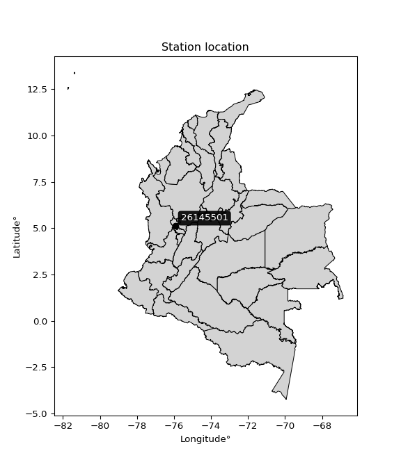

<div align="center">


</div>

# PMP Station (Rain, Pmax24h): 26145501

Probable Maximum Precipitation (PMP) is the greatest amount of rainfall for a specific duration that is meteorologically possible for a given location, acting as a "worst-case" scenario for extreme storms, crucial for designing safety-critical infrastructure like bridges, river deviations, dams, spillways, and nuclear plants to prevent catastrophic failure. PMP is calculated by hydrologists using meteorological data to determine the upper limit of extreme rainfall, often leading to the Probable Maximum Flood (PMF) for flood control design, and is increasingly being studied for climate change impacts. Probable Maximum Precipitation (PMP) is the theoretical upper limit of rainfall, a deterministic estimate for extreme events, while probability distributions (like GEV, Gumbel) describe the likelihood and frequency of various precipitation amounts, including rare ones, showing how often events occur, with PMP representing the extreme end of these distributions, used for critical infrastructure design to ensure safety against the worst conceivable weather, unlike standard statistical forecasts which cover typical probabilities.

The most common probability distributions in hydrology, used for analyzing floods, rainfall, and streamflow, include the Normal, Log-Normal, Gumbel, Gamma (including Log-Pearson Type III), and Generalized Extreme Value (GEV) distributions, often chosen based on the data´s skewness and whether modeling extremes or general conditions, with Gumbel and GEV popular for extreme events like floods, while the Normal distribution serves as a baseline, though often requiring transformations for skewed hydrological data. These distributions help in designing water infrastructure, managing water resources, and forecasting hydrologic events.

> Hydrological data often isn´t perfectly normal (it´s skewed), so different distributions are needed for different applications, such as: **Flood Frequency Analysis**: Using Gumbel, GEV, or Log-Pearson Type III for predicting extreme flood magnitudes and their return periods, **Rainfall Analysis**: Normal for annual totals, but Log-Normal, Weibull, or GEV for intensity or extreme daily rainfall, **Streamflow Modeling**: Gamma and Log-Normal for maximum flows, GEV for minimum flows, and Kappa for daily flows.

<div align="center">

</img>

</div>


## A. General information


### 1. General running parameters

• app_version: _v20260108_. • runtime: _2026-01-08 13:24:42.400241_. • Python version: _3.14.0_. • SciPy version: _1.16.3_. • Pandas version: _2.3.3_. • NumPy version: _2.3.5_. • Stations dataset (station_dataset_file): _dataset/pmax24h_in/automatic_colombia_2003_2024.csv_. • Stations catalog (station_catalog_file): _dataset/CNE.xls_. • Minimum year to eval til year_max (date_min): _1900_. • Maximum year to eval since year_min (date_max): _2024_. • Creates, save and include plots into reports (create_plot): _False_. • Plot only fit distributions with Δo > Δ (plot_only_fit): _True_. • Plot only simple graphs avoiding multiple CDFs and multiple Extreme values plots (plot_only_simple): _True_. • Eval low extreme values, if False, evaluates high extreme values (low_extreme): _False_. • Eval every SciPy distribution as logarithmic (pdist_logarithmic_on): _True_. • Standard deviation normalized (ddof): _1.0_. • Return periods to eval in years (Tr): _[2, 2.33, 5, 10, 15, 20, 25, 50, 75, 100, 200, 250, 500, 750, 1000]_. • Minimum data sample per station, 0 means any (minimum_sample): _5_. • Z-Score maximum threshold to adjust a value, 0 means disable (zscore_max): _3.5_. • Z-Score minimum threshold to adjust a value, 0 means disable (zscore_min): _-2.5_. • Avoid zeros, e.g. rain = 0 (avoid_zeros): _True_. • Avoid null values (avoid_nans): _True_. 

:file_folder:Table: [dataset.csv](../../dataset/pmax24h_in/automatic_colombia_2003_2024.csv)

> Delta Degrees of Freedom (DDOF): is a parameter used in the formulas for calculating variance and standard deviation. When ddof=0, the divisor is $N$ (the total number of observations) and this is used when your data set is the entire population. When ddof=1, the divisor is $N-1$ and this is used when your data set is a sample drawn from a larger population. Using $N-1$ provides an unbiased estimate of the population variance (known as Bessel´s correction).


### 2. Station info and location

|   id |   CODIGO | NOMBRE                  | CATEGORIA               | TECNOLOGIA                | ESTADO   | FECHA_INSTALACION   |   FECHA_SUSPENSION |   ALTITUD |   LATITUD |   LONGITUD | DEPARTAMENTO   | MUNICIPIO   | AREA_OPERATIVA                         | ENTIDAD                                    | AREA_HIDROGRAFICA   | ZONA_HIDROGRAFICA   | SUBZONA_HIDROGRAFICA   |   CORRIENTE | Catalogo   |   Version |
|-----:|---------:|:------------------------|:------------------------|:--------------------------|:---------|:--------------------|-------------------:|----------:|----------:|-----------:|:---------------|:------------|:---------------------------------------|:-------------------------------------------|:--------------------|:--------------------|:-----------------------|------------:|:-----------|----------:|
|    0 | 26145501 | APIA  - AUT  [26145501] | Climatológica Principal | Automática con Telemetría | Activa   | 10/09/2013          |                nan |      1830 |   5.10506 |   -75.9331 | Risaralda      | Apía        | Area Operativa 09 - Cauca-Valle-Caldas | CENTRO NACIONAL DE INVESTIGACIONES DE CAFE | Magdalena Cauca     | Cauca               | Río Risaralda          |         nan | CNE_OE     |  20251226 |

<div align="center">

Dynamic map: [:earth_americas:Google](http://maps.google.com/maps?q=5.105055556,-75.93305556) [:earth_americas:OSM](https://www.openstreetmap.org/#map=18/5.105055556/-75.93305556&layers=P) [:earth_americas:Bing](https://www.bing.com/maps?cp=5.105055556~-75.93305556&lvl=18) [:earth_americas:Apple](https://maps.apple.com/frame?center=5.105055556%2C-75.93305556&span=0.003%2C0.006)

</div>


<div align="center">

```geojson
{
  "type": "Feature",
  "geometry": {
    "type": "Point", 
    "coordinates": [-75.93305556, 5.105055556]
  }, 
  "properties": {
    "Name": "26145501"
  }
}
```

</div>


### 3. Discrete values table and plot

<div align="center">

|               |          0 |           1 |           2 |           3 |           4 |           5 |          6 |
|:--------------|-----------:|------------:|------------:|------------:|------------:|------------:|-----------:|
| Date          | 2017       | 2018        | 2019        | 2020        | 2021        | 2022        | 2023       |
| Value         |    0.3     |   23.7      |   26.4      |   30.8      |   49.3      |   48.6      |   54.8     |
| Value_initial |    0.3     |   23.7      |   26.4      |   30.8      |   49.3      |   48.6      |   54.8     |
| count         |    7       |    7        |    7        |    7        |    7        |    7        |    7       |
| mean          |   33.4143  |   33.4143   |   33.4143   |   33.4143   |   33.4143   |   33.4143   |   33.4143  |
| std           |   19.0931  |   19.0931   |   19.0931   |   19.0931   |   19.0931   |   19.0931   |   19.0931  |
| zscore        |   -1.73436 |   -0.508786 |   -0.367374 |   -0.136923 |    0.832015 |    0.795353 |    1.12008 |


</div>


> The initial value (value_initial) correspond to the initial obtained or null completed value, and value (value) is adjusted only when the initial value is outside the valid range (outlier) definite through the Z-Score value. If Z-Score is active, values out of range or outliers are replaced with the station mean value. A Z-Score (or standard score) measures how many standard deviations a data point is from the mean of a dataset, indicating its relative position; positive scores mean above the mean, negative mean below, and a score of zero is exactly at the mean, allowing for comparison of values from different distributions. It´s calculated using the formula $z=(x–μ)/σ$, where $x$ is the data point, $μ$ is the mean, and $σ$ is the standard deviation, helping identify outliers and understand probability.
>
> <sub>**Note**: In this study, "completing" (filling gaps in) and "extending" (forecasting or lengthening the historical record) rainfall data series are avoided for certain critical analyses because they introduce artificial bias and uncertainty, which can distort the statistics of rare events (extremes), alter day-to-day variability, and compromise the integrity and homogeneity of the original data. Some reasons against Completing/Extending rainfall data are: **Distortion of Extremes and Variability**: The primary issue is that most gap-filling or extension methods rely on averaging or regression with nearby stations, which inherently smooths the data. Rainfall is highly variable in space and time, with a large percentage of zero values and occasional large storms. Infilling methods often underestimate the highest values and overestimate the lowest (zero) values, which severely distorts analyses focused on flood frequency, drought severity, and intensity-duration-frequency (IDF) curves, **Loss of Data Homogeneity**: Infilled or extended data are synthetic estimates, not actual measurements. Combining these estimates with observed data can violate the assumption of data homogeneity, which requires that the data properties do not change over time. Inhomogeneity can lead to incorrect conclusions about long-term trends or changes in climate patterns, **Propagation of Errors**: Errors and biases from the original data (e.g., wind-induced undercatch, instrument errors, site changes) or the data used for imputation can propagate through the analysis, leading to unreliable hydrological models and inaccurate predictions, **Compromised Statistical Integrity**: For statistical analyses, especially those involving the frequency of events, using artificial data can introduce time bias or autocorrelation that doesn´t exist in reality, making it difficult to assess the true probability of events, **Difficulty in Validation**: It is difficult to accurately validate the quality of filled or extended data, especially for past periods where ground-truth measurements are unavailable. The reliability of imputation techniques heavily depends on the density of the surrounding station network and the complexity of the local topography.</sub>


### 4. Active continuous probability distributions from SciPy (43 of 104 available)

A Probability Density Function (PDF) describes the relative likelihood of a continuous random variable falling within a specific range, where the total area under its curve equals 1, and the area over any interval gives the actual probability for that range. Unlike discrete probabilities (like rolling a die), a PDF shows density, not direct probability for a single point (which is zero), with higher points indicating higher likelihood, often visualized as a bell curve for normal distributions.

A log of a probability density function (log-PDF) is simply the logarithm of the PDF´s value, denoted as $log(f(x))$, useful for converting multiplication of probabilities into addition, improving numerical stability with tiny numbers, and connecting to information theory concepts like entropy. Instead of dealing with very small probabilities (e.g., 0.000001), log-PDFs use negative numbers (e.g., $log(0.00001) ≈ -11.51$ that are easier for computers to handle, preventing underflow errors and simplifying complex calculations. In this study, each active probability distribution from SciPy is also evaluated in the $log$ form.

[scipy.stats](https://docs.scipy.org/doc/scipy/reference/stats.html) is a Python´s powerful submodule within the SciPy library for comprehensive statistical analysis, offering over 130 probability distributions (like Normal, Poisson), functions for descriptive stats (mean, variance), hypothesis testing (t-tests, chi-square), random variable generation, and statistical tests, making it essential for data science, modeling, and research. It provides tools to explore, model, and draw conclusions from data efficiently, working seamlessly with NumPy.

<div align="center">

|   id | p_dist             |   n_parameter | fit_method   | label                                                                       | active   | ref                                                                                                        |
|-----:|:-------------------|--------------:|:-------------|:----------------------------------------------------------------------------|:---------|:-----------------------------------------------------------------------------------------------------------|
|    0 | alpha              |             3 | MLE          | Alpha                                                                       | True     | [:mortar_board:](https://docs.scipy.org/doc/scipy/reference/generated/scipy.stats.alpha.html)              |
|    1 | betaprime          |             4 | MLE          | Beta prime                                                                  | True     | [:mortar_board:](https://docs.scipy.org/doc/scipy/reference/generated/scipy.stats.betaprime.html)          |
|    2 | chi2               |             3 | MLE          | Chi²                                                                        | True     | [:mortar_board:](https://docs.scipy.org/doc/scipy/reference/generated/scipy.stats.chi2.html)               |
|    3 | crystalball        |             4 | MLE          | Crystalball                                                                 | True     | [:mortar_board:](https://docs.scipy.org/doc/scipy/reference/generated/scipy.stats.crystalball.html)        |
|    4 | erlang             |             3 | MLE          | Erlang                                                                      | True     | [:mortar_board:](https://docs.scipy.org/doc/scipy/reference/generated/scipy.stats.erlang.html)             |
|    5 | expon              |             2 | MLE          | Exponential                                                                 | True     | [:mortar_board:](https://docs.scipy.org/doc/scipy/reference/generated/scipy.stats.expon.html)              |
|    6 | exponnorm          |             3 | MLE          | Exponentially modified Normal                                               | True     | [:mortar_board:](https://docs.scipy.org/doc/scipy/reference/generated/scipy.stats.exponnorm.html)          |
|    7 | f                  |             4 | MLE          | F                                                                           | True     | [:mortar_board:](https://docs.scipy.org/doc/scipy/reference/generated/scipy.stats.f.html)                  |
|    8 | fatiguelife        |             3 | MLE          | Fatigue-life (Birnbaum-Saunders)                                            | True     | [:mortar_board:](https://docs.scipy.org/doc/scipy/reference/generated/scipy.stats.fatiguelife.html)        |
|    9 | fisk               |             3 | MLE          | Fisk                                                                        | True     | [:mortar_board:](https://docs.scipy.org/doc/scipy/reference/generated/scipy.stats.fisk.html)               |
|   10 | gamma              |             3 | MLE          | Gamma                                                                       | True     | [:mortar_board:](https://docs.scipy.org/doc/scipy/reference/generated/scipy.stats.gamma.html)              |
|   11 | genexpon           |             5 | MLE          | Generalized exponential                                                     | True     | [:mortar_board:](https://docs.scipy.org/doc/scipy/reference/generated/scipy.stats.genexpon.html)           |
|   12 | genlogistic        |             3 | MLE          | Generalized logistic                                                        | True     | [:mortar_board:](https://docs.scipy.org/doc/scipy/reference/generated/scipy.stats.genlogistic.html)        |
|   13 | gibrat             |             2 | MM           | Gibrat                                                                      | True     | [:mortar_board:](https://docs.scipy.org/doc/scipy/reference/generated/scipy.stats.gibrat.html)             |
|   14 | gompertz           |             3 | MLE          | Gompertz (or truncated Gumbel)                                              | True     | [:mortar_board:](https://docs.scipy.org/doc/scipy/reference/generated/scipy.stats.gompertz.html)           |
|   15 | gumbel_l           |             2 | MM           | Gumbel Left Skew                                                            | True     | [:mortar_board:](https://docs.scipy.org/doc/scipy/reference/generated/scipy.stats.gumbel_l.html)           |
|   16 | gumbel_r           |             2 | MM           | Gumbel Right Skew                                                           | True     | [:mortar_board:](https://docs.scipy.org/doc/scipy/reference/generated/scipy.stats.gumbel_r.html)           |
|   17 | halflogistic       |             2 | MM           | Half-logistic                                                               | True     | [:mortar_board:](https://docs.scipy.org/doc/scipy/reference/generated/scipy.stats.halflogistic.html)       |
|   18 | halfnorm           |             2 | MM           | Half Normal                                                                 | True     | [:mortar_board:](https://docs.scipy.org/doc/scipy/reference/generated/scipy.stats.halfnorm.html)           |
|   19 | hypsecant          |             2 | MM           | hyperbolic secant                                                           | True     | [:mortar_board:](https://docs.scipy.org/doc/scipy/reference/generated/scipy.stats.hypsecant.html)          |
|   20 | invgamma           |             3 | MLE          | Inverted gamma                                                              | True     | [:mortar_board:](https://docs.scipy.org/doc/scipy/reference/generated/scipy.stats.invgamma.html)           |
|   21 | invgauss           |             3 | MLE          | Inverse Gaussian                                                            | True     | [:mortar_board:](https://docs.scipy.org/doc/scipy/reference/generated/scipy.stats.invgauss.html)           |
|   22 | invweibull         |             3 | MLE          | Inverted Weibull                                                            | True     | [:mortar_board:](https://docs.scipy.org/doc/scipy/reference/generated/scipy.stats.invweibull.html)         |
|   23 | kstwobign          |             2 | MLE          | Limiting distribution of scaled Kolmogorov-Smirnov two-sided test statistic | True     | [:mortar_board:](https://docs.scipy.org/doc/scipy/reference/generated/scipy.stats.kstwobign.html)          |
|   24 | laplace            |             2 | MM           | Laplace                                                                     | True     | [:mortar_board:](https://docs.scipy.org/doc/scipy/reference/generated/scipy.stats.laplace.html)            |
|   25 | laplace_asymmetric |             3 | MLE          | Asymmetric Laplace                                                          | True     | [:mortar_board:](https://docs.scipy.org/doc/scipy/reference/generated/scipy.stats.laplace_asymmetric.html) |
|   26 | loggamma           |             3 | MLE          | Log gamma                                                                   | True     | [:mortar_board:](https://docs.scipy.org/doc/scipy/reference/generated/scipy.stats.loggamma.html)           |
|   27 | logistic           |             2 | MM           | Logistic (or Sech-squared)                                                  | True     | [:mortar_board:](https://docs.scipy.org/doc/scipy/reference/generated/scipy.stats.logistic.html)           |
|   28 | lognorm            |             3 | MLE          | Log Normal                                                                  | True     | [:mortar_board:](https://docs.scipy.org/doc/scipy/reference/generated/scipy.stats.lognorm.html)            |
|   29 | maxwell            |             2 | MM           | Maxwell                                                                     | True     | [:mortar_board:](https://docs.scipy.org/doc/scipy/reference/generated/scipy.stats.maxwell.html)            |
|   30 | mielke             |             4 | MLE          | Mielke Beta-Kappa / Dagum                                                   | True     | [:mortar_board:](https://docs.scipy.org/doc/scipy/reference/generated/scipy.stats.mielke.html)             |
|   31 | moyal              |             2 | MM           | Moyal                                                                       | True     | [:mortar_board:](https://docs.scipy.org/doc/scipy/reference/generated/scipy.stats.moyal.html)              |
|   32 | nakagami           |             3 | MLE          | Nakagami                                                                    | True     | [:mortar_board:](https://docs.scipy.org/doc/scipy/reference/generated/scipy.stats.nakagami.html)           |
|   33 | ncf                |             5 | MLE          | Non-central F distribution                                                  | True     | [:mortar_board:](https://docs.scipy.org/doc/scipy/reference/generated/scipy.stats.ncf.html)                |
|   34 | nct                |             4 | MLE          | Non-central Student’s t                                                     | True     | [:mortar_board:](https://docs.scipy.org/doc/scipy/reference/generated/scipy.stats.nct.html)                |
|   35 | norm               |             2 | MM           | Normal                                                                      | True     | [:mortar_board:](https://docs.scipy.org/doc/scipy/reference/generated/scipy.stats.norm.html)               |
|   36 | pearson3           |             3 | MM           | Pearson type III                                                            | True     | [:mortar_board:](https://docs.scipy.org/doc/scipy/reference/generated/scipy.stats.pearson3.html)           |
|   37 | rayleigh           |             2 | MM           | Rayleigh                                                                    | True     | [:mortar_board:](https://docs.scipy.org/doc/scipy/reference/generated/scipy.stats.rayleigh.html)           |
|   38 | rice               |             3 | MLE          | Rice                                                                        | True     | [:mortar_board:](https://docs.scipy.org/doc/scipy/reference/generated/scipy.stats.rice.html)               |
|   39 | t                  |             3 | MLE          | Student’s t                                                                 | True     | [:mortar_board:](https://docs.scipy.org/doc/scipy/reference/generated/scipy.stats.t.html)                  |
|   40 | truncnorm          |             4 | MLE          | Truncated normal                                                            | True     | [:mortar_board:](https://docs.scipy.org/doc/scipy/reference/generated/scipy.stats.truncnorm.html)          |
|   41 | wald               |             2 | MM           | Wald                                                                        | True     | [:mortar_board:](https://docs.scipy.org/doc/scipy/reference/generated/scipy.stats.wald.html)               |
|   42 | weibull_min        |             3 | MLE          | Weibull minimum                                                             | True     | [:mortar_board:](https://docs.scipy.org/doc/scipy/reference/generated/scipy.stats.weibull_min.html)        |

</div>

> **n_parameter:** # arguments & localization & scale.
>
> **Fit methods:** (MLE) maximum likelihood, (MM) L-moments.
>
>**Inactive** (With the only purpose of prevent loops, zero divisions, infinite values, over high estimated values or horizontal trending for recurrence intervals estimations, the follow distributions were disabled.)**:** foldnorm, gennorm, norminvgauss, powernorm, powerlognorm, skewnorm, genextreme, anglit, arcsine, argus, beta, bradford, burr, burr12, cauchy, cosine, halfcauchy, foldcauchy, skewcauchy, wrapcauchy, dgamma, gengamma, exponweib, exponpow, truncexpon, gausshyper, genhalflogistic, genhyperbolic, geninvgauss, halfgennorm, johnsonsb, johnsonsu, kappa4, kappa3, ksone, kstwo, loglaplace, levy, levy_l, levy_stable, ncx2, pareto, genpareto, truncpareto, lomax, powerlaw, rdist, rel_breitwigner, recipinvgauss, semicircular, studentized_range, trapezoid, triang, truncweibull_min, tukeylambda, uniform, loguniform, vonmises, vonmises_line, weibull_max, dweibull, 


## B. Probability (PDF) vs. Empirical (EDF) distributions functions

A continuous probability distribution (CPD) describes probabilities for variables that can take any value within a range (like rain any time), unlike discrete variables with specific outcomes (like temperature). It uses a Probability Density Function (PDF), a curve where the total area under it equals 1, and the probability of the variable falling within an interval (a to b) is found by calculating the area under the curve between those points. A key feature is that the probability of hitting any single exact value is zero, so probabilities are always expressed for ranges, e.g., $P(a ≤ X ≤ b)$.

<div align="center">

Distributions parameters from station values
|    |   station | p_dist                |   n |             loc |           scale | shape                  | shape1                 | shape2                | shape3   |
|---:|----------:|:----------------------|----:|----------------:|----------------:|:-----------------------|:-----------------------|:----------------------|:---------|
|  0 |  26145501 | alpha                 |   7 |  -288.125       |  5596.39        | 17.484254670429365     |                        |                       |          |
|  1 |  26145501 | betaprime             |   7 |  -538.195       | 24639.3         | 1048.0039837197573     | 45179.653358600975     |                       |          |
|  2 |  26145501 | chi2                  |   7 |  -135.671       |     1.03122     | 163.7957384181537      |                        |                       |          |
|  3 |  26145501 | crystalball           |   7 |    33.4143      |    17.6767      | 2597.9022840938505     | 3446.6192760202284     |                       |          |
|  4 |  26145501 | erlang                |   7 |  -262.347       |     1.09982     | 268.8172065240533      |                        |                       |          |
|  5 |  26145501 | expon                 |   7 |     0.3         |    33.1143      |                        |                        |                       |          |
|  6 |  26145501 | exponnorm             |   7 |    33.4002      |    17.6768      | 0.0008013598806478829  |                        |                       |          |
|  7 |  26145501 | f                     |   7 | -8771.5         |  8804.91        | 645116.0883506648      | 2164665.207360738      |                       |          |
|  8 |  26145501 | fatiguelife           |   7 | -3946.22        |  3979.6         | 0.004448600977589132   |                        |                       |          |
|  9 |  26145501 | fisk                  |   7 |    -1.16441e+08 |     1.16441e+08 | 11158322.20374642      |                        |                       |          |
| 10 |  26145501 | gamma                 |   7 |  -252.389       |     1.13782     | 251.13606070473134     |                        |                       |          |
| 11 |  26145501 | genexpon              |   7 |     0.299981    |     1.95229     | 0.058928724181369206   | 2.4885201749023447e-07 | 1.0654755121005444    |          |
| 12 |  26145501 | genlogistic           |   7 |    54.8001      |     4.97304e-06 | 2.3229897764435456e-07 |                        |                       |          |
| 13 |  26145501 | gibrat                |   7 |    19.9291      |     8.17915     |                        |                        |                       |          |
| 14 |  26145501 | gompertz              |   7 |    23.7         |    14.133       | 0.3185685290689483     |                        |                       |          |
| 15 |  26145501 | gumbel_l              |   7 |    41.3698      |    13.7825      |                        |                        |                       |          |
| 16 |  26145501 | gumbel_r              |   7 |    25.4588      |    13.7825      |                        |                        |                       |          |
| 17 |  26145501 | halflogistic          |   7 |    12.4633      |    15.113       |                        |                        |                       |          |
| 18 |  26145501 | halfnorm              |   7 |    10.0172      |    29.3239      |                        |                        |                       |          |
| 19 |  26145501 | hypsecant             |   7 |    33.4143      |    11.2534      |                        |                        |                       |          |
| 20 |  26145501 | invgamma              |   7 |  -188.128       | 32432.3         | 147.58841368867587     |                        |                       |          |
| 21 |  26145501 | invgauss              |   7 |   -90.0926      |  5174.7         | 0.023848515363832694   |                        |                       |          |
| 22 |  26145501 | invweibull            |   7 |    -2.81693e+09 |     2.81693e+09 | 154222444.25712767     |                        |                       |          |
| 23 |  26145501 | kstwobign             |   7 |   -40.7609      |    84.7938      |                        |                        |                       |          |
| 24 |  26145501 | laplace               |   7 |    33.4143      |    12.4993      |                        |                        |                       |          |
| 25 |  26145501 | laplace_asymmetric    |   7 |    30.8         |    14.4385      | 0.9134825680829515     |                        |                       |          |
| 26 |  26145501 | loggamma              |   7 |    54.8007      |     5.48385e-05 | 2.558602063809446e-06  |                        |                       |          |
| 27 |  26145501 | logistic              |   7 |    33.4143      |     9.74569     |                        |                        |                       |          |
| 28 |  26145501 | lognorm               |   7 |     0.3         |     0.1042      | 14.360806316953386     |                        |                       |          |
| 29 |  26145501 | maxwell               |   7 |    -8.47215     |    26.2484      |                        |                        |                       |          |
| 30 |  26145501 | mielke                |   7 |     0.3         |    55.4181      | 0.6605337375274746     | 118.50678555851381     |                       |          |
| 31 |  26145501 | moyal                 |   7 |    23.3056      |     7.95733     |                        |                        |                       |          |
| 32 |  26145501 | nakagami              |   7 |     0.3         |    14.6844      | 0.06628995107546615    |                        |                       |          |
| 33 |  26145501 | ncf                   |   7 |     0.3         |     4.85092     | 0.8596004843079348     | 4.7571040523145065     | 3.451351577564228     |          |
| 34 |  26145501 | nct                   |   7 |  -129.258       |     2.26129     | 32.43042053802572      | 70.64282127353682      |                       |          |
| 35 |  26145501 | norm                  |   7 |    33.4143      |    17.6767      |                        |                        |                       |          |
| 36 |  26145501 | pearson3              |   7 |    33.4143      |    17.6768      | -0.5250417687801707    |                        |                       |          |
| 37 |  26145501 | rayleigh              |   7 |    -0.402339    |    26.9818      |                        |                        |                       |          |
| 38 |  26145501 | rice                  |   7 |   -10.8532      |    19.2152      | 2.0380443181154266     |                        |                       |          |
| 39 |  26145501 | t                     |   7 |    33.4145      |    17.6773      | 11588949.97376771      |                        |                       |          |
| 40 |  26145501 | truncnorm             |   7 |    44.8543      |    23.5347      | -1.9013735066585005    | 0.42259754452874365    |                       |          |
| 41 |  26145501 | wald                  |   7 |    15.7375      |    17.6768      |                        |                        |                       |          |
| 42 |  26145501 | weibull_min           |   7 |    -2.65974e+08 |     2.65974e+08 | 18954108.363053948     |                        |                       |          |
| 43 |  26145501 | logalpha              |   7 |   -55.4565      |  1846.03        | 31.677870935614592     |                        |                       |          |
| 44 |  26145501 | logbetaprime          |   7 |    -1.20397     |     3.27238     | 0.1493320453044097     | 0.6295507212987159     |                       |          |
| 45 |  26145501 | logchi2               |   7 |    -1.20397     |     3.0002      | 1.1951532662761672     |                        |                       |          |
| 46 |  26145501 | logcrystalball        |   7 |     2.92109     |     1.71169     | 120.32533539263204     | 2175.6293764237153     |                       |          |
| 47 |  26145501 | logerlang             |   7 |    -1.20397     |    11.1115      | 0.16550526785399106    |                        |                       |          |
| 48 |  26145501 | logexpon              |   7 |    -1.20397     |     4.12506     |                        |                        |                       |          |
| 49 |  26145501 | logexponnorm          |   7 |     2.91989     |     1.71168     | 0.0007036734185331211  |                        |                       |          |
| 50 |  26145501 | logf                  |   7 |    -1.20397     |     1.09543     | 1.159632799813746      | 1.0825274464294616     |                       |          |
| 51 |  26145501 | logfatiguelife        |   7 |  -667.501       |   670.403       | 0.0025445219371253505  |                        |                       |          |
| 52 |  26145501 | logfisk               |   7 |    -1.20397     |     2.7531      | 0.1888495700046306     |                        |                       |          |
| 53 |  26145501 | loggamma              |   7 |   -22.6153      |     0.132012    | 193.33032831366552     |                        |                       |          |
| 54 |  26145501 | loggenexpon           |   7 |    -1.20905     |     0.0189262   | 0.0013170207682444172  | 2.6107341868918925     | 9.768363059145412e-06 |          |
| 55 |  26145501 | loggenlogistic        |   7 |     4.00371     |     1.8517e-06  | 1.702755289755788e-06  |                        |                       |          |
| 56 |  26145501 | loggibrat             |   7 |     1.61529     |     0.792005    |                        |                        |                       |          |
| 57 |  26145501 | loggompertz           |   7 |    -1.20397     |     0.825137    | 0.003172799390574062   |                        |                       |          |
| 58 |  26145501 | loggumbel_l           |   7 |     3.69144     |     1.3346      |                        |                        |                       |          |
| 59 |  26145501 | loggumbel_r           |   7 |     2.15074     |     1.3346      |                        |                        |                       |          |
| 60 |  26145501 | loghalflogistic       |   7 |     0.892347    |     1.46343     |                        |                        |                       |          |
| 61 |  26145501 | loghalfnorm           |   7 |     0.655519    |     2.83949     |                        |                        |                       |          |
| 62 |  26145501 | loghypsecant          |   7 |     2.92109     |     1.08969     |                        |                        |                       |          |
| 63 |  26145501 | loginvgamma           |   7 |   -40.799       | 24787.6         | 568.4571697133224      |                        |                       |          |
| 64 |  26145501 | loginvgauss           |   7 |   -16.5075      |  1879.6         | 0.010313321622254483   |                        |                       |          |
| 65 |  26145501 | loginvweibull         |   7 |    -4.58495e+08 |     4.58495e+08 | 217277047.2793935      |                        |                       |          |
| 66 |  26145501 | logkstwobign          |   7 |    -6.01503     |    10.226       |                        |                        |                       |          |
| 67 |  26145501 | loglaplace            |   7 |     2.92109     |     1.21035     |                        |                        |                       |          |
| 68 |  26145501 | loglaplace_asymmetric |   7 |     4.00369     |     0.0109897   | 98.32782732141499      |                        |                       |          |
| 69 |  26145501 | logloggamma           |   7 |     4.00371     |     1.57037e-06 | 1.4547954672573606e-06 |                        |                       |          |
| 70 |  26145501 | loglogistic           |   7 |     2.92109     |     0.943703    |                        |                        |                       |          |
| 71 |  26145501 | loglognorm            |   7 |  -857.776       |   860.691       | 0.001983985555953232   |                        |                       |          |
| 72 |  26145501 | logmaxwell            |   7 |    -1.13485     |     2.54169     |                        |                        |                       |          |
| 73 |  26145501 | logmielke             |   7 |    -1.20397     |     2.88629     | 0.17478392601943937    | 1.5543303721137058     |                       |          |
| 74 |  26145501 | logmoyal              |   7 |     1.94224     |     0.77053     |                        |                        |                       |          |
| 75 |  26145501 | lognakagami           |   7 | -2266.46        |  2269.39        | 439386.8776832388      |                        |                       |          |
| 76 |  26145501 | logncf                |   7 |    -1.20397     |     1.05247     | 1.0825066311880933     | 1.1236093063796724     | 1.0893030625775164    |          |
| 77 |  26145501 | lognct                |   7 |   -95.4724      |     1.66304     | 25154.857257314292     | 59.16321996990575      |                       |          |
| 78 |  26145501 | lognorm               |   7 |     2.92109     |     1.71169     |                        |                        |                       |          |
| 79 |  26145501 | logpearson3           |   7 |     2.92108     |     1.71171     | -1.9060172316334256    |                        |                       |          |
| 80 |  26145501 | lograyleigh           |   7 |    -0.353496    |     2.61273     |                        |                        |                       |          |
| 81 |  26145501 | logrice               |   7 |  -549.254       |     1.7111      | 322.7005044155162      |                        |                       |          |
| 82 |  26145501 | logt                  |   7 |     3.6043      |     0.380946    | 1.220511672095694      |                        |                       |          |
| 83 |  26145501 | logtruncnorm          |   7 |     2.40735     |     7.41919     | -0.4867549758775159    | 0.21516875697836724    |                       |          |
| 84 |  26145501 | logwald               |   7 |     1.20939     |     1.71169     |                        |                        |                       |          |
| 85 |  26145501 | logweibull_min        |   7 |    -1.20397     |     1.71455     | 0.6393822165524974     |                        |                       |          |

</div>

> **loc** (Location parameter): This shifts the distribution along the x-axis. For many common distributions, like the normal (Gaussian) distribution, loc represents the mean $μ$. For others, like the uniform distribution, it might represent the minimum value, or for the beta distribution, the left end of the support interval.
>
> **scale** (Scale parameter): This determines the width or spread of the distribution. For the normal distribution, scale represents the standard deviation $σ$. For a uniform distribution, it defines the length of the interval (from $loc$ to $loc + scale$).
>
> **shape** (Shape parameters): Refers to parameters that define the specific form of a probability distribution, distinct from its location (loc) and scale (scale). These parameters are required arguments for most distribution functions. For example, a normal (Gaussian) distribution is fully defined by its location (mean) and scale (standard deviation), so it has no specific shape parameters beyond loc and scale. However, other distributions have intrinsic properties that need specification, as Gamma distribution that takes a shape parameter, often named $a$ or $alpha$.


### 0. Cumulative distribution values - CDF (86 evaluated)

Cumulative Distribution Function (CDF), denoted as $F$<sub>$X$</sub>$(x)$, is a function that gives the probability that a random variable $X$ will take a value less than or equal to a specific value, $x$ (i.e., $(P(X≥x)$. It essentially "accumulates" probabilities from a given point up to the far right (positive infinity), providing a complete picture of the distribution´s probabilities for both discrete (like rain) and continuous (like temperature) variables, helping to find probabilities over ranges or above certain values. Each station is evaluated separately ordering the $x$ values ascending, calculating the CDF and PDF values for the activated distributions and their logarithmic forms.

<div align="center">

CDF ordered by x ascending and calculating $log(f(x))$ separately
|   id |   Station |   date |    x |   count |    mean |     std |    zscore |   Value_initial |   station |   m |     alpha |   alpha_pdf |   betaprime |   betaprime_pdf |      chi2 |   chi2_pdf |   crystalball |   crystalball_pdf |    erlang |   erlang_pdf |    expon |   expon_pdf |   exponnorm |   exponnorm_pdf |         f |     f_pdf |   fatiguelife |   fatiguelife_pdf |      fisk |   fisk_pdf |     gamma |   gamma_pdf |    genexpon |   genexpon_pdf |   genlogistic |   genlogistic_pdf |   gibrat |   gibrat_pdf |    gompertz |   gompertz_pdf |   gumbel_l |   gumbel_l_pdf |   gumbel_r |   gumbel_r_pdf |   halflogistic |   halflogistic_pdf |   halfnorm |   halfnorm_pdf |   hypsecant |   hypsecant_pdf |   invgamma |   invgamma_pdf |   invgauss |   invgauss_pdf |   invweibull |   invweibull_pdf |   kstwobign |   kstwobign_pdf |   laplace |   laplace_pdf |   laplace_asymmetric |   laplace_asymmetric_pdf |   loggamma |   loggamma_pdf |   logistic |   logistic_pdf |    lognorm |   lognorm_pdf |    maxwell |   maxwell_pdf |      mielke |    mielke_pdf |       moyal |   moyal_pdf |   nakagami |   nakagami_pdf |         ncf |     ncf_pdf |      nct |    nct_pdf |      norm |   norm_pdf |   pearson3 |   pearson3_pdf |    rayleigh |   rayleigh_pdf |      rice |   rice_pdf |        t |      t_pdf |   truncnorm |   truncnorm_pdf |     wald |   wald_pdf |   weibull_min |   weibull_min_pdf |   logalpha |   logalpha_pdf |   logbetaprime |   logbetaprime_pdf |     logchi2 |    logchi2_pdf |   logcrystalball |   logcrystalball_pdf |   logerlang |   logerlang_pdf |   logexpon |   logexpon_pdf |   logexponnorm |   logexponnorm_pdf |        logf |    logf_pdf |   logfatiguelife |   logfatiguelife_pdf |     logfisk |   logfisk_pdf |   loggenexpon |   loggenexpon_pdf |   loggenlogistic |   loggenlogistic_pdf |   loggibrat |   loggibrat_pdf |   loggompertz |   loggompertz_pdf |   loggumbel_l |   loggumbel_l_pdf |   loggumbel_r |   loggumbel_r_pdf |   loghalflogistic |   loghalflogistic_pdf |   loghalfnorm |   loghalfnorm_pdf |   loghypsecant |   loghypsecant_pdf |   loginvgamma |   loginvgamma_pdf |   loginvgauss |   loginvgauss_pdf |   loginvweibull |   loginvweibull_pdf |   logkstwobign |   logkstwobign_pdf |   loglaplace |   loglaplace_pdf |   loglaplace_asymmetric |   loglaplace_asymmetric_pdf |   logloggamma |   logloggamma_pdf |   loglogistic |   loglogistic_pdf |   loglognorm |   loglognorm_pdf |   logmaxwell |   logmaxwell_pdf |   logmielke |   logmielke_pdf |    logmoyal |   logmoyal_pdf |   lognakagami |   lognakagami_pdf |      logncf |   logncf_pdf |     lognct |   lognct_pdf |   logpearson3 |   logpearson3_pdf |   lograyleigh |   lograyleigh_pdf |    logrice |   logrice_pdf |      logt |   logt_pdf |   logtruncnorm |   logtruncnorm_pdf |   logwald |   logwald_pdf |   logweibull_min |   logweibull_min_pdf |
|-----:|----------:|-------:|-----:|--------:|--------:|--------:|----------:|----------------:|----------:|----:|----------:|------------:|------------:|----------------:|----------:|-----------:|--------------:|------------------:|----------:|-------------:|---------:|------------:|------------:|----------------:|----------:|----------:|--------------:|------------------:|----------:|-----------:|----------:|------------:|------------:|---------------:|--------------:|------------------:|---------:|-------------:|------------:|---------------:|-----------:|---------------:|-----------:|---------------:|---------------:|-------------------:|-----------:|---------------:|------------:|----------------:|-----------:|---------------:|-----------:|---------------:|-------------:|-----------------:|------------:|----------------:|----------:|--------------:|---------------------:|-------------------------:|-----------:|---------------:|-----------:|---------------:|-----------:|--------------:|-----------:|--------------:|------------:|--------------:|------------:|------------:|-----------:|---------------:|------------:|------------:|---------:|-----------:|----------:|-----------:|-----------:|---------------:|------------:|---------------:|----------:|-----------:|---------:|-----------:|------------:|----------------:|---------:|-----------:|--------------:|------------------:|-----------:|---------------:|---------------:|-------------------:|------------:|---------------:|-----------------:|---------------------:|------------:|----------------:|-----------:|---------------:|---------------:|-------------------:|------------:|------------:|-----------------:|---------------------:|------------:|--------------:|--------------:|------------------:|-----------------:|---------------------:|------------:|----------------:|--------------:|------------------:|--------------:|------------------:|--------------:|------------------:|------------------:|----------------------:|--------------:|------------------:|---------------:|-------------------:|--------------:|------------------:|--------------:|------------------:|----------------:|--------------------:|---------------:|-------------------:|-------------:|-----------------:|------------------------:|----------------------------:|--------------:|------------------:|--------------:|------------------:|-------------:|-----------------:|-------------:|-----------------:|------------:|----------------:|------------:|---------------:|--------------:|------------------:|------------:|-------------:|-----------:|-------------:|--------------:|------------------:|--------------:|------------------:|-----------:|--------------:|----------:|-----------:|---------------:|-------------------:|----------:|--------------:|-----------------:|---------------------:|
|    0 |  26145501 |   2017 |  0.3 |       7 | 33.4143 | 19.0931 | -1.73436  |             0.3 |  26145501 |   1 | 0.0274917 |  0.00425684 |   0.0301722 |      0.00398698 | 0.0316447 | 0.00440737 |     0.0305117 |        0.00390357 | 0.0298755 |   0.00407028 | 0        |  0.0301984  |    0.030512 |      0.00390359 | 0.0302458 | 0.0038904 |     0.0303236 |        0.00391025 | 0.0363509 | 0.00335681 | 0.0295113 |  0.00404169 | 5.62311e-07 |     0.0301844  |      0        |        0.00366272 | 0        |   0          | 0           |      0         |  0.0495317 |      0.0035033 | 0.00201852 |    0.000908813 |       0        |         0          |   0        |     0          |   0.0335365 |      0.00297462 |  0.0259339 |     0.00409194 |  0.0253747 |     0.00430432 |    0.0249027 |       0.00503466 |    0.026862 |      0.00622947 | 0.0353509 |    0.00282823 |            0.0450404 |               0.0034149  | 0.00943543 |      0.0155266 |  0.0323631 |     0.00321329 | 0.00797762 |     0.0127743 | 0.00960113 |    0.00321063 | 1.29085e-12 | 15359.9       | 2.19345e-05 | 2.60832e-05 | 0.00423741 |    1.01204e+13 | 6.94388e-09 | 5.37636e+07 | 0.030284 | 0.00486281 | 0.0305117 | 0.00390357 |  0.0430046 |     0.00396951 | 0.000338727 |    0.000964404 | 0.0229284 |  0.0044198 | 0.030515 | 0.00390379 | 0.000855773 |      0.00444762 | 0        | 0          |     0.0508155 |        0.00352767 |  0.0094175 |       0.015862 |     0.00344189 |        2.31478e+12 | 1.69748e-10 | 456834         |       0.00797762 |            0.0127743 |  0.00185604 |     1.38344e+12 |   0        |      0.242421  |     0.00797739 |           0.012774 | 5.34044e-10 | 1.39453e+06 |       0.00788183 |            0.0127608 | 0.000912799 |   7.75629e+11 |   0.000354441 |          0.069924 |         0        |           0.00765297 |    0        |       0         |   2.79827e-09 |        0.00384518 |     0.0252024 |         0.0186439 |   4.33011e-06 |       4.00693e-05 |          0        |              0        |      0        |          0        |      0.0144469 |          0.0132532 |    0.00934747 |         0.0156275 |     0.0111331 |         0.0189877 |       0.0133193 |           0.0272583 |      0.0202281 |          0.0426643 |    0.0165509 |        0.0136745 |              0.00807173 |                  0.00746975 |    0.00803121 |        0.00744014 |     0.0124791 |         0.0130585 |   0.00779639 |         0.012609 |     0        |         0        |  0.00152598 |     1.20119e+12 | 1.33097e-14 |    5.20814e-13 |    0.00792248 |         0.0127035 | 1.25799e-09 |  3.06647e+06 | 0.00811098 |    0.0129675 |     0.0325044 |         0.0194764 |      0        |          0        | 0.00795898 |     0.0127525 | 0.0152292 | 0.00384544 |    3.85256e-07 |           0.175626 |  0        |     0         |      6.94515e-11 |       199987         |
|    1 |  26145501 |   2018 | 23.7 |       7 | 33.4143 | 19.0931 | -0.508786 |            23.7 |  26145501 |   2 | 0.321701  |  0.020628   |   0.296877  |      0.0196025  | 0.314191  | 0.0197582  |     0.291313  |        0.0194056  | 0.30221   |   0.0197747  | 0.506703 |  0.0148968  |    0.291313 |      0.0194056  | 0.29125   | 0.0194365 |     0.292138  |        0.019449   | 0.262091  | 0.0185331  | 0.301288  |  0.0197665  | 0.506542    |     0.0148948  |      0        |        0.0109272  | 0.219382 |   0.0783945  | 1.30884e-09 |      0.0225408 |  0.242301  |      0.015254  | 0.321065   |    0.0264659   |       0.355528 |         0.0289023  |   0.35922  |     0.0244028  |   0.254109  |      0.0202576  |  0.317027  |     0.0206773  |  0.326284  |     0.0205932  |    0.358585  |       0.0201343  |    0.389989 |      0.0197804  | 0.229849  |    0.0183889  |            0.265527  |               0.0201319  | 0.565347   |      0.212954  |  0.269576  |     0.0202043  | 0.556766   |     0.230706  | 0.318258   |    0.0215463  | 0.565813    |     0.0159717 | 0.329301    | 0.0303902   | 0.910799   |    0.0044051   | 0.534772    | 0.0133378   | 0.332212 | 0.0195079  | 0.291313  | 0.0194056  |  0.270337  |     0.0170845  | 0.328994    |    0.0222149   | 0.303089  |  0.0197492 | 0.291315 | 0.0194051  | 0.245226    |      0.017821   | 0.319816 | 0.053389   |     0.241464  |        0.0149391  |  0.574339  |       0.210572 |     0.852009   |        0.0164759   | 0.72178     |      0.0611545 |       0.556766   |            0.230706  |  0.876715   |     0.0236012   |   0.653282 |      0.0840515 |     0.556766   |           0.230707 | 0.710581    | 0.0307953   |       0.561382   |            0.231002  | 0.521794    |   0.0107846   |   0.626605    |          0.142146 |         0        |           0.425423   |    0.749069 |       0.205397  |   0.46717     |        0.408581   |     0.49048   |         0.257428  |   0.62656     |       0.219485    |          0.650776 |              0.196965 |      0.623275 |          0.190121 |      0.570797  |          0.284914  |    0.571979   |         0.212228  |     0.57773   |         0.196136  |       0.580082  |           0.149705  |      0.604173  |          0.135668  |    0.591418  |        0.337575  |              0.460332   |                  0.426001   |    0.459993   |        0.426139   |     0.564382  |         0.260522  |   0.558152   |         0.231074 |     0.5867   |         0.21477  |  0.953661   |     0.0131314   | 0.651169    |    0.21135     |    0.555985   |         0.230746  | 0.608961    |  0.0383985   | 0.556823   |    0.22952   |     0.430553  |         0.247752  |      0.59627  |          0.208121 | 0.556778   |     0.230785  | 0.213447  | 0.382655   |    0.836422    |           0.196685 |  0.719459 |     0.189089  |      0.837767    |            0.0431757 |
|    2 |  26145501 |   2019 | 26.4 |       7 | 33.4143 | 19.0931 | -0.367374 |            26.4 |  26145501 |   3 | 0.378706  |  0.0215174  |   0.351711  |      0.0209508  | 0.368996  | 0.0207699  |     0.345754  |        0.0208601  | 0.357375  |   0.0210212  | 0.545328 |  0.0137304  |    0.345754 |      0.02086    | 0.345775  | 0.0208905 |     0.346673  |        0.0208855  | 0.315097  | 0.0206808  | 0.356438  |  0.0210171  | 0.545163    |     0.013729   |      0        |        0.0123961  | 0.407385 |   0.0599831  | 0.0648629   |      0.025516  |  0.286459  |      0.0174737 | 0.392982   |    0.026631    |       0.430968 |         0.0269393  |   0.423623 |     0.0232777  |   0.31332   |      0.0235592  |  0.37425   |     0.0216289  |  0.38293   |     0.0212867  |    0.412854  |       0.0199961  |    0.44287  |      0.0193414  | 0.28527   |    0.0228228  |            0.325846  |               0.0247052  | 0.588168   |      0.209978  |  0.327452  |     0.0225974  | 0.581529   |     0.228185  | 0.377425   |    0.0221982  | 0.608133    |     0.0153905 | 0.410339    | 0.0294112   | 0.921915   |    0.00384569  | 0.569075    | 0.0120928   | 0.385585 | 0.0199583  | 0.345754  | 0.0208601  |  0.318918  |     0.0188795  | 0.389436    |    0.0224783   | 0.358081  |  0.0209226 | 0.345754 | 0.0208595  | 0.295797    |      0.0196272  | 0.448776 | 0.0422805  |     0.284662  |        0.0170774  |  0.596881  |       0.207189 |     0.853758   |        0.0159623   | 0.728287    |      0.059478  |       0.581529   |            0.228185  |  0.879223   |     0.0229022   |   0.662233 |      0.0818817 |     0.581529   |           0.228186 | 0.71385     | 0.0298118   |       0.586164   |            0.228264  | 0.522943    |   0.0105225   |   0.641779    |          0.139115 |         0        |           0.469795   |    0.769999 |       0.183133  |   0.512242    |        0.426264   |     0.518602  |         0.263698  |   0.649726    |       0.209925    |          0.671519 |              0.187594 |      0.643442 |          0.183709 |      0.601156  |          0.277483  |    0.594705   |         0.208957  |     0.598712  |         0.192738  |       0.596043  |           0.146157  |      0.618645  |          0.132597  |    0.626262  |        0.308786  |              0.508665   |                  0.47073    |    0.508344   |        0.470933   |     0.592254  |         0.255895  |   0.58295    |         0.228464 |     0.609611 |         0.209853 |  0.955045   |     0.0125164   | 0.67334     |    0.199709    |    0.580753   |         0.228251  | 0.613044    |  0.0372901   | 0.581457   |    0.226994  |     0.458087  |         0.262772  |      0.618436 |          0.202725 | 0.581549   |     0.228262  | 0.261183  | 0.507563   |    0.857626    |           0.196372 |  0.738974 |     0.172957  |      0.842339    |            0.0415915 |
|    3 |  26145501 |   2020 | 30.8 |       7 | 33.4143 | 19.0931 | -0.136923 |            30.8 |  26145501 |   4 | 0.474724  |  0.0219062  |   0.447126  |      0.0222094  | 0.462387  | 0.0214794  |     0.441213  |        0.0223233  | 0.452688  |   0.0220907  | 0.6019   |  0.012022   |    0.441213 |      0.0223232  | 0.441356  | 0.0223474 |     0.442164  |        0.0223117  | 0.412231  | 0.0232188  | 0.451745  |  0.0220926  | 0.601731    |     0.0120216  |      0        |        0.0152246  | 0.611986 |   0.0352428  | 0.187719    |      0.0302588 |  0.371521  |      0.0211789 | 0.507262   |    0.0249805   |       0.541769 |         0.0233735  |   0.52151  |     0.0211663  |   0.426709  |      0.0275393  |  0.470955  |     0.0221025  |  0.477292  |     0.0213988  |    0.498936  |       0.0189921  |    0.525429 |      0.0180941  | 0.405635  |    0.0324525  |            0.454878  |               0.0344882  | 0.620139   |      0.204611  |  0.433337  |     0.0251964  | 0.616333   |     0.223089  | 0.475601   |    0.0222182  | 0.674046    |     0.0145977 | 0.532344    | 0.0257608   | 0.937153   |    0.00311197  | 0.618281    | 0.0103251   | 0.473512 | 0.01984    | 0.441213  | 0.0223233  |  0.407729  |     0.0213718  | 0.487604    |    0.021961    | 0.452815  |  0.0219412 | 0.44121  | 0.0223226  | 0.388249    |      0.0223324  | 0.601918 | 0.0283265  |     0.367691  |        0.0206546  |  0.628381  |       0.201305 |     0.856165   |        0.0152731   | 0.737277    |      0.0571852 |       0.616333   |            0.223089  |  0.88268    |     0.0219575   |   0.674622 |      0.0788783 |     0.616333   |           0.22309  | 0.718342    | 0.0284939   |       0.620957   |            0.222858  | 0.524538    |   0.0101692   |   0.662879    |          0.134612 |         0        |           0.54134    |    0.796092 |       0.156285  |   0.579393    |        0.443083   |     0.559819  |         0.270643  |   0.681017    |       0.196033    |          0.699424 |              0.174523 |      0.67105  |          0.174483 |      0.642877  |          0.263173  |    0.626488   |         0.203196  |     0.627998  |         0.187082  |       0.618171  |           0.140904  |      0.638741  |          0.128122  |    0.670955  |        0.27186   |              0.58666    |                  0.542907   |    0.586378   |        0.543223   |     0.63103   |         0.246721  |   0.617787   |         0.223237 |     0.641364 |         0.201971 |  0.95691    |     0.0117035   | 0.702877    |    0.183633    |    0.61557    |         0.223188  | 0.618676    |  0.0357954   | 0.616078   |    0.221914  |     0.500328  |         0.285537  |      0.649052 |          0.194384 | 0.616364   |     0.22316   | 0.355885  | 0.72319    |    0.887858    |           0.195854 |  0.764038 |     0.152748  |      0.848584    |            0.0394593 |
|    4 |  26145501 |   2022 | 48.6 |       7 | 33.4143 | 19.0931 |  0.795353 |            48.6 |  26145501 |   5 | 0.806262  |  0.0135547  |   0.804092  |      0.0152063  | 0.798386  | 0.0142206  |     0.804852  |        0.0156045  | 0.803541  |   0.0148507  | 0.767435 |  0.00702311 |    0.80485  |      0.0156045  | 0.805006  | 0.0155871 |     0.804655  |        0.0155309  | 0.794291  | 0.0156576  | 0.802798  |  0.0148703  | 0.767278    |     0.00702459 |      0        |        0.0349661  | 0.895132 |   0.00633639 | 0.784866    |      0.028238  |  0.815439  |      0.0226277 | 0.829813   |    0.0112321   |       0.832293 |         0.0101664  |   0.811741 |     0.0114497  |   0.838431  |      0.0137488  |  0.80663   |     0.0137315  |  0.798286  |     0.0131979  |    0.769219  |       0.0110497  |    0.78333  |      0.0107303  | 0.851633  |    0.01187    |            0.823228  |               0.0111838  | 0.70869    |      0.18224   |  0.826095  |     0.0147411  | 0.713055   |     0.198985  | 0.807136   |    0.0135173  | 0.913195    |     0.0124885 | 0.838313    | 0.0100194   | 0.974822   |    0.00135703  | 0.755645    | 0.00566214  | 0.772444 | 0.0126561  | 0.804852  | 0.0156045  |  0.800766  |     0.0187358  | 0.807789    |    0.0129376   | 0.803149  |  0.0149697 | 0.804841 | 0.0156045  | 0.841786    |      0.0263556  | 0.868686 | 0.00730059 |     0.804019  |        0.0227613  |  0.715165  |       0.177936 |     0.862712   |        0.0134974   | 0.761923    |      0.0510336 |       0.713055   |            0.198985  |  0.892114   |     0.0194857   |   0.708682 |      0.0706216 |     0.713055   |           0.198986 | 0.73054     | 0.0251096   |       0.717379   |            0.197934  | 0.52896     |   0.00924877  |   0.721078    |          0.120408 |         0        |           0.823422   |    0.853654 |       0.101106  |   0.778559    |        0.405444   |     0.684907  |         0.272664  |   0.761124    |       0.155669    |          0.770683 |              0.138731 |      0.744404 |          0.147247 |      0.750435  |          0.20627   |    0.714173   |         0.17993   |     0.708716  |         0.165903  |       0.678756  |           0.12464   |      0.694098  |          0.114566  |    0.774267  |        0.186503  |              0.894744   |                  0.828015   |    0.894716   |        0.828869   |     0.734964  |         0.206412  |   0.71449    |         0.198763 |     0.727367 |         0.174247 |  0.961767   |     0.00967986  | 0.776626    |    0.1411      |    0.712358   |         0.199171  | 0.634087    |  0.0319049   | 0.712304   |    0.198023  |     0.647413  |         0.36136   |      0.731522 |          0.166644 | 0.713114   |     0.199034  | 0.710838  | 0.577582   |    0.976757    |           0.193839 |  0.822742 |     0.107863  |      0.865282    |            0.0339387 |
|    5 |  26145501 |   2021 | 49.3 |       7 | 33.4143 | 19.0931 |  0.832015 |            49.3 |  26145501 |   6 | 0.815589  |  0.0130945  |   0.814556  |      0.0146905  | 0.808181  | 0.0137635  |     0.815588  |        0.0150707  | 0.813761  |   0.0143508  | 0.772299 |  0.0068762  |    0.815587 |      0.0150708  | 0.815731  | 0.015053  |     0.815341  |        0.0150004  | 0.805035  | 0.0150405  | 0.813032  |  0.014371   | 0.772144    |     0.00687772 |      0        |        0.0361283  | 0.899448 |   0.00599929 | 0.804205    |      0.0270045 |  0.830993  |      0.0218004 | 0.837514   |    0.0107749   |       0.839274 |         0.00978031 |   0.81963  |     0.0110926  |   0.847796  |      0.0130156  |  0.816077  |     0.0132618  |  0.807376  |     0.0127722  |    0.776845  |       0.0107397  |    0.790742 |      0.0104484  | 0.859714  |    0.0112235  |            0.830886  |               0.0106993  | 0.71129    |      0.18141   |  0.836173  |     0.0140562  | 0.715894   |     0.198045  | 0.81644    |    0.013066   | 0.921915    |     0.0124277 | 0.84518     | 0.00960511  | 0.975756   |    0.00131242  | 0.759565    | 0.00553804  | 0.781178 | 0.0122983  | 0.815588  | 0.0150707  |  0.813678  |     0.0181506  | 0.816697    |    0.0125143   | 0.813456  |  0.0144756 | 0.815577 | 0.0150708  | 0.860188    |      0.0262196  | 0.873681 | 0.00697372 |     0.819694  |        0.0220119  |  0.717703  |       0.177089 |     0.862905   |        0.0134473   | 0.762651    |      0.0508546 |       0.715894   |            0.198045  |  0.892392   |     0.0194151   |   0.70969  |      0.0703772 |     0.715894   |           0.198046 | 0.730898    | 0.0250144   |       0.720203   |            0.196972  | 0.529092    |   0.00922256  |   0.722797    |          0.119947 |         0        |           0.834322   |    0.85509  |       0.0998088 |   0.784331    |        0.401779   |     0.688803  |         0.272194  |   0.763341    |       0.154459    |          0.77266  |              0.137689 |      0.746504 |          0.146405 |      0.753371  |          0.204353  |    0.71674    |         0.17908   |     0.711084  |         0.165156  |       0.680534  |           0.124123  |      0.695733  |          0.114138  |    0.776919  |        0.184312  |              0.906664   |                  0.839046   |    0.906648   |        0.839923   |     0.737905  |         0.204939  |   0.717325   |         0.197813 |     0.729852 |         0.173303 |  0.961905   |     0.00962436  | 0.778636    |    0.1399      |    0.715199   |         0.198234  | 0.634543    |  0.0317943   | 0.715129   |    0.197094  |     0.652599  |         0.363905  |      0.733898 |          0.165726 | 0.715954   |     0.198094  | 0.718955  | 0.557664   |    0.979528    |           0.193764 |  0.824277 |     0.106739  |      0.865766    |            0.0337825 |
|    6 |  26145501 |   2023 | 54.8 |       7 | 33.4143 | 19.0931 |  1.12008  |            54.8 |  26145501 |   7 | 0.877928  |  0.00963514 |   0.884171  |      0.0106534  | 0.874074  | 0.0102334  |     0.886827  |        0.0108562  | 0.881914  |   0.0104672  | 0.807145 |  0.00582393 |    0.886825 |      0.0108562  | 0.886873  | 0.0108399 |     0.886278  |        0.0108189  | 0.874914  | 0.0104874  | 0.881306  |  0.0104907  | 0.806998    |     0.00582566 |      0.999997 |        0.0467115  | 0.92648  |   0.00399812 | 0.922543    |      0.0157655 |  0.929327  |      0.0135869 | 0.887833   |    0.00766383  |       0.885498 |         0.00714267 |   0.873283 |     0.00847758 |   0.905518  |      0.00827314 |  0.879124  |     0.00972552 |  0.868683  |     0.00957751 |    0.829561  |       0.00848657 |    0.842371 |      0.00836774 | 0.909653  |    0.00722816 |            0.880585  |               0.00755502 | 0.730146   |      0.175088  |  0.899743  |     0.00925591 | 0.736462   |     0.190819  | 0.878801   |    0.00966733 | 0.988314    |     0.0105246 | 0.890072    | 0.00686349  | 0.982095   |    0.00100461  | 0.787557    | 0.00467129  | 0.841282 | 0.00959893 | 0.886827  | 0.0108562  |  0.89944   |     0.0128902  | 0.876669    |    0.0093517   | 0.88234   |  0.0105971 | 0.886817 | 0.0108565  | 0.999999    |      0.0244115  | 0.90604  | 0.00493338 |     0.92075   |        0.0143175  |  0.736096  |       0.170663 |     0.864308   |        0.013086    | 0.767961    |      0.0495552 |       0.736462   |            0.190819  |  0.894418   |     0.0189047   |   0.717039 |      0.0685957 |     0.736463   |           0.190819 | 0.733508    | 0.0243281   |       0.740649   |            0.189591  | 0.530057    |   0.00903318  |   0.735302    |          0.116524 |         0.999978 |           0.919543   |    0.865163 |       0.0908303 |   0.825221    |        0.370133   |     0.717366  |         0.267599  |   0.77921     |       0.145657    |          0.786821 |              0.130144 |      0.76166  |          0.140211 |      0.774237  |          0.190242  |    0.735342   |         0.172621  |     0.728255  |         0.15951   |       0.69346   |           0.120297  |      0.707638  |          0.11098   |    0.795585  |        0.16889   |              0.999894   |                  0.925323   |    0.999981   |        0.926386   |     0.758996  |         0.193833  |   0.737865   |         0.190513 |     0.747809 |         0.16623  |  0.962902   |     0.00922697  | 0.792973    |    0.131284    |    0.735789   |         0.191023  | 0.637863    |  0.0309956   | 0.735601   |    0.189947  |     0.69209   |         0.382895  |      0.751066 |          0.158891 | 0.736527   |     0.190861  | 0.770652  | 0.424587   |    0.999992    |           0.19319  |  0.835143 |     0.0988557 |      0.869279    |            0.0326559 |


</div>

An Empirical Distribution Function (EDF) is a step-function estimate of a true cumulative distribution function (CDF) based on observed sample data, representing the proportion of data points less than or equal to a given value. It is calculated by ordering your data and jumping up by $1/n$ (where $n$ is sample size) at each unique data point, allowing analysis without assuming an underlying population distribution, and it gets closer to the true CDF as the sample size grows. For the empirical probability calculations, the parameter $m$ correspond to the order number which means the position of the $x$ values in an ascending order list.

The Kolmogorov-Smirnov (K-S) test is a non-parametric statistical test used to determine if a sample data set comes from a specific theoretical distribution (one-sample) or if two different samples come from the same underlying distribution (two-sample), by comparing their cumulative distribution functions (CDFs). It calculates the maximum vertical difference (D statistic) between these functions, with a small p-value indicating a significant difference and rejection of the null hypothesis (that the data/samples match).


### 1. EDF California (1923)

California´s estimates the true probability distribution of water-related data (like rainfall, streamflow) using observed samples, crucial for risk assessment.

<div align="center">


$P=m/n$


</div>


**1.1. Empirical values**

<div align="center">

|                | 0                   | 1                  | 2                   | 3                  | 4                  | 5                  | 6              |
|:---------------|:--------------------|:-------------------|:--------------------|:-------------------|:-------------------|:-------------------|:---------------|
| date           | 2017                | 2018               | 2019                | 2020               | 2022               | 2021               | 2023           |
| x              | 0.3                 | 23.7               | 26.4                | 30.8               | 48.6               | 49.3               | 54.8           |
| m              | 1                   | 2                  | 3                   | 4                  | 5                  | 6                  | 7              |
| empirical_dist | edf_california      | edf_california     | edf_california      | edf_california     | edf_california     | edf_california     | edf_california |
| empirical      | 0.14285714285714285 | 0.2857142857142857 | 0.42857142857142855 | 0.5714285714285714 | 0.7142857142857143 | 0.8571428571428571 | 1.0            |
| empirical_tr   | 1.1666666666666665  | 1.4                | 1.75                | 2.333333333333333  | 3.5                | 6.999999999999997  | inf            |

</div>


**1.2. Kolmogorov-Smirnov fit test (sorted by Δ)**


<div align="center">

|                | 0                   | 1                   | 2                   | 3                   | 4                   | 5                   | 6                   | 7                   | 8                   | 9                   | 10                  | 11                  | 12                  | 13                  | 14                  | 15                  | 16                  | 17                  | 18                  | 19                  | 20                  | 21                  | 22                  | 23                  | 24                  | 25                  | 26                  | 27                  | 28                  | 29                  | 30                  | 31                    | 32                  | 33                  | 34                  | 35                  | 36                  | 37                  | 38                  | 39                  | 40                  | 41                  | 42                  | 43                  | 44                  | 45                  | 46                  | 47                  | 48                  | 49                  | 50                  | 51                  | 52                  | 53                  | 54                  | 55                  | 56                  | 57                  | 58                  | 59                  | 60                  | 61                  | 62                  | 63                  | 64                  | 65                  | 66                  | 67                  | 68                  | 69                  | 70                  | 71                  | 72                  | 73                  | 74                  | 75                  | 76                  | 77                  | 78                  | 79                  | 80                  | 81                  | 82                  | 83                  | 84                  | 85                  |
|:---------------|:--------------------|:--------------------|:--------------------|:--------------------|:--------------------|:--------------------|:--------------------|:--------------------|:--------------------|:--------------------|:--------------------|:--------------------|:--------------------|:--------------------|:--------------------|:--------------------|:--------------------|:--------------------|:--------------------|:--------------------|:--------------------|:--------------------|:--------------------|:--------------------|:--------------------|:--------------------|:--------------------|:--------------------|:--------------------|:--------------------|:--------------------|:----------------------|:--------------------|:--------------------|:--------------------|:--------------------|:--------------------|:--------------------|:--------------------|:--------------------|:--------------------|:--------------------|:--------------------|:--------------------|:--------------------|:--------------------|:--------------------|:--------------------|:--------------------|:--------------------|:--------------------|:--------------------|:--------------------|:--------------------|:--------------------|:--------------------|:--------------------|:--------------------|:--------------------|:--------------------|:--------------------|:--------------------|:--------------------|:--------------------|:--------------------|:--------------------|:--------------------|:--------------------|:--------------------|:--------------------|:--------------------|:--------------------|:--------------------|:--------------------|:--------------------|:--------------------|:--------------------|:--------------------|:--------------------|:--------------------|:--------------------|:--------------------|:--------------------|:--------------------|:--------------------|:--------------------|
| station        | 26145501            | 26145501            | 26145501            | 26145501            | 26145501            | 26145501            | 26145501            | 26145501            | 26145501            | 26145501            | 26145501            | 26145501            | 26145501            | 26145501            | 26145501            | 26145501            | 26145501            | 26145501            | 26145501            | 26145501            | 26145501            | 26145501            | 26145501            | 26145501            | 26145501            | 26145501            | 26145501            | 26145501            | 26145501            | 26145501            | 26145501            | 26145501              | 26145501            | 26145501            | 26145501            | 26145501            | 26145501            | 26145501            | 26145501            | 26145501            | 26145501            | 26145501            | 26145501            | 26145501            | 26145501            | 26145501            | 26145501            | 26145501            | 26145501            | 26145501            | 26145501            | 26145501            | 26145501            | 26145501            | 26145501            | 26145501            | 26145501            | 26145501            | 26145501            | 26145501            | 26145501            | 26145501            | 26145501            | 26145501            | 26145501            | 26145501            | 26145501            | 26145501            | 26145501            | 26145501            | 26145501            | 26145501            | 26145501            | 26145501            | 26145501            | 26145501            | 26145501            | 26145501            | 26145501            | 26145501            | 26145501            | 26145501            | 26145501            | 26145501            | 26145501            | 26145501            |
| empirical_dist | edf_california      | edf_california      | edf_california      | edf_california      | edf_california      | edf_california      | edf_california      | edf_california      | edf_california      | edf_california      | edf_california      | edf_california      | edf_california      | edf_california      | edf_california      | edf_california      | edf_california      | edf_california      | edf_california      | edf_california      | edf_california      | edf_california      | edf_california      | edf_california      | edf_california      | edf_california      | edf_california      | edf_california      | edf_california      | edf_california      | edf_california      | edf_california        | edf_california      | edf_california      | edf_california      | edf_california      | edf_california      | edf_california      | edf_california      | edf_california      | edf_california      | edf_california      | edf_california      | edf_california      | edf_california      | edf_california      | edf_california      | edf_california      | edf_california      | edf_california      | edf_california      | edf_california      | edf_california      | edf_california      | edf_california      | edf_california      | edf_california      | edf_california      | edf_california      | edf_california      | edf_california      | edf_california      | edf_california      | edf_california      | edf_california      | edf_california      | edf_california      | edf_california      | edf_california      | edf_california      | edf_california      | edf_california      | edf_california      | edf_california      | edf_california      | edf_california      | edf_california      | edf_california      | edf_california      | edf_california      | edf_california      | edf_california      | edf_california      | edf_california      | edf_california      | edf_california      |
| p_dist         | erlang              | laplace_asymmetric  | gamma               | rice                | invgamma            | alpha               | betaprime           | chi2                | fatiguelife         | f                   | crystalball         | norm                | exponnorm           | t                   | invgauss            | maxwell             | logistic            | gumbel_r            | rayleigh            | moyal               | halfnorm            | halflogistic        | hypsecant           | wald                | kstwobign           | nct                 | fisk                | pearson3            | laplace             | invweibull          | logloggamma         | loglaplace_asymmetric | gibrat              | loggompertz         | truncnorm           | gumbel_l            | weibull_min         | genexpon            | expon               | logt                | ncf                 | lognakagami         | logexponnorm        | lognorm             | lognorm             | logcrystalball      | logrice             | lognct              | loglognorm          | logfatiguelife      | loglogistic         | loggamma            | loggamma            | mielke              | loggumbel_l         | loghypsecant        | loginvgamma         | logalpha            | loginvgauss         | logmaxwell          | loglaplace          | loginvweibull       | logpearson3         | lograyleigh         | logkstwobign        | loghalfnorm         | loggumbel_r         | loggenexpon         | logncf              | loghalflogistic     | logmoyal            | logexpon            | gompertz            | logf                | logwald             | logchi2             | loggibrat           | logfisk             | logtruncnorm        | logweibull_min      | logbetaprime        | logerlang           | nakagami            | logmielke           | loggenlogistic      | genlogistic         |
| delta          | 0.118740943995849   | 0.11941493296056693 | 0.1196830926242291  | 0.11992879175812832 | 0.12087567990799342 | 0.12207207364761685 | 0.12430282646248625 | 0.1259264854748886  | 0.1292643548538429  | 0.13007254458787398 | 0.13021541567764638 | 0.1302154212769805  | 0.13021604452937197 | 0.13021841474730367 | 0.1313172599298711  | 0.13325601754133037 | 0.1380918837010432  | 0.1408386211584215  | 0.1425184160612886  | 0.14283520839804026 | 0.14285714285714285 | 0.14285714285714285 | 0.14471934758572436 | 0.15440039713312614 | 0.15762885991404996 | 0.15871792138137908 | 0.15919784868566222 | 0.16369974114994257 | 0.16579339428616757 | 0.17043884967715783 | 0.18043033563692157 | 0.1804580663100429    | 0.1808465517129535  | 0.18145566113579847 | 0.1831794551587213  | 0.19990805513548238 | 0.20373807045723558 | 0.2208278692758513  | 0.2209886186222031  | 0.22934813583117775 | 0.24905778554853775 | 0.270270419161158   | 0.27105181526673705 | 0.27105186825738803 | 0.27105186825738803 | 0.2710518765116606  | 0.2710634220690654  | 0.2711082670558297  | 0.2724380031185665  | 0.27566732693623275 | 0.2786677205556056  | 0.27963263705771524 | 0.27963263705771524 | 0.2800984884457959  | 0.2826340893900876  | 0.28508231586519517 | 0.2862646895622333  | 0.28862464148512856 | 0.2920153836038948  | 0.30098547569639633 | 0.3057033920794824  | 0.3065401369811327  | 0.30790993745921447 | 0.31055529554370875 | 0.3184590868735667  | 0.33756093864911696 | 0.34084544067836686 | 0.34089099976798465 | 0.3621372555673168  | 0.36506146751145485 | 0.36545430912804455 | 0.3675680129091038  | 0.38370964038207983 | 0.4248664830088049  | 0.43374482420737936 | 0.436065309741561   | 0.4633544779576251  | 0.46994295392061125 | 0.5507081403051259  | 0.5520529582951871  | 0.5662942755380711  | 0.5910003332266236  | 0.6250846616774026  | 0.6679470771760784  | 0.8571428571428571  | 0.8571428571428571  |
| deltao         | 0.48442053926100004 | 0.48442053926100004 | 0.48442053926100004 | 0.48442053926100004 | 0.48442053926100004 | 0.48442053926100004 | 0.48442053926100004 | 0.48442053926100004 | 0.48442053926100004 | 0.48442053926100004 | 0.48442053926100004 | 0.48442053926100004 | 0.48442053926100004 | 0.48442053926100004 | 0.48442053926100004 | 0.48442053926100004 | 0.48442053926100004 | 0.48442053926100004 | 0.48442053926100004 | 0.48442053926100004 | 0.48442053926100004 | 0.48442053926100004 | 0.48442053926100004 | 0.48442053926100004 | 0.48442053926100004 | 0.48442053926100004 | 0.48442053926100004 | 0.48442053926100004 | 0.48442053926100004 | 0.48442053926100004 | 0.48442053926100004 | 0.48442053926100004   | 0.48442053926100004 | 0.48442053926100004 | 0.48442053926100004 | 0.48442053926100004 | 0.48442053926100004 | 0.48442053926100004 | 0.48442053926100004 | 0.48442053926100004 | 0.48442053926100004 | 0.48442053926100004 | 0.48442053926100004 | 0.48442053926100004 | 0.48442053926100004 | 0.48442053926100004 | 0.48442053926100004 | 0.48442053926100004 | 0.48442053926100004 | 0.48442053926100004 | 0.48442053926100004 | 0.48442053926100004 | 0.48442053926100004 | 0.48442053926100004 | 0.48442053926100004 | 0.48442053926100004 | 0.48442053926100004 | 0.48442053926100004 | 0.48442053926100004 | 0.48442053926100004 | 0.48442053926100004 | 0.48442053926100004 | 0.48442053926100004 | 0.48442053926100004 | 0.48442053926100004 | 0.48442053926100004 | 0.48442053926100004 | 0.48442053926100004 | 0.48442053926100004 | 0.48442053926100004 | 0.48442053926100004 | 0.48442053926100004 | 0.48442053926100004 | 0.48442053926100004 | 0.48442053926100004 | 0.48442053926100004 | 0.48442053926100004 | 0.48442053926100004 | 0.48442053926100004 | 0.48442053926100004 | 0.48442053926100004 | 0.48442053926100004 | 0.48442053926100004 | 0.48442053926100004 | 0.48442053926100004 | 0.48442053926100004 |
| eval           | Δo > Δ              | Δo > Δ              | Δo > Δ              | Δo > Δ              | Δo > Δ              | Δo > Δ              | Δo > Δ              | Δo > Δ              | Δo > Δ              | Δo > Δ              | Δo > Δ              | Δo > Δ              | Δo > Δ              | Δo > Δ              | Δo > Δ              | Δo > Δ              | Δo > Δ              | Δo > Δ              | Δo > Δ              | Δo > Δ              | Δo > Δ              | Δo > Δ              | Δo > Δ              | Δo > Δ              | Δo > Δ              | Δo > Δ              | Δo > Δ              | Δo > Δ              | Δo > Δ              | Δo > Δ              | Δo > Δ              | Δo > Δ                | Δo > Δ              | Δo > Δ              | Δo > Δ              | Δo > Δ              | Δo > Δ              | Δo > Δ              | Δo > Δ              | Δo > Δ              | Δo > Δ              | Δo > Δ              | Δo > Δ              | Δo > Δ              | Δo > Δ              | Δo > Δ              | Δo > Δ              | Δo > Δ              | Δo > Δ              | Δo > Δ              | Δo > Δ              | Δo > Δ              | Δo > Δ              | Δo > Δ              | Δo > Δ              | Δo > Δ              | Δo > Δ              | Δo > Δ              | Δo > Δ              | Δo > Δ              | Δo > Δ              | Δo > Δ              | Δo > Δ              | Δo > Δ              | Δo > Δ              | Δo > Δ              | Δo > Δ              | Δo > Δ              | Δo > Δ              | Δo > Δ              | Δo > Δ              | Δo > Δ              | Δo > Δ              | Δo > Δ              | Δo > Δ              | Δo > Δ              | Δo > Δ              | Δo > Δ              | Δo <= Δ             | Δo <= Δ             | Δo <= Δ             | Δo <= Δ             | Δo <= Δ             | Δo <= Δ             | Δo <= Δ             | Δo <= Δ             |
| fit            | 1                   | 1                   | 1                   | 1                   | 1                   | 1                   | 1                   | 1                   | 1                   | 1                   | 1                   | 1                   | 1                   | 1                   | 1                   | 1                   | 1                   | 1                   | 1                   | 1                   | 1                   | 1                   | 1                   | 1                   | 1                   | 1                   | 1                   | 1                   | 1                   | 1                   | 1                   | 1                     | 1                   | 1                   | 1                   | 1                   | 1                   | 1                   | 1                   | 1                   | 1                   | 1                   | 1                   | 1                   | 1                   | 1                   | 1                   | 1                   | 1                   | 1                   | 1                   | 1                   | 1                   | 1                   | 1                   | 1                   | 1                   | 1                   | 1                   | 1                   | 1                   | 1                   | 1                   | 1                   | 1                   | 1                   | 1                   | 1                   | 1                   | 1                   | 1                   | 1                   | 1                   | 1                   | 1                   | 1                   | 1                   | 1                   | 0                   | 0                   | 0                   | 0                   | 0                   | 0                   | 0                   | 0                   |
| n              | 7                   | 7                   | 7                   | 7                   | 7                   | 7                   | 7                   | 7                   | 7                   | 7                   | 7                   | 7                   | 7                   | 7                   | 7                   | 7                   | 7                   | 7                   | 7                   | 7                   | 7                   | 7                   | 7                   | 7                   | 7                   | 7                   | 7                   | 7                   | 7                   | 7                   | 7                   | 7                     | 7                   | 7                   | 7                   | 7                   | 7                   | 7                   | 7                   | 7                   | 7                   | 7                   | 7                   | 7                   | 7                   | 7                   | 7                   | 7                   | 7                   | 7                   | 7                   | 7                   | 7                   | 7                   | 7                   | 7                   | 7                   | 7                   | 7                   | 7                   | 7                   | 7                   | 7                   | 7                   | 7                   | 7                   | 7                   | 7                   | 7                   | 7                   | 7                   | 7                   | 7                   | 7                   | 7                   | 7                   | 7                   | 7                   | 7                   | 7                   | 7                   | 7                   | 7                   | 7                   | 7                   | 7                   |
| best_fit       | 1                   | 0                   | 0                   | 0                   | 0                   | 0                   | 0                   | 0                   | 0                   | 0                   | 0                   | 0                   | 0                   | 0                   | 0                   | 0                   | 0                   | 0                   | 0                   | 0                   | 0                   | 0                   | 0                   | 0                   | 0                   | 0                   | 0                   | 0                   | 0                   | 0                   | 0                   | 0                     | 0                   | 0                   | 0                   | 0                   | 0                   | 0                   | 0                   | 0                   | 0                   | 0                   | 0                   | 0                   | 0                   | 0                   | 0                   | 0                   | 0                   | 0                   | 0                   | 0                   | 0                   | 0                   | 0                   | 0                   | 0                   | 0                   | 0                   | 0                   | 0                   | 0                   | 0                   | 0                   | 0                   | 0                   | 0                   | 0                   | 0                   | 0                   | 0                   | 0                   | 0                   | 0                   | 0                   | 0                   | 0                   | 0                   | 0                   | 0                   | 0                   | 0                   | 0                   | 0                   | 0                   | 0                   |
| best_fit_sort  | 1                   | 2                   | 3                   | 4                   | 5                   | 6                   | 7                   | 8                   | 9                   | 10                  | 11                  | 12                  | 13                  | 14                  | 15                  | 16                  | 17                  | 18                  | 19                  | 20                  | 21                  | 22                  | 23                  | 24                  | 25                  | 26                  | 27                  | 28                  | 29                  | 30                  | 31                  | 32                    | 33                  | 34                  | 35                  | 36                  | 37                  | 38                  | 39                  | 40                  | 41                  | 42                  | 43                  | 44                  | 45                  | 46                  | 47                  | 48                  | 49                  | 50                  | 51                  | 52                  | 53                  | 54                  | 55                  | 56                  | 57                  | 58                  | 59                  | 60                  | 61                  | 62                  | 63                  | 64                  | 65                  | 66                  | 67                  | 68                  | 69                  | 70                  | 71                  | 72                  | 73                  | 74                  | 75                  | 76                  | 77                  | 78                  | 79                  | 80                  | 81                  | 82                  | 83                  | 84                  | 85                  | 86                  |

</div>


<div align="center">

</img>

</div>


**1.3. Best fit**

<div align="center">

|   id |   station | empirical_dist   | p_dist   |    delta |   deltao | eval   |   fit |   n |   best_fit |   best_fit_sort |
|-----:|----------:|:-----------------|:---------|---------:|---------:|:-------|------:|----:|-----------:|----------------:|
|    0 |  26145501 | edf_california   | erlang   | 0.118741 | 0.484421 | Δo > Δ |     1 |   7 |          1 |               1 |

</div>


### 2. EDF Hazen (1930)

Hazen method for plotting positions is a formula used to estimate the empirical cumulative probability distribution of flood events or other hydrological data. This formula often results in biased estimations, particularly when extrapolating to extreme events (high return periods).

<div align="center">


$P=(m-0.5)/n$


</div>


**2.1. Empirical values**

<div align="center">

|                | 0                   | 1                   | 2                   | 3         | 4                  | 5                  | 6                  |
|:---------------|:--------------------|:--------------------|:--------------------|:----------|:-------------------|:-------------------|:-------------------|
| date           | 2017                | 2018                | 2019                | 2020      | 2022               | 2021               | 2023               |
| x              | 0.3                 | 23.7                | 26.4                | 30.8      | 48.6               | 49.3               | 54.8               |
| m              | 1                   | 2                   | 3                   | 4         | 5                  | 6                  | 7                  |
| empirical_dist | edf_hazen           | edf_hazen           | edf_hazen           | edf_hazen | edf_hazen          | edf_hazen          | edf_hazen          |
| empirical      | 0.07142857142857142 | 0.21428571428571427 | 0.35714285714285715 | 0.5       | 0.6428571428571429 | 0.7857142857142857 | 0.9285714285714286 |
| empirical_tr   | 1.0769230769230769  | 1.2727272727272727  | 1.5555555555555558  | 2.0       | 2.8000000000000003 | 4.666666666666666  | 14.000000000000007 |

</div>


**2.2. Kolmogorov-Smirnov fit test (sorted by Δ)**


<div align="center">

|                | 0                   | 1                   | 2                   | 3                   | 4                   | 5                   | 6                   | 7                   | 8                   | 9                   | 10                  | 11                  | 12                  | 13                  | 14                  | 15                  | 16                  | 17                  | 18                  | 19                  | 20                  | 21                  | 22                  | 23                  | 24                  | 25                  | 26                  | 27                  | 28                  | 29                  | 30                  | 31                  | 32                  | 33                  | 34                  | 35                  | 36                    | 37                  | 38                  | 39                  | 40                  | 41                  | 42                  | 43                  | 44                  | 45                  | 46                  | 47                  | 48                  | 49                  | 50                  | 51                  | 52                  | 53                  | 54                  | 55                  | 56                  | 57                  | 58                  | 59                  | 60                  | 61                  | 62                  | 63                  | 64                  | 65                  | 66                  | 67                  | 68                  | 69                  | 70                  | 71                  | 72                  | 73                  | 74                  | 75                  | 76                  | 77                  | 78                  | 79                  | 80                  | 81                  | 82                  | 83                  | 84                  | 85                  |
|:---------------|:--------------------|:--------------------|:--------------------|:--------------------|:--------------------|:--------------------|:--------------------|:--------------------|:--------------------|:--------------------|:--------------------|:--------------------|:--------------------|:--------------------|:--------------------|:--------------------|:--------------------|:--------------------|:--------------------|:--------------------|:--------------------|:--------------------|:--------------------|:--------------------|:--------------------|:--------------------|:--------------------|:--------------------|:--------------------|:--------------------|:--------------------|:--------------------|:--------------------|:--------------------|:--------------------|:--------------------|:----------------------|:--------------------|:--------------------|:--------------------|:--------------------|:--------------------|:--------------------|:--------------------|:--------------------|:--------------------|:--------------------|:--------------------|:--------------------|:--------------------|:--------------------|:--------------------|:--------------------|:--------------------|:--------------------|:--------------------|:--------------------|:--------------------|:--------------------|:--------------------|:--------------------|:--------------------|:--------------------|:--------------------|:--------------------|:--------------------|:--------------------|:--------------------|:--------------------|:--------------------|:--------------------|:--------------------|:--------------------|:--------------------|:--------------------|:--------------------|:--------------------|:--------------------|:--------------------|:--------------------|:--------------------|:--------------------|:--------------------|:--------------------|:--------------------|:--------------------|
| station        | 26145501            | 26145501            | 26145501            | 26145501            | 26145501            | 26145501            | 26145501            | 26145501            | 26145501            | 26145501            | 26145501            | 26145501            | 26145501            | 26145501            | 26145501            | 26145501            | 26145501            | 26145501            | 26145501            | 26145501            | 26145501            | 26145501            | 26145501            | 26145501            | 26145501            | 26145501            | 26145501            | 26145501            | 26145501            | 26145501            | 26145501            | 26145501            | 26145501            | 26145501            | 26145501            | 26145501            | 26145501              | 26145501            | 26145501            | 26145501            | 26145501            | 26145501            | 26145501            | 26145501            | 26145501            | 26145501            | 26145501            | 26145501            | 26145501            | 26145501            | 26145501            | 26145501            | 26145501            | 26145501            | 26145501            | 26145501            | 26145501            | 26145501            | 26145501            | 26145501            | 26145501            | 26145501            | 26145501            | 26145501            | 26145501            | 26145501            | 26145501            | 26145501            | 26145501            | 26145501            | 26145501            | 26145501            | 26145501            | 26145501            | 26145501            | 26145501            | 26145501            | 26145501            | 26145501            | 26145501            | 26145501            | 26145501            | 26145501            | 26145501            | 26145501            | 26145501            |
| empirical_dist | edf_hazen           | edf_hazen           | edf_hazen           | edf_hazen           | edf_hazen           | edf_hazen           | edf_hazen           | edf_hazen           | edf_hazen           | edf_hazen           | edf_hazen           | edf_hazen           | edf_hazen           | edf_hazen           | edf_hazen           | edf_hazen           | edf_hazen           | edf_hazen           | edf_hazen           | edf_hazen           | edf_hazen           | edf_hazen           | edf_hazen           | edf_hazen           | edf_hazen           | edf_hazen           | edf_hazen           | edf_hazen           | edf_hazen           | edf_hazen           | edf_hazen           | edf_hazen           | edf_hazen           | edf_hazen           | edf_hazen           | edf_hazen           | edf_hazen             | edf_hazen           | edf_hazen           | edf_hazen           | edf_hazen           | edf_hazen           | edf_hazen           | edf_hazen           | edf_hazen           | edf_hazen           | edf_hazen           | edf_hazen           | edf_hazen           | edf_hazen           | edf_hazen           | edf_hazen           | edf_hazen           | edf_hazen           | edf_hazen           | edf_hazen           | edf_hazen           | edf_hazen           | edf_hazen           | edf_hazen           | edf_hazen           | edf_hazen           | edf_hazen           | edf_hazen           | edf_hazen           | edf_hazen           | edf_hazen           | edf_hazen           | edf_hazen           | edf_hazen           | edf_hazen           | edf_hazen           | edf_hazen           | edf_hazen           | edf_hazen           | edf_hazen           | edf_hazen           | edf_hazen           | edf_hazen           | edf_hazen           | edf_hazen           | edf_hazen           | edf_hazen           | edf_hazen           | edf_hazen           | edf_hazen           |
| p_dist         | nct                 | invweibull          | fisk                | invgauss            | chi2                | pearson3            | logt                | gamma               | rice                | erlang              | weibull_min         | betaprime           | fatiguelife         | t                   | exponnorm           | norm                | crystalball         | f                   | alpha               | invgamma            | maxwell             | rayleigh            | halfnorm            | gumbel_l            | kstwobign           | laplace_asymmetric  | logistic            | gumbel_r            | halflogistic        | moyal               | hypsecant           | truncnorm           | laplace             | wald                | logpearson3         | logloggamma         | loglaplace_asymmetric | gibrat              | loggompertz         | loggumbel_l         | genexpon            | expon               | gompertz            | ncf                 | lognakagami         | logexponnorm        | lognorm             | lognorm             | logcrystalball      | logrice             | lognct              | loglognorm          | logfatiguelife      | loglogistic         | loggamma            | loggamma            | mielke              | loghypsecant        | loginvgamma         | logalpha            | loginvgauss         | loginvweibull       | logmaxwell          | loglaplace          | lograyleigh         | logkstwobign        | logncf              | logfisk             | loghalfnorm         | loggumbel_r         | loggenexpon         | loghalflogistic     | logmoyal            | logexpon            | logf                | logwald             | logchi2             | loggibrat           | logtruncnorm        | logweibull_min      | logbetaprime        | logerlang           | nakagami            | logmielke           | loggenlogistic      | genlogistic         |
| delta          | 0.1295872658174536  | 0.1442988290321878  | 0.15143393256746607 | 0.1554291085295071  | 0.15552912238165362 | 0.15790931818434017 | 0.15791956440260635 | 0.15994058225385344 | 0.16029227722636086 | 0.1606834575992394  | 0.16116182504055476 | 0.161235104631413   | 0.16179744794592488 | 0.16198354115274938 | 0.16199313044419106 | 0.1619944374774348  | 0.1619944453154082  | 0.16214926668085072 | 0.1634051122769533  | 0.16377277504685384 | 0.16427841525923126 | 0.1649316995305884  | 0.1688836690855594  | 0.1725820588761432  | 0.17570297593531067 | 0.18037114036912494 | 0.18323737500763737 | 0.18695551952641631 | 0.18943624934391    | 0.19545541009924305 | 0.19557337569912614 | 0.1989284605458267  | 0.2087761905283807  | 0.22582896856169754 | 0.23648136603064307 | 0.25185890706549297 | 0.2518866377386143    | 0.2522751231415249  | 0.25288423256436987 | 0.27619475455477493 | 0.2922564407044227  | 0.2924171900507745  | 0.31228106895350843 | 0.32048635697710914 | 0.3416989905897294  | 0.34248038669530845 | 0.3424804396859594  | 0.3424804396859594  | 0.342480447940232   | 0.3424919934976368  | 0.3425368384844011  | 0.34386657454713787 | 0.34709589836480415 | 0.350096291984177   | 0.35106120848628664 | 0.35106120848628664 | 0.3515270598743673  | 0.35651088729376657 | 0.3576932609908047  | 0.36005321291369996 | 0.3634439550324662  | 0.3657961233321688  | 0.37241404712496773 | 0.3771319635080538  | 0.38198386697228015 | 0.3898876583021381  | 0.3946756976902318  | 0.39851438249203985 | 0.40898951007768836 | 0.41227401210693826 | 0.41231957119655605 | 0.43649003894002625 | 0.43688288055661595 | 0.4389965843376752  | 0.4962950544373763  | 0.5051733956359508  | 0.5074938811701324  | 0.5347830493861965  | 0.6221367117336973  | 0.6234815297237585  | 0.6377228469666425  | 0.662428904655195   | 0.696513233105974   | 0.7393756486046498  | 0.7857142857142857  | 0.7857142857142857  |
| deltao         | 0.48442053926100004 | 0.48442053926100004 | 0.48442053926100004 | 0.48442053926100004 | 0.48442053926100004 | 0.48442053926100004 | 0.48442053926100004 | 0.48442053926100004 | 0.48442053926100004 | 0.48442053926100004 | 0.48442053926100004 | 0.48442053926100004 | 0.48442053926100004 | 0.48442053926100004 | 0.48442053926100004 | 0.48442053926100004 | 0.48442053926100004 | 0.48442053926100004 | 0.48442053926100004 | 0.48442053926100004 | 0.48442053926100004 | 0.48442053926100004 | 0.48442053926100004 | 0.48442053926100004 | 0.48442053926100004 | 0.48442053926100004 | 0.48442053926100004 | 0.48442053926100004 | 0.48442053926100004 | 0.48442053926100004 | 0.48442053926100004 | 0.48442053926100004 | 0.48442053926100004 | 0.48442053926100004 | 0.48442053926100004 | 0.48442053926100004 | 0.48442053926100004   | 0.48442053926100004 | 0.48442053926100004 | 0.48442053926100004 | 0.48442053926100004 | 0.48442053926100004 | 0.48442053926100004 | 0.48442053926100004 | 0.48442053926100004 | 0.48442053926100004 | 0.48442053926100004 | 0.48442053926100004 | 0.48442053926100004 | 0.48442053926100004 | 0.48442053926100004 | 0.48442053926100004 | 0.48442053926100004 | 0.48442053926100004 | 0.48442053926100004 | 0.48442053926100004 | 0.48442053926100004 | 0.48442053926100004 | 0.48442053926100004 | 0.48442053926100004 | 0.48442053926100004 | 0.48442053926100004 | 0.48442053926100004 | 0.48442053926100004 | 0.48442053926100004 | 0.48442053926100004 | 0.48442053926100004 | 0.48442053926100004 | 0.48442053926100004 | 0.48442053926100004 | 0.48442053926100004 | 0.48442053926100004 | 0.48442053926100004 | 0.48442053926100004 | 0.48442053926100004 | 0.48442053926100004 | 0.48442053926100004 | 0.48442053926100004 | 0.48442053926100004 | 0.48442053926100004 | 0.48442053926100004 | 0.48442053926100004 | 0.48442053926100004 | 0.48442053926100004 | 0.48442053926100004 | 0.48442053926100004 |
| eval           | Δo > Δ              | Δo > Δ              | Δo > Δ              | Δo > Δ              | Δo > Δ              | Δo > Δ              | Δo > Δ              | Δo > Δ              | Δo > Δ              | Δo > Δ              | Δo > Δ              | Δo > Δ              | Δo > Δ              | Δo > Δ              | Δo > Δ              | Δo > Δ              | Δo > Δ              | Δo > Δ              | Δo > Δ              | Δo > Δ              | Δo > Δ              | Δo > Δ              | Δo > Δ              | Δo > Δ              | Δo > Δ              | Δo > Δ              | Δo > Δ              | Δo > Δ              | Δo > Δ              | Δo > Δ              | Δo > Δ              | Δo > Δ              | Δo > Δ              | Δo > Δ              | Δo > Δ              | Δo > Δ              | Δo > Δ                | Δo > Δ              | Δo > Δ              | Δo > Δ              | Δo > Δ              | Δo > Δ              | Δo > Δ              | Δo > Δ              | Δo > Δ              | Δo > Δ              | Δo > Δ              | Δo > Δ              | Δo > Δ              | Δo > Δ              | Δo > Δ              | Δo > Δ              | Δo > Δ              | Δo > Δ              | Δo > Δ              | Δo > Δ              | Δo > Δ              | Δo > Δ              | Δo > Δ              | Δo > Δ              | Δo > Δ              | Δo > Δ              | Δo > Δ              | Δo > Δ              | Δo > Δ              | Δo > Δ              | Δo > Δ              | Δo > Δ              | Δo > Δ              | Δo > Δ              | Δo > Δ              | Δo > Δ              | Δo > Δ              | Δo > Δ              | Δo <= Δ             | Δo <= Δ             | Δo <= Δ             | Δo <= Δ             | Δo <= Δ             | Δo <= Δ             | Δo <= Δ             | Δo <= Δ             | Δo <= Δ             | Δo <= Δ             | Δo <= Δ             | Δo <= Δ             |
| fit            | 1                   | 1                   | 1                   | 1                   | 1                   | 1                   | 1                   | 1                   | 1                   | 1                   | 1                   | 1                   | 1                   | 1                   | 1                   | 1                   | 1                   | 1                   | 1                   | 1                   | 1                   | 1                   | 1                   | 1                   | 1                   | 1                   | 1                   | 1                   | 1                   | 1                   | 1                   | 1                   | 1                   | 1                   | 1                   | 1                   | 1                     | 1                   | 1                   | 1                   | 1                   | 1                   | 1                   | 1                   | 1                   | 1                   | 1                   | 1                   | 1                   | 1                   | 1                   | 1                   | 1                   | 1                   | 1                   | 1                   | 1                   | 1                   | 1                   | 1                   | 1                   | 1                   | 1                   | 1                   | 1                   | 1                   | 1                   | 1                   | 1                   | 1                   | 1                   | 1                   | 1                   | 1                   | 0                   | 0                   | 0                   | 0                   | 0                   | 0                   | 0                   | 0                   | 0                   | 0                   | 0                   | 0                   |
| n              | 7                   | 7                   | 7                   | 7                   | 7                   | 7                   | 7                   | 7                   | 7                   | 7                   | 7                   | 7                   | 7                   | 7                   | 7                   | 7                   | 7                   | 7                   | 7                   | 7                   | 7                   | 7                   | 7                   | 7                   | 7                   | 7                   | 7                   | 7                   | 7                   | 7                   | 7                   | 7                   | 7                   | 7                   | 7                   | 7                   | 7                     | 7                   | 7                   | 7                   | 7                   | 7                   | 7                   | 7                   | 7                   | 7                   | 7                   | 7                   | 7                   | 7                   | 7                   | 7                   | 7                   | 7                   | 7                   | 7                   | 7                   | 7                   | 7                   | 7                   | 7                   | 7                   | 7                   | 7                   | 7                   | 7                   | 7                   | 7                   | 7                   | 7                   | 7                   | 7                   | 7                   | 7                   | 7                   | 7                   | 7                   | 7                   | 7                   | 7                   | 7                   | 7                   | 7                   | 7                   | 7                   | 7                   |
| best_fit       | 1                   | 0                   | 0                   | 0                   | 0                   | 0                   | 0                   | 0                   | 0                   | 0                   | 0                   | 0                   | 0                   | 0                   | 0                   | 0                   | 0                   | 0                   | 0                   | 0                   | 0                   | 0                   | 0                   | 0                   | 0                   | 0                   | 0                   | 0                   | 0                   | 0                   | 0                   | 0                   | 0                   | 0                   | 0                   | 0                   | 0                     | 0                   | 0                   | 0                   | 0                   | 0                   | 0                   | 0                   | 0                   | 0                   | 0                   | 0                   | 0                   | 0                   | 0                   | 0                   | 0                   | 0                   | 0                   | 0                   | 0                   | 0                   | 0                   | 0                   | 0                   | 0                   | 0                   | 0                   | 0                   | 0                   | 0                   | 0                   | 0                   | 0                   | 0                   | 0                   | 0                   | 0                   | 0                   | 0                   | 0                   | 0                   | 0                   | 0                   | 0                   | 0                   | 0                   | 0                   | 0                   | 0                   |
| best_fit_sort  | 1                   | 2                   | 3                   | 4                   | 5                   | 6                   | 7                   | 8                   | 9                   | 10                  | 11                  | 12                  | 13                  | 14                  | 15                  | 16                  | 17                  | 18                  | 19                  | 20                  | 21                  | 22                  | 23                  | 24                  | 25                  | 26                  | 27                  | 28                  | 29                  | 30                  | 31                  | 32                  | 33                  | 34                  | 35                  | 36                  | 37                    | 38                  | 39                  | 40                  | 41                  | 42                  | 43                  | 44                  | 45                  | 46                  | 47                  | 48                  | 49                  | 50                  | 51                  | 52                  | 53                  | 54                  | 55                  | 56                  | 57                  | 58                  | 59                  | 60                  | 61                  | 62                  | 63                  | 64                  | 65                  | 66                  | 67                  | 68                  | 69                  | 70                  | 71                  | 72                  | 73                  | 74                  | 75                  | 76                  | 77                  | 78                  | 79                  | 80                  | 81                  | 82                  | 83                  | 84                  | 85                  | 86                  |

</div>


<div align="center">

</img>

</div>


**2.3. Best fit**

<div align="center">

|   id |   station | empirical_dist   | p_dist   |    delta |   deltao | eval   |   fit |   n |   best_fit |   best_fit_sort |
|-----:|----------:|:-----------------|:---------|---------:|---------:|:-------|------:|----:|-----------:|----------------:|
|    0 |  26145501 | edf_hazen        | nct      | 0.129587 | 0.484421 | Δo > Δ |     1 |   7 |          1 |               1 |

</div>


### 3. EDF Weibull (1939)

Weibull plotting position formula is an empirical method used to estimate the non-exceedance probability or plotting position for a set of observed data, is often recommended or widely used in practice, particularly in flood frequency analysis.

<div align="center">


$P=m/(n+1)$


</div>


**3.1. Empirical values**

<div align="center">

|                | 0                  | 1                  | 2           | 3           | 4                  | 5           | 6           |
|:---------------|:-------------------|:-------------------|:------------|:------------|:-------------------|:------------|:------------|
| date           | 2017               | 2018               | 2019        | 2020        | 2022               | 2021        | 2023        |
| x              | 0.3                | 23.7               | 26.4        | 30.8        | 48.6               | 49.3        | 54.8        |
| m              | 1                  | 2                  | 3           | 4           | 5                  | 6           | 7           |
| empirical_dist | edf_weibull        | edf_weibull        | edf_weibull | edf_weibull | edf_weibull        | edf_weibull | edf_weibull |
| empirical      | 0.125              | 0.25               | 0.375       | 0.5         | 0.625              | 0.75        | 0.875       |
| empirical_tr   | 1.1428571428571428 | 1.3333333333333333 | 1.6         | 2.0         | 2.6666666666666665 | 4.0         | 8.0         |

</div>


**3.2. Kolmogorov-Smirnov fit test (sorted by Δ)**


<div align="center">

|                | 0                   | 1                   | 2                   | 3                   | 4                   | 5                   | 6                   | 7                   | 8                   | 9                   | 10                  | 11                  | 12                  | 13                  | 14                  | 15                  | 16                  | 17                  | 18                  | 19                  | 20                  | 21                  | 22                  | 23                  | 24                  | 25                  | 26                  | 27                  | 28                  | 29                  | 30                  | 31                  | 32                  | 33                  | 34                  | 35                  | 36                  | 37                  | 38                  | 39                  | 40                    | 41                  | 42                  | 43                  | 44                  | 45                  | 46                  | 47                  | 48                  | 49                  | 50                  | 51                  | 52                  | 53                  | 54                  | 55                  | 56                  | 57                  | 58                  | 59                  | 60                  | 61                  | 62                  | 63                  | 64                  | 65                  | 66                  | 67                  | 68                  | 69                  | 70                  | 71                  | 72                  | 73                  | 74                  | 75                  | 76                  | 77                  | 78                  | 79                  | 80                  | 81                  | 82                  | 83                  | 84                  | 85                  |
|:---------------|:--------------------|:--------------------|:--------------------|:--------------------|:--------------------|:--------------------|:--------------------|:--------------------|:--------------------|:--------------------|:--------------------|:--------------------|:--------------------|:--------------------|:--------------------|:--------------------|:--------------------|:--------------------|:--------------------|:--------------------|:--------------------|:--------------------|:--------------------|:--------------------|:--------------------|:--------------------|:--------------------|:--------------------|:--------------------|:--------------------|:--------------------|:--------------------|:--------------------|:--------------------|:--------------------|:--------------------|:--------------------|:--------------------|:--------------------|:--------------------|:----------------------|:--------------------|:--------------------|:--------------------|:--------------------|:--------------------|:--------------------|:--------------------|:--------------------|:--------------------|:--------------------|:--------------------|:--------------------|:--------------------|:--------------------|:--------------------|:--------------------|:--------------------|:--------------------|:--------------------|:--------------------|:--------------------|:--------------------|:--------------------|:--------------------|:--------------------|:--------------------|:--------------------|:--------------------|:--------------------|:--------------------|:--------------------|:--------------------|:--------------------|:--------------------|:--------------------|:--------------------|:--------------------|:--------------------|:--------------------|:--------------------|:--------------------|:--------------------|:--------------------|:--------------------|:--------------------|
| station        | 26145501            | 26145501            | 26145501            | 26145501            | 26145501            | 26145501            | 26145501            | 26145501            | 26145501            | 26145501            | 26145501            | 26145501            | 26145501            | 26145501            | 26145501            | 26145501            | 26145501            | 26145501            | 26145501            | 26145501            | 26145501            | 26145501            | 26145501            | 26145501            | 26145501            | 26145501            | 26145501            | 26145501            | 26145501            | 26145501            | 26145501            | 26145501            | 26145501            | 26145501            | 26145501            | 26145501            | 26145501            | 26145501            | 26145501            | 26145501            | 26145501              | 26145501            | 26145501            | 26145501            | 26145501            | 26145501            | 26145501            | 26145501            | 26145501            | 26145501            | 26145501            | 26145501            | 26145501            | 26145501            | 26145501            | 26145501            | 26145501            | 26145501            | 26145501            | 26145501            | 26145501            | 26145501            | 26145501            | 26145501            | 26145501            | 26145501            | 26145501            | 26145501            | 26145501            | 26145501            | 26145501            | 26145501            | 26145501            | 26145501            | 26145501            | 26145501            | 26145501            | 26145501            | 26145501            | 26145501            | 26145501            | 26145501            | 26145501            | 26145501            | 26145501            | 26145501            |
| empirical_dist | edf_weibull         | edf_weibull         | edf_weibull         | edf_weibull         | edf_weibull         | edf_weibull         | edf_weibull         | edf_weibull         | edf_weibull         | edf_weibull         | edf_weibull         | edf_weibull         | edf_weibull         | edf_weibull         | edf_weibull         | edf_weibull         | edf_weibull         | edf_weibull         | edf_weibull         | edf_weibull         | edf_weibull         | edf_weibull         | edf_weibull         | edf_weibull         | edf_weibull         | edf_weibull         | edf_weibull         | edf_weibull         | edf_weibull         | edf_weibull         | edf_weibull         | edf_weibull         | edf_weibull         | edf_weibull         | edf_weibull         | edf_weibull         | edf_weibull         | edf_weibull         | edf_weibull         | edf_weibull         | edf_weibull           | edf_weibull         | edf_weibull         | edf_weibull         | edf_weibull         | edf_weibull         | edf_weibull         | edf_weibull         | edf_weibull         | edf_weibull         | edf_weibull         | edf_weibull         | edf_weibull         | edf_weibull         | edf_weibull         | edf_weibull         | edf_weibull         | edf_weibull         | edf_weibull         | edf_weibull         | edf_weibull         | edf_weibull         | edf_weibull         | edf_weibull         | edf_weibull         | edf_weibull         | edf_weibull         | edf_weibull         | edf_weibull         | edf_weibull         | edf_weibull         | edf_weibull         | edf_weibull         | edf_weibull         | edf_weibull         | edf_weibull         | edf_weibull         | edf_weibull         | edf_weibull         | edf_weibull         | edf_weibull         | edf_weibull         | edf_weibull         | edf_weibull         | edf_weibull         | edf_weibull         |
| p_dist         | logt                | invweibull          | nct                 | kstwobign           | fisk                | invgauss            | chi2                | pearson3            | gamma               | rice                | erlang              | weibull_min         | betaprime           | fatiguelife         | t                   | exponnorm           | norm                | crystalball         | f                   | alpha               | invgamma            | maxwell             | rayleigh            | logpearson3         | halfnorm            | gumbel_l            | laplace_asymmetric  | logistic            | gumbel_r            | halflogistic        | moyal               | hypsecant           | truncnorm           | loggompertz         | laplace             | loggumbel_l         | wald                | genexpon            | expon               | logloggamma         | loglaplace_asymmetric | gibrat              | ncf                 | lognakagami         | logexponnorm        | lognorm             | lognorm             | logcrystalball      | logrice             | lognct              | loglognorm          | logfatiguelife      | gompertz            | loglogistic         | loggamma            | loggamma            | mielke              | loghypsecant        | loginvgamma         | logalpha            | loginvgauss         | loginvweibull       | logmaxwell          | loglaplace          | logfisk             | lograyleigh         | logkstwobign        | logncf              | loghalfnorm         | loggumbel_r         | loggenexpon         | loghalflogistic     | logmoyal            | logexpon            | logf                | logwald             | logchi2             | loggibrat           | logtruncnorm        | logweibull_min      | logbetaprime        | logerlang           | nakagami            | logmielke           | loggenlogistic      | genlogistic         |
| delta          | 0.1441154398844896  | 0.14421923928685387 | 0.14744440867459652 | 0.15832975336135136 | 0.16929107542460897 | 0.17328625138665    | 0.17338626523879652 | 0.17576646104148308 | 0.17779772511099634 | 0.17814942008350376 | 0.17854060045638231 | 0.17901896789769767 | 0.1790922474885559  | 0.17965459080306778 | 0.17984068400989228 | 0.17985027330133396 | 0.1798515803345777  | 0.1798515881725511  | 0.18000640953799363 | 0.18126225513409622 | 0.18162991790399674 | 0.18213555811637416 | 0.1827888423877313  | 0.18290993745921447 | 0.1867408119427023  | 0.1904392017332861  | 0.19822828322626784 | 0.20109451786478028 | 0.20481266238355922 | 0.20729339220105292 | 0.21331255295638596 | 0.21343051855626904 | 0.2167856034029696  | 0.21716994685008417 | 0.2266333333855236  | 0.24048046884048924 | 0.24368611141884045 | 0.256542154990137   | 0.2567029043364888  | 0.26971604992263587 | 0.2697437805957572    | 0.2701322659986678  | 0.28477207126282345 | 0.3059847048754437  | 0.30676610098102275 | 0.3067661539716737  | 0.3067661539716737  | 0.3067661622259463  | 0.3067777077833511  | 0.3068225527701154  | 0.3081522888328522  | 0.31138161265051845 | 0.31228106895350843 | 0.3143820062698913  | 0.31534692277200094 | 0.31534692277200094 | 0.3158127741600816  | 0.32079660157948087 | 0.321978975276519   | 0.32433892719941426 | 0.3277296693181805  | 0.3300818376178831  | 0.33669976141068203 | 0.3414176777937681  | 0.34494295392061125 | 0.34626958125799445 | 0.3541733725878524  | 0.3589614119759461  | 0.37327522436340266 | 0.37655972639265256 | 0.37660528548227035 | 0.40077575322574055 | 0.40116859484233025 | 0.4032822986233895  | 0.4605807687230906  | 0.46945910992166506 | 0.4717795954558467  | 0.4990687636719108  | 0.5864224260194116  | 0.5877672440094728  | 0.6020085612523568  | 0.6267146189409093  | 0.6607989473916883  | 0.7036613628903641  | 0.75                | 0.75                |
| deltao         | 0.48442053926100004 | 0.48442053926100004 | 0.48442053926100004 | 0.48442053926100004 | 0.48442053926100004 | 0.48442053926100004 | 0.48442053926100004 | 0.48442053926100004 | 0.48442053926100004 | 0.48442053926100004 | 0.48442053926100004 | 0.48442053926100004 | 0.48442053926100004 | 0.48442053926100004 | 0.48442053926100004 | 0.48442053926100004 | 0.48442053926100004 | 0.48442053926100004 | 0.48442053926100004 | 0.48442053926100004 | 0.48442053926100004 | 0.48442053926100004 | 0.48442053926100004 | 0.48442053926100004 | 0.48442053926100004 | 0.48442053926100004 | 0.48442053926100004 | 0.48442053926100004 | 0.48442053926100004 | 0.48442053926100004 | 0.48442053926100004 | 0.48442053926100004 | 0.48442053926100004 | 0.48442053926100004 | 0.48442053926100004 | 0.48442053926100004 | 0.48442053926100004 | 0.48442053926100004 | 0.48442053926100004 | 0.48442053926100004 | 0.48442053926100004   | 0.48442053926100004 | 0.48442053926100004 | 0.48442053926100004 | 0.48442053926100004 | 0.48442053926100004 | 0.48442053926100004 | 0.48442053926100004 | 0.48442053926100004 | 0.48442053926100004 | 0.48442053926100004 | 0.48442053926100004 | 0.48442053926100004 | 0.48442053926100004 | 0.48442053926100004 | 0.48442053926100004 | 0.48442053926100004 | 0.48442053926100004 | 0.48442053926100004 | 0.48442053926100004 | 0.48442053926100004 | 0.48442053926100004 | 0.48442053926100004 | 0.48442053926100004 | 0.48442053926100004 | 0.48442053926100004 | 0.48442053926100004 | 0.48442053926100004 | 0.48442053926100004 | 0.48442053926100004 | 0.48442053926100004 | 0.48442053926100004 | 0.48442053926100004 | 0.48442053926100004 | 0.48442053926100004 | 0.48442053926100004 | 0.48442053926100004 | 0.48442053926100004 | 0.48442053926100004 | 0.48442053926100004 | 0.48442053926100004 | 0.48442053926100004 | 0.48442053926100004 | 0.48442053926100004 | 0.48442053926100004 | 0.48442053926100004 |
| eval           | Δo > Δ              | Δo > Δ              | Δo > Δ              | Δo > Δ              | Δo > Δ              | Δo > Δ              | Δo > Δ              | Δo > Δ              | Δo > Δ              | Δo > Δ              | Δo > Δ              | Δo > Δ              | Δo > Δ              | Δo > Δ              | Δo > Δ              | Δo > Δ              | Δo > Δ              | Δo > Δ              | Δo > Δ              | Δo > Δ              | Δo > Δ              | Δo > Δ              | Δo > Δ              | Δo > Δ              | Δo > Δ              | Δo > Δ              | Δo > Δ              | Δo > Δ              | Δo > Δ              | Δo > Δ              | Δo > Δ              | Δo > Δ              | Δo > Δ              | Δo > Δ              | Δo > Δ              | Δo > Δ              | Δo > Δ              | Δo > Δ              | Δo > Δ              | Δo > Δ              | Δo > Δ                | Δo > Δ              | Δo > Δ              | Δo > Δ              | Δo > Δ              | Δo > Δ              | Δo > Δ              | Δo > Δ              | Δo > Δ              | Δo > Δ              | Δo > Δ              | Δo > Δ              | Δo > Δ              | Δo > Δ              | Δo > Δ              | Δo > Δ              | Δo > Δ              | Δo > Δ              | Δo > Δ              | Δo > Δ              | Δo > Δ              | Δo > Δ              | Δo > Δ              | Δo > Δ              | Δo > Δ              | Δo > Δ              | Δo > Δ              | Δo > Δ              | Δo > Δ              | Δo > Δ              | Δo > Δ              | Δo > Δ              | Δo > Δ              | Δo > Δ              | Δo > Δ              | Δo > Δ              | Δo > Δ              | Δo <= Δ             | Δo <= Δ             | Δo <= Δ             | Δo <= Δ             | Δo <= Δ             | Δo <= Δ             | Δo <= Δ             | Δo <= Δ             | Δo <= Δ             |
| fit            | 1                   | 1                   | 1                   | 1                   | 1                   | 1                   | 1                   | 1                   | 1                   | 1                   | 1                   | 1                   | 1                   | 1                   | 1                   | 1                   | 1                   | 1                   | 1                   | 1                   | 1                   | 1                   | 1                   | 1                   | 1                   | 1                   | 1                   | 1                   | 1                   | 1                   | 1                   | 1                   | 1                   | 1                   | 1                   | 1                   | 1                   | 1                   | 1                   | 1                   | 1                     | 1                   | 1                   | 1                   | 1                   | 1                   | 1                   | 1                   | 1                   | 1                   | 1                   | 1                   | 1                   | 1                   | 1                   | 1                   | 1                   | 1                   | 1                   | 1                   | 1                   | 1                   | 1                   | 1                   | 1                   | 1                   | 1                   | 1                   | 1                   | 1                   | 1                   | 1                   | 1                   | 1                   | 1                   | 1                   | 1                   | 0                   | 0                   | 0                   | 0                   | 0                   | 0                   | 0                   | 0                   | 0                   |
| n              | 7                   | 7                   | 7                   | 7                   | 7                   | 7                   | 7                   | 7                   | 7                   | 7                   | 7                   | 7                   | 7                   | 7                   | 7                   | 7                   | 7                   | 7                   | 7                   | 7                   | 7                   | 7                   | 7                   | 7                   | 7                   | 7                   | 7                   | 7                   | 7                   | 7                   | 7                   | 7                   | 7                   | 7                   | 7                   | 7                   | 7                   | 7                   | 7                   | 7                   | 7                     | 7                   | 7                   | 7                   | 7                   | 7                   | 7                   | 7                   | 7                   | 7                   | 7                   | 7                   | 7                   | 7                   | 7                   | 7                   | 7                   | 7                   | 7                   | 7                   | 7                   | 7                   | 7                   | 7                   | 7                   | 7                   | 7                   | 7                   | 7                   | 7                   | 7                   | 7                   | 7                   | 7                   | 7                   | 7                   | 7                   | 7                   | 7                   | 7                   | 7                   | 7                   | 7                   | 7                   | 7                   | 7                   |
| best_fit       | 1                   | 0                   | 0                   | 0                   | 0                   | 0                   | 0                   | 0                   | 0                   | 0                   | 0                   | 0                   | 0                   | 0                   | 0                   | 0                   | 0                   | 0                   | 0                   | 0                   | 0                   | 0                   | 0                   | 0                   | 0                   | 0                   | 0                   | 0                   | 0                   | 0                   | 0                   | 0                   | 0                   | 0                   | 0                   | 0                   | 0                   | 0                   | 0                   | 0                   | 0                     | 0                   | 0                   | 0                   | 0                   | 0                   | 0                   | 0                   | 0                   | 0                   | 0                   | 0                   | 0                   | 0                   | 0                   | 0                   | 0                   | 0                   | 0                   | 0                   | 0                   | 0                   | 0                   | 0                   | 0                   | 0                   | 0                   | 0                   | 0                   | 0                   | 0                   | 0                   | 0                   | 0                   | 0                   | 0                   | 0                   | 0                   | 0                   | 0                   | 0                   | 0                   | 0                   | 0                   | 0                   | 0                   |
| best_fit_sort  | 1                   | 2                   | 3                   | 4                   | 5                   | 6                   | 7                   | 8                   | 9                   | 10                  | 11                  | 12                  | 13                  | 14                  | 15                  | 16                  | 17                  | 18                  | 19                  | 20                  | 21                  | 22                  | 23                  | 24                  | 25                  | 26                  | 27                  | 28                  | 29                  | 30                  | 31                  | 32                  | 33                  | 34                  | 35                  | 36                  | 37                  | 38                  | 39                  | 40                  | 41                    | 42                  | 43                  | 44                  | 45                  | 46                  | 47                  | 48                  | 49                  | 50                  | 51                  | 52                  | 53                  | 54                  | 55                  | 56                  | 57                  | 58                  | 59                  | 60                  | 61                  | 62                  | 63                  | 64                  | 65                  | 66                  | 67                  | 68                  | 69                  | 70                  | 71                  | 72                  | 73                  | 74                  | 75                  | 76                  | 77                  | 78                  | 79                  | 80                  | 81                  | 82                  | 83                  | 84                  | 85                  | 86                  |

</div>


<div align="center">

</img>

</div>


**3.3. Best fit**

<div align="center">

|   id |   station | empirical_dist   | p_dist   |    delta |   deltao | eval   |   fit |   n |   best_fit |   best_fit_sort |
|-----:|----------:|:-----------------|:---------|---------:|---------:|:-------|------:|----:|-----------:|----------------:|
|    0 |  26145501 | edf_weibull      | logt     | 0.144115 | 0.484421 | Δo > Δ |     1 |   7 |          1 |               1 |

</div>


### 4. EDF Beard (1943)

The Beard formula (or Beard´s plotting position formula) in hydrology is used to estimate the empirical non-exceedance probability _(P)_ of a flood event (or other extreme hydrological data point) within a given dataset.

<div align="center">


$P=(m-0.31)/(n+0.38)$


</div>


**4.1. Empirical values**

<div align="center">

|                | 0                   | 1                   | 2                   | 3         | 4                  | 5                  | 6                  |
|:---------------|:--------------------|:--------------------|:--------------------|:----------|:-------------------|:-------------------|:-------------------|
| date           | 2017                | 2018                | 2019                | 2020      | 2022               | 2021               | 2023               |
| x              | 0.3                 | 23.7                | 26.4                | 30.8      | 48.6               | 49.3               | 54.8               |
| m              | 1                   | 2                   | 3                   | 4         | 5                  | 6                  | 7                  |
| empirical_dist | edf_beard           | edf_beard           | edf_beard           | edf_beard | edf_beard          | edf_beard          | edf_beard          |
| empirical      | 0.09349593495934959 | 0.22899728997289973 | 0.36449864498644985 | 0.5       | 0.6355013550135502 | 0.7710027100271003 | 0.9065040650406505 |
| empirical_tr   | 1.1031390134529149  | 1.29701230228471    | 1.5735607675906182  | 2.0       | 2.743494423791822  | 4.366863905325444  | 10.695652173913055 |

</div>


**4.2. Kolmogorov-Smirnov fit test (sorted by Δ)**


<div align="center">

|                | 0                   | 1                   | 2                   | 3                   | 4                   | 5                   | 6                   | 7                   | 8                   | 9                   | 10                  | 11                  | 12                  | 13                  | 14                  | 15                  | 16                  | 17                  | 18                  | 19                  | 20                  | 21                  | 22                  | 23                  | 24                  | 25                  | 26                  | 27                  | 28                  | 29                  | 30                  | 31                  | 32                  | 33                  | 34                  | 35                  | 36                  | 37                    | 38                  | 39                  | 40                  | 41                  | 42                  | 43                  | 44                  | 45                  | 46                  | 47                  | 48                  | 49                  | 50                  | 51                  | 52                  | 53                  | 54                  | 55                  | 56                  | 57                  | 58                  | 59                  | 60                  | 61                  | 62                  | 63                  | 64                  | 65                  | 66                  | 67                  | 68                  | 69                  | 70                  | 71                  | 72                  | 73                  | 74                  | 75                  | 76                  | 77                  | 78                  | 79                  | 80                  | 81                  | 82                  | 83                  | 84                  | 85                  |
|:---------------|:--------------------|:--------------------|:--------------------|:--------------------|:--------------------|:--------------------|:--------------------|:--------------------|:--------------------|:--------------------|:--------------------|:--------------------|:--------------------|:--------------------|:--------------------|:--------------------|:--------------------|:--------------------|:--------------------|:--------------------|:--------------------|:--------------------|:--------------------|:--------------------|:--------------------|:--------------------|:--------------------|:--------------------|:--------------------|:--------------------|:--------------------|:--------------------|:--------------------|:--------------------|:--------------------|:--------------------|:--------------------|:----------------------|:--------------------|:--------------------|:--------------------|:--------------------|:--------------------|:--------------------|:--------------------|:--------------------|:--------------------|:--------------------|:--------------------|:--------------------|:--------------------|:--------------------|:--------------------|:--------------------|:--------------------|:--------------------|:--------------------|:--------------------|:--------------------|:--------------------|:--------------------|:--------------------|:--------------------|:--------------------|:--------------------|:--------------------|:--------------------|:--------------------|:--------------------|:--------------------|:--------------------|:--------------------|:--------------------|:--------------------|:--------------------|:--------------------|:--------------------|:--------------------|:--------------------|:--------------------|:--------------------|:--------------------|:--------------------|:--------------------|:--------------------|:--------------------|
| station        | 26145501            | 26145501            | 26145501            | 26145501            | 26145501            | 26145501            | 26145501            | 26145501            | 26145501            | 26145501            | 26145501            | 26145501            | 26145501            | 26145501            | 26145501            | 26145501            | 26145501            | 26145501            | 26145501            | 26145501            | 26145501            | 26145501            | 26145501            | 26145501            | 26145501            | 26145501            | 26145501            | 26145501            | 26145501            | 26145501            | 26145501            | 26145501            | 26145501            | 26145501            | 26145501            | 26145501            | 26145501            | 26145501              | 26145501            | 26145501            | 26145501            | 26145501            | 26145501            | 26145501            | 26145501            | 26145501            | 26145501            | 26145501            | 26145501            | 26145501            | 26145501            | 26145501            | 26145501            | 26145501            | 26145501            | 26145501            | 26145501            | 26145501            | 26145501            | 26145501            | 26145501            | 26145501            | 26145501            | 26145501            | 26145501            | 26145501            | 26145501            | 26145501            | 26145501            | 26145501            | 26145501            | 26145501            | 26145501            | 26145501            | 26145501            | 26145501            | 26145501            | 26145501            | 26145501            | 26145501            | 26145501            | 26145501            | 26145501            | 26145501            | 26145501            | 26145501            |
| empirical_dist | edf_beard           | edf_beard           | edf_beard           | edf_beard           | edf_beard           | edf_beard           | edf_beard           | edf_beard           | edf_beard           | edf_beard           | edf_beard           | edf_beard           | edf_beard           | edf_beard           | edf_beard           | edf_beard           | edf_beard           | edf_beard           | edf_beard           | edf_beard           | edf_beard           | edf_beard           | edf_beard           | edf_beard           | edf_beard           | edf_beard           | edf_beard           | edf_beard           | edf_beard           | edf_beard           | edf_beard           | edf_beard           | edf_beard           | edf_beard           | edf_beard           | edf_beard           | edf_beard           | edf_beard             | edf_beard           | edf_beard           | edf_beard           | edf_beard           | edf_beard           | edf_beard           | edf_beard           | edf_beard           | edf_beard           | edf_beard           | edf_beard           | edf_beard           | edf_beard           | edf_beard           | edf_beard           | edf_beard           | edf_beard           | edf_beard           | edf_beard           | edf_beard           | edf_beard           | edf_beard           | edf_beard           | edf_beard           | edf_beard           | edf_beard           | edf_beard           | edf_beard           | edf_beard           | edf_beard           | edf_beard           | edf_beard           | edf_beard           | edf_beard           | edf_beard           | edf_beard           | edf_beard           | edf_beard           | edf_beard           | edf_beard           | edf_beard           | edf_beard           | edf_beard           | edf_beard           | edf_beard           | edf_beard           | edf_beard           | edf_beard           |
| p_dist         | invweibull          | nct                 | logt                | fisk                | kstwobign           | invgauss            | chi2                | pearson3            | gamma               | rice                | erlang              | weibull_min         | betaprime           | fatiguelife         | t                   | exponnorm           | norm                | crystalball         | f                   | alpha               | invgamma            | maxwell             | rayleigh            | halfnorm            | gumbel_l            | laplace_asymmetric  | logistic            | gumbel_r            | halflogistic        | moyal               | hypsecant           | truncnorm           | logpearson3         | laplace             | wald                | loggompertz         | logloggamma         | loglaplace_asymmetric | gibrat              | loggumbel_l         | genexpon            | expon               | ncf                 | gompertz            | lognakagami         | logexponnorm        | lognorm             | lognorm             | logcrystalball      | logrice             | lognct              | loglognorm          | logfatiguelife      | loglogistic         | loggamma            | loggamma            | mielke              | loghypsecant        | loginvgamma         | logalpha            | loginvgauss         | loginvweibull       | logmaxwell          | loglaplace          | lograyleigh         | logkstwobign        | logfisk             | logncf              | loghalfnorm         | loggumbel_r         | loggenexpon         | loghalflogistic     | logmoyal            | logexpon            | logf                | logwald             | logchi2             | loggibrat           | logtruncnorm        | logweibull_min      | logbetaprime        | logerlang           | nakagami            | logmielke           | loggenlogistic      | genlogistic         |
| delta          | 0.13371788427330367 | 0.1369430536610463  | 0.1441154398844896  | 0.15878972041105877 | 0.16099140024812522 | 0.16278489637309979 | 0.16288491022524632 | 0.16526510602793287 | 0.16729637009744613 | 0.16764806506995356 | 0.1680392454428321  | 0.16851761288414746 | 0.1685908924750057  | 0.16915323578951758 | 0.16933932899634208 | 0.16934891828778376 | 0.1693502253210275  | 0.16935023315900088 | 0.16950505452444342 | 0.170760900120546   | 0.17112856289044653 | 0.17163420310282396 | 0.1722874873741811  | 0.1762394569291521  | 0.1799378467197359  | 0.18772692821271764 | 0.19059316285123007 | 0.194311307370009   | 0.1967920371875027  | 0.20281119794283575 | 0.20292916354271884 | 0.2062842483894194  | 0.21441400249986498 | 0.2161319783719734  | 0.23318475640529024 | 0.23817265687718445 | 0.25921469490908566 | 0.259242425582207     | 0.2596309109851176  | 0.26148317886758954 | 0.2775448650172373  | 0.2777056143635891  | 0.30577478128992375 | 0.31228106895350843 | 0.326987414902544   | 0.32776881100812305 | 0.32776886399877403 | 0.32776886399877403 | 0.32776887225304663 | 0.3277804178104514  | 0.3278252627972157  | 0.3291549988599525  | 0.33238432267761875 | 0.3353847162969916  | 0.33634963279910124 | 0.33634963279910124 | 0.3368154841871819  | 0.34179931160658117 | 0.3429816853036193  | 0.34534163722651456 | 0.3487323793452808  | 0.3510845476449834  | 0.35770247143778233 | 0.3624203878208684  | 0.36727229128509475 | 0.3751760826149527  | 0.37644701896126176 | 0.3799641220030464  | 0.39427793439050296 | 0.39756243641975286 | 0.39760799550937065 | 0.42177846325284085 | 0.42217130486943055 | 0.4242850086504898  | 0.4815834787501909  | 0.49046181994876537 | 0.492782305482947   | 0.5200714736990111  | 0.6074251360465119  | 0.6087699540365731  | 0.6230112712794571  | 0.6477173289680096  | 0.6818016574187886  | 0.7246640729174644  | 0.7710027100271003  | 0.7710027100271003  |
| deltao         | 0.48442053926100004 | 0.48442053926100004 | 0.48442053926100004 | 0.48442053926100004 | 0.48442053926100004 | 0.48442053926100004 | 0.48442053926100004 | 0.48442053926100004 | 0.48442053926100004 | 0.48442053926100004 | 0.48442053926100004 | 0.48442053926100004 | 0.48442053926100004 | 0.48442053926100004 | 0.48442053926100004 | 0.48442053926100004 | 0.48442053926100004 | 0.48442053926100004 | 0.48442053926100004 | 0.48442053926100004 | 0.48442053926100004 | 0.48442053926100004 | 0.48442053926100004 | 0.48442053926100004 | 0.48442053926100004 | 0.48442053926100004 | 0.48442053926100004 | 0.48442053926100004 | 0.48442053926100004 | 0.48442053926100004 | 0.48442053926100004 | 0.48442053926100004 | 0.48442053926100004 | 0.48442053926100004 | 0.48442053926100004 | 0.48442053926100004 | 0.48442053926100004 | 0.48442053926100004   | 0.48442053926100004 | 0.48442053926100004 | 0.48442053926100004 | 0.48442053926100004 | 0.48442053926100004 | 0.48442053926100004 | 0.48442053926100004 | 0.48442053926100004 | 0.48442053926100004 | 0.48442053926100004 | 0.48442053926100004 | 0.48442053926100004 | 0.48442053926100004 | 0.48442053926100004 | 0.48442053926100004 | 0.48442053926100004 | 0.48442053926100004 | 0.48442053926100004 | 0.48442053926100004 | 0.48442053926100004 | 0.48442053926100004 | 0.48442053926100004 | 0.48442053926100004 | 0.48442053926100004 | 0.48442053926100004 | 0.48442053926100004 | 0.48442053926100004 | 0.48442053926100004 | 0.48442053926100004 | 0.48442053926100004 | 0.48442053926100004 | 0.48442053926100004 | 0.48442053926100004 | 0.48442053926100004 | 0.48442053926100004 | 0.48442053926100004 | 0.48442053926100004 | 0.48442053926100004 | 0.48442053926100004 | 0.48442053926100004 | 0.48442053926100004 | 0.48442053926100004 | 0.48442053926100004 | 0.48442053926100004 | 0.48442053926100004 | 0.48442053926100004 | 0.48442053926100004 | 0.48442053926100004 |
| eval           | Δo > Δ              | Δo > Δ              | Δo > Δ              | Δo > Δ              | Δo > Δ              | Δo > Δ              | Δo > Δ              | Δo > Δ              | Δo > Δ              | Δo > Δ              | Δo > Δ              | Δo > Δ              | Δo > Δ              | Δo > Δ              | Δo > Δ              | Δo > Δ              | Δo > Δ              | Δo > Δ              | Δo > Δ              | Δo > Δ              | Δo > Δ              | Δo > Δ              | Δo > Δ              | Δo > Δ              | Δo > Δ              | Δo > Δ              | Δo > Δ              | Δo > Δ              | Δo > Δ              | Δo > Δ              | Δo > Δ              | Δo > Δ              | Δo > Δ              | Δo > Δ              | Δo > Δ              | Δo > Δ              | Δo > Δ              | Δo > Δ                | Δo > Δ              | Δo > Δ              | Δo > Δ              | Δo > Δ              | Δo > Δ              | Δo > Δ              | Δo > Δ              | Δo > Δ              | Δo > Δ              | Δo > Δ              | Δo > Δ              | Δo > Δ              | Δo > Δ              | Δo > Δ              | Δo > Δ              | Δo > Δ              | Δo > Δ              | Δo > Δ              | Δo > Δ              | Δo > Δ              | Δo > Δ              | Δo > Δ              | Δo > Δ              | Δo > Δ              | Δo > Δ              | Δo > Δ              | Δo > Δ              | Δo > Δ              | Δo > Δ              | Δo > Δ              | Δo > Δ              | Δo > Δ              | Δo > Δ              | Δo > Δ              | Δo > Δ              | Δo > Δ              | Δo > Δ              | Δo <= Δ             | Δo <= Δ             | Δo <= Δ             | Δo <= Δ             | Δo <= Δ             | Δo <= Δ             | Δo <= Δ             | Δo <= Δ             | Δo <= Δ             | Δo <= Δ             | Δo <= Δ             |
| fit            | 1                   | 1                   | 1                   | 1                   | 1                   | 1                   | 1                   | 1                   | 1                   | 1                   | 1                   | 1                   | 1                   | 1                   | 1                   | 1                   | 1                   | 1                   | 1                   | 1                   | 1                   | 1                   | 1                   | 1                   | 1                   | 1                   | 1                   | 1                   | 1                   | 1                   | 1                   | 1                   | 1                   | 1                   | 1                   | 1                   | 1                   | 1                     | 1                   | 1                   | 1                   | 1                   | 1                   | 1                   | 1                   | 1                   | 1                   | 1                   | 1                   | 1                   | 1                   | 1                   | 1                   | 1                   | 1                   | 1                   | 1                   | 1                   | 1                   | 1                   | 1                   | 1                   | 1                   | 1                   | 1                   | 1                   | 1                   | 1                   | 1                   | 1                   | 1                   | 1                   | 1                   | 1                   | 1                   | 0                   | 0                   | 0                   | 0                   | 0                   | 0                   | 0                   | 0                   | 0                   | 0                   | 0                   |
| n              | 7                   | 7                   | 7                   | 7                   | 7                   | 7                   | 7                   | 7                   | 7                   | 7                   | 7                   | 7                   | 7                   | 7                   | 7                   | 7                   | 7                   | 7                   | 7                   | 7                   | 7                   | 7                   | 7                   | 7                   | 7                   | 7                   | 7                   | 7                   | 7                   | 7                   | 7                   | 7                   | 7                   | 7                   | 7                   | 7                   | 7                   | 7                     | 7                   | 7                   | 7                   | 7                   | 7                   | 7                   | 7                   | 7                   | 7                   | 7                   | 7                   | 7                   | 7                   | 7                   | 7                   | 7                   | 7                   | 7                   | 7                   | 7                   | 7                   | 7                   | 7                   | 7                   | 7                   | 7                   | 7                   | 7                   | 7                   | 7                   | 7                   | 7                   | 7                   | 7                   | 7                   | 7                   | 7                   | 7                   | 7                   | 7                   | 7                   | 7                   | 7                   | 7                   | 7                   | 7                   | 7                   | 7                   |
| best_fit       | 1                   | 0                   | 0                   | 0                   | 0                   | 0                   | 0                   | 0                   | 0                   | 0                   | 0                   | 0                   | 0                   | 0                   | 0                   | 0                   | 0                   | 0                   | 0                   | 0                   | 0                   | 0                   | 0                   | 0                   | 0                   | 0                   | 0                   | 0                   | 0                   | 0                   | 0                   | 0                   | 0                   | 0                   | 0                   | 0                   | 0                   | 0                     | 0                   | 0                   | 0                   | 0                   | 0                   | 0                   | 0                   | 0                   | 0                   | 0                   | 0                   | 0                   | 0                   | 0                   | 0                   | 0                   | 0                   | 0                   | 0                   | 0                   | 0                   | 0                   | 0                   | 0                   | 0                   | 0                   | 0                   | 0                   | 0                   | 0                   | 0                   | 0                   | 0                   | 0                   | 0                   | 0                   | 0                   | 0                   | 0                   | 0                   | 0                   | 0                   | 0                   | 0                   | 0                   | 0                   | 0                   | 0                   |
| best_fit_sort  | 1                   | 2                   | 3                   | 4                   | 5                   | 6                   | 7                   | 8                   | 9                   | 10                  | 11                  | 12                  | 13                  | 14                  | 15                  | 16                  | 17                  | 18                  | 19                  | 20                  | 21                  | 22                  | 23                  | 24                  | 25                  | 26                  | 27                  | 28                  | 29                  | 30                  | 31                  | 32                  | 33                  | 34                  | 35                  | 36                  | 37                  | 38                    | 39                  | 40                  | 41                  | 42                  | 43                  | 44                  | 45                  | 46                  | 47                  | 48                  | 49                  | 50                  | 51                  | 52                  | 53                  | 54                  | 55                  | 56                  | 57                  | 58                  | 59                  | 60                  | 61                  | 62                  | 63                  | 64                  | 65                  | 66                  | 67                  | 68                  | 69                  | 70                  | 71                  | 72                  | 73                  | 74                  | 75                  | 76                  | 77                  | 78                  | 79                  | 80                  | 81                  | 82                  | 83                  | 84                  | 85                  | 86                  |

</div>


<div align="center">

</img>

</div>


**4.3. Best fit**

<div align="center">

|   id |   station | empirical_dist   | p_dist     |    delta |   deltao | eval   |   fit |   n |   best_fit |   best_fit_sort |
|-----:|----------:|:-----------------|:-----------|---------:|---------:|:-------|------:|----:|-----------:|----------------:|
|    0 |  26145501 | edf_beard        | invweibull | 0.133718 | 0.484421 | Δo > Δ |     1 |   7 |          1 |               1 |

</div>


### 5. EDF Chegodayev (1955)

The Chegodayev formula is an empirical plotting position formula used in hydrological frequency analysis to estimate the exceedance probability or return period of a specific event from a set of observed data. It is primarily used for plotting observed data points on probability paper to fit a theoretical distribution, particularly for analyzing extreme events like maximum flood flows or rainfall intensities. The constant _b_ value in the generalized plotting position formula is 0.3.

<div align="center">


$P=(m-b)/(n+1-2b)$


</div>


**5.1. Empirical values**

<div align="center">

|                | 0                   | 1                   | 2                   | 3              | 4                  | 5                  | 6                  |
|:---------------|:--------------------|:--------------------|:--------------------|:---------------|:-------------------|:-------------------|:-------------------|
| date           | 2017                | 2018                | 2019                | 2020           | 2022               | 2021               | 2023               |
| x              | 0.3                 | 23.7                | 26.4                | 30.8           | 48.6               | 49.3               | 54.8               |
| m              | 1                   | 2                   | 3                   | 4              | 5                  | 6                  | 7                  |
| empirical_dist | edf_chegodayev      | edf_chegodayev      | edf_chegodayev      | edf_chegodayev | edf_chegodayev     | edf_chegodayev     | edf_chegodayev     |
| empirical      | 0.09459459459459459 | 0.22972972972972971 | 0.36486486486486486 | 0.5            | 0.6351351351351351 | 0.7702702702702703 | 0.9054054054054054 |
| empirical_tr   | 1.1044776119402986  | 1.2982456140350878  | 1.574468085106383   | 2.0            | 2.7407407407407405 | 4.352941176470589  | 10.571428571428568 |

</div>


**5.2. Kolmogorov-Smirnov fit test (sorted by Δ)**


<div align="center">

|                | 0                   | 1                   | 2                   | 3                   | 4                   | 5                   | 6                   | 7                   | 8                   | 9                   | 10                  | 11                  | 12                  | 13                  | 14                  | 15                  | 16                  | 17                  | 18                  | 19                  | 20                  | 21                  | 22                  | 23                  | 24                  | 25                  | 26                  | 27                  | 28                  | 29                  | 30                  | 31                  | 32                  | 33                  | 34                  | 35                  | 36                  | 37                    | 38                  | 39                  | 40                  | 41                  | 42                  | 43                  | 44                  | 45                  | 46                  | 47                  | 48                  | 49                  | 50                  | 51                  | 52                  | 53                  | 54                  | 55                  | 56                  | 57                  | 58                  | 59                  | 60                  | 61                  | 62                  | 63                  | 64                  | 65                  | 66                  | 67                  | 68                  | 69                  | 70                  | 71                  | 72                  | 73                  | 74                  | 75                  | 76                  | 77                  | 78                  | 79                  | 80                  | 81                  | 82                  | 83                  | 84                  | 85                  |
|:---------------|:--------------------|:--------------------|:--------------------|:--------------------|:--------------------|:--------------------|:--------------------|:--------------------|:--------------------|:--------------------|:--------------------|:--------------------|:--------------------|:--------------------|:--------------------|:--------------------|:--------------------|:--------------------|:--------------------|:--------------------|:--------------------|:--------------------|:--------------------|:--------------------|:--------------------|:--------------------|:--------------------|:--------------------|:--------------------|:--------------------|:--------------------|:--------------------|:--------------------|:--------------------|:--------------------|:--------------------|:--------------------|:----------------------|:--------------------|:--------------------|:--------------------|:--------------------|:--------------------|:--------------------|:--------------------|:--------------------|:--------------------|:--------------------|:--------------------|:--------------------|:--------------------|:--------------------|:--------------------|:--------------------|:--------------------|:--------------------|:--------------------|:--------------------|:--------------------|:--------------------|:--------------------|:--------------------|:--------------------|:--------------------|:--------------------|:--------------------|:--------------------|:--------------------|:--------------------|:--------------------|:--------------------|:--------------------|:--------------------|:--------------------|:--------------------|:--------------------|:--------------------|:--------------------|:--------------------|:--------------------|:--------------------|:--------------------|:--------------------|:--------------------|:--------------------|:--------------------|
| station        | 26145501            | 26145501            | 26145501            | 26145501            | 26145501            | 26145501            | 26145501            | 26145501            | 26145501            | 26145501            | 26145501            | 26145501            | 26145501            | 26145501            | 26145501            | 26145501            | 26145501            | 26145501            | 26145501            | 26145501            | 26145501            | 26145501            | 26145501            | 26145501            | 26145501            | 26145501            | 26145501            | 26145501            | 26145501            | 26145501            | 26145501            | 26145501            | 26145501            | 26145501            | 26145501            | 26145501            | 26145501            | 26145501              | 26145501            | 26145501            | 26145501            | 26145501            | 26145501            | 26145501            | 26145501            | 26145501            | 26145501            | 26145501            | 26145501            | 26145501            | 26145501            | 26145501            | 26145501            | 26145501            | 26145501            | 26145501            | 26145501            | 26145501            | 26145501            | 26145501            | 26145501            | 26145501            | 26145501            | 26145501            | 26145501            | 26145501            | 26145501            | 26145501            | 26145501            | 26145501            | 26145501            | 26145501            | 26145501            | 26145501            | 26145501            | 26145501            | 26145501            | 26145501            | 26145501            | 26145501            | 26145501            | 26145501            | 26145501            | 26145501            | 26145501            | 26145501            |
| empirical_dist | edf_chegodayev      | edf_chegodayev      | edf_chegodayev      | edf_chegodayev      | edf_chegodayev      | edf_chegodayev      | edf_chegodayev      | edf_chegodayev      | edf_chegodayev      | edf_chegodayev      | edf_chegodayev      | edf_chegodayev      | edf_chegodayev      | edf_chegodayev      | edf_chegodayev      | edf_chegodayev      | edf_chegodayev      | edf_chegodayev      | edf_chegodayev      | edf_chegodayev      | edf_chegodayev      | edf_chegodayev      | edf_chegodayev      | edf_chegodayev      | edf_chegodayev      | edf_chegodayev      | edf_chegodayev      | edf_chegodayev      | edf_chegodayev      | edf_chegodayev      | edf_chegodayev      | edf_chegodayev      | edf_chegodayev      | edf_chegodayev      | edf_chegodayev      | edf_chegodayev      | edf_chegodayev      | edf_chegodayev        | edf_chegodayev      | edf_chegodayev      | edf_chegodayev      | edf_chegodayev      | edf_chegodayev      | edf_chegodayev      | edf_chegodayev      | edf_chegodayev      | edf_chegodayev      | edf_chegodayev      | edf_chegodayev      | edf_chegodayev      | edf_chegodayev      | edf_chegodayev      | edf_chegodayev      | edf_chegodayev      | edf_chegodayev      | edf_chegodayev      | edf_chegodayev      | edf_chegodayev      | edf_chegodayev      | edf_chegodayev      | edf_chegodayev      | edf_chegodayev      | edf_chegodayev      | edf_chegodayev      | edf_chegodayev      | edf_chegodayev      | edf_chegodayev      | edf_chegodayev      | edf_chegodayev      | edf_chegodayev      | edf_chegodayev      | edf_chegodayev      | edf_chegodayev      | edf_chegodayev      | edf_chegodayev      | edf_chegodayev      | edf_chegodayev      | edf_chegodayev      | edf_chegodayev      | edf_chegodayev      | edf_chegodayev      | edf_chegodayev      | edf_chegodayev      | edf_chegodayev      | edf_chegodayev      | edf_chegodayev      |
| p_dist         | invweibull          | nct                 | logt                | fisk                | kstwobign           | invgauss            | chi2                | pearson3            | gamma               | rice                | erlang              | weibull_min         | betaprime           | fatiguelife         | t                   | exponnorm           | norm                | crystalball         | f                   | alpha               | invgamma            | maxwell             | rayleigh            | halfnorm            | gumbel_l            | laplace_asymmetric  | logistic            | gumbel_r            | halflogistic        | moyal               | hypsecant           | truncnorm           | logpearson3         | laplace             | wald                | loggompertz         | logloggamma         | loglaplace_asymmetric | gibrat              | loggumbel_l         | genexpon            | expon               | ncf                 | gompertz            | lognakagami         | logexponnorm        | lognorm             | lognorm             | logcrystalball      | logrice             | lognct              | loglognorm          | logfatiguelife      | loglogistic         | loggamma            | loggamma            | mielke              | loghypsecant        | loginvgamma         | logalpha            | loginvgauss         | loginvweibull       | logmaxwell          | loglaplace          | lograyleigh         | logkstwobign        | logfisk             | logncf              | loghalfnorm         | loggumbel_r         | loggenexpon         | loghalflogistic     | logmoyal            | logexpon            | logf                | logwald             | logchi2             | loggibrat           | logtruncnorm        | logweibull_min      | logbetaprime        | logerlang           | nakagami            | logmielke           | loggenlogistic      | genlogistic         |
| delta          | 0.13408410415171879 | 0.13730927353946143 | 0.1441154398844896  | 0.15915594028947389 | 0.16025896049129523 | 0.1631511162515149  | 0.16325113010366143 | 0.165631325906348   | 0.16766258997586125 | 0.16801428494836868 | 0.16840546532124723 | 0.16888383276256258 | 0.1689571123534208  | 0.1695194556679327  | 0.1697055488747572  | 0.16971513816619888 | 0.16971644519944262 | 0.169716453037416   | 0.16987127440285854 | 0.17112711999896113 | 0.17149478276886165 | 0.17200042298123908 | 0.1726537072525962  | 0.17660567680756722 | 0.180304066598151   | 0.18809314809113276 | 0.1909593827296452  | 0.19467752724842413 | 0.19715825706591783 | 0.20317741782125087 | 0.20329538342113396 | 0.2066504682678345  | 0.21331534286461984 | 0.21649819825038852 | 0.23355097628370536 | 0.23744021712035446 | 0.2595809147875008  | 0.2596086454606221    | 0.2599971308635327  | 0.2607507391107595  | 0.2768124252604073  | 0.2769731746067591  | 0.30504234153309373 | 0.31228106895350843 | 0.326254975145714   | 0.32703637125129303 | 0.327036424241944   | 0.327036424241944   | 0.3270364324962166  | 0.3270479780536214  | 0.32709282304038567 | 0.32842255910312246 | 0.33165188292078873 | 0.3346522765401616  | 0.3356171930422712  | 0.3356171930422712  | 0.33608304443035186 | 0.34106687184975115 | 0.34224924554678926 | 0.34460919746968455 | 0.34799993958845077 | 0.3503521078881534  | 0.3569700316809523  | 0.36168794806403837 | 0.36653985152826474 | 0.3744436428581227  | 0.3753483593260166  | 0.3792316822462164  | 0.39354549463367294 | 0.39682999666292285 | 0.39687555575254063 | 0.42104602349601083 | 0.42143886511260054 | 0.4235525688936598  | 0.4808510389933609  | 0.48972938019193535 | 0.492049865726117   | 0.5193390339421811  | 0.6066926962896819  | 0.6080375142797431  | 0.6222788315226271  | 0.6469848892111796  | 0.6810692176619586  | 0.7239316331606344  | 0.7702702702702703  | 0.7702702702702703  |
| deltao         | 0.48442053926100004 | 0.48442053926100004 | 0.48442053926100004 | 0.48442053926100004 | 0.48442053926100004 | 0.48442053926100004 | 0.48442053926100004 | 0.48442053926100004 | 0.48442053926100004 | 0.48442053926100004 | 0.48442053926100004 | 0.48442053926100004 | 0.48442053926100004 | 0.48442053926100004 | 0.48442053926100004 | 0.48442053926100004 | 0.48442053926100004 | 0.48442053926100004 | 0.48442053926100004 | 0.48442053926100004 | 0.48442053926100004 | 0.48442053926100004 | 0.48442053926100004 | 0.48442053926100004 | 0.48442053926100004 | 0.48442053926100004 | 0.48442053926100004 | 0.48442053926100004 | 0.48442053926100004 | 0.48442053926100004 | 0.48442053926100004 | 0.48442053926100004 | 0.48442053926100004 | 0.48442053926100004 | 0.48442053926100004 | 0.48442053926100004 | 0.48442053926100004 | 0.48442053926100004   | 0.48442053926100004 | 0.48442053926100004 | 0.48442053926100004 | 0.48442053926100004 | 0.48442053926100004 | 0.48442053926100004 | 0.48442053926100004 | 0.48442053926100004 | 0.48442053926100004 | 0.48442053926100004 | 0.48442053926100004 | 0.48442053926100004 | 0.48442053926100004 | 0.48442053926100004 | 0.48442053926100004 | 0.48442053926100004 | 0.48442053926100004 | 0.48442053926100004 | 0.48442053926100004 | 0.48442053926100004 | 0.48442053926100004 | 0.48442053926100004 | 0.48442053926100004 | 0.48442053926100004 | 0.48442053926100004 | 0.48442053926100004 | 0.48442053926100004 | 0.48442053926100004 | 0.48442053926100004 | 0.48442053926100004 | 0.48442053926100004 | 0.48442053926100004 | 0.48442053926100004 | 0.48442053926100004 | 0.48442053926100004 | 0.48442053926100004 | 0.48442053926100004 | 0.48442053926100004 | 0.48442053926100004 | 0.48442053926100004 | 0.48442053926100004 | 0.48442053926100004 | 0.48442053926100004 | 0.48442053926100004 | 0.48442053926100004 | 0.48442053926100004 | 0.48442053926100004 | 0.48442053926100004 |
| eval           | Δo > Δ              | Δo > Δ              | Δo > Δ              | Δo > Δ              | Δo > Δ              | Δo > Δ              | Δo > Δ              | Δo > Δ              | Δo > Δ              | Δo > Δ              | Δo > Δ              | Δo > Δ              | Δo > Δ              | Δo > Δ              | Δo > Δ              | Δo > Δ              | Δo > Δ              | Δo > Δ              | Δo > Δ              | Δo > Δ              | Δo > Δ              | Δo > Δ              | Δo > Δ              | Δo > Δ              | Δo > Δ              | Δo > Δ              | Δo > Δ              | Δo > Δ              | Δo > Δ              | Δo > Δ              | Δo > Δ              | Δo > Δ              | Δo > Δ              | Δo > Δ              | Δo > Δ              | Δo > Δ              | Δo > Δ              | Δo > Δ                | Δo > Δ              | Δo > Δ              | Δo > Δ              | Δo > Δ              | Δo > Δ              | Δo > Δ              | Δo > Δ              | Δo > Δ              | Δo > Δ              | Δo > Δ              | Δo > Δ              | Δo > Δ              | Δo > Δ              | Δo > Δ              | Δo > Δ              | Δo > Δ              | Δo > Δ              | Δo > Δ              | Δo > Δ              | Δo > Δ              | Δo > Δ              | Δo > Δ              | Δo > Δ              | Δo > Δ              | Δo > Δ              | Δo > Δ              | Δo > Δ              | Δo > Δ              | Δo > Δ              | Δo > Δ              | Δo > Δ              | Δo > Δ              | Δo > Δ              | Δo > Δ              | Δo > Δ              | Δo > Δ              | Δo > Δ              | Δo <= Δ             | Δo <= Δ             | Δo <= Δ             | Δo <= Δ             | Δo <= Δ             | Δo <= Δ             | Δo <= Δ             | Δo <= Δ             | Δo <= Δ             | Δo <= Δ             | Δo <= Δ             |
| fit            | 1                   | 1                   | 1                   | 1                   | 1                   | 1                   | 1                   | 1                   | 1                   | 1                   | 1                   | 1                   | 1                   | 1                   | 1                   | 1                   | 1                   | 1                   | 1                   | 1                   | 1                   | 1                   | 1                   | 1                   | 1                   | 1                   | 1                   | 1                   | 1                   | 1                   | 1                   | 1                   | 1                   | 1                   | 1                   | 1                   | 1                   | 1                     | 1                   | 1                   | 1                   | 1                   | 1                   | 1                   | 1                   | 1                   | 1                   | 1                   | 1                   | 1                   | 1                   | 1                   | 1                   | 1                   | 1                   | 1                   | 1                   | 1                   | 1                   | 1                   | 1                   | 1                   | 1                   | 1                   | 1                   | 1                   | 1                   | 1                   | 1                   | 1                   | 1                   | 1                   | 1                   | 1                   | 1                   | 0                   | 0                   | 0                   | 0                   | 0                   | 0                   | 0                   | 0                   | 0                   | 0                   | 0                   |
| n              | 7                   | 7                   | 7                   | 7                   | 7                   | 7                   | 7                   | 7                   | 7                   | 7                   | 7                   | 7                   | 7                   | 7                   | 7                   | 7                   | 7                   | 7                   | 7                   | 7                   | 7                   | 7                   | 7                   | 7                   | 7                   | 7                   | 7                   | 7                   | 7                   | 7                   | 7                   | 7                   | 7                   | 7                   | 7                   | 7                   | 7                   | 7                     | 7                   | 7                   | 7                   | 7                   | 7                   | 7                   | 7                   | 7                   | 7                   | 7                   | 7                   | 7                   | 7                   | 7                   | 7                   | 7                   | 7                   | 7                   | 7                   | 7                   | 7                   | 7                   | 7                   | 7                   | 7                   | 7                   | 7                   | 7                   | 7                   | 7                   | 7                   | 7                   | 7                   | 7                   | 7                   | 7                   | 7                   | 7                   | 7                   | 7                   | 7                   | 7                   | 7                   | 7                   | 7                   | 7                   | 7                   | 7                   |
| best_fit       | 1                   | 0                   | 0                   | 0                   | 0                   | 0                   | 0                   | 0                   | 0                   | 0                   | 0                   | 0                   | 0                   | 0                   | 0                   | 0                   | 0                   | 0                   | 0                   | 0                   | 0                   | 0                   | 0                   | 0                   | 0                   | 0                   | 0                   | 0                   | 0                   | 0                   | 0                   | 0                   | 0                   | 0                   | 0                   | 0                   | 0                   | 0                     | 0                   | 0                   | 0                   | 0                   | 0                   | 0                   | 0                   | 0                   | 0                   | 0                   | 0                   | 0                   | 0                   | 0                   | 0                   | 0                   | 0                   | 0                   | 0                   | 0                   | 0                   | 0                   | 0                   | 0                   | 0                   | 0                   | 0                   | 0                   | 0                   | 0                   | 0                   | 0                   | 0                   | 0                   | 0                   | 0                   | 0                   | 0                   | 0                   | 0                   | 0                   | 0                   | 0                   | 0                   | 0                   | 0                   | 0                   | 0                   |
| best_fit_sort  | 1                   | 2                   | 3                   | 4                   | 5                   | 6                   | 7                   | 8                   | 9                   | 10                  | 11                  | 12                  | 13                  | 14                  | 15                  | 16                  | 17                  | 18                  | 19                  | 20                  | 21                  | 22                  | 23                  | 24                  | 25                  | 26                  | 27                  | 28                  | 29                  | 30                  | 31                  | 32                  | 33                  | 34                  | 35                  | 36                  | 37                  | 38                    | 39                  | 40                  | 41                  | 42                  | 43                  | 44                  | 45                  | 46                  | 47                  | 48                  | 49                  | 50                  | 51                  | 52                  | 53                  | 54                  | 55                  | 56                  | 57                  | 58                  | 59                  | 60                  | 61                  | 62                  | 63                  | 64                  | 65                  | 66                  | 67                  | 68                  | 69                  | 70                  | 71                  | 72                  | 73                  | 74                  | 75                  | 76                  | 77                  | 78                  | 79                  | 80                  | 81                  | 82                  | 83                  | 84                  | 85                  | 86                  |

</div>


<div align="center">

</img>

</div>


**5.3. Best fit**

<div align="center">

|   id |   station | empirical_dist   | p_dist     |    delta |   deltao | eval   |   fit |   n |   best_fit |   best_fit_sort |
|-----:|----------:|:-----------------|:-----------|---------:|---------:|:-------|------:|----:|-----------:|----------------:|
|    0 |  26145501 | edf_chegodayev   | invweibull | 0.134084 | 0.484421 | Δo > Δ |     1 |   7 |          1 |               1 |

</div>


### 6. EDF Blom (1958)

The Blom formula is a specific "plotting position" formula used in hydrology and statistical analysis to estimate the empirical cumulative probability (or non-exceedance probability) of a data series. It is particularly recommended for data that are approximately normally distributed. The constant _a_ is set to 0.375 (or 3/8).

<div align="center">


$P=(m-a)/(n+1-2a)$


</div>


**6.1. Empirical values**

<div align="center">

|                | 0                   | 1                   | 2                  | 3        | 4                  | 5                  | 6                  |
|:---------------|:--------------------|:--------------------|:-------------------|:---------|:-------------------|:-------------------|:-------------------|
| date           | 2017                | 2018                | 2019               | 2020     | 2022               | 2021               | 2023               |
| x              | 0.3                 | 23.7                | 26.4               | 30.8     | 48.6               | 49.3               | 54.8               |
| m              | 1                   | 2                   | 3                  | 4        | 5                  | 6                  | 7                  |
| empirical_dist | edf_blom            | edf_blom            | edf_blom           | edf_blom | edf_blom           | edf_blom           | edf_blom           |
| empirical      | 0.08620689655172414 | 0.22413793103448276 | 0.3620689655172414 | 0.5      | 0.6379310344827587 | 0.7758620689655172 | 0.9137931034482759 |
| empirical_tr   | 1.0943396226415094  | 1.288888888888889   | 1.5675675675675675 | 2.0      | 2.7619047619047623 | 4.461538461538462  | 11.600000000000007 |

</div>


**6.2. Kolmogorov-Smirnov fit test (sorted by Δ)**


<div align="center">

|                | 0                   | 1                   | 2                   | 3                   | 4                   | 5                   | 6                   | 7                   | 8                   | 9                   | 10                  | 11                  | 12                  | 13                  | 14                  | 15                  | 16                  | 17                  | 18                  | 19                  | 20                  | 21                  | 22                  | 23                  | 24                  | 25                  | 26                  | 27                  | 28                  | 29                  | 30                  | 31                  | 32                  | 33                  | 34                  | 35                  | 36                  | 37                    | 38                  | 39                  | 40                  | 41                  | 42                  | 43                  | 44                  | 45                  | 46                  | 47                  | 48                  | 49                  | 50                  | 51                  | 52                  | 53                  | 54                  | 55                  | 56                  | 57                  | 58                  | 59                  | 60                  | 61                  | 62                  | 63                  | 64                  | 65                  | 66                  | 67                  | 68                  | 69                  | 70                  | 71                  | 72                  | 73                  | 74                  | 75                  | 76                  | 77                  | 78                  | 79                  | 80                  | 81                  | 82                  | 83                  | 84                  | 85                  |
|:---------------|:--------------------|:--------------------|:--------------------|:--------------------|:--------------------|:--------------------|:--------------------|:--------------------|:--------------------|:--------------------|:--------------------|:--------------------|:--------------------|:--------------------|:--------------------|:--------------------|:--------------------|:--------------------|:--------------------|:--------------------|:--------------------|:--------------------|:--------------------|:--------------------|:--------------------|:--------------------|:--------------------|:--------------------|:--------------------|:--------------------|:--------------------|:--------------------|:--------------------|:--------------------|:--------------------|:--------------------|:--------------------|:----------------------|:--------------------|:--------------------|:--------------------|:--------------------|:--------------------|:--------------------|:--------------------|:--------------------|:--------------------|:--------------------|:--------------------|:--------------------|:--------------------|:--------------------|:--------------------|:--------------------|:--------------------|:--------------------|:--------------------|:--------------------|:--------------------|:--------------------|:--------------------|:--------------------|:--------------------|:--------------------|:--------------------|:--------------------|:--------------------|:--------------------|:--------------------|:--------------------|:--------------------|:--------------------|:--------------------|:--------------------|:--------------------|:--------------------|:--------------------|:--------------------|:--------------------|:--------------------|:--------------------|:--------------------|:--------------------|:--------------------|:--------------------|:--------------------|
| station        | 26145501            | 26145501            | 26145501            | 26145501            | 26145501            | 26145501            | 26145501            | 26145501            | 26145501            | 26145501            | 26145501            | 26145501            | 26145501            | 26145501            | 26145501            | 26145501            | 26145501            | 26145501            | 26145501            | 26145501            | 26145501            | 26145501            | 26145501            | 26145501            | 26145501            | 26145501            | 26145501            | 26145501            | 26145501            | 26145501            | 26145501            | 26145501            | 26145501            | 26145501            | 26145501            | 26145501            | 26145501            | 26145501              | 26145501            | 26145501            | 26145501            | 26145501            | 26145501            | 26145501            | 26145501            | 26145501            | 26145501            | 26145501            | 26145501            | 26145501            | 26145501            | 26145501            | 26145501            | 26145501            | 26145501            | 26145501            | 26145501            | 26145501            | 26145501            | 26145501            | 26145501            | 26145501            | 26145501            | 26145501            | 26145501            | 26145501            | 26145501            | 26145501            | 26145501            | 26145501            | 26145501            | 26145501            | 26145501            | 26145501            | 26145501            | 26145501            | 26145501            | 26145501            | 26145501            | 26145501            | 26145501            | 26145501            | 26145501            | 26145501            | 26145501            | 26145501            |
| empirical_dist | edf_blom            | edf_blom            | edf_blom            | edf_blom            | edf_blom            | edf_blom            | edf_blom            | edf_blom            | edf_blom            | edf_blom            | edf_blom            | edf_blom            | edf_blom            | edf_blom            | edf_blom            | edf_blom            | edf_blom            | edf_blom            | edf_blom            | edf_blom            | edf_blom            | edf_blom            | edf_blom            | edf_blom            | edf_blom            | edf_blom            | edf_blom            | edf_blom            | edf_blom            | edf_blom            | edf_blom            | edf_blom            | edf_blom            | edf_blom            | edf_blom            | edf_blom            | edf_blom            | edf_blom              | edf_blom            | edf_blom            | edf_blom            | edf_blom            | edf_blom            | edf_blom            | edf_blom            | edf_blom            | edf_blom            | edf_blom            | edf_blom            | edf_blom            | edf_blom            | edf_blom            | edf_blom            | edf_blom            | edf_blom            | edf_blom            | edf_blom            | edf_blom            | edf_blom            | edf_blom            | edf_blom            | edf_blom            | edf_blom            | edf_blom            | edf_blom            | edf_blom            | edf_blom            | edf_blom            | edf_blom            | edf_blom            | edf_blom            | edf_blom            | edf_blom            | edf_blom            | edf_blom            | edf_blom            | edf_blom            | edf_blom            | edf_blom            | edf_blom            | edf_blom            | edf_blom            | edf_blom            | edf_blom            | edf_blom            | edf_blom            |
| p_dist         | invweibull          | nct                 | logt                | fisk                | invgauss            | chi2                | pearson3            | gamma               | rice                | erlang              | kstwobign           | weibull_min         | betaprime           | fatiguelife         | t                   | exponnorm           | norm                | crystalball         | f                   | alpha               | invgamma            | maxwell             | rayleigh            | halfnorm            | gumbel_l            | laplace_asymmetric  | logistic            | gumbel_r            | halflogistic        | moyal               | hypsecant           | truncnorm           | laplace             | logpearson3         | wald                | loggompertz         | logloggamma         | loglaplace_asymmetric | gibrat              | loggumbel_l         | genexpon            | expon               | ncf                 | gompertz            | lognakagami         | logexponnorm        | lognorm             | lognorm             | logcrystalball      | logrice             | lognct              | loglognorm          | logfatiguelife      | loglogistic         | loggamma            | loggamma            | mielke              | loghypsecant        | loginvgamma         | logalpha            | loginvgauss         | loginvweibull       | logmaxwell          | loglaplace          | lograyleigh         | logkstwobign        | logfisk             | logncf              | loghalfnorm         | loggumbel_r         | loggenexpon         | loghalflogistic     | logmoyal            | logexpon            | logf                | logwald             | logchi2             | loggibrat           | logtruncnorm        | logweibull_min      | logbetaprime        | logerlang           | nakagami            | logmielke           | loggenlogistic      | genlogistic         |
| delta          | 0.1344466122834193  | 0.13451337419183784 | 0.1441154398844896  | 0.1563600409418503  | 0.16035521690389132 | 0.16045523075603785 | 0.1628354265587244  | 0.16486669062823767 | 0.1652183856007451  | 0.16560956597362364 | 0.16585075918654218 | 0.166087933414939   | 0.16616121300579723 | 0.1667235563203091  | 0.1669096495271336  | 0.1669192388185753  | 0.16692054585181904 | 0.16692055368979242 | 0.16707537505523495 | 0.16833122065133754 | 0.16869888342123807 | 0.1692045236336155  | 0.16985780790497262 | 0.17380977745994364 | 0.17750816725052743 | 0.18529724874350917 | 0.1881634833820216  | 0.19188162790080054 | 0.19436235771829424 | 0.20038151847362728 | 0.20049948407351037 | 0.20385456892021092 | 0.21370229890276493 | 0.22170304090749038 | 0.23075507693608177 | 0.2430320158156014  | 0.2567850154398772  | 0.25681274611299854   | 0.2572012315159091  | 0.2663425378060065  | 0.28240422395565423 | 0.28256497330200603 | 0.3106341402283407  | 0.31228106895350843 | 0.33184677384096095 | 0.33262816994654    | 0.33262822293719096 | 0.33262822293719096 | 0.33262823119146356 | 0.33263977674886835 | 0.3326846217356326  | 0.3340143577983694  | 0.3372436816160357  | 0.34024407523540856 | 0.3412089917375182  | 0.3412089917375182  | 0.3416748431255988  | 0.3466586705449981  | 0.3478410442420362  | 0.3502009961649315  | 0.3535917382836977  | 0.35594390658340036 | 0.36256183037619927 | 0.3672797467592853  | 0.3721316502235117  | 0.38003544155336966 | 0.38373605736888716 | 0.38482348094146335 | 0.3991372933289199  | 0.4024217953581698  | 0.4024673544477876  | 0.4266378221912578  | 0.4270306638078475  | 0.4291443675889067  | 0.48644283768860785 | 0.4953211788871823  | 0.4976416644213639  | 0.524930832637428   | 0.6122844949849289  | 0.61362931297499    | 0.627870630217874   | 0.6525766879064265  | 0.6866610163572056  | 0.7295234318558813  | 0.7758620689655172  | 0.7758620689655172  |
| deltao         | 0.48442053926100004 | 0.48442053926100004 | 0.48442053926100004 | 0.48442053926100004 | 0.48442053926100004 | 0.48442053926100004 | 0.48442053926100004 | 0.48442053926100004 | 0.48442053926100004 | 0.48442053926100004 | 0.48442053926100004 | 0.48442053926100004 | 0.48442053926100004 | 0.48442053926100004 | 0.48442053926100004 | 0.48442053926100004 | 0.48442053926100004 | 0.48442053926100004 | 0.48442053926100004 | 0.48442053926100004 | 0.48442053926100004 | 0.48442053926100004 | 0.48442053926100004 | 0.48442053926100004 | 0.48442053926100004 | 0.48442053926100004 | 0.48442053926100004 | 0.48442053926100004 | 0.48442053926100004 | 0.48442053926100004 | 0.48442053926100004 | 0.48442053926100004 | 0.48442053926100004 | 0.48442053926100004 | 0.48442053926100004 | 0.48442053926100004 | 0.48442053926100004 | 0.48442053926100004   | 0.48442053926100004 | 0.48442053926100004 | 0.48442053926100004 | 0.48442053926100004 | 0.48442053926100004 | 0.48442053926100004 | 0.48442053926100004 | 0.48442053926100004 | 0.48442053926100004 | 0.48442053926100004 | 0.48442053926100004 | 0.48442053926100004 | 0.48442053926100004 | 0.48442053926100004 | 0.48442053926100004 | 0.48442053926100004 | 0.48442053926100004 | 0.48442053926100004 | 0.48442053926100004 | 0.48442053926100004 | 0.48442053926100004 | 0.48442053926100004 | 0.48442053926100004 | 0.48442053926100004 | 0.48442053926100004 | 0.48442053926100004 | 0.48442053926100004 | 0.48442053926100004 | 0.48442053926100004 | 0.48442053926100004 | 0.48442053926100004 | 0.48442053926100004 | 0.48442053926100004 | 0.48442053926100004 | 0.48442053926100004 | 0.48442053926100004 | 0.48442053926100004 | 0.48442053926100004 | 0.48442053926100004 | 0.48442053926100004 | 0.48442053926100004 | 0.48442053926100004 | 0.48442053926100004 | 0.48442053926100004 | 0.48442053926100004 | 0.48442053926100004 | 0.48442053926100004 | 0.48442053926100004 |
| eval           | Δo > Δ              | Δo > Δ              | Δo > Δ              | Δo > Δ              | Δo > Δ              | Δo > Δ              | Δo > Δ              | Δo > Δ              | Δo > Δ              | Δo > Δ              | Δo > Δ              | Δo > Δ              | Δo > Δ              | Δo > Δ              | Δo > Δ              | Δo > Δ              | Δo > Δ              | Δo > Δ              | Δo > Δ              | Δo > Δ              | Δo > Δ              | Δo > Δ              | Δo > Δ              | Δo > Δ              | Δo > Δ              | Δo > Δ              | Δo > Δ              | Δo > Δ              | Δo > Δ              | Δo > Δ              | Δo > Δ              | Δo > Δ              | Δo > Δ              | Δo > Δ              | Δo > Δ              | Δo > Δ              | Δo > Δ              | Δo > Δ                | Δo > Δ              | Δo > Δ              | Δo > Δ              | Δo > Δ              | Δo > Δ              | Δo > Δ              | Δo > Δ              | Δo > Δ              | Δo > Δ              | Δo > Δ              | Δo > Δ              | Δo > Δ              | Δo > Δ              | Δo > Δ              | Δo > Δ              | Δo > Δ              | Δo > Δ              | Δo > Δ              | Δo > Δ              | Δo > Δ              | Δo > Δ              | Δo > Δ              | Δo > Δ              | Δo > Δ              | Δo > Δ              | Δo > Δ              | Δo > Δ              | Δo > Δ              | Δo > Δ              | Δo > Δ              | Δo > Δ              | Δo > Δ              | Δo > Δ              | Δo > Δ              | Δo > Δ              | Δo > Δ              | Δo <= Δ             | Δo <= Δ             | Δo <= Δ             | Δo <= Δ             | Δo <= Δ             | Δo <= Δ             | Δo <= Δ             | Δo <= Δ             | Δo <= Δ             | Δo <= Δ             | Δo <= Δ             | Δo <= Δ             |
| fit            | 1                   | 1                   | 1                   | 1                   | 1                   | 1                   | 1                   | 1                   | 1                   | 1                   | 1                   | 1                   | 1                   | 1                   | 1                   | 1                   | 1                   | 1                   | 1                   | 1                   | 1                   | 1                   | 1                   | 1                   | 1                   | 1                   | 1                   | 1                   | 1                   | 1                   | 1                   | 1                   | 1                   | 1                   | 1                   | 1                   | 1                   | 1                     | 1                   | 1                   | 1                   | 1                   | 1                   | 1                   | 1                   | 1                   | 1                   | 1                   | 1                   | 1                   | 1                   | 1                   | 1                   | 1                   | 1                   | 1                   | 1                   | 1                   | 1                   | 1                   | 1                   | 1                   | 1                   | 1                   | 1                   | 1                   | 1                   | 1                   | 1                   | 1                   | 1                   | 1                   | 1                   | 1                   | 0                   | 0                   | 0                   | 0                   | 0                   | 0                   | 0                   | 0                   | 0                   | 0                   | 0                   | 0                   |
| n              | 7                   | 7                   | 7                   | 7                   | 7                   | 7                   | 7                   | 7                   | 7                   | 7                   | 7                   | 7                   | 7                   | 7                   | 7                   | 7                   | 7                   | 7                   | 7                   | 7                   | 7                   | 7                   | 7                   | 7                   | 7                   | 7                   | 7                   | 7                   | 7                   | 7                   | 7                   | 7                   | 7                   | 7                   | 7                   | 7                   | 7                   | 7                     | 7                   | 7                   | 7                   | 7                   | 7                   | 7                   | 7                   | 7                   | 7                   | 7                   | 7                   | 7                   | 7                   | 7                   | 7                   | 7                   | 7                   | 7                   | 7                   | 7                   | 7                   | 7                   | 7                   | 7                   | 7                   | 7                   | 7                   | 7                   | 7                   | 7                   | 7                   | 7                   | 7                   | 7                   | 7                   | 7                   | 7                   | 7                   | 7                   | 7                   | 7                   | 7                   | 7                   | 7                   | 7                   | 7                   | 7                   | 7                   |
| best_fit       | 1                   | 0                   | 0                   | 0                   | 0                   | 0                   | 0                   | 0                   | 0                   | 0                   | 0                   | 0                   | 0                   | 0                   | 0                   | 0                   | 0                   | 0                   | 0                   | 0                   | 0                   | 0                   | 0                   | 0                   | 0                   | 0                   | 0                   | 0                   | 0                   | 0                   | 0                   | 0                   | 0                   | 0                   | 0                   | 0                   | 0                   | 0                     | 0                   | 0                   | 0                   | 0                   | 0                   | 0                   | 0                   | 0                   | 0                   | 0                   | 0                   | 0                   | 0                   | 0                   | 0                   | 0                   | 0                   | 0                   | 0                   | 0                   | 0                   | 0                   | 0                   | 0                   | 0                   | 0                   | 0                   | 0                   | 0                   | 0                   | 0                   | 0                   | 0                   | 0                   | 0                   | 0                   | 0                   | 0                   | 0                   | 0                   | 0                   | 0                   | 0                   | 0                   | 0                   | 0                   | 0                   | 0                   |
| best_fit_sort  | 1                   | 2                   | 3                   | 4                   | 5                   | 6                   | 7                   | 8                   | 9                   | 10                  | 11                  | 12                  | 13                  | 14                  | 15                  | 16                  | 17                  | 18                  | 19                  | 20                  | 21                  | 22                  | 23                  | 24                  | 25                  | 26                  | 27                  | 28                  | 29                  | 30                  | 31                  | 32                  | 33                  | 34                  | 35                  | 36                  | 37                  | 38                    | 39                  | 40                  | 41                  | 42                  | 43                  | 44                  | 45                  | 46                  | 47                  | 48                  | 49                  | 50                  | 51                  | 52                  | 53                  | 54                  | 55                  | 56                  | 57                  | 58                  | 59                  | 60                  | 61                  | 62                  | 63                  | 64                  | 65                  | 66                  | 67                  | 68                  | 69                  | 70                  | 71                  | 72                  | 73                  | 74                  | 75                  | 76                  | 77                  | 78                  | 79                  | 80                  | 81                  | 82                  | 83                  | 84                  | 85                  | 86                  |

</div>


<div align="center">

</img>

</div>


**6.3. Best fit**

<div align="center">

|   id |   station | empirical_dist   | p_dist     |    delta |   deltao | eval   |   fit |   n |   best_fit |   best_fit_sort |
|-----:|----------:|:-----------------|:-----------|---------:|---------:|:-------|------:|----:|-----------:|----------------:|
|    0 |  26145501 | edf_blom         | invweibull | 0.134447 | 0.484421 | Δo > Δ |     1 |   7 |          1 |               1 |

</div>


### 7. EDF Tukey (1962)

In hydrology, the Tukey formula is used as a plotting position formula to estimate the empirical probability or frequency of a flood event (or other hydrological data). The formula parameter is given as _c=0.333_ (or 1/3).

<div align="center">


$P=(m-c)/(n+1-2c)$


</div>


**7.1. Empirical values**

<div align="center">

|                | 0                   | 1                   | 2                   | 3         | 4                  | 5                  | 6                  |
|:---------------|:--------------------|:--------------------|:--------------------|:----------|:-------------------|:-------------------|:-------------------|
| date           | 2017                | 2018                | 2019                | 2020      | 2022               | 2021               | 2023               |
| x              | 0.3                 | 23.7                | 26.4                | 30.8      | 48.6               | 49.3               | 54.8               |
| m              | 1                   | 2                   | 3                   | 4         | 5                  | 6                  | 7                  |
| empirical_dist | edf_tukey           | edf_tukey           | edf_tukey           | edf_tukey | edf_tukey          | edf_tukey          | edf_tukey          |
| empirical      | 0.09090909090909091 | 0.22727272727272727 | 0.36363636363636365 | 0.5       | 0.6363636363636364 | 0.7727272727272727 | 0.9090909090909091 |
| empirical_tr   | 1.1                 | 1.2941176470588236  | 1.5714285714285714  | 2.0       | 2.75               | 4.3999999999999995 | 10.999999999999996 |

</div>


**7.2. Kolmogorov-Smirnov fit test (sorted by Δ)**


<div align="center">

|                | 0                   | 1                   | 2                   | 3                   | 4                   | 5                   | 6                   | 7                   | 8                   | 9                   | 10                  | 11                  | 12                  | 13                  | 14                  | 15                  | 16                  | 17                  | 18                  | 19                  | 20                  | 21                  | 22                  | 23                  | 24                  | 25                  | 26                  | 27                  | 28                  | 29                  | 30                  | 31                  | 32                  | 33                  | 34                  | 35                  | 36                  | 37                    | 38                  | 39                  | 40                  | 41                  | 42                  | 43                  | 44                  | 45                  | 46                  | 47                  | 48                  | 49                  | 50                  | 51                  | 52                  | 53                  | 54                  | 55                  | 56                  | 57                  | 58                  | 59                  | 60                  | 61                  | 62                  | 63                  | 64                  | 65                  | 66                  | 67                  | 68                  | 69                  | 70                  | 71                  | 72                  | 73                  | 74                  | 75                  | 76                  | 77                  | 78                  | 79                  | 80                  | 81                  | 82                  | 83                  | 84                  | 85                  |
|:---------------|:--------------------|:--------------------|:--------------------|:--------------------|:--------------------|:--------------------|:--------------------|:--------------------|:--------------------|:--------------------|:--------------------|:--------------------|:--------------------|:--------------------|:--------------------|:--------------------|:--------------------|:--------------------|:--------------------|:--------------------|:--------------------|:--------------------|:--------------------|:--------------------|:--------------------|:--------------------|:--------------------|:--------------------|:--------------------|:--------------------|:--------------------|:--------------------|:--------------------|:--------------------|:--------------------|:--------------------|:--------------------|:----------------------|:--------------------|:--------------------|:--------------------|:--------------------|:--------------------|:--------------------|:--------------------|:--------------------|:--------------------|:--------------------|:--------------------|:--------------------|:--------------------|:--------------------|:--------------------|:--------------------|:--------------------|:--------------------|:--------------------|:--------------------|:--------------------|:--------------------|:--------------------|:--------------------|:--------------------|:--------------------|:--------------------|:--------------------|:--------------------|:--------------------|:--------------------|:--------------------|:--------------------|:--------------------|:--------------------|:--------------------|:--------------------|:--------------------|:--------------------|:--------------------|:--------------------|:--------------------|:--------------------|:--------------------|:--------------------|:--------------------|:--------------------|:--------------------|
| station        | 26145501            | 26145501            | 26145501            | 26145501            | 26145501            | 26145501            | 26145501            | 26145501            | 26145501            | 26145501            | 26145501            | 26145501            | 26145501            | 26145501            | 26145501            | 26145501            | 26145501            | 26145501            | 26145501            | 26145501            | 26145501            | 26145501            | 26145501            | 26145501            | 26145501            | 26145501            | 26145501            | 26145501            | 26145501            | 26145501            | 26145501            | 26145501            | 26145501            | 26145501            | 26145501            | 26145501            | 26145501            | 26145501              | 26145501            | 26145501            | 26145501            | 26145501            | 26145501            | 26145501            | 26145501            | 26145501            | 26145501            | 26145501            | 26145501            | 26145501            | 26145501            | 26145501            | 26145501            | 26145501            | 26145501            | 26145501            | 26145501            | 26145501            | 26145501            | 26145501            | 26145501            | 26145501            | 26145501            | 26145501            | 26145501            | 26145501            | 26145501            | 26145501            | 26145501            | 26145501            | 26145501            | 26145501            | 26145501            | 26145501            | 26145501            | 26145501            | 26145501            | 26145501            | 26145501            | 26145501            | 26145501            | 26145501            | 26145501            | 26145501            | 26145501            | 26145501            |
| empirical_dist | edf_tukey           | edf_tukey           | edf_tukey           | edf_tukey           | edf_tukey           | edf_tukey           | edf_tukey           | edf_tukey           | edf_tukey           | edf_tukey           | edf_tukey           | edf_tukey           | edf_tukey           | edf_tukey           | edf_tukey           | edf_tukey           | edf_tukey           | edf_tukey           | edf_tukey           | edf_tukey           | edf_tukey           | edf_tukey           | edf_tukey           | edf_tukey           | edf_tukey           | edf_tukey           | edf_tukey           | edf_tukey           | edf_tukey           | edf_tukey           | edf_tukey           | edf_tukey           | edf_tukey           | edf_tukey           | edf_tukey           | edf_tukey           | edf_tukey           | edf_tukey             | edf_tukey           | edf_tukey           | edf_tukey           | edf_tukey           | edf_tukey           | edf_tukey           | edf_tukey           | edf_tukey           | edf_tukey           | edf_tukey           | edf_tukey           | edf_tukey           | edf_tukey           | edf_tukey           | edf_tukey           | edf_tukey           | edf_tukey           | edf_tukey           | edf_tukey           | edf_tukey           | edf_tukey           | edf_tukey           | edf_tukey           | edf_tukey           | edf_tukey           | edf_tukey           | edf_tukey           | edf_tukey           | edf_tukey           | edf_tukey           | edf_tukey           | edf_tukey           | edf_tukey           | edf_tukey           | edf_tukey           | edf_tukey           | edf_tukey           | edf_tukey           | edf_tukey           | edf_tukey           | edf_tukey           | edf_tukey           | edf_tukey           | edf_tukey           | edf_tukey           | edf_tukey           | edf_tukey           | edf_tukey           |
| p_dist         | invweibull          | nct                 | logt                | fisk                | invgauss            | chi2                | kstwobign           | pearson3            | gamma               | rice                | erlang              | weibull_min         | betaprime           | fatiguelife         | t                   | exponnorm           | norm                | crystalball         | f                   | alpha               | invgamma            | maxwell             | rayleigh            | halfnorm            | gumbel_l            | laplace_asymmetric  | logistic            | gumbel_r            | halflogistic        | moyal               | hypsecant           | truncnorm           | laplace             | logpearson3         | wald                | loggompertz         | logloggamma         | loglaplace_asymmetric | gibrat              | loggumbel_l         | genexpon            | expon               | ncf                 | gompertz            | lognakagami         | logexponnorm        | lognorm             | lognorm             | logcrystalball      | logrice             | lognct              | loglognorm          | logfatiguelife      | loglogistic         | loggamma            | loggamma            | mielke              | loghypsecant        | loginvgamma         | logalpha            | loginvgauss         | loginvweibull       | logmaxwell          | loglaplace          | lograyleigh         | logkstwobign        | logfisk             | logncf              | loghalfnorm         | loggumbel_r         | loggenexpon         | loghalflogistic     | logmoyal            | logexpon            | logf                | logwald             | logchi2             | loggibrat           | logtruncnorm        | logweibull_min      | logbetaprime        | logerlang           | nakagami            | logmielke           | loggenlogistic      | genlogistic         |
| delta          | 0.13285560292321752 | 0.13608077231096016 | 0.1441154398844896  | 0.15792743906097262 | 0.16192261502301364 | 0.16202262887516017 | 0.16271596294829768 | 0.16440282467784673 | 0.16643408874736    | 0.1667857837198674  | 0.16717696409274596 | 0.1676553315340613  | 0.16772861112491955 | 0.16829095443943143 | 0.16847704764625593 | 0.1684866369376976  | 0.16848794397094136 | 0.16848795180891474 | 0.16864277317435727 | 0.16989861877045986 | 0.1702662815403604  | 0.1707719217527378  | 0.17142520602409494 | 0.17537717557906596 | 0.17907556536964975 | 0.1868646468626315  | 0.18973088150114392 | 0.19344902601992287 | 0.19592975583741656 | 0.2019489165927496  | 0.2020668821926327  | 0.20542196703933324 | 0.21526969702188725 | 0.21700084655012353 | 0.2323224750552041  | 0.2398972195773569  | 0.2583524135589995  | 0.25838014423212086   | 0.25876862963503144 | 0.26320774156776194 | 0.2792694277174097  | 0.2794301770637615  | 0.30749934399009615 | 0.31228106895350843 | 0.3287119776027164  | 0.32949337370829546 | 0.32949342669894643 | 0.32949342669894643 | 0.32949343495321903 | 0.3295049805106238  | 0.3295498254973881  | 0.3308795615601249  | 0.33410888537779115 | 0.33710927899716403 | 0.33807419549927364 | 0.33807419549927364 | 0.3385400468873543  | 0.3435238743067536  | 0.3447062480037917  | 0.34706619992668697 | 0.3504569420454532  | 0.35280911034515583 | 0.35942703413795474 | 0.3641449505210408  | 0.36899685398526716 | 0.3769006453151251  | 0.3790338630115203  | 0.3816886847032188  | 0.39600249709067536 | 0.39928699911992527 | 0.39933255820954305 | 0.42350302595301326 | 0.42389586756960296 | 0.4260095713506622  | 0.4833080414503633  | 0.49218638264893777 | 0.4945068681831194  | 0.5217960363991835  | 0.6091496987466843  | 0.6104945167367455  | 0.6247358339796295  | 0.649441891668182   | 0.683526220118961   | 0.7263886356176368  | 0.7727272727272727  | 0.7727272727272727  |
| deltao         | 0.48442053926100004 | 0.48442053926100004 | 0.48442053926100004 | 0.48442053926100004 | 0.48442053926100004 | 0.48442053926100004 | 0.48442053926100004 | 0.48442053926100004 | 0.48442053926100004 | 0.48442053926100004 | 0.48442053926100004 | 0.48442053926100004 | 0.48442053926100004 | 0.48442053926100004 | 0.48442053926100004 | 0.48442053926100004 | 0.48442053926100004 | 0.48442053926100004 | 0.48442053926100004 | 0.48442053926100004 | 0.48442053926100004 | 0.48442053926100004 | 0.48442053926100004 | 0.48442053926100004 | 0.48442053926100004 | 0.48442053926100004 | 0.48442053926100004 | 0.48442053926100004 | 0.48442053926100004 | 0.48442053926100004 | 0.48442053926100004 | 0.48442053926100004 | 0.48442053926100004 | 0.48442053926100004 | 0.48442053926100004 | 0.48442053926100004 | 0.48442053926100004 | 0.48442053926100004   | 0.48442053926100004 | 0.48442053926100004 | 0.48442053926100004 | 0.48442053926100004 | 0.48442053926100004 | 0.48442053926100004 | 0.48442053926100004 | 0.48442053926100004 | 0.48442053926100004 | 0.48442053926100004 | 0.48442053926100004 | 0.48442053926100004 | 0.48442053926100004 | 0.48442053926100004 | 0.48442053926100004 | 0.48442053926100004 | 0.48442053926100004 | 0.48442053926100004 | 0.48442053926100004 | 0.48442053926100004 | 0.48442053926100004 | 0.48442053926100004 | 0.48442053926100004 | 0.48442053926100004 | 0.48442053926100004 | 0.48442053926100004 | 0.48442053926100004 | 0.48442053926100004 | 0.48442053926100004 | 0.48442053926100004 | 0.48442053926100004 | 0.48442053926100004 | 0.48442053926100004 | 0.48442053926100004 | 0.48442053926100004 | 0.48442053926100004 | 0.48442053926100004 | 0.48442053926100004 | 0.48442053926100004 | 0.48442053926100004 | 0.48442053926100004 | 0.48442053926100004 | 0.48442053926100004 | 0.48442053926100004 | 0.48442053926100004 | 0.48442053926100004 | 0.48442053926100004 | 0.48442053926100004 |
| eval           | Δo > Δ              | Δo > Δ              | Δo > Δ              | Δo > Δ              | Δo > Δ              | Δo > Δ              | Δo > Δ              | Δo > Δ              | Δo > Δ              | Δo > Δ              | Δo > Δ              | Δo > Δ              | Δo > Δ              | Δo > Δ              | Δo > Δ              | Δo > Δ              | Δo > Δ              | Δo > Δ              | Δo > Δ              | Δo > Δ              | Δo > Δ              | Δo > Δ              | Δo > Δ              | Δo > Δ              | Δo > Δ              | Δo > Δ              | Δo > Δ              | Δo > Δ              | Δo > Δ              | Δo > Δ              | Δo > Δ              | Δo > Δ              | Δo > Δ              | Δo > Δ              | Δo > Δ              | Δo > Δ              | Δo > Δ              | Δo > Δ                | Δo > Δ              | Δo > Δ              | Δo > Δ              | Δo > Δ              | Δo > Δ              | Δo > Δ              | Δo > Δ              | Δo > Δ              | Δo > Δ              | Δo > Δ              | Δo > Δ              | Δo > Δ              | Δo > Δ              | Δo > Δ              | Δo > Δ              | Δo > Δ              | Δo > Δ              | Δo > Δ              | Δo > Δ              | Δo > Δ              | Δo > Δ              | Δo > Δ              | Δo > Δ              | Δo > Δ              | Δo > Δ              | Δo > Δ              | Δo > Δ              | Δo > Δ              | Δo > Δ              | Δo > Δ              | Δo > Δ              | Δo > Δ              | Δo > Δ              | Δo > Δ              | Δo > Δ              | Δo > Δ              | Δo > Δ              | Δo <= Δ             | Δo <= Δ             | Δo <= Δ             | Δo <= Δ             | Δo <= Δ             | Δo <= Δ             | Δo <= Δ             | Δo <= Δ             | Δo <= Δ             | Δo <= Δ             | Δo <= Δ             |
| fit            | 1                   | 1                   | 1                   | 1                   | 1                   | 1                   | 1                   | 1                   | 1                   | 1                   | 1                   | 1                   | 1                   | 1                   | 1                   | 1                   | 1                   | 1                   | 1                   | 1                   | 1                   | 1                   | 1                   | 1                   | 1                   | 1                   | 1                   | 1                   | 1                   | 1                   | 1                   | 1                   | 1                   | 1                   | 1                   | 1                   | 1                   | 1                     | 1                   | 1                   | 1                   | 1                   | 1                   | 1                   | 1                   | 1                   | 1                   | 1                   | 1                   | 1                   | 1                   | 1                   | 1                   | 1                   | 1                   | 1                   | 1                   | 1                   | 1                   | 1                   | 1                   | 1                   | 1                   | 1                   | 1                   | 1                   | 1                   | 1                   | 1                   | 1                   | 1                   | 1                   | 1                   | 1                   | 1                   | 0                   | 0                   | 0                   | 0                   | 0                   | 0                   | 0                   | 0                   | 0                   | 0                   | 0                   |
| n              | 7                   | 7                   | 7                   | 7                   | 7                   | 7                   | 7                   | 7                   | 7                   | 7                   | 7                   | 7                   | 7                   | 7                   | 7                   | 7                   | 7                   | 7                   | 7                   | 7                   | 7                   | 7                   | 7                   | 7                   | 7                   | 7                   | 7                   | 7                   | 7                   | 7                   | 7                   | 7                   | 7                   | 7                   | 7                   | 7                   | 7                   | 7                     | 7                   | 7                   | 7                   | 7                   | 7                   | 7                   | 7                   | 7                   | 7                   | 7                   | 7                   | 7                   | 7                   | 7                   | 7                   | 7                   | 7                   | 7                   | 7                   | 7                   | 7                   | 7                   | 7                   | 7                   | 7                   | 7                   | 7                   | 7                   | 7                   | 7                   | 7                   | 7                   | 7                   | 7                   | 7                   | 7                   | 7                   | 7                   | 7                   | 7                   | 7                   | 7                   | 7                   | 7                   | 7                   | 7                   | 7                   | 7                   |
| best_fit       | 1                   | 0                   | 0                   | 0                   | 0                   | 0                   | 0                   | 0                   | 0                   | 0                   | 0                   | 0                   | 0                   | 0                   | 0                   | 0                   | 0                   | 0                   | 0                   | 0                   | 0                   | 0                   | 0                   | 0                   | 0                   | 0                   | 0                   | 0                   | 0                   | 0                   | 0                   | 0                   | 0                   | 0                   | 0                   | 0                   | 0                   | 0                     | 0                   | 0                   | 0                   | 0                   | 0                   | 0                   | 0                   | 0                   | 0                   | 0                   | 0                   | 0                   | 0                   | 0                   | 0                   | 0                   | 0                   | 0                   | 0                   | 0                   | 0                   | 0                   | 0                   | 0                   | 0                   | 0                   | 0                   | 0                   | 0                   | 0                   | 0                   | 0                   | 0                   | 0                   | 0                   | 0                   | 0                   | 0                   | 0                   | 0                   | 0                   | 0                   | 0                   | 0                   | 0                   | 0                   | 0                   | 0                   |
| best_fit_sort  | 1                   | 2                   | 3                   | 4                   | 5                   | 6                   | 7                   | 8                   | 9                   | 10                  | 11                  | 12                  | 13                  | 14                  | 15                  | 16                  | 17                  | 18                  | 19                  | 20                  | 21                  | 22                  | 23                  | 24                  | 25                  | 26                  | 27                  | 28                  | 29                  | 30                  | 31                  | 32                  | 33                  | 34                  | 35                  | 36                  | 37                  | 38                    | 39                  | 40                  | 41                  | 42                  | 43                  | 44                  | 45                  | 46                  | 47                  | 48                  | 49                  | 50                  | 51                  | 52                  | 53                  | 54                  | 55                  | 56                  | 57                  | 58                  | 59                  | 60                  | 61                  | 62                  | 63                  | 64                  | 65                  | 66                  | 67                  | 68                  | 69                  | 70                  | 71                  | 72                  | 73                  | 74                  | 75                  | 76                  | 77                  | 78                  | 79                  | 80                  | 81                  | 82                  | 83                  | 84                  | 85                  | 86                  |

</div>


<div align="center">

</img>

</div>


**7.3. Best fit**

<div align="center">

|   id |   station | empirical_dist   | p_dist     |    delta |   deltao | eval   |   fit |   n |   best_fit |   best_fit_sort |
|-----:|----------:|:-----------------|:-----------|---------:|---------:|:-------|------:|----:|-----------:|----------------:|
|    0 |  26145501 | edf_tukey        | invweibull | 0.132856 | 0.484421 | Δo > Δ |     1 |   7 |          1 |               1 |

</div>


### 8. EDF Gringorten (1963)

Gringorten plotting position formula is essential for estimating the probability and return periods of extreme events like floods and heavy rainfall. The constant _a=0.44_.

<div align="center">


$P=(m-a)/(n+1-2a)$


</div>


**8.1. Empirical values**

<div align="center">

|                | 0                   | 1                   | 2                  | 3              | 4                  | 5                  | 6                  |
|:---------------|:--------------------|:--------------------|:-------------------|:---------------|:-------------------|:-------------------|:-------------------|
| date           | 2017                | 2018                | 2019               | 2020           | 2022               | 2021               | 2023               |
| x              | 0.3                 | 23.7                | 26.4               | 30.8           | 48.6               | 49.3               | 54.8               |
| m              | 1                   | 2                   | 3                  | 4              | 5                  | 6                  | 7                  |
| empirical_dist | edf_gringorten      | edf_gringorten      | edf_gringorten     | edf_gringorten | edf_gringorten     | edf_gringorten     | edf_gringorten     |
| empirical      | 0.07865168539325844 | 0.21910112359550563 | 0.3595505617977528 | 0.5            | 0.6404494382022471 | 0.7808988764044943 | 0.9213483146067415 |
| empirical_tr   | 1.0853658536585364  | 1.2805755395683454  | 1.5614035087719298 | 2.0            | 2.781249999999999  | 4.564102564102562  | 12.714285714285701 |

</div>


**8.2. Kolmogorov-Smirnov fit test (sorted by Δ)**


<div align="center">

|                | 0                   | 1                   | 2                   | 3                   | 4                   | 5                   | 6                   | 7                   | 8                   | 9                   | 10                  | 11                  | 12                  | 13                  | 14                  | 15                  | 16                  | 17                  | 18                  | 19                  | 20                  | 21                  | 22                  | 23                  | 24                  | 25                  | 26                  | 27                  | 28                  | 29                  | 30                  | 31                  | 32                  | 33                  | 34                  | 35                  | 36                  | 37                    | 38                  | 39                  | 40                  | 41                  | 42                  | 43                  | 44                  | 45                  | 46                  | 47                  | 48                  | 49                  | 50                  | 51                  | 52                  | 53                  | 54                  | 55                  | 56                  | 57                  | 58                  | 59                  | 60                  | 61                  | 62                  | 63                  | 64                  | 65                  | 66                  | 67                  | 68                  | 69                  | 70                  | 71                  | 72                  | 73                  | 74                  | 75                  | 76                  | 77                  | 78                  | 79                  | 80                  | 81                  | 82                  | 83                  | 84                  | 85                  |
|:---------------|:--------------------|:--------------------|:--------------------|:--------------------|:--------------------|:--------------------|:--------------------|:--------------------|:--------------------|:--------------------|:--------------------|:--------------------|:--------------------|:--------------------|:--------------------|:--------------------|:--------------------|:--------------------|:--------------------|:--------------------|:--------------------|:--------------------|:--------------------|:--------------------|:--------------------|:--------------------|:--------------------|:--------------------|:--------------------|:--------------------|:--------------------|:--------------------|:--------------------|:--------------------|:--------------------|:--------------------|:--------------------|:----------------------|:--------------------|:--------------------|:--------------------|:--------------------|:--------------------|:--------------------|:--------------------|:--------------------|:--------------------|:--------------------|:--------------------|:--------------------|:--------------------|:--------------------|:--------------------|:--------------------|:--------------------|:--------------------|:--------------------|:--------------------|:--------------------|:--------------------|:--------------------|:--------------------|:--------------------|:--------------------|:--------------------|:--------------------|:--------------------|:--------------------|:--------------------|:--------------------|:--------------------|:--------------------|:--------------------|:--------------------|:--------------------|:--------------------|:--------------------|:--------------------|:--------------------|:--------------------|:--------------------|:--------------------|:--------------------|:--------------------|:--------------------|:--------------------|
| station        | 26145501            | 26145501            | 26145501            | 26145501            | 26145501            | 26145501            | 26145501            | 26145501            | 26145501            | 26145501            | 26145501            | 26145501            | 26145501            | 26145501            | 26145501            | 26145501            | 26145501            | 26145501            | 26145501            | 26145501            | 26145501            | 26145501            | 26145501            | 26145501            | 26145501            | 26145501            | 26145501            | 26145501            | 26145501            | 26145501            | 26145501            | 26145501            | 26145501            | 26145501            | 26145501            | 26145501            | 26145501            | 26145501              | 26145501            | 26145501            | 26145501            | 26145501            | 26145501            | 26145501            | 26145501            | 26145501            | 26145501            | 26145501            | 26145501            | 26145501            | 26145501            | 26145501            | 26145501            | 26145501            | 26145501            | 26145501            | 26145501            | 26145501            | 26145501            | 26145501            | 26145501            | 26145501            | 26145501            | 26145501            | 26145501            | 26145501            | 26145501            | 26145501            | 26145501            | 26145501            | 26145501            | 26145501            | 26145501            | 26145501            | 26145501            | 26145501            | 26145501            | 26145501            | 26145501            | 26145501            | 26145501            | 26145501            | 26145501            | 26145501            | 26145501            | 26145501            |
| empirical_dist | edf_gringorten      | edf_gringorten      | edf_gringorten      | edf_gringorten      | edf_gringorten      | edf_gringorten      | edf_gringorten      | edf_gringorten      | edf_gringorten      | edf_gringorten      | edf_gringorten      | edf_gringorten      | edf_gringorten      | edf_gringorten      | edf_gringorten      | edf_gringorten      | edf_gringorten      | edf_gringorten      | edf_gringorten      | edf_gringorten      | edf_gringorten      | edf_gringorten      | edf_gringorten      | edf_gringorten      | edf_gringorten      | edf_gringorten      | edf_gringorten      | edf_gringorten      | edf_gringorten      | edf_gringorten      | edf_gringorten      | edf_gringorten      | edf_gringorten      | edf_gringorten      | edf_gringorten      | edf_gringorten      | edf_gringorten      | edf_gringorten        | edf_gringorten      | edf_gringorten      | edf_gringorten      | edf_gringorten      | edf_gringorten      | edf_gringorten      | edf_gringorten      | edf_gringorten      | edf_gringorten      | edf_gringorten      | edf_gringorten      | edf_gringorten      | edf_gringorten      | edf_gringorten      | edf_gringorten      | edf_gringorten      | edf_gringorten      | edf_gringorten      | edf_gringorten      | edf_gringorten      | edf_gringorten      | edf_gringorten      | edf_gringorten      | edf_gringorten      | edf_gringorten      | edf_gringorten      | edf_gringorten      | edf_gringorten      | edf_gringorten      | edf_gringorten      | edf_gringorten      | edf_gringorten      | edf_gringorten      | edf_gringorten      | edf_gringorten      | edf_gringorten      | edf_gringorten      | edf_gringorten      | edf_gringorten      | edf_gringorten      | edf_gringorten      | edf_gringorten      | edf_gringorten      | edf_gringorten      | edf_gringorten      | edf_gringorten      | edf_gringorten      | edf_gringorten      |
| p_dist         | nct                 | invweibull          | logt                | fisk                | invgauss            | chi2                | pearson3            | gamma               | rice                | erlang              | weibull_min         | betaprime           | fatiguelife         | t                   | exponnorm           | norm                | crystalball         | f                   | alpha               | invgamma            | maxwell             | rayleigh            | kstwobign           | halfnorm            | gumbel_l            | laplace_asymmetric  | logistic            | gumbel_r            | halflogistic        | moyal               | hypsecant           | truncnorm           | laplace             | wald                | logpearson3         | loggompertz         | logloggamma         | loglaplace_asymmetric | gibrat              | loggumbel_l         | genexpon            | expon               | gompertz            | ncf                 | lognakagami         | logexponnorm        | lognorm             | lognorm             | logcrystalball      | logrice             | lognct              | loglognorm          | logfatiguelife      | loglogistic         | loggamma            | loggamma            | mielke              | loghypsecant        | loginvgamma         | logalpha            | loginvgauss         | loginvweibull       | logmaxwell          | loglaplace          | lograyleigh         | logkstwobign        | logncf              | logfisk             | loghalfnorm         | loggumbel_r         | loggenexpon         | loghalflogistic     | logmoyal            | logexpon            | logf                | logwald             | logchi2             | loggibrat           | logtruncnorm        | logweibull_min      | logbetaprime        | logerlang           | nakagami            | logmielke           | loggenlogistic      | genlogistic         |
| delta          | 0.13199497047234943 | 0.13948341972239645 | 0.15069645043791924 | 0.15384163722236188 | 0.1578368131844029  | 0.15793682703654943 | 0.160317022839236   | 0.16234828690874925 | 0.16269998188125667 | 0.16309116225413522 | 0.16356952969545058 | 0.1636428092863088  | 0.1642051526008207  | 0.1643912458076452  | 0.16440083509908687 | 0.16440214213233062 | 0.164402149970304   | 0.16455697133574654 | 0.16581281693184913 | 0.16618047970174965 | 0.16668611991412707 | 0.1673394041854842  | 0.17088756662551932 | 0.17129137374045522 | 0.174989763531039   | 0.18277884502402075 | 0.18564507966253319 | 0.18936322418131213 | 0.19184395399880583 | 0.19786311475413887 | 0.19798108035402195 | 0.2013361652007225  | 0.21118389518327652 | 0.22823667321659336 | 0.22925825206595596 | 0.24806882325457855 | 0.2542666117203888  | 0.2542943423935101    | 0.2546828277964207  | 0.27137934524498364 | 0.2874410313946314  | 0.2876017807409832  | 0.31228106895350843 | 0.31567094766731785 | 0.3368835812799381  | 0.33766497738551715 | 0.33766503037616813 | 0.33766503037616813 | 0.33766503863044073 | 0.3376765841878455  | 0.3377214291746098  | 0.3390511652373466  | 0.34228048905501285 | 0.3452808826743857  | 0.34624579917649534 | 0.34624579917649534 | 0.346711650564576   | 0.35169547798397527 | 0.3528778516810134  | 0.35523780360390866 | 0.3586285457226749  | 0.3609807140223775  | 0.36759863781517643 | 0.3723165541982625  | 0.37716845766248885 | 0.3850722489923468  | 0.3898602883804405  | 0.39129126852735274 | 0.40417410076789706 | 0.40745860279714696 | 0.40750416188676475 | 0.43167462963023495 | 0.43206747124682465 | 0.4341811750278839  | 0.491479645127585   | 0.5003579863261595  | 0.5026784718603411  | 0.5299676400764052  | 0.617321302423906   | 0.6186661204139672  | 0.6329074376568512  | 0.6576134953454037  | 0.6916978237961827  | 0.7345602392948585  | 0.7808988764044943  | 0.7808988764044943  |
| deltao         | 0.48442053926100004 | 0.48442053926100004 | 0.48442053926100004 | 0.48442053926100004 | 0.48442053926100004 | 0.48442053926100004 | 0.48442053926100004 | 0.48442053926100004 | 0.48442053926100004 | 0.48442053926100004 | 0.48442053926100004 | 0.48442053926100004 | 0.48442053926100004 | 0.48442053926100004 | 0.48442053926100004 | 0.48442053926100004 | 0.48442053926100004 | 0.48442053926100004 | 0.48442053926100004 | 0.48442053926100004 | 0.48442053926100004 | 0.48442053926100004 | 0.48442053926100004 | 0.48442053926100004 | 0.48442053926100004 | 0.48442053926100004 | 0.48442053926100004 | 0.48442053926100004 | 0.48442053926100004 | 0.48442053926100004 | 0.48442053926100004 | 0.48442053926100004 | 0.48442053926100004 | 0.48442053926100004 | 0.48442053926100004 | 0.48442053926100004 | 0.48442053926100004 | 0.48442053926100004   | 0.48442053926100004 | 0.48442053926100004 | 0.48442053926100004 | 0.48442053926100004 | 0.48442053926100004 | 0.48442053926100004 | 0.48442053926100004 | 0.48442053926100004 | 0.48442053926100004 | 0.48442053926100004 | 0.48442053926100004 | 0.48442053926100004 | 0.48442053926100004 | 0.48442053926100004 | 0.48442053926100004 | 0.48442053926100004 | 0.48442053926100004 | 0.48442053926100004 | 0.48442053926100004 | 0.48442053926100004 | 0.48442053926100004 | 0.48442053926100004 | 0.48442053926100004 | 0.48442053926100004 | 0.48442053926100004 | 0.48442053926100004 | 0.48442053926100004 | 0.48442053926100004 | 0.48442053926100004 | 0.48442053926100004 | 0.48442053926100004 | 0.48442053926100004 | 0.48442053926100004 | 0.48442053926100004 | 0.48442053926100004 | 0.48442053926100004 | 0.48442053926100004 | 0.48442053926100004 | 0.48442053926100004 | 0.48442053926100004 | 0.48442053926100004 | 0.48442053926100004 | 0.48442053926100004 | 0.48442053926100004 | 0.48442053926100004 | 0.48442053926100004 | 0.48442053926100004 | 0.48442053926100004 |
| eval           | Δo > Δ              | Δo > Δ              | Δo > Δ              | Δo > Δ              | Δo > Δ              | Δo > Δ              | Δo > Δ              | Δo > Δ              | Δo > Δ              | Δo > Δ              | Δo > Δ              | Δo > Δ              | Δo > Δ              | Δo > Δ              | Δo > Δ              | Δo > Δ              | Δo > Δ              | Δo > Δ              | Δo > Δ              | Δo > Δ              | Δo > Δ              | Δo > Δ              | Δo > Δ              | Δo > Δ              | Δo > Δ              | Δo > Δ              | Δo > Δ              | Δo > Δ              | Δo > Δ              | Δo > Δ              | Δo > Δ              | Δo > Δ              | Δo > Δ              | Δo > Δ              | Δo > Δ              | Δo > Δ              | Δo > Δ              | Δo > Δ                | Δo > Δ              | Δo > Δ              | Δo > Δ              | Δo > Δ              | Δo > Δ              | Δo > Δ              | Δo > Δ              | Δo > Δ              | Δo > Δ              | Δo > Δ              | Δo > Δ              | Δo > Δ              | Δo > Δ              | Δo > Δ              | Δo > Δ              | Δo > Δ              | Δo > Δ              | Δo > Δ              | Δo > Δ              | Δo > Δ              | Δo > Δ              | Δo > Δ              | Δo > Δ              | Δo > Δ              | Δo > Δ              | Δo > Δ              | Δo > Δ              | Δo > Δ              | Δo > Δ              | Δo > Δ              | Δo > Δ              | Δo > Δ              | Δo > Δ              | Δo > Δ              | Δo > Δ              | Δo > Δ              | Δo <= Δ             | Δo <= Δ             | Δo <= Δ             | Δo <= Δ             | Δo <= Δ             | Δo <= Δ             | Δo <= Δ             | Δo <= Δ             | Δo <= Δ             | Δo <= Δ             | Δo <= Δ             | Δo <= Δ             |
| fit            | 1                   | 1                   | 1                   | 1                   | 1                   | 1                   | 1                   | 1                   | 1                   | 1                   | 1                   | 1                   | 1                   | 1                   | 1                   | 1                   | 1                   | 1                   | 1                   | 1                   | 1                   | 1                   | 1                   | 1                   | 1                   | 1                   | 1                   | 1                   | 1                   | 1                   | 1                   | 1                   | 1                   | 1                   | 1                   | 1                   | 1                   | 1                     | 1                   | 1                   | 1                   | 1                   | 1                   | 1                   | 1                   | 1                   | 1                   | 1                   | 1                   | 1                   | 1                   | 1                   | 1                   | 1                   | 1                   | 1                   | 1                   | 1                   | 1                   | 1                   | 1                   | 1                   | 1                   | 1                   | 1                   | 1                   | 1                   | 1                   | 1                   | 1                   | 1                   | 1                   | 1                   | 1                   | 0                   | 0                   | 0                   | 0                   | 0                   | 0                   | 0                   | 0                   | 0                   | 0                   | 0                   | 0                   |
| n              | 7                   | 7                   | 7                   | 7                   | 7                   | 7                   | 7                   | 7                   | 7                   | 7                   | 7                   | 7                   | 7                   | 7                   | 7                   | 7                   | 7                   | 7                   | 7                   | 7                   | 7                   | 7                   | 7                   | 7                   | 7                   | 7                   | 7                   | 7                   | 7                   | 7                   | 7                   | 7                   | 7                   | 7                   | 7                   | 7                   | 7                   | 7                     | 7                   | 7                   | 7                   | 7                   | 7                   | 7                   | 7                   | 7                   | 7                   | 7                   | 7                   | 7                   | 7                   | 7                   | 7                   | 7                   | 7                   | 7                   | 7                   | 7                   | 7                   | 7                   | 7                   | 7                   | 7                   | 7                   | 7                   | 7                   | 7                   | 7                   | 7                   | 7                   | 7                   | 7                   | 7                   | 7                   | 7                   | 7                   | 7                   | 7                   | 7                   | 7                   | 7                   | 7                   | 7                   | 7                   | 7                   | 7                   |
| best_fit       | 1                   | 0                   | 0                   | 0                   | 0                   | 0                   | 0                   | 0                   | 0                   | 0                   | 0                   | 0                   | 0                   | 0                   | 0                   | 0                   | 0                   | 0                   | 0                   | 0                   | 0                   | 0                   | 0                   | 0                   | 0                   | 0                   | 0                   | 0                   | 0                   | 0                   | 0                   | 0                   | 0                   | 0                   | 0                   | 0                   | 0                   | 0                     | 0                   | 0                   | 0                   | 0                   | 0                   | 0                   | 0                   | 0                   | 0                   | 0                   | 0                   | 0                   | 0                   | 0                   | 0                   | 0                   | 0                   | 0                   | 0                   | 0                   | 0                   | 0                   | 0                   | 0                   | 0                   | 0                   | 0                   | 0                   | 0                   | 0                   | 0                   | 0                   | 0                   | 0                   | 0                   | 0                   | 0                   | 0                   | 0                   | 0                   | 0                   | 0                   | 0                   | 0                   | 0                   | 0                   | 0                   | 0                   |
| best_fit_sort  | 1                   | 2                   | 3                   | 4                   | 5                   | 6                   | 7                   | 8                   | 9                   | 10                  | 11                  | 12                  | 13                  | 14                  | 15                  | 16                  | 17                  | 18                  | 19                  | 20                  | 21                  | 22                  | 23                  | 24                  | 25                  | 26                  | 27                  | 28                  | 29                  | 30                  | 31                  | 32                  | 33                  | 34                  | 35                  | 36                  | 37                  | 38                    | 39                  | 40                  | 41                  | 42                  | 43                  | 44                  | 45                  | 46                  | 47                  | 48                  | 49                  | 50                  | 51                  | 52                  | 53                  | 54                  | 55                  | 56                  | 57                  | 58                  | 59                  | 60                  | 61                  | 62                  | 63                  | 64                  | 65                  | 66                  | 67                  | 68                  | 69                  | 70                  | 71                  | 72                  | 73                  | 74                  | 75                  | 76                  | 77                  | 78                  | 79                  | 80                  | 81                  | 82                  | 83                  | 84                  | 85                  | 86                  |

</div>


<div align="center">

</img>

</div>


**8.3. Best fit**

<div align="center">

|   id |   station | empirical_dist   | p_dist   |    delta |   deltao | eval   |   fit |   n |   best_fit |   best_fit_sort |
|-----:|----------:|:-----------------|:---------|---------:|---------:|:-------|------:|----:|-----------:|----------------:|
|    0 |  26145501 | edf_gringorten   | nct      | 0.131995 | 0.484421 | Δo > Δ |     1 |   7 |          1 |               1 |

</div>


### 9. EDF Filliben (1975)

The specific values of the constants (0.3175) (often denoted as $alpha$) and (0.365) are derived from a method proposed by James J. Filliben in a 1975 paper. This particular formula is the mean value of the $i$-th order statistic of the normal distribution and is considered a robust and effective plotting position formula for the normal probability plot correlation coefficient test for normality.

<div align="center">


$P=(m-0.3175)/(n+0.365)$


</div>


**9.1. Empirical values**

<div align="center">

|                | 0                   | 1                   | 2                   | 3            | 4                  | 5                  | 6                  |
|:---------------|:--------------------|:--------------------|:--------------------|:-------------|:-------------------|:-------------------|:-------------------|
| date           | 2017                | 2018                | 2019                | 2020         | 2022               | 2021               | 2023               |
| x              | 0.3                 | 23.7                | 26.4                | 30.8         | 48.6               | 49.3               | 54.8               |
| m              | 1                   | 2                   | 3                   | 4            | 5                  | 6                  | 7                  |
| empirical_dist | edf_filliben        | edf_filliben        | edf_filliben        | edf_filliben | edf_filliben       | edf_filliben       | edf_filliben       |
| empirical      | 0.09266802443991853 | 0.22844534962661237 | 0.36422267481330617 | 0.5          | 0.6357773251866938 | 0.7715546503733877 | 0.9073319755600815 |
| empirical_tr   | 1.1021324354657687  | 1.2960844698636163  | 1.5728777362520021  | 2.0          | 2.7455731593662627 | 4.377414561664191  | 10.791208791208794 |

</div>


**9.2. Kolmogorov-Smirnov fit test (sorted by Δ)**


<div align="center">

|                | 0                   | 1                   | 2                   | 3                   | 4                   | 5                   | 6                   | 7                   | 8                   | 9                   | 10                  | 11                  | 12                  | 13                  | 14                  | 15                  | 16                  | 17                  | 18                  | 19                  | 20                  | 21                  | 22                  | 23                  | 24                  | 25                  | 26                  | 27                  | 28                  | 29                  | 30                  | 31                  | 32                  | 33                  | 34                  | 35                  | 36                  | 37                    | 38                  | 39                  | 40                  | 41                  | 42                  | 43                  | 44                  | 45                  | 46                  | 47                  | 48                  | 49                  | 50                  | 51                  | 52                  | 53                  | 54                  | 55                  | 56                  | 57                  | 58                  | 59                  | 60                  | 61                  | 62                  | 63                  | 64                  | 65                  | 66                  | 67                  | 68                  | 69                  | 70                  | 71                  | 72                  | 73                  | 74                  | 75                  | 76                  | 77                  | 78                  | 79                  | 80                  | 81                  | 82                  | 83                  | 84                  | 85                  |
|:---------------|:--------------------|:--------------------|:--------------------|:--------------------|:--------------------|:--------------------|:--------------------|:--------------------|:--------------------|:--------------------|:--------------------|:--------------------|:--------------------|:--------------------|:--------------------|:--------------------|:--------------------|:--------------------|:--------------------|:--------------------|:--------------------|:--------------------|:--------------------|:--------------------|:--------------------|:--------------------|:--------------------|:--------------------|:--------------------|:--------------------|:--------------------|:--------------------|:--------------------|:--------------------|:--------------------|:--------------------|:--------------------|:----------------------|:--------------------|:--------------------|:--------------------|:--------------------|:--------------------|:--------------------|:--------------------|:--------------------|:--------------------|:--------------------|:--------------------|:--------------------|:--------------------|:--------------------|:--------------------|:--------------------|:--------------------|:--------------------|:--------------------|:--------------------|:--------------------|:--------------------|:--------------------|:--------------------|:--------------------|:--------------------|:--------------------|:--------------------|:--------------------|:--------------------|:--------------------|:--------------------|:--------------------|:--------------------|:--------------------|:--------------------|:--------------------|:--------------------|:--------------------|:--------------------|:--------------------|:--------------------|:--------------------|:--------------------|:--------------------|:--------------------|:--------------------|:--------------------|
| station        | 26145501            | 26145501            | 26145501            | 26145501            | 26145501            | 26145501            | 26145501            | 26145501            | 26145501            | 26145501            | 26145501            | 26145501            | 26145501            | 26145501            | 26145501            | 26145501            | 26145501            | 26145501            | 26145501            | 26145501            | 26145501            | 26145501            | 26145501            | 26145501            | 26145501            | 26145501            | 26145501            | 26145501            | 26145501            | 26145501            | 26145501            | 26145501            | 26145501            | 26145501            | 26145501            | 26145501            | 26145501            | 26145501              | 26145501            | 26145501            | 26145501            | 26145501            | 26145501            | 26145501            | 26145501            | 26145501            | 26145501            | 26145501            | 26145501            | 26145501            | 26145501            | 26145501            | 26145501            | 26145501            | 26145501            | 26145501            | 26145501            | 26145501            | 26145501            | 26145501            | 26145501            | 26145501            | 26145501            | 26145501            | 26145501            | 26145501            | 26145501            | 26145501            | 26145501            | 26145501            | 26145501            | 26145501            | 26145501            | 26145501            | 26145501            | 26145501            | 26145501            | 26145501            | 26145501            | 26145501            | 26145501            | 26145501            | 26145501            | 26145501            | 26145501            | 26145501            |
| empirical_dist | edf_filliben        | edf_filliben        | edf_filliben        | edf_filliben        | edf_filliben        | edf_filliben        | edf_filliben        | edf_filliben        | edf_filliben        | edf_filliben        | edf_filliben        | edf_filliben        | edf_filliben        | edf_filliben        | edf_filliben        | edf_filliben        | edf_filliben        | edf_filliben        | edf_filliben        | edf_filliben        | edf_filliben        | edf_filliben        | edf_filliben        | edf_filliben        | edf_filliben        | edf_filliben        | edf_filliben        | edf_filliben        | edf_filliben        | edf_filliben        | edf_filliben        | edf_filliben        | edf_filliben        | edf_filliben        | edf_filliben        | edf_filliben        | edf_filliben        | edf_filliben          | edf_filliben        | edf_filliben        | edf_filliben        | edf_filliben        | edf_filliben        | edf_filliben        | edf_filliben        | edf_filliben        | edf_filliben        | edf_filliben        | edf_filliben        | edf_filliben        | edf_filliben        | edf_filliben        | edf_filliben        | edf_filliben        | edf_filliben        | edf_filliben        | edf_filliben        | edf_filliben        | edf_filliben        | edf_filliben        | edf_filliben        | edf_filliben        | edf_filliben        | edf_filliben        | edf_filliben        | edf_filliben        | edf_filliben        | edf_filliben        | edf_filliben        | edf_filliben        | edf_filliben        | edf_filliben        | edf_filliben        | edf_filliben        | edf_filliben        | edf_filliben        | edf_filliben        | edf_filliben        | edf_filliben        | edf_filliben        | edf_filliben        | edf_filliben        | edf_filliben        | edf_filliben        | edf_filliben        | edf_filliben        |
| p_dist         | invweibull          | nct                 | logt                | fisk                | kstwobign           | invgauss            | chi2                | pearson3            | gamma               | rice                | erlang              | weibull_min         | betaprime           | fatiguelife         | t                   | exponnorm           | norm                | crystalball         | f                   | alpha               | invgamma            | maxwell             | rayleigh            | halfnorm            | gumbel_l            | laplace_asymmetric  | logistic            | gumbel_r            | halflogistic        | moyal               | hypsecant           | truncnorm           | logpearson3         | laplace             | wald                | loggompertz         | logloggamma         | loglaplace_asymmetric | gibrat              | loggumbel_l         | genexpon            | expon               | ncf                 | gompertz            | lognakagami         | logexponnorm        | lognorm             | lognorm             | logcrystalball      | logrice             | lognct              | loglognorm          | logfatiguelife      | loglogistic         | loggamma            | loggamma            | mielke              | loghypsecant        | loginvgamma         | logalpha            | loginvgauss         | loginvweibull       | logmaxwell          | loglaplace          | lograyleigh         | logkstwobign        | logfisk             | logncf              | loghalfnorm         | loggumbel_r         | loggenexpon         | loghalflogistic     | logmoyal            | logexpon            | logf                | logwald             | logchi2             | loggibrat           | logtruncnorm        | logweibull_min      | logbetaprime        | logerlang           | nakagami            | logmielke           | loggenlogistic      | genlogistic         |
| delta          | 0.13344191410016004 | 0.13666708348790269 | 0.1441154398844896  | 0.15851375023791514 | 0.16154334059441258 | 0.16250892619995616 | 0.1626089400521027  | 0.16498913585478925 | 0.1670203999243025  | 0.16737209489680993 | 0.16776327526968848 | 0.16824164271100384 | 0.16831492230186207 | 0.16887726561637395 | 0.16906335882319845 | 0.16907294811464013 | 0.16907425514788388 | 0.16907426298585726 | 0.1692290843512998  | 0.17048492994740239 | 0.1708525927173029  | 0.17135823292968033 | 0.17201151720103747 | 0.17596348675600848 | 0.17966187654659227 | 0.187450958039574   | 0.19031719267808644 | 0.1940353371968654  | 0.19651606701435909 | 0.20253522776969213 | 0.2026531933695752  | 0.20600827821627576 | 0.21524191301929596 | 0.21585600819882977 | 0.23290878623214661 | 0.2387245972234718  | 0.25893872473594204 | 0.2589664554090634    | 0.25935494081197397 | 0.2620351192138769  | 0.27809680536352466 | 0.27825755470987645 | 0.3063267216362111  | 0.31228106895350843 | 0.3275393552488314  | 0.3283207513544104  | 0.3283208043450614  | 0.3283208043450614  | 0.328320812599334   | 0.3283323581567388  | 0.32837720314350305 | 0.32970693920623984 | 0.3329362630239061  | 0.335936656643279   | 0.3369015731453886  | 0.3369015731453886  | 0.33736742453346924 | 0.34235125195286853 | 0.34353362564990664 | 0.3458935775728019  | 0.34928431969156815 | 0.3516364879912708  | 0.3582544117840697  | 0.36297232816715574 | 0.3678242316313821  | 0.3757280229612401  | 0.37727492948069274 | 0.3805160623493338  | 0.3948298747367903  | 0.3981143767660402  | 0.398159935855658   | 0.4223304035991282  | 0.4227232452157179  | 0.42483694899677715 | 0.4821354190964783  | 0.4910137602950527  | 0.49333424582923435 | 0.5206234140452984  | 0.6079770763927993  | 0.6093218943828604  | 0.6235632116257445  | 0.648269269314297   | 0.682353597765076   | 0.7252160132637517  | 0.7715546503733877  | 0.7715546503733877  |
| deltao         | 0.48442053926100004 | 0.48442053926100004 | 0.48442053926100004 | 0.48442053926100004 | 0.48442053926100004 | 0.48442053926100004 | 0.48442053926100004 | 0.48442053926100004 | 0.48442053926100004 | 0.48442053926100004 | 0.48442053926100004 | 0.48442053926100004 | 0.48442053926100004 | 0.48442053926100004 | 0.48442053926100004 | 0.48442053926100004 | 0.48442053926100004 | 0.48442053926100004 | 0.48442053926100004 | 0.48442053926100004 | 0.48442053926100004 | 0.48442053926100004 | 0.48442053926100004 | 0.48442053926100004 | 0.48442053926100004 | 0.48442053926100004 | 0.48442053926100004 | 0.48442053926100004 | 0.48442053926100004 | 0.48442053926100004 | 0.48442053926100004 | 0.48442053926100004 | 0.48442053926100004 | 0.48442053926100004 | 0.48442053926100004 | 0.48442053926100004 | 0.48442053926100004 | 0.48442053926100004   | 0.48442053926100004 | 0.48442053926100004 | 0.48442053926100004 | 0.48442053926100004 | 0.48442053926100004 | 0.48442053926100004 | 0.48442053926100004 | 0.48442053926100004 | 0.48442053926100004 | 0.48442053926100004 | 0.48442053926100004 | 0.48442053926100004 | 0.48442053926100004 | 0.48442053926100004 | 0.48442053926100004 | 0.48442053926100004 | 0.48442053926100004 | 0.48442053926100004 | 0.48442053926100004 | 0.48442053926100004 | 0.48442053926100004 | 0.48442053926100004 | 0.48442053926100004 | 0.48442053926100004 | 0.48442053926100004 | 0.48442053926100004 | 0.48442053926100004 | 0.48442053926100004 | 0.48442053926100004 | 0.48442053926100004 | 0.48442053926100004 | 0.48442053926100004 | 0.48442053926100004 | 0.48442053926100004 | 0.48442053926100004 | 0.48442053926100004 | 0.48442053926100004 | 0.48442053926100004 | 0.48442053926100004 | 0.48442053926100004 | 0.48442053926100004 | 0.48442053926100004 | 0.48442053926100004 | 0.48442053926100004 | 0.48442053926100004 | 0.48442053926100004 | 0.48442053926100004 | 0.48442053926100004 |
| eval           | Δo > Δ              | Δo > Δ              | Δo > Δ              | Δo > Δ              | Δo > Δ              | Δo > Δ              | Δo > Δ              | Δo > Δ              | Δo > Δ              | Δo > Δ              | Δo > Δ              | Δo > Δ              | Δo > Δ              | Δo > Δ              | Δo > Δ              | Δo > Δ              | Δo > Δ              | Δo > Δ              | Δo > Δ              | Δo > Δ              | Δo > Δ              | Δo > Δ              | Δo > Δ              | Δo > Δ              | Δo > Δ              | Δo > Δ              | Δo > Δ              | Δo > Δ              | Δo > Δ              | Δo > Δ              | Δo > Δ              | Δo > Δ              | Δo > Δ              | Δo > Δ              | Δo > Δ              | Δo > Δ              | Δo > Δ              | Δo > Δ                | Δo > Δ              | Δo > Δ              | Δo > Δ              | Δo > Δ              | Δo > Δ              | Δo > Δ              | Δo > Δ              | Δo > Δ              | Δo > Δ              | Δo > Δ              | Δo > Δ              | Δo > Δ              | Δo > Δ              | Δo > Δ              | Δo > Δ              | Δo > Δ              | Δo > Δ              | Δo > Δ              | Δo > Δ              | Δo > Δ              | Δo > Δ              | Δo > Δ              | Δo > Δ              | Δo > Δ              | Δo > Δ              | Δo > Δ              | Δo > Δ              | Δo > Δ              | Δo > Δ              | Δo > Δ              | Δo > Δ              | Δo > Δ              | Δo > Δ              | Δo > Δ              | Δo > Δ              | Δo > Δ              | Δo > Δ              | Δo <= Δ             | Δo <= Δ             | Δo <= Δ             | Δo <= Δ             | Δo <= Δ             | Δo <= Δ             | Δo <= Δ             | Δo <= Δ             | Δo <= Δ             | Δo <= Δ             | Δo <= Δ             |
| fit            | 1                   | 1                   | 1                   | 1                   | 1                   | 1                   | 1                   | 1                   | 1                   | 1                   | 1                   | 1                   | 1                   | 1                   | 1                   | 1                   | 1                   | 1                   | 1                   | 1                   | 1                   | 1                   | 1                   | 1                   | 1                   | 1                   | 1                   | 1                   | 1                   | 1                   | 1                   | 1                   | 1                   | 1                   | 1                   | 1                   | 1                   | 1                     | 1                   | 1                   | 1                   | 1                   | 1                   | 1                   | 1                   | 1                   | 1                   | 1                   | 1                   | 1                   | 1                   | 1                   | 1                   | 1                   | 1                   | 1                   | 1                   | 1                   | 1                   | 1                   | 1                   | 1                   | 1                   | 1                   | 1                   | 1                   | 1                   | 1                   | 1                   | 1                   | 1                   | 1                   | 1                   | 1                   | 1                   | 0                   | 0                   | 0                   | 0                   | 0                   | 0                   | 0                   | 0                   | 0                   | 0                   | 0                   |
| n              | 7                   | 7                   | 7                   | 7                   | 7                   | 7                   | 7                   | 7                   | 7                   | 7                   | 7                   | 7                   | 7                   | 7                   | 7                   | 7                   | 7                   | 7                   | 7                   | 7                   | 7                   | 7                   | 7                   | 7                   | 7                   | 7                   | 7                   | 7                   | 7                   | 7                   | 7                   | 7                   | 7                   | 7                   | 7                   | 7                   | 7                   | 7                     | 7                   | 7                   | 7                   | 7                   | 7                   | 7                   | 7                   | 7                   | 7                   | 7                   | 7                   | 7                   | 7                   | 7                   | 7                   | 7                   | 7                   | 7                   | 7                   | 7                   | 7                   | 7                   | 7                   | 7                   | 7                   | 7                   | 7                   | 7                   | 7                   | 7                   | 7                   | 7                   | 7                   | 7                   | 7                   | 7                   | 7                   | 7                   | 7                   | 7                   | 7                   | 7                   | 7                   | 7                   | 7                   | 7                   | 7                   | 7                   |
| best_fit       | 1                   | 0                   | 0                   | 0                   | 0                   | 0                   | 0                   | 0                   | 0                   | 0                   | 0                   | 0                   | 0                   | 0                   | 0                   | 0                   | 0                   | 0                   | 0                   | 0                   | 0                   | 0                   | 0                   | 0                   | 0                   | 0                   | 0                   | 0                   | 0                   | 0                   | 0                   | 0                   | 0                   | 0                   | 0                   | 0                   | 0                   | 0                     | 0                   | 0                   | 0                   | 0                   | 0                   | 0                   | 0                   | 0                   | 0                   | 0                   | 0                   | 0                   | 0                   | 0                   | 0                   | 0                   | 0                   | 0                   | 0                   | 0                   | 0                   | 0                   | 0                   | 0                   | 0                   | 0                   | 0                   | 0                   | 0                   | 0                   | 0                   | 0                   | 0                   | 0                   | 0                   | 0                   | 0                   | 0                   | 0                   | 0                   | 0                   | 0                   | 0                   | 0                   | 0                   | 0                   | 0                   | 0                   |
| best_fit_sort  | 1                   | 2                   | 3                   | 4                   | 5                   | 6                   | 7                   | 8                   | 9                   | 10                  | 11                  | 12                  | 13                  | 14                  | 15                  | 16                  | 17                  | 18                  | 19                  | 20                  | 21                  | 22                  | 23                  | 24                  | 25                  | 26                  | 27                  | 28                  | 29                  | 30                  | 31                  | 32                  | 33                  | 34                  | 35                  | 36                  | 37                  | 38                    | 39                  | 40                  | 41                  | 42                  | 43                  | 44                  | 45                  | 46                  | 47                  | 48                  | 49                  | 50                  | 51                  | 52                  | 53                  | 54                  | 55                  | 56                  | 57                  | 58                  | 59                  | 60                  | 61                  | 62                  | 63                  | 64                  | 65                  | 66                  | 67                  | 68                  | 69                  | 70                  | 71                  | 72                  | 73                  | 74                  | 75                  | 76                  | 77                  | 78                  | 79                  | 80                  | 81                  | 82                  | 83                  | 84                  | 85                  | 86                  |

</div>


<div align="center">

</img>

</div>


**9.3. Best fit**

<div align="center">

|   id |   station | empirical_dist   | p_dist     |    delta |   deltao | eval   |   fit |   n |   best_fit |   best_fit_sort |
|-----:|----------:|:-----------------|:-----------|---------:|---------:|:-------|------:|----:|-----------:|----------------:|
|    0 |  26145501 | edf_filliben     | invweibull | 0.133442 | 0.484421 | Δo > Δ |     1 |   7 |          1 |               1 |

</div>


### 10. EDF Jenkinson (1977)

The Jenkinson formula in hydrology is an empirical plotting position formula used to estimate the non-exceedance probability _(P)_ or return period _(T)_ of a given ordered observation within a sample. It is a widely used method in the frequency analysis of extreme events such as floods and rainfall, as it provides a distribution-free way to plot data. _a≈0.31_ and _b≈0.38_ are constants derived to approximate the median of the probability distribution for the given rank.

<div align="center">


$P=(m-a)/(n+b)$


</div>


**10.1. Empirical values**

<div align="center">

|                | 0                   | 1                   | 2                   | 3             | 4                  | 5                  | 6                  |
|:---------------|:--------------------|:--------------------|:--------------------|:--------------|:-------------------|:-------------------|:-------------------|
| date           | 2017                | 2018                | 2019                | 2020          | 2022               | 2021               | 2023               |
| x              | 0.3                 | 23.7                | 26.4                | 30.8          | 48.6               | 49.3               | 54.8               |
| m              | 1                   | 2                   | 3                   | 4             | 5                  | 6                  | 7                  |
| empirical_dist | edf_jenkinson       | edf_jenkinson       | edf_jenkinson       | edf_jenkinson | edf_jenkinson      | edf_jenkinson      | edf_jenkinson      |
| empirical      | 0.09349593495934959 | 0.22899728997289973 | 0.36449864498644985 | 0.5           | 0.6355013550135502 | 0.7710027100271003 | 0.9065040650406505 |
| empirical_tr   | 1.1031390134529149  | 1.29701230228471    | 1.5735607675906182  | 2.0           | 2.743494423791822  | 4.366863905325444  | 10.695652173913055 |

</div>


**10.2. Kolmogorov-Smirnov fit test (sorted by Δ)**


<div align="center">

|                | 0                   | 1                   | 2                   | 3                   | 4                   | 5                   | 6                   | 7                   | 8                   | 9                   | 10                  | 11                  | 12                  | 13                  | 14                  | 15                  | 16                  | 17                  | 18                  | 19                  | 20                  | 21                  | 22                  | 23                  | 24                  | 25                  | 26                  | 27                  | 28                  | 29                  | 30                  | 31                  | 32                  | 33                  | 34                  | 35                  | 36                  | 37                    | 38                  | 39                  | 40                  | 41                  | 42                  | 43                  | 44                  | 45                  | 46                  | 47                  | 48                  | 49                  | 50                  | 51                  | 52                  | 53                  | 54                  | 55                  | 56                  | 57                  | 58                  | 59                  | 60                  | 61                  | 62                  | 63                  | 64                  | 65                  | 66                  | 67                  | 68                  | 69                  | 70                  | 71                  | 72                  | 73                  | 74                  | 75                  | 76                  | 77                  | 78                  | 79                  | 80                  | 81                  | 82                  | 83                  | 84                  | 85                  |
|:---------------|:--------------------|:--------------------|:--------------------|:--------------------|:--------------------|:--------------------|:--------------------|:--------------------|:--------------------|:--------------------|:--------------------|:--------------------|:--------------------|:--------------------|:--------------------|:--------------------|:--------------------|:--------------------|:--------------------|:--------------------|:--------------------|:--------------------|:--------------------|:--------------------|:--------------------|:--------------------|:--------------------|:--------------------|:--------------------|:--------------------|:--------------------|:--------------------|:--------------------|:--------------------|:--------------------|:--------------------|:--------------------|:----------------------|:--------------------|:--------------------|:--------------------|:--------------------|:--------------------|:--------------------|:--------------------|:--------------------|:--------------------|:--------------------|:--------------------|:--------------------|:--------------------|:--------------------|:--------------------|:--------------------|:--------------------|:--------------------|:--------------------|:--------------------|:--------------------|:--------------------|:--------------------|:--------------------|:--------------------|:--------------------|:--------------------|:--------------------|:--------------------|:--------------------|:--------------------|:--------------------|:--------------------|:--------------------|:--------------------|:--------------------|:--------------------|:--------------------|:--------------------|:--------------------|:--------------------|:--------------------|:--------------------|:--------------------|:--------------------|:--------------------|:--------------------|:--------------------|
| station        | 26145501            | 26145501            | 26145501            | 26145501            | 26145501            | 26145501            | 26145501            | 26145501            | 26145501            | 26145501            | 26145501            | 26145501            | 26145501            | 26145501            | 26145501            | 26145501            | 26145501            | 26145501            | 26145501            | 26145501            | 26145501            | 26145501            | 26145501            | 26145501            | 26145501            | 26145501            | 26145501            | 26145501            | 26145501            | 26145501            | 26145501            | 26145501            | 26145501            | 26145501            | 26145501            | 26145501            | 26145501            | 26145501              | 26145501            | 26145501            | 26145501            | 26145501            | 26145501            | 26145501            | 26145501            | 26145501            | 26145501            | 26145501            | 26145501            | 26145501            | 26145501            | 26145501            | 26145501            | 26145501            | 26145501            | 26145501            | 26145501            | 26145501            | 26145501            | 26145501            | 26145501            | 26145501            | 26145501            | 26145501            | 26145501            | 26145501            | 26145501            | 26145501            | 26145501            | 26145501            | 26145501            | 26145501            | 26145501            | 26145501            | 26145501            | 26145501            | 26145501            | 26145501            | 26145501            | 26145501            | 26145501            | 26145501            | 26145501            | 26145501            | 26145501            | 26145501            |
| empirical_dist | edf_jenkinson       | edf_jenkinson       | edf_jenkinson       | edf_jenkinson       | edf_jenkinson       | edf_jenkinson       | edf_jenkinson       | edf_jenkinson       | edf_jenkinson       | edf_jenkinson       | edf_jenkinson       | edf_jenkinson       | edf_jenkinson       | edf_jenkinson       | edf_jenkinson       | edf_jenkinson       | edf_jenkinson       | edf_jenkinson       | edf_jenkinson       | edf_jenkinson       | edf_jenkinson       | edf_jenkinson       | edf_jenkinson       | edf_jenkinson       | edf_jenkinson       | edf_jenkinson       | edf_jenkinson       | edf_jenkinson       | edf_jenkinson       | edf_jenkinson       | edf_jenkinson       | edf_jenkinson       | edf_jenkinson       | edf_jenkinson       | edf_jenkinson       | edf_jenkinson       | edf_jenkinson       | edf_jenkinson         | edf_jenkinson       | edf_jenkinson       | edf_jenkinson       | edf_jenkinson       | edf_jenkinson       | edf_jenkinson       | edf_jenkinson       | edf_jenkinson       | edf_jenkinson       | edf_jenkinson       | edf_jenkinson       | edf_jenkinson       | edf_jenkinson       | edf_jenkinson       | edf_jenkinson       | edf_jenkinson       | edf_jenkinson       | edf_jenkinson       | edf_jenkinson       | edf_jenkinson       | edf_jenkinson       | edf_jenkinson       | edf_jenkinson       | edf_jenkinson       | edf_jenkinson       | edf_jenkinson       | edf_jenkinson       | edf_jenkinson       | edf_jenkinson       | edf_jenkinson       | edf_jenkinson       | edf_jenkinson       | edf_jenkinson       | edf_jenkinson       | edf_jenkinson       | edf_jenkinson       | edf_jenkinson       | edf_jenkinson       | edf_jenkinson       | edf_jenkinson       | edf_jenkinson       | edf_jenkinson       | edf_jenkinson       | edf_jenkinson       | edf_jenkinson       | edf_jenkinson       | edf_jenkinson       | edf_jenkinson       |
| p_dist         | invweibull          | nct                 | logt                | fisk                | kstwobign           | invgauss            | chi2                | pearson3            | gamma               | rice                | erlang              | weibull_min         | betaprime           | fatiguelife         | t                   | exponnorm           | norm                | crystalball         | f                   | alpha               | invgamma            | maxwell             | rayleigh            | halfnorm            | gumbel_l            | laplace_asymmetric  | logistic            | gumbel_r            | halflogistic        | moyal               | hypsecant           | truncnorm           | logpearson3         | laplace             | wald                | loggompertz         | logloggamma         | loglaplace_asymmetric | gibrat              | loggumbel_l         | genexpon            | expon               | ncf                 | gompertz            | lognakagami         | logexponnorm        | lognorm             | lognorm             | logcrystalball      | logrice             | lognct              | loglognorm          | logfatiguelife      | loglogistic         | loggamma            | loggamma            | mielke              | loghypsecant        | loginvgamma         | logalpha            | loginvgauss         | loginvweibull       | logmaxwell          | loglaplace          | lograyleigh         | logkstwobign        | logfisk             | logncf              | loghalfnorm         | loggumbel_r         | loggenexpon         | loghalflogistic     | logmoyal            | logexpon            | logf                | logwald             | logchi2             | loggibrat           | logtruncnorm        | logweibull_min      | logbetaprime        | logerlang           | nakagami            | logmielke           | loggenlogistic      | genlogistic         |
| delta          | 0.13371788427330367 | 0.1369430536610463  | 0.1441154398844896  | 0.15878972041105877 | 0.16099140024812522 | 0.16278489637309979 | 0.16288491022524632 | 0.16526510602793287 | 0.16729637009744613 | 0.16764806506995356 | 0.1680392454428321  | 0.16851761288414746 | 0.1685908924750057  | 0.16915323578951758 | 0.16933932899634208 | 0.16934891828778376 | 0.1693502253210275  | 0.16935023315900088 | 0.16950505452444342 | 0.170760900120546   | 0.17112856289044653 | 0.17163420310282396 | 0.1722874873741811  | 0.1762394569291521  | 0.1799378467197359  | 0.18772692821271764 | 0.19059316285123007 | 0.194311307370009   | 0.1967920371875027  | 0.20281119794283575 | 0.20292916354271884 | 0.2062842483894194  | 0.21441400249986498 | 0.2161319783719734  | 0.23318475640529024 | 0.23817265687718445 | 0.25921469490908566 | 0.259242425582207     | 0.2596309109851176  | 0.26148317886758954 | 0.2775448650172373  | 0.2777056143635891  | 0.30577478128992375 | 0.31228106895350843 | 0.326987414902544   | 0.32776881100812305 | 0.32776886399877403 | 0.32776886399877403 | 0.32776887225304663 | 0.3277804178104514  | 0.3278252627972157  | 0.3291549988599525  | 0.33238432267761875 | 0.3353847162969916  | 0.33634963279910124 | 0.33634963279910124 | 0.3368154841871819  | 0.34179931160658117 | 0.3429816853036193  | 0.34534163722651456 | 0.3487323793452808  | 0.3510845476449834  | 0.35770247143778233 | 0.3624203878208684  | 0.36727229128509475 | 0.3751760826149527  | 0.37644701896126176 | 0.3799641220030464  | 0.39427793439050296 | 0.39756243641975286 | 0.39760799550937065 | 0.42177846325284085 | 0.42217130486943055 | 0.4242850086504898  | 0.4815834787501909  | 0.49046181994876537 | 0.492782305482947   | 0.5200714736990111  | 0.6074251360465119  | 0.6087699540365731  | 0.6230112712794571  | 0.6477173289680096  | 0.6818016574187886  | 0.7246640729174644  | 0.7710027100271003  | 0.7710027100271003  |
| deltao         | 0.48442053926100004 | 0.48442053926100004 | 0.48442053926100004 | 0.48442053926100004 | 0.48442053926100004 | 0.48442053926100004 | 0.48442053926100004 | 0.48442053926100004 | 0.48442053926100004 | 0.48442053926100004 | 0.48442053926100004 | 0.48442053926100004 | 0.48442053926100004 | 0.48442053926100004 | 0.48442053926100004 | 0.48442053926100004 | 0.48442053926100004 | 0.48442053926100004 | 0.48442053926100004 | 0.48442053926100004 | 0.48442053926100004 | 0.48442053926100004 | 0.48442053926100004 | 0.48442053926100004 | 0.48442053926100004 | 0.48442053926100004 | 0.48442053926100004 | 0.48442053926100004 | 0.48442053926100004 | 0.48442053926100004 | 0.48442053926100004 | 0.48442053926100004 | 0.48442053926100004 | 0.48442053926100004 | 0.48442053926100004 | 0.48442053926100004 | 0.48442053926100004 | 0.48442053926100004   | 0.48442053926100004 | 0.48442053926100004 | 0.48442053926100004 | 0.48442053926100004 | 0.48442053926100004 | 0.48442053926100004 | 0.48442053926100004 | 0.48442053926100004 | 0.48442053926100004 | 0.48442053926100004 | 0.48442053926100004 | 0.48442053926100004 | 0.48442053926100004 | 0.48442053926100004 | 0.48442053926100004 | 0.48442053926100004 | 0.48442053926100004 | 0.48442053926100004 | 0.48442053926100004 | 0.48442053926100004 | 0.48442053926100004 | 0.48442053926100004 | 0.48442053926100004 | 0.48442053926100004 | 0.48442053926100004 | 0.48442053926100004 | 0.48442053926100004 | 0.48442053926100004 | 0.48442053926100004 | 0.48442053926100004 | 0.48442053926100004 | 0.48442053926100004 | 0.48442053926100004 | 0.48442053926100004 | 0.48442053926100004 | 0.48442053926100004 | 0.48442053926100004 | 0.48442053926100004 | 0.48442053926100004 | 0.48442053926100004 | 0.48442053926100004 | 0.48442053926100004 | 0.48442053926100004 | 0.48442053926100004 | 0.48442053926100004 | 0.48442053926100004 | 0.48442053926100004 | 0.48442053926100004 |
| eval           | Δo > Δ              | Δo > Δ              | Δo > Δ              | Δo > Δ              | Δo > Δ              | Δo > Δ              | Δo > Δ              | Δo > Δ              | Δo > Δ              | Δo > Δ              | Δo > Δ              | Δo > Δ              | Δo > Δ              | Δo > Δ              | Δo > Δ              | Δo > Δ              | Δo > Δ              | Δo > Δ              | Δo > Δ              | Δo > Δ              | Δo > Δ              | Δo > Δ              | Δo > Δ              | Δo > Δ              | Δo > Δ              | Δo > Δ              | Δo > Δ              | Δo > Δ              | Δo > Δ              | Δo > Δ              | Δo > Δ              | Δo > Δ              | Δo > Δ              | Δo > Δ              | Δo > Δ              | Δo > Δ              | Δo > Δ              | Δo > Δ                | Δo > Δ              | Δo > Δ              | Δo > Δ              | Δo > Δ              | Δo > Δ              | Δo > Δ              | Δo > Δ              | Δo > Δ              | Δo > Δ              | Δo > Δ              | Δo > Δ              | Δo > Δ              | Δo > Δ              | Δo > Δ              | Δo > Δ              | Δo > Δ              | Δo > Δ              | Δo > Δ              | Δo > Δ              | Δo > Δ              | Δo > Δ              | Δo > Δ              | Δo > Δ              | Δo > Δ              | Δo > Δ              | Δo > Δ              | Δo > Δ              | Δo > Δ              | Δo > Δ              | Δo > Δ              | Δo > Δ              | Δo > Δ              | Δo > Δ              | Δo > Δ              | Δo > Δ              | Δo > Δ              | Δo > Δ              | Δo <= Δ             | Δo <= Δ             | Δo <= Δ             | Δo <= Δ             | Δo <= Δ             | Δo <= Δ             | Δo <= Δ             | Δo <= Δ             | Δo <= Δ             | Δo <= Δ             | Δo <= Δ             |
| fit            | 1                   | 1                   | 1                   | 1                   | 1                   | 1                   | 1                   | 1                   | 1                   | 1                   | 1                   | 1                   | 1                   | 1                   | 1                   | 1                   | 1                   | 1                   | 1                   | 1                   | 1                   | 1                   | 1                   | 1                   | 1                   | 1                   | 1                   | 1                   | 1                   | 1                   | 1                   | 1                   | 1                   | 1                   | 1                   | 1                   | 1                   | 1                     | 1                   | 1                   | 1                   | 1                   | 1                   | 1                   | 1                   | 1                   | 1                   | 1                   | 1                   | 1                   | 1                   | 1                   | 1                   | 1                   | 1                   | 1                   | 1                   | 1                   | 1                   | 1                   | 1                   | 1                   | 1                   | 1                   | 1                   | 1                   | 1                   | 1                   | 1                   | 1                   | 1                   | 1                   | 1                   | 1                   | 1                   | 0                   | 0                   | 0                   | 0                   | 0                   | 0                   | 0                   | 0                   | 0                   | 0                   | 0                   |
| n              | 7                   | 7                   | 7                   | 7                   | 7                   | 7                   | 7                   | 7                   | 7                   | 7                   | 7                   | 7                   | 7                   | 7                   | 7                   | 7                   | 7                   | 7                   | 7                   | 7                   | 7                   | 7                   | 7                   | 7                   | 7                   | 7                   | 7                   | 7                   | 7                   | 7                   | 7                   | 7                   | 7                   | 7                   | 7                   | 7                   | 7                   | 7                     | 7                   | 7                   | 7                   | 7                   | 7                   | 7                   | 7                   | 7                   | 7                   | 7                   | 7                   | 7                   | 7                   | 7                   | 7                   | 7                   | 7                   | 7                   | 7                   | 7                   | 7                   | 7                   | 7                   | 7                   | 7                   | 7                   | 7                   | 7                   | 7                   | 7                   | 7                   | 7                   | 7                   | 7                   | 7                   | 7                   | 7                   | 7                   | 7                   | 7                   | 7                   | 7                   | 7                   | 7                   | 7                   | 7                   | 7                   | 7                   |
| best_fit       | 1                   | 0                   | 0                   | 0                   | 0                   | 0                   | 0                   | 0                   | 0                   | 0                   | 0                   | 0                   | 0                   | 0                   | 0                   | 0                   | 0                   | 0                   | 0                   | 0                   | 0                   | 0                   | 0                   | 0                   | 0                   | 0                   | 0                   | 0                   | 0                   | 0                   | 0                   | 0                   | 0                   | 0                   | 0                   | 0                   | 0                   | 0                     | 0                   | 0                   | 0                   | 0                   | 0                   | 0                   | 0                   | 0                   | 0                   | 0                   | 0                   | 0                   | 0                   | 0                   | 0                   | 0                   | 0                   | 0                   | 0                   | 0                   | 0                   | 0                   | 0                   | 0                   | 0                   | 0                   | 0                   | 0                   | 0                   | 0                   | 0                   | 0                   | 0                   | 0                   | 0                   | 0                   | 0                   | 0                   | 0                   | 0                   | 0                   | 0                   | 0                   | 0                   | 0                   | 0                   | 0                   | 0                   |
| best_fit_sort  | 1                   | 2                   | 3                   | 4                   | 5                   | 6                   | 7                   | 8                   | 9                   | 10                  | 11                  | 12                  | 13                  | 14                  | 15                  | 16                  | 17                  | 18                  | 19                  | 20                  | 21                  | 22                  | 23                  | 24                  | 25                  | 26                  | 27                  | 28                  | 29                  | 30                  | 31                  | 32                  | 33                  | 34                  | 35                  | 36                  | 37                  | 38                    | 39                  | 40                  | 41                  | 42                  | 43                  | 44                  | 45                  | 46                  | 47                  | 48                  | 49                  | 50                  | 51                  | 52                  | 53                  | 54                  | 55                  | 56                  | 57                  | 58                  | 59                  | 60                  | 61                  | 62                  | 63                  | 64                  | 65                  | 66                  | 67                  | 68                  | 69                  | 70                  | 71                  | 72                  | 73                  | 74                  | 75                  | 76                  | 77                  | 78                  | 79                  | 80                  | 81                  | 82                  | 83                  | 84                  | 85                  | 86                  |

</div>


<div align="center">

</img>

</div>


**10.3. Best fit**

<div align="center">

|   id |   station | empirical_dist   | p_dist     |    delta |   deltao | eval   |   fit |   n |   best_fit |   best_fit_sort |
|-----:|----------:|:-----------------|:-----------|---------:|---------:|:-------|------:|----:|-----------:|----------------:|
|    0 |  26145501 | edf_jenkinson    | invweibull | 0.133718 | 0.484421 | Δo > Δ |     1 |   7 |          1 |               1 |

</div>


### 11. EDF Cunnane (1978)

Cunnane´s work in statistical hydrology has focused on the performance and evaluation of different probability distributions (such as GEV, Gumbel, Lognormal) for flood frequency estimation. _b_ is a constant, typically set to 0.4.

<div align="center">


$P=(m-b)/(n+1-2b)$


</div>


**11.1. Empirical values**

<div align="center">

|                | 0                   | 1                   | 2                  | 3           | 4                  | 5                  | 6                  |
|:---------------|:--------------------|:--------------------|:-------------------|:------------|:-------------------|:-------------------|:-------------------|
| date           | 2017                | 2018                | 2019               | 2020        | 2022               | 2021               | 2023               |
| x              | 0.3                 | 23.7                | 26.4               | 30.8        | 48.6               | 49.3               | 54.8               |
| m              | 1                   | 2                   | 3                  | 4           | 5                  | 6                  | 7                  |
| empirical_dist | edf_cunnane         | edf_cunnane         | edf_cunnane        | edf_cunnane | edf_cunnane        | edf_cunnane        | edf_cunnane        |
| empirical      | 0.08333333333333333 | 0.22222222222222224 | 0.3611111111111111 | 0.5         | 0.6388888888888888 | 0.7777777777777777 | 0.9166666666666666 |
| empirical_tr   | 1.090909090909091   | 1.2857142857142856  | 1.565217391304348  | 2.0         | 2.7692307692307687 | 4.499999999999998  | 11.999999999999995 |

</div>


**11.2. Kolmogorov-Smirnov fit test (sorted by Δ)**


<div align="center">

|                | 0                   | 1                   | 2                   | 3                   | 4                   | 5                   | 6                   | 7                   | 8                   | 9                   | 10                  | 11                  | 12                  | 13                  | 14                  | 15                  | 16                  | 17                  | 18                  | 19                  | 20                  | 21                  | 22                  | 23                  | 24                  | 25                  | 26                  | 27                  | 28                  | 29                  | 30                  | 31                  | 32                  | 33                  | 34                  | 35                  | 36                  | 37                    | 38                  | 39                  | 40                  | 41                  | 42                  | 43                  | 44                  | 45                  | 46                  | 47                  | 48                  | 49                  | 50                  | 51                  | 52                  | 53                  | 54                  | 55                  | 56                  | 57                  | 58                  | 59                  | 60                  | 61                  | 62                  | 63                  | 64                  | 65                  | 66                  | 67                  | 68                  | 69                  | 70                  | 71                  | 72                  | 73                  | 74                  | 75                  | 76                  | 77                  | 78                  | 79                  | 80                  | 81                  | 82                  | 83                  | 84                  | 85                  |
|:---------------|:--------------------|:--------------------|:--------------------|:--------------------|:--------------------|:--------------------|:--------------------|:--------------------|:--------------------|:--------------------|:--------------------|:--------------------|:--------------------|:--------------------|:--------------------|:--------------------|:--------------------|:--------------------|:--------------------|:--------------------|:--------------------|:--------------------|:--------------------|:--------------------|:--------------------|:--------------------|:--------------------|:--------------------|:--------------------|:--------------------|:--------------------|:--------------------|:--------------------|:--------------------|:--------------------|:--------------------|:--------------------|:----------------------|:--------------------|:--------------------|:--------------------|:--------------------|:--------------------|:--------------------|:--------------------|:--------------------|:--------------------|:--------------------|:--------------------|:--------------------|:--------------------|:--------------------|:--------------------|:--------------------|:--------------------|:--------------------|:--------------------|:--------------------|:--------------------|:--------------------|:--------------------|:--------------------|:--------------------|:--------------------|:--------------------|:--------------------|:--------------------|:--------------------|:--------------------|:--------------------|:--------------------|:--------------------|:--------------------|:--------------------|:--------------------|:--------------------|:--------------------|:--------------------|:--------------------|:--------------------|:--------------------|:--------------------|:--------------------|:--------------------|:--------------------|:--------------------|
| station        | 26145501            | 26145501            | 26145501            | 26145501            | 26145501            | 26145501            | 26145501            | 26145501            | 26145501            | 26145501            | 26145501            | 26145501            | 26145501            | 26145501            | 26145501            | 26145501            | 26145501            | 26145501            | 26145501            | 26145501            | 26145501            | 26145501            | 26145501            | 26145501            | 26145501            | 26145501            | 26145501            | 26145501            | 26145501            | 26145501            | 26145501            | 26145501            | 26145501            | 26145501            | 26145501            | 26145501            | 26145501            | 26145501              | 26145501            | 26145501            | 26145501            | 26145501            | 26145501            | 26145501            | 26145501            | 26145501            | 26145501            | 26145501            | 26145501            | 26145501            | 26145501            | 26145501            | 26145501            | 26145501            | 26145501            | 26145501            | 26145501            | 26145501            | 26145501            | 26145501            | 26145501            | 26145501            | 26145501            | 26145501            | 26145501            | 26145501            | 26145501            | 26145501            | 26145501            | 26145501            | 26145501            | 26145501            | 26145501            | 26145501            | 26145501            | 26145501            | 26145501            | 26145501            | 26145501            | 26145501            | 26145501            | 26145501            | 26145501            | 26145501            | 26145501            | 26145501            |
| empirical_dist | edf_cunnane         | edf_cunnane         | edf_cunnane         | edf_cunnane         | edf_cunnane         | edf_cunnane         | edf_cunnane         | edf_cunnane         | edf_cunnane         | edf_cunnane         | edf_cunnane         | edf_cunnane         | edf_cunnane         | edf_cunnane         | edf_cunnane         | edf_cunnane         | edf_cunnane         | edf_cunnane         | edf_cunnane         | edf_cunnane         | edf_cunnane         | edf_cunnane         | edf_cunnane         | edf_cunnane         | edf_cunnane         | edf_cunnane         | edf_cunnane         | edf_cunnane         | edf_cunnane         | edf_cunnane         | edf_cunnane         | edf_cunnane         | edf_cunnane         | edf_cunnane         | edf_cunnane         | edf_cunnane         | edf_cunnane         | edf_cunnane           | edf_cunnane         | edf_cunnane         | edf_cunnane         | edf_cunnane         | edf_cunnane         | edf_cunnane         | edf_cunnane         | edf_cunnane         | edf_cunnane         | edf_cunnane         | edf_cunnane         | edf_cunnane         | edf_cunnane         | edf_cunnane         | edf_cunnane         | edf_cunnane         | edf_cunnane         | edf_cunnane         | edf_cunnane         | edf_cunnane         | edf_cunnane         | edf_cunnane         | edf_cunnane         | edf_cunnane         | edf_cunnane         | edf_cunnane         | edf_cunnane         | edf_cunnane         | edf_cunnane         | edf_cunnane         | edf_cunnane         | edf_cunnane         | edf_cunnane         | edf_cunnane         | edf_cunnane         | edf_cunnane         | edf_cunnane         | edf_cunnane         | edf_cunnane         | edf_cunnane         | edf_cunnane         | edf_cunnane         | edf_cunnane         | edf_cunnane         | edf_cunnane         | edf_cunnane         | edf_cunnane         | edf_cunnane         |
| p_dist         | nct                 | invweibull          | logt                | fisk                | invgauss            | chi2                | pearson3            | gamma               | rice                | erlang              | weibull_min         | betaprime           | fatiguelife         | t                   | exponnorm           | norm                | crystalball         | f                   | alpha               | invgamma            | kstwobign           | maxwell             | rayleigh            | halfnorm            | gumbel_l            | laplace_asymmetric  | logistic            | gumbel_r            | halflogistic        | moyal               | hypsecant           | truncnorm           | laplace             | logpearson3         | wald                | loggompertz         | logloggamma         | loglaplace_asymmetric | gibrat              | loggumbel_l         | genexpon            | expon               | gompertz            | ncf                 | lognakagami         | logexponnorm        | lognorm             | lognorm             | logcrystalball      | logrice             | lognct              | loglognorm          | logfatiguelife      | loglogistic         | loggamma            | loggamma            | mielke              | loghypsecant        | loginvgamma         | logalpha            | loginvgauss         | loginvweibull       | logmaxwell          | loglaplace          | lograyleigh         | logkstwobign        | logfisk             | logncf              | loghalfnorm         | loggumbel_r         | loggenexpon         | loghalflogistic     | logmoyal            | logexpon            | logf                | logwald             | logchi2             | loggibrat           | logtruncnorm        | logweibull_min      | logbetaprime        | logerlang           | nakagami            | logmielke           | loggenlogistic      | genlogistic         |
| delta          | 0.13355551978570768 | 0.13636232109567983 | 0.14601480249784438 | 0.15540218653572013 | 0.15939736249776115 | 0.15949737634990768 | 0.16187757215259424 | 0.1639088362221075  | 0.16426053119461492 | 0.16465171156749348 | 0.16513007900880883 | 0.16520335859966706 | 0.16576570191417894 | 0.16595179512100344 | 0.16596138441244512 | 0.16596269144568887 | 0.16596269928366225 | 0.1661175206491048  | 0.16737336624520738 | 0.1677410290151079  | 0.1677664679988027  | 0.16824666922748532 | 0.16889995349884246 | 0.17285192305381347 | 0.17655031284439726 | 0.184339394337379   | 0.18720562897589144 | 0.19092377349467038 | 0.19340450331216408 | 0.19942366406749712 | 0.1995416296673802  | 0.20289671451408076 | 0.21274444449663477 | 0.2245766041258811  | 0.2297972225299516  | 0.24494772462786193 | 0.25582716103374703 | 0.25585489170686837   | 0.25624337710977896 | 0.268258246618267   | 0.2843199327679148  | 0.2844806821142666  | 0.31228106895350843 | 0.31254984904060124 | 0.3337624826532215  | 0.33454387875880054 | 0.3345439317494515  | 0.3345439317494515  | 0.3345439400037241  | 0.3345554855611289  | 0.3346003305478932  | 0.33593006661062996 | 0.33915939042829624 | 0.3421597840476691  | 0.3431247005497787  | 0.3431247005497787  | 0.34359055193785937 | 0.34857437935725866 | 0.34975675305429677 | 0.35211670497719205 | 0.3555074470959583  | 0.3578596153956609  | 0.3644775391884598  | 0.36919545557154587 | 0.37404735903577224 | 0.3819511503656302  | 0.3866096205872779  | 0.3867391897537239  | 0.40105300214118045 | 0.40433750417043035 | 0.40438306326004814 | 0.42855353100351834 | 0.42894637262010804 | 0.4310600764011673  | 0.4883585465008684  | 0.49723688769944285 | 0.4995573732336245  | 0.5268465414496886  | 0.6142002037971894  | 0.6155450217872506  | 0.6297863390301346  | 0.6544923967186871  | 0.6885767251694661  | 0.7314391406681419  | 0.7777777777777777  | 0.7777777777777777  |
| deltao         | 0.48442053926100004 | 0.48442053926100004 | 0.48442053926100004 | 0.48442053926100004 | 0.48442053926100004 | 0.48442053926100004 | 0.48442053926100004 | 0.48442053926100004 | 0.48442053926100004 | 0.48442053926100004 | 0.48442053926100004 | 0.48442053926100004 | 0.48442053926100004 | 0.48442053926100004 | 0.48442053926100004 | 0.48442053926100004 | 0.48442053926100004 | 0.48442053926100004 | 0.48442053926100004 | 0.48442053926100004 | 0.48442053926100004 | 0.48442053926100004 | 0.48442053926100004 | 0.48442053926100004 | 0.48442053926100004 | 0.48442053926100004 | 0.48442053926100004 | 0.48442053926100004 | 0.48442053926100004 | 0.48442053926100004 | 0.48442053926100004 | 0.48442053926100004 | 0.48442053926100004 | 0.48442053926100004 | 0.48442053926100004 | 0.48442053926100004 | 0.48442053926100004 | 0.48442053926100004   | 0.48442053926100004 | 0.48442053926100004 | 0.48442053926100004 | 0.48442053926100004 | 0.48442053926100004 | 0.48442053926100004 | 0.48442053926100004 | 0.48442053926100004 | 0.48442053926100004 | 0.48442053926100004 | 0.48442053926100004 | 0.48442053926100004 | 0.48442053926100004 | 0.48442053926100004 | 0.48442053926100004 | 0.48442053926100004 | 0.48442053926100004 | 0.48442053926100004 | 0.48442053926100004 | 0.48442053926100004 | 0.48442053926100004 | 0.48442053926100004 | 0.48442053926100004 | 0.48442053926100004 | 0.48442053926100004 | 0.48442053926100004 | 0.48442053926100004 | 0.48442053926100004 | 0.48442053926100004 | 0.48442053926100004 | 0.48442053926100004 | 0.48442053926100004 | 0.48442053926100004 | 0.48442053926100004 | 0.48442053926100004 | 0.48442053926100004 | 0.48442053926100004 | 0.48442053926100004 | 0.48442053926100004 | 0.48442053926100004 | 0.48442053926100004 | 0.48442053926100004 | 0.48442053926100004 | 0.48442053926100004 | 0.48442053926100004 | 0.48442053926100004 | 0.48442053926100004 | 0.48442053926100004 |
| eval           | Δo > Δ              | Δo > Δ              | Δo > Δ              | Δo > Δ              | Δo > Δ              | Δo > Δ              | Δo > Δ              | Δo > Δ              | Δo > Δ              | Δo > Δ              | Δo > Δ              | Δo > Δ              | Δo > Δ              | Δo > Δ              | Δo > Δ              | Δo > Δ              | Δo > Δ              | Δo > Δ              | Δo > Δ              | Δo > Δ              | Δo > Δ              | Δo > Δ              | Δo > Δ              | Δo > Δ              | Δo > Δ              | Δo > Δ              | Δo > Δ              | Δo > Δ              | Δo > Δ              | Δo > Δ              | Δo > Δ              | Δo > Δ              | Δo > Δ              | Δo > Δ              | Δo > Δ              | Δo > Δ              | Δo > Δ              | Δo > Δ                | Δo > Δ              | Δo > Δ              | Δo > Δ              | Δo > Δ              | Δo > Δ              | Δo > Δ              | Δo > Δ              | Δo > Δ              | Δo > Δ              | Δo > Δ              | Δo > Δ              | Δo > Δ              | Δo > Δ              | Δo > Δ              | Δo > Δ              | Δo > Δ              | Δo > Δ              | Δo > Δ              | Δo > Δ              | Δo > Δ              | Δo > Δ              | Δo > Δ              | Δo > Δ              | Δo > Δ              | Δo > Δ              | Δo > Δ              | Δo > Δ              | Δo > Δ              | Δo > Δ              | Δo > Δ              | Δo > Δ              | Δo > Δ              | Δo > Δ              | Δo > Δ              | Δo > Δ              | Δo > Δ              | Δo <= Δ             | Δo <= Δ             | Δo <= Δ             | Δo <= Δ             | Δo <= Δ             | Δo <= Δ             | Δo <= Δ             | Δo <= Δ             | Δo <= Δ             | Δo <= Δ             | Δo <= Δ             | Δo <= Δ             |
| fit            | 1                   | 1                   | 1                   | 1                   | 1                   | 1                   | 1                   | 1                   | 1                   | 1                   | 1                   | 1                   | 1                   | 1                   | 1                   | 1                   | 1                   | 1                   | 1                   | 1                   | 1                   | 1                   | 1                   | 1                   | 1                   | 1                   | 1                   | 1                   | 1                   | 1                   | 1                   | 1                   | 1                   | 1                   | 1                   | 1                   | 1                   | 1                     | 1                   | 1                   | 1                   | 1                   | 1                   | 1                   | 1                   | 1                   | 1                   | 1                   | 1                   | 1                   | 1                   | 1                   | 1                   | 1                   | 1                   | 1                   | 1                   | 1                   | 1                   | 1                   | 1                   | 1                   | 1                   | 1                   | 1                   | 1                   | 1                   | 1                   | 1                   | 1                   | 1                   | 1                   | 1                   | 1                   | 0                   | 0                   | 0                   | 0                   | 0                   | 0                   | 0                   | 0                   | 0                   | 0                   | 0                   | 0                   |
| n              | 7                   | 7                   | 7                   | 7                   | 7                   | 7                   | 7                   | 7                   | 7                   | 7                   | 7                   | 7                   | 7                   | 7                   | 7                   | 7                   | 7                   | 7                   | 7                   | 7                   | 7                   | 7                   | 7                   | 7                   | 7                   | 7                   | 7                   | 7                   | 7                   | 7                   | 7                   | 7                   | 7                   | 7                   | 7                   | 7                   | 7                   | 7                     | 7                   | 7                   | 7                   | 7                   | 7                   | 7                   | 7                   | 7                   | 7                   | 7                   | 7                   | 7                   | 7                   | 7                   | 7                   | 7                   | 7                   | 7                   | 7                   | 7                   | 7                   | 7                   | 7                   | 7                   | 7                   | 7                   | 7                   | 7                   | 7                   | 7                   | 7                   | 7                   | 7                   | 7                   | 7                   | 7                   | 7                   | 7                   | 7                   | 7                   | 7                   | 7                   | 7                   | 7                   | 7                   | 7                   | 7                   | 7                   |
| best_fit       | 1                   | 0                   | 0                   | 0                   | 0                   | 0                   | 0                   | 0                   | 0                   | 0                   | 0                   | 0                   | 0                   | 0                   | 0                   | 0                   | 0                   | 0                   | 0                   | 0                   | 0                   | 0                   | 0                   | 0                   | 0                   | 0                   | 0                   | 0                   | 0                   | 0                   | 0                   | 0                   | 0                   | 0                   | 0                   | 0                   | 0                   | 0                     | 0                   | 0                   | 0                   | 0                   | 0                   | 0                   | 0                   | 0                   | 0                   | 0                   | 0                   | 0                   | 0                   | 0                   | 0                   | 0                   | 0                   | 0                   | 0                   | 0                   | 0                   | 0                   | 0                   | 0                   | 0                   | 0                   | 0                   | 0                   | 0                   | 0                   | 0                   | 0                   | 0                   | 0                   | 0                   | 0                   | 0                   | 0                   | 0                   | 0                   | 0                   | 0                   | 0                   | 0                   | 0                   | 0                   | 0                   | 0                   |
| best_fit_sort  | 1                   | 2                   | 3                   | 4                   | 5                   | 6                   | 7                   | 8                   | 9                   | 10                  | 11                  | 12                  | 13                  | 14                  | 15                  | 16                  | 17                  | 18                  | 19                  | 20                  | 21                  | 22                  | 23                  | 24                  | 25                  | 26                  | 27                  | 28                  | 29                  | 30                  | 31                  | 32                  | 33                  | 34                  | 35                  | 36                  | 37                  | 38                    | 39                  | 40                  | 41                  | 42                  | 43                  | 44                  | 45                  | 46                  | 47                  | 48                  | 49                  | 50                  | 51                  | 52                  | 53                  | 54                  | 55                  | 56                  | 57                  | 58                  | 59                  | 60                  | 61                  | 62                  | 63                  | 64                  | 65                  | 66                  | 67                  | 68                  | 69                  | 70                  | 71                  | 72                  | 73                  | 74                  | 75                  | 76                  | 77                  | 78                  | 79                  | 80                  | 81                  | 82                  | 83                  | 84                  | 85                  | 86                  |

</div>


<div align="center">

</img>

</div>


**11.3. Best fit**

<div align="center">

|   id |   station | empirical_dist   | p_dist   |    delta |   deltao | eval   |   fit |   n |   best_fit |   best_fit_sort |
|-----:|----------:|:-----------------|:---------|---------:|---------:|:-------|------:|----:|-----------:|----------------:|
|    0 |  26145501 | edf_cunnane      | nct      | 0.133556 | 0.484421 | Δo > Δ |     1 |   7 |          1 |               1 |

</div>


### 12. EDF Adamowski (1981)

The Adamowski formula in hydrology refers to a specific plotting position formula used for estimating the non-parametric empirical distribution of hydrological events (like flood peaks) to calculate their return periods. This formula provides an alternative to traditional parametric methods (like the Gumbel or Log Pearson Type III distributions). 

<div align="center">


$P=(m-0.25)/(n+0.5)$


</div>


**12.1. Empirical values**

<div align="center">

|                | 0                  | 1                   | 2                   | 3             | 4                  | 5                  | 6                  |
|:---------------|:-------------------|:--------------------|:--------------------|:--------------|:-------------------|:-------------------|:-------------------|
| date           | 2017               | 2018                | 2019                | 2020          | 2022               | 2021               | 2023               |
| x              | 0.3                | 23.7                | 26.4                | 30.8          | 48.6               | 49.3               | 54.8               |
| m              | 1                  | 2                   | 3                   | 4             | 5                  | 6                  | 7                  |
| empirical_dist | edf_adamowski      | edf_adamowski       | edf_adamowski       | edf_adamowski | edf_adamowski      | edf_adamowski      | edf_adamowski      |
| empirical      | 0.1                | 0.23333333333333334 | 0.36666666666666664 | 0.5           | 0.6333333333333333 | 0.7666666666666667 | 0.9                |
| empirical_tr   | 1.1111111111111112 | 1.3043478260869565  | 1.5789473684210527  | 2.0           | 2.727272727272727  | 4.2857142857142865 | 10.000000000000002 |

</div>


**12.2. Kolmogorov-Smirnov fit test (sorted by Δ)**


<div align="center">

|                | 0                   | 1                   | 2                   | 3                   | 4                   | 5                   | 6                   | 7                   | 8                   | 9                   | 10                  | 11                  | 12                  | 13                  | 14                  | 15                  | 16                  | 17                  | 18                  | 19                  | 20                  | 21                  | 22                  | 23                  | 24                  | 25                  | 26                  | 27                  | 28                  | 29                  | 30                  | 31                  | 32                  | 33                  | 34                  | 35                  | 36                  | 37                  | 38                    | 39                  | 40                  | 41                  | 42                  | 43                  | 44                  | 45                  | 46                  | 47                  | 48                  | 49                  | 50                  | 51                  | 52                  | 53                  | 54                  | 55                  | 56                  | 57                  | 58                  | 59                  | 60                  | 61                  | 62                  | 63                  | 64                  | 65                  | 66                  | 67                  | 68                  | 69                  | 70                  | 71                  | 72                  | 73                  | 74                  | 75                  | 76                  | 77                  | 78                  | 79                  | 80                  | 81                  | 82                  | 83                  | 84                  | 85                  |
|:---------------|:--------------------|:--------------------|:--------------------|:--------------------|:--------------------|:--------------------|:--------------------|:--------------------|:--------------------|:--------------------|:--------------------|:--------------------|:--------------------|:--------------------|:--------------------|:--------------------|:--------------------|:--------------------|:--------------------|:--------------------|:--------------------|:--------------------|:--------------------|:--------------------|:--------------------|:--------------------|:--------------------|:--------------------|:--------------------|:--------------------|:--------------------|:--------------------|:--------------------|:--------------------|:--------------------|:--------------------|:--------------------|:--------------------|:----------------------|:--------------------|:--------------------|:--------------------|:--------------------|:--------------------|:--------------------|:--------------------|:--------------------|:--------------------|:--------------------|:--------------------|:--------------------|:--------------------|:--------------------|:--------------------|:--------------------|:--------------------|:--------------------|:--------------------|:--------------------|:--------------------|:--------------------|:--------------------|:--------------------|:--------------------|:--------------------|:--------------------|:--------------------|:--------------------|:--------------------|:--------------------|:--------------------|:--------------------|:--------------------|:--------------------|:--------------------|:--------------------|:--------------------|:--------------------|:--------------------|:--------------------|:--------------------|:--------------------|:--------------------|:--------------------|:--------------------|:--------------------|
| station        | 26145501            | 26145501            | 26145501            | 26145501            | 26145501            | 26145501            | 26145501            | 26145501            | 26145501            | 26145501            | 26145501            | 26145501            | 26145501            | 26145501            | 26145501            | 26145501            | 26145501            | 26145501            | 26145501            | 26145501            | 26145501            | 26145501            | 26145501            | 26145501            | 26145501            | 26145501            | 26145501            | 26145501            | 26145501            | 26145501            | 26145501            | 26145501            | 26145501            | 26145501            | 26145501            | 26145501            | 26145501            | 26145501            | 26145501              | 26145501            | 26145501            | 26145501            | 26145501            | 26145501            | 26145501            | 26145501            | 26145501            | 26145501            | 26145501            | 26145501            | 26145501            | 26145501            | 26145501            | 26145501            | 26145501            | 26145501            | 26145501            | 26145501            | 26145501            | 26145501            | 26145501            | 26145501            | 26145501            | 26145501            | 26145501            | 26145501            | 26145501            | 26145501            | 26145501            | 26145501            | 26145501            | 26145501            | 26145501            | 26145501            | 26145501            | 26145501            | 26145501            | 26145501            | 26145501            | 26145501            | 26145501            | 26145501            | 26145501            | 26145501            | 26145501            | 26145501            |
| empirical_dist | edf_adamowski       | edf_adamowski       | edf_adamowski       | edf_adamowski       | edf_adamowski       | edf_adamowski       | edf_adamowski       | edf_adamowski       | edf_adamowski       | edf_adamowski       | edf_adamowski       | edf_adamowski       | edf_adamowski       | edf_adamowski       | edf_adamowski       | edf_adamowski       | edf_adamowski       | edf_adamowski       | edf_adamowski       | edf_adamowski       | edf_adamowski       | edf_adamowski       | edf_adamowski       | edf_adamowski       | edf_adamowski       | edf_adamowski       | edf_adamowski       | edf_adamowski       | edf_adamowski       | edf_adamowski       | edf_adamowski       | edf_adamowski       | edf_adamowski       | edf_adamowski       | edf_adamowski       | edf_adamowski       | edf_adamowski       | edf_adamowski       | edf_adamowski         | edf_adamowski       | edf_adamowski       | edf_adamowski       | edf_adamowski       | edf_adamowski       | edf_adamowski       | edf_adamowski       | edf_adamowski       | edf_adamowski       | edf_adamowski       | edf_adamowski       | edf_adamowski       | edf_adamowski       | edf_adamowski       | edf_adamowski       | edf_adamowski       | edf_adamowski       | edf_adamowski       | edf_adamowski       | edf_adamowski       | edf_adamowski       | edf_adamowski       | edf_adamowski       | edf_adamowski       | edf_adamowski       | edf_adamowski       | edf_adamowski       | edf_adamowski       | edf_adamowski       | edf_adamowski       | edf_adamowski       | edf_adamowski       | edf_adamowski       | edf_adamowski       | edf_adamowski       | edf_adamowski       | edf_adamowski       | edf_adamowski       | edf_adamowski       | edf_adamowski       | edf_adamowski       | edf_adamowski       | edf_adamowski       | edf_adamowski       | edf_adamowski       | edf_adamowski       | edf_adamowski       |
| p_dist         | invweibull          | nct                 | logt                | kstwobign           | fisk                | invgauss            | chi2                | pearson3            | gamma               | rice                | erlang              | weibull_min         | betaprime           | fatiguelife         | t                   | exponnorm           | norm                | crystalball         | f                   | alpha               | invgamma            | maxwell             | rayleigh            | halfnorm            | gumbel_l            | laplace_asymmetric  | logistic            | gumbel_r            | halflogistic        | moyal               | hypsecant           | logpearson3         | truncnorm           | laplace             | loggompertz         | wald                | loggumbel_l         | logloggamma         | loglaplace_asymmetric | gibrat              | genexpon            | expon               | ncf                 | gompertz            | lognakagami         | logexponnorm        | lognorm             | lognorm             | logcrystalball      | logrice             | lognct              | loglognorm          | logfatiguelife      | loglogistic         | loggamma            | loggamma            | mielke              | loghypsecant        | loginvgamma         | logalpha            | loginvgauss         | loginvweibull       | logmaxwell          | loglaplace          | lograyleigh         | logfisk             | logkstwobign        | logncf              | loghalfnorm         | loggumbel_r         | loggenexpon         | loghalflogistic     | logmoyal            | logexpon            | logf                | logwald             | logchi2             | loggibrat           | logtruncnorm        | logweibull_min      | logbetaprime        | logerlang           | nakagami            | logmielke           | loggenlogistic      | genlogistic         |
| delta          | 0.13588590595352057 | 0.1391110753412632  | 0.1441154398844896  | 0.1566553568876916  | 0.16095774209127567 | 0.1649529180533167  | 0.16505293190546322 | 0.16743312770814978 | 0.16946439177766304 | 0.16981608675017046 | 0.170207267123049   | 0.17068563456436436 | 0.1707589141552226  | 0.17132125746973448 | 0.17150735067655898 | 0.17151693996800066 | 0.1715182470012444  | 0.1715182548392178  | 0.17167307620466032 | 0.1729289218007629  | 0.17329658457066344 | 0.17380222478304086 | 0.174455509054398   | 0.178407478609369   | 0.1821058683999528  | 0.18989494989293454 | 0.19276118453144697 | 0.19647932905022591 | 0.1989600588677196  | 0.20497921962305266 | 0.20509718522293574 | 0.2079099374592145  | 0.2084522700696363  | 0.2183000000521903  | 0.23383661351675084 | 0.23535277808550714 | 0.2571471355071559  | 0.26138271658930257 | 0.2614104472624239    | 0.2617989326653345  | 0.27320882165680366 | 0.27336957100315545 | 0.3014387379294901  | 0.31228106895350843 | 0.3226513715421104  | 0.3234327676476894  | 0.3234328206383404  | 0.3234328206383404  | 0.323432828892613   | 0.3234443744500178  | 0.32348921943678205 | 0.32481895549951884 | 0.3280482793171851  | 0.331048672936558   | 0.3320135894386676  | 0.3320135894386676  | 0.33247944082674824 | 0.33746326824614753 | 0.33864564194318564 | 0.3410055938660809  | 0.34439633598484715 | 0.3467485042845498  | 0.3533664280773487  | 0.35808434446043474 | 0.3629362479246611  | 0.3699429539206113  | 0.3708400392545191  | 0.3756280786426128  | 0.3899418910300693  | 0.3932263930593192  | 0.393271952148937   | 0.4174424198924072  | 0.4178352615089969  | 0.41994896529005615 | 0.4772474353897573  | 0.4861257765883317  | 0.48844626212251335 | 0.5157354303385775  | 0.6030890926860784  | 0.6044339106761394  | 0.6186752279190235  | 0.643381285607576   | 0.677465614058355   | 0.7203280295570307  | 0.7666666666666667  | 0.7666666666666667  |
| deltao         | 0.48442053926100004 | 0.48442053926100004 | 0.48442053926100004 | 0.48442053926100004 | 0.48442053926100004 | 0.48442053926100004 | 0.48442053926100004 | 0.48442053926100004 | 0.48442053926100004 | 0.48442053926100004 | 0.48442053926100004 | 0.48442053926100004 | 0.48442053926100004 | 0.48442053926100004 | 0.48442053926100004 | 0.48442053926100004 | 0.48442053926100004 | 0.48442053926100004 | 0.48442053926100004 | 0.48442053926100004 | 0.48442053926100004 | 0.48442053926100004 | 0.48442053926100004 | 0.48442053926100004 | 0.48442053926100004 | 0.48442053926100004 | 0.48442053926100004 | 0.48442053926100004 | 0.48442053926100004 | 0.48442053926100004 | 0.48442053926100004 | 0.48442053926100004 | 0.48442053926100004 | 0.48442053926100004 | 0.48442053926100004 | 0.48442053926100004 | 0.48442053926100004 | 0.48442053926100004 | 0.48442053926100004   | 0.48442053926100004 | 0.48442053926100004 | 0.48442053926100004 | 0.48442053926100004 | 0.48442053926100004 | 0.48442053926100004 | 0.48442053926100004 | 0.48442053926100004 | 0.48442053926100004 | 0.48442053926100004 | 0.48442053926100004 | 0.48442053926100004 | 0.48442053926100004 | 0.48442053926100004 | 0.48442053926100004 | 0.48442053926100004 | 0.48442053926100004 | 0.48442053926100004 | 0.48442053926100004 | 0.48442053926100004 | 0.48442053926100004 | 0.48442053926100004 | 0.48442053926100004 | 0.48442053926100004 | 0.48442053926100004 | 0.48442053926100004 | 0.48442053926100004 | 0.48442053926100004 | 0.48442053926100004 | 0.48442053926100004 | 0.48442053926100004 | 0.48442053926100004 | 0.48442053926100004 | 0.48442053926100004 | 0.48442053926100004 | 0.48442053926100004 | 0.48442053926100004 | 0.48442053926100004 | 0.48442053926100004 | 0.48442053926100004 | 0.48442053926100004 | 0.48442053926100004 | 0.48442053926100004 | 0.48442053926100004 | 0.48442053926100004 | 0.48442053926100004 | 0.48442053926100004 |
| eval           | Δo > Δ              | Δo > Δ              | Δo > Δ              | Δo > Δ              | Δo > Δ              | Δo > Δ              | Δo > Δ              | Δo > Δ              | Δo > Δ              | Δo > Δ              | Δo > Δ              | Δo > Δ              | Δo > Δ              | Δo > Δ              | Δo > Δ              | Δo > Δ              | Δo > Δ              | Δo > Δ              | Δo > Δ              | Δo > Δ              | Δo > Δ              | Δo > Δ              | Δo > Δ              | Δo > Δ              | Δo > Δ              | Δo > Δ              | Δo > Δ              | Δo > Δ              | Δo > Δ              | Δo > Δ              | Δo > Δ              | Δo > Δ              | Δo > Δ              | Δo > Δ              | Δo > Δ              | Δo > Δ              | Δo > Δ              | Δo > Δ              | Δo > Δ                | Δo > Δ              | Δo > Δ              | Δo > Δ              | Δo > Δ              | Δo > Δ              | Δo > Δ              | Δo > Δ              | Δo > Δ              | Δo > Δ              | Δo > Δ              | Δo > Δ              | Δo > Δ              | Δo > Δ              | Δo > Δ              | Δo > Δ              | Δo > Δ              | Δo > Δ              | Δo > Δ              | Δo > Δ              | Δo > Δ              | Δo > Δ              | Δo > Δ              | Δo > Δ              | Δo > Δ              | Δo > Δ              | Δo > Δ              | Δo > Δ              | Δo > Δ              | Δo > Δ              | Δo > Δ              | Δo > Δ              | Δo > Δ              | Δo > Δ              | Δo > Δ              | Δo > Δ              | Δo > Δ              | Δo <= Δ             | Δo <= Δ             | Δo <= Δ             | Δo <= Δ             | Δo <= Δ             | Δo <= Δ             | Δo <= Δ             | Δo <= Δ             | Δo <= Δ             | Δo <= Δ             | Δo <= Δ             |
| fit            | 1                   | 1                   | 1                   | 1                   | 1                   | 1                   | 1                   | 1                   | 1                   | 1                   | 1                   | 1                   | 1                   | 1                   | 1                   | 1                   | 1                   | 1                   | 1                   | 1                   | 1                   | 1                   | 1                   | 1                   | 1                   | 1                   | 1                   | 1                   | 1                   | 1                   | 1                   | 1                   | 1                   | 1                   | 1                   | 1                   | 1                   | 1                   | 1                     | 1                   | 1                   | 1                   | 1                   | 1                   | 1                   | 1                   | 1                   | 1                   | 1                   | 1                   | 1                   | 1                   | 1                   | 1                   | 1                   | 1                   | 1                   | 1                   | 1                   | 1                   | 1                   | 1                   | 1                   | 1                   | 1                   | 1                   | 1                   | 1                   | 1                   | 1                   | 1                   | 1                   | 1                   | 1                   | 1                   | 0                   | 0                   | 0                   | 0                   | 0                   | 0                   | 0                   | 0                   | 0                   | 0                   | 0                   |
| n              | 7                   | 7                   | 7                   | 7                   | 7                   | 7                   | 7                   | 7                   | 7                   | 7                   | 7                   | 7                   | 7                   | 7                   | 7                   | 7                   | 7                   | 7                   | 7                   | 7                   | 7                   | 7                   | 7                   | 7                   | 7                   | 7                   | 7                   | 7                   | 7                   | 7                   | 7                   | 7                   | 7                   | 7                   | 7                   | 7                   | 7                   | 7                   | 7                     | 7                   | 7                   | 7                   | 7                   | 7                   | 7                   | 7                   | 7                   | 7                   | 7                   | 7                   | 7                   | 7                   | 7                   | 7                   | 7                   | 7                   | 7                   | 7                   | 7                   | 7                   | 7                   | 7                   | 7                   | 7                   | 7                   | 7                   | 7                   | 7                   | 7                   | 7                   | 7                   | 7                   | 7                   | 7                   | 7                   | 7                   | 7                   | 7                   | 7                   | 7                   | 7                   | 7                   | 7                   | 7                   | 7                   | 7                   |
| best_fit       | 1                   | 0                   | 0                   | 0                   | 0                   | 0                   | 0                   | 0                   | 0                   | 0                   | 0                   | 0                   | 0                   | 0                   | 0                   | 0                   | 0                   | 0                   | 0                   | 0                   | 0                   | 0                   | 0                   | 0                   | 0                   | 0                   | 0                   | 0                   | 0                   | 0                   | 0                   | 0                   | 0                   | 0                   | 0                   | 0                   | 0                   | 0                   | 0                     | 0                   | 0                   | 0                   | 0                   | 0                   | 0                   | 0                   | 0                   | 0                   | 0                   | 0                   | 0                   | 0                   | 0                   | 0                   | 0                   | 0                   | 0                   | 0                   | 0                   | 0                   | 0                   | 0                   | 0                   | 0                   | 0                   | 0                   | 0                   | 0                   | 0                   | 0                   | 0                   | 0                   | 0                   | 0                   | 0                   | 0                   | 0                   | 0                   | 0                   | 0                   | 0                   | 0                   | 0                   | 0                   | 0                   | 0                   |
| best_fit_sort  | 1                   | 2                   | 3                   | 4                   | 5                   | 6                   | 7                   | 8                   | 9                   | 10                  | 11                  | 12                  | 13                  | 14                  | 15                  | 16                  | 17                  | 18                  | 19                  | 20                  | 21                  | 22                  | 23                  | 24                  | 25                  | 26                  | 27                  | 28                  | 29                  | 30                  | 31                  | 32                  | 33                  | 34                  | 35                  | 36                  | 37                  | 38                  | 39                    | 40                  | 41                  | 42                  | 43                  | 44                  | 45                  | 46                  | 47                  | 48                  | 49                  | 50                  | 51                  | 52                  | 53                  | 54                  | 55                  | 56                  | 57                  | 58                  | 59                  | 60                  | 61                  | 62                  | 63                  | 64                  | 65                  | 66                  | 67                  | 68                  | 69                  | 70                  | 71                  | 72                  | 73                  | 74                  | 75                  | 76                  | 77                  | 78                  | 79                  | 80                  | 81                  | 82                  | 83                  | 84                  | 85                  | 86                  |

</div>


<div align="center">

</img>

</div>


**12.3. Best fit**

<div align="center">

|   id |   station | empirical_dist   | p_dist     |    delta |   deltao | eval   |   fit |   n |   best_fit |   best_fit_sort |
|-----:|----------:|:-----------------|:-----------|---------:|---------:|:-------|------:|----:|-----------:|----------------:|
|    0 |  26145501 | edf_adamowski    | invweibull | 0.135886 | 0.484421 | Δo > Δ |     1 |   7 |          1 |               1 |

</div>


## C. Best fit & Estimate extreme values for specific return periods - Tr

Best fit in probability distribution analysis means finding the theoretical distribution (like Normal, Poisson, Exponential) that most accurately mirrors your real-world data´s patterns (shape, center, spread) for better predictions, using methods like visual checks (Q-Q plots), goodness-of-fit tests (Kolmogorov-Smirnov, Chi-Squared), and information criteria (AIC) to score and select the simplest, most representative model.


### 1. Best fit (ordered by delta Δ)

:file_folder:Table: [bestfit_26145501.csv](table/bestfit_26145501.csv)

<div align="center">

|   id |   station | empirical_dist   | p_dist     |    delta |   deltao | eval   |   fit |   n |   best_fit |   best_fit_sort |
|-----:|----------:|:-----------------|:-----------|---------:|---------:|:-------|------:|----:|-----------:|----------------:|
|    0 |  26145501 | edf_california   | erlang     | 0.118741 | 0.484421 | Δo > Δ |     1 |   7 |          1 |               1 |
|    1 |  26145501 | edf_hazen        | nct        | 0.129587 | 0.484421 | Δo > Δ |     1 |   7 |          1 |               2 |
|    2 |  26145501 | edf_gringorten   | nct        | 0.131995 | 0.484421 | Δo > Δ |     1 |   7 |          1 |               3 |
|    3 |  26145501 | edf_tukey        | invweibull | 0.132856 | 0.484421 | Δo > Δ |     1 |   7 |          1 |               4 |
|    4 |  26145501 | edf_filliben     | invweibull | 0.133442 | 0.484421 | Δo > Δ |     1 |   7 |          1 |               5 |
|    5 |  26145501 | edf_cunnane      | nct        | 0.133556 | 0.484421 | Δo > Δ |     1 |   7 |          1 |               6 |
|    6 |  26145501 | edf_jenkinson    | invweibull | 0.133718 | 0.484421 | Δo > Δ |     1 |   7 |          1 |               7 |
|    7 |  26145501 | edf_beard        | invweibull | 0.133718 | 0.484421 | Δo > Δ |     1 |   7 |          1 |               8 |
|    8 |  26145501 | edf_chegodayev   | invweibull | 0.134084 | 0.484421 | Δo > Δ |     1 |   7 |          1 |               9 |
|    9 |  26145501 | edf_blom         | invweibull | 0.134447 | 0.484421 | Δo > Δ |     1 |   7 |          1 |              10 |
|   10 |  26145501 | edf_adamowski    | invweibull | 0.135886 | 0.484421 | Δo > Δ |     1 |   7 |          1 |              11 |
|   11 |  26145501 | edf_weibull      | logt       | 0.144115 | 0.484421 | Δo > Δ |     1 |   7 |          1 |              12 |

</div>


### 2. Extreme values and % difference analysis

In hydrology, a return period (or recurrence interval $Tr$) is the statistical average time between extreme events like floods or droughts of a specific magnitude, indicating how rare an event is, with a 100-year flood, for example, having a 1% chance of occurring in any given year, not that it happens exactly every century. It is a key tool for infrastructure design (like bridges or dams) and risk assessment, calculated from historical data to determine the probability of future events, although it is important to remember it is statistical average, and events can cluster or be missed.

> risk_rate: assuming the return period as the project useful life.

:file_folder:Table: [extreme_26145501.csv](table/extreme_26145501.csv), all PDFs.  
:file_folder:Table: [extremepdiff_26145501.csv](table/extremepdiff_26145501.csv), % difference between bestfit and most used PDFs in Hydrology.

<div align="center">

Extreme values table for only best fit PDFs
|   id |      tr |   prob_l |     prob_g |    alpha |   betaprime |    chi2 |   crystalball |   erlang |    expon |   exponnorm |       f |   fatiguelife |     fisk |   gamma |   genexpon |   genlogistic |   gibrat |   gompertz |   gumbel_l |   gumbel_r |   halflogistic |   halfnorm |   hypsecant |   invgamma |   invgauss |   invweibull |   kstwobign |   laplace |   laplace_asymmetric |   loggamma |   logistic |   lognorm |   maxwell |   mielke |    moyal |   nakagami |      ncf |      nct |    norm |   pearson3 |   rayleigh |    rice |       t |   truncnorm |     wald |   weibull_min |   logalpha |    logbetaprime |          logchi2 |   logcrystalball |       logerlang |         logexpon |   logexponnorm |            logf |   logfatiguelife |     logfisk |   loggenexpon |   loggenlogistic |        loggibrat |   loggompertz |   loggumbel_l |   loggumbel_r |   loghalflogistic |   loghalfnorm |   loghypsecant |   loginvgamma |   loginvgauss |    loginvweibull |     logkstwobign |   loglaplace |   loglaplace_asymmetric |   logloggamma |   loglogistic |   loglognorm |   logmaxwell |        logmielke |    logmoyal |   lognakagami |         logncf |    lognct |   logpearson3 |   lograyleigh |   logrice |            logt |   logtruncnorm |          logwald |   logweibull_min |   station |   n |   risk_rate |
|-----:|--------:|---------:|-----------:|---------:|------------:|--------:|--------------:|---------:|---------:|------------:|--------:|--------------:|---------:|--------:|-----------:|--------------:|---------:|-----------:|-----------:|-----------:|---------------:|-----------:|------------:|-----------:|-----------:|-------------:|------------:|----------:|---------------------:|-----------:|-----------:|----------:|----------:|---------:|---------:|-----------:|---------:|---------:|--------:|-----------:|-----------:|--------:|--------:|------------:|---------:|--------------:|-----------:|----------------:|-----------------:|-----------------:|----------------:|-----------------:|---------------:|----------------:|-----------------:|------------:|--------------:|-----------------:|-----------------:|--------------:|--------------:|--------------:|------------------:|--------------:|---------------:|--------------:|--------------:|-----------------:|-----------------:|-------------:|------------------------:|--------------:|--------------:|-------------:|-------------:|-----------------:|------------:|--------------:|---------------:|----------:|--------------:|--------------:|----------:|----------------:|---------------:|-----------------:|-----------------:|----------:|----:|------------:|
|    0 |    2    | 0.5      | 0.5        |  31.9565 |     33.1701 | 32.552  |       33.4143 |  32.9368 |  23.2531 |     33.4143 | 33.4055 |       33.3748 |  34.502  | 32.9791 |    23.2637 |           inf |  28.1083 |    40.0316 |    36.3183 |    30.5103 |        29.0666 |    29.7959 |     33.4143 |    32.1171 |    31.8647 |      30.8561 |     29.4122 |   33.4143 |              32.1657 |    17.5064 |    33.4143 |   18.5615 |   31.9025 |  19.705  |  29.5728 |   0.535349 |  21.2093 |  32.1423 | 33.4143 |    34.9546 |    31.3663 | 32.9454 | 33.4145 |     35.5418 |  27.6842 |       36.6032 |    16.7537 |    0.321057     |      1.96846     |          18.5615 |     0.334319    |      5.23466     |        18.5615 |    0.949495     |          18.209  |     4.70737 |       10.3191 |         inf      |     11.1039      |       25.6489 |       24.5888 |       14.0116 |           12.1836 |       13.0753 |        18.5615 |       16.9746 |       16.0881 |     14.2458      |     11.5619      |      18.5615 |                 25.9144 |       25.9325 |       18.5615 |      18.4606 |      16.0338 |      0.316893    |     12.7956 |       18.6241 |   3.13335      |   18.5343 |       30.7646 |       15.2223 |   18.5621 |    36.7559      |        4.3061  |     10.657       |      0.788613    |  26145501 |   7 |    0.75     |
|    1 |    2.33 | 0.570815 | 0.429185   |  35.257  |     36.3624 | 35.8968 |       36.5687 |  36.1641 |  28.3103 |     36.5688 | 36.5579 |       36.5352 |  37.4779 | 36.2064 |    28.3232 |           inf |  29.7062 |    42.0185 |    39.0627 |    33.4332 |        32.0718 |    33.2003 |     35.9388 |    35.3873 |    35.2622 |      34.7297 |     33.3737 |   35.3232 |              34.5796 |    24.3174 |    36.1936 |   25.1923 |   35.1797 |  24.0139 |  32.3397 |   0.939189 |  26.5443 |  35.8407 | 36.5687 |    38.0177 |    34.692  | 36.1918 | 36.569  |     38.3505 |  29.7526 |       39.3973 |    23.3072 |    0.354896     |      3.61114     |          25.1923 |     0.38277     |      9.82849     |        25.1923 |    1.72162      |          24.6899 | 77624.4     |       16.2204 |         inf      |     12.962       |       30.2085 |       32.0738 |       18.5955 |           16.2989 |       18.1811 |        23.7016 |       23.5705 |       22.8811 |     22.2865      |     18.6431      |      22.3301 |                 29.9021 |       29.9185 |       24.2936 |      25.0385 |      22.022  |      0.337317    |     16.7271 |       25.278  |   9.89916      |   25.1941 |       38.8428 |       21.0059 |   25.1906 |    39.9336      |        6.17284 |     13.0203      |      1.1226      |  26145501 |   7 |    0.729209 |
|    2 |    5    | 0.8      | 0.2        |  48.1431 |     48.3326 | 48.7138 |       48.2914 |  48.3629 |  53.5954 |     48.2915 | 48.2813 |       48.3024 |  48.9684 | 48.4127 |    53.62   |           inf |  38.9058 |    49.1451 |    47.9286 |    46.1317 |        45.6699 |    47.5973 |     46.0651 |    48.1228 |    48.7302 |      51.5586 |     50.2015 |   44.8673 |              46.6486 |    84.5343 |    46.9247 |   78.3888 |   48.0786 |  39.8309 |  45.1563 |   8.53251  |  57.5768 |  50.882  | 48.2914 |    48.5591 |    48.0063 | 48.3906 | 48.2921 |     47.0218 |  41.3315 |       48.4241 |    82.1984 |    2.84732      |    110.659       |          78.3888 |     2.59595     |    229.306       |        78.3884 | 3477.31         |          76.6414 |   inf       |      100.55   |         inf      |     31.59        |       51.2877 |       75.683  |       63.5962 |           60.8149 |       73.2932 |        63.187  |       82.2037 |       89.6756 |    155.743       |    141.865       |      56.2675 |                 43.0636 |       43.0706 |       68.6718 |      77.7884 |      76.7896 |      0.72728     |     57.8645 |       78.673  |   1.24836e+07  |   78.9287 |       71.4536 |       76.2539 |   78.3525 |    59.1452      |       19.6979  |     39.9537      |     11.079       |  26145501 |   7 |    0.67232  |
|    3 |   10    | 0.9      | 0.1        |  57.2733 |     56.3663 | 57.5567 |       56.0679 |  56.6353 |  76.5485 |     56.068  | 56.0653 |       56.1277 |  57.4308 | 56.6963 |    76.5837 |           inf |  49.3923 |    53.4857 |    52.8648 |    56.4745 |        56.9625 |    58.2507 |     54.1512 |    57.1079 |    58.4321 |      65.2654 |     63.0138 |   53.5312 |              57.6045 |   197.421  |    54.8278 |  166.452  |   57.1562 |  47.5474 |  56.3152 |  21.3934   |  94.6406 |  62.1344 | 56.0679 |    54.8435 |    57.4996 | 56.5657 | 56.0689 |     50.8288 |  53.6194 |       53.4498 |   195.504  | 3310.96         |   3395.96        |         166.452  |    74.4603      |   4001.13        |       166.45   |    8.58057e+14  |         162.654  |   inf       |      372.089  |         inf      |     87.2057      |       68.888  |      122.063  |      173.135  |          181.514  |      205.626  |       138.255  |      193.268  |      233.537  |    758.805       |    665.148       |     130.199  |                 48.9086 |       48.9099 |      147.616  |     165.141  |     184.947  |      2.64107     |    170.485  |      167.097  |   1.24482e+27  |  168.516  |       89.3932 |      191.204  |  166.331  |    97.1107      |       32.7711  |    131.314       |    166.528       |  26145501 |   7 |    0.651322 |
|    4 |   15    | 0.933333 | 0.0666667  |  62.0175 |     60.4031 | 62.0722 |       59.9486 |  60.8174 |  89.9751 |     59.9487 | 59.9518 |       60.0383 |  62.0415 | 60.8859 |    90.0165 |           inf |  56.6254 |    55.5185 |    55.1003 |    62.3098 |        63.3531 |    63.7947 |     58.7659 |    61.7616 |    63.5132 |      72.9987 |     69.8155 |   58.5992 |              64.0133 |   303.416  |    59.1337 |  242.373  |   61.8138 |  50.2217 |  62.7913 |  29.6068   | 121.625  |  68.181  | 59.9486 |    57.7757 |    62.391  | 60.6629 | 59.9496 |     52.1283 |  61.5102 |       55.7258 |   304.114  |    5.54769e+07  |  27269.1         |         242.373  |   884.943       |  21309.3         |       242.371  |    3.37378e+32  |         236.854  |   inf       |      731.269  |         inf      |    175.681       |       78.7397 |      151.563  |      304.637  |          337.024  |      351.741  |       216.146  |      298.489  |      382.484  |   1854.12        |   1510.64        |     212.686  |                 50.8689 |       50.8681 |      223.984  |     240.499  |     290.347  |      7.44712     |    319.178  |      243.352  |   8.83577e+56  |  246.121  |       96.0887 |      307.045  |  242.166  |   148.344       |       38.8708  |    281.935       |   1032.62        |  26145501 |   7 |    0.644736 |
|    5 |   20    | 0.95     | 0.05       |  65.1956 |     63.0568 | 65.0666 |       62.4899 |  63.5757 |  99.5015 |     62.4901 | 62.4977 |       62.6014 |  65.2282 | 63.6498 |    99.5473 |           inf |  62.2992 |    56.8018 |    56.4918 |    66.3955 |        67.8306 |    67.491  |     62.0213 |    64.8729 |    66.9295 |      78.4134 |     74.3974 |   62.1951 |              68.5604 |   402.988  |    62.1099 |  309.998  |   64.9049 |  51.5775 |  67.3778 |  35.3872   | 143.681  |  72.3092 | 62.4899 |    59.6241 |    65.6422 | 63.3513 | 62.4911 |     52.7861 |  67.3903 |       57.1426 |   407.581  |    8.12779e+12  | 122698           |         309.998  |  6084.98        |  69815.1         |       309.994  |    8.69087e+55  |         302.983  |   inf       |     1146.28   |         inf      |    304.319       |       85.5721 |      173.425  |      452.484  |          519.942  |      503.111  |       296.246  |      397.953  |      531.414  |   3465.86        |   2625.05        |     301.272  |                 51.8512 |       51.8493 |      298.797  |     307.655  |     391.659  |     18.2281      |    497.638  |      311.285  |   5.99535e+95  |  315.446  |       99.6251 |      420.656  |  309.707  |   219.382       |       42.3444  |    498.233       |   4158.31        |  26145501 |   7 |    0.641514 |
|    6 |   25    | 0.96     | 0.04       |  67.5722 |     65.0154 | 67.2898 |       64.3607 |  65.6162 | 106.891  |     64.3608 | 64.3722 |       64.4892 |  67.6661 | 65.6947 |   106.94   |           inf |  67.0292 |    57.7227 |    57.4819 |    69.5426 |        71.2802 |    70.2411 |     64.5408 |    67.1961 |    69.49   |      82.5841 |     77.8294 |   64.9842 |              72.0875 |   497.213  |    64.3866 |  371.562  |   67.1997 |  52.3971 |  70.9328 |  39.7859   | 162.687  |  75.4373 | 64.3607 |    60.9489 |    68.0577 | 65.3329 | 64.3619 |     53.1838 |  72.1002 |       58.1507 |   506.542  |    8.03918e+18  | 398861           |         371.562  | 29465           | 175271           |       371.558  |    8.17446e+84  |         363.214  |   inf       |     1601.08   |         inf      |    481.109       |       90.7928 |      190.876  |      613.692  |          726.152  |      656.624  |       378.099  |      492.534  |      678.968  |   5611.39        |   3970.9         |     394.687  |                 52.4412 |       52.4387 |      372.496  |     368.82   |     489.118  |     40.7522      |    702.127  |      373.139  |   1.07002e+143 |  378.692  |      101.824  |      531.51   |  371.19   |   317.865       |       44.5796  |    786.143       |  12925.9         |  26145501 |   7 |    0.639603 |
|    7 |   50    | 0.98     | 0.02       |  74.5583 |     70.648  | 73.7455 |       69.7179 |  71.5058 | 129.844  |     69.718  | 69.742  |       69.9001 |  75.1145 | 71.5988 |   129.904  |           inf |  83.7026 |    60.2516 |    60.1698 |    79.2373 |        81.9092 |    78.2348 |     72.3522 |    74.0071 |    77.0399 |      95.432  |     87.9075 |   73.6481 |              83.0434 |   912.619  |    71.3428 |  624.197  |   73.8551 |  54.061  |  81.969  |  52.815    | 234.328  |  84.8377 | 69.7179 |    64.5777 |    75.0697 | 71.0176 | 69.7192 |     53.9865 |  87.478  |       60.8874 |   952.083  |    1.75615e+59  |      1.64173e+07 |         624.197  |     5.70628e+06 |      3.05827e+06 |       624.188  |    6.07408e+307 |         610.623  |   inf       |     4226.76   |         inf      |   2417.81        |      106.629  |      247.622  |     1569.1    |         2032.43   |     1423.9    |       805.572  |      913.565  |     1388.9    |  24757.1         |  13388.4         |     913.28   |                 53.6228 |       53.619  |      730.56   |     620.034  |     931.745  |   1107.05        |   2044.24   |      627.024  | inf            |  639.229  |      106.461  |     1048.08   |  623.46   |  1710.74        |       49.4202  |   3484.96        | 581148           |  26145501 |   7 |    0.63583  |
|    8 |   75    | 0.986667 | 0.0133333  |  78.4211 |     73.6849 | 77.2642 |       72.5923 |  74.6946 | 143.271  |     72.5925 | 72.6243 |       72.8064 |  79.4164 | 74.7964 |   143.337  |           inf |  94.9639 |    61.5451 |    61.529  |    84.8722 |        88.0877 |    82.5862 |     76.9171 |    77.761  |    81.2263 |     102.9    |     93.4523 |   78.7162 |              89.4522 |  1268.54   |    75.3604 |  824.527  |   77.4735 |  54.6465 |  88.4228 |  59.9635   | 286.909  |  90.1684 | 72.5923 |    66.4259 |    78.8845 | 74.0734 | 72.5938 |     54.2564 |  96.9409 |       62.2712 |  1342.92   |    7.87216e+113 |      1.49066e+08 |         824.527  |     1.52447e+08 |      1.62878e+07 |       824.515  |  inf            |         807.05   |   inf       |     7170.51   |         inf      |   7194.48        |      115.661  |      282.455  |     2707.82   |         3697.01   |     2170.06   |      1253.36   |     1278.31   |     2056.9    |  58665.4         |  26130.1         |    1491.88   |                 54.017  |       54.0128 |     1077.98   |     819.449  |    1322.71   |  16239           |   3818.89   |      828.401  | inf            |  846.686  |      108.11   |     1516.42   |  823.475  |  7853.32        |       51.1511  |   8712.56        |      6.4985e+06  |  26145501 |   7 |    0.634587 |
|    9 |  100    | 0.99     | 0.01       |  81.0808 |     75.7448 | 79.6658 |       74.5365 |  76.8626 | 152.797  |     74.5367 | 74.5742 |       74.7733 |  82.4537 | 76.9708 |   152.867  |           inf | 103.688  |    62.3959 |    62.4181 |    88.8603 |        92.4608 |    85.5505 |     80.1552 |    80.3404 |    84.1123 |     108.185  |     97.2514 |   82.312  |              93.9993 |  1587.19   |    78.1969 |  995.326  |   79.9382 |  54.9642 |  93.0015 |  64.8311   | 330.012  |  93.8944 | 74.5365 |    67.6375 |    81.4834 | 76.1423 | 74.538  |     54.3919 | 103.84   |       63.1764 |  1698.32   |    3.69853e+180 |      7.21295e+08 |         995.325  |     1.68713e+09 |      5.33634e+07 |       995.31   |  inf            |         974.662  |   inf       |    10280      |         inf      |  16744.1         |      121.98   |      307.849  |     3984.18   |         5646.19   |     2891.56   |      1714.95   |     1607.27   |     2691.98   | 108036           |  41316.2         |    2113.27   |                 54.2143 |       54.2098 |     1418.73   |     989.591  |    1679.24   | 171940           |   5949.62   |     1000.12   | inf            | 1024.02   |      108.966  |     1950.36   |  993.991  | 32858.6         |       52.0398  |  16993.7         |      3.90404e+07 |  26145501 |   7 |    0.633968 |
|   10 |  200    | 0.995    | 0.005      |  87.2592 |     80.4347 | 85.179  |       78.9465 |  81.8146 | 175.75   |     78.9467 | 78.9986 |       79.2383 |  89.7395 | 81.9383 |   175.831  |           inf | 127.421  |    64.2574 |    64.3505 |    98.4483 |       102.974  |    92.3303 |     87.9561 |    86.3151 |    90.8242 |     120.892  |    106.002  |   90.9759 |             104.955  |  2649.57   |    85.0012 | 1525.54   |   85.577  |  55.542  | 104.033  |  75.9198   | 457.936  | 102.726  | 78.9465 |    70.2732 |    87.43   | 80.8407 | 78.9482 |     54.5956 | 121.026  |       65.1439 |  2911.91   |  inf            |      3.32692e+10 |        1525.54   |     6.77779e+11 |      9.31131e+08 |      1525.51   |  inf            |        1495.67   |   inf       |    23448.9    |         inf      | 166707           |      136.931  |      371.197  |    10082.1    |        15627.4    |     5575.03   |      3650.16   |     2716.64   |     5008.5    | 468925           | 118691           |    4889.95   |                 54.5102 |       54.5054 |     2741.87   |    1518.35   |    2898.96   |      4.15083e+08 |  17314.4    |     1533.34   | inf            | 1576.61   |      110.311  |     3468.92   | 1523.27   |     5.99589e+06 |       53.4027  |  89742.5         |      3.81149e+09 |  26145501 |   7 |    0.633042 |
|   11 |  250    | 0.996    | 0.004      |  89.1887 |     81.8728 | 86.8819 |       80.2942 |  83.3373 | 183.139  |     80.2944 | 80.351  |       80.6038 |  92.0786 | 83.4662 |   183.224  |           inf | 135.937  |    64.808  |    64.9191 |   101.531  |       106.354  |    94.4161 |     90.4673 |    88.1759 |    92.9217 |     124.977  |    108.71   |   93.765  |             108.482  |  3102.27   |    87.1857 | 1738.2    |   87.3127 |  55.6941 | 107.584  |  79.3135   | 507.688  | 105.536  | 80.2942 |    71.048  |    89.2605 | 82.278  | 80.2959 |     54.6364 | 126.711  |       65.7228 |  3439.84   |  inf            |      1.15177e+11 |        1738.2    |     4.9194e+12  |      2.3376e+09  |      1738.17   |  inf            |        1704.89   |   inf       |    30227.8    |         inf      | 380252           |      141.669  |      392.207  |    13588.7    |        21678.4    |     6822.77   |      4654.98   |     3194.09   |     6072.72   | 751728           | 164532           |    6406.19   |                 54.5694 |       54.5645 |     3387.76   |    1730.64   |    3429.55   |      1.15692e+10 |  24420.5    |     1747.25   | inf            | 1798.95   |      110.593  |     4141.66   | 1735.53   |     6.67328e+07 |       53.6797  | 155629           |      1.79679e+10 |  26145501 |   7 |    0.632858 |
|   12 |  500    | 0.998    | 0.002      |  95.0293 |     86.1507 | 91.9823 |       84.2908 |  87.879  | 206.092  |     84.291  | 84.3626 |       84.656  |  99.3327 | 88.024  |   206.187  |           inf | 165.367  |    66.3931 |    66.549  |   111.098  |       116.845  |   100.635  |     98.2676 |    93.7931 |    99.2718 |     137.656  |    116.825  |  102.429  |             119.438  |  4968.16   |    93.9604 | 2559.59   |   92.4923 |  56.1118 | 118.616  |  89.3725   | 695.606  | 114.188  | 84.2908 |    73.2629 |    94.7221 | 86.5437 | 84.2926 |     54.7182 | 144.789  |       67.3823 |  5667.3    |  inf            |      5.57359e+12 |        2559.59   |     2.64826e+15 |      4.07885e+10 |      2559.54   |  inf            |        2514.06   |   inf       |    64500.8    |         inf      |      6.57231e+06 |      156.182  |      459.261  |    34317.2    |        59868.7    |    12458.9    |      9907.24   |     5184.42   |    10841.2    |      3.25244e+06 | 437814           |   14823.5    |                 54.6878 |       54.6828 |     6528.57   |    2551.52   |    5663.13   |      1.31432e+16 |  71065.9    |     2573.69   | inf            | 2660.66   |      111.181  |     7028.45   | 2555.32   |     4.09343e+12 |       54.238   | 896046           |      2.78062e+12 |  26145501 |   7 |    0.632489 |
|   13 |  750    | 0.998667 | 0.00133333 |  98.3526 |     88.5358 | 94.8482 |       86.5109 |  90.4189 | 219.519  |     86.5111 | 86.5918 |       86.9087 | 103.571  | 90.5734 |   219.62   |           inf | 184.83   |    67.2441 |    67.4201 |   116.691  |       122.978  |   104.109  |    102.831  |    96.9788 |   102.884  |     145.068  |    121.384  |  107.497  |             125.847  |  6466.84   |    97.9185 | 3173.49   |   95.3893 |  56.333  | 125.068  |  94.951    | 833.738  | 119.213  | 86.5109 |    74.4407 |    97.7762 | 88.9155 | 86.5128 |     54.7454 | 155.628  |       68.2692 |  7504.3    |  inf            |      5.46324e+13 |        3173.49   |     1.1346e+17  |      2.17233e+11 |      3173.42   |  inf            |        3119.76   |   inf       |    98558.3    |         inf      |      4.32734e+07 |      164.539  |      499.681  |    58981.6    |       108420      |    17441.3    |     15411.3    |     6803.77   |    15038.6    |      7.65772e+06 | 758693           |   24214.8    |                 54.7273 |       54.7222 |     9577.89   |    3165.83   |    7496.94   |      1.33275e+21 | 132748      |     3191.52   | inf            | 3307.13   |      111.388  |     9447.09   | 3167.96   |     9.24071e+16 |       54.4255  |      2.55948e+06 |      6.18646e+13 |  26145501 |   7 |    0.632366 |
|   14 | 1000    | 0.999    | 0.001      | 100.674  |     90.1815 | 96.835  |       88.0395 |  92.1746 | 229.045  |     88.0397 | 88.1268 |       88.4605 | 106.576  | 92.3359 |   229.151  |           inf | 199.725  |    67.8182 |    68.0064 |   120.658  |       127.328  |   106.508  |    106.068  |    99.1997 |   105.407  |     150.325  |    124.542  |  111.093  |             130.394  |  7760.53   |   100.725  | 3679.76   |   97.3915 |  56.4839 | 129.647  |  98.7862   | 947.04   | 122.767  | 88.0395 |    75.2302 |    99.8868 | 90.5493 | 88.0415 |     54.7591 | 163.424  |       68.8661 |  9117.68   |  inf            |      2.77369e+14 |        3679.76   |     1.68205e+18 |      7.11713e+11 |      3679.68   |  inf            |        3619.79   |   inf       |   132117      |          54.7417 |      1.83055e+08 |      170.414  |      528.87   |    86607.7    |       165217      |    22002.8    |     21085.5    |     8213.5    |    18881.5    |      1.40571e+07 |      1.11042e+06 |   34300.5    |                 54.747  |       54.7419 |    12569.3    |    3672.87   |    9100.94   |      3.57982e+25 | 206808      |     3701.12   | inf            | 3841.53   |      111.495  |    11589.2    | 3673.16   |     1.14688e+21 |       54.5194  |      5.44548e+06 |      5.97273e+14 |  26145501 |   7 |    0.632305 |


</div>


<div align="center">

</img>

</div>


<sub>**APP DISCLAIMER**: NO WARRANTY - This software is provided by [github.com/rcfdtools](https://github.com/rcfdtools) "as is", without any express or implied warranty, including warranties of merchantability, fitness for a particular purpose, or non-infringement. There is no guarantee that the software will be error-free or operate without interruption. LIMITATION OF LIABILITY - Neither the authors nor copyright holders will be liable for claims or damages arising from the software or its use. You are responsible for determining if the software is appropriate for your use and assume all associated risks, including errors, legal compliance, and data loss. NO PROFESSIONAL ADVICE - The software provides general information and does not offer professional advice. It should not replace consultation with professional advisors.</sub>