<div align="center">


</div>

# PMP Station (Rain, Pmax24h): 26145503

Probable Maximum Precipitation (PMP) is the greatest amount of rainfall for a specific duration that is meteorologically possible for a given location, acting as a "worst-case" scenario for extreme storms, crucial for designing safety-critical infrastructure like bridges, river deviations, dams, spillways, and nuclear plants to prevent catastrophic failure. PMP is calculated by hydrologists using meteorological data to determine the upper limit of extreme rainfall, often leading to the Probable Maximum Flood (PMF) for flood control design, and is increasingly being studied for climate change impacts. Probable Maximum Precipitation (PMP) is the theoretical upper limit of rainfall, a deterministic estimate for extreme events, while probability distributions (like GEV, Gumbel) describe the likelihood and frequency of various precipitation amounts, including rare ones, showing how often events occur, with PMP representing the extreme end of these distributions, used for critical infrastructure design to ensure safety against the worst conceivable weather, unlike standard statistical forecasts which cover typical probabilities.

The most common probability distributions in hydrology, used for analyzing floods, rainfall, and streamflow, include the Normal, Log-Normal, Gumbel, Gamma (including Log-Pearson Type III), and Generalized Extreme Value (GEV) distributions, often chosen based on the data´s skewness and whether modeling extremes or general conditions, with Gumbel and GEV popular for extreme events like floods, while the Normal distribution serves as a baseline, though often requiring transformations for skewed hydrological data. These distributions help in designing water infrastructure, managing water resources, and forecasting hydrologic events.

> Hydrological data often isn´t perfectly normal (it´s skewed), so different distributions are needed for different applications, such as: **Flood Frequency Analysis**: Using Gumbel, GEV, or Log-Pearson Type III for predicting extreme flood magnitudes and their return periods, **Rainfall Analysis**: Normal for annual totals, but Log-Normal, Weibull, or GEV for intensity or extreme daily rainfall, **Streamflow Modeling**: Gamma and Log-Normal for maximum flows, GEV for minimum flows, and Kappa for daily flows.

<div align="center">

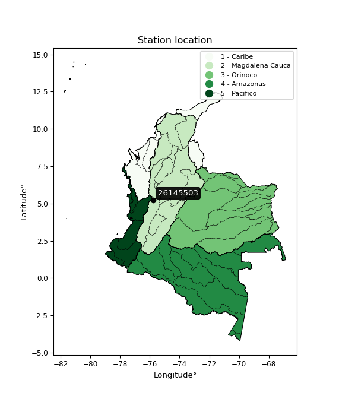</img>

</div>


## A. General information


### 1. General running parameters

• app_version: _v20260103_. • runtime: _2026-01-05 16:20:51.132608_. • Python version: _3.14.0_. • SciPy version: _1.16.3_. • Pandas version: _2.3.3_. • NumPy version: _2.3.5_. • Stations dataset (station_dataset_file): _dataset/pmax24h_in/automatic_colombia_2003_2024.csv_. • Stations catalog (station_catalog_file): _dataset/CNE.xls_. • Minimum year to eval til year_max (date_min): _1900_. • Maximum year to eval since year_min (date_max): _2024_. • Creates, save and include plots into reports (create_plot): _True_. • Plot only fit distributions with Δo > Δ (plot_only_fit): _True_. • Plot only simple graphs avoiding multiple CDFs and multiple Extreme values plots (plot_only_simple): _True_. • Eval low extreme values, if False, evaluates high extreme values (low_extreme): _False_. • Eval every SciPy distribution as logarithmic (pdist_logarithmic_on): _True_. • Standard deviation normalized (ddof): _1.0_. • Return periods to eval in years (Tr): _[2, 2.33, 5, 10, 15, 20, 25, 50, 75, 100, 200, 250, 500, 750, 1000]_. • Minimum data sample per station, 0 means any (minimum_sample): _5_. • Z-Score maximum threshold to adjust a value, 0 means disable (zscore_max): _3.5_. • Z-Score minimum threshold to adjust a value, 0 means disable (zscore_min): _-2.5_. • Avoid zeros, e.g. rain = 0 (avoid_zeros): _True_. • Avoid null values (avoid_nans): _True_. 

[:file_folder:Dataset file](../../dataset/pmax24h_in/automatic_colombia_2003_2024.csv)

> Delta Degrees of Freedom (DDOF): is a parameter used in the formulas for calculating variance and standard deviation. When ddof=0, the divisor is $N$ (the total number of observations) and this is used when your data set is the entire population. When ddof=1, the divisor is $N-1$ and this is used when your data set is a sample drawn from a larger population. Using $N-1$ provides an unbiased estimate of the population variance (known as Bessel´s correction).


### 2. Station info and location

|   id |   CODIGO | NOMBRE                     | CATEGORIA               | TECNOLOGIA                | ESTADO   | FECHA_INSTALACION   |   FECHA_SUSPENSION |   ALTITUD |   LATITUD |   LONGITUD | DEPARTAMENTO   | MUNICIPIO   | AREA_OPERATIVA                         | ENTIDAD                                    | AREA_HIDROGRAFICA   | ZONA_HIDROGRAFICA   | SUBZONA_HIDROGRAFICA   |   CORRIENTE | Catalogo   |   Version |
|-----:|---------:|:---------------------------|:------------------------|:--------------------------|:---------|:--------------------|-------------------:|----------:|----------:|-----------:|:---------------|:------------|:---------------------------------------|:-------------------------------------------|:--------------------|:--------------------|:-----------------------|------------:|:-----------|----------:|
|    0 | 26145503 | ANSERMA  - AUT  [26145503] | Climatológica Ordinaria | Automática con Telemetría | Activa   | 11/09/2013          |                nan |       999 |   5.23133 |   -75.7796 | Caldas         | Anserma     | Area Operativa 09 - Cauca-Valle-Caldas | CENTRO NACIONAL DE INVESTIGACIONES DE CAFE | Magdalena Cauca     | Cauca               | Río Risaralda          |         nan | CNE_OE     |  20251226 |

<div align="center">

Dynamic map: [:earth_americas:Google](http://maps.google.com/maps?q=5.231330556,-75.77961667) [:earth_americas:OSM](https://www.openstreetmap.org/#map=18/5.231330556/-75.77961667&layers=P) [:earth_americas:Bing](https://www.bing.com/maps?cp=5.231330556~-75.77961667&lvl=18) [:earth_americas:Apple](https://maps.apple.com/frame?center=5.231330556%2C-75.77961667&span=0.003%2C0.006)

</div>


<div align="center">

```geojson
{
  "type": "Feature",
  "geometry": {
    "type": "Point", 
    "coordinates": [-75.77961667, 5.231330556]
  }, 
  "properties": {
    "Name": "26145503"
  }
}
```

</div>


### 3. Discrete values table and plot

<div align="center">

|               |          0 |          1 |           2 |           3 |           4 |          5 |         6 |
|:--------------|-----------:|-----------:|------------:|------------:|------------:|-----------:|----------:|
| Date          | 2017       | 2018       | 2019        | 2020        | 2021        | 2022       | 2023      |
| Value         |   43.6     |   74.9     |   62.2      |   54        |   67.4      |   55.7     |   46.4    |
| Value_initial |   43.6     |   74.9     |   62.2      |   54        |   67.4      |   55.7     |   46.4    |
| count         |    7       |    7       |    7        |    7        |    7        |    7       |    7      |
| mean          |   57.7429  |   57.7429  |   57.7429   |   57.7429   |   57.7429   |   57.7429  |   57.7429 |
| std           |   11.2128  |   11.2128  |   11.2128   |   11.2128   |   11.2128   |   11.2128  |   11.2128 |
| zscore        |   -1.26132 |    1.53014 |    0.397506 |   -0.333803 |    0.861263 |   -0.18219 |   -1.0116 |


</div>


<div align="center">

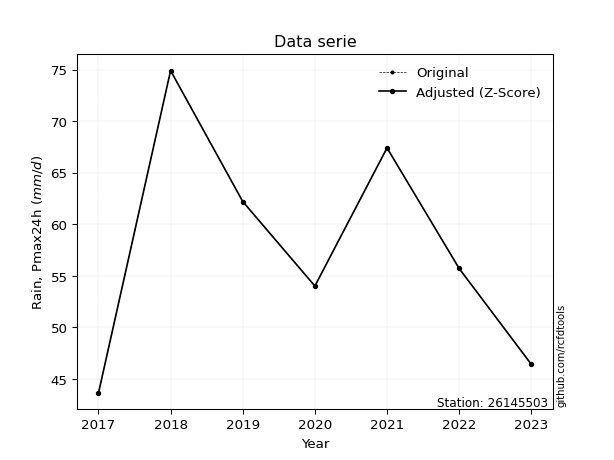</img>

</div>


> The initial value (value_initial) correspond to the initial obtained or null completed value, and value (value) is adjusted only when the initial value is outside the valid range (outlier) definite through the Z-Score value. If Z-Score is active, values out of range or outliers are replaced with the station mean value. A Z-Score (or standard score) measures how many standard deviations a data point is from the mean of a dataset, indicating its relative position; positive scores mean above the mean, negative mean below, and a score of zero is exactly at the mean, allowing for comparison of values from different distributions. It´s calculated using the formula $z=(x–μ)/σ$, where $x$ is the data point, $μ$ is the mean, and $σ$ is the standard deviation, helping identify outliers and understand probability.
>
> <sub>**Note**: In this study, "completing" (filling gaps in) and "extending" (forecasting or lengthening the historical record) rainfall data series are avoided for certain critical analyses because they introduce artificial bias and uncertainty, which can distort the statistics of rare events (extremes), alter day-to-day variability, and compromise the integrity and homogeneity of the original data. Some reasons against Completing/Extending rainfall data are: **Distortion of Extremes and Variability**: The primary issue is that most gap-filling or extension methods rely on averaging or regression with nearby stations, which inherently smooths the data. Rainfall is highly variable in space and time, with a large percentage of zero values and occasional large storms. Infilling methods often underestimate the highest values and overestimate the lowest (zero) values, which severely distorts analyses focused on flood frequency, drought severity, and intensity-duration-frequency (IDF) curves, **Loss of Data Homogeneity**: Infilled or extended data are synthetic estimates, not actual measurements. Combining these estimates with observed data can violate the assumption of data homogeneity, which requires that the data properties do not change over time. Inhomogeneity can lead to incorrect conclusions about long-term trends or changes in climate patterns, **Propagation of Errors**: Errors and biases from the original data (e.g., wind-induced undercatch, instrument errors, site changes) or the data used for imputation can propagate through the analysis, leading to unreliable hydrological models and inaccurate predictions, **Compromised Statistical Integrity**: For statistical analyses, especially those involving the frequency of events, using artificial data can introduce time bias or autocorrelation that doesn´t exist in reality, making it difficult to assess the true probability of events, **Difficulty in Validation**: It is difficult to accurately validate the quality of filled or extended data, especially for past periods where ground-truth measurements are unavailable. The reliability of imputation techniques heavily depends on the density of the surrounding station network and the complexity of the local topography.</sub>


### 4. Active continuous probability distributions from SciPy (44 of 104 available)

A Probability Density Function (PDF) describes the relative likelihood of a continuous random variable falling within a specific range, where the total area under its curve equals 1, and the area over any interval gives the actual probability for that range. Unlike discrete probabilities (like rolling a die), a PDF shows density, not direct probability for a single point (which is zero), with higher points indicating higher likelihood, often visualized as a bell curve for normal distributions.

A log of a probability density function (log-PDF) is simply the logarithm of the PDF´s value, denoted as $log(f(x))$, useful for converting multiplication of probabilities into addition, improving numerical stability with tiny numbers, and connecting to information theory concepts like entropy. Instead of dealing with very small probabilities (e.g., 0.000001), log-PDFs use negative numbers (e.g., $log(0.00001) ≈ -11.51$ that are easier for computers to handle, preventing underflow errors and simplifying complex calculations. In this study, each active probability distribution from SciPy is also evaluated in the $log$ form.

[scipy.stats](https://docs.scipy.org/doc/scipy/reference/stats.html) is a Python´s powerful submodule within the SciPy library for comprehensive statistical analysis, offering over 130 probability distributions (like Normal, Poisson), functions for descriptive stats (mean, variance), hypothesis testing (t-tests, chi-square), random variable generation, and statistical tests, making it essential for data science, modeling, and research. It provides tools to explore, model, and draw conclusions from data efficiently, working seamlessly with NumPy.

<div align="center">

|   id | p_dist             |   n_parameter | fit_method   | label                                                                       | active   | ref                                                                                                        |
|-----:|:-------------------|--------------:|:-------------|:----------------------------------------------------------------------------|:---------|:-----------------------------------------------------------------------------------------------------------|
|    0 | alpha              |             3 | MLE          | Alpha                                                                       | True     | [:mortar_board:](https://docs.scipy.org/doc/scipy/reference/generated/scipy.stats.alpha.html)              |
|    1 | betaprime          |             4 | MLE          | Beta prime                                                                  | True     | [:mortar_board:](https://docs.scipy.org/doc/scipy/reference/generated/scipy.stats.betaprime.html)          |
|    2 | chi2               |             3 | MLE          | Chi²                                                                        | True     | [:mortar_board:](https://docs.scipy.org/doc/scipy/reference/generated/scipy.stats.chi2.html)               |
|    3 | crystalball        |             4 | MLE          | Crystalball                                                                 | True     | [:mortar_board:](https://docs.scipy.org/doc/scipy/reference/generated/scipy.stats.crystalball.html)        |
|    4 | erlang             |             3 | MLE          | Erlang                                                                      | True     | [:mortar_board:](https://docs.scipy.org/doc/scipy/reference/generated/scipy.stats.erlang.html)             |
|    5 | expon              |             2 | MLE          | Exponential                                                                 | True     | [:mortar_board:](https://docs.scipy.org/doc/scipy/reference/generated/scipy.stats.expon.html)              |
|    6 | exponnorm          |             3 | MLE          | Exponentially modified Normal                                               | True     | [:mortar_board:](https://docs.scipy.org/doc/scipy/reference/generated/scipy.stats.exponnorm.html)          |
|    7 | f                  |             4 | MLE          | F                                                                           | True     | [:mortar_board:](https://docs.scipy.org/doc/scipy/reference/generated/scipy.stats.f.html)                  |
|    8 | fatiguelife        |             3 | MLE          | Fatigue-life (Birnbaum-Saunders)                                            | True     | [:mortar_board:](https://docs.scipy.org/doc/scipy/reference/generated/scipy.stats.fatiguelife.html)        |
|    9 | fisk               |             3 | MLE          | Fisk                                                                        | True     | [:mortar_board:](https://docs.scipy.org/doc/scipy/reference/generated/scipy.stats.fisk.html)               |
|   10 | gamma              |             3 | MLE          | Gamma                                                                       | True     | [:mortar_board:](https://docs.scipy.org/doc/scipy/reference/generated/scipy.stats.gamma.html)              |
|   11 | genexpon           |             5 | MLE          | Generalized exponential                                                     | True     | [:mortar_board:](https://docs.scipy.org/doc/scipy/reference/generated/scipy.stats.genexpon.html)           |
|   12 | genlogistic        |             3 | MLE          | Generalized logistic                                                        | True     | [:mortar_board:](https://docs.scipy.org/doc/scipy/reference/generated/scipy.stats.genlogistic.html)        |
|   13 | gibrat             |             2 | MM           | Gibrat                                                                      | True     | [:mortar_board:](https://docs.scipy.org/doc/scipy/reference/generated/scipy.stats.gibrat.html)             |
|   14 | gompertz           |             3 | MLE          | Gompertz (or truncated Gumbel)                                              | True     | [:mortar_board:](https://docs.scipy.org/doc/scipy/reference/generated/scipy.stats.gompertz.html)           |
|   15 | gumbel_l           |             2 | MM           | Gumbel Left Skew                                                            | True     | [:mortar_board:](https://docs.scipy.org/doc/scipy/reference/generated/scipy.stats.gumbel_l.html)           |
|   16 | gumbel_r           |             2 | MM           | Gumbel Right Skew                                                           | True     | [:mortar_board:](https://docs.scipy.org/doc/scipy/reference/generated/scipy.stats.gumbel_r.html)           |
|   17 | halflogistic       |             2 | MM           | Half-logistic                                                               | True     | [:mortar_board:](https://docs.scipy.org/doc/scipy/reference/generated/scipy.stats.halflogistic.html)       |
|   18 | halfnorm           |             2 | MM           | Half Normal                                                                 | True     | [:mortar_board:](https://docs.scipy.org/doc/scipy/reference/generated/scipy.stats.halfnorm.html)           |
|   19 | hypsecant          |             2 | MM           | hyperbolic secant                                                           | True     | [:mortar_board:](https://docs.scipy.org/doc/scipy/reference/generated/scipy.stats.hypsecant.html)          |
|   20 | invgamma           |             3 | MLE          | Inverted gamma                                                              | True     | [:mortar_board:](https://docs.scipy.org/doc/scipy/reference/generated/scipy.stats.invgamma.html)           |
|   21 | invgauss           |             3 | MLE          | Inverse Gaussian                                                            | True     | [:mortar_board:](https://docs.scipy.org/doc/scipy/reference/generated/scipy.stats.invgauss.html)           |
|   22 | invweibull         |             3 | MLE          | Inverted Weibull                                                            | True     | [:mortar_board:](https://docs.scipy.org/doc/scipy/reference/generated/scipy.stats.invweibull.html)         |
|   23 | johnsonsu          |             4 | MLE          | Johnson Su                                                                  | True     | [:mortar_board:](https://docs.scipy.org/doc/scipy/reference/generated/scipy.stats.johnsonsu.html)          |
|   24 | kstwobign          |             2 | MLE          | Limiting distribution of scaled Kolmogorov-Smirnov two-sided test statistic | True     | [:mortar_board:](https://docs.scipy.org/doc/scipy/reference/generated/scipy.stats.kstwobign.html)          |
|   25 | laplace            |             2 | MM           | Laplace                                                                     | True     | [:mortar_board:](https://docs.scipy.org/doc/scipy/reference/generated/scipy.stats.laplace.html)            |
|   26 | laplace_asymmetric |             3 | MLE          | Asymmetric Laplace                                                          | True     | [:mortar_board:](https://docs.scipy.org/doc/scipy/reference/generated/scipy.stats.laplace_asymmetric.html) |
|   27 | loggamma           |             3 | MLE          | Log gamma                                                                   | True     | [:mortar_board:](https://docs.scipy.org/doc/scipy/reference/generated/scipy.stats.loggamma.html)           |
|   28 | logistic           |             2 | MM           | Logistic (or Sech-squared)                                                  | True     | [:mortar_board:](https://docs.scipy.org/doc/scipy/reference/generated/scipy.stats.logistic.html)           |
|   29 | lognorm            |             3 | MLE          | Log Normal                                                                  | True     | [:mortar_board:](https://docs.scipy.org/doc/scipy/reference/generated/scipy.stats.lognorm.html)            |
|   30 | maxwell            |             2 | MM           | Maxwell                                                                     | True     | [:mortar_board:](https://docs.scipy.org/doc/scipy/reference/generated/scipy.stats.maxwell.html)            |
|   31 | mielke             |             4 | MLE          | Mielke Beta-Kappa / Dagum                                                   | True     | [:mortar_board:](https://docs.scipy.org/doc/scipy/reference/generated/scipy.stats.mielke.html)             |
|   32 | moyal              |             2 | MM           | Moyal                                                                       | True     | [:mortar_board:](https://docs.scipy.org/doc/scipy/reference/generated/scipy.stats.moyal.html)              |
|   33 | nakagami           |             3 | MLE          | Nakagami                                                                    | True     | [:mortar_board:](https://docs.scipy.org/doc/scipy/reference/generated/scipy.stats.nakagami.html)           |
|   34 | ncf                |             5 | MLE          | Non-central F distribution                                                  | True     | [:mortar_board:](https://docs.scipy.org/doc/scipy/reference/generated/scipy.stats.ncf.html)                |
|   35 | nct                |             4 | MLE          | Non-central Student’s t                                                     | True     | [:mortar_board:](https://docs.scipy.org/doc/scipy/reference/generated/scipy.stats.nct.html)                |
|   36 | norm               |             2 | MM           | Normal                                                                      | True     | [:mortar_board:](https://docs.scipy.org/doc/scipy/reference/generated/scipy.stats.norm.html)               |
|   37 | pearson3           |             3 | MM           | Pearson type III                                                            | True     | [:mortar_board:](https://docs.scipy.org/doc/scipy/reference/generated/scipy.stats.pearson3.html)           |
|   38 | rayleigh           |             2 | MM           | Rayleigh                                                                    | True     | [:mortar_board:](https://docs.scipy.org/doc/scipy/reference/generated/scipy.stats.rayleigh.html)           |
|   39 | rice               |             3 | MLE          | Rice                                                                        | True     | [:mortar_board:](https://docs.scipy.org/doc/scipy/reference/generated/scipy.stats.rice.html)               |
|   40 | t                  |             3 | MLE          | Student’s t                                                                 | True     | [:mortar_board:](https://docs.scipy.org/doc/scipy/reference/generated/scipy.stats.t.html)                  |
|   41 | truncnorm          |             4 | MLE          | Truncated normal                                                            | True     | [:mortar_board:](https://docs.scipy.org/doc/scipy/reference/generated/scipy.stats.truncnorm.html)          |
|   42 | wald               |             2 | MM           | Wald                                                                        | True     | [:mortar_board:](https://docs.scipy.org/doc/scipy/reference/generated/scipy.stats.wald.html)               |
|   43 | weibull_min        |             3 | MLE          | Weibull minimum                                                             | True     | [:mortar_board:](https://docs.scipy.org/doc/scipy/reference/generated/scipy.stats.weibull_min.html)        |

</div>

> **n_parameter:** # arguments & localization & scale.
>
> **Fit methods:** (MLE) maximum likelihood, (MM) L-moments.
>
>**Inactive** (With the only purpose of prevent loops, zero divisions, infinite values, over high estimated values or horizontal trending for recurrence intervals estimations, the follow distributions were disabled.)**:** foldnorm, gennorm, norminvgauss, powernorm, powerlognorm, skewnorm, genextreme, anglit, arcsine, argus, beta, bradford, burr, burr12, cauchy, cosine, halfcauchy, foldcauchy, skewcauchy, wrapcauchy, dgamma, gengamma, exponweib, exponpow, truncexpon, gausshyper, genhalflogistic, genhyperbolic, geninvgauss, halfgennorm, johnsonsb, kappa4, kappa3, ksone, kstwo, loglaplace, levy, levy_l, levy_stable, ncx2, pareto, genpareto, truncpareto, lomax, powerlaw, rdist, rel_breitwigner, recipinvgauss, semicircular, studentized_range, trapezoid, triang, truncweibull_min, tukeylambda, uniform, loguniform, vonmises, vonmises_line, weibull_max, dweibull, 


## B. Probability (PDF) vs. Empirical (EDF) distributions functions

A continuous probability distribution (CPD) describes probabilities for variables that can take any value within a range (like rain any time), unlike discrete variables with specific outcomes (like temperature). It uses a Probability Density Function (PDF), a curve where the total area under it equals 1, and the probability of the variable falling within an interval (a to b) is found by calculating the area under the curve between those points. A key feature is that the probability of hitting any single exact value is zero, so probabilities are always expressed for ranges, e.g., $P(a ≤ X ≤ b)$.

<div align="center">

Distributions parameters from station values
|    |   station | p_dist                |   n |               loc |           scale | shape                 | shape1             | shape2                | shape3   |
|---:|----------:|:----------------------|----:|------------------:|----------------:|:----------------------|:-------------------|:----------------------|:---------|
|  0 |  26145503 | alpha                 |   7 |     -58.8847      |  1312.14        | 11.339239064456134    |                    |                       |          |
|  1 |  26145503 | betaprime             |   7 |      -0.959386    |     8.36989     | 250.47933303991562    | 36.707513553459066 |                       |          |
|  2 |  26145503 | chi2                  |   7 |      43.6         |     3.25551     | 0.30394016997983964   |                    |                       |          |
|  3 |  26145503 | crystalball           |   7 |      57.7429      |    10.381       | 9030.867948299336     | 19284.22589598293  |                       |          |
|  4 |  26145503 | erlang                |   7 |      38.4714      |     6.32597     | 2.991045520691507     |                    |                       |          |
|  5 |  26145503 | expon                 |   7 |      43.6         |    14.1429      |                       |                    |                       |          |
|  6 |  26145503 | exponnorm             |   7 |      55.6427      |    10.167       | 0.20656458033881708   |                    |                       |          |
|  7 |  26145503 | f                     |   7 |      -0.953638    |    57.8092      | 124.28105283377869    | 131.68972462413842 |                       |          |
|  8 |  26145503 | fatiguelife           |   7 |      43.6         |     7.66735e-05 | 387.04081457323093    |                    |                       |          |
|  9 |  26145503 | fisk                  |   7 |      -0.338261    |    57.1938      | 9.203072110720377     |                    |                       |          |
| 10 |  26145503 | gamma                 |   7 |      43.4402      |    10.7038      | 1.1032391640235473    |                    |                       |          |
| 11 |  26145503 | genexpon              |   7 |      43.6         |     2.3971      | 0.11175647227405847   | 0.5031629299870879 | 0.026805110325506032  |          |
| 12 |  26145503 | genlogistic           |   7 |      -0.890573    |     8.88391     | 416.5118964668079     |                    |                       |          |
| 13 |  26145503 | gibrat                |   7 |      49.8234      |     4.80337     |                       |                    |                       |          |
| 14 |  26145503 | gompertz              |   7 |      43.6         |    20.9298      | 0.8157850033086358    |                    |                       |          |
| 15 |  26145503 | gumbel_l              |   7 |      62.4149      |     8.09404     |                       |                    |                       |          |
| 16 |  26145503 | gumbel_r              |   7 |      53.0709      |     8.09404     |                       |                    |                       |          |
| 17 |  26145503 | halflogistic          |   7 |      45.439       |     8.87539     |                       |                    |                       |          |
| 18 |  26145503 | halfnorm              |   7 |      44.0025      |    17.221       |                       |                    |                       |          |
| 19 |  26145503 | hypsecant             |   7 |      57.7429      |     6.60875     |                       |                    |                       |          |
| 20 |  26145503 | invgamma              |   7 |      -5.56849     |  2304.62        | 37.3932908305034      |                    |                       |          |
| 21 |  26145503 | invgauss              |   7 |      25.2323      |   281.648       | 0.11542939833068686   |                    |                       |          |
| 22 |  26145503 | invweibull            |   7 |      -4.49817e+08 |     4.49817e+08 | 50630928.0892231      |                    |                       |          |
| 23 |  26145503 | johnsonsu             |   7 |      19.1185      |     3.00581     | -11.713857179958032   | 3.6482568769938197 |                       |          |
| 24 |  26145503 | kstwobign             |   7 |      21.9534      |    40.8978      |                       |                    |                       |          |
| 25 |  26145503 | laplace               |   7 |      57.7429      |     7.34048     |                       |                    |                       |          |
| 26 |  26145503 | laplace_asymmetric    |   7 |      54           |     8.26303     | 0.798845057251666     |                    |                       |          |
| 27 |  26145503 | loggamma              |   7 |   -2204.43        |   328.458       | 979.9227117414143     |                    |                       |          |
| 28 |  26145503 | logistic              |   7 |      57.7429      |     5.72335     |                       |                    |                       |          |
| 29 |  26145503 | lognorm               |   7 |      43.6         |     0.0859636   | 12.319451572257325    |                    |                       |          |
| 30 |  26145503 | maxwell               |   7 |      33.1442      |    15.4149      |                       |                    |                       |          |
| 31 |  26145503 | mielke                |   7 |      -1.2099      |    25.2788      | 693.0356388116268     | 6.31621996431287   |                       |          |
| 32 |  26145503 | moyal                 |   7 |      51.8063      |     4.67309     |                       |                    |                       |          |
| 33 |  26145503 | nakagami              |   7 |      43.6         |    19.6177      | 0.07845713448991118   |                    |                       |          |
| 34 |  26145503 | ncf                   |   7 |       0.00612619  |     5.11261e-08 | 3.127633666608536e-09 | 2.7109868972305042 | 2.311157644140234     |          |
| 35 |  26145503 | nct                   |   7 |      -0.23546     |     3.94293     | 18.98336144829417     | 14.122688745027501 |                       |          |
| 36 |  26145503 | norm                  |   7 |      57.7429      |    10.381       |                       |                    |                       |          |
| 37 |  26145503 | pearson3              |   7 |      57.7429      |    10.381       | 0.21592165386735904   |                    |                       |          |
| 38 |  26145503 | rayleigh              |   7 |      37.8834      |    15.8456      |                       |                    |                       |          |
| 39 |  26145503 | rice                  |   7 |      38.5867      |    13.3902      | 0.8047930559905145    |                    |                       |          |
| 40 |  26145503 | t                     |   7 |      57.7425      |    10.3811      | 125968.1412853878     |                    |                       |          |
| 41 |  26145503 | truncnorm             |   7 |     -14.0549      |    21.9953      | 3.0940694889765976    | 4.044515283263195  |                       |          |
| 42 |  26145503 | wald                  |   7 |      47.3619      |    10.381       |                       |                    |                       |          |
| 43 |  26145503 | weibull_min           |   7 |      43.6         |     0.942127    | 0.2297134273806946    |                    |                       |          |
| 44 |  26145503 | logalpha              |   7 |      -2.26041     |   219.146       | 34.81270687880286     |                    |                       |          |
| 45 |  26145503 | logbetaprime          |   7 |      -3.95511     |     1.47565     | 2376.4994274006867    | 438.83359879090744 |                       |          |
| 46 |  26145503 | logchi2               |   7 |       3.77506     |     0.994615    | 0.9788362755313602    |                    |                       |          |
| 47 |  26145503 | logcrystalball        |   7 |       4.03978     |     0.180408    | 4949.056885075898     | 13.4257526871605   |                       |          |
| 48 |  26145503 | logerlang             |   7 |     -93.9114      |     0.00033228  | 294785.36942446406    |                    |                       |          |
| 49 |  26145503 | logexpon              |   7 |       3.77506     |     0.264725    |                       |                    |                       |          |
| 50 |  26145503 | logexponnorm          |   7 |       4.03944     |     0.180408    | 0.001874184955183799  |                    |                       |          |
| 51 |  26145503 | logf                  |   7 |     -12.1385      |    16.1766      | 54054.63317493058     | 22849.118978374318 |                       |          |
| 52 |  26145503 | logfatiguelife        |   7 |      -2.07592     |     6.11316     | 0.029473016529283247  |                    |                       |          |
| 53 |  26145503 | logfisk               |   7 |      -3.90367e+06 |     3.90367e+06 | 35714022.38423039     |                    |                       |          |
| 54 |  26145503 | loggamma              |   7 |     -93.9115      |     0.000332284 | 294781.67117739224    |                    |                       |          |
| 55 |  26145503 | loggenexpon           |   7 |       3.77505     |     0.0172865   | 0.036124037031414036  | 5.389776383992416  | 0.0004771527410711324 |          |
| 56 |  26145503 | loggenlogistic        |   7 |       3.12757     |     0.162572    | 158.0096393808929     |                    |                       |          |
| 57 |  26145503 | loggibrat             |   7 |       3.90214     |     0.0834826   |                       |                    |                       |          |
| 58 |  26145503 | loggompertz           |   7 |       3.77506     |     0.494816    | 1.266787563675169     |                    |                       |          |
| 59 |  26145503 | loggumbel_l           |   7 |       4.12098     |     0.140664    |                       |                    |                       |          |
| 60 |  26145503 | loggumbel_r           |   7 |       3.95859     |     0.140664    |                       |                    |                       |          |
| 61 |  26145503 | loghalflogistic       |   7 |       3.82592     |     0.15427     |                       |                    |                       |          |
| 62 |  26145503 | loghalfnorm           |   7 |       3.80098     |     0.299296    |                       |                    |                       |          |
| 63 |  26145503 | loghypsecant          |   7 |       4.03978     |     0.114851    |                       |                    |                       |          |
| 64 |  26145503 | loginvgamma           |   7 |      -2.58757     |  8926.25        | 1347.884673027802     |                    |                       |          |
| 65 |  26145503 | loginvgauss           |   7 |       2.93437     |    39.5454      | 0.027939547716798213  |                    |                       |          |
| 66 |  26145503 | loginvweibull         |   7 |    -156.071       |   160.014       | 991.3876974104458     |                    |                       |          |
| 67 |  26145503 | logjohnsonsu          |   7 | -317805           | 97407.6         | -3497710.889996362    | 1842458.8896700211 |                       |          |
| 68 |  26145503 | logkstwobign          |   7 |       3.38806     |     0.743778    |                       |                    |                       |          |
| 69 |  26145503 | loglaplace            |   7 |       4.03978     |     0.127568    |                       |                    |                       |          |
| 70 |  26145503 | loglaplace_asymmetric |   7 |       4.01998     |     0.149851    | 0.9360951359079347    |                    |                       |          |
| 71 |  26145503 | logloggamma           |   7 |     -22.8533      |     4.25514     | 556.1150188984691     |                    |                       |          |
| 72 |  26145503 | loglogistic           |   7 |       4.03978     |     0.0994643   |                       |                    |                       |          |
| 73 |  26145503 | loglognorm            |   7 |       3.77506     |     0.00198465  | 11.909446066015054    |                    |                       |          |
| 74 |  26145503 | logmaxwell            |   7 |       3.61229     |     0.267891    |                       |                    |                       |          |
| 75 |  26145503 | logmielke             |   7 |      -0.387201    |     3.686       | 2183.1611100602204    | 27.06508667182495  |                       |          |
| 76 |  26145503 | logmoyal              |   7 |       3.93661     |     0.0812123   |                       |                    |                       |          |
| 77 |  26145503 | lognakagami           |   7 |       3.77506     |     0.364591    | 0.23014403753493212   |                    |                       |          |
| 78 |  26145503 | logncf                |   7 |       3.5238      |     0.0857201   | 4.906357096415251     | 400.08518134721066 | 24.50063708190963     |          |
| 79 |  26145503 | lognct                |   7 |      -6.35453     |     0.0854066   | 891.3869653363549     | 121.57299941313511 |                       |          |
| 80 |  26145503 | lognorm               |   7 |       4.03978     |     0.180408    |                       |                    |                       |          |
| 81 |  26145503 | logpearson3           |   7 |       4.03978     |     0.180408    | -0.003725242528184243 |                    |                       |          |
| 82 |  26145503 | lograyleigh           |   7 |       3.69465     |     0.275375    |                       |                    |                       |          |
| 83 |  26145503 | logrice               |   7 |       3.68502     |     0.217646    | 1.1592680127459714    |                    |                       |          |
| 84 |  26145503 | logt                  |   7 |       4.03978     |     0.180408    | 2049197946.1575792    |                    |                       |          |
| 85 |  26145503 | logtruncnorm          |   7 |      -0.0690668   |     1.14646     | 3.35302658855474      | 3.8250008526531216 |                       |          |
| 86 |  26145503 | logwald               |   7 |       3.85942     |     0.180361    |                       |                    |                       |          |
| 87 |  26145503 | logweibull_min        |   7 |       3.71461     |     0.364788    | 1.8213567130236843    |                    |                       |          |

</div>

> **loc** (Location parameter): This shifts the distribution along the x-axis. For many common distributions, like the normal (Gaussian) distribution, loc represents the mean $μ$. For others, like the uniform distribution, it might represent the minimum value, or for the beta distribution, the left end of the support interval.
>
> **scale** (Scale parameter): This determines the width or spread of the distribution. For the normal distribution, scale represents the standard deviation $σ$. For a uniform distribution, it defines the length of the interval (from $loc$ to $loc + scale$).
>
> **shape** (Shape parameters): Refers to parameters that define the specific form of a probability distribution, distinct from its location (loc) and scale (scale). These parameters are required arguments for most distribution functions. For example, a normal (Gaussian) distribution is fully defined by its location (mean) and scale (standard deviation), so it has no specific shape parameters beyond loc and scale. However, other distributions have intrinsic properties that need specification, as Gamma distribution that takes a shape parameter, often named $a$ or $alpha$.


### 0. Cumulative distribution values - CDF (88 evaluated)

Cumulative Distribution Function (CDF), denoted as $F$<sub>$X$</sub>$(x)$, is a function that gives the probability that a random variable $X$ will take a value less than or equal to a specific value, $x$ (i.e., $(P(X≥x)$. It essentially "accumulates" probabilities from a given point up to the far right (positive infinity), providing a complete picture of the distribution´s probabilities for both discrete (like rain) and continuous (like temperature) variables, helping to find probabilities over ranges or above certain values. Each station is evaluated separately ordering the $x$ values ascending, calculating the CDF and PDF values for the activated distributions and their logarithmic forms.

<div align="center">

CDF ordered by x ascending and calculating $log(f(x))$ separately
|   id |   Station |   date |    x |   count |    mean |     std |    zscore |   Value_initial |   station |   m |    alpha |   alpha_pdf |   betaprime |   betaprime_pdf |       chi2 |    chi2_pdf |   crystalball |   crystalball_pdf |    erlang |   erlang_pdf |    expon |   expon_pdf |   exponnorm |   exponnorm_pdf |         f |      f_pdf |   fatiguelife |   fatiguelife_pdf |      fisk |   fisk_pdf |      gamma |   gamma_pdf |   genexpon |   genexpon_pdf |   genlogistic |   genlogistic_pdf |   gibrat |   gibrat_pdf |    gompertz |   gompertz_pdf |   gumbel_l |   gumbel_l_pdf |   gumbel_r |   gumbel_r_pdf |   halflogistic |   halflogistic_pdf |   halfnorm |   halfnorm_pdf |   hypsecant |   hypsecant_pdf |   invgamma |   invgamma_pdf |   invgauss |   invgauss_pdf |   invweibull |   invweibull_pdf |   johnsonsu |   johnsonsu_pdf |   kstwobign |   kstwobign_pdf |   laplace |   laplace_pdf |   laplace_asymmetric |   laplace_asymmetric_pdf |   loggamma |   loggamma_pdf |   logistic |   logistic_pdf |   lognorm |   lognorm_pdf |   maxwell |   maxwell_pdf |      mielke |   mielke_pdf |     moyal |   moyal_pdf |   nakagami |   nakagami_pdf |      ncf |    ncf_pdf |      nct |    nct_pdf |      norm |   norm_pdf |   pearson3 |   pearson3_pdf |   rayleigh |   rayleigh_pdf |      rice |   rice_pdf |         t |      t_pdf |   truncnorm |   truncnorm_pdf |     wald |   wald_pdf |   weibull_min |   weibull_min_pdf |   logalpha |   logalpha_pdf |   logbetaprime |   logbetaprime_pdf |     logchi2 |   logchi2_pdf |   logcrystalball |   logcrystalball_pdf |   logerlang |   logerlang_pdf |   logexpon |   logexpon_pdf |   logexponnorm |   logexponnorm_pdf |      logf |   logf_pdf |   logfatiguelife |   logfatiguelife_pdf |   logfisk |   logfisk_pdf |   loggenexpon |   loggenexpon_pdf |   loggenlogistic |   loggenlogistic_pdf |   loggibrat |   loggibrat_pdf |   loggompertz |   loggompertz_pdf |   loggumbel_l |   loggumbel_l_pdf |   loggumbel_r |   loggumbel_r_pdf |   loghalflogistic |   loghalflogistic_pdf |   loghalfnorm |   loghalfnorm_pdf |   loghypsecant |   loghypsecant_pdf |   loginvgamma |   loginvgamma_pdf |   loginvgauss |   loginvgauss_pdf |   loginvweibull |   loginvweibull_pdf |   logjohnsonsu |   logjohnsonsu_pdf |   logkstwobign |   logkstwobign_pdf |   loglaplace |   loglaplace_pdf |   loglaplace_asymmetric |   loglaplace_asymmetric_pdf |   logloggamma |   logloggamma_pdf |   loglogistic |   loglogistic_pdf |   loglognorm |   loglognorm_pdf |   logmaxwell |   logmaxwell_pdf |   logmielke |   logmielke_pdf |   logmoyal |   logmoyal_pdf |   lognakagami |   lognakagami_pdf |    logncf |   logncf_pdf |   lognct |   lognct_pdf |   logpearson3 |   logpearson3_pdf |   lograyleigh |   lograyleigh_pdf |   logrice |   logrice_pdf |      logt |   logt_pdf |   logtruncnorm |   logtruncnorm_pdf |   logwald |   logwald_pdf |   logweibull_min |   logweibull_min_pdf |
|-----:|----------:|-------:|-----:|--------:|--------:|--------:|----------:|----------------:|----------:|----:|---------:|------------:|------------:|----------------:|-----------:|------------:|--------------:|------------------:|----------:|-------------:|---------:|------------:|------------:|----------------:|----------:|-----------:|--------------:|------------------:|----------:|-----------:|-----------:|------------:|-----------:|---------------:|--------------:|------------------:|---------:|-------------:|------------:|---------------:|-----------:|---------------:|-----------:|---------------:|---------------:|-------------------:|-----------:|---------------:|------------:|----------------:|-----------:|---------------:|-----------:|---------------:|-------------:|-----------------:|------------:|----------------:|------------:|----------------:|----------:|--------------:|---------------------:|-------------------------:|-----------:|---------------:|-----------:|---------------:|----------:|--------------:|----------:|--------------:|------------:|-------------:|----------:|------------:|-----------:|---------------:|---------:|-----------:|---------:|-----------:|----------:|-----------:|-----------:|---------------:|-----------:|---------------:|----------:|-----------:|----------:|-----------:|------------:|----------------:|---------:|-----------:|--------------:|------------------:|-----------:|---------------:|---------------:|-------------------:|------------:|--------------:|-----------------:|---------------------:|------------:|----------------:|-----------:|---------------:|---------------:|-------------------:|----------:|-----------:|-----------------:|---------------------:|----------:|--------------:|--------------:|------------------:|-----------------:|---------------------:|------------:|----------------:|--------------:|------------------:|--------------:|------------------:|--------------:|------------------:|------------------:|----------------------:|--------------:|------------------:|---------------:|-------------------:|--------------:|------------------:|--------------:|------------------:|----------------:|--------------------:|---------------:|-------------------:|---------------:|-------------------:|-------------:|-----------------:|------------------------:|----------------------------:|--------------:|------------------:|--------------:|------------------:|-------------:|-----------------:|-------------:|-----------------:|------------:|----------------:|-----------:|---------------:|--------------:|------------------:|----------:|-------------:|---------:|-------------:|--------------:|------------------:|--------------:|------------------:|----------:|--------------:|----------:|-----------:|---------------:|-------------------:|----------:|--------------:|-----------------:|---------------------:|
|    0 |  26145503 |   2017 | 43.6 |       7 | 57.7429 | 11.2128 | -1.26132  |            43.6 |  26145503 |   1 | 0.071587 |  0.0170654  |   0.0681019 |       0.0177116 | 0.00570974 | 1.22119e+11 |     0.0865393 |        0.0151925  | 0.0496468 |   0.0233286  | 0        |  0.0707071  |   0.0861196 |      0.0152324  | 0.0715735 | 0.0171837  |     0.0454556 |       4.51067e+08 | 0.0811758 |  0.0156224 | 0.00915409 |  0.0627643  | 4.4039e-10 |     0.0466215  |     0.0623601 |        0.019413   | 0        |   0          | 2.91545e-12 |      0.0389773 |  0.0931961 |     0.0109601  |  0.0398624 |     0.0158696  |      0         |         0          |   0        |     0          |   0.0745573 |      0.0111787  |  0.0682356 |     0.0176658  |  0.0591189 |     0.0199323  |    0.0619984 |       0.0194047  |   0.0642987 |      0.0185968  |   0.0579208 |      0.0208914  | 0.0728145 |    0.00991958 |             0.080597 |               0.01221    |   0.071045 |       0.754124 |  0.0779106 |     0.0125522  | 0.0711383 |      0.75353  | 0.0724294 |     0.0189202 |   0.0543626 |    0.022021  | 0.0161203 |  0.011361   | 0.00322035 |    7.11172e+10 | 0.623786 | 0.00430991 | 0.065389 | 0.0180229  | 0.0865393 | 0.0151925  |   0.08089  |      0.0160633 |  0.0630054 |     0.0213334  | 0.0495148 | 0.0192872  | 0.0865478 | 0.0151933  | 0           |      0          | 0        |  0         |   0.000569828 |       1.84169e+10 |  0.0672061 |       0.782779 |       0.256618 |           0.808164 | 2.46951e-08 |   2.72158e+07 |        0.0711383 |             0.753529 |   0.0710393 |        0.754083 |   0        |       3.77751  |      0.0711388 |           0.753533 | 0.0704673 |   0.761629 |        0.0684549 |             0.765517 | 0.0810572 |      0.681469 |   1.14047e-05 |          2.08975  |        0.0540814 |             0.961556 |    0        |        0        |   8.20775e-09 |          2.56012  |      0.081951 |          0.55805  |     0.0250525 |          0.656623 |          0        |              0        |     0         |          0        |      0.0633032 |           0.547549 |     0.0683525 |          0.770897 |      0.059056 |          0.848175 |       0.0591373 |            1.03721  |      0.0711423 |           0.753547 |       0.050555 |           1.05994  |    0.0627676 |         0.492033 |               0.0814813 |                    0.580867 |     0.0725748 |          0.749178 |     0.0652833 |          0.6135   |   0.00722644 |      3.78949e+12 |    0.0534634 |         0.91419  |   0.0521372 |        0.983316 | 0.00685548 |       0.343413 |   1.06879e-07 |       1.10777e+08 | 0.0550063 |     0.886099 | 0.157002 |     0.958364 |     0.0712354 |          0.752948 |     0.0417331 |          1.01608  | 0.0430774 |      0.94305  | 0.0711397 |   0.753541 |    1.78254e-08 |           3.7679   |  0        |      0        |         0.037149 |             1.09828  |
|    1 |  26145503 |   2023 | 46.4 |       7 | 57.7429 | 11.2128 | -1.0116   |            46.4 |  26145503 |   2 | 0.130597 |  0.0251206  |   0.1299    |       0.0264126 | 0.895503   | 0.0333075   |     0.137273  |        0.0211553  | 0.133611  |   0.035675   | 0.179614 |  0.0580071  |   0.137034  |      0.0212449  | 0.130907  | 0.0252204  |     0.689251  |       0.0311387   | 0.134944  |  0.0229857 | 0.200452   |  0.0653114  | 0.130334   |     0.0461722  |     0.131795  |        0.0299908  | 0        |   0          | 0.110213    |      0.0396459 |  0.12913   |     0.0148762  |  0.102286  |     0.0288126  |      0.0540882 |         0.0561707  |   0.110723 |     0.0458853  |   0.113207  |      0.016771   |  0.129846  |     0.0263281  |  0.13029   |     0.030588   |    0.131473  |       0.0300254  |   0.129822  |      0.0280924  |   0.132749  |      0.0320686  | 0.10663   |    0.0145262  |             0.12318  |               0.0186612  |   0.130825 |       1.17935  |  0.121121  |     0.0185994  | 0.130855  |      1.17792  | 0.13612   |     0.0264454 |   0.136126  |    0.0356881 | 0.0745412 |  0.0310441  | 0.62821    |    0.0351533   | 0.635537 | 0.00408626 | 0.128931 | 0.027322   | 0.137273  | 0.0211553  |   0.135126 |      0.0227578 |  0.134493  |     0.0293577  | 0.116295  | 0.0280739  | 0.137284  | 0.0211562  | 0           |      0          | 0        |  0         |   0.723155    |       0.0291696   |  0.13002   |       1.24695  |       0.309087 |           0.875176 | 0.20501     |   1.57844     |        0.130855  |             1.17792  |   0.130817  |        1.17931  |   0.209525 |       2.98603  |      0.130856  |           1.17792  | 0.130967  |   1.19469  |        0.129597  |             1.21138  | 0.134864  |      1.06744  |   0.136486    |          2.26672  |        0.135995  |             1.65848  |    0        |        0        |   0.156169    |          2.44988  |      0.124618 |          0.828277 |     0.0936194 |          1.57638  |          0.036874 |              3.23666  |     0.0965896 |          2.64631  |      0.108147  |           0.923614 |     0.129966  |          1.22088  |      0.129064 |          1.40685  |       0.146256  |            1.74313  |      0.13086   |           1.17793  |       0.141059 |           1.80966  |    0.102243  |         0.801481 |               0.126988  |                    0.905274 |     0.131727  |          1.16421  |     0.115502  |          1.02712  |   0.61383    |      0.516127    |    0.128086  |         1.47664  |   0.136896  |        1.72272  | 0.0653156  |       1.65649  |   0.34663     |       2.54942     | 0.128704  |     1.48072  | 0.223692 |     1.18107  |     0.130889  |          1.17649  |     0.125559  |          1.64494  | 0.11986   |      1.50554  | 0.130857  |   1.17793  |    0.214315    |           3.13619  |  0        |      0        |         0.128404 |             1.77819  |
|    2 |  26145503 |   2020 | 54   |       7 | 57.7429 | 11.2128 | -0.333803 |            54   |  26145503 |   3 | 0.388009 |  0.0394497  |   0.396605  |       0.0400105 | 0.984023   | 0.00340674  |     0.359218  |        0.0360116  | 0.446737  |   0.0409133  | 0.520664 |  0.0338924  |   0.359937  |      0.0361327  | 0.388175  | 0.0393213  |     0.829339  |       0.0116057   | 0.384297  |  0.0400742 | 0.582559   |  0.0366148  | 0.455027   |     0.0379664  |     0.42205   |        0.0409388  | 0.444397 |   0.09459    | 0.408477    |      0.0378952 |  0.297832  |     0.0306738  |  0.41002   |     0.0451633  |      0.448077  |         0.0450249  |   0.43845  |     0.0391469  |   0.328656  |      0.0413536  |  0.395962  |     0.039976   |  0.421053  |     0.0406657  |    0.422109  |       0.0409788  |   0.407124  |      0.0404396  |   0.42892   |      0.0404021  | 0.30028   |    0.0409074  |             0.389557 |               0.0590159  |   0.389358 |       2.12645  |  0.342097  |     0.0393243  | 0.389136  |      2.12538  | 0.391681  |     0.0379386 |   0.45527   |    0.0408369 | 0.429062  |  0.0493828  | 0.770697   |    0.0113928   | 0.664504 | 0.00355363 | 0.403392 | 0.0406083  | 0.359218  | 0.0360116  |   0.370994 |      0.0373689 |  0.403843  |     0.0382665  | 0.385045  | 0.0393156  | 0.359234  | 0.0360118  | 1.29439e-05 |      0.157424   | 0.475095 |  0.0678918 |   0.823793    |       0.00675694  |  0.399752  |       2.1675   |       0.449822 |           0.960069 | 0.366026    |   0.778659    |        0.389135  |             2.12538  |   0.389345  |        2.12644  |   0.5543   |       1.68363  |      0.389136  |           2.12538  | 0.391989  |   2.1358   |        0.394013  |             2.15261  | 0.384406  |      2.16496  |   0.474611    |          2.0624   |        0.454837  |             2.19863  |    0.515733 |        4.59033  |   0.495983    |          1.98823  |      0.323805 |          1.88092  |     0.44679   |          2.55904  |          0.484242 |              2.48107  |     0.4701    |          2.18855  |      0.363591  |           2.52087  |     0.395686  |          2.15547  |      0.422125 |          2.22825  |       0.471906  |            2.19503  |      0.389138  |           2.12534  |       0.468718 |           2.16832  |    0.335763  |         2.63203  |               0.374437  |                    2.66931  |     0.387376  |          2.11315  |     0.375026  |          2.35644  |   0.652833   |      0.14495     |    0.422858  |         2.19124  |   0.462452  |        2.19523  | 0.46883    |       2.73724  |   0.603756    |       1.21776     | 0.428951  |     2.2232   | 0.433626 |     1.51991  |     0.388916  |          2.1243   |     0.435162  |          2.19237  | 0.414874  |      2.1884   | 0.38914   |   2.12539  |    0.596256    |           1.98069  |  0.527282 |      3.43788  |         0.44858  |             2.17891  |
|    3 |  26145503 |   2022 | 55.7 |       7 | 57.7429 | 11.2128 | -0.18219  |            55.7 |  26145503 |   4 | 0.455388 |  0.0396197  |   0.464535  |       0.0397074 | 0.988812   | 0.00230774  |     0.421997  |        0.0376931  | 0.514302  |   0.038458   | 0.574953 |  0.0300538  |   0.422897  |      0.0377834  | 0.455322  | 0.0394795  |     0.847645  |       0.00999202  | 0.453178  |  0.0406971 | 0.640557   |  0.0317229  | 0.517345   |     0.0353232  |     0.490406  |        0.0392987  | 0.579906 |   0.0665206  | 0.47192     |      0.0366933 |  0.353525  |     0.0348412  |  0.485462  |     0.0433431  |      0.521255  |         0.0410288  |   0.503026 |     0.0367868  |   0.403137  |      0.045952   |  0.463858  |     0.0397025  |  0.488987  |     0.0390911  |    0.490523  |       0.0393271  |   0.475299  |      0.0395767  |   0.496172  |      0.0385797  | 0.378535  |    0.0515681  |             0.482073 |               0.0500717  |   0.456545 |       2.19848  |  0.411702  |     0.0423185  | 0.456299  |      2.19805  | 0.456354  |     0.0379929 |   0.521993  |    0.0375516 | 0.509715  |  0.045289   | 0.788783   |    0.00994967  | 0.670455 | 0.00344765 | 0.472015 | 0.0399222  | 0.421997  | 0.0376931  |   0.435598 |      0.0384633 |  0.46854   |     0.037712   | 0.451851  | 0.0391275  | 0.422012  | 0.0376931  | 0.237817    |      0.123571   | 0.576465 |  0.0521144 |   0.834293    |       0.00565482  |  0.467752  |       2.20926  |       0.479622 |           0.961855 | 0.38915     |   0.715445    |        0.456299  |             2.19805  |   0.456532  |        2.19849  |   0.603547 |       1.4976   |      0.4563    |           2.19805  | 0.459367  |   2.20127  |        0.461795  |             2.2103   | 0.453309  |      2.26726  |   0.536708    |          1.94144  |        0.521345  |             2.08446  |    0.634829 |        3.19028  |   0.555733    |          1.86582  |      0.385982 |          2.12902  |     0.523964  |          2.40755  |          0.557343 |              2.23429  |     0.535662  |          2.03974  |      0.445389  |           2.7308   |     0.463493  |          2.20897  |      0.491012 |          2.20567  |       0.538049  |            2.06516  |      0.4563    |           2.198    |       0.534092 |           2.04386  |    0.42811   |         3.35594  |               0.467029  |                    3.32937  |     0.454257  |          2.19229  |     0.450392  |          2.48872  |   0.65702    |      0.126034    |    0.490543  |         2.16674  |   0.52854   |        2.06151  | 0.549482   |       2.45803  |   0.639697    |       1.10446     | 0.497336  |     2.17913  | 0.48099  |     1.53256  |     0.456056  |          2.1976   |     0.50235   |          2.135    | 0.48264   |      2.17543  | 0.456303  |   2.19805  |    0.654797    |           1.79927  |  0.620434 |      2.61576  |         0.514892 |             2.09302  |
|    4 |  26145503 |   2019 | 62.2 |       7 | 57.7429 | 11.2128 |  0.397506 |            62.2 |  26145503 |   5 | 0.6924   |  0.0314663  |   0.697648  |       0.0304433 | 0.996897   | 0.000590576 |     0.666168  |        0.0350462  | 0.724837  |   0.0260342  | 0.731566 |  0.0189802  |   0.667095  |      0.0349629  | 0.69175   | 0.0314576  |     0.898411  |       0.00607296  | 0.694691  |  0.0312118 | 0.79845    |  0.0180599  | 0.712472   |     0.0247385  |     0.709671  |        0.0273848  | 0.82805  |   0.0205959  | 0.689058    |      0.0294742 |  0.622356  |     0.0454348  |  0.723455  |     0.0289342  |      0.737166  |         0.0257221  |   0.709354 |     0.02651    |   0.70004   |      0.0389627  |  0.697218  |     0.0305082  |  0.708731  |     0.0277288  |    0.709854  |       0.0273815  |   0.702987  |      0.0292387  |   0.712538  |      0.0274181  | 0.727563  |    0.0371143  |             0.723715 |               0.0267104  |   0.692346 |       1.94782  |  0.685414  |     0.037674   | 0.692182  |      1.94949  | 0.686034  |     0.0311229 |   0.719778  |    0.0235395 | 0.74225   |  0.0265981  | 0.841397   |    0.00664836  | 0.691639 | 0.00308022 | 0.702499 | 0.0296112  | 0.666168  | 0.0350462  |   0.676795 |      0.0335534 |  0.691952  |     0.0298336  | 0.686516  | 0.0316017  | 0.66618   | 0.0350453  | 0.753313    |      0.0463377  | 0.795992 |  0.0210841 |   0.862501    |       0.00336934  |  0.699069  |       1.86823  |       0.584382 |           0.925709 | 0.458762    |   0.559742    |        0.692182  |             1.94949  |   0.692336  |        1.94786  |   0.738714 |       0.987009 |      0.692182  |           1.94949  | 0.694206  |   1.93011  |        0.696001  |             1.91221  | 0.694765  |      1.94016  |   0.723058    |          1.42144  |        0.718442  |             1.45978  |    0.842705 |        1.05431  |   0.735694    |          1.38742  |      0.656633 |          2.60937  |     0.744605  |          1.56107  |          0.755953 |              1.38891  |     0.728888  |          1.45496  |      0.728437  |           2.0879   |     0.696842  |          1.9      |      0.711871 |          1.71416  |       0.731267  |            1.41633  |      0.692178  |           1.94946  |       0.727861 |           1.44949  |    0.754177  |         1.92699  |               0.732539  |                    1.67078  |     0.69086   |          1.96611  |     0.713124  |          2.0568   |   0.668429   |      0.0857485   |    0.709038  |         1.71688  |   0.721023  |        1.41005  | 0.76161    |       1.42322  |   0.743961    |       0.805635    | 0.713086  |     1.66176  | 0.645583 |     1.40815  |     0.692018  |          1.95117  |     0.713985  |          1.64335  | 0.70466   |      1.76723  | 0.692185  |   1.94948  |    0.822647    |           1.27045  |  0.8112   |      1.10469  |         0.718862 |             1.56285  |
|    5 |  26145503 |   2021 | 67.4 |       7 | 57.7429 | 11.2128 |  0.861263 |            67.4 |  26145503 |   6 | 0.828659 |  0.0209255  |   0.828778  |       0.0200906 | 0.998824   | 0.000215593 |     0.823884  |        0.0249316  | 0.835717  |   0.0169782  | 0.814152 |  0.0131407  |   0.824175  |      0.0247928  | 0.828284  | 0.0210234  |     0.924994  |       0.00428112  | 0.825954  |  0.0195308 | 0.873745   |  0.0113947  | 0.820776   |     0.0171462  |     0.826105  |        0.0177599  | 0.902727 |   0.00978474 | 0.822306    |      0.0215942 |  0.842971  |     0.0359167  |  0.843432  |     0.0177435  |      0.844652  |         0.0161437  |   0.825746 |     0.0184093  |   0.854906  |      0.0212023  |  0.828681  |     0.0201468  |  0.827405  |     0.0182101  |    0.826249  |       0.0177502  |   0.828396  |      0.0191994  |   0.83087   |      0.0183481  | 0.865843  |    0.0182763  |             0.83288  |               0.0161567  |   0.828221 |       1.4104   |  0.843872  |     0.0230201  | 0.828204  |      1.41214  | 0.823636  |     0.0216385 |   0.818741  |    0.0150599 | 0.850454  |  0.015812   | 0.871843   |    0.00516333  | 0.706977 | 0.00282416 | 0.829129 | 0.0192991  | 0.823884  | 0.0249316  |   0.825503 |      0.0232525 |  0.823591  |     0.0207382  | 0.825837  | 0.0218399  | 0.823892  | 0.0249306  | 0.916548    |      0.0198537  | 0.877506 |  0.0114522 |   0.877512    |       0.00248239  |  0.82823   |       1.33313  |       0.656359 |           0.862723 | 0.500536    |   0.484485    |        0.828204  |             1.41214  |   0.828215  |        1.41044  |   0.807072 |       0.728788 |      0.828204  |           1.41213  | 0.828557  |   1.39251  |        0.828712  |             1.37251  | 0.82593   |      1.31532  |   0.821558    |          1.03784  |        0.817196  |             1.01412  |    0.904409 |        0.550373 |   0.832745    |          1.03264  |      0.849184 |          2.02822  |     0.846502  |          1.00284  |          0.84742  |              0.91359  |     0.828928  |          1.04474  |      0.858565  |           1.19134  |     0.828584  |          1.36193  |      0.828816 |          1.19849  |       0.826587  |            0.973707 |      0.828198  |           1.41213  |       0.826884 |           1.02765  |    0.868997  |         1.02693  |               0.838029  |                    1.0118   |     0.82836   |          1.42968  |     0.847849  |          1.29696  |   0.674613   |      0.0694135   |    0.827386  |         1.22649  |   0.816116  |        0.974948 | 0.853191   |       0.893593 |   0.802027    |       0.6466      | 0.826496  |     1.16565  | 0.750331 |     1.18795  |     0.828187  |          1.41389  |     0.827186  |          1.17591  | 0.827195  |      1.27516  | 0.828206  |   1.41212  |    0.912549    |           0.980583 |  0.879514 |      0.646452 |         0.826271 |             1.1165   |
|    6 |  26145503 |   2018 | 74.9 |       7 | 57.7429 | 11.2128 |  1.53014  |            74.9 |  26145503 |   7 | 0.93716  |  0.00905422 |   0.933766  |       0.0089251 | 0.999695   | 5.40114e-05 |     0.950808  |        0.00980662 | 0.927023  |   0.00820974 | 0.890642 |  0.00773236 |   0.950375  |      0.00977013 | 0.93753   | 0.00912792 |     0.950609  |       0.00269327  | 0.925781  |  0.0084046 | 0.935996   |  0.00581577 | 0.916745   |     0.00904233 |     0.921148  |        0.00851545 | 0.950795 |   0.00406053 | 0.940621    |      0.0103258 |  0.990687  |     0.00538073 |  0.934811  |     0.00778559 |      0.930177  |         0.00759235 |   0.927215 |     0.00926551 |   0.95262   |      0.00714283 |  0.933931  |     0.00893935 |  0.924893  |     0.00868352 |    0.921225  |       0.00850807 |   0.929725  |      0.00879523 |   0.929975  |      0.00886531 | 0.951708  |    0.00657893 |             0.919066 |               0.00782447 |   0.937128 |       0.683572 |  0.952472  |     0.00790952 | 0.937229  |      0.683997 | 0.938117  |     0.0096877 | nan         |  nan         | 0.932653  |  0.00718867 | 0.904947   |    0.00376741  | 0.726925 | 0.0025042  | 0.930313 | 0.00870941 | 0.950808  | 0.00980662 |   0.945095 |      0.0095958 |  0.934693  |     0.00962816 | 0.940729  | 0.00961892 | 0.95081   | 0.00980612 | 0.999972    |      0.00529888 | 0.93694  |  0.0053153 |   0.893127    |       0.0017539   |  0.931954  |       0.665628 |       0.741514 |           0.746469 | 0.547593    |   0.411291    |        0.937229  |             0.683998 |   0.937125  |        0.683597 |   0.87049  |       0.489225 |      0.937229  |           0.683996 | 0.936225  |   0.678796 |        0.934974  |             0.673401 | 0.925693  |      0.629308 |   0.907859    |          0.618453 |        0.89985   |             0.583905 |    0.94534  |        0.267379 |   0.919082    |          0.618332 |      0.981776 |          0.51887  |     0.924308  |          0.517207 |          0.919979 |              0.497954 |     0.914802  |          0.605991 |      0.942767  |           0.495642 |     0.934179  |          0.67152  |      0.923392 |          0.62873  |       0.905574  |            0.555201 |      0.937225  |           0.684017 |       0.911169 |           0.595959 |    0.942709  |         0.4491   |               0.916209  |                    0.523426 |     0.938539  |          0.687299 |     0.941509  |          0.553668 |   0.681144   |      0.0554105   |    0.924958  |         0.651621 |   0.895812  |        0.566779 | 0.923009   |       0.472536 |   0.861158    |       0.481183    | 0.91933   |     0.626691 | 0.857073 |     0.831739 |     0.937333  |          0.684422 |     0.921674  |          0.641949 | 0.928291  |      0.667537 | 0.937231  |   0.683987 |    0.999997    |           0.692541 |  0.929878 |      0.345262 |         0.916828 |             0.626257 |


</div>

An Empirical Distribution Function (EDF) is a step-function estimate of a true cumulative distribution function (CDF) based on observed sample data, representing the proportion of data points less than or equal to a given value. It is calculated by ordering your data and jumping up by $1/n$ (where $n$ is sample size) at each unique data point, allowing analysis without assuming an underlying population distribution, and it gets closer to the true CDF as the sample size grows. For the empirical probability calculations, the parameter $m$ correspond to the order number which means the position of the $x$ values in an ascending order list.

The Kolmogorov-Smirnov (K-S) test is a non-parametric statistical test used to determine if a sample data set comes from a specific theoretical distribution (one-sample) or if two different samples come from the same underlying distribution (two-sample), by comparing their cumulative distribution functions (CDFs). It calculates the maximum vertical difference (D statistic) between these functions, with a small p-value indicating a significant difference and rejection of the null hypothesis (that the data/samples match).


### 1. EDF California (1923)

California´s estimates the true probability distribution of water-related data (like rainfall, streamflow) using observed samples, crucial for risk assessment.

<div align="center">


$P=m/n$


</div>


**1.1. Empirical values**

<div align="center">

|                | 0                   | 1                  | 2                   | 3                  | 4                  | 5                  | 6              |
|:---------------|:--------------------|:-------------------|:--------------------|:-------------------|:-------------------|:-------------------|:---------------|
| date           | 2017                | 2023               | 2020                | 2022               | 2019               | 2021               | 2018           |
| x              | 43.6                | 46.4               | 54.0                | 55.7               | 62.2               | 67.4               | 74.9           |
| m              | 1                   | 2                  | 3                   | 4                  | 5                  | 6                  | 7              |
| empirical_dist | edf_california      | edf_california     | edf_california      | edf_california     | edf_california     | edf_california     | edf_california |
| empirical      | 0.14285714285714285 | 0.2857142857142857 | 0.42857142857142855 | 0.5714285714285714 | 0.7142857142857143 | 0.8571428571428571 | 1.0            |
| empirical_tr   | 1.1666666666666665  | 1.4                | 1.75                | 2.333333333333333  | 3.5                | 6.999999999999997  | inf            |

</div>


**1.2. Kolmogorov-Smirnov fit test (sorted by Δ)**


<div align="center">

|                | 0                   | 1                   | 2                   | 3                   | 4                   | 5                   | 6                   | 7                   | 8                   | 9                   | 10                  | 11                  | 12                  | 13                  | 14                  | 15                  | 16                  | 17                  | 18                  | 19                  | 20                  | 21                  | 22                  | 23                  | 24                  | 25                  | 26                  | 27                  | 28                  | 29                  | 30                  | 31                  | 32                  | 33                  | 34                  | 35                  | 36                  | 37                  | 38                  | 39                  | 40                  | 41                  | 42                  | 43                  | 44                  | 45                  | 46                  | 47                  | 48                  | 49                  | 50                  | 51                    | 52                  | 53                  | 54                  | 55                  | 56                  | 57                  | 58                  | 59                  | 60                  | 61                  | 62                  | 63                  | 64                  | 65                  | 66                  | 67                  | 68                  | 69                  | 70                  | 71                  | 72                  | 73                  | 74                  | 75                  | 76                  | 77                  | 78                  | 79                  | 80                  | 81                  | 82                  | 83                  | 84                  | 85                  | 86                  | 87                  |
|:---------------|:--------------------|:--------------------|:--------------------|:--------------------|:--------------------|:--------------------|:--------------------|:--------------------|:--------------------|:--------------------|:--------------------|:--------------------|:--------------------|:--------------------|:--------------------|:--------------------|:--------------------|:--------------------|:--------------------|:--------------------|:--------------------|:--------------------|:--------------------|:--------------------|:--------------------|:--------------------|:--------------------|:--------------------|:--------------------|:--------------------|:--------------------|:--------------------|:--------------------|:--------------------|:--------------------|:--------------------|:--------------------|:--------------------|:--------------------|:--------------------|:--------------------|:--------------------|:--------------------|:--------------------|:--------------------|:--------------------|:--------------------|:--------------------|:--------------------|:--------------------|:--------------------|:----------------------|:--------------------|:--------------------|:--------------------|:--------------------|:--------------------|:--------------------|:--------------------|:--------------------|:--------------------|:--------------------|:--------------------|:--------------------|:--------------------|:--------------------|:--------------------|:--------------------|:--------------------|:--------------------|:--------------------|:--------------------|:--------------------|:--------------------|:--------------------|:--------------------|:--------------------|:--------------------|:--------------------|:--------------------|:--------------------|:--------------------|:--------------------|:--------------------|:--------------------|:--------------------|:--------------------|:--------------------|
| station        | 26145503            | 26145503            | 26145503            | 26145503            | 26145503            | 26145503            | 26145503            | 26145503            | 26145503            | 26145503            | 26145503            | 26145503            | 26145503            | 26145503            | 26145503            | 26145503            | 26145503            | 26145503            | 26145503            | 26145503            | 26145503            | 26145503            | 26145503            | 26145503            | 26145503            | 26145503            | 26145503            | 26145503            | 26145503            | 26145503            | 26145503            | 26145503            | 26145503            | 26145503            | 26145503            | 26145503            | 26145503            | 26145503            | 26145503            | 26145503            | 26145503            | 26145503            | 26145503            | 26145503            | 26145503            | 26145503            | 26145503            | 26145503            | 26145503            | 26145503            | 26145503            | 26145503              | 26145503            | 26145503            | 26145503            | 26145503            | 26145503            | 26145503            | 26145503            | 26145503            | 26145503            | 26145503            | 26145503            | 26145503            | 26145503            | 26145503            | 26145503            | 26145503            | 26145503            | 26145503            | 26145503            | 26145503            | 26145503            | 26145503            | 26145503            | 26145503            | 26145503            | 26145503            | 26145503            | 26145503            | 26145503            | 26145503            | 26145503            | 26145503            | 26145503            | 26145503            | 26145503            | 26145503            |
| empirical_dist | edf_california      | edf_california      | edf_california      | edf_california      | edf_california      | edf_california      | edf_california      | edf_california      | edf_california      | edf_california      | edf_california      | edf_california      | edf_california      | edf_california      | edf_california      | edf_california      | edf_california      | edf_california      | edf_california      | edf_california      | edf_california      | edf_california      | edf_california      | edf_california      | edf_california      | edf_california      | edf_california      | edf_california      | edf_california      | edf_california      | edf_california      | edf_california      | edf_california      | edf_california      | edf_california      | edf_california      | edf_california      | edf_california      | edf_california      | edf_california      | edf_california      | edf_california      | edf_california      | edf_california      | edf_california      | edf_california      | edf_california      | edf_california      | edf_california      | edf_california      | edf_california      | edf_california        | edf_california      | edf_california      | edf_california      | edf_california      | edf_california      | edf_california      | edf_california      | edf_california      | edf_california      | edf_california      | edf_california      | edf_california      | edf_california      | edf_california      | edf_california      | edf_california      | edf_california      | edf_california      | edf_california      | edf_california      | edf_california      | edf_california      | edf_california      | edf_california      | edf_california      | edf_california      | edf_california      | edf_california      | edf_california      | edf_california      | edf_california      | edf_california      | edf_california      | edf_california      | edf_california      | edf_california      |
| p_dist         | loginvweibull       | loggompertz         | logexpon            | expon               | lognct              | logkstwobign        | exponnorm           | logmielke           | loggenexpon         | t                   | crystalball         | norm                | mielke              | maxwell             | loggenlogistic      | pearson3            | fisk                | logfisk             | rayleigh            | erlang              | kstwobign           | genlogistic         | gamma               | logloggamma         | invweibull          | logf                | f                   | logpearson3         | logjohnsonsu        | logt                | logexponnorm        | lognorm             | lognorm             | logcrystalball      | loggamma            | loggamma            | logerlang           | alpha               | genexpon            | invgauss            | logalpha            | loginvgamma         | betaprime           | invgamma            | johnsonsu           | logfatiguelife      | loginvgauss         | nct                 | logncf              | logweibull_min      | logmaxwell          | loglaplace_asymmetric | lograyleigh         | laplace_asymmetric  | logistic            | logrice             | logtruncnorm        | rice                | loglogistic         | hypsecant           | halfnorm            | lognakagami         | gompertz            | loghypsecant        | gumbel_r            | loglaplace          | loggumbel_l         | loghalfnorm         | loggumbel_r         | laplace             | moyal               | gumbel_l            | logmoyal            | halflogistic        | loghalflogistic     | logbetaprime        | wald                | gibrat              | logwald             | loggibrat           | loglognorm          | nakagami            | fatiguelife         | truncnorm           | weibull_min         | logchi2             | ncf                 | chi2                |
| delta          | 0.13945813553423697 | 0.14285713464939023 | 0.14285714285714285 | 0.14285714285714285 | 0.1429270388457501  | 0.14465575465483282 | 0.148679820487544   | 0.148818457228383   | 0.1492282885925563  | 0.14941623413717248 | 0.14943182913852598 | 0.14943183300899926 | 0.14958802823410583 | 0.14959439615146986 | 0.1497192026005117  | 0.1505883366952633  | 0.15077024188539057 | 0.15085077152000984 | 0.15122082590070818 | 0.15210285847941993 | 0.152965767378211   | 0.15391885914693723 | 0.1539870919183018  | 0.15398765988542026 | 0.15424085156596037 | 0.15474728714122907 | 0.15480719899951276 | 0.15482498595554778 | 0.1548542906742038  | 0.15485687384892138 | 0.15485840539752213 | 0.15485911873930414 | 0.15485911873930414 | 0.154859144058682   | 0.15488884928245378 | 0.15488884928245378 | 0.15489713066897068 | 0.15511743958184482 | 0.15538036350480158 | 0.15542408363268842 | 0.15569437481050402 | 0.1557482257864274  | 0.15581419521130516 | 0.15586784370269213 | 0.1558921953137712  | 0.1561174908616122  | 0.1566506094671181  | 0.15678293582067238 | 0.1570107439063989  | 0.1573103627706191  | 0.15762839695493322 | 0.15872671748743594   | 0.1601551112734673  | 0.16253418692270216 | 0.16459322188266984 | 0.16585428976470384 | 0.1676850238286422  | 0.16941898321796833 | 0.17021223276058328 | 0.1725075786034404  | 0.17499123468923725 | 0.17518425131769028 | 0.17550119566881903 | 0.17756718610265249 | 0.18342847535681034 | 0.18347106854506917 | 0.18544644642016694 | 0.18912468225466983 | 0.19209485506810026 | 0.19289381225802377 | 0.21117313161616036 | 0.21790333749705076 | 0.2203987269964434  | 0.23162605133511993 | 0.24884033491436555 | 0.25848643947125916 | 0.2857142857142857  | 0.2857142857142857  | 0.2857142857142857  | 0.2857142857142857  | 0.32811583053370297 | 0.3424957720655566  | 0.40353660693898163 | 0.42855848466113156 | 0.43744070947300673 | 0.45240747602243014 | 0.4809288355493771  | 0.6097887399646773  |
| deltao         | 0.48442053926100004 | 0.48442053926100004 | 0.48442053926100004 | 0.48442053926100004 | 0.48442053926100004 | 0.48442053926100004 | 0.48442053926100004 | 0.48442053926100004 | 0.48442053926100004 | 0.48442053926100004 | 0.48442053926100004 | 0.48442053926100004 | 0.48442053926100004 | 0.48442053926100004 | 0.48442053926100004 | 0.48442053926100004 | 0.48442053926100004 | 0.48442053926100004 | 0.48442053926100004 | 0.48442053926100004 | 0.48442053926100004 | 0.48442053926100004 | 0.48442053926100004 | 0.48442053926100004 | 0.48442053926100004 | 0.48442053926100004 | 0.48442053926100004 | 0.48442053926100004 | 0.48442053926100004 | 0.48442053926100004 | 0.48442053926100004 | 0.48442053926100004 | 0.48442053926100004 | 0.48442053926100004 | 0.48442053926100004 | 0.48442053926100004 | 0.48442053926100004 | 0.48442053926100004 | 0.48442053926100004 | 0.48442053926100004 | 0.48442053926100004 | 0.48442053926100004 | 0.48442053926100004 | 0.48442053926100004 | 0.48442053926100004 | 0.48442053926100004 | 0.48442053926100004 | 0.48442053926100004 | 0.48442053926100004 | 0.48442053926100004 | 0.48442053926100004 | 0.48442053926100004   | 0.48442053926100004 | 0.48442053926100004 | 0.48442053926100004 | 0.48442053926100004 | 0.48442053926100004 | 0.48442053926100004 | 0.48442053926100004 | 0.48442053926100004 | 0.48442053926100004 | 0.48442053926100004 | 0.48442053926100004 | 0.48442053926100004 | 0.48442053926100004 | 0.48442053926100004 | 0.48442053926100004 | 0.48442053926100004 | 0.48442053926100004 | 0.48442053926100004 | 0.48442053926100004 | 0.48442053926100004 | 0.48442053926100004 | 0.48442053926100004 | 0.48442053926100004 | 0.48442053926100004 | 0.48442053926100004 | 0.48442053926100004 | 0.48442053926100004 | 0.48442053926100004 | 0.48442053926100004 | 0.48442053926100004 | 0.48442053926100004 | 0.48442053926100004 | 0.48442053926100004 | 0.48442053926100004 | 0.48442053926100004 | 0.48442053926100004 |
| eval           | Δo > Δ              | Δo > Δ              | Δo > Δ              | Δo > Δ              | Δo > Δ              | Δo > Δ              | Δo > Δ              | Δo > Δ              | Δo > Δ              | Δo > Δ              | Δo > Δ              | Δo > Δ              | Δo > Δ              | Δo > Δ              | Δo > Δ              | Δo > Δ              | Δo > Δ              | Δo > Δ              | Δo > Δ              | Δo > Δ              | Δo > Δ              | Δo > Δ              | Δo > Δ              | Δo > Δ              | Δo > Δ              | Δo > Δ              | Δo > Δ              | Δo > Δ              | Δo > Δ              | Δo > Δ              | Δo > Δ              | Δo > Δ              | Δo > Δ              | Δo > Δ              | Δo > Δ              | Δo > Δ              | Δo > Δ              | Δo > Δ              | Δo > Δ              | Δo > Δ              | Δo > Δ              | Δo > Δ              | Δo > Δ              | Δo > Δ              | Δo > Δ              | Δo > Δ              | Δo > Δ              | Δo > Δ              | Δo > Δ              | Δo > Δ              | Δo > Δ              | Δo > Δ                | Δo > Δ              | Δo > Δ              | Δo > Δ              | Δo > Δ              | Δo > Δ              | Δo > Δ              | Δo > Δ              | Δo > Δ              | Δo > Δ              | Δo > Δ              | Δo > Δ              | Δo > Δ              | Δo > Δ              | Δo > Δ              | Δo > Δ              | Δo > Δ              | Δo > Δ              | Δo > Δ              | Δo > Δ              | Δo > Δ              | Δo > Δ              | Δo > Δ              | Δo > Δ              | Δo > Δ              | Δo > Δ              | Δo > Δ              | Δo > Δ              | Δo > Δ              | Δo > Δ              | Δo > Δ              | Δo > Δ              | Δo > Δ              | Δo > Δ              | Δo > Δ              | Δo > Δ              | Δo <= Δ             |
| fit            | 1                   | 1                   | 1                   | 1                   | 1                   | 1                   | 1                   | 1                   | 1                   | 1                   | 1                   | 1                   | 1                   | 1                   | 1                   | 1                   | 1                   | 1                   | 1                   | 1                   | 1                   | 1                   | 1                   | 1                   | 1                   | 1                   | 1                   | 1                   | 1                   | 1                   | 1                   | 1                   | 1                   | 1                   | 1                   | 1                   | 1                   | 1                   | 1                   | 1                   | 1                   | 1                   | 1                   | 1                   | 1                   | 1                   | 1                   | 1                   | 1                   | 1                   | 1                   | 1                     | 1                   | 1                   | 1                   | 1                   | 1                   | 1                   | 1                   | 1                   | 1                   | 1                   | 1                   | 1                   | 1                   | 1                   | 1                   | 1                   | 1                   | 1                   | 1                   | 1                   | 1                   | 1                   | 1                   | 1                   | 1                   | 1                   | 1                   | 1                   | 1                   | 1                   | 1                   | 1                   | 1                   | 1                   | 1                   | 0                   |
| n              | 7                   | 7                   | 7                   | 7                   | 7                   | 7                   | 7                   | 7                   | 7                   | 7                   | 7                   | 7                   | 7                   | 7                   | 7                   | 7                   | 7                   | 7                   | 7                   | 7                   | 7                   | 7                   | 7                   | 7                   | 7                   | 7                   | 7                   | 7                   | 7                   | 7                   | 7                   | 7                   | 7                   | 7                   | 7                   | 7                   | 7                   | 7                   | 7                   | 7                   | 7                   | 7                   | 7                   | 7                   | 7                   | 7                   | 7                   | 7                   | 7                   | 7                   | 7                   | 7                     | 7                   | 7                   | 7                   | 7                   | 7                   | 7                   | 7                   | 7                   | 7                   | 7                   | 7                   | 7                   | 7                   | 7                   | 7                   | 7                   | 7                   | 7                   | 7                   | 7                   | 7                   | 7                   | 7                   | 7                   | 7                   | 7                   | 7                   | 7                   | 7                   | 7                   | 7                   | 7                   | 7                   | 7                   | 7                   | 7                   |
| best_fit       | 1                   | 0                   | 0                   | 0                   | 0                   | 0                   | 0                   | 0                   | 0                   | 0                   | 0                   | 0                   | 0                   | 0                   | 0                   | 0                   | 0                   | 0                   | 0                   | 0                   | 0                   | 0                   | 0                   | 0                   | 0                   | 0                   | 0                   | 0                   | 0                   | 0                   | 0                   | 0                   | 0                   | 0                   | 0                   | 0                   | 0                   | 0                   | 0                   | 0                   | 0                   | 0                   | 0                   | 0                   | 0                   | 0                   | 0                   | 0                   | 0                   | 0                   | 0                   | 0                     | 0                   | 0                   | 0                   | 0                   | 0                   | 0                   | 0                   | 0                   | 0                   | 0                   | 0                   | 0                   | 0                   | 0                   | 0                   | 0                   | 0                   | 0                   | 0                   | 0                   | 0                   | 0                   | 0                   | 0                   | 0                   | 0                   | 0                   | 0                   | 0                   | 0                   | 0                   | 0                   | 0                   | 0                   | 0                   | 0                   |
| best_fit_sort  | 1                   | 2                   | 3                   | 4                   | 5                   | 6                   | 7                   | 8                   | 9                   | 10                  | 11                  | 12                  | 13                  | 14                  | 15                  | 16                  | 17                  | 18                  | 19                  | 20                  | 21                  | 22                  | 23                  | 24                  | 25                  | 26                  | 27                  | 28                  | 29                  | 30                  | 31                  | 32                  | 33                  | 34                  | 35                  | 36                  | 37                  | 38                  | 39                  | 40                  | 41                  | 42                  | 43                  | 44                  | 45                  | 46                  | 47                  | 48                  | 49                  | 50                  | 51                  | 52                    | 53                  | 54                  | 55                  | 56                  | 57                  | 58                  | 59                  | 60                  | 61                  | 62                  | 63                  | 64                  | 65                  | 66                  | 67                  | 68                  | 69                  | 70                  | 71                  | 72                  | 73                  | 74                  | 75                  | 76                  | 77                  | 78                  | 79                  | 80                  | 81                  | 82                  | 83                  | 84                  | 85                  | 86                  | 87                  | 88                  |

</div>


**1.3. Best fit**

<div align="center">

|   id |   station | empirical_dist   | p_dist        |    delta |   deltao | eval   |   fit |   n |   best_fit |   best_fit_sort |
|-----:|----------:|:-----------------|:--------------|---------:|---------:|:-------|------:|----:|-----------:|----------------:|
|    0 |  26145503 | edf_california   | loginvweibull | 0.139458 | 0.484421 | Δo > Δ |     1 |   7 |          1 |               1 |

</div>


<div align="center">

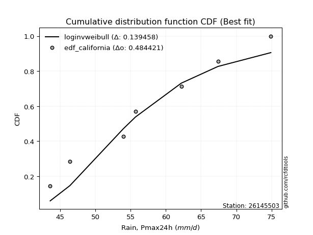</img>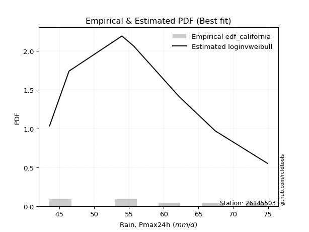</img>

</div>


### 2. EDF Hazen (1930)

Hazen method for plotting positions is a formula used to estimate the empirical cumulative probability distribution of flood events or other hydrological data. This formula often results in biased estimations, particularly when extrapolating to extreme events (high return periods).

<div align="center">


$P=(m-0.5)/n$


</div>


**2.1. Empirical values**

<div align="center">

|                | 0                   | 1                   | 2                   | 3         | 4                  | 5                  | 6                  |
|:---------------|:--------------------|:--------------------|:--------------------|:----------|:-------------------|:-------------------|:-------------------|
| date           | 2017                | 2023                | 2020                | 2022      | 2019               | 2021               | 2018               |
| x              | 43.6                | 46.4                | 54.0                | 55.7      | 62.2               | 67.4               | 74.9               |
| m              | 1                   | 2                   | 3                   | 4         | 5                  | 6                  | 7                  |
| empirical_dist | edf_hazen           | edf_hazen           | edf_hazen           | edf_hazen | edf_hazen          | edf_hazen          | edf_hazen          |
| empirical      | 0.07142857142857142 | 0.21428571428571427 | 0.35714285714285715 | 0.5       | 0.6428571428571429 | 0.7857142857142857 | 0.9285714285714286 |
| empirical_tr   | 1.0769230769230769  | 1.2727272727272727  | 1.5555555555555558  | 2.0       | 2.8000000000000003 | 4.666666666666666  | 14.000000000000007 |

</div>


**2.2. Kolmogorov-Smirnov fit test (sorted by Δ)**


<div align="center">

|                | 0                   | 1                   | 2                   | 3                   | 4                   | 5                   | 6                   | 7                   | 8                   | 9                   | 10                  | 11                  | 12                  | 13                  | 14                  | 15                  | 16                  | 17                  | 18                  | 19                  | 20                  | 21                  | 22                  | 23                  | 24                  | 25                  | 26                  | 27                  | 28                  | 29                  | 30                  | 31                  | 32                  | 33                  | 34                  | 35                  | 36                  | 37                  | 38                  | 39                  | 40                    | 41                  | 42                  | 43                  | 44                  | 45                  | 46                  | 47                  | 48                  | 49                  | 50                  | 51                  | 52                  | 53                  | 54                  | 55                  | 56                  | 57                  | 58                  | 59                  | 60                  | 61                  | 62                  | 63                  | 64                  | 65                  | 66                  | 67                  | 68                  | 69                  | 70                  | 71                  | 72                  | 73                  | 74                  | 75                  | 76                  | 77                  | 78                  | 79                  | 80                  | 81                  | 82                  | 83                  | 84                  | 85                  | 86                  | 87                  |
|:---------------|:--------------------|:--------------------|:--------------------|:--------------------|:--------------------|:--------------------|:--------------------|:--------------------|:--------------------|:--------------------|:--------------------|:--------------------|:--------------------|:--------------------|:--------------------|:--------------------|:--------------------|:--------------------|:--------------------|:--------------------|:--------------------|:--------------------|:--------------------|:--------------------|:--------------------|:--------------------|:--------------------|:--------------------|:--------------------|:--------------------|:--------------------|:--------------------|:--------------------|:--------------------|:--------------------|:--------------------|:--------------------|:--------------------|:--------------------|:--------------------|:----------------------|:--------------------|:--------------------|:--------------------|:--------------------|:--------------------|:--------------------|:--------------------|:--------------------|:--------------------|:--------------------|:--------------------|:--------------------|:--------------------|:--------------------|:--------------------|:--------------------|:--------------------|:--------------------|:--------------------|:--------------------|:--------------------|:--------------------|:--------------------|:--------------------|:--------------------|:--------------------|:--------------------|:--------------------|:--------------------|:--------------------|:--------------------|:--------------------|:--------------------|:--------------------|:--------------------|:--------------------|:--------------------|:--------------------|:--------------------|:--------------------|:--------------------|:--------------------|:--------------------|:--------------------|:--------------------|:--------------------|:--------------------|
| station        | 26145503            | 26145503            | 26145503            | 26145503            | 26145503            | 26145503            | 26145503            | 26145503            | 26145503            | 26145503            | 26145503            | 26145503            | 26145503            | 26145503            | 26145503            | 26145503            | 26145503            | 26145503            | 26145503            | 26145503            | 26145503            | 26145503            | 26145503            | 26145503            | 26145503            | 26145503            | 26145503            | 26145503            | 26145503            | 26145503            | 26145503            | 26145503            | 26145503            | 26145503            | 26145503            | 26145503            | 26145503            | 26145503            | 26145503            | 26145503            | 26145503              | 26145503            | 26145503            | 26145503            | 26145503            | 26145503            | 26145503            | 26145503            | 26145503            | 26145503            | 26145503            | 26145503            | 26145503            | 26145503            | 26145503            | 26145503            | 26145503            | 26145503            | 26145503            | 26145503            | 26145503            | 26145503            | 26145503            | 26145503            | 26145503            | 26145503            | 26145503            | 26145503            | 26145503            | 26145503            | 26145503            | 26145503            | 26145503            | 26145503            | 26145503            | 26145503            | 26145503            | 26145503            | 26145503            | 26145503            | 26145503            | 26145503            | 26145503            | 26145503            | 26145503            | 26145503            | 26145503            | 26145503            |
| empirical_dist | edf_hazen           | edf_hazen           | edf_hazen           | edf_hazen           | edf_hazen           | edf_hazen           | edf_hazen           | edf_hazen           | edf_hazen           | edf_hazen           | edf_hazen           | edf_hazen           | edf_hazen           | edf_hazen           | edf_hazen           | edf_hazen           | edf_hazen           | edf_hazen           | edf_hazen           | edf_hazen           | edf_hazen           | edf_hazen           | edf_hazen           | edf_hazen           | edf_hazen           | edf_hazen           | edf_hazen           | edf_hazen           | edf_hazen           | edf_hazen           | edf_hazen           | edf_hazen           | edf_hazen           | edf_hazen           | edf_hazen           | edf_hazen           | edf_hazen           | edf_hazen           | edf_hazen           | edf_hazen           | edf_hazen             | edf_hazen           | edf_hazen           | edf_hazen           | edf_hazen           | edf_hazen           | edf_hazen           | edf_hazen           | edf_hazen           | edf_hazen           | edf_hazen           | edf_hazen           | edf_hazen           | edf_hazen           | edf_hazen           | edf_hazen           | edf_hazen           | edf_hazen           | edf_hazen           | edf_hazen           | edf_hazen           | edf_hazen           | edf_hazen           | edf_hazen           | edf_hazen           | edf_hazen           | edf_hazen           | edf_hazen           | edf_hazen           | edf_hazen           | edf_hazen           | edf_hazen           | edf_hazen           | edf_hazen           | edf_hazen           | edf_hazen           | edf_hazen           | edf_hazen           | edf_hazen           | edf_hazen           | edf_hazen           | edf_hazen           | edf_hazen           | edf_hazen           | edf_hazen           | edf_hazen           | edf_hazen           | edf_hazen           |
| p_dist         | exponnorm           | t                   | crystalball         | norm                | maxwell             | pearson3            | fisk                | logfisk             | rayleigh            | kstwobign           | genlogistic         | logloggamma         | invweibull          | logf                | f                   | logpearson3         | logjohnsonsu        | logt                | logexponnorm        | lognorm             | lognorm             | logcrystalball      | loggamma            | loggamma            | logerlang           | alpha               | invgauss            | logalpha            | loginvgamma         | betaprime           | invgamma            | johnsonsu           | logfatiguelife      | loginvgauss         | nct                 | lognct              | logncf              | logmaxwell          | lograyleigh         | erlang              | loglaplace_asymmetric | laplace_asymmetric  | logweibull_min      | logistic            | logrice             | loggenlogistic      | genexpon            | rice                | mielke              | loglogistic         | hypsecant           | halfnorm            | gompertz            | logmielke           | loghypsecant        | logkstwobign        | gumbel_r            | loglaplace          | loggumbel_l         | loginvweibull       | loggenexpon         | loghalfnorm         | loggumbel_r         | laplace             | loggompertz         | moyal               | gumbel_l            | logmoyal            | halflogistic        | expon               | loghalflogistic     | logbetaprime        | logexpon            | gibrat              | wald                | loggibrat           | logwald             | gamma               | logtruncnorm        | lognakagami         | truncnorm           | logchi2             | loglognorm          | nakagami            | fatiguelife         | weibull_min         | ncf                 | chi2                |
| delta          | 0.07725124905897257 | 0.07798766270860108 | 0.07800325770995459 | 0.07800326158042786 | 0.07816582472289843 | 0.07915976526669188 | 0.07934167045681914 | 0.07942220009143841 | 0.07979225447213675 | 0.08153719594963957 | 0.0824902877183658  | 0.08255908845684884 | 0.08281228013738895 | 0.08331871571265764 | 0.08337862757094133 | 0.08339641452697635 | 0.08342571924563238 | 0.08342830242034996 | 0.0834298339689507  | 0.08343054731073271 | 0.08343054731073271 | 0.08343057263011058 | 0.08346027785388235 | 0.08346027785388235 | 0.08346855924039925 | 0.0836888681532734  | 0.083995512204117   | 0.0842658033819326  | 0.08431965435785599 | 0.08438562378273373 | 0.08443927227412071 | 0.08446362388519976 | 0.08468891943304077 | 0.08522203803854667 | 0.08535436439210095 | 0.08557374588285727 | 0.08558217247782748 | 0.0861998255263618  | 0.08872653984489587 | 0.0895939340617583  | 0.08968140122255586   | 0.09110561549413075 | 0.0914370616346945  | 0.09316465045409843 | 0.09442571833613242 | 0.0976942235725663  | 0.09788462464889763 | 0.09799041178939691 | 0.09812733277622815 | 0.09878366133201186 | 0.10107900717486898 | 0.10356266326066582 | 0.1040726242402476  | 0.10530924455024171 | 0.10613861467408105 | 0.11157516820228591 | 0.11199990392823893 | 0.11204249711649775 | 0.11401787499159555 | 0.11476349187261098 | 0.11746778427022747 | 0.1176961108260984  | 0.12066628363952885 | 0.12146524082945237 | 0.13884056546776752 | 0.13974456018758896 | 0.14647476606847937 | 0.14897015556787196 | 0.16019747990654853 | 0.16352117605170752 | 0.17741176348579413 | 0.18705786804268776 | 0.1971575265358348  | 0.21428571428571427 | 0.21428571428571427 | 0.21428571428571427 | 0.21428571428571427 | 0.22541566334687319 | 0.2391135952572136  | 0.24661282274626167 | 0.35712991323256016 | 0.38097890459385875 | 0.39954440196227436 | 0.413924343494128   | 0.47496517836755303 | 0.5088692809015781  | 0.5523574069779486  | 0.6812173113932487  |
| deltao         | 0.48442053926100004 | 0.48442053926100004 | 0.48442053926100004 | 0.48442053926100004 | 0.48442053926100004 | 0.48442053926100004 | 0.48442053926100004 | 0.48442053926100004 | 0.48442053926100004 | 0.48442053926100004 | 0.48442053926100004 | 0.48442053926100004 | 0.48442053926100004 | 0.48442053926100004 | 0.48442053926100004 | 0.48442053926100004 | 0.48442053926100004 | 0.48442053926100004 | 0.48442053926100004 | 0.48442053926100004 | 0.48442053926100004 | 0.48442053926100004 | 0.48442053926100004 | 0.48442053926100004 | 0.48442053926100004 | 0.48442053926100004 | 0.48442053926100004 | 0.48442053926100004 | 0.48442053926100004 | 0.48442053926100004 | 0.48442053926100004 | 0.48442053926100004 | 0.48442053926100004 | 0.48442053926100004 | 0.48442053926100004 | 0.48442053926100004 | 0.48442053926100004 | 0.48442053926100004 | 0.48442053926100004 | 0.48442053926100004 | 0.48442053926100004   | 0.48442053926100004 | 0.48442053926100004 | 0.48442053926100004 | 0.48442053926100004 | 0.48442053926100004 | 0.48442053926100004 | 0.48442053926100004 | 0.48442053926100004 | 0.48442053926100004 | 0.48442053926100004 | 0.48442053926100004 | 0.48442053926100004 | 0.48442053926100004 | 0.48442053926100004 | 0.48442053926100004 | 0.48442053926100004 | 0.48442053926100004 | 0.48442053926100004 | 0.48442053926100004 | 0.48442053926100004 | 0.48442053926100004 | 0.48442053926100004 | 0.48442053926100004 | 0.48442053926100004 | 0.48442053926100004 | 0.48442053926100004 | 0.48442053926100004 | 0.48442053926100004 | 0.48442053926100004 | 0.48442053926100004 | 0.48442053926100004 | 0.48442053926100004 | 0.48442053926100004 | 0.48442053926100004 | 0.48442053926100004 | 0.48442053926100004 | 0.48442053926100004 | 0.48442053926100004 | 0.48442053926100004 | 0.48442053926100004 | 0.48442053926100004 | 0.48442053926100004 | 0.48442053926100004 | 0.48442053926100004 | 0.48442053926100004 | 0.48442053926100004 | 0.48442053926100004 |
| eval           | Δo > Δ              | Δo > Δ              | Δo > Δ              | Δo > Δ              | Δo > Δ              | Δo > Δ              | Δo > Δ              | Δo > Δ              | Δo > Δ              | Δo > Δ              | Δo > Δ              | Δo > Δ              | Δo > Δ              | Δo > Δ              | Δo > Δ              | Δo > Δ              | Δo > Δ              | Δo > Δ              | Δo > Δ              | Δo > Δ              | Δo > Δ              | Δo > Δ              | Δo > Δ              | Δo > Δ              | Δo > Δ              | Δo > Δ              | Δo > Δ              | Δo > Δ              | Δo > Δ              | Δo > Δ              | Δo > Δ              | Δo > Δ              | Δo > Δ              | Δo > Δ              | Δo > Δ              | Δo > Δ              | Δo > Δ              | Δo > Δ              | Δo > Δ              | Δo > Δ              | Δo > Δ                | Δo > Δ              | Δo > Δ              | Δo > Δ              | Δo > Δ              | Δo > Δ              | Δo > Δ              | Δo > Δ              | Δo > Δ              | Δo > Δ              | Δo > Δ              | Δo > Δ              | Δo > Δ              | Δo > Δ              | Δo > Δ              | Δo > Δ              | Δo > Δ              | Δo > Δ              | Δo > Δ              | Δo > Δ              | Δo > Δ              | Δo > Δ              | Δo > Δ              | Δo > Δ              | Δo > Δ              | Δo > Δ              | Δo > Δ              | Δo > Δ              | Δo > Δ              | Δo > Δ              | Δo > Δ              | Δo > Δ              | Δo > Δ              | Δo > Δ              | Δo > Δ              | Δo > Δ              | Δo > Δ              | Δo > Δ              | Δo > Δ              | Δo > Δ              | Δo > Δ              | Δo > Δ              | Δo > Δ              | Δo > Δ              | Δo > Δ              | Δo <= Δ             | Δo <= Δ             | Δo <= Δ             |
| fit            | 1                   | 1                   | 1                   | 1                   | 1                   | 1                   | 1                   | 1                   | 1                   | 1                   | 1                   | 1                   | 1                   | 1                   | 1                   | 1                   | 1                   | 1                   | 1                   | 1                   | 1                   | 1                   | 1                   | 1                   | 1                   | 1                   | 1                   | 1                   | 1                   | 1                   | 1                   | 1                   | 1                   | 1                   | 1                   | 1                   | 1                   | 1                   | 1                   | 1                   | 1                     | 1                   | 1                   | 1                   | 1                   | 1                   | 1                   | 1                   | 1                   | 1                   | 1                   | 1                   | 1                   | 1                   | 1                   | 1                   | 1                   | 1                   | 1                   | 1                   | 1                   | 1                   | 1                   | 1                   | 1                   | 1                   | 1                   | 1                   | 1                   | 1                   | 1                   | 1                   | 1                   | 1                   | 1                   | 1                   | 1                   | 1                   | 1                   | 1                   | 1                   | 1                   | 1                   | 1                   | 1                   | 0                   | 0                   | 0                   |
| n              | 7                   | 7                   | 7                   | 7                   | 7                   | 7                   | 7                   | 7                   | 7                   | 7                   | 7                   | 7                   | 7                   | 7                   | 7                   | 7                   | 7                   | 7                   | 7                   | 7                   | 7                   | 7                   | 7                   | 7                   | 7                   | 7                   | 7                   | 7                   | 7                   | 7                   | 7                   | 7                   | 7                   | 7                   | 7                   | 7                   | 7                   | 7                   | 7                   | 7                   | 7                     | 7                   | 7                   | 7                   | 7                   | 7                   | 7                   | 7                   | 7                   | 7                   | 7                   | 7                   | 7                   | 7                   | 7                   | 7                   | 7                   | 7                   | 7                   | 7                   | 7                   | 7                   | 7                   | 7                   | 7                   | 7                   | 7                   | 7                   | 7                   | 7                   | 7                   | 7                   | 7                   | 7                   | 7                   | 7                   | 7                   | 7                   | 7                   | 7                   | 7                   | 7                   | 7                   | 7                   | 7                   | 7                   | 7                   | 7                   |
| best_fit       | 1                   | 0                   | 0                   | 0                   | 0                   | 0                   | 0                   | 0                   | 0                   | 0                   | 0                   | 0                   | 0                   | 0                   | 0                   | 0                   | 0                   | 0                   | 0                   | 0                   | 0                   | 0                   | 0                   | 0                   | 0                   | 0                   | 0                   | 0                   | 0                   | 0                   | 0                   | 0                   | 0                   | 0                   | 0                   | 0                   | 0                   | 0                   | 0                   | 0                   | 0                     | 0                   | 0                   | 0                   | 0                   | 0                   | 0                   | 0                   | 0                   | 0                   | 0                   | 0                   | 0                   | 0                   | 0                   | 0                   | 0                   | 0                   | 0                   | 0                   | 0                   | 0                   | 0                   | 0                   | 0                   | 0                   | 0                   | 0                   | 0                   | 0                   | 0                   | 0                   | 0                   | 0                   | 0                   | 0                   | 0                   | 0                   | 0                   | 0                   | 0                   | 0                   | 0                   | 0                   | 0                   | 0                   | 0                   | 0                   |
| best_fit_sort  | 1                   | 2                   | 3                   | 4                   | 5                   | 6                   | 7                   | 8                   | 9                   | 10                  | 11                  | 12                  | 13                  | 14                  | 15                  | 16                  | 17                  | 18                  | 19                  | 20                  | 21                  | 22                  | 23                  | 24                  | 25                  | 26                  | 27                  | 28                  | 29                  | 30                  | 31                  | 32                  | 33                  | 34                  | 35                  | 36                  | 37                  | 38                  | 39                  | 40                  | 41                    | 42                  | 43                  | 44                  | 45                  | 46                  | 47                  | 48                  | 49                  | 50                  | 51                  | 52                  | 53                  | 54                  | 55                  | 56                  | 57                  | 58                  | 59                  | 60                  | 61                  | 62                  | 63                  | 64                  | 65                  | 66                  | 67                  | 68                  | 69                  | 70                  | 71                  | 72                  | 73                  | 74                  | 75                  | 76                  | 77                  | 78                  | 79                  | 80                  | 81                  | 82                  | 83                  | 84                  | 85                  | 86                  | 87                  | 88                  |

</div>


**2.3. Best fit**

<div align="center">

|   id |   station | empirical_dist   | p_dist    |     delta |   deltao | eval   |   fit |   n |   best_fit |   best_fit_sort |
|-----:|----------:|:-----------------|:----------|----------:|---------:|:-------|------:|----:|-----------:|----------------:|
|    0 |  26145503 | edf_hazen        | exponnorm | 0.0772512 | 0.484421 | Δo > Δ |     1 |   7 |          1 |               1 |

</div>


<div align="center">

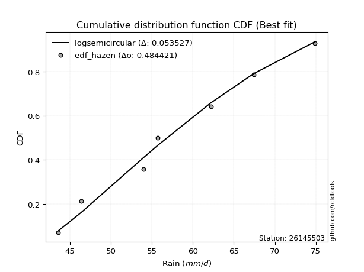</img>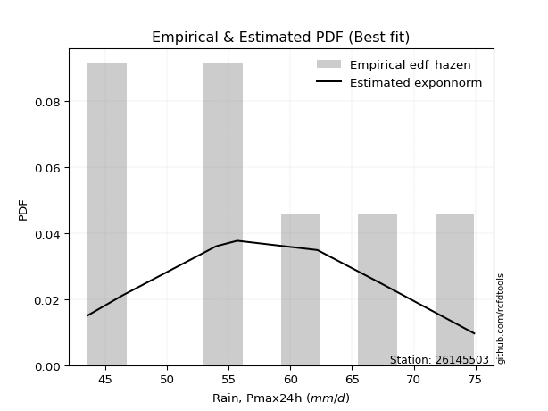</img>

</div>


### 3. EDF Weibull (1939)

Weibull plotting position formula is an empirical method used to estimate the non-exceedance probability or plotting position for a set of observed data, is often recommended or widely used in practice, particularly in flood frequency analysis.

<div align="center">


$P=m/(n+1)$


</div>


**3.1. Empirical values**

<div align="center">

|                | 0                  | 1                  | 2           | 3           | 4                  | 5           | 6           |
|:---------------|:-------------------|:-------------------|:------------|:------------|:-------------------|:------------|:------------|
| date           | 2017               | 2023               | 2020        | 2022        | 2019               | 2021        | 2018        |
| x              | 43.6               | 46.4               | 54.0        | 55.7        | 62.2               | 67.4        | 74.9        |
| m              | 1                  | 2                  | 3           | 4           | 5                  | 6           | 7           |
| empirical_dist | edf_weibull        | edf_weibull        | edf_weibull | edf_weibull | edf_weibull        | edf_weibull | edf_weibull |
| empirical      | 0.125              | 0.25               | 0.375       | 0.5         | 0.625              | 0.75        | 0.875       |
| empirical_tr   | 1.1428571428571428 | 1.3333333333333333 | 1.6         | 2.0         | 2.6666666666666665 | 4.0         | 8.0         |

</div>


**3.2. Kolmogorov-Smirnov fit test (sorted by Δ)**


<div align="center">

|                | 0                    | 1                   | 2                   | 3                   | 4                   | 5                   | 6                   | 7                   | 8                   | 9                   | 10                  | 11                  | 12                  | 13                  | 14                  | 15                  | 16                  | 17                  | 18                  | 19                  | 20                  | 21                  | 22                  | 23                  | 24                  | 25                  | 26                  | 27                  | 28                  | 29                  | 30                  | 31                  | 32                  | 33                  | 34                  | 35                  | 36                  | 37                  | 38                  | 39                  | 40                  | 41                  | 42                  | 43                  | 44                  | 45                    | 46                  | 47                  | 48                  | 49                  | 50                  | 51                  | 52                  | 53                  | 54                  | 55                  | 56                  | 57                  | 58                  | 59                  | 60                  | 61                  | 62                  | 63                  | 64                  | 65                  | 66                  | 67                  | 68                  | 69                  | 70                  | 71                  | 72                  | 73                  | 74                  | 75                  | 76                  | 77                  | 78                  | 79                  | 80                  | 81                  | 82                  | 83                  | 84                  | 85                  | 86                  | 87                  |
|:---------------|:---------------------|:--------------------|:--------------------|:--------------------|:--------------------|:--------------------|:--------------------|:--------------------|:--------------------|:--------------------|:--------------------|:--------------------|:--------------------|:--------------------|:--------------------|:--------------------|:--------------------|:--------------------|:--------------------|:--------------------|:--------------------|:--------------------|:--------------------|:--------------------|:--------------------|:--------------------|:--------------------|:--------------------|:--------------------|:--------------------|:--------------------|:--------------------|:--------------------|:--------------------|:--------------------|:--------------------|:--------------------|:--------------------|:--------------------|:--------------------|:--------------------|:--------------------|:--------------------|:--------------------|:--------------------|:----------------------|:--------------------|:--------------------|:--------------------|:--------------------|:--------------------|:--------------------|:--------------------|:--------------------|:--------------------|:--------------------|:--------------------|:--------------------|:--------------------|:--------------------|:--------------------|:--------------------|:--------------------|:--------------------|:--------------------|:--------------------|:--------------------|:--------------------|:--------------------|:--------------------|:--------------------|:--------------------|:--------------------|:--------------------|:--------------------|:--------------------|:--------------------|:--------------------|:--------------------|:--------------------|:--------------------|:--------------------|:--------------------|:--------------------|:--------------------|:--------------------|:--------------------|:--------------------|
| station        | 26145503             | 26145503            | 26145503            | 26145503            | 26145503            | 26145503            | 26145503            | 26145503            | 26145503            | 26145503            | 26145503            | 26145503            | 26145503            | 26145503            | 26145503            | 26145503            | 26145503            | 26145503            | 26145503            | 26145503            | 26145503            | 26145503            | 26145503            | 26145503            | 26145503            | 26145503            | 26145503            | 26145503            | 26145503            | 26145503            | 26145503            | 26145503            | 26145503            | 26145503            | 26145503            | 26145503            | 26145503            | 26145503            | 26145503            | 26145503            | 26145503            | 26145503            | 26145503            | 26145503            | 26145503            | 26145503              | 26145503            | 26145503            | 26145503            | 26145503            | 26145503            | 26145503            | 26145503            | 26145503            | 26145503            | 26145503            | 26145503            | 26145503            | 26145503            | 26145503            | 26145503            | 26145503            | 26145503            | 26145503            | 26145503            | 26145503            | 26145503            | 26145503            | 26145503            | 26145503            | 26145503            | 26145503            | 26145503            | 26145503            | 26145503            | 26145503            | 26145503            | 26145503            | 26145503            | 26145503            | 26145503            | 26145503            | 26145503            | 26145503            | 26145503            | 26145503            | 26145503            | 26145503            |
| empirical_dist | edf_weibull          | edf_weibull         | edf_weibull         | edf_weibull         | edf_weibull         | edf_weibull         | edf_weibull         | edf_weibull         | edf_weibull         | edf_weibull         | edf_weibull         | edf_weibull         | edf_weibull         | edf_weibull         | edf_weibull         | edf_weibull         | edf_weibull         | edf_weibull         | edf_weibull         | edf_weibull         | edf_weibull         | edf_weibull         | edf_weibull         | edf_weibull         | edf_weibull         | edf_weibull         | edf_weibull         | edf_weibull         | edf_weibull         | edf_weibull         | edf_weibull         | edf_weibull         | edf_weibull         | edf_weibull         | edf_weibull         | edf_weibull         | edf_weibull         | edf_weibull         | edf_weibull         | edf_weibull         | edf_weibull         | edf_weibull         | edf_weibull         | edf_weibull         | edf_weibull         | edf_weibull           | edf_weibull         | edf_weibull         | edf_weibull         | edf_weibull         | edf_weibull         | edf_weibull         | edf_weibull         | edf_weibull         | edf_weibull         | edf_weibull         | edf_weibull         | edf_weibull         | edf_weibull         | edf_weibull         | edf_weibull         | edf_weibull         | edf_weibull         | edf_weibull         | edf_weibull         | edf_weibull         | edf_weibull         | edf_weibull         | edf_weibull         | edf_weibull         | edf_weibull         | edf_weibull         | edf_weibull         | edf_weibull         | edf_weibull         | edf_weibull         | edf_weibull         | edf_weibull         | edf_weibull         | edf_weibull         | edf_weibull         | edf_weibull         | edf_weibull         | edf_weibull         | edf_weibull         | edf_weibull         | edf_weibull         | edf_weibull         |
| p_dist         | lognct               | loginvweibull       | logkstwobign        | t                   | norm                | crystalball         | exponnorm           | logmielke           | mielke              | maxwell             | loggenlogistic      | pearson3            | fisk                | logfisk             | rayleigh            | erlang              | kstwobign           | genlogistic         | logloggamma         | invweibull          | logf                | f                   | logpearson3         | logjohnsonsu        | logt                | logexponnorm        | lognorm             | lognorm             | logcrystalball      | loggamma            | loggamma            | logerlang           | alpha               | invgauss            | logalpha            | loginvgamma         | betaprime           | invgamma            | johnsonsu           | logfatiguelife      | loginvgauss         | nct                 | logncf              | logweibull_min      | logmaxwell          | loglaplace_asymmetric | lograyleigh         | loggenexpon         | loggompertz         | genexpon            | loggumbel_l         | laplace_asymmetric  | logistic            | logrice             | logbetaprime        | rice                | loglogistic         | hypsecant           | halfnorm            | gompertz            | loghypsecant        | laplace             | expon               | gumbel_l            | gumbel_r            | loglaplace          | loghalfnorm         | loggumbel_r         | moyal               | logexpon            | logmoyal            | halflogistic        | gamma               | loghalflogistic     | logtruncnorm        | lognakagami         | wald                | gibrat              | logwald             | loggibrat           | logchi2             | loglognorm          | truncnorm           | nakagami            | fatiguelife         | weibull_min         | ncf                 | chi2                |
| delta          | 0.058625890334095876 | 0.10626679144667972 | 0.10894146894054713 | 0.11271645111641387 | 0.11272730438238554 | 0.11272730499621259 | 0.1129655347732583  | 0.1131041715140973  | 0.11387374251982013 | 0.11388011043718416 | 0.114004916886226   | 0.11487405098097761 | 0.11505595617110487 | 0.11513648580572414 | 0.11550654018642248 | 0.11638857276513423 | 0.1172514816639253  | 0.11820457343265153 | 0.11827337417113457 | 0.11852656585167468 | 0.11903300142694337 | 0.11909291328522706 | 0.11911070024126208 | 0.11914000495991811 | 0.11914258813463569 | 0.11914411968323643 | 0.11914483302501844 | 0.11914483302501844 | 0.11914485834439631 | 0.11917456356816808 | 0.11917456356816808 | 0.11918284495468498 | 0.11940315386755912 | 0.11970979791840272 | 0.11998008909621832 | 0.12003394007214171 | 0.12009990949701946 | 0.12015355798840643 | 0.12017790959948549 | 0.1204032051473265  | 0.12093632375283239 | 0.12106865010638668 | 0.12129645819211321 | 0.12159607705633341 | 0.12191411124064752 | 0.12301243177315024   | 0.1244408255591816  | 0.12498859530174085 | 0.12499999179224738 | 0.12499999955960993 | 0.1253823192476372  | 0.12681990120841646 | 0.12887893616838414 | 0.13014000405041815 | 0.13348643947125916 | 0.13370469750368263 | 0.13449794704629758 | 0.1367932928891547  | 0.13927694897495155 | 0.13978690995453333 | 0.1418529003883668  | 0.14337043082538195 | 0.14566403319456467 | 0.14647476606847937 | 0.14771418964252464 | 0.14775678283078347 | 0.15341039654038413 | 0.15638056935381456 | 0.17545884590187466 | 0.17930038367869194 | 0.1846844412821577  | 0.19591176562083423 | 0.20755852048973034 | 0.21312604920007985 | 0.22125645240007075 | 0.22875567988911882 | 0.25                | 0.25                | 0.25                | 0.25                | 0.32740747602243014 | 0.36383011624798867 | 0.374987056089703   | 0.3956970428328834  | 0.45433880915565106 | 0.4731549951872924  | 0.49878597840651995 | 0.645503025678963   |
| deltao         | 0.48442053926100004  | 0.48442053926100004 | 0.48442053926100004 | 0.48442053926100004 | 0.48442053926100004 | 0.48442053926100004 | 0.48442053926100004 | 0.48442053926100004 | 0.48442053926100004 | 0.48442053926100004 | 0.48442053926100004 | 0.48442053926100004 | 0.48442053926100004 | 0.48442053926100004 | 0.48442053926100004 | 0.48442053926100004 | 0.48442053926100004 | 0.48442053926100004 | 0.48442053926100004 | 0.48442053926100004 | 0.48442053926100004 | 0.48442053926100004 | 0.48442053926100004 | 0.48442053926100004 | 0.48442053926100004 | 0.48442053926100004 | 0.48442053926100004 | 0.48442053926100004 | 0.48442053926100004 | 0.48442053926100004 | 0.48442053926100004 | 0.48442053926100004 | 0.48442053926100004 | 0.48442053926100004 | 0.48442053926100004 | 0.48442053926100004 | 0.48442053926100004 | 0.48442053926100004 | 0.48442053926100004 | 0.48442053926100004 | 0.48442053926100004 | 0.48442053926100004 | 0.48442053926100004 | 0.48442053926100004 | 0.48442053926100004 | 0.48442053926100004   | 0.48442053926100004 | 0.48442053926100004 | 0.48442053926100004 | 0.48442053926100004 | 0.48442053926100004 | 0.48442053926100004 | 0.48442053926100004 | 0.48442053926100004 | 0.48442053926100004 | 0.48442053926100004 | 0.48442053926100004 | 0.48442053926100004 | 0.48442053926100004 | 0.48442053926100004 | 0.48442053926100004 | 0.48442053926100004 | 0.48442053926100004 | 0.48442053926100004 | 0.48442053926100004 | 0.48442053926100004 | 0.48442053926100004 | 0.48442053926100004 | 0.48442053926100004 | 0.48442053926100004 | 0.48442053926100004 | 0.48442053926100004 | 0.48442053926100004 | 0.48442053926100004 | 0.48442053926100004 | 0.48442053926100004 | 0.48442053926100004 | 0.48442053926100004 | 0.48442053926100004 | 0.48442053926100004 | 0.48442053926100004 | 0.48442053926100004 | 0.48442053926100004 | 0.48442053926100004 | 0.48442053926100004 | 0.48442053926100004 | 0.48442053926100004 | 0.48442053926100004 |
| eval           | Δo > Δ               | Δo > Δ              | Δo > Δ              | Δo > Δ              | Δo > Δ              | Δo > Δ              | Δo > Δ              | Δo > Δ              | Δo > Δ              | Δo > Δ              | Δo > Δ              | Δo > Δ              | Δo > Δ              | Δo > Δ              | Δo > Δ              | Δo > Δ              | Δo > Δ              | Δo > Δ              | Δo > Δ              | Δo > Δ              | Δo > Δ              | Δo > Δ              | Δo > Δ              | Δo > Δ              | Δo > Δ              | Δo > Δ              | Δo > Δ              | Δo > Δ              | Δo > Δ              | Δo > Δ              | Δo > Δ              | Δo > Δ              | Δo > Δ              | Δo > Δ              | Δo > Δ              | Δo > Δ              | Δo > Δ              | Δo > Δ              | Δo > Δ              | Δo > Δ              | Δo > Δ              | Δo > Δ              | Δo > Δ              | Δo > Δ              | Δo > Δ              | Δo > Δ                | Δo > Δ              | Δo > Δ              | Δo > Δ              | Δo > Δ              | Δo > Δ              | Δo > Δ              | Δo > Δ              | Δo > Δ              | Δo > Δ              | Δo > Δ              | Δo > Δ              | Δo > Δ              | Δo > Δ              | Δo > Δ              | Δo > Δ              | Δo > Δ              | Δo > Δ              | Δo > Δ              | Δo > Δ              | Δo > Δ              | Δo > Δ              | Δo > Δ              | Δo > Δ              | Δo > Δ              | Δo > Δ              | Δo > Δ              | Δo > Δ              | Δo > Δ              | Δo > Δ              | Δo > Δ              | Δo > Δ              | Δo > Δ              | Δo > Δ              | Δo > Δ              | Δo > Δ              | Δo > Δ              | Δo > Δ              | Δo > Δ              | Δo > Δ              | Δo > Δ              | Δo <= Δ             | Δo <= Δ             |
| fit            | 1                    | 1                   | 1                   | 1                   | 1                   | 1                   | 1                   | 1                   | 1                   | 1                   | 1                   | 1                   | 1                   | 1                   | 1                   | 1                   | 1                   | 1                   | 1                   | 1                   | 1                   | 1                   | 1                   | 1                   | 1                   | 1                   | 1                   | 1                   | 1                   | 1                   | 1                   | 1                   | 1                   | 1                   | 1                   | 1                   | 1                   | 1                   | 1                   | 1                   | 1                   | 1                   | 1                   | 1                   | 1                   | 1                     | 1                   | 1                   | 1                   | 1                   | 1                   | 1                   | 1                   | 1                   | 1                   | 1                   | 1                   | 1                   | 1                   | 1                   | 1                   | 1                   | 1                   | 1                   | 1                   | 1                   | 1                   | 1                   | 1                   | 1                   | 1                   | 1                   | 1                   | 1                   | 1                   | 1                   | 1                   | 1                   | 1                   | 1                   | 1                   | 1                   | 1                   | 1                   | 1                   | 1                   | 0                   | 0                   |
| n              | 7                    | 7                   | 7                   | 7                   | 7                   | 7                   | 7                   | 7                   | 7                   | 7                   | 7                   | 7                   | 7                   | 7                   | 7                   | 7                   | 7                   | 7                   | 7                   | 7                   | 7                   | 7                   | 7                   | 7                   | 7                   | 7                   | 7                   | 7                   | 7                   | 7                   | 7                   | 7                   | 7                   | 7                   | 7                   | 7                   | 7                   | 7                   | 7                   | 7                   | 7                   | 7                   | 7                   | 7                   | 7                   | 7                     | 7                   | 7                   | 7                   | 7                   | 7                   | 7                   | 7                   | 7                   | 7                   | 7                   | 7                   | 7                   | 7                   | 7                   | 7                   | 7                   | 7                   | 7                   | 7                   | 7                   | 7                   | 7                   | 7                   | 7                   | 7                   | 7                   | 7                   | 7                   | 7                   | 7                   | 7                   | 7                   | 7                   | 7                   | 7                   | 7                   | 7                   | 7                   | 7                   | 7                   | 7                   | 7                   |
| best_fit       | 1                    | 0                   | 0                   | 0                   | 0                   | 0                   | 0                   | 0                   | 0                   | 0                   | 0                   | 0                   | 0                   | 0                   | 0                   | 0                   | 0                   | 0                   | 0                   | 0                   | 0                   | 0                   | 0                   | 0                   | 0                   | 0                   | 0                   | 0                   | 0                   | 0                   | 0                   | 0                   | 0                   | 0                   | 0                   | 0                   | 0                   | 0                   | 0                   | 0                   | 0                   | 0                   | 0                   | 0                   | 0                   | 0                     | 0                   | 0                   | 0                   | 0                   | 0                   | 0                   | 0                   | 0                   | 0                   | 0                   | 0                   | 0                   | 0                   | 0                   | 0                   | 0                   | 0                   | 0                   | 0                   | 0                   | 0                   | 0                   | 0                   | 0                   | 0                   | 0                   | 0                   | 0                   | 0                   | 0                   | 0                   | 0                   | 0                   | 0                   | 0                   | 0                   | 0                   | 0                   | 0                   | 0                   | 0                   | 0                   |
| best_fit_sort  | 1                    | 2                   | 3                   | 4                   | 5                   | 6                   | 7                   | 8                   | 9                   | 10                  | 11                  | 12                  | 13                  | 14                  | 15                  | 16                  | 17                  | 18                  | 19                  | 20                  | 21                  | 22                  | 23                  | 24                  | 25                  | 26                  | 27                  | 28                  | 29                  | 30                  | 31                  | 32                  | 33                  | 34                  | 35                  | 36                  | 37                  | 38                  | 39                  | 40                  | 41                  | 42                  | 43                  | 44                  | 45                  | 46                    | 47                  | 48                  | 49                  | 50                  | 51                  | 52                  | 53                  | 54                  | 55                  | 56                  | 57                  | 58                  | 59                  | 60                  | 61                  | 62                  | 63                  | 64                  | 65                  | 66                  | 67                  | 68                  | 69                  | 70                  | 71                  | 72                  | 73                  | 74                  | 75                  | 76                  | 77                  | 78                  | 79                  | 80                  | 81                  | 82                  | 83                  | 84                  | 85                  | 86                  | 87                  | 88                  |

</div>


**3.3. Best fit**

<div align="center">

|   id |   station | empirical_dist   | p_dist   |     delta |   deltao | eval   |   fit |   n |   best_fit |   best_fit_sort |
|-----:|----------:|:-----------------|:---------|----------:|---------:|:-------|------:|----:|-----------:|----------------:|
|    0 |  26145503 | edf_weibull      | lognct   | 0.0586259 | 0.484421 | Δo > Δ |     1 |   7 |          1 |               1 |

</div>


<div align="center">

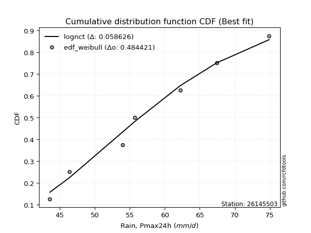</img>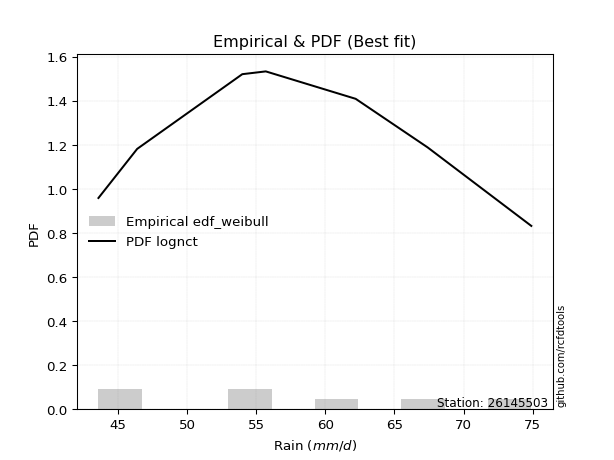</img>

</div>


### 4. EDF Beard (1943)

The Beard formula (or Beard´s plotting position formula) in hydrology is used to estimate the empirical non-exceedance probability _(P)_ of a flood event (or other extreme hydrological data point) within a given dataset.

<div align="center">


$P=(m-0.31)/(n+0.38)$


</div>


**4.1. Empirical values**

<div align="center">

|                | 0                   | 1                   | 2                   | 3         | 4                  | 5                  | 6                  |
|:---------------|:--------------------|:--------------------|:--------------------|:----------|:-------------------|:-------------------|:-------------------|
| date           | 2017                | 2023                | 2020                | 2022      | 2019               | 2021               | 2018               |
| x              | 43.6                | 46.4                | 54.0                | 55.7      | 62.2               | 67.4               | 74.9               |
| m              | 1                   | 2                   | 3                   | 4         | 5                  | 6                  | 7                  |
| empirical_dist | edf_beard           | edf_beard           | edf_beard           | edf_beard | edf_beard          | edf_beard          | edf_beard          |
| empirical      | 0.09349593495934959 | 0.22899728997289973 | 0.36449864498644985 | 0.5       | 0.6355013550135502 | 0.7710027100271003 | 0.9065040650406505 |
| empirical_tr   | 1.1031390134529149  | 1.29701230228471    | 1.5735607675906182  | 2.0       | 2.743494423791822  | 4.366863905325444  | 10.695652173913055 |

</div>


**4.2. Kolmogorov-Smirnov fit test (sorted by Δ)**


<div align="center">

|                | 0                   | 1                   | 2                   | 3                   | 4                   | 5                   | 6                   | 7                   | 8                   | 9                   | 10                  | 11                  | 12                  | 13                  | 14                  | 15                  | 16                  | 17                  | 18                  | 19                  | 20                  | 21                  | 22                  | 23                  | 24                  | 25                  | 26                  | 27                  | 28                  | 29                  | 30                  | 31                  | 32                  | 33                  | 34                  | 35                  | 36                  | 37                  | 38                  | 39                  | 40                  | 41                  | 42                  | 43                  | 44                    | 45                  | 46                  | 47                  | 48                  | 49                  | 50                  | 51                  | 52                  | 53                  | 54                  | 55                  | 56                  | 57                  | 58                  | 59                  | 60                  | 61                  | 62                  | 63                  | 64                  | 65                  | 66                  | 67                  | 68                  | 69                  | 70                  | 71                  | 72                  | 73                  | 74                  | 75                  | 76                  | 77                  | 78                  | 79                  | 80                  | 81                  | 82                  | 83                  | 84                  | 85                  | 86                  | 87                  |
|:---------------|:--------------------|:--------------------|:--------------------|:--------------------|:--------------------|:--------------------|:--------------------|:--------------------|:--------------------|:--------------------|:--------------------|:--------------------|:--------------------|:--------------------|:--------------------|:--------------------|:--------------------|:--------------------|:--------------------|:--------------------|:--------------------|:--------------------|:--------------------|:--------------------|:--------------------|:--------------------|:--------------------|:--------------------|:--------------------|:--------------------|:--------------------|:--------------------|:--------------------|:--------------------|:--------------------|:--------------------|:--------------------|:--------------------|:--------------------|:--------------------|:--------------------|:--------------------|:--------------------|:--------------------|:----------------------|:--------------------|:--------------------|:--------------------|:--------------------|:--------------------|:--------------------|:--------------------|:--------------------|:--------------------|:--------------------|:--------------------|:--------------------|:--------------------|:--------------------|:--------------------|:--------------------|:--------------------|:--------------------|:--------------------|:--------------------|:--------------------|:--------------------|:--------------------|:--------------------|:--------------------|:--------------------|:--------------------|:--------------------|:--------------------|:--------------------|:--------------------|:--------------------|:--------------------|:--------------------|:--------------------|:--------------------|:--------------------|:--------------------|:--------------------|:--------------------|:--------------------|:--------------------|:--------------------|
| station        | 26145503            | 26145503            | 26145503            | 26145503            | 26145503            | 26145503            | 26145503            | 26145503            | 26145503            | 26145503            | 26145503            | 26145503            | 26145503            | 26145503            | 26145503            | 26145503            | 26145503            | 26145503            | 26145503            | 26145503            | 26145503            | 26145503            | 26145503            | 26145503            | 26145503            | 26145503            | 26145503            | 26145503            | 26145503            | 26145503            | 26145503            | 26145503            | 26145503            | 26145503            | 26145503            | 26145503            | 26145503            | 26145503            | 26145503            | 26145503            | 26145503            | 26145503            | 26145503            | 26145503            | 26145503              | 26145503            | 26145503            | 26145503            | 26145503            | 26145503            | 26145503            | 26145503            | 26145503            | 26145503            | 26145503            | 26145503            | 26145503            | 26145503            | 26145503            | 26145503            | 26145503            | 26145503            | 26145503            | 26145503            | 26145503            | 26145503            | 26145503            | 26145503            | 26145503            | 26145503            | 26145503            | 26145503            | 26145503            | 26145503            | 26145503            | 26145503            | 26145503            | 26145503            | 26145503            | 26145503            | 26145503            | 26145503            | 26145503            | 26145503            | 26145503            | 26145503            | 26145503            | 26145503            |
| empirical_dist | edf_beard           | edf_beard           | edf_beard           | edf_beard           | edf_beard           | edf_beard           | edf_beard           | edf_beard           | edf_beard           | edf_beard           | edf_beard           | edf_beard           | edf_beard           | edf_beard           | edf_beard           | edf_beard           | edf_beard           | edf_beard           | edf_beard           | edf_beard           | edf_beard           | edf_beard           | edf_beard           | edf_beard           | edf_beard           | edf_beard           | edf_beard           | edf_beard           | edf_beard           | edf_beard           | edf_beard           | edf_beard           | edf_beard           | edf_beard           | edf_beard           | edf_beard           | edf_beard           | edf_beard           | edf_beard           | edf_beard           | edf_beard           | edf_beard           | edf_beard           | edf_beard           | edf_beard             | edf_beard           | edf_beard           | edf_beard           | edf_beard           | edf_beard           | edf_beard           | edf_beard           | edf_beard           | edf_beard           | edf_beard           | edf_beard           | edf_beard           | edf_beard           | edf_beard           | edf_beard           | edf_beard           | edf_beard           | edf_beard           | edf_beard           | edf_beard           | edf_beard           | edf_beard           | edf_beard           | edf_beard           | edf_beard           | edf_beard           | edf_beard           | edf_beard           | edf_beard           | edf_beard           | edf_beard           | edf_beard           | edf_beard           | edf_beard           | edf_beard           | edf_beard           | edf_beard           | edf_beard           | edf_beard           | edf_beard           | edf_beard           | edf_beard           | edf_beard           |
| p_dist         | lognct              | t                   | norm                | crystalball         | exponnorm           | mielke              | maxwell             | loggenlogistic      | pearson3            | fisk                | logfisk             | rayleigh            | erlang              | kstwobign           | genlogistic         | logloggamma         | invweibull          | logmielke           | logf                | f                   | logpearson3         | logjohnsonsu        | logt                | logexponnorm        | lognorm             | lognorm             | logcrystalball      | loggamma            | loggamma            | logerlang           | alpha               | genexpon            | invgauss            | logalpha            | loginvgamma         | betaprime           | invgamma            | johnsonsu           | logfatiguelife      | loginvgauss         | nct                 | logncf              | logweibull_min      | logmaxwell          | loglaplace_asymmetric | lograyleigh         | logkstwobign        | laplace_asymmetric  | loginvweibull       | logistic            | logrice             | loggenexpon         | rice                | loglogistic         | loggumbel_l         | hypsecant           | halfnorm            | gompertz            | loghypsecant        | laplace             | gumbel_r            | loglaplace          | loggompertz         | loghalfnorm         | loggumbel_r         | gumbel_l            | moyal               | expon               | logmoyal            | logbetaprime        | halflogistic        | logexpon            | loghalflogistic     | gamma               | wald                | gibrat              | logwald             | loggibrat           | logtruncnorm        | lognakagami         | logchi2             | truncnorm           | loglognorm          | nakagami            | fatiguelife         | weibull_min         | ncf                 | chi2                |
| delta          | 0.06912724534764603 | 0.0917137410893136  | 0.09172459435528527 | 0.09172459496911231 | 0.09196282474615802 | 0.09287103249271986 | 0.09287740041008388 | 0.09300220685912572 | 0.09387134095387734 | 0.09405324614400459 | 0.09413377577862386 | 0.0945038301593222  | 0.09538586273803396 | 0.09624877163682502 | 0.09720186340555126 | 0.09727066414403429 | 0.0975238558245744  | 0.09795345670664901 | 0.0980302913998431  | 0.09809020325812678 | 0.0981079902141618  | 0.09813729493281784 | 0.09813987810753541 | 0.09814140965613616 | 0.09814212299791816 | 0.09814212299791816 | 0.09814214831729604 | 0.0981718535410678  | 0.0981718535410678  | 0.0981801349275847  | 0.09840044384045885 | 0.09866336776341561 | 0.09870708789130245 | 0.09897737906911805 | 0.09903123004504144 | 0.09909719946991918 | 0.09915084796130616 | 0.09917519957238521 | 0.09940049512022622 | 0.09993361372573212 | 0.1000659400792864  | 0.10029374816501294 | 0.10059336702923313 | 0.10091140121354725 | 0.10200972174604997   | 0.10343811553208132 | 0.10421938035869321 | 0.1058171911813162  | 0.10740770402901828 | 0.10787622614128388 | 0.10913729402331787 | 0.11011199642663477 | 0.11270198747658236 | 0.11349523701919731 | 0.11401787499159555 | 0.11579058286205443 | 0.11827423894785127 | 0.11878419992743305 | 0.1208501903612665  | 0.12236772079828168 | 0.1267114796154244  | 0.1267540728036832  | 0.13148477762417482 | 0.13240768651328386 | 0.1353778593267143  | 0.14647476606847937 | 0.15445613587477441 | 0.15616538820811482 | 0.16368173125505742 | 0.16499050451190966 | 0.174909055593734   | 0.1898017386922421  | 0.19212333917297958 | 0.2180598755032805  | 0.22899728997289973 | 0.22899728997289973 | 0.22899728997289973 | 0.22899728997289973 | 0.2317578074136209  | 0.23925703490266897 | 0.35891154106308065 | 0.36448570107615286 | 0.38483282627508897 | 0.4061983978464336  | 0.4648401641692012  | 0.49415770521439273 | 0.5302900434471703  | 0.6665057357060633  |
| deltao         | 0.48442053926100004 | 0.48442053926100004 | 0.48442053926100004 | 0.48442053926100004 | 0.48442053926100004 | 0.48442053926100004 | 0.48442053926100004 | 0.48442053926100004 | 0.48442053926100004 | 0.48442053926100004 | 0.48442053926100004 | 0.48442053926100004 | 0.48442053926100004 | 0.48442053926100004 | 0.48442053926100004 | 0.48442053926100004 | 0.48442053926100004 | 0.48442053926100004 | 0.48442053926100004 | 0.48442053926100004 | 0.48442053926100004 | 0.48442053926100004 | 0.48442053926100004 | 0.48442053926100004 | 0.48442053926100004 | 0.48442053926100004 | 0.48442053926100004 | 0.48442053926100004 | 0.48442053926100004 | 0.48442053926100004 | 0.48442053926100004 | 0.48442053926100004 | 0.48442053926100004 | 0.48442053926100004 | 0.48442053926100004 | 0.48442053926100004 | 0.48442053926100004 | 0.48442053926100004 | 0.48442053926100004 | 0.48442053926100004 | 0.48442053926100004 | 0.48442053926100004 | 0.48442053926100004 | 0.48442053926100004 | 0.48442053926100004   | 0.48442053926100004 | 0.48442053926100004 | 0.48442053926100004 | 0.48442053926100004 | 0.48442053926100004 | 0.48442053926100004 | 0.48442053926100004 | 0.48442053926100004 | 0.48442053926100004 | 0.48442053926100004 | 0.48442053926100004 | 0.48442053926100004 | 0.48442053926100004 | 0.48442053926100004 | 0.48442053926100004 | 0.48442053926100004 | 0.48442053926100004 | 0.48442053926100004 | 0.48442053926100004 | 0.48442053926100004 | 0.48442053926100004 | 0.48442053926100004 | 0.48442053926100004 | 0.48442053926100004 | 0.48442053926100004 | 0.48442053926100004 | 0.48442053926100004 | 0.48442053926100004 | 0.48442053926100004 | 0.48442053926100004 | 0.48442053926100004 | 0.48442053926100004 | 0.48442053926100004 | 0.48442053926100004 | 0.48442053926100004 | 0.48442053926100004 | 0.48442053926100004 | 0.48442053926100004 | 0.48442053926100004 | 0.48442053926100004 | 0.48442053926100004 | 0.48442053926100004 | 0.48442053926100004 |
| eval           | Δo > Δ              | Δo > Δ              | Δo > Δ              | Δo > Δ              | Δo > Δ              | Δo > Δ              | Δo > Δ              | Δo > Δ              | Δo > Δ              | Δo > Δ              | Δo > Δ              | Δo > Δ              | Δo > Δ              | Δo > Δ              | Δo > Δ              | Δo > Δ              | Δo > Δ              | Δo > Δ              | Δo > Δ              | Δo > Δ              | Δo > Δ              | Δo > Δ              | Δo > Δ              | Δo > Δ              | Δo > Δ              | Δo > Δ              | Δo > Δ              | Δo > Δ              | Δo > Δ              | Δo > Δ              | Δo > Δ              | Δo > Δ              | Δo > Δ              | Δo > Δ              | Δo > Δ              | Δo > Δ              | Δo > Δ              | Δo > Δ              | Δo > Δ              | Δo > Δ              | Δo > Δ              | Δo > Δ              | Δo > Δ              | Δo > Δ              | Δo > Δ                | Δo > Δ              | Δo > Δ              | Δo > Δ              | Δo > Δ              | Δo > Δ              | Δo > Δ              | Δo > Δ              | Δo > Δ              | Δo > Δ              | Δo > Δ              | Δo > Δ              | Δo > Δ              | Δo > Δ              | Δo > Δ              | Δo > Δ              | Δo > Δ              | Δo > Δ              | Δo > Δ              | Δo > Δ              | Δo > Δ              | Δo > Δ              | Δo > Δ              | Δo > Δ              | Δo > Δ              | Δo > Δ              | Δo > Δ              | Δo > Δ              | Δo > Δ              | Δo > Δ              | Δo > Δ              | Δo > Δ              | Δo > Δ              | Δo > Δ              | Δo > Δ              | Δo > Δ              | Δo > Δ              | Δo > Δ              | Δo > Δ              | Δo > Δ              | Δo > Δ              | Δo <= Δ             | Δo <= Δ             | Δo <= Δ             |
| fit            | 1                   | 1                   | 1                   | 1                   | 1                   | 1                   | 1                   | 1                   | 1                   | 1                   | 1                   | 1                   | 1                   | 1                   | 1                   | 1                   | 1                   | 1                   | 1                   | 1                   | 1                   | 1                   | 1                   | 1                   | 1                   | 1                   | 1                   | 1                   | 1                   | 1                   | 1                   | 1                   | 1                   | 1                   | 1                   | 1                   | 1                   | 1                   | 1                   | 1                   | 1                   | 1                   | 1                   | 1                   | 1                     | 1                   | 1                   | 1                   | 1                   | 1                   | 1                   | 1                   | 1                   | 1                   | 1                   | 1                   | 1                   | 1                   | 1                   | 1                   | 1                   | 1                   | 1                   | 1                   | 1                   | 1                   | 1                   | 1                   | 1                   | 1                   | 1                   | 1                   | 1                   | 1                   | 1                   | 1                   | 1                   | 1                   | 1                   | 1                   | 1                   | 1                   | 1                   | 1                   | 1                   | 0                   | 0                   | 0                   |
| n              | 7                   | 7                   | 7                   | 7                   | 7                   | 7                   | 7                   | 7                   | 7                   | 7                   | 7                   | 7                   | 7                   | 7                   | 7                   | 7                   | 7                   | 7                   | 7                   | 7                   | 7                   | 7                   | 7                   | 7                   | 7                   | 7                   | 7                   | 7                   | 7                   | 7                   | 7                   | 7                   | 7                   | 7                   | 7                   | 7                   | 7                   | 7                   | 7                   | 7                   | 7                   | 7                   | 7                   | 7                   | 7                     | 7                   | 7                   | 7                   | 7                   | 7                   | 7                   | 7                   | 7                   | 7                   | 7                   | 7                   | 7                   | 7                   | 7                   | 7                   | 7                   | 7                   | 7                   | 7                   | 7                   | 7                   | 7                   | 7                   | 7                   | 7                   | 7                   | 7                   | 7                   | 7                   | 7                   | 7                   | 7                   | 7                   | 7                   | 7                   | 7                   | 7                   | 7                   | 7                   | 7                   | 7                   | 7                   | 7                   |
| best_fit       | 1                   | 0                   | 0                   | 0                   | 0                   | 0                   | 0                   | 0                   | 0                   | 0                   | 0                   | 0                   | 0                   | 0                   | 0                   | 0                   | 0                   | 0                   | 0                   | 0                   | 0                   | 0                   | 0                   | 0                   | 0                   | 0                   | 0                   | 0                   | 0                   | 0                   | 0                   | 0                   | 0                   | 0                   | 0                   | 0                   | 0                   | 0                   | 0                   | 0                   | 0                   | 0                   | 0                   | 0                   | 0                     | 0                   | 0                   | 0                   | 0                   | 0                   | 0                   | 0                   | 0                   | 0                   | 0                   | 0                   | 0                   | 0                   | 0                   | 0                   | 0                   | 0                   | 0                   | 0                   | 0                   | 0                   | 0                   | 0                   | 0                   | 0                   | 0                   | 0                   | 0                   | 0                   | 0                   | 0                   | 0                   | 0                   | 0                   | 0                   | 0                   | 0                   | 0                   | 0                   | 0                   | 0                   | 0                   | 0                   |
| best_fit_sort  | 1                   | 2                   | 3                   | 4                   | 5                   | 6                   | 7                   | 8                   | 9                   | 10                  | 11                  | 12                  | 13                  | 14                  | 15                  | 16                  | 17                  | 18                  | 19                  | 20                  | 21                  | 22                  | 23                  | 24                  | 25                  | 26                  | 27                  | 28                  | 29                  | 30                  | 31                  | 32                  | 33                  | 34                  | 35                  | 36                  | 37                  | 38                  | 39                  | 40                  | 41                  | 42                  | 43                  | 44                  | 45                    | 46                  | 47                  | 48                  | 49                  | 50                  | 51                  | 52                  | 53                  | 54                  | 55                  | 56                  | 57                  | 58                  | 59                  | 60                  | 61                  | 62                  | 63                  | 64                  | 65                  | 66                  | 67                  | 68                  | 69                  | 70                  | 71                  | 72                  | 73                  | 74                  | 75                  | 76                  | 77                  | 78                  | 79                  | 80                  | 81                  | 82                  | 83                  | 84                  | 85                  | 86                  | 87                  | 88                  |

</div>


**4.3. Best fit**

<div align="center">

|   id |   station | empirical_dist   | p_dist   |     delta |   deltao | eval   |   fit |   n |   best_fit |   best_fit_sort |
|-----:|----------:|:-----------------|:---------|----------:|---------:|:-------|------:|----:|-----------:|----------------:|
|    0 |  26145503 | edf_beard        | lognct   | 0.0691272 | 0.484421 | Δo > Δ |     1 |   7 |          1 |               1 |

</div>


<div align="center">

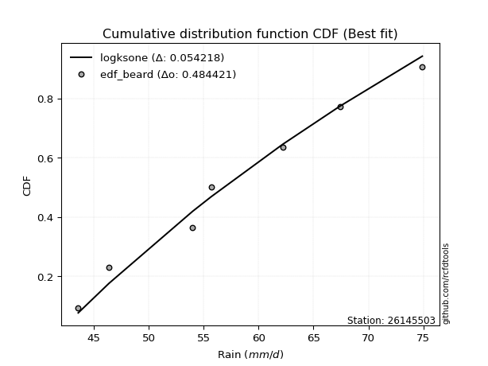</img>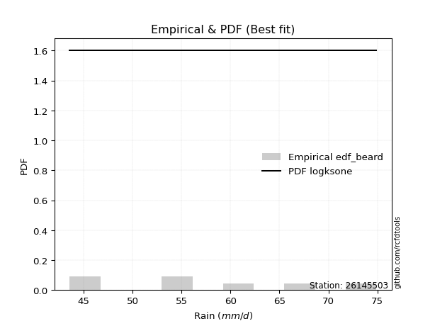</img>

</div>


### 5. EDF Chegodayev (1955)

The Chegodayev formula is an empirical plotting position formula used in hydrological frequency analysis to estimate the exceedance probability or return period of a specific event from a set of observed data. It is primarily used for plotting observed data points on probability paper to fit a theoretical distribution, particularly for analyzing extreme events like maximum flood flows or rainfall intensities. The constant _b_ value in the generalized plotting position formula is 0.3.

<div align="center">


$P=(m-b)/(n+1-2b)$


</div>


**5.1. Empirical values**

<div align="center">

|                | 0                   | 1                   | 2                   | 3              | 4                  | 5                  | 6                  |
|:---------------|:--------------------|:--------------------|:--------------------|:---------------|:-------------------|:-------------------|:-------------------|
| date           | 2017                | 2023                | 2020                | 2022           | 2019               | 2021               | 2018               |
| x              | 43.6                | 46.4                | 54.0                | 55.7           | 62.2               | 67.4               | 74.9               |
| m              | 1                   | 2                   | 3                   | 4              | 5                  | 6                  | 7                  |
| empirical_dist | edf_chegodayev      | edf_chegodayev      | edf_chegodayev      | edf_chegodayev | edf_chegodayev     | edf_chegodayev     | edf_chegodayev     |
| empirical      | 0.09459459459459459 | 0.22972972972972971 | 0.36486486486486486 | 0.5            | 0.6351351351351351 | 0.7702702702702703 | 0.9054054054054054 |
| empirical_tr   | 1.1044776119402986  | 1.2982456140350878  | 1.574468085106383   | 2.0            | 2.7407407407407405 | 4.352941176470589  | 10.571428571428568 |

</div>


**5.2. Kolmogorov-Smirnov fit test (sorted by Δ)**


<div align="center">

|                | 0                   | 1                   | 2                   | 3                   | 4                   | 5                   | 6                   | 7                   | 8                   | 9                   | 10                  | 11                  | 12                  | 13                  | 14                  | 15                  | 16                  | 17                  | 18                  | 19                  | 20                  | 21                  | 22                  | 23                  | 24                  | 25                  | 26                  | 27                  | 28                  | 29                  | 30                  | 31                  | 32                  | 33                  | 34                  | 35                  | 36                  | 37                  | 38                  | 39                  | 40                  | 41                  | 42                  | 43                  | 44                    | 45                  | 46                  | 47                  | 48                  | 49                  | 50                  | 51                  | 52                  | 53                  | 54                  | 55                  | 56                  | 57                  | 58                  | 59                  | 60                  | 61                  | 62                  | 63                  | 64                  | 65                  | 66                  | 67                  | 68                  | 69                  | 70                  | 71                  | 72                  | 73                  | 74                  | 75                  | 76                  | 77                  | 78                  | 79                  | 80                  | 81                  | 82                  | 83                  | 84                  | 85                  | 86                  | 87                  |
|:---------------|:--------------------|:--------------------|:--------------------|:--------------------|:--------------------|:--------------------|:--------------------|:--------------------|:--------------------|:--------------------|:--------------------|:--------------------|:--------------------|:--------------------|:--------------------|:--------------------|:--------------------|:--------------------|:--------------------|:--------------------|:--------------------|:--------------------|:--------------------|:--------------------|:--------------------|:--------------------|:--------------------|:--------------------|:--------------------|:--------------------|:--------------------|:--------------------|:--------------------|:--------------------|:--------------------|:--------------------|:--------------------|:--------------------|:--------------------|:--------------------|:--------------------|:--------------------|:--------------------|:--------------------|:----------------------|:--------------------|:--------------------|:--------------------|:--------------------|:--------------------|:--------------------|:--------------------|:--------------------|:--------------------|:--------------------|:--------------------|:--------------------|:--------------------|:--------------------|:--------------------|:--------------------|:--------------------|:--------------------|:--------------------|:--------------------|:--------------------|:--------------------|:--------------------|:--------------------|:--------------------|:--------------------|:--------------------|:--------------------|:--------------------|:--------------------|:--------------------|:--------------------|:--------------------|:--------------------|:--------------------|:--------------------|:--------------------|:--------------------|:--------------------|:--------------------|:--------------------|:--------------------|:--------------------|
| station        | 26145503            | 26145503            | 26145503            | 26145503            | 26145503            | 26145503            | 26145503            | 26145503            | 26145503            | 26145503            | 26145503            | 26145503            | 26145503            | 26145503            | 26145503            | 26145503            | 26145503            | 26145503            | 26145503            | 26145503            | 26145503            | 26145503            | 26145503            | 26145503            | 26145503            | 26145503            | 26145503            | 26145503            | 26145503            | 26145503            | 26145503            | 26145503            | 26145503            | 26145503            | 26145503            | 26145503            | 26145503            | 26145503            | 26145503            | 26145503            | 26145503            | 26145503            | 26145503            | 26145503            | 26145503              | 26145503            | 26145503            | 26145503            | 26145503            | 26145503            | 26145503            | 26145503            | 26145503            | 26145503            | 26145503            | 26145503            | 26145503            | 26145503            | 26145503            | 26145503            | 26145503            | 26145503            | 26145503            | 26145503            | 26145503            | 26145503            | 26145503            | 26145503            | 26145503            | 26145503            | 26145503            | 26145503            | 26145503            | 26145503            | 26145503            | 26145503            | 26145503            | 26145503            | 26145503            | 26145503            | 26145503            | 26145503            | 26145503            | 26145503            | 26145503            | 26145503            | 26145503            | 26145503            |
| empirical_dist | edf_chegodayev      | edf_chegodayev      | edf_chegodayev      | edf_chegodayev      | edf_chegodayev      | edf_chegodayev      | edf_chegodayev      | edf_chegodayev      | edf_chegodayev      | edf_chegodayev      | edf_chegodayev      | edf_chegodayev      | edf_chegodayev      | edf_chegodayev      | edf_chegodayev      | edf_chegodayev      | edf_chegodayev      | edf_chegodayev      | edf_chegodayev      | edf_chegodayev      | edf_chegodayev      | edf_chegodayev      | edf_chegodayev      | edf_chegodayev      | edf_chegodayev      | edf_chegodayev      | edf_chegodayev      | edf_chegodayev      | edf_chegodayev      | edf_chegodayev      | edf_chegodayev      | edf_chegodayev      | edf_chegodayev      | edf_chegodayev      | edf_chegodayev      | edf_chegodayev      | edf_chegodayev      | edf_chegodayev      | edf_chegodayev      | edf_chegodayev      | edf_chegodayev      | edf_chegodayev      | edf_chegodayev      | edf_chegodayev      | edf_chegodayev        | edf_chegodayev      | edf_chegodayev      | edf_chegodayev      | edf_chegodayev      | edf_chegodayev      | edf_chegodayev      | edf_chegodayev      | edf_chegodayev      | edf_chegodayev      | edf_chegodayev      | edf_chegodayev      | edf_chegodayev      | edf_chegodayev      | edf_chegodayev      | edf_chegodayev      | edf_chegodayev      | edf_chegodayev      | edf_chegodayev      | edf_chegodayev      | edf_chegodayev      | edf_chegodayev      | edf_chegodayev      | edf_chegodayev      | edf_chegodayev      | edf_chegodayev      | edf_chegodayev      | edf_chegodayev      | edf_chegodayev      | edf_chegodayev      | edf_chegodayev      | edf_chegodayev      | edf_chegodayev      | edf_chegodayev      | edf_chegodayev      | edf_chegodayev      | edf_chegodayev      | edf_chegodayev      | edf_chegodayev      | edf_chegodayev      | edf_chegodayev      | edf_chegodayev      | edf_chegodayev      | edf_chegodayev      |
| p_dist         | lognct              | t                   | norm                | crystalball         | exponnorm           | mielke              | maxwell             | loggenlogistic      | pearson3            | fisk                | logfisk             | rayleigh            | erlang              | kstwobign           | logmielke           | genlogistic         | logloggamma         | invweibull          | logf                | f                   | logpearson3         | logjohnsonsu        | logt                | logexponnorm        | lognorm             | lognorm             | logcrystalball      | loggamma            | loggamma            | logerlang           | alpha               | genexpon            | invgauss            | logalpha            | loginvgamma         | betaprime           | invgamma            | johnsonsu           | logfatiguelife      | loginvgauss         | nct                 | logncf              | logweibull_min      | logmaxwell          | loglaplace_asymmetric | logkstwobign        | lograyleigh         | laplace_asymmetric  | loginvweibull       | logistic            | loggenexpon         | logrice             | rice                | loggumbel_l         | loglogistic         | hypsecant           | halfnorm            | gompertz            | loghypsecant        | laplace             | gumbel_r            | loglaplace          | loggompertz         | loghalfnorm         | loggumbel_r         | gumbel_l            | moyal               | expon               | logbetaprime        | logmoyal            | halflogistic        | logexpon            | loghalflogistic     | gamma               | wald                | gibrat              | logwald             | loggibrat           | logtruncnorm        | lognakagami         | logchi2             | truncnorm           | loglognorm          | nakagami            | fatiguelife         | weibull_min         | ncf                 | chi2                |
| delta          | 0.06876102546923102 | 0.09244618084614359 | 0.09245703411211526 | 0.0924570347259423  | 0.09269526450298801 | 0.09360347224954985 | 0.09360984016691387 | 0.09373464661595571 | 0.09460378071070732 | 0.09478568590083458 | 0.09486621553545385 | 0.0952362699161522  | 0.09611830249486394 | 0.09698121139365501 | 0.097587236828234   | 0.09793430316238125 | 0.09800310390086428 | 0.09825629558140439 | 0.09876273115667308 | 0.09882264301495677 | 0.0988404299709918  | 0.09886973468964783 | 0.0988723178643654  | 0.09887384941296615 | 0.09887456275474815 | 0.09887456275474815 | 0.09887458807412602 | 0.0989042932978978  | 0.0989042932978978  | 0.0989125746844147  | 0.09913288359728883 | 0.0993958075202456  | 0.09943952764813244 | 0.09970981882594804 | 0.09976366980187143 | 0.09982963922674917 | 0.09988328771813615 | 0.0999076393292152  | 0.10013293487705621 | 0.1006660534825621  | 0.10079837983611639 | 0.10102618792184292 | 0.10132580678606312 | 0.10164384097037724 | 0.10274216150287996   | 0.1038531604802782  | 0.10417055528891131 | 0.10654963093814619 | 0.10704148415060327 | 0.10860866589811387 | 0.10974577654821976 | 0.10986973378014786 | 0.11343442723341235 | 0.11401787499159555 | 0.1142276767760273  | 0.11652302261888442 | 0.11900667870468126 | 0.11951663968426304 | 0.12158263011809649 | 0.12310016055511167 | 0.12744391937225436 | 0.1274865125605132  | 0.1311185577457598  | 0.13314012627011385 | 0.13611029908354427 | 0.14647476606847937 | 0.15518857563160438 | 0.1557991683296998  | 0.16389184487666453 | 0.1644141710118874  | 0.17564149535056395 | 0.1894355188138271  | 0.19285577892980957 | 0.21769365562486548 | 0.22972972972972971 | 0.22972972972972971 | 0.22972972972972971 | 0.22972972972972971 | 0.2313915875352059  | 0.23889081502425397 | 0.3578128814278355  | 0.36485192095456787 | 0.38410038651825895 | 0.40583217796801857 | 0.4644739442907862  | 0.4934252654575627  | 0.5291913838119253  | 0.6657732959492333  |
| deltao         | 0.48442053926100004 | 0.48442053926100004 | 0.48442053926100004 | 0.48442053926100004 | 0.48442053926100004 | 0.48442053926100004 | 0.48442053926100004 | 0.48442053926100004 | 0.48442053926100004 | 0.48442053926100004 | 0.48442053926100004 | 0.48442053926100004 | 0.48442053926100004 | 0.48442053926100004 | 0.48442053926100004 | 0.48442053926100004 | 0.48442053926100004 | 0.48442053926100004 | 0.48442053926100004 | 0.48442053926100004 | 0.48442053926100004 | 0.48442053926100004 | 0.48442053926100004 | 0.48442053926100004 | 0.48442053926100004 | 0.48442053926100004 | 0.48442053926100004 | 0.48442053926100004 | 0.48442053926100004 | 0.48442053926100004 | 0.48442053926100004 | 0.48442053926100004 | 0.48442053926100004 | 0.48442053926100004 | 0.48442053926100004 | 0.48442053926100004 | 0.48442053926100004 | 0.48442053926100004 | 0.48442053926100004 | 0.48442053926100004 | 0.48442053926100004 | 0.48442053926100004 | 0.48442053926100004 | 0.48442053926100004 | 0.48442053926100004   | 0.48442053926100004 | 0.48442053926100004 | 0.48442053926100004 | 0.48442053926100004 | 0.48442053926100004 | 0.48442053926100004 | 0.48442053926100004 | 0.48442053926100004 | 0.48442053926100004 | 0.48442053926100004 | 0.48442053926100004 | 0.48442053926100004 | 0.48442053926100004 | 0.48442053926100004 | 0.48442053926100004 | 0.48442053926100004 | 0.48442053926100004 | 0.48442053926100004 | 0.48442053926100004 | 0.48442053926100004 | 0.48442053926100004 | 0.48442053926100004 | 0.48442053926100004 | 0.48442053926100004 | 0.48442053926100004 | 0.48442053926100004 | 0.48442053926100004 | 0.48442053926100004 | 0.48442053926100004 | 0.48442053926100004 | 0.48442053926100004 | 0.48442053926100004 | 0.48442053926100004 | 0.48442053926100004 | 0.48442053926100004 | 0.48442053926100004 | 0.48442053926100004 | 0.48442053926100004 | 0.48442053926100004 | 0.48442053926100004 | 0.48442053926100004 | 0.48442053926100004 | 0.48442053926100004 |
| eval           | Δo > Δ              | Δo > Δ              | Δo > Δ              | Δo > Δ              | Δo > Δ              | Δo > Δ              | Δo > Δ              | Δo > Δ              | Δo > Δ              | Δo > Δ              | Δo > Δ              | Δo > Δ              | Δo > Δ              | Δo > Δ              | Δo > Δ              | Δo > Δ              | Δo > Δ              | Δo > Δ              | Δo > Δ              | Δo > Δ              | Δo > Δ              | Δo > Δ              | Δo > Δ              | Δo > Δ              | Δo > Δ              | Δo > Δ              | Δo > Δ              | Δo > Δ              | Δo > Δ              | Δo > Δ              | Δo > Δ              | Δo > Δ              | Δo > Δ              | Δo > Δ              | Δo > Δ              | Δo > Δ              | Δo > Δ              | Δo > Δ              | Δo > Δ              | Δo > Δ              | Δo > Δ              | Δo > Δ              | Δo > Δ              | Δo > Δ              | Δo > Δ                | Δo > Δ              | Δo > Δ              | Δo > Δ              | Δo > Δ              | Δo > Δ              | Δo > Δ              | Δo > Δ              | Δo > Δ              | Δo > Δ              | Δo > Δ              | Δo > Δ              | Δo > Δ              | Δo > Δ              | Δo > Δ              | Δo > Δ              | Δo > Δ              | Δo > Δ              | Δo > Δ              | Δo > Δ              | Δo > Δ              | Δo > Δ              | Δo > Δ              | Δo > Δ              | Δo > Δ              | Δo > Δ              | Δo > Δ              | Δo > Δ              | Δo > Δ              | Δo > Δ              | Δo > Δ              | Δo > Δ              | Δo > Δ              | Δo > Δ              | Δo > Δ              | Δo > Δ              | Δo > Δ              | Δo > Δ              | Δo > Δ              | Δo > Δ              | Δo > Δ              | Δo <= Δ             | Δo <= Δ             | Δo <= Δ             |
| fit            | 1                   | 1                   | 1                   | 1                   | 1                   | 1                   | 1                   | 1                   | 1                   | 1                   | 1                   | 1                   | 1                   | 1                   | 1                   | 1                   | 1                   | 1                   | 1                   | 1                   | 1                   | 1                   | 1                   | 1                   | 1                   | 1                   | 1                   | 1                   | 1                   | 1                   | 1                   | 1                   | 1                   | 1                   | 1                   | 1                   | 1                   | 1                   | 1                   | 1                   | 1                   | 1                   | 1                   | 1                   | 1                     | 1                   | 1                   | 1                   | 1                   | 1                   | 1                   | 1                   | 1                   | 1                   | 1                   | 1                   | 1                   | 1                   | 1                   | 1                   | 1                   | 1                   | 1                   | 1                   | 1                   | 1                   | 1                   | 1                   | 1                   | 1                   | 1                   | 1                   | 1                   | 1                   | 1                   | 1                   | 1                   | 1                   | 1                   | 1                   | 1                   | 1                   | 1                   | 1                   | 1                   | 0                   | 0                   | 0                   |
| n              | 7                   | 7                   | 7                   | 7                   | 7                   | 7                   | 7                   | 7                   | 7                   | 7                   | 7                   | 7                   | 7                   | 7                   | 7                   | 7                   | 7                   | 7                   | 7                   | 7                   | 7                   | 7                   | 7                   | 7                   | 7                   | 7                   | 7                   | 7                   | 7                   | 7                   | 7                   | 7                   | 7                   | 7                   | 7                   | 7                   | 7                   | 7                   | 7                   | 7                   | 7                   | 7                   | 7                   | 7                   | 7                     | 7                   | 7                   | 7                   | 7                   | 7                   | 7                   | 7                   | 7                   | 7                   | 7                   | 7                   | 7                   | 7                   | 7                   | 7                   | 7                   | 7                   | 7                   | 7                   | 7                   | 7                   | 7                   | 7                   | 7                   | 7                   | 7                   | 7                   | 7                   | 7                   | 7                   | 7                   | 7                   | 7                   | 7                   | 7                   | 7                   | 7                   | 7                   | 7                   | 7                   | 7                   | 7                   | 7                   |
| best_fit       | 1                   | 0                   | 0                   | 0                   | 0                   | 0                   | 0                   | 0                   | 0                   | 0                   | 0                   | 0                   | 0                   | 0                   | 0                   | 0                   | 0                   | 0                   | 0                   | 0                   | 0                   | 0                   | 0                   | 0                   | 0                   | 0                   | 0                   | 0                   | 0                   | 0                   | 0                   | 0                   | 0                   | 0                   | 0                   | 0                   | 0                   | 0                   | 0                   | 0                   | 0                   | 0                   | 0                   | 0                   | 0                     | 0                   | 0                   | 0                   | 0                   | 0                   | 0                   | 0                   | 0                   | 0                   | 0                   | 0                   | 0                   | 0                   | 0                   | 0                   | 0                   | 0                   | 0                   | 0                   | 0                   | 0                   | 0                   | 0                   | 0                   | 0                   | 0                   | 0                   | 0                   | 0                   | 0                   | 0                   | 0                   | 0                   | 0                   | 0                   | 0                   | 0                   | 0                   | 0                   | 0                   | 0                   | 0                   | 0                   |
| best_fit_sort  | 1                   | 2                   | 3                   | 4                   | 5                   | 6                   | 7                   | 8                   | 9                   | 10                  | 11                  | 12                  | 13                  | 14                  | 15                  | 16                  | 17                  | 18                  | 19                  | 20                  | 21                  | 22                  | 23                  | 24                  | 25                  | 26                  | 27                  | 28                  | 29                  | 30                  | 31                  | 32                  | 33                  | 34                  | 35                  | 36                  | 37                  | 38                  | 39                  | 40                  | 41                  | 42                  | 43                  | 44                  | 45                    | 46                  | 47                  | 48                  | 49                  | 50                  | 51                  | 52                  | 53                  | 54                  | 55                  | 56                  | 57                  | 58                  | 59                  | 60                  | 61                  | 62                  | 63                  | 64                  | 65                  | 66                  | 67                  | 68                  | 69                  | 70                  | 71                  | 72                  | 73                  | 74                  | 75                  | 76                  | 77                  | 78                  | 79                  | 80                  | 81                  | 82                  | 83                  | 84                  | 85                  | 86                  | 87                  | 88                  |

</div>


**5.3. Best fit**

<div align="center">

|   id |   station | empirical_dist   | p_dist   |    delta |   deltao | eval   |   fit |   n |   best_fit |   best_fit_sort |
|-----:|----------:|:-----------------|:---------|---------:|---------:|:-------|------:|----:|-----------:|----------------:|
|    0 |  26145503 | edf_chegodayev   | lognct   | 0.068761 | 0.484421 | Δo > Δ |     1 |   7 |          1 |               1 |

</div>


<div align="center">

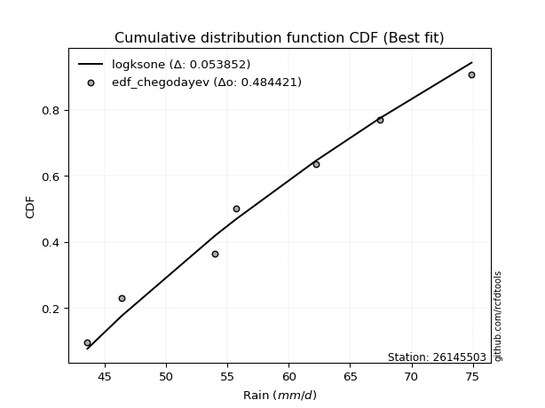</img>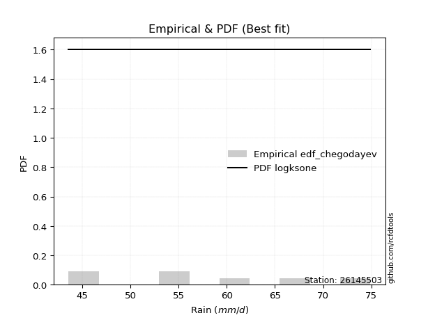</img>

</div>


### 6. EDF Blom (1958)

The Blom formula is a specific "plotting position" formula used in hydrology and statistical analysis to estimate the empirical cumulative probability (or non-exceedance probability) of a data series. It is particularly recommended for data that are approximately normally distributed. The constant _a_ is set to 0.375 (or 3/8).

<div align="center">


$P=(m-a)/(n+1-2a)$


</div>


**6.1. Empirical values**

<div align="center">

|                | 0                   | 1                   | 2                  | 3        | 4                  | 5                  | 6                  |
|:---------------|:--------------------|:--------------------|:-------------------|:---------|:-------------------|:-------------------|:-------------------|
| date           | 2017                | 2023                | 2020               | 2022     | 2019               | 2021               | 2018               |
| x              | 43.6                | 46.4                | 54.0               | 55.7     | 62.2               | 67.4               | 74.9               |
| m              | 1                   | 2                   | 3                  | 4        | 5                  | 6                  | 7                  |
| empirical_dist | edf_blom            | edf_blom            | edf_blom           | edf_blom | edf_blom           | edf_blom           | edf_blom           |
| empirical      | 0.08620689655172414 | 0.22413793103448276 | 0.3620689655172414 | 0.5      | 0.6379310344827587 | 0.7758620689655172 | 0.9137931034482759 |
| empirical_tr   | 1.0943396226415094  | 1.288888888888889   | 1.5675675675675675 | 2.0      | 2.7619047619047623 | 4.461538461538462  | 11.600000000000007 |

</div>


**6.2. Kolmogorov-Smirnov fit test (sorted by Δ)**


<div align="center">

|                | 0                   | 1                   | 2                   | 3                   | 4                   | 5                   | 6                   | 7                   | 8                   | 9                   | 10                  | 11                  | 12                  | 13                  | 14                  | 15                  | 16                  | 17                  | 18                  | 19                  | 20                  | 21                  | 22                  | 23                  | 24                  | 25                  | 26                  | 27                  | 28                  | 29                  | 30                  | 31                  | 32                  | 33                  | 34                  | 35                  | 36                  | 37                  | 38                  | 39                  | 40                  | 41                  | 42                  | 43                    | 44                  | 45                  | 46                  | 47                  | 48                  | 49                  | 50                  | 51                  | 52                  | 53                  | 54                  | 55                  | 56                  | 57                  | 58                  | 59                  | 60                  | 61                  | 62                  | 63                  | 64                  | 65                  | 66                  | 67                  | 68                  | 69                  | 70                  | 71                  | 72                  | 73                  | 74                  | 75                  | 76                  | 77                  | 78                  | 79                  | 80                  | 81                  | 82                  | 83                  | 84                  | 85                  | 86                  | 87                  |
|:---------------|:--------------------|:--------------------|:--------------------|:--------------------|:--------------------|:--------------------|:--------------------|:--------------------|:--------------------|:--------------------|:--------------------|:--------------------|:--------------------|:--------------------|:--------------------|:--------------------|:--------------------|:--------------------|:--------------------|:--------------------|:--------------------|:--------------------|:--------------------|:--------------------|:--------------------|:--------------------|:--------------------|:--------------------|:--------------------|:--------------------|:--------------------|:--------------------|:--------------------|:--------------------|:--------------------|:--------------------|:--------------------|:--------------------|:--------------------|:--------------------|:--------------------|:--------------------|:--------------------|:----------------------|:--------------------|:--------------------|:--------------------|:--------------------|:--------------------|:--------------------|:--------------------|:--------------------|:--------------------|:--------------------|:--------------------|:--------------------|:--------------------|:--------------------|:--------------------|:--------------------|:--------------------|:--------------------|:--------------------|:--------------------|:--------------------|:--------------------|:--------------------|:--------------------|:--------------------|:--------------------|:--------------------|:--------------------|:--------------------|:--------------------|:--------------------|:--------------------|:--------------------|:--------------------|:--------------------|:--------------------|:--------------------|:--------------------|:--------------------|:--------------------|:--------------------|:--------------------|:--------------------|:--------------------|
| station        | 26145503            | 26145503            | 26145503            | 26145503            | 26145503            | 26145503            | 26145503            | 26145503            | 26145503            | 26145503            | 26145503            | 26145503            | 26145503            | 26145503            | 26145503            | 26145503            | 26145503            | 26145503            | 26145503            | 26145503            | 26145503            | 26145503            | 26145503            | 26145503            | 26145503            | 26145503            | 26145503            | 26145503            | 26145503            | 26145503            | 26145503            | 26145503            | 26145503            | 26145503            | 26145503            | 26145503            | 26145503            | 26145503            | 26145503            | 26145503            | 26145503            | 26145503            | 26145503            | 26145503              | 26145503            | 26145503            | 26145503            | 26145503            | 26145503            | 26145503            | 26145503            | 26145503            | 26145503            | 26145503            | 26145503            | 26145503            | 26145503            | 26145503            | 26145503            | 26145503            | 26145503            | 26145503            | 26145503            | 26145503            | 26145503            | 26145503            | 26145503            | 26145503            | 26145503            | 26145503            | 26145503            | 26145503            | 26145503            | 26145503            | 26145503            | 26145503            | 26145503            | 26145503            | 26145503            | 26145503            | 26145503            | 26145503            | 26145503            | 26145503            | 26145503            | 26145503            | 26145503            | 26145503            |
| empirical_dist | edf_blom            | edf_blom            | edf_blom            | edf_blom            | edf_blom            | edf_blom            | edf_blom            | edf_blom            | edf_blom            | edf_blom            | edf_blom            | edf_blom            | edf_blom            | edf_blom            | edf_blom            | edf_blom            | edf_blom            | edf_blom            | edf_blom            | edf_blom            | edf_blom            | edf_blom            | edf_blom            | edf_blom            | edf_blom            | edf_blom            | edf_blom            | edf_blom            | edf_blom            | edf_blom            | edf_blom            | edf_blom            | edf_blom            | edf_blom            | edf_blom            | edf_blom            | edf_blom            | edf_blom            | edf_blom            | edf_blom            | edf_blom            | edf_blom            | edf_blom            | edf_blom              | edf_blom            | edf_blom            | edf_blom            | edf_blom            | edf_blom            | edf_blom            | edf_blom            | edf_blom            | edf_blom            | edf_blom            | edf_blom            | edf_blom            | edf_blom            | edf_blom            | edf_blom            | edf_blom            | edf_blom            | edf_blom            | edf_blom            | edf_blom            | edf_blom            | edf_blom            | edf_blom            | edf_blom            | edf_blom            | edf_blom            | edf_blom            | edf_blom            | edf_blom            | edf_blom            | edf_blom            | edf_blom            | edf_blom            | edf_blom            | edf_blom            | edf_blom            | edf_blom            | edf_blom            | edf_blom            | edf_blom            | edf_blom            | edf_blom            | edf_blom            | edf_blom            |
| p_dist         | lognct              | t                   | norm                | crystalball         | exponnorm           | maxwell             | pearson3            | fisk                | logfisk             | rayleigh            | erlang              | kstwobign           | genlogistic         | logloggamma         | invweibull          | loggenlogistic      | logf                | mielke              | f                   | logpearson3         | logjohnsonsu        | logt                | logexponnorm        | lognorm             | lognorm             | logcrystalball      | loggamma            | loggamma            | logerlang           | alpha               | genexpon            | invgauss            | logalpha            | loginvgamma         | betaprime           | invgamma            | johnsonsu           | logfatiguelife      | loginvgauss         | nct                 | logncf              | logweibull_min      | logmaxwell          | loglaplace_asymmetric | lograyleigh         | logmielke           | laplace_asymmetric  | logistic            | logrice             | logkstwobign        | rice                | loglogistic         | loginvweibull       | hypsecant           | loggenexpon         | halfnorm            | gompertz            | loggumbel_l         | loghypsecant        | laplace             | gumbel_r            | loglaplace          | loghalfnorm         | loggumbel_r         | loggompertz         | gumbel_l            | moyal               | expon               | logmoyal            | halflogistic        | logbetaprime        | loghalflogistic     | logexpon            | gamma               | wald                | gibrat              | logwald             | loggibrat           | logtruncnorm        | lognakagami         | truncnorm           | logchi2             | loglognorm          | nakagami            | fatiguelife         | weibull_min         | ncf                 | chi2                |
| delta          | 0.0715569248168545  | 0.08685438215089664 | 0.0868652354168683  | 0.08686523603069535 | 0.08710346580774106 | 0.08801804147166692 | 0.08901198201546037 | 0.08919388720558763 | 0.0892744168402069  | 0.08964447122090524 | 0.09052650379961699 | 0.09138941269840806 | 0.0923425044671343  | 0.09241130520561733 | 0.09266449688615744 | 0.09276811519818207 | 0.09317093246142613 | 0.09320122440184392 | 0.09323084431970982 | 0.09324863127574484 | 0.09327793599440087 | 0.09328051916911845 | 0.0932820507177192  | 0.0932827640595012  | 0.0932827640595012  | 0.09328278937887907 | 0.09331249460265084 | 0.09331249460265084 | 0.09332077598916774 | 0.09354108490204188 | 0.09380400882499865 | 0.09384772895288548 | 0.09411802013070109 | 0.09417187110662448 | 0.09423784053150222 | 0.0942914890228892  | 0.09431584063396825 | 0.09454113618180926 | 0.09507425478731515 | 0.09520658114086944 | 0.09543438922659597 | 0.09573400809081617 | 0.09605204227513028 | 0.097150362807633     | 0.09857875659366436 | 0.10038313617585748 | 0.10095783224289924 | 0.10301686720286692 | 0.10427793508490091 | 0.10664905982790168 | 0.1078426285381654  | 0.10863587808078035 | 0.10983738349822675 | 0.11093122392363747 | 0.11254167589584324 | 0.11341488000943431 | 0.11392484098901609 | 0.11401787499159555 | 0.11599083142284954 | 0.12146524082945237 | 0.12185212067700742 | 0.12189471386526624 | 0.1275483275748669  | 0.13051850038829732 | 0.1339144570933833  | 0.14647476606847937 | 0.14959677693635742 | 0.1585950676773233  | 0.15882237231664045 | 0.170049696655317   | 0.17227954291953507 | 0.18726398023456262 | 0.19223141816145056 | 0.22048955497248895 | 0.22413793103448276 | 0.22413793103448276 | 0.22413793103448276 | 0.22413793103448276 | 0.23418748688282937 | 0.24168671437187744 | 0.3620560216069444  | 0.36620057947070606 | 0.3896921852135059  | 0.40862807731564205 | 0.4672698436384097  | 0.49901706415280966 | 0.5375790818547959  | 0.6713650946444802  |
| deltao         | 0.48442053926100004 | 0.48442053926100004 | 0.48442053926100004 | 0.48442053926100004 | 0.48442053926100004 | 0.48442053926100004 | 0.48442053926100004 | 0.48442053926100004 | 0.48442053926100004 | 0.48442053926100004 | 0.48442053926100004 | 0.48442053926100004 | 0.48442053926100004 | 0.48442053926100004 | 0.48442053926100004 | 0.48442053926100004 | 0.48442053926100004 | 0.48442053926100004 | 0.48442053926100004 | 0.48442053926100004 | 0.48442053926100004 | 0.48442053926100004 | 0.48442053926100004 | 0.48442053926100004 | 0.48442053926100004 | 0.48442053926100004 | 0.48442053926100004 | 0.48442053926100004 | 0.48442053926100004 | 0.48442053926100004 | 0.48442053926100004 | 0.48442053926100004 | 0.48442053926100004 | 0.48442053926100004 | 0.48442053926100004 | 0.48442053926100004 | 0.48442053926100004 | 0.48442053926100004 | 0.48442053926100004 | 0.48442053926100004 | 0.48442053926100004 | 0.48442053926100004 | 0.48442053926100004 | 0.48442053926100004   | 0.48442053926100004 | 0.48442053926100004 | 0.48442053926100004 | 0.48442053926100004 | 0.48442053926100004 | 0.48442053926100004 | 0.48442053926100004 | 0.48442053926100004 | 0.48442053926100004 | 0.48442053926100004 | 0.48442053926100004 | 0.48442053926100004 | 0.48442053926100004 | 0.48442053926100004 | 0.48442053926100004 | 0.48442053926100004 | 0.48442053926100004 | 0.48442053926100004 | 0.48442053926100004 | 0.48442053926100004 | 0.48442053926100004 | 0.48442053926100004 | 0.48442053926100004 | 0.48442053926100004 | 0.48442053926100004 | 0.48442053926100004 | 0.48442053926100004 | 0.48442053926100004 | 0.48442053926100004 | 0.48442053926100004 | 0.48442053926100004 | 0.48442053926100004 | 0.48442053926100004 | 0.48442053926100004 | 0.48442053926100004 | 0.48442053926100004 | 0.48442053926100004 | 0.48442053926100004 | 0.48442053926100004 | 0.48442053926100004 | 0.48442053926100004 | 0.48442053926100004 | 0.48442053926100004 | 0.48442053926100004 |
| eval           | Δo > Δ              | Δo > Δ              | Δo > Δ              | Δo > Δ              | Δo > Δ              | Δo > Δ              | Δo > Δ              | Δo > Δ              | Δo > Δ              | Δo > Δ              | Δo > Δ              | Δo > Δ              | Δo > Δ              | Δo > Δ              | Δo > Δ              | Δo > Δ              | Δo > Δ              | Δo > Δ              | Δo > Δ              | Δo > Δ              | Δo > Δ              | Δo > Δ              | Δo > Δ              | Δo > Δ              | Δo > Δ              | Δo > Δ              | Δo > Δ              | Δo > Δ              | Δo > Δ              | Δo > Δ              | Δo > Δ              | Δo > Δ              | Δo > Δ              | Δo > Δ              | Δo > Δ              | Δo > Δ              | Δo > Δ              | Δo > Δ              | Δo > Δ              | Δo > Δ              | Δo > Δ              | Δo > Δ              | Δo > Δ              | Δo > Δ                | Δo > Δ              | Δo > Δ              | Δo > Δ              | Δo > Δ              | Δo > Δ              | Δo > Δ              | Δo > Δ              | Δo > Δ              | Δo > Δ              | Δo > Δ              | Δo > Δ              | Δo > Δ              | Δo > Δ              | Δo > Δ              | Δo > Δ              | Δo > Δ              | Δo > Δ              | Δo > Δ              | Δo > Δ              | Δo > Δ              | Δo > Δ              | Δo > Δ              | Δo > Δ              | Δo > Δ              | Δo > Δ              | Δo > Δ              | Δo > Δ              | Δo > Δ              | Δo > Δ              | Δo > Δ              | Δo > Δ              | Δo > Δ              | Δo > Δ              | Δo > Δ              | Δo > Δ              | Δo > Δ              | Δo > Δ              | Δo > Δ              | Δo > Δ              | Δo > Δ              | Δo > Δ              | Δo <= Δ             | Δo <= Δ             | Δo <= Δ             |
| fit            | 1                   | 1                   | 1                   | 1                   | 1                   | 1                   | 1                   | 1                   | 1                   | 1                   | 1                   | 1                   | 1                   | 1                   | 1                   | 1                   | 1                   | 1                   | 1                   | 1                   | 1                   | 1                   | 1                   | 1                   | 1                   | 1                   | 1                   | 1                   | 1                   | 1                   | 1                   | 1                   | 1                   | 1                   | 1                   | 1                   | 1                   | 1                   | 1                   | 1                   | 1                   | 1                   | 1                   | 1                     | 1                   | 1                   | 1                   | 1                   | 1                   | 1                   | 1                   | 1                   | 1                   | 1                   | 1                   | 1                   | 1                   | 1                   | 1                   | 1                   | 1                   | 1                   | 1                   | 1                   | 1                   | 1                   | 1                   | 1                   | 1                   | 1                   | 1                   | 1                   | 1                   | 1                   | 1                   | 1                   | 1                   | 1                   | 1                   | 1                   | 1                   | 1                   | 1                   | 1                   | 1                   | 0                   | 0                   | 0                   |
| n              | 7                   | 7                   | 7                   | 7                   | 7                   | 7                   | 7                   | 7                   | 7                   | 7                   | 7                   | 7                   | 7                   | 7                   | 7                   | 7                   | 7                   | 7                   | 7                   | 7                   | 7                   | 7                   | 7                   | 7                   | 7                   | 7                   | 7                   | 7                   | 7                   | 7                   | 7                   | 7                   | 7                   | 7                   | 7                   | 7                   | 7                   | 7                   | 7                   | 7                   | 7                   | 7                   | 7                   | 7                     | 7                   | 7                   | 7                   | 7                   | 7                   | 7                   | 7                   | 7                   | 7                   | 7                   | 7                   | 7                   | 7                   | 7                   | 7                   | 7                   | 7                   | 7                   | 7                   | 7                   | 7                   | 7                   | 7                   | 7                   | 7                   | 7                   | 7                   | 7                   | 7                   | 7                   | 7                   | 7                   | 7                   | 7                   | 7                   | 7                   | 7                   | 7                   | 7                   | 7                   | 7                   | 7                   | 7                   | 7                   |
| best_fit       | 1                   | 0                   | 0                   | 0                   | 0                   | 0                   | 0                   | 0                   | 0                   | 0                   | 0                   | 0                   | 0                   | 0                   | 0                   | 0                   | 0                   | 0                   | 0                   | 0                   | 0                   | 0                   | 0                   | 0                   | 0                   | 0                   | 0                   | 0                   | 0                   | 0                   | 0                   | 0                   | 0                   | 0                   | 0                   | 0                   | 0                   | 0                   | 0                   | 0                   | 0                   | 0                   | 0                   | 0                     | 0                   | 0                   | 0                   | 0                   | 0                   | 0                   | 0                   | 0                   | 0                   | 0                   | 0                   | 0                   | 0                   | 0                   | 0                   | 0                   | 0                   | 0                   | 0                   | 0                   | 0                   | 0                   | 0                   | 0                   | 0                   | 0                   | 0                   | 0                   | 0                   | 0                   | 0                   | 0                   | 0                   | 0                   | 0                   | 0                   | 0                   | 0                   | 0                   | 0                   | 0                   | 0                   | 0                   | 0                   |
| best_fit_sort  | 1                   | 2                   | 3                   | 4                   | 5                   | 6                   | 7                   | 8                   | 9                   | 10                  | 11                  | 12                  | 13                  | 14                  | 15                  | 16                  | 17                  | 18                  | 19                  | 20                  | 21                  | 22                  | 23                  | 24                  | 25                  | 26                  | 27                  | 28                  | 29                  | 30                  | 31                  | 32                  | 33                  | 34                  | 35                  | 36                  | 37                  | 38                  | 39                  | 40                  | 41                  | 42                  | 43                  | 44                    | 45                  | 46                  | 47                  | 48                  | 49                  | 50                  | 51                  | 52                  | 53                  | 54                  | 55                  | 56                  | 57                  | 58                  | 59                  | 60                  | 61                  | 62                  | 63                  | 64                  | 65                  | 66                  | 67                  | 68                  | 69                  | 70                  | 71                  | 72                  | 73                  | 74                  | 75                  | 76                  | 77                  | 78                  | 79                  | 80                  | 81                  | 82                  | 83                  | 84                  | 85                  | 86                  | 87                  | 88                  |

</div>


**6.3. Best fit**

<div align="center">

|   id |   station | empirical_dist   | p_dist   |     delta |   deltao | eval   |   fit |   n |   best_fit |   best_fit_sort |
|-----:|----------:|:-----------------|:---------|----------:|---------:|:-------|------:|----:|-----------:|----------------:|
|    0 |  26145503 | edf_blom         | lognct   | 0.0715569 | 0.484421 | Δo > Δ |     1 |   7 |          1 |               1 |

</div>


<div align="center">

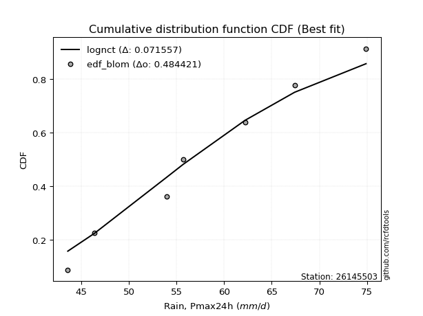</img></img>

</div>


### 7. EDF Tukey (1962)

In hydrology, the Tukey formula is used as a plotting position formula to estimate the empirical probability or frequency of a flood event (or other hydrological data). The formula parameter is given as _c=0.333_ (or 1/3).

<div align="center">


$P=(m-c)/(n+1-2c)$


</div>


**7.1. Empirical values**

<div align="center">

|                | 0                   | 1                   | 2                   | 3         | 4                  | 5                  | 6                  |
|:---------------|:--------------------|:--------------------|:--------------------|:----------|:-------------------|:-------------------|:-------------------|
| date           | 2017                | 2023                | 2020                | 2022      | 2019               | 2021               | 2018               |
| x              | 43.6                | 46.4                | 54.0                | 55.7      | 62.2               | 67.4               | 74.9               |
| m              | 1                   | 2                   | 3                   | 4         | 5                  | 6                  | 7                  |
| empirical_dist | edf_tukey           | edf_tukey           | edf_tukey           | edf_tukey | edf_tukey          | edf_tukey          | edf_tukey          |
| empirical      | 0.09090909090909091 | 0.22727272727272727 | 0.36363636363636365 | 0.5       | 0.6363636363636364 | 0.7727272727272727 | 0.9090909090909091 |
| empirical_tr   | 1.1                 | 1.2941176470588236  | 1.5714285714285714  | 2.0       | 2.75               | 4.3999999999999995 | 10.999999999999996 |

</div>


**7.2. Kolmogorov-Smirnov fit test (sorted by Δ)**


<div align="center">

|                | 0                   | 1                   | 2                   | 3                   | 4                   | 5                   | 6                   | 7                   | 8                   | 9                   | 10                  | 11                  | 12                  | 13                  | 14                  | 15                  | 16                  | 17                  | 18                  | 19                  | 20                  | 21                  | 22                  | 23                  | 24                  | 25                  | 26                  | 27                  | 28                  | 29                  | 30                  | 31                  | 32                  | 33                  | 34                  | 35                  | 36                  | 37                  | 38                  | 39                  | 40                  | 41                  | 42                  | 43                  | 44                    | 45                  | 46                  | 47                  | 48                  | 49                  | 50                  | 51                  | 52                  | 53                  | 54                  | 55                  | 56                  | 57                  | 58                  | 59                  | 60                  | 61                  | 62                  | 63                  | 64                  | 65                  | 66                  | 67                  | 68                  | 69                  | 70                  | 71                  | 72                  | 73                  | 74                  | 75                  | 76                  | 77                  | 78                  | 79                  | 80                  | 81                  | 82                  | 83                  | 84                  | 85                  | 86                  | 87                  |
|:---------------|:--------------------|:--------------------|:--------------------|:--------------------|:--------------------|:--------------------|:--------------------|:--------------------|:--------------------|:--------------------|:--------------------|:--------------------|:--------------------|:--------------------|:--------------------|:--------------------|:--------------------|:--------------------|:--------------------|:--------------------|:--------------------|:--------------------|:--------------------|:--------------------|:--------------------|:--------------------|:--------------------|:--------------------|:--------------------|:--------------------|:--------------------|:--------------------|:--------------------|:--------------------|:--------------------|:--------------------|:--------------------|:--------------------|:--------------------|:--------------------|:--------------------|:--------------------|:--------------------|:--------------------|:----------------------|:--------------------|:--------------------|:--------------------|:--------------------|:--------------------|:--------------------|:--------------------|:--------------------|:--------------------|:--------------------|:--------------------|:--------------------|:--------------------|:--------------------|:--------------------|:--------------------|:--------------------|:--------------------|:--------------------|:--------------------|:--------------------|:--------------------|:--------------------|:--------------------|:--------------------|:--------------------|:--------------------|:--------------------|:--------------------|:--------------------|:--------------------|:--------------------|:--------------------|:--------------------|:--------------------|:--------------------|:--------------------|:--------------------|:--------------------|:--------------------|:--------------------|:--------------------|:--------------------|
| station        | 26145503            | 26145503            | 26145503            | 26145503            | 26145503            | 26145503            | 26145503            | 26145503            | 26145503            | 26145503            | 26145503            | 26145503            | 26145503            | 26145503            | 26145503            | 26145503            | 26145503            | 26145503            | 26145503            | 26145503            | 26145503            | 26145503            | 26145503            | 26145503            | 26145503            | 26145503            | 26145503            | 26145503            | 26145503            | 26145503            | 26145503            | 26145503            | 26145503            | 26145503            | 26145503            | 26145503            | 26145503            | 26145503            | 26145503            | 26145503            | 26145503            | 26145503            | 26145503            | 26145503            | 26145503              | 26145503            | 26145503            | 26145503            | 26145503            | 26145503            | 26145503            | 26145503            | 26145503            | 26145503            | 26145503            | 26145503            | 26145503            | 26145503            | 26145503            | 26145503            | 26145503            | 26145503            | 26145503            | 26145503            | 26145503            | 26145503            | 26145503            | 26145503            | 26145503            | 26145503            | 26145503            | 26145503            | 26145503            | 26145503            | 26145503            | 26145503            | 26145503            | 26145503            | 26145503            | 26145503            | 26145503            | 26145503            | 26145503            | 26145503            | 26145503            | 26145503            | 26145503            | 26145503            |
| empirical_dist | edf_tukey           | edf_tukey           | edf_tukey           | edf_tukey           | edf_tukey           | edf_tukey           | edf_tukey           | edf_tukey           | edf_tukey           | edf_tukey           | edf_tukey           | edf_tukey           | edf_tukey           | edf_tukey           | edf_tukey           | edf_tukey           | edf_tukey           | edf_tukey           | edf_tukey           | edf_tukey           | edf_tukey           | edf_tukey           | edf_tukey           | edf_tukey           | edf_tukey           | edf_tukey           | edf_tukey           | edf_tukey           | edf_tukey           | edf_tukey           | edf_tukey           | edf_tukey           | edf_tukey           | edf_tukey           | edf_tukey           | edf_tukey           | edf_tukey           | edf_tukey           | edf_tukey           | edf_tukey           | edf_tukey           | edf_tukey           | edf_tukey           | edf_tukey           | edf_tukey             | edf_tukey           | edf_tukey           | edf_tukey           | edf_tukey           | edf_tukey           | edf_tukey           | edf_tukey           | edf_tukey           | edf_tukey           | edf_tukey           | edf_tukey           | edf_tukey           | edf_tukey           | edf_tukey           | edf_tukey           | edf_tukey           | edf_tukey           | edf_tukey           | edf_tukey           | edf_tukey           | edf_tukey           | edf_tukey           | edf_tukey           | edf_tukey           | edf_tukey           | edf_tukey           | edf_tukey           | edf_tukey           | edf_tukey           | edf_tukey           | edf_tukey           | edf_tukey           | edf_tukey           | edf_tukey           | edf_tukey           | edf_tukey           | edf_tukey           | edf_tukey           | edf_tukey           | edf_tukey           | edf_tukey           | edf_tukey           | edf_tukey           |
| p_dist         | lognct              | t                   | norm                | crystalball         | exponnorm           | maxwell             | loggenlogistic      | mielke              | pearson3            | fisk                | logfisk             | rayleigh            | erlang              | kstwobign           | genlogistic         | logloggamma         | invweibull          | logf                | f                   | logpearson3         | logjohnsonsu        | logt                | logexponnorm        | lognorm             | lognorm             | logcrystalball      | loggamma            | loggamma            | logerlang           | alpha               | genexpon            | invgauss            | logalpha            | loginvgamma         | betaprime           | invgamma            | johnsonsu           | logfatiguelife      | loginvgauss         | nct                 | logncf              | logmielke           | logweibull_min      | logmaxwell          | loglaplace_asymmetric | lograyleigh         | laplace_asymmetric  | logkstwobign        | logistic            | logrice             | loginvweibull       | loggenexpon         | rice                | loglogistic         | loggumbel_l         | hypsecant           | halfnorm            | gompertz            | loghypsecant        | laplace             | gumbel_r            | loglaplace          | loghalfnorm         | loggompertz         | loggumbel_r         | gumbel_l            | moyal               | expon               | logmoyal            | logbetaprime        | halflogistic        | loghalflogistic     | logexpon            | gamma               | wald                | gibrat              | logwald             | loggibrat           | logtruncnorm        | lognakagami         | logchi2             | truncnorm           | loglognorm          | nakagami            | fatiguelife         | weibull_min         | ncf                 | chi2                |
| delta          | 0.06998952669773223 | 0.08998917838914114 | 0.0900000316551128  | 0.09000003226893985 | 0.09023826204598556 | 0.09115283770991142 | 0.09127764415895326 | 0.09163382628272165 | 0.09214677825370488 | 0.09232868344383213 | 0.0924092130784514  | 0.09277926745914974 | 0.0936613000378615  | 0.09452420893665256 | 0.0954773007053788  | 0.09554610144386183 | 0.09579929312440194 | 0.09630572869967063 | 0.09636564055795432 | 0.09638342751398934 | 0.09641273223264538 | 0.09641531540736295 | 0.0964168469559637  | 0.0964175602977457  | 0.0964175602977457  | 0.09641758561712357 | 0.09644729084089534 | 0.09644729084089534 | 0.09645557222741225 | 0.09667588114028638 | 0.09693880506324315 | 0.09698252519112999 | 0.09725281636894559 | 0.09730666734486898 | 0.09737263676974672 | 0.0974262852611337  | 0.09745063687221275 | 0.09767593242005376 | 0.09820905102555966 | 0.09834137737911394 | 0.09856918546484048 | 0.09881573805673521 | 0.09886880432906067 | 0.09918683851337479 | 0.10028515904587751   | 0.10171355283190886 | 0.10409262848114374 | 0.10508166170877942 | 0.10615166344111142 | 0.10741273132314541 | 0.10826998537910448 | 0.11097427777672098 | 0.1109774247764099  | 0.11177067431902485 | 0.11401787499159555 | 0.11406602016188197 | 0.11654967624767881 | 0.1170596372272606  | 0.11912562766109404 | 0.12146524082945237 | 0.12498691691525192 | 0.12502951010351074 | 0.1306831238131114  | 0.13234705897426102 | 0.13365329662654185 | 0.14647476606847937 | 0.15273157317460195 | 0.15702766955820102 | 0.16195716855488496 | 0.16757734856216822 | 0.17318449289356153 | 0.19039877647280712 | 0.1906640200423283  | 0.2189221568533667  | 0.22727272727272727 | 0.22727272727272727 | 0.22727272727272727 | 0.22727272727272727 | 0.2326200887637071  | 0.24011931625275518 | 0.3614983851133392  | 0.36362341972606665 | 0.3865573889752614  | 0.4070606791965198  | 0.4657024455192874  | 0.49588226791456513 | 0.532876887497429   | 0.6682302984062357  |
| deltao         | 0.48442053926100004 | 0.48442053926100004 | 0.48442053926100004 | 0.48442053926100004 | 0.48442053926100004 | 0.48442053926100004 | 0.48442053926100004 | 0.48442053926100004 | 0.48442053926100004 | 0.48442053926100004 | 0.48442053926100004 | 0.48442053926100004 | 0.48442053926100004 | 0.48442053926100004 | 0.48442053926100004 | 0.48442053926100004 | 0.48442053926100004 | 0.48442053926100004 | 0.48442053926100004 | 0.48442053926100004 | 0.48442053926100004 | 0.48442053926100004 | 0.48442053926100004 | 0.48442053926100004 | 0.48442053926100004 | 0.48442053926100004 | 0.48442053926100004 | 0.48442053926100004 | 0.48442053926100004 | 0.48442053926100004 | 0.48442053926100004 | 0.48442053926100004 | 0.48442053926100004 | 0.48442053926100004 | 0.48442053926100004 | 0.48442053926100004 | 0.48442053926100004 | 0.48442053926100004 | 0.48442053926100004 | 0.48442053926100004 | 0.48442053926100004 | 0.48442053926100004 | 0.48442053926100004 | 0.48442053926100004 | 0.48442053926100004   | 0.48442053926100004 | 0.48442053926100004 | 0.48442053926100004 | 0.48442053926100004 | 0.48442053926100004 | 0.48442053926100004 | 0.48442053926100004 | 0.48442053926100004 | 0.48442053926100004 | 0.48442053926100004 | 0.48442053926100004 | 0.48442053926100004 | 0.48442053926100004 | 0.48442053926100004 | 0.48442053926100004 | 0.48442053926100004 | 0.48442053926100004 | 0.48442053926100004 | 0.48442053926100004 | 0.48442053926100004 | 0.48442053926100004 | 0.48442053926100004 | 0.48442053926100004 | 0.48442053926100004 | 0.48442053926100004 | 0.48442053926100004 | 0.48442053926100004 | 0.48442053926100004 | 0.48442053926100004 | 0.48442053926100004 | 0.48442053926100004 | 0.48442053926100004 | 0.48442053926100004 | 0.48442053926100004 | 0.48442053926100004 | 0.48442053926100004 | 0.48442053926100004 | 0.48442053926100004 | 0.48442053926100004 | 0.48442053926100004 | 0.48442053926100004 | 0.48442053926100004 | 0.48442053926100004 |
| eval           | Δo > Δ              | Δo > Δ              | Δo > Δ              | Δo > Δ              | Δo > Δ              | Δo > Δ              | Δo > Δ              | Δo > Δ              | Δo > Δ              | Δo > Δ              | Δo > Δ              | Δo > Δ              | Δo > Δ              | Δo > Δ              | Δo > Δ              | Δo > Δ              | Δo > Δ              | Δo > Δ              | Δo > Δ              | Δo > Δ              | Δo > Δ              | Δo > Δ              | Δo > Δ              | Δo > Δ              | Δo > Δ              | Δo > Δ              | Δo > Δ              | Δo > Δ              | Δo > Δ              | Δo > Δ              | Δo > Δ              | Δo > Δ              | Δo > Δ              | Δo > Δ              | Δo > Δ              | Δo > Δ              | Δo > Δ              | Δo > Δ              | Δo > Δ              | Δo > Δ              | Δo > Δ              | Δo > Δ              | Δo > Δ              | Δo > Δ              | Δo > Δ                | Δo > Δ              | Δo > Δ              | Δo > Δ              | Δo > Δ              | Δo > Δ              | Δo > Δ              | Δo > Δ              | Δo > Δ              | Δo > Δ              | Δo > Δ              | Δo > Δ              | Δo > Δ              | Δo > Δ              | Δo > Δ              | Δo > Δ              | Δo > Δ              | Δo > Δ              | Δo > Δ              | Δo > Δ              | Δo > Δ              | Δo > Δ              | Δo > Δ              | Δo > Δ              | Δo > Δ              | Δo > Δ              | Δo > Δ              | Δo > Δ              | Δo > Δ              | Δo > Δ              | Δo > Δ              | Δo > Δ              | Δo > Δ              | Δo > Δ              | Δo > Δ              | Δo > Δ              | Δo > Δ              | Δo > Δ              | Δo > Δ              | Δo > Δ              | Δo > Δ              | Δo <= Δ             | Δo <= Δ             | Δo <= Δ             |
| fit            | 1                   | 1                   | 1                   | 1                   | 1                   | 1                   | 1                   | 1                   | 1                   | 1                   | 1                   | 1                   | 1                   | 1                   | 1                   | 1                   | 1                   | 1                   | 1                   | 1                   | 1                   | 1                   | 1                   | 1                   | 1                   | 1                   | 1                   | 1                   | 1                   | 1                   | 1                   | 1                   | 1                   | 1                   | 1                   | 1                   | 1                   | 1                   | 1                   | 1                   | 1                   | 1                   | 1                   | 1                   | 1                     | 1                   | 1                   | 1                   | 1                   | 1                   | 1                   | 1                   | 1                   | 1                   | 1                   | 1                   | 1                   | 1                   | 1                   | 1                   | 1                   | 1                   | 1                   | 1                   | 1                   | 1                   | 1                   | 1                   | 1                   | 1                   | 1                   | 1                   | 1                   | 1                   | 1                   | 1                   | 1                   | 1                   | 1                   | 1                   | 1                   | 1                   | 1                   | 1                   | 1                   | 0                   | 0                   | 0                   |
| n              | 7                   | 7                   | 7                   | 7                   | 7                   | 7                   | 7                   | 7                   | 7                   | 7                   | 7                   | 7                   | 7                   | 7                   | 7                   | 7                   | 7                   | 7                   | 7                   | 7                   | 7                   | 7                   | 7                   | 7                   | 7                   | 7                   | 7                   | 7                   | 7                   | 7                   | 7                   | 7                   | 7                   | 7                   | 7                   | 7                   | 7                   | 7                   | 7                   | 7                   | 7                   | 7                   | 7                   | 7                   | 7                     | 7                   | 7                   | 7                   | 7                   | 7                   | 7                   | 7                   | 7                   | 7                   | 7                   | 7                   | 7                   | 7                   | 7                   | 7                   | 7                   | 7                   | 7                   | 7                   | 7                   | 7                   | 7                   | 7                   | 7                   | 7                   | 7                   | 7                   | 7                   | 7                   | 7                   | 7                   | 7                   | 7                   | 7                   | 7                   | 7                   | 7                   | 7                   | 7                   | 7                   | 7                   | 7                   | 7                   |
| best_fit       | 1                   | 0                   | 0                   | 0                   | 0                   | 0                   | 0                   | 0                   | 0                   | 0                   | 0                   | 0                   | 0                   | 0                   | 0                   | 0                   | 0                   | 0                   | 0                   | 0                   | 0                   | 0                   | 0                   | 0                   | 0                   | 0                   | 0                   | 0                   | 0                   | 0                   | 0                   | 0                   | 0                   | 0                   | 0                   | 0                   | 0                   | 0                   | 0                   | 0                   | 0                   | 0                   | 0                   | 0                   | 0                     | 0                   | 0                   | 0                   | 0                   | 0                   | 0                   | 0                   | 0                   | 0                   | 0                   | 0                   | 0                   | 0                   | 0                   | 0                   | 0                   | 0                   | 0                   | 0                   | 0                   | 0                   | 0                   | 0                   | 0                   | 0                   | 0                   | 0                   | 0                   | 0                   | 0                   | 0                   | 0                   | 0                   | 0                   | 0                   | 0                   | 0                   | 0                   | 0                   | 0                   | 0                   | 0                   | 0                   |
| best_fit_sort  | 1                   | 2                   | 3                   | 4                   | 5                   | 6                   | 7                   | 8                   | 9                   | 10                  | 11                  | 12                  | 13                  | 14                  | 15                  | 16                  | 17                  | 18                  | 19                  | 20                  | 21                  | 22                  | 23                  | 24                  | 25                  | 26                  | 27                  | 28                  | 29                  | 30                  | 31                  | 32                  | 33                  | 34                  | 35                  | 36                  | 37                  | 38                  | 39                  | 40                  | 41                  | 42                  | 43                  | 44                  | 45                    | 46                  | 47                  | 48                  | 49                  | 50                  | 51                  | 52                  | 53                  | 54                  | 55                  | 56                  | 57                  | 58                  | 59                  | 60                  | 61                  | 62                  | 63                  | 64                  | 65                  | 66                  | 67                  | 68                  | 69                  | 70                  | 71                  | 72                  | 73                  | 74                  | 75                  | 76                  | 77                  | 78                  | 79                  | 80                  | 81                  | 82                  | 83                  | 84                  | 85                  | 86                  | 87                  | 88                  |

</div>


**7.3. Best fit**

<div align="center">

|   id |   station | empirical_dist   | p_dist   |     delta |   deltao | eval   |   fit |   n |   best_fit |   best_fit_sort |
|-----:|----------:|:-----------------|:---------|----------:|---------:|:-------|------:|----:|-----------:|----------------:|
|    0 |  26145503 | edf_tukey        | lognct   | 0.0699895 | 0.484421 | Δo > Δ |     1 |   7 |          1 |               1 |

</div>


<div align="center">

</img>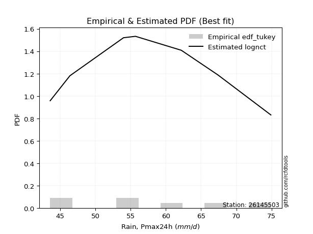</img>

</div>


### 8. EDF Gringorten (1963)

Gringorten plotting position formula is essential for estimating the probability and return periods of extreme events like floods and heavy rainfall. The constant _a=0.44_.

<div align="center">


$P=(m-a)/(n+1-2a)$


</div>


**8.1. Empirical values**

<div align="center">

|                | 0                   | 1                   | 2                  | 3              | 4                  | 5                  | 6                  |
|:---------------|:--------------------|:--------------------|:-------------------|:---------------|:-------------------|:-------------------|:-------------------|
| date           | 2017                | 2023                | 2020               | 2022           | 2019               | 2021               | 2018               |
| x              | 43.6                | 46.4                | 54.0               | 55.7           | 62.2               | 67.4               | 74.9               |
| m              | 1                   | 2                   | 3                  | 4              | 5                  | 6                  | 7                  |
| empirical_dist | edf_gringorten      | edf_gringorten      | edf_gringorten     | edf_gringorten | edf_gringorten     | edf_gringorten     | edf_gringorten     |
| empirical      | 0.07865168539325844 | 0.21910112359550563 | 0.3595505617977528 | 0.5            | 0.6404494382022471 | 0.7808988764044943 | 0.9213483146067415 |
| empirical_tr   | 1.0853658536585364  | 1.2805755395683454  | 1.5614035087719298 | 2.0            | 2.781249999999999  | 4.564102564102562  | 12.714285714285701 |

</div>


**8.2. Kolmogorov-Smirnov fit test (sorted by Δ)**


<div align="center">

|                | 0                   | 1                   | 2                   | 3                   | 4                   | 5                   | 6                   | 7                   | 8                   | 9                   | 10                  | 11                  | 12                  | 13                  | 14                  | 15                  | 16                  | 17                  | 18                  | 19                  | 20                  | 21                  | 22                  | 23                  | 24                  | 25                  | 26                  | 27                  | 28                  | 29                  | 30                  | 31                  | 32                  | 33                  | 34                  | 35                  | 36                  | 37                  | 38                  | 39                  | 40                    | 41                  | 42                  | 43                  | 44                  | 45                  | 46                  | 47                  | 48                  | 49                  | 50                  | 51                  | 52                  | 53                  | 54                  | 55                  | 56                  | 57                  | 58                  | 59                  | 60                  | 61                  | 62                  | 63                  | 64                  | 65                  | 66                  | 67                  | 68                  | 69                  | 70                  | 71                  | 72                  | 73                  | 74                  | 75                  | 76                  | 77                  | 78                  | 79                  | 80                  | 81                  | 82                  | 83                  | 84                  | 85                  | 86                  | 87                  |
|:---------------|:--------------------|:--------------------|:--------------------|:--------------------|:--------------------|:--------------------|:--------------------|:--------------------|:--------------------|:--------------------|:--------------------|:--------------------|:--------------------|:--------------------|:--------------------|:--------------------|:--------------------|:--------------------|:--------------------|:--------------------|:--------------------|:--------------------|:--------------------|:--------------------|:--------------------|:--------------------|:--------------------|:--------------------|:--------------------|:--------------------|:--------------------|:--------------------|:--------------------|:--------------------|:--------------------|:--------------------|:--------------------|:--------------------|:--------------------|:--------------------|:----------------------|:--------------------|:--------------------|:--------------------|:--------------------|:--------------------|:--------------------|:--------------------|:--------------------|:--------------------|:--------------------|:--------------------|:--------------------|:--------------------|:--------------------|:--------------------|:--------------------|:--------------------|:--------------------|:--------------------|:--------------------|:--------------------|:--------------------|:--------------------|:--------------------|:--------------------|:--------------------|:--------------------|:--------------------|:--------------------|:--------------------|:--------------------|:--------------------|:--------------------|:--------------------|:--------------------|:--------------------|:--------------------|:--------------------|:--------------------|:--------------------|:--------------------|:--------------------|:--------------------|:--------------------|:--------------------|:--------------------|:--------------------|
| station        | 26145503            | 26145503            | 26145503            | 26145503            | 26145503            | 26145503            | 26145503            | 26145503            | 26145503            | 26145503            | 26145503            | 26145503            | 26145503            | 26145503            | 26145503            | 26145503            | 26145503            | 26145503            | 26145503            | 26145503            | 26145503            | 26145503            | 26145503            | 26145503            | 26145503            | 26145503            | 26145503            | 26145503            | 26145503            | 26145503            | 26145503            | 26145503            | 26145503            | 26145503            | 26145503            | 26145503            | 26145503            | 26145503            | 26145503            | 26145503            | 26145503              | 26145503            | 26145503            | 26145503            | 26145503            | 26145503            | 26145503            | 26145503            | 26145503            | 26145503            | 26145503            | 26145503            | 26145503            | 26145503            | 26145503            | 26145503            | 26145503            | 26145503            | 26145503            | 26145503            | 26145503            | 26145503            | 26145503            | 26145503            | 26145503            | 26145503            | 26145503            | 26145503            | 26145503            | 26145503            | 26145503            | 26145503            | 26145503            | 26145503            | 26145503            | 26145503            | 26145503            | 26145503            | 26145503            | 26145503            | 26145503            | 26145503            | 26145503            | 26145503            | 26145503            | 26145503            | 26145503            | 26145503            |
| empirical_dist | edf_gringorten      | edf_gringorten      | edf_gringorten      | edf_gringorten      | edf_gringorten      | edf_gringorten      | edf_gringorten      | edf_gringorten      | edf_gringorten      | edf_gringorten      | edf_gringorten      | edf_gringorten      | edf_gringorten      | edf_gringorten      | edf_gringorten      | edf_gringorten      | edf_gringorten      | edf_gringorten      | edf_gringorten      | edf_gringorten      | edf_gringorten      | edf_gringorten      | edf_gringorten      | edf_gringorten      | edf_gringorten      | edf_gringorten      | edf_gringorten      | edf_gringorten      | edf_gringorten      | edf_gringorten      | edf_gringorten      | edf_gringorten      | edf_gringorten      | edf_gringorten      | edf_gringorten      | edf_gringorten      | edf_gringorten      | edf_gringorten      | edf_gringorten      | edf_gringorten      | edf_gringorten        | edf_gringorten      | edf_gringorten      | edf_gringorten      | edf_gringorten      | edf_gringorten      | edf_gringorten      | edf_gringorten      | edf_gringorten      | edf_gringorten      | edf_gringorten      | edf_gringorten      | edf_gringorten      | edf_gringorten      | edf_gringorten      | edf_gringorten      | edf_gringorten      | edf_gringorten      | edf_gringorten      | edf_gringorten      | edf_gringorten      | edf_gringorten      | edf_gringorten      | edf_gringorten      | edf_gringorten      | edf_gringorten      | edf_gringorten      | edf_gringorten      | edf_gringorten      | edf_gringorten      | edf_gringorten      | edf_gringorten      | edf_gringorten      | edf_gringorten      | edf_gringorten      | edf_gringorten      | edf_gringorten      | edf_gringorten      | edf_gringorten      | edf_gringorten      | edf_gringorten      | edf_gringorten      | edf_gringorten      | edf_gringorten      | edf_gringorten      | edf_gringorten      | edf_gringorten      | edf_gringorten      |
| p_dist         | lognct              | t                   | norm                | crystalball         | exponnorm           | maxwell             | pearson3            | fisk                | logfisk             | rayleigh            | kstwobign           | erlang              | genlogistic         | logloggamma         | invweibull          | logf                | f                   | logpearson3         | logjohnsonsu        | logt                | logexponnorm        | lognorm             | lognorm             | logcrystalball      | loggamma            | loggamma            | logerlang           | alpha               | invgauss            | logalpha            | loginvgamma         | betaprime           | invgamma            | johnsonsu           | logfatiguelife      | loginvgauss         | nct                 | logncf              | logweibull_min      | logmaxwell          | loglaplace_asymmetric | lograyleigh         | loggenlogistic      | genexpon            | mielke              | laplace_asymmetric  | logistic            | logrice             | rice                | logmielke           | loglogistic         | hypsecant           | halfnorm            | gompertz            | logkstwobign        | loghypsecant        | loginvweibull       | loggumbel_l         | loggenexpon         | gumbel_r            | loglaplace          | laplace             | loghalfnorm         | loggumbel_r         | loggompertz         | moyal               | gumbel_l            | logmoyal            | expon               | halflogistic        | logbetaprime        | loghalflogistic     | logexpon            | gibrat              | wald                | loggibrat           | logwald             | gamma               | logtruncnorm        | lognakagami         | truncnorm           | logchi2             | loglognorm          | nakagami            | fatiguelife         | weibull_min         | ncf                 | chi2                |
| delta          | 0.07835063191817025 | 0.0818175747119195  | 0.08182842797789117 | 0.08182842859171821 | 0.08206665836876392 | 0.08298123403268978 | 0.08397517457648324 | 0.08415707976661049 | 0.08423760940122976 | 0.0846076637819281  | 0.08635260525943092 | 0.08718622940686266 | 0.08730569702815716 | 0.08737449776664019 | 0.0876276894471803  | 0.088134125022449   | 0.08819403688073268 | 0.0882118238367677  | 0.08824112855542374 | 0.08824371173014131 | 0.08824524327874206 | 0.08824595662052406 | 0.08824595662052406 | 0.08824598193990194 | 0.0882756871636737  | 0.0882756871636737  | 0.0882839685501906  | 0.08850427746306475 | 0.08881092151390835 | 0.08908121269172395 | 0.08913506366764734 | 0.08920103309252508 | 0.08925468158391206 | 0.08927903319499111 | 0.08950432874283212 | 0.09003744734833802 | 0.0901697737018923  | 0.09039758178761884 | 0.09069720065183903 | 0.09101523483615315 | 0.09211355536865587   | 0.09354194915468722 | 0.09528651891767065 | 0.09547691999400199 | 0.0957196281213325  | 0.0959210248039221  | 0.09798005976388978 | 0.09924112764592377 | 0.10280582109918826 | 0.10290153989534606 | 0.10359907064180321 | 0.10589441648466033 | 0.10837807257045717 | 0.10888803355003895 | 0.10916746354739026 | 0.1109540239838724  | 0.11235578721771533 | 0.11401787499159555 | 0.11506007961533182 | 0.11681531323803028 | 0.1168579064262891  | 0.12146524082945237 | 0.12251152013588976 | 0.1254816929493202  | 0.13643286081287187 | 0.14455996949738031 | 0.14647476606847937 | 0.15378556487766332 | 0.16111347139681187 | 0.1650128892163399  | 0.17983475407800065 | 0.18222717279558548 | 0.19474982188093914 | 0.21910112359550563 | 0.21910112359550563 | 0.21910112359550563 | 0.21910112359550563 | 0.22300795869197754 | 0.23670589060231795 | 0.24420511809136602 | 0.3595376178874558  | 0.37375579062917164 | 0.39472899265248307 | 0.41114648103513063 | 0.47014976905776173 | 0.5040538715917868  | 0.5451342930132616  | 0.6764019020834574  |
| deltao         | 0.48442053926100004 | 0.48442053926100004 | 0.48442053926100004 | 0.48442053926100004 | 0.48442053926100004 | 0.48442053926100004 | 0.48442053926100004 | 0.48442053926100004 | 0.48442053926100004 | 0.48442053926100004 | 0.48442053926100004 | 0.48442053926100004 | 0.48442053926100004 | 0.48442053926100004 | 0.48442053926100004 | 0.48442053926100004 | 0.48442053926100004 | 0.48442053926100004 | 0.48442053926100004 | 0.48442053926100004 | 0.48442053926100004 | 0.48442053926100004 | 0.48442053926100004 | 0.48442053926100004 | 0.48442053926100004 | 0.48442053926100004 | 0.48442053926100004 | 0.48442053926100004 | 0.48442053926100004 | 0.48442053926100004 | 0.48442053926100004 | 0.48442053926100004 | 0.48442053926100004 | 0.48442053926100004 | 0.48442053926100004 | 0.48442053926100004 | 0.48442053926100004 | 0.48442053926100004 | 0.48442053926100004 | 0.48442053926100004 | 0.48442053926100004   | 0.48442053926100004 | 0.48442053926100004 | 0.48442053926100004 | 0.48442053926100004 | 0.48442053926100004 | 0.48442053926100004 | 0.48442053926100004 | 0.48442053926100004 | 0.48442053926100004 | 0.48442053926100004 | 0.48442053926100004 | 0.48442053926100004 | 0.48442053926100004 | 0.48442053926100004 | 0.48442053926100004 | 0.48442053926100004 | 0.48442053926100004 | 0.48442053926100004 | 0.48442053926100004 | 0.48442053926100004 | 0.48442053926100004 | 0.48442053926100004 | 0.48442053926100004 | 0.48442053926100004 | 0.48442053926100004 | 0.48442053926100004 | 0.48442053926100004 | 0.48442053926100004 | 0.48442053926100004 | 0.48442053926100004 | 0.48442053926100004 | 0.48442053926100004 | 0.48442053926100004 | 0.48442053926100004 | 0.48442053926100004 | 0.48442053926100004 | 0.48442053926100004 | 0.48442053926100004 | 0.48442053926100004 | 0.48442053926100004 | 0.48442053926100004 | 0.48442053926100004 | 0.48442053926100004 | 0.48442053926100004 | 0.48442053926100004 | 0.48442053926100004 | 0.48442053926100004 |
| eval           | Δo > Δ              | Δo > Δ              | Δo > Δ              | Δo > Δ              | Δo > Δ              | Δo > Δ              | Δo > Δ              | Δo > Δ              | Δo > Δ              | Δo > Δ              | Δo > Δ              | Δo > Δ              | Δo > Δ              | Δo > Δ              | Δo > Δ              | Δo > Δ              | Δo > Δ              | Δo > Δ              | Δo > Δ              | Δo > Δ              | Δo > Δ              | Δo > Δ              | Δo > Δ              | Δo > Δ              | Δo > Δ              | Δo > Δ              | Δo > Δ              | Δo > Δ              | Δo > Δ              | Δo > Δ              | Δo > Δ              | Δo > Δ              | Δo > Δ              | Δo > Δ              | Δo > Δ              | Δo > Δ              | Δo > Δ              | Δo > Δ              | Δo > Δ              | Δo > Δ              | Δo > Δ                | Δo > Δ              | Δo > Δ              | Δo > Δ              | Δo > Δ              | Δo > Δ              | Δo > Δ              | Δo > Δ              | Δo > Δ              | Δo > Δ              | Δo > Δ              | Δo > Δ              | Δo > Δ              | Δo > Δ              | Δo > Δ              | Δo > Δ              | Δo > Δ              | Δo > Δ              | Δo > Δ              | Δo > Δ              | Δo > Δ              | Δo > Δ              | Δo > Δ              | Δo > Δ              | Δo > Δ              | Δo > Δ              | Δo > Δ              | Δo > Δ              | Δo > Δ              | Δo > Δ              | Δo > Δ              | Δo > Δ              | Δo > Δ              | Δo > Δ              | Δo > Δ              | Δo > Δ              | Δo > Δ              | Δo > Δ              | Δo > Δ              | Δo > Δ              | Δo > Δ              | Δo > Δ              | Δo > Δ              | Δo > Δ              | Δo > Δ              | Δo <= Δ             | Δo <= Δ             | Δo <= Δ             |
| fit            | 1                   | 1                   | 1                   | 1                   | 1                   | 1                   | 1                   | 1                   | 1                   | 1                   | 1                   | 1                   | 1                   | 1                   | 1                   | 1                   | 1                   | 1                   | 1                   | 1                   | 1                   | 1                   | 1                   | 1                   | 1                   | 1                   | 1                   | 1                   | 1                   | 1                   | 1                   | 1                   | 1                   | 1                   | 1                   | 1                   | 1                   | 1                   | 1                   | 1                   | 1                     | 1                   | 1                   | 1                   | 1                   | 1                   | 1                   | 1                   | 1                   | 1                   | 1                   | 1                   | 1                   | 1                   | 1                   | 1                   | 1                   | 1                   | 1                   | 1                   | 1                   | 1                   | 1                   | 1                   | 1                   | 1                   | 1                   | 1                   | 1                   | 1                   | 1                   | 1                   | 1                   | 1                   | 1                   | 1                   | 1                   | 1                   | 1                   | 1                   | 1                   | 1                   | 1                   | 1                   | 1                   | 0                   | 0                   | 0                   |
| n              | 7                   | 7                   | 7                   | 7                   | 7                   | 7                   | 7                   | 7                   | 7                   | 7                   | 7                   | 7                   | 7                   | 7                   | 7                   | 7                   | 7                   | 7                   | 7                   | 7                   | 7                   | 7                   | 7                   | 7                   | 7                   | 7                   | 7                   | 7                   | 7                   | 7                   | 7                   | 7                   | 7                   | 7                   | 7                   | 7                   | 7                   | 7                   | 7                   | 7                   | 7                     | 7                   | 7                   | 7                   | 7                   | 7                   | 7                   | 7                   | 7                   | 7                   | 7                   | 7                   | 7                   | 7                   | 7                   | 7                   | 7                   | 7                   | 7                   | 7                   | 7                   | 7                   | 7                   | 7                   | 7                   | 7                   | 7                   | 7                   | 7                   | 7                   | 7                   | 7                   | 7                   | 7                   | 7                   | 7                   | 7                   | 7                   | 7                   | 7                   | 7                   | 7                   | 7                   | 7                   | 7                   | 7                   | 7                   | 7                   |
| best_fit       | 1                   | 0                   | 0                   | 0                   | 0                   | 0                   | 0                   | 0                   | 0                   | 0                   | 0                   | 0                   | 0                   | 0                   | 0                   | 0                   | 0                   | 0                   | 0                   | 0                   | 0                   | 0                   | 0                   | 0                   | 0                   | 0                   | 0                   | 0                   | 0                   | 0                   | 0                   | 0                   | 0                   | 0                   | 0                   | 0                   | 0                   | 0                   | 0                   | 0                   | 0                     | 0                   | 0                   | 0                   | 0                   | 0                   | 0                   | 0                   | 0                   | 0                   | 0                   | 0                   | 0                   | 0                   | 0                   | 0                   | 0                   | 0                   | 0                   | 0                   | 0                   | 0                   | 0                   | 0                   | 0                   | 0                   | 0                   | 0                   | 0                   | 0                   | 0                   | 0                   | 0                   | 0                   | 0                   | 0                   | 0                   | 0                   | 0                   | 0                   | 0                   | 0                   | 0                   | 0                   | 0                   | 0                   | 0                   | 0                   |
| best_fit_sort  | 1                   | 2                   | 3                   | 4                   | 5                   | 6                   | 7                   | 8                   | 9                   | 10                  | 11                  | 12                  | 13                  | 14                  | 15                  | 16                  | 17                  | 18                  | 19                  | 20                  | 21                  | 22                  | 23                  | 24                  | 25                  | 26                  | 27                  | 28                  | 29                  | 30                  | 31                  | 32                  | 33                  | 34                  | 35                  | 36                  | 37                  | 38                  | 39                  | 40                  | 41                    | 42                  | 43                  | 44                  | 45                  | 46                  | 47                  | 48                  | 49                  | 50                  | 51                  | 52                  | 53                  | 54                  | 55                  | 56                  | 57                  | 58                  | 59                  | 60                  | 61                  | 62                  | 63                  | 64                  | 65                  | 66                  | 67                  | 68                  | 69                  | 70                  | 71                  | 72                  | 73                  | 74                  | 75                  | 76                  | 77                  | 78                  | 79                  | 80                  | 81                  | 82                  | 83                  | 84                  | 85                  | 86                  | 87                  | 88                  |

</div>


**8.3. Best fit**

<div align="center">

|   id |   station | empirical_dist   | p_dist   |     delta |   deltao | eval   |   fit |   n |   best_fit |   best_fit_sort |
|-----:|----------:|:-----------------|:---------|----------:|---------:|:-------|------:|----:|-----------:|----------------:|
|    0 |  26145503 | edf_gringorten   | lognct   | 0.0783506 | 0.484421 | Δo > Δ |     1 |   7 |          1 |               1 |

</div>


<div align="center">

</img>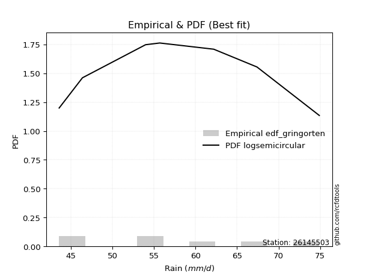</img>

</div>


### 9. EDF Filliben (1975)

The specific values of the constants (0.3175) (often denoted as $alpha$) and (0.365) are derived from a method proposed by James J. Filliben in a 1975 paper. This particular formula is the mean value of the $i$-th order statistic of the normal distribution and is considered a robust and effective plotting position formula for the normal probability plot correlation coefficient test for normality.

<div align="center">


$P=(m-0.3175)/(n+0.365)$


</div>


**9.1. Empirical values**

<div align="center">

|                | 0                   | 1                   | 2                   | 3            | 4                  | 5                  | 6                  |
|:---------------|:--------------------|:--------------------|:--------------------|:-------------|:-------------------|:-------------------|:-------------------|
| date           | 2017                | 2023                | 2020                | 2022         | 2019               | 2021               | 2018               |
| x              | 43.6                | 46.4                | 54.0                | 55.7         | 62.2               | 67.4               | 74.9               |
| m              | 1                   | 2                   | 3                   | 4            | 5                  | 6                  | 7                  |
| empirical_dist | edf_filliben        | edf_filliben        | edf_filliben        | edf_filliben | edf_filliben       | edf_filliben       | edf_filliben       |
| empirical      | 0.09266802443991853 | 0.22844534962661237 | 0.36422267481330617 | 0.5          | 0.6357773251866938 | 0.7715546503733877 | 0.9073319755600815 |
| empirical_tr   | 1.1021324354657687  | 1.2960844698636163  | 1.5728777362520021  | 2.0          | 2.7455731593662627 | 4.377414561664191  | 10.791208791208794 |

</div>


**9.2. Kolmogorov-Smirnov fit test (sorted by Δ)**


<div align="center">

|                | 0                   | 1                   | 2                   | 3                   | 4                   | 5                   | 6                   | 7                   | 8                   | 9                   | 10                  | 11                  | 12                  | 13                  | 14                  | 15                  | 16                  | 17                  | 18                  | 19                  | 20                  | 21                  | 22                  | 23                  | 24                  | 25                  | 26                  | 27                  | 28                  | 29                  | 30                  | 31                  | 32                  | 33                  | 34                  | 35                  | 36                  | 37                  | 38                  | 39                  | 40                  | 41                  | 42                  | 43                  | 44                    | 45                  | 46                  | 47                  | 48                  | 49                  | 50                  | 51                  | 52                  | 53                  | 54                  | 55                  | 56                  | 57                  | 58                  | 59                  | 60                  | 61                  | 62                  | 63                  | 64                  | 65                  | 66                  | 67                  | 68                  | 69                  | 70                  | 71                  | 72                  | 73                  | 74                  | 75                  | 76                  | 77                  | 78                  | 79                  | 80                  | 81                  | 82                  | 83                  | 84                  | 85                  | 86                  | 87                  |
|:---------------|:--------------------|:--------------------|:--------------------|:--------------------|:--------------------|:--------------------|:--------------------|:--------------------|:--------------------|:--------------------|:--------------------|:--------------------|:--------------------|:--------------------|:--------------------|:--------------------|:--------------------|:--------------------|:--------------------|:--------------------|:--------------------|:--------------------|:--------------------|:--------------------|:--------------------|:--------------------|:--------------------|:--------------------|:--------------------|:--------------------|:--------------------|:--------------------|:--------------------|:--------------------|:--------------------|:--------------------|:--------------------|:--------------------|:--------------------|:--------------------|:--------------------|:--------------------|:--------------------|:--------------------|:----------------------|:--------------------|:--------------------|:--------------------|:--------------------|:--------------------|:--------------------|:--------------------|:--------------------|:--------------------|:--------------------|:--------------------|:--------------------|:--------------------|:--------------------|:--------------------|:--------------------|:--------------------|:--------------------|:--------------------|:--------------------|:--------------------|:--------------------|:--------------------|:--------------------|:--------------------|:--------------------|:--------------------|:--------------------|:--------------------|:--------------------|:--------------------|:--------------------|:--------------------|:--------------------|:--------------------|:--------------------|:--------------------|:--------------------|:--------------------|:--------------------|:--------------------|:--------------------|:--------------------|
| station        | 26145503            | 26145503            | 26145503            | 26145503            | 26145503            | 26145503            | 26145503            | 26145503            | 26145503            | 26145503            | 26145503            | 26145503            | 26145503            | 26145503            | 26145503            | 26145503            | 26145503            | 26145503            | 26145503            | 26145503            | 26145503            | 26145503            | 26145503            | 26145503            | 26145503            | 26145503            | 26145503            | 26145503            | 26145503            | 26145503            | 26145503            | 26145503            | 26145503            | 26145503            | 26145503            | 26145503            | 26145503            | 26145503            | 26145503            | 26145503            | 26145503            | 26145503            | 26145503            | 26145503            | 26145503              | 26145503            | 26145503            | 26145503            | 26145503            | 26145503            | 26145503            | 26145503            | 26145503            | 26145503            | 26145503            | 26145503            | 26145503            | 26145503            | 26145503            | 26145503            | 26145503            | 26145503            | 26145503            | 26145503            | 26145503            | 26145503            | 26145503            | 26145503            | 26145503            | 26145503            | 26145503            | 26145503            | 26145503            | 26145503            | 26145503            | 26145503            | 26145503            | 26145503            | 26145503            | 26145503            | 26145503            | 26145503            | 26145503            | 26145503            | 26145503            | 26145503            | 26145503            | 26145503            |
| empirical_dist | edf_filliben        | edf_filliben        | edf_filliben        | edf_filliben        | edf_filliben        | edf_filliben        | edf_filliben        | edf_filliben        | edf_filliben        | edf_filliben        | edf_filliben        | edf_filliben        | edf_filliben        | edf_filliben        | edf_filliben        | edf_filliben        | edf_filliben        | edf_filliben        | edf_filliben        | edf_filliben        | edf_filliben        | edf_filliben        | edf_filliben        | edf_filliben        | edf_filliben        | edf_filliben        | edf_filliben        | edf_filliben        | edf_filliben        | edf_filliben        | edf_filliben        | edf_filliben        | edf_filliben        | edf_filliben        | edf_filliben        | edf_filliben        | edf_filliben        | edf_filliben        | edf_filliben        | edf_filliben        | edf_filliben        | edf_filliben        | edf_filliben        | edf_filliben        | edf_filliben          | edf_filliben        | edf_filliben        | edf_filliben        | edf_filliben        | edf_filliben        | edf_filliben        | edf_filliben        | edf_filliben        | edf_filliben        | edf_filliben        | edf_filliben        | edf_filliben        | edf_filliben        | edf_filliben        | edf_filliben        | edf_filliben        | edf_filliben        | edf_filliben        | edf_filliben        | edf_filliben        | edf_filliben        | edf_filliben        | edf_filliben        | edf_filliben        | edf_filliben        | edf_filliben        | edf_filliben        | edf_filliben        | edf_filliben        | edf_filliben        | edf_filliben        | edf_filliben        | edf_filliben        | edf_filliben        | edf_filliben        | edf_filliben        | edf_filliben        | edf_filliben        | edf_filliben        | edf_filliben        | edf_filliben        | edf_filliben        | edf_filliben        |
| p_dist         | lognct              | t                   | norm                | crystalball         | exponnorm           | mielke              | maxwell             | loggenlogistic      | pearson3            | fisk                | logfisk             | rayleigh            | erlang              | kstwobign           | genlogistic         | logloggamma         | invweibull          | logf                | f                   | logpearson3         | logjohnsonsu        | logt                | logexponnorm        | lognorm             | lognorm             | logcrystalball      | loggamma            | loggamma            | logerlang           | alpha               | genexpon            | invgauss            | logmielke           | logalpha            | loginvgamma         | betaprime           | invgamma            | johnsonsu           | logfatiguelife      | loginvgauss         | nct                 | logncf              | logweibull_min      | logmaxwell          | loglaplace_asymmetric | lograyleigh         | logkstwobign        | laplace_asymmetric  | logistic            | loginvweibull       | logrice             | loggenexpon         | rice                | loglogistic         | loggumbel_l         | hypsecant           | halfnorm            | gompertz            | loghypsecant        | laplace             | gumbel_r            | loglaplace          | loggompertz         | loghalfnorm         | loggumbel_r         | gumbel_l            | moyal               | expon               | logmoyal            | logbetaprime        | halflogistic        | logexpon            | loghalflogistic     | gamma               | wald                | gibrat              | logwald             | loggibrat           | logtruncnorm        | lognakagami         | logchi2             | truncnorm           | loglognorm          | nakagami            | fatiguelife         | weibull_min         | ncf                 | chi2                |
| delta          | 0.06940321552078971 | 0.09116180074302624 | 0.0911726540089979  | 0.09117265462282495 | 0.09141088439987066 | 0.0923190921464325  | 0.09232546006379652 | 0.09245026651283836 | 0.09331940060758998 | 0.09350130579771723 | 0.0935818354323365  | 0.09395188981303484 | 0.0948339223917466  | 0.09569683129053766 | 0.0966499230592639  | 0.09671872379774693 | 0.09697191547828704 | 0.09747835105355573 | 0.09753826291183942 | 0.09755604986787444 | 0.09758535458653048 | 0.09758793776124805 | 0.0975894693098488  | 0.0975901826516308  | 0.0975901826516308  | 0.09759020797100867 | 0.09761991319478044 | 0.09761991319478044 | 0.09762819458129735 | 0.09784850349417148 | 0.09811142741712825 | 0.09815514754501509 | 0.09822942687979269 | 0.09842543872283069 | 0.09847928969875408 | 0.09854525912363182 | 0.0985989076150188  | 0.09862325922609785 | 0.09884855477393886 | 0.09938167337944476 | 0.09951399973299904 | 0.09974180781872558 | 0.10004142668294577 | 0.10035946086725989 | 0.10145778139976261   | 0.10288617518579396 | 0.1044953505318369  | 0.10526525083502884 | 0.10732428579499652 | 0.10768367420216196 | 0.10858535367703051 | 0.11038796659977845 | 0.112150047130295   | 0.11294329667290995 | 0.11401787499159555 | 0.11523864251576707 | 0.11772229860156391 | 0.1182322595811457  | 0.12029825001497914 | 0.12181578045199432 | 0.12615953926913703 | 0.12620213245739584 | 0.1317607477973185  | 0.1318557461669965  | 0.13482591898042695 | 0.14647476606847937 | 0.15390419552848705 | 0.1564413583812585  | 0.16312979090877006 | 0.16581841503134065 | 0.17435711524744663 | 0.19007770886538577 | 0.19157139882669222 | 0.21833584567642417 | 0.22844534962661237 | 0.22844534962661237 | 0.22844534962661237 | 0.22844534962661237 | 0.23203377758676458 | 0.23953300507581265 | 0.35973945158251164 | 0.3642097309030092  | 0.38538476662137633 | 0.40647436801957726 | 0.4651161343423449  | 0.4947096455606801  | 0.5311179539666014  | 0.6670576760523507  |
| deltao         | 0.48442053926100004 | 0.48442053926100004 | 0.48442053926100004 | 0.48442053926100004 | 0.48442053926100004 | 0.48442053926100004 | 0.48442053926100004 | 0.48442053926100004 | 0.48442053926100004 | 0.48442053926100004 | 0.48442053926100004 | 0.48442053926100004 | 0.48442053926100004 | 0.48442053926100004 | 0.48442053926100004 | 0.48442053926100004 | 0.48442053926100004 | 0.48442053926100004 | 0.48442053926100004 | 0.48442053926100004 | 0.48442053926100004 | 0.48442053926100004 | 0.48442053926100004 | 0.48442053926100004 | 0.48442053926100004 | 0.48442053926100004 | 0.48442053926100004 | 0.48442053926100004 | 0.48442053926100004 | 0.48442053926100004 | 0.48442053926100004 | 0.48442053926100004 | 0.48442053926100004 | 0.48442053926100004 | 0.48442053926100004 | 0.48442053926100004 | 0.48442053926100004 | 0.48442053926100004 | 0.48442053926100004 | 0.48442053926100004 | 0.48442053926100004 | 0.48442053926100004 | 0.48442053926100004 | 0.48442053926100004 | 0.48442053926100004   | 0.48442053926100004 | 0.48442053926100004 | 0.48442053926100004 | 0.48442053926100004 | 0.48442053926100004 | 0.48442053926100004 | 0.48442053926100004 | 0.48442053926100004 | 0.48442053926100004 | 0.48442053926100004 | 0.48442053926100004 | 0.48442053926100004 | 0.48442053926100004 | 0.48442053926100004 | 0.48442053926100004 | 0.48442053926100004 | 0.48442053926100004 | 0.48442053926100004 | 0.48442053926100004 | 0.48442053926100004 | 0.48442053926100004 | 0.48442053926100004 | 0.48442053926100004 | 0.48442053926100004 | 0.48442053926100004 | 0.48442053926100004 | 0.48442053926100004 | 0.48442053926100004 | 0.48442053926100004 | 0.48442053926100004 | 0.48442053926100004 | 0.48442053926100004 | 0.48442053926100004 | 0.48442053926100004 | 0.48442053926100004 | 0.48442053926100004 | 0.48442053926100004 | 0.48442053926100004 | 0.48442053926100004 | 0.48442053926100004 | 0.48442053926100004 | 0.48442053926100004 | 0.48442053926100004 |
| eval           | Δo > Δ              | Δo > Δ              | Δo > Δ              | Δo > Δ              | Δo > Δ              | Δo > Δ              | Δo > Δ              | Δo > Δ              | Δo > Δ              | Δo > Δ              | Δo > Δ              | Δo > Δ              | Δo > Δ              | Δo > Δ              | Δo > Δ              | Δo > Δ              | Δo > Δ              | Δo > Δ              | Δo > Δ              | Δo > Δ              | Δo > Δ              | Δo > Δ              | Δo > Δ              | Δo > Δ              | Δo > Δ              | Δo > Δ              | Δo > Δ              | Δo > Δ              | Δo > Δ              | Δo > Δ              | Δo > Δ              | Δo > Δ              | Δo > Δ              | Δo > Δ              | Δo > Δ              | Δo > Δ              | Δo > Δ              | Δo > Δ              | Δo > Δ              | Δo > Δ              | Δo > Δ              | Δo > Δ              | Δo > Δ              | Δo > Δ              | Δo > Δ                | Δo > Δ              | Δo > Δ              | Δo > Δ              | Δo > Δ              | Δo > Δ              | Δo > Δ              | Δo > Δ              | Δo > Δ              | Δo > Δ              | Δo > Δ              | Δo > Δ              | Δo > Δ              | Δo > Δ              | Δo > Δ              | Δo > Δ              | Δo > Δ              | Δo > Δ              | Δo > Δ              | Δo > Δ              | Δo > Δ              | Δo > Δ              | Δo > Δ              | Δo > Δ              | Δo > Δ              | Δo > Δ              | Δo > Δ              | Δo > Δ              | Δo > Δ              | Δo > Δ              | Δo > Δ              | Δo > Δ              | Δo > Δ              | Δo > Δ              | Δo > Δ              | Δo > Δ              | Δo > Δ              | Δo > Δ              | Δo > Δ              | Δo > Δ              | Δo > Δ              | Δo <= Δ             | Δo <= Δ             | Δo <= Δ             |
| fit            | 1                   | 1                   | 1                   | 1                   | 1                   | 1                   | 1                   | 1                   | 1                   | 1                   | 1                   | 1                   | 1                   | 1                   | 1                   | 1                   | 1                   | 1                   | 1                   | 1                   | 1                   | 1                   | 1                   | 1                   | 1                   | 1                   | 1                   | 1                   | 1                   | 1                   | 1                   | 1                   | 1                   | 1                   | 1                   | 1                   | 1                   | 1                   | 1                   | 1                   | 1                   | 1                   | 1                   | 1                   | 1                     | 1                   | 1                   | 1                   | 1                   | 1                   | 1                   | 1                   | 1                   | 1                   | 1                   | 1                   | 1                   | 1                   | 1                   | 1                   | 1                   | 1                   | 1                   | 1                   | 1                   | 1                   | 1                   | 1                   | 1                   | 1                   | 1                   | 1                   | 1                   | 1                   | 1                   | 1                   | 1                   | 1                   | 1                   | 1                   | 1                   | 1                   | 1                   | 1                   | 1                   | 0                   | 0                   | 0                   |
| n              | 7                   | 7                   | 7                   | 7                   | 7                   | 7                   | 7                   | 7                   | 7                   | 7                   | 7                   | 7                   | 7                   | 7                   | 7                   | 7                   | 7                   | 7                   | 7                   | 7                   | 7                   | 7                   | 7                   | 7                   | 7                   | 7                   | 7                   | 7                   | 7                   | 7                   | 7                   | 7                   | 7                   | 7                   | 7                   | 7                   | 7                   | 7                   | 7                   | 7                   | 7                   | 7                   | 7                   | 7                   | 7                     | 7                   | 7                   | 7                   | 7                   | 7                   | 7                   | 7                   | 7                   | 7                   | 7                   | 7                   | 7                   | 7                   | 7                   | 7                   | 7                   | 7                   | 7                   | 7                   | 7                   | 7                   | 7                   | 7                   | 7                   | 7                   | 7                   | 7                   | 7                   | 7                   | 7                   | 7                   | 7                   | 7                   | 7                   | 7                   | 7                   | 7                   | 7                   | 7                   | 7                   | 7                   | 7                   | 7                   |
| best_fit       | 1                   | 0                   | 0                   | 0                   | 0                   | 0                   | 0                   | 0                   | 0                   | 0                   | 0                   | 0                   | 0                   | 0                   | 0                   | 0                   | 0                   | 0                   | 0                   | 0                   | 0                   | 0                   | 0                   | 0                   | 0                   | 0                   | 0                   | 0                   | 0                   | 0                   | 0                   | 0                   | 0                   | 0                   | 0                   | 0                   | 0                   | 0                   | 0                   | 0                   | 0                   | 0                   | 0                   | 0                   | 0                     | 0                   | 0                   | 0                   | 0                   | 0                   | 0                   | 0                   | 0                   | 0                   | 0                   | 0                   | 0                   | 0                   | 0                   | 0                   | 0                   | 0                   | 0                   | 0                   | 0                   | 0                   | 0                   | 0                   | 0                   | 0                   | 0                   | 0                   | 0                   | 0                   | 0                   | 0                   | 0                   | 0                   | 0                   | 0                   | 0                   | 0                   | 0                   | 0                   | 0                   | 0                   | 0                   | 0                   |
| best_fit_sort  | 1                   | 2                   | 3                   | 4                   | 5                   | 6                   | 7                   | 8                   | 9                   | 10                  | 11                  | 12                  | 13                  | 14                  | 15                  | 16                  | 17                  | 18                  | 19                  | 20                  | 21                  | 22                  | 23                  | 24                  | 25                  | 26                  | 27                  | 28                  | 29                  | 30                  | 31                  | 32                  | 33                  | 34                  | 35                  | 36                  | 37                  | 38                  | 39                  | 40                  | 41                  | 42                  | 43                  | 44                  | 45                    | 46                  | 47                  | 48                  | 49                  | 50                  | 51                  | 52                  | 53                  | 54                  | 55                  | 56                  | 57                  | 58                  | 59                  | 60                  | 61                  | 62                  | 63                  | 64                  | 65                  | 66                  | 67                  | 68                  | 69                  | 70                  | 71                  | 72                  | 73                  | 74                  | 75                  | 76                  | 77                  | 78                  | 79                  | 80                  | 81                  | 82                  | 83                  | 84                  | 85                  | 86                  | 87                  | 88                  |

</div>


**9.3. Best fit**

<div align="center">

|   id |   station | empirical_dist   | p_dist   |     delta |   deltao | eval   |   fit |   n |   best_fit |   best_fit_sort |
|-----:|----------:|:-----------------|:---------|----------:|---------:|:-------|------:|----:|-----------:|----------------:|
|    0 |  26145503 | edf_filliben     | lognct   | 0.0694032 | 0.484421 | Δo > Δ |     1 |   7 |          1 |               1 |

</div>


<div align="center">

</img></img>

</div>


### 10. EDF Jenkinson (1977)

The Jenkinson formula in hydrology is an empirical plotting position formula used to estimate the non-exceedance probability _(P)_ or return period _(T)_ of a given ordered observation within a sample. It is a widely used method in the frequency analysis of extreme events such as floods and rainfall, as it provides a distribution-free way to plot data. _a≈0.31_ and _b≈0.38_ are constants derived to approximate the median of the probability distribution for the given rank.

<div align="center">


$P=(m-a)/(n+b)$


</div>


**10.1. Empirical values**

<div align="center">

|                | 0                   | 1                   | 2                   | 3             | 4                  | 5                  | 6                  |
|:---------------|:--------------------|:--------------------|:--------------------|:--------------|:-------------------|:-------------------|:-------------------|
| date           | 2017                | 2023                | 2020                | 2022          | 2019               | 2021               | 2018               |
| x              | 43.6                | 46.4                | 54.0                | 55.7          | 62.2               | 67.4               | 74.9               |
| m              | 1                   | 2                   | 3                   | 4             | 5                  | 6                  | 7                  |
| empirical_dist | edf_jenkinson       | edf_jenkinson       | edf_jenkinson       | edf_jenkinson | edf_jenkinson      | edf_jenkinson      | edf_jenkinson      |
| empirical      | 0.09349593495934959 | 0.22899728997289973 | 0.36449864498644985 | 0.5           | 0.6355013550135502 | 0.7710027100271003 | 0.9065040650406505 |
| empirical_tr   | 1.1031390134529149  | 1.29701230228471    | 1.5735607675906182  | 2.0           | 2.743494423791822  | 4.366863905325444  | 10.695652173913055 |

</div>


**10.2. Kolmogorov-Smirnov fit test (sorted by Δ)**


<div align="center">

|                | 0                   | 1                   | 2                   | 3                   | 4                   | 5                   | 6                   | 7                   | 8                   | 9                   | 10                  | 11                  | 12                  | 13                  | 14                  | 15                  | 16                  | 17                  | 18                  | 19                  | 20                  | 21                  | 22                  | 23                  | 24                  | 25                  | 26                  | 27                  | 28                  | 29                  | 30                  | 31                  | 32                  | 33                  | 34                  | 35                  | 36                  | 37                  | 38                  | 39                  | 40                  | 41                  | 42                  | 43                  | 44                    | 45                  | 46                  | 47                  | 48                  | 49                  | 50                  | 51                  | 52                  | 53                  | 54                  | 55                  | 56                  | 57                  | 58                  | 59                  | 60                  | 61                  | 62                  | 63                  | 64                  | 65                  | 66                  | 67                  | 68                  | 69                  | 70                  | 71                  | 72                  | 73                  | 74                  | 75                  | 76                  | 77                  | 78                  | 79                  | 80                  | 81                  | 82                  | 83                  | 84                  | 85                  | 86                  | 87                  |
|:---------------|:--------------------|:--------------------|:--------------------|:--------------------|:--------------------|:--------------------|:--------------------|:--------------------|:--------------------|:--------------------|:--------------------|:--------------------|:--------------------|:--------------------|:--------------------|:--------------------|:--------------------|:--------------------|:--------------------|:--------------------|:--------------------|:--------------------|:--------------------|:--------------------|:--------------------|:--------------------|:--------------------|:--------------------|:--------------------|:--------------------|:--------------------|:--------------------|:--------------------|:--------------------|:--------------------|:--------------------|:--------------------|:--------------------|:--------------------|:--------------------|:--------------------|:--------------------|:--------------------|:--------------------|:----------------------|:--------------------|:--------------------|:--------------------|:--------------------|:--------------------|:--------------------|:--------------------|:--------------------|:--------------------|:--------------------|:--------------------|:--------------------|:--------------------|:--------------------|:--------------------|:--------------------|:--------------------|:--------------------|:--------------------|:--------------------|:--------------------|:--------------------|:--------------------|:--------------------|:--------------------|:--------------------|:--------------------|:--------------------|:--------------------|:--------------------|:--------------------|:--------------------|:--------------------|:--------------------|:--------------------|:--------------------|:--------------------|:--------------------|:--------------------|:--------------------|:--------------------|:--------------------|:--------------------|
| station        | 26145503            | 26145503            | 26145503            | 26145503            | 26145503            | 26145503            | 26145503            | 26145503            | 26145503            | 26145503            | 26145503            | 26145503            | 26145503            | 26145503            | 26145503            | 26145503            | 26145503            | 26145503            | 26145503            | 26145503            | 26145503            | 26145503            | 26145503            | 26145503            | 26145503            | 26145503            | 26145503            | 26145503            | 26145503            | 26145503            | 26145503            | 26145503            | 26145503            | 26145503            | 26145503            | 26145503            | 26145503            | 26145503            | 26145503            | 26145503            | 26145503            | 26145503            | 26145503            | 26145503            | 26145503              | 26145503            | 26145503            | 26145503            | 26145503            | 26145503            | 26145503            | 26145503            | 26145503            | 26145503            | 26145503            | 26145503            | 26145503            | 26145503            | 26145503            | 26145503            | 26145503            | 26145503            | 26145503            | 26145503            | 26145503            | 26145503            | 26145503            | 26145503            | 26145503            | 26145503            | 26145503            | 26145503            | 26145503            | 26145503            | 26145503            | 26145503            | 26145503            | 26145503            | 26145503            | 26145503            | 26145503            | 26145503            | 26145503            | 26145503            | 26145503            | 26145503            | 26145503            | 26145503            |
| empirical_dist | edf_jenkinson       | edf_jenkinson       | edf_jenkinson       | edf_jenkinson       | edf_jenkinson       | edf_jenkinson       | edf_jenkinson       | edf_jenkinson       | edf_jenkinson       | edf_jenkinson       | edf_jenkinson       | edf_jenkinson       | edf_jenkinson       | edf_jenkinson       | edf_jenkinson       | edf_jenkinson       | edf_jenkinson       | edf_jenkinson       | edf_jenkinson       | edf_jenkinson       | edf_jenkinson       | edf_jenkinson       | edf_jenkinson       | edf_jenkinson       | edf_jenkinson       | edf_jenkinson       | edf_jenkinson       | edf_jenkinson       | edf_jenkinson       | edf_jenkinson       | edf_jenkinson       | edf_jenkinson       | edf_jenkinson       | edf_jenkinson       | edf_jenkinson       | edf_jenkinson       | edf_jenkinson       | edf_jenkinson       | edf_jenkinson       | edf_jenkinson       | edf_jenkinson       | edf_jenkinson       | edf_jenkinson       | edf_jenkinson       | edf_jenkinson         | edf_jenkinson       | edf_jenkinson       | edf_jenkinson       | edf_jenkinson       | edf_jenkinson       | edf_jenkinson       | edf_jenkinson       | edf_jenkinson       | edf_jenkinson       | edf_jenkinson       | edf_jenkinson       | edf_jenkinson       | edf_jenkinson       | edf_jenkinson       | edf_jenkinson       | edf_jenkinson       | edf_jenkinson       | edf_jenkinson       | edf_jenkinson       | edf_jenkinson       | edf_jenkinson       | edf_jenkinson       | edf_jenkinson       | edf_jenkinson       | edf_jenkinson       | edf_jenkinson       | edf_jenkinson       | edf_jenkinson       | edf_jenkinson       | edf_jenkinson       | edf_jenkinson       | edf_jenkinson       | edf_jenkinson       | edf_jenkinson       | edf_jenkinson       | edf_jenkinson       | edf_jenkinson       | edf_jenkinson       | edf_jenkinson       | edf_jenkinson       | edf_jenkinson       | edf_jenkinson       | edf_jenkinson       |
| p_dist         | lognct              | t                   | norm                | crystalball         | exponnorm           | mielke              | maxwell             | loggenlogistic      | pearson3            | fisk                | logfisk             | rayleigh            | erlang              | kstwobign           | genlogistic         | logloggamma         | invweibull          | logmielke           | logf                | f                   | logpearson3         | logjohnsonsu        | logt                | logexponnorm        | lognorm             | lognorm             | logcrystalball      | loggamma            | loggamma            | logerlang           | alpha               | genexpon            | invgauss            | logalpha            | loginvgamma         | betaprime           | invgamma            | johnsonsu           | logfatiguelife      | loginvgauss         | nct                 | logncf              | logweibull_min      | logmaxwell          | loglaplace_asymmetric | lograyleigh         | logkstwobign        | laplace_asymmetric  | loginvweibull       | logistic            | logrice             | loggenexpon         | rice                | loglogistic         | loggumbel_l         | hypsecant           | halfnorm            | gompertz            | loghypsecant        | laplace             | gumbel_r            | loglaplace          | loggompertz         | loghalfnorm         | loggumbel_r         | gumbel_l            | moyal               | expon               | logmoyal            | logbetaprime        | halflogistic        | logexpon            | loghalflogistic     | gamma               | wald                | gibrat              | logwald             | loggibrat           | logtruncnorm        | lognakagami         | logchi2             | truncnorm           | loglognorm          | nakagami            | fatiguelife         | weibull_min         | ncf                 | chi2                |
| delta          | 0.06912724534764603 | 0.0917137410893136  | 0.09172459435528527 | 0.09172459496911231 | 0.09196282474615802 | 0.09287103249271986 | 0.09287740041008388 | 0.09300220685912572 | 0.09387134095387734 | 0.09405324614400459 | 0.09413377577862386 | 0.0945038301593222  | 0.09538586273803396 | 0.09624877163682502 | 0.09720186340555126 | 0.09727066414403429 | 0.0975238558245744  | 0.09795345670664901 | 0.0980302913998431  | 0.09809020325812678 | 0.0981079902141618  | 0.09813729493281784 | 0.09813987810753541 | 0.09814140965613616 | 0.09814212299791816 | 0.09814212299791816 | 0.09814214831729604 | 0.0981718535410678  | 0.0981718535410678  | 0.0981801349275847  | 0.09840044384045885 | 0.09866336776341561 | 0.09870708789130245 | 0.09897737906911805 | 0.09903123004504144 | 0.09909719946991918 | 0.09915084796130616 | 0.09917519957238521 | 0.09940049512022622 | 0.09993361372573212 | 0.1000659400792864  | 0.10029374816501294 | 0.10059336702923313 | 0.10091140121354725 | 0.10200972174604997   | 0.10343811553208132 | 0.10421938035869321 | 0.1058171911813162  | 0.10740770402901828 | 0.10787622614128388 | 0.10913729402331787 | 0.11011199642663477 | 0.11270198747658236 | 0.11349523701919731 | 0.11401787499159555 | 0.11579058286205443 | 0.11827423894785127 | 0.11878419992743305 | 0.1208501903612665  | 0.12236772079828168 | 0.1267114796154244  | 0.1267540728036832  | 0.13148477762417482 | 0.13240768651328386 | 0.1353778593267143  | 0.14647476606847937 | 0.15445613587477441 | 0.15616538820811482 | 0.16368173125505742 | 0.16499050451190966 | 0.174909055593734   | 0.1898017386922421  | 0.19212333917297958 | 0.2180598755032805  | 0.22899728997289973 | 0.22899728997289973 | 0.22899728997289973 | 0.22899728997289973 | 0.2317578074136209  | 0.23925703490266897 | 0.35891154106308065 | 0.36448570107615286 | 0.38483282627508897 | 0.4061983978464336  | 0.4648401641692012  | 0.49415770521439273 | 0.5302900434471703  | 0.6665057357060633  |
| deltao         | 0.48442053926100004 | 0.48442053926100004 | 0.48442053926100004 | 0.48442053926100004 | 0.48442053926100004 | 0.48442053926100004 | 0.48442053926100004 | 0.48442053926100004 | 0.48442053926100004 | 0.48442053926100004 | 0.48442053926100004 | 0.48442053926100004 | 0.48442053926100004 | 0.48442053926100004 | 0.48442053926100004 | 0.48442053926100004 | 0.48442053926100004 | 0.48442053926100004 | 0.48442053926100004 | 0.48442053926100004 | 0.48442053926100004 | 0.48442053926100004 | 0.48442053926100004 | 0.48442053926100004 | 0.48442053926100004 | 0.48442053926100004 | 0.48442053926100004 | 0.48442053926100004 | 0.48442053926100004 | 0.48442053926100004 | 0.48442053926100004 | 0.48442053926100004 | 0.48442053926100004 | 0.48442053926100004 | 0.48442053926100004 | 0.48442053926100004 | 0.48442053926100004 | 0.48442053926100004 | 0.48442053926100004 | 0.48442053926100004 | 0.48442053926100004 | 0.48442053926100004 | 0.48442053926100004 | 0.48442053926100004 | 0.48442053926100004   | 0.48442053926100004 | 0.48442053926100004 | 0.48442053926100004 | 0.48442053926100004 | 0.48442053926100004 | 0.48442053926100004 | 0.48442053926100004 | 0.48442053926100004 | 0.48442053926100004 | 0.48442053926100004 | 0.48442053926100004 | 0.48442053926100004 | 0.48442053926100004 | 0.48442053926100004 | 0.48442053926100004 | 0.48442053926100004 | 0.48442053926100004 | 0.48442053926100004 | 0.48442053926100004 | 0.48442053926100004 | 0.48442053926100004 | 0.48442053926100004 | 0.48442053926100004 | 0.48442053926100004 | 0.48442053926100004 | 0.48442053926100004 | 0.48442053926100004 | 0.48442053926100004 | 0.48442053926100004 | 0.48442053926100004 | 0.48442053926100004 | 0.48442053926100004 | 0.48442053926100004 | 0.48442053926100004 | 0.48442053926100004 | 0.48442053926100004 | 0.48442053926100004 | 0.48442053926100004 | 0.48442053926100004 | 0.48442053926100004 | 0.48442053926100004 | 0.48442053926100004 | 0.48442053926100004 |
| eval           | Δo > Δ              | Δo > Δ              | Δo > Δ              | Δo > Δ              | Δo > Δ              | Δo > Δ              | Δo > Δ              | Δo > Δ              | Δo > Δ              | Δo > Δ              | Δo > Δ              | Δo > Δ              | Δo > Δ              | Δo > Δ              | Δo > Δ              | Δo > Δ              | Δo > Δ              | Δo > Δ              | Δo > Δ              | Δo > Δ              | Δo > Δ              | Δo > Δ              | Δo > Δ              | Δo > Δ              | Δo > Δ              | Δo > Δ              | Δo > Δ              | Δo > Δ              | Δo > Δ              | Δo > Δ              | Δo > Δ              | Δo > Δ              | Δo > Δ              | Δo > Δ              | Δo > Δ              | Δo > Δ              | Δo > Δ              | Δo > Δ              | Δo > Δ              | Δo > Δ              | Δo > Δ              | Δo > Δ              | Δo > Δ              | Δo > Δ              | Δo > Δ                | Δo > Δ              | Δo > Δ              | Δo > Δ              | Δo > Δ              | Δo > Δ              | Δo > Δ              | Δo > Δ              | Δo > Δ              | Δo > Δ              | Δo > Δ              | Δo > Δ              | Δo > Δ              | Δo > Δ              | Δo > Δ              | Δo > Δ              | Δo > Δ              | Δo > Δ              | Δo > Δ              | Δo > Δ              | Δo > Δ              | Δo > Δ              | Δo > Δ              | Δo > Δ              | Δo > Δ              | Δo > Δ              | Δo > Δ              | Δo > Δ              | Δo > Δ              | Δo > Δ              | Δo > Δ              | Δo > Δ              | Δo > Δ              | Δo > Δ              | Δo > Δ              | Δo > Δ              | Δo > Δ              | Δo > Δ              | Δo > Δ              | Δo > Δ              | Δo > Δ              | Δo <= Δ             | Δo <= Δ             | Δo <= Δ             |
| fit            | 1                   | 1                   | 1                   | 1                   | 1                   | 1                   | 1                   | 1                   | 1                   | 1                   | 1                   | 1                   | 1                   | 1                   | 1                   | 1                   | 1                   | 1                   | 1                   | 1                   | 1                   | 1                   | 1                   | 1                   | 1                   | 1                   | 1                   | 1                   | 1                   | 1                   | 1                   | 1                   | 1                   | 1                   | 1                   | 1                   | 1                   | 1                   | 1                   | 1                   | 1                   | 1                   | 1                   | 1                   | 1                     | 1                   | 1                   | 1                   | 1                   | 1                   | 1                   | 1                   | 1                   | 1                   | 1                   | 1                   | 1                   | 1                   | 1                   | 1                   | 1                   | 1                   | 1                   | 1                   | 1                   | 1                   | 1                   | 1                   | 1                   | 1                   | 1                   | 1                   | 1                   | 1                   | 1                   | 1                   | 1                   | 1                   | 1                   | 1                   | 1                   | 1                   | 1                   | 1                   | 1                   | 0                   | 0                   | 0                   |
| n              | 7                   | 7                   | 7                   | 7                   | 7                   | 7                   | 7                   | 7                   | 7                   | 7                   | 7                   | 7                   | 7                   | 7                   | 7                   | 7                   | 7                   | 7                   | 7                   | 7                   | 7                   | 7                   | 7                   | 7                   | 7                   | 7                   | 7                   | 7                   | 7                   | 7                   | 7                   | 7                   | 7                   | 7                   | 7                   | 7                   | 7                   | 7                   | 7                   | 7                   | 7                   | 7                   | 7                   | 7                   | 7                     | 7                   | 7                   | 7                   | 7                   | 7                   | 7                   | 7                   | 7                   | 7                   | 7                   | 7                   | 7                   | 7                   | 7                   | 7                   | 7                   | 7                   | 7                   | 7                   | 7                   | 7                   | 7                   | 7                   | 7                   | 7                   | 7                   | 7                   | 7                   | 7                   | 7                   | 7                   | 7                   | 7                   | 7                   | 7                   | 7                   | 7                   | 7                   | 7                   | 7                   | 7                   | 7                   | 7                   |
| best_fit       | 1                   | 0                   | 0                   | 0                   | 0                   | 0                   | 0                   | 0                   | 0                   | 0                   | 0                   | 0                   | 0                   | 0                   | 0                   | 0                   | 0                   | 0                   | 0                   | 0                   | 0                   | 0                   | 0                   | 0                   | 0                   | 0                   | 0                   | 0                   | 0                   | 0                   | 0                   | 0                   | 0                   | 0                   | 0                   | 0                   | 0                   | 0                   | 0                   | 0                   | 0                   | 0                   | 0                   | 0                   | 0                     | 0                   | 0                   | 0                   | 0                   | 0                   | 0                   | 0                   | 0                   | 0                   | 0                   | 0                   | 0                   | 0                   | 0                   | 0                   | 0                   | 0                   | 0                   | 0                   | 0                   | 0                   | 0                   | 0                   | 0                   | 0                   | 0                   | 0                   | 0                   | 0                   | 0                   | 0                   | 0                   | 0                   | 0                   | 0                   | 0                   | 0                   | 0                   | 0                   | 0                   | 0                   | 0                   | 0                   |
| best_fit_sort  | 1                   | 2                   | 3                   | 4                   | 5                   | 6                   | 7                   | 8                   | 9                   | 10                  | 11                  | 12                  | 13                  | 14                  | 15                  | 16                  | 17                  | 18                  | 19                  | 20                  | 21                  | 22                  | 23                  | 24                  | 25                  | 26                  | 27                  | 28                  | 29                  | 30                  | 31                  | 32                  | 33                  | 34                  | 35                  | 36                  | 37                  | 38                  | 39                  | 40                  | 41                  | 42                  | 43                  | 44                  | 45                    | 46                  | 47                  | 48                  | 49                  | 50                  | 51                  | 52                  | 53                  | 54                  | 55                  | 56                  | 57                  | 58                  | 59                  | 60                  | 61                  | 62                  | 63                  | 64                  | 65                  | 66                  | 67                  | 68                  | 69                  | 70                  | 71                  | 72                  | 73                  | 74                  | 75                  | 76                  | 77                  | 78                  | 79                  | 80                  | 81                  | 82                  | 83                  | 84                  | 85                  | 86                  | 87                  | 88                  |

</div>


**10.3. Best fit**

<div align="center">

|   id |   station | empirical_dist   | p_dist   |     delta |   deltao | eval   |   fit |   n |   best_fit |   best_fit_sort |
|-----:|----------:|:-----------------|:---------|----------:|---------:|:-------|------:|----:|-----------:|----------------:|
|    0 |  26145503 | edf_jenkinson    | lognct   | 0.0691272 | 0.484421 | Δo > Δ |     1 |   7 |          1 |               1 |

</div>


<div align="center">

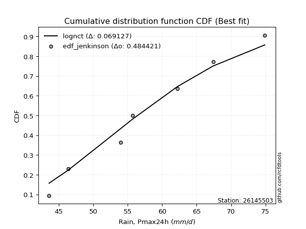</img></img>

</div>


### 11. EDF Cunnane (1978)

Cunnane´s work in statistical hydrology has focused on the performance and evaluation of different probability distributions (such as GEV, Gumbel, Lognormal) for flood frequency estimation. _b_ is a constant, typically set to 0.4.

<div align="center">


$P=(m-b)/(n+1-2b)$


</div>


**11.1. Empirical values**

<div align="center">

|                | 0                   | 1                   | 2                  | 3           | 4                  | 5                  | 6                  |
|:---------------|:--------------------|:--------------------|:-------------------|:------------|:-------------------|:-------------------|:-------------------|
| date           | 2017                | 2023                | 2020               | 2022        | 2019               | 2021               | 2018               |
| x              | 43.6                | 46.4                | 54.0               | 55.7        | 62.2               | 67.4               | 74.9               |
| m              | 1                   | 2                   | 3                  | 4           | 5                  | 6                  | 7                  |
| empirical_dist | edf_cunnane         | edf_cunnane         | edf_cunnane        | edf_cunnane | edf_cunnane        | edf_cunnane        | edf_cunnane        |
| empirical      | 0.08333333333333333 | 0.22222222222222224 | 0.3611111111111111 | 0.5         | 0.6388888888888888 | 0.7777777777777777 | 0.9166666666666666 |
| empirical_tr   | 1.090909090909091   | 1.2857142857142856  | 1.565217391304348  | 2.0         | 2.7692307692307687 | 4.499999999999998  | 11.999999999999995 |

</div>


**11.2. Kolmogorov-Smirnov fit test (sorted by Δ)**


<div align="center">

|                | 0                   | 1                   | 2                   | 3                   | 4                   | 5                   | 6                   | 7                   | 8                   | 9                   | 10                  | 11                  | 12                  | 13                  | 14                  | 15                  | 16                  | 17                  | 18                  | 19                  | 20                  | 21                  | 22                  | 23                  | 24                  | 25                  | 26                  | 27                  | 28                  | 29                  | 30                  | 31                  | 32                  | 33                  | 34                  | 35                  | 36                  | 37                  | 38                  | 39                  | 40                  | 41                  | 42                  | 43                    | 44                  | 45                  | 46                  | 47                  | 48                  | 49                  | 50                  | 51                  | 52                  | 53                  | 54                  | 55                  | 56                  | 57                  | 58                  | 59                  | 60                  | 61                  | 62                  | 63                  | 64                  | 65                  | 66                  | 67                  | 68                  | 69                  | 70                  | 71                  | 72                  | 73                  | 74                  | 75                  | 76                  | 77                  | 78                  | 79                  | 80                  | 81                  | 82                  | 83                  | 84                  | 85                  | 86                  | 87                  |
|:---------------|:--------------------|:--------------------|:--------------------|:--------------------|:--------------------|:--------------------|:--------------------|:--------------------|:--------------------|:--------------------|:--------------------|:--------------------|:--------------------|:--------------------|:--------------------|:--------------------|:--------------------|:--------------------|:--------------------|:--------------------|:--------------------|:--------------------|:--------------------|:--------------------|:--------------------|:--------------------|:--------------------|:--------------------|:--------------------|:--------------------|:--------------------|:--------------------|:--------------------|:--------------------|:--------------------|:--------------------|:--------------------|:--------------------|:--------------------|:--------------------|:--------------------|:--------------------|:--------------------|:----------------------|:--------------------|:--------------------|:--------------------|:--------------------|:--------------------|:--------------------|:--------------------|:--------------------|:--------------------|:--------------------|:--------------------|:--------------------|:--------------------|:--------------------|:--------------------|:--------------------|:--------------------|:--------------------|:--------------------|:--------------------|:--------------------|:--------------------|:--------------------|:--------------------|:--------------------|:--------------------|:--------------------|:--------------------|:--------------------|:--------------------|:--------------------|:--------------------|:--------------------|:--------------------|:--------------------|:--------------------|:--------------------|:--------------------|:--------------------|:--------------------|:--------------------|:--------------------|:--------------------|:--------------------|
| station        | 26145503            | 26145503            | 26145503            | 26145503            | 26145503            | 26145503            | 26145503            | 26145503            | 26145503            | 26145503            | 26145503            | 26145503            | 26145503            | 26145503            | 26145503            | 26145503            | 26145503            | 26145503            | 26145503            | 26145503            | 26145503            | 26145503            | 26145503            | 26145503            | 26145503            | 26145503            | 26145503            | 26145503            | 26145503            | 26145503            | 26145503            | 26145503            | 26145503            | 26145503            | 26145503            | 26145503            | 26145503            | 26145503            | 26145503            | 26145503            | 26145503            | 26145503            | 26145503            | 26145503              | 26145503            | 26145503            | 26145503            | 26145503            | 26145503            | 26145503            | 26145503            | 26145503            | 26145503            | 26145503            | 26145503            | 26145503            | 26145503            | 26145503            | 26145503            | 26145503            | 26145503            | 26145503            | 26145503            | 26145503            | 26145503            | 26145503            | 26145503            | 26145503            | 26145503            | 26145503            | 26145503            | 26145503            | 26145503            | 26145503            | 26145503            | 26145503            | 26145503            | 26145503            | 26145503            | 26145503            | 26145503            | 26145503            | 26145503            | 26145503            | 26145503            | 26145503            | 26145503            | 26145503            |
| empirical_dist | edf_cunnane         | edf_cunnane         | edf_cunnane         | edf_cunnane         | edf_cunnane         | edf_cunnane         | edf_cunnane         | edf_cunnane         | edf_cunnane         | edf_cunnane         | edf_cunnane         | edf_cunnane         | edf_cunnane         | edf_cunnane         | edf_cunnane         | edf_cunnane         | edf_cunnane         | edf_cunnane         | edf_cunnane         | edf_cunnane         | edf_cunnane         | edf_cunnane         | edf_cunnane         | edf_cunnane         | edf_cunnane         | edf_cunnane         | edf_cunnane         | edf_cunnane         | edf_cunnane         | edf_cunnane         | edf_cunnane         | edf_cunnane         | edf_cunnane         | edf_cunnane         | edf_cunnane         | edf_cunnane         | edf_cunnane         | edf_cunnane         | edf_cunnane         | edf_cunnane         | edf_cunnane         | edf_cunnane         | edf_cunnane         | edf_cunnane           | edf_cunnane         | edf_cunnane         | edf_cunnane         | edf_cunnane         | edf_cunnane         | edf_cunnane         | edf_cunnane         | edf_cunnane         | edf_cunnane         | edf_cunnane         | edf_cunnane         | edf_cunnane         | edf_cunnane         | edf_cunnane         | edf_cunnane         | edf_cunnane         | edf_cunnane         | edf_cunnane         | edf_cunnane         | edf_cunnane         | edf_cunnane         | edf_cunnane         | edf_cunnane         | edf_cunnane         | edf_cunnane         | edf_cunnane         | edf_cunnane         | edf_cunnane         | edf_cunnane         | edf_cunnane         | edf_cunnane         | edf_cunnane         | edf_cunnane         | edf_cunnane         | edf_cunnane         | edf_cunnane         | edf_cunnane         | edf_cunnane         | edf_cunnane         | edf_cunnane         | edf_cunnane         | edf_cunnane         | edf_cunnane         | edf_cunnane         |
| p_dist         | lognct              | t                   | norm                | crystalball         | exponnorm           | maxwell             | pearson3            | fisk                | logfisk             | rayleigh            | erlang              | kstwobign           | genlogistic         | logloggamma         | invweibull          | logf                | f                   | logpearson3         | logjohnsonsu        | logt                | logexponnorm        | lognorm             | lognorm             | logcrystalball      | loggamma            | loggamma            | logerlang           | alpha               | invgauss            | logalpha            | loginvgamma         | betaprime           | invgamma            | johnsonsu           | logfatiguelife      | loginvgauss         | nct                 | logncf              | loggenlogistic      | logweibull_min      | genexpon            | logmaxwell          | mielke              | loglaplace_asymmetric | lograyleigh         | laplace_asymmetric  | logistic            | logmielke           | logrice             | rice                | loglogistic         | logkstwobign        | hypsecant           | loginvweibull       | halfnorm            | gompertz            | loggenexpon         | loggumbel_l         | loghypsecant        | gumbel_r            | loglaplace          | laplace             | loghalfnorm         | loggumbel_r         | loggompertz         | gumbel_l            | moyal               | logmoyal            | expon               | halflogistic        | logbetaprime        | loghalflogistic     | logexpon            | gamma               | wald                | gibrat              | logwald             | loggibrat           | logtruncnorm        | lognakagami         | truncnorm           | logchi2             | loglognorm          | nakagami            | fatiguelife         | weibull_min         | ncf                 | chi2                |
| delta          | 0.07366898397809536 | 0.08493867333863611 | 0.08494952660460778 | 0.08494952721843482 | 0.08518775699548053 | 0.0861023326594064  | 0.08709627320319985 | 0.0872781783933271  | 0.08735870802794637 | 0.08772876240864472 | 0.08861079498735647 | 0.08947370388614753 | 0.09042679565487377 | 0.0904955963933568  | 0.09074878807389691 | 0.0912552236491656  | 0.0913151355074493  | 0.09133292246348432 | 0.09136222718214035 | 0.09136481035685792 | 0.09136634190545867 | 0.09136705524724067 | 0.09136705524724067 | 0.09136708056661855 | 0.09139678579039032 | 0.09139678579039032 | 0.09140506717690722 | 0.09162537608978136 | 0.09193202014062496 | 0.09220231131844056 | 0.09225616229436395 | 0.0923221317192417  | 0.09237578021062867 | 0.09240013182170773 | 0.09262542736954874 | 0.09315854597505463 | 0.09329087232860891 | 0.09351868041433545 | 0.09372596960431234 | 0.09381829927855564 | 0.09391637068064368 | 0.09413633346286976 | 0.0941590788079742  | 0.09523465399537248   | 0.09666304778140383 | 0.09904212343063871 | 0.10110115839060639 | 0.10134099058198776 | 0.10236222627264038 | 0.10592691972590487 | 0.10672016926851982 | 0.10760691423403196 | 0.10901551511137694 | 0.11079523790435702 | 0.11149917119717379 | 0.11200913217675557 | 0.11349953030197352 | 0.11401787499159555 | 0.11407512261058901 | 0.11993641186474689 | 0.11997900505300571 | 0.12146524082945237 | 0.12563261876260637 | 0.12860279157603682 | 0.13487231149951356 | 0.14647476606847937 | 0.14768106812409693 | 0.15690666350437993 | 0.15955292208345356 | 0.1681339878430565  | 0.17515310613792578 | 0.1853482714223021  | 0.19318927256758084 | 0.22144740937861923 | 0.22222222222222224 | 0.22222222222222224 | 0.22222222222222224 | 0.22222222222222224 | 0.23514534128895964 | 0.24264456877800772 | 0.3610981672008141  | 0.3690741426890968  | 0.39160789402576646 | 0.4095859317217723  | 0.46822769804453995 | 0.5009327729650702  | 0.5404526450731866  | 0.6732808034567408  |
| deltao         | 0.48442053926100004 | 0.48442053926100004 | 0.48442053926100004 | 0.48442053926100004 | 0.48442053926100004 | 0.48442053926100004 | 0.48442053926100004 | 0.48442053926100004 | 0.48442053926100004 | 0.48442053926100004 | 0.48442053926100004 | 0.48442053926100004 | 0.48442053926100004 | 0.48442053926100004 | 0.48442053926100004 | 0.48442053926100004 | 0.48442053926100004 | 0.48442053926100004 | 0.48442053926100004 | 0.48442053926100004 | 0.48442053926100004 | 0.48442053926100004 | 0.48442053926100004 | 0.48442053926100004 | 0.48442053926100004 | 0.48442053926100004 | 0.48442053926100004 | 0.48442053926100004 | 0.48442053926100004 | 0.48442053926100004 | 0.48442053926100004 | 0.48442053926100004 | 0.48442053926100004 | 0.48442053926100004 | 0.48442053926100004 | 0.48442053926100004 | 0.48442053926100004 | 0.48442053926100004 | 0.48442053926100004 | 0.48442053926100004 | 0.48442053926100004 | 0.48442053926100004 | 0.48442053926100004 | 0.48442053926100004   | 0.48442053926100004 | 0.48442053926100004 | 0.48442053926100004 | 0.48442053926100004 | 0.48442053926100004 | 0.48442053926100004 | 0.48442053926100004 | 0.48442053926100004 | 0.48442053926100004 | 0.48442053926100004 | 0.48442053926100004 | 0.48442053926100004 | 0.48442053926100004 | 0.48442053926100004 | 0.48442053926100004 | 0.48442053926100004 | 0.48442053926100004 | 0.48442053926100004 | 0.48442053926100004 | 0.48442053926100004 | 0.48442053926100004 | 0.48442053926100004 | 0.48442053926100004 | 0.48442053926100004 | 0.48442053926100004 | 0.48442053926100004 | 0.48442053926100004 | 0.48442053926100004 | 0.48442053926100004 | 0.48442053926100004 | 0.48442053926100004 | 0.48442053926100004 | 0.48442053926100004 | 0.48442053926100004 | 0.48442053926100004 | 0.48442053926100004 | 0.48442053926100004 | 0.48442053926100004 | 0.48442053926100004 | 0.48442053926100004 | 0.48442053926100004 | 0.48442053926100004 | 0.48442053926100004 | 0.48442053926100004 |
| eval           | Δo > Δ              | Δo > Δ              | Δo > Δ              | Δo > Δ              | Δo > Δ              | Δo > Δ              | Δo > Δ              | Δo > Δ              | Δo > Δ              | Δo > Δ              | Δo > Δ              | Δo > Δ              | Δo > Δ              | Δo > Δ              | Δo > Δ              | Δo > Δ              | Δo > Δ              | Δo > Δ              | Δo > Δ              | Δo > Δ              | Δo > Δ              | Δo > Δ              | Δo > Δ              | Δo > Δ              | Δo > Δ              | Δo > Δ              | Δo > Δ              | Δo > Δ              | Δo > Δ              | Δo > Δ              | Δo > Δ              | Δo > Δ              | Δo > Δ              | Δo > Δ              | Δo > Δ              | Δo > Δ              | Δo > Δ              | Δo > Δ              | Δo > Δ              | Δo > Δ              | Δo > Δ              | Δo > Δ              | Δo > Δ              | Δo > Δ                | Δo > Δ              | Δo > Δ              | Δo > Δ              | Δo > Δ              | Δo > Δ              | Δo > Δ              | Δo > Δ              | Δo > Δ              | Δo > Δ              | Δo > Δ              | Δo > Δ              | Δo > Δ              | Δo > Δ              | Δo > Δ              | Δo > Δ              | Δo > Δ              | Δo > Δ              | Δo > Δ              | Δo > Δ              | Δo > Δ              | Δo > Δ              | Δo > Δ              | Δo > Δ              | Δo > Δ              | Δo > Δ              | Δo > Δ              | Δo > Δ              | Δo > Δ              | Δo > Δ              | Δo > Δ              | Δo > Δ              | Δo > Δ              | Δo > Δ              | Δo > Δ              | Δo > Δ              | Δo > Δ              | Δo > Δ              | Δo > Δ              | Δo > Δ              | Δo > Δ              | Δo > Δ              | Δo <= Δ             | Δo <= Δ             | Δo <= Δ             |
| fit            | 1                   | 1                   | 1                   | 1                   | 1                   | 1                   | 1                   | 1                   | 1                   | 1                   | 1                   | 1                   | 1                   | 1                   | 1                   | 1                   | 1                   | 1                   | 1                   | 1                   | 1                   | 1                   | 1                   | 1                   | 1                   | 1                   | 1                   | 1                   | 1                   | 1                   | 1                   | 1                   | 1                   | 1                   | 1                   | 1                   | 1                   | 1                   | 1                   | 1                   | 1                   | 1                   | 1                   | 1                     | 1                   | 1                   | 1                   | 1                   | 1                   | 1                   | 1                   | 1                   | 1                   | 1                   | 1                   | 1                   | 1                   | 1                   | 1                   | 1                   | 1                   | 1                   | 1                   | 1                   | 1                   | 1                   | 1                   | 1                   | 1                   | 1                   | 1                   | 1                   | 1                   | 1                   | 1                   | 1                   | 1                   | 1                   | 1                   | 1                   | 1                   | 1                   | 1                   | 1                   | 1                   | 0                   | 0                   | 0                   |
| n              | 7                   | 7                   | 7                   | 7                   | 7                   | 7                   | 7                   | 7                   | 7                   | 7                   | 7                   | 7                   | 7                   | 7                   | 7                   | 7                   | 7                   | 7                   | 7                   | 7                   | 7                   | 7                   | 7                   | 7                   | 7                   | 7                   | 7                   | 7                   | 7                   | 7                   | 7                   | 7                   | 7                   | 7                   | 7                   | 7                   | 7                   | 7                   | 7                   | 7                   | 7                   | 7                   | 7                   | 7                     | 7                   | 7                   | 7                   | 7                   | 7                   | 7                   | 7                   | 7                   | 7                   | 7                   | 7                   | 7                   | 7                   | 7                   | 7                   | 7                   | 7                   | 7                   | 7                   | 7                   | 7                   | 7                   | 7                   | 7                   | 7                   | 7                   | 7                   | 7                   | 7                   | 7                   | 7                   | 7                   | 7                   | 7                   | 7                   | 7                   | 7                   | 7                   | 7                   | 7                   | 7                   | 7                   | 7                   | 7                   |
| best_fit       | 1                   | 0                   | 0                   | 0                   | 0                   | 0                   | 0                   | 0                   | 0                   | 0                   | 0                   | 0                   | 0                   | 0                   | 0                   | 0                   | 0                   | 0                   | 0                   | 0                   | 0                   | 0                   | 0                   | 0                   | 0                   | 0                   | 0                   | 0                   | 0                   | 0                   | 0                   | 0                   | 0                   | 0                   | 0                   | 0                   | 0                   | 0                   | 0                   | 0                   | 0                   | 0                   | 0                   | 0                     | 0                   | 0                   | 0                   | 0                   | 0                   | 0                   | 0                   | 0                   | 0                   | 0                   | 0                   | 0                   | 0                   | 0                   | 0                   | 0                   | 0                   | 0                   | 0                   | 0                   | 0                   | 0                   | 0                   | 0                   | 0                   | 0                   | 0                   | 0                   | 0                   | 0                   | 0                   | 0                   | 0                   | 0                   | 0                   | 0                   | 0                   | 0                   | 0                   | 0                   | 0                   | 0                   | 0                   | 0                   |
| best_fit_sort  | 1                   | 2                   | 3                   | 4                   | 5                   | 6                   | 7                   | 8                   | 9                   | 10                  | 11                  | 12                  | 13                  | 14                  | 15                  | 16                  | 17                  | 18                  | 19                  | 20                  | 21                  | 22                  | 23                  | 24                  | 25                  | 26                  | 27                  | 28                  | 29                  | 30                  | 31                  | 32                  | 33                  | 34                  | 35                  | 36                  | 37                  | 38                  | 39                  | 40                  | 41                  | 42                  | 43                  | 44                    | 45                  | 46                  | 47                  | 48                  | 49                  | 50                  | 51                  | 52                  | 53                  | 54                  | 55                  | 56                  | 57                  | 58                  | 59                  | 60                  | 61                  | 62                  | 63                  | 64                  | 65                  | 66                  | 67                  | 68                  | 69                  | 70                  | 71                  | 72                  | 73                  | 74                  | 75                  | 76                  | 77                  | 78                  | 79                  | 80                  | 81                  | 82                  | 83                  | 84                  | 85                  | 86                  | 87                  | 88                  |

</div>


**11.3. Best fit**

<div align="center">

|   id |   station | empirical_dist   | p_dist   |    delta |   deltao | eval   |   fit |   n |   best_fit |   best_fit_sort |
|-----:|----------:|:-----------------|:---------|---------:|---------:|:-------|------:|----:|-----------:|----------------:|
|    0 |  26145503 | edf_cunnane      | lognct   | 0.073669 | 0.484421 | Δo > Δ |     1 |   7 |          1 |               1 |

</div>


<div align="center">

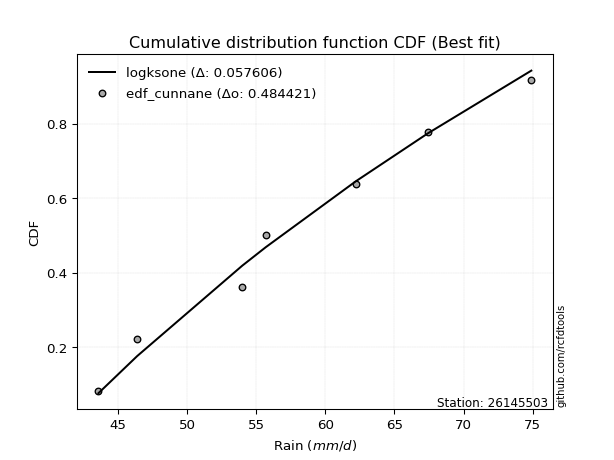</img>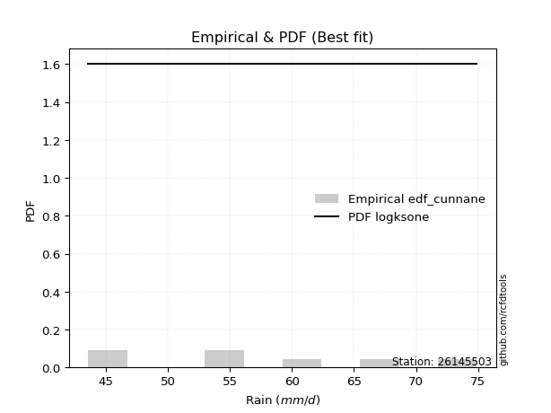</img>

</div>


### 12. EDF Adamowski (1981)

The Adamowski formula in hydrology refers to a specific plotting position formula used for estimating the non-parametric empirical distribution of hydrological events (like flood peaks) to calculate their return periods. This formula provides an alternative to traditional parametric methods (like the Gumbel or Log Pearson Type III distributions). 

<div align="center">


$P=(m-0.25)/(n+0.5)$


</div>


**12.1. Empirical values**

<div align="center">

|                | 0                  | 1                   | 2                   | 3             | 4                  | 5                  | 6                  |
|:---------------|:-------------------|:--------------------|:--------------------|:--------------|:-------------------|:-------------------|:-------------------|
| date           | 2017               | 2023                | 2020                | 2022          | 2019               | 2021               | 2018               |
| x              | 43.6               | 46.4                | 54.0                | 55.7          | 62.2               | 67.4               | 74.9               |
| m              | 1                  | 2                   | 3                   | 4             | 5                  | 6                  | 7                  |
| empirical_dist | edf_adamowski      | edf_adamowski       | edf_adamowski       | edf_adamowski | edf_adamowski      | edf_adamowski      | edf_adamowski      |
| empirical      | 0.1                | 0.23333333333333334 | 0.36666666666666664 | 0.5           | 0.6333333333333333 | 0.7666666666666667 | 0.9                |
| empirical_tr   | 1.1111111111111112 | 1.3043478260869565  | 1.5789473684210527  | 2.0           | 2.727272727272727  | 4.2857142857142865 | 10.000000000000002 |

</div>


**12.2. Kolmogorov-Smirnov fit test (sorted by Δ)**


<div align="center">

|                | 0                   | 1                   | 2                   | 3                   | 4                   | 5                   | 6                   | 7                   | 8                   | 9                   | 10                  | 11                  | 12                  | 13                  | 14                  | 15                  | 16                  | 17                  | 18                  | 19                  | 20                  | 21                  | 22                  | 23                  | 24                  | 25                  | 26                  | 27                  | 28                  | 29                  | 30                  | 31                  | 32                  | 33                  | 34                  | 35                  | 36                  | 37                  | 38                  | 39                  | 40                  | 41                  | 42                  | 43                  | 44                  | 45                  | 46                    | 47                  | 48                  | 49                  | 50                  | 51                  | 52                  | 53                  | 54                  | 55                  | 56                  | 57                  | 58                  | 59                  | 60                  | 61                  | 62                  | 63                  | 64                  | 65                  | 66                  | 67                  | 68                  | 69                  | 70                  | 71                  | 72                  | 73                  | 74                  | 75                  | 76                  | 77                  | 78                  | 79                  | 80                  | 81                  | 82                  | 83                  | 84                  | 85                  | 86                  | 87                  |
|:---------------|:--------------------|:--------------------|:--------------------|:--------------------|:--------------------|:--------------------|:--------------------|:--------------------|:--------------------|:--------------------|:--------------------|:--------------------|:--------------------|:--------------------|:--------------------|:--------------------|:--------------------|:--------------------|:--------------------|:--------------------|:--------------------|:--------------------|:--------------------|:--------------------|:--------------------|:--------------------|:--------------------|:--------------------|:--------------------|:--------------------|:--------------------|:--------------------|:--------------------|:--------------------|:--------------------|:--------------------|:--------------------|:--------------------|:--------------------|:--------------------|:--------------------|:--------------------|:--------------------|:--------------------|:--------------------|:--------------------|:----------------------|:--------------------|:--------------------|:--------------------|:--------------------|:--------------------|:--------------------|:--------------------|:--------------------|:--------------------|:--------------------|:--------------------|:--------------------|:--------------------|:--------------------|:--------------------|:--------------------|:--------------------|:--------------------|:--------------------|:--------------------|:--------------------|:--------------------|:--------------------|:--------------------|:--------------------|:--------------------|:--------------------|:--------------------|:--------------------|:--------------------|:--------------------|:--------------------|:--------------------|:--------------------|:--------------------|:--------------------|:--------------------|:--------------------|:--------------------|:--------------------|:--------------------|
| station        | 26145503            | 26145503            | 26145503            | 26145503            | 26145503            | 26145503            | 26145503            | 26145503            | 26145503            | 26145503            | 26145503            | 26145503            | 26145503            | 26145503            | 26145503            | 26145503            | 26145503            | 26145503            | 26145503            | 26145503            | 26145503            | 26145503            | 26145503            | 26145503            | 26145503            | 26145503            | 26145503            | 26145503            | 26145503            | 26145503            | 26145503            | 26145503            | 26145503            | 26145503            | 26145503            | 26145503            | 26145503            | 26145503            | 26145503            | 26145503            | 26145503            | 26145503            | 26145503            | 26145503            | 26145503            | 26145503            | 26145503              | 26145503            | 26145503            | 26145503            | 26145503            | 26145503            | 26145503            | 26145503            | 26145503            | 26145503            | 26145503            | 26145503            | 26145503            | 26145503            | 26145503            | 26145503            | 26145503            | 26145503            | 26145503            | 26145503            | 26145503            | 26145503            | 26145503            | 26145503            | 26145503            | 26145503            | 26145503            | 26145503            | 26145503            | 26145503            | 26145503            | 26145503            | 26145503            | 26145503            | 26145503            | 26145503            | 26145503            | 26145503            | 26145503            | 26145503            | 26145503            | 26145503            |
| empirical_dist | edf_adamowski       | edf_adamowski       | edf_adamowski       | edf_adamowski       | edf_adamowski       | edf_adamowski       | edf_adamowski       | edf_adamowski       | edf_adamowski       | edf_adamowski       | edf_adamowski       | edf_adamowski       | edf_adamowski       | edf_adamowski       | edf_adamowski       | edf_adamowski       | edf_adamowski       | edf_adamowski       | edf_adamowski       | edf_adamowski       | edf_adamowski       | edf_adamowski       | edf_adamowski       | edf_adamowski       | edf_adamowski       | edf_adamowski       | edf_adamowski       | edf_adamowski       | edf_adamowski       | edf_adamowski       | edf_adamowski       | edf_adamowski       | edf_adamowski       | edf_adamowski       | edf_adamowski       | edf_adamowski       | edf_adamowski       | edf_adamowski       | edf_adamowski       | edf_adamowski       | edf_adamowski       | edf_adamowski       | edf_adamowski       | edf_adamowski       | edf_adamowski       | edf_adamowski       | edf_adamowski         | edf_adamowski       | edf_adamowski       | edf_adamowski       | edf_adamowski       | edf_adamowski       | edf_adamowski       | edf_adamowski       | edf_adamowski       | edf_adamowski       | edf_adamowski       | edf_adamowski       | edf_adamowski       | edf_adamowski       | edf_adamowski       | edf_adamowski       | edf_adamowski       | edf_adamowski       | edf_adamowski       | edf_adamowski       | edf_adamowski       | edf_adamowski       | edf_adamowski       | edf_adamowski       | edf_adamowski       | edf_adamowski       | edf_adamowski       | edf_adamowski       | edf_adamowski       | edf_adamowski       | edf_adamowski       | edf_adamowski       | edf_adamowski       | edf_adamowski       | edf_adamowski       | edf_adamowski       | edf_adamowski       | edf_adamowski       | edf_adamowski       | edf_adamowski       | edf_adamowski       | edf_adamowski       |
| p_dist         | lognct              | t                   | norm                | crystalball         | exponnorm           | logmielke           | mielke              | maxwell             | loggenlogistic      | pearson3            | fisk                | logfisk             | rayleigh            | erlang              | kstwobign           | genlogistic         | logloggamma         | invweibull          | logkstwobign        | logf                | f                   | logpearson3         | logjohnsonsu        | logt                | logexponnorm        | lognorm             | lognorm             | logcrystalball      | loggamma            | loggamma            | logerlang           | alpha               | genexpon            | invgauss            | logalpha            | loginvgamma         | betaprime           | invgamma            | johnsonsu           | logfatiguelife      | loginvgauss         | nct                 | logncf              | logweibull_min      | loginvweibull       | logmaxwell          | loglaplace_asymmetric | lograyleigh         | loggenexpon         | laplace_asymmetric  | logistic            | logrice             | loggumbel_l         | rice                | loglogistic         | hypsecant           | halfnorm            | gompertz            | loghypsecant        | laplace             | loggompertz         | gumbel_r            | loglaplace          | loghalfnorm         | loggumbel_r         | gumbel_l            | expon               | logbetaprime        | moyal               | logmoyal            | halflogistic        | logexpon            | loghalflogistic     | gamma               | logtruncnorm        | gibrat              | wald                | logwald             | loggibrat           | lognakagami         | logchi2             | truncnorm           | loglognorm          | nakagami            | fatiguelife         | weibull_min         | ncf                 | chi2                |
| delta          | 0.06695922366742924 | 0.09604978444974721 | 0.09606063771571888 | 0.09606063832954592 | 0.09629886810659163 | 0.09643750484743063 | 0.09720707585315347 | 0.0972134437705175  | 0.09733825021955933 | 0.09820738431431095 | 0.0983892895044382  | 0.09846981913905747 | 0.09883987351975582 | 0.09972190609846757 | 0.10058481499725863 | 0.10153790676598487 | 0.1016067075044679  | 0.10185989918500801 | 0.10205135867847642 | 0.1023663347602767  | 0.1024262466185604  | 0.10244403357459542 | 0.10247333829325145 | 0.10247592146796902 | 0.10247745301656977 | 0.10247816635835177 | 0.10247816635835177 | 0.10247819167772965 | 0.10250789690150142 | 0.10250789690150142 | 0.10251617828801832 | 0.10273648720089246 | 0.10299941112384922 | 0.10304313125173606 | 0.10331342242955166 | 0.10336727340547505 | 0.1034332428303528  | 0.10348689132173977 | 0.10351124293281883 | 0.10373653848065983 | 0.10426965708616573 | 0.10440198343972001 | 0.10462979152544655 | 0.10492941038966674 | 0.10523968234880149 | 0.10524744457398086 | 0.10634576510648358   | 0.10777415889251493 | 0.10794397474641798 | 0.11015323454174981 | 0.11221226950171749 | 0.11347333738375148 | 0.11401787499159555 | 0.11703803083701597 | 0.11783128037963092 | 0.12012662622248804 | 0.12261028230828488 | 0.12312024328786667 | 0.12518623372170012 | 0.1267037641587153  | 0.12931675594395803 | 0.13104752297585798 | 0.1310901161641168  | 0.13674372987371747 | 0.1397139026871479  | 0.14647476606847937 | 0.15399736652789803 | 0.15848643947125918 | 0.158792179235208   | 0.16801777461549103 | 0.17924509895416757 | 0.1876337170120253  | 0.1964593825334132  | 0.2158918538230637  | 0.2295897857334041  | 0.23333333333333334 | 0.23333333333333334 | 0.23333333333333334 | 0.23333333333333334 | 0.23708901322245218 | 0.35240747602243017 | 0.36665372275636965 | 0.38049678291465533 | 0.4040303761662168  | 0.4626721424889844  | 0.4898216618539591  | 0.52378597840652    | 0.6621696923456297  |
| deltao         | 0.48442053926100004 | 0.48442053926100004 | 0.48442053926100004 | 0.48442053926100004 | 0.48442053926100004 | 0.48442053926100004 | 0.48442053926100004 | 0.48442053926100004 | 0.48442053926100004 | 0.48442053926100004 | 0.48442053926100004 | 0.48442053926100004 | 0.48442053926100004 | 0.48442053926100004 | 0.48442053926100004 | 0.48442053926100004 | 0.48442053926100004 | 0.48442053926100004 | 0.48442053926100004 | 0.48442053926100004 | 0.48442053926100004 | 0.48442053926100004 | 0.48442053926100004 | 0.48442053926100004 | 0.48442053926100004 | 0.48442053926100004 | 0.48442053926100004 | 0.48442053926100004 | 0.48442053926100004 | 0.48442053926100004 | 0.48442053926100004 | 0.48442053926100004 | 0.48442053926100004 | 0.48442053926100004 | 0.48442053926100004 | 0.48442053926100004 | 0.48442053926100004 | 0.48442053926100004 | 0.48442053926100004 | 0.48442053926100004 | 0.48442053926100004 | 0.48442053926100004 | 0.48442053926100004 | 0.48442053926100004 | 0.48442053926100004 | 0.48442053926100004 | 0.48442053926100004   | 0.48442053926100004 | 0.48442053926100004 | 0.48442053926100004 | 0.48442053926100004 | 0.48442053926100004 | 0.48442053926100004 | 0.48442053926100004 | 0.48442053926100004 | 0.48442053926100004 | 0.48442053926100004 | 0.48442053926100004 | 0.48442053926100004 | 0.48442053926100004 | 0.48442053926100004 | 0.48442053926100004 | 0.48442053926100004 | 0.48442053926100004 | 0.48442053926100004 | 0.48442053926100004 | 0.48442053926100004 | 0.48442053926100004 | 0.48442053926100004 | 0.48442053926100004 | 0.48442053926100004 | 0.48442053926100004 | 0.48442053926100004 | 0.48442053926100004 | 0.48442053926100004 | 0.48442053926100004 | 0.48442053926100004 | 0.48442053926100004 | 0.48442053926100004 | 0.48442053926100004 | 0.48442053926100004 | 0.48442053926100004 | 0.48442053926100004 | 0.48442053926100004 | 0.48442053926100004 | 0.48442053926100004 | 0.48442053926100004 | 0.48442053926100004 |
| eval           | Δo > Δ              | Δo > Δ              | Δo > Δ              | Δo > Δ              | Δo > Δ              | Δo > Δ              | Δo > Δ              | Δo > Δ              | Δo > Δ              | Δo > Δ              | Δo > Δ              | Δo > Δ              | Δo > Δ              | Δo > Δ              | Δo > Δ              | Δo > Δ              | Δo > Δ              | Δo > Δ              | Δo > Δ              | Δo > Δ              | Δo > Δ              | Δo > Δ              | Δo > Δ              | Δo > Δ              | Δo > Δ              | Δo > Δ              | Δo > Δ              | Δo > Δ              | Δo > Δ              | Δo > Δ              | Δo > Δ              | Δo > Δ              | Δo > Δ              | Δo > Δ              | Δo > Δ              | Δo > Δ              | Δo > Δ              | Δo > Δ              | Δo > Δ              | Δo > Δ              | Δo > Δ              | Δo > Δ              | Δo > Δ              | Δo > Δ              | Δo > Δ              | Δo > Δ              | Δo > Δ                | Δo > Δ              | Δo > Δ              | Δo > Δ              | Δo > Δ              | Δo > Δ              | Δo > Δ              | Δo > Δ              | Δo > Δ              | Δo > Δ              | Δo > Δ              | Δo > Δ              | Δo > Δ              | Δo > Δ              | Δo > Δ              | Δo > Δ              | Δo > Δ              | Δo > Δ              | Δo > Δ              | Δo > Δ              | Δo > Δ              | Δo > Δ              | Δo > Δ              | Δo > Δ              | Δo > Δ              | Δo > Δ              | Δo > Δ              | Δo > Δ              | Δo > Δ              | Δo > Δ              | Δo > Δ              | Δo > Δ              | Δo > Δ              | Δo > Δ              | Δo > Δ              | Δo > Δ              | Δo > Δ              | Δo > Δ              | Δo > Δ              | Δo <= Δ             | Δo <= Δ             | Δo <= Δ             |
| fit            | 1                   | 1                   | 1                   | 1                   | 1                   | 1                   | 1                   | 1                   | 1                   | 1                   | 1                   | 1                   | 1                   | 1                   | 1                   | 1                   | 1                   | 1                   | 1                   | 1                   | 1                   | 1                   | 1                   | 1                   | 1                   | 1                   | 1                   | 1                   | 1                   | 1                   | 1                   | 1                   | 1                   | 1                   | 1                   | 1                   | 1                   | 1                   | 1                   | 1                   | 1                   | 1                   | 1                   | 1                   | 1                   | 1                   | 1                     | 1                   | 1                   | 1                   | 1                   | 1                   | 1                   | 1                   | 1                   | 1                   | 1                   | 1                   | 1                   | 1                   | 1                   | 1                   | 1                   | 1                   | 1                   | 1                   | 1                   | 1                   | 1                   | 1                   | 1                   | 1                   | 1                   | 1                   | 1                   | 1                   | 1                   | 1                   | 1                   | 1                   | 1                   | 1                   | 1                   | 1                   | 1                   | 0                   | 0                   | 0                   |
| n              | 7                   | 7                   | 7                   | 7                   | 7                   | 7                   | 7                   | 7                   | 7                   | 7                   | 7                   | 7                   | 7                   | 7                   | 7                   | 7                   | 7                   | 7                   | 7                   | 7                   | 7                   | 7                   | 7                   | 7                   | 7                   | 7                   | 7                   | 7                   | 7                   | 7                   | 7                   | 7                   | 7                   | 7                   | 7                   | 7                   | 7                   | 7                   | 7                   | 7                   | 7                   | 7                   | 7                   | 7                   | 7                   | 7                   | 7                     | 7                   | 7                   | 7                   | 7                   | 7                   | 7                   | 7                   | 7                   | 7                   | 7                   | 7                   | 7                   | 7                   | 7                   | 7                   | 7                   | 7                   | 7                   | 7                   | 7                   | 7                   | 7                   | 7                   | 7                   | 7                   | 7                   | 7                   | 7                   | 7                   | 7                   | 7                   | 7                   | 7                   | 7                   | 7                   | 7                   | 7                   | 7                   | 7                   | 7                   | 7                   |
| best_fit       | 1                   | 0                   | 0                   | 0                   | 0                   | 0                   | 0                   | 0                   | 0                   | 0                   | 0                   | 0                   | 0                   | 0                   | 0                   | 0                   | 0                   | 0                   | 0                   | 0                   | 0                   | 0                   | 0                   | 0                   | 0                   | 0                   | 0                   | 0                   | 0                   | 0                   | 0                   | 0                   | 0                   | 0                   | 0                   | 0                   | 0                   | 0                   | 0                   | 0                   | 0                   | 0                   | 0                   | 0                   | 0                   | 0                   | 0                     | 0                   | 0                   | 0                   | 0                   | 0                   | 0                   | 0                   | 0                   | 0                   | 0                   | 0                   | 0                   | 0                   | 0                   | 0                   | 0                   | 0                   | 0                   | 0                   | 0                   | 0                   | 0                   | 0                   | 0                   | 0                   | 0                   | 0                   | 0                   | 0                   | 0                   | 0                   | 0                   | 0                   | 0                   | 0                   | 0                   | 0                   | 0                   | 0                   | 0                   | 0                   |
| best_fit_sort  | 1                   | 2                   | 3                   | 4                   | 5                   | 6                   | 7                   | 8                   | 9                   | 10                  | 11                  | 12                  | 13                  | 14                  | 15                  | 16                  | 17                  | 18                  | 19                  | 20                  | 21                  | 22                  | 23                  | 24                  | 25                  | 26                  | 27                  | 28                  | 29                  | 30                  | 31                  | 32                  | 33                  | 34                  | 35                  | 36                  | 37                  | 38                  | 39                  | 40                  | 41                  | 42                  | 43                  | 44                  | 45                  | 46                  | 47                    | 48                  | 49                  | 50                  | 51                  | 52                  | 53                  | 54                  | 55                  | 56                  | 57                  | 58                  | 59                  | 60                  | 61                  | 62                  | 63                  | 64                  | 65                  | 66                  | 67                  | 68                  | 69                  | 70                  | 71                  | 72                  | 73                  | 74                  | 75                  | 76                  | 77                  | 78                  | 79                  | 80                  | 81                  | 82                  | 83                  | 84                  | 85                  | 86                  | 87                  | 88                  |

</div>


**12.3. Best fit**

<div align="center">

|   id |   station | empirical_dist   | p_dist   |     delta |   deltao | eval   |   fit |   n |   best_fit |   best_fit_sort |
|-----:|----------:|:-----------------|:---------|----------:|---------:|:-------|------:|----:|-----------:|----------------:|
|    0 |  26145503 | edf_adamowski    | lognct   | 0.0669592 | 0.484421 | Δo > Δ |     1 |   7 |          1 |               1 |

</div>


<div align="center">

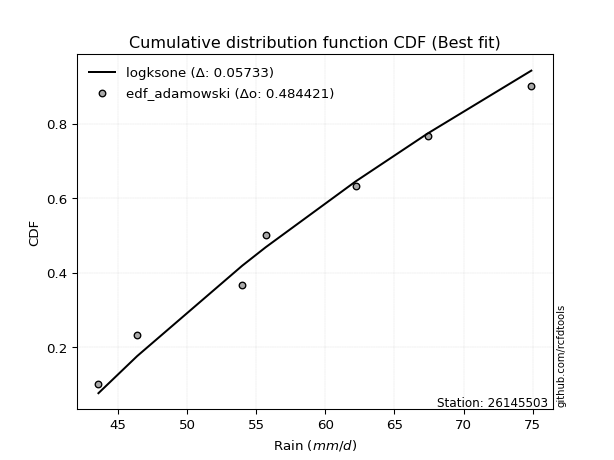</img>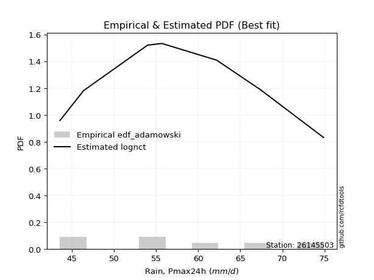</img>

</div>


## C. Best fit & Estimate extreme values for specific return periods - Tr

Best fit in probability distribution analysis means finding the theoretical distribution (like Normal, Poisson, Exponential) that most accurately mirrors your real-world data´s patterns (shape, center, spread) for better predictions, using methods like visual checks (Q-Q plots), goodness-of-fit tests (Kolmogorov-Smirnov, Chi-Squared), and information criteria (AIC) to score and select the simplest, most representative model.


### 1. Best fit (ordered by delta Δ)

<div align="center">

|   id |   station | empirical_dist   | p_dist        |     delta |   deltao | eval   |   fit |   n |   best_fit |   best_fit_sort |
|-----:|----------:|:-----------------|:--------------|----------:|---------:|:-------|------:|----:|-----------:|----------------:|
|    0 |  26145503 | edf_weibull      | lognct        | 0.0586259 | 0.484421 | Δo > Δ |     1 |   7 |          1 |               1 |
|    1 |  26145503 | edf_adamowski    | lognct        | 0.0669592 | 0.484421 | Δo > Δ |     1 |   7 |          1 |               2 |
|    2 |  26145503 | edf_chegodayev   | lognct        | 0.068761  | 0.484421 | Δo > Δ |     1 |   7 |          1 |               3 |
|    3 |  26145503 | edf_jenkinson    | lognct        | 0.0691272 | 0.484421 | Δo > Δ |     1 |   7 |          1 |               4 |
|    4 |  26145503 | edf_beard        | lognct        | 0.0691272 | 0.484421 | Δo > Δ |     1 |   7 |          1 |               5 |
|    5 |  26145503 | edf_filliben     | lognct        | 0.0694032 | 0.484421 | Δo > Δ |     1 |   7 |          1 |               6 |
|    6 |  26145503 | edf_tukey        | lognct        | 0.0699895 | 0.484421 | Δo > Δ |     1 |   7 |          1 |               7 |
|    7 |  26145503 | edf_blom         | lognct        | 0.0715569 | 0.484421 | Δo > Δ |     1 |   7 |          1 |               8 |
|    8 |  26145503 | edf_cunnane      | lognct        | 0.073669  | 0.484421 | Δo > Δ |     1 |   7 |          1 |               9 |
|    9 |  26145503 | edf_hazen        | exponnorm     | 0.0772512 | 0.484421 | Δo > Δ |     1 |   7 |          1 |              10 |
|   10 |  26145503 | edf_gringorten   | lognct        | 0.0783506 | 0.484421 | Δo > Δ |     1 |   7 |          1 |              11 |
|   11 |  26145503 | edf_california   | loginvweibull | 0.139458  | 0.484421 | Δo > Δ |     1 |   7 |          1 |              12 |

</div>

:file_folder:Tables: [bestfit_26145503.csv](table/bestfit_26145503.csv) | [extreme_26145503.csv](table/extreme_26145503.csv)


### 2. Extreme values

In hydrology, a return period (or recurrence interval $Tr$) is the statistical average time between extreme events like floods or droughts of a specific magnitude, indicating how rare an event is, with a 100-year flood, for example, having a 1% chance of occurring in any given year, not that it happens exactly every century. It is a key tool for infrastructure design (like bridges or dams) and risk assessment, calculated from historical data to determine the probability of future events, although it is important to remember it is statistical average, and events can cluster or be missed.

> risk_rate: assuming the return period as the project useful life.

|   id |      tr |   prob_l |     prob_g |    alpha |   betaprime |    chi2 |   crystalball |   erlang |    expon |   exponnorm |       f |   fatiguelife |     fisk |    gamma |   genexpon |   genlogistic |   gibrat |   gompertz |   gumbel_l |   gumbel_r |   halflogistic |   halfnorm |   hypsecant |   invgamma |   invgauss |   invweibull |   johnsonsu |   kstwobign |   laplace |   laplace_asymmetric |   loggamma |   logistic |   lognorm |   maxwell |   mielke |    moyal |   nakagami |       ncf |      nct |    norm |   pearson3 |   rayleigh |    rice |       t |   truncnorm |     wald |   weibull_min |   logalpha |   logbetaprime |          logchi2 |   logcrystalball |   logerlang |   logexpon |   logexponnorm |     logf |   logfatiguelife |   logfisk |   loggenexpon |   loggenlogistic |   loggibrat |   loggompertz |   loggumbel_l |   loggumbel_r |   loghalflogistic |   loghalfnorm |   loghypsecant |   loginvgamma |   loginvgauss |   loginvweibull |   logjohnsonsu |   logkstwobign |   loglaplace |   loglaplace_asymmetric |   logloggamma |   loglogistic |    loglognorm |   logmaxwell |   logmielke |   logmoyal |   lognakagami |   logncf |   lognct |   logpearson3 |   lograyleigh |   logrice |    logt |   logtruncnorm |   logwald |   logweibull_min |   station |   n |   risk_rate |
|-----:|--------:|---------:|-----------:|---------:|------------:|--------:|--------------:|---------:|---------:|------------:|--------:|--------------:|---------:|---------:|-----------:|--------------:|---------:|-----------:|-----------:|-----------:|---------------:|-----------:|------------:|-----------:|-----------:|-------------:|------------:|------------:|----------:|---------------------:|-----------:|-----------:|----------:|----------:|---------:|---------:|-----------:|----------:|---------:|--------:|-----------:|-----------:|--------:|--------:|------------:|---------:|--------------:|-----------:|---------------:|-----------------:|-----------------:|------------:|-----------:|---------------:|---------:|-----------------:|----------:|--------------:|-----------------:|------------:|--------------:|--------------:|--------------:|------------------:|--------------:|---------------:|--------------:|--------------:|----------------:|---------------:|---------------:|-------------:|------------------------:|--------------:|--------------:|--------------:|-------------:|------------:|-----------:|--------------:|---------:|---------:|--------------:|--------------:|----------:|--------:|---------------:|----------:|-----------------:|----------:|----:|------------:|
|    0 |    2    | 0.5      | 0.5        |  56.8324 |     56.5996 | 43.6432 |       57.7429 |  55.331  |  53.4031 |     57.716  | 56.8381 |       43.6001 |  56.8555 |  51.9329 |    55.2143 |       55.9451 |  54.6268 |    56.4719 |    59.4483 |    56.0374 |        55.1896 |    55.6179 |     57.7429 |    56.6169 |    55.983  |      55.9419 |     56.3286 |     55.7994 |   57.7429 |              56.0644 |    56.8076 |    57.7429 |   56.814  |   56.855  |  55.1235 |  55.4868 |    44.2532 |   20.9624 |  56.4062 | 57.7429 |    57.3695 |    56.5401 | 56.9403 | 57.7425 |     58.2388 |  54.3778 |       43.7911 |    56.5191 |        56.8936 |     67.3255      |          56.814  |     56.8079 |    52.3813 |        56.8139 |  56.7348 |          56.6695 |   56.8521 |       54.6765 |          55.1384 |     53.8189 |       54.1094 |       58.523  |       55.1548 |           54.3476 |       54.754  |        56.814  |       56.6271 |       55.9278 |         54.7032 |        56.814  |        54.7944 |      56.814  |                 56.2723 |       56.8682 |       56.814  |  43.6866      |      55.9441 |     54.9461 |    54.6296 |       50.1253 |  55.7682 |  56.3953 |       56.8203 |       55.6388 |   56.1474 | 56.8139 |        51.6088 |   53.5876 |          55.3073 |  26145503 |   7 |    0.75     |
|    1 |    2.33 | 0.570815 | 0.429185   |  58.6826 |     58.4574 | 43.7041 |       59.5954 |  57.2212 |  55.563  |     59.5674 | 58.6946 |       43.9659 |  58.6555 |  53.6835 |    57.27   |       57.8306 |  55.5652 |    58.4898 |    61.06   |    57.754  |        56.9544 |    57.6172 |     59.2254 |    58.4745 |    57.8775 |      57.8261 |     58.1999 |     57.7101 |   58.8639 |              57.6441 |    58.6664 |    59.375  |   58.6728 |   58.7796 |  57.0526 |  57.1118 |    45.1197 |   32.5942 |  58.2605 | 59.5954 |    59.2297 |    58.4932 | 58.8235 | 59.595  |     59.1274 |  55.5925 |       44.0546 |    58.3823 |        61.2992 |     79.4398      |          58.6728 |     58.6667 |    54.5425 |        58.6728 |  58.5944 |          58.5261 |   58.6522 |       56.7072 |          57.0764 |     54.7039 |       56.1562 |       60.1854 |       56.8249 |           56.0406 |       56.69   |        58.2968 |       58.4863 |       57.7972 |         56.609  |        58.6728 |        56.7319 |      57.9317 |                 57.665  |       58.7273 |       58.4486 |  44.3308      |      57.8469 |     56.886  |    56.1943 |       52.6196 |  57.6576 |  59.0881 |       58.6792 |       57.5597 |   58.0484 | 58.6727 |        53.324  |   54.7306 |          57.2465 |  26145503 |   7 |    0.729209 |
|    2 |    5    | 0.8      | 0.2        |  66.1097 |     66.0537 | 44.6886 |       66.4797 |  65.4693 |  66.3621 |     66.4641 | 66.1305 |       51.7358 |  66.1536 |  62.2862 |    66.2408 |       66.0194 |  60.9679 |    66.4036 |    66.2667 |    65.2114 |        64.9402 |    66.0721 |     65.1723 |    66.0615 |    65.9869 |      66.0116 |     66.0118 |     65.8265 |   64.4689 |              65.5422 |    66.1275 |    65.6771 |   66.1297 |   66.3548 |  66.219  |  64.6386 |    56.8762 |  112.928  |  65.9868 | 66.4797 |    66.3531 |    66.3123 | 66.2726 | 66.4794 |     63.2976 |  62.3924 |       51.0785 |    66.0581 |        81.4959 |    215.384       |          66.1297 |     66.1278 |    66.7608 |        66.1297 |  66.0977 |          66.0734 |   66.1537 |       66.072  |          66.3107 |     60.0893 |       65.4184 |       65.8853 |       64.688  |           64.3852 |       65.6634 |        64.644  |       66.0693 |       65.8885 |         65.6957 |        66.1299 |        65.7556 |      63.8586 |                 65.1625 |       66.1377 |       65.2137 |   1.17779e+21 |      65.9862 |     66.3369 |    64.0472 |       67.1899 |  65.9643 |  70.4699 |       66.1318 |       65.9375 |   66.0455 | 66.1296 |        61.1309 |   61.5941 |          65.9119 |  26145503 |   7 |    0.67232  |
|    3 |   10    | 0.9      | 0.1        |  71.577  |     71.7705 | 46.5393 |       71.0467 |  72.0616 |  76.1651 |     71.0564 | 71.572  |       62.464  |  72.2784 |  69.9796 |    73.1903 |       72.6874 |  67.1263 |    71.665  |    69.1656 |    71.2854 |        71.572  |    72.3285 |     69.921  |    71.7631 |    72.3935 |      72.6786 |     72.0332 |     72.0061 |   69.5569 |              72.7119 |    71.5972 |    70.3183 |   71.5921 |   71.6858 |  74.732  |  71.1919 |    73.6202 |  235.732  |  71.9674 | 71.0467 |    71.2635 |    71.8874 | 71.4993 | 71.0464 |     66.6199 |  69.6087 |       79.157  |    71.8925 |        99.1182 |    614.443       |          71.5921 |     71.5974 |    80.2068 |        71.5921 |  71.6383 |          71.7035 |   72.2851 |       73.9852 |          74.9192 |     66.8777 |       72.7945 |       69.2895 |       71.8898 |           72.2518 |       73.2059 |        70.2052 |       71.7524 |       72.4551 |         74.1719 |        71.5924 |        73.5767 |      69.7624 |                 72.8093 |       71.5188 |       70.6917 | inf           |      72.3917 |     75.4668 |    71.773  |       82.1238 |  72.823  |  79.4042 |       71.5869 |       72.6458 |   72.1721 | 71.592  |        66.5602 |   69.8215 |          73.0583 |  26145503 |   7 |    0.651322 |
|    4 |   15    | 0.933333 | 0.0666667  |  74.4882 |     74.8516 | 47.9354 |       73.3256 |  75.7011 |  81.8996 |     73.3543 | 74.4532 |       69.4805 |  75.8497 |  74.4513 |    76.9152 |       76.4491 |  71.3741 |    74.2235 |    70.4784 |    74.7123 |        75.325  |    75.5843 |     72.6311 |    74.8335 |    75.9262 |      76.44   |     75.3202 |     75.2868 |   72.5332 |              76.906  |    74.4948 |    72.8471 |   74.4845 |   74.421  |  79.9991 |  74.9951 |    83.8076 |  342.368  |  75.254  | 73.3256 |    73.7696 |    74.76   | 74.1672 | 73.3254 |     68.3123 |  74.2427 |      115.64   |    75.0567 |       109.521  |   1176.85        |          74.4845 |     74.4951 |    89.295  |        74.4845 |  74.5871 |          74.7195 |   75.8617 |       78.491  |          80.2591 |     72.0019 |       76.775  |       70.8885 |       76.3012 |           77.1222 |       77.4677 |        73.5908 |       74.8062 |       76.1657 |         79.4312 |        74.4849 |        78.1    |      73.4657 |                 77.6919 |       74.3523 |       73.8676 | inf           |      75.916  |     81.2886 |    76.6771 |       91.3939 |  76.7349 |  84.3422 |       74.474  |       76.3645 |   75.4844 | 74.4843 |        68.8967 |   75.6754 |          77.0894 |  26145503 |   7 |    0.644736 |
|    5 |   20    | 0.95     | 0.05       |  76.4662 |     76.9583 | 49.0321 |       74.8181 |  78.2137 |  85.9682 |     74.8617 | 76.4032 |       74.6753 |  78.4202 |  77.6149 |    79.4403 |       79.0828 |  74.7061 |    75.866  |    71.2955 |    77.1117 |        77.9545 |    77.755  |     74.5429 |    76.9317 |    78.3671 |      79.0737 |     77.5823 |     77.4967 |   74.6449 |              79.8817 |    76.4561 |    74.5949 |   76.4416 |   76.2363 |  83.9025 |  77.6886 |    90.8837 |  439.804  |  77.5276 | 74.8181 |    75.4311 |    76.6693 | 75.9317 | 74.8179 |     69.3845 |  77.6959 |      155.401  |    77.2278 |       117.009  |   1888.52        |          76.4416 |     76.4563 |    96.3611 |        76.4416 |  76.5883 |          76.774  |   78.4367 |       81.6565 |          84.2225 |     76.2947 |       79.476  |       71.9024 |       79.5501 |           80.7288 |       80.4461 |        76.0769 |       76.8901 |       78.7721 |         83.3355 |        76.4421 |        81.3029 |      76.2119 |                 81.3535 |       76.2636 |       76.1457 | inf           |      78.3491 |     85.6891 |    80.3517 |       98.193  |  79.4965 |  87.7658 |       76.427  |       78.9409 |   77.7489 | 76.4415 |        70.2063 |   80.3547 |          79.9095 |  26145503 |   7 |    0.641514 |
|    6 |   25    | 0.96     | 0.04       |  77.9601 |     78.5562 | 49.9333 |       75.9167 |  80.1294 |  89.1241 |     75.9728 | 77.8717 |       78.8028 |  80.445  |  80.0643 |    81.3408 |       81.1115 |  77.4839 |    77.0568 |    71.8771 |    78.9599 |        79.9804 |    79.3701 |     76.0225 |    78.5226 |    80.2301 |      81.1023 |     79.3054 |     79.152  |   76.2829 |              82.1898 |    77.933  |    75.932  |   77.9151 |   77.584  |  87.0363 |  79.7763 |    96.2386 |  530.949  |  79.2665 | 75.9167 |    76.6644 |    78.0879 | 77.2384 | 75.9166 |     70.138  |  80.4618 |      196.453  |    78.8785 |       122.895  |   2740.87        |          77.9152 |     77.9332 |   102.225  |        77.9152 |  78.0981 |          78.3281 |   80.4653 |       84.1    |          87.4082 |     80.0684 |       81.5082 |       72.6327 |       82.1467 |           83.6222 |       82.7362 |        78.0585 |       78.4685 |       80.7866 |         86.474  |        77.9157 |        83.7876 |      78.4126 |                 84.3121 |       77.6993 |       77.9358 | inf           |      80.2058 |     89.2754 |    83.3206 |      103.592  |  81.6382 |  90.3875 |       77.8971 |       80.9112 |   79.4652 | 77.915  |        71.0456 |   84.3105 |          82.0806 |  26145503 |   7 |    0.639603 |
|    7 |   50    | 0.98     | 0.02       |  82.4265 |     83.3645 | 52.9593 |       79.0628 |  85.9298 |  98.9272 |     79.1618 | 82.2379 |       92.0456 |  86.9598 |  87.6531 |    86.9701 |       87.3607 |  87.2757 |    80.375  |    73.4556 |    84.6533 |        86.2224 |    84.0645 |     80.6099 |    83.3074 |    85.885  |      87.3515 |     84.5249 |     84.0129 |   81.371  |              89.3595 |    82.3232 |    80.0171 |   82.2938 |   81.4925 |  97.4334 |  86.2576 |   112.022  |  931.643  |  84.5768 | 79.0628 |    80.2447 |    82.2058 | 81.012  | 79.0628 |     72.0293 |  89.4927 |      400.857  |    83.8668 |       141.71   |   8940.9         |          82.2938 |     82.3234 |   122.814  |        82.2938 |  82.6003 |          82.983  |   86.9944 |       91.6565 |          97.9987 |     94.9227 |       87.5144 |       74.6528 |       90.6903 |           93.2056 |       89.7695 |        84.5363 |       83.2066 |       87.0458 |         96.9101 |        82.2944 |        91.5318 |      85.6618 |                 94.2061 |       81.9495 |       83.6699 | inf           |      85.843  |    101.516  |    93.2543 |      121.067  |  88.3297 |  98.4028 |       82.2641 |       86.9137 |   84.6191 | 82.2936 |        72.8632 |   98.6335 |          88.7686 |  26145503 |   7 |    0.63583  |
|    8 |   75    | 0.986667 | 0.0133333  |  84.9453 |     86.0948 | 54.8559 |       80.7509 |  89.2367 | 104.662  |     80.8778 | 84.683  |      100.021  |  90.9591 |  92.081  |    90.1006 |       90.9929 |  93.8891 |    82.0971 |    74.2538 |    87.9625 |        89.8509 |    86.6199 |     83.2907 |    86.0226 |    89.1205 |      90.9838 |     87.5093 |     86.6873 |   84.3473 |              93.5535 |    84.7806 |    82.3765 |   84.7438 |   83.6175 | 104.03   |  90.0477 |   120.66   | 1280.57   |  87.6448 | 80.7509 |    82.1955 |    84.4461 | 83.0536 | 80.7509 |     72.8327 |  95.0499 |      592.419  |    86.7128 |       153.147  |  18112.6         |          84.7438 |     84.7808 |   136.729  |        84.7438 |  85.1298 |          85.6117 |   91.004  |       96.0722 |         104.734  |    106.485  |       90.8402 |       75.6956 |       96.0587 |           99.2734 |       93.8463 |        88.568  |       85.889  |       90.7323 |        103.549  |        84.7445 |        96.0937 |      90.2092 |                100.524  |       84.3172 |       87.172  | inf           |      89.0724 |    109.556  |    99.6035 |      131.792  |  92.2951 | 103.036  |       84.7066 |       90.3643 |   87.5354 | 84.7436 |        73.5156 |  108.632  |          92.6616 |  26145503 |   7 |    0.634587 |
|    9 |  100    | 0.99     | 0.01       |  86.7005 |     88.0045 | 56.2466 |       81.8927 |  91.5513 | 108.73   |     82.0406 | 86.379  |      105.76   |  93.8926 |  95.2185 |    92.26   |       93.5637 |  99.0123 |    83.2384 |    74.7759 |    90.3046 |        92.4191 |    88.3608 |     85.1924 |    87.921  |    91.3908 |      93.5546 |     89.6045 |     88.5197 |   86.459  |              96.5292 |    86.4844 |    84.0423 |   86.4421 |   85.0649 | 108.964  |  92.7366 |   126.54   | 1599.65   |  89.8137 | 81.8927 |    83.5267 |    85.9724 | 84.4402 | 81.8927 |     73.2825 |  99.1017 |      770.348  |    88.7092 |       161.477  |  30045           |          86.4421 |     86.4846 |   147.549  |        86.4421 |  86.8874 |          87.4439 |   93.9457 |       99.2102 |         109.779  |    116.401  |       93.1265 |       76.3856 |      100.049  |          103.805  |       96.729  |        91.5439 |       87.7617 |       93.3679 |        108.523  |        86.4429 |        99.3499 |      93.5813 |                105.261  |       85.9542 |       89.7325 | inf           |      91.3414 |    115.71   |   104.368  |      139.632  |  95.1405 | 106.31   |       86.3994 |       92.7933 |   89.5698 | 86.4419 |        73.8514 |  116.554  |          95.4223 |  26145503 |   7 |    0.633968 |
|   10 |  200    | 0.995    | 0.005      |  90.8451 |     92.5348 | 59.7229 |       84.4826 |  97.0374 | 118.533  |     84.6855 | 90.3571 |      119.807  | 101.32   | 102.766  |    97.2804 |       99.7439 | 112.95   |    85.7568 |    75.9108 |    95.9354 |        98.5933 |    92.3424 |     89.7736 |    92.4222 |    96.7915 |      99.735  |     94.5976 |     92.7401 |   91.547  |             103.699  |    90.4782 |    88.0383 |   90.4216 |   88.3764 | 121.792  |  99.2151 |   139.936  | 2713.5    |  95.0361 | 84.4826 |    86.5819 |    89.4646 | 87.6009 | 84.4827 |     74.0341 | 109.194  |     1381.62   |    93.4633 |       182.353  | 103215           |          90.4216 |     90.4784 |   177.266  |        90.4216 |  91.0197 |          91.7698 |  101.396  |      106.806  |         122.924  |    148.308  |       98.4127 |       77.9071 |      110.335  |          115.565  |      103.66   |        99.1302 |       92.1924 |       99.8094 |        121.487  |        90.4225 |       107.276  |     102.233  |                117.614  |       89.7763 |       96.1853 | inf           |      96.7522 |    132.274  |   116.806  |      159.332  | 102.129  | 114.186  |       90.3645 |       98.5994 |   94.3758 | 90.4214 |        74.3679 |  138.893  |         102.087  |  26145503 |   7 |    0.633042 |
|   11 |  250    | 0.996    | 0.004      |  92.1591 |     93.9766 | 60.874  |       85.274  |  98.7796 | 121.689  |     85.4959 | 91.6102 |      124.385  | 103.826  | 105.193  |    98.8478 |      101.731  | 117.951  |    86.507  |    76.2447 |    97.7456 |       100.578  |    93.5673 |     91.2483 |    93.8541 |    98.5127 |     101.722  |     96.1928 |     94.0463 |   93.185  |             106.007  |    91.7353 |    89.3212 |   91.6739 |   89.3958 | 126.226  | 101.301  |   144.037  | 3211.39   |  96.7212 | 85.274  |    87.5255 |    90.5396 | 88.5706 | 85.2742 |     74.1976 | 112.533  |     1644.84   |    94.9817 |       189.332  | 154149           |          91.6739 |     91.7355 |   188.053  |        91.6739 |  92.324  |          93.1404 |  103.911  |      109.265  |         127.476  |    161.775  |      100.054  |       78.3605 |      113.861  |          119.622  |      105.89   |       101.704  |       93.599  |      101.916  |        125.977  |        91.6748 |       109.854  |     105.185  |                121.891  |       90.9752 |       98.3538 | inf           |      98.4814 |    138.188  |   121.117  |      165.923  | 104.424  | 116.724  |       91.612  |      100.459  |   95.899  | 91.6737 |        74.4731 |  147.188  |         104.24   |  26145503 |   7 |    0.632858 |
|   12 |  500    | 0.998    | 0.002      |  96.1952 |     98.4193 | 64.5302 |       87.6211 | 104.129  | 131.492  |     87.9058 | 95.4336 |      138.746  | 111.999  | 112.723  |   103.586  |      107.898  | 135.235  |    88.6795 |    77.2019 |   103.364  |       106.739  |    97.2193 |     95.8293 |    98.2643 |   103.816  |     107.889  |    101.124  |     97.9604 |   98.273  |             113.177  |    95.5677 |    93.2998 |   95.4905 |   92.4376 | 141.03   | 107.779  |   156.202  | 5401.09   | 101.984  | 87.6211 |    90.3507 |    93.7471 | 91.4557 | 87.6214 |     74.5399 | 123.149  |     2723      |    99.6762 |       211.875  | 541157           |          95.4905 |     95.5679 |   225.929  |        95.4905 |  96.3107 |          97.3454 |  112.114  |      116.962  |         142.705  |    218.458  |      104.985  |       79.6749 |      125.539  |          133.143  |      112.829  |       110.131  |       97.9226 |      108.576  |        141.006  |        95.4915 |       117.959  |     114.909  |                136.195  |       94.6176 |      105.395  | inf           |     103.827  |    158.653  |   135.55   |      187.202  | 111.713  | 124.634  |       95.4126 |      106.217  |  100.572  | 95.4903 |        74.6854 |  177.003  |         110.967  |  26145503 |   7 |    0.632489 |
|   13 |  750    | 0.998667 | 0.00133333 |  98.532  |    101      | 66.7174 |       88.9249 | 107.22   | 137.227  |     89.2493 | 97.629  |      147.231  | 117.067  | 117.123  |   106.274  |      111.503  | 146.665  |    89.8531 |    77.7135 |   106.649  |       110.341  |    99.2596 |     98.5089 |   100.825  |   106.893  |     111.494  |    103.998  |    100.159  |  101.249  |             117.371  |    97.7659 |    95.6242 |   97.6788 |   94.1389 | 150.468  | 111.568  |   162.954  | 7308.32   | 105.091  | 88.9249 |    91.9379 |    95.5407 | 93.0639 | 88.9253 |     74.659  | 129.515  |     3571.61   |   102.414  |       225.704  |      1.1349e+06  |          97.6789 |     97.7661 |   251.528  |        97.6789 |  98.6045 |          99.7752 |  117.203  |      121.511  |         152.436  |    266.467  |      107.763  |       80.3864 |      132.914  |          141.745  |      116.901  |       115.381  |      100.427  |      112.565  |        150.615  |        97.68   |       122.772  |     121.009  |                145.328  |       96.6985 |      109.74   | inf           |     106.943  |    172.278  |   144.778  |      200.229  | 116.099  | 129.291  |       97.5911 |      109.58   |  103.271  | 97.6787 |        74.7567 |  197.702  |         114.933  |  26145503 |   7 |    0.632366 |
|   14 | 1000    | 0.999    | 0.001      | 100.182  |    102.826  | 68.2878 |       89.8226 | 109.397  | 141.295  |     90.1764 | 99.1711 |      153.284  | 120.8    | 120.243  |   108.149  |      114.06   | 155.412  |    90.6475 |    78.0578 |   108.978  |       112.895  |   100.669  |    100.41   |   102.636  |   109.066  |     114.051  |    106.035  |    101.683  |  103.361  |             120.347  |    99.3089 |    97.2726 |   99.2146 |   95.3147 | 157.541  | 114.257  |   167.599  | 9052.52   | 107.312  | 89.8226 |    93.038  |    96.7801 | 94.1732 | 89.823  |     74.7195 | 134.094  |     4289.34   |   104.355  |       235.819  |      1.92387e+06 |          99.2147 |     99.309  |   271.432  |        99.2147 | 100.218  |         101.489  |  120.951  |      124.761  |         159.74   |    310.217  |      109.69   |       80.8688 |      138.406  |          148.181  |      119.8    |       119.257  |      102.195  |      115.439  |        157.828  |        99.2158 |       126.221  |     125.533  |                152.177  |       98.1556 |      112.929  | inf           |     109.151  |    182.784  |   151.703  |      209.738  | 119.27   | 132.612  |       99.1197 |      111.966  |  105.173  | 99.2145 |        74.7925 |  214.072  |         117.764  |  26145503 |   7 |    0.632305 |

<div align="center">

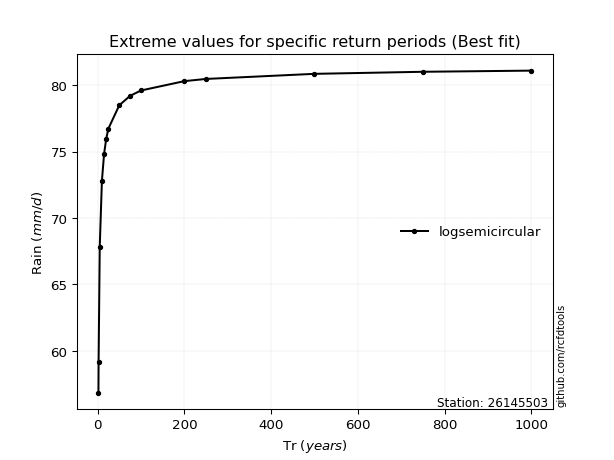</img>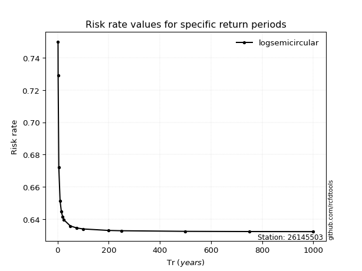</img>

</div>


<sub>**APP DISCLAIMER**: NO WARRANTY - This software is provided by [github.com/rcfdtools](https://github.com/rcfdtools) "as is", without any express or implied warranty, including warranties of merchantability, fitness for a particular purpose, or non-infringement. There is no guarantee that the software will be error-free or operate without interruption. LIMITATION OF LIABILITY - Neither the authors nor copyright holders will be liable for claims or damages arising from the software or its use. You are responsible for determining if the software is appropriate for your use and assume all associated risks, including errors, legal compliance, and data loss. NO PROFESSIONAL ADVICE - The software provides general information and does not offer professional advice. It should not replace consultation with professional advisors.</sub>