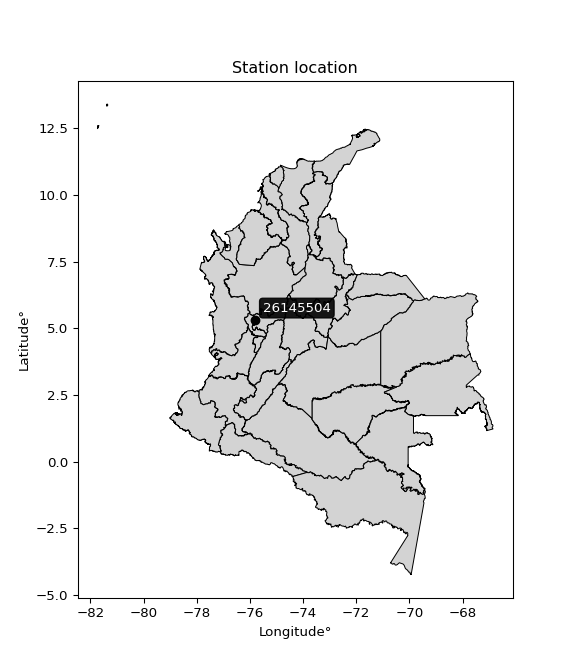

<div align="center">


</div>

# Station (rain, Pmax24h): 26145504

Probable Maximum Precipitation (PMP) is the greatest amount of rainfall for a specific duration that is meteorologically possible for a given location, acting as a "worst-case" scenario for extreme storms, crucial for designing safety-critical infrastructure like bridges, river deviations, dams, spillways, and nuclear plants to prevent catastrophic failure. PMP is calculated by hydrologists using meteorological data to determine the upper limit of extreme rainfall, often leading to the Probable Maximum Flood (PMF) for flood control design, and is increasingly being studied for climate change impacts.

<div align="center">

</img>

</div>


## A. General information


### 1. General running parameters

• app_version: _v20251226_. • runtime: _2025-12-26 15:38:16.554582_. • Python version: _3.14.0_. • SciPy version: _1.16.3_. • Pandas version: _2.3.3_. • NumPy version: _2.3.5_. • Stations dataset (station_dataset_file): _dataset/pmax24h_in/automatic_colombia_2003_2024.csv_. • Stations catalog (station_catalog_file): _dataset/CNE_IDEAM.xls_. • Minimum year to eval til year_max (date_min): _2003_. • Maximum year to eval since year_min (date_max): _2024_. • Creates, save and include plots into reports (create_plot): _False_. • Plot only fit distributions with Δo > Δ (plot_only_fit): _True_. • Eval low extreme values, if False, evaluates high extreme values (low_extreme): _False_. • Eval every SciPy distribution as logarithmic (pdist_logarithmic_on): _True_. • Standard deviation normalized (ddof): _1.0_. • Return periods to eval in years (Tr): _[2, 2.33, 5, 10, 15, 20, 25, 50, 75, 100, 200, 250, 500, 750, 1000]_. • Minimum data sample per station, 0 means any (minimum_sample): _5_. • Z-Score threshold to adjust a value, 0 means disable (zscore): _3.5_. • Avoid zeros, e.g. rain = 0 (avoid_zeros): _True_. • Avoid null values (avoid_nans): _True_. [:file_folder:Dataset file.](../../dataset/pmax24h_in/automatic_colombia_2003_2024.csv)


### 2. Station info and location

|   id |   CODIGO | NOMBRE                     | CATEGORIA               | TECNOLOGIA                | ESTADO   | FECHA_INSTALACION   |   FECHA_SUSPENSION |   ALTITUD |   LATITUD |   LONGITUD | DEPARTAMENTO   | MUNICIPIO   | AREA_OPERATIVA                         | ENTIDAD                                    | AREA_HIDROGRAFICA   | ZONA_HIDROGRAFICA   | SUBZONA_HIDROGRAFICA   |   CORRIENTE | OBSERVACION                                                                                                                                                                                                                                                   |   SUBRED | Catalogo   |
|-----:|---------:|:---------------------------|:------------------------|:--------------------------|:---------|:--------------------|-------------------:|----------:|----------:|-----------:|:---------------|:------------|:---------------------------------------|:-------------------------------------------|:--------------------|:--------------------|:-----------------------|------------:|:--------------------------------------------------------------------------------------------------------------------------------------------------------------------------------------------------------------------------------------------------------------|---------:|:-----------|
|    0 | 26145504 | OSPIRMA  - AUT  [26145504] | Climatológica Principal | Automática con Telemetría | Activa   | 11/09/2013          |                nan |      1661 |   5.32555 |   -75.8128 | Risaralda      | Guática     | Area Operativa 09 - Cauca-Valle-Caldas | CENTRO NACIONAL DE INVESTIGACIONES DE CAFE | Magdalena Cauca     | Cauca               | Río Risaralda          |         nan | Mediante orfeo 20191040002573 se hace entrega del archivo Excel que contiene el catálogo de estaciones automáticas de Cenicafé, el cual comprende 103 estaciones, con el fin de que se actualice su metadata en el Catálogo Nacional de estaciones del IDEAM. |      nan | CNE_OE     |

<div align="center">

Map location in: [:earth_americas:Google](http://maps.google.com/maps?q=5.325552778,-75.812775) [:earth_americas:OSM](https://www.openstreetmap.org/#map=18/5.325552778/-75.812775&layers=P) [:earth_americas:Bing](https://www.bing.com/maps?cp=5.325552778~-75.812775&lvl=18) [:earth_americas:Apple](https://maps.apple.com/frame?center=5.325552778%2C-75.812775&span=0.003%2C0.006)

</div>


<div align="center">

```geojson
{
  "type": "Feature",
  "geometry": {
    "type": "Point", 
    "coordinates": [-75.812775, 5.325552778]
  }, 
  "properties": {
    "Name": "26145504"
  }
}
```

</div>


### 3. Discrete values table and plot

|               |          0 |           1 |           2 |           3 |         4 |           5 |           6 |
|:--------------|-----------:|------------:|------------:|------------:|----------:|------------:|------------:|
| Date          | 2017       | 2018        | 2019        | 2020        | 2021      | 2022        | 2023        |
| Value         |   65.7     |   39.5      |   42.9      |   39.8      |   64.6    |   40.4      |   57        |
| Value_initial |   65.7     |   39.5      |   42.9      |   39.8      |   64.6    |   40.4      |   57        |
| count         |    7       |    7        |    7        |    7        |    7      |    7        |    7        |
| mean          |   49.9857  |   49.9857   |   49.9857   |   49.9857   |   49.9857 |   49.9857   |   49.9857   |
| std           |   12.0105  |   12.0105   |   12.0105   |   12.0105   |   12.0105 |   12.0105   |   12.0105   |
| zscore        |    1.30838 |   -0.873048 |   -0.589961 |   -0.848069 |    1.2168 |   -0.798113 |    0.584014 |
> If Z-Score is active, values out of range or outliers are replaced with the station mean value.


### 4. Active continuous probability distributions from SciPy (45 of 104 available)

[scipy.stats](https://docs.scipy.org/doc/scipy/reference/stats.html) is a Python´s powerful submodule within the SciPy library for comprehensive statistical analysis, offering over 130 probability distributions (like Normal, Poisson), functions for descriptive stats (mean, variance), hypothesis testing (t-tests, chi-square), random variable generation, and statistical tests, making it essential for data science, modeling, and research. It provides tools to explore, model, and draw conclusions from data efficiently, working seamlessly with NumPy.

<div align="center">

|   id | p_dist             |   n_parameter | fit_method   | label                                                                       | active   | ref                                                                                                        |
|-----:|:-------------------|--------------:|:-------------|:----------------------------------------------------------------------------|:---------|:-----------------------------------------------------------------------------------------------------------|
|    0 | alpha              |             3 | MLE          | Alpha                                                                       | True     | [:mortar_board:](https://docs.scipy.org/doc/scipy/reference/generated/scipy.stats.alpha.html)              |
|    1 | betaprime          |             4 | MLE          | Beta prime                                                                  | True     | [:mortar_board:](https://docs.scipy.org/doc/scipy/reference/generated/scipy.stats.betaprime.html)          |
|    2 | chi2               |             3 | MLE          | Chi²                                                                        | True     | [:mortar_board:](https://docs.scipy.org/doc/scipy/reference/generated/scipy.stats.chi2.html)               |
|    3 | crystalball        |             4 | MLE          | Crystalball                                                                 | True     | [:mortar_board:](https://docs.scipy.org/doc/scipy/reference/generated/scipy.stats.crystalball.html)        |
|    4 | erlang             |             3 | MLE          | Erlang                                                                      | True     | [:mortar_board:](https://docs.scipy.org/doc/scipy/reference/generated/scipy.stats.erlang.html)             |
|    5 | expon              |             2 | MLE          | Exponential                                                                 | True     | [:mortar_board:](https://docs.scipy.org/doc/scipy/reference/generated/scipy.stats.expon.html)              |
|    6 | exponnorm          |             3 | MLE          | Exponentially modified Normal                                               | True     | [:mortar_board:](https://docs.scipy.org/doc/scipy/reference/generated/scipy.stats.exponnorm.html)          |
|    7 | f                  |             4 | MLE          | F                                                                           | True     | [:mortar_board:](https://docs.scipy.org/doc/scipy/reference/generated/scipy.stats.f.html)                  |
|    8 | fatiguelife        |             3 | MLE          | Fatigue-life (Birnbaum-Saunders)                                            | True     | [:mortar_board:](https://docs.scipy.org/doc/scipy/reference/generated/scipy.stats.fatiguelife.html)        |
|    9 | fisk               |             3 | MLE          | Fisk                                                                        | True     | [:mortar_board:](https://docs.scipy.org/doc/scipy/reference/generated/scipy.stats.fisk.html)               |
|   10 | gamma              |             3 | MLE          | Gamma                                                                       | True     | [:mortar_board:](https://docs.scipy.org/doc/scipy/reference/generated/scipy.stats.gamma.html)              |
|   11 | genexpon           |             5 | MLE          | Generalized exponential                                                     | True     | [:mortar_board:](https://docs.scipy.org/doc/scipy/reference/generated/scipy.stats.genexpon.html)           |
|   12 | genlogistic        |             3 | MLE          | Generalized logistic                                                        | True     | [:mortar_board:](https://docs.scipy.org/doc/scipy/reference/generated/scipy.stats.genlogistic.html)        |
|   13 | gibrat             |             2 | MM           | Gibrat                                                                      | True     | [:mortar_board:](https://docs.scipy.org/doc/scipy/reference/generated/scipy.stats.gibrat.html)             |
|   14 | gompertz           |             3 | MLE          | Gompertz (or truncated Gumbel)                                              | True     | [:mortar_board:](https://docs.scipy.org/doc/scipy/reference/generated/scipy.stats.gompertz.html)           |
|   15 | gumbel_l           |             2 | MM           | Gumbel Left Skew                                                            | True     | [:mortar_board:](https://docs.scipy.org/doc/scipy/reference/generated/scipy.stats.gumbel_l.html)           |
|   16 | gumbel_r           |             2 | MM           | Gumbel Right Skew                                                           | True     | [:mortar_board:](https://docs.scipy.org/doc/scipy/reference/generated/scipy.stats.gumbel_r.html)           |
|   17 | halflogistic       |             2 | MM           | Half-logistic                                                               | True     | [:mortar_board:](https://docs.scipy.org/doc/scipy/reference/generated/scipy.stats.halflogistic.html)       |
|   18 | halfnorm           |             2 | MM           | Half Normal                                                                 | True     | [:mortar_board:](https://docs.scipy.org/doc/scipy/reference/generated/scipy.stats.halfnorm.html)           |
|   19 | hypsecant          |             2 | MM           | hyperbolic secant                                                           | True     | [:mortar_board:](https://docs.scipy.org/doc/scipy/reference/generated/scipy.stats.hypsecant.html)          |
|   20 | invgamma           |             3 | MLE          | Inverted gamma                                                              | True     | [:mortar_board:](https://docs.scipy.org/doc/scipy/reference/generated/scipy.stats.invgamma.html)           |
|   21 | invgauss           |             3 | MLE          | Inverse Gaussian                                                            | True     | [:mortar_board:](https://docs.scipy.org/doc/scipy/reference/generated/scipy.stats.invgauss.html)           |
|   22 | invweibull         |             3 | MLE          | Inverted Weibull                                                            | True     | [:mortar_board:](https://docs.scipy.org/doc/scipy/reference/generated/scipy.stats.invweibull.html)         |
|   23 | johnsonsu          |             4 | MLE          | Johnson Su                                                                  | True     | [:mortar_board:](https://docs.scipy.org/doc/scipy/reference/generated/scipy.stats.johnsonsu.html)          |
|   24 | kstwobign          |             2 | MLE          | Limiting distribution of scaled Kolmogorov-Smirnov two-sided test statistic | True     | [:mortar_board:](https://docs.scipy.org/doc/scipy/reference/generated/scipy.stats.kstwobign.html)          |
|   25 | laplace            |             2 | MM           | Laplace                                                                     | True     | [:mortar_board:](https://docs.scipy.org/doc/scipy/reference/generated/scipy.stats.laplace.html)            |
|   26 | laplace_asymmetric |             3 | MLE          | Asymmetric Laplace                                                          | True     | [:mortar_board:](https://docs.scipy.org/doc/scipy/reference/generated/scipy.stats.laplace_asymmetric.html) |
|   27 | loggamma           |             3 | MLE          | Log gamma                                                                   | True     | [:mortar_board:](https://docs.scipy.org/doc/scipy/reference/generated/scipy.stats.loggamma.html)           |
|   28 | logistic           |             2 | MM           | Logistic (or Sech-squared)                                                  | True     | [:mortar_board:](https://docs.scipy.org/doc/scipy/reference/generated/scipy.stats.logistic.html)           |
|   29 | lognorm            |             3 | MLE          | Log Normal                                                                  | True     | [:mortar_board:](https://docs.scipy.org/doc/scipy/reference/generated/scipy.stats.lognorm.html)            |
|   30 | maxwell            |             2 | MM           | Maxwell                                                                     | True     | [:mortar_board:](https://docs.scipy.org/doc/scipy/reference/generated/scipy.stats.maxwell.html)            |
|   31 | mielke             |             4 | MLE          | Mielke Beta-Kappa / Dagum                                                   | True     | [:mortar_board:](https://docs.scipy.org/doc/scipy/reference/generated/scipy.stats.mielke.html)             |
|   32 | moyal              |             2 | MM           | Moyal                                                                       | True     | [:mortar_board:](https://docs.scipy.org/doc/scipy/reference/generated/scipy.stats.moyal.html)              |
|   33 | nakagami           |             3 | MLE          | Nakagami                                                                    | True     | [:mortar_board:](https://docs.scipy.org/doc/scipy/reference/generated/scipy.stats.nakagami.html)           |
|   34 | ncf                |             5 | MLE          | Non-central F distribution                                                  | True     | [:mortar_board:](https://docs.scipy.org/doc/scipy/reference/generated/scipy.stats.ncf.html)                |
|   35 | nct                |             4 | MLE          | Non-central Student’s t                                                     | True     | [:mortar_board:](https://docs.scipy.org/doc/scipy/reference/generated/scipy.stats.nct.html)                |
|   36 | norm               |             2 | MM           | Normal                                                                      | True     | [:mortar_board:](https://docs.scipy.org/doc/scipy/reference/generated/scipy.stats.norm.html)               |
|   37 | pareto             |             3 | MLE          | Pareto                                                                      | True     | [:mortar_board:](https://docs.scipy.org/doc/scipy/reference/generated/scipy.stats.pareto.html)             |
|   38 | pearson3           |             3 | MM           | Pearson type III                                                            | True     | [:mortar_board:](https://docs.scipy.org/doc/scipy/reference/generated/scipy.stats.pearson3.html)           |
|   39 | rayleigh           |             2 | MM           | Rayleigh                                                                    | True     | [:mortar_board:](https://docs.scipy.org/doc/scipy/reference/generated/scipy.stats.rayleigh.html)           |
|   40 | rice               |             3 | MLE          | Rice                                                                        | True     | [:mortar_board:](https://docs.scipy.org/doc/scipy/reference/generated/scipy.stats.rice.html)               |
|   41 | t                  |             3 | MLE          | Student’s t                                                                 | True     | [:mortar_board:](https://docs.scipy.org/doc/scipy/reference/generated/scipy.stats.t.html)                  |
|   42 | truncnorm          |             4 | MLE          | Truncated normal                                                            | True     | [:mortar_board:](https://docs.scipy.org/doc/scipy/reference/generated/scipy.stats.truncnorm.html)          |
|   43 | wald               |             2 | MM           | Wald                                                                        | True     | [:mortar_board:](https://docs.scipy.org/doc/scipy/reference/generated/scipy.stats.wald.html)               |
|   44 | weibull_min        |             3 | MLE          | Weibull minimum                                                             | True     | [:mortar_board:](https://docs.scipy.org/doc/scipy/reference/generated/scipy.stats.weibull_min.html)        |

</div>

> **n_parameter:** # arguments & localization & scale.
>
> **Fit methods:** (MLE) maximum likelihood, (MM) L-moments.
>
>**Inactive:** foldnorm, gennorm, norminvgauss, powernorm, powerlognorm, skewnorm, genextreme, anglit, arcsine, argus, beta, bradford, burr, burr12, cauchy, cosine, halfcauchy, foldcauchy, skewcauchy, wrapcauchy, dgamma, gengamma, exponweib, exponpow, truncexpon, gausshyper, genhalflogistic, genhyperbolic, geninvgauss, halfgennorm, johnsonsb, kappa4, kappa3, ksone, kstwo, loglaplace, levy, levy_l, levy_stable, ncx2, genpareto, truncpareto, lomax, powerlaw, rdist, rel_breitwigner, recipinvgauss, semicircular, studentized_range, trapezoid, triang, truncweibull_min, tukeylambda, uniform, loguniform, vonmises, vonmises_line, weibull_max, dweibull, 


## B. Probability distributions vs. Empirical distributions

A continuous probability distribution (CPD) describes probabilities for variables that can take any value within a range (like rain any time), unlike discrete variables with specific outcomes (like temperature). It uses a Probability Density Function (PDF), a curve where the total area under it equals 1, and the probability of the variable falling within an interval (a to b) is found by calculating the area under the curve between those points. A key feature is that the probability of hitting any single exact value is zero, so probabilities are always expressed for ranges, e.g., $P(a ≤ X ≤ b)$.

<div align="center">

Distributions parameters
|    |   station | p_dist                |   n |           loc |           scale | shape                  | shape1              | shape2                 | shape3   |
|---:|----------:|:----------------------|----:|--------------:|----------------:|:-----------------------|:--------------------|:-----------------------|:---------|
|  0 |  26145504 | alpha                 |   7 |     37.9887   |     2.69806     | 2.0872756498085954e-06 |                     |                        |          |
|  1 |  26145504 | betaprime             |   7 |     -0.876703 |     2.06931     | 557.6605571177495      | 23.697502529718683  |                        |          |
|  2 |  26145504 | chi2                  |   7 |     39.5      |     3.38175     | 0.34295440374509834    |                     |                        |          |
|  3 |  26145504 | crystalball           |   7 |     49.9857   |    11.1195      | 4179.348868743945      | 2662.5881829805     |                        |          |
|  4 |  26145504 | erlang                |   7 |     39.5      |     8.33065     | 0.7208990693464933     |                     |                        |          |
|  5 |  26145504 | expon                 |   7 |     39.5      |    10.4857      |                        |                     |                        |          |
|  6 |  26145504 | exponnorm             |   7 |     39.4843   |     0.00524837  | 1999.6173380068824     |                     |                        |          |
|  7 |  26145504 | f                     |   7 |     39.3471   |     0.692924    | 1165.265757423395      | 0.859652225250269   |                        |          |
|  8 |  26145504 | fatiguelife           |   7 |     39.5      |     9.18196e-06 | 942.8224531738033      |                     |                        |          |
|  9 |  26145504 | fisk                  |   7 |     39.5      |    11.5944      | 0.40504508948628615    |                     |                        |          |
| 10 |  26145504 | gamma                 |   7 |     39.5      |     6.92448     | 0.7399734282706028     |                     |                        |          |
| 11 |  26145504 | genexpon              |   7 |     39.5      |    24.9274      | 2.3772620553540484     | 1.180629952037023   | 3.020223542147612e-11  |          |
| 12 |  26145504 | genlogistic           |   7 |    -16.5182   |     8.3484      | 1531.883085801614      |                     |                        |          |
| 13 |  26145504 | gibrat                |   7 |     41.5029   |     5.14507     |                        |                     |                        |          |
| 14 |  26145504 | gompertz              |   7 |     39.5      |    21.1439      | 1.034999357860496      |                     |                        |          |
| 15 |  26145504 | gumbel_l              |   7 |     54.9901   |     8.66987     |                        |                     |                        |          |
| 16 |  26145504 | gumbel_r              |   7 |     44.9813   |     8.66987     |                        |                     |                        |          |
| 17 |  26145504 | halflogistic          |   7 |     36.8065   |     9.50681     |                        |                     |                        |          |
| 18 |  26145504 | halfnorm              |   7 |     35.2678   |    18.4462      |                        |                     |                        |          |
| 19 |  26145504 | hypsecant             |   7 |     49.9857   |     7.07892     |                        |                     |                        |          |
| 20 |  26145504 | invgamma              |   7 |     39.3467   |     0.298217    | 0.4300085314080012     |                     |                        |          |
| 21 |  26145504 | invgauss              |   7 |     39.2256   |     1.1682      | 9.210763095769508      |                     |                        |          |
| 22 |  26145504 | invweibull            |   7 |     39.5      |     0.0250247   | 0.06895767094845687    |                     |                        |          |
| 23 |  26145504 | johnsonsu             |   7 |  11617.4      |    56.226       | 6516.542421363833      | 1082.5321136102025  |                        |          |
| 24 |  26145504 | kstwobign             |   7 |     16.3137   |    38.4609      |                        |                     |                        |          |
| 25 |  26145504 | laplace               |   7 |     49.9857   |     7.8627      |                        |                     |                        |          |
| 26 |  26145504 | laplace_asymmetric    |   7 |     39.5      |     0.000714548 | 6.814317686927734e-05  |                     |                        |          |
| 27 |  26145504 | loggamma              |   7 |  -3062.49     |   427.827       | 1444.3241468754045     |                     |                        |          |
| 28 |  26145504 | logistic              |   7 |     49.9857   |     6.13052     |                        |                     |                        |          |
| 29 |  26145504 | lognorm               |   7 |     39.5      |     0.0357796   | 12.046833071517954     |                     |                        |          |
| 30 |  26145504 | maxwell               |   7 |     23.6371   |    16.5116      |                        |                     |                        |          |
| 31 |  26145504 | mielke                |   7 |     -1.58624  |    20.0325      | 1043.560787400837      | 6.218069172241968   |                        |          |
| 32 |  26145504 | moyal                 |   7 |     43.6268   |     5.00555     |                        |                     |                        |          |
| 33 |  26145504 | nakagami              |   7 |     39.5      |    23.1407      | 0.20545952474098075    |                     |                        |          |
| 34 |  26145504 | ncf                   |   7 |      0.717322 |     1.13652e-06 | 3.0760172848204847e-06 | 113.1626494523941   | 130.87709725294656     |          |
| 35 |  26145504 | nct                   |   7 |     -0.540005 |     0.960686    | 12.059488353165989     | 49.25444817313229   |                        |          |
| 36 |  26145504 | norm                  |   7 |     49.9857   |    11.1195      |                        |                     |                        |          |
| 37 |  26145504 | pareto                |   7 |     38.8254   |     0.674562    | 0.5133576969702716     |                     |                        |          |
| 38 |  26145504 | pearson3              |   7 |     49.9857   |    11.1195      | 0.40533708898492493    |                     |                        |          |
| 39 |  26145504 | rayleigh              |   7 |     28.7134   |    16.9729      |                        |                     |                        |          |
| 40 |  26145504 | rice                  |   7 |     31.787    |    15.0804      | 0.0015794307475475592  |                     |                        |          |
| 41 |  26145504 | t                     |   7 |     49.9857   |    11.1195      | 338238577.12417996     |                     |                        |          |
| 42 |  26145504 | truncnorm             |   7 | -17343.2      |   440.071       | 39.499875725978725     | 67.31909689785076   |                        |          |
| 43 |  26145504 | wald                  |   7 |     38.8662   |    11.1195      |                        |                     |                        |          |
| 44 |  26145504 | weibull_min           |   7 |     39.5      |    15.1887      | 0.3774584865128484     |                     |                        |          |
| 45 |  26145504 | logalpha              |   7 |      2.34446  |    11.1572      | 7.385546284949356      |                     |                        |          |
| 46 |  26145504 | logbetaprime          |   7 |     -3.66411  |    26.0807      | 1011.277209549165      | 3488.9199077626363  |                        |          |
| 47 |  26145504 | logchi2               |   7 |      3.6763   |     0.97256     | 0.9815770758469528     |                     |                        |          |
| 48 |  26145504 | logcrystalball        |   7 |      3.88775  |     0.21705     | 663.4063272065177      | 51.375461597697495  |                        |          |
| 49 |  26145504 | logerlang             |   7 |      3.6763   |     0.128236    | 0.7650864603636176     |                     |                        |          |
| 50 |  26145504 | logexpon              |   7 |      3.6763   |     0.211447    |                        |                     |                        |          |
| 51 |  26145504 | logexponnorm          |   7 |      3.67605  |     8.69691e-05 | 2417.5753942798638     |                     |                        |          |
| 52 |  26145504 | logf                  |   7 |      3.67154  |     0.0202648   | 978.5235336794376      | 0.9747928447520242  |                        |          |
| 53 |  26145504 | logfatiguelife        |   7 |      3.6763   |     3.97468e-07 | 883.4584560475232      |                     |                        |          |
| 54 |  26145504 | logfisk               |   7 |      3.6763   |     0.211289    | 0.8222183610708407     |                     |                        |          |
| 55 |  26145504 | loggamma              |   7 |      3.6763   |     0.123663    | 0.7236139114350004     |                     |                        |          |
| 56 |  26145504 | loggenexpon           |   7 |      3.6763   |     0.303029    | 1.4326610951608485     | 1.8298727978805878  | 1.3443619904169351e-05 |          |
| 57 |  26145504 | loggenlogistic        |   7 |      2.5686   |     0.165776    | 1534.6485650363065     |                     |                        |          |
| 58 |  26145504 | loggibrat             |   7 |      3.72214  |     0.100446    |                        |                     |                        |          |
| 59 |  26145504 | loggompertz           |   7 |      3.6763   | 32662.3         | 151989.3390409283      |                     |                        |          |
| 60 |  26145504 | loggumbel_l           |   7 |      3.98543  |     0.169233    |                        |                     |                        |          |
| 61 |  26145504 | loggumbel_r           |   7 |      3.79006  |     0.169233    |                        |                     |                        |          |
| 62 |  26145504 | loghalflogistic       |   7 |      3.63049  |     0.18557     |                        |                     |                        |          |
| 63 |  26145504 | loghalfnorm           |   7 |      3.60046  |     0.360063    |                        |                     |                        |          |
| 64 |  26145504 | loghypsecant          |   7 |      3.88775  |     0.138178    |                        |                     |                        |          |
| 65 |  26145504 | loginvgamma           |   7 |      3.67153  |     0.00981879  | 0.48485468998276515    |                     |                        |          |
| 66 |  26145504 | loginvgauss           |   7 |      3.66909  |     0.0310245   | 7.04799385473426       |                     |                        |          |
| 67 |  26145504 | loginvweibull         |   7 |      3.6763   |     0.0129851   | 0.05580815103186389    |                     |                        |          |
| 68 |  26145504 | logjohnsonsu          |   7 |      4.1851   |     6.06337e-13 | 4.072398411735436      | 0.18107719649787513 |                        |          |
| 69 |  26145504 | logkstwobign          |   7 |      3.22306  |     0.75869     |                        |                     |                        |          |
| 70 |  26145504 | loglaplace            |   7 |      3.88775  |     0.153477    |                        |                     |                        |          |
| 71 |  26145504 | loglaplace_asymmetric |   7 |      3.6763   |     0.000299166 | 0.0014151636805465775  |                     |                        |          |
| 72 |  26145504 | logloggamma           |   7 |    -42.063    |     6.70081     | 951.4432559222164      |                     |                        |          |
| 73 |  26145504 | loglogistic           |   7 |      3.88775  |     0.119666    |                        |                     |                        |          |
| 74 |  26145504 | loglognorm            |   7 |      3.6763   |     0.000923704 | 11.676266939402357     |                     |                        |          |
| 75 |  26145504 | logmaxwell            |   7 |      3.37343  |     0.322301    |                        |                     |                        |          |
| 76 |  26145504 | logmielke             |   7 |      1.46852  |     1.57943     | 3202.397880366724      | 14.147261338294452  |                        |          |
| 77 |  26145504 | logmoyal              |   7 |      3.76362  |     0.0977068   |                        |                     |                        |          |
| 78 |  26145504 | lognakagami           |   7 |      3.6763   |     0.550917    | 0.15706950655059018    |                     |                        |          |
| 79 |  26145504 | logncf                |   7 |      2.05499  |     1.81788     | 291.267411677586       | 307.6370074790011   | 0.49730750932643647    |          |
| 80 |  26145504 | lognct                |   7 |     -2.57498  |     0.0636785   | 490.6509261078422      | 101.32044966269711  |                        |          |
| 81 |  26145504 | lognorm               |   7 |      3.88775  |     0.21705     |                        |                     |                        |          |
| 82 |  26145504 | logpareto             |   7 |      3.64997  |     0.0263258   | 0.637169739054062      |                     |                        |          |
| 83 |  26145504 | logpearson3           |   7 |      3.88775  |     0.21705     | 0.35331045241992776    |                     |                        |          |
| 84 |  26145504 | lograyleigh           |   7 |      3.47252  |     0.331305    |                        |                     |                        |          |
| 85 |  26145504 | logrice               |   7 |      3.5294   |     0.292275    | 0.23398281000327736    |                     |                        |          |
| 86 |  26145504 | logt                  |   7 |      3.88775  |     0.217049    | 1349849182.5955942     |                     |                        |          |
| 87 |  26145504 | logtruncnorm          |   7 |     -2.34335  |     1.64808     | 3.652510323737613      | 3.9612378073650785  |                        |          |
| 88 |  26145504 | logwald               |   7 |      3.6707   |     0.21705     |                        |                     |                        |          |
| 89 |  26145504 | logweibull_min        |   7 |      3.6763   |     0.20435     | 0.5153495983192184     |                     |                        |          |

</div>

> **loc** (Location parameter): This shifts the distribution along the x-axis. For many common distributions, like the normal (Gaussian) distribution, loc represents the mean $μ$. For others, like the uniform distribution, it might represent the minimum value, or for the beta distribution, the left end of the support interval.
>
> **scale** (Scale parameter): This determines the width or spread of the distribution. For the normal distribution, scale represents the standard deviation $σ$. For a uniform distribution, it defines the length of the interval (from $loc$ to $loc + scale$).
>
> **shape** (Shape parameters): Refers to parameters that define the specific form of a probability distribution, distinct from its location (loc) and scale (scale). These parameters are required arguments for most distribution functions. For example, a normal (Gaussian) distribution is fully defined by its location (mean) and scale (standard deviation), so it has no specific shape parameters beyond loc and scale. However, other distributions have intrinsic properties that need specification, as Gamma distribution that takes a shape parameter, often named $a$ or $alpha$.


### 0. Cumulative distribution values - CDF (90 evaluated)

> Ordered by x ascending and calculating $log(f(x))$ separately. 

|   id |   Station |   date |    x |   count |    mean |     std |    zscore |   Value_initial |   station |   m |     alpha |   alpha_pdf |   betaprime |   betaprime_pdf |       chi2 |    chi2_pdf |   crystalball |   crystalball_pdf |      erlang |    erlang_pdf |     expon |   expon_pdf |   exponnorm |   exponnorm_pdf |         f |      f_pdf |   fatiguelife |   fatiguelife_pdf |        fisk |    fisk_pdf |       gamma |    gamma_pdf |    genexpon |   genexpon_pdf |   genlogistic |   genlogistic_pdf |    gibrat |   gibrat_pdf |    gompertz |   gompertz_pdf |   gumbel_l |   gumbel_l_pdf |   gumbel_r |   gumbel_r_pdf |   halflogistic |   halflogistic_pdf |   halfnorm |   halfnorm_pdf |   hypsecant |   hypsecant_pdf |   invgamma |   invgamma_pdf |   invgauss |   invgauss_pdf |   invweibull |   invweibull_pdf |   johnsonsu |   johnsonsu_pdf |   kstwobign |   kstwobign_pdf |   laplace |   laplace_pdf |   laplace_asymmetric |   laplace_asymmetric_pdf |    loggamma |   loggamma_pdf |   logistic |   logistic_pdf |   lognorm |   lognorm_pdf |   maxwell |   maxwell_pdf |   mielke |   mielke_pdf |    moyal |   moyal_pdf |    nakagami |   nakagami_pdf |      ncf |   ncf_pdf |      nct |    nct_pdf |     norm |   norm_pdf |      pareto |   pareto_pdf |   pearson3 |   pearson3_pdf |   rayleigh |   rayleigh_pdf |     rice |   rice_pdf |        t |     t_pdf |   truncnorm |   truncnorm_pdf |        wald |   wald_pdf |   weibull_min |   weibull_min_pdf |   logalpha |   logalpha_pdf |   logbetaprime |   logbetaprime_pdf |     logchi2 |   logchi2_pdf |   logcrystalball |   logcrystalball_pdf |   logerlang |   logerlang_pdf |   logexpon |   logexpon_pdf |   logexponnorm |   logexponnorm_pdf |     logf |   logf_pdf |   logfatiguelife |   logfatiguelife_pdf |   logfisk |   logfisk_pdf |   loggenexpon |   loggenexpon_pdf |   loggenlogistic |   loggenlogistic_pdf |   loggibrat |   loggibrat_pdf |   loggompertz |   loggompertz_pdf |   loggumbel_l |   loggumbel_l_pdf |   loggumbel_r |   loggumbel_r_pdf |   loghalflogistic |   loghalflogistic_pdf |   loghalfnorm |   loghalfnorm_pdf |   loghypsecant |   loghypsecant_pdf |   loginvgamma |   loginvgamma_pdf |   loginvgauss |   loginvgauss_pdf |   loginvweibull |   loginvweibull_pdf |   logjohnsonsu |   logjohnsonsu_pdf |   logkstwobign |   logkstwobign_pdf |   loglaplace |   loglaplace_pdf |   loglaplace_asymmetric |   loglaplace_asymmetric_pdf |   logloggamma |   logloggamma_pdf |   loglogistic |   loglogistic_pdf |   loglognorm |   loglognorm_pdf |   logmaxwell |   logmaxwell_pdf |   logmielke |   logmielke_pdf |   logmoyal |   logmoyal_pdf |   lognakagami |   lognakagami_pdf |   logncf |   logncf_pdf |   lognct |   lognct_pdf |   logpareto |   logpareto_pdf |   logpearson3 |   logpearson3_pdf |   lograyleigh |   lograyleigh_pdf |   logrice |   logrice_pdf |     logt |   logt_pdf |   logtruncnorm |   logtruncnorm_pdf |     logwald |   logwald_pdf |   logweibull_min |   logweibull_min_pdf |
|-----:|----------:|-------:|-----:|--------:|--------:|--------:|----------:|----------------:|----------:|----:|----------:|------------:|------------:|----------------:|-----------:|------------:|--------------:|------------------:|------------:|--------------:|----------:|------------:|------------:|----------------:|----------:|-----------:|--------------:|------------------:|------------:|------------:|------------:|-------------:|------------:|---------------:|--------------:|------------------:|----------:|-------------:|------------:|---------------:|-----------:|---------------:|-----------:|---------------:|---------------:|-------------------:|-----------:|---------------:|------------:|----------------:|-----------:|---------------:|-----------:|---------------:|-------------:|-----------------:|------------:|----------------:|------------:|----------------:|----------:|--------------:|---------------------:|-------------------------:|------------:|---------------:|-----------:|---------------:|----------:|--------------:|----------:|--------------:|---------:|-------------:|---------:|------------:|------------:|---------------:|---------:|----------:|---------:|-----------:|---------:|-----------:|------------:|-------------:|-----------:|---------------:|-----------:|---------------:|---------:|-----------:|---------:|----------:|------------:|----------------:|------------:|-----------:|--------------:|------------------:|-----------:|---------------:|---------------:|-------------------:|------------:|--------------:|-----------------:|---------------------:|------------:|----------------:|-----------:|---------------:|---------------:|-------------------:|---------:|-----------:|-----------------:|---------------------:|----------:|--------------:|--------------:|------------------:|-----------------:|---------------------:|------------:|----------------:|--------------:|------------------:|--------------:|------------------:|--------------:|------------------:|------------------:|----------------------:|--------------:|------------------:|---------------:|-------------------:|--------------:|------------------:|--------------:|------------------:|----------------:|--------------------:|---------------:|-------------------:|---------------:|-------------------:|-------------:|-----------------:|------------------------:|----------------------------:|--------------:|------------------:|--------------:|------------------:|-------------:|-----------------:|-------------:|-----------------:|------------:|----------------:|-----------:|---------------:|--------------:|------------------:|---------:|-------------:|---------:|-------------:|------------:|----------------:|--------------:|------------------:|--------------:|------------------:|----------:|--------------:|---------:|-----------:|---------------:|-------------------:|------------:|--------------:|-----------------:|---------------------:|
|    0 |  26145504 |   2018 | 39.5 |       7 | 49.9857 | 12.0105 | -0.873048 |            39.5 |  26145504 |   1 | 0.0742113 |  0.191512   |    0.162951 |       0.03076   | 0.00291599 | 7.03723e+10 |      0.172841 |         0.0229999 | 1.50089e-11 | 1522.77       | 0         |  0.0953678  |  0.00149435 |      0.0950106  | 0.0390017 | 0.60338    |     0.0827671 |       1.96875e+10 | 6.88949e-07 | 3.92735e+07 | 8.83902e-12 | 920.514      | 1.25903e-11 |     0.0953676  |      0.154801 |        0.0345723  | 0         |   0          | 3.54491e-11 |      0.0489503 |   0.154239 |      0.0163418 |   0.152316 |     0.0330602  |       0.140723 |         0.0515524  |   0.181469 |      0.0421312 |    0.142317 |      0.0194412  |  0.0389621 |     0.602435   |  0.0435113 |     0.397341   |  0.000654548 |      4.65726e+10 |    0.163284 |       0.0230526 |    0.139519 |      0.0348351  |  0.131763 |    0.016758   |          6.01331e-09 |               0.0953655  | 3.86313e-11 |  62947.1       |   0.15311  |      0.0211511 |  0.164982 |      1.14359  |  0.18012  |     0.0281139 |      nan |          nan | 0.130998 |  0.0384815  | 3.32696e-07 |    1.92404e+07 | 0.166245 | 0.0280176 | 0.160024 | 0.0330551  | 0.172841 |  0.0229999 | 1.11022e-16 |   0.761024   |   0.173083 |      0.0265205 |   0.182859 |      0.0305965 | 0.122603 |  0.0297573 | 0.17284  | 0.0229999 |   0         |      0.0898155  | 7.43739e-05 | 0.00107986 |   1.63526e-06 |       8.68691e+07 |   0.160665 |       1.53459  |       0.207531 |           1.08574  | 2.37644e-08 |   2.62634e+07 |         0.164982 |             1.14359  | 9.36337e-12 |   16131.4       |  0         |       4.72932  |      0.0012151 |           4.74254  | 0.04026  |  20.7477   |        0.0264438 |          4.36321e+11 | 8.55e-13  |   1583.01     |   3.80635e-07 |          4.72779  |         0.146274 |             1.69508  |    0        |        0        |   7.87248e-09 |          4.65335  |      0.148666 |          0.809668 |      0.141057 |          1.6325   |          0.122801 |              2.65377  |      0.166828 |          2.16734  |       0.135722 |           0.952734 |     0.0406427 |         20.7985   |     0.0438358 |         15.3552   |      0.00354217 |         2.51193e+12 |       0.152751 |        0.0839884   |       0.132294 |           1.7261   |     0.126078 |         0.821476 |              2.2436e-06 |                    4.73035  |      0.165487 |          1.1327   |      0.145919 |          1.04145  |   0.00756717 |      4.02533e+12 |     0.170487 |         1.40577  |         nan |             nan |   0.117957 |       1.8806   |   1.45683e-05 |       1.03053e+10 | 0.158218 |     1.28497  | 0.165147 |     1.20966  | 1.11022e-16 |       24.2033   |      0.164375 |          1.29412  |      0.172352 |          1.53658  |  0.115654 |      1.47981  | 0.164982 |   1.14359  |    3.29978e-05 |            3.31556 | 1.3009e-09  |   4.60524e-06 |      2.77638e-08 |          3.22188e+07 |
|    1 |  26145504 |   2020 | 39.8 |       7 | 49.9857 | 12.0105 | -0.848069 |            39.8 |  26145504 |   2 | 0.136328  |  0.216371   |    0.172303 |       0.0315779 | 0.628721   | 0.345999    |      0.179828 |         0.023584  | 0.0982778   |    0.231257   | 0.028205  |  0.092678   |  0.0296331  |      0.0924622  | 0.212891  | 0.46331    |     0.576016  |       0.125157    | 0.185392    | 0.203902    | 0.104947    |   0.252473   | 0.0282049   |     0.0926778  |      0.165332 |        0.0356223  | 0         |   0          | 0.0146809   |      0.0489209 |   0.159213 |      0.0168176 |   0.162383 |     0.0340466  |       0.156153 |         0.0513115  |   0.194084 |      0.0419687 |    0.148262 |      0.020195   |  0.212698  |     0.463157   |  0.171154  |     0.398214   |  0.430598    |      0.0833959   |    0.170295 |       0.0236871 |    0.150132 |      0.0359044  |  0.136888 |    0.0174098  |          0.0282043   |               0.0926757  | 0.141347    |     13.0445    |   0.159564 |      0.0218747 |  0.173782 |      1.18237  |  0.188639 |     0.0286775 |      nan |          nan | 0.142759 |  0.0399068  | 0.13214     |    0.180992    | 0.174761 | 0.0287519 | 0.170076 | 0.0339556  | 0.179828 |  0.023584  | 0.172112    |   0.436096   |   0.181136 |      0.0271691 |   0.192113 |      0.0310913 | 0.131656 |  0.0305957 | 0.179828 | 0.023584  |   0.0265851 |      0.0874293  | 0.00146475  | 0.00997522 |   0.203343    |       0.227866    |   0.172481 |       1.58842  |       0.215838 |           1.11004  | 0.0739937   |   4.78714     |         0.173781 |             1.18237  | 0.121217    |      11.8525    |  0.0351505 |       4.56308  |      0.0365183 |           4.58246  | 0.199745 |  17.976    |        0.562048  |          4.06752     | 0.0607907 |      6.20449  |   0.0351398   |          4.56166  |         0.159365 |             1.76448  |    0        |        0        |   0.0345958   |          4.49237  |      0.154908 |          0.840481 |      0.153669 |          1.7007   |          0.142827 |              2.63944  |      0.183189 |          2.15729  |       0.143113 |           1.00117  |     0.199863  |         17.9158   |     0.16934   |         15.7025   |      0.356792   |         2.71221     |       0.153392 |        0.0854933   |       0.145628 |           1.79772  |     0.132449 |         0.862988 |              0.0351603  |                    4.56404  |      0.174203 |          1.17104  |      0.153976 |          1.08859  |   0.571469   |      4.44305     |     0.18127  |         1.44427  |         nan |             nan |   0.132574 |       1.98167  |   0.208886    |       8.67242     | 0.168113 |     1.33058  | 0.174454 |     1.25061  | 0.148681    |       16.0048   |      0.17433  |          1.33717  |      0.18411  |          1.571    |  0.127065 |      1.53595  | 0.173781 |   1.18238  |    0.0249101   |            3.2604  | 0.000129914 |   0.0855106   |      0.167172    |         10.3767      |
|    2 |  26145504 |   2022 | 40.4 |       7 | 49.9857 | 12.0105 | -0.798113 |            40.4 |  26145504 |   3 | 0.263165  |  0.197984   |    0.191718 |       0.0331172 | 0.749595   | 0.127421    |      0.194327 |         0.0247429 | 0.210625    |    0.158362   | 0.0822507 |  0.0875238  |  0.0835544  |      0.0873243  | 0.395694  | 0.201716   |     0.630079  |       0.0696501   | 0.262068    | 0.0870344   | 0.228198    |   0.173988   | 0.0822505   |     0.0875236  |      0.187297 |        0.0375596  | 0         |   0          | 0.0440086   |      0.048831  |   0.169596 |      0.0178002 |   0.18337  |     0.0358761  |       0.186779 |         0.0507591  |   0.219161 |      0.0416126 |    0.160846 |      0.0217672  |  0.395503  |     0.201772   |  0.354022  |     0.228312   |  0.457899    |      0.0274044   |    0.184886 |       0.02495   |    0.17227  |      0.0378441  |  0.147742 |    0.0187903  |          0.0822488   |               0.0875218  | 0.296272    |      8.54885   |   0.17313  |      0.0233514 |  0.192044 |      1.25848  |  0.206171 |     0.0297486 |      nan |          nan | 0.167483 |  0.0424333  | 0.207526    |    0.0947273   | 0.192439 | 0.0301633 | 0.190958 | 0.0356194  | 0.194327 |  0.0247429 | 0.352837    |   0.210996   |   0.197818 |      0.0284248 |   0.211047 |      0.0320059 | 0.150494 |  0.0321733 | 0.194327 | 0.0247429 |   0.0776551 |      0.0828452  | 0.0182122   | 0.0473598  |   0.29118     |       0.102309    |   0.197002 |       1.68742  |       0.232799 |           1.15684  | 0.126085    |   2.72545     |         0.192044 |             1.25847  | 0.265872    |       8.16243   |  0.101067  |       4.25134  |      0.102702  |           4.26768  | 0.385778 |   8.55183  |        0.60622   |          2.30096     | 0.136996  |      4.31482  |   0.101037    |          4.25012  |         0.186721 |             1.88913  |    0        |        0        |   0.0995278   |          4.19022  |      0.167955 |          0.904002 |      0.18006  |          1.82415  |          0.182074 |              2.60508  |      0.215304 |          2.13478  |       0.158842 |           1.10243  |     0.38522   |          8.52127  |     0.352114  |          9.28118  |      0.37919    |         0.910869    |       0.154695 |        0.0886183   |       0.173494 |           1.92336  |     0.146012 |         0.951361 |              0.101091   |                    4.25217  |      0.19229  |          1.24639  |      0.170978 |          1.1845   |   0.607789   |      1.46087     |     0.203423 |         1.51582  |         nan |             nan |   0.16357  |       2.15539  |   0.294276    |       4.10237     | 0.188683 |     1.41826  | 0.193765 |     1.33018  | 0.325623    |        8.79528  |      0.194959 |          1.41951  |      0.208089 |          1.63278  |  0.150831 |      1.63888  | 0.192044 |   1.25848  |    0.0728933   |            3.15379 | 0.0141021   |   2.11914     |      0.274566    |          5.32649     |
|    3 |  26145504 |   2019 | 42.9 |       7 | 49.9857 | 12.0105 | -0.589961 |            42.9 |  26145504 |   4 | 0.582757  |  0.0767488  |    0.28107  |       0.0378971 | 0.897483   | 0.0292725   |      0.261987 |         0.0292852 | 0.487539    |    0.0809494  | 0.276931  |  0.0689575  |  0.27781    |      0.0688145  | 0.620788  | 0.0432499  |     0.740672  |       0.030746    | 0.378272    | 0.0280175   | 0.528498    |   0.0858273  | 0.27693     |     0.0689574  |      0.288875 |        0.0429506  | 0.0961754 |   0.12208    | 0.165197    |      0.0479927 |   0.219607 |      0.0223192 |   0.280458 |     0.0411258  |       0.309943 |         0.0475415  |   0.320947 |      0.0397063 |    0.224219 |      0.029119   |  0.620696  |     0.0432726  |  0.634402  |     0.057142   |  0.490319    |      0.00708742  |    0.25363  |       0.0299475 |    0.274262 |      0.0429524  |  0.203045 |    0.0258238  |          0.276925    |               0.0689564  | 0.629743    |      3.67401   |   0.23943  |      0.0297043 |  0.276336 |      1.54097  |  0.285306 |     0.0333024 |      nan |          nan | 0.282238 |  0.0480736  | 0.358068    |    0.0431167   | 0.274271 | 0.034987  | 0.286678 | 0.040339   | 0.261987 |  0.0292852 | 0.602774    |   0.0500468  |   0.274733 |      0.0328704 |   0.294829 |      0.0347267 | 0.237783 |  0.0372464 | 0.261987 | 0.0292852 |   0.263173  |      0.0661914  | 0.232444    | 0.0938244  |   0.433555    |       0.0357424   |   0.307596 |       1.96085  |       0.307412 |           1.32137  | 0.236118    |   1.36394     |         0.276336 |             1.54097  | 0.596155    |       3.76674   |  0.323285  |       3.2004   |      0.325603  |           3.20753  | 0.623893 |   1.94422  |        0.697042  |          1.09102     | 0.315932  |      2.15205  |   0.323201    |          3.19978  |         0.310853 |             2.19015  |    0.157215 |        6.54815  |   0.319028    |          3.16881  |      0.230623 |          1.19191  |      0.300475 |          2.13486  |          0.332738 |              2.39609  |      0.340033 |          2.01154  |       0.238662 |           1.56986  |     0.622661  |          1.9408   |     0.634769  |          2.45973  |      0.405793   |         0.247365    |       0.160443 |        0.103555    |       0.299166 |           2.20378  |     0.215919 |         1.40684  |              0.323345   |                    3.20082  |      0.275813 |          1.5281   |      0.254081 |          1.58377  |   0.649807   |      0.384259    |     0.301527 |         1.73185  |         nan |             nan |   0.305543 |       2.47501  |   0.442348    |       1.67777     | 0.283283 |     1.71543  | 0.282497 |     1.61341  | 0.595332    |        2.36777  |      0.288957 |          1.69424  |      0.311696 |          1.79567  |  0.259117 |      1.9367   | 0.276336 |   1.54098  |    0.250114    |            2.75764 | 0.276865    |   4.59969     |      0.465745    |          2.0903      |
|    4 |  26145504 |   2023 | 57   |       7 | 49.9857 | 12.0105 |  0.584014 |            57   |  26145504 |   5 | 0.887144  |  0.00589652 |    0.769365 |       0.0237383 | 0.994949   | 0.000936556 |      0.735917 |         0.0294047 | 0.9285      |    0.00943091 | 0.811553  |  0.0179718  |  0.811564   |      0.0179553  | 0.805802  | 0.00467291 |     0.92844   |       0.00571322  | 0.541591    | 0.00574632  | 0.953062    |   0.00731589 | 0.811552    |     0.0179718  |      0.794974 |        0.0218473  | 0.864902  |   0.0140173  | 0.736327    |      0.0295306 |   0.716601 |      0.041216  |   0.778794 |     0.0224577  |       0.786449 |         0.0200644  |   0.76126  |      0.0216088 |    0.773693 |      0.0293432  |  0.805801  |     0.00467479 |  0.874877  |     0.00567431 |  0.52911     |      0.00132718  |    0.744221 |       0.0301168 |    0.786946 |      0.0233546  |  0.795102 |    0.0260595  |          0.811545    |               0.0179721  | 0.971855    |      0.244428  |   0.758442 |      0.0298845 |  0.762856 |      1.42291  |  0.747333 |     0.0256181 |      nan |          nan | 0.792597 |  0.0202442  | 0.688935    |    0.0146681   | 0.760638 | 0.0255492 | 0.776073 | 0.0223398  | 0.735917 |  0.0294047 | 0.815638    |   0.00520748 |   0.749431 |      0.0263879 |   0.750611 |      0.0244877 | 0.752819 |  0.027404  | 0.735917 | 0.0294047 |   0.792487  |      0.0186566  | 0.834859    | 0.0152488  |   0.65178     |       0.00792327  |   0.793049 |       1.10491  |       0.708424 |           1.25109  | 0.468477    |   0.551579    |         0.762856 |             1.42291  | 0.965148    |       0.289351  |  0.823508  |       0.834687 |      0.825448  |           0.830193 | 0.809049 |   0.246067 |        0.861547  |          0.327449    | 0.611451  |      0.532628 |   0.823413    |          0.834886 |         0.810178 |             1.02869  |    0.87729  |        0.633215 |   0.818524    |          0.844483 |      0.754784 |          2.03671  |      0.7991   |          1.05898  |          0.804626 |              0.949983 |      0.781006 |          1.04103  |       0.799955 |           1.3543   |     0.807759  |          0.246449 |     0.869927  |          0.300904 |      0.436092   |         0.0550721   |       0.213694 |        0.371156    |       0.806797 |           1.09793  |     0.818236 |         1.1843   |              0.823576   |                    0.834549 |      0.762216 |          1.43457  |      0.785466 |          1.40816  |   0.695848   |      0.081696    |     0.77075  |         1.2345   |         nan |             nan |   0.810852 |       0.949597 |   0.700395    |       0.564821    | 0.77633  |     1.29972  | 0.768959 |     1.35738  | 0.821392    |        0.289521 |      0.772091 |          1.28504  |      0.772993 |          1.17995  |  0.777541 |      1.30224  | 0.762858 |   1.42291  |    0.826922    |            1.43486 | 0.848504    |   0.704616    |      0.741213    |          0.491552    |
|    5 |  26145504 |   2021 | 64.6 |       7 | 49.9857 | 12.0105 |  1.2168   |            64.6 |  26145504 |   6 | 0.919243  |  0.00302432 |    0.900424 |       0.0116343 | 0.998713   | 0.000225813 |      0.905626 |         0.0151263 | 0.973428    |    0.00342478 | 0.908712  |  0.00870597 |  0.90866    |      0.00870338 | 0.833249  | 0.0028149  |     0.960253  |       0.0029948   | 0.577577    | 0.0039372   | 0.985463    |   0.00222267 | 0.908711    |     0.008706   |      0.911805 |        0.0100838  | 0.933408  |   0.00559352 | 0.905324    |      0.0151897 |   0.951664 |      0.0168903 |   0.901178 |     0.0108156  |       0.897996 |         0.0101824  |   0.888199 |      0.0122169 |    0.919652 |      0.0112301  |  0.833258  |     0.00281588 |  0.907362  |     0.00323321 |  0.537449    |      0.000916818 |    0.914393 |       0.0146588 |    0.914507 |      0.0111603  |  0.922061 |    0.00991246 |          0.908706    |               0.00870627 | 0.990423    |      0.0819112 |   0.915588 |      0.0126069 |  0.901852 |      0.797582 |  0.895678 |     0.0137052 |      nan |          nan | 0.90205  |  0.00973479 | 0.783332    |    0.010475    | 0.903094 | 0.0126114 | 0.898433 | 0.0108712  | 0.905626 |  0.0151263 | 0.845908    |   0.00306909 |   0.899582 |      0.0135304 |   0.893034 |      0.013325  | 0.906258 |  0.0135256 | 0.905626 | 0.0151263 |   0.895231  |      0.00942348 | 0.91466     | 0.00701651 |   0.701435    |       0.00542722  |   0.897572 |       0.599082 |       0.841849 |           0.868773 | 0.530405    |   0.445378    |         0.901852 |             0.797583 | 0.987579    |       0.101761  |  0.902355  |       0.461795 |      0.903752  |           0.457769 | 0.833885 |   0.160843 |        0.896027  |          0.231086    | 0.667042  |      0.371228 |   0.902285    |          0.461989 |         0.905797 |             0.54059  |    0.932002 |        0.294341 |   0.898639    |          0.471676 |      0.947391 |          0.915461 |      0.898484 |          0.568324 |          0.895463 |              0.533886 |      0.885163 |          0.639225 |       0.916844 |           0.59498  |     0.832642  |          0.161208 |     0.899773  |          0.189338 |      0.442014   |         0.0409407   |       0.34163  |        3.93672     |       0.91026  |           0.589252 |     0.919585 |         0.52395  |              0.902405   |                    0.461658 |      0.902476 |          0.8042   |      0.912436 |          0.667663 |   0.704588   |      0.0601102   |     0.892266 |         0.719746 |         nan |             nan |   0.899628 |       0.510923 |   0.762513    |       0.436813    | 0.901055 |     0.712128 | 0.900688 |     0.756344 | 0.850236    |        0.184133 |      0.896716 |          0.721993 |      0.889718 |          0.698983 |  0.902225 |      0.712035 | 0.901854 |   0.797576 |    0.982361    |            1.06598 | 0.912914    |   0.367959    |      0.792491    |          0.341871    |
|    6 |  26145504 |   2017 | 65.7 |       7 | 49.9857 | 12.0105 |  1.30838  |            65.7 |  26145504 |   7 | 0.922438  |  0.0027901  |    0.912503 |       0.0103484 | 0.998938   | 0.000185218 |      0.921204 |         0.0132173 | 0.976936    |    0.00296543 | 0.917803  |  0.00783894 |  0.917749   |      0.00783732 | 0.836253  | 0.00264973 |     0.963405  |       0.00274024  | 0.58181     | 0.00376146  | 0.987712    |   0.00187517 | 0.917803    |     0.00783897 |      0.922257 |        0.00894035 | 0.939212  |   0.00497356 | 0.921011    |      0.0133496 |   0.967917 |      0.0127278 |   0.912421 |     0.00964572 |       0.908632 |         0.00917175 |   0.901013 |      0.0110919 |    0.931118 |      0.00965475 |  0.836263  |     0.00265063 |  0.910799  |     0.00301991 |  0.538435    |      0.000877339 |    0.929407 |       0.0126642 |    0.926064 |      0.00987231 |  0.932237 |    0.00861833 |          0.917798    |               0.00783924 | 0.99171     |      0.0707938 |   0.928461 |      0.0108345 |  0.914651 |      0.719128 |  0.909929 |     0.0122225 |      nan |          nan | 0.912199 |  0.00873487 | 0.794588    |    0.00999491  | 0.916152 | 0.0111521 | 0.90974  | 0.00970615 | 0.921204 |  0.0132173 | 0.849178    |   0.00288099 |   0.913604 |      0.0119836 |   0.906927 |      0.0119497 | 0.920228 |  0.0118958 | 0.921204 | 0.0132173 |   0.905101  |      0.00853627 | 0.921991    | 0.0063273  |   0.707268    |       0.00518099  |   0.907242 |       0.546887 |       0.85606  |           0.814565 | 0.537828    |   0.434006    |         0.914651 |             0.719129 | 0.989182    |       0.0885027 |  0.909849  |       0.426353 |      0.911179  |           0.422445 | 0.836535 |   0.153141 |        0.899844  |          0.221119    | 0.673176  |      0.355536 |   0.909782    |          0.426543 |         0.914517 |             0.492945 |    0.936746 |        0.26814  |   0.906298    |          0.436035 |      0.961374 |          0.742654 |      0.907664 |          0.519613 |          0.904119 |              0.491916 |      0.895563 |          0.593012 |       0.926318 |           0.528487 |     0.835298  |          0.153501 |     0.902884  |          0.17932  |      0.442694   |         0.0395683   |       0.999893 |        3.20751e+07 |       0.919758 |           0.536344 |     0.927963 |         0.469366 |              0.909897   |                    0.42622  |      0.915377 |          0.724462 |      0.923073 |          0.593399 |   0.705585   |      0.058025    |     0.903899 |         0.658776 |         nan |             nan |   0.907897 |       0.469222 |   0.769772    |       0.423103    | 0.912507 |     0.645039 | 0.912844 |     0.684117 | 0.853264    |        0.174717 |      0.908349 |          0.65659  |      0.901039 |          0.642452 |  0.913679 |      0.645271 | 0.914653 |   0.719122 |    1           |            1.02364 | 0.918879    |   0.339059    |      0.798138    |          0.327173    |

An Empirical Distribution Function (EDF) is a step-function estimate of a true cumulative distribution function (CDF) based on observed sample data, representing the proportion of data points less than or equal to a given value. It is calculated by ordering your data and jumping up by $1/n$ (where $n$ is sample size) at each unique data point, allowing analysis without assuming an underlying population distribution, and it gets closer to the true CDF as the sample size grows.


### 1. Empirical - EDF California (1923)

California´s estimates the true probability distribution of water-related data (like rainfall, streamflow) using observed samples, crucial for risk assessment.

<div align="center">


$P=m/n$


</div>


**1.1. Empirical values**

<div align="center">

|                | 0                   | 1                  | 2                   | 3                  | 4                  | 5                  | 6              |
|:---------------|:--------------------|:-------------------|:--------------------|:-------------------|:-------------------|:-------------------|:---------------|
| date           | 2018                | 2020               | 2022                | 2019               | 2023               | 2021               | 2017           |
| x              | 39.5                | 39.8               | 40.4                | 42.9               | 57.0               | 64.6               | 65.7           |
| m              | 1                   | 2                  | 3                   | 4                  | 5                  | 6                  | 7              |
| empirical_dist | edf_california      | edf_california     | edf_california      | edf_california     | edf_california     | edf_california     | edf_california |
| empirical      | 0.14285714285714285 | 0.2857142857142857 | 0.42857142857142855 | 0.5714285714285714 | 0.7142857142857143 | 0.8571428571428571 | 1.0            |
| empirical_tr   | 1.1666666666666665  | 1.4                | 1.75                | 2.333333333333333  | 3.5                | 6.999999999999997  | inf            |

</div>


**1.2. Kolmogorov-Smirnov fit test (sorted by Δ)**


<div align="center">

|                | 0                   | 1                   | 2                   | 3                   | 4                   | 5                   | 6                   | 7                   | 8                   | 9                   | 10                  | 11                  | 12                  | 13                  | 14                  | 15                  | 16                  | 17                  | 18                  | 19                  | 20                  | 21                  | 22                  | 23                  | 24                  | 25                  | 26                  | 27                  | 28                  | 29                  | 30                  | 31                  | 32                  | 33                  | 34                  | 35                  | 36                  | 37                  | 38                  | 39                  | 40                  | 41                  | 42                  | 43                  | 44                  | 45                  | 46                  | 47                  | 48                  | 49                  | 50                  | 51                  | 52                  | 53                  | 54                  | 55                  | 56                  | 57                  | 58                  | 59                    | 60                  | 61                  | 62                  | 63                  | 64                  | 65                  | 66                  | 67                  | 68                  | 69                  | 70                  | 71                  | 72                  | 73                  | 74                  | 75                  | 76                  | 77                  | 78                  | 79                  | 80                  | 81                  | 82                  | 83                  | 84                  | 85                  | 86                  | 87                  | 88                  | 89                  |
|:---------------|:--------------------|:--------------------|:--------------------|:--------------------|:--------------------|:--------------------|:--------------------|:--------------------|:--------------------|:--------------------|:--------------------|:--------------------|:--------------------|:--------------------|:--------------------|:--------------------|:--------------------|:--------------------|:--------------------|:--------------------|:--------------------|:--------------------|:--------------------|:--------------------|:--------------------|:--------------------|:--------------------|:--------------------|:--------------------|:--------------------|:--------------------|:--------------------|:--------------------|:--------------------|:--------------------|:--------------------|:--------------------|:--------------------|:--------------------|:--------------------|:--------------------|:--------------------|:--------------------|:--------------------|:--------------------|:--------------------|:--------------------|:--------------------|:--------------------|:--------------------|:--------------------|:--------------------|:--------------------|:--------------------|:--------------------|:--------------------|:--------------------|:--------------------|:--------------------|:----------------------|:--------------------|:--------------------|:--------------------|:--------------------|:--------------------|:--------------------|:--------------------|:--------------------|:--------------------|:--------------------|:--------------------|:--------------------|:--------------------|:--------------------|:--------------------|:--------------------|:--------------------|:--------------------|:--------------------|:--------------------|:--------------------|:--------------------|:--------------------|:--------------------|:--------------------|:--------------------|:--------------------|:--------------------|:--------------------|:--------------------|
| station        | 26145504            | 26145504            | 26145504            | 26145504            | 26145504            | 26145504            | 26145504            | 26145504            | 26145504            | 26145504            | 26145504            | 26145504            | 26145504            | 26145504            | 26145504            | 26145504            | 26145504            | 26145504            | 26145504            | 26145504            | 26145504            | 26145504            | 26145504            | 26145504            | 26145504            | 26145504            | 26145504            | 26145504            | 26145504            | 26145504            | 26145504            | 26145504            | 26145504            | 26145504            | 26145504            | 26145504            | 26145504            | 26145504            | 26145504            | 26145504            | 26145504            | 26145504            | 26145504            | 26145504            | 26145504            | 26145504            | 26145504            | 26145504            | 26145504            | 26145504            | 26145504            | 26145504            | 26145504            | 26145504            | 26145504            | 26145504            | 26145504            | 26145504            | 26145504            | 26145504              | 26145504            | 26145504            | 26145504            | 26145504            | 26145504            | 26145504            | 26145504            | 26145504            | 26145504            | 26145504            | 26145504            | 26145504            | 26145504            | 26145504            | 26145504            | 26145504            | 26145504            | 26145504            | 26145504            | 26145504            | 26145504            | 26145504            | 26145504            | 26145504            | 26145504            | 26145504            | 26145504            | 26145504            | 26145504            | 26145504            |
| empirical_dist | edf_california      | edf_california      | edf_california      | edf_california      | edf_california      | edf_california      | edf_california      | edf_california      | edf_california      | edf_california      | edf_california      | edf_california      | edf_california      | edf_california      | edf_california      | edf_california      | edf_california      | edf_california      | edf_california      | edf_california      | edf_california      | edf_california      | edf_california      | edf_california      | edf_california      | edf_california      | edf_california      | edf_california      | edf_california      | edf_california      | edf_california      | edf_california      | edf_california      | edf_california      | edf_california      | edf_california      | edf_california      | edf_california      | edf_california      | edf_california      | edf_california      | edf_california      | edf_california      | edf_california      | edf_california      | edf_california      | edf_california      | edf_california      | edf_california      | edf_california      | edf_california      | edf_california      | edf_california      | edf_california      | edf_california      | edf_california      | edf_california      | edf_california      | edf_california      | edf_california        | edf_california      | edf_california      | edf_california      | edf_california      | edf_california      | edf_california      | edf_california      | edf_california      | edf_california      | edf_california      | edf_california      | edf_california      | edf_california      | edf_california      | edf_california      | edf_california      | edf_california      | edf_california      | edf_california      | edf_california      | edf_california      | edf_california      | edf_california      | edf_california      | edf_california      | edf_california      | edf_california      | edf_california      | edf_california      | edf_california      |
| p_dist         | logpareto           | pareto              | loginvgauss         | invgauss            | logf                | invgamma            | f                   | loginvgamma         | alpha               | logweibull_min      | erlang              | nakagami            | lognakagami         | loghalfnorm         | gamma               | loghalflogistic     | halfnorm            | logerlang           | loggamma            | loggamma            | lograyleigh         | loggenlogistic      | halflogistic        | logalpha            | logbetaprime        | logmoyal            | logmaxwell          | loggumbel_r         | logkstwobign        | logfatiguelife      | rayleigh            | logpearson3         | genlogistic         | nct                 | maxwell             | logncf              | lognct              | moyal               | fatiguelife         | betaprime           | gumbel_r            | weibull_min         | loglognorm          | logt                | lognorm             | lognorm             | logcrystalball      | logloggamma         | pearson3            | ncf                 | kstwobign           | crystalball         | norm                | t                   | logrice             | loglogistic         | johnsonsu           | logexponnorm        | logfisk             | loglaplace_asymmetric | logexpon            | loggenexpon         | loggompertz         | logistic            | loghypsecant        | rice                | loggumbel_l         | chi2                | exponnorm           | expon               | genexpon            | laplace_asymmetric  | hypsecant           | truncnorm           | gumbel_l            | loglaplace          | logtruncnorm        | laplace             | gompertz            | wald                | logwald             | fisk                | loggibrat           | invweibull          | logchi2             | gibrat              | logjohnsonsu        | loginvweibull       | mielke              | logmielke           |
| delta          | 0.1467355539405505  | 0.15082160730035632 | 0.15564132179135426 | 0.16059087236286163 | 0.16346514714346339 | 0.1637368674174473  | 0.1637472118259823  | 0.16470241789700468 | 0.17285846092744672 | 0.20186181462435304 | 0.21794674743543868 | 0.22104495608771788 | 0.230228160405051   | 0.23139528447577667 | 0.23877645007272708 | 0.24649785758401419 | 0.25048204090073833 | 0.25086235897679    | 0.25756878813519457 | 0.25756878813519457 | 0.25973297992253985 | 0.26057524041377045 | 0.26148597138846735 | 0.2638323753705421  | 0.2640164010642155  | 0.26588594972065616 | 0.26990143714779513 | 0.27095393187934075 | 0.2722624719757156  | 0.2763337406324652  | 0.2765995599248279  | 0.2824712416819598  | 0.2825533899814929  | 0.284751037879865   | 0.2861226615872677  | 0.28814542362500084 | 0.28893181556494135 | 0.28919039283380976 | 0.2903018728281016  | 0.29035823190793864 | 0.29097070300927014 | 0.2927319431654066  | 0.294414515412161   | 0.29509243307705    | 0.2950926967715526  | 0.2950926967715526  | 0.2950930409316852  | 0.2956155797927632  | 0.2966957263988743  | 0.297157381534005   | 0.29716672772852415 | 0.30944140037136986 | 0.3094414131361869  | 0.3094414835578197  | 0.31231165783624043 | 0.3173475791888003  | 0.3177983875891399  | 0.3258693375559681  | 0.32682404292234823 | 0.32748076148218636   | 0.327503936416629   | 0.32753436672216074 | 0.3290436129674177  | 0.3319989953347444  | 0.3327667809271052  | 0.3336458859772974  | 0.3408051668662297  | 0.3430070003587913  | 0.3450170664131373  | 0.34632068880547545 | 0.3463208910589701  | 0.3463226569746664  | 0.34720957451933443 | 0.35091633651575904 | 0.35182137067874697 | 0.35550969662348664 | 0.35567811052755527 | 0.3683836543689407  | 0.4062315763743397  | 0.4103592570560559  | 0.4144692805453639  | 0.4181900559778211  | 0.42857142857142855 | 0.4615648573652835  | 0.4621722341265406  | 0.4752531799160504  | 0.5155126971931265  | 0.5573062161606293  | nan                 | nan                 |
| deltao         | 0.48442053926100004 | 0.48442053926100004 | 0.48442053926100004 | 0.48442053926100004 | 0.48442053926100004 | 0.48442053926100004 | 0.48442053926100004 | 0.48442053926100004 | 0.48442053926100004 | 0.48442053926100004 | 0.48442053926100004 | 0.48442053926100004 | 0.48442053926100004 | 0.48442053926100004 | 0.48442053926100004 | 0.48442053926100004 | 0.48442053926100004 | 0.48442053926100004 | 0.48442053926100004 | 0.48442053926100004 | 0.48442053926100004 | 0.48442053926100004 | 0.48442053926100004 | 0.48442053926100004 | 0.48442053926100004 | 0.48442053926100004 | 0.48442053926100004 | 0.48442053926100004 | 0.48442053926100004 | 0.48442053926100004 | 0.48442053926100004 | 0.48442053926100004 | 0.48442053926100004 | 0.48442053926100004 | 0.48442053926100004 | 0.48442053926100004 | 0.48442053926100004 | 0.48442053926100004 | 0.48442053926100004 | 0.48442053926100004 | 0.48442053926100004 | 0.48442053926100004 | 0.48442053926100004 | 0.48442053926100004 | 0.48442053926100004 | 0.48442053926100004 | 0.48442053926100004 | 0.48442053926100004 | 0.48442053926100004 | 0.48442053926100004 | 0.48442053926100004 | 0.48442053926100004 | 0.48442053926100004 | 0.48442053926100004 | 0.48442053926100004 | 0.48442053926100004 | 0.48442053926100004 | 0.48442053926100004 | 0.48442053926100004 | 0.48442053926100004   | 0.48442053926100004 | 0.48442053926100004 | 0.48442053926100004 | 0.48442053926100004 | 0.48442053926100004 | 0.48442053926100004 | 0.48442053926100004 | 0.48442053926100004 | 0.48442053926100004 | 0.48442053926100004 | 0.48442053926100004 | 0.48442053926100004 | 0.48442053926100004 | 0.48442053926100004 | 0.48442053926100004 | 0.48442053926100004 | 0.48442053926100004 | 0.48442053926100004 | 0.48442053926100004 | 0.48442053926100004 | 0.48442053926100004 | 0.48442053926100004 | 0.48442053926100004 | 0.48442053926100004 | 0.48442053926100004 | 0.48442053926100004 | 0.48442053926100004 | 0.48442053926100004 | 0.48442053926100004 | 0.48442053926100004 |
| eval           | Δo > Δ              | Δo > Δ              | Δo > Δ              | Δo > Δ              | Δo > Δ              | Δo > Δ              | Δo > Δ              | Δo > Δ              | Δo > Δ              | Δo > Δ              | Δo > Δ              | Δo > Δ              | Δo > Δ              | Δo > Δ              | Δo > Δ              | Δo > Δ              | Δo > Δ              | Δo > Δ              | Δo > Δ              | Δo > Δ              | Δo > Δ              | Δo > Δ              | Δo > Δ              | Δo > Δ              | Δo > Δ              | Δo > Δ              | Δo > Δ              | Δo > Δ              | Δo > Δ              | Δo > Δ              | Δo > Δ              | Δo > Δ              | Δo > Δ              | Δo > Δ              | Δo > Δ              | Δo > Δ              | Δo > Δ              | Δo > Δ              | Δo > Δ              | Δo > Δ              | Δo > Δ              | Δo > Δ              | Δo > Δ              | Δo > Δ              | Δo > Δ              | Δo > Δ              | Δo > Δ              | Δo > Δ              | Δo > Δ              | Δo > Δ              | Δo > Δ              | Δo > Δ              | Δo > Δ              | Δo > Δ              | Δo > Δ              | Δo > Δ              | Δo > Δ              | Δo > Δ              | Δo > Δ              | Δo > Δ                | Δo > Δ              | Δo > Δ              | Δo > Δ              | Δo > Δ              | Δo > Δ              | Δo > Δ              | Δo > Δ              | Δo > Δ              | Δo > Δ              | Δo > Δ              | Δo > Δ              | Δo > Δ              | Δo > Δ              | Δo > Δ              | Δo > Δ              | Δo > Δ              | Δo > Δ              | Δo > Δ              | Δo > Δ              | Δo > Δ              | Δo > Δ              | Δo > Δ              | Δo > Δ              | Δo > Δ              | Δo > Δ              | Δo > Δ              | Δo <= Δ             | Δo <= Δ             | Δo <= Δ             | Δo <= Δ             |
| fit            | 1                   | 1                   | 1                   | 1                   | 1                   | 1                   | 1                   | 1                   | 1                   | 1                   | 1                   | 1                   | 1                   | 1                   | 1                   | 1                   | 1                   | 1                   | 1                   | 1                   | 1                   | 1                   | 1                   | 1                   | 1                   | 1                   | 1                   | 1                   | 1                   | 1                   | 1                   | 1                   | 1                   | 1                   | 1                   | 1                   | 1                   | 1                   | 1                   | 1                   | 1                   | 1                   | 1                   | 1                   | 1                   | 1                   | 1                   | 1                   | 1                   | 1                   | 1                   | 1                   | 1                   | 1                   | 1                   | 1                   | 1                   | 1                   | 1                   | 1                     | 1                   | 1                   | 1                   | 1                   | 1                   | 1                   | 1                   | 1                   | 1                   | 1                   | 1                   | 1                   | 1                   | 1                   | 1                   | 1                   | 1                   | 1                   | 1                   | 1                   | 1                   | 1                   | 1                   | 1                   | 1                   | 1                   | 0                   | 0                   | 0                   | 0                   |
| n              | 7                   | 7                   | 7                   | 7                   | 7                   | 7                   | 7                   | 7                   | 7                   | 7                   | 7                   | 7                   | 7                   | 7                   | 7                   | 7                   | 7                   | 7                   | 7                   | 7                   | 7                   | 7                   | 7                   | 7                   | 7                   | 7                   | 7                   | 7                   | 7                   | 7                   | 7                   | 7                   | 7                   | 7                   | 7                   | 7                   | 7                   | 7                   | 7                   | 7                   | 7                   | 7                   | 7                   | 7                   | 7                   | 7                   | 7                   | 7                   | 7                   | 7                   | 7                   | 7                   | 7                   | 7                   | 7                   | 7                   | 7                   | 7                   | 7                   | 7                     | 7                   | 7                   | 7                   | 7                   | 7                   | 7                   | 7                   | 7                   | 7                   | 7                   | 7                   | 7                   | 7                   | 7                   | 7                   | 7                   | 7                   | 7                   | 7                   | 7                   | 7                   | 7                   | 7                   | 7                   | 7                   | 7                   | 7                   | 7                   | 7                   | 7                   |
| best_fit       | 1                   | 0                   | 0                   | 0                   | 0                   | 0                   | 0                   | 0                   | 0                   | 0                   | 0                   | 0                   | 0                   | 0                   | 0                   | 0                   | 0                   | 0                   | 0                   | 0                   | 0                   | 0                   | 0                   | 0                   | 0                   | 0                   | 0                   | 0                   | 0                   | 0                   | 0                   | 0                   | 0                   | 0                   | 0                   | 0                   | 0                   | 0                   | 0                   | 0                   | 0                   | 0                   | 0                   | 0                   | 0                   | 0                   | 0                   | 0                   | 0                   | 0                   | 0                   | 0                   | 0                   | 0                   | 0                   | 0                   | 0                   | 0                   | 0                   | 0                     | 0                   | 0                   | 0                   | 0                   | 0                   | 0                   | 0                   | 0                   | 0                   | 0                   | 0                   | 0                   | 0                   | 0                   | 0                   | 0                   | 0                   | 0                   | 0                   | 0                   | 0                   | 0                   | 0                   | 0                   | 0                   | 0                   | 0                   | 0                   | 0                   | 0                   |
| best_fit_sort  | 1                   | 2                   | 3                   | 4                   | 5                   | 6                   | 7                   | 8                   | 9                   | 10                  | 11                  | 12                  | 13                  | 14                  | 15                  | 16                  | 17                  | 18                  | 19                  | 20                  | 21                  | 22                  | 23                  | 24                  | 25                  | 26                  | 27                  | 28                  | 29                  | 30                  | 31                  | 32                  | 33                  | 34                  | 35                  | 36                  | 37                  | 38                  | 39                  | 40                  | 41                  | 42                  | 43                  | 44                  | 45                  | 46                  | 47                  | 48                  | 49                  | 50                  | 51                  | 52                  | 53                  | 54                  | 55                  | 56                  | 57                  | 58                  | 59                  | 60                    | 61                  | 62                  | 63                  | 64                  | 65                  | 66                  | 67                  | 68                  | 69                  | 70                  | 71                  | 72                  | 73                  | 74                  | 75                  | 76                  | 77                  | 78                  | 79                  | 80                  | 81                  | 82                  | 83                  | 84                  | 85                  | 86                  | 87                  | 88                  | 89                  | 90                  |

</div>


**1.3. Best fit**

<div align="center">

|   id |   station | empirical_dist   | p_dist    |    delta |   deltao | eval   |   fit |   n |   best_fit |   best_fit_sort |
|-----:|----------:|:-----------------|:----------|---------:|---------:|:-------|------:|----:|-----------:|----------------:|
|    0 |  26145504 | edf_california   | logpareto | 0.146736 | 0.484421 | Δo > Δ |     1 |   7 |          1 |               1 |

</div>


### 2. Empirical - EDF Hazen (1930)

Hazen method for plotting positions is a formula used to estimate the empirical cumulative probability distribution of flood events or other hydrological data. This formula often results in biased estimations, particularly when extrapolating to extreme events (high return periods).

<div align="center">


$P=(m-0.5)/n$


</div>


**2.1. Empirical values**

<div align="center">

|                | 0                   | 1                   | 2                   | 3         | 4                  | 5                  | 6                  |
|:---------------|:--------------------|:--------------------|:--------------------|:----------|:-------------------|:-------------------|:-------------------|
| date           | 2018                | 2020                | 2022                | 2019      | 2023               | 2021               | 2017               |
| x              | 39.5                | 39.8                | 40.4                | 42.9      | 57.0               | 64.6               | 65.7               |
| m              | 1                   | 2                   | 3                   | 4         | 5                  | 6                  | 7                  |
| empirical_dist | edf_hazen           | edf_hazen           | edf_hazen           | edf_hazen | edf_hazen          | edf_hazen          | edf_hazen          |
| empirical      | 0.07142857142857142 | 0.21428571428571427 | 0.35714285714285715 | 0.5       | 0.6428571428571429 | 0.7857142857142857 | 0.9285714285714286 |
| empirical_tr   | 1.0769230769230769  | 1.2727272727272727  | 1.5555555555555558  | 2.0       | 2.8000000000000003 | 4.666666666666666  | 14.000000000000007 |

</div>


**2.2. Kolmogorov-Smirnov fit test (sorted by Δ)**


<div align="center">

|                | 0                   | 1                   | 2                   | 3                   | 4                   | 5                   | 6                   | 7                   | 8                   | 9                   | 10                  | 11                  | 12                  | 13                  | 14                  | 15                  | 16                  | 17                  | 18                  | 19                  | 20                  | 21                  | 22                  | 23                  | 24                  | 25                  | 26                  | 27                  | 28                  | 29                  | 30                  | 31                  | 32                  | 33                  | 34                  | 35                  | 36                  | 37                  | 38                  | 39                  | 40                  | 41                  | 42                  | 43                  | 44                  | 45                  | 46                  | 47                  | 48                  | 49                  | 50                  | 51                    | 52                  | 53                  | 54                  | 55                  | 56                  | 57                  | 58                  | 59                  | 60                  | 61                  | 62                  | 63                  | 64                  | 65                  | 66                  | 67                  | 68                  | 69                  | 70                  | 71                  | 72                  | 73                  | 74                  | 75                  | 76                  | 77                  | 78                  | 79                  | 80                  | 81                  | 82                  | 83                  | 84                  | 85                  | 86                  | 87                  | 88                  | 89                  |
|:---------------|:--------------------|:--------------------|:--------------------|:--------------------|:--------------------|:--------------------|:--------------------|:--------------------|:--------------------|:--------------------|:--------------------|:--------------------|:--------------------|:--------------------|:--------------------|:--------------------|:--------------------|:--------------------|:--------------------|:--------------------|:--------------------|:--------------------|:--------------------|:--------------------|:--------------------|:--------------------|:--------------------|:--------------------|:--------------------|:--------------------|:--------------------|:--------------------|:--------------------|:--------------------|:--------------------|:--------------------|:--------------------|:--------------------|:--------------------|:--------------------|:--------------------|:--------------------|:--------------------|:--------------------|:--------------------|:--------------------|:--------------------|:--------------------|:--------------------|:--------------------|:--------------------|:----------------------|:--------------------|:--------------------|:--------------------|:--------------------|:--------------------|:--------------------|:--------------------|:--------------------|:--------------------|:--------------------|:--------------------|:--------------------|:--------------------|:--------------------|:--------------------|:--------------------|:--------------------|:--------------------|:--------------------|:--------------------|:--------------------|:--------------------|:--------------------|:--------------------|:--------------------|:--------------------|:--------------------|:--------------------|:--------------------|:--------------------|:--------------------|:--------------------|:--------------------|:--------------------|:--------------------|:--------------------|:--------------------|:--------------------|
| station        | 26145504            | 26145504            | 26145504            | 26145504            | 26145504            | 26145504            | 26145504            | 26145504            | 26145504            | 26145504            | 26145504            | 26145504            | 26145504            | 26145504            | 26145504            | 26145504            | 26145504            | 26145504            | 26145504            | 26145504            | 26145504            | 26145504            | 26145504            | 26145504            | 26145504            | 26145504            | 26145504            | 26145504            | 26145504            | 26145504            | 26145504            | 26145504            | 26145504            | 26145504            | 26145504            | 26145504            | 26145504            | 26145504            | 26145504            | 26145504            | 26145504            | 26145504            | 26145504            | 26145504            | 26145504            | 26145504            | 26145504            | 26145504            | 26145504            | 26145504            | 26145504            | 26145504              | 26145504            | 26145504            | 26145504            | 26145504            | 26145504            | 26145504            | 26145504            | 26145504            | 26145504            | 26145504            | 26145504            | 26145504            | 26145504            | 26145504            | 26145504            | 26145504            | 26145504            | 26145504            | 26145504            | 26145504            | 26145504            | 26145504            | 26145504            | 26145504            | 26145504            | 26145504            | 26145504            | 26145504            | 26145504            | 26145504            | 26145504            | 26145504            | 26145504            | 26145504            | 26145504            | 26145504            | 26145504            | 26145504            |
| empirical_dist | edf_hazen           | edf_hazen           | edf_hazen           | edf_hazen           | edf_hazen           | edf_hazen           | edf_hazen           | edf_hazen           | edf_hazen           | edf_hazen           | edf_hazen           | edf_hazen           | edf_hazen           | edf_hazen           | edf_hazen           | edf_hazen           | edf_hazen           | edf_hazen           | edf_hazen           | edf_hazen           | edf_hazen           | edf_hazen           | edf_hazen           | edf_hazen           | edf_hazen           | edf_hazen           | edf_hazen           | edf_hazen           | edf_hazen           | edf_hazen           | edf_hazen           | edf_hazen           | edf_hazen           | edf_hazen           | edf_hazen           | edf_hazen           | edf_hazen           | edf_hazen           | edf_hazen           | edf_hazen           | edf_hazen           | edf_hazen           | edf_hazen           | edf_hazen           | edf_hazen           | edf_hazen           | edf_hazen           | edf_hazen           | edf_hazen           | edf_hazen           | edf_hazen           | edf_hazen             | edf_hazen           | edf_hazen           | edf_hazen           | edf_hazen           | edf_hazen           | edf_hazen           | edf_hazen           | edf_hazen           | edf_hazen           | edf_hazen           | edf_hazen           | edf_hazen           | edf_hazen           | edf_hazen           | edf_hazen           | edf_hazen           | edf_hazen           | edf_hazen           | edf_hazen           | edf_hazen           | edf_hazen           | edf_hazen           | edf_hazen           | edf_hazen           | edf_hazen           | edf_hazen           | edf_hazen           | edf_hazen           | edf_hazen           | edf_hazen           | edf_hazen           | edf_hazen           | edf_hazen           | edf_hazen           | edf_hazen           | edf_hazen           | edf_hazen           | edf_hazen           |
| p_dist         | logweibull_min      | nakagami            | lognakagami         | loghalfnorm         | invgamma            | f                   | loginvgamma         | logf                | pareto              | loghalflogistic     | logpareto           | halfnorm            | lograyleigh         | loggenlogistic      | halflogistic        | logalpha            | logbetaprime        | logmoyal            | logmaxwell          | loggumbel_r         | logkstwobign        | rayleigh            | logpearson3         | genlogistic         | nct                 | maxwell             | logncf              | lognct              | moyal               | betaprime           | gumbel_r            | weibull_min         | logt                | lognorm             | lognorm             | logcrystalball      | logloggamma         | pearson3            | ncf                 | kstwobign           | loginvgauss         | invgauss            | crystalball         | norm                | t                   | logrice             | alpha               | loglogistic         | johnsonsu           | logexponnorm        | logfisk             | loglaplace_asymmetric | logexpon            | loggenexpon         | loggompertz         | logistic            | loghypsecant        | rice                | loggumbel_l         | exponnorm           | expon               | genexpon            | laplace_asymmetric  | hypsecant           | truncnorm           | gumbel_l            | loglaplace          | logtruncnorm        | erlang              | laplace             | gamma               | logerlang           | loggamma            | loggamma            | gompertz            | wald                | logwald             | fisk                | logfatiguelife      | loggibrat           | loglognorm          | fatiguelife         | invweibull          | logchi2             | gibrat              | chi2                | logjohnsonsu        | loginvweibull       | mielke              | logmielke           |
| delta          | 0.13043324319578165 | 0.14961638465914648 | 0.1587995889764796  | 0.15996671304720528 | 0.1629440640841373  | 0.16294507136183123 | 0.16490142171179956 | 0.1661919993370381  | 0.17278083709888314 | 0.1750692861554428  | 0.17853450130283655 | 0.17905346947216694 | 0.18830440849396846 | 0.18914666898519905 | 0.19005739995989596 | 0.1924038039419707  | 0.19258782963564408 | 0.19445737829208476 | 0.19847286571922373 | 0.19952536045076935 | 0.20083390054714423 | 0.20517098849625648 | 0.2110426702533884  | 0.21112481855292148 | 0.2133224664512936  | 0.21469409015869628 | 0.21671685219642944 | 0.21750324413636996 | 0.21776182140523836 | 0.21892966047936724 | 0.21954213158069874 | 0.22130337173683523 | 0.22366386164847862 | 0.2236641253429812  | 0.2236641253429812  | 0.2236644695031138  | 0.2241870083641918  | 0.22526715497030292 | 0.2257288101054336  | 0.22573815629995275 | 0.22706989321992566 | 0.23201944379143302 | 0.23801282894279846 | 0.2380128417076155  | 0.2380129121292483  | 0.24088308640766903 | 0.24428703235601812 | 0.2459190077602289  | 0.24636981616056852 | 0.2544407661273967  | 0.25539547149377684 | 0.25605219005361496   | 0.2560753649880576  | 0.25610579529358934 | 0.2576150415388463  | 0.260570423906173   | 0.2613382094985338  | 0.262217314548726   | 0.2693765954376583  | 0.2735884949845659  | 0.27489211737690405 | 0.27489231963039873 | 0.274894085546095   | 0.27578100309076303 | 0.27948776508718765 | 0.2803927992501756  | 0.28408112519491524 | 0.28424953909898387 | 0.2856430960573838  | 0.2969550829403693  | 0.3102050215012985  | 0.3222909304053614  | 0.32899735956376597 | 0.32899735956376597 | 0.3348030049457683  | 0.3389306856274845  | 0.3430407091167925  | 0.3467614845492497  | 0.3477623120610366  | 0.35714285714285715 | 0.35718279263978536 | 0.361730444256673   | 0.3901362859367121  | 0.39074366269796923 | 0.403824608487479   | 0.4144355717873627  | 0.44408412576455514 | 0.48587764473205786 | nan                 | nan                 |
| deltao         | 0.48442053926100004 | 0.48442053926100004 | 0.48442053926100004 | 0.48442053926100004 | 0.48442053926100004 | 0.48442053926100004 | 0.48442053926100004 | 0.48442053926100004 | 0.48442053926100004 | 0.48442053926100004 | 0.48442053926100004 | 0.48442053926100004 | 0.48442053926100004 | 0.48442053926100004 | 0.48442053926100004 | 0.48442053926100004 | 0.48442053926100004 | 0.48442053926100004 | 0.48442053926100004 | 0.48442053926100004 | 0.48442053926100004 | 0.48442053926100004 | 0.48442053926100004 | 0.48442053926100004 | 0.48442053926100004 | 0.48442053926100004 | 0.48442053926100004 | 0.48442053926100004 | 0.48442053926100004 | 0.48442053926100004 | 0.48442053926100004 | 0.48442053926100004 | 0.48442053926100004 | 0.48442053926100004 | 0.48442053926100004 | 0.48442053926100004 | 0.48442053926100004 | 0.48442053926100004 | 0.48442053926100004 | 0.48442053926100004 | 0.48442053926100004 | 0.48442053926100004 | 0.48442053926100004 | 0.48442053926100004 | 0.48442053926100004 | 0.48442053926100004 | 0.48442053926100004 | 0.48442053926100004 | 0.48442053926100004 | 0.48442053926100004 | 0.48442053926100004 | 0.48442053926100004   | 0.48442053926100004 | 0.48442053926100004 | 0.48442053926100004 | 0.48442053926100004 | 0.48442053926100004 | 0.48442053926100004 | 0.48442053926100004 | 0.48442053926100004 | 0.48442053926100004 | 0.48442053926100004 | 0.48442053926100004 | 0.48442053926100004 | 0.48442053926100004 | 0.48442053926100004 | 0.48442053926100004 | 0.48442053926100004 | 0.48442053926100004 | 0.48442053926100004 | 0.48442053926100004 | 0.48442053926100004 | 0.48442053926100004 | 0.48442053926100004 | 0.48442053926100004 | 0.48442053926100004 | 0.48442053926100004 | 0.48442053926100004 | 0.48442053926100004 | 0.48442053926100004 | 0.48442053926100004 | 0.48442053926100004 | 0.48442053926100004 | 0.48442053926100004 | 0.48442053926100004 | 0.48442053926100004 | 0.48442053926100004 | 0.48442053926100004 | 0.48442053926100004 | 0.48442053926100004 |
| eval           | Δo > Δ              | Δo > Δ              | Δo > Δ              | Δo > Δ              | Δo > Δ              | Δo > Δ              | Δo > Δ              | Δo > Δ              | Δo > Δ              | Δo > Δ              | Δo > Δ              | Δo > Δ              | Δo > Δ              | Δo > Δ              | Δo > Δ              | Δo > Δ              | Δo > Δ              | Δo > Δ              | Δo > Δ              | Δo > Δ              | Δo > Δ              | Δo > Δ              | Δo > Δ              | Δo > Δ              | Δo > Δ              | Δo > Δ              | Δo > Δ              | Δo > Δ              | Δo > Δ              | Δo > Δ              | Δo > Δ              | Δo > Δ              | Δo > Δ              | Δo > Δ              | Δo > Δ              | Δo > Δ              | Δo > Δ              | Δo > Δ              | Δo > Δ              | Δo > Δ              | Δo > Δ              | Δo > Δ              | Δo > Δ              | Δo > Δ              | Δo > Δ              | Δo > Δ              | Δo > Δ              | Δo > Δ              | Δo > Δ              | Δo > Δ              | Δo > Δ              | Δo > Δ                | Δo > Δ              | Δo > Δ              | Δo > Δ              | Δo > Δ              | Δo > Δ              | Δo > Δ              | Δo > Δ              | Δo > Δ              | Δo > Δ              | Δo > Δ              | Δo > Δ              | Δo > Δ              | Δo > Δ              | Δo > Δ              | Δo > Δ              | Δo > Δ              | Δo > Δ              | Δo > Δ              | Δo > Δ              | Δo > Δ              | Δo > Δ              | Δo > Δ              | Δo > Δ              | Δo > Δ              | Δo > Δ              | Δo > Δ              | Δo > Δ              | Δo > Δ              | Δo > Δ              | Δo > Δ              | Δo > Δ              | Δo > Δ              | Δo > Δ              | Δo > Δ              | Δo > Δ              | Δo <= Δ             | Δo <= Δ             | Δo <= Δ             |
| fit            | 1                   | 1                   | 1                   | 1                   | 1                   | 1                   | 1                   | 1                   | 1                   | 1                   | 1                   | 1                   | 1                   | 1                   | 1                   | 1                   | 1                   | 1                   | 1                   | 1                   | 1                   | 1                   | 1                   | 1                   | 1                   | 1                   | 1                   | 1                   | 1                   | 1                   | 1                   | 1                   | 1                   | 1                   | 1                   | 1                   | 1                   | 1                   | 1                   | 1                   | 1                   | 1                   | 1                   | 1                   | 1                   | 1                   | 1                   | 1                   | 1                   | 1                   | 1                   | 1                     | 1                   | 1                   | 1                   | 1                   | 1                   | 1                   | 1                   | 1                   | 1                   | 1                   | 1                   | 1                   | 1                   | 1                   | 1                   | 1                   | 1                   | 1                   | 1                   | 1                   | 1                   | 1                   | 1                   | 1                   | 1                   | 1                   | 1                   | 1                   | 1                   | 1                   | 1                   | 1                   | 1                   | 1                   | 1                   | 0                   | 0                   | 0                   |
| n              | 7                   | 7                   | 7                   | 7                   | 7                   | 7                   | 7                   | 7                   | 7                   | 7                   | 7                   | 7                   | 7                   | 7                   | 7                   | 7                   | 7                   | 7                   | 7                   | 7                   | 7                   | 7                   | 7                   | 7                   | 7                   | 7                   | 7                   | 7                   | 7                   | 7                   | 7                   | 7                   | 7                   | 7                   | 7                   | 7                   | 7                   | 7                   | 7                   | 7                   | 7                   | 7                   | 7                   | 7                   | 7                   | 7                   | 7                   | 7                   | 7                   | 7                   | 7                   | 7                     | 7                   | 7                   | 7                   | 7                   | 7                   | 7                   | 7                   | 7                   | 7                   | 7                   | 7                   | 7                   | 7                   | 7                   | 7                   | 7                   | 7                   | 7                   | 7                   | 7                   | 7                   | 7                   | 7                   | 7                   | 7                   | 7                   | 7                   | 7                   | 7                   | 7                   | 7                   | 7                   | 7                   | 7                   | 7                   | 7                   | 7                   | 7                   |
| best_fit       | 1                   | 0                   | 0                   | 0                   | 0                   | 0                   | 0                   | 0                   | 0                   | 0                   | 0                   | 0                   | 0                   | 0                   | 0                   | 0                   | 0                   | 0                   | 0                   | 0                   | 0                   | 0                   | 0                   | 0                   | 0                   | 0                   | 0                   | 0                   | 0                   | 0                   | 0                   | 0                   | 0                   | 0                   | 0                   | 0                   | 0                   | 0                   | 0                   | 0                   | 0                   | 0                   | 0                   | 0                   | 0                   | 0                   | 0                   | 0                   | 0                   | 0                   | 0                   | 0                     | 0                   | 0                   | 0                   | 0                   | 0                   | 0                   | 0                   | 0                   | 0                   | 0                   | 0                   | 0                   | 0                   | 0                   | 0                   | 0                   | 0                   | 0                   | 0                   | 0                   | 0                   | 0                   | 0                   | 0                   | 0                   | 0                   | 0                   | 0                   | 0                   | 0                   | 0                   | 0                   | 0                   | 0                   | 0                   | 0                   | 0                   | 0                   |
| best_fit_sort  | 1                   | 2                   | 3                   | 4                   | 5                   | 6                   | 7                   | 8                   | 9                   | 10                  | 11                  | 12                  | 13                  | 14                  | 15                  | 16                  | 17                  | 18                  | 19                  | 20                  | 21                  | 22                  | 23                  | 24                  | 25                  | 26                  | 27                  | 28                  | 29                  | 30                  | 31                  | 32                  | 33                  | 34                  | 35                  | 36                  | 37                  | 38                  | 39                  | 40                  | 41                  | 42                  | 43                  | 44                  | 45                  | 46                  | 47                  | 48                  | 49                  | 50                  | 51                  | 52                    | 53                  | 54                  | 55                  | 56                  | 57                  | 58                  | 59                  | 60                  | 61                  | 62                  | 63                  | 64                  | 65                  | 66                  | 67                  | 68                  | 69                  | 70                  | 71                  | 72                  | 73                  | 74                  | 75                  | 76                  | 77                  | 78                  | 79                  | 80                  | 81                  | 82                  | 83                  | 84                  | 85                  | 86                  | 87                  | 88                  | 89                  | 90                  |

</div>


**2.3. Best fit**

<div align="center">

|   id |   station | empirical_dist   | p_dist         |    delta |   deltao | eval   |   fit |   n |   best_fit |   best_fit_sort |
|-----:|----------:|:-----------------|:---------------|---------:|---------:|:-------|------:|----:|-----------:|----------------:|
|    0 |  26145504 | edf_hazen        | logweibull_min | 0.130433 | 0.484421 | Δo > Δ |     1 |   7 |          1 |               1 |

</div>


### 3. Empirical - EDF Weibull (1939)

Weibull plotting position formula is an empirical method used to estimate the non-exceedance probability or plotting position for a set of observed data, is often recommended or widely used in practice, particularly in flood frequency analysis.

<div align="center">


$P=m/(n+1)$


</div>


**3.1. Empirical values**

<div align="center">

|                | 0                  | 1                  | 2           | 3           | 4                  | 5           | 6           |
|:---------------|:-------------------|:-------------------|:------------|:------------|:-------------------|:------------|:------------|
| date           | 2018               | 2020               | 2022        | 2019        | 2023               | 2021        | 2017        |
| x              | 39.5               | 39.8               | 40.4        | 42.9        | 57.0               | 64.6        | 65.7        |
| m              | 1                  | 2                  | 3           | 4           | 5                  | 6           | 7           |
| empirical_dist | edf_weibull        | edf_weibull        | edf_weibull | edf_weibull | edf_weibull        | edf_weibull | edf_weibull |
| empirical      | 0.125              | 0.25               | 0.375       | 0.5         | 0.625              | 0.75        | 0.875       |
| empirical_tr   | 1.1428571428571428 | 1.3333333333333333 | 1.6         | 2.0         | 2.6666666666666665 | 4.0         | 8.0         |

</div>


**3.2. Kolmogorov-Smirnov fit test (sorted by Δ)**


<div align="center">

|                | 0                   | 1                   | 2                   | 3                   | 4                   | 5                   | 6                   | 7                   | 8                   | 9                   | 10                  | 11                  | 12                  | 13                  | 14                  | 15                  | 16                  | 17                  | 18                  | 19                  | 20                  | 21                  | 22                  | 23                  | 24                  | 25                  | 26                  | 27                  | 28                  | 29                  | 30                  | 31                  | 32                  | 33                  | 34                  | 35                  | 36                  | 37                  | 38                  | 39                  | 40                  | 41                  | 42                  | 43                  | 44                  | 45                  | 46                  | 47                  | 48                  | 49                  | 50                  | 51                  | 52                  | 53                  | 54                  | 55                    | 56                  | 57                  | 58                  | 59                  | 60                  | 61                  | 62                  | 63                  | 64                  | 65                  | 66                  | 67                  | 68                  | 69                  | 70                  | 71                  | 72                  | 73                  | 74                  | 75                  | 76                  | 77                  | 78                  | 79                  | 80                  | 81                  | 82                  | 83                  | 84                  | 85                  | 86                  | 87                  | 88                  | 89                  |
|:---------------|:--------------------|:--------------------|:--------------------|:--------------------|:--------------------|:--------------------|:--------------------|:--------------------|:--------------------|:--------------------|:--------------------|:--------------------|:--------------------|:--------------------|:--------------------|:--------------------|:--------------------|:--------------------|:--------------------|:--------------------|:--------------------|:--------------------|:--------------------|:--------------------|:--------------------|:--------------------|:--------------------|:--------------------|:--------------------|:--------------------|:--------------------|:--------------------|:--------------------|:--------------------|:--------------------|:--------------------|:--------------------|:--------------------|:--------------------|:--------------------|:--------------------|:--------------------|:--------------------|:--------------------|:--------------------|:--------------------|:--------------------|:--------------------|:--------------------|:--------------------|:--------------------|:--------------------|:--------------------|:--------------------|:--------------------|:----------------------|:--------------------|:--------------------|:--------------------|:--------------------|:--------------------|:--------------------|:--------------------|:--------------------|:--------------------|:--------------------|:--------------------|:--------------------|:--------------------|:--------------------|:--------------------|:--------------------|:--------------------|:--------------------|:--------------------|:--------------------|:--------------------|:--------------------|:--------------------|:--------------------|:--------------------|:--------------------|:--------------------|:--------------------|:--------------------|:--------------------|:--------------------|:--------------------|:--------------------|:--------------------|
| station        | 26145504            | 26145504            | 26145504            | 26145504            | 26145504            | 26145504            | 26145504            | 26145504            | 26145504            | 26145504            | 26145504            | 26145504            | 26145504            | 26145504            | 26145504            | 26145504            | 26145504            | 26145504            | 26145504            | 26145504            | 26145504            | 26145504            | 26145504            | 26145504            | 26145504            | 26145504            | 26145504            | 26145504            | 26145504            | 26145504            | 26145504            | 26145504            | 26145504            | 26145504            | 26145504            | 26145504            | 26145504            | 26145504            | 26145504            | 26145504            | 26145504            | 26145504            | 26145504            | 26145504            | 26145504            | 26145504            | 26145504            | 26145504            | 26145504            | 26145504            | 26145504            | 26145504            | 26145504            | 26145504            | 26145504            | 26145504              | 26145504            | 26145504            | 26145504            | 26145504            | 26145504            | 26145504            | 26145504            | 26145504            | 26145504            | 26145504            | 26145504            | 26145504            | 26145504            | 26145504            | 26145504            | 26145504            | 26145504            | 26145504            | 26145504            | 26145504            | 26145504            | 26145504            | 26145504            | 26145504            | 26145504            | 26145504            | 26145504            | 26145504            | 26145504            | 26145504            | 26145504            | 26145504            | 26145504            | 26145504            |
| empirical_dist | edf_weibull         | edf_weibull         | edf_weibull         | edf_weibull         | edf_weibull         | edf_weibull         | edf_weibull         | edf_weibull         | edf_weibull         | edf_weibull         | edf_weibull         | edf_weibull         | edf_weibull         | edf_weibull         | edf_weibull         | edf_weibull         | edf_weibull         | edf_weibull         | edf_weibull         | edf_weibull         | edf_weibull         | edf_weibull         | edf_weibull         | edf_weibull         | edf_weibull         | edf_weibull         | edf_weibull         | edf_weibull         | edf_weibull         | edf_weibull         | edf_weibull         | edf_weibull         | edf_weibull         | edf_weibull         | edf_weibull         | edf_weibull         | edf_weibull         | edf_weibull         | edf_weibull         | edf_weibull         | edf_weibull         | edf_weibull         | edf_weibull         | edf_weibull         | edf_weibull         | edf_weibull         | edf_weibull         | edf_weibull         | edf_weibull         | edf_weibull         | edf_weibull         | edf_weibull         | edf_weibull         | edf_weibull         | edf_weibull         | edf_weibull           | edf_weibull         | edf_weibull         | edf_weibull         | edf_weibull         | edf_weibull         | edf_weibull         | edf_weibull         | edf_weibull         | edf_weibull         | edf_weibull         | edf_weibull         | edf_weibull         | edf_weibull         | edf_weibull         | edf_weibull         | edf_weibull         | edf_weibull         | edf_weibull         | edf_weibull         | edf_weibull         | edf_weibull         | edf_weibull         | edf_weibull         | edf_weibull         | edf_weibull         | edf_weibull         | edf_weibull         | edf_weibull         | edf_weibull         | edf_weibull         | edf_weibull         | edf_weibull         | edf_weibull         | edf_weibull         |
| p_dist         | lognakagami         | logweibull_min      | loghalfnorm         | nakagami            | weibull_min         | halfnorm            | invgamma            | f                   | loginvgamma         | logf                | lograyleigh         | loggenlogistic      | halflogistic        | pareto              | logalpha            | logbetaprime        | loghalflogistic     | logpareto           | logmaxwell          | loggumbel_r         | logkstwobign        | rayleigh            | logpearson3         | genlogistic         | logmoyal            | nct                 | maxwell             | logncf              | lognct              | moyal               | betaprime           | gumbel_r            | logt                | lognorm             | lognorm             | logcrystalball      | logloggamma         | pearson3            | ncf                 | kstwobign           | logfisk             | crystalball         | norm                | t                   | logrice             | loginvgauss         | loglogistic         | johnsonsu           | invgauss            | logistic            | loghypsecant        | alpha               | rice                | loggumbel_l         | logexponnorm        | loglaplace_asymmetric | logexpon            | loggenexpon         | loggompertz         | hypsecant           | gumbel_l            | loglaplace          | exponnorm           | expon               | genexpon            | laplace_asymmetric  | fisk                | laplace             | truncnorm           | logtruncnorm        | erlang              | logfatiguelife      | loglognorm          | fatiguelife         | gamma               | gompertz            | invweibull          | logchi2             | logerlang           | loggamma            | loggamma            | wald                | logwald             | loggibrat           | chi2                | gibrat              | logjohnsonsu        | loginvweibull       | mielke              | logmielke           |
| delta          | 0.12498543168045975 | 0.12499997223624647 | 0.15996671304720528 | 0.16747352751628933 | 0.16773194316540663 | 0.17905346947216694 | 0.1808012069412802  | 0.18080221421897413 | 0.18275856456894246 | 0.184049142194181   | 0.18830440849396846 | 0.18914666898519905 | 0.19005739995989596 | 0.19063797995602605 | 0.1924038039419707  | 0.19258782963564408 | 0.19292642901258564 | 0.19639164415997945 | 0.19847286571922373 | 0.19952536045076935 | 0.2015058894872705  | 0.20517098849625648 | 0.2110426702533884  | 0.21112481855292148 | 0.21142996500791011 | 0.2133224664512936  | 0.21469409015869628 | 0.21671685219642944 | 0.21750324413636996 | 0.21776182140523836 | 0.21892966047936724 | 0.21954213158069874 | 0.22366386164847862 | 0.2236641253429812  | 0.2236641253429812  | 0.2236644695031138  | 0.2241870083641918  | 0.22526715497030292 | 0.2257288101054336  | 0.22573815629995275 | 0.2380042571688417  | 0.23801282894279846 | 0.2380128417076155  | 0.2380129121292483  | 0.24088308640766903 | 0.24492703607706856 | 0.2459190077602289  | 0.24636981616056852 | 0.24987658664857593 | 0.260570423906173   | 0.2613382094985338  | 0.262144175213161   | 0.262217314548726   | 0.2693765954376583  | 0.27229790898453954 | 0.2739093329107578    | 0.27393250784520046 | 0.2739629381507322  | 0.2754721843959891  | 0.27578100309076303 | 0.2803927992501756  | 0.28408112519491524 | 0.29144563784170874 | 0.2927492602340469  | 0.2927494624875416  | 0.29275122840323786 | 0.2931900559778211  | 0.2969550829403693  | 0.2973449079443305  | 0.3021066819561267  | 0.3035002389145267  | 0.3120480263467509  | 0.32146850692549966 | 0.3260161585423873  | 0.3280621643584414  | 0.3348030049457683  | 0.3365648573652835  | 0.3371722341265406  | 0.3401480732625043  | 0.3468545024209089  | 0.3468545024209089  | 0.3567878284846273  | 0.36089785197393537 | 0.375               | 0.397483010003602   | 0.403824608487479   | 0.4113062718130971  | 0.43230621616062925 | nan                 | nan                 |
| deltao         | 0.48442053926100004 | 0.48442053926100004 | 0.48442053926100004 | 0.48442053926100004 | 0.48442053926100004 | 0.48442053926100004 | 0.48442053926100004 | 0.48442053926100004 | 0.48442053926100004 | 0.48442053926100004 | 0.48442053926100004 | 0.48442053926100004 | 0.48442053926100004 | 0.48442053926100004 | 0.48442053926100004 | 0.48442053926100004 | 0.48442053926100004 | 0.48442053926100004 | 0.48442053926100004 | 0.48442053926100004 | 0.48442053926100004 | 0.48442053926100004 | 0.48442053926100004 | 0.48442053926100004 | 0.48442053926100004 | 0.48442053926100004 | 0.48442053926100004 | 0.48442053926100004 | 0.48442053926100004 | 0.48442053926100004 | 0.48442053926100004 | 0.48442053926100004 | 0.48442053926100004 | 0.48442053926100004 | 0.48442053926100004 | 0.48442053926100004 | 0.48442053926100004 | 0.48442053926100004 | 0.48442053926100004 | 0.48442053926100004 | 0.48442053926100004 | 0.48442053926100004 | 0.48442053926100004 | 0.48442053926100004 | 0.48442053926100004 | 0.48442053926100004 | 0.48442053926100004 | 0.48442053926100004 | 0.48442053926100004 | 0.48442053926100004 | 0.48442053926100004 | 0.48442053926100004 | 0.48442053926100004 | 0.48442053926100004 | 0.48442053926100004 | 0.48442053926100004   | 0.48442053926100004 | 0.48442053926100004 | 0.48442053926100004 | 0.48442053926100004 | 0.48442053926100004 | 0.48442053926100004 | 0.48442053926100004 | 0.48442053926100004 | 0.48442053926100004 | 0.48442053926100004 | 0.48442053926100004 | 0.48442053926100004 | 0.48442053926100004 | 0.48442053926100004 | 0.48442053926100004 | 0.48442053926100004 | 0.48442053926100004 | 0.48442053926100004 | 0.48442053926100004 | 0.48442053926100004 | 0.48442053926100004 | 0.48442053926100004 | 0.48442053926100004 | 0.48442053926100004 | 0.48442053926100004 | 0.48442053926100004 | 0.48442053926100004 | 0.48442053926100004 | 0.48442053926100004 | 0.48442053926100004 | 0.48442053926100004 | 0.48442053926100004 | 0.48442053926100004 | 0.48442053926100004 |
| eval           | Δo > Δ              | Δo > Δ              | Δo > Δ              | Δo > Δ              | Δo > Δ              | Δo > Δ              | Δo > Δ              | Δo > Δ              | Δo > Δ              | Δo > Δ              | Δo > Δ              | Δo > Δ              | Δo > Δ              | Δo > Δ              | Δo > Δ              | Δo > Δ              | Δo > Δ              | Δo > Δ              | Δo > Δ              | Δo > Δ              | Δo > Δ              | Δo > Δ              | Δo > Δ              | Δo > Δ              | Δo > Δ              | Δo > Δ              | Δo > Δ              | Δo > Δ              | Δo > Δ              | Δo > Δ              | Δo > Δ              | Δo > Δ              | Δo > Δ              | Δo > Δ              | Δo > Δ              | Δo > Δ              | Δo > Δ              | Δo > Δ              | Δo > Δ              | Δo > Δ              | Δo > Δ              | Δo > Δ              | Δo > Δ              | Δo > Δ              | Δo > Δ              | Δo > Δ              | Δo > Δ              | Δo > Δ              | Δo > Δ              | Δo > Δ              | Δo > Δ              | Δo > Δ              | Δo > Δ              | Δo > Δ              | Δo > Δ              | Δo > Δ                | Δo > Δ              | Δo > Δ              | Δo > Δ              | Δo > Δ              | Δo > Δ              | Δo > Δ              | Δo > Δ              | Δo > Δ              | Δo > Δ              | Δo > Δ              | Δo > Δ              | Δo > Δ              | Δo > Δ              | Δo > Δ              | Δo > Δ              | Δo > Δ              | Δo > Δ              | Δo > Δ              | Δo > Δ              | Δo > Δ              | Δo > Δ              | Δo > Δ              | Δo > Δ              | Δo > Δ              | Δo > Δ              | Δo > Δ              | Δo > Δ              | Δo > Δ              | Δo > Δ              | Δo > Δ              | Δo > Δ              | Δo > Δ              | Δo <= Δ             | Δo <= Δ             |
| fit            | 1                   | 1                   | 1                   | 1                   | 1                   | 1                   | 1                   | 1                   | 1                   | 1                   | 1                   | 1                   | 1                   | 1                   | 1                   | 1                   | 1                   | 1                   | 1                   | 1                   | 1                   | 1                   | 1                   | 1                   | 1                   | 1                   | 1                   | 1                   | 1                   | 1                   | 1                   | 1                   | 1                   | 1                   | 1                   | 1                   | 1                   | 1                   | 1                   | 1                   | 1                   | 1                   | 1                   | 1                   | 1                   | 1                   | 1                   | 1                   | 1                   | 1                   | 1                   | 1                   | 1                   | 1                   | 1                   | 1                     | 1                   | 1                   | 1                   | 1                   | 1                   | 1                   | 1                   | 1                   | 1                   | 1                   | 1                   | 1                   | 1                   | 1                   | 1                   | 1                   | 1                   | 1                   | 1                   | 1                   | 1                   | 1                   | 1                   | 1                   | 1                   | 1                   | 1                   | 1                   | 1                   | 1                   | 1                   | 1                   | 0                   | 0                   |
| n              | 7                   | 7                   | 7                   | 7                   | 7                   | 7                   | 7                   | 7                   | 7                   | 7                   | 7                   | 7                   | 7                   | 7                   | 7                   | 7                   | 7                   | 7                   | 7                   | 7                   | 7                   | 7                   | 7                   | 7                   | 7                   | 7                   | 7                   | 7                   | 7                   | 7                   | 7                   | 7                   | 7                   | 7                   | 7                   | 7                   | 7                   | 7                   | 7                   | 7                   | 7                   | 7                   | 7                   | 7                   | 7                   | 7                   | 7                   | 7                   | 7                   | 7                   | 7                   | 7                   | 7                   | 7                   | 7                   | 7                     | 7                   | 7                   | 7                   | 7                   | 7                   | 7                   | 7                   | 7                   | 7                   | 7                   | 7                   | 7                   | 7                   | 7                   | 7                   | 7                   | 7                   | 7                   | 7                   | 7                   | 7                   | 7                   | 7                   | 7                   | 7                   | 7                   | 7                   | 7                   | 7                   | 7                   | 7                   | 7                   | 7                   | 7                   |
| best_fit       | 1                   | 0                   | 0                   | 0                   | 0                   | 0                   | 0                   | 0                   | 0                   | 0                   | 0                   | 0                   | 0                   | 0                   | 0                   | 0                   | 0                   | 0                   | 0                   | 0                   | 0                   | 0                   | 0                   | 0                   | 0                   | 0                   | 0                   | 0                   | 0                   | 0                   | 0                   | 0                   | 0                   | 0                   | 0                   | 0                   | 0                   | 0                   | 0                   | 0                   | 0                   | 0                   | 0                   | 0                   | 0                   | 0                   | 0                   | 0                   | 0                   | 0                   | 0                   | 0                   | 0                   | 0                   | 0                   | 0                     | 0                   | 0                   | 0                   | 0                   | 0                   | 0                   | 0                   | 0                   | 0                   | 0                   | 0                   | 0                   | 0                   | 0                   | 0                   | 0                   | 0                   | 0                   | 0                   | 0                   | 0                   | 0                   | 0                   | 0                   | 0                   | 0                   | 0                   | 0                   | 0                   | 0                   | 0                   | 0                   | 0                   | 0                   |
| best_fit_sort  | 1                   | 2                   | 3                   | 4                   | 5                   | 6                   | 7                   | 8                   | 9                   | 10                  | 11                  | 12                  | 13                  | 14                  | 15                  | 16                  | 17                  | 18                  | 19                  | 20                  | 21                  | 22                  | 23                  | 24                  | 25                  | 26                  | 27                  | 28                  | 29                  | 30                  | 31                  | 32                  | 33                  | 34                  | 35                  | 36                  | 37                  | 38                  | 39                  | 40                  | 41                  | 42                  | 43                  | 44                  | 45                  | 46                  | 47                  | 48                  | 49                  | 50                  | 51                  | 52                  | 53                  | 54                  | 55                  | 56                    | 57                  | 58                  | 59                  | 60                  | 61                  | 62                  | 63                  | 64                  | 65                  | 66                  | 67                  | 68                  | 69                  | 70                  | 71                  | 72                  | 73                  | 74                  | 75                  | 76                  | 77                  | 78                  | 79                  | 80                  | 81                  | 82                  | 83                  | 84                  | 85                  | 86                  | 87                  | 88                  | 89                  | 90                  |

</div>


**3.3. Best fit**

<div align="center">

|   id |   station | empirical_dist   | p_dist      |    delta |   deltao | eval   |   fit |   n |   best_fit |   best_fit_sort |
|-----:|----------:|:-----------------|:------------|---------:|---------:|:-------|------:|----:|-----------:|----------------:|
|    0 |  26145504 | edf_weibull      | lognakagami | 0.124985 | 0.484421 | Δo > Δ |     1 |   7 |          1 |               1 |

</div>


### 4. Empirical - EDF Beard (1943)

The Beard formula (or Beard´s plotting position formula) in hydrology is used to estimate the empirical non-exceedance probability _(P)_ of a flood event (or other extreme hydrological data point) within a given dataset.

<div align="center">


$P=(m-0.31)/(n+0.38)$


</div>


**4.1. Empirical values**

<div align="center">

|                | 0                   | 1                   | 2                   | 3         | 4                  | 5                  | 6                  |
|:---------------|:--------------------|:--------------------|:--------------------|:----------|:-------------------|:-------------------|:-------------------|
| date           | 2018                | 2020                | 2022                | 2019      | 2023               | 2021               | 2017               |
| x              | 39.5                | 39.8                | 40.4                | 42.9      | 57.0               | 64.6               | 65.7               |
| m              | 1                   | 2                   | 3                   | 4         | 5                  | 6                  | 7                  |
| empirical_dist | edf_beard           | edf_beard           | edf_beard           | edf_beard | edf_beard          | edf_beard          | edf_beard          |
| empirical      | 0.09349593495934959 | 0.22899728997289973 | 0.36449864498644985 | 0.5       | 0.6355013550135502 | 0.7710027100271003 | 0.9065040650406505 |
| empirical_tr   | 1.1031390134529149  | 1.29701230228471    | 1.5735607675906182  | 2.0       | 2.743494423791822  | 4.366863905325444  | 10.695652173913055 |

</div>


**4.2. Kolmogorov-Smirnov fit test (sorted by Δ)**


<div align="center">

|                | 0                   | 1                   | 2                   | 3                   | 4                   | 5                   | 6                   | 7                   | 8                   | 9                   | 10                  | 11                  | 12                  | 13                  | 14                  | 15                  | 16                  | 17                  | 18                  | 19                  | 20                  | 21                  | 22                  | 23                  | 24                  | 25                  | 26                  | 27                  | 28                  | 29                  | 30                  | 31                  | 32                  | 33                  | 34                  | 35                  | 36                  | 37                  | 38                  | 39                  | 40                  | 41                  | 42                  | 43                  | 44                  | 45                  | 46                  | 47                  | 48                  | 49                  | 50                  | 51                  | 52                  | 53                  | 54                    | 55                  | 56                  | 57                  | 58                  | 59                  | 60                  | 61                  | 62                  | 63                  | 64                  | 65                  | 66                  | 67                  | 68                  | 69                  | 70                  | 71                  | 72                  | 73                  | 74                  | 75                  | 76                  | 77                  | 78                  | 79                  | 80                  | 81                  | 82                  | 83                  | 84                  | 85                  | 86                  | 87                  | 88                  | 89                  |
|:---------------|:--------------------|:--------------------|:--------------------|:--------------------|:--------------------|:--------------------|:--------------------|:--------------------|:--------------------|:--------------------|:--------------------|:--------------------|:--------------------|:--------------------|:--------------------|:--------------------|:--------------------|:--------------------|:--------------------|:--------------------|:--------------------|:--------------------|:--------------------|:--------------------|:--------------------|:--------------------|:--------------------|:--------------------|:--------------------|:--------------------|:--------------------|:--------------------|:--------------------|:--------------------|:--------------------|:--------------------|:--------------------|:--------------------|:--------------------|:--------------------|:--------------------|:--------------------|:--------------------|:--------------------|:--------------------|:--------------------|:--------------------|:--------------------|:--------------------|:--------------------|:--------------------|:--------------------|:--------------------|:--------------------|:----------------------|:--------------------|:--------------------|:--------------------|:--------------------|:--------------------|:--------------------|:--------------------|:--------------------|:--------------------|:--------------------|:--------------------|:--------------------|:--------------------|:--------------------|:--------------------|:--------------------|:--------------------|:--------------------|:--------------------|:--------------------|:--------------------|:--------------------|:--------------------|:--------------------|:--------------------|:--------------------|:--------------------|:--------------------|:--------------------|:--------------------|:--------------------|:--------------------|:--------------------|:--------------------|:--------------------|
| station        | 26145504            | 26145504            | 26145504            | 26145504            | 26145504            | 26145504            | 26145504            | 26145504            | 26145504            | 26145504            | 26145504            | 26145504            | 26145504            | 26145504            | 26145504            | 26145504            | 26145504            | 26145504            | 26145504            | 26145504            | 26145504            | 26145504            | 26145504            | 26145504            | 26145504            | 26145504            | 26145504            | 26145504            | 26145504            | 26145504            | 26145504            | 26145504            | 26145504            | 26145504            | 26145504            | 26145504            | 26145504            | 26145504            | 26145504            | 26145504            | 26145504            | 26145504            | 26145504            | 26145504            | 26145504            | 26145504            | 26145504            | 26145504            | 26145504            | 26145504            | 26145504            | 26145504            | 26145504            | 26145504            | 26145504              | 26145504            | 26145504            | 26145504            | 26145504            | 26145504            | 26145504            | 26145504            | 26145504            | 26145504            | 26145504            | 26145504            | 26145504            | 26145504            | 26145504            | 26145504            | 26145504            | 26145504            | 26145504            | 26145504            | 26145504            | 26145504            | 26145504            | 26145504            | 26145504            | 26145504            | 26145504            | 26145504            | 26145504            | 26145504            | 26145504            | 26145504            | 26145504            | 26145504            | 26145504            | 26145504            |
| empirical_dist | edf_beard           | edf_beard           | edf_beard           | edf_beard           | edf_beard           | edf_beard           | edf_beard           | edf_beard           | edf_beard           | edf_beard           | edf_beard           | edf_beard           | edf_beard           | edf_beard           | edf_beard           | edf_beard           | edf_beard           | edf_beard           | edf_beard           | edf_beard           | edf_beard           | edf_beard           | edf_beard           | edf_beard           | edf_beard           | edf_beard           | edf_beard           | edf_beard           | edf_beard           | edf_beard           | edf_beard           | edf_beard           | edf_beard           | edf_beard           | edf_beard           | edf_beard           | edf_beard           | edf_beard           | edf_beard           | edf_beard           | edf_beard           | edf_beard           | edf_beard           | edf_beard           | edf_beard           | edf_beard           | edf_beard           | edf_beard           | edf_beard           | edf_beard           | edf_beard           | edf_beard           | edf_beard           | edf_beard           | edf_beard             | edf_beard           | edf_beard           | edf_beard           | edf_beard           | edf_beard           | edf_beard           | edf_beard           | edf_beard           | edf_beard           | edf_beard           | edf_beard           | edf_beard           | edf_beard           | edf_beard           | edf_beard           | edf_beard           | edf_beard           | edf_beard           | edf_beard           | edf_beard           | edf_beard           | edf_beard           | edf_beard           | edf_beard           | edf_beard           | edf_beard           | edf_beard           | edf_beard           | edf_beard           | edf_beard           | edf_beard           | edf_beard           | edf_beard           | edf_beard           | edf_beard           |
| p_dist         | logweibull_min      | lognakagami         | nakagami            | loghalfnorm         | invgamma            | f                   | loginvgamma         | logf                | halfnorm            | pareto              | loghalflogistic     | logpareto           | lograyleigh         | loggenlogistic      | halflogistic        | logalpha            | logbetaprime        | logmaxwell          | weibull_min         | loggumbel_r         | logkstwobign        | logmoyal            | rayleigh            | logpearson3         | genlogistic         | nct                 | maxwell             | logncf              | lognct              | moyal               | betaprime           | gumbel_r            | logt                | lognorm             | lognorm             | logcrystalball      | logloggamma         | pearson3            | ncf                 | kstwobign           | logfisk             | loginvgauss         | crystalball         | norm                | t                   | invgauss            | logrice             | loglogistic         | johnsonsu           | alpha               | logistic            | loghypsecant        | logexponnorm        | rice                | loglaplace_asymmetric | logexpon            | loggenexpon         | loggompertz         | loggumbel_l         | hypsecant           | gumbel_l            | exponnorm           | expon               | genexpon            | laplace_asymmetric  | loglaplace          | truncnorm           | logtruncnorm        | erlang              | laplace             | gamma               | fisk                | logerlang           | logfatiguelife      | gompertz            | loggamma            | loggamma            | loglognorm          | wald                | fatiguelife         | logwald             | loggibrat           | invweibull          | logchi2             | chi2                | gibrat              | logjohnsonsu        | loginvweibull       | mielke              | logmielke           |
| delta          | 0.10836587966500355 | 0.13673222544570152 | 0.15697217250273918 | 0.15996671304720528 | 0.17029985192773    | 0.17030085920542393 | 0.17225720955539225 | 0.1735477871806308  | 0.17905346947216694 | 0.18013662494247584 | 0.1824250739990355  | 0.18589028914642924 | 0.18830440849396846 | 0.18914666898519905 | 0.19005739995989596 | 0.1924038039419707  | 0.19258782963564408 | 0.19847286571922373 | 0.19923600820605714 | 0.19952536045076935 | 0.20083390054714423 | 0.20092860999435996 | 0.20517098849625648 | 0.2110426702533884  | 0.21112481855292148 | 0.2133224664512936  | 0.21469409015869628 | 0.21671685219642944 | 0.21750324413636996 | 0.21776182140523836 | 0.21892966047936724 | 0.21954213158069874 | 0.22366386164847862 | 0.2236641253429812  | 0.2236641253429812  | 0.2236644695031138  | 0.2241870083641918  | 0.22526715497030292 | 0.2257288101054336  | 0.22573815629995275 | 0.23332810796299874 | 0.23442568106351835 | 0.23801282894279846 | 0.2380128417076155  | 0.2380129121292483  | 0.23937523163502572 | 0.24088308640766903 | 0.2459190077602289  | 0.24636981616056852 | 0.2516428201996108  | 0.260570423906173   | 0.2613382094985338  | 0.2617965539709894  | 0.262217314548726   | 0.26340797789720766   | 0.2634311528316503  | 0.26346158313718204 | 0.264970829382439   | 0.2693765954376583  | 0.27578100309076303 | 0.2803927992501756  | 0.2809442828281586  | 0.28224790522049675 | 0.2822481074739914  | 0.2822498733896877  | 0.28408112519491524 | 0.28684355293078034 | 0.29160532694257657 | 0.2929988839009765  | 0.2969550829403693  | 0.31756080934489117 | 0.3246941210184716  | 0.3296467182489541  | 0.3330507363738512  | 0.3348030049457683  | 0.33635314740735867 | 0.33635314740735867 | 0.34247121695259997 | 0.3462864734710772  | 0.3470188685694876  | 0.3503964969603852  | 0.36449864498644985 | 0.36806892240593403 | 0.36867629916719113 | 0.3997239961001773  | 0.403824608487479   | 0.42937255007736974 | 0.46381028120127976 | nan                 | nan                 |
| deltao         | 0.48442053926100004 | 0.48442053926100004 | 0.48442053926100004 | 0.48442053926100004 | 0.48442053926100004 | 0.48442053926100004 | 0.48442053926100004 | 0.48442053926100004 | 0.48442053926100004 | 0.48442053926100004 | 0.48442053926100004 | 0.48442053926100004 | 0.48442053926100004 | 0.48442053926100004 | 0.48442053926100004 | 0.48442053926100004 | 0.48442053926100004 | 0.48442053926100004 | 0.48442053926100004 | 0.48442053926100004 | 0.48442053926100004 | 0.48442053926100004 | 0.48442053926100004 | 0.48442053926100004 | 0.48442053926100004 | 0.48442053926100004 | 0.48442053926100004 | 0.48442053926100004 | 0.48442053926100004 | 0.48442053926100004 | 0.48442053926100004 | 0.48442053926100004 | 0.48442053926100004 | 0.48442053926100004 | 0.48442053926100004 | 0.48442053926100004 | 0.48442053926100004 | 0.48442053926100004 | 0.48442053926100004 | 0.48442053926100004 | 0.48442053926100004 | 0.48442053926100004 | 0.48442053926100004 | 0.48442053926100004 | 0.48442053926100004 | 0.48442053926100004 | 0.48442053926100004 | 0.48442053926100004 | 0.48442053926100004 | 0.48442053926100004 | 0.48442053926100004 | 0.48442053926100004 | 0.48442053926100004 | 0.48442053926100004 | 0.48442053926100004   | 0.48442053926100004 | 0.48442053926100004 | 0.48442053926100004 | 0.48442053926100004 | 0.48442053926100004 | 0.48442053926100004 | 0.48442053926100004 | 0.48442053926100004 | 0.48442053926100004 | 0.48442053926100004 | 0.48442053926100004 | 0.48442053926100004 | 0.48442053926100004 | 0.48442053926100004 | 0.48442053926100004 | 0.48442053926100004 | 0.48442053926100004 | 0.48442053926100004 | 0.48442053926100004 | 0.48442053926100004 | 0.48442053926100004 | 0.48442053926100004 | 0.48442053926100004 | 0.48442053926100004 | 0.48442053926100004 | 0.48442053926100004 | 0.48442053926100004 | 0.48442053926100004 | 0.48442053926100004 | 0.48442053926100004 | 0.48442053926100004 | 0.48442053926100004 | 0.48442053926100004 | 0.48442053926100004 | 0.48442053926100004 |
| eval           | Δo > Δ              | Δo > Δ              | Δo > Δ              | Δo > Δ              | Δo > Δ              | Δo > Δ              | Δo > Δ              | Δo > Δ              | Δo > Δ              | Δo > Δ              | Δo > Δ              | Δo > Δ              | Δo > Δ              | Δo > Δ              | Δo > Δ              | Δo > Δ              | Δo > Δ              | Δo > Δ              | Δo > Δ              | Δo > Δ              | Δo > Δ              | Δo > Δ              | Δo > Δ              | Δo > Δ              | Δo > Δ              | Δo > Δ              | Δo > Δ              | Δo > Δ              | Δo > Δ              | Δo > Δ              | Δo > Δ              | Δo > Δ              | Δo > Δ              | Δo > Δ              | Δo > Δ              | Δo > Δ              | Δo > Δ              | Δo > Δ              | Δo > Δ              | Δo > Δ              | Δo > Δ              | Δo > Δ              | Δo > Δ              | Δo > Δ              | Δo > Δ              | Δo > Δ              | Δo > Δ              | Δo > Δ              | Δo > Δ              | Δo > Δ              | Δo > Δ              | Δo > Δ              | Δo > Δ              | Δo > Δ              | Δo > Δ                | Δo > Δ              | Δo > Δ              | Δo > Δ              | Δo > Δ              | Δo > Δ              | Δo > Δ              | Δo > Δ              | Δo > Δ              | Δo > Δ              | Δo > Δ              | Δo > Δ              | Δo > Δ              | Δo > Δ              | Δo > Δ              | Δo > Δ              | Δo > Δ              | Δo > Δ              | Δo > Δ              | Δo > Δ              | Δo > Δ              | Δo > Δ              | Δo > Δ              | Δo > Δ              | Δo > Δ              | Δo > Δ              | Δo > Δ              | Δo > Δ              | Δo > Δ              | Δo > Δ              | Δo > Δ              | Δo > Δ              | Δo > Δ              | Δo > Δ              | Δo <= Δ             | Δo <= Δ             |
| fit            | 1                   | 1                   | 1                   | 1                   | 1                   | 1                   | 1                   | 1                   | 1                   | 1                   | 1                   | 1                   | 1                   | 1                   | 1                   | 1                   | 1                   | 1                   | 1                   | 1                   | 1                   | 1                   | 1                   | 1                   | 1                   | 1                   | 1                   | 1                   | 1                   | 1                   | 1                   | 1                   | 1                   | 1                   | 1                   | 1                   | 1                   | 1                   | 1                   | 1                   | 1                   | 1                   | 1                   | 1                   | 1                   | 1                   | 1                   | 1                   | 1                   | 1                   | 1                   | 1                   | 1                   | 1                   | 1                     | 1                   | 1                   | 1                   | 1                   | 1                   | 1                   | 1                   | 1                   | 1                   | 1                   | 1                   | 1                   | 1                   | 1                   | 1                   | 1                   | 1                   | 1                   | 1                   | 1                   | 1                   | 1                   | 1                   | 1                   | 1                   | 1                   | 1                   | 1                   | 1                   | 1                   | 1                   | 1                   | 1                   | 0                   | 0                   |
| n              | 7                   | 7                   | 7                   | 7                   | 7                   | 7                   | 7                   | 7                   | 7                   | 7                   | 7                   | 7                   | 7                   | 7                   | 7                   | 7                   | 7                   | 7                   | 7                   | 7                   | 7                   | 7                   | 7                   | 7                   | 7                   | 7                   | 7                   | 7                   | 7                   | 7                   | 7                   | 7                   | 7                   | 7                   | 7                   | 7                   | 7                   | 7                   | 7                   | 7                   | 7                   | 7                   | 7                   | 7                   | 7                   | 7                   | 7                   | 7                   | 7                   | 7                   | 7                   | 7                   | 7                   | 7                   | 7                     | 7                   | 7                   | 7                   | 7                   | 7                   | 7                   | 7                   | 7                   | 7                   | 7                   | 7                   | 7                   | 7                   | 7                   | 7                   | 7                   | 7                   | 7                   | 7                   | 7                   | 7                   | 7                   | 7                   | 7                   | 7                   | 7                   | 7                   | 7                   | 7                   | 7                   | 7                   | 7                   | 7                   | 7                   | 7                   |
| best_fit       | 1                   | 0                   | 0                   | 0                   | 0                   | 0                   | 0                   | 0                   | 0                   | 0                   | 0                   | 0                   | 0                   | 0                   | 0                   | 0                   | 0                   | 0                   | 0                   | 0                   | 0                   | 0                   | 0                   | 0                   | 0                   | 0                   | 0                   | 0                   | 0                   | 0                   | 0                   | 0                   | 0                   | 0                   | 0                   | 0                   | 0                   | 0                   | 0                   | 0                   | 0                   | 0                   | 0                   | 0                   | 0                   | 0                   | 0                   | 0                   | 0                   | 0                   | 0                   | 0                   | 0                   | 0                   | 0                     | 0                   | 0                   | 0                   | 0                   | 0                   | 0                   | 0                   | 0                   | 0                   | 0                   | 0                   | 0                   | 0                   | 0                   | 0                   | 0                   | 0                   | 0                   | 0                   | 0                   | 0                   | 0                   | 0                   | 0                   | 0                   | 0                   | 0                   | 0                   | 0                   | 0                   | 0                   | 0                   | 0                   | 0                   | 0                   |
| best_fit_sort  | 1                   | 2                   | 3                   | 4                   | 5                   | 6                   | 7                   | 8                   | 9                   | 10                  | 11                  | 12                  | 13                  | 14                  | 15                  | 16                  | 17                  | 18                  | 19                  | 20                  | 21                  | 22                  | 23                  | 24                  | 25                  | 26                  | 27                  | 28                  | 29                  | 30                  | 31                  | 32                  | 33                  | 34                  | 35                  | 36                  | 37                  | 38                  | 39                  | 40                  | 41                  | 42                  | 43                  | 44                  | 45                  | 46                  | 47                  | 48                  | 49                  | 50                  | 51                  | 52                  | 53                  | 54                  | 55                    | 56                  | 57                  | 58                  | 59                  | 60                  | 61                  | 62                  | 63                  | 64                  | 65                  | 66                  | 67                  | 68                  | 69                  | 70                  | 71                  | 72                  | 73                  | 74                  | 75                  | 76                  | 77                  | 78                  | 79                  | 80                  | 81                  | 82                  | 83                  | 84                  | 85                  | 86                  | 87                  | 88                  | 89                  | 90                  |

</div>


**4.3. Best fit**

<div align="center">

|   id |   station | empirical_dist   | p_dist         |    delta |   deltao | eval   |   fit |   n |   best_fit |   best_fit_sort |
|-----:|----------:|:-----------------|:---------------|---------:|---------:|:-------|------:|----:|-----------:|----------------:|
|    0 |  26145504 | edf_beard        | logweibull_min | 0.108366 | 0.484421 | Δo > Δ |     1 |   7 |          1 |               1 |

</div>


### 5. Empirical - EDF Chegodayev (1955)

The Chegodayev formula is an empirical plotting position formula used in hydrological frequency analysis to estimate the exceedance probability or return period of a specific event from a set of observed data. It is primarily used for plotting observed data points on probability paper to fit a theoretical distribution, particularly for analyzing extreme events like maximum flood flows or rainfall intensities. The constant _b_ value in the generalized plotting position formula is 0.3.

<div align="center">


$P=(m-b)/(n+1-2b)$


</div>


**5.1. Empirical values**

<div align="center">

|                | 0                   | 1                   | 2                   | 3              | 4                  | 5                  | 6                  |
|:---------------|:--------------------|:--------------------|:--------------------|:---------------|:-------------------|:-------------------|:-------------------|
| date           | 2018                | 2020                | 2022                | 2019           | 2023               | 2021               | 2017               |
| x              | 39.5                | 39.8                | 40.4                | 42.9           | 57.0               | 64.6               | 65.7               |
| m              | 1                   | 2                   | 3                   | 4              | 5                  | 6                  | 7                  |
| empirical_dist | edf_chegodayev      | edf_chegodayev      | edf_chegodayev      | edf_chegodayev | edf_chegodayev     | edf_chegodayev     | edf_chegodayev     |
| empirical      | 0.09459459459459459 | 0.22972972972972971 | 0.36486486486486486 | 0.5            | 0.6351351351351351 | 0.7702702702702703 | 0.9054054054054054 |
| empirical_tr   | 1.1044776119402986  | 1.2982456140350878  | 1.574468085106383   | 2.0            | 2.7407407407407405 | 4.352941176470589  | 10.571428571428568 |

</div>


**5.2. Kolmogorov-Smirnov fit test (sorted by Δ)**


<div align="center">

|                | 0                   | 1                   | 2                   | 3                   | 4                   | 5                   | 6                   | 7                   | 8                   | 9                   | 10                  | 11                  | 12                  | 13                  | 14                  | 15                  | 16                  | 17                  | 18                  | 19                  | 20                  | 21                  | 22                  | 23                  | 24                  | 25                  | 26                  | 27                  | 28                  | 29                  | 30                  | 31                  | 32                  | 33                  | 34                  | 35                  | 36                  | 37                  | 38                  | 39                  | 40                  | 41                  | 42                  | 43                  | 44                  | 45                  | 46                  | 47                  | 48                  | 49                  | 50                  | 51                  | 52                  | 53                  | 54                    | 55                  | 56                  | 57                  | 58                  | 59                  | 60                  | 61                  | 62                  | 63                  | 64                  | 65                  | 66                  | 67                  | 68                  | 69                  | 70                  | 71                  | 72                  | 73                  | 74                  | 75                  | 76                  | 77                  | 78                  | 79                  | 80                  | 81                  | 82                  | 83                  | 84                  | 85                  | 86                  | 87                  | 88                  | 89                  |
|:---------------|:--------------------|:--------------------|:--------------------|:--------------------|:--------------------|:--------------------|:--------------------|:--------------------|:--------------------|:--------------------|:--------------------|:--------------------|:--------------------|:--------------------|:--------------------|:--------------------|:--------------------|:--------------------|:--------------------|:--------------------|:--------------------|:--------------------|:--------------------|:--------------------|:--------------------|:--------------------|:--------------------|:--------------------|:--------------------|:--------------------|:--------------------|:--------------------|:--------------------|:--------------------|:--------------------|:--------------------|:--------------------|:--------------------|:--------------------|:--------------------|:--------------------|:--------------------|:--------------------|:--------------------|:--------------------|:--------------------|:--------------------|:--------------------|:--------------------|:--------------------|:--------------------|:--------------------|:--------------------|:--------------------|:----------------------|:--------------------|:--------------------|:--------------------|:--------------------|:--------------------|:--------------------|:--------------------|:--------------------|:--------------------|:--------------------|:--------------------|:--------------------|:--------------------|:--------------------|:--------------------|:--------------------|:--------------------|:--------------------|:--------------------|:--------------------|:--------------------|:--------------------|:--------------------|:--------------------|:--------------------|:--------------------|:--------------------|:--------------------|:--------------------|:--------------------|:--------------------|:--------------------|:--------------------|:--------------------|:--------------------|
| station        | 26145504            | 26145504            | 26145504            | 26145504            | 26145504            | 26145504            | 26145504            | 26145504            | 26145504            | 26145504            | 26145504            | 26145504            | 26145504            | 26145504            | 26145504            | 26145504            | 26145504            | 26145504            | 26145504            | 26145504            | 26145504            | 26145504            | 26145504            | 26145504            | 26145504            | 26145504            | 26145504            | 26145504            | 26145504            | 26145504            | 26145504            | 26145504            | 26145504            | 26145504            | 26145504            | 26145504            | 26145504            | 26145504            | 26145504            | 26145504            | 26145504            | 26145504            | 26145504            | 26145504            | 26145504            | 26145504            | 26145504            | 26145504            | 26145504            | 26145504            | 26145504            | 26145504            | 26145504            | 26145504            | 26145504              | 26145504            | 26145504            | 26145504            | 26145504            | 26145504            | 26145504            | 26145504            | 26145504            | 26145504            | 26145504            | 26145504            | 26145504            | 26145504            | 26145504            | 26145504            | 26145504            | 26145504            | 26145504            | 26145504            | 26145504            | 26145504            | 26145504            | 26145504            | 26145504            | 26145504            | 26145504            | 26145504            | 26145504            | 26145504            | 26145504            | 26145504            | 26145504            | 26145504            | 26145504            | 26145504            |
| empirical_dist | edf_chegodayev      | edf_chegodayev      | edf_chegodayev      | edf_chegodayev      | edf_chegodayev      | edf_chegodayev      | edf_chegodayev      | edf_chegodayev      | edf_chegodayev      | edf_chegodayev      | edf_chegodayev      | edf_chegodayev      | edf_chegodayev      | edf_chegodayev      | edf_chegodayev      | edf_chegodayev      | edf_chegodayev      | edf_chegodayev      | edf_chegodayev      | edf_chegodayev      | edf_chegodayev      | edf_chegodayev      | edf_chegodayev      | edf_chegodayev      | edf_chegodayev      | edf_chegodayev      | edf_chegodayev      | edf_chegodayev      | edf_chegodayev      | edf_chegodayev      | edf_chegodayev      | edf_chegodayev      | edf_chegodayev      | edf_chegodayev      | edf_chegodayev      | edf_chegodayev      | edf_chegodayev      | edf_chegodayev      | edf_chegodayev      | edf_chegodayev      | edf_chegodayev      | edf_chegodayev      | edf_chegodayev      | edf_chegodayev      | edf_chegodayev      | edf_chegodayev      | edf_chegodayev      | edf_chegodayev      | edf_chegodayev      | edf_chegodayev      | edf_chegodayev      | edf_chegodayev      | edf_chegodayev      | edf_chegodayev      | edf_chegodayev        | edf_chegodayev      | edf_chegodayev      | edf_chegodayev      | edf_chegodayev      | edf_chegodayev      | edf_chegodayev      | edf_chegodayev      | edf_chegodayev      | edf_chegodayev      | edf_chegodayev      | edf_chegodayev      | edf_chegodayev      | edf_chegodayev      | edf_chegodayev      | edf_chegodayev      | edf_chegodayev      | edf_chegodayev      | edf_chegodayev      | edf_chegodayev      | edf_chegodayev      | edf_chegodayev      | edf_chegodayev      | edf_chegodayev      | edf_chegodayev      | edf_chegodayev      | edf_chegodayev      | edf_chegodayev      | edf_chegodayev      | edf_chegodayev      | edf_chegodayev      | edf_chegodayev      | edf_chegodayev      | edf_chegodayev      | edf_chegodayev      | edf_chegodayev      |
| p_dist         | logweibull_min      | lognakagami         | nakagami            | loghalfnorm         | invgamma            | f                   | loginvgamma         | logf                | halfnorm            | pareto              | loghalflogistic     | logpareto           | lograyleigh         | loggenlogistic      | halflogistic        | logalpha            | logbetaprime        | weibull_min         | logmaxwell          | loggumbel_r         | logkstwobign        | logmoyal            | rayleigh            | logpearson3         | genlogistic         | nct                 | maxwell             | logncf              | lognct              | moyal               | betaprime           | gumbel_r            | logt                | lognorm             | lognorm             | logcrystalball      | logloggamma         | pearson3            | ncf                 | kstwobign           | logfisk             | loginvgauss         | crystalball         | norm                | t                   | invgauss            | logrice             | loglogistic         | johnsonsu           | alpha               | logistic            | loghypsecant        | logexponnorm        | rice                | loglaplace_asymmetric | logexpon            | loggenexpon         | loggompertz         | loggumbel_l         | hypsecant           | gumbel_l            | exponnorm           | expon               | genexpon            | laplace_asymmetric  | loglaplace          | truncnorm           | logtruncnorm        | erlang              | laplace             | gamma               | fisk                | logerlang           | logfatiguelife      | gompertz            | loggamma            | loggamma            | loglognorm          | fatiguelife         | wald                | logwald             | loggibrat           | invweibull          | logchi2             | chi2                | gibrat              | logjohnsonsu        | loginvweibull       | mielke              | logmielke           |
| delta          | 0.10726722002975841 | 0.13563356581045638 | 0.15733839238115419 | 0.15996671304720528 | 0.17066607180614513 | 0.17066707908383905 | 0.17262342943380737 | 0.17391400705904592 | 0.17905346947216694 | 0.18050284482089096 | 0.1827912938774505  | 0.18625650902484436 | 0.18830440849396846 | 0.18914666898519905 | 0.19005739995989596 | 0.1924038039419707  | 0.19258782963564408 | 0.198137348570812   | 0.19847286571922373 | 0.19952536045076935 | 0.20083390054714423 | 0.20129482987277497 | 0.20517098849625648 | 0.2110426702533884  | 0.21112481855292148 | 0.2133224664512936  | 0.21469409015869628 | 0.21671685219642944 | 0.21750324413636996 | 0.21776182140523836 | 0.21892966047936724 | 0.21954213158069874 | 0.22366386164847862 | 0.2236641253429812  | 0.2236641253429812  | 0.2236644695031138  | 0.2241870083641918  | 0.22526715497030292 | 0.2257288101054336  | 0.22573815629995275 | 0.2322294483277536  | 0.23479190094193347 | 0.23801282894279846 | 0.2380128417076155  | 0.2380129121292483  | 0.23974145151344084 | 0.24088308640766903 | 0.2459190077602289  | 0.24636981616056852 | 0.25200904007802594 | 0.260570423906173   | 0.2613382094985338  | 0.2621627738494044  | 0.262217314548726   | 0.26377419777562267   | 0.2637973727100653  | 0.26382780301559705 | 0.265337049260854   | 0.2693765954376583  | 0.27578100309076303 | 0.2803927992501756  | 0.2813105027065736  | 0.28261412509891176 | 0.28261432735240644 | 0.2826160932681027  | 0.28408112519491524 | 0.28720977280919535 | 0.2919715468209916  | 0.2933651037793916  | 0.2969550829403693  | 0.3179270292233063  | 0.3235954613832265  | 0.3300129381273692  | 0.33231829661702117 | 0.3348030049457683  | 0.3367193672857738  | 0.3367193672857738  | 0.34173877719576995 | 0.3462864288126576  | 0.3466526933494922  | 0.3507627168388002  | 0.36486486486486486 | 0.3669702627706889  | 0.367577639531946   | 0.39899155634334726 | 0.403824608487479   | 0.4286401103205397  | 0.4627116215660346  | nan                 | nan                 |
| deltao         | 0.48442053926100004 | 0.48442053926100004 | 0.48442053926100004 | 0.48442053926100004 | 0.48442053926100004 | 0.48442053926100004 | 0.48442053926100004 | 0.48442053926100004 | 0.48442053926100004 | 0.48442053926100004 | 0.48442053926100004 | 0.48442053926100004 | 0.48442053926100004 | 0.48442053926100004 | 0.48442053926100004 | 0.48442053926100004 | 0.48442053926100004 | 0.48442053926100004 | 0.48442053926100004 | 0.48442053926100004 | 0.48442053926100004 | 0.48442053926100004 | 0.48442053926100004 | 0.48442053926100004 | 0.48442053926100004 | 0.48442053926100004 | 0.48442053926100004 | 0.48442053926100004 | 0.48442053926100004 | 0.48442053926100004 | 0.48442053926100004 | 0.48442053926100004 | 0.48442053926100004 | 0.48442053926100004 | 0.48442053926100004 | 0.48442053926100004 | 0.48442053926100004 | 0.48442053926100004 | 0.48442053926100004 | 0.48442053926100004 | 0.48442053926100004 | 0.48442053926100004 | 0.48442053926100004 | 0.48442053926100004 | 0.48442053926100004 | 0.48442053926100004 | 0.48442053926100004 | 0.48442053926100004 | 0.48442053926100004 | 0.48442053926100004 | 0.48442053926100004 | 0.48442053926100004 | 0.48442053926100004 | 0.48442053926100004 | 0.48442053926100004   | 0.48442053926100004 | 0.48442053926100004 | 0.48442053926100004 | 0.48442053926100004 | 0.48442053926100004 | 0.48442053926100004 | 0.48442053926100004 | 0.48442053926100004 | 0.48442053926100004 | 0.48442053926100004 | 0.48442053926100004 | 0.48442053926100004 | 0.48442053926100004 | 0.48442053926100004 | 0.48442053926100004 | 0.48442053926100004 | 0.48442053926100004 | 0.48442053926100004 | 0.48442053926100004 | 0.48442053926100004 | 0.48442053926100004 | 0.48442053926100004 | 0.48442053926100004 | 0.48442053926100004 | 0.48442053926100004 | 0.48442053926100004 | 0.48442053926100004 | 0.48442053926100004 | 0.48442053926100004 | 0.48442053926100004 | 0.48442053926100004 | 0.48442053926100004 | 0.48442053926100004 | 0.48442053926100004 | 0.48442053926100004 |
| eval           | Δo > Δ              | Δo > Δ              | Δo > Δ              | Δo > Δ              | Δo > Δ              | Δo > Δ              | Δo > Δ              | Δo > Δ              | Δo > Δ              | Δo > Δ              | Δo > Δ              | Δo > Δ              | Δo > Δ              | Δo > Δ              | Δo > Δ              | Δo > Δ              | Δo > Δ              | Δo > Δ              | Δo > Δ              | Δo > Δ              | Δo > Δ              | Δo > Δ              | Δo > Δ              | Δo > Δ              | Δo > Δ              | Δo > Δ              | Δo > Δ              | Δo > Δ              | Δo > Δ              | Δo > Δ              | Δo > Δ              | Δo > Δ              | Δo > Δ              | Δo > Δ              | Δo > Δ              | Δo > Δ              | Δo > Δ              | Δo > Δ              | Δo > Δ              | Δo > Δ              | Δo > Δ              | Δo > Δ              | Δo > Δ              | Δo > Δ              | Δo > Δ              | Δo > Δ              | Δo > Δ              | Δo > Δ              | Δo > Δ              | Δo > Δ              | Δo > Δ              | Δo > Δ              | Δo > Δ              | Δo > Δ              | Δo > Δ                | Δo > Δ              | Δo > Δ              | Δo > Δ              | Δo > Δ              | Δo > Δ              | Δo > Δ              | Δo > Δ              | Δo > Δ              | Δo > Δ              | Δo > Δ              | Δo > Δ              | Δo > Δ              | Δo > Δ              | Δo > Δ              | Δo > Δ              | Δo > Δ              | Δo > Δ              | Δo > Δ              | Δo > Δ              | Δo > Δ              | Δo > Δ              | Δo > Δ              | Δo > Δ              | Δo > Δ              | Δo > Δ              | Δo > Δ              | Δo > Δ              | Δo > Δ              | Δo > Δ              | Δo > Δ              | Δo > Δ              | Δo > Δ              | Δo > Δ              | Δo <= Δ             | Δo <= Δ             |
| fit            | 1                   | 1                   | 1                   | 1                   | 1                   | 1                   | 1                   | 1                   | 1                   | 1                   | 1                   | 1                   | 1                   | 1                   | 1                   | 1                   | 1                   | 1                   | 1                   | 1                   | 1                   | 1                   | 1                   | 1                   | 1                   | 1                   | 1                   | 1                   | 1                   | 1                   | 1                   | 1                   | 1                   | 1                   | 1                   | 1                   | 1                   | 1                   | 1                   | 1                   | 1                   | 1                   | 1                   | 1                   | 1                   | 1                   | 1                   | 1                   | 1                   | 1                   | 1                   | 1                   | 1                   | 1                   | 1                     | 1                   | 1                   | 1                   | 1                   | 1                   | 1                   | 1                   | 1                   | 1                   | 1                   | 1                   | 1                   | 1                   | 1                   | 1                   | 1                   | 1                   | 1                   | 1                   | 1                   | 1                   | 1                   | 1                   | 1                   | 1                   | 1                   | 1                   | 1                   | 1                   | 1                   | 1                   | 1                   | 1                   | 0                   | 0                   |
| n              | 7                   | 7                   | 7                   | 7                   | 7                   | 7                   | 7                   | 7                   | 7                   | 7                   | 7                   | 7                   | 7                   | 7                   | 7                   | 7                   | 7                   | 7                   | 7                   | 7                   | 7                   | 7                   | 7                   | 7                   | 7                   | 7                   | 7                   | 7                   | 7                   | 7                   | 7                   | 7                   | 7                   | 7                   | 7                   | 7                   | 7                   | 7                   | 7                   | 7                   | 7                   | 7                   | 7                   | 7                   | 7                   | 7                   | 7                   | 7                   | 7                   | 7                   | 7                   | 7                   | 7                   | 7                   | 7                     | 7                   | 7                   | 7                   | 7                   | 7                   | 7                   | 7                   | 7                   | 7                   | 7                   | 7                   | 7                   | 7                   | 7                   | 7                   | 7                   | 7                   | 7                   | 7                   | 7                   | 7                   | 7                   | 7                   | 7                   | 7                   | 7                   | 7                   | 7                   | 7                   | 7                   | 7                   | 7                   | 7                   | 7                   | 7                   |
| best_fit       | 1                   | 0                   | 0                   | 0                   | 0                   | 0                   | 0                   | 0                   | 0                   | 0                   | 0                   | 0                   | 0                   | 0                   | 0                   | 0                   | 0                   | 0                   | 0                   | 0                   | 0                   | 0                   | 0                   | 0                   | 0                   | 0                   | 0                   | 0                   | 0                   | 0                   | 0                   | 0                   | 0                   | 0                   | 0                   | 0                   | 0                   | 0                   | 0                   | 0                   | 0                   | 0                   | 0                   | 0                   | 0                   | 0                   | 0                   | 0                   | 0                   | 0                   | 0                   | 0                   | 0                   | 0                   | 0                     | 0                   | 0                   | 0                   | 0                   | 0                   | 0                   | 0                   | 0                   | 0                   | 0                   | 0                   | 0                   | 0                   | 0                   | 0                   | 0                   | 0                   | 0                   | 0                   | 0                   | 0                   | 0                   | 0                   | 0                   | 0                   | 0                   | 0                   | 0                   | 0                   | 0                   | 0                   | 0                   | 0                   | 0                   | 0                   |
| best_fit_sort  | 1                   | 2                   | 3                   | 4                   | 5                   | 6                   | 7                   | 8                   | 9                   | 10                  | 11                  | 12                  | 13                  | 14                  | 15                  | 16                  | 17                  | 18                  | 19                  | 20                  | 21                  | 22                  | 23                  | 24                  | 25                  | 26                  | 27                  | 28                  | 29                  | 30                  | 31                  | 32                  | 33                  | 34                  | 35                  | 36                  | 37                  | 38                  | 39                  | 40                  | 41                  | 42                  | 43                  | 44                  | 45                  | 46                  | 47                  | 48                  | 49                  | 50                  | 51                  | 52                  | 53                  | 54                  | 55                    | 56                  | 57                  | 58                  | 59                  | 60                  | 61                  | 62                  | 63                  | 64                  | 65                  | 66                  | 67                  | 68                  | 69                  | 70                  | 71                  | 72                  | 73                  | 74                  | 75                  | 76                  | 77                  | 78                  | 79                  | 80                  | 81                  | 82                  | 83                  | 84                  | 85                  | 86                  | 87                  | 88                  | 89                  | 90                  |

</div>


**5.3. Best fit**

<div align="center">

|   id |   station | empirical_dist   | p_dist         |    delta |   deltao | eval   |   fit |   n |   best_fit |   best_fit_sort |
|-----:|----------:|:-----------------|:---------------|---------:|---------:|:-------|------:|----:|-----------:|----------------:|
|    0 |  26145504 | edf_chegodayev   | logweibull_min | 0.107267 | 0.484421 | Δo > Δ |     1 |   7 |          1 |               1 |

</div>


### 6. Empirical - EDF Blom (1958)

The Blom formula is a specific "plotting position" formula used in hydrology and statistical analysis to estimate the empirical cumulative probability (or non-exceedance probability) of a data series. It is particularly recommended for data that are approximately normally distributed. The constant _a_ is set to 0.375 (or 3/8).

<div align="center">


$P=(m-a)/(n+1-2a)$


</div>


**6.1. Empirical values**

<div align="center">

|                | 0                   | 1                   | 2                  | 3        | 4                  | 5                  | 6                  |
|:---------------|:--------------------|:--------------------|:-------------------|:---------|:-------------------|:-------------------|:-------------------|
| date           | 2018                | 2020                | 2022               | 2019     | 2023               | 2021               | 2017               |
| x              | 39.5                | 39.8                | 40.4               | 42.9     | 57.0               | 64.6               | 65.7               |
| m              | 1                   | 2                   | 3                  | 4        | 5                  | 6                  | 7                  |
| empirical_dist | edf_blom            | edf_blom            | edf_blom           | edf_blom | edf_blom           | edf_blom           | edf_blom           |
| empirical      | 0.08620689655172414 | 0.22413793103448276 | 0.3620689655172414 | 0.5      | 0.6379310344827587 | 0.7758620689655172 | 0.9137931034482759 |
| empirical_tr   | 1.0943396226415094  | 1.288888888888889   | 1.5675675675675675 | 2.0      | 2.7619047619047623 | 4.461538461538462  | 11.600000000000007 |

</div>


**6.2. Kolmogorov-Smirnov fit test (sorted by Δ)**


<div align="center">

|                | 0                   | 1                   | 2                   | 3                   | 4                   | 5                   | 6                   | 7                   | 8                   | 9                   | 10                  | 11                  | 12                  | 13                  | 14                  | 15                  | 16                  | 17                  | 18                  | 19                  | 20                  | 21                  | 22                  | 23                  | 24                  | 25                  | 26                  | 27                  | 28                  | 29                  | 30                  | 31                  | 32                  | 33                  | 34                  | 35                  | 36                  | 37                  | 38                  | 39                  | 40                  | 41                  | 42                  | 43                  | 44                  | 45                  | 46                  | 47                  | 48                  | 49                  | 50                  | 51                  | 52                    | 53                  | 54                  | 55                  | 56                  | 57                  | 58                  | 59                  | 60                  | 61                  | 62                  | 63                  | 64                  | 65                  | 66                  | 67                  | 68                  | 69                  | 70                  | 71                  | 72                  | 73                  | 74                  | 75                  | 76                  | 77                  | 78                  | 79                  | 80                  | 81                  | 82                  | 83                  | 84                  | 85                  | 86                  | 87                  | 88                  | 89                  |
|:---------------|:--------------------|:--------------------|:--------------------|:--------------------|:--------------------|:--------------------|:--------------------|:--------------------|:--------------------|:--------------------|:--------------------|:--------------------|:--------------------|:--------------------|:--------------------|:--------------------|:--------------------|:--------------------|:--------------------|:--------------------|:--------------------|:--------------------|:--------------------|:--------------------|:--------------------|:--------------------|:--------------------|:--------------------|:--------------------|:--------------------|:--------------------|:--------------------|:--------------------|:--------------------|:--------------------|:--------------------|:--------------------|:--------------------|:--------------------|:--------------------|:--------------------|:--------------------|:--------------------|:--------------------|:--------------------|:--------------------|:--------------------|:--------------------|:--------------------|:--------------------|:--------------------|:--------------------|:----------------------|:--------------------|:--------------------|:--------------------|:--------------------|:--------------------|:--------------------|:--------------------|:--------------------|:--------------------|:--------------------|:--------------------|:--------------------|:--------------------|:--------------------|:--------------------|:--------------------|:--------------------|:--------------------|:--------------------|:--------------------|:--------------------|:--------------------|:--------------------|:--------------------|:--------------------|:--------------------|:--------------------|:--------------------|:--------------------|:--------------------|:--------------------|:--------------------|:--------------------|:--------------------|:--------------------|:--------------------|:--------------------|
| station        | 26145504            | 26145504            | 26145504            | 26145504            | 26145504            | 26145504            | 26145504            | 26145504            | 26145504            | 26145504            | 26145504            | 26145504            | 26145504            | 26145504            | 26145504            | 26145504            | 26145504            | 26145504            | 26145504            | 26145504            | 26145504            | 26145504            | 26145504            | 26145504            | 26145504            | 26145504            | 26145504            | 26145504            | 26145504            | 26145504            | 26145504            | 26145504            | 26145504            | 26145504            | 26145504            | 26145504            | 26145504            | 26145504            | 26145504            | 26145504            | 26145504            | 26145504            | 26145504            | 26145504            | 26145504            | 26145504            | 26145504            | 26145504            | 26145504            | 26145504            | 26145504            | 26145504            | 26145504              | 26145504            | 26145504            | 26145504            | 26145504            | 26145504            | 26145504            | 26145504            | 26145504            | 26145504            | 26145504            | 26145504            | 26145504            | 26145504            | 26145504            | 26145504            | 26145504            | 26145504            | 26145504            | 26145504            | 26145504            | 26145504            | 26145504            | 26145504            | 26145504            | 26145504            | 26145504            | 26145504            | 26145504            | 26145504            | 26145504            | 26145504            | 26145504            | 26145504            | 26145504            | 26145504            | 26145504            | 26145504            |
| empirical_dist | edf_blom            | edf_blom            | edf_blom            | edf_blom            | edf_blom            | edf_blom            | edf_blom            | edf_blom            | edf_blom            | edf_blom            | edf_blom            | edf_blom            | edf_blom            | edf_blom            | edf_blom            | edf_blom            | edf_blom            | edf_blom            | edf_blom            | edf_blom            | edf_blom            | edf_blom            | edf_blom            | edf_blom            | edf_blom            | edf_blom            | edf_blom            | edf_blom            | edf_blom            | edf_blom            | edf_blom            | edf_blom            | edf_blom            | edf_blom            | edf_blom            | edf_blom            | edf_blom            | edf_blom            | edf_blom            | edf_blom            | edf_blom            | edf_blom            | edf_blom            | edf_blom            | edf_blom            | edf_blom            | edf_blom            | edf_blom            | edf_blom            | edf_blom            | edf_blom            | edf_blom            | edf_blom              | edf_blom            | edf_blom            | edf_blom            | edf_blom            | edf_blom            | edf_blom            | edf_blom            | edf_blom            | edf_blom            | edf_blom            | edf_blom            | edf_blom            | edf_blom            | edf_blom            | edf_blom            | edf_blom            | edf_blom            | edf_blom            | edf_blom            | edf_blom            | edf_blom            | edf_blom            | edf_blom            | edf_blom            | edf_blom            | edf_blom            | edf_blom            | edf_blom            | edf_blom            | edf_blom            | edf_blom            | edf_blom            | edf_blom            | edf_blom            | edf_blom            | edf_blom            | edf_blom            |
| p_dist         | logweibull_min      | lognakagami         | nakagami            | loghalfnorm         | invgamma            | f                   | loginvgamma         | logf                | pareto              | halfnorm            | loghalflogistic     | logpareto           | lograyleigh         | loggenlogistic      | halflogistic        | logalpha            | logbetaprime        | logmaxwell          | logmoyal            | loggumbel_r         | logkstwobign        | rayleigh            | weibull_min         | logpearson3         | genlogistic         | nct                 | maxwell             | logncf              | lognct              | moyal               | betaprime           | gumbel_r            | logt                | lognorm             | lognorm             | logcrystalball      | logloggamma         | pearson3            | ncf                 | kstwobign           | loginvgauss         | invgauss            | crystalball         | norm                | t                   | logfisk             | logrice             | loglogistic         | johnsonsu           | alpha               | logexponnorm        | logistic            | loglaplace_asymmetric | logexpon            | loggenexpon         | loghypsecant        | rice                | loggompertz         | loggumbel_l         | hypsecant           | exponnorm           | expon               | genexpon            | laplace_asymmetric  | gumbel_l            | loglaplace          | truncnorm           | logtruncnorm        | erlang              | laplace             | gamma               | logerlang           | fisk                | loggamma            | loggamma            | gompertz            | logfatiguelife      | wald                | loglognorm          | logwald             | fatiguelife         | loggibrat           | invweibull          | logchi2             | gibrat              | chi2                | logjohnsonsu        | loginvweibull       | mielke              | logmielke           |
| delta          | 0.11565491807262895 | 0.14402126385332692 | 0.1545424930335307  | 0.15996671304720528 | 0.16787017245852154 | 0.16787117973621546 | 0.1698275300861838  | 0.17111810771142233 | 0.17770694547326737 | 0.17905346947216694 | 0.17999539452982702 | 0.18346060967722078 | 0.18830440849396846 | 0.18914666898519905 | 0.19005739995989596 | 0.1924038039419707  | 0.19258782963564408 | 0.19847286571922373 | 0.1984989305251515  | 0.19952536045076935 | 0.20083390054714423 | 0.20517098849625648 | 0.20652504661368254 | 0.2110426702533884  | 0.21112481855292148 | 0.2133224664512936  | 0.21469409015869628 | 0.21671685219642944 | 0.21750324413636996 | 0.21776182140523836 | 0.21892966047936724 | 0.21954213158069874 | 0.22366386164847862 | 0.2236641253429812  | 0.2236641253429812  | 0.2236644695031138  | 0.2241870083641918  | 0.22526715497030292 | 0.2257288101054336  | 0.22573815629995275 | 0.2319960015943099  | 0.23694555216581725 | 0.23801282894279846 | 0.2380128417076155  | 0.2380129121292483  | 0.24061714637062415 | 0.24088308640766903 | 0.2459190077602289  | 0.24636981616056852 | 0.24921314073040235 | 0.2593668745017809  | 0.260570423906173   | 0.2609782984279992    | 0.26100147336244184 | 0.2610319036679736  | 0.2613382094985338  | 0.262217314548726   | 0.2625411499132305  | 0.2693765954376583  | 0.27578100309076303 | 0.2785146033589501  | 0.2798182257512883  | 0.27981842800478296 | 0.27982019392047924 | 0.2803927992501756  | 0.28408112519491524 | 0.2844138734615719  | 0.2891756474733681  | 0.29056920443176804 | 0.2969550829403693  | 0.3151311298756827  | 0.3272170387797456  | 0.331983159426097   | 0.3339234679381502  | 0.3339234679381502  | 0.3348030049457683  | 0.3379100953122681  | 0.34385679400186875 | 0.3473305758910169  | 0.34796681749117675 | 0.35187822750790454 | 0.3620689655172414  | 0.37535796081355943 | 0.37596533757481654 | 0.403824608487479   | 0.4045833550385942  | 0.4342319090157867  | 0.47109931960890516 | nan                 | nan                 |
| deltao         | 0.48442053926100004 | 0.48442053926100004 | 0.48442053926100004 | 0.48442053926100004 | 0.48442053926100004 | 0.48442053926100004 | 0.48442053926100004 | 0.48442053926100004 | 0.48442053926100004 | 0.48442053926100004 | 0.48442053926100004 | 0.48442053926100004 | 0.48442053926100004 | 0.48442053926100004 | 0.48442053926100004 | 0.48442053926100004 | 0.48442053926100004 | 0.48442053926100004 | 0.48442053926100004 | 0.48442053926100004 | 0.48442053926100004 | 0.48442053926100004 | 0.48442053926100004 | 0.48442053926100004 | 0.48442053926100004 | 0.48442053926100004 | 0.48442053926100004 | 0.48442053926100004 | 0.48442053926100004 | 0.48442053926100004 | 0.48442053926100004 | 0.48442053926100004 | 0.48442053926100004 | 0.48442053926100004 | 0.48442053926100004 | 0.48442053926100004 | 0.48442053926100004 | 0.48442053926100004 | 0.48442053926100004 | 0.48442053926100004 | 0.48442053926100004 | 0.48442053926100004 | 0.48442053926100004 | 0.48442053926100004 | 0.48442053926100004 | 0.48442053926100004 | 0.48442053926100004 | 0.48442053926100004 | 0.48442053926100004 | 0.48442053926100004 | 0.48442053926100004 | 0.48442053926100004 | 0.48442053926100004   | 0.48442053926100004 | 0.48442053926100004 | 0.48442053926100004 | 0.48442053926100004 | 0.48442053926100004 | 0.48442053926100004 | 0.48442053926100004 | 0.48442053926100004 | 0.48442053926100004 | 0.48442053926100004 | 0.48442053926100004 | 0.48442053926100004 | 0.48442053926100004 | 0.48442053926100004 | 0.48442053926100004 | 0.48442053926100004 | 0.48442053926100004 | 0.48442053926100004 | 0.48442053926100004 | 0.48442053926100004 | 0.48442053926100004 | 0.48442053926100004 | 0.48442053926100004 | 0.48442053926100004 | 0.48442053926100004 | 0.48442053926100004 | 0.48442053926100004 | 0.48442053926100004 | 0.48442053926100004 | 0.48442053926100004 | 0.48442053926100004 | 0.48442053926100004 | 0.48442053926100004 | 0.48442053926100004 | 0.48442053926100004 | 0.48442053926100004 | 0.48442053926100004 |
| eval           | Δo > Δ              | Δo > Δ              | Δo > Δ              | Δo > Δ              | Δo > Δ              | Δo > Δ              | Δo > Δ              | Δo > Δ              | Δo > Δ              | Δo > Δ              | Δo > Δ              | Δo > Δ              | Δo > Δ              | Δo > Δ              | Δo > Δ              | Δo > Δ              | Δo > Δ              | Δo > Δ              | Δo > Δ              | Δo > Δ              | Δo > Δ              | Δo > Δ              | Δo > Δ              | Δo > Δ              | Δo > Δ              | Δo > Δ              | Δo > Δ              | Δo > Δ              | Δo > Δ              | Δo > Δ              | Δo > Δ              | Δo > Δ              | Δo > Δ              | Δo > Δ              | Δo > Δ              | Δo > Δ              | Δo > Δ              | Δo > Δ              | Δo > Δ              | Δo > Δ              | Δo > Δ              | Δo > Δ              | Δo > Δ              | Δo > Δ              | Δo > Δ              | Δo > Δ              | Δo > Δ              | Δo > Δ              | Δo > Δ              | Δo > Δ              | Δo > Δ              | Δo > Δ              | Δo > Δ                | Δo > Δ              | Δo > Δ              | Δo > Δ              | Δo > Δ              | Δo > Δ              | Δo > Δ              | Δo > Δ              | Δo > Δ              | Δo > Δ              | Δo > Δ              | Δo > Δ              | Δo > Δ              | Δo > Δ              | Δo > Δ              | Δo > Δ              | Δo > Δ              | Δo > Δ              | Δo > Δ              | Δo > Δ              | Δo > Δ              | Δo > Δ              | Δo > Δ              | Δo > Δ              | Δo > Δ              | Δo > Δ              | Δo > Δ              | Δo > Δ              | Δo > Δ              | Δo > Δ              | Δo > Δ              | Δo > Δ              | Δo > Δ              | Δo > Δ              | Δo > Δ              | Δo > Δ              | Δo <= Δ             | Δo <= Δ             |
| fit            | 1                   | 1                   | 1                   | 1                   | 1                   | 1                   | 1                   | 1                   | 1                   | 1                   | 1                   | 1                   | 1                   | 1                   | 1                   | 1                   | 1                   | 1                   | 1                   | 1                   | 1                   | 1                   | 1                   | 1                   | 1                   | 1                   | 1                   | 1                   | 1                   | 1                   | 1                   | 1                   | 1                   | 1                   | 1                   | 1                   | 1                   | 1                   | 1                   | 1                   | 1                   | 1                   | 1                   | 1                   | 1                   | 1                   | 1                   | 1                   | 1                   | 1                   | 1                   | 1                   | 1                     | 1                   | 1                   | 1                   | 1                   | 1                   | 1                   | 1                   | 1                   | 1                   | 1                   | 1                   | 1                   | 1                   | 1                   | 1                   | 1                   | 1                   | 1                   | 1                   | 1                   | 1                   | 1                   | 1                   | 1                   | 1                   | 1                   | 1                   | 1                   | 1                   | 1                   | 1                   | 1                   | 1                   | 1                   | 1                   | 0                   | 0                   |
| n              | 7                   | 7                   | 7                   | 7                   | 7                   | 7                   | 7                   | 7                   | 7                   | 7                   | 7                   | 7                   | 7                   | 7                   | 7                   | 7                   | 7                   | 7                   | 7                   | 7                   | 7                   | 7                   | 7                   | 7                   | 7                   | 7                   | 7                   | 7                   | 7                   | 7                   | 7                   | 7                   | 7                   | 7                   | 7                   | 7                   | 7                   | 7                   | 7                   | 7                   | 7                   | 7                   | 7                   | 7                   | 7                   | 7                   | 7                   | 7                   | 7                   | 7                   | 7                   | 7                   | 7                     | 7                   | 7                   | 7                   | 7                   | 7                   | 7                   | 7                   | 7                   | 7                   | 7                   | 7                   | 7                   | 7                   | 7                   | 7                   | 7                   | 7                   | 7                   | 7                   | 7                   | 7                   | 7                   | 7                   | 7                   | 7                   | 7                   | 7                   | 7                   | 7                   | 7                   | 7                   | 7                   | 7                   | 7                   | 7                   | 7                   | 7                   |
| best_fit       | 1                   | 0                   | 0                   | 0                   | 0                   | 0                   | 0                   | 0                   | 0                   | 0                   | 0                   | 0                   | 0                   | 0                   | 0                   | 0                   | 0                   | 0                   | 0                   | 0                   | 0                   | 0                   | 0                   | 0                   | 0                   | 0                   | 0                   | 0                   | 0                   | 0                   | 0                   | 0                   | 0                   | 0                   | 0                   | 0                   | 0                   | 0                   | 0                   | 0                   | 0                   | 0                   | 0                   | 0                   | 0                   | 0                   | 0                   | 0                   | 0                   | 0                   | 0                   | 0                   | 0                     | 0                   | 0                   | 0                   | 0                   | 0                   | 0                   | 0                   | 0                   | 0                   | 0                   | 0                   | 0                   | 0                   | 0                   | 0                   | 0                   | 0                   | 0                   | 0                   | 0                   | 0                   | 0                   | 0                   | 0                   | 0                   | 0                   | 0                   | 0                   | 0                   | 0                   | 0                   | 0                   | 0                   | 0                   | 0                   | 0                   | 0                   |
| best_fit_sort  | 1                   | 2                   | 3                   | 4                   | 5                   | 6                   | 7                   | 8                   | 9                   | 10                  | 11                  | 12                  | 13                  | 14                  | 15                  | 16                  | 17                  | 18                  | 19                  | 20                  | 21                  | 22                  | 23                  | 24                  | 25                  | 26                  | 27                  | 28                  | 29                  | 30                  | 31                  | 32                  | 33                  | 34                  | 35                  | 36                  | 37                  | 38                  | 39                  | 40                  | 41                  | 42                  | 43                  | 44                  | 45                  | 46                  | 47                  | 48                  | 49                  | 50                  | 51                  | 52                  | 53                    | 54                  | 55                  | 56                  | 57                  | 58                  | 59                  | 60                  | 61                  | 62                  | 63                  | 64                  | 65                  | 66                  | 67                  | 68                  | 69                  | 70                  | 71                  | 72                  | 73                  | 74                  | 75                  | 76                  | 77                  | 78                  | 79                  | 80                  | 81                  | 82                  | 83                  | 84                  | 85                  | 86                  | 87                  | 88                  | 89                  | 90                  |

</div>


**6.3. Best fit**

<div align="center">

|   id |   station | empirical_dist   | p_dist         |    delta |   deltao | eval   |   fit |   n |   best_fit |   best_fit_sort |
|-----:|----------:|:-----------------|:---------------|---------:|---------:|:-------|------:|----:|-----------:|----------------:|
|    0 |  26145504 | edf_blom         | logweibull_min | 0.115655 | 0.484421 | Δo > Δ |     1 |   7 |          1 |               1 |

</div>


### 7. Empirical - EDF Tukey (1962)

In hydrology, the Tukey formula is used as a plotting position formula to estimate the empirical probability or frequency of a flood event (or other hydrological data). The formula parameter is given as _c=0.333_ (or 1/3).

<div align="center">


$P=(m-c)/(n+1-2c)$


</div>


**7.1. Empirical values**

<div align="center">

|                | 0                   | 1                   | 2                   | 3         | 4                  | 5                  | 6                  |
|:---------------|:--------------------|:--------------------|:--------------------|:----------|:-------------------|:-------------------|:-------------------|
| date           | 2018                | 2020                | 2022                | 2019      | 2023               | 2021               | 2017               |
| x              | 39.5                | 39.8                | 40.4                | 42.9      | 57.0               | 64.6               | 65.7               |
| m              | 1                   | 2                   | 3                   | 4         | 5                  | 6                  | 7                  |
| empirical_dist | edf_tukey           | edf_tukey           | edf_tukey           | edf_tukey | edf_tukey          | edf_tukey          | edf_tukey          |
| empirical      | 0.09090909090909091 | 0.22727272727272727 | 0.36363636363636365 | 0.5       | 0.6363636363636364 | 0.7727272727272727 | 0.9090909090909091 |
| empirical_tr   | 1.1                 | 1.2941176470588236  | 1.5714285714285714  | 2.0       | 2.75               | 4.3999999999999995 | 10.999999999999996 |

</div>


**7.2. Kolmogorov-Smirnov fit test (sorted by Δ)**


<div align="center">

|                | 0                   | 1                   | 2                   | 3                   | 4                   | 5                   | 6                   | 7                   | 8                   | 9                   | 10                  | 11                  | 12                  | 13                  | 14                  | 15                  | 16                  | 17                  | 18                  | 19                  | 20                  | 21                  | 22                  | 23                  | 24                  | 25                  | 26                  | 27                  | 28                  | 29                  | 30                  | 31                  | 32                  | 33                  | 34                  | 35                  | 36                  | 37                  | 38                  | 39                  | 40                  | 41                  | 42                  | 43                  | 44                  | 45                  | 46                  | 47                  | 48                  | 49                  | 50                  | 51                  | 52                  | 53                  | 54                    | 55                  | 56                  | 57                  | 58                  | 59                  | 60                  | 61                  | 62                  | 63                  | 64                  | 65                  | 66                  | 67                  | 68                  | 69                  | 70                  | 71                  | 72                  | 73                  | 74                  | 75                  | 76                  | 77                  | 78                  | 79                  | 80                  | 81                  | 82                  | 83                  | 84                  | 85                  | 86                  | 87                  | 88                  | 89                  |
|:---------------|:--------------------|:--------------------|:--------------------|:--------------------|:--------------------|:--------------------|:--------------------|:--------------------|:--------------------|:--------------------|:--------------------|:--------------------|:--------------------|:--------------------|:--------------------|:--------------------|:--------------------|:--------------------|:--------------------|:--------------------|:--------------------|:--------------------|:--------------------|:--------------------|:--------------------|:--------------------|:--------------------|:--------------------|:--------------------|:--------------------|:--------------------|:--------------------|:--------------------|:--------------------|:--------------------|:--------------------|:--------------------|:--------------------|:--------------------|:--------------------|:--------------------|:--------------------|:--------------------|:--------------------|:--------------------|:--------------------|:--------------------|:--------------------|:--------------------|:--------------------|:--------------------|:--------------------|:--------------------|:--------------------|:----------------------|:--------------------|:--------------------|:--------------------|:--------------------|:--------------------|:--------------------|:--------------------|:--------------------|:--------------------|:--------------------|:--------------------|:--------------------|:--------------------|:--------------------|:--------------------|:--------------------|:--------------------|:--------------------|:--------------------|:--------------------|:--------------------|:--------------------|:--------------------|:--------------------|:--------------------|:--------------------|:--------------------|:--------------------|:--------------------|:--------------------|:--------------------|:--------------------|:--------------------|:--------------------|:--------------------|
| station        | 26145504            | 26145504            | 26145504            | 26145504            | 26145504            | 26145504            | 26145504            | 26145504            | 26145504            | 26145504            | 26145504            | 26145504            | 26145504            | 26145504            | 26145504            | 26145504            | 26145504            | 26145504            | 26145504            | 26145504            | 26145504            | 26145504            | 26145504            | 26145504            | 26145504            | 26145504            | 26145504            | 26145504            | 26145504            | 26145504            | 26145504            | 26145504            | 26145504            | 26145504            | 26145504            | 26145504            | 26145504            | 26145504            | 26145504            | 26145504            | 26145504            | 26145504            | 26145504            | 26145504            | 26145504            | 26145504            | 26145504            | 26145504            | 26145504            | 26145504            | 26145504            | 26145504            | 26145504            | 26145504            | 26145504              | 26145504            | 26145504            | 26145504            | 26145504            | 26145504            | 26145504            | 26145504            | 26145504            | 26145504            | 26145504            | 26145504            | 26145504            | 26145504            | 26145504            | 26145504            | 26145504            | 26145504            | 26145504            | 26145504            | 26145504            | 26145504            | 26145504            | 26145504            | 26145504            | 26145504            | 26145504            | 26145504            | 26145504            | 26145504            | 26145504            | 26145504            | 26145504            | 26145504            | 26145504            | 26145504            |
| empirical_dist | edf_tukey           | edf_tukey           | edf_tukey           | edf_tukey           | edf_tukey           | edf_tukey           | edf_tukey           | edf_tukey           | edf_tukey           | edf_tukey           | edf_tukey           | edf_tukey           | edf_tukey           | edf_tukey           | edf_tukey           | edf_tukey           | edf_tukey           | edf_tukey           | edf_tukey           | edf_tukey           | edf_tukey           | edf_tukey           | edf_tukey           | edf_tukey           | edf_tukey           | edf_tukey           | edf_tukey           | edf_tukey           | edf_tukey           | edf_tukey           | edf_tukey           | edf_tukey           | edf_tukey           | edf_tukey           | edf_tukey           | edf_tukey           | edf_tukey           | edf_tukey           | edf_tukey           | edf_tukey           | edf_tukey           | edf_tukey           | edf_tukey           | edf_tukey           | edf_tukey           | edf_tukey           | edf_tukey           | edf_tukey           | edf_tukey           | edf_tukey           | edf_tukey           | edf_tukey           | edf_tukey           | edf_tukey           | edf_tukey             | edf_tukey           | edf_tukey           | edf_tukey           | edf_tukey           | edf_tukey           | edf_tukey           | edf_tukey           | edf_tukey           | edf_tukey           | edf_tukey           | edf_tukey           | edf_tukey           | edf_tukey           | edf_tukey           | edf_tukey           | edf_tukey           | edf_tukey           | edf_tukey           | edf_tukey           | edf_tukey           | edf_tukey           | edf_tukey           | edf_tukey           | edf_tukey           | edf_tukey           | edf_tukey           | edf_tukey           | edf_tukey           | edf_tukey           | edf_tukey           | edf_tukey           | edf_tukey           | edf_tukey           | edf_tukey           | edf_tukey           |
| p_dist         | logweibull_min      | lognakagami         | nakagami            | loghalfnorm         | invgamma            | f                   | loginvgamma         | logf                | halfnorm            | pareto              | loghalflogistic     | logpareto           | lograyleigh         | loggenlogistic      | halflogistic        | logalpha            | logbetaprime        | logmaxwell          | loggumbel_r         | logmoyal            | logkstwobign        | weibull_min         | rayleigh            | logpearson3         | genlogistic         | nct                 | maxwell             | logncf              | lognct              | moyal               | betaprime           | gumbel_r            | logt                | lognorm             | lognorm             | logcrystalball      | logloggamma         | pearson3            | ncf                 | kstwobign           | loginvgauss         | logfisk             | crystalball         | norm                | t                   | invgauss            | logrice             | loglogistic         | johnsonsu           | alpha               | logistic            | logexponnorm        | loghypsecant        | rice                | loglaplace_asymmetric | logexpon            | loggenexpon         | loggompertz         | loggumbel_l         | hypsecant           | exponnorm           | gumbel_l            | expon               | genexpon            | laplace_asymmetric  | loglaplace          | truncnorm           | logtruncnorm        | erlang              | laplace             | gamma               | fisk                | logerlang           | logfatiguelife      | gompertz            | loggamma            | loggamma            | loglognorm          | wald                | fatiguelife         | logwald             | loggibrat           | invweibull          | logchi2             | chi2                | gibrat              | logjohnsonsu        | loginvweibull       | mielke              | logmielke           |
| delta          | 0.1109527237152621  | 0.13931906949596007 | 0.15610989115265297 | 0.15996671304720528 | 0.16943757057764386 | 0.16943857785533778 | 0.1713949282053061  | 0.17268550583054465 | 0.17905346947216694 | 0.1792743435923897  | 0.18156279264894928 | 0.1850280077963431  | 0.18830440849396846 | 0.18914666898519905 | 0.19005739995989596 | 0.1924038039419707  | 0.19258782963564408 | 0.19847286571922373 | 0.19952536045076935 | 0.20006632864427376 | 0.20083390054714423 | 0.2018228522563157  | 0.20517098849625648 | 0.2110426702533884  | 0.21112481855292148 | 0.2133224664512936  | 0.21469409015869628 | 0.21671685219642944 | 0.21750324413636996 | 0.21776182140523836 | 0.21892966047936724 | 0.21954213158069874 | 0.22366386164847862 | 0.2236641253429812  | 0.2236641253429812  | 0.2236644695031138  | 0.2241870083641918  | 0.22526715497030292 | 0.2257288101054336  | 0.22573815629995275 | 0.2335633997134322  | 0.2359149520132573  | 0.23801282894279846 | 0.2380128417076155  | 0.2380129121292483  | 0.23851295028493957 | 0.24088308640766903 | 0.2459190077602289  | 0.24636981616056852 | 0.25078053884952467 | 0.260570423906173   | 0.2609342726209032  | 0.2613382094985338  | 0.262217314548726   | 0.26254569654712145   | 0.2625688714815641  | 0.26259930178709584 | 0.26410854803235273 | 0.2693765954376583  | 0.27578100309076303 | 0.2800820014780724  | 0.2803927992501756  | 0.28138562387041055 | 0.2813858261239052  | 0.2813875920396015  | 0.28408112519491524 | 0.28598127158069414 | 0.29074304559249037 | 0.29213660255089036 | 0.2969550829403693  | 0.316698527994805   | 0.32728096506873017 | 0.32878443689886794 | 0.3347752990740236  | 0.3348030049457683  | 0.3354908660572725  | 0.3354908660572725  | 0.34419577965277237 | 0.34542419212099096 | 0.34874343126966    | 0.349534215610299   | 0.36363636363636365 | 0.3706557664561926  | 0.3712631432174497  | 0.4014485588003497  | 0.403824608487479   | 0.43109711277754215 | 0.4663971252515383  | nan                 | nan                 |
| deltao         | 0.48442053926100004 | 0.48442053926100004 | 0.48442053926100004 | 0.48442053926100004 | 0.48442053926100004 | 0.48442053926100004 | 0.48442053926100004 | 0.48442053926100004 | 0.48442053926100004 | 0.48442053926100004 | 0.48442053926100004 | 0.48442053926100004 | 0.48442053926100004 | 0.48442053926100004 | 0.48442053926100004 | 0.48442053926100004 | 0.48442053926100004 | 0.48442053926100004 | 0.48442053926100004 | 0.48442053926100004 | 0.48442053926100004 | 0.48442053926100004 | 0.48442053926100004 | 0.48442053926100004 | 0.48442053926100004 | 0.48442053926100004 | 0.48442053926100004 | 0.48442053926100004 | 0.48442053926100004 | 0.48442053926100004 | 0.48442053926100004 | 0.48442053926100004 | 0.48442053926100004 | 0.48442053926100004 | 0.48442053926100004 | 0.48442053926100004 | 0.48442053926100004 | 0.48442053926100004 | 0.48442053926100004 | 0.48442053926100004 | 0.48442053926100004 | 0.48442053926100004 | 0.48442053926100004 | 0.48442053926100004 | 0.48442053926100004 | 0.48442053926100004 | 0.48442053926100004 | 0.48442053926100004 | 0.48442053926100004 | 0.48442053926100004 | 0.48442053926100004 | 0.48442053926100004 | 0.48442053926100004 | 0.48442053926100004 | 0.48442053926100004   | 0.48442053926100004 | 0.48442053926100004 | 0.48442053926100004 | 0.48442053926100004 | 0.48442053926100004 | 0.48442053926100004 | 0.48442053926100004 | 0.48442053926100004 | 0.48442053926100004 | 0.48442053926100004 | 0.48442053926100004 | 0.48442053926100004 | 0.48442053926100004 | 0.48442053926100004 | 0.48442053926100004 | 0.48442053926100004 | 0.48442053926100004 | 0.48442053926100004 | 0.48442053926100004 | 0.48442053926100004 | 0.48442053926100004 | 0.48442053926100004 | 0.48442053926100004 | 0.48442053926100004 | 0.48442053926100004 | 0.48442053926100004 | 0.48442053926100004 | 0.48442053926100004 | 0.48442053926100004 | 0.48442053926100004 | 0.48442053926100004 | 0.48442053926100004 | 0.48442053926100004 | 0.48442053926100004 | 0.48442053926100004 |
| eval           | Δo > Δ              | Δo > Δ              | Δo > Δ              | Δo > Δ              | Δo > Δ              | Δo > Δ              | Δo > Δ              | Δo > Δ              | Δo > Δ              | Δo > Δ              | Δo > Δ              | Δo > Δ              | Δo > Δ              | Δo > Δ              | Δo > Δ              | Δo > Δ              | Δo > Δ              | Δo > Δ              | Δo > Δ              | Δo > Δ              | Δo > Δ              | Δo > Δ              | Δo > Δ              | Δo > Δ              | Δo > Δ              | Δo > Δ              | Δo > Δ              | Δo > Δ              | Δo > Δ              | Δo > Δ              | Δo > Δ              | Δo > Δ              | Δo > Δ              | Δo > Δ              | Δo > Δ              | Δo > Δ              | Δo > Δ              | Δo > Δ              | Δo > Δ              | Δo > Δ              | Δo > Δ              | Δo > Δ              | Δo > Δ              | Δo > Δ              | Δo > Δ              | Δo > Δ              | Δo > Δ              | Δo > Δ              | Δo > Δ              | Δo > Δ              | Δo > Δ              | Δo > Δ              | Δo > Δ              | Δo > Δ              | Δo > Δ                | Δo > Δ              | Δo > Δ              | Δo > Δ              | Δo > Δ              | Δo > Δ              | Δo > Δ              | Δo > Δ              | Δo > Δ              | Δo > Δ              | Δo > Δ              | Δo > Δ              | Δo > Δ              | Δo > Δ              | Δo > Δ              | Δo > Δ              | Δo > Δ              | Δo > Δ              | Δo > Δ              | Δo > Δ              | Δo > Δ              | Δo > Δ              | Δo > Δ              | Δo > Δ              | Δo > Δ              | Δo > Δ              | Δo > Δ              | Δo > Δ              | Δo > Δ              | Δo > Δ              | Δo > Δ              | Δo > Δ              | Δo > Δ              | Δo > Δ              | Δo <= Δ             | Δo <= Δ             |
| fit            | 1                   | 1                   | 1                   | 1                   | 1                   | 1                   | 1                   | 1                   | 1                   | 1                   | 1                   | 1                   | 1                   | 1                   | 1                   | 1                   | 1                   | 1                   | 1                   | 1                   | 1                   | 1                   | 1                   | 1                   | 1                   | 1                   | 1                   | 1                   | 1                   | 1                   | 1                   | 1                   | 1                   | 1                   | 1                   | 1                   | 1                   | 1                   | 1                   | 1                   | 1                   | 1                   | 1                   | 1                   | 1                   | 1                   | 1                   | 1                   | 1                   | 1                   | 1                   | 1                   | 1                   | 1                   | 1                     | 1                   | 1                   | 1                   | 1                   | 1                   | 1                   | 1                   | 1                   | 1                   | 1                   | 1                   | 1                   | 1                   | 1                   | 1                   | 1                   | 1                   | 1                   | 1                   | 1                   | 1                   | 1                   | 1                   | 1                   | 1                   | 1                   | 1                   | 1                   | 1                   | 1                   | 1                   | 1                   | 1                   | 0                   | 0                   |
| n              | 7                   | 7                   | 7                   | 7                   | 7                   | 7                   | 7                   | 7                   | 7                   | 7                   | 7                   | 7                   | 7                   | 7                   | 7                   | 7                   | 7                   | 7                   | 7                   | 7                   | 7                   | 7                   | 7                   | 7                   | 7                   | 7                   | 7                   | 7                   | 7                   | 7                   | 7                   | 7                   | 7                   | 7                   | 7                   | 7                   | 7                   | 7                   | 7                   | 7                   | 7                   | 7                   | 7                   | 7                   | 7                   | 7                   | 7                   | 7                   | 7                   | 7                   | 7                   | 7                   | 7                   | 7                   | 7                     | 7                   | 7                   | 7                   | 7                   | 7                   | 7                   | 7                   | 7                   | 7                   | 7                   | 7                   | 7                   | 7                   | 7                   | 7                   | 7                   | 7                   | 7                   | 7                   | 7                   | 7                   | 7                   | 7                   | 7                   | 7                   | 7                   | 7                   | 7                   | 7                   | 7                   | 7                   | 7                   | 7                   | 7                   | 7                   |
| best_fit       | 1                   | 0                   | 0                   | 0                   | 0                   | 0                   | 0                   | 0                   | 0                   | 0                   | 0                   | 0                   | 0                   | 0                   | 0                   | 0                   | 0                   | 0                   | 0                   | 0                   | 0                   | 0                   | 0                   | 0                   | 0                   | 0                   | 0                   | 0                   | 0                   | 0                   | 0                   | 0                   | 0                   | 0                   | 0                   | 0                   | 0                   | 0                   | 0                   | 0                   | 0                   | 0                   | 0                   | 0                   | 0                   | 0                   | 0                   | 0                   | 0                   | 0                   | 0                   | 0                   | 0                   | 0                   | 0                     | 0                   | 0                   | 0                   | 0                   | 0                   | 0                   | 0                   | 0                   | 0                   | 0                   | 0                   | 0                   | 0                   | 0                   | 0                   | 0                   | 0                   | 0                   | 0                   | 0                   | 0                   | 0                   | 0                   | 0                   | 0                   | 0                   | 0                   | 0                   | 0                   | 0                   | 0                   | 0                   | 0                   | 0                   | 0                   |
| best_fit_sort  | 1                   | 2                   | 3                   | 4                   | 5                   | 6                   | 7                   | 8                   | 9                   | 10                  | 11                  | 12                  | 13                  | 14                  | 15                  | 16                  | 17                  | 18                  | 19                  | 20                  | 21                  | 22                  | 23                  | 24                  | 25                  | 26                  | 27                  | 28                  | 29                  | 30                  | 31                  | 32                  | 33                  | 34                  | 35                  | 36                  | 37                  | 38                  | 39                  | 40                  | 41                  | 42                  | 43                  | 44                  | 45                  | 46                  | 47                  | 48                  | 49                  | 50                  | 51                  | 52                  | 53                  | 54                  | 55                    | 56                  | 57                  | 58                  | 59                  | 60                  | 61                  | 62                  | 63                  | 64                  | 65                  | 66                  | 67                  | 68                  | 69                  | 70                  | 71                  | 72                  | 73                  | 74                  | 75                  | 76                  | 77                  | 78                  | 79                  | 80                  | 81                  | 82                  | 83                  | 84                  | 85                  | 86                  | 87                  | 88                  | 89                  | 90                  |

</div>


**7.3. Best fit**

<div align="center">

|   id |   station | empirical_dist   | p_dist         |    delta |   deltao | eval   |   fit |   n |   best_fit |   best_fit_sort |
|-----:|----------:|:-----------------|:---------------|---------:|---------:|:-------|------:|----:|-----------:|----------------:|
|    0 |  26145504 | edf_tukey        | logweibull_min | 0.110953 | 0.484421 | Δo > Δ |     1 |   7 |          1 |               1 |

</div>


### 8. Empirical - EDF Gringorten (1963)

Gringorten plotting position formula is essential for estimating the probability and return periods of extreme events like floods and heavy rainfall. The constant _a=0.44_.

<div align="center">


$P=(m-a)/(n+1-2a)$


</div>


**8.1. Empirical values**

<div align="center">

|                | 0                   | 1                   | 2                  | 3              | 4                  | 5                  | 6                  |
|:---------------|:--------------------|:--------------------|:-------------------|:---------------|:-------------------|:-------------------|:-------------------|
| date           | 2018                | 2020                | 2022               | 2019           | 2023               | 2021               | 2017               |
| x              | 39.5                | 39.8                | 40.4               | 42.9           | 57.0               | 64.6               | 65.7               |
| m              | 1                   | 2                   | 3                  | 4              | 5                  | 6                  | 7                  |
| empirical_dist | edf_gringorten      | edf_gringorten      | edf_gringorten     | edf_gringorten | edf_gringorten     | edf_gringorten     | edf_gringorten     |
| empirical      | 0.07865168539325844 | 0.21910112359550563 | 0.3595505617977528 | 0.5            | 0.6404494382022471 | 0.7808988764044943 | 0.9213483146067415 |
| empirical_tr   | 1.0853658536585364  | 1.2805755395683454  | 1.5614035087719298 | 2.0            | 2.781249999999999  | 4.564102564102562  | 12.714285714285701 |

</div>


**8.2. Kolmogorov-Smirnov fit test (sorted by Δ)**


<div align="center">

|                | 0                   | 1                   | 2                   | 3                   | 4                   | 5                   | 6                   | 7                   | 8                   | 9                   | 10                  | 11                  | 12                  | 13                  | 14                  | 15                  | 16                  | 17                  | 18                  | 19                  | 20                  | 21                  | 22                  | 23                  | 24                  | 25                  | 26                  | 27                  | 28                  | 29                  | 30                  | 31                  | 32                  | 33                  | 34                  | 35                  | 36                  | 37                  | 38                  | 39                  | 40                  | 41                  | 42                  | 43                  | 44                  | 45                  | 46                  | 47                  | 48                  | 49                  | 50                  | 51                    | 52                  | 53                  | 54                  | 55                  | 56                  | 57                  | 58                  | 59                  | 60                  | 61                  | 62                  | 63                  | 64                  | 65                  | 66                  | 67                  | 68                  | 69                  | 70                  | 71                  | 72                  | 73                  | 74                  | 75                  | 76                  | 77                  | 78                  | 79                  | 80                  | 81                  | 82                  | 83                  | 84                  | 85                  | 86                  | 87                  | 88                  | 89                  |
|:---------------|:--------------------|:--------------------|:--------------------|:--------------------|:--------------------|:--------------------|:--------------------|:--------------------|:--------------------|:--------------------|:--------------------|:--------------------|:--------------------|:--------------------|:--------------------|:--------------------|:--------------------|:--------------------|:--------------------|:--------------------|:--------------------|:--------------------|:--------------------|:--------------------|:--------------------|:--------------------|:--------------------|:--------------------|:--------------------|:--------------------|:--------------------|:--------------------|:--------------------|:--------------------|:--------------------|:--------------------|:--------------------|:--------------------|:--------------------|:--------------------|:--------------------|:--------------------|:--------------------|:--------------------|:--------------------|:--------------------|:--------------------|:--------------------|:--------------------|:--------------------|:--------------------|:----------------------|:--------------------|:--------------------|:--------------------|:--------------------|:--------------------|:--------------------|:--------------------|:--------------------|:--------------------|:--------------------|:--------------------|:--------------------|:--------------------|:--------------------|:--------------------|:--------------------|:--------------------|:--------------------|:--------------------|:--------------------|:--------------------|:--------------------|:--------------------|:--------------------|:--------------------|:--------------------|:--------------------|:--------------------|:--------------------|:--------------------|:--------------------|:--------------------|:--------------------|:--------------------|:--------------------|:--------------------|:--------------------|:--------------------|
| station        | 26145504            | 26145504            | 26145504            | 26145504            | 26145504            | 26145504            | 26145504            | 26145504            | 26145504            | 26145504            | 26145504            | 26145504            | 26145504            | 26145504            | 26145504            | 26145504            | 26145504            | 26145504            | 26145504            | 26145504            | 26145504            | 26145504            | 26145504            | 26145504            | 26145504            | 26145504            | 26145504            | 26145504            | 26145504            | 26145504            | 26145504            | 26145504            | 26145504            | 26145504            | 26145504            | 26145504            | 26145504            | 26145504            | 26145504            | 26145504            | 26145504            | 26145504            | 26145504            | 26145504            | 26145504            | 26145504            | 26145504            | 26145504            | 26145504            | 26145504            | 26145504            | 26145504              | 26145504            | 26145504            | 26145504            | 26145504            | 26145504            | 26145504            | 26145504            | 26145504            | 26145504            | 26145504            | 26145504            | 26145504            | 26145504            | 26145504            | 26145504            | 26145504            | 26145504            | 26145504            | 26145504            | 26145504            | 26145504            | 26145504            | 26145504            | 26145504            | 26145504            | 26145504            | 26145504            | 26145504            | 26145504            | 26145504            | 26145504            | 26145504            | 26145504            | 26145504            | 26145504            | 26145504            | 26145504            | 26145504            |
| empirical_dist | edf_gringorten      | edf_gringorten      | edf_gringorten      | edf_gringorten      | edf_gringorten      | edf_gringorten      | edf_gringorten      | edf_gringorten      | edf_gringorten      | edf_gringorten      | edf_gringorten      | edf_gringorten      | edf_gringorten      | edf_gringorten      | edf_gringorten      | edf_gringorten      | edf_gringorten      | edf_gringorten      | edf_gringorten      | edf_gringorten      | edf_gringorten      | edf_gringorten      | edf_gringorten      | edf_gringorten      | edf_gringorten      | edf_gringorten      | edf_gringorten      | edf_gringorten      | edf_gringorten      | edf_gringorten      | edf_gringorten      | edf_gringorten      | edf_gringorten      | edf_gringorten      | edf_gringorten      | edf_gringorten      | edf_gringorten      | edf_gringorten      | edf_gringorten      | edf_gringorten      | edf_gringorten      | edf_gringorten      | edf_gringorten      | edf_gringorten      | edf_gringorten      | edf_gringorten      | edf_gringorten      | edf_gringorten      | edf_gringorten      | edf_gringorten      | edf_gringorten      | edf_gringorten        | edf_gringorten      | edf_gringorten      | edf_gringorten      | edf_gringorten      | edf_gringorten      | edf_gringorten      | edf_gringorten      | edf_gringorten      | edf_gringorten      | edf_gringorten      | edf_gringorten      | edf_gringorten      | edf_gringorten      | edf_gringorten      | edf_gringorten      | edf_gringorten      | edf_gringorten      | edf_gringorten      | edf_gringorten      | edf_gringorten      | edf_gringorten      | edf_gringorten      | edf_gringorten      | edf_gringorten      | edf_gringorten      | edf_gringorten      | edf_gringorten      | edf_gringorten      | edf_gringorten      | edf_gringorten      | edf_gringorten      | edf_gringorten      | edf_gringorten      | edf_gringorten      | edf_gringorten      | edf_gringorten      | edf_gringorten      | edf_gringorten      |
| p_dist         | logweibull_min      | lognakagami         | nakagami            | loghalfnorm         | invgamma            | f                   | loginvgamma         | logf                | pareto              | loghalflogistic     | halfnorm            | logpareto           | lograyleigh         | loggenlogistic      | halflogistic        | logalpha            | logbetaprime        | logmoyal            | logmaxwell          | loggumbel_r         | logkstwobign        | rayleigh            | logpearson3         | genlogistic         | nct                 | weibull_min         | maxwell             | logncf              | lognct              | moyal               | betaprime           | gumbel_r            | logt                | lognorm             | lognorm             | logcrystalball      | logloggamma         | pearson3            | ncf                 | kstwobign           | loginvgauss         | invgauss            | crystalball         | norm                | t                   | logrice             | loglogistic         | johnsonsu           | alpha               | logfisk             | logexponnorm        | loglaplace_asymmetric | logexpon            | loggenexpon         | loggompertz         | logistic            | loghypsecant        | rice                | loggumbel_l         | hypsecant           | exponnorm           | expon               | genexpon            | laplace_asymmetric  | gumbel_l            | truncnorm           | loglaplace          | logtruncnorm        | erlang              | laplace             | gamma               | logerlang           | loggamma            | loggamma            | gompertz            | fisk                | wald                | logfatiguelife      | logwald             | loglognorm          | fatiguelife         | loggibrat           | invweibull          | logchi2             | gibrat              | chi2                | logjohnsonsu        | loginvweibull       | mielke              | logmielke           |
| delta          | 0.12321012923109453 | 0.1515764750117925  | 0.15202408931404213 | 0.15996671304720528 | 0.16535176873903312 | 0.16535277601672704 | 0.16730912636669537 | 0.1685997039919339  | 0.17518854175377896 | 0.17747699081033844 | 0.17905346947216694 | 0.18094220595773236 | 0.18830440849396846 | 0.18914666898519905 | 0.19005739995989596 | 0.1924038039419707  | 0.19258782963564408 | 0.1959805268056629  | 0.19847286571922373 | 0.19952536045076935 | 0.20083390054714423 | 0.20517098849625648 | 0.2110426702533884  | 0.21112481855292148 | 0.2133224664512936  | 0.21408025777214812 | 0.21469409015869628 | 0.21671685219642944 | 0.21750324413636996 | 0.21776182140523836 | 0.21892966047936724 | 0.21954213158069874 | 0.22366386164847862 | 0.2236641253429812  | 0.2236641253429812  | 0.2236644695031138  | 0.2241870083641918  | 0.22526715497030292 | 0.2257288101054336  | 0.22573815629995275 | 0.22947759787482147 | 0.23442714844632884 | 0.23801282894279846 | 0.2380128417076155  | 0.2380129121292483  | 0.24088308640766903 | 0.2459190077602289  | 0.24636981616056852 | 0.24669473701091393 | 0.24817235752908973 | 0.25684847078229234 | 0.2584598947085106    | 0.25848306964295326 | 0.258513499948485   | 0.2600227461937419  | 0.260570423906173   | 0.2613382094985338  | 0.262217314548726   | 0.2693765954376583  | 0.27578100309076303 | 0.27599619963946154 | 0.2772998220317997  | 0.2773000242852944  | 0.27730179020099066 | 0.2803927992501756  | 0.2818954697420833  | 0.28408112519491524 | 0.2866572437538795  | 0.2880508007122796  | 0.2969550829403693  | 0.3126127261561943  | 0.3246986350602572  | 0.3314050642186618  | 0.3314050642186618  | 0.3348030049457683  | 0.3395383705845626  | 0.3413383902823801  | 0.3429469027512453  | 0.34544841377168817 | 0.35236738332999407 | 0.3569150349468817  | 0.3595505617977528  | 0.382913171972025   | 0.3835205487332821  | 0.403824608487479   | 0.4096201624775714  | 0.43926871645476373 | 0.47865453076737075 | nan                 | nan                 |
| deltao         | 0.48442053926100004 | 0.48442053926100004 | 0.48442053926100004 | 0.48442053926100004 | 0.48442053926100004 | 0.48442053926100004 | 0.48442053926100004 | 0.48442053926100004 | 0.48442053926100004 | 0.48442053926100004 | 0.48442053926100004 | 0.48442053926100004 | 0.48442053926100004 | 0.48442053926100004 | 0.48442053926100004 | 0.48442053926100004 | 0.48442053926100004 | 0.48442053926100004 | 0.48442053926100004 | 0.48442053926100004 | 0.48442053926100004 | 0.48442053926100004 | 0.48442053926100004 | 0.48442053926100004 | 0.48442053926100004 | 0.48442053926100004 | 0.48442053926100004 | 0.48442053926100004 | 0.48442053926100004 | 0.48442053926100004 | 0.48442053926100004 | 0.48442053926100004 | 0.48442053926100004 | 0.48442053926100004 | 0.48442053926100004 | 0.48442053926100004 | 0.48442053926100004 | 0.48442053926100004 | 0.48442053926100004 | 0.48442053926100004 | 0.48442053926100004 | 0.48442053926100004 | 0.48442053926100004 | 0.48442053926100004 | 0.48442053926100004 | 0.48442053926100004 | 0.48442053926100004 | 0.48442053926100004 | 0.48442053926100004 | 0.48442053926100004 | 0.48442053926100004 | 0.48442053926100004   | 0.48442053926100004 | 0.48442053926100004 | 0.48442053926100004 | 0.48442053926100004 | 0.48442053926100004 | 0.48442053926100004 | 0.48442053926100004 | 0.48442053926100004 | 0.48442053926100004 | 0.48442053926100004 | 0.48442053926100004 | 0.48442053926100004 | 0.48442053926100004 | 0.48442053926100004 | 0.48442053926100004 | 0.48442053926100004 | 0.48442053926100004 | 0.48442053926100004 | 0.48442053926100004 | 0.48442053926100004 | 0.48442053926100004 | 0.48442053926100004 | 0.48442053926100004 | 0.48442053926100004 | 0.48442053926100004 | 0.48442053926100004 | 0.48442053926100004 | 0.48442053926100004 | 0.48442053926100004 | 0.48442053926100004 | 0.48442053926100004 | 0.48442053926100004 | 0.48442053926100004 | 0.48442053926100004 | 0.48442053926100004 | 0.48442053926100004 | 0.48442053926100004 | 0.48442053926100004 |
| eval           | Δo > Δ              | Δo > Δ              | Δo > Δ              | Δo > Δ              | Δo > Δ              | Δo > Δ              | Δo > Δ              | Δo > Δ              | Δo > Δ              | Δo > Δ              | Δo > Δ              | Δo > Δ              | Δo > Δ              | Δo > Δ              | Δo > Δ              | Δo > Δ              | Δo > Δ              | Δo > Δ              | Δo > Δ              | Δo > Δ              | Δo > Δ              | Δo > Δ              | Δo > Δ              | Δo > Δ              | Δo > Δ              | Δo > Δ              | Δo > Δ              | Δo > Δ              | Δo > Δ              | Δo > Δ              | Δo > Δ              | Δo > Δ              | Δo > Δ              | Δo > Δ              | Δo > Δ              | Δo > Δ              | Δo > Δ              | Δo > Δ              | Δo > Δ              | Δo > Δ              | Δo > Δ              | Δo > Δ              | Δo > Δ              | Δo > Δ              | Δo > Δ              | Δo > Δ              | Δo > Δ              | Δo > Δ              | Δo > Δ              | Δo > Δ              | Δo > Δ              | Δo > Δ                | Δo > Δ              | Δo > Δ              | Δo > Δ              | Δo > Δ              | Δo > Δ              | Δo > Δ              | Δo > Δ              | Δo > Δ              | Δo > Δ              | Δo > Δ              | Δo > Δ              | Δo > Δ              | Δo > Δ              | Δo > Δ              | Δo > Δ              | Δo > Δ              | Δo > Δ              | Δo > Δ              | Δo > Δ              | Δo > Δ              | Δo > Δ              | Δo > Δ              | Δo > Δ              | Δo > Δ              | Δo > Δ              | Δo > Δ              | Δo > Δ              | Δo > Δ              | Δo > Δ              | Δo > Δ              | Δo > Δ              | Δo > Δ              | Δo > Δ              | Δo > Δ              | Δo > Δ              | Δo > Δ              | Δo <= Δ             | Δo <= Δ             |
| fit            | 1                   | 1                   | 1                   | 1                   | 1                   | 1                   | 1                   | 1                   | 1                   | 1                   | 1                   | 1                   | 1                   | 1                   | 1                   | 1                   | 1                   | 1                   | 1                   | 1                   | 1                   | 1                   | 1                   | 1                   | 1                   | 1                   | 1                   | 1                   | 1                   | 1                   | 1                   | 1                   | 1                   | 1                   | 1                   | 1                   | 1                   | 1                   | 1                   | 1                   | 1                   | 1                   | 1                   | 1                   | 1                   | 1                   | 1                   | 1                   | 1                   | 1                   | 1                   | 1                     | 1                   | 1                   | 1                   | 1                   | 1                   | 1                   | 1                   | 1                   | 1                   | 1                   | 1                   | 1                   | 1                   | 1                   | 1                   | 1                   | 1                   | 1                   | 1                   | 1                   | 1                   | 1                   | 1                   | 1                   | 1                   | 1                   | 1                   | 1                   | 1                   | 1                   | 1                   | 1                   | 1                   | 1                   | 1                   | 1                   | 0                   | 0                   |
| n              | 7                   | 7                   | 7                   | 7                   | 7                   | 7                   | 7                   | 7                   | 7                   | 7                   | 7                   | 7                   | 7                   | 7                   | 7                   | 7                   | 7                   | 7                   | 7                   | 7                   | 7                   | 7                   | 7                   | 7                   | 7                   | 7                   | 7                   | 7                   | 7                   | 7                   | 7                   | 7                   | 7                   | 7                   | 7                   | 7                   | 7                   | 7                   | 7                   | 7                   | 7                   | 7                   | 7                   | 7                   | 7                   | 7                   | 7                   | 7                   | 7                   | 7                   | 7                   | 7                     | 7                   | 7                   | 7                   | 7                   | 7                   | 7                   | 7                   | 7                   | 7                   | 7                   | 7                   | 7                   | 7                   | 7                   | 7                   | 7                   | 7                   | 7                   | 7                   | 7                   | 7                   | 7                   | 7                   | 7                   | 7                   | 7                   | 7                   | 7                   | 7                   | 7                   | 7                   | 7                   | 7                   | 7                   | 7                   | 7                   | 7                   | 7                   |
| best_fit       | 1                   | 0                   | 0                   | 0                   | 0                   | 0                   | 0                   | 0                   | 0                   | 0                   | 0                   | 0                   | 0                   | 0                   | 0                   | 0                   | 0                   | 0                   | 0                   | 0                   | 0                   | 0                   | 0                   | 0                   | 0                   | 0                   | 0                   | 0                   | 0                   | 0                   | 0                   | 0                   | 0                   | 0                   | 0                   | 0                   | 0                   | 0                   | 0                   | 0                   | 0                   | 0                   | 0                   | 0                   | 0                   | 0                   | 0                   | 0                   | 0                   | 0                   | 0                   | 0                     | 0                   | 0                   | 0                   | 0                   | 0                   | 0                   | 0                   | 0                   | 0                   | 0                   | 0                   | 0                   | 0                   | 0                   | 0                   | 0                   | 0                   | 0                   | 0                   | 0                   | 0                   | 0                   | 0                   | 0                   | 0                   | 0                   | 0                   | 0                   | 0                   | 0                   | 0                   | 0                   | 0                   | 0                   | 0                   | 0                   | 0                   | 0                   |
| best_fit_sort  | 1                   | 2                   | 3                   | 4                   | 5                   | 6                   | 7                   | 8                   | 9                   | 10                  | 11                  | 12                  | 13                  | 14                  | 15                  | 16                  | 17                  | 18                  | 19                  | 20                  | 21                  | 22                  | 23                  | 24                  | 25                  | 26                  | 27                  | 28                  | 29                  | 30                  | 31                  | 32                  | 33                  | 34                  | 35                  | 36                  | 37                  | 38                  | 39                  | 40                  | 41                  | 42                  | 43                  | 44                  | 45                  | 46                  | 47                  | 48                  | 49                  | 50                  | 51                  | 52                    | 53                  | 54                  | 55                  | 56                  | 57                  | 58                  | 59                  | 60                  | 61                  | 62                  | 63                  | 64                  | 65                  | 66                  | 67                  | 68                  | 69                  | 70                  | 71                  | 72                  | 73                  | 74                  | 75                  | 76                  | 77                  | 78                  | 79                  | 80                  | 81                  | 82                  | 83                  | 84                  | 85                  | 86                  | 87                  | 88                  | 89                  | 90                  |

</div>


**8.3. Best fit**

<div align="center">

|   id |   station | empirical_dist   | p_dist         |   delta |   deltao | eval   |   fit |   n |   best_fit |   best_fit_sort |
|-----:|----------:|:-----------------|:---------------|--------:|---------:|:-------|------:|----:|-----------:|----------------:|
|    0 |  26145504 | edf_gringorten   | logweibull_min | 0.12321 | 0.484421 | Δo > Δ |     1 |   7 |          1 |               1 |

</div>


### 9. Empirical - EDF Filliben (1975)

The specific values of the constants (0.3175) (often denoted as $alpha$) and (0.365) are derived from a method proposed by James J. Filliben in a 1975 paper. This particular formula is the mean value of the $i$-th order statistic of the normal distribution and is considered a robust and effective plotting position formula for the normal probability plot correlation coefficient test for normality.

<div align="center">


$P=(m-0.3175)/(n+0.365)$


</div>


**9.1. Empirical values**

<div align="center">

|                | 0                   | 1                   | 2                   | 3            | 4                  | 5                  | 6                  |
|:---------------|:--------------------|:--------------------|:--------------------|:-------------|:-------------------|:-------------------|:-------------------|
| date           | 2018                | 2020                | 2022                | 2019         | 2023               | 2021               | 2017               |
| x              | 39.5                | 39.8                | 40.4                | 42.9         | 57.0               | 64.6               | 65.7               |
| m              | 1                   | 2                   | 3                   | 4            | 5                  | 6                  | 7                  |
| empirical_dist | edf_filliben        | edf_filliben        | edf_filliben        | edf_filliben | edf_filliben       | edf_filliben       | edf_filliben       |
| empirical      | 0.09266802443991853 | 0.22844534962661237 | 0.36422267481330617 | 0.5          | 0.6357773251866938 | 0.7715546503733877 | 0.9073319755600815 |
| empirical_tr   | 1.1021324354657687  | 1.2960844698636163  | 1.5728777362520021  | 2.0          | 2.7455731593662627 | 4.377414561664191  | 10.791208791208794 |

</div>


**9.2. Kolmogorov-Smirnov fit test (sorted by Δ)**


<div align="center">

|                | 0                   | 1                   | 2                   | 3                   | 4                   | 5                   | 6                   | 7                   | 8                   | 9                   | 10                  | 11                  | 12                  | 13                  | 14                  | 15                  | 16                  | 17                  | 18                  | 19                  | 20                  | 21                  | 22                  | 23                  | 24                  | 25                  | 26                  | 27                  | 28                  | 29                  | 30                  | 31                  | 32                  | 33                  | 34                  | 35                  | 36                  | 37                  | 38                  | 39                  | 40                  | 41                  | 42                  | 43                  | 44                  | 45                  | 46                  | 47                  | 48                  | 49                  | 50                  | 51                  | 52                  | 53                  | 54                    | 55                  | 56                  | 57                  | 58                  | 59                  | 60                  | 61                  | 62                  | 63                  | 64                  | 65                  | 66                  | 67                  | 68                  | 69                  | 70                  | 71                  | 72                  | 73                  | 74                  | 75                  | 76                  | 77                  | 78                  | 79                  | 80                  | 81                  | 82                  | 83                  | 84                  | 85                  | 86                  | 87                  | 88                  | 89                  |
|:---------------|:--------------------|:--------------------|:--------------------|:--------------------|:--------------------|:--------------------|:--------------------|:--------------------|:--------------------|:--------------------|:--------------------|:--------------------|:--------------------|:--------------------|:--------------------|:--------------------|:--------------------|:--------------------|:--------------------|:--------------------|:--------------------|:--------------------|:--------------------|:--------------------|:--------------------|:--------------------|:--------------------|:--------------------|:--------------------|:--------------------|:--------------------|:--------------------|:--------------------|:--------------------|:--------------------|:--------------------|:--------------------|:--------------------|:--------------------|:--------------------|:--------------------|:--------------------|:--------------------|:--------------------|:--------------------|:--------------------|:--------------------|:--------------------|:--------------------|:--------------------|:--------------------|:--------------------|:--------------------|:--------------------|:----------------------|:--------------------|:--------------------|:--------------------|:--------------------|:--------------------|:--------------------|:--------------------|:--------------------|:--------------------|:--------------------|:--------------------|:--------------------|:--------------------|:--------------------|:--------------------|:--------------------|:--------------------|:--------------------|:--------------------|:--------------------|:--------------------|:--------------------|:--------------------|:--------------------|:--------------------|:--------------------|:--------------------|:--------------------|:--------------------|:--------------------|:--------------------|:--------------------|:--------------------|:--------------------|:--------------------|
| station        | 26145504            | 26145504            | 26145504            | 26145504            | 26145504            | 26145504            | 26145504            | 26145504            | 26145504            | 26145504            | 26145504            | 26145504            | 26145504            | 26145504            | 26145504            | 26145504            | 26145504            | 26145504            | 26145504            | 26145504            | 26145504            | 26145504            | 26145504            | 26145504            | 26145504            | 26145504            | 26145504            | 26145504            | 26145504            | 26145504            | 26145504            | 26145504            | 26145504            | 26145504            | 26145504            | 26145504            | 26145504            | 26145504            | 26145504            | 26145504            | 26145504            | 26145504            | 26145504            | 26145504            | 26145504            | 26145504            | 26145504            | 26145504            | 26145504            | 26145504            | 26145504            | 26145504            | 26145504            | 26145504            | 26145504              | 26145504            | 26145504            | 26145504            | 26145504            | 26145504            | 26145504            | 26145504            | 26145504            | 26145504            | 26145504            | 26145504            | 26145504            | 26145504            | 26145504            | 26145504            | 26145504            | 26145504            | 26145504            | 26145504            | 26145504            | 26145504            | 26145504            | 26145504            | 26145504            | 26145504            | 26145504            | 26145504            | 26145504            | 26145504            | 26145504            | 26145504            | 26145504            | 26145504            | 26145504            | 26145504            |
| empirical_dist | edf_filliben        | edf_filliben        | edf_filliben        | edf_filliben        | edf_filliben        | edf_filliben        | edf_filliben        | edf_filliben        | edf_filliben        | edf_filliben        | edf_filliben        | edf_filliben        | edf_filliben        | edf_filliben        | edf_filliben        | edf_filliben        | edf_filliben        | edf_filliben        | edf_filliben        | edf_filliben        | edf_filliben        | edf_filliben        | edf_filliben        | edf_filliben        | edf_filliben        | edf_filliben        | edf_filliben        | edf_filliben        | edf_filliben        | edf_filliben        | edf_filliben        | edf_filliben        | edf_filliben        | edf_filliben        | edf_filliben        | edf_filliben        | edf_filliben        | edf_filliben        | edf_filliben        | edf_filliben        | edf_filliben        | edf_filliben        | edf_filliben        | edf_filliben        | edf_filliben        | edf_filliben        | edf_filliben        | edf_filliben        | edf_filliben        | edf_filliben        | edf_filliben        | edf_filliben        | edf_filliben        | edf_filliben        | edf_filliben          | edf_filliben        | edf_filliben        | edf_filliben        | edf_filliben        | edf_filliben        | edf_filliben        | edf_filliben        | edf_filliben        | edf_filliben        | edf_filliben        | edf_filliben        | edf_filliben        | edf_filliben        | edf_filliben        | edf_filliben        | edf_filliben        | edf_filliben        | edf_filliben        | edf_filliben        | edf_filliben        | edf_filliben        | edf_filliben        | edf_filliben        | edf_filliben        | edf_filliben        | edf_filliben        | edf_filliben        | edf_filliben        | edf_filliben        | edf_filliben        | edf_filliben        | edf_filliben        | edf_filliben        | edf_filliben        | edf_filliben        |
| p_dist         | logweibull_min      | lognakagami         | nakagami            | loghalfnorm         | invgamma            | f                   | loginvgamma         | logf                | halfnorm            | pareto              | loghalflogistic     | logpareto           | lograyleigh         | loggenlogistic      | halflogistic        | logalpha            | logbetaprime        | logmaxwell          | loggumbel_r         | weibull_min         | logmoyal            | logkstwobign        | rayleigh            | logpearson3         | genlogistic         | nct                 | maxwell             | logncf              | lognct              | moyal               | betaprime           | gumbel_r            | logt                | lognorm             | lognorm             | logcrystalball      | logloggamma         | pearson3            | ncf                 | kstwobign           | loginvgauss         | logfisk             | crystalball         | norm                | t                   | invgauss            | logrice             | loglogistic         | johnsonsu           | alpha               | logistic            | loghypsecant        | logexponnorm        | rice                | loglaplace_asymmetric | logexpon            | loggenexpon         | loggompertz         | loggumbel_l         | hypsecant           | gumbel_l            | exponnorm           | expon               | genexpon            | laplace_asymmetric  | loglaplace          | truncnorm           | logtruncnorm        | erlang              | laplace             | gamma               | fisk                | logerlang           | logfatiguelife      | gompertz            | loggamma            | loggamma            | loglognorm          | wald                | fatiguelife         | logwald             | loggibrat           | invweibull          | logchi2             | chi2                | gibrat              | logjohnsonsu        | loginvweibull       | mielke              | logmielke           |
| delta          | 0.10919379018443454 | 0.1375601359651325  | 0.1566962023295955  | 0.15996671304720528 | 0.17002388175458638 | 0.1700248890322803  | 0.17198123938224863 | 0.17327181700748717 | 0.17905346947216694 | 0.17986065476933222 | 0.1821491038258918  | 0.18561431897328562 | 0.18830440849396846 | 0.18914666898519905 | 0.19005739995989596 | 0.1924038039419707  | 0.19258782963564408 | 0.19847286571922373 | 0.19952536045076935 | 0.20006391872548812 | 0.20065263982121628 | 0.20083390054714423 | 0.20517098849625648 | 0.2110426702533884  | 0.21112481855292148 | 0.2133224664512936  | 0.21469409015869628 | 0.21671685219642944 | 0.21750324413636996 | 0.21776182140523836 | 0.21892966047936724 | 0.21954213158069874 | 0.22366386164847862 | 0.2236641253429812  | 0.2236641253429812  | 0.2236644695031138  | 0.2241870083641918  | 0.22526715497030292 | 0.2257288101054336  | 0.22573815629995275 | 0.23414971089037473 | 0.23415601848242973 | 0.23801282894279846 | 0.2380128417076155  | 0.2380129121292483  | 0.2390992614618821  | 0.24088308640766903 | 0.2459190077602289  | 0.24636981616056852 | 0.2513668500264672  | 0.260570423906173   | 0.2613382094985338  | 0.2615205837978457  | 0.262217314548726   | 0.263132007724064     | 0.2631551826585066  | 0.26318561296403836 | 0.26469485920929525 | 0.2693765954376583  | 0.27578100309076303 | 0.2803927992501756  | 0.2806683126550149  | 0.2819719350473531  | 0.28197213730084775 | 0.28197390321654403 | 0.28408112519491524 | 0.28656758275763666 | 0.2913293567694329  | 0.2927229137278329  | 0.2969550829403693  | 0.31728483917174755 | 0.3255220315379026  | 0.32937074807581046 | 0.33360267672013855 | 0.3348030049457683  | 0.33607717723421504 | 0.33607717723421504 | 0.3430231572988873  | 0.3460105032979335  | 0.34757080891577496 | 0.35012052678724154 | 0.36422267481330617 | 0.368896832925365   | 0.3695042096866221  | 0.40027593644646464 | 0.403824608487479   | 0.4299244904236571  | 0.46463819172071075 | nan                 | nan                 |
| deltao         | 0.48442053926100004 | 0.48442053926100004 | 0.48442053926100004 | 0.48442053926100004 | 0.48442053926100004 | 0.48442053926100004 | 0.48442053926100004 | 0.48442053926100004 | 0.48442053926100004 | 0.48442053926100004 | 0.48442053926100004 | 0.48442053926100004 | 0.48442053926100004 | 0.48442053926100004 | 0.48442053926100004 | 0.48442053926100004 | 0.48442053926100004 | 0.48442053926100004 | 0.48442053926100004 | 0.48442053926100004 | 0.48442053926100004 | 0.48442053926100004 | 0.48442053926100004 | 0.48442053926100004 | 0.48442053926100004 | 0.48442053926100004 | 0.48442053926100004 | 0.48442053926100004 | 0.48442053926100004 | 0.48442053926100004 | 0.48442053926100004 | 0.48442053926100004 | 0.48442053926100004 | 0.48442053926100004 | 0.48442053926100004 | 0.48442053926100004 | 0.48442053926100004 | 0.48442053926100004 | 0.48442053926100004 | 0.48442053926100004 | 0.48442053926100004 | 0.48442053926100004 | 0.48442053926100004 | 0.48442053926100004 | 0.48442053926100004 | 0.48442053926100004 | 0.48442053926100004 | 0.48442053926100004 | 0.48442053926100004 | 0.48442053926100004 | 0.48442053926100004 | 0.48442053926100004 | 0.48442053926100004 | 0.48442053926100004 | 0.48442053926100004   | 0.48442053926100004 | 0.48442053926100004 | 0.48442053926100004 | 0.48442053926100004 | 0.48442053926100004 | 0.48442053926100004 | 0.48442053926100004 | 0.48442053926100004 | 0.48442053926100004 | 0.48442053926100004 | 0.48442053926100004 | 0.48442053926100004 | 0.48442053926100004 | 0.48442053926100004 | 0.48442053926100004 | 0.48442053926100004 | 0.48442053926100004 | 0.48442053926100004 | 0.48442053926100004 | 0.48442053926100004 | 0.48442053926100004 | 0.48442053926100004 | 0.48442053926100004 | 0.48442053926100004 | 0.48442053926100004 | 0.48442053926100004 | 0.48442053926100004 | 0.48442053926100004 | 0.48442053926100004 | 0.48442053926100004 | 0.48442053926100004 | 0.48442053926100004 | 0.48442053926100004 | 0.48442053926100004 | 0.48442053926100004 |
| eval           | Δo > Δ              | Δo > Δ              | Δo > Δ              | Δo > Δ              | Δo > Δ              | Δo > Δ              | Δo > Δ              | Δo > Δ              | Δo > Δ              | Δo > Δ              | Δo > Δ              | Δo > Δ              | Δo > Δ              | Δo > Δ              | Δo > Δ              | Δo > Δ              | Δo > Δ              | Δo > Δ              | Δo > Δ              | Δo > Δ              | Δo > Δ              | Δo > Δ              | Δo > Δ              | Δo > Δ              | Δo > Δ              | Δo > Δ              | Δo > Δ              | Δo > Δ              | Δo > Δ              | Δo > Δ              | Δo > Δ              | Δo > Δ              | Δo > Δ              | Δo > Δ              | Δo > Δ              | Δo > Δ              | Δo > Δ              | Δo > Δ              | Δo > Δ              | Δo > Δ              | Δo > Δ              | Δo > Δ              | Δo > Δ              | Δo > Δ              | Δo > Δ              | Δo > Δ              | Δo > Δ              | Δo > Δ              | Δo > Δ              | Δo > Δ              | Δo > Δ              | Δo > Δ              | Δo > Δ              | Δo > Δ              | Δo > Δ                | Δo > Δ              | Δo > Δ              | Δo > Δ              | Δo > Δ              | Δo > Δ              | Δo > Δ              | Δo > Δ              | Δo > Δ              | Δo > Δ              | Δo > Δ              | Δo > Δ              | Δo > Δ              | Δo > Δ              | Δo > Δ              | Δo > Δ              | Δo > Δ              | Δo > Δ              | Δo > Δ              | Δo > Δ              | Δo > Δ              | Δo > Δ              | Δo > Δ              | Δo > Δ              | Δo > Δ              | Δo > Δ              | Δo > Δ              | Δo > Δ              | Δo > Δ              | Δo > Δ              | Δo > Δ              | Δo > Δ              | Δo > Δ              | Δo > Δ              | Δo <= Δ             | Δo <= Δ             |
| fit            | 1                   | 1                   | 1                   | 1                   | 1                   | 1                   | 1                   | 1                   | 1                   | 1                   | 1                   | 1                   | 1                   | 1                   | 1                   | 1                   | 1                   | 1                   | 1                   | 1                   | 1                   | 1                   | 1                   | 1                   | 1                   | 1                   | 1                   | 1                   | 1                   | 1                   | 1                   | 1                   | 1                   | 1                   | 1                   | 1                   | 1                   | 1                   | 1                   | 1                   | 1                   | 1                   | 1                   | 1                   | 1                   | 1                   | 1                   | 1                   | 1                   | 1                   | 1                   | 1                   | 1                   | 1                   | 1                     | 1                   | 1                   | 1                   | 1                   | 1                   | 1                   | 1                   | 1                   | 1                   | 1                   | 1                   | 1                   | 1                   | 1                   | 1                   | 1                   | 1                   | 1                   | 1                   | 1                   | 1                   | 1                   | 1                   | 1                   | 1                   | 1                   | 1                   | 1                   | 1                   | 1                   | 1                   | 1                   | 1                   | 0                   | 0                   |
| n              | 7                   | 7                   | 7                   | 7                   | 7                   | 7                   | 7                   | 7                   | 7                   | 7                   | 7                   | 7                   | 7                   | 7                   | 7                   | 7                   | 7                   | 7                   | 7                   | 7                   | 7                   | 7                   | 7                   | 7                   | 7                   | 7                   | 7                   | 7                   | 7                   | 7                   | 7                   | 7                   | 7                   | 7                   | 7                   | 7                   | 7                   | 7                   | 7                   | 7                   | 7                   | 7                   | 7                   | 7                   | 7                   | 7                   | 7                   | 7                   | 7                   | 7                   | 7                   | 7                   | 7                   | 7                   | 7                     | 7                   | 7                   | 7                   | 7                   | 7                   | 7                   | 7                   | 7                   | 7                   | 7                   | 7                   | 7                   | 7                   | 7                   | 7                   | 7                   | 7                   | 7                   | 7                   | 7                   | 7                   | 7                   | 7                   | 7                   | 7                   | 7                   | 7                   | 7                   | 7                   | 7                   | 7                   | 7                   | 7                   | 7                   | 7                   |
| best_fit       | 1                   | 0                   | 0                   | 0                   | 0                   | 0                   | 0                   | 0                   | 0                   | 0                   | 0                   | 0                   | 0                   | 0                   | 0                   | 0                   | 0                   | 0                   | 0                   | 0                   | 0                   | 0                   | 0                   | 0                   | 0                   | 0                   | 0                   | 0                   | 0                   | 0                   | 0                   | 0                   | 0                   | 0                   | 0                   | 0                   | 0                   | 0                   | 0                   | 0                   | 0                   | 0                   | 0                   | 0                   | 0                   | 0                   | 0                   | 0                   | 0                   | 0                   | 0                   | 0                   | 0                   | 0                   | 0                     | 0                   | 0                   | 0                   | 0                   | 0                   | 0                   | 0                   | 0                   | 0                   | 0                   | 0                   | 0                   | 0                   | 0                   | 0                   | 0                   | 0                   | 0                   | 0                   | 0                   | 0                   | 0                   | 0                   | 0                   | 0                   | 0                   | 0                   | 0                   | 0                   | 0                   | 0                   | 0                   | 0                   | 0                   | 0                   |
| best_fit_sort  | 1                   | 2                   | 3                   | 4                   | 5                   | 6                   | 7                   | 8                   | 9                   | 10                  | 11                  | 12                  | 13                  | 14                  | 15                  | 16                  | 17                  | 18                  | 19                  | 20                  | 21                  | 22                  | 23                  | 24                  | 25                  | 26                  | 27                  | 28                  | 29                  | 30                  | 31                  | 32                  | 33                  | 34                  | 35                  | 36                  | 37                  | 38                  | 39                  | 40                  | 41                  | 42                  | 43                  | 44                  | 45                  | 46                  | 47                  | 48                  | 49                  | 50                  | 51                  | 52                  | 53                  | 54                  | 55                    | 56                  | 57                  | 58                  | 59                  | 60                  | 61                  | 62                  | 63                  | 64                  | 65                  | 66                  | 67                  | 68                  | 69                  | 70                  | 71                  | 72                  | 73                  | 74                  | 75                  | 76                  | 77                  | 78                  | 79                  | 80                  | 81                  | 82                  | 83                  | 84                  | 85                  | 86                  | 87                  | 88                  | 89                  | 90                  |

</div>


**9.3. Best fit**

<div align="center">

|   id |   station | empirical_dist   | p_dist         |    delta |   deltao | eval   |   fit |   n |   best_fit |   best_fit_sort |
|-----:|----------:|:-----------------|:---------------|---------:|---------:|:-------|------:|----:|-----------:|----------------:|
|    0 |  26145504 | edf_filliben     | logweibull_min | 0.109194 | 0.484421 | Δo > Δ |     1 |   7 |          1 |               1 |

</div>


### 10. Empirical - EDF Jenkinson (1977)

The Jenkinson formula in hydrology is an empirical plotting position formula used to estimate the non-exceedance probability _(P)_ or return period _(T)_ of a given ordered observation within a sample. It is a widely used method in the frequency analysis of extreme events such as floods and rainfall, as it provides a distribution-free way to plot data. _a≈0.31_ and _b≈0.38_ are constants derived to approximate the median of the probability distribution for the given rank.

<div align="center">


$P=(m-a)/(n+b)$


</div>


**10.1. Empirical values**

<div align="center">

|                | 0                   | 1                   | 2                   | 3             | 4                  | 5                  | 6                  |
|:---------------|:--------------------|:--------------------|:--------------------|:--------------|:-------------------|:-------------------|:-------------------|
| date           | 2018                | 2020                | 2022                | 2019          | 2023               | 2021               | 2017               |
| x              | 39.5                | 39.8                | 40.4                | 42.9          | 57.0               | 64.6               | 65.7               |
| m              | 1                   | 2                   | 3                   | 4             | 5                  | 6                  | 7                  |
| empirical_dist | edf_jenkinson       | edf_jenkinson       | edf_jenkinson       | edf_jenkinson | edf_jenkinson      | edf_jenkinson      | edf_jenkinson      |
| empirical      | 0.09349593495934959 | 0.22899728997289973 | 0.36449864498644985 | 0.5           | 0.6355013550135502 | 0.7710027100271003 | 0.9065040650406505 |
| empirical_tr   | 1.1031390134529149  | 1.29701230228471    | 1.5735607675906182  | 2.0           | 2.743494423791822  | 4.366863905325444  | 10.695652173913055 |

</div>


**10.2. Kolmogorov-Smirnov fit test (sorted by Δ)**


<div align="center">

|                | 0                   | 1                   | 2                   | 3                   | 4                   | 5                   | 6                   | 7                   | 8                   | 9                   | 10                  | 11                  | 12                  | 13                  | 14                  | 15                  | 16                  | 17                  | 18                  | 19                  | 20                  | 21                  | 22                  | 23                  | 24                  | 25                  | 26                  | 27                  | 28                  | 29                  | 30                  | 31                  | 32                  | 33                  | 34                  | 35                  | 36                  | 37                  | 38                  | 39                  | 40                  | 41                  | 42                  | 43                  | 44                  | 45                  | 46                  | 47                  | 48                  | 49                  | 50                  | 51                  | 52                  | 53                  | 54                    | 55                  | 56                  | 57                  | 58                  | 59                  | 60                  | 61                  | 62                  | 63                  | 64                  | 65                  | 66                  | 67                  | 68                  | 69                  | 70                  | 71                  | 72                  | 73                  | 74                  | 75                  | 76                  | 77                  | 78                  | 79                  | 80                  | 81                  | 82                  | 83                  | 84                  | 85                  | 86                  | 87                  | 88                  | 89                  |
|:---------------|:--------------------|:--------------------|:--------------------|:--------------------|:--------------------|:--------------------|:--------------------|:--------------------|:--------------------|:--------------------|:--------------------|:--------------------|:--------------------|:--------------------|:--------------------|:--------------------|:--------------------|:--------------------|:--------------------|:--------------------|:--------------------|:--------------------|:--------------------|:--------------------|:--------------------|:--------------------|:--------------------|:--------------------|:--------------------|:--------------------|:--------------------|:--------------------|:--------------------|:--------------------|:--------------------|:--------------------|:--------------------|:--------------------|:--------------------|:--------------------|:--------------------|:--------------------|:--------------------|:--------------------|:--------------------|:--------------------|:--------------------|:--------------------|:--------------------|:--------------------|:--------------------|:--------------------|:--------------------|:--------------------|:----------------------|:--------------------|:--------------------|:--------------------|:--------------------|:--------------------|:--------------------|:--------------------|:--------------------|:--------------------|:--------------------|:--------------------|:--------------------|:--------------------|:--------------------|:--------------------|:--------------------|:--------------------|:--------------------|:--------------------|:--------------------|:--------------------|:--------------------|:--------------------|:--------------------|:--------------------|:--------------------|:--------------------|:--------------------|:--------------------|:--------------------|:--------------------|:--------------------|:--------------------|:--------------------|:--------------------|
| station        | 26145504            | 26145504            | 26145504            | 26145504            | 26145504            | 26145504            | 26145504            | 26145504            | 26145504            | 26145504            | 26145504            | 26145504            | 26145504            | 26145504            | 26145504            | 26145504            | 26145504            | 26145504            | 26145504            | 26145504            | 26145504            | 26145504            | 26145504            | 26145504            | 26145504            | 26145504            | 26145504            | 26145504            | 26145504            | 26145504            | 26145504            | 26145504            | 26145504            | 26145504            | 26145504            | 26145504            | 26145504            | 26145504            | 26145504            | 26145504            | 26145504            | 26145504            | 26145504            | 26145504            | 26145504            | 26145504            | 26145504            | 26145504            | 26145504            | 26145504            | 26145504            | 26145504            | 26145504            | 26145504            | 26145504              | 26145504            | 26145504            | 26145504            | 26145504            | 26145504            | 26145504            | 26145504            | 26145504            | 26145504            | 26145504            | 26145504            | 26145504            | 26145504            | 26145504            | 26145504            | 26145504            | 26145504            | 26145504            | 26145504            | 26145504            | 26145504            | 26145504            | 26145504            | 26145504            | 26145504            | 26145504            | 26145504            | 26145504            | 26145504            | 26145504            | 26145504            | 26145504            | 26145504            | 26145504            | 26145504            |
| empirical_dist | edf_jenkinson       | edf_jenkinson       | edf_jenkinson       | edf_jenkinson       | edf_jenkinson       | edf_jenkinson       | edf_jenkinson       | edf_jenkinson       | edf_jenkinson       | edf_jenkinson       | edf_jenkinson       | edf_jenkinson       | edf_jenkinson       | edf_jenkinson       | edf_jenkinson       | edf_jenkinson       | edf_jenkinson       | edf_jenkinson       | edf_jenkinson       | edf_jenkinson       | edf_jenkinson       | edf_jenkinson       | edf_jenkinson       | edf_jenkinson       | edf_jenkinson       | edf_jenkinson       | edf_jenkinson       | edf_jenkinson       | edf_jenkinson       | edf_jenkinson       | edf_jenkinson       | edf_jenkinson       | edf_jenkinson       | edf_jenkinson       | edf_jenkinson       | edf_jenkinson       | edf_jenkinson       | edf_jenkinson       | edf_jenkinson       | edf_jenkinson       | edf_jenkinson       | edf_jenkinson       | edf_jenkinson       | edf_jenkinson       | edf_jenkinson       | edf_jenkinson       | edf_jenkinson       | edf_jenkinson       | edf_jenkinson       | edf_jenkinson       | edf_jenkinson       | edf_jenkinson       | edf_jenkinson       | edf_jenkinson       | edf_jenkinson         | edf_jenkinson       | edf_jenkinson       | edf_jenkinson       | edf_jenkinson       | edf_jenkinson       | edf_jenkinson       | edf_jenkinson       | edf_jenkinson       | edf_jenkinson       | edf_jenkinson       | edf_jenkinson       | edf_jenkinson       | edf_jenkinson       | edf_jenkinson       | edf_jenkinson       | edf_jenkinson       | edf_jenkinson       | edf_jenkinson       | edf_jenkinson       | edf_jenkinson       | edf_jenkinson       | edf_jenkinson       | edf_jenkinson       | edf_jenkinson       | edf_jenkinson       | edf_jenkinson       | edf_jenkinson       | edf_jenkinson       | edf_jenkinson       | edf_jenkinson       | edf_jenkinson       | edf_jenkinson       | edf_jenkinson       | edf_jenkinson       | edf_jenkinson       |
| p_dist         | logweibull_min      | lognakagami         | nakagami            | loghalfnorm         | invgamma            | f                   | loginvgamma         | logf                | halfnorm            | pareto              | loghalflogistic     | logpareto           | lograyleigh         | loggenlogistic      | halflogistic        | logalpha            | logbetaprime        | logmaxwell          | weibull_min         | loggumbel_r         | logkstwobign        | logmoyal            | rayleigh            | logpearson3         | genlogistic         | nct                 | maxwell             | logncf              | lognct              | moyal               | betaprime           | gumbel_r            | logt                | lognorm             | lognorm             | logcrystalball      | logloggamma         | pearson3            | ncf                 | kstwobign           | logfisk             | loginvgauss         | crystalball         | norm                | t                   | invgauss            | logrice             | loglogistic         | johnsonsu           | alpha               | logistic            | loghypsecant        | logexponnorm        | rice                | loglaplace_asymmetric | logexpon            | loggenexpon         | loggompertz         | loggumbel_l         | hypsecant           | gumbel_l            | exponnorm           | expon               | genexpon            | laplace_asymmetric  | loglaplace          | truncnorm           | logtruncnorm        | erlang              | laplace             | gamma               | fisk                | logerlang           | logfatiguelife      | gompertz            | loggamma            | loggamma            | loglognorm          | wald                | fatiguelife         | logwald             | loggibrat           | invweibull          | logchi2             | chi2                | gibrat              | logjohnsonsu        | loginvweibull       | mielke              | logmielke           |
| delta          | 0.10836587966500355 | 0.13673222544570152 | 0.15697217250273918 | 0.15996671304720528 | 0.17029985192773    | 0.17030085920542393 | 0.17225720955539225 | 0.1735477871806308  | 0.17905346947216694 | 0.18013662494247584 | 0.1824250739990355  | 0.18589028914642924 | 0.18830440849396846 | 0.18914666898519905 | 0.19005739995989596 | 0.1924038039419707  | 0.19258782963564408 | 0.19847286571922373 | 0.19923600820605714 | 0.19952536045076935 | 0.20083390054714423 | 0.20092860999435996 | 0.20517098849625648 | 0.2110426702533884  | 0.21112481855292148 | 0.2133224664512936  | 0.21469409015869628 | 0.21671685219642944 | 0.21750324413636996 | 0.21776182140523836 | 0.21892966047936724 | 0.21954213158069874 | 0.22366386164847862 | 0.2236641253429812  | 0.2236641253429812  | 0.2236644695031138  | 0.2241870083641918  | 0.22526715497030292 | 0.2257288101054336  | 0.22573815629995275 | 0.23332810796299874 | 0.23442568106351835 | 0.23801282894279846 | 0.2380128417076155  | 0.2380129121292483  | 0.23937523163502572 | 0.24088308640766903 | 0.2459190077602289  | 0.24636981616056852 | 0.2516428201996108  | 0.260570423906173   | 0.2613382094985338  | 0.2617965539709894  | 0.262217314548726   | 0.26340797789720766   | 0.2634311528316503  | 0.26346158313718204 | 0.264970829382439   | 0.2693765954376583  | 0.27578100309076303 | 0.2803927992501756  | 0.2809442828281586  | 0.28224790522049675 | 0.2822481074739914  | 0.2822498733896877  | 0.28408112519491524 | 0.28684355293078034 | 0.29160532694257657 | 0.2929988839009765  | 0.2969550829403693  | 0.31756080934489117 | 0.3246941210184716  | 0.3296467182489541  | 0.3330507363738512  | 0.3348030049457683  | 0.33635314740735867 | 0.33635314740735867 | 0.34247121695259997 | 0.3462864734710772  | 0.3470188685694876  | 0.3503964969603852  | 0.36449864498644985 | 0.36806892240593403 | 0.36867629916719113 | 0.3997239961001773  | 0.403824608487479   | 0.42937255007736974 | 0.46381028120127976 | nan                 | nan                 |
| deltao         | 0.48442053926100004 | 0.48442053926100004 | 0.48442053926100004 | 0.48442053926100004 | 0.48442053926100004 | 0.48442053926100004 | 0.48442053926100004 | 0.48442053926100004 | 0.48442053926100004 | 0.48442053926100004 | 0.48442053926100004 | 0.48442053926100004 | 0.48442053926100004 | 0.48442053926100004 | 0.48442053926100004 | 0.48442053926100004 | 0.48442053926100004 | 0.48442053926100004 | 0.48442053926100004 | 0.48442053926100004 | 0.48442053926100004 | 0.48442053926100004 | 0.48442053926100004 | 0.48442053926100004 | 0.48442053926100004 | 0.48442053926100004 | 0.48442053926100004 | 0.48442053926100004 | 0.48442053926100004 | 0.48442053926100004 | 0.48442053926100004 | 0.48442053926100004 | 0.48442053926100004 | 0.48442053926100004 | 0.48442053926100004 | 0.48442053926100004 | 0.48442053926100004 | 0.48442053926100004 | 0.48442053926100004 | 0.48442053926100004 | 0.48442053926100004 | 0.48442053926100004 | 0.48442053926100004 | 0.48442053926100004 | 0.48442053926100004 | 0.48442053926100004 | 0.48442053926100004 | 0.48442053926100004 | 0.48442053926100004 | 0.48442053926100004 | 0.48442053926100004 | 0.48442053926100004 | 0.48442053926100004 | 0.48442053926100004 | 0.48442053926100004   | 0.48442053926100004 | 0.48442053926100004 | 0.48442053926100004 | 0.48442053926100004 | 0.48442053926100004 | 0.48442053926100004 | 0.48442053926100004 | 0.48442053926100004 | 0.48442053926100004 | 0.48442053926100004 | 0.48442053926100004 | 0.48442053926100004 | 0.48442053926100004 | 0.48442053926100004 | 0.48442053926100004 | 0.48442053926100004 | 0.48442053926100004 | 0.48442053926100004 | 0.48442053926100004 | 0.48442053926100004 | 0.48442053926100004 | 0.48442053926100004 | 0.48442053926100004 | 0.48442053926100004 | 0.48442053926100004 | 0.48442053926100004 | 0.48442053926100004 | 0.48442053926100004 | 0.48442053926100004 | 0.48442053926100004 | 0.48442053926100004 | 0.48442053926100004 | 0.48442053926100004 | 0.48442053926100004 | 0.48442053926100004 |
| eval           | Δo > Δ              | Δo > Δ              | Δo > Δ              | Δo > Δ              | Δo > Δ              | Δo > Δ              | Δo > Δ              | Δo > Δ              | Δo > Δ              | Δo > Δ              | Δo > Δ              | Δo > Δ              | Δo > Δ              | Δo > Δ              | Δo > Δ              | Δo > Δ              | Δo > Δ              | Δo > Δ              | Δo > Δ              | Δo > Δ              | Δo > Δ              | Δo > Δ              | Δo > Δ              | Δo > Δ              | Δo > Δ              | Δo > Δ              | Δo > Δ              | Δo > Δ              | Δo > Δ              | Δo > Δ              | Δo > Δ              | Δo > Δ              | Δo > Δ              | Δo > Δ              | Δo > Δ              | Δo > Δ              | Δo > Δ              | Δo > Δ              | Δo > Δ              | Δo > Δ              | Δo > Δ              | Δo > Δ              | Δo > Δ              | Δo > Δ              | Δo > Δ              | Δo > Δ              | Δo > Δ              | Δo > Δ              | Δo > Δ              | Δo > Δ              | Δo > Δ              | Δo > Δ              | Δo > Δ              | Δo > Δ              | Δo > Δ                | Δo > Δ              | Δo > Δ              | Δo > Δ              | Δo > Δ              | Δo > Δ              | Δo > Δ              | Δo > Δ              | Δo > Δ              | Δo > Δ              | Δo > Δ              | Δo > Δ              | Δo > Δ              | Δo > Δ              | Δo > Δ              | Δo > Δ              | Δo > Δ              | Δo > Δ              | Δo > Δ              | Δo > Δ              | Δo > Δ              | Δo > Δ              | Δo > Δ              | Δo > Δ              | Δo > Δ              | Δo > Δ              | Δo > Δ              | Δo > Δ              | Δo > Δ              | Δo > Δ              | Δo > Δ              | Δo > Δ              | Δo > Δ              | Δo > Δ              | Δo <= Δ             | Δo <= Δ             |
| fit            | 1                   | 1                   | 1                   | 1                   | 1                   | 1                   | 1                   | 1                   | 1                   | 1                   | 1                   | 1                   | 1                   | 1                   | 1                   | 1                   | 1                   | 1                   | 1                   | 1                   | 1                   | 1                   | 1                   | 1                   | 1                   | 1                   | 1                   | 1                   | 1                   | 1                   | 1                   | 1                   | 1                   | 1                   | 1                   | 1                   | 1                   | 1                   | 1                   | 1                   | 1                   | 1                   | 1                   | 1                   | 1                   | 1                   | 1                   | 1                   | 1                   | 1                   | 1                   | 1                   | 1                   | 1                   | 1                     | 1                   | 1                   | 1                   | 1                   | 1                   | 1                   | 1                   | 1                   | 1                   | 1                   | 1                   | 1                   | 1                   | 1                   | 1                   | 1                   | 1                   | 1                   | 1                   | 1                   | 1                   | 1                   | 1                   | 1                   | 1                   | 1                   | 1                   | 1                   | 1                   | 1                   | 1                   | 1                   | 1                   | 0                   | 0                   |
| n              | 7                   | 7                   | 7                   | 7                   | 7                   | 7                   | 7                   | 7                   | 7                   | 7                   | 7                   | 7                   | 7                   | 7                   | 7                   | 7                   | 7                   | 7                   | 7                   | 7                   | 7                   | 7                   | 7                   | 7                   | 7                   | 7                   | 7                   | 7                   | 7                   | 7                   | 7                   | 7                   | 7                   | 7                   | 7                   | 7                   | 7                   | 7                   | 7                   | 7                   | 7                   | 7                   | 7                   | 7                   | 7                   | 7                   | 7                   | 7                   | 7                   | 7                   | 7                   | 7                   | 7                   | 7                   | 7                     | 7                   | 7                   | 7                   | 7                   | 7                   | 7                   | 7                   | 7                   | 7                   | 7                   | 7                   | 7                   | 7                   | 7                   | 7                   | 7                   | 7                   | 7                   | 7                   | 7                   | 7                   | 7                   | 7                   | 7                   | 7                   | 7                   | 7                   | 7                   | 7                   | 7                   | 7                   | 7                   | 7                   | 7                   | 7                   |
| best_fit       | 1                   | 0                   | 0                   | 0                   | 0                   | 0                   | 0                   | 0                   | 0                   | 0                   | 0                   | 0                   | 0                   | 0                   | 0                   | 0                   | 0                   | 0                   | 0                   | 0                   | 0                   | 0                   | 0                   | 0                   | 0                   | 0                   | 0                   | 0                   | 0                   | 0                   | 0                   | 0                   | 0                   | 0                   | 0                   | 0                   | 0                   | 0                   | 0                   | 0                   | 0                   | 0                   | 0                   | 0                   | 0                   | 0                   | 0                   | 0                   | 0                   | 0                   | 0                   | 0                   | 0                   | 0                   | 0                     | 0                   | 0                   | 0                   | 0                   | 0                   | 0                   | 0                   | 0                   | 0                   | 0                   | 0                   | 0                   | 0                   | 0                   | 0                   | 0                   | 0                   | 0                   | 0                   | 0                   | 0                   | 0                   | 0                   | 0                   | 0                   | 0                   | 0                   | 0                   | 0                   | 0                   | 0                   | 0                   | 0                   | 0                   | 0                   |
| best_fit_sort  | 1                   | 2                   | 3                   | 4                   | 5                   | 6                   | 7                   | 8                   | 9                   | 10                  | 11                  | 12                  | 13                  | 14                  | 15                  | 16                  | 17                  | 18                  | 19                  | 20                  | 21                  | 22                  | 23                  | 24                  | 25                  | 26                  | 27                  | 28                  | 29                  | 30                  | 31                  | 32                  | 33                  | 34                  | 35                  | 36                  | 37                  | 38                  | 39                  | 40                  | 41                  | 42                  | 43                  | 44                  | 45                  | 46                  | 47                  | 48                  | 49                  | 50                  | 51                  | 52                  | 53                  | 54                  | 55                    | 56                  | 57                  | 58                  | 59                  | 60                  | 61                  | 62                  | 63                  | 64                  | 65                  | 66                  | 67                  | 68                  | 69                  | 70                  | 71                  | 72                  | 73                  | 74                  | 75                  | 76                  | 77                  | 78                  | 79                  | 80                  | 81                  | 82                  | 83                  | 84                  | 85                  | 86                  | 87                  | 88                  | 89                  | 90                  |

</div>


**10.3. Best fit**

<div align="center">

|   id |   station | empirical_dist   | p_dist         |    delta |   deltao | eval   |   fit |   n |   best_fit |   best_fit_sort |
|-----:|----------:|:-----------------|:---------------|---------:|---------:|:-------|------:|----:|-----------:|----------------:|
|    0 |  26145504 | edf_jenkinson    | logweibull_min | 0.108366 | 0.484421 | Δo > Δ |     1 |   7 |          1 |               1 |

</div>


### 11. Empirical - EDF Cunnane (1978)

Cunnane´s work in statistical hydrology has focused on the performance and evaluation of different probability distributions (such as GEV, Gumbel, Lognormal) for flood frequency estimation. _b_ is a constant, typically set to 0.4.

<div align="center">


$P=(m-b)/(n+1-2b)$


</div>


**11.1. Empirical values**

<div align="center">

|                | 0                   | 1                   | 2                  | 3           | 4                  | 5                  | 6                  |
|:---------------|:--------------------|:--------------------|:-------------------|:------------|:-------------------|:-------------------|:-------------------|
| date           | 2018                | 2020                | 2022               | 2019        | 2023               | 2021               | 2017               |
| x              | 39.5                | 39.8                | 40.4               | 42.9        | 57.0               | 64.6               | 65.7               |
| m              | 1                   | 2                   | 3                  | 4           | 5                  | 6                  | 7                  |
| empirical_dist | edf_cunnane         | edf_cunnane         | edf_cunnane        | edf_cunnane | edf_cunnane        | edf_cunnane        | edf_cunnane        |
| empirical      | 0.08333333333333333 | 0.22222222222222224 | 0.3611111111111111 | 0.5         | 0.6388888888888888 | 0.7777777777777777 | 0.9166666666666666 |
| empirical_tr   | 1.090909090909091   | 1.2857142857142856  | 1.565217391304348  | 2.0         | 2.7692307692307687 | 4.499999999999998  | 11.999999999999995 |

</div>


**11.2. Kolmogorov-Smirnov fit test (sorted by Δ)**


<div align="center">

|                | 0                   | 1                   | 2                   | 3                   | 4                   | 5                   | 6                   | 7                   | 8                   | 9                   | 10                  | 11                  | 12                  | 13                  | 14                  | 15                  | 16                  | 17                  | 18                  | 19                  | 20                  | 21                  | 22                  | 23                  | 24                  | 25                  | 26                  | 27                  | 28                  | 29                  | 30                  | 31                  | 32                  | 33                  | 34                  | 35                  | 36                  | 37                  | 38                  | 39                  | 40                  | 41                  | 42                  | 43                  | 44                  | 45                  | 46                  | 47                  | 48                  | 49                  | 50                  | 51                    | 52                  | 53                  | 54                  | 55                  | 56                  | 57                  | 58                  | 59                  | 60                  | 61                  | 62                  | 63                  | 64                  | 65                  | 66                  | 67                  | 68                  | 69                  | 70                  | 71                  | 72                  | 73                  | 74                  | 75                  | 76                  | 77                  | 78                  | 79                  | 80                  | 81                  | 82                  | 83                  | 84                  | 85                  | 86                  | 87                  | 88                  | 89                  |
|:---------------|:--------------------|:--------------------|:--------------------|:--------------------|:--------------------|:--------------------|:--------------------|:--------------------|:--------------------|:--------------------|:--------------------|:--------------------|:--------------------|:--------------------|:--------------------|:--------------------|:--------------------|:--------------------|:--------------------|:--------------------|:--------------------|:--------------------|:--------------------|:--------------------|:--------------------|:--------------------|:--------------------|:--------------------|:--------------------|:--------------------|:--------------------|:--------------------|:--------------------|:--------------------|:--------------------|:--------------------|:--------------------|:--------------------|:--------------------|:--------------------|:--------------------|:--------------------|:--------------------|:--------------------|:--------------------|:--------------------|:--------------------|:--------------------|:--------------------|:--------------------|:--------------------|:----------------------|:--------------------|:--------------------|:--------------------|:--------------------|:--------------------|:--------------------|:--------------------|:--------------------|:--------------------|:--------------------|:--------------------|:--------------------|:--------------------|:--------------------|:--------------------|:--------------------|:--------------------|:--------------------|:--------------------|:--------------------|:--------------------|:--------------------|:--------------------|:--------------------|:--------------------|:--------------------|:--------------------|:--------------------|:--------------------|:--------------------|:--------------------|:--------------------|:--------------------|:--------------------|:--------------------|:--------------------|:--------------------|:--------------------|
| station        | 26145504            | 26145504            | 26145504            | 26145504            | 26145504            | 26145504            | 26145504            | 26145504            | 26145504            | 26145504            | 26145504            | 26145504            | 26145504            | 26145504            | 26145504            | 26145504            | 26145504            | 26145504            | 26145504            | 26145504            | 26145504            | 26145504            | 26145504            | 26145504            | 26145504            | 26145504            | 26145504            | 26145504            | 26145504            | 26145504            | 26145504            | 26145504            | 26145504            | 26145504            | 26145504            | 26145504            | 26145504            | 26145504            | 26145504            | 26145504            | 26145504            | 26145504            | 26145504            | 26145504            | 26145504            | 26145504            | 26145504            | 26145504            | 26145504            | 26145504            | 26145504            | 26145504              | 26145504            | 26145504            | 26145504            | 26145504            | 26145504            | 26145504            | 26145504            | 26145504            | 26145504            | 26145504            | 26145504            | 26145504            | 26145504            | 26145504            | 26145504            | 26145504            | 26145504            | 26145504            | 26145504            | 26145504            | 26145504            | 26145504            | 26145504            | 26145504            | 26145504            | 26145504            | 26145504            | 26145504            | 26145504            | 26145504            | 26145504            | 26145504            | 26145504            | 26145504            | 26145504            | 26145504            | 26145504            | 26145504            |
| empirical_dist | edf_cunnane         | edf_cunnane         | edf_cunnane         | edf_cunnane         | edf_cunnane         | edf_cunnane         | edf_cunnane         | edf_cunnane         | edf_cunnane         | edf_cunnane         | edf_cunnane         | edf_cunnane         | edf_cunnane         | edf_cunnane         | edf_cunnane         | edf_cunnane         | edf_cunnane         | edf_cunnane         | edf_cunnane         | edf_cunnane         | edf_cunnane         | edf_cunnane         | edf_cunnane         | edf_cunnane         | edf_cunnane         | edf_cunnane         | edf_cunnane         | edf_cunnane         | edf_cunnane         | edf_cunnane         | edf_cunnane         | edf_cunnane         | edf_cunnane         | edf_cunnane         | edf_cunnane         | edf_cunnane         | edf_cunnane         | edf_cunnane         | edf_cunnane         | edf_cunnane         | edf_cunnane         | edf_cunnane         | edf_cunnane         | edf_cunnane         | edf_cunnane         | edf_cunnane         | edf_cunnane         | edf_cunnane         | edf_cunnane         | edf_cunnane         | edf_cunnane         | edf_cunnane           | edf_cunnane         | edf_cunnane         | edf_cunnane         | edf_cunnane         | edf_cunnane         | edf_cunnane         | edf_cunnane         | edf_cunnane         | edf_cunnane         | edf_cunnane         | edf_cunnane         | edf_cunnane         | edf_cunnane         | edf_cunnane         | edf_cunnane         | edf_cunnane         | edf_cunnane         | edf_cunnane         | edf_cunnane         | edf_cunnane         | edf_cunnane         | edf_cunnane         | edf_cunnane         | edf_cunnane         | edf_cunnane         | edf_cunnane         | edf_cunnane         | edf_cunnane         | edf_cunnane         | edf_cunnane         | edf_cunnane         | edf_cunnane         | edf_cunnane         | edf_cunnane         | edf_cunnane         | edf_cunnane         | edf_cunnane         | edf_cunnane         |
| p_dist         | logweibull_min      | lognakagami         | nakagami            | loghalfnorm         | invgamma            | f                   | loginvgamma         | logf                | pareto              | loghalflogistic     | halfnorm            | logpareto           | lograyleigh         | loggenlogistic      | halflogistic        | logalpha            | logbetaprime        | logmoyal            | logmaxwell          | loggumbel_r         | logkstwobign        | rayleigh            | weibull_min         | logpearson3         | genlogistic         | nct                 | maxwell             | logncf              | lognct              | moyal               | betaprime           | gumbel_r            | logt                | lognorm             | lognorm             | logcrystalball      | logloggamma         | pearson3            | ncf                 | kstwobign           | loginvgauss         | invgauss            | crystalball         | norm                | t                   | logrice             | logfisk             | loglogistic         | johnsonsu           | alpha               | logexponnorm        | loglaplace_asymmetric | logexpon            | loggenexpon         | logistic            | loghypsecant        | loggompertz         | rice                | loggumbel_l         | hypsecant           | exponnorm           | expon               | genexpon            | laplace_asymmetric  | gumbel_l            | truncnorm           | loglaplace          | logtruncnorm        | erlang              | laplace             | gamma               | logerlang           | loggamma            | loggamma            | gompertz            | fisk                | logfatiguelife      | wald                | logwald             | loglognorm          | fatiguelife         | loggibrat           | invweibull          | logchi2             | gibrat              | chi2                | logjohnsonsu        | loginvweibull       | mielke              | logmielke           |
| delta          | 0.11852848129101967 | 0.14689482707171764 | 0.15358463862740043 | 0.15996671304720528 | 0.16691231805239137 | 0.1669133253300853  | 0.16886967568005362 | 0.17016025330529216 | 0.1767490910671372  | 0.17903754012369674 | 0.17905346947216694 | 0.1825027552710906  | 0.18830440849396846 | 0.18914666898519905 | 0.19005739995989596 | 0.1924038039419707  | 0.19258782963564408 | 0.19754107611902122 | 0.19847286571922373 | 0.19952536045076935 | 0.20083390054714423 | 0.20517098849625648 | 0.20939860983207326 | 0.2110426702533884  | 0.21112481855292148 | 0.2133224664512936  | 0.21469409015869628 | 0.21671685219642944 | 0.21750324413636996 | 0.21776182140523836 | 0.21892966047936724 | 0.21954213158069874 | 0.22366386164847862 | 0.2236641253429812  | 0.2236641253429812  | 0.2236644695031138  | 0.2241870083641918  | 0.22526715497030292 | 0.2257288101054336  | 0.22573815629995275 | 0.23103814718817972 | 0.2359876977596871  | 0.23801282894279846 | 0.2380128417076155  | 0.2380129121292483  | 0.24088308640766903 | 0.24349070958901486 | 0.2459190077602289  | 0.24636981616056852 | 0.24825528632427218 | 0.25840902009565064 | 0.2600204440218689    | 0.26004361895631156 | 0.2600740492618433  | 0.260570423906173   | 0.2613382094985338  | 0.26158329550710024 | 0.262217314548726   | 0.2693765954376583  | 0.27578100309076303 | 0.27755674895281984 | 0.278860371345158   | 0.2788605735986527  | 0.27886233951434897 | 0.2803927992501756  | 0.2834560190554416  | 0.28408112519491524 | 0.2882177930672378  | 0.28961135002563787 | 0.2969550829403693  | 0.31417327546955254 | 0.32625918437361545 | 0.33296561353202003 | 0.33296561353202003 | 0.3348030049457683  | 0.33485672264448774 | 0.3398258041245287  | 0.3428989395957385  | 0.3470089630850465  | 0.34924628470327745 | 0.3537939363201651  | 0.3611111111111111  | 0.37823152403195015 | 0.37883890079320726 | 0.403824608487479   | 0.40649906385085477 | 0.4361476178280471  | 0.4739728828272959  | nan                 | nan                 |
| deltao         | 0.48442053926100004 | 0.48442053926100004 | 0.48442053926100004 | 0.48442053926100004 | 0.48442053926100004 | 0.48442053926100004 | 0.48442053926100004 | 0.48442053926100004 | 0.48442053926100004 | 0.48442053926100004 | 0.48442053926100004 | 0.48442053926100004 | 0.48442053926100004 | 0.48442053926100004 | 0.48442053926100004 | 0.48442053926100004 | 0.48442053926100004 | 0.48442053926100004 | 0.48442053926100004 | 0.48442053926100004 | 0.48442053926100004 | 0.48442053926100004 | 0.48442053926100004 | 0.48442053926100004 | 0.48442053926100004 | 0.48442053926100004 | 0.48442053926100004 | 0.48442053926100004 | 0.48442053926100004 | 0.48442053926100004 | 0.48442053926100004 | 0.48442053926100004 | 0.48442053926100004 | 0.48442053926100004 | 0.48442053926100004 | 0.48442053926100004 | 0.48442053926100004 | 0.48442053926100004 | 0.48442053926100004 | 0.48442053926100004 | 0.48442053926100004 | 0.48442053926100004 | 0.48442053926100004 | 0.48442053926100004 | 0.48442053926100004 | 0.48442053926100004 | 0.48442053926100004 | 0.48442053926100004 | 0.48442053926100004 | 0.48442053926100004 | 0.48442053926100004 | 0.48442053926100004   | 0.48442053926100004 | 0.48442053926100004 | 0.48442053926100004 | 0.48442053926100004 | 0.48442053926100004 | 0.48442053926100004 | 0.48442053926100004 | 0.48442053926100004 | 0.48442053926100004 | 0.48442053926100004 | 0.48442053926100004 | 0.48442053926100004 | 0.48442053926100004 | 0.48442053926100004 | 0.48442053926100004 | 0.48442053926100004 | 0.48442053926100004 | 0.48442053926100004 | 0.48442053926100004 | 0.48442053926100004 | 0.48442053926100004 | 0.48442053926100004 | 0.48442053926100004 | 0.48442053926100004 | 0.48442053926100004 | 0.48442053926100004 | 0.48442053926100004 | 0.48442053926100004 | 0.48442053926100004 | 0.48442053926100004 | 0.48442053926100004 | 0.48442053926100004 | 0.48442053926100004 | 0.48442053926100004 | 0.48442053926100004 | 0.48442053926100004 | 0.48442053926100004 | 0.48442053926100004 |
| eval           | Δo > Δ              | Δo > Δ              | Δo > Δ              | Δo > Δ              | Δo > Δ              | Δo > Δ              | Δo > Δ              | Δo > Δ              | Δo > Δ              | Δo > Δ              | Δo > Δ              | Δo > Δ              | Δo > Δ              | Δo > Δ              | Δo > Δ              | Δo > Δ              | Δo > Δ              | Δo > Δ              | Δo > Δ              | Δo > Δ              | Δo > Δ              | Δo > Δ              | Δo > Δ              | Δo > Δ              | Δo > Δ              | Δo > Δ              | Δo > Δ              | Δo > Δ              | Δo > Δ              | Δo > Δ              | Δo > Δ              | Δo > Δ              | Δo > Δ              | Δo > Δ              | Δo > Δ              | Δo > Δ              | Δo > Δ              | Δo > Δ              | Δo > Δ              | Δo > Δ              | Δo > Δ              | Δo > Δ              | Δo > Δ              | Δo > Δ              | Δo > Δ              | Δo > Δ              | Δo > Δ              | Δo > Δ              | Δo > Δ              | Δo > Δ              | Δo > Δ              | Δo > Δ                | Δo > Δ              | Δo > Δ              | Δo > Δ              | Δo > Δ              | Δo > Δ              | Δo > Δ              | Δo > Δ              | Δo > Δ              | Δo > Δ              | Δo > Δ              | Δo > Δ              | Δo > Δ              | Δo > Δ              | Δo > Δ              | Δo > Δ              | Δo > Δ              | Δo > Δ              | Δo > Δ              | Δo > Δ              | Δo > Δ              | Δo > Δ              | Δo > Δ              | Δo > Δ              | Δo > Δ              | Δo > Δ              | Δo > Δ              | Δo > Δ              | Δo > Δ              | Δo > Δ              | Δo > Δ              | Δo > Δ              | Δo > Δ              | Δo > Δ              | Δo > Δ              | Δo > Δ              | Δo > Δ              | Δo <= Δ             | Δo <= Δ             |
| fit            | 1                   | 1                   | 1                   | 1                   | 1                   | 1                   | 1                   | 1                   | 1                   | 1                   | 1                   | 1                   | 1                   | 1                   | 1                   | 1                   | 1                   | 1                   | 1                   | 1                   | 1                   | 1                   | 1                   | 1                   | 1                   | 1                   | 1                   | 1                   | 1                   | 1                   | 1                   | 1                   | 1                   | 1                   | 1                   | 1                   | 1                   | 1                   | 1                   | 1                   | 1                   | 1                   | 1                   | 1                   | 1                   | 1                   | 1                   | 1                   | 1                   | 1                   | 1                   | 1                     | 1                   | 1                   | 1                   | 1                   | 1                   | 1                   | 1                   | 1                   | 1                   | 1                   | 1                   | 1                   | 1                   | 1                   | 1                   | 1                   | 1                   | 1                   | 1                   | 1                   | 1                   | 1                   | 1                   | 1                   | 1                   | 1                   | 1                   | 1                   | 1                   | 1                   | 1                   | 1                   | 1                   | 1                   | 1                   | 1                   | 0                   | 0                   |
| n              | 7                   | 7                   | 7                   | 7                   | 7                   | 7                   | 7                   | 7                   | 7                   | 7                   | 7                   | 7                   | 7                   | 7                   | 7                   | 7                   | 7                   | 7                   | 7                   | 7                   | 7                   | 7                   | 7                   | 7                   | 7                   | 7                   | 7                   | 7                   | 7                   | 7                   | 7                   | 7                   | 7                   | 7                   | 7                   | 7                   | 7                   | 7                   | 7                   | 7                   | 7                   | 7                   | 7                   | 7                   | 7                   | 7                   | 7                   | 7                   | 7                   | 7                   | 7                   | 7                     | 7                   | 7                   | 7                   | 7                   | 7                   | 7                   | 7                   | 7                   | 7                   | 7                   | 7                   | 7                   | 7                   | 7                   | 7                   | 7                   | 7                   | 7                   | 7                   | 7                   | 7                   | 7                   | 7                   | 7                   | 7                   | 7                   | 7                   | 7                   | 7                   | 7                   | 7                   | 7                   | 7                   | 7                   | 7                   | 7                   | 7                   | 7                   |
| best_fit       | 1                   | 0                   | 0                   | 0                   | 0                   | 0                   | 0                   | 0                   | 0                   | 0                   | 0                   | 0                   | 0                   | 0                   | 0                   | 0                   | 0                   | 0                   | 0                   | 0                   | 0                   | 0                   | 0                   | 0                   | 0                   | 0                   | 0                   | 0                   | 0                   | 0                   | 0                   | 0                   | 0                   | 0                   | 0                   | 0                   | 0                   | 0                   | 0                   | 0                   | 0                   | 0                   | 0                   | 0                   | 0                   | 0                   | 0                   | 0                   | 0                   | 0                   | 0                   | 0                     | 0                   | 0                   | 0                   | 0                   | 0                   | 0                   | 0                   | 0                   | 0                   | 0                   | 0                   | 0                   | 0                   | 0                   | 0                   | 0                   | 0                   | 0                   | 0                   | 0                   | 0                   | 0                   | 0                   | 0                   | 0                   | 0                   | 0                   | 0                   | 0                   | 0                   | 0                   | 0                   | 0                   | 0                   | 0                   | 0                   | 0                   | 0                   |
| best_fit_sort  | 1                   | 2                   | 3                   | 4                   | 5                   | 6                   | 7                   | 8                   | 9                   | 10                  | 11                  | 12                  | 13                  | 14                  | 15                  | 16                  | 17                  | 18                  | 19                  | 20                  | 21                  | 22                  | 23                  | 24                  | 25                  | 26                  | 27                  | 28                  | 29                  | 30                  | 31                  | 32                  | 33                  | 34                  | 35                  | 36                  | 37                  | 38                  | 39                  | 40                  | 41                  | 42                  | 43                  | 44                  | 45                  | 46                  | 47                  | 48                  | 49                  | 50                  | 51                  | 52                    | 53                  | 54                  | 55                  | 56                  | 57                  | 58                  | 59                  | 60                  | 61                  | 62                  | 63                  | 64                  | 65                  | 66                  | 67                  | 68                  | 69                  | 70                  | 71                  | 72                  | 73                  | 74                  | 75                  | 76                  | 77                  | 78                  | 79                  | 80                  | 81                  | 82                  | 83                  | 84                  | 85                  | 86                  | 87                  | 88                  | 89                  | 90                  |

</div>


**11.3. Best fit**

<div align="center">

|   id |   station | empirical_dist   | p_dist         |    delta |   deltao | eval   |   fit |   n |   best_fit |   best_fit_sort |
|-----:|----------:|:-----------------|:---------------|---------:|---------:|:-------|------:|----:|-----------:|----------------:|
|    0 |  26145504 | edf_cunnane      | logweibull_min | 0.118528 | 0.484421 | Δo > Δ |     1 |   7 |          1 |               1 |

</div>


### 12. Empirical - EDF Adamowski (1981)

The Adamowski formula in hydrology refers to a specific plotting position formula used for estimating the non-parametric empirical distribution of hydrological events (like flood peaks) to calculate their return periods. This formula provides an alternative to traditional parametric methods (like the Gumbel or Log Pearson Type III distributions). 

<div align="center">


$P=(m-0.25)/(n+0.5)$


</div>


**12.1. Empirical values**

<div align="center">

|                | 0                  | 1                   | 2                   | 3             | 4                  | 5                  | 6                  |
|:---------------|:-------------------|:--------------------|:--------------------|:--------------|:-------------------|:-------------------|:-------------------|
| date           | 2018               | 2020                | 2022                | 2019          | 2023               | 2021               | 2017               |
| x              | 39.5               | 39.8                | 40.4                | 42.9          | 57.0               | 64.6               | 65.7               |
| m              | 1                  | 2                   | 3                   | 4             | 5                  | 6                  | 7                  |
| empirical_dist | edf_adamowski      | edf_adamowski       | edf_adamowski       | edf_adamowski | edf_adamowski      | edf_adamowski      | edf_adamowski      |
| empirical      | 0.1                | 0.23333333333333334 | 0.36666666666666664 | 0.5           | 0.6333333333333333 | 0.7666666666666667 | 0.9                |
| empirical_tr   | 1.1111111111111112 | 1.3043478260869565  | 1.5789473684210527  | 2.0           | 2.727272727272727  | 4.2857142857142865 | 10.000000000000002 |

</div>


**12.2. Kolmogorov-Smirnov fit test (sorted by Δ)**


<div align="center">

|                | 0                   | 1                   | 2                   | 3                   | 4                   | 5                   | 6                   | 7                   | 8                   | 9                   | 10                  | 11                  | 12                  | 13                  | 14                  | 15                  | 16                  | 17                  | 18                  | 19                  | 20                  | 21                  | 22                  | 23                  | 24                  | 25                  | 26                  | 27                  | 28                  | 29                  | 30                  | 31                  | 32                  | 33                  | 34                  | 35                  | 36                  | 37                  | 38                  | 39                  | 40                  | 41                  | 42                  | 43                  | 44                  | 45                  | 46                  | 47                  | 48                  | 49                  | 50                  | 51                  | 52                  | 53                  | 54                    | 55                  | 56                  | 57                  | 58                  | 59                  | 60                  | 61                  | 62                  | 63                  | 64                  | 65                  | 66                  | 67                  | 68                  | 69                  | 70                  | 71                  | 72                  | 73                  | 74                  | 75                  | 76                  | 77                  | 78                  | 79                  | 80                  | 81                  | 82                  | 83                  | 84                  | 85                  | 86                  | 87                  | 88                  | 89                  |
|:---------------|:--------------------|:--------------------|:--------------------|:--------------------|:--------------------|:--------------------|:--------------------|:--------------------|:--------------------|:--------------------|:--------------------|:--------------------|:--------------------|:--------------------|:--------------------|:--------------------|:--------------------|:--------------------|:--------------------|:--------------------|:--------------------|:--------------------|:--------------------|:--------------------|:--------------------|:--------------------|:--------------------|:--------------------|:--------------------|:--------------------|:--------------------|:--------------------|:--------------------|:--------------------|:--------------------|:--------------------|:--------------------|:--------------------|:--------------------|:--------------------|:--------------------|:--------------------|:--------------------|:--------------------|:--------------------|:--------------------|:--------------------|:--------------------|:--------------------|:--------------------|:--------------------|:--------------------|:--------------------|:--------------------|:----------------------|:--------------------|:--------------------|:--------------------|:--------------------|:--------------------|:--------------------|:--------------------|:--------------------|:--------------------|:--------------------|:--------------------|:--------------------|:--------------------|:--------------------|:--------------------|:--------------------|:--------------------|:--------------------|:--------------------|:--------------------|:--------------------|:--------------------|:--------------------|:--------------------|:--------------------|:--------------------|:--------------------|:--------------------|:--------------------|:--------------------|:--------------------|:--------------------|:--------------------|:--------------------|:--------------------|
| station        | 26145504            | 26145504            | 26145504            | 26145504            | 26145504            | 26145504            | 26145504            | 26145504            | 26145504            | 26145504            | 26145504            | 26145504            | 26145504            | 26145504            | 26145504            | 26145504            | 26145504            | 26145504            | 26145504            | 26145504            | 26145504            | 26145504            | 26145504            | 26145504            | 26145504            | 26145504            | 26145504            | 26145504            | 26145504            | 26145504            | 26145504            | 26145504            | 26145504            | 26145504            | 26145504            | 26145504            | 26145504            | 26145504            | 26145504            | 26145504            | 26145504            | 26145504            | 26145504            | 26145504            | 26145504            | 26145504            | 26145504            | 26145504            | 26145504            | 26145504            | 26145504            | 26145504            | 26145504            | 26145504            | 26145504              | 26145504            | 26145504            | 26145504            | 26145504            | 26145504            | 26145504            | 26145504            | 26145504            | 26145504            | 26145504            | 26145504            | 26145504            | 26145504            | 26145504            | 26145504            | 26145504            | 26145504            | 26145504            | 26145504            | 26145504            | 26145504            | 26145504            | 26145504            | 26145504            | 26145504            | 26145504            | 26145504            | 26145504            | 26145504            | 26145504            | 26145504            | 26145504            | 26145504            | 26145504            | 26145504            |
| empirical_dist | edf_adamowski       | edf_adamowski       | edf_adamowski       | edf_adamowski       | edf_adamowski       | edf_adamowski       | edf_adamowski       | edf_adamowski       | edf_adamowski       | edf_adamowski       | edf_adamowski       | edf_adamowski       | edf_adamowski       | edf_adamowski       | edf_adamowski       | edf_adamowski       | edf_adamowski       | edf_adamowski       | edf_adamowski       | edf_adamowski       | edf_adamowski       | edf_adamowski       | edf_adamowski       | edf_adamowski       | edf_adamowski       | edf_adamowski       | edf_adamowski       | edf_adamowski       | edf_adamowski       | edf_adamowski       | edf_adamowski       | edf_adamowski       | edf_adamowski       | edf_adamowski       | edf_adamowski       | edf_adamowski       | edf_adamowski       | edf_adamowski       | edf_adamowski       | edf_adamowski       | edf_adamowski       | edf_adamowski       | edf_adamowski       | edf_adamowski       | edf_adamowski       | edf_adamowski       | edf_adamowski       | edf_adamowski       | edf_adamowski       | edf_adamowski       | edf_adamowski       | edf_adamowski       | edf_adamowski       | edf_adamowski       | edf_adamowski         | edf_adamowski       | edf_adamowski       | edf_adamowski       | edf_adamowski       | edf_adamowski       | edf_adamowski       | edf_adamowski       | edf_adamowski       | edf_adamowski       | edf_adamowski       | edf_adamowski       | edf_adamowski       | edf_adamowski       | edf_adamowski       | edf_adamowski       | edf_adamowski       | edf_adamowski       | edf_adamowski       | edf_adamowski       | edf_adamowski       | edf_adamowski       | edf_adamowski       | edf_adamowski       | edf_adamowski       | edf_adamowski       | edf_adamowski       | edf_adamowski       | edf_adamowski       | edf_adamowski       | edf_adamowski       | edf_adamowski       | edf_adamowski       | edf_adamowski       | edf_adamowski       | edf_adamowski       |
| p_dist         | logweibull_min      | lognakagami         | nakagami            | loghalfnorm         | invgamma            | f                   | loginvgamma         | logf                | halfnorm            | pareto              | loghalflogistic     | logpareto           | lograyleigh         | loggenlogistic      | halflogistic        | logalpha            | logbetaprime        | weibull_min         | logmaxwell          | loggumbel_r         | logkstwobign        | logmoyal            | rayleigh            | logpearson3         | genlogistic         | nct                 | maxwell             | logncf              | lognct              | moyal               | betaprime           | gumbel_r            | logt                | lognorm             | lognorm             | logcrystalball      | logloggamma         | pearson3            | ncf                 | kstwobign           | logfisk             | loginvgauss         | crystalball         | norm                | t                   | logrice             | invgauss            | loglogistic         | johnsonsu           | alpha               | logistic            | loghypsecant        | rice                | logexponnorm        | loglaplace_asymmetric | logexpon            | loggenexpon         | loggompertz         | loggumbel_l         | hypsecant           | gumbel_l            | exponnorm           | loglaplace          | expon               | genexpon            | laplace_asymmetric  | truncnorm           | logtruncnorm        | erlang              | laplace             | fisk                | gamma               | logfatiguelife      | logerlang           | gompertz            | loglognorm          | loggamma            | loggamma            | fatiguelife         | wald                | logwald             | invweibull          | logchi2             | loggibrat           | chi2                | gibrat              | logjohnsonsu        | loginvweibull       | mielke              | logmielke           |
| delta          | 0.10788011806619979 | 0.13022816040505103 | 0.15914019418295597 | 0.15996671304720528 | 0.1724678736079469  | 0.17246888088564083 | 0.17442523123560916 | 0.1757158088608477  | 0.17905346947216694 | 0.18230464662269275 | 0.18459309567925228 | 0.18805831082664615 | 0.18830440849396846 | 0.18914666898519905 | 0.19005739995989596 | 0.1924038039419707  | 0.19258782963564408 | 0.19273194316540665 | 0.19847286571922373 | 0.19952536045076935 | 0.20083390054714423 | 0.20309663167457676 | 0.20517098849625648 | 0.2110426702533884  | 0.21112481855292148 | 0.2133224664512936  | 0.21469409015869628 | 0.21671685219642944 | 0.21750324413636996 | 0.21776182140523836 | 0.21892966047936724 | 0.21954213158069874 | 0.22366386164847862 | 0.2236641253429812  | 0.2236641253429812  | 0.2236644695031138  | 0.2241870083641918  | 0.22526715497030292 | 0.2257288101054336  | 0.22573815629995275 | 0.22967092383550833 | 0.23659370274373526 | 0.23801282894279846 | 0.2380128417076155  | 0.2380129121292483  | 0.24088308640766903 | 0.24154325331524262 | 0.2459190077602289  | 0.24636981616056852 | 0.2538108418798277  | 0.260570423906173   | 0.2613382094985338  | 0.262217314548726   | 0.2639645756512062  | 0.26557599957742445   | 0.2655991745118671  | 0.26562960481739883 | 0.2671388510626558  | 0.2693765954376583  | 0.27578100309076303 | 0.2803927992501756  | 0.2831123045083754  | 0.28408112519491524 | 0.28441592690071354 | 0.2844161291542082  | 0.2844178950699045  | 0.28901157461099714 | 0.29377334862279336 | 0.2951669055811934  | 0.2969550829403693  | 0.31819005597782113 | 0.3197288310251081  | 0.32871469301341755 | 0.331814739929171   | 0.3348030049457683  | 0.3381351735921663  | 0.33852116908757557 | 0.33852116908757557 | 0.34268282520905397 | 0.348454495151294   | 0.352564518640602   | 0.36156485736528354 | 0.36217223412654065 | 0.36666666666666664 | 0.397483010003602   | 0.403824608487479   | 0.42503650671693616 | 0.4573062161606293  | nan                 | nan                 |
| deltao         | 0.48442053926100004 | 0.48442053926100004 | 0.48442053926100004 | 0.48442053926100004 | 0.48442053926100004 | 0.48442053926100004 | 0.48442053926100004 | 0.48442053926100004 | 0.48442053926100004 | 0.48442053926100004 | 0.48442053926100004 | 0.48442053926100004 | 0.48442053926100004 | 0.48442053926100004 | 0.48442053926100004 | 0.48442053926100004 | 0.48442053926100004 | 0.48442053926100004 | 0.48442053926100004 | 0.48442053926100004 | 0.48442053926100004 | 0.48442053926100004 | 0.48442053926100004 | 0.48442053926100004 | 0.48442053926100004 | 0.48442053926100004 | 0.48442053926100004 | 0.48442053926100004 | 0.48442053926100004 | 0.48442053926100004 | 0.48442053926100004 | 0.48442053926100004 | 0.48442053926100004 | 0.48442053926100004 | 0.48442053926100004 | 0.48442053926100004 | 0.48442053926100004 | 0.48442053926100004 | 0.48442053926100004 | 0.48442053926100004 | 0.48442053926100004 | 0.48442053926100004 | 0.48442053926100004 | 0.48442053926100004 | 0.48442053926100004 | 0.48442053926100004 | 0.48442053926100004 | 0.48442053926100004 | 0.48442053926100004 | 0.48442053926100004 | 0.48442053926100004 | 0.48442053926100004 | 0.48442053926100004 | 0.48442053926100004 | 0.48442053926100004   | 0.48442053926100004 | 0.48442053926100004 | 0.48442053926100004 | 0.48442053926100004 | 0.48442053926100004 | 0.48442053926100004 | 0.48442053926100004 | 0.48442053926100004 | 0.48442053926100004 | 0.48442053926100004 | 0.48442053926100004 | 0.48442053926100004 | 0.48442053926100004 | 0.48442053926100004 | 0.48442053926100004 | 0.48442053926100004 | 0.48442053926100004 | 0.48442053926100004 | 0.48442053926100004 | 0.48442053926100004 | 0.48442053926100004 | 0.48442053926100004 | 0.48442053926100004 | 0.48442053926100004 | 0.48442053926100004 | 0.48442053926100004 | 0.48442053926100004 | 0.48442053926100004 | 0.48442053926100004 | 0.48442053926100004 | 0.48442053926100004 | 0.48442053926100004 | 0.48442053926100004 | 0.48442053926100004 | 0.48442053926100004 |
| eval           | Δo > Δ              | Δo > Δ              | Δo > Δ              | Δo > Δ              | Δo > Δ              | Δo > Δ              | Δo > Δ              | Δo > Δ              | Δo > Δ              | Δo > Δ              | Δo > Δ              | Δo > Δ              | Δo > Δ              | Δo > Δ              | Δo > Δ              | Δo > Δ              | Δo > Δ              | Δo > Δ              | Δo > Δ              | Δo > Δ              | Δo > Δ              | Δo > Δ              | Δo > Δ              | Δo > Δ              | Δo > Δ              | Δo > Δ              | Δo > Δ              | Δo > Δ              | Δo > Δ              | Δo > Δ              | Δo > Δ              | Δo > Δ              | Δo > Δ              | Δo > Δ              | Δo > Δ              | Δo > Δ              | Δo > Δ              | Δo > Δ              | Δo > Δ              | Δo > Δ              | Δo > Δ              | Δo > Δ              | Δo > Δ              | Δo > Δ              | Δo > Δ              | Δo > Δ              | Δo > Δ              | Δo > Δ              | Δo > Δ              | Δo > Δ              | Δo > Δ              | Δo > Δ              | Δo > Δ              | Δo > Δ              | Δo > Δ                | Δo > Δ              | Δo > Δ              | Δo > Δ              | Δo > Δ              | Δo > Δ              | Δo > Δ              | Δo > Δ              | Δo > Δ              | Δo > Δ              | Δo > Δ              | Δo > Δ              | Δo > Δ              | Δo > Δ              | Δo > Δ              | Δo > Δ              | Δo > Δ              | Δo > Δ              | Δo > Δ              | Δo > Δ              | Δo > Δ              | Δo > Δ              | Δo > Δ              | Δo > Δ              | Δo > Δ              | Δo > Δ              | Δo > Δ              | Δo > Δ              | Δo > Δ              | Δo > Δ              | Δo > Δ              | Δo > Δ              | Δo > Δ              | Δo > Δ              | Δo <= Δ             | Δo <= Δ             |
| fit            | 1                   | 1                   | 1                   | 1                   | 1                   | 1                   | 1                   | 1                   | 1                   | 1                   | 1                   | 1                   | 1                   | 1                   | 1                   | 1                   | 1                   | 1                   | 1                   | 1                   | 1                   | 1                   | 1                   | 1                   | 1                   | 1                   | 1                   | 1                   | 1                   | 1                   | 1                   | 1                   | 1                   | 1                   | 1                   | 1                   | 1                   | 1                   | 1                   | 1                   | 1                   | 1                   | 1                   | 1                   | 1                   | 1                   | 1                   | 1                   | 1                   | 1                   | 1                   | 1                   | 1                   | 1                   | 1                     | 1                   | 1                   | 1                   | 1                   | 1                   | 1                   | 1                   | 1                   | 1                   | 1                   | 1                   | 1                   | 1                   | 1                   | 1                   | 1                   | 1                   | 1                   | 1                   | 1                   | 1                   | 1                   | 1                   | 1                   | 1                   | 1                   | 1                   | 1                   | 1                   | 1                   | 1                   | 1                   | 1                   | 0                   | 0                   |
| n              | 7                   | 7                   | 7                   | 7                   | 7                   | 7                   | 7                   | 7                   | 7                   | 7                   | 7                   | 7                   | 7                   | 7                   | 7                   | 7                   | 7                   | 7                   | 7                   | 7                   | 7                   | 7                   | 7                   | 7                   | 7                   | 7                   | 7                   | 7                   | 7                   | 7                   | 7                   | 7                   | 7                   | 7                   | 7                   | 7                   | 7                   | 7                   | 7                   | 7                   | 7                   | 7                   | 7                   | 7                   | 7                   | 7                   | 7                   | 7                   | 7                   | 7                   | 7                   | 7                   | 7                   | 7                   | 7                     | 7                   | 7                   | 7                   | 7                   | 7                   | 7                   | 7                   | 7                   | 7                   | 7                   | 7                   | 7                   | 7                   | 7                   | 7                   | 7                   | 7                   | 7                   | 7                   | 7                   | 7                   | 7                   | 7                   | 7                   | 7                   | 7                   | 7                   | 7                   | 7                   | 7                   | 7                   | 7                   | 7                   | 7                   | 7                   |
| best_fit       | 1                   | 0                   | 0                   | 0                   | 0                   | 0                   | 0                   | 0                   | 0                   | 0                   | 0                   | 0                   | 0                   | 0                   | 0                   | 0                   | 0                   | 0                   | 0                   | 0                   | 0                   | 0                   | 0                   | 0                   | 0                   | 0                   | 0                   | 0                   | 0                   | 0                   | 0                   | 0                   | 0                   | 0                   | 0                   | 0                   | 0                   | 0                   | 0                   | 0                   | 0                   | 0                   | 0                   | 0                   | 0                   | 0                   | 0                   | 0                   | 0                   | 0                   | 0                   | 0                   | 0                   | 0                   | 0                     | 0                   | 0                   | 0                   | 0                   | 0                   | 0                   | 0                   | 0                   | 0                   | 0                   | 0                   | 0                   | 0                   | 0                   | 0                   | 0                   | 0                   | 0                   | 0                   | 0                   | 0                   | 0                   | 0                   | 0                   | 0                   | 0                   | 0                   | 0                   | 0                   | 0                   | 0                   | 0                   | 0                   | 0                   | 0                   |
| best_fit_sort  | 1                   | 2                   | 3                   | 4                   | 5                   | 6                   | 7                   | 8                   | 9                   | 10                  | 11                  | 12                  | 13                  | 14                  | 15                  | 16                  | 17                  | 18                  | 19                  | 20                  | 21                  | 22                  | 23                  | 24                  | 25                  | 26                  | 27                  | 28                  | 29                  | 30                  | 31                  | 32                  | 33                  | 34                  | 35                  | 36                  | 37                  | 38                  | 39                  | 40                  | 41                  | 42                  | 43                  | 44                  | 45                  | 46                  | 47                  | 48                  | 49                  | 50                  | 51                  | 52                  | 53                  | 54                  | 55                    | 56                  | 57                  | 58                  | 59                  | 60                  | 61                  | 62                  | 63                  | 64                  | 65                  | 66                  | 67                  | 68                  | 69                  | 70                  | 71                  | 72                  | 73                  | 74                  | 75                  | 76                  | 77                  | 78                  | 79                  | 80                  | 81                  | 82                  | 83                  | 84                  | 85                  | 86                  | 87                  | 88                  | 89                  | 90                  |

</div>


**12.3. Best fit**

<div align="center">

|   id |   station | empirical_dist   | p_dist         |   delta |   deltao | eval   |   fit |   n |   best_fit |   best_fit_sort |
|-----:|----------:|:-----------------|:---------------|--------:|---------:|:-------|------:|----:|-----------:|----------------:|
|    0 |  26145504 | edf_adamowski    | logweibull_min | 0.10788 | 0.484421 | Δo > Δ |     1 |   7 |          1 |               1 |

</div>


## C. Best fit & Estimate extreme values for specific return periods - Tr


### 1. Best fit (ordered by delta Δ)

<div align="center">

|   id |   station | empirical_dist   | p_dist         |    delta |   deltao | eval   |   fit |   n |   best_fit |   best_fit_sort |
|-----:|----------:|:-----------------|:---------------|---------:|---------:|:-------|------:|----:|-----------:|----------------:|
|    0 |  26145504 | edf_chegodayev   | logweibull_min | 0.107267 | 0.484421 | Δo > Δ |     1 |   7 |          1 |               1 |
|    1 |  26145504 | edf_adamowski    | logweibull_min | 0.10788  | 0.484421 | Δo > Δ |     1 |   7 |          1 |               2 |
|    2 |  26145504 | edf_jenkinson    | logweibull_min | 0.108366 | 0.484421 | Δo > Δ |     1 |   7 |          1 |               3 |
|    3 |  26145504 | edf_beard        | logweibull_min | 0.108366 | 0.484421 | Δo > Δ |     1 |   7 |          1 |               4 |
|    4 |  26145504 | edf_filliben     | logweibull_min | 0.109194 | 0.484421 | Δo > Δ |     1 |   7 |          1 |               5 |
|    5 |  26145504 | edf_tukey        | logweibull_min | 0.110953 | 0.484421 | Δo > Δ |     1 |   7 |          1 |               6 |
|    6 |  26145504 | edf_blom         | logweibull_min | 0.115655 | 0.484421 | Δo > Δ |     1 |   7 |          1 |               7 |
|    7 |  26145504 | edf_cunnane      | logweibull_min | 0.118528 | 0.484421 | Δo > Δ |     1 |   7 |          1 |               8 |
|    8 |  26145504 | edf_gringorten   | logweibull_min | 0.12321  | 0.484421 | Δo > Δ |     1 |   7 |          1 |               9 |
|    9 |  26145504 | edf_weibull      | lognakagami    | 0.124985 | 0.484421 | Δo > Δ |     1 |   7 |          1 |              10 |
|   10 |  26145504 | edf_hazen        | logweibull_min | 0.130433 | 0.484421 | Δo > Δ |     1 |   7 |          1 |              11 |
|   11 |  26145504 | edf_california   | logpareto      | 0.146736 | 0.484421 | Δo > Δ |     1 |   7 |          1 |              12 |

</div>

:file_folder:Tables: [bestfit_26145504.csv](table/bestfit_26145504.csv) | [extreme_26145504.csv](table/extreme_26145504.csv)


### 2. Extreme values

In hydrology, a return period (or recurrence interval $Tr$) is the statistical average time between extreme events like floods or droughts of a specific magnitude, indicating how rare an event is, with a 100-year flood, for example, having a 1% chance of occurring in any given year, not that it happens exactly every century. It is a key tool for infrastructure design (like bridges or dams) and risk assessment, calculated from historical data to determine the probability of future events, although it is important to remember it is statistical average, and events can cluster or be missed.

> risk_rate: assuming the return period as the project useful life.

|   id |      tr |   prob_l |     prob_g |     alpha |   betaprime |    chi2 |   crystalball |   erlang |    expon |   exponnorm |                f |   fatiguelife |             fisk |   gamma |   genexpon |   genlogistic |   gibrat |   gompertz |   gumbel_l |   gumbel_r |   halflogistic |   halfnorm |   hypsecant |         invgamma |   invgauss |    invweibull |   johnsonsu |   kstwobign |   laplace |   laplace_asymmetric |   loggamma |   logistic |   lognorm |   maxwell |   mielke |    moyal |   nakagami |     ncf |      nct |    norm |      pareto |   pearson3 |   rayleigh |    rice |       t |   truncnorm |     wald |   weibull_min |   logalpha |   logbetaprime |          logchi2 |   logcrystalball |   logerlang |   logexpon |   logexponnorm |              logf |   logfatiguelife |           logfisk |   loggenexpon |   loggenlogistic |   loggibrat |   loggompertz |   loggumbel_l |   loggumbel_r |   loghalflogistic |   loghalfnorm |   loghypsecant |       loginvgamma |   loginvgauss |     loginvweibull |   logjohnsonsu |   logkstwobign |   loglaplace |   loglaplace_asymmetric |   logloggamma |   loglogistic |    loglognorm |   logmaxwell |   logmielke |   logmoyal |   lognakagami |   logncf |   lognct |      logpareto |   logpearson3 |   lograyleigh |   logrice |    logt |   logtruncnorm |   logwald |   logweibull_min |   station |   n |   risk_rate |
|-----:|--------:|---------:|-----------:|----------:|------------:|--------:|--------------:|---------:|---------:|------------:|-----------------:|--------------:|-----------------:|--------:|-----------:|--------------:|---------:|-----------:|-----------:|-----------:|---------------:|-----------:|------------:|-----------------:|-----------:|--------------:|------------:|------------:|----------:|---------------------:|-----------:|-----------:|----------:|----------:|---------:|---------:|-----------:|--------:|---------:|--------:|------------:|-----------:|-----------:|--------:|--------:|------------:|---------:|--------------:|-----------:|---------------:|-----------------:|-----------------:|------------:|-----------:|---------------:|------------------:|-----------------:|------------------:|--------------:|-----------------:|------------:|--------------:|--------------:|--------------:|------------------:|--------------:|---------------:|------------------:|--------------:|------------------:|---------------:|---------------:|-------------:|------------------------:|--------------:|--------------:|--------------:|-------------:|------------:|-----------:|--------------:|---------:|---------:|---------------:|--------------:|--------------:|----------:|--------:|---------------:|----------:|-----------------:|----------:|----:|------------:|
|    0 |    2    | 0.5      | 0.5        |   41.9889 |     48.4826 | 39.5767 |       49.9857 |  43.0564 |  46.7681 |     46.7587 |     41.1101      |       39.5    |     51.0944      | 42.5797 |    46.7682 |       47.769  |  46.648  |    50.3394 |    51.8125 |    48.1589 |        47.2508 |    47.7096 |     49.9857 |     41.1115      |    41.2781 |  44.5894      |     49.9879 |     48.1429 |   49.9857 |              46.7683 |    41.6544 |    49.9857 |   48.8008 |   49.0347 |  46.8305 |  47.5692 |    47.2208 | 48.9418 |  48.1246 | 49.9857 |     41.4281 |    49.2364 |    48.6974 | 49.5428 | 49.9857 |     47.2157 |  46.3812 |       45.252  |    47.2352 |        49.093  |     60.5471      |          48.8009 |     41.9451 |    45.735  |        45.6856 |     41.1445       |          39.5    |     48.7931       |       45.7372 |          46.7803 |     45.7223 |       45.8446 |       50.5724 |       47.0914 |           46.2639 |       46.6801 |        48.8008 |     41.1529       |       41.2833 | 406438            |        65.5836 |        47.0368 |      48.8008 |                 45.7335 |       48.8442 |       48.8008 |  39.5365      |      47.9033 |     46.8153 |    46.5524 |       44.6331 |  48.2188 |  48.4847 |   41.6003      |       48.1822 |       47.5889 |   48.3392 | 48.8008 |        47.4777 |   45.4853 |          43.6694 |  26145504 |   7 |    0.75     |
|    1 |    2.33 | 0.570815 | 0.429185   |   42.7485 |     50.387  | 39.668  |       51.97   |  44.0477 |  48.3695 |     48.3615 |     41.9566      |       39.7599 |     62.9434      | 43.4215 |    48.3695 |       49.5398 |  47.6532 |    52.1299 |    53.5388 |    49.9976 |        49.1412 |    49.8511 |     51.5737 |     41.9584      |    41.98   | 149.733       |     51.8946 |     49.9398 |   51.1865 |              48.3698 |    42.2738 |    51.734  |   50.7281 |   51.0962 |  48.5135 |  49.3097 |    50.2516 | 50.8723 |  50.0003 | 51.97   |     42.3299 |    51.2287 |    50.7894 | 51.4016 | 51.97   |     48.9153 |  47.6823 |       49.2482 |    49.0355 |        51.5223 |     71.2137      |          50.7281 |     42.6222 |    47.236  |        47.1763 |     41.9504       |          39.8922 |     53.2602       |       47.2387 |          48.4545 |     46.6284 |       47.3741 |       52.3056 |       48.8122 |           48.003  |       48.6728 |        50.3373 |     41.9667       |       41.9801 |      9.32582e+180 |        65.6565 |        48.734  |      49.9582 |                 47.2341 |       50.7733 |       50.495  |  39.7942      |      49.8703 |     48.5294 |    48.1612 |       47.6265 |  50.0857 |  50.3975 |   42.49        |       50.0937 |       49.5725 |   50.1369 | 50.7281 |        49.0984 |   46.6553 |          45.7859 |  26145504 |   7 |    0.729209 |
|    2 |    5    | 0.8      | 0.2        |   48.6384 |     58.364  | 40.8945 |       59.3442 |  49.3616 |  56.3761 |     56.3749 |     55.8175      |       45.2814 |    394.845       | 47.9051 |    56.3761 |       57.2326 |  53.4401 |    59.3342 |    59.116  |    57.9856 |        57.6951 |    58.9075 |     57.9437 |     55.8181      |    48.7331 |   6.99796e+07 |     58.9777 |     57.5726 |   57.1902 |              56.3765 |    45.7513 |    58.4844 |   58.5817 |   59.2103 |  56.5245 |  57.372  |    66.2478 | 58.6398 |  58.1236 | 59.3442 |     54.3346 |    59.0589 |    59.1648 | 58.8431 | 59.3441 |     57.4102 |  54.966  |       93.0875 |    57.3647 |        61.7886 |    189.206       |          58.5817 |     46.3861 |    55.5127 |        55.3921 |     55.0793       |          49.2072 |    123.576        |       55.5186 |          56.4515 |     52.2054 |       55.8218 |       58.3213 |       57.0486 |           56.726  |       58.0845 |        57.0019 |     55.3355       |       48.8256 |    inf            |        65.6989 |        56.6529 |      56.1697 |                 55.5085 |       58.596  |       57.6068 |   1.06893e+09 |      58.4288 |     57.0957 |    56.3694 |       70.9298 |  58.0872 |  58.3777 |   53.4694      |       58.3063 |       58.3769 |   58.0277 | 58.5816 |        55.963  |   53.7832 |          66.0777 |  26145504 |   7 |    0.67232  |
|    3 |   10    | 0.9      | 0.1        |   59.4596 |     64.5636 | 42.9875 |       64.236  |  54.4708 |  63.6442 |     63.6493 |    122.802       |       52.905  |   2670.62        | 52.1942 |    63.6443 |       63.4977 |  60.0366 |    64.2562 |    62.221  |    64.4917 |        64.7987 |    65.609  |     63.0302 |    122.751       |    62.4764 |   3.72523e+12 |     63.674  |     63.384  |   62.6402 |              63.6449 |    49.3615 |    63.4558 |   64.4512 |   64.9206 |  63.982  |  64.3915 |    79.7447 | 64.3579 |  64.7452 | 64.236  |     98.664  |    64.631  |    65.1366 | 64.149  | 64.2359 |     65.118  |  62.6957 |      177.901  |    64.8652 |        69.8399 |    527.976       |          64.4512 |     50.2715 |    64.2753 |        64.0826 |    162.514        |          65.7463 |    840.818        |       64.2849 |          63.9302 |     59.3806 |       64.7879 |       61.9655 |       64.7737 |           65.163  |       66.202  |        62.952  |    167.462        |       64.6776 |    inf            |        65.6999 |        63.5343 |      62.4746 |                 64.2684 |       64.4032 |       63.4772 | inf           |      65.3182 |     65.7014 |    64.6472 |      102.284  |  64.5048 |  64.5414 |  102.188       |       64.8983 |       65.5942 |   64.4002 | 64.4511 |        60.1781 |   62.5423 |         110.745  |  26145504 |   7 |    0.651322 |
|    4 |   15    | 0.933333 | 0.0666667  |   70.2422 |     67.9733 | 44.5174 |       66.6771 |  57.5312 |  67.8958 |     67.9046 |    254.03        |       57.8911 |   7871.61        | 54.758  |    67.8959 |       67.0324 |  64.5866 |    66.6804 |    63.6273 |    68.1624 |        68.8187 |    69.0965 |     65.9331 |    253.811       |    75.3291 |   1.72832e+15 |     66.0169 |     66.4691 |   65.8283 |              67.8966 |    51.6583 |    66.1645 |   67.5966 |   67.8504 |  68.6033 |  68.4653 |    86.9803 | 67.397  |  68.5056 | 66.6771 |    170.651  |    67.5265 |    68.2135 | 66.8829 | 66.6771 |     69.6252 |  67.6594 |      252.196  |    69.4428 |        74.2855 |    997.313       |          67.5967 |     52.7412 |    70.029  |        69.7854 |   1033.91         |          79.4648 |   7406.97         |       70.0413 |          68.5786 |     64.8966 |       70.6863 |       63.6899 |       69.5851 |           70.4823 |       70.8655 |        66.6221 |   1123.96         |       82.8514 |    inf            |        65.7    |        67.521  |      66.4859 |                 70.0201 |       67.5016 |       66.9237 | inf           |      69.1627 |     71.3548 |    69.9978 |      124.931  |  68.1071 |  67.9163 |  243.662       |       68.5947 |       69.6546 |   67.9516 | 67.5965 |        61.8418 |   68.9053 |         162.156  |  26145504 |   7 |    0.644736 |
|    5 |   20    | 0.95     | 0.05       |   81.0153 |     70.3316 | 45.7052 |       68.2757 |  59.7256 |  70.9124 |     70.9237 |    458.792       |       61.5826 |  16685.6         | 56.5948 |    70.9126 |       69.5073 |  68.1557 |    68.2461 |    64.5026 |    70.7325 |        71.6353 |    71.4216 |     67.981  |    458.247       |    86.9536 |   1.27239e+17 |     67.5509 |     68.5474 |   68.0902 |              70.9132 |    53.3705 |    68.0367 |   69.7392 |   69.7949 |  72.0312 |  71.3504 |    91.8424 | 69.4583 |  71.1566 | 68.2757 |    269.7    |    69.4646 |    70.2586 | 68.7    | 68.2757 |     72.8224 |  71.3583 |      317.42   |    72.8198 |        77.3656 |   1584.26        |          69.7392 |     54.5827 |    74.4211 |        74.1367 |  14422.8          |          91.4345 |  77984.9          |       74.4354 |          72.033  |     69.5798 |       75.1941 |       64.7875 |       73.1651 |           74.4658 |       74.1559 |        69.3391 |  17086.4          |      102.884  |    inf            |        65.7    |        70.3466 |      69.4872 |                 74.4106 |       69.6069 |       69.4146 | inf           |      71.8382 |     75.7126 |    74.053  |      142.997  |  70.6284 |  70.2442 |  698.631       |       71.179  |       72.4915 |   70.4196 | 69.7391 |        62.7343 |   74.0643 |         220.124  |  26145504 |   7 |    0.641514 |
|    6 |   25    | 0.96     | 0.04       |   91.7846 |     72.1348 | 46.6752 |       69.4525 |  61.4388 |  73.2522 |     73.2656 |    744.407       |       64.5157 |  29674           | 58.0279 |    73.2523 |       71.4136 |  71.1311 |    69.3854 |    65.1255 |    72.7122 |        73.8053 |    73.1516 |     69.5658 |    743.336       |    97.475  |   3.48895e+18 |     68.68   |     70.1041 |   69.8448 |              73.2531 |    54.7465 |    69.4688 |   71.3597 |   71.2384 |  74.7852 |  73.5867 |    95.4716 | 71.0129 |  73.2115 | 69.4525 |    395.402  |    70.9127 |    71.7782 | 70.0501 | 69.4525 |     75.3019 |  74.3211 |      375.687  |    75.527  |        79.723  |   2280.93        |          71.3598 |     56.063  |    78.0167 |        77.6979 | 446457            |         102.218  | 943824            |       78.0327 |          74.812  |     73.7412 |       78.8877 |       65.58   |       76.0478 |           77.6878 |       76.7028 |        71.5177 | 597229            |      124.629  |    inf            |        65.7    |        72.5403 |      71.9082 |                 78.0049 |       71.1964 |       71.3825 | inf           |      73.8912 |     79.3175 |    77.3571 |      158.196  |  72.5726 |  72.0207 | 2356.49        |       73.1698 |       74.6738 |   72.311  | 71.3596 |        63.2913 |   78.4739 |         284.625  |  26145504 |   7 |    0.639603 |
|    7 |   50    | 0.98     | 0.02       |  145.614  |     77.6356 | 49.9064 |       72.8224 |  66.8098 |  80.5204 |     80.54   |   3576.73        |       73.9263 | 172666           | 62.5176 |    80.5205 |       77.286  |  81.6195 |    72.5771 |    66.8163 |    78.8106 |        80.4914 |    78.18   |     74.4796 |   3568.94        |   138.642  |   9.39132e+22 |     71.9128 |     74.6753 |   75.2948 |              80.5214 |    59.2939 |    73.8446 |   76.2116 |   75.425  |  83.933  |  80.529  |   106.046  | 75.6467 |  79.6314 | 72.8224 |   1414.6    |    75.1602 |    76.189  | 73.9692 | 72.8224 |     83.0018 |  83.9944 |      603.098  |    84.5241 |        86.9228 |   7252.85        |          76.2116 |     60.9604 |    90.3315 |        89.888  |      2.61006e+18  |         146.172  |      1.06498e+12  |       90.3538 |          84.0647 |     90.4975 |       91.5585 |       67.7805 |       85.6613 |           88.5183 |       84.6133 |        78.7171 |      1.17583e+19  |      257.448  |    inf            |        65.7    |        79.3855 |      79.9797 |                 90.315  |       75.9409 |       77.7475 | inf           |      80.1832 |     91.9784 |    88.5834 |      212.431  |  78.5903 |  77.4212 |    7.74633e+06 |       79.3188 |       81.388  |   78.0934 | 76.2114 |        64.4574 |   94.7828 |         705.982  |  26145504 |   7 |    0.63583  |
|    8 |   75    | 0.986667 | 0.0133333  |  199.436  |     80.8084 | 51.9184 |       74.6306 |  69.9798 |  84.7719 |     84.7952 |   9125.45        |       79.5938 | 477702           | 65.1654 |    84.772  |       80.6992 |  88.7033 |    74.2428 |    67.6713 |    82.3553 |        84.378  |    80.9173 |     77.3511 |   9101.83        |   168.494  |   3.52882e+25 |     73.647  |     77.1903 |   78.4828 |              84.7731 |    62.1528 |    76.3719 |   78.9496 |   77.7012 |  89.7452 |  84.5888 |   111.804  | 78.2492 |  83.4389 | 74.6306 |   3069.68   |    77.5014 |    78.5887 | 76.1013 | 74.6306 |     87.5044 |  89.947  |      771.377  |    90.2754 |        91.079  |  14469.5         |          78.9496 |     64.044  |    98.4177 |        97.8872 |      1.77882e+40  |         181.308  |      6.57286e+18  |       98.4443 |          89.9599 |    103.92   |       99.8941 |       68.9213 |       91.7981 |           95.4951 |       89.2572 |        83.2553 |      8.46494e+41  |      428.933  |    inf            |        65.7    |        83.4234 |      85.1149 |                 98.3978 |       78.6089 |       81.679  | inf           |      83.8261 |    100.592  |    95.8888 |      249.439  |  82.12   |  80.5233 |    4.04907e+11 |       82.9152 |       85.291  |   81.4307 | 78.9493 |        64.8627 |  106.461  |        1296.82   |  26145504 |   7 |    0.634587 |
|    9 |  100    | 0.99     | 0.01       |  253.257  |     83.0484 | 53.3894 |       75.8536 |  72.2392 |  87.7885 |     87.8144 |  17783.5         |       83.6718 | 979967           | 67.0519 |    87.7887 |       83.1149 |  94.1909 |    75.3497 |    68.2305 |    84.864  |        87.1289 |    82.782  |     79.388  |  17732.3         |   192.09   |   2.34449e+27 |     74.8198 |     78.9135 |   80.7448 |              87.7897 |    64.2741 |    78.1562 |   80.8569 |   79.2515 |  94.0961 |  87.469  |   115.724  | 80.0575 |  86.1736 | 75.8536 |   5346.94   |    79.1096 |    80.2235 | 77.5539 | 75.8536 |     90.6984 |  94.287  |      907.775  |    94.6124 |        94.0139 |  23739.3         |          80.857  |     66.3346 |   104.59   |       103.991  |      2.22853e+71  |         211.705  |      1.35586e+26  |      104.62   |          94.3804 |    115.671  |      106.264  |       69.6778 |       96.4053 |          100.763  |       92.5659 |        86.6322 |      3.98547e+74  |      638.34   |    inf            |        65.7    |        86.3079 |      88.9572 |                104.568  |       80.4637 |       84.574  | inf           |      86.4017 |    107.341  |   101.434  |      278.247  |  84.6377 |  82.7078 |    2.12169e+17 |       85.4752 |       88.0567 |   83.7854 | 80.8567 |        65.0686 |  115.873  |        2065.68   |  26145504 |   7 |    0.633968 |
|   10 |  200    | 0.995    | 0.005      |  468.533  |     88.4305 | 57.0551 |       78.6277 |  77.7121 |  95.0566 |     95.0888 |  89043.9         |       93.6539 |      5.49288e+06 | 71.6197 |    95.0568 |       88.9226 | 109.121  |    77.8005 |    69.4461 |    90.8953 |        93.7424 |    87.0468 |     84.2952 |  88726.6         |   256.431  |   5.64057e+31 |     77.4796 |     82.8825 |   86.1948 |              95.058  |    69.7172 |    82.4364 |   85.356  |   82.7986 | 105.423  |  94.4083 |   124.674  | 84.309  |  92.9027 | 78.6277 |  20519.1    |    82.8319 |    83.9642 | 80.8775 | 78.6277 |     98.3915 | 105.097  |     1298.36   |   106.078  |       101.065  |  79388.7         |          85.3561 |     72.2224 |   121.1    |       120.306  |      6.32621e+290 |         309.389  |      8.96158e+58  |      121.139  |         105.917  |    154.813  |      123.332  |       71.3508 |      108.45   |          114.648  |      100.602  |        95.3408 |      3.55544e+306 |     1854.23   |    inf            |        65.7    |        93.3367 |      98.9424 |                121.07   |       84.8261 |       91.9436 | inf           |      92.5959 |    126.177  |   116.148  |      357.06   |  90.7729 |  87.9374 |    2.01536e+48 |       91.6938 |       94.7269 |   89.432  | 85.3557 |        65.3817 |  143.095  |        7118.43   |  26145504 |   7 |    0.633042 |
|   11 |  250    | 0.996    | 0.004      |  576.17   |     90.1632 | 58.2661 |       79.4755 |  79.4816 |  97.3965 |     97.4306 | 149620           |       96.9071 |      9.55285e+06 | 73.0961 |    97.3966 |       90.7897 | 114.477  |    78.5326 |    69.8038 |    92.8343 |        95.8685 |    88.3588 |     85.8749 | 149054           |   279.19   |   1.4449e+33  |     78.2923 |     84.1108 |   87.9493 |              97.3979 |    71.5737 |    83.8106 |   86.7803 |   83.8905 | 109.342  |  96.6423 |   127.422  | 85.6511 |  95.1173 | 79.4755 |  31669.7    |    83.9902 |    85.1157 | 81.9006 | 79.4755 |    100.867  | 108.674  |     1443.75   |   110.117  |       103.334  | 117532           |          86.7803 |     74.2341 |   126.95   |       126.085  |    inf            |         350.11   |      8.45828e+76  |      126.993  |         109.918  |    171.88   |      129.39   |       71.8507 |      112.633  |          119.506  |      103.211  |        98.3264 |    inf            |     2691.82   |    inf            |        65.7    |        95.6259 |     102.39   |                126.918  |       86.2034 |       94.4432 | inf           |      94.5906 |    133.135  |   121.325  |      385.456  |  92.7739 |  89.6154 |    7.88508e+67 |       93.7157 |       96.8801 |   91.2453 | 86.78   |        65.445  |  153.442  |       10974.4    |  26145504 |   7 |    0.632858 |
|   12 |  500    | 0.998    | 0.002      | 1114.36   |     95.5622 | 62.1063 |       81.9895 |  84.9978 | 104.665  |    104.705  | 750330           |      107.112  |      5.31476e+07 | 77.697  |   104.665  |       96.5847 | 132.99   |    80.6575 |    70.8291 |    98.8525 |       102.468  |    92.2707 |     90.7817 | 746980           |   355.421  |   3.40083e+37 |     80.7021 |     87.7917 |   93.3993 |             104.666  |    77.6842 |    88.0722 |   91.1451 |   87.1487 | 122.443  | 103.581  |   135.6    | 89.7543 | 102.168  | 81.9895 | 122080      |    87.4825 |    88.5514 | 84.9531 | 81.9895 |    108.556  | 120.046  |     1960.43   |   123.937  |       110.399  | 401436           |          91.1451 |     80.8674 |   146.989  |       145.867  |    inf            |         516.013  |      1.11057e+177 |      147.044  |         123.323  |    246.712  |      150.173  |       73.3032 |      126.673  |          135.935  |      111.401  |       108.21   |    inf            |     9275.96   |    inf            |        65.7    |       102.828  |     113.883  |                146.947  |       90.4138 |      102.636  | inf           |     100.802  |    158.143  |   138.923  |      483.929  |  99.0879 |  94.8263 |    2.4616e+198 |      100.074  |      103.6    |   96.8768 | 91.1447 |        65.5721 |  191.578  |       46852.4    |  26145504 |   7 |    0.632489 |
|   13 |  750    | 0.998667 | 0.00133333 | 1652.54   |     98.7392 | 64.3999 |       83.3861 |  88.2366 | 108.916  |    108.96   |      1.92716e+06 |      113.142  |      1.44859e+08 | 80.3976 |   108.916  |       99.9725 | 145.234  |    81.8082 |    71.3771 |   102.371  |       106.326  |    94.4561 |     93.6519 |      1.91779e+06 |   403.462  |   1.22265e+40 |     82.0405 |     89.8596 |   96.5874 |             108.918  |    81.5121 |    90.562  |   93.6639 |   88.971  | 130.807  | 107.641  |   140.157  | 92.116  | 106.425  | 83.3861 | 268898      |    89.4598 |    90.4725 | 86.6601 | 83.3861 |    113.052  | 126.864  |     2310.58   |   133.05   |       114.551  | 828344           |          93.664  |     85.032  |   160.148  |       158.847  |    inf            |         648.92   |      1.31093e+289 |      160.211  |         131.905  |    313.326  |      163.844  |       74.0915 |      135.678  |          146.567  |      116.256  |       114.446  |    inf            |    20096.5    |    inf            |        65.7    |       107.109  |     121.195  |                160.098  |       92.8363 |      107.747  | inf           |     104.452  |    175.583  |   150.378  |      549.276  | 102.859  |  97.8804 |  inf           |      103.856  |      107.559  |  100.176  | 93.6636 |        65.6146 |  218.85   |      117990      |  26145504 |   7 |    0.632366 |
|   14 | 1000    | 0.999    | 0.001      | 2190.72   |    101.005  | 66.0453 |       84.3477 |  90.5392 | 111.933  |    111.979  |      3.76346e+06 |      117.443  |      2.94957e+08 | 82.3173 |   111.933  |      102.376  | 154.603  |    82.5882 |    71.7459 |   104.866  |       109.062  |    95.9654 |     95.6884 |      3.74409e+06 |   438.907  |   7.94637e+41 |     82.962  |     91.2922 |   98.8493 |             111.935  |    84.3477 |    92.3277 |   95.4385 |   90.2305 | 137.08   | 110.521  |   143.3    | 93.7775 | 109.51   | 84.3477 | 470908      |    90.8367 |    91.8002 | 87.8397 | 84.3476 |    116.241  | 131.768  |     2581.5    |   140.048  |       117.51   |      1.38805e+06 |          95.4386 |     88.1216 |   170.192  |       168.752  |    inf            |         764.168  |    inf            |      170.261  |         138.351  |    376.213  |      174.292  |       74.6268 |      142.451  |          154.609  |      119.732  |       119.087  |    inf            |    35465.6    |    inf            |        65.7    |       110.179  |     126.666  |                170.137  |       94.54   |      111.525  | inf           |     107.052  |    189.456  |   159.074  |      599.376  | 105.574  | 100.053  |  inf           |      106.57   |      110.383  |  102.52   | 95.4382 |        65.6359 |  240.837  |      234895      |  26145504 |   7 |    0.632305 |

<sub>**APP DISCLAIMER**: NO WARRANTY - This software is provided by [github.com/rcfdtools](https://github.com/rcfdtools) "as is", without any express or implied warranty, including warranties of merchantability, fitness for a particular purpose, or non-infringement. There is no guarantee that the software will be error-free or operate without interruption. LIMITATION OF LIABILITY - Neither the authors nor copyright holders will be liable for claims or damages arising from the software or its use. You are responsible for determining if the software is appropriate for your use and assume all associated risks, including errors, legal compliance, and data loss. NO PROFESSIONAL ADVICE - The software provides general information and does not offer professional advice. It should not replace consultation with professional advisors.</sub>