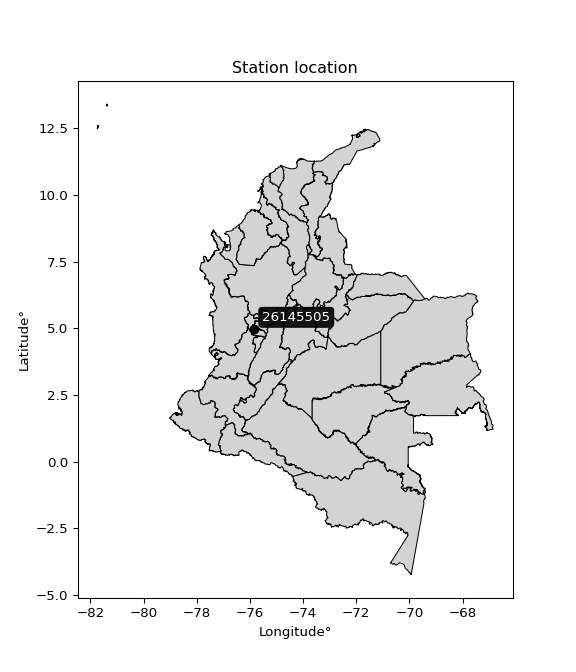

<div align="center">


</div>

# PMP Station (Rain, Pmax24h): 26145505

Probable Maximum Precipitation (PMP) is the greatest amount of rainfall for a specific duration that is meteorologically possible for a given location, acting as a "worst-case" scenario for extreme storms, crucial for designing safety-critical infrastructure like bridges, river deviations, dams, spillways, and nuclear plants to prevent catastrophic failure. PMP is calculated by hydrologists using meteorological data to determine the upper limit of extreme rainfall, often leading to the Probable Maximum Flood (PMF) for flood control design, and is increasingly being studied for climate change impacts. Probable Maximum Precipitation (PMP) is the theoretical upper limit of rainfall, a deterministic estimate for extreme events, while probability distributions (like GEV, Gumbel) describe the likelihood and frequency of various precipitation amounts, including rare ones, showing how often events occur, with PMP representing the extreme end of these distributions, used for critical infrastructure design to ensure safety against the worst conceivable weather, unlike standard statistical forecasts which cover typical probabilities.

The most common probability distributions in hydrology, used for analyzing floods, rainfall, and streamflow, include the Normal, Log-Normal, Gumbel, Gamma (including Log-Pearson Type III), and Generalized Extreme Value (GEV) distributions, often chosen based on the data´s skewness and whether modeling extremes or general conditions, with Gumbel and GEV popular for extreme events like floods, while the Normal distribution serves as a baseline, though often requiring transformations for skewed hydrological data. These distributions help in designing water infrastructure, managing water resources, and forecasting hydrologic events.

> Hydrological data often isn´t perfectly normal (it´s skewed), so different distributions are needed for different applications, such as: **Flood Frequency Analysis**: Using Gumbel, GEV, or Log-Pearson Type III for predicting extreme flood magnitudes and their return periods, **Rainfall Analysis**: Normal for annual totals, but Log-Normal, Weibull, or GEV for intensity or extreme daily rainfall, **Streamflow Modeling**: Gamma and Log-Normal for maximum flows, GEV for minimum flows, and Kappa for daily flows.

<div align="center">

</img>

</div>


## A. General information


### 1. General running parameters

• app_version: _v20260108_. • runtime: _2026-01-09 11:32:22.148588_. • Python version: _3.14.0_. • SciPy version: _1.16.3_. • Pandas version: _2.3.3_. • NumPy version: _2.3.5_. • Stations dataset (station_dataset_file): _dataset/pmax24h_in/automatic_colombia_2003_2024.csv_. • Stations catalog (station_catalog_file): _dataset/CNE.xls_. • Minimum year to eval til year_max (date_min): _1900_. • Maximum year to eval since year_min (date_max): _2024_. • Creates, save and include plots into reports (create_plot): _False_. • Plot only fit distributions with Δo > Δ (plot_only_fit): _True_. • Plot only simple graphs avoiding multiple CDFs and multiple Extreme values plots (plot_only_simple): _True_. • Eval low extreme values, if False, evaluates high extreme values (low_extreme): _False_. • Eval every SciPy distribution as logarithmic (pdist_logarithmic_on): _True_. • Standard deviation normalized (ddof): _1.0_. • Return periods to eval in years (Tr): _[2, 2.33, 5, 10, 15, 20, 25, 50, 75, 100, 200, 250, 500, 750, 1000]_. • Minimum data sample per station, 0 means any (minimum_sample): _5_. • Z-Score maximum threshold to adjust a value, 0 means disable (zscore_max): _3.5_. • Z-Score minimum threshold to adjust a value, 0 means disable (zscore_min): _-2.5_. • Avoid zeros, e.g. rain = 0 (avoid_zeros): _True_. • Avoid null values (avoid_nans): _True_. 

:file_folder:Table: [dataset.csv](../../dataset/pmax24h_in/automatic_colombia_2003_2024.csv)

> Delta Degrees of Freedom (DDOF): is a parameter used in the formulas for calculating variance and standard deviation. When ddof=0, the divisor is $N$ (the total number of observations) and this is used when your data set is the entire population. When ddof=1, the divisor is $N-1$ and this is used when your data set is a sample drawn from a larger population. Using $N-1$ provides an unbiased estimate of the population variance (known as Bessel´s correction).


### 2. Station info and location

|   id |   CODIGO | NOMBRE                         | CATEGORIA               | TECNOLOGIA                | ESTADO   | FECHA_INSTALACION   |   FECHA_SUSPENSION |   ALTITUD |   LATITUD |   LONGITUD | DEPARTAMENTO   | MUNICIPIO   | AREA_OPERATIVA                         | ENTIDAD                                    | AREA_HIDROGRAFICA   | ZONA_HIDROGRAFICA   | SUBZONA_HIDROGRAFICA   |   CORRIENTE | Catalogo   |   Version |
|-----:|---------:|:-------------------------------|:------------------------|:--------------------------|:---------|:--------------------|-------------------:|----------:|----------:|-----------:|:---------------|:------------|:---------------------------------------|:-------------------------------------------|:--------------------|:--------------------|:-----------------------|------------:|:-----------|----------:|
|    0 | 26145505 | LA FLORESTA  - AUT  [26145505] | Climatológica Principal | Automática con Telemetría | Activa   | 01/09/2013          |                nan |      1537 |   4.97922 |   -75.8356 | Caldas         | Belalcazar  | Area Operativa 09 - Cauca-Valle-Caldas | CENTRO NACIONAL DE INVESTIGACIONES DE CAFE | Magdalena Cauca     | Cauca               | Río Risaralda          |         nan | CNE_OE     |  20251226 |

<div align="center">

Dynamic map: [:earth_americas:Google](http://maps.google.com/maps?q=4.979219444,-75.83555556) [:earth_americas:OSM](https://www.openstreetmap.org/#map=18/4.979219444/-75.83555556&layers=P) [:earth_americas:Bing](https://www.bing.com/maps?cp=4.979219444~-75.83555556&lvl=18) [:earth_americas:Apple](https://maps.apple.com/frame?center=4.979219444%2C-75.83555556&span=0.003%2C0.006)

</div>


<div align="center">

```geojson
{
  "type": "Feature",
  "geometry": {
    "type": "Point", 
    "coordinates": [-75.83555556, 4.979219444]
  }, 
  "properties": {
    "Name": "26145505"
  }
}
```

</div>


### 3. Discrete values table and plot

<div align="center">

|               |          0 |          1 |           2 |          3 |           4 |           5 |            6 |
|:--------------|-----------:|-----------:|------------:|-----------:|------------:|------------:|-------------:|
| Date          | 2017       | 2018       | 2019        | 2020       | 2021        | 2022        | 2023         |
| Value         |   73       |   88.9     |   73.5      |   49.1     |   58.5      |   79.8      |   71         |
| Value_initial |   73       |   88.9     |   73.5      |   49.1     |   58.5      |   79.8      |   71         |
| count         |    7       |    7       |    7        |    7       |    7        |    7        |    7         |
| mean          |   70.5429  |   70.5429  |   70.5429   |   70.5429  |   70.5429   |   70.5429   |   70.5429    |
| std           |   13.1814  |   13.1814  |   13.1814   |   13.1814  |   13.1814   |   13.1814   |   13.1814    |
| zscore        |    0.18641 |    1.39265 |    0.224342 |   -1.62675 |   -0.913624 |    0.702288 |    0.0346809 |


</div>


> The initial value (value_initial) correspond to the initial obtained or null completed value, and value (value) is adjusted only when the initial value is outside the valid range (outlier) definite through the Z-Score value. If Z-Score is active, values out of range or outliers are replaced with the station mean value. A Z-Score (or standard score) measures how many standard deviations a data point is from the mean of a dataset, indicating its relative position; positive scores mean above the mean, negative mean below, and a score of zero is exactly at the mean, allowing for comparison of values from different distributions. It´s calculated using the formula $z=(x–μ)/σ$, where $x$ is the data point, $μ$ is the mean, and $σ$ is the standard deviation, helping identify outliers and understand probability.
>
> <sub>**Note**: In this study, "completing" (filling gaps in) and "extending" (forecasting or lengthening the historical record) rainfall data series are avoided for certain critical analyses because they introduce artificial bias and uncertainty, which can distort the statistics of rare events (extremes), alter day-to-day variability, and compromise the integrity and homogeneity of the original data. Some reasons against Completing/Extending rainfall data are: **Distortion of Extremes and Variability**: The primary issue is that most gap-filling or extension methods rely on averaging or regression with nearby stations, which inherently smooths the data. Rainfall is highly variable in space and time, with a large percentage of zero values and occasional large storms. Infilling methods often underestimate the highest values and overestimate the lowest (zero) values, which severely distorts analyses focused on flood frequency, drought severity, and intensity-duration-frequency (IDF) curves, **Loss of Data Homogeneity**: Infilled or extended data are synthetic estimates, not actual measurements. Combining these estimates with observed data can violate the assumption of data homogeneity, which requires that the data properties do not change over time. Inhomogeneity can lead to incorrect conclusions about long-term trends or changes in climate patterns, **Propagation of Errors**: Errors and biases from the original data (e.g., wind-induced undercatch, instrument errors, site changes) or the data used for imputation can propagate through the analysis, leading to unreliable hydrological models and inaccurate predictions, **Compromised Statistical Integrity**: For statistical analyses, especially those involving the frequency of events, using artificial data can introduce time bias or autocorrelation that doesn´t exist in reality, making it difficult to assess the true probability of events, **Difficulty in Validation**: It is difficult to accurately validate the quality of filled or extended data, especially for past periods where ground-truth measurements are unavailable. The reliability of imputation techniques heavily depends on the density of the surrounding station network and the complexity of the local topography.</sub>


### 4. Active continuous probability distributions from SciPy (45 of 104 available)

A Probability Density Function (PDF) describes the relative likelihood of a continuous random variable falling within a specific range, where the total area under its curve equals 1, and the area over any interval gives the actual probability for that range. Unlike discrete probabilities (like rolling a die), a PDF shows density, not direct probability for a single point (which is zero), with higher points indicating higher likelihood, often visualized as a bell curve for normal distributions.

A log of a probability density function (log-PDF) is simply the logarithm of the PDF´s value, denoted as $log(f(x))$, useful for converting multiplication of probabilities into addition, improving numerical stability with tiny numbers, and connecting to information theory concepts like entropy. Instead of dealing with very small probabilities (e.g., 0.000001), log-PDFs use negative numbers (e.g., $log(0.00001) ≈ -11.51$ that are easier for computers to handle, preventing underflow errors and simplifying complex calculations. In this study, each active probability distribution from SciPy is also evaluated in the $log$ form.

[scipy.stats](https://docs.scipy.org/doc/scipy/reference/stats.html) is a Python´s powerful submodule within the SciPy library for comprehensive statistical analysis, offering over 130 probability distributions (like Normal, Poisson), functions for descriptive stats (mean, variance), hypothesis testing (t-tests, chi-square), random variable generation, and statistical tests, making it essential for data science, modeling, and research. It provides tools to explore, model, and draw conclusions from data efficiently, working seamlessly with NumPy.

<div align="center">

|   id | p_dist             |   n_parameter | fit_method   | label                                                                       | active   | ref                                                                                                        |
|-----:|:-------------------|--------------:|:-------------|:----------------------------------------------------------------------------|:---------|:-----------------------------------------------------------------------------------------------------------|
|    0 | alpha              |             3 | MLE          | Alpha                                                                       | True     | [:mortar_board:](https://docs.scipy.org/doc/scipy/reference/generated/scipy.stats.alpha.html)              |
|    1 | betaprime          |             4 | MLE          | Beta prime                                                                  | True     | [:mortar_board:](https://docs.scipy.org/doc/scipy/reference/generated/scipy.stats.betaprime.html)          |
|    2 | chi2               |             3 | MLE          | Chi²                                                                        | True     | [:mortar_board:](https://docs.scipy.org/doc/scipy/reference/generated/scipy.stats.chi2.html)               |
|    3 | crystalball        |             4 | MLE          | Crystalball                                                                 | True     | [:mortar_board:](https://docs.scipy.org/doc/scipy/reference/generated/scipy.stats.crystalball.html)        |
|    4 | dweibull           |             3 | MLE          | Double Weibull                                                              | True     | [:mortar_board:](https://docs.scipy.org/doc/scipy/reference/generated/scipy.stats.dweibull.html)           |
|    5 | erlang             |             3 | MLE          | Erlang                                                                      | True     | [:mortar_board:](https://docs.scipy.org/doc/scipy/reference/generated/scipy.stats.erlang.html)             |
|    6 | expon              |             2 | MLE          | Exponential                                                                 | True     | [:mortar_board:](https://docs.scipy.org/doc/scipy/reference/generated/scipy.stats.expon.html)              |
|    7 | exponnorm          |             3 | MLE          | Exponentially modified Normal                                               | True     | [:mortar_board:](https://docs.scipy.org/doc/scipy/reference/generated/scipy.stats.exponnorm.html)          |
|    8 | f                  |             4 | MLE          | F                                                                           | True     | [:mortar_board:](https://docs.scipy.org/doc/scipy/reference/generated/scipy.stats.f.html)                  |
|    9 | fatiguelife        |             3 | MLE          | Fatigue-life (Birnbaum-Saunders)                                            | True     | [:mortar_board:](https://docs.scipy.org/doc/scipy/reference/generated/scipy.stats.fatiguelife.html)        |
|   10 | fisk               |             3 | MLE          | Fisk                                                                        | True     | [:mortar_board:](https://docs.scipy.org/doc/scipy/reference/generated/scipy.stats.fisk.html)               |
|   11 | gamma              |             3 | MLE          | Gamma                                                                       | True     | [:mortar_board:](https://docs.scipy.org/doc/scipy/reference/generated/scipy.stats.gamma.html)              |
|   12 | genexpon           |             5 | MLE          | Generalized exponential                                                     | True     | [:mortar_board:](https://docs.scipy.org/doc/scipy/reference/generated/scipy.stats.genexpon.html)           |
|   13 | genlogistic        |             3 | MLE          | Generalized logistic                                                        | True     | [:mortar_board:](https://docs.scipy.org/doc/scipy/reference/generated/scipy.stats.genlogistic.html)        |
|   14 | gibrat             |             2 | MM           | Gibrat                                                                      | True     | [:mortar_board:](https://docs.scipy.org/doc/scipy/reference/generated/scipy.stats.gibrat.html)             |
|   15 | gompertz           |             3 | MLE          | Gompertz (or truncated Gumbel)                                              | True     | [:mortar_board:](https://docs.scipy.org/doc/scipy/reference/generated/scipy.stats.gompertz.html)           |
|   16 | gumbel_l           |             2 | MM           | Gumbel Left Skew                                                            | True     | [:mortar_board:](https://docs.scipy.org/doc/scipy/reference/generated/scipy.stats.gumbel_l.html)           |
|   17 | gumbel_r           |             2 | MM           | Gumbel Right Skew                                                           | True     | [:mortar_board:](https://docs.scipy.org/doc/scipy/reference/generated/scipy.stats.gumbel_r.html)           |
|   18 | halflogistic       |             2 | MM           | Half-logistic                                                               | True     | [:mortar_board:](https://docs.scipy.org/doc/scipy/reference/generated/scipy.stats.halflogistic.html)       |
|   19 | halfnorm           |             2 | MM           | Half Normal                                                                 | True     | [:mortar_board:](https://docs.scipy.org/doc/scipy/reference/generated/scipy.stats.halfnorm.html)           |
|   20 | hypsecant          |             2 | MM           | hyperbolic secant                                                           | True     | [:mortar_board:](https://docs.scipy.org/doc/scipy/reference/generated/scipy.stats.hypsecant.html)          |
|   21 | invgamma           |             3 | MLE          | Inverted gamma                                                              | True     | [:mortar_board:](https://docs.scipy.org/doc/scipy/reference/generated/scipy.stats.invgamma.html)           |
|   22 | invgauss           |             3 | MLE          | Inverse Gaussian                                                            | True     | [:mortar_board:](https://docs.scipy.org/doc/scipy/reference/generated/scipy.stats.invgauss.html)           |
|   23 | invweibull         |             3 | MLE          | Inverted Weibull                                                            | True     | [:mortar_board:](https://docs.scipy.org/doc/scipy/reference/generated/scipy.stats.invweibull.html)         |
|   24 | kappa4             |             4 | MLE          | Kappa 4                                                                     | True     | [:mortar_board:](https://docs.scipy.org/doc/scipy/reference/generated/scipy.stats.kappa4.html)             |
|   25 | kstwobign          |             2 | MLE          | Limiting distribution of scaled Kolmogorov-Smirnov two-sided test statistic | True     | [:mortar_board:](https://docs.scipy.org/doc/scipy/reference/generated/scipy.stats.kstwobign.html)          |
|   26 | laplace            |             2 | MM           | Laplace                                                                     | True     | [:mortar_board:](https://docs.scipy.org/doc/scipy/reference/generated/scipy.stats.laplace.html)            |
|   27 | laplace_asymmetric |             3 | MLE          | Asymmetric Laplace                                                          | True     | [:mortar_board:](https://docs.scipy.org/doc/scipy/reference/generated/scipy.stats.laplace_asymmetric.html) |
|   28 | loggamma           |             3 | MLE          | Log gamma                                                                   | True     | [:mortar_board:](https://docs.scipy.org/doc/scipy/reference/generated/scipy.stats.loggamma.html)           |
|   29 | logistic           |             2 | MM           | Logistic (or Sech-squared)                                                  | True     | [:mortar_board:](https://docs.scipy.org/doc/scipy/reference/generated/scipy.stats.logistic.html)           |
|   30 | lognorm            |             3 | MLE          | Log Normal                                                                  | True     | [:mortar_board:](https://docs.scipy.org/doc/scipy/reference/generated/scipy.stats.lognorm.html)            |
|   31 | maxwell            |             2 | MM           | Maxwell                                                                     | True     | [:mortar_board:](https://docs.scipy.org/doc/scipy/reference/generated/scipy.stats.maxwell.html)            |
|   32 | mielke             |             4 | MLE          | Mielke Beta-Kappa / Dagum                                                   | True     | [:mortar_board:](https://docs.scipy.org/doc/scipy/reference/generated/scipy.stats.mielke.html)             |
|   33 | moyal              |             2 | MM           | Moyal                                                                       | True     | [:mortar_board:](https://docs.scipy.org/doc/scipy/reference/generated/scipy.stats.moyal.html)              |
|   34 | nakagami           |             3 | MLE          | Nakagami                                                                    | True     | [:mortar_board:](https://docs.scipy.org/doc/scipy/reference/generated/scipy.stats.nakagami.html)           |
|   35 | ncf                |             5 | MLE          | Non-central F distribution                                                  | True     | [:mortar_board:](https://docs.scipy.org/doc/scipy/reference/generated/scipy.stats.ncf.html)                |
|   36 | nct                |             4 | MLE          | Non-central Student’s t                                                     | True     | [:mortar_board:](https://docs.scipy.org/doc/scipy/reference/generated/scipy.stats.nct.html)                |
|   37 | norm               |             2 | MM           | Normal                                                                      | True     | [:mortar_board:](https://docs.scipy.org/doc/scipy/reference/generated/scipy.stats.norm.html)               |
|   38 | pearson3           |             3 | MM           | Pearson type III                                                            | True     | [:mortar_board:](https://docs.scipy.org/doc/scipy/reference/generated/scipy.stats.pearson3.html)           |
|   39 | rayleigh           |             2 | MM           | Rayleigh                                                                    | True     | [:mortar_board:](https://docs.scipy.org/doc/scipy/reference/generated/scipy.stats.rayleigh.html)           |
|   40 | rice               |             3 | MLE          | Rice                                                                        | True     | [:mortar_board:](https://docs.scipy.org/doc/scipy/reference/generated/scipy.stats.rice.html)               |
|   41 | t                  |             3 | MLE          | Student’s t                                                                 | True     | [:mortar_board:](https://docs.scipy.org/doc/scipy/reference/generated/scipy.stats.t.html)                  |
|   42 | truncnorm          |             4 | MLE          | Truncated normal                                                            | True     | [:mortar_board:](https://docs.scipy.org/doc/scipy/reference/generated/scipy.stats.truncnorm.html)          |
|   43 | wald               |             2 | MM           | Wald                                                                        | True     | [:mortar_board:](https://docs.scipy.org/doc/scipy/reference/generated/scipy.stats.wald.html)               |
|   44 | weibull_min        |             3 | MLE          | Weibull minimum                                                             | True     | [:mortar_board:](https://docs.scipy.org/doc/scipy/reference/generated/scipy.stats.weibull_min.html)        |

</div>

> **n_parameter:** # arguments & localization & scale.
>
> **Fit methods:** (MLE) maximum likelihood, (MM) L-moments.
>
>**Inactive** (With the only purpose of prevent loops, zero divisions, infinite values, over high estimated values or horizontal trending for recurrence intervals estimations, the follow distributions were disabled.)**:** foldnorm, gennorm, norminvgauss, powernorm, powerlognorm, skewnorm, genextreme, anglit, arcsine, argus, beta, bradford, burr, burr12, cauchy, cosine, halfcauchy, foldcauchy, skewcauchy, wrapcauchy, dgamma, gengamma, exponweib, exponpow, truncexpon, gausshyper, genhalflogistic, genhyperbolic, geninvgauss, halfgennorm, johnsonsb, johnsonsu, kappa3, ksone, kstwo, loglaplace, levy, levy_l, levy_stable, ncx2, pareto, genpareto, truncpareto, lomax, powerlaw, rdist, rel_breitwigner, recipinvgauss, semicircular, studentized_range, trapezoid, triang, truncweibull_min, tukeylambda, uniform, loguniform, vonmises, vonmises_line, weibull_max, 


## B. Probability (PDF) vs. Empirical (EDF) distributions functions

A continuous probability distribution (CPD) describes probabilities for variables that can take any value within a range (like rain any time), unlike discrete variables with specific outcomes (like temperature). It uses a Probability Density Function (PDF), a curve where the total area under it equals 1, and the probability of the variable falling within an interval (a to b) is found by calculating the area under the curve between those points. A key feature is that the probability of hitting any single exact value is zero, so probabilities are always expressed for ranges, e.g., $P(a ≤ X ≤ b)$.

<div align="center">

Distributions parameters from station values
|    |   station | p_dist                |   n |              loc |           scale | shape                  | shape1                 | shape2                 | shape3   |
|---:|----------:|:----------------------|----:|-----------------:|----------------:|:-----------------------|:-----------------------|:-----------------------|:---------|
|  0 |  26145505 | alpha                 |   7 |   -209.231       |  6235.41        | 22.335662183218204     |                        |                        |          |
|  1 |  26145505 | betaprime             |   7 |   -159.848       | 19550.7         | 336.8256165721979      | 28583.473169827776     |                        |          |
|  2 |  26145505 | chi2                  |   7 |    -63.5536      |     0.587267    | 228.1677052989054      |                        |                        |          |
|  3 |  26145505 | crystalball           |   7 |     70.5429      |    12.2036      | 5558.841865975872      | 202.24953459629185     |                        |          |
|  4 |  26145505 | dweibull              |   7 |     73           |     9.01391     | 0.9426389113342303     |                        |                        |          |
|  5 |  26145505 | erlang                |   7 |   -115.971       |     0.822288    | 226.78317911925308     |                        |                        |          |
|  6 |  26145505 | expon                 |   7 |     49.1         |    21.4429      |                        |                        |                        |          |
|  7 |  26145505 | exponnorm             |   7 |     70.5318      |    12.2036      | 0.0009087473760311404  |                        |                        |          |
|  8 |  26145505 | f                     |   7 |  -2709.68        |  2780.2         | 345624.33433098695     | 147396.21091430087     |                        |          |
|  9 |  26145505 | fatiguelife           |   7 |     49.1         |     1.45468e-05 | 1087.6950053887504     |                        |                        |          |
| 10 |  26145505 | fisk                  |   7 | -44356.5         | 44427.8         | 6280.074717979995      |                        |                        |          |
| 11 |  26145505 | gamma                 |   7 |   -121.532       |     0.798776    | 240.32211125432264     |                        |                        |          |
| 12 |  26145505 | genexpon              |   7 |     49.1         |     1.97174     | 0.09191795059510101    | 2.9299883422235694e-07 | 1.2186484009459804     |          |
| 13 |  26145505 | genlogistic           |   7 |     78.0865      |     4.88863     | 0.47088684899311734    |                        |                        |          |
| 14 |  26145505 | gibrat                |   7 |     61.2331      |     5.64668     |                        |                        |                        |          |
| 15 |  26145505 | gompertz              |   7 |     71           |     1.61746     | 7.782372795808913e-05  |                        |                        |          |
| 16 |  26145505 | gumbel_l              |   7 |     76.0351      |     9.51512     |                        |                        |                        |          |
| 17 |  26145505 | gumbel_r              |   7 |     65.0506      |     9.51512     |                        |                        |                        |          |
| 18 |  26145505 | halflogistic          |   7 |     56.0787      |    10.4337      |                        |                        |                        |          |
| 19 |  26145505 | halfnorm              |   7 |     54.3901      |    20.2445      |                        |                        |                        |          |
| 20 |  26145505 | hypsecant             |   7 |     70.5429      |     7.76906     |                        |                        |                        |          |
| 21 |  26145505 | invgamma              |   7 |   -116.181       | 41448.8         | 223.18043025018625     |                        |                        |          |
| 22 |  26145505 | invgauss              |   7 |      6.0064      |  1444.73        | 0.04467914845104709    |                        |                        |          |
| 23 |  26145505 | invweibull            |   7 |     49.1         |     1.62903     | 0.04983742085452689    |                        |                        |          |
| 24 |  26145505 | kappa4                |   7 |     47.6902      |    43.5718      | 1.0334481798126076     | 1.0573172619886164     |                        |          |
| 25 |  26145505 | kstwobign             |   7 |     21.3454      |    56.1925      |                        |                        |                        |          |
| 26 |  26145505 | laplace               |   7 |     70.5429      |     8.62926     |                        |                        |                        |          |
| 27 |  26145505 | laplace_asymmetric    |   7 |     73           |     8.83143     | 1.1487096774987826     |                        |                        |          |
| 28 |  26145505 | loggamma              |   7 |     54.8171      |    18.8437      | 2.7860108343095        |                        |                        |          |
| 29 |  26145505 | logistic              |   7 |     70.5429      |     6.7282      |                        |                        |                        |          |
| 30 |  26145505 | lognorm               |   7 |     49.1         |     0.139773    | 12.503367519219863     |                        |                        |          |
| 31 |  26145505 | maxwell               |   7 |     41.6254      |    18.1213      |                        |                        |                        |          |
| 32 |  26145505 | mielke                |   7 |     -0.437614    |    81.3713      | 5.736192610428995      | 18.770166691616804     |                        |          |
| 33 |  26145505 | moyal                 |   7 |     63.564       |     5.49356     |                        |                        |                        |          |
| 34 |  26145505 | nakagami              |   7 |     58.5         |    14.1997      | 0.20821468249669017    |                        |                        |          |
| 35 |  26145505 | ncf                   |   7 |     -0.00424687  |     4.37521e-07 | 2.0987541043302917e-08 | 3.2004834294619124     | 2.1161558989744265     |          |
| 36 |  26145505 | nct                   |   7 |   -366.02        |    12.1527      | 68682.44092481752      | 35.92229269721521      |                        |          |
| 37 |  26145505 | norm                  |   7 |     70.5429      |    12.2036      |                        |                        |                        |          |
| 38 |  26145505 | pearson3              |   7 |     70.5429      |    12.2036      | -0.3604304242042182    |                        |                        |          |
| 39 |  26145505 | rayleigh              |   7 |     47.1966      |    18.6276      |                        |                        |                        |          |
| 40 |  26145505 | rice                  |   7 |     42.0701      |    13.5377      | 1.7989296935566        |                        |                        |          |
| 41 |  26145505 | t                     |   7 |     70.5445      |    12.2039      | 337592.50413722        |                        |                        |          |
| 42 |  26145505 | truncnorm             |   7 |     70.5429      |    12.2036      | -191.19257245683968    | 770.6551982960846      |                        |          |
| 43 |  26145505 | wald                  |   7 |     58.3392      |    12.2036      |                        |                        |                        |          |
| 44 |  26145505 | weibull_min           |   7 |      7.61378     |    67.8645      | 6.148476589969636      |                        |                        |          |
| 45 |  26145505 | logalpha              |   7 |     -4.09488     |   373.971       | 44.89675330913802      |                        |                        |          |
| 46 |  26145505 | logbetaprime          |   7 |     -7.95544     |    17.4934      | 7250.314645944207      | 10401.42734645035      |                        |          |
| 47 |  26145505 | logchi2               |   7 |      3.89386     |     0.950293    | 1.0737858857892753     |                        |                        |          |
| 48 |  26145505 | logcrystalball        |   7 |      4.24005     |     0.18366     | 25.938487728875554     | 2020.9713532278408     |                        |          |
| 49 |  26145505 | logdweibull           |   7 |      4.29729     |     0.154321    | 0.7692645568240739     |                        |                        |          |
| 50 |  26145505 | logerlang             |   7 |      1.40288     |     0.0123306   | 230.14236770330194     |                        |                        |          |
| 51 |  26145505 | logexpon              |   7 |      3.89386     |     0.34619     |                        |                        |                        |          |
| 52 |  26145505 | logexponnorm          |   7 |      4.2399      |     0.183659    | 0.0007835756457843233  |                        |                        |          |
| 53 |  26145505 | logf                  |   7 |   -171.596       |   175.836       | 3721179.3888328355     | 3567978.151519038      |                        |          |
| 54 |  26145505 | logfatiguelife        |   7 |    -47.6455      |    51.8851      | 0.003540785977604665   |                        |                        |          |
| 55 |  26145505 | logfisk               |   7 |  -7071.52        |  7075.78        | 67298.33099882313      |                        |                        |          |
| 56 |  26145505 | loggamma              |   7 |      1.17297     |     0.0112516   | 272.57250473363854     |                        |                        |          |
| 57 |  26145505 | loggenexpon           |   7 |      3.89386     |  2234.42        | 3488.1127650655544     | 8694.281850519434      | 4370.040231299723      |          |
| 58 |  26145505 | loggenlogistic        |   7 |      4.39387     |     0.0535189   | 0.30474382366444863    |                        |                        |          |
| 59 |  26145505 | loggibrat             |   7 |      4.0999      |     0.0850016   |                        |                        |                        |          |
| 60 |  26145505 | loggompertz           |   7 |      3.8938      |     0.177771    | 0.10414139618761198    |                        |                        |          |
| 61 |  26145505 | loggumbel_l           |   7 |      4.32271     |     0.143199    |                        |                        |                        |          |
| 62 |  26145505 | loggumbel_r           |   7 |      4.15739     |     0.143199    |                        |                        |                        |          |
| 63 |  26145505 | loghalflogistic       |   7 |      4.0224      |     0.157004    |                        |                        |                        |          |
| 64 |  26145505 | loghalfnorm           |   7 |      3.99693     |     0.304698    |                        |                        |                        |          |
| 65 |  26145505 | loghypsecant          |   7 |      4.24005     |     0.116922    |                        |                        |                        |          |
| 66 |  26145505 | loginvgamma           |   7 |      1.2386      |   732.894       | 245.0949968492701      |                        |                        |          |
| 67 |  26145505 | loginvgauss           |   7 |      2.53905     |   126.324       | 0.013470250097325831   |                        |                        |          |
| 68 |  26145505 | loginvweibull         |   7 |     -1.89107e+07 |     1.89107e+07 | 101662903.32166791     |                        |                        |          |
| 69 |  26145505 | logkappa4             |   7 |      3.91077     |     0.655769    | 0.9316355383689763     | 1.1370304710662076     |                        |          |
| 70 |  26145505 | logkstwobign          |   7 |      3.45903     |     0.891891    |                        |                        |                        |          |
| 71 |  26145505 | loglaplace            |   7 |      4.24005     |     0.129867    |                        |                        |                        |          |
| 72 |  26145505 | loglaplace_asymmetric |   7 |      4.29729     |     0.125497    | 1.2537856106632994     |                        |                        |          |
| 73 |  26145505 | logloggamma           |   7 |      4.38419     |     0.113123    | 0.6812746994906221     |                        |                        |          |
| 74 |  26145505 | loglogistic           |   7 |      4.24005     |     0.101257    |                        |                        |                        |          |
| 75 |  26145505 | loglognorm            |   7 |      3.89386     |     0.00279229  | 12.036055379107248     |                        |                        |          |
| 76 |  26145505 | logmaxwell            |   7 |      3.80485     |     0.272719    |                        |                        |                        |          |
| 77 |  26145505 | logmielke             |   7 |      3.89386     |     0.616917    | 0.7201054444819759     | 18.717231737620928     |                        |          |
| 78 |  26145505 | logmoyal              |   7 |      4.13502     |     0.082676    |                        |                        |                        |          |
| 79 |  26145505 | lognakagami           |   7 |    -84.2283      |    88.4682      | 57742.95619340718      |                        |                        |          |
| 80 |  26145505 | logncf                |   7 |      3.59003     |     0.647212    | 20.923684776690123     | 56.52041597756954      | 0.00015670487350189313 |          |
| 81 |  26145505 | lognct                |   7 |     -0.764845    |     0.052519    | 392.03918536254264     | 95.10636338578752      |                        |          |
| 82 |  26145505 | lognorm               |   7 |      4.24005     |     0.18366     |                        |                        |                        |          |
| 83 |  26145505 | logpearson3           |   7 |      4.24005     |     0.18366     | -0.6525791957014373    |                        |                        |          |
| 84 |  26145505 | lograyleigh           |   7 |      3.8887      |     0.280338    |                        |                        |                        |          |
| 85 |  26145505 | logrice               |   7 |      3.77606     |     0.199545    | 2.0624690011136195     |                        |                        |          |
| 86 |  26145505 | logt                  |   7 |      4.24006     |     0.183652    | 16138.38759911037      |                        |                        |          |
| 87 |  26145505 | logtruncnorm          |   7 |     -0.0808669   |     1.2565      | 3.1624774136623977     | 3.635796001184173      |                        |          |
| 88 |  26145505 | logwald               |   7 |      4.05638     |     0.183671    |                        |                        |                        |          |
| 89 |  26145505 | logweibull_min        |   7 |     -2.82354e+06 |     2.82354e+06 | 19468731.259053215     |                        |                        |          |

</div>

> **loc** (Location parameter): This shifts the distribution along the x-axis. For many common distributions, like the normal (Gaussian) distribution, loc represents the mean $μ$. For others, like the uniform distribution, it might represent the minimum value, or for the beta distribution, the left end of the support interval.
>
> **scale** (Scale parameter): This determines the width or spread of the distribution. For the normal distribution, scale represents the standard deviation $σ$. For a uniform distribution, it defines the length of the interval (from $loc$ to $loc + scale$).
>
> **shape** (Shape parameters): Refers to parameters that define the specific form of a probability distribution, distinct from its location (loc) and scale (scale). These parameters are required arguments for most distribution functions. For example, a normal (Gaussian) distribution is fully defined by its location (mean) and scale (standard deviation), so it has no specific shape parameters beyond loc and scale. However, other distributions have intrinsic properties that need specification, as Gamma distribution that takes a shape parameter, often named $a$ or $alpha$.


### 0. Cumulative distribution values - CDF (90 evaluated)

Cumulative Distribution Function (CDF), denoted as $F$<sub>$X$</sub>$(x)$, is a function that gives the probability that a random variable $X$ will take a value less than or equal to a specific value, $x$ (i.e., $(P(X≥x)$. It essentially "accumulates" probabilities from a given point up to the far right (positive infinity), providing a complete picture of the distribution´s probabilities for both discrete (like rain) and continuous (like temperature) variables, helping to find probabilities over ranges or above certain values. Each station is evaluated separately ordering the $x$ values ascending, calculating the CDF and PDF values for the activated distributions and their logarithmic forms.

<div align="center">

CDF ordered by x ascending and calculating $log(f(x))$ separately
|   id |   Station |   date |    x |   count |    mean |     std |     zscore |   Value_initial |   station |   m |     alpha |   alpha_pdf |   betaprime |   betaprime_pdf |      chi2 |   chi2_pdf |   crystalball |   crystalball_pdf |   dweibull |   dweibull_pdf |    erlang |   erlang_pdf |    expon |   expon_pdf |   exponnorm |   exponnorm_pdf |        f |      f_pdf |   fatiguelife |   fatiguelife_pdf |      fisk |   fisk_pdf |     gamma |   gamma_pdf |    genexpon |   genexpon_pdf |   genlogistic |   genlogistic_pdf |   gibrat |   gibrat_pdf |    gompertz |   gompertz_pdf |   gumbel_l |   gumbel_l_pdf |   gumbel_r |   gumbel_r_pdf |   halflogistic |   halflogistic_pdf |   halfnorm |   halfnorm_pdf |   hypsecant |   hypsecant_pdf |   invgamma |   invgamma_pdf |   invgauss |   invgauss_pdf |   invweibull |   invweibull_pdf |      kappa4 |   kappa4_pdf |   kstwobign |   kstwobign_pdf |   laplace |   laplace_pdf |   laplace_asymmetric |   laplace_asymmetric_pdf |   loggamma |   loggamma_pdf |   logistic |   logistic_pdf |   lognorm |   lognorm_pdf |   maxwell |   maxwell_pdf |   mielke |   mielke_pdf |       moyal |   moyal_pdf |    nakagami |   nakagami_pdf |      ncf |    ncf_pdf |       nct |    nct_pdf |      norm |   norm_pdf |   pearson3 |   pearson3_pdf |   rayleigh |   rayleigh_pdf |      rice |   rice_pdf |         t |     t_pdf |   truncnorm |   truncnorm_pdf |        wald |    wald_pdf |   weibull_min |   weibull_min_pdf |   logalpha |   logalpha_pdf |   logbetaprime |   logbetaprime_pdf |     logchi2 |   logchi2_pdf |   logcrystalball |   logcrystalball_pdf |   logdweibull |   logdweibull_pdf |   logerlang |   logerlang_pdf |   logexpon |   logexpon_pdf |   logexponnorm |   logexponnorm_pdf |     logf |   logf_pdf |   logfatiguelife |   logfatiguelife_pdf |   logfisk |   logfisk_pdf |   loggenexpon |   loggenexpon_pdf |   loggenlogistic |   loggenlogistic_pdf |   loggibrat |   loggibrat_pdf |   loggompertz |   loggompertz_pdf |   loggumbel_l |   loggumbel_l_pdf |   loggumbel_r |   loggumbel_r_pdf |   loghalflogistic |   loghalflogistic_pdf |   loghalfnorm |   loghalfnorm_pdf |   loghypsecant |   loghypsecant_pdf |   loginvgamma |   loginvgamma_pdf |   loginvgauss |   loginvgauss_pdf |   loginvweibull |   loginvweibull_pdf |   logkappa4 |   logkappa4_pdf |   logkstwobign |   logkstwobign_pdf |   loglaplace |   loglaplace_pdf |   loglaplace_asymmetric |   loglaplace_asymmetric_pdf |   logloggamma |   logloggamma_pdf |   loglogistic |   loglogistic_pdf |   loglognorm |   loglognorm_pdf |   logmaxwell |   logmaxwell_pdf |   logmielke |   logmielke_pdf |    logmoyal |   logmoyal_pdf |   lognakagami |   lognakagami_pdf |    logncf |   logncf_pdf |    lognct |   lognct_pdf |   logpearson3 |   logpearson3_pdf |   lograyleigh |   lograyleigh_pdf |   logrice |   logrice_pdf |      logt |   logt_pdf |   logtruncnorm |   logtruncnorm_pdf |     logwald |   logwald_pdf |   logweibull_min |   logweibull_min_pdf |
|-----:|----------:|-------:|-----:|--------:|--------:|--------:|-----------:|----------------:|----------:|----:|----------:|------------:|------------:|----------------:|----------:|-----------:|--------------:|------------------:|-----------:|---------------:|----------:|-------------:|---------:|------------:|------------:|----------------:|---------:|-----------:|--------------:|------------------:|----------:|-----------:|----------:|------------:|------------:|---------------:|--------------:|------------------:|---------:|-------------:|------------:|---------------:|-----------:|---------------:|-----------:|---------------:|---------------:|-------------------:|-----------:|---------------:|------------:|----------------:|-----------:|---------------:|-----------:|---------------:|-------------:|-----------------:|------------:|-------------:|------------:|----------------:|----------:|--------------:|---------------------:|-------------------------:|-----------:|---------------:|-----------:|---------------:|----------:|--------------:|----------:|--------------:|---------:|-------------:|------------:|------------:|------------:|---------------:|---------:|-----------:|----------:|-----------:|----------:|-----------:|-----------:|---------------:|-----------:|---------------:|----------:|-----------:|----------:|----------:|------------:|----------------:|------------:|------------:|--------------:|------------------:|-----------:|---------------:|---------------:|-------------------:|------------:|--------------:|-----------------:|---------------------:|--------------:|------------------:|------------:|----------------:|-----------:|---------------:|---------------:|-------------------:|---------:|-----------:|-----------------:|---------------------:|----------:|--------------:|--------------:|------------------:|-----------------:|---------------------:|------------:|----------------:|--------------:|------------------:|--------------:|------------------:|--------------:|------------------:|------------------:|----------------------:|--------------:|------------------:|---------------:|-------------------:|--------------:|------------------:|--------------:|------------------:|----------------:|--------------------:|------------:|----------------:|---------------:|-------------------:|-------------:|-----------------:|------------------------:|----------------------------:|--------------:|------------------:|--------------:|------------------:|-------------:|-----------------:|-------------:|-----------------:|------------:|----------------:|------------:|---------------:|--------------:|------------------:|----------:|-------------:|----------:|-------------:|--------------:|------------------:|--------------:|------------------:|----------:|--------------:|----------:|-----------:|---------------:|-------------------:|------------:|--------------:|-----------------:|---------------------:|
|    0 |  26145505 |   2020 | 49.1 |       7 | 70.5429 | 13.1814 | -1.62675   |            49.1 |  26145505 |   1 | 0.0358025 |  0.00735525 |   0.0412843 |      0.00747975 | 0.0384214 | 0.00746716 |     0.0394512 |        0.00698245 |  0.0407471 |     0.00402937 | 0.0377337 |   0.00720032 | 0        |  0.0466356  |   0.0394507 |       0.0069824 | 0.039223 | 0.00699481 |     0.0400526 |        1.8803e+10 | 0.0413812 | 0.00561018 | 0.0384296 |  0.00728819 | 2.43049e-07 |     0.0466178  |     0.0612177 |        0.00588102 | 0        |   0          | 0           |    0           |  0.0572624 |     0.00584235 | 0.00476738 |     0.0026785  |       0        |         0          |   0        |     0          |   0.0402378 |      0.00516546 |  0.0360676 |     0.00744389 |  0.0335564 |     0.00841126 |    0.0055378 |      2.0183e+11  | 2.89369e-05 |    0.0326152 |   0.0322988 |      0.0106063  | 0.0416669 |    0.00482856 |            0.0539345 |               0.00531649 |  0.0276052 |       0.370312 |  0.0396575 |     0.00566047 |  0.029718 |      0.367587 | 0.0177399 |    0.00688018 | 0.058027 |   0.00671861 | 0.000191345 |  0.00025784 | 0           |    0           | 0.633653 | 0.00371759 | 0.0395172 | 0.00699464 | 0.0394512 | 0.00698245 |  0.0486114 |     0.00688685 | 0.00520677 |     0.00545685 | 0.0277741 | 0.00817735 | 0.0394432 | 0.0069811 |   0.0394512 |      0.00698246 | 0           | 0           |     0.0473523 |        0.00684902 |  0.0277122 |       0.373267 |       0.030691 |           0.381805 | 4.56246e-09 |   5.51591e+06 |        0.0297181 |             0.367588 |     0.0615765 |          0.245907 |   0.0278602 |        0.37323  |   0        |       2.88858  |      0.0297179 |           0.367587 | 0.030092 |   0.370963 |        0.0294674 |             0.367355 | 0.0303103 |      0.27956  |   2.67331e-07 |          1.56108  |        0.0580105 |             0.33029  |    0        |        0        |   3.55707e-05 |          0.585998 |     0.0488167 |          0.332441 |    0.00183882 |          0.080881 |          0        |              0        |      0        |          0        |      0.0329306 |           0.281145 |     0.0275092 |          0.388469 |     0.0278383 |          0.410012 |       0.0239209 |            0.480055 |   0.0353078 |         1.2091  |      0.0286378 |           0.617814 |    0.0347744 |         0.267769 |                0.047062 |                    0.299099 |      0.057341 |          0.342648 |     0.0317091 |          0.303225 |   0.00717373 |      3.72549e+12 |    0.0089557 |         0.295465 | 0.000158689 |        34.9914  | 1.71259e-05 |      0.0020091 |     0.0300733 |          0.370865 | 0.0293497 |     0.527135 | 0.0267686 |     0.370893 |     0.0444859 |          0.372725 |   0.000169489 |         0.0656671 | 0.0227078 |      0.416672 | 0.0297183 |   0.367541 |     0.00355569 |           3.31292  | 0           |      0        |        0.0498048 |             0.334714 |
|    1 |  26145505 |   2021 | 58.5 |       7 | 70.5429 | 13.1814 | -0.913624  |            58.5 |  26145505 |   2 | 0.17      |  0.0220131  |   0.170405  |      0.0208108  | 0.170982  | 0.0215458  |     0.161864  |        0.020089   |  0.104507  |     0.010635   | 0.166207  |   0.0210548  | 0.354916 |  0.0300839  |   0.161863  |       0.0200889 | 0.162069 | 0.0201585  |     0.770061  |        0.011935   | 0.140227  | 0.0170471  | 0.167871  |  0.0211569  | 0.354809    |     0.0300775  |     0.1503    |        0.0142186  | 0        |   0          | 0           |    0           |  0.146459  |     0.0142057  | 0.136613   |     0.02858    |       0.115514 |         0.0472824  |   0.160876 |     0.0386085  |   0.133132  |      0.0166409  |  0.171832  |     0.0222399  |  0.189263  |     0.0246705  |    0.399974  |      0.00194323  | 0.236087    |    0.0244865 |   0.225538  |      0.0281891  | 0.123844  |    0.0143517  |            0.136232  |               0.0134288  |  0.179584  |       1.46543  |  0.143084  |     0.0182235  |  0.175877 |      1.408    | 0.166649  |    0.024748   | 0.157098 |   0.0152539  | 0.11285     |  0.0327605  | 3.34609e-07 |    1.96105e+07 | 0.666152 | 0.0032133  | 0.16209   | 0.0201074  | 0.161864  | 0.020089   |  0.160352  |     0.0178994  | 0.168154   |     0.027098   | 0.168495  | 0.022106   | 0.161836  | 0.0200862 |   0.161864  |      0.020089   | 8.03539e-18 | 1.92093e-15 |     0.156577  |        0.0173537  |  0.181118  |       1.47806  |       0.180672 |           1.42847  | 0.303293    |   0.875159    |        0.175877  |             1.408    |     0.129442  |          0.589521 |   0.18018   |        1.46323  |   0.39709  |       1.74156  |      0.175877  |           1.40801  | 0.176877 |   1.40991  |        0.176075  |             1.41324  | 0.141926  |      1.15832  |   0.314728    |          1.84322  |        0.157177  |             0.892924 |    0        |        0        |   0.16048     |          1.31789  |     0.156398  |          1.00193  |    0.156685   |          2.02808  |          0.147418 |              3.11542  |      0.187034 |          2.54633  |      0.144891  |           1.19686  |     0.186985  |          1.51365  |     0.194828  |          1.55671  |       0.233226  |            1.82523  |   0.272035  |         1.45006 |      0.262215  |           1.8376   |    0.133982  |         1.03168  |                0.14327  |                    0.910544 |      0.161489 |          0.937373 |     0.155908  |          1.29967  |   0.634529   |      0.178359    |    0.183827  |         1.7172   | 0.403898    |         1.66037 | 0.136092    |      2.36837   |     0.17691   |          1.41091  | 0.226522  |     1.64089  | 0.181274  |     1.49136  |     0.16922   |          1.14991  |   0.18689     |         1.86574   | 0.183692  |      1.49055  | 0.175862  |   1.40791  |     0.471468   |           2.1109   | 0.000365376 |      0.22184  |        0.157134  |             0.993492 |
|    2 |  26145505 |   2023 | 71   |       7 | 70.5429 | 13.1814 |  0.0346809 |            71   |  26145505 |   3 | 0.533752  |  0.0315635  |   0.521771  |      0.0315023  | 0.530147  | 0.0316141  |     0.514941  |        0.0326676  |  0.39257   |     0.0447565  | 0.524582  |   0.0320954  | 0.63988  |  0.0167944  |   0.51494   |       0.0326677 | 0.515306 | 0.0325857  |     0.870352  |        0.00543807 | 0.488448  | 0.03532    | 0.526867  |  0.0320771  | 0.639741    |     0.0167945  |     0.457555  |        0.0356963  | 0.708132 |   0.0351525  | 1.98937e-09 |    4.81161e-05 |  0.44517   |     0.0343502  | 0.585598   |     0.0329335  |       0.613837 |         0.0298651  |   0.588049 |     0.0281486  |   0.518719  |      0.0409006  |  0.537733  |     0.031611   |  0.554629  |     0.0289247  |    0.415392  |      0.000830477 | 0.54135     |    0.0245099 |   0.584305  |      0.0254177  | 0.525799  |    0.0549528  |            0.46709   |               0.0460425  |  0.556764  |       2.11513  |  0.51698   |     0.0371142  |  0.549033 |      2.15575  | 0.547333  |    0.031098   | 0.461955 |   0.03413    | 0.61128     |  0.0324368  | 0.726805    |    0.0211687   | 0.70281  | 0.00267394 | 0.515205  | 0.0326499  | 0.514941  | 0.0326676  |  0.490982  |     0.0328007  | 0.558005   |     0.0303209  | 0.528053  | 0.0315394  | 0.514885  | 0.032667  |   0.514941  |      0.0326676  | 0.682636    | 0.0309151   |     0.481711  |        0.0330413  |  0.559736  |       2.11195  |       0.552144 |           2.11617  | 0.437093    |   0.559867    |        0.549033  |             2.15575  |     0.364305  |          2.56406  |   0.5554    |        2.10099  |   0.6554   |       0.995407 |      0.549035  |           2.15576  | 0.5494   |   2.14831  |        0.549808  |             2.15364  | 0.510621  |      2.3767   |   0.627851    |          1.32511  |        0.462002  |             2.42195  |    0.742058 |        1.98454  |   0.515837    |          2.2591   |     0.481899  |          2.37918  |    0.619164   |          2.07277  |          0.644138 |              1.86328  |      0.616878 |          1.79017  |      0.561228  |           2.67221  |     0.561395  |          2.03294  |     0.567026  |          1.96936  |       0.598104  |            1.65267  |   0.570849  |         1.64403 |      0.608734  |           1.54456  |    0.57996   |         3.23438  |                0.490528 |                    3.11751  |      0.465114 |          2.2743   |     0.555642  |          2.43839  |   0.657531   |      0.0827682   |    0.579488  |         2.0148   | 0.690434    |         1.34794 | 0.644033    |      2.00389   |     0.549774  |          2.15014  | 0.564247  |     1.61529  | 0.56048   |     2.09894  |     0.506191  |          2.22576  |   0.589275    |         1.95451   | 0.557755  |      2.08327  | 0.549018  |   2.15583  |     0.790722   |           1.25385  | 0.713037    |      1.81234  |        0.477836  |             2.33944  |
|    3 |  26145505 |   2017 | 73   |       7 | 70.5429 | 13.1814 |  0.18641   |            73   |  26145505 |   4 | 0.595758  |  0.0303255  |   0.584065  |      0.0306673  | 0.592431  | 0.0305482  |     0.579786  |        0.0320345  |  0.5       |     0.354985   | 0.587957  |   0.0311501  | 0.67195  |  0.0152988  |   0.579786  |       0.0320346 | 0.579959 | 0.0319264  |     0.88069   |        0.00491171 | 0.558848  | 0.0348478  | 0.590184  |  0.0311101  | 0.671812    |     0.0152994  |     0.53131   |        0.0378172  | 0.768595 |   0.0258932  | 0.000190156 |    0.000165659 |  0.51659   |     0.0369292  | 0.64812    |     0.0295399  |       0.670085 |         0.0264042  |   0.642039 |     0.0258307  |   0.599035  |      0.0390044  |  0.599784  |     0.0303221  |  0.610854  |     0.0272294  |    0.416981  |      0.000760572 | 0.590452    |    0.0245963 |   0.633285  |      0.0235413  | 0.623897  |    0.0435846  |            0.568879  |               0.0560762  |  0.614519  |       2.03597  |  0.590299  |     0.0359451  |  0.60814  |      2.09188  | 0.608007  |    0.0294851  | 0.532566 |   0.0363055  | 0.671813    |  0.0281255  | 0.766252    |    0.0183595   | 0.708083 | 0.00259912 | 0.580009  | 0.0320115  | 0.579786  | 0.0320345  |  0.557065  |     0.0331342  | 0.616885   |     0.0284899  | 0.590301  | 0.030591   | 0.57973   | 0.0320347 |   0.579786  |      0.0320345  | 0.737647    | 0.0244113   |     0.548663  |        0.0337633  |  0.617354  |       2.02933  |       0.610088 |           2.04826  | 0.452273    |   0.533497    |        0.60814   |             2.09188  |     0.456588  |          4.6736   |   0.612778  |        2.02307  |   0.681971 |       0.918653 |      0.608142  |           2.09188  | 0.608297 |   2.08433  |        0.608833  |             2.08818  | 0.57608   |      2.32271  |   0.663372    |          1.2323   |        0.532576  |             2.6489   |    0.790245 |        1.51139  |   0.579213    |          2.29547  |     0.549936  |          2.5092   |    0.673779   |          1.85786  |          0.692988 |              1.65527  |      0.664618 |          1.64648  |      0.633173  |           2.48761  |     0.616727  |          1.9448   |     0.620503  |          1.87569  |       0.642308  |            1.52861  |   0.617     |         1.67927 |      0.650179  |           1.43855  |    0.66085   |         2.61151  |                0.585246 |                    3.71949  |      0.530758 |          2.44463  |     0.621952  |          2.32209  |   0.659745   |      0.0767812   |    0.633934  |         1.90056  | 0.727493    |         1.32056 | 0.696086    |      1.74639   |     0.608718  |          2.08584  | 0.607861  |     1.52292  | 0.617686  |     2.01295  |     0.568782  |          2.27188  |   0.641897    |         1.83068   | 0.614694  |      2.00949  | 0.608127  |   2.09196  |     0.824253   |           1.16131  | 0.758358    |      1.4657   |        0.54477   |             2.47015  |
|    4 |  26145505 |   2019 | 73.5 |       7 | 70.5429 | 13.1814 |  0.224342  |            73.5 |  26145505 |   5 | 0.610819  |  0.0299107  |   0.59932   |      0.0303453  | 0.607613  | 0.0301719  |     0.595733  |        0.0317447  |  0.53169   |     0.0578106  | 0.603445  |   0.0307956  | 0.679511 |  0.0149462  |   0.595733  |       0.0317448 | 0.595851 | 0.0316316  |     0.883115  |        0.00479102 | 0.576193  | 0.0345163  | 0.605651  |  0.0307505  | 0.679373    |     0.014947   |     0.550293  |        0.0380973  | 0.781078 |   0.0240695  | 0.000287212 |    0.000225645 |  0.535181  |     0.0374248  | 0.66267    |     0.0286569  |       0.683076 |         0.0255618  |   0.654808 |     0.0252431  |   0.618335  |      0.0381727  |  0.61484   |     0.029895   |  0.624348  |     0.0267448  |    0.417357  |      0.00074489  | 0.602756    |    0.0246219 |   0.644935  |      0.023056   | 0.64507   |    0.041131   |            0.596025  |               0.0525453  |  0.62833   |       2.0103   |  0.608143  |     0.0354188  |  0.622343 |      2.06922  | 0.62263   |    0.0290017  | 0.550811 |   0.0366618  | 0.685614    |  0.0270849  | 0.775272    |    0.0177278   | 0.709378 | 0.00258086 | 0.595945  | 0.0317207  | 0.595733  | 0.0317447  |  0.57362   |     0.0330754  | 0.631002   |     0.0279719  | 0.605512  | 0.0302471  | 0.595677  | 0.0317451 |   0.595733  |      0.0317447  | 0.74951     | 0.0230573   |     0.565557  |        0.0337995  |  0.631118  |       2.00289  |       0.623992 |           2.0251   | 0.455894    |   0.5274      |        0.622343  |             2.06922  |     0.5       |       4811.45     |   0.626503  |        1.99784  |   0.688181 |       0.900717 |      0.622345  |           2.06922  | 0.622449 |   2.06173  |        0.62301   |             2.06518  | 0.591851  |      2.29752  |   0.671706    |          1.20959  |        0.550812  |             2.69325  |    0.800237 |        1.41737  |   0.594887    |          2.29647  |     0.567141  |          2.5311   |    0.686278   |          1.80424  |          0.704117 |              1.60575  |      0.675735 |          1.61093  |      0.649946  |           2.42591  |     0.629912  |          1.91798  |     0.633214  |          1.84827  |       0.652635  |            1.49722  |   0.628494  |         1.68855 |      0.659908  |           1.41197  |    0.678216  |         2.4778   |                0.611194 |                    3.8844   |      0.547564 |          2.47897  |     0.637667  |          2.28179  |   0.660265   |      0.0754379   |    0.646799  |         1.86859  | 0.736485    |         1.31413 | 0.707799    |      1.68593   |     0.62288   |          2.06313  | 0.618174  |     1.49871  | 0.631336  |     1.98591  |     0.584302  |          2.27498  |   0.65428     |         1.7974    | 0.62833   |      1.98548  | 0.62233   |   2.06929  |     0.832105   |           1.13955  | 0.768114    |      1.3934   |        0.561711  |             2.49283  |
|    5 |  26145505 |   2022 | 79.8 |       7 | 70.5429 | 13.1814 |  0.702288  |            79.8 |  26145505 |   6 | 0.777021  |  0.0222713  |   0.770887  |      0.0233651  | 0.776465  | 0.0227672  |     0.775941  |        0.0245173  |  0.767725  |     0.0246863  | 0.776416  |   0.0233619  | 0.7611   |  0.0111412  |   0.775942  |       0.0245174 | 0.775296 | 0.024409   |     0.909161  |        0.00355684 | 0.768096  | 0.0251739  | 0.778177  |  0.0232723  | 0.760971    |     0.011143   |     0.777972  |        0.0309683  | 0.883039 |   0.0105805  | 0.0177092   |    0.0108985   |  0.773584  |     0.0353452  | 0.808782   |     0.0180391  |       0.813322 |         0.0162219  |   0.790576 |     0.0179282  |   0.812263  |      0.0227879  |  0.78053   |     0.0221378  |  0.770899  |     0.0195696  |    0.421529  |      0.000591141 | 0.759282    |    0.0251394 |   0.770679  |      0.0169038  | 0.828969  |    0.0198199  |            0.821978  |               0.0231555  |  0.776638  |       1.56071  |  0.798327  |     0.0239293  |  0.776198 |      1.62804  | 0.782095  |    0.0212452  | 0.775141 |   0.031335   | 0.819525    |  0.016143   | 0.865668    |    0.0114083   | 0.724943 | 0.0023648  | 0.775987  | 0.0244924  | 0.775941  | 0.0245173  |  0.768935  |     0.0275067  | 0.783838   |     0.0203109  | 0.775984  | 0.0231574  | 0.775895  | 0.0245196 |   0.775941  |      0.0245173  | 0.854919    | 0.0119024   |     0.768153  |        0.0288647  |  0.778536  |       1.54774  |       0.774402 |           1.59268  | 0.496528    |   0.463484    |        0.776198  |             1.62804  |     0.730003  |          1.55626  |   0.774096  |        1.55648  |   0.754113 |       0.710266 |      0.7762    |           1.62804  | 0.775776 |   1.62326  |        0.776429  |             1.62223  | 0.760202  |      1.73379  |   0.760197    |          0.946525 |        0.775076  |             2.50062  |    0.883126 |        0.702179 |   0.776053    |          2.01622  |     0.773954  |          2.34732  |    0.808971   |          1.19761  |          0.813509 |              1.07705  |      0.790751 |          1.19046  |      0.812501  |           1.51249  |     0.770961  |          1.48534  |     0.768845  |          1.42893  |       0.760138  |            1.12073  |   0.772794  |         1.83351 |      0.762803  |           1.09238  |    0.829176  |         1.31537  |                0.829033 |                    1.70807  |      0.757561 |          2.47783  |     0.798577  |          1.58855  |   0.665893   |      0.0622587   |    0.782318  |         1.41073  | 0.841397    |         1.23353 | 0.819694    |      1.07168   |     0.776264  |          1.62319  | 0.728691  |     1.18509  | 0.777283  |     1.53126  |     0.764761  |          2.02292  |   0.784051    |         1.3487    | 0.77553   |      1.55848  | 0.77619   |   1.62808  |     0.915845   |           0.905232 | 0.855038    |      0.790061 |        0.766435  |             2.34209  |
|    6 |  26145505 |   2018 | 88.9 |       7 | 70.5429 | 13.1814 |  1.39265   |            88.9 |  26145505 |   7 | 0.922293  |  0.0102022  |   0.92432   |      0.0107196  | 0.925011  | 0.0103545  |     0.93374   |        0.0105457  |  0.909335  |     0.00917766 | 0.927972  |   0.010411   | 0.843718 |  0.00728828 |   0.93374   |       0.0105457 | 0.9327   | 0.0105699  |     0.935836  |        0.00239813 | 0.92298   | 0.0100446  | 0.928881  |  0.0103252  | 0.843609    |     0.00729064 |     0.952254  |        0.00905143 | 0.943989 |   0.00407898 | 0.993135    |    0.0211426   |  0.979044  |     0.00851302 | 0.921682   |     0.00789984 |       0.917479 |         0.00758281 |   0.911741 |     0.00921797 |   0.940238  |      0.00764725 |  0.924357  |     0.010043   |  0.902749  |     0.00993944 |    0.426236  |      0.000455146 | 1           |    0.168149  |   0.88893   |      0.00950021 | 0.940422  |    0.00690424 |            0.945496  |               0.00708931 |  0.906414  |       0.85451  |  0.938681  |     0.00855487 |  0.911074 |      0.876334 | 0.921646  |    0.00997187 | 0.952349 |   0.00902877 | 0.920613    |  0.00720161 | 0.941148    |    0.00570256  | 0.745195 | 0.00209363 | 0.933654  | 0.0105425  | 0.93374   | 0.0105457  |  0.945773  |     0.0111507  | 0.918414   |     0.00980553 | 0.927596  | 0.0105283  | 0.933717  | 0.0105482 |   0.93374   |      0.0105457  | 0.928104    | 0.00525052  |     0.951833  |        0.0110506  |  0.907002  |       0.84475  |       0.907196 |           0.873676 | 0.542938    |   0.399004    |        0.911074  |             0.876334 |     0.845527  |          0.733741 |   0.904049  |        0.861031 |   0.820003 |       0.519936 |      0.911075  |           0.876328 | 0.910437 |   0.876929 |        0.910818  |             0.873778 | 0.898517  |      0.867234 |   0.845906    |          0.652377 |        0.952336  |             0.802972 |    0.935408 |        0.325526 |   0.941221    |          0.971469 |     0.957617  |          0.935579 |    0.905084   |          0.630321 |          0.901696 |              0.595346 |      0.892612 |          0.716427 |      0.923684  |           0.646475 |     0.896112  |          0.845826 |     0.890245  |          0.833397 |       0.857725  |            0.707672 |   1         |       127.654   |      0.860081  |           0.722874 |    0.925626  |         0.57269  |                0.941875 |                    0.580706 |      0.957654 |          1.02501  |     0.920115  |          0.725911 |   0.671942   |      0.0505636   |    0.90063   |         0.799096 | 0.957966    |         0.78142 | 0.90557     |      0.56841   |     0.910824  |          0.875341 | 0.834919  |     0.793922 | 0.904682  |     0.8424   |     0.933891  |          1.03604  |   0.897853    |         0.778313  | 0.906026  |      0.86543  | 0.911067  |   0.876335 |     1          |           0.664749 | 0.917193    |      0.410282 |        0.953213  |             0.987855 |


</div>

An Empirical Distribution Function (EDF) is a step-function estimate of a true cumulative distribution function (CDF) based on observed sample data, representing the proportion of data points less than or equal to a given value. It is calculated by ordering your data and jumping up by $1/n$ (where $n$ is sample size) at each unique data point, allowing analysis without assuming an underlying population distribution, and it gets closer to the true CDF as the sample size grows. For the empirical probability calculations, the parameter $m$ correspond to the order number which means the position of the $x$ values in an ascending order list.

The Kolmogorov-Smirnov (K-S) test is a non-parametric statistical test used to determine if a sample data set comes from a specific theoretical distribution (one-sample) or if two different samples come from the same underlying distribution (two-sample), by comparing their cumulative distribution functions (CDFs). It calculates the maximum vertical difference (D statistic) between these functions, with a small p-value indicating a significant difference and rejection of the null hypothesis (that the data/samples match).


### 1. EDF California (1923)

California´s estimates the true probability distribution of water-related data (like rainfall, streamflow) using observed samples, crucial for risk assessment.

<div align="center">


$P=m/n$


</div>


**1.1. Empirical values**

<div align="center">

|                | 0                   | 1                  | 2                   | 3                  | 4                  | 5                  | 6              |
|:---------------|:--------------------|:-------------------|:--------------------|:-------------------|:-------------------|:-------------------|:---------------|
| date           | 2020                | 2021               | 2023                | 2017               | 2019               | 2022               | 2018           |
| x              | 49.1                | 58.5               | 71.0                | 73.0               | 73.5               | 79.8               | 88.9           |
| m              | 1                   | 2                  | 3                   | 4                  | 5                  | 6                  | 7              |
| empirical_dist | edf_california      | edf_california     | edf_california      | edf_california     | edf_california     | edf_california     | edf_california |
| empirical      | 0.14285714285714285 | 0.2857142857142857 | 0.42857142857142855 | 0.5714285714285714 | 0.7142857142857143 | 0.8571428571428571 | 1.0            |
| empirical_tr   | 1.1666666666666665  | 1.4                | 1.75                | 2.333333333333333  | 3.5                | 6.999999999999997  | inf            |

</div>


**1.2. Kolmogorov-Smirnov fit test (sorted by Δ)**


<div align="center">

|                | 0                   | 1                   | 2                   | 3                   | 4                   | 5                   | 6                   | 7                   | 8                   | 9                   | 10                  | 11                  | 12                  | 13                  | 14                  | 15                  | 16                  | 17                  | 18                  | 19                  | 20                  | 21                  | 22                  | 23                  | 24                  | 25                  | 26                  | 27                  | 28                  | 29                  | 30                  | 31                  | 32                  | 33                  | 34                  | 35                  | 36                  | 37                  | 38                  | 39                    | 40                  | 41                  | 42                  | 43                  | 44                  | 45                  | 46                  | 47                  | 48                  | 49                  | 50                  | 51                  | 52                  | 53                  | 54                  | 55                  | 56                  | 57                  | 58                  | 59                  | 60                  | 61                  | 62                  | 63                  | 64                  | 65                  | 66                  | 67                  | 68                  | 69                  | 70                  | 71                  | 72                  | 73                  | 74                  | 75                  | 76                  | 77                  | 78                  | 79                  | 80                  | 81                  | 82                  | 83                  | 84                  | 85                  | 86                  | 87                  | 88                  | 89                  |
|:---------------|:--------------------|:--------------------|:--------------------|:--------------------|:--------------------|:--------------------|:--------------------|:--------------------|:--------------------|:--------------------|:--------------------|:--------------------|:--------------------|:--------------------|:--------------------|:--------------------|:--------------------|:--------------------|:--------------------|:--------------------|:--------------------|:--------------------|:--------------------|:--------------------|:--------------------|:--------------------|:--------------------|:--------------------|:--------------------|:--------------------|:--------------------|:--------------------|:--------------------|:--------------------|:--------------------|:--------------------|:--------------------|:--------------------|:--------------------|:----------------------|:--------------------|:--------------------|:--------------------|:--------------------|:--------------------|:--------------------|:--------------------|:--------------------|:--------------------|:--------------------|:--------------------|:--------------------|:--------------------|:--------------------|:--------------------|:--------------------|:--------------------|:--------------------|:--------------------|:--------------------|:--------------------|:--------------------|:--------------------|:--------------------|:--------------------|:--------------------|:--------------------|:--------------------|:--------------------|:--------------------|:--------------------|:--------------------|:--------------------|:--------------------|:--------------------|:--------------------|:--------------------|:--------------------|:--------------------|:--------------------|:--------------------|:--------------------|:--------------------|:--------------------|:--------------------|:--------------------|:--------------------|:--------------------|:--------------------|:--------------------|
| station        | 26145505            | 26145505            | 26145505            | 26145505            | 26145505            | 26145505            | 26145505            | 26145505            | 26145505            | 26145505            | 26145505            | 26145505            | 26145505            | 26145505            | 26145505            | 26145505            | 26145505            | 26145505            | 26145505            | 26145505            | 26145505            | 26145505            | 26145505            | 26145505            | 26145505            | 26145505            | 26145505            | 26145505            | 26145505            | 26145505            | 26145505            | 26145505            | 26145505            | 26145505            | 26145505            | 26145505            | 26145505            | 26145505            | 26145505            | 26145505              | 26145505            | 26145505            | 26145505            | 26145505            | 26145505            | 26145505            | 26145505            | 26145505            | 26145505            | 26145505            | 26145505            | 26145505            | 26145505            | 26145505            | 26145505            | 26145505            | 26145505            | 26145505            | 26145505            | 26145505            | 26145505            | 26145505            | 26145505            | 26145505            | 26145505            | 26145505            | 26145505            | 26145505            | 26145505            | 26145505            | 26145505            | 26145505            | 26145505            | 26145505            | 26145505            | 26145505            | 26145505            | 26145505            | 26145505            | 26145505            | 26145505            | 26145505            | 26145505            | 26145505            | 26145505            | 26145505            | 26145505            | 26145505            | 26145505            | 26145505            |
| empirical_dist | edf_california      | edf_california      | edf_california      | edf_california      | edf_california      | edf_california      | edf_california      | edf_california      | edf_california      | edf_california      | edf_california      | edf_california      | edf_california      | edf_california      | edf_california      | edf_california      | edf_california      | edf_california      | edf_california      | edf_california      | edf_california      | edf_california      | edf_california      | edf_california      | edf_california      | edf_california      | edf_california      | edf_california      | edf_california      | edf_california      | edf_california      | edf_california      | edf_california      | edf_california      | edf_california      | edf_california      | edf_california      | edf_california      | edf_california      | edf_california        | edf_california      | edf_california      | edf_california      | edf_california      | edf_california      | edf_california      | edf_california      | edf_california      | edf_california      | edf_california      | edf_california      | edf_california      | edf_california      | edf_california      | edf_california      | edf_california      | edf_california      | edf_california      | edf_california      | edf_california      | edf_california      | edf_california      | edf_california      | edf_california      | edf_california      | edf_california      | edf_california      | edf_california      | edf_california      | edf_california      | edf_california      | edf_california      | edf_california      | edf_california      | edf_california      | edf_california      | edf_california      | edf_california      | edf_california      | edf_california      | edf_california      | edf_california      | edf_california      | edf_california      | edf_california      | edf_california      | edf_california      | edf_california      | edf_california      | edf_california      |
| p_dist         | invgamma            | chi2                | betaprime           | alpha               | rice                | gamma               | erlang              | logt                | lognorm             | lognorm             | logcrystalball      | logexponnorm        | logf                | lognakagami         | logfatiguelife      | logbetaprime        | nct                 | f                   | truncnorm           | crystalball         | norm                | exponnorm           | t                   | maxwell             | invgauss            | logerlang           | loggamma            | loggamma            | logrice             | loglogistic         | logpearson3         | logalpha            | lognct              | loginvgamma         | rayleigh            | loginvgauss         | pearson3            | loghypsecant        | logkappa4           | loglaplace_asymmetric | logistic            | loggompertz         | kappa4              | logfisk             | fisk                | loggumbel_l         | weibull_min         | laplace_asymmetric  | logmaxwell          | loglaplace          | logweibull_min      | hypsecant           | kstwobign           | gumbel_r            | halfnorm            | lograyleigh         | laplace             | loggenlogistic      | mielke              | genlogistic         | logncf              | logloggamma         | loginvweibull       | gumbel_l            | logkstwobign        | dweibull            | moyal               | halflogistic        | loghalfnorm         | loggumbel_r         | loggenexpon         | genexpon            | expon               | logdweibull         | logmoyal            | loghalflogistic     | logexpon            | logmielke           | logwald             | gibrat              | wald                | nakagami            | loggibrat           | loglognorm          | logtruncnorm        | logchi2             | fatiguelife         | ncf                 | invweibull          | gompertz            |
| delta          | 0.11388253556045091 | 0.11473222221967827 | 0.11530968798671767 | 0.11571394100518528 | 0.1172189558295608  | 0.11784377536014198 | 0.11950775695809668 | 0.12044623681832084 | 0.12046181904883196 | 0.12046181904883196 | 0.12046197579278634 | 0.12046343235863238 | 0.12082834359672973 | 0.12120225793904221 | 0.12123670975725948 | 0.12357263700414706 | 0.12362384871752302 | 0.12364559277403833 | 0.12385058039347899 | 0.12385060551333466 | 0.12385061032044875 | 0.12385149565112935 | 0.12387866300736011 | 0.12511723006280814 | 0.1260575700718533  | 0.12682892470744495 | 0.12819239061167437 | 0.12819239061167437 | 0.12918339333470558 | 0.12980642396424394 | 0.1299838706456068  | 0.13116491788233103 | 0.13190829627221362 | 0.1328235256665719  | 0.13765037380396616 | 0.13845428090550765 | 0.1406655661342736  | 0.14082344768069624 | 0.14227737509369026 | 0.1424440181830239    | 0.14263010761746975 | 0.1428215721357895  | 0.14282820595196533 | 0.1437886222111274  | 0.14548759643598388 | 0.14714444850392427 | 0.14872899010124163 | 0.14948258554266067 | 0.15091610196214827 | 0.15173262024074535 | 0.15257510047138245 | 0.15258244427410095 | 0.15573392909911704 | 0.15702609794250572 | 0.15947777880984154 | 0.16070330371433433 | 0.16187016698635548 | 0.16347417139421627 | 0.16347424814445644 | 0.16399221758046556 | 0.1650807775411416  | 0.16672192846954215 | 0.16953260220945282 | 0.17910430767617014 | 0.1801626634709182  | 0.18259528914244838 | 0.18270902049188015 | 0.18526512735273698 | 0.1883066790495191  | 0.19059239767168362 | 0.1992792292557764  | 0.2111696723038044  | 0.2113089858704234  | 0.21428571429126952 | 0.21546124607291334 | 0.21556612042257656 | 0.22682820058022773 | 0.26186215223854864 | 0.2853489101561932  | 0.2857142857142857  | 0.2857142857142857  | 0.2982337593730415  | 0.3134866465254967  | 0.3488150193690659  | 0.36215053457940877 | 0.4570617949009761  | 0.4843467194156498  | 0.49079563505941787 | 0.5737640734734974  | 0.8394336229205416  |
| deltao         | 0.48442053926100004 | 0.48442053926100004 | 0.48442053926100004 | 0.48442053926100004 | 0.48442053926100004 | 0.48442053926100004 | 0.48442053926100004 | 0.48442053926100004 | 0.48442053926100004 | 0.48442053926100004 | 0.48442053926100004 | 0.48442053926100004 | 0.48442053926100004 | 0.48442053926100004 | 0.48442053926100004 | 0.48442053926100004 | 0.48442053926100004 | 0.48442053926100004 | 0.48442053926100004 | 0.48442053926100004 | 0.48442053926100004 | 0.48442053926100004 | 0.48442053926100004 | 0.48442053926100004 | 0.48442053926100004 | 0.48442053926100004 | 0.48442053926100004 | 0.48442053926100004 | 0.48442053926100004 | 0.48442053926100004 | 0.48442053926100004 | 0.48442053926100004 | 0.48442053926100004 | 0.48442053926100004 | 0.48442053926100004 | 0.48442053926100004 | 0.48442053926100004 | 0.48442053926100004 | 0.48442053926100004 | 0.48442053926100004   | 0.48442053926100004 | 0.48442053926100004 | 0.48442053926100004 | 0.48442053926100004 | 0.48442053926100004 | 0.48442053926100004 | 0.48442053926100004 | 0.48442053926100004 | 0.48442053926100004 | 0.48442053926100004 | 0.48442053926100004 | 0.48442053926100004 | 0.48442053926100004 | 0.48442053926100004 | 0.48442053926100004 | 0.48442053926100004 | 0.48442053926100004 | 0.48442053926100004 | 0.48442053926100004 | 0.48442053926100004 | 0.48442053926100004 | 0.48442053926100004 | 0.48442053926100004 | 0.48442053926100004 | 0.48442053926100004 | 0.48442053926100004 | 0.48442053926100004 | 0.48442053926100004 | 0.48442053926100004 | 0.48442053926100004 | 0.48442053926100004 | 0.48442053926100004 | 0.48442053926100004 | 0.48442053926100004 | 0.48442053926100004 | 0.48442053926100004 | 0.48442053926100004 | 0.48442053926100004 | 0.48442053926100004 | 0.48442053926100004 | 0.48442053926100004 | 0.48442053926100004 | 0.48442053926100004 | 0.48442053926100004 | 0.48442053926100004 | 0.48442053926100004 | 0.48442053926100004 | 0.48442053926100004 | 0.48442053926100004 | 0.48442053926100004 |
| eval           | Δo > Δ              | Δo > Δ              | Δo > Δ              | Δo > Δ              | Δo > Δ              | Δo > Δ              | Δo > Δ              | Δo > Δ              | Δo > Δ              | Δo > Δ              | Δo > Δ              | Δo > Δ              | Δo > Δ              | Δo > Δ              | Δo > Δ              | Δo > Δ              | Δo > Δ              | Δo > Δ              | Δo > Δ              | Δo > Δ              | Δo > Δ              | Δo > Δ              | Δo > Δ              | Δo > Δ              | Δo > Δ              | Δo > Δ              | Δo > Δ              | Δo > Δ              | Δo > Δ              | Δo > Δ              | Δo > Δ              | Δo > Δ              | Δo > Δ              | Δo > Δ              | Δo > Δ              | Δo > Δ              | Δo > Δ              | Δo > Δ              | Δo > Δ              | Δo > Δ                | Δo > Δ              | Δo > Δ              | Δo > Δ              | Δo > Δ              | Δo > Δ              | Δo > Δ              | Δo > Δ              | Δo > Δ              | Δo > Δ              | Δo > Δ              | Δo > Δ              | Δo > Δ              | Δo > Δ              | Δo > Δ              | Δo > Δ              | Δo > Δ              | Δo > Δ              | Δo > Δ              | Δo > Δ              | Δo > Δ              | Δo > Δ              | Δo > Δ              | Δo > Δ              | Δo > Δ              | Δo > Δ              | Δo > Δ              | Δo > Δ              | Δo > Δ              | Δo > Δ              | Δo > Δ              | Δo > Δ              | Δo > Δ              | Δo > Δ              | Δo > Δ              | Δo > Δ              | Δo > Δ              | Δo > Δ              | Δo > Δ              | Δo > Δ              | Δo > Δ              | Δo > Δ              | Δo > Δ              | Δo > Δ              | Δo > Δ              | Δo > Δ              | Δo > Δ              | Δo > Δ              | Δo <= Δ             | Δo <= Δ             | Δo <= Δ             |
| fit            | 1                   | 1                   | 1                   | 1                   | 1                   | 1                   | 1                   | 1                   | 1                   | 1                   | 1                   | 1                   | 1                   | 1                   | 1                   | 1                   | 1                   | 1                   | 1                   | 1                   | 1                   | 1                   | 1                   | 1                   | 1                   | 1                   | 1                   | 1                   | 1                   | 1                   | 1                   | 1                   | 1                   | 1                   | 1                   | 1                   | 1                   | 1                   | 1                   | 1                     | 1                   | 1                   | 1                   | 1                   | 1                   | 1                   | 1                   | 1                   | 1                   | 1                   | 1                   | 1                   | 1                   | 1                   | 1                   | 1                   | 1                   | 1                   | 1                   | 1                   | 1                   | 1                   | 1                   | 1                   | 1                   | 1                   | 1                   | 1                   | 1                   | 1                   | 1                   | 1                   | 1                   | 1                   | 1                   | 1                   | 1                   | 1                   | 1                   | 1                   | 1                   | 1                   | 1                   | 1                   | 1                   | 1                   | 1                   | 0                   | 0                   | 0                   |
| n              | 7                   | 7                   | 7                   | 7                   | 7                   | 7                   | 7                   | 7                   | 7                   | 7                   | 7                   | 7                   | 7                   | 7                   | 7                   | 7                   | 7                   | 7                   | 7                   | 7                   | 7                   | 7                   | 7                   | 7                   | 7                   | 7                   | 7                   | 7                   | 7                   | 7                   | 7                   | 7                   | 7                   | 7                   | 7                   | 7                   | 7                   | 7                   | 7                   | 7                     | 7                   | 7                   | 7                   | 7                   | 7                   | 7                   | 7                   | 7                   | 7                   | 7                   | 7                   | 7                   | 7                   | 7                   | 7                   | 7                   | 7                   | 7                   | 7                   | 7                   | 7                   | 7                   | 7                   | 7                   | 7                   | 7                   | 7                   | 7                   | 7                   | 7                   | 7                   | 7                   | 7                   | 7                   | 7                   | 7                   | 7                   | 7                   | 7                   | 7                   | 7                   | 7                   | 7                   | 7                   | 7                   | 7                   | 7                   | 7                   | 7                   | 7                   |
| best_fit       | 1                   | 0                   | 0                   | 0                   | 0                   | 0                   | 0                   | 0                   | 0                   | 0                   | 0                   | 0                   | 0                   | 0                   | 0                   | 0                   | 0                   | 0                   | 0                   | 0                   | 0                   | 0                   | 0                   | 0                   | 0                   | 0                   | 0                   | 0                   | 0                   | 0                   | 0                   | 0                   | 0                   | 0                   | 0                   | 0                   | 0                   | 0                   | 0                   | 0                     | 0                   | 0                   | 0                   | 0                   | 0                   | 0                   | 0                   | 0                   | 0                   | 0                   | 0                   | 0                   | 0                   | 0                   | 0                   | 0                   | 0                   | 0                   | 0                   | 0                   | 0                   | 0                   | 0                   | 0                   | 0                   | 0                   | 0                   | 0                   | 0                   | 0                   | 0                   | 0                   | 0                   | 0                   | 0                   | 0                   | 0                   | 0                   | 0                   | 0                   | 0                   | 0                   | 0                   | 0                   | 0                   | 0                   | 0                   | 0                   | 0                   | 0                   |
| best_fit_sort  | 1                   | 2                   | 3                   | 4                   | 5                   | 6                   | 7                   | 8                   | 9                   | 10                  | 11                  | 12                  | 13                  | 14                  | 15                  | 16                  | 17                  | 18                  | 19                  | 20                  | 21                  | 22                  | 23                  | 24                  | 25                  | 26                  | 27                  | 28                  | 29                  | 30                  | 31                  | 32                  | 33                  | 34                  | 35                  | 36                  | 37                  | 38                  | 39                  | 40                    | 41                  | 42                  | 43                  | 44                  | 45                  | 46                  | 47                  | 48                  | 49                  | 50                  | 51                  | 52                  | 53                  | 54                  | 55                  | 56                  | 57                  | 58                  | 59                  | 60                  | 61                  | 62                  | 63                  | 64                  | 65                  | 66                  | 67                  | 68                  | 69                  | 70                  | 71                  | 72                  | 73                  | 74                  | 75                  | 76                  | 77                  | 78                  | 79                  | 80                  | 81                  | 82                  | 83                  | 84                  | 85                  | 86                  | 87                  | 88                  | 89                  | 90                  |

</div>


**1.3. Best fit**

<div align="center">

|   id |   station | empirical_dist   | p_dist   |    delta |   deltao | eval   |   fit |   n |   best_fit |   best_fit_sort |
|-----:|----------:|:-----------------|:---------|---------:|---------:|:-------|------:|----:|-----------:|----------------:|
|    0 |  26145505 | edf_california   | invgamma | 0.113883 | 0.484421 | Δo > Δ |     1 |   7 |          1 |               1 |

</div>


### 2. EDF Hazen (1930)

Hazen method for plotting positions is a formula used to estimate the empirical cumulative probability distribution of flood events or other hydrological data. This formula often results in biased estimations, particularly when extrapolating to extreme events (high return periods).

<div align="center">


$P=(m-0.5)/n$


</div>


**2.1. Empirical values**

<div align="center">

|                | 0                   | 1                   | 2                   | 3         | 4                  | 5                  | 6                  |
|:---------------|:--------------------|:--------------------|:--------------------|:----------|:-------------------|:-------------------|:-------------------|
| date           | 2020                | 2021                | 2023                | 2017      | 2019               | 2022               | 2018               |
| x              | 49.1                | 58.5                | 71.0                | 73.0      | 73.5               | 79.8               | 88.9               |
| m              | 1                   | 2                   | 3                   | 4         | 5                  | 6                  | 7                  |
| empirical_dist | edf_hazen           | edf_hazen           | edf_hazen           | edf_hazen | edf_hazen          | edf_hazen          | edf_hazen          |
| empirical      | 0.07142857142857142 | 0.21428571428571427 | 0.35714285714285715 | 0.5       | 0.6428571428571429 | 0.7857142857142857 | 0.9285714285714286 |
| empirical_tr   | 1.0769230769230769  | 1.2727272727272727  | 1.5555555555555558  | 2.0       | 2.8000000000000003 | 4.666666666666666  | 14.000000000000007 |

</div>


**2.2. Kolmogorov-Smirnov fit test (sorted by Δ)**


<div align="center">

|                | 0                   | 1                   | 2                   | 3                   | 4                   | 5                   | 6                   | 7                   | 8                   | 9                   | 10                  | 11                    | 12                  | 13                  | 14                  | 15                  | 16                  | 17                  | 18                  | 19                  | 20                  | 21                  | 22                  | 23                  | 24                  | 25                  | 26                  | 27                  | 28                  | 29                  | 30                  | 31                  | 32                  | 33                  | 34                  | 35                  | 36                  | 37                  | 38                  | 39                  | 40                  | 41                  | 42                  | 43                  | 44                  | 45                  | 46                  | 47                  | 48                  | 49                  | 50                  | 51                  | 52                  | 53                  | 54                  | 55                  | 56                  | 57                  | 58                  | 59                  | 60                  | 61                  | 62                  | 63                  | 64                  | 65                  | 66                  | 67                  | 68                  | 69                  | 70                  | 71                  | 72                  | 73                  | 74                  | 75                  | 76                  | 77                  | 78                  | 79                  | 80                  | 81                  | 82                  | 83                  | 84                  | 85                  | 86                  | 87                  | 88                  | 89                  |
|:---------------|:--------------------|:--------------------|:--------------------|:--------------------|:--------------------|:--------------------|:--------------------|:--------------------|:--------------------|:--------------------|:--------------------|:----------------------|:--------------------|:--------------------|:--------------------|:--------------------|:--------------------|:--------------------|:--------------------|:--------------------|:--------------------|:--------------------|:--------------------|:--------------------|:--------------------|:--------------------|:--------------------|:--------------------|:--------------------|:--------------------|:--------------------|:--------------------|:--------------------|:--------------------|:--------------------|:--------------------|:--------------------|:--------------------|:--------------------|:--------------------|:--------------------|:--------------------|:--------------------|:--------------------|:--------------------|:--------------------|:--------------------|:--------------------|:--------------------|:--------------------|:--------------------|:--------------------|:--------------------|:--------------------|:--------------------|:--------------------|:--------------------|:--------------------|:--------------------|:--------------------|:--------------------|:--------------------|:--------------------|:--------------------|:--------------------|:--------------------|:--------------------|:--------------------|:--------------------|:--------------------|:--------------------|:--------------------|:--------------------|:--------------------|:--------------------|:--------------------|:--------------------|:--------------------|:--------------------|:--------------------|:--------------------|:--------------------|:--------------------|:--------------------|:--------------------|:--------------------|:--------------------|:--------------------|:--------------------|:--------------------|
| station        | 26145505            | 26145505            | 26145505            | 26145505            | 26145505            | 26145505            | 26145505            | 26145505            | 26145505            | 26145505            | 26145505            | 26145505              | 26145505            | 26145505            | 26145505            | 26145505            | 26145505            | 26145505            | 26145505            | 26145505            | 26145505            | 26145505            | 26145505            | 26145505            | 26145505            | 26145505            | 26145505            | 26145505            | 26145505            | 26145505            | 26145505            | 26145505            | 26145505            | 26145505            | 26145505            | 26145505            | 26145505            | 26145505            | 26145505            | 26145505            | 26145505            | 26145505            | 26145505            | 26145505            | 26145505            | 26145505            | 26145505            | 26145505            | 26145505            | 26145505            | 26145505            | 26145505            | 26145505            | 26145505            | 26145505            | 26145505            | 26145505            | 26145505            | 26145505            | 26145505            | 26145505            | 26145505            | 26145505            | 26145505            | 26145505            | 26145505            | 26145505            | 26145505            | 26145505            | 26145505            | 26145505            | 26145505            | 26145505            | 26145505            | 26145505            | 26145505            | 26145505            | 26145505            | 26145505            | 26145505            | 26145505            | 26145505            | 26145505            | 26145505            | 26145505            | 26145505            | 26145505            | 26145505            | 26145505            | 26145505            |
| empirical_dist | edf_hazen           | edf_hazen           | edf_hazen           | edf_hazen           | edf_hazen           | edf_hazen           | edf_hazen           | edf_hazen           | edf_hazen           | edf_hazen           | edf_hazen           | edf_hazen             | edf_hazen           | edf_hazen           | edf_hazen           | edf_hazen           | edf_hazen           | edf_hazen           | edf_hazen           | edf_hazen           | edf_hazen           | edf_hazen           | edf_hazen           | edf_hazen           | edf_hazen           | edf_hazen           | edf_hazen           | edf_hazen           | edf_hazen           | edf_hazen           | edf_hazen           | edf_hazen           | edf_hazen           | edf_hazen           | edf_hazen           | edf_hazen           | edf_hazen           | edf_hazen           | edf_hazen           | edf_hazen           | edf_hazen           | edf_hazen           | edf_hazen           | edf_hazen           | edf_hazen           | edf_hazen           | edf_hazen           | edf_hazen           | edf_hazen           | edf_hazen           | edf_hazen           | edf_hazen           | edf_hazen           | edf_hazen           | edf_hazen           | edf_hazen           | edf_hazen           | edf_hazen           | edf_hazen           | edf_hazen           | edf_hazen           | edf_hazen           | edf_hazen           | edf_hazen           | edf_hazen           | edf_hazen           | edf_hazen           | edf_hazen           | edf_hazen           | edf_hazen           | edf_hazen           | edf_hazen           | edf_hazen           | edf_hazen           | edf_hazen           | edf_hazen           | edf_hazen           | edf_hazen           | edf_hazen           | edf_hazen           | edf_hazen           | edf_hazen           | edf_hazen           | edf_hazen           | edf_hazen           | edf_hazen           | edf_hazen           | edf_hazen           | edf_hazen           | edf_hazen           |
| p_dist         | genlogistic         | mielke              | loggenlogistic      | gumbel_l            | logloggamma         | laplace_asymmetric  | dweibull            | logweibull_min      | weibull_min         | loggumbel_l         | fisk                | loglaplace_asymmetric | pearson3            | logdweibull         | logpearson3         | logfisk             | t                   | exponnorm           | norm                | crystalball         | truncnorm           | nct                 | f                   | loggompertz         | logistic            | hypsecant           | betaprime           | erlang              | laplace             | gamma               | rice                | chi2                | alpha               | invgamma            | kappa4              | maxwell             | logt                | lognorm             | lognorm             | logcrystalball      | logexponnorm        | logf                | lognakagami         | logfatiguelife      | logbetaprime        | invgauss            | logerlang           | loglogistic         | loggamma            | loggamma            | logrice             | rayleigh            | logalpha            | lognct              | loghypsecant        | loginvgamma         | logncf              | loginvgauss         | logkappa4           | logmaxwell          | loglaplace          | kstwobign           | gumbel_r            | halfnorm            | lograyleigh         | loginvweibull       | logkstwobign        | moyal               | halflogistic        | loghalfnorm         | loggumbel_r         | loggenexpon         | genexpon            | expon               | logmoyal            | loghalflogistic     | logexpon            | wald                | logmielke           | gibrat              | logwald             | nakagami            | loggibrat           | logchi2             | loglognorm          | logtruncnorm        | invweibull          | fatiguelife         | ncf                 | gompertz            |
| delta          | 0.10041192817368538 | 0.10481193122934801 | 0.10485940433026375 | 0.10767573624759874 | 0.10797067492749468 | 0.10994684198164911 | 0.11116671771387698 | 0.12069268958768925 | 0.12456771630959024 | 0.12475623099812677 | 0.131305491163905   | 0.13338486373990283   | 0.13383882546011489 | 0.14285714286269813 | 0.14904781212477675 | 0.1534776686811738  | 0.1577425299335921  | 0.15779753136003155 | 0.15779788010513957 | 0.1577978930375235  | 0.15779793204036624 | 0.15806245732396645 | 0.15816268462461452 | 0.15869367336358026 | 0.15983667606589996 | 0.16157616075810072 | 0.16462809416317642 | 0.1674386508571319  | 0.16865571867027634 | 0.16972450555284518 | 0.17091046925319503 | 0.17300462379803355 | 0.17660872328617255 | 0.18059048790892357 | 0.18420680733987277 | 0.19019052897818228 | 0.19187480824689224 | 0.19189039047740336 | 0.19189039047740336 | 0.19189054722135773 | 0.19189200378720378 | 0.19225691502530112 | 0.1926308293676136  | 0.19266528118583087 | 0.19500120843271845 | 0.1974861415004247  | 0.19825749613601634 | 0.1984994608795317  | 0.19962096204024576 | 0.19962096204024576 | 0.20061196476327697 | 0.20086231172873986 | 0.20259348931090243 | 0.20333686770078502 | 0.20408564279369595 | 0.2042520970951433  | 0.20710411640826437 | 0.20988285233407905 | 0.21370594652226166 | 0.22234467339071967 | 0.22281720209743688 | 0.22716250052768844 | 0.2284546693710771  | 0.23090635023841294 | 0.23213187514290573 | 0.24096117363802422 | 0.2515912348994896  | 0.25413759192045154 | 0.2566936987813084  | 0.2597352504780905  | 0.262020969100255   | 0.2707078006843478  | 0.2825982437323758  | 0.2827375572989948  | 0.28688981750148473 | 0.28699469185114795 | 0.29825677200879913 | 0.32549289143484267 | 0.33329072366712004 | 0.3509890343168805  | 0.3558943914099845  | 0.36966233080161287 | 0.3849152179540681  | 0.3856332234724047  | 0.4202435907976373  | 0.43357910600798016 | 0.502335502044926   | 0.5557752908442212  | 0.5622242064879893  | 0.7680050514919702  |
| deltao         | 0.48442053926100004 | 0.48442053926100004 | 0.48442053926100004 | 0.48442053926100004 | 0.48442053926100004 | 0.48442053926100004 | 0.48442053926100004 | 0.48442053926100004 | 0.48442053926100004 | 0.48442053926100004 | 0.48442053926100004 | 0.48442053926100004   | 0.48442053926100004 | 0.48442053926100004 | 0.48442053926100004 | 0.48442053926100004 | 0.48442053926100004 | 0.48442053926100004 | 0.48442053926100004 | 0.48442053926100004 | 0.48442053926100004 | 0.48442053926100004 | 0.48442053926100004 | 0.48442053926100004 | 0.48442053926100004 | 0.48442053926100004 | 0.48442053926100004 | 0.48442053926100004 | 0.48442053926100004 | 0.48442053926100004 | 0.48442053926100004 | 0.48442053926100004 | 0.48442053926100004 | 0.48442053926100004 | 0.48442053926100004 | 0.48442053926100004 | 0.48442053926100004 | 0.48442053926100004 | 0.48442053926100004 | 0.48442053926100004 | 0.48442053926100004 | 0.48442053926100004 | 0.48442053926100004 | 0.48442053926100004 | 0.48442053926100004 | 0.48442053926100004 | 0.48442053926100004 | 0.48442053926100004 | 0.48442053926100004 | 0.48442053926100004 | 0.48442053926100004 | 0.48442053926100004 | 0.48442053926100004 | 0.48442053926100004 | 0.48442053926100004 | 0.48442053926100004 | 0.48442053926100004 | 0.48442053926100004 | 0.48442053926100004 | 0.48442053926100004 | 0.48442053926100004 | 0.48442053926100004 | 0.48442053926100004 | 0.48442053926100004 | 0.48442053926100004 | 0.48442053926100004 | 0.48442053926100004 | 0.48442053926100004 | 0.48442053926100004 | 0.48442053926100004 | 0.48442053926100004 | 0.48442053926100004 | 0.48442053926100004 | 0.48442053926100004 | 0.48442053926100004 | 0.48442053926100004 | 0.48442053926100004 | 0.48442053926100004 | 0.48442053926100004 | 0.48442053926100004 | 0.48442053926100004 | 0.48442053926100004 | 0.48442053926100004 | 0.48442053926100004 | 0.48442053926100004 | 0.48442053926100004 | 0.48442053926100004 | 0.48442053926100004 | 0.48442053926100004 | 0.48442053926100004 |
| eval           | Δo > Δ              | Δo > Δ              | Δo > Δ              | Δo > Δ              | Δo > Δ              | Δo > Δ              | Δo > Δ              | Δo > Δ              | Δo > Δ              | Δo > Δ              | Δo > Δ              | Δo > Δ                | Δo > Δ              | Δo > Δ              | Δo > Δ              | Δo > Δ              | Δo > Δ              | Δo > Δ              | Δo > Δ              | Δo > Δ              | Δo > Δ              | Δo > Δ              | Δo > Δ              | Δo > Δ              | Δo > Δ              | Δo > Δ              | Δo > Δ              | Δo > Δ              | Δo > Δ              | Δo > Δ              | Δo > Δ              | Δo > Δ              | Δo > Δ              | Δo > Δ              | Δo > Δ              | Δo > Δ              | Δo > Δ              | Δo > Δ              | Δo > Δ              | Δo > Δ              | Δo > Δ              | Δo > Δ              | Δo > Δ              | Δo > Δ              | Δo > Δ              | Δo > Δ              | Δo > Δ              | Δo > Δ              | Δo > Δ              | Δo > Δ              | Δo > Δ              | Δo > Δ              | Δo > Δ              | Δo > Δ              | Δo > Δ              | Δo > Δ              | Δo > Δ              | Δo > Δ              | Δo > Δ              | Δo > Δ              | Δo > Δ              | Δo > Δ              | Δo > Δ              | Δo > Δ              | Δo > Δ              | Δo > Δ              | Δo > Δ              | Δo > Δ              | Δo > Δ              | Δo > Δ              | Δo > Δ              | Δo > Δ              | Δo > Δ              | Δo > Δ              | Δo > Δ              | Δo > Δ              | Δo > Δ              | Δo > Δ              | Δo > Δ              | Δo > Δ              | Δo > Δ              | Δo > Δ              | Δo > Δ              | Δo > Δ              | Δo > Δ              | Δo > Δ              | Δo <= Δ             | Δo <= Δ             | Δo <= Δ             | Δo <= Δ             |
| fit            | 1                   | 1                   | 1                   | 1                   | 1                   | 1                   | 1                   | 1                   | 1                   | 1                   | 1                   | 1                     | 1                   | 1                   | 1                   | 1                   | 1                   | 1                   | 1                   | 1                   | 1                   | 1                   | 1                   | 1                   | 1                   | 1                   | 1                   | 1                   | 1                   | 1                   | 1                   | 1                   | 1                   | 1                   | 1                   | 1                   | 1                   | 1                   | 1                   | 1                   | 1                   | 1                   | 1                   | 1                   | 1                   | 1                   | 1                   | 1                   | 1                   | 1                   | 1                   | 1                   | 1                   | 1                   | 1                   | 1                   | 1                   | 1                   | 1                   | 1                   | 1                   | 1                   | 1                   | 1                   | 1                   | 1                   | 1                   | 1                   | 1                   | 1                   | 1                   | 1                   | 1                   | 1                   | 1                   | 1                   | 1                   | 1                   | 1                   | 1                   | 1                   | 1                   | 1                   | 1                   | 1                   | 1                   | 0                   | 0                   | 0                   | 0                   |
| n              | 7                   | 7                   | 7                   | 7                   | 7                   | 7                   | 7                   | 7                   | 7                   | 7                   | 7                   | 7                     | 7                   | 7                   | 7                   | 7                   | 7                   | 7                   | 7                   | 7                   | 7                   | 7                   | 7                   | 7                   | 7                   | 7                   | 7                   | 7                   | 7                   | 7                   | 7                   | 7                   | 7                   | 7                   | 7                   | 7                   | 7                   | 7                   | 7                   | 7                   | 7                   | 7                   | 7                   | 7                   | 7                   | 7                   | 7                   | 7                   | 7                   | 7                   | 7                   | 7                   | 7                   | 7                   | 7                   | 7                   | 7                   | 7                   | 7                   | 7                   | 7                   | 7                   | 7                   | 7                   | 7                   | 7                   | 7                   | 7                   | 7                   | 7                   | 7                   | 7                   | 7                   | 7                   | 7                   | 7                   | 7                   | 7                   | 7                   | 7                   | 7                   | 7                   | 7                   | 7                   | 7                   | 7                   | 7                   | 7                   | 7                   | 7                   |
| best_fit       | 1                   | 0                   | 0                   | 0                   | 0                   | 0                   | 0                   | 0                   | 0                   | 0                   | 0                   | 0                     | 0                   | 0                   | 0                   | 0                   | 0                   | 0                   | 0                   | 0                   | 0                   | 0                   | 0                   | 0                   | 0                   | 0                   | 0                   | 0                   | 0                   | 0                   | 0                   | 0                   | 0                   | 0                   | 0                   | 0                   | 0                   | 0                   | 0                   | 0                   | 0                   | 0                   | 0                   | 0                   | 0                   | 0                   | 0                   | 0                   | 0                   | 0                   | 0                   | 0                   | 0                   | 0                   | 0                   | 0                   | 0                   | 0                   | 0                   | 0                   | 0                   | 0                   | 0                   | 0                   | 0                   | 0                   | 0                   | 0                   | 0                   | 0                   | 0                   | 0                   | 0                   | 0                   | 0                   | 0                   | 0                   | 0                   | 0                   | 0                   | 0                   | 0                   | 0                   | 0                   | 0                   | 0                   | 0                   | 0                   | 0                   | 0                   |
| best_fit_sort  | 1                   | 2                   | 3                   | 4                   | 5                   | 6                   | 7                   | 8                   | 9                   | 10                  | 11                  | 12                    | 13                  | 14                  | 15                  | 16                  | 17                  | 18                  | 19                  | 20                  | 21                  | 22                  | 23                  | 24                  | 25                  | 26                  | 27                  | 28                  | 29                  | 30                  | 31                  | 32                  | 33                  | 34                  | 35                  | 36                  | 37                  | 38                  | 39                  | 40                  | 41                  | 42                  | 43                  | 44                  | 45                  | 46                  | 47                  | 48                  | 49                  | 50                  | 51                  | 52                  | 53                  | 54                  | 55                  | 56                  | 57                  | 58                  | 59                  | 60                  | 61                  | 62                  | 63                  | 64                  | 65                  | 66                  | 67                  | 68                  | 69                  | 70                  | 71                  | 72                  | 73                  | 74                  | 75                  | 76                  | 77                  | 78                  | 79                  | 80                  | 81                  | 82                  | 83                  | 84                  | 85                  | 86                  | 87                  | 88                  | 89                  | 90                  |

</div>


**2.3. Best fit**

<div align="center">

|   id |   station | empirical_dist   | p_dist      |    delta |   deltao | eval   |   fit |   n |   best_fit |   best_fit_sort |
|-----:|----------:|:-----------------|:------------|---------:|---------:|:-------|------:|----:|-----------:|----------------:|
|    0 |  26145505 | edf_hazen        | genlogistic | 0.100412 | 0.484421 | Δo > Δ |     1 |   7 |          1 |               1 |

</div>


### 3. EDF Weibull (1939)

Weibull plotting position formula is an empirical method used to estimate the non-exceedance probability or plotting position for a set of observed data, is often recommended or widely used in practice, particularly in flood frequency analysis.

<div align="center">


$P=m/(n+1)$


</div>


**3.1. Empirical values**

<div align="center">

|                | 0                  | 1                  | 2           | 3           | 4                  | 5           | 6           |
|:---------------|:-------------------|:-------------------|:------------|:------------|:-------------------|:------------|:------------|
| date           | 2020               | 2021               | 2023        | 2017        | 2019               | 2022        | 2018        |
| x              | 49.1               | 58.5               | 71.0        | 73.0        | 73.5               | 79.8        | 88.9        |
| m              | 1                  | 2                  | 3           | 4           | 5                  | 6           | 7           |
| empirical_dist | edf_weibull        | edf_weibull        | edf_weibull | edf_weibull | edf_weibull        | edf_weibull | edf_weibull |
| empirical      | 0.125              | 0.25               | 0.375       | 0.5         | 0.625              | 0.75        | 0.875       |
| empirical_tr   | 1.1428571428571428 | 1.3333333333333333 | 1.6         | 2.0         | 2.6666666666666665 | 4.0         | 8.0         |

</div>


**3.2. Kolmogorov-Smirnov fit test (sorted by Δ)**


<div align="center">

|                | 0                   | 1                   | 2                   | 3                   | 4                   | 5                   | 6                   | 7                   | 8                   | 9                   | 10                    | 11                  | 12                  | 13                  | 14                  | 15                  | 16                  | 17                  | 18                  | 19                  | 20                  | 21                  | 22                  | 23                  | 24                  | 25                  | 26                  | 27                  | 28                  | 29                  | 30                  | 31                  | 32                  | 33                  | 34                  | 35                  | 36                  | 37                  | 38                  | 39                  | 40                  | 41                  | 42                  | 43                  | 44                  | 45                  | 46                  | 47                  | 48                  | 49                  | 50                  | 51                  | 52                  | 53                  | 54                  | 55                  | 56                  | 57                  | 58                  | 59                  | 60                  | 61                  | 62                  | 63                  | 64                  | 65                  | 66                  | 67                  | 68                  | 69                  | 70                  | 71                  | 72                  | 73                  | 74                  | 75                  | 76                  | 77                  | 78                  | 79                  | 80                  | 81                  | 82                  | 83                  | 84                  | 85                  | 86                  | 87                  | 88                  | 89                  |
|:---------------|:--------------------|:--------------------|:--------------------|:--------------------|:--------------------|:--------------------|:--------------------|:--------------------|:--------------------|:--------------------|:----------------------|:--------------------|:--------------------|:--------------------|:--------------------|:--------------------|:--------------------|:--------------------|:--------------------|:--------------------|:--------------------|:--------------------|:--------------------|:--------------------|:--------------------|:--------------------|:--------------------|:--------------------|:--------------------|:--------------------|:--------------------|:--------------------|:--------------------|:--------------------|:--------------------|:--------------------|:--------------------|:--------------------|:--------------------|:--------------------|:--------------------|:--------------------|:--------------------|:--------------------|:--------------------|:--------------------|:--------------------|:--------------------|:--------------------|:--------------------|:--------------------|:--------------------|:--------------------|:--------------------|:--------------------|:--------------------|:--------------------|:--------------------|:--------------------|:--------------------|:--------------------|:--------------------|:--------------------|:--------------------|:--------------------|:--------------------|:--------------------|:--------------------|:--------------------|:--------------------|:--------------------|:--------------------|:--------------------|:--------------------|:--------------------|:--------------------|:--------------------|:--------------------|:--------------------|:--------------------|:--------------------|:--------------------|:--------------------|:--------------------|:--------------------|:--------------------|:--------------------|:--------------------|:--------------------|:--------------------|
| station        | 26145505            | 26145505            | 26145505            | 26145505            | 26145505            | 26145505            | 26145505            | 26145505            | 26145505            | 26145505            | 26145505              | 26145505            | 26145505            | 26145505            | 26145505            | 26145505            | 26145505            | 26145505            | 26145505            | 26145505            | 26145505            | 26145505            | 26145505            | 26145505            | 26145505            | 26145505            | 26145505            | 26145505            | 26145505            | 26145505            | 26145505            | 26145505            | 26145505            | 26145505            | 26145505            | 26145505            | 26145505            | 26145505            | 26145505            | 26145505            | 26145505            | 26145505            | 26145505            | 26145505            | 26145505            | 26145505            | 26145505            | 26145505            | 26145505            | 26145505            | 26145505            | 26145505            | 26145505            | 26145505            | 26145505            | 26145505            | 26145505            | 26145505            | 26145505            | 26145505            | 26145505            | 26145505            | 26145505            | 26145505            | 26145505            | 26145505            | 26145505            | 26145505            | 26145505            | 26145505            | 26145505            | 26145505            | 26145505            | 26145505            | 26145505            | 26145505            | 26145505            | 26145505            | 26145505            | 26145505            | 26145505            | 26145505            | 26145505            | 26145505            | 26145505            | 26145505            | 26145505            | 26145505            | 26145505            | 26145505            |
| empirical_dist | edf_weibull         | edf_weibull         | edf_weibull         | edf_weibull         | edf_weibull         | edf_weibull         | edf_weibull         | edf_weibull         | edf_weibull         | edf_weibull         | edf_weibull           | edf_weibull         | edf_weibull         | edf_weibull         | edf_weibull         | edf_weibull         | edf_weibull         | edf_weibull         | edf_weibull         | edf_weibull         | edf_weibull         | edf_weibull         | edf_weibull         | edf_weibull         | edf_weibull         | edf_weibull         | edf_weibull         | edf_weibull         | edf_weibull         | edf_weibull         | edf_weibull         | edf_weibull         | edf_weibull         | edf_weibull         | edf_weibull         | edf_weibull         | edf_weibull         | edf_weibull         | edf_weibull         | edf_weibull         | edf_weibull         | edf_weibull         | edf_weibull         | edf_weibull         | edf_weibull         | edf_weibull         | edf_weibull         | edf_weibull         | edf_weibull         | edf_weibull         | edf_weibull         | edf_weibull         | edf_weibull         | edf_weibull         | edf_weibull         | edf_weibull         | edf_weibull         | edf_weibull         | edf_weibull         | edf_weibull         | edf_weibull         | edf_weibull         | edf_weibull         | edf_weibull         | edf_weibull         | edf_weibull         | edf_weibull         | edf_weibull         | edf_weibull         | edf_weibull         | edf_weibull         | edf_weibull         | edf_weibull         | edf_weibull         | edf_weibull         | edf_weibull         | edf_weibull         | edf_weibull         | edf_weibull         | edf_weibull         | edf_weibull         | edf_weibull         | edf_weibull         | edf_weibull         | edf_weibull         | edf_weibull         | edf_weibull         | edf_weibull         | edf_weibull         | edf_weibull         |
| p_dist         | logloggamma         | loggenlogistic      | mielke              | genlogistic         | logweibull_min      | gumbel_l            | weibull_min         | loggumbel_l         | fisk                | laplace_asymmetric  | loglaplace_asymmetric | pearson3            | logdweibull         | logpearson3         | logfisk             | t                   | exponnorm           | norm                | crystalball         | truncnorm           | nct                 | f                   | loggompertz         | logistic            | hypsecant           | dweibull            | betaprime           | erlang              | laplace             | gamma               | rice                | chi2                | alpha               | invgamma            | kappa4              | maxwell             | logt                | lognorm             | lognorm             | logcrystalball      | logexponnorm        | logf                | lognakagami         | logfatiguelife      | logbetaprime        | invgauss            | logerlang           | loglogistic         | loggamma            | loggamma            | logrice             | rayleigh            | logalpha            | lognct              | loghypsecant        | loginvgamma         | logncf              | loginvgauss         | logkappa4           | logmaxwell          | loglaplace          | kstwobign           | gumbel_r            | halfnorm            | lograyleigh         | loginvweibull       | logkstwobign        | moyal               | halflogistic        | loghalfnorm         | loggumbel_r         | loggenexpon         | genexpon            | expon               | logmoyal            | loghalflogistic     | logexpon            | wald                | logmielke           | logchi2             | gibrat              | logwald             | nakagami            | loggibrat           | loglognorm          | logtruncnorm        | invweibull          | ncf                 | fatiguelife         | gompertz            |
| delta          | 0.09011353207035183 | 0.092822632918279   | 0.09290243916668525 | 0.09970027479732543 | 0.1028355467305464  | 0.10404383047589383 | 0.10671057345244739 | 0.10689908814098392 | 0.11344834830676215 | 0.11376829982837497 | 0.11552772088275998   | 0.11598168260297204 | 0.12500000000555522 | 0.1311906692676339  | 0.13562052582403095 | 0.13988538707644926 | 0.1399403885028887  | 0.13994073724799672 | 0.13994075018038066 | 0.1399407891832234  | 0.1402053144668236  | 0.14030554176747168 | 0.1408365305064374  | 0.1419795332087571  | 0.14371901790095787 | 0.14549286473845702 | 0.14677095130603357 | 0.14958150799998904 | 0.1507985758131335  | 0.15186736269570233 | 0.15305332639605218 | 0.1551474809408907  | 0.1587515804290297  | 0.16273334505178072 | 0.16634966448272992 | 0.17233338612103943 | 0.1740176653897494  | 0.1740332476202605  | 0.1740332476202605  | 0.17403340436421488 | 0.17403486093006093 | 0.17439977216815827 | 0.17477368651047076 | 0.17480813832868802 | 0.1771440655755756  | 0.17962899864328186 | 0.1804003532788735  | 0.18064231802238884 | 0.18176381918310291 | 0.18176381918310291 | 0.18275482190613412 | 0.183005168871597   | 0.18473634645375958 | 0.18547972484364217 | 0.1862284999365531  | 0.18639495423800045 | 0.18924697355112152 | 0.1920257094769362  | 0.1958488036651188  | 0.20448753053357682 | 0.20496005924029403 | 0.2093053576705456  | 0.21059752651393426 | 0.2130492073812701  | 0.21427473228576288 | 0.22310403078088137 | 0.23373409204234674 | 0.2362804490633087  | 0.23883655592416553 | 0.24187810762094764 | 0.24416382624311217 | 0.25285065782720495 | 0.26474110087523295 | 0.26488041444185195 | 0.2690326746443419  | 0.2691375489940051  | 0.2803996291516563  | 0.3076357485776998  | 0.3154335808099772  | 0.3320617949009761  | 0.33313189145973765 | 0.3380372485528417  | 0.35180518794447    | 0.36705807509692523 | 0.3845293050833516  | 0.4157219631508373  | 0.4487640734734974  | 0.5086527779165607  | 0.5200610051299355  | 0.7322907657776845  |
| deltao         | 0.48442053926100004 | 0.48442053926100004 | 0.48442053926100004 | 0.48442053926100004 | 0.48442053926100004 | 0.48442053926100004 | 0.48442053926100004 | 0.48442053926100004 | 0.48442053926100004 | 0.48442053926100004 | 0.48442053926100004   | 0.48442053926100004 | 0.48442053926100004 | 0.48442053926100004 | 0.48442053926100004 | 0.48442053926100004 | 0.48442053926100004 | 0.48442053926100004 | 0.48442053926100004 | 0.48442053926100004 | 0.48442053926100004 | 0.48442053926100004 | 0.48442053926100004 | 0.48442053926100004 | 0.48442053926100004 | 0.48442053926100004 | 0.48442053926100004 | 0.48442053926100004 | 0.48442053926100004 | 0.48442053926100004 | 0.48442053926100004 | 0.48442053926100004 | 0.48442053926100004 | 0.48442053926100004 | 0.48442053926100004 | 0.48442053926100004 | 0.48442053926100004 | 0.48442053926100004 | 0.48442053926100004 | 0.48442053926100004 | 0.48442053926100004 | 0.48442053926100004 | 0.48442053926100004 | 0.48442053926100004 | 0.48442053926100004 | 0.48442053926100004 | 0.48442053926100004 | 0.48442053926100004 | 0.48442053926100004 | 0.48442053926100004 | 0.48442053926100004 | 0.48442053926100004 | 0.48442053926100004 | 0.48442053926100004 | 0.48442053926100004 | 0.48442053926100004 | 0.48442053926100004 | 0.48442053926100004 | 0.48442053926100004 | 0.48442053926100004 | 0.48442053926100004 | 0.48442053926100004 | 0.48442053926100004 | 0.48442053926100004 | 0.48442053926100004 | 0.48442053926100004 | 0.48442053926100004 | 0.48442053926100004 | 0.48442053926100004 | 0.48442053926100004 | 0.48442053926100004 | 0.48442053926100004 | 0.48442053926100004 | 0.48442053926100004 | 0.48442053926100004 | 0.48442053926100004 | 0.48442053926100004 | 0.48442053926100004 | 0.48442053926100004 | 0.48442053926100004 | 0.48442053926100004 | 0.48442053926100004 | 0.48442053926100004 | 0.48442053926100004 | 0.48442053926100004 | 0.48442053926100004 | 0.48442053926100004 | 0.48442053926100004 | 0.48442053926100004 | 0.48442053926100004 |
| eval           | Δo > Δ              | Δo > Δ              | Δo > Δ              | Δo > Δ              | Δo > Δ              | Δo > Δ              | Δo > Δ              | Δo > Δ              | Δo > Δ              | Δo > Δ              | Δo > Δ                | Δo > Δ              | Δo > Δ              | Δo > Δ              | Δo > Δ              | Δo > Δ              | Δo > Δ              | Δo > Δ              | Δo > Δ              | Δo > Δ              | Δo > Δ              | Δo > Δ              | Δo > Δ              | Δo > Δ              | Δo > Δ              | Δo > Δ              | Δo > Δ              | Δo > Δ              | Δo > Δ              | Δo > Δ              | Δo > Δ              | Δo > Δ              | Δo > Δ              | Δo > Δ              | Δo > Δ              | Δo > Δ              | Δo > Δ              | Δo > Δ              | Δo > Δ              | Δo > Δ              | Δo > Δ              | Δo > Δ              | Δo > Δ              | Δo > Δ              | Δo > Δ              | Δo > Δ              | Δo > Δ              | Δo > Δ              | Δo > Δ              | Δo > Δ              | Δo > Δ              | Δo > Δ              | Δo > Δ              | Δo > Δ              | Δo > Δ              | Δo > Δ              | Δo > Δ              | Δo > Δ              | Δo > Δ              | Δo > Δ              | Δo > Δ              | Δo > Δ              | Δo > Δ              | Δo > Δ              | Δo > Δ              | Δo > Δ              | Δo > Δ              | Δo > Δ              | Δo > Δ              | Δo > Δ              | Δo > Δ              | Δo > Δ              | Δo > Δ              | Δo > Δ              | Δo > Δ              | Δo > Δ              | Δo > Δ              | Δo > Δ              | Δo > Δ              | Δo > Δ              | Δo > Δ              | Δo > Δ              | Δo > Δ              | Δo > Δ              | Δo > Δ              | Δo > Δ              | Δo > Δ              | Δo <= Δ             | Δo <= Δ             | Δo <= Δ             |
| fit            | 1                   | 1                   | 1                   | 1                   | 1                   | 1                   | 1                   | 1                   | 1                   | 1                   | 1                     | 1                   | 1                   | 1                   | 1                   | 1                   | 1                   | 1                   | 1                   | 1                   | 1                   | 1                   | 1                   | 1                   | 1                   | 1                   | 1                   | 1                   | 1                   | 1                   | 1                   | 1                   | 1                   | 1                   | 1                   | 1                   | 1                   | 1                   | 1                   | 1                   | 1                   | 1                   | 1                   | 1                   | 1                   | 1                   | 1                   | 1                   | 1                   | 1                   | 1                   | 1                   | 1                   | 1                   | 1                   | 1                   | 1                   | 1                   | 1                   | 1                   | 1                   | 1                   | 1                   | 1                   | 1                   | 1                   | 1                   | 1                   | 1                   | 1                   | 1                   | 1                   | 1                   | 1                   | 1                   | 1                   | 1                   | 1                   | 1                   | 1                   | 1                   | 1                   | 1                   | 1                   | 1                   | 1                   | 1                   | 0                   | 0                   | 0                   |
| n              | 7                   | 7                   | 7                   | 7                   | 7                   | 7                   | 7                   | 7                   | 7                   | 7                   | 7                     | 7                   | 7                   | 7                   | 7                   | 7                   | 7                   | 7                   | 7                   | 7                   | 7                   | 7                   | 7                   | 7                   | 7                   | 7                   | 7                   | 7                   | 7                   | 7                   | 7                   | 7                   | 7                   | 7                   | 7                   | 7                   | 7                   | 7                   | 7                   | 7                   | 7                   | 7                   | 7                   | 7                   | 7                   | 7                   | 7                   | 7                   | 7                   | 7                   | 7                   | 7                   | 7                   | 7                   | 7                   | 7                   | 7                   | 7                   | 7                   | 7                   | 7                   | 7                   | 7                   | 7                   | 7                   | 7                   | 7                   | 7                   | 7                   | 7                   | 7                   | 7                   | 7                   | 7                   | 7                   | 7                   | 7                   | 7                   | 7                   | 7                   | 7                   | 7                   | 7                   | 7                   | 7                   | 7                   | 7                   | 7                   | 7                   | 7                   |
| best_fit       | 1                   | 0                   | 0                   | 0                   | 0                   | 0                   | 0                   | 0                   | 0                   | 0                   | 0                     | 0                   | 0                   | 0                   | 0                   | 0                   | 0                   | 0                   | 0                   | 0                   | 0                   | 0                   | 0                   | 0                   | 0                   | 0                   | 0                   | 0                   | 0                   | 0                   | 0                   | 0                   | 0                   | 0                   | 0                   | 0                   | 0                   | 0                   | 0                   | 0                   | 0                   | 0                   | 0                   | 0                   | 0                   | 0                   | 0                   | 0                   | 0                   | 0                   | 0                   | 0                   | 0                   | 0                   | 0                   | 0                   | 0                   | 0                   | 0                   | 0                   | 0                   | 0                   | 0                   | 0                   | 0                   | 0                   | 0                   | 0                   | 0                   | 0                   | 0                   | 0                   | 0                   | 0                   | 0                   | 0                   | 0                   | 0                   | 0                   | 0                   | 0                   | 0                   | 0                   | 0                   | 0                   | 0                   | 0                   | 0                   | 0                   | 0                   |
| best_fit_sort  | 1                   | 2                   | 3                   | 4                   | 5                   | 6                   | 7                   | 8                   | 9                   | 10                  | 11                    | 12                  | 13                  | 14                  | 15                  | 16                  | 17                  | 18                  | 19                  | 20                  | 21                  | 22                  | 23                  | 24                  | 25                  | 26                  | 27                  | 28                  | 29                  | 30                  | 31                  | 32                  | 33                  | 34                  | 35                  | 36                  | 37                  | 38                  | 39                  | 40                  | 41                  | 42                  | 43                  | 44                  | 45                  | 46                  | 47                  | 48                  | 49                  | 50                  | 51                  | 52                  | 53                  | 54                  | 55                  | 56                  | 57                  | 58                  | 59                  | 60                  | 61                  | 62                  | 63                  | 64                  | 65                  | 66                  | 67                  | 68                  | 69                  | 70                  | 71                  | 72                  | 73                  | 74                  | 75                  | 76                  | 77                  | 78                  | 79                  | 80                  | 81                  | 82                  | 83                  | 84                  | 85                  | 86                  | 87                  | 88                  | 89                  | 90                  |

</div>


**3.3. Best fit**

<div align="center">

|   id |   station | empirical_dist   | p_dist      |     delta |   deltao | eval   |   fit |   n |   best_fit |   best_fit_sort |
|-----:|----------:|:-----------------|:------------|----------:|---------:|:-------|------:|----:|-----------:|----------------:|
|    0 |  26145505 | edf_weibull      | logloggamma | 0.0901135 | 0.484421 | Δo > Δ |     1 |   7 |          1 |               1 |

</div>


### 4. EDF Beard (1943)

The Beard formula (or Beard´s plotting position formula) in hydrology is used to estimate the empirical non-exceedance probability _(P)_ of a flood event (or other extreme hydrological data point) within a given dataset.

<div align="center">


$P=(m-0.31)/(n+0.38)$


</div>


**4.1. Empirical values**

<div align="center">

|                | 0                   | 1                   | 2                   | 3         | 4                  | 5                  | 6                  |
|:---------------|:--------------------|:--------------------|:--------------------|:----------|:-------------------|:-------------------|:-------------------|
| date           | 2020                | 2021                | 2023                | 2017      | 2019               | 2022               | 2018               |
| x              | 49.1                | 58.5                | 71.0                | 73.0      | 73.5               | 79.8               | 88.9               |
| m              | 1                   | 2                   | 3                   | 4         | 5                  | 6                  | 7                  |
| empirical_dist | edf_beard           | edf_beard           | edf_beard           | edf_beard | edf_beard          | edf_beard          | edf_beard          |
| empirical      | 0.09349593495934959 | 0.22899728997289973 | 0.36449864498644985 | 0.5       | 0.6355013550135502 | 0.7710027100271003 | 0.9065040650406505 |
| empirical_tr   | 1.1031390134529149  | 1.29701230228471    | 1.5735607675906182  | 2.0       | 2.743494423791822  | 4.366863905325444  | 10.695652173913055 |

</div>


**4.2. Kolmogorov-Smirnov fit test (sorted by Δ)**


<div align="center">

|                | 0                   | 1                   | 2                   | 3                   | 4                   | 5                   | 6                   | 7                   | 8                   | 9                   | 10                  | 11                    | 12                  | 13                  | 14                  | 15                  | 16                  | 17                  | 18                  | 19                  | 20                  | 21                  | 22                  | 23                  | 24                  | 25                  | 26                  | 27                  | 28                  | 29                  | 30                  | 31                  | 32                  | 33                  | 34                  | 35                  | 36                  | 37                  | 38                  | 39                  | 40                  | 41                  | 42                  | 43                  | 44                  | 45                  | 46                  | 47                  | 48                  | 49                  | 50                  | 51                  | 52                  | 53                  | 54                  | 55                  | 56                  | 57                  | 58                  | 59                  | 60                  | 61                  | 62                  | 63                  | 64                  | 65                  | 66                  | 67                  | 68                  | 69                  | 70                  | 71                  | 72                  | 73                  | 74                  | 75                  | 76                  | 77                  | 78                  | 79                  | 80                  | 81                  | 82                  | 83                  | 84                  | 85                  | 86                  | 87                  | 88                  | 89                  |
|:---------------|:--------------------|:--------------------|:--------------------|:--------------------|:--------------------|:--------------------|:--------------------|:--------------------|:--------------------|:--------------------|:--------------------|:----------------------|:--------------------|:--------------------|:--------------------|:--------------------|:--------------------|:--------------------|:--------------------|:--------------------|:--------------------|:--------------------|:--------------------|:--------------------|:--------------------|:--------------------|:--------------------|:--------------------|:--------------------|:--------------------|:--------------------|:--------------------|:--------------------|:--------------------|:--------------------|:--------------------|:--------------------|:--------------------|:--------------------|:--------------------|:--------------------|:--------------------|:--------------------|:--------------------|:--------------------|:--------------------|:--------------------|:--------------------|:--------------------|:--------------------|:--------------------|:--------------------|:--------------------|:--------------------|:--------------------|:--------------------|:--------------------|:--------------------|:--------------------|:--------------------|:--------------------|:--------------------|:--------------------|:--------------------|:--------------------|:--------------------|:--------------------|:--------------------|:--------------------|:--------------------|:--------------------|:--------------------|:--------------------|:--------------------|:--------------------|:--------------------|:--------------------|:--------------------|:--------------------|:--------------------|:--------------------|:--------------------|:--------------------|:--------------------|:--------------------|:--------------------|:--------------------|:--------------------|:--------------------|:--------------------|
| station        | 26145505            | 26145505            | 26145505            | 26145505            | 26145505            | 26145505            | 26145505            | 26145505            | 26145505            | 26145505            | 26145505            | 26145505              | 26145505            | 26145505            | 26145505            | 26145505            | 26145505            | 26145505            | 26145505            | 26145505            | 26145505            | 26145505            | 26145505            | 26145505            | 26145505            | 26145505            | 26145505            | 26145505            | 26145505            | 26145505            | 26145505            | 26145505            | 26145505            | 26145505            | 26145505            | 26145505            | 26145505            | 26145505            | 26145505            | 26145505            | 26145505            | 26145505            | 26145505            | 26145505            | 26145505            | 26145505            | 26145505            | 26145505            | 26145505            | 26145505            | 26145505            | 26145505            | 26145505            | 26145505            | 26145505            | 26145505            | 26145505            | 26145505            | 26145505            | 26145505            | 26145505            | 26145505            | 26145505            | 26145505            | 26145505            | 26145505            | 26145505            | 26145505            | 26145505            | 26145505            | 26145505            | 26145505            | 26145505            | 26145505            | 26145505            | 26145505            | 26145505            | 26145505            | 26145505            | 26145505            | 26145505            | 26145505            | 26145505            | 26145505            | 26145505            | 26145505            | 26145505            | 26145505            | 26145505            | 26145505            |
| empirical_dist | edf_beard           | edf_beard           | edf_beard           | edf_beard           | edf_beard           | edf_beard           | edf_beard           | edf_beard           | edf_beard           | edf_beard           | edf_beard           | edf_beard             | edf_beard           | edf_beard           | edf_beard           | edf_beard           | edf_beard           | edf_beard           | edf_beard           | edf_beard           | edf_beard           | edf_beard           | edf_beard           | edf_beard           | edf_beard           | edf_beard           | edf_beard           | edf_beard           | edf_beard           | edf_beard           | edf_beard           | edf_beard           | edf_beard           | edf_beard           | edf_beard           | edf_beard           | edf_beard           | edf_beard           | edf_beard           | edf_beard           | edf_beard           | edf_beard           | edf_beard           | edf_beard           | edf_beard           | edf_beard           | edf_beard           | edf_beard           | edf_beard           | edf_beard           | edf_beard           | edf_beard           | edf_beard           | edf_beard           | edf_beard           | edf_beard           | edf_beard           | edf_beard           | edf_beard           | edf_beard           | edf_beard           | edf_beard           | edf_beard           | edf_beard           | edf_beard           | edf_beard           | edf_beard           | edf_beard           | edf_beard           | edf_beard           | edf_beard           | edf_beard           | edf_beard           | edf_beard           | edf_beard           | edf_beard           | edf_beard           | edf_beard           | edf_beard           | edf_beard           | edf_beard           | edf_beard           | edf_beard           | edf_beard           | edf_beard           | edf_beard           | edf_beard           | edf_beard           | edf_beard           | edf_beard           |
| p_dist         | genlogistic         | mielke              | loggenlogistic      | gumbel_l            | logloggamma         | laplace_asymmetric  | logweibull_min      | weibull_min         | loggumbel_l         | fisk                | dweibull            | loglaplace_asymmetric | pearson3            | logdweibull         | logpearson3         | logfisk             | t                   | exponnorm           | norm                | crystalball         | truncnorm           | nct                 | f                   | loggompertz         | logistic            | hypsecant           | betaprime           | erlang              | laplace             | gamma               | rice                | chi2                | alpha               | invgamma            | kappa4              | maxwell             | logt                | lognorm             | lognorm             | logcrystalball      | logexponnorm        | logf                | lognakagami         | logfatiguelife      | logbetaprime        | invgauss            | logerlang           | loglogistic         | loggamma            | loggamma            | logrice             | rayleigh            | logalpha            | lognct              | loghypsecant        | loginvgamma         | logncf              | loginvgauss         | logkappa4           | logmaxwell          | loglaplace          | kstwobign           | gumbel_r            | halfnorm            | lograyleigh         | loginvweibull       | logkstwobign        | moyal               | halflogistic        | loghalfnorm         | loggumbel_r         | loggenexpon         | genexpon            | expon               | logmoyal            | loghalflogistic     | logexpon            | wald                | logmielke           | gibrat              | logwald             | nakagami            | logchi2             | loggibrat           | loglognorm          | logtruncnorm        | invweibull          | ncf                 | fatiguelife         | gompertz            |
| delta          | 0.09305614033009268 | 0.09745614338575531 | 0.09750361648667105 | 0.10031994840400604 | 0.10061488708390198 | 0.10259105413805641 | 0.11333690174409655 | 0.11721192846599754 | 0.11740044315453407 | 0.1239497033203123  | 0.12449015471135676 | 0.12602907589631013   | 0.1264830376165222  | 0.13550135501910543 | 0.14169202428118405 | 0.1461218808375811  | 0.15038674208999941 | 0.15044174351643885 | 0.15044209226154687 | 0.1504421051939308  | 0.15044214419677354 | 0.15070666948037376 | 0.15080689678102183 | 0.15133788551998756 | 0.15248088822230726 | 0.15422037291450802 | 0.15727230631958372 | 0.1600828630135392  | 0.16129993082668365 | 0.16236871770925249 | 0.16355468140960233 | 0.16564883595444085 | 0.16925293544257985 | 0.17323470006533087 | 0.17685101949628007 | 0.18283474113458958 | 0.18451902040329954 | 0.18453460263381066 | 0.18453460263381066 | 0.18453475937776503 | 0.18453621594361108 | 0.18490112718170842 | 0.1852750415240209  | 0.18530949334223817 | 0.18764542058912576 | 0.190130353656832   | 0.19090170829242364 | 0.191143673035939   | 0.19226517419665307 | 0.19226517419665307 | 0.19325617691968427 | 0.19350652388514716 | 0.19523770146730973 | 0.19598107985719232 | 0.19672985495010326 | 0.1968963092515506  | 0.19974832856467167 | 0.20252706449048635 | 0.20635015867866896 | 0.21498888554712697 | 0.21546141425384419 | 0.21980671268409574 | 0.22109888152748441 | 0.22355056239482024 | 0.22477608729931303 | 0.23360538579443152 | 0.2442354470558969  | 0.24678180407685885 | 0.24933791093771568 | 0.2523794626344978  | 0.2546651812566623  | 0.2633520128407551  | 0.2752424558887831  | 0.2753817694554021  | 0.27953402965789204 | 0.27963890400755526 | 0.29090098416520643 | 0.31813710359124997 | 0.32593493582352734 | 0.3436332464732878  | 0.3485386035663918  | 0.3623065429580202  | 0.3635658599416266  | 0.3775594301104754  | 0.4055320151104519  | 0.42622331816438747 | 0.4802681385141479  | 0.5401568429572111  | 0.5410637151570358  | 0.7532934758047848  |
| deltao         | 0.48442053926100004 | 0.48442053926100004 | 0.48442053926100004 | 0.48442053926100004 | 0.48442053926100004 | 0.48442053926100004 | 0.48442053926100004 | 0.48442053926100004 | 0.48442053926100004 | 0.48442053926100004 | 0.48442053926100004 | 0.48442053926100004   | 0.48442053926100004 | 0.48442053926100004 | 0.48442053926100004 | 0.48442053926100004 | 0.48442053926100004 | 0.48442053926100004 | 0.48442053926100004 | 0.48442053926100004 | 0.48442053926100004 | 0.48442053926100004 | 0.48442053926100004 | 0.48442053926100004 | 0.48442053926100004 | 0.48442053926100004 | 0.48442053926100004 | 0.48442053926100004 | 0.48442053926100004 | 0.48442053926100004 | 0.48442053926100004 | 0.48442053926100004 | 0.48442053926100004 | 0.48442053926100004 | 0.48442053926100004 | 0.48442053926100004 | 0.48442053926100004 | 0.48442053926100004 | 0.48442053926100004 | 0.48442053926100004 | 0.48442053926100004 | 0.48442053926100004 | 0.48442053926100004 | 0.48442053926100004 | 0.48442053926100004 | 0.48442053926100004 | 0.48442053926100004 | 0.48442053926100004 | 0.48442053926100004 | 0.48442053926100004 | 0.48442053926100004 | 0.48442053926100004 | 0.48442053926100004 | 0.48442053926100004 | 0.48442053926100004 | 0.48442053926100004 | 0.48442053926100004 | 0.48442053926100004 | 0.48442053926100004 | 0.48442053926100004 | 0.48442053926100004 | 0.48442053926100004 | 0.48442053926100004 | 0.48442053926100004 | 0.48442053926100004 | 0.48442053926100004 | 0.48442053926100004 | 0.48442053926100004 | 0.48442053926100004 | 0.48442053926100004 | 0.48442053926100004 | 0.48442053926100004 | 0.48442053926100004 | 0.48442053926100004 | 0.48442053926100004 | 0.48442053926100004 | 0.48442053926100004 | 0.48442053926100004 | 0.48442053926100004 | 0.48442053926100004 | 0.48442053926100004 | 0.48442053926100004 | 0.48442053926100004 | 0.48442053926100004 | 0.48442053926100004 | 0.48442053926100004 | 0.48442053926100004 | 0.48442053926100004 | 0.48442053926100004 | 0.48442053926100004 |
| eval           | Δo > Δ              | Δo > Δ              | Δo > Δ              | Δo > Δ              | Δo > Δ              | Δo > Δ              | Δo > Δ              | Δo > Δ              | Δo > Δ              | Δo > Δ              | Δo > Δ              | Δo > Δ                | Δo > Δ              | Δo > Δ              | Δo > Δ              | Δo > Δ              | Δo > Δ              | Δo > Δ              | Δo > Δ              | Δo > Δ              | Δo > Δ              | Δo > Δ              | Δo > Δ              | Δo > Δ              | Δo > Δ              | Δo > Δ              | Δo > Δ              | Δo > Δ              | Δo > Δ              | Δo > Δ              | Δo > Δ              | Δo > Δ              | Δo > Δ              | Δo > Δ              | Δo > Δ              | Δo > Δ              | Δo > Δ              | Δo > Δ              | Δo > Δ              | Δo > Δ              | Δo > Δ              | Δo > Δ              | Δo > Δ              | Δo > Δ              | Δo > Δ              | Δo > Δ              | Δo > Δ              | Δo > Δ              | Δo > Δ              | Δo > Δ              | Δo > Δ              | Δo > Δ              | Δo > Δ              | Δo > Δ              | Δo > Δ              | Δo > Δ              | Δo > Δ              | Δo > Δ              | Δo > Δ              | Δo > Δ              | Δo > Δ              | Δo > Δ              | Δo > Δ              | Δo > Δ              | Δo > Δ              | Δo > Δ              | Δo > Δ              | Δo > Δ              | Δo > Δ              | Δo > Δ              | Δo > Δ              | Δo > Δ              | Δo > Δ              | Δo > Δ              | Δo > Δ              | Δo > Δ              | Δo > Δ              | Δo > Δ              | Δo > Δ              | Δo > Δ              | Δo > Δ              | Δo > Δ              | Δo > Δ              | Δo > Δ              | Δo > Δ              | Δo > Δ              | Δo > Δ              | Δo <= Δ             | Δo <= Δ             | Δo <= Δ             |
| fit            | 1                   | 1                   | 1                   | 1                   | 1                   | 1                   | 1                   | 1                   | 1                   | 1                   | 1                   | 1                     | 1                   | 1                   | 1                   | 1                   | 1                   | 1                   | 1                   | 1                   | 1                   | 1                   | 1                   | 1                   | 1                   | 1                   | 1                   | 1                   | 1                   | 1                   | 1                   | 1                   | 1                   | 1                   | 1                   | 1                   | 1                   | 1                   | 1                   | 1                   | 1                   | 1                   | 1                   | 1                   | 1                   | 1                   | 1                   | 1                   | 1                   | 1                   | 1                   | 1                   | 1                   | 1                   | 1                   | 1                   | 1                   | 1                   | 1                   | 1                   | 1                   | 1                   | 1                   | 1                   | 1                   | 1                   | 1                   | 1                   | 1                   | 1                   | 1                   | 1                   | 1                   | 1                   | 1                   | 1                   | 1                   | 1                   | 1                   | 1                   | 1                   | 1                   | 1                   | 1                   | 1                   | 1                   | 1                   | 0                   | 0                   | 0                   |
| n              | 7                   | 7                   | 7                   | 7                   | 7                   | 7                   | 7                   | 7                   | 7                   | 7                   | 7                   | 7                     | 7                   | 7                   | 7                   | 7                   | 7                   | 7                   | 7                   | 7                   | 7                   | 7                   | 7                   | 7                   | 7                   | 7                   | 7                   | 7                   | 7                   | 7                   | 7                   | 7                   | 7                   | 7                   | 7                   | 7                   | 7                   | 7                   | 7                   | 7                   | 7                   | 7                   | 7                   | 7                   | 7                   | 7                   | 7                   | 7                   | 7                   | 7                   | 7                   | 7                   | 7                   | 7                   | 7                   | 7                   | 7                   | 7                   | 7                   | 7                   | 7                   | 7                   | 7                   | 7                   | 7                   | 7                   | 7                   | 7                   | 7                   | 7                   | 7                   | 7                   | 7                   | 7                   | 7                   | 7                   | 7                   | 7                   | 7                   | 7                   | 7                   | 7                   | 7                   | 7                   | 7                   | 7                   | 7                   | 7                   | 7                   | 7                   |
| best_fit       | 1                   | 0                   | 0                   | 0                   | 0                   | 0                   | 0                   | 0                   | 0                   | 0                   | 0                   | 0                     | 0                   | 0                   | 0                   | 0                   | 0                   | 0                   | 0                   | 0                   | 0                   | 0                   | 0                   | 0                   | 0                   | 0                   | 0                   | 0                   | 0                   | 0                   | 0                   | 0                   | 0                   | 0                   | 0                   | 0                   | 0                   | 0                   | 0                   | 0                   | 0                   | 0                   | 0                   | 0                   | 0                   | 0                   | 0                   | 0                   | 0                   | 0                   | 0                   | 0                   | 0                   | 0                   | 0                   | 0                   | 0                   | 0                   | 0                   | 0                   | 0                   | 0                   | 0                   | 0                   | 0                   | 0                   | 0                   | 0                   | 0                   | 0                   | 0                   | 0                   | 0                   | 0                   | 0                   | 0                   | 0                   | 0                   | 0                   | 0                   | 0                   | 0                   | 0                   | 0                   | 0                   | 0                   | 0                   | 0                   | 0                   | 0                   |
| best_fit_sort  | 1                   | 2                   | 3                   | 4                   | 5                   | 6                   | 7                   | 8                   | 9                   | 10                  | 11                  | 12                    | 13                  | 14                  | 15                  | 16                  | 17                  | 18                  | 19                  | 20                  | 21                  | 22                  | 23                  | 24                  | 25                  | 26                  | 27                  | 28                  | 29                  | 30                  | 31                  | 32                  | 33                  | 34                  | 35                  | 36                  | 37                  | 38                  | 39                  | 40                  | 41                  | 42                  | 43                  | 44                  | 45                  | 46                  | 47                  | 48                  | 49                  | 50                  | 51                  | 52                  | 53                  | 54                  | 55                  | 56                  | 57                  | 58                  | 59                  | 60                  | 61                  | 62                  | 63                  | 64                  | 65                  | 66                  | 67                  | 68                  | 69                  | 70                  | 71                  | 72                  | 73                  | 74                  | 75                  | 76                  | 77                  | 78                  | 79                  | 80                  | 81                  | 82                  | 83                  | 84                  | 85                  | 86                  | 87                  | 88                  | 89                  | 90                  |

</div>


**4.3. Best fit**

<div align="center">

|   id |   station | empirical_dist   | p_dist      |     delta |   deltao | eval   |   fit |   n |   best_fit |   best_fit_sort |
|-----:|----------:|:-----------------|:------------|----------:|---------:|:-------|------:|----:|-----------:|----------------:|
|    0 |  26145505 | edf_beard        | genlogistic | 0.0930561 | 0.484421 | Δo > Δ |     1 |   7 |          1 |               1 |

</div>


### 5. EDF Chegodayev (1955)

The Chegodayev formula is an empirical plotting position formula used in hydrological frequency analysis to estimate the exceedance probability or return period of a specific event from a set of observed data. It is primarily used for plotting observed data points on probability paper to fit a theoretical distribution, particularly for analyzing extreme events like maximum flood flows or rainfall intensities. The constant _b_ value in the generalized plotting position formula is 0.3.

<div align="center">


$P=(m-b)/(n+1-2b)$


</div>


**5.1. Empirical values**

<div align="center">

|                | 0                   | 1                   | 2                   | 3              | 4                  | 5                  | 6                  |
|:---------------|:--------------------|:--------------------|:--------------------|:---------------|:-------------------|:-------------------|:-------------------|
| date           | 2020                | 2021                | 2023                | 2017           | 2019               | 2022               | 2018               |
| x              | 49.1                | 58.5                | 71.0                | 73.0           | 73.5               | 79.8               | 88.9               |
| m              | 1                   | 2                   | 3                   | 4              | 5                  | 6                  | 7                  |
| empirical_dist | edf_chegodayev      | edf_chegodayev      | edf_chegodayev      | edf_chegodayev | edf_chegodayev     | edf_chegodayev     | edf_chegodayev     |
| empirical      | 0.09459459459459459 | 0.22972972972972971 | 0.36486486486486486 | 0.5            | 0.6351351351351351 | 0.7702702702702703 | 0.9054054054054054 |
| empirical_tr   | 1.1044776119402986  | 1.2982456140350878  | 1.574468085106383   | 2.0            | 2.7407407407407405 | 4.352941176470589  | 10.571428571428568 |

</div>


**5.2. Kolmogorov-Smirnov fit test (sorted by Δ)**


<div align="center">

|                | 0                   | 1                   | 2                   | 3                   | 4                   | 5                   | 6                   | 7                   | 8                   | 9                   | 10                  | 11                    | 12                  | 13                  | 14                  | 15                  | 16                  | 17                  | 18                  | 19                  | 20                  | 21                  | 22                  | 23                  | 24                  | 25                  | 26                  | 27                  | 28                  | 29                  | 30                  | 31                  | 32                  | 33                  | 34                  | 35                  | 36                  | 37                  | 38                  | 39                  | 40                  | 41                  | 42                  | 43                  | 44                  | 45                  | 46                  | 47                  | 48                  | 49                  | 50                  | 51                  | 52                  | 53                  | 54                  | 55                  | 56                  | 57                  | 58                  | 59                  | 60                  | 61                  | 62                  | 63                  | 64                  | 65                  | 66                  | 67                  | 68                  | 69                  | 70                  | 71                  | 72                  | 73                  | 74                  | 75                  | 76                  | 77                  | 78                  | 79                  | 80                  | 81                  | 82                  | 83                  | 84                  | 85                  | 86                  | 87                  | 88                  | 89                  |
|:---------------|:--------------------|:--------------------|:--------------------|:--------------------|:--------------------|:--------------------|:--------------------|:--------------------|:--------------------|:--------------------|:--------------------|:----------------------|:--------------------|:--------------------|:--------------------|:--------------------|:--------------------|:--------------------|:--------------------|:--------------------|:--------------------|:--------------------|:--------------------|:--------------------|:--------------------|:--------------------|:--------------------|:--------------------|:--------------------|:--------------------|:--------------------|:--------------------|:--------------------|:--------------------|:--------------------|:--------------------|:--------------------|:--------------------|:--------------------|:--------------------|:--------------------|:--------------------|:--------------------|:--------------------|:--------------------|:--------------------|:--------------------|:--------------------|:--------------------|:--------------------|:--------------------|:--------------------|:--------------------|:--------------------|:--------------------|:--------------------|:--------------------|:--------------------|:--------------------|:--------------------|:--------------------|:--------------------|:--------------------|:--------------------|:--------------------|:--------------------|:--------------------|:--------------------|:--------------------|:--------------------|:--------------------|:--------------------|:--------------------|:--------------------|:--------------------|:--------------------|:--------------------|:--------------------|:--------------------|:--------------------|:--------------------|:--------------------|:--------------------|:--------------------|:--------------------|:--------------------|:--------------------|:--------------------|:--------------------|:--------------------|
| station        | 26145505            | 26145505            | 26145505            | 26145505            | 26145505            | 26145505            | 26145505            | 26145505            | 26145505            | 26145505            | 26145505            | 26145505              | 26145505            | 26145505            | 26145505            | 26145505            | 26145505            | 26145505            | 26145505            | 26145505            | 26145505            | 26145505            | 26145505            | 26145505            | 26145505            | 26145505            | 26145505            | 26145505            | 26145505            | 26145505            | 26145505            | 26145505            | 26145505            | 26145505            | 26145505            | 26145505            | 26145505            | 26145505            | 26145505            | 26145505            | 26145505            | 26145505            | 26145505            | 26145505            | 26145505            | 26145505            | 26145505            | 26145505            | 26145505            | 26145505            | 26145505            | 26145505            | 26145505            | 26145505            | 26145505            | 26145505            | 26145505            | 26145505            | 26145505            | 26145505            | 26145505            | 26145505            | 26145505            | 26145505            | 26145505            | 26145505            | 26145505            | 26145505            | 26145505            | 26145505            | 26145505            | 26145505            | 26145505            | 26145505            | 26145505            | 26145505            | 26145505            | 26145505            | 26145505            | 26145505            | 26145505            | 26145505            | 26145505            | 26145505            | 26145505            | 26145505            | 26145505            | 26145505            | 26145505            | 26145505            |
| empirical_dist | edf_chegodayev      | edf_chegodayev      | edf_chegodayev      | edf_chegodayev      | edf_chegodayev      | edf_chegodayev      | edf_chegodayev      | edf_chegodayev      | edf_chegodayev      | edf_chegodayev      | edf_chegodayev      | edf_chegodayev        | edf_chegodayev      | edf_chegodayev      | edf_chegodayev      | edf_chegodayev      | edf_chegodayev      | edf_chegodayev      | edf_chegodayev      | edf_chegodayev      | edf_chegodayev      | edf_chegodayev      | edf_chegodayev      | edf_chegodayev      | edf_chegodayev      | edf_chegodayev      | edf_chegodayev      | edf_chegodayev      | edf_chegodayev      | edf_chegodayev      | edf_chegodayev      | edf_chegodayev      | edf_chegodayev      | edf_chegodayev      | edf_chegodayev      | edf_chegodayev      | edf_chegodayev      | edf_chegodayev      | edf_chegodayev      | edf_chegodayev      | edf_chegodayev      | edf_chegodayev      | edf_chegodayev      | edf_chegodayev      | edf_chegodayev      | edf_chegodayev      | edf_chegodayev      | edf_chegodayev      | edf_chegodayev      | edf_chegodayev      | edf_chegodayev      | edf_chegodayev      | edf_chegodayev      | edf_chegodayev      | edf_chegodayev      | edf_chegodayev      | edf_chegodayev      | edf_chegodayev      | edf_chegodayev      | edf_chegodayev      | edf_chegodayev      | edf_chegodayev      | edf_chegodayev      | edf_chegodayev      | edf_chegodayev      | edf_chegodayev      | edf_chegodayev      | edf_chegodayev      | edf_chegodayev      | edf_chegodayev      | edf_chegodayev      | edf_chegodayev      | edf_chegodayev      | edf_chegodayev      | edf_chegodayev      | edf_chegodayev      | edf_chegodayev      | edf_chegodayev      | edf_chegodayev      | edf_chegodayev      | edf_chegodayev      | edf_chegodayev      | edf_chegodayev      | edf_chegodayev      | edf_chegodayev      | edf_chegodayev      | edf_chegodayev      | edf_chegodayev      | edf_chegodayev      | edf_chegodayev      |
| p_dist         | genlogistic         | mielke              | loggenlogistic      | gumbel_l            | logloggamma         | laplace_asymmetric  | logweibull_min      | weibull_min         | loggumbel_l         | fisk                | dweibull            | loglaplace_asymmetric | pearson3            | logdweibull         | logpearson3         | logfisk             | t                   | exponnorm           | norm                | crystalball         | truncnorm           | nct                 | f                   | loggompertz         | logistic            | hypsecant           | betaprime           | erlang              | laplace             | gamma               | rice                | chi2                | alpha               | invgamma            | kappa4              | maxwell             | logt                | lognorm             | lognorm             | logcrystalball      | logexponnorm        | logf                | lognakagami         | logfatiguelife      | logbetaprime        | invgauss            | logerlang           | loglogistic         | loggamma            | loggamma            | logrice             | rayleigh            | logalpha            | lognct              | loghypsecant        | loginvgamma         | logncf              | loginvgauss         | logkappa4           | logmaxwell          | loglaplace          | kstwobign           | gumbel_r            | halfnorm            | lograyleigh         | loginvweibull       | logkstwobign        | moyal               | halflogistic        | loghalfnorm         | loggumbel_r         | loggenexpon         | genexpon            | expon               | logmoyal            | loghalflogistic     | logexpon            | wald                | logmielke           | gibrat              | logwald             | nakagami            | logchi2             | loggibrat           | loglognorm          | logtruncnorm        | invweibull          | ncf                 | fatiguelife         | gompertz            |
| delta          | 0.09268992045167768 | 0.0970899235073403  | 0.09713739660825604 | 0.09995372852559092 | 0.10024866720548697 | 0.1022248342596414  | 0.11297068186568154 | 0.11684570858758253 | 0.11703422327611906 | 0.12358348344189729 | 0.12522259446818673 | 0.12566285601789512   | 0.12611681773810718 | 0.1351351351406903  | 0.14132580440276904 | 0.1457556609591661  | 0.1500205222115844  | 0.15007552363802384 | 0.15007587238313186 | 0.1500758853155158  | 0.15007592431835853 | 0.15034044960195875 | 0.15044067690260682 | 0.15097166564157255 | 0.15211466834389226 | 0.153854153036093   | 0.1569060864411687  | 0.15971664313512418 | 0.16093371094826864 | 0.16200249783083748 | 0.16318846153118732 | 0.16528261607602585 | 0.16888671556416485 | 0.17286848018691586 | 0.17648479961786506 | 0.18246852125617458 | 0.18415280052488453 | 0.18416838275539565 | 0.18416838275539565 | 0.18416853949935003 | 0.18416999606519607 | 0.18453490730329342 | 0.1849088216456059  | 0.18494327346382317 | 0.18727920071071075 | 0.189764133778417   | 0.19053548841400864 | 0.19077745315752398 | 0.19189895431823806 | 0.19189895431823806 | 0.19288995704126927 | 0.19314030400673216 | 0.19487148158889472 | 0.1956148599787773  | 0.19636363507168825 | 0.1965300893731356  | 0.19938210868625666 | 0.20216084461207134 | 0.20598393880025395 | 0.21462266566871196 | 0.21509519437542918 | 0.21944049280568073 | 0.2207326616490694  | 0.22318434251640523 | 0.22440986742089802 | 0.2332391659160165  | 0.24386922717748188 | 0.24641558419844384 | 0.24897169105930067 | 0.2520132427560828  | 0.2542989613782473  | 0.2629857929623401  | 0.2748762360103681  | 0.2750155495769871  | 0.279167809779477   | 0.27927268412914025 | 0.2905347642867914  | 0.31777088371283496 | 0.32556871594511233 | 0.3432670265948728  | 0.3481723836879768  | 0.36194032307960516 | 0.36246720030638147 | 0.37719321023206037 | 0.4047995753536219  | 0.42585709828597246 | 0.47916947887890277 | 0.5390581833219661  | 0.5403312754002058  | 0.7525610360479548  |
| deltao         | 0.48442053926100004 | 0.48442053926100004 | 0.48442053926100004 | 0.48442053926100004 | 0.48442053926100004 | 0.48442053926100004 | 0.48442053926100004 | 0.48442053926100004 | 0.48442053926100004 | 0.48442053926100004 | 0.48442053926100004 | 0.48442053926100004   | 0.48442053926100004 | 0.48442053926100004 | 0.48442053926100004 | 0.48442053926100004 | 0.48442053926100004 | 0.48442053926100004 | 0.48442053926100004 | 0.48442053926100004 | 0.48442053926100004 | 0.48442053926100004 | 0.48442053926100004 | 0.48442053926100004 | 0.48442053926100004 | 0.48442053926100004 | 0.48442053926100004 | 0.48442053926100004 | 0.48442053926100004 | 0.48442053926100004 | 0.48442053926100004 | 0.48442053926100004 | 0.48442053926100004 | 0.48442053926100004 | 0.48442053926100004 | 0.48442053926100004 | 0.48442053926100004 | 0.48442053926100004 | 0.48442053926100004 | 0.48442053926100004 | 0.48442053926100004 | 0.48442053926100004 | 0.48442053926100004 | 0.48442053926100004 | 0.48442053926100004 | 0.48442053926100004 | 0.48442053926100004 | 0.48442053926100004 | 0.48442053926100004 | 0.48442053926100004 | 0.48442053926100004 | 0.48442053926100004 | 0.48442053926100004 | 0.48442053926100004 | 0.48442053926100004 | 0.48442053926100004 | 0.48442053926100004 | 0.48442053926100004 | 0.48442053926100004 | 0.48442053926100004 | 0.48442053926100004 | 0.48442053926100004 | 0.48442053926100004 | 0.48442053926100004 | 0.48442053926100004 | 0.48442053926100004 | 0.48442053926100004 | 0.48442053926100004 | 0.48442053926100004 | 0.48442053926100004 | 0.48442053926100004 | 0.48442053926100004 | 0.48442053926100004 | 0.48442053926100004 | 0.48442053926100004 | 0.48442053926100004 | 0.48442053926100004 | 0.48442053926100004 | 0.48442053926100004 | 0.48442053926100004 | 0.48442053926100004 | 0.48442053926100004 | 0.48442053926100004 | 0.48442053926100004 | 0.48442053926100004 | 0.48442053926100004 | 0.48442053926100004 | 0.48442053926100004 | 0.48442053926100004 | 0.48442053926100004 |
| eval           | Δo > Δ              | Δo > Δ              | Δo > Δ              | Δo > Δ              | Δo > Δ              | Δo > Δ              | Δo > Δ              | Δo > Δ              | Δo > Δ              | Δo > Δ              | Δo > Δ              | Δo > Δ                | Δo > Δ              | Δo > Δ              | Δo > Δ              | Δo > Δ              | Δo > Δ              | Δo > Δ              | Δo > Δ              | Δo > Δ              | Δo > Δ              | Δo > Δ              | Δo > Δ              | Δo > Δ              | Δo > Δ              | Δo > Δ              | Δo > Δ              | Δo > Δ              | Δo > Δ              | Δo > Δ              | Δo > Δ              | Δo > Δ              | Δo > Δ              | Δo > Δ              | Δo > Δ              | Δo > Δ              | Δo > Δ              | Δo > Δ              | Δo > Δ              | Δo > Δ              | Δo > Δ              | Δo > Δ              | Δo > Δ              | Δo > Δ              | Δo > Δ              | Δo > Δ              | Δo > Δ              | Δo > Δ              | Δo > Δ              | Δo > Δ              | Δo > Δ              | Δo > Δ              | Δo > Δ              | Δo > Δ              | Δo > Δ              | Δo > Δ              | Δo > Δ              | Δo > Δ              | Δo > Δ              | Δo > Δ              | Δo > Δ              | Δo > Δ              | Δo > Δ              | Δo > Δ              | Δo > Δ              | Δo > Δ              | Δo > Δ              | Δo > Δ              | Δo > Δ              | Δo > Δ              | Δo > Δ              | Δo > Δ              | Δo > Δ              | Δo > Δ              | Δo > Δ              | Δo > Δ              | Δo > Δ              | Δo > Δ              | Δo > Δ              | Δo > Δ              | Δo > Δ              | Δo > Δ              | Δo > Δ              | Δo > Δ              | Δo > Δ              | Δo > Δ              | Δo > Δ              | Δo <= Δ             | Δo <= Δ             | Δo <= Δ             |
| fit            | 1                   | 1                   | 1                   | 1                   | 1                   | 1                   | 1                   | 1                   | 1                   | 1                   | 1                   | 1                     | 1                   | 1                   | 1                   | 1                   | 1                   | 1                   | 1                   | 1                   | 1                   | 1                   | 1                   | 1                   | 1                   | 1                   | 1                   | 1                   | 1                   | 1                   | 1                   | 1                   | 1                   | 1                   | 1                   | 1                   | 1                   | 1                   | 1                   | 1                   | 1                   | 1                   | 1                   | 1                   | 1                   | 1                   | 1                   | 1                   | 1                   | 1                   | 1                   | 1                   | 1                   | 1                   | 1                   | 1                   | 1                   | 1                   | 1                   | 1                   | 1                   | 1                   | 1                   | 1                   | 1                   | 1                   | 1                   | 1                   | 1                   | 1                   | 1                   | 1                   | 1                   | 1                   | 1                   | 1                   | 1                   | 1                   | 1                   | 1                   | 1                   | 1                   | 1                   | 1                   | 1                   | 1                   | 1                   | 0                   | 0                   | 0                   |
| n              | 7                   | 7                   | 7                   | 7                   | 7                   | 7                   | 7                   | 7                   | 7                   | 7                   | 7                   | 7                     | 7                   | 7                   | 7                   | 7                   | 7                   | 7                   | 7                   | 7                   | 7                   | 7                   | 7                   | 7                   | 7                   | 7                   | 7                   | 7                   | 7                   | 7                   | 7                   | 7                   | 7                   | 7                   | 7                   | 7                   | 7                   | 7                   | 7                   | 7                   | 7                   | 7                   | 7                   | 7                   | 7                   | 7                   | 7                   | 7                   | 7                   | 7                   | 7                   | 7                   | 7                   | 7                   | 7                   | 7                   | 7                   | 7                   | 7                   | 7                   | 7                   | 7                   | 7                   | 7                   | 7                   | 7                   | 7                   | 7                   | 7                   | 7                   | 7                   | 7                   | 7                   | 7                   | 7                   | 7                   | 7                   | 7                   | 7                   | 7                   | 7                   | 7                   | 7                   | 7                   | 7                   | 7                   | 7                   | 7                   | 7                   | 7                   |
| best_fit       | 1                   | 0                   | 0                   | 0                   | 0                   | 0                   | 0                   | 0                   | 0                   | 0                   | 0                   | 0                     | 0                   | 0                   | 0                   | 0                   | 0                   | 0                   | 0                   | 0                   | 0                   | 0                   | 0                   | 0                   | 0                   | 0                   | 0                   | 0                   | 0                   | 0                   | 0                   | 0                   | 0                   | 0                   | 0                   | 0                   | 0                   | 0                   | 0                   | 0                   | 0                   | 0                   | 0                   | 0                   | 0                   | 0                   | 0                   | 0                   | 0                   | 0                   | 0                   | 0                   | 0                   | 0                   | 0                   | 0                   | 0                   | 0                   | 0                   | 0                   | 0                   | 0                   | 0                   | 0                   | 0                   | 0                   | 0                   | 0                   | 0                   | 0                   | 0                   | 0                   | 0                   | 0                   | 0                   | 0                   | 0                   | 0                   | 0                   | 0                   | 0                   | 0                   | 0                   | 0                   | 0                   | 0                   | 0                   | 0                   | 0                   | 0                   |
| best_fit_sort  | 1                   | 2                   | 3                   | 4                   | 5                   | 6                   | 7                   | 8                   | 9                   | 10                  | 11                  | 12                    | 13                  | 14                  | 15                  | 16                  | 17                  | 18                  | 19                  | 20                  | 21                  | 22                  | 23                  | 24                  | 25                  | 26                  | 27                  | 28                  | 29                  | 30                  | 31                  | 32                  | 33                  | 34                  | 35                  | 36                  | 37                  | 38                  | 39                  | 40                  | 41                  | 42                  | 43                  | 44                  | 45                  | 46                  | 47                  | 48                  | 49                  | 50                  | 51                  | 52                  | 53                  | 54                  | 55                  | 56                  | 57                  | 58                  | 59                  | 60                  | 61                  | 62                  | 63                  | 64                  | 65                  | 66                  | 67                  | 68                  | 69                  | 70                  | 71                  | 72                  | 73                  | 74                  | 75                  | 76                  | 77                  | 78                  | 79                  | 80                  | 81                  | 82                  | 83                  | 84                  | 85                  | 86                  | 87                  | 88                  | 89                  | 90                  |

</div>


**5.3. Best fit**

<div align="center">

|   id |   station | empirical_dist   | p_dist      |     delta |   deltao | eval   |   fit |   n |   best_fit |   best_fit_sort |
|-----:|----------:|:-----------------|:------------|----------:|---------:|:-------|------:|----:|-----------:|----------------:|
|    0 |  26145505 | edf_chegodayev   | genlogistic | 0.0926899 | 0.484421 | Δo > Δ |     1 |   7 |          1 |               1 |

</div>


### 6. EDF Blom (1958)

The Blom formula is a specific "plotting position" formula used in hydrology and statistical analysis to estimate the empirical cumulative probability (or non-exceedance probability) of a data series. It is particularly recommended for data that are approximately normally distributed. The constant _a_ is set to 0.375 (or 3/8).

<div align="center">


$P=(m-a)/(n+1-2a)$


</div>


**6.1. Empirical values**

<div align="center">

|                | 0                   | 1                   | 2                  | 3        | 4                  | 5                  | 6                  |
|:---------------|:--------------------|:--------------------|:-------------------|:---------|:-------------------|:-------------------|:-------------------|
| date           | 2020                | 2021                | 2023               | 2017     | 2019               | 2022               | 2018               |
| x              | 49.1                | 58.5                | 71.0               | 73.0     | 73.5               | 79.8               | 88.9               |
| m              | 1                   | 2                   | 3                  | 4        | 5                  | 6                  | 7                  |
| empirical_dist | edf_blom            | edf_blom            | edf_blom           | edf_blom | edf_blom           | edf_blom           | edf_blom           |
| empirical      | 0.08620689655172414 | 0.22413793103448276 | 0.3620689655172414 | 0.5      | 0.6379310344827587 | 0.7758620689655172 | 0.9137931034482759 |
| empirical_tr   | 1.0943396226415094  | 1.288888888888889   | 1.5675675675675675 | 2.0      | 2.7619047619047623 | 4.461538461538462  | 11.600000000000007 |

</div>


**6.2. Kolmogorov-Smirnov fit test (sorted by Δ)**


<div align="center">

|                | 0                   | 1                   | 2                   | 3                   | 4                   | 5                   | 6                   | 7                   | 8                   | 9                   | 10                  | 11                    | 12                  | 13                  | 14                  | 15                  | 16                  | 17                  | 18                  | 19                  | 20                  | 21                  | 22                  | 23                  | 24                  | 25                  | 26                  | 27                  | 28                  | 29                  | 30                  | 31                  | 32                  | 33                  | 34                  | 35                  | 36                  | 37                  | 38                  | 39                  | 40                  | 41                  | 42                  | 43                  | 44                  | 45                  | 46                  | 47                  | 48                  | 49                  | 50                  | 51                  | 52                  | 53                  | 54                  | 55                  | 56                  | 57                  | 58                  | 59                  | 60                  | 61                  | 62                  | 63                  | 64                  | 65                  | 66                  | 67                  | 68                  | 69                  | 70                  | 71                  | 72                  | 73                  | 74                  | 75                  | 76                  | 77                  | 78                  | 79                  | 80                  | 81                  | 82                  | 83                  | 84                  | 85                  | 86                  | 87                  | 88                  | 89                  |
|:---------------|:--------------------|:--------------------|:--------------------|:--------------------|:--------------------|:--------------------|:--------------------|:--------------------|:--------------------|:--------------------|:--------------------|:----------------------|:--------------------|:--------------------|:--------------------|:--------------------|:--------------------|:--------------------|:--------------------|:--------------------|:--------------------|:--------------------|:--------------------|:--------------------|:--------------------|:--------------------|:--------------------|:--------------------|:--------------------|:--------------------|:--------------------|:--------------------|:--------------------|:--------------------|:--------------------|:--------------------|:--------------------|:--------------------|:--------------------|:--------------------|:--------------------|:--------------------|:--------------------|:--------------------|:--------------------|:--------------------|:--------------------|:--------------------|:--------------------|:--------------------|:--------------------|:--------------------|:--------------------|:--------------------|:--------------------|:--------------------|:--------------------|:--------------------|:--------------------|:--------------------|:--------------------|:--------------------|:--------------------|:--------------------|:--------------------|:--------------------|:--------------------|:--------------------|:--------------------|:--------------------|:--------------------|:--------------------|:--------------------|:--------------------|:--------------------|:--------------------|:--------------------|:--------------------|:--------------------|:--------------------|:--------------------|:--------------------|:--------------------|:--------------------|:--------------------|:--------------------|:--------------------|:--------------------|:--------------------|:--------------------|
| station        | 26145505            | 26145505            | 26145505            | 26145505            | 26145505            | 26145505            | 26145505            | 26145505            | 26145505            | 26145505            | 26145505            | 26145505              | 26145505            | 26145505            | 26145505            | 26145505            | 26145505            | 26145505            | 26145505            | 26145505            | 26145505            | 26145505            | 26145505            | 26145505            | 26145505            | 26145505            | 26145505            | 26145505            | 26145505            | 26145505            | 26145505            | 26145505            | 26145505            | 26145505            | 26145505            | 26145505            | 26145505            | 26145505            | 26145505            | 26145505            | 26145505            | 26145505            | 26145505            | 26145505            | 26145505            | 26145505            | 26145505            | 26145505            | 26145505            | 26145505            | 26145505            | 26145505            | 26145505            | 26145505            | 26145505            | 26145505            | 26145505            | 26145505            | 26145505            | 26145505            | 26145505            | 26145505            | 26145505            | 26145505            | 26145505            | 26145505            | 26145505            | 26145505            | 26145505            | 26145505            | 26145505            | 26145505            | 26145505            | 26145505            | 26145505            | 26145505            | 26145505            | 26145505            | 26145505            | 26145505            | 26145505            | 26145505            | 26145505            | 26145505            | 26145505            | 26145505            | 26145505            | 26145505            | 26145505            | 26145505            |
| empirical_dist | edf_blom            | edf_blom            | edf_blom            | edf_blom            | edf_blom            | edf_blom            | edf_blom            | edf_blom            | edf_blom            | edf_blom            | edf_blom            | edf_blom              | edf_blom            | edf_blom            | edf_blom            | edf_blom            | edf_blom            | edf_blom            | edf_blom            | edf_blom            | edf_blom            | edf_blom            | edf_blom            | edf_blom            | edf_blom            | edf_blom            | edf_blom            | edf_blom            | edf_blom            | edf_blom            | edf_blom            | edf_blom            | edf_blom            | edf_blom            | edf_blom            | edf_blom            | edf_blom            | edf_blom            | edf_blom            | edf_blom            | edf_blom            | edf_blom            | edf_blom            | edf_blom            | edf_blom            | edf_blom            | edf_blom            | edf_blom            | edf_blom            | edf_blom            | edf_blom            | edf_blom            | edf_blom            | edf_blom            | edf_blom            | edf_blom            | edf_blom            | edf_blom            | edf_blom            | edf_blom            | edf_blom            | edf_blom            | edf_blom            | edf_blom            | edf_blom            | edf_blom            | edf_blom            | edf_blom            | edf_blom            | edf_blom            | edf_blom            | edf_blom            | edf_blom            | edf_blom            | edf_blom            | edf_blom            | edf_blom            | edf_blom            | edf_blom            | edf_blom            | edf_blom            | edf_blom            | edf_blom            | edf_blom            | edf_blom            | edf_blom            | edf_blom            | edf_blom            | edf_blom            | edf_blom            |
| p_dist         | genlogistic         | mielke              | loggenlogistic      | gumbel_l            | logloggamma         | laplace_asymmetric  | logweibull_min      | dweibull            | weibull_min         | loggumbel_l         | fisk                | loglaplace_asymmetric | pearson3            | logdweibull         | logpearson3         | logfisk             | t                   | exponnorm           | norm                | crystalball         | truncnorm           | nct                 | f                   | loggompertz         | logistic            | hypsecant           | betaprime           | erlang              | laplace             | gamma               | rice                | chi2                | alpha               | invgamma            | kappa4              | maxwell             | logt                | lognorm             | lognorm             | logcrystalball      | logexponnorm        | logf                | lognakagami         | logfatiguelife      | logbetaprime        | invgauss            | logerlang           | loglogistic         | loggamma            | loggamma            | logrice             | rayleigh            | logalpha            | lognct              | loghypsecant        | loginvgamma         | logncf              | loginvgauss         | logkappa4           | logmaxwell          | loglaplace          | kstwobign           | gumbel_r            | halfnorm            | lograyleigh         | loginvweibull       | logkstwobign        | moyal               | halflogistic        | loghalfnorm         | loggumbel_r         | loggenexpon         | genexpon            | expon               | logmoyal            | loghalflogistic     | logexpon            | wald                | logmielke           | gibrat              | logwald             | nakagami            | logchi2             | loggibrat           | loglognorm          | logtruncnorm        | invweibull          | fatiguelife         | ncf                 | gompertz            |
| delta          | 0.09548581979930115 | 0.09988582285496378 | 0.09993329595587952 | 0.10274962787321451 | 0.10304456655311045 | 0.10502073360726488 | 0.11576658121330502 | 0.1196307957729398  | 0.119641607935206   | 0.11983012262374254 | 0.12637938278952077 | 0.1284587553655186    | 0.12891271708573065 | 0.1379310344883139  | 0.14412170375039252 | 0.14855156030678957 | 0.15281642155920788 | 0.15287142298564732 | 0.15287177173075533 | 0.15287178466313928 | 0.152871823665982   | 0.15313634894958222 | 0.1532365762502303  | 0.15376756498919603 | 0.15491056769151573 | 0.1566500523837165  | 0.1597019857887922  | 0.16251254248274766 | 0.16372961029589211 | 0.16479839717846095 | 0.1659843608788108  | 0.16807851542364932 | 0.17168261491178832 | 0.17566437953453934 | 0.17928069896548854 | 0.18526442060379805 | 0.186948699872508   | 0.18696428210301913 | 0.18696428210301913 | 0.1869644388469735  | 0.18696589541281955 | 0.1873308066509169  | 0.18770472099322938 | 0.18773917281144664 | 0.19007510005833422 | 0.19256003312604048 | 0.1933313877616321  | 0.19357335250514746 | 0.19469485366586153 | 0.19469485366586153 | 0.19568585638889274 | 0.19593620335435563 | 0.1976673809365182  | 0.1984107593264008  | 0.19915953441931172 | 0.19932598872075907 | 0.20217800803388014 | 0.20495674395969482 | 0.20877983814787743 | 0.21741856501633544 | 0.21789109372305265 | 0.2222363921533042  | 0.22352856099669288 | 0.2259802418640287  | 0.2272057667685215  | 0.23603506526364    | 0.24666512652510536 | 0.24921148354606731 | 0.25176759040692415 | 0.25480914210370625 | 0.2570948607258708  | 0.26578169230996357 | 0.27767213535799157 | 0.27781144892461057 | 0.2819637091271005  | 0.2820685834767637  | 0.2933306636344149  | 0.32056678306045844 | 0.3283646152927358  | 0.34606292594249627 | 0.3509682830356003  | 0.36473622242722864 | 0.370854898349252   | 0.37998910957968385 | 0.41039137404886883 | 0.42865299763359593 | 0.4875571769217733  | 0.5459230740954527  | 0.5474458813648366  | 0.7581528347432017  |
| deltao         | 0.48442053926100004 | 0.48442053926100004 | 0.48442053926100004 | 0.48442053926100004 | 0.48442053926100004 | 0.48442053926100004 | 0.48442053926100004 | 0.48442053926100004 | 0.48442053926100004 | 0.48442053926100004 | 0.48442053926100004 | 0.48442053926100004   | 0.48442053926100004 | 0.48442053926100004 | 0.48442053926100004 | 0.48442053926100004 | 0.48442053926100004 | 0.48442053926100004 | 0.48442053926100004 | 0.48442053926100004 | 0.48442053926100004 | 0.48442053926100004 | 0.48442053926100004 | 0.48442053926100004 | 0.48442053926100004 | 0.48442053926100004 | 0.48442053926100004 | 0.48442053926100004 | 0.48442053926100004 | 0.48442053926100004 | 0.48442053926100004 | 0.48442053926100004 | 0.48442053926100004 | 0.48442053926100004 | 0.48442053926100004 | 0.48442053926100004 | 0.48442053926100004 | 0.48442053926100004 | 0.48442053926100004 | 0.48442053926100004 | 0.48442053926100004 | 0.48442053926100004 | 0.48442053926100004 | 0.48442053926100004 | 0.48442053926100004 | 0.48442053926100004 | 0.48442053926100004 | 0.48442053926100004 | 0.48442053926100004 | 0.48442053926100004 | 0.48442053926100004 | 0.48442053926100004 | 0.48442053926100004 | 0.48442053926100004 | 0.48442053926100004 | 0.48442053926100004 | 0.48442053926100004 | 0.48442053926100004 | 0.48442053926100004 | 0.48442053926100004 | 0.48442053926100004 | 0.48442053926100004 | 0.48442053926100004 | 0.48442053926100004 | 0.48442053926100004 | 0.48442053926100004 | 0.48442053926100004 | 0.48442053926100004 | 0.48442053926100004 | 0.48442053926100004 | 0.48442053926100004 | 0.48442053926100004 | 0.48442053926100004 | 0.48442053926100004 | 0.48442053926100004 | 0.48442053926100004 | 0.48442053926100004 | 0.48442053926100004 | 0.48442053926100004 | 0.48442053926100004 | 0.48442053926100004 | 0.48442053926100004 | 0.48442053926100004 | 0.48442053926100004 | 0.48442053926100004 | 0.48442053926100004 | 0.48442053926100004 | 0.48442053926100004 | 0.48442053926100004 | 0.48442053926100004 |
| eval           | Δo > Δ              | Δo > Δ              | Δo > Δ              | Δo > Δ              | Δo > Δ              | Δo > Δ              | Δo > Δ              | Δo > Δ              | Δo > Δ              | Δo > Δ              | Δo > Δ              | Δo > Δ                | Δo > Δ              | Δo > Δ              | Δo > Δ              | Δo > Δ              | Δo > Δ              | Δo > Δ              | Δo > Δ              | Δo > Δ              | Δo > Δ              | Δo > Δ              | Δo > Δ              | Δo > Δ              | Δo > Δ              | Δo > Δ              | Δo > Δ              | Δo > Δ              | Δo > Δ              | Δo > Δ              | Δo > Δ              | Δo > Δ              | Δo > Δ              | Δo > Δ              | Δo > Δ              | Δo > Δ              | Δo > Δ              | Δo > Δ              | Δo > Δ              | Δo > Δ              | Δo > Δ              | Δo > Δ              | Δo > Δ              | Δo > Δ              | Δo > Δ              | Δo > Δ              | Δo > Δ              | Δo > Δ              | Δo > Δ              | Δo > Δ              | Δo > Δ              | Δo > Δ              | Δo > Δ              | Δo > Δ              | Δo > Δ              | Δo > Δ              | Δo > Δ              | Δo > Δ              | Δo > Δ              | Δo > Δ              | Δo > Δ              | Δo > Δ              | Δo > Δ              | Δo > Δ              | Δo > Δ              | Δo > Δ              | Δo > Δ              | Δo > Δ              | Δo > Δ              | Δo > Δ              | Δo > Δ              | Δo > Δ              | Δo > Δ              | Δo > Δ              | Δo > Δ              | Δo > Δ              | Δo > Δ              | Δo > Δ              | Δo > Δ              | Δo > Δ              | Δo > Δ              | Δo > Δ              | Δo > Δ              | Δo > Δ              | Δo > Δ              | Δo > Δ              | Δo <= Δ             | Δo <= Δ             | Δo <= Δ             | Δo <= Δ             |
| fit            | 1                   | 1                   | 1                   | 1                   | 1                   | 1                   | 1                   | 1                   | 1                   | 1                   | 1                   | 1                     | 1                   | 1                   | 1                   | 1                   | 1                   | 1                   | 1                   | 1                   | 1                   | 1                   | 1                   | 1                   | 1                   | 1                   | 1                   | 1                   | 1                   | 1                   | 1                   | 1                   | 1                   | 1                   | 1                   | 1                   | 1                   | 1                   | 1                   | 1                   | 1                   | 1                   | 1                   | 1                   | 1                   | 1                   | 1                   | 1                   | 1                   | 1                   | 1                   | 1                   | 1                   | 1                   | 1                   | 1                   | 1                   | 1                   | 1                   | 1                   | 1                   | 1                   | 1                   | 1                   | 1                   | 1                   | 1                   | 1                   | 1                   | 1                   | 1                   | 1                   | 1                   | 1                   | 1                   | 1                   | 1                   | 1                   | 1                   | 1                   | 1                   | 1                   | 1                   | 1                   | 1                   | 1                   | 0                   | 0                   | 0                   | 0                   |
| n              | 7                   | 7                   | 7                   | 7                   | 7                   | 7                   | 7                   | 7                   | 7                   | 7                   | 7                   | 7                     | 7                   | 7                   | 7                   | 7                   | 7                   | 7                   | 7                   | 7                   | 7                   | 7                   | 7                   | 7                   | 7                   | 7                   | 7                   | 7                   | 7                   | 7                   | 7                   | 7                   | 7                   | 7                   | 7                   | 7                   | 7                   | 7                   | 7                   | 7                   | 7                   | 7                   | 7                   | 7                   | 7                   | 7                   | 7                   | 7                   | 7                   | 7                   | 7                   | 7                   | 7                   | 7                   | 7                   | 7                   | 7                   | 7                   | 7                   | 7                   | 7                   | 7                   | 7                   | 7                   | 7                   | 7                   | 7                   | 7                   | 7                   | 7                   | 7                   | 7                   | 7                   | 7                   | 7                   | 7                   | 7                   | 7                   | 7                   | 7                   | 7                   | 7                   | 7                   | 7                   | 7                   | 7                   | 7                   | 7                   | 7                   | 7                   |
| best_fit       | 1                   | 0                   | 0                   | 0                   | 0                   | 0                   | 0                   | 0                   | 0                   | 0                   | 0                   | 0                     | 0                   | 0                   | 0                   | 0                   | 0                   | 0                   | 0                   | 0                   | 0                   | 0                   | 0                   | 0                   | 0                   | 0                   | 0                   | 0                   | 0                   | 0                   | 0                   | 0                   | 0                   | 0                   | 0                   | 0                   | 0                   | 0                   | 0                   | 0                   | 0                   | 0                   | 0                   | 0                   | 0                   | 0                   | 0                   | 0                   | 0                   | 0                   | 0                   | 0                   | 0                   | 0                   | 0                   | 0                   | 0                   | 0                   | 0                   | 0                   | 0                   | 0                   | 0                   | 0                   | 0                   | 0                   | 0                   | 0                   | 0                   | 0                   | 0                   | 0                   | 0                   | 0                   | 0                   | 0                   | 0                   | 0                   | 0                   | 0                   | 0                   | 0                   | 0                   | 0                   | 0                   | 0                   | 0                   | 0                   | 0                   | 0                   |
| best_fit_sort  | 1                   | 2                   | 3                   | 4                   | 5                   | 6                   | 7                   | 8                   | 9                   | 10                  | 11                  | 12                    | 13                  | 14                  | 15                  | 16                  | 17                  | 18                  | 19                  | 20                  | 21                  | 22                  | 23                  | 24                  | 25                  | 26                  | 27                  | 28                  | 29                  | 30                  | 31                  | 32                  | 33                  | 34                  | 35                  | 36                  | 37                  | 38                  | 39                  | 40                  | 41                  | 42                  | 43                  | 44                  | 45                  | 46                  | 47                  | 48                  | 49                  | 50                  | 51                  | 52                  | 53                  | 54                  | 55                  | 56                  | 57                  | 58                  | 59                  | 60                  | 61                  | 62                  | 63                  | 64                  | 65                  | 66                  | 67                  | 68                  | 69                  | 70                  | 71                  | 72                  | 73                  | 74                  | 75                  | 76                  | 77                  | 78                  | 79                  | 80                  | 81                  | 82                  | 83                  | 84                  | 85                  | 86                  | 87                  | 88                  | 89                  | 90                  |

</div>


**6.3. Best fit**

<div align="center">

|   id |   station | empirical_dist   | p_dist      |     delta |   deltao | eval   |   fit |   n |   best_fit |   best_fit_sort |
|-----:|----------:|:-----------------|:------------|----------:|---------:|:-------|------:|----:|-----------:|----------------:|
|    0 |  26145505 | edf_blom         | genlogistic | 0.0954858 | 0.484421 | Δo > Δ |     1 |   7 |          1 |               1 |

</div>


### 7. EDF Tukey (1962)

In hydrology, the Tukey formula is used as a plotting position formula to estimate the empirical probability or frequency of a flood event (or other hydrological data). The formula parameter is given as _c=0.333_ (or 1/3).

<div align="center">


$P=(m-c)/(n+1-2c)$


</div>


**7.1. Empirical values**

<div align="center">

|                | 0                   | 1                   | 2                   | 3         | 4                  | 5                  | 6                  |
|:---------------|:--------------------|:--------------------|:--------------------|:----------|:-------------------|:-------------------|:-------------------|
| date           | 2020                | 2021                | 2023                | 2017      | 2019               | 2022               | 2018               |
| x              | 49.1                | 58.5                | 71.0                | 73.0      | 73.5               | 79.8               | 88.9               |
| m              | 1                   | 2                   | 3                   | 4         | 5                  | 6                  | 7                  |
| empirical_dist | edf_tukey           | edf_tukey           | edf_tukey           | edf_tukey | edf_tukey          | edf_tukey          | edf_tukey          |
| empirical      | 0.09090909090909091 | 0.22727272727272727 | 0.36363636363636365 | 0.5       | 0.6363636363636364 | 0.7727272727272727 | 0.9090909090909091 |
| empirical_tr   | 1.1                 | 1.2941176470588236  | 1.5714285714285714  | 2.0       | 2.75               | 4.3999999999999995 | 10.999999999999996 |

</div>


**7.2. Kolmogorov-Smirnov fit test (sorted by Δ)**


<div align="center">

|                | 0                   | 1                   | 2                   | 3                   | 4                   | 5                   | 6                   | 7                   | 8                   | 9                   | 10                  | 11                    | 12                  | 13                  | 14                  | 15                  | 16                  | 17                  | 18                  | 19                  | 20                  | 21                  | 22                  | 23                  | 24                  | 25                  | 26                  | 27                  | 28                  | 29                  | 30                  | 31                  | 32                  | 33                  | 34                  | 35                  | 36                  | 37                  | 38                  | 39                  | 40                  | 41                  | 42                  | 43                  | 44                  | 45                  | 46                  | 47                  | 48                  | 49                  | 50                  | 51                  | 52                  | 53                  | 54                  | 55                  | 56                  | 57                  | 58                  | 59                  | 60                  | 61                  | 62                  | 63                  | 64                  | 65                  | 66                  | 67                  | 68                  | 69                  | 70                  | 71                  | 72                  | 73                  | 74                  | 75                  | 76                  | 77                  | 78                  | 79                  | 80                  | 81                  | 82                  | 83                  | 84                  | 85                  | 86                  | 87                  | 88                  | 89                  |
|:---------------|:--------------------|:--------------------|:--------------------|:--------------------|:--------------------|:--------------------|:--------------------|:--------------------|:--------------------|:--------------------|:--------------------|:----------------------|:--------------------|:--------------------|:--------------------|:--------------------|:--------------------|:--------------------|:--------------------|:--------------------|:--------------------|:--------------------|:--------------------|:--------------------|:--------------------|:--------------------|:--------------------|:--------------------|:--------------------|:--------------------|:--------------------|:--------------------|:--------------------|:--------------------|:--------------------|:--------------------|:--------------------|:--------------------|:--------------------|:--------------------|:--------------------|:--------------------|:--------------------|:--------------------|:--------------------|:--------------------|:--------------------|:--------------------|:--------------------|:--------------------|:--------------------|:--------------------|:--------------------|:--------------------|:--------------------|:--------------------|:--------------------|:--------------------|:--------------------|:--------------------|:--------------------|:--------------------|:--------------------|:--------------------|:--------------------|:--------------------|:--------------------|:--------------------|:--------------------|:--------------------|:--------------------|:--------------------|:--------------------|:--------------------|:--------------------|:--------------------|:--------------------|:--------------------|:--------------------|:--------------------|:--------------------|:--------------------|:--------------------|:--------------------|:--------------------|:--------------------|:--------------------|:--------------------|:--------------------|:--------------------|
| station        | 26145505            | 26145505            | 26145505            | 26145505            | 26145505            | 26145505            | 26145505            | 26145505            | 26145505            | 26145505            | 26145505            | 26145505              | 26145505            | 26145505            | 26145505            | 26145505            | 26145505            | 26145505            | 26145505            | 26145505            | 26145505            | 26145505            | 26145505            | 26145505            | 26145505            | 26145505            | 26145505            | 26145505            | 26145505            | 26145505            | 26145505            | 26145505            | 26145505            | 26145505            | 26145505            | 26145505            | 26145505            | 26145505            | 26145505            | 26145505            | 26145505            | 26145505            | 26145505            | 26145505            | 26145505            | 26145505            | 26145505            | 26145505            | 26145505            | 26145505            | 26145505            | 26145505            | 26145505            | 26145505            | 26145505            | 26145505            | 26145505            | 26145505            | 26145505            | 26145505            | 26145505            | 26145505            | 26145505            | 26145505            | 26145505            | 26145505            | 26145505            | 26145505            | 26145505            | 26145505            | 26145505            | 26145505            | 26145505            | 26145505            | 26145505            | 26145505            | 26145505            | 26145505            | 26145505            | 26145505            | 26145505            | 26145505            | 26145505            | 26145505            | 26145505            | 26145505            | 26145505            | 26145505            | 26145505            | 26145505            |
| empirical_dist | edf_tukey           | edf_tukey           | edf_tukey           | edf_tukey           | edf_tukey           | edf_tukey           | edf_tukey           | edf_tukey           | edf_tukey           | edf_tukey           | edf_tukey           | edf_tukey             | edf_tukey           | edf_tukey           | edf_tukey           | edf_tukey           | edf_tukey           | edf_tukey           | edf_tukey           | edf_tukey           | edf_tukey           | edf_tukey           | edf_tukey           | edf_tukey           | edf_tukey           | edf_tukey           | edf_tukey           | edf_tukey           | edf_tukey           | edf_tukey           | edf_tukey           | edf_tukey           | edf_tukey           | edf_tukey           | edf_tukey           | edf_tukey           | edf_tukey           | edf_tukey           | edf_tukey           | edf_tukey           | edf_tukey           | edf_tukey           | edf_tukey           | edf_tukey           | edf_tukey           | edf_tukey           | edf_tukey           | edf_tukey           | edf_tukey           | edf_tukey           | edf_tukey           | edf_tukey           | edf_tukey           | edf_tukey           | edf_tukey           | edf_tukey           | edf_tukey           | edf_tukey           | edf_tukey           | edf_tukey           | edf_tukey           | edf_tukey           | edf_tukey           | edf_tukey           | edf_tukey           | edf_tukey           | edf_tukey           | edf_tukey           | edf_tukey           | edf_tukey           | edf_tukey           | edf_tukey           | edf_tukey           | edf_tukey           | edf_tukey           | edf_tukey           | edf_tukey           | edf_tukey           | edf_tukey           | edf_tukey           | edf_tukey           | edf_tukey           | edf_tukey           | edf_tukey           | edf_tukey           | edf_tukey           | edf_tukey           | edf_tukey           | edf_tukey           | edf_tukey           |
| p_dist         | genlogistic         | mielke              | loggenlogistic      | gumbel_l            | logloggamma         | laplace_asymmetric  | logweibull_min      | weibull_min         | loggumbel_l         | dweibull            | fisk                | loglaplace_asymmetric | pearson3            | logdweibull         | logpearson3         | logfisk             | t                   | exponnorm           | norm                | crystalball         | truncnorm           | nct                 | f                   | loggompertz         | logistic            | hypsecant           | betaprime           | erlang              | laplace             | gamma               | rice                | chi2                | alpha               | invgamma            | kappa4              | maxwell             | logt                | lognorm             | lognorm             | logcrystalball      | logexponnorm        | logf                | lognakagami         | logfatiguelife      | logbetaprime        | invgauss            | logerlang           | loglogistic         | loggamma            | loggamma            | logrice             | rayleigh            | logalpha            | lognct              | loghypsecant        | loginvgamma         | logncf              | loginvgauss         | logkappa4           | logmaxwell          | loglaplace          | kstwobign           | gumbel_r            | halfnorm            | lograyleigh         | loginvweibull       | logkstwobign        | moyal               | halflogistic        | loghalfnorm         | loggumbel_r         | loggenexpon         | genexpon            | expon               | logmoyal            | loghalflogistic     | logexpon            | wald                | logmielke           | gibrat              | logwald             | nakagami            | logchi2             | loggibrat           | loglognorm          | logtruncnorm        | invweibull          | ncf                 | fatiguelife         | gompertz            |
| delta          | 0.09391842168017889 | 0.09831842473584151 | 0.09836589783675725 | 0.10118222975409219 | 0.10147716843398819 | 0.10345333548814262 | 0.11419918309418275 | 0.11807420981608374 | 0.11826272450462028 | 0.1227655920111843  | 0.1248119846703985  | 0.12689135724639633   | 0.1273453189666084  | 0.13636363636919158 | 0.14255430563127025 | 0.1469841621876673  | 0.15124902344008562 | 0.15130402486652506 | 0.15130437361163307 | 0.151304386544017   | 0.15130442554685974 | 0.15156895083045996 | 0.15166917813110803 | 0.15220016687007376 | 0.15334316957239347 | 0.15508265426459422 | 0.15813458766966992 | 0.1609451443636254  | 0.16216221217676985 | 0.1632309990593387  | 0.16441696275968853 | 0.16651111730452706 | 0.17011521679266606 | 0.17409698141541707 | 0.17771330084636627 | 0.1836970224846758  | 0.18538130175338574 | 0.18539688398389687 | 0.18539688398389687 | 0.18539704072785124 | 0.18539849729369728 | 0.18576340853179463 | 0.18613732287410711 | 0.18617177469232438 | 0.18850770193921196 | 0.1909926350069182  | 0.19176398964250985 | 0.1920059543860252  | 0.19312745554673927 | 0.19312745554673927 | 0.19411845826977048 | 0.19436880523523337 | 0.19609998281739593 | 0.19684336120727852 | 0.19759213630018946 | 0.1977585906016368  | 0.20061060991475788 | 0.20338934584057256 | 0.20721244002875516 | 0.21585116689721318 | 0.2163236956039304  | 0.22066899403418194 | 0.22196116287757062 | 0.22441284374490644 | 0.22563836864939923 | 0.23446766714451772 | 0.2450977284059831  | 0.24764408542694505 | 0.2502001922878019  | 0.253241743984584   | 0.2555274626067485  | 0.2642142941908413  | 0.2761047372388693  | 0.2762440508054883  | 0.28039631100797824 | 0.28050118535764146 | 0.29176326551529264 | 0.3189993849413362  | 0.32679721717361354 | 0.344495527823374   | 0.349400884916478   | 0.3631688243081064  | 0.36615270399188515 | 0.3784217114605616  | 0.4072565778106243  | 0.42708559951447367 | 0.48285498256440645 | 0.5427436870074698  | 0.5427882778572082  | 0.7550180385049572  |
| deltao         | 0.48442053926100004 | 0.48442053926100004 | 0.48442053926100004 | 0.48442053926100004 | 0.48442053926100004 | 0.48442053926100004 | 0.48442053926100004 | 0.48442053926100004 | 0.48442053926100004 | 0.48442053926100004 | 0.48442053926100004 | 0.48442053926100004   | 0.48442053926100004 | 0.48442053926100004 | 0.48442053926100004 | 0.48442053926100004 | 0.48442053926100004 | 0.48442053926100004 | 0.48442053926100004 | 0.48442053926100004 | 0.48442053926100004 | 0.48442053926100004 | 0.48442053926100004 | 0.48442053926100004 | 0.48442053926100004 | 0.48442053926100004 | 0.48442053926100004 | 0.48442053926100004 | 0.48442053926100004 | 0.48442053926100004 | 0.48442053926100004 | 0.48442053926100004 | 0.48442053926100004 | 0.48442053926100004 | 0.48442053926100004 | 0.48442053926100004 | 0.48442053926100004 | 0.48442053926100004 | 0.48442053926100004 | 0.48442053926100004 | 0.48442053926100004 | 0.48442053926100004 | 0.48442053926100004 | 0.48442053926100004 | 0.48442053926100004 | 0.48442053926100004 | 0.48442053926100004 | 0.48442053926100004 | 0.48442053926100004 | 0.48442053926100004 | 0.48442053926100004 | 0.48442053926100004 | 0.48442053926100004 | 0.48442053926100004 | 0.48442053926100004 | 0.48442053926100004 | 0.48442053926100004 | 0.48442053926100004 | 0.48442053926100004 | 0.48442053926100004 | 0.48442053926100004 | 0.48442053926100004 | 0.48442053926100004 | 0.48442053926100004 | 0.48442053926100004 | 0.48442053926100004 | 0.48442053926100004 | 0.48442053926100004 | 0.48442053926100004 | 0.48442053926100004 | 0.48442053926100004 | 0.48442053926100004 | 0.48442053926100004 | 0.48442053926100004 | 0.48442053926100004 | 0.48442053926100004 | 0.48442053926100004 | 0.48442053926100004 | 0.48442053926100004 | 0.48442053926100004 | 0.48442053926100004 | 0.48442053926100004 | 0.48442053926100004 | 0.48442053926100004 | 0.48442053926100004 | 0.48442053926100004 | 0.48442053926100004 | 0.48442053926100004 | 0.48442053926100004 | 0.48442053926100004 |
| eval           | Δo > Δ              | Δo > Δ              | Δo > Δ              | Δo > Δ              | Δo > Δ              | Δo > Δ              | Δo > Δ              | Δo > Δ              | Δo > Δ              | Δo > Δ              | Δo > Δ              | Δo > Δ                | Δo > Δ              | Δo > Δ              | Δo > Δ              | Δo > Δ              | Δo > Δ              | Δo > Δ              | Δo > Δ              | Δo > Δ              | Δo > Δ              | Δo > Δ              | Δo > Δ              | Δo > Δ              | Δo > Δ              | Δo > Δ              | Δo > Δ              | Δo > Δ              | Δo > Δ              | Δo > Δ              | Δo > Δ              | Δo > Δ              | Δo > Δ              | Δo > Δ              | Δo > Δ              | Δo > Δ              | Δo > Δ              | Δo > Δ              | Δo > Δ              | Δo > Δ              | Δo > Δ              | Δo > Δ              | Δo > Δ              | Δo > Δ              | Δo > Δ              | Δo > Δ              | Δo > Δ              | Δo > Δ              | Δo > Δ              | Δo > Δ              | Δo > Δ              | Δo > Δ              | Δo > Δ              | Δo > Δ              | Δo > Δ              | Δo > Δ              | Δo > Δ              | Δo > Δ              | Δo > Δ              | Δo > Δ              | Δo > Δ              | Δo > Δ              | Δo > Δ              | Δo > Δ              | Δo > Δ              | Δo > Δ              | Δo > Δ              | Δo > Δ              | Δo > Δ              | Δo > Δ              | Δo > Δ              | Δo > Δ              | Δo > Δ              | Δo > Δ              | Δo > Δ              | Δo > Δ              | Δo > Δ              | Δo > Δ              | Δo > Δ              | Δo > Δ              | Δo > Δ              | Δo > Δ              | Δo > Δ              | Δo > Δ              | Δo > Δ              | Δo > Δ              | Δo > Δ              | Δo <= Δ             | Δo <= Δ             | Δo <= Δ             |
| fit            | 1                   | 1                   | 1                   | 1                   | 1                   | 1                   | 1                   | 1                   | 1                   | 1                   | 1                   | 1                     | 1                   | 1                   | 1                   | 1                   | 1                   | 1                   | 1                   | 1                   | 1                   | 1                   | 1                   | 1                   | 1                   | 1                   | 1                   | 1                   | 1                   | 1                   | 1                   | 1                   | 1                   | 1                   | 1                   | 1                   | 1                   | 1                   | 1                   | 1                   | 1                   | 1                   | 1                   | 1                   | 1                   | 1                   | 1                   | 1                   | 1                   | 1                   | 1                   | 1                   | 1                   | 1                   | 1                   | 1                   | 1                   | 1                   | 1                   | 1                   | 1                   | 1                   | 1                   | 1                   | 1                   | 1                   | 1                   | 1                   | 1                   | 1                   | 1                   | 1                   | 1                   | 1                   | 1                   | 1                   | 1                   | 1                   | 1                   | 1                   | 1                   | 1                   | 1                   | 1                   | 1                   | 1                   | 1                   | 0                   | 0                   | 0                   |
| n              | 7                   | 7                   | 7                   | 7                   | 7                   | 7                   | 7                   | 7                   | 7                   | 7                   | 7                   | 7                     | 7                   | 7                   | 7                   | 7                   | 7                   | 7                   | 7                   | 7                   | 7                   | 7                   | 7                   | 7                   | 7                   | 7                   | 7                   | 7                   | 7                   | 7                   | 7                   | 7                   | 7                   | 7                   | 7                   | 7                   | 7                   | 7                   | 7                   | 7                   | 7                   | 7                   | 7                   | 7                   | 7                   | 7                   | 7                   | 7                   | 7                   | 7                   | 7                   | 7                   | 7                   | 7                   | 7                   | 7                   | 7                   | 7                   | 7                   | 7                   | 7                   | 7                   | 7                   | 7                   | 7                   | 7                   | 7                   | 7                   | 7                   | 7                   | 7                   | 7                   | 7                   | 7                   | 7                   | 7                   | 7                   | 7                   | 7                   | 7                   | 7                   | 7                   | 7                   | 7                   | 7                   | 7                   | 7                   | 7                   | 7                   | 7                   |
| best_fit       | 1                   | 0                   | 0                   | 0                   | 0                   | 0                   | 0                   | 0                   | 0                   | 0                   | 0                   | 0                     | 0                   | 0                   | 0                   | 0                   | 0                   | 0                   | 0                   | 0                   | 0                   | 0                   | 0                   | 0                   | 0                   | 0                   | 0                   | 0                   | 0                   | 0                   | 0                   | 0                   | 0                   | 0                   | 0                   | 0                   | 0                   | 0                   | 0                   | 0                   | 0                   | 0                   | 0                   | 0                   | 0                   | 0                   | 0                   | 0                   | 0                   | 0                   | 0                   | 0                   | 0                   | 0                   | 0                   | 0                   | 0                   | 0                   | 0                   | 0                   | 0                   | 0                   | 0                   | 0                   | 0                   | 0                   | 0                   | 0                   | 0                   | 0                   | 0                   | 0                   | 0                   | 0                   | 0                   | 0                   | 0                   | 0                   | 0                   | 0                   | 0                   | 0                   | 0                   | 0                   | 0                   | 0                   | 0                   | 0                   | 0                   | 0                   |
| best_fit_sort  | 1                   | 2                   | 3                   | 4                   | 5                   | 6                   | 7                   | 8                   | 9                   | 10                  | 11                  | 12                    | 13                  | 14                  | 15                  | 16                  | 17                  | 18                  | 19                  | 20                  | 21                  | 22                  | 23                  | 24                  | 25                  | 26                  | 27                  | 28                  | 29                  | 30                  | 31                  | 32                  | 33                  | 34                  | 35                  | 36                  | 37                  | 38                  | 39                  | 40                  | 41                  | 42                  | 43                  | 44                  | 45                  | 46                  | 47                  | 48                  | 49                  | 50                  | 51                  | 52                  | 53                  | 54                  | 55                  | 56                  | 57                  | 58                  | 59                  | 60                  | 61                  | 62                  | 63                  | 64                  | 65                  | 66                  | 67                  | 68                  | 69                  | 70                  | 71                  | 72                  | 73                  | 74                  | 75                  | 76                  | 77                  | 78                  | 79                  | 80                  | 81                  | 82                  | 83                  | 84                  | 85                  | 86                  | 87                  | 88                  | 89                  | 90                  |

</div>


**7.3. Best fit**

<div align="center">

|   id |   station | empirical_dist   | p_dist      |     delta |   deltao | eval   |   fit |   n |   best_fit |   best_fit_sort |
|-----:|----------:|:-----------------|:------------|----------:|---------:|:-------|------:|----:|-----------:|----------------:|
|    0 |  26145505 | edf_tukey        | genlogistic | 0.0939184 | 0.484421 | Δo > Δ |     1 |   7 |          1 |               1 |

</div>


### 8. EDF Gringorten (1963)

Gringorten plotting position formula is essential for estimating the probability and return periods of extreme events like floods and heavy rainfall. The constant _a=0.44_.

<div align="center">


$P=(m-a)/(n+1-2a)$


</div>


**8.1. Empirical values**

<div align="center">

|                | 0                   | 1                   | 2                  | 3              | 4                  | 5                  | 6                  |
|:---------------|:--------------------|:--------------------|:-------------------|:---------------|:-------------------|:-------------------|:-------------------|
| date           | 2020                | 2021                | 2023               | 2017           | 2019               | 2022               | 2018               |
| x              | 49.1                | 58.5                | 71.0               | 73.0           | 73.5               | 79.8               | 88.9               |
| m              | 1                   | 2                   | 3                  | 4              | 5                  | 6                  | 7                  |
| empirical_dist | edf_gringorten      | edf_gringorten      | edf_gringorten     | edf_gringorten | edf_gringorten     | edf_gringorten     | edf_gringorten     |
| empirical      | 0.07865168539325844 | 0.21910112359550563 | 0.3595505617977528 | 0.5            | 0.6404494382022471 | 0.7808988764044943 | 0.9213483146067415 |
| empirical_tr   | 1.0853658536585364  | 1.2805755395683454  | 1.5614035087719298 | 2.0            | 2.781249999999999  | 4.564102564102562  | 12.714285714285701 |

</div>


**8.2. Kolmogorov-Smirnov fit test (sorted by Δ)**


<div align="center">

|                | 0                   | 1                   | 2                   | 3                   | 4                   | 5                   | 6                   | 7                   | 8                   | 9                   | 10                  | 11                    | 12                  | 13                  | 14                  | 15                  | 16                  | 17                  | 18                  | 19                  | 20                  | 21                  | 22                  | 23                  | 24                  | 25                  | 26                  | 27                  | 28                  | 29                  | 30                  | 31                  | 32                  | 33                  | 34                  | 35                  | 36                  | 37                  | 38                  | 39                  | 40                  | 41                  | 42                  | 43                  | 44                  | 45                  | 46                  | 47                  | 48                  | 49                  | 50                  | 51                  | 52                  | 53                  | 54                  | 55                  | 56                  | 57                  | 58                  | 59                  | 60                  | 61                  | 62                  | 63                  | 64                  | 65                  | 66                  | 67                  | 68                  | 69                  | 70                  | 71                  | 72                  | 73                  | 74                  | 75                  | 76                  | 77                  | 78                  | 79                  | 80                  | 81                  | 82                  | 83                  | 84                  | 85                  | 86                  | 87                  | 88                  | 89                  |
|:---------------|:--------------------|:--------------------|:--------------------|:--------------------|:--------------------|:--------------------|:--------------------|:--------------------|:--------------------|:--------------------|:--------------------|:----------------------|:--------------------|:--------------------|:--------------------|:--------------------|:--------------------|:--------------------|:--------------------|:--------------------|:--------------------|:--------------------|:--------------------|:--------------------|:--------------------|:--------------------|:--------------------|:--------------------|:--------------------|:--------------------|:--------------------|:--------------------|:--------------------|:--------------------|:--------------------|:--------------------|:--------------------|:--------------------|:--------------------|:--------------------|:--------------------|:--------------------|:--------------------|:--------------------|:--------------------|:--------------------|:--------------------|:--------------------|:--------------------|:--------------------|:--------------------|:--------------------|:--------------------|:--------------------|:--------------------|:--------------------|:--------------------|:--------------------|:--------------------|:--------------------|:--------------------|:--------------------|:--------------------|:--------------------|:--------------------|:--------------------|:--------------------|:--------------------|:--------------------|:--------------------|:--------------------|:--------------------|:--------------------|:--------------------|:--------------------|:--------------------|:--------------------|:--------------------|:--------------------|:--------------------|:--------------------|:--------------------|:--------------------|:--------------------|:--------------------|:--------------------|:--------------------|:--------------------|:--------------------|:--------------------|
| station        | 26145505            | 26145505            | 26145505            | 26145505            | 26145505            | 26145505            | 26145505            | 26145505            | 26145505            | 26145505            | 26145505            | 26145505              | 26145505            | 26145505            | 26145505            | 26145505            | 26145505            | 26145505            | 26145505            | 26145505            | 26145505            | 26145505            | 26145505            | 26145505            | 26145505            | 26145505            | 26145505            | 26145505            | 26145505            | 26145505            | 26145505            | 26145505            | 26145505            | 26145505            | 26145505            | 26145505            | 26145505            | 26145505            | 26145505            | 26145505            | 26145505            | 26145505            | 26145505            | 26145505            | 26145505            | 26145505            | 26145505            | 26145505            | 26145505            | 26145505            | 26145505            | 26145505            | 26145505            | 26145505            | 26145505            | 26145505            | 26145505            | 26145505            | 26145505            | 26145505            | 26145505            | 26145505            | 26145505            | 26145505            | 26145505            | 26145505            | 26145505            | 26145505            | 26145505            | 26145505            | 26145505            | 26145505            | 26145505            | 26145505            | 26145505            | 26145505            | 26145505            | 26145505            | 26145505            | 26145505            | 26145505            | 26145505            | 26145505            | 26145505            | 26145505            | 26145505            | 26145505            | 26145505            | 26145505            | 26145505            |
| empirical_dist | edf_gringorten      | edf_gringorten      | edf_gringorten      | edf_gringorten      | edf_gringorten      | edf_gringorten      | edf_gringorten      | edf_gringorten      | edf_gringorten      | edf_gringorten      | edf_gringorten      | edf_gringorten        | edf_gringorten      | edf_gringorten      | edf_gringorten      | edf_gringorten      | edf_gringorten      | edf_gringorten      | edf_gringorten      | edf_gringorten      | edf_gringorten      | edf_gringorten      | edf_gringorten      | edf_gringorten      | edf_gringorten      | edf_gringorten      | edf_gringorten      | edf_gringorten      | edf_gringorten      | edf_gringorten      | edf_gringorten      | edf_gringorten      | edf_gringorten      | edf_gringorten      | edf_gringorten      | edf_gringorten      | edf_gringorten      | edf_gringorten      | edf_gringorten      | edf_gringorten      | edf_gringorten      | edf_gringorten      | edf_gringorten      | edf_gringorten      | edf_gringorten      | edf_gringorten      | edf_gringorten      | edf_gringorten      | edf_gringorten      | edf_gringorten      | edf_gringorten      | edf_gringorten      | edf_gringorten      | edf_gringorten      | edf_gringorten      | edf_gringorten      | edf_gringorten      | edf_gringorten      | edf_gringorten      | edf_gringorten      | edf_gringorten      | edf_gringorten      | edf_gringorten      | edf_gringorten      | edf_gringorten      | edf_gringorten      | edf_gringorten      | edf_gringorten      | edf_gringorten      | edf_gringorten      | edf_gringorten      | edf_gringorten      | edf_gringorten      | edf_gringorten      | edf_gringorten      | edf_gringorten      | edf_gringorten      | edf_gringorten      | edf_gringorten      | edf_gringorten      | edf_gringorten      | edf_gringorten      | edf_gringorten      | edf_gringorten      | edf_gringorten      | edf_gringorten      | edf_gringorten      | edf_gringorten      | edf_gringorten      | edf_gringorten      |
| p_dist         | genlogistic         | mielke              | loggenlogistic      | gumbel_l            | logloggamma         | laplace_asymmetric  | dweibull            | logweibull_min      | weibull_min         | loggumbel_l         | fisk                | loglaplace_asymmetric | pearson3            | logdweibull         | logpearson3         | logfisk             | t                   | exponnorm           | norm                | crystalball         | truncnorm           | nct                 | f                   | loggompertz         | logistic            | hypsecant           | betaprime           | erlang              | laplace             | gamma               | rice                | chi2                | alpha               | invgamma            | kappa4              | maxwell             | logt                | lognorm             | lognorm             | logcrystalball      | logexponnorm        | logf                | lognakagami         | logfatiguelife      | logbetaprime        | invgauss            | logerlang           | loglogistic         | loggamma            | loggamma            | logrice             | rayleigh            | logalpha            | lognct              | loghypsecant        | loginvgamma         | logncf              | loginvgauss         | logkappa4           | logmaxwell          | loglaplace          | kstwobign           | gumbel_r            | halfnorm            | lograyleigh         | loginvweibull       | logkstwobign        | moyal               | halflogistic        | loghalfnorm         | loggumbel_r         | loggenexpon         | genexpon            | expon               | logmoyal            | loghalflogistic     | logexpon            | wald                | logmielke           | gibrat              | logwald             | nakagami            | logchi2             | loggibrat           | loglognorm          | logtruncnorm        | invweibull          | fatiguelife         | ncf                 | gompertz            |
| delta          | 0.09800422351878973 | 0.10240422657445236 | 0.1024516996753681  | 0.10526803159270293 | 0.10556297027259903 | 0.10753913732675346 | 0.11459398833396266 | 0.1182849849327936  | 0.12216001165469459 | 0.12234852634323112 | 0.12889778650900935 | 0.13097715908500718   | 0.13143112080521924 | 0.1404494382078023  | 0.1466401074698811  | 0.15106996402627815 | 0.15533482527869646 | 0.1553898267051359  | 0.15539017545024392 | 0.15539018838262786 | 0.1553902273854706  | 0.1556547526690708  | 0.15575497996971888 | 0.1562859687086846  | 0.15742897141100431 | 0.15916845610320507 | 0.16222038950828077 | 0.16503094620223624 | 0.1662480140153807  | 0.16731680089794954 | 0.16850276459829938 | 0.1705969191431379  | 0.1742010186312769  | 0.17818278325402792 | 0.18179910268497712 | 0.18778282432328663 | 0.1894671035919966  | 0.1894826858225077  | 0.1894826858225077  | 0.18948284256646208 | 0.18948429913230813 | 0.18984921037040547 | 0.19022312471271796 | 0.19025757653093522 | 0.1925935037778228  | 0.19507843684552906 | 0.1958497914811207  | 0.19609175622463604 | 0.19721325738535012 | 0.19721325738535012 | 0.19820426010838132 | 0.1984546070738442  | 0.20018578465600678 | 0.20092916304588937 | 0.2016779381388003  | 0.20184439244024766 | 0.20469641175336872 | 0.2074751476791834  | 0.211298241867366   | 0.21993696873582402 | 0.22040949744254124 | 0.2247547958727928  | 0.22604696471618146 | 0.2284986455835173  | 0.22972417048801008 | 0.23855346898312857 | 0.24918353024459394 | 0.2517298872655559  | 0.25428599412641273 | 0.25732754582319484 | 0.25961326444535937 | 0.26830009602945215 | 0.28019053907748015 | 0.28032985264409915 | 0.2844821128465891  | 0.2845869871962523  | 0.2958490673539035  | 0.323085186779947   | 0.3308830190122244  | 0.34858132966198485 | 0.3534866867550889  | 0.3672546261467172  | 0.3784101095077176  | 0.38250751329917243 | 0.415428181487846   | 0.4311714013530845  | 0.4951123880802389  | 0.5509598815344299  | 0.5550010925233023  | 0.7631896421821788  |
| deltao         | 0.48442053926100004 | 0.48442053926100004 | 0.48442053926100004 | 0.48442053926100004 | 0.48442053926100004 | 0.48442053926100004 | 0.48442053926100004 | 0.48442053926100004 | 0.48442053926100004 | 0.48442053926100004 | 0.48442053926100004 | 0.48442053926100004   | 0.48442053926100004 | 0.48442053926100004 | 0.48442053926100004 | 0.48442053926100004 | 0.48442053926100004 | 0.48442053926100004 | 0.48442053926100004 | 0.48442053926100004 | 0.48442053926100004 | 0.48442053926100004 | 0.48442053926100004 | 0.48442053926100004 | 0.48442053926100004 | 0.48442053926100004 | 0.48442053926100004 | 0.48442053926100004 | 0.48442053926100004 | 0.48442053926100004 | 0.48442053926100004 | 0.48442053926100004 | 0.48442053926100004 | 0.48442053926100004 | 0.48442053926100004 | 0.48442053926100004 | 0.48442053926100004 | 0.48442053926100004 | 0.48442053926100004 | 0.48442053926100004 | 0.48442053926100004 | 0.48442053926100004 | 0.48442053926100004 | 0.48442053926100004 | 0.48442053926100004 | 0.48442053926100004 | 0.48442053926100004 | 0.48442053926100004 | 0.48442053926100004 | 0.48442053926100004 | 0.48442053926100004 | 0.48442053926100004 | 0.48442053926100004 | 0.48442053926100004 | 0.48442053926100004 | 0.48442053926100004 | 0.48442053926100004 | 0.48442053926100004 | 0.48442053926100004 | 0.48442053926100004 | 0.48442053926100004 | 0.48442053926100004 | 0.48442053926100004 | 0.48442053926100004 | 0.48442053926100004 | 0.48442053926100004 | 0.48442053926100004 | 0.48442053926100004 | 0.48442053926100004 | 0.48442053926100004 | 0.48442053926100004 | 0.48442053926100004 | 0.48442053926100004 | 0.48442053926100004 | 0.48442053926100004 | 0.48442053926100004 | 0.48442053926100004 | 0.48442053926100004 | 0.48442053926100004 | 0.48442053926100004 | 0.48442053926100004 | 0.48442053926100004 | 0.48442053926100004 | 0.48442053926100004 | 0.48442053926100004 | 0.48442053926100004 | 0.48442053926100004 | 0.48442053926100004 | 0.48442053926100004 | 0.48442053926100004 |
| eval           | Δo > Δ              | Δo > Δ              | Δo > Δ              | Δo > Δ              | Δo > Δ              | Δo > Δ              | Δo > Δ              | Δo > Δ              | Δo > Δ              | Δo > Δ              | Δo > Δ              | Δo > Δ                | Δo > Δ              | Δo > Δ              | Δo > Δ              | Δo > Δ              | Δo > Δ              | Δo > Δ              | Δo > Δ              | Δo > Δ              | Δo > Δ              | Δo > Δ              | Δo > Δ              | Δo > Δ              | Δo > Δ              | Δo > Δ              | Δo > Δ              | Δo > Δ              | Δo > Δ              | Δo > Δ              | Δo > Δ              | Δo > Δ              | Δo > Δ              | Δo > Δ              | Δo > Δ              | Δo > Δ              | Δo > Δ              | Δo > Δ              | Δo > Δ              | Δo > Δ              | Δo > Δ              | Δo > Δ              | Δo > Δ              | Δo > Δ              | Δo > Δ              | Δo > Δ              | Δo > Δ              | Δo > Δ              | Δo > Δ              | Δo > Δ              | Δo > Δ              | Δo > Δ              | Δo > Δ              | Δo > Δ              | Δo > Δ              | Δo > Δ              | Δo > Δ              | Δo > Δ              | Δo > Δ              | Δo > Δ              | Δo > Δ              | Δo > Δ              | Δo > Δ              | Δo > Δ              | Δo > Δ              | Δo > Δ              | Δo > Δ              | Δo > Δ              | Δo > Δ              | Δo > Δ              | Δo > Δ              | Δo > Δ              | Δo > Δ              | Δo > Δ              | Δo > Δ              | Δo > Δ              | Δo > Δ              | Δo > Δ              | Δo > Δ              | Δo > Δ              | Δo > Δ              | Δo > Δ              | Δo > Δ              | Δo > Δ              | Δo > Δ              | Δo > Δ              | Δo <= Δ             | Δo <= Δ             | Δo <= Δ             | Δo <= Δ             |
| fit            | 1                   | 1                   | 1                   | 1                   | 1                   | 1                   | 1                   | 1                   | 1                   | 1                   | 1                   | 1                     | 1                   | 1                   | 1                   | 1                   | 1                   | 1                   | 1                   | 1                   | 1                   | 1                   | 1                   | 1                   | 1                   | 1                   | 1                   | 1                   | 1                   | 1                   | 1                   | 1                   | 1                   | 1                   | 1                   | 1                   | 1                   | 1                   | 1                   | 1                   | 1                   | 1                   | 1                   | 1                   | 1                   | 1                   | 1                   | 1                   | 1                   | 1                   | 1                   | 1                   | 1                   | 1                   | 1                   | 1                   | 1                   | 1                   | 1                   | 1                   | 1                   | 1                   | 1                   | 1                   | 1                   | 1                   | 1                   | 1                   | 1                   | 1                   | 1                   | 1                   | 1                   | 1                   | 1                   | 1                   | 1                   | 1                   | 1                   | 1                   | 1                   | 1                   | 1                   | 1                   | 1                   | 1                   | 0                   | 0                   | 0                   | 0                   |
| n              | 7                   | 7                   | 7                   | 7                   | 7                   | 7                   | 7                   | 7                   | 7                   | 7                   | 7                   | 7                     | 7                   | 7                   | 7                   | 7                   | 7                   | 7                   | 7                   | 7                   | 7                   | 7                   | 7                   | 7                   | 7                   | 7                   | 7                   | 7                   | 7                   | 7                   | 7                   | 7                   | 7                   | 7                   | 7                   | 7                   | 7                   | 7                   | 7                   | 7                   | 7                   | 7                   | 7                   | 7                   | 7                   | 7                   | 7                   | 7                   | 7                   | 7                   | 7                   | 7                   | 7                   | 7                   | 7                   | 7                   | 7                   | 7                   | 7                   | 7                   | 7                   | 7                   | 7                   | 7                   | 7                   | 7                   | 7                   | 7                   | 7                   | 7                   | 7                   | 7                   | 7                   | 7                   | 7                   | 7                   | 7                   | 7                   | 7                   | 7                   | 7                   | 7                   | 7                   | 7                   | 7                   | 7                   | 7                   | 7                   | 7                   | 7                   |
| best_fit       | 1                   | 0                   | 0                   | 0                   | 0                   | 0                   | 0                   | 0                   | 0                   | 0                   | 0                   | 0                     | 0                   | 0                   | 0                   | 0                   | 0                   | 0                   | 0                   | 0                   | 0                   | 0                   | 0                   | 0                   | 0                   | 0                   | 0                   | 0                   | 0                   | 0                   | 0                   | 0                   | 0                   | 0                   | 0                   | 0                   | 0                   | 0                   | 0                   | 0                   | 0                   | 0                   | 0                   | 0                   | 0                   | 0                   | 0                   | 0                   | 0                   | 0                   | 0                   | 0                   | 0                   | 0                   | 0                   | 0                   | 0                   | 0                   | 0                   | 0                   | 0                   | 0                   | 0                   | 0                   | 0                   | 0                   | 0                   | 0                   | 0                   | 0                   | 0                   | 0                   | 0                   | 0                   | 0                   | 0                   | 0                   | 0                   | 0                   | 0                   | 0                   | 0                   | 0                   | 0                   | 0                   | 0                   | 0                   | 0                   | 0                   | 0                   |
| best_fit_sort  | 1                   | 2                   | 3                   | 4                   | 5                   | 6                   | 7                   | 8                   | 9                   | 10                  | 11                  | 12                    | 13                  | 14                  | 15                  | 16                  | 17                  | 18                  | 19                  | 20                  | 21                  | 22                  | 23                  | 24                  | 25                  | 26                  | 27                  | 28                  | 29                  | 30                  | 31                  | 32                  | 33                  | 34                  | 35                  | 36                  | 37                  | 38                  | 39                  | 40                  | 41                  | 42                  | 43                  | 44                  | 45                  | 46                  | 47                  | 48                  | 49                  | 50                  | 51                  | 52                  | 53                  | 54                  | 55                  | 56                  | 57                  | 58                  | 59                  | 60                  | 61                  | 62                  | 63                  | 64                  | 65                  | 66                  | 67                  | 68                  | 69                  | 70                  | 71                  | 72                  | 73                  | 74                  | 75                  | 76                  | 77                  | 78                  | 79                  | 80                  | 81                  | 82                  | 83                  | 84                  | 85                  | 86                  | 87                  | 88                  | 89                  | 90                  |

</div>


**8.3. Best fit**

<div align="center">

|   id |   station | empirical_dist   | p_dist      |     delta |   deltao | eval   |   fit |   n |   best_fit |   best_fit_sort |
|-----:|----------:|:-----------------|:------------|----------:|---------:|:-------|------:|----:|-----------:|----------------:|
|    0 |  26145505 | edf_gringorten   | genlogistic | 0.0980042 | 0.484421 | Δo > Δ |     1 |   7 |          1 |               1 |

</div>


### 9. EDF Filliben (1975)

The specific values of the constants (0.3175) (often denoted as $alpha$) and (0.365) are derived from a method proposed by James J. Filliben in a 1975 paper. This particular formula is the mean value of the $i$-th order statistic of the normal distribution and is considered a robust and effective plotting position formula for the normal probability plot correlation coefficient test for normality.

<div align="center">


$P=(m-0.3175)/(n+0.365)$


</div>


**9.1. Empirical values**

<div align="center">

|                | 0                   | 1                   | 2                   | 3            | 4                  | 5                  | 6                  |
|:---------------|:--------------------|:--------------------|:--------------------|:-------------|:-------------------|:-------------------|:-------------------|
| date           | 2020                | 2021                | 2023                | 2017         | 2019               | 2022               | 2018               |
| x              | 49.1                | 58.5                | 71.0                | 73.0         | 73.5               | 79.8               | 88.9               |
| m              | 1                   | 2                   | 3                   | 4            | 5                  | 6                  | 7                  |
| empirical_dist | edf_filliben        | edf_filliben        | edf_filliben        | edf_filliben | edf_filliben       | edf_filliben       | edf_filliben       |
| empirical      | 0.09266802443991853 | 0.22844534962661237 | 0.36422267481330617 | 0.5          | 0.6357773251866938 | 0.7715546503733877 | 0.9073319755600815 |
| empirical_tr   | 1.1021324354657687  | 1.2960844698636163  | 1.5728777362520021  | 2.0          | 2.7455731593662627 | 4.377414561664191  | 10.791208791208794 |

</div>


**9.2. Kolmogorov-Smirnov fit test (sorted by Δ)**


<div align="center">

|                | 0                   | 1                   | 2                   | 3                   | 4                   | 5                   | 6                   | 7                   | 8                   | 9                   | 10                  | 11                    | 12                  | 13                  | 14                  | 15                  | 16                  | 17                  | 18                  | 19                  | 20                  | 21                  | 22                  | 23                  | 24                  | 25                  | 26                  | 27                  | 28                  | 29                  | 30                  | 31                  | 32                  | 33                  | 34                  | 35                  | 36                  | 37                  | 38                  | 39                  | 40                  | 41                  | 42                  | 43                  | 44                  | 45                  | 46                  | 47                  | 48                  | 49                  | 50                  | 51                  | 52                  | 53                  | 54                  | 55                  | 56                  | 57                  | 58                  | 59                  | 60                  | 61                  | 62                  | 63                  | 64                  | 65                  | 66                  | 67                  | 68                  | 69                  | 70                  | 71                  | 72                  | 73                  | 74                  | 75                  | 76                  | 77                  | 78                  | 79                  | 80                  | 81                  | 82                  | 83                  | 84                  | 85                  | 86                  | 87                  | 88                  | 89                  |
|:---------------|:--------------------|:--------------------|:--------------------|:--------------------|:--------------------|:--------------------|:--------------------|:--------------------|:--------------------|:--------------------|:--------------------|:----------------------|:--------------------|:--------------------|:--------------------|:--------------------|:--------------------|:--------------------|:--------------------|:--------------------|:--------------------|:--------------------|:--------------------|:--------------------|:--------------------|:--------------------|:--------------------|:--------------------|:--------------------|:--------------------|:--------------------|:--------------------|:--------------------|:--------------------|:--------------------|:--------------------|:--------------------|:--------------------|:--------------------|:--------------------|:--------------------|:--------------------|:--------------------|:--------------------|:--------------------|:--------------------|:--------------------|:--------------------|:--------------------|:--------------------|:--------------------|:--------------------|:--------------------|:--------------------|:--------------------|:--------------------|:--------------------|:--------------------|:--------------------|:--------------------|:--------------------|:--------------------|:--------------------|:--------------------|:--------------------|:--------------------|:--------------------|:--------------------|:--------------------|:--------------------|:--------------------|:--------------------|:--------------------|:--------------------|:--------------------|:--------------------|:--------------------|:--------------------|:--------------------|:--------------------|:--------------------|:--------------------|:--------------------|:--------------------|:--------------------|:--------------------|:--------------------|:--------------------|:--------------------|:--------------------|
| station        | 26145505            | 26145505            | 26145505            | 26145505            | 26145505            | 26145505            | 26145505            | 26145505            | 26145505            | 26145505            | 26145505            | 26145505              | 26145505            | 26145505            | 26145505            | 26145505            | 26145505            | 26145505            | 26145505            | 26145505            | 26145505            | 26145505            | 26145505            | 26145505            | 26145505            | 26145505            | 26145505            | 26145505            | 26145505            | 26145505            | 26145505            | 26145505            | 26145505            | 26145505            | 26145505            | 26145505            | 26145505            | 26145505            | 26145505            | 26145505            | 26145505            | 26145505            | 26145505            | 26145505            | 26145505            | 26145505            | 26145505            | 26145505            | 26145505            | 26145505            | 26145505            | 26145505            | 26145505            | 26145505            | 26145505            | 26145505            | 26145505            | 26145505            | 26145505            | 26145505            | 26145505            | 26145505            | 26145505            | 26145505            | 26145505            | 26145505            | 26145505            | 26145505            | 26145505            | 26145505            | 26145505            | 26145505            | 26145505            | 26145505            | 26145505            | 26145505            | 26145505            | 26145505            | 26145505            | 26145505            | 26145505            | 26145505            | 26145505            | 26145505            | 26145505            | 26145505            | 26145505            | 26145505            | 26145505            | 26145505            |
| empirical_dist | edf_filliben        | edf_filliben        | edf_filliben        | edf_filliben        | edf_filliben        | edf_filliben        | edf_filliben        | edf_filliben        | edf_filliben        | edf_filliben        | edf_filliben        | edf_filliben          | edf_filliben        | edf_filliben        | edf_filliben        | edf_filliben        | edf_filliben        | edf_filliben        | edf_filliben        | edf_filliben        | edf_filliben        | edf_filliben        | edf_filliben        | edf_filliben        | edf_filliben        | edf_filliben        | edf_filliben        | edf_filliben        | edf_filliben        | edf_filliben        | edf_filliben        | edf_filliben        | edf_filliben        | edf_filliben        | edf_filliben        | edf_filliben        | edf_filliben        | edf_filliben        | edf_filliben        | edf_filliben        | edf_filliben        | edf_filliben        | edf_filliben        | edf_filliben        | edf_filliben        | edf_filliben        | edf_filliben        | edf_filliben        | edf_filliben        | edf_filliben        | edf_filliben        | edf_filliben        | edf_filliben        | edf_filliben        | edf_filliben        | edf_filliben        | edf_filliben        | edf_filliben        | edf_filliben        | edf_filliben        | edf_filliben        | edf_filliben        | edf_filliben        | edf_filliben        | edf_filliben        | edf_filliben        | edf_filliben        | edf_filliben        | edf_filliben        | edf_filliben        | edf_filliben        | edf_filliben        | edf_filliben        | edf_filliben        | edf_filliben        | edf_filliben        | edf_filliben        | edf_filliben        | edf_filliben        | edf_filliben        | edf_filliben        | edf_filliben        | edf_filliben        | edf_filliben        | edf_filliben        | edf_filliben        | edf_filliben        | edf_filliben        | edf_filliben        | edf_filliben        |
| p_dist         | genlogistic         | mielke              | loggenlogistic      | gumbel_l            | logloggamma         | laplace_asymmetric  | logweibull_min      | weibull_min         | loggumbel_l         | dweibull            | fisk                | loglaplace_asymmetric | pearson3            | logdweibull         | logpearson3         | logfisk             | t                   | exponnorm           | norm                | crystalball         | truncnorm           | nct                 | f                   | loggompertz         | logistic            | hypsecant           | betaprime           | erlang              | laplace             | gamma               | rice                | chi2                | alpha               | invgamma            | kappa4              | maxwell             | logt                | lognorm             | lognorm             | logcrystalball      | logexponnorm        | logf                | lognakagami         | logfatiguelife      | logbetaprime        | invgauss            | logerlang           | loglogistic         | loggamma            | loggamma            | logrice             | rayleigh            | logalpha            | lognct              | loghypsecant        | loginvgamma         | logncf              | loginvgauss         | logkappa4           | logmaxwell          | loglaplace          | kstwobign           | gumbel_r            | halfnorm            | lograyleigh         | loginvweibull       | logkstwobign        | moyal               | halflogistic        | loghalfnorm         | loggumbel_r         | loggenexpon         | genexpon            | expon               | logmoyal            | loghalflogistic     | logexpon            | wald                | logmielke           | gibrat              | logwald             | nakagami            | logchi2             | loggibrat           | loglognorm          | logtruncnorm        | invweibull          | ncf                 | fatiguelife         | gompertz            |
| delta          | 0.09333211050323637 | 0.09773211355889899 | 0.09777958665981473 | 0.10059591857714967 | 0.10089085725704566 | 0.1028670243112001  | 0.11361287191724023 | 0.11748789863914122 | 0.11767641332767775 | 0.1239382143650694  | 0.12422567349345598 | 0.1263050460694538    | 0.12675900778966587 | 0.13577732519224905 | 0.14196799445432773 | 0.14639785101072478 | 0.1506627122631431  | 0.15071771368958253 | 0.15071806243469055 | 0.1507180753670745  | 0.15071811436991722 | 0.15098263965351744 | 0.1510828669541655  | 0.15161385569313124 | 0.15275685839545095 | 0.1544963430876517  | 0.1575482764927274  | 0.16035883318668287 | 0.16157590099982733 | 0.16264468788239617 | 0.163830651582746   | 0.16592480612758453 | 0.16952890561572354 | 0.17351067023847455 | 0.17712698966942375 | 0.18311071130773326 | 0.18479499057644322 | 0.18481057280695434 | 0.18481057280695434 | 0.18481072955090871 | 0.18481218611675476 | 0.1851770973548521  | 0.1855510116971646  | 0.18558546351538185 | 0.18792139076226944 | 0.1904063238299757  | 0.19117767846556732 | 0.19141964320908267 | 0.19254114436979675 | 0.19254114436979675 | 0.19353214709282796 | 0.19378249405829084 | 0.1955136716404534  | 0.196257050030336   | 0.19700582512324694 | 0.19717227942469429 | 0.20002429873781535 | 0.20280303466363003 | 0.20662612885181264 | 0.21526485572027065 | 0.21573738442698787 | 0.22008268285723942 | 0.2213748517006281  | 0.22382653256796392 | 0.2250520574724567  | 0.2338813559675752  | 0.24451141722904057 | 0.24705777425000253 | 0.24961388111085936 | 0.25265543280764147 | 0.254941151429806   | 0.2636279830138988  | 0.2755184260619268  | 0.2756577396285458  | 0.2798099998310357  | 0.27991487418069894 | 0.2911769543383501  | 0.31841307376439365 | 0.326210905996671   | 0.3439092166464315  | 0.3488145737395355  | 0.36258251313116385 | 0.3643937704610576  | 0.37783540028361906 | 0.40608395545673925 | 0.42649928833753115 | 0.4810960490335789  | 0.5409847534766422  | 0.5416156555033231  | 0.7538454161510721  |
| deltao         | 0.48442053926100004 | 0.48442053926100004 | 0.48442053926100004 | 0.48442053926100004 | 0.48442053926100004 | 0.48442053926100004 | 0.48442053926100004 | 0.48442053926100004 | 0.48442053926100004 | 0.48442053926100004 | 0.48442053926100004 | 0.48442053926100004   | 0.48442053926100004 | 0.48442053926100004 | 0.48442053926100004 | 0.48442053926100004 | 0.48442053926100004 | 0.48442053926100004 | 0.48442053926100004 | 0.48442053926100004 | 0.48442053926100004 | 0.48442053926100004 | 0.48442053926100004 | 0.48442053926100004 | 0.48442053926100004 | 0.48442053926100004 | 0.48442053926100004 | 0.48442053926100004 | 0.48442053926100004 | 0.48442053926100004 | 0.48442053926100004 | 0.48442053926100004 | 0.48442053926100004 | 0.48442053926100004 | 0.48442053926100004 | 0.48442053926100004 | 0.48442053926100004 | 0.48442053926100004 | 0.48442053926100004 | 0.48442053926100004 | 0.48442053926100004 | 0.48442053926100004 | 0.48442053926100004 | 0.48442053926100004 | 0.48442053926100004 | 0.48442053926100004 | 0.48442053926100004 | 0.48442053926100004 | 0.48442053926100004 | 0.48442053926100004 | 0.48442053926100004 | 0.48442053926100004 | 0.48442053926100004 | 0.48442053926100004 | 0.48442053926100004 | 0.48442053926100004 | 0.48442053926100004 | 0.48442053926100004 | 0.48442053926100004 | 0.48442053926100004 | 0.48442053926100004 | 0.48442053926100004 | 0.48442053926100004 | 0.48442053926100004 | 0.48442053926100004 | 0.48442053926100004 | 0.48442053926100004 | 0.48442053926100004 | 0.48442053926100004 | 0.48442053926100004 | 0.48442053926100004 | 0.48442053926100004 | 0.48442053926100004 | 0.48442053926100004 | 0.48442053926100004 | 0.48442053926100004 | 0.48442053926100004 | 0.48442053926100004 | 0.48442053926100004 | 0.48442053926100004 | 0.48442053926100004 | 0.48442053926100004 | 0.48442053926100004 | 0.48442053926100004 | 0.48442053926100004 | 0.48442053926100004 | 0.48442053926100004 | 0.48442053926100004 | 0.48442053926100004 | 0.48442053926100004 |
| eval           | Δo > Δ              | Δo > Δ              | Δo > Δ              | Δo > Δ              | Δo > Δ              | Δo > Δ              | Δo > Δ              | Δo > Δ              | Δo > Δ              | Δo > Δ              | Δo > Δ              | Δo > Δ                | Δo > Δ              | Δo > Δ              | Δo > Δ              | Δo > Δ              | Δo > Δ              | Δo > Δ              | Δo > Δ              | Δo > Δ              | Δo > Δ              | Δo > Δ              | Δo > Δ              | Δo > Δ              | Δo > Δ              | Δo > Δ              | Δo > Δ              | Δo > Δ              | Δo > Δ              | Δo > Δ              | Δo > Δ              | Δo > Δ              | Δo > Δ              | Δo > Δ              | Δo > Δ              | Δo > Δ              | Δo > Δ              | Δo > Δ              | Δo > Δ              | Δo > Δ              | Δo > Δ              | Δo > Δ              | Δo > Δ              | Δo > Δ              | Δo > Δ              | Δo > Δ              | Δo > Δ              | Δo > Δ              | Δo > Δ              | Δo > Δ              | Δo > Δ              | Δo > Δ              | Δo > Δ              | Δo > Δ              | Δo > Δ              | Δo > Δ              | Δo > Δ              | Δo > Δ              | Δo > Δ              | Δo > Δ              | Δo > Δ              | Δo > Δ              | Δo > Δ              | Δo > Δ              | Δo > Δ              | Δo > Δ              | Δo > Δ              | Δo > Δ              | Δo > Δ              | Δo > Δ              | Δo > Δ              | Δo > Δ              | Δo > Δ              | Δo > Δ              | Δo > Δ              | Δo > Δ              | Δo > Δ              | Δo > Δ              | Δo > Δ              | Δo > Δ              | Δo > Δ              | Δo > Δ              | Δo > Δ              | Δo > Δ              | Δo > Δ              | Δo > Δ              | Δo > Δ              | Δo <= Δ             | Δo <= Δ             | Δo <= Δ             |
| fit            | 1                   | 1                   | 1                   | 1                   | 1                   | 1                   | 1                   | 1                   | 1                   | 1                   | 1                   | 1                     | 1                   | 1                   | 1                   | 1                   | 1                   | 1                   | 1                   | 1                   | 1                   | 1                   | 1                   | 1                   | 1                   | 1                   | 1                   | 1                   | 1                   | 1                   | 1                   | 1                   | 1                   | 1                   | 1                   | 1                   | 1                   | 1                   | 1                   | 1                   | 1                   | 1                   | 1                   | 1                   | 1                   | 1                   | 1                   | 1                   | 1                   | 1                   | 1                   | 1                   | 1                   | 1                   | 1                   | 1                   | 1                   | 1                   | 1                   | 1                   | 1                   | 1                   | 1                   | 1                   | 1                   | 1                   | 1                   | 1                   | 1                   | 1                   | 1                   | 1                   | 1                   | 1                   | 1                   | 1                   | 1                   | 1                   | 1                   | 1                   | 1                   | 1                   | 1                   | 1                   | 1                   | 1                   | 1                   | 0                   | 0                   | 0                   |
| n              | 7                   | 7                   | 7                   | 7                   | 7                   | 7                   | 7                   | 7                   | 7                   | 7                   | 7                   | 7                     | 7                   | 7                   | 7                   | 7                   | 7                   | 7                   | 7                   | 7                   | 7                   | 7                   | 7                   | 7                   | 7                   | 7                   | 7                   | 7                   | 7                   | 7                   | 7                   | 7                   | 7                   | 7                   | 7                   | 7                   | 7                   | 7                   | 7                   | 7                   | 7                   | 7                   | 7                   | 7                   | 7                   | 7                   | 7                   | 7                   | 7                   | 7                   | 7                   | 7                   | 7                   | 7                   | 7                   | 7                   | 7                   | 7                   | 7                   | 7                   | 7                   | 7                   | 7                   | 7                   | 7                   | 7                   | 7                   | 7                   | 7                   | 7                   | 7                   | 7                   | 7                   | 7                   | 7                   | 7                   | 7                   | 7                   | 7                   | 7                   | 7                   | 7                   | 7                   | 7                   | 7                   | 7                   | 7                   | 7                   | 7                   | 7                   |
| best_fit       | 1                   | 0                   | 0                   | 0                   | 0                   | 0                   | 0                   | 0                   | 0                   | 0                   | 0                   | 0                     | 0                   | 0                   | 0                   | 0                   | 0                   | 0                   | 0                   | 0                   | 0                   | 0                   | 0                   | 0                   | 0                   | 0                   | 0                   | 0                   | 0                   | 0                   | 0                   | 0                   | 0                   | 0                   | 0                   | 0                   | 0                   | 0                   | 0                   | 0                   | 0                   | 0                   | 0                   | 0                   | 0                   | 0                   | 0                   | 0                   | 0                   | 0                   | 0                   | 0                   | 0                   | 0                   | 0                   | 0                   | 0                   | 0                   | 0                   | 0                   | 0                   | 0                   | 0                   | 0                   | 0                   | 0                   | 0                   | 0                   | 0                   | 0                   | 0                   | 0                   | 0                   | 0                   | 0                   | 0                   | 0                   | 0                   | 0                   | 0                   | 0                   | 0                   | 0                   | 0                   | 0                   | 0                   | 0                   | 0                   | 0                   | 0                   |
| best_fit_sort  | 1                   | 2                   | 3                   | 4                   | 5                   | 6                   | 7                   | 8                   | 9                   | 10                  | 11                  | 12                    | 13                  | 14                  | 15                  | 16                  | 17                  | 18                  | 19                  | 20                  | 21                  | 22                  | 23                  | 24                  | 25                  | 26                  | 27                  | 28                  | 29                  | 30                  | 31                  | 32                  | 33                  | 34                  | 35                  | 36                  | 37                  | 38                  | 39                  | 40                  | 41                  | 42                  | 43                  | 44                  | 45                  | 46                  | 47                  | 48                  | 49                  | 50                  | 51                  | 52                  | 53                  | 54                  | 55                  | 56                  | 57                  | 58                  | 59                  | 60                  | 61                  | 62                  | 63                  | 64                  | 65                  | 66                  | 67                  | 68                  | 69                  | 70                  | 71                  | 72                  | 73                  | 74                  | 75                  | 76                  | 77                  | 78                  | 79                  | 80                  | 81                  | 82                  | 83                  | 84                  | 85                  | 86                  | 87                  | 88                  | 89                  | 90                  |

</div>


**9.3. Best fit**

<div align="center">

|   id |   station | empirical_dist   | p_dist      |     delta |   deltao | eval   |   fit |   n |   best_fit |   best_fit_sort |
|-----:|----------:|:-----------------|:------------|----------:|---------:|:-------|------:|----:|-----------:|----------------:|
|    0 |  26145505 | edf_filliben     | genlogistic | 0.0933321 | 0.484421 | Δo > Δ |     1 |   7 |          1 |               1 |

</div>


### 10. EDF Jenkinson (1977)

The Jenkinson formula in hydrology is an empirical plotting position formula used to estimate the non-exceedance probability _(P)_ or return period _(T)_ of a given ordered observation within a sample. It is a widely used method in the frequency analysis of extreme events such as floods and rainfall, as it provides a distribution-free way to plot data. _a≈0.31_ and _b≈0.38_ are constants derived to approximate the median of the probability distribution for the given rank.

<div align="center">


$P=(m-a)/(n+b)$


</div>


**10.1. Empirical values**

<div align="center">

|                | 0                   | 1                   | 2                   | 3             | 4                  | 5                  | 6                  |
|:---------------|:--------------------|:--------------------|:--------------------|:--------------|:-------------------|:-------------------|:-------------------|
| date           | 2020                | 2021                | 2023                | 2017          | 2019               | 2022               | 2018               |
| x              | 49.1                | 58.5                | 71.0                | 73.0          | 73.5               | 79.8               | 88.9               |
| m              | 1                   | 2                   | 3                   | 4             | 5                  | 6                  | 7                  |
| empirical_dist | edf_jenkinson       | edf_jenkinson       | edf_jenkinson       | edf_jenkinson | edf_jenkinson      | edf_jenkinson      | edf_jenkinson      |
| empirical      | 0.09349593495934959 | 0.22899728997289973 | 0.36449864498644985 | 0.5           | 0.6355013550135502 | 0.7710027100271003 | 0.9065040650406505 |
| empirical_tr   | 1.1031390134529149  | 1.29701230228471    | 1.5735607675906182  | 2.0           | 2.743494423791822  | 4.366863905325444  | 10.695652173913055 |

</div>


**10.2. Kolmogorov-Smirnov fit test (sorted by Δ)**


<div align="center">

|                | 0                   | 1                   | 2                   | 3                   | 4                   | 5                   | 6                   | 7                   | 8                   | 9                   | 10                  | 11                    | 12                  | 13                  | 14                  | 15                  | 16                  | 17                  | 18                  | 19                  | 20                  | 21                  | 22                  | 23                  | 24                  | 25                  | 26                  | 27                  | 28                  | 29                  | 30                  | 31                  | 32                  | 33                  | 34                  | 35                  | 36                  | 37                  | 38                  | 39                  | 40                  | 41                  | 42                  | 43                  | 44                  | 45                  | 46                  | 47                  | 48                  | 49                  | 50                  | 51                  | 52                  | 53                  | 54                  | 55                  | 56                  | 57                  | 58                  | 59                  | 60                  | 61                  | 62                  | 63                  | 64                  | 65                  | 66                  | 67                  | 68                  | 69                  | 70                  | 71                  | 72                  | 73                  | 74                  | 75                  | 76                  | 77                  | 78                  | 79                  | 80                  | 81                  | 82                  | 83                  | 84                  | 85                  | 86                  | 87                  | 88                  | 89                  |
|:---------------|:--------------------|:--------------------|:--------------------|:--------------------|:--------------------|:--------------------|:--------------------|:--------------------|:--------------------|:--------------------|:--------------------|:----------------------|:--------------------|:--------------------|:--------------------|:--------------------|:--------------------|:--------------------|:--------------------|:--------------------|:--------------------|:--------------------|:--------------------|:--------------------|:--------------------|:--------------------|:--------------------|:--------------------|:--------------------|:--------------------|:--------------------|:--------------------|:--------------------|:--------------------|:--------------------|:--------------------|:--------------------|:--------------------|:--------------------|:--------------------|:--------------------|:--------------------|:--------------------|:--------------------|:--------------------|:--------------------|:--------------------|:--------------------|:--------------------|:--------------------|:--------------------|:--------------------|:--------------------|:--------------------|:--------------------|:--------------------|:--------------------|:--------------------|:--------------------|:--------------------|:--------------------|:--------------------|:--------------------|:--------------------|:--------------------|:--------------------|:--------------------|:--------------------|:--------------------|:--------------------|:--------------------|:--------------------|:--------------------|:--------------------|:--------------------|:--------------------|:--------------------|:--------------------|:--------------------|:--------------------|:--------------------|:--------------------|:--------------------|:--------------------|:--------------------|:--------------------|:--------------------|:--------------------|:--------------------|:--------------------|
| station        | 26145505            | 26145505            | 26145505            | 26145505            | 26145505            | 26145505            | 26145505            | 26145505            | 26145505            | 26145505            | 26145505            | 26145505              | 26145505            | 26145505            | 26145505            | 26145505            | 26145505            | 26145505            | 26145505            | 26145505            | 26145505            | 26145505            | 26145505            | 26145505            | 26145505            | 26145505            | 26145505            | 26145505            | 26145505            | 26145505            | 26145505            | 26145505            | 26145505            | 26145505            | 26145505            | 26145505            | 26145505            | 26145505            | 26145505            | 26145505            | 26145505            | 26145505            | 26145505            | 26145505            | 26145505            | 26145505            | 26145505            | 26145505            | 26145505            | 26145505            | 26145505            | 26145505            | 26145505            | 26145505            | 26145505            | 26145505            | 26145505            | 26145505            | 26145505            | 26145505            | 26145505            | 26145505            | 26145505            | 26145505            | 26145505            | 26145505            | 26145505            | 26145505            | 26145505            | 26145505            | 26145505            | 26145505            | 26145505            | 26145505            | 26145505            | 26145505            | 26145505            | 26145505            | 26145505            | 26145505            | 26145505            | 26145505            | 26145505            | 26145505            | 26145505            | 26145505            | 26145505            | 26145505            | 26145505            | 26145505            |
| empirical_dist | edf_jenkinson       | edf_jenkinson       | edf_jenkinson       | edf_jenkinson       | edf_jenkinson       | edf_jenkinson       | edf_jenkinson       | edf_jenkinson       | edf_jenkinson       | edf_jenkinson       | edf_jenkinson       | edf_jenkinson         | edf_jenkinson       | edf_jenkinson       | edf_jenkinson       | edf_jenkinson       | edf_jenkinson       | edf_jenkinson       | edf_jenkinson       | edf_jenkinson       | edf_jenkinson       | edf_jenkinson       | edf_jenkinson       | edf_jenkinson       | edf_jenkinson       | edf_jenkinson       | edf_jenkinson       | edf_jenkinson       | edf_jenkinson       | edf_jenkinson       | edf_jenkinson       | edf_jenkinson       | edf_jenkinson       | edf_jenkinson       | edf_jenkinson       | edf_jenkinson       | edf_jenkinson       | edf_jenkinson       | edf_jenkinson       | edf_jenkinson       | edf_jenkinson       | edf_jenkinson       | edf_jenkinson       | edf_jenkinson       | edf_jenkinson       | edf_jenkinson       | edf_jenkinson       | edf_jenkinson       | edf_jenkinson       | edf_jenkinson       | edf_jenkinson       | edf_jenkinson       | edf_jenkinson       | edf_jenkinson       | edf_jenkinson       | edf_jenkinson       | edf_jenkinson       | edf_jenkinson       | edf_jenkinson       | edf_jenkinson       | edf_jenkinson       | edf_jenkinson       | edf_jenkinson       | edf_jenkinson       | edf_jenkinson       | edf_jenkinson       | edf_jenkinson       | edf_jenkinson       | edf_jenkinson       | edf_jenkinson       | edf_jenkinson       | edf_jenkinson       | edf_jenkinson       | edf_jenkinson       | edf_jenkinson       | edf_jenkinson       | edf_jenkinson       | edf_jenkinson       | edf_jenkinson       | edf_jenkinson       | edf_jenkinson       | edf_jenkinson       | edf_jenkinson       | edf_jenkinson       | edf_jenkinson       | edf_jenkinson       | edf_jenkinson       | edf_jenkinson       | edf_jenkinson       | edf_jenkinson       |
| p_dist         | genlogistic         | mielke              | loggenlogistic      | gumbel_l            | logloggamma         | laplace_asymmetric  | logweibull_min      | weibull_min         | loggumbel_l         | fisk                | dweibull            | loglaplace_asymmetric | pearson3            | logdweibull         | logpearson3         | logfisk             | t                   | exponnorm           | norm                | crystalball         | truncnorm           | nct                 | f                   | loggompertz         | logistic            | hypsecant           | betaprime           | erlang              | laplace             | gamma               | rice                | chi2                | alpha               | invgamma            | kappa4              | maxwell             | logt                | lognorm             | lognorm             | logcrystalball      | logexponnorm        | logf                | lognakagami         | logfatiguelife      | logbetaprime        | invgauss            | logerlang           | loglogistic         | loggamma            | loggamma            | logrice             | rayleigh            | logalpha            | lognct              | loghypsecant        | loginvgamma         | logncf              | loginvgauss         | logkappa4           | logmaxwell          | loglaplace          | kstwobign           | gumbel_r            | halfnorm            | lograyleigh         | loginvweibull       | logkstwobign        | moyal               | halflogistic        | loghalfnorm         | loggumbel_r         | loggenexpon         | genexpon            | expon               | logmoyal            | loghalflogistic     | logexpon            | wald                | logmielke           | gibrat              | logwald             | nakagami            | logchi2             | loggibrat           | loglognorm          | logtruncnorm        | invweibull          | ncf                 | fatiguelife         | gompertz            |
| delta          | 0.09305614033009268 | 0.09745614338575531 | 0.09750361648667105 | 0.10031994840400604 | 0.10061488708390198 | 0.10259105413805641 | 0.11333690174409655 | 0.11721192846599754 | 0.11740044315453407 | 0.1239497033203123  | 0.12449015471135676 | 0.12602907589631013   | 0.1264830376165222  | 0.13550135501910543 | 0.14169202428118405 | 0.1461218808375811  | 0.15038674208999941 | 0.15044174351643885 | 0.15044209226154687 | 0.1504421051939308  | 0.15044214419677354 | 0.15070666948037376 | 0.15080689678102183 | 0.15133788551998756 | 0.15248088822230726 | 0.15422037291450802 | 0.15727230631958372 | 0.1600828630135392  | 0.16129993082668365 | 0.16236871770925249 | 0.16355468140960233 | 0.16564883595444085 | 0.16925293544257985 | 0.17323470006533087 | 0.17685101949628007 | 0.18283474113458958 | 0.18451902040329954 | 0.18453460263381066 | 0.18453460263381066 | 0.18453475937776503 | 0.18453621594361108 | 0.18490112718170842 | 0.1852750415240209  | 0.18530949334223817 | 0.18764542058912576 | 0.190130353656832   | 0.19090170829242364 | 0.191143673035939   | 0.19226517419665307 | 0.19226517419665307 | 0.19325617691968427 | 0.19350652388514716 | 0.19523770146730973 | 0.19598107985719232 | 0.19672985495010326 | 0.1968963092515506  | 0.19974832856467167 | 0.20252706449048635 | 0.20635015867866896 | 0.21498888554712697 | 0.21546141425384419 | 0.21980671268409574 | 0.22109888152748441 | 0.22355056239482024 | 0.22477608729931303 | 0.23360538579443152 | 0.2442354470558969  | 0.24678180407685885 | 0.24933791093771568 | 0.2523794626344978  | 0.2546651812566623  | 0.2633520128407551  | 0.2752424558887831  | 0.2753817694554021  | 0.27953402965789204 | 0.27963890400755526 | 0.29090098416520643 | 0.31813710359124997 | 0.32593493582352734 | 0.3436332464732878  | 0.3485386035663918  | 0.3623065429580202  | 0.3635658599416266  | 0.3775594301104754  | 0.4055320151104519  | 0.42622331816438747 | 0.4802681385141479  | 0.5401568429572111  | 0.5410637151570358  | 0.7532934758047848  |
| deltao         | 0.48442053926100004 | 0.48442053926100004 | 0.48442053926100004 | 0.48442053926100004 | 0.48442053926100004 | 0.48442053926100004 | 0.48442053926100004 | 0.48442053926100004 | 0.48442053926100004 | 0.48442053926100004 | 0.48442053926100004 | 0.48442053926100004   | 0.48442053926100004 | 0.48442053926100004 | 0.48442053926100004 | 0.48442053926100004 | 0.48442053926100004 | 0.48442053926100004 | 0.48442053926100004 | 0.48442053926100004 | 0.48442053926100004 | 0.48442053926100004 | 0.48442053926100004 | 0.48442053926100004 | 0.48442053926100004 | 0.48442053926100004 | 0.48442053926100004 | 0.48442053926100004 | 0.48442053926100004 | 0.48442053926100004 | 0.48442053926100004 | 0.48442053926100004 | 0.48442053926100004 | 0.48442053926100004 | 0.48442053926100004 | 0.48442053926100004 | 0.48442053926100004 | 0.48442053926100004 | 0.48442053926100004 | 0.48442053926100004 | 0.48442053926100004 | 0.48442053926100004 | 0.48442053926100004 | 0.48442053926100004 | 0.48442053926100004 | 0.48442053926100004 | 0.48442053926100004 | 0.48442053926100004 | 0.48442053926100004 | 0.48442053926100004 | 0.48442053926100004 | 0.48442053926100004 | 0.48442053926100004 | 0.48442053926100004 | 0.48442053926100004 | 0.48442053926100004 | 0.48442053926100004 | 0.48442053926100004 | 0.48442053926100004 | 0.48442053926100004 | 0.48442053926100004 | 0.48442053926100004 | 0.48442053926100004 | 0.48442053926100004 | 0.48442053926100004 | 0.48442053926100004 | 0.48442053926100004 | 0.48442053926100004 | 0.48442053926100004 | 0.48442053926100004 | 0.48442053926100004 | 0.48442053926100004 | 0.48442053926100004 | 0.48442053926100004 | 0.48442053926100004 | 0.48442053926100004 | 0.48442053926100004 | 0.48442053926100004 | 0.48442053926100004 | 0.48442053926100004 | 0.48442053926100004 | 0.48442053926100004 | 0.48442053926100004 | 0.48442053926100004 | 0.48442053926100004 | 0.48442053926100004 | 0.48442053926100004 | 0.48442053926100004 | 0.48442053926100004 | 0.48442053926100004 |
| eval           | Δo > Δ              | Δo > Δ              | Δo > Δ              | Δo > Δ              | Δo > Δ              | Δo > Δ              | Δo > Δ              | Δo > Δ              | Δo > Δ              | Δo > Δ              | Δo > Δ              | Δo > Δ                | Δo > Δ              | Δo > Δ              | Δo > Δ              | Δo > Δ              | Δo > Δ              | Δo > Δ              | Δo > Δ              | Δo > Δ              | Δo > Δ              | Δo > Δ              | Δo > Δ              | Δo > Δ              | Δo > Δ              | Δo > Δ              | Δo > Δ              | Δo > Δ              | Δo > Δ              | Δo > Δ              | Δo > Δ              | Δo > Δ              | Δo > Δ              | Δo > Δ              | Δo > Δ              | Δo > Δ              | Δo > Δ              | Δo > Δ              | Δo > Δ              | Δo > Δ              | Δo > Δ              | Δo > Δ              | Δo > Δ              | Δo > Δ              | Δo > Δ              | Δo > Δ              | Δo > Δ              | Δo > Δ              | Δo > Δ              | Δo > Δ              | Δo > Δ              | Δo > Δ              | Δo > Δ              | Δo > Δ              | Δo > Δ              | Δo > Δ              | Δo > Δ              | Δo > Δ              | Δo > Δ              | Δo > Δ              | Δo > Δ              | Δo > Δ              | Δo > Δ              | Δo > Δ              | Δo > Δ              | Δo > Δ              | Δo > Δ              | Δo > Δ              | Δo > Δ              | Δo > Δ              | Δo > Δ              | Δo > Δ              | Δo > Δ              | Δo > Δ              | Δo > Δ              | Δo > Δ              | Δo > Δ              | Δo > Δ              | Δo > Δ              | Δo > Δ              | Δo > Δ              | Δo > Δ              | Δo > Δ              | Δo > Δ              | Δo > Δ              | Δo > Δ              | Δo > Δ              | Δo <= Δ             | Δo <= Δ             | Δo <= Δ             |
| fit            | 1                   | 1                   | 1                   | 1                   | 1                   | 1                   | 1                   | 1                   | 1                   | 1                   | 1                   | 1                     | 1                   | 1                   | 1                   | 1                   | 1                   | 1                   | 1                   | 1                   | 1                   | 1                   | 1                   | 1                   | 1                   | 1                   | 1                   | 1                   | 1                   | 1                   | 1                   | 1                   | 1                   | 1                   | 1                   | 1                   | 1                   | 1                   | 1                   | 1                   | 1                   | 1                   | 1                   | 1                   | 1                   | 1                   | 1                   | 1                   | 1                   | 1                   | 1                   | 1                   | 1                   | 1                   | 1                   | 1                   | 1                   | 1                   | 1                   | 1                   | 1                   | 1                   | 1                   | 1                   | 1                   | 1                   | 1                   | 1                   | 1                   | 1                   | 1                   | 1                   | 1                   | 1                   | 1                   | 1                   | 1                   | 1                   | 1                   | 1                   | 1                   | 1                   | 1                   | 1                   | 1                   | 1                   | 1                   | 0                   | 0                   | 0                   |
| n              | 7                   | 7                   | 7                   | 7                   | 7                   | 7                   | 7                   | 7                   | 7                   | 7                   | 7                   | 7                     | 7                   | 7                   | 7                   | 7                   | 7                   | 7                   | 7                   | 7                   | 7                   | 7                   | 7                   | 7                   | 7                   | 7                   | 7                   | 7                   | 7                   | 7                   | 7                   | 7                   | 7                   | 7                   | 7                   | 7                   | 7                   | 7                   | 7                   | 7                   | 7                   | 7                   | 7                   | 7                   | 7                   | 7                   | 7                   | 7                   | 7                   | 7                   | 7                   | 7                   | 7                   | 7                   | 7                   | 7                   | 7                   | 7                   | 7                   | 7                   | 7                   | 7                   | 7                   | 7                   | 7                   | 7                   | 7                   | 7                   | 7                   | 7                   | 7                   | 7                   | 7                   | 7                   | 7                   | 7                   | 7                   | 7                   | 7                   | 7                   | 7                   | 7                   | 7                   | 7                   | 7                   | 7                   | 7                   | 7                   | 7                   | 7                   |
| best_fit       | 1                   | 0                   | 0                   | 0                   | 0                   | 0                   | 0                   | 0                   | 0                   | 0                   | 0                   | 0                     | 0                   | 0                   | 0                   | 0                   | 0                   | 0                   | 0                   | 0                   | 0                   | 0                   | 0                   | 0                   | 0                   | 0                   | 0                   | 0                   | 0                   | 0                   | 0                   | 0                   | 0                   | 0                   | 0                   | 0                   | 0                   | 0                   | 0                   | 0                   | 0                   | 0                   | 0                   | 0                   | 0                   | 0                   | 0                   | 0                   | 0                   | 0                   | 0                   | 0                   | 0                   | 0                   | 0                   | 0                   | 0                   | 0                   | 0                   | 0                   | 0                   | 0                   | 0                   | 0                   | 0                   | 0                   | 0                   | 0                   | 0                   | 0                   | 0                   | 0                   | 0                   | 0                   | 0                   | 0                   | 0                   | 0                   | 0                   | 0                   | 0                   | 0                   | 0                   | 0                   | 0                   | 0                   | 0                   | 0                   | 0                   | 0                   |
| best_fit_sort  | 1                   | 2                   | 3                   | 4                   | 5                   | 6                   | 7                   | 8                   | 9                   | 10                  | 11                  | 12                    | 13                  | 14                  | 15                  | 16                  | 17                  | 18                  | 19                  | 20                  | 21                  | 22                  | 23                  | 24                  | 25                  | 26                  | 27                  | 28                  | 29                  | 30                  | 31                  | 32                  | 33                  | 34                  | 35                  | 36                  | 37                  | 38                  | 39                  | 40                  | 41                  | 42                  | 43                  | 44                  | 45                  | 46                  | 47                  | 48                  | 49                  | 50                  | 51                  | 52                  | 53                  | 54                  | 55                  | 56                  | 57                  | 58                  | 59                  | 60                  | 61                  | 62                  | 63                  | 64                  | 65                  | 66                  | 67                  | 68                  | 69                  | 70                  | 71                  | 72                  | 73                  | 74                  | 75                  | 76                  | 77                  | 78                  | 79                  | 80                  | 81                  | 82                  | 83                  | 84                  | 85                  | 86                  | 87                  | 88                  | 89                  | 90                  |

</div>


**10.3. Best fit**

<div align="center">

|   id |   station | empirical_dist   | p_dist      |     delta |   deltao | eval   |   fit |   n |   best_fit |   best_fit_sort |
|-----:|----------:|:-----------------|:------------|----------:|---------:|:-------|------:|----:|-----------:|----------------:|
|    0 |  26145505 | edf_jenkinson    | genlogistic | 0.0930561 | 0.484421 | Δo > Δ |     1 |   7 |          1 |               1 |

</div>


### 11. EDF Cunnane (1978)

Cunnane´s work in statistical hydrology has focused on the performance and evaluation of different probability distributions (such as GEV, Gumbel, Lognormal) for flood frequency estimation. _b_ is a constant, typically set to 0.4.

<div align="center">


$P=(m-b)/(n+1-2b)$


</div>


**11.1. Empirical values**

<div align="center">

|                | 0                   | 1                   | 2                  | 3           | 4                  | 5                  | 6                  |
|:---------------|:--------------------|:--------------------|:-------------------|:------------|:-------------------|:-------------------|:-------------------|
| date           | 2020                | 2021                | 2023               | 2017        | 2019               | 2022               | 2018               |
| x              | 49.1                | 58.5                | 71.0               | 73.0        | 73.5               | 79.8               | 88.9               |
| m              | 1                   | 2                   | 3                  | 4           | 5                  | 6                  | 7                  |
| empirical_dist | edf_cunnane         | edf_cunnane         | edf_cunnane        | edf_cunnane | edf_cunnane        | edf_cunnane        | edf_cunnane        |
| empirical      | 0.08333333333333333 | 0.22222222222222224 | 0.3611111111111111 | 0.5         | 0.6388888888888888 | 0.7777777777777777 | 0.9166666666666666 |
| empirical_tr   | 1.090909090909091   | 1.2857142857142856  | 1.565217391304348  | 2.0         | 2.7692307692307687 | 4.499999999999998  | 11.999999999999995 |

</div>


**11.2. Kolmogorov-Smirnov fit test (sorted by Δ)**


<div align="center">

|                | 0                   | 1                   | 2                   | 3                   | 4                   | 5                   | 6                   | 7                   | 8                   | 9                   | 10                  | 11                    | 12                  | 13                  | 14                  | 15                  | 16                  | 17                  | 18                  | 19                  | 20                  | 21                  | 22                  | 23                  | 24                  | 25                  | 26                  | 27                  | 28                  | 29                  | 30                  | 31                  | 32                  | 33                  | 34                  | 35                  | 36                  | 37                  | 38                  | 39                  | 40                  | 41                  | 42                  | 43                  | 44                  | 45                  | 46                  | 47                  | 48                  | 49                  | 50                  | 51                  | 52                  | 53                  | 54                  | 55                  | 56                  | 57                  | 58                  | 59                  | 60                  | 61                  | 62                  | 63                  | 64                  | 65                  | 66                  | 67                  | 68                  | 69                  | 70                  | 71                  | 72                  | 73                  | 74                  | 75                  | 76                  | 77                  | 78                  | 79                  | 80                  | 81                  | 82                  | 83                  | 84                  | 85                  | 86                  | 87                  | 88                  | 89                  |
|:---------------|:--------------------|:--------------------|:--------------------|:--------------------|:--------------------|:--------------------|:--------------------|:--------------------|:--------------------|:--------------------|:--------------------|:----------------------|:--------------------|:--------------------|:--------------------|:--------------------|:--------------------|:--------------------|:--------------------|:--------------------|:--------------------|:--------------------|:--------------------|:--------------------|:--------------------|:--------------------|:--------------------|:--------------------|:--------------------|:--------------------|:--------------------|:--------------------|:--------------------|:--------------------|:--------------------|:--------------------|:--------------------|:--------------------|:--------------------|:--------------------|:--------------------|:--------------------|:--------------------|:--------------------|:--------------------|:--------------------|:--------------------|:--------------------|:--------------------|:--------------------|:--------------------|:--------------------|:--------------------|:--------------------|:--------------------|:--------------------|:--------------------|:--------------------|:--------------------|:--------------------|:--------------------|:--------------------|:--------------------|:--------------------|:--------------------|:--------------------|:--------------------|:--------------------|:--------------------|:--------------------|:--------------------|:--------------------|:--------------------|:--------------------|:--------------------|:--------------------|:--------------------|:--------------------|:--------------------|:--------------------|:--------------------|:--------------------|:--------------------|:--------------------|:--------------------|:--------------------|:--------------------|:--------------------|:--------------------|:--------------------|
| station        | 26145505            | 26145505            | 26145505            | 26145505            | 26145505            | 26145505            | 26145505            | 26145505            | 26145505            | 26145505            | 26145505            | 26145505              | 26145505            | 26145505            | 26145505            | 26145505            | 26145505            | 26145505            | 26145505            | 26145505            | 26145505            | 26145505            | 26145505            | 26145505            | 26145505            | 26145505            | 26145505            | 26145505            | 26145505            | 26145505            | 26145505            | 26145505            | 26145505            | 26145505            | 26145505            | 26145505            | 26145505            | 26145505            | 26145505            | 26145505            | 26145505            | 26145505            | 26145505            | 26145505            | 26145505            | 26145505            | 26145505            | 26145505            | 26145505            | 26145505            | 26145505            | 26145505            | 26145505            | 26145505            | 26145505            | 26145505            | 26145505            | 26145505            | 26145505            | 26145505            | 26145505            | 26145505            | 26145505            | 26145505            | 26145505            | 26145505            | 26145505            | 26145505            | 26145505            | 26145505            | 26145505            | 26145505            | 26145505            | 26145505            | 26145505            | 26145505            | 26145505            | 26145505            | 26145505            | 26145505            | 26145505            | 26145505            | 26145505            | 26145505            | 26145505            | 26145505            | 26145505            | 26145505            | 26145505            | 26145505            |
| empirical_dist | edf_cunnane         | edf_cunnane         | edf_cunnane         | edf_cunnane         | edf_cunnane         | edf_cunnane         | edf_cunnane         | edf_cunnane         | edf_cunnane         | edf_cunnane         | edf_cunnane         | edf_cunnane           | edf_cunnane         | edf_cunnane         | edf_cunnane         | edf_cunnane         | edf_cunnane         | edf_cunnane         | edf_cunnane         | edf_cunnane         | edf_cunnane         | edf_cunnane         | edf_cunnane         | edf_cunnane         | edf_cunnane         | edf_cunnane         | edf_cunnane         | edf_cunnane         | edf_cunnane         | edf_cunnane         | edf_cunnane         | edf_cunnane         | edf_cunnane         | edf_cunnane         | edf_cunnane         | edf_cunnane         | edf_cunnane         | edf_cunnane         | edf_cunnane         | edf_cunnane         | edf_cunnane         | edf_cunnane         | edf_cunnane         | edf_cunnane         | edf_cunnane         | edf_cunnane         | edf_cunnane         | edf_cunnane         | edf_cunnane         | edf_cunnane         | edf_cunnane         | edf_cunnane         | edf_cunnane         | edf_cunnane         | edf_cunnane         | edf_cunnane         | edf_cunnane         | edf_cunnane         | edf_cunnane         | edf_cunnane         | edf_cunnane         | edf_cunnane         | edf_cunnane         | edf_cunnane         | edf_cunnane         | edf_cunnane         | edf_cunnane         | edf_cunnane         | edf_cunnane         | edf_cunnane         | edf_cunnane         | edf_cunnane         | edf_cunnane         | edf_cunnane         | edf_cunnane         | edf_cunnane         | edf_cunnane         | edf_cunnane         | edf_cunnane         | edf_cunnane         | edf_cunnane         | edf_cunnane         | edf_cunnane         | edf_cunnane         | edf_cunnane         | edf_cunnane         | edf_cunnane         | edf_cunnane         | edf_cunnane         | edf_cunnane         |
| p_dist         | genlogistic         | mielke              | loggenlogistic      | gumbel_l            | logloggamma         | laplace_asymmetric  | logweibull_min      | dweibull            | weibull_min         | loggumbel_l         | fisk                | loglaplace_asymmetric | pearson3            | logdweibull         | logpearson3         | logfisk             | t                   | exponnorm           | norm                | crystalball         | truncnorm           | nct                 | f                   | loggompertz         | logistic            | hypsecant           | betaprime           | erlang              | laplace             | gamma               | rice                | chi2                | alpha               | invgamma            | kappa4              | maxwell             | logt                | lognorm             | lognorm             | logcrystalball      | logexponnorm        | logf                | lognakagami         | logfatiguelife      | logbetaprime        | invgauss            | logerlang           | loglogistic         | loggamma            | loggamma            | logrice             | rayleigh            | logalpha            | lognct              | loghypsecant        | loginvgamma         | logncf              | loginvgauss         | logkappa4           | logmaxwell          | loglaplace          | kstwobign           | gumbel_r            | halfnorm            | lograyleigh         | loginvweibull       | logkstwobign        | moyal               | halflogistic        | loghalfnorm         | loggumbel_r         | loggenexpon         | genexpon            | expon               | logmoyal            | loghalflogistic     | logexpon            | wald                | logmielke           | gibrat              | logwald             | nakagami            | logchi2             | loggibrat           | loglognorm          | logtruncnorm        | invweibull          | fatiguelife         | ncf                 | gompertz            |
| delta          | 0.09644367420543143 | 0.10084367726109406 | 0.1008911503620098  | 0.10370748227934468 | 0.10400242095924073 | 0.10597858801339516 | 0.1167244356194353  | 0.11771508696067927 | 0.12059946234133628 | 0.12078797702987282 | 0.12733723719565104 | 0.12941660977164887   | 0.12987057149186093 | 0.13888888889444406 | 0.1450795581565228  | 0.14950941471291984 | 0.15377427596533816 | 0.1538292773917776  | 0.1538296261368856  | 0.15382963906926955 | 0.15382967807211229 | 0.1540942033557125  | 0.15419443065636057 | 0.1547254193953263  | 0.155868422097646   | 0.15760790678984676 | 0.16065984019492247 | 0.16347039688887793 | 0.1646874647020224  | 0.16575625158459123 | 0.16694221528494108 | 0.1690363698297796  | 0.1726404693179186  | 0.17662223394066962 | 0.18023855337161881 | 0.18622227500992833 | 0.18790655427863828 | 0.1879221365091494  | 0.1879221365091494  | 0.18792229325310378 | 0.18792374981894983 | 0.18828866105704717 | 0.18866257539935966 | 0.18869702721757692 | 0.1910329544644645  | 0.19351788753217075 | 0.1942892421677624  | 0.19453120691127773 | 0.1956527080719918  | 0.1956527080719918  | 0.19664371079502302 | 0.1968940577604859  | 0.19862523534264848 | 0.19936861373253106 | 0.200117388825442   | 0.20028384312688935 | 0.20313586244001042 | 0.2059145983658251  | 0.2097376925540077  | 0.21837641942246572 | 0.21884894812918293 | 0.22319424655943448 | 0.22448641540282316 | 0.22693809627015898 | 0.22816362117465178 | 0.23699291966977026 | 0.24762298093123564 | 0.2501693379521976  | 0.2527254448130544  | 0.25576699650983653 | 0.25805271513200106 | 0.26673954671609384 | 0.27862998976412184 | 0.27876930333074085 | 0.2829215635332308  | 0.283026437882894   | 0.2942885180405452  | 0.3215246374665887  | 0.3293224696988661  | 0.34702078034862655 | 0.35192613744173057 | 0.3656940768333589  | 0.3737284615676427  | 0.3809469639858141  | 0.4123070828611294  | 0.4296108520397262  | 0.490430740140164   | 0.5478387829077133  | 0.5503194445832273  | 0.7600685435554622  |
| deltao         | 0.48442053926100004 | 0.48442053926100004 | 0.48442053926100004 | 0.48442053926100004 | 0.48442053926100004 | 0.48442053926100004 | 0.48442053926100004 | 0.48442053926100004 | 0.48442053926100004 | 0.48442053926100004 | 0.48442053926100004 | 0.48442053926100004   | 0.48442053926100004 | 0.48442053926100004 | 0.48442053926100004 | 0.48442053926100004 | 0.48442053926100004 | 0.48442053926100004 | 0.48442053926100004 | 0.48442053926100004 | 0.48442053926100004 | 0.48442053926100004 | 0.48442053926100004 | 0.48442053926100004 | 0.48442053926100004 | 0.48442053926100004 | 0.48442053926100004 | 0.48442053926100004 | 0.48442053926100004 | 0.48442053926100004 | 0.48442053926100004 | 0.48442053926100004 | 0.48442053926100004 | 0.48442053926100004 | 0.48442053926100004 | 0.48442053926100004 | 0.48442053926100004 | 0.48442053926100004 | 0.48442053926100004 | 0.48442053926100004 | 0.48442053926100004 | 0.48442053926100004 | 0.48442053926100004 | 0.48442053926100004 | 0.48442053926100004 | 0.48442053926100004 | 0.48442053926100004 | 0.48442053926100004 | 0.48442053926100004 | 0.48442053926100004 | 0.48442053926100004 | 0.48442053926100004 | 0.48442053926100004 | 0.48442053926100004 | 0.48442053926100004 | 0.48442053926100004 | 0.48442053926100004 | 0.48442053926100004 | 0.48442053926100004 | 0.48442053926100004 | 0.48442053926100004 | 0.48442053926100004 | 0.48442053926100004 | 0.48442053926100004 | 0.48442053926100004 | 0.48442053926100004 | 0.48442053926100004 | 0.48442053926100004 | 0.48442053926100004 | 0.48442053926100004 | 0.48442053926100004 | 0.48442053926100004 | 0.48442053926100004 | 0.48442053926100004 | 0.48442053926100004 | 0.48442053926100004 | 0.48442053926100004 | 0.48442053926100004 | 0.48442053926100004 | 0.48442053926100004 | 0.48442053926100004 | 0.48442053926100004 | 0.48442053926100004 | 0.48442053926100004 | 0.48442053926100004 | 0.48442053926100004 | 0.48442053926100004 | 0.48442053926100004 | 0.48442053926100004 | 0.48442053926100004 |
| eval           | Δo > Δ              | Δo > Δ              | Δo > Δ              | Δo > Δ              | Δo > Δ              | Δo > Δ              | Δo > Δ              | Δo > Δ              | Δo > Δ              | Δo > Δ              | Δo > Δ              | Δo > Δ                | Δo > Δ              | Δo > Δ              | Δo > Δ              | Δo > Δ              | Δo > Δ              | Δo > Δ              | Δo > Δ              | Δo > Δ              | Δo > Δ              | Δo > Δ              | Δo > Δ              | Δo > Δ              | Δo > Δ              | Δo > Δ              | Δo > Δ              | Δo > Δ              | Δo > Δ              | Δo > Δ              | Δo > Δ              | Δo > Δ              | Δo > Δ              | Δo > Δ              | Δo > Δ              | Δo > Δ              | Δo > Δ              | Δo > Δ              | Δo > Δ              | Δo > Δ              | Δo > Δ              | Δo > Δ              | Δo > Δ              | Δo > Δ              | Δo > Δ              | Δo > Δ              | Δo > Δ              | Δo > Δ              | Δo > Δ              | Δo > Δ              | Δo > Δ              | Δo > Δ              | Δo > Δ              | Δo > Δ              | Δo > Δ              | Δo > Δ              | Δo > Δ              | Δo > Δ              | Δo > Δ              | Δo > Δ              | Δo > Δ              | Δo > Δ              | Δo > Δ              | Δo > Δ              | Δo > Δ              | Δo > Δ              | Δo > Δ              | Δo > Δ              | Δo > Δ              | Δo > Δ              | Δo > Δ              | Δo > Δ              | Δo > Δ              | Δo > Δ              | Δo > Δ              | Δo > Δ              | Δo > Δ              | Δo > Δ              | Δo > Δ              | Δo > Δ              | Δo > Δ              | Δo > Δ              | Δo > Δ              | Δo > Δ              | Δo > Δ              | Δo > Δ              | Δo <= Δ             | Δo <= Δ             | Δo <= Δ             | Δo <= Δ             |
| fit            | 1                   | 1                   | 1                   | 1                   | 1                   | 1                   | 1                   | 1                   | 1                   | 1                   | 1                   | 1                     | 1                   | 1                   | 1                   | 1                   | 1                   | 1                   | 1                   | 1                   | 1                   | 1                   | 1                   | 1                   | 1                   | 1                   | 1                   | 1                   | 1                   | 1                   | 1                   | 1                   | 1                   | 1                   | 1                   | 1                   | 1                   | 1                   | 1                   | 1                   | 1                   | 1                   | 1                   | 1                   | 1                   | 1                   | 1                   | 1                   | 1                   | 1                   | 1                   | 1                   | 1                   | 1                   | 1                   | 1                   | 1                   | 1                   | 1                   | 1                   | 1                   | 1                   | 1                   | 1                   | 1                   | 1                   | 1                   | 1                   | 1                   | 1                   | 1                   | 1                   | 1                   | 1                   | 1                   | 1                   | 1                   | 1                   | 1                   | 1                   | 1                   | 1                   | 1                   | 1                   | 1                   | 1                   | 0                   | 0                   | 0                   | 0                   |
| n              | 7                   | 7                   | 7                   | 7                   | 7                   | 7                   | 7                   | 7                   | 7                   | 7                   | 7                   | 7                     | 7                   | 7                   | 7                   | 7                   | 7                   | 7                   | 7                   | 7                   | 7                   | 7                   | 7                   | 7                   | 7                   | 7                   | 7                   | 7                   | 7                   | 7                   | 7                   | 7                   | 7                   | 7                   | 7                   | 7                   | 7                   | 7                   | 7                   | 7                   | 7                   | 7                   | 7                   | 7                   | 7                   | 7                   | 7                   | 7                   | 7                   | 7                   | 7                   | 7                   | 7                   | 7                   | 7                   | 7                   | 7                   | 7                   | 7                   | 7                   | 7                   | 7                   | 7                   | 7                   | 7                   | 7                   | 7                   | 7                   | 7                   | 7                   | 7                   | 7                   | 7                   | 7                   | 7                   | 7                   | 7                   | 7                   | 7                   | 7                   | 7                   | 7                   | 7                   | 7                   | 7                   | 7                   | 7                   | 7                   | 7                   | 7                   |
| best_fit       | 1                   | 0                   | 0                   | 0                   | 0                   | 0                   | 0                   | 0                   | 0                   | 0                   | 0                   | 0                     | 0                   | 0                   | 0                   | 0                   | 0                   | 0                   | 0                   | 0                   | 0                   | 0                   | 0                   | 0                   | 0                   | 0                   | 0                   | 0                   | 0                   | 0                   | 0                   | 0                   | 0                   | 0                   | 0                   | 0                   | 0                   | 0                   | 0                   | 0                   | 0                   | 0                   | 0                   | 0                   | 0                   | 0                   | 0                   | 0                   | 0                   | 0                   | 0                   | 0                   | 0                   | 0                   | 0                   | 0                   | 0                   | 0                   | 0                   | 0                   | 0                   | 0                   | 0                   | 0                   | 0                   | 0                   | 0                   | 0                   | 0                   | 0                   | 0                   | 0                   | 0                   | 0                   | 0                   | 0                   | 0                   | 0                   | 0                   | 0                   | 0                   | 0                   | 0                   | 0                   | 0                   | 0                   | 0                   | 0                   | 0                   | 0                   |
| best_fit_sort  | 1                   | 2                   | 3                   | 4                   | 5                   | 6                   | 7                   | 8                   | 9                   | 10                  | 11                  | 12                    | 13                  | 14                  | 15                  | 16                  | 17                  | 18                  | 19                  | 20                  | 21                  | 22                  | 23                  | 24                  | 25                  | 26                  | 27                  | 28                  | 29                  | 30                  | 31                  | 32                  | 33                  | 34                  | 35                  | 36                  | 37                  | 38                  | 39                  | 40                  | 41                  | 42                  | 43                  | 44                  | 45                  | 46                  | 47                  | 48                  | 49                  | 50                  | 51                  | 52                  | 53                  | 54                  | 55                  | 56                  | 57                  | 58                  | 59                  | 60                  | 61                  | 62                  | 63                  | 64                  | 65                  | 66                  | 67                  | 68                  | 69                  | 70                  | 71                  | 72                  | 73                  | 74                  | 75                  | 76                  | 77                  | 78                  | 79                  | 80                  | 81                  | 82                  | 83                  | 84                  | 85                  | 86                  | 87                  | 88                  | 89                  | 90                  |

</div>


**11.3. Best fit**

<div align="center">

|   id |   station | empirical_dist   | p_dist      |     delta |   deltao | eval   |   fit |   n |   best_fit |   best_fit_sort |
|-----:|----------:|:-----------------|:------------|----------:|---------:|:-------|------:|----:|-----------:|----------------:|
|    0 |  26145505 | edf_cunnane      | genlogistic | 0.0964437 | 0.484421 | Δo > Δ |     1 |   7 |          1 |               1 |

</div>


### 12. EDF Adamowski (1981)

The Adamowski formula in hydrology refers to a specific plotting position formula used for estimating the non-parametric empirical distribution of hydrological events (like flood peaks) to calculate their return periods. This formula provides an alternative to traditional parametric methods (like the Gumbel or Log Pearson Type III distributions). 

<div align="center">


$P=(m-0.25)/(n+0.5)$


</div>


**12.1. Empirical values**

<div align="center">

|                | 0                  | 1                   | 2                   | 3             | 4                  | 5                  | 6                  |
|:---------------|:-------------------|:--------------------|:--------------------|:--------------|:-------------------|:-------------------|:-------------------|
| date           | 2020               | 2021                | 2023                | 2017          | 2019               | 2022               | 2018               |
| x              | 49.1               | 58.5                | 71.0                | 73.0          | 73.5               | 79.8               | 88.9               |
| m              | 1                  | 2                   | 3                   | 4             | 5                  | 6                  | 7                  |
| empirical_dist | edf_adamowski      | edf_adamowski       | edf_adamowski       | edf_adamowski | edf_adamowski      | edf_adamowski      | edf_adamowski      |
| empirical      | 0.1                | 0.23333333333333334 | 0.36666666666666664 | 0.5           | 0.6333333333333333 | 0.7666666666666667 | 0.9                |
| empirical_tr   | 1.1111111111111112 | 1.3043478260869565  | 1.5789473684210527  | 2.0           | 2.727272727272727  | 4.2857142857142865 | 10.000000000000002 |

</div>


**12.2. Kolmogorov-Smirnov fit test (sorted by Δ)**


<div align="center">

|                | 0                   | 1                   | 2                   | 3                   | 4                   | 5                   | 6                   | 7                   | 8                   | 9                   | 10                    | 11                  | 12                  | 13                  | 14                  | 15                  | 16                  | 17                  | 18                  | 19                  | 20                  | 21                  | 22                  | 23                  | 24                  | 25                  | 26                  | 27                  | 28                  | 29                  | 30                  | 31                  | 32                  | 33                  | 34                  | 35                  | 36                  | 37                  | 38                  | 39                  | 40                  | 41                  | 42                  | 43                  | 44                  | 45                  | 46                  | 47                  | 48                  | 49                  | 50                  | 51                  | 52                  | 53                  | 54                  | 55                  | 56                  | 57                  | 58                  | 59                  | 60                  | 61                  | 62                  | 63                  | 64                  | 65                  | 66                  | 67                  | 68                  | 69                  | 70                  | 71                  | 72                  | 73                  | 74                  | 75                  | 76                  | 77                  | 78                  | 79                  | 80                  | 81                  | 82                  | 83                  | 84                  | 85                  | 86                  | 87                  | 88                  | 89                  |
|:---------------|:--------------------|:--------------------|:--------------------|:--------------------|:--------------------|:--------------------|:--------------------|:--------------------|:--------------------|:--------------------|:----------------------|:--------------------|:--------------------|:--------------------|:--------------------|:--------------------|:--------------------|:--------------------|:--------------------|:--------------------|:--------------------|:--------------------|:--------------------|:--------------------|:--------------------|:--------------------|:--------------------|:--------------------|:--------------------|:--------------------|:--------------------|:--------------------|:--------------------|:--------------------|:--------------------|:--------------------|:--------------------|:--------------------|:--------------------|:--------------------|:--------------------|:--------------------|:--------------------|:--------------------|:--------------------|:--------------------|:--------------------|:--------------------|:--------------------|:--------------------|:--------------------|:--------------------|:--------------------|:--------------------|:--------------------|:--------------------|:--------------------|:--------------------|:--------------------|:--------------------|:--------------------|:--------------------|:--------------------|:--------------------|:--------------------|:--------------------|:--------------------|:--------------------|:--------------------|:--------------------|:--------------------|:--------------------|:--------------------|:--------------------|:--------------------|:--------------------|:--------------------|:--------------------|:--------------------|:--------------------|:--------------------|:--------------------|:--------------------|:--------------------|:--------------------|:--------------------|:--------------------|:--------------------|:--------------------|:--------------------|
| station        | 26145505            | 26145505            | 26145505            | 26145505            | 26145505            | 26145505            | 26145505            | 26145505            | 26145505            | 26145505            | 26145505              | 26145505            | 26145505            | 26145505            | 26145505            | 26145505            | 26145505            | 26145505            | 26145505            | 26145505            | 26145505            | 26145505            | 26145505            | 26145505            | 26145505            | 26145505            | 26145505            | 26145505            | 26145505            | 26145505            | 26145505            | 26145505            | 26145505            | 26145505            | 26145505            | 26145505            | 26145505            | 26145505            | 26145505            | 26145505            | 26145505            | 26145505            | 26145505            | 26145505            | 26145505            | 26145505            | 26145505            | 26145505            | 26145505            | 26145505            | 26145505            | 26145505            | 26145505            | 26145505            | 26145505            | 26145505            | 26145505            | 26145505            | 26145505            | 26145505            | 26145505            | 26145505            | 26145505            | 26145505            | 26145505            | 26145505            | 26145505            | 26145505            | 26145505            | 26145505            | 26145505            | 26145505            | 26145505            | 26145505            | 26145505            | 26145505            | 26145505            | 26145505            | 26145505            | 26145505            | 26145505            | 26145505            | 26145505            | 26145505            | 26145505            | 26145505            | 26145505            | 26145505            | 26145505            | 26145505            |
| empirical_dist | edf_adamowski       | edf_adamowski       | edf_adamowski       | edf_adamowski       | edf_adamowski       | edf_adamowski       | edf_adamowski       | edf_adamowski       | edf_adamowski       | edf_adamowski       | edf_adamowski         | edf_adamowski       | edf_adamowski       | edf_adamowski       | edf_adamowski       | edf_adamowski       | edf_adamowski       | edf_adamowski       | edf_adamowski       | edf_adamowski       | edf_adamowski       | edf_adamowski       | edf_adamowski       | edf_adamowski       | edf_adamowski       | edf_adamowski       | edf_adamowski       | edf_adamowski       | edf_adamowski       | edf_adamowski       | edf_adamowski       | edf_adamowski       | edf_adamowski       | edf_adamowski       | edf_adamowski       | edf_adamowski       | edf_adamowski       | edf_adamowski       | edf_adamowski       | edf_adamowski       | edf_adamowski       | edf_adamowski       | edf_adamowski       | edf_adamowski       | edf_adamowski       | edf_adamowski       | edf_adamowski       | edf_adamowski       | edf_adamowski       | edf_adamowski       | edf_adamowski       | edf_adamowski       | edf_adamowski       | edf_adamowski       | edf_adamowski       | edf_adamowski       | edf_adamowski       | edf_adamowski       | edf_adamowski       | edf_adamowski       | edf_adamowski       | edf_adamowski       | edf_adamowski       | edf_adamowski       | edf_adamowski       | edf_adamowski       | edf_adamowski       | edf_adamowski       | edf_adamowski       | edf_adamowski       | edf_adamowski       | edf_adamowski       | edf_adamowski       | edf_adamowski       | edf_adamowski       | edf_adamowski       | edf_adamowski       | edf_adamowski       | edf_adamowski       | edf_adamowski       | edf_adamowski       | edf_adamowski       | edf_adamowski       | edf_adamowski       | edf_adamowski       | edf_adamowski       | edf_adamowski       | edf_adamowski       | edf_adamowski       | edf_adamowski       |
| p_dist         | genlogistic         | mielke              | loggenlogistic      | gumbel_l            | logloggamma         | laplace_asymmetric  | logweibull_min      | weibull_min         | loggumbel_l         | fisk                | loglaplace_asymmetric | pearson3            | dweibull            | logdweibull         | logpearson3         | logfisk             | t                   | exponnorm           | norm                | crystalball         | truncnorm           | nct                 | f                   | loggompertz         | logistic            | hypsecant           | betaprime           | erlang              | laplace             | gamma               | rice                | chi2                | alpha               | invgamma            | kappa4              | maxwell             | logt                | lognorm             | lognorm             | logcrystalball      | logexponnorm        | logf                | lognakagami         | logfatiguelife      | logbetaprime        | invgauss            | logerlang           | loglogistic         | loggamma            | loggamma            | logrice             | rayleigh            | logalpha            | lognct              | loghypsecant        | loginvgamma         | logncf              | loginvgauss         | logkappa4           | logmaxwell          | loglaplace          | kstwobign           | gumbel_r            | halfnorm            | lograyleigh         | loginvweibull       | logkstwobign        | moyal               | halflogistic        | loghalfnorm         | loggumbel_r         | loggenexpon         | genexpon            | expon               | logmoyal            | loghalflogistic     | logexpon            | wald                | logmielke           | gibrat              | logwald             | logchi2             | nakagami            | loggibrat           | loglognorm          | logtruncnorm        | invweibull          | ncf                 | fatiguelife         | gompertz            |
| delta          | 0.0908881186498759  | 0.09528812170553852 | 0.09533559480645426 | 0.09815192672378914 | 0.09844686540368519 | 0.10042303245783962 | 0.11116888006387976 | 0.11504390678578075 | 0.11523242147431728 | 0.12178168164009551 | 0.12386105421609334   | 0.1243150159363054  | 0.12882619807179035 | 0.13333333333888853 | 0.13952400260096726 | 0.1439538591573643  | 0.14821872040978262 | 0.14827372183622206 | 0.14827407058133008 | 0.14827408351371402 | 0.14827412251655675 | 0.14853864780015696 | 0.14863887510080503 | 0.14916986383977077 | 0.15031286654209047 | 0.15205235123429123 | 0.15510428463936693 | 0.1579148413333224  | 0.15913190914646685 | 0.1602006960290357  | 0.16138665972938554 | 0.16348081427422406 | 0.16708491376236306 | 0.17106667838511408 | 0.17468299781606328 | 0.1806667194543728  | 0.18235099872308275 | 0.18236658095359387 | 0.18236658095359387 | 0.18236673769754824 | 0.1823681942633943  | 0.18273310550149163 | 0.18310701984380412 | 0.18314147166202138 | 0.18547739890890896 | 0.18796233197661522 | 0.18873368661220685 | 0.1889756513557222  | 0.19009715251643627 | 0.19009715251643627 | 0.19108815523946748 | 0.19133850220493037 | 0.19306967978709294 | 0.19381305817697553 | 0.19456183326988646 | 0.1947282875713338  | 0.19758030688445488 | 0.20035904281026956 | 0.20418213699845217 | 0.21282086386691018 | 0.2132933925736274  | 0.21763869100387895 | 0.21893085984726762 | 0.22138254071460345 | 0.22260806561909624 | 0.23143736411421473 | 0.2420674253756801  | 0.24461378239664205 | 0.2471698892574989  | 0.250211440954281   | 0.25249715957644553 | 0.2611839911605383  | 0.2730744342085663  | 0.2732137477751853  | 0.27736600797767524 | 0.27747088232733846 | 0.28873296248498964 | 0.3159690819110332  | 0.32376691414331055 | 0.341465224793071   | 0.34637058188617503 | 0.3570617949009761  | 0.3601385212778034  | 0.3753914084302586  | 0.40119597175001825 | 0.4240552964841707  | 0.4737640734734974  | 0.5336527779165607  | 0.5367276717966021  | 0.7489574324443512  |
| deltao         | 0.48442053926100004 | 0.48442053926100004 | 0.48442053926100004 | 0.48442053926100004 | 0.48442053926100004 | 0.48442053926100004 | 0.48442053926100004 | 0.48442053926100004 | 0.48442053926100004 | 0.48442053926100004 | 0.48442053926100004   | 0.48442053926100004 | 0.48442053926100004 | 0.48442053926100004 | 0.48442053926100004 | 0.48442053926100004 | 0.48442053926100004 | 0.48442053926100004 | 0.48442053926100004 | 0.48442053926100004 | 0.48442053926100004 | 0.48442053926100004 | 0.48442053926100004 | 0.48442053926100004 | 0.48442053926100004 | 0.48442053926100004 | 0.48442053926100004 | 0.48442053926100004 | 0.48442053926100004 | 0.48442053926100004 | 0.48442053926100004 | 0.48442053926100004 | 0.48442053926100004 | 0.48442053926100004 | 0.48442053926100004 | 0.48442053926100004 | 0.48442053926100004 | 0.48442053926100004 | 0.48442053926100004 | 0.48442053926100004 | 0.48442053926100004 | 0.48442053926100004 | 0.48442053926100004 | 0.48442053926100004 | 0.48442053926100004 | 0.48442053926100004 | 0.48442053926100004 | 0.48442053926100004 | 0.48442053926100004 | 0.48442053926100004 | 0.48442053926100004 | 0.48442053926100004 | 0.48442053926100004 | 0.48442053926100004 | 0.48442053926100004 | 0.48442053926100004 | 0.48442053926100004 | 0.48442053926100004 | 0.48442053926100004 | 0.48442053926100004 | 0.48442053926100004 | 0.48442053926100004 | 0.48442053926100004 | 0.48442053926100004 | 0.48442053926100004 | 0.48442053926100004 | 0.48442053926100004 | 0.48442053926100004 | 0.48442053926100004 | 0.48442053926100004 | 0.48442053926100004 | 0.48442053926100004 | 0.48442053926100004 | 0.48442053926100004 | 0.48442053926100004 | 0.48442053926100004 | 0.48442053926100004 | 0.48442053926100004 | 0.48442053926100004 | 0.48442053926100004 | 0.48442053926100004 | 0.48442053926100004 | 0.48442053926100004 | 0.48442053926100004 | 0.48442053926100004 | 0.48442053926100004 | 0.48442053926100004 | 0.48442053926100004 | 0.48442053926100004 | 0.48442053926100004 |
| eval           | Δo > Δ              | Δo > Δ              | Δo > Δ              | Δo > Δ              | Δo > Δ              | Δo > Δ              | Δo > Δ              | Δo > Δ              | Δo > Δ              | Δo > Δ              | Δo > Δ                | Δo > Δ              | Δo > Δ              | Δo > Δ              | Δo > Δ              | Δo > Δ              | Δo > Δ              | Δo > Δ              | Δo > Δ              | Δo > Δ              | Δo > Δ              | Δo > Δ              | Δo > Δ              | Δo > Δ              | Δo > Δ              | Δo > Δ              | Δo > Δ              | Δo > Δ              | Δo > Δ              | Δo > Δ              | Δo > Δ              | Δo > Δ              | Δo > Δ              | Δo > Δ              | Δo > Δ              | Δo > Δ              | Δo > Δ              | Δo > Δ              | Δo > Δ              | Δo > Δ              | Δo > Δ              | Δo > Δ              | Δo > Δ              | Δo > Δ              | Δo > Δ              | Δo > Δ              | Δo > Δ              | Δo > Δ              | Δo > Δ              | Δo > Δ              | Δo > Δ              | Δo > Δ              | Δo > Δ              | Δo > Δ              | Δo > Δ              | Δo > Δ              | Δo > Δ              | Δo > Δ              | Δo > Δ              | Δo > Δ              | Δo > Δ              | Δo > Δ              | Δo > Δ              | Δo > Δ              | Δo > Δ              | Δo > Δ              | Δo > Δ              | Δo > Δ              | Δo > Δ              | Δo > Δ              | Δo > Δ              | Δo > Δ              | Δo > Δ              | Δo > Δ              | Δo > Δ              | Δo > Δ              | Δo > Δ              | Δo > Δ              | Δo > Δ              | Δo > Δ              | Δo > Δ              | Δo > Δ              | Δo > Δ              | Δo > Δ              | Δo > Δ              | Δo > Δ              | Δo > Δ              | Δo <= Δ             | Δo <= Δ             | Δo <= Δ             |
| fit            | 1                   | 1                   | 1                   | 1                   | 1                   | 1                   | 1                   | 1                   | 1                   | 1                   | 1                     | 1                   | 1                   | 1                   | 1                   | 1                   | 1                   | 1                   | 1                   | 1                   | 1                   | 1                   | 1                   | 1                   | 1                   | 1                   | 1                   | 1                   | 1                   | 1                   | 1                   | 1                   | 1                   | 1                   | 1                   | 1                   | 1                   | 1                   | 1                   | 1                   | 1                   | 1                   | 1                   | 1                   | 1                   | 1                   | 1                   | 1                   | 1                   | 1                   | 1                   | 1                   | 1                   | 1                   | 1                   | 1                   | 1                   | 1                   | 1                   | 1                   | 1                   | 1                   | 1                   | 1                   | 1                   | 1                   | 1                   | 1                   | 1                   | 1                   | 1                   | 1                   | 1                   | 1                   | 1                   | 1                   | 1                   | 1                   | 1                   | 1                   | 1                   | 1                   | 1                   | 1                   | 1                   | 1                   | 1                   | 0                   | 0                   | 0                   |
| n              | 7                   | 7                   | 7                   | 7                   | 7                   | 7                   | 7                   | 7                   | 7                   | 7                   | 7                     | 7                   | 7                   | 7                   | 7                   | 7                   | 7                   | 7                   | 7                   | 7                   | 7                   | 7                   | 7                   | 7                   | 7                   | 7                   | 7                   | 7                   | 7                   | 7                   | 7                   | 7                   | 7                   | 7                   | 7                   | 7                   | 7                   | 7                   | 7                   | 7                   | 7                   | 7                   | 7                   | 7                   | 7                   | 7                   | 7                   | 7                   | 7                   | 7                   | 7                   | 7                   | 7                   | 7                   | 7                   | 7                   | 7                   | 7                   | 7                   | 7                   | 7                   | 7                   | 7                   | 7                   | 7                   | 7                   | 7                   | 7                   | 7                   | 7                   | 7                   | 7                   | 7                   | 7                   | 7                   | 7                   | 7                   | 7                   | 7                   | 7                   | 7                   | 7                   | 7                   | 7                   | 7                   | 7                   | 7                   | 7                   | 7                   | 7                   |
| best_fit       | 1                   | 0                   | 0                   | 0                   | 0                   | 0                   | 0                   | 0                   | 0                   | 0                   | 0                     | 0                   | 0                   | 0                   | 0                   | 0                   | 0                   | 0                   | 0                   | 0                   | 0                   | 0                   | 0                   | 0                   | 0                   | 0                   | 0                   | 0                   | 0                   | 0                   | 0                   | 0                   | 0                   | 0                   | 0                   | 0                   | 0                   | 0                   | 0                   | 0                   | 0                   | 0                   | 0                   | 0                   | 0                   | 0                   | 0                   | 0                   | 0                   | 0                   | 0                   | 0                   | 0                   | 0                   | 0                   | 0                   | 0                   | 0                   | 0                   | 0                   | 0                   | 0                   | 0                   | 0                   | 0                   | 0                   | 0                   | 0                   | 0                   | 0                   | 0                   | 0                   | 0                   | 0                   | 0                   | 0                   | 0                   | 0                   | 0                   | 0                   | 0                   | 0                   | 0                   | 0                   | 0                   | 0                   | 0                   | 0                   | 0                   | 0                   |
| best_fit_sort  | 1                   | 2                   | 3                   | 4                   | 5                   | 6                   | 7                   | 8                   | 9                   | 10                  | 11                    | 12                  | 13                  | 14                  | 15                  | 16                  | 17                  | 18                  | 19                  | 20                  | 21                  | 22                  | 23                  | 24                  | 25                  | 26                  | 27                  | 28                  | 29                  | 30                  | 31                  | 32                  | 33                  | 34                  | 35                  | 36                  | 37                  | 38                  | 39                  | 40                  | 41                  | 42                  | 43                  | 44                  | 45                  | 46                  | 47                  | 48                  | 49                  | 50                  | 51                  | 52                  | 53                  | 54                  | 55                  | 56                  | 57                  | 58                  | 59                  | 60                  | 61                  | 62                  | 63                  | 64                  | 65                  | 66                  | 67                  | 68                  | 69                  | 70                  | 71                  | 72                  | 73                  | 74                  | 75                  | 76                  | 77                  | 78                  | 79                  | 80                  | 81                  | 82                  | 83                  | 84                  | 85                  | 86                  | 87                  | 88                  | 89                  | 90                  |

</div>


**12.3. Best fit**

<div align="center">

|   id |   station | empirical_dist   | p_dist      |     delta |   deltao | eval   |   fit |   n |   best_fit |   best_fit_sort |
|-----:|----------:|:-----------------|:------------|----------:|---------:|:-------|------:|----:|-----------:|----------------:|
|    0 |  26145505 | edf_adamowski    | genlogistic | 0.0908881 | 0.484421 | Δo > Δ |     1 |   7 |          1 |               1 |

</div>


## C. Best fit & Estimate extreme values for specific return periods - Tr

Best fit in probability distribution analysis means finding the theoretical distribution (like Normal, Poisson, Exponential) that most accurately mirrors your real-world data´s patterns (shape, center, spread) for better predictions, using methods like visual checks (Q-Q plots), goodness-of-fit tests (Kolmogorov-Smirnov, Chi-Squared), and information criteria (AIC) to score and select the simplest, most representative model.


### 1. Best fit (ordered by delta Δ)

:file_folder:Table: [bestfit_26145505.csv](table/bestfit_26145505.csv)

<div align="center">

|   id |   station | empirical_dist   | p_dist      |     delta |   deltao | eval   |   fit |   n |   best_fit |   best_fit_sort |
|-----:|----------:|:-----------------|:------------|----------:|---------:|:-------|------:|----:|-----------:|----------------:|
|    0 |  26145505 | edf_weibull      | logloggamma | 0.0901135 | 0.484421 | Δo > Δ |     1 |   7 |          1 |               1 |
|    1 |  26145505 | edf_adamowski    | genlogistic | 0.0908881 | 0.484421 | Δo > Δ |     1 |   7 |          1 |               2 |
|    2 |  26145505 | edf_chegodayev   | genlogistic | 0.0926899 | 0.484421 | Δo > Δ |     1 |   7 |          1 |               3 |
|    3 |  26145505 | edf_jenkinson    | genlogistic | 0.0930561 | 0.484421 | Δo > Δ |     1 |   7 |          1 |               4 |
|    4 |  26145505 | edf_beard        | genlogistic | 0.0930561 | 0.484421 | Δo > Δ |     1 |   7 |          1 |               5 |
|    5 |  26145505 | edf_filliben     | genlogistic | 0.0933321 | 0.484421 | Δo > Δ |     1 |   7 |          1 |               6 |
|    6 |  26145505 | edf_tukey        | genlogistic | 0.0939184 | 0.484421 | Δo > Δ |     1 |   7 |          1 |               7 |
|    7 |  26145505 | edf_blom         | genlogistic | 0.0954858 | 0.484421 | Δo > Δ |     1 |   7 |          1 |               8 |
|    8 |  26145505 | edf_cunnane      | genlogistic | 0.0964437 | 0.484421 | Δo > Δ |     1 |   7 |          1 |               9 |
|    9 |  26145505 | edf_gringorten   | genlogistic | 0.0980042 | 0.484421 | Δo > Δ |     1 |   7 |          1 |              10 |
|   10 |  26145505 | edf_hazen        | genlogistic | 0.100412  | 0.484421 | Δo > Δ |     1 |   7 |          1 |              11 |
|   11 |  26145505 | edf_california   | invgamma    | 0.113883  | 0.484421 | Δo > Δ |     1 |   7 |          1 |              12 |

</div>


### 2. Extreme values and % difference analysis

In hydrology, a return period (or recurrence interval $Tr$) is the statistical average time between extreme events like floods or droughts of a specific magnitude, indicating how rare an event is, with a 100-year flood, for example, having a 1% chance of occurring in any given year, not that it happens exactly every century. It is a key tool for infrastructure design (like bridges or dams) and risk assessment, calculated from historical data to determine the probability of future events, although it is important to remember it is statistical average, and events can cluster or be missed.

The extreme value porcentage difference is evaluated as $pdiff = 1 - (ETrBf / ETr) * 100$, where _ETrBf_ correspond to the bestfit extreme value for a specific recurrence interval and _ETr_ correspond to the extreme value for one of the most used PDFsused in hydrology.

> risk_rate: assuming the return period as the project useful life.

:file_folder:Table: [extreme_26145505.csv](table/extreme_26145505.csv), all PDFs.  
:file_folder:Table: [extremepdiff_26145505.csv](table/extremepdiff_26145505.csv), % difference between bestfit and most used PDFs in Hydrology.

<div align="center">

Extreme values table for only best fit PDFs
|   id |      tr |   prob_l |     prob_g |    alpha |   betaprime |     chi2 |   crystalball |   dweibull |   erlang |    expon |   exponnorm |        f |   fatiguelife |     fisk |    gamma |   genexpon |   genlogistic |   gibrat |   gompertz |   gumbel_l |   gumbel_r |   halflogistic |   halfnorm |   hypsecant |   invgamma |   invgauss |       invweibull |   kappa4 |   kstwobign |   laplace |   laplace_asymmetric |   loggamma |   logistic |   lognorm |   maxwell |   mielke |    moyal |   nakagami |       ncf |      nct |     norm |   pearson3 |   rayleigh |     rice |        t |   truncnorm |     wald |   weibull_min |   logalpha |   logbetaprime |          logchi2 |   logcrystalball |   logdweibull |   logerlang |   logexpon |   logexponnorm |     logf |   logfatiguelife |   logfisk |   loggenexpon |   loggenlogistic |   loggibrat |   loggompertz |   loggumbel_l |   loggumbel_r |   loghalflogistic |   loghalfnorm |   loghypsecant |   loginvgamma |   loginvgauss |   loginvweibull |   logkappa4 |   logkstwobign |   loglaplace |   loglaplace_asymmetric |   logloggamma |   loglogistic |    loglognorm |   logmaxwell |   logmielke |   logmoyal |   lognakagami |   logncf |   lognct |   logpearson3 |   lograyleigh |   logrice |     logt |   logtruncnorm |   logwald |   logweibull_min |   station |   n |   risk_rate |
|-----:|--------:|---------:|-----------:|---------:|------------:|---------:|--------------:|-----------:|---------:|---------:|------------:|---------:|--------------:|---------:|---------:|-----------:|--------------:|---------:|-----------:|-----------:|-----------:|---------------:|-----------:|------------:|-----------:|-----------:|-----------------:|---------:|------------:|----------:|---------------------:|-----------:|-----------:|----------:|----------:|---------:|---------:|-----------:|----------:|---------:|---------:|-----------:|-----------:|---------:|---------:|------------:|---------:|--------------:|-----------:|---------------:|-----------------:|-----------------:|--------------:|------------:|-----------:|---------------:|---------:|-----------------:|----------:|--------------:|-----------------:|------------:|--------------:|--------------:|--------------:|------------------:|--------------:|---------------:|--------------:|--------------:|----------------:|------------:|---------------:|-------------:|------------------------:|--------------:|--------------:|--------------:|-------------:|------------:|-----------:|--------------:|---------:|---------:|--------------:|--------------:|----------:|---------:|---------------:|----------:|-----------------:|----------:|----:|------------:|
|    0 |    2    | 0.5      | 0.5        |  69.9373 |     70.3103 |  70.0505 |       70.5429 |    73      |  70.2361 |  63.9631 |     70.5429 |  70.5306 |       49.1    |  71.3269 |  70.1649 |    63.9687 |       72.1648 |  66.8797 |    85.7102 |    72.5477 |    68.538  |        67.5413 |    68.0448 |     70.5429 |    69.8149 |    69.1501 |   2594.79        |  69.311  |     67.8488 |   70.5429 |              71.6907 |    69.1378 |    70.5429 |   69.4113 |   69.4991 |  72.0928 |  67.8908 |    63.3191 |   20.9174 |  70.5345 |  70.5429 |    71.2745 |    69.1289 |  70.1135 |  70.5445 |     70.5429 |  66.5869 |       71.5511 |    69.0411 |        69.2832 |     80.4034      |          69.4113 |       73.5    |     69.1696 |    62.4159 |        69.4112 |  69.3942 |          69.3855 |   70.6835 |       65.0767 |          72.0921 |     65.6873 |       70.5022 |       71.5375 |       67.3483 |           66.346  |       66.85   |        69.4113 |       68.9179 |       68.6688 |         67.1585 |     67.9597 |        66.4956 |      69.4113 |                 71.214  |       72.0739 |       69.4113 |  49.2373      |      68.3295 |     62.1446 |    66.6954 |       69.3837 |  68.3211 |  69.0074 |       70.8025 |       67.9499 |   69.0765 |  69.4118 |        59.3107 |   65.3992 |          71.6685 |  26145505 |   7 |    0.75     |
|    1 |    2.33 | 0.570815 | 0.429185   |  72.1857 |     72.5697 |  72.2978 |       72.7206 |    74.2279 |  72.4527 |  67.2378 |     72.7206 |  72.7143 |       49.6481 |  73.3445 |  72.3813 |    67.2447 |       74.0373 |  67.9829 |    86.0322 |    74.4424 |    70.5559 |        69.616  |    70.3951 |     72.2857 |    72.0559 |    71.5638 | 179472           |  72.201  |     70.4741 |   71.8607 |              73.0346 |    71.4749 |    72.4616 |   71.7239 |   71.7617 |  74.0434 |  69.801  |    65.1839 |   34.1671 |  72.7134 |  72.7206 |    73.4152 |    71.4249 |  72.367  |  72.7223 |     72.7206 |  68.0149 |       73.6556 |    71.3745 |        71.6316 |     95.6497      |          71.7239 |       74.4925 |     71.5249 |    65.8047 |        71.7238 |  71.7141 |          71.6987 |   72.835  |       68.1519 |          74.0437 |     66.7872 |       72.7333 |       73.6067 |       69.4249 |           68.45   |       69.2571 |        71.256  |       71.3308 |       71.137  |         69.8607 |     70.9986 |        69.325  |      70.8017 |                 72.7138 |       74.1868 |       71.4448 |  50.2886      |      70.6962 |     65.173  |    68.6406 |       71.7009 |  71.2905 |  71.3515 |       73.0654 |       70.3389 |   71.4479 |  71.7244 |        61.515  |   66.82   |          73.7684 |  26145505 |   7 |    0.729209 |
|    2 |    5    | 0.8      | 0.2        |  80.8684 |     81.0972 |  80.8698 |       80.8137 |    81.2155 |  80.8441 |  83.6109 |     80.8137 |  80.8465 |       61.2903 |  81.1352 |  80.7676 |    83.624  |       80.5334 |  74.3341 |    87.0726 |    80.5632 |    79.3227 |        79.0038 |    80.3345 |     79.2767 |    80.7062 |    81.361  |      1.91754e+13 |  81.4128 |     81.6259 |   78.4498 |              78.905  |    81.0445 |    79.8701 |   81.014  |   80.6668 |  80.619  |  78.6493 |    74.9674 |  120.618  |  80.8127 |  80.8137 |    80.9683 |    80.6168 |  80.8723 |  80.8156 |     80.8137 |  76.0087 |       80.9395 |    80.9497 |        81.1393 |    263.433       |          81.014  |       84.3545 |     81.1896 |    85.7153 |        81.0139 |  81.04   |          81.0063 |   81.7748 |       83.4932 |          80.6211 |     73.4877 |       80.7745 |       80.7092 |       79.2163 |           78.836  |       80.4327 |        79.1615 |       81.4448 |       81.6443 |         82.9209 |     80.9812 |        82.7485 |      78.1825 |                 78.557  |       81.2145 |       79.8717 |   1.27124e+32 |      80.8351 |     77.2048 |    78.4176 |       81.0141 |  85.3705 |  81.0332 |       81.2462 |       80.7743 |   81.1064 |  81.0144 |        71.5328 |   75.3627 |          80.9818 |  26145505 |   7 |    0.67232  |
|    3 |   10    | 0.9      | 0.1        |  86.9301 |     86.8687 |  86.7496 |       86.1824 |    87.9336 |  86.5454 |  98.474  |     86.1824 |  86.2561 |       77.3653 |  86.8737 |  86.4616 |    98.4927 |       84.8488 |  81.5737 |    87.6519 |    83.971  |    86.4631 |        86.8    |    87.6893 |     84.8591 |    86.7382 |    88.6266 |      6.63951e+19 |  85.2951 |     90.1165 |   84.4311 |              84.234  |    88.2517 |    85.3262 |   87.8314 |   86.9337 |  84.8739 |  86.3531 |    83.194  |  242.098  |  86.1872 |  86.1824 |    85.6362 |    87.1708 |  86.5921 |  86.1845 |     86.1824 |  84.492  |       85.3376 |    88.1862 |        88.1908 |    745.045       |          87.8314 |       97.8819 |     88.4894 |   108.961  |        87.8313 |  87.8905 |          87.8519 |   89.0532 |       98.2022 |          84.8758 |     81.9492 |       85.8024 |       84.9565 |       88.2032 |           88.6491 |       89.8479 |        86.0996 |       89.3157 |       89.9856 |         95.3427 |     85.2233 |        94.6863 |      85.5467 |                 84.2008 |       85.2519 |       86.7069 | inf           |      88.8302 |     83.8232 |    88.0573 |       87.8531 |  98.3422 |  88.4163 |       86.3917 |       89.1477 |   88.2972 |  87.832  |        78.4481 |   85.6261 |          85.2993 |  26145505 |   7 |    0.651322 |
|    4 |   15    | 0.933333 | 0.0666667  |  90.0507 |     89.7831 |  89.7419 |       88.8615 |    91.9532 |  89.4309 | 107.168  |     88.8615 |  88.9601 |       87.8787 |  90.0006 |  89.3423 |   107.19   |       87.1132 |  86.5672 |    87.9142 |    85.5144 |    90.4916 |        91.212  |    91.5168 |     88.045  |    89.8404 |    92.4953 |      3.24792e+23 |  86.5505 |     94.624  |   87.93   |              87.3513 |    92.1355 |    88.299  |   91.4451 |   90.1492 |  87.1103 |  90.8241 |    87.6008 |  341.33   |  88.8696 |  88.8615 |    87.8657 |    90.5477 |  89.4625 |  88.8637 |     88.8615 |  89.9396 |       87.4152 |    92.0956 |        91.9539 |   1411.19        |          91.4451 |      107.871  |     92.4302 |   125.381  |        91.445  |  91.5239 |          91.4857 |   93.2878 |      107.393  |          87.112  |     88.3467 |       88.2104 |       86.9528 |       93.7162 |           94.7343 |       95.1757 |        90.3283 |       93.6488 |       94.6337 |        103.155  |     86.5664 |       101.709  |      90.172  |                 87.6883 |       87.1091 |       90.6742 | inf           |      93.2345 |     86.4778 |    94.1863 |       91.4797 | 106.325  |  92.4281 |       88.8523 |       93.7954 |   92.1371 |  91.4459 |        81.4012 |   92.9423 |          87.3296 |  26145505 |   7 |    0.644736 |
|    5 |   20    | 0.95     | 0.05       |  92.1303 |     91.7042 |  91.7226 |       90.616  |    94.8359 |  91.3352 | 113.337  |     90.616  |  90.7325 |       95.6625 |  92.162  |  91.243  |   113.361  |       88.6562 |  90.4843 |    88.0775 |    86.475  |    93.3123 |        94.3031 |    94.0686 |     90.2925 |    91.9061 |    95.1195 |      1.24417e+26 |  87.1662 |     97.6604 |   90.4125 |              89.5631 |    94.7899 |    90.3536 |   93.8918 |   92.2833 |  88.6457 |  93.9905 |    90.5615 |  428.53   |  90.6265 |  90.616  |    89.2903 |    92.7923 |  91.3471 |  90.6182 |     90.616  |  93.9992 |       88.7364 |    94.7718 |        94.5116 |   2242.33        |          93.8918 |      116.004  |     95.1264 |   138.511  |        93.8917 |  93.9848 |          93.9481 |   96.3319 |      114.233  |          88.6472 |     93.7127 |       89.751  |       88.219  |       97.7802 |           99.2449 |       98.9023 |        93.4358 |       96.6479 |       97.8726 |        109.003  |     87.2124 |       106.73   |      93.6046 |                 90.25   |       88.2741 |       93.5218 | inf           |      96.2775 |     88.0433 |    98.7832 |       93.9357 | 112.229  |  95.1836 |       90.4207 |       97.0178 |   94.7469 |  93.8929 |        83.0487 |   98.798  |          88.6177 |  26145505 |   7 |    0.641514 |
|    6 |   25    | 0.96     | 0.04       |  93.6796 |     93.1247 |  93.1914 |       91.9076 |    97.0872 |  92.7444 | 118.122  |     91.9075 |  92.038  |      101.847  |  93.8155 |  92.6494 |   118.148  |       89.8277 |  93.7498 |    88.1937 |    87.1586 |    95.485  |        96.6847 |    95.9672 |     92.0319 |    93.4443 |    97.098  |      1.21528e+28 |  87.5303 |     99.9347 |   92.338  |              91.2786 |    96.8026 |    91.9255 |   95.7346 |   93.8675 |  89.8205 |  96.4448 |    92.7713 |  507.78   |  91.9198 |  91.9076 |    90.3212 |    94.4599 |  92.7366 |  91.9098 |     91.9076 |  97.2508 |       89.6898 |    96.8033 |        96.4432 |   3226.52        |          95.7346 |      122.968  |     97.1721 |   149.636  |        95.7345 |  95.8388 |          95.8038 |   98.7274 |      119.741  |          89.8218 |     98.4344 |       90.867  |       89.1313 |      101.03   |          102.866  |      101.769  |        95.914  |       98.9421 |      100.362  |        113.733  |     87.5883 |       110.654  |      96.3569 |                 92.2885 |       89.1075 |       95.7604 | inf           |      98.6006 |     89.1352 |   102.5    |       95.7858 | 116.965  |  97.2803 |       91.5524 |       99.4835 |   96.7177 |  95.7359 |        84.1013 |  103.753  |          89.5459 |  26145505 |   7 |    0.639603 |
|    7 |   50    | 0.98     | 0.02       |  98.2059 |     97.2222 |  97.448  |       95.606  |   104.154  |  96.815  | 132.985  |     95.606  |  95.7803 |      121.69   |  98.8678 |  96.7108 |   133.017  |       93.3746 | 105.261  |    88.5092 |    89.0143 |   102.178  |       104.023  |   101.486  |     97.4247 |    97.9334 |   102.988  |      1.63795e+34 |  88.2416 |    106.613  |   98.3194 |              96.6076 |   102.855  |    96.7278 |  101.214  |   98.4623 |  93.4384 | 104.064  |    99.2093 |  837.626  |  95.6239 |  95.606  |    93.1906 |    99.3008 |  96.7247 |  95.6084 |     95.606  | 107.867  |       92.3349 |   102.924  |       102.213  |  10205           |         101.214  |      148.806  |    103.331  |   190.217  |       101.214  | 101.354  |         101.327  |  106.422  |      138.103  |          93.4395 |    117.058  |       93.9794 |       91.6555 |      111.737  |          114.876  |      110.583  |       104.023  |      105.947  |      108.022  |        129.631  |     88.3016 |       123.028  |     105.433  |                 98.9188 |       91.3882 |      102.938  | inf           |     105.66   |     92.1201 |   114.954  |      101.289  | 132.686  | 103.624  |       94.6795 |      107.002  |  102.601  | 101.217  |        86.3718 |  121.729  |          92.1147 |  26145505 |   7 |    0.63583  |
|    8 |   75    | 0.986667 | 0.0133333  | 100.691  |     99.4389 |  99.7629 |       97.5905 |   108.332  |  99.0205 | 141.679  |     97.5904 |  97.7906 |      133.64   | 101.786  |  98.9107 |   141.714  |       95.4087 | 113.035  |    88.6687 |    89.9526 |   106.068  |       108.288  |   104.49   |    100.576  |   100.395  |   106.289  |      5.98509e+37 |  88.4711 |    110.288  |  101.818  |              99.7249 |   106.287  |    99.5015 |  104.283  |  100.96   |  95.5628 | 108.519  |   102.715  | 1108.08   |  97.6117 |  97.5905 |    94.6803 |   101.934  |  98.8695 |  97.5929 |     97.5905 | 114.4    |       93.7048 |   106.405  |       105.462  |  20255.4         |         104.283  |      167.38   |    106.829  |   218.882  |       104.283  | 104.444  |         104.424  |  111.136  |      149.827  |          95.564  |    131.591  |       95.6001 |       92.9591 |      118.474  |          122.491  |      115.698  |       109.075  |      109.992  |      112.484  |        139.874  |     88.5223 |       130.417  |     111.134  |                103.016  |       92.552  |      107.325  | inf           |     109.708  |     93.7137 |   122.926  |      104.371  | 142.692  | 107.247  |       96.2849 |      111.328  |  105.911  | 104.286  |        87.1834 |  134.306  |          93.4417 |  26145505 |   7 |    0.634587 |
|    9 |  100    | 0.99     | 0.01       | 102.394  |    100.945  | 101.341  |       98.9327 |   111.315  | 100.521  | 147.848  |     98.9326 |  99.1513 |      142.239  | 103.847  | 100.407  |   147.885  |       96.8409 | 119.058  |    88.773  |    90.5664 |   108.822  |       111.307  |   106.537  |    102.812  |   102.081  |   108.578  |      1.98913e+40 |  88.5836 |    112.806  |  104.301  |             101.937  |   108.687  |   101.46   |  106.411  |  102.662  |  97.0831 | 111.68   |   105.102  | 1346.03   |  98.9562 |  98.9327 |    95.6684 |   103.729  | 100.322  |  98.9352 |     98.9327 | 119.163  |       94.6127 |   108.841  |       107.721  |  33087.9         |         106.411  |      182.396  |    109.276  |   241.803  |       106.411  | 106.587  |         106.572  |  114.59   |      158.634  |          97.0844 |    144.079  |       96.6774 |       93.8218 |      123.486  |          128.184  |      119.317  |       112.808  |      112.85   |      115.653  |        147.609  |     88.6275 |       135.734  |     115.364  |                106.025  |       93.3171 |      110.536  | inf           |     112.554  |     94.8155 |   128.915  |      106.509  | 150.202  | 109.791  |       97.3408 |      114.375  |  108.212  | 106.414  |        87.6005 |  144.288  |          94.32   |  26145505 |   7 |    0.633968 |
|   10 |  200    | 0.995    | 0.005      | 106.329  |    104.384  | 104.957  |      101.977  |   118.553  | 103.949  | 162.711  |    101.977  | 102.24   |      163.287  | 108.79   | 103.826  |   162.754  |      100.268  | 135.443  |    88.9998 |    91.9005 |   115.441  |       118.566  |   111.217  |    108.197  |   105.97   |   113.943  |      2.29523e+46 |  88.7479 |    118.604  |  110.282  |             107.266  |   114.371  |   106.157  |  111.4    |  106.555  | 100.81   | 119.296  |   110.551  | 2129.89   | 102.006  | 101.977  |    97.8519 |   107.834  | 103.621  | 101.98   |    101.977  | 131.028  |       96.6195 |   114.626  |       113.042  | 109280           |         111.4    |      226.076  |    115.081  |   307.38   |       111.4    | 111.614  |         111.615  |  123.319  |      181.692  |         100.812  |    184.383  |       99.0663 |       95.7245 |      136.421  |          142.978  |      128.026  |       122.331  |      119.723  |      123.328  |        168.001  |     88.776  |       148.819  |     126.231  |                113.643  |       94.991  |      118.633  | inf           |     119.345  |     97.4484 |   144.571  |      111.523  | 169.874  | 115.856  |       99.6442 |      121.665  |  113.624  | 111.405  |        88.241  |  172.496  |          96.2576 |  26145505 |   7 |    0.633042 |
|   11 |  250    | 0.996    | 0.004      | 107.551  |    105.441  | 106.073  |      102.908  |   120.898  | 105.004  | 167.496  |    102.908  | 103.185  |      170.146  | 110.377  | 104.877  |   167.541  |      101.366  | 141.322  |    89.0665 |    92.2931 |   117.569  |       120.899  |   112.657  |    109.931  |   107.177  |   115.631  |      2.04044e+48 |  88.7799 |    120.399  |  112.208  |             108.981  |   116.178  |   107.665  |  112.971  |  107.753  | 102.032  | 121.748  |   112.224  | 2463.53   | 102.939  | 102.908  |    98.5033 |   109.098  | 104.631  | 102.91   |    102.908  | 134.953  |       97.2187 |   116.469  |       114.724  | 161051           |         112.971  |      242.779  |    116.928  |   332.067  |       112.97   | 113.198  |         113.204  |  126.26   |      189.716  |         102.035  |    201.444  |       99.7817 |       96.2917 |      140.861  |          148.087  |      130.831  |       125.565  |      121.938  |      125.817  |        175.138  |     88.8038 |       153.119  |     129.942  |                116.21   |       95.4864 |      121.356  | inf           |     121.516  |     98.3031 |   150.005  |      113.103  | 176.73   | 117.794  |      100.322  |      124.001  |  115.333  | 112.976  |        88.3712 |  182.993  |          96.8352 |  26145505 |   7 |    0.632858 |
|   12 |  500    | 0.998    | 0.002      | 111.232  |    108.592  | 109.409  |      105.667  |   128.223  | 108.152  | 182.359  |    105.667  | 105.989  |      191.665  | 115.299  | 108.015  |   182.409  |      104.77   | 161.64   |    89.2578 |    93.4183 |   124.174  |       128.141  |   116.95   |    115.316  |   110.807  |   120.773  |      2.28402e+54 |  88.8423 |    125.777  |  118.189  |             114.31   |   121.739  |   112.343  |  117.76   |  111.329  | 105.912  | 129.364  |   117.204  | 3853.07   | 105.703  | 105.667  |   100.392  |   112.868  | 107.628  | 105.67   |    105.667  | 147.433  |       98.9588 |   122.151  |       119.872  | 541660           |         117.76   |      304.84   |    122.617  |   422.123  |       117.76   | 118.027  |         118.054  |  135.835  |      216.721  |         105.915  |    273.517  |      101.864  |       97.9363 |      155.582  |          165.139  |      139.564  |       136.165  |      128.846  |      133.624  |        199.277  |     88.8562 |       166.763  |     142.182  |                124.558  |       96.9141 |      130.206  | inf           |     128.235  |    101.018  |   168.222  |      117.918  | 199.874  | 123.793  |      102.26   |      131.241  |  120.558  | 117.767  |        88.6341 |  220.806  |          98.5103 |  26145505 |   7 |    0.632489 |
|   13 |  750    | 0.998667 | 0.00133333 | 113.314  |    110.354  | 111.28   |      107.2    |   132.535  | 109.913  | 191.053  |    107.199  | 107.548  |      204.379  | 118.175  | 109.77   |   191.107  |      106.758  | 175.077  |    89.36   |    94.0197 |   128.035  |       132.375  |   119.349  |    118.466  |   112.858  |   123.718  |      7.85095e+57 |  88.8624 |    128.798  |  121.688  |             117.427  |   124.964  |   115.075  |  120.508  |  113.329  | 108.242  | 133.819  |   119.979  | 4992.9    | 107.239  | 107.2    |   101.414  |   114.977  | 109.294  | 107.202  |    107.2    | 154.916  |       99.9026 |   125.454  |       122.839  |      1.10675e+06 |         120.508  |      349.691  |    125.92   |   485.736  |       120.508  | 120.799  |         120.838  |  141.761  |      234.107  |         108.247  |    334.835  |      102.997  |       98.8267 |      164.891  |          176.002  |      144.694  |       142.776  |      132.916  |      138.255  |        214.901  |     88.8724 |       174.955  |     149.869  |                129.718  |       97.6818 |      135.672  | inf           |     132.154  |    102.664  |   179.887  |      120.682  | 214.85   | 127.294  |      103.289  |      135.472  |  123.565  | 120.517  |        88.7224 |  247.128  |          99.4175 |  26145505 |   7 |    0.632366 |
|   14 | 1000    | 0.999    | 0.001      | 114.763  |    111.571  | 112.577  |      108.255  |   135.605  | 111.131  | 197.222  |    108.255  | 108.622  |      213.448  | 120.215  | 110.983  |   197.278  |      108.167  | 185.359  |    89.4288 |    94.4245 |   130.774  |       135.379  |   121.005  |    120.701  |   114.284  |   125.784  |      2.53106e+60 |  88.8723 |    130.891  |  124.17   |             119.639  |   127.243  |   117.013  |  122.438  |  114.711  | 109.925  | 136.98   |   121.893  | 5995.84   | 108.297  | 108.255  |   102.106  |   116.434  | 110.442  | 108.258  |    108.255  | 160.299  |      100.543  |   127.792  |       124.927  |      1.84112e+06 |         122.438  |      386.13   |    128.256  |   536.603  |       122.437  | 122.745  |         122.794  |  146.12   |      247.221  |         109.931  |    390.89   |      103.767  |       99.4305 |      171.83   |          184.139  |      148.347  |       147.66   |      135.82   |      141.573  |        226.721  |     88.8801 |       180.865  |     155.574  |                133.507  |       98.2003 |      139.687  | inf           |     134.932  |    103.862  |   188.651  |      122.623  | 226.193  | 129.779  |      103.978  |      138.475  |  125.68   | 122.447  |        88.7667 |  267.982  |         100.033  |  26145505 |   7 |    0.632305 |


</div>


<sub>**APP DISCLAIMER**: NO WARRANTY - This software is provided by [github.com/rcfdtools](https://github.com/rcfdtools) "as is", without any express or implied warranty, including warranties of merchantability, fitness for a particular purpose, or non-infringement. There is no guarantee that the software will be error-free or operate without interruption. LIMITATION OF LIABILITY - Neither the authors nor copyright holders will be liable for claims or damages arising from the software or its use. You are responsible for determining if the software is appropriate for your use and assume all associated risks, including errors, legal compliance, and data loss. NO PROFESSIONAL ADVICE - The software provides general information and does not offer professional advice. It should not replace consultation with professional advisors.</sub>