<div align="center">


</div>

# PMP Station (Rain, Pmax24h): 26145506

Probable Maximum Precipitation (PMP) is the greatest amount of rainfall for a specific duration that is meteorologically possible for a given location, acting as a "worst-case" scenario for extreme storms, crucial for designing safety-critical infrastructure like bridges, river deviations, dams, spillways, and nuclear plants to prevent catastrophic failure. PMP is calculated by hydrologists using meteorological data to determine the upper limit of extreme rainfall, often leading to the Probable Maximum Flood (PMF) for flood control design, and is increasingly being studied for climate change impacts. Probable Maximum Precipitation (PMP) is the theoretical upper limit of rainfall, a deterministic estimate for extreme events, while probability distributions (like GEV, Gumbel) describe the likelihood and frequency of various precipitation amounts, including rare ones, showing how often events occur, with PMP representing the extreme end of these distributions, used for critical infrastructure design to ensure safety against the worst conceivable weather, unlike standard statistical forecasts which cover typical probabilities.

The most common probability distributions in hydrology, used for analyzing floods, rainfall, and streamflow, include the Normal, Log-Normal, Gumbel, Gamma (including Log-Pearson Type III), and Generalized Extreme Value (GEV) distributions, often chosen based on the data´s skewness and whether modeling extremes or general conditions, with Gumbel and GEV popular for extreme events like floods, while the Normal distribution serves as a baseline, though often requiring transformations for skewed hydrological data. These distributions help in designing water infrastructure, managing water resources, and forecasting hydrologic events.

> Hydrological data often isn´t perfectly normal (it´s skewed), so different distributions are needed for different applications, such as: **Flood Frequency Analysis**: Using Gumbel, GEV, or Log-Pearson Type III for predicting extreme flood magnitudes and their return periods, **Rainfall Analysis**: Normal for annual totals, but Log-Normal, Weibull, or GEV for intensity or extreme daily rainfall, **Streamflow Modeling**: Gamma and Log-Normal for maximum flows, GEV for minimum flows, and Kappa for daily flows.

<div align="center">

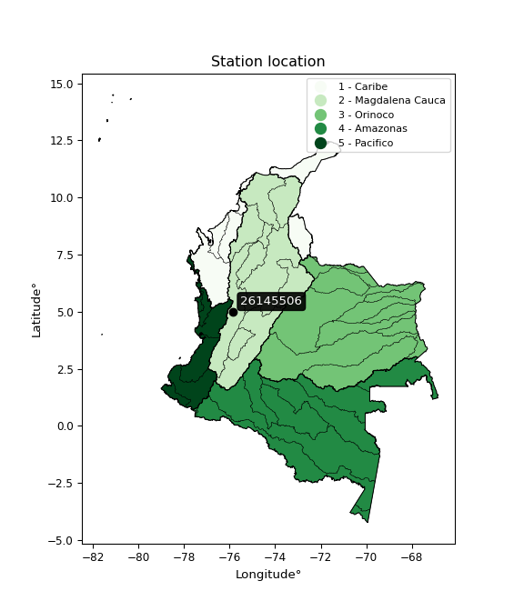</img>

</div>


## A. General information


### 1. General running parameters

• app_version: _v20260103_. • runtime: _2026-01-05 16:20:51.132608_. • Python version: _3.14.0_. • SciPy version: _1.16.3_. • Pandas version: _2.3.3_. • NumPy version: _2.3.5_. • Stations dataset (station_dataset_file): _dataset/pmax24h_in/automatic_colombia_2003_2024.csv_. • Stations catalog (station_catalog_file): _dataset/CNE.xls_. • Minimum year to eval til year_max (date_min): _1900_. • Maximum year to eval since year_min (date_max): _2024_. • Creates, save and include plots into reports (create_plot): _True_. • Plot only fit distributions with Δo > Δ (plot_only_fit): _True_. • Plot only simple graphs avoiding multiple CDFs and multiple Extreme values plots (plot_only_simple): _True_. • Eval low extreme values, if False, evaluates high extreme values (low_extreme): _False_. • Eval every SciPy distribution as logarithmic (pdist_logarithmic_on): _True_. • Standard deviation normalized (ddof): _1.0_. • Return periods to eval in years (Tr): _[2, 2.33, 5, 10, 15, 20, 25, 50, 75, 100, 200, 250, 500, 750, 1000]_. • Minimum data sample per station, 0 means any (minimum_sample): _5_. • Z-Score maximum threshold to adjust a value, 0 means disable (zscore_max): _3.5_. • Z-Score minimum threshold to adjust a value, 0 means disable (zscore_min): _-2.5_. • Avoid zeros, e.g. rain = 0 (avoid_zeros): _True_. • Avoid null values (avoid_nans): _True_. 

[:file_folder:Dataset file](../../dataset/pmax24h_in/automatic_colombia_2003_2024.csv)

> Delta Degrees of Freedom (DDOF): is a parameter used in the formulas for calculating variance and standard deviation. When ddof=0, the divisor is $N$ (the total number of observations) and this is used when your data set is the entire population. When ddof=1, the divisor is $N-1$ and this is used when your data set is a sample drawn from a larger population. Using $N-1$ provides an unbiased estimate of the population variance (known as Bessel´s correction).


### 2. Station info and location

|   id |   CODIGO | NOMBRE                         | CATEGORIA               | TECNOLOGIA                | ESTADO   | FECHA_INSTALACION   |   FECHA_SUSPENSION |   ALTITUD |   LATITUD |   LONGITUD | DEPARTAMENTO   | MUNICIPIO   | AREA_OPERATIVA                         | ENTIDAD                                    | AREA_HIDROGRAFICA   | ZONA_HIDROGRAFICA   | SUBZONA_HIDROGRAFICA   |   CORRIENTE | Catalogo   |   Version |
|-----:|---------:|:-------------------------------|:------------------------|:--------------------------|:---------|:--------------------|-------------------:|----------:|----------:|-----------:|:---------------|:------------|:---------------------------------------|:-------------------------------------------|:--------------------|:--------------------|:-----------------------|------------:|:-----------|----------:|
|    0 | 26145506 | FILO BONITO  - AUT  [26145506] | Climatológica Principal | Automática con Telemetría | Activa   | 01/09/2013          |                nan |      1138 |   4.98636 |   -75.8457 | Caldas         | Belalcazar  | Area Operativa 09 - Cauca-Valle-Caldas | CENTRO NACIONAL DE INVESTIGACIONES DE CAFE | Magdalena Cauca     | Cauca               | Río Risaralda          |         nan | CNE_OE     |  20251226 |

<div align="center">

Dynamic map: [:earth_americas:Google](http://maps.google.com/maps?q=4.986358333,-75.84574722) [:earth_americas:OSM](https://www.openstreetmap.org/#map=18/4.986358333/-75.84574722&layers=P) [:earth_americas:Bing](https://www.bing.com/maps?cp=4.986358333~-75.84574722&lvl=18) [:earth_americas:Apple](https://maps.apple.com/frame?center=4.986358333%2C-75.84574722&span=0.003%2C0.006)

</div>


<div align="center">

```geojson
{
  "type": "Feature",
  "geometry": {
    "type": "Point", 
    "coordinates": [-75.84574722, 4.986358333]
  }, 
  "properties": {
    "Name": "26145506"
  }
}
```

</div>


### 3. Discrete values table and plot

<div align="center">

|               |           0 |          1 |          2 |           3 |            4 |           5 |
|:--------------|------------:|-----------:|-----------:|------------:|-------------:|------------:|
| Date          | 2018        | 2019       | 2020       | 2021        | 2022         | 2023        |
| Value         |   76.5      |   78.7     |   58.9     |   71.7      |   69.9       |   66.8      |
| Value_initial |   76.5      |   78.7     |   58.9     |   71.7      |   69.9       |   66.8      |
| count         |    6        |    6       |    6       |    6        |    6         |    6        |
| mean          |   70.4167   |   70.4167  |   70.4167  |   70.4167   |   70.4167    |   70.4167   |
| std           |    7.11686  |    7.11686 |    7.11686 |    7.11686  |    7.11686   |    7.11686  |
| zscore        |    0.854778 |    1.1639  |   -1.61822 |    0.180323 |   -0.0725976 |   -0.508183 |


</div>


<div align="center">

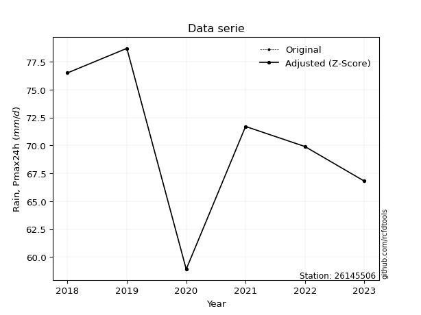</img>

</div>


> The initial value (value_initial) correspond to the initial obtained or null completed value, and value (value) is adjusted only when the initial value is outside the valid range (outlier) definite through the Z-Score value. If Z-Score is active, values out of range or outliers are replaced with the station mean value. A Z-Score (or standard score) measures how many standard deviations a data point is from the mean of a dataset, indicating its relative position; positive scores mean above the mean, negative mean below, and a score of zero is exactly at the mean, allowing for comparison of values from different distributions. It´s calculated using the formula $z=(x–μ)/σ$, where $x$ is the data point, $μ$ is the mean, and $σ$ is the standard deviation, helping identify outliers and understand probability.
>
> <sub>**Note**: In this study, "completing" (filling gaps in) and "extending" (forecasting or lengthening the historical record) rainfall data series are avoided for certain critical analyses because they introduce artificial bias and uncertainty, which can distort the statistics of rare events (extremes), alter day-to-day variability, and compromise the integrity and homogeneity of the original data. Some reasons against Completing/Extending rainfall data are: **Distortion of Extremes and Variability**: The primary issue is that most gap-filling or extension methods rely on averaging or regression with nearby stations, which inherently smooths the data. Rainfall is highly variable in space and time, with a large percentage of zero values and occasional large storms. Infilling methods often underestimate the highest values and overestimate the lowest (zero) values, which severely distorts analyses focused on flood frequency, drought severity, and intensity-duration-frequency (IDF) curves, **Loss of Data Homogeneity**: Infilled or extended data are synthetic estimates, not actual measurements. Combining these estimates with observed data can violate the assumption of data homogeneity, which requires that the data properties do not change over time. Inhomogeneity can lead to incorrect conclusions about long-term trends or changes in climate patterns, **Propagation of Errors**: Errors and biases from the original data (e.g., wind-induced undercatch, instrument errors, site changes) or the data used for imputation can propagate through the analysis, leading to unreliable hydrological models and inaccurate predictions, **Compromised Statistical Integrity**: For statistical analyses, especially those involving the frequency of events, using artificial data can introduce time bias or autocorrelation that doesn´t exist in reality, making it difficult to assess the true probability of events, **Difficulty in Validation**: It is difficult to accurately validate the quality of filled or extended data, especially for past periods where ground-truth measurements are unavailable. The reliability of imputation techniques heavily depends on the density of the surrounding station network and the complexity of the local topography.</sub>


### 4. Active continuous probability distributions from SciPy (44 of 104 available)

A Probability Density Function (PDF) describes the relative likelihood of a continuous random variable falling within a specific range, where the total area under its curve equals 1, and the area over any interval gives the actual probability for that range. Unlike discrete probabilities (like rolling a die), a PDF shows density, not direct probability for a single point (which is zero), with higher points indicating higher likelihood, often visualized as a bell curve for normal distributions.

A log of a probability density function (log-PDF) is simply the logarithm of the PDF´s value, denoted as $log(f(x))$, useful for converting multiplication of probabilities into addition, improving numerical stability with tiny numbers, and connecting to information theory concepts like entropy. Instead of dealing with very small probabilities (e.g., 0.000001), log-PDFs use negative numbers (e.g., $log(0.00001) ≈ -11.51$ that are easier for computers to handle, preventing underflow errors and simplifying complex calculations. In this study, each active probability distribution from SciPy is also evaluated in the $log$ form.

[scipy.stats](https://docs.scipy.org/doc/scipy/reference/stats.html) is a Python´s powerful submodule within the SciPy library for comprehensive statistical analysis, offering over 130 probability distributions (like Normal, Poisson), functions for descriptive stats (mean, variance), hypothesis testing (t-tests, chi-square), random variable generation, and statistical tests, making it essential for data science, modeling, and research. It provides tools to explore, model, and draw conclusions from data efficiently, working seamlessly with NumPy.

<div align="center">

|   id | p_dist             |   n_parameter | fit_method   | label                                                                       | active   | ref                                                                                                        |
|-----:|:-------------------|--------------:|:-------------|:----------------------------------------------------------------------------|:---------|:-----------------------------------------------------------------------------------------------------------|
|    0 | alpha              |             3 | MLE          | Alpha                                                                       | True     | [:mortar_board:](https://docs.scipy.org/doc/scipy/reference/generated/scipy.stats.alpha.html)              |
|    1 | betaprime          |             4 | MLE          | Beta prime                                                                  | True     | [:mortar_board:](https://docs.scipy.org/doc/scipy/reference/generated/scipy.stats.betaprime.html)          |
|    2 | chi2               |             3 | MLE          | Chi²                                                                        | True     | [:mortar_board:](https://docs.scipy.org/doc/scipy/reference/generated/scipy.stats.chi2.html)               |
|    3 | crystalball        |             4 | MLE          | Crystalball                                                                 | True     | [:mortar_board:](https://docs.scipy.org/doc/scipy/reference/generated/scipy.stats.crystalball.html)        |
|    4 | erlang             |             3 | MLE          | Erlang                                                                      | True     | [:mortar_board:](https://docs.scipy.org/doc/scipy/reference/generated/scipy.stats.erlang.html)             |
|    5 | expon              |             2 | MLE          | Exponential                                                                 | True     | [:mortar_board:](https://docs.scipy.org/doc/scipy/reference/generated/scipy.stats.expon.html)              |
|    6 | exponnorm          |             3 | MLE          | Exponentially modified Normal                                               | True     | [:mortar_board:](https://docs.scipy.org/doc/scipy/reference/generated/scipy.stats.exponnorm.html)          |
|    7 | f                  |             4 | MLE          | F                                                                           | True     | [:mortar_board:](https://docs.scipy.org/doc/scipy/reference/generated/scipy.stats.f.html)                  |
|    8 | fatiguelife        |             3 | MLE          | Fatigue-life (Birnbaum-Saunders)                                            | True     | [:mortar_board:](https://docs.scipy.org/doc/scipy/reference/generated/scipy.stats.fatiguelife.html)        |
|    9 | fisk               |             3 | MLE          | Fisk                                                                        | True     | [:mortar_board:](https://docs.scipy.org/doc/scipy/reference/generated/scipy.stats.fisk.html)               |
|   10 | gamma              |             3 | MLE          | Gamma                                                                       | True     | [:mortar_board:](https://docs.scipy.org/doc/scipy/reference/generated/scipy.stats.gamma.html)              |
|   11 | genexpon           |             5 | MLE          | Generalized exponential                                                     | True     | [:mortar_board:](https://docs.scipy.org/doc/scipy/reference/generated/scipy.stats.genexpon.html)           |
|   12 | genlogistic        |             3 | MLE          | Generalized logistic                                                        | True     | [:mortar_board:](https://docs.scipy.org/doc/scipy/reference/generated/scipy.stats.genlogistic.html)        |
|   13 | gibrat             |             2 | MM           | Gibrat                                                                      | True     | [:mortar_board:](https://docs.scipy.org/doc/scipy/reference/generated/scipy.stats.gibrat.html)             |
|   14 | gompertz           |             3 | MLE          | Gompertz (or truncated Gumbel)                                              | True     | [:mortar_board:](https://docs.scipy.org/doc/scipy/reference/generated/scipy.stats.gompertz.html)           |
|   15 | gumbel_l           |             2 | MM           | Gumbel Left Skew                                                            | True     | [:mortar_board:](https://docs.scipy.org/doc/scipy/reference/generated/scipy.stats.gumbel_l.html)           |
|   16 | gumbel_r           |             2 | MM           | Gumbel Right Skew                                                           | True     | [:mortar_board:](https://docs.scipy.org/doc/scipy/reference/generated/scipy.stats.gumbel_r.html)           |
|   17 | halflogistic       |             2 | MM           | Half-logistic                                                               | True     | [:mortar_board:](https://docs.scipy.org/doc/scipy/reference/generated/scipy.stats.halflogistic.html)       |
|   18 | halfnorm           |             2 | MM           | Half Normal                                                                 | True     | [:mortar_board:](https://docs.scipy.org/doc/scipy/reference/generated/scipy.stats.halfnorm.html)           |
|   19 | hypsecant          |             2 | MM           | hyperbolic secant                                                           | True     | [:mortar_board:](https://docs.scipy.org/doc/scipy/reference/generated/scipy.stats.hypsecant.html)          |
|   20 | invgamma           |             3 | MLE          | Inverted gamma                                                              | True     | [:mortar_board:](https://docs.scipy.org/doc/scipy/reference/generated/scipy.stats.invgamma.html)           |
|   21 | invgauss           |             3 | MLE          | Inverse Gaussian                                                            | True     | [:mortar_board:](https://docs.scipy.org/doc/scipy/reference/generated/scipy.stats.invgauss.html)           |
|   22 | invweibull         |             3 | MLE          | Inverted Weibull                                                            | True     | [:mortar_board:](https://docs.scipy.org/doc/scipy/reference/generated/scipy.stats.invweibull.html)         |
|   23 | johnsonsu          |             4 | MLE          | Johnson Su                                                                  | True     | [:mortar_board:](https://docs.scipy.org/doc/scipy/reference/generated/scipy.stats.johnsonsu.html)          |
|   24 | kstwobign          |             2 | MLE          | Limiting distribution of scaled Kolmogorov-Smirnov two-sided test statistic | True     | [:mortar_board:](https://docs.scipy.org/doc/scipy/reference/generated/scipy.stats.kstwobign.html)          |
|   25 | laplace            |             2 | MM           | Laplace                                                                     | True     | [:mortar_board:](https://docs.scipy.org/doc/scipy/reference/generated/scipy.stats.laplace.html)            |
|   26 | laplace_asymmetric |             3 | MLE          | Asymmetric Laplace                                                          | True     | [:mortar_board:](https://docs.scipy.org/doc/scipy/reference/generated/scipy.stats.laplace_asymmetric.html) |
|   27 | loggamma           |             3 | MLE          | Log gamma                                                                   | True     | [:mortar_board:](https://docs.scipy.org/doc/scipy/reference/generated/scipy.stats.loggamma.html)           |
|   28 | logistic           |             2 | MM           | Logistic (or Sech-squared)                                                  | True     | [:mortar_board:](https://docs.scipy.org/doc/scipy/reference/generated/scipy.stats.logistic.html)           |
|   29 | lognorm            |             3 | MLE          | Log Normal                                                                  | True     | [:mortar_board:](https://docs.scipy.org/doc/scipy/reference/generated/scipy.stats.lognorm.html)            |
|   30 | maxwell            |             2 | MM           | Maxwell                                                                     | True     | [:mortar_board:](https://docs.scipy.org/doc/scipy/reference/generated/scipy.stats.maxwell.html)            |
|   31 | mielke             |             4 | MLE          | Mielke Beta-Kappa / Dagum                                                   | True     | [:mortar_board:](https://docs.scipy.org/doc/scipy/reference/generated/scipy.stats.mielke.html)             |
|   32 | moyal              |             2 | MM           | Moyal                                                                       | True     | [:mortar_board:](https://docs.scipy.org/doc/scipy/reference/generated/scipy.stats.moyal.html)              |
|   33 | nakagami           |             3 | MLE          | Nakagami                                                                    | True     | [:mortar_board:](https://docs.scipy.org/doc/scipy/reference/generated/scipy.stats.nakagami.html)           |
|   34 | ncf                |             5 | MLE          | Non-central F distribution                                                  | True     | [:mortar_board:](https://docs.scipy.org/doc/scipy/reference/generated/scipy.stats.ncf.html)                |
|   35 | nct                |             4 | MLE          | Non-central Student’s t                                                     | True     | [:mortar_board:](https://docs.scipy.org/doc/scipy/reference/generated/scipy.stats.nct.html)                |
|   36 | norm               |             2 | MM           | Normal                                                                      | True     | [:mortar_board:](https://docs.scipy.org/doc/scipy/reference/generated/scipy.stats.norm.html)               |
|   37 | pearson3           |             3 | MM           | Pearson type III                                                            | True     | [:mortar_board:](https://docs.scipy.org/doc/scipy/reference/generated/scipy.stats.pearson3.html)           |
|   38 | rayleigh           |             2 | MM           | Rayleigh                                                                    | True     | [:mortar_board:](https://docs.scipy.org/doc/scipy/reference/generated/scipy.stats.rayleigh.html)           |
|   39 | rice               |             3 | MLE          | Rice                                                                        | True     | [:mortar_board:](https://docs.scipy.org/doc/scipy/reference/generated/scipy.stats.rice.html)               |
|   40 | t                  |             3 | MLE          | Student’s t                                                                 | True     | [:mortar_board:](https://docs.scipy.org/doc/scipy/reference/generated/scipy.stats.t.html)                  |
|   41 | truncnorm          |             4 | MLE          | Truncated normal                                                            | True     | [:mortar_board:](https://docs.scipy.org/doc/scipy/reference/generated/scipy.stats.truncnorm.html)          |
|   42 | wald               |             2 | MM           | Wald                                                                        | True     | [:mortar_board:](https://docs.scipy.org/doc/scipy/reference/generated/scipy.stats.wald.html)               |
|   43 | weibull_min        |             3 | MLE          | Weibull minimum                                                             | True     | [:mortar_board:](https://docs.scipy.org/doc/scipy/reference/generated/scipy.stats.weibull_min.html)        |

</div>

> **n_parameter:** # arguments & localization & scale.
>
> **Fit methods:** (MLE) maximum likelihood, (MM) L-moments.
>
>**Inactive** (With the only purpose of prevent loops, zero divisions, infinite values, over high estimated values or horizontal trending for recurrence intervals estimations, the follow distributions were disabled.)**:** foldnorm, gennorm, norminvgauss, powernorm, powerlognorm, skewnorm, genextreme, anglit, arcsine, argus, beta, bradford, burr, burr12, cauchy, cosine, halfcauchy, foldcauchy, skewcauchy, wrapcauchy, dgamma, gengamma, exponweib, exponpow, truncexpon, gausshyper, genhalflogistic, genhyperbolic, geninvgauss, halfgennorm, johnsonsb, kappa4, kappa3, ksone, kstwo, loglaplace, levy, levy_l, levy_stable, ncx2, pareto, genpareto, truncpareto, lomax, powerlaw, rdist, rel_breitwigner, recipinvgauss, semicircular, studentized_range, trapezoid, triang, truncweibull_min, tukeylambda, uniform, loguniform, vonmises, vonmises_line, weibull_max, dweibull, 


## B. Probability (PDF) vs. Empirical (EDF) distributions functions

A continuous probability distribution (CPD) describes probabilities for variables that can take any value within a range (like rain any time), unlike discrete variables with specific outcomes (like temperature). It uses a Probability Density Function (PDF), a curve where the total area under it equals 1, and the probability of the variable falling within an interval (a to b) is found by calculating the area under the curve between those points. A key feature is that the probability of hitting any single exact value is zero, so probabilities are always expressed for ranges, e.g., $P(a ≤ X ≤ b)$.

<div align="center">

Distributions parameters from station values
|    |   station | p_dist                |   n |               loc |            scale | shape                  | shape1                 | shape2             | shape3   |
|---:|----------:|:----------------------|----:|------------------:|-----------------:|:-----------------------|:-----------------------|:-------------------|:---------|
|  0 |  26145506 | alpha                 |   6 |     -82.4378      |   3511.89        | 23.00780180185876      |                        |                    |          |
|  1 |  26145506 | betaprime             |   6 |    -156.621       |   2783           | 1295.690702976729      | 15883.78320713126      |                    |          |
|  2 |  26145506 | chi2                  |   6 |      58.9         |      1.04307     | 1.0115824102021154     |                        |                    |          |
|  3 |  26145506 | crystalball           |   6 |      70.4167      |      6.49677     | 3896.3151038357137     | 9050.196622209787      |                    |          |
|  4 |  26145506 | erlang                |   6 |     -40.8582      |      0.396935    | 280.37981298138925     |                        |                    |          |
|  5 |  26145506 | expon                 |   6 |      58.9         |     11.5167      |                        |                        |                    |          |
|  6 |  26145506 | exponnorm             |   6 |      70.4151      |      6.49678     | 0.00023373163974451609 |                        |                    |          |
|  7 |  26145506 | f                     |   6 |    -936.291       |   1006.68        | 75062.94826738472      | 130953.66792062532     |                    |          |
|  8 |  26145506 | fatiguelife           |   6 |      58.9         |      3.40242e-06 | 1694.7799131378783     |                        |                    |          |
|  9 |  26145506 | fisk                  |   6 |      -0.0247285   |     70.6961      | 18.233621989181167     |                        |                    |          |
| 10 |  26145506 | gamma                 |   6 |     -45.6618      |      0.379102    | 306.0886712680905      |                        |                    |          |
| 11 |  26145506 | genexpon              |   6 |      58.9         |      2.16268     | 0.1876431281592479     | 1.3018375549948584e-06 | 1.1731089262613592 |          |
| 12 |  26145506 | genlogistic           |   6 |      78.7002      |      1.0314e-05  | 1.2446339577546277e-06 |                        |                    |          |
| 13 |  26145506 | gibrat                |   6 |      65.4605      |      3.00608     |                        |                        |                    |          |
| 14 |  26145506 | gompertz              |   6 |      66.8         |    137.873       | 158.0879871462644      |                        |                    |          |
| 15 |  26145506 | gumbel_l              |   6 |      73.3406      |      5.06551     |                        |                        |                    |          |
| 16 |  26145506 | gumbel_r              |   6 |      67.4928      |      5.06551     |                        |                        |                    |          |
| 17 |  26145506 | halflogistic          |   6 |      62.7165      |      5.55449     |                        |                        |                    |          |
| 18 |  26145506 | halfnorm              |   6 |      61.8175      |     10.7775      |                        |                        |                    |          |
| 19 |  26145506 | hypsecant             |   6 |      70.4167      |      4.13597     |                        |                        |                    |          |
| 20 |  26145506 | invgamma              |   6 |     -54.4761      |  44076.5         | 354.1205367803484      |                        |                    |          |
| 21 |  26145506 | invgauss              |   6 |      24.5683      |   1925.56        | 0.02374031514954439    |                        |                    |          |
| 22 |  26145506 | invweibull            |   6 |      -4.84978e+08 |      4.84978e+08 | 71348289.46195379      |                        |                    |          |
| 23 |  26145506 | johnsonsu             |   6 |      84.9696      |      0.073226    | 12.470878276780414     | 2.1212115927007122     |                    |          |
| 24 |  26145506 | kstwobign             |   6 |      43.676       |     30.5437      |                        |                        |                    |          |
| 25 |  26145506 | laplace               |   6 |      70.4167      |      4.59391     |                        |                        |                    |          |
| 26 |  26145506 | laplace_asymmetric    |   6 |      71.7         |      5.0962      | 1.1337956492182406     |                        |                    |          |
| 27 |  26145506 | loggamma              |   6 |      78.7002      |      1.90962e-05 | 2.308976924746125e-06  |                        |                    |          |
| 28 |  26145506 | logistic              |   6 |      70.4167      |      3.58186     |                        |                        |                    |          |
| 29 |  26145506 | lognorm               |   6 |      58.9         |      0.0374398   | 13.1036452679536       |                        |                    |          |
| 30 |  26145506 | maxwell               |   6 |      55.022       |      9.64715     |                        |                        |                    |          |
| 31 |  26145506 | mielke                |   6 |     -18.2318      |     96.9705      | 10.81180187355274      | 13363.824899902633     |                    |          |
| 32 |  26145506 | moyal                 |   6 |      66.7014      |      2.92458     |                        |                        |                    |          |
| 33 |  26145506 | nakagami              |   6 |      66.8         |      6.0189      | 0.06178714619476368    |                        |                    |          |
| 34 |  26145506 | ncf                   |   6 |      -0.00281131  |      1.19211e-07 | 5.316419953579379e-09  | 3.0603530705483997     | 1.8294752081078862 |          |
| 35 |  26145506 | nct                   |   6 |    -229.284       |      6.46696     | 111819.944656897       | 46.342840608380435     |                    |          |
| 36 |  26145506 | norm                  |   6 |      70.4167      |      6.49677     |                        |                        |                    |          |
| 37 |  26145506 | pearson3              |   6 |      70.4167      |      6.49678     | -0.47372260449645476   |                        |                    |          |
| 38 |  26145506 | rayleigh              |   6 |      57.988       |      9.91667     |                        |                        |                    |          |
| 39 |  26145506 | rice                  |   6 |      54.8231      |      7.14054     | 1.8965237118505902     |                        |                    |          |
| 40 |  26145506 | t                     |   6 |      70.4169      |      6.49706     | 4156449.3621524135     |                        |                    |          |
| 41 |  26145506 | truncnorm             |   6 |      -1.74626     |      2.80099     | 24.31409912351105      | 28.720610796455713     |                    |          |
| 42 |  26145506 | wald                  |   6 |      63.9199      |      6.49681     |                        |                        |                    |          |
| 43 |  26145506 | weibull_min           |   6 |     -64.6343      |    138.019       | 25.64236308245291      |                        |                    |          |
| 44 |  26145506 | logalpha              |   6 |      -6.21968     |   1110.73        | 106.10119740612106     |                        |                    |          |
| 45 |  26145506 | logbetaprime          |   6 |       3.27539     |     86.0345      | 100.69885009114981     | 8860.981237477223      |                    |          |
| 46 |  26145506 | logchi2               |   6 |       4.07584     |      0.993878    | 0.9867719812125948     |                        |                    |          |
| 47 |  26145506 | logcrystalball        |   6 |       4.25001     |      0.0950187   | 54.97437024550541      | 4.416469787878985      |                    |          |
| 48 |  26145506 | logerlang             |   6 |       2.78119     |      0.00647479  | 226.77134740578117     |                        |                    |          |
| 49 |  26145506 | logexpon              |   6 |       4.07584     |      0.174165    |                        |                        |                    |          |
| 50 |  26145506 | logexponnorm          |   6 |       4.24994     |      0.0950188   | 0.0007377310654448283  |                        |                    |          |
| 51 |  26145506 | logf                  |   6 |     -74.9251      |     79.1753      | 2674361.636999445      | 2847825.8770457655     |                    |          |
| 52 |  26145506 | logfatiguelife        |   6 |     -15.2773      |     19.5268      | 0.004852094682725008   |                        |                    |          |
| 53 |  26145506 | logfisk               |   6 |      -1.00708e+07 |      1.00708e+07 | 183566574.8553906      |                        |                    |          |
| 54 |  26145506 | loggamma              |   6 |       2.60476     |      0.0057726   | 284.9302160204552      |                        |                    |          |
| 55 |  26145506 | loggenexpon           |   6 |       4.07584     |      4.5493e+08  | 1605239108.0105348     | 3454869130.572395      | 1429998427.086863  |          |
| 56 |  26145506 | loggenlogistic        |   6 |       4.36564     |      5.11501e-08 | 4.46859667245107e-07   |                        |                    |          |
| 57 |  26145506 | loggibrat             |   6 |       4.1775      |      0.0439757   |                        |                        |                    |          |
| 58 |  26145506 | loggompertz           |   6 |       4.07584     |      0.0934646   | 0.11558834425542207    |                        |                    |          |
| 59 |  26145506 | loggumbel_l           |   6 |       4.29277     |      0.0740858   |                        |                        |                    |          |
| 60 |  26145506 | loggumbel_r           |   6 |       4.20724     |      0.0740858   |                        |                        |                    |          |
| 61 |  26145506 | loghalflogistic       |   6 |       4.13744     |      0.0812029   |                        |                        |                    |          |
| 62 |  26145506 | loghalfnorm           |   6 |       4.12422     |      0.157653    |                        |                        |                    |          |
| 63 |  26145506 | loghypsecant          |   6 |       4.25001     |      0.0604908   |                        |                        |                    |          |
| 64 |  26145506 | loginvgamma           |   6 |      -3.13167     |  43790.5         | 5933.37231720986       |                        |                    |          |
| 65 |  26145506 | loginvgauss           |   6 |       3.43855     |     52.7124      | 0.015383328855599593   |                        |                    |          |
| 66 |  26145506 | loginvweibull         |   6 |      -2.00326e+07 |      2.00326e+07 | 202144749.69033027     |                        |                    |          |
| 67 |  26145506 | logjohnsonsu          |   6 |       4.41769     |      0.00155674  | 8.364584816072977      | 1.6101532498496383     |                    |          |
| 68 |  26145506 | logkstwobign          |   6 |       3.84804     |      0.459071    |                        |                        |                    |          |
| 69 |  26145506 | loglaplace            |   6 |       4.25001     |      0.0671884   |                        |                        |                    |          |
| 70 |  26145506 | loglaplace_asymmetric |   6 |       4.27249     |      0.0725451   | 1.166902442047181      |                        |                    |          |
| 71 |  26145506 | logloggamma           |   6 |       4.36565     |      4.33515e-07 | 3.7543878507960244e-06 |                        |                    |          |
| 72 |  26145506 | loglogistic           |   6 |       4.25001     |      0.0523866   |                        |                        |                    |          |
| 73 |  26145506 | loglognorm            |   6 |       4.07584     |      0.000811317 | 12.319521748421268     |                        |                    |          |
| 74 |  26145506 | logmaxwell            |   6 |       4.02485     |      0.141095    |                        |                        |                    |          |
| 75 |  26145506 | logmielke             |   6 |      -9.80652e+06 |      9.80653e+06 | 81329786.72601563      | 4286527698.724285      |                    |          |
| 76 |  26145506 | logmoyal              |   6 |       4.19567     |      0.0427735   |                        |                        |                    |          |
| 77 |  26145506 | lognakagami           |   6 |     -35.7803      |     40.0303      | 44143.678244540104     |                        |                    |          |
| 78 |  26145506 | logncf                |   6 |     -17.2466      |     13.2015      | 242945.35715126124     | 158391.09609794017     | 152644.80979773065 |          |
| 79 |  26145506 | lognct                |   6 |      -1.31961     |      0.0103035   | 1137.0337174774982     | 539.7614975802323      |                    |          |
| 80 |  26145506 | lognorm               |   6 |       4.25001     |      0.0950187   |                        |                        |                    |          |
| 81 |  26145506 | logpearson3           |   6 |       4.25002     |      0.0941961   | 1.0311345335695759     |                        |                    |          |
| 82 |  26145506 | lograyleigh           |   6 |       4.06823     |      0.145037    |                        |                        |                    |          |
| 83 |  26145506 | logrice               |   6 |       4.01326     |      0.103515    | 2.0182880549036195     |                        |                    |          |
| 84 |  26145506 | logt                  |   6 |       4.25001     |      0.0950191   | 485220238.7379582      |                        |                    |          |
| 85 |  26145506 | logtruncnorm          |   6 |      -0.0417436   |      1.00276     | 4.106254043867946      | 4.4157282917509235     |                    |          |
| 86 |  26145506 | logwald               |   6 |       4.15497     |      0.0950336   |                        |                        |                    |          |
| 87 |  26145506 | logweibull_min        |   6 | -973620           | 973624           | 13042217.533780273     |                        |                    |          |

</div>

> **loc** (Location parameter): This shifts the distribution along the x-axis. For many common distributions, like the normal (Gaussian) distribution, loc represents the mean $μ$. For others, like the uniform distribution, it might represent the minimum value, or for the beta distribution, the left end of the support interval.
>
> **scale** (Scale parameter): This determines the width or spread of the distribution. For the normal distribution, scale represents the standard deviation $σ$. For a uniform distribution, it defines the length of the interval (from $loc$ to $loc + scale$).
>
> **shape** (Shape parameters): Refers to parameters that define the specific form of a probability distribution, distinct from its location (loc) and scale (scale). These parameters are required arguments for most distribution functions. For example, a normal (Gaussian) distribution is fully defined by its location (mean) and scale (standard deviation), so it has no specific shape parameters beyond loc and scale. However, other distributions have intrinsic properties that need specification, as Gamma distribution that takes a shape parameter, often named $a$ or $alpha$.


### 0. Cumulative distribution values - CDF (88 evaluated)

Cumulative Distribution Function (CDF), denoted as $F$<sub>$X$</sub>$(x)$, is a function that gives the probability that a random variable $X$ will take a value less than or equal to a specific value, $x$ (i.e., $(P(X≥x)$. It essentially "accumulates" probabilities from a given point up to the far right (positive infinity), providing a complete picture of the distribution´s probabilities for both discrete (like rain) and continuous (like temperature) variables, helping to find probabilities over ranges or above certain values. Each station is evaluated separately ordering the $x$ values ascending, calculating the CDF and PDF values for the activated distributions and their logarithmic forms.

<div align="center">

CDF ordered by x ascending and calculating $log(f(x))$ separately
|   id |   Station |   date |    x |   count |    mean |     std |     zscore |   Value_initial |   station |   m |     alpha |   alpha_pdf |   betaprime |   betaprime_pdf |        chi2 |    chi2_pdf |   crystalball |   crystalball_pdf |    erlang |   erlang_pdf |    expon |   expon_pdf |   exponnorm |   exponnorm_pdf |         f |     f_pdf |   fatiguelife |   fatiguelife_pdf |      fisk |   fisk_pdf |     gamma |   gamma_pdf |    genexpon |   genexpon_pdf |   genlogistic |   genlogistic_pdf |   gibrat |   gibrat_pdf |    gompertz |   gompertz_pdf |   gumbel_l |   gumbel_l_pdf |   gumbel_r |   gumbel_r_pdf |   halflogistic |   halflogistic_pdf |   halfnorm |   halfnorm_pdf |   hypsecant |   hypsecant_pdf |   invgamma |   invgamma_pdf |   invgauss |   invgauss_pdf |   invweibull |   invweibull_pdf |   johnsonsu |   johnsonsu_pdf |   kstwobign |   kstwobign_pdf |   laplace |   laplace_pdf |   laplace_asymmetric |   laplace_asymmetric_pdf |   loggamma |   loggamma_pdf |   logistic |   logistic_pdf |   lognorm |   lognorm_pdf |   maxwell |   maxwell_pdf |    mielke |   mielke_pdf |      moyal |   moyal_pdf |   nakagami |   nakagami_pdf |      ncf |    ncf_pdf |       nct |   nct_pdf |      norm |   norm_pdf |   pearson3 |   pearson3_pdf |   rayleigh |   rayleigh_pdf |      rice |   rice_pdf |         t |     t_pdf |   truncnorm |   truncnorm_pdf |     wald |   wald_pdf |   weibull_min |   weibull_min_pdf |   logalpha |   logalpha_pdf |   logbetaprime |   logbetaprime_pdf |   logchi2 |   logchi2_pdf |   logcrystalball |   logcrystalball_pdf |   logerlang |   logerlang_pdf |   logexpon |   logexpon_pdf |   logexponnorm |   logexponnorm_pdf |      logf |   logf_pdf |   logfatiguelife |   logfatiguelife_pdf |   logfisk |   logfisk_pdf |   loggenexpon |   loggenexpon_pdf |   loggenlogistic |   loggenlogistic_pdf |   loggibrat |   loggibrat_pdf |   loggompertz |   loggompertz_pdf |   loggumbel_l |   loggumbel_l_pdf |   loggumbel_r |   loggumbel_r_pdf |   loghalflogistic |   loghalflogistic_pdf |   loghalfnorm |   loghalfnorm_pdf |   loghypsecant |   loghypsecant_pdf |   loginvgamma |   loginvgamma_pdf |   loginvgauss |   loginvgauss_pdf |   loginvweibull |   loginvweibull_pdf |   logjohnsonsu |   logjohnsonsu_pdf |   logkstwobign |   logkstwobign_pdf |   loglaplace |   loglaplace_pdf |   loglaplace_asymmetric |   loglaplace_asymmetric_pdf |   logloggamma |   logloggamma_pdf |   loglogistic |   loglogistic_pdf |   loglognorm |   loglognorm_pdf |   logmaxwell |   logmaxwell_pdf |   logmielke |   logmielke_pdf |    logmoyal |   logmoyal_pdf |   lognakagami |   lognakagami_pdf |    logncf |   logncf_pdf |    lognct |   lognct_pdf |   logpearson3 |   logpearson3_pdf |   lograyleigh |   lograyleigh_pdf |   logrice |   logrice_pdf |      logt |   logt_pdf |   logtruncnorm |   logtruncnorm_pdf |   logwald |   logwald_pdf |   logweibull_min |   logweibull_min_pdf |
|-----:|----------:|-------:|-----:|--------:|--------:|--------:|-----------:|----------------:|----------:|----:|----------:|------------:|------------:|----------------:|------------:|------------:|--------------:|------------------:|----------:|-------------:|---------:|------------:|------------:|----------------:|----------:|----------:|--------------:|------------------:|----------:|-----------:|----------:|------------:|------------:|---------------:|--------------:|------------------:|---------:|-------------:|------------:|---------------:|-----------:|---------------:|-----------:|---------------:|---------------:|-------------------:|-----------:|---------------:|------------:|----------------:|-----------:|---------------:|-----------:|---------------:|-------------:|-----------------:|------------:|----------------:|------------:|----------------:|----------:|--------------:|---------------------:|-------------------------:|-----------:|---------------:|-----------:|---------------:|----------:|--------------:|----------:|--------------:|----------:|-------------:|-----------:|------------:|-----------:|---------------:|---------:|-----------:|----------:|----------:|----------:|-----------:|-----------:|---------------:|-----------:|---------------:|----------:|-----------:|----------:|----------:|------------:|----------------:|---------:|-----------:|--------------:|------------------:|-----------:|---------------:|---------------:|-------------------:|----------:|--------------:|-----------------:|---------------------:|------------:|----------------:|-----------:|---------------:|---------------:|-------------------:|----------:|-----------:|-----------------:|---------------------:|----------:|--------------:|--------------:|------------------:|-----------------:|---------------------:|------------:|----------------:|--------------:|------------------:|--------------:|------------------:|--------------:|------------------:|------------------:|----------------------:|--------------:|------------------:|---------------:|-------------------:|--------------:|------------------:|--------------:|------------------:|----------------:|--------------------:|---------------:|-------------------:|---------------:|-------------------:|-------------:|-----------------:|------------------------:|----------------------------:|--------------:|------------------:|--------------:|------------------:|-------------:|-----------------:|-------------:|-----------------:|------------:|----------------:|------------:|---------------:|--------------:|------------------:|----------:|-------------:|----------:|-------------:|--------------:|------------------:|--------------:|------------------:|----------:|--------------:|----------:|-----------:|---------------:|-------------------:|----------:|--------------:|-----------------:|---------------------:|
|    0 |  26145506 |   2020 | 58.9 |       6 | 70.4167 | 7.11686 | -1.61822   |            58.9 |  26145506 |   1 | 0.0329085 |   0.0129129 |   0.0377463 |       0.0130076 | 5.42868e-08 | 3.86434e+06 |     0.0381413 |         0.0127601 | 0.0376039 |    0.0132651 | 0        |   0.0868307 |   0.0381415 |       0.0127601 | 0.0381905 | 0.0128663 |     0.0971985 |       1.58545e+11 | 0.0348614 |  0.0104114 | 0.0382147 |   0.0134214 | 8.53176e-08 |      0.0867643 |      0        |         0.0110644 | 0        |    0         | 0           |    0           |  0.0561617 |      0.0107697 | 0.00427964 |     0.00460776 |       0        |          0         |   0        |      0         |   0.0392673 |      0.00947002 |  0.0357953 |      0.0134788 |  0.0364344 |      0.0152989 |    0.0351846 |        0.0173256 |   0.0719391 |       0.0111567 |   0.0350627 |       0.0205707 | 0.0407586 |    0.00887231 |            0.0613771 |                0.0106225 |  0.0336486 |       0.827255 |  0.0385949 |      0.0103592 |  0.033405 |      0.782618 | 0.0164617 |     0.0123271 | 0.0841869 |    0.0118007 | 0.00014746 |  0.00038568 |  0         |     0          | 0.692203 | 0.00288125 | 0.0381511 | 0.0127695 | 0.0381413 |  0.0127601 |  0.0496296 |      0.0125149 | 0.00422033 |     0.00923516 | 0.0286268 |  0.0147937 | 0.0381446 | 0.0127604 |    0        |     0           | 0        |  0         |     0.0565815 |         0.0114061 |  0.0372649 |       0.852357 |      0.0287231 |           0.767007 | 3.014e-08 |   1.67429e+07 |         0.033405 |             0.782618 |   0.0333254 |        0.828067 |   0        |        5.74169 |      0.0334052 |           0.782622 | 0.0335141 |   0.783752 |        0.0328167 |             0.780415 | 0.0348552 |      0.613184 |    2.1311e-12 |           3.52854 |         0        |             0.694673 |    0        |        0        |   5.57292e-10 |           1.23671 |     0.0520945 |          0.684522 |    0.00276081 |          0.219574 |          0        |               0       |      0        |           0       |      0.0357278 |           0.589393 |     0.0330929 |          0.794881 |     0.0294387 |          0.855322 |        0.030622 |             1.07719 |      0.0759164 |           0.672935 |      0.0336934 |            1.33414 |    0.0374282 |         0.557064 |               0.0564913 |                    0.667328 |     0.0812814 |          0.703925 |     0.0347367 |           0.64005 |    0.0126917 |       2.9965e+12 |    0.0120722 |         0.691857 |   0.0869173 |        0.720843 | 4.94738e-05 |      0.0100471 |     0.0337799 |          0.788962 | 0.0334246 |     0.788033 | 0.0711193 |      1.2207  |   7.41698e-05 |         0.0315252 |    0.00137621 |          0.361353 | 0.0259712 |      0.893842 | 0.0334059 |   0.782633 |    9.25533e-05 |            5.75575 |  0        |      0        |        0.0521824 |             0.680447 |
|    1 |  26145506 |   2023 | 66.8 |       6 | 70.4167 | 7.11686 | -0.508183  |            66.8 |  26145506 |   2 | 0.300017  |   0.0548264 |   0.293425  |       0.0530776 | 0.993957    | 0.00321041  |     0.288871  |         0.0525919 | 0.297041  |    0.0532387 | 0.496395 |   0.0437284 |   0.288871  |       0.0525918 | 0.290591  | 0.0527411 |     0.815699  |       0.0151539   | 0.26369   |  0.0529773 | 0.299492  |   0.0534836 | 0.496132    |      0.043718  |      0        |         0.0287045 | 0.20945  |    0.214822  | 1.80868e-12 |    1.14662     |  0.240384  |      0.0412299 | 0.317729   |     0.0719166  |       0.351877 |          0.0788715 |   0.35614  |      0.0665291 |   0.251564  |      0.0546866  |  0.305511  |      0.0548619 |  0.330278  |      0.0558854 |    0.351004  |        0.0540633 |   0.243307  |       0.0365633 |   0.38474   |       0.054986  | 0.227542  |    0.0495312  |            0.240875  |                0.041688  |  0.317019  |       3.72798  |  0.267035  |      0.0546441 |  0.305604 |      3.68966  | 0.315543  |     0.0585083 | 0.241602  |    0.0307198 | 0.325468   |  0.0827138  |  0.0135503 |     1.1783e+11 | 0.713676 | 0.00256324 | 0.289031  | 0.0526079 | 0.288871  |  0.0525919 |  0.270212  |      0.0468255 | 0.326194   |     0.0603781  | 0.30212   |  0.0539034 | 0.288866  | 0.052589  |    0.978954 |     0.184183    | 0.313052 |  0.146671  |     0.24835   |         0.0418647 |  0.315473  |       3.63541  |      0.308025  |           3.72278  | 0.283293  |   1.06423     |         0.305605 |             3.68966  |   0.318009  |        3.7393   |   0.514541 |        2.78736 |      0.305605  |           3.68966  | 0.305179  |   3.67703  |        0.306809  |             3.71582  | 0.263684  |      3.53899  |    0.456939   |           3.26375 |         0        |             2.086    |    0.275175 |       13.7918   |   0.280201    |           3.42224 |     0.253625  |          2.94705  |    0.3404     |          4.95137  |          0.376283 |               5.28559 |      0.376927 |           4.4852  |      0.269196  |           3.93837  |     0.309613  |          3.71154  |     0.334166  |          3.85443  |        0.375709 |             3.71137 |      0.243904  |           2.33782  |      0.40703   |            3.63373 |    0.243641  |         3.62623  |               0.249856  |                    2.95153  |     0.241755  |          2.09368  |     0.284542  |           3.88607 |    0.658897  |       0.236601   |    0.334035  |         4.05016  |   0.246851  |        2.04724  | 0.351397    |      5.63022   |     0.306604  |          3.687    | 0.307191  |     3.69814  | 0.359965  |      3.23377 |   0.348299    |         4.79648   |    0.345219   |          4.15467  | 0.318061  |      3.74039  | 0.305607  |   3.68966  |    0.564872    |            3.4107  |  0.357672 |      9.36169  |        0.251201  |             2.90169  |
|    2 |  26145506 |   2022 | 69.9 |       6 | 70.4167 | 7.11686 | -0.0725976 |            69.9 |  26145506 |   3 | 0.481861  |   0.0603095 |   0.473011  |       0.060778  | 0.99881     | 0.000616807 |     0.468307  |         0.0612123 | 0.475829  |    0.0600994 | 0.615241 |   0.0334089 |   0.468307  |       0.0612123 | 0.470049  | 0.0610645 |     0.85564   |       0.0109587   | 0.450153  |  0.0645423 | 0.478879  |   0.0602247 | 0.614962    |      0.0334078 |      0        |         0.0417268 | 0.651698 |    0.0832841 | 0.972533    |    0.0322099   |  0.39771   |      0.0602843 | 0.537004   |     0.0659128  |       0.569403 |          0.0608319 |   0.546712 |      0.0558849 |   0.46034   |      0.0763647  |  0.487413  |      0.06034   |  0.508814  |      0.057272  |    0.515027  |        0.0502754 |   0.382511  |       0.0537018 |   0.547614  |       0.0490156 | 0.446813  |    0.097262   |            0.411905  |                0.0712878 |  0.497715  |       4.09786  |  0.464001  |      0.0694344 |  0.487658 |      4.19655  | 0.502336  |     0.0598911 | 0.355827  |    0.043652  | 0.562744   |  0.0667751  |  0.800638  |     0.0314266  | 0.721447 | 0.00245145 | 0.468483  | 0.0612054 | 0.468307  |  0.0612123 |  0.437241  |      0.0598027 | 0.513956   |     0.0588748  | 0.481246  |  0.0597767 | 0.468292  | 0.0612094 |    1        |     1.72429e-13 | 0.634388 |  0.0692947 |     0.404904  |         0.0588717 |  0.492631  |       4.04408  |      0.488364  |           4.08562  | 0.327324  |   0.890033    |         0.487658 |             4.19656  |   0.498928  |        4.09555  |   0.625858 |        2.14821 |      0.487659  |           4.19655  | 0.486585  |   4.18204  |        0.489821  |             4.20981  | 0.450153  |      4.51162  |    0.592998   |           2.72259 |         0        |             3.10045  |    0.676742 |        5.16246  |   0.454689    |           4.21237 |     0.417027  |          4.24617  |    0.557558   |          4.39651  |          0.588285 |               4.02647 |      0.56416  |           3.7358  |      0.484535  |           5.25591  |     0.491458  |          4.16399  |     0.515189  |          3.98303  |        0.538275 |             3.36427 |      0.376678  |           3.58324  |      0.563383  |            3.19916 |    0.478592  |         7.12314  |               0.426986  |                    5.04395  |     0.358089  |          3.10117  |     0.485973  |           4.76846 |    0.668015  |       0.172094   |    0.521158  |         4.05825  |   0.359602  |        2.98233  | 0.583441    |      4.40057   |     0.488347  |          4.18611  | 0.489243  |     4.18743  | 0.51233   |      3.4004  |   0.556271    |         4.20861   |    0.532426   |          3.97513  | 0.498644  |      4.08811  | 0.48766   |   4.19654  |    0.705637    |            2.81358 |  0.655472 |      4.3983   |        0.412078  |             4.18317  |
|    3 |  26145506 |   2021 | 71.7 |       6 | 70.4167 | 7.11686 |  0.180323  |            71.7 |  26145506 |   4 | 0.588516  |   0.0575126 |   0.58175   |       0.0592965 | 0.99953     | 0.000241488 |     0.578295  |         0.0602198 | 0.583002  |    0.0582725 | 0.670913 |   0.0285749 |   0.578295  |       0.0602198 | 0.579622  | 0.0599159 |     0.873782  |       0.0092652   | 0.565466  |  0.0624646 | 0.586185  |   0.0582928 | 0.670635    |      0.0285773 |      0        |         0.05185   | 0.767386 |    0.0489731 | 0.996719    |    0.0038987   |  0.514873  |      0.0692751 | 0.646745   |     0.0556417  |       0.668856 |          0.0497464 |   0.640836 |      0.048623  |   0.597219  |      0.0733995  |  0.594149  |      0.0575678 |  0.60856   |      0.0530491 |    0.600997  |        0.0450186 |   0.488405  |       0.0637451 |   0.630983  |       0.043483  | 0.621864  |    0.0823123  |            0.562458  |                0.0973438 |  0.600292  |       3.92733  |  0.588626  |      0.0676033 |  0.593531 |      4.08264  | 0.606635  |     0.0554668 | 0.442765  |    0.0532301 | 0.670502   |  0.0530149  |  0.846047  |     0.020529   | 0.725804 | 0.00238957 | 0.578446  | 0.0601993 | 0.578295  |  0.0602198 |  0.548287  |      0.0628413 | 0.615559   |     0.0536043  | 0.587625  |  0.0577602 | 0.578276  | 0.0602177 |    1        |     1.01888e-20 | 0.736508 |  0.0461002 |     0.517996  |         0.0661621 |  0.594323  |       3.91216  |      0.590588  |           3.91283  | 0.349023  |   0.819199    |         0.593531 |             4.08264  |   0.601347  |        3.91755  |   0.676677 |        1.85642 |      0.593532  |           4.08263  | 0.592121  |   4.07105  |        0.595878  |             4.08365  | 0.565468  |      4.47879  |    0.658156   |           2.40313 |         0        |             3.87159  |    0.779386 |        3.12212  |   0.56487     |           4.41207 |     0.53259   |          4.79833  |    0.66068    |          3.69629  |          0.68133  |               3.29908 |      0.653044 |           3.25206 |      0.615685  |           4.91841  |     0.596158  |          4.02486  |     0.613404  |          3.70748  |        0.619264 |             2.99461 |      0.4783    |           4.41714  |      0.640317  |            2.84593 |    0.642208  |         5.32521  |               0.576569  |                    6.81097  |     0.446291  |          3.86503  |     0.605686  |           4.559   |    0.672084  |       0.149105   |    0.620618  |         3.73362  |   0.444015  |        3.68241  | 0.683732    |      3.49699   |     0.593926  |          4.07043  | 0.594769  |     4.06496  | 0.597511  |      3.27508 |   0.655645    |         3.59309   |    0.629061   |          3.60192  | 0.601022  |      3.923    | 0.593533  |   4.08262  |    0.773423    |            2.52361 |  0.747898 |      2.98437  |        0.526067  |             4.74042  |
|    4 |  26145506 |   2018 | 76.5 |       6 | 70.4167 | 7.11686 |  0.854778  |            76.5 |  26145506 |   5 | 0.819068  |   0.0365979 |   0.823749  |       0.038734  | 0.999959    | 2.06669e-05 |     0.825457  |         0.0396117 | 0.820256  |    0.0380723 | 0.783079 |   0.0188354 |   0.825457  |       0.0396116 | 0.825089  | 0.0393208 |     0.9102    |       0.00618086  | 0.809154  |  0.0367947 | 0.822876  |   0.0378428 | 0.782827    |      0.018843  |      0        |         0.0925353 | 0.903344 |    0.0155062 | 0.99999     |    1.21811e-05 |  0.845235  |      0.0570066 | 0.84455    |     0.0281684  |       0.84567  |          0.0256407 |   0.826907 |      0.029269  |   0.856241  |      0.0335885  |  0.824662  |      0.0364566 |  0.817892  |      0.0331935 |    0.777795  |        0.0287544 |   0.822079  |       0.0652371 |   0.801629  |       0.0278362 | 0.866994  |    0.0289526  |            0.849603  |                0.03346   |  0.817165  |       2.62673  |  0.845322  |      0.0365041 |  0.82085  |      2.75336  | 0.825001  |     0.034388  | 0.776838  |    0.088661  | 0.851451   |  0.0251012  |  0.914445  |     0.0100123  | 0.736896 | 0.00223461 | 0.825477  | 0.0395861 | 0.825457  |  0.0396117 |  0.825258  |      0.0468642 | 0.824899   |     0.0329617  | 0.822916  |  0.0378423 | 0.825436  | 0.0396129 |    1        |     7.16676e-41 | 0.878227 |  0.0181723 |     0.830063  |         0.0547214 |  0.812858  |       2.67932  |      0.807235  |           2.64244  | 0.39751   |   0.686383    |         0.82085  |             2.75336  |   0.817325  |        2.61292  |   0.777129 |        1.27965 |      0.82085   |           2.75336  | 0.819164  |   2.75715  |        0.822437  |             2.73356  | 0.809156  |      2.81476  |    0.788643   |           1.64524 |         0        |             6.81942  |    0.901512 |        1.08614  |   0.831382    |           3.42002 |     0.838595  |          3.97345  |    0.84127    |          1.96268  |          0.842751 |               1.78424 |      0.823477 |           2.03041 |      0.852318  |           2.35474  |     0.81936   |          2.70144  |     0.81408   |          2.40962  |        0.779419 |             1.96    |      0.815201  |           5.34109  |      0.793939  |            1.9072  |    0.863613  |         2.02993  |               0.850683  |                    2.40179  |     0.78224   |          6.77446  |     0.841065  |           2.5517  |    0.680392  |       0.11097    |    0.821003  |         2.38862  |   0.759965  |        6.30272  | 0.848528    |      1.7492    |     0.820578  |          2.74693  | 0.820756  |     2.73545  | 0.785277  |      2.42446 |   0.835715    |         2.0194    |    0.821068   |          2.28868  | 0.818411  |      2.64308  | 0.820851  |   2.75334  |    0.916096    |            1.90709 |  0.876094 |      1.26799  |        0.831155  |             4.02318  |
|    5 |  26145506 |   2019 | 78.7 |       6 | 70.4167 | 7.11686 |  1.1639    |            78.7 |  26145506 |   6 | 0.88753   |   0.0258399 |   0.895755  |       0.0268767 | 0.999986    | 6.792e-06   |     0.898844  |         0.0272406 | 0.891373  |    0.0267304 | 0.820799 |   0.0155601 |   0.898844  |       0.0272406 | 0.898011  | 0.0271127 |     0.922689  |       0.00520701  | 0.876676  |  0.0250408 | 0.893434  |   0.0264612 | 0.820565    |      0.0155686 |      0.999981 |         0.120672  | 0.930906 |    0.0100403 | 0.999999    |    8.08725e-07 |  0.943903  |      0.0319014 | 0.896344   |     0.0193639  |       0.893454 |          0.0181601 |   0.882759 |      0.0217063 |   0.914596  |      0.0204023  |  0.892625  |      0.0255315 |  0.880629  |      0.0240466 |    0.83376   |        0.0223007 |   0.940772  |       0.0398938 |   0.855866  |       0.0216203 | 0.917607  |    0.0179352  |            0.907813  |                0.0205097 |  0.881825  |       1.94064  |  0.909914  |      0.022885  |  0.888197 |      2.00211  | 0.889555  |     0.0245087 | 0.995698  |    0.110522  | 0.897704   |  0.0173929  |  0.933807  |     0.00771842 | 0.741739 | 0.00216815 | 0.898819  | 0.027226  | 0.898844  |  0.0272406 |  0.911635  |      0.0314015 | 0.887087   |     0.0237812  | 0.893655  |  0.0265977 | 0.898827  | 0.0272428 |    1        |     1.55735e-50 | 0.911528 |  0.0125193 |     0.928289  |         0.033806  |  0.879057  |       1.99393  |      0.872646  |           1.97764  | 0.41633   |   0.642272    |         0.888197 |             2.00211  |   0.88165   |        1.93119  |   0.810611 |        1.08741 |      0.888197  |           2.00211  | 0.886703  |   2.01139  |        0.889219  |             1.98293  | 0.876677  |      1.97067  |    0.831193   |           1.36207 |         0.999988 |             8.73614  |    0.926965 |        0.737279 |   0.913873    |           2.36595 |     0.931037  |          2.48928  |    0.888801   |          1.41422  |          0.886464 |               1.3188  |      0.874325 |           1.56675 |      0.906562  |           1.52258  |     0.885596  |          1.9765   |     0.873761  |          1.80992  |        0.829277 |             1.56651 |      0.944889  |           3.4453   |      0.842745  |            1.54266 |    0.910565  |         1.33111  |               0.905366  |                    1.5222   |     0.999947  |          8.65988  |     0.900911  |           1.70407 |    0.683373  |       0.0997185  |    0.880022  |         1.78475  |   0.959262  |        7.06706  | 0.890939    |      1.2669    |     0.887806  |          2.00006  | 0.8877    |     1.9919   | 0.847224  |      1.94372 |   0.885106    |         1.48411   |    0.87785    |          1.72703  | 0.883511  |      1.95397  | 0.888197  |   2.0021   |    0.966955    |            1.68489 |  0.906647 |      0.910759 |        0.925767  |             2.58597  |


</div>

An Empirical Distribution Function (EDF) is a step-function estimate of a true cumulative distribution function (CDF) based on observed sample data, representing the proportion of data points less than or equal to a given value. It is calculated by ordering your data and jumping up by $1/n$ (where $n$ is sample size) at each unique data point, allowing analysis without assuming an underlying population distribution, and it gets closer to the true CDF as the sample size grows. For the empirical probability calculations, the parameter $m$ correspond to the order number which means the position of the $x$ values in an ascending order list.

The Kolmogorov-Smirnov (K-S) test is a non-parametric statistical test used to determine if a sample data set comes from a specific theoretical distribution (one-sample) or if two different samples come from the same underlying distribution (two-sample), by comparing their cumulative distribution functions (CDFs). It calculates the maximum vertical difference (D statistic) between these functions, with a small p-value indicating a significant difference and rejection of the null hypothesis (that the data/samples match).


### 1. EDF California (1923)

California´s estimates the true probability distribution of water-related data (like rainfall, streamflow) using observed samples, crucial for risk assessment.

<div align="center">


$P=m/n$


</div>


**1.1. Empirical values**

<div align="center">

|                | 0                   | 1                  | 2              | 3                  | 4                  | 5              |
|:---------------|:--------------------|:-------------------|:---------------|:-------------------|:-------------------|:---------------|
| date           | 2020                | 2023               | 2022           | 2021               | 2018               | 2019           |
| x              | 58.9                | 66.8               | 69.9           | 71.7               | 76.5               | 78.7           |
| m              | 1                   | 2                  | 3              | 4                  | 5                  | 6              |
| empirical_dist | edf_california      | edf_california     | edf_california | edf_california     | edf_california     | edf_california |
| empirical      | 0.16666666666666666 | 0.3333333333333333 | 0.5            | 0.6666666666666666 | 0.8333333333333334 | 1.0            |
| empirical_tr   | 1.2                 | 1.4999999999999998 | 2.0            | 2.9999999999999996 | 6.000000000000002  | inf            |

</div>


**1.2. Kolmogorov-Smirnov fit test (sorted by Δ)**


<div align="center">

|                | 0                   | 1                     | 2                  | 3                  | 4                   | 5                  | 6                  | 7                   | 8                   | 9                  | 10                  | 11                  | 12                  | 13                  | 14                 | 15                  | 16                  | 17                  | 18                  | 19                  | 20                 | 21                 | 22                  | 23                  | 24                  | 25                  | 26                  | 27                  | 28                  | 29                  | 30                  | 31                  | 32                  | 33                  | 34                 | 35                 | 36                  | 37                 | 38                 | 39                  | 40                  | 41                | 42                 | 43                  | 44                | 45                  | 46                  | 47                  | 48                  | 49                  | 50                  | 51                  | 52                  | 53                 | 54                  | 55                  | 56                  | 57                 | 58                  | 59                  | 60                  | 61                  | 62                  | 63                  | 64                  | 65                  | 66                 | 67                 | 68                  | 69                  | 70                  | 71                  | 72                  | 73                  | 74                  | 75                  | 76                  | 77                 | 78                  | 79                  | 80                  | 81                  | 82                 | 83                 | 84                 | 85                | 86                 | 87                 |
|:---------------|:--------------------|:----------------------|:-------------------|:-------------------|:--------------------|:-------------------|:-------------------|:--------------------|:--------------------|:-------------------|:--------------------|:--------------------|:--------------------|:--------------------|:-------------------|:--------------------|:--------------------|:--------------------|:--------------------|:--------------------|:-------------------|:-------------------|:--------------------|:--------------------|:--------------------|:--------------------|:--------------------|:--------------------|:--------------------|:--------------------|:--------------------|:--------------------|:--------------------|:--------------------|:-------------------|:-------------------|:--------------------|:-------------------|:-------------------|:--------------------|:--------------------|:------------------|:-------------------|:--------------------|:------------------|:--------------------|:--------------------|:--------------------|:--------------------|:--------------------|:--------------------|:--------------------|:--------------------|:-------------------|:--------------------|:--------------------|:--------------------|:-------------------|:--------------------|:--------------------|:--------------------|:--------------------|:--------------------|:--------------------|:--------------------|:--------------------|:-------------------|:-------------------|:--------------------|:--------------------|:--------------------|:--------------------|:--------------------|:--------------------|:--------------------|:--------------------|:--------------------|:-------------------|:--------------------|:--------------------|:--------------------|:--------------------|:-------------------|:-------------------|:-------------------|:------------------|:-------------------|:-------------------|
| station        | 26145506            | 26145506              | 26145506           | 26145506           | 26145506            | 26145506           | 26145506           | 26145506            | 26145506            | 26145506           | 26145506            | 26145506            | 26145506            | 26145506            | 26145506           | 26145506            | 26145506            | 26145506            | 26145506            | 26145506            | 26145506           | 26145506           | 26145506            | 26145506            | 26145506            | 26145506            | 26145506            | 26145506            | 26145506            | 26145506            | 26145506            | 26145506            | 26145506            | 26145506            | 26145506           | 26145506           | 26145506            | 26145506           | 26145506           | 26145506            | 26145506            | 26145506          | 26145506           | 26145506            | 26145506          | 26145506            | 26145506            | 26145506            | 26145506            | 26145506            | 26145506            | 26145506            | 26145506            | 26145506           | 26145506            | 26145506            | 26145506            | 26145506           | 26145506            | 26145506            | 26145506            | 26145506            | 26145506            | 26145506            | 26145506            | 26145506            | 26145506           | 26145506           | 26145506            | 26145506            | 26145506            | 26145506            | 26145506            | 26145506            | 26145506            | 26145506            | 26145506            | 26145506           | 26145506            | 26145506            | 26145506            | 26145506            | 26145506           | 26145506           | 26145506           | 26145506          | 26145506           | 26145506           |
| empirical_dist | edf_california      | edf_california        | edf_california     | edf_california     | edf_california      | edf_california     | edf_california     | edf_california      | edf_california      | edf_california     | edf_california      | edf_california      | edf_california      | edf_california      | edf_california     | edf_california      | edf_california      | edf_california      | edf_california      | edf_california      | edf_california     | edf_california     | edf_california      | edf_california      | edf_california      | edf_california      | edf_california      | edf_california      | edf_california      | edf_california      | edf_california      | edf_california      | edf_california      | edf_california      | edf_california     | edf_california     | edf_california      | edf_california     | edf_california     | edf_california      | edf_california      | edf_california    | edf_california     | edf_california      | edf_california    | edf_california      | edf_california      | edf_california      | edf_california      | edf_california      | edf_california      | edf_california      | edf_california      | edf_california     | edf_california      | edf_california      | edf_california      | edf_california     | edf_california      | edf_california      | edf_california      | edf_california      | edf_california      | edf_california      | edf_california      | edf_california      | edf_california     | edf_california     | edf_california      | edf_california      | edf_california      | edf_california      | edf_california      | edf_california      | edf_california      | edf_california      | edf_california      | edf_california     | edf_california      | edf_california      | edf_california      | edf_california      | edf_california     | edf_california     | edf_california     | edf_california    | edf_california     | edf_california     |
| p_dist         | laplace_asymmetric  | loglaplace_asymmetric | pearson3           | laplace            | hypsecant           | logistic           | gamma              | f                   | nct                 | t                  | exponnorm           | crystalball         | norm                | betaprime           | erlang             | loglaplace          | logalpha            | invgauss            | invgamma            | loghypsecant        | fisk               | logfisk            | loglogistic         | lognakagami         | loggamma            | loggamma            | logf                | logncf              | logt                | logexponnorm        | logcrystalball      | lognorm             | lognorm             | logerlang           | loginvgamma        | alpha              | logfatiguelife      | loggumbel_l        | loginvgauss        | logbetaprime        | rice                | logweibull_min    | logrice            | kstwobign           | weibull_min       | maxwell             | gumbel_l            | lognct              | logmaxwell          | logkstwobign        | gumbel_r            | rayleigh            | loggumbel_r         | lograyleigh        | invweibull          | moyal               | logpearson3         | logmoyal           | loggompertz         | halflogistic        | halfnorm            | wald                | loghalflogistic     | gibrat              | loghalfnorm         | logwald             | loggenexpon        | loginvweibull      | loggibrat           | johnsonsu           | expon               | genexpon            | logjohnsonsu        | logexpon            | logloggamma         | logmielke           | mielke              | logtruncnorm       | nakagami            | loglognorm          | gompertz            | fatiguelife         | ncf                | logchi2            | truncnorm          | chi2              | loggenlogistic     | genlogistic        |
| delta          | 0.10528958585597611 | 0.11017534290704553   | 0.1183800695438354 | 0.1259080590735352 | 0.12739937646982463 | 0.1280718076065362 | 0.1284519596367884 | 0.12847614977404764 | 0.12851558669093266 | 0.1285220522854174 | 0.12852519392779838 | 0.12852537701186187 | 0.12852538014039083 | 0.12892035293226128 | 0.1290627594792226 | 0.12923845408885998 | 0.12940176231241707 | 0.13023229094239697 | 0.13087136548222858 | 0.13093882847647684 | 0.1318052657117557 | 0.1318114316886376 | 0.13192997144406066 | 0.13288676208355582 | 0.13301809875866197 | 0.13301809875866197 | 0.13315258829038878 | 0.13324206302110397 | 0.13326072643424208 | 0.13326143645940067 | 0.13326168626229384 | 0.13326169373964988 | 0.13326169373964988 | 0.13334121823441986 | 0.1335737912565615 | 0.1337581935138864 | 0.13384996995714327 | 0.1340769413472046 | 0.1372279554744761 | 0.13794356156833582 | 0.13803982495270714 | 0.140599891298815 | 0.1406954698058361 | 0.14413431493067597 | 0.148671098547845 | 0.15020494992924824 | 0.15179328353150967 | 0.15277574141990202 | 0.15459445741330174 | 0.15725516488965885 | 0.16238702492328394 | 0.16244633418384832 | 0.16390585411169656 | 0.1652904530217675 | 0.16623971637023527 | 0.16651920618266686 | 0.16659249690571046 | 0.1666171928431474 | 0.16666666610937506 | 0.16666666666666666 | 0.16666666666666666 | 0.16666666666666666 | 0.16666666666666666 | 0.16666666666666666 | 0.16666666666666666 | 0.16666666666666666 | 0.1688068270832801 | 0.1707231802704584 | 0.17674169358325864 | 0.17826169645918338 | 0.17920095173423134 | 0.17943480319953498 | 0.18836671482165768 | 0.18938855371263497 | 0.22037578333240576 | 0.22265185930044584 | 0.22390194171736932 | 0.2315387156521604 | 0.31978302199066505 | 0.32556355365556083 | 0.47253335454998957 | 0.48236590521956696 | 0.5255368035868621 | 0.5836696492180726 | 0.6456207436804782 | 0.660623796425498 | 0.8333333333333334 | 0.8333333333333334 |
| deltao         | 0.530385761606      | 0.530385761606        | 0.530385761606     | 0.530385761606     | 0.530385761606      | 0.530385761606     | 0.530385761606     | 0.530385761606      | 0.530385761606      | 0.530385761606     | 0.530385761606      | 0.530385761606      | 0.530385761606      | 0.530385761606      | 0.530385761606     | 0.530385761606      | 0.530385761606      | 0.530385761606      | 0.530385761606      | 0.530385761606      | 0.530385761606     | 0.530385761606     | 0.530385761606      | 0.530385761606      | 0.530385761606      | 0.530385761606      | 0.530385761606      | 0.530385761606      | 0.530385761606      | 0.530385761606      | 0.530385761606      | 0.530385761606      | 0.530385761606      | 0.530385761606      | 0.530385761606     | 0.530385761606     | 0.530385761606      | 0.530385761606     | 0.530385761606     | 0.530385761606      | 0.530385761606      | 0.530385761606    | 0.530385761606     | 0.530385761606      | 0.530385761606    | 0.530385761606      | 0.530385761606      | 0.530385761606      | 0.530385761606      | 0.530385761606      | 0.530385761606      | 0.530385761606      | 0.530385761606      | 0.530385761606     | 0.530385761606      | 0.530385761606      | 0.530385761606      | 0.530385761606     | 0.530385761606      | 0.530385761606      | 0.530385761606      | 0.530385761606      | 0.530385761606      | 0.530385761606      | 0.530385761606      | 0.530385761606      | 0.530385761606     | 0.530385761606     | 0.530385761606      | 0.530385761606      | 0.530385761606      | 0.530385761606      | 0.530385761606      | 0.530385761606      | 0.530385761606      | 0.530385761606      | 0.530385761606      | 0.530385761606     | 0.530385761606      | 0.530385761606      | 0.530385761606      | 0.530385761606      | 0.530385761606     | 0.530385761606     | 0.530385761606     | 0.530385761606    | 0.530385761606     | 0.530385761606     |
| eval           | Δo > Δ              | Δo > Δ                | Δo > Δ             | Δo > Δ             | Δo > Δ              | Δo > Δ             | Δo > Δ             | Δo > Δ              | Δo > Δ              | Δo > Δ             | Δo > Δ              | Δo > Δ              | Δo > Δ              | Δo > Δ              | Δo > Δ             | Δo > Δ              | Δo > Δ              | Δo > Δ              | Δo > Δ              | Δo > Δ              | Δo > Δ             | Δo > Δ             | Δo > Δ              | Δo > Δ              | Δo > Δ              | Δo > Δ              | Δo > Δ              | Δo > Δ              | Δo > Δ              | Δo > Δ              | Δo > Δ              | Δo > Δ              | Δo > Δ              | Δo > Δ              | Δo > Δ             | Δo > Δ             | Δo > Δ              | Δo > Δ             | Δo > Δ             | Δo > Δ              | Δo > Δ              | Δo > Δ            | Δo > Δ             | Δo > Δ              | Δo > Δ            | Δo > Δ              | Δo > Δ              | Δo > Δ              | Δo > Δ              | Δo > Δ              | Δo > Δ              | Δo > Δ              | Δo > Δ              | Δo > Δ             | Δo > Δ              | Δo > Δ              | Δo > Δ              | Δo > Δ             | Δo > Δ              | Δo > Δ              | Δo > Δ              | Δo > Δ              | Δo > Δ              | Δo > Δ              | Δo > Δ              | Δo > Δ              | Δo > Δ             | Δo > Δ             | Δo > Δ              | Δo > Δ              | Δo > Δ              | Δo > Δ              | Δo > Δ              | Δo > Δ              | Δo > Δ              | Δo > Δ              | Δo > Δ              | Δo > Δ             | Δo > Δ              | Δo > Δ              | Δo > Δ              | Δo > Δ              | Δo > Δ             | Δo <= Δ            | Δo <= Δ            | Δo <= Δ           | Δo <= Δ            | Δo <= Δ            |
| fit            | 1                   | 1                     | 1                  | 1                  | 1                   | 1                  | 1                  | 1                   | 1                   | 1                  | 1                   | 1                   | 1                   | 1                   | 1                  | 1                   | 1                   | 1                   | 1                   | 1                   | 1                  | 1                  | 1                   | 1                   | 1                   | 1                   | 1                   | 1                   | 1                   | 1                   | 1                   | 1                   | 1                   | 1                   | 1                  | 1                  | 1                   | 1                  | 1                  | 1                   | 1                   | 1                 | 1                  | 1                   | 1                 | 1                   | 1                   | 1                   | 1                   | 1                   | 1                   | 1                   | 1                   | 1                  | 1                   | 1                   | 1                   | 1                  | 1                   | 1                   | 1                   | 1                   | 1                   | 1                   | 1                   | 1                   | 1                  | 1                  | 1                   | 1                   | 1                   | 1                   | 1                   | 1                   | 1                   | 1                   | 1                   | 1                  | 1                   | 1                   | 1                   | 1                   | 1                  | 0                  | 0                  | 0                 | 0                  | 0                  |
| n              | 6                   | 6                     | 6                  | 6                  | 6                   | 6                  | 6                  | 6                   | 6                   | 6                  | 6                   | 6                   | 6                   | 6                   | 6                  | 6                   | 6                   | 6                   | 6                   | 6                   | 6                  | 6                  | 6                   | 6                   | 6                   | 6                   | 6                   | 6                   | 6                   | 6                   | 6                   | 6                   | 6                   | 6                   | 6                  | 6                  | 6                   | 6                  | 6                  | 6                   | 6                   | 6                 | 6                  | 6                   | 6                 | 6                   | 6                   | 6                   | 6                   | 6                   | 6                   | 6                   | 6                   | 6                  | 6                   | 6                   | 6                   | 6                  | 6                   | 6                   | 6                   | 6                   | 6                   | 6                   | 6                   | 6                   | 6                  | 6                  | 6                   | 6                   | 6                   | 6                   | 6                   | 6                   | 6                   | 6                   | 6                   | 6                  | 6                   | 6                   | 6                   | 6                   | 6                  | 6                  | 6                  | 6                 | 6                  | 6                  |
| best_fit       | 1                   | 0                     | 0                  | 0                  | 0                   | 0                  | 0                  | 0                   | 0                   | 0                  | 0                   | 0                   | 0                   | 0                   | 0                  | 0                   | 0                   | 0                   | 0                   | 0                   | 0                  | 0                  | 0                   | 0                   | 0                   | 0                   | 0                   | 0                   | 0                   | 0                   | 0                   | 0                   | 0                   | 0                   | 0                  | 0                  | 0                   | 0                  | 0                  | 0                   | 0                   | 0                 | 0                  | 0                   | 0                 | 0                   | 0                   | 0                   | 0                   | 0                   | 0                   | 0                   | 0                   | 0                  | 0                   | 0                   | 0                   | 0                  | 0                   | 0                   | 0                   | 0                   | 0                   | 0                   | 0                   | 0                   | 0                  | 0                  | 0                   | 0                   | 0                   | 0                   | 0                   | 0                   | 0                   | 0                   | 0                   | 0                  | 0                   | 0                   | 0                   | 0                   | 0                  | 0                  | 0                  | 0                 | 0                  | 0                  |
| best_fit_sort  | 1                   | 2                     | 3                  | 4                  | 5                   | 6                  | 7                  | 8                   | 9                   | 10                 | 11                  | 12                  | 13                  | 14                  | 15                 | 16                  | 17                  | 18                  | 19                  | 20                  | 21                 | 22                 | 23                  | 24                  | 25                  | 26                  | 27                  | 28                  | 29                  | 30                  | 31                  | 32                  | 33                  | 34                  | 35                 | 36                 | 37                  | 38                 | 39                 | 40                  | 41                  | 42                | 43                 | 44                  | 45                | 46                  | 47                  | 48                  | 49                  | 50                  | 51                  | 52                  | 53                  | 54                 | 55                  | 56                  | 57                  | 58                 | 59                  | 60                  | 61                  | 62                  | 63                  | 64                  | 65                  | 66                  | 67                 | 68                 | 69                  | 70                  | 71                  | 72                  | 73                  | 74                  | 75                  | 76                  | 77                  | 78                 | 79                  | 80                  | 81                  | 82                  | 83                 | 84                 | 85                 | 86                | 87                 | 88                 |

</div>


**1.3. Best fit**

<div align="center">

|   id |   station | empirical_dist   | p_dist             |   delta |   deltao | eval   |   fit |   n |   best_fit |   best_fit_sort |
|-----:|----------:|:-----------------|:-------------------|--------:|---------:|:-------|------:|----:|-----------:|----------------:|
|    0 |  26145506 | edf_california   | laplace_asymmetric | 0.10529 | 0.530386 | Δo > Δ |     1 |   6 |          1 |               1 |

</div>


<div align="center">

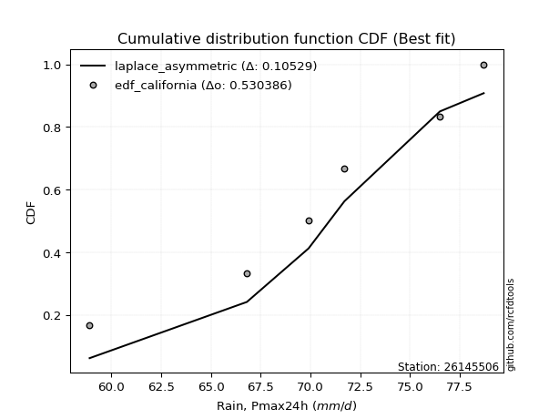</img>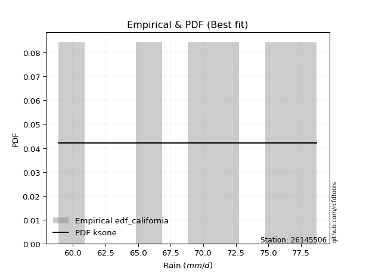</img>

</div>


### 2. EDF Hazen (1930)

Hazen method for plotting positions is a formula used to estimate the empirical cumulative probability distribution of flood events or other hydrological data. This formula often results in biased estimations, particularly when extrapolating to extreme events (high return periods).

<div align="center">


$P=(m-0.5)/n$


</div>


**2.1. Empirical values**

<div align="center">

|                | 0                   | 1                  | 2                  | 3                  | 4         | 5                  |
|:---------------|:--------------------|:-------------------|:-------------------|:-------------------|:----------|:-------------------|
| date           | 2020                | 2023               | 2022               | 2021               | 2018      | 2019               |
| x              | 58.9                | 66.8               | 69.9               | 71.7               | 76.5      | 78.7               |
| m              | 1                   | 2                  | 3                  | 4                  | 5         | 6                  |
| empirical_dist | edf_hazen           | edf_hazen          | edf_hazen          | edf_hazen          | edf_hazen | edf_hazen          |
| empirical      | 0.08333333333333333 | 0.25               | 0.4166666666666667 | 0.5833333333333334 | 0.75      | 0.9166666666666666 |
| empirical_tr   | 1.090909090909091   | 1.3333333333333333 | 1.7142857142857144 | 2.4000000000000004 | 4.0       | 11.999999999999995 |

</div>


**2.2. Kolmogorov-Smirnov fit test (sorted by Δ)**


<div align="center">

|                | 0                   | 1                   | 2                   | 3                   | 4                  | 5                  | 6                  | 7                   | 8                   | 9                   | 10                 | 11                  | 12                  | 13                  | 14                 | 15                  | 16                 | 17                  | 18                  | 19                  | 20                  | 21                  | 22                  | 23                 | 24                  | 25                  | 26                  | 27                  | 28                  | 29                  | 30                  | 31                  | 32                  | 33                  | 34                  | 35                  | 36                 | 37                  | 38                  | 39                  | 40                  | 41                  | 42                  | 43                  | 44                    | 45                  | 46                  | 47                  | 48                  | 49                  | 50                  | 51                  | 52                  | 53                  | 54                  | 55                  | 56                 | 57                  | 58                 | 59                  | 60                  | 61                  | 62                  | 63                  | 64                | 65                  | 66                  | 67                 | 68                  | 69                  | 70                 | 71                  | 72                 | 73                  | 74                 | 75                  | 76                 | 77                 | 78                | 79                  | 80                 | 81                 | 82                 | 83                 | 84                 | 85                 | 86             | 87             |
|:---------------|:--------------------|:--------------------|:--------------------|:--------------------|:-------------------|:-------------------|:-------------------|:--------------------|:--------------------|:--------------------|:-------------------|:--------------------|:--------------------|:--------------------|:-------------------|:--------------------|:-------------------|:--------------------|:--------------------|:--------------------|:--------------------|:--------------------|:--------------------|:-------------------|:--------------------|:--------------------|:--------------------|:--------------------|:--------------------|:--------------------|:--------------------|:--------------------|:--------------------|:--------------------|:--------------------|:--------------------|:-------------------|:--------------------|:--------------------|:--------------------|:--------------------|:--------------------|:--------------------|:--------------------|:----------------------|:--------------------|:--------------------|:--------------------|:--------------------|:--------------------|:--------------------|:--------------------|:--------------------|:--------------------|:--------------------|:--------------------|:-------------------|:--------------------|:-------------------|:--------------------|:--------------------|:--------------------|:--------------------|:--------------------|:------------------|:--------------------|:--------------------|:-------------------|:--------------------|:--------------------|:-------------------|:--------------------|:-------------------|:--------------------|:-------------------|:--------------------|:-------------------|:-------------------|:------------------|:--------------------|:-------------------|:-------------------|:-------------------|:-------------------|:-------------------|:-------------------|:---------------|:---------------|
| station        | 26145506            | 26145506            | 26145506            | 26145506            | 26145506           | 26145506           | 26145506           | 26145506            | 26145506            | 26145506            | 26145506           | 26145506            | 26145506            | 26145506            | 26145506           | 26145506            | 26145506           | 26145506            | 26145506            | 26145506            | 26145506            | 26145506            | 26145506            | 26145506           | 26145506            | 26145506            | 26145506            | 26145506            | 26145506            | 26145506            | 26145506            | 26145506            | 26145506            | 26145506            | 26145506            | 26145506            | 26145506           | 26145506            | 26145506            | 26145506            | 26145506            | 26145506            | 26145506            | 26145506            | 26145506              | 26145506            | 26145506            | 26145506            | 26145506            | 26145506            | 26145506            | 26145506            | 26145506            | 26145506            | 26145506            | 26145506            | 26145506           | 26145506            | 26145506           | 26145506            | 26145506            | 26145506            | 26145506            | 26145506            | 26145506          | 26145506            | 26145506            | 26145506           | 26145506            | 26145506            | 26145506           | 26145506            | 26145506           | 26145506            | 26145506           | 26145506            | 26145506           | 26145506           | 26145506          | 26145506            | 26145506           | 26145506           | 26145506           | 26145506           | 26145506           | 26145506           | 26145506       | 26145506       |
| empirical_dist | edf_hazen           | edf_hazen           | edf_hazen           | edf_hazen           | edf_hazen          | edf_hazen          | edf_hazen          | edf_hazen           | edf_hazen           | edf_hazen           | edf_hazen          | edf_hazen           | edf_hazen           | edf_hazen           | edf_hazen          | edf_hazen           | edf_hazen          | edf_hazen           | edf_hazen           | edf_hazen           | edf_hazen           | edf_hazen           | edf_hazen           | edf_hazen          | edf_hazen           | edf_hazen           | edf_hazen           | edf_hazen           | edf_hazen           | edf_hazen           | edf_hazen           | edf_hazen           | edf_hazen           | edf_hazen           | edf_hazen           | edf_hazen           | edf_hazen          | edf_hazen           | edf_hazen           | edf_hazen           | edf_hazen           | edf_hazen           | edf_hazen           | edf_hazen           | edf_hazen             | edf_hazen           | edf_hazen           | edf_hazen           | edf_hazen           | edf_hazen           | edf_hazen           | edf_hazen           | edf_hazen           | edf_hazen           | edf_hazen           | edf_hazen           | edf_hazen          | edf_hazen           | edf_hazen          | edf_hazen           | edf_hazen           | edf_hazen           | edf_hazen           | edf_hazen           | edf_hazen         | edf_hazen           | edf_hazen           | edf_hazen          | edf_hazen           | edf_hazen           | edf_hazen          | edf_hazen           | edf_hazen          | edf_hazen           | edf_hazen          | edf_hazen           | edf_hazen          | edf_hazen          | edf_hazen         | edf_hazen           | edf_hazen          | edf_hazen          | edf_hazen          | edf_hazen          | edf_hazen          | edf_hazen          | edf_hazen      | edf_hazen      |
| p_dist         | fisk                | logfisk             | alpha               | logf                | erlang             | lognorm            | lognorm            | logcrystalball      | logexponnorm        | logt                | lognakagami        | logbetaprime        | logncf              | gamma               | rice               | logfatiguelife      | betaprime          | invgamma            | loginvgamma         | f                   | pearson3            | t                   | exponnorm           | norm               | crystalball         | nct                 | logalpha            | weibull_min         | loggamma            | loggamma            | logweibull_min      | logrice             | logerlang           | loggompertz         | maxwell             | loggumbel_l         | loglogistic        | invgauss            | johnsonsu           | gumbel_l            | logistic            | rayleigh            | loginvgauss         | laplace_asymmetric  | loglaplace_asymmetric | invweibull          | loghypsecant        | logmaxwell          | logjohnsonsu        | hypsecant           | lognct              | loglaplace          | lograyleigh         | laplace             | gumbel_r            | loginvweibull       | halfnorm           | kstwobign           | logloggamma        | logmielke           | logpearson3         | mielke              | loggumbel_r         | moyal               | loghalfnorm       | halflogistic        | logkstwobign        | logmoyal           | loghalflogistic     | loggenexpon         | wald               | gibrat              | logwald            | genexpon            | expon              | loggibrat           | logexpon           | logtruncnorm       | nakagami          | loglognorm          | logchi2            | gompertz           | fatiguelife        | ncf                | truncnorm          | chi2               | loggenlogistic | genlogistic    |
| delta          | 0.05915394232776017 | 0.05915629220685048 | 0.06906825893498614 | 0.06991861043831255 | 0.0702555580024885 | 0.0709911270407092 | 0.0709911270407092 | 0.07099139983823588 | 0.07099183804490039 | 0.07099373656478353 | 0.0716798651818969 | 0.07169713132978084 | 0.07257656683843866 | 0.07287597593775264 | 0.0729159029022225 | 0.07315446790455793 | 0.0737487166090367 | 0.07466162379495755 | 0.07479103911551271 | 0.07508921955559433 | 0.07525751065346764 | 0.07543556780231087 | 0.07545664444857758 | 0.0754566711501542 | 0.07545668037799413 | 0.07547665718230967 | 0.07596396599899685 | 0.08006315225353311 | 0.08104879262012321 | 0.08104879262012321 | 0.08115475864741073 | 0.08197728342292221 | 0.08226172390075653 | 0.08333333277604173 | 0.08566896998932766 | 0.08859549947886247 | 0.0910646329047976 | 0.09214732013370147 | 0.09492836312585012 | 0.09523510438671012 | 0.09532217596188675 | 0.09728962648852885 | 0.09852234626541517 | 0.09960324265838483 | 0.10068345470244666   | 0.10100392754376247 | 0.10231824834973302 | 0.10449128298059501 | 0.10503338148832442 | 0.10624142724252938 | 0.10996453619085383 | 0.11361251511068393 | 0.11575911910458886 | 0.11699432870606996 | 0.12033771154723055 | 0.12570860110128945 | 0.1300456289775705 | 0.13474038812667377 | 0.1370424499990725 | 0.13931852596711258 | 0.13960482521961243 | 0.14056860838403606 | 0.14089117698665937 | 0.14607747125754128 | 0.147493547823144 | 0.15273584532740675 | 0.15703014053425535 | 0.1667742824114003 | 0.17161797914990456 | 0.20693920454587877 | 0.2177210105739455 | 0.23503108222093722 | 0.2388050642679524 | 0.24613224863919236 | 0.2463946600792949 | 0.26007502691659196 | 0.2645412345931957 | 0.3148720489854937 | 0.383971764480911 | 0.40889688698889415 | 0.5003363158847394 | 0.5558666878833229 | 0.5656992385529003 | 0.6088701369201953 | 0.7289540770138115 | 0.7439571297588313 | 0.75           | 0.75           |
| deltao         | 0.530385761606      | 0.530385761606      | 0.530385761606      | 0.530385761606      | 0.530385761606     | 0.530385761606     | 0.530385761606     | 0.530385761606      | 0.530385761606      | 0.530385761606      | 0.530385761606     | 0.530385761606      | 0.530385761606      | 0.530385761606      | 0.530385761606     | 0.530385761606      | 0.530385761606     | 0.530385761606      | 0.530385761606      | 0.530385761606      | 0.530385761606      | 0.530385761606      | 0.530385761606      | 0.530385761606     | 0.530385761606      | 0.530385761606      | 0.530385761606      | 0.530385761606      | 0.530385761606      | 0.530385761606      | 0.530385761606      | 0.530385761606      | 0.530385761606      | 0.530385761606      | 0.530385761606      | 0.530385761606      | 0.530385761606     | 0.530385761606      | 0.530385761606      | 0.530385761606      | 0.530385761606      | 0.530385761606      | 0.530385761606      | 0.530385761606      | 0.530385761606        | 0.530385761606      | 0.530385761606      | 0.530385761606      | 0.530385761606      | 0.530385761606      | 0.530385761606      | 0.530385761606      | 0.530385761606      | 0.530385761606      | 0.530385761606      | 0.530385761606      | 0.530385761606     | 0.530385761606      | 0.530385761606     | 0.530385761606      | 0.530385761606      | 0.530385761606      | 0.530385761606      | 0.530385761606      | 0.530385761606    | 0.530385761606      | 0.530385761606      | 0.530385761606     | 0.530385761606      | 0.530385761606      | 0.530385761606     | 0.530385761606      | 0.530385761606     | 0.530385761606      | 0.530385761606     | 0.530385761606      | 0.530385761606     | 0.530385761606     | 0.530385761606    | 0.530385761606      | 0.530385761606     | 0.530385761606     | 0.530385761606     | 0.530385761606     | 0.530385761606     | 0.530385761606     | 0.530385761606 | 0.530385761606 |
| eval           | Δo > Δ              | Δo > Δ              | Δo > Δ              | Δo > Δ              | Δo > Δ             | Δo > Δ             | Δo > Δ             | Δo > Δ              | Δo > Δ              | Δo > Δ              | Δo > Δ             | Δo > Δ              | Δo > Δ              | Δo > Δ              | Δo > Δ             | Δo > Δ              | Δo > Δ             | Δo > Δ              | Δo > Δ              | Δo > Δ              | Δo > Δ              | Δo > Δ              | Δo > Δ              | Δo > Δ             | Δo > Δ              | Δo > Δ              | Δo > Δ              | Δo > Δ              | Δo > Δ              | Δo > Δ              | Δo > Δ              | Δo > Δ              | Δo > Δ              | Δo > Δ              | Δo > Δ              | Δo > Δ              | Δo > Δ             | Δo > Δ              | Δo > Δ              | Δo > Δ              | Δo > Δ              | Δo > Δ              | Δo > Δ              | Δo > Δ              | Δo > Δ                | Δo > Δ              | Δo > Δ              | Δo > Δ              | Δo > Δ              | Δo > Δ              | Δo > Δ              | Δo > Δ              | Δo > Δ              | Δo > Δ              | Δo > Δ              | Δo > Δ              | Δo > Δ             | Δo > Δ              | Δo > Δ             | Δo > Δ              | Δo > Δ              | Δo > Δ              | Δo > Δ              | Δo > Δ              | Δo > Δ            | Δo > Δ              | Δo > Δ              | Δo > Δ             | Δo > Δ              | Δo > Δ              | Δo > Δ             | Δo > Δ              | Δo > Δ             | Δo > Δ              | Δo > Δ             | Δo > Δ              | Δo > Δ             | Δo > Δ             | Δo > Δ            | Δo > Δ              | Δo > Δ             | Δo <= Δ            | Δo <= Δ            | Δo <= Δ            | Δo <= Δ            | Δo <= Δ            | Δo <= Δ        | Δo <= Δ        |
| fit            | 1                   | 1                   | 1                   | 1                   | 1                  | 1                  | 1                  | 1                   | 1                   | 1                   | 1                  | 1                   | 1                   | 1                   | 1                  | 1                   | 1                  | 1                   | 1                   | 1                   | 1                   | 1                   | 1                   | 1                  | 1                   | 1                   | 1                   | 1                   | 1                   | 1                   | 1                   | 1                   | 1                   | 1                   | 1                   | 1                   | 1                  | 1                   | 1                   | 1                   | 1                   | 1                   | 1                   | 1                   | 1                     | 1                   | 1                   | 1                   | 1                   | 1                   | 1                   | 1                   | 1                   | 1                   | 1                   | 1                   | 1                  | 1                   | 1                  | 1                   | 1                   | 1                   | 1                   | 1                   | 1                 | 1                   | 1                   | 1                  | 1                   | 1                   | 1                  | 1                   | 1                  | 1                   | 1                  | 1                   | 1                  | 1                  | 1                 | 1                   | 1                  | 0                  | 0                  | 0                  | 0                  | 0                  | 0              | 0              |
| n              | 6                   | 6                   | 6                   | 6                   | 6                  | 6                  | 6                  | 6                   | 6                   | 6                   | 6                  | 6                   | 6                   | 6                   | 6                  | 6                   | 6                  | 6                   | 6                   | 6                   | 6                   | 6                   | 6                   | 6                  | 6                   | 6                   | 6                   | 6                   | 6                   | 6                   | 6                   | 6                   | 6                   | 6                   | 6                   | 6                   | 6                  | 6                   | 6                   | 6                   | 6                   | 6                   | 6                   | 6                   | 6                     | 6                   | 6                   | 6                   | 6                   | 6                   | 6                   | 6                   | 6                   | 6                   | 6                   | 6                   | 6                  | 6                   | 6                  | 6                   | 6                   | 6                   | 6                   | 6                   | 6                 | 6                   | 6                   | 6                  | 6                   | 6                   | 6                  | 6                   | 6                  | 6                   | 6                  | 6                   | 6                  | 6                  | 6                 | 6                   | 6                  | 6                  | 6                  | 6                  | 6                  | 6                  | 6              | 6              |
| best_fit       | 1                   | 0                   | 0                   | 0                   | 0                  | 0                  | 0                  | 0                   | 0                   | 0                   | 0                  | 0                   | 0                   | 0                   | 0                  | 0                   | 0                  | 0                   | 0                   | 0                   | 0                   | 0                   | 0                   | 0                  | 0                   | 0                   | 0                   | 0                   | 0                   | 0                   | 0                   | 0                   | 0                   | 0                   | 0                   | 0                   | 0                  | 0                   | 0                   | 0                   | 0                   | 0                   | 0                   | 0                   | 0                     | 0                   | 0                   | 0                   | 0                   | 0                   | 0                   | 0                   | 0                   | 0                   | 0                   | 0                   | 0                  | 0                   | 0                  | 0                   | 0                   | 0                   | 0                   | 0                   | 0                 | 0                   | 0                   | 0                  | 0                   | 0                   | 0                  | 0                   | 0                  | 0                   | 0                  | 0                   | 0                  | 0                  | 0                 | 0                   | 0                  | 0                  | 0                  | 0                  | 0                  | 0                  | 0              | 0              |
| best_fit_sort  | 1                   | 2                   | 3                   | 4                   | 5                  | 6                  | 7                  | 8                   | 9                   | 10                  | 11                 | 12                  | 13                  | 14                  | 15                 | 16                  | 17                 | 18                  | 19                  | 20                  | 21                  | 22                  | 23                  | 24                 | 25                  | 26                  | 27                  | 28                  | 29                  | 30                  | 31                  | 32                  | 33                  | 34                  | 35                  | 36                  | 37                 | 38                  | 39                  | 40                  | 41                  | 42                  | 43                  | 44                  | 45                    | 46                  | 47                  | 48                  | 49                  | 50                  | 51                  | 52                  | 53                  | 54                  | 55                  | 56                  | 57                 | 58                  | 59                 | 60                  | 61                  | 62                  | 63                  | 64                  | 65                | 66                  | 67                  | 68                 | 69                  | 70                  | 71                 | 72                  | 73                 | 74                  | 75                 | 76                  | 77                 | 78                 | 79                | 80                  | 81                 | 82                 | 83                 | 84                 | 85                 | 86                 | 87             | 88             |

</div>


**2.3. Best fit**

<div align="center">

|   id |   station | empirical_dist   | p_dist   |     delta |   deltao | eval   |   fit |   n |   best_fit |   best_fit_sort |
|-----:|----------:|:-----------------|:---------|----------:|---------:|:-------|------:|----:|-----------:|----------------:|
|    0 |  26145506 | edf_hazen        | fisk     | 0.0591539 | 0.530386 | Δo > Δ |     1 |   6 |          1 |               1 |

</div>


<div align="center">

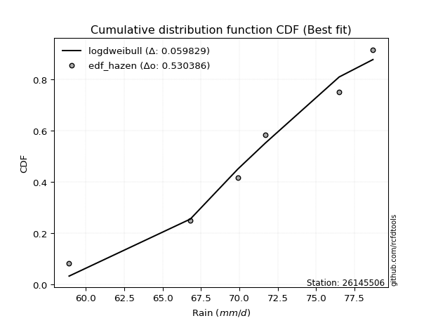</img></img>

</div>


### 3. EDF Weibull (1939)

Weibull plotting position formula is an empirical method used to estimate the non-exceedance probability or plotting position for a set of observed data, is often recommended or widely used in practice, particularly in flood frequency analysis.

<div align="center">


$P=m/(n+1)$


</div>


**3.1. Empirical values**

<div align="center">

|                | 0                   | 1                  | 2                   | 3                  | 4                  | 5                  |
|:---------------|:--------------------|:-------------------|:--------------------|:-------------------|:-------------------|:-------------------|
| date           | 2020                | 2023               | 2022                | 2021               | 2018               | 2019               |
| x              | 58.9                | 66.8               | 69.9                | 71.7               | 76.5               | 78.7               |
| m              | 1                   | 2                  | 3                   | 4                  | 5                  | 6                  |
| empirical_dist | edf_weibull         | edf_weibull        | edf_weibull         | edf_weibull        | edf_weibull        | edf_weibull        |
| empirical      | 0.14285714285714285 | 0.2857142857142857 | 0.42857142857142855 | 0.5714285714285714 | 0.7142857142857143 | 0.8571428571428571 |
| empirical_tr   | 1.1666666666666665  | 1.4                | 1.75                | 2.333333333333333  | 3.5                | 6.999999999999997  |

</div>


**3.2. Kolmogorov-Smirnov fit test (sorted by Δ)**


<div align="center">

|                | 0                   | 1                   | 2                   | 3                  | 4                   | 5                   | 6                   | 7                   | 8                   | 9                   | 10                  | 11                  | 12                  | 13                  | 14                  | 15                  | 16                  | 17                  | 18                  | 19                  | 20                 | 21                  | 22                 | 23                 | 24                  | 25                  | 26                  | 27                  | 28                  | 29                  | 30                 | 31                  | 32                  | 33                  | 34                 | 35                | 36                  | 37                  | 38                  | 39                  | 40                  | 41                  | 42                  | 43                 | 44                 | 45                  | 46                  | 47                  | 48                  | 49                  | 50                    | 51                  | 52                  | 53                  | 54                  | 55                  | 56                 | 57                  | 58                  | 59                  | 60                 | 61                  | 62                  | 63                  | 64                  | 65                  | 66                  | 67                  | 68                 | 69                  | 70                  | 71                  | 72                 | 73                  | 74                  | 75                  | 76                 | 77                | 78                  | 79                  | 80                 | 81                 | 82                 | 83                 | 84                 | 85                 | 86                 | 87                 |
|:---------------|:--------------------|:--------------------|:--------------------|:-------------------|:--------------------|:--------------------|:--------------------|:--------------------|:--------------------|:--------------------|:--------------------|:--------------------|:--------------------|:--------------------|:--------------------|:--------------------|:--------------------|:--------------------|:--------------------|:--------------------|:-------------------|:--------------------|:-------------------|:-------------------|:--------------------|:--------------------|:--------------------|:--------------------|:--------------------|:--------------------|:-------------------|:--------------------|:--------------------|:--------------------|:-------------------|:------------------|:--------------------|:--------------------|:--------------------|:--------------------|:--------------------|:--------------------|:--------------------|:-------------------|:-------------------|:--------------------|:--------------------|:--------------------|:--------------------|:--------------------|:----------------------|:--------------------|:--------------------|:--------------------|:--------------------|:--------------------|:-------------------|:--------------------|:--------------------|:--------------------|:-------------------|:--------------------|:--------------------|:--------------------|:--------------------|:--------------------|:--------------------|:--------------------|:-------------------|:--------------------|:--------------------|:--------------------|:-------------------|:--------------------|:--------------------|:--------------------|:-------------------|:------------------|:--------------------|:--------------------|:-------------------|:-------------------|:-------------------|:-------------------|:-------------------|:-------------------|:-------------------|:-------------------|
| station        | 26145506            | 26145506            | 26145506            | 26145506           | 26145506            | 26145506            | 26145506            | 26145506            | 26145506            | 26145506            | 26145506            | 26145506            | 26145506            | 26145506            | 26145506            | 26145506            | 26145506            | 26145506            | 26145506            | 26145506            | 26145506           | 26145506            | 26145506           | 26145506           | 26145506            | 26145506            | 26145506            | 26145506            | 26145506            | 26145506            | 26145506           | 26145506            | 26145506            | 26145506            | 26145506           | 26145506          | 26145506            | 26145506            | 26145506            | 26145506            | 26145506            | 26145506            | 26145506            | 26145506           | 26145506           | 26145506            | 26145506            | 26145506            | 26145506            | 26145506            | 26145506              | 26145506            | 26145506            | 26145506            | 26145506            | 26145506            | 26145506           | 26145506            | 26145506            | 26145506            | 26145506           | 26145506            | 26145506            | 26145506            | 26145506            | 26145506            | 26145506            | 26145506            | 26145506           | 26145506            | 26145506            | 26145506            | 26145506           | 26145506            | 26145506            | 26145506            | 26145506           | 26145506          | 26145506            | 26145506            | 26145506           | 26145506           | 26145506           | 26145506           | 26145506           | 26145506           | 26145506           | 26145506           |
| empirical_dist | edf_weibull         | edf_weibull         | edf_weibull         | edf_weibull        | edf_weibull         | edf_weibull         | edf_weibull         | edf_weibull         | edf_weibull         | edf_weibull         | edf_weibull         | edf_weibull         | edf_weibull         | edf_weibull         | edf_weibull         | edf_weibull         | edf_weibull         | edf_weibull         | edf_weibull         | edf_weibull         | edf_weibull        | edf_weibull         | edf_weibull        | edf_weibull        | edf_weibull         | edf_weibull         | edf_weibull         | edf_weibull         | edf_weibull         | edf_weibull         | edf_weibull        | edf_weibull         | edf_weibull         | edf_weibull         | edf_weibull        | edf_weibull       | edf_weibull         | edf_weibull         | edf_weibull         | edf_weibull         | edf_weibull         | edf_weibull         | edf_weibull         | edf_weibull        | edf_weibull        | edf_weibull         | edf_weibull         | edf_weibull         | edf_weibull         | edf_weibull         | edf_weibull           | edf_weibull         | edf_weibull         | edf_weibull         | edf_weibull         | edf_weibull         | edf_weibull        | edf_weibull         | edf_weibull         | edf_weibull         | edf_weibull        | edf_weibull         | edf_weibull         | edf_weibull         | edf_weibull         | edf_weibull         | edf_weibull         | edf_weibull         | edf_weibull        | edf_weibull         | edf_weibull         | edf_weibull         | edf_weibull        | edf_weibull         | edf_weibull         | edf_weibull         | edf_weibull        | edf_weibull       | edf_weibull         | edf_weibull         | edf_weibull        | edf_weibull        | edf_weibull        | edf_weibull        | edf_weibull        | edf_weibull        | edf_weibull        | edf_weibull        |
| p_dist         | lognct              | logjohnsonsu        | logalpha            | erlang             | invgauss            | invweibull          | johnsonsu           | fisk                | logfisk             | gamma               | lognakagami         | loggamma            | loggamma            | logf                | logncf              | logt                | logexponnorm        | logcrystalball      | lognorm             | lognorm             | betaprime          | logerlang           | loginvgamma        | alpha              | logfatiguelife      | invgamma            | f                   | pearson3            | t                   | exponnorm           | norm               | crystalball         | nct                 | loginvweibull       | loginvgauss        | logbetaprime      | rice                | weibull_min         | logweibull_min      | logrice             | kstwobign           | loggumbel_l         | maxwell             | loglogistic        | logmielke          | logmaxwell          | gumbel_l            | logistic            | logkstwobign        | laplace_asymmetric  | loglaplace_asymmetric | loghypsecant        | mielke              | gumbel_r            | rayleigh            | loggumbel_r         | lograyleigh        | hypsecant           | moyal               | logpearson3         | logloggamma        | loggompertz         | halfnorm            | halflogistic        | loghalfnorm         | loglaplace          | laplace             | logmoyal            | loghalflogistic    | loggenexpon         | wald                | genexpon            | expon              | gibrat              | logwald             | logexpon            | loggibrat          | logtruncnorm      | nakagami            | loglognorm          | logchi2            | fatiguelife        | gompertz           | ncf                | truncnorm          | chi2               | loggenlogistic     | genlogistic        |
| delta          | 0.08375812780840369 | 0.10091575264087316 | 0.10559223850289326 | 0.1059698437167742 | 0.10642276713287316 | 0.10767256035236718 | 0.10779362502696965 | 0.10799574190223188 | 0.10800190787911379 | 0.10859026165203833 | 0.10907723827403201 | 0.10920857494913816 | 0.10920857494913816 | 0.10934306448086499 | 0.10943253921158017 | 0.10945120262471827 | 0.10945191264987686 | 0.10945216245277002 | 0.10945216993012608 | 0.10945216993012608 | 0.1094630023233224 | 0.10953169442489606 | 0.1097642674470377 | 0.1099486697043626 | 0.11004044614761946 | 0.11037590950924325 | 0.11080350526988003 | 0.11097179636775334 | 0.11114985351659656 | 0.11117093016286328 | 0.1111709568644399 | 0.11117096609227983 | 0.11119094289659537 | 0.11223514720567161 | 0.1134184316649523 | 0.114134037758812 | 0.11423030114318333 | 0.11577743796781881 | 0.11686904436169643 | 0.11688594599631229 | 0.11904246084831588 | 0.12430978519314817 | 0.12639542611972443 | 0.1267789186190833 | 0.1274137640623506 | 0.13078493360377794 | 0.13094939010099582 | 0.13103646167617244 | 0.13481161627161647 | 0.13531752837267053 | 0.13639774041673236   | 0.13803253406401872 | 0.13855520384527353 | 0.13857750111376013 | 0.13863681037432452 | 0.14009633030217275 | 0.1414809292122437 | 0.14195571295681508 | 0.14270968237314305 | 0.14278297309618665 | 0.1428045653971498 | 0.14285714229985125 | 0.14285714285714285 | 0.14285714285714285 | 0.14285714285714285 | 0.14932680082496963 | 0.15270861442035566 | 0.15486952050663844 | 0.1597132172451427 | 0.17122491883159308 | 0.20581624866918363 | 0.21041796292490667 | 0.2106803743650092 | 0.22312632031617535 | 0.22690030236319053 | 0.22882694887890997 | 0.2481702650118301 | 0.279157763271208 | 0.37206700257614916 | 0.37318260127460845 | 0.4408125063609298 | 0.5299849528386146 | 0.5439619259785611 | 0.5493463273963859 | 0.6932397912995258 | 0.7082428440445456 | 0.7142857142857143 | 0.7142857142857143 |
| deltao         | 0.530385761606      | 0.530385761606      | 0.530385761606      | 0.530385761606     | 0.530385761606      | 0.530385761606      | 0.530385761606      | 0.530385761606      | 0.530385761606      | 0.530385761606      | 0.530385761606      | 0.530385761606      | 0.530385761606      | 0.530385761606      | 0.530385761606      | 0.530385761606      | 0.530385761606      | 0.530385761606      | 0.530385761606      | 0.530385761606      | 0.530385761606     | 0.530385761606      | 0.530385761606     | 0.530385761606     | 0.530385761606      | 0.530385761606      | 0.530385761606      | 0.530385761606      | 0.530385761606      | 0.530385761606      | 0.530385761606     | 0.530385761606      | 0.530385761606      | 0.530385761606      | 0.530385761606     | 0.530385761606    | 0.530385761606      | 0.530385761606      | 0.530385761606      | 0.530385761606      | 0.530385761606      | 0.530385761606      | 0.530385761606      | 0.530385761606     | 0.530385761606     | 0.530385761606      | 0.530385761606      | 0.530385761606      | 0.530385761606      | 0.530385761606      | 0.530385761606        | 0.530385761606      | 0.530385761606      | 0.530385761606      | 0.530385761606      | 0.530385761606      | 0.530385761606     | 0.530385761606      | 0.530385761606      | 0.530385761606      | 0.530385761606     | 0.530385761606      | 0.530385761606      | 0.530385761606      | 0.530385761606      | 0.530385761606      | 0.530385761606      | 0.530385761606      | 0.530385761606     | 0.530385761606      | 0.530385761606      | 0.530385761606      | 0.530385761606     | 0.530385761606      | 0.530385761606      | 0.530385761606      | 0.530385761606     | 0.530385761606    | 0.530385761606      | 0.530385761606      | 0.530385761606     | 0.530385761606     | 0.530385761606     | 0.530385761606     | 0.530385761606     | 0.530385761606     | 0.530385761606     | 0.530385761606     |
| eval           | Δo > Δ              | Δo > Δ              | Δo > Δ              | Δo > Δ             | Δo > Δ              | Δo > Δ              | Δo > Δ              | Δo > Δ              | Δo > Δ              | Δo > Δ              | Δo > Δ              | Δo > Δ              | Δo > Δ              | Δo > Δ              | Δo > Δ              | Δo > Δ              | Δo > Δ              | Δo > Δ              | Δo > Δ              | Δo > Δ              | Δo > Δ             | Δo > Δ              | Δo > Δ             | Δo > Δ             | Δo > Δ              | Δo > Δ              | Δo > Δ              | Δo > Δ              | Δo > Δ              | Δo > Δ              | Δo > Δ             | Δo > Δ              | Δo > Δ              | Δo > Δ              | Δo > Δ             | Δo > Δ            | Δo > Δ              | Δo > Δ              | Δo > Δ              | Δo > Δ              | Δo > Δ              | Δo > Δ              | Δo > Δ              | Δo > Δ             | Δo > Δ             | Δo > Δ              | Δo > Δ              | Δo > Δ              | Δo > Δ              | Δo > Δ              | Δo > Δ                | Δo > Δ              | Δo > Δ              | Δo > Δ              | Δo > Δ              | Δo > Δ              | Δo > Δ             | Δo > Δ              | Δo > Δ              | Δo > Δ              | Δo > Δ             | Δo > Δ              | Δo > Δ              | Δo > Δ              | Δo > Δ              | Δo > Δ              | Δo > Δ              | Δo > Δ              | Δo > Δ             | Δo > Δ              | Δo > Δ              | Δo > Δ              | Δo > Δ             | Δo > Δ              | Δo > Δ              | Δo > Δ              | Δo > Δ             | Δo > Δ            | Δo > Δ              | Δo > Δ              | Δo > Δ             | Δo > Δ             | Δo <= Δ            | Δo <= Δ            | Δo <= Δ            | Δo <= Δ            | Δo <= Δ            | Δo <= Δ            |
| fit            | 1                   | 1                   | 1                   | 1                  | 1                   | 1                   | 1                   | 1                   | 1                   | 1                   | 1                   | 1                   | 1                   | 1                   | 1                   | 1                   | 1                   | 1                   | 1                   | 1                   | 1                  | 1                   | 1                  | 1                  | 1                   | 1                   | 1                   | 1                   | 1                   | 1                   | 1                  | 1                   | 1                   | 1                   | 1                  | 1                 | 1                   | 1                   | 1                   | 1                   | 1                   | 1                   | 1                   | 1                  | 1                  | 1                   | 1                   | 1                   | 1                   | 1                   | 1                     | 1                   | 1                   | 1                   | 1                   | 1                   | 1                  | 1                   | 1                   | 1                   | 1                  | 1                   | 1                   | 1                   | 1                   | 1                   | 1                   | 1                   | 1                  | 1                   | 1                   | 1                   | 1                  | 1                   | 1                   | 1                   | 1                  | 1                 | 1                   | 1                   | 1                  | 1                  | 0                  | 0                  | 0                  | 0                  | 0                  | 0                  |
| n              | 6                   | 6                   | 6                   | 6                  | 6                   | 6                   | 6                   | 6                   | 6                   | 6                   | 6                   | 6                   | 6                   | 6                   | 6                   | 6                   | 6                   | 6                   | 6                   | 6                   | 6                  | 6                   | 6                  | 6                  | 6                   | 6                   | 6                   | 6                   | 6                   | 6                   | 6                  | 6                   | 6                   | 6                   | 6                  | 6                 | 6                   | 6                   | 6                   | 6                   | 6                   | 6                   | 6                   | 6                  | 6                  | 6                   | 6                   | 6                   | 6                   | 6                   | 6                     | 6                   | 6                   | 6                   | 6                   | 6                   | 6                  | 6                   | 6                   | 6                   | 6                  | 6                   | 6                   | 6                   | 6                   | 6                   | 6                   | 6                   | 6                  | 6                   | 6                   | 6                   | 6                  | 6                   | 6                   | 6                   | 6                  | 6                 | 6                   | 6                   | 6                  | 6                  | 6                  | 6                  | 6                  | 6                  | 6                  | 6                  |
| best_fit       | 1                   | 0                   | 0                   | 0                  | 0                   | 0                   | 0                   | 0                   | 0                   | 0                   | 0                   | 0                   | 0                   | 0                   | 0                   | 0                   | 0                   | 0                   | 0                   | 0                   | 0                  | 0                   | 0                  | 0                  | 0                   | 0                   | 0                   | 0                   | 0                   | 0                   | 0                  | 0                   | 0                   | 0                   | 0                  | 0                 | 0                   | 0                   | 0                   | 0                   | 0                   | 0                   | 0                   | 0                  | 0                  | 0                   | 0                   | 0                   | 0                   | 0                   | 0                     | 0                   | 0                   | 0                   | 0                   | 0                   | 0                  | 0                   | 0                   | 0                   | 0                  | 0                   | 0                   | 0                   | 0                   | 0                   | 0                   | 0                   | 0                  | 0                   | 0                   | 0                   | 0                  | 0                   | 0                   | 0                   | 0                  | 0                 | 0                   | 0                   | 0                  | 0                  | 0                  | 0                  | 0                  | 0                  | 0                  | 0                  |
| best_fit_sort  | 1                   | 2                   | 3                   | 4                  | 5                   | 6                   | 7                   | 8                   | 9                   | 10                  | 11                  | 12                  | 13                  | 14                  | 15                  | 16                  | 17                  | 18                  | 19                  | 20                  | 21                 | 22                  | 23                 | 24                 | 25                  | 26                  | 27                  | 28                  | 29                  | 30                  | 31                 | 32                  | 33                  | 34                  | 35                 | 36                | 37                  | 38                  | 39                  | 40                  | 41                  | 42                  | 43                  | 44                 | 45                 | 46                  | 47                  | 48                  | 49                  | 50                  | 51                    | 52                  | 53                  | 54                  | 55                  | 56                  | 57                 | 58                  | 59                  | 60                  | 61                 | 62                  | 63                  | 64                  | 65                  | 66                  | 67                  | 68                  | 69                 | 70                  | 71                  | 72                  | 73                 | 74                  | 75                  | 76                  | 77                 | 78                | 79                  | 80                  | 81                 | 82                 | 83                 | 84                 | 85                 | 86                 | 87                 | 88                 |

</div>


**3.3. Best fit**

<div align="center">

|   id |   station | empirical_dist   | p_dist   |     delta |   deltao | eval   |   fit |   n |   best_fit |   best_fit_sort |
|-----:|----------:|:-----------------|:---------|----------:|---------:|:-------|------:|----:|-----------:|----------------:|
|    0 |  26145506 | edf_weibull      | lognct   | 0.0837581 | 0.530386 | Δo > Δ |     1 |   6 |          1 |               1 |

</div>


<div align="center">

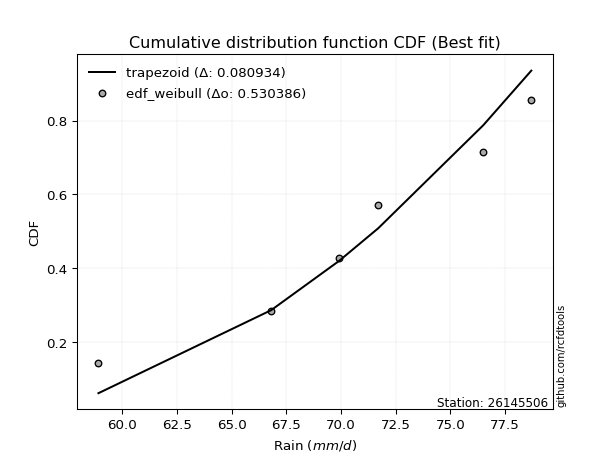</img>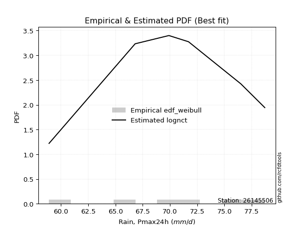</img>

</div>


### 4. EDF Beard (1943)

The Beard formula (or Beard´s plotting position formula) in hydrology is used to estimate the empirical non-exceedance probability _(P)_ of a flood event (or other extreme hydrological data point) within a given dataset.

<div align="center">


$P=(m-0.31)/(n+0.38)$


</div>


**4.1. Empirical values**

<div align="center">

|                | 0                   | 1                   | 2                  | 3                  | 4                  | 5                  |
|:---------------|:--------------------|:--------------------|:-------------------|:-------------------|:-------------------|:-------------------|
| date           | 2020                | 2023                | 2022               | 2021               | 2018               | 2019               |
| x              | 58.9                | 66.8                | 69.9               | 71.7               | 76.5               | 78.7               |
| m              | 1                   | 2                   | 3                  | 4                  | 5                  | 6                  |
| empirical_dist | edf_beard           | edf_beard           | edf_beard          | edf_beard          | edf_beard          | edf_beard          |
| empirical      | 0.10815047021943573 | 0.26489028213166144 | 0.4216300940438871 | 0.5783699059561128 | 0.7351097178683387 | 0.8918495297805643 |
| empirical_tr   | 1.1212653778558874  | 1.3603411513859276  | 1.7289972899728996 | 2.3717472118959106 | 3.7751479289940844 | 9.246376811594207  |

</div>


**4.2. Kolmogorov-Smirnov fit test (sorted by Δ)**


<div align="center">

|                | 0                   | 1                  | 2                   | 3                   | 4                   | 5                   | 6                   | 7                   | 8                   | 9                   | 10                  | 11                  | 12                  | 13                  | 14                  | 15                  | 16                  | 17                  | 18                  | 19                  | 20                  | 21                  | 22                  | 23                  | 24                  | 25                  | 26                  | 27                  | 28                  | 29                 | 30                  | 31                  | 32                | 33                  | 34                  | 35                  | 36                  | 37                 | 38                  | 39                  | 40                  | 41                 | 42                 | 43                  | 44                  | 45                  | 46                  | 47                  | 48                  | 49                  | 50                    | 51                  | 52                  | 53                  | 54                  | 55                 | 56                  | 57                 | 58                  | 59                  | 60                  | 61                 | 62                  | 63                  | 64                 | 65                  | 66                 | 67                  | 68                  | 69                  | 70                  | 71                  | 72                  | 73                  | 74                  | 75                  | 76                 | 77                  | 78                 | 79                 | 80                | 81                 | 82                 | 83                | 84                 | 85                 | 86                 | 87                 |
|:---------------|:--------------------|:-------------------|:--------------------|:--------------------|:--------------------|:--------------------|:--------------------|:--------------------|:--------------------|:--------------------|:--------------------|:--------------------|:--------------------|:--------------------|:--------------------|:--------------------|:--------------------|:--------------------|:--------------------|:--------------------|:--------------------|:--------------------|:--------------------|:--------------------|:--------------------|:--------------------|:--------------------|:--------------------|:--------------------|:-------------------|:--------------------|:--------------------|:------------------|:--------------------|:--------------------|:--------------------|:--------------------|:-------------------|:--------------------|:--------------------|:--------------------|:-------------------|:-------------------|:--------------------|:--------------------|:--------------------|:--------------------|:--------------------|:--------------------|:--------------------|:----------------------|:--------------------|:--------------------|:--------------------|:--------------------|:-------------------|:--------------------|:-------------------|:--------------------|:--------------------|:--------------------|:-------------------|:--------------------|:--------------------|:-------------------|:--------------------|:-------------------|:--------------------|:--------------------|:--------------------|:--------------------|:--------------------|:--------------------|:--------------------|:--------------------|:--------------------|:-------------------|:--------------------|:-------------------|:-------------------|:------------------|:-------------------|:-------------------|:------------------|:-------------------|:-------------------|:-------------------|:-------------------|
| station        | 26145506            | 26145506           | 26145506            | 26145506            | 26145506            | 26145506            | 26145506            | 26145506            | 26145506            | 26145506            | 26145506            | 26145506            | 26145506            | 26145506            | 26145506            | 26145506            | 26145506            | 26145506            | 26145506            | 26145506            | 26145506            | 26145506            | 26145506            | 26145506            | 26145506            | 26145506            | 26145506            | 26145506            | 26145506            | 26145506           | 26145506            | 26145506            | 26145506          | 26145506            | 26145506            | 26145506            | 26145506            | 26145506           | 26145506            | 26145506            | 26145506            | 26145506           | 26145506           | 26145506            | 26145506            | 26145506            | 26145506            | 26145506            | 26145506            | 26145506            | 26145506              | 26145506            | 26145506            | 26145506            | 26145506            | 26145506           | 26145506            | 26145506           | 26145506            | 26145506            | 26145506            | 26145506           | 26145506            | 26145506            | 26145506           | 26145506            | 26145506           | 26145506            | 26145506            | 26145506            | 26145506            | 26145506            | 26145506            | 26145506            | 26145506            | 26145506            | 26145506           | 26145506            | 26145506           | 26145506           | 26145506          | 26145506           | 26145506           | 26145506          | 26145506           | 26145506           | 26145506           | 26145506           |
| empirical_dist | edf_beard           | edf_beard          | edf_beard           | edf_beard           | edf_beard           | edf_beard           | edf_beard           | edf_beard           | edf_beard           | edf_beard           | edf_beard           | edf_beard           | edf_beard           | edf_beard           | edf_beard           | edf_beard           | edf_beard           | edf_beard           | edf_beard           | edf_beard           | edf_beard           | edf_beard           | edf_beard           | edf_beard           | edf_beard           | edf_beard           | edf_beard           | edf_beard           | edf_beard           | edf_beard          | edf_beard           | edf_beard           | edf_beard         | edf_beard           | edf_beard           | edf_beard           | edf_beard           | edf_beard          | edf_beard           | edf_beard           | edf_beard           | edf_beard          | edf_beard          | edf_beard           | edf_beard           | edf_beard           | edf_beard           | edf_beard           | edf_beard           | edf_beard           | edf_beard             | edf_beard           | edf_beard           | edf_beard           | edf_beard           | edf_beard          | edf_beard           | edf_beard          | edf_beard           | edf_beard           | edf_beard           | edf_beard          | edf_beard           | edf_beard           | edf_beard          | edf_beard           | edf_beard          | edf_beard           | edf_beard           | edf_beard           | edf_beard           | edf_beard           | edf_beard           | edf_beard           | edf_beard           | edf_beard           | edf_beard          | edf_beard           | edf_beard          | edf_beard          | edf_beard         | edf_beard          | edf_beard          | edf_beard         | edf_beard          | edf_beard          | edf_beard          | edf_beard          |
| p_dist         | fisk                | logfisk            | logalpha            | logbetaprime        | loggamma            | loggamma            | logerlang           | logrice             | alpha               | logf                | loginvgamma         | erlang              | lognakagami         | logncf              | lognorm             | lognorm             | logexponnorm        | logcrystalball      | logt                | invgauss            | logfatiguelife      | gamma               | rice                | betaprime           | invgamma            | johnsonsu           | f                   | pearson3            | t                   | exponnorm          | norm                | crystalball         | nct               | maxwell             | invweibull          | loginvgauss         | weibull_min         | lognct             | logweibull_min      | logmaxwell          | logjohnsonsu        | loggumbel_l        | rayleigh           | loglogistic         | loggompertz         | gumbel_l            | logistic            | lograyleigh         | laplace_asymmetric  | gumbel_r            | loglaplace_asymmetric | loginvweibull       | loghypsecant        | hypsecant           | halfnorm            | kstwobign          | loglaplace          | laplace            | logloggamma         | logmielke           | logpearson3         | mielke             | loggumbel_r         | moyal               | logkstwobign       | loghalfnorm         | halflogistic       | logmoyal            | loghalflogistic     | loggenexpon         | wald                | gibrat              | genexpon            | expon               | logwald             | logexpon            | loggibrat          | logtruncnorm        | nakagami           | loglognorm         | logchi2           | fatiguelife        | gompertz           | ncf               | truncnorm          | chi2               | loggenlogistic     | genlogistic        |
| delta          | 0.07404422445942149 | 0.0740465743385118 | 0.07774842981074037 | 0.07942736512110488 | 0.08205519403796169 | 0.08205519403796169 | 0.08221559450547111 | 0.08330094383647557 | 0.08395854106664746 | 0.08405473184451118 | 0.08424983107299566 | 0.08514584013414983 | 0.08546783706707883 | 0.08564638294200055 | 0.08573999946544819 | 0.08573999946544819 | 0.08574023471863623 | 0.08574025889900849 | 0.08574082086706769 | 0.08718389275648103 | 0.08732763306630675 | 0.08776625806941396 | 0.08780618503388382 | 0.08863899874069803 | 0.08955190592661888 | 0.08996493574862957 | 0.08997950168725566 | 0.09014779278512897 | 0.09032584993397219 | 0.0903469265802389 | 0.09034695328181552 | 0.09034696250965546 | 0.090366939313971 | 0.09168875348201731 | 0.09339689258859113 | 0.09355891888819473 | 0.09495343438519444 | 0.0950742540591924 | 0.09604504077907206 | 0.09952785560337457 | 0.10006995411110386 | 0.1034857816105238 | 0.1039301377366174 | 0.10595491503645893 | 0.10815046966214413 | 0.11012538651837145 | 0.11021245809354807 | 0.11079569172736842 | 0.11449352479004615 | 0.11537428417001011 | 0.11557373683410799   | 0.11664531688431218 | 0.11720853048139435 | 0.12113170937419071 | 0.12508220160035005 | 0.1259837953758573 | 0.12850279724234526 | 0.1318846108377313 | 0.13207902262185195 | 0.13435509858989203 | 0.13464139784239199 | 0.1356051810068155 | 0.13592774960943893 | 0.14111404388032084 | 0.1421398584025939 | 0.14253012044592356 | 0.1477724179501863 | 0.16181085503417986 | 0.16665455177268412 | 0.19204892241421734 | 0.21275758319672505 | 0.23006765484371677 | 0.23124196650753093 | 0.23150437794763346 | 0.23384163689073195 | 0.24965095246153424 | 0.2551115995393715 | 0.29998176685383227 | 0.3790083371036906 | 0.3940066048572327 | 0.475519178998637 | 0.5508089564212388 | 0.5509032605061024 | 0.584053000034093 | 0.7140637948821501 | 0.7290668476271699 | 0.7351097178683387 | 0.7351097178683387 |
| deltao         | 0.530385761606      | 0.530385761606     | 0.530385761606      | 0.530385761606      | 0.530385761606      | 0.530385761606      | 0.530385761606      | 0.530385761606      | 0.530385761606      | 0.530385761606      | 0.530385761606      | 0.530385761606      | 0.530385761606      | 0.530385761606      | 0.530385761606      | 0.530385761606      | 0.530385761606      | 0.530385761606      | 0.530385761606      | 0.530385761606      | 0.530385761606      | 0.530385761606      | 0.530385761606      | 0.530385761606      | 0.530385761606      | 0.530385761606      | 0.530385761606      | 0.530385761606      | 0.530385761606      | 0.530385761606     | 0.530385761606      | 0.530385761606      | 0.530385761606    | 0.530385761606      | 0.530385761606      | 0.530385761606      | 0.530385761606      | 0.530385761606     | 0.530385761606      | 0.530385761606      | 0.530385761606      | 0.530385761606     | 0.530385761606     | 0.530385761606      | 0.530385761606      | 0.530385761606      | 0.530385761606      | 0.530385761606      | 0.530385761606      | 0.530385761606      | 0.530385761606        | 0.530385761606      | 0.530385761606      | 0.530385761606      | 0.530385761606      | 0.530385761606     | 0.530385761606      | 0.530385761606     | 0.530385761606      | 0.530385761606      | 0.530385761606      | 0.530385761606     | 0.530385761606      | 0.530385761606      | 0.530385761606     | 0.530385761606      | 0.530385761606     | 0.530385761606      | 0.530385761606      | 0.530385761606      | 0.530385761606      | 0.530385761606      | 0.530385761606      | 0.530385761606      | 0.530385761606      | 0.530385761606      | 0.530385761606     | 0.530385761606      | 0.530385761606     | 0.530385761606     | 0.530385761606    | 0.530385761606     | 0.530385761606     | 0.530385761606    | 0.530385761606     | 0.530385761606     | 0.530385761606     | 0.530385761606     |
| eval           | Δo > Δ              | Δo > Δ             | Δo > Δ              | Δo > Δ              | Δo > Δ              | Δo > Δ              | Δo > Δ              | Δo > Δ              | Δo > Δ              | Δo > Δ              | Δo > Δ              | Δo > Δ              | Δo > Δ              | Δo > Δ              | Δo > Δ              | Δo > Δ              | Δo > Δ              | Δo > Δ              | Δo > Δ              | Δo > Δ              | Δo > Δ              | Δo > Δ              | Δo > Δ              | Δo > Δ              | Δo > Δ              | Δo > Δ              | Δo > Δ              | Δo > Δ              | Δo > Δ              | Δo > Δ             | Δo > Δ              | Δo > Δ              | Δo > Δ            | Δo > Δ              | Δo > Δ              | Δo > Δ              | Δo > Δ              | Δo > Δ             | Δo > Δ              | Δo > Δ              | Δo > Δ              | Δo > Δ             | Δo > Δ             | Δo > Δ              | Δo > Δ              | Δo > Δ              | Δo > Δ              | Δo > Δ              | Δo > Δ              | Δo > Δ              | Δo > Δ                | Δo > Δ              | Δo > Δ              | Δo > Δ              | Δo > Δ              | Δo > Δ             | Δo > Δ              | Δo > Δ             | Δo > Δ              | Δo > Δ              | Δo > Δ              | Δo > Δ             | Δo > Δ              | Δo > Δ              | Δo > Δ             | Δo > Δ              | Δo > Δ             | Δo > Δ              | Δo > Δ              | Δo > Δ              | Δo > Δ              | Δo > Δ              | Δo > Δ              | Δo > Δ              | Δo > Δ              | Δo > Δ              | Δo > Δ             | Δo > Δ              | Δo > Δ             | Δo > Δ             | Δo > Δ            | Δo <= Δ            | Δo <= Δ            | Δo <= Δ           | Δo <= Δ            | Δo <= Δ            | Δo <= Δ            | Δo <= Δ            |
| fit            | 1                   | 1                  | 1                   | 1                   | 1                   | 1                   | 1                   | 1                   | 1                   | 1                   | 1                   | 1                   | 1                   | 1                   | 1                   | 1                   | 1                   | 1                   | 1                   | 1                   | 1                   | 1                   | 1                   | 1                   | 1                   | 1                   | 1                   | 1                   | 1                   | 1                  | 1                   | 1                   | 1                 | 1                   | 1                   | 1                   | 1                   | 1                  | 1                   | 1                   | 1                   | 1                  | 1                  | 1                   | 1                   | 1                   | 1                   | 1                   | 1                   | 1                   | 1                     | 1                   | 1                   | 1                   | 1                   | 1                  | 1                   | 1                  | 1                   | 1                   | 1                   | 1                  | 1                   | 1                   | 1                  | 1                   | 1                  | 1                   | 1                   | 1                   | 1                   | 1                   | 1                   | 1                   | 1                   | 1                   | 1                  | 1                   | 1                  | 1                  | 1                 | 0                  | 0                  | 0                 | 0                  | 0                  | 0                  | 0                  |
| n              | 6                   | 6                  | 6                   | 6                   | 6                   | 6                   | 6                   | 6                   | 6                   | 6                   | 6                   | 6                   | 6                   | 6                   | 6                   | 6                   | 6                   | 6                   | 6                   | 6                   | 6                   | 6                   | 6                   | 6                   | 6                   | 6                   | 6                   | 6                   | 6                   | 6                  | 6                   | 6                   | 6                 | 6                   | 6                   | 6                   | 6                   | 6                  | 6                   | 6                   | 6                   | 6                  | 6                  | 6                   | 6                   | 6                   | 6                   | 6                   | 6                   | 6                   | 6                     | 6                   | 6                   | 6                   | 6                   | 6                  | 6                   | 6                  | 6                   | 6                   | 6                   | 6                  | 6                   | 6                   | 6                  | 6                   | 6                  | 6                   | 6                   | 6                   | 6                   | 6                   | 6                   | 6                   | 6                   | 6                   | 6                  | 6                   | 6                  | 6                  | 6                 | 6                  | 6                  | 6                 | 6                  | 6                  | 6                  | 6                  |
| best_fit       | 1                   | 0                  | 0                   | 0                   | 0                   | 0                   | 0                   | 0                   | 0                   | 0                   | 0                   | 0                   | 0                   | 0                   | 0                   | 0                   | 0                   | 0                   | 0                   | 0                   | 0                   | 0                   | 0                   | 0                   | 0                   | 0                   | 0                   | 0                   | 0                   | 0                  | 0                   | 0                   | 0                 | 0                   | 0                   | 0                   | 0                   | 0                  | 0                   | 0                   | 0                   | 0                  | 0                  | 0                   | 0                   | 0                   | 0                   | 0                   | 0                   | 0                   | 0                     | 0                   | 0                   | 0                   | 0                   | 0                  | 0                   | 0                  | 0                   | 0                   | 0                   | 0                  | 0                   | 0                   | 0                  | 0                   | 0                  | 0                   | 0                   | 0                   | 0                   | 0                   | 0                   | 0                   | 0                   | 0                   | 0                  | 0                   | 0                  | 0                  | 0                 | 0                  | 0                  | 0                 | 0                  | 0                  | 0                  | 0                  |
| best_fit_sort  | 1                   | 2                  | 3                   | 4                   | 5                   | 6                   | 7                   | 8                   | 9                   | 10                  | 11                  | 12                  | 13                  | 14                  | 15                  | 16                  | 17                  | 18                  | 19                  | 20                  | 21                  | 22                  | 23                  | 24                  | 25                  | 26                  | 27                  | 28                  | 29                  | 30                 | 31                  | 32                  | 33                | 34                  | 35                  | 36                  | 37                  | 38                 | 39                  | 40                  | 41                  | 42                 | 43                 | 44                  | 45                  | 46                  | 47                  | 48                  | 49                  | 50                  | 51                    | 52                  | 53                  | 54                  | 55                  | 56                 | 57                  | 58                 | 59                  | 60                  | 61                  | 62                 | 63                  | 64                  | 65                 | 66                  | 67                 | 68                  | 69                  | 70                  | 71                  | 72                  | 73                  | 74                  | 75                  | 76                  | 77                 | 78                  | 79                 | 80                 | 81                | 82                 | 83                 | 84                | 85                 | 86                 | 87                 | 88                 |

</div>


**4.3. Best fit**

<div align="center">

|   id |   station | empirical_dist   | p_dist   |     delta |   deltao | eval   |   fit |   n |   best_fit |   best_fit_sort |
|-----:|----------:|:-----------------|:---------|----------:|---------:|:-------|------:|----:|-----------:|----------------:|
|    0 |  26145506 | edf_beard        | fisk     | 0.0740442 | 0.530386 | Δo > Δ |     1 |   6 |          1 |               1 |

</div>


<div align="center">

</img></img>

</div>


### 5. EDF Chegodayev (1955)

The Chegodayev formula is an empirical plotting position formula used in hydrological frequency analysis to estimate the exceedance probability or return period of a specific event from a set of observed data. It is primarily used for plotting observed data points on probability paper to fit a theoretical distribution, particularly for analyzing extreme events like maximum flood flows or rainfall intensities. The constant _b_ value in the generalized plotting position formula is 0.3.

<div align="center">


$P=(m-b)/(n+1-2b)$


</div>


**5.1. Empirical values**

<div align="center">

|                | 0                   | 1                  | 2                  | 3                  | 4                 | 5                 |
|:---------------|:--------------------|:-------------------|:-------------------|:-------------------|:------------------|:------------------|
| date           | 2020                | 2023               | 2022               | 2021               | 2018              | 2019              |
| x              | 58.9                | 66.8               | 69.9               | 71.7               | 76.5              | 78.7              |
| m              | 1                   | 2                  | 3                  | 4                  | 5                 | 6                 |
| empirical_dist | edf_chegodayev      | edf_chegodayev     | edf_chegodayev     | edf_chegodayev     | edf_chegodayev    | edf_chegodayev    |
| empirical      | 0.10937499999999999 | 0.265625           | 0.421875           | 0.578125           | 0.734375          | 0.890625          |
| empirical_tr   | 1.1228070175438596  | 1.3617021276595744 | 1.7297297297297298 | 2.3703703703703702 | 3.764705882352941 | 9.142857142857142 |

</div>


**5.2. Kolmogorov-Smirnov fit test (sorted by Δ)**


<div align="center">

|                | 0                   | 1                   | 2                   | 3                   | 4                   | 5                   | 6                   | 7                   | 8                   | 9                   | 10                  | 11                 | 12                  | 13                  | 14                  | 15                  | 16                  | 17                  | 18                  | 19                  | 20                  | 21                  | 22                 | 23                 | 24                  | 25                  | 26                  | 27                  | 28                  | 29                  | 30                 | 31                  | 32                  | 33                  | 34                  | 35                  | 36                  | 37                  | 38                  | 39                 | 40                  | 41                  | 42                  | 43                 | 44                  | 45                  | 46                  | 47                  | 48                  | 49                  | 50                    | 51                 | 52                  | 53                  | 54                  | 55                  | 56                  | 57                  | 58                  | 59                 | 60                 | 61                 | 62                  | 63                  | 64                  | 65                  | 66                  | 67                  | 68                  | 69                  | 70                  | 71                 | 72                  | 73                 | 74                  | 75                  | 76                  | 77                 | 78                 | 79                  | 80                 | 81                 | 82                 | 83                 | 84                 | 85                 | 86             | 87             |
|:---------------|:--------------------|:--------------------|:--------------------|:--------------------|:--------------------|:--------------------|:--------------------|:--------------------|:--------------------|:--------------------|:--------------------|:-------------------|:--------------------|:--------------------|:--------------------|:--------------------|:--------------------|:--------------------|:--------------------|:--------------------|:--------------------|:--------------------|:-------------------|:-------------------|:--------------------|:--------------------|:--------------------|:--------------------|:--------------------|:--------------------|:-------------------|:--------------------|:--------------------|:--------------------|:--------------------|:--------------------|:--------------------|:--------------------|:--------------------|:-------------------|:--------------------|:--------------------|:--------------------|:-------------------|:--------------------|:--------------------|:--------------------|:--------------------|:--------------------|:--------------------|:----------------------|:-------------------|:--------------------|:--------------------|:--------------------|:--------------------|:--------------------|:--------------------|:--------------------|:-------------------|:-------------------|:-------------------|:--------------------|:--------------------|:--------------------|:--------------------|:--------------------|:--------------------|:--------------------|:--------------------|:--------------------|:-------------------|:--------------------|:-------------------|:--------------------|:--------------------|:--------------------|:-------------------|:-------------------|:--------------------|:-------------------|:-------------------|:-------------------|:-------------------|:-------------------|:-------------------|:---------------|:---------------|
| station        | 26145506            | 26145506            | 26145506            | 26145506            | 26145506            | 26145506            | 26145506            | 26145506            | 26145506            | 26145506            | 26145506            | 26145506           | 26145506            | 26145506            | 26145506            | 26145506            | 26145506            | 26145506            | 26145506            | 26145506            | 26145506            | 26145506            | 26145506           | 26145506           | 26145506            | 26145506            | 26145506            | 26145506            | 26145506            | 26145506            | 26145506           | 26145506            | 26145506            | 26145506            | 26145506            | 26145506            | 26145506            | 26145506            | 26145506            | 26145506           | 26145506            | 26145506            | 26145506            | 26145506           | 26145506            | 26145506            | 26145506            | 26145506            | 26145506            | 26145506            | 26145506              | 26145506           | 26145506            | 26145506            | 26145506            | 26145506            | 26145506            | 26145506            | 26145506            | 26145506           | 26145506           | 26145506           | 26145506            | 26145506            | 26145506            | 26145506            | 26145506            | 26145506            | 26145506            | 26145506            | 26145506            | 26145506           | 26145506            | 26145506           | 26145506            | 26145506            | 26145506            | 26145506           | 26145506           | 26145506            | 26145506           | 26145506           | 26145506           | 26145506           | 26145506           | 26145506           | 26145506       | 26145506       |
| empirical_dist | edf_chegodayev      | edf_chegodayev      | edf_chegodayev      | edf_chegodayev      | edf_chegodayev      | edf_chegodayev      | edf_chegodayev      | edf_chegodayev      | edf_chegodayev      | edf_chegodayev      | edf_chegodayev      | edf_chegodayev     | edf_chegodayev      | edf_chegodayev      | edf_chegodayev      | edf_chegodayev      | edf_chegodayev      | edf_chegodayev      | edf_chegodayev      | edf_chegodayev      | edf_chegodayev      | edf_chegodayev      | edf_chegodayev     | edf_chegodayev     | edf_chegodayev      | edf_chegodayev      | edf_chegodayev      | edf_chegodayev      | edf_chegodayev      | edf_chegodayev      | edf_chegodayev     | edf_chegodayev      | edf_chegodayev      | edf_chegodayev      | edf_chegodayev      | edf_chegodayev      | edf_chegodayev      | edf_chegodayev      | edf_chegodayev      | edf_chegodayev     | edf_chegodayev      | edf_chegodayev      | edf_chegodayev      | edf_chegodayev     | edf_chegodayev      | edf_chegodayev      | edf_chegodayev      | edf_chegodayev      | edf_chegodayev      | edf_chegodayev      | edf_chegodayev        | edf_chegodayev     | edf_chegodayev      | edf_chegodayev      | edf_chegodayev      | edf_chegodayev      | edf_chegodayev      | edf_chegodayev      | edf_chegodayev      | edf_chegodayev     | edf_chegodayev     | edf_chegodayev     | edf_chegodayev      | edf_chegodayev      | edf_chegodayev      | edf_chegodayev      | edf_chegodayev      | edf_chegodayev      | edf_chegodayev      | edf_chegodayev      | edf_chegodayev      | edf_chegodayev     | edf_chegodayev      | edf_chegodayev     | edf_chegodayev      | edf_chegodayev      | edf_chegodayev      | edf_chegodayev     | edf_chegodayev     | edf_chegodayev      | edf_chegodayev     | edf_chegodayev     | edf_chegodayev     | edf_chegodayev     | edf_chegodayev     | edf_chegodayev     | edf_chegodayev | edf_chegodayev |
| p_dist         | fisk                | logfisk             | logalpha            | logbetaprime        | loggamma            | loggamma            | logerlang           | logrice             | alpha               | logf                | loginvgamma         | erlang             | lognakagami         | logncf              | lognorm             | lognorm             | logexponnorm        | logcrystalball      | logt                | invgauss            | logfatiguelife      | gamma               | rice               | betaprime          | johnsonsu           | invgamma            | f                   | pearson3            | t                   | exponnorm           | norm               | crystalball         | nct                 | maxwell             | invweibull          | loginvgauss         | lognct              | weibull_min         | logweibull_min      | logmaxwell         | logjohnsonsu        | loggumbel_l         | rayleigh            | loglogistic        | loggompertz         | lograyleigh         | gumbel_l            | logistic            | gumbel_r            | laplace_asymmetric  | loglaplace_asymmetric | loginvweibull      | loghypsecant        | hypsecant           | halfnorm            | kstwobign           | loglaplace          | logloggamma         | laplace             | logmielke          | logpearson3        | mielke             | loggumbel_r         | moyal               | logkstwobign        | loghalfnorm         | halflogistic        | logmoyal            | loghalflogistic     | loggenexpon         | wald                | gibrat             | genexpon            | expon              | logwald             | logexpon            | loggibrat           | logtruncnorm       | nakagami           | loglognorm          | logchi2            | fatiguelife        | gompertz           | ncf                | truncnorm          | chi2               | loggenlogistic | genlogistic    |
| delta          | 0.07477894232776017 | 0.07478129220685048 | 0.07848314767907905 | 0.08065189490166913 | 0.08278991190630036 | 0.08278991190630036 | 0.08295031237380979 | 0.08403566170481425 | 0.08469325893498614 | 0.08478944971284985 | 0.08498454894133434 | 0.0858805580024885 | 0.08620255493541751 | 0.08638110081033923 | 0.08647471733378687 | 0.08647471733378687 | 0.08647495258697491 | 0.08647497676734717 | 0.08647553873540637 | 0.08693898680036816 | 0.08806235093464543 | 0.08850097593775264 | 0.0885409029022225 | 0.0893737166090367 | 0.08972002979251675 | 0.09028662379495755 | 0.09071421955559433 | 0.09088251065346764 | 0.09106056780231087 | 0.09108164444857758 | 0.0910816711501542 | 0.09108168037799413 | 0.09110165718230967 | 0.09291328326258157 | 0.09315198663247826 | 0.09331401293208186 | 0.09433953619085383 | 0.09568815225353311 | 0.09677975864741073 | 0.0992829496472617 | 0.09982504815499105 | 0.10422049947886247 | 0.10515466751718165 | 0.1066896329047976 | 0.10937499944270838 | 0.11055078577125554 | 0.11086010438671012 | 0.11094717596188675 | 0.11512937821389724 | 0.11522824265838483 | 0.11630845470244666   | 0.1164004109281993 | 0.11794324834973302 | 0.12186642724252938 | 0.12483729564423718 | 0.12573888941974443 | 0.12923751511068393 | 0.13183411666573913 | 0.13261932870606996 | 0.1341101926337792 | 0.1343964918862791 | 0.1353602750507027 | 0.13568284365332606 | 0.14086913792420797 | 0.14150804484304502 | 0.14228521448981069 | 0.14752751199407343 | 0.16156594907806698 | 0.16640964581657125 | 0.19131420454587877 | 0.21251267724061218 | 0.2298227488876039 | 0.23050724863919236 | 0.2307696600792949 | 0.23359673093461908 | 0.24891623459319567 | 0.25486669358325864 | 0.2992470489854937 | 0.3787634311475777 | 0.39327188698889415 | 0.4742946492180727 | 0.5500742385529003 | 0.5506583545499896 | 0.5828284702535287 | 0.7133290770138115 | 0.7283321297588313 | 0.734375       | 0.734375       |
| deltao         | 0.530385761606      | 0.530385761606      | 0.530385761606      | 0.530385761606      | 0.530385761606      | 0.530385761606      | 0.530385761606      | 0.530385761606      | 0.530385761606      | 0.530385761606      | 0.530385761606      | 0.530385761606     | 0.530385761606      | 0.530385761606      | 0.530385761606      | 0.530385761606      | 0.530385761606      | 0.530385761606      | 0.530385761606      | 0.530385761606      | 0.530385761606      | 0.530385761606      | 0.530385761606     | 0.530385761606     | 0.530385761606      | 0.530385761606      | 0.530385761606      | 0.530385761606      | 0.530385761606      | 0.530385761606      | 0.530385761606     | 0.530385761606      | 0.530385761606      | 0.530385761606      | 0.530385761606      | 0.530385761606      | 0.530385761606      | 0.530385761606      | 0.530385761606      | 0.530385761606     | 0.530385761606      | 0.530385761606      | 0.530385761606      | 0.530385761606     | 0.530385761606      | 0.530385761606      | 0.530385761606      | 0.530385761606      | 0.530385761606      | 0.530385761606      | 0.530385761606        | 0.530385761606     | 0.530385761606      | 0.530385761606      | 0.530385761606      | 0.530385761606      | 0.530385761606      | 0.530385761606      | 0.530385761606      | 0.530385761606     | 0.530385761606     | 0.530385761606     | 0.530385761606      | 0.530385761606      | 0.530385761606      | 0.530385761606      | 0.530385761606      | 0.530385761606      | 0.530385761606      | 0.530385761606      | 0.530385761606      | 0.530385761606     | 0.530385761606      | 0.530385761606     | 0.530385761606      | 0.530385761606      | 0.530385761606      | 0.530385761606     | 0.530385761606     | 0.530385761606      | 0.530385761606     | 0.530385761606     | 0.530385761606     | 0.530385761606     | 0.530385761606     | 0.530385761606     | 0.530385761606 | 0.530385761606 |
| eval           | Δo > Δ              | Δo > Δ              | Δo > Δ              | Δo > Δ              | Δo > Δ              | Δo > Δ              | Δo > Δ              | Δo > Δ              | Δo > Δ              | Δo > Δ              | Δo > Δ              | Δo > Δ             | Δo > Δ              | Δo > Δ              | Δo > Δ              | Δo > Δ              | Δo > Δ              | Δo > Δ              | Δo > Δ              | Δo > Δ              | Δo > Δ              | Δo > Δ              | Δo > Δ             | Δo > Δ             | Δo > Δ              | Δo > Δ              | Δo > Δ              | Δo > Δ              | Δo > Δ              | Δo > Δ              | Δo > Δ             | Δo > Δ              | Δo > Δ              | Δo > Δ              | Δo > Δ              | Δo > Δ              | Δo > Δ              | Δo > Δ              | Δo > Δ              | Δo > Δ             | Δo > Δ              | Δo > Δ              | Δo > Δ              | Δo > Δ             | Δo > Δ              | Δo > Δ              | Δo > Δ              | Δo > Δ              | Δo > Δ              | Δo > Δ              | Δo > Δ                | Δo > Δ             | Δo > Δ              | Δo > Δ              | Δo > Δ              | Δo > Δ              | Δo > Δ              | Δo > Δ              | Δo > Δ              | Δo > Δ             | Δo > Δ             | Δo > Δ             | Δo > Δ              | Δo > Δ              | Δo > Δ              | Δo > Δ              | Δo > Δ              | Δo > Δ              | Δo > Δ              | Δo > Δ              | Δo > Δ              | Δo > Δ             | Δo > Δ              | Δo > Δ             | Δo > Δ              | Δo > Δ              | Δo > Δ              | Δo > Δ             | Δo > Δ             | Δo > Δ              | Δo > Δ             | Δo <= Δ            | Δo <= Δ            | Δo <= Δ            | Δo <= Δ            | Δo <= Δ            | Δo <= Δ        | Δo <= Δ        |
| fit            | 1                   | 1                   | 1                   | 1                   | 1                   | 1                   | 1                   | 1                   | 1                   | 1                   | 1                   | 1                  | 1                   | 1                   | 1                   | 1                   | 1                   | 1                   | 1                   | 1                   | 1                   | 1                   | 1                  | 1                  | 1                   | 1                   | 1                   | 1                   | 1                   | 1                   | 1                  | 1                   | 1                   | 1                   | 1                   | 1                   | 1                   | 1                   | 1                   | 1                  | 1                   | 1                   | 1                   | 1                  | 1                   | 1                   | 1                   | 1                   | 1                   | 1                   | 1                     | 1                  | 1                   | 1                   | 1                   | 1                   | 1                   | 1                   | 1                   | 1                  | 1                  | 1                  | 1                   | 1                   | 1                   | 1                   | 1                   | 1                   | 1                   | 1                   | 1                   | 1                  | 1                   | 1                  | 1                   | 1                   | 1                   | 1                  | 1                  | 1                   | 1                  | 0                  | 0                  | 0                  | 0                  | 0                  | 0              | 0              |
| n              | 6                   | 6                   | 6                   | 6                   | 6                   | 6                   | 6                   | 6                   | 6                   | 6                   | 6                   | 6                  | 6                   | 6                   | 6                   | 6                   | 6                   | 6                   | 6                   | 6                   | 6                   | 6                   | 6                  | 6                  | 6                   | 6                   | 6                   | 6                   | 6                   | 6                   | 6                  | 6                   | 6                   | 6                   | 6                   | 6                   | 6                   | 6                   | 6                   | 6                  | 6                   | 6                   | 6                   | 6                  | 6                   | 6                   | 6                   | 6                   | 6                   | 6                   | 6                     | 6                  | 6                   | 6                   | 6                   | 6                   | 6                   | 6                   | 6                   | 6                  | 6                  | 6                  | 6                   | 6                   | 6                   | 6                   | 6                   | 6                   | 6                   | 6                   | 6                   | 6                  | 6                   | 6                  | 6                   | 6                   | 6                   | 6                  | 6                  | 6                   | 6                  | 6                  | 6                  | 6                  | 6                  | 6                  | 6              | 6              |
| best_fit       | 1                   | 0                   | 0                   | 0                   | 0                   | 0                   | 0                   | 0                   | 0                   | 0                   | 0                   | 0                  | 0                   | 0                   | 0                   | 0                   | 0                   | 0                   | 0                   | 0                   | 0                   | 0                   | 0                  | 0                  | 0                   | 0                   | 0                   | 0                   | 0                   | 0                   | 0                  | 0                   | 0                   | 0                   | 0                   | 0                   | 0                   | 0                   | 0                   | 0                  | 0                   | 0                   | 0                   | 0                  | 0                   | 0                   | 0                   | 0                   | 0                   | 0                   | 0                     | 0                  | 0                   | 0                   | 0                   | 0                   | 0                   | 0                   | 0                   | 0                  | 0                  | 0                  | 0                   | 0                   | 0                   | 0                   | 0                   | 0                   | 0                   | 0                   | 0                   | 0                  | 0                   | 0                  | 0                   | 0                   | 0                   | 0                  | 0                  | 0                   | 0                  | 0                  | 0                  | 0                  | 0                  | 0                  | 0              | 0              |
| best_fit_sort  | 1                   | 2                   | 3                   | 4                   | 5                   | 6                   | 7                   | 8                   | 9                   | 10                  | 11                  | 12                 | 13                  | 14                  | 15                  | 16                  | 17                  | 18                  | 19                  | 20                  | 21                  | 22                  | 23                 | 24                 | 25                  | 26                  | 27                  | 28                  | 29                  | 30                  | 31                 | 32                  | 33                  | 34                  | 35                  | 36                  | 37                  | 38                  | 39                  | 40                 | 41                  | 42                  | 43                  | 44                 | 45                  | 46                  | 47                  | 48                  | 49                  | 50                  | 51                    | 52                 | 53                  | 54                  | 55                  | 56                  | 57                  | 58                  | 59                  | 60                 | 61                 | 62                 | 63                  | 64                  | 65                  | 66                  | 67                  | 68                  | 69                  | 70                  | 71                  | 72                 | 73                  | 74                 | 75                  | 76                  | 77                  | 78                 | 79                 | 80                  | 81                 | 82                 | 83                 | 84                 | 85                 | 86                 | 87             | 88             |

</div>


**5.3. Best fit**

<div align="center">

|   id |   station | empirical_dist   | p_dist   |     delta |   deltao | eval   |   fit |   n |   best_fit |   best_fit_sort |
|-----:|----------:|:-----------------|:---------|----------:|---------:|:-------|------:|----:|-----------:|----------------:|
|    0 |  26145506 | edf_chegodayev   | fisk     | 0.0747789 | 0.530386 | Δo > Δ |     1 |   6 |          1 |               1 |

</div>


<div align="center">

</img>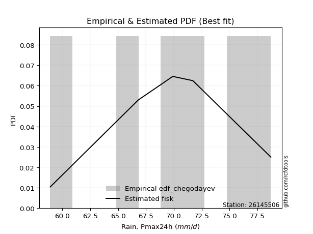</img>

</div>


### 6. EDF Blom (1958)

The Blom formula is a specific "plotting position" formula used in hydrology and statistical analysis to estimate the empirical cumulative probability (or non-exceedance probability) of a data series. It is particularly recommended for data that are approximately normally distributed. The constant _a_ is set to 0.375 (or 3/8).

<div align="center">


$P=(m-a)/(n+1-2a)$


</div>


**6.1. Empirical values**

<div align="center">

|                | 0                  | 1                  | 2                  | 3                 | 4                 | 5                  |
|:---------------|:-------------------|:-------------------|:-------------------|:------------------|:------------------|:-------------------|
| date           | 2020               | 2023               | 2022               | 2021              | 2018              | 2019               |
| x              | 58.9               | 66.8               | 69.9               | 71.7              | 76.5              | 78.7               |
| m              | 1                  | 2                  | 3                  | 4                 | 5                 | 6                  |
| empirical_dist | edf_blom           | edf_blom           | edf_blom           | edf_blom          | edf_blom          | edf_blom           |
| empirical      | 0.1                | 0.26               | 0.42               | 0.58              | 0.74              | 0.9                |
| empirical_tr   | 1.1111111111111112 | 1.3513513513513513 | 1.7241379310344827 | 2.380952380952381 | 3.846153846153846 | 10.000000000000002 |

</div>


**6.2. Kolmogorov-Smirnov fit test (sorted by Δ)**


<div align="center">

|                | 0                   | 1                   | 2                   | 3                   | 4                   | 5                   | 6                   | 7                   | 8                   | 9                   | 10                  | 11                  | 12                  | 13                  | 14                  | 15                  | 16                  | 17                  | 18                  | 19                  | 20                  | 21                 | 22                  | 23                  | 24                  | 25                  | 26                  | 27                  | 28                  | 29                 | 30                  | 31                  | 32                  | 33                  | 34                  | 35                  | 36                  | 37                  | 38                  | 39                  | 40                  | 41                 | 42                  | 43                  | 44                  | 45                  | 46                  | 47                  | 48                    | 49                  | 50                  | 51                 | 52                  | 53                  | 54                  | 55                 | 56                  | 57                  | 58                 | 59                  | 60                  | 61                  | 62                  | 63                  | 64                 | 65                  | 66                  | 67                | 68                  | 69                  | 70                 | 71                  | 72                 | 73                  | 74                  | 75                  | 76                  | 77                 | 78                 | 79                  | 80                 | 81                 | 82                 | 83                 | 84                 | 85                 | 86             | 87             |
|:---------------|:--------------------|:--------------------|:--------------------|:--------------------|:--------------------|:--------------------|:--------------------|:--------------------|:--------------------|:--------------------|:--------------------|:--------------------|:--------------------|:--------------------|:--------------------|:--------------------|:--------------------|:--------------------|:--------------------|:--------------------|:--------------------|:-------------------|:--------------------|:--------------------|:--------------------|:--------------------|:--------------------|:--------------------|:--------------------|:-------------------|:--------------------|:--------------------|:--------------------|:--------------------|:--------------------|:--------------------|:--------------------|:--------------------|:--------------------|:--------------------|:--------------------|:-------------------|:--------------------|:--------------------|:--------------------|:--------------------|:--------------------|:--------------------|:----------------------|:--------------------|:--------------------|:-------------------|:--------------------|:--------------------|:--------------------|:-------------------|:--------------------|:--------------------|:-------------------|:--------------------|:--------------------|:--------------------|:--------------------|:--------------------|:-------------------|:--------------------|:--------------------|:------------------|:--------------------|:--------------------|:-------------------|:--------------------|:-------------------|:--------------------|:--------------------|:--------------------|:--------------------|:-------------------|:-------------------|:--------------------|:-------------------|:-------------------|:-------------------|:-------------------|:-------------------|:-------------------|:---------------|:---------------|
| station        | 26145506            | 26145506            | 26145506            | 26145506            | 26145506            | 26145506            | 26145506            | 26145506            | 26145506            | 26145506            | 26145506            | 26145506            | 26145506            | 26145506            | 26145506            | 26145506            | 26145506            | 26145506            | 26145506            | 26145506            | 26145506            | 26145506           | 26145506            | 26145506            | 26145506            | 26145506            | 26145506            | 26145506            | 26145506            | 26145506           | 26145506            | 26145506            | 26145506            | 26145506            | 26145506            | 26145506            | 26145506            | 26145506            | 26145506            | 26145506            | 26145506            | 26145506           | 26145506            | 26145506            | 26145506            | 26145506            | 26145506            | 26145506            | 26145506              | 26145506            | 26145506            | 26145506           | 26145506            | 26145506            | 26145506            | 26145506           | 26145506            | 26145506            | 26145506           | 26145506            | 26145506            | 26145506            | 26145506            | 26145506            | 26145506           | 26145506            | 26145506            | 26145506          | 26145506            | 26145506            | 26145506           | 26145506            | 26145506           | 26145506            | 26145506            | 26145506            | 26145506            | 26145506           | 26145506           | 26145506            | 26145506           | 26145506           | 26145506           | 26145506           | 26145506           | 26145506           | 26145506       | 26145506       |
| empirical_dist | edf_blom            | edf_blom            | edf_blom            | edf_blom            | edf_blom            | edf_blom            | edf_blom            | edf_blom            | edf_blom            | edf_blom            | edf_blom            | edf_blom            | edf_blom            | edf_blom            | edf_blom            | edf_blom            | edf_blom            | edf_blom            | edf_blom            | edf_blom            | edf_blom            | edf_blom           | edf_blom            | edf_blom            | edf_blom            | edf_blom            | edf_blom            | edf_blom            | edf_blom            | edf_blom           | edf_blom            | edf_blom            | edf_blom            | edf_blom            | edf_blom            | edf_blom            | edf_blom            | edf_blom            | edf_blom            | edf_blom            | edf_blom            | edf_blom           | edf_blom            | edf_blom            | edf_blom            | edf_blom            | edf_blom            | edf_blom            | edf_blom              | edf_blom            | edf_blom            | edf_blom           | edf_blom            | edf_blom            | edf_blom            | edf_blom           | edf_blom            | edf_blom            | edf_blom           | edf_blom            | edf_blom            | edf_blom            | edf_blom            | edf_blom            | edf_blom           | edf_blom            | edf_blom            | edf_blom          | edf_blom            | edf_blom            | edf_blom           | edf_blom            | edf_blom           | edf_blom            | edf_blom            | edf_blom            | edf_blom            | edf_blom           | edf_blom           | edf_blom            | edf_blom           | edf_blom           | edf_blom           | edf_blom           | edf_blom           | edf_blom           | edf_blom       | edf_blom       |
| p_dist         | fisk                | logfisk             | logbetaprime        | logalpha            | loggamma            | loggamma            | logrice             | logerlang           | alpha               | logf                | loginvgamma         | erlang              | lognakagami         | logncf              | lognorm             | lognorm             | logexponnorm        | logcrystalball      | logt                | logfatiguelife      | gamma               | rice               | betaprime           | invgamma            | maxwell             | f                   | pearson3            | t                   | exponnorm           | norm               | crystalball         | nct                 | invgauss            | weibull_min         | logweibull_min      | johnsonsu           | invweibull          | loginvgauss         | rayleigh            | loggumbel_l         | lognct              | loggompertz        | loglogistic         | logmaxwell          | logjohnsonsu        | gumbel_l            | logistic            | laplace_asymmetric  | loglaplace_asymmetric | loghypsecant        | lograyleigh         | hypsecant          | gumbel_r            | loginvweibull       | loglaplace          | halfnorm           | laplace             | kstwobign           | logloggamma        | logmielke           | logpearson3         | mielke              | loggumbel_r         | moyal               | loghalfnorm        | logkstwobign        | halflogistic        | logmoyal          | loghalflogistic     | loggenexpon         | wald               | gibrat              | logwald            | genexpon            | expon               | logexpon            | loggibrat           | logtruncnorm       | nakagami           | loglognorm          | logchi2            | gompertz           | fatiguelife        | ncf                | truncnorm          | chi2               | loggenlogistic | genlogistic    |
| delta          | 0.06915394232776018 | 0.06915629220685049 | 0.07127689490166915 | 0.07285814767907905 | 0.07771545928678991 | 0.07771545928678991 | 0.07864395008958891 | 0.07892839056742323 | 0.07906825893498615 | 0.07916444971284986 | 0.07935954894133435 | 0.08025555800248851 | 0.08057755493541752 | 0.08075610081033924 | 0.08084971733378687 | 0.08084971733378687 | 0.08084995258697492 | 0.08084997676734718 | 0.08085053873540637 | 0.08243735093464544 | 0.08287597593775264 | 0.0829159029022225 | 0.08374871660903671 | 0.08466162379495756 | 0.08500059503404278 | 0.08508921955559434 | 0.08525751065346765 | 0.08543556780231087 | 0.08545664444857759 | 0.0854566711501542 | 0.08545668037799414 | 0.08547665718230968 | 0.08881398680036817 | 0.09006315225353312 | 0.09115475864741074 | 0.09159502979251671 | 0.09502698663247827 | 0.09518901293208187 | 0.09577966751718167 | 0.09859549947886248 | 0.09996453619085383 | 0.0999999994427084 | 0.10106463290479761 | 0.10115794964726171 | 0.10170004815499101 | 0.10523510438671013 | 0.10532217596188675 | 0.10960324265838484 | 0.11068345470244667   | 0.11231824834973303 | 0.11242578577125556 | 0.1162414272425294 | 0.11700437821389725 | 0.11827541092819932 | 0.12361251511068394 | 0.1267122956442372 | 0.12699432870606997 | 0.12761388941974444 | 0.1337091166657391 | 0.13598519263377917 | 0.13627149188627913 | 0.13723527505070265 | 0.13755784365332607 | 0.14274413792420798 | 0.1441602144898107 | 0.14703014053425534 | 0.14940251199407345 | 0.163440949078067 | 0.16828464581657127 | 0.19693920454587877 | 0.2143876772406122 | 0.23169774888760392 | 0.2354717309346191 | 0.23613224863919235 | 0.23639466007929488 | 0.25454123459319566 | 0.25674169358325866 | 0.3048720489854937 | 0.3806384311475777 | 0.39889688698889414 | 0.4836696492180727 | 0.5525333545499895 | 0.5556992385529003 | 0.5922034702535287 | 0.7189540770138115 | 0.7339571297588313 | 0.74           | 0.74           |
| deltao         | 0.530385761606      | 0.530385761606      | 0.530385761606      | 0.530385761606      | 0.530385761606      | 0.530385761606      | 0.530385761606      | 0.530385761606      | 0.530385761606      | 0.530385761606      | 0.530385761606      | 0.530385761606      | 0.530385761606      | 0.530385761606      | 0.530385761606      | 0.530385761606      | 0.530385761606      | 0.530385761606      | 0.530385761606      | 0.530385761606      | 0.530385761606      | 0.530385761606     | 0.530385761606      | 0.530385761606      | 0.530385761606      | 0.530385761606      | 0.530385761606      | 0.530385761606      | 0.530385761606      | 0.530385761606     | 0.530385761606      | 0.530385761606      | 0.530385761606      | 0.530385761606      | 0.530385761606      | 0.530385761606      | 0.530385761606      | 0.530385761606      | 0.530385761606      | 0.530385761606      | 0.530385761606      | 0.530385761606     | 0.530385761606      | 0.530385761606      | 0.530385761606      | 0.530385761606      | 0.530385761606      | 0.530385761606      | 0.530385761606        | 0.530385761606      | 0.530385761606      | 0.530385761606     | 0.530385761606      | 0.530385761606      | 0.530385761606      | 0.530385761606     | 0.530385761606      | 0.530385761606      | 0.530385761606     | 0.530385761606      | 0.530385761606      | 0.530385761606      | 0.530385761606      | 0.530385761606      | 0.530385761606     | 0.530385761606      | 0.530385761606      | 0.530385761606    | 0.530385761606      | 0.530385761606      | 0.530385761606     | 0.530385761606      | 0.530385761606     | 0.530385761606      | 0.530385761606      | 0.530385761606      | 0.530385761606      | 0.530385761606     | 0.530385761606     | 0.530385761606      | 0.530385761606     | 0.530385761606     | 0.530385761606     | 0.530385761606     | 0.530385761606     | 0.530385761606     | 0.530385761606 | 0.530385761606 |
| eval           | Δo > Δ              | Δo > Δ              | Δo > Δ              | Δo > Δ              | Δo > Δ              | Δo > Δ              | Δo > Δ              | Δo > Δ              | Δo > Δ              | Δo > Δ              | Δo > Δ              | Δo > Δ              | Δo > Δ              | Δo > Δ              | Δo > Δ              | Δo > Δ              | Δo > Δ              | Δo > Δ              | Δo > Δ              | Δo > Δ              | Δo > Δ              | Δo > Δ             | Δo > Δ              | Δo > Δ              | Δo > Δ              | Δo > Δ              | Δo > Δ              | Δo > Δ              | Δo > Δ              | Δo > Δ             | Δo > Δ              | Δo > Δ              | Δo > Δ              | Δo > Δ              | Δo > Δ              | Δo > Δ              | Δo > Δ              | Δo > Δ              | Δo > Δ              | Δo > Δ              | Δo > Δ              | Δo > Δ             | Δo > Δ              | Δo > Δ              | Δo > Δ              | Δo > Δ              | Δo > Δ              | Δo > Δ              | Δo > Δ                | Δo > Δ              | Δo > Δ              | Δo > Δ             | Δo > Δ              | Δo > Δ              | Δo > Δ              | Δo > Δ             | Δo > Δ              | Δo > Δ              | Δo > Δ             | Δo > Δ              | Δo > Δ              | Δo > Δ              | Δo > Δ              | Δo > Δ              | Δo > Δ             | Δo > Δ              | Δo > Δ              | Δo > Δ            | Δo > Δ              | Δo > Δ              | Δo > Δ             | Δo > Δ              | Δo > Δ             | Δo > Δ              | Δo > Δ              | Δo > Δ              | Δo > Δ              | Δo > Δ             | Δo > Δ             | Δo > Δ              | Δo > Δ             | Δo <= Δ            | Δo <= Δ            | Δo <= Δ            | Δo <= Δ            | Δo <= Δ            | Δo <= Δ        | Δo <= Δ        |
| fit            | 1                   | 1                   | 1                   | 1                   | 1                   | 1                   | 1                   | 1                   | 1                   | 1                   | 1                   | 1                   | 1                   | 1                   | 1                   | 1                   | 1                   | 1                   | 1                   | 1                   | 1                   | 1                  | 1                   | 1                   | 1                   | 1                   | 1                   | 1                   | 1                   | 1                  | 1                   | 1                   | 1                   | 1                   | 1                   | 1                   | 1                   | 1                   | 1                   | 1                   | 1                   | 1                  | 1                   | 1                   | 1                   | 1                   | 1                   | 1                   | 1                     | 1                   | 1                   | 1                  | 1                   | 1                   | 1                   | 1                  | 1                   | 1                   | 1                  | 1                   | 1                   | 1                   | 1                   | 1                   | 1                  | 1                   | 1                   | 1                 | 1                   | 1                   | 1                  | 1                   | 1                  | 1                   | 1                   | 1                   | 1                   | 1                  | 1                  | 1                   | 1                  | 0                  | 0                  | 0                  | 0                  | 0                  | 0              | 0              |
| n              | 6                   | 6                   | 6                   | 6                   | 6                   | 6                   | 6                   | 6                   | 6                   | 6                   | 6                   | 6                   | 6                   | 6                   | 6                   | 6                   | 6                   | 6                   | 6                   | 6                   | 6                   | 6                  | 6                   | 6                   | 6                   | 6                   | 6                   | 6                   | 6                   | 6                  | 6                   | 6                   | 6                   | 6                   | 6                   | 6                   | 6                   | 6                   | 6                   | 6                   | 6                   | 6                  | 6                   | 6                   | 6                   | 6                   | 6                   | 6                   | 6                     | 6                   | 6                   | 6                  | 6                   | 6                   | 6                   | 6                  | 6                   | 6                   | 6                  | 6                   | 6                   | 6                   | 6                   | 6                   | 6                  | 6                   | 6                   | 6                 | 6                   | 6                   | 6                  | 6                   | 6                  | 6                   | 6                   | 6                   | 6                   | 6                  | 6                  | 6                   | 6                  | 6                  | 6                  | 6                  | 6                  | 6                  | 6              | 6              |
| best_fit       | 1                   | 0                   | 0                   | 0                   | 0                   | 0                   | 0                   | 0                   | 0                   | 0                   | 0                   | 0                   | 0                   | 0                   | 0                   | 0                   | 0                   | 0                   | 0                   | 0                   | 0                   | 0                  | 0                   | 0                   | 0                   | 0                   | 0                   | 0                   | 0                   | 0                  | 0                   | 0                   | 0                   | 0                   | 0                   | 0                   | 0                   | 0                   | 0                   | 0                   | 0                   | 0                  | 0                   | 0                   | 0                   | 0                   | 0                   | 0                   | 0                     | 0                   | 0                   | 0                  | 0                   | 0                   | 0                   | 0                  | 0                   | 0                   | 0                  | 0                   | 0                   | 0                   | 0                   | 0                   | 0                  | 0                   | 0                   | 0                 | 0                   | 0                   | 0                  | 0                   | 0                  | 0                   | 0                   | 0                   | 0                   | 0                  | 0                  | 0                   | 0                  | 0                  | 0                  | 0                  | 0                  | 0                  | 0              | 0              |
| best_fit_sort  | 1                   | 2                   | 3                   | 4                   | 5                   | 6                   | 7                   | 8                   | 9                   | 10                  | 11                  | 12                  | 13                  | 14                  | 15                  | 16                  | 17                  | 18                  | 19                  | 20                  | 21                  | 22                 | 23                  | 24                  | 25                  | 26                  | 27                  | 28                  | 29                  | 30                 | 31                  | 32                  | 33                  | 34                  | 35                  | 36                  | 37                  | 38                  | 39                  | 40                  | 41                  | 42                 | 43                  | 44                  | 45                  | 46                  | 47                  | 48                  | 49                    | 50                  | 51                  | 52                 | 53                  | 54                  | 55                  | 56                 | 57                  | 58                  | 59                 | 60                  | 61                  | 62                  | 63                  | 64                  | 65                 | 66                  | 67                  | 68                | 69                  | 70                  | 71                 | 72                  | 73                 | 74                  | 75                  | 76                  | 77                  | 78                 | 79                 | 80                  | 81                 | 82                 | 83                 | 84                 | 85                 | 86                 | 87             | 88             |

</div>


**6.3. Best fit**

<div align="center">

|   id |   station | empirical_dist   | p_dist   |     delta |   deltao | eval   |   fit |   n |   best_fit |   best_fit_sort |
|-----:|----------:|:-----------------|:---------|----------:|---------:|:-------|------:|----:|-----------:|----------------:|
|    0 |  26145506 | edf_blom         | fisk     | 0.0691539 | 0.530386 | Δo > Δ |     1 |   6 |          1 |               1 |

</div>


<div align="center">

</img></img>

</div>


### 7. EDF Tukey (1962)

In hydrology, the Tukey formula is used as a plotting position formula to estimate the empirical probability or frequency of a flood event (or other hydrological data). The formula parameter is given as _c=0.333_ (or 1/3).

<div align="center">


$P=(m-c)/(n+1-2c)$


</div>


**7.1. Empirical values**

<div align="center">

|                | 0                   | 1                  | 2                   | 3                  | 4                  | 5                  |
|:---------------|:--------------------|:-------------------|:--------------------|:-------------------|:-------------------|:-------------------|
| date           | 2020                | 2023               | 2022                | 2021               | 2018               | 2019               |
| x              | 58.9                | 66.8               | 69.9                | 71.7               | 76.5               | 78.7               |
| m              | 1                   | 2                  | 3                   | 4                  | 5                  | 6                  |
| empirical_dist | edf_tukey           | edf_tukey          | edf_tukey           | edf_tukey          | edf_tukey          | edf_tukey          |
| empirical      | 0.10526315789473684 | 0.2631578947368421 | 0.42105263157894735 | 0.5789473684210527 | 0.7368421052631579 | 0.8947368421052632 |
| empirical_tr   | 1.1176470588235294  | 1.357142857142857  | 1.7272727272727273  | 2.375              | 3.7999999999999994 | 9.5                |

</div>


**7.2. Kolmogorov-Smirnov fit test (sorted by Δ)**


<div align="center">

|                | 0                   | 1                   | 2                   | 3                   | 4                   | 5                   | 6                   | 7                   | 8                   | 9                 | 10                  | 11                  | 12                  | 13                  | 14                  | 15                  | 16                  | 17                  | 18                  | 19                  | 20                  | 21                  | 22                  | 23                  | 24                 | 25                  | 26                  | 27                  | 28                  | 29                  | 30                  | 31                  | 32                  | 33                  | 34                  | 35                  | 36                  | 37                  | 38                  | 39                  | 40                 | 41                 | 42                  | 43                  | 44                  | 45                  | 46                  | 47                 | 48                  | 49                    | 50                  | 51                  | 52                  | 53                  | 54                  | 55                  | 56                  | 57                 | 58                 | 59                  | 60                  | 61                  | 62                 | 63                  | 64                  | 65                  | 66                 | 67                  | 68                 | 69                  | 70                  | 71                  | 72                  | 73                 | 74                  | 75                 | 76                 | 77                 | 78                  | 79                  | 80                  | 81                 | 82                 | 83                 | 84                 | 85                 | 86                 | 87                 |
|:---------------|:--------------------|:--------------------|:--------------------|:--------------------|:--------------------|:--------------------|:--------------------|:--------------------|:--------------------|:------------------|:--------------------|:--------------------|:--------------------|:--------------------|:--------------------|:--------------------|:--------------------|:--------------------|:--------------------|:--------------------|:--------------------|:--------------------|:--------------------|:--------------------|:-------------------|:--------------------|:--------------------|:--------------------|:--------------------|:--------------------|:--------------------|:--------------------|:--------------------|:--------------------|:--------------------|:--------------------|:--------------------|:--------------------|:--------------------|:--------------------|:-------------------|:-------------------|:--------------------|:--------------------|:--------------------|:--------------------|:--------------------|:-------------------|:--------------------|:----------------------|:--------------------|:--------------------|:--------------------|:--------------------|:--------------------|:--------------------|:--------------------|:-------------------|:-------------------|:--------------------|:--------------------|:--------------------|:-------------------|:--------------------|:--------------------|:--------------------|:-------------------|:--------------------|:-------------------|:--------------------|:--------------------|:--------------------|:--------------------|:-------------------|:--------------------|:-------------------|:-------------------|:-------------------|:--------------------|:--------------------|:--------------------|:-------------------|:-------------------|:-------------------|:-------------------|:-------------------|:-------------------|:-------------------|
| station        | 26145506            | 26145506            | 26145506            | 26145506            | 26145506            | 26145506            | 26145506            | 26145506            | 26145506            | 26145506          | 26145506            | 26145506            | 26145506            | 26145506            | 26145506            | 26145506            | 26145506            | 26145506            | 26145506            | 26145506            | 26145506            | 26145506            | 26145506            | 26145506            | 26145506           | 26145506            | 26145506            | 26145506            | 26145506            | 26145506            | 26145506            | 26145506            | 26145506            | 26145506            | 26145506            | 26145506            | 26145506            | 26145506            | 26145506            | 26145506            | 26145506           | 26145506           | 26145506            | 26145506            | 26145506            | 26145506            | 26145506            | 26145506           | 26145506            | 26145506              | 26145506            | 26145506            | 26145506            | 26145506            | 26145506            | 26145506            | 26145506            | 26145506           | 26145506           | 26145506            | 26145506            | 26145506            | 26145506           | 26145506            | 26145506            | 26145506            | 26145506           | 26145506            | 26145506           | 26145506            | 26145506            | 26145506            | 26145506            | 26145506           | 26145506            | 26145506           | 26145506           | 26145506           | 26145506            | 26145506            | 26145506            | 26145506           | 26145506           | 26145506           | 26145506           | 26145506           | 26145506           | 26145506           |
| empirical_dist | edf_tukey           | edf_tukey           | edf_tukey           | edf_tukey           | edf_tukey           | edf_tukey           | edf_tukey           | edf_tukey           | edf_tukey           | edf_tukey         | edf_tukey           | edf_tukey           | edf_tukey           | edf_tukey           | edf_tukey           | edf_tukey           | edf_tukey           | edf_tukey           | edf_tukey           | edf_tukey           | edf_tukey           | edf_tukey           | edf_tukey           | edf_tukey           | edf_tukey          | edf_tukey           | edf_tukey           | edf_tukey           | edf_tukey           | edf_tukey           | edf_tukey           | edf_tukey           | edf_tukey           | edf_tukey           | edf_tukey           | edf_tukey           | edf_tukey           | edf_tukey           | edf_tukey           | edf_tukey           | edf_tukey          | edf_tukey          | edf_tukey           | edf_tukey           | edf_tukey           | edf_tukey           | edf_tukey           | edf_tukey          | edf_tukey           | edf_tukey             | edf_tukey           | edf_tukey           | edf_tukey           | edf_tukey           | edf_tukey           | edf_tukey           | edf_tukey           | edf_tukey          | edf_tukey          | edf_tukey           | edf_tukey           | edf_tukey           | edf_tukey          | edf_tukey           | edf_tukey           | edf_tukey           | edf_tukey          | edf_tukey           | edf_tukey          | edf_tukey           | edf_tukey           | edf_tukey           | edf_tukey           | edf_tukey          | edf_tukey           | edf_tukey          | edf_tukey          | edf_tukey          | edf_tukey           | edf_tukey           | edf_tukey           | edf_tukey          | edf_tukey          | edf_tukey          | edf_tukey          | edf_tukey          | edf_tukey          | edf_tukey          |
| p_dist         | fisk                | logfisk             | logalpha            | logbetaprime        | loggamma            | loggamma            | logerlang           | logrice             | alpha               | logf              | loginvgamma         | erlang              | lognakagami         | logncf              | lognorm             | lognorm             | logexponnorm        | logcrystalball      | logt                | logfatiguelife      | gamma               | rice                | betaprime           | invgauss            | invgamma           | f                   | pearson3            | t                   | exponnorm           | norm                | crystalball         | nct                 | maxwell             | johnsonsu           | weibull_min         | invweibull          | loginvgauss         | logweibull_min      | lognct              | logmaxwell          | logjohnsonsu       | rayleigh           | loggumbel_l         | loglogistic         | loggompertz         | gumbel_l            | logistic            | lograyleigh        | laplace_asymmetric  | loglaplace_asymmetric | loghypsecant        | gumbel_r            | loginvweibull       | hypsecant           | halfnorm            | kstwobign           | loglaplace          | laplace            | logloggamma        | logmielke           | logpearson3         | mielke              | loggumbel_r        | moyal               | loghalfnorm         | logkstwobign        | halflogistic       | logmoyal            | loghalflogistic    | loggenexpon         | wald                | gibrat              | genexpon            | expon              | logwald             | logexpon           | loggibrat          | logtruncnorm       | nakagami            | loglognorm          | logchi2             | gompertz           | fatiguelife        | ncf                | truncnorm          | chi2               | loggenlogistic     | genlogistic        |
| delta          | 0.07231183706460231 | 0.07231418694369263 | 0.07601604241592119 | 0.07654005279640598 | 0.08032280664314251 | 0.08032280664314251 | 0.08048320711065193 | 0.08156855644165639 | 0.08222615367182828 | 0.082322344449692 | 0.08251744367817648 | 0.08341345273933065 | 0.08373544967225965 | 0.08391399554718137 | 0.08400761207062901 | 0.08400761207062901 | 0.08400784732381705 | 0.08400787150418931 | 0.08400843347224851 | 0.08559524567148757 | 0.08603387067459478 | 0.08607379763906464 | 0.08690661134587885 | 0.08776135522142081 | 0.0878195185317997 | 0.08824711429243648 | 0.08841540539030979 | 0.08859346253915301 | 0.08861453918541973 | 0.08861456588699634 | 0.08861457511483628 | 0.08863455191915182 | 0.08880144115731842 | 0.09054239821356941 | 0.09322104699037526 | 0.09397435505353091 | 0.09413638135313451 | 0.09431265338425288 | 0.09680664145401174 | 0.10010531806831435 | 0.1006474165760437 | 0.1010428254119185 | 0.10175339421570462 | 0.10422252764163975 | 0.10526315733744523 | 0.10839299912355227 | 0.10848007069872889 | 0.1113731541923082 | 0.11276113739522697 | 0.11384134943928881   | 0.11547614308657517 | 0.11595174663494989 | 0.11722277934925196 | 0.11939932197937153 | 0.12565966406528983 | 0.12656125784079708 | 0.12677040984752608 | 0.1301522234429121 | 0.1326564850867918 | 0.13493256105483187 | 0.13521886030733177 | 0.13618264347175535 | 0.1365052120743787 | 0.14169150634526062 | 0.14310758291086334 | 0.14387224579741326 | 0.1483498804151261 | 0.16238831749911964 | 0.1672320142376239 | 0.19378130980903668 | 0.21333504566166483 | 0.23064511730865656 | 0.23297435390235027 | 0.2332367653424528 | 0.23441909935567173 | 0.2513833398563536 | 0.2556890620043113 | 0.3017141542486516 | 0.37958579956863037 | 0.39573899225205206 | 0.47840649132333585 | 0.5514807229710422 | 0.5525413438160582 | 0.5869403123587918 | 0.7157961822769694 | 0.7307992350219892 | 0.7368421052631579 | 0.7368421052631579 |
| deltao         | 0.530385761606      | 0.530385761606      | 0.530385761606      | 0.530385761606      | 0.530385761606      | 0.530385761606      | 0.530385761606      | 0.530385761606      | 0.530385761606      | 0.530385761606    | 0.530385761606      | 0.530385761606      | 0.530385761606      | 0.530385761606      | 0.530385761606      | 0.530385761606      | 0.530385761606      | 0.530385761606      | 0.530385761606      | 0.530385761606      | 0.530385761606      | 0.530385761606      | 0.530385761606      | 0.530385761606      | 0.530385761606     | 0.530385761606      | 0.530385761606      | 0.530385761606      | 0.530385761606      | 0.530385761606      | 0.530385761606      | 0.530385761606      | 0.530385761606      | 0.530385761606      | 0.530385761606      | 0.530385761606      | 0.530385761606      | 0.530385761606      | 0.530385761606      | 0.530385761606      | 0.530385761606     | 0.530385761606     | 0.530385761606      | 0.530385761606      | 0.530385761606      | 0.530385761606      | 0.530385761606      | 0.530385761606     | 0.530385761606      | 0.530385761606        | 0.530385761606      | 0.530385761606      | 0.530385761606      | 0.530385761606      | 0.530385761606      | 0.530385761606      | 0.530385761606      | 0.530385761606     | 0.530385761606     | 0.530385761606      | 0.530385761606      | 0.530385761606      | 0.530385761606     | 0.530385761606      | 0.530385761606      | 0.530385761606      | 0.530385761606     | 0.530385761606      | 0.530385761606     | 0.530385761606      | 0.530385761606      | 0.530385761606      | 0.530385761606      | 0.530385761606     | 0.530385761606      | 0.530385761606     | 0.530385761606     | 0.530385761606     | 0.530385761606      | 0.530385761606      | 0.530385761606      | 0.530385761606     | 0.530385761606     | 0.530385761606     | 0.530385761606     | 0.530385761606     | 0.530385761606     | 0.530385761606     |
| eval           | Δo > Δ              | Δo > Δ              | Δo > Δ              | Δo > Δ              | Δo > Δ              | Δo > Δ              | Δo > Δ              | Δo > Δ              | Δo > Δ              | Δo > Δ            | Δo > Δ              | Δo > Δ              | Δo > Δ              | Δo > Δ              | Δo > Δ              | Δo > Δ              | Δo > Δ              | Δo > Δ              | Δo > Δ              | Δo > Δ              | Δo > Δ              | Δo > Δ              | Δo > Δ              | Δo > Δ              | Δo > Δ             | Δo > Δ              | Δo > Δ              | Δo > Δ              | Δo > Δ              | Δo > Δ              | Δo > Δ              | Δo > Δ              | Δo > Δ              | Δo > Δ              | Δo > Δ              | Δo > Δ              | Δo > Δ              | Δo > Δ              | Δo > Δ              | Δo > Δ              | Δo > Δ             | Δo > Δ             | Δo > Δ              | Δo > Δ              | Δo > Δ              | Δo > Δ              | Δo > Δ              | Δo > Δ             | Δo > Δ              | Δo > Δ                | Δo > Δ              | Δo > Δ              | Δo > Δ              | Δo > Δ              | Δo > Δ              | Δo > Δ              | Δo > Δ              | Δo > Δ             | Δo > Δ             | Δo > Δ              | Δo > Δ              | Δo > Δ              | Δo > Δ             | Δo > Δ              | Δo > Δ              | Δo > Δ              | Δo > Δ             | Δo > Δ              | Δo > Δ             | Δo > Δ              | Δo > Δ              | Δo > Δ              | Δo > Δ              | Δo > Δ             | Δo > Δ              | Δo > Δ             | Δo > Δ             | Δo > Δ             | Δo > Δ              | Δo > Δ              | Δo > Δ              | Δo <= Δ            | Δo <= Δ            | Δo <= Δ            | Δo <= Δ            | Δo <= Δ            | Δo <= Δ            | Δo <= Δ            |
| fit            | 1                   | 1                   | 1                   | 1                   | 1                   | 1                   | 1                   | 1                   | 1                   | 1                 | 1                   | 1                   | 1                   | 1                   | 1                   | 1                   | 1                   | 1                   | 1                   | 1                   | 1                   | 1                   | 1                   | 1                   | 1                  | 1                   | 1                   | 1                   | 1                   | 1                   | 1                   | 1                   | 1                   | 1                   | 1                   | 1                   | 1                   | 1                   | 1                   | 1                   | 1                  | 1                  | 1                   | 1                   | 1                   | 1                   | 1                   | 1                  | 1                   | 1                     | 1                   | 1                   | 1                   | 1                   | 1                   | 1                   | 1                   | 1                  | 1                  | 1                   | 1                   | 1                   | 1                  | 1                   | 1                   | 1                   | 1                  | 1                   | 1                  | 1                   | 1                   | 1                   | 1                   | 1                  | 1                   | 1                  | 1                  | 1                  | 1                   | 1                   | 1                   | 0                  | 0                  | 0                  | 0                  | 0                  | 0                  | 0                  |
| n              | 6                   | 6                   | 6                   | 6                   | 6                   | 6                   | 6                   | 6                   | 6                   | 6                 | 6                   | 6                   | 6                   | 6                   | 6                   | 6                   | 6                   | 6                   | 6                   | 6                   | 6                   | 6                   | 6                   | 6                   | 6                  | 6                   | 6                   | 6                   | 6                   | 6                   | 6                   | 6                   | 6                   | 6                   | 6                   | 6                   | 6                   | 6                   | 6                   | 6                   | 6                  | 6                  | 6                   | 6                   | 6                   | 6                   | 6                   | 6                  | 6                   | 6                     | 6                   | 6                   | 6                   | 6                   | 6                   | 6                   | 6                   | 6                  | 6                  | 6                   | 6                   | 6                   | 6                  | 6                   | 6                   | 6                   | 6                  | 6                   | 6                  | 6                   | 6                   | 6                   | 6                   | 6                  | 6                   | 6                  | 6                  | 6                  | 6                   | 6                   | 6                   | 6                  | 6                  | 6                  | 6                  | 6                  | 6                  | 6                  |
| best_fit       | 1                   | 0                   | 0                   | 0                   | 0                   | 0                   | 0                   | 0                   | 0                   | 0                 | 0                   | 0                   | 0                   | 0                   | 0                   | 0                   | 0                   | 0                   | 0                   | 0                   | 0                   | 0                   | 0                   | 0                   | 0                  | 0                   | 0                   | 0                   | 0                   | 0                   | 0                   | 0                   | 0                   | 0                   | 0                   | 0                   | 0                   | 0                   | 0                   | 0                   | 0                  | 0                  | 0                   | 0                   | 0                   | 0                   | 0                   | 0                  | 0                   | 0                     | 0                   | 0                   | 0                   | 0                   | 0                   | 0                   | 0                   | 0                  | 0                  | 0                   | 0                   | 0                   | 0                  | 0                   | 0                   | 0                   | 0                  | 0                   | 0                  | 0                   | 0                   | 0                   | 0                   | 0                  | 0                   | 0                  | 0                  | 0                  | 0                   | 0                   | 0                   | 0                  | 0                  | 0                  | 0                  | 0                  | 0                  | 0                  |
| best_fit_sort  | 1                   | 2                   | 3                   | 4                   | 5                   | 6                   | 7                   | 8                   | 9                   | 10                | 11                  | 12                  | 13                  | 14                  | 15                  | 16                  | 17                  | 18                  | 19                  | 20                  | 21                  | 22                  | 23                  | 24                  | 25                 | 26                  | 27                  | 28                  | 29                  | 30                  | 31                  | 32                  | 33                  | 34                  | 35                  | 36                  | 37                  | 38                  | 39                  | 40                  | 41                 | 42                 | 43                  | 44                  | 45                  | 46                  | 47                  | 48                 | 49                  | 50                    | 51                  | 52                  | 53                  | 54                  | 55                  | 56                  | 57                  | 58                 | 59                 | 60                  | 61                  | 62                  | 63                 | 64                  | 65                  | 66                  | 67                 | 68                  | 69                 | 70                  | 71                  | 72                  | 73                  | 74                 | 75                  | 76                 | 77                 | 78                 | 79                  | 80                  | 81                  | 82                 | 83                 | 84                 | 85                 | 86                 | 87                 | 88                 |

</div>


**7.3. Best fit**

<div align="center">

|   id |   station | empirical_dist   | p_dist   |     delta |   deltao | eval   |   fit |   n |   best_fit |   best_fit_sort |
|-----:|----------:|:-----------------|:---------|----------:|---------:|:-------|------:|----:|-----------:|----------------:|
|    0 |  26145506 | edf_tukey        | fisk     | 0.0723118 | 0.530386 | Δo > Δ |     1 |   6 |          1 |               1 |

</div>


<div align="center">

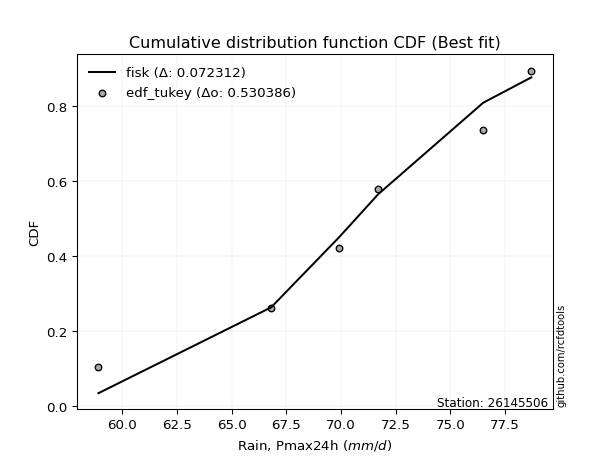</img></img>

</div>


### 8. EDF Gringorten (1963)

Gringorten plotting position formula is essential for estimating the probability and return periods of extreme events like floods and heavy rainfall. The constant _a=0.44_.

<div align="center">


$P=(m-a)/(n+1-2a)$


</div>


**8.1. Empirical values**

<div align="center">

|                | 0                   | 1                  | 2                   | 3                  | 4                  | 5                  |
|:---------------|:--------------------|:-------------------|:--------------------|:-------------------|:-------------------|:-------------------|
| date           | 2020                | 2023               | 2022                | 2021               | 2018               | 2019               |
| x              | 58.9                | 66.8               | 69.9                | 71.7               | 76.5               | 78.7               |
| m              | 1                   | 2                  | 3                   | 4                  | 5                  | 6                  |
| empirical_dist | edf_gringorten      | edf_gringorten     | edf_gringorten      | edf_gringorten     | edf_gringorten     | edf_gringorten     |
| empirical      | 0.09150326797385622 | 0.2549019607843137 | 0.41830065359477125 | 0.5816993464052288 | 0.7450980392156862 | 0.9084967320261437 |
| empirical_tr   | 1.1007194244604317  | 1.3421052631578947 | 1.7191011235955058  | 2.3906250000000004 | 3.9230769230769216 | 10.928571428571415 |

</div>


**8.2. Kolmogorov-Smirnov fit test (sorted by Δ)**


<div align="center">

|                | 0                   | 1                  | 2                   | 3                   | 4                   | 5                   | 6                   | 7                   | 8                   | 9                   | 10                  | 11                  | 12                  | 13                  | 14                  | 15                  | 16                  | 17                  | 18                  | 19                  | 20                  | 21                  | 22                  | 23                  | 24                  | 25                  | 26                 | 27                  | 28                  | 29                  | 30                  | 31                  | 32                  | 33                  | 34                 | 35                  | 36                  | 37                  | 38                  | 39                  | 40                | 41                 | 42                  | 43                  | 44                  | 45                  | 46                  | 47                  | 48                    | 49                  | 50                 | 51                  | 52                  | 53                  | 54                  | 55                  | 56                  | 57                  | 58                  | 59                | 60                  | 61                 | 62                 | 63                 | 64                  | 65                  | 66                  | 67                  | 68              | 69                  | 70                  | 71                  | 72                  | 73                  | 74                  | 75                 | 76                  | 77               | 78                  | 79                  | 80                  | 81                 | 82                 | 83                 | 84                 | 85                 | 86                 | 87                 |
|:---------------|:--------------------|:-------------------|:--------------------|:--------------------|:--------------------|:--------------------|:--------------------|:--------------------|:--------------------|:--------------------|:--------------------|:--------------------|:--------------------|:--------------------|:--------------------|:--------------------|:--------------------|:--------------------|:--------------------|:--------------------|:--------------------|:--------------------|:--------------------|:--------------------|:--------------------|:--------------------|:-------------------|:--------------------|:--------------------|:--------------------|:--------------------|:--------------------|:--------------------|:--------------------|:-------------------|:--------------------|:--------------------|:--------------------|:--------------------|:--------------------|:------------------|:-------------------|:--------------------|:--------------------|:--------------------|:--------------------|:--------------------|:--------------------|:----------------------|:--------------------|:-------------------|:--------------------|:--------------------|:--------------------|:--------------------|:--------------------|:--------------------|:--------------------|:--------------------|:------------------|:--------------------|:-------------------|:-------------------|:-------------------|:--------------------|:--------------------|:--------------------|:--------------------|:----------------|:--------------------|:--------------------|:--------------------|:--------------------|:--------------------|:--------------------|:-------------------|:--------------------|:-----------------|:--------------------|:--------------------|:--------------------|:-------------------|:-------------------|:-------------------|:-------------------|:-------------------|:-------------------|:-------------------|
| station        | 26145506            | 26145506           | 26145506            | 26145506            | 26145506            | 26145506            | 26145506            | 26145506            | 26145506            | 26145506            | 26145506            | 26145506            | 26145506            | 26145506            | 26145506            | 26145506            | 26145506            | 26145506            | 26145506            | 26145506            | 26145506            | 26145506            | 26145506            | 26145506            | 26145506            | 26145506            | 26145506           | 26145506            | 26145506            | 26145506            | 26145506            | 26145506            | 26145506            | 26145506            | 26145506           | 26145506            | 26145506            | 26145506            | 26145506            | 26145506            | 26145506          | 26145506           | 26145506            | 26145506            | 26145506            | 26145506            | 26145506            | 26145506            | 26145506              | 26145506            | 26145506           | 26145506            | 26145506            | 26145506            | 26145506            | 26145506            | 26145506            | 26145506            | 26145506            | 26145506          | 26145506            | 26145506           | 26145506           | 26145506           | 26145506            | 26145506            | 26145506            | 26145506            | 26145506        | 26145506            | 26145506            | 26145506            | 26145506            | 26145506            | 26145506            | 26145506           | 26145506            | 26145506         | 26145506            | 26145506            | 26145506            | 26145506           | 26145506           | 26145506           | 26145506           | 26145506           | 26145506           | 26145506           |
| empirical_dist | edf_gringorten      | edf_gringorten     | edf_gringorten      | edf_gringorten      | edf_gringorten      | edf_gringorten      | edf_gringorten      | edf_gringorten      | edf_gringorten      | edf_gringorten      | edf_gringorten      | edf_gringorten      | edf_gringorten      | edf_gringorten      | edf_gringorten      | edf_gringorten      | edf_gringorten      | edf_gringorten      | edf_gringorten      | edf_gringorten      | edf_gringorten      | edf_gringorten      | edf_gringorten      | edf_gringorten      | edf_gringorten      | edf_gringorten      | edf_gringorten     | edf_gringorten      | edf_gringorten      | edf_gringorten      | edf_gringorten      | edf_gringorten      | edf_gringorten      | edf_gringorten      | edf_gringorten     | edf_gringorten      | edf_gringorten      | edf_gringorten      | edf_gringorten      | edf_gringorten      | edf_gringorten    | edf_gringorten     | edf_gringorten      | edf_gringorten      | edf_gringorten      | edf_gringorten      | edf_gringorten      | edf_gringorten      | edf_gringorten        | edf_gringorten      | edf_gringorten     | edf_gringorten      | edf_gringorten      | edf_gringorten      | edf_gringorten      | edf_gringorten      | edf_gringorten      | edf_gringorten      | edf_gringorten      | edf_gringorten    | edf_gringorten      | edf_gringorten     | edf_gringorten     | edf_gringorten     | edf_gringorten      | edf_gringorten      | edf_gringorten      | edf_gringorten      | edf_gringorten  | edf_gringorten      | edf_gringorten      | edf_gringorten      | edf_gringorten      | edf_gringorten      | edf_gringorten      | edf_gringorten     | edf_gringorten      | edf_gringorten   | edf_gringorten      | edf_gringorten      | edf_gringorten      | edf_gringorten     | edf_gringorten     | edf_gringorten     | edf_gringorten     | edf_gringorten     | edf_gringorten     | edf_gringorten     |
| p_dist         | fisk                | logfisk            | logbetaprime        | alpha               | logf                | loginvgamma         | logalpha            | erlang              | lognakagami         | logncf              | lognorm             | lognorm             | logexponnorm        | logcrystalball      | logt                | logfatiguelife      | gamma               | rice                | betaprime           | loggamma            | loggamma            | invgamma            | f                   | pearson3            | t                   | logrice             | exponnorm          | norm                | crystalball         | nct                 | logerlang           | maxwell             | weibull_min         | logweibull_min      | invgauss           | loggompertz         | johnsonsu           | loggumbel_l         | rayleigh            | loglogistic         | invweibull        | loginvgauss        | gumbel_l            | logistic            | logmaxwell          | logjohnsonsu        | laplace_asymmetric  | lognct              | loglaplace_asymmetric | loghypsecant        | hypsecant          | lograyleigh         | loglaplace          | gumbel_r            | loginvweibull       | laplace             | halfnorm            | kstwobign           | logloggamma         | logmielke         | logpearson3         | mielke             | loggumbel_r        | moyal              | loghalfnorm         | halflogistic        | logkstwobign        | logmoyal            | loghalflogistic | loggenexpon         | wald                | gibrat              | logwald             | genexpon            | expon               | loggibrat          | logexpon            | logtruncnorm     | nakagami            | loglognorm          | logchi2             | gompertz           | fatiguelife        | ncf                | truncnorm          | chi2               | loggenlogistic     | genlogistic        |
| delta          | 0.06405590311207399 | 0.0640582529911643 | 0.07006314440167627 | 0.07397021971929996 | 0.07406641049716367 | 0.07426150972564816 | 0.07432997907089228 | 0.07515751878680232 | 0.07547951571973133 | 0.07565806159465305 | 0.07575167811810068 | 0.07575167811810068 | 0.07575191337128873 | 0.07575193755166099 | 0.07575249951972018 | 0.07733931171895925 | 0.07777793672206645 | 0.07781786368653631 | 0.07865067739335052 | 0.07941480569201864 | 0.07941480569201864 | 0.07956358457927137 | 0.07999118033990815 | 0.08015947143778146 | 0.08033752858662468 | 0.08034329649481764 | 0.0803586052328914 | 0.08035863193446802 | 0.08035864116230795 | 0.08037861796662349 | 0.08062773697265196 | 0.08403498306122309 | 0.08496511303784693 | 0.08605671943172455 | 0.0905133332055969 | 0.09150326741656462 | 0.09329437619774555 | 0.09349746026317629 | 0.09565563956042428 | 0.09596659368911142 | 0.096726333037707 | 0.0968883593373106 | 0.10013706517102394 | 0.10022413674620057 | 0.10285729605249044 | 0.10339939456021985 | 0.10450520344269865 | 0.10506257540654013 | 0.10558541548676048   | 0.10722020913404684 | 0.1111433880268432 | 0.11412513217648429 | 0.11851447589499775 | 0.11870372461912598 | 0.12080664031697574 | 0.12189628949038378 | 0.12841164204946592 | 0.12983842734236006 | 0.13540846307096793 | 0.137684539039008 | 0.13797083829150786 | 0.1389346214559315 | 0.1392571900585548 | 0.1444434843294367 | 0.14585956089503943 | 0.15110185839930218 | 0.15212817974994164 | 0.16514029548329573 | 0.1699839922218 | 0.20203724376156507 | 0.21608702364584093 | 0.23339709529283265 | 0.23717107733984782 | 0.24123028785487866 | 0.24149269929498118 | 0.2584410399884874 | 0.25963927380888197 | 0.30997008820118 | 0.38233777755280646 | 0.40399492620458044 | 0.49216638124421636 | 0.5542327009552184 | 0.5607972777685866 | 0.6007002022796725 | 0.7240521162294978 | 0.7390551689745176 | 0.7450980392156862 | 0.7450980392156862 |
| deltao         | 0.530385761606      | 0.530385761606     | 0.530385761606      | 0.530385761606      | 0.530385761606      | 0.530385761606      | 0.530385761606      | 0.530385761606      | 0.530385761606      | 0.530385761606      | 0.530385761606      | 0.530385761606      | 0.530385761606      | 0.530385761606      | 0.530385761606      | 0.530385761606      | 0.530385761606      | 0.530385761606      | 0.530385761606      | 0.530385761606      | 0.530385761606      | 0.530385761606      | 0.530385761606      | 0.530385761606      | 0.530385761606      | 0.530385761606      | 0.530385761606     | 0.530385761606      | 0.530385761606      | 0.530385761606      | 0.530385761606      | 0.530385761606      | 0.530385761606      | 0.530385761606      | 0.530385761606     | 0.530385761606      | 0.530385761606      | 0.530385761606      | 0.530385761606      | 0.530385761606      | 0.530385761606    | 0.530385761606     | 0.530385761606      | 0.530385761606      | 0.530385761606      | 0.530385761606      | 0.530385761606      | 0.530385761606      | 0.530385761606        | 0.530385761606      | 0.530385761606     | 0.530385761606      | 0.530385761606      | 0.530385761606      | 0.530385761606      | 0.530385761606      | 0.530385761606      | 0.530385761606      | 0.530385761606      | 0.530385761606    | 0.530385761606      | 0.530385761606     | 0.530385761606     | 0.530385761606     | 0.530385761606      | 0.530385761606      | 0.530385761606      | 0.530385761606      | 0.530385761606  | 0.530385761606      | 0.530385761606      | 0.530385761606      | 0.530385761606      | 0.530385761606      | 0.530385761606      | 0.530385761606     | 0.530385761606      | 0.530385761606   | 0.530385761606      | 0.530385761606      | 0.530385761606      | 0.530385761606     | 0.530385761606     | 0.530385761606     | 0.530385761606     | 0.530385761606     | 0.530385761606     | 0.530385761606     |
| eval           | Δo > Δ              | Δo > Δ             | Δo > Δ              | Δo > Δ              | Δo > Δ              | Δo > Δ              | Δo > Δ              | Δo > Δ              | Δo > Δ              | Δo > Δ              | Δo > Δ              | Δo > Δ              | Δo > Δ              | Δo > Δ              | Δo > Δ              | Δo > Δ              | Δo > Δ              | Δo > Δ              | Δo > Δ              | Δo > Δ              | Δo > Δ              | Δo > Δ              | Δo > Δ              | Δo > Δ              | Δo > Δ              | Δo > Δ              | Δo > Δ             | Δo > Δ              | Δo > Δ              | Δo > Δ              | Δo > Δ              | Δo > Δ              | Δo > Δ              | Δo > Δ              | Δo > Δ             | Δo > Δ              | Δo > Δ              | Δo > Δ              | Δo > Δ              | Δo > Δ              | Δo > Δ            | Δo > Δ             | Δo > Δ              | Δo > Δ              | Δo > Δ              | Δo > Δ              | Δo > Δ              | Δo > Δ              | Δo > Δ                | Δo > Δ              | Δo > Δ             | Δo > Δ              | Δo > Δ              | Δo > Δ              | Δo > Δ              | Δo > Δ              | Δo > Δ              | Δo > Δ              | Δo > Δ              | Δo > Δ            | Δo > Δ              | Δo > Δ             | Δo > Δ             | Δo > Δ             | Δo > Δ              | Δo > Δ              | Δo > Δ              | Δo > Δ              | Δo > Δ          | Δo > Δ              | Δo > Δ              | Δo > Δ              | Δo > Δ              | Δo > Δ              | Δo > Δ              | Δo > Δ             | Δo > Δ              | Δo > Δ           | Δo > Δ              | Δo > Δ              | Δo > Δ              | Δo <= Δ            | Δo <= Δ            | Δo <= Δ            | Δo <= Δ            | Δo <= Δ            | Δo <= Δ            | Δo <= Δ            |
| fit            | 1                   | 1                  | 1                   | 1                   | 1                   | 1                   | 1                   | 1                   | 1                   | 1                   | 1                   | 1                   | 1                   | 1                   | 1                   | 1                   | 1                   | 1                   | 1                   | 1                   | 1                   | 1                   | 1                   | 1                   | 1                   | 1                   | 1                  | 1                   | 1                   | 1                   | 1                   | 1                   | 1                   | 1                   | 1                  | 1                   | 1                   | 1                   | 1                   | 1                   | 1                 | 1                  | 1                   | 1                   | 1                   | 1                   | 1                   | 1                   | 1                     | 1                   | 1                  | 1                   | 1                   | 1                   | 1                   | 1                   | 1                   | 1                   | 1                   | 1                 | 1                   | 1                  | 1                  | 1                  | 1                   | 1                   | 1                   | 1                   | 1               | 1                   | 1                   | 1                   | 1                   | 1                   | 1                   | 1                  | 1                   | 1                | 1                   | 1                   | 1                   | 0                  | 0                  | 0                  | 0                  | 0                  | 0                  | 0                  |
| n              | 6                   | 6                  | 6                   | 6                   | 6                   | 6                   | 6                   | 6                   | 6                   | 6                   | 6                   | 6                   | 6                   | 6                   | 6                   | 6                   | 6                   | 6                   | 6                   | 6                   | 6                   | 6                   | 6                   | 6                   | 6                   | 6                   | 6                  | 6                   | 6                   | 6                   | 6                   | 6                   | 6                   | 6                   | 6                  | 6                   | 6                   | 6                   | 6                   | 6                   | 6                 | 6                  | 6                   | 6                   | 6                   | 6                   | 6                   | 6                   | 6                     | 6                   | 6                  | 6                   | 6                   | 6                   | 6                   | 6                   | 6                   | 6                   | 6                   | 6                 | 6                   | 6                  | 6                  | 6                  | 6                   | 6                   | 6                   | 6                   | 6               | 6                   | 6                   | 6                   | 6                   | 6                   | 6                   | 6                  | 6                   | 6                | 6                   | 6                   | 6                   | 6                  | 6                  | 6                  | 6                  | 6                  | 6                  | 6                  |
| best_fit       | 1                   | 0                  | 0                   | 0                   | 0                   | 0                   | 0                   | 0                   | 0                   | 0                   | 0                   | 0                   | 0                   | 0                   | 0                   | 0                   | 0                   | 0                   | 0                   | 0                   | 0                   | 0                   | 0                   | 0                   | 0                   | 0                   | 0                  | 0                   | 0                   | 0                   | 0                   | 0                   | 0                   | 0                   | 0                  | 0                   | 0                   | 0                   | 0                   | 0                   | 0                 | 0                  | 0                   | 0                   | 0                   | 0                   | 0                   | 0                   | 0                     | 0                   | 0                  | 0                   | 0                   | 0                   | 0                   | 0                   | 0                   | 0                   | 0                   | 0                 | 0                   | 0                  | 0                  | 0                  | 0                   | 0                   | 0                   | 0                   | 0               | 0                   | 0                   | 0                   | 0                   | 0                   | 0                   | 0                  | 0                   | 0                | 0                   | 0                   | 0                   | 0                  | 0                  | 0                  | 0                  | 0                  | 0                  | 0                  |
| best_fit_sort  | 1                   | 2                  | 3                   | 4                   | 5                   | 6                   | 7                   | 8                   | 9                   | 10                  | 11                  | 12                  | 13                  | 14                  | 15                  | 16                  | 17                  | 18                  | 19                  | 20                  | 21                  | 22                  | 23                  | 24                  | 25                  | 26                  | 27                 | 28                  | 29                  | 30                  | 31                  | 32                  | 33                  | 34                  | 35                 | 36                  | 37                  | 38                  | 39                  | 40                  | 41                | 42                 | 43                  | 44                  | 45                  | 46                  | 47                  | 48                  | 49                    | 50                  | 51                 | 52                  | 53                  | 54                  | 55                  | 56                  | 57                  | 58                  | 59                  | 60                | 61                  | 62                 | 63                 | 64                 | 65                  | 66                  | 67                  | 68                  | 69              | 70                  | 71                  | 72                  | 73                  | 74                  | 75                  | 76                 | 77                  | 78               | 79                  | 80                  | 81                  | 82                 | 83                 | 84                 | 85                 | 86                 | 87                 | 88                 |

</div>


**8.3. Best fit**

<div align="center">

|   id |   station | empirical_dist   | p_dist   |     delta |   deltao | eval   |   fit |   n |   best_fit |   best_fit_sort |
|-----:|----------:|:-----------------|:---------|----------:|---------:|:-------|------:|----:|-----------:|----------------:|
|    0 |  26145506 | edf_gringorten   | fisk     | 0.0640559 | 0.530386 | Δo > Δ |     1 |   6 |          1 |               1 |

</div>


<div align="center">

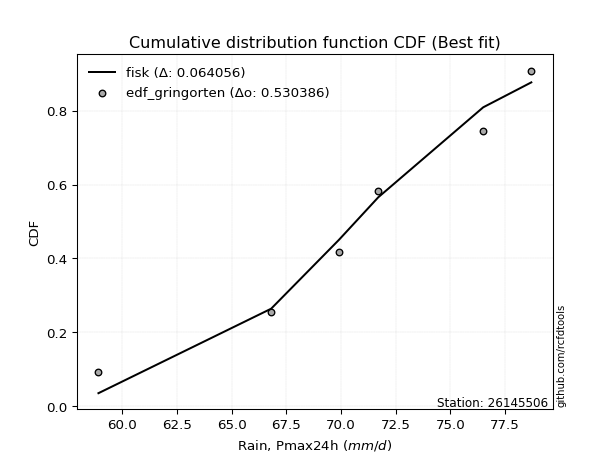</img></img>

</div>


### 9. EDF Filliben (1975)

The specific values of the constants (0.3175) (often denoted as $alpha$) and (0.365) are derived from a method proposed by James J. Filliben in a 1975 paper. This particular formula is the mean value of the $i$-th order statistic of the normal distribution and is considered a robust and effective plotting position formula for the normal probability plot correlation coefficient test for normality.

<div align="center">


$P=(m-0.3175)/(n+0.365)$


</div>


**9.1. Empirical values**

<div align="center">

|                | 0                   | 1                   | 2                  | 3                  | 4                  | 5                  |
|:---------------|:--------------------|:--------------------|:-------------------|:-------------------|:-------------------|:-------------------|
| date           | 2020                | 2023                | 2022               | 2021               | 2018               | 2019               |
| x              | 58.9                | 66.8                | 69.9               | 71.7               | 76.5               | 78.7               |
| m              | 1                   | 2                   | 3                  | 4                  | 5                  | 6                  |
| empirical_dist | edf_filliben        | edf_filliben        | edf_filliben       | edf_filliben       | edf_filliben       | edf_filliben       |
| empirical      | 0.10722702278083267 | 0.26433621366849963 | 0.4214454045561665 | 0.5785545954438335 | 0.7356637863315004 | 0.8927729772191673 |
| empirical_tr   | 1.1201055873295205  | 1.3593166043780034  | 1.7284453496266123 | 2.3727865796831313 | 3.783060921248143  | 9.326007326007321  |

</div>


**9.2. Kolmogorov-Smirnov fit test (sorted by Δ)**


<div align="center">

|                | 0                   | 1                   | 2                   | 3                   | 4                   | 5                   | 6                   | 7                   | 8                   | 9                   | 10                  | 11                  | 12                  | 13                 | 14                  | 15                  | 16                  | 17                  | 18                  | 19                | 20                  | 21                  | 22                  | 23                  | 24                  | 25                  | 26                  | 27                  | 28                  | 29                  | 30                  | 31                  | 32                  | 33                  | 34                  | 35                  | 36                  | 37                 | 38                 | 39                  | 40                  | 41                  | 42                  | 43                  | 44                  | 45                 | 46                  | 47                  | 48                 | 49                    | 50                  | 51                 | 52                  | 53                  | 54                  | 55                 | 56                 | 57                  | 58                 | 59                 | 60                 | 61                  | 62                  | 63                  | 64                  | 65                  | 66                 | 67                  | 68                  | 69                  | 70                  | 71                  | 72                  | 73                  | 74                  | 75                  | 76                 | 77                  | 78                 | 79                 | 80                  | 81                | 82                 | 83                 | 84                | 85                 | 86                 | 87                 |
|:---------------|:--------------------|:--------------------|:--------------------|:--------------------|:--------------------|:--------------------|:--------------------|:--------------------|:--------------------|:--------------------|:--------------------|:--------------------|:--------------------|:-------------------|:--------------------|:--------------------|:--------------------|:--------------------|:--------------------|:------------------|:--------------------|:--------------------|:--------------------|:--------------------|:--------------------|:--------------------|:--------------------|:--------------------|:--------------------|:--------------------|:--------------------|:--------------------|:--------------------|:--------------------|:--------------------|:--------------------|:--------------------|:-------------------|:-------------------|:--------------------|:--------------------|:--------------------|:--------------------|:--------------------|:--------------------|:-------------------|:--------------------|:--------------------|:-------------------|:----------------------|:--------------------|:-------------------|:--------------------|:--------------------|:--------------------|:-------------------|:-------------------|:--------------------|:-------------------|:-------------------|:-------------------|:--------------------|:--------------------|:--------------------|:--------------------|:--------------------|:-------------------|:--------------------|:--------------------|:--------------------|:--------------------|:--------------------|:--------------------|:--------------------|:--------------------|:--------------------|:-------------------|:--------------------|:-------------------|:-------------------|:--------------------|:------------------|:-------------------|:-------------------|:------------------|:-------------------|:-------------------|:-------------------|
| station        | 26145506            | 26145506            | 26145506            | 26145506            | 26145506            | 26145506            | 26145506            | 26145506            | 26145506            | 26145506            | 26145506            | 26145506            | 26145506            | 26145506           | 26145506            | 26145506            | 26145506            | 26145506            | 26145506            | 26145506          | 26145506            | 26145506            | 26145506            | 26145506            | 26145506            | 26145506            | 26145506            | 26145506            | 26145506            | 26145506            | 26145506            | 26145506            | 26145506            | 26145506            | 26145506            | 26145506            | 26145506            | 26145506           | 26145506           | 26145506            | 26145506            | 26145506            | 26145506            | 26145506            | 26145506            | 26145506           | 26145506            | 26145506            | 26145506           | 26145506              | 26145506            | 26145506           | 26145506            | 26145506            | 26145506            | 26145506           | 26145506           | 26145506            | 26145506           | 26145506           | 26145506           | 26145506            | 26145506            | 26145506            | 26145506            | 26145506            | 26145506           | 26145506            | 26145506            | 26145506            | 26145506            | 26145506            | 26145506            | 26145506            | 26145506            | 26145506            | 26145506           | 26145506            | 26145506           | 26145506           | 26145506            | 26145506          | 26145506           | 26145506           | 26145506          | 26145506           | 26145506           | 26145506           |
| empirical_dist | edf_filliben        | edf_filliben        | edf_filliben        | edf_filliben        | edf_filliben        | edf_filliben        | edf_filliben        | edf_filliben        | edf_filliben        | edf_filliben        | edf_filliben        | edf_filliben        | edf_filliben        | edf_filliben       | edf_filliben        | edf_filliben        | edf_filliben        | edf_filliben        | edf_filliben        | edf_filliben      | edf_filliben        | edf_filliben        | edf_filliben        | edf_filliben        | edf_filliben        | edf_filliben        | edf_filliben        | edf_filliben        | edf_filliben        | edf_filliben        | edf_filliben        | edf_filliben        | edf_filliben        | edf_filliben        | edf_filliben        | edf_filliben        | edf_filliben        | edf_filliben       | edf_filliben       | edf_filliben        | edf_filliben        | edf_filliben        | edf_filliben        | edf_filliben        | edf_filliben        | edf_filliben       | edf_filliben        | edf_filliben        | edf_filliben       | edf_filliben          | edf_filliben        | edf_filliben       | edf_filliben        | edf_filliben        | edf_filliben        | edf_filliben       | edf_filliben       | edf_filliben        | edf_filliben       | edf_filliben       | edf_filliben       | edf_filliben        | edf_filliben        | edf_filliben        | edf_filliben        | edf_filliben        | edf_filliben       | edf_filliben        | edf_filliben        | edf_filliben        | edf_filliben        | edf_filliben        | edf_filliben        | edf_filliben        | edf_filliben        | edf_filliben        | edf_filliben       | edf_filliben        | edf_filliben       | edf_filliben       | edf_filliben        | edf_filliben      | edf_filliben       | edf_filliben       | edf_filliben      | edf_filliben       | edf_filliben       | edf_filliben       |
| p_dist         | fisk                | logfisk             | logalpha            | logbetaprime        | loggamma            | loggamma            | logerlang           | logrice             | alpha               | logf                | loginvgamma         | erlang              | lognakagami         | logncf             | lognorm             | lognorm             | logexponnorm        | logcrystalball      | logt                | logfatiguelife    | gamma               | rice                | invgauss            | betaprime           | invgamma            | f                   | pearson3            | t                   | exponnorm           | norm                | crystalball         | nct                 | johnsonsu           | maxwell             | invweibull          | loginvgauss         | weibull_min         | logweibull_min     | lognct             | logmaxwell          | logjohnsonsu        | loggumbel_l         | rayleigh            | loglogistic         | loggompertz         | gumbel_l           | logistic            | lograyleigh         | laplace_asymmetric | loglaplace_asymmetric | gumbel_r            | loghypsecant       | loginvweibull       | hypsecant           | halfnorm            | kstwobign          | loglaplace         | laplace             | logloggamma        | logmielke          | logpearson3        | mielke              | loggumbel_r         | moyal               | logkstwobign        | loghalfnorm         | halflogistic       | logmoyal            | loghalflogistic     | loggenexpon         | wald                | gibrat              | genexpon            | expon               | logwald             | logexpon            | loggibrat          | logtruncnorm        | nakagami           | loglognorm         | logchi2             | gompertz          | fatiguelife        | ncf                | truncnorm         | chi2               | loggenlogistic     | genlogistic        |
| delta          | 0.07349015599625974 | 0.07349250587535006 | 0.07719436134757862 | 0.07850391768250181 | 0.08150112557479994 | 0.08150112557479994 | 0.08166152604230936 | 0.08274687537331382 | 0.08340447260348571 | 0.08350066338134943 | 0.08369576260983391 | 0.08459177167098808 | 0.08491376860391708 | 0.0850923144788388 | 0.08518593100228644 | 0.08518593100228644 | 0.08518616625547448 | 0.08518619043584674 | 0.08518675240390594 | 0.086773564603145 | 0.08721218960625221 | 0.08725211657072207 | 0.08736858224420163 | 0.08808493027753628 | 0.08899783746345713 | 0.08942543322409391 | 0.08959372432196722 | 0.08977178147081044 | 0.08979285811707716 | 0.08979288481865377 | 0.08979289404649371 | 0.08981287085080925 | 0.09014962523635023 | 0.09076530604341425 | 0.09358158207631173 | 0.09374360837591533 | 0.09439936592203269 | 0.0954909723159103 | 0.0956283225223542 | 0.09971254509109517 | 0.10025464359882452 | 0.10293171314736205 | 0.10300669029801433 | 0.10540084657329718 | 0.10722702222354107 | 0.1095713180552097 | 0.10965838963038632 | 0.11098038121508902 | 0.1139394563268844 | 0.11501966837094624   | 0.11555897365773071 | 0.1166544620182326 | 0.11683000637203278 | 0.12057764091102896 | 0.12526689108807065 | 0.1261684848635779 | 0.1279487287791835 | 0.13133054237456954 | 0.1322637121095726 | 0.1345397880776127 | 0.1348260873301126 | 0.13578987049453617 | 0.13611243909715953 | 0.14129873336804144 | 0.14269392686575572 | 0.14271480993364416 | 0.1479571074379069 | 0.16199554452190046 | 0.16683924126040472 | 0.19260299087737914 | 0.21294227268444565 | 0.23025234433143738 | 0.23179603497069273 | 0.23205844641079526 | 0.23402632637845255 | 0.25020502092469604 | 0.2552962890270921 | 0.30053583531699407 | 0.3791930265914112 | 0.3945606733203945 | 0.47644262643723995 | 0.551087949993823 | 0.5513630248844006 | 0.5849764474726961 | 0.714617863345312 | 0.7296209160903318 | 0.7356637863315004 | 0.7356637863315004 |
| deltao         | 0.530385761606      | 0.530385761606      | 0.530385761606      | 0.530385761606      | 0.530385761606      | 0.530385761606      | 0.530385761606      | 0.530385761606      | 0.530385761606      | 0.530385761606      | 0.530385761606      | 0.530385761606      | 0.530385761606      | 0.530385761606     | 0.530385761606      | 0.530385761606      | 0.530385761606      | 0.530385761606      | 0.530385761606      | 0.530385761606    | 0.530385761606      | 0.530385761606      | 0.530385761606      | 0.530385761606      | 0.530385761606      | 0.530385761606      | 0.530385761606      | 0.530385761606      | 0.530385761606      | 0.530385761606      | 0.530385761606      | 0.530385761606      | 0.530385761606      | 0.530385761606      | 0.530385761606      | 0.530385761606      | 0.530385761606      | 0.530385761606     | 0.530385761606     | 0.530385761606      | 0.530385761606      | 0.530385761606      | 0.530385761606      | 0.530385761606      | 0.530385761606      | 0.530385761606     | 0.530385761606      | 0.530385761606      | 0.530385761606     | 0.530385761606        | 0.530385761606      | 0.530385761606     | 0.530385761606      | 0.530385761606      | 0.530385761606      | 0.530385761606     | 0.530385761606     | 0.530385761606      | 0.530385761606     | 0.530385761606     | 0.530385761606     | 0.530385761606      | 0.530385761606      | 0.530385761606      | 0.530385761606      | 0.530385761606      | 0.530385761606     | 0.530385761606      | 0.530385761606      | 0.530385761606      | 0.530385761606      | 0.530385761606      | 0.530385761606      | 0.530385761606      | 0.530385761606      | 0.530385761606      | 0.530385761606     | 0.530385761606      | 0.530385761606     | 0.530385761606     | 0.530385761606      | 0.530385761606    | 0.530385761606     | 0.530385761606     | 0.530385761606    | 0.530385761606     | 0.530385761606     | 0.530385761606     |
| eval           | Δo > Δ              | Δo > Δ              | Δo > Δ              | Δo > Δ              | Δo > Δ              | Δo > Δ              | Δo > Δ              | Δo > Δ              | Δo > Δ              | Δo > Δ              | Δo > Δ              | Δo > Δ              | Δo > Δ              | Δo > Δ             | Δo > Δ              | Δo > Δ              | Δo > Δ              | Δo > Δ              | Δo > Δ              | Δo > Δ            | Δo > Δ              | Δo > Δ              | Δo > Δ              | Δo > Δ              | Δo > Δ              | Δo > Δ              | Δo > Δ              | Δo > Δ              | Δo > Δ              | Δo > Δ              | Δo > Δ              | Δo > Δ              | Δo > Δ              | Δo > Δ              | Δo > Δ              | Δo > Δ              | Δo > Δ              | Δo > Δ             | Δo > Δ             | Δo > Δ              | Δo > Δ              | Δo > Δ              | Δo > Δ              | Δo > Δ              | Δo > Δ              | Δo > Δ             | Δo > Δ              | Δo > Δ              | Δo > Δ             | Δo > Δ                | Δo > Δ              | Δo > Δ             | Δo > Δ              | Δo > Δ              | Δo > Δ              | Δo > Δ             | Δo > Δ             | Δo > Δ              | Δo > Δ             | Δo > Δ             | Δo > Δ             | Δo > Δ              | Δo > Δ              | Δo > Δ              | Δo > Δ              | Δo > Δ              | Δo > Δ             | Δo > Δ              | Δo > Δ              | Δo > Δ              | Δo > Δ              | Δo > Δ              | Δo > Δ              | Δo > Δ              | Δo > Δ              | Δo > Δ              | Δo > Δ             | Δo > Δ              | Δo > Δ             | Δo > Δ             | Δo > Δ              | Δo <= Δ           | Δo <= Δ            | Δo <= Δ            | Δo <= Δ           | Δo <= Δ            | Δo <= Δ            | Δo <= Δ            |
| fit            | 1                   | 1                   | 1                   | 1                   | 1                   | 1                   | 1                   | 1                   | 1                   | 1                   | 1                   | 1                   | 1                   | 1                  | 1                   | 1                   | 1                   | 1                   | 1                   | 1                 | 1                   | 1                   | 1                   | 1                   | 1                   | 1                   | 1                   | 1                   | 1                   | 1                   | 1                   | 1                   | 1                   | 1                   | 1                   | 1                   | 1                   | 1                  | 1                  | 1                   | 1                   | 1                   | 1                   | 1                   | 1                   | 1                  | 1                   | 1                   | 1                  | 1                     | 1                   | 1                  | 1                   | 1                   | 1                   | 1                  | 1                  | 1                   | 1                  | 1                  | 1                  | 1                   | 1                   | 1                   | 1                   | 1                   | 1                  | 1                   | 1                   | 1                   | 1                   | 1                   | 1                   | 1                   | 1                   | 1                   | 1                  | 1                   | 1                  | 1                  | 1                   | 0                 | 0                  | 0                  | 0                 | 0                  | 0                  | 0                  |
| n              | 6                   | 6                   | 6                   | 6                   | 6                   | 6                   | 6                   | 6                   | 6                   | 6                   | 6                   | 6                   | 6                   | 6                  | 6                   | 6                   | 6                   | 6                   | 6                   | 6                 | 6                   | 6                   | 6                   | 6                   | 6                   | 6                   | 6                   | 6                   | 6                   | 6                   | 6                   | 6                   | 6                   | 6                   | 6                   | 6                   | 6                   | 6                  | 6                  | 6                   | 6                   | 6                   | 6                   | 6                   | 6                   | 6                  | 6                   | 6                   | 6                  | 6                     | 6                   | 6                  | 6                   | 6                   | 6                   | 6                  | 6                  | 6                   | 6                  | 6                  | 6                  | 6                   | 6                   | 6                   | 6                   | 6                   | 6                  | 6                   | 6                   | 6                   | 6                   | 6                   | 6                   | 6                   | 6                   | 6                   | 6                  | 6                   | 6                  | 6                  | 6                   | 6                 | 6                  | 6                  | 6                 | 6                  | 6                  | 6                  |
| best_fit       | 1                   | 0                   | 0                   | 0                   | 0                   | 0                   | 0                   | 0                   | 0                   | 0                   | 0                   | 0                   | 0                   | 0                  | 0                   | 0                   | 0                   | 0                   | 0                   | 0                 | 0                   | 0                   | 0                   | 0                   | 0                   | 0                   | 0                   | 0                   | 0                   | 0                   | 0                   | 0                   | 0                   | 0                   | 0                   | 0                   | 0                   | 0                  | 0                  | 0                   | 0                   | 0                   | 0                   | 0                   | 0                   | 0                  | 0                   | 0                   | 0                  | 0                     | 0                   | 0                  | 0                   | 0                   | 0                   | 0                  | 0                  | 0                   | 0                  | 0                  | 0                  | 0                   | 0                   | 0                   | 0                   | 0                   | 0                  | 0                   | 0                   | 0                   | 0                   | 0                   | 0                   | 0                   | 0                   | 0                   | 0                  | 0                   | 0                  | 0                  | 0                   | 0                 | 0                  | 0                  | 0                 | 0                  | 0                  | 0                  |
| best_fit_sort  | 1                   | 2                   | 3                   | 4                   | 5                   | 6                   | 7                   | 8                   | 9                   | 10                  | 11                  | 12                  | 13                  | 14                 | 15                  | 16                  | 17                  | 18                  | 19                  | 20                | 21                  | 22                  | 23                  | 24                  | 25                  | 26                  | 27                  | 28                  | 29                  | 30                  | 31                  | 32                  | 33                  | 34                  | 35                  | 36                  | 37                  | 38                 | 39                 | 40                  | 41                  | 42                  | 43                  | 44                  | 45                  | 46                 | 47                  | 48                  | 49                 | 50                    | 51                  | 52                 | 53                  | 54                  | 55                  | 56                 | 57                 | 58                  | 59                 | 60                 | 61                 | 62                  | 63                  | 64                  | 65                  | 66                  | 67                 | 68                  | 69                  | 70                  | 71                  | 72                  | 73                  | 74                  | 75                  | 76                  | 77                 | 78                  | 79                 | 80                 | 81                  | 82                | 83                 | 84                 | 85                | 86                 | 87                 | 88                 |

</div>


**9.3. Best fit**

<div align="center">

|   id |   station | empirical_dist   | p_dist   |     delta |   deltao | eval   |   fit |   n |   best_fit |   best_fit_sort |
|-----:|----------:|:-----------------|:---------|----------:|---------:|:-------|------:|----:|-----------:|----------------:|
|    0 |  26145506 | edf_filliben     | fisk     | 0.0734902 | 0.530386 | Δo > Δ |     1 |   6 |          1 |               1 |

</div>


<div align="center">

</img>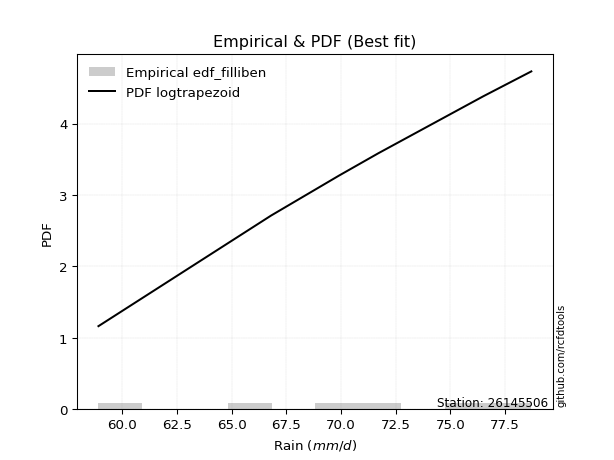</img>

</div>


### 10. EDF Jenkinson (1977)

The Jenkinson formula in hydrology is an empirical plotting position formula used to estimate the non-exceedance probability _(P)_ or return period _(T)_ of a given ordered observation within a sample. It is a widely used method in the frequency analysis of extreme events such as floods and rainfall, as it provides a distribution-free way to plot data. _a≈0.31_ and _b≈0.38_ are constants derived to approximate the median of the probability distribution for the given rank.

<div align="center">


$P=(m-a)/(n+b)$


</div>


**10.1. Empirical values**

<div align="center">

|                | 0                   | 1                   | 2                  | 3                  | 4                  | 5                  |
|:---------------|:--------------------|:--------------------|:-------------------|:-------------------|:-------------------|:-------------------|
| date           | 2020                | 2023                | 2022               | 2021               | 2018               | 2019               |
| x              | 58.9                | 66.8                | 69.9               | 71.7               | 76.5               | 78.7               |
| m              | 1                   | 2                   | 3                  | 4                  | 5                  | 6                  |
| empirical_dist | edf_jenkinson       | edf_jenkinson       | edf_jenkinson      | edf_jenkinson      | edf_jenkinson      | edf_jenkinson      |
| empirical      | 0.10815047021943573 | 0.26489028213166144 | 0.4216300940438871 | 0.5783699059561128 | 0.7351097178683387 | 0.8918495297805643 |
| empirical_tr   | 1.1212653778558874  | 1.3603411513859276  | 1.7289972899728996 | 2.3717472118959106 | 3.7751479289940844 | 9.246376811594207  |

</div>


**10.2. Kolmogorov-Smirnov fit test (sorted by Δ)**


<div align="center">

|                | 0                   | 1                  | 2                   | 3                   | 4                   | 5                   | 6                   | 7                   | 8                   | 9                   | 10                  | 11                  | 12                  | 13                  | 14                  | 15                  | 16                  | 17                  | 18                  | 19                  | 20                  | 21                  | 22                  | 23                  | 24                  | 25                  | 26                  | 27                  | 28                  | 29                 | 30                  | 31                  | 32                | 33                  | 34                  | 35                  | 36                  | 37                 | 38                  | 39                  | 40                  | 41                 | 42                 | 43                  | 44                  | 45                  | 46                  | 47                  | 48                  | 49                  | 50                    | 51                  | 52                  | 53                  | 54                  | 55                 | 56                  | 57                 | 58                  | 59                  | 60                  | 61                 | 62                  | 63                  | 64                 | 65                  | 66                 | 67                  | 68                  | 69                  | 70                  | 71                  | 72                  | 73                  | 74                  | 75                  | 76                 | 77                  | 78                 | 79                 | 80                | 81                 | 82                 | 83                | 84                 | 85                 | 86                 | 87                 |
|:---------------|:--------------------|:-------------------|:--------------------|:--------------------|:--------------------|:--------------------|:--------------------|:--------------------|:--------------------|:--------------------|:--------------------|:--------------------|:--------------------|:--------------------|:--------------------|:--------------------|:--------------------|:--------------------|:--------------------|:--------------------|:--------------------|:--------------------|:--------------------|:--------------------|:--------------------|:--------------------|:--------------------|:--------------------|:--------------------|:-------------------|:--------------------|:--------------------|:------------------|:--------------------|:--------------------|:--------------------|:--------------------|:-------------------|:--------------------|:--------------------|:--------------------|:-------------------|:-------------------|:--------------------|:--------------------|:--------------------|:--------------------|:--------------------|:--------------------|:--------------------|:----------------------|:--------------------|:--------------------|:--------------------|:--------------------|:-------------------|:--------------------|:-------------------|:--------------------|:--------------------|:--------------------|:-------------------|:--------------------|:--------------------|:-------------------|:--------------------|:-------------------|:--------------------|:--------------------|:--------------------|:--------------------|:--------------------|:--------------------|:--------------------|:--------------------|:--------------------|:-------------------|:--------------------|:-------------------|:-------------------|:------------------|:-------------------|:-------------------|:------------------|:-------------------|:-------------------|:-------------------|:-------------------|
| station        | 26145506            | 26145506           | 26145506            | 26145506            | 26145506            | 26145506            | 26145506            | 26145506            | 26145506            | 26145506            | 26145506            | 26145506            | 26145506            | 26145506            | 26145506            | 26145506            | 26145506            | 26145506            | 26145506            | 26145506            | 26145506            | 26145506            | 26145506            | 26145506            | 26145506            | 26145506            | 26145506            | 26145506            | 26145506            | 26145506           | 26145506            | 26145506            | 26145506          | 26145506            | 26145506            | 26145506            | 26145506            | 26145506           | 26145506            | 26145506            | 26145506            | 26145506           | 26145506           | 26145506            | 26145506            | 26145506            | 26145506            | 26145506            | 26145506            | 26145506            | 26145506              | 26145506            | 26145506            | 26145506            | 26145506            | 26145506           | 26145506            | 26145506           | 26145506            | 26145506            | 26145506            | 26145506           | 26145506            | 26145506            | 26145506           | 26145506            | 26145506           | 26145506            | 26145506            | 26145506            | 26145506            | 26145506            | 26145506            | 26145506            | 26145506            | 26145506            | 26145506           | 26145506            | 26145506           | 26145506           | 26145506          | 26145506           | 26145506           | 26145506          | 26145506           | 26145506           | 26145506           | 26145506           |
| empirical_dist | edf_jenkinson       | edf_jenkinson      | edf_jenkinson       | edf_jenkinson       | edf_jenkinson       | edf_jenkinson       | edf_jenkinson       | edf_jenkinson       | edf_jenkinson       | edf_jenkinson       | edf_jenkinson       | edf_jenkinson       | edf_jenkinson       | edf_jenkinson       | edf_jenkinson       | edf_jenkinson       | edf_jenkinson       | edf_jenkinson       | edf_jenkinson       | edf_jenkinson       | edf_jenkinson       | edf_jenkinson       | edf_jenkinson       | edf_jenkinson       | edf_jenkinson       | edf_jenkinson       | edf_jenkinson       | edf_jenkinson       | edf_jenkinson       | edf_jenkinson      | edf_jenkinson       | edf_jenkinson       | edf_jenkinson     | edf_jenkinson       | edf_jenkinson       | edf_jenkinson       | edf_jenkinson       | edf_jenkinson      | edf_jenkinson       | edf_jenkinson       | edf_jenkinson       | edf_jenkinson      | edf_jenkinson      | edf_jenkinson       | edf_jenkinson       | edf_jenkinson       | edf_jenkinson       | edf_jenkinson       | edf_jenkinson       | edf_jenkinson       | edf_jenkinson         | edf_jenkinson       | edf_jenkinson       | edf_jenkinson       | edf_jenkinson       | edf_jenkinson      | edf_jenkinson       | edf_jenkinson      | edf_jenkinson       | edf_jenkinson       | edf_jenkinson       | edf_jenkinson      | edf_jenkinson       | edf_jenkinson       | edf_jenkinson      | edf_jenkinson       | edf_jenkinson      | edf_jenkinson       | edf_jenkinson       | edf_jenkinson       | edf_jenkinson       | edf_jenkinson       | edf_jenkinson       | edf_jenkinson       | edf_jenkinson       | edf_jenkinson       | edf_jenkinson      | edf_jenkinson       | edf_jenkinson      | edf_jenkinson      | edf_jenkinson     | edf_jenkinson      | edf_jenkinson      | edf_jenkinson     | edf_jenkinson      | edf_jenkinson      | edf_jenkinson      | edf_jenkinson      |
| p_dist         | fisk                | logfisk            | logalpha            | logbetaprime        | loggamma            | loggamma            | logerlang           | logrice             | alpha               | logf                | loginvgamma         | erlang              | lognakagami         | logncf              | lognorm             | lognorm             | logexponnorm        | logcrystalball      | logt                | invgauss            | logfatiguelife      | gamma               | rice                | betaprime           | invgamma            | johnsonsu           | f                   | pearson3            | t                   | exponnorm          | norm                | crystalball         | nct               | maxwell             | invweibull          | loginvgauss         | weibull_min         | lognct             | logweibull_min      | logmaxwell          | logjohnsonsu        | loggumbel_l        | rayleigh           | loglogistic         | loggompertz         | gumbel_l            | logistic            | lograyleigh         | laplace_asymmetric  | gumbel_r            | loglaplace_asymmetric | loginvweibull       | loghypsecant        | hypsecant           | halfnorm            | kstwobign          | loglaplace          | laplace            | logloggamma         | logmielke           | logpearson3         | mielke             | loggumbel_r         | moyal               | logkstwobign       | loghalfnorm         | halflogistic       | logmoyal            | loghalflogistic     | loggenexpon         | wald                | gibrat              | genexpon            | expon               | logwald             | logexpon            | loggibrat          | logtruncnorm        | nakagami           | loglognorm         | logchi2           | fatiguelife        | gompertz           | ncf               | truncnorm          | chi2               | loggenlogistic     | genlogistic        |
| delta          | 0.07404422445942149 | 0.0740465743385118 | 0.07774842981074037 | 0.07942736512110488 | 0.08205519403796169 | 0.08205519403796169 | 0.08221559450547111 | 0.08330094383647557 | 0.08395854106664746 | 0.08405473184451118 | 0.08424983107299566 | 0.08514584013414983 | 0.08546783706707883 | 0.08564638294200055 | 0.08573999946544819 | 0.08573999946544819 | 0.08574023471863623 | 0.08574025889900849 | 0.08574082086706769 | 0.08718389275648103 | 0.08732763306630675 | 0.08776625806941396 | 0.08780618503388382 | 0.08863899874069803 | 0.08955190592661888 | 0.08996493574862957 | 0.08997950168725566 | 0.09014779278512897 | 0.09032584993397219 | 0.0903469265802389 | 0.09034695328181552 | 0.09034696250965546 | 0.090366939313971 | 0.09168875348201731 | 0.09339689258859113 | 0.09355891888819473 | 0.09495343438519444 | 0.0950742540591924 | 0.09604504077907206 | 0.09952785560337457 | 0.10006995411110386 | 0.1034857816105238 | 0.1039301377366174 | 0.10595491503645893 | 0.10815046966214413 | 0.11012538651837145 | 0.11021245809354807 | 0.11079569172736842 | 0.11449352479004615 | 0.11537428417001011 | 0.11557373683410799   | 0.11664531688431218 | 0.11720853048139435 | 0.12113170937419071 | 0.12508220160035005 | 0.1259837953758573 | 0.12850279724234526 | 0.1318846108377313 | 0.13207902262185195 | 0.13435509858989203 | 0.13464139784239199 | 0.1356051810068155 | 0.13592774960943893 | 0.14111404388032084 | 0.1421398584025939 | 0.14253012044592356 | 0.1477724179501863 | 0.16181085503417986 | 0.16665455177268412 | 0.19204892241421734 | 0.21275758319672505 | 0.23006765484371677 | 0.23124196650753093 | 0.23150437794763346 | 0.23384163689073195 | 0.24965095246153424 | 0.2551115995393715 | 0.29998176685383227 | 0.3790083371036906 | 0.3940066048572327 | 0.475519178998637 | 0.5508089564212388 | 0.5509032605061024 | 0.584053000034093 | 0.7140637948821501 | 0.7290668476271699 | 0.7351097178683387 | 0.7351097178683387 |
| deltao         | 0.530385761606      | 0.530385761606     | 0.530385761606      | 0.530385761606      | 0.530385761606      | 0.530385761606      | 0.530385761606      | 0.530385761606      | 0.530385761606      | 0.530385761606      | 0.530385761606      | 0.530385761606      | 0.530385761606      | 0.530385761606      | 0.530385761606      | 0.530385761606      | 0.530385761606      | 0.530385761606      | 0.530385761606      | 0.530385761606      | 0.530385761606      | 0.530385761606      | 0.530385761606      | 0.530385761606      | 0.530385761606      | 0.530385761606      | 0.530385761606      | 0.530385761606      | 0.530385761606      | 0.530385761606     | 0.530385761606      | 0.530385761606      | 0.530385761606    | 0.530385761606      | 0.530385761606      | 0.530385761606      | 0.530385761606      | 0.530385761606     | 0.530385761606      | 0.530385761606      | 0.530385761606      | 0.530385761606     | 0.530385761606     | 0.530385761606      | 0.530385761606      | 0.530385761606      | 0.530385761606      | 0.530385761606      | 0.530385761606      | 0.530385761606      | 0.530385761606        | 0.530385761606      | 0.530385761606      | 0.530385761606      | 0.530385761606      | 0.530385761606     | 0.530385761606      | 0.530385761606     | 0.530385761606      | 0.530385761606      | 0.530385761606      | 0.530385761606     | 0.530385761606      | 0.530385761606      | 0.530385761606     | 0.530385761606      | 0.530385761606     | 0.530385761606      | 0.530385761606      | 0.530385761606      | 0.530385761606      | 0.530385761606      | 0.530385761606      | 0.530385761606      | 0.530385761606      | 0.530385761606      | 0.530385761606     | 0.530385761606      | 0.530385761606     | 0.530385761606     | 0.530385761606    | 0.530385761606     | 0.530385761606     | 0.530385761606    | 0.530385761606     | 0.530385761606     | 0.530385761606     | 0.530385761606     |
| eval           | Δo > Δ              | Δo > Δ             | Δo > Δ              | Δo > Δ              | Δo > Δ              | Δo > Δ              | Δo > Δ              | Δo > Δ              | Δo > Δ              | Δo > Δ              | Δo > Δ              | Δo > Δ              | Δo > Δ              | Δo > Δ              | Δo > Δ              | Δo > Δ              | Δo > Δ              | Δo > Δ              | Δo > Δ              | Δo > Δ              | Δo > Δ              | Δo > Δ              | Δo > Δ              | Δo > Δ              | Δo > Δ              | Δo > Δ              | Δo > Δ              | Δo > Δ              | Δo > Δ              | Δo > Δ             | Δo > Δ              | Δo > Δ              | Δo > Δ            | Δo > Δ              | Δo > Δ              | Δo > Δ              | Δo > Δ              | Δo > Δ             | Δo > Δ              | Δo > Δ              | Δo > Δ              | Δo > Δ             | Δo > Δ             | Δo > Δ              | Δo > Δ              | Δo > Δ              | Δo > Δ              | Δo > Δ              | Δo > Δ              | Δo > Δ              | Δo > Δ                | Δo > Δ              | Δo > Δ              | Δo > Δ              | Δo > Δ              | Δo > Δ             | Δo > Δ              | Δo > Δ             | Δo > Δ              | Δo > Δ              | Δo > Δ              | Δo > Δ             | Δo > Δ              | Δo > Δ              | Δo > Δ             | Δo > Δ              | Δo > Δ             | Δo > Δ              | Δo > Δ              | Δo > Δ              | Δo > Δ              | Δo > Δ              | Δo > Δ              | Δo > Δ              | Δo > Δ              | Δo > Δ              | Δo > Δ             | Δo > Δ              | Δo > Δ             | Δo > Δ             | Δo > Δ            | Δo <= Δ            | Δo <= Δ            | Δo <= Δ           | Δo <= Δ            | Δo <= Δ            | Δo <= Δ            | Δo <= Δ            |
| fit            | 1                   | 1                  | 1                   | 1                   | 1                   | 1                   | 1                   | 1                   | 1                   | 1                   | 1                   | 1                   | 1                   | 1                   | 1                   | 1                   | 1                   | 1                   | 1                   | 1                   | 1                   | 1                   | 1                   | 1                   | 1                   | 1                   | 1                   | 1                   | 1                   | 1                  | 1                   | 1                   | 1                 | 1                   | 1                   | 1                   | 1                   | 1                  | 1                   | 1                   | 1                   | 1                  | 1                  | 1                   | 1                   | 1                   | 1                   | 1                   | 1                   | 1                   | 1                     | 1                   | 1                   | 1                   | 1                   | 1                  | 1                   | 1                  | 1                   | 1                   | 1                   | 1                  | 1                   | 1                   | 1                  | 1                   | 1                  | 1                   | 1                   | 1                   | 1                   | 1                   | 1                   | 1                   | 1                   | 1                   | 1                  | 1                   | 1                  | 1                  | 1                 | 0                  | 0                  | 0                 | 0                  | 0                  | 0                  | 0                  |
| n              | 6                   | 6                  | 6                   | 6                   | 6                   | 6                   | 6                   | 6                   | 6                   | 6                   | 6                   | 6                   | 6                   | 6                   | 6                   | 6                   | 6                   | 6                   | 6                   | 6                   | 6                   | 6                   | 6                   | 6                   | 6                   | 6                   | 6                   | 6                   | 6                   | 6                  | 6                   | 6                   | 6                 | 6                   | 6                   | 6                   | 6                   | 6                  | 6                   | 6                   | 6                   | 6                  | 6                  | 6                   | 6                   | 6                   | 6                   | 6                   | 6                   | 6                   | 6                     | 6                   | 6                   | 6                   | 6                   | 6                  | 6                   | 6                  | 6                   | 6                   | 6                   | 6                  | 6                   | 6                   | 6                  | 6                   | 6                  | 6                   | 6                   | 6                   | 6                   | 6                   | 6                   | 6                   | 6                   | 6                   | 6                  | 6                   | 6                  | 6                  | 6                 | 6                  | 6                  | 6                 | 6                  | 6                  | 6                  | 6                  |
| best_fit       | 1                   | 0                  | 0                   | 0                   | 0                   | 0                   | 0                   | 0                   | 0                   | 0                   | 0                   | 0                   | 0                   | 0                   | 0                   | 0                   | 0                   | 0                   | 0                   | 0                   | 0                   | 0                   | 0                   | 0                   | 0                   | 0                   | 0                   | 0                   | 0                   | 0                  | 0                   | 0                   | 0                 | 0                   | 0                   | 0                   | 0                   | 0                  | 0                   | 0                   | 0                   | 0                  | 0                  | 0                   | 0                   | 0                   | 0                   | 0                   | 0                   | 0                   | 0                     | 0                   | 0                   | 0                   | 0                   | 0                  | 0                   | 0                  | 0                   | 0                   | 0                   | 0                  | 0                   | 0                   | 0                  | 0                   | 0                  | 0                   | 0                   | 0                   | 0                   | 0                   | 0                   | 0                   | 0                   | 0                   | 0                  | 0                   | 0                  | 0                  | 0                 | 0                  | 0                  | 0                 | 0                  | 0                  | 0                  | 0                  |
| best_fit_sort  | 1                   | 2                  | 3                   | 4                   | 5                   | 6                   | 7                   | 8                   | 9                   | 10                  | 11                  | 12                  | 13                  | 14                  | 15                  | 16                  | 17                  | 18                  | 19                  | 20                  | 21                  | 22                  | 23                  | 24                  | 25                  | 26                  | 27                  | 28                  | 29                  | 30                 | 31                  | 32                  | 33                | 34                  | 35                  | 36                  | 37                  | 38                 | 39                  | 40                  | 41                  | 42                 | 43                 | 44                  | 45                  | 46                  | 47                  | 48                  | 49                  | 50                  | 51                    | 52                  | 53                  | 54                  | 55                  | 56                 | 57                  | 58                 | 59                  | 60                  | 61                  | 62                 | 63                  | 64                  | 65                 | 66                  | 67                 | 68                  | 69                  | 70                  | 71                  | 72                  | 73                  | 74                  | 75                  | 76                  | 77                 | 78                  | 79                 | 80                 | 81                | 82                 | 83                 | 84                | 85                 | 86                 | 87                 | 88                 |

</div>


**10.3. Best fit**

<div align="center">

|   id |   station | empirical_dist   | p_dist   |     delta |   deltao | eval   |   fit |   n |   best_fit |   best_fit_sort |
|-----:|----------:|:-----------------|:---------|----------:|---------:|:-------|------:|----:|-----------:|----------------:|
|    0 |  26145506 | edf_jenkinson    | fisk     | 0.0740442 | 0.530386 | Δo > Δ |     1 |   6 |          1 |               1 |

</div>


<div align="center">

</img></img>

</div>


### 11. EDF Cunnane (1978)

Cunnane´s work in statistical hydrology has focused on the performance and evaluation of different probability distributions (such as GEV, Gumbel, Lognormal) for flood frequency estimation. _b_ is a constant, typically set to 0.4.

<div align="center">


$P=(m-b)/(n+1-2b)$


</div>


**11.1. Empirical values**

<div align="center">

|                | 0                  | 1                   | 2                   | 3                  | 4                  | 5                  |
|:---------------|:-------------------|:--------------------|:--------------------|:-------------------|:-------------------|:-------------------|
| date           | 2020               | 2023                | 2022                | 2021               | 2018               | 2019               |
| x              | 58.9               | 66.8                | 69.9                | 71.7               | 76.5               | 78.7               |
| m              | 1                  | 2                   | 3                   | 4                  | 5                  | 6                  |
| empirical_dist | edf_cunnane        | edf_cunnane         | edf_cunnane         | edf_cunnane        | edf_cunnane        | edf_cunnane        |
| empirical      | 0.0967741935483871 | 0.25806451612903225 | 0.41935483870967744 | 0.5806451612903226 | 0.7419354838709676 | 0.9032258064516128 |
| empirical_tr   | 1.1071428571428572 | 1.3478260869565217  | 1.7222222222222225  | 2.384615384615385  | 3.8749999999999982 | 10.333333333333318 |

</div>


**11.2. Kolmogorov-Smirnov fit test (sorted by Δ)**


<div align="center">

|                | 0                   | 1                   | 2                   | 3                  | 4                  | 5                   | 6                  | 7                   | 8                   | 9                   | 10                  | 11                  | 12                  | 13                  | 14                  | 15                  | 16                  | 17                  | 18                  | 19                  | 20                | 21                  | 22                  | 23                  | 24                  | 25                 | 26              | 27                  | 28                  | 29                  | 30                 | 31                  | 32                  | 33                  | 34                  | 35                  | 36                 | 37                  | 38                  | 39                  | 40                  | 41                  | 42                  | 43                  | 44                  | 45                  | 46                  | 47                  | 48                    | 49                  | 50                  | 51                  | 52                 | 53                  | 54                 | 55                  | 56                  | 57                | 58                  | 59                  | 60                  | 61                  | 62                  | 63                  | 64                  | 65                 | 66                | 67                  | 68                  | 69                  | 70                  | 71                  | 72                  | 73                 | 74                  | 75                 | 76                 | 77                  | 78                 | 79                 | 80                  | 81                 | 82                | 83                 | 84                 | 85                 | 86                 | 87                 |
|:---------------|:--------------------|:--------------------|:--------------------|:-------------------|:-------------------|:--------------------|:-------------------|:--------------------|:--------------------|:--------------------|:--------------------|:--------------------|:--------------------|:--------------------|:--------------------|:--------------------|:--------------------|:--------------------|:--------------------|:--------------------|:------------------|:--------------------|:--------------------|:--------------------|:--------------------|:-------------------|:----------------|:--------------------|:--------------------|:--------------------|:-------------------|:--------------------|:--------------------|:--------------------|:--------------------|:--------------------|:-------------------|:--------------------|:--------------------|:--------------------|:--------------------|:--------------------|:--------------------|:--------------------|:--------------------|:--------------------|:--------------------|:--------------------|:----------------------|:--------------------|:--------------------|:--------------------|:-------------------|:--------------------|:-------------------|:--------------------|:--------------------|:------------------|:--------------------|:--------------------|:--------------------|:--------------------|:--------------------|:--------------------|:--------------------|:-------------------|:------------------|:--------------------|:--------------------|:--------------------|:--------------------|:--------------------|:--------------------|:-------------------|:--------------------|:-------------------|:-------------------|:--------------------|:-------------------|:-------------------|:--------------------|:-------------------|:------------------|:-------------------|:-------------------|:-------------------|:-------------------|:-------------------|
| station        | 26145506            | 26145506            | 26145506            | 26145506           | 26145506           | 26145506            | 26145506           | 26145506            | 26145506            | 26145506            | 26145506            | 26145506            | 26145506            | 26145506            | 26145506            | 26145506            | 26145506            | 26145506            | 26145506            | 26145506            | 26145506          | 26145506            | 26145506            | 26145506            | 26145506            | 26145506           | 26145506        | 26145506            | 26145506            | 26145506            | 26145506           | 26145506            | 26145506            | 26145506            | 26145506            | 26145506            | 26145506           | 26145506            | 26145506            | 26145506            | 26145506            | 26145506            | 26145506            | 26145506            | 26145506            | 26145506            | 26145506            | 26145506            | 26145506              | 26145506            | 26145506            | 26145506            | 26145506           | 26145506            | 26145506           | 26145506            | 26145506            | 26145506          | 26145506            | 26145506            | 26145506            | 26145506            | 26145506            | 26145506            | 26145506            | 26145506           | 26145506          | 26145506            | 26145506            | 26145506            | 26145506            | 26145506            | 26145506            | 26145506           | 26145506            | 26145506           | 26145506           | 26145506            | 26145506           | 26145506           | 26145506            | 26145506           | 26145506          | 26145506           | 26145506           | 26145506           | 26145506           | 26145506           |
| empirical_dist | edf_cunnane         | edf_cunnane         | edf_cunnane         | edf_cunnane        | edf_cunnane        | edf_cunnane         | edf_cunnane        | edf_cunnane         | edf_cunnane         | edf_cunnane         | edf_cunnane         | edf_cunnane         | edf_cunnane         | edf_cunnane         | edf_cunnane         | edf_cunnane         | edf_cunnane         | edf_cunnane         | edf_cunnane         | edf_cunnane         | edf_cunnane       | edf_cunnane         | edf_cunnane         | edf_cunnane         | edf_cunnane         | edf_cunnane        | edf_cunnane     | edf_cunnane         | edf_cunnane         | edf_cunnane         | edf_cunnane        | edf_cunnane         | edf_cunnane         | edf_cunnane         | edf_cunnane         | edf_cunnane         | edf_cunnane        | edf_cunnane         | edf_cunnane         | edf_cunnane         | edf_cunnane         | edf_cunnane         | edf_cunnane         | edf_cunnane         | edf_cunnane         | edf_cunnane         | edf_cunnane         | edf_cunnane         | edf_cunnane           | edf_cunnane         | edf_cunnane         | edf_cunnane         | edf_cunnane        | edf_cunnane         | edf_cunnane        | edf_cunnane         | edf_cunnane         | edf_cunnane       | edf_cunnane         | edf_cunnane         | edf_cunnane         | edf_cunnane         | edf_cunnane         | edf_cunnane         | edf_cunnane         | edf_cunnane        | edf_cunnane       | edf_cunnane         | edf_cunnane         | edf_cunnane         | edf_cunnane         | edf_cunnane         | edf_cunnane         | edf_cunnane        | edf_cunnane         | edf_cunnane        | edf_cunnane        | edf_cunnane         | edf_cunnane        | edf_cunnane        | edf_cunnane         | edf_cunnane        | edf_cunnane       | edf_cunnane        | edf_cunnane        | edf_cunnane        | edf_cunnane        | edf_cunnane        |
| p_dist         | fisk                | logfisk             | logbetaprime        | logalpha           | alpha              | logf                | loginvgamma        | erlang              | loggamma            | loggamma            | lognakagami         | logncf              | lognorm             | lognorm             | logexponnorm        | logcrystalball      | logt                | logrice             | logerlang           | logfatiguelife      | gamma             | rice                | betaprime           | invgamma            | maxwell             | f                  | pearson3        | t                   | exponnorm           | norm                | crystalball        | nct                 | weibull_min         | logweibull_min      | invgauss            | johnsonsu           | rayleigh           | invweibull          | loginvgauss         | loggumbel_l         | loggompertz         | loglogistic         | logmaxwell          | lognct              | logjohnsonsu        | gumbel_l            | logistic            | laplace_asymmetric  | loglaplace_asymmetric | loghypsecant        | lograyleigh         | hypsecant           | gumbel_r           | loginvweibull       | loglaplace         | laplace             | halfnorm            | kstwobign         | logloggamma         | logmielke           | logpearson3         | mielke              | loggumbel_r         | moyal               | loghalfnorm         | logkstwobign       | halflogistic      | logmoyal            | loghalflogistic     | loggenexpon         | wald                | gibrat              | logwald             | genexpon           | expon               | logexpon           | loggibrat          | logtruncnorm        | nakagami           | loglognorm         | logchi2             | gompertz           | fatiguelife       | ncf                | truncnorm          | chi2               | loggenlogistic     | genlogistic        |
| delta          | 0.06721845845679253 | 0.06722080833588284 | 0.06900895928677009 | 0.0732757939559861 | 0.0771327750640185 | 0.07722896584188221 | 0.0774240650703667 | 0.07832007413152087 | 0.07836062057711246 | 0.07836062057711246 | 0.07864207106444987 | 0.07882061693937159 | 0.07891423346281923 | 0.07891423346281923 | 0.07891446871600727 | 0.07891449289637953 | 0.07891505486443873 | 0.07928911137991146 | 0.07957355185774578 | 0.08050186706367779 | 0.080940492066785 | 0.08098041903125486 | 0.08181323273806906 | 0.08272613992398992 | 0.08306511116307513 | 0.0831537356846267 | 0.0833220267825 | 0.08350008393134323 | 0.08352116057760994 | 0.08352118727918656 | 0.0835211965070265 | 0.08354117331134203 | 0.08812766838256547 | 0.08921927477644309 | 0.08945914809069072 | 0.09224019108283937 | 0.0946014544455181 | 0.09567214792280082 | 0.09583417422240442 | 0.09666001560789483 | 0.09677419299109549 | 0.09912914903382997 | 0.10180311093758426 | 0.10190002006182158 | 0.10234520944531367 | 0.10329962051574249 | 0.10338669209091911 | 0.10766775878741719 | 0.10874797083147902   | 0.11038276447876538 | 0.11307094706157811 | 0.11430594337156175 | 0.1176495395042198 | 0.11892057221852187 | 0.1216770312397163 | 0.12505884483510232 | 0.12735745693455974 | 0.128259050710067 | 0.13435427795606175 | 0.13663035392410183 | 0.13691665317660168 | 0.13788043634102531 | 0.13820300494364862 | 0.14338929921453053 | 0.14480537578013325 | 0.1489656244052231 | 0.150047673284396 | 0.16408611036838955 | 0.16892980710689381 | 0.19887468841684652 | 0.21503283853093474 | 0.23234291017792646 | 0.23611689222494164 | 0.2380677325101601 | 0.23833014395026264 | 0.2564767184641634 | 0.2573868548735812 | 0.30680753285646145 | 0.3812835924379003 | 0.4008323708598619 | 0.48689545566968545 | 0.5531785158403122 | 0.557634722423868 | 0.5954292767051416 | 0.7208895608847793 | 0.7358926136297991 | 0.7419354838709676 | 0.7419354838709676 |
| deltao         | 0.530385761606      | 0.530385761606      | 0.530385761606      | 0.530385761606     | 0.530385761606     | 0.530385761606      | 0.530385761606     | 0.530385761606      | 0.530385761606      | 0.530385761606      | 0.530385761606      | 0.530385761606      | 0.530385761606      | 0.530385761606      | 0.530385761606      | 0.530385761606      | 0.530385761606      | 0.530385761606      | 0.530385761606      | 0.530385761606      | 0.530385761606    | 0.530385761606      | 0.530385761606      | 0.530385761606      | 0.530385761606      | 0.530385761606     | 0.530385761606  | 0.530385761606      | 0.530385761606      | 0.530385761606      | 0.530385761606     | 0.530385761606      | 0.530385761606      | 0.530385761606      | 0.530385761606      | 0.530385761606      | 0.530385761606     | 0.530385761606      | 0.530385761606      | 0.530385761606      | 0.530385761606      | 0.530385761606      | 0.530385761606      | 0.530385761606      | 0.530385761606      | 0.530385761606      | 0.530385761606      | 0.530385761606      | 0.530385761606        | 0.530385761606      | 0.530385761606      | 0.530385761606      | 0.530385761606     | 0.530385761606      | 0.530385761606     | 0.530385761606      | 0.530385761606      | 0.530385761606    | 0.530385761606      | 0.530385761606      | 0.530385761606      | 0.530385761606      | 0.530385761606      | 0.530385761606      | 0.530385761606      | 0.530385761606     | 0.530385761606    | 0.530385761606      | 0.530385761606      | 0.530385761606      | 0.530385761606      | 0.530385761606      | 0.530385761606      | 0.530385761606     | 0.530385761606      | 0.530385761606     | 0.530385761606     | 0.530385761606      | 0.530385761606     | 0.530385761606     | 0.530385761606      | 0.530385761606     | 0.530385761606    | 0.530385761606     | 0.530385761606     | 0.530385761606     | 0.530385761606     | 0.530385761606     |
| eval           | Δo > Δ              | Δo > Δ              | Δo > Δ              | Δo > Δ             | Δo > Δ             | Δo > Δ              | Δo > Δ             | Δo > Δ              | Δo > Δ              | Δo > Δ              | Δo > Δ              | Δo > Δ              | Δo > Δ              | Δo > Δ              | Δo > Δ              | Δo > Δ              | Δo > Δ              | Δo > Δ              | Δo > Δ              | Δo > Δ              | Δo > Δ            | Δo > Δ              | Δo > Δ              | Δo > Δ              | Δo > Δ              | Δo > Δ             | Δo > Δ          | Δo > Δ              | Δo > Δ              | Δo > Δ              | Δo > Δ             | Δo > Δ              | Δo > Δ              | Δo > Δ              | Δo > Δ              | Δo > Δ              | Δo > Δ             | Δo > Δ              | Δo > Δ              | Δo > Δ              | Δo > Δ              | Δo > Δ              | Δo > Δ              | Δo > Δ              | Δo > Δ              | Δo > Δ              | Δo > Δ              | Δo > Δ              | Δo > Δ                | Δo > Δ              | Δo > Δ              | Δo > Δ              | Δo > Δ             | Δo > Δ              | Δo > Δ             | Δo > Δ              | Δo > Δ              | Δo > Δ            | Δo > Δ              | Δo > Δ              | Δo > Δ              | Δo > Δ              | Δo > Δ              | Δo > Δ              | Δo > Δ              | Δo > Δ             | Δo > Δ            | Δo > Δ              | Δo > Δ              | Δo > Δ              | Δo > Δ              | Δo > Δ              | Δo > Δ              | Δo > Δ             | Δo > Δ              | Δo > Δ             | Δo > Δ             | Δo > Δ              | Δo > Δ             | Δo > Δ             | Δo > Δ              | Δo <= Δ            | Δo <= Δ           | Δo <= Δ            | Δo <= Δ            | Δo <= Δ            | Δo <= Δ            | Δo <= Δ            |
| fit            | 1                   | 1                   | 1                   | 1                  | 1                  | 1                   | 1                  | 1                   | 1                   | 1                   | 1                   | 1                   | 1                   | 1                   | 1                   | 1                   | 1                   | 1                   | 1                   | 1                   | 1                 | 1                   | 1                   | 1                   | 1                   | 1                  | 1               | 1                   | 1                   | 1                   | 1                  | 1                   | 1                   | 1                   | 1                   | 1                   | 1                  | 1                   | 1                   | 1                   | 1                   | 1                   | 1                   | 1                   | 1                   | 1                   | 1                   | 1                   | 1                     | 1                   | 1                   | 1                   | 1                  | 1                   | 1                  | 1                   | 1                   | 1                 | 1                   | 1                   | 1                   | 1                   | 1                   | 1                   | 1                   | 1                  | 1                 | 1                   | 1                   | 1                   | 1                   | 1                   | 1                   | 1                  | 1                   | 1                  | 1                  | 1                   | 1                  | 1                  | 1                   | 0                  | 0                 | 0                  | 0                  | 0                  | 0                  | 0                  |
| n              | 6                   | 6                   | 6                   | 6                  | 6                  | 6                   | 6                  | 6                   | 6                   | 6                   | 6                   | 6                   | 6                   | 6                   | 6                   | 6                   | 6                   | 6                   | 6                   | 6                   | 6                 | 6                   | 6                   | 6                   | 6                   | 6                  | 6               | 6                   | 6                   | 6                   | 6                  | 6                   | 6                   | 6                   | 6                   | 6                   | 6                  | 6                   | 6                   | 6                   | 6                   | 6                   | 6                   | 6                   | 6                   | 6                   | 6                   | 6                   | 6                     | 6                   | 6                   | 6                   | 6                  | 6                   | 6                  | 6                   | 6                   | 6                 | 6                   | 6                   | 6                   | 6                   | 6                   | 6                   | 6                   | 6                  | 6                 | 6                   | 6                   | 6                   | 6                   | 6                   | 6                   | 6                  | 6                   | 6                  | 6                  | 6                   | 6                  | 6                  | 6                   | 6                  | 6                 | 6                  | 6                  | 6                  | 6                  | 6                  |
| best_fit       | 1                   | 0                   | 0                   | 0                  | 0                  | 0                   | 0                  | 0                   | 0                   | 0                   | 0                   | 0                   | 0                   | 0                   | 0                   | 0                   | 0                   | 0                   | 0                   | 0                   | 0                 | 0                   | 0                   | 0                   | 0                   | 0                  | 0               | 0                   | 0                   | 0                   | 0                  | 0                   | 0                   | 0                   | 0                   | 0                   | 0                  | 0                   | 0                   | 0                   | 0                   | 0                   | 0                   | 0                   | 0                   | 0                   | 0                   | 0                   | 0                     | 0                   | 0                   | 0                   | 0                  | 0                   | 0                  | 0                   | 0                   | 0                 | 0                   | 0                   | 0                   | 0                   | 0                   | 0                   | 0                   | 0                  | 0                 | 0                   | 0                   | 0                   | 0                   | 0                   | 0                   | 0                  | 0                   | 0                  | 0                  | 0                   | 0                  | 0                  | 0                   | 0                  | 0                 | 0                  | 0                  | 0                  | 0                  | 0                  |
| best_fit_sort  | 1                   | 2                   | 3                   | 4                  | 5                  | 6                   | 7                  | 8                   | 9                   | 10                  | 11                  | 12                  | 13                  | 14                  | 15                  | 16                  | 17                  | 18                  | 19                  | 20                  | 21                | 22                  | 23                  | 24                  | 25                  | 26                 | 27              | 28                  | 29                  | 30                  | 31                 | 32                  | 33                  | 34                  | 35                  | 36                  | 37                 | 38                  | 39                  | 40                  | 41                  | 42                  | 43                  | 44                  | 45                  | 46                  | 47                  | 48                  | 49                    | 50                  | 51                  | 52                  | 53                 | 54                  | 55                 | 56                  | 57                  | 58                | 59                  | 60                  | 61                  | 62                  | 63                  | 64                  | 65                  | 66                 | 67                | 68                  | 69                  | 70                  | 71                  | 72                  | 73                  | 74                 | 75                  | 76                 | 77                 | 78                  | 79                 | 80                 | 81                  | 82                 | 83                | 84                 | 85                 | 86                 | 87                 | 88                 |

</div>


**11.3. Best fit**

<div align="center">

|   id |   station | empirical_dist   | p_dist   |     delta |   deltao | eval   |   fit |   n |   best_fit |   best_fit_sort |
|-----:|----------:|:-----------------|:---------|----------:|---------:|:-------|------:|----:|-----------:|----------------:|
|    0 |  26145506 | edf_cunnane      | fisk     | 0.0672185 | 0.530386 | Δo > Δ |     1 |   6 |          1 |               1 |

</div>


<div align="center">

</img></img>

</div>


### 12. EDF Adamowski (1981)

The Adamowski formula in hydrology refers to a specific plotting position formula used for estimating the non-parametric empirical distribution of hydrological events (like flood peaks) to calculate their return periods. This formula provides an alternative to traditional parametric methods (like the Gumbel or Log Pearson Type III distributions). 

<div align="center">


$P=(m-0.25)/(n+0.5)$


</div>


**12.1. Empirical values**

<div align="center">

|                | 0                   | 1                  | 2                  | 3                  | 4                  | 5                  |
|:---------------|:--------------------|:-------------------|:-------------------|:-------------------|:-------------------|:-------------------|
| date           | 2020                | 2023               | 2022               | 2021               | 2018               | 2019               |
| x              | 58.9                | 66.8               | 69.9               | 71.7               | 76.5               | 78.7               |
| m              | 1                   | 2                  | 3                  | 4                  | 5                  | 6                  |
| empirical_dist | edf_adamowski       | edf_adamowski      | edf_adamowski      | edf_adamowski      | edf_adamowski      | edf_adamowski      |
| empirical      | 0.11538461538461539 | 0.2692307692307692 | 0.4230769230769231 | 0.5769230769230769 | 0.7307692307692307 | 0.8846153846153846 |
| empirical_tr   | 1.1304347826086958  | 1.3684210526315788 | 1.7333333333333334 | 2.3636363636363633 | 3.7142857142857135 | 8.666666666666664  |

</div>


**12.2. Kolmogorov-Smirnov fit test (sorted by Δ)**


<div align="center">

|                | 0                   | 1                   | 2                   | 3                   | 4                   | 5                   | 6                   | 7                   | 8                   | 9                   | 10                  | 11                  | 12                  | 13                  | 14                 | 15                  | 16                  | 17                  | 18                  | 19                  | 20                  | 21                  | 22                 | 23                  | 24                  | 25                  | 26                  | 27                  | 28                  | 29                 | 30                  | 31                  | 32                  | 33                  | 34                  | 35                  | 36                  | 37                  | 38                  | 39               | 40                  | 41                  | 42                  | 43                  | 44                  | 45                  | 46                 | 47                  | 48                  | 49                  | 50                 | 51                    | 52                 | 53                 | 54                  | 55                  | 56                | 57                 | 58                  | 59                  | 60                  | 61                  | 62                  | 63                 | 64                  | 65                 | 66                  | 67                 | 68                  | 69                  | 70                 | 71                  | 72                  | 73                  | 74                | 75                  | 76                  | 77                 | 78                  | 79                  | 80                  | 81                 | 82                 | 83                 | 84                 | 85                | 86                 | 87                 |
|:---------------|:--------------------|:--------------------|:--------------------|:--------------------|:--------------------|:--------------------|:--------------------|:--------------------|:--------------------|:--------------------|:--------------------|:--------------------|:--------------------|:--------------------|:-------------------|:--------------------|:--------------------|:--------------------|:--------------------|:--------------------|:--------------------|:--------------------|:-------------------|:--------------------|:--------------------|:--------------------|:--------------------|:--------------------|:--------------------|:-------------------|:--------------------|:--------------------|:--------------------|:--------------------|:--------------------|:--------------------|:--------------------|:--------------------|:--------------------|:-----------------|:--------------------|:--------------------|:--------------------|:--------------------|:--------------------|:--------------------|:-------------------|:--------------------|:--------------------|:--------------------|:-------------------|:----------------------|:-------------------|:-------------------|:--------------------|:--------------------|:------------------|:-------------------|:--------------------|:--------------------|:--------------------|:--------------------|:--------------------|:-------------------|:--------------------|:-------------------|:--------------------|:-------------------|:--------------------|:--------------------|:-------------------|:--------------------|:--------------------|:--------------------|:------------------|:--------------------|:--------------------|:-------------------|:--------------------|:--------------------|:--------------------|:-------------------|:-------------------|:-------------------|:-------------------|:------------------|:-------------------|:-------------------|
| station        | 26145506            | 26145506            | 26145506            | 26145506            | 26145506            | 26145506            | 26145506            | 26145506            | 26145506            | 26145506            | 26145506            | 26145506            | 26145506            | 26145506            | 26145506           | 26145506            | 26145506            | 26145506            | 26145506            | 26145506            | 26145506            | 26145506            | 26145506           | 26145506            | 26145506            | 26145506            | 26145506            | 26145506            | 26145506            | 26145506           | 26145506            | 26145506            | 26145506            | 26145506            | 26145506            | 26145506            | 26145506            | 26145506            | 26145506            | 26145506         | 26145506            | 26145506            | 26145506            | 26145506            | 26145506            | 26145506            | 26145506           | 26145506            | 26145506            | 26145506            | 26145506           | 26145506              | 26145506           | 26145506           | 26145506            | 26145506            | 26145506          | 26145506           | 26145506            | 26145506            | 26145506            | 26145506            | 26145506            | 26145506           | 26145506            | 26145506           | 26145506            | 26145506           | 26145506            | 26145506            | 26145506           | 26145506            | 26145506            | 26145506            | 26145506          | 26145506            | 26145506            | 26145506           | 26145506            | 26145506            | 26145506            | 26145506           | 26145506           | 26145506           | 26145506           | 26145506          | 26145506           | 26145506           |
| empirical_dist | edf_adamowski       | edf_adamowski       | edf_adamowski       | edf_adamowski       | edf_adamowski       | edf_adamowski       | edf_adamowski       | edf_adamowski       | edf_adamowski       | edf_adamowski       | edf_adamowski       | edf_adamowski       | edf_adamowski       | edf_adamowski       | edf_adamowski      | edf_adamowski       | edf_adamowski       | edf_adamowski       | edf_adamowski       | edf_adamowski       | edf_adamowski       | edf_adamowski       | edf_adamowski      | edf_adamowski       | edf_adamowski       | edf_adamowski       | edf_adamowski       | edf_adamowski       | edf_adamowski       | edf_adamowski      | edf_adamowski       | edf_adamowski       | edf_adamowski       | edf_adamowski       | edf_adamowski       | edf_adamowski       | edf_adamowski       | edf_adamowski       | edf_adamowski       | edf_adamowski    | edf_adamowski       | edf_adamowski       | edf_adamowski       | edf_adamowski       | edf_adamowski       | edf_adamowski       | edf_adamowski      | edf_adamowski       | edf_adamowski       | edf_adamowski       | edf_adamowski      | edf_adamowski         | edf_adamowski      | edf_adamowski      | edf_adamowski       | edf_adamowski       | edf_adamowski     | edf_adamowski      | edf_adamowski       | edf_adamowski       | edf_adamowski       | edf_adamowski       | edf_adamowski       | edf_adamowski      | edf_adamowski       | edf_adamowski      | edf_adamowski       | edf_adamowski      | edf_adamowski       | edf_adamowski       | edf_adamowski      | edf_adamowski       | edf_adamowski       | edf_adamowski       | edf_adamowski     | edf_adamowski       | edf_adamowski       | edf_adamowski      | edf_adamowski       | edf_adamowski       | edf_adamowski       | edf_adamowski      | edf_adamowski      | edf_adamowski      | edf_adamowski      | edf_adamowski     | edf_adamowski      | edf_adamowski      |
| p_dist         | fisk                | logfisk             | logalpha            | loggamma            | loggamma            | logerlang           | logbetaprime        | invgauss            | alpha               | logf                | loginvgamma         | logrice             | erlang              | lognakagami         | logncf             | lognorm             | lognorm             | logexponnorm        | logcrystalball      | logt                | lognct              | johnsonsu           | logfatiguelife     | invweibull          | gamma               | loginvgauss         | rice                | betaprime           | invgamma            | f                  | pearson3            | t                   | exponnorm           | norm                | crystalball         | nct                 | logjohnsonsu        | maxwell             | weibull_min         | logweibull_min   | logmaxwell          | loggumbel_l         | loglogistic         | rayleigh            | gumbel_r            | lograyleigh         | gumbel_l           | logistic            | loginvweibull       | loggompertz         | laplace_asymmetric | loglaplace_asymmetric | loghypsecant       | halfnorm           | kstwobign           | hypsecant           | logloggamma       | loglaplace         | logmielke           | logpearson3         | mielke              | loggumbel_r         | laplace             | moyal              | logkstwobign        | loghalfnorm        | halflogistic        | logmoyal           | loghalflogistic     | loggenexpon         | wald               | genexpon            | expon               | gibrat              | logwald           | logexpon            | loggibrat           | logtruncnorm       | nakagami            | loglognorm          | logchi2             | fatiguelife        | gompertz           | ncf                | truncnorm          | chi2              | loggenlogistic     | genlogistic        |
| delta          | 0.08052321442970442 | 0.08052938040658633 | 0.08208891690984832 | 0.08639568113706964 | 0.08639568113706964 | 0.08655608160457906 | 0.08666151028628453 | 0.08712316310935386 | 0.08829902816575541 | 0.08839521894361912 | 0.08859031817210361 | 0.08941341852378483 | 0.08948632723325778 | 0.08980832416618678 | 0.0899868700411085 | 0.09008048656455614 | 0.09008048656455614 | 0.09008072181774418 | 0.09008074599811644 | 0.09008130796617564 | 0.09073376696008462 | 0.09131010854345323 | 0.0916681201654147 | 0.09195006355555518 | 0.09210674516852191 | 0.09211208985515879 | 0.09214667213299177 | 0.09297948583980598 | 0.09389239302572683 | 0.0943199887863636 | 0.09448827988423691 | 0.09466633703308014 | 0.09468741367934685 | 0.09468744038092347 | 0.09468744960876341 | 0.09470742641307894 | 0.09862312507806792 | 0.09892289864719697 | 0.09929392148430238 | 0.10038552787818 | 0.10331240613125048 | 0.10782626870963175 | 0.11029540213556688 | 0.11116428290179706 | 0.11392745513697417 | 0.11400840173971624 | 0.1144658736174794 | 0.11455294519265602 | 0.11519848785127623 | 0.11538461482732379 | 0.1188340118891541 | 0.11991422393321594   | 0.1215490175805023 | 0.1236353725673141 | 0.12453696634282135 | 0.12547219647329866 | 0.130632193588816 | 0.1328432843414532 | 0.13290826955685608 | 0.13319456880935604 | 0.13415835197377957 | 0.13448092057640298 | 0.13622509793683923 | 0.1396672148472849 | 0.14030612176612195 | 0.1410832914128876 | 0.14632558891715036 | 0.1603640260011439 | 0.16520772273964818 | 0.18770843531510956 | 0.2113107541636891 | 0.22690147940842315 | 0.22716389084852567 | 0.22862082581068083 | 0.232394807857696 | 0.24531046536242646 | 0.25366477050633557 | 0.2956412797547245 | 0.37756150807065464 | 0.38966611775812493 | 0.46828503383345726 | 0.5464684693221311 | 0.5494564314730666 | 0.5768188548689133 | 0.7097233077830423 | 0.724726360528062 | 0.7307692307692307 | 0.7307692307692307 |
| deltao         | 0.530385761606      | 0.530385761606      | 0.530385761606      | 0.530385761606      | 0.530385761606      | 0.530385761606      | 0.530385761606      | 0.530385761606      | 0.530385761606      | 0.530385761606      | 0.530385761606      | 0.530385761606      | 0.530385761606      | 0.530385761606      | 0.530385761606     | 0.530385761606      | 0.530385761606      | 0.530385761606      | 0.530385761606      | 0.530385761606      | 0.530385761606      | 0.530385761606      | 0.530385761606     | 0.530385761606      | 0.530385761606      | 0.530385761606      | 0.530385761606      | 0.530385761606      | 0.530385761606      | 0.530385761606     | 0.530385761606      | 0.530385761606      | 0.530385761606      | 0.530385761606      | 0.530385761606      | 0.530385761606      | 0.530385761606      | 0.530385761606      | 0.530385761606      | 0.530385761606   | 0.530385761606      | 0.530385761606      | 0.530385761606      | 0.530385761606      | 0.530385761606      | 0.530385761606      | 0.530385761606     | 0.530385761606      | 0.530385761606      | 0.530385761606      | 0.530385761606     | 0.530385761606        | 0.530385761606     | 0.530385761606     | 0.530385761606      | 0.530385761606      | 0.530385761606    | 0.530385761606     | 0.530385761606      | 0.530385761606      | 0.530385761606      | 0.530385761606      | 0.530385761606      | 0.530385761606     | 0.530385761606      | 0.530385761606     | 0.530385761606      | 0.530385761606     | 0.530385761606      | 0.530385761606      | 0.530385761606     | 0.530385761606      | 0.530385761606      | 0.530385761606      | 0.530385761606    | 0.530385761606      | 0.530385761606      | 0.530385761606     | 0.530385761606      | 0.530385761606      | 0.530385761606      | 0.530385761606     | 0.530385761606     | 0.530385761606     | 0.530385761606     | 0.530385761606    | 0.530385761606     | 0.530385761606     |
| eval           | Δo > Δ              | Δo > Δ              | Δo > Δ              | Δo > Δ              | Δo > Δ              | Δo > Δ              | Δo > Δ              | Δo > Δ              | Δo > Δ              | Δo > Δ              | Δo > Δ              | Δo > Δ              | Δo > Δ              | Δo > Δ              | Δo > Δ             | Δo > Δ              | Δo > Δ              | Δo > Δ              | Δo > Δ              | Δo > Δ              | Δo > Δ              | Δo > Δ              | Δo > Δ             | Δo > Δ              | Δo > Δ              | Δo > Δ              | Δo > Δ              | Δo > Δ              | Δo > Δ              | Δo > Δ             | Δo > Δ              | Δo > Δ              | Δo > Δ              | Δo > Δ              | Δo > Δ              | Δo > Δ              | Δo > Δ              | Δo > Δ              | Δo > Δ              | Δo > Δ           | Δo > Δ              | Δo > Δ              | Δo > Δ              | Δo > Δ              | Δo > Δ              | Δo > Δ              | Δo > Δ             | Δo > Δ              | Δo > Δ              | Δo > Δ              | Δo > Δ             | Δo > Δ                | Δo > Δ             | Δo > Δ             | Δo > Δ              | Δo > Δ              | Δo > Δ            | Δo > Δ             | Δo > Δ              | Δo > Δ              | Δo > Δ              | Δo > Δ              | Δo > Δ              | Δo > Δ             | Δo > Δ              | Δo > Δ             | Δo > Δ              | Δo > Δ             | Δo > Δ              | Δo > Δ              | Δo > Δ             | Δo > Δ              | Δo > Δ              | Δo > Δ              | Δo > Δ            | Δo > Δ              | Δo > Δ              | Δo > Δ             | Δo > Δ              | Δo > Δ              | Δo > Δ              | Δo <= Δ            | Δo <= Δ            | Δo <= Δ            | Δo <= Δ            | Δo <= Δ           | Δo <= Δ            | Δo <= Δ            |
| fit            | 1                   | 1                   | 1                   | 1                   | 1                   | 1                   | 1                   | 1                   | 1                   | 1                   | 1                   | 1                   | 1                   | 1                   | 1                  | 1                   | 1                   | 1                   | 1                   | 1                   | 1                   | 1                   | 1                  | 1                   | 1                   | 1                   | 1                   | 1                   | 1                   | 1                  | 1                   | 1                   | 1                   | 1                   | 1                   | 1                   | 1                   | 1                   | 1                   | 1                | 1                   | 1                   | 1                   | 1                   | 1                   | 1                   | 1                  | 1                   | 1                   | 1                   | 1                  | 1                     | 1                  | 1                  | 1                   | 1                   | 1                 | 1                  | 1                   | 1                   | 1                   | 1                   | 1                   | 1                  | 1                   | 1                  | 1                   | 1                  | 1                   | 1                   | 1                  | 1                   | 1                   | 1                   | 1                 | 1                   | 1                   | 1                  | 1                   | 1                   | 1                   | 0                  | 0                  | 0                  | 0                  | 0                 | 0                  | 0                  |
| n              | 6                   | 6                   | 6                   | 6                   | 6                   | 6                   | 6                   | 6                   | 6                   | 6                   | 6                   | 6                   | 6                   | 6                   | 6                  | 6                   | 6                   | 6                   | 6                   | 6                   | 6                   | 6                   | 6                  | 6                   | 6                   | 6                   | 6                   | 6                   | 6                   | 6                  | 6                   | 6                   | 6                   | 6                   | 6                   | 6                   | 6                   | 6                   | 6                   | 6                | 6                   | 6                   | 6                   | 6                   | 6                   | 6                   | 6                  | 6                   | 6                   | 6                   | 6                  | 6                     | 6                  | 6                  | 6                   | 6                   | 6                 | 6                  | 6                   | 6                   | 6                   | 6                   | 6                   | 6                  | 6                   | 6                  | 6                   | 6                  | 6                   | 6                   | 6                  | 6                   | 6                   | 6                   | 6                 | 6                   | 6                   | 6                  | 6                   | 6                   | 6                   | 6                  | 6                  | 6                  | 6                  | 6                 | 6                  | 6                  |
| best_fit       | 1                   | 0                   | 0                   | 0                   | 0                   | 0                   | 0                   | 0                   | 0                   | 0                   | 0                   | 0                   | 0                   | 0                   | 0                  | 0                   | 0                   | 0                   | 0                   | 0                   | 0                   | 0                   | 0                  | 0                   | 0                   | 0                   | 0                   | 0                   | 0                   | 0                  | 0                   | 0                   | 0                   | 0                   | 0                   | 0                   | 0                   | 0                   | 0                   | 0                | 0                   | 0                   | 0                   | 0                   | 0                   | 0                   | 0                  | 0                   | 0                   | 0                   | 0                  | 0                     | 0                  | 0                  | 0                   | 0                   | 0                 | 0                  | 0                   | 0                   | 0                   | 0                   | 0                   | 0                  | 0                   | 0                  | 0                   | 0                  | 0                   | 0                   | 0                  | 0                   | 0                   | 0                   | 0                 | 0                   | 0                   | 0                  | 0                   | 0                   | 0                   | 0                  | 0                  | 0                  | 0                  | 0                 | 0                  | 0                  |
| best_fit_sort  | 1                   | 2                   | 3                   | 4                   | 5                   | 6                   | 7                   | 8                   | 9                   | 10                  | 11                  | 12                  | 13                  | 14                  | 15                 | 16                  | 17                  | 18                  | 19                  | 20                  | 21                  | 22                  | 23                 | 24                  | 25                  | 26                  | 27                  | 28                  | 29                  | 30                 | 31                  | 32                  | 33                  | 34                  | 35                  | 36                  | 37                  | 38                  | 39                  | 40               | 41                  | 42                  | 43                  | 44                  | 45                  | 46                  | 47                 | 48                  | 49                  | 50                  | 51                 | 52                    | 53                 | 54                 | 55                  | 56                  | 57                | 58                 | 59                  | 60                  | 61                  | 62                  | 63                  | 64                 | 65                  | 66                 | 67                  | 68                 | 69                  | 70                  | 71                 | 72                  | 73                  | 74                  | 75                | 76                  | 77                  | 78                 | 79                  | 80                  | 81                  | 82                 | 83                 | 84                 | 85                 | 86                | 87                 | 88                 |

</div>


**12.3. Best fit**

<div align="center">

|   id |   station | empirical_dist   | p_dist   |     delta |   deltao | eval   |   fit |   n |   best_fit |   best_fit_sort |
|-----:|----------:|:-----------------|:---------|----------:|---------:|:-------|------:|----:|-----------:|----------------:|
|    0 |  26145506 | edf_adamowski    | fisk     | 0.0805232 | 0.530386 | Δo > Δ |     1 |   6 |          1 |               1 |

</div>


<div align="center">

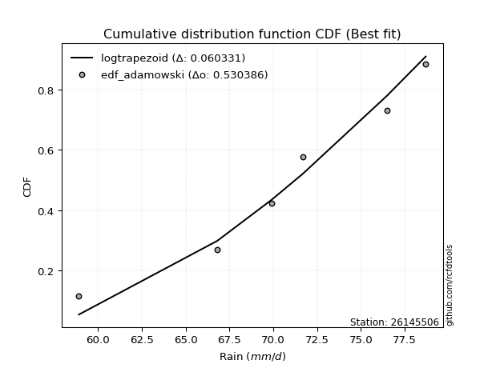</img>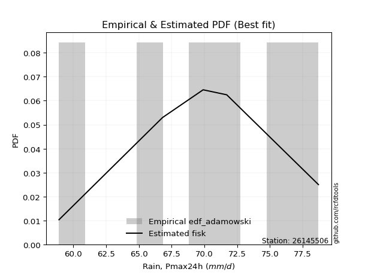</img>

</div>


## C. Best fit & Estimate extreme values for specific return periods - Tr

Best fit in probability distribution analysis means finding the theoretical distribution (like Normal, Poisson, Exponential) that most accurately mirrors your real-world data´s patterns (shape, center, spread) for better predictions, using methods like visual checks (Q-Q plots), goodness-of-fit tests (Kolmogorov-Smirnov, Chi-Squared), and information criteria (AIC) to score and select the simplest, most representative model.


### 1. Best fit (ordered by delta Δ)

<div align="center">

|   id |   station | empirical_dist   | p_dist             |     delta |   deltao | eval   |   fit |   n |   best_fit |   best_fit_sort |
|-----:|----------:|:-----------------|:-------------------|----------:|---------:|:-------|------:|----:|-----------:|----------------:|
|    0 |  26145506 | edf_hazen        | fisk               | 0.0591539 | 0.530386 | Δo > Δ |     1 |   6 |          1 |               1 |
|    1 |  26145506 | edf_gringorten   | fisk               | 0.0640559 | 0.530386 | Δo > Δ |     1 |   6 |          1 |               2 |
|    2 |  26145506 | edf_cunnane      | fisk               | 0.0672185 | 0.530386 | Δo > Δ |     1 |   6 |          1 |               3 |
|    3 |  26145506 | edf_blom         | fisk               | 0.0691539 | 0.530386 | Δo > Δ |     1 |   6 |          1 |               4 |
|    4 |  26145506 | edf_tukey        | fisk               | 0.0723118 | 0.530386 | Δo > Δ |     1 |   6 |          1 |               5 |
|    5 |  26145506 | edf_filliben     | fisk               | 0.0734902 | 0.530386 | Δo > Δ |     1 |   6 |          1 |               6 |
|    6 |  26145506 | edf_beard        | fisk               | 0.0740442 | 0.530386 | Δo > Δ |     1 |   6 |          1 |               7 |
|    7 |  26145506 | edf_jenkinson    | fisk               | 0.0740442 | 0.530386 | Δo > Δ |     1 |   6 |          1 |               8 |
|    8 |  26145506 | edf_chegodayev   | fisk               | 0.0747789 | 0.530386 | Δo > Δ |     1 |   6 |          1 |               9 |
|    9 |  26145506 | edf_adamowski    | fisk               | 0.0805232 | 0.530386 | Δo > Δ |     1 |   6 |          1 |              10 |
|   10 |  26145506 | edf_weibull      | lognct             | 0.0837581 | 0.530386 | Δo > Δ |     1 |   6 |          1 |              11 |
|   11 |  26145506 | edf_california   | laplace_asymmetric | 0.10529   | 0.530386 | Δo > Δ |     1 |   6 |          1 |              12 |

</div>

:file_folder:Tables: [bestfit_26145506.csv](table/bestfit_26145506.csv) | [extreme_26145506.csv](table/extreme_26145506.csv)


### 2. Extreme values

In hydrology, a return period (or recurrence interval $Tr$) is the statistical average time between extreme events like floods or droughts of a specific magnitude, indicating how rare an event is, with a 100-year flood, for example, having a 1% chance of occurring in any given year, not that it happens exactly every century. It is a key tool for infrastructure design (like bridges or dams) and risk assessment, calculated from historical data to determine the probability of future events, although it is important to remember it is statistical average, and events can cluster or be missed.

> risk_rate: assuming the return period as the project useful life.

|   id |      tr |   prob_l |     prob_g |   alpha |   betaprime |    chi2 |   crystalball |   erlang |    expon |   exponnorm |       f |   fatiguelife |     fisk |   gamma |   genexpon |   genlogistic |   gibrat |   gompertz |   gumbel_l |   gumbel_r |   halflogistic |   halfnorm |   hypsecant |   invgamma |   invgauss |   invweibull |   johnsonsu |   kstwobign |   laplace |   laplace_asymmetric |   loggamma |   logistic |   lognorm |   maxwell |   mielke |    moyal |   nakagami |       ncf |     nct |    norm |   pearson3 |   rayleigh |    rice |       t |   truncnorm |     wald |   weibull_min |   logalpha |   logbetaprime |          logchi2 |   logcrystalball |   logerlang |   logexpon |   logexponnorm |    logf |   logfatiguelife |   logfisk |   loggenexpon |   loggenlogistic |   loggibrat |   loggompertz |   loggumbel_l |   loggumbel_r |   loghalflogistic |   loghalfnorm |   loghypsecant |   loginvgamma |   loginvgauss |   loginvweibull |   logjohnsonsu |   logkstwobign |   loglaplace |   loglaplace_asymmetric |   logloggamma |   loglogistic |    loglognorm |   logmaxwell |   logmielke |   logmoyal |   lognakagami |   logncf |   lognct |   logpearson3 |   lograyleigh |   logrice |    logt |   logtruncnorm |   logwald |   logweibull_min |   station |   n |   risk_rate |
|-----:|--------:|---------:|-----------:|--------:|------------:|--------:|--------------:|---------:|---------:|------------:|--------:|--------------:|---------:|--------:|-----------:|--------------:|---------:|-----------:|-----------:|-----------:|---------------:|-----------:|------------:|-----------:|-----------:|-------------:|------------:|------------:|----------:|---------------------:|-----------:|-----------:|----------:|----------:|---------:|---------:|-----------:|----------:|--------:|--------:|-----------:|-----------:|--------:|--------:|------------:|---------:|--------------:|-----------:|---------------:|-----------------:|-----------------:|------------:|-----------:|---------------:|--------:|-----------------:|----------:|--------------:|-----------------:|------------:|--------------:|--------------:|--------------:|------------------:|--------------:|---------------:|--------------:|--------------:|----------------:|---------------:|---------------:|-------------:|------------------------:|--------------:|--------------:|--------------:|-------------:|------------:|-----------:|--------------:|---------:|---------:|--------------:|--------------:|----------:|--------:|---------------:|----------:|-----------------:|----------:|----:|------------:|
|    0 |    2    | 0.5      | 0.5        | 70.2012 |     70.3437 | 59.3849 |       70.4167 |  70.3022 |  66.8827 |     70.4167 | 70.3897 |       58.9    |  70.6714 | 70.2507 |    66.8888 |           inf |  68.4666 |    67.4032 |    71.484  |    69.3493 |        68.8187 |    69.0868 |     70.4167 |    70.1088 |    69.7464 |      69.6032 |     71.8806 |     68.9531 |   70.4167 |              71.0199 |    69.939  |    70.4167 |   70.1058 |   69.861  | -18.2318 |  69.0048 |    66.8681 |   13.9102 | 70.4139 | 70.4167 |    70.9279 |    69.664  | 70.2139 | 70.4169 |     66.4371 |  68.3107 |       71.4263 |    70.0275 |        70.0995 |     91.536       |          70.1058 |     69.9183 |    66.4575 |        70.1058 | 70.1245 |          70.0692 |   70.6714 |       67.7083 |              inf |     68.1341 |       70.6452 |       71.2088 |       69.02   |           68.4871 |       68.7552 |        70.1058 |       70.0435 |       69.6347 |         69.1249 |        72.0468 |        68.5767 |      70.1058 |                 70.8404 |       72.647  |       70.1058 |  58.9478      |      69.5384 |     72.734  |    68.673  |       70.0948 |  70.0798 |  69.6472 |       69.0002 |       69.3383 |   69.9232 | 70.1058 |        65.5889 |   67.979  |          71.3028 |  26145506 |   6 |    0.75     |
|    1 |    2.33 | 0.570815 | 0.429185   | 71.3943 |     71.5162 | 59.5644 |       71.576  |  71.4916 |  68.6416 |     71.576  | 71.5533 |       59.2112 |  71.7858 | 71.4376 |    68.649  |           inf |  69.0538 |    67.5357 |    72.4926 |    70.4236 |        69.9233 |    70.338  |     71.3445 |    71.2982 |    71.0021 |      71.0448 |     72.9367 |     70.3801 |   71.1183 |              71.7867 |    71.1693 |    71.4381 |   71.3047 |   71.0655 |  73.838  |  70.0217 |    66.999  |   26.7253 | 71.5735 | 71.576  |    72.0583 |    70.8863 | 71.4105 | 71.5763 |     66.4546 |  69.0709 |       72.487  |    71.2735 |        71.3411 |    108.144       |          71.3047 |     71.1493 |    68.2489 |        71.3047 | 71.3279 |          71.2645 |   71.7858 |       69.343  |              inf |     68.722  |       71.7967 |       72.267  |       70.1129 |           69.602  |       70.0252 |        71.0636 |       71.2534 |       70.8977 |         70.5931 |        73.1158 |        70.0634 |      70.8289 |                 71.6392 |       73.7667 |       71.161  |  59.3322      |      70.7743 |     73.905  |    69.702  |       71.2967 |  71.2816 |  71.1231 |       70.1442 |       70.589  |   71.1555 | 71.3046 |        66.9169 |   68.7392 |          72.3707 |  26145506 |   6 |    0.729209 |
|    2 |    5    | 0.8      | 0.2        | 75.9967 |     75.9114 | 60.6338 |       75.8845 |  75.9862 |  77.4354 |     75.8845 | 75.8886 |       65.8223 |  76.256  | 75.9191 |    77.4494 |           inf |  72.435  |    68.1965 |    75.7512 |    75.0907 |        74.921  |    75.6294 |     75.0662 |    75.8533 |    75.9791 |      77.3075 |     76.1674 |     76.4417 |   74.626  |              75.2188 |    76.016  |    75.3822 |   75.9424 |   75.8063 |  76.7578 |  74.7322 |    69.8797 |  111.741  | 75.8836 | 75.8845 |    75.9794 |    75.7797 | 75.9177 | 75.885  |     66.5422 |  73.3265 |       75.9704 |    76.1413 |        76.2934 |    294.593       |          75.9424 |     76.0091 |    77.9563 |        75.9424 | 75.9865 |          75.8977 |   76.2559 |       77.0422 |              inf |     72.2066 |       75.8284 |       75.7945 |       75.0659 |           74.8777 |       75.6605 |        75.039  |       75.9711 |       76.0656 |         77.3421 |        76.2841 |        76.7463 |      74.5574 |                 75.1226 |       76.6986 |       75.3866 |   9.72186e+12 |      75.8556 |     76.975  |    74.6734 |       75.9481 |  75.9413 |  76.9762 |       75.2657 |       75.8261 |   75.985  | 75.9424 |        72.4769 |   73.1542 |          75.9308 |  26145506 |   6 |    0.67232  |
|    3 |   10    | 0.9      | 0.1        | 79.2048 |     78.8604 | 61.7479 |       78.7426 |  79.0328 |  85.4181 |     78.7426 | 78.7739 |       74.9504 |  79.7251 | 78.9541 |    85.4382 |           inf |  76.2891 |    68.7937 |    77.5654 |    78.892  |        79.0714 |    79.5449 |     78.0382 |    78.9968 |    79.5636 |      82.4084 |     77.8161 |     81.0568 |   77.8103 |              78.3344 |    79.487  |    78.2868 |   79.1842 |   79.1426 |  77.7982 |  78.8335 |    75.1747 |  233.919  | 78.7436 | 78.7426 |    78.344  |    79.2688 | 78.9439 | 78.7432 |     66.6217 |  77.8427 |       77.948  |    79.5893 |        79.8976 |    842.655       |          79.1842 |     79.499  |    87.9589 |        79.1842 | 79.2457 |          79.1451 |   79.7251 |       83.7923 |              inf |     76.3946 |       78.2604 |       77.8325 |       79.3575 |           79.5617 |       80.1206 |        78.3726 |       79.3042 |       79.9567 |         83.3131 |        77.8175 |        82.2588 |      78.1118 |                 78.4306 |       77.7488 |       78.6581 | inf           |      79.6488 |     78.0767 |    79.2896 |       79.2015 |  79.2081 |  81.2057 |       79.5434 |       79.796  |   79.4044 | 79.1842 |        75.8685 |   78.1501 |          77.9883 |  26145506 |   6 |    0.651322 |
|    4 |   15    | 0.933333 | 0.0666667  | 80.8548 |     80.342  | 62.4364 |       80.1689 |  80.5725 |  90.0877 |     80.1689 | 80.2165 |       80.9204 |  81.6812 | 80.4871 |    90.1114 |           inf |  78.9474 |    69.1418 |    78.387  |    81.0367 |        81.4201 |    81.5825 |     79.7342 |    80.6032 |    81.4408 |      85.2863 |     78.5195 |     83.5068 |   79.673  |              80.1569 |    81.3009 |    79.8694 |   80.8534 |   80.8544 |  78.1218 |  81.2137 |    78.6388 |  335.31   | 80.1709 | 80.1689 |    79.4557 |    81.0666 | 80.4617 | 80.1696 |     66.6681 |  80.7429 |       78.8527 |    81.3792 |        81.7999 |   1615.77        |          80.8533 |     81.326  |    94.395  |        80.8533 | 80.9248 |          80.8199 |   81.6812 |       87.7487 |              inf |     79.4241 |       79.4025 |       78.7734 |       81.8861 |           82.341  |       82.5446 |        80.341  |       81.0318 |       82.0539 |         86.8831 |        78.4483 |        85.3444 |      80.269  |                 80.4328 |       78.076  |       80.5    | inf           |      81.6681 |     78.4239 |    82.0983 |       80.8772 |  80.8933 |  83.4286 |       81.9854 |       81.9219 |   81.1758 | 80.8533 |        77.2087 |   81.5367 |          78.9384 |  26145506 |   6 |    0.644736 |
|    5 |   20    | 0.95     | 0.05       | 81.9537 |     81.3158 | 62.9367 |       81.1029 |  81.588  |  93.4009 |     81.1029 | 81.1622 |       85.3405 |  83.0612 | 81.4979 |    93.427  |           inf |  81.0327 |    69.3882 |    78.8984 |    82.5383 |        83.0657 |    82.941  |     80.9307 |    81.6692 |    82.7028 |      87.3013 |     78.9422 |     85.1573 |   80.9945 |              81.4499 |    82.5197 |    80.9632 |   81.9654 |   81.9905 |  78.2797 |  82.8994 |    81.093  |  425.302  | 81.1057 | 81.1029 |    80.1596 |    82.2615 | 81.458  | 81.1036 |     66.7011 |  82.904  |       79.4188 |    82.5773 |        83.0851 |   2594.58        |          81.9654 |     82.5546 |    99.245  |        81.9654 | 82.0438 |          81.9369 |   83.0612 |       90.5802 |              inf |     81.8843 |       80.1258 |       79.3648 |       83.7044 |           84.346  |       84.2013 |        81.7592 |       82.1872 |       83.4877 |         89.4733 |        78.8196 |        87.4879 |      81.8356 |                 81.8842 |       78.2357 |       81.7982 | inf           |      83.0364 |     78.5992 |    84.1476 |       81.9939 |  82.0172 |  84.9269 |       83.7069 |       83.3661 |   82.3596 | 81.9654 |        77.9288 |   84.1555 |          79.5356 |  26145506 |   6 |    0.641514 |
|    6 |   25    | 0.96     | 0.04       | 82.7721 |     82.0346 | 63.3304 |       81.7905 |  82.339  |  95.9707 |     81.7905 | 81.859  |       88.8524 |  84.1325 | 82.2453 |    95.9989 |           inf |  82.7711 |    69.5791 |    79.2623 |    83.695  |        84.3336 |    83.9517 |     81.8567 |    82.461  |    83.6486 |      88.8534 |     79.2356 |     86.3935 |   82.0196 |              82.4529 |    83.4329 |    81.8    |   82.7938 |   82.8339 |  78.3732 |  84.2059 |    82.9658 |  507.693  | 81.7939 | 81.7905 |    80.6656 |    83.1493 | 82.1924 | 81.7912 |     66.7266 |  84.6351 |       79.8229 |    83.4726 |        84.0517 |   3767.28        |          82.7938 |     83.4757 |   103.178  |        82.7938 | 82.8775 |          82.7695 |   84.1326 |       92.7961 |              inf |     83.9934 |       80.6462 |       79.7884 |       85.1324 |           85.9239 |       85.4555 |        82.874  |       83.0501 |       84.5751 |         91.521  |        79.0735 |        89.1287 |      83.0718 |                 83.0281 |       78.3304 |       82.8054 | inf           |      84.067  |     78.7082 |    85.771  |       82.8258 |  82.855  |  86.052  |       85.0398 |       84.4557 |   83.2431 | 82.7938 |        78.3787 |   86.3137 |          79.9633 |  26145506 |   6 |    0.639603 |
|    7 |   50    | 0.98     | 0.02       | 85.1616 |     84.1013 | 64.5788 |       83.7594 |  84.5066 | 103.953  |     83.7594 | 83.8564 |      100.12   |  87.4923 | 84.4017 |   103.988  |           inf |  88.8991 |    70.1703 |    80.2502 |    87.2581 |        88.2401 |    86.8897 |     84.7276 |    84.7626 |    86.4374 |      93.6347 |     79.999  |     90.0238 |   85.2039 |              85.5685 |    86.1252 |    84.3566 |   85.2127 |   85.28   |  78.5576 |  88.2621 |    88.5271 |  855.41   | 83.7648 | 83.7594 |    82.0591 |    85.7264 | 84.2998 | 83.7603 |     66.8058 |  90.287  |       80.9258 |    86.1011 |        86.9197 |  12302.5         |          85.2127 |     86.1946 |   116.417  |        85.2127 | 85.3128 |          85.2032 |   87.4925 |       99.8222 |              inf |     91.8708 |       82.0824 |       80.9496 |       89.6865 |           90.9739 |       89.2081 |        86.4279 |       85.5807 |       87.8465 |         98.1284 |        79.7184 |        94.1269 |      87.0321 |                 86.6842 |       78.5171 |       85.9602 | inf           |      87.129  |     78.9582 |    91.0132 |       85.2556 |  85.3043 |  89.3816 |       89.1871 |       87.6997 |   85.831  | 85.2127 |        79.3224 |   93.7528 |          81.1359 |  26145506 |   6 |    0.63583  |
|    8 |   75    | 0.986667 | 0.0133333  | 86.4724 |     85.2155 | 65.3235 |       84.8159 |  85.68   | 108.623  |     84.8159 | 84.9297 |      106.906  |  89.4935 | 85.5687 |   108.661  |           inf |  93.038  |    70.5149 |    80.7498 |    89.3291 |        90.5109 |    88.489  |     86.4053 |    86.0188 |    87.9836 |      96.4138 |     80.3659 |     92.0211 |   87.0666 |              87.391  |    87.6186 |    85.8332 |   86.5396 |   86.6099 |  78.6183 |  90.6341 |    91.5824 | 1144.92   | 84.8224 | 84.8159 |    82.7733 |    87.1284 | 85.433  | 84.8168 |     66.8521 |  93.7649 |       81.4867 |    87.552  |        88.5221 |  24934.2         |          86.5396 |     87.7045 |   124.935  |        86.5396 | 86.6493 |          86.54   |   89.4938 |      104.054  |              inf |     97.6052 |       82.8216 |       81.5432 |       92.4447 |           94.0447 |       91.3197 |        88.5749 |       86.9758 |       89.7034 |        102.186  |        80.0193 |        96.9954 |      89.4357 |                 88.897  |       78.5786 |       87.8368 | inf           |      88.8403 |     79.0691 |    94.226  |       86.5889 |  86.6498 |  91.2364 |       91.6298 |       89.5166 |   87.2552 | 86.5396 |        79.6509 |   98.6458 |          81.7355 |  26145506 |   6 |    0.634587 |
|    9 |  100    | 0.99     | 0.01       | 87.3707 |     85.9713 | 65.857  |       85.5304 |  86.4777 | 111.936  |     85.5304 | 85.6562 |      111.789  |  90.9339 | 86.3618 |   111.976  |           inf |  96.2442 |    70.7589 |    81.0765 |    90.7949 |        92.1181 |    89.5785 |     87.5955 |    86.8769 |    89.0496 |      98.3807 |     80.5985 |     93.3896 |   88.3882 |              88.6841 |    88.6486 |    86.8757 |   87.4487 |   87.5157 |  78.6485 |  92.3169 |    93.6634 | 1402.15   | 85.5378 | 85.5304 |    83.2434 |    88.0836 | 86.2003 | 85.5314 |     66.885  |  96.3006 |       81.8547 |    88.5498 |        89.6321 |  41372           |          87.4487 |     88.7467 |   131.354  |        87.4487 | 87.5652 |          87.4566 |   90.9343 |      107.119  |              inf |    102.292  |       83.3098 |       81.9338 |       94.4479 |           96.2806 |       92.7867 |        90.1301 |       87.9346 |       91.0019 |        105.159  |        80.2069 |        99.0111 |      91.1812 |                 90.5012 |       78.6092 |       89.1864 | inf           |      90.0251 |     79.1392 |    96.5739 |       87.5025 |  87.5724 |  92.519  |       93.3748 |       90.7759 |   88.2329 | 87.4487 |        79.8179 |  102.373  |          82.13   |  26145506 |   6 |    0.633968 |
|   10 |  200    | 0.995    | 0.005      | 89.4441 |     87.6917 | 67.1572 |       87.1512 |  88.2994 | 119.919  |     87.1513 | 87.3059 |      123.741  |  94.4843 | 88.1726 |   119.965  |           inf | 104.967  |    71.3451 |    81.7867 |    94.3188 |        95.9821 |    92.0703 |     90.4625 |    88.8494 |    91.5284 |     103.109  |     81.0836 |     96.5415 |   91.5724 |              91.7996 |    91.0462 |    89.3765 |   89.5465 |   89.5881 |  78.6937 |  96.3713 |    98.4038 | 2262.04   | 87.1606 | 87.1512 |    84.2712 |    90.2692 | 87.9431 | 87.1523 |     66.964  | 102.617  |       82.6579 |    90.8635 |        92.2307 | 142196           |          89.5465 |     91.1751 |   148.209  |        89.5465 | 89.6792 |          89.5737 |   94.485  |      114.743  |              inf |    116.215  |       84.3834 |       82.7893 |       99.4432 |          101.876  |       96.2312 |        93.9899 |       90.1559 |       94.0809 |        112.664  |        80.5891 |       103.815  |      95.528  |                 94.4864 |       78.6549 |       92.5088 | inf           |      92.7956 |     79.2909 |   102.474  |       89.6112 |  89.7037 |  95.5151 |       97.6309 |       93.7245 |   90.4941 | 89.5465 |        80.0721 |  112.283  |          82.9942 |  26145506 |   6 |    0.633042 |
|   11 |  250    | 0.996    | 0.004      | 90.0879 |     88.2192 | 67.5797 |       87.6466 |  88.8595 | 122.489  |     87.6466 | 87.8105 |      127.636  |  95.6533 | 88.7293 |   122.537  |           inf | 108.097  |    71.5332 |    81.9957 |    95.4517 |        97.2244 |    92.8368 |     91.3855 |    89.4595 |    92.303  |     104.63   |     81.2208 |     97.517  |   92.5975 |              92.8026 |    91.7964 |    90.1794 |   90.1975 |   90.2261 |  78.7027 |  97.6765 |    99.8544 | 2632.63   | 87.6566 | 87.6466 |    84.5748 |    90.9419 | 88.4763 | 87.6476 |     66.9895 | 104.706  |       82.8951 |    91.5848 |        93.048  | 212390           |          90.1975 |     91.9355 |   154.082  |        90.1975 | 90.3356 |          90.2314 |   95.654  |      117.276  |              inf |    121.659  |       84.7025 |       83.0427 |      101.105  |          103.743  |       97.3163 |        95.2672 |       90.8478 |       95.0605 |        115.189  |        80.6949 |       105.348  |      96.971  |                 95.8063 |       78.6641 |       93.6015 | inf           |      93.6654 |     79.3365 |   104.449  |       90.2657 |  90.3658 |  96.4555 |       99.019  |       94.6512 |   91.1973 | 90.1976 |        80.1235 |  115.768  |          83.2502 |  26145506 |   6 |    0.632858 |
|   12 |  500    | 0.998    | 0.002      | 92.0257 |     89.7884 | 68.9017 |       89.1154 |  90.5299 | 130.472  |     89.1154 | 89.3083 |      139.855  |  99.3714 | 90.3889 |   130.526  |           inf | 118.913  |    72.1161 |    82.5948 |    98.9679 |       101.08   |    95.1224 |     94.2524 |    91.289  |    94.648  |     109.348  |     81.5999 |    100.44   |   95.7818 |              95.9182 |    94.0703 |    92.6693 |   92.1562 |   92.1297 |  78.7213 | 101.731  |   104.153  | 4197.48   | 89.1275 | 89.1154 |    85.4469 |    92.9493 | 90.0589 | 89.1165 |     67.0684 | 111.351  |       83.577  |    93.7641 |        95.5375 | 745799           |          92.1562 |     94.2426 |   173.852  |        92.1562 | 92.3106 |          92.2118 |   99.3725 |      125.41   |              inf |    142.516  |       85.6256 |       83.7735 |      106.44   |          109.759  |      100.625  |        99.3467 |       92.9367 |       98.0774 |        123.392  |        80.9815 |       110.079  |     101.594  |                100.025  |       78.6823 |       97.073  | inf           |      96.3099 |     79.4724 |   110.829  |       92.2353 |  92.3597 |  99.3145 |      103.395  |       97.4712 |   93.3168 | 92.1562 |        80.2267 |  127.584  |          83.9884 |  26145506 |   6 |    0.632489 |
|   13 |  750    | 0.998667 | 0.00133333 | 93.121  |     90.6631 | 69.681  |       89.9314 |  91.4639 | 135.141  |     89.9314 | 90.1412 |      147.075  | 101.61   | 91.3166 |   135.199  |           inf | 126.067  |    72.4559 |    82.9149 |   101.023  |       103.334  |    96.3993 |     95.9294 |    92.3186 |    95.982  |     112.106  |     81.7937 |    102.082  |   97.6444 |              97.7407 |    95.3661 |    94.1241 |   93.2626 |   93.1945 |  78.7282 | 104.103  |   106.536  | 5500.83   | 89.9446 | 89.9314 |    85.9134 |    94.0718 | 90.939  | 89.9326 |     67.1145 | 115.334  |       83.9428 |    95.0014 |        96.9643 |      1.56418e+06 |          93.2626 |     95.5586 |   186.573  |        93.2626 | 93.4266 |          93.3315 |  101.611  |      130.367  |              inf |    158.238  |       86.1239 |       84.1667 |      109.689  |          113.436  |      102.522  |       101.813  |       94.1214 |       99.8289 |        128.455  |        81.1246 |       112.83   |     104.4    |                102.578  |       78.6884 |       99.1604 | inf           |      97.8214 |     79.5495 |   114.741  |       93.3481 |  93.4872 | 100.95   |      106.004  |       99.0846 |   94.5166 | 93.2626 |        80.2613 |  135.239  |          84.3856 |  26145506 |   6 |    0.632366 |
|   14 | 1000    | 0.999    | 0.001      | 93.8832 |     91.2667 | 70.2363 |       90.4932 |  92.1095 | 138.454  |     90.4932 | 90.715  |      152.225  | 103.228  | 91.9578 |   138.515  |           inf | 131.541  |    72.6965 |    83.1304 |   102.482  |       104.933  |    97.2811 |     97.1192 |    93.0331 |    96.9135 |     114.063  |     81.9206 |    103.22   |   98.966  |              99.0338 |    96.2722 |    95.1557 |   94.0321 |   93.9304 |  78.7321 | 105.785  |   108.174  | 6658.95   | 90.5073 | 90.4932 |    86.2271 |    94.8475 | 91.5453 | 90.4944 |     67.1473 | 118.2    |       84.1895 |    95.8644 |        97.9655 |      2.65165e+06 |          94.032  |     96.4793 |   196.159  |        94.0321 | 94.2029 |          94.1108 |  103.23   |      133.98   |              inf |    171.431  |       86.4613 |       84.4324 |      112.053  |          116.118  |      103.853  |       103.601  |       94.9474 |      101.067  |        132.172  |        81.217  |       114.776  |     106.437  |                104.43   |       78.6914 |      100.668  | inf           |      98.8799 |     79.6035 |   117.6    |       94.1221 |  94.2719 | 102.095  |      107.879  |      100.215  |   95.352  | 94.0321 |        80.2786 |  141.029  |          84.654  |  26145506 |   6 |    0.632305 |

<div align="center">

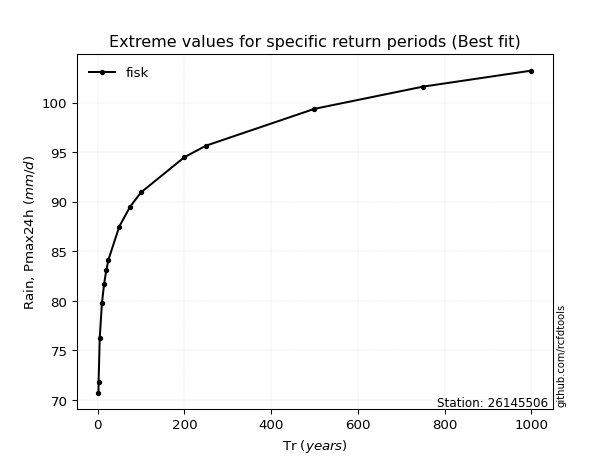</img>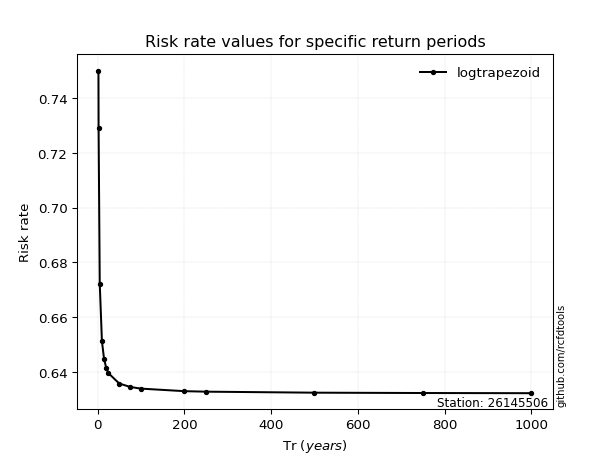</img>

</div>


<sub>**APP DISCLAIMER**: NO WARRANTY - This software is provided by [github.com/rcfdtools](https://github.com/rcfdtools) "as is", without any express or implied warranty, including warranties of merchantability, fitness for a particular purpose, or non-infringement. There is no guarantee that the software will be error-free or operate without interruption. LIMITATION OF LIABILITY - Neither the authors nor copyright holders will be liable for claims or damages arising from the software or its use. You are responsible for determining if the software is appropriate for your use and assume all associated risks, including errors, legal compliance, and data loss. NO PROFESSIONAL ADVICE - The software provides general information and does not offer professional advice. It should not replace consultation with professional advisors.</sub>