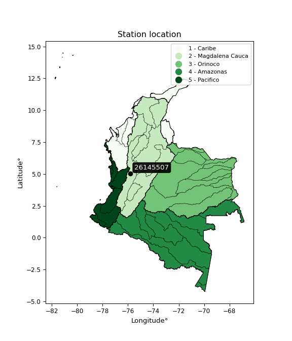

<div align="center">


</div>

# PMax24h Station (Rain, Pmax24h): 26145507

Maximum Precipitation in 24 hours (PMax24h) is the greatest amount of rainfall for a specific duration that is meteorologically possible for a given location, acting as a "worst-case" scenario for extreme storms, crucial for designing safety-critical infrastructure like bridges, river deviations, dams, spillways, and nuclear plants to prevent catastrophic failure. The PMax24h is related with the Probable Maximum Precipitation (PMP) and it is calculated by hydrologists using meteorological data to determine the upper limit of extreme rainfall, often leading to the Probable Maximum Flood (PMF) for flood control design, and is increasingly being studied for climate change impacts. Probable Maximum Precipitation (PMP) is the theoretical upper limit of rainfall, a deterministic estimate for extreme events, while probability distributions (like GEV, Gumbel) describe the likelihood and frequency of various precipitation amounts, including rare ones, showing how often events occur, with PMP representing the extreme end of these distributions, used for critical infrastructure design to ensure safety against the worst conceivable weather, unlike standard statistical forecasts which cover typical probabilities.

The most common probability distributions in hydrology, used for analyzing floods, rainfall, and streamflow, include the Normal, Log-Normal, Gumbel, Gamma (including Log-Pearson Type III), and Generalized Extreme Value (GEV) distributions, often chosen based on the data´s skewness and whether modeling extremes or general conditions, with Gumbel and GEV popular for extreme events like floods, while the Normal distribution serves as a baseline, though often requiring transformations for skewed hydrological data. These distributions help in designing water infrastructure, managing water resources, and forecasting hydrologic events.

> Hydrological data often isn´t perfectly normal (it´s skewed), so different distributions are needed for different applications, such as: **Flood Frequency Analysis**: Using Gumbel, GEV, or Log-Pearson Type III for predicting extreme flood magnitudes and their return periods, **Rainfall Analysis**: Normal for annual totals, but Log-Normal, Weibull, or GEV for intensity or extreme daily rainfall, **Streamflow Modeling**: Gamma and Log-Normal for maximum flows, GEV for minimum flows, and Kappa for daily flows.

<div align="center">

</img>

</div>


## A. General information


### 1. General running parameters

• app_version: _v20260225_. • runtime: _2026-02-27 14:50:08.749431_. • Python version: _3.14.0_. • SciPy version: _1.16.3_. • Pandas version: _2.3.3_. • NumPy version: _2.3.5_. • Stations dataset (station_dataset_file): _dataset/pmax24h_in/automatic_colombia_2003_2025.csv_. • Stations catalog (station_catalog_file): _dataset/CNE.xls_. • Minimum year to eval til year_max (date_min): _1900_. • Maximum year to eval since year_min (date_max): _2025_. • Creates, save and include plots into reports (create_plot): _False_. • Plot only fit distributions with Δo > Δ (plot_only_fit): _True_. • Plot only simple graphs avoiding multiple CDFs and multiple Extreme values plots (plot_only_simple): _False_. • Eval low extreme values, if False, evaluates high extreme values (low_extreme): _False_. • Eval every SciPy distribution as logarithmic (pdist_logarithmic_on): _True_. • Standard deviation normalized (ddof): _1.0_. • Return periods to eval in years (Tr): _[2, 2.33, 5, 10, 15, 20, 25, 50, 75, 100, 200, 250, 500, 750, 1000]_. • Minimum data sample per station, 0 means any (minimum_sample): _5_. • Z-Score maximum threshold to adjust a value, 0 means disable (zscore_max): _3.5_. • Z-Score minimum threshold to adjust a value, 0 means disable (zscore_min): _-2.5_. • Avoid zeros, e.g. rain = 0 (avoid_zeros): _True_. • Avoid null values (avoid_nans): _True_. 

:file_folder:Table: [dataset.csv](../../dataset/pmax24h_in/automatic_colombia_2003_2025.csv)

> Delta Degrees of Freedom (DDOF): is a parameter used in the formulas for calculating variance and standard deviation. When ddof=0, the divisor is $N$ (the total number of observations) and this is used when your data set is the entire population. When ddof=1, the divisor is $N-1$ and this is used when your data set is a sample drawn from a larger population. Using $N-1$ provides an unbiased estimate of the population variance (known as Bessel´s correction).


### 2. Station info and location

|   id |   CODIGO | NOMBRE                        | CATEGORIA               | TECNOLOGIA                | ESTADO   | FECHA_INSTALACION   |   FECHA_SUSPENSION |   ALTITUD |   LATITUD |   LONGITUD | DEPARTAMENTO   | MUNICIPIO   | AREA_OPERATIVA                         | ENTIDAD                                    | AREA_HIDROGRAFICA   | ZONA_HIDROGRAFICA   | SUBZONA_HIDROGRAFICA   |   CORRIENTE | Catalogo   |   Version |
|-----:|---------:|:------------------------------|:------------------------|:--------------------------|:---------|:--------------------|-------------------:|----------:|----------:|-----------:|:---------------|:------------|:---------------------------------------|:-------------------------------------------|:--------------------|:--------------------|:-----------------------|------------:|:-----------|----------:|
|    0 | 26145507 | LAS TANGAS  - AUT  [26145507] | Climatológica Principal | Automática con Telemetría | Activa   | 17/09/2013          |                nan |      1331 |     5.038 |    -75.806 | Caldas         | Belalcazar  | Area Operativa 09 - Cauca-Valle-Caldas | CENTRO NACIONAL DE INVESTIGACIONES DE CAFE | Magdalena Cauca     | Cauca               | Río Risaralda          |         nan | CNE_OE     |  20251226 |

<div align="center">

Dynamic map: [:earth_americas:Google](http://maps.google.com/maps?q=5.038,-75.80599722) [:earth_americas:OSM](https://www.openstreetmap.org/#map=18/5.038/-75.80599722&layers=P) [:earth_americas:Bing](https://www.bing.com/maps?cp=5.038~-75.80599722&lvl=18) [:earth_americas:Apple](https://maps.apple.com/frame?center=5.038%2C-75.80599722&span=0.003%2C0.006)

</div>


<div align="center">

```geojson
{
  "type": "Feature",
  "geometry": {
    "type": "Point", 
    "coordinates": [-75.80599722, 5.038]
  }, 
  "properties": {
    "Name": "26145507"
  }
}
```

</div>


### 3. Discrete values table and plot

<div align="center">

|               |           0 |            1 |           2 |           3 |          4 |
|:--------------|------------:|-------------:|------------:|------------:|-----------:|
| Date          | 2017        | 2018         | 2019        | 2020        | 2021       |
| Value         |   58        |   76         |   66        |   72.4      |  105       |
| Value_initial |   58        |   76         |   66        |   72.4      |  105       |
| count         |    5        |    5         |    5        |    5        |    5       |
| mean          |   75.48     |   75.48      |   75.48     |   75.48     |   75.48    |
| std           |   17.8648   |   17.8648    |   17.8648   |   17.8648   |   17.8648  |
| zscore        |   -0.978459 |    0.0291075 |   -0.530652 |   -0.172406 |    1.65241 |


</div>


> The initial value (value_initial) correspond to the initial obtained or null completed value, and value (value) is adjusted only when the initial value is outside the valid range (outlier) definite through the Z-Score value. If Z-Score is active, values out of range or outliers are replaced with the station mean value. A Z-Score (or standard score) measures how many standard deviations a data point is from the mean of a dataset, indicating its relative position; positive scores mean above the mean, negative mean below, and a score of zero is exactly at the mean, allowing for comparison of values from different distributions. It´s calculated using the formula $z=(x–μ)/σ$, where $x$ is the data point, $μ$ is the mean, and $σ$ is the standard deviation, helping identify outliers and understand probability.
>
> <sub>**Note**: In this study, "completing" (filling gaps in) and "extending" (forecasting or lengthening the historical record) rainfall data series are avoided for certain critical analyses because they introduce artificial bias and uncertainty, which can distort the statistics of rare events (extremes), alter day-to-day variability, and compromise the integrity and homogeneity of the original data. Some reasons against Completing/Extending rainfall data are: **Distortion of Extremes and Variability**: The primary issue is that most gap-filling or extension methods rely on averaging or regression with nearby stations, which inherently smooths the data. Rainfall is highly variable in space and time, with a large percentage of zero values and occasional large storms. Infilling methods often underestimate the highest values and overestimate the lowest (zero) values, which severely distorts analyses focused on flood frequency, drought severity, and intensity-duration-frequency (IDF) curves, **Loss of Data Homogeneity**: Infilled or extended data are synthetic estimates, not actual measurements. Combining these estimates with observed data can violate the assumption of data homogeneity, which requires that the data properties do not change over time. Inhomogeneity can lead to incorrect conclusions about long-term trends or changes in climate patterns, **Propagation of Errors**: Errors and biases from the original data (e.g., wind-induced undercatch, instrument errors, site changes) or the data used for imputation can propagate through the analysis, leading to unreliable hydrological models and inaccurate predictions, **Compromised Statistical Integrity**: For statistical analyses, especially those involving the frequency of events, using artificial data can introduce time bias or autocorrelation that doesn´t exist in reality, making it difficult to assess the true probability of events, **Difficulty in Validation**: It is difficult to accurately validate the quality of filled or extended data, especially for past periods where ground-truth measurements are unavailable. The reliability of imputation techniques heavily depends on the density of the surrounding station network and the complexity of the local topography.</sub>


### 4. Active continuous probability distributions from SciPy (80 of 104 available)

A Probability Density Function (PDF) describes the relative likelihood of a continuous random variable falling within a specific range, where the total area under its curve equals 1, and the area over any interval gives the actual probability for that range. Unlike discrete probabilities (like rolling a die), a PDF shows density, not direct probability for a single point (which is zero), with higher points indicating higher likelihood, often visualized as a bell curve for normal distributions.

A log of a probability density function (log-PDF) is simply the logarithm of the PDF´s value, denoted as $log(f(x))$, useful for converting multiplication of probabilities into addition, improving numerical stability with tiny numbers, and connecting to information theory concepts like entropy. Instead of dealing with very small probabilities (e.g., 0.000001), log-PDFs use negative numbers (e.g., $log(0.00001) ≈ -11.51$ that are easier for computers to handle, preventing underflow errors and simplifying complex calculations. In this study, each active probability distribution from SciPy is also evaluated in the $log$ form.

[scipy.stats](https://docs.scipy.org/doc/scipy/reference/stats.html) is a Python´s powerful submodule within the SciPy library for comprehensive statistical analysis, offering over 130 probability distributions (like Normal, Poisson, etc.), functions for descriptive stats (mean, variance), hypothesis testing (t-tests, chi-square), random variable generation, and statistical tests, making it essential for data science, modeling, and research. It provides tools to explore, model, and draw conclusions from data efficiently, working seamlessly with [NumPy](https://numpy.org/).

<div align="center">

|   id | p_dist           |   n_parameter | fit_method   | label                                                                       | active   | ref                                                                                                      |
|-----:|:-----------------|--------------:|:-------------|:----------------------------------------------------------------------------|:---------|:---------------------------------------------------------------------------------------------------------|
|    0 | alpha            |             3 | MLE          | Alpha                                                                       | True     | [:mortar_board:](https://docs.scipy.org/doc/scipy/reference/generated/scipy.stats.alpha.html)            |
|    1 | anglit           |             2 | MM           | Anglit                                                                      | True     | [:mortar_board:](https://docs.scipy.org/doc/scipy/reference/generated/scipy.stats.anglit.html)           |
|    2 | arcsine          |             2 | MM           | Arcsine                                                                     | True     | [:mortar_board:](https://docs.scipy.org/doc/scipy/reference/generated/scipy.stats.arcsine.html)          |
|    3 | argus            |             3 | MLE          | Argus                                                                       | True     | [:mortar_board:](https://docs.scipy.org/doc/scipy/reference/generated/scipy.stats.argus.html)            |
|    4 | beta             |             4 | MLE          | Beta                                                                        | True     | [:mortar_board:](https://docs.scipy.org/doc/scipy/reference/generated/scipy.stats.beta.html)             |
|    5 | betaprime        |             4 | MLE          | Beta prime                                                                  | True     | [:mortar_board:](https://docs.scipy.org/doc/scipy/reference/generated/scipy.stats.betaprime.html)        |
|    6 | bradford         |             3 | MLE          | Bradford                                                                    | True     | [:mortar_board:](https://docs.scipy.org/doc/scipy/reference/generated/scipy.stats.bradford.html)         |
|    7 | burr             |             4 | MLE          | Burr (Type III)                                                             | True     | [:mortar_board:](https://docs.scipy.org/doc/scipy/reference/generated/scipy.stats.burr.html)             |
|    8 | burr12           |             4 | MLE          | Burr (Type III) 12                                                          | True     | [:mortar_board:](https://docs.scipy.org/doc/scipy/reference/generated/scipy.stats.burr12.html)           |
|    9 | cosine           |             2 | MLE          | Cosine                                                                      | True     | [:mortar_board:](https://docs.scipy.org/doc/scipy/reference/generated/scipy.stats.cosine.html)           |
|   10 | crystalball      |             4 | MLE          | Crystalball                                                                 | True     | [:mortar_board:](https://docs.scipy.org/doc/scipy/reference/generated/scipy.stats.crystalball.html)      |
|   11 | dgamma           |             3 | MLE          | Double gamma                                                                | True     | [:mortar_board:](https://docs.scipy.org/doc/scipy/reference/generated/scipy.stats.dgamma.html)           |
|   12 | dweibull         |             3 | MLE          | Double Weibull                                                              | True     | [:mortar_board:](https://docs.scipy.org/doc/scipy/reference/generated/scipy.stats.dweibull.html)         |
|   13 | erlang           |             3 | MLE          | Erlang                                                                      | True     | [:mortar_board:](https://docs.scipy.org/doc/scipy/reference/generated/scipy.stats.erlang.html)           |
|   14 | exponnorm        |             3 | MLE          | Exponentially modified Normal                                               | True     | [:mortar_board:](https://docs.scipy.org/doc/scipy/reference/generated/scipy.stats.exponnorm.html)        |
|   15 | exponpow         |             3 | MLE          | Exponential power                                                           | True     | [:mortar_board:](https://docs.scipy.org/doc/scipy/reference/generated/scipy.stats.exponpow.html)         |
|   16 | exponweib        |             4 | MLE          | Exponentiated Weibull                                                       | True     | [:mortar_board:](https://docs.scipy.org/doc/scipy/reference/generated/scipy.stats.exponweib.html)        |
|   17 | f                |             4 | MLE          | F                                                                           | True     | [:mortar_board:](https://docs.scipy.org/doc/scipy/reference/generated/scipy.stats.f.html)                |
|   18 | fatiguelife      |             3 | MLE          | Fatigue-life (Birnbaum-Saunders)                                            | True     | [:mortar_board:](https://docs.scipy.org/doc/scipy/reference/generated/scipy.stats.fatiguelife.html)      |
|   19 | foldnorm         |             3 | MM           | Fold Normal                                                                 | True     | [:mortar_board:](https://docs.scipy.org/doc/scipy/reference/generated/scipy.stats.foldnorm.html)         |
|   20 | gamma            |             3 | MLE          | Gamma                                                                       | True     | [:mortar_board:](https://docs.scipy.org/doc/scipy/reference/generated/scipy.stats.gamma.html)            |
|   21 | gausshyper       |             6 | MLE          | Gauss hypergeometric                                                        | True     | [:mortar_board:](https://docs.scipy.org/doc/scipy/reference/generated/scipy.stats.gausshyper.html)       |
|   22 | genexpon         |             5 | MLE          | Generalized exponential                                                     | True     | [:mortar_board:](https://docs.scipy.org/doc/scipy/reference/generated/scipy.stats.genexpon.html)         |
|   23 | genextreme       |             3 | MLE          | Generalized exponential                                                     | True     | [:mortar_board:](https://docs.scipy.org/doc/scipy/reference/generated/scipy.stats.genextreme.html)       |
|   24 | gengamma         |             4 | MLE          | Generalized gamma                                                           | True     | [:mortar_board:](https://docs.scipy.org/doc/scipy/reference/generated/scipy.stats.gengamma.html)         |
|   25 | genhalflogistic  |             3 | MLE          | Generalized half-logistic                                                   | True     | [:mortar_board:](https://docs.scipy.org/doc/scipy/reference/generated/scipy.stats.genhalflogistic.html)  |
|   26 | genlogistic      |             3 | MLE          | Generalized logistic                                                        | True     | [:mortar_board:](https://docs.scipy.org/doc/scipy/reference/generated/scipy.stats.genlogistic.html)      |
|   27 | gennorm          |             3 | MLE          | Generalized Normal                                                          | True     | [:mortar_board:](https://docs.scipy.org/doc/scipy/reference/generated/scipy.stats.gennorm.html)          |
|   28 | genpareto        |             3 | MLE          | Generalized Pareto                                                          | True     | [:mortar_board:](https://docs.scipy.org/doc/scipy/reference/generated/scipy.stats.genpareto.html)        |
|   29 | gompertz         |             3 | MLE          | Gompertz (or truncated Gumbel)                                              | True     | [:mortar_board:](https://docs.scipy.org/doc/scipy/reference/generated/scipy.stats.gompertz.html)         |
|   30 | gumbel_l         |             2 | MM           | Gumbel Left Skew                                                            | True     | [:mortar_board:](https://docs.scipy.org/doc/scipy/reference/generated/scipy.stats.gumbel_l.html)         |
|   31 | gumbel_r         |             2 | MM           | Gumbel Right Skew                                                           | True     | [:mortar_board:](https://docs.scipy.org/doc/scipy/reference/generated/scipy.stats.gumbel_r.html)         |
|   32 | halfgennorm      |             3 | MLE          | Upper half of a generalized normal                                          | True     | [:mortar_board:](https://docs.scipy.org/doc/scipy/reference/generated/scipy.stats.halfgennorm.html)      |
|   33 | halflogistic     |             2 | MM           | Half-logistic                                                               | True     | [:mortar_board:](https://docs.scipy.org/doc/scipy/reference/generated/scipy.stats.halflogistic.html)     |
|   34 | halfnorm         |             2 | MM           | Half Normal                                                                 | True     | [:mortar_board:](https://docs.scipy.org/doc/scipy/reference/generated/scipy.stats.halfnorm.html)         |
|   35 | hypsecant        |             2 | MM           | hyperbolic secant                                                           | True     | [:mortar_board:](https://docs.scipy.org/doc/scipy/reference/generated/scipy.stats.hypsecant.html)        |
|   36 | invgamma         |             3 | MLE          | Inverted gamma                                                              | True     | [:mortar_board:](https://docs.scipy.org/doc/scipy/reference/generated/scipy.stats.invgamma.html)         |
|   37 | invgauss         |             3 | MLE          | Inverse Gaussian                                                            | True     | [:mortar_board:](https://docs.scipy.org/doc/scipy/reference/generated/scipy.stats.invgauss.html)         |
|   38 | invweibull       |             3 | MLE          | Inverted Weibull                                                            | True     | [:mortar_board:](https://docs.scipy.org/doc/scipy/reference/generated/scipy.stats.invweibull.html)       |
|   39 | johnsonsb        |             4 | MLE          | Johnson SB                                                                  | True     | [:mortar_board:](https://docs.scipy.org/doc/scipy/reference/generated/scipy.stats.johnsonsb.html)        |
|   40 | johnsonsu        |             4 | MLE          | Johnson Su                                                                  | True     | [:mortar_board:](https://docs.scipy.org/doc/scipy/reference/generated/scipy.stats.johnsonsu.html)        |
|   41 | kappa3           |             3 | MLE          | Kappa 3                                                                     | True     | [:mortar_board:](https://docs.scipy.org/doc/scipy/reference/generated/scipy.stats.kappa3.html)           |
|   42 | kappa4           |             4 | MLE          | Kappa 4                                                                     | True     | [:mortar_board:](https://docs.scipy.org/doc/scipy/reference/generated/scipy.stats.kappa4.html)           |
|   43 | ksone            |             3 | MLE          | Kolmogorov-Smirnov one-sided test statistic distribution                    | True     | [:mortar_board:](https://docs.scipy.org/doc/scipy/reference/generated/scipy.stats.ksone.html)            |
|   44 | kstwobign        |             2 | MLE          | Limiting distribution of scaled Kolmogorov-Smirnov two-sided test statistic | True     | [:mortar_board:](https://docs.scipy.org/doc/scipy/reference/generated/scipy.stats.kstwobign.html)        |
|   45 | laplace          |             2 | MM           | Laplace                                                                     | True     | [:mortar_board:](https://docs.scipy.org/doc/scipy/reference/generated/scipy.stats.laplace.html)          |
|   46 | levy_l           |             2 | MLE          | Left-skewed Levy                                                            | True     | [:mortar_board:](https://docs.scipy.org/doc/scipy/reference/generated/scipy.stats.levy_l.html)           |
|   47 | loggamma         |             3 | MLE          | Log gamma                                                                   | True     | [:mortar_board:](https://docs.scipy.org/doc/scipy/reference/generated/scipy.stats.loggamma.html)         |
|   48 | logistic         |             2 | MM           | Logistic (or Sech-squared)                                                  | True     | [:mortar_board:](https://docs.scipy.org/doc/scipy/reference/generated/scipy.stats.logistic.html)         |
|   49 | loglaplace       |             3 | MLE          | Log-Laplace                                                                 | True     | [:mortar_board:](https://docs.scipy.org/doc/scipy/reference/generated/scipy.stats.loglaplace.html)       |
|   50 | lomax            |             3 | MLE          | Lomax (Pareto of the second kind)                                           | True     | [:mortar_board:](https://docs.scipy.org/doc/scipy/reference/generated/scipy.stats.lomax.html)            |
|   51 | maxwell          |             2 | MM           | Maxwell                                                                     | True     | [:mortar_board:](https://docs.scipy.org/doc/scipy/reference/generated/scipy.stats.maxwell.html)          |
|   52 | mielke           |             4 | MLE          | Mielke Beta-Kappa / Dagum                                                   | True     | [:mortar_board:](https://docs.scipy.org/doc/scipy/reference/generated/scipy.stats.mielke.html)           |
|   53 | moyal            |             2 | MM           | Moyal                                                                       | True     | [:mortar_board:](https://docs.scipy.org/doc/scipy/reference/generated/scipy.stats.moyal.html)            |
|   54 | nakagami         |             3 | MLE          | Nakagami                                                                    | True     | [:mortar_board:](https://docs.scipy.org/doc/scipy/reference/generated/scipy.stats.nakagami.html)         |
|   55 | ncf              |             5 | MLE          | Non-central F distribution                                                  | True     | [:mortar_board:](https://docs.scipy.org/doc/scipy/reference/generated/scipy.stats.ncf.html)              |
|   56 | nct              |             4 | MLE          | Non-central Student’s t                                                     | True     | [:mortar_board:](https://docs.scipy.org/doc/scipy/reference/generated/scipy.stats.nct.html)              |
|   57 | norm             |             2 | MM           | Normal                                                                      | True     | [:mortar_board:](https://docs.scipy.org/doc/scipy/reference/generated/scipy.stats.norm.html)             |
|   58 | pearson3         |             3 | MM           | Pearson type III                                                            | True     | [:mortar_board:](https://docs.scipy.org/doc/scipy/reference/generated/scipy.stats.pearson3.html)         |
|   59 | powerlaw         |             3 | MLE          | Power-function                                                              | True     | [:mortar_board:](https://docs.scipy.org/doc/scipy/reference/generated/scipy.stats.powerlaw.html)         |
|   60 | rayleigh         |             2 | MM           | Rayleigh                                                                    | True     | [:mortar_board:](https://docs.scipy.org/doc/scipy/reference/generated/scipy.stats.rayleigh.html)         |
|   61 | rdist            |             3 | MLE          | R-distributed (symmetric beta)                                              | True     | [:mortar_board:](https://docs.scipy.org/doc/scipy/reference/generated/scipy.stats.rdist.html)            |
|   62 | rice             |             3 | MLE          | Rice                                                                        | True     | [:mortar_board:](https://docs.scipy.org/doc/scipy/reference/generated/scipy.stats.rice.html)             |
|   63 | semicircular     |             2 | MM           | Semicircular                                                                | True     | [:mortar_board:](https://docs.scipy.org/doc/scipy/reference/generated/scipy.stats.semicircular.html)     |
|   64 | skewnorm         |             3 | MLE          | Skew normal                                                                 | True     | [:mortar_board:](https://docs.scipy.org/doc/scipy/reference/generated/scipy.stats.skewnorm.html)         |
|   65 | t                |             3 | MLE          | Student’s t                                                                 | True     | [:mortar_board:](https://docs.scipy.org/doc/scipy/reference/generated/scipy.stats.t.html)                |
|   66 | trapezoid        |             4 | MLE          | Trapezoid                                                                   | True     | [:mortar_board:](https://docs.scipy.org/doc/scipy/reference/generated/scipy.stats.trapezoid.html)        |
|   67 | triang           |             3 | MLE          | Triangular                                                                  | True     | [:mortar_board:](https://docs.scipy.org/doc/scipy/reference/generated/scipy.stats.triang.html)           |
|   68 | truncexpon       |             3 | MLE          | Truncated exponential                                                       | True     | [:mortar_board:](https://docs.scipy.org/doc/scipy/reference/generated/scipy.stats.truncexpon.html)       |
|   69 | truncnorm        |             4 | MLE          | Truncated normal                                                            | True     | [:mortar_board:](https://docs.scipy.org/doc/scipy/reference/generated/scipy.stats.truncnorm.html)        |
|   70 | truncpareto      |             4 | MLE          | Upper truncated Pareto                                                      | True     | [:mortar_board:](https://docs.scipy.org/doc/scipy/reference/generated/scipy.stats.truncpareto.html)      |
|   71 | truncweibull_min |             5 | MLE          | Doubly truncated Weibull minimum                                            | True     | [:mortar_board:](https://docs.scipy.org/doc/scipy/reference/generated/scipy.stats.truncweibull_min.html) |
|   72 | tukeylambda      |             3 | MLE          | Tukey-Lamdba                                                                | True     | [:mortar_board:](https://docs.scipy.org/doc/scipy/reference/generated/scipy.stats.tukeylambda.html)      |
|   73 | uniform          |             2 | MLE          | Uniform                                                                     | True     | [:mortar_board:](https://docs.scipy.org/doc/scipy/reference/generated/scipy.stats.uniform.html)          |
|   74 | vonmises         |             3 | MLE          | Von Mises                                                                   | True     | [:mortar_board:](https://docs.scipy.org/doc/scipy/reference/generated/scipy.stats.vonmises.html)         |
|   75 | vonmises_line    |             3 | MLE          | Von Mises line                                                              | True     | [:mortar_board:](https://docs.scipy.org/doc/scipy/reference/generated/scipy.stats.vonmises_line.html)    |
|   76 | wald             |             2 | MM           | Wald                                                                        | True     | [:mortar_board:](https://docs.scipy.org/doc/scipy/reference/generated/scipy.stats.wald.html)             |
|   77 | weibull_max      |             3 | MLE          | Weibull maximum                                                             | True     | [:mortar_board:](https://docs.scipy.org/doc/scipy/reference/generated/scipy.stats.weibull_max.html)      |
|   78 | weibull_min      |             3 | MLE          | Weibull minimum                                                             | True     | [:mortar_board:](https://docs.scipy.org/doc/scipy/reference/generated/scipy.stats.weibull_min.html)      |
|   79 | wrapcauchy       |             3 | MLE          | Wrapped  Cauchy                                                             | True     | [:mortar_board:](https://docs.scipy.org/doc/scipy/reference/generated/scipy.stats.wrapcauchy.html)       |

</div>

> **n_parameter:** # arguments & localization & scale.
>
> **Fit methods:** (MLE) maximum likelihood, (MM) L-moments.
>
>**Inactive** (With the only purpose of prevent loops, zero divisions, infinite values, over high estimated values or horizontal trending for recurrence intervals estimations, the follow distributions were disabled.)**:** lognorm, norminvgauss, powernorm, powerlognorm, cauchy, halfcauchy, foldcauchy, skewcauchy, chi2, expon, fisk, genhyperbolic, geninvgauss, gibrat, kstwo, laplace_asymmetric, levy, levy_stable, ncx2, pareto, rel_breitwigner, recipinvgauss, studentized_range, loguniform, 


## B. Probability (PDF) vs. Empirical (EDF) distributions functions

A continuous probability distribution (CPD) describes probabilities for variables that can take any value within a range (like rain any time), unlike discrete variables with specific outcomes (like temperature). It uses a Probability Density Function (PDF), a curve where the total area under it equals 1, and the probability of the variable falling within an interval (a to b) is found by calculating the area under the curve between those points. A key feature is that the probability of hitting any single exact value is zero, so probabilities are always expressed for ranges, e.g., $P(a ≤ X ≤ b)$.

<div align="center">

Distributions parameters from station values
|     |   station | p_dist              |   n |             loc |           scale | shape                  | shape1                | shape2                 | shape3             |
|----:|----------:|:--------------------|----:|----------------:|----------------:|:-----------------------|:----------------------|:-----------------------|:-------------------|
|   0 |  26145507 | alpha               |   5 |    28.726       |   144.518       | 3.413764608741014      |                       |                        |                    |
|   1 |  26145507 | anglit              |   5 |    75.48        |    46.7443      |                        |                       |                        |                    |
|   2 |  26145507 | arcsine             |   5 |    52.8826      |    45.1948      |                        |                       |                        |                    |
|   3 |  26145507 | argus               |   5 |    40.4403      |    68.0128      | 1.7537073436561667e-06 |                       |                        |                    |
|   4 |  26145507 | beta                |   5 |    58           |    51.696       | 0.37720479968409715    | 0.9042230941070775    |                        |                    |
|   5 |  26145507 | betaprime           |   5 |    -1.5937      |     3.24677     | 664.9945690097211      | 29.054917075111867    |                        |                    |
|   6 |  26145507 | bradford            |   5 |    57.9999      |    47.005       | 12.2218932318671       |                       |                        |                    |
|   7 |  26145507 | burr                |   5 |     3.12731     |    29.5415      | 6.269934049849976      | 133.39908084046738    |                        |                    |
|   8 |  26145507 | burr12              |   5 |    -0.331208    |    62.4039      | 18.074528065149195     | 0.28399281073259725   |                        |                    |
|   9 |  26145507 | cosine              |   5 |    77.6196      |    13.5263      |                        |                       |                        |                    |
|  10 |  26145507 | crystalball         |   5 |    75.48        |    15.9788      | 5499.246517824646      | 2538.1222501763805    |                        |                    |
|  11 |  26145507 | dgamma              |   5 |    72.4         |    12.5035      | 0.8137755697230996     |                       |                        |                    |
|  12 |  26145507 | dweibull            |   5 |    72.4         |    12.4243      | 0.7282170637206596     |                       |                        |                    |
|  13 |  26145507 | erlang              |   5 |    58           |    11.9871      | 0.3890815082149063     |                       |                        |                    |
|  14 |  26145507 | exponnorm           |   5 |    57.9786      |     0.00691703  | 2518.8349610759487     |                       |                        |                    |
|  15 |  26145507 | exponpow            |   5 |    58           |    34.7986      | 0.8101899217249537     |                       |                        |                    |
|  16 |  26145507 | exponweib           |   5 |    58           |     1.30825     | 1.2479779641003637     | 0.3669675975918768    |                        |                    |
|  17 |  26145507 | f                   |   5 |    37.0487      |    34.4588      | 9618.541944731218      | 14.304198228067403    |                        |                    |
|  18 |  26145507 | fatiguelife         |   5 |    58           |     1.46453e-05 | 1078.715877661921      |                       |                        |                    |
|  19 |  26145507 | foldnorm            |   5 |    54.1277      |    24.0387      | 0.48045872742248596    |                       |                        |                    |
|  20 |  26145507 | gamma               |   5 |    58           |    16.7464      | 0.44859164337558577    |                       |                        |                    |
|  21 |  26145507 | gausshyper          |   5 |    58           |    51.5431      | 0.883522613611128      | 1.0284531515455666    | 1.1455478147948321     | 0.9672726926998612 |
|  22 |  26145507 | genexpon            |   5 |    57.9999      |   215.119       | 11.019329111430114     | 21.147222902677917    | 0.759599503672851      |                    |
|  23 |  26145507 | genextreme          |   5 |    58.0681      |     0.477183    | -7.004909660533313     |                       |                        |                    |
|  24 |  26145507 | gengamma            |   5 |    58           |     1.30825     | 1.2479779641003637     | 0.3669675975918768    |                        |                    |
|  25 |  26145507 | genhalflogistic     |   5 |    53.8188      |    54.224       | 1.0594523497843427     |                       |                        |                    |
|  26 |  26145507 | genlogistic         |   5 |   -12.9886      |    11.2776      | 1360.6873457652778     |                       |                        |                    |
|  27 |  26145507 | gennorm             |   5 |    72.4         |    11.9416      | 1.0014410757150414     |                       |                        |                    |
|  28 |  26145507 | genpareto           |   5 |    -0.736469    |   155.07        | -1.4665731054746924    |                       |                        |                    |
|  29 |  26145507 | gompertz            |   5 |    58           |   126.356       | 6.329842679276169      |                       |                        |                    |
|  30 |  26145507 | gumbel_l            |   5 |    82.6713      |    12.4586      |                        |                       |                        |                    |
|  31 |  26145507 | gumbel_r            |   5 |    68.2887      |    12.4586      |                        |                       |                        |                    |
|  32 |  26145507 | halfgennorm         |   5 |    58           |     1.3842      | 0.4100433802756024     |                       |                        |                    |
|  33 |  26145507 | halflogistic        |   5 |    56.5414      |    13.6613      |                        |                       |                        |                    |
|  34 |  26145507 | halfnorm            |   5 |    54.3303      |    26.5072      |                        |                       |                        |                    |
|  35 |  26145507 | hypsecant           |   5 |    75.48        |    10.1724      |                        |                       |                        |                    |
|  36 |  26145507 | invgamma            |   5 |    45.3933      |    98.3246      | 4.214733731722859      |                       |                        |                    |
|  37 |  26145507 | invgauss            |   5 |    51.6435      |    39.9402      | 0.5968054831595282     |                       |                        |                    |
|  38 |  26145507 | invweibull          |   5 |    58           |     1.96057     | 0.05718404316647284    |                       |                        |                    |
|  39 |  26145507 | johnsonsb           |   5 |    58           |    47.0006      | -0.6476027459348983    | 0.07374199284041258   |                        |                    |
|  40 |  26145507 | johnsonsu           |   5 |    53.1163      |     0.276516    | -6.231715646420131     | 1.2943163401775015    |                        |                    |
|  41 |  26145507 | kappa3              |   5 |    57.9804      |    47.0023      | 5186.304301342327      |                       |                        |                    |
|  42 |  26145507 | kappa4              |   5 |    53.0392      |    56.0043      | 1.0975551493801945     | 1.0751848264770107    |                        |                    |
|  43 |  26145507 | ksone               |   5 |    53.3         |    56.4         | 1.0                    |                       |                        |                    |
|  44 |  26145507 | kstwobign           |   5 |    27.8018      |    55.0068      |                        |                       |                        |                    |
|  45 |  26145507 | laplace             |   5 |    75.48        |    11.2987      |                        |                       |                        |                    |
|  46 |  26145507 | levy_l              |   5 |   107.969       |    11.3614      |                        |                       |                        |                    |
|  47 |  26145507 | loggamma            |   5 | -4800.04        |   658.445       | 1644.139174929127      |                       |                        |                    |
|  48 |  26145507 | logistic            |   5 |    75.48        |     8.80957     |                        |                       |                        |                    |
|  49 |  26145507 | loglaplace          |   5 |    -0.183376    |    72.5834      | 6.822724827868058      |                       |                        |                    |
|  50 |  26145507 | lomax               |   5 |    58           |     1.09223e+09 | 19698853.188853867     |                       |                        |                    |
|  51 |  26145507 | maxwell             |   5 |    37.617       |    23.7271      |                        |                       |                        |                    |
|  52 |  26145507 | mielke              |   5 |     7.89589     |    19.2374      | 4161.954391725325      | 5.830597799172931     |                        |                    |
|  53 |  26145507 | moyal               |   5 |    66.3423      |     7.19298     |                        |                       |                        |                    |
|  54 |  26145507 | nakagami            |   5 |    58           |    32.4078      | 0.3691108024032519     |                       |                        |                    |
|  55 |  26145507 | ncf                 |   5 |    -1.06635     |    74.9868      | 106.70354949620184     | 95.15187024453695     | 1.7290467848412868e-09 |                    |
|  56 |  26145507 | nct                 |   5 |    -0.312215    |     1.42379     | 14.67787772704126      | 50.382548885029294    |                        |                    |
|  57 |  26145507 | norm                |   5 |    75.48        |    15.9788      |                        |                       |                        |                    |
|  58 |  26145507 | pearson3            |   5 |    75.48        |    15.9788      | 0.9560960117294718     |                       |                        |                    |
|  59 |  26145507 | powerlaw            |   5 |    58           |    47           | 0.12394194975548241    |                       |                        |                    |
|  60 |  26145507 | rayleigh            |   5 |    44.9116      |    24.39        |                        |                       |                        |                    |
|  61 |  26145507 | rdist               |   5 |    53.036       |    22.964       | 1.1178202851916752     |                       |                        |                    |
|  62 |  26145507 | rice                |   5 |    49.5966      |    21.509       | 0.0002936592581789523  |                       |                        |                    |
|  63 |  26145507 | semicircular        |   5 |    75.48        |    31.9576      |                        |                       |                        |                    |
|  64 |  26145507 | skewnorm            |   5 |    58           |    23.6831      | 104419359.20585963     |                       |                        |                    |
|  65 |  26145507 | t                   |   5 |    75.4792      |    15.9787      | 1232409.0117330938     |                       |                        |                    |
|  66 |  26145507 | trapezoid           |   5 |    53.3         |    56.4         | 1.0                    | 1.0                   |                        |                    |
|  67 |  26145507 | triang              |   5 |    35.6914      |    69.3086      | 0.9999999998114542     |                       |                        |                    |
|  68 |  26145507 | truncexpon          |   5 |    58           |    50.4388      | 0.9318265705780246     |                       |                        |                    |
|  69 |  26145507 | truncnorm           |   5 |    75.48        |    15.9788      | -82.64350964184675     | 1402.0773235469405    |                        |                    |
|  70 |  26145507 | truncpareto         |   5 |    57.8459      |     0.154078    | 0.26302081961649737    | 306.04119986176954    |                        |                    |
|  71 |  26145507 | truncweibull_min    |   5 |    58           |    53.3457      | 0.8468927889001368     | 5.111942443217835e-18 | 0.9067057375623475     |                    |
|  72 |  26145507 | tukeylambda         |   5 |    67.0038      |    14.0583      | 1.561373994035545      |                       |                        |                    |
|  73 |  26145507 | uniform             |   5 |    58           |    47           |                        |                       |                        |                    |
|  74 |  26145507 | vonmises            |   5 |     2.8268      |     1           | 0.5624653499943993     |                       |                        |                    |
|  75 |  26145507 | vonmises_line       |   5 |    72.9682      |    10.196       | 0.7881285789676262     |                       |                        |                    |
|  76 |  26145507 | wald                |   5 |    59.5012      |    15.9788      |                        |                       |                        |                    |
|  77 |  26145507 | weibull_max         |   5 |   105           |     1.38525     | 0.2758455475199989     |                       |                        |                    |
|  78 |  26145507 | weibull_min         |   5 |    58           |    11.8374      | 0.5496495456734237     |                       |                        |                    |
|  79 |  26145507 | wrapcauchy          |   5 |    58           |     7.48028     | 0.5                    |                       |                        |                    |
|  80 |  26145507 | logalpha            |   5 |     2.25773     |    22.4985      | 11.119075489048278     |                       |                        |                    |
|  81 |  26145507 | loganglit           |   5 |     4.3034      |     0.579281    |                        |                       |                        |                    |
|  82 |  26145507 | logarcsine          |   5 |     4.02337     |     0.560054    |                        |                       |                        |                    |
|  83 |  26145507 | logargus            |   5 |     3.86497     |     0.831815    | 2.8506453813393278e-05 |                       |                        |                    |
|  84 |  26145507 | logbeta             |   5 |     4.06044     |     0.706316    | 0.7111319481788743     | 1.4868900903121611    |                        |                    |
|  85 |  26145507 | logbetaprime        |   5 |     3.70434     |     0.0979267   | 40.08159595244203      | 7.404914330551989     |                        |                    |
|  86 |  26145507 | logbradford         |   5 |     4.06044     |     0.593525    | 1.073050345509889      |                       |                        |                    |
|  87 |  26145507 | logburr             |   5 |    -1.77484     |     5.1935      | 39.53452533755862      | 273.17190701031916    |                        |                    |
|  88 |  26145507 | logburr12           |   5 |    -0.177037    |     4.31804     | 73.36042698090088      | 0.3269514813667118    |                        |                    |
|  89 |  26145507 | logcosine           |   5 |     4.32323     |     0.166585    |                        |                       |                        |                    |
|  90 |  26145507 | logcrystalball      |   5 |     4.3034      |     0.198018    | 7.57510567195648       | 543.3116395275399     |                        |                    |
|  91 |  26145507 | logdgamma           |   5 |     4.28221     |     0.175434    | 0.6613922807268812     |                       |                        |                    |
|  92 |  26145507 | logdweibull         |   5 |     4.28221     |     0.139841    | 0.3865469625917096     |                       |                        |                    |
|  93 |  26145507 | logerlang           |   5 |     4.06044     |     0.309748    | 0.35878169916707303    |                       |                        |                    |
|  94 |  26145507 | logexponnorm        |   5 |     4.11141     |     0.0883567   | 2.172861121181808      |                       |                        |                    |
|  95 |  26145507 | logexponpow         |   5 |     4.06044     |     0.494512    | 0.8189909275232234     |                       |                        |                    |
|  96 |  26145507 | logexponweib        |   5 |     4.06044     |     0.680283    | 0.07818718166790684    | 1.6637194924923624    |                        |                    |
|  97 |  26145507 | logf                |   5 |     4.06044     |     0.278905    | 1.2244471252957667     | 216.69730616523503    |                        |                    |
|  98 |  26145507 | logfatiguelife      |   5 |     3.92811     |     0.322083    | 0.5735064393810079     |                       |                        |                    |
|  99 |  26145507 | logfoldnorm         |   5 |     4.01448     |     0.247808    | 0.9989037049470657     |                       |                        |                    |
| 100 |  26145507 | loggamma            |   5 |     4.06044     |     0.536547    | 0.1387766480460686     |                       |                        |                    |
| 101 |  26145507 | loggausshyper       |   5 |     4.06044     |     0.677078    | 0.15698206921967955    | 1.3452650446934538    | 1.0865321628530964     | 1.4844162457148453 |
| 102 |  26145507 | loggenexpon         |   5 |     4.06044     |     0.438742    | 1.5359986778943555     | 1.0924560844891054    | 0.672194527883277      |                    |
| 103 |  26145507 | loggenextreme       |   5 |     4.20715     |     0.149375    | -0.062150896137757344  |                       |                        |                    |
| 104 |  26145507 | loggengamma         |   5 |     4.06044     |     1.52119     | 0.11203872740835594    | 1.1045950164717306    |                        |                    |
| 105 |  26145507 | loggenhalflogistic  |   5 |     3.97776     |     0.708381    | 1.047593421830606      |                       |                        |                    |
| 106 |  26145507 | loggenlogistic      |   5 |     3.2021      |     0.153176    | 730.5359051227806      |                       |                        |                    |
| 107 |  26145507 | loggennorm          |   5 |     4.28221     |     0.14638     | 0.9879858244592888     |                       |                        |                    |
| 108 |  26145507 | loggenpareto        |   5 |    -0.0147105   |    14.4301      | -3.0908324372824922    |                       |                        |                    |
| 109 |  26145507 | loggompertz         |   5 |     4.06044     |     0.6839      | 2.034646590233783      |                       |                        |                    |
| 110 |  26145507 | loggumbel_l         |   5 |     4.39252     |     0.154394    |                        |                       |                        |                    |
| 111 |  26145507 | loggumbel_r         |   5 |     4.21428     |     0.154394    |                        |                       |                        |                    |
| 112 |  26145507 | loghalfgennorm      |   5 |     4.06044     |     0.324944    | 1.2947902100316204     |                       |                        |                    |
| 113 |  26145507 | loghalflogistic     |   5 |     4.06874     |     0.169272    |                        |                       |                        |                    |
| 114 |  26145507 | loghalfnorm         |   5 |     4.0413      |     0.328491    |                        |                       |                        |                    |
| 115 |  26145507 | loghypsecant        |   5 |     4.3034      |     0.126062    |                        |                       |                        |                    |
| 116 |  26145507 | loginvgamma         |   5 |    -3.19357     | 11143.6         | 1487.5226291451509     |                       |                        |                    |
| 117 |  26145507 | loginvgauss         |   5 |     3.89892     |     1.4211      | 0.28462109863805674    |                       |                        |                    |
| 118 |  26145507 | loginvweibull       |   5 |     1.80461     |     2.40254     | 16.08450898228012      |                       |                        |                    |
| 119 |  26145507 | logjohnsonsb        |   5 |     4.06044     |     0.593517    | 0.9218624887827569     | 0.09171306569859762   |                        |                    |
| 120 |  26145507 | logjohnsonsu        |   5 |     3.90075     |     0.0181953   | -7.2755207509841995    | 1.9837970896900607    |                        |                    |
| 121 |  26145507 | logkappa3           |   5 |     4.06044     |     0.593207    | 3084.2589668378805     |                       |                        |                    |
| 122 |  26145507 | logkappa4           |   5 |     3.9687      |     0.705615    | 1.1497659195605583     | 1.0274532907444571    |                        |                    |
| 123 |  26145507 | logksone            |   5 |     4.00109     |     0.712221    | 1.0                    |                       |                        |                    |
| 124 |  26145507 | logkstwobign        |   5 |     3.66824     |     0.730157    |                        |                       |                        |                    |
| 125 |  26145507 | loglaplace          |   5 |     4.3034      |     0.14002     |                        |                       |                        |                    |
| 126 |  26145507 | loglevy_l           |   5 |     4.68862     |     0.132638    |                        |                       |                        |                    |
| 127 |  26145507 | logloggamma         |   5 |   -68.9125      |     9.50145     | 2221.5837485513402     |                       |                        |                    |
| 128 |  26145507 | loglogistic         |   5 |     4.3034      |     0.109173    |                        |                       |                        |                    |
| 129 |  26145507 | logloglaplace       |   5 |    -0.0498367   |     4.33204     | 29.827701939898017     |                       |                        |                    |
| 130 |  26145507 | loglomax            |   5 |     4.06044     |    33.3845      | 138.0613448911872      |                       |                        |                    |
| 131 |  26145507 | logmaxwell          |   5 |     3.83418     |     0.294039    |                        |                       |                        |                    |
| 132 |  26145507 | logmielke           |   5 |   -36.25        |    39.9171      | 10135.746705935726     | 266.9402919784464     |                        |                    |
| 133 |  26145507 | logmoyal            |   5 |     4.19016     |     0.0891393   |                        |                       |                        |                    |
| 134 |  26145507 | lognakagami         |   5 |     4.06044     |     0.459141    | 0.06183657121300423    |                       |                        |                    |
| 135 |  26145507 | logncf              |   5 |     3.17851     |     0.867391    | 66.94256318666162      | 1933.5066612643918    | 20.572570814287623     |                    |
| 136 |  26145507 | lognct              |   5 |     1.90049     |     0.01367     | 80.80183406818372      | 173.81062824629151    |                        |                    |
| 137 |  26145507 | lognorm             |   5 |     4.3034      |     0.198018    |                        |                       |                        |                    |
| 138 |  26145507 | logpearson3         |   5 |     4.3034      |     0.198018    | 0.7026566908201508     |                       |                        |                    |
| 139 |  26145507 | logpowerlaw         |   5 |     4.06044     |     0.593517    | 0.13357801314690404    |                       |                        |                    |
| 140 |  26145507 | lograyleigh         |   5 |     3.92458     |     0.302254    |                        |                       |                        |                    |
| 141 |  26145507 | logrdist            |   5 |     4.98777     |     0.333806    | 1.022158988792412      |                       |                        |                    |
| 142 |  26145507 | logrice             |   5 |     3.96278     |     0.278595    | 0.0008766543413645559  |                       |                        |                    |
| 143 |  26145507 | logsemicircular     |   5 |     4.3034      |     0.396035    |                        |                       |                        |                    |
| 144 |  26145507 | logskewnorm         |   5 |     4.06044     |     0.313407    | 14861324.956315324     |                       |                        |                    |
| 145 |  26145507 | logt                |   5 |     4.3034      |     0.198017    | 516526994.2519288      |                       |                        |                    |
| 146 |  26145507 | logtrapezoid        |   5 |     4.00109     |     0.712221    | 1.0                    | 1.0                   |                        |                    |
| 147 |  26145507 | logtriang           |   5 |     3.83177     |     0.822194    | 0.9999989079231312     |                       |                        |                    |
| 148 |  26145507 | logtruncexpon       |   5 |     4.06044     |     0.549135    | 1.080833565872311      |                       |                        |                    |
| 149 |  26145507 | logtruncnorm        |   5 |    -1.44166     |     1.35361     | 4.064758252183758      | 4.503228352654755     |                        |                    |
| 150 |  26145507 | logtruncpareto      |   5 |     4.0582      |     0.00224058  | 0.0013374770678215493  | 265.89459739843664    |                        |                    |
| 151 |  26145507 | logtruncweibull_min |   5 |     4.05942     |     0.652585    | 1.0128488359678705     | 4.349336265677796e-10 | 0.9110887198518169     |                    |
| 152 |  26145507 | logtukeylambda      |   5 |     4.19573     |     0.173021    | 1.278893197365127      |                       |                        |                    |
| 153 |  26145507 | loguniform          |   5 |     4.06044     |     0.593517    |                        |                       |                        |                    |
| 154 |  26145507 | logvonmises         |   5 |    -1.98071     |     1           | 25.965466701268777     |                       |                        |                    |
| 155 |  26145507 | logvonmises_line    |   5 |     4.35834     |     0.0948245   | 6.524013477223335e-05  |                       |                        |                    |
| 156 |  26145507 | logwald             |   5 |     4.1054      |     0.197997    |                        |                       |                        |                    |
| 157 |  26145507 | logweibull_max      |   5 |     3.77282e+06 |     3.77282e+06 | 24605835.247385114     |                       |                        |                    |
| 158 |  26145507 | logweibull_min      |   5 |     4.06044     |     0.462183    | 0.14761439405080368    |                       |                        |                    |
| 159 |  26145507 | logwrapcauchy       |   5 |     4.06044     |     0.0944612   | 0.5                    |                       |                        |                    |

</div>

> **loc** (Location parameter): This shifts the distribution along the x-axis. For many common distributions, like the normal (Gaussian) distribution, loc represents the mean $μ$. For others, like the uniform distribution, it might represent the minimum value, or for the beta distribution, the left end of the support interval.
>
> **scale** (Scale parameter): This determines the width or spread of the distribution. For the normal distribution, scale represents the standard deviation $σ$. For a uniform distribution, it defines the length of the interval (from $loc$ to $loc + scale$).
>
> **shape** (Shape parameters): Refers to parameters that define the specific form of a probability distribution, distinct from its location (loc) and scale (scale). These parameters are required arguments for most distribution functions. For example, a normal (Gaussian) distribution is fully defined by its location (mean) and scale (standard deviation), so it has no specific shape parameters beyond loc and scale. However, other distributions have intrinsic properties that need specification, as Gamma distribution that takes a shape parameter, often named $a$ or $alpha$.


### 0. Cumulative distribution values - CDF (160 evaluated)

Cumulative Distribution Function (CDF), denoted as $F$<sub>$X$</sub>$(x)$, is a function that gives the probability that a random variable $X$ will take a value less than or equal to a specific value, $x$ (i.e., $(P(X≥x)$. It essentially "accumulates" probabilities from a given point up to the far right (positive infinity), providing a complete picture of the distribution´s probabilities for both discrete (like rain) and continuous (like temperature) variables, helping to find probabilities over ranges or above certain values. Each station is evaluated separately ordering the $x$ values ascending, calculating the CDF and PDF values for the activated distributions and their logarithmic forms.

<div align="center">

CDF ordered by x ascending and calculating $log(f(x))$ separately
|   id |   Station |   date |     x |   count |   mean |     std |     zscore |   Value_initial |   station |   m |     alpha |   alpha_pdf |   anglit |   anglit_pdf |   arcsine |   arcsine_pdf |     argus |   argus_pdf |        beta |    beta_pdf |   betaprime |   betaprime_pdf |    bradford |   bradford_pdf |      burr |   burr_pdf |    burr12 |   burr12_pdf |   cosine |   cosine_pdf |   crystalball |   crystalball_pdf |   dgamma |   dgamma_pdf |   dweibull |   dweibull_pdf |      erlang |   erlang_pdf |   exponnorm |   exponnorm_pdf |    exponpow |   exponpow_pdf |   exponweib |   exponweib_pdf |         f |      f_pdf |   fatiguelife |   fatiguelife_pdf |   foldnorm |   foldnorm_pdf |       gamma |   gamma_pdf |   gausshyper |   gausshyper_pdf |    genexpon |   genexpon_pdf |   genextreme |   genextreme_pdf |    gengamma |   gengamma_pdf |   genhalflogistic |   genhalflogistic_pdf |   genlogistic |   genlogistic_pdf |   gennorm |   gennorm_pdf |   genpareto |   genpareto_pdf |    gompertz |   gompertz_pdf |   gumbel_l |   gumbel_l_pdf |   gumbel_r |   gumbel_r_pdf |   halfgennorm |   halfgennorm_pdf |   halflogistic |   halflogistic_pdf |   halfnorm |   halfnorm_pdf |   hypsecant |   hypsecant_pdf |   invgamma |   invgamma_pdf |   invgauss |   invgauss_pdf |   invweibull |   invweibull_pdf |   johnsonsb |   johnsonsb_pdf |   johnsonsu |   johnsonsu_pdf |      kappa3 |   kappa3_pdf |      kappa4 |   kappa4_pdf |     ksone |   ksone_pdf |   kstwobign |   kstwobign_pdf |   laplace |   laplace_pdf |   levy_l |   levy_l_pdf |   loggamma |   loggamma_pdf |   logistic |   logistic_pdf |   loglaplace |   loglaplace_pdf |       lomax |   lomax_pdf |   maxwell |   maxwell_pdf |   mielke |   mielke_pdf |     moyal |   moyal_pdf |    nakagami |   nakagami_pdf |      ncf |    ncf_pdf |       nct |    nct_pdf |     norm |   norm_pdf |   pearson3 |   pearson3_pdf |   powerlaw |   powerlaw_pdf |   rayleigh |   rayleigh_pdf |    rdist |     rdist_pdf |      rice |   rice_pdf |   semicircular |   semicircular_pdf |   skewnorm |   skewnorm_pdf |        t |      t_pdf |   trapezoid |   trapezoid_pdf |   triang |   triang_pdf |   truncexpon |   truncexpon_pdf |   truncnorm |   truncnorm_pdf |   truncpareto |   truncpareto_pdf |   truncweibull_min |   truncweibull_min_pdf |   tukeylambda |   tukeylambda_pdf |   uniform |   uniform_pdf |   vonmises |   vonmises_pdf |   vonmises_line |   vonmises_line_pdf |     wald |   wald_pdf |   weibull_max |   weibull_max_pdf |   weibull_min |   weibull_min_pdf |   wrapcauchy |   wrapcauchy_pdf |   logalpha |   logalpha_pdf |   loganglit |   loganglit_pdf |   logarcsine |   logarcsine_pdf |   logargus |   logargus_pdf |     logbeta |   logbeta_pdf |   logbetaprime |   logbetaprime_pdf |   logbradford |   logbradford_pdf |   logburr |   logburr_pdf |   logburr12 |   logburr12_pdf |   logcosine |   logcosine_pdf |   logcrystalball |   logcrystalball_pdf |   logdgamma |   logdgamma_pdf |   logdweibull |   logdweibull_pdf |   logerlang |   logerlang_pdf |   logexponnorm |   logexponnorm_pdf |   logexponpow |   logexponpow_pdf |   logexponweib |   logexponweib_pdf |       logf |     logf_pdf |   logfatiguelife |   logfatiguelife_pdf |   logfoldnorm |   logfoldnorm_pdf |   loggausshyper |   loggausshyper_pdf |   loggenexpon |   loggenexpon_pdf |   loggenextreme |   loggenextreme_pdf |   loggengamma |   loggengamma_pdf |   loggenhalflogistic |   loggenhalflogistic_pdf |   loggenlogistic |   loggenlogistic_pdf |   loggennorm |   loggennorm_pdf |   loggenpareto |   loggenpareto_pdf |   loggompertz |   loggompertz_pdf |   loggumbel_l |   loggumbel_l_pdf |   loggumbel_r |   loggumbel_r_pdf |   loghalfgennorm |   loghalfgennorm_pdf |   loghalflogistic |   loghalflogistic_pdf |   loghalfnorm |   loghalfnorm_pdf |   loghypsecant |   loghypsecant_pdf |   loginvgamma |   loginvgamma_pdf |   loginvgauss |   loginvgauss_pdf |   loginvweibull |   loginvweibull_pdf |   logjohnsonsb |   logjohnsonsb_pdf |   logjohnsonsu |   logjohnsonsu_pdf |   logkappa3 |   logkappa3_pdf |   logkappa4 |   logkappa4_pdf |   logksone |   logksone_pdf |   logkstwobign |   logkstwobign_pdf |   loglevy_l |   loglevy_l_pdf |   logloggamma |   logloggamma_pdf |   loglogistic |   loglogistic_pdf |   logloglaplace |   logloglaplace_pdf |    loglomax |   loglomax_pdf |   logmaxwell |   logmaxwell_pdf |   logmielke |   logmielke_pdf |   logmoyal |   logmoyal_pdf |   lognakagami |   lognakagami_pdf |    logncf |   logncf_pdf |    lognct |   lognct_pdf |   lognorm |   lognorm_pdf |   logpearson3 |   logpearson3_pdf |   logpowerlaw |   logpowerlaw_pdf |   lograyleigh |   lograyleigh_pdf |    logrdist |   logrdist_pdf |   logrice |   logrice_pdf |   logsemicircular |   logsemicircular_pdf |   logskewnorm |   logskewnorm_pdf |     logt |   logt_pdf |   logtrapezoid |   logtrapezoid_pdf |   logtriang |   logtriang_pdf |   logtruncexpon |   logtruncexpon_pdf |   logtruncnorm |   logtruncnorm_pdf |   logtruncpareto |   logtruncpareto_pdf |   logtruncweibull_min |   logtruncweibull_min_pdf |   logtukeylambda |   logtukeylambda_pdf |   loguniform |   loguniform_pdf |   logvonmises |   logvonmises_pdf |   logvonmises_line |   logvonmises_line_pdf |   logwald |   logwald_pdf |   logweibull_max |   logweibull_max_pdf |   logweibull_min |   logweibull_min_pdf |   logwrapcauchy |   logwrapcauchy_pdf |
|-----:|----------:|-------:|------:|--------:|-------:|--------:|-----------:|----------------:|----------:|----:|----------:|------------:|---------:|-------------:|----------:|--------------:|----------:|------------:|------------:|------------:|------------:|----------------:|------------:|---------------:|----------:|-----------:|----------:|-------------:|---------:|-------------:|--------------:|------------------:|---------:|-------------:|-----------:|---------------:|------------:|-------------:|------------:|----------------:|------------:|---------------:|------------:|----------------:|----------:|-----------:|--------------:|------------------:|-----------:|---------------:|------------:|------------:|-------------:|-----------------:|------------:|---------------:|-------------:|-----------------:|------------:|---------------:|------------------:|----------------------:|--------------:|------------------:|----------:|--------------:|------------:|----------------:|------------:|---------------:|-----------:|---------------:|-----------:|---------------:|--------------:|------------------:|---------------:|-------------------:|-----------:|---------------:|------------:|----------------:|-----------:|---------------:|-----------:|---------------:|-------------:|-----------------:|------------:|----------------:|------------:|----------------:|------------:|-------------:|------------:|-------------:|----------:|------------:|------------:|----------------:|----------:|--------------:|---------:|-------------:|-----------:|---------------:|-----------:|---------------:|-------------:|-----------------:|------------:|------------:|----------:|--------------:|---------:|-------------:|----------:|------------:|------------:|---------------:|---------:|-----------:|----------:|-----------:|---------:|-----------:|-----------:|---------------:|-----------:|---------------:|-----------:|---------------:|---------:|--------------:|----------:|-----------:|---------------:|-------------------:|-----------:|---------------:|---------:|-----------:|------------:|----------------:|---------:|-------------:|-------------:|-----------------:|------------:|----------------:|--------------:|------------------:|-------------------:|-----------------------:|--------------:|------------------:|----------:|--------------:|-----------:|---------------:|----------------:|--------------------:|---------:|-----------:|--------------:|------------------:|--------------:|------------------:|-------------:|-----------------:|-----------:|---------------:|------------:|----------------:|-------------:|-----------------:|-----------:|---------------:|------------:|--------------:|---------------:|-------------------:|--------------:|------------------:|----------:|--------------:|------------:|----------------:|------------:|----------------:|-----------------:|---------------------:|------------:|----------------:|--------------:|------------------:|------------:|----------------:|---------------:|-------------------:|--------------:|------------------:|---------------:|-------------------:|-----------:|-------------:|-----------------:|---------------------:|--------------:|------------------:|----------------:|--------------------:|--------------:|------------------:|----------------:|--------------------:|--------------:|------------------:|---------------------:|-------------------------:|-----------------:|---------------------:|-------------:|-----------------:|---------------:|-------------------:|--------------:|------------------:|--------------:|------------------:|--------------:|------------------:|-----------------:|---------------------:|------------------:|----------------------:|--------------:|------------------:|---------------:|-------------------:|--------------:|------------------:|--------------:|------------------:|----------------:|--------------------:|---------------:|-------------------:|---------------:|-------------------:|------------:|----------------:|------------:|----------------:|-----------:|---------------:|---------------:|-------------------:|------------:|----------------:|--------------:|------------------:|--------------:|------------------:|----------------:|--------------------:|------------:|---------------:|-------------:|-----------------:|------------:|----------------:|-----------:|---------------:|--------------:|------------------:|----------:|-------------:|----------:|-------------:|----------:|--------------:|--------------:|------------------:|--------------:|------------------:|--------------:|------------------:|------------:|---------------:|----------:|--------------:|------------------:|----------------------:|--------------:|------------------:|---------:|-----------:|---------------:|-------------------:|------------:|----------------:|----------------:|--------------------:|---------------:|-------------------:|-----------------:|---------------------:|----------------------:|--------------------------:|-----------------:|---------------------:|-------------:|-----------------:|--------------:|------------------:|-------------------:|-----------------------:|----------:|--------------:|-----------------:|---------------------:|-----------------:|---------------------:|----------------:|--------------------:|
|    0 |  26145507 |   2017 |  58   |       5 |  75.48 | 17.8648 | -0.978459  |            58   |  26145507 |   1 | 0.0639029 |   0.021103  | 0.15995  |   0.0156836  |  0.218484 |     0.0222267 | 0.0983023 |   0.0110022 | 9.88715e-07 | 5.24878e+07 |    0.103591 |      0.0170434  | 1.33616e-05 |     0.100703   | 0.0658699 | 0.0202653  | 0.0708398 |   0.018639   | 0.111144 |   0.0131786  |      0.136988 |        0.0137246  | 0.121443 |    0.010715  |   0.164211 |     0.00924642 | 1.75454e-06 |  4.80378e+07 |  0.00122946 |      0.0572695  | 1.94152e-13 |    22.1381     | 2.93121e-07 |     1.88925e+07 | 0.0583937 | 0.0175972  |     0.0381826 |       1.83461e+10 |   0.114137 |     0.0292797  | 1.95824e-07 | 6.18154e+06 |  1.44864e-14 |        1.80154   | 4.83988e-06 |     0.0512241  |  0.000370741 |  11907.3         | 2.59011e-07 |     1.6694e+07 |         0.0401991 |             0.0100251 |     0.0812885 |        0.0180735  |  0.14939  |    0.0125408  |    0.424695 |      0.00834635 | 2.49255e-09 |     0.0500953  |   0.12893  |     0.00965088 |   0.101899 |     0.018679   |   8.91808e-14 |         0.232427  |      0.0533328 |         0.0364957  |   0.110107 |     0.0298137  |    0.112981 |      0.0108749  |  0.0591801 |     0.023653   |   0.054387 |     0.0290434  |   0.00123647 |      6.66269e+10 | 0.000428215 |     1.59769e+10 |   0.0529337 |      0.0285563  | 0.000415759 |    0.0212405 | 2.90749e-15 |    0.470898  | 0.0833333 |   0.0177305 |   0.0761721 |      0.0181279  |  0.106434 |    0.00942005 | 0.36652  |   0.00339787 | 0.00948555 |     1.4821e+12 |   0.120871 |      0.012062  |    0.0881859 |         0.629811 | 2.92128e-07 |  0.0180354  |  0.135764 |    0.0171589  |      nan |          nan | 0.0741243 |  0.0201052  | 3.57695e-12 |   185.815      | 0.115272 | 0.0164832  | 0.0944055 | 0.0177877  | 0.136988 | 0.0137246  |   0.113055 |      0.0198518 |   0.010944 |    1.90899e+11 |   0.134099 |     0.0190515  | 0.574791 |     0.0152811 | 0.0734812 | 0.0168295  |       0.170025 |         0.0166767  |   0        |     0.03369    | 0.136999 | 0.0137253  |  0.00694444 |      0.00295508 | 0.103603 |   0.00928813 |  1.36489e-06 |        0.0327072 |    0.136988 |      0.0137246  |   1.42687e-16 |        2.19394    |        5.59132e-14 |              7.11289   |   4.95873e-08 |         0.0711266 |  0        |     0.0212766 |    9.19462 |       0.164262 |        0.149024 |           0.0145716 | 0        | 0          |     0.0711027 |       0.0011032   |    4.2995e-09 |   332593          |     0        |       0.0638298  |  0.0867071 |       1.09345  |    0.128072 |        1.15374  |     0.165649 |          2.2861  |  0.0816831 |       0.823809 | 3.45639e-11 |   27674.1     |       0.130417 |           1.61222  |   1.33333e-07 |           2.47994 | 0.0662156 |      1.21189  |   0.0706505 |        1.05611  |   0.0897801 |        0.948982 |         0.109922 |             0.949106 |    0.081205 |        0.5454   |      0.151335 |       0.315254    |  6.8058e-06 |     2.74922e+09 |      0.0647731 |           1.13152  |   8.38348e-13 |        773.043    |      0.0115836 |        1.69651e+12 | 3.6063e-07 | 19373.7      |        0.0545063 |             1.60171  |     0.0898481 |          1.95476  |      0.00549631 |         9.71451e+11 |   3.73537e-11 |          3.50091  |       0.0636137 |             1.2495  |     0.0137578 |       1.91699e+12 |            0.0621672 |                 0.801055 |         0.068112 |              1.19245 |     0.112671 |         0.752575 |       0.486916 |        0.279692    |    9.9618e-13 |          2.97506  |      0.10987  |          0.671011 |     0.0666356 |          1.16898  |      7.71781e-07 |             3.32939  |          0        |              0        |     0.0464666 |          2.42482  |      0.0920099 |           0.719757 |      0.104348 |          0.972835 |     0.0560704 |          1.49817  |       0.0636101 |            1.24953  |      0.0135934 |        3.59253e+12 |      0.0564778 |           1.40204  | 6.23251e-11 |         1.68137 | 1.32929e-14 |       170.336   |  0.0833333 |        1.40406 |      0.0648723 |           1.24904  |    0.35413  |        0.262584 |      0.114453 |          0.951414 |      0.09749  |          0.80593  |        0.104294 |            0.756849 | 2.46095e-13 |       4.13549  |     0.101767 |         1.19501  |   0.0689565 |        1.17916  |  0.0384403 |       1.0871   |     0.0131756 |       1.83462e+12 | 0.0873559 |     0.968309 | 0.0969317 |     1.07249  |  0.109922 |      0.949106 |     0.0892634 |           1.19397 |     0.0104644 |        1.5738e+12 |     0.0960891 |          1.34426  | 0           |    0           | 0.0595911 |      1.18327  |          0.135561 |              1.26946  |      0        |          2.54585  | 0.109923 |   0.949111 |     0.00694444 |           0.23401  |   0.0773533 |        0.676543 |     1.38334e-05 |            2.75626  |    1.23058e-06 |            3.67954 |      4.92765e-08 |            80.2388   |             0.0024166 |                   2.38743 |      7.10543e-15 |              5.779   |     0        |          1.68487 |       1.11043 |          0.949033 |        6.80675e-06 |                1.67831 |  0        |      0        |        0.0678435 |             1.19048  |       0.00670195 |          1.11012e+12 |        0        |            5.05461  |
|    1 |  26145507 |   2019 |  66   |       5 |  75.48 | 17.8648 | -0.530652  |            66   |  26145507 |   2 | 0.321635  |   0.0372842 | 0.30271  |   0.0196572  |  0.3622   |     0.0155177 | 0.204181  |   0.0153615 | 0.472522    | 0.022545    |    0.286206 |      0.0273039  | 0.43572     |     0.0326956  | 0.311754  | 0.0360782  | 0.326091  |   0.0391569  | 0.242765 |   0.0194518  |      0.276495 |        0.0209379  | 0.250755 |    0.0236291 |   0.26981  |     0.0189385  | 0.812452    |  0.0240108   |  0.368967   |      0.0362187  | 0.298911    |     0.0292391  | 0.824581    |     0.0153333   | 0.273537  | 0.0324492  |     0.753377  |       0.0135096   |   0.340412 |     0.0269184  | 0.705871    | 0.02819     |  0.26637     |        0.0269657 | 0.343481    |     0.0354274  |  0.602642    |      0.00544613  | 0.7954      |     0.0166002  |         0.127579  |             0.0119041 |     0.290759  |        0.0318329  |  0.292346 |    0.0245258  |    0.493424 |      0.00885679 | 0.338815    |     0.0352872  |   0.230746 |     0.0161978  |   0.300695 |     0.0290027  |   0.482685    |         0.0298294 |      0.332985  |         0.0325416  |   0.340241 |     0.0273206  |    0.238824 |      0.021336   |  0.336657  |     0.0376726  |   0.360966 |     0.0371952  |   0.39743    |      0.00262134  | 0.222308    |     0.00330887  |   0.358539  |      0.037523   | 0.17034     |    0.0212405 | 0.187106    |    0.0214526 | 0.225177  |   0.0177305 |   0.279507  |      0.0301229  |  0.216064 |    0.0191229  | 0.397146 |   0.00431971 | 0.851902   |     0.73953    |   0.254244 |      0.0215225 |    0.221907  |         1.58483  | 0.134358    |  0.0156122  |  0.301706 |    0.0235284  |      nan |          nan | 0.305798  |  0.0336205  | 0.275426    |     0.025001   | 0.286825 | 0.0254347  | 0.289384  | 0.0291426  | 0.276495 | 0.0209379  |   0.309646 |      0.0274847 |   0.802948 |    0.0124399   |   0.311881 |     0.024394   | 0.704603 |     0.0177215 | 0.252337  | 0.0265094  |       0.313958 |         0.0190241  |   0.264481 |     0.0318217  | 0.276511 | 0.0209385  |  0.0507048  |      0.00798501 | 0.191231 |   0.0126189  |  0.241963    |        0.02791   |    0.276495 |      0.0209379  |   0.832705    |        0.0145961  |        0.301995    |              0.0288715 |   0.447292    |         0.0525561 |  0.170213 |     0.0212766 |   10.5873  |       0.250213 |        0.305743 |           0.0247633 | 0.277338 | 0.062446   |     0.0811865 |       0.00144189  |    0.553469   |        0.0247352  |     0.336834 |       0.0207396  |  0.299238  |       2.09349  |    0.308653 |        1.59487  |     0.366856 |          1.24396 |  0.219604  |       1.2961   | 0.392041    |       2.03315 |       0.377032 |           1.9817   |   0.287977    |           2.01032 | 0.318102  |      2.40996  |   0.321503  |        2.5889   |   0.258003  |        1.61975  |         0.282843 |             1.70827  |    0.201983 |        1.5314   |      0.213167 |       0.759013    |  0.740266   |     1.50174     |      0.320449  |           2.56064  |   0.326554    |          1.98423  |      0.803703  |        0.783867    | 0.464788   |     1.83901  |        0.358036  |             2.50296  |     0.34111   |          1.91849  |      0.878504   |         0.791549    |   0.382579    |          2.43765  |       0.324737  |             2.46308 |     0.773515  |       0.698339    |            0.177531  |                 0.995555 |         0.31445  |              2.37315 |     0.267722 |         1.79935  |       0.526097 |        0.330225    |    0.345004   |          2.3539   |      0.235674 |          1.3305   |     0.309459  |          2.35096  |      0.378513    |             2.45911  |          0.342711 |              2.6069   |     0.348457  |          2.19345  |      0.245326  |           1.75906  |      0.284039 |          1.7792   |     0.348547  |          2.50061  |       0.324745  |            2.46318  |      0.789461  |        0.261884    |      0.339651  |           2.51002  | 0.217252    |         1.68137 | 0.259487    |         1.7526  |  0.264754  |        1.40406 |      0.312379  |           2.29954  |    0.393853 |        0.360921 |      0.285613 |          1.67903  |      0.260788 |          1.7658   |        0.262552 |            1.84723  | 0.413348    |       2.41674  |     0.308821 |         1.90974  |   0.313099  |        2.36366  |  0.315938  |       2.7145   |     0.743372  |       0.708233    | 0.272408  |     1.84631  | 0.298121  |     1.96685  |  0.282843 |      1.70827  |     0.308941  |           2.06349 |     0.815744  |        0.843309   |     0.319248  |          1.97521  | 0           |    0           | 0.282208  |      2.09813  |          0.319703 |              1.53976  |      0.319867 |          2.33842  | 0.282844 |   1.70828  |     0.0700948  |           0.743461 |   0.189468  |        1.05883  |     0.317357    |            2.17837  |    0.39352     |            2.48487 |      0.730064    |             1.36023  |             0.297184  |                   2.09266 |      0.47869     |              3.50677 |     0.217705 |          1.68487 |       1.28373 |          1.71506  |        0.216868    |                1.67839 |  0.295893 |      4.92555  |        0.313987  |             2.37216  |       0.563297   |          0.413339    |        0.376447 |            1.20523  |
|    2 |  26145507 |   2020 |  72.4 |       5 |  75.48 | 17.8648 | -0.172406  |            72.4 |  26145507 |   3 | 0.541884  |   0.0300707 | 0.4343   |   0.0212075  |  0.456479 |     0.0142188 | 0.3122    |   0.0182963 | 0.592033    | 0.0158728   |    0.467935 |      0.0283583  | 0.603022    |     0.0212273  | 0.529429  | 0.0304019  | 0.552187  |   0.0297374  | 0.378682 |   0.0226675  |      0.423575 |        0.0245075  | 0.5      |   21.1152    |   0.5      |   279.274      | 0.912313    |  0.00983065  |  0.56296    |      0.0250843  | 0.467994    |     0.0238867  | 0.889337    |     0.00672011  | 0.477284  | 0.0297397  |     0.821013  |       0.00834559  |   0.50275  |     0.0236472  | 0.833226    | 0.0139111   |  0.423128    |        0.0223717 | 0.538384    |     0.0258957  |  0.627714    |      0.00289785  | 0.866791    |     0.00756067 |         0.209716  |             0.0138401 |     0.496356  |        0.0308211  |  0.499999 |    0.0418957  |    0.551705 |      0.00937654 | 0.53424     |     0.0261489  |   0.354986 |     0.0227014  |   0.487275 |     0.0281183  |   0.626558    |         0.0170464 |      0.522971  |         0.0265898  |   0.504565 |     0.0238599  |    0.405062 |      0.02991    |  0.551062  |     0.0284813  |   0.563804 |     0.0262365  |   0.409739   |      0.00145177  | 0.239517    |     0.00229264  |   0.563381  |      0.0264356  | 0.306279    |    0.0212405 | 0.321309    |    0.020606  | 0.338652  |   0.0177305 |   0.473286  |      0.029221   |  0.3807   |    0.0336941  | 0.428045 |   0.00540335 | 0.901462   |     0.39085    |   0.413475 |      0.0275284 |    0.429769  |         3.06935  | 0.228725    |  0.0139103  |  0.457944 |    0.0246764  |      nan |          nan | 0.511609  |  0.0293484  | 0.41941     |     0.0203822  | 0.457671 | 0.0270216  | 0.480052  | 0.0291482  | 0.423575 | 0.0245075  |   0.484977 |      0.0264542 |   0.863628 |    0.00743331  |   0.470118 |     0.0244852  | 0.837193 |     0.0258706 | 0.429928  | 0.0280989  |       0.438739 |         0.019828   |   0.456831 |     0.0280042  | 0.423594 | 0.0245078  |  0.114686   |      0.012009   | 0.280519 |   0.0152835  |  0.409719    |        0.0245841 |    0.423575 |      0.0245075  |   0.896662    |        0.0070218  |        0.467025    |              0.0231851 |   0.787367    |         0.054982  |  0.306383 |     0.0212766 |   11.6162  |       0.243899 |        0.483211 |           0.0295222 | 0.57864  | 0.0336407  |     0.0916417 |       0.00185317  |    0.671667   |        0.0139578  |     0.427402 |       0.00999276 |  0.502315  |       2.18994  |    0.463447 |        1.72166  |     0.475886 |          1.13998 |  0.352564  |       1.56502  | 0.55828     |       1.59751 |       0.54776  |           1.66758  |   0.462453    |           1.77021 | 0.535947  |      2.17937  |   0.551251  |        2.2056   |   0.422002  |        1.88197  |         0.457384 |             2.00317  |    0.5      |   144799        |      0.500002 |       4.62533e+08 |  0.841105   |     0.787785    |      0.548824  |           2.21138  |   0.49314     |          1.63012  |      0.859172  |        0.465942    | 0.602908   |     1.21675  |        0.565636  |             1.94004  |     0.513664  |          1.7899   |      0.930561   |         0.401514    |   0.577007    |          1.78426  |       0.543512  |             2.15127 |     0.822711  |       0.412336    |            0.278022  |                 1.18463  |         0.531266 |              2.19275 |     0.499987 |         3.39799  |       0.558986 |        0.383815    |    0.541269   |          1.88747  |      0.387033 |          1.94317  |     0.525151  |          2.19072  |      0.575298    |             1.80943  |          0.558426 |              2.03271  |     0.536666  |          1.85622  |      0.446737  |           2.48976  |      0.464504 |          2.05142  |     0.559347  |          1.99403  |       0.543525  |            2.15128  |      0.809072  |        0.17971     |      0.554501  |           2.053    | 0.372865    |         1.68137 | 0.41604     |         1.64266 |  0.394702  |        1.40406 |      0.520714  |           2.11148  |    0.432189 |        0.476342 |      0.456898 |          1.96584  |      0.45162  |          2.26851  |        0.5      |            3.44268  | 0.59911     |       1.64694  |     0.491612 |         1.97329  |   0.529821  |        2.19805  |  0.550693  |       2.23507  |     0.794289  |       0.436981    | 0.457765  |     2.07962  | 0.491296  |     2.11833  |  0.457384 |      2.00317  |     0.503752  |           2.05985 |     0.876778  |        0.528123   |     0.503403  |          1.94397  | 0           |    0           | 0.481745  |      2.13286  |          0.465948 |              1.60518  |      0.5208   |          1.98203  | 0.457386 |   2.00318  |     0.15579    |           1.10837  |   0.300135  |        1.33265  |     0.502894    |            1.8405   |    0.593538    |            1.86532 |      0.825337    |             0.797654 |             0.478488  |                   1.82961 |      0.807501    |              3.67266 |     0.373642 |          1.68487 |       1.45906 |          2.01214  |        0.37221     |                1.67849 |  0.621733 |      2.37256  |        0.530754  |             2.19271  |       0.592318   |          0.243491    |        0.455806 |            0.647679 |
|    3 |  26145507 |   2018 |  76   |       5 |  75.48 | 17.8648 |  0.0291075 |            76   |  26145507 |   4 | 0.639558  |   0.0242155 | 0.511123 |   0.0213877  |  0.507325 |     0.0140898 | 0.380589  |   0.0196588 | 0.645493    | 0.0139483   |    0.566871 |      0.0263637  | 0.672766    |     0.0177293  | 0.629278  | 0.0250345  | 0.647047  |   0.0231286  | 0.461932 |   0.0234485  |      0.512981 |        0.0249538  | 0.671217 |    0.0329029 |   0.666756 |     0.0273503  | 0.940917    |  0.00635257  |  0.644545   |      0.0204017  | 0.549393    |     0.0213673  | 0.909722    |     0.00477113  | 0.577292  | 0.0256954  |     0.847962  |       0.0067163   |   0.583978 |     0.0214472  | 0.875623    | 0.00992115  |  0.50016     |        0.0204819 | 0.6236      |     0.0215595  |  0.636946    |      0.00227862  | 0.889902    |     0.00545341 |         0.261855  |             0.015158  |     0.601052  |        0.0271265  |  0.630258 |    0.0310079  |    0.586084 |      0.00973218 | 0.620577    |     0.0219173  |   0.443111 |     0.0261664  |   0.583619 |     0.0252262  |   0.680698    |         0.0132713 |      0.612041  |         0.0228897  |   0.586358 |     0.0215504  |    0.516264 |      0.0312506  |  0.643104  |     0.0227585  |   0.648465 |     0.0209663  |   0.4144     |      0.00115974  | 0.247375    |     0.00209807  |   0.648424  |      0.0209827  | 0.382745    |    0.0212405 | 0.395014    |    0.0203603 | 0.402482  |   0.0177305 |   0.573615  |      0.026347   |  0.52249  |    0.0422624  | 0.448924 |   0.00622826 | 0.918109   |     0.301104   |   0.514752 |      0.0283535 |    0.588671  |         2.93765  | 0.277211    |  0.0130358  |  0.545466 |    0.023781   |      nan |          nan | 0.60933   |  0.0248736  | 0.489234    |     0.0184535  | 0.552901 | 0.0256533  | 0.580456  | 0.0264064  | 0.512981 | 0.0249538  |   0.576248 |      0.024109  |   0.887846 |    0.00611341  |   0.556185 |     0.023194   | 1        | 65170.5       | 0.529257  | 0.0268661  |       0.510358 |         0.0199181  |   0.552767 |     0.0252386  | 0.513    | 0.0249538  |  0.161992   |      0.0142724  | 0.338237 |   0.0167824  |  0.495137    |        0.0228906 |    0.51298  |      0.0249538  |   0.918605    |        0.00531143 |        0.546279    |              0.0209204 |   0.999462    |         0.0701287 |  0.382979 |     0.0212766 |   12.0831  |       0.104586 |        0.588589 |           0.0285535 | 0.680774 | 0.0237838  |     0.098869  |       0.00217612  |    0.716078   |        0.0109158  |     0.459357 |       0.00801217 |  0.604863  |       2.01607  |    0.547116 |        1.7186   |     0.53112  |          1.14217 |  0.43124   |       1.67319  | 0.631708    |       1.43319 |       0.623375 |           1.44735  |   0.545773    |           1.66588 | 0.63438   |      1.86789  |   0.648334  |        1.79463  |   0.514329  |        1.90982  |         0.554894 |             1.99558  |    0.712975 |        2.44916  |      0.742667 |       1.36156     |  0.874323   |     0.593283    |      0.646422  |           1.80767  |   0.568265    |          1.46761  |      0.87956   |        0.379364    | 0.656788   |     1.01294  |        0.651719  |             1.61121  |     0.597768  |          1.67018  |      0.9475     |         0.303198    |   0.656379    |          1.4931   |       0.639992  |             1.81864 |     0.840773  |       0.336744    |            0.338413  |                 1.30752  |         0.630775 |              1.897   |     0.639905 |         2.42856  |       0.578499 |        0.421905    |    0.627013   |          1.64752  |      0.488395 |          2.22081  |     0.624777  |          1.90338  |      0.6558      |             1.51427  |          0.649182 |              1.70897  |     0.621733  |          1.64755  |      0.568484  |           2.46681  |      0.563699 |          2.01581  |     0.648058  |          1.66348  |       0.640006  |            1.81862  |      0.817389  |        0.164971    |      0.645932  |           1.71448  | 0.454457    |         1.68137 | 0.494836    |         1.60651 |  0.462837  |        1.40406 |      0.617318  |           1.86106  |    0.457329 |        0.563824 |      0.552698 |          1.96345  |      0.562268 |          2.25443  |        0.641353 |            2.44206  | 0.671521    |       1.34751  |     0.584957 |         1.85949  |   0.629651  |        1.90435  |  0.649451  |       1.83458  |     0.813638  |       0.364845    | 0.557517  |     2.01095  | 0.591591  |     1.99495  |  0.554894 |      1.99558  |     0.599805  |           1.88437 |     0.900263  |        0.444912   |     0.594579  |          1.8024   | 0           |    0           | 0.581956  |      1.98182  |          0.543904 |              1.60365  |      0.611548 |          1.75518  | 0.554897 |   1.99558  |     0.214218   |           1.2997   |   0.368288  |        1.47622  |     0.588375    |            1.68483  |    0.677512    |            1.60191 |      0.860369    |             0.655452 |             0.564164  |                   1.70277 |      0.998521    |              4.97375 |     0.455404 |          1.68487 |       1.55696 |          2.00205  |        0.453663    |                1.67852 |  0.717922 |      1.64579  |        0.630273  |             1.89744  |       0.603018   |          0.200298    |        0.485048 |            0.57153  |
|    4 |  26145507 |   2021 | 105   |       5 |  75.48 | 17.8648 |  1.65241   |           105   |  26145507 |   5 | 0.935924  |   0.0031272 | 0.976508 |   0.00648036 |  1        |     0         | 0.968867  |   0.0131717 | 0.953367    | 0.00926606  |    0.959372 |      0.00387214 | 0.999963    |     0.00761741 | 0.944803  | 0.00330094 | 0.93192   |   0.00331744 | 0.965239 |   0.00661192 |      0.967659 |        0.00453135 | 0.974563 |    0.0021466 |   0.93359  |     0.00299476 | 0.996665    |  0.000314504 |  0.932716   |      0.00386181 | 0.924326    |     0.00595991 | 0.96991     |     0.000871789 | 0.933209  | 0.00410153 |     0.951614  |       0.00177499  |   0.944354 |     0.00492442 | 0.985019    | 0.0010343   |  0.949852    |        0.0117032 | 0.937375    |     0.00414937 |  0.674817    |      0.000806167 | 0.960949    |     0.00107365 |         1         |             0.289833  |     0.961835  |        0.00331865 |  0.967604 |    0.00272178 |    1        |    767.782      | 0.942278    |     0.00419451 |   0.997528 |     0.00119095 |   0.94884  |     0.00399949 |   0.876475    |         0.0033367 |      0.944     |         0.00398442 |   0.944066 |     0.00484305 |    0.965075 |      0.00342642 |  0.93232   |     0.00336028 |   0.930518 |     0.00364362 |   0.434362   |      0.000440688 | 0.571349    |    45.9685      |   0.925142  |      0.00352617 | 0.998719    |    0.021213  | 0.996279    |    0.0272015 | 0.916667  |   0.0177305 |   0.961074  |      0.00397252 |  0.963331 |    0.00324538 | 0.949569 |   0.0387916  | 0.970643   |     0.0837322  |   0.966134 |      0.003714  |    0.959107  |         0.29205  | 0.571586    |  0.00772663 |  0.955315 |    0.00480826 |      nan |          nan | 0.945728  |  0.00376675 | 0.850218    |     0.00740038 | 0.957362 | 0.00422094 | 0.956295  | 0.00372954 | 0.967659 | 0.00453135 |   0.948525 |      0.0043523 |   1        |    0.00263706  |   0.951914 |     0.00485714 | 1        |     0         | 0.963755  | 0.00434061 |       0.987502 |         0.00763079 |   0.952804 |     0.00470209 | 0.967663 | 0.00453091 |  0.840278   |      0.0325059  | 1        |   0.0288564  |  0.999997    |        0.0128812 |    0.967659 |      0.00453135 |   1           |        0.00159086 |        0.985199    |              0.0109569 |   1           |         0         |  1        |     0.0212766 |   16.8461  |       0.141479 |        1        |           0.0061111 | 0.946716 | 0.00285365 |     0.999832  |       1.62631e+09 |    0.881613   |        0.00295424 |     1        |       0.0638298  |  0.958179  |       0.350073 |    0.967866 |        0.608875 |     1        |          0       |  0.968231  |       1.08345  | 0.956079    |       0.59118 |       0.896235 |           0.410533 |   0.999991    |           1.19628 | 0.942467  |      0.343387 |   0.932288  |        0.336092 |   0.961651  |        0.570594 |         0.961666 |             0.420374 |    0.969484 |        0.194731 |      0.883797 |       0.176319    |  0.968727   |     0.126191    |      0.934129  |           0.343103 |   0.888507    |          0.570573 |      0.954235  |        0.136759    | 0.858546   |     0.368065 |        0.927314  |             0.359781 |     0.94296   |          0.463544 |      0.996534   |         0.0606368   |   0.924613    |          0.376028 |       0.937677  |             0.34062 |     0.909641  |       0.137664    |            1         |                14.983    |         0.945659 |              0.34493 |     0.958527 |         0.275785 |       0.999993 |        4.29946e+09 |    0.939879   |          0.426008 |      0.99565  |          0.153193 |     0.943676  |          0.354338 |      0.926746    |             0.375805 |          0.938895 |              0.349958 |     0.937828  |          0.426651 |      0.960589  |           0.31183  |      0.961545 |          0.403875 |     0.930065  |          0.357485 |       0.93768   |            0.340598 |      0.999548  |        5.61349e+07 |      0.931344  |           0.348291 | 0.997919    |         1.67864 | 0.997421    |         1.66981 |  0.916667  |        1.40406 |      0.947763  |           0.386312 |    0.949554 |        3.32298  |      0.959635 |          0.435955 |      0.961248 |          0.341201 |        0.9571   |            0.272037 | 0.91222     |       0.356672 |     0.949054 |         0.432765 |   0.945588  |        0.345001 |  0.940884  |       0.330986 |     0.892616  |       0.168727    | 0.951325  |     0.436428 | 0.958112  |     0.374339 |  0.961666 |      0.420374 |     0.946245  |           0.40085 |     1         |        0.225062   |     0.945612  |          0.434223 | 3.16011e-09 |    4.35799e+07 | 0.953927  |      0.410289 |          0.977053 |              0.747892 |      0.941743 |          0.423711 | 0.961666 |   0.420369 |     0.840278   |           2.57411  |   0.999991  |        2.43251  |     0.999999    |            0.935246 |    1           |            0.56236 |      1           |             0.299524 |             0.999978  |                   1.04442 |      1           |              0       |     1        |          1.68487 |       1.96188 |          0.413585 |        0.996176    |                1.67831 |  0.943075 |      0.248148 |        0.94547   |             0.345761 |       0.645699   |          0.0914326   |        1        |            5.05461  |


</div>

An Empirical Distribution Function (EDF) is a step-function estimate of a true cumulative distribution function (CDF) based on observed sample data, representing the proportion of data points less than or equal to a given value. It is calculated by ordering your data and jumping up by $1/n$ (where $n$ is sample size) at each unique data point, allowing analysis without assuming an underlying population distribution, and it gets closer to the true CDF as the sample size grows. For the empirical probability calculations, the parameter $m$ correspond to the order number which means the position of the $x$ values in an ascending order list.

The Kolmogorov-Smirnov (K-S) test is a non-parametric statistical test used to determine if a sample data set comes from a specific theoretical distribution (one-sample) or if two different samples come from the same underlying distribution (two-sample), by comparing their cumulative distribution functions (CDFs). It calculates the maximum vertical difference (D statistic) between these functions, with a small p-value indicating a significant difference and rejection of the null hypothesis (that the data/samples match).


### 1. EDF California (1923)

California´s estimates the true probability distribution of water-related data (like rainfall, streamflow) using observed samples, crucial for risk assessment.

<div align="center">


$P=m/n$


</div>


**1.1. Empirical values**

<div align="center">

|                | 0              | 1                  | 2              | 3                 | 4              |
|:---------------|:---------------|:-------------------|:---------------|:------------------|:---------------|
| date           | 2017           | 2019               | 2020           | 2018              | 2021           |
| x              | 58.0           | 66.0               | 72.4           | 76.0              | 105.0          |
| m              | 1              | 2                  | 3              | 4                 | 5              |
| empirical_dist | edf_california | edf_california     | edf_california | edf_california    | edf_california |
| empirical      | 0.2            | 0.4                | 0.6            | 0.8               | 1.0            |
| empirical_tr   | 1.25           | 1.6666666666666667 | 2.5            | 5.000000000000001 | inf            |

</div>


**1.2. Kolmogorov-Smirnov fit test (sorted by Δ)**


<div align="center">

|                | 0                   | 1                   | 2                  | 3                  | 4                   | 5                   | 6                   | 7                   | 8                   | 9                  | 10                 | 11                  | 12                  | 13                  | 14                  | 15                  | 16                 | 17                  | 18                  | 19                 | 20                  | 21                  | 22                 | 23                 | 24                  | 25                  | 26                  | 27                  | 28                  | 29                 | 30                 | 31                  | 32                  | 33                 | 34                 | 35                  | 36                  | 37                  | 38                  | 39                 | 40                  | 41                  | 42                  | 43                  | 44                  | 45                  | 46                  | 47                  | 48                 | 49                 | 50                 | 51                 | 52                  | 53                  | 54                  | 55                  | 56                  | 57                  | 58                  | 59                  | 60                  | 61                 | 62                 | 63                  | 64                  | 65                  | 66                  | 67                 | 68                  | 69                 | 70                  | 71                 | 72                  | 73                  | 74                  | 75                 | 76                 | 77                  | 78                  | 79                  | 80                  | 81                  | 82                  | 83                 | 84                  | 85                  | 86                 | 87                  | 88                  | 89                  | 90                 | 91                 | 92                 | 93                  | 94                  | 95                 | 96                  | 97                 | 98                  | 99                  | 100                | 101                 | 102                 | 103                 | 104                | 105                | 106                 | 107                 | 108                | 109                | 110                 | 111                 | 112                 | 113                | 114                 | 115                | 116                 | 117                 | 118                | 119                | 120                | 121                | 122                 | 123                | 124                 | 125                | 126                 | 127                | 128                 | 129                | 130                 | 131                | 132                | 133                | 134                 | 135                | 136                | 137                | 138                | 139                 | 140                | 141                | 142                | 143                 | 144                | 145                | 146                 | 147                 | 148                 | 149                | 150                | 151                | 152                | 153                | 154                | 155                | 156                | 157                | 158                | 159                |
|:---------------|:--------------------|:--------------------|:-------------------|:-------------------|:--------------------|:--------------------|:--------------------|:--------------------|:--------------------|:-------------------|:-------------------|:--------------------|:--------------------|:--------------------|:--------------------|:--------------------|:-------------------|:--------------------|:--------------------|:-------------------|:--------------------|:--------------------|:-------------------|:-------------------|:--------------------|:--------------------|:--------------------|:--------------------|:--------------------|:-------------------|:-------------------|:--------------------|:--------------------|:-------------------|:-------------------|:--------------------|:--------------------|:--------------------|:--------------------|:-------------------|:--------------------|:--------------------|:--------------------|:--------------------|:--------------------|:--------------------|:--------------------|:--------------------|:-------------------|:-------------------|:-------------------|:-------------------|:--------------------|:--------------------|:--------------------|:--------------------|:--------------------|:--------------------|:--------------------|:--------------------|:--------------------|:-------------------|:-------------------|:--------------------|:--------------------|:--------------------|:--------------------|:-------------------|:--------------------|:-------------------|:--------------------|:-------------------|:--------------------|:--------------------|:--------------------|:-------------------|:-------------------|:--------------------|:--------------------|:--------------------|:--------------------|:--------------------|:--------------------|:-------------------|:--------------------|:--------------------|:-------------------|:--------------------|:--------------------|:--------------------|:-------------------|:-------------------|:-------------------|:--------------------|:--------------------|:-------------------|:--------------------|:-------------------|:--------------------|:--------------------|:-------------------|:--------------------|:--------------------|:--------------------|:-------------------|:-------------------|:--------------------|:--------------------|:-------------------|:-------------------|:--------------------|:--------------------|:--------------------|:-------------------|:--------------------|:-------------------|:--------------------|:--------------------|:-------------------|:-------------------|:-------------------|:-------------------|:--------------------|:-------------------|:--------------------|:-------------------|:--------------------|:-------------------|:--------------------|:-------------------|:--------------------|:-------------------|:-------------------|:-------------------|:--------------------|:-------------------|:-------------------|:-------------------|:-------------------|:--------------------|:-------------------|:-------------------|:-------------------|:--------------------|:-------------------|:-------------------|:--------------------|:--------------------|:--------------------|:-------------------|:-------------------|:-------------------|:-------------------|:-------------------|:-------------------|:-------------------|:-------------------|:-------------------|:-------------------|:-------------------|
| station        | 26145507            | 26145507            | 26145507           | 26145507           | 26145507            | 26145507            | 26145507            | 26145507            | 26145507            | 26145507           | 26145507           | 26145507            | 26145507            | 26145507            | 26145507            | 26145507            | 26145507           | 26145507            | 26145507            | 26145507           | 26145507            | 26145507            | 26145507           | 26145507           | 26145507            | 26145507            | 26145507            | 26145507            | 26145507            | 26145507           | 26145507           | 26145507            | 26145507            | 26145507           | 26145507           | 26145507            | 26145507            | 26145507            | 26145507            | 26145507           | 26145507            | 26145507            | 26145507            | 26145507            | 26145507            | 26145507            | 26145507            | 26145507            | 26145507           | 26145507           | 26145507           | 26145507           | 26145507            | 26145507            | 26145507            | 26145507            | 26145507            | 26145507            | 26145507            | 26145507            | 26145507            | 26145507           | 26145507           | 26145507            | 26145507            | 26145507            | 26145507            | 26145507           | 26145507            | 26145507           | 26145507            | 26145507           | 26145507            | 26145507            | 26145507            | 26145507           | 26145507           | 26145507            | 26145507            | 26145507            | 26145507            | 26145507            | 26145507            | 26145507           | 26145507            | 26145507            | 26145507           | 26145507            | 26145507            | 26145507            | 26145507           | 26145507           | 26145507           | 26145507            | 26145507            | 26145507           | 26145507            | 26145507           | 26145507            | 26145507            | 26145507           | 26145507            | 26145507            | 26145507            | 26145507           | 26145507           | 26145507            | 26145507            | 26145507           | 26145507           | 26145507            | 26145507            | 26145507            | 26145507           | 26145507            | 26145507           | 26145507            | 26145507            | 26145507           | 26145507           | 26145507           | 26145507           | 26145507            | 26145507           | 26145507            | 26145507           | 26145507            | 26145507           | 26145507            | 26145507           | 26145507            | 26145507           | 26145507           | 26145507           | 26145507            | 26145507           | 26145507           | 26145507           | 26145507           | 26145507            | 26145507           | 26145507           | 26145507           | 26145507            | 26145507           | 26145507           | 26145507            | 26145507            | 26145507            | 26145507           | 26145507           | 26145507           | 26145507           | 26145507           | 26145507           | 26145507           | 26145507           | 26145507           | 26145507           | 26145507           |
| empirical_dist | edf_california      | edf_california      | edf_california     | edf_california     | edf_california      | edf_california      | edf_california      | edf_california      | edf_california      | edf_california     | edf_california     | edf_california      | edf_california      | edf_california      | edf_california      | edf_california      | edf_california     | edf_california      | edf_california      | edf_california     | edf_california      | edf_california      | edf_california     | edf_california     | edf_california      | edf_california      | edf_california      | edf_california      | edf_california      | edf_california     | edf_california     | edf_california      | edf_california      | edf_california     | edf_california     | edf_california      | edf_california      | edf_california      | edf_california      | edf_california     | edf_california      | edf_california      | edf_california      | edf_california      | edf_california      | edf_california      | edf_california      | edf_california      | edf_california     | edf_california     | edf_california     | edf_california     | edf_california      | edf_california      | edf_california      | edf_california      | edf_california      | edf_california      | edf_california      | edf_california      | edf_california      | edf_california     | edf_california     | edf_california      | edf_california      | edf_california      | edf_california      | edf_california     | edf_california      | edf_california     | edf_california      | edf_california     | edf_california      | edf_california      | edf_california      | edf_california     | edf_california     | edf_california      | edf_california      | edf_california      | edf_california      | edf_california      | edf_california      | edf_california     | edf_california      | edf_california      | edf_california     | edf_california      | edf_california      | edf_california      | edf_california     | edf_california     | edf_california     | edf_california      | edf_california      | edf_california     | edf_california      | edf_california     | edf_california      | edf_california      | edf_california     | edf_california      | edf_california      | edf_california      | edf_california     | edf_california     | edf_california      | edf_california      | edf_california     | edf_california     | edf_california      | edf_california      | edf_california      | edf_california     | edf_california      | edf_california     | edf_california      | edf_california      | edf_california     | edf_california     | edf_california     | edf_california     | edf_california      | edf_california     | edf_california      | edf_california     | edf_california      | edf_california     | edf_california      | edf_california     | edf_california      | edf_california     | edf_california     | edf_california     | edf_california      | edf_california     | edf_california     | edf_california     | edf_california     | edf_california      | edf_california     | edf_california     | edf_california     | edf_california      | edf_california     | edf_california     | edf_california      | edf_california      | edf_california      | edf_california     | edf_california     | edf_california     | edf_california     | edf_california     | edf_california     | edf_california     | edf_california     | edf_california     | edf_california     | edf_california     |
| p_dist         | dweibull            | logfatiguelife      | dgamma             | invgauss           | johnsonsu           | logburr12           | loginvgauss         | burr12              | logexponnorm        | logjohnsonsu       | invgamma           | logloglaplace       | loginvweibull       | loggenextreme       | loggennorm          | alpha               | logmoyal           | logburr             | loggenlogistic      | logweibull_max     | gennorm             | logmielke           | burr               | loggumbel_r        | logbetaprime        | loghalfnorm         | logkstwobign        | logdweibull         | halflogistic        | moyal              | logalpha           | logdgamma           | exponnorm           | genlogistic        | bradford           | genexpon            | logtruncnorm        | beta                | loghalfgennorm      | logf               | tukeylambda         | weibull_min         | gompertz            | loggenexpon         | logbeta             | loggompertz         | loglomax            | halfgennorm         | logwald            | logskewnorm        | loghalflogistic    | wald               | logpearson3         | logfoldnorm         | lograyleigh         | logtukeylambda      | lognct              | loglaplace          | loglaplace          | vonmises_line       | logtruncexpon       | halfnorm           | logmaxwell         | foldnorm            | gumbel_r            | logrice             | nct                 | f                  | pearson3            | genpareto          | kstwobign           | loghypsecant       | logexponpow         | betaprime           | logtruncweibull_min | loginvgamma        | loglogistic        | logncf              | rayleigh            | logt                | logcrystalball      | lognorm             | ncf                 | skewnorm           | logloggamma         | exponpow            | loganglit          | truncweibull_min    | logbradford         | maxwell             | logsemicircular    | logarcsine         | rice               | laplace             | hypsecant           | logistic           | logcosine           | loggenpareto       | t                   | norm                | crystalball        | truncnorm           | anglit              | semicircular        | arcsine            | gausshyper         | truncexpon          | logkappa4           | gamma              | nakagami           | loggumbel_l         | logwrapcauchy       | genextreme          | logtruncpareto     | logksone            | cosine             | logerlang           | wrapcauchy          | loglevy_l          | lognakagami        | loguniform         | logkappa3          | logvonmises_line    | levy_l             | fatiguelife         | logweibull_min     | gumbel_l            | logargus           | loggengamma         | rdist              | logjohnsonsb        | gengamma           | ksone              | powerlaw           | logexponweib        | kappa4             | erlang             | logpowerlaw        | uniform            | kappa3              | argus              | exponweib          | logtriang          | truncpareto         | loggamma           | loggamma           | loggenhalflogistic  | triang              | loggausshyper       | lomax              | genhalflogistic    | johnsonsb          | invweibull         | logtrapezoid       | trapezoid          | weibull_max        | logvonmises        | logrdist           | vonmises           | mielke             |
| delta          | 0.13324357949139498 | 0.14828062490806915 | 0.1492451011089252 | 0.1515350188463418 | 0.15157584057584572 | 0.15166605342636963 | 0.15194181284190378 | 0.15295345874001642 | 0.15357772518366697 | 0.1540682764043142 | 0.1568957461129572 | 0.15864721556633488 | 0.15999405622679475 | 0.16000784459210038 | 0.16009487644062181 | 0.16044155103650426 | 0.1615596772554783 | 0.16562045902833478 | 0.16922512928423117 | 0.1697269178770624 | 0.16974168252818678 | 0.17034907294360824 | 0.1707223495007667 | 0.1752231984555146 | 0.17662515615629348 | 0.17826652387259312 | 0.18268235310666525 | 0.18683305400321176 | 0.18795855813724716 | 0.1906696670933491 | 0.1951368686000674 | 0.19801665829250642 | 0.19877053764516456 | 0.1989483193469186 | 0.1999866383835765 | 0.19999516011816207 | 0.19999876941569508 | 0.19999901128451547 | 0.19999922821936914 | 0.1999996393695716 | 0.19999995041273594 | 0.19999999570050175 | 0.19999999750745207 | 0.19999999996264636 | 0.19999999996543608 | 0.19999999999900384 | 0.19999999999975393 | 0.19999999999991083 | 0.2                | 0.2                | 0.2                | 0.2                | 0.20019450615100298 | 0.20223235305097942 | 0.20542134150008162 | 0.20750135156841198 | 0.20840949268078535 | 0.21132928728654776 | 0.21132928728654776 | 0.21141131451379447 | 0.21162475188398155 | 0.2136416610948898 | 0.2150427404931231 | 0.21602236767361105 | 0.21638134042154977 | 0.21804361919102822 | 0.21954445924590793 | 0.2227083681408557 | 0.22375227688971788 | 0.2246950248690443 | 0.22638453721513718 | 0.2315159629495659 | 0.23173529582124908 | 0.23312947643500825 | 0.23583602295723682 | 0.2363007876728379 | 0.2377320114604493 | 0.24248305414016436 | 0.24381549829909843 | 0.24510343440047277 | 0.24510552296164412 | 0.24510552591800083 | 0.24709888375644617 | 0.2472333132172151 | 0.24730151614711227 | 0.25060734334690804 | 0.2528842567262214 | 0.25372073245162285 | 0.25422666871865407 | 0.25453364761933484 | 0.2560963173856601 | 0.2688803366684458 | 0.2707428299322141 | 0.27751001654947083 | 0.28373550782420953 | 0.2852475976441361 | 0.28567056868358254 | 0.2869163733061086 | 0.28699961272350794 | 0.28701945344439617 | 0.2870194684922517 | 0.28701950083415495 | 0.28887657311981796 | 0.28964165130100117 | 0.2926745598242617 | 0.2998401615219758 | 0.30486266880627405 | 0.30516390679044375 | 0.3058709464246059 | 0.3107659510737659 | 0.31160522773655597 | 0.31495226694348244 | 0.32518303870619614 | 0.3300643399153176 | 0.33716310979078207 | 0.3380676863030058 | 0.34026553435551854 | 0.34064260502287363 | 0.3426711274147145 | 0.3433718145499812 | 0.3445957317489379 | 0.3455430461377343 | 0.34633661210246763 | 0.3510762965929459 | 0.35337666734435624 | 0.3543007513488192 | 0.35688878558542136 | 0.3687603800904382 | 0.37351462831100035 | 0.3747911163015058 | 0.38946121235928033 | 0.3953997730841414 | 0.3975177304964539 | 0.4029484518742613 | 0.40370307885044676 | 0.4049857063389664 | 0.4124524016726431 | 0.4157438240231027 | 0.4170212765957447 | 0.41725526603969865 | 0.4194105044022901 | 0.424580933256707  | 0.4317117016225232 | 0.43270498050770145 | 0.4519021327798216 | 0.4519021327798216 | 0.46158739887908956 | 0.46176276245024017 | 0.47850379153008893 | 0.5227891129136252 | 0.5381451619168487 | 0.5526250678303439 | 0.5656382196456899 | 0.5857820130614604 | 0.6380080227352749 | 0.7011310187249753 | 0.9618809570242914 | 0.9999999968398879 | 15.846097922116204 | nan                |
| deltao         | 0.5865427407550001  | 0.5865427407550001  | 0.5865427407550001 | 0.5865427407550001 | 0.5865427407550001  | 0.5865427407550001  | 0.5865427407550001  | 0.5865427407550001  | 0.5865427407550001  | 0.5865427407550001 | 0.5865427407550001 | 0.5865427407550001  | 0.5865427407550001  | 0.5865427407550001  | 0.5865427407550001  | 0.5865427407550001  | 0.5865427407550001 | 0.5865427407550001  | 0.5865427407550001  | 0.5865427407550001 | 0.5865427407550001  | 0.5865427407550001  | 0.5865427407550001 | 0.5865427407550001 | 0.5865427407550001  | 0.5865427407550001  | 0.5865427407550001  | 0.5865427407550001  | 0.5865427407550001  | 0.5865427407550001 | 0.5865427407550001 | 0.5865427407550001  | 0.5865427407550001  | 0.5865427407550001 | 0.5865427407550001 | 0.5865427407550001  | 0.5865427407550001  | 0.5865427407550001  | 0.5865427407550001  | 0.5865427407550001 | 0.5865427407550001  | 0.5865427407550001  | 0.5865427407550001  | 0.5865427407550001  | 0.5865427407550001  | 0.5865427407550001  | 0.5865427407550001  | 0.5865427407550001  | 0.5865427407550001 | 0.5865427407550001 | 0.5865427407550001 | 0.5865427407550001 | 0.5865427407550001  | 0.5865427407550001  | 0.5865427407550001  | 0.5865427407550001  | 0.5865427407550001  | 0.5865427407550001  | 0.5865427407550001  | 0.5865427407550001  | 0.5865427407550001  | 0.5865427407550001 | 0.5865427407550001 | 0.5865427407550001  | 0.5865427407550001  | 0.5865427407550001  | 0.5865427407550001  | 0.5865427407550001 | 0.5865427407550001  | 0.5865427407550001 | 0.5865427407550001  | 0.5865427407550001 | 0.5865427407550001  | 0.5865427407550001  | 0.5865427407550001  | 0.5865427407550001 | 0.5865427407550001 | 0.5865427407550001  | 0.5865427407550001  | 0.5865427407550001  | 0.5865427407550001  | 0.5865427407550001  | 0.5865427407550001  | 0.5865427407550001 | 0.5865427407550001  | 0.5865427407550001  | 0.5865427407550001 | 0.5865427407550001  | 0.5865427407550001  | 0.5865427407550001  | 0.5865427407550001 | 0.5865427407550001 | 0.5865427407550001 | 0.5865427407550001  | 0.5865427407550001  | 0.5865427407550001 | 0.5865427407550001  | 0.5865427407550001 | 0.5865427407550001  | 0.5865427407550001  | 0.5865427407550001 | 0.5865427407550001  | 0.5865427407550001  | 0.5865427407550001  | 0.5865427407550001 | 0.5865427407550001 | 0.5865427407550001  | 0.5865427407550001  | 0.5865427407550001 | 0.5865427407550001 | 0.5865427407550001  | 0.5865427407550001  | 0.5865427407550001  | 0.5865427407550001 | 0.5865427407550001  | 0.5865427407550001 | 0.5865427407550001  | 0.5865427407550001  | 0.5865427407550001 | 0.5865427407550001 | 0.5865427407550001 | 0.5865427407550001 | 0.5865427407550001  | 0.5865427407550001 | 0.5865427407550001  | 0.5865427407550001 | 0.5865427407550001  | 0.5865427407550001 | 0.5865427407550001  | 0.5865427407550001 | 0.5865427407550001  | 0.5865427407550001 | 0.5865427407550001 | 0.5865427407550001 | 0.5865427407550001  | 0.5865427407550001 | 0.5865427407550001 | 0.5865427407550001 | 0.5865427407550001 | 0.5865427407550001  | 0.5865427407550001 | 0.5865427407550001 | 0.5865427407550001 | 0.5865427407550001  | 0.5865427407550001 | 0.5865427407550001 | 0.5865427407550001  | 0.5865427407550001  | 0.5865427407550001  | 0.5865427407550001 | 0.5865427407550001 | 0.5865427407550001 | 0.5865427407550001 | 0.5865427407550001 | 0.5865427407550001 | 0.5865427407550001 | 0.5865427407550001 | 0.5865427407550001 | 0.5865427407550001 | 0.5865427407550001 |
| eval           | Δo > Δ              | Δo > Δ              | Δo > Δ             | Δo > Δ             | Δo > Δ              | Δo > Δ              | Δo > Δ              | Δo > Δ              | Δo > Δ              | Δo > Δ             | Δo > Δ             | Δo > Δ              | Δo > Δ              | Δo > Δ              | Δo > Δ              | Δo > Δ              | Δo > Δ             | Δo > Δ              | Δo > Δ              | Δo > Δ             | Δo > Δ              | Δo > Δ              | Δo > Δ             | Δo > Δ             | Δo > Δ              | Δo > Δ              | Δo > Δ              | Δo > Δ              | Δo > Δ              | Δo > Δ             | Δo > Δ             | Δo > Δ              | Δo > Δ              | Δo > Δ             | Δo > Δ             | Δo > Δ              | Δo > Δ              | Δo > Δ              | Δo > Δ              | Δo > Δ             | Δo > Δ              | Δo > Δ              | Δo > Δ              | Δo > Δ              | Δo > Δ              | Δo > Δ              | Δo > Δ              | Δo > Δ              | Δo > Δ             | Δo > Δ             | Δo > Δ             | Δo > Δ             | Δo > Δ              | Δo > Δ              | Δo > Δ              | Δo > Δ              | Δo > Δ              | Δo > Δ              | Δo > Δ              | Δo > Δ              | Δo > Δ              | Δo > Δ             | Δo > Δ             | Δo > Δ              | Δo > Δ              | Δo > Δ              | Δo > Δ              | Δo > Δ             | Δo > Δ              | Δo > Δ             | Δo > Δ              | Δo > Δ             | Δo > Δ              | Δo > Δ              | Δo > Δ              | Δo > Δ             | Δo > Δ             | Δo > Δ              | Δo > Δ              | Δo > Δ              | Δo > Δ              | Δo > Δ              | Δo > Δ              | Δo > Δ             | Δo > Δ              | Δo > Δ              | Δo > Δ             | Δo > Δ              | Δo > Δ              | Δo > Δ              | Δo > Δ             | Δo > Δ             | Δo > Δ             | Δo > Δ              | Δo > Δ              | Δo > Δ             | Δo > Δ              | Δo > Δ             | Δo > Δ              | Δo > Δ              | Δo > Δ             | Δo > Δ              | Δo > Δ              | Δo > Δ              | Δo > Δ             | Δo > Δ             | Δo > Δ              | Δo > Δ              | Δo > Δ             | Δo > Δ             | Δo > Δ              | Δo > Δ              | Δo > Δ              | Δo > Δ             | Δo > Δ              | Δo > Δ             | Δo > Δ              | Δo > Δ              | Δo > Δ             | Δo > Δ             | Δo > Δ             | Δo > Δ             | Δo > Δ              | Δo > Δ             | Δo > Δ              | Δo > Δ             | Δo > Δ              | Δo > Δ             | Δo > Δ              | Δo > Δ             | Δo > Δ              | Δo > Δ             | Δo > Δ             | Δo > Δ             | Δo > Δ              | Δo > Δ             | Δo > Δ             | Δo > Δ             | Δo > Δ             | Δo > Δ              | Δo > Δ             | Δo > Δ             | Δo > Δ             | Δo > Δ              | Δo > Δ             | Δo > Δ             | Δo > Δ              | Δo > Δ              | Δo > Δ              | Δo > Δ             | Δo > Δ             | Δo > Δ             | Δo > Δ             | Δo > Δ             | Δo <= Δ            | Δo <= Δ            | Δo <= Δ            | Δo <= Δ            | Δo <= Δ            | Δo <= Δ            |
| fit            | 1                   | 1                   | 1                  | 1                  | 1                   | 1                   | 1                   | 1                   | 1                   | 1                  | 1                  | 1                   | 1                   | 1                   | 1                   | 1                   | 1                  | 1                   | 1                   | 1                  | 1                   | 1                   | 1                  | 1                  | 1                   | 1                   | 1                   | 1                   | 1                   | 1                  | 1                  | 1                   | 1                   | 1                  | 1                  | 1                   | 1                   | 1                   | 1                   | 1                  | 1                   | 1                   | 1                   | 1                   | 1                   | 1                   | 1                   | 1                   | 1                  | 1                  | 1                  | 1                  | 1                   | 1                   | 1                   | 1                   | 1                   | 1                   | 1                   | 1                   | 1                   | 1                  | 1                  | 1                   | 1                   | 1                   | 1                   | 1                  | 1                   | 1                  | 1                   | 1                  | 1                   | 1                   | 1                   | 1                  | 1                  | 1                   | 1                   | 1                   | 1                   | 1                   | 1                   | 1                  | 1                   | 1                   | 1                  | 1                   | 1                   | 1                   | 1                  | 1                  | 1                  | 1                   | 1                   | 1                  | 1                   | 1                  | 1                   | 1                   | 1                  | 1                   | 1                   | 1                   | 1                  | 1                  | 1                   | 1                   | 1                  | 1                  | 1                   | 1                   | 1                   | 1                  | 1                   | 1                  | 1                   | 1                   | 1                  | 1                  | 1                  | 1                  | 1                   | 1                  | 1                   | 1                  | 1                   | 1                  | 1                   | 1                  | 1                   | 1                  | 1                  | 1                  | 1                   | 1                  | 1                  | 1                  | 1                  | 1                   | 1                  | 1                  | 1                  | 1                   | 1                  | 1                  | 1                   | 1                   | 1                   | 1                  | 1                  | 1                  | 1                  | 1                  | 0                  | 0                  | 0                  | 0                  | 0                  | 0                  |
| n              | 5                   | 5                   | 5                  | 5                  | 5                   | 5                   | 5                   | 5                   | 5                   | 5                  | 5                  | 5                   | 5                   | 5                   | 5                   | 5                   | 5                  | 5                   | 5                   | 5                  | 5                   | 5                   | 5                  | 5                  | 5                   | 5                   | 5                   | 5                   | 5                   | 5                  | 5                  | 5                   | 5                   | 5                  | 5                  | 5                   | 5                   | 5                   | 5                   | 5                  | 5                   | 5                   | 5                   | 5                   | 5                   | 5                   | 5                   | 5                   | 5                  | 5                  | 5                  | 5                  | 5                   | 5                   | 5                   | 5                   | 5                   | 5                   | 5                   | 5                   | 5                   | 5                  | 5                  | 5                   | 5                   | 5                   | 5                   | 5                  | 5                   | 5                  | 5                   | 5                  | 5                   | 5                   | 5                   | 5                  | 5                  | 5                   | 5                   | 5                   | 5                   | 5                   | 5                   | 5                  | 5                   | 5                   | 5                  | 5                   | 5                   | 5                   | 5                  | 5                  | 5                  | 5                   | 5                   | 5                  | 5                   | 5                  | 5                   | 5                   | 5                  | 5                   | 5                   | 5                   | 5                  | 5                  | 5                   | 5                   | 5                  | 5                  | 5                   | 5                   | 5                   | 5                  | 5                   | 5                  | 5                   | 5                   | 5                  | 5                  | 5                  | 5                  | 5                   | 5                  | 5                   | 5                  | 5                   | 5                  | 5                   | 5                  | 5                   | 5                  | 5                  | 5                  | 5                   | 5                  | 5                  | 5                  | 5                  | 5                   | 5                  | 5                  | 5                  | 5                   | 5                  | 5                  | 5                   | 5                   | 5                   | 5                  | 5                  | 5                  | 5                  | 5                  | 5                  | 5                  | 5                  | 5                  | 5                  | 5                  |
| best_fit       | 1                   | 0                   | 0                  | 0                  | 0                   | 0                   | 0                   | 0                   | 0                   | 0                  | 0                  | 0                   | 0                   | 0                   | 0                   | 0                   | 0                  | 0                   | 0                   | 0                  | 0                   | 0                   | 0                  | 0                  | 0                   | 0                   | 0                   | 0                   | 0                   | 0                  | 0                  | 0                   | 0                   | 0                  | 0                  | 0                   | 0                   | 0                   | 0                   | 0                  | 0                   | 0                   | 0                   | 0                   | 0                   | 0                   | 0                   | 0                   | 0                  | 0                  | 0                  | 0                  | 0                   | 0                   | 0                   | 0                   | 0                   | 0                   | 0                   | 0                   | 0                   | 0                  | 0                  | 0                   | 0                   | 0                   | 0                   | 0                  | 0                   | 0                  | 0                   | 0                  | 0                   | 0                   | 0                   | 0                  | 0                  | 0                   | 0                   | 0                   | 0                   | 0                   | 0                   | 0                  | 0                   | 0                   | 0                  | 0                   | 0                   | 0                   | 0                  | 0                  | 0                  | 0                   | 0                   | 0                  | 0                   | 0                  | 0                   | 0                   | 0                  | 0                   | 0                   | 0                   | 0                  | 0                  | 0                   | 0                   | 0                  | 0                  | 0                   | 0                   | 0                   | 0                  | 0                   | 0                  | 0                   | 0                   | 0                  | 0                  | 0                  | 0                  | 0                   | 0                  | 0                   | 0                  | 0                   | 0                  | 0                   | 0                  | 0                   | 0                  | 0                  | 0                  | 0                   | 0                  | 0                  | 0                  | 0                  | 0                   | 0                  | 0                  | 0                  | 0                   | 0                  | 0                  | 0                   | 0                   | 0                   | 0                  | 0                  | 0                  | 0                  | 0                  | 0                  | 0                  | 0                  | 0                  | 0                  | 0                  |
| best_fit_sort  | 1                   | 2                   | 3                  | 4                  | 5                   | 6                   | 7                   | 8                   | 9                   | 10                 | 11                 | 12                  | 13                  | 14                  | 15                  | 16                  | 17                 | 18                  | 19                  | 20                 | 21                  | 22                  | 23                 | 24                 | 25                  | 26                  | 27                  | 28                  | 29                  | 30                 | 31                 | 32                  | 33                  | 34                 | 35                 | 36                  | 37                  | 38                  | 39                  | 40                 | 41                  | 42                  | 43                  | 44                  | 45                  | 46                  | 47                  | 48                  | 49                 | 50                 | 51                 | 52                 | 53                  | 54                  | 55                  | 56                  | 57                  | 58                  | 59                  | 60                  | 61                  | 62                 | 63                 | 64                  | 65                  | 66                  | 67                  | 68                 | 69                  | 70                 | 71                  | 72                 | 73                  | 74                  | 75                  | 76                 | 77                 | 78                  | 79                  | 80                  | 81                  | 82                  | 83                  | 84                 | 85                  | 86                  | 87                 | 88                  | 89                  | 90                  | 91                 | 92                 | 93                 | 94                  | 95                  | 96                 | 97                  | 98                 | 99                  | 100                 | 101                | 102                 | 103                 | 104                 | 105                | 106                | 107                 | 108                 | 109                | 110                | 111                 | 112                 | 113                 | 114                | 115                 | 116                | 117                 | 118                 | 119                | 120                | 121                | 122                | 123                 | 124                | 125                 | 126                | 127                 | 128                | 129                 | 130                | 131                 | 132                | 133                | 134                | 135                 | 136                | 137                | 138                | 139                | 140                 | 141                | 142                | 143                | 144                 | 145                | 146                | 147                 | 148                 | 149                 | 150                | 151                | 152                | 153                | 154                | 155                | 156                | 157                | 158                | 159                | 160                |

</div>


**1.3. Best fit**

<div align="center">

|   id |   station | empirical_dist   | p_dist   |    delta |   deltao | eval   |   fit |   n |   best_fit |   best_fit_sort |
|-----:|----------:|:-----------------|:---------|---------:|---------:|:-------|------:|----:|-----------:|----------------:|
|    0 |  26145507 | edf_california   | dweibull | 0.133244 | 0.586543 | Δo > Δ |     1 |   5 |          1 |               1 |

</div>


### 2. EDF Hazen (1930)

Hazen method for plotting positions is a formula used to estimate the empirical cumulative probability distribution of flood events or other hydrological data. This formula often results in biased estimations, particularly when extrapolating to extreme events (high return periods).

<div align="center">


$P=(m-0.5)/n$


</div>


**2.1. Empirical values**

<div align="center">

|                | 0                  | 1                  | 2         | 3                 | 4                  |
|:---------------|:-------------------|:-------------------|:----------|:------------------|:-------------------|
| date           | 2017               | 2019               | 2020      | 2018              | 2021               |
| x              | 58.0               | 66.0               | 72.4      | 76.0              | 105.0              |
| m              | 1                  | 2                  | 3         | 4                 | 5                  |
| empirical_dist | edf_hazen          | edf_hazen          | edf_hazen | edf_hazen         | edf_hazen          |
| empirical      | 0.1                | 0.3                | 0.5       | 0.7               | 0.9                |
| empirical_tr   | 1.1111111111111112 | 1.4285714285714286 | 2.0       | 3.333333333333333 | 10.000000000000002 |

</div>


**2.2. Kolmogorov-Smirnov fit test (sorted by Δ)**


<div align="center">

|                | 0                   | 1                    | 2                   | 3                   | 4                   | 5                   | 6                    | 7                    | 8                   | 9                    | 10                  | 11                  | 12                  | 13                  | 14                  | 15                  | 16                  | 17                  | 18                  | 19                  | 20                  | 21                  | 22                  | 23                 | 24                 | 25                  | 26                  | 27                  | 28                  | 29                 | 30                  | 31                  | 32                  | 33                 | 34                  | 35                  | 36                  | 37                  | 38                  | 39                  | 40                  | 41                 | 42                 | 43                 | 44                 | 45                  | 46                  | 47                  | 48                  | 49                  | 50                  | 51                  | 52                  | 53                  | 54                  | 55                  | 56                  | 57                  | 58                  | 59                  | 60                  | 61                 | 62                 | 63                 | 64                 | 65                  | 66                 | 67                  | 68                  | 69                  | 70                  | 71                  | 72                 | 73                  | 74                  | 75                  | 76                 | 77                  | 78                  | 79                 | 80                  | 81                  | 82                  | 83                 | 84                  | 85                 | 86                 | 87                  | 88                  | 89                  | 90                  | 91                 | 92                  | 93                  | 94                  | 95                 | 96                  | 97                  | 98                  | 99                  | 100                | 101                 | 102                 | 103                 | 104                 | 105                 | 106                 | 107                 | 108                 | 109                 | 110                | 111                 | 112                | 113                | 114                | 115                 | 116                | 117                | 118                | 119                | 120                 | 121                | 122                 | 123                 | 124                 | 125                | 126                 | 127                | 128                 | 129                | 130                | 131                | 132                | 133                | 134                | 135                | 136                 | 137                | 138                | 139                | 140                | 141                 | 142                | 143                 | 144                 | 145                | 146                | 147                | 148                | 149                | 150                | 151                | 152                | 153                | 154                | 155                | 156                | 157                | 158                | 159                |
|:---------------|:--------------------|:---------------------|:--------------------|:--------------------|:--------------------|:--------------------|:---------------------|:---------------------|:--------------------|:---------------------|:--------------------|:--------------------|:--------------------|:--------------------|:--------------------|:--------------------|:--------------------|:--------------------|:--------------------|:--------------------|:--------------------|:--------------------|:--------------------|:-------------------|:-------------------|:--------------------|:--------------------|:--------------------|:--------------------|:-------------------|:--------------------|:--------------------|:--------------------|:-------------------|:--------------------|:--------------------|:--------------------|:--------------------|:--------------------|:--------------------|:--------------------|:-------------------|:-------------------|:-------------------|:-------------------|:--------------------|:--------------------|:--------------------|:--------------------|:--------------------|:--------------------|:--------------------|:--------------------|:--------------------|:--------------------|:--------------------|:--------------------|:--------------------|:--------------------|:--------------------|:--------------------|:-------------------|:-------------------|:-------------------|:-------------------|:--------------------|:-------------------|:--------------------|:--------------------|:--------------------|:--------------------|:--------------------|:-------------------|:--------------------|:--------------------|:--------------------|:-------------------|:--------------------|:--------------------|:-------------------|:--------------------|:--------------------|:--------------------|:-------------------|:--------------------|:-------------------|:-------------------|:--------------------|:--------------------|:--------------------|:--------------------|:-------------------|:--------------------|:--------------------|:--------------------|:-------------------|:--------------------|:--------------------|:--------------------|:--------------------|:-------------------|:--------------------|:--------------------|:--------------------|:--------------------|:--------------------|:--------------------|:--------------------|:--------------------|:--------------------|:-------------------|:--------------------|:-------------------|:-------------------|:-------------------|:--------------------|:-------------------|:-------------------|:-------------------|:-------------------|:--------------------|:-------------------|:--------------------|:--------------------|:--------------------|:-------------------|:--------------------|:-------------------|:--------------------|:-------------------|:-------------------|:-------------------|:-------------------|:-------------------|:-------------------|:-------------------|:--------------------|:-------------------|:-------------------|:-------------------|:-------------------|:--------------------|:-------------------|:--------------------|:--------------------|:-------------------|:-------------------|:-------------------|:-------------------|:-------------------|:-------------------|:-------------------|:-------------------|:-------------------|:-------------------|:-------------------|:-------------------|:-------------------|:-------------------|:-------------------|
| station        | 26145507            | 26145507             | 26145507            | 26145507            | 26145507            | 26145507            | 26145507             | 26145507             | 26145507            | 26145507             | 26145507            | 26145507            | 26145507            | 26145507            | 26145507            | 26145507            | 26145507            | 26145507            | 26145507            | 26145507            | 26145507            | 26145507            | 26145507            | 26145507           | 26145507           | 26145507            | 26145507            | 26145507            | 26145507            | 26145507           | 26145507            | 26145507            | 26145507            | 26145507           | 26145507            | 26145507            | 26145507            | 26145507            | 26145507            | 26145507            | 26145507            | 26145507           | 26145507           | 26145507           | 26145507           | 26145507            | 26145507            | 26145507            | 26145507            | 26145507            | 26145507            | 26145507            | 26145507            | 26145507            | 26145507            | 26145507            | 26145507            | 26145507            | 26145507            | 26145507            | 26145507            | 26145507           | 26145507           | 26145507           | 26145507           | 26145507            | 26145507           | 26145507            | 26145507            | 26145507            | 26145507            | 26145507            | 26145507           | 26145507            | 26145507            | 26145507            | 26145507           | 26145507            | 26145507            | 26145507           | 26145507            | 26145507            | 26145507            | 26145507           | 26145507            | 26145507           | 26145507           | 26145507            | 26145507            | 26145507            | 26145507            | 26145507           | 26145507            | 26145507            | 26145507            | 26145507           | 26145507            | 26145507            | 26145507            | 26145507            | 26145507           | 26145507            | 26145507            | 26145507            | 26145507            | 26145507            | 26145507            | 26145507            | 26145507            | 26145507            | 26145507           | 26145507            | 26145507           | 26145507           | 26145507           | 26145507            | 26145507           | 26145507           | 26145507           | 26145507           | 26145507            | 26145507           | 26145507            | 26145507            | 26145507            | 26145507           | 26145507            | 26145507           | 26145507            | 26145507           | 26145507           | 26145507           | 26145507           | 26145507           | 26145507           | 26145507           | 26145507            | 26145507           | 26145507           | 26145507           | 26145507           | 26145507            | 26145507           | 26145507            | 26145507            | 26145507           | 26145507           | 26145507           | 26145507           | 26145507           | 26145507           | 26145507           | 26145507           | 26145507           | 26145507           | 26145507           | 26145507           | 26145507           | 26145507           | 26145507           |
| empirical_dist | edf_hazen           | edf_hazen            | edf_hazen           | edf_hazen           | edf_hazen           | edf_hazen           | edf_hazen            | edf_hazen            | edf_hazen           | edf_hazen            | edf_hazen           | edf_hazen           | edf_hazen           | edf_hazen           | edf_hazen           | edf_hazen           | edf_hazen           | edf_hazen           | edf_hazen           | edf_hazen           | edf_hazen           | edf_hazen           | edf_hazen           | edf_hazen          | edf_hazen          | edf_hazen           | edf_hazen           | edf_hazen           | edf_hazen           | edf_hazen          | edf_hazen           | edf_hazen           | edf_hazen           | edf_hazen          | edf_hazen           | edf_hazen           | edf_hazen           | edf_hazen           | edf_hazen           | edf_hazen           | edf_hazen           | edf_hazen          | edf_hazen          | edf_hazen          | edf_hazen          | edf_hazen           | edf_hazen           | edf_hazen           | edf_hazen           | edf_hazen           | edf_hazen           | edf_hazen           | edf_hazen           | edf_hazen           | edf_hazen           | edf_hazen           | edf_hazen           | edf_hazen           | edf_hazen           | edf_hazen           | edf_hazen           | edf_hazen          | edf_hazen          | edf_hazen          | edf_hazen          | edf_hazen           | edf_hazen          | edf_hazen           | edf_hazen           | edf_hazen           | edf_hazen           | edf_hazen           | edf_hazen          | edf_hazen           | edf_hazen           | edf_hazen           | edf_hazen          | edf_hazen           | edf_hazen           | edf_hazen          | edf_hazen           | edf_hazen           | edf_hazen           | edf_hazen          | edf_hazen           | edf_hazen          | edf_hazen          | edf_hazen           | edf_hazen           | edf_hazen           | edf_hazen           | edf_hazen          | edf_hazen           | edf_hazen           | edf_hazen           | edf_hazen          | edf_hazen           | edf_hazen           | edf_hazen           | edf_hazen           | edf_hazen          | edf_hazen           | edf_hazen           | edf_hazen           | edf_hazen           | edf_hazen           | edf_hazen           | edf_hazen           | edf_hazen           | edf_hazen           | edf_hazen          | edf_hazen           | edf_hazen          | edf_hazen          | edf_hazen          | edf_hazen           | edf_hazen          | edf_hazen          | edf_hazen          | edf_hazen          | edf_hazen           | edf_hazen          | edf_hazen           | edf_hazen           | edf_hazen           | edf_hazen          | edf_hazen           | edf_hazen          | edf_hazen           | edf_hazen          | edf_hazen          | edf_hazen          | edf_hazen          | edf_hazen          | edf_hazen          | edf_hazen          | edf_hazen           | edf_hazen          | edf_hazen          | edf_hazen          | edf_hazen          | edf_hazen           | edf_hazen          | edf_hazen           | edf_hazen           | edf_hazen          | edf_hazen          | edf_hazen          | edf_hazen          | edf_hazen          | edf_hazen          | edf_hazen          | edf_hazen          | edf_hazen          | edf_hazen          | edf_hazen          | edf_hazen          | edf_hazen          | edf_hazen          | edf_hazen          |
| p_dist         | logburr12           | burr12               | logexponnorm        | logjohnsonsu        | invgamma            | logloglaplace       | loginvgauss          | loginvweibull        | loggenextreme       | loggennorm           | alpha               | logmoyal            | johnsonsu           | invgauss            | dweibull            | logburr             | logfatiguelife      | loggenlogistic      | logweibull_max      | gennorm             | logmielke           | burr                | dgamma              | loggumbel_r        | logbetaprime       | loghalfnorm         | logkstwobign        | logdweibull         | halflogistic        | moyal              | logalpha            | logdgamma           | exponnorm           | genlogistic        | genexpon            | loghalfgennorm      | logtruncnorm        | gompertz            | loggenexpon         | logbeta             | loggompertz         | wald               | logskewnorm        | loghalflogistic    | logpearson3        | logfoldnorm         | lograyleigh         | lognct              | loglaplace          | loglaplace          | vonmises_line       | logtruncexpon       | loglomax            | halfnorm            | logmaxwell          | foldnorm            | gumbel_r            | logrice             | nct                 | logwald             | f                   | pearson3           | kstwobign          | loghypsecant       | logexponpow        | betaprime           | bradford           | logtruncweibull_min | loginvgamma         | loglogistic         | logncf              | rayleigh            | logt               | logcrystalball      | lognorm             | ncf                 | skewnorm           | logloggamma         | exponpow            | loganglit          | truncweibull_min    | logbradford         | maxwell             | logsemicircular    | logf                | logarcsine         | rice               | beta                | laplace             | halfgennorm         | hypsecant           | logistic           | logcosine           | t                   | norm                | crystalball        | truncnorm           | anglit              | semicircular        | arcsine             | gausshyper         | truncexpon          | logkappa4           | nakagami            | loggumbel_l         | logwrapcauchy       | logksone            | cosine              | wrapcauchy          | loguniform          | logkappa3          | logvonmises_line    | weibull_min        | loglevy_l          | gumbel_l           | logweibull_min      | levy_l             | logargus           | ksone              | tukeylambda        | genextreme          | kappa4             | logtukeylambda      | uniform             | kappa3              | argus              | genpareto           | logtriang          | loggenhalflogistic  | triang             | loggenpareto       | gamma              | lomax              | logtruncpareto     | genhalflogistic    | logerlang          | lognakagami         | johnsonsb          | fatiguelife        | invweibull         | loggengamma        | rdist               | logtrapezoid       | logjohnsonsb        | gengamma            | powerlaw           | logexponweib       | erlang             | logpowerlaw        | exponweib          | truncpareto        | trapezoid          | loggamma           | loggamma           | loggausshyper      | weibull_max        | logrdist           | logvonmises        | vonmises           | mielke             |
| delta          | 0.05166605342636954 | 0.052953458740016335 | 0.05357772518366688 | 0.05450066159823641 | 0.05689574611295711 | 0.05864721556633479 | 0.059346641443948966 | 0.059994056226794656 | 0.06000784459210029 | 0.060094876440621725 | 0.06044155103650417 | 0.06155967725547829 | 0.06338106238497487 | 0.06380379672139469 | 0.06421134923385824 | 0.06562045902833469 | 0.06563645659855566 | 0.06922512928423108 | 0.06972691787706231 | 0.06974168252818669 | 0.07034907294360815 | 0.07072234950076661 | 0.07456319460475258 | 0.0752231984555145 | 0.0770323707282991 | 0.07826652387259303 | 0.08268235310666516 | 0.08683305400321173 | 0.08795855813724707 | 0.090669667093349  | 0.09513686860006731 | 0.09801665829250639 | 0.09877053764516455 | 0.0989483193469185 | 0.09999516011816208 | 0.09999922821936913 | 0.09999981741423702 | 0.09999999750745206 | 0.09999999996264634 | 0.09999999996543607 | 0.09999999999900383 | 0.1                | 0.1                | 0.1                | 0.1001945061510029 | 0.10223235305097933 | 0.10542134150008153 | 0.10840949268078526 | 0.11132928728654767 | 0.11132928728654767 | 0.11141131451379438 | 0.11162475188398147 | 0.11334755506341315 | 0.11364166109488971 | 0.11504274049312302 | 0.11602236767361096 | 0.11638134042154968 | 0.11804361919102813 | 0.11954445924590784 | 0.12173331914153274 | 0.12270836814085562 | 0.1237522768897178 | 0.1263845372151371 | 0.1315159629495658 | 0.131735295821249  | 0.13312947643500816 | 0.1357197086522347 | 0.13583602295723674 | 0.13630078767283782 | 0.13773201146044922 | 0.14248305414016427 | 0.14381549829909834 | 0.1451034344004727 | 0.14510552296164403 | 0.14510552591800074 | 0.14709888375644609 | 0.147233313217215  | 0.14730151614711218 | 0.15060734334690795 | 0.1528842567262213 | 0.15372073245162277 | 0.15422666871865398 | 0.15453364761933475 | 0.15609631738566   | 0.16478821957100853 | 0.1688803366684457 | 0.170742829932214  | 0.17252220673270036 | 0.17751001654947074 | 0.18268451418750492 | 0.18373550782420944 | 0.185247597644136  | 0.18567056868358245 | 0.18699961272350785 | 0.18701945344439608 | 0.1870194684922516 | 0.18701950083415486 | 0.18887657311981787 | 0.18964165130100108 | 0.19267455982426163 | 0.1998401615219757 | 0.20486266880627396 | 0.20516390679044366 | 0.21076595107376583 | 0.21160522773655588 | 0.21495226694348235 | 0.23716310979078198 | 0.23806768630300573 | 0.24064260502287355 | 0.24459573174893778 | 0.2455430461377342 | 0.24633661210246754 | 0.2534689821306811 | 0.2541296753568091 | 0.2568887855854213 | 0.26329710167747905 | 0.2665199740301921 | 0.2687603800904381 | 0.2975177304964538 | 0.2994621102037869 | 0.30264246153908775 | 0.3049857063389663 | 0.30750135156841196 | 0.31702127659574464 | 0.31725526603969856 | 0.31941050440229   | 0.32469502486904434 | 0.3317117016225231 | 0.36158739887908947 | 0.3617627624502401 | 0.3869163733061086 | 0.4058709464246059 | 0.4227891129136251 | 0.4300643399153176 | 0.4381451619168486 | 0.4402655343555186 | 0.44337181454998126 | 0.4526250678303438 | 0.4533766673443563 | 0.46563821964569   | 0.4735146283110004 | 0.47479111630150583 | 0.4857820130614603 | 0.48946121235928036 | 0.49539977308414146 | 0.5029484518742613 | 0.5037030788504469 | 0.512452401672643  | 0.5157438240231027 | 0.5245809332567071 | 0.5327049805077015 | 0.5380080227352748 | 0.5519021327798217 | 0.5519021327798217 | 0.578503791530089  | 0.6011310187249752 | 0.899999996839888  | 1.0618809570242913 | 15.946097922116204 | nan                |
| deltao         | 0.5865427407550001  | 0.5865427407550001   | 0.5865427407550001  | 0.5865427407550001  | 0.5865427407550001  | 0.5865427407550001  | 0.5865427407550001   | 0.5865427407550001   | 0.5865427407550001  | 0.5865427407550001   | 0.5865427407550001  | 0.5865427407550001  | 0.5865427407550001  | 0.5865427407550001  | 0.5865427407550001  | 0.5865427407550001  | 0.5865427407550001  | 0.5865427407550001  | 0.5865427407550001  | 0.5865427407550001  | 0.5865427407550001  | 0.5865427407550001  | 0.5865427407550001  | 0.5865427407550001 | 0.5865427407550001 | 0.5865427407550001  | 0.5865427407550001  | 0.5865427407550001  | 0.5865427407550001  | 0.5865427407550001 | 0.5865427407550001  | 0.5865427407550001  | 0.5865427407550001  | 0.5865427407550001 | 0.5865427407550001  | 0.5865427407550001  | 0.5865427407550001  | 0.5865427407550001  | 0.5865427407550001  | 0.5865427407550001  | 0.5865427407550001  | 0.5865427407550001 | 0.5865427407550001 | 0.5865427407550001 | 0.5865427407550001 | 0.5865427407550001  | 0.5865427407550001  | 0.5865427407550001  | 0.5865427407550001  | 0.5865427407550001  | 0.5865427407550001  | 0.5865427407550001  | 0.5865427407550001  | 0.5865427407550001  | 0.5865427407550001  | 0.5865427407550001  | 0.5865427407550001  | 0.5865427407550001  | 0.5865427407550001  | 0.5865427407550001  | 0.5865427407550001  | 0.5865427407550001 | 0.5865427407550001 | 0.5865427407550001 | 0.5865427407550001 | 0.5865427407550001  | 0.5865427407550001 | 0.5865427407550001  | 0.5865427407550001  | 0.5865427407550001  | 0.5865427407550001  | 0.5865427407550001  | 0.5865427407550001 | 0.5865427407550001  | 0.5865427407550001  | 0.5865427407550001  | 0.5865427407550001 | 0.5865427407550001  | 0.5865427407550001  | 0.5865427407550001 | 0.5865427407550001  | 0.5865427407550001  | 0.5865427407550001  | 0.5865427407550001 | 0.5865427407550001  | 0.5865427407550001 | 0.5865427407550001 | 0.5865427407550001  | 0.5865427407550001  | 0.5865427407550001  | 0.5865427407550001  | 0.5865427407550001 | 0.5865427407550001  | 0.5865427407550001  | 0.5865427407550001  | 0.5865427407550001 | 0.5865427407550001  | 0.5865427407550001  | 0.5865427407550001  | 0.5865427407550001  | 0.5865427407550001 | 0.5865427407550001  | 0.5865427407550001  | 0.5865427407550001  | 0.5865427407550001  | 0.5865427407550001  | 0.5865427407550001  | 0.5865427407550001  | 0.5865427407550001  | 0.5865427407550001  | 0.5865427407550001 | 0.5865427407550001  | 0.5865427407550001 | 0.5865427407550001 | 0.5865427407550001 | 0.5865427407550001  | 0.5865427407550001 | 0.5865427407550001 | 0.5865427407550001 | 0.5865427407550001 | 0.5865427407550001  | 0.5865427407550001 | 0.5865427407550001  | 0.5865427407550001  | 0.5865427407550001  | 0.5865427407550001 | 0.5865427407550001  | 0.5865427407550001 | 0.5865427407550001  | 0.5865427407550001 | 0.5865427407550001 | 0.5865427407550001 | 0.5865427407550001 | 0.5865427407550001 | 0.5865427407550001 | 0.5865427407550001 | 0.5865427407550001  | 0.5865427407550001 | 0.5865427407550001 | 0.5865427407550001 | 0.5865427407550001 | 0.5865427407550001  | 0.5865427407550001 | 0.5865427407550001  | 0.5865427407550001  | 0.5865427407550001 | 0.5865427407550001 | 0.5865427407550001 | 0.5865427407550001 | 0.5865427407550001 | 0.5865427407550001 | 0.5865427407550001 | 0.5865427407550001 | 0.5865427407550001 | 0.5865427407550001 | 0.5865427407550001 | 0.5865427407550001 | 0.5865427407550001 | 0.5865427407550001 | 0.5865427407550001 |
| eval           | Δo > Δ              | Δo > Δ               | Δo > Δ              | Δo > Δ              | Δo > Δ              | Δo > Δ              | Δo > Δ               | Δo > Δ               | Δo > Δ              | Δo > Δ               | Δo > Δ              | Δo > Δ              | Δo > Δ              | Δo > Δ              | Δo > Δ              | Δo > Δ              | Δo > Δ              | Δo > Δ              | Δo > Δ              | Δo > Δ              | Δo > Δ              | Δo > Δ              | Δo > Δ              | Δo > Δ             | Δo > Δ             | Δo > Δ              | Δo > Δ              | Δo > Δ              | Δo > Δ              | Δo > Δ             | Δo > Δ              | Δo > Δ              | Δo > Δ              | Δo > Δ             | Δo > Δ              | Δo > Δ              | Δo > Δ              | Δo > Δ              | Δo > Δ              | Δo > Δ              | Δo > Δ              | Δo > Δ             | Δo > Δ             | Δo > Δ             | Δo > Δ             | Δo > Δ              | Δo > Δ              | Δo > Δ              | Δo > Δ              | Δo > Δ              | Δo > Δ              | Δo > Δ              | Δo > Δ              | Δo > Δ              | Δo > Δ              | Δo > Δ              | Δo > Δ              | Δo > Δ              | Δo > Δ              | Δo > Δ              | Δo > Δ              | Δo > Δ             | Δo > Δ             | Δo > Δ             | Δo > Δ             | Δo > Δ              | Δo > Δ             | Δo > Δ              | Δo > Δ              | Δo > Δ              | Δo > Δ              | Δo > Δ              | Δo > Δ             | Δo > Δ              | Δo > Δ              | Δo > Δ              | Δo > Δ             | Δo > Δ              | Δo > Δ              | Δo > Δ             | Δo > Δ              | Δo > Δ              | Δo > Δ              | Δo > Δ             | Δo > Δ              | Δo > Δ             | Δo > Δ             | Δo > Δ              | Δo > Δ              | Δo > Δ              | Δo > Δ              | Δo > Δ             | Δo > Δ              | Δo > Δ              | Δo > Δ              | Δo > Δ             | Δo > Δ              | Δo > Δ              | Δo > Δ              | Δo > Δ              | Δo > Δ             | Δo > Δ              | Δo > Δ              | Δo > Δ              | Δo > Δ              | Δo > Δ              | Δo > Δ              | Δo > Δ              | Δo > Δ              | Δo > Δ              | Δo > Δ             | Δo > Δ              | Δo > Δ             | Δo > Δ             | Δo > Δ             | Δo > Δ              | Δo > Δ             | Δo > Δ             | Δo > Δ             | Δo > Δ             | Δo > Δ              | Δo > Δ             | Δo > Δ              | Δo > Δ              | Δo > Δ              | Δo > Δ             | Δo > Δ              | Δo > Δ             | Δo > Δ              | Δo > Δ             | Δo > Δ             | Δo > Δ             | Δo > Δ             | Δo > Δ             | Δo > Δ             | Δo > Δ             | Δo > Δ              | Δo > Δ             | Δo > Δ             | Δo > Δ             | Δo > Δ             | Δo > Δ              | Δo > Δ             | Δo > Δ              | Δo > Δ              | Δo > Δ             | Δo > Δ             | Δo > Δ             | Δo > Δ             | Δo > Δ             | Δo > Δ             | Δo > Δ             | Δo > Δ             | Δo > Δ             | Δo > Δ             | Δo <= Δ            | Δo <= Δ            | Δo <= Δ            | Δo <= Δ            | Δo <= Δ            |
| fit            | 1                   | 1                    | 1                   | 1                   | 1                   | 1                   | 1                    | 1                    | 1                   | 1                    | 1                   | 1                   | 1                   | 1                   | 1                   | 1                   | 1                   | 1                   | 1                   | 1                   | 1                   | 1                   | 1                   | 1                  | 1                  | 1                   | 1                   | 1                   | 1                   | 1                  | 1                   | 1                   | 1                   | 1                  | 1                   | 1                   | 1                   | 1                   | 1                   | 1                   | 1                   | 1                  | 1                  | 1                  | 1                  | 1                   | 1                   | 1                   | 1                   | 1                   | 1                   | 1                   | 1                   | 1                   | 1                   | 1                   | 1                   | 1                   | 1                   | 1                   | 1                   | 1                  | 1                  | 1                  | 1                  | 1                   | 1                  | 1                   | 1                   | 1                   | 1                   | 1                   | 1                  | 1                   | 1                   | 1                   | 1                  | 1                   | 1                   | 1                  | 1                   | 1                   | 1                   | 1                  | 1                   | 1                  | 1                  | 1                   | 1                   | 1                   | 1                   | 1                  | 1                   | 1                   | 1                   | 1                  | 1                   | 1                   | 1                   | 1                   | 1                  | 1                   | 1                   | 1                   | 1                   | 1                   | 1                   | 1                   | 1                   | 1                   | 1                  | 1                   | 1                  | 1                  | 1                  | 1                   | 1                  | 1                  | 1                  | 1                  | 1                   | 1                  | 1                   | 1                   | 1                   | 1                  | 1                   | 1                  | 1                   | 1                  | 1                  | 1                  | 1                  | 1                  | 1                  | 1                  | 1                   | 1                  | 1                  | 1                  | 1                  | 1                   | 1                  | 1                   | 1                   | 1                  | 1                  | 1                  | 1                  | 1                  | 1                  | 1                  | 1                  | 1                  | 1                  | 0                  | 0                  | 0                  | 0                  | 0                  |
| n              | 5                   | 5                    | 5                   | 5                   | 5                   | 5                   | 5                    | 5                    | 5                   | 5                    | 5                   | 5                   | 5                   | 5                   | 5                   | 5                   | 5                   | 5                   | 5                   | 5                   | 5                   | 5                   | 5                   | 5                  | 5                  | 5                   | 5                   | 5                   | 5                   | 5                  | 5                   | 5                   | 5                   | 5                  | 5                   | 5                   | 5                   | 5                   | 5                   | 5                   | 5                   | 5                  | 5                  | 5                  | 5                  | 5                   | 5                   | 5                   | 5                   | 5                   | 5                   | 5                   | 5                   | 5                   | 5                   | 5                   | 5                   | 5                   | 5                   | 5                   | 5                   | 5                  | 5                  | 5                  | 5                  | 5                   | 5                  | 5                   | 5                   | 5                   | 5                   | 5                   | 5                  | 5                   | 5                   | 5                   | 5                  | 5                   | 5                   | 5                  | 5                   | 5                   | 5                   | 5                  | 5                   | 5                  | 5                  | 5                   | 5                   | 5                   | 5                   | 5                  | 5                   | 5                   | 5                   | 5                  | 5                   | 5                   | 5                   | 5                   | 5                  | 5                   | 5                   | 5                   | 5                   | 5                   | 5                   | 5                   | 5                   | 5                   | 5                  | 5                   | 5                  | 5                  | 5                  | 5                   | 5                  | 5                  | 5                  | 5                  | 5                   | 5                  | 5                   | 5                   | 5                   | 5                  | 5                   | 5                  | 5                   | 5                  | 5                  | 5                  | 5                  | 5                  | 5                  | 5                  | 5                   | 5                  | 5                  | 5                  | 5                  | 5                   | 5                  | 5                   | 5                   | 5                  | 5                  | 5                  | 5                  | 5                  | 5                  | 5                  | 5                  | 5                  | 5                  | 5                  | 5                  | 5                  | 5                  | 5                  |
| best_fit       | 1                   | 0                    | 0                   | 0                   | 0                   | 0                   | 0                    | 0                    | 0                   | 0                    | 0                   | 0                   | 0                   | 0                   | 0                   | 0                   | 0                   | 0                   | 0                   | 0                   | 0                   | 0                   | 0                   | 0                  | 0                  | 0                   | 0                   | 0                   | 0                   | 0                  | 0                   | 0                   | 0                   | 0                  | 0                   | 0                   | 0                   | 0                   | 0                   | 0                   | 0                   | 0                  | 0                  | 0                  | 0                  | 0                   | 0                   | 0                   | 0                   | 0                   | 0                   | 0                   | 0                   | 0                   | 0                   | 0                   | 0                   | 0                   | 0                   | 0                   | 0                   | 0                  | 0                  | 0                  | 0                  | 0                   | 0                  | 0                   | 0                   | 0                   | 0                   | 0                   | 0                  | 0                   | 0                   | 0                   | 0                  | 0                   | 0                   | 0                  | 0                   | 0                   | 0                   | 0                  | 0                   | 0                  | 0                  | 0                   | 0                   | 0                   | 0                   | 0                  | 0                   | 0                   | 0                   | 0                  | 0                   | 0                   | 0                   | 0                   | 0                  | 0                   | 0                   | 0                   | 0                   | 0                   | 0                   | 0                   | 0                   | 0                   | 0                  | 0                   | 0                  | 0                  | 0                  | 0                   | 0                  | 0                  | 0                  | 0                  | 0                   | 0                  | 0                   | 0                   | 0                   | 0                  | 0                   | 0                  | 0                   | 0                  | 0                  | 0                  | 0                  | 0                  | 0                  | 0                  | 0                   | 0                  | 0                  | 0                  | 0                  | 0                   | 0                  | 0                   | 0                   | 0                  | 0                  | 0                  | 0                  | 0                  | 0                  | 0                  | 0                  | 0                  | 0                  | 0                  | 0                  | 0                  | 0                  | 0                  |
| best_fit_sort  | 1                   | 2                    | 3                   | 4                   | 5                   | 6                   | 7                    | 8                    | 9                   | 10                   | 11                  | 12                  | 13                  | 14                  | 15                  | 16                  | 17                  | 18                  | 19                  | 20                  | 21                  | 22                  | 23                  | 24                 | 25                 | 26                  | 27                  | 28                  | 29                  | 30                 | 31                  | 32                  | 33                  | 34                 | 35                  | 36                  | 37                  | 38                  | 39                  | 40                  | 41                  | 42                 | 43                 | 44                 | 45                 | 46                  | 47                  | 48                  | 49                  | 50                  | 51                  | 52                  | 53                  | 54                  | 55                  | 56                  | 57                  | 58                  | 59                  | 60                  | 61                  | 62                 | 63                 | 64                 | 65                 | 66                  | 67                 | 68                  | 69                  | 70                  | 71                  | 72                  | 73                 | 74                  | 75                  | 76                  | 77                 | 78                  | 79                  | 80                 | 81                  | 82                  | 83                  | 84                 | 85                  | 86                 | 87                 | 88                  | 89                  | 90                  | 91                  | 92                 | 93                  | 94                  | 95                  | 96                 | 97                  | 98                  | 99                  | 100                 | 101                | 102                 | 103                 | 104                 | 105                 | 106                 | 107                 | 108                 | 109                 | 110                 | 111                | 112                 | 113                | 114                | 115                | 116                 | 117                | 118                | 119                | 120                | 121                 | 122                | 123                 | 124                 | 125                 | 126                | 127                 | 128                | 129                 | 130                | 131                | 132                | 133                | 134                | 135                | 136                | 137                 | 138                | 139                | 140                | 141                | 142                 | 143                | 144                 | 145                 | 146                | 147                | 148                | 149                | 150                | 151                | 152                | 153                | 154                | 155                | 156                | 157                | 158                | 159                | 160                |

</div>


**2.3. Best fit**

<div align="center">

|   id |   station | empirical_dist   | p_dist    |     delta |   deltao | eval   |   fit |   n |   best_fit |   best_fit_sort |
|-----:|----------:|:-----------------|:----------|----------:|---------:|:-------|------:|----:|-----------:|----------------:|
|    0 |  26145507 | edf_hazen        | logburr12 | 0.0516661 | 0.586543 | Δo > Δ |     1 |   5 |          1 |               1 |

</div>


### 3. EDF Weibull (1939)

Weibull plotting position formula is an empirical method used to estimate the non-exceedance probability or plotting position for a set of observed data, is often recommended or widely used in practice, particularly in flood frequency analysis.

<div align="center">


$P=m/(n+1)$


</div>


**3.1. Empirical values**

<div align="center">

|                | 0                   | 1                  | 2           | 3                  | 4                  |
|:---------------|:--------------------|:-------------------|:------------|:-------------------|:-------------------|
| date           | 2017                | 2019               | 2020        | 2018               | 2021               |
| x              | 58.0                | 66.0               | 72.4        | 76.0               | 105.0              |
| m              | 1                   | 2                  | 3           | 4                  | 5                  |
| empirical_dist | edf_weibull         | edf_weibull        | edf_weibull | edf_weibull        | edf_weibull        |
| empirical      | 0.16666666666666666 | 0.3333333333333333 | 0.5         | 0.6666666666666666 | 0.8333333333333334 |
| empirical_tr   | 1.2                 | 1.4999999999999998 | 2.0         | 2.9999999999999996 | 6.000000000000002  |

</div>


**3.2. Kolmogorov-Smirnov fit test (sorted by Δ)**


<div align="center">

|                | 0                   | 1                   | 2                   | 3                   | 4                   | 5                   | 6                   | 7                   | 8                   | 9                   | 10                  | 11                  | 12                  | 13                  | 14                 | 15                  | 16                  | 17                  | 18                  | 19                 | 20                  | 21                  | 22                  | 23                  | 24                  | 25                  | 26                  | 27                  | 28                  | 29                  | 30                  | 31                  | 32                  | 33                  | 34                  | 35                  | 36                  | 37                  | 38                  | 39                  | 40                  | 41                  | 42                  | 43                  | 44                  | 45                  | 46                  | 47                  | 48                  | 49                  | 50                 | 51                 | 52                  | 53                  | 54                  | 55                 | 56                  | 57                  | 58                  | 59                  | 60                 | 61                  | 62                  | 63                 | 64                  | 65                  | 66                  | 67                  | 68                  | 69                  | 70                  | 71                  | 72                  | 73                 | 74                  | 75                  | 76                  | 77                  | 78                  | 79                  | 80                  | 81                  | 82                  | 83                 | 84                  | 85                 | 86                  | 87                  | 88                 | 89                  | 90                 | 91                  | 92                  | 93                  | 94                  | 95                  | 96                  | 97                  | 98                  | 99                  | 100                 | 101                 | 102                 | 103                | 104                 | 105                 | 106                 | 107                | 108                 | 109                | 110                 | 111                 | 112                 | 113                | 114                 | 115                 | 116                 | 117                | 118                | 119                | 120                | 121                | 122                | 123                 | 124                | 125                | 126                 | 127                 | 128                 | 129                | 130                | 131                | 132                 | 133                | 134                 | 135                | 136                 | 137                | 138                 | 139                 | 140                 | 141                 | 142                 | 143                 | 144                 | 145                | 146                 | 147                | 148                 | 149                | 150                 | 151                | 152                | 153                | 154                | 155                | 156                | 157                | 158                | 159                |
|:---------------|:--------------------|:--------------------|:--------------------|:--------------------|:--------------------|:--------------------|:--------------------|:--------------------|:--------------------|:--------------------|:--------------------|:--------------------|:--------------------|:--------------------|:-------------------|:--------------------|:--------------------|:--------------------|:--------------------|:-------------------|:--------------------|:--------------------|:--------------------|:--------------------|:--------------------|:--------------------|:--------------------|:--------------------|:--------------------|:--------------------|:--------------------|:--------------------|:--------------------|:--------------------|:--------------------|:--------------------|:--------------------|:--------------------|:--------------------|:--------------------|:--------------------|:--------------------|:--------------------|:--------------------|:--------------------|:--------------------|:--------------------|:--------------------|:--------------------|:--------------------|:-------------------|:-------------------|:--------------------|:--------------------|:--------------------|:-------------------|:--------------------|:--------------------|:--------------------|:--------------------|:-------------------|:--------------------|:--------------------|:-------------------|:--------------------|:--------------------|:--------------------|:--------------------|:--------------------|:--------------------|:--------------------|:--------------------|:--------------------|:-------------------|:--------------------|:--------------------|:--------------------|:--------------------|:--------------------|:--------------------|:--------------------|:--------------------|:--------------------|:-------------------|:--------------------|:-------------------|:--------------------|:--------------------|:-------------------|:--------------------|:-------------------|:--------------------|:--------------------|:--------------------|:--------------------|:--------------------|:--------------------|:--------------------|:--------------------|:--------------------|:--------------------|:--------------------|:--------------------|:-------------------|:--------------------|:--------------------|:--------------------|:-------------------|:--------------------|:-------------------|:--------------------|:--------------------|:--------------------|:-------------------|:--------------------|:--------------------|:--------------------|:-------------------|:-------------------|:-------------------|:-------------------|:-------------------|:-------------------|:--------------------|:-------------------|:-------------------|:--------------------|:--------------------|:--------------------|:-------------------|:-------------------|:-------------------|:--------------------|:-------------------|:--------------------|:-------------------|:--------------------|:-------------------|:--------------------|:--------------------|:--------------------|:--------------------|:--------------------|:--------------------|:--------------------|:-------------------|:--------------------|:-------------------|:--------------------|:-------------------|:--------------------|:-------------------|:-------------------|:-------------------|:-------------------|:-------------------|:-------------------|:-------------------|:-------------------|:-------------------|
| station        | 26145507            | 26145507            | 26145507            | 26145507            | 26145507            | 26145507            | 26145507            | 26145507            | 26145507            | 26145507            | 26145507            | 26145507            | 26145507            | 26145507            | 26145507           | 26145507            | 26145507            | 26145507            | 26145507            | 26145507           | 26145507            | 26145507            | 26145507            | 26145507            | 26145507            | 26145507            | 26145507            | 26145507            | 26145507            | 26145507            | 26145507            | 26145507            | 26145507            | 26145507            | 26145507            | 26145507            | 26145507            | 26145507            | 26145507            | 26145507            | 26145507            | 26145507            | 26145507            | 26145507            | 26145507            | 26145507            | 26145507            | 26145507            | 26145507            | 26145507            | 26145507           | 26145507           | 26145507            | 26145507            | 26145507            | 26145507           | 26145507            | 26145507            | 26145507            | 26145507            | 26145507           | 26145507            | 26145507            | 26145507           | 26145507            | 26145507            | 26145507            | 26145507            | 26145507            | 26145507            | 26145507            | 26145507            | 26145507            | 26145507           | 26145507            | 26145507            | 26145507            | 26145507            | 26145507            | 26145507            | 26145507            | 26145507            | 26145507            | 26145507           | 26145507            | 26145507           | 26145507            | 26145507            | 26145507           | 26145507            | 26145507           | 26145507            | 26145507            | 26145507            | 26145507            | 26145507            | 26145507            | 26145507            | 26145507            | 26145507            | 26145507            | 26145507            | 26145507            | 26145507           | 26145507            | 26145507            | 26145507            | 26145507           | 26145507            | 26145507           | 26145507            | 26145507            | 26145507            | 26145507           | 26145507            | 26145507            | 26145507            | 26145507           | 26145507           | 26145507           | 26145507           | 26145507           | 26145507           | 26145507            | 26145507           | 26145507           | 26145507            | 26145507            | 26145507            | 26145507           | 26145507           | 26145507           | 26145507            | 26145507           | 26145507            | 26145507           | 26145507            | 26145507           | 26145507            | 26145507            | 26145507            | 26145507            | 26145507            | 26145507            | 26145507            | 26145507           | 26145507            | 26145507           | 26145507            | 26145507           | 26145507            | 26145507           | 26145507           | 26145507           | 26145507           | 26145507           | 26145507           | 26145507           | 26145507           | 26145507           |
| empirical_dist | edf_weibull         | edf_weibull         | edf_weibull         | edf_weibull         | edf_weibull         | edf_weibull         | edf_weibull         | edf_weibull         | edf_weibull         | edf_weibull         | edf_weibull         | edf_weibull         | edf_weibull         | edf_weibull         | edf_weibull        | edf_weibull         | edf_weibull         | edf_weibull         | edf_weibull         | edf_weibull        | edf_weibull         | edf_weibull         | edf_weibull         | edf_weibull         | edf_weibull         | edf_weibull         | edf_weibull         | edf_weibull         | edf_weibull         | edf_weibull         | edf_weibull         | edf_weibull         | edf_weibull         | edf_weibull         | edf_weibull         | edf_weibull         | edf_weibull         | edf_weibull         | edf_weibull         | edf_weibull         | edf_weibull         | edf_weibull         | edf_weibull         | edf_weibull         | edf_weibull         | edf_weibull         | edf_weibull         | edf_weibull         | edf_weibull         | edf_weibull         | edf_weibull        | edf_weibull        | edf_weibull         | edf_weibull         | edf_weibull         | edf_weibull        | edf_weibull         | edf_weibull         | edf_weibull         | edf_weibull         | edf_weibull        | edf_weibull         | edf_weibull         | edf_weibull        | edf_weibull         | edf_weibull         | edf_weibull         | edf_weibull         | edf_weibull         | edf_weibull         | edf_weibull         | edf_weibull         | edf_weibull         | edf_weibull        | edf_weibull         | edf_weibull         | edf_weibull         | edf_weibull         | edf_weibull         | edf_weibull         | edf_weibull         | edf_weibull         | edf_weibull         | edf_weibull        | edf_weibull         | edf_weibull        | edf_weibull         | edf_weibull         | edf_weibull        | edf_weibull         | edf_weibull        | edf_weibull         | edf_weibull         | edf_weibull         | edf_weibull         | edf_weibull         | edf_weibull         | edf_weibull         | edf_weibull         | edf_weibull         | edf_weibull         | edf_weibull         | edf_weibull         | edf_weibull        | edf_weibull         | edf_weibull         | edf_weibull         | edf_weibull        | edf_weibull         | edf_weibull        | edf_weibull         | edf_weibull         | edf_weibull         | edf_weibull        | edf_weibull         | edf_weibull         | edf_weibull         | edf_weibull        | edf_weibull        | edf_weibull        | edf_weibull        | edf_weibull        | edf_weibull        | edf_weibull         | edf_weibull        | edf_weibull        | edf_weibull         | edf_weibull         | edf_weibull         | edf_weibull        | edf_weibull        | edf_weibull        | edf_weibull         | edf_weibull        | edf_weibull         | edf_weibull        | edf_weibull         | edf_weibull        | edf_weibull         | edf_weibull         | edf_weibull         | edf_weibull         | edf_weibull         | edf_weibull         | edf_weibull         | edf_weibull        | edf_weibull         | edf_weibull        | edf_weibull         | edf_weibull        | edf_weibull         | edf_weibull        | edf_weibull        | edf_weibull        | edf_weibull        | edf_weibull        | edf_weibull        | edf_weibull        | edf_weibull        | edf_weibull        |
| p_dist         | logbetaprime        | burr12              | logburr12           | dweibull            | logexponnorm        | alpha               | loggenextreme       | loginvweibull       | invgamma            | f                   | logburr             | logfoldnorm         | logjohnsonsu        | loggumbel_r         | loginvgauss        | halfnorm            | foldnorm            | burr                | logweibull_max      | logfatiguelife     | logmielke           | lograyleigh         | invgauss            | loggenlogistic      | moyal               | logpearson3         | halflogistic        | johnsonsu           | logkstwobign        | pearson3            | gumbel_r            | logmaxwell          | logncf              | rayleigh            | logdweibull         | loghalfnorm         | logrice             | maxwell             | nct                 | logloglaplace       | ncf                 | lognct              | logalpha            | loggennorm          | loglaplace          | loglaplace          | betaprime           | logloggamma         | loghypsecant        | kstwobign           | loglogistic        | loginvgamma        | logmoyal            | lognorm             | logcrystalball      | logt               | genlogistic         | gennorm             | loganglit           | logdgamma           | rice               | dgamma              | logsemicircular     | laplace            | hypsecant           | logistic            | logcosine           | t                   | norm                | crystalball         | truncnorm           | anglit              | semicircular        | exponnorm          | logtruncweibull_min | bradford            | genexpon            | logtruncexpon       | beta                | loghalfgennorm      | logf                | logtruncnorm        | logbradford         | gompertz           | vonmises_line       | loggenexpon        | logbeta             | loggompertz         | logexponpow        | loglomax            | exponpow           | halfgennorm         | truncweibull_min    | gausshyper          | arcsine             | logarcsine          | skewnorm            | wald                | logwald             | loghalflogistic     | logskewnorm         | truncexpon          | logkappa4           | nakagami           | loggumbel_l         | logwrapcauchy       | logksone            | cosine             | wrapcauchy          | loglevy_l          | loguniform          | logkappa3           | logvonmises_line    | levy_l             | weibull_min         | gumbel_l            | logweibull_min      | logargus           | genpareto          | ksone              | genextreme         | kappa4             | uniform            | kappa3              | argus              | logtriang          | loggenpareto        | loggenhalflogistic  | triang              | logtukeylambda     | tukeylambda        | gamma              | lomax               | logtruncpareto     | invweibull          | genhalflogistic    | logerlang           | rdist              | lognakagami         | johnsonsb           | fatiguelife         | loggengamma         | logtrapezoid        | logjohnsonsb        | gengamma            | powerlaw           | logexponweib        | erlang             | logpowerlaw         | exponweib          | truncpareto         | trapezoid          | loggamma           | loggamma           | loggausshyper      | weibull_max        | logrdist           | logvonmises        | vonmises           | mielke             |
| delta          | 0.06290148645690552 | 0.09858662054650968 | 0.09895470034475884 | 0.10025634342792233 | 0.10189356080147954 | 0.10276381235603063 | 0.10434390072959476 | 0.10434643880150041 | 0.10748660770858295 | 0.10827300252745453 | 0.10913398257127027 | 0.10962679969063649 | 0.11018887390305923 | 0.11034218299275667 | 0.1105963060307487 | 0.11073222805840743 | 0.11102076002876815 | 0.11147013237459946 | 0.11213655147376522 | 0.1121603879350854 | 0.11225433780937122 | 0.11227868282824316 | 0.11227965136114268 | 0.11232589552815897 | 0.11239458354975085 | 0.11291120207141359 | 0.11333385260041119 | 0.11373296436482402 | 0.11442959606062453 | 0.11519137296770665 | 0.11550701732652524 | 0.11572097707739015 | 0.11799127971862555 | 0.11858116614052983 | 0.12016638733654506 | 0.12020010395992657 | 0.12059356031915314 | 0.12198171732436336 | 0.12296131236491203 | 0.12376677881201437 | 0.12402905764201788 | 0.12477901759455223 | 0.12484555879205672 | 0.12519391140746594 | 0.12577390165112656 | 0.12577390165112656 | 0.12603909352833764 | 0.12630165675167082 | 0.12725615698617643 | 0.12774048023465778 | 0.1279151193415078 | 0.1282114294781207 | 0.12822634392214494 | 0.12833235557244926 | 0.12833235560636336 | 0.1283328999808082 | 0.12850192523402992 | 0.13427105162753883 | 0.13453315719943792 | 0.13615051462575412 | 0.1374094965988807 | 0.14122986127141923 | 0.14371947910973082 | 0.1441766832161374 | 0.15040217449087612 | 0.15191426431080268 | 0.15233723535024912 | 0.15366627939017452 | 0.15368612011106275 | 0.15368613515891827 | 0.15368616750082154 | 0.15554323978648454 | 0.15630831796766775 | 0.1654372043118312 | 0.16664510397381804 | 0.16665330505024314 | 0.16666182678482871 | 0.16666532395735778 | 0.16666567795118212 | 0.16666589488603578 | 0.16666630603623825 | 0.16666648408090368 | 0.16666653333341191 | 0.1666666641741187 | 0.16666666659541107 | 0.166666666629313  | 0.16666666663210272 | 0.16666666666567048 | 0.1666666666658283 | 0.16666666666642058 | 0.1666666666664725 | 0.16666666666657748 | 0.16666666666661076 | 0.16666666666665217 | 0.16666666666666663 | 0.16666666666666663 | 0.16666666666666666 | 0.16666666666666666 | 0.16666666666666666 | 0.16666666666666666 | 0.16666666666666666 | 0.17152933547294064 | 0.17183057345711034 | 0.1774326177404325 | 0.17827189440322255 | 0.18161893361014902 | 0.20382977645744865 | 0.2047343529696724 | 0.20730927168954022 | 0.2093377940813811 | 0.21126239841560446 | 0.21220971280440087 | 0.21300327876913422 | 0.2177429632596125 | 0.22013564879734776 | 0.22355545225208795 | 0.22996376834414572 | 0.2354270467571048 | 0.2580283582023777 | 0.2641843971631205 | 0.2693091282057544 | 0.271652373005633  | 0.2836879432624113 | 0.28392193270636523 | 0.2860771710689567 | 0.2983783682891898 | 0.32024970663944197 | 0.32825406554575615 | 0.32842942911690676 | 0.3318545289422564 | 0.3327954435371202 | 0.3725376130912726 | 0.38945577958029176 | 0.3967310065819843 | 0.39897155297902337 | 0.4048118285835153 | 0.40693220102218525 | 0.4081244496348392 | 0.41003848121664793 | 0.41929173449701046 | 0.42004333401102295 | 0.44018129497766706 | 0.45244867972812697 | 0.45612787902594704 | 0.46206643975080813 | 0.469615118540928  | 0.47036974551711347 | 0.4791190683393098 | 0.48241049068976943 | 0.4912475999233737 | 0.49937164717436816 | 0.5046746894019415 | 0.5185687994464883 | 0.5185687994464883 | 0.5451704581967556 | 0.5677976853916419 | 0.8333333301732213 | 1.1285476236909582 | 16.012764588782872 | nan                |
| deltao         | 0.5865427407550001  | 0.5865427407550001  | 0.5865427407550001  | 0.5865427407550001  | 0.5865427407550001  | 0.5865427407550001  | 0.5865427407550001  | 0.5865427407550001  | 0.5865427407550001  | 0.5865427407550001  | 0.5865427407550001  | 0.5865427407550001  | 0.5865427407550001  | 0.5865427407550001  | 0.5865427407550001 | 0.5865427407550001  | 0.5865427407550001  | 0.5865427407550001  | 0.5865427407550001  | 0.5865427407550001 | 0.5865427407550001  | 0.5865427407550001  | 0.5865427407550001  | 0.5865427407550001  | 0.5865427407550001  | 0.5865427407550001  | 0.5865427407550001  | 0.5865427407550001  | 0.5865427407550001  | 0.5865427407550001  | 0.5865427407550001  | 0.5865427407550001  | 0.5865427407550001  | 0.5865427407550001  | 0.5865427407550001  | 0.5865427407550001  | 0.5865427407550001  | 0.5865427407550001  | 0.5865427407550001  | 0.5865427407550001  | 0.5865427407550001  | 0.5865427407550001  | 0.5865427407550001  | 0.5865427407550001  | 0.5865427407550001  | 0.5865427407550001  | 0.5865427407550001  | 0.5865427407550001  | 0.5865427407550001  | 0.5865427407550001  | 0.5865427407550001 | 0.5865427407550001 | 0.5865427407550001  | 0.5865427407550001  | 0.5865427407550001  | 0.5865427407550001 | 0.5865427407550001  | 0.5865427407550001  | 0.5865427407550001  | 0.5865427407550001  | 0.5865427407550001 | 0.5865427407550001  | 0.5865427407550001  | 0.5865427407550001 | 0.5865427407550001  | 0.5865427407550001  | 0.5865427407550001  | 0.5865427407550001  | 0.5865427407550001  | 0.5865427407550001  | 0.5865427407550001  | 0.5865427407550001  | 0.5865427407550001  | 0.5865427407550001 | 0.5865427407550001  | 0.5865427407550001  | 0.5865427407550001  | 0.5865427407550001  | 0.5865427407550001  | 0.5865427407550001  | 0.5865427407550001  | 0.5865427407550001  | 0.5865427407550001  | 0.5865427407550001 | 0.5865427407550001  | 0.5865427407550001 | 0.5865427407550001  | 0.5865427407550001  | 0.5865427407550001 | 0.5865427407550001  | 0.5865427407550001 | 0.5865427407550001  | 0.5865427407550001  | 0.5865427407550001  | 0.5865427407550001  | 0.5865427407550001  | 0.5865427407550001  | 0.5865427407550001  | 0.5865427407550001  | 0.5865427407550001  | 0.5865427407550001  | 0.5865427407550001  | 0.5865427407550001  | 0.5865427407550001 | 0.5865427407550001  | 0.5865427407550001  | 0.5865427407550001  | 0.5865427407550001 | 0.5865427407550001  | 0.5865427407550001 | 0.5865427407550001  | 0.5865427407550001  | 0.5865427407550001  | 0.5865427407550001 | 0.5865427407550001  | 0.5865427407550001  | 0.5865427407550001  | 0.5865427407550001 | 0.5865427407550001 | 0.5865427407550001 | 0.5865427407550001 | 0.5865427407550001 | 0.5865427407550001 | 0.5865427407550001  | 0.5865427407550001 | 0.5865427407550001 | 0.5865427407550001  | 0.5865427407550001  | 0.5865427407550001  | 0.5865427407550001 | 0.5865427407550001 | 0.5865427407550001 | 0.5865427407550001  | 0.5865427407550001 | 0.5865427407550001  | 0.5865427407550001 | 0.5865427407550001  | 0.5865427407550001 | 0.5865427407550001  | 0.5865427407550001  | 0.5865427407550001  | 0.5865427407550001  | 0.5865427407550001  | 0.5865427407550001  | 0.5865427407550001  | 0.5865427407550001 | 0.5865427407550001  | 0.5865427407550001 | 0.5865427407550001  | 0.5865427407550001 | 0.5865427407550001  | 0.5865427407550001 | 0.5865427407550001 | 0.5865427407550001 | 0.5865427407550001 | 0.5865427407550001 | 0.5865427407550001 | 0.5865427407550001 | 0.5865427407550001 | 0.5865427407550001 |
| eval           | Δo > Δ              | Δo > Δ              | Δo > Δ              | Δo > Δ              | Δo > Δ              | Δo > Δ              | Δo > Δ              | Δo > Δ              | Δo > Δ              | Δo > Δ              | Δo > Δ              | Δo > Δ              | Δo > Δ              | Δo > Δ              | Δo > Δ             | Δo > Δ              | Δo > Δ              | Δo > Δ              | Δo > Δ              | Δo > Δ             | Δo > Δ              | Δo > Δ              | Δo > Δ              | Δo > Δ              | Δo > Δ              | Δo > Δ              | Δo > Δ              | Δo > Δ              | Δo > Δ              | Δo > Δ              | Δo > Δ              | Δo > Δ              | Δo > Δ              | Δo > Δ              | Δo > Δ              | Δo > Δ              | Δo > Δ              | Δo > Δ              | Δo > Δ              | Δo > Δ              | Δo > Δ              | Δo > Δ              | Δo > Δ              | Δo > Δ              | Δo > Δ              | Δo > Δ              | Δo > Δ              | Δo > Δ              | Δo > Δ              | Δo > Δ              | Δo > Δ             | Δo > Δ             | Δo > Δ              | Δo > Δ              | Δo > Δ              | Δo > Δ             | Δo > Δ              | Δo > Δ              | Δo > Δ              | Δo > Δ              | Δo > Δ             | Δo > Δ              | Δo > Δ              | Δo > Δ             | Δo > Δ              | Δo > Δ              | Δo > Δ              | Δo > Δ              | Δo > Δ              | Δo > Δ              | Δo > Δ              | Δo > Δ              | Δo > Δ              | Δo > Δ             | Δo > Δ              | Δo > Δ              | Δo > Δ              | Δo > Δ              | Δo > Δ              | Δo > Δ              | Δo > Δ              | Δo > Δ              | Δo > Δ              | Δo > Δ             | Δo > Δ              | Δo > Δ             | Δo > Δ              | Δo > Δ              | Δo > Δ             | Δo > Δ              | Δo > Δ             | Δo > Δ              | Δo > Δ              | Δo > Δ              | Δo > Δ              | Δo > Δ              | Δo > Δ              | Δo > Δ              | Δo > Δ              | Δo > Δ              | Δo > Δ              | Δo > Δ              | Δo > Δ              | Δo > Δ             | Δo > Δ              | Δo > Δ              | Δo > Δ              | Δo > Δ             | Δo > Δ              | Δo > Δ             | Δo > Δ              | Δo > Δ              | Δo > Δ              | Δo > Δ             | Δo > Δ              | Δo > Δ              | Δo > Δ              | Δo > Δ             | Δo > Δ             | Δo > Δ             | Δo > Δ             | Δo > Δ             | Δo > Δ             | Δo > Δ              | Δo > Δ             | Δo > Δ             | Δo > Δ              | Δo > Δ              | Δo > Δ              | Δo > Δ             | Δo > Δ             | Δo > Δ             | Δo > Δ              | Δo > Δ             | Δo > Δ              | Δo > Δ             | Δo > Δ              | Δo > Δ             | Δo > Δ              | Δo > Δ              | Δo > Δ              | Δo > Δ              | Δo > Δ              | Δo > Δ              | Δo > Δ              | Δo > Δ             | Δo > Δ              | Δo > Δ             | Δo > Δ              | Δo > Δ             | Δo > Δ              | Δo > Δ             | Δo > Δ             | Δo > Δ             | Δo > Δ             | Δo > Δ             | Δo <= Δ            | Δo <= Δ            | Δo <= Δ            | Δo <= Δ            |
| fit            | 1                   | 1                   | 1                   | 1                   | 1                   | 1                   | 1                   | 1                   | 1                   | 1                   | 1                   | 1                   | 1                   | 1                   | 1                  | 1                   | 1                   | 1                   | 1                   | 1                  | 1                   | 1                   | 1                   | 1                   | 1                   | 1                   | 1                   | 1                   | 1                   | 1                   | 1                   | 1                   | 1                   | 1                   | 1                   | 1                   | 1                   | 1                   | 1                   | 1                   | 1                   | 1                   | 1                   | 1                   | 1                   | 1                   | 1                   | 1                   | 1                   | 1                   | 1                  | 1                  | 1                   | 1                   | 1                   | 1                  | 1                   | 1                   | 1                   | 1                   | 1                  | 1                   | 1                   | 1                  | 1                   | 1                   | 1                   | 1                   | 1                   | 1                   | 1                   | 1                   | 1                   | 1                  | 1                   | 1                   | 1                   | 1                   | 1                   | 1                   | 1                   | 1                   | 1                   | 1                  | 1                   | 1                  | 1                   | 1                   | 1                  | 1                   | 1                  | 1                   | 1                   | 1                   | 1                   | 1                   | 1                   | 1                   | 1                   | 1                   | 1                   | 1                   | 1                   | 1                  | 1                   | 1                   | 1                   | 1                  | 1                   | 1                  | 1                   | 1                   | 1                   | 1                  | 1                   | 1                   | 1                   | 1                  | 1                  | 1                  | 1                  | 1                  | 1                  | 1                   | 1                  | 1                  | 1                   | 1                   | 1                   | 1                  | 1                  | 1                  | 1                   | 1                  | 1                   | 1                  | 1                   | 1                  | 1                   | 1                   | 1                   | 1                   | 1                   | 1                   | 1                   | 1                  | 1                   | 1                  | 1                   | 1                  | 1                   | 1                  | 1                  | 1                  | 1                  | 1                  | 0                  | 0                  | 0                  | 0                  |
| n              | 5                   | 5                   | 5                   | 5                   | 5                   | 5                   | 5                   | 5                   | 5                   | 5                   | 5                   | 5                   | 5                   | 5                   | 5                  | 5                   | 5                   | 5                   | 5                   | 5                  | 5                   | 5                   | 5                   | 5                   | 5                   | 5                   | 5                   | 5                   | 5                   | 5                   | 5                   | 5                   | 5                   | 5                   | 5                   | 5                   | 5                   | 5                   | 5                   | 5                   | 5                   | 5                   | 5                   | 5                   | 5                   | 5                   | 5                   | 5                   | 5                   | 5                   | 5                  | 5                  | 5                   | 5                   | 5                   | 5                  | 5                   | 5                   | 5                   | 5                   | 5                  | 5                   | 5                   | 5                  | 5                   | 5                   | 5                   | 5                   | 5                   | 5                   | 5                   | 5                   | 5                   | 5                  | 5                   | 5                   | 5                   | 5                   | 5                   | 5                   | 5                   | 5                   | 5                   | 5                  | 5                   | 5                  | 5                   | 5                   | 5                  | 5                   | 5                  | 5                   | 5                   | 5                   | 5                   | 5                   | 5                   | 5                   | 5                   | 5                   | 5                   | 5                   | 5                   | 5                  | 5                   | 5                   | 5                   | 5                  | 5                   | 5                  | 5                   | 5                   | 5                   | 5                  | 5                   | 5                   | 5                   | 5                  | 5                  | 5                  | 5                  | 5                  | 5                  | 5                   | 5                  | 5                  | 5                   | 5                   | 5                   | 5                  | 5                  | 5                  | 5                   | 5                  | 5                   | 5                  | 5                   | 5                  | 5                   | 5                   | 5                   | 5                   | 5                   | 5                   | 5                   | 5                  | 5                   | 5                  | 5                   | 5                  | 5                   | 5                  | 5                  | 5                  | 5                  | 5                  | 5                  | 5                  | 5                  | 5                  |
| best_fit       | 1                   | 0                   | 0                   | 0                   | 0                   | 0                   | 0                   | 0                   | 0                   | 0                   | 0                   | 0                   | 0                   | 0                   | 0                  | 0                   | 0                   | 0                   | 0                   | 0                  | 0                   | 0                   | 0                   | 0                   | 0                   | 0                   | 0                   | 0                   | 0                   | 0                   | 0                   | 0                   | 0                   | 0                   | 0                   | 0                   | 0                   | 0                   | 0                   | 0                   | 0                   | 0                   | 0                   | 0                   | 0                   | 0                   | 0                   | 0                   | 0                   | 0                   | 0                  | 0                  | 0                   | 0                   | 0                   | 0                  | 0                   | 0                   | 0                   | 0                   | 0                  | 0                   | 0                   | 0                  | 0                   | 0                   | 0                   | 0                   | 0                   | 0                   | 0                   | 0                   | 0                   | 0                  | 0                   | 0                   | 0                   | 0                   | 0                   | 0                   | 0                   | 0                   | 0                   | 0                  | 0                   | 0                  | 0                   | 0                   | 0                  | 0                   | 0                  | 0                   | 0                   | 0                   | 0                   | 0                   | 0                   | 0                   | 0                   | 0                   | 0                   | 0                   | 0                   | 0                  | 0                   | 0                   | 0                   | 0                  | 0                   | 0                  | 0                   | 0                   | 0                   | 0                  | 0                   | 0                   | 0                   | 0                  | 0                  | 0                  | 0                  | 0                  | 0                  | 0                   | 0                  | 0                  | 0                   | 0                   | 0                   | 0                  | 0                  | 0                  | 0                   | 0                  | 0                   | 0                  | 0                   | 0                  | 0                   | 0                   | 0                   | 0                   | 0                   | 0                   | 0                   | 0                  | 0                   | 0                  | 0                   | 0                  | 0                   | 0                  | 0                  | 0                  | 0                  | 0                  | 0                  | 0                  | 0                  | 0                  |
| best_fit_sort  | 1                   | 2                   | 3                   | 4                   | 5                   | 6                   | 7                   | 8                   | 9                   | 10                  | 11                  | 12                  | 13                  | 14                  | 15                 | 16                  | 17                  | 18                  | 19                  | 20                 | 21                  | 22                  | 23                  | 24                  | 25                  | 26                  | 27                  | 28                  | 29                  | 30                  | 31                  | 32                  | 33                  | 34                  | 35                  | 36                  | 37                  | 38                  | 39                  | 40                  | 41                  | 42                  | 43                  | 44                  | 45                  | 46                  | 47                  | 48                  | 49                  | 50                  | 51                 | 52                 | 53                  | 54                  | 55                  | 56                 | 57                  | 58                  | 59                  | 60                  | 61                 | 62                  | 63                  | 64                 | 65                  | 66                  | 67                  | 68                  | 69                  | 70                  | 71                  | 72                  | 73                  | 74                 | 75                  | 76                  | 77                  | 78                  | 79                  | 80                  | 81                  | 82                  | 83                  | 84                 | 85                  | 86                 | 87                  | 88                  | 89                 | 90                  | 91                 | 92                  | 93                  | 94                  | 95                  | 96                  | 97                  | 98                  | 99                  | 100                 | 101                 | 102                 | 103                 | 104                | 105                 | 106                 | 107                 | 108                | 109                 | 110                | 111                 | 112                 | 113                 | 114                | 115                 | 116                 | 117                 | 118                | 119                | 120                | 121                | 122                | 123                | 124                 | 125                | 126                | 127                 | 128                 | 129                 | 130                | 131                | 132                | 133                 | 134                | 135                 | 136                | 137                 | 138                | 139                 | 140                 | 141                 | 142                 | 143                 | 144                 | 145                 | 146                | 147                 | 148                | 149                 | 150                | 151                 | 152                | 153                | 154                | 155                | 156                | 157                | 158                | 159                | 160                |

</div>


**3.3. Best fit**

<div align="center">

|   id |   station | empirical_dist   | p_dist       |     delta |   deltao | eval   |   fit |   n |   best_fit |   best_fit_sort |
|-----:|----------:|:-----------------|:-------------|----------:|---------:|:-------|------:|----:|-----------:|----------------:|
|    0 |  26145507 | edf_weibull      | logbetaprime | 0.0629015 | 0.586543 | Δo > Δ |     1 |   5 |          1 |               1 |

</div>


### 4. EDF Beard (1943)

The Beard formula (or Beard´s plotting position formula) in hydrology is used to estimate the empirical non-exceedance probability _(P)_ of a flood event (or other extreme hydrological data point) within a given dataset.

<div align="center">


$P=(m-0.31)/(n+0.38)$


</div>


**4.1. Empirical values**

<div align="center">

|                | 0                   | 1                  | 2         | 3                  | 4                  |
|:---------------|:--------------------|:-------------------|:----------|:-------------------|:-------------------|
| date           | 2017                | 2019               | 2020      | 2018               | 2021               |
| x              | 58.0                | 66.0               | 72.4      | 76.0               | 105.0              |
| m              | 1                   | 2                  | 3         | 4                  | 5                  |
| empirical_dist | edf_beard           | edf_beard          | edf_beard | edf_beard          | edf_beard          |
| empirical      | 0.12825278810408922 | 0.3141263940520446 | 0.5       | 0.6858736059479554 | 0.8717472118959109 |
| empirical_tr   | 1.1471215351812367  | 1.4579945799457996 | 2.0       | 3.183431952662722  | 7.797101449275368  |

</div>


**4.2. Kolmogorov-Smirnov fit test (sorted by Δ)**


<div align="center">

|                | 0                   | 1                   | 2                   | 3                   | 4                  | 5                   | 6                   | 7                   | 8                   | 9                   | 10                  | 11                  | 12                  | 13                  | 14                  | 15                  | 16                  | 17                  | 18                  | 19                  | 20                  | 21                  | 22                  | 23                  | 24                  | 25                  | 26                  | 27                  | 28                  | 29                 | 30                  | 31                  | 32                  | 33                  | 34                  | 35                  | 36                  | 37                 | 38                  | 39                  | 40                  | 41                  | 42                 | 43                  | 44                 | 45                  | 46                  | 47                  | 48                  | 49                  | 50                 | 51                 | 52                  | 53                  | 54                 | 55                  | 56                  | 57                  | 58                  | 59                  | 60                  | 61                  | 62                  | 63                  | 64                  | 65                  | 66                  | 67                  | 68                  | 69                  | 70                  | 71                  | 72                  | 73                 | 74                  | 75                  | 76                  | 77                  | 78                  | 79                  | 80                  | 81                  | 82                  | 83                  | 84                 | 85                  | 86                 | 87                  | 88                  | 89                 | 90                  | 91                 | 92                  | 93                  | 94                  | 95                  | 96                  | 97                  | 98                  | 99                 | 100                 | 101                 | 102                 | 103                | 104                 | 105                 | 106                 | 107                | 108                 | 109                | 110                 | 111                 | 112                 | 113                 | 114                 | 115                 | 116                 | 117                | 118                | 119                | 120                | 121                 | 122                | 123                 | 124                | 125                | 126                | 127                | 128                 | 129                 | 130                 | 131                | 132                 | 133                | 134                | 135                 | 136                | 137                 | 138                 | 139                 | 140                 | 141                 | 142                 | 143                 | 144                | 145                | 146                 | 147                | 148                | 149                | 150                | 151                | 152                | 153                | 154                | 155                | 156                | 157                | 158                | 159                |
|:---------------|:--------------------|:--------------------|:--------------------|:--------------------|:-------------------|:--------------------|:--------------------|:--------------------|:--------------------|:--------------------|:--------------------|:--------------------|:--------------------|:--------------------|:--------------------|:--------------------|:--------------------|:--------------------|:--------------------|:--------------------|:--------------------|:--------------------|:--------------------|:--------------------|:--------------------|:--------------------|:--------------------|:--------------------|:--------------------|:-------------------|:--------------------|:--------------------|:--------------------|:--------------------|:--------------------|:--------------------|:--------------------|:-------------------|:--------------------|:--------------------|:--------------------|:--------------------|:-------------------|:--------------------|:-------------------|:--------------------|:--------------------|:--------------------|:--------------------|:--------------------|:-------------------|:-------------------|:--------------------|:--------------------|:-------------------|:--------------------|:--------------------|:--------------------|:--------------------|:--------------------|:--------------------|:--------------------|:--------------------|:--------------------|:--------------------|:--------------------|:--------------------|:--------------------|:--------------------|:--------------------|:--------------------|:--------------------|:--------------------|:-------------------|:--------------------|:--------------------|:--------------------|:--------------------|:--------------------|:--------------------|:--------------------|:--------------------|:--------------------|:--------------------|:-------------------|:--------------------|:-------------------|:--------------------|:--------------------|:-------------------|:--------------------|:-------------------|:--------------------|:--------------------|:--------------------|:--------------------|:--------------------|:--------------------|:--------------------|:-------------------|:--------------------|:--------------------|:--------------------|:-------------------|:--------------------|:--------------------|:--------------------|:-------------------|:--------------------|:-------------------|:--------------------|:--------------------|:--------------------|:--------------------|:--------------------|:--------------------|:--------------------|:-------------------|:-------------------|:-------------------|:-------------------|:--------------------|:-------------------|:--------------------|:-------------------|:-------------------|:-------------------|:-------------------|:--------------------|:--------------------|:--------------------|:-------------------|:--------------------|:-------------------|:-------------------|:--------------------|:-------------------|:--------------------|:--------------------|:--------------------|:--------------------|:--------------------|:--------------------|:--------------------|:-------------------|:-------------------|:--------------------|:-------------------|:-------------------|:-------------------|:-------------------|:-------------------|:-------------------|:-------------------|:-------------------|:-------------------|:-------------------|:-------------------|:-------------------|:-------------------|
| station        | 26145507            | 26145507            | 26145507            | 26145507            | 26145507           | 26145507            | 26145507            | 26145507            | 26145507            | 26145507            | 26145507            | 26145507            | 26145507            | 26145507            | 26145507            | 26145507            | 26145507            | 26145507            | 26145507            | 26145507            | 26145507            | 26145507            | 26145507            | 26145507            | 26145507            | 26145507            | 26145507            | 26145507            | 26145507            | 26145507           | 26145507            | 26145507            | 26145507            | 26145507            | 26145507            | 26145507            | 26145507            | 26145507           | 26145507            | 26145507            | 26145507            | 26145507            | 26145507           | 26145507            | 26145507           | 26145507            | 26145507            | 26145507            | 26145507            | 26145507            | 26145507           | 26145507           | 26145507            | 26145507            | 26145507           | 26145507            | 26145507            | 26145507            | 26145507            | 26145507            | 26145507            | 26145507            | 26145507            | 26145507            | 26145507            | 26145507            | 26145507            | 26145507            | 26145507            | 26145507            | 26145507            | 26145507            | 26145507            | 26145507           | 26145507            | 26145507            | 26145507            | 26145507            | 26145507            | 26145507            | 26145507            | 26145507            | 26145507            | 26145507            | 26145507           | 26145507            | 26145507           | 26145507            | 26145507            | 26145507           | 26145507            | 26145507           | 26145507            | 26145507            | 26145507            | 26145507            | 26145507            | 26145507            | 26145507            | 26145507           | 26145507            | 26145507            | 26145507            | 26145507           | 26145507            | 26145507            | 26145507            | 26145507           | 26145507            | 26145507           | 26145507            | 26145507            | 26145507            | 26145507            | 26145507            | 26145507            | 26145507            | 26145507           | 26145507           | 26145507           | 26145507           | 26145507            | 26145507           | 26145507            | 26145507           | 26145507           | 26145507           | 26145507           | 26145507            | 26145507            | 26145507            | 26145507           | 26145507            | 26145507           | 26145507           | 26145507            | 26145507           | 26145507            | 26145507            | 26145507            | 26145507            | 26145507            | 26145507            | 26145507            | 26145507           | 26145507           | 26145507            | 26145507           | 26145507           | 26145507           | 26145507           | 26145507           | 26145507           | 26145507           | 26145507           | 26145507           | 26145507           | 26145507           | 26145507           | 26145507           |
| empirical_dist | edf_beard           | edf_beard           | edf_beard           | edf_beard           | edf_beard          | edf_beard           | edf_beard           | edf_beard           | edf_beard           | edf_beard           | edf_beard           | edf_beard           | edf_beard           | edf_beard           | edf_beard           | edf_beard           | edf_beard           | edf_beard           | edf_beard           | edf_beard           | edf_beard           | edf_beard           | edf_beard           | edf_beard           | edf_beard           | edf_beard           | edf_beard           | edf_beard           | edf_beard           | edf_beard          | edf_beard           | edf_beard           | edf_beard           | edf_beard           | edf_beard           | edf_beard           | edf_beard           | edf_beard          | edf_beard           | edf_beard           | edf_beard           | edf_beard           | edf_beard          | edf_beard           | edf_beard          | edf_beard           | edf_beard           | edf_beard           | edf_beard           | edf_beard           | edf_beard          | edf_beard          | edf_beard           | edf_beard           | edf_beard          | edf_beard           | edf_beard           | edf_beard           | edf_beard           | edf_beard           | edf_beard           | edf_beard           | edf_beard           | edf_beard           | edf_beard           | edf_beard           | edf_beard           | edf_beard           | edf_beard           | edf_beard           | edf_beard           | edf_beard           | edf_beard           | edf_beard          | edf_beard           | edf_beard           | edf_beard           | edf_beard           | edf_beard           | edf_beard           | edf_beard           | edf_beard           | edf_beard           | edf_beard           | edf_beard          | edf_beard           | edf_beard          | edf_beard           | edf_beard           | edf_beard          | edf_beard           | edf_beard          | edf_beard           | edf_beard           | edf_beard           | edf_beard           | edf_beard           | edf_beard           | edf_beard           | edf_beard          | edf_beard           | edf_beard           | edf_beard           | edf_beard          | edf_beard           | edf_beard           | edf_beard           | edf_beard          | edf_beard           | edf_beard          | edf_beard           | edf_beard           | edf_beard           | edf_beard           | edf_beard           | edf_beard           | edf_beard           | edf_beard          | edf_beard          | edf_beard          | edf_beard          | edf_beard           | edf_beard          | edf_beard           | edf_beard          | edf_beard          | edf_beard          | edf_beard          | edf_beard           | edf_beard           | edf_beard           | edf_beard          | edf_beard           | edf_beard          | edf_beard          | edf_beard           | edf_beard          | edf_beard           | edf_beard           | edf_beard           | edf_beard           | edf_beard           | edf_beard           | edf_beard           | edf_beard          | edf_beard          | edf_beard           | edf_beard          | edf_beard          | edf_beard          | edf_beard          | edf_beard          | edf_beard          | edf_beard          | edf_beard          | edf_beard          | edf_beard          | edf_beard          | edf_beard          | edf_beard          |
| p_dist         | burr12              | logburr12           | dweibull            | logbetaprime        | logexponnorm       | alpha               | loggenextreme       | loginvweibull       | invgamma            | logburr             | logjohnsonsu        | loggumbel_r         | loginvgauss         | burr                | logweibull_max      | logfatiguelife      | logmielke           | invgauss            | loggenlogistic      | halflogistic        | johnsonsu           | logkstwobign        | moyal               | loghalfnorm         | logloglaplace       | logpearson3         | logalpha            | loggennorm          | logfoldnorm         | logmoyal           | genlogistic         | lograyleigh         | lognct              | gennorm             | loglaplace          | loglaplace          | halfnorm            | logmaxwell         | logdweibull         | foldnorm            | gumbel_r            | dgamma              | logrice            | nct                 | f                  | pearson3            | logdgamma           | kstwobign           | loghypsecant        | betaprime           | loginvgamma        | loglogistic        | exponnorm           | logtruncweibull_min | bradford           | genexpon            | logtruncexpon       | loghalfgennorm      | logtruncnorm        | gompertz            | vonmises_line       | loggenexpon         | logbeta             | loggompertz         | logexponpow         | loglomax            | logskewnorm         | logwald             | loghalflogistic     | wald                | logncf              | rayleigh            | logt                | logcrystalball     | lognorm             | ncf                 | skewnorm            | logloggamma         | exponpow            | loganglit           | truncweibull_min    | logbradford         | maxwell             | logsemicircular     | logf               | logarcsine          | rice               | beta                | laplace             | halfgennorm        | hypsecant           | logistic           | logcosine           | t                   | norm                | crystalball         | truncnorm           | anglit              | semicircular        | arcsine            | gausshyper          | truncexpon          | logkappa4           | nakagami           | loggumbel_l         | logwrapcauchy       | logksone            | cosine             | wrapcauchy          | loglevy_l          | loguniform          | logkappa3           | logvonmises_line    | levy_l              | weibull_min         | gumbel_l            | logweibull_min      | logargus           | ksone              | genextreme         | kappa4             | genpareto           | uniform            | kappa3              | argus              | logtukeylambda     | tukeylambda        | logtriang          | loggenhalflogistic  | triang              | loggenpareto        | gamma              | lomax               | logtruncpareto     | genhalflogistic    | logerlang           | lognakagami        | invweibull          | johnsonsb           | fatiguelife         | rdist               | loggengamma         | logtrapezoid        | logjohnsonsb        | gengamma           | powerlaw           | logexponweib        | erlang             | logpowerlaw        | exponweib          | truncpareto        | trapezoid          | loggamma           | loggamma           | loggausshyper      | weibull_max        | logrdist           | logvonmises        | vonmises           | mielke             |
| delta          | 0.06017274198393219 | 0.06054082178218134 | 0.06184246486534484 | 0.06290597667625447 | 0.0634796822389021 | 0.06434993379345319 | 0.06593002216701727 | 0.06593256023892291 | 0.06907272914600551 | 0.07072010400869277 | 0.07177499534048179 | 0.07192830443017917 | 0.07218242746817126 | 0.07305625381202197 | 0.07372267291118773 | 0.07374650937250796 | 0.07384045924679372 | 0.07386577279856524 | 0.07391201696558147 | 0.07491997403783375 | 0.07531908580224658 | 0.07601571749804703 | 0.07654327304130448 | 0.08178622539734913 | 0.08535290024943687 | 0.08606811209895837 | 0.08643168022947922 | 0.08678003284488844 | 0.08810595899893481 | 0.0898124653595675 | 0.09008804667145243 | 0.09129494744803701 | 0.09428309862874074 | 0.09585717306496133 | 0.09720289323450315 | 0.09720289323450315 | 0.09951526704284519 | 0.1009163464410785 | 0.10095944805525636 | 0.10189597362156644 | 0.10225494636950516 | 0.10281598270884174 | 0.1039172251389836 | 0.10541806519386332 | 0.1085819740888111 | 0.10962588283767327 | 0.11214305234455102 | 0.11225814316309257 | 0.11738956889752128 | 0.11900308238296364 | 0.1221743936207933 | 0.1236056174084047 | 0.12702332574925376 | 0.12823122541124055 | 0.1282394264876657 | 0.12824794822225127 | 0.12825144539478028 | 0.12825201632345834 | 0.12825260551832618 | 0.12825278561154127 | 0.12825278803283358 | 0.12825278806673557 | 0.12825278806952528 | 0.12825278810309304 | 0.12825278810325086 | 0.12825278810384313 | 0.12825278810408922 | 0.12825278810408922 | 0.12825278810408922 | 0.12825278810408922 | 0.12835666008811975 | 0.12968910424705382 | 0.13097704034842816 | 0.1309791289095995 | 0.13097913186595622 | 0.13297248970440156 | 0.13310691916517048 | 0.13317512209506766 | 0.13648094929486343 | 0.13875786267417678 | 0.13959433839957824 | 0.14010027466660946 | 0.14040725356729022 | 0.14196992333361547 | 0.1506618255189639 | 0.15475394261640119 | 0.1566164358801695 | 0.15839581268065572 | 0.16338362249742622 | 0.1685581201354603 | 0.16960911377216492 | 0.1711212035920915 | 0.17154417463153793 | 0.17287321867146332 | 0.17289305939235156 | 0.17289307444020707 | 0.17289310678211034 | 0.17475017906777335 | 0.17551525724895656 | 0.1785481657722171 | 0.18571376746993118 | 0.19073627475422944 | 0.19103751273839914 | 0.1966395570217213 | 0.19747883368451136 | 0.20082587289143783 | 0.22303671573873746 | 0.2239412922509612 | 0.22651621097082902 | 0.2285447333626699 | 0.23046933769689326 | 0.23141665208568968 | 0.23221021805042302 | 0.23826718592610288 | 0.23934258807863645 | 0.24276239153337675 | 0.24917070762543442 | 0.2546339860383936 | 0.2833913364444093 | 0.2885160674870431 | 0.2908593122869218 | 0.29644223676495507 | 0.3028948825437001 | 0.30312887198765404 | 0.3052841103502455 | 0.3126475896609676 | 0.3135885042558314 | 0.3175853075704786 | 0.34746100482704495 | 0.34763636839819556 | 0.35866358520201935 | 0.3917445523725613 | 0.40866271886158057 | 0.415937945863273  | 0.4240187678648041 | 0.42613914030347394 | 0.4292454204979366 | 0.43738543154160087 | 0.43849867377829926 | 0.43925027329231164 | 0.44653832819741657 | 0.45938823425895575 | 0.47165561900941577 | 0.47533481830723573 | 0.4812733790320968 | 0.4888220578222167 | 0.48957668479840216 | 0.4983260076205985 | 0.5016174299710581 | 0.5104545392046624 | 0.5185785864556569 | 0.5238816286832303 | 0.5377757387277771 | 0.5377757387277771 | 0.5643773974780444 | 0.5870046246729307 | 0.8717472087357988 | 1.0901337451283806 | 15.974350710220293 | nan                |
| deltao         | 0.5865427407550001  | 0.5865427407550001  | 0.5865427407550001  | 0.5865427407550001  | 0.5865427407550001 | 0.5865427407550001  | 0.5865427407550001  | 0.5865427407550001  | 0.5865427407550001  | 0.5865427407550001  | 0.5865427407550001  | 0.5865427407550001  | 0.5865427407550001  | 0.5865427407550001  | 0.5865427407550001  | 0.5865427407550001  | 0.5865427407550001  | 0.5865427407550001  | 0.5865427407550001  | 0.5865427407550001  | 0.5865427407550001  | 0.5865427407550001  | 0.5865427407550001  | 0.5865427407550001  | 0.5865427407550001  | 0.5865427407550001  | 0.5865427407550001  | 0.5865427407550001  | 0.5865427407550001  | 0.5865427407550001 | 0.5865427407550001  | 0.5865427407550001  | 0.5865427407550001  | 0.5865427407550001  | 0.5865427407550001  | 0.5865427407550001  | 0.5865427407550001  | 0.5865427407550001 | 0.5865427407550001  | 0.5865427407550001  | 0.5865427407550001  | 0.5865427407550001  | 0.5865427407550001 | 0.5865427407550001  | 0.5865427407550001 | 0.5865427407550001  | 0.5865427407550001  | 0.5865427407550001  | 0.5865427407550001  | 0.5865427407550001  | 0.5865427407550001 | 0.5865427407550001 | 0.5865427407550001  | 0.5865427407550001  | 0.5865427407550001 | 0.5865427407550001  | 0.5865427407550001  | 0.5865427407550001  | 0.5865427407550001  | 0.5865427407550001  | 0.5865427407550001  | 0.5865427407550001  | 0.5865427407550001  | 0.5865427407550001  | 0.5865427407550001  | 0.5865427407550001  | 0.5865427407550001  | 0.5865427407550001  | 0.5865427407550001  | 0.5865427407550001  | 0.5865427407550001  | 0.5865427407550001  | 0.5865427407550001  | 0.5865427407550001 | 0.5865427407550001  | 0.5865427407550001  | 0.5865427407550001  | 0.5865427407550001  | 0.5865427407550001  | 0.5865427407550001  | 0.5865427407550001  | 0.5865427407550001  | 0.5865427407550001  | 0.5865427407550001  | 0.5865427407550001 | 0.5865427407550001  | 0.5865427407550001 | 0.5865427407550001  | 0.5865427407550001  | 0.5865427407550001 | 0.5865427407550001  | 0.5865427407550001 | 0.5865427407550001  | 0.5865427407550001  | 0.5865427407550001  | 0.5865427407550001  | 0.5865427407550001  | 0.5865427407550001  | 0.5865427407550001  | 0.5865427407550001 | 0.5865427407550001  | 0.5865427407550001  | 0.5865427407550001  | 0.5865427407550001 | 0.5865427407550001  | 0.5865427407550001  | 0.5865427407550001  | 0.5865427407550001 | 0.5865427407550001  | 0.5865427407550001 | 0.5865427407550001  | 0.5865427407550001  | 0.5865427407550001  | 0.5865427407550001  | 0.5865427407550001  | 0.5865427407550001  | 0.5865427407550001  | 0.5865427407550001 | 0.5865427407550001 | 0.5865427407550001 | 0.5865427407550001 | 0.5865427407550001  | 0.5865427407550001 | 0.5865427407550001  | 0.5865427407550001 | 0.5865427407550001 | 0.5865427407550001 | 0.5865427407550001 | 0.5865427407550001  | 0.5865427407550001  | 0.5865427407550001  | 0.5865427407550001 | 0.5865427407550001  | 0.5865427407550001 | 0.5865427407550001 | 0.5865427407550001  | 0.5865427407550001 | 0.5865427407550001  | 0.5865427407550001  | 0.5865427407550001  | 0.5865427407550001  | 0.5865427407550001  | 0.5865427407550001  | 0.5865427407550001  | 0.5865427407550001 | 0.5865427407550001 | 0.5865427407550001  | 0.5865427407550001 | 0.5865427407550001 | 0.5865427407550001 | 0.5865427407550001 | 0.5865427407550001 | 0.5865427407550001 | 0.5865427407550001 | 0.5865427407550001 | 0.5865427407550001 | 0.5865427407550001 | 0.5865427407550001 | 0.5865427407550001 | 0.5865427407550001 |
| eval           | Δo > Δ              | Δo > Δ              | Δo > Δ              | Δo > Δ              | Δo > Δ             | Δo > Δ              | Δo > Δ              | Δo > Δ              | Δo > Δ              | Δo > Δ              | Δo > Δ              | Δo > Δ              | Δo > Δ              | Δo > Δ              | Δo > Δ              | Δo > Δ              | Δo > Δ              | Δo > Δ              | Δo > Δ              | Δo > Δ              | Δo > Δ              | Δo > Δ              | Δo > Δ              | Δo > Δ              | Δo > Δ              | Δo > Δ              | Δo > Δ              | Δo > Δ              | Δo > Δ              | Δo > Δ             | Δo > Δ              | Δo > Δ              | Δo > Δ              | Δo > Δ              | Δo > Δ              | Δo > Δ              | Δo > Δ              | Δo > Δ             | Δo > Δ              | Δo > Δ              | Δo > Δ              | Δo > Δ              | Δo > Δ             | Δo > Δ              | Δo > Δ             | Δo > Δ              | Δo > Δ              | Δo > Δ              | Δo > Δ              | Δo > Δ              | Δo > Δ             | Δo > Δ             | Δo > Δ              | Δo > Δ              | Δo > Δ             | Δo > Δ              | Δo > Δ              | Δo > Δ              | Δo > Δ              | Δo > Δ              | Δo > Δ              | Δo > Δ              | Δo > Δ              | Δo > Δ              | Δo > Δ              | Δo > Δ              | Δo > Δ              | Δo > Δ              | Δo > Δ              | Δo > Δ              | Δo > Δ              | Δo > Δ              | Δo > Δ              | Δo > Δ             | Δo > Δ              | Δo > Δ              | Δo > Δ              | Δo > Δ              | Δo > Δ              | Δo > Δ              | Δo > Δ              | Δo > Δ              | Δo > Δ              | Δo > Δ              | Δo > Δ             | Δo > Δ              | Δo > Δ             | Δo > Δ              | Δo > Δ              | Δo > Δ             | Δo > Δ              | Δo > Δ             | Δo > Δ              | Δo > Δ              | Δo > Δ              | Δo > Δ              | Δo > Δ              | Δo > Δ              | Δo > Δ              | Δo > Δ             | Δo > Δ              | Δo > Δ              | Δo > Δ              | Δo > Δ             | Δo > Δ              | Δo > Δ              | Δo > Δ              | Δo > Δ             | Δo > Δ              | Δo > Δ             | Δo > Δ              | Δo > Δ              | Δo > Δ              | Δo > Δ              | Δo > Δ              | Δo > Δ              | Δo > Δ              | Δo > Δ             | Δo > Δ             | Δo > Δ             | Δo > Δ             | Δo > Δ              | Δo > Δ             | Δo > Δ              | Δo > Δ             | Δo > Δ             | Δo > Δ             | Δo > Δ             | Δo > Δ              | Δo > Δ              | Δo > Δ              | Δo > Δ             | Δo > Δ              | Δo > Δ             | Δo > Δ             | Δo > Δ              | Δo > Δ             | Δo > Δ              | Δo > Δ              | Δo > Δ              | Δo > Δ              | Δo > Δ              | Δo > Δ              | Δo > Δ              | Δo > Δ             | Δo > Δ             | Δo > Δ              | Δo > Δ             | Δo > Δ             | Δo > Δ             | Δo > Δ             | Δo > Δ             | Δo > Δ             | Δo > Δ             | Δo > Δ             | Δo <= Δ            | Δo <= Δ            | Δo <= Δ            | Δo <= Δ            | Δo <= Δ            |
| fit            | 1                   | 1                   | 1                   | 1                   | 1                  | 1                   | 1                   | 1                   | 1                   | 1                   | 1                   | 1                   | 1                   | 1                   | 1                   | 1                   | 1                   | 1                   | 1                   | 1                   | 1                   | 1                   | 1                   | 1                   | 1                   | 1                   | 1                   | 1                   | 1                   | 1                  | 1                   | 1                   | 1                   | 1                   | 1                   | 1                   | 1                   | 1                  | 1                   | 1                   | 1                   | 1                   | 1                  | 1                   | 1                  | 1                   | 1                   | 1                   | 1                   | 1                   | 1                  | 1                  | 1                   | 1                   | 1                  | 1                   | 1                   | 1                   | 1                   | 1                   | 1                   | 1                   | 1                   | 1                   | 1                   | 1                   | 1                   | 1                   | 1                   | 1                   | 1                   | 1                   | 1                   | 1                  | 1                   | 1                   | 1                   | 1                   | 1                   | 1                   | 1                   | 1                   | 1                   | 1                   | 1                  | 1                   | 1                  | 1                   | 1                   | 1                  | 1                   | 1                  | 1                   | 1                   | 1                   | 1                   | 1                   | 1                   | 1                   | 1                  | 1                   | 1                   | 1                   | 1                  | 1                   | 1                   | 1                   | 1                  | 1                   | 1                  | 1                   | 1                   | 1                   | 1                   | 1                   | 1                   | 1                   | 1                  | 1                  | 1                  | 1                  | 1                   | 1                  | 1                   | 1                  | 1                  | 1                  | 1                  | 1                   | 1                   | 1                   | 1                  | 1                   | 1                  | 1                  | 1                   | 1                  | 1                   | 1                   | 1                   | 1                   | 1                   | 1                   | 1                   | 1                  | 1                  | 1                   | 1                  | 1                  | 1                  | 1                  | 1                  | 1                  | 1                  | 1                  | 0                  | 0                  | 0                  | 0                  | 0                  |
| n              | 5                   | 5                   | 5                   | 5                   | 5                  | 5                   | 5                   | 5                   | 5                   | 5                   | 5                   | 5                   | 5                   | 5                   | 5                   | 5                   | 5                   | 5                   | 5                   | 5                   | 5                   | 5                   | 5                   | 5                   | 5                   | 5                   | 5                   | 5                   | 5                   | 5                  | 5                   | 5                   | 5                   | 5                   | 5                   | 5                   | 5                   | 5                  | 5                   | 5                   | 5                   | 5                   | 5                  | 5                   | 5                  | 5                   | 5                   | 5                   | 5                   | 5                   | 5                  | 5                  | 5                   | 5                   | 5                  | 5                   | 5                   | 5                   | 5                   | 5                   | 5                   | 5                   | 5                   | 5                   | 5                   | 5                   | 5                   | 5                   | 5                   | 5                   | 5                   | 5                   | 5                   | 5                  | 5                   | 5                   | 5                   | 5                   | 5                   | 5                   | 5                   | 5                   | 5                   | 5                   | 5                  | 5                   | 5                  | 5                   | 5                   | 5                  | 5                   | 5                  | 5                   | 5                   | 5                   | 5                   | 5                   | 5                   | 5                   | 5                  | 5                   | 5                   | 5                   | 5                  | 5                   | 5                   | 5                   | 5                  | 5                   | 5                  | 5                   | 5                   | 5                   | 5                   | 5                   | 5                   | 5                   | 5                  | 5                  | 5                  | 5                  | 5                   | 5                  | 5                   | 5                  | 5                  | 5                  | 5                  | 5                   | 5                   | 5                   | 5                  | 5                   | 5                  | 5                  | 5                   | 5                  | 5                   | 5                   | 5                   | 5                   | 5                   | 5                   | 5                   | 5                  | 5                  | 5                   | 5                  | 5                  | 5                  | 5                  | 5                  | 5                  | 5                  | 5                  | 5                  | 5                  | 5                  | 5                  | 5                  |
| best_fit       | 1                   | 0                   | 0                   | 0                   | 0                  | 0                   | 0                   | 0                   | 0                   | 0                   | 0                   | 0                   | 0                   | 0                   | 0                   | 0                   | 0                   | 0                   | 0                   | 0                   | 0                   | 0                   | 0                   | 0                   | 0                   | 0                   | 0                   | 0                   | 0                   | 0                  | 0                   | 0                   | 0                   | 0                   | 0                   | 0                   | 0                   | 0                  | 0                   | 0                   | 0                   | 0                   | 0                  | 0                   | 0                  | 0                   | 0                   | 0                   | 0                   | 0                   | 0                  | 0                  | 0                   | 0                   | 0                  | 0                   | 0                   | 0                   | 0                   | 0                   | 0                   | 0                   | 0                   | 0                   | 0                   | 0                   | 0                   | 0                   | 0                   | 0                   | 0                   | 0                   | 0                   | 0                  | 0                   | 0                   | 0                   | 0                   | 0                   | 0                   | 0                   | 0                   | 0                   | 0                   | 0                  | 0                   | 0                  | 0                   | 0                   | 0                  | 0                   | 0                  | 0                   | 0                   | 0                   | 0                   | 0                   | 0                   | 0                   | 0                  | 0                   | 0                   | 0                   | 0                  | 0                   | 0                   | 0                   | 0                  | 0                   | 0                  | 0                   | 0                   | 0                   | 0                   | 0                   | 0                   | 0                   | 0                  | 0                  | 0                  | 0                  | 0                   | 0                  | 0                   | 0                  | 0                  | 0                  | 0                  | 0                   | 0                   | 0                   | 0                  | 0                   | 0                  | 0                  | 0                   | 0                  | 0                   | 0                   | 0                   | 0                   | 0                   | 0                   | 0                   | 0                  | 0                  | 0                   | 0                  | 0                  | 0                  | 0                  | 0                  | 0                  | 0                  | 0                  | 0                  | 0                  | 0                  | 0                  | 0                  |
| best_fit_sort  | 1                   | 2                   | 3                   | 4                   | 5                  | 6                   | 7                   | 8                   | 9                   | 10                  | 11                  | 12                  | 13                  | 14                  | 15                  | 16                  | 17                  | 18                  | 19                  | 20                  | 21                  | 22                  | 23                  | 24                  | 25                  | 26                  | 27                  | 28                  | 29                  | 30                 | 31                  | 32                  | 33                  | 34                  | 35                  | 36                  | 37                  | 38                 | 39                  | 40                  | 41                  | 42                  | 43                 | 44                  | 45                 | 46                  | 47                  | 48                  | 49                  | 50                  | 51                 | 52                 | 53                  | 54                  | 55                 | 56                  | 57                  | 58                  | 59                  | 60                  | 61                  | 62                  | 63                  | 64                  | 65                  | 66                  | 67                  | 68                  | 69                  | 70                  | 71                  | 72                  | 73                  | 74                 | 75                  | 76                  | 77                  | 78                  | 79                  | 80                  | 81                  | 82                  | 83                  | 84                  | 85                 | 86                  | 87                 | 88                  | 89                  | 90                 | 91                  | 92                 | 93                  | 94                  | 95                  | 96                  | 97                  | 98                  | 99                  | 100                | 101                 | 102                 | 103                 | 104                | 105                 | 106                 | 107                 | 108                | 109                 | 110                | 111                 | 112                 | 113                 | 114                 | 115                 | 116                 | 117                 | 118                | 119                | 120                | 121                | 122                 | 123                | 124                 | 125                | 126                | 127                | 128                | 129                 | 130                 | 131                 | 132                | 133                 | 134                | 135                | 136                 | 137                | 138                 | 139                 | 140                 | 141                 | 142                 | 143                 | 144                 | 145                | 146                | 147                 | 148                | 149                | 150                | 151                | 152                | 153                | 154                | 155                | 156                | 157                | 158                | 159                | 160                |

</div>


**4.3. Best fit**

<div align="center">

|   id |   station | empirical_dist   | p_dist   |     delta |   deltao | eval   |   fit |   n |   best_fit |   best_fit_sort |
|-----:|----------:|:-----------------|:---------|----------:|---------:|:-------|------:|----:|-----------:|----------------:|
|    0 |  26145507 | edf_beard        | burr12   | 0.0601727 | 0.586543 | Δo > Δ |     1 |   5 |          1 |               1 |

</div>


### 5. EDF Chegodayev (1955)

The Chegodayev formula is an empirical plotting position formula used in hydrological frequency analysis to estimate the exceedance probability or return period of a specific event from a set of observed data. It is primarily used for plotting observed data points on probability paper to fit a theoretical distribution, particularly for analyzing extreme events like maximum flood flows or rainfall intensities. The constant _b_ value in the generalized plotting position formula is 0.3.

<div align="center">


$P=(m-b)/(n+1-2b)$


</div>


**5.1. Empirical values**

<div align="center">

|                | 0                   | 1                   | 2              | 3                  | 4                  |
|:---------------|:--------------------|:--------------------|:---------------|:-------------------|:-------------------|
| date           | 2017                | 2019                | 2020           | 2018               | 2021               |
| x              | 58.0                | 66.0                | 72.4           | 76.0               | 105.0              |
| m              | 1                   | 2                   | 3              | 4                  | 5                  |
| empirical_dist | edf_chegodayev      | edf_chegodayev      | edf_chegodayev | edf_chegodayev     | edf_chegodayev     |
| empirical      | 0.12962962962962962 | 0.31481481481481477 | 0.5            | 0.6851851851851851 | 0.8703703703703703 |
| empirical_tr   | 1.148936170212766   | 1.4594594594594594  | 2.0            | 3.1764705882352935 | 7.714285714285713  |

</div>


**5.2. Kolmogorov-Smirnov fit test (sorted by Δ)**


<div align="center">

|                | 0                    | 1                   | 2                    | 3                   | 4                   | 5                  | 6                   | 7                   | 8                   | 9                   | 10                 | 11                  | 12                  | 13                  | 14                  | 15                  | 16                  | 17                  | 18                  | 19                  | 20                  | 21                  | 22                  | 23                  | 24                  | 25                  | 26                 | 27                  | 28                  | 29                 | 30                 | 31                  | 32                  | 33                  | 34                  | 35                  | 36                  | 37                  | 38                  | 39                  | 40                  | 41                  | 42                  | 43                 | 44                  | 45                  | 46                  | 47                  | 48                  | 49                  | 50                  | 51                  | 52                  | 53                  | 54                 | 55                  | 56                 | 57                  | 58                 | 59                  | 60                 | 61                  | 62                 | 63                  | 64                 | 65                  | 66                  | 67                  | 68                  | 69                  | 70                  | 71                  | 72                  | 73                 | 74                 | 75                  | 76                  | 77                  | 78                  | 79                  | 80                  | 81                  | 82                 | 83                  | 84                  | 85                  | 86                  | 87                  | 88                 | 89                  | 90                 | 91                  | 92                 | 93                 | 94                  | 95                  | 96                  | 97                  | 98                  | 99                 | 100                 | 101                 | 102                 | 103                | 104                 | 105                 | 106                 | 107                | 108                | 109                 | 110                 | 111                 | 112                | 113                 | 114                | 115                 | 116                 | 117                | 118                 | 119                 | 120                | 121                 | 122                | 123                | 124                | 125                 | 126                | 127                | 128                 | 129                 | 130                 | 131                 | 132                 | 133                 | 134                 | 135                | 136                | 137                 | 138                 | 139                | 140                 | 141                | 142                 | 143                | 144                | 145                 | 146                | 147                 | 148                | 149                | 150                | 151                | 152                | 153                | 154                | 155                | 156                | 157                | 158                | 159                |
|:---------------|:---------------------|:--------------------|:---------------------|:--------------------|:--------------------|:-------------------|:--------------------|:--------------------|:--------------------|:--------------------|:-------------------|:--------------------|:--------------------|:--------------------|:--------------------|:--------------------|:--------------------|:--------------------|:--------------------|:--------------------|:--------------------|:--------------------|:--------------------|:--------------------|:--------------------|:--------------------|:-------------------|:--------------------|:--------------------|:-------------------|:-------------------|:--------------------|:--------------------|:--------------------|:--------------------|:--------------------|:--------------------|:--------------------|:--------------------|:--------------------|:--------------------|:--------------------|:--------------------|:-------------------|:--------------------|:--------------------|:--------------------|:--------------------|:--------------------|:--------------------|:--------------------|:--------------------|:--------------------|:--------------------|:-------------------|:--------------------|:-------------------|:--------------------|:-------------------|:--------------------|:-------------------|:--------------------|:-------------------|:--------------------|:-------------------|:--------------------|:--------------------|:--------------------|:--------------------|:--------------------|:--------------------|:--------------------|:--------------------|:-------------------|:-------------------|:--------------------|:--------------------|:--------------------|:--------------------|:--------------------|:--------------------|:--------------------|:-------------------|:--------------------|:--------------------|:--------------------|:--------------------|:--------------------|:-------------------|:--------------------|:-------------------|:--------------------|:-------------------|:-------------------|:--------------------|:--------------------|:--------------------|:--------------------|:--------------------|:-------------------|:--------------------|:--------------------|:--------------------|:-------------------|:--------------------|:--------------------|:--------------------|:-------------------|:-------------------|:--------------------|:--------------------|:--------------------|:-------------------|:--------------------|:-------------------|:--------------------|:--------------------|:-------------------|:--------------------|:--------------------|:-------------------|:--------------------|:-------------------|:-------------------|:-------------------|:--------------------|:-------------------|:-------------------|:--------------------|:--------------------|:--------------------|:--------------------|:--------------------|:--------------------|:--------------------|:-------------------|:-------------------|:--------------------|:--------------------|:-------------------|:--------------------|:-------------------|:--------------------|:-------------------|:-------------------|:--------------------|:-------------------|:--------------------|:-------------------|:-------------------|:-------------------|:-------------------|:-------------------|:-------------------|:-------------------|:-------------------|:-------------------|:-------------------|:-------------------|:-------------------|
| station        | 26145507             | 26145507            | 26145507             | 26145507            | 26145507            | 26145507           | 26145507            | 26145507            | 26145507            | 26145507            | 26145507           | 26145507            | 26145507            | 26145507            | 26145507            | 26145507            | 26145507            | 26145507            | 26145507            | 26145507            | 26145507            | 26145507            | 26145507            | 26145507            | 26145507            | 26145507            | 26145507           | 26145507            | 26145507            | 26145507           | 26145507           | 26145507            | 26145507            | 26145507            | 26145507            | 26145507            | 26145507            | 26145507            | 26145507            | 26145507            | 26145507            | 26145507            | 26145507            | 26145507           | 26145507            | 26145507            | 26145507            | 26145507            | 26145507            | 26145507            | 26145507            | 26145507            | 26145507            | 26145507            | 26145507           | 26145507            | 26145507           | 26145507            | 26145507           | 26145507            | 26145507           | 26145507            | 26145507           | 26145507            | 26145507           | 26145507            | 26145507            | 26145507            | 26145507            | 26145507            | 26145507            | 26145507            | 26145507            | 26145507           | 26145507           | 26145507            | 26145507            | 26145507            | 26145507            | 26145507            | 26145507            | 26145507            | 26145507           | 26145507            | 26145507            | 26145507            | 26145507            | 26145507            | 26145507           | 26145507            | 26145507           | 26145507            | 26145507           | 26145507           | 26145507            | 26145507            | 26145507            | 26145507            | 26145507            | 26145507           | 26145507            | 26145507            | 26145507            | 26145507           | 26145507            | 26145507            | 26145507            | 26145507           | 26145507           | 26145507            | 26145507            | 26145507            | 26145507           | 26145507            | 26145507           | 26145507            | 26145507            | 26145507           | 26145507            | 26145507            | 26145507           | 26145507            | 26145507           | 26145507           | 26145507           | 26145507            | 26145507           | 26145507           | 26145507            | 26145507            | 26145507            | 26145507            | 26145507            | 26145507            | 26145507            | 26145507           | 26145507           | 26145507            | 26145507            | 26145507           | 26145507            | 26145507           | 26145507            | 26145507           | 26145507           | 26145507            | 26145507           | 26145507            | 26145507           | 26145507           | 26145507           | 26145507           | 26145507           | 26145507           | 26145507           | 26145507           | 26145507           | 26145507           | 26145507           | 26145507           |
| empirical_dist | edf_chegodayev       | edf_chegodayev      | edf_chegodayev       | edf_chegodayev      | edf_chegodayev      | edf_chegodayev     | edf_chegodayev      | edf_chegodayev      | edf_chegodayev      | edf_chegodayev      | edf_chegodayev     | edf_chegodayev      | edf_chegodayev      | edf_chegodayev      | edf_chegodayev      | edf_chegodayev      | edf_chegodayev      | edf_chegodayev      | edf_chegodayev      | edf_chegodayev      | edf_chegodayev      | edf_chegodayev      | edf_chegodayev      | edf_chegodayev      | edf_chegodayev      | edf_chegodayev      | edf_chegodayev     | edf_chegodayev      | edf_chegodayev      | edf_chegodayev     | edf_chegodayev     | edf_chegodayev      | edf_chegodayev      | edf_chegodayev      | edf_chegodayev      | edf_chegodayev      | edf_chegodayev      | edf_chegodayev      | edf_chegodayev      | edf_chegodayev      | edf_chegodayev      | edf_chegodayev      | edf_chegodayev      | edf_chegodayev     | edf_chegodayev      | edf_chegodayev      | edf_chegodayev      | edf_chegodayev      | edf_chegodayev      | edf_chegodayev      | edf_chegodayev      | edf_chegodayev      | edf_chegodayev      | edf_chegodayev      | edf_chegodayev     | edf_chegodayev      | edf_chegodayev     | edf_chegodayev      | edf_chegodayev     | edf_chegodayev      | edf_chegodayev     | edf_chegodayev      | edf_chegodayev     | edf_chegodayev      | edf_chegodayev     | edf_chegodayev      | edf_chegodayev      | edf_chegodayev      | edf_chegodayev      | edf_chegodayev      | edf_chegodayev      | edf_chegodayev      | edf_chegodayev      | edf_chegodayev     | edf_chegodayev     | edf_chegodayev      | edf_chegodayev      | edf_chegodayev      | edf_chegodayev      | edf_chegodayev      | edf_chegodayev      | edf_chegodayev      | edf_chegodayev     | edf_chegodayev      | edf_chegodayev      | edf_chegodayev      | edf_chegodayev      | edf_chegodayev      | edf_chegodayev     | edf_chegodayev      | edf_chegodayev     | edf_chegodayev      | edf_chegodayev     | edf_chegodayev     | edf_chegodayev      | edf_chegodayev      | edf_chegodayev      | edf_chegodayev      | edf_chegodayev      | edf_chegodayev     | edf_chegodayev      | edf_chegodayev      | edf_chegodayev      | edf_chegodayev     | edf_chegodayev      | edf_chegodayev      | edf_chegodayev      | edf_chegodayev     | edf_chegodayev     | edf_chegodayev      | edf_chegodayev      | edf_chegodayev      | edf_chegodayev     | edf_chegodayev      | edf_chegodayev     | edf_chegodayev      | edf_chegodayev      | edf_chegodayev     | edf_chegodayev      | edf_chegodayev      | edf_chegodayev     | edf_chegodayev      | edf_chegodayev     | edf_chegodayev     | edf_chegodayev     | edf_chegodayev      | edf_chegodayev     | edf_chegodayev     | edf_chegodayev      | edf_chegodayev      | edf_chegodayev      | edf_chegodayev      | edf_chegodayev      | edf_chegodayev      | edf_chegodayev      | edf_chegodayev     | edf_chegodayev     | edf_chegodayev      | edf_chegodayev      | edf_chegodayev     | edf_chegodayev      | edf_chegodayev     | edf_chegodayev      | edf_chegodayev     | edf_chegodayev     | edf_chegodayev      | edf_chegodayev     | edf_chegodayev      | edf_chegodayev     | edf_chegodayev     | edf_chegodayev     | edf_chegodayev     | edf_chegodayev     | edf_chegodayev     | edf_chegodayev     | edf_chegodayev     | edf_chegodayev     | edf_chegodayev     | edf_chegodayev     | edf_chegodayev     |
| p_dist         | burr12               | logburr12           | logbetaprime         | dweibull            | logexponnorm        | alpha              | loggenextreme       | loginvweibull       | invgamma            | logburr             | logjohnsonsu       | loggumbel_r         | loginvgauss         | burr                | logweibull_max      | logfatiguelife      | logmielke           | invgauss            | loggenlogistic      | moyal               | halflogistic        | johnsonsu           | logkstwobign        | loghalfnorm         | logpearson3         | logloglaplace       | logfoldnorm        | logalpha            | loggennorm          | lograyleigh        | logmoyal           | genlogistic         | lognct              | loglaplace          | loglaplace          | gennorm             | halfnorm            | logmaxwell          | foldnorm            | gumbel_r            | logdweibull         | logrice             | dgamma              | nct                | f                   | pearson3            | kstwobign           | logdgamma           | loghypsecant        | betaprime           | loginvgamma         | loglogistic         | logncf              | exponnorm           | rayleigh           | logtruncweibull_min | bradford           | genexpon            | logtruncexpon      | loghalfgennorm      | logtruncnorm       | gompertz            | vonmises_line      | loggenexpon         | logbeta            | loggompertz         | logexponpow         | loglomax            | logwald             | logskewnorm         | loghalflogistic     | wald                | logt                | logcrystalball     | lognorm            | ncf                 | skewnorm            | logloggamma         | exponpow            | loganglit           | truncweibull_min    | logbradford         | maxwell            | logsemicircular     | logf                | logarcsine          | rice                | beta                | laplace            | halfgennorm         | hypsecant          | logistic            | logcosine          | t                  | norm                | crystalball         | truncnorm           | anglit              | semicircular        | arcsine            | gausshyper          | truncexpon          | logkappa4           | nakagami           | loggumbel_l         | logwrapcauchy       | logksone            | cosine             | wrapcauchy         | loglevy_l           | loguniform          | logkappa3           | logvonmises_line   | levy_l              | weibull_min        | gumbel_l            | logweibull_min      | logargus           | ksone               | genextreme          | kappa4             | genpareto           | uniform            | kappa3             | argus              | logtukeylambda      | tukeylambda        | logtriang          | loggenhalflogistic  | triang              | loggenpareto        | gamma               | lomax               | logtruncpareto      | genhalflogistic     | logerlang          | lognakagami        | invweibull          | johnsonsb           | fatiguelife        | rdist               | loggengamma        | logtrapezoid        | logjohnsonsb       | gengamma           | powerlaw            | logexponweib       | erlang              | logpowerlaw        | exponweib          | truncpareto        | trapezoid          | loggamma           | loggamma           | loggausshyper      | weibull_max        | logrdist           | logvonmises        | vonmises           | mielke             |
| delta          | 0.061549583509472705 | 0.06191766330772186 | 0.062217555913484324 | 0.06321930639088535 | 0.06485652376444251 | 0.0657267753189936 | 0.06730686369255778 | 0.06730940176446343 | 0.07044957067154592 | 0.07209694553423329 | 0.0731518368660222 | 0.07330514595571969 | 0.07355926899371167 | 0.07443309533756248 | 0.07509951443672824 | 0.07512335089804836 | 0.07521730077233424 | 0.07524261432410564 | 0.07528885849112199 | 0.07585485227853417 | 0.07629681556337416 | 0.07669592732778699 | 0.07739255902358755 | 0.08316306692288954 | 0.08537969133618806 | 0.08672974177497739 | 0.0874175382361645 | 0.08780852175501974 | 0.08815687437042896 | 0.0906065266852667 | 0.0911893068851079 | 0.09146488819699294 | 0.09359467786597042 | 0.09651447247173284 | 0.09651447247173284 | 0.09723401459050185 | 0.09882684628007488 | 0.10022792567830818 | 0.10120755285879612 | 0.10156652560673485 | 0.10164786881802651 | 0.10322880437621329 | 0.10419282423438225 | 0.104729644431093  | 0.10789355332604078 | 0.10893746207490296 | 0.11156972240032226 | 0.11283147310732117 | 0.11670114813475096 | 0.11831466162019333 | 0.12148597285802298 | 0.12291719664563439 | 0.12766823932534943 | 0.12840016727479417 | 0.1290006834842835 | 0.12960806693678106 | 0.1296162680132061 | 0.12962478974779168 | 0.1296282869203208 | 0.12962885784899875 | 0.1296294470438667 | 0.12962962713708168 | 0.1296296295583741 | 0.12962962959227597 | 0.1296296295950657 | 0.12962962962863345 | 0.12962962962879127 | 0.12962962962938354 | 0.12962962962962962 | 0.12962962962962962 | 0.12962962962962962 | 0.12962962962962962 | 0.13028861958565785 | 0.1302907081468292 | 0.1302907111031859 | 0.13228406894163125 | 0.13241849840240016 | 0.13248670133229734 | 0.13579252853209312 | 0.13806944191140647 | 0.13890591763680793 | 0.13941185390383914 | 0.1397188328045199 | 0.14128150257084515 | 0.14997340475619375 | 0.15406552185363087 | 0.15592801511739918 | 0.15770739191788558 | 0.1626952017346559 | 0.16786969937269014 | 0.1689206930093946 | 0.17043278282932117 | 0.1708557538687676 | 0.172184797908693  | 0.17220463862958124 | 0.17220465367743676 | 0.17220468601934003 | 0.17406175830500303 | 0.17482683648618624 | 0.1778597450094468 | 0.18502534670716086 | 0.19004785399145913 | 0.19034909197562883 | 0.195951136258951  | 0.19679041292174104 | 0.20013745212866751 | 0.22234829497596714 | 0.2232528714881909 | 0.2258277902080587 | 0.22785631259989958 | 0.22978091693412295 | 0.23072823132291936 | 0.2315217972876527 | 0.23689034440056247 | 0.2386541673158663 | 0.24207397077060644 | 0.24848228686266427 | 0.2539455652756233 | 0.28270291568163897 | 0.28782764672427297 | 0.2901708915241515 | 0.29506539523941466 | 0.3022064617809298 | 0.3024404512248837 | 0.3045956895874752 | 0.31333601042373793 | 0.3142769250186017 | 0.3168968868077083 | 0.34677258406427464 | 0.34694794763542525 | 0.35728674367647895 | 0.39105613160979114 | 0.40797429809881025 | 0.41524952510050284 | 0.42333034710203377 | 0.4254507195407038 | 0.4285569997351665 | 0.43600859001606035 | 0.43781025301552895 | 0.4385618525295415 | 0.44516148667187616 | 0.4586998134961856 | 0.47096719824664546 | 0.4746463975444656 | 0.4805849582693267 | 0.48813363705944657 | 0.488888264035632  | 0.49763758685782833 | 0.500929009208288  | 0.5097661184418922 | 0.5178901656928867 | 0.52319320792046   | 0.5370873179650069 | 0.5370873179650069 | 0.5636889767152742 | 0.5863162039101604 | 0.8703703672102583 | 1.091510586653921  | 15.975727551745834 | nan                |
| deltao         | 0.5865427407550001   | 0.5865427407550001  | 0.5865427407550001   | 0.5865427407550001  | 0.5865427407550001  | 0.5865427407550001 | 0.5865427407550001  | 0.5865427407550001  | 0.5865427407550001  | 0.5865427407550001  | 0.5865427407550001 | 0.5865427407550001  | 0.5865427407550001  | 0.5865427407550001  | 0.5865427407550001  | 0.5865427407550001  | 0.5865427407550001  | 0.5865427407550001  | 0.5865427407550001  | 0.5865427407550001  | 0.5865427407550001  | 0.5865427407550001  | 0.5865427407550001  | 0.5865427407550001  | 0.5865427407550001  | 0.5865427407550001  | 0.5865427407550001 | 0.5865427407550001  | 0.5865427407550001  | 0.5865427407550001 | 0.5865427407550001 | 0.5865427407550001  | 0.5865427407550001  | 0.5865427407550001  | 0.5865427407550001  | 0.5865427407550001  | 0.5865427407550001  | 0.5865427407550001  | 0.5865427407550001  | 0.5865427407550001  | 0.5865427407550001  | 0.5865427407550001  | 0.5865427407550001  | 0.5865427407550001 | 0.5865427407550001  | 0.5865427407550001  | 0.5865427407550001  | 0.5865427407550001  | 0.5865427407550001  | 0.5865427407550001  | 0.5865427407550001  | 0.5865427407550001  | 0.5865427407550001  | 0.5865427407550001  | 0.5865427407550001 | 0.5865427407550001  | 0.5865427407550001 | 0.5865427407550001  | 0.5865427407550001 | 0.5865427407550001  | 0.5865427407550001 | 0.5865427407550001  | 0.5865427407550001 | 0.5865427407550001  | 0.5865427407550001 | 0.5865427407550001  | 0.5865427407550001  | 0.5865427407550001  | 0.5865427407550001  | 0.5865427407550001  | 0.5865427407550001  | 0.5865427407550001  | 0.5865427407550001  | 0.5865427407550001 | 0.5865427407550001 | 0.5865427407550001  | 0.5865427407550001  | 0.5865427407550001  | 0.5865427407550001  | 0.5865427407550001  | 0.5865427407550001  | 0.5865427407550001  | 0.5865427407550001 | 0.5865427407550001  | 0.5865427407550001  | 0.5865427407550001  | 0.5865427407550001  | 0.5865427407550001  | 0.5865427407550001 | 0.5865427407550001  | 0.5865427407550001 | 0.5865427407550001  | 0.5865427407550001 | 0.5865427407550001 | 0.5865427407550001  | 0.5865427407550001  | 0.5865427407550001  | 0.5865427407550001  | 0.5865427407550001  | 0.5865427407550001 | 0.5865427407550001  | 0.5865427407550001  | 0.5865427407550001  | 0.5865427407550001 | 0.5865427407550001  | 0.5865427407550001  | 0.5865427407550001  | 0.5865427407550001 | 0.5865427407550001 | 0.5865427407550001  | 0.5865427407550001  | 0.5865427407550001  | 0.5865427407550001 | 0.5865427407550001  | 0.5865427407550001 | 0.5865427407550001  | 0.5865427407550001  | 0.5865427407550001 | 0.5865427407550001  | 0.5865427407550001  | 0.5865427407550001 | 0.5865427407550001  | 0.5865427407550001 | 0.5865427407550001 | 0.5865427407550001 | 0.5865427407550001  | 0.5865427407550001 | 0.5865427407550001 | 0.5865427407550001  | 0.5865427407550001  | 0.5865427407550001  | 0.5865427407550001  | 0.5865427407550001  | 0.5865427407550001  | 0.5865427407550001  | 0.5865427407550001 | 0.5865427407550001 | 0.5865427407550001  | 0.5865427407550001  | 0.5865427407550001 | 0.5865427407550001  | 0.5865427407550001 | 0.5865427407550001  | 0.5865427407550001 | 0.5865427407550001 | 0.5865427407550001  | 0.5865427407550001 | 0.5865427407550001  | 0.5865427407550001 | 0.5865427407550001 | 0.5865427407550001 | 0.5865427407550001 | 0.5865427407550001 | 0.5865427407550001 | 0.5865427407550001 | 0.5865427407550001 | 0.5865427407550001 | 0.5865427407550001 | 0.5865427407550001 | 0.5865427407550001 |
| eval           | Δo > Δ               | Δo > Δ              | Δo > Δ               | Δo > Δ              | Δo > Δ              | Δo > Δ             | Δo > Δ              | Δo > Δ              | Δo > Δ              | Δo > Δ              | Δo > Δ             | Δo > Δ              | Δo > Δ              | Δo > Δ              | Δo > Δ              | Δo > Δ              | Δo > Δ              | Δo > Δ              | Δo > Δ              | Δo > Δ              | Δo > Δ              | Δo > Δ              | Δo > Δ              | Δo > Δ              | Δo > Δ              | Δo > Δ              | Δo > Δ             | Δo > Δ              | Δo > Δ              | Δo > Δ             | Δo > Δ             | Δo > Δ              | Δo > Δ              | Δo > Δ              | Δo > Δ              | Δo > Δ              | Δo > Δ              | Δo > Δ              | Δo > Δ              | Δo > Δ              | Δo > Δ              | Δo > Δ              | Δo > Δ              | Δo > Δ             | Δo > Δ              | Δo > Δ              | Δo > Δ              | Δo > Δ              | Δo > Δ              | Δo > Δ              | Δo > Δ              | Δo > Δ              | Δo > Δ              | Δo > Δ              | Δo > Δ             | Δo > Δ              | Δo > Δ             | Δo > Δ              | Δo > Δ             | Δo > Δ              | Δo > Δ             | Δo > Δ              | Δo > Δ             | Δo > Δ              | Δo > Δ             | Δo > Δ              | Δo > Δ              | Δo > Δ              | Δo > Δ              | Δo > Δ              | Δo > Δ              | Δo > Δ              | Δo > Δ              | Δo > Δ             | Δo > Δ             | Δo > Δ              | Δo > Δ              | Δo > Δ              | Δo > Δ              | Δo > Δ              | Δo > Δ              | Δo > Δ              | Δo > Δ             | Δo > Δ              | Δo > Δ              | Δo > Δ              | Δo > Δ              | Δo > Δ              | Δo > Δ             | Δo > Δ              | Δo > Δ             | Δo > Δ              | Δo > Δ             | Δo > Δ             | Δo > Δ              | Δo > Δ              | Δo > Δ              | Δo > Δ              | Δo > Δ              | Δo > Δ             | Δo > Δ              | Δo > Δ              | Δo > Δ              | Δo > Δ             | Δo > Δ              | Δo > Δ              | Δo > Δ              | Δo > Δ             | Δo > Δ             | Δo > Δ              | Δo > Δ              | Δo > Δ              | Δo > Δ             | Δo > Δ              | Δo > Δ             | Δo > Δ              | Δo > Δ              | Δo > Δ             | Δo > Δ              | Δo > Δ              | Δo > Δ             | Δo > Δ              | Δo > Δ             | Δo > Δ             | Δo > Δ             | Δo > Δ              | Δo > Δ             | Δo > Δ             | Δo > Δ              | Δo > Δ              | Δo > Δ              | Δo > Δ              | Δo > Δ              | Δo > Δ              | Δo > Δ              | Δo > Δ             | Δo > Δ             | Δo > Δ              | Δo > Δ              | Δo > Δ             | Δo > Δ              | Δo > Δ             | Δo > Δ              | Δo > Δ             | Δo > Δ             | Δo > Δ              | Δo > Δ             | Δo > Δ              | Δo > Δ             | Δo > Δ             | Δo > Δ             | Δo > Δ             | Δo > Δ             | Δo > Δ             | Δo > Δ             | Δo > Δ             | Δo <= Δ            | Δo <= Δ            | Δo <= Δ            | Δo <= Δ            |
| fit            | 1                    | 1                   | 1                    | 1                   | 1                   | 1                  | 1                   | 1                   | 1                   | 1                   | 1                  | 1                   | 1                   | 1                   | 1                   | 1                   | 1                   | 1                   | 1                   | 1                   | 1                   | 1                   | 1                   | 1                   | 1                   | 1                   | 1                  | 1                   | 1                   | 1                  | 1                  | 1                   | 1                   | 1                   | 1                   | 1                   | 1                   | 1                   | 1                   | 1                   | 1                   | 1                   | 1                   | 1                  | 1                   | 1                   | 1                   | 1                   | 1                   | 1                   | 1                   | 1                   | 1                   | 1                   | 1                  | 1                   | 1                  | 1                   | 1                  | 1                   | 1                  | 1                   | 1                  | 1                   | 1                  | 1                   | 1                   | 1                   | 1                   | 1                   | 1                   | 1                   | 1                   | 1                  | 1                  | 1                   | 1                   | 1                   | 1                   | 1                   | 1                   | 1                   | 1                  | 1                   | 1                   | 1                   | 1                   | 1                   | 1                  | 1                   | 1                  | 1                   | 1                  | 1                  | 1                   | 1                   | 1                   | 1                   | 1                   | 1                  | 1                   | 1                   | 1                   | 1                  | 1                   | 1                   | 1                   | 1                  | 1                  | 1                   | 1                   | 1                   | 1                  | 1                   | 1                  | 1                   | 1                   | 1                  | 1                   | 1                   | 1                  | 1                   | 1                  | 1                  | 1                  | 1                   | 1                  | 1                  | 1                   | 1                   | 1                   | 1                   | 1                   | 1                   | 1                   | 1                  | 1                  | 1                   | 1                   | 1                  | 1                   | 1                  | 1                   | 1                  | 1                  | 1                   | 1                  | 1                   | 1                  | 1                  | 1                  | 1                  | 1                  | 1                  | 1                  | 1                  | 0                  | 0                  | 0                  | 0                  |
| n              | 5                    | 5                   | 5                    | 5                   | 5                   | 5                  | 5                   | 5                   | 5                   | 5                   | 5                  | 5                   | 5                   | 5                   | 5                   | 5                   | 5                   | 5                   | 5                   | 5                   | 5                   | 5                   | 5                   | 5                   | 5                   | 5                   | 5                  | 5                   | 5                   | 5                  | 5                  | 5                   | 5                   | 5                   | 5                   | 5                   | 5                   | 5                   | 5                   | 5                   | 5                   | 5                   | 5                   | 5                  | 5                   | 5                   | 5                   | 5                   | 5                   | 5                   | 5                   | 5                   | 5                   | 5                   | 5                  | 5                   | 5                  | 5                   | 5                  | 5                   | 5                  | 5                   | 5                  | 5                   | 5                  | 5                   | 5                   | 5                   | 5                   | 5                   | 5                   | 5                   | 5                   | 5                  | 5                  | 5                   | 5                   | 5                   | 5                   | 5                   | 5                   | 5                   | 5                  | 5                   | 5                   | 5                   | 5                   | 5                   | 5                  | 5                   | 5                  | 5                   | 5                  | 5                  | 5                   | 5                   | 5                   | 5                   | 5                   | 5                  | 5                   | 5                   | 5                   | 5                  | 5                   | 5                   | 5                   | 5                  | 5                  | 5                   | 5                   | 5                   | 5                  | 5                   | 5                  | 5                   | 5                   | 5                  | 5                   | 5                   | 5                  | 5                   | 5                  | 5                  | 5                  | 5                   | 5                  | 5                  | 5                   | 5                   | 5                   | 5                   | 5                   | 5                   | 5                   | 5                  | 5                  | 5                   | 5                   | 5                  | 5                   | 5                  | 5                   | 5                  | 5                  | 5                   | 5                  | 5                   | 5                  | 5                  | 5                  | 5                  | 5                  | 5                  | 5                  | 5                  | 5                  | 5                  | 5                  | 5                  |
| best_fit       | 1                    | 0                   | 0                    | 0                   | 0                   | 0                  | 0                   | 0                   | 0                   | 0                   | 0                  | 0                   | 0                   | 0                   | 0                   | 0                   | 0                   | 0                   | 0                   | 0                   | 0                   | 0                   | 0                   | 0                   | 0                   | 0                   | 0                  | 0                   | 0                   | 0                  | 0                  | 0                   | 0                   | 0                   | 0                   | 0                   | 0                   | 0                   | 0                   | 0                   | 0                   | 0                   | 0                   | 0                  | 0                   | 0                   | 0                   | 0                   | 0                   | 0                   | 0                   | 0                   | 0                   | 0                   | 0                  | 0                   | 0                  | 0                   | 0                  | 0                   | 0                  | 0                   | 0                  | 0                   | 0                  | 0                   | 0                   | 0                   | 0                   | 0                   | 0                   | 0                   | 0                   | 0                  | 0                  | 0                   | 0                   | 0                   | 0                   | 0                   | 0                   | 0                   | 0                  | 0                   | 0                   | 0                   | 0                   | 0                   | 0                  | 0                   | 0                  | 0                   | 0                  | 0                  | 0                   | 0                   | 0                   | 0                   | 0                   | 0                  | 0                   | 0                   | 0                   | 0                  | 0                   | 0                   | 0                   | 0                  | 0                  | 0                   | 0                   | 0                   | 0                  | 0                   | 0                  | 0                   | 0                   | 0                  | 0                   | 0                   | 0                  | 0                   | 0                  | 0                  | 0                  | 0                   | 0                  | 0                  | 0                   | 0                   | 0                   | 0                   | 0                   | 0                   | 0                   | 0                  | 0                  | 0                   | 0                   | 0                  | 0                   | 0                  | 0                   | 0                  | 0                  | 0                   | 0                  | 0                   | 0                  | 0                  | 0                  | 0                  | 0                  | 0                  | 0                  | 0                  | 0                  | 0                  | 0                  | 0                  |
| best_fit_sort  | 1                    | 2                   | 3                    | 4                   | 5                   | 6                  | 7                   | 8                   | 9                   | 10                  | 11                 | 12                  | 13                  | 14                  | 15                  | 16                  | 17                  | 18                  | 19                  | 20                  | 21                  | 22                  | 23                  | 24                  | 25                  | 26                  | 27                 | 28                  | 29                  | 30                 | 31                 | 32                  | 33                  | 34                  | 35                  | 36                  | 37                  | 38                  | 39                  | 40                  | 41                  | 42                  | 43                  | 44                 | 45                  | 46                  | 47                  | 48                  | 49                  | 50                  | 51                  | 52                  | 53                  | 54                  | 55                 | 56                  | 57                 | 58                  | 59                 | 60                  | 61                 | 62                  | 63                 | 64                  | 65                 | 66                  | 67                  | 68                  | 69                  | 70                  | 71                  | 72                  | 73                  | 74                 | 75                 | 76                  | 77                  | 78                  | 79                  | 80                  | 81                  | 82                  | 83                 | 84                  | 85                  | 86                  | 87                  | 88                  | 89                 | 90                  | 91                 | 92                  | 93                 | 94                 | 95                  | 96                  | 97                  | 98                  | 99                  | 100                | 101                 | 102                 | 103                 | 104                | 105                 | 106                 | 107                 | 108                | 109                | 110                 | 111                 | 112                 | 113                | 114                 | 115                | 116                 | 117                 | 118                | 119                 | 120                 | 121                | 122                 | 123                | 124                | 125                | 126                 | 127                | 128                | 129                 | 130                 | 131                 | 132                 | 133                 | 134                 | 135                 | 136                | 137                | 138                 | 139                 | 140                | 141                 | 142                | 143                 | 144                | 145                | 146                 | 147                | 148                 | 149                | 150                | 151                | 152                | 153                | 154                | 155                | 156                | 157                | 158                | 159                | 160                |

</div>


**5.3. Best fit**

<div align="center">

|   id |   station | empirical_dist   | p_dist   |     delta |   deltao | eval   |   fit |   n |   best_fit |   best_fit_sort |
|-----:|----------:|:-----------------|:---------|----------:|---------:|:-------|------:|----:|-----------:|----------------:|
|    0 |  26145507 | edf_chegodayev   | burr12   | 0.0615496 | 0.586543 | Δo > Δ |     1 |   5 |          1 |               1 |

</div>


### 6. EDF Blom (1958)

The Blom formula is a specific "plotting position" formula used in hydrology and statistical analysis to estimate the empirical cumulative probability (or non-exceedance probability) of a data series. It is particularly recommended for data that are approximately normally distributed. The constant _a_ is set to 0.375 (or 3/8).

<div align="center">


$P=(m-a)/(n+1-2a)$


</div>


**6.1. Empirical values**

<div align="center">

|                | 0                   | 1                   | 2        | 3                  | 4                  |
|:---------------|:--------------------|:--------------------|:---------|:-------------------|:-------------------|
| date           | 2017                | 2019                | 2020     | 2018               | 2021               |
| x              | 58.0                | 66.0                | 72.4     | 76.0               | 105.0              |
| m              | 1                   | 2                   | 3        | 4                  | 5                  |
| empirical_dist | edf_blom            | edf_blom            | edf_blom | edf_blom           | edf_blom           |
| empirical      | 0.11904761904761904 | 0.30952380952380953 | 0.5      | 0.6904761904761905 | 0.8809523809523809 |
| empirical_tr   | 1.135135135135135   | 1.4482758620689655  | 2.0      | 3.230769230769231  | 8.399999999999999  |

</div>


**6.2. Kolmogorov-Smirnov fit test (sorted by Δ)**


<div align="center">

|                | 0                   | 1                   | 2                   | 3                   | 4                    | 5                  | 6                    | 7                    | 8                   | 9                   | 10                  | 11                 | 12                  | 13                  | 14                  | 15                  | 16                  | 17                  | 18                  | 19                  | 20                  | 21                  | 22                 | 23                  | 24                  | 25                  | 26                  | 27                  | 28                  | 29                  | 30                 | 31                  | 32                  | 33                  | 34                  | 35                  | 36                  | 37                  | 38                  | 39                  | 40                  | 41                 | 42                  | 43                  | 44                  | 45                  | 46                 | 47                 | 48                  | 49                  | 50                  | 51                  | 52                  | 53                 | 54                  | 55                  | 56                 | 57                  | 58                  | 59                  | 60                  | 61                  | 62                  | 63                  | 64                 | 65                  | 66                  | 67                  | 68                  | 69                  | 70                  | 71                  | 72                 | 73                  | 74                  | 75                 | 76                 | 77                 | 78                  | 79                 | 80                  | 81                 | 82                  | 83                 | 84                 | 85                  | 86                  | 87                 | 88                  | 89                  | 90                  | 91                  | 92                  | 93                  | 94                 | 95                 | 96                  | 97                  | 98                 | 99                  | 100                | 101                 | 102                 | 103                 | 104                | 105                 | 106                | 107                 | 108                 | 109                | 110                 | 111                | 112                 | 113                 | 114                 | 115                 | 116                | 117                 | 118                | 119                | 120                 | 121                 | 122                 | 123                 | 124                | 125                 | 126                 | 127                | 128                | 129                | 130                | 131                 | 132                | 133                 | 134                | 135                | 136                | 137                | 138                 | 139                 | 140                 | 141                 | 142                | 143                | 144                | 145                | 146                 | 147                | 148                | 149                | 150                | 151                | 152                | 153                | 154                | 155                | 156                | 157                | 158                | 159                |
|:---------------|:--------------------|:--------------------|:--------------------|:--------------------|:---------------------|:-------------------|:---------------------|:---------------------|:--------------------|:--------------------|:--------------------|:-------------------|:--------------------|:--------------------|:--------------------|:--------------------|:--------------------|:--------------------|:--------------------|:--------------------|:--------------------|:--------------------|:-------------------|:--------------------|:--------------------|:--------------------|:--------------------|:--------------------|:--------------------|:--------------------|:-------------------|:--------------------|:--------------------|:--------------------|:--------------------|:--------------------|:--------------------|:--------------------|:--------------------|:--------------------|:--------------------|:-------------------|:--------------------|:--------------------|:--------------------|:--------------------|:-------------------|:-------------------|:--------------------|:--------------------|:--------------------|:--------------------|:--------------------|:-------------------|:--------------------|:--------------------|:-------------------|:--------------------|:--------------------|:--------------------|:--------------------|:--------------------|:--------------------|:--------------------|:-------------------|:--------------------|:--------------------|:--------------------|:--------------------|:--------------------|:--------------------|:--------------------|:-------------------|:--------------------|:--------------------|:-------------------|:-------------------|:-------------------|:--------------------|:-------------------|:--------------------|:-------------------|:--------------------|:-------------------|:-------------------|:--------------------|:--------------------|:-------------------|:--------------------|:--------------------|:--------------------|:--------------------|:--------------------|:--------------------|:-------------------|:-------------------|:--------------------|:--------------------|:-------------------|:--------------------|:-------------------|:--------------------|:--------------------|:--------------------|:-------------------|:--------------------|:-------------------|:--------------------|:--------------------|:-------------------|:--------------------|:-------------------|:--------------------|:--------------------|:--------------------|:--------------------|:-------------------|:--------------------|:-------------------|:-------------------|:--------------------|:--------------------|:--------------------|:--------------------|:-------------------|:--------------------|:--------------------|:-------------------|:-------------------|:-------------------|:-------------------|:--------------------|:-------------------|:--------------------|:-------------------|:-------------------|:-------------------|:-------------------|:--------------------|:--------------------|:--------------------|:--------------------|:-------------------|:-------------------|:-------------------|:-------------------|:--------------------|:-------------------|:-------------------|:-------------------|:-------------------|:-------------------|:-------------------|:-------------------|:-------------------|:-------------------|:-------------------|:-------------------|:-------------------|:-------------------|
| station        | 26145507            | 26145507            | 26145507            | 26145507            | 26145507             | 26145507           | 26145507             | 26145507             | 26145507            | 26145507            | 26145507            | 26145507           | 26145507            | 26145507            | 26145507            | 26145507            | 26145507            | 26145507            | 26145507            | 26145507            | 26145507            | 26145507            | 26145507           | 26145507            | 26145507            | 26145507            | 26145507            | 26145507            | 26145507            | 26145507            | 26145507           | 26145507            | 26145507            | 26145507            | 26145507            | 26145507            | 26145507            | 26145507            | 26145507            | 26145507            | 26145507            | 26145507           | 26145507            | 26145507            | 26145507            | 26145507            | 26145507           | 26145507           | 26145507            | 26145507            | 26145507            | 26145507            | 26145507            | 26145507           | 26145507            | 26145507            | 26145507           | 26145507            | 26145507            | 26145507            | 26145507            | 26145507            | 26145507            | 26145507            | 26145507           | 26145507            | 26145507            | 26145507            | 26145507            | 26145507            | 26145507            | 26145507            | 26145507           | 26145507            | 26145507            | 26145507           | 26145507           | 26145507           | 26145507            | 26145507           | 26145507            | 26145507           | 26145507            | 26145507           | 26145507           | 26145507            | 26145507            | 26145507           | 26145507            | 26145507            | 26145507            | 26145507            | 26145507            | 26145507            | 26145507           | 26145507           | 26145507            | 26145507            | 26145507           | 26145507            | 26145507           | 26145507            | 26145507            | 26145507            | 26145507           | 26145507            | 26145507           | 26145507            | 26145507            | 26145507           | 26145507            | 26145507           | 26145507            | 26145507            | 26145507            | 26145507            | 26145507           | 26145507            | 26145507           | 26145507           | 26145507            | 26145507            | 26145507            | 26145507            | 26145507           | 26145507            | 26145507            | 26145507           | 26145507           | 26145507           | 26145507           | 26145507            | 26145507           | 26145507            | 26145507           | 26145507           | 26145507           | 26145507           | 26145507            | 26145507            | 26145507            | 26145507            | 26145507           | 26145507           | 26145507           | 26145507           | 26145507            | 26145507           | 26145507           | 26145507           | 26145507           | 26145507           | 26145507           | 26145507           | 26145507           | 26145507           | 26145507           | 26145507           | 26145507           | 26145507           |
| empirical_dist | edf_blom            | edf_blom            | edf_blom            | edf_blom            | edf_blom             | edf_blom           | edf_blom             | edf_blom             | edf_blom            | edf_blom            | edf_blom            | edf_blom           | edf_blom            | edf_blom            | edf_blom            | edf_blom            | edf_blom            | edf_blom            | edf_blom            | edf_blom            | edf_blom            | edf_blom            | edf_blom           | edf_blom            | edf_blom            | edf_blom            | edf_blom            | edf_blom            | edf_blom            | edf_blom            | edf_blom           | edf_blom            | edf_blom            | edf_blom            | edf_blom            | edf_blom            | edf_blom            | edf_blom            | edf_blom            | edf_blom            | edf_blom            | edf_blom           | edf_blom            | edf_blom            | edf_blom            | edf_blom            | edf_blom           | edf_blom           | edf_blom            | edf_blom            | edf_blom            | edf_blom            | edf_blom            | edf_blom           | edf_blom            | edf_blom            | edf_blom           | edf_blom            | edf_blom            | edf_blom            | edf_blom            | edf_blom            | edf_blom            | edf_blom            | edf_blom           | edf_blom            | edf_blom            | edf_blom            | edf_blom            | edf_blom            | edf_blom            | edf_blom            | edf_blom           | edf_blom            | edf_blom            | edf_blom           | edf_blom           | edf_blom           | edf_blom            | edf_blom           | edf_blom            | edf_blom           | edf_blom            | edf_blom           | edf_blom           | edf_blom            | edf_blom            | edf_blom           | edf_blom            | edf_blom            | edf_blom            | edf_blom            | edf_blom            | edf_blom            | edf_blom           | edf_blom           | edf_blom            | edf_blom            | edf_blom           | edf_blom            | edf_blom           | edf_blom            | edf_blom            | edf_blom            | edf_blom           | edf_blom            | edf_blom           | edf_blom            | edf_blom            | edf_blom           | edf_blom            | edf_blom           | edf_blom            | edf_blom            | edf_blom            | edf_blom            | edf_blom           | edf_blom            | edf_blom           | edf_blom           | edf_blom            | edf_blom            | edf_blom            | edf_blom            | edf_blom           | edf_blom            | edf_blom            | edf_blom           | edf_blom           | edf_blom           | edf_blom           | edf_blom            | edf_blom           | edf_blom            | edf_blom           | edf_blom           | edf_blom           | edf_blom           | edf_blom            | edf_blom            | edf_blom            | edf_blom            | edf_blom           | edf_blom           | edf_blom           | edf_blom           | edf_blom            | edf_blom           | edf_blom           | edf_blom           | edf_blom           | edf_blom           | edf_blom           | edf_blom           | edf_blom           | edf_blom           | edf_blom           | edf_blom           | edf_blom           | edf_blom           |
| p_dist         | logburr12           | burr12              | dweibull            | logexponnorm        | alpha                | loggenextreme      | loginvweibull        | invgamma             | logburr             | logjohnsonsu        | loginvgauss         | burr               | logweibull_max      | logmielke           | invgauss            | loggenlogistic      | logfatiguelife      | loggumbel_r         | johnsonsu           | logbetaprime        | loghalfnorm         | logkstwobign        | logloglaplace      | loggennorm          | halflogistic        | logmoyal            | moyal               | logalpha            | gennorm             | genlogistic         | logpearson3        | logfoldnorm         | dgamma              | lograyleigh         | logdweibull         | lognct              | loglaplace          | loglaplace          | halfnorm            | logmaxwell          | foldnorm            | gumbel_r           | logdgamma           | logrice             | nct                 | f                   | pearson3           | kstwobign          | exponnorm           | genexpon            | logtruncexpon       | loghalfgennorm      | logtruncnorm        | gompertz           | vonmises_line       | loggenexpon         | logbeta            | loggompertz         | loglomax            | logskewnorm         | wald                | loghalflogistic     | logwald             | loghypsecant        | logexponpow        | betaprime           | bradford            | logtruncweibull_min | loginvgamma         | loglogistic         | logncf              | rayleigh            | logt               | logcrystalball      | lognorm             | ncf                | skewnorm           | logloggamma        | exponpow            | loganglit          | truncweibull_min    | logbradford        | maxwell             | logsemicircular    | logf               | logarcsine          | rice                | beta               | laplace             | halfgennorm         | hypsecant           | logistic            | logcosine           | t                   | norm               | crystalball        | truncnorm           | anglit              | semicircular       | arcsine             | gausshyper         | truncexpon          | logkappa4           | nakagami            | loggumbel_l        | logwrapcauchy       | logksone           | cosine              | wrapcauchy          | loguniform         | loglevy_l           | logkappa3          | logvonmises_line    | weibull_min         | gumbel_l            | levy_l              | logweibull_min     | logargus            | ksone              | genextreme         | kappa4              | genpareto           | uniform             | kappa3              | logtukeylambda     | tukeylambda         | argus               | logtriang          | loggenhalflogistic | triang             | loggenpareto       | gamma               | lomax              | logtruncpareto      | genhalflogistic    | logerlang          | lognakagami        | johnsonsb          | fatiguelife         | invweibull          | rdist               | loggengamma         | logtrapezoid       | logjohnsonsb       | gengamma           | powerlaw           | logexponweib        | erlang             | logpowerlaw        | exponweib          | truncpareto        | trapezoid          | loggamma           | loggamma           | loggausshyper      | weibull_max        | logrdist           | logvonmises        | vonmises           | mielke             |
| delta          | 0.05133565272571128 | 0.05218669563805123 | 0.05263729580887477 | 0.05427451318243193 | 0.055144764736983015 | 0.0567248531105472 | 0.056727391182452847 | 0.059867560089535345 | 0.06151493495222271 | 0.06256982628401161 | 0.06297725841170108 | 0.0638510847555519 | 0.06451750385471766 | 0.06463529019032366 | 0.06466060374209506 | 0.06470684790911141 | 0.06563645659855566 | 0.06569938893170502 | 0.06611391674577641 | 0.06750856120448956 | 0.07258105634087895 | 0.07315854358285567 | 0.0761477311929668 | 0.07757486378841838 | 0.07843474861343758 | 0.08060729630309732 | 0.08114585756953951 | 0.08561305907625782 | 0.08665200400849127 | 0.08942450982310901 | 0.0906706966271934 | 0.09270854352716984 | 0.09361081365237167 | 0.09589753197627204 | 0.09635686352702127 | 0.09888568315697577 | 0.10180547776273818 | 0.10180547776273818 | 0.10411785157108022 | 0.10551893096931353 | 0.10649855814980147 | 0.1068575308977402 | 0.10754046781631593 | 0.10851980966721864 | 0.11002064972209835 | 0.11318455861704613 | 0.1142284673659083 | 0.1168607276913276 | 0.11781815669278359 | 0.11904277916578111 | 0.11904627633831022 | 0.11904684726698816 | 0.11904743646185612 | 0.1190476165550711 | 0.11904761897636351 | 0.11904761901026538 | 0.1190476190130551 | 0.11904761904662287 | 0.11904761904737295 | 0.11904761904761904 | 0.11904761904761904 | 0.11904761904761904 | 0.12173331914153274 | 0.12199215342575631 | 0.1222114862974395 | 0.12360566691119867 | 0.12619589912842516 | 0.12631221343342725 | 0.12677697814902833 | 0.12820820193663973 | 0.13295924461635478 | 0.13429168877528885 | 0.1355796248766632 | 0.13558171343783454 | 0.13558171639419125 | 0.1375750742326366 | 0.1377095036934055 | 0.1377777066233027 | 0.14108353382309846 | 0.1433604472024118 | 0.14419692292781328 | 0.1447028591948445 | 0.14500983809552526 | 0.1465725078618505 | 0.155264410047199  | 0.15935652714463622 | 0.16121902040840452 | 0.1629983972088908 | 0.16798620702566125 | 0.17316070466369538 | 0.17421169830039995 | 0.17572378812032652 | 0.17614675915977296 | 0.17747580319969836 | 0.1774956439205866 | 0.1774956589684421 | 0.17749569131034537 | 0.17935276359600838 | 0.1801178417771916 | 0.18315075030045214 | 0.1903163519981662 | 0.19533885928246447 | 0.19564009726663417 | 0.20124214154995634 | 0.2020814182127464 | 0.20542845741967286 | 0.2276393002669725 | 0.22854387677919624 | 0.23111879549906406 | 0.2350719222251283 | 0.23508205630919002 | 0.2360192366139247 | 0.23681280257865805 | 0.24394517260687154 | 0.24736497606161179 | 0.24747235498257306 | 0.2537732921536695 | 0.25923657056662863 | 0.2879939209726443 | 0.2931186520152782 | 0.29546189681515683 | 0.30564740582142524 | 0.30749746707193515 | 0.30773145651588907 | 0.3080450051327326 | 0.30898591972759637 | 0.30988669487848053 | 0.3221878920987136 | 0.35206358935528   | 0.3522389529264306 | 0.3678687542584895 | 0.39634713690079637 | 0.4132653033898156 | 0.42054053039150807 | 0.4286213523930391 | 0.430741724831709  | 0.4338480050261717 | 0.4431012583065343 | 0.44385285782054673 | 0.44659060059807093 | 0.45574349725388674 | 0.46399081878719084 | 0.4762582035376508 | 0.4799374028354708 | 0.4858759635603319 | 0.4934246423504518 | 0.49417926932663725 | 0.5029285921488336 | 0.5062200144992932 | 0.5150571237328975 | 0.5231811709838919 | 0.5284842132114653 | 0.5423783232560121 | 0.5423783232560121 | 0.5689799820062794 | 0.5916072092011657 | 0.8809523777922689 | 1.0809285760719105 | 15.965145541163823 | nan                |
| deltao         | 0.5865427407550001  | 0.5865427407550001  | 0.5865427407550001  | 0.5865427407550001  | 0.5865427407550001   | 0.5865427407550001 | 0.5865427407550001   | 0.5865427407550001   | 0.5865427407550001  | 0.5865427407550001  | 0.5865427407550001  | 0.5865427407550001 | 0.5865427407550001  | 0.5865427407550001  | 0.5865427407550001  | 0.5865427407550001  | 0.5865427407550001  | 0.5865427407550001  | 0.5865427407550001  | 0.5865427407550001  | 0.5865427407550001  | 0.5865427407550001  | 0.5865427407550001 | 0.5865427407550001  | 0.5865427407550001  | 0.5865427407550001  | 0.5865427407550001  | 0.5865427407550001  | 0.5865427407550001  | 0.5865427407550001  | 0.5865427407550001 | 0.5865427407550001  | 0.5865427407550001  | 0.5865427407550001  | 0.5865427407550001  | 0.5865427407550001  | 0.5865427407550001  | 0.5865427407550001  | 0.5865427407550001  | 0.5865427407550001  | 0.5865427407550001  | 0.5865427407550001 | 0.5865427407550001  | 0.5865427407550001  | 0.5865427407550001  | 0.5865427407550001  | 0.5865427407550001 | 0.5865427407550001 | 0.5865427407550001  | 0.5865427407550001  | 0.5865427407550001  | 0.5865427407550001  | 0.5865427407550001  | 0.5865427407550001 | 0.5865427407550001  | 0.5865427407550001  | 0.5865427407550001 | 0.5865427407550001  | 0.5865427407550001  | 0.5865427407550001  | 0.5865427407550001  | 0.5865427407550001  | 0.5865427407550001  | 0.5865427407550001  | 0.5865427407550001 | 0.5865427407550001  | 0.5865427407550001  | 0.5865427407550001  | 0.5865427407550001  | 0.5865427407550001  | 0.5865427407550001  | 0.5865427407550001  | 0.5865427407550001 | 0.5865427407550001  | 0.5865427407550001  | 0.5865427407550001 | 0.5865427407550001 | 0.5865427407550001 | 0.5865427407550001  | 0.5865427407550001 | 0.5865427407550001  | 0.5865427407550001 | 0.5865427407550001  | 0.5865427407550001 | 0.5865427407550001 | 0.5865427407550001  | 0.5865427407550001  | 0.5865427407550001 | 0.5865427407550001  | 0.5865427407550001  | 0.5865427407550001  | 0.5865427407550001  | 0.5865427407550001  | 0.5865427407550001  | 0.5865427407550001 | 0.5865427407550001 | 0.5865427407550001  | 0.5865427407550001  | 0.5865427407550001 | 0.5865427407550001  | 0.5865427407550001 | 0.5865427407550001  | 0.5865427407550001  | 0.5865427407550001  | 0.5865427407550001 | 0.5865427407550001  | 0.5865427407550001 | 0.5865427407550001  | 0.5865427407550001  | 0.5865427407550001 | 0.5865427407550001  | 0.5865427407550001 | 0.5865427407550001  | 0.5865427407550001  | 0.5865427407550001  | 0.5865427407550001  | 0.5865427407550001 | 0.5865427407550001  | 0.5865427407550001 | 0.5865427407550001 | 0.5865427407550001  | 0.5865427407550001  | 0.5865427407550001  | 0.5865427407550001  | 0.5865427407550001 | 0.5865427407550001  | 0.5865427407550001  | 0.5865427407550001 | 0.5865427407550001 | 0.5865427407550001 | 0.5865427407550001 | 0.5865427407550001  | 0.5865427407550001 | 0.5865427407550001  | 0.5865427407550001 | 0.5865427407550001 | 0.5865427407550001 | 0.5865427407550001 | 0.5865427407550001  | 0.5865427407550001  | 0.5865427407550001  | 0.5865427407550001  | 0.5865427407550001 | 0.5865427407550001 | 0.5865427407550001 | 0.5865427407550001 | 0.5865427407550001  | 0.5865427407550001 | 0.5865427407550001 | 0.5865427407550001 | 0.5865427407550001 | 0.5865427407550001 | 0.5865427407550001 | 0.5865427407550001 | 0.5865427407550001 | 0.5865427407550001 | 0.5865427407550001 | 0.5865427407550001 | 0.5865427407550001 | 0.5865427407550001 |
| eval           | Δo > Δ              | Δo > Δ              | Δo > Δ              | Δo > Δ              | Δo > Δ               | Δo > Δ             | Δo > Δ               | Δo > Δ               | Δo > Δ              | Δo > Δ              | Δo > Δ              | Δo > Δ             | Δo > Δ              | Δo > Δ              | Δo > Δ              | Δo > Δ              | Δo > Δ              | Δo > Δ              | Δo > Δ              | Δo > Δ              | Δo > Δ              | Δo > Δ              | Δo > Δ             | Δo > Δ              | Δo > Δ              | Δo > Δ              | Δo > Δ              | Δo > Δ              | Δo > Δ              | Δo > Δ              | Δo > Δ             | Δo > Δ              | Δo > Δ              | Δo > Δ              | Δo > Δ              | Δo > Δ              | Δo > Δ              | Δo > Δ              | Δo > Δ              | Δo > Δ              | Δo > Δ              | Δo > Δ             | Δo > Δ              | Δo > Δ              | Δo > Δ              | Δo > Δ              | Δo > Δ             | Δo > Δ             | Δo > Δ              | Δo > Δ              | Δo > Δ              | Δo > Δ              | Δo > Δ              | Δo > Δ             | Δo > Δ              | Δo > Δ              | Δo > Δ             | Δo > Δ              | Δo > Δ              | Δo > Δ              | Δo > Δ              | Δo > Δ              | Δo > Δ              | Δo > Δ              | Δo > Δ             | Δo > Δ              | Δo > Δ              | Δo > Δ              | Δo > Δ              | Δo > Δ              | Δo > Δ              | Δo > Δ              | Δo > Δ             | Δo > Δ              | Δo > Δ              | Δo > Δ             | Δo > Δ             | Δo > Δ             | Δo > Δ              | Δo > Δ             | Δo > Δ              | Δo > Δ             | Δo > Δ              | Δo > Δ             | Δo > Δ             | Δo > Δ              | Δo > Δ              | Δo > Δ             | Δo > Δ              | Δo > Δ              | Δo > Δ              | Δo > Δ              | Δo > Δ              | Δo > Δ              | Δo > Δ             | Δo > Δ             | Δo > Δ              | Δo > Δ              | Δo > Δ             | Δo > Δ              | Δo > Δ             | Δo > Δ              | Δo > Δ              | Δo > Δ              | Δo > Δ             | Δo > Δ              | Δo > Δ             | Δo > Δ              | Δo > Δ              | Δo > Δ             | Δo > Δ              | Δo > Δ             | Δo > Δ              | Δo > Δ              | Δo > Δ              | Δo > Δ              | Δo > Δ             | Δo > Δ              | Δo > Δ             | Δo > Δ             | Δo > Δ              | Δo > Δ              | Δo > Δ              | Δo > Δ              | Δo > Δ             | Δo > Δ              | Δo > Δ              | Δo > Δ             | Δo > Δ             | Δo > Δ             | Δo > Δ             | Δo > Δ              | Δo > Δ             | Δo > Δ              | Δo > Δ             | Δo > Δ             | Δo > Δ             | Δo > Δ             | Δo > Δ              | Δo > Δ              | Δo > Δ              | Δo > Δ              | Δo > Δ             | Δo > Δ             | Δo > Δ             | Δo > Δ             | Δo > Δ              | Δo > Δ             | Δo > Δ             | Δo > Δ             | Δo > Δ             | Δo > Δ             | Δo > Δ             | Δo > Δ             | Δo > Δ             | Δo <= Δ            | Δo <= Δ            | Δo <= Δ            | Δo <= Δ            | Δo <= Δ            |
| fit            | 1                   | 1                   | 1                   | 1                   | 1                    | 1                  | 1                    | 1                    | 1                   | 1                   | 1                   | 1                  | 1                   | 1                   | 1                   | 1                   | 1                   | 1                   | 1                   | 1                   | 1                   | 1                   | 1                  | 1                   | 1                   | 1                   | 1                   | 1                   | 1                   | 1                   | 1                  | 1                   | 1                   | 1                   | 1                   | 1                   | 1                   | 1                   | 1                   | 1                   | 1                   | 1                  | 1                   | 1                   | 1                   | 1                   | 1                  | 1                  | 1                   | 1                   | 1                   | 1                   | 1                   | 1                  | 1                   | 1                   | 1                  | 1                   | 1                   | 1                   | 1                   | 1                   | 1                   | 1                   | 1                  | 1                   | 1                   | 1                   | 1                   | 1                   | 1                   | 1                   | 1                  | 1                   | 1                   | 1                  | 1                  | 1                  | 1                   | 1                  | 1                   | 1                  | 1                   | 1                  | 1                  | 1                   | 1                   | 1                  | 1                   | 1                   | 1                   | 1                   | 1                   | 1                   | 1                  | 1                  | 1                   | 1                   | 1                  | 1                   | 1                  | 1                   | 1                   | 1                   | 1                  | 1                   | 1                  | 1                   | 1                   | 1                  | 1                   | 1                  | 1                   | 1                   | 1                   | 1                   | 1                  | 1                   | 1                  | 1                  | 1                   | 1                   | 1                   | 1                   | 1                  | 1                   | 1                   | 1                  | 1                  | 1                  | 1                  | 1                   | 1                  | 1                   | 1                  | 1                  | 1                  | 1                  | 1                   | 1                   | 1                   | 1                   | 1                  | 1                  | 1                  | 1                  | 1                   | 1                  | 1                  | 1                  | 1                  | 1                  | 1                  | 1                  | 1                  | 0                  | 0                  | 0                  | 0                  | 0                  |
| n              | 5                   | 5                   | 5                   | 5                   | 5                    | 5                  | 5                    | 5                    | 5                   | 5                   | 5                   | 5                  | 5                   | 5                   | 5                   | 5                   | 5                   | 5                   | 5                   | 5                   | 5                   | 5                   | 5                  | 5                   | 5                   | 5                   | 5                   | 5                   | 5                   | 5                   | 5                  | 5                   | 5                   | 5                   | 5                   | 5                   | 5                   | 5                   | 5                   | 5                   | 5                   | 5                  | 5                   | 5                   | 5                   | 5                   | 5                  | 5                  | 5                   | 5                   | 5                   | 5                   | 5                   | 5                  | 5                   | 5                   | 5                  | 5                   | 5                   | 5                   | 5                   | 5                   | 5                   | 5                   | 5                  | 5                   | 5                   | 5                   | 5                   | 5                   | 5                   | 5                   | 5                  | 5                   | 5                   | 5                  | 5                  | 5                  | 5                   | 5                  | 5                   | 5                  | 5                   | 5                  | 5                  | 5                   | 5                   | 5                  | 5                   | 5                   | 5                   | 5                   | 5                   | 5                   | 5                  | 5                  | 5                   | 5                   | 5                  | 5                   | 5                  | 5                   | 5                   | 5                   | 5                  | 5                   | 5                  | 5                   | 5                   | 5                  | 5                   | 5                  | 5                   | 5                   | 5                   | 5                   | 5                  | 5                   | 5                  | 5                  | 5                   | 5                   | 5                   | 5                   | 5                  | 5                   | 5                   | 5                  | 5                  | 5                  | 5                  | 5                   | 5                  | 5                   | 5                  | 5                  | 5                  | 5                  | 5                   | 5                   | 5                   | 5                   | 5                  | 5                  | 5                  | 5                  | 5                   | 5                  | 5                  | 5                  | 5                  | 5                  | 5                  | 5                  | 5                  | 5                  | 5                  | 5                  | 5                  | 5                  |
| best_fit       | 1                   | 0                   | 0                   | 0                   | 0                    | 0                  | 0                    | 0                    | 0                   | 0                   | 0                   | 0                  | 0                   | 0                   | 0                   | 0                   | 0                   | 0                   | 0                   | 0                   | 0                   | 0                   | 0                  | 0                   | 0                   | 0                   | 0                   | 0                   | 0                   | 0                   | 0                  | 0                   | 0                   | 0                   | 0                   | 0                   | 0                   | 0                   | 0                   | 0                   | 0                   | 0                  | 0                   | 0                   | 0                   | 0                   | 0                  | 0                  | 0                   | 0                   | 0                   | 0                   | 0                   | 0                  | 0                   | 0                   | 0                  | 0                   | 0                   | 0                   | 0                   | 0                   | 0                   | 0                   | 0                  | 0                   | 0                   | 0                   | 0                   | 0                   | 0                   | 0                   | 0                  | 0                   | 0                   | 0                  | 0                  | 0                  | 0                   | 0                  | 0                   | 0                  | 0                   | 0                  | 0                  | 0                   | 0                   | 0                  | 0                   | 0                   | 0                   | 0                   | 0                   | 0                   | 0                  | 0                  | 0                   | 0                   | 0                  | 0                   | 0                  | 0                   | 0                   | 0                   | 0                  | 0                   | 0                  | 0                   | 0                   | 0                  | 0                   | 0                  | 0                   | 0                   | 0                   | 0                   | 0                  | 0                   | 0                  | 0                  | 0                   | 0                   | 0                   | 0                   | 0                  | 0                   | 0                   | 0                  | 0                  | 0                  | 0                  | 0                   | 0                  | 0                   | 0                  | 0                  | 0                  | 0                  | 0                   | 0                   | 0                   | 0                   | 0                  | 0                  | 0                  | 0                  | 0                   | 0                  | 0                  | 0                  | 0                  | 0                  | 0                  | 0                  | 0                  | 0                  | 0                  | 0                  | 0                  | 0                  |
| best_fit_sort  | 1                   | 2                   | 3                   | 4                   | 5                    | 6                  | 7                    | 8                    | 9                   | 10                  | 11                  | 12                 | 13                  | 14                  | 15                  | 16                  | 17                  | 18                  | 19                  | 20                  | 21                  | 22                  | 23                 | 24                  | 25                  | 26                  | 27                  | 28                  | 29                  | 30                  | 31                 | 32                  | 33                  | 34                  | 35                  | 36                  | 37                  | 38                  | 39                  | 40                  | 41                  | 42                 | 43                  | 44                  | 45                  | 46                  | 47                 | 48                 | 49                  | 50                  | 51                  | 52                  | 53                  | 54                 | 55                  | 56                  | 57                 | 58                  | 59                  | 60                  | 61                  | 62                  | 63                  | 64                  | 65                 | 66                  | 67                  | 68                  | 69                  | 70                  | 71                  | 72                  | 73                 | 74                  | 75                  | 76                 | 77                 | 78                 | 79                  | 80                 | 81                  | 82                 | 83                  | 84                 | 85                 | 86                  | 87                  | 88                 | 89                  | 90                  | 91                  | 92                  | 93                  | 94                  | 95                 | 96                 | 97                  | 98                  | 99                 | 100                 | 101                | 102                 | 103                 | 104                 | 105                | 106                 | 107                | 108                 | 109                 | 110                | 111                 | 112                | 113                 | 114                 | 115                 | 116                 | 117                | 118                 | 119                | 120                | 121                 | 122                 | 123                 | 124                 | 125                | 126                 | 127                 | 128                | 129                | 130                | 131                | 132                 | 133                | 134                 | 135                | 136                | 137                | 138                | 139                 | 140                 | 141                 | 142                 | 143                | 144                | 145                | 146                | 147                 | 148                | 149                | 150                | 151                | 152                | 153                | 154                | 155                | 156                | 157                | 158                | 159                | 160                |

</div>


**6.3. Best fit**

<div align="center">

|   id |   station | empirical_dist   | p_dist    |     delta |   deltao | eval   |   fit |   n |   best_fit |   best_fit_sort |
|-----:|----------:|:-----------------|:----------|----------:|---------:|:-------|------:|----:|-----------:|----------------:|
|    0 |  26145507 | edf_blom         | logburr12 | 0.0513357 | 0.586543 | Δo > Δ |     1 |   5 |          1 |               1 |

</div>


### 7. EDF Tukey (1962)

In hydrology, the Tukey formula is used as a plotting position formula to estimate the empirical probability or frequency of a flood event (or other hydrological data). The formula parameter is given as _c=0.333_ (or 1/3).

<div align="center">


$P=(m-c)/(n+1-2c)$


</div>


**7.1. Empirical values**

<div align="center">

|                | 0                  | 1                  | 2         | 3         | 4         |
|:---------------|:-------------------|:-------------------|:----------|:----------|:----------|
| date           | 2017               | 2019               | 2020      | 2018      | 2021      |
| x              | 58.0               | 66.0               | 72.4      | 76.0      | 105.0     |
| m              | 1                  | 2                  | 3         | 4         | 5         |
| empirical_dist | edf_tukey          | edf_tukey          | edf_tukey | edf_tukey | edf_tukey |
| empirical      | 0.125              | 0.3125             | 0.5       | 0.6875    | 0.875     |
| empirical_tr   | 1.1428571428571428 | 1.4545454545454546 | 2.0       | 3.2       | 8.0       |

</div>


**7.2. Kolmogorov-Smirnov fit test (sorted by Δ)**


<div align="center">

|                | 0                    | 1                   | 2                    | 3                    | 4                    | 5                   | 6                   | 7                  | 8                  | 9                   | 10                  | 11                  | 12                  | 13                  | 14                  | 15                  | 16                  | 17                  | 18                  | 19                  | 20                 | 21                  | 22                  | 23                  | 24                  | 25                  | 26                  | 27                  | 28                 | 29                  | 30                  | 31                 | 32                  | 33                 | 34                  | 35                  | 36                  | 37                 | 38                  | 39                  | 40                 | 41                  | 42                  | 43                  | 44                  | 45                 | 46                  | 47                  | 48                  | 49                  | 50                  | 51                  | 52                  | 53                  | 54                  | 55                  | 56                  | 57                  | 58                  | 59                  | 60                  | 61                  | 62                  | 63                  | 64                 | 65                 | 66                 | 67                 | 68                 | 69                  | 70                 | 71                 | 72                  | 73                  | 74                 | 75                  | 76                  | 77                  | 78                 | 79                  | 80                 | 81                  | 82                 | 83                  | 84                  | 85                  | 86                  | 87                  | 88                  | 89                 | 90                 | 91                  | 92                 | 93                 | 94                  | 95                  | 96                 | 97                  | 98                  | 99                  | 100                 | 101                | 102                | 103                 | 104                 | 105                | 106                 | 107                 | 108                | 109                 | 110                 | 111                 | 112                | 113                 | 114                | 115                 | 116                 | 117                 | 118                 | 119                 | 120                 | 121                | 122                | 123                | 124                 | 125                 | 126                 | 127                 | 128                | 129                | 130                | 131                | 132                 | 133                | 134                 | 135                 | 136                 | 137                 | 138                | 139                 | 140                | 141                | 142                 | 143                 | 144                 | 145                 | 146                | 147                | 148                | 149                | 150                | 151                | 152                | 153                | 154                | 155                | 156                | 157                | 158                | 159                |
|:---------------|:---------------------|:--------------------|:---------------------|:---------------------|:---------------------|:--------------------|:--------------------|:-------------------|:-------------------|:--------------------|:--------------------|:--------------------|:--------------------|:--------------------|:--------------------|:--------------------|:--------------------|:--------------------|:--------------------|:--------------------|:-------------------|:--------------------|:--------------------|:--------------------|:--------------------|:--------------------|:--------------------|:--------------------|:-------------------|:--------------------|:--------------------|:-------------------|:--------------------|:-------------------|:--------------------|:--------------------|:--------------------|:-------------------|:--------------------|:--------------------|:-------------------|:--------------------|:--------------------|:--------------------|:--------------------|:-------------------|:--------------------|:--------------------|:--------------------|:--------------------|:--------------------|:--------------------|:--------------------|:--------------------|:--------------------|:--------------------|:--------------------|:--------------------|:--------------------|:--------------------|:--------------------|:--------------------|:--------------------|:--------------------|:-------------------|:-------------------|:-------------------|:-------------------|:-------------------|:--------------------|:-------------------|:-------------------|:--------------------|:--------------------|:-------------------|:--------------------|:--------------------|:--------------------|:-------------------|:--------------------|:-------------------|:--------------------|:-------------------|:--------------------|:--------------------|:--------------------|:--------------------|:--------------------|:--------------------|:-------------------|:-------------------|:--------------------|:-------------------|:-------------------|:--------------------|:--------------------|:-------------------|:--------------------|:--------------------|:--------------------|:--------------------|:-------------------|:-------------------|:--------------------|:--------------------|:-------------------|:--------------------|:--------------------|:-------------------|:--------------------|:--------------------|:--------------------|:-------------------|:--------------------|:-------------------|:--------------------|:--------------------|:--------------------|:--------------------|:--------------------|:--------------------|:-------------------|:-------------------|:-------------------|:--------------------|:--------------------|:--------------------|:--------------------|:-------------------|:-------------------|:-------------------|:-------------------|:--------------------|:-------------------|:--------------------|:--------------------|:--------------------|:--------------------|:-------------------|:--------------------|:-------------------|:-------------------|:--------------------|:--------------------|:--------------------|:--------------------|:-------------------|:-------------------|:-------------------|:-------------------|:-------------------|:-------------------|:-------------------|:-------------------|:-------------------|:-------------------|:-------------------|:-------------------|:-------------------|:-------------------|
| station        | 26145507             | 26145507            | 26145507             | 26145507             | 26145507             | 26145507            | 26145507            | 26145507           | 26145507           | 26145507            | 26145507            | 26145507            | 26145507            | 26145507            | 26145507            | 26145507            | 26145507            | 26145507            | 26145507            | 26145507            | 26145507           | 26145507            | 26145507            | 26145507            | 26145507            | 26145507            | 26145507            | 26145507            | 26145507           | 26145507            | 26145507            | 26145507           | 26145507            | 26145507           | 26145507            | 26145507            | 26145507            | 26145507           | 26145507            | 26145507            | 26145507           | 26145507            | 26145507            | 26145507            | 26145507            | 26145507           | 26145507            | 26145507            | 26145507            | 26145507            | 26145507            | 26145507            | 26145507            | 26145507            | 26145507            | 26145507            | 26145507            | 26145507            | 26145507            | 26145507            | 26145507            | 26145507            | 26145507            | 26145507            | 26145507           | 26145507           | 26145507           | 26145507           | 26145507           | 26145507            | 26145507           | 26145507           | 26145507            | 26145507            | 26145507           | 26145507            | 26145507            | 26145507            | 26145507           | 26145507            | 26145507           | 26145507            | 26145507           | 26145507            | 26145507            | 26145507            | 26145507            | 26145507            | 26145507            | 26145507           | 26145507           | 26145507            | 26145507           | 26145507           | 26145507            | 26145507            | 26145507           | 26145507            | 26145507            | 26145507            | 26145507            | 26145507           | 26145507           | 26145507            | 26145507            | 26145507           | 26145507            | 26145507            | 26145507           | 26145507            | 26145507            | 26145507            | 26145507           | 26145507            | 26145507           | 26145507            | 26145507            | 26145507            | 26145507            | 26145507            | 26145507            | 26145507           | 26145507           | 26145507           | 26145507            | 26145507            | 26145507            | 26145507            | 26145507           | 26145507           | 26145507           | 26145507           | 26145507            | 26145507           | 26145507            | 26145507            | 26145507            | 26145507            | 26145507           | 26145507            | 26145507           | 26145507           | 26145507            | 26145507            | 26145507            | 26145507            | 26145507           | 26145507           | 26145507           | 26145507           | 26145507           | 26145507           | 26145507           | 26145507           | 26145507           | 26145507           | 26145507           | 26145507           | 26145507           | 26145507           |
| empirical_dist | edf_tukey            | edf_tukey           | edf_tukey            | edf_tukey            | edf_tukey            | edf_tukey           | edf_tukey           | edf_tukey          | edf_tukey          | edf_tukey           | edf_tukey           | edf_tukey           | edf_tukey           | edf_tukey           | edf_tukey           | edf_tukey           | edf_tukey           | edf_tukey           | edf_tukey           | edf_tukey           | edf_tukey          | edf_tukey           | edf_tukey           | edf_tukey           | edf_tukey           | edf_tukey           | edf_tukey           | edf_tukey           | edf_tukey          | edf_tukey           | edf_tukey           | edf_tukey          | edf_tukey           | edf_tukey          | edf_tukey           | edf_tukey           | edf_tukey           | edf_tukey          | edf_tukey           | edf_tukey           | edf_tukey          | edf_tukey           | edf_tukey           | edf_tukey           | edf_tukey           | edf_tukey          | edf_tukey           | edf_tukey           | edf_tukey           | edf_tukey           | edf_tukey           | edf_tukey           | edf_tukey           | edf_tukey           | edf_tukey           | edf_tukey           | edf_tukey           | edf_tukey           | edf_tukey           | edf_tukey           | edf_tukey           | edf_tukey           | edf_tukey           | edf_tukey           | edf_tukey          | edf_tukey          | edf_tukey          | edf_tukey          | edf_tukey          | edf_tukey           | edf_tukey          | edf_tukey          | edf_tukey           | edf_tukey           | edf_tukey          | edf_tukey           | edf_tukey           | edf_tukey           | edf_tukey          | edf_tukey           | edf_tukey          | edf_tukey           | edf_tukey          | edf_tukey           | edf_tukey           | edf_tukey           | edf_tukey           | edf_tukey           | edf_tukey           | edf_tukey          | edf_tukey          | edf_tukey           | edf_tukey          | edf_tukey          | edf_tukey           | edf_tukey           | edf_tukey          | edf_tukey           | edf_tukey           | edf_tukey           | edf_tukey           | edf_tukey          | edf_tukey          | edf_tukey           | edf_tukey           | edf_tukey          | edf_tukey           | edf_tukey           | edf_tukey          | edf_tukey           | edf_tukey           | edf_tukey           | edf_tukey          | edf_tukey           | edf_tukey          | edf_tukey           | edf_tukey           | edf_tukey           | edf_tukey           | edf_tukey           | edf_tukey           | edf_tukey          | edf_tukey          | edf_tukey          | edf_tukey           | edf_tukey           | edf_tukey           | edf_tukey           | edf_tukey          | edf_tukey          | edf_tukey          | edf_tukey          | edf_tukey           | edf_tukey          | edf_tukey           | edf_tukey           | edf_tukey           | edf_tukey           | edf_tukey          | edf_tukey           | edf_tukey          | edf_tukey          | edf_tukey           | edf_tukey           | edf_tukey           | edf_tukey           | edf_tukey          | edf_tukey          | edf_tukey          | edf_tukey          | edf_tukey          | edf_tukey          | edf_tukey          | edf_tukey          | edf_tukey          | edf_tukey          | edf_tukey          | edf_tukey          | edf_tukey          | edf_tukey          |
| p_dist         | burr12               | logburr12           | dweibull             | logexponnorm         | alpha                | loggenextreme       | loginvweibull       | logbetaprime       | invgamma           | logburr             | logjohnsonsu        | loggumbel_r         | loginvgauss         | burr                | logweibull_max      | logfatiguelife      | logmielke           | invgauss            | loggenlogistic      | johnsonsu           | logkstwobign       | halflogistic        | moyal               | loghalfnorm         | logloglaplace       | logalpha            | loggennorm          | logmoyal            | genlogistic        | logpearson3         | logfoldnorm         | gennorm            | lograyleigh         | lognct             | loglaplace          | loglaplace          | logdweibull         | dgamma             | halfnorm            | logmaxwell          | foldnorm           | gumbel_r            | logrice             | nct                 | f                   | logdgamma          | pearson3            | kstwobign           | loghypsecant        | betaprime           | exponnorm           | loginvgamma         | logtruncweibull_min | bradford            | genexpon            | logtruncexpon       | loghalfgennorm      | logtruncnorm        | gompertz            | vonmises_line       | loggenexpon         | logbeta             | loggompertz         | logexponpow         | loglomax           | wald               | logskewnorm        | logwald            | loghalflogistic    | loglogistic         | logncf             | rayleigh           | logt                | logcrystalball      | lognorm            | ncf                 | skewnorm            | logloggamma         | exponpow           | loganglit           | truncweibull_min   | logbradford         | maxwell            | logsemicircular     | logf                | logarcsine          | rice                | beta                | laplace             | halfgennorm        | hypsecant          | logistic            | logcosine          | t                  | norm                | crystalball         | truncnorm          | anglit              | semicircular        | arcsine             | gausshyper          | truncexpon         | logkappa4          | nakagami            | loggumbel_l         | logwrapcauchy      | logksone            | cosine              | wrapcauchy         | loglevy_l           | loguniform          | logkappa3           | logvonmises_line   | weibull_min         | levy_l             | gumbel_l            | logweibull_min      | logargus            | ksone               | genextreme          | kappa4              | genpareto          | uniform            | kappa3             | argus               | logtukeylambda      | tukeylambda         | logtriang           | loggenhalflogistic | triang             | loggenpareto       | gamma              | lomax               | logtruncpareto     | genhalflogistic     | logerlang           | lognakagami         | johnsonsb           | invweibull         | fatiguelife         | rdist              | loggengamma        | logtrapezoid        | logjohnsonsb        | gengamma            | powerlaw            | logexponweib       | erlang             | logpowerlaw        | exponweib          | truncpareto        | trapezoid          | loggamma           | loggamma           | loggausshyper      | weibull_max        | logrdist           | logvonmises        | vonmises           | mielke             |
| delta          | 0.056919953879843055 | 0.05728803367809221 | 0.058589676761255705 | 0.060226894134812886 | 0.061097145689363974 | 0.06267723406292813 | 0.06267977213483378 | 0.0645323707282991 | 0.0658199410419163 | 0.06746731590460364 | 0.06852220723639257 | 0.06867551632609004 | 0.06892963936408204 | 0.06980346570793283 | 0.07046988480709859 | 0.07049372126841874 | 0.07058767114270459 | 0.07061298469447602 | 0.07065922886149234 | 0.07206629769815737 | 0.0727629293939579 | 0.07545855813724711 | 0.07816966709334905 | 0.07853343729325991 | 0.08210011214534774 | 0.08317889212539009 | 0.08352724474079931 | 0.08655967725547828 | 0.0868352585673633 | 0.08769450615100294 | 0.08973235305097937 | 0.0926043849608722 | 0.09292134150008158 | 0.0959094926807853 | 0.09882928728654772 | 0.09882928728654772 | 0.09933305400321174 | 0.0995631946047526 | 0.10114166109488976 | 0.10254274049312306 | 0.103522367673611  | 0.10388134042154973 | 0.10554361919102817 | 0.10704445924590789 | 0.11020836814085566 | 0.1105166582925064 | 0.11125227688971784 | 0.11388453721513714 | 0.11901596294956585 | 0.12062947643500821 | 0.12377053764516455 | 0.12380078767283786 | 0.12497843730715141 | 0.12498663838357649 | 0.12499516011816207 | 0.12499865729069115 | 0.12499922821936912 | 0.12499981741423705 | 0.12499999750745205 | 0.12499999992874444 | 0.12499999996264634 | 0.12499999996543606 | 0.12499999999900382 | 0.12499999999916166 | 0.1249999999997539 | 0.125              | 0.125              | 0.125              | 0.125              | 0.12523201146044927 | 0.1299830541401643 | 0.1313154982990984 | 0.13260343440047273 | 0.13260552296164407 | 0.1326055259180008 | 0.13459888375644613 | 0.13473331321721504 | 0.13480151614711222 | 0.138107343346908  | 0.14038425672622135 | 0.1412207324516228 | 0.14172666871865403 | 0.1420336476193348 | 0.14359631738566003 | 0.15228821957100852 | 0.15638033666844575 | 0.15824282993221406 | 0.16002220673270035 | 0.16501001654947078 | 0.1701845141875049 | 0.1712355078242095 | 0.17274759764413605 | 0.1731705686835825 | 0.1744996127235079 | 0.17451945344439612 | 0.17451946849225164 | 0.1745195008341549 | 0.17637657311981791 | 0.17714165130100112 | 0.18017455982426167 | 0.18734016152197575 | 0.192362668806274  | 0.1926639067904437 | 0.19826595107376588 | 0.19910522773655592 | 0.2024522669434824 | 0.22466310979078202 | 0.22556768630300578 | 0.2281426050228736 | 0.23017112741471446 | 0.23209573174893783 | 0.23304304613773424 | 0.2338366121024676 | 0.24096898213068108 | 0.2415199740301921 | 0.24438878558542132 | 0.25079710167747904 | 0.25626038009043817 | 0.28501773049645385 | 0.29014246153908774 | 0.29248570633896637 | 0.2996950248690443 | 0.3045212765957447 | 0.3047552660396986 | 0.30691050440229006 | 0.31102119560892305 | 0.31196211020378684 | 0.31921170162252316 | 0.3490873988790895 | 0.3492627624502401 | 0.3619163733061086 | 0.3933709464246059 | 0.41028911291362513 | 0.4175643399153176 | 0.42564516191684865 | 0.42776553435551856 | 0.43087181454998125 | 0.44012506783034383 | 0.44063821964569   | 0.44087666734435627 | 0.4497911163015058 | 0.4610146283110004 | 0.47328201306146034 | 0.47696121235928035 | 0.48289977308414145 | 0.49044845187426134 | 0.4912030788504468 | 0.4999524016726431 | 0.5032438240231027 | 0.512080933256707  | 0.5202049805077015 | 0.5255080227352749 | 0.5394021327798216 | 0.5394021327798216 | 0.566003791530089  | 0.5886310187249753 | 0.8749999968398879 | 1.0868809570242914 | 15.971097922116204 | nan                |
| deltao         | 0.5865427407550001   | 0.5865427407550001  | 0.5865427407550001   | 0.5865427407550001   | 0.5865427407550001   | 0.5865427407550001  | 0.5865427407550001  | 0.5865427407550001 | 0.5865427407550001 | 0.5865427407550001  | 0.5865427407550001  | 0.5865427407550001  | 0.5865427407550001  | 0.5865427407550001  | 0.5865427407550001  | 0.5865427407550001  | 0.5865427407550001  | 0.5865427407550001  | 0.5865427407550001  | 0.5865427407550001  | 0.5865427407550001 | 0.5865427407550001  | 0.5865427407550001  | 0.5865427407550001  | 0.5865427407550001  | 0.5865427407550001  | 0.5865427407550001  | 0.5865427407550001  | 0.5865427407550001 | 0.5865427407550001  | 0.5865427407550001  | 0.5865427407550001 | 0.5865427407550001  | 0.5865427407550001 | 0.5865427407550001  | 0.5865427407550001  | 0.5865427407550001  | 0.5865427407550001 | 0.5865427407550001  | 0.5865427407550001  | 0.5865427407550001 | 0.5865427407550001  | 0.5865427407550001  | 0.5865427407550001  | 0.5865427407550001  | 0.5865427407550001 | 0.5865427407550001  | 0.5865427407550001  | 0.5865427407550001  | 0.5865427407550001  | 0.5865427407550001  | 0.5865427407550001  | 0.5865427407550001  | 0.5865427407550001  | 0.5865427407550001  | 0.5865427407550001  | 0.5865427407550001  | 0.5865427407550001  | 0.5865427407550001  | 0.5865427407550001  | 0.5865427407550001  | 0.5865427407550001  | 0.5865427407550001  | 0.5865427407550001  | 0.5865427407550001 | 0.5865427407550001 | 0.5865427407550001 | 0.5865427407550001 | 0.5865427407550001 | 0.5865427407550001  | 0.5865427407550001 | 0.5865427407550001 | 0.5865427407550001  | 0.5865427407550001  | 0.5865427407550001 | 0.5865427407550001  | 0.5865427407550001  | 0.5865427407550001  | 0.5865427407550001 | 0.5865427407550001  | 0.5865427407550001 | 0.5865427407550001  | 0.5865427407550001 | 0.5865427407550001  | 0.5865427407550001  | 0.5865427407550001  | 0.5865427407550001  | 0.5865427407550001  | 0.5865427407550001  | 0.5865427407550001 | 0.5865427407550001 | 0.5865427407550001  | 0.5865427407550001 | 0.5865427407550001 | 0.5865427407550001  | 0.5865427407550001  | 0.5865427407550001 | 0.5865427407550001  | 0.5865427407550001  | 0.5865427407550001  | 0.5865427407550001  | 0.5865427407550001 | 0.5865427407550001 | 0.5865427407550001  | 0.5865427407550001  | 0.5865427407550001 | 0.5865427407550001  | 0.5865427407550001  | 0.5865427407550001 | 0.5865427407550001  | 0.5865427407550001  | 0.5865427407550001  | 0.5865427407550001 | 0.5865427407550001  | 0.5865427407550001 | 0.5865427407550001  | 0.5865427407550001  | 0.5865427407550001  | 0.5865427407550001  | 0.5865427407550001  | 0.5865427407550001  | 0.5865427407550001 | 0.5865427407550001 | 0.5865427407550001 | 0.5865427407550001  | 0.5865427407550001  | 0.5865427407550001  | 0.5865427407550001  | 0.5865427407550001 | 0.5865427407550001 | 0.5865427407550001 | 0.5865427407550001 | 0.5865427407550001  | 0.5865427407550001 | 0.5865427407550001  | 0.5865427407550001  | 0.5865427407550001  | 0.5865427407550001  | 0.5865427407550001 | 0.5865427407550001  | 0.5865427407550001 | 0.5865427407550001 | 0.5865427407550001  | 0.5865427407550001  | 0.5865427407550001  | 0.5865427407550001  | 0.5865427407550001 | 0.5865427407550001 | 0.5865427407550001 | 0.5865427407550001 | 0.5865427407550001 | 0.5865427407550001 | 0.5865427407550001 | 0.5865427407550001 | 0.5865427407550001 | 0.5865427407550001 | 0.5865427407550001 | 0.5865427407550001 | 0.5865427407550001 | 0.5865427407550001 |
| eval           | Δo > Δ               | Δo > Δ              | Δo > Δ               | Δo > Δ               | Δo > Δ               | Δo > Δ              | Δo > Δ              | Δo > Δ             | Δo > Δ             | Δo > Δ              | Δo > Δ              | Δo > Δ              | Δo > Δ              | Δo > Δ              | Δo > Δ              | Δo > Δ              | Δo > Δ              | Δo > Δ              | Δo > Δ              | Δo > Δ              | Δo > Δ             | Δo > Δ              | Δo > Δ              | Δo > Δ              | Δo > Δ              | Δo > Δ              | Δo > Δ              | Δo > Δ              | Δo > Δ             | Δo > Δ              | Δo > Δ              | Δo > Δ             | Δo > Δ              | Δo > Δ             | Δo > Δ              | Δo > Δ              | Δo > Δ              | Δo > Δ             | Δo > Δ              | Δo > Δ              | Δo > Δ             | Δo > Δ              | Δo > Δ              | Δo > Δ              | Δo > Δ              | Δo > Δ             | Δo > Δ              | Δo > Δ              | Δo > Δ              | Δo > Δ              | Δo > Δ              | Δo > Δ              | Δo > Δ              | Δo > Δ              | Δo > Δ              | Δo > Δ              | Δo > Δ              | Δo > Δ              | Δo > Δ              | Δo > Δ              | Δo > Δ              | Δo > Δ              | Δo > Δ              | Δo > Δ              | Δo > Δ             | Δo > Δ             | Δo > Δ             | Δo > Δ             | Δo > Δ             | Δo > Δ              | Δo > Δ             | Δo > Δ             | Δo > Δ              | Δo > Δ              | Δo > Δ             | Δo > Δ              | Δo > Δ              | Δo > Δ              | Δo > Δ             | Δo > Δ              | Δo > Δ             | Δo > Δ              | Δo > Δ             | Δo > Δ              | Δo > Δ              | Δo > Δ              | Δo > Δ              | Δo > Δ              | Δo > Δ              | Δo > Δ             | Δo > Δ             | Δo > Δ              | Δo > Δ             | Δo > Δ             | Δo > Δ              | Δo > Δ              | Δo > Δ             | Δo > Δ              | Δo > Δ              | Δo > Δ              | Δo > Δ              | Δo > Δ             | Δo > Δ             | Δo > Δ              | Δo > Δ              | Δo > Δ             | Δo > Δ              | Δo > Δ              | Δo > Δ             | Δo > Δ              | Δo > Δ              | Δo > Δ              | Δo > Δ             | Δo > Δ              | Δo > Δ             | Δo > Δ              | Δo > Δ              | Δo > Δ              | Δo > Δ              | Δo > Δ              | Δo > Δ              | Δo > Δ             | Δo > Δ             | Δo > Δ             | Δo > Δ              | Δo > Δ              | Δo > Δ              | Δo > Δ              | Δo > Δ             | Δo > Δ             | Δo > Δ             | Δo > Δ             | Δo > Δ              | Δo > Δ             | Δo > Δ              | Δo > Δ              | Δo > Δ              | Δo > Δ              | Δo > Δ             | Δo > Δ              | Δo > Δ             | Δo > Δ             | Δo > Δ              | Δo > Δ              | Δo > Δ              | Δo > Δ              | Δo > Δ             | Δo > Δ             | Δo > Δ             | Δo > Δ             | Δo > Δ             | Δo > Δ             | Δo > Δ             | Δo > Δ             | Δo > Δ             | Δo <= Δ            | Δo <= Δ            | Δo <= Δ            | Δo <= Δ            | Δo <= Δ            |
| fit            | 1                    | 1                   | 1                    | 1                    | 1                    | 1                   | 1                   | 1                  | 1                  | 1                   | 1                   | 1                   | 1                   | 1                   | 1                   | 1                   | 1                   | 1                   | 1                   | 1                   | 1                  | 1                   | 1                   | 1                   | 1                   | 1                   | 1                   | 1                   | 1                  | 1                   | 1                   | 1                  | 1                   | 1                  | 1                   | 1                   | 1                   | 1                  | 1                   | 1                   | 1                  | 1                   | 1                   | 1                   | 1                   | 1                  | 1                   | 1                   | 1                   | 1                   | 1                   | 1                   | 1                   | 1                   | 1                   | 1                   | 1                   | 1                   | 1                   | 1                   | 1                   | 1                   | 1                   | 1                   | 1                  | 1                  | 1                  | 1                  | 1                  | 1                   | 1                  | 1                  | 1                   | 1                   | 1                  | 1                   | 1                   | 1                   | 1                  | 1                   | 1                  | 1                   | 1                  | 1                   | 1                   | 1                   | 1                   | 1                   | 1                   | 1                  | 1                  | 1                   | 1                  | 1                  | 1                   | 1                   | 1                  | 1                   | 1                   | 1                   | 1                   | 1                  | 1                  | 1                   | 1                   | 1                  | 1                   | 1                   | 1                  | 1                   | 1                   | 1                   | 1                  | 1                   | 1                  | 1                   | 1                   | 1                   | 1                   | 1                   | 1                   | 1                  | 1                  | 1                  | 1                   | 1                   | 1                   | 1                   | 1                  | 1                  | 1                  | 1                  | 1                   | 1                  | 1                   | 1                   | 1                   | 1                   | 1                  | 1                   | 1                  | 1                  | 1                   | 1                   | 1                   | 1                   | 1                  | 1                  | 1                  | 1                  | 1                  | 1                  | 1                  | 1                  | 1                  | 0                  | 0                  | 0                  | 0                  | 0                  |
| n              | 5                    | 5                   | 5                    | 5                    | 5                    | 5                   | 5                   | 5                  | 5                  | 5                   | 5                   | 5                   | 5                   | 5                   | 5                   | 5                   | 5                   | 5                   | 5                   | 5                   | 5                  | 5                   | 5                   | 5                   | 5                   | 5                   | 5                   | 5                   | 5                  | 5                   | 5                   | 5                  | 5                   | 5                  | 5                   | 5                   | 5                   | 5                  | 5                   | 5                   | 5                  | 5                   | 5                   | 5                   | 5                   | 5                  | 5                   | 5                   | 5                   | 5                   | 5                   | 5                   | 5                   | 5                   | 5                   | 5                   | 5                   | 5                   | 5                   | 5                   | 5                   | 5                   | 5                   | 5                   | 5                  | 5                  | 5                  | 5                  | 5                  | 5                   | 5                  | 5                  | 5                   | 5                   | 5                  | 5                   | 5                   | 5                   | 5                  | 5                   | 5                  | 5                   | 5                  | 5                   | 5                   | 5                   | 5                   | 5                   | 5                   | 5                  | 5                  | 5                   | 5                  | 5                  | 5                   | 5                   | 5                  | 5                   | 5                   | 5                   | 5                   | 5                  | 5                  | 5                   | 5                   | 5                  | 5                   | 5                   | 5                  | 5                   | 5                   | 5                   | 5                  | 5                   | 5                  | 5                   | 5                   | 5                   | 5                   | 5                   | 5                   | 5                  | 5                  | 5                  | 5                   | 5                   | 5                   | 5                   | 5                  | 5                  | 5                  | 5                  | 5                   | 5                  | 5                   | 5                   | 5                   | 5                   | 5                  | 5                   | 5                  | 5                  | 5                   | 5                   | 5                   | 5                   | 5                  | 5                  | 5                  | 5                  | 5                  | 5                  | 5                  | 5                  | 5                  | 5                  | 5                  | 5                  | 5                  | 5                  |
| best_fit       | 1                    | 0                   | 0                    | 0                    | 0                    | 0                   | 0                   | 0                  | 0                  | 0                   | 0                   | 0                   | 0                   | 0                   | 0                   | 0                   | 0                   | 0                   | 0                   | 0                   | 0                  | 0                   | 0                   | 0                   | 0                   | 0                   | 0                   | 0                   | 0                  | 0                   | 0                   | 0                  | 0                   | 0                  | 0                   | 0                   | 0                   | 0                  | 0                   | 0                   | 0                  | 0                   | 0                   | 0                   | 0                   | 0                  | 0                   | 0                   | 0                   | 0                   | 0                   | 0                   | 0                   | 0                   | 0                   | 0                   | 0                   | 0                   | 0                   | 0                   | 0                   | 0                   | 0                   | 0                   | 0                  | 0                  | 0                  | 0                  | 0                  | 0                   | 0                  | 0                  | 0                   | 0                   | 0                  | 0                   | 0                   | 0                   | 0                  | 0                   | 0                  | 0                   | 0                  | 0                   | 0                   | 0                   | 0                   | 0                   | 0                   | 0                  | 0                  | 0                   | 0                  | 0                  | 0                   | 0                   | 0                  | 0                   | 0                   | 0                   | 0                   | 0                  | 0                  | 0                   | 0                   | 0                  | 0                   | 0                   | 0                  | 0                   | 0                   | 0                   | 0                  | 0                   | 0                  | 0                   | 0                   | 0                   | 0                   | 0                   | 0                   | 0                  | 0                  | 0                  | 0                   | 0                   | 0                   | 0                   | 0                  | 0                  | 0                  | 0                  | 0                   | 0                  | 0                   | 0                   | 0                   | 0                   | 0                  | 0                   | 0                  | 0                  | 0                   | 0                   | 0                   | 0                   | 0                  | 0                  | 0                  | 0                  | 0                  | 0                  | 0                  | 0                  | 0                  | 0                  | 0                  | 0                  | 0                  | 0                  |
| best_fit_sort  | 1                    | 2                   | 3                    | 4                    | 5                    | 6                   | 7                   | 8                  | 9                  | 10                  | 11                  | 12                  | 13                  | 14                  | 15                  | 16                  | 17                  | 18                  | 19                  | 20                  | 21                 | 22                  | 23                  | 24                  | 25                  | 26                  | 27                  | 28                  | 29                 | 30                  | 31                  | 32                 | 33                  | 34                 | 35                  | 36                  | 37                  | 38                 | 39                  | 40                  | 41                 | 42                  | 43                  | 44                  | 45                  | 46                 | 47                  | 48                  | 49                  | 50                  | 51                  | 52                  | 53                  | 54                  | 55                  | 56                  | 57                  | 58                  | 59                  | 60                  | 61                  | 62                  | 63                  | 64                  | 65                 | 66                 | 67                 | 68                 | 69                 | 70                  | 71                 | 72                 | 73                  | 74                  | 75                 | 76                  | 77                  | 78                  | 79                 | 80                  | 81                 | 82                  | 83                 | 84                  | 85                  | 86                  | 87                  | 88                  | 89                  | 90                 | 91                 | 92                  | 93                 | 94                 | 95                  | 96                  | 97                 | 98                  | 99                  | 100                 | 101                 | 102                | 103                | 104                 | 105                 | 106                | 107                 | 108                 | 109                | 110                 | 111                 | 112                 | 113                | 114                 | 115                | 116                 | 117                 | 118                 | 119                 | 120                 | 121                 | 122                | 123                | 124                | 125                 | 126                 | 127                 | 128                 | 129                | 130                | 131                | 132                | 133                 | 134                | 135                 | 136                 | 137                 | 138                 | 139                | 140                 | 141                | 142                | 143                 | 144                 | 145                 | 146                 | 147                | 148                | 149                | 150                | 151                | 152                | 153                | 154                | 155                | 156                | 157                | 158                | 159                | 160                |

</div>


**7.3. Best fit**

<div align="center">

|   id |   station | empirical_dist   | p_dist   |   delta |   deltao | eval   |   fit |   n |   best_fit |   best_fit_sort |
|-----:|----------:|:-----------------|:---------|--------:|---------:|:-------|------:|----:|-----------:|----------------:|
|    0 |  26145507 | edf_tukey        | burr12   | 0.05692 | 0.586543 | Δo > Δ |     1 |   5 |          1 |               1 |

</div>


### 8. EDF Gringorten (1963)

Gringorten plotting position formula is essential for estimating the probability and return periods of extreme events like floods and heavy rainfall. The constant _a=0.44_.

<div align="center">


$P=(m-a)/(n+1-2a)$


</div>


**8.1. Empirical values**

<div align="center">

|                | 0                   | 1                  | 2              | 3                 | 4                  |
|:---------------|:--------------------|:-------------------|:---------------|:------------------|:-------------------|
| date           | 2017                | 2019               | 2020           | 2018              | 2021               |
| x              | 58.0                | 66.0               | 72.4           | 76.0              | 105.0              |
| m              | 1                   | 2                  | 3              | 4                 | 5                  |
| empirical_dist | edf_gringorten      | edf_gringorten     | edf_gringorten | edf_gringorten    | edf_gringorten     |
| empirical      | 0.10937500000000001 | 0.3046875          | 0.5            | 0.6953125         | 0.8906249999999999 |
| empirical_tr   | 1.1228070175438596  | 1.4382022471910112 | 2.0            | 3.282051282051282 | 9.142857142857133  |

</div>


**8.2. Kolmogorov-Smirnov fit test (sorted by Δ)**


<div align="center">

|                | 0                    | 1                   | 2                   | 3                   | 4                   | 5                   | 6                  | 7                    | 8                    | 9                    | 10                  | 11                  | 12                  | 13                  | 14                  | 15                  | 16                  | 17                  | 18                  | 19                  | 20                  | 21                 | 22                 | 23                  | 24                  | 25                  | 26                  | 27                  | 28                  | 29                  | 30                  | 31                  | 32                  | 33                  | 34                  | 35                 | 36                 | 37                  | 38                  | 39                  | 40                  | 41                  | 42                  | 43                  | 44                  | 45                  | 46                  | 47                  | 48                  | 49                  | 50                  | 51                  | 52                  | 53                  | 54                  | 55                 | 56                  | 57                  | 58                  | 59                  | 60                  | 61                  | 62                  | 63                  | 64                  | 65                 | 66                 | 67                  | 68                  | 69                  | 70                 | 71                 | 72                  | 73                  | 74                 | 75                  | 76                  | 77                  | 78                 | 79                  | 80                 | 81                  | 82                 | 83                  | 84                  | 85                  | 86                  | 87                  | 88                  | 89                 | 90                 | 91                  | 92                 | 93                 | 94                  | 95                  | 96                 | 97                  | 98                  | 99                  | 100                 | 101                | 102                | 103                 | 104                 | 105                | 106                 | 107                 | 108                | 109                 | 110                 | 111                | 112                 | 113                 | 114                | 115                | 116                 | 117                 | 118                 | 119                 | 120                 | 121                 | 122                 | 123                | 124                | 125                 | 126                | 127                 | 128                | 129                | 130                | 131                | 132                 | 133                | 134                 | 135                 | 136                 | 137                 | 138                 | 139                | 140                | 141                | 142                 | 143                 | 144                 | 145                 | 146                | 147                | 148                | 149                | 150                | 151                | 152                | 153                | 154                | 155                | 156                | 157                | 158                | 159                |
|:---------------|:---------------------|:--------------------|:--------------------|:--------------------|:--------------------|:--------------------|:-------------------|:---------------------|:---------------------|:---------------------|:--------------------|:--------------------|:--------------------|:--------------------|:--------------------|:--------------------|:--------------------|:--------------------|:--------------------|:--------------------|:--------------------|:-------------------|:-------------------|:--------------------|:--------------------|:--------------------|:--------------------|:--------------------|:--------------------|:--------------------|:--------------------|:--------------------|:--------------------|:--------------------|:--------------------|:-------------------|:-------------------|:--------------------|:--------------------|:--------------------|:--------------------|:--------------------|:--------------------|:--------------------|:--------------------|:--------------------|:--------------------|:--------------------|:--------------------|:--------------------|:--------------------|:--------------------|:--------------------|:--------------------|:--------------------|:-------------------|:--------------------|:--------------------|:--------------------|:--------------------|:--------------------|:--------------------|:--------------------|:--------------------|:--------------------|:-------------------|:-------------------|:--------------------|:--------------------|:--------------------|:-------------------|:-------------------|:--------------------|:--------------------|:-------------------|:--------------------|:--------------------|:--------------------|:-------------------|:--------------------|:-------------------|:--------------------|:-------------------|:--------------------|:--------------------|:--------------------|:--------------------|:--------------------|:--------------------|:-------------------|:-------------------|:--------------------|:-------------------|:-------------------|:--------------------|:--------------------|:-------------------|:--------------------|:--------------------|:--------------------|:--------------------|:-------------------|:-------------------|:--------------------|:--------------------|:-------------------|:--------------------|:--------------------|:-------------------|:--------------------|:--------------------|:-------------------|:--------------------|:--------------------|:-------------------|:-------------------|:--------------------|:--------------------|:--------------------|:--------------------|:--------------------|:--------------------|:--------------------|:-------------------|:-------------------|:--------------------|:-------------------|:--------------------|:-------------------|:-------------------|:-------------------|:-------------------|:--------------------|:-------------------|:--------------------|:--------------------|:--------------------|:--------------------|:--------------------|:-------------------|:-------------------|:-------------------|:--------------------|:--------------------|:--------------------|:--------------------|:-------------------|:-------------------|:-------------------|:-------------------|:-------------------|:-------------------|:-------------------|:-------------------|:-------------------|:-------------------|:-------------------|:-------------------|:-------------------|:-------------------|
| station        | 26145507             | 26145507            | 26145507            | 26145507            | 26145507            | 26145507            | 26145507           | 26145507             | 26145507             | 26145507             | 26145507            | 26145507            | 26145507            | 26145507            | 26145507            | 26145507            | 26145507            | 26145507            | 26145507            | 26145507            | 26145507            | 26145507           | 26145507           | 26145507            | 26145507            | 26145507            | 26145507            | 26145507            | 26145507            | 26145507            | 26145507            | 26145507            | 26145507            | 26145507            | 26145507            | 26145507           | 26145507           | 26145507            | 26145507            | 26145507            | 26145507            | 26145507            | 26145507            | 26145507            | 26145507            | 26145507            | 26145507            | 26145507            | 26145507            | 26145507            | 26145507            | 26145507            | 26145507            | 26145507            | 26145507            | 26145507           | 26145507            | 26145507            | 26145507            | 26145507            | 26145507            | 26145507            | 26145507            | 26145507            | 26145507            | 26145507           | 26145507           | 26145507            | 26145507            | 26145507            | 26145507           | 26145507           | 26145507            | 26145507            | 26145507           | 26145507            | 26145507            | 26145507            | 26145507           | 26145507            | 26145507           | 26145507            | 26145507           | 26145507            | 26145507            | 26145507            | 26145507            | 26145507            | 26145507            | 26145507           | 26145507           | 26145507            | 26145507           | 26145507           | 26145507            | 26145507            | 26145507           | 26145507            | 26145507            | 26145507            | 26145507            | 26145507           | 26145507           | 26145507            | 26145507            | 26145507           | 26145507            | 26145507            | 26145507           | 26145507            | 26145507            | 26145507           | 26145507            | 26145507            | 26145507           | 26145507           | 26145507            | 26145507            | 26145507            | 26145507            | 26145507            | 26145507            | 26145507            | 26145507           | 26145507           | 26145507            | 26145507           | 26145507            | 26145507           | 26145507           | 26145507           | 26145507           | 26145507            | 26145507           | 26145507            | 26145507            | 26145507            | 26145507            | 26145507            | 26145507           | 26145507           | 26145507           | 26145507            | 26145507            | 26145507            | 26145507            | 26145507           | 26145507           | 26145507           | 26145507           | 26145507           | 26145507           | 26145507           | 26145507           | 26145507           | 26145507           | 26145507           | 26145507           | 26145507           | 26145507           |
| empirical_dist | edf_gringorten       | edf_gringorten      | edf_gringorten      | edf_gringorten      | edf_gringorten      | edf_gringorten      | edf_gringorten     | edf_gringorten       | edf_gringorten       | edf_gringorten       | edf_gringorten      | edf_gringorten      | edf_gringorten      | edf_gringorten      | edf_gringorten      | edf_gringorten      | edf_gringorten      | edf_gringorten      | edf_gringorten      | edf_gringorten      | edf_gringorten      | edf_gringorten     | edf_gringorten     | edf_gringorten      | edf_gringorten      | edf_gringorten      | edf_gringorten      | edf_gringorten      | edf_gringorten      | edf_gringorten      | edf_gringorten      | edf_gringorten      | edf_gringorten      | edf_gringorten      | edf_gringorten      | edf_gringorten     | edf_gringorten     | edf_gringorten      | edf_gringorten      | edf_gringorten      | edf_gringorten      | edf_gringorten      | edf_gringorten      | edf_gringorten      | edf_gringorten      | edf_gringorten      | edf_gringorten      | edf_gringorten      | edf_gringorten      | edf_gringorten      | edf_gringorten      | edf_gringorten      | edf_gringorten      | edf_gringorten      | edf_gringorten      | edf_gringorten     | edf_gringorten      | edf_gringorten      | edf_gringorten      | edf_gringorten      | edf_gringorten      | edf_gringorten      | edf_gringorten      | edf_gringorten      | edf_gringorten      | edf_gringorten     | edf_gringorten     | edf_gringorten      | edf_gringorten      | edf_gringorten      | edf_gringorten     | edf_gringorten     | edf_gringorten      | edf_gringorten      | edf_gringorten     | edf_gringorten      | edf_gringorten      | edf_gringorten      | edf_gringorten     | edf_gringorten      | edf_gringorten     | edf_gringorten      | edf_gringorten     | edf_gringorten      | edf_gringorten      | edf_gringorten      | edf_gringorten      | edf_gringorten      | edf_gringorten      | edf_gringorten     | edf_gringorten     | edf_gringorten      | edf_gringorten     | edf_gringorten     | edf_gringorten      | edf_gringorten      | edf_gringorten     | edf_gringorten      | edf_gringorten      | edf_gringorten      | edf_gringorten      | edf_gringorten     | edf_gringorten     | edf_gringorten      | edf_gringorten      | edf_gringorten     | edf_gringorten      | edf_gringorten      | edf_gringorten     | edf_gringorten      | edf_gringorten      | edf_gringorten     | edf_gringorten      | edf_gringorten      | edf_gringorten     | edf_gringorten     | edf_gringorten      | edf_gringorten      | edf_gringorten      | edf_gringorten      | edf_gringorten      | edf_gringorten      | edf_gringorten      | edf_gringorten     | edf_gringorten     | edf_gringorten      | edf_gringorten     | edf_gringorten      | edf_gringorten     | edf_gringorten     | edf_gringorten     | edf_gringorten     | edf_gringorten      | edf_gringorten     | edf_gringorten      | edf_gringorten      | edf_gringorten      | edf_gringorten      | edf_gringorten      | edf_gringorten     | edf_gringorten     | edf_gringorten     | edf_gringorten      | edf_gringorten      | edf_gringorten      | edf_gringorten      | edf_gringorten     | edf_gringorten     | edf_gringorten     | edf_gringorten     | edf_gringorten     | edf_gringorten     | edf_gringorten     | edf_gringorten     | edf_gringorten     | edf_gringorten     | edf_gringorten     | edf_gringorten     | edf_gringorten     | edf_gringorten     |
| p_dist         | logexponnorm         | logburr12           | burr12              | invgamma            | logjohnsonsu        | dweibull            | loginvweibull      | loggenextreme        | alpha                | loginvgauss          | logburr             | johnsonsu           | invgauss            | loggenlogistic      | logweibull_max      | logfatiguelife      | logmielke           | burr                | logloglaplace       | loggennorm          | loggumbel_r         | logmoyal           | logbetaprime       | loghalfnorm         | gennorm             | logkstwobign        | halflogistic        | dgamma              | moyal               | logalpha            | logdweibull         | genlogistic         | logpearson3         | logfoldnorm         | lograyleigh         | logdgamma          | lognct             | loglaplace          | loglaplace          | exponnorm           | halfnorm            | genexpon            | logtruncexpon       | loghalfgennorm      | logtruncnorm        | gompertz            | vonmises_line       | loggenexpon         | logbeta             | loggompertz         | loglomax            | loghalflogistic     | wald                | logskewnorm         | logmaxwell          | foldnorm           | gumbel_r            | logrice             | nct                 | f                   | pearson3            | kstwobign           | logwald             | loghypsecant        | logexponpow         | betaprime          | bradford           | logtruncweibull_min | loginvgamma         | loglogistic         | logncf             | rayleigh           | logt                | logcrystalball      | lognorm            | ncf                 | skewnorm            | logloggamma         | exponpow           | loganglit           | truncweibull_min   | logbradford         | maxwell            | logsemicircular     | logf                | logarcsine          | rice                | beta                | laplace             | halfgennorm        | hypsecant          | logistic            | logcosine          | t                  | norm                | crystalball         | truncnorm          | anglit              | semicircular        | arcsine             | gausshyper          | truncexpon         | logkappa4          | nakagami            | loggumbel_l         | logwrapcauchy      | logksone            | cosine              | wrapcauchy         | loguniform          | logkappa3           | logvonmises_line   | loglevy_l           | weibull_min         | gumbel_l           | levy_l             | logweibull_min      | logargus            | ksone               | genextreme          | kappa4              | tukeylambda         | logtukeylambda      | uniform            | kappa3             | argus               | genpareto          | logtriang           | loggenhalflogistic | triang             | loggenpareto       | gamma              | lomax               | logtruncpareto     | genhalflogistic     | logerlang           | lognakagami         | johnsonsb           | fatiguelife         | invweibull         | rdist              | loggengamma        | logtrapezoid        | logjohnsonsb        | gengamma            | powerlaw            | logexponweib       | erlang             | logpowerlaw        | exponweib          | truncpareto        | trapezoid          | loggamma           | loggamma           | loggausshyper      | weibull_max        | logrdist           | logvonmises        | vonmises           | mielke             |
| delta          | 0.048890225183666924 | 0.05125117596894635 | 0.05218669563805123 | 0.05220824611295716 | 0.05450066159823641 | 0.05483634923385823 | 0.0553065562267947 | 0.055320344592100335 | 0.055754051036504215 | 0.059346641443948966 | 0.06093295902833473 | 0.06338106238497487 | 0.06380379672139469 | 0.06453762928423112 | 0.06503941787706236 | 0.06563645659855566 | 0.06566157294360819 | 0.06603484950076666 | 0.06647511214534785 | 0.06790224474079942 | 0.07053569845551455 | 0.0709346772554783 | 0.0723448707282991 | 0.07357902387259307 | 0.07697938496087231 | 0.07799485310666521 | 0.08327105813724711 | 0.08393819460475271 | 0.08598216709334905 | 0.09044936860006736 | 0.09152055400321174 | 0.09426081934691855 | 0.09550700615100294 | 0.09754485305097937 | 0.10073384150008158 | 0.1027041582925064 | 0.1037219926807853 | 0.10664178728654772 | 0.10664178728654772 | 0.10814553764516456 | 0.10895416109488976 | 0.10937016011816209 | 0.10937365729069126 | 0.10937422821936914 | 0.10937481741423716 | 0.10937499750745207 | 0.10937499992874455 | 0.10937499996264635 | 0.10937499996543608 | 0.10937499999900384 | 0.10937499999975392 | 0.10937500000000001 | 0.10937500000000001 | 0.10937500000000001 | 0.11035524049312306 | 0.111334867673611  | 0.11169384042154973 | 0.11335611919102817 | 0.11485695924590789 | 0.11802086814085566 | 0.11906477688971784 | 0.12169703721513714 | 0.12173331914153274 | 0.12682846294956585 | 0.12704779582124903 | 0.1284419764350082 | 0.1310322086522347 | 0.13114852295723678 | 0.13161328767283786 | 0.13304451146044927 | 0.1377955541401643 | 0.1391279982990984 | 0.14041593440047273 | 0.14041802296164407 | 0.1404180259180008 | 0.14241138375644613 | 0.14254581321721504 | 0.14261401614711222 | 0.145919843346908  | 0.14819675672622135 | 0.1490332324516228 | 0.14953916871865403 | 0.1498461476193348 | 0.15140881738566003 | 0.16010071957100852 | 0.16419283666844575 | 0.16605532993221406 | 0.16783470673270035 | 0.17282251654947078 | 0.1779970141875049 | 0.1790480078242095 | 0.18056009764413605 | 0.1809830686835825 | 0.1823121127235079 | 0.18233195344439612 | 0.18233196849225164 | 0.1823320008341549 | 0.18418907311981791 | 0.18495415130100112 | 0.18798705982426167 | 0.19515266152197575 | 0.200175168806274  | 0.2004764067904437 | 0.20607845107376588 | 0.20691772773655592 | 0.2102647669434824 | 0.23247560979078202 | 0.23338018630300578 | 0.2359551050228736 | 0.23990823174893783 | 0.24085554613773424 | 0.2416491121024676 | 0.24475467535680906 | 0.24878148213068108 | 0.2522012855854213 | 0.2571449740301921 | 0.25860960167747904 | 0.26407288009043817 | 0.29283023049645385 | 0.29795496153908774 | 0.30029820633896637 | 0.30414961020378684 | 0.30750135156841196 | 0.3123337765957447 | 0.3125677660396986 | 0.31472300440229006 | 0.3153200248690443 | 0.32702420162252316 | 0.3568998988790895 | 0.3570752624502401 | 0.3775413733061086 | 0.4011834464246059 | 0.41810161291362513 | 0.4253768399153176 | 0.43345766191684865 | 0.43557803435551856 | 0.43868431454998125 | 0.44793756783034383 | 0.44868916734435627 | 0.4562632196456899 | 0.4654161163015058 | 0.4688271283110004 | 0.48109451306146034 | 0.48477371235928035 | 0.49071227308414145 | 0.49826095187426134 | 0.4990155788504468 | 0.5077649016726431 | 0.5110563240231027 | 0.519893433256707  | 0.5280174805077015 | 0.5333205227352749 | 0.5472146327798216 | 0.5472146327798216 | 0.573816291530089  | 0.5964435187249753 | 0.8906249968398878 | 1.0712559570242917 | 15.955472922116204 | nan                |
| deltao         | 0.5865427407550001   | 0.5865427407550001  | 0.5865427407550001  | 0.5865427407550001  | 0.5865427407550001  | 0.5865427407550001  | 0.5865427407550001 | 0.5865427407550001   | 0.5865427407550001   | 0.5865427407550001   | 0.5865427407550001  | 0.5865427407550001  | 0.5865427407550001  | 0.5865427407550001  | 0.5865427407550001  | 0.5865427407550001  | 0.5865427407550001  | 0.5865427407550001  | 0.5865427407550001  | 0.5865427407550001  | 0.5865427407550001  | 0.5865427407550001 | 0.5865427407550001 | 0.5865427407550001  | 0.5865427407550001  | 0.5865427407550001  | 0.5865427407550001  | 0.5865427407550001  | 0.5865427407550001  | 0.5865427407550001  | 0.5865427407550001  | 0.5865427407550001  | 0.5865427407550001  | 0.5865427407550001  | 0.5865427407550001  | 0.5865427407550001 | 0.5865427407550001 | 0.5865427407550001  | 0.5865427407550001  | 0.5865427407550001  | 0.5865427407550001  | 0.5865427407550001  | 0.5865427407550001  | 0.5865427407550001  | 0.5865427407550001  | 0.5865427407550001  | 0.5865427407550001  | 0.5865427407550001  | 0.5865427407550001  | 0.5865427407550001  | 0.5865427407550001  | 0.5865427407550001  | 0.5865427407550001  | 0.5865427407550001  | 0.5865427407550001  | 0.5865427407550001 | 0.5865427407550001  | 0.5865427407550001  | 0.5865427407550001  | 0.5865427407550001  | 0.5865427407550001  | 0.5865427407550001  | 0.5865427407550001  | 0.5865427407550001  | 0.5865427407550001  | 0.5865427407550001 | 0.5865427407550001 | 0.5865427407550001  | 0.5865427407550001  | 0.5865427407550001  | 0.5865427407550001 | 0.5865427407550001 | 0.5865427407550001  | 0.5865427407550001  | 0.5865427407550001 | 0.5865427407550001  | 0.5865427407550001  | 0.5865427407550001  | 0.5865427407550001 | 0.5865427407550001  | 0.5865427407550001 | 0.5865427407550001  | 0.5865427407550001 | 0.5865427407550001  | 0.5865427407550001  | 0.5865427407550001  | 0.5865427407550001  | 0.5865427407550001  | 0.5865427407550001  | 0.5865427407550001 | 0.5865427407550001 | 0.5865427407550001  | 0.5865427407550001 | 0.5865427407550001 | 0.5865427407550001  | 0.5865427407550001  | 0.5865427407550001 | 0.5865427407550001  | 0.5865427407550001  | 0.5865427407550001  | 0.5865427407550001  | 0.5865427407550001 | 0.5865427407550001 | 0.5865427407550001  | 0.5865427407550001  | 0.5865427407550001 | 0.5865427407550001  | 0.5865427407550001  | 0.5865427407550001 | 0.5865427407550001  | 0.5865427407550001  | 0.5865427407550001 | 0.5865427407550001  | 0.5865427407550001  | 0.5865427407550001 | 0.5865427407550001 | 0.5865427407550001  | 0.5865427407550001  | 0.5865427407550001  | 0.5865427407550001  | 0.5865427407550001  | 0.5865427407550001  | 0.5865427407550001  | 0.5865427407550001 | 0.5865427407550001 | 0.5865427407550001  | 0.5865427407550001 | 0.5865427407550001  | 0.5865427407550001 | 0.5865427407550001 | 0.5865427407550001 | 0.5865427407550001 | 0.5865427407550001  | 0.5865427407550001 | 0.5865427407550001  | 0.5865427407550001  | 0.5865427407550001  | 0.5865427407550001  | 0.5865427407550001  | 0.5865427407550001 | 0.5865427407550001 | 0.5865427407550001 | 0.5865427407550001  | 0.5865427407550001  | 0.5865427407550001  | 0.5865427407550001  | 0.5865427407550001 | 0.5865427407550001 | 0.5865427407550001 | 0.5865427407550001 | 0.5865427407550001 | 0.5865427407550001 | 0.5865427407550001 | 0.5865427407550001 | 0.5865427407550001 | 0.5865427407550001 | 0.5865427407550001 | 0.5865427407550001 | 0.5865427407550001 | 0.5865427407550001 |
| eval           | Δo > Δ               | Δo > Δ              | Δo > Δ              | Δo > Δ              | Δo > Δ              | Δo > Δ              | Δo > Δ             | Δo > Δ               | Δo > Δ               | Δo > Δ               | Δo > Δ              | Δo > Δ              | Δo > Δ              | Δo > Δ              | Δo > Δ              | Δo > Δ              | Δo > Δ              | Δo > Δ              | Δo > Δ              | Δo > Δ              | Δo > Δ              | Δo > Δ             | Δo > Δ             | Δo > Δ              | Δo > Δ              | Δo > Δ              | Δo > Δ              | Δo > Δ              | Δo > Δ              | Δo > Δ              | Δo > Δ              | Δo > Δ              | Δo > Δ              | Δo > Δ              | Δo > Δ              | Δo > Δ             | Δo > Δ             | Δo > Δ              | Δo > Δ              | Δo > Δ              | Δo > Δ              | Δo > Δ              | Δo > Δ              | Δo > Δ              | Δo > Δ              | Δo > Δ              | Δo > Δ              | Δo > Δ              | Δo > Δ              | Δo > Δ              | Δo > Δ              | Δo > Δ              | Δo > Δ              | Δo > Δ              | Δo > Δ              | Δo > Δ             | Δo > Δ              | Δo > Δ              | Δo > Δ              | Δo > Δ              | Δo > Δ              | Δo > Δ              | Δo > Δ              | Δo > Δ              | Δo > Δ              | Δo > Δ             | Δo > Δ             | Δo > Δ              | Δo > Δ              | Δo > Δ              | Δo > Δ             | Δo > Δ             | Δo > Δ              | Δo > Δ              | Δo > Δ             | Δo > Δ              | Δo > Δ              | Δo > Δ              | Δo > Δ             | Δo > Δ              | Δo > Δ             | Δo > Δ              | Δo > Δ             | Δo > Δ              | Δo > Δ              | Δo > Δ              | Δo > Δ              | Δo > Δ              | Δo > Δ              | Δo > Δ             | Δo > Δ             | Δo > Δ              | Δo > Δ             | Δo > Δ             | Δo > Δ              | Δo > Δ              | Δo > Δ             | Δo > Δ              | Δo > Δ              | Δo > Δ              | Δo > Δ              | Δo > Δ             | Δo > Δ             | Δo > Δ              | Δo > Δ              | Δo > Δ             | Δo > Δ              | Δo > Δ              | Δo > Δ             | Δo > Δ              | Δo > Δ              | Δo > Δ             | Δo > Δ              | Δo > Δ              | Δo > Δ             | Δo > Δ             | Δo > Δ              | Δo > Δ              | Δo > Δ              | Δo > Δ              | Δo > Δ              | Δo > Δ              | Δo > Δ              | Δo > Δ             | Δo > Δ             | Δo > Δ              | Δo > Δ             | Δo > Δ              | Δo > Δ             | Δo > Δ             | Δo > Δ             | Δo > Δ             | Δo > Δ              | Δo > Δ             | Δo > Δ              | Δo > Δ              | Δo > Δ              | Δo > Δ              | Δo > Δ              | Δo > Δ             | Δo > Δ             | Δo > Δ             | Δo > Δ              | Δo > Δ              | Δo > Δ              | Δo > Δ              | Δo > Δ             | Δo > Δ             | Δo > Δ             | Δo > Δ             | Δo > Δ             | Δo > Δ             | Δo > Δ             | Δo > Δ             | Δo > Δ             | Δo <= Δ            | Δo <= Δ            | Δo <= Δ            | Δo <= Δ            | Δo <= Δ            |
| fit            | 1                    | 1                   | 1                   | 1                   | 1                   | 1                   | 1                  | 1                    | 1                    | 1                    | 1                   | 1                   | 1                   | 1                   | 1                   | 1                   | 1                   | 1                   | 1                   | 1                   | 1                   | 1                  | 1                  | 1                   | 1                   | 1                   | 1                   | 1                   | 1                   | 1                   | 1                   | 1                   | 1                   | 1                   | 1                   | 1                  | 1                  | 1                   | 1                   | 1                   | 1                   | 1                   | 1                   | 1                   | 1                   | 1                   | 1                   | 1                   | 1                   | 1                   | 1                   | 1                   | 1                   | 1                   | 1                   | 1                  | 1                   | 1                   | 1                   | 1                   | 1                   | 1                   | 1                   | 1                   | 1                   | 1                  | 1                  | 1                   | 1                   | 1                   | 1                  | 1                  | 1                   | 1                   | 1                  | 1                   | 1                   | 1                   | 1                  | 1                   | 1                  | 1                   | 1                  | 1                   | 1                   | 1                   | 1                   | 1                   | 1                   | 1                  | 1                  | 1                   | 1                  | 1                  | 1                   | 1                   | 1                  | 1                   | 1                   | 1                   | 1                   | 1                  | 1                  | 1                   | 1                   | 1                  | 1                   | 1                   | 1                  | 1                   | 1                   | 1                  | 1                   | 1                   | 1                  | 1                  | 1                   | 1                   | 1                   | 1                   | 1                   | 1                   | 1                   | 1                  | 1                  | 1                   | 1                  | 1                   | 1                  | 1                  | 1                  | 1                  | 1                   | 1                  | 1                   | 1                   | 1                   | 1                   | 1                   | 1                  | 1                  | 1                  | 1                   | 1                   | 1                   | 1                   | 1                  | 1                  | 1                  | 1                  | 1                  | 1                  | 1                  | 1                  | 1                  | 0                  | 0                  | 0                  | 0                  | 0                  |
| n              | 5                    | 5                   | 5                   | 5                   | 5                   | 5                   | 5                  | 5                    | 5                    | 5                    | 5                   | 5                   | 5                   | 5                   | 5                   | 5                   | 5                   | 5                   | 5                   | 5                   | 5                   | 5                  | 5                  | 5                   | 5                   | 5                   | 5                   | 5                   | 5                   | 5                   | 5                   | 5                   | 5                   | 5                   | 5                   | 5                  | 5                  | 5                   | 5                   | 5                   | 5                   | 5                   | 5                   | 5                   | 5                   | 5                   | 5                   | 5                   | 5                   | 5                   | 5                   | 5                   | 5                   | 5                   | 5                   | 5                  | 5                   | 5                   | 5                   | 5                   | 5                   | 5                   | 5                   | 5                   | 5                   | 5                  | 5                  | 5                   | 5                   | 5                   | 5                  | 5                  | 5                   | 5                   | 5                  | 5                   | 5                   | 5                   | 5                  | 5                   | 5                  | 5                   | 5                  | 5                   | 5                   | 5                   | 5                   | 5                   | 5                   | 5                  | 5                  | 5                   | 5                  | 5                  | 5                   | 5                   | 5                  | 5                   | 5                   | 5                   | 5                   | 5                  | 5                  | 5                   | 5                   | 5                  | 5                   | 5                   | 5                  | 5                   | 5                   | 5                  | 5                   | 5                   | 5                  | 5                  | 5                   | 5                   | 5                   | 5                   | 5                   | 5                   | 5                   | 5                  | 5                  | 5                   | 5                  | 5                   | 5                  | 5                  | 5                  | 5                  | 5                   | 5                  | 5                   | 5                   | 5                   | 5                   | 5                   | 5                  | 5                  | 5                  | 5                   | 5                   | 5                   | 5                   | 5                  | 5                  | 5                  | 5                  | 5                  | 5                  | 5                  | 5                  | 5                  | 5                  | 5                  | 5                  | 5                  | 5                  |
| best_fit       | 1                    | 0                   | 0                   | 0                   | 0                   | 0                   | 0                  | 0                    | 0                    | 0                    | 0                   | 0                   | 0                   | 0                   | 0                   | 0                   | 0                   | 0                   | 0                   | 0                   | 0                   | 0                  | 0                  | 0                   | 0                   | 0                   | 0                   | 0                   | 0                   | 0                   | 0                   | 0                   | 0                   | 0                   | 0                   | 0                  | 0                  | 0                   | 0                   | 0                   | 0                   | 0                   | 0                   | 0                   | 0                   | 0                   | 0                   | 0                   | 0                   | 0                   | 0                   | 0                   | 0                   | 0                   | 0                   | 0                  | 0                   | 0                   | 0                   | 0                   | 0                   | 0                   | 0                   | 0                   | 0                   | 0                  | 0                  | 0                   | 0                   | 0                   | 0                  | 0                  | 0                   | 0                   | 0                  | 0                   | 0                   | 0                   | 0                  | 0                   | 0                  | 0                   | 0                  | 0                   | 0                   | 0                   | 0                   | 0                   | 0                   | 0                  | 0                  | 0                   | 0                  | 0                  | 0                   | 0                   | 0                  | 0                   | 0                   | 0                   | 0                   | 0                  | 0                  | 0                   | 0                   | 0                  | 0                   | 0                   | 0                  | 0                   | 0                   | 0                  | 0                   | 0                   | 0                  | 0                  | 0                   | 0                   | 0                   | 0                   | 0                   | 0                   | 0                   | 0                  | 0                  | 0                   | 0                  | 0                   | 0                  | 0                  | 0                  | 0                  | 0                   | 0                  | 0                   | 0                   | 0                   | 0                   | 0                   | 0                  | 0                  | 0                  | 0                   | 0                   | 0                   | 0                   | 0                  | 0                  | 0                  | 0                  | 0                  | 0                  | 0                  | 0                  | 0                  | 0                  | 0                  | 0                  | 0                  | 0                  |
| best_fit_sort  | 1                    | 2                   | 3                   | 4                   | 5                   | 6                   | 7                  | 8                    | 9                    | 10                   | 11                  | 12                  | 13                  | 14                  | 15                  | 16                  | 17                  | 18                  | 19                  | 20                  | 21                  | 22                 | 23                 | 24                  | 25                  | 26                  | 27                  | 28                  | 29                  | 30                  | 31                  | 32                  | 33                  | 34                  | 35                  | 36                 | 37                 | 38                  | 39                  | 40                  | 41                  | 42                  | 43                  | 44                  | 45                  | 46                  | 47                  | 48                  | 49                  | 50                  | 51                  | 52                  | 53                  | 54                  | 55                  | 56                 | 57                  | 58                  | 59                  | 60                  | 61                  | 62                  | 63                  | 64                  | 65                  | 66                 | 67                 | 68                  | 69                  | 70                  | 71                 | 72                 | 73                  | 74                  | 75                 | 76                  | 77                  | 78                  | 79                 | 80                  | 81                 | 82                  | 83                 | 84                  | 85                  | 86                  | 87                  | 88                  | 89                  | 90                 | 91                 | 92                  | 93                 | 94                 | 95                  | 96                  | 97                 | 98                  | 99                  | 100                 | 101                 | 102                | 103                | 104                 | 105                 | 106                | 107                 | 108                 | 109                | 110                 | 111                 | 112                | 113                 | 114                 | 115                | 116                | 117                 | 118                 | 119                 | 120                 | 121                 | 122                 | 123                 | 124                | 125                | 126                 | 127                | 128                 | 129                | 130                | 131                | 132                | 133                 | 134                | 135                 | 136                 | 137                 | 138                 | 139                 | 140                | 141                | 142                | 143                 | 144                 | 145                 | 146                 | 147                | 148                | 149                | 150                | 151                | 152                | 153                | 154                | 155                | 156                | 157                | 158                | 159                | 160                |

</div>


**8.3. Best fit**

<div align="center">

|   id |   station | empirical_dist   | p_dist       |     delta |   deltao | eval   |   fit |   n |   best_fit |   best_fit_sort |
|-----:|----------:|:-----------------|:-------------|----------:|---------:|:-------|------:|----:|-----------:|----------------:|
|    0 |  26145507 | edf_gringorten   | logexponnorm | 0.0488902 | 0.586543 | Δo > Δ |     1 |   5 |          1 |               1 |

</div>


### 9. EDF Filliben (1975)

The specific values of the constants (0.3175) (often denoted as $alpha$) and (0.365) are derived from a method proposed by James J. Filliben in a 1975 paper. This particular formula is the mean value of the $i$-th order statistic of the normal distribution and is considered a robust and effective plotting position formula for the normal probability plot correlation coefficient test for normality.

<div align="center">


$P=(m-0.3175)/(n+0.365)$


</div>


**9.1. Empirical values**

<div align="center">

|                | 0                   | 1                  | 2            | 3                  | 4                  |
|:---------------|:--------------------|:-------------------|:-------------|:-------------------|:-------------------|
| date           | 2017                | 2019               | 2020         | 2018               | 2021               |
| x              | 58.0                | 66.0               | 72.4         | 76.0               | 105.0              |
| m              | 1                   | 2                  | 3            | 4                  | 5                  |
| empirical_dist | edf_filliben        | edf_filliben       | edf_filliben | edf_filliben       | edf_filliben       |
| empirical      | 0.12721342031686858 | 0.3136067101584343 | 0.5          | 0.6863932898415657 | 0.8727865796831314 |
| empirical_tr   | 1.1457554725040042  | 1.456890699253225  | 2.0          | 3.188707280832095  | 7.860805860805863  |

</div>


**9.2. Kolmogorov-Smirnov fit test (sorted by Δ)**


<div align="center">

|                | 0                   | 1                   | 2                   | 3                   | 4                   | 5                   | 6                   | 7                   | 8                   | 9                  | 10                  | 11                  | 12                  | 13                  | 14                  | 15                  | 16                  | 17                 | 18                 | 19                  | 20                  | 21                  | 22                  | 23                 | 24                  | 25                  | 26                  | 27                 | 28                  | 29                  | 30                  | 31                  | 32                  | 33                  | 34                  | 35                  | 36                  | 37                  | 38                  | 39                  | 40                  | 41                 | 42                  | 43                  | 44                  | 45                 | 46                  | 47                 | 48                  | 49                  | 50                  | 51                  | 52                  | 53                  | 54                  | 55                  | 56                 | 57                 | 58                 | 59                  | 60                 | 61                  | 62                  | 63                 | 64                  | 65                 | 66                  | 67                  | 68                  | 69                  | 70                  | 71                  | 72                 | 73                  | 74                  | 75                 | 76                 | 77                 | 78                  | 79                  | 80                  | 81                 | 82                  | 83                 | 84                  | 85                  | 86                  | 87                  | 88                  | 89                  | 90                  | 91                  | 92                  | 93                  | 94                 | 95                 | 96                  | 97                  | 98                 | 99                  | 100                | 101                 | 102                 | 103                 | 104                | 105                 | 106                | 107                 | 108                 | 109                 | 110                | 111                | 112                 | 113                 | 114                | 115                | 116                 | 117                 | 118                | 119                 | 120                 | 121                 | 122                 | 123                 | 124                 | 125                | 126                 | 127                | 128                | 129                | 130                 | 131                 | 132                | 133                 | 134                | 135                | 136                 | 137                 | 138                | 139                | 140                 | 141                | 142                | 143                | 144                 | 145                 | 146                | 147                | 148                | 149                | 150                | 151                | 152                | 153                | 154                | 155                | 156                | 157                | 158                | 159                |
|:---------------|:--------------------|:--------------------|:--------------------|:--------------------|:--------------------|:--------------------|:--------------------|:--------------------|:--------------------|:-------------------|:--------------------|:--------------------|:--------------------|:--------------------|:--------------------|:--------------------|:--------------------|:-------------------|:-------------------|:--------------------|:--------------------|:--------------------|:--------------------|:-------------------|:--------------------|:--------------------|:--------------------|:-------------------|:--------------------|:--------------------|:--------------------|:--------------------|:--------------------|:--------------------|:--------------------|:--------------------|:--------------------|:--------------------|:--------------------|:--------------------|:--------------------|:-------------------|:--------------------|:--------------------|:--------------------|:-------------------|:--------------------|:-------------------|:--------------------|:--------------------|:--------------------|:--------------------|:--------------------|:--------------------|:--------------------|:--------------------|:-------------------|:-------------------|:-------------------|:--------------------|:-------------------|:--------------------|:--------------------|:-------------------|:--------------------|:-------------------|:--------------------|:--------------------|:--------------------|:--------------------|:--------------------|:--------------------|:-------------------|:--------------------|:--------------------|:-------------------|:-------------------|:-------------------|:--------------------|:--------------------|:--------------------|:-------------------|:--------------------|:-------------------|:--------------------|:--------------------|:--------------------|:--------------------|:--------------------|:--------------------|:--------------------|:--------------------|:--------------------|:--------------------|:-------------------|:-------------------|:--------------------|:--------------------|:-------------------|:--------------------|:-------------------|:--------------------|:--------------------|:--------------------|:-------------------|:--------------------|:-------------------|:--------------------|:--------------------|:--------------------|:-------------------|:-------------------|:--------------------|:--------------------|:-------------------|:-------------------|:--------------------|:--------------------|:-------------------|:--------------------|:--------------------|:--------------------|:--------------------|:--------------------|:--------------------|:-------------------|:--------------------|:-------------------|:-------------------|:-------------------|:--------------------|:--------------------|:-------------------|:--------------------|:-------------------|:-------------------|:--------------------|:--------------------|:-------------------|:-------------------|:--------------------|:-------------------|:-------------------|:-------------------|:--------------------|:--------------------|:-------------------|:-------------------|:-------------------|:-------------------|:-------------------|:-------------------|:-------------------|:-------------------|:-------------------|:-------------------|:-------------------|:-------------------|:-------------------|:-------------------|
| station        | 26145507            | 26145507            | 26145507            | 26145507            | 26145507            | 26145507            | 26145507            | 26145507            | 26145507            | 26145507           | 26145507            | 26145507            | 26145507            | 26145507            | 26145507            | 26145507            | 26145507            | 26145507           | 26145507           | 26145507            | 26145507            | 26145507            | 26145507            | 26145507           | 26145507            | 26145507            | 26145507            | 26145507           | 26145507            | 26145507            | 26145507            | 26145507            | 26145507            | 26145507            | 26145507            | 26145507            | 26145507            | 26145507            | 26145507            | 26145507            | 26145507            | 26145507           | 26145507            | 26145507            | 26145507            | 26145507           | 26145507            | 26145507           | 26145507            | 26145507            | 26145507            | 26145507            | 26145507            | 26145507            | 26145507            | 26145507            | 26145507           | 26145507           | 26145507           | 26145507            | 26145507           | 26145507            | 26145507            | 26145507           | 26145507            | 26145507           | 26145507            | 26145507            | 26145507            | 26145507            | 26145507            | 26145507            | 26145507           | 26145507            | 26145507            | 26145507           | 26145507           | 26145507           | 26145507            | 26145507            | 26145507            | 26145507           | 26145507            | 26145507           | 26145507            | 26145507            | 26145507            | 26145507            | 26145507            | 26145507            | 26145507            | 26145507            | 26145507            | 26145507            | 26145507           | 26145507           | 26145507            | 26145507            | 26145507           | 26145507            | 26145507           | 26145507            | 26145507            | 26145507            | 26145507           | 26145507            | 26145507           | 26145507            | 26145507            | 26145507            | 26145507           | 26145507           | 26145507            | 26145507            | 26145507           | 26145507           | 26145507            | 26145507            | 26145507           | 26145507            | 26145507            | 26145507            | 26145507            | 26145507            | 26145507            | 26145507           | 26145507            | 26145507           | 26145507           | 26145507           | 26145507            | 26145507            | 26145507           | 26145507            | 26145507           | 26145507           | 26145507            | 26145507            | 26145507           | 26145507           | 26145507            | 26145507           | 26145507           | 26145507           | 26145507            | 26145507            | 26145507           | 26145507           | 26145507           | 26145507           | 26145507           | 26145507           | 26145507           | 26145507           | 26145507           | 26145507           | 26145507           | 26145507           | 26145507           | 26145507           |
| empirical_dist | edf_filliben        | edf_filliben        | edf_filliben        | edf_filliben        | edf_filliben        | edf_filliben        | edf_filliben        | edf_filliben        | edf_filliben        | edf_filliben       | edf_filliben        | edf_filliben        | edf_filliben        | edf_filliben        | edf_filliben        | edf_filliben        | edf_filliben        | edf_filliben       | edf_filliben       | edf_filliben        | edf_filliben        | edf_filliben        | edf_filliben        | edf_filliben       | edf_filliben        | edf_filliben        | edf_filliben        | edf_filliben       | edf_filliben        | edf_filliben        | edf_filliben        | edf_filliben        | edf_filliben        | edf_filliben        | edf_filliben        | edf_filliben        | edf_filliben        | edf_filliben        | edf_filliben        | edf_filliben        | edf_filliben        | edf_filliben       | edf_filliben        | edf_filliben        | edf_filliben        | edf_filliben       | edf_filliben        | edf_filliben       | edf_filliben        | edf_filliben        | edf_filliben        | edf_filliben        | edf_filliben        | edf_filliben        | edf_filliben        | edf_filliben        | edf_filliben       | edf_filliben       | edf_filliben       | edf_filliben        | edf_filliben       | edf_filliben        | edf_filliben        | edf_filliben       | edf_filliben        | edf_filliben       | edf_filliben        | edf_filliben        | edf_filliben        | edf_filliben        | edf_filliben        | edf_filliben        | edf_filliben       | edf_filliben        | edf_filliben        | edf_filliben       | edf_filliben       | edf_filliben       | edf_filliben        | edf_filliben        | edf_filliben        | edf_filliben       | edf_filliben        | edf_filliben       | edf_filliben        | edf_filliben        | edf_filliben        | edf_filliben        | edf_filliben        | edf_filliben        | edf_filliben        | edf_filliben        | edf_filliben        | edf_filliben        | edf_filliben       | edf_filliben       | edf_filliben        | edf_filliben        | edf_filliben       | edf_filliben        | edf_filliben       | edf_filliben        | edf_filliben        | edf_filliben        | edf_filliben       | edf_filliben        | edf_filliben       | edf_filliben        | edf_filliben        | edf_filliben        | edf_filliben       | edf_filliben       | edf_filliben        | edf_filliben        | edf_filliben       | edf_filliben       | edf_filliben        | edf_filliben        | edf_filliben       | edf_filliben        | edf_filliben        | edf_filliben        | edf_filliben        | edf_filliben        | edf_filliben        | edf_filliben       | edf_filliben        | edf_filliben       | edf_filliben       | edf_filliben       | edf_filliben        | edf_filliben        | edf_filliben       | edf_filliben        | edf_filliben       | edf_filliben       | edf_filliben        | edf_filliben        | edf_filliben       | edf_filliben       | edf_filliben        | edf_filliben       | edf_filliben       | edf_filliben       | edf_filliben        | edf_filliben        | edf_filliben       | edf_filliben       | edf_filliben       | edf_filliben       | edf_filliben       | edf_filliben       | edf_filliben       | edf_filliben       | edf_filliben       | edf_filliben       | edf_filliben       | edf_filliben       | edf_filliben       | edf_filliben       |
| p_dist         | burr12              | logburr12           | dweibull            | logexponnorm        | alpha               | logbetaprime        | loggenextreme       | loginvweibull       | invgamma            | logburr            | logjohnsonsu        | loggumbel_r         | loginvgauss         | burr                | logweibull_max      | logfatiguelife      | logmielke           | invgauss           | loggenlogistic     | johnsonsu           | halflogistic        | logkstwobign        | moyal               | loghalfnorm        | logloglaplace       | logalpha            | loggennorm          | logpearson3        | logfoldnorm         | logmoyal            | genlogistic         | lograyleigh         | lognct              | gennorm             | loglaplace          | loglaplace          | halfnorm            | logdweibull         | logmaxwell          | dgamma              | foldnorm            | gumbel_r           | logrice             | nct                 | f                   | pearson3           | logdgamma           | kstwobign          | loghypsecant        | betaprime           | loginvgamma         | loglogistic         | exponnorm           | logtruncweibull_min | bradford            | genexpon            | logtruncexpon      | loghalfgennorm     | logtruncnorm       | gompertz            | vonmises_line      | loggenexpon         | logbeta             | loggompertz        | logexponpow         | loglomax           | logskewnorm         | logwald             | loghalflogistic     | wald                | logncf              | rayleigh            | logt               | logcrystalball      | lognorm             | ncf                | skewnorm           | logloggamma        | exponpow            | loganglit           | truncweibull_min    | logbradford        | maxwell             | logsemicircular    | logf                | logarcsine          | rice                | beta                | laplace             | halfgennorm         | hypsecant           | logistic            | logcosine           | t                   | norm               | crystalball        | truncnorm           | anglit              | semicircular       | arcsine             | gausshyper         | truncexpon          | logkappa4           | nakagami            | loggumbel_l        | logwrapcauchy       | logksone           | cosine              | wrapcauchy          | loglevy_l           | loguniform         | logkappa3          | logvonmises_line    | levy_l              | weibull_min        | gumbel_l           | logweibull_min      | logargus            | ksone              | genextreme          | kappa4              | genpareto           | uniform             | kappa3              | argus               | logtukeylambda     | tukeylambda         | logtriang          | loggenhalflogistic | triang             | loggenpareto        | gamma               | lomax              | logtruncpareto      | genhalflogistic    | logerlang          | lognakagami         | invweibull          | johnsonsb          | fatiguelife        | rdist               | loggengamma        | logtrapezoid       | logjohnsonsb       | gengamma            | powerlaw            | logexponweib       | erlang             | logpowerlaw        | exponweib          | truncpareto        | trapezoid          | loggamma           | loggamma           | loggausshyper      | weibull_max        | logrdist           | logvonmises        | vonmises           | mielke             |
| delta          | 0.05913337419671161 | 0.05950145399496076 | 0.06080309707812426 | 0.06244031445168147 | 0.06331056600623255 | 0.06342566056986482 | 0.06489065437979669 | 0.06489319245170233 | 0.06803336135878488 | 0.0696807362214722 | 0.07073562755326115 | 0.07088893664295859 | 0.07114305968095062 | 0.07201688602480139 | 0.07268330512396715 | 0.07270714158528732 | 0.07280109145957314 | 0.0728264050113446 | 0.0728726491783609 | 0.07427971801502595 | 0.07435184797881278 | 0.07497634971082645 | 0.07706295693491472 | 0.0807468576101285 | 0.08431353246221629 | 0.08539231244225864 | 0.08574066505766786 | 0.0865877959925686 | 0.08862564289254504 | 0.08877309757234686 | 0.08904867888423185 | 0.09181463134164725 | 0.09480278252235097 | 0.09481780527774075 | 0.09772257712811339 | 0.09772257712811339 | 0.10003495093645542 | 0.10043976416164602 | 0.10143603033468873 | 0.10177661492162116 | 0.10241565751517667 | 0.1027746302631154 | 0.10443690903259384 | 0.10593774908747355 | 0.10910165798242133 | 0.1101455667312835 | 0.11162336845094067 | 0.1127778270567028 | 0.11790925279113151 | 0.11952276627657388 | 0.12269407751440353 | 0.12412530130201493 | 0.12598395796203313 | 0.12719185762401997 | 0.12720005870044507 | 0.12720858043503064 | 0.1272120776075597 | 0.1272126485362377 | 0.1272132377311056 | 0.12721341782432063 | 0.127213420245613  | 0.12721342027951493 | 0.12721342028230465 | 0.1272134203158724 | 0.12721342031603022 | 0.1272134203166225 | 0.12721342031686858 | 0.12721342031686858 | 0.12721342031686858 | 0.12721342031686858 | 0.12887634398172998 | 0.13020878814066406 | 0.1314967242420384 | 0.13149881280320974 | 0.13149881575956646 | 0.1334921735980118 | 0.1336266030587807 | 0.1336948059886779 | 0.13700063318847366 | 0.13927754656778701 | 0.14011402229318848 | 0.1406199585602197 | 0.14092693746090046 | 0.1424896072272257 | 0.15118150941257424 | 0.15527362651001142 | 0.15713611977377973 | 0.15891549657426607 | 0.16390330639103645 | 0.16907780402907063 | 0.17012879766577516 | 0.17164088748570172 | 0.17206385852514816 | 0.17339290256507356 | 0.1734127432859618 | 0.1734127583338173 | 0.17341279067572057 | 0.17526986296138358 | 0.1760349411425668 | 0.17906784966582734 | 0.1862334513635414 | 0.19125595864783967 | 0.19155719663200937 | 0.19715924091533155 | 0.1979985175781216 | 0.20134555678504806 | 0.2235563996323477 | 0.22446097614457144 | 0.22703589486443926 | 0.22906441725628013 | 0.2309890215905035 | 0.2319363359792999 | 0.23272990194403326 | 0.23930655371332352 | 0.2398622719722468 | 0.243282075426987  | 0.24969039151904476 | 0.25515366993200383 | 0.2839110203380195 | 0.28903575138065346 | 0.29137899618053203 | 0.29748160455217576 | 0.30341456643731035 | 0.30364855588126427 | 0.30580379424385573 | 0.3121279057673574 | 0.31306882036222117 | 0.3181049914640888 | 0.3479806887206552 | 0.3481560522918058 | 0.35970295298924004 | 0.39226423626617163 | 0.4091824027551908 | 0.41645762975688333 | 0.4245384517584143 | 0.4266588241970843 | 0.42976510439154697 | 0.43842479932882145 | 0.4390183576719095 | 0.439769957185922  | 0.44757769598463726 | 0.4599079181525661 | 0.472175302903026  | 0.4758545022008461 | 0.48179306292570717 | 0.48934174171582706 | 0.4900963686920125 | 0.4988456915142088 | 0.5021371138646684 | 0.5109742230982728 | 0.5190982703492673 | 0.5244013125768405 | 0.5382954226213874 | 0.5382954226213874 | 0.5648970813716547 | 0.5875243085665409 | 0.8727865765230194 | 1.0890943773411599 | 15.973311342433073 | nan                |
| deltao         | 0.5865427407550001  | 0.5865427407550001  | 0.5865427407550001  | 0.5865427407550001  | 0.5865427407550001  | 0.5865427407550001  | 0.5865427407550001  | 0.5865427407550001  | 0.5865427407550001  | 0.5865427407550001 | 0.5865427407550001  | 0.5865427407550001  | 0.5865427407550001  | 0.5865427407550001  | 0.5865427407550001  | 0.5865427407550001  | 0.5865427407550001  | 0.5865427407550001 | 0.5865427407550001 | 0.5865427407550001  | 0.5865427407550001  | 0.5865427407550001  | 0.5865427407550001  | 0.5865427407550001 | 0.5865427407550001  | 0.5865427407550001  | 0.5865427407550001  | 0.5865427407550001 | 0.5865427407550001  | 0.5865427407550001  | 0.5865427407550001  | 0.5865427407550001  | 0.5865427407550001  | 0.5865427407550001  | 0.5865427407550001  | 0.5865427407550001  | 0.5865427407550001  | 0.5865427407550001  | 0.5865427407550001  | 0.5865427407550001  | 0.5865427407550001  | 0.5865427407550001 | 0.5865427407550001  | 0.5865427407550001  | 0.5865427407550001  | 0.5865427407550001 | 0.5865427407550001  | 0.5865427407550001 | 0.5865427407550001  | 0.5865427407550001  | 0.5865427407550001  | 0.5865427407550001  | 0.5865427407550001  | 0.5865427407550001  | 0.5865427407550001  | 0.5865427407550001  | 0.5865427407550001 | 0.5865427407550001 | 0.5865427407550001 | 0.5865427407550001  | 0.5865427407550001 | 0.5865427407550001  | 0.5865427407550001  | 0.5865427407550001 | 0.5865427407550001  | 0.5865427407550001 | 0.5865427407550001  | 0.5865427407550001  | 0.5865427407550001  | 0.5865427407550001  | 0.5865427407550001  | 0.5865427407550001  | 0.5865427407550001 | 0.5865427407550001  | 0.5865427407550001  | 0.5865427407550001 | 0.5865427407550001 | 0.5865427407550001 | 0.5865427407550001  | 0.5865427407550001  | 0.5865427407550001  | 0.5865427407550001 | 0.5865427407550001  | 0.5865427407550001 | 0.5865427407550001  | 0.5865427407550001  | 0.5865427407550001  | 0.5865427407550001  | 0.5865427407550001  | 0.5865427407550001  | 0.5865427407550001  | 0.5865427407550001  | 0.5865427407550001  | 0.5865427407550001  | 0.5865427407550001 | 0.5865427407550001 | 0.5865427407550001  | 0.5865427407550001  | 0.5865427407550001 | 0.5865427407550001  | 0.5865427407550001 | 0.5865427407550001  | 0.5865427407550001  | 0.5865427407550001  | 0.5865427407550001 | 0.5865427407550001  | 0.5865427407550001 | 0.5865427407550001  | 0.5865427407550001  | 0.5865427407550001  | 0.5865427407550001 | 0.5865427407550001 | 0.5865427407550001  | 0.5865427407550001  | 0.5865427407550001 | 0.5865427407550001 | 0.5865427407550001  | 0.5865427407550001  | 0.5865427407550001 | 0.5865427407550001  | 0.5865427407550001  | 0.5865427407550001  | 0.5865427407550001  | 0.5865427407550001  | 0.5865427407550001  | 0.5865427407550001 | 0.5865427407550001  | 0.5865427407550001 | 0.5865427407550001 | 0.5865427407550001 | 0.5865427407550001  | 0.5865427407550001  | 0.5865427407550001 | 0.5865427407550001  | 0.5865427407550001 | 0.5865427407550001 | 0.5865427407550001  | 0.5865427407550001  | 0.5865427407550001 | 0.5865427407550001 | 0.5865427407550001  | 0.5865427407550001 | 0.5865427407550001 | 0.5865427407550001 | 0.5865427407550001  | 0.5865427407550001  | 0.5865427407550001 | 0.5865427407550001 | 0.5865427407550001 | 0.5865427407550001 | 0.5865427407550001 | 0.5865427407550001 | 0.5865427407550001 | 0.5865427407550001 | 0.5865427407550001 | 0.5865427407550001 | 0.5865427407550001 | 0.5865427407550001 | 0.5865427407550001 | 0.5865427407550001 |
| eval           | Δo > Δ              | Δo > Δ              | Δo > Δ              | Δo > Δ              | Δo > Δ              | Δo > Δ              | Δo > Δ              | Δo > Δ              | Δo > Δ              | Δo > Δ             | Δo > Δ              | Δo > Δ              | Δo > Δ              | Δo > Δ              | Δo > Δ              | Δo > Δ              | Δo > Δ              | Δo > Δ             | Δo > Δ             | Δo > Δ              | Δo > Δ              | Δo > Δ              | Δo > Δ              | Δo > Δ             | Δo > Δ              | Δo > Δ              | Δo > Δ              | Δo > Δ             | Δo > Δ              | Δo > Δ              | Δo > Δ              | Δo > Δ              | Δo > Δ              | Δo > Δ              | Δo > Δ              | Δo > Δ              | Δo > Δ              | Δo > Δ              | Δo > Δ              | Δo > Δ              | Δo > Δ              | Δo > Δ             | Δo > Δ              | Δo > Δ              | Δo > Δ              | Δo > Δ             | Δo > Δ              | Δo > Δ             | Δo > Δ              | Δo > Δ              | Δo > Δ              | Δo > Δ              | Δo > Δ              | Δo > Δ              | Δo > Δ              | Δo > Δ              | Δo > Δ             | Δo > Δ             | Δo > Δ             | Δo > Δ              | Δo > Δ             | Δo > Δ              | Δo > Δ              | Δo > Δ             | Δo > Δ              | Δo > Δ             | Δo > Δ              | Δo > Δ              | Δo > Δ              | Δo > Δ              | Δo > Δ              | Δo > Δ              | Δo > Δ             | Δo > Δ              | Δo > Δ              | Δo > Δ             | Δo > Δ             | Δo > Δ             | Δo > Δ              | Δo > Δ              | Δo > Δ              | Δo > Δ             | Δo > Δ              | Δo > Δ             | Δo > Δ              | Δo > Δ              | Δo > Δ              | Δo > Δ              | Δo > Δ              | Δo > Δ              | Δo > Δ              | Δo > Δ              | Δo > Δ              | Δo > Δ              | Δo > Δ             | Δo > Δ             | Δo > Δ              | Δo > Δ              | Δo > Δ             | Δo > Δ              | Δo > Δ             | Δo > Δ              | Δo > Δ              | Δo > Δ              | Δo > Δ             | Δo > Δ              | Δo > Δ             | Δo > Δ              | Δo > Δ              | Δo > Δ              | Δo > Δ             | Δo > Δ             | Δo > Δ              | Δo > Δ              | Δo > Δ             | Δo > Δ             | Δo > Δ              | Δo > Δ              | Δo > Δ             | Δo > Δ              | Δo > Δ              | Δo > Δ              | Δo > Δ              | Δo > Δ              | Δo > Δ              | Δo > Δ             | Δo > Δ              | Δo > Δ             | Δo > Δ             | Δo > Δ             | Δo > Δ              | Δo > Δ              | Δo > Δ             | Δo > Δ              | Δo > Δ             | Δo > Δ             | Δo > Δ              | Δo > Δ              | Δo > Δ             | Δo > Δ             | Δo > Δ              | Δo > Δ             | Δo > Δ             | Δo > Δ             | Δo > Δ              | Δo > Δ              | Δo > Δ             | Δo > Δ             | Δo > Δ             | Δo > Δ             | Δo > Δ             | Δo > Δ             | Δo > Δ             | Δo > Δ             | Δo > Δ             | Δo <= Δ            | Δo <= Δ            | Δo <= Δ            | Δo <= Δ            | Δo <= Δ            |
| fit            | 1                   | 1                   | 1                   | 1                   | 1                   | 1                   | 1                   | 1                   | 1                   | 1                  | 1                   | 1                   | 1                   | 1                   | 1                   | 1                   | 1                   | 1                  | 1                  | 1                   | 1                   | 1                   | 1                   | 1                  | 1                   | 1                   | 1                   | 1                  | 1                   | 1                   | 1                   | 1                   | 1                   | 1                   | 1                   | 1                   | 1                   | 1                   | 1                   | 1                   | 1                   | 1                  | 1                   | 1                   | 1                   | 1                  | 1                   | 1                  | 1                   | 1                   | 1                   | 1                   | 1                   | 1                   | 1                   | 1                   | 1                  | 1                  | 1                  | 1                   | 1                  | 1                   | 1                   | 1                  | 1                   | 1                  | 1                   | 1                   | 1                   | 1                   | 1                   | 1                   | 1                  | 1                   | 1                   | 1                  | 1                  | 1                  | 1                   | 1                   | 1                   | 1                  | 1                   | 1                  | 1                   | 1                   | 1                   | 1                   | 1                   | 1                   | 1                   | 1                   | 1                   | 1                   | 1                  | 1                  | 1                   | 1                   | 1                  | 1                   | 1                  | 1                   | 1                   | 1                   | 1                  | 1                   | 1                  | 1                   | 1                   | 1                   | 1                  | 1                  | 1                   | 1                   | 1                  | 1                  | 1                   | 1                   | 1                  | 1                   | 1                   | 1                   | 1                   | 1                   | 1                   | 1                  | 1                   | 1                  | 1                  | 1                  | 1                   | 1                   | 1                  | 1                   | 1                  | 1                  | 1                   | 1                   | 1                  | 1                  | 1                   | 1                  | 1                  | 1                  | 1                   | 1                   | 1                  | 1                  | 1                  | 1                  | 1                  | 1                  | 1                  | 1                  | 1                  | 0                  | 0                  | 0                  | 0                  | 0                  |
| n              | 5                   | 5                   | 5                   | 5                   | 5                   | 5                   | 5                   | 5                   | 5                   | 5                  | 5                   | 5                   | 5                   | 5                   | 5                   | 5                   | 5                   | 5                  | 5                  | 5                   | 5                   | 5                   | 5                   | 5                  | 5                   | 5                   | 5                   | 5                  | 5                   | 5                   | 5                   | 5                   | 5                   | 5                   | 5                   | 5                   | 5                   | 5                   | 5                   | 5                   | 5                   | 5                  | 5                   | 5                   | 5                   | 5                  | 5                   | 5                  | 5                   | 5                   | 5                   | 5                   | 5                   | 5                   | 5                   | 5                   | 5                  | 5                  | 5                  | 5                   | 5                  | 5                   | 5                   | 5                  | 5                   | 5                  | 5                   | 5                   | 5                   | 5                   | 5                   | 5                   | 5                  | 5                   | 5                   | 5                  | 5                  | 5                  | 5                   | 5                   | 5                   | 5                  | 5                   | 5                  | 5                   | 5                   | 5                   | 5                   | 5                   | 5                   | 5                   | 5                   | 5                   | 5                   | 5                  | 5                  | 5                   | 5                   | 5                  | 5                   | 5                  | 5                   | 5                   | 5                   | 5                  | 5                   | 5                  | 5                   | 5                   | 5                   | 5                  | 5                  | 5                   | 5                   | 5                  | 5                  | 5                   | 5                   | 5                  | 5                   | 5                   | 5                   | 5                   | 5                   | 5                   | 5                  | 5                   | 5                  | 5                  | 5                  | 5                   | 5                   | 5                  | 5                   | 5                  | 5                  | 5                   | 5                   | 5                  | 5                  | 5                   | 5                  | 5                  | 5                  | 5                   | 5                   | 5                  | 5                  | 5                  | 5                  | 5                  | 5                  | 5                  | 5                  | 5                  | 5                  | 5                  | 5                  | 5                  | 5                  |
| best_fit       | 1                   | 0                   | 0                   | 0                   | 0                   | 0                   | 0                   | 0                   | 0                   | 0                  | 0                   | 0                   | 0                   | 0                   | 0                   | 0                   | 0                   | 0                  | 0                  | 0                   | 0                   | 0                   | 0                   | 0                  | 0                   | 0                   | 0                   | 0                  | 0                   | 0                   | 0                   | 0                   | 0                   | 0                   | 0                   | 0                   | 0                   | 0                   | 0                   | 0                   | 0                   | 0                  | 0                   | 0                   | 0                   | 0                  | 0                   | 0                  | 0                   | 0                   | 0                   | 0                   | 0                   | 0                   | 0                   | 0                   | 0                  | 0                  | 0                  | 0                   | 0                  | 0                   | 0                   | 0                  | 0                   | 0                  | 0                   | 0                   | 0                   | 0                   | 0                   | 0                   | 0                  | 0                   | 0                   | 0                  | 0                  | 0                  | 0                   | 0                   | 0                   | 0                  | 0                   | 0                  | 0                   | 0                   | 0                   | 0                   | 0                   | 0                   | 0                   | 0                   | 0                   | 0                   | 0                  | 0                  | 0                   | 0                   | 0                  | 0                   | 0                  | 0                   | 0                   | 0                   | 0                  | 0                   | 0                  | 0                   | 0                   | 0                   | 0                  | 0                  | 0                   | 0                   | 0                  | 0                  | 0                   | 0                   | 0                  | 0                   | 0                   | 0                   | 0                   | 0                   | 0                   | 0                  | 0                   | 0                  | 0                  | 0                  | 0                   | 0                   | 0                  | 0                   | 0                  | 0                  | 0                   | 0                   | 0                  | 0                  | 0                   | 0                  | 0                  | 0                  | 0                   | 0                   | 0                  | 0                  | 0                  | 0                  | 0                  | 0                  | 0                  | 0                  | 0                  | 0                  | 0                  | 0                  | 0                  | 0                  |
| best_fit_sort  | 1                   | 2                   | 3                   | 4                   | 5                   | 6                   | 7                   | 8                   | 9                   | 10                 | 11                  | 12                  | 13                  | 14                  | 15                  | 16                  | 17                  | 18                 | 19                 | 20                  | 21                  | 22                  | 23                  | 24                 | 25                  | 26                  | 27                  | 28                 | 29                  | 30                  | 31                  | 32                  | 33                  | 34                  | 35                  | 36                  | 37                  | 38                  | 39                  | 40                  | 41                  | 42                 | 43                  | 44                  | 45                  | 46                 | 47                  | 48                 | 49                  | 50                  | 51                  | 52                  | 53                  | 54                  | 55                  | 56                  | 57                 | 58                 | 59                 | 60                  | 61                 | 62                  | 63                  | 64                 | 65                  | 66                 | 67                  | 68                  | 69                  | 70                  | 71                  | 72                  | 73                 | 74                  | 75                  | 76                 | 77                 | 78                 | 79                  | 80                  | 81                  | 82                 | 83                  | 84                 | 85                  | 86                  | 87                  | 88                  | 89                  | 90                  | 91                  | 92                  | 93                  | 94                  | 95                 | 96                 | 97                  | 98                  | 99                 | 100                 | 101                | 102                 | 103                 | 104                 | 105                | 106                 | 107                | 108                 | 109                 | 110                 | 111                | 112                | 113                 | 114                 | 115                | 116                | 117                 | 118                 | 119                | 120                 | 121                 | 122                 | 123                 | 124                 | 125                 | 126                | 127                 | 128                | 129                | 130                | 131                 | 132                 | 133                | 134                 | 135                | 136                | 137                 | 138                 | 139                | 140                | 141                 | 142                | 143                | 144                | 145                 | 146                 | 147                | 148                | 149                | 150                | 151                | 152                | 153                | 154                | 155                | 156                | 157                | 158                | 159                | 160                |

</div>


**9.3. Best fit**

<div align="center">

|   id |   station | empirical_dist   | p_dist   |     delta |   deltao | eval   |   fit |   n |   best_fit |   best_fit_sort |
|-----:|----------:|:-----------------|:---------|----------:|---------:|:-------|------:|----:|-----------:|----------------:|
|    0 |  26145507 | edf_filliben     | burr12   | 0.0591334 | 0.586543 | Δo > Δ |     1 |   5 |          1 |               1 |

</div>


### 10. EDF Jenkinson (1977)

The Jenkinson formula in hydrology is an empirical plotting position formula used to estimate the non-exceedance probability _(P)_ or return period _(T)_ of a given ordered observation within a sample. It is a widely used method in the frequency analysis of extreme events such as floods and rainfall, as it provides a distribution-free way to plot data. _a≈0.31_ and _b≈0.38_ are constants derived to approximate the median of the probability distribution for the given rank.

<div align="center">


$P=(m-a)/(n+b)$


</div>


**10.1. Empirical values**

<div align="center">

|                | 0                   | 1                  | 2             | 3                  | 4                  |
|:---------------|:--------------------|:-------------------|:--------------|:-------------------|:-------------------|
| date           | 2017                | 2019               | 2020          | 2018               | 2021               |
| x              | 58.0                | 66.0               | 72.4          | 76.0               | 105.0              |
| m              | 1                   | 2                  | 3             | 4                  | 5                  |
| empirical_dist | edf_jenkinson       | edf_jenkinson      | edf_jenkinson | edf_jenkinson      | edf_jenkinson      |
| empirical      | 0.12825278810408922 | 0.3141263940520446 | 0.5           | 0.6858736059479554 | 0.8717472118959109 |
| empirical_tr   | 1.1471215351812367  | 1.4579945799457996 | 2.0           | 3.183431952662722  | 7.797101449275368  |

</div>


**10.2. Kolmogorov-Smirnov fit test (sorted by Δ)**


<div align="center">

|                | 0                   | 1                   | 2                   | 3                   | 4                  | 5                   | 6                   | 7                   | 8                   | 9                   | 10                  | 11                  | 12                  | 13                  | 14                  | 15                  | 16                  | 17                  | 18                  | 19                  | 20                  | 21                  | 22                  | 23                  | 24                  | 25                  | 26                  | 27                  | 28                  | 29                 | 30                  | 31                  | 32                  | 33                  | 34                  | 35                  | 36                  | 37                 | 38                  | 39                  | 40                  | 41                  | 42                 | 43                  | 44                 | 45                  | 46                  | 47                  | 48                  | 49                  | 50                 | 51                 | 52                  | 53                  | 54                 | 55                  | 56                  | 57                  | 58                  | 59                  | 60                  | 61                  | 62                  | 63                  | 64                  | 65                  | 66                  | 67                  | 68                  | 69                  | 70                  | 71                  | 72                  | 73                 | 74                  | 75                  | 76                  | 77                  | 78                  | 79                  | 80                  | 81                  | 82                  | 83                  | 84                 | 85                  | 86                 | 87                  | 88                  | 89                 | 90                  | 91                 | 92                  | 93                  | 94                  | 95                  | 96                  | 97                  | 98                  | 99                 | 100                 | 101                 | 102                 | 103                | 104                 | 105                 | 106                 | 107                | 108                 | 109                | 110                 | 111                 | 112                 | 113                 | 114                 | 115                 | 116                 | 117                | 118                | 119                | 120                | 121                 | 122                | 123                 | 124                | 125                | 126                | 127                | 128                 | 129                 | 130                 | 131                | 132                 | 133                | 134                | 135                 | 136                | 137                 | 138                 | 139                 | 140                 | 141                 | 142                 | 143                 | 144                | 145                | 146                 | 147                | 148                | 149                | 150                | 151                | 152                | 153                | 154                | 155                | 156                | 157                | 158                | 159                |
|:---------------|:--------------------|:--------------------|:--------------------|:--------------------|:-------------------|:--------------------|:--------------------|:--------------------|:--------------------|:--------------------|:--------------------|:--------------------|:--------------------|:--------------------|:--------------------|:--------------------|:--------------------|:--------------------|:--------------------|:--------------------|:--------------------|:--------------------|:--------------------|:--------------------|:--------------------|:--------------------|:--------------------|:--------------------|:--------------------|:-------------------|:--------------------|:--------------------|:--------------------|:--------------------|:--------------------|:--------------------|:--------------------|:-------------------|:--------------------|:--------------------|:--------------------|:--------------------|:-------------------|:--------------------|:-------------------|:--------------------|:--------------------|:--------------------|:--------------------|:--------------------|:-------------------|:-------------------|:--------------------|:--------------------|:-------------------|:--------------------|:--------------------|:--------------------|:--------------------|:--------------------|:--------------------|:--------------------|:--------------------|:--------------------|:--------------------|:--------------------|:--------------------|:--------------------|:--------------------|:--------------------|:--------------------|:--------------------|:--------------------|:-------------------|:--------------------|:--------------------|:--------------------|:--------------------|:--------------------|:--------------------|:--------------------|:--------------------|:--------------------|:--------------------|:-------------------|:--------------------|:-------------------|:--------------------|:--------------------|:-------------------|:--------------------|:-------------------|:--------------------|:--------------------|:--------------------|:--------------------|:--------------------|:--------------------|:--------------------|:-------------------|:--------------------|:--------------------|:--------------------|:-------------------|:--------------------|:--------------------|:--------------------|:-------------------|:--------------------|:-------------------|:--------------------|:--------------------|:--------------------|:--------------------|:--------------------|:--------------------|:--------------------|:-------------------|:-------------------|:-------------------|:-------------------|:--------------------|:-------------------|:--------------------|:-------------------|:-------------------|:-------------------|:-------------------|:--------------------|:--------------------|:--------------------|:-------------------|:--------------------|:-------------------|:-------------------|:--------------------|:-------------------|:--------------------|:--------------------|:--------------------|:--------------------|:--------------------|:--------------------|:--------------------|:-------------------|:-------------------|:--------------------|:-------------------|:-------------------|:-------------------|:-------------------|:-------------------|:-------------------|:-------------------|:-------------------|:-------------------|:-------------------|:-------------------|:-------------------|:-------------------|
| station        | 26145507            | 26145507            | 26145507            | 26145507            | 26145507           | 26145507            | 26145507            | 26145507            | 26145507            | 26145507            | 26145507            | 26145507            | 26145507            | 26145507            | 26145507            | 26145507            | 26145507            | 26145507            | 26145507            | 26145507            | 26145507            | 26145507            | 26145507            | 26145507            | 26145507            | 26145507            | 26145507            | 26145507            | 26145507            | 26145507           | 26145507            | 26145507            | 26145507            | 26145507            | 26145507            | 26145507            | 26145507            | 26145507           | 26145507            | 26145507            | 26145507            | 26145507            | 26145507           | 26145507            | 26145507           | 26145507            | 26145507            | 26145507            | 26145507            | 26145507            | 26145507           | 26145507           | 26145507            | 26145507            | 26145507           | 26145507            | 26145507            | 26145507            | 26145507            | 26145507            | 26145507            | 26145507            | 26145507            | 26145507            | 26145507            | 26145507            | 26145507            | 26145507            | 26145507            | 26145507            | 26145507            | 26145507            | 26145507            | 26145507           | 26145507            | 26145507            | 26145507            | 26145507            | 26145507            | 26145507            | 26145507            | 26145507            | 26145507            | 26145507            | 26145507           | 26145507            | 26145507           | 26145507            | 26145507            | 26145507           | 26145507            | 26145507           | 26145507            | 26145507            | 26145507            | 26145507            | 26145507            | 26145507            | 26145507            | 26145507           | 26145507            | 26145507            | 26145507            | 26145507           | 26145507            | 26145507            | 26145507            | 26145507           | 26145507            | 26145507           | 26145507            | 26145507            | 26145507            | 26145507            | 26145507            | 26145507            | 26145507            | 26145507           | 26145507           | 26145507           | 26145507           | 26145507            | 26145507           | 26145507            | 26145507           | 26145507           | 26145507           | 26145507           | 26145507            | 26145507            | 26145507            | 26145507           | 26145507            | 26145507           | 26145507           | 26145507            | 26145507           | 26145507            | 26145507            | 26145507            | 26145507            | 26145507            | 26145507            | 26145507            | 26145507           | 26145507           | 26145507            | 26145507           | 26145507           | 26145507           | 26145507           | 26145507           | 26145507           | 26145507           | 26145507           | 26145507           | 26145507           | 26145507           | 26145507           | 26145507           |
| empirical_dist | edf_jenkinson       | edf_jenkinson       | edf_jenkinson       | edf_jenkinson       | edf_jenkinson      | edf_jenkinson       | edf_jenkinson       | edf_jenkinson       | edf_jenkinson       | edf_jenkinson       | edf_jenkinson       | edf_jenkinson       | edf_jenkinson       | edf_jenkinson       | edf_jenkinson       | edf_jenkinson       | edf_jenkinson       | edf_jenkinson       | edf_jenkinson       | edf_jenkinson       | edf_jenkinson       | edf_jenkinson       | edf_jenkinson       | edf_jenkinson       | edf_jenkinson       | edf_jenkinson       | edf_jenkinson       | edf_jenkinson       | edf_jenkinson       | edf_jenkinson      | edf_jenkinson       | edf_jenkinson       | edf_jenkinson       | edf_jenkinson       | edf_jenkinson       | edf_jenkinson       | edf_jenkinson       | edf_jenkinson      | edf_jenkinson       | edf_jenkinson       | edf_jenkinson       | edf_jenkinson       | edf_jenkinson      | edf_jenkinson       | edf_jenkinson      | edf_jenkinson       | edf_jenkinson       | edf_jenkinson       | edf_jenkinson       | edf_jenkinson       | edf_jenkinson      | edf_jenkinson      | edf_jenkinson       | edf_jenkinson       | edf_jenkinson      | edf_jenkinson       | edf_jenkinson       | edf_jenkinson       | edf_jenkinson       | edf_jenkinson       | edf_jenkinson       | edf_jenkinson       | edf_jenkinson       | edf_jenkinson       | edf_jenkinson       | edf_jenkinson       | edf_jenkinson       | edf_jenkinson       | edf_jenkinson       | edf_jenkinson       | edf_jenkinson       | edf_jenkinson       | edf_jenkinson       | edf_jenkinson      | edf_jenkinson       | edf_jenkinson       | edf_jenkinson       | edf_jenkinson       | edf_jenkinson       | edf_jenkinson       | edf_jenkinson       | edf_jenkinson       | edf_jenkinson       | edf_jenkinson       | edf_jenkinson      | edf_jenkinson       | edf_jenkinson      | edf_jenkinson       | edf_jenkinson       | edf_jenkinson      | edf_jenkinson       | edf_jenkinson      | edf_jenkinson       | edf_jenkinson       | edf_jenkinson       | edf_jenkinson       | edf_jenkinson       | edf_jenkinson       | edf_jenkinson       | edf_jenkinson      | edf_jenkinson       | edf_jenkinson       | edf_jenkinson       | edf_jenkinson      | edf_jenkinson       | edf_jenkinson       | edf_jenkinson       | edf_jenkinson      | edf_jenkinson       | edf_jenkinson      | edf_jenkinson       | edf_jenkinson       | edf_jenkinson       | edf_jenkinson       | edf_jenkinson       | edf_jenkinson       | edf_jenkinson       | edf_jenkinson      | edf_jenkinson      | edf_jenkinson      | edf_jenkinson      | edf_jenkinson       | edf_jenkinson      | edf_jenkinson       | edf_jenkinson      | edf_jenkinson      | edf_jenkinson      | edf_jenkinson      | edf_jenkinson       | edf_jenkinson       | edf_jenkinson       | edf_jenkinson      | edf_jenkinson       | edf_jenkinson      | edf_jenkinson      | edf_jenkinson       | edf_jenkinson      | edf_jenkinson       | edf_jenkinson       | edf_jenkinson       | edf_jenkinson       | edf_jenkinson       | edf_jenkinson       | edf_jenkinson       | edf_jenkinson      | edf_jenkinson      | edf_jenkinson       | edf_jenkinson      | edf_jenkinson      | edf_jenkinson      | edf_jenkinson      | edf_jenkinson      | edf_jenkinson      | edf_jenkinson      | edf_jenkinson      | edf_jenkinson      | edf_jenkinson      | edf_jenkinson      | edf_jenkinson      | edf_jenkinson      |
| p_dist         | burr12              | logburr12           | dweibull            | logbetaprime        | logexponnorm       | alpha               | loggenextreme       | loginvweibull       | invgamma            | logburr             | logjohnsonsu        | loggumbel_r         | loginvgauss         | burr                | logweibull_max      | logfatiguelife      | logmielke           | invgauss            | loggenlogistic      | halflogistic        | johnsonsu           | logkstwobign        | moyal               | loghalfnorm         | logloglaplace       | logpearson3         | logalpha            | loggennorm          | logfoldnorm         | logmoyal           | genlogistic         | lograyleigh         | lognct              | gennorm             | loglaplace          | loglaplace          | halfnorm            | logmaxwell         | logdweibull         | foldnorm            | gumbel_r            | dgamma              | logrice            | nct                 | f                  | pearson3            | logdgamma           | kstwobign           | loghypsecant        | betaprime           | loginvgamma        | loglogistic        | exponnorm           | logtruncweibull_min | bradford           | genexpon            | logtruncexpon       | loghalfgennorm      | logtruncnorm        | gompertz            | vonmises_line       | loggenexpon         | logbeta             | loggompertz         | logexponpow         | loglomax            | logskewnorm         | logwald             | loghalflogistic     | wald                | logncf              | rayleigh            | logt                | logcrystalball     | lognorm             | ncf                 | skewnorm            | logloggamma         | exponpow            | loganglit           | truncweibull_min    | logbradford         | maxwell             | logsemicircular     | logf               | logarcsine          | rice               | beta                | laplace             | halfgennorm        | hypsecant           | logistic           | logcosine           | t                   | norm                | crystalball         | truncnorm           | anglit              | semicircular        | arcsine            | gausshyper          | truncexpon          | logkappa4           | nakagami           | loggumbel_l         | logwrapcauchy       | logksone            | cosine             | wrapcauchy          | loglevy_l          | loguniform          | logkappa3           | logvonmises_line    | levy_l              | weibull_min         | gumbel_l            | logweibull_min      | logargus           | ksone              | genextreme         | kappa4             | genpareto           | uniform            | kappa3              | argus              | logtukeylambda     | tukeylambda        | logtriang          | loggenhalflogistic  | triang              | loggenpareto        | gamma              | lomax               | logtruncpareto     | genhalflogistic    | logerlang           | lognakagami        | invweibull          | johnsonsb           | fatiguelife         | rdist               | loggengamma         | logtrapezoid        | logjohnsonsb        | gengamma           | powerlaw           | logexponweib        | erlang             | logpowerlaw        | exponweib          | truncpareto        | trapezoid          | loggamma           | loggamma           | loggausshyper      | weibull_max        | logrdist           | logvonmises        | vonmises           | mielke             |
| delta          | 0.06017274198393219 | 0.06054082178218134 | 0.06184246486534484 | 0.06290597667625447 | 0.0634796822389021 | 0.06434993379345319 | 0.06593002216701727 | 0.06593256023892291 | 0.06907272914600551 | 0.07072010400869277 | 0.07177499534048179 | 0.07192830443017917 | 0.07218242746817126 | 0.07305625381202197 | 0.07372267291118773 | 0.07374650937250796 | 0.07384045924679372 | 0.07386577279856524 | 0.07391201696558147 | 0.07491997403783375 | 0.07531908580224658 | 0.07601571749804703 | 0.07654327304130448 | 0.08178622539734913 | 0.08535290024943687 | 0.08606811209895837 | 0.08643168022947922 | 0.08678003284488844 | 0.08810595899893481 | 0.0898124653595675 | 0.09008804667145243 | 0.09129494744803701 | 0.09428309862874074 | 0.09585717306496133 | 0.09720289323450315 | 0.09720289323450315 | 0.09951526704284519 | 0.1009163464410785 | 0.10095944805525636 | 0.10189597362156644 | 0.10225494636950516 | 0.10281598270884174 | 0.1039172251389836 | 0.10541806519386332 | 0.1085819740888111 | 0.10962588283767327 | 0.11214305234455102 | 0.11225814316309257 | 0.11738956889752128 | 0.11900308238296364 | 0.1221743936207933 | 0.1236056174084047 | 0.12702332574925376 | 0.12823122541124055 | 0.1282394264876657 | 0.12824794822225127 | 0.12825144539478028 | 0.12825201632345834 | 0.12825260551832618 | 0.12825278561154127 | 0.12825278803283358 | 0.12825278806673557 | 0.12825278806952528 | 0.12825278810309304 | 0.12825278810325086 | 0.12825278810384313 | 0.12825278810408922 | 0.12825278810408922 | 0.12825278810408922 | 0.12825278810408922 | 0.12835666008811975 | 0.12968910424705382 | 0.13097704034842816 | 0.1309791289095995 | 0.13097913186595622 | 0.13297248970440156 | 0.13310691916517048 | 0.13317512209506766 | 0.13648094929486343 | 0.13875786267417678 | 0.13959433839957824 | 0.14010027466660946 | 0.14040725356729022 | 0.14196992333361547 | 0.1506618255189639 | 0.15475394261640119 | 0.1566164358801695 | 0.15839581268065572 | 0.16338362249742622 | 0.1685581201354603 | 0.16960911377216492 | 0.1711212035920915 | 0.17154417463153793 | 0.17287321867146332 | 0.17289305939235156 | 0.17289307444020707 | 0.17289310678211034 | 0.17475017906777335 | 0.17551525724895656 | 0.1785481657722171 | 0.18571376746993118 | 0.19073627475422944 | 0.19103751273839914 | 0.1966395570217213 | 0.19747883368451136 | 0.20082587289143783 | 0.22303671573873746 | 0.2239412922509612 | 0.22651621097082902 | 0.2285447333626699 | 0.23046933769689326 | 0.23141665208568968 | 0.23221021805042302 | 0.23826718592610288 | 0.23934258807863645 | 0.24276239153337675 | 0.24917070762543442 | 0.2546339860383936 | 0.2833913364444093 | 0.2885160674870431 | 0.2908593122869218 | 0.29644223676495507 | 0.3028948825437001 | 0.30312887198765404 | 0.3052841103502455 | 0.3126475896609676 | 0.3135885042558314 | 0.3175853075704786 | 0.34746100482704495 | 0.34763636839819556 | 0.35866358520201935 | 0.3917445523725613 | 0.40866271886158057 | 0.415937945863273  | 0.4240187678648041 | 0.42613914030347394 | 0.4292454204979366 | 0.43738543154160087 | 0.43849867377829926 | 0.43925027329231164 | 0.44653832819741657 | 0.45938823425895575 | 0.47165561900941577 | 0.47533481830723573 | 0.4812733790320968 | 0.4888220578222167 | 0.48957668479840216 | 0.4983260076205985 | 0.5016174299710581 | 0.5104545392046624 | 0.5185785864556569 | 0.5238816286832303 | 0.5377757387277771 | 0.5377757387277771 | 0.5643773974780444 | 0.5870046246729307 | 0.8717472087357988 | 1.0901337451283806 | 15.974350710220293 | nan                |
| deltao         | 0.5865427407550001  | 0.5865427407550001  | 0.5865427407550001  | 0.5865427407550001  | 0.5865427407550001 | 0.5865427407550001  | 0.5865427407550001  | 0.5865427407550001  | 0.5865427407550001  | 0.5865427407550001  | 0.5865427407550001  | 0.5865427407550001  | 0.5865427407550001  | 0.5865427407550001  | 0.5865427407550001  | 0.5865427407550001  | 0.5865427407550001  | 0.5865427407550001  | 0.5865427407550001  | 0.5865427407550001  | 0.5865427407550001  | 0.5865427407550001  | 0.5865427407550001  | 0.5865427407550001  | 0.5865427407550001  | 0.5865427407550001  | 0.5865427407550001  | 0.5865427407550001  | 0.5865427407550001  | 0.5865427407550001 | 0.5865427407550001  | 0.5865427407550001  | 0.5865427407550001  | 0.5865427407550001  | 0.5865427407550001  | 0.5865427407550001  | 0.5865427407550001  | 0.5865427407550001 | 0.5865427407550001  | 0.5865427407550001  | 0.5865427407550001  | 0.5865427407550001  | 0.5865427407550001 | 0.5865427407550001  | 0.5865427407550001 | 0.5865427407550001  | 0.5865427407550001  | 0.5865427407550001  | 0.5865427407550001  | 0.5865427407550001  | 0.5865427407550001 | 0.5865427407550001 | 0.5865427407550001  | 0.5865427407550001  | 0.5865427407550001 | 0.5865427407550001  | 0.5865427407550001  | 0.5865427407550001  | 0.5865427407550001  | 0.5865427407550001  | 0.5865427407550001  | 0.5865427407550001  | 0.5865427407550001  | 0.5865427407550001  | 0.5865427407550001  | 0.5865427407550001  | 0.5865427407550001  | 0.5865427407550001  | 0.5865427407550001  | 0.5865427407550001  | 0.5865427407550001  | 0.5865427407550001  | 0.5865427407550001  | 0.5865427407550001 | 0.5865427407550001  | 0.5865427407550001  | 0.5865427407550001  | 0.5865427407550001  | 0.5865427407550001  | 0.5865427407550001  | 0.5865427407550001  | 0.5865427407550001  | 0.5865427407550001  | 0.5865427407550001  | 0.5865427407550001 | 0.5865427407550001  | 0.5865427407550001 | 0.5865427407550001  | 0.5865427407550001  | 0.5865427407550001 | 0.5865427407550001  | 0.5865427407550001 | 0.5865427407550001  | 0.5865427407550001  | 0.5865427407550001  | 0.5865427407550001  | 0.5865427407550001  | 0.5865427407550001  | 0.5865427407550001  | 0.5865427407550001 | 0.5865427407550001  | 0.5865427407550001  | 0.5865427407550001  | 0.5865427407550001 | 0.5865427407550001  | 0.5865427407550001  | 0.5865427407550001  | 0.5865427407550001 | 0.5865427407550001  | 0.5865427407550001 | 0.5865427407550001  | 0.5865427407550001  | 0.5865427407550001  | 0.5865427407550001  | 0.5865427407550001  | 0.5865427407550001  | 0.5865427407550001  | 0.5865427407550001 | 0.5865427407550001 | 0.5865427407550001 | 0.5865427407550001 | 0.5865427407550001  | 0.5865427407550001 | 0.5865427407550001  | 0.5865427407550001 | 0.5865427407550001 | 0.5865427407550001 | 0.5865427407550001 | 0.5865427407550001  | 0.5865427407550001  | 0.5865427407550001  | 0.5865427407550001 | 0.5865427407550001  | 0.5865427407550001 | 0.5865427407550001 | 0.5865427407550001  | 0.5865427407550001 | 0.5865427407550001  | 0.5865427407550001  | 0.5865427407550001  | 0.5865427407550001  | 0.5865427407550001  | 0.5865427407550001  | 0.5865427407550001  | 0.5865427407550001 | 0.5865427407550001 | 0.5865427407550001  | 0.5865427407550001 | 0.5865427407550001 | 0.5865427407550001 | 0.5865427407550001 | 0.5865427407550001 | 0.5865427407550001 | 0.5865427407550001 | 0.5865427407550001 | 0.5865427407550001 | 0.5865427407550001 | 0.5865427407550001 | 0.5865427407550001 | 0.5865427407550001 |
| eval           | Δo > Δ              | Δo > Δ              | Δo > Δ              | Δo > Δ              | Δo > Δ             | Δo > Δ              | Δo > Δ              | Δo > Δ              | Δo > Δ              | Δo > Δ              | Δo > Δ              | Δo > Δ              | Δo > Δ              | Δo > Δ              | Δo > Δ              | Δo > Δ              | Δo > Δ              | Δo > Δ              | Δo > Δ              | Δo > Δ              | Δo > Δ              | Δo > Δ              | Δo > Δ              | Δo > Δ              | Δo > Δ              | Δo > Δ              | Δo > Δ              | Δo > Δ              | Δo > Δ              | Δo > Δ             | Δo > Δ              | Δo > Δ              | Δo > Δ              | Δo > Δ              | Δo > Δ              | Δo > Δ              | Δo > Δ              | Δo > Δ             | Δo > Δ              | Δo > Δ              | Δo > Δ              | Δo > Δ              | Δo > Δ             | Δo > Δ              | Δo > Δ             | Δo > Δ              | Δo > Δ              | Δo > Δ              | Δo > Δ              | Δo > Δ              | Δo > Δ             | Δo > Δ             | Δo > Δ              | Δo > Δ              | Δo > Δ             | Δo > Δ              | Δo > Δ              | Δo > Δ              | Δo > Δ              | Δo > Δ              | Δo > Δ              | Δo > Δ              | Δo > Δ              | Δo > Δ              | Δo > Δ              | Δo > Δ              | Δo > Δ              | Δo > Δ              | Δo > Δ              | Δo > Δ              | Δo > Δ              | Δo > Δ              | Δo > Δ              | Δo > Δ             | Δo > Δ              | Δo > Δ              | Δo > Δ              | Δo > Δ              | Δo > Δ              | Δo > Δ              | Δo > Δ              | Δo > Δ              | Δo > Δ              | Δo > Δ              | Δo > Δ             | Δo > Δ              | Δo > Δ             | Δo > Δ              | Δo > Δ              | Δo > Δ             | Δo > Δ              | Δo > Δ             | Δo > Δ              | Δo > Δ              | Δo > Δ              | Δo > Δ              | Δo > Δ              | Δo > Δ              | Δo > Δ              | Δo > Δ             | Δo > Δ              | Δo > Δ              | Δo > Δ              | Δo > Δ             | Δo > Δ              | Δo > Δ              | Δo > Δ              | Δo > Δ             | Δo > Δ              | Δo > Δ             | Δo > Δ              | Δo > Δ              | Δo > Δ              | Δo > Δ              | Δo > Δ              | Δo > Δ              | Δo > Δ              | Δo > Δ             | Δo > Δ             | Δo > Δ             | Δo > Δ             | Δo > Δ              | Δo > Δ             | Δo > Δ              | Δo > Δ             | Δo > Δ             | Δo > Δ             | Δo > Δ             | Δo > Δ              | Δo > Δ              | Δo > Δ              | Δo > Δ             | Δo > Δ              | Δo > Δ             | Δo > Δ             | Δo > Δ              | Δo > Δ             | Δo > Δ              | Δo > Δ              | Δo > Δ              | Δo > Δ              | Δo > Δ              | Δo > Δ              | Δo > Δ              | Δo > Δ             | Δo > Δ             | Δo > Δ              | Δo > Δ             | Δo > Δ             | Δo > Δ             | Δo > Δ             | Δo > Δ             | Δo > Δ             | Δo > Δ             | Δo > Δ             | Δo <= Δ            | Δo <= Δ            | Δo <= Δ            | Δo <= Δ            | Δo <= Δ            |
| fit            | 1                   | 1                   | 1                   | 1                   | 1                  | 1                   | 1                   | 1                   | 1                   | 1                   | 1                   | 1                   | 1                   | 1                   | 1                   | 1                   | 1                   | 1                   | 1                   | 1                   | 1                   | 1                   | 1                   | 1                   | 1                   | 1                   | 1                   | 1                   | 1                   | 1                  | 1                   | 1                   | 1                   | 1                   | 1                   | 1                   | 1                   | 1                  | 1                   | 1                   | 1                   | 1                   | 1                  | 1                   | 1                  | 1                   | 1                   | 1                   | 1                   | 1                   | 1                  | 1                  | 1                   | 1                   | 1                  | 1                   | 1                   | 1                   | 1                   | 1                   | 1                   | 1                   | 1                   | 1                   | 1                   | 1                   | 1                   | 1                   | 1                   | 1                   | 1                   | 1                   | 1                   | 1                  | 1                   | 1                   | 1                   | 1                   | 1                   | 1                   | 1                   | 1                   | 1                   | 1                   | 1                  | 1                   | 1                  | 1                   | 1                   | 1                  | 1                   | 1                  | 1                   | 1                   | 1                   | 1                   | 1                   | 1                   | 1                   | 1                  | 1                   | 1                   | 1                   | 1                  | 1                   | 1                   | 1                   | 1                  | 1                   | 1                  | 1                   | 1                   | 1                   | 1                   | 1                   | 1                   | 1                   | 1                  | 1                  | 1                  | 1                  | 1                   | 1                  | 1                   | 1                  | 1                  | 1                  | 1                  | 1                   | 1                   | 1                   | 1                  | 1                   | 1                  | 1                  | 1                   | 1                  | 1                   | 1                   | 1                   | 1                   | 1                   | 1                   | 1                   | 1                  | 1                  | 1                   | 1                  | 1                  | 1                  | 1                  | 1                  | 1                  | 1                  | 1                  | 0                  | 0                  | 0                  | 0                  | 0                  |
| n              | 5                   | 5                   | 5                   | 5                   | 5                  | 5                   | 5                   | 5                   | 5                   | 5                   | 5                   | 5                   | 5                   | 5                   | 5                   | 5                   | 5                   | 5                   | 5                   | 5                   | 5                   | 5                   | 5                   | 5                   | 5                   | 5                   | 5                   | 5                   | 5                   | 5                  | 5                   | 5                   | 5                   | 5                   | 5                   | 5                   | 5                   | 5                  | 5                   | 5                   | 5                   | 5                   | 5                  | 5                   | 5                  | 5                   | 5                   | 5                   | 5                   | 5                   | 5                  | 5                  | 5                   | 5                   | 5                  | 5                   | 5                   | 5                   | 5                   | 5                   | 5                   | 5                   | 5                   | 5                   | 5                   | 5                   | 5                   | 5                   | 5                   | 5                   | 5                   | 5                   | 5                   | 5                  | 5                   | 5                   | 5                   | 5                   | 5                   | 5                   | 5                   | 5                   | 5                   | 5                   | 5                  | 5                   | 5                  | 5                   | 5                   | 5                  | 5                   | 5                  | 5                   | 5                   | 5                   | 5                   | 5                   | 5                   | 5                   | 5                  | 5                   | 5                   | 5                   | 5                  | 5                   | 5                   | 5                   | 5                  | 5                   | 5                  | 5                   | 5                   | 5                   | 5                   | 5                   | 5                   | 5                   | 5                  | 5                  | 5                  | 5                  | 5                   | 5                  | 5                   | 5                  | 5                  | 5                  | 5                  | 5                   | 5                   | 5                   | 5                  | 5                   | 5                  | 5                  | 5                   | 5                  | 5                   | 5                   | 5                   | 5                   | 5                   | 5                   | 5                   | 5                  | 5                  | 5                   | 5                  | 5                  | 5                  | 5                  | 5                  | 5                  | 5                  | 5                  | 5                  | 5                  | 5                  | 5                  | 5                  |
| best_fit       | 1                   | 0                   | 0                   | 0                   | 0                  | 0                   | 0                   | 0                   | 0                   | 0                   | 0                   | 0                   | 0                   | 0                   | 0                   | 0                   | 0                   | 0                   | 0                   | 0                   | 0                   | 0                   | 0                   | 0                   | 0                   | 0                   | 0                   | 0                   | 0                   | 0                  | 0                   | 0                   | 0                   | 0                   | 0                   | 0                   | 0                   | 0                  | 0                   | 0                   | 0                   | 0                   | 0                  | 0                   | 0                  | 0                   | 0                   | 0                   | 0                   | 0                   | 0                  | 0                  | 0                   | 0                   | 0                  | 0                   | 0                   | 0                   | 0                   | 0                   | 0                   | 0                   | 0                   | 0                   | 0                   | 0                   | 0                   | 0                   | 0                   | 0                   | 0                   | 0                   | 0                   | 0                  | 0                   | 0                   | 0                   | 0                   | 0                   | 0                   | 0                   | 0                   | 0                   | 0                   | 0                  | 0                   | 0                  | 0                   | 0                   | 0                  | 0                   | 0                  | 0                   | 0                   | 0                   | 0                   | 0                   | 0                   | 0                   | 0                  | 0                   | 0                   | 0                   | 0                  | 0                   | 0                   | 0                   | 0                  | 0                   | 0                  | 0                   | 0                   | 0                   | 0                   | 0                   | 0                   | 0                   | 0                  | 0                  | 0                  | 0                  | 0                   | 0                  | 0                   | 0                  | 0                  | 0                  | 0                  | 0                   | 0                   | 0                   | 0                  | 0                   | 0                  | 0                  | 0                   | 0                  | 0                   | 0                   | 0                   | 0                   | 0                   | 0                   | 0                   | 0                  | 0                  | 0                   | 0                  | 0                  | 0                  | 0                  | 0                  | 0                  | 0                  | 0                  | 0                  | 0                  | 0                  | 0                  | 0                  |
| best_fit_sort  | 1                   | 2                   | 3                   | 4                   | 5                  | 6                   | 7                   | 8                   | 9                   | 10                  | 11                  | 12                  | 13                  | 14                  | 15                  | 16                  | 17                  | 18                  | 19                  | 20                  | 21                  | 22                  | 23                  | 24                  | 25                  | 26                  | 27                  | 28                  | 29                  | 30                 | 31                  | 32                  | 33                  | 34                  | 35                  | 36                  | 37                  | 38                 | 39                  | 40                  | 41                  | 42                  | 43                 | 44                  | 45                 | 46                  | 47                  | 48                  | 49                  | 50                  | 51                 | 52                 | 53                  | 54                  | 55                 | 56                  | 57                  | 58                  | 59                  | 60                  | 61                  | 62                  | 63                  | 64                  | 65                  | 66                  | 67                  | 68                  | 69                  | 70                  | 71                  | 72                  | 73                  | 74                 | 75                  | 76                  | 77                  | 78                  | 79                  | 80                  | 81                  | 82                  | 83                  | 84                  | 85                 | 86                  | 87                 | 88                  | 89                  | 90                 | 91                  | 92                 | 93                  | 94                  | 95                  | 96                  | 97                  | 98                  | 99                  | 100                | 101                 | 102                 | 103                 | 104                | 105                 | 106                 | 107                 | 108                | 109                 | 110                | 111                 | 112                 | 113                 | 114                 | 115                 | 116                 | 117                 | 118                | 119                | 120                | 121                | 122                 | 123                | 124                 | 125                | 126                | 127                | 128                | 129                 | 130                 | 131                 | 132                | 133                 | 134                | 135                | 136                 | 137                | 138                 | 139                 | 140                 | 141                 | 142                 | 143                 | 144                 | 145                | 146                | 147                 | 148                | 149                | 150                | 151                | 152                | 153                | 154                | 155                | 156                | 157                | 158                | 159                | 160                |

</div>


**10.3. Best fit**

<div align="center">

|   id |   station | empirical_dist   | p_dist   |     delta |   deltao | eval   |   fit |   n |   best_fit |   best_fit_sort |
|-----:|----------:|:-----------------|:---------|----------:|---------:|:-------|------:|----:|-----------:|----------------:|
|    0 |  26145507 | edf_jenkinson    | burr12   | 0.0601727 | 0.586543 | Δo > Δ |     1 |   5 |          1 |               1 |

</div>


### 11. EDF Cunnane (1978)

Cunnane´s work in statistical hydrology has focused on the performance and evaluation of different probability distributions (such as GEV, Gumbel, Lognormal) for flood frequency estimation. _b_ is a constant, typically set to 0.4.

<div align="center">


$P=(m-b)/(n+1-2b)$


</div>


**11.1. Empirical values**

<div align="center">

|                | 0                   | 1                  | 2           | 3                  | 4                  |
|:---------------|:--------------------|:-------------------|:------------|:-------------------|:-------------------|
| date           | 2017                | 2019               | 2020        | 2018               | 2021               |
| x              | 58.0                | 66.0               | 72.4        | 76.0               | 105.0              |
| m              | 1                   | 2                  | 3           | 4                  | 5                  |
| empirical_dist | edf_cunnane         | edf_cunnane        | edf_cunnane | edf_cunnane        | edf_cunnane        |
| empirical      | 0.11538461538461538 | 0.3076923076923077 | 0.5         | 0.6923076923076923 | 0.8846153846153845 |
| empirical_tr   | 1.1304347826086958  | 1.4444444444444444 | 2.0         | 3.25               | 8.666666666666655  |

</div>


**11.2. Kolmogorov-Smirnov fit test (sorted by Δ)**


<div align="center">

|                | 0                    | 1                   | 2                   | 3                   | 4                    | 5                   | 6                   | 7                   | 8                   | 9                    | 10                   | 11                   | 12                   | 13                  | 14                  | 15                  | 16                  | 17                  | 18                  | 19                  | 20                  | 21                  | 22                  | 23                 | 24                  | 25                 | 26                  | 27                  | 28                  | 29                  | 30                  | 31                  | 32                  | 33                  | 34                  | 35                  | 36                  | 37                  | 38                  | 39                  | 40                  | 41                 | 42                  | 43                  | 44                  | 45                  | 46                  | 47                  | 48                  | 49                 | 50                  | 51                  | 52                  | 53                  | 54                  | 55                 | 56                  | 57                  | 58                  | 59                  | 60                  | 61                  | 62                  | 63                  | 64                  | 65                 | 66                  | 67                  | 68                  | 69                  | 70                 | 71                  | 72                  | 73                  | 74                  | 75                  | 76                  | 77                 | 78                 | 79                  | 80                 | 81                  | 82                  | 83                  | 84                 | 85                  | 86                  | 87                  | 88                  | 89                 | 90                  | 91                  | 92                  | 93                  | 94                 | 95                  | 96                 | 97                 | 98                  | 99                  | 100                 | 101                | 102                | 103                 | 104                | 105                 | 106                | 107                 | 108                 | 109                 | 110                 | 111                 | 112                | 113                 | 114                | 115                 | 116                 | 117                 | 118                 | 119                | 120                 | 121                 | 122                 | 123                 | 124                | 125                | 126                 | 127                 | 128                | 129                | 130                 | 131                | 132                | 133                | 134                 | 135                 | 136                 | 137                | 138                 | 139                 | 140                 | 141                 | 142                 | 143                 | 144                 | 145                 | 146                | 147                | 148                | 149                | 150                | 151                | 152                | 153                | 154                | 155                | 156                | 157                | 158                | 159                |
|:---------------|:---------------------|:--------------------|:--------------------|:--------------------|:---------------------|:--------------------|:--------------------|:--------------------|:--------------------|:---------------------|:---------------------|:---------------------|:---------------------|:--------------------|:--------------------|:--------------------|:--------------------|:--------------------|:--------------------|:--------------------|:--------------------|:--------------------|:--------------------|:-------------------|:--------------------|:-------------------|:--------------------|:--------------------|:--------------------|:--------------------|:--------------------|:--------------------|:--------------------|:--------------------|:--------------------|:--------------------|:--------------------|:--------------------|:--------------------|:--------------------|:--------------------|:-------------------|:--------------------|:--------------------|:--------------------|:--------------------|:--------------------|:--------------------|:--------------------|:-------------------|:--------------------|:--------------------|:--------------------|:--------------------|:--------------------|:-------------------|:--------------------|:--------------------|:--------------------|:--------------------|:--------------------|:--------------------|:--------------------|:--------------------|:--------------------|:-------------------|:--------------------|:--------------------|:--------------------|:--------------------|:-------------------|:--------------------|:--------------------|:--------------------|:--------------------|:--------------------|:--------------------|:-------------------|:-------------------|:--------------------|:-------------------|:--------------------|:--------------------|:--------------------|:-------------------|:--------------------|:--------------------|:--------------------|:--------------------|:-------------------|:--------------------|:--------------------|:--------------------|:--------------------|:-------------------|:--------------------|:-------------------|:-------------------|:--------------------|:--------------------|:--------------------|:-------------------|:-------------------|:--------------------|:-------------------|:--------------------|:-------------------|:--------------------|:--------------------|:--------------------|:--------------------|:--------------------|:-------------------|:--------------------|:-------------------|:--------------------|:--------------------|:--------------------|:--------------------|:-------------------|:--------------------|:--------------------|:--------------------|:--------------------|:-------------------|:-------------------|:--------------------|:--------------------|:-------------------|:-------------------|:--------------------|:-------------------|:-------------------|:-------------------|:--------------------|:--------------------|:--------------------|:-------------------|:--------------------|:--------------------|:--------------------|:--------------------|:--------------------|:--------------------|:--------------------|:--------------------|:-------------------|:-------------------|:-------------------|:-------------------|:-------------------|:-------------------|:-------------------|:-------------------|:-------------------|:-------------------|:-------------------|:-------------------|:-------------------|:-------------------|
| station        | 26145507             | 26145507            | 26145507            | 26145507            | 26145507             | 26145507            | 26145507            | 26145507            | 26145507            | 26145507             | 26145507             | 26145507             | 26145507             | 26145507            | 26145507            | 26145507            | 26145507            | 26145507            | 26145507            | 26145507            | 26145507            | 26145507            | 26145507            | 26145507           | 26145507            | 26145507           | 26145507            | 26145507            | 26145507            | 26145507            | 26145507            | 26145507            | 26145507            | 26145507            | 26145507            | 26145507            | 26145507            | 26145507            | 26145507            | 26145507            | 26145507            | 26145507           | 26145507            | 26145507            | 26145507            | 26145507            | 26145507            | 26145507            | 26145507            | 26145507           | 26145507            | 26145507            | 26145507            | 26145507            | 26145507            | 26145507           | 26145507            | 26145507            | 26145507            | 26145507            | 26145507            | 26145507            | 26145507            | 26145507            | 26145507            | 26145507           | 26145507            | 26145507            | 26145507            | 26145507            | 26145507           | 26145507            | 26145507            | 26145507            | 26145507            | 26145507            | 26145507            | 26145507           | 26145507           | 26145507            | 26145507           | 26145507            | 26145507            | 26145507            | 26145507           | 26145507            | 26145507            | 26145507            | 26145507            | 26145507           | 26145507            | 26145507            | 26145507            | 26145507            | 26145507           | 26145507            | 26145507           | 26145507           | 26145507            | 26145507            | 26145507            | 26145507           | 26145507           | 26145507            | 26145507           | 26145507            | 26145507           | 26145507            | 26145507            | 26145507            | 26145507            | 26145507            | 26145507           | 26145507            | 26145507           | 26145507            | 26145507            | 26145507            | 26145507            | 26145507           | 26145507            | 26145507            | 26145507            | 26145507            | 26145507           | 26145507           | 26145507            | 26145507            | 26145507           | 26145507           | 26145507            | 26145507           | 26145507           | 26145507           | 26145507            | 26145507            | 26145507            | 26145507           | 26145507            | 26145507            | 26145507            | 26145507            | 26145507            | 26145507            | 26145507            | 26145507            | 26145507           | 26145507           | 26145507           | 26145507           | 26145507           | 26145507           | 26145507           | 26145507           | 26145507           | 26145507           | 26145507           | 26145507           | 26145507           | 26145507           |
| empirical_dist | edf_cunnane          | edf_cunnane         | edf_cunnane         | edf_cunnane         | edf_cunnane          | edf_cunnane         | edf_cunnane         | edf_cunnane         | edf_cunnane         | edf_cunnane          | edf_cunnane          | edf_cunnane          | edf_cunnane          | edf_cunnane         | edf_cunnane         | edf_cunnane         | edf_cunnane         | edf_cunnane         | edf_cunnane         | edf_cunnane         | edf_cunnane         | edf_cunnane         | edf_cunnane         | edf_cunnane        | edf_cunnane         | edf_cunnane        | edf_cunnane         | edf_cunnane         | edf_cunnane         | edf_cunnane         | edf_cunnane         | edf_cunnane         | edf_cunnane         | edf_cunnane         | edf_cunnane         | edf_cunnane         | edf_cunnane         | edf_cunnane         | edf_cunnane         | edf_cunnane         | edf_cunnane         | edf_cunnane        | edf_cunnane         | edf_cunnane         | edf_cunnane         | edf_cunnane         | edf_cunnane         | edf_cunnane         | edf_cunnane         | edf_cunnane        | edf_cunnane         | edf_cunnane         | edf_cunnane         | edf_cunnane         | edf_cunnane         | edf_cunnane        | edf_cunnane         | edf_cunnane         | edf_cunnane         | edf_cunnane         | edf_cunnane         | edf_cunnane         | edf_cunnane         | edf_cunnane         | edf_cunnane         | edf_cunnane        | edf_cunnane         | edf_cunnane         | edf_cunnane         | edf_cunnane         | edf_cunnane        | edf_cunnane         | edf_cunnane         | edf_cunnane         | edf_cunnane         | edf_cunnane         | edf_cunnane         | edf_cunnane        | edf_cunnane        | edf_cunnane         | edf_cunnane        | edf_cunnane         | edf_cunnane         | edf_cunnane         | edf_cunnane        | edf_cunnane         | edf_cunnane         | edf_cunnane         | edf_cunnane         | edf_cunnane        | edf_cunnane         | edf_cunnane         | edf_cunnane         | edf_cunnane         | edf_cunnane        | edf_cunnane         | edf_cunnane        | edf_cunnane        | edf_cunnane         | edf_cunnane         | edf_cunnane         | edf_cunnane        | edf_cunnane        | edf_cunnane         | edf_cunnane        | edf_cunnane         | edf_cunnane        | edf_cunnane         | edf_cunnane         | edf_cunnane         | edf_cunnane         | edf_cunnane         | edf_cunnane        | edf_cunnane         | edf_cunnane        | edf_cunnane         | edf_cunnane         | edf_cunnane         | edf_cunnane         | edf_cunnane        | edf_cunnane         | edf_cunnane         | edf_cunnane         | edf_cunnane         | edf_cunnane        | edf_cunnane        | edf_cunnane         | edf_cunnane         | edf_cunnane        | edf_cunnane        | edf_cunnane         | edf_cunnane        | edf_cunnane        | edf_cunnane        | edf_cunnane         | edf_cunnane         | edf_cunnane         | edf_cunnane        | edf_cunnane         | edf_cunnane         | edf_cunnane         | edf_cunnane         | edf_cunnane         | edf_cunnane         | edf_cunnane         | edf_cunnane         | edf_cunnane        | edf_cunnane        | edf_cunnane        | edf_cunnane        | edf_cunnane        | edf_cunnane        | edf_cunnane        | edf_cunnane        | edf_cunnane        | edf_cunnane        | edf_cunnane        | edf_cunnane        | edf_cunnane        | edf_cunnane        |
| p_dist         | dweibull             | logexponnorm        | logburr12           | burr12              | alpha                | loggenextreme       | loginvweibull       | invgamma            | logburr             | logjohnsonsu         | loginvgauss          | loggenlogistic       | logweibull_max       | logmielke           | burr                | johnsonsu           | invgauss            | logfatiguelife      | loggumbel_r         | logbetaprime        | loghalfnorm         | logloglaplace       | loggennorm          | logkstwobign       | logmoyal            | halflogistic       | moyal               | gennorm             | logalpha            | dgamma              | genlogistic         | logpearson3         | logdweibull         | logfoldnorm         | lograyleigh         | lognct              | loglaplace          | loglaplace          | logdgamma           | halfnorm            | logmaxwell          | foldnorm           | gumbel_r            | logrice             | nct                 | exponnorm           | f                   | genexpon            | logtruncexpon       | loghalfgennorm     | logtruncnorm        | gompertz            | vonmises_line       | loggenexpon         | logbeta             | loggompertz        | loglomax            | loghalflogistic     | wald                | logskewnorm         | pearson3            | kstwobign           | logwald             | loghypsecant        | logexponpow         | betaprime          | bradford            | logtruncweibull_min | loginvgamma         | loglogistic         | logncf             | rayleigh            | logt                | logcrystalball      | lognorm             | ncf                 | skewnorm            | logloggamma        | exponpow           | loganglit           | truncweibull_min   | logbradford         | maxwell             | logsemicircular     | logf               | logarcsine          | rice                | beta                | laplace             | halfgennorm        | hypsecant           | logistic            | logcosine           | t                   | norm               | crystalball         | truncnorm          | anglit             | semicircular        | arcsine             | gausshyper          | truncexpon         | logkappa4          | nakagami            | loggumbel_l        | logwrapcauchy       | logksone           | cosine              | wrapcauchy          | loguniform          | logkappa3           | logvonmises_line    | loglevy_l          | weibull_min         | gumbel_l           | levy_l              | logweibull_min      | logargus            | ksone               | genextreme         | kappa4              | tukeylambda         | logtukeylambda      | genpareto           | uniform            | kappa3             | argus               | logtriang           | loggenhalflogistic | triang             | loggenpareto        | gamma              | lomax              | logtruncpareto     | genhalflogistic     | logerlang           | lognakagami         | johnsonsb          | fatiguelife         | invweibull          | rdist               | loggengamma         | logtrapezoid        | logjohnsonsb        | gengamma            | powerlaw            | logexponweib       | erlang             | logpowerlaw        | exponweib          | truncpareto        | trapezoid          | loggamma           | loggamma           | loggausshyper      | weibull_max        | logrdist           | logvonmises        | vonmises           | mielke             |
| delta          | 0.048974292145871234 | 0.05061150951942826 | 0.05125117596894635 | 0.05218669563805123 | 0.052749243344196506 | 0.05306184944754366 | 0.05306438751944931 | 0.05620455642653168 | 0.05792815133602702 | 0.058906822621007944 | 0.059346641443948966 | 0.061532821591923414 | 0.062034610184754646 | 0.06265676525130048 | 0.06303004180845895 | 0.06338106238497487 | 0.06380379672139469 | 0.06563645659855566 | 0.06753089076320684 | 0.06934006303599138 | 0.07057421618028537 | 0.07248472752996327 | 0.07391186012541484 | 0.0749900454143575 | 0.07694429264009367 | 0.0802662504449394 | 0.08297735940104134 | 0.08298900034548773 | 0.08744456090775965 | 0.08994780998936813 | 0.09125601165461084 | 0.09250219845869523 | 0.09452536169551945 | 0.09454004535867166 | 0.09772903380777387 | 0.10071718498847759 | 0.10363697959424001 | 0.10363697959424001 | 0.10570896598481411 | 0.10594935340258205 | 0.10735043280081535 | 0.1083300599813033 | 0.10868903272924202 | 0.11035131149872046 | 0.11185215155360018 | 0.11415515302977992 | 0.11501606044854795 | 0.11537977550277745 | 0.11538327267530668 | 0.1153838436039845 | 0.11538443279885258 | 0.11538461289206743 | 0.11538461531335997 | 0.11538461534726172 | 0.11538461535005144 | 0.1153846153836192 | 0.11538461538436928 | 0.11538461538461538 | 0.11538461538461538 | 0.11538461538461538 | 0.11605996919741013 | 0.11869222952282943 | 0.12173331914153274 | 0.12382365525725814 | 0.12404298812894132 | 0.1254371687427005 | 0.12802740095992698 | 0.12814371526492907 | 0.12860847998053015 | 0.13003970376814156 | 0.1347907464478566 | 0.13612319060679068 | 0.13741112670816502 | 0.13741321526933636 | 0.13741321822569308 | 0.13940657606413842 | 0.13954100552490734 | 0.1396092084548045 | 0.1429150356546003 | 0.14519194903391364 | 0.1460284247593151 | 0.14653436102634632 | 0.14684133992702708 | 0.14840400969335232 | 0.1570959118787008 | 0.16118802897613804 | 0.16305052223990635 | 0.16482989904039264 | 0.16981770885716307 | 0.1749922064951972 | 0.17604320013190178 | 0.17755528995182834 | 0.17797826099127478 | 0.17930730503120018 | 0.1793271457520884 | 0.17932716079994393 | 0.1793271931418472 | 0.1811842654275102 | 0.18194934360869341 | 0.18498225213195396 | 0.19214785382966804 | 0.1971703611139663 | 0.197471599098136  | 0.20307364338145817 | 0.2039129200442482 | 0.20725995925117469 | 0.2294708020984743 | 0.23037537861069807 | 0.23295029733056588 | 0.23690342405663012 | 0.23785073844542653 | 0.23864430441015988 | 0.2387450599721937 | 0.24577667443837337 | 0.2491964778931136 | 0.25113535864557673 | 0.25560479398517133 | 0.26106807239813046 | 0.28982542280414614 | 0.29495015384678   | 0.29729339864665866 | 0.30715441789609454 | 0.30750135156841196 | 0.30931040948442895 | 0.309328968903437  | 0.3095629583473909 | 0.31171819670998235 | 0.32401939393021545 | 0.3538950911867818 | 0.3540704547579324 | 0.37153175792149323 | 0.3981786387322982 | 0.4150968052213174 | 0.4223720322230099 | 0.43045285422454094 | 0.43257322666321085 | 0.43567950685767354 | 0.4449327601380361 | 0.44568435965204856 | 0.45025360426107447 | 0.45940650091689045 | 0.46582232061869266 | 0.47808970536915263 | 0.48176890466697264 | 0.48770746539183374 | 0.49525614418195363 | 0.4960107711581391 | 0.5047600939803354 | 0.508051516330795  | 0.5168886255643993 | 0.5250126728153938 | 0.5303157150429672 | 0.5442098250875139 | 0.5442098250875139 | 0.5708114838377812 | 0.5934387110326675 | 0.8846153814552724 | 1.077265572408907  | 15.96148253750082  | nan                |
| deltao         | 0.5865427407550001   | 0.5865427407550001  | 0.5865427407550001  | 0.5865427407550001  | 0.5865427407550001   | 0.5865427407550001  | 0.5865427407550001  | 0.5865427407550001  | 0.5865427407550001  | 0.5865427407550001   | 0.5865427407550001   | 0.5865427407550001   | 0.5865427407550001   | 0.5865427407550001  | 0.5865427407550001  | 0.5865427407550001  | 0.5865427407550001  | 0.5865427407550001  | 0.5865427407550001  | 0.5865427407550001  | 0.5865427407550001  | 0.5865427407550001  | 0.5865427407550001  | 0.5865427407550001 | 0.5865427407550001  | 0.5865427407550001 | 0.5865427407550001  | 0.5865427407550001  | 0.5865427407550001  | 0.5865427407550001  | 0.5865427407550001  | 0.5865427407550001  | 0.5865427407550001  | 0.5865427407550001  | 0.5865427407550001  | 0.5865427407550001  | 0.5865427407550001  | 0.5865427407550001  | 0.5865427407550001  | 0.5865427407550001  | 0.5865427407550001  | 0.5865427407550001 | 0.5865427407550001  | 0.5865427407550001  | 0.5865427407550001  | 0.5865427407550001  | 0.5865427407550001  | 0.5865427407550001  | 0.5865427407550001  | 0.5865427407550001 | 0.5865427407550001  | 0.5865427407550001  | 0.5865427407550001  | 0.5865427407550001  | 0.5865427407550001  | 0.5865427407550001 | 0.5865427407550001  | 0.5865427407550001  | 0.5865427407550001  | 0.5865427407550001  | 0.5865427407550001  | 0.5865427407550001  | 0.5865427407550001  | 0.5865427407550001  | 0.5865427407550001  | 0.5865427407550001 | 0.5865427407550001  | 0.5865427407550001  | 0.5865427407550001  | 0.5865427407550001  | 0.5865427407550001 | 0.5865427407550001  | 0.5865427407550001  | 0.5865427407550001  | 0.5865427407550001  | 0.5865427407550001  | 0.5865427407550001  | 0.5865427407550001 | 0.5865427407550001 | 0.5865427407550001  | 0.5865427407550001 | 0.5865427407550001  | 0.5865427407550001  | 0.5865427407550001  | 0.5865427407550001 | 0.5865427407550001  | 0.5865427407550001  | 0.5865427407550001  | 0.5865427407550001  | 0.5865427407550001 | 0.5865427407550001  | 0.5865427407550001  | 0.5865427407550001  | 0.5865427407550001  | 0.5865427407550001 | 0.5865427407550001  | 0.5865427407550001 | 0.5865427407550001 | 0.5865427407550001  | 0.5865427407550001  | 0.5865427407550001  | 0.5865427407550001 | 0.5865427407550001 | 0.5865427407550001  | 0.5865427407550001 | 0.5865427407550001  | 0.5865427407550001 | 0.5865427407550001  | 0.5865427407550001  | 0.5865427407550001  | 0.5865427407550001  | 0.5865427407550001  | 0.5865427407550001 | 0.5865427407550001  | 0.5865427407550001 | 0.5865427407550001  | 0.5865427407550001  | 0.5865427407550001  | 0.5865427407550001  | 0.5865427407550001 | 0.5865427407550001  | 0.5865427407550001  | 0.5865427407550001  | 0.5865427407550001  | 0.5865427407550001 | 0.5865427407550001 | 0.5865427407550001  | 0.5865427407550001  | 0.5865427407550001 | 0.5865427407550001 | 0.5865427407550001  | 0.5865427407550001 | 0.5865427407550001 | 0.5865427407550001 | 0.5865427407550001  | 0.5865427407550001  | 0.5865427407550001  | 0.5865427407550001 | 0.5865427407550001  | 0.5865427407550001  | 0.5865427407550001  | 0.5865427407550001  | 0.5865427407550001  | 0.5865427407550001  | 0.5865427407550001  | 0.5865427407550001  | 0.5865427407550001 | 0.5865427407550001 | 0.5865427407550001 | 0.5865427407550001 | 0.5865427407550001 | 0.5865427407550001 | 0.5865427407550001 | 0.5865427407550001 | 0.5865427407550001 | 0.5865427407550001 | 0.5865427407550001 | 0.5865427407550001 | 0.5865427407550001 | 0.5865427407550001 |
| eval           | Δo > Δ               | Δo > Δ              | Δo > Δ              | Δo > Δ              | Δo > Δ               | Δo > Δ              | Δo > Δ              | Δo > Δ              | Δo > Δ              | Δo > Δ               | Δo > Δ               | Δo > Δ               | Δo > Δ               | Δo > Δ              | Δo > Δ              | Δo > Δ              | Δo > Δ              | Δo > Δ              | Δo > Δ              | Δo > Δ              | Δo > Δ              | Δo > Δ              | Δo > Δ              | Δo > Δ             | Δo > Δ              | Δo > Δ             | Δo > Δ              | Δo > Δ              | Δo > Δ              | Δo > Δ              | Δo > Δ              | Δo > Δ              | Δo > Δ              | Δo > Δ              | Δo > Δ              | Δo > Δ              | Δo > Δ              | Δo > Δ              | Δo > Δ              | Δo > Δ              | Δo > Δ              | Δo > Δ             | Δo > Δ              | Δo > Δ              | Δo > Δ              | Δo > Δ              | Δo > Δ              | Δo > Δ              | Δo > Δ              | Δo > Δ             | Δo > Δ              | Δo > Δ              | Δo > Δ              | Δo > Δ              | Δo > Δ              | Δo > Δ             | Δo > Δ              | Δo > Δ              | Δo > Δ              | Δo > Δ              | Δo > Δ              | Δo > Δ              | Δo > Δ              | Δo > Δ              | Δo > Δ              | Δo > Δ             | Δo > Δ              | Δo > Δ              | Δo > Δ              | Δo > Δ              | Δo > Δ             | Δo > Δ              | Δo > Δ              | Δo > Δ              | Δo > Δ              | Δo > Δ              | Δo > Δ              | Δo > Δ             | Δo > Δ             | Δo > Δ              | Δo > Δ             | Δo > Δ              | Δo > Δ              | Δo > Δ              | Δo > Δ             | Δo > Δ              | Δo > Δ              | Δo > Δ              | Δo > Δ              | Δo > Δ             | Δo > Δ              | Δo > Δ              | Δo > Δ              | Δo > Δ              | Δo > Δ             | Δo > Δ              | Δo > Δ             | Δo > Δ             | Δo > Δ              | Δo > Δ              | Δo > Δ              | Δo > Δ             | Δo > Δ             | Δo > Δ              | Δo > Δ             | Δo > Δ              | Δo > Δ             | Δo > Δ              | Δo > Δ              | Δo > Δ              | Δo > Δ              | Δo > Δ              | Δo > Δ             | Δo > Δ              | Δo > Δ             | Δo > Δ              | Δo > Δ              | Δo > Δ              | Δo > Δ              | Δo > Δ             | Δo > Δ              | Δo > Δ              | Δo > Δ              | Δo > Δ              | Δo > Δ             | Δo > Δ             | Δo > Δ              | Δo > Δ              | Δo > Δ             | Δo > Δ             | Δo > Δ              | Δo > Δ             | Δo > Δ             | Δo > Δ             | Δo > Δ              | Δo > Δ              | Δo > Δ              | Δo > Δ             | Δo > Δ              | Δo > Δ              | Δo > Δ              | Δo > Δ              | Δo > Δ              | Δo > Δ              | Δo > Δ              | Δo > Δ              | Δo > Δ             | Δo > Δ             | Δo > Δ             | Δo > Δ             | Δo > Δ             | Δo > Δ             | Δo > Δ             | Δo > Δ             | Δo > Δ             | Δo <= Δ            | Δo <= Δ            | Δo <= Δ            | Δo <= Δ            | Δo <= Δ            |
| fit            | 1                    | 1                   | 1                   | 1                   | 1                    | 1                   | 1                   | 1                   | 1                   | 1                    | 1                    | 1                    | 1                    | 1                   | 1                   | 1                   | 1                   | 1                   | 1                   | 1                   | 1                   | 1                   | 1                   | 1                  | 1                   | 1                  | 1                   | 1                   | 1                   | 1                   | 1                   | 1                   | 1                   | 1                   | 1                   | 1                   | 1                   | 1                   | 1                   | 1                   | 1                   | 1                  | 1                   | 1                   | 1                   | 1                   | 1                   | 1                   | 1                   | 1                  | 1                   | 1                   | 1                   | 1                   | 1                   | 1                  | 1                   | 1                   | 1                   | 1                   | 1                   | 1                   | 1                   | 1                   | 1                   | 1                  | 1                   | 1                   | 1                   | 1                   | 1                  | 1                   | 1                   | 1                   | 1                   | 1                   | 1                   | 1                  | 1                  | 1                   | 1                  | 1                   | 1                   | 1                   | 1                  | 1                   | 1                   | 1                   | 1                   | 1                  | 1                   | 1                   | 1                   | 1                   | 1                  | 1                   | 1                  | 1                  | 1                   | 1                   | 1                   | 1                  | 1                  | 1                   | 1                  | 1                   | 1                  | 1                   | 1                   | 1                   | 1                   | 1                   | 1                  | 1                   | 1                  | 1                   | 1                   | 1                   | 1                   | 1                  | 1                   | 1                   | 1                   | 1                   | 1                  | 1                  | 1                   | 1                   | 1                  | 1                  | 1                   | 1                  | 1                  | 1                  | 1                   | 1                   | 1                   | 1                  | 1                   | 1                   | 1                   | 1                   | 1                   | 1                   | 1                   | 1                   | 1                  | 1                  | 1                  | 1                  | 1                  | 1                  | 1                  | 1                  | 1                  | 0                  | 0                  | 0                  | 0                  | 0                  |
| n              | 5                    | 5                   | 5                   | 5                   | 5                    | 5                   | 5                   | 5                   | 5                   | 5                    | 5                    | 5                    | 5                    | 5                   | 5                   | 5                   | 5                   | 5                   | 5                   | 5                   | 5                   | 5                   | 5                   | 5                  | 5                   | 5                  | 5                   | 5                   | 5                   | 5                   | 5                   | 5                   | 5                   | 5                   | 5                   | 5                   | 5                   | 5                   | 5                   | 5                   | 5                   | 5                  | 5                   | 5                   | 5                   | 5                   | 5                   | 5                   | 5                   | 5                  | 5                   | 5                   | 5                   | 5                   | 5                   | 5                  | 5                   | 5                   | 5                   | 5                   | 5                   | 5                   | 5                   | 5                   | 5                   | 5                  | 5                   | 5                   | 5                   | 5                   | 5                  | 5                   | 5                   | 5                   | 5                   | 5                   | 5                   | 5                  | 5                  | 5                   | 5                  | 5                   | 5                   | 5                   | 5                  | 5                   | 5                   | 5                   | 5                   | 5                  | 5                   | 5                   | 5                   | 5                   | 5                  | 5                   | 5                  | 5                  | 5                   | 5                   | 5                   | 5                  | 5                  | 5                   | 5                  | 5                   | 5                  | 5                   | 5                   | 5                   | 5                   | 5                   | 5                  | 5                   | 5                  | 5                   | 5                   | 5                   | 5                   | 5                  | 5                   | 5                   | 5                   | 5                   | 5                  | 5                  | 5                   | 5                   | 5                  | 5                  | 5                   | 5                  | 5                  | 5                  | 5                   | 5                   | 5                   | 5                  | 5                   | 5                   | 5                   | 5                   | 5                   | 5                   | 5                   | 5                   | 5                  | 5                  | 5                  | 5                  | 5                  | 5                  | 5                  | 5                  | 5                  | 5                  | 5                  | 5                  | 5                  | 5                  |
| best_fit       | 1                    | 0                   | 0                   | 0                   | 0                    | 0                   | 0                   | 0                   | 0                   | 0                    | 0                    | 0                    | 0                    | 0                   | 0                   | 0                   | 0                   | 0                   | 0                   | 0                   | 0                   | 0                   | 0                   | 0                  | 0                   | 0                  | 0                   | 0                   | 0                   | 0                   | 0                   | 0                   | 0                   | 0                   | 0                   | 0                   | 0                   | 0                   | 0                   | 0                   | 0                   | 0                  | 0                   | 0                   | 0                   | 0                   | 0                   | 0                   | 0                   | 0                  | 0                   | 0                   | 0                   | 0                   | 0                   | 0                  | 0                   | 0                   | 0                   | 0                   | 0                   | 0                   | 0                   | 0                   | 0                   | 0                  | 0                   | 0                   | 0                   | 0                   | 0                  | 0                   | 0                   | 0                   | 0                   | 0                   | 0                   | 0                  | 0                  | 0                   | 0                  | 0                   | 0                   | 0                   | 0                  | 0                   | 0                   | 0                   | 0                   | 0                  | 0                   | 0                   | 0                   | 0                   | 0                  | 0                   | 0                  | 0                  | 0                   | 0                   | 0                   | 0                  | 0                  | 0                   | 0                  | 0                   | 0                  | 0                   | 0                   | 0                   | 0                   | 0                   | 0                  | 0                   | 0                  | 0                   | 0                   | 0                   | 0                   | 0                  | 0                   | 0                   | 0                   | 0                   | 0                  | 0                  | 0                   | 0                   | 0                  | 0                  | 0                   | 0                  | 0                  | 0                  | 0                   | 0                   | 0                   | 0                  | 0                   | 0                   | 0                   | 0                   | 0                   | 0                   | 0                   | 0                   | 0                  | 0                  | 0                  | 0                  | 0                  | 0                  | 0                  | 0                  | 0                  | 0                  | 0                  | 0                  | 0                  | 0                  |
| best_fit_sort  | 1                    | 2                   | 3                   | 4                   | 5                    | 6                   | 7                   | 8                   | 9                   | 10                   | 11                   | 12                   | 13                   | 14                  | 15                  | 16                  | 17                  | 18                  | 19                  | 20                  | 21                  | 22                  | 23                  | 24                 | 25                  | 26                 | 27                  | 28                  | 29                  | 30                  | 31                  | 32                  | 33                  | 34                  | 35                  | 36                  | 37                  | 38                  | 39                  | 40                  | 41                  | 42                 | 43                  | 44                  | 45                  | 46                  | 47                  | 48                  | 49                  | 50                 | 51                  | 52                  | 53                  | 54                  | 55                  | 56                 | 57                  | 58                  | 59                  | 60                  | 61                  | 62                  | 63                  | 64                  | 65                  | 66                 | 67                  | 68                  | 69                  | 70                  | 71                 | 72                  | 73                  | 74                  | 75                  | 76                  | 77                  | 78                 | 79                 | 80                  | 81                 | 82                  | 83                  | 84                  | 85                 | 86                  | 87                  | 88                  | 89                  | 90                 | 91                  | 92                  | 93                  | 94                  | 95                 | 96                  | 97                 | 98                 | 99                  | 100                 | 101                 | 102                | 103                | 104                 | 105                | 106                 | 107                | 108                 | 109                 | 110                 | 111                 | 112                 | 113                | 114                 | 115                | 116                 | 117                 | 118                 | 119                 | 120                | 121                 | 122                 | 123                 | 124                 | 125                | 126                | 127                 | 128                 | 129                | 130                | 131                 | 132                | 133                | 134                | 135                 | 136                 | 137                 | 138                | 139                 | 140                 | 141                 | 142                 | 143                 | 144                 | 145                 | 146                 | 147                | 148                | 149                | 150                | 151                | 152                | 153                | 154                | 155                | 156                | 157                | 158                | 159                | 160                |

</div>


**11.3. Best fit**

<div align="center">

|   id |   station | empirical_dist   | p_dist   |     delta |   deltao | eval   |   fit |   n |   best_fit |   best_fit_sort |
|-----:|----------:|:-----------------|:---------|----------:|---------:|:-------|------:|----:|-----------:|----------------:|
|    0 |  26145507 | edf_cunnane      | dweibull | 0.0489743 | 0.586543 | Δo > Δ |     1 |   5 |          1 |               1 |

</div>


### 12. EDF Adamowski (1981)

The Adamowski formula in hydrology refers to a specific plotting position formula used for estimating the non-parametric empirical distribution of hydrological events (like flood peaks) to calculate their return periods. This formula provides an alternative to traditional parametric methods (like the Gumbel or Log Pearson Type III distributions). 

<div align="center">


$P=(m-0.25)/(n+0.5)$


</div>


**12.1. Empirical values**

<div align="center">

|                | 0                   | 1                  | 2             | 3                  | 4                  |
|:---------------|:--------------------|:-------------------|:--------------|:-------------------|:-------------------|
| date           | 2017                | 2019               | 2020          | 2018               | 2021               |
| x              | 58.0                | 66.0               | 72.4          | 76.0               | 105.0              |
| m              | 1                   | 2                  | 3             | 4                  | 5                  |
| empirical_dist | edf_adamowski       | edf_adamowski      | edf_adamowski | edf_adamowski      | edf_adamowski      |
| empirical      | 0.13636363636363635 | 0.3181818181818182 | 0.5           | 0.6818181818181818 | 0.8636363636363636 |
| empirical_tr   | 1.1578947368421053  | 1.4666666666666666 | 2.0           | 3.1428571428571423 | 7.333333333333334  |

</div>


**12.2. Kolmogorov-Smirnov fit test (sorted by Δ)**


<div align="center">

|                | 0                    | 1                   | 2                   | 3                   | 4                   | 5                   | 6                   | 7                   | 8                   | 9                  | 10                  | 11                  | 12                 | 13                  | 14                  | 15                 | 16                  | 17                  | 18                 | 19                  | 20                  | 21                  | 22                  | 23                  | 24                  | 25                  | 26                  | 27                  | 28                  | 29                  | 30                  | 31                  | 32                  | 33                  | 34                  | 35                  | 36                  | 37                  | 38                 | 39                  | 40                  | 41                  | 42                  | 43                  | 44                 | 45                 | 46                  | 47                  | 48                  | 49                  | 50                  | 51                  | 52                  | 53                  | 54                 | 55                  | 56                  | 57                 | 58                 | 59                 | 60                 | 61                  | 62                  | 63                  | 64                 | 65                 | 66                  | 67                 | 68                 | 69                 | 70                 | 71                 | 72                  | 73                  | 74                 | 75                  | 76                 | 77                  | 78                  | 79                  | 80                  | 81                  | 82                  | 83                 | 84                  | 85                  | 86                  | 87                  | 88                  | 89                  | 90                  | 91                  | 92                  | 93                  | 94                 | 95                 | 96                  | 97                  | 98                 | 99                  | 100                | 101                 | 102                 | 103                 | 104                | 105                 | 106                | 107                 | 108                 | 109                 | 110                | 111                | 112                 | 113                 | 114                | 115                | 116                 | 117                 | 118                | 119                 | 120                 | 121                 | 122                 | 123                 | 124                 | 125                | 126                | 127                 | 128                | 129                | 130                 | 131                 | 132                | 133                 | 134                | 135                | 136                 | 137                 | 138                | 139                | 140                 | 141                | 142                | 143                | 144                 | 145                 | 146                | 147                | 148                 | 149                | 150                | 151                | 152                | 153                | 154                | 155                | 156                | 157                | 158                | 159                |
|:---------------|:---------------------|:--------------------|:--------------------|:--------------------|:--------------------|:--------------------|:--------------------|:--------------------|:--------------------|:-------------------|:--------------------|:--------------------|:-------------------|:--------------------|:--------------------|:-------------------|:--------------------|:--------------------|:-------------------|:--------------------|:--------------------|:--------------------|:--------------------|:--------------------|:--------------------|:--------------------|:--------------------|:--------------------|:--------------------|:--------------------|:--------------------|:--------------------|:--------------------|:--------------------|:--------------------|:--------------------|:--------------------|:--------------------|:-------------------|:--------------------|:--------------------|:--------------------|:--------------------|:--------------------|:-------------------|:-------------------|:--------------------|:--------------------|:--------------------|:--------------------|:--------------------|:--------------------|:--------------------|:--------------------|:-------------------|:--------------------|:--------------------|:-------------------|:-------------------|:-------------------|:-------------------|:--------------------|:--------------------|:--------------------|:-------------------|:-------------------|:--------------------|:-------------------|:-------------------|:-------------------|:-------------------|:-------------------|:--------------------|:--------------------|:-------------------|:--------------------|:-------------------|:--------------------|:--------------------|:--------------------|:--------------------|:--------------------|:--------------------|:-------------------|:--------------------|:--------------------|:--------------------|:--------------------|:--------------------|:--------------------|:--------------------|:--------------------|:--------------------|:--------------------|:-------------------|:-------------------|:--------------------|:--------------------|:-------------------|:--------------------|:-------------------|:--------------------|:--------------------|:--------------------|:-------------------|:--------------------|:-------------------|:--------------------|:--------------------|:--------------------|:-------------------|:-------------------|:--------------------|:--------------------|:-------------------|:-------------------|:--------------------|:--------------------|:-------------------|:--------------------|:--------------------|:--------------------|:--------------------|:--------------------|:--------------------|:-------------------|:-------------------|:--------------------|:-------------------|:-------------------|:--------------------|:--------------------|:-------------------|:--------------------|:-------------------|:-------------------|:--------------------|:--------------------|:-------------------|:-------------------|:--------------------|:-------------------|:-------------------|:-------------------|:--------------------|:--------------------|:-------------------|:-------------------|:--------------------|:-------------------|:-------------------|:-------------------|:-------------------|:-------------------|:-------------------|:-------------------|:-------------------|:-------------------|:-------------------|:-------------------|
| station        | 26145507             | 26145507            | 26145507            | 26145507            | 26145507            | 26145507            | 26145507            | 26145507            | 26145507            | 26145507           | 26145507            | 26145507            | 26145507           | 26145507            | 26145507            | 26145507           | 26145507            | 26145507            | 26145507           | 26145507            | 26145507            | 26145507            | 26145507            | 26145507            | 26145507            | 26145507            | 26145507            | 26145507            | 26145507            | 26145507            | 26145507            | 26145507            | 26145507            | 26145507            | 26145507            | 26145507            | 26145507            | 26145507            | 26145507           | 26145507            | 26145507            | 26145507            | 26145507            | 26145507            | 26145507           | 26145507           | 26145507            | 26145507            | 26145507            | 26145507            | 26145507            | 26145507            | 26145507            | 26145507            | 26145507           | 26145507            | 26145507            | 26145507           | 26145507           | 26145507           | 26145507           | 26145507            | 26145507            | 26145507            | 26145507           | 26145507           | 26145507            | 26145507           | 26145507           | 26145507           | 26145507           | 26145507           | 26145507            | 26145507            | 26145507           | 26145507            | 26145507           | 26145507            | 26145507            | 26145507            | 26145507            | 26145507            | 26145507            | 26145507           | 26145507            | 26145507            | 26145507            | 26145507            | 26145507            | 26145507            | 26145507            | 26145507            | 26145507            | 26145507            | 26145507           | 26145507           | 26145507            | 26145507            | 26145507           | 26145507            | 26145507           | 26145507            | 26145507            | 26145507            | 26145507           | 26145507            | 26145507           | 26145507            | 26145507            | 26145507            | 26145507           | 26145507           | 26145507            | 26145507            | 26145507           | 26145507           | 26145507            | 26145507            | 26145507           | 26145507            | 26145507            | 26145507            | 26145507            | 26145507            | 26145507            | 26145507           | 26145507           | 26145507            | 26145507           | 26145507           | 26145507            | 26145507            | 26145507           | 26145507            | 26145507           | 26145507           | 26145507            | 26145507            | 26145507           | 26145507           | 26145507            | 26145507           | 26145507           | 26145507           | 26145507            | 26145507            | 26145507           | 26145507           | 26145507            | 26145507           | 26145507           | 26145507           | 26145507           | 26145507           | 26145507           | 26145507           | 26145507           | 26145507           | 26145507           | 26145507           |
| empirical_dist | edf_adamowski        | edf_adamowski       | edf_adamowski       | edf_adamowski       | edf_adamowski       | edf_adamowski       | edf_adamowski       | edf_adamowski       | edf_adamowski       | edf_adamowski      | edf_adamowski       | edf_adamowski       | edf_adamowski      | edf_adamowski       | edf_adamowski       | edf_adamowski      | edf_adamowski       | edf_adamowski       | edf_adamowski      | edf_adamowski       | edf_adamowski       | edf_adamowski       | edf_adamowski       | edf_adamowski       | edf_adamowski       | edf_adamowski       | edf_adamowski       | edf_adamowski       | edf_adamowski       | edf_adamowski       | edf_adamowski       | edf_adamowski       | edf_adamowski       | edf_adamowski       | edf_adamowski       | edf_adamowski       | edf_adamowski       | edf_adamowski       | edf_adamowski      | edf_adamowski       | edf_adamowski       | edf_adamowski       | edf_adamowski       | edf_adamowski       | edf_adamowski      | edf_adamowski      | edf_adamowski       | edf_adamowski       | edf_adamowski       | edf_adamowski       | edf_adamowski       | edf_adamowski       | edf_adamowski       | edf_adamowski       | edf_adamowski      | edf_adamowski       | edf_adamowski       | edf_adamowski      | edf_adamowski      | edf_adamowski      | edf_adamowski      | edf_adamowski       | edf_adamowski       | edf_adamowski       | edf_adamowski      | edf_adamowski      | edf_adamowski       | edf_adamowski      | edf_adamowski      | edf_adamowski      | edf_adamowski      | edf_adamowski      | edf_adamowski       | edf_adamowski       | edf_adamowski      | edf_adamowski       | edf_adamowski      | edf_adamowski       | edf_adamowski       | edf_adamowski       | edf_adamowski       | edf_adamowski       | edf_adamowski       | edf_adamowski      | edf_adamowski       | edf_adamowski       | edf_adamowski       | edf_adamowski       | edf_adamowski       | edf_adamowski       | edf_adamowski       | edf_adamowski       | edf_adamowski       | edf_adamowski       | edf_adamowski      | edf_adamowski      | edf_adamowski       | edf_adamowski       | edf_adamowski      | edf_adamowski       | edf_adamowski      | edf_adamowski       | edf_adamowski       | edf_adamowski       | edf_adamowski      | edf_adamowski       | edf_adamowski      | edf_adamowski       | edf_adamowski       | edf_adamowski       | edf_adamowski      | edf_adamowski      | edf_adamowski       | edf_adamowski       | edf_adamowski      | edf_adamowski      | edf_adamowski       | edf_adamowski       | edf_adamowski      | edf_adamowski       | edf_adamowski       | edf_adamowski       | edf_adamowski       | edf_adamowski       | edf_adamowski       | edf_adamowski      | edf_adamowski      | edf_adamowski       | edf_adamowski      | edf_adamowski      | edf_adamowski       | edf_adamowski       | edf_adamowski      | edf_adamowski       | edf_adamowski      | edf_adamowski      | edf_adamowski       | edf_adamowski       | edf_adamowski      | edf_adamowski      | edf_adamowski       | edf_adamowski      | edf_adamowski      | edf_adamowski      | edf_adamowski       | edf_adamowski       | edf_adamowski      | edf_adamowski      | edf_adamowski       | edf_adamowski      | edf_adamowski      | edf_adamowski      | edf_adamowski      | edf_adamowski      | edf_adamowski      | edf_adamowski      | edf_adamowski      | edf_adamowski      | edf_adamowski      | edf_adamowski      |
| p_dist         | logbetaprime         | burr12              | logburr12           | dweibull            | logexponnorm        | alpha               | loggenextreme       | loginvweibull       | invgamma            | logburr            | logjohnsonsu        | loggumbel_r         | loginvgauss        | burr                | logweibull_max      | logfatiguelife     | logmielke           | invgauss            | loggenlogistic     | moyal               | logpearson3         | halflogistic        | johnsonsu           | logfoldnorm         | logkstwobign        | lograyleigh         | loghalfnorm         | logloglaplace       | lognct              | logalpha            | loggennorm          | halfnorm            | loglaplace          | loglaplace          | logmaxwell          | foldnorm            | logmoyal            | genlogistic         | gumbel_r           | logrice             | nct                 | gennorm             | f                   | logdweibull         | pearson3           | kstwobign          | dgamma              | loghypsecant        | betaprime           | logdgamma           | loginvgamma         | loglogistic         | logncf              | rayleigh            | logt               | logcrystalball      | lognorm             | ncf                | logloggamma        | loganglit          | exponnorm          | logtruncweibull_min | bradford            | maxwell             | genexpon           | logtruncexpon      | loghalfgennorm      | logtruncnorm       | logbradford        | gompertz           | vonmises_line      | loggenexpon        | logbeta             | loggompertz         | logexponpow        | loglomax            | exponpow           | truncweibull_min    | logwald             | logskewnorm         | loghalflogistic     | skewnorm            | wald                | logsemicircular    | logf                | logarcsine          | rice                | beta                | laplace             | halfgennorm         | hypsecant           | logistic            | logcosine           | t                   | norm               | crystalball        | truncnorm           | anglit              | semicircular       | arcsine             | gausshyper         | truncexpon          | logkappa4           | nakagami            | loggumbel_l        | logwrapcauchy       | logksone           | cosine              | wrapcauchy          | loglevy_l           | loguniform         | logkappa3          | logvonmises_line    | levy_l              | weibull_min        | gumbel_l           | logweibull_min      | logargus            | ksone              | genextreme          | kappa4              | genpareto           | uniform             | kappa3              | argus               | logtriang          | logtukeylambda     | tukeylambda         | loggenhalflogistic | triang             | loggenpareto        | gamma               | lomax              | logtruncpareto      | genhalflogistic    | logerlang          | lognakagami         | invweibull          | johnsonsb          | fatiguelife        | rdist               | loggengamma        | logtrapezoid       | logjohnsonsb       | gengamma            | powerlaw            | logexponweib       | erlang             | logpowerlaw         | exponweib          | truncpareto        | trapezoid          | loggamma           | loggamma           | loggausshyper      | weibull_max        | logrdist           | logvonmises        | vonmises           | mielke             |
| delta          | 0.058850552546480916 | 0.06828359024347941 | 0.06865167004172856 | 0.06995331312489206 | 0.07159053049844924 | 0.07246078205300033 | 0.07404087042656449 | 0.07404340849847013 | 0.07718357740555265 | 0.07883095226824   | 0.07988584360002893 | 0.08003915268972639 | 0.0802932757277184 | 0.08116710207156919 | 0.08183352117073495 | 0.0818573576320551 | 0.08195130750634094 | 0.08197662105811238 | 0.0820228652251287 | 0.08209155324672057 | 0.08260817176838331 | 0.08303082229738089 | 0.08342993406179372 | 0.08405053486916114 | 0.08412656575759425 | 0.08723952331826335 | 0.08989707365689627 | 0.09346374850898409 | 0.09447598729152196 | 0.09454252848902645 | 0.09489088110443566 | 0.09545984291307152 | 0.09627467701342643 | 0.09627467701342643 | 0.09686092231130483 | 0.09784054949179277 | 0.09792331361911463 | 0.09819889493099965 | 0.0981995222397315 | 0.09986180100920994 | 0.10136264106408965 | 0.10396802132450855 | 0.10452654995903743 | 0.10501487218502992 | 0.1055704587078996 | 0.1082027190333189 | 0.11092683096838896 | 0.11333414476774761 | 0.11494765825318998 | 0.11619847647432457 | 0.11811896949101963 | 0.11955019327863103 | 0.12430123595834608 | 0.12563368011728016 | 0.1269216162186545 | 0.12692370477982584 | 0.12692370773618256 | 0.1289170655746279 | 0.129119697965294  | 0.1347024385444031 | 0.1351341740088009 | 0.13634207367078777 | 0.13635027474721284 | 0.13635182943751656 | 0.1363587964817984 | 0.1363622936543275 | 0.13636286458300548 | 0.1363634537778734 | 0.1363635030303816 | 0.1363636338710884 | 0.1363636362923808 | 0.1363636363262827 | 0.13636363632907242 | 0.13636363636264018 | 0.136363636362798  | 0.13636363636339027 | 0.1363636363634422 | 0.13636363636358045 | 0.13636363636363635 | 0.13636363636363635 | 0.13636363636363635 | 0.13636363636363635 | 0.13636363636363635 | 0.1379144992038418 | 0.14660640138919034 | 0.15069851848662752 | 0.15256101175039583 | 0.15434038855088217 | 0.15932819836765255 | 0.16450269600568673 | 0.16555368964239126 | 0.16706577946231782 | 0.16748875050176426 | 0.16881779454168966 | 0.1688376352625779 | 0.1688376503104334 | 0.16883768265233667 | 0.17069475493799968 | 0.1714598331191829 | 0.17449274164244344 | 0.1816583433401575 | 0.18668085062445577 | 0.18698208860862547 | 0.19258413289194765 | 0.1934234095547377 | 0.19677044876166416 | 0.2189812916089638 | 0.21988586812118754 | 0.22246078684105536 | 0.22448930923289623 | 0.2264139135671196 | 0.227361227955916  | 0.22815479392064936 | 0.23289447841112765 | 0.2352871639488629 | 0.2387069674036031 | 0.24511528349566086 | 0.25057856190861993 | 0.2793359123146356 | 0.28446064335726956 | 0.28680388815714813 | 0.28833138850540796 | 0.29883945841392645 | 0.29907344785788037 | 0.30122868622047183 | 0.3135298834407049 | 0.3167030137907413 | 0.31764392838560507 | 0.3434055806972713 | 0.3435809442684219 | 0.35055273694247224 | 0.38768912824278773 | 0.4046072947318069 | 0.41188252173349943 | 0.4199633437350304 | 0.4220837161737004 | 0.42518999636816307 | 0.42927458328205365 | 0.4344432496485256 | 0.4351948491625381 | 0.43842747993786946 | 0.4553328101291822 | 0.4676001948796421 | 0.4712793941774622 | 0.47721795490232327 | 0.48476663369244316 | 0.4855212606686286 | 0.4942705834908249 | 0.49756200584128457 | 0.5063991150748888 | 0.5145231623258832 | 0.5198262045534566 | 0.5337203145980034 | 0.5337203145980034 | 0.5603219733482707 | 0.582949200543157  | 0.8636363604762516 | 1.098244593387928  | 15.98246155847984  | nan                |
| deltao         | 0.5865427407550001   | 0.5865427407550001  | 0.5865427407550001  | 0.5865427407550001  | 0.5865427407550001  | 0.5865427407550001  | 0.5865427407550001  | 0.5865427407550001  | 0.5865427407550001  | 0.5865427407550001 | 0.5865427407550001  | 0.5865427407550001  | 0.5865427407550001 | 0.5865427407550001  | 0.5865427407550001  | 0.5865427407550001 | 0.5865427407550001  | 0.5865427407550001  | 0.5865427407550001 | 0.5865427407550001  | 0.5865427407550001  | 0.5865427407550001  | 0.5865427407550001  | 0.5865427407550001  | 0.5865427407550001  | 0.5865427407550001  | 0.5865427407550001  | 0.5865427407550001  | 0.5865427407550001  | 0.5865427407550001  | 0.5865427407550001  | 0.5865427407550001  | 0.5865427407550001  | 0.5865427407550001  | 0.5865427407550001  | 0.5865427407550001  | 0.5865427407550001  | 0.5865427407550001  | 0.5865427407550001 | 0.5865427407550001  | 0.5865427407550001  | 0.5865427407550001  | 0.5865427407550001  | 0.5865427407550001  | 0.5865427407550001 | 0.5865427407550001 | 0.5865427407550001  | 0.5865427407550001  | 0.5865427407550001  | 0.5865427407550001  | 0.5865427407550001  | 0.5865427407550001  | 0.5865427407550001  | 0.5865427407550001  | 0.5865427407550001 | 0.5865427407550001  | 0.5865427407550001  | 0.5865427407550001 | 0.5865427407550001 | 0.5865427407550001 | 0.5865427407550001 | 0.5865427407550001  | 0.5865427407550001  | 0.5865427407550001  | 0.5865427407550001 | 0.5865427407550001 | 0.5865427407550001  | 0.5865427407550001 | 0.5865427407550001 | 0.5865427407550001 | 0.5865427407550001 | 0.5865427407550001 | 0.5865427407550001  | 0.5865427407550001  | 0.5865427407550001 | 0.5865427407550001  | 0.5865427407550001 | 0.5865427407550001  | 0.5865427407550001  | 0.5865427407550001  | 0.5865427407550001  | 0.5865427407550001  | 0.5865427407550001  | 0.5865427407550001 | 0.5865427407550001  | 0.5865427407550001  | 0.5865427407550001  | 0.5865427407550001  | 0.5865427407550001  | 0.5865427407550001  | 0.5865427407550001  | 0.5865427407550001  | 0.5865427407550001  | 0.5865427407550001  | 0.5865427407550001 | 0.5865427407550001 | 0.5865427407550001  | 0.5865427407550001  | 0.5865427407550001 | 0.5865427407550001  | 0.5865427407550001 | 0.5865427407550001  | 0.5865427407550001  | 0.5865427407550001  | 0.5865427407550001 | 0.5865427407550001  | 0.5865427407550001 | 0.5865427407550001  | 0.5865427407550001  | 0.5865427407550001  | 0.5865427407550001 | 0.5865427407550001 | 0.5865427407550001  | 0.5865427407550001  | 0.5865427407550001 | 0.5865427407550001 | 0.5865427407550001  | 0.5865427407550001  | 0.5865427407550001 | 0.5865427407550001  | 0.5865427407550001  | 0.5865427407550001  | 0.5865427407550001  | 0.5865427407550001  | 0.5865427407550001  | 0.5865427407550001 | 0.5865427407550001 | 0.5865427407550001  | 0.5865427407550001 | 0.5865427407550001 | 0.5865427407550001  | 0.5865427407550001  | 0.5865427407550001 | 0.5865427407550001  | 0.5865427407550001 | 0.5865427407550001 | 0.5865427407550001  | 0.5865427407550001  | 0.5865427407550001 | 0.5865427407550001 | 0.5865427407550001  | 0.5865427407550001 | 0.5865427407550001 | 0.5865427407550001 | 0.5865427407550001  | 0.5865427407550001  | 0.5865427407550001 | 0.5865427407550001 | 0.5865427407550001  | 0.5865427407550001 | 0.5865427407550001 | 0.5865427407550001 | 0.5865427407550001 | 0.5865427407550001 | 0.5865427407550001 | 0.5865427407550001 | 0.5865427407550001 | 0.5865427407550001 | 0.5865427407550001 | 0.5865427407550001 |
| eval           | Δo > Δ               | Δo > Δ              | Δo > Δ              | Δo > Δ              | Δo > Δ              | Δo > Δ              | Δo > Δ              | Δo > Δ              | Δo > Δ              | Δo > Δ             | Δo > Δ              | Δo > Δ              | Δo > Δ             | Δo > Δ              | Δo > Δ              | Δo > Δ             | Δo > Δ              | Δo > Δ              | Δo > Δ             | Δo > Δ              | Δo > Δ              | Δo > Δ              | Δo > Δ              | Δo > Δ              | Δo > Δ              | Δo > Δ              | Δo > Δ              | Δo > Δ              | Δo > Δ              | Δo > Δ              | Δo > Δ              | Δo > Δ              | Δo > Δ              | Δo > Δ              | Δo > Δ              | Δo > Δ              | Δo > Δ              | Δo > Δ              | Δo > Δ             | Δo > Δ              | Δo > Δ              | Δo > Δ              | Δo > Δ              | Δo > Δ              | Δo > Δ             | Δo > Δ             | Δo > Δ              | Δo > Δ              | Δo > Δ              | Δo > Δ              | Δo > Δ              | Δo > Δ              | Δo > Δ              | Δo > Δ              | Δo > Δ             | Δo > Δ              | Δo > Δ              | Δo > Δ             | Δo > Δ             | Δo > Δ             | Δo > Δ             | Δo > Δ              | Δo > Δ              | Δo > Δ              | Δo > Δ             | Δo > Δ             | Δo > Δ              | Δo > Δ             | Δo > Δ             | Δo > Δ             | Δo > Δ             | Δo > Δ             | Δo > Δ              | Δo > Δ              | Δo > Δ             | Δo > Δ              | Δo > Δ             | Δo > Δ              | Δo > Δ              | Δo > Δ              | Δo > Δ              | Δo > Δ              | Δo > Δ              | Δo > Δ             | Δo > Δ              | Δo > Δ              | Δo > Δ              | Δo > Δ              | Δo > Δ              | Δo > Δ              | Δo > Δ              | Δo > Δ              | Δo > Δ              | Δo > Δ              | Δo > Δ             | Δo > Δ             | Δo > Δ              | Δo > Δ              | Δo > Δ             | Δo > Δ              | Δo > Δ             | Δo > Δ              | Δo > Δ              | Δo > Δ              | Δo > Δ             | Δo > Δ              | Δo > Δ             | Δo > Δ              | Δo > Δ              | Δo > Δ              | Δo > Δ             | Δo > Δ             | Δo > Δ              | Δo > Δ              | Δo > Δ             | Δo > Δ             | Δo > Δ              | Δo > Δ              | Δo > Δ             | Δo > Δ              | Δo > Δ              | Δo > Δ              | Δo > Δ              | Δo > Δ              | Δo > Δ              | Δo > Δ             | Δo > Δ             | Δo > Δ              | Δo > Δ             | Δo > Δ             | Δo > Δ              | Δo > Δ              | Δo > Δ             | Δo > Δ              | Δo > Δ             | Δo > Δ             | Δo > Δ              | Δo > Δ              | Δo > Δ             | Δo > Δ             | Δo > Δ              | Δo > Δ             | Δo > Δ             | Δo > Δ             | Δo > Δ              | Δo > Δ              | Δo > Δ             | Δo > Δ             | Δo > Δ              | Δo > Δ             | Δo > Δ             | Δo > Δ             | Δo > Δ             | Δo > Δ             | Δo > Δ             | Δo > Δ             | Δo <= Δ            | Δo <= Δ            | Δo <= Δ            | Δo <= Δ            |
| fit            | 1                    | 1                   | 1                   | 1                   | 1                   | 1                   | 1                   | 1                   | 1                   | 1                  | 1                   | 1                   | 1                  | 1                   | 1                   | 1                  | 1                   | 1                   | 1                  | 1                   | 1                   | 1                   | 1                   | 1                   | 1                   | 1                   | 1                   | 1                   | 1                   | 1                   | 1                   | 1                   | 1                   | 1                   | 1                   | 1                   | 1                   | 1                   | 1                  | 1                   | 1                   | 1                   | 1                   | 1                   | 1                  | 1                  | 1                   | 1                   | 1                   | 1                   | 1                   | 1                   | 1                   | 1                   | 1                  | 1                   | 1                   | 1                  | 1                  | 1                  | 1                  | 1                   | 1                   | 1                   | 1                  | 1                  | 1                   | 1                  | 1                  | 1                  | 1                  | 1                  | 1                   | 1                   | 1                  | 1                   | 1                  | 1                   | 1                   | 1                   | 1                   | 1                   | 1                   | 1                  | 1                   | 1                   | 1                   | 1                   | 1                   | 1                   | 1                   | 1                   | 1                   | 1                   | 1                  | 1                  | 1                   | 1                   | 1                  | 1                   | 1                  | 1                   | 1                   | 1                   | 1                  | 1                   | 1                  | 1                   | 1                   | 1                   | 1                  | 1                  | 1                   | 1                   | 1                  | 1                  | 1                   | 1                   | 1                  | 1                   | 1                   | 1                   | 1                   | 1                   | 1                   | 1                  | 1                  | 1                   | 1                  | 1                  | 1                   | 1                   | 1                  | 1                   | 1                  | 1                  | 1                   | 1                   | 1                  | 1                  | 1                   | 1                  | 1                  | 1                  | 1                   | 1                   | 1                  | 1                  | 1                   | 1                  | 1                  | 1                  | 1                  | 1                  | 1                  | 1                  | 0                  | 0                  | 0                  | 0                  |
| n              | 5                    | 5                   | 5                   | 5                   | 5                   | 5                   | 5                   | 5                   | 5                   | 5                  | 5                   | 5                   | 5                  | 5                   | 5                   | 5                  | 5                   | 5                   | 5                  | 5                   | 5                   | 5                   | 5                   | 5                   | 5                   | 5                   | 5                   | 5                   | 5                   | 5                   | 5                   | 5                   | 5                   | 5                   | 5                   | 5                   | 5                   | 5                   | 5                  | 5                   | 5                   | 5                   | 5                   | 5                   | 5                  | 5                  | 5                   | 5                   | 5                   | 5                   | 5                   | 5                   | 5                   | 5                   | 5                  | 5                   | 5                   | 5                  | 5                  | 5                  | 5                  | 5                   | 5                   | 5                   | 5                  | 5                  | 5                   | 5                  | 5                  | 5                  | 5                  | 5                  | 5                   | 5                   | 5                  | 5                   | 5                  | 5                   | 5                   | 5                   | 5                   | 5                   | 5                   | 5                  | 5                   | 5                   | 5                   | 5                   | 5                   | 5                   | 5                   | 5                   | 5                   | 5                   | 5                  | 5                  | 5                   | 5                   | 5                  | 5                   | 5                  | 5                   | 5                   | 5                   | 5                  | 5                   | 5                  | 5                   | 5                   | 5                   | 5                  | 5                  | 5                   | 5                   | 5                  | 5                  | 5                   | 5                   | 5                  | 5                   | 5                   | 5                   | 5                   | 5                   | 5                   | 5                  | 5                  | 5                   | 5                  | 5                  | 5                   | 5                   | 5                  | 5                   | 5                  | 5                  | 5                   | 5                   | 5                  | 5                  | 5                   | 5                  | 5                  | 5                  | 5                   | 5                   | 5                  | 5                  | 5                   | 5                  | 5                  | 5                  | 5                  | 5                  | 5                  | 5                  | 5                  | 5                  | 5                  | 5                  |
| best_fit       | 1                    | 0                   | 0                   | 0                   | 0                   | 0                   | 0                   | 0                   | 0                   | 0                  | 0                   | 0                   | 0                  | 0                   | 0                   | 0                  | 0                   | 0                   | 0                  | 0                   | 0                   | 0                   | 0                   | 0                   | 0                   | 0                   | 0                   | 0                   | 0                   | 0                   | 0                   | 0                   | 0                   | 0                   | 0                   | 0                   | 0                   | 0                   | 0                  | 0                   | 0                   | 0                   | 0                   | 0                   | 0                  | 0                  | 0                   | 0                   | 0                   | 0                   | 0                   | 0                   | 0                   | 0                   | 0                  | 0                   | 0                   | 0                  | 0                  | 0                  | 0                  | 0                   | 0                   | 0                   | 0                  | 0                  | 0                   | 0                  | 0                  | 0                  | 0                  | 0                  | 0                   | 0                   | 0                  | 0                   | 0                  | 0                   | 0                   | 0                   | 0                   | 0                   | 0                   | 0                  | 0                   | 0                   | 0                   | 0                   | 0                   | 0                   | 0                   | 0                   | 0                   | 0                   | 0                  | 0                  | 0                   | 0                   | 0                  | 0                   | 0                  | 0                   | 0                   | 0                   | 0                  | 0                   | 0                  | 0                   | 0                   | 0                   | 0                  | 0                  | 0                   | 0                   | 0                  | 0                  | 0                   | 0                   | 0                  | 0                   | 0                   | 0                   | 0                   | 0                   | 0                   | 0                  | 0                  | 0                   | 0                  | 0                  | 0                   | 0                   | 0                  | 0                   | 0                  | 0                  | 0                   | 0                   | 0                  | 0                  | 0                   | 0                  | 0                  | 0                  | 0                   | 0                   | 0                  | 0                  | 0                   | 0                  | 0                  | 0                  | 0                  | 0                  | 0                  | 0                  | 0                  | 0                  | 0                  | 0                  |
| best_fit_sort  | 1                    | 2                   | 3                   | 4                   | 5                   | 6                   | 7                   | 8                   | 9                   | 10                 | 11                  | 12                  | 13                 | 14                  | 15                  | 16                 | 17                  | 18                  | 19                 | 20                  | 21                  | 22                  | 23                  | 24                  | 25                  | 26                  | 27                  | 28                  | 29                  | 30                  | 31                  | 32                  | 33                  | 34                  | 35                  | 36                  | 37                  | 38                  | 39                 | 40                  | 41                  | 42                  | 43                  | 44                  | 45                 | 46                 | 47                  | 48                  | 49                  | 50                  | 51                  | 52                  | 53                  | 54                  | 55                 | 56                  | 57                  | 58                 | 59                 | 60                 | 61                 | 62                  | 63                  | 64                  | 65                 | 66                 | 67                  | 68                 | 69                 | 70                 | 71                 | 72                 | 73                  | 74                  | 75                 | 76                  | 77                 | 78                  | 79                  | 80                  | 81                  | 82                  | 83                  | 84                 | 85                  | 86                  | 87                  | 88                  | 89                  | 90                  | 91                  | 92                  | 93                  | 94                  | 95                 | 96                 | 97                  | 98                  | 99                 | 100                 | 101                | 102                 | 103                 | 104                 | 105                | 106                 | 107                | 108                 | 109                 | 110                 | 111                | 112                | 113                 | 114                 | 115                | 116                | 117                 | 118                 | 119                | 120                 | 121                 | 122                 | 123                 | 124                 | 125                 | 126                | 127                | 128                 | 129                | 130                | 131                 | 132                 | 133                | 134                 | 135                | 136                | 137                 | 138                 | 139                | 140                | 141                 | 142                | 143                | 144                | 145                 | 146                 | 147                | 148                | 149                 | 150                | 151                | 152                | 153                | 154                | 155                | 156                | 157                | 158                | 159                | 160                |

</div>


**12.3. Best fit**

<div align="center">

|   id |   station | empirical_dist   | p_dist       |     delta |   deltao | eval   |   fit |   n |   best_fit |   best_fit_sort |
|-----:|----------:|:-----------------|:-------------|----------:|---------:|:-------|------:|----:|-----------:|----------------:|
|    0 |  26145507 | edf_adamowski    | logbetaprime | 0.0588506 | 0.586543 | Δo > Δ |     1 |   5 |          1 |               1 |

</div>


## C. Best fit & Estimate extreme values for specific return periods - Tr

Best fit in probability distribution analysis means finding the theoretical distribution (like Normal, Poisson, Exponential, etc.) that most accurately mirrors your real-world data´s patterns (shape, center, spread) for better predictions, using methods like visual checks (Q-Q plots), goodness-of-fit tests (Kolmogorov-Smirnov, Chi-Squared), and information criteria (AIC) to score and select the simplest, most representative model.


### 1. Best fit (ordered by delta Δ)

:file_folder:Table: [bestfit_26145507.csv](table/bestfit_26145507.csv)

<div align="center">

|   id |   station | empirical_dist   | p_dist       |     delta |   deltao | eval   |   fit |   n |   best_fit |   best_fit_sort |
|-----:|----------:|:-----------------|:-------------|----------:|---------:|:-------|------:|----:|-----------:|----------------:|
|    0 |  26145507 | edf_gringorten   | logexponnorm | 0.0488902 | 0.586543 | Δo > Δ |     1 |   5 |          1 |               1 |
|    1 |  26145507 | edf_cunnane      | dweibull     | 0.0489743 | 0.586543 | Δo > Δ |     1 |   5 |          1 |               2 |
|    2 |  26145507 | edf_blom         | logburr12    | 0.0513357 | 0.586543 | Δo > Δ |     1 |   5 |          1 |               3 |
|    3 |  26145507 | edf_hazen        | logburr12    | 0.0516661 | 0.586543 | Δo > Δ |     1 |   5 |          1 |               4 |
|    4 |  26145507 | edf_tukey        | burr12       | 0.05692   | 0.586543 | Δo > Δ |     1 |   5 |          1 |               5 |
|    5 |  26145507 | edf_adamowski    | logbetaprime | 0.0588506 | 0.586543 | Δo > Δ |     1 |   5 |          1 |               6 |
|    6 |  26145507 | edf_filliben     | burr12       | 0.0591334 | 0.586543 | Δo > Δ |     1 |   5 |          1 |               7 |
|    7 |  26145507 | edf_jenkinson    | burr12       | 0.0601727 | 0.586543 | Δo > Δ |     1 |   5 |          1 |               8 |
|    8 |  26145507 | edf_beard        | burr12       | 0.0601727 | 0.586543 | Δo > Δ |     1 |   5 |          1 |               9 |
|    9 |  26145507 | edf_chegodayev   | burr12       | 0.0615496 | 0.586543 | Δo > Δ |     1 |   5 |          1 |              10 |
|   10 |  26145507 | edf_weibull      | logbetaprime | 0.0629015 | 0.586543 | Δo > Δ |     1 |   5 |          1 |              11 |
|   11 |  26145507 | edf_california   | dweibull     | 0.133244  | 0.586543 | Δo > Δ |     1 |   5 |          1 |              12 |

</div>


### 2. Extreme values and % difference analysis

In hydrology, a return period (or recurrence interval $Tr$) is the statistical average time between extreme events like floods or droughts of a specific magnitude, indicating how rare an event is, with a 100-year flood, for example, having a 1% chance of occurring in any given year, not that it happens exactly every century. It is a key tool for infrastructure design (like bridges or dams) and risk assessment, calculated from historical data to determine the probability of future events, although it is important to remember it is statistical average, and events can cluster or be missed.

The extreme value porcentage difference is evaluated as $pdiff = 1 - (ETrBf / ETr) * 100$, where _ETrBf_ correspond to the bestfit extreme value for a specific recurrence interval and _ETr_ correspond to the extreme value for one of the most used PDFsused in hydrology.

> risk_rate: assuming the return period as the project useful life.

:file_folder:Table: [extreme_26145507.csv](table/extreme_26145507.csv), all PDFs.  
:file_folder:Table: [extremepdiff_26145507.csv](table/extremepdiff_26145507.csv), % difference between bestfit and most used PDFs in Hydrology.

<div align="center">

Extreme values table for only best fit PDFs
|   id |      tr |   prob_l |     prob_g |    alpha |   anglit |   arcsine |    argus |     beta |   betaprime |   bradford |     burr |   burr12 |   cosine |   crystalball |   dgamma |   dweibull |   erlang |   exponnorm |   exponpow |   exponweib |        f |   fatiguelife |   foldnorm |    gamma |   gausshyper |   genexpon |       genextreme |   gengamma |   genhalflogistic |   genlogistic |   gennorm |   genpareto |   gompertz |   gumbel_l |   gumbel_r |   halfgennorm |   halflogistic |   halfnorm |   hypsecant |   invgamma |   invgauss |      invweibull |   johnsonsb |   johnsonsu |   kappa3 |   kappa4 |   ksone |   kstwobign |   laplace |   levy_l |   loggamma |   logistic |   loglaplace |    lomax |   maxwell |   mielke |    moyal |   nakagami |      ncf |      nct |     norm |   pearson3 |   powerlaw |   rayleigh |   rdist |     rice |   semicircular |   skewnorm |        t |   trapezoid |   triang |   truncexpon |   truncnorm |   truncpareto |   truncweibull_min |   tukeylambda |   uniform |   vonmises |   vonmises_line |     wald |   weibull_max |   weibull_min |   wrapcauchy |   logalpha |   loganglit |   logarcsine |   logargus |   logbeta |   logbetaprime |   logbradford |   logburr |   logburr12 |   logcosine |   logcrystalball |   logdgamma |      logdweibull |   logerlang |   logexponnorm |   logexponpow |   logexponweib |     logf |   logfatiguelife |   logfoldnorm |   loggausshyper |   loggenexpon |   loggenextreme |   loggengamma |   loggenhalflogistic |   loggenlogistic |   loggennorm |   loggenpareto |   loggompertz |   loggumbel_l |   loggumbel_r |   loghalfgennorm |   loghalflogistic |   loghalfnorm |   loghypsecant |   loginvgamma |   loginvgauss |   loginvweibull |   logjohnsonsb |   logjohnsonsu |   logkappa3 |   logkappa4 |   logksone |   logkstwobign |   loglevy_l |   logloggamma |   loglogistic |   logloglaplace |   loglomax |   logmaxwell |   logmielke |   logmoyal |   lognakagami |   logncf |   lognct |   lognorm |   logpearson3 |   logpowerlaw |   lograyleigh |   logrdist |   logrice |   logsemicircular |   logskewnorm |     logt |   logtrapezoid |   logtriang |   logtruncexpon |   logtruncnorm |   logtruncpareto |   logtruncweibull_min |   logtukeylambda |   loguniform |   logvonmises |   logvonmises_line |   logwald |   logweibull_max |   logweibull_min |   logwrapcauchy |   station |   n |   risk_rate |
|-----:|--------:|---------:|-----------:|---------:|---------:|----------:|---------:|---------:|------------:|-----------:|---------:|---------:|---------:|--------------:|---------:|-----------:|---------:|------------:|-----------:|------------:|---------:|--------------:|-----------:|---------:|-------------:|-----------:|-----------------:|-----------:|------------------:|--------------:|----------:|------------:|-----------:|-----------:|-----------:|--------------:|---------------:|-----------:|------------:|-----------:|-----------:|----------------:|------------:|------------:|---------:|---------:|--------:|------------:|----------:|---------:|-----------:|-----------:|-------------:|---------:|----------:|---------:|---------:|-----------:|---------:|---------:|---------:|-----------:|-----------:|-----------:|--------:|---------:|---------------:|-----------:|---------:|------------:|---------:|-------------:|------------:|--------------:|-------------------:|--------------:|----------:|-----------:|----------------:|---------:|--------------:|--------------:|-------------:|-----------:|------------:|-------------:|-----------:|----------:|---------------:|--------------:|----------:|------------:|------------:|-----------------:|------------:|-----------------:|------------:|---------------:|--------------:|---------------:|---------:|-----------------:|--------------:|----------------:|--------------:|----------------:|--------------:|---------------------:|-----------------:|-------------:|---------------:|--------------:|--------------:|--------------:|-----------------:|------------------:|--------------:|---------------:|--------------:|--------------:|----------------:|---------------:|---------------:|------------:|------------:|-----------:|---------------:|------------:|--------------:|--------------:|----------------:|-----------:|-------------:|------------:|-----------:|--------------:|---------:|---------:|----------:|--------------:|--------------:|--------------:|-----------:|----------:|------------------:|--------------:|---------:|---------------:|------------:|----------------:|---------------:|-----------------:|----------------------:|-----------------:|-------------:|--------------:|-------------------:|----------:|-----------------:|-----------------:|----------------:|----------:|----:|------------:|
|    0 |    2    | 0.5      | 0.5        |  71.055  |  75.48   |   75.48   |  81.813  |  67.2755 |     73.5396 |    68.1386 |  71.4527 |  70.7358 |  77.6196 |       75.48   |  72.4    |    72.4    |  59.6374 |     70.0552 |    73.7682 |     58.848  |  73.1741 |       58      |    72.2839 |  61.0841 |      75.9922 |    70.9701 |     58.8877      |    59.0891 |           89.0183 |       72.5184 |   72.4    |     66.7402 |    71.1301 |    78.1051 |    72.8549 |       66.5987 |        71.5499 |    72.2092 |     75.48   |    70.6923 |    70.1304 |  1249.05        |     104.993 |     70.1634 |  57.9804 |  81.184  |  81.5   |     73.324  |   75.48   |  82.995  |    58.1324 |    75.48   |      73.9508 |  96.4325 |   74.1134 |  71.1116 |  72.0075 |    76.5881 |  73.9776 |  73.0891 |  75.48   |    72.9712 |    58.1751 |    73.6287 | 53.036  |  74.9215 |        75.48   |    73.974  |  75.4792 |     93.1808 |  84.7    |      76.2129 |     75.48   |       58.849  |            73.8531 |       67.0038 |   81.5    |    2.8268  |         72.9682 |  70.3003 |       104.633 |       64.0766 |      81.5    |    72.3235 |     73.9508 |      73.9508 |    79.1201 |   69.9101 |        70.425  |       73.9737 |   71.2389 |     70.8005 |     75.4321 |          73.9508 |     72.4    |     72.4         |     60.0804 |        70.874  |       72.7067 |        58.1917 |  67.3427 |          70.1192 |       71.8518 |         58.1563 |       69.5486 |         70.9891 |       58.2098 |              84.7786 |          71.3911 |      72.4003 |        60.7026 |       70.8768 |       76.396  |       71.5838 |          69.6411 |           70.436  |       71.0132 |        73.9508 |       73.6622 |       70.3726 |         70.9887 |        58.0015 |        70.5777 |     58      |     76.2448 |    78.0385 |        71.7003 |     81.2126 |       73.998  |       73.9508 |         72.4    |    68.6124 |      72.7089 |     71.4387 |    70.8359 |       58.3035 |  73.889  |  72.6985 |   73.9508 |       72.2684 |       58.1923 |       72.2735 |    146.609 |   73.0252 |           73.9508 |       71.6528 |  73.9507 |        90.4419 |     82.529  |         72.2864 |        69.104  |          60.0122 |               73.2638 |          66.4023 |      78.0385 |      0.137972 |            78.1273 |   69.3536 |          71.4072 |    60.2821       |         78.0385 |  26145507 |   5 |    0.75     |
|    1 |    2.33 | 0.570815 | 0.429185   |  73.3886 |  78.8014 |   80.466  |  85.0922 |  71.0995 |     76.15   |    70.9442 |  73.8089 |  73.0398 |  80.6413 |       78.3314 |  73.4937 |    73.341  |  60.4045 |     72.716  |    77.0189 |     59.3674 |  75.7494 |       58.5427 |    75.3918 |  62.3519 |      79.5927 |    73.6936 |     61.9216      |    59.7496 |           92.0542 |       74.9107 |   74.2221 |     74.4177 |    73.8484 |    80.5858 |    75.4971 |       69.4861 |        74.2665 |    75.2866 |     77.762  |    73.1081 |    72.6695 | 48651.1         |     105     |     72.6837 |  57.9804 |  84.6988 |  85.494 |     75.8939 |   77.2056 |  89.7912 |    58.3465 |    77.9923 |      75.5492 | 104.9    |   77.0758 |  73.4543 |  74.5086 |    80.7098 |  76.7039 |  75.6372 |  78.3314 |    75.7755 |    58.5098 |    76.635  | 57.7395 |  77.5726 |        79.0422 |    76.7236 |  78.3306 |     95.9115 |  88.0557 |      79.4194 |     78.3314 |       59.2827 |            77.1918 |       68.352  |   84.8283 |    3.10274 |         75.3816 |  72.17   |       104.83  |       66.7296 |      90.4203 |    74.7503 |     77.0581 |      78.664  |    82.3577 |   72.9756 |        73.4274 |       77.1617 |   73.5943 |     73.0562 |     78.2922 |          76.6106 |     72.9838 |     72.4784      |     61.1623 |        73.1372 |       76.1325 |        58.5324 |  70.6075 |          72.5945 |       74.7991 |         58.3673 |       72.1507 |         73.3432 |       58.6155 |              88.2585 |          73.7493 |      74.0503 |        74.6023 |       73.5672 |       78.7812 |       73.9664 |          72.2217 |           72.8472 |       73.7737 |        76.0719 |       76.2693 |       72.8218 |         73.3427 |        58.0104 |        72.9856 |     58      |     79.7145 |    82.0754 |        74.1884 |     87.9186 |       76.7068 |       76.2893 |         74.028  |    71.2083 |      75.4278 |     73.7964 |    73.0659 |       58.8903 |  76.5066 |  75.2198 |   76.6106 |       74.8592 |       58.5198 |       75.0168 |    157.644 |   75.5763 |           77.2885 |       74.308  |  76.6106 |        93.615  |     85.8805 |         75.2194 |        71.5396 |          61.0797 |               76.2983 |          67.7562 |      81.3883 |      0.142914 |            81.4939 |   70.9791 |          73.7673 |    67.2994       |         87.3434 |  26145507 |   5 |    0.729209 |
|    2 |    5    | 0.8      | 0.2        |  84.8919 |  90.52   |   93.7617 |  95.6106 |  88.9924 |     86.9531 |    84.4956 |  85.0139 |  85.0377 |  91.5307 |       88.9281 |  81.2375 |    83.4188 |  65.502  |     86.0196 |    91.0519 |     64.5852 |  87.7548 |       70.0711 |    88.4435 |  70.2584 |      93.4988 |    86.7172 |   2549.09        |    66.2833 |          100.01   |       85.3027 |   83.3241 |     95.0199 |    86.6256 |    88.6002 |    86.9759 |       88.7488 |        86.5584 |    88.3006 |     86.9156 |    85.2844 |    85.6521 |     4.82998e+11 |     105.001 |     85.7802 |  57.9804 |  96.0002 |  98.42  |     86.8103 |   85.8329 | 101.051  |    62.5648 |    87.6927 |      84.0741 | 147.238  |   88.7357 |  84.6803 |  86.0942 |    98.953  |  87.7603 |  86.5021 |  88.9281 |    87.6663 |    65.766  |    88.6703 | 70.851  |  88.1863 |        91.1987 |    88.3511 |  88.9273 |    103.746  |  97.6829 |      91.464  |     88.9281 |       64.0998 |            90.4532 |       72.6292 |   95.6    |    4.16978 |         84.8319 |  82.6367 |       104.994 |       86.1364 |     101.445  |    85.3574 |     89.1021 |      92.7536 |    93.664  |   87.0393 |        89.1388 |       89.8731 |   84.9335 |     84.7941 |     89.5286 |          87.3616 |     79.5242 |     80.9428      |     69.2091 |        84.8365 |       92.795  |        65.6941 |  92.1212 |          85.425  |       87.5788 |         61.6932 |       85.74   |         84.9429 |       68.9525 |              98.1294 |          84.9307 |      82.948  |       101.666  |       86.4018 |       87.0073 |       85.2734 |          85.6219 |           84.8316 |       86.6849 |        85.2097 |       86.9578 |       85.3408 |         84.9422 |        69.0669 |        85.202  |     93.3398 |     92.4064 |    96.6279 |        85.7564 |    100.27   |       87.637  |       86.0342 |         82.8763 |    85.7895 |      87.1536 |     84.9611 |    84.3467 |       73.3785 |  87.6225 |  86.01   |   87.3616 |       86.469  |       64.8524 |       87.0829 |    191.65  |   86.7141 |           89.8547 |       86.6684 |  87.3615 |       103.35   |     96.2706 |         87.6504 |        82.9537 |          70.2875 |               88.7617 |          72.2521 |      93.2475 |      0.162914 |            93.417  |   80.8084 |          84.9606 |     6.40446e+06  |        100.391  |  26145507 |   5 |    0.67232  |
|    3 |   10    | 0.9      | 0.1        |  96.4524 |  97.1529 |   96.9714 | 100.683  |  99.2202 |     95.2155 |    93.4338 |  95.4317 |  97.3973 |  98.1097 |       95.9576 |  89.0125 |    96.2825 |  71.2377 |     98.0962 |   101.343  |     74.1291 |  98.5299 |       85.9888 |    97.9929 |  78.7724 |     100.905  |    97.8213 | 477956           |    78.0067 |          102.739  |       93.7663 |   91.5808 |    101.389  |    97.202  |    93.0622 |    96.3251 |      113.128  |        96.7663 |    97.9307 |     94.225  |    97.4373 |    98.1504 |     2.41658e+17 |     105.001 |     99.0028 | 100.352  | 100.77   | 104.06  |     95.1218 |   93.6646 | 103.769  |    72.1326 |    94.8366 |      92.6429 | 185.67   |   96.9414 |  95.2283 |  96.1812 |   112.84   |  95.985  |  95.1712 |  95.9576 |    96.8892 |    78.0869 |    97.2518 | 74.4747 |  95.7541 |        97.4364 |    96.9552 |  95.9568 |    106.806  | 101.443  |      97.7794 |     95.9576 |       72.8854 |            97.7667 |       74.3947 |  100.3    |    4.8963  |         91.8301 |  93.7443 |       105     |      111.982  |     103.386  |    94.1363 |     96.7356 |      96.5172 |    99.6584 |   96.8994 |       105.987  |       96.868  |   95.6822 |     97.1273 |     97.0846 |          95.3133 |     87.6396 |    116.883       |     79.8479 |        96.9128 |      107.225  |        80.7197 | 120.2    |          98.4345 |       97.5464 |         68.0709 |       99.1664 |         96.3456 |       98.377  |             101.801  |          95.2776 |      92.005  |       104.603  |       97.329  |       91.9539 |       95.7484 |          98.7489 |           96.2694 |       97.6726 |        93.2886 |       95.0222 |       97.8953 |         96.3448 |       103.797  |        97.5361 |     99.0596 |     98.6428 |   103.761  |        95.7592 |    103.503  |       95.7011 |       93.9983 |         92.054  |   101.687  |      96.4824 |     95.2959 |    95.5777 |      109.896  |  96.4098 |  94.6588 |   95.3133 |       96.2902 |       75.9551 |       96.8542 |    201.174 |   95.6446 |           97.0761 |       97.1203 |  95.3132 |       107.422  |    100.662  |         95.2273 |        91.2905 |          81.3239 |               96.0254 |          74.2063 |      98.9494 |      0.177767 |            99.1521 |   92.7324 |          95.321  |     6.78756e+58  |        102.882  |  26145507 |   5 |    0.651322 |
|    4 |   15    | 0.933333 | 0.0666667  | 104.193  |  99.9853 |   97.5836 | 102.611  | 102.828  |     99.714  |    96.964  | 101.882  | 105.431  | 101.106  |       99.4655 |  93.6869 |   104.915  |  74.8833 |    105.161  |   106.586  |     82.3224 | 105.03   |       96.3993 |   102.924  |  84.0982 |     103.608  |   104.054  |      9.27591e+06 |    87.9427 |          103.555  |       98.5412 |   96.4089 |    103.007  |   103.002  |    95.0829 |   101.6    |      130.454  |       102.543  |   102.942  |     98.3964 |   105.304  |   105.79   |     3.96892e+20 |     105.001 |    107.485  | 101.922  | 102.305  | 105.94  |     99.5342 |   98.2458 | 104.591  |    80.5385 |    98.729  |      98.0547 | 208.152  |  101.152  | 101.806  | 102.035  |   120.116  | 100.384  | 100.026  |  99.4655 |   101.906  |    84.9368 |   101.673  | 75.2579 |  99.6534 |        99.8689 |   101.433  |  99.4647 |    107.788  | 102.65   |     100.073  |     99.4655 |       79.0627 |           100.474  |       74.9569 |  101.867  |    5.21482 |         95.3095 | 100.877  |       105     |      130.512  |     103.942  |    99.1809 |    100.191  |      97.2522 |   102.037  |  101.334  |       117.611  |       99.4417 |  102.438  |    105.33   |    100.735  |          99.5481 |     93.0884 |    170.5         |     87.5238 |       104.758  |      115.401  |        92.4861 | 141.37   |         106.849  |      102.971  |         72.9127 |      107.61   |        103.715  |      129.652  |             102.935  |         101.662  |      97.7727 |       104.886  |      103.463  |       94.2857 |      102.216  |         106.94   |          103.413  |      103.931  |        98.2379 |       99.3728 |      105.988  |        103.714  |       104.888  |       105.611  |    101.043  |    100.804  |   106.254  |       101.535  |    104.5    |       99.9885 |       98.6436 |         97.9985 |   112.363  |     101.65   |    101.68   |   102.769  |      143.124  | 101.291  |  99.5157 |   99.5481 |      101.975  |       82.6437 |      102.309  |    203.093 |  100.599  |          100.047  |      103.049  |  99.548  |       108.762  |    102.114  |         98.1936 |        95.0065 |          87.2059 |               98.7973 |          74.8404 |     100.926  |      0.185711 |           101.141  |  101.302  |         101.714  |     9.94987e+172 |        103.606  |  26145507 |   5 |    0.644736 |
|    5 |   20    | 0.95     | 0.05       | 110.289  | 101.651  |   97.7992 | 103.669  | 104.636  |    102.807  |    98.8464 | 106.664  | 111.528  | 102.949  |      101.763  |  97.0395 |   111.455  |  77.564  |    110.173  |   110.028  |     89.4591 | 109.775  |      104.107  |   106.198  |  87.9888 |     105.013  |   108.373  |      7.39932e+07 |    96.5315 |          103.945  |      101.884  |   99.8339 |    103.693  |   106.961  |    96.3407 |   105.293  |      144.138  |       106.59   |   106.283  |    101.339  |   111.293  |   111.348  |     7.08048e+22 |     105.001 |    113.872  | 102.706  | 103.054  | 106.88  |    102.507  |  101.496  | 105.011  |    87.8966 |   101.419  |     102.085  | 224.103  |  103.946  | 106.704  | 106.181  |   124.975  | 103.379  | 103.421  | 101.763  |   105.343  |    89.0717 |   104.612  | 75.5557 | 102.245  |       101.218  |   104.418  | 101.762  |    108.272  | 103.245  |     101.261  |    101.763  |       83.3612 |           101.884  |       75.2309 |  102.65   |    5.39083 |         97.3947 | 106.192  |       105     |      145.132  |     104.211  |   102.765  |    102.282  |      97.5124 |   103.366  |  103.951  |       126.872  |      100.778  |  107.497  |    111.657  |    103.047  |         102.423  |     97.256  |    242.728       |     93.6606 |       110.707  |      121.099  |       101.928  | 158.97   |         113.232  |      106.693  |         76.6438 |      113.898  |        109.335  |      161.147  |             103.482  |         106.385  |     102.09   |       104.953  |      107.715  |       95.7669 |      107.003  |         113.004  |          108.731  |      108.325  |       101.887  |      102.348  |      112.119  |        109.334  |       104.977  |       111.813  |    102.05   |    101.897  |   107.523  |       105.621  |    105.014  |      102.896  |      101.988  |        102.501  |   120.633  |     105.231  |    106.408  |   108.187  |      172.578  | 104.685  | 102.917  |  102.423  |      106.021  |       86.8957 |      106.104  |    203.784 |  104.034  |          101.734  |      107.201  | 102.423  |       109.429  |    102.837  |         99.7777 |        97.1282 |          90.7765 |              100.261  |          75.1509 |     101.93   |      0.191119 |           102.15   |  108.198  |         106.444  |   inf            |        103.959  |  26145507 |   5 |    0.641514 |
|    6 |   25    | 0.96     | 0.04       | 115.439  | 102.781  |   97.8992 | 104.352  | 105.714  |    105.163  |   100.015  | 110.505  | 116.499  | 104.242  |      103.454  |  99.6563 |   116.744  |  79.6881 |    114.061  |   112.559  |     95.8079 | 113.544  |      110.231  |   108.626  |  91.0596 |     105.875  |   111.668  |      3.66305e+08 |   104.132  |          104.171  |      104.46   |  102.49   |    104.058  |   109.949  |    97.2358 |   108.138  |      155.553  |       109.709  |   108.769  |    103.617  |   116.196  |   115.734  |     3.83906e+24 |     105.001 |    119.049  | 103.177  | 103.495  | 107.444 |    104.733  |  104.017  | 105.275  |    94.4794 |   103.477  |     105.325  | 236.475  |  106.02   | 110.651  | 109.395  |   128.594  | 105.643  | 106.037  | 103.454  |   107.952  |    91.8109 |   106.796  | 75.7017 | 104.171  |       102.093  |   106.639  | 103.453  |    108.56   | 103.6    |     101.987  |    103.454  |       86.4751 |           102.75   |       75.3925 |  103.12   |    5.50136 |         98.7681 | 110.45   |       105     |      157.299  |     104.37   |   105.559  |    103.723  |      97.6333 |   104.233  |  105.71   |       134.734  |      101.597  |  111.591  |    116.882  |    104.701  |         104.592  |    100.662  |    336.632       |     98.8394 |       115.553  |      125.465  |       109.817  | 174.309  |         118.437  |      109.52   |         79.6193 |      118.957  |        113.947  |      192.632  |             103.803  |         110.171  |     105.573  |       104.977  |      110.961  |       96.8351 |      110.843  |         117.86   |          113.014  |      111.714  |       104.803  |      104.606  |      117.118  |        113.946  |       104.993  |       116.928  |    102.658  |    102.555  |   108.291  |       108.789  |    105.338  |      105.088  |      104.622  |        106.167  |   127.478  |     107.972  |    110.203  |   112.583  |      199.069  | 107.291  | 105.542  |  104.592  |      109.176  |       89.808  |      109.015  |    204.109 |  106.661  |          102.843  |      110.399  | 104.592  |       109.829  |    103.271  |        100.763  |        98.5039 |          93.1621 |              101.166  |          75.3342 |     102.537  |      0.195209 |           102.761  |  114.06   |         110.237  |   inf            |        104.168  |  26145507 |   5 |    0.639603 |
|    7 |   50    | 0.98     | 0.02       | 134.487  | 105.56   |   98.0328 | 105.9    | 107.82   |    112.301  |   102.446  | 123.255  | 133.39   | 107.626  |      108.296  | 107.855  |   134.267  |  86.4868 |    126.137  |   119.76   |    120.463  | 125.821  |      129.88   |   115.65   | 100.837  |     107.651  |   121.626  |      5.05516e+10 |   133.375  |          104.607  |      112.392  |  110.74   |    104.659  |   118.804  |    99.6655 |   116.901  |      195.543  |       119.317  |   115.995  |    110.678  |   133.042  |   129.739  |     8.44025e+29 |     105.001 |    136.444  | 104.119  | 104.352  | 108.572 |    111.271  |  111.849  | 105.869  |   120.597  |   109.765  |     116.06   | 274.908  |  112.036  | 123.826  | 119.371  |   139.118  | 112.421  | 114.13   | 108.296  |   115.793  |    97.9307 |   113.134  | 75.9136 | 109.76   |       104.093  |   113.095  | 108.296  |    109.133  | 104.303  |     103.471  |    108.296  |       94.2887 |           104.528  |       75.708  |  104.06   |    5.73132 |        101.77   | 124.351  |       105     |      199.591  |     104.686  |   114.383  |    107.358  |      97.7951 |   106.224  |  109.919  |       163.793  |      103.272  |  125.38   |    135.093  |    109.157  |         111.061  |    112.24   |   1287           |    117.484  |       132      |      138.755  |       137.193  | 233.268  |         136.165  |      118.047  |         88.6937 |      135.778  |        129.899  |      349.303  |             104.425  |         122.705  |     117.187  |       104.997  |      120.775  |       99.7951 |      123.559  |         133.855  |          127.302  |      122.179  |       114.387  |      111.399  |      134.144  |        129.898  |       105      |       134.783  |    103.887  |    103.871  |   109.845  |       118.652  |    106.072  |      111.618  |      113.101  |        118.612  |   151.402  |     116.329  |    122.783  |   127.398  |      304.201  | 115.287  | 113.674  |  111.061  |      119.13   |       96.6072 |      117.923  |    204.552 |  114.67   |          105.424  |      120.246  | 111.061  |       110.626  |    104.136  |        102.82   |       101.529  |          98.5731 |              103.039  |          75.6912 |     103.761  |      0.20746  |           103.993  |  135.5    |         122.791  |   inf            |        104.585  |  26145507 |   5 |    0.63583  |
|    8 |   75    | 0.986667 | 0.0133333  | 148.504  | 106.783  |   98.0576 | 106.513  | 108.493  |    116.386  |   103.284  | 131.35   | 144.381  | 109.242  |      110.895  | 112.688  |   145.214  |  90.577  |    133.202  |   123.581  |    138.647  | 133.456  |      141.713  |   119.453  | 106.692  |     108.262  |   127.274  |      8.86181e+11 |   154.741  |          104.745  |      117.003  |  115.565  |    104.812  |   123.709  |   100.894  |   121.995  |      222.162  |       124.902  |   119.929  |    114.804  |   144.176  |   138.176  |     1.07499e+33 |     105.001 |    147.599  | 104.433  | 104.626  | 108.948 |    114.868  |  116.43   | 106.114  |   140.645  |   113.397  |     122.839  | 297.389  |  115.307  | 132.247  | 125.205  |   144.847  | 116.245  | 118.874  | 110.895  |   120.229  |   100.176  |   116.583  | 75.9581 | 112.801  |       104.892  |   116.61   | 110.894  |    109.323  | 104.536  |     103.976  |    110.895  |       97.4808 |           105.134  |       75.8103 |  104.373  |    5.80988 |        102.831  | 132.904  |       105     |      227.418  |     104.791  |   119.688  |    108.998  |      97.8251 |   107.024  |  111.676  |       184.874  |      103.843  |  134.293  |    147.322  |    111.351  |         114.695  |    119.747  |   3618.81        |    130.395  |       142.686  |      146.36   |       155.095  | 277.482  |         147.743  |      122.897  |         93.4921 |      146.464  |        140.553  |      505.259  |             104.625  |         130.635  |     124.578  |       104.999  |      126.348  |      101.326  |      131.609  |         143.892  |          136.424  |      128.282  |       120.389  |      115.256  |      145.27   |        140.553  |       105      |       146.841  |    104.3    |    104.307  |   110.368  |       124.455  |    106.374  |      115.281  |      118.307  |        126.711  |   167.494  |     121.141  |    130.76   |   136.95   |      384.002  | 119.931  | 118.453  |  114.695  |      125.092  |       99.2079 |      123.071  |    204.636 |  119.276  |          106.472  |      125.97   | 114.695  |       110.891  |    104.425  |        103.533  |       102.631  |         100.592  |              103.683  |          75.806  |     104.172  |      0.214381 |           104.407  |  150.65   |         130.735  |   inf            |        104.723  |  26145507 |   5 |    0.634587 |
|    9 |  100    | 0.99     | 0.01       | 160.207  | 107.511  |   98.0663 | 106.856  | 108.819  |    119.256  |   103.709  | 137.406  | 152.723  | 110.255  |      112.652  | 116.131  |   153.266  |  93.5201 |    138.214  |   126.143  |    153.371  | 139.098  |      150.228  |   122.037  | 110.894  |     108.573  |   131.21   |      6.72709e+12 |   171.945  |          104.812  |      120.267  |  118.987  |    104.877  |   127.078  |   101.698  |   125.6    |      242.515  |       128.855  |   122.608  |    117.731  |   152.721  |   144.261  |     1.6945e+35  |     105.001 |    155.979  | 104.59   | 104.759  | 109.136 |    117.332  |  119.681  | 106.256  |   157.476  |   115.961  |     127.889  | 313.34   |  117.535  | 138.575  | 129.344  |   148.75   | 118.91   | 122.258  | 112.652  |   123.322  |   101.339  |   118.932  | 75.975  | 114.873  |       105.339  |   119.004  | 112.651  |    109.417  | 104.653  |     104.23   |    112.652  |       99.2094 |           105.44   |       75.8607 |  104.53   |    5.84939 |        103.369  | 139.141  |       105     |      248.514  |     104.843  |   123.532  |    109.985  |      97.8356 |   107.474  |  112.678  |       202.145  |      104.13   |  141.042  |    156.804  |    112.749  |         117.221  |    125.422  |   8505.9         |    140.567  |       150.789  |      151.688  |       168.613  | 314.229  |         156.555  |      126.29   |         96.5454 |      154.459  |        148.799  |      661.013  |             104.723  |         136.556  |     130.108  |       105      |      130.234  |      102.34   |      137.623  |         151.34   |          143.272  |      132.613  |       124.836  |      117.953  |      153.745  |        148.8    |       105      |       156.244  |    104.507  |    104.524  |   110.63   |       128.594  |    106.552  |      117.825  |      122.127  |        132.862  |   179.971  |     124.533  |    136.726  |   144.157  |      450.029  | 123.222  | 121.865  |  117.221  |      129.396  |      100.579  |      126.707  |    204.666 |  122.521  |          107.064  |      130.025  | 117.22   |       111.024  |    104.569  |        103.894  |       103.202  |         101.646  |              104.009  |          75.8623 |     104.379  |      0.219208 |           104.614  |  162.754  |         136.666  |   inf            |        104.792  |  26145507 |   5 |    0.633968 |
|   10 |  200    | 0.995    | 0.005      | 196.892  | 108.885  |   98.0746 | 107.451  | 109.287  |    126.108  |   104.353  | 153.163  | 174.851  | 112.315  |      116.639  | 124.463  |   173.57   | 100.727  |    150.29   |   131.876  |    195.518  | 153.539  |      171.07   |   127.922  | 121.159  |     109.047  |   140.471  |      8.79363e+14 |   220.83   |          104.91   |      128.112  |  127.233  |    104.955  |   134.844  |   103.445  |   134.267  |      296.638  |       138.358  |   128.737  |    124.783  |   175.788  |   159.227  |     3.2537e+40  |     105.001 |    177.846  | 104.825  | 104.952  | 109.418 |    123.009  |  127.512  | 106.527  |   209.035  |   122.112  |     140.923  | 351.773  |  122.632  | 155.134  | 139.315  |   157.671  | 125.2    | 130.503  | 116.639  |   130.613  |   103.137  |   124.307  | 75.9928 | 119.614  |       106.119  |   124.479  | 116.638  |    109.559  | 104.827  |     104.614  |    116.639  |      101.985  |           105.902  |       75.9351 |  104.765  |    5.90883 |        104.183  | 154.676  |       105     |      303.873  |     104.922  |   133.116  |    111.874  |      97.8458 |   108.259  |  114.457  |       253.901  |      104.564  |  158.924  |    182.802  |    115.646  |         123.157  |    140.368  | 103871           |    169.004  |       172.251  |      164.319  |       203.958  | 425.592  |         180.035  |      134.34   |        102.562  |      175.261  |        171.39   |     1284.92   |             104.866  |         151.911  |     144.48   |       105      |      139.385  |      104.58   |      153.227  |         170.47   |          161.177  |      143.078  |       136.236  |      124.348  |      176.357  |        171.392  |       105      |       182.297  |    104.818  |    104.846  |   111.025  |       138.657  |    106.889  |      123.796  |      131.8    |        149.222  |   214.118  |     132.653  |    152.233  |   163.119  |      645.973  | 131.173  | 130.197  |  123.157  |      140.057  |      102.73   |      135.435  |    204.695 |  130.279  |          108.104  |      139.796  | 123.157  |       111.222  |    104.785  |        104.443  |       104.084  |         103.286  |              104.502  |          75.9445 |     104.689  |      0.230615 |           104.926  |  197.301  |         152.05   |   inf            |        104.896  |  26145507 |   5 |    0.633042 |
|   11 |  250    | 0.996    | 0.004      | 212.192  | 109.235  |   98.0756 | 107.591  | 109.376  |    128.302  |   104.482  | 158.612  | 182.635  | 112.88   |      117.857  | 127.155  |   180.362  | 103.077  |    154.178  |   133.605  |    211.21   | 158.462  |      177.862  |   129.727  | 124.499  |     109.144  |   143.391  |      4.21251e+15 |   238.92   |          104.929  |      130.634  |  129.888  |    104.968  |   137.246  |   103.959  |   137.053  |      315.611  |       141.414  |   130.622  |    127.053  |   184.036  |   164.13   |     1.62515e+42 |     105.001 |    185.414  | 104.872  | 104.99   | 109.474 |    124.765  |  130.034  | 106.597  |   229.626  |   124.086  |     145.396  | 364.145  |  124.201  | 160.892  | 142.526  |   160.414  | 127.192  | 133.193  | 117.857  |   132.919  |   103.504  |   125.962  | 75.9951 | 121.073  |       106.302  |   126.164  | 117.856  |    109.587  | 104.861  |     104.691  |    117.857  |      102.568  |           105.995  |       75.9498 |  104.812  |    5.92074 |        104.346  | 159.815  |       105     |      323.037  |     104.937  |   136.31   |    112.36   |      97.847  |   108.444  |  114.879  |       274.366  |      104.651  |  165.215  |    192.239  |    116.453  |         125.03   |    145.586  | 267648           |    179.481  |       179.791  |      168.329  |       216.182  | 469.731  |         188.33   |      136.901  |        104.104  |      182.455  |        179.593  |     1597.92   |             104.894  |         157.205  |     149.442  |       105      |      142.272  |      105.248  |      158.61   |         177.004  |          167.396  |      146.46   |       140.122  |      126.383  |      184.358  |        179.596  |       105      |       191.86   |    104.88   |    104.91   |   111.104  |       141.929  |    106.977  |      125.678  |      135.065  |        154.995  |   226.476  |     135.257  |    157.592  |   169.739  |      721.519  | 133.744  | 132.92   |  125.03   |      143.584  |      103.174  |      138.241  |    204.699 |  132.765  |          108.349  |      142.948  | 125.03   |       111.262  |    104.828  |        104.554  |       104.264  |         103.623  |              104.602  |          75.9605 |     104.751  |      0.234234 |           104.989  |  210.275  |         157.354  |   inf            |        104.917  |  26145507 |   5 |    0.632858 |
|   12 |  500    | 0.998    | 0.002      | 276.738  | 110.102  |   98.077  | 107.911  | 109.547  |    135.098  |   104.743  | 176.815  | 209.088  | 114.382  |      121.47   | 135.54   |   202.199  | 110.453  |    166.255  |   138.663  |    267.019  | 174.687  |      199.17   |   135.093  | 134.966  |     109.339  |   152.284  |      5.44852e+17 |   302.892  |          104.966  |      138.463  |  138.131  |    104.988  |   144.428  |   105.432  |   145.702  |      379.447  |       150.897  |   136.244  |    134.104  |   212.576  |   179.593  |     3.03905e+47 |     105.001 |    210.665  | 104.966  | 105.062  | 109.587 |    130.03   |  137.865  | 106.779  |   309.593  |   130.21   |     160.214  | 402.578  |  128.883  | 180.235  | 152.497  |   168.588  | 133.303  | 141.682  | 121.47   |   139.97   |   104.247  |   130.899  | 75.9986 | 125.427  |       106.723  |   131.186  | 121.469  |    109.644  | 104.931  |     104.845  |    121.47   |      103.764  |           106.182  |       75.979  |  104.906  |    5.94456 |        104.673  | 176.156  |       105     |      386.66   |     104.969  |   146.618  |    113.574  |      97.8486 |   108.87   |  115.86   |       354.015  |      104.825  |  186.634  |    225.455  |    118.628  |         130.755  |    163.174  |      8.08599e+06 |    216.814  |       205.381  |      180.623  |       256.869  | 640.06   |         216.654  |      144.789  |        107.82   |      206.499  |        208.515  |     3173.86   |             104.949  |         174.841  |     165.984  |       105      |      151.074  |      107.188  |      176.553  |         198.551  |          188.267  |      157.027  |       152.917  |      132.648  |      211.726  |        208.521  |       105      |       225.987  |    105.005  |    105.036  |   111.262  |       152.201  |    107.204  |      131.423  |      145.714  |        174.712  |   269.759  |     143.337  |    175.489  |   192.066  |     1001.34   | 141.792  | 141.53   |  130.755  |      154.865  |      104.077  |      146.963  |    204.704 |  140.467  |          108.916  |      152.771  | 130.755  |       111.341  |    104.914  |        104.776  |       104.629  |         104.305  |              104.802  |          75.992  |     104.875  |      0.245353 |           105.114  |  257.47   |         175.026  |   inf            |        104.958  |  26145507 |   5 |    0.632489 |
|   13 |  750    | 0.998667 | 0.00133333 | 332.297  | 110.486  |   98.0772 | 108.04   | 109.601  |    139.071  |   104.83   | 188.428  | 226.301  | 115.11   |      123.476  | 140.46   |   215.465  | 114.815  |    173.319  |   141.427  |    304.889  | 184.882  |      211.76   |   138.081  | 141.146  |     109.406  |   157.372  |      9.3497e+18  |   346.037  |          104.978  |      143.039  |  142.953  |    104.994  |   148.447  |   106.219  |   150.757  |      420.273  |       156.44   |   139.384  |    138.228  |   231.547  |   188.788  |     3.66987e+50 |     105.001 |    226.719  | 104.998  | 105.085  | 109.625 |    132.987  |  142.447  | 106.865  |   370.272  |   133.788  |     169.573  | 425.06   |  131.502  | 192.657  | 158.33   |   173.151  | 136.834  | 146.755  | 123.476  |   144.028  |   104.497  |   133.66   | 75.9993 | 127.861  |       106.893  |   133.992  | 123.476  |    109.662  | 104.954  |     104.897  |    123.476  |      104.171  |           106.244  |       75.9886 |  104.937  |    5.95251 |        104.782  | 185.954  |       105     |      426.711  |     104.979  |   152.946  |    114.115  |      97.8489 |   109.041  |  116.258  |       415.313  |      104.884  |  200.62   |    248.02   |    119.696  |         134.048  |    174.5    |      8.38313e+07 |    242.471  |       222.008  |      187.711  |       282.647  | 768.494  |         235.19   |      149.365  |        109.367  |      221.852  |        228.225  |     4764.87   |             104.967  |         186.054  |     176.509  |       105      |      156.113  |      108.239  |      187.969  |         212.084  |          201.653  |      163.258  |       160.937  |      136.285  |      229.678  |        228.234  |       105      |       249.588  |    105.047  |    105.078  |   111.315  |       158.295  |    107.312  |      134.723  |      152.32   |        187.633  |   298.938  |     148.065  |    186.903  |   206.463  |     1200.86   | 146.552  | 146.686  |  134.048  |      161.708  |      104.382  |      152.078  |    204.705 |  144.967  |          109.145  |      158.55   | 134.048  |       111.368  |    104.943  |        104.851  |       104.752  |         104.535  |              104.868  |          76.0022 |     104.917  |      0.25179  |           105.156  |  290.706  |         186.262  |   inf            |        104.972  |  26145507 |   5 |    0.632366 |
|   14 | 1000    | 0.999    | 0.001      | 383.844  | 110.714  |   98.0773 | 108.112  | 109.627  |    141.893  |   104.874  | 197.133  | 239.365  | 115.57   |      124.858  | 143.956  |   225.086  | 117.928  |    178.331  |   143.31   |    334.22   | 192.454  |      220.74   |   140.141  | 145.552  |     109.439  |   160.934  |      7.02247e+19 |   379.333  |          104.984  |      146.285  |  146.374  |    104.996  |   151.224  |   106.749  |   154.343  |      450.823  |       160.373  |   141.553  |    141.155  |   246.146  |   195.374  |     5.6334e+52  |     105.001 |    238.714  | 105.013  | 105.096  | 109.644 |    135.036  |  145.697  | 106.919  |   421.08   |   136.326  |     176.543  | 441.011  |  133.312  | 202.007  | 162.469  |   176.302  | 139.324  | 150.408  | 124.858  |   146.879  |   104.622  |   135.567  | 75.9996 | 129.544  |       106.988  |   135.93   | 124.857  |    109.672  | 104.965  |     104.923  |    124.858  |      104.377  |           106.275  |       75.9934 |  104.953  |    5.95648 |        104.836  | 193.002  |       105     |      456.38   |     104.984  |   157.582  |    114.439  |      97.849  |   109.138  |  116.482  |       467.516  |      104.913  |  211.267  |    265.648  |    120.375  |         136.363  |    183.037  |      5.18102e+08 |    262.629  |       234.615  |      192.699  |       301.863  | 875.653  |         249.311  |      152.6    |        110.242  |      233.37   |        243.666  |     6367.59   |             104.975  |         194.441  |     184.383  |       105      |      159.644  |      108.952  |      196.511  |         222.125  |          211.722  |      167.706  |       166.88   |      138.856  |      243.376  |        243.677  |       105      |       268.259  |    105.068  |    105.098  |   111.341  |       162.659  |    107.38   |      137.042  |      157.186  |        197.492  |   321.596  |     151.424  |    195.457  |   217.329  |     1360.6    | 149.956  | 150.404  |  136.363  |      166.68   |      104.536  |      155.716  |    204.705 |  148.161  |          109.274  |      162.669  | 136.363  |       111.381  |    104.957  |        104.888  |       104.814  |         104.651  |              104.902  |          76.0073 |     104.938  |      0.256336 |           105.177  |  317.235  |         194.667  |   inf            |        104.979  |  26145507 |   5 |    0.632305 |


</div>


<sub>**APP DISCLAIMER**: NO WARRANTY - This software is provided by [github.com/rcfdtools](https://github.com/rcfdtools) "as is", without any express or implied warranty, including warranties of merchantability, fitness for a particular purpose, or non-infringement. There is no guarantee that the software will be error-free or operate without interruption. LIMITATION OF LIABILITY - Neither the authors nor copyright holders will be liable for claims or damages arising from the software or its use. You are responsible for determining if the software is appropriate for your use and assume all associated risks, including errors, legal compliance, and data loss. NO PROFESSIONAL ADVICE - The software provides general information and does not offer professional advice. It should not replace consultation with professional advisors.</sub>