<div align="center">


</div>

# PMP Station (Rain, Pmax24h): 26147140

Probable Maximum Precipitation (PMP) is the greatest amount of rainfall for a specific duration that is meteorologically possible for a given location, acting as a "worst-case" scenario for extreme storms, crucial for designing safety-critical infrastructure like bridges, river deviations, dams, spillways, and nuclear plants to prevent catastrophic failure. PMP is calculated by hydrologists using meteorological data to determine the upper limit of extreme rainfall, often leading to the Probable Maximum Flood (PMF) for flood control design, and is increasingly being studied for climate change impacts. Probable Maximum Precipitation (PMP) is the theoretical upper limit of rainfall, a deterministic estimate for extreme events, while probability distributions (like GEV, Gumbel) describe the likelihood and frequency of various precipitation amounts, including rare ones, showing how often events occur, with PMP representing the extreme end of these distributions, used for critical infrastructure design to ensure safety against the worst conceivable weather, unlike standard statistical forecasts which cover typical probabilities.

The most common probability distributions in hydrology, used for analyzing floods, rainfall, and streamflow, include the Normal, Log-Normal, Gumbel, Gamma (including Log-Pearson Type III), and Generalized Extreme Value (GEV) distributions, often chosen based on the data´s skewness and whether modeling extremes or general conditions, with Gumbel and GEV popular for extreme events like floods, while the Normal distribution serves as a baseline, though often requiring transformations for skewed hydrological data. These distributions help in designing water infrastructure, managing water resources, and forecasting hydrologic events.

> Hydrological data often isn´t perfectly normal (it´s skewed), so different distributions are needed for different applications, such as: **Flood Frequency Analysis**: Using Gumbel, GEV, or Log-Pearson Type III for predicting extreme flood magnitudes and their return periods, **Rainfall Analysis**: Normal for annual totals, but Log-Normal, Weibull, or GEV for intensity or extreme daily rainfall, **Streamflow Modeling**: Gamma and Log-Normal for maximum flows, GEV for minimum flows, and Kappa for daily flows.

<div align="center">

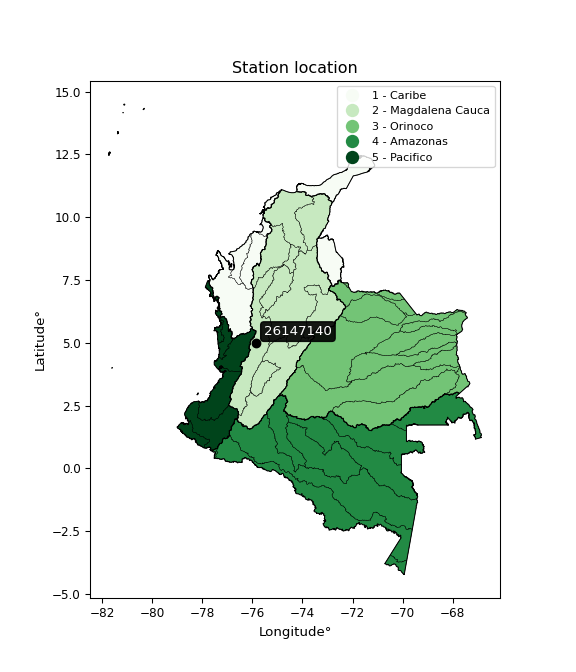</img>

</div>


## A. General information


### 1. General running parameters

• app_version: _v20260103_. • runtime: _2026-01-05 16:20:51.132608_. • Python version: _3.14.0_. • SciPy version: _1.16.3_. • Pandas version: _2.3.3_. • NumPy version: _2.3.5_. • Stations dataset (station_dataset_file): _dataset/pmax24h_in/automatic_colombia_2003_2024.csv_. • Stations catalog (station_catalog_file): _dataset/CNE.xls_. • Minimum year to eval til year_max (date_min): _1900_. • Maximum year to eval since year_min (date_max): _2024_. • Creates, save and include plots into reports (create_plot): _True_. • Plot only fit distributions with Δo > Δ (plot_only_fit): _True_. • Plot only simple graphs avoiding multiple CDFs and multiple Extreme values plots (plot_only_simple): _True_. • Eval low extreme values, if False, evaluates high extreme values (low_extreme): _False_. • Eval every SciPy distribution as logarithmic (pdist_logarithmic_on): _True_. • Standard deviation normalized (ddof): _1.0_. • Return periods to eval in years (Tr): _[2, 2.33, 5, 10, 15, 20, 25, 50, 75, 100, 200, 250, 500, 750, 1000]_. • Minimum data sample per station, 0 means any (minimum_sample): _5_. • Z-Score maximum threshold to adjust a value, 0 means disable (zscore_max): _3.5_. • Z-Score minimum threshold to adjust a value, 0 means disable (zscore_min): _-2.5_. • Avoid zeros, e.g. rain = 0 (avoid_zeros): _True_. • Avoid null values (avoid_nans): _True_. 

[:file_folder:Dataset file](../../dataset/pmax24h_in/automatic_colombia_2003_2024.csv)

> Delta Degrees of Freedom (DDOF): is a parameter used in the formulas for calculating variance and standard deviation. When ddof=0, the divisor is $N$ (the total number of observations) and this is used when your data set is the entire population. When ddof=1, the divisor is $N-1$ and this is used when your data set is a sample drawn from a larger population. Using $N-1$ provides an unbiased estimate of the population variance (known as Bessel´s correction).


### 2. Station info and location

|   id |   CODIGO | NOMBRE                         | CATEGORIA    | TECNOLOGIA                              | ESTADO           | FECHA_INSTALACION   |   FECHA_SUSPENSION |   ALTITUD |   LATITUD |   LONGITUD | DEPARTAMENTO   | MUNICIPIO   | AREA_OPERATIVA                         | ENTIDAD                                                     | AREA_HIDROGRAFICA   | ZONA_HIDROGRAFICA   | SUBZONA_HIDROGRAFICA   | CORRIENTE   | Catalogo   |   Version |
|-----:|---------:|:-------------------------------|:-------------|:----------------------------------------|:-----------------|:--------------------|-------------------:|----------:|----------:|-----------:|:---------------|:------------|:---------------------------------------|:------------------------------------------------------------|:--------------------|:--------------------|:-----------------------|:------------|:-----------|----------:|
|    0 | 26147140 | PUENTE NEGRO  - AUT [26147140] | Limnigráfica | Automática con Telemetría, Convencional | En Mantenimiento | 15/05/1975          |                nan |       947 |   4.98794 |   -75.8589 | Caldas         | Belalcazar  | Area Operativa 09 - Cauca-Valle-Caldas | INSTITUTO DE HIDROLOGIA METEOROLOGIA Y ESTUDIOS AMBIENTALES | Magdalena Cauca     | Cauca               | Río Risaralda          | Risaralda   | CNE_IDEAM  |  20251226 |

<div align="center">

Dynamic map: [:earth_americas:Google](http://maps.google.com/maps?q=4.987944444,-75.85891667) [:earth_americas:OSM](https://www.openstreetmap.org/#map=18/4.987944444/-75.85891667&layers=P) [:earth_americas:Bing](https://www.bing.com/maps?cp=4.987944444~-75.85891667&lvl=18) [:earth_americas:Apple](https://maps.apple.com/frame?center=4.987944444%2C-75.85891667&span=0.003%2C0.006)

</div>


<div align="center">

```geojson
{
  "type": "Feature",
  "geometry": {
    "type": "Point", 
    "coordinates": [-75.85891667, 4.987944444]
  }, 
  "properties": {
    "Name": "26147140"
  }
}
```

</div>


### 3. Discrete values table and plot

<div align="center">

|               |           0 |           1 |           2 |          3 |          4 |
|:--------------|------------:|------------:|------------:|-----------:|-----------:|
| Date          | 2019        | 2020        | 2021        | 2022       | 2024       |
| Value         |   42.8      |   43.6      |   79.8      |   11.4     |   78.8     |
| Value_initial |   42.8      |   43.6      |   79.8      |   11.4     |   78.8     |
| count         |    5        |    5        |    5        |    5       |    5       |
| mean          |   51.28     |   51.28     |   51.28     |   51.28    |   51.28    |
| std           |   28.6882   |   28.6882   |   28.6882   |   28.6882  |   28.6882  |
| zscore        |   -0.295592 |   -0.267706 |    0.994137 |   -1.39012 |    0.95928 |


</div>


<div align="center">

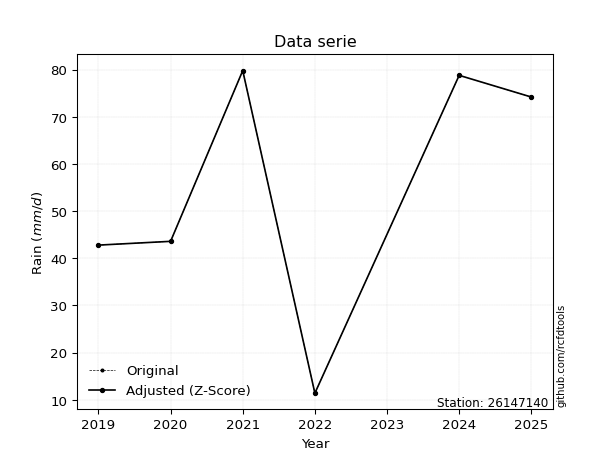</img>

</div>


> The initial value (value_initial) correspond to the initial obtained or null completed value, and value (value) is adjusted only when the initial value is outside the valid range (outlier) definite through the Z-Score value. If Z-Score is active, values out of range or outliers are replaced with the station mean value. A Z-Score (or standard score) measures how many standard deviations a data point is from the mean of a dataset, indicating its relative position; positive scores mean above the mean, negative mean below, and a score of zero is exactly at the mean, allowing for comparison of values from different distributions. It´s calculated using the formula $z=(x–μ)/σ$, where $x$ is the data point, $μ$ is the mean, and $σ$ is the standard deviation, helping identify outliers and understand probability.
>
> <sub>**Note**: In this study, "completing" (filling gaps in) and "extending" (forecasting or lengthening the historical record) rainfall data series are avoided for certain critical analyses because they introduce artificial bias and uncertainty, which can distort the statistics of rare events (extremes), alter day-to-day variability, and compromise the integrity and homogeneity of the original data. Some reasons against Completing/Extending rainfall data are: **Distortion of Extremes and Variability**: The primary issue is that most gap-filling or extension methods rely on averaging or regression with nearby stations, which inherently smooths the data. Rainfall is highly variable in space and time, with a large percentage of zero values and occasional large storms. Infilling methods often underestimate the highest values and overestimate the lowest (zero) values, which severely distorts analyses focused on flood frequency, drought severity, and intensity-duration-frequency (IDF) curves, **Loss of Data Homogeneity**: Infilled or extended data are synthetic estimates, not actual measurements. Combining these estimates with observed data can violate the assumption of data homogeneity, which requires that the data properties do not change over time. Inhomogeneity can lead to incorrect conclusions about long-term trends or changes in climate patterns, **Propagation of Errors**: Errors and biases from the original data (e.g., wind-induced undercatch, instrument errors, site changes) or the data used for imputation can propagate through the analysis, leading to unreliable hydrological models and inaccurate predictions, **Compromised Statistical Integrity**: For statistical analyses, especially those involving the frequency of events, using artificial data can introduce time bias or autocorrelation that doesn´t exist in reality, making it difficult to assess the true probability of events, **Difficulty in Validation**: It is difficult to accurately validate the quality of filled or extended data, especially for past periods where ground-truth measurements are unavailable. The reliability of imputation techniques heavily depends on the density of the surrounding station network and the complexity of the local topography.</sub>


### 4. Active continuous probability distributions from SciPy (44 of 104 available)

A Probability Density Function (PDF) describes the relative likelihood of a continuous random variable falling within a specific range, where the total area under its curve equals 1, and the area over any interval gives the actual probability for that range. Unlike discrete probabilities (like rolling a die), a PDF shows density, not direct probability for a single point (which is zero), with higher points indicating higher likelihood, often visualized as a bell curve for normal distributions.

A log of a probability density function (log-PDF) is simply the logarithm of the PDF´s value, denoted as $log(f(x))$, useful for converting multiplication of probabilities into addition, improving numerical stability with tiny numbers, and connecting to information theory concepts like entropy. Instead of dealing with very small probabilities (e.g., 0.000001), log-PDFs use negative numbers (e.g., $log(0.00001) ≈ -11.51$ that are easier for computers to handle, preventing underflow errors and simplifying complex calculations. In this study, each active probability distribution from SciPy is also evaluated in the $log$ form.

[scipy.stats](https://docs.scipy.org/doc/scipy/reference/stats.html) is a Python´s powerful submodule within the SciPy library for comprehensive statistical analysis, offering over 130 probability distributions (like Normal, Poisson), functions for descriptive stats (mean, variance), hypothesis testing (t-tests, chi-square), random variable generation, and statistical tests, making it essential for data science, modeling, and research. It provides tools to explore, model, and draw conclusions from data efficiently, working seamlessly with NumPy.

<div align="center">

|   id | p_dist             |   n_parameter | fit_method   | label                                                                       | active   | ref                                                                                                        |
|-----:|:-------------------|--------------:|:-------------|:----------------------------------------------------------------------------|:---------|:-----------------------------------------------------------------------------------------------------------|
|    0 | alpha              |             3 | MLE          | Alpha                                                                       | True     | [:mortar_board:](https://docs.scipy.org/doc/scipy/reference/generated/scipy.stats.alpha.html)              |
|    1 | betaprime          |             4 | MLE          | Beta prime                                                                  | True     | [:mortar_board:](https://docs.scipy.org/doc/scipy/reference/generated/scipy.stats.betaprime.html)          |
|    2 | chi2               |             3 | MLE          | Chi²                                                                        | True     | [:mortar_board:](https://docs.scipy.org/doc/scipy/reference/generated/scipy.stats.chi2.html)               |
|    3 | crystalball        |             4 | MLE          | Crystalball                                                                 | True     | [:mortar_board:](https://docs.scipy.org/doc/scipy/reference/generated/scipy.stats.crystalball.html)        |
|    4 | erlang             |             3 | MLE          | Erlang                                                                      | True     | [:mortar_board:](https://docs.scipy.org/doc/scipy/reference/generated/scipy.stats.erlang.html)             |
|    5 | expon              |             2 | MLE          | Exponential                                                                 | True     | [:mortar_board:](https://docs.scipy.org/doc/scipy/reference/generated/scipy.stats.expon.html)              |
|    6 | exponnorm          |             3 | MLE          | Exponentially modified Normal                                               | True     | [:mortar_board:](https://docs.scipy.org/doc/scipy/reference/generated/scipy.stats.exponnorm.html)          |
|    7 | f                  |             4 | MLE          | F                                                                           | True     | [:mortar_board:](https://docs.scipy.org/doc/scipy/reference/generated/scipy.stats.f.html)                  |
|    8 | fatiguelife        |             3 | MLE          | Fatigue-life (Birnbaum-Saunders)                                            | True     | [:mortar_board:](https://docs.scipy.org/doc/scipy/reference/generated/scipy.stats.fatiguelife.html)        |
|    9 | fisk               |             3 | MLE          | Fisk                                                                        | True     | [:mortar_board:](https://docs.scipy.org/doc/scipy/reference/generated/scipy.stats.fisk.html)               |
|   10 | gamma              |             3 | MLE          | Gamma                                                                       | True     | [:mortar_board:](https://docs.scipy.org/doc/scipy/reference/generated/scipy.stats.gamma.html)              |
|   11 | genexpon           |             5 | MLE          | Generalized exponential                                                     | True     | [:mortar_board:](https://docs.scipy.org/doc/scipy/reference/generated/scipy.stats.genexpon.html)           |
|   12 | genlogistic        |             3 | MLE          | Generalized logistic                                                        | True     | [:mortar_board:](https://docs.scipy.org/doc/scipy/reference/generated/scipy.stats.genlogistic.html)        |
|   13 | gibrat             |             2 | MM           | Gibrat                                                                      | True     | [:mortar_board:](https://docs.scipy.org/doc/scipy/reference/generated/scipy.stats.gibrat.html)             |
|   14 | gompertz           |             3 | MLE          | Gompertz (or truncated Gumbel)                                              | True     | [:mortar_board:](https://docs.scipy.org/doc/scipy/reference/generated/scipy.stats.gompertz.html)           |
|   15 | gumbel_l           |             2 | MM           | Gumbel Left Skew                                                            | True     | [:mortar_board:](https://docs.scipy.org/doc/scipy/reference/generated/scipy.stats.gumbel_l.html)           |
|   16 | gumbel_r           |             2 | MM           | Gumbel Right Skew                                                           | True     | [:mortar_board:](https://docs.scipy.org/doc/scipy/reference/generated/scipy.stats.gumbel_r.html)           |
|   17 | halflogistic       |             2 | MM           | Half-logistic                                                               | True     | [:mortar_board:](https://docs.scipy.org/doc/scipy/reference/generated/scipy.stats.halflogistic.html)       |
|   18 | halfnorm           |             2 | MM           | Half Normal                                                                 | True     | [:mortar_board:](https://docs.scipy.org/doc/scipy/reference/generated/scipy.stats.halfnorm.html)           |
|   19 | hypsecant          |             2 | MM           | hyperbolic secant                                                           | True     | [:mortar_board:](https://docs.scipy.org/doc/scipy/reference/generated/scipy.stats.hypsecant.html)          |
|   20 | invgamma           |             3 | MLE          | Inverted gamma                                                              | True     | [:mortar_board:](https://docs.scipy.org/doc/scipy/reference/generated/scipy.stats.invgamma.html)           |
|   21 | invgauss           |             3 | MLE          | Inverse Gaussian                                                            | True     | [:mortar_board:](https://docs.scipy.org/doc/scipy/reference/generated/scipy.stats.invgauss.html)           |
|   22 | invweibull         |             3 | MLE          | Inverted Weibull                                                            | True     | [:mortar_board:](https://docs.scipy.org/doc/scipy/reference/generated/scipy.stats.invweibull.html)         |
|   23 | johnsonsu          |             4 | MLE          | Johnson Su                                                                  | True     | [:mortar_board:](https://docs.scipy.org/doc/scipy/reference/generated/scipy.stats.johnsonsu.html)          |
|   24 | kstwobign          |             2 | MLE          | Limiting distribution of scaled Kolmogorov-Smirnov two-sided test statistic | True     | [:mortar_board:](https://docs.scipy.org/doc/scipy/reference/generated/scipy.stats.kstwobign.html)          |
|   25 | laplace            |             2 | MM           | Laplace                                                                     | True     | [:mortar_board:](https://docs.scipy.org/doc/scipy/reference/generated/scipy.stats.laplace.html)            |
|   26 | laplace_asymmetric |             3 | MLE          | Asymmetric Laplace                                                          | True     | [:mortar_board:](https://docs.scipy.org/doc/scipy/reference/generated/scipy.stats.laplace_asymmetric.html) |
|   27 | loggamma           |             3 | MLE          | Log gamma                                                                   | True     | [:mortar_board:](https://docs.scipy.org/doc/scipy/reference/generated/scipy.stats.loggamma.html)           |
|   28 | logistic           |             2 | MM           | Logistic (or Sech-squared)                                                  | True     | [:mortar_board:](https://docs.scipy.org/doc/scipy/reference/generated/scipy.stats.logistic.html)           |
|   29 | lognorm            |             3 | MLE          | Log Normal                                                                  | True     | [:mortar_board:](https://docs.scipy.org/doc/scipy/reference/generated/scipy.stats.lognorm.html)            |
|   30 | maxwell            |             2 | MM           | Maxwell                                                                     | True     | [:mortar_board:](https://docs.scipy.org/doc/scipy/reference/generated/scipy.stats.maxwell.html)            |
|   31 | mielke             |             4 | MLE          | Mielke Beta-Kappa / Dagum                                                   | True     | [:mortar_board:](https://docs.scipy.org/doc/scipy/reference/generated/scipy.stats.mielke.html)             |
|   32 | moyal              |             2 | MM           | Moyal                                                                       | True     | [:mortar_board:](https://docs.scipy.org/doc/scipy/reference/generated/scipy.stats.moyal.html)              |
|   33 | nakagami           |             3 | MLE          | Nakagami                                                                    | True     | [:mortar_board:](https://docs.scipy.org/doc/scipy/reference/generated/scipy.stats.nakagami.html)           |
|   34 | ncf                |             5 | MLE          | Non-central F distribution                                                  | True     | [:mortar_board:](https://docs.scipy.org/doc/scipy/reference/generated/scipy.stats.ncf.html)                |
|   35 | nct                |             4 | MLE          | Non-central Student’s t                                                     | True     | [:mortar_board:](https://docs.scipy.org/doc/scipy/reference/generated/scipy.stats.nct.html)                |
|   36 | norm               |             2 | MM           | Normal                                                                      | True     | [:mortar_board:](https://docs.scipy.org/doc/scipy/reference/generated/scipy.stats.norm.html)               |
|   37 | pearson3           |             3 | MM           | Pearson type III                                                            | True     | [:mortar_board:](https://docs.scipy.org/doc/scipy/reference/generated/scipy.stats.pearson3.html)           |
|   38 | rayleigh           |             2 | MM           | Rayleigh                                                                    | True     | [:mortar_board:](https://docs.scipy.org/doc/scipy/reference/generated/scipy.stats.rayleigh.html)           |
|   39 | rice               |             3 | MLE          | Rice                                                                        | True     | [:mortar_board:](https://docs.scipy.org/doc/scipy/reference/generated/scipy.stats.rice.html)               |
|   40 | t                  |             3 | MLE          | Student’s t                                                                 | True     | [:mortar_board:](https://docs.scipy.org/doc/scipy/reference/generated/scipy.stats.t.html)                  |
|   41 | truncnorm          |             4 | MLE          | Truncated normal                                                            | True     | [:mortar_board:](https://docs.scipy.org/doc/scipy/reference/generated/scipy.stats.truncnorm.html)          |
|   42 | wald               |             2 | MM           | Wald                                                                        | True     | [:mortar_board:](https://docs.scipy.org/doc/scipy/reference/generated/scipy.stats.wald.html)               |
|   43 | weibull_min        |             3 | MLE          | Weibull minimum                                                             | True     | [:mortar_board:](https://docs.scipy.org/doc/scipy/reference/generated/scipy.stats.weibull_min.html)        |

</div>

> **n_parameter:** # arguments & localization & scale.
>
> **Fit methods:** (MLE) maximum likelihood, (MM) L-moments.
>
>**Inactive** (With the only purpose of prevent loops, zero divisions, infinite values, over high estimated values or horizontal trending for recurrence intervals estimations, the follow distributions were disabled.)**:** foldnorm, gennorm, norminvgauss, powernorm, powerlognorm, skewnorm, genextreme, anglit, arcsine, argus, beta, bradford, burr, burr12, cauchy, cosine, halfcauchy, foldcauchy, skewcauchy, wrapcauchy, dgamma, gengamma, exponweib, exponpow, truncexpon, gausshyper, genhalflogistic, genhyperbolic, geninvgauss, halfgennorm, johnsonsb, kappa4, kappa3, ksone, kstwo, loglaplace, levy, levy_l, levy_stable, ncx2, pareto, genpareto, truncpareto, lomax, powerlaw, rdist, rel_breitwigner, recipinvgauss, semicircular, studentized_range, trapezoid, triang, truncweibull_min, tukeylambda, uniform, loguniform, vonmises, vonmises_line, weibull_max, dweibull, 


## B. Probability (PDF) vs. Empirical (EDF) distributions functions

A continuous probability distribution (CPD) describes probabilities for variables that can take any value within a range (like rain any time), unlike discrete variables with specific outcomes (like temperature). It uses a Probability Density Function (PDF), a curve where the total area under it equals 1, and the probability of the variable falling within an interval (a to b) is found by calculating the area under the curve between those points. A key feature is that the probability of hitting any single exact value is zero, so probabilities are always expressed for ranges, e.g., $P(a ≤ X ≤ b)$.

<div align="center">

Distributions parameters from station values
|    |   station | p_dist                |   n |              loc |           scale | shape                  | shape1                 | shape2                 | shape3   |
|---:|----------:|:----------------------|----:|-----------------:|----------------:|:-----------------------|:-----------------------|:-----------------------|:---------|
|  0 |  26147140 | alpha                 |   5 |     -0.0740698   |    23.6062      | 6.294282970046068e-10  |                        |                        |          |
|  1 |  26147140 | betaprime             |   5 |   -367.659       | 23193.1         | 265.598417572599       | 14712.84168751886      |                        |          |
|  2 |  26147140 | chi2                  |   5 |   -236.671       |     1.17101     | 245.96479011375425     |                        |                        |          |
|  3 |  26147140 | crystalball           |   5 |     51.28        |    25.6595      | 6746.095634077153      | 2446.628243512495      |                        |          |
|  4 |  26147140 | erlang                |   5 |   -419.386       |     1.42053     | 331.2605665921426      |                        |                        |          |
|  5 |  26147140 | expon                 |   5 |     11.4         |    39.88        |                        |                        |                        |          |
|  6 |  26147140 | exponnorm             |   5 |     51.2518      |    25.6595      | 0.0011020098413378205  |                        |                        |          |
|  7 |  26147140 | f                     |   5 |  -2290.98        |  2342.31        | 16907.054052470594     | 752567.7617985024      |                        |          |
|  8 |  26147140 | fatiguelife           |   5 |     11.4         |     4.91881e-05 | 758.0903701698146      |                        |                        |          |
|  9 |  26147140 | fisk                  |   5 |     -1.93428e+09 |     1.93428e+09 | 124403987.84852459     |                        |                        |          |
| 10 |  26147140 | gamma                 |   5 |   -370.719       |     1.59468     | 264.60434630429745     |                        |                        |          |
| 11 |  26147140 | genexpon              |   5 |     11.3999      |     0.162379    | 0.0040380861385062305  | 1.7617176231620651e-09 | 2.781352983630509      |          |
| 12 |  26147140 | genlogistic           |   5 |     55.1664      |    14.9305      | 0.8787060969923579     |                        |                        |          |
| 13 |  26147140 | gibrat                |   5 |     31.705       |    11.8728      |                        |                        |                        |          |
| 14 |  26147140 | gompertz              |   5 |    -23.2951      |    22.1565      | 0.020387510589727098   |                        |                        |          |
| 15 |  26147140 | gumbel_l              |   5 |     62.8281      |    20.0066      |                        |                        |                        |          |
| 16 |  26147140 | gumbel_r              |   5 |     39.7319      |    20.0066      |                        |                        |                        |          |
| 17 |  26147140 | halflogistic          |   5 |     20.8675      |    21.938       |                        |                        |                        |          |
| 18 |  26147140 | halfnorm              |   5 |     17.3169      |    42.5664      |                        |                        |                        |          |
| 19 |  26147140 | hypsecant             |   5 |     51.28        |    16.3353      |                        |                        |                        |          |
| 20 |  26147140 | invgamma              |   5 |   -234.782       | 32845.4         | 116.04653838421368     |                        |                        |          |
| 21 |  26147140 | invgauss              |   5 |    -83.3082      |  3291.74        | 0.04070225778841338    |                        |                        |          |
| 22 |  26147140 | invweibull            |   5 |     11.4         |     2.89188     | 0.04206336111289365    |                        |                        |          |
| 23 |  26147140 | johnsonsu             |   5 |     79.8         |     1.9517e-14  | 1.611289902194473      | 0.0925878386799732     |                        |          |
| 24 |  26147140 | kstwobign             |   5 |    -46.688       |   111.782       |                        |                        |                        |          |
| 25 |  26147140 | laplace               |   5 |     51.28        |    18.144       |                        |                        |                        |          |
| 26 |  26147140 | laplace_asymmetric    |   5 |     43.6         |    19.7788      | 0.8245276456163795     |                        |                        |          |
| 27 |  26147140 | loggamma              |   5 |     79.8003      |     2.29679e-05 | 8.040172233609357e-07  |                        |                        |          |
| 28 |  26147140 | logistic              |   5 |     51.28        |    14.1468      |                        |                        |                        |          |
| 29 |  26147140 | lognorm               |   5 |     11.4         |     0.0241884   | 15.124972258340147     |                        |                        |          |
| 30 |  26147140 | maxwell               |   5 |     -9.52223     |    38.1021      |                        |                        |                        |          |
| 31 |  26147140 | mielke                |   5 |     -5.14485     |    85.2213      | 1.7916791989874046     | 1595.082762044829      |                        |          |
| 32 |  26147140 | moyal                 |   5 |     36.6063      |    11.5508      |                        |                        |                        |          |
| 33 |  26147140 | nakagami              |   5 |     42.8         |    24.987       | 0.1450979693632953     |                        |                        |          |
| 34 |  26147140 | ncf                   |   5 |     -0.125357    |     2.95322e-05 | 9.082759260266225e-06  | 18.112106848202608     | 14.695378942588814     |          |
| 35 |  26147140 | nct                   |   5 |  -1435.15        |    25.5692      | 230590.64059110504     | 58.13328387029756      |                        |          |
| 36 |  26147140 | norm                  |   5 |     51.28        |    25.6595      |                        |                        |                        |          |
| 37 |  26147140 | pearson3              |   5 |     51.28        |    25.6595      | -0.2420780204384479    |                        |                        |          |
| 38 |  26147140 | rayleigh              |   5 |      2.19189     |    39.1666      |                        |                        |                        |          |
| 39 |  26147140 | rice                  |   5 |     -3.48553     |    29.4489      | 1.4891698081988607     |                        |                        |          |
| 40 |  26147140 | t                     |   5 |     51.2818      |    25.6573      | 3301927.6795302946     |                        |                        |          |
| 41 |  26147140 | truncnorm             |   5 |     75.3459      |    32.757       | -224.87753845337772    | 0.13597455816113402    |                        |          |
| 42 |  26147140 | wald                  |   5 |     25.6205      |    25.6595      |                        |                        |                        |          |
| 43 |  26147140 | weibull_min           |   5 |    -75.3053      |   137.012       | 5.9092916906701385     |                        |                        |          |
| 44 |  26147140 | logalpha              |   5 |    -13.5598      |   401.915       | 23.282799226725416     |                        |                        |          |
| 45 |  26147140 | logbetaprime          |   5 |    -32.3677      |   198.047       | 2948.2715614005465     | 16174.668320584271     |                        |          |
| 46 |  26147140 | logchi2               |   5 |      2.43361     |     0.956735    | 1.0598231543272183     |                        |                        |          |
| 47 |  26147140 | logcrystalball        |   5 |      3.74233     |     0.708536    | 49.398696636946035     | 91.13666573930777      |                        |          |
| 48 |  26147140 | logerlang             |   5 |     -8.05215     |     0.0442782   | 266.1486579032559      |                        |                        |          |
| 49 |  26147140 | logexpon              |   5 |      2.43361     |     1.30872     |                        |                        |                        |          |
| 50 |  26147140 | logexponnorm          |   5 |      3.74186     |     0.70854     | 0.0006555415564013119  |                        |                        |          |
| 51 |  26147140 | logf                  |   5 |  -1087.31        |  1091.05        | 12355085.119187433     | 7603156.696329478      |                        |          |
| 52 |  26147140 | logfatiguelife        |   5 |   -437.373       |   441.118       | 0.0016025044622935448  |                        |                        |          |
| 53 |  26147140 | logfisk               |   5 |     -9.02024e+07 |     9.02024e+07 | 229225781.85637265     |                        |                        |          |
| 54 |  26147140 | loggamma              |   5 |     -9.19155     |     0.0424542   | 304.5498214190179      |                        |                        |          |
| 55 |  26147140 | loggenexpon           |   5 |      2.42923     |     0.0166483   | 0.005327524766000798   | 5.136461080930468      | 2.8026409269487975e-05 |          |
| 56 |  26147140 | loggenlogistic        |   5 |      4.37954     |     1.1107e-06  | 1.7467787923779695e-06 |                        |                        |          |
| 57 |  26147140 | loggibrat             |   5 |      3.20185     |     0.32782     |                        |                        |                        |          |
| 58 |  26147140 | loggompertz           |   5 |      2.43361     |     0.567502    | 0.06416323991379949    |                        |                        |          |
| 59 |  26147140 | loggumbel_l           |   5 |      4.06121     |     0.552445    |                        |                        |                        |          |
| 60 |  26147140 | loggumbel_r           |   5 |      3.42345     |     0.552445    |                        |                        |                        |          |
| 61 |  26147140 | loghalflogistic       |   5 |      2.90252     |     0.605789    |                        |                        |                        |          |
| 62 |  26147140 | loghalfnorm           |   5 |      2.8045      |     1.17539     |                        |                        |                        |          |
| 63 |  26147140 | loghypsecant          |   5 |      3.74233     |     0.451069    |                        |                        |                        |          |
| 64 |  26147140 | loginvgamma           |   5 |    -11.3898      |  6314.48        | 418.32622855435625     |                        |                        |          |
| 65 |  26147140 | loginvgauss           |   5 |     -2.6403      |   407.316       | 0.015634496859745294   |                        |                        |          |
| 66 |  26147140 | loginvweibull         |   5 | -27390.8         | 27394.1         | 34961.97124445856      |                        |                        |          |
| 67 |  26147140 | logjohnsonsu          |   5 |      4.37952     |     1.78996e-12 | 4.215763479701502      | 0.20463025731212875    |                        |          |
| 68 |  26147140 | logkstwobign          |   5 |      0.62592     |     3.55283     |                        |                        |                        |          |
| 69 |  26147140 | loglaplace            |   5 |      3.74233     |     0.501012    |                        |                        |                        |          |
| 70 |  26147140 | loglaplace_asymmetric |   5 |      3.77506     |     0.510126    | 1.0329627590065091     |                        |                        |          |
| 71 |  26147140 | logloggamma           |   5 |      4.37961     |     7.16935e-06 | 1.1217364781677739e-05 |                        |                        |          |
| 72 |  26147140 | loglogistic           |   5 |      3.74233     |     0.390638    |                        |                        |                        |          |
| 73 |  26147140 | loglognorm            |   5 |      2.43361     |     0.0012428   | 14.331043130338841     |                        |                        |          |
| 74 |  26147140 | logmaxwell            |   5 |      2.06339     |     1.05212     |                        |                        |                        |          |
| 75 |  26147140 | logmielke             |   5 |     -1.34873e+07 |     1.34873e+07 | 21052748.27257273      | 19235505934.216328     |                        |          |
| 76 |  26147140 | logmoyal              |   5 |      3.33714     |     0.318954    |                        |                        |                        |          |
| 77 |  26147140 | lognakagami           |   5 |      3.75654     |     0.347469    | 0.04731588867105044    |                        |                        |          |
| 78 |  26147140 | logncf                |   5 |    -12.9935      |    16.7268      | 1473.6479812472717     | 3335.857802917053      | 1.862791004955051e-06  |          |
| 79 |  26147140 | lognct                |   5 |    -37.9792      |     0.656303    | 11327.231790109989     | 63.56388746688796      |                        |          |
| 80 |  26147140 | lognorm               |   5 |      3.74233     |     0.708538    |                        |                        |                        |          |
| 81 |  26147140 | logpearson3           |   5 |      3.74233     |     0.708539    | -0.9778453790769082    |                        |                        |          |
| 82 |  26147140 | lograyleigh           |   5 |      2.38685     |     1.08151     |                        |                        |                        |          |
| 83 |  26147140 | logrice               |   5 |      1.91758     |     0.768569    | 2.1182148727176684     |                        |                        |          |
| 84 |  26147140 | logt                  |   5 |      3.74232     |     0.708534    | 137941893.2500139      |                        |                        |          |
| 85 |  26147140 | logtruncnorm          |   5 |     -0.19699     |     1.42348     | 2.7773625323032816     | 3.2150208463219974     |                        |          |
| 86 |  26147140 | logwald               |   5 |      3.03373     |     0.708592    |                        |                        |                        |          |
| 87 |  26147140 | logweibull_min        |   5 | -86932.9         | 86937           | 179736.43187814014     |                        |                        |          |

</div>

> **loc** (Location parameter): This shifts the distribution along the x-axis. For many common distributions, like the normal (Gaussian) distribution, loc represents the mean $μ$. For others, like the uniform distribution, it might represent the minimum value, or for the beta distribution, the left end of the support interval.
>
> **scale** (Scale parameter): This determines the width or spread of the distribution. For the normal distribution, scale represents the standard deviation $σ$. For a uniform distribution, it defines the length of the interval (from $loc$ to $loc + scale$).
>
> **shape** (Shape parameters): Refers to parameters that define the specific form of a probability distribution, distinct from its location (loc) and scale (scale). These parameters are required arguments for most distribution functions. For example, a normal (Gaussian) distribution is fully defined by its location (mean) and scale (standard deviation), so it has no specific shape parameters beyond loc and scale. However, other distributions have intrinsic properties that need specification, as Gamma distribution that takes a shape parameter, often named $a$ or $alpha$.


### 0. Cumulative distribution values - CDF (88 evaluated)

Cumulative Distribution Function (CDF), denoted as $F$<sub>$X$</sub>$(x)$, is a function that gives the probability that a random variable $X$ will take a value less than or equal to a specific value, $x$ (i.e., $(P(X≥x)$. It essentially "accumulates" probabilities from a given point up to the far right (positive infinity), providing a complete picture of the distribution´s probabilities for both discrete (like rain) and continuous (like temperature) variables, helping to find probabilities over ranges or above certain values. Each station is evaluated separately ordering the $x$ values ascending, calculating the CDF and PDF values for the activated distributions and their logarithmic forms.

<div align="center">

CDF ordered by x ascending and calculating $log(f(x))$ separately
|   id |   Station |   date |    x |   count |   mean |     std |    zscore |   Value_initial |   station |   m |    alpha |   alpha_pdf |   betaprime |   betaprime_pdf |      chi2 |   chi2_pdf |   crystalball |   crystalball_pdf |    erlang |   erlang_pdf |    expon |   expon_pdf |   exponnorm |   exponnorm_pdf |         f |      f_pdf |   fatiguelife |   fatiguelife_pdf |      fisk |   fisk_pdf |     gamma |   gamma_pdf |    genexpon |   genexpon_pdf |   genlogistic |   genlogistic_pdf |   gibrat |   gibrat_pdf |   gompertz |   gompertz_pdf |   gumbel_l |   gumbel_l_pdf |   gumbel_r |   gumbel_r_pdf |   halflogistic |   halflogistic_pdf |   halfnorm |   halfnorm_pdf |   hypsecant |   hypsecant_pdf |   invgamma |   invgamma_pdf |   invgauss |   invgauss_pdf |   invweibull |   invweibull_pdf |   johnsonsu |   johnsonsu_pdf |   kstwobign |   kstwobign_pdf |   laplace |   laplace_pdf |   laplace_asymmetric |   laplace_asymmetric_pdf |   loggamma |   loggamma_pdf |   logistic |   logistic_pdf |   lognorm |   lognorm_pdf |   maxwell |   maxwell_pdf |   mielke |   mielke_pdf |      moyal |   moyal_pdf |    nakagami |   nakagami_pdf |       ncf |    ncf_pdf |      nct |    nct_pdf |      norm |   norm_pdf |   pearson3 |   pearson3_pdf |   rayleigh |   rayleigh_pdf |      rice |   rice_pdf |         t |      t_pdf |   truncnorm |   truncnorm_pdf |     wald |   wald_pdf |   weibull_min |   weibull_min_pdf |   logalpha |   logalpha_pdf |   logbetaprime |   logbetaprime_pdf |     logchi2 |   logchi2_pdf |   logcrystalball |   logcrystalball_pdf |   logerlang |   logerlang_pdf |   logexpon |   logexpon_pdf |   logexponnorm |   logexponnorm_pdf |      logf |   logf_pdf |   logfatiguelife |   logfatiguelife_pdf |   logfisk |   logfisk_pdf |   loggenexpon |   loggenexpon_pdf |   loggenlogistic |   loggenlogistic_pdf |   loggibrat |   loggibrat_pdf |   loggompertz |   loggompertz_pdf |   loggumbel_l |   loggumbel_l_pdf |   loggumbel_r |   loggumbel_r_pdf |   loghalflogistic |   loghalflogistic_pdf |   loghalfnorm |   loghalfnorm_pdf |   loghypsecant |   loghypsecant_pdf |   loginvgamma |   loginvgamma_pdf |   loginvgauss |   loginvgauss_pdf |   loginvweibull |   loginvweibull_pdf |   logjohnsonsu |   logjohnsonsu_pdf |   logkstwobign |   logkstwobign_pdf |   loglaplace |   loglaplace_pdf |   loglaplace_asymmetric |   loglaplace_asymmetric_pdf |   logloggamma |   logloggamma_pdf |   loglogistic |   loglogistic_pdf |   loglognorm |   loglognorm_pdf |   logmaxwell |   logmaxwell_pdf |   logmielke |   logmielke_pdf |    logmoyal |   logmoyal_pdf |   lognakagami |   lognakagami_pdf |    logncf |   logncf_pdf |    lognct |   lognct_pdf |   logpearson3 |   logpearson3_pdf |   lograyleigh |   lograyleigh_pdf |   logrice |   logrice_pdf |     logt |   logt_pdf |   logtruncnorm |   logtruncnorm_pdf |   logwald |   logwald_pdf |   logweibull_min |   logweibull_min_pdf |
|-----:|----------:|-------:|-----:|--------:|-------:|--------:|----------:|----------------:|----------:|----:|---------:|------------:|------------:|----------------:|----------:|-----------:|--------------:|------------------:|----------:|-------------:|---------:|------------:|------------:|----------------:|----------:|-----------:|--------------:|------------------:|----------:|-----------:|----------:|------------:|------------:|---------------:|--------------:|------------------:|---------:|-------------:|-----------:|---------------:|-----------:|---------------:|-----------:|---------------:|---------------:|-------------------:|-----------:|---------------:|------------:|----------------:|-----------:|---------------:|-----------:|---------------:|-------------:|-----------------:|------------:|----------------:|------------:|----------------:|----------:|--------------:|---------------------:|-------------------------:|-----------:|---------------:|-----------:|---------------:|----------:|--------------:|----------:|--------------:|---------:|-------------:|-----------:|------------:|------------:|---------------:|----------:|-----------:|---------:|-----------:|----------:|-----------:|-----------:|---------------:|-----------:|---------------:|----------:|-----------:|----------:|-----------:|------------:|----------------:|---------:|-----------:|--------------:|------------------:|-----------:|---------------:|---------------:|-------------------:|------------:|--------------:|-----------------:|---------------------:|------------:|----------------:|-----------:|---------------:|---------------:|-------------------:|----------:|-----------:|-----------------:|---------------------:|----------:|--------------:|--------------:|------------------:|-----------------:|---------------------:|------------:|----------------:|--------------:|------------------:|--------------:|------------------:|--------------:|------------------:|------------------:|----------------------:|--------------:|------------------:|---------------:|-------------------:|--------------:|------------------:|--------------:|------------------:|----------------:|--------------------:|---------------:|-------------------:|---------------:|-------------------:|-------------:|-----------------:|------------------------:|----------------------------:|--------------:|------------------:|--------------:|------------------:|-------------:|-----------------:|-------------:|-----------------:|------------:|----------------:|------------:|---------------:|--------------:|------------------:|----------:|-------------:|----------:|-------------:|--------------:|------------------:|--------------:|------------------:|----------:|--------------:|---------:|-----------:|---------------:|-------------------:|----------:|--------------:|-----------------:|---------------------:|
|    0 |  26147140 |   2022 | 11.4 |       5 |  51.28 | 28.6882 | -1.39012  |            11.4 |  26147140 |   1 | 0.039652 |  0.0172349  |   0.0593073 |      0.0048722  | 0.0564285 | 0.00483009 |     0.0600683 |        0.00464659 | 0.0586956 |   0.00480403 | 0        |  0.0250752  |   0.0600681 |      0.00464658 | 0.0598787 | 0.00467139 |     0.0472998 |       2.69214e+09 | 0.0685805 | 0.00410829 | 0.0586289 |  0.00481881 | 1.81678e-06 |     0.0248682  |     0.0726976 |        0.00406189 | 0        |   0          |  0.0743029 |     0.00407755 |  0.0736406 |     0.00354183 |  0.0162264 |     0.00334244 |       0        |         0          |   0        |     0          |   0.0552751 |      0.00336679 |  0.0583071 |     0.0053411  |  0.0508061 |     0.00557913 |    0.0127314 |      1.31554e+12 |   0.0386249 |     0.000113373 |   0.0500341 |      0.00700895 | 0.0555141 |    0.00305964 |            0.0561873 |               0.00344535 |  0.0356079 |       0.113574 |  0.0563056 |     0.00375599 | 0.0323689 |      0.102263 | 0.0402577 |    0.00543042 | 0.053031 |   0.00574285 | 0.00290561 |  0.00122171 | 0           |    0           | 0.0434102 | 0.00736432 | 0.060078 | 0.00464836 | 0.0600683 | 0.00464659 |  0.0660367 |     0.00446121 |  0.0272578 |     0.00583896 | 0.0423776 | 0.0057156  | 0.0600438 | 0.00464551 |   0.0459525 |      0.00326984 | 0        | 0          |     0.0647581 |        0.00426741 |  0.0323536 |       0.113806 |      0.0346603 |           0.109063 | 5.84759e-09 |   6.97767e+06 |        0.0323686 |             0.102262 |   0.0322965 |        0.108257 |   0        |       0.764108 |      0.0323696 |           0.102264 | 0.0327593 |   0.103023 |         0.031569 |             0.100704 | 0.0265676 |      0.065721 |    0.00140723 |          0.321828 |         0        |            0.0737155 |    0        |        0        |   4.42201e-08 |          0.113063 |     0.0511843 |         0.0902378 |    0.00247909 |         0.0269243 |          0        |              0        |      0        |          0        |       0.034946 |          0.0773182 |     0.0327149 |          0.111386 |     0.0390087 |          0.134218 |       0.0370732 |            0.155901 |      0.055098  |        0.0117146   |      0.0419667 |           0.198053 |    0.0366885 |        0.0732288 |               0.0404795 |                   0.0768198 |      0.047608 |         0.0744887 |     0.0338885 |         0.0838118 |    0.0227576 |       8.4858e+12 |     0.011167 |        0.0882641 |   0.0476855 |       0.0744338 | 3.75242e-05 |     0.00105293 |     0         |       0           | 0.0349269 |     0.111814 | 0.0328415 |     0.103865 |     0.0517629 |         0.0979073 |   0.000934197 |         0.0399391 | 0.0270702 |      0.116395 | 0.032369 |   0.102263 |    0           |           0        |  0        |      0        |        0.0344139 |            0.0699113 |
|    1 |  26147140 |   2019 | 42.8 |       5 |  51.28 | 28.6882 | -0.295592 |            42.8 |  26147140 |   2 | 0.581911 |  0.00880538 |   0.382249  |      0.0149129  | 0.381098  | 0.0149678  |     0.370518  |        0.0147213  | 0.379136  |   0.0148929  | 0.544956 |  0.0114103  |   0.370517  |      0.0147213  | 0.371386  | 0.0147113  |     0.854043  |       0.00384205  | 0.356819  | 0.0147604  | 0.379403  |  0.0148688  | 0.541991    |     0.0113899  |     0.351246  |        0.0143875  | 0.472989 |   0.0358746  |  0.317673  |     0.0123994  |  0.307526  |     0.0127195  |  0.424084  |     0.0181834  |       0.462019 |         0.0179264  |   0.450605 |     0.0156692  |   0.341717  |      0.0171261  |  0.404703  |     0.0151328  |  0.420077  |     0.0154503  |    0.404724  |      0.000490417 |   0.0436348 |     0.000231375 |   0.456765  |      0.0145467  | 0.313323  |    0.0172687  |            0.385333  |               0.0236283  |  0.517654  |       0.537375 |  0.354475  |     0.0161748  | 0.508     |      0.562937 | 0.403535  |    0.0153811  | 0.356802 |   0.0133335  | 0.444376   |  0.0197168  | 2.49043e-05 |    1.01713e+09 | 0.459994  | 0.014074   | 0.370597 | 0.0147216  | 0.370518  | 0.0147213  |  0.357032  |     0.0141578  |  0.415782  |     0.0154652  | 0.391032  | 0.0149336  | 0.37048   | 0.0147221  |   0.289163  |      0.0134177  | 0.495778 | 0.0261574  |     0.340209  |        0.0137275  |  0.528939  |       0.533322 |      0.515569  |           0.551145 | 0.744308    |   0.185897    |        0.508     |             0.562938 |   0.521442  |        0.550672 |   0.636093 |       0.278064 |      0.508001  |           0.562935 | 0.50814   |   0.560814 |         0.506386 |             0.564273 | 0.440467  |      0.626303 |    0.586013   |          0.417557 |         0        |            0.590377  |    0.700533 |        0.626325 |   0.449018    |          0.640997 |     0.437907  |         0.586149  |    0.578566   |         0.573076  |          0.607454 |              0.520808 |      0.582047 |          0.488986 |       0.510025 |          0.705328  |     0.521374  |          0.537294 |     0.539149  |          0.497334 |       0.543931  |            0.422713 |      0.086245  |        0.0516719   |      0.58074   |           0.404006 |    0.513981  |        0.970074  |               0.498383  |                   0.945804  |      0.377241 |         0.590242  |     0.509093  |         0.639768  |    0.686649  |       0.0186952  |     0.540713 |        0.537992  |   0.376012  |       0.58693   | 0.604341    |     0.566694   |     0.0345934 |       7.37156e+12 | 0.514825  |     0.538094 | 0.509848  |     0.55972  |     0.442825  |         0.557317  |   0.551547    |         0.525139  | 0.517695  |      0.546311 | 0.508005 |   0.56294  |    1.17972e-05 |           2.83675  |  0.675988 |      0.546369 |        0.417076  |            0.650423  |
|    2 |  26147140 |   2020 | 43.6 |       5 |  51.28 | 28.6882 | -0.267706 |            43.6 |  26147140 |   3 | 0.588846 |  0.00853257 |   0.394225  |      0.015026   | 0.393116  | 0.0150744  |     0.382354  |        0.0148665  | 0.391099  |   0.0150123  | 0.553994 |  0.0111837  |   0.382353  |      0.0148665  | 0.383212  | 0.0148517  |     0.857076  |       0.00374072  | 0.368713  | 0.0149703  | 0.391346  |  0.0149854  | 0.551013    |     0.0111655  |     0.36285   |        0.0146181  | 0.500744 |   0.0335387  |  0.327699  |     0.0126664  |  0.31783   |     0.0130414  |  0.438586  |     0.0180681  |       0.476239 |         0.0176223  |   0.463069 |     0.0154912  |   0.355575  |      0.0175144  |  0.41683   |     0.0151812  |  0.432435  |     0.0154416  |    0.405111  |      0.000478185 |   0.0438223 |     0.000237308 |   0.468356  |      0.0144314  | 0.327447  |    0.0180471  |            0.404707  |               0.0248163  |  0.527594  |       0.536103 |  0.367518  |     0.0164312  | 0.518421  |      0.562449 | 0.415849  |    0.0154011  | 0.367539 |   0.0135094  | 0.460033   |  0.0194222  | 0.297821    |    0.108019    | 0.47119   | 0.0139166  | 0.382433 | 0.0148667  | 0.382354  | 0.0148665  |  0.368433  |     0.0143444  |  0.428143  |     0.0154362  | 0.403006  | 0.014999   | 0.382317  | 0.0148674  |   0.300028  |      0.0137431  | 0.516183 | 0.024866   |     0.351281  |        0.0139519  |  0.538795  |       0.531062 |      0.525767  |           0.550197 | 0.747723    |   0.182907    |        0.518421  |             0.562451 |   0.531626  |        0.549161 |   0.641206 |       0.274157 |      0.518422  |           0.562448 | 0.518325  |   0.560327 |         0.516832 |             0.563819 | 0.452096  |      0.629478 |    0.59371    |          0.413693 |         0        |            0.607824  |    0.711843 |        0.59539  |   0.460953    |          0.647914 |     0.448838  |         0.594343  |    0.589098   |         0.564271  |          0.617009 |              0.511151 |      0.591044 |          0.482725 |       0.523075 |          0.703825  |     0.531308  |          0.535536 |     0.548335  |          0.494639 |       0.551722  |            0.418753 |      0.0872206 |        0.0537045   |      0.588183  |           0.39982  |    0.531618  |        0.934871  |               0.51621   |                   0.979634  |      0.388332 |         0.607594  |     0.520933  |         0.638858  |    0.686992  |       0.0184284  |     0.550643 |        0.534386  |   0.38704   |       0.604144  | 0.614724    |     0.554663   |     0.672805  |       3.43757     | 0.52478   |     0.53691  | 0.520209  |     0.559099 |     0.453209  |         0.564107  |   0.561231    |         0.520745  | 0.527801  |      0.545101 | 0.518426 |   0.562452 |    0.0516066   |           2.73585  |  0.685912 |      0.525591 |        0.429226  |            0.661722  |
|    3 |  26147140 |   2024 | 78.8 |       5 |  51.28 | 28.6882 |  0.95928  |            78.8 |  26147140 |   4 | 0.764719 |  0.00289499 |   0.857237  |      0.00832981 | 0.854217  | 0.00828895 |     0.858254  |        0.00874749 | 0.85685   |   0.00841355 | 0.815493 |  0.00462654 |   0.858254  |      0.0087475  | 0.856673  | 0.0087094  |     0.938719  |       0.00138727  | 0.848921  | 0.00824874 | 0.855547  |  0.0084022  | 0.812902    |     0.0046528  |     0.848627  |        0.00850973 | 0.915885 |   0.0032783  |  0.867869  |     0.0121916  |  0.891589  |     0.0120395  |  0.867724  |     0.00615368 |       0.866876 |         0.00566429 |   0.851374 |     0.00660447 |   0.883233  |      0.00698887 |  0.854124  |     0.00759799 |  0.853283  |     0.00708905 |    0.416466  |      0.000227669 |   0.0844646 |     0.0143394   |   0.839248  |      0.00644757 | 0.890289  |    0.0060467  |            0.862771  |               0.00572075 |  0.803631  |       0.362059 |  0.874935  |     0.00773488 | 0.810979  |      0.381777 | 0.853584  |    0.00766363 | 0.973323 |   0.0207742  | 0.872104   |  0.00548855 | 0.867188    |    0.0053617   | 0.813419  | 0.00582855 | 0.858231 | 0.00874494 | 0.858254  | 0.00874749 |  0.860367  |     0.00950113 |  0.852345  |     0.00737379 | 0.853957  | 0.00820375 | 0.858259  | 0.00874804 |   0.97818   |      0.0218585  | 0.893126 | 0.00394819 |     0.865098  |        0.0103624  |  0.805896  |       0.343849 |      0.809889  |           0.370506 | 0.833206    |   0.113053    |        0.81098   |             0.381777 |   0.81149   |        0.360996 |   0.771735 |       0.174419 |      0.810979  |           0.381776 | 0.809897  |   0.381442 |         0.810259 |             0.383023 | 0.787821  |      0.424791 |    0.796901   |          0.269061 |         0        |            1.54178   |    0.897612 |        0.153247 |   0.84608     |          0.524949 |     0.824321  |         0.553038  |    0.834215   |         0.273717  |          0.836278 |              0.248139 |      0.816242 |          0.280586 |       0.843799 |          0.332559  |     0.803836  |          0.354072 |     0.796403  |          0.323935 |       0.756219  |            0.269671 |      0.285632  |        5.51488     |      0.782509  |           0.256833 |    0.856266  |        0.286887  |               0.854061  |                   0.295515  |      0.980334 |         1.53386   |     0.831862  |         0.358049  |    0.695971  |       0.0126247  |     0.812445 |        0.330848  |   0.97494   |       1.52182   | 0.842238    |     0.244062   |     0.930617  |       0.125479    | 0.80184   |     0.364218 | 0.810423  |     0.378672 |     0.811641  |         0.556416  |   0.812871    |         0.316779  | 0.808582  |      0.367026 | 0.810984 |   0.381774 |    0.990215    |           0.786489 |  0.871537 |      0.177459 |        0.85137   |            0.585768  |
|    4 |  26147140 |   2021 | 79.8 |       5 |  51.28 | 28.6882 |  0.994137 |            79.8 |  26147140 |   5 | 0.767579 |  0.00282611 |   0.865396  |      0.00799035 | 0.862339  | 0.00795656 |     0.866819  |        0.00838303 | 0.865092  |   0.00806993 | 0.820062 |  0.00451197 |   0.866819  |      0.00838304 | 0.865203  | 0.0083507  |     0.940089  |       0.00135294  | 0.856986  | 0.00788258 | 0.863779  |  0.00806208 | 0.817498    |     0.00453852 |     0.856944  |        0.00812614 | 0.919082 |   0.00311785 |  0.879769  |     0.0116057  |  0.903257  |     0.0112944  |  0.873747  |     0.00589429 |       0.87243  |         0.00544414 |   0.857868 |     0.00638236 |   0.890026  |      0.00659916 |  0.861574  |     0.00730222 |  0.860237  |     0.00682019 |    0.416692  |      0.000224323 |   0.946442  |     5.1675e+11  |   0.845593  |      0.00624353 | 0.896172  |    0.00572246 |            0.868374  |               0.00548717 |  0.808163  |       0.356725 |  0.882467  |     0.00733162 | 0.815756  |      0.375775 | 0.861102  |    0.00737297 | 0.994189 |   0.0208527  | 0.877479   |  0.00526168 | 0.872453    |    0.00516998  | 0.819159  | 0.00565373 | 0.866794 | 0.00838068 | 0.866819  | 0.00838303 |  0.869665  |     0.00909575 |  0.859583  |     0.00710384 | 0.862003  | 0.00788705 | 0.866824  | 0.00838352 |   1         |      0.0217781  | 0.89699  | 0.0037821  |     0.875227  |        0.00989365 |  0.8102    |       0.338686 |      0.814525  |           0.364803 | 0.834625    |   0.111968    |        0.815757  |             0.375775 |   0.816006  |        0.355372 |   0.773924 |       0.172746 |      0.815756  |           0.375773 | 0.814669  |   0.375493 |         0.815051 |             0.377003 | 0.793129  |      0.416955 |    0.800274   |          0.265896 |         0.999981 |            1.57262   |    0.899521 |        0.149542 |   0.852631    |          0.513902 |     0.831235  |         0.543537  |    0.837634   |         0.268636  |          0.83938  |              0.243849 |      0.819755 |          0.276597 |       0.847941 |          0.324431  |     0.808268  |          0.348804 |     0.80046   |          0.31949  |       0.7596    |            0.266552 |      0.999966  |        9.52084e+06 |      0.78573   |           0.253927 |    0.859839  |        0.279756  |               0.85774   |                   0.288065  |      0.999869 |         1.56441   |     0.836329  |         0.350408  |    0.696129  |       0.01254    |     0.816585 |        0.325794  |   0.994315  |       1.54357   | 0.845287    |     0.239469   |     0.93218   |       0.122429    | 0.806399  |     0.358882 | 0.815161  |     0.372758 |     0.818614  |         0.549419  |   0.816836    |         0.312041  | 0.813175  |      0.361484 | 0.81576  |   0.375771 |    0.999993    |           0.764434 |  0.873752 |      0.173853 |        0.858669  |            0.571716  |


</div>

An Empirical Distribution Function (EDF) is a step-function estimate of a true cumulative distribution function (CDF) based on observed sample data, representing the proportion of data points less than or equal to a given value. It is calculated by ordering your data and jumping up by $1/n$ (where $n$ is sample size) at each unique data point, allowing analysis without assuming an underlying population distribution, and it gets closer to the true CDF as the sample size grows. For the empirical probability calculations, the parameter $m$ correspond to the order number which means the position of the $x$ values in an ascending order list.

The Kolmogorov-Smirnov (K-S) test is a non-parametric statistical test used to determine if a sample data set comes from a specific theoretical distribution (one-sample) or if two different samples come from the same underlying distribution (two-sample), by comparing their cumulative distribution functions (CDFs). It calculates the maximum vertical difference (D statistic) between these functions, with a small p-value indicating a significant difference and rejection of the null hypothesis (that the data/samples match).


### 1. EDF California (1923)

California´s estimates the true probability distribution of water-related data (like rainfall, streamflow) using observed samples, crucial for risk assessment.

<div align="center">


$P=m/n$


</div>


**1.1. Empirical values**

<div align="center">

|                | 0              | 1                  | 2              | 3                 | 4              |
|:---------------|:---------------|:-------------------|:---------------|:------------------|:---------------|
| date           | 2022           | 2019               | 2020           | 2024              | 2021           |
| x              | 11.4           | 42.8               | 43.6           | 78.8              | 79.8           |
| m              | 1              | 2                  | 3              | 4                 | 5              |
| empirical_dist | edf_california | edf_california     | edf_california | edf_california    | edf_california |
| empirical      | 0.2            | 0.4                | 0.6            | 0.8               | 1.0            |
| empirical_tr   | 1.25           | 1.6666666666666667 | 2.5            | 5.000000000000001 | inf            |

</div>


**1.2. Kolmogorov-Smirnov fit test (sorted by Δ)**


<div align="center">

|                | 0                  | 1                     | 2                   | 3                   | 4                   | 5                   | 6                  | 7                  | 8                   | 9                  | 10                 | 11                  | 12                  | 13                  | 14                  | 15                  | 16                  | 17                  | 18                 | 19                 | 20                  | 21                 | 22                  | 23                  | 24                  | 25                  | 26                  | 27                  | 28                  | 29                  | 30                  | 31                 | 32                  | 33                  | 34                  | 35                  | 36                  | 37                  | 38                 | 39                 | 40                 | 41                 | 42                 | 43                 | 44                 | 45                 | 46                  | 47                  | 48                  | 49                  | 50                  | 51                 | 52                 | 53                  | 54                  | 55                  | 56                  | 57                  | 58                  | 59                  | 60                  | 61                  | 62                  | 63                  | 64                  | 65                  | 66                  | 67                  | 68                 | 69                  | 70                  | 71                  | 72                 | 73                 | 74                 | 75                 | 76                 | 77                  | 78                  | 79                 | 80                 | 81                  | 82                 | 83                 | 84                 | 85                 | 86                 | 87                 |
|:---------------|:-------------------|:----------------------|:--------------------|:--------------------|:--------------------|:--------------------|:-------------------|:-------------------|:--------------------|:-------------------|:-------------------|:--------------------|:--------------------|:--------------------|:--------------------|:--------------------|:--------------------|:--------------------|:-------------------|:-------------------|:--------------------|:-------------------|:--------------------|:--------------------|:--------------------|:--------------------|:--------------------|:--------------------|:--------------------|:--------------------|:--------------------|:-------------------|:--------------------|:--------------------|:--------------------|:--------------------|:--------------------|:--------------------|:-------------------|:-------------------|:-------------------|:-------------------|:-------------------|:-------------------|:-------------------|:-------------------|:--------------------|:--------------------|:--------------------|:--------------------|:--------------------|:-------------------|:-------------------|:--------------------|:--------------------|:--------------------|:--------------------|:--------------------|:--------------------|:--------------------|:--------------------|:--------------------|:--------------------|:--------------------|:--------------------|:--------------------|:--------------------|:--------------------|:-------------------|:--------------------|:--------------------|:--------------------|:-------------------|:-------------------|:-------------------|:-------------------|:-------------------|:--------------------|:--------------------|:-------------------|:-------------------|:--------------------|:-------------------|:-------------------|:-------------------|:-------------------|:-------------------|:-------------------|
| station        | 26147140           | 26147140              | 26147140            | 26147140            | 26147140            | 26147140            | 26147140           | 26147140           | 26147140            | 26147140           | 26147140           | 26147140            | 26147140            | 26147140            | 26147140            | 26147140            | 26147140            | 26147140            | 26147140           | 26147140           | 26147140            | 26147140           | 26147140            | 26147140            | 26147140            | 26147140            | 26147140            | 26147140            | 26147140            | 26147140            | 26147140            | 26147140           | 26147140            | 26147140            | 26147140            | 26147140            | 26147140            | 26147140            | 26147140           | 26147140           | 26147140           | 26147140           | 26147140           | 26147140           | 26147140           | 26147140           | 26147140            | 26147140            | 26147140            | 26147140            | 26147140            | 26147140           | 26147140           | 26147140            | 26147140            | 26147140            | 26147140            | 26147140            | 26147140            | 26147140            | 26147140            | 26147140            | 26147140            | 26147140            | 26147140            | 26147140            | 26147140            | 26147140            | 26147140           | 26147140            | 26147140            | 26147140            | 26147140           | 26147140           | 26147140           | 26147140           | 26147140           | 26147140            | 26147140            | 26147140           | 26147140           | 26147140            | 26147140           | 26147140           | 26147140           | 26147140           | 26147140           | 26147140           |
| empirical_dist | edf_california     | edf_california        | edf_california      | edf_california      | edf_california      | edf_california      | edf_california     | edf_california     | edf_california      | edf_california     | edf_california     | edf_california      | edf_california      | edf_california      | edf_california      | edf_california      | edf_california      | edf_california      | edf_california     | edf_california     | edf_california      | edf_california     | edf_california      | edf_california      | edf_california      | edf_california      | edf_california      | edf_california      | edf_california      | edf_california      | edf_california      | edf_california     | edf_california      | edf_california      | edf_california      | edf_california      | edf_california      | edf_california      | edf_california     | edf_california     | edf_california     | edf_california     | edf_california     | edf_california     | edf_california     | edf_california     | edf_california      | edf_california      | edf_california      | edf_california      | edf_california      | edf_california     | edf_california     | edf_california      | edf_california      | edf_california      | edf_california      | edf_california      | edf_california      | edf_california      | edf_california      | edf_california      | edf_california      | edf_california      | edf_california      | edf_california      | edf_california      | edf_california      | edf_california     | edf_california      | edf_california      | edf_california      | edf_california     | edf_california     | edf_california     | edf_california     | edf_california     | edf_california      | edf_california      | edf_california     | edf_california     | edf_california      | edf_california     | edf_california     | edf_california     | edf_california     | edf_california     | edf_california     |
| p_dist         | kstwobign          | loglaplace_asymmetric | loglaplace          | loghypsecant        | loglogistic         | invgauss            | loggumbel_l        | logweibull_min     | rayleigh            | ncf                | logpearson3        | invgamma            | gumbel_r            | logerlang           | maxwell             | logt                | logcrystalball      | logexponnorm        | lognorm            | lognorm            | lognct              | logfatiguelife     | logf                | logbetaprime        | logrice             | logmaxwell          | logalpha            | loginvgamma         | loggamma            | loggamma            | logncf              | laplace_asymmetric | rice                | moyal               | loggumbel_r         | lograyleigh         | loginvgauss         | loggenexpon         | genexpon           | loggompertz        | halfnorm           | loghalfnorm        | gibrat             | expon              | wald               | halflogistic       | logmoyal            | betaprime           | logfisk             | chi2                | loghalflogistic     | gamma              | erlang             | logloggamma         | logmielke           | logkstwobign        | f                   | nct                 | norm                | crystalball         | exponnorm           | t                   | fisk                | pearson3            | alpha               | mielke              | logistic            | logexpon            | genlogistic        | loginvweibull       | hypsecant           | weibull_min         | gompertz           | laplace            | logwald            | gumbel_l           | truncnorm          | loggibrat           | loglognorm          | logchi2            | lognakagami        | nakagami            | fatiguelife        | logjohnsonsu       | logtruncnorm       | invweibull         | johnsonsu          | loggenlogistic     |
| delta          | 0.1544068564123895 | 0.15952047774370742   | 0.16331145829559224 | 0.16505395214245494 | 0.16611152657345957 | 0.16756491665707235 | 0.1687645150001844 | 0.1707740714072281 | 0.17274219597721197 | 0.1808405333732317 | 0.1813859610386196 | 0.18317006074550535 | 0.18377360771020892 | 0.18399357844572495 | 0.18415078185043504 | 0.18423951277347195 | 0.18424341705838143 | 0.18424395675369798 | 0.1842441482870424 | 0.1842441482870424 | 0.18483903522597378 | 0.1849492743449881 | 0.18533075512339736 | 0.18547504791475822 | 0.18682472239653547 | 0.18883297671292318 | 0.18980002752783265 | 0.19173245680539008 | 0.19183734562205756 | 0.19183734562205756 | 0.19360106889189732 | 0.1952927202889182 | 0.19699399548536634 | 0.19709439432444179 | 0.19752090682063203 | 0.19906580319551911 | 0.19954007857588385 | 0.19972607773878204 | 0.1999981832192591 | 0.1999999557799239 | 0.2                | 0.2                | 0.2                | 0.2                | 0.2                | 0.2                | 0.20434110978040565 | 0.20577453151680353 | 0.20687131081067722 | 0.20688392785967258 | 0.20745405429831387 | 0.2086541218806669 | 0.2089006363136917 | 0.21166834933851902 | 0.21295952361558607 | 0.21427045325233762 | 0.21678807179877196 | 0.21756653347223553 | 0.21764611205475554 | 0.21764612214892376 | 0.21764653594655053 | 0.21768306947075222 | 0.23128739213310606 | 0.23156653984871062 | 0.23242111788866782 | 0.23246070420621923 | 0.23248170190002132 | 0.23609312100128943 | 0.2371504534018467 | 0.24040039344923425 | 0.24442545001001859 | 0.24871884994361532 | 0.2723006946397536 | 0.2725525067438562 | 0.2759881742507255 | 0.2821700374693288 | 0.299972319706546  | 0.30053298446502963 | 0.30387082222848183 | 0.3443076643770505 | 0.3654066266746686 | 0.39997509567132694 | 0.454043303359304  | 0.5143676076974875 | 0.5483934125481278 | 0.5833077150971556 | 0.7155353930993141 | 0.8                |
| deltao         | 0.5865427407550001 | 0.5865427407550001    | 0.5865427407550001  | 0.5865427407550001  | 0.5865427407550001  | 0.5865427407550001  | 0.5865427407550001 | 0.5865427407550001 | 0.5865427407550001  | 0.5865427407550001 | 0.5865427407550001 | 0.5865427407550001  | 0.5865427407550001  | 0.5865427407550001  | 0.5865427407550001  | 0.5865427407550001  | 0.5865427407550001  | 0.5865427407550001  | 0.5865427407550001 | 0.5865427407550001 | 0.5865427407550001  | 0.5865427407550001 | 0.5865427407550001  | 0.5865427407550001  | 0.5865427407550001  | 0.5865427407550001  | 0.5865427407550001  | 0.5865427407550001  | 0.5865427407550001  | 0.5865427407550001  | 0.5865427407550001  | 0.5865427407550001 | 0.5865427407550001  | 0.5865427407550001  | 0.5865427407550001  | 0.5865427407550001  | 0.5865427407550001  | 0.5865427407550001  | 0.5865427407550001 | 0.5865427407550001 | 0.5865427407550001 | 0.5865427407550001 | 0.5865427407550001 | 0.5865427407550001 | 0.5865427407550001 | 0.5865427407550001 | 0.5865427407550001  | 0.5865427407550001  | 0.5865427407550001  | 0.5865427407550001  | 0.5865427407550001  | 0.5865427407550001 | 0.5865427407550001 | 0.5865427407550001  | 0.5865427407550001  | 0.5865427407550001  | 0.5865427407550001  | 0.5865427407550001  | 0.5865427407550001  | 0.5865427407550001  | 0.5865427407550001  | 0.5865427407550001  | 0.5865427407550001  | 0.5865427407550001  | 0.5865427407550001  | 0.5865427407550001  | 0.5865427407550001  | 0.5865427407550001  | 0.5865427407550001 | 0.5865427407550001  | 0.5865427407550001  | 0.5865427407550001  | 0.5865427407550001 | 0.5865427407550001 | 0.5865427407550001 | 0.5865427407550001 | 0.5865427407550001 | 0.5865427407550001  | 0.5865427407550001  | 0.5865427407550001 | 0.5865427407550001 | 0.5865427407550001  | 0.5865427407550001 | 0.5865427407550001 | 0.5865427407550001 | 0.5865427407550001 | 0.5865427407550001 | 0.5865427407550001 |
| eval           | Δo > Δ             | Δo > Δ                | Δo > Δ              | Δo > Δ              | Δo > Δ              | Δo > Δ              | Δo > Δ             | Δo > Δ             | Δo > Δ              | Δo > Δ             | Δo > Δ             | Δo > Δ              | Δo > Δ              | Δo > Δ              | Δo > Δ              | Δo > Δ              | Δo > Δ              | Δo > Δ              | Δo > Δ             | Δo > Δ             | Δo > Δ              | Δo > Δ             | Δo > Δ              | Δo > Δ              | Δo > Δ              | Δo > Δ              | Δo > Δ              | Δo > Δ              | Δo > Δ              | Δo > Δ              | Δo > Δ              | Δo > Δ             | Δo > Δ              | Δo > Δ              | Δo > Δ              | Δo > Δ              | Δo > Δ              | Δo > Δ              | Δo > Δ             | Δo > Δ             | Δo > Δ             | Δo > Δ             | Δo > Δ             | Δo > Δ             | Δo > Δ             | Δo > Δ             | Δo > Δ              | Δo > Δ              | Δo > Δ              | Δo > Δ              | Δo > Δ              | Δo > Δ             | Δo > Δ             | Δo > Δ              | Δo > Δ              | Δo > Δ              | Δo > Δ              | Δo > Δ              | Δo > Δ              | Δo > Δ              | Δo > Δ              | Δo > Δ              | Δo > Δ              | Δo > Δ              | Δo > Δ              | Δo > Δ              | Δo > Δ              | Δo > Δ              | Δo > Δ             | Δo > Δ              | Δo > Δ              | Δo > Δ              | Δo > Δ             | Δo > Δ             | Δo > Δ             | Δo > Δ             | Δo > Δ             | Δo > Δ              | Δo > Δ              | Δo > Δ             | Δo > Δ             | Δo > Δ              | Δo > Δ             | Δo > Δ             | Δo > Δ             | Δo > Δ             | Δo <= Δ            | Δo <= Δ            |
| fit            | 1                  | 1                     | 1                   | 1                   | 1                   | 1                   | 1                  | 1                  | 1                   | 1                  | 1                  | 1                   | 1                   | 1                   | 1                   | 1                   | 1                   | 1                   | 1                  | 1                  | 1                   | 1                  | 1                   | 1                   | 1                   | 1                   | 1                   | 1                   | 1                   | 1                   | 1                   | 1                  | 1                   | 1                   | 1                   | 1                   | 1                   | 1                   | 1                  | 1                  | 1                  | 1                  | 1                  | 1                  | 1                  | 1                  | 1                   | 1                   | 1                   | 1                   | 1                   | 1                  | 1                  | 1                   | 1                   | 1                   | 1                   | 1                   | 1                   | 1                   | 1                   | 1                   | 1                   | 1                   | 1                   | 1                   | 1                   | 1                   | 1                  | 1                   | 1                   | 1                   | 1                  | 1                  | 1                  | 1                  | 1                  | 1                   | 1                   | 1                  | 1                  | 1                   | 1                  | 1                  | 1                  | 1                  | 0                  | 0                  |
| n              | 5                  | 5                     | 5                   | 5                   | 5                   | 5                   | 5                  | 5                  | 5                   | 5                  | 5                  | 5                   | 5                   | 5                   | 5                   | 5                   | 5                   | 5                   | 5                  | 5                  | 5                   | 5                  | 5                   | 5                   | 5                   | 5                   | 5                   | 5                   | 5                   | 5                   | 5                   | 5                  | 5                   | 5                   | 5                   | 5                   | 5                   | 5                   | 5                  | 5                  | 5                  | 5                  | 5                  | 5                  | 5                  | 5                  | 5                   | 5                   | 5                   | 5                   | 5                   | 5                  | 5                  | 5                   | 5                   | 5                   | 5                   | 5                   | 5                   | 5                   | 5                   | 5                   | 5                   | 5                   | 5                   | 5                   | 5                   | 5                   | 5                  | 5                   | 5                   | 5                   | 5                  | 5                  | 5                  | 5                  | 5                  | 5                   | 5                   | 5                  | 5                  | 5                   | 5                  | 5                  | 5                  | 5                  | 5                  | 5                  |
| best_fit       | 1                  | 0                     | 0                   | 0                   | 0                   | 0                   | 0                  | 0                  | 0                   | 0                  | 0                  | 0                   | 0                   | 0                   | 0                   | 0                   | 0                   | 0                   | 0                  | 0                  | 0                   | 0                  | 0                   | 0                   | 0                   | 0                   | 0                   | 0                   | 0                   | 0                   | 0                   | 0                  | 0                   | 0                   | 0                   | 0                   | 0                   | 0                   | 0                  | 0                  | 0                  | 0                  | 0                  | 0                  | 0                  | 0                  | 0                   | 0                   | 0                   | 0                   | 0                   | 0                  | 0                  | 0                   | 0                   | 0                   | 0                   | 0                   | 0                   | 0                   | 0                   | 0                   | 0                   | 0                   | 0                   | 0                   | 0                   | 0                   | 0                  | 0                   | 0                   | 0                   | 0                  | 0                  | 0                  | 0                  | 0                  | 0                   | 0                   | 0                  | 0                  | 0                   | 0                  | 0                  | 0                  | 0                  | 0                  | 0                  |
| best_fit_sort  | 1                  | 2                     | 3                   | 4                   | 5                   | 6                   | 7                  | 8                  | 9                   | 10                 | 11                 | 12                  | 13                  | 14                  | 15                  | 16                  | 17                  | 18                  | 19                 | 20                 | 21                  | 22                 | 23                  | 24                  | 25                  | 26                  | 27                  | 28                  | 29                  | 30                  | 31                  | 32                 | 33                  | 34                  | 35                  | 36                  | 37                  | 38                  | 39                 | 40                 | 41                 | 42                 | 43                 | 44                 | 45                 | 46                 | 47                  | 48                  | 49                  | 50                  | 51                  | 52                 | 53                 | 54                  | 55                  | 56                  | 57                  | 58                  | 59                  | 60                  | 61                  | 62                  | 63                  | 64                  | 65                  | 66                  | 67                  | 68                  | 69                 | 70                  | 71                  | 72                  | 73                 | 74                 | 75                 | 76                 | 77                 | 78                  | 79                  | 80                 | 81                 | 82                  | 83                 | 84                 | 85                 | 86                 | 87                 | 88                 |

</div>


**1.3. Best fit**

<div align="center">

|   id |   station | empirical_dist   | p_dist    |    delta |   deltao | eval   |   fit |   n |   best_fit |   best_fit_sort |
|-----:|----------:|:-----------------|:----------|---------:|---------:|:-------|------:|----:|-----------:|----------------:|
|    0 |  26147140 | edf_california   | kstwobign | 0.154407 | 0.586543 | Δo > Δ |     1 |   5 |          1 |               1 |

</div>


<div align="center">

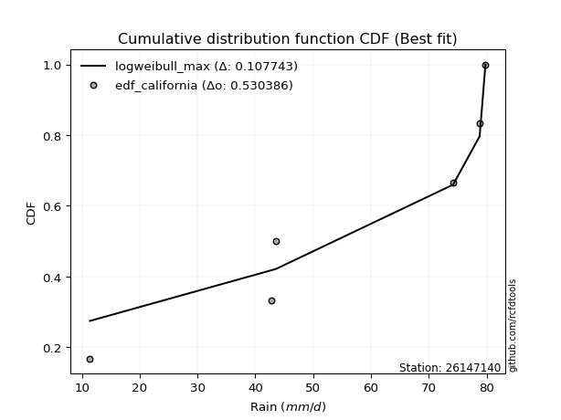</img>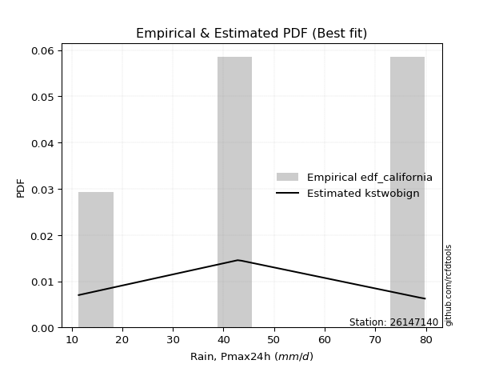</img>

</div>


### 2. EDF Hazen (1930)

Hazen method for plotting positions is a formula used to estimate the empirical cumulative probability distribution of flood events or other hydrological data. This formula often results in biased estimations, particularly when extrapolating to extreme events (high return periods).

<div align="center">


$P=(m-0.5)/n$


</div>


**2.1. Empirical values**

<div align="center">

|                | 0                  | 1                  | 2         | 3                 | 4                  |
|:---------------|:-------------------|:-------------------|:----------|:------------------|:-------------------|
| date           | 2022               | 2019               | 2020      | 2024              | 2021               |
| x              | 11.4               | 42.8               | 43.6      | 78.8              | 79.8               |
| m              | 1                  | 2                  | 3         | 4                 | 5                  |
| empirical_dist | edf_hazen          | edf_hazen          | edf_hazen | edf_hazen         | edf_hazen          |
| empirical      | 0.1                | 0.3                | 0.5       | 0.7               | 0.9                |
| empirical_tr   | 1.1111111111111112 | 1.4285714285714286 | 2.0       | 3.333333333333333 | 10.000000000000002 |

</div>


**2.2. Kolmogorov-Smirnov fit test (sorted by Δ)**


<div align="center">

|                | 0                   | 1                   | 2                   | 3                   | 4                   | 5                   | 6                   | 7                  | 8                  | 9                   | 10                  | 11                  | 12                  | 13                  | 14                  | 15                  | 16                  | 17                 | 18                 | 19                  | 20                  | 21                  | 22                 | 23                 | 24                 | 25                 | 26                 | 27                 | 28                 | 29                  | 30                  | 31                  | 32                  | 33                 | 34                  | 35                  | 36                  | 37                    | 38                  | 39                  | 40                  | 41                 | 42                 | 43                 | 44                  | 45                 | 46                 | 47                  | 48                 | 49                  | 50                  | 51                 | 52                 | 53                 | 54                  | 55                  | 56                  | 57                 | 58                  | 59                  | 60                  | 61                 | 62                 | 63                  | 64                 | 65                 | 66                 | 67                  | 68                 | 69                  | 70                 | 71                 | 72                 | 73                 | 74                 | 75                 | 76                 | 77                  | 78                  | 79                  | 80                  | 81                  | 82                  | 83                  | 84                  | 85                 | 86                 | 87                 |
|:---------------|:--------------------|:--------------------|:--------------------|:--------------------|:--------------------|:--------------------|:--------------------|:-------------------|:-------------------|:--------------------|:--------------------|:--------------------|:--------------------|:--------------------|:--------------------|:--------------------|:--------------------|:-------------------|:-------------------|:--------------------|:--------------------|:--------------------|:-------------------|:-------------------|:-------------------|:-------------------|:-------------------|:-------------------|:-------------------|:--------------------|:--------------------|:--------------------|:--------------------|:-------------------|:--------------------|:--------------------|:--------------------|:----------------------|:--------------------|:--------------------|:--------------------|:-------------------|:-------------------|:-------------------|:--------------------|:-------------------|:-------------------|:--------------------|:-------------------|:--------------------|:--------------------|:-------------------|:-------------------|:-------------------|:--------------------|:--------------------|:--------------------|:-------------------|:--------------------|:--------------------|:--------------------|:-------------------|:-------------------|:--------------------|:-------------------|:-------------------|:-------------------|:--------------------|:-------------------|:--------------------|:-------------------|:-------------------|:-------------------|:-------------------|:-------------------|:-------------------|:-------------------|:--------------------|:--------------------|:--------------------|:--------------------|:--------------------|:--------------------|:--------------------|:--------------------|:-------------------|:-------------------|:-------------------|
| station        | 26147140            | 26147140            | 26147140            | 26147140            | 26147140            | 26147140            | 26147140            | 26147140           | 26147140           | 26147140            | 26147140            | 26147140            | 26147140            | 26147140            | 26147140            | 26147140            | 26147140            | 26147140           | 26147140           | 26147140            | 26147140            | 26147140            | 26147140           | 26147140           | 26147140           | 26147140           | 26147140           | 26147140           | 26147140           | 26147140            | 26147140            | 26147140            | 26147140            | 26147140           | 26147140            | 26147140            | 26147140            | 26147140              | 26147140            | 26147140            | 26147140            | 26147140           | 26147140           | 26147140           | 26147140            | 26147140           | 26147140           | 26147140            | 26147140           | 26147140            | 26147140            | 26147140           | 26147140           | 26147140           | 26147140            | 26147140            | 26147140            | 26147140           | 26147140            | 26147140            | 26147140            | 26147140           | 26147140           | 26147140            | 26147140           | 26147140           | 26147140           | 26147140            | 26147140           | 26147140            | 26147140           | 26147140           | 26147140           | 26147140           | 26147140           | 26147140           | 26147140           | 26147140            | 26147140            | 26147140            | 26147140            | 26147140            | 26147140            | 26147140            | 26147140            | 26147140           | 26147140           | 26147140           |
| empirical_dist | edf_hazen           | edf_hazen           | edf_hazen           | edf_hazen           | edf_hazen           | edf_hazen           | edf_hazen           | edf_hazen          | edf_hazen          | edf_hazen           | edf_hazen           | edf_hazen           | edf_hazen           | edf_hazen           | edf_hazen           | edf_hazen           | edf_hazen           | edf_hazen          | edf_hazen          | edf_hazen           | edf_hazen           | edf_hazen           | edf_hazen          | edf_hazen          | edf_hazen          | edf_hazen          | edf_hazen          | edf_hazen          | edf_hazen          | edf_hazen           | edf_hazen           | edf_hazen           | edf_hazen           | edf_hazen          | edf_hazen           | edf_hazen           | edf_hazen           | edf_hazen             | edf_hazen           | edf_hazen           | edf_hazen           | edf_hazen          | edf_hazen          | edf_hazen          | edf_hazen           | edf_hazen          | edf_hazen          | edf_hazen           | edf_hazen          | edf_hazen           | edf_hazen           | edf_hazen          | edf_hazen          | edf_hazen          | edf_hazen           | edf_hazen           | edf_hazen           | edf_hazen          | edf_hazen           | edf_hazen           | edf_hazen           | edf_hazen          | edf_hazen          | edf_hazen           | edf_hazen          | edf_hazen          | edf_hazen          | edf_hazen           | edf_hazen          | edf_hazen           | edf_hazen          | edf_hazen          | edf_hazen          | edf_hazen          | edf_hazen          | edf_hazen          | edf_hazen          | edf_hazen           | edf_hazen           | edf_hazen           | edf_hazen           | edf_hazen           | edf_hazen           | edf_hazen           | edf_hazen           | edf_hazen          | edf_hazen          | edf_hazen          |
| p_dist         | loggumbel_l         | logfisk             | logpearson3         | genlogistic         | fisk                | loggompertz         | logweibull_min      | halfnorm           | rayleigh           | invgauss            | maxwell             | rice                | invgamma            | chi2                | gamma               | f                   | kstwobign           | erlang             | betaprime          | nct                 | exponnorm           | crystalball         | norm               | t                  | ncf                | pearson3           | laplace_asymmetric | weibull_min        | halflogistic       | gumbel_r            | moyal               | gompertz            | logistic            | hypsecant          | laplace             | gumbel_l            | wald                | loglaplace_asymmetric | logfatiguelife      | lognorm             | lognorm             | logcrystalball     | logexponnorm       | logt               | logf                | loglogistic        | lognct             | loghypsecant        | loglaplace         | logncf              | logbetaprime        | gibrat             | loggamma           | loggamma           | logrice             | loginvgamma         | logerlang           | logalpha           | loginvgauss         | logmaxwell          | genexpon            | loginvweibull      | expon              | lograyleigh         | lognakagami        | mielke             | logmielke          | truncnorm           | loggumbel_r        | logloggamma         | logkstwobign       | alpha              | loghalfnorm        | loggenexpon        | nakagami           | logmoyal           | loghalflogistic    | logexpon            | logwald             | loglognorm          | loggibrat           | logjohnsonsu        | logchi2             | logtruncnorm        | invweibull          | fatiguelife        | johnsonsu          | loggenlogistic     |
| delta          | 0.13790687330057833 | 0.14046713881647688 | 0.14282462157933967 | 0.14862699153877557 | 0.14892068083095567 | 0.14901795114524669 | 0.15137038854964635 | 0.1513744497939411 | 0.1523448445105684 | 0.15328308392240075 | 0.15358390556643142 | 0.15395736631306822 | 0.15412397340238493 | 0.15421701059279502 | 0.15554742185347348 | 0.15667320264908802 | 0.15676456690441254 | 0.1568501414139034 | 0.1572365713843875 | 0.15823120102757537 | 0.15825374522567126 | 0.15825392460701293 | 0.1582539344523064 | 0.1582588839883392 | 0.1599936182117357 | 0.1603667368705427 | 0.1627706304824792 | 0.1650980168451328 | 0.1668759786700441 | 0.16772369967775402 | 0.17210441530657938 | 0.17230069463975362 | 0.17493472540640875 | 0.1832331874159111 | 0.19028858748133326 | 0.19158886484452375 | 0.19577797077417314 | 0.19838336628200037   | 0.20638593296331437 | 0.20799988394140195 | 0.20799988394140195 | 0.2080001192778808 | 0.2080012481938544 | 0.2080047457637852 | 0.20814041840045988 | 0.209092516623344  | 0.2098483699799561 | 0.21002538178687907 | 0.2139811800226537 | 0.21482496226388254 | 0.21556861056695026 | 0.2158851309093215 | 0.217654073732426  | 0.217654073732426  | 0.21769453844606462 | 0.22137350259392324 | 0.22144159889875864 | 0.2289389481232325 | 0.23914895890983373 | 0.24071310225868242 | 0.24199092201716904 | 0.2439305755668732 | 0.2449564208467167 | 0.25154669059200324 | 0.2654066266746686 | 0.2733233269082944 | 0.2749401117961964 | 0.27818004290771503 | 0.2785659849387528 | 0.28033417628900337 | 0.2807399268391649 | 0.2819113771557788 | 0.2820466099356696 | 0.2860129733150642 | 0.2999750956713269 | 0.3043411097804057 | 0.3074540542983139 | 0.33609312100128946 | 0.37598817425072556 | 0.38664873143890216 | 0.40053298446502966 | 0.41436760769748743 | 0.44430766437705055 | 0.44839341254812776 | 0.48330771509715564 | 0.554043303359304  | 0.615535393099314  | 0.7                |
| deltao         | 0.5865427407550001  | 0.5865427407550001  | 0.5865427407550001  | 0.5865427407550001  | 0.5865427407550001  | 0.5865427407550001  | 0.5865427407550001  | 0.5865427407550001 | 0.5865427407550001 | 0.5865427407550001  | 0.5865427407550001  | 0.5865427407550001  | 0.5865427407550001  | 0.5865427407550001  | 0.5865427407550001  | 0.5865427407550001  | 0.5865427407550001  | 0.5865427407550001 | 0.5865427407550001 | 0.5865427407550001  | 0.5865427407550001  | 0.5865427407550001  | 0.5865427407550001 | 0.5865427407550001 | 0.5865427407550001 | 0.5865427407550001 | 0.5865427407550001 | 0.5865427407550001 | 0.5865427407550001 | 0.5865427407550001  | 0.5865427407550001  | 0.5865427407550001  | 0.5865427407550001  | 0.5865427407550001 | 0.5865427407550001  | 0.5865427407550001  | 0.5865427407550001  | 0.5865427407550001    | 0.5865427407550001  | 0.5865427407550001  | 0.5865427407550001  | 0.5865427407550001 | 0.5865427407550001 | 0.5865427407550001 | 0.5865427407550001  | 0.5865427407550001 | 0.5865427407550001 | 0.5865427407550001  | 0.5865427407550001 | 0.5865427407550001  | 0.5865427407550001  | 0.5865427407550001 | 0.5865427407550001 | 0.5865427407550001 | 0.5865427407550001  | 0.5865427407550001  | 0.5865427407550001  | 0.5865427407550001 | 0.5865427407550001  | 0.5865427407550001  | 0.5865427407550001  | 0.5865427407550001 | 0.5865427407550001 | 0.5865427407550001  | 0.5865427407550001 | 0.5865427407550001 | 0.5865427407550001 | 0.5865427407550001  | 0.5865427407550001 | 0.5865427407550001  | 0.5865427407550001 | 0.5865427407550001 | 0.5865427407550001 | 0.5865427407550001 | 0.5865427407550001 | 0.5865427407550001 | 0.5865427407550001 | 0.5865427407550001  | 0.5865427407550001  | 0.5865427407550001  | 0.5865427407550001  | 0.5865427407550001  | 0.5865427407550001  | 0.5865427407550001  | 0.5865427407550001  | 0.5865427407550001 | 0.5865427407550001 | 0.5865427407550001 |
| eval           | Δo > Δ              | Δo > Δ              | Δo > Δ              | Δo > Δ              | Δo > Δ              | Δo > Δ              | Δo > Δ              | Δo > Δ             | Δo > Δ             | Δo > Δ              | Δo > Δ              | Δo > Δ              | Δo > Δ              | Δo > Δ              | Δo > Δ              | Δo > Δ              | Δo > Δ              | Δo > Δ             | Δo > Δ             | Δo > Δ              | Δo > Δ              | Δo > Δ              | Δo > Δ             | Δo > Δ             | Δo > Δ             | Δo > Δ             | Δo > Δ             | Δo > Δ             | Δo > Δ             | Δo > Δ              | Δo > Δ              | Δo > Δ              | Δo > Δ              | Δo > Δ             | Δo > Δ              | Δo > Δ              | Δo > Δ              | Δo > Δ                | Δo > Δ              | Δo > Δ              | Δo > Δ              | Δo > Δ             | Δo > Δ             | Δo > Δ             | Δo > Δ              | Δo > Δ             | Δo > Δ             | Δo > Δ              | Δo > Δ             | Δo > Δ              | Δo > Δ              | Δo > Δ             | Δo > Δ             | Δo > Δ             | Δo > Δ              | Δo > Δ              | Δo > Δ              | Δo > Δ             | Δo > Δ              | Δo > Δ              | Δo > Δ              | Δo > Δ             | Δo > Δ             | Δo > Δ              | Δo > Δ             | Δo > Δ             | Δo > Δ             | Δo > Δ              | Δo > Δ             | Δo > Δ              | Δo > Δ             | Δo > Δ             | Δo > Δ             | Δo > Δ             | Δo > Δ             | Δo > Δ             | Δo > Δ             | Δo > Δ              | Δo > Δ              | Δo > Δ              | Δo > Δ              | Δo > Δ              | Δo > Δ              | Δo > Δ              | Δo > Δ              | Δo > Δ             | Δo <= Δ            | Δo <= Δ            |
| fit            | 1                   | 1                   | 1                   | 1                   | 1                   | 1                   | 1                   | 1                  | 1                  | 1                   | 1                   | 1                   | 1                   | 1                   | 1                   | 1                   | 1                   | 1                  | 1                  | 1                   | 1                   | 1                   | 1                  | 1                  | 1                  | 1                  | 1                  | 1                  | 1                  | 1                   | 1                   | 1                   | 1                   | 1                  | 1                   | 1                   | 1                   | 1                     | 1                   | 1                   | 1                   | 1                  | 1                  | 1                  | 1                   | 1                  | 1                  | 1                   | 1                  | 1                   | 1                   | 1                  | 1                  | 1                  | 1                   | 1                   | 1                   | 1                  | 1                   | 1                   | 1                   | 1                  | 1                  | 1                   | 1                  | 1                  | 1                  | 1                   | 1                  | 1                   | 1                  | 1                  | 1                  | 1                  | 1                  | 1                  | 1                  | 1                   | 1                   | 1                   | 1                   | 1                   | 1                   | 1                   | 1                   | 1                  | 0                  | 0                  |
| n              | 5                   | 5                   | 5                   | 5                   | 5                   | 5                   | 5                   | 5                  | 5                  | 5                   | 5                   | 5                   | 5                   | 5                   | 5                   | 5                   | 5                   | 5                  | 5                  | 5                   | 5                   | 5                   | 5                  | 5                  | 5                  | 5                  | 5                  | 5                  | 5                  | 5                   | 5                   | 5                   | 5                   | 5                  | 5                   | 5                   | 5                   | 5                     | 5                   | 5                   | 5                   | 5                  | 5                  | 5                  | 5                   | 5                  | 5                  | 5                   | 5                  | 5                   | 5                   | 5                  | 5                  | 5                  | 5                   | 5                   | 5                   | 5                  | 5                   | 5                   | 5                   | 5                  | 5                  | 5                   | 5                  | 5                  | 5                  | 5                   | 5                  | 5                   | 5                  | 5                  | 5                  | 5                  | 5                  | 5                  | 5                  | 5                   | 5                   | 5                   | 5                   | 5                   | 5                   | 5                   | 5                   | 5                  | 5                  | 5                  |
| best_fit       | 1                   | 0                   | 0                   | 0                   | 0                   | 0                   | 0                   | 0                  | 0                  | 0                   | 0                   | 0                   | 0                   | 0                   | 0                   | 0                   | 0                   | 0                  | 0                  | 0                   | 0                   | 0                   | 0                  | 0                  | 0                  | 0                  | 0                  | 0                  | 0                  | 0                   | 0                   | 0                   | 0                   | 0                  | 0                   | 0                   | 0                   | 0                     | 0                   | 0                   | 0                   | 0                  | 0                  | 0                  | 0                   | 0                  | 0                  | 0                   | 0                  | 0                   | 0                   | 0                  | 0                  | 0                  | 0                   | 0                   | 0                   | 0                  | 0                   | 0                   | 0                   | 0                  | 0                  | 0                   | 0                  | 0                  | 0                  | 0                   | 0                  | 0                   | 0                  | 0                  | 0                  | 0                  | 0                  | 0                  | 0                  | 0                   | 0                   | 0                   | 0                   | 0                   | 0                   | 0                   | 0                   | 0                  | 0                  | 0                  |
| best_fit_sort  | 1                   | 2                   | 3                   | 4                   | 5                   | 6                   | 7                   | 8                  | 9                  | 10                  | 11                  | 12                  | 13                  | 14                  | 15                  | 16                  | 17                  | 18                 | 19                 | 20                  | 21                  | 22                  | 23                 | 24                 | 25                 | 26                 | 27                 | 28                 | 29                 | 30                  | 31                  | 32                  | 33                  | 34                 | 35                  | 36                  | 37                  | 38                    | 39                  | 40                  | 41                  | 42                 | 43                 | 44                 | 45                  | 46                 | 47                 | 48                  | 49                 | 50                  | 51                  | 52                 | 53                 | 54                 | 55                  | 56                  | 57                  | 58                 | 59                  | 60                  | 61                  | 62                 | 63                 | 64                  | 65                 | 66                 | 67                 | 68                  | 69                 | 70                  | 71                 | 72                 | 73                 | 74                 | 75                 | 76                 | 77                 | 78                  | 79                  | 80                  | 81                  | 82                  | 83                  | 84                  | 85                  | 86                 | 87                 | 88                 |

</div>


**2.3. Best fit**

<div align="center">

|   id |   station | empirical_dist   | p_dist      |    delta |   deltao | eval   |   fit |   n |   best_fit |   best_fit_sort |
|-----:|----------:|:-----------------|:------------|---------:|---------:|:-------|------:|----:|-----------:|----------------:|
|    0 |  26147140 | edf_hazen        | loggumbel_l | 0.137907 | 0.586543 | Δo > Δ |     1 |   5 |          1 |               1 |

</div>


<div align="center">

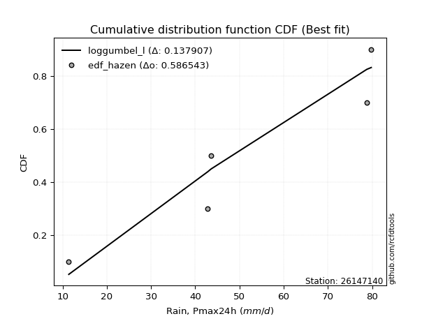</img>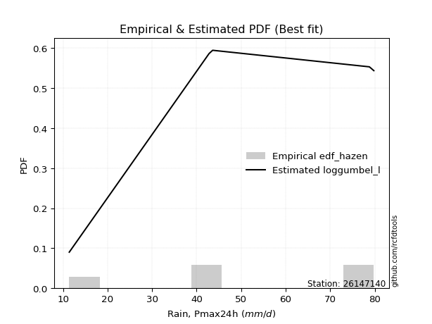</img>

</div>


### 3. EDF Weibull (1939)

Weibull plotting position formula is an empirical method used to estimate the non-exceedance probability or plotting position for a set of observed data, is often recommended or widely used in practice, particularly in flood frequency analysis.

<div align="center">


$P=m/(n+1)$


</div>


**3.1. Empirical values**

<div align="center">

|                | 0                   | 1                  | 2           | 3                  | 4                  |
|:---------------|:--------------------|:-------------------|:------------|:-------------------|:-------------------|
| date           | 2022                | 2019               | 2020        | 2024               | 2021               |
| x              | 11.4                | 42.8               | 43.6        | 78.8               | 79.8               |
| m              | 1                   | 2                  | 3           | 4                  | 5                  |
| empirical_dist | edf_weibull         | edf_weibull        | edf_weibull | edf_weibull        | edf_weibull        |
| empirical      | 0.16666666666666666 | 0.3333333333333333 | 0.5         | 0.6666666666666666 | 0.8333333333333334 |
| empirical_tr   | 1.2                 | 1.4999999999999998 | 2.0         | 2.9999999999999996 | 6.000000000000002  |

</div>


**3.2. Kolmogorov-Smirnov fit test (sorted by Δ)**


<div align="center">

|                | 0                   | 1                   | 2                   | 3                   | 4                  | 5                   | 6                   | 7                   | 8                  | 9                   | 10                  | 11                  | 12                  | 13                  | 14                  | 15                  | 16                 | 17                 | 18                  | 19                 | 20                 | 21                 | 22                 | 23                  | 24                  | 25                  | 26                  | 27                  | 28                  | 29                    | 30                  | 31                  | 32                  | 33                  | 34                 | 35                  | 36                  | 37                  | 38                  | 39                 | 40                 | 41                  | 42                  | 43                  | 44                  | 45                  | 46                  | 47                  | 48                  | 49                  | 50                  | 51                 | 52                 | 53                 | 54                  | 55                  | 56                  | 57                  | 58                  | 59                  | 60                  | 61                  | 62                  | 63                  | 64                  | 65                  | 66                  | 67                 | 68                 | 69                  | 70                 | 71                 | 72                  | 73                  | 74                 | 75                  | 76                 | 77                  | 78                  | 79                  | 80                  | 81                 | 82                 | 83                 | 84                  | 85                 | 86                 | 87                 |
|:---------------|:--------------------|:--------------------|:--------------------|:--------------------|:-------------------|:--------------------|:--------------------|:--------------------|:-------------------|:--------------------|:--------------------|:--------------------|:--------------------|:--------------------|:--------------------|:--------------------|:-------------------|:-------------------|:--------------------|:-------------------|:-------------------|:-------------------|:-------------------|:--------------------|:--------------------|:--------------------|:--------------------|:--------------------|:--------------------|:----------------------|:--------------------|:--------------------|:--------------------|:--------------------|:-------------------|:--------------------|:--------------------|:--------------------|:--------------------|:-------------------|:-------------------|:--------------------|:--------------------|:--------------------|:--------------------|:--------------------|:--------------------|:--------------------|:--------------------|:--------------------|:--------------------|:-------------------|:-------------------|:-------------------|:--------------------|:--------------------|:--------------------|:--------------------|:--------------------|:--------------------|:--------------------|:--------------------|:--------------------|:--------------------|:--------------------|:--------------------|:--------------------|:-------------------|:-------------------|:--------------------|:-------------------|:-------------------|:--------------------|:--------------------|:-------------------|:--------------------|:-------------------|:--------------------|:--------------------|:--------------------|:--------------------|:-------------------|:-------------------|:-------------------|:--------------------|:-------------------|:-------------------|:-------------------|
| station        | 26147140            | 26147140            | 26147140            | 26147140            | 26147140           | 26147140            | 26147140            | 26147140            | 26147140           | 26147140            | 26147140            | 26147140            | 26147140            | 26147140            | 26147140            | 26147140            | 26147140           | 26147140           | 26147140            | 26147140           | 26147140           | 26147140           | 26147140           | 26147140            | 26147140            | 26147140            | 26147140            | 26147140            | 26147140            | 26147140              | 26147140            | 26147140            | 26147140            | 26147140            | 26147140           | 26147140            | 26147140            | 26147140            | 26147140            | 26147140           | 26147140           | 26147140            | 26147140            | 26147140            | 26147140            | 26147140            | 26147140            | 26147140            | 26147140            | 26147140            | 26147140            | 26147140           | 26147140           | 26147140           | 26147140            | 26147140            | 26147140            | 26147140            | 26147140            | 26147140            | 26147140            | 26147140            | 26147140            | 26147140            | 26147140            | 26147140            | 26147140            | 26147140           | 26147140           | 26147140            | 26147140           | 26147140           | 26147140            | 26147140            | 26147140           | 26147140            | 26147140           | 26147140            | 26147140            | 26147140            | 26147140            | 26147140           | 26147140           | 26147140           | 26147140            | 26147140           | 26147140           | 26147140           |
| empirical_dist | edf_weibull         | edf_weibull         | edf_weibull         | edf_weibull         | edf_weibull        | edf_weibull         | edf_weibull         | edf_weibull         | edf_weibull        | edf_weibull         | edf_weibull         | edf_weibull         | edf_weibull         | edf_weibull         | edf_weibull         | edf_weibull         | edf_weibull        | edf_weibull        | edf_weibull         | edf_weibull        | edf_weibull        | edf_weibull        | edf_weibull        | edf_weibull         | edf_weibull         | edf_weibull         | edf_weibull         | edf_weibull         | edf_weibull         | edf_weibull           | edf_weibull         | edf_weibull         | edf_weibull         | edf_weibull         | edf_weibull        | edf_weibull         | edf_weibull         | edf_weibull         | edf_weibull         | edf_weibull        | edf_weibull        | edf_weibull         | edf_weibull         | edf_weibull         | edf_weibull         | edf_weibull         | edf_weibull         | edf_weibull         | edf_weibull         | edf_weibull         | edf_weibull         | edf_weibull        | edf_weibull        | edf_weibull        | edf_weibull         | edf_weibull         | edf_weibull         | edf_weibull         | edf_weibull         | edf_weibull         | edf_weibull         | edf_weibull         | edf_weibull         | edf_weibull         | edf_weibull         | edf_weibull         | edf_weibull         | edf_weibull        | edf_weibull        | edf_weibull         | edf_weibull        | edf_weibull        | edf_weibull         | edf_weibull         | edf_weibull        | edf_weibull         | edf_weibull        | edf_weibull         | edf_weibull         | edf_weibull         | edf_weibull         | edf_weibull        | edf_weibull        | edf_weibull        | edf_weibull         | edf_weibull        | edf_weibull        | edf_weibull        |
| p_dist         | logfisk             | logpearson3         | ncf                 | loggumbel_l         | kstwobign          | logfatiguelife      | lognorm             | lognorm             | logcrystalball     | logexponnorm        | logt                | logf                | loglogistic         | lognct              | loghypsecant        | loggompertz         | logncf             | genlogistic        | logbetaprime        | fisk               | loggamma           | loggamma           | logrice            | logweibull_min      | halfnorm            | rayleigh            | invgauss            | maxwell             | rice                | loglaplace_asymmetric | invgamma            | chi2                | loginvgamma         | logerlang           | gamma              | loglaplace          | f                   | erlang              | betaprime           | nct                | exponnorm          | crystalball         | norm                | t                   | pearson3            | logalpha            | laplace_asymmetric  | weibull_min         | halflogistic        | gumbel_r            | gompertz            | moyal              | loginvgauss        | logmaxwell         | logistic            | genexpon            | loginvweibull       | expon               | hypsecant           | lograyleigh         | laplace             | gumbel_l            | wald                | loggumbel_r         | logkstwobign        | alpha               | loghalfnorm         | gibrat             | loggenexpon        | logmoyal            | loghalflogistic    | lognakagami        | logexpon            | mielke              | logmielke          | truncnorm           | logloggamma        | nakagami            | logwald             | loglognorm          | loggibrat           | logchi2            | logjohnsonsu       | invweibull         | logtruncnorm        | fatiguelife        | johnsonsu          | loggenlogistic     |
| delta          | 0.14009903982492114 | 0.14497445649863094 | 0.14675203237792156 | 0.15765428024216266 | 0.1725812564167455 | 0.17305259962998104 | 0.17466655060806863 | 0.17466655060806863 | 0.1746667859445475 | 0.17466791486052108 | 0.17467141243045187 | 0.17480708506712656 | 0.17575918329001067 | 0.17651503664662277 | 0.17713214549619738 | 0.17941348562947135 | 0.1814916289305492 | 0.1819603248721089 | 0.18223527723361693 | 0.182254014164289  | 0.1843207403990927 | 0.1843207403990927 | 0.1843612051127313 | 0.18470372188297968 | 0.18470778312727443 | 0.18567817784390173 | 0.18661641725573408 | 0.18691723889976475 | 0.18729069964640155 | 0.18739386801370217   | 0.18745730673571825 | 0.18755034392612835 | 0.18804016926058992 | 0.18810826556542531 | 0.1888807551868068 | 0.18959942758848614 | 0.19000653598242134 | 0.19018347474723674 | 0.19056990471772084 | 0.1915645343609087 | 0.1915870785590046 | 0.19158725794034626 | 0.19158726778563973 | 0.19159221732167253 | 0.19370007020387603 | 0.19560561478989918 | 0.19610396381581252 | 0.19843135017846614 | 0.20020931200337744 | 0.20105703301108735 | 0.20120225344668075 | 0.2054377486399127 | 0.2058156255765004 | 0.2073797689253491 | 0.20826805873974208 | 0.20865758868383572 | 0.21059724223353987 | 0.21162308751338338 | 0.21656652074924443 | 0.21821335725866992 | 0.22362192081466659 | 0.22492219817785708 | 0.22645899497322697 | 0.24523265160541946 | 0.24740659350583155 | 0.24857804382244547 | 0.24871327660233628 | 0.2492184642426548 | 0.2526796399817309 | 0.27100777644707236 | 0.2741207209649806 | 0.2987399600080019 | 0.30275978766795614 | 0.30665666024162774 | 0.3082734451295297 | 0.31151337624104836 | 0.3136675096223367 | 0.33330842900466023 | 0.34265484091739223 | 0.35331539810556883 | 0.36719965113169634 | 0.4109743310437172 | 0.4127794428052437 | 0.416641048430489  | 0.44839341254812776 | 0.5207099700259707 | 0.5822020597659807 | 0.6666666666666666 |
| deltao         | 0.5865427407550001  | 0.5865427407550001  | 0.5865427407550001  | 0.5865427407550001  | 0.5865427407550001 | 0.5865427407550001  | 0.5865427407550001  | 0.5865427407550001  | 0.5865427407550001 | 0.5865427407550001  | 0.5865427407550001  | 0.5865427407550001  | 0.5865427407550001  | 0.5865427407550001  | 0.5865427407550001  | 0.5865427407550001  | 0.5865427407550001 | 0.5865427407550001 | 0.5865427407550001  | 0.5865427407550001 | 0.5865427407550001 | 0.5865427407550001 | 0.5865427407550001 | 0.5865427407550001  | 0.5865427407550001  | 0.5865427407550001  | 0.5865427407550001  | 0.5865427407550001  | 0.5865427407550001  | 0.5865427407550001    | 0.5865427407550001  | 0.5865427407550001  | 0.5865427407550001  | 0.5865427407550001  | 0.5865427407550001 | 0.5865427407550001  | 0.5865427407550001  | 0.5865427407550001  | 0.5865427407550001  | 0.5865427407550001 | 0.5865427407550001 | 0.5865427407550001  | 0.5865427407550001  | 0.5865427407550001  | 0.5865427407550001  | 0.5865427407550001  | 0.5865427407550001  | 0.5865427407550001  | 0.5865427407550001  | 0.5865427407550001  | 0.5865427407550001  | 0.5865427407550001 | 0.5865427407550001 | 0.5865427407550001 | 0.5865427407550001  | 0.5865427407550001  | 0.5865427407550001  | 0.5865427407550001  | 0.5865427407550001  | 0.5865427407550001  | 0.5865427407550001  | 0.5865427407550001  | 0.5865427407550001  | 0.5865427407550001  | 0.5865427407550001  | 0.5865427407550001  | 0.5865427407550001  | 0.5865427407550001 | 0.5865427407550001 | 0.5865427407550001  | 0.5865427407550001 | 0.5865427407550001 | 0.5865427407550001  | 0.5865427407550001  | 0.5865427407550001 | 0.5865427407550001  | 0.5865427407550001 | 0.5865427407550001  | 0.5865427407550001  | 0.5865427407550001  | 0.5865427407550001  | 0.5865427407550001 | 0.5865427407550001 | 0.5865427407550001 | 0.5865427407550001  | 0.5865427407550001 | 0.5865427407550001 | 0.5865427407550001 |
| eval           | Δo > Δ              | Δo > Δ              | Δo > Δ              | Δo > Δ              | Δo > Δ             | Δo > Δ              | Δo > Δ              | Δo > Δ              | Δo > Δ             | Δo > Δ              | Δo > Δ              | Δo > Δ              | Δo > Δ              | Δo > Δ              | Δo > Δ              | Δo > Δ              | Δo > Δ             | Δo > Δ             | Δo > Δ              | Δo > Δ             | Δo > Δ             | Δo > Δ             | Δo > Δ             | Δo > Δ              | Δo > Δ              | Δo > Δ              | Δo > Δ              | Δo > Δ              | Δo > Δ              | Δo > Δ                | Δo > Δ              | Δo > Δ              | Δo > Δ              | Δo > Δ              | Δo > Δ             | Δo > Δ              | Δo > Δ              | Δo > Δ              | Δo > Δ              | Δo > Δ             | Δo > Δ             | Δo > Δ              | Δo > Δ              | Δo > Δ              | Δo > Δ              | Δo > Δ              | Δo > Δ              | Δo > Δ              | Δo > Δ              | Δo > Δ              | Δo > Δ              | Δo > Δ             | Δo > Δ             | Δo > Δ             | Δo > Δ              | Δo > Δ              | Δo > Δ              | Δo > Δ              | Δo > Δ              | Δo > Δ              | Δo > Δ              | Δo > Δ              | Δo > Δ              | Δo > Δ              | Δo > Δ              | Δo > Δ              | Δo > Δ              | Δo > Δ             | Δo > Δ             | Δo > Δ              | Δo > Δ             | Δo > Δ             | Δo > Δ              | Δo > Δ              | Δo > Δ             | Δo > Δ              | Δo > Δ             | Δo > Δ              | Δo > Δ              | Δo > Δ              | Δo > Δ              | Δo > Δ             | Δo > Δ             | Δo > Δ             | Δo > Δ              | Δo > Δ             | Δo > Δ             | Δo <= Δ            |
| fit            | 1                   | 1                   | 1                   | 1                   | 1                  | 1                   | 1                   | 1                   | 1                  | 1                   | 1                   | 1                   | 1                   | 1                   | 1                   | 1                   | 1                  | 1                  | 1                   | 1                  | 1                  | 1                  | 1                  | 1                   | 1                   | 1                   | 1                   | 1                   | 1                   | 1                     | 1                   | 1                   | 1                   | 1                   | 1                  | 1                   | 1                   | 1                   | 1                   | 1                  | 1                  | 1                   | 1                   | 1                   | 1                   | 1                   | 1                   | 1                   | 1                   | 1                   | 1                   | 1                  | 1                  | 1                  | 1                   | 1                   | 1                   | 1                   | 1                   | 1                   | 1                   | 1                   | 1                   | 1                   | 1                   | 1                   | 1                   | 1                  | 1                  | 1                   | 1                  | 1                  | 1                   | 1                   | 1                  | 1                   | 1                  | 1                   | 1                   | 1                   | 1                   | 1                  | 1                  | 1                  | 1                   | 1                  | 1                  | 0                  |
| n              | 5                   | 5                   | 5                   | 5                   | 5                  | 5                   | 5                   | 5                   | 5                  | 5                   | 5                   | 5                   | 5                   | 5                   | 5                   | 5                   | 5                  | 5                  | 5                   | 5                  | 5                  | 5                  | 5                  | 5                   | 5                   | 5                   | 5                   | 5                   | 5                   | 5                     | 5                   | 5                   | 5                   | 5                   | 5                  | 5                   | 5                   | 5                   | 5                   | 5                  | 5                  | 5                   | 5                   | 5                   | 5                   | 5                   | 5                   | 5                   | 5                   | 5                   | 5                   | 5                  | 5                  | 5                  | 5                   | 5                   | 5                   | 5                   | 5                   | 5                   | 5                   | 5                   | 5                   | 5                   | 5                   | 5                   | 5                   | 5                  | 5                  | 5                   | 5                  | 5                  | 5                   | 5                   | 5                  | 5                   | 5                  | 5                   | 5                   | 5                   | 5                   | 5                  | 5                  | 5                  | 5                   | 5                  | 5                  | 5                  |
| best_fit       | 1                   | 0                   | 0                   | 0                   | 0                  | 0                   | 0                   | 0                   | 0                  | 0                   | 0                   | 0                   | 0                   | 0                   | 0                   | 0                   | 0                  | 0                  | 0                   | 0                  | 0                  | 0                  | 0                  | 0                   | 0                   | 0                   | 0                   | 0                   | 0                   | 0                     | 0                   | 0                   | 0                   | 0                   | 0                  | 0                   | 0                   | 0                   | 0                   | 0                  | 0                  | 0                   | 0                   | 0                   | 0                   | 0                   | 0                   | 0                   | 0                   | 0                   | 0                   | 0                  | 0                  | 0                  | 0                   | 0                   | 0                   | 0                   | 0                   | 0                   | 0                   | 0                   | 0                   | 0                   | 0                   | 0                   | 0                   | 0                  | 0                  | 0                   | 0                  | 0                  | 0                   | 0                   | 0                  | 0                   | 0                  | 0                   | 0                   | 0                   | 0                   | 0                  | 0                  | 0                  | 0                   | 0                  | 0                  | 0                  |
| best_fit_sort  | 1                   | 2                   | 3                   | 4                   | 5                  | 6                   | 7                   | 8                   | 9                  | 10                  | 11                  | 12                  | 13                  | 14                  | 15                  | 16                  | 17                 | 18                 | 19                  | 20                 | 21                 | 22                 | 23                 | 24                  | 25                  | 26                  | 27                  | 28                  | 29                  | 30                    | 31                  | 32                  | 33                  | 34                  | 35                 | 36                  | 37                  | 38                  | 39                  | 40                 | 41                 | 42                  | 43                  | 44                  | 45                  | 46                  | 47                  | 48                  | 49                  | 50                  | 51                  | 52                 | 53                 | 54                 | 55                  | 56                  | 57                  | 58                  | 59                  | 60                  | 61                  | 62                  | 63                  | 64                  | 65                  | 66                  | 67                  | 68                 | 69                 | 70                  | 71                 | 72                 | 73                  | 74                  | 75                 | 76                  | 77                 | 78                  | 79                  | 80                  | 81                  | 82                 | 83                 | 84                 | 85                  | 86                 | 87                 | 88                 |

</div>


**3.3. Best fit**

<div align="center">

|   id |   station | empirical_dist   | p_dist   |    delta |   deltao | eval   |   fit |   n |   best_fit |   best_fit_sort |
|-----:|----------:|:-----------------|:---------|---------:|---------:|:-------|------:|----:|-----------:|----------------:|
|    0 |  26147140 | edf_weibull      | logfisk  | 0.140099 | 0.586543 | Δo > Δ |     1 |   5 |          1 |               1 |

</div>


<div align="center">

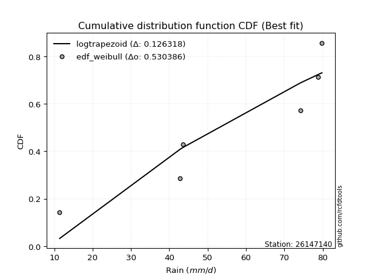</img>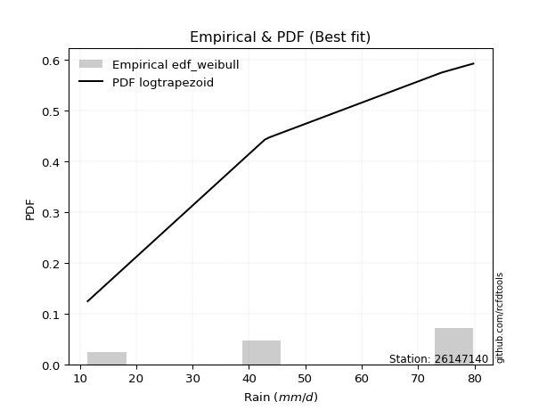</img>

</div>


### 4. EDF Beard (1943)

The Beard formula (or Beard´s plotting position formula) in hydrology is used to estimate the empirical non-exceedance probability _(P)_ of a flood event (or other extreme hydrological data point) within a given dataset.

<div align="center">


$P=(m-0.31)/(n+0.38)$


</div>


**4.1. Empirical values**

<div align="center">

|                | 0                   | 1                  | 2         | 3                  | 4                  |
|:---------------|:--------------------|:-------------------|:----------|:-------------------|:-------------------|
| date           | 2022                | 2019               | 2020      | 2024               | 2021               |
| x              | 11.4                | 42.8               | 43.6      | 78.8               | 79.8               |
| m              | 1                   | 2                  | 3         | 4                  | 5                  |
| empirical_dist | edf_beard           | edf_beard          | edf_beard | edf_beard          | edf_beard          |
| empirical      | 0.12825278810408922 | 0.3141263940520446 | 0.5       | 0.6858736059479554 | 0.8717472118959109 |
| empirical_tr   | 1.1471215351812367  | 1.4579945799457996 | 2.0       | 3.183431952662722  | 7.797101449275368  |

</div>


**4.2. Kolmogorov-Smirnov fit test (sorted by Δ)**


<div align="center">

|                | 0                   | 1                   | 2                   | 3                   | 4                   | 5                   | 6                  | 7                  | 8                   | 9                   | 10                  | 11                  | 12                  | 13                  | 14                  | 15                  | 16                 | 17                  | 18                  | 19                  | 20                 | 21                  | 22                  | 23                  | 24                  | 25                  | 26                  | 27                  | 28                  | 29                  | 30                  | 31                    | 32                 | 33                  | 34                  | 35                  | 36                  | 37                  | 38                  | 39                  | 40                  | 41                  | 42                  | 43                  | 44                  | 45                  | 46                 | 47                  | 48                  | 49                  | 50                 | 51                  | 52                  | 53                 | 54                  | 55                 | 56                  | 57                 | 58                 | 59                 | 60                  | 61                 | 62                  | 63                 | 64                  | 65                  | 66                  | 67                  | 68                  | 69                 | 70                  | 71                 | 72                  | 73                  | 74                 | 75                 | 76                  | 77                  | 78                 | 79                 | 80                  | 81                 | 82                 | 83                  | 84                 | 85                 | 86                 | 87                 |
|:---------------|:--------------------|:--------------------|:--------------------|:--------------------|:--------------------|:--------------------|:-------------------|:-------------------|:--------------------|:--------------------|:--------------------|:--------------------|:--------------------|:--------------------|:--------------------|:--------------------|:-------------------|:--------------------|:--------------------|:--------------------|:-------------------|:--------------------|:--------------------|:--------------------|:--------------------|:--------------------|:--------------------|:--------------------|:--------------------|:--------------------|:--------------------|:----------------------|:-------------------|:--------------------|:--------------------|:--------------------|:--------------------|:--------------------|:--------------------|:--------------------|:--------------------|:--------------------|:--------------------|:--------------------|:--------------------|:--------------------|:-------------------|:--------------------|:--------------------|:--------------------|:-------------------|:--------------------|:--------------------|:-------------------|:--------------------|:-------------------|:--------------------|:-------------------|:-------------------|:-------------------|:--------------------|:-------------------|:--------------------|:-------------------|:--------------------|:--------------------|:--------------------|:--------------------|:--------------------|:-------------------|:--------------------|:-------------------|:--------------------|:--------------------|:-------------------|:-------------------|:--------------------|:--------------------|:-------------------|:-------------------|:--------------------|:-------------------|:-------------------|:--------------------|:-------------------|:-------------------|:-------------------|:-------------------|
| station        | 26147140            | 26147140            | 26147140            | 26147140            | 26147140            | 26147140            | 26147140           | 26147140           | 26147140            | 26147140            | 26147140            | 26147140            | 26147140            | 26147140            | 26147140            | 26147140            | 26147140           | 26147140            | 26147140            | 26147140            | 26147140           | 26147140            | 26147140            | 26147140            | 26147140            | 26147140            | 26147140            | 26147140            | 26147140            | 26147140            | 26147140            | 26147140              | 26147140           | 26147140            | 26147140            | 26147140            | 26147140            | 26147140            | 26147140            | 26147140            | 26147140            | 26147140            | 26147140            | 26147140            | 26147140            | 26147140            | 26147140           | 26147140            | 26147140            | 26147140            | 26147140           | 26147140            | 26147140            | 26147140           | 26147140            | 26147140           | 26147140            | 26147140           | 26147140           | 26147140           | 26147140            | 26147140           | 26147140            | 26147140           | 26147140            | 26147140            | 26147140            | 26147140            | 26147140            | 26147140           | 26147140            | 26147140           | 26147140            | 26147140            | 26147140           | 26147140           | 26147140            | 26147140            | 26147140           | 26147140           | 26147140            | 26147140           | 26147140           | 26147140            | 26147140           | 26147140           | 26147140           | 26147140           |
| empirical_dist | edf_beard           | edf_beard           | edf_beard           | edf_beard           | edf_beard           | edf_beard           | edf_beard          | edf_beard          | edf_beard           | edf_beard           | edf_beard           | edf_beard           | edf_beard           | edf_beard           | edf_beard           | edf_beard           | edf_beard          | edf_beard           | edf_beard           | edf_beard           | edf_beard          | edf_beard           | edf_beard           | edf_beard           | edf_beard           | edf_beard           | edf_beard           | edf_beard           | edf_beard           | edf_beard           | edf_beard           | edf_beard             | edf_beard          | edf_beard           | edf_beard           | edf_beard           | edf_beard           | edf_beard           | edf_beard           | edf_beard           | edf_beard           | edf_beard           | edf_beard           | edf_beard           | edf_beard           | edf_beard           | edf_beard          | edf_beard           | edf_beard           | edf_beard           | edf_beard          | edf_beard           | edf_beard           | edf_beard          | edf_beard           | edf_beard          | edf_beard           | edf_beard          | edf_beard          | edf_beard          | edf_beard           | edf_beard          | edf_beard           | edf_beard          | edf_beard           | edf_beard           | edf_beard           | edf_beard           | edf_beard           | edf_beard          | edf_beard           | edf_beard          | edf_beard           | edf_beard           | edf_beard          | edf_beard          | edf_beard           | edf_beard           | edf_beard          | edf_beard          | edf_beard           | edf_beard          | edf_beard          | edf_beard           | edf_beard          | edf_beard          | edf_beard          | edf_beard          |
| p_dist         | logfisk             | logpearson3         | loggumbel_l         | ncf                 | kstwobign           | loggompertz         | genlogistic        | fisk               | logweibull_min      | halfnorm            | rayleigh            | invgauss            | maxwell             | rice                | invgamma            | chi2                | gamma              | f                   | erlang              | betaprime           | nct                | exponnorm           | crystalball         | norm                | t                   | pearson3            | laplace_asymmetric  | weibull_min         | halflogistic        | gumbel_r            | gompertz            | loglaplace_asymmetric | moyal              | logistic            | logfatiguelife      | lognorm             | lognorm             | logcrystalball      | logexponnorm        | logt                | logf                | loglogistic         | lognct              | loghypsecant        | hypsecant           | loglaplace          | logncf             | logbetaprime        | loggamma            | loggamma            | logrice            | laplace             | gumbel_l            | loginvgamma        | wald                | logerlang          | logalpha            | loginvgauss        | logmaxwell         | genexpon           | loginvweibull       | gibrat             | expon               | lograyleigh        | loggumbel_r         | logkstwobign        | alpha               | loghalfnorm         | loggenexpon         | lognakagami        | mielke              | logmielke          | logmoyal            | truncnorm           | loghalflogistic    | logloggamma        | nakagami            | logexpon            | logwald            | loglognorm         | loggibrat           | logjohnsonsu       | logchi2            | logtruncnorm        | invweibull         | fatiguelife        | johnsonsu          | loggenlogistic     |
| delta          | 0.12634074476443224 | 0.12869822752729504 | 0.13844734096087385 | 0.14586722415969106 | 0.15337431713545668 | 0.16020654634818254 | 0.1627533855908201 | 0.1630470748830002 | 0.16549678260169087 | 0.16550084384598562 | 0.16647123856261292 | 0.16740947797444528 | 0.16771029961847594 | 0.16808376036511274 | 0.16825036745442945 | 0.16834340464483954 | 0.169673815905518  | 0.17079959670113254 | 0.17097653546594793 | 0.17136296543643204 | 0.1723575950796199 | 0.17238013927771578 | 0.17238031865905745 | 0.17238032850435092 | 0.17238527804038373 | 0.17449313092258723 | 0.17689702453452372 | 0.17922441089717733 | 0.18100237272208863 | 0.18185009372979855 | 0.18199531416539194 | 0.18425697222995574   | 0.1862308093586239 | 0.18906111945845328 | 0.19225953891126973 | 0.19387348988935732 | 0.19387348988935732 | 0.19387372522583618 | 0.19387485414180977 | 0.19387835171174056 | 0.19401402434841525 | 0.19496612257129936 | 0.19572197592791146 | 0.19589898773483444 | 0.19735958146795562 | 0.19985478597060907 | 0.2006985682118379 | 0.20144221651490563 | 0.20352767968038138 | 0.20352767968038138 | 0.20356814439402   | 0.20441498153337778 | 0.20571525889656828 | 0.2072471085418786 | 0.20725205569193816 | 0.207315204846714  | 0.21481255407118788 | 0.2250225648577891 | 0.2265867082066378 | 0.2278645279651244 | 0.22980418151482856 | 0.230011524961366  | 0.23083002679467207 | 0.2374202965399586 | 0.26443959088670815 | 0.26661353278712024 | 0.26778498310373416 | 0.26792021588362497 | 0.27188657926301957 | 0.2795330207267132 | 0.28744972096033894 | 0.2890665058482409 | 0.29021471572836105 | 0.29230643695975955 | 0.2933276602462693 | 0.2944605703410479 | 0.31410148972337154 | 0.32196672694924483 | 0.3618617801986809 | 0.3725223373868575 | 0.38640659041298503 | 0.4127794428052437 | 0.4301812703250059 | 0.44839341254812776 | 0.4550549269930665 | 0.5399169093072593 | 0.6014089990472695 | 0.6858736059479554 |
| deltao         | 0.5865427407550001  | 0.5865427407550001  | 0.5865427407550001  | 0.5865427407550001  | 0.5865427407550001  | 0.5865427407550001  | 0.5865427407550001 | 0.5865427407550001 | 0.5865427407550001  | 0.5865427407550001  | 0.5865427407550001  | 0.5865427407550001  | 0.5865427407550001  | 0.5865427407550001  | 0.5865427407550001  | 0.5865427407550001  | 0.5865427407550001 | 0.5865427407550001  | 0.5865427407550001  | 0.5865427407550001  | 0.5865427407550001 | 0.5865427407550001  | 0.5865427407550001  | 0.5865427407550001  | 0.5865427407550001  | 0.5865427407550001  | 0.5865427407550001  | 0.5865427407550001  | 0.5865427407550001  | 0.5865427407550001  | 0.5865427407550001  | 0.5865427407550001    | 0.5865427407550001 | 0.5865427407550001  | 0.5865427407550001  | 0.5865427407550001  | 0.5865427407550001  | 0.5865427407550001  | 0.5865427407550001  | 0.5865427407550001  | 0.5865427407550001  | 0.5865427407550001  | 0.5865427407550001  | 0.5865427407550001  | 0.5865427407550001  | 0.5865427407550001  | 0.5865427407550001 | 0.5865427407550001  | 0.5865427407550001  | 0.5865427407550001  | 0.5865427407550001 | 0.5865427407550001  | 0.5865427407550001  | 0.5865427407550001 | 0.5865427407550001  | 0.5865427407550001 | 0.5865427407550001  | 0.5865427407550001 | 0.5865427407550001 | 0.5865427407550001 | 0.5865427407550001  | 0.5865427407550001 | 0.5865427407550001  | 0.5865427407550001 | 0.5865427407550001  | 0.5865427407550001  | 0.5865427407550001  | 0.5865427407550001  | 0.5865427407550001  | 0.5865427407550001 | 0.5865427407550001  | 0.5865427407550001 | 0.5865427407550001  | 0.5865427407550001  | 0.5865427407550001 | 0.5865427407550001 | 0.5865427407550001  | 0.5865427407550001  | 0.5865427407550001 | 0.5865427407550001 | 0.5865427407550001  | 0.5865427407550001 | 0.5865427407550001 | 0.5865427407550001  | 0.5865427407550001 | 0.5865427407550001 | 0.5865427407550001 | 0.5865427407550001 |
| eval           | Δo > Δ              | Δo > Δ              | Δo > Δ              | Δo > Δ              | Δo > Δ              | Δo > Δ              | Δo > Δ             | Δo > Δ             | Δo > Δ              | Δo > Δ              | Δo > Δ              | Δo > Δ              | Δo > Δ              | Δo > Δ              | Δo > Δ              | Δo > Δ              | Δo > Δ             | Δo > Δ              | Δo > Δ              | Δo > Δ              | Δo > Δ             | Δo > Δ              | Δo > Δ              | Δo > Δ              | Δo > Δ              | Δo > Δ              | Δo > Δ              | Δo > Δ              | Δo > Δ              | Δo > Δ              | Δo > Δ              | Δo > Δ                | Δo > Δ             | Δo > Δ              | Δo > Δ              | Δo > Δ              | Δo > Δ              | Δo > Δ              | Δo > Δ              | Δo > Δ              | Δo > Δ              | Δo > Δ              | Δo > Δ              | Δo > Δ              | Δo > Δ              | Δo > Δ              | Δo > Δ             | Δo > Δ              | Δo > Δ              | Δo > Δ              | Δo > Δ             | Δo > Δ              | Δo > Δ              | Δo > Δ             | Δo > Δ              | Δo > Δ             | Δo > Δ              | Δo > Δ             | Δo > Δ             | Δo > Δ             | Δo > Δ              | Δo > Δ             | Δo > Δ              | Δo > Δ             | Δo > Δ              | Δo > Δ              | Δo > Δ              | Δo > Δ              | Δo > Δ              | Δo > Δ             | Δo > Δ              | Δo > Δ             | Δo > Δ              | Δo > Δ              | Δo > Δ             | Δo > Δ             | Δo > Δ              | Δo > Δ              | Δo > Δ             | Δo > Δ             | Δo > Δ              | Δo > Δ             | Δo > Δ             | Δo > Δ              | Δo > Δ             | Δo > Δ             | Δo <= Δ            | Δo <= Δ            |
| fit            | 1                   | 1                   | 1                   | 1                   | 1                   | 1                   | 1                  | 1                  | 1                   | 1                   | 1                   | 1                   | 1                   | 1                   | 1                   | 1                   | 1                  | 1                   | 1                   | 1                   | 1                  | 1                   | 1                   | 1                   | 1                   | 1                   | 1                   | 1                   | 1                   | 1                   | 1                   | 1                     | 1                  | 1                   | 1                   | 1                   | 1                   | 1                   | 1                   | 1                   | 1                   | 1                   | 1                   | 1                   | 1                   | 1                   | 1                  | 1                   | 1                   | 1                   | 1                  | 1                   | 1                   | 1                  | 1                   | 1                  | 1                   | 1                  | 1                  | 1                  | 1                   | 1                  | 1                   | 1                  | 1                   | 1                   | 1                   | 1                   | 1                   | 1                  | 1                   | 1                  | 1                   | 1                   | 1                  | 1                  | 1                   | 1                   | 1                  | 1                  | 1                   | 1                  | 1                  | 1                   | 1                  | 1                  | 0                  | 0                  |
| n              | 5                   | 5                   | 5                   | 5                   | 5                   | 5                   | 5                  | 5                  | 5                   | 5                   | 5                   | 5                   | 5                   | 5                   | 5                   | 5                   | 5                  | 5                   | 5                   | 5                   | 5                  | 5                   | 5                   | 5                   | 5                   | 5                   | 5                   | 5                   | 5                   | 5                   | 5                   | 5                     | 5                  | 5                   | 5                   | 5                   | 5                   | 5                   | 5                   | 5                   | 5                   | 5                   | 5                   | 5                   | 5                   | 5                   | 5                  | 5                   | 5                   | 5                   | 5                  | 5                   | 5                   | 5                  | 5                   | 5                  | 5                   | 5                  | 5                  | 5                  | 5                   | 5                  | 5                   | 5                  | 5                   | 5                   | 5                   | 5                   | 5                   | 5                  | 5                   | 5                  | 5                   | 5                   | 5                  | 5                  | 5                   | 5                   | 5                  | 5                  | 5                   | 5                  | 5                  | 5                   | 5                  | 5                  | 5                  | 5                  |
| best_fit       | 1                   | 0                   | 0                   | 0                   | 0                   | 0                   | 0                  | 0                  | 0                   | 0                   | 0                   | 0                   | 0                   | 0                   | 0                   | 0                   | 0                  | 0                   | 0                   | 0                   | 0                  | 0                   | 0                   | 0                   | 0                   | 0                   | 0                   | 0                   | 0                   | 0                   | 0                   | 0                     | 0                  | 0                   | 0                   | 0                   | 0                   | 0                   | 0                   | 0                   | 0                   | 0                   | 0                   | 0                   | 0                   | 0                   | 0                  | 0                   | 0                   | 0                   | 0                  | 0                   | 0                   | 0                  | 0                   | 0                  | 0                   | 0                  | 0                  | 0                  | 0                   | 0                  | 0                   | 0                  | 0                   | 0                   | 0                   | 0                   | 0                   | 0                  | 0                   | 0                  | 0                   | 0                   | 0                  | 0                  | 0                   | 0                   | 0                  | 0                  | 0                   | 0                  | 0                  | 0                   | 0                  | 0                  | 0                  | 0                  |
| best_fit_sort  | 1                   | 2                   | 3                   | 4                   | 5                   | 6                   | 7                  | 8                  | 9                   | 10                  | 11                  | 12                  | 13                  | 14                  | 15                  | 16                  | 17                 | 18                  | 19                  | 20                  | 21                 | 22                  | 23                  | 24                  | 25                  | 26                  | 27                  | 28                  | 29                  | 30                  | 31                  | 32                    | 33                 | 34                  | 35                  | 36                  | 37                  | 38                  | 39                  | 40                  | 41                  | 42                  | 43                  | 44                  | 45                  | 46                  | 47                 | 48                  | 49                  | 50                  | 51                 | 52                  | 53                  | 54                 | 55                  | 56                 | 57                  | 58                 | 59                 | 60                 | 61                  | 62                 | 63                  | 64                 | 65                  | 66                  | 67                  | 68                  | 69                  | 70                 | 71                  | 72                 | 73                  | 74                  | 75                 | 76                 | 77                  | 78                  | 79                 | 80                 | 81                  | 82                 | 83                 | 84                  | 85                 | 86                 | 87                 | 88                 |

</div>


**4.3. Best fit**

<div align="center">

|   id |   station | empirical_dist   | p_dist   |    delta |   deltao | eval   |   fit |   n |   best_fit |   best_fit_sort |
|-----:|----------:|:-----------------|:---------|---------:|---------:|:-------|------:|----:|-----------:|----------------:|
|    0 |  26147140 | edf_beard        | logfisk  | 0.126341 | 0.586543 | Δo > Δ |     1 |   5 |          1 |               1 |

</div>


<div align="center">

</img></img>

</div>


### 5. EDF Chegodayev (1955)

The Chegodayev formula is an empirical plotting position formula used in hydrological frequency analysis to estimate the exceedance probability or return period of a specific event from a set of observed data. It is primarily used for plotting observed data points on probability paper to fit a theoretical distribution, particularly for analyzing extreme events like maximum flood flows or rainfall intensities. The constant _b_ value in the generalized plotting position formula is 0.3.

<div align="center">


$P=(m-b)/(n+1-2b)$


</div>


**5.1. Empirical values**

<div align="center">

|                | 0                   | 1                   | 2              | 3                  | 4                  |
|:---------------|:--------------------|:--------------------|:---------------|:-------------------|:-------------------|
| date           | 2022                | 2019                | 2020           | 2024               | 2021               |
| x              | 11.4                | 42.8                | 43.6           | 78.8               | 79.8               |
| m              | 1                   | 2                   | 3              | 4                  | 5                  |
| empirical_dist | edf_chegodayev      | edf_chegodayev      | edf_chegodayev | edf_chegodayev     | edf_chegodayev     |
| empirical      | 0.12962962962962962 | 0.31481481481481477 | 0.5            | 0.6851851851851851 | 0.8703703703703703 |
| empirical_tr   | 1.148936170212766   | 1.4594594594594594  | 2.0            | 3.1764705882352935 | 7.714285714285713  |

</div>


**5.2. Kolmogorov-Smirnov fit test (sorted by Δ)**


<div align="center">

|                | 0                  | 1                  | 2                   | 3                  | 4                  | 5                   | 6                  | 7                  | 8                  | 9                   | 10                  | 11                 | 12                  | 13                  | 14                  | 15                  | 16                 | 17                  | 18                  | 19                  | 20                 | 21                 | 22                  | 23                  | 24                  | 25                  | 26                  | 27                  | 28                  | 29                  | 30                  | 31                    | 32                  | 33                 | 34                 | 35                  | 36                  | 37                  | 38                  | 39                 | 40                 | 41                 | 42                  | 43                 | 44                  | 45                  | 46                  | 47                  | 48                  | 49                  | 50                  | 51                 | 52                 | 53                  | 54                  | 55                  | 56                  | 57                  | 58                  | 59                  | 60                  | 61                  | 62                  | 63                  | 64                 | 65                 | 66                 | 67                 | 68                 | 69                  | 70                  | 71                 | 72                 | 73                 | 74                  | 75                 | 76                 | 77                 | 78                 | 79                 | 80                 | 81                 | 82                  | 83                  | 84                  | 85                 | 86                 | 87                 |
|:---------------|:-------------------|:-------------------|:--------------------|:-------------------|:-------------------|:--------------------|:-------------------|:-------------------|:-------------------|:--------------------|:--------------------|:-------------------|:--------------------|:--------------------|:--------------------|:--------------------|:-------------------|:--------------------|:--------------------|:--------------------|:-------------------|:-------------------|:--------------------|:--------------------|:--------------------|:--------------------|:--------------------|:--------------------|:--------------------|:--------------------|:--------------------|:----------------------|:--------------------|:-------------------|:-------------------|:--------------------|:--------------------|:--------------------|:--------------------|:-------------------|:-------------------|:-------------------|:--------------------|:-------------------|:--------------------|:--------------------|:--------------------|:--------------------|:--------------------|:--------------------|:--------------------|:-------------------|:-------------------|:--------------------|:--------------------|:--------------------|:--------------------|:--------------------|:--------------------|:--------------------|:--------------------|:--------------------|:--------------------|:--------------------|:-------------------|:-------------------|:-------------------|:-------------------|:-------------------|:--------------------|:--------------------|:-------------------|:-------------------|:-------------------|:--------------------|:-------------------|:-------------------|:-------------------|:-------------------|:-------------------|:-------------------|:-------------------|:--------------------|:--------------------|:--------------------|:-------------------|:-------------------|:-------------------|
| station        | 26147140           | 26147140           | 26147140            | 26147140           | 26147140           | 26147140            | 26147140           | 26147140           | 26147140           | 26147140            | 26147140            | 26147140           | 26147140            | 26147140            | 26147140            | 26147140            | 26147140           | 26147140            | 26147140            | 26147140            | 26147140           | 26147140           | 26147140            | 26147140            | 26147140            | 26147140            | 26147140            | 26147140            | 26147140            | 26147140            | 26147140            | 26147140              | 26147140            | 26147140           | 26147140           | 26147140            | 26147140            | 26147140            | 26147140            | 26147140           | 26147140           | 26147140           | 26147140            | 26147140           | 26147140            | 26147140            | 26147140            | 26147140            | 26147140            | 26147140            | 26147140            | 26147140           | 26147140           | 26147140            | 26147140            | 26147140            | 26147140            | 26147140            | 26147140            | 26147140            | 26147140            | 26147140            | 26147140            | 26147140            | 26147140           | 26147140           | 26147140           | 26147140           | 26147140           | 26147140            | 26147140            | 26147140           | 26147140           | 26147140           | 26147140            | 26147140           | 26147140           | 26147140           | 26147140           | 26147140           | 26147140           | 26147140           | 26147140            | 26147140            | 26147140            | 26147140           | 26147140           | 26147140           |
| empirical_dist | edf_chegodayev     | edf_chegodayev     | edf_chegodayev      | edf_chegodayev     | edf_chegodayev     | edf_chegodayev      | edf_chegodayev     | edf_chegodayev     | edf_chegodayev     | edf_chegodayev      | edf_chegodayev      | edf_chegodayev     | edf_chegodayev      | edf_chegodayev      | edf_chegodayev      | edf_chegodayev      | edf_chegodayev     | edf_chegodayev      | edf_chegodayev      | edf_chegodayev      | edf_chegodayev     | edf_chegodayev     | edf_chegodayev      | edf_chegodayev      | edf_chegodayev      | edf_chegodayev      | edf_chegodayev      | edf_chegodayev      | edf_chegodayev      | edf_chegodayev      | edf_chegodayev      | edf_chegodayev        | edf_chegodayev      | edf_chegodayev     | edf_chegodayev     | edf_chegodayev      | edf_chegodayev      | edf_chegodayev      | edf_chegodayev      | edf_chegodayev     | edf_chegodayev     | edf_chegodayev     | edf_chegodayev      | edf_chegodayev     | edf_chegodayev      | edf_chegodayev      | edf_chegodayev      | edf_chegodayev      | edf_chegodayev      | edf_chegodayev      | edf_chegodayev      | edf_chegodayev     | edf_chegodayev     | edf_chegodayev      | edf_chegodayev      | edf_chegodayev      | edf_chegodayev      | edf_chegodayev      | edf_chegodayev      | edf_chegodayev      | edf_chegodayev      | edf_chegodayev      | edf_chegodayev      | edf_chegodayev      | edf_chegodayev     | edf_chegodayev     | edf_chegodayev     | edf_chegodayev     | edf_chegodayev     | edf_chegodayev      | edf_chegodayev      | edf_chegodayev     | edf_chegodayev     | edf_chegodayev     | edf_chegodayev      | edf_chegodayev     | edf_chegodayev     | edf_chegodayev     | edf_chegodayev     | edf_chegodayev     | edf_chegodayev     | edf_chegodayev     | edf_chegodayev      | edf_chegodayev      | edf_chegodayev      | edf_chegodayev     | edf_chegodayev     | edf_chegodayev     |
| p_dist         | logfisk            | logpearson3        | loggumbel_l         | ncf                | kstwobign          | loggompertz         | genlogistic        | fisk               | logweibull_min     | halfnorm            | rayleigh            | invgauss           | maxwell             | rice                | invgamma            | chi2                | gamma              | f                   | erlang              | betaprime           | nct                | exponnorm          | crystalball         | norm                | t                   | pearson3            | laplace_asymmetric  | weibull_min         | halflogistic        | gumbel_r            | gompertz            | loglaplace_asymmetric | moyal               | logistic           | logfatiguelife     | lognorm             | lognorm             | logcrystalball      | logexponnorm        | logt               | logf               | loglogistic        | lognct              | loghypsecant       | hypsecant           | loglaplace          | logncf              | logbetaprime        | loggamma            | loggamma            | logrice             | laplace            | gumbel_l           | loginvgamma         | logerlang           | wald                | logalpha            | loginvgauss         | logmaxwell          | genexpon            | loginvweibull       | expon               | gibrat              | lograyleigh         | loggumbel_r        | logkstwobign       | alpha              | loghalfnorm        | loggenexpon        | lognakagami         | mielke              | logmoyal           | logmielke          | loghalflogistic    | truncnorm           | logloggamma        | nakagami           | logexpon           | logwald            | loglognorm         | loggibrat          | logjohnsonsu       | logchi2             | logtruncnorm        | invweibull          | fatiguelife        | johnsonsu          | loggenlogistic     |
| delta          | 0.1256523240016621 | 0.1280098067645249 | 0.13913576172364417 | 0.1451788033969209 | 0.154062737898227  | 0.16089496711095286 | 0.1634418063535904 | 0.1637354956457705 | 0.1661852033644612 | 0.16618926460875594 | 0.16715965932538324 | 0.1680978987372156 | 0.16839872038124626 | 0.16877218112788306 | 0.16893878821719976 | 0.16903182540760986 | 0.1703622366682883 | 0.17148801746390285 | 0.17166495622871825 | 0.17205138619920235 | 0.1730460158423902 | 0.1730685600404861 | 0.17306873942182777 | 0.17306874926712124 | 0.17307369880315404 | 0.17518155168535754 | 0.17758544529729403 | 0.17991283165994765 | 0.18169079348485895 | 0.18253851449256886 | 0.18268373492816226 | 0.1835685514671856    | 0.18691923012139422 | 0.1897495402212236 | 0.1915711181484996 | 0.19318506912658717 | 0.19318506912658717 | 0.19318530446306603 | 0.19318643337903962 | 0.1931899309489704 | 0.1933256035856451 | 0.1942777018085292 | 0.19503355516514131 | 0.1952105669720643 | 0.19804800223072594 | 0.19916636520783892 | 0.20001014744906775 | 0.20075379575213548 | 0.20283925891761123 | 0.20283925891761123 | 0.20287972363124984 | 0.2051034022961481 | 0.2064036796593386 | 0.20655868777910846 | 0.20662678408394386 | 0.20794047645470848 | 0.21412413330841773 | 0.22433414409501895 | 0.22589828744386764 | 0.22717610720235426 | 0.22911576075205842 | 0.23014160603190192 | 0.23069994572413632 | 0.23673187577718846 | 0.263751170123938  | 0.2659251120243501 | 0.267096562340964  | 0.2672317951208548 | 0.2711981585002494 | 0.28022144148948336 | 0.28813814172310925 | 0.2895262949655909 | 0.2897549266110112 | 0.2926392394834991 | 0.29299485772252987 | 0.2951489911038182 | 0.3147899104861417 | 0.3212783061864747 | 0.3611733594359108 | 0.3718339166240874 | 0.3857181696502149 | 0.4127794428052437 | 0.42949284956223577 | 0.44839341254812776 | 0.45367808546752597 | 0.5392284885444892 | 0.6007205782844992 | 0.6851851851851851 |
| deltao         | 0.5865427407550001 | 0.5865427407550001 | 0.5865427407550001  | 0.5865427407550001 | 0.5865427407550001 | 0.5865427407550001  | 0.5865427407550001 | 0.5865427407550001 | 0.5865427407550001 | 0.5865427407550001  | 0.5865427407550001  | 0.5865427407550001 | 0.5865427407550001  | 0.5865427407550001  | 0.5865427407550001  | 0.5865427407550001  | 0.5865427407550001 | 0.5865427407550001  | 0.5865427407550001  | 0.5865427407550001  | 0.5865427407550001 | 0.5865427407550001 | 0.5865427407550001  | 0.5865427407550001  | 0.5865427407550001  | 0.5865427407550001  | 0.5865427407550001  | 0.5865427407550001  | 0.5865427407550001  | 0.5865427407550001  | 0.5865427407550001  | 0.5865427407550001    | 0.5865427407550001  | 0.5865427407550001 | 0.5865427407550001 | 0.5865427407550001  | 0.5865427407550001  | 0.5865427407550001  | 0.5865427407550001  | 0.5865427407550001 | 0.5865427407550001 | 0.5865427407550001 | 0.5865427407550001  | 0.5865427407550001 | 0.5865427407550001  | 0.5865427407550001  | 0.5865427407550001  | 0.5865427407550001  | 0.5865427407550001  | 0.5865427407550001  | 0.5865427407550001  | 0.5865427407550001 | 0.5865427407550001 | 0.5865427407550001  | 0.5865427407550001  | 0.5865427407550001  | 0.5865427407550001  | 0.5865427407550001  | 0.5865427407550001  | 0.5865427407550001  | 0.5865427407550001  | 0.5865427407550001  | 0.5865427407550001  | 0.5865427407550001  | 0.5865427407550001 | 0.5865427407550001 | 0.5865427407550001 | 0.5865427407550001 | 0.5865427407550001 | 0.5865427407550001  | 0.5865427407550001  | 0.5865427407550001 | 0.5865427407550001 | 0.5865427407550001 | 0.5865427407550001  | 0.5865427407550001 | 0.5865427407550001 | 0.5865427407550001 | 0.5865427407550001 | 0.5865427407550001 | 0.5865427407550001 | 0.5865427407550001 | 0.5865427407550001  | 0.5865427407550001  | 0.5865427407550001  | 0.5865427407550001 | 0.5865427407550001 | 0.5865427407550001 |
| eval           | Δo > Δ             | Δo > Δ             | Δo > Δ              | Δo > Δ             | Δo > Δ             | Δo > Δ              | Δo > Δ             | Δo > Δ             | Δo > Δ             | Δo > Δ              | Δo > Δ              | Δo > Δ             | Δo > Δ              | Δo > Δ              | Δo > Δ              | Δo > Δ              | Δo > Δ             | Δo > Δ              | Δo > Δ              | Δo > Δ              | Δo > Δ             | Δo > Δ             | Δo > Δ              | Δo > Δ              | Δo > Δ              | Δo > Δ              | Δo > Δ              | Δo > Δ              | Δo > Δ              | Δo > Δ              | Δo > Δ              | Δo > Δ                | Δo > Δ              | Δo > Δ             | Δo > Δ             | Δo > Δ              | Δo > Δ              | Δo > Δ              | Δo > Δ              | Δo > Δ             | Δo > Δ             | Δo > Δ             | Δo > Δ              | Δo > Δ             | Δo > Δ              | Δo > Δ              | Δo > Δ              | Δo > Δ              | Δo > Δ              | Δo > Δ              | Δo > Δ              | Δo > Δ             | Δo > Δ             | Δo > Δ              | Δo > Δ              | Δo > Δ              | Δo > Δ              | Δo > Δ              | Δo > Δ              | Δo > Δ              | Δo > Δ              | Δo > Δ              | Δo > Δ              | Δo > Δ              | Δo > Δ             | Δo > Δ             | Δo > Δ             | Δo > Δ             | Δo > Δ             | Δo > Δ              | Δo > Δ              | Δo > Δ             | Δo > Δ             | Δo > Δ             | Δo > Δ              | Δo > Δ             | Δo > Δ             | Δo > Δ             | Δo > Δ             | Δo > Δ             | Δo > Δ             | Δo > Δ             | Δo > Δ              | Δo > Δ              | Δo > Δ              | Δo > Δ             | Δo <= Δ            | Δo <= Δ            |
| fit            | 1                  | 1                  | 1                   | 1                  | 1                  | 1                   | 1                  | 1                  | 1                  | 1                   | 1                   | 1                  | 1                   | 1                   | 1                   | 1                   | 1                  | 1                   | 1                   | 1                   | 1                  | 1                  | 1                   | 1                   | 1                   | 1                   | 1                   | 1                   | 1                   | 1                   | 1                   | 1                     | 1                   | 1                  | 1                  | 1                   | 1                   | 1                   | 1                   | 1                  | 1                  | 1                  | 1                   | 1                  | 1                   | 1                   | 1                   | 1                   | 1                   | 1                   | 1                   | 1                  | 1                  | 1                   | 1                   | 1                   | 1                   | 1                   | 1                   | 1                   | 1                   | 1                   | 1                   | 1                   | 1                  | 1                  | 1                  | 1                  | 1                  | 1                   | 1                   | 1                  | 1                  | 1                  | 1                   | 1                  | 1                  | 1                  | 1                  | 1                  | 1                  | 1                  | 1                   | 1                   | 1                   | 1                  | 0                  | 0                  |
| n              | 5                  | 5                  | 5                   | 5                  | 5                  | 5                   | 5                  | 5                  | 5                  | 5                   | 5                   | 5                  | 5                   | 5                   | 5                   | 5                   | 5                  | 5                   | 5                   | 5                   | 5                  | 5                  | 5                   | 5                   | 5                   | 5                   | 5                   | 5                   | 5                   | 5                   | 5                   | 5                     | 5                   | 5                  | 5                  | 5                   | 5                   | 5                   | 5                   | 5                  | 5                  | 5                  | 5                   | 5                  | 5                   | 5                   | 5                   | 5                   | 5                   | 5                   | 5                   | 5                  | 5                  | 5                   | 5                   | 5                   | 5                   | 5                   | 5                   | 5                   | 5                   | 5                   | 5                   | 5                   | 5                  | 5                  | 5                  | 5                  | 5                  | 5                   | 5                   | 5                  | 5                  | 5                  | 5                   | 5                  | 5                  | 5                  | 5                  | 5                  | 5                  | 5                  | 5                   | 5                   | 5                   | 5                  | 5                  | 5                  |
| best_fit       | 1                  | 0                  | 0                   | 0                  | 0                  | 0                   | 0                  | 0                  | 0                  | 0                   | 0                   | 0                  | 0                   | 0                   | 0                   | 0                   | 0                  | 0                   | 0                   | 0                   | 0                  | 0                  | 0                   | 0                   | 0                   | 0                   | 0                   | 0                   | 0                   | 0                   | 0                   | 0                     | 0                   | 0                  | 0                  | 0                   | 0                   | 0                   | 0                   | 0                  | 0                  | 0                  | 0                   | 0                  | 0                   | 0                   | 0                   | 0                   | 0                   | 0                   | 0                   | 0                  | 0                  | 0                   | 0                   | 0                   | 0                   | 0                   | 0                   | 0                   | 0                   | 0                   | 0                   | 0                   | 0                  | 0                  | 0                  | 0                  | 0                  | 0                   | 0                   | 0                  | 0                  | 0                  | 0                   | 0                  | 0                  | 0                  | 0                  | 0                  | 0                  | 0                  | 0                   | 0                   | 0                   | 0                  | 0                  | 0                  |
| best_fit_sort  | 1                  | 2                  | 3                   | 4                  | 5                  | 6                   | 7                  | 8                  | 9                  | 10                  | 11                  | 12                 | 13                  | 14                  | 15                  | 16                  | 17                 | 18                  | 19                  | 20                  | 21                 | 22                 | 23                  | 24                  | 25                  | 26                  | 27                  | 28                  | 29                  | 30                  | 31                  | 32                    | 33                  | 34                 | 35                 | 36                  | 37                  | 38                  | 39                  | 40                 | 41                 | 42                 | 43                  | 44                 | 45                  | 46                  | 47                  | 48                  | 49                  | 50                  | 51                  | 52                 | 53                 | 54                  | 55                  | 56                  | 57                  | 58                  | 59                  | 60                  | 61                  | 62                  | 63                  | 64                  | 65                 | 66                 | 67                 | 68                 | 69                 | 70                  | 71                  | 72                 | 73                 | 74                 | 75                  | 76                 | 77                 | 78                 | 79                 | 80                 | 81                 | 82                 | 83                  | 84                  | 85                  | 86                 | 87                 | 88                 |

</div>


**5.3. Best fit**

<div align="center">

|   id |   station | empirical_dist   | p_dist   |    delta |   deltao | eval   |   fit |   n |   best_fit |   best_fit_sort |
|-----:|----------:|:-----------------|:---------|---------:|---------:|:-------|------:|----:|-----------:|----------------:|
|    0 |  26147140 | edf_chegodayev   | logfisk  | 0.125652 | 0.586543 | Δo > Δ |     1 |   5 |          1 |               1 |

</div>


<div align="center">

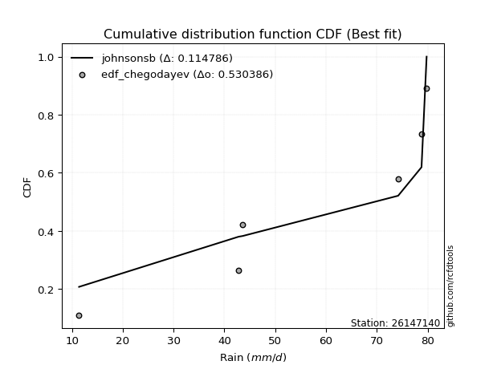</img>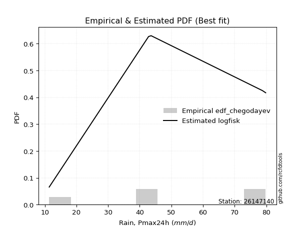</img>

</div>


### 6. EDF Blom (1958)

The Blom formula is a specific "plotting position" formula used in hydrology and statistical analysis to estimate the empirical cumulative probability (or non-exceedance probability) of a data series. It is particularly recommended for data that are approximately normally distributed. The constant _a_ is set to 0.375 (or 3/8).

<div align="center">


$P=(m-a)/(n+1-2a)$


</div>


**6.1. Empirical values**

<div align="center">

|                | 0                   | 1                   | 2        | 3                  | 4                  |
|:---------------|:--------------------|:--------------------|:---------|:-------------------|:-------------------|
| date           | 2022                | 2019                | 2020     | 2024               | 2021               |
| x              | 11.4                | 42.8                | 43.6     | 78.8               | 79.8               |
| m              | 1                   | 2                   | 3        | 4                  | 5                  |
| empirical_dist | edf_blom            | edf_blom            | edf_blom | edf_blom           | edf_blom           |
| empirical      | 0.11904761904761904 | 0.30952380952380953 | 0.5      | 0.6904761904761905 | 0.8809523809523809 |
| empirical_tr   | 1.135135135135135   | 1.4482758620689655  | 2.0      | 3.230769230769231  | 8.399999999999999  |

</div>


**6.2. Kolmogorov-Smirnov fit test (sorted by Δ)**


<div align="center">

|                | 0                   | 1                   | 2                   | 3                   | 4                   | 5                  | 6                   | 7                   | 8                   | 9                  | 10                 | 11                  | 12                 | 13                 | 14                  | 15                 | 16                  | 17                 | 18                 | 19                 | 20                  | 21                  | 22                  | 23                 | 24                 | 25                 | 26                  | 27                 | 28                 | 29                 | 30                 | 31                  | 32                  | 33                    | 34                 | 35                  | 36                 | 37                 | 38                  | 39                  | 40                  | 41                  | 42                  | 43                  | 44                  | 45                  | 46                  | 47                  | 48                  | 49                 | 50                 | 51                  | 52                  | 53                  | 54                 | 55                 | 56                  | 57                  | 58                  | 59                  | 60                 | 61                  | 62                  | 63                 | 64                  | 65                  | 66                  | 67                  | 68                 | 69                  | 70                 | 71                  | 72                 | 73                  | 74                  | 75                  | 76                  | 77                 | 78                 | 79                 | 80                 | 81                 | 82                 | 83                  | 84                  | 85                 | 86                 | 87                 |
|:---------------|:--------------------|:--------------------|:--------------------|:--------------------|:--------------------|:-------------------|:--------------------|:--------------------|:--------------------|:-------------------|:-------------------|:--------------------|:-------------------|:-------------------|:--------------------|:-------------------|:--------------------|:-------------------|:-------------------|:-------------------|:--------------------|:--------------------|:--------------------|:-------------------|:-------------------|:-------------------|:--------------------|:-------------------|:-------------------|:-------------------|:-------------------|:--------------------|:--------------------|:----------------------|:-------------------|:--------------------|:-------------------|:-------------------|:--------------------|:--------------------|:--------------------|:--------------------|:--------------------|:--------------------|:--------------------|:--------------------|:--------------------|:--------------------|:--------------------|:-------------------|:-------------------|:--------------------|:--------------------|:--------------------|:-------------------|:-------------------|:--------------------|:--------------------|:--------------------|:--------------------|:-------------------|:--------------------|:--------------------|:-------------------|:--------------------|:--------------------|:--------------------|:--------------------|:-------------------|:--------------------|:-------------------|:--------------------|:-------------------|:--------------------|:--------------------|:--------------------|:--------------------|:-------------------|:-------------------|:-------------------|:-------------------|:-------------------|:-------------------|:--------------------|:--------------------|:-------------------|:-------------------|:-------------------|
| station        | 26147140            | 26147140            | 26147140            | 26147140            | 26147140            | 26147140           | 26147140            | 26147140            | 26147140            | 26147140           | 26147140           | 26147140            | 26147140           | 26147140           | 26147140            | 26147140           | 26147140            | 26147140           | 26147140           | 26147140           | 26147140            | 26147140            | 26147140            | 26147140           | 26147140           | 26147140           | 26147140            | 26147140           | 26147140           | 26147140           | 26147140           | 26147140            | 26147140            | 26147140              | 26147140           | 26147140            | 26147140           | 26147140           | 26147140            | 26147140            | 26147140            | 26147140            | 26147140            | 26147140            | 26147140            | 26147140            | 26147140            | 26147140            | 26147140            | 26147140           | 26147140           | 26147140            | 26147140            | 26147140            | 26147140           | 26147140           | 26147140            | 26147140            | 26147140            | 26147140            | 26147140           | 26147140            | 26147140            | 26147140           | 26147140            | 26147140            | 26147140            | 26147140            | 26147140           | 26147140            | 26147140           | 26147140            | 26147140           | 26147140            | 26147140            | 26147140            | 26147140            | 26147140           | 26147140           | 26147140           | 26147140           | 26147140           | 26147140           | 26147140            | 26147140            | 26147140           | 26147140           | 26147140           |
| empirical_dist | edf_blom            | edf_blom            | edf_blom            | edf_blom            | edf_blom            | edf_blom           | edf_blom            | edf_blom            | edf_blom            | edf_blom           | edf_blom           | edf_blom            | edf_blom           | edf_blom           | edf_blom            | edf_blom           | edf_blom            | edf_blom           | edf_blom           | edf_blom           | edf_blom            | edf_blom            | edf_blom            | edf_blom           | edf_blom           | edf_blom           | edf_blom            | edf_blom           | edf_blom           | edf_blom           | edf_blom           | edf_blom            | edf_blom            | edf_blom              | edf_blom           | edf_blom            | edf_blom           | edf_blom           | edf_blom            | edf_blom            | edf_blom            | edf_blom            | edf_blom            | edf_blom            | edf_blom            | edf_blom            | edf_blom            | edf_blom            | edf_blom            | edf_blom           | edf_blom           | edf_blom            | edf_blom            | edf_blom            | edf_blom           | edf_blom           | edf_blom            | edf_blom            | edf_blom            | edf_blom            | edf_blom           | edf_blom            | edf_blom            | edf_blom           | edf_blom            | edf_blom            | edf_blom            | edf_blom            | edf_blom           | edf_blom            | edf_blom           | edf_blom            | edf_blom           | edf_blom            | edf_blom            | edf_blom            | edf_blom            | edf_blom           | edf_blom           | edf_blom           | edf_blom           | edf_blom           | edf_blom           | edf_blom            | edf_blom            | edf_blom           | edf_blom           | edf_blom           |
| p_dist         | logfisk             | logpearson3         | loggumbel_l         | kstwobign           | ncf                 | loggompertz        | genlogistic         | fisk                | logweibull_min      | halfnorm           | rayleigh           | invgauss            | maxwell            | rice               | invgamma            | chi2               | gamma               | f                  | erlang             | betaprime          | nct                 | exponnorm           | crystalball         | norm               | t                  | pearson3           | laplace_asymmetric  | weibull_min        | halflogistic       | gumbel_r           | gompertz           | moyal               | logistic            | loglaplace_asymmetric | hypsecant          | logfatiguelife      | lognorm            | lognorm            | logcrystalball      | logexponnorm        | logt                | logf                | loglogistic         | laplace             | lognct              | loghypsecant        | gumbel_l            | wald                | loglaplace          | logncf             | logbetaprime       | loggamma            | loggamma            | logrice             | loginvgamma        | logerlang          | logalpha            | gibrat              | loginvgauss         | logmaxwell          | genexpon           | loginvweibull       | expon               | lograyleigh        | loggumbel_r         | logkstwobign        | alpha               | loghalfnorm         | lognakagami        | loggenexpon         | mielke             | logmielke           | truncnorm          | logloggamma         | logmoyal            | loghalflogistic     | nakagami            | logexpon           | logwald            | loglognorm         | loggibrat          | logjohnsonsu       | logchi2            | logtruncnorm        | invweibull          | fatiguelife        | johnsonsu          | loggenlogistic     |
| delta          | 0.13094332929266733 | 0.13330081205553013 | 0.13384475643263882 | 0.14877173260722165 | 0.15046980868792614 | 0.1556039618199475 | 0.15815080106258506 | 0.15844449035476516 | 0.16089419807345584 | 0.1608982593177506 | 0.1618686540343779 | 0.16280689344621024 | 0.1631077150902409 | 0.1634811758368777 | 0.16364778292619442 | 0.1637408201166045 | 0.16507123137728297 | 0.1661970121728975 | 0.1663739509377129 | 0.166760380908197  | 0.16775501055138486 | 0.16777755474948075 | 0.16777773413082242 | 0.1677777439761159 | 0.1677826935121487 | 0.1698905463943522 | 0.17229444000628868 | 0.1746218263689423 | 0.1763997881938536 | 0.1772475092015635 | 0.1773927296371569 | 0.18162822483038887 | 0.18445853493021824 | 0.18885955675819083   | 0.1927569969397206 | 0.19686212343950482 | 0.1984760744175924 | 0.1984760744175924 | 0.19847630975407127 | 0.19847743867004486 | 0.19848093623997565 | 0.19861660887665034 | 0.19956870709953445 | 0.19981239700514275 | 0.20032456045614655 | 0.20050157226306953 | 0.20111267436833324 | 0.20264947116370313 | 0.20445737049884416 | 0.205301152740073  | 0.2060448010431407 | 0.20813026420861647 | 0.20813026420861647 | 0.20817072892225508 | 0.2118496930701137 | 0.2119177893749491 | 0.21941513859942297 | 0.22540894043313098 | 0.22962514938602419 | 0.23118929273487288 | 0.2324671124933595 | 0.23440676604306365 | 0.23543261132290716 | 0.2420228810681937 | 0.26904217541494324 | 0.27121611731535533 | 0.27238756763196925 | 0.27252280041186006 | 0.2749304361984781 | 0.27648916379125466 | 0.2828471364321039 | 0.28446392132000586 | 0.2877038524315245 | 0.28985798581281286 | 0.29481730025659614 | 0.29793024477450436 | 0.30949890519513645 | 0.3265693114774799 | 0.366464364726916  | 0.3771249219150926 | 0.3910091749412201 | 0.4127794428052437 | 0.434783854853241  | 0.44839341254812776 | 0.46426009604953655 | 0.5445194938354945 | 0.6060115835755046 | 0.6904761904761905 |
| deltao         | 0.5865427407550001  | 0.5865427407550001  | 0.5865427407550001  | 0.5865427407550001  | 0.5865427407550001  | 0.5865427407550001 | 0.5865427407550001  | 0.5865427407550001  | 0.5865427407550001  | 0.5865427407550001 | 0.5865427407550001 | 0.5865427407550001  | 0.5865427407550001 | 0.5865427407550001 | 0.5865427407550001  | 0.5865427407550001 | 0.5865427407550001  | 0.5865427407550001 | 0.5865427407550001 | 0.5865427407550001 | 0.5865427407550001  | 0.5865427407550001  | 0.5865427407550001  | 0.5865427407550001 | 0.5865427407550001 | 0.5865427407550001 | 0.5865427407550001  | 0.5865427407550001 | 0.5865427407550001 | 0.5865427407550001 | 0.5865427407550001 | 0.5865427407550001  | 0.5865427407550001  | 0.5865427407550001    | 0.5865427407550001 | 0.5865427407550001  | 0.5865427407550001 | 0.5865427407550001 | 0.5865427407550001  | 0.5865427407550001  | 0.5865427407550001  | 0.5865427407550001  | 0.5865427407550001  | 0.5865427407550001  | 0.5865427407550001  | 0.5865427407550001  | 0.5865427407550001  | 0.5865427407550001  | 0.5865427407550001  | 0.5865427407550001 | 0.5865427407550001 | 0.5865427407550001  | 0.5865427407550001  | 0.5865427407550001  | 0.5865427407550001 | 0.5865427407550001 | 0.5865427407550001  | 0.5865427407550001  | 0.5865427407550001  | 0.5865427407550001  | 0.5865427407550001 | 0.5865427407550001  | 0.5865427407550001  | 0.5865427407550001 | 0.5865427407550001  | 0.5865427407550001  | 0.5865427407550001  | 0.5865427407550001  | 0.5865427407550001 | 0.5865427407550001  | 0.5865427407550001 | 0.5865427407550001  | 0.5865427407550001 | 0.5865427407550001  | 0.5865427407550001  | 0.5865427407550001  | 0.5865427407550001  | 0.5865427407550001 | 0.5865427407550001 | 0.5865427407550001 | 0.5865427407550001 | 0.5865427407550001 | 0.5865427407550001 | 0.5865427407550001  | 0.5865427407550001  | 0.5865427407550001 | 0.5865427407550001 | 0.5865427407550001 |
| eval           | Δo > Δ              | Δo > Δ              | Δo > Δ              | Δo > Δ              | Δo > Δ              | Δo > Δ             | Δo > Δ              | Δo > Δ              | Δo > Δ              | Δo > Δ             | Δo > Δ             | Δo > Δ              | Δo > Δ             | Δo > Δ             | Δo > Δ              | Δo > Δ             | Δo > Δ              | Δo > Δ             | Δo > Δ             | Δo > Δ             | Δo > Δ              | Δo > Δ              | Δo > Δ              | Δo > Δ             | Δo > Δ             | Δo > Δ             | Δo > Δ              | Δo > Δ             | Δo > Δ             | Δo > Δ             | Δo > Δ             | Δo > Δ              | Δo > Δ              | Δo > Δ                | Δo > Δ             | Δo > Δ              | Δo > Δ             | Δo > Δ             | Δo > Δ              | Δo > Δ              | Δo > Δ              | Δo > Δ              | Δo > Δ              | Δo > Δ              | Δo > Δ              | Δo > Δ              | Δo > Δ              | Δo > Δ              | Δo > Δ              | Δo > Δ             | Δo > Δ             | Δo > Δ              | Δo > Δ              | Δo > Δ              | Δo > Δ             | Δo > Δ             | Δo > Δ              | Δo > Δ              | Δo > Δ              | Δo > Δ              | Δo > Δ             | Δo > Δ              | Δo > Δ              | Δo > Δ             | Δo > Δ              | Δo > Δ              | Δo > Δ              | Δo > Δ              | Δo > Δ             | Δo > Δ              | Δo > Δ             | Δo > Δ              | Δo > Δ             | Δo > Δ              | Δo > Δ              | Δo > Δ              | Δo > Δ              | Δo > Δ             | Δo > Δ             | Δo > Δ             | Δo > Δ             | Δo > Δ             | Δo > Δ             | Δo > Δ              | Δo > Δ              | Δo > Δ             | Δo <= Δ            | Δo <= Δ            |
| fit            | 1                   | 1                   | 1                   | 1                   | 1                   | 1                  | 1                   | 1                   | 1                   | 1                  | 1                  | 1                   | 1                  | 1                  | 1                   | 1                  | 1                   | 1                  | 1                  | 1                  | 1                   | 1                   | 1                   | 1                  | 1                  | 1                  | 1                   | 1                  | 1                  | 1                  | 1                  | 1                   | 1                   | 1                     | 1                  | 1                   | 1                  | 1                  | 1                   | 1                   | 1                   | 1                   | 1                   | 1                   | 1                   | 1                   | 1                   | 1                   | 1                   | 1                  | 1                  | 1                   | 1                   | 1                   | 1                  | 1                  | 1                   | 1                   | 1                   | 1                   | 1                  | 1                   | 1                   | 1                  | 1                   | 1                   | 1                   | 1                   | 1                  | 1                   | 1                  | 1                   | 1                  | 1                   | 1                   | 1                   | 1                   | 1                  | 1                  | 1                  | 1                  | 1                  | 1                  | 1                   | 1                   | 1                  | 0                  | 0                  |
| n              | 5                   | 5                   | 5                   | 5                   | 5                   | 5                  | 5                   | 5                   | 5                   | 5                  | 5                  | 5                   | 5                  | 5                  | 5                   | 5                  | 5                   | 5                  | 5                  | 5                  | 5                   | 5                   | 5                   | 5                  | 5                  | 5                  | 5                   | 5                  | 5                  | 5                  | 5                  | 5                   | 5                   | 5                     | 5                  | 5                   | 5                  | 5                  | 5                   | 5                   | 5                   | 5                   | 5                   | 5                   | 5                   | 5                   | 5                   | 5                   | 5                   | 5                  | 5                  | 5                   | 5                   | 5                   | 5                  | 5                  | 5                   | 5                   | 5                   | 5                   | 5                  | 5                   | 5                   | 5                  | 5                   | 5                   | 5                   | 5                   | 5                  | 5                   | 5                  | 5                   | 5                  | 5                   | 5                   | 5                   | 5                   | 5                  | 5                  | 5                  | 5                  | 5                  | 5                  | 5                   | 5                   | 5                  | 5                  | 5                  |
| best_fit       | 1                   | 0                   | 0                   | 0                   | 0                   | 0                  | 0                   | 0                   | 0                   | 0                  | 0                  | 0                   | 0                  | 0                  | 0                   | 0                  | 0                   | 0                  | 0                  | 0                  | 0                   | 0                   | 0                   | 0                  | 0                  | 0                  | 0                   | 0                  | 0                  | 0                  | 0                  | 0                   | 0                   | 0                     | 0                  | 0                   | 0                  | 0                  | 0                   | 0                   | 0                   | 0                   | 0                   | 0                   | 0                   | 0                   | 0                   | 0                   | 0                   | 0                  | 0                  | 0                   | 0                   | 0                   | 0                  | 0                  | 0                   | 0                   | 0                   | 0                   | 0                  | 0                   | 0                   | 0                  | 0                   | 0                   | 0                   | 0                   | 0                  | 0                   | 0                  | 0                   | 0                  | 0                   | 0                   | 0                   | 0                   | 0                  | 0                  | 0                  | 0                  | 0                  | 0                  | 0                   | 0                   | 0                  | 0                  | 0                  |
| best_fit_sort  | 1                   | 2                   | 3                   | 4                   | 5                   | 6                  | 7                   | 8                   | 9                   | 10                 | 11                 | 12                  | 13                 | 14                 | 15                  | 16                 | 17                  | 18                 | 19                 | 20                 | 21                  | 22                  | 23                  | 24                 | 25                 | 26                 | 27                  | 28                 | 29                 | 30                 | 31                 | 32                  | 33                  | 34                    | 35                 | 36                  | 37                 | 38                 | 39                  | 40                  | 41                  | 42                  | 43                  | 44                  | 45                  | 46                  | 47                  | 48                  | 49                  | 50                 | 51                 | 52                  | 53                  | 54                  | 55                 | 56                 | 57                  | 58                  | 59                  | 60                  | 61                 | 62                  | 63                  | 64                 | 65                  | 66                  | 67                  | 68                  | 69                 | 70                  | 71                 | 72                  | 73                 | 74                  | 75                  | 76                  | 77                  | 78                 | 79                 | 80                 | 81                 | 82                 | 83                 | 84                  | 85                  | 86                 | 87                 | 88                 |

</div>


**6.3. Best fit**

<div align="center">

|   id |   station | empirical_dist   | p_dist   |    delta |   deltao | eval   |   fit |   n |   best_fit |   best_fit_sort |
|-----:|----------:|:-----------------|:---------|---------:|---------:|:-------|------:|----:|-----------:|----------------:|
|    0 |  26147140 | edf_blom         | logfisk  | 0.130943 | 0.586543 | Δo > Δ |     1 |   5 |          1 |               1 |

</div>


<div align="center">

</img>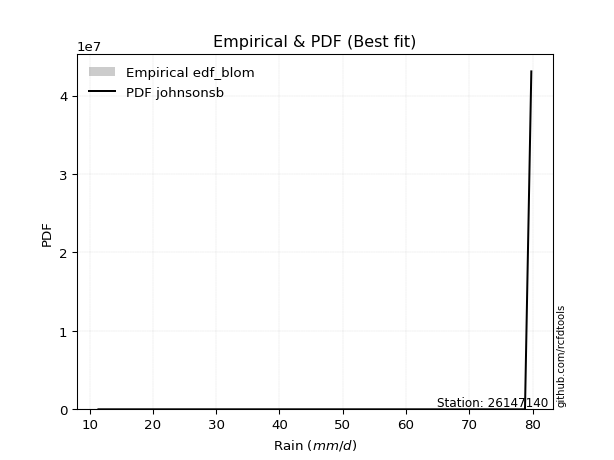</img>

</div>


### 7. EDF Tukey (1962)

In hydrology, the Tukey formula is used as a plotting position formula to estimate the empirical probability or frequency of a flood event (or other hydrological data). The formula parameter is given as _c=0.333_ (or 1/3).

<div align="center">


$P=(m-c)/(n+1-2c)$


</div>


**7.1. Empirical values**

<div align="center">

|                | 0                  | 1                  | 2         | 3         | 4         |
|:---------------|:-------------------|:-------------------|:----------|:----------|:----------|
| date           | 2022               | 2019               | 2020      | 2024      | 2021      |
| x              | 11.4               | 42.8               | 43.6      | 78.8      | 79.8      |
| m              | 1                  | 2                  | 3         | 4         | 5         |
| empirical_dist | edf_tukey          | edf_tukey          | edf_tukey | edf_tukey | edf_tukey |
| empirical      | 0.125              | 0.3125             | 0.5       | 0.6875    | 0.875     |
| empirical_tr   | 1.1428571428571428 | 1.4545454545454546 | 2.0       | 3.2       | 8.0       |

</div>


**7.2. Kolmogorov-Smirnov fit test (sorted by Δ)**


<div align="center">

|                | 0                   | 1                   | 2                  | 3                   | 4                   | 5                   | 6                   | 7                   | 8                  | 9                   | 10                  | 11                 | 12                  | 13                  | 14                  | 15                  | 16                  | 17                  | 18                  | 19                  | 20                  | 21                  | 22                  | 23                  | 24                  | 25                  | 26                  | 27                  | 28                  | 29                  | 30                  | 31                  | 32                    | 33                 | 34                  | 35                  | 36                  | 37                 | 38                 | 39                  | 40                  | 41                  | 42                  | 43                  | 44                  | 45                 | 46                  | 47                  | 48                  | 49                 | 50                 | 51                 | 52                 | 53                 | 54                  | 55                  | 56                 | 57                  | 58                 | 59                  | 60                  | 61                 | 62                 | 63                  | 64                 | 65                  | 66                 | 67                 | 68                 | 69                 | 70                 | 71                  | 72                 | 73                  | 74                 | 75                 | 76                 | 77                  | 78                  | 79                  | 80                  | 81                 | 82                  | 83                  | 84                 | 85                 | 86                 | 87                 |
|:---------------|:--------------------|:--------------------|:-------------------|:--------------------|:--------------------|:--------------------|:--------------------|:--------------------|:-------------------|:--------------------|:--------------------|:-------------------|:--------------------|:--------------------|:--------------------|:--------------------|:--------------------|:--------------------|:--------------------|:--------------------|:--------------------|:--------------------|:--------------------|:--------------------|:--------------------|:--------------------|:--------------------|:--------------------|:--------------------|:--------------------|:--------------------|:--------------------|:----------------------|:-------------------|:--------------------|:--------------------|:--------------------|:-------------------|:-------------------|:--------------------|:--------------------|:--------------------|:--------------------|:--------------------|:--------------------|:-------------------|:--------------------|:--------------------|:--------------------|:-------------------|:-------------------|:-------------------|:-------------------|:-------------------|:--------------------|:--------------------|:-------------------|:--------------------|:-------------------|:--------------------|:--------------------|:-------------------|:-------------------|:--------------------|:-------------------|:--------------------|:-------------------|:-------------------|:-------------------|:-------------------|:-------------------|:--------------------|:-------------------|:--------------------|:-------------------|:-------------------|:-------------------|:--------------------|:--------------------|:--------------------|:--------------------|:-------------------|:--------------------|:--------------------|:-------------------|:-------------------|:-------------------|:-------------------|
| station        | 26147140            | 26147140            | 26147140           | 26147140            | 26147140            | 26147140            | 26147140            | 26147140            | 26147140           | 26147140            | 26147140            | 26147140           | 26147140            | 26147140            | 26147140            | 26147140            | 26147140            | 26147140            | 26147140            | 26147140            | 26147140            | 26147140            | 26147140            | 26147140            | 26147140            | 26147140            | 26147140            | 26147140            | 26147140            | 26147140            | 26147140            | 26147140            | 26147140              | 26147140           | 26147140            | 26147140            | 26147140            | 26147140           | 26147140           | 26147140            | 26147140            | 26147140            | 26147140            | 26147140            | 26147140            | 26147140           | 26147140            | 26147140            | 26147140            | 26147140           | 26147140           | 26147140           | 26147140           | 26147140           | 26147140            | 26147140            | 26147140           | 26147140            | 26147140           | 26147140            | 26147140            | 26147140           | 26147140           | 26147140            | 26147140           | 26147140            | 26147140           | 26147140           | 26147140           | 26147140           | 26147140           | 26147140            | 26147140           | 26147140            | 26147140           | 26147140           | 26147140           | 26147140            | 26147140            | 26147140            | 26147140            | 26147140           | 26147140            | 26147140            | 26147140           | 26147140           | 26147140           | 26147140           |
| empirical_dist | edf_tukey           | edf_tukey           | edf_tukey          | edf_tukey           | edf_tukey           | edf_tukey           | edf_tukey           | edf_tukey           | edf_tukey          | edf_tukey           | edf_tukey           | edf_tukey          | edf_tukey           | edf_tukey           | edf_tukey           | edf_tukey           | edf_tukey           | edf_tukey           | edf_tukey           | edf_tukey           | edf_tukey           | edf_tukey           | edf_tukey           | edf_tukey           | edf_tukey           | edf_tukey           | edf_tukey           | edf_tukey           | edf_tukey           | edf_tukey           | edf_tukey           | edf_tukey           | edf_tukey             | edf_tukey          | edf_tukey           | edf_tukey           | edf_tukey           | edf_tukey          | edf_tukey          | edf_tukey           | edf_tukey           | edf_tukey           | edf_tukey           | edf_tukey           | edf_tukey           | edf_tukey          | edf_tukey           | edf_tukey           | edf_tukey           | edf_tukey          | edf_tukey          | edf_tukey          | edf_tukey          | edf_tukey          | edf_tukey           | edf_tukey           | edf_tukey          | edf_tukey           | edf_tukey          | edf_tukey           | edf_tukey           | edf_tukey          | edf_tukey          | edf_tukey           | edf_tukey          | edf_tukey           | edf_tukey          | edf_tukey          | edf_tukey          | edf_tukey          | edf_tukey          | edf_tukey           | edf_tukey          | edf_tukey           | edf_tukey          | edf_tukey          | edf_tukey          | edf_tukey           | edf_tukey           | edf_tukey           | edf_tukey           | edf_tukey          | edf_tukey           | edf_tukey           | edf_tukey          | edf_tukey          | edf_tukey          | edf_tukey          |
| p_dist         | logfisk             | logpearson3         | loggumbel_l        | ncf                 | kstwobign           | loggompertz         | genlogistic         | fisk                | logweibull_min     | halfnorm            | rayleigh            | invgauss           | maxwell             | rice                | invgamma            | chi2                | gamma               | f                   | erlang              | betaprime           | nct                 | exponnorm           | crystalball         | norm                | t                   | pearson3            | laplace_asymmetric  | weibull_min         | halflogistic        | gumbel_r            | gompertz            | moyal               | loglaplace_asymmetric | logistic           | logfatiguelife      | lognorm             | lognorm             | logcrystalball     | logexponnorm       | logt                | logf                | hypsecant           | loglogistic         | lognct              | loghypsecant        | loglaplace         | logncf              | laplace             | logbetaprime        | gumbel_l           | loggamma           | loggamma           | logrice            | wald               | loginvgamma         | logerlang           | logalpha           | loginvgauss         | logmaxwell         | gibrat              | genexpon            | loginvweibull      | expon              | lograyleigh         | loggumbel_r        | logkstwobign        | alpha              | loghalfnorm        | loggenexpon        | lognakagami        | mielke             | logmielke           | truncnorm          | logmoyal            | logloggamma        | loghalflogistic    | nakagami           | logexpon            | logwald             | loglognorm          | loggibrat           | logjohnsonsu       | logchi2             | logtruncnorm        | invweibull         | fatiguelife        | johnsonsu          | loggenlogistic     |
| delta          | 0.12796713881647687 | 0.13032462157933966 | 0.1368209469088293 | 0.14749361821173568 | 0.15174792308341212 | 0.15858015229613798 | 0.16112699153877552 | 0.16142068083095562 | 0.1638703885496463 | 0.16387444979394106 | 0.16484484451056836 | 0.1657830839224007 | 0.16608390556643138 | 0.16645736631306818 | 0.16662397340238488 | 0.16671701059279498 | 0.16804742185347343 | 0.16917320264908797 | 0.16935014141390337 | 0.16973657138438747 | 0.17073120102757533 | 0.17075374522567122 | 0.17075392460701289 | 0.17075393445230636 | 0.17075888398833916 | 0.17286673687054266 | 0.17527063048247915 | 0.17759801684513277 | 0.17937597867004407 | 0.18022369967775398 | 0.18036892011334738 | 0.18460441530657934 | 0.18588336628200036   | 0.1874347254064087 | 0.19388593296331436 | 0.19549988394140194 | 0.19549988394140194 | 0.1955001192778808 | 0.1955012481938544 | 0.19550474576378518 | 0.19564041840045987 | 0.19573318741591106 | 0.19659251662334398 | 0.19734836997995608 | 0.19752538178687906 | 0.2014811800226537 | 0.20232496226388252 | 0.20278858748133322 | 0.20306861056695025 | 0.2040888648445237 | 0.205154073732426  | 0.205154073732426  | 0.2051945384460646 | 0.2056256616398936 | 0.20887350259392323 | 0.20894159889875863 | 0.2164389481232325 | 0.22664895890983372 | 0.2282131022586824 | 0.22838513090932144 | 0.22949092201716903 | 0.2314305755668732 | 0.2324564208467167 | 0.23904669059200323 | 0.2660659849387528 | 0.26823992683916487 | 0.2694113771557788 | 0.2695466099356696 | 0.2735129733150642 | 0.2779066266746686 | 0.2858233269082944 | 0.28744011179619633 | 0.290680042907715  | 0.29184110978040567 | 0.2928341762890033 | 0.2949540542983139 | 0.3124750956713269 | 0.32359312100128945 | 0.36348817425072555 | 0.37414873143890215 | 0.38803298446502965 | 0.4127794428052437 | 0.43180766437705054 | 0.44839341254812776 | 0.4583077150971556 | 0.541543303359304  | 0.6030353930993141 | 0.6875             |
| deltao         | 0.5865427407550001  | 0.5865427407550001  | 0.5865427407550001 | 0.5865427407550001  | 0.5865427407550001  | 0.5865427407550001  | 0.5865427407550001  | 0.5865427407550001  | 0.5865427407550001 | 0.5865427407550001  | 0.5865427407550001  | 0.5865427407550001 | 0.5865427407550001  | 0.5865427407550001  | 0.5865427407550001  | 0.5865427407550001  | 0.5865427407550001  | 0.5865427407550001  | 0.5865427407550001  | 0.5865427407550001  | 0.5865427407550001  | 0.5865427407550001  | 0.5865427407550001  | 0.5865427407550001  | 0.5865427407550001  | 0.5865427407550001  | 0.5865427407550001  | 0.5865427407550001  | 0.5865427407550001  | 0.5865427407550001  | 0.5865427407550001  | 0.5865427407550001  | 0.5865427407550001    | 0.5865427407550001 | 0.5865427407550001  | 0.5865427407550001  | 0.5865427407550001  | 0.5865427407550001 | 0.5865427407550001 | 0.5865427407550001  | 0.5865427407550001  | 0.5865427407550001  | 0.5865427407550001  | 0.5865427407550001  | 0.5865427407550001  | 0.5865427407550001 | 0.5865427407550001  | 0.5865427407550001  | 0.5865427407550001  | 0.5865427407550001 | 0.5865427407550001 | 0.5865427407550001 | 0.5865427407550001 | 0.5865427407550001 | 0.5865427407550001  | 0.5865427407550001  | 0.5865427407550001 | 0.5865427407550001  | 0.5865427407550001 | 0.5865427407550001  | 0.5865427407550001  | 0.5865427407550001 | 0.5865427407550001 | 0.5865427407550001  | 0.5865427407550001 | 0.5865427407550001  | 0.5865427407550001 | 0.5865427407550001 | 0.5865427407550001 | 0.5865427407550001 | 0.5865427407550001 | 0.5865427407550001  | 0.5865427407550001 | 0.5865427407550001  | 0.5865427407550001 | 0.5865427407550001 | 0.5865427407550001 | 0.5865427407550001  | 0.5865427407550001  | 0.5865427407550001  | 0.5865427407550001  | 0.5865427407550001 | 0.5865427407550001  | 0.5865427407550001  | 0.5865427407550001 | 0.5865427407550001 | 0.5865427407550001 | 0.5865427407550001 |
| eval           | Δo > Δ              | Δo > Δ              | Δo > Δ             | Δo > Δ              | Δo > Δ              | Δo > Δ              | Δo > Δ              | Δo > Δ              | Δo > Δ             | Δo > Δ              | Δo > Δ              | Δo > Δ             | Δo > Δ              | Δo > Δ              | Δo > Δ              | Δo > Δ              | Δo > Δ              | Δo > Δ              | Δo > Δ              | Δo > Δ              | Δo > Δ              | Δo > Δ              | Δo > Δ              | Δo > Δ              | Δo > Δ              | Δo > Δ              | Δo > Δ              | Δo > Δ              | Δo > Δ              | Δo > Δ              | Δo > Δ              | Δo > Δ              | Δo > Δ                | Δo > Δ             | Δo > Δ              | Δo > Δ              | Δo > Δ              | Δo > Δ             | Δo > Δ             | Δo > Δ              | Δo > Δ              | Δo > Δ              | Δo > Δ              | Δo > Δ              | Δo > Δ              | Δo > Δ             | Δo > Δ              | Δo > Δ              | Δo > Δ              | Δo > Δ             | Δo > Δ             | Δo > Δ             | Δo > Δ             | Δo > Δ             | Δo > Δ              | Δo > Δ              | Δo > Δ             | Δo > Δ              | Δo > Δ             | Δo > Δ              | Δo > Δ              | Δo > Δ             | Δo > Δ             | Δo > Δ              | Δo > Δ             | Δo > Δ              | Δo > Δ             | Δo > Δ             | Δo > Δ             | Δo > Δ             | Δo > Δ             | Δo > Δ              | Δo > Δ             | Δo > Δ              | Δo > Δ             | Δo > Δ             | Δo > Δ             | Δo > Δ              | Δo > Δ              | Δo > Δ              | Δo > Δ              | Δo > Δ             | Δo > Δ              | Δo > Δ              | Δo > Δ             | Δo > Δ             | Δo <= Δ            | Δo <= Δ            |
| fit            | 1                   | 1                   | 1                  | 1                   | 1                   | 1                   | 1                   | 1                   | 1                  | 1                   | 1                   | 1                  | 1                   | 1                   | 1                   | 1                   | 1                   | 1                   | 1                   | 1                   | 1                   | 1                   | 1                   | 1                   | 1                   | 1                   | 1                   | 1                   | 1                   | 1                   | 1                   | 1                   | 1                     | 1                  | 1                   | 1                   | 1                   | 1                  | 1                  | 1                   | 1                   | 1                   | 1                   | 1                   | 1                   | 1                  | 1                   | 1                   | 1                   | 1                  | 1                  | 1                  | 1                  | 1                  | 1                   | 1                   | 1                  | 1                   | 1                  | 1                   | 1                   | 1                  | 1                  | 1                   | 1                  | 1                   | 1                  | 1                  | 1                  | 1                  | 1                  | 1                   | 1                  | 1                   | 1                  | 1                  | 1                  | 1                   | 1                   | 1                   | 1                   | 1                  | 1                   | 1                   | 1                  | 1                  | 0                  | 0                  |
| n              | 5                   | 5                   | 5                  | 5                   | 5                   | 5                   | 5                   | 5                   | 5                  | 5                   | 5                   | 5                  | 5                   | 5                   | 5                   | 5                   | 5                   | 5                   | 5                   | 5                   | 5                   | 5                   | 5                   | 5                   | 5                   | 5                   | 5                   | 5                   | 5                   | 5                   | 5                   | 5                   | 5                     | 5                  | 5                   | 5                   | 5                   | 5                  | 5                  | 5                   | 5                   | 5                   | 5                   | 5                   | 5                   | 5                  | 5                   | 5                   | 5                   | 5                  | 5                  | 5                  | 5                  | 5                  | 5                   | 5                   | 5                  | 5                   | 5                  | 5                   | 5                   | 5                  | 5                  | 5                   | 5                  | 5                   | 5                  | 5                  | 5                  | 5                  | 5                  | 5                   | 5                  | 5                   | 5                  | 5                  | 5                  | 5                   | 5                   | 5                   | 5                   | 5                  | 5                   | 5                   | 5                  | 5                  | 5                  | 5                  |
| best_fit       | 1                   | 0                   | 0                  | 0                   | 0                   | 0                   | 0                   | 0                   | 0                  | 0                   | 0                   | 0                  | 0                   | 0                   | 0                   | 0                   | 0                   | 0                   | 0                   | 0                   | 0                   | 0                   | 0                   | 0                   | 0                   | 0                   | 0                   | 0                   | 0                   | 0                   | 0                   | 0                   | 0                     | 0                  | 0                   | 0                   | 0                   | 0                  | 0                  | 0                   | 0                   | 0                   | 0                   | 0                   | 0                   | 0                  | 0                   | 0                   | 0                   | 0                  | 0                  | 0                  | 0                  | 0                  | 0                   | 0                   | 0                  | 0                   | 0                  | 0                   | 0                   | 0                  | 0                  | 0                   | 0                  | 0                   | 0                  | 0                  | 0                  | 0                  | 0                  | 0                   | 0                  | 0                   | 0                  | 0                  | 0                  | 0                   | 0                   | 0                   | 0                   | 0                  | 0                   | 0                   | 0                  | 0                  | 0                  | 0                  |
| best_fit_sort  | 1                   | 2                   | 3                  | 4                   | 5                   | 6                   | 7                   | 8                   | 9                  | 10                  | 11                  | 12                 | 13                  | 14                  | 15                  | 16                  | 17                  | 18                  | 19                  | 20                  | 21                  | 22                  | 23                  | 24                  | 25                  | 26                  | 27                  | 28                  | 29                  | 30                  | 31                  | 32                  | 33                    | 34                 | 35                  | 36                  | 37                  | 38                 | 39                 | 40                  | 41                  | 42                  | 43                  | 44                  | 45                  | 46                 | 47                  | 48                  | 49                  | 50                 | 51                 | 52                 | 53                 | 54                 | 55                  | 56                  | 57                 | 58                  | 59                 | 60                  | 61                  | 62                 | 63                 | 64                  | 65                 | 66                  | 67                 | 68                 | 69                 | 70                 | 71                 | 72                  | 73                 | 74                  | 75                 | 76                 | 77                 | 78                  | 79                  | 80                  | 81                  | 82                 | 83                  | 84                  | 85                 | 86                 | 87                 | 88                 |

</div>


**7.3. Best fit**

<div align="center">

|   id |   station | empirical_dist   | p_dist   |    delta |   deltao | eval   |   fit |   n |   best_fit |   best_fit_sort |
|-----:|----------:|:-----------------|:---------|---------:|---------:|:-------|------:|----:|-----------:|----------------:|
|    0 |  26147140 | edf_tukey        | logfisk  | 0.127967 | 0.586543 | Δo > Δ |     1 |   5 |          1 |               1 |

</div>


<div align="center">

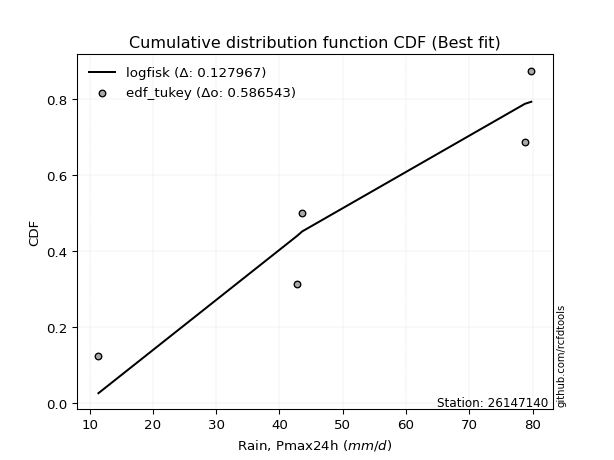</img>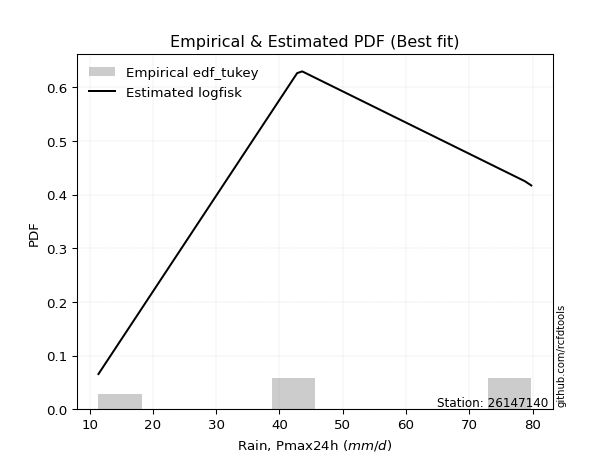</img>

</div>


### 8. EDF Gringorten (1963)

Gringorten plotting position formula is essential for estimating the probability and return periods of extreme events like floods and heavy rainfall. The constant _a=0.44_.

<div align="center">


$P=(m-a)/(n+1-2a)$


</div>


**8.1. Empirical values**

<div align="center">

|                | 0                   | 1                  | 2              | 3                 | 4                  |
|:---------------|:--------------------|:-------------------|:---------------|:------------------|:-------------------|
| date           | 2022                | 2019               | 2020           | 2024              | 2021               |
| x              | 11.4                | 42.8               | 43.6           | 78.8              | 79.8               |
| m              | 1                   | 2                  | 3              | 4                 | 5                  |
| empirical_dist | edf_gringorten      | edf_gringorten     | edf_gringorten | edf_gringorten    | edf_gringorten     |
| empirical      | 0.10937500000000001 | 0.3046875          | 0.5            | 0.6953125         | 0.8906249999999999 |
| empirical_tr   | 1.1228070175438596  | 1.4382022471910112 | 2.0            | 3.282051282051282 | 9.142857142857133  |

</div>


**8.2. Kolmogorov-Smirnov fit test (sorted by Δ)**


<div align="center">

|                | 0                   | 1                   | 2                   | 3                   | 4                   | 5                   | 6                   | 7                   | 8                  | 9                   | 10                  | 11                 | 12                  | 13                  | 14                  | 15                  | 16                  | 17                  | 18                  | 19                  | 20                  | 21                  | 22                  | 23                  | 24                  | 25                  | 26                  | 27                  | 28                  | 29                  | 30                  | 31                  | 32                 | 33                  | 34                    | 35                  | 36                 | 37                 | 38                  | 39                  | 40                  | 41                 | 42                 | 43                  | 44                  | 45                  | 46                  | 47                  | 48                 | 49                  | 50                  | 51                 | 52                 | 53                 | 54                  | 55                  | 56                  | 57                 | 58                  | 59                 | 60                  | 61                 | 62                 | 63                  | 64                 | 65                 | 66                  | 67                 | 68                 | 69                 | 70                  | 71                 | 72                 | 73                 | 74                  | 75                 | 76                 | 77                  | 78                  | 79                  | 80                  | 81                 | 82                  | 83                  | 84                 | 85                 | 86                 | 87                 |
|:---------------|:--------------------|:--------------------|:--------------------|:--------------------|:--------------------|:--------------------|:--------------------|:--------------------|:-------------------|:--------------------|:--------------------|:-------------------|:--------------------|:--------------------|:--------------------|:--------------------|:--------------------|:--------------------|:--------------------|:--------------------|:--------------------|:--------------------|:--------------------|:--------------------|:--------------------|:--------------------|:--------------------|:--------------------|:--------------------|:--------------------|:--------------------|:--------------------|:-------------------|:--------------------|:----------------------|:--------------------|:-------------------|:-------------------|:--------------------|:--------------------|:--------------------|:-------------------|:-------------------|:--------------------|:--------------------|:--------------------|:--------------------|:--------------------|:-------------------|:--------------------|:--------------------|:-------------------|:-------------------|:-------------------|:--------------------|:--------------------|:--------------------|:-------------------|:--------------------|:-------------------|:--------------------|:-------------------|:-------------------|:--------------------|:-------------------|:-------------------|:--------------------|:-------------------|:-------------------|:-------------------|:--------------------|:-------------------|:-------------------|:-------------------|:--------------------|:-------------------|:-------------------|:--------------------|:--------------------|:--------------------|:--------------------|:-------------------|:--------------------|:--------------------|:-------------------|:-------------------|:-------------------|:-------------------|
| station        | 26147140            | 26147140            | 26147140            | 26147140            | 26147140            | 26147140            | 26147140            | 26147140            | 26147140           | 26147140            | 26147140            | 26147140           | 26147140            | 26147140            | 26147140            | 26147140            | 26147140            | 26147140            | 26147140            | 26147140            | 26147140            | 26147140            | 26147140            | 26147140            | 26147140            | 26147140            | 26147140            | 26147140            | 26147140            | 26147140            | 26147140            | 26147140            | 26147140           | 26147140            | 26147140              | 26147140            | 26147140           | 26147140           | 26147140            | 26147140            | 26147140            | 26147140           | 26147140           | 26147140            | 26147140            | 26147140            | 26147140            | 26147140            | 26147140           | 26147140            | 26147140            | 26147140           | 26147140           | 26147140           | 26147140            | 26147140            | 26147140            | 26147140           | 26147140            | 26147140           | 26147140            | 26147140           | 26147140           | 26147140            | 26147140           | 26147140           | 26147140            | 26147140           | 26147140           | 26147140           | 26147140            | 26147140           | 26147140           | 26147140           | 26147140            | 26147140           | 26147140           | 26147140            | 26147140            | 26147140            | 26147140            | 26147140           | 26147140            | 26147140            | 26147140           | 26147140           | 26147140           | 26147140           |
| empirical_dist | edf_gringorten      | edf_gringorten      | edf_gringorten      | edf_gringorten      | edf_gringorten      | edf_gringorten      | edf_gringorten      | edf_gringorten      | edf_gringorten     | edf_gringorten      | edf_gringorten      | edf_gringorten     | edf_gringorten      | edf_gringorten      | edf_gringorten      | edf_gringorten      | edf_gringorten      | edf_gringorten      | edf_gringorten      | edf_gringorten      | edf_gringorten      | edf_gringorten      | edf_gringorten      | edf_gringorten      | edf_gringorten      | edf_gringorten      | edf_gringorten      | edf_gringorten      | edf_gringorten      | edf_gringorten      | edf_gringorten      | edf_gringorten      | edf_gringorten     | edf_gringorten      | edf_gringorten        | edf_gringorten      | edf_gringorten     | edf_gringorten     | edf_gringorten      | edf_gringorten      | edf_gringorten      | edf_gringorten     | edf_gringorten     | edf_gringorten      | edf_gringorten      | edf_gringorten      | edf_gringorten      | edf_gringorten      | edf_gringorten     | edf_gringorten      | edf_gringorten      | edf_gringorten     | edf_gringorten     | edf_gringorten     | edf_gringorten      | edf_gringorten      | edf_gringorten      | edf_gringorten     | edf_gringorten      | edf_gringorten     | edf_gringorten      | edf_gringorten     | edf_gringorten     | edf_gringorten      | edf_gringorten     | edf_gringorten     | edf_gringorten      | edf_gringorten     | edf_gringorten     | edf_gringorten     | edf_gringorten      | edf_gringorten     | edf_gringorten     | edf_gringorten     | edf_gringorten      | edf_gringorten     | edf_gringorten     | edf_gringorten      | edf_gringorten      | edf_gringorten      | edf_gringorten      | edf_gringorten     | edf_gringorten      | edf_gringorten      | edf_gringorten     | edf_gringorten     | edf_gringorten     | edf_gringorten     |
| p_dist         | loggumbel_l         | logfisk             | logpearson3         | loggompertz         | kstwobign           | genlogistic         | fisk                | ncf                 | logweibull_min     | halfnorm            | rayleigh            | invgauss           | maxwell             | rice                | invgamma            | chi2                | gamma               | f                   | erlang              | betaprime           | nct                 | exponnorm           | crystalball         | norm                | t                   | pearson3            | laplace_asymmetric  | weibull_min         | halflogistic        | gumbel_r            | gompertz            | moyal               | logistic           | hypsecant           | loglaplace_asymmetric | laplace             | gumbel_l           | wald               | logfatiguelife      | lognorm             | lognorm             | logcrystalball     | logexponnorm       | logt                | logf                | loglogistic         | lognct              | loghypsecant        | loglaplace         | logncf              | logbetaprime        | loggamma           | loggamma           | logrice            | loginvgamma         | logerlang           | gibrat              | logalpha           | loginvgauss         | logmaxwell         | genexpon            | loginvweibull      | expon              | lograyleigh         | lognakagami        | loggumbel_r        | logkstwobign        | alpha              | loghalfnorm        | mielke             | logmielke           | loggenexpon        | truncnorm          | logloggamma        | logmoyal            | loghalflogistic    | nakagami           | logexpon            | logwald             | loglognorm          | loggibrat           | logjohnsonsu       | logchi2             | logtruncnorm        | invweibull         | fatiguelife        | johnsonsu          | loggenlogistic     |
| delta          | 0.13321937330057831 | 0.13577963881647687 | 0.13813712157933966 | 0.15076765229613798 | 0.15207706690441253 | 0.15331449153877552 | 0.15360818083095562 | 0.15530611821173568 | 0.1560578885496463 | 0.15606194979394106 | 0.15703234451056836 | 0.1579705839224007 | 0.15827140556643138 | 0.15864486631306818 | 0.15881147340238488 | 0.15890451059279498 | 0.16023492185347343 | 0.16136070264908797 | 0.16153764141390337 | 0.16192407138438747 | 0.16291870102757533 | 0.16294124522567122 | 0.16294142460701289 | 0.16294143445230636 | 0.16294638398833916 | 0.16505423687054266 | 0.16745813048247915 | 0.16978551684513277 | 0.17156347867004407 | 0.17241119967775398 | 0.17255642011334738 | 0.17679191530657934 | 0.1796222254064087 | 0.18792068741591106 | 0.19369586628200036   | 0.19497608748133322 | 0.1962763648445237 | 0.1978131616398936 | 0.20169843296331436 | 0.20331238394140194 | 0.20331238394140194 | 0.2033126192778808 | 0.2033137481938544 | 0.20331724576378518 | 0.20345291840045987 | 0.20440501662334398 | 0.20516086997995608 | 0.20533788178687906 | 0.2092936800226537 | 0.21013746226388252 | 0.21088111056695025 | 0.212966573732426  | 0.212966573732426  | 0.2130070384460646 | 0.21668600259392323 | 0.21675409889875863 | 0.22057263090932144 | 0.2242514481232325 | 0.23446145890983372 | 0.2360256022586824 | 0.23730342201716903 | 0.2392430755668732 | 0.2402689208467167 | 0.24685919059200323 | 0.2700941266746686 | 0.2738784849387528 | 0.27605242683916487 | 0.2772238771557788 | 0.2773591099356696 | 0.2780108269082944 | 0.27962761179619633 | 0.2813254733150642 | 0.282867542907715  | 0.2850216762890033 | 0.29965360978040567 | 0.3027665542983139 | 0.3046625956713269 | 0.33140562100128945 | 0.37130067425072555 | 0.38196123143890215 | 0.39584548446502965 | 0.4127794428052437 | 0.43962016437705054 | 0.44839341254812776 | 0.4739327150971555 | 0.549355803359304  | 0.6108478930993141 | 0.6953125          |
| deltao         | 0.5865427407550001  | 0.5865427407550001  | 0.5865427407550001  | 0.5865427407550001  | 0.5865427407550001  | 0.5865427407550001  | 0.5865427407550001  | 0.5865427407550001  | 0.5865427407550001 | 0.5865427407550001  | 0.5865427407550001  | 0.5865427407550001 | 0.5865427407550001  | 0.5865427407550001  | 0.5865427407550001  | 0.5865427407550001  | 0.5865427407550001  | 0.5865427407550001  | 0.5865427407550001  | 0.5865427407550001  | 0.5865427407550001  | 0.5865427407550001  | 0.5865427407550001  | 0.5865427407550001  | 0.5865427407550001  | 0.5865427407550001  | 0.5865427407550001  | 0.5865427407550001  | 0.5865427407550001  | 0.5865427407550001  | 0.5865427407550001  | 0.5865427407550001  | 0.5865427407550001 | 0.5865427407550001  | 0.5865427407550001    | 0.5865427407550001  | 0.5865427407550001 | 0.5865427407550001 | 0.5865427407550001  | 0.5865427407550001  | 0.5865427407550001  | 0.5865427407550001 | 0.5865427407550001 | 0.5865427407550001  | 0.5865427407550001  | 0.5865427407550001  | 0.5865427407550001  | 0.5865427407550001  | 0.5865427407550001 | 0.5865427407550001  | 0.5865427407550001  | 0.5865427407550001 | 0.5865427407550001 | 0.5865427407550001 | 0.5865427407550001  | 0.5865427407550001  | 0.5865427407550001  | 0.5865427407550001 | 0.5865427407550001  | 0.5865427407550001 | 0.5865427407550001  | 0.5865427407550001 | 0.5865427407550001 | 0.5865427407550001  | 0.5865427407550001 | 0.5865427407550001 | 0.5865427407550001  | 0.5865427407550001 | 0.5865427407550001 | 0.5865427407550001 | 0.5865427407550001  | 0.5865427407550001 | 0.5865427407550001 | 0.5865427407550001 | 0.5865427407550001  | 0.5865427407550001 | 0.5865427407550001 | 0.5865427407550001  | 0.5865427407550001  | 0.5865427407550001  | 0.5865427407550001  | 0.5865427407550001 | 0.5865427407550001  | 0.5865427407550001  | 0.5865427407550001 | 0.5865427407550001 | 0.5865427407550001 | 0.5865427407550001 |
| eval           | Δo > Δ              | Δo > Δ              | Δo > Δ              | Δo > Δ              | Δo > Δ              | Δo > Δ              | Δo > Δ              | Δo > Δ              | Δo > Δ             | Δo > Δ              | Δo > Δ              | Δo > Δ             | Δo > Δ              | Δo > Δ              | Δo > Δ              | Δo > Δ              | Δo > Δ              | Δo > Δ              | Δo > Δ              | Δo > Δ              | Δo > Δ              | Δo > Δ              | Δo > Δ              | Δo > Δ              | Δo > Δ              | Δo > Δ              | Δo > Δ              | Δo > Δ              | Δo > Δ              | Δo > Δ              | Δo > Δ              | Δo > Δ              | Δo > Δ             | Δo > Δ              | Δo > Δ                | Δo > Δ              | Δo > Δ             | Δo > Δ             | Δo > Δ              | Δo > Δ              | Δo > Δ              | Δo > Δ             | Δo > Δ             | Δo > Δ              | Δo > Δ              | Δo > Δ              | Δo > Δ              | Δo > Δ              | Δo > Δ             | Δo > Δ              | Δo > Δ              | Δo > Δ             | Δo > Δ             | Δo > Δ             | Δo > Δ              | Δo > Δ              | Δo > Δ              | Δo > Δ             | Δo > Δ              | Δo > Δ             | Δo > Δ              | Δo > Δ             | Δo > Δ             | Δo > Δ              | Δo > Δ             | Δo > Δ             | Δo > Δ              | Δo > Δ             | Δo > Δ             | Δo > Δ             | Δo > Δ              | Δo > Δ             | Δo > Δ             | Δo > Δ             | Δo > Δ              | Δo > Δ             | Δo > Δ             | Δo > Δ              | Δo > Δ              | Δo > Δ              | Δo > Δ              | Δo > Δ             | Δo > Δ              | Δo > Δ              | Δo > Δ             | Δo > Δ             | Δo <= Δ            | Δo <= Δ            |
| fit            | 1                   | 1                   | 1                   | 1                   | 1                   | 1                   | 1                   | 1                   | 1                  | 1                   | 1                   | 1                  | 1                   | 1                   | 1                   | 1                   | 1                   | 1                   | 1                   | 1                   | 1                   | 1                   | 1                   | 1                   | 1                   | 1                   | 1                   | 1                   | 1                   | 1                   | 1                   | 1                   | 1                  | 1                   | 1                     | 1                   | 1                  | 1                  | 1                   | 1                   | 1                   | 1                  | 1                  | 1                   | 1                   | 1                   | 1                   | 1                   | 1                  | 1                   | 1                   | 1                  | 1                  | 1                  | 1                   | 1                   | 1                   | 1                  | 1                   | 1                  | 1                   | 1                  | 1                  | 1                   | 1                  | 1                  | 1                   | 1                  | 1                  | 1                  | 1                   | 1                  | 1                  | 1                  | 1                   | 1                  | 1                  | 1                   | 1                   | 1                   | 1                   | 1                  | 1                   | 1                   | 1                  | 1                  | 0                  | 0                  |
| n              | 5                   | 5                   | 5                   | 5                   | 5                   | 5                   | 5                   | 5                   | 5                  | 5                   | 5                   | 5                  | 5                   | 5                   | 5                   | 5                   | 5                   | 5                   | 5                   | 5                   | 5                   | 5                   | 5                   | 5                   | 5                   | 5                   | 5                   | 5                   | 5                   | 5                   | 5                   | 5                   | 5                  | 5                   | 5                     | 5                   | 5                  | 5                  | 5                   | 5                   | 5                   | 5                  | 5                  | 5                   | 5                   | 5                   | 5                   | 5                   | 5                  | 5                   | 5                   | 5                  | 5                  | 5                  | 5                   | 5                   | 5                   | 5                  | 5                   | 5                  | 5                   | 5                  | 5                  | 5                   | 5                  | 5                  | 5                   | 5                  | 5                  | 5                  | 5                   | 5                  | 5                  | 5                  | 5                   | 5                  | 5                  | 5                   | 5                   | 5                   | 5                   | 5                  | 5                   | 5                   | 5                  | 5                  | 5                  | 5                  |
| best_fit       | 1                   | 0                   | 0                   | 0                   | 0                   | 0                   | 0                   | 0                   | 0                  | 0                   | 0                   | 0                  | 0                   | 0                   | 0                   | 0                   | 0                   | 0                   | 0                   | 0                   | 0                   | 0                   | 0                   | 0                   | 0                   | 0                   | 0                   | 0                   | 0                   | 0                   | 0                   | 0                   | 0                  | 0                   | 0                     | 0                   | 0                  | 0                  | 0                   | 0                   | 0                   | 0                  | 0                  | 0                   | 0                   | 0                   | 0                   | 0                   | 0                  | 0                   | 0                   | 0                  | 0                  | 0                  | 0                   | 0                   | 0                   | 0                  | 0                   | 0                  | 0                   | 0                  | 0                  | 0                   | 0                  | 0                  | 0                   | 0                  | 0                  | 0                  | 0                   | 0                  | 0                  | 0                  | 0                   | 0                  | 0                  | 0                   | 0                   | 0                   | 0                   | 0                  | 0                   | 0                   | 0                  | 0                  | 0                  | 0                  |
| best_fit_sort  | 1                   | 2                   | 3                   | 4                   | 5                   | 6                   | 7                   | 8                   | 9                  | 10                  | 11                  | 12                 | 13                  | 14                  | 15                  | 16                  | 17                  | 18                  | 19                  | 20                  | 21                  | 22                  | 23                  | 24                  | 25                  | 26                  | 27                  | 28                  | 29                  | 30                  | 31                  | 32                  | 33                 | 34                  | 35                    | 36                  | 37                 | 38                 | 39                  | 40                  | 41                  | 42                 | 43                 | 44                  | 45                  | 46                  | 47                  | 48                  | 49                 | 50                  | 51                  | 52                 | 53                 | 54                 | 55                  | 56                  | 57                  | 58                 | 59                  | 60                 | 61                  | 62                 | 63                 | 64                  | 65                 | 66                 | 67                  | 68                 | 69                 | 70                 | 71                  | 72                 | 73                 | 74                 | 75                  | 76                 | 77                 | 78                  | 79                  | 80                  | 81                  | 82                 | 83                  | 84                  | 85                 | 86                 | 87                 | 88                 |

</div>


**8.3. Best fit**

<div align="center">

|   id |   station | empirical_dist   | p_dist      |    delta |   deltao | eval   |   fit |   n |   best_fit |   best_fit_sort |
|-----:|----------:|:-----------------|:------------|---------:|---------:|:-------|------:|----:|-----------:|----------------:|
|    0 |  26147140 | edf_gringorten   | loggumbel_l | 0.133219 | 0.586543 | Δo > Δ |     1 |   5 |          1 |               1 |

</div>


<div align="center">

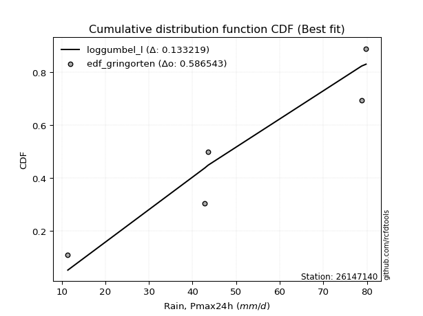</img>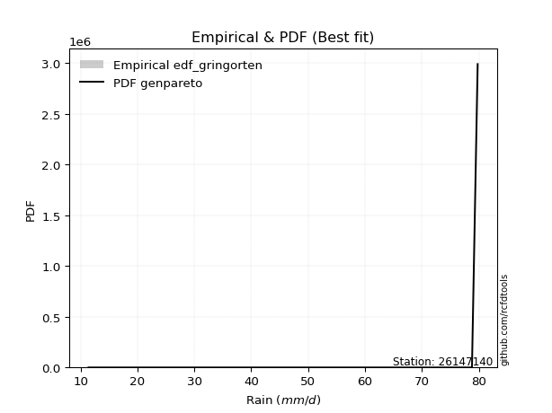</img>

</div>


### 9. EDF Filliben (1975)

The specific values of the constants (0.3175) (often denoted as $alpha$) and (0.365) are derived from a method proposed by James J. Filliben in a 1975 paper. This particular formula is the mean value of the $i$-th order statistic of the normal distribution and is considered a robust and effective plotting position formula for the normal probability plot correlation coefficient test for normality.

<div align="center">


$P=(m-0.3175)/(n+0.365)$


</div>


**9.1. Empirical values**

<div align="center">

|                | 0                   | 1                  | 2            | 3                  | 4                  |
|:---------------|:--------------------|:-------------------|:-------------|:-------------------|:-------------------|
| date           | 2022                | 2019               | 2020         | 2024               | 2021               |
| x              | 11.4                | 42.8               | 43.6         | 78.8               | 79.8               |
| m              | 1                   | 2                  | 3            | 4                  | 5                  |
| empirical_dist | edf_filliben        | edf_filliben       | edf_filliben | edf_filliben       | edf_filliben       |
| empirical      | 0.12721342031686858 | 0.3136067101584343 | 0.5          | 0.6863932898415657 | 0.8727865796831314 |
| empirical_tr   | 1.1457554725040042  | 1.456890699253225  | 2.0          | 3.188707280832095  | 7.860805860805863  |

</div>


**9.2. Kolmogorov-Smirnov fit test (sorted by Δ)**


<div align="center">

|                | 0                  | 1                   | 2                   | 3                  | 4                   | 5                  | 6                   | 7                   | 8                   | 9                  | 10                 | 11                  | 12                 | 13                 | 14                  | 15                 | 16                  | 17                 | 18                 | 19                 | 20                  | 21                  | 22                  | 23                 | 24                 | 25                 | 26                  | 27                 | 28                 | 29                 | 30                 | 31                    | 32                  | 33                  | 34                  | 35                  | 36                  | 37                  | 38                  | 39                 | 40                 | 41                 | 42                 | 43                  | 44                 | 45                  | 46                  | 47                  | 48                  | 49                  | 50                  | 51                  | 52                  | 53                  | 54                  | 55                  | 56                  | 57                  | 58                  | 59                  | 60                  | 61                 | 62                  | 63                  | 64                 | 65                 | 66                 | 67                 | 68                 | 69                  | 70                 | 71                  | 72                 | 73                 | 74                 | 75                  | 76                 | 77                 | 78                  | 79                 | 80                 | 81                 | 82                  | 83                  | 84                  | 85                 | 86                 | 87                 |
|:---------------|:-------------------|:--------------------|:--------------------|:-------------------|:--------------------|:-------------------|:--------------------|:--------------------|:--------------------|:-------------------|:-------------------|:--------------------|:-------------------|:-------------------|:--------------------|:-------------------|:--------------------|:-------------------|:-------------------|:-------------------|:--------------------|:--------------------|:--------------------|:-------------------|:-------------------|:-------------------|:--------------------|:-------------------|:-------------------|:-------------------|:-------------------|:----------------------|:--------------------|:--------------------|:--------------------|:--------------------|:--------------------|:--------------------|:--------------------|:-------------------|:-------------------|:-------------------|:-------------------|:--------------------|:-------------------|:--------------------|:--------------------|:--------------------|:--------------------|:--------------------|:--------------------|:--------------------|:--------------------|:--------------------|:--------------------|:--------------------|:--------------------|:--------------------|:--------------------|:--------------------|:--------------------|:-------------------|:--------------------|:--------------------|:-------------------|:-------------------|:-------------------|:-------------------|:-------------------|:--------------------|:-------------------|:--------------------|:-------------------|:-------------------|:-------------------|:--------------------|:-------------------|:-------------------|:--------------------|:-------------------|:-------------------|:-------------------|:--------------------|:--------------------|:--------------------|:-------------------|:-------------------|:-------------------|
| station        | 26147140           | 26147140            | 26147140            | 26147140           | 26147140            | 26147140           | 26147140            | 26147140            | 26147140            | 26147140           | 26147140           | 26147140            | 26147140           | 26147140           | 26147140            | 26147140           | 26147140            | 26147140           | 26147140           | 26147140           | 26147140            | 26147140            | 26147140            | 26147140           | 26147140           | 26147140           | 26147140            | 26147140           | 26147140           | 26147140           | 26147140           | 26147140              | 26147140            | 26147140            | 26147140            | 26147140            | 26147140            | 26147140            | 26147140            | 26147140           | 26147140           | 26147140           | 26147140           | 26147140            | 26147140           | 26147140            | 26147140            | 26147140            | 26147140            | 26147140            | 26147140            | 26147140            | 26147140            | 26147140            | 26147140            | 26147140            | 26147140            | 26147140            | 26147140            | 26147140            | 26147140            | 26147140           | 26147140            | 26147140            | 26147140           | 26147140           | 26147140           | 26147140           | 26147140           | 26147140            | 26147140           | 26147140            | 26147140           | 26147140           | 26147140           | 26147140            | 26147140           | 26147140           | 26147140            | 26147140           | 26147140           | 26147140           | 26147140            | 26147140            | 26147140            | 26147140           | 26147140           | 26147140           |
| empirical_dist | edf_filliben       | edf_filliben        | edf_filliben        | edf_filliben       | edf_filliben        | edf_filliben       | edf_filliben        | edf_filliben        | edf_filliben        | edf_filliben       | edf_filliben       | edf_filliben        | edf_filliben       | edf_filliben       | edf_filliben        | edf_filliben       | edf_filliben        | edf_filliben       | edf_filliben       | edf_filliben       | edf_filliben        | edf_filliben        | edf_filliben        | edf_filliben       | edf_filliben       | edf_filliben       | edf_filliben        | edf_filliben       | edf_filliben       | edf_filliben       | edf_filliben       | edf_filliben          | edf_filliben        | edf_filliben        | edf_filliben        | edf_filliben        | edf_filliben        | edf_filliben        | edf_filliben        | edf_filliben       | edf_filliben       | edf_filliben       | edf_filliben       | edf_filliben        | edf_filliben       | edf_filliben        | edf_filliben        | edf_filliben        | edf_filliben        | edf_filliben        | edf_filliben        | edf_filliben        | edf_filliben        | edf_filliben        | edf_filliben        | edf_filliben        | edf_filliben        | edf_filliben        | edf_filliben        | edf_filliben        | edf_filliben        | edf_filliben       | edf_filliben        | edf_filliben        | edf_filliben       | edf_filliben       | edf_filliben       | edf_filliben       | edf_filliben       | edf_filliben        | edf_filliben       | edf_filliben        | edf_filliben       | edf_filliben       | edf_filliben       | edf_filliben        | edf_filliben       | edf_filliben       | edf_filliben        | edf_filliben       | edf_filliben       | edf_filliben       | edf_filliben        | edf_filliben        | edf_filliben        | edf_filliben       | edf_filliben       | edf_filliben       |
| p_dist         | logfisk            | logpearson3         | loggumbel_l         | ncf                | kstwobign           | loggompertz        | genlogistic         | fisk                | logweibull_min      | halfnorm           | rayleigh           | invgauss            | maxwell            | rice               | invgamma            | chi2               | gamma               | f                  | erlang             | betaprime          | nct                 | exponnorm           | crystalball         | norm               | t                  | pearson3           | laplace_asymmetric  | weibull_min        | halflogistic       | gumbel_r           | gompertz           | loglaplace_asymmetric | moyal               | logistic            | logfatiguelife      | lognorm             | lognorm             | logcrystalball      | logexponnorm        | logt               | logf               | loglogistic        | lognct             | loghypsecant        | hypsecant          | loglaplace          | logncf              | logbetaprime        | laplace             | loggamma            | loggamma            | logrice             | gumbel_l            | wald                | loginvgamma         | logerlang           | logalpha            | loginvgauss         | logmaxwell          | genexpon            | gibrat              | loginvweibull      | expon               | lograyleigh         | loggumbel_r        | logkstwobign       | alpha              | loghalfnorm        | loggenexpon        | lognakagami         | mielke             | logmielke           | logmoyal           | truncnorm          | loghalflogistic    | logloggamma         | nakagami           | logexpon           | logwald             | loglognorm         | loggibrat          | logjohnsonsu       | logchi2             | logtruncnorm        | invweibull          | fatiguelife        | johnsonsu          | loggenlogistic     |
| delta          | 0.1268604286580426 | 0.12921791142090538 | 0.13792765706726362 | 0.1463869080533014 | 0.15285463324184645 | 0.1596868624545723 | 0.16223370169720985 | 0.16252739098938995 | 0.16497709870808064 | 0.1649811599523754 | 0.1659515546690027 | 0.16688979408083504 | 0.1671906157248657 | 0.1675640764715025 | 0.16773068356081922 | 0.1678237207512293 | 0.16915413201190777 | 0.1702799128075223 | 0.1704568515723377 | 0.1708432815428218 | 0.17183791118600966 | 0.17186045538410555 | 0.17186063476544722 | 0.1718606446107407 | 0.1718655941467735 | 0.173973447028977  | 0.17637734064091348 | 0.1787047270035671 | 0.1804826888284784 | 0.1813304098361883 | 0.1814756302717817 | 0.18477665612356609   | 0.18571112546501367 | 0.18854143556484304 | 0.19277922280488008 | 0.19439317378296767 | 0.19439317378296767 | 0.19439340911944653 | 0.19439453803542012 | 0.1943980356053509 | 0.1945337082420256 | 0.1954858064649097 | 0.1962416598215218 | 0.19641867162844479 | 0.1968398975743454 | 0.20037446986421942 | 0.20121825210544825 | 0.20196190040851597 | 0.20389529763976755 | 0.20404736357399172 | 0.20404736357399172 | 0.20408782828763034 | 0.20519557500295804 | 0.20673237179832793 | 0.20776679243548896 | 0.20783488874032435 | 0.21533223796479822 | 0.22554224875139944 | 0.22710639210024813 | 0.22838421185873475 | 0.22949184106775578 | 0.2303238654084389 | 0.23134971068828242 | 0.23793998043356895 | 0.2649592747803185 | 0.2671332166807306 | 0.2683046669973445 | 0.2684398997772353 | 0.2724062631566299 | 0.27901333683310287 | 0.2869300370667287 | 0.28854682195463066 | 0.2907343996219714 | 0.2917867530661493 | 0.2938473441398796 | 0.29394088644743765 | 0.3135818058297612 | 0.3224864108428552 | 0.36238146409229127 | 0.3730420212804679 | 0.3869262743065954 | 0.4127794428052437 | 0.43070095421861626 | 0.44839341254812776 | 0.45609429478028707 | 0.5404365932008697 | 0.6019286829408798 | 0.6863932898415657 |
| deltao         | 0.5865427407550001 | 0.5865427407550001  | 0.5865427407550001  | 0.5865427407550001 | 0.5865427407550001  | 0.5865427407550001 | 0.5865427407550001  | 0.5865427407550001  | 0.5865427407550001  | 0.5865427407550001 | 0.5865427407550001 | 0.5865427407550001  | 0.5865427407550001 | 0.5865427407550001 | 0.5865427407550001  | 0.5865427407550001 | 0.5865427407550001  | 0.5865427407550001 | 0.5865427407550001 | 0.5865427407550001 | 0.5865427407550001  | 0.5865427407550001  | 0.5865427407550001  | 0.5865427407550001 | 0.5865427407550001 | 0.5865427407550001 | 0.5865427407550001  | 0.5865427407550001 | 0.5865427407550001 | 0.5865427407550001 | 0.5865427407550001 | 0.5865427407550001    | 0.5865427407550001  | 0.5865427407550001  | 0.5865427407550001  | 0.5865427407550001  | 0.5865427407550001  | 0.5865427407550001  | 0.5865427407550001  | 0.5865427407550001 | 0.5865427407550001 | 0.5865427407550001 | 0.5865427407550001 | 0.5865427407550001  | 0.5865427407550001 | 0.5865427407550001  | 0.5865427407550001  | 0.5865427407550001  | 0.5865427407550001  | 0.5865427407550001  | 0.5865427407550001  | 0.5865427407550001  | 0.5865427407550001  | 0.5865427407550001  | 0.5865427407550001  | 0.5865427407550001  | 0.5865427407550001  | 0.5865427407550001  | 0.5865427407550001  | 0.5865427407550001  | 0.5865427407550001  | 0.5865427407550001 | 0.5865427407550001  | 0.5865427407550001  | 0.5865427407550001 | 0.5865427407550001 | 0.5865427407550001 | 0.5865427407550001 | 0.5865427407550001 | 0.5865427407550001  | 0.5865427407550001 | 0.5865427407550001  | 0.5865427407550001 | 0.5865427407550001 | 0.5865427407550001 | 0.5865427407550001  | 0.5865427407550001 | 0.5865427407550001 | 0.5865427407550001  | 0.5865427407550001 | 0.5865427407550001 | 0.5865427407550001 | 0.5865427407550001  | 0.5865427407550001  | 0.5865427407550001  | 0.5865427407550001 | 0.5865427407550001 | 0.5865427407550001 |
| eval           | Δo > Δ             | Δo > Δ              | Δo > Δ              | Δo > Δ             | Δo > Δ              | Δo > Δ             | Δo > Δ              | Δo > Δ              | Δo > Δ              | Δo > Δ             | Δo > Δ             | Δo > Δ              | Δo > Δ             | Δo > Δ             | Δo > Δ              | Δo > Δ             | Δo > Δ              | Δo > Δ             | Δo > Δ             | Δo > Δ             | Δo > Δ              | Δo > Δ              | Δo > Δ              | Δo > Δ             | Δo > Δ             | Δo > Δ             | Δo > Δ              | Δo > Δ             | Δo > Δ             | Δo > Δ             | Δo > Δ             | Δo > Δ                | Δo > Δ              | Δo > Δ              | Δo > Δ              | Δo > Δ              | Δo > Δ              | Δo > Δ              | Δo > Δ              | Δo > Δ             | Δo > Δ             | Δo > Δ             | Δo > Δ             | Δo > Δ              | Δo > Δ             | Δo > Δ              | Δo > Δ              | Δo > Δ              | Δo > Δ              | Δo > Δ              | Δo > Δ              | Δo > Δ              | Δo > Δ              | Δo > Δ              | Δo > Δ              | Δo > Δ              | Δo > Δ              | Δo > Δ              | Δo > Δ              | Δo > Δ              | Δo > Δ              | Δo > Δ             | Δo > Δ              | Δo > Δ              | Δo > Δ             | Δo > Δ             | Δo > Δ             | Δo > Δ             | Δo > Δ             | Δo > Δ              | Δo > Δ             | Δo > Δ              | Δo > Δ             | Δo > Δ             | Δo > Δ             | Δo > Δ              | Δo > Δ             | Δo > Δ             | Δo > Δ              | Δo > Δ             | Δo > Δ             | Δo > Δ             | Δo > Δ              | Δo > Δ              | Δo > Δ              | Δo > Δ             | Δo <= Δ            | Δo <= Δ            |
| fit            | 1                  | 1                   | 1                   | 1                  | 1                   | 1                  | 1                   | 1                   | 1                   | 1                  | 1                  | 1                   | 1                  | 1                  | 1                   | 1                  | 1                   | 1                  | 1                  | 1                  | 1                   | 1                   | 1                   | 1                  | 1                  | 1                  | 1                   | 1                  | 1                  | 1                  | 1                  | 1                     | 1                   | 1                   | 1                   | 1                   | 1                   | 1                   | 1                   | 1                  | 1                  | 1                  | 1                  | 1                   | 1                  | 1                   | 1                   | 1                   | 1                   | 1                   | 1                   | 1                   | 1                   | 1                   | 1                   | 1                   | 1                   | 1                   | 1                   | 1                   | 1                   | 1                  | 1                   | 1                   | 1                  | 1                  | 1                  | 1                  | 1                  | 1                   | 1                  | 1                   | 1                  | 1                  | 1                  | 1                   | 1                  | 1                  | 1                   | 1                  | 1                  | 1                  | 1                   | 1                   | 1                   | 1                  | 0                  | 0                  |
| n              | 5                  | 5                   | 5                   | 5                  | 5                   | 5                  | 5                   | 5                   | 5                   | 5                  | 5                  | 5                   | 5                  | 5                  | 5                   | 5                  | 5                   | 5                  | 5                  | 5                  | 5                   | 5                   | 5                   | 5                  | 5                  | 5                  | 5                   | 5                  | 5                  | 5                  | 5                  | 5                     | 5                   | 5                   | 5                   | 5                   | 5                   | 5                   | 5                   | 5                  | 5                  | 5                  | 5                  | 5                   | 5                  | 5                   | 5                   | 5                   | 5                   | 5                   | 5                   | 5                   | 5                   | 5                   | 5                   | 5                   | 5                   | 5                   | 5                   | 5                   | 5                   | 5                  | 5                   | 5                   | 5                  | 5                  | 5                  | 5                  | 5                  | 5                   | 5                  | 5                   | 5                  | 5                  | 5                  | 5                   | 5                  | 5                  | 5                   | 5                  | 5                  | 5                  | 5                   | 5                   | 5                   | 5                  | 5                  | 5                  |
| best_fit       | 1                  | 0                   | 0                   | 0                  | 0                   | 0                  | 0                   | 0                   | 0                   | 0                  | 0                  | 0                   | 0                  | 0                  | 0                   | 0                  | 0                   | 0                  | 0                  | 0                  | 0                   | 0                   | 0                   | 0                  | 0                  | 0                  | 0                   | 0                  | 0                  | 0                  | 0                  | 0                     | 0                   | 0                   | 0                   | 0                   | 0                   | 0                   | 0                   | 0                  | 0                  | 0                  | 0                  | 0                   | 0                  | 0                   | 0                   | 0                   | 0                   | 0                   | 0                   | 0                   | 0                   | 0                   | 0                   | 0                   | 0                   | 0                   | 0                   | 0                   | 0                   | 0                  | 0                   | 0                   | 0                  | 0                  | 0                  | 0                  | 0                  | 0                   | 0                  | 0                   | 0                  | 0                  | 0                  | 0                   | 0                  | 0                  | 0                   | 0                  | 0                  | 0                  | 0                   | 0                   | 0                   | 0                  | 0                  | 0                  |
| best_fit_sort  | 1                  | 2                   | 3                   | 4                  | 5                   | 6                  | 7                   | 8                   | 9                   | 10                 | 11                 | 12                  | 13                 | 14                 | 15                  | 16                 | 17                  | 18                 | 19                 | 20                 | 21                  | 22                  | 23                  | 24                 | 25                 | 26                 | 27                  | 28                 | 29                 | 30                 | 31                 | 32                    | 33                  | 34                  | 35                  | 36                  | 37                  | 38                  | 39                  | 40                 | 41                 | 42                 | 43                 | 44                  | 45                 | 46                  | 47                  | 48                  | 49                  | 50                  | 51                  | 52                  | 53                  | 54                  | 55                  | 56                  | 57                  | 58                  | 59                  | 60                  | 61                  | 62                 | 63                  | 64                  | 65                 | 66                 | 67                 | 68                 | 69                 | 70                  | 71                 | 72                  | 73                 | 74                 | 75                 | 76                  | 77                 | 78                 | 79                  | 80                 | 81                 | 82                 | 83                  | 84                  | 85                  | 86                 | 87                 | 88                 |

</div>


**9.3. Best fit**

<div align="center">

|   id |   station | empirical_dist   | p_dist   |   delta |   deltao | eval   |   fit |   n |   best_fit |   best_fit_sort |
|-----:|----------:|:-----------------|:---------|--------:|---------:|:-------|------:|----:|-----------:|----------------:|
|    0 |  26147140 | edf_filliben     | logfisk  | 0.12686 | 0.586543 | Δo > Δ |     1 |   5 |          1 |               1 |

</div>


<div align="center">

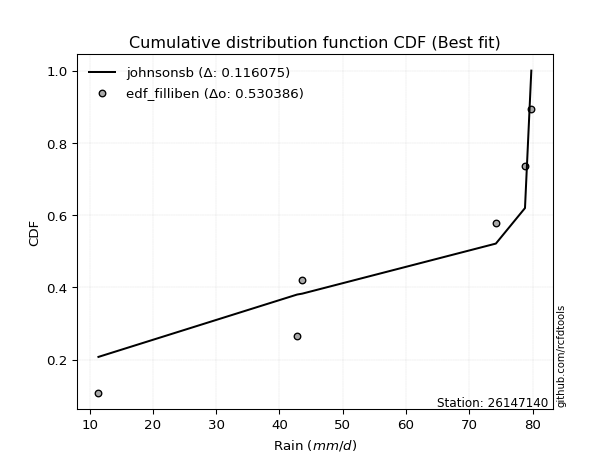</img></img>

</div>


### 10. EDF Jenkinson (1977)

The Jenkinson formula in hydrology is an empirical plotting position formula used to estimate the non-exceedance probability _(P)_ or return period _(T)_ of a given ordered observation within a sample. It is a widely used method in the frequency analysis of extreme events such as floods and rainfall, as it provides a distribution-free way to plot data. _a≈0.31_ and _b≈0.38_ are constants derived to approximate the median of the probability distribution for the given rank.

<div align="center">


$P=(m-a)/(n+b)$


</div>


**10.1. Empirical values**

<div align="center">

|                | 0                   | 1                  | 2             | 3                  | 4                  |
|:---------------|:--------------------|:-------------------|:--------------|:-------------------|:-------------------|
| date           | 2022                | 2019               | 2020          | 2024               | 2021               |
| x              | 11.4                | 42.8               | 43.6          | 78.8               | 79.8               |
| m              | 1                   | 2                  | 3             | 4                  | 5                  |
| empirical_dist | edf_jenkinson       | edf_jenkinson      | edf_jenkinson | edf_jenkinson      | edf_jenkinson      |
| empirical      | 0.12825278810408922 | 0.3141263940520446 | 0.5           | 0.6858736059479554 | 0.8717472118959109 |
| empirical_tr   | 1.1471215351812367  | 1.4579945799457996 | 2.0           | 3.183431952662722  | 7.797101449275368  |

</div>


**10.2. Kolmogorov-Smirnov fit test (sorted by Δ)**


<div align="center">

|                | 0                   | 1                   | 2                   | 3                   | 4                   | 5                   | 6                  | 7                  | 8                   | 9                   | 10                  | 11                  | 12                  | 13                  | 14                  | 15                  | 16                 | 17                  | 18                  | 19                  | 20                 | 21                  | 22                  | 23                  | 24                  | 25                  | 26                  | 27                  | 28                  | 29                  | 30                  | 31                    | 32                 | 33                  | 34                  | 35                  | 36                  | 37                  | 38                  | 39                  | 40                  | 41                  | 42                  | 43                  | 44                  | 45                  | 46                 | 47                  | 48                  | 49                  | 50                 | 51                  | 52                  | 53                 | 54                  | 55                 | 56                  | 57                 | 58                 | 59                 | 60                  | 61                 | 62                  | 63                 | 64                  | 65                  | 66                  | 67                  | 68                  | 69                 | 70                  | 71                 | 72                  | 73                  | 74                 | 75                 | 76                  | 77                  | 78                 | 79                 | 80                  | 81                 | 82                 | 83                  | 84                 | 85                 | 86                 | 87                 |
|:---------------|:--------------------|:--------------------|:--------------------|:--------------------|:--------------------|:--------------------|:-------------------|:-------------------|:--------------------|:--------------------|:--------------------|:--------------------|:--------------------|:--------------------|:--------------------|:--------------------|:-------------------|:--------------------|:--------------------|:--------------------|:-------------------|:--------------------|:--------------------|:--------------------|:--------------------|:--------------------|:--------------------|:--------------------|:--------------------|:--------------------|:--------------------|:----------------------|:-------------------|:--------------------|:--------------------|:--------------------|:--------------------|:--------------------|:--------------------|:--------------------|:--------------------|:--------------------|:--------------------|:--------------------|:--------------------|:--------------------|:-------------------|:--------------------|:--------------------|:--------------------|:-------------------|:--------------------|:--------------------|:-------------------|:--------------------|:-------------------|:--------------------|:-------------------|:-------------------|:-------------------|:--------------------|:-------------------|:--------------------|:-------------------|:--------------------|:--------------------|:--------------------|:--------------------|:--------------------|:-------------------|:--------------------|:-------------------|:--------------------|:--------------------|:-------------------|:-------------------|:--------------------|:--------------------|:-------------------|:-------------------|:--------------------|:-------------------|:-------------------|:--------------------|:-------------------|:-------------------|:-------------------|:-------------------|
| station        | 26147140            | 26147140            | 26147140            | 26147140            | 26147140            | 26147140            | 26147140           | 26147140           | 26147140            | 26147140            | 26147140            | 26147140            | 26147140            | 26147140            | 26147140            | 26147140            | 26147140           | 26147140            | 26147140            | 26147140            | 26147140           | 26147140            | 26147140            | 26147140            | 26147140            | 26147140            | 26147140            | 26147140            | 26147140            | 26147140            | 26147140            | 26147140              | 26147140           | 26147140            | 26147140            | 26147140            | 26147140            | 26147140            | 26147140            | 26147140            | 26147140            | 26147140            | 26147140            | 26147140            | 26147140            | 26147140            | 26147140           | 26147140            | 26147140            | 26147140            | 26147140           | 26147140            | 26147140            | 26147140           | 26147140            | 26147140           | 26147140            | 26147140           | 26147140           | 26147140           | 26147140            | 26147140           | 26147140            | 26147140           | 26147140            | 26147140            | 26147140            | 26147140            | 26147140            | 26147140           | 26147140            | 26147140           | 26147140            | 26147140            | 26147140           | 26147140           | 26147140            | 26147140            | 26147140           | 26147140           | 26147140            | 26147140           | 26147140           | 26147140            | 26147140           | 26147140           | 26147140           | 26147140           |
| empirical_dist | edf_jenkinson       | edf_jenkinson       | edf_jenkinson       | edf_jenkinson       | edf_jenkinson       | edf_jenkinson       | edf_jenkinson      | edf_jenkinson      | edf_jenkinson       | edf_jenkinson       | edf_jenkinson       | edf_jenkinson       | edf_jenkinson       | edf_jenkinson       | edf_jenkinson       | edf_jenkinson       | edf_jenkinson      | edf_jenkinson       | edf_jenkinson       | edf_jenkinson       | edf_jenkinson      | edf_jenkinson       | edf_jenkinson       | edf_jenkinson       | edf_jenkinson       | edf_jenkinson       | edf_jenkinson       | edf_jenkinson       | edf_jenkinson       | edf_jenkinson       | edf_jenkinson       | edf_jenkinson         | edf_jenkinson      | edf_jenkinson       | edf_jenkinson       | edf_jenkinson       | edf_jenkinson       | edf_jenkinson       | edf_jenkinson       | edf_jenkinson       | edf_jenkinson       | edf_jenkinson       | edf_jenkinson       | edf_jenkinson       | edf_jenkinson       | edf_jenkinson       | edf_jenkinson      | edf_jenkinson       | edf_jenkinson       | edf_jenkinson       | edf_jenkinson      | edf_jenkinson       | edf_jenkinson       | edf_jenkinson      | edf_jenkinson       | edf_jenkinson      | edf_jenkinson       | edf_jenkinson      | edf_jenkinson      | edf_jenkinson      | edf_jenkinson       | edf_jenkinson      | edf_jenkinson       | edf_jenkinson      | edf_jenkinson       | edf_jenkinson       | edf_jenkinson       | edf_jenkinson       | edf_jenkinson       | edf_jenkinson      | edf_jenkinson       | edf_jenkinson      | edf_jenkinson       | edf_jenkinson       | edf_jenkinson      | edf_jenkinson      | edf_jenkinson       | edf_jenkinson       | edf_jenkinson      | edf_jenkinson      | edf_jenkinson       | edf_jenkinson      | edf_jenkinson      | edf_jenkinson       | edf_jenkinson      | edf_jenkinson      | edf_jenkinson      | edf_jenkinson      |
| p_dist         | logfisk             | logpearson3         | loggumbel_l         | ncf                 | kstwobign           | loggompertz         | genlogistic        | fisk               | logweibull_min      | halfnorm            | rayleigh            | invgauss            | maxwell             | rice                | invgamma            | chi2                | gamma              | f                   | erlang              | betaprime           | nct                | exponnorm           | crystalball         | norm                | t                   | pearson3            | laplace_asymmetric  | weibull_min         | halflogistic        | gumbel_r            | gompertz            | loglaplace_asymmetric | moyal              | logistic            | logfatiguelife      | lognorm             | lognorm             | logcrystalball      | logexponnorm        | logt                | logf                | loglogistic         | lognct              | loghypsecant        | hypsecant           | loglaplace          | logncf             | logbetaprime        | loggamma            | loggamma            | logrice            | laplace             | gumbel_l            | loginvgamma        | wald                | logerlang          | logalpha            | loginvgauss        | logmaxwell         | genexpon           | loginvweibull       | gibrat             | expon               | lograyleigh        | loggumbel_r         | logkstwobign        | alpha               | loghalfnorm         | loggenexpon         | lognakagami        | mielke              | logmielke          | logmoyal            | truncnorm           | loghalflogistic    | logloggamma        | nakagami            | logexpon            | logwald            | loglognorm         | loggibrat           | logjohnsonsu       | logchi2            | logtruncnorm        | invweibull         | fatiguelife        | johnsonsu          | loggenlogistic     |
| delta          | 0.12634074476443224 | 0.12869822752729504 | 0.13844734096087385 | 0.14586722415969106 | 0.15337431713545668 | 0.16020654634818254 | 0.1627533855908201 | 0.1630470748830002 | 0.16549678260169087 | 0.16550084384598562 | 0.16647123856261292 | 0.16740947797444528 | 0.16771029961847594 | 0.16808376036511274 | 0.16825036745442945 | 0.16834340464483954 | 0.169673815905518  | 0.17079959670113254 | 0.17097653546594793 | 0.17136296543643204 | 0.1723575950796199 | 0.17238013927771578 | 0.17238031865905745 | 0.17238032850435092 | 0.17238527804038373 | 0.17449313092258723 | 0.17689702453452372 | 0.17922441089717733 | 0.18100237272208863 | 0.18185009372979855 | 0.18199531416539194 | 0.18425697222995574   | 0.1862308093586239 | 0.18906111945845328 | 0.19225953891126973 | 0.19387348988935732 | 0.19387348988935732 | 0.19387372522583618 | 0.19387485414180977 | 0.19387835171174056 | 0.19401402434841525 | 0.19496612257129936 | 0.19572197592791146 | 0.19589898773483444 | 0.19735958146795562 | 0.19985478597060907 | 0.2006985682118379 | 0.20144221651490563 | 0.20352767968038138 | 0.20352767968038138 | 0.20356814439402   | 0.20441498153337778 | 0.20571525889656828 | 0.2072471085418786 | 0.20725205569193816 | 0.207315204846714  | 0.21481255407118788 | 0.2250225648577891 | 0.2265867082066378 | 0.2278645279651244 | 0.22980418151482856 | 0.230011524961366  | 0.23083002679467207 | 0.2374202965399586 | 0.26443959088670815 | 0.26661353278712024 | 0.26778498310373416 | 0.26792021588362497 | 0.27188657926301957 | 0.2795330207267132 | 0.28744972096033894 | 0.2890665058482409 | 0.29021471572836105 | 0.29230643695975955 | 0.2933276602462693 | 0.2944605703410479 | 0.31410148972337154 | 0.32196672694924483 | 0.3618617801986809 | 0.3725223373868575 | 0.38640659041298503 | 0.4127794428052437 | 0.4301812703250059 | 0.44839341254812776 | 0.4550549269930665 | 0.5399169093072593 | 0.6014089990472695 | 0.6858736059479554 |
| deltao         | 0.5865427407550001  | 0.5865427407550001  | 0.5865427407550001  | 0.5865427407550001  | 0.5865427407550001  | 0.5865427407550001  | 0.5865427407550001 | 0.5865427407550001 | 0.5865427407550001  | 0.5865427407550001  | 0.5865427407550001  | 0.5865427407550001  | 0.5865427407550001  | 0.5865427407550001  | 0.5865427407550001  | 0.5865427407550001  | 0.5865427407550001 | 0.5865427407550001  | 0.5865427407550001  | 0.5865427407550001  | 0.5865427407550001 | 0.5865427407550001  | 0.5865427407550001  | 0.5865427407550001  | 0.5865427407550001  | 0.5865427407550001  | 0.5865427407550001  | 0.5865427407550001  | 0.5865427407550001  | 0.5865427407550001  | 0.5865427407550001  | 0.5865427407550001    | 0.5865427407550001 | 0.5865427407550001  | 0.5865427407550001  | 0.5865427407550001  | 0.5865427407550001  | 0.5865427407550001  | 0.5865427407550001  | 0.5865427407550001  | 0.5865427407550001  | 0.5865427407550001  | 0.5865427407550001  | 0.5865427407550001  | 0.5865427407550001  | 0.5865427407550001  | 0.5865427407550001 | 0.5865427407550001  | 0.5865427407550001  | 0.5865427407550001  | 0.5865427407550001 | 0.5865427407550001  | 0.5865427407550001  | 0.5865427407550001 | 0.5865427407550001  | 0.5865427407550001 | 0.5865427407550001  | 0.5865427407550001 | 0.5865427407550001 | 0.5865427407550001 | 0.5865427407550001  | 0.5865427407550001 | 0.5865427407550001  | 0.5865427407550001 | 0.5865427407550001  | 0.5865427407550001  | 0.5865427407550001  | 0.5865427407550001  | 0.5865427407550001  | 0.5865427407550001 | 0.5865427407550001  | 0.5865427407550001 | 0.5865427407550001  | 0.5865427407550001  | 0.5865427407550001 | 0.5865427407550001 | 0.5865427407550001  | 0.5865427407550001  | 0.5865427407550001 | 0.5865427407550001 | 0.5865427407550001  | 0.5865427407550001 | 0.5865427407550001 | 0.5865427407550001  | 0.5865427407550001 | 0.5865427407550001 | 0.5865427407550001 | 0.5865427407550001 |
| eval           | Δo > Δ              | Δo > Δ              | Δo > Δ              | Δo > Δ              | Δo > Δ              | Δo > Δ              | Δo > Δ             | Δo > Δ             | Δo > Δ              | Δo > Δ              | Δo > Δ              | Δo > Δ              | Δo > Δ              | Δo > Δ              | Δo > Δ              | Δo > Δ              | Δo > Δ             | Δo > Δ              | Δo > Δ              | Δo > Δ              | Δo > Δ             | Δo > Δ              | Δo > Δ              | Δo > Δ              | Δo > Δ              | Δo > Δ              | Δo > Δ              | Δo > Δ              | Δo > Δ              | Δo > Δ              | Δo > Δ              | Δo > Δ                | Δo > Δ             | Δo > Δ              | Δo > Δ              | Δo > Δ              | Δo > Δ              | Δo > Δ              | Δo > Δ              | Δo > Δ              | Δo > Δ              | Δo > Δ              | Δo > Δ              | Δo > Δ              | Δo > Δ              | Δo > Δ              | Δo > Δ             | Δo > Δ              | Δo > Δ              | Δo > Δ              | Δo > Δ             | Δo > Δ              | Δo > Δ              | Δo > Δ             | Δo > Δ              | Δo > Δ             | Δo > Δ              | Δo > Δ             | Δo > Δ             | Δo > Δ             | Δo > Δ              | Δo > Δ             | Δo > Δ              | Δo > Δ             | Δo > Δ              | Δo > Δ              | Δo > Δ              | Δo > Δ              | Δo > Δ              | Δo > Δ             | Δo > Δ              | Δo > Δ             | Δo > Δ              | Δo > Δ              | Δo > Δ             | Δo > Δ             | Δo > Δ              | Δo > Δ              | Δo > Δ             | Δo > Δ             | Δo > Δ              | Δo > Δ             | Δo > Δ             | Δo > Δ              | Δo > Δ             | Δo > Δ             | Δo <= Δ            | Δo <= Δ            |
| fit            | 1                   | 1                   | 1                   | 1                   | 1                   | 1                   | 1                  | 1                  | 1                   | 1                   | 1                   | 1                   | 1                   | 1                   | 1                   | 1                   | 1                  | 1                   | 1                   | 1                   | 1                  | 1                   | 1                   | 1                   | 1                   | 1                   | 1                   | 1                   | 1                   | 1                   | 1                   | 1                     | 1                  | 1                   | 1                   | 1                   | 1                   | 1                   | 1                   | 1                   | 1                   | 1                   | 1                   | 1                   | 1                   | 1                   | 1                  | 1                   | 1                   | 1                   | 1                  | 1                   | 1                   | 1                  | 1                   | 1                  | 1                   | 1                  | 1                  | 1                  | 1                   | 1                  | 1                   | 1                  | 1                   | 1                   | 1                   | 1                   | 1                   | 1                  | 1                   | 1                  | 1                   | 1                   | 1                  | 1                  | 1                   | 1                   | 1                  | 1                  | 1                   | 1                  | 1                  | 1                   | 1                  | 1                  | 0                  | 0                  |
| n              | 5                   | 5                   | 5                   | 5                   | 5                   | 5                   | 5                  | 5                  | 5                   | 5                   | 5                   | 5                   | 5                   | 5                   | 5                   | 5                   | 5                  | 5                   | 5                   | 5                   | 5                  | 5                   | 5                   | 5                   | 5                   | 5                   | 5                   | 5                   | 5                   | 5                   | 5                   | 5                     | 5                  | 5                   | 5                   | 5                   | 5                   | 5                   | 5                   | 5                   | 5                   | 5                   | 5                   | 5                   | 5                   | 5                   | 5                  | 5                   | 5                   | 5                   | 5                  | 5                   | 5                   | 5                  | 5                   | 5                  | 5                   | 5                  | 5                  | 5                  | 5                   | 5                  | 5                   | 5                  | 5                   | 5                   | 5                   | 5                   | 5                   | 5                  | 5                   | 5                  | 5                   | 5                   | 5                  | 5                  | 5                   | 5                   | 5                  | 5                  | 5                   | 5                  | 5                  | 5                   | 5                  | 5                  | 5                  | 5                  |
| best_fit       | 1                   | 0                   | 0                   | 0                   | 0                   | 0                   | 0                  | 0                  | 0                   | 0                   | 0                   | 0                   | 0                   | 0                   | 0                   | 0                   | 0                  | 0                   | 0                   | 0                   | 0                  | 0                   | 0                   | 0                   | 0                   | 0                   | 0                   | 0                   | 0                   | 0                   | 0                   | 0                     | 0                  | 0                   | 0                   | 0                   | 0                   | 0                   | 0                   | 0                   | 0                   | 0                   | 0                   | 0                   | 0                   | 0                   | 0                  | 0                   | 0                   | 0                   | 0                  | 0                   | 0                   | 0                  | 0                   | 0                  | 0                   | 0                  | 0                  | 0                  | 0                   | 0                  | 0                   | 0                  | 0                   | 0                   | 0                   | 0                   | 0                   | 0                  | 0                   | 0                  | 0                   | 0                   | 0                  | 0                  | 0                   | 0                   | 0                  | 0                  | 0                   | 0                  | 0                  | 0                   | 0                  | 0                  | 0                  | 0                  |
| best_fit_sort  | 1                   | 2                   | 3                   | 4                   | 5                   | 6                   | 7                  | 8                  | 9                   | 10                  | 11                  | 12                  | 13                  | 14                  | 15                  | 16                  | 17                 | 18                  | 19                  | 20                  | 21                 | 22                  | 23                  | 24                  | 25                  | 26                  | 27                  | 28                  | 29                  | 30                  | 31                  | 32                    | 33                 | 34                  | 35                  | 36                  | 37                  | 38                  | 39                  | 40                  | 41                  | 42                  | 43                  | 44                  | 45                  | 46                  | 47                 | 48                  | 49                  | 50                  | 51                 | 52                  | 53                  | 54                 | 55                  | 56                 | 57                  | 58                 | 59                 | 60                 | 61                  | 62                 | 63                  | 64                 | 65                  | 66                  | 67                  | 68                  | 69                  | 70                 | 71                  | 72                 | 73                  | 74                  | 75                 | 76                 | 77                  | 78                  | 79                 | 80                 | 81                  | 82                 | 83                 | 84                  | 85                 | 86                 | 87                 | 88                 |

</div>


**10.3. Best fit**

<div align="center">

|   id |   station | empirical_dist   | p_dist   |    delta |   deltao | eval   |   fit |   n |   best_fit |   best_fit_sort |
|-----:|----------:|:-----------------|:---------|---------:|---------:|:-------|------:|----:|-----------:|----------------:|
|    0 |  26147140 | edf_jenkinson    | logfisk  | 0.126341 | 0.586543 | Δo > Δ |     1 |   5 |          1 |               1 |

</div>


<div align="center">

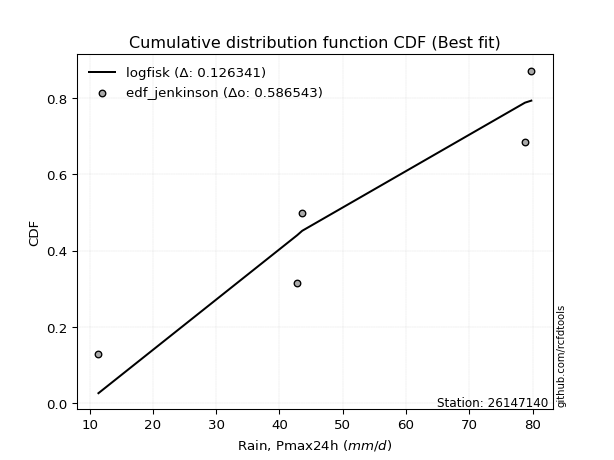</img>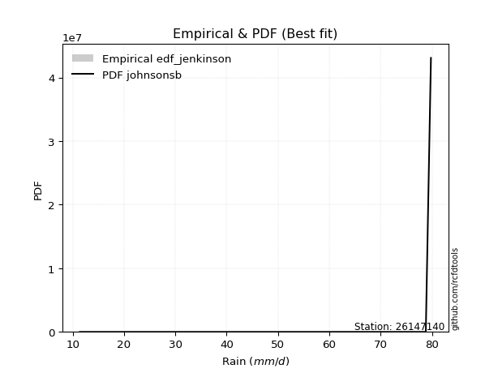</img>

</div>


### 11. EDF Cunnane (1978)

Cunnane´s work in statistical hydrology has focused on the performance and evaluation of different probability distributions (such as GEV, Gumbel, Lognormal) for flood frequency estimation. _b_ is a constant, typically set to 0.4.

<div align="center">


$P=(m-b)/(n+1-2b)$


</div>


**11.1. Empirical values**

<div align="center">

|                | 0                   | 1                  | 2           | 3                  | 4                  |
|:---------------|:--------------------|:-------------------|:------------|:-------------------|:-------------------|
| date           | 2022                | 2019               | 2020        | 2024               | 2021               |
| x              | 11.4                | 42.8               | 43.6        | 78.8               | 79.8               |
| m              | 1                   | 2                  | 3           | 4                  | 5                  |
| empirical_dist | edf_cunnane         | edf_cunnane        | edf_cunnane | edf_cunnane        | edf_cunnane        |
| empirical      | 0.11538461538461538 | 0.3076923076923077 | 0.5         | 0.6923076923076923 | 0.8846153846153845 |
| empirical_tr   | 1.1304347826086958  | 1.4444444444444444 | 2.0         | 3.25               | 8.666666666666655  |

</div>


**11.2. Kolmogorov-Smirnov fit test (sorted by Δ)**


<div align="center">

|                | 0                  | 1                   | 2                   | 3                   | 4                   | 5                  | 6                   | 7                   | 8                   | 9                   | 10                  | 11                  | 12                 | 13                 | 14                 | 15                 | 16                  | 17                  | 18                  | 19                  | 20                  | 21                  | 22                 | 23                  | 24                  | 25                  | 26                  | 27                  | 28                  | 29                 | 30                  | 31                  | 32                  | 33                    | 34                  | 35                  | 36                  | 37                  | 38                  | 39                  | 40                 | 41                  | 42                  | 43                  | 44                 | 45                  | 46                  | 47                  | 48                  | 49                  | 50                  | 51                 | 52                 | 53                 | 54                  | 55                  | 56                 | 57                  | 58                 | 59                 | 60                  | 61                  | 62                  | 63                  | 64                  | 65                  | 66                 | 67                 | 68                 | 69                 | 70                 | 71                  | 72                 | 73                  | 74                  | 75                 | 76                  | 77                  | 78                  | 79                  | 80                  | 81                 | 82                  | 83                  | 84                 | 85                 | 86                 | 87                 |
|:---------------|:-------------------|:--------------------|:--------------------|:--------------------|:--------------------|:-------------------|:--------------------|:--------------------|:--------------------|:--------------------|:--------------------|:--------------------|:-------------------|:-------------------|:-------------------|:-------------------|:--------------------|:--------------------|:--------------------|:--------------------|:--------------------|:--------------------|:-------------------|:--------------------|:--------------------|:--------------------|:--------------------|:--------------------|:--------------------|:-------------------|:--------------------|:--------------------|:--------------------|:----------------------|:--------------------|:--------------------|:--------------------|:--------------------|:--------------------|:--------------------|:-------------------|:--------------------|:--------------------|:--------------------|:-------------------|:--------------------|:--------------------|:--------------------|:--------------------|:--------------------|:--------------------|:-------------------|:-------------------|:-------------------|:--------------------|:--------------------|:-------------------|:--------------------|:-------------------|:-------------------|:--------------------|:--------------------|:--------------------|:--------------------|:--------------------|:--------------------|:-------------------|:-------------------|:-------------------|:-------------------|:-------------------|:--------------------|:-------------------|:--------------------|:--------------------|:-------------------|:--------------------|:--------------------|:--------------------|:--------------------|:--------------------|:-------------------|:--------------------|:--------------------|:-------------------|:-------------------|:-------------------|:-------------------|
| station        | 26147140           | 26147140            | 26147140            | 26147140            | 26147140            | 26147140           | 26147140            | 26147140            | 26147140            | 26147140            | 26147140            | 26147140            | 26147140           | 26147140           | 26147140           | 26147140           | 26147140            | 26147140            | 26147140            | 26147140            | 26147140            | 26147140            | 26147140           | 26147140            | 26147140            | 26147140            | 26147140            | 26147140            | 26147140            | 26147140           | 26147140            | 26147140            | 26147140            | 26147140              | 26147140            | 26147140            | 26147140            | 26147140            | 26147140            | 26147140            | 26147140           | 26147140            | 26147140            | 26147140            | 26147140           | 26147140            | 26147140            | 26147140            | 26147140            | 26147140            | 26147140            | 26147140           | 26147140           | 26147140           | 26147140            | 26147140            | 26147140           | 26147140            | 26147140           | 26147140           | 26147140            | 26147140            | 26147140            | 26147140            | 26147140            | 26147140            | 26147140           | 26147140           | 26147140           | 26147140           | 26147140           | 26147140            | 26147140           | 26147140            | 26147140            | 26147140           | 26147140            | 26147140            | 26147140            | 26147140            | 26147140            | 26147140           | 26147140            | 26147140            | 26147140           | 26147140           | 26147140           | 26147140           |
| empirical_dist | edf_cunnane        | edf_cunnane         | edf_cunnane         | edf_cunnane         | edf_cunnane         | edf_cunnane        | edf_cunnane         | edf_cunnane         | edf_cunnane         | edf_cunnane         | edf_cunnane         | edf_cunnane         | edf_cunnane        | edf_cunnane        | edf_cunnane        | edf_cunnane        | edf_cunnane         | edf_cunnane         | edf_cunnane         | edf_cunnane         | edf_cunnane         | edf_cunnane         | edf_cunnane        | edf_cunnane         | edf_cunnane         | edf_cunnane         | edf_cunnane         | edf_cunnane         | edf_cunnane         | edf_cunnane        | edf_cunnane         | edf_cunnane         | edf_cunnane         | edf_cunnane           | edf_cunnane         | edf_cunnane         | edf_cunnane         | edf_cunnane         | edf_cunnane         | edf_cunnane         | edf_cunnane        | edf_cunnane         | edf_cunnane         | edf_cunnane         | edf_cunnane        | edf_cunnane         | edf_cunnane         | edf_cunnane         | edf_cunnane         | edf_cunnane         | edf_cunnane         | edf_cunnane        | edf_cunnane        | edf_cunnane        | edf_cunnane         | edf_cunnane         | edf_cunnane        | edf_cunnane         | edf_cunnane        | edf_cunnane        | edf_cunnane         | edf_cunnane         | edf_cunnane         | edf_cunnane         | edf_cunnane         | edf_cunnane         | edf_cunnane        | edf_cunnane        | edf_cunnane        | edf_cunnane        | edf_cunnane        | edf_cunnane         | edf_cunnane        | edf_cunnane         | edf_cunnane         | edf_cunnane        | edf_cunnane         | edf_cunnane         | edf_cunnane         | edf_cunnane         | edf_cunnane         | edf_cunnane        | edf_cunnane         | edf_cunnane         | edf_cunnane        | edf_cunnane        | edf_cunnane        | edf_cunnane        |
| p_dist         | loggumbel_l        | logfisk             | logpearson3         | kstwobign           | ncf                 | loggompertz        | genlogistic         | fisk                | logweibull_min      | halfnorm            | rayleigh            | invgauss            | maxwell            | rice               | invgamma           | chi2               | gamma               | f                   | erlang              | betaprime           | nct                 | exponnorm           | crystalball        | norm                | t                   | pearson3            | laplace_asymmetric  | weibull_min         | halflogistic        | gumbel_r           | gompertz            | moyal               | logistic            | loglaplace_asymmetric | hypsecant           | laplace             | logfatiguelife      | gumbel_l            | lognorm             | lognorm             | logcrystalball     | logexponnorm        | logt                | logf                | wald               | loglogistic         | lognct              | loghypsecant        | loglaplace          | logncf              | logbetaprime        | loggamma           | loggamma           | logrice            | loginvgamma         | logerlang           | logalpha           | gibrat              | loginvgauss        | logmaxwell         | genexpon            | loginvweibull       | expon               | lograyleigh         | loggumbel_r         | logkstwobign        | lognakagami        | alpha              | loghalfnorm        | loggenexpon        | mielke             | logmielke           | truncnorm          | logloggamma         | logmoyal            | loghalflogistic    | nakagami            | logexpon            | logwald             | loglognorm          | loggibrat           | logjohnsonsu       | logchi2             | logtruncnorm        | invweibull         | fatiguelife        | johnsonsu          | loggenlogistic     |
| delta          | 0.132013254601137  | 0.13277483112416916 | 0.13513231388703195 | 0.14907225921210482 | 0.15230131051942797 | 0.1537724599884457 | 0.15631929923108323 | 0.15661298852326333 | 0.15906269624195402 | 0.15906675748624877 | 0.16003715220287607 | 0.16097539161470842 | 0.1612762132587391 | 0.1616496740053759 | 0.1618162810946926 | 0.1619093182851027 | 0.16323972954578114 | 0.16436551034139568 | 0.16454244910621108 | 0.16492887907669518 | 0.16592350871988304 | 0.16594605291797893 | 0.1659462322993206 | 0.16594624214461406 | 0.16595119168064687 | 0.16805904456285037 | 0.17046293817478686 | 0.17279032453744048 | 0.17456828636235178 | 0.1754160073700617 | 0.17556122780565508 | 0.17979672299888705 | 0.18262703309871642 | 0.19069105858969265   | 0.19092549510821877 | 0.19798089517364093 | 0.19869362527100665 | 0.19928117253683142 | 0.20030757624909423 | 0.20030757624909423 | 0.2003078115855731 | 0.20030894050154668 | 0.20031243807147747 | 0.20044811070815216 | 0.2008179693322013 | 0.20140020893103627 | 0.20215606228764837 | 0.20233307409457135 | 0.20628887233034598 | 0.20713265457157481 | 0.20787630287464254 | 0.2099617660401183 | 0.2099617660401183 | 0.2100022307537569 | 0.21368119490161552 | 0.21374929120645092 | 0.2212466404309248 | 0.22357743860162915 | 0.231456651217526  | 0.2330207945663747 | 0.23429861432486132 | 0.23623826787456548 | 0.23726411315440898 | 0.24385438289969552 | 0.27087367724644507 | 0.27304761914685716 | 0.2730989343669763 | 0.2742190694634711 | 0.2743543022433619 | 0.2783206656227565 | 0.2810156346006021 | 0.28263241948850404 | 0.2858723506000227 | 0.28802648398131103 | 0.29664880208809796 | 0.2997617466060062 | 0.30766740336363463 | 0.32840081330898174 | 0.36829586655841784 | 0.37895642374659444 | 0.39284067677272194 | 0.4127794428052437 | 0.43661535668474283 | 0.44839341254812776 | 0.4679230997125401 | 0.5463509956669963 | 0.6078430854070064 | 0.6923076923076923 |
| deltao         | 0.5865427407550001 | 0.5865427407550001  | 0.5865427407550001  | 0.5865427407550001  | 0.5865427407550001  | 0.5865427407550001 | 0.5865427407550001  | 0.5865427407550001  | 0.5865427407550001  | 0.5865427407550001  | 0.5865427407550001  | 0.5865427407550001  | 0.5865427407550001 | 0.5865427407550001 | 0.5865427407550001 | 0.5865427407550001 | 0.5865427407550001  | 0.5865427407550001  | 0.5865427407550001  | 0.5865427407550001  | 0.5865427407550001  | 0.5865427407550001  | 0.5865427407550001 | 0.5865427407550001  | 0.5865427407550001  | 0.5865427407550001  | 0.5865427407550001  | 0.5865427407550001  | 0.5865427407550001  | 0.5865427407550001 | 0.5865427407550001  | 0.5865427407550001  | 0.5865427407550001  | 0.5865427407550001    | 0.5865427407550001  | 0.5865427407550001  | 0.5865427407550001  | 0.5865427407550001  | 0.5865427407550001  | 0.5865427407550001  | 0.5865427407550001 | 0.5865427407550001  | 0.5865427407550001  | 0.5865427407550001  | 0.5865427407550001 | 0.5865427407550001  | 0.5865427407550001  | 0.5865427407550001  | 0.5865427407550001  | 0.5865427407550001  | 0.5865427407550001  | 0.5865427407550001 | 0.5865427407550001 | 0.5865427407550001 | 0.5865427407550001  | 0.5865427407550001  | 0.5865427407550001 | 0.5865427407550001  | 0.5865427407550001 | 0.5865427407550001 | 0.5865427407550001  | 0.5865427407550001  | 0.5865427407550001  | 0.5865427407550001  | 0.5865427407550001  | 0.5865427407550001  | 0.5865427407550001 | 0.5865427407550001 | 0.5865427407550001 | 0.5865427407550001 | 0.5865427407550001 | 0.5865427407550001  | 0.5865427407550001 | 0.5865427407550001  | 0.5865427407550001  | 0.5865427407550001 | 0.5865427407550001  | 0.5865427407550001  | 0.5865427407550001  | 0.5865427407550001  | 0.5865427407550001  | 0.5865427407550001 | 0.5865427407550001  | 0.5865427407550001  | 0.5865427407550001 | 0.5865427407550001 | 0.5865427407550001 | 0.5865427407550001 |
| eval           | Δo > Δ             | Δo > Δ              | Δo > Δ              | Δo > Δ              | Δo > Δ              | Δo > Δ             | Δo > Δ              | Δo > Δ              | Δo > Δ              | Δo > Δ              | Δo > Δ              | Δo > Δ              | Δo > Δ             | Δo > Δ             | Δo > Δ             | Δo > Δ             | Δo > Δ              | Δo > Δ              | Δo > Δ              | Δo > Δ              | Δo > Δ              | Δo > Δ              | Δo > Δ             | Δo > Δ              | Δo > Δ              | Δo > Δ              | Δo > Δ              | Δo > Δ              | Δo > Δ              | Δo > Δ             | Δo > Δ              | Δo > Δ              | Δo > Δ              | Δo > Δ                | Δo > Δ              | Δo > Δ              | Δo > Δ              | Δo > Δ              | Δo > Δ              | Δo > Δ              | Δo > Δ             | Δo > Δ              | Δo > Δ              | Δo > Δ              | Δo > Δ             | Δo > Δ              | Δo > Δ              | Δo > Δ              | Δo > Δ              | Δo > Δ              | Δo > Δ              | Δo > Δ             | Δo > Δ             | Δo > Δ             | Δo > Δ              | Δo > Δ              | Δo > Δ             | Δo > Δ              | Δo > Δ             | Δo > Δ             | Δo > Δ              | Δo > Δ              | Δo > Δ              | Δo > Δ              | Δo > Δ              | Δo > Δ              | Δo > Δ             | Δo > Δ             | Δo > Δ             | Δo > Δ             | Δo > Δ             | Δo > Δ              | Δo > Δ             | Δo > Δ              | Δo > Δ              | Δo > Δ             | Δo > Δ              | Δo > Δ              | Δo > Δ              | Δo > Δ              | Δo > Δ              | Δo > Δ             | Δo > Δ              | Δo > Δ              | Δo > Δ             | Δo > Δ             | Δo <= Δ            | Δo <= Δ            |
| fit            | 1                  | 1                   | 1                   | 1                   | 1                   | 1                  | 1                   | 1                   | 1                   | 1                   | 1                   | 1                   | 1                  | 1                  | 1                  | 1                  | 1                   | 1                   | 1                   | 1                   | 1                   | 1                   | 1                  | 1                   | 1                   | 1                   | 1                   | 1                   | 1                   | 1                  | 1                   | 1                   | 1                   | 1                     | 1                   | 1                   | 1                   | 1                   | 1                   | 1                   | 1                  | 1                   | 1                   | 1                   | 1                  | 1                   | 1                   | 1                   | 1                   | 1                   | 1                   | 1                  | 1                  | 1                  | 1                   | 1                   | 1                  | 1                   | 1                  | 1                  | 1                   | 1                   | 1                   | 1                   | 1                   | 1                   | 1                  | 1                  | 1                  | 1                  | 1                  | 1                   | 1                  | 1                   | 1                   | 1                  | 1                   | 1                   | 1                   | 1                   | 1                   | 1                  | 1                   | 1                   | 1                  | 1                  | 0                  | 0                  |
| n              | 5                  | 5                   | 5                   | 5                   | 5                   | 5                  | 5                   | 5                   | 5                   | 5                   | 5                   | 5                   | 5                  | 5                  | 5                  | 5                  | 5                   | 5                   | 5                   | 5                   | 5                   | 5                   | 5                  | 5                   | 5                   | 5                   | 5                   | 5                   | 5                   | 5                  | 5                   | 5                   | 5                   | 5                     | 5                   | 5                   | 5                   | 5                   | 5                   | 5                   | 5                  | 5                   | 5                   | 5                   | 5                  | 5                   | 5                   | 5                   | 5                   | 5                   | 5                   | 5                  | 5                  | 5                  | 5                   | 5                   | 5                  | 5                   | 5                  | 5                  | 5                   | 5                   | 5                   | 5                   | 5                   | 5                   | 5                  | 5                  | 5                  | 5                  | 5                  | 5                   | 5                  | 5                   | 5                   | 5                  | 5                   | 5                   | 5                   | 5                   | 5                   | 5                  | 5                   | 5                   | 5                  | 5                  | 5                  | 5                  |
| best_fit       | 1                  | 0                   | 0                   | 0                   | 0                   | 0                  | 0                   | 0                   | 0                   | 0                   | 0                   | 0                   | 0                  | 0                  | 0                  | 0                  | 0                   | 0                   | 0                   | 0                   | 0                   | 0                   | 0                  | 0                   | 0                   | 0                   | 0                   | 0                   | 0                   | 0                  | 0                   | 0                   | 0                   | 0                     | 0                   | 0                   | 0                   | 0                   | 0                   | 0                   | 0                  | 0                   | 0                   | 0                   | 0                  | 0                   | 0                   | 0                   | 0                   | 0                   | 0                   | 0                  | 0                  | 0                  | 0                   | 0                   | 0                  | 0                   | 0                  | 0                  | 0                   | 0                   | 0                   | 0                   | 0                   | 0                   | 0                  | 0                  | 0                  | 0                  | 0                  | 0                   | 0                  | 0                   | 0                   | 0                  | 0                   | 0                   | 0                   | 0                   | 0                   | 0                  | 0                   | 0                   | 0                  | 0                  | 0                  | 0                  |
| best_fit_sort  | 1                  | 2                   | 3                   | 4                   | 5                   | 6                  | 7                   | 8                   | 9                   | 10                  | 11                  | 12                  | 13                 | 14                 | 15                 | 16                 | 17                  | 18                  | 19                  | 20                  | 21                  | 22                  | 23                 | 24                  | 25                  | 26                  | 27                  | 28                  | 29                  | 30                 | 31                  | 32                  | 33                  | 34                    | 35                  | 36                  | 37                  | 38                  | 39                  | 40                  | 41                 | 42                  | 43                  | 44                  | 45                 | 46                  | 47                  | 48                  | 49                  | 50                  | 51                  | 52                 | 53                 | 54                 | 55                  | 56                  | 57                 | 58                  | 59                 | 60                 | 61                  | 62                  | 63                  | 64                  | 65                  | 66                  | 67                 | 68                 | 69                 | 70                 | 71                 | 72                  | 73                 | 74                  | 75                  | 76                 | 77                  | 78                  | 79                  | 80                  | 81                  | 82                 | 83                  | 84                  | 85                 | 86                 | 87                 | 88                 |

</div>


**11.3. Best fit**

<div align="center">

|   id |   station | empirical_dist   | p_dist      |    delta |   deltao | eval   |   fit |   n |   best_fit |   best_fit_sort |
|-----:|----------:|:-----------------|:------------|---------:|---------:|:-------|------:|----:|-----------:|----------------:|
|    0 |  26147140 | edf_cunnane      | loggumbel_l | 0.132013 | 0.586543 | Δo > Δ |     1 |   5 |          1 |               1 |

</div>


<div align="center">

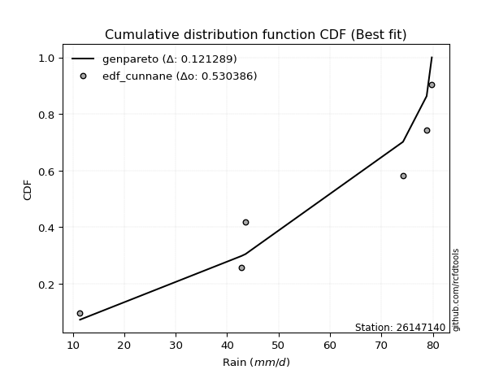</img>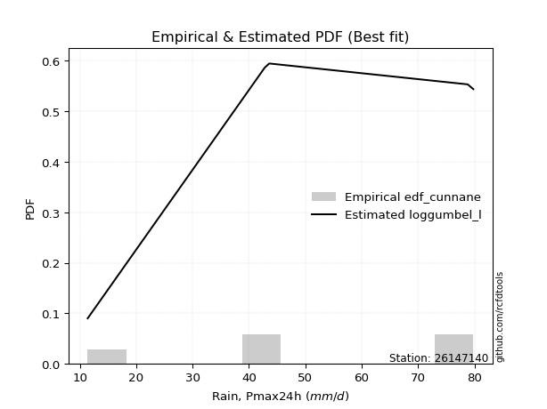</img>

</div>


### 12. EDF Adamowski (1981)

The Adamowski formula in hydrology refers to a specific plotting position formula used for estimating the non-parametric empirical distribution of hydrological events (like flood peaks) to calculate their return periods. This formula provides an alternative to traditional parametric methods (like the Gumbel or Log Pearson Type III distributions). 

<div align="center">


$P=(m-0.25)/(n+0.5)$


</div>


**12.1. Empirical values**

<div align="center">

|                | 0                   | 1                  | 2             | 3                  | 4                  |
|:---------------|:--------------------|:-------------------|:--------------|:-------------------|:-------------------|
| date           | 2022                | 2019               | 2020          | 2024               | 2021               |
| x              | 11.4                | 42.8               | 43.6          | 78.8               | 79.8               |
| m              | 1                   | 2                  | 3             | 4                  | 5                  |
| empirical_dist | edf_adamowski       | edf_adamowski      | edf_adamowski | edf_adamowski      | edf_adamowski      |
| empirical      | 0.13636363636363635 | 0.3181818181818182 | 0.5           | 0.6818181818181818 | 0.8636363636363636 |
| empirical_tr   | 1.1578947368421053  | 1.4666666666666666 | 2.0           | 3.1428571428571423 | 7.333333333333334  |

</div>


**12.2. Kolmogorov-Smirnov fit test (sorted by Δ)**


<div align="center">

|                | 0                   | 1                  | 2                  | 3                   | 4                   | 5                  | 6                   | 7                   | 8                   | 9                  | 10                 | 11                  | 12                 | 13                 | 14                  | 15                 | 16                  | 17                 | 18                 | 19                 | 20                  | 21                  | 22                  | 23                 | 24                 | 25                 | 26                    | 27                  | 28                 | 29                 | 30                 | 31                 | 32                  | 33                  | 34                  | 35                  | 36                  | 37                 | 38                 | 39                  | 40                 | 41                 | 42                  | 43                  | 44                  | 45                  | 46                  | 47                  | 48                  | 49                  | 50                 | 51                  | 52                  | 53                  | 54                  | 55                  | 56                  | 57                  | 58                  | 59                  | 60                 | 61                  | 62                  | 63                  | 64                 | 65                 | 66                 | 67                 | 68                 | 69                  | 70                 | 71                 | 72                 | 73                  | 74                 | 75                  | 76                 | 77                 | 78                  | 79                  | 80                 | 81                 | 82                  | 83                  | 84                  | 85                 | 86                 | 87                 |
|:---------------|:--------------------|:-------------------|:-------------------|:--------------------|:--------------------|:-------------------|:--------------------|:--------------------|:--------------------|:-------------------|:-------------------|:--------------------|:-------------------|:-------------------|:--------------------|:-------------------|:--------------------|:-------------------|:-------------------|:-------------------|:--------------------|:--------------------|:--------------------|:-------------------|:-------------------|:-------------------|:----------------------|:--------------------|:-------------------|:-------------------|:-------------------|:-------------------|:--------------------|:--------------------|:--------------------|:--------------------|:--------------------|:-------------------|:-------------------|:--------------------|:-------------------|:-------------------|:--------------------|:--------------------|:--------------------|:--------------------|:--------------------|:--------------------|:--------------------|:--------------------|:-------------------|:--------------------|:--------------------|:--------------------|:--------------------|:--------------------|:--------------------|:--------------------|:--------------------|:--------------------|:-------------------|:--------------------|:--------------------|:--------------------|:-------------------|:-------------------|:-------------------|:-------------------|:-------------------|:--------------------|:-------------------|:-------------------|:-------------------|:--------------------|:-------------------|:--------------------|:-------------------|:-------------------|:--------------------|:--------------------|:-------------------|:-------------------|:--------------------|:--------------------|:--------------------|:-------------------|:-------------------|:-------------------|
| station        | 26147140            | 26147140           | 26147140           | 26147140            | 26147140            | 26147140           | 26147140            | 26147140            | 26147140            | 26147140           | 26147140           | 26147140            | 26147140           | 26147140           | 26147140            | 26147140           | 26147140            | 26147140           | 26147140           | 26147140           | 26147140            | 26147140            | 26147140            | 26147140           | 26147140           | 26147140           | 26147140              | 26147140            | 26147140           | 26147140           | 26147140           | 26147140           | 26147140            | 26147140            | 26147140            | 26147140            | 26147140            | 26147140           | 26147140           | 26147140            | 26147140           | 26147140           | 26147140            | 26147140            | 26147140            | 26147140            | 26147140            | 26147140            | 26147140            | 26147140            | 26147140           | 26147140            | 26147140            | 26147140            | 26147140            | 26147140            | 26147140            | 26147140            | 26147140            | 26147140            | 26147140           | 26147140            | 26147140            | 26147140            | 26147140           | 26147140           | 26147140           | 26147140           | 26147140           | 26147140            | 26147140           | 26147140           | 26147140           | 26147140            | 26147140           | 26147140            | 26147140           | 26147140           | 26147140            | 26147140            | 26147140           | 26147140           | 26147140            | 26147140            | 26147140            | 26147140           | 26147140           | 26147140           |
| empirical_dist | edf_adamowski       | edf_adamowski      | edf_adamowski      | edf_adamowski       | edf_adamowski       | edf_adamowski      | edf_adamowski       | edf_adamowski       | edf_adamowski       | edf_adamowski      | edf_adamowski      | edf_adamowski       | edf_adamowski      | edf_adamowski      | edf_adamowski       | edf_adamowski      | edf_adamowski       | edf_adamowski      | edf_adamowski      | edf_adamowski      | edf_adamowski       | edf_adamowski       | edf_adamowski       | edf_adamowski      | edf_adamowski      | edf_adamowski      | edf_adamowski         | edf_adamowski       | edf_adamowski      | edf_adamowski      | edf_adamowski      | edf_adamowski      | edf_adamowski       | edf_adamowski       | edf_adamowski       | edf_adamowski       | edf_adamowski       | edf_adamowski      | edf_adamowski      | edf_adamowski       | edf_adamowski      | edf_adamowski      | edf_adamowski       | edf_adamowski       | edf_adamowski       | edf_adamowski       | edf_adamowski       | edf_adamowski       | edf_adamowski       | edf_adamowski       | edf_adamowski      | edf_adamowski       | edf_adamowski       | edf_adamowski       | edf_adamowski       | edf_adamowski       | edf_adamowski       | edf_adamowski       | edf_adamowski       | edf_adamowski       | edf_adamowski      | edf_adamowski       | edf_adamowski       | edf_adamowski       | edf_adamowski      | edf_adamowski      | edf_adamowski      | edf_adamowski      | edf_adamowski      | edf_adamowski       | edf_adamowski      | edf_adamowski      | edf_adamowski      | edf_adamowski       | edf_adamowski      | edf_adamowski       | edf_adamowski      | edf_adamowski      | edf_adamowski       | edf_adamowski       | edf_adamowski      | edf_adamowski      | edf_adamowski       | edf_adamowski       | edf_adamowski       | edf_adamowski      | edf_adamowski      | edf_adamowski      |
| p_dist         | logfisk             | logpearson3        | ncf                | loggumbel_l         | kstwobign           | loggompertz        | genlogistic         | fisk                | logweibull_min      | halfnorm           | rayleigh           | invgauss            | maxwell            | rice               | invgamma            | chi2               | gamma               | f                  | erlang             | betaprime          | nct                 | exponnorm           | crystalball         | norm               | t                  | pearson3           | loglaplace_asymmetric | laplace_asymmetric  | weibull_min        | halflogistic       | gumbel_r           | gompertz           | logfatiguelife      | lognorm             | lognorm             | logcrystalball      | logexponnorm        | logt               | logf               | moyal               | loglogistic        | lognct             | loghypsecant        | logistic            | loglaplace          | logncf              | logbetaprime        | loggamma            | loggamma            | logrice             | hypsecant          | loginvgamma         | logerlang           | laplace             | gumbel_l            | logalpha            | wald                | loginvgauss         | logmaxwell          | genexpon            | loginvweibull      | expon               | lograyleigh         | gibrat              | loggumbel_r        | logkstwobign       | alpha              | loghalfnorm        | loggenexpon        | lognakagami         | logmoyal           | loghalflogistic    | mielke             | logmielke           | truncnorm          | logloggamma         | logexpon           | nakagami           | logwald             | loglognorm          | loggibrat          | logjohnsonsu       | logchi2             | invweibull          | logtruncnorm        | fatiguelife        | johnsonsu          | loggenlogistic     |
| delta          | 0.12228532063465869 | 0.1298229413471158 | 0.1418118000299175 | 0.14250276509064752 | 0.15742974126523035 | 0.1642619704779562 | 0.16680880972059375 | 0.16710249901277385 | 0.16955220673146454 | 0.1695562679757593 | 0.1705266626923866 | 0.17146490210421894 | 0.1717657237482496 | 0.1721391844948864 | 0.17230579158420312 | 0.1723988287746132 | 0.17372924003529167 | 0.1748550208309062 | 0.1750319595957216 | 0.1754183895662057 | 0.17641301920939356 | 0.17643556340748945 | 0.17643574278883112 | 0.1764357526341246 | 0.1764407021701574 | 0.1785485550523609 | 0.18020154810018219   | 0.18095244866429738 | 0.183279835026951  | 0.1850577968518623 | 0.1859055178595722 | 0.1860507382951656 | 0.18820411478149618 | 0.18981806575958377 | 0.18981806575958377 | 0.18981830109606262 | 0.18981943001203622 | 0.189822927581967  | 0.1899586002186417 | 0.19028623348839757 | 0.1909106984415258 | 0.1916665517981379 | 0.19184356360506089 | 0.19311654358822694 | 0.19579936184083552 | 0.19664314408206435 | 0.19738679238513207 | 0.19947225555060782 | 0.19947225555060782 | 0.19951272026424643 | 0.2014150055977293 | 0.20319168441210506 | 0.20325978071694045 | 0.20847040566315145 | 0.20977068302634194 | 0.21075712994141432 | 0.21130747982171183 | 0.22096714072801554 | 0.22253128407686423 | 0.22380910383535085 | 0.225748757385055  | 0.22677460266489852 | 0.23336487241018505 | 0.23406694909113968 | 0.2603841667569346 | 0.2625581086573467 | 0.2637295589739606 | 0.2638647917538514 | 0.267831155133246  | 0.28358844485648677 | 0.2861592915985875 | 0.2892722361164957 | 0.2915051450901126 | 0.29312192997801456 | 0.2963618610895332 | 0.29851599447082156 | 0.3179113028194713 | 0.3181569138531451 | 0.35780635606890737 | 0.36846691325708397 | 0.3823511662832115 | 0.4127794428052437 | 0.42612584619523236 | 0.44694407873351927 | 0.44839341254812776 | 0.5358614851774859 | 0.5973535749174959 | 0.6818181818181818 |
| deltao         | 0.5865427407550001  | 0.5865427407550001 | 0.5865427407550001 | 0.5865427407550001  | 0.5865427407550001  | 0.5865427407550001 | 0.5865427407550001  | 0.5865427407550001  | 0.5865427407550001  | 0.5865427407550001 | 0.5865427407550001 | 0.5865427407550001  | 0.5865427407550001 | 0.5865427407550001 | 0.5865427407550001  | 0.5865427407550001 | 0.5865427407550001  | 0.5865427407550001 | 0.5865427407550001 | 0.5865427407550001 | 0.5865427407550001  | 0.5865427407550001  | 0.5865427407550001  | 0.5865427407550001 | 0.5865427407550001 | 0.5865427407550001 | 0.5865427407550001    | 0.5865427407550001  | 0.5865427407550001 | 0.5865427407550001 | 0.5865427407550001 | 0.5865427407550001 | 0.5865427407550001  | 0.5865427407550001  | 0.5865427407550001  | 0.5865427407550001  | 0.5865427407550001  | 0.5865427407550001 | 0.5865427407550001 | 0.5865427407550001  | 0.5865427407550001 | 0.5865427407550001 | 0.5865427407550001  | 0.5865427407550001  | 0.5865427407550001  | 0.5865427407550001  | 0.5865427407550001  | 0.5865427407550001  | 0.5865427407550001  | 0.5865427407550001  | 0.5865427407550001 | 0.5865427407550001  | 0.5865427407550001  | 0.5865427407550001  | 0.5865427407550001  | 0.5865427407550001  | 0.5865427407550001  | 0.5865427407550001  | 0.5865427407550001  | 0.5865427407550001  | 0.5865427407550001 | 0.5865427407550001  | 0.5865427407550001  | 0.5865427407550001  | 0.5865427407550001 | 0.5865427407550001 | 0.5865427407550001 | 0.5865427407550001 | 0.5865427407550001 | 0.5865427407550001  | 0.5865427407550001 | 0.5865427407550001 | 0.5865427407550001 | 0.5865427407550001  | 0.5865427407550001 | 0.5865427407550001  | 0.5865427407550001 | 0.5865427407550001 | 0.5865427407550001  | 0.5865427407550001  | 0.5865427407550001 | 0.5865427407550001 | 0.5865427407550001  | 0.5865427407550001  | 0.5865427407550001  | 0.5865427407550001 | 0.5865427407550001 | 0.5865427407550001 |
| eval           | Δo > Δ              | Δo > Δ             | Δo > Δ             | Δo > Δ              | Δo > Δ              | Δo > Δ             | Δo > Δ              | Δo > Δ              | Δo > Δ              | Δo > Δ             | Δo > Δ             | Δo > Δ              | Δo > Δ             | Δo > Δ             | Δo > Δ              | Δo > Δ             | Δo > Δ              | Δo > Δ             | Δo > Δ             | Δo > Δ             | Δo > Δ              | Δo > Δ              | Δo > Δ              | Δo > Δ             | Δo > Δ             | Δo > Δ             | Δo > Δ                | Δo > Δ              | Δo > Δ             | Δo > Δ             | Δo > Δ             | Δo > Δ             | Δo > Δ              | Δo > Δ              | Δo > Δ              | Δo > Δ              | Δo > Δ              | Δo > Δ             | Δo > Δ             | Δo > Δ              | Δo > Δ             | Δo > Δ             | Δo > Δ              | Δo > Δ              | Δo > Δ              | Δo > Δ              | Δo > Δ              | Δo > Δ              | Δo > Δ              | Δo > Δ              | Δo > Δ             | Δo > Δ              | Δo > Δ              | Δo > Δ              | Δo > Δ              | Δo > Δ              | Δo > Δ              | Δo > Δ              | Δo > Δ              | Δo > Δ              | Δo > Δ             | Δo > Δ              | Δo > Δ              | Δo > Δ              | Δo > Δ             | Δo > Δ             | Δo > Δ             | Δo > Δ             | Δo > Δ             | Δo > Δ              | Δo > Δ             | Δo > Δ             | Δo > Δ             | Δo > Δ              | Δo > Δ             | Δo > Δ              | Δo > Δ             | Δo > Δ             | Δo > Δ              | Δo > Δ              | Δo > Δ             | Δo > Δ             | Δo > Δ              | Δo > Δ              | Δo > Δ              | Δo > Δ             | Δo <= Δ            | Δo <= Δ            |
| fit            | 1                   | 1                  | 1                  | 1                   | 1                   | 1                  | 1                   | 1                   | 1                   | 1                  | 1                  | 1                   | 1                  | 1                  | 1                   | 1                  | 1                   | 1                  | 1                  | 1                  | 1                   | 1                   | 1                   | 1                  | 1                  | 1                  | 1                     | 1                   | 1                  | 1                  | 1                  | 1                  | 1                   | 1                   | 1                   | 1                   | 1                   | 1                  | 1                  | 1                   | 1                  | 1                  | 1                   | 1                   | 1                   | 1                   | 1                   | 1                   | 1                   | 1                   | 1                  | 1                   | 1                   | 1                   | 1                   | 1                   | 1                   | 1                   | 1                   | 1                   | 1                  | 1                   | 1                   | 1                   | 1                  | 1                  | 1                  | 1                  | 1                  | 1                   | 1                  | 1                  | 1                  | 1                   | 1                  | 1                   | 1                  | 1                  | 1                   | 1                   | 1                  | 1                  | 1                   | 1                   | 1                   | 1                  | 0                  | 0                  |
| n              | 5                   | 5                  | 5                  | 5                   | 5                   | 5                  | 5                   | 5                   | 5                   | 5                  | 5                  | 5                   | 5                  | 5                  | 5                   | 5                  | 5                   | 5                  | 5                  | 5                  | 5                   | 5                   | 5                   | 5                  | 5                  | 5                  | 5                     | 5                   | 5                  | 5                  | 5                  | 5                  | 5                   | 5                   | 5                   | 5                   | 5                   | 5                  | 5                  | 5                   | 5                  | 5                  | 5                   | 5                   | 5                   | 5                   | 5                   | 5                   | 5                   | 5                   | 5                  | 5                   | 5                   | 5                   | 5                   | 5                   | 5                   | 5                   | 5                   | 5                   | 5                  | 5                   | 5                   | 5                   | 5                  | 5                  | 5                  | 5                  | 5                  | 5                   | 5                  | 5                  | 5                  | 5                   | 5                  | 5                   | 5                  | 5                  | 5                   | 5                   | 5                  | 5                  | 5                   | 5                   | 5                   | 5                  | 5                  | 5                  |
| best_fit       | 1                   | 0                  | 0                  | 0                   | 0                   | 0                  | 0                   | 0                   | 0                   | 0                  | 0                  | 0                   | 0                  | 0                  | 0                   | 0                  | 0                   | 0                  | 0                  | 0                  | 0                   | 0                   | 0                   | 0                  | 0                  | 0                  | 0                     | 0                   | 0                  | 0                  | 0                  | 0                  | 0                   | 0                   | 0                   | 0                   | 0                   | 0                  | 0                  | 0                   | 0                  | 0                  | 0                   | 0                   | 0                   | 0                   | 0                   | 0                   | 0                   | 0                   | 0                  | 0                   | 0                   | 0                   | 0                   | 0                   | 0                   | 0                   | 0                   | 0                   | 0                  | 0                   | 0                   | 0                   | 0                  | 0                  | 0                  | 0                  | 0                  | 0                   | 0                  | 0                  | 0                  | 0                   | 0                  | 0                   | 0                  | 0                  | 0                   | 0                   | 0                  | 0                  | 0                   | 0                   | 0                   | 0                  | 0                  | 0                  |
| best_fit_sort  | 1                   | 2                  | 3                  | 4                   | 5                   | 6                  | 7                   | 8                   | 9                   | 10                 | 11                 | 12                  | 13                 | 14                 | 15                  | 16                 | 17                  | 18                 | 19                 | 20                 | 21                  | 22                  | 23                  | 24                 | 25                 | 26                 | 27                    | 28                  | 29                 | 30                 | 31                 | 32                 | 33                  | 34                  | 35                  | 36                  | 37                  | 38                 | 39                 | 40                  | 41                 | 42                 | 43                  | 44                  | 45                  | 46                  | 47                  | 48                  | 49                  | 50                  | 51                 | 52                  | 53                  | 54                  | 55                  | 56                  | 57                  | 58                  | 59                  | 60                  | 61                 | 62                  | 63                  | 64                  | 65                 | 66                 | 67                 | 68                 | 69                 | 70                  | 71                 | 72                 | 73                 | 74                  | 75                 | 76                  | 77                 | 78                 | 79                  | 80                  | 81                 | 82                 | 83                  | 84                  | 85                  | 86                 | 87                 | 88                 |

</div>


**12.3. Best fit**

<div align="center">

|   id |   station | empirical_dist   | p_dist   |    delta |   deltao | eval   |   fit |   n |   best_fit |   best_fit_sort |
|-----:|----------:|:-----------------|:---------|---------:|---------:|:-------|------:|----:|-----------:|----------------:|
|    0 |  26147140 | edf_adamowski    | logfisk  | 0.122285 | 0.586543 | Δo > Δ |     1 |   5 |          1 |               1 |

</div>


<div align="center">

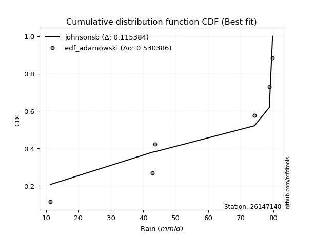</img>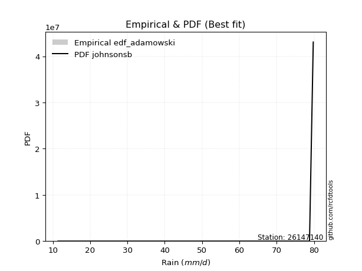</img>

</div>


## C. Best fit & Estimate extreme values for specific return periods - Tr

Best fit in probability distribution analysis means finding the theoretical distribution (like Normal, Poisson, Exponential) that most accurately mirrors your real-world data´s patterns (shape, center, spread) for better predictions, using methods like visual checks (Q-Q plots), goodness-of-fit tests (Kolmogorov-Smirnov, Chi-Squared), and information criteria (AIC) to score and select the simplest, most representative model.


### 1. Best fit (ordered by delta Δ)

<div align="center">

|   id |   station | empirical_dist   | p_dist      |    delta |   deltao | eval   |   fit |   n |   best_fit |   best_fit_sort |
|-----:|----------:|:-----------------|:------------|---------:|---------:|:-------|------:|----:|-----------:|----------------:|
|    0 |  26147140 | edf_adamowski    | logfisk     | 0.122285 | 0.586543 | Δo > Δ |     1 |   5 |          1 |               1 |
|    1 |  26147140 | edf_chegodayev   | logfisk     | 0.125652 | 0.586543 | Δo > Δ |     1 |   5 |          1 |               2 |
|    2 |  26147140 | edf_jenkinson    | logfisk     | 0.126341 | 0.586543 | Δo > Δ |     1 |   5 |          1 |               3 |
|    3 |  26147140 | edf_beard        | logfisk     | 0.126341 | 0.586543 | Δo > Δ |     1 |   5 |          1 |               4 |
|    4 |  26147140 | edf_filliben     | logfisk     | 0.12686  | 0.586543 | Δo > Δ |     1 |   5 |          1 |               5 |
|    5 |  26147140 | edf_tukey        | logfisk     | 0.127967 | 0.586543 | Δo > Δ |     1 |   5 |          1 |               6 |
|    6 |  26147140 | edf_blom         | logfisk     | 0.130943 | 0.586543 | Δo > Δ |     1 |   5 |          1 |               7 |
|    7 |  26147140 | edf_cunnane      | loggumbel_l | 0.132013 | 0.586543 | Δo > Δ |     1 |   5 |          1 |               8 |
|    8 |  26147140 | edf_gringorten   | loggumbel_l | 0.133219 | 0.586543 | Δo > Δ |     1 |   5 |          1 |               9 |
|    9 |  26147140 | edf_hazen        | loggumbel_l | 0.137907 | 0.586543 | Δo > Δ |     1 |   5 |          1 |              10 |
|   10 |  26147140 | edf_weibull      | logfisk     | 0.140099 | 0.586543 | Δo > Δ |     1 |   5 |          1 |              11 |
|   11 |  26147140 | edf_california   | kstwobign   | 0.154407 | 0.586543 | Δo > Δ |     1 |   5 |          1 |              12 |

</div>

:file_folder:Tables: [bestfit_26147140.csv](table/bestfit_26147140.csv) | [extreme_26147140.csv](table/extreme_26147140.csv)


### 2. Extreme values

In hydrology, a return period (or recurrence interval $Tr$) is the statistical average time between extreme events like floods or droughts of a specific magnitude, indicating how rare an event is, with a 100-year flood, for example, having a 1% chance of occurring in any given year, not that it happens exactly every century. It is a key tool for infrastructure design (like bridges or dams) and risk assessment, calculated from historical data to determine the probability of future events, although it is important to remember it is statistical average, and events can cluster or be missed.

> risk_rate: assuming the return period as the project useful life.

|   id |      tr |   prob_l |     prob_g |      alpha |   betaprime |     chi2 |   crystalball |   erlang |    expon |   exponnorm |        f |   fatiguelife |     fisk |    gamma |   genexpon |   genlogistic |   gibrat |   gompertz |   gumbel_l |   gumbel_r |   halflogistic |   halfnorm |   hypsecant |   invgamma |   invgauss |      invweibull |   johnsonsu |   kstwobign |   laplace |   laplace_asymmetric |   loggamma |   logistic |   lognorm |   maxwell |   mielke |    moyal |   nakagami |      ncf |      nct |     norm |   pearson3 |   rayleigh |     rice |        t |   truncnorm |     wald |   weibull_min |   logalpha |   logbetaprime |     logchi2 |   logcrystalball |   logerlang |   logexpon |   logexponnorm |     logf |   logfatiguelife |   logfisk |   loggenexpon |   loggenlogistic |   loggibrat |   loggompertz |   loggumbel_l |   loggumbel_r |   loghalflogistic |   loghalfnorm |   loghypsecant |   loginvgamma |   loginvgauss |   loginvweibull |   logjohnsonsu |   logkstwobign |   loglaplace |   loglaplace_asymmetric |   logloggamma |   loglogistic |    loglognorm |   logmaxwell |   logmielke |   logmoyal |   lognakagami |   logncf |   lognct |   logpearson3 |   lograyleigh |   logrice |     logt |   logtruncnorm |   logwald |   logweibull_min |   station |   n |   risk_rate |
|-----:|--------:|---------:|-----------:|-----------:|------------:|---------:|--------------:|---------:|---------:|------------:|---------:|--------------:|---------:|---------:|-----------:|--------------:|---------:|-----------:|-----------:|-----------:|---------------:|-----------:|------------:|-----------:|-----------:|----------------:|------------:|------------:|----------:|---------------------:|-----------:|-----------:|----------:|----------:|---------:|---------:|-----------:|---------:|---------:|---------:|-----------:|-----------:|---------:|---------:|------------:|---------:|--------------:|-----------:|---------------:|------------:|-----------------:|------------:|-----------:|---------------:|---------:|-----------------:|----------:|--------------:|-----------------:|------------:|--------------:|--------------:|--------------:|------------------:|--------------:|---------------:|--------------:|--------------:|----------------:|---------------:|---------------:|-------------:|------------------------:|--------------:|--------------:|--------------:|-------------:|------------:|-----------:|--------------:|---------:|---------:|--------------:|--------------:|----------:|---------:|---------------:|----------:|-----------------:|----------:|----:|------------:|
|    0 |    2    | 0.5      | 0.5        |    34.9246 |     50.5112 |  50.5754 |       51.28   |  50.7073 |  39.0427 |     51.28   |  51.2436 |       11.4    |  51.961  |  50.709  |    39.2727 |       52.4342 |  43.5778 |    55.478  |    55.4955 |    47.0645 |        44.9688 |    46.0275 |     51.28   |    49.069  |    48.0092 | 17604.4         |        79.8 |     45.8199 |   51.28   |              47.7846 |    41.4188 |    51.28   |   42.1962 |   49.0854 |  52.7357 |  45.7037 |    47.5803 |  45.7033 |  51.2753 |  51.28   |    52.3144 |    48.3071 |  50.0215 |  51.2818 |     55.965  |  42.9622 |       53.4668 |    40.5502 |        41.6089 |     18.5127 |          42.1961 |     41.1688 |    28.2402 |        42.196  |  42.2067 |          42.3184 |   47.0256 |       35.1419 |         inf      |     34.1128 |       46.2658 |       47.4051 |       37.5595 |           35.4475 |       36.4991 |        42.1962 |       41.1353 |       39.5891 |         38.6692 |        79.7368 |        35.3801 |      42.1962 |                 42.8731 |       51.2439 |       42.1962 |  11.4142      |      39.7151 |     51.373  |    36.1743 |       42.8344 |  41.6383 |  42.0537 |       47.2769 |       38.8706 |   41.4378 |  42.1958 |        53.1684 |   33.5361 |          48.3069 |  26147140 |   5 |    0.75     |
|    1 |    2.33 | 0.570815 | 0.429185   |    41.5705 |     55.1509 |  55.2278 |       55.859  |  55.3334 |  45.1332 |     55.859  |  55.8435 |       12.3003 |  56.3951 |  55.3516 |    45.4139 |       56.8586 |  45.8974 |    59.7753 |    59.4792 |    51.3075 |        49.3312 |    50.9694 |     54.9445 |    53.8292 |    52.7985 |     2.72253e+06 |        79.8 |     51.0423 |   54.051  |              51.4481 |    47.2907 |    55.3144 |   47.8834 |   53.8427 |  57.1769 |  49.7201 |    50.3719 |  51.2243 |  55.855  |  55.859  |    56.8474 |    53.1347 |  54.7774 |  55.8604 |     59.6836 |  45.9647 |       57.8799 |    46.3337 |        47.3461 |     21.9997 |          47.8833 |     46.8505 |    34.4881 |        47.8833 |  47.9203 |          48.0089 |   52.6103 |       41.2834 |         inf      |     36.369  |       51.3496 |       52.9175 |       42.2282 |           39.9854 |       41.8356 |        46.6894 |       46.9688 |       45.643  |         45.6596 |        79.7736 |        41.7683 |      45.5515 |                 46.2565 |       55.771  |       47.1687 |  11.5843      |      45.2903 |     55.9227 |    40.4172 |       42.9397 |  47.5365 |  47.7578 |       53.1377 |       44.4135 |   47.2073 |  47.8829 |        55.3484 |   36.4353 |          53.1909 |  26147140 |   5 |    0.729209 |
|    2 |    5    | 0.8      | 0.2        |    93.1034 |     72.6992 |  72.9561 |       72.8756 |  72.7909 |  75.5844 |     72.8756 |  72.9919 |       31.4234 |  73.5156 |  72.9028 |    76.1184 |       73.6948 |  59.2515 |    73.7792 |    72.349  |    69.7406 |        69.0702 |    71.868  |     69.6438 |    72.4805 |    72.1609 |     8.86571e+15 |        79.8 |     73.2261 |   67.9052 |              69.7646 |    78.0183 |    70.8917 |   76.604  |   72.5667 |  70.097  |  68.3247 |    68.5085 |  76.5744 |  72.876  |  72.8756 |    73.1217 |    72.4617 |  72.9025 |  72.8755 |     70.6715 |  62.7726 |       73.1968 |    77.4735 |        76.7569 |     60.484  |          76.6039 |     76.3774 |    93.6824 |        76.604  |  76.8126 |          76.7505 |   81.1428 |       79.7179 |         inf      |     52.5854 |       72.5596 |       75.4982 |       70.2516 |           68.9637 |       74.5017 |        70.0641 |       77.9563 |       79.6853 |         93.9866 |        79.799  |        84.5394 |      66.7799 |                 67.4434 |       69.1992 |       72.5204 |   2.86051e+94 |      75.9535 |     69.4229 |    67.558  |       48.05   |  78.4042 |  76.6952 |       77.1842 |       75.7335 |   77.0033 |  76.6031 |        64.93   |   57.9563 |          72.605  |  26147140 |   5 |    0.67232  |
|    3 |   10    | 0.9      | 0.1        |   187.782  |     84.608  |  85.1018 |       84.164  |  84.6038 | 103.227  |     84.164  |  84.4147 |       57.8275 |  86.1243 |  84.8068 |   103.991  |       85.9308 |  74.4736 |    81.6309 |    79.5143 |    84.7541 |        85.4625 |    87.3325 |     81.3816 |    85.7455 |    86.4504 |     4.96252e+23 |        79.8 |     90.1163 |   80.4816 |              86.3918 |   109.507  |    82.3637 |  104.622  |   85.7437 |  75.2095 |  84.5229 |    85.7224 |  98.7324 |  84.1689 |  84.164  |    83.4274 |    86.2422 |  85.1844 |  84.1629 |     75.2368 |  80.6097 |       82.4754 |   110.836  |       106.047  |    171.334  |         104.622  |    106.393  |   232.071  |       104.622  | 105.056  |         104.802  |  111.644  |      128.403  |         inf      |     80.0567 |       88.3292 |       92.0163 |      106.341  |          108.444  |      114.188  |        96.8853 |      110.464  |      118.322  |        169.216  |        79.7999 |       144.611  |      94.5073 |                 94.9735 |       74.6095 |       99.5488 | inf           |     109.287  |     74.864  |   105.664  |       64.7183 | 110.05   | 105.106  |       94.1042 |      110.802  |  106.853  | 104.621  |        71.1507 |   94.8469 |          86.3378 |  26147140 |   5 |    0.651322 |
|    4 |   15    | 0.933333 | 0.0666667  |   282.123  |     90.6313 |  91.2787 |       89.7971 |  90.5684 | 119.397  |     89.7971 |  90.1289 |       75.0962 |  92.994  |  90.8255 |   120.296  |       92.5662 |  84.9731 |    85.1955 |    82.7593 |    93.2246 |        94.7391 |    95.3801 |     88.0803 |    92.6498 |    94.038  |     1.16695e+28 |        79.8 |     99.0829 |   87.8384 |              96.1181 |   129.965  |    88.6143 |  122.23   |   92.5047 |  76.8572 |  93.9236 |    95.1962 | 111.838  |  89.8047 |  89.7971 |    88.4261 |    93.3425 |  91.3646 |  89.7956 |     76.7537 |  92.0639 |       86.8661 |   133.243  |       124.712  |    325.1    |         122.23   |    125.803  |   394.524  |       122.23   | 122.827  |         122.438  |  132.845  |      164.384  |         inf      |    106.98   |       96.6223 |      100.642  |      134.364  |          140.106  |      142.603  |       116.571  |      131.955  |      145.277  |        235.789  |        79.8    |       192.296  |     115.795  |                116.029  |       76.364  |      118.302  | inf           |     131.719  |     76.6287 |   136.982  |       80.5626 | 130.62   | 123.038  |      102.49   |      134.802  |  125.913  | 122.228  |        73.6914 |  130.135  |          93.3841 |  26147140 |   5 |    0.644736 |
|    5 |   20    | 0.95     | 0.05       |   376.38   |     94.605  |  95.3659 |       93.4861 |  94.4997 | 130.87   |     93.4861 |  93.8761 |       87.8816 |  97.7422 |  94.7954 |   131.864  |       97.1444 |  93.2092 |    87.4165 |    84.7792 |    99.1554 |       101.239  |   100.746  |     92.8059 |    97.2784 |    99.1773 |     1.34202e+31 |        79.8 |    105.123  |   93.0581 |             103.019  |   145.501  |    92.9344 |  135.337  |   96.9917 |  77.6713 | 100.581  |   101.606  | 121.287  |  93.4957 |  93.4861 |    91.6481 |    98.0619 |  95.4267 |  93.4843 |     77.5131 | 100.599  |       89.6606 |   150.622  |       138.722  |    517.363  |         135.337  |    140.505  |   574.888  |       135.338  | 136.066  |         135.571  |  149.808  |      193.796  |         inf      |    134.296  |      102.191  |      106.415  |      158.273  |          167.649  |      165.376  |       132.819  |      148.456  |      166.664  |        297.445  |        79.8    |       232.995  |     133.747  |                133.741  |       77.2328 |      133.291  | inf           |     149.093  |     77.5026 |   164.629  |       94.5798 | 146.248  | 136.421  |      107.885  |      153.565  |  140.23   | 135.335  |        75.0765 |  164.727  |          98.0576 |  26147140 |   5 |    0.641514 |
|    6 |   25    | 0.96     | 0.04       |   470.605  |     97.545  |  98.396  |       96.2017 |  97.4065 | 139.769  |     96.2017 |  96.6371 |       98.0401 | 101.375  |  97.7321 |   140.837  |      100.643  | 100.075  |    88.9979 |    86.2165 |   103.724  |       106.246  |   104.738  |     96.4632 |   100.741  |   103.048  |     3.05708e+33 |        79.8 |    109.647  |   97.1068 |             108.372  |   158.173  |    96.2394 |  145.876  |  100.323  |  78.1567 | 105.742  |   106.403  | 128.725  |  96.2128 |  96.2017 |    93.9941 |   101.568  |  98.4238 |  96.1997 |     77.9693 | 107.436  |       91.6785 |   165.02   |       150.054  |    745.42   |         145.875  |    152.476  |   769.858  |       145.876  | 146.716  |         146.132  |  164.233  |      219.046  |         inf      |    162.329  |      106.355  |      110.723  |      179.552  |          192.51   |      184.649  |       146.933  |      162.026  |      184.671  |        355.725  |        79.8    |       269.028  |     149.568  |                149.322  |       77.7514 |      146.028  | inf           |     163.458  |     78.0243 |   189.841  |      107.083  | 158.998  | 147.202  |      111.787  |      169.177  |  151.812  | 145.874  |        75.9491 |  198.957  |         101.525  |  26147140 |   5 |    0.639603 |
|    7 |   50    | 0.98     | 0.02       |   941.58   |    106.034  | 107.174  |      103.978  | 105.79   | 167.411  |    103.978  | 104.556  |      130.633  | 112.472  | 106.209  |   168.71   |      111.322  | 124.278  |    93.2942 |    90.1183 |   117.796  |       121.675  |   116.341  |    107.802  |   110.925  |   114.554  |     5.59493e+40 |        79.8 |    122.933  |  109.683  |             124.999  |   201.263  |   106.337  |  180.818  |  109.984  |  79.1209 | 121.762  |   120.412  | 152.572  | 103.994  | 103.978  |   100.591  |   111.747  | 107.034  | 103.975  |     78.8833 | 129.759  |       97.2813 |   215.409  |       188.022  |   2368.69   |         180.817  |    193.065  |  1907.1    |       180.818  | 182.06   |         181.163  |  217.491  |      312.793  |         inf      |    316.68   |      118.569  |      123.319  |      264.821  |          294.771  |      254.389  |       200.955  |      208.865  |      249.519  |        617.304  |        79.8    |       410.38   |     211.669  |                210.275  |       78.7828 |      192.986  | inf           |     213.433  |     79.0618 |   295.466  |      155.568  | 202.38   | 183.066  |      122.524  |      224.081  |  190.622  | 180.814  |        77.7977 |  368.531  |         111.568  |  26147140 |   5 |    0.63583  |
|    8 |   75    | 0.986667 | 0.0133333  |  1412.49   |    110.631  | 111.945  |      108.151  | 110.326  | 183.581  |    108.151  | 108.812  |      150.262  | 118.882  | 110.8    |   185.014  |      117.484  | 140.625  |    95.4684 |    92.0913 |   125.976  |       130.644  |   122.658  |    114.428  |   116.559  |   120.991  |     9.31171e+44 |        79.8 |    130.243  |  117.04   |             134.725  |   229.29   |   112.169  |  202.899  |  115.236  |  79.4404 | 131.13   |   128.045  | 167.127  | 108.169  | 108.151  |   104.058  |   117.284  | 111.669  | 108.148  |     79.1885 | 143.495  |      100.186  |   249.305  |       212.305  |   4715.87   |         202.898  |    219.383  |  3242.1    |       202.899  | 204.417  |         203.312  |  255.796  |      379.839  |         inf      |    497.325  |      125.286  |      130.224  |      331.929  |          377.61   |      302.864  |       241.303  |      239.866  |      294.553  |        850.433  |        79.8    |       517.708  |     259.347  |                256.891  |       79.1249 |      226.707  | inf           |     246.746  |     79.4059 |   382.696  |      191.275  | 230.618  | 205.816  |      127.961  |      261.103  |  215.434  | 202.895  |        78.4471 |  538.535  |         117.019  |  26147140 |   5 |    0.634587 |
|    9 |  100    | 0.99     | 0.01       |  1883.38   |    113.758  | 115.197  |      110.973  | 113.408  | 195.054  |    110.973  | 111.693  |      164.386  | 123.408  | 113.921  |   196.582  |      121.833  | 153.288  |    96.8912 |    93.3818 |   131.765  |       136.992  |   126.961  |    119.129  |   120.438  |   125.45   |     9.05018e+47 |        79.8 |    135.251  |  122.26   |             141.626  |   250.536  |   116.286  |  219.343  |  118.814  |  79.5998 | 137.777  |   133.24   | 177.76   | 110.994  | 110.973  |   106.373  |   121.057  | 114.809  | 110.97   |     79.3412 | 153.51   |      102.112  |   275.56   |       230.522  |   7721.15   |         219.342  |    239.298  |  4724.29   |       219.343  | 221.077  |         219.812  |  286.836  |      433.629  |         inf      |    705.487  |      129.89   |      134.948  |      389.467  |          449.957  |      341.075  |       274.746  |      263.63   |      330.122  |       1066.89   |        79.8    |       607.039  |     299.556  |                296.108  |       79.2957 |      254.005  | inf           |     272.367  |     79.5777 |   459.789  |      220.224  | 252.035  | 222.798  |      131.489  |      289.77   |  234.039  | 219.339  |        78.7785 |  710.108  |         120.728  |  26147140 |   5 |    0.633968 |
|   10 |  200    | 0.995    | 0.005      |  3766.91   |    120.9    | 122.646  |      117.374  | 120.443  | 222.697  |    117.374  | 118.238  |      198.958  | 134.263  | 121.049  |   224.455  |      132.262  | 187.74   |    99.9849 |    96.187  |   145.683  |       152.253  |   136.802  |    130.453  |   129.449  |   135.889  |     1.3779e+55  |        79.8 |    146.786  |  134.836  |             158.253  |   306.717  |   126.163  |  261.753  |  126.999  |  79.839  | 153.79   |   145.092  | 204.531  | 117.4    | 117.374  |   111.541  |   129.689  | 121.945  | 117.371  |     79.5705 | 178.456  |      106.372  |   347.19   |       277.994  |  25650.1    |         261.752  |    291.83   | 11703      |       261.754  | 264.08   |         262.387  |  377.531  |      587.329  |         inf      |   1826.46   |      140.504  |      145.817  |      571.974  |          685.791  |      447.581  |       375.603  |      327.484  |      429.862  |       1840.26   |        79.8    |       875.877  |     423.933  |                416.978  |       79.5514 |      333.65   | inf           |     341.439  |     79.8355 |   715.473  |      303.626  | 308.713  | 266.74   |      139.005  |      367.765  |  282.475  | 261.748  |        79.2842 | 1414.19   |         129.2    |  26147140 |   5 |    0.633042 |
|   11 |  250    | 0.996    | 0.004      |  4708.67   |    123.097  | 124.943  |      119.331  | 122.605  | 231.596  |    119.331  | 120.241  |      210.225  | 137.748  | 123.242  |   233.428  |      135.61   | 200.102  |   100.896  |    97.0123 |   150.158  |       157.159  |   139.83   |    134.098  |   132.263  |   139.17   |     2.8074e+57  |        79.8 |    150.356  |  138.885  |             163.606  |   326.398  |   129.334  |  276.282  |  129.519  |  79.8875 | 158.945  |   148.727  | 213.522  | 119.358  | 119.331  |   113.096  |   132.346  | 124.13   | 119.327  |     79.6164 | 186.709  |      107.645  |   373.008  |       294.407  |  37876.3    |         276.281  |    310.195  | 15672.1    |       276.283  | 278.823  |         276.979  |  412.344  |      644.882  |         inf      |   2569.45   |      143.793  |      149.178  |      647.194  |          785.291  |      486.609  |       415.378  |      350.183  |      466.684  |       2192.78   |        79.8    |       981.116  |     474.078  |                465.556  |       79.6025 |      364.182  | inf           |     366.041  |     79.8878 |   824.924  |      334.962  | 328.583  | 281.838  |      141.159  |      395.763  |  299.204  | 276.276  |        79.3867 | 1776.17   |         131.804  |  26147140 |   5 |    0.632858 |
|   12 |  500    | 0.998    | 0.002      |  9417.45   |    129.651  | 131.811  |      125.132  | 129.05   | 259.239  |    125.132  | 126.186  |      245.571  | 148.557  | 129.78   |   261.301  |      145.991  | 242.822  |   103.507  |    99.3783 |   164.045  |       172.388  |   148.857  |    145.421  |   140.777  |   149.154  |     4.12324e+64 |        79.8 |    161.055  |  151.461  |             180.233  |   392.899  |   139.169  |  324.283  |  137.037  |  79.9911 | 174.958  |   159.533  | 242.716  | 125.164  | 125.132  |   117.645  |   140.274  | 130.617  | 125.128  |     79.7082 | 212.951  |      111.343  |   462.878  |       349.14   | 128197      |         324.281  |    372.126  | 38823      |       324.284  | 327.566  |         325.211  |  542.076  |      852.533  |         inf      |   8358.27   |      153.662  |      159.249  |      949.68   |         1195.79   |      624.359  |       567.847  |      428.049  |      598.006  |       3777.85   |        79.8    |      1378.46   |     670.919  |                655.594  |       79.7046 |      477.807  | inf           |     450.5    |     79.9988 |  1283.64   |      448.001  | 395.778  | 331.868  |      147.136  |      492.619  |  354.917  | 324.276  |        79.5928 | 3666.1    |         139.563  |  26147140 |   5 |    0.632489 |
|   13 |  750    | 0.998667 | 0.00133333 | 14126.2    |    133.317  | 135.663  |      128.355  | 132.652  | 275.409  |    128.355  | 129.493  |      266.454  | 154.872  | 133.437  |   277.605  |      152.055  | 271.075  |   104.903  |   100.643  |   172.164  |       181.29   |   153.9    |    152.044  |   145.62   |   154.868  |     6.38291e+68 |        79.8 |    167.065  |  158.818  |             189.96   |   435.813  |   144.914  |  354.464  |  141.243  |  80.0324 | 184.325  |   165.548  | 260.742  | 128.39   | 128.355  |   120.13   |   144.708  | 134.226  | 128.35   |     79.7388 | 228.684  |      113.35   |   522.935  |       383.926  | 262947      |         354.462  |    412.004  | 65999.8    |       354.465  | 358.239  |         355.554  |  636.016  |      996.688  |         inf      |  18234.9    |      159.218  |      164.908  |     1188.33   |         1529.03   |      717.648  |       681.806  |      479.199  |      688.209  |       5192.28   |        79.8    |      1668.6    |     822.042  |                800.934  |       79.7387 |      559.955  | inf           |     505.97   |     80.0429 |  1662.55   |      526.257  | 439.182  | 363.434  |      150.186  |      556.771  |  390.264  | 354.456  |        79.6619 | 5661.11   |         143.895  |  26147140 |   5 |    0.632366 |
|   14 | 1000    | 0.999    | 0.001      | 18835      |    135.852  | 138.33   |      130.574  | 135.141  | 286.881  |    130.574  | 131.772  |      281.351  | 159.35   | 135.965  |   289.174  |      156.356  | 292.696  |   105.842  |   101.494  |   177.923  |       187.605  |   157.383  |    156.744  |   149.002  |   158.871  |     5.984e+71   |        79.8 |    171.228  |  164.038  |             196.861  |   468.18   |   148.989  |  376.861  |  144.149  |  80.0571 | 190.971  |   169.691  | 273.983  | 130.611  | 130.574  |   121.825  |   147.771  | 136.713  | 130.569  |     79.7541 | 240.002  |      114.713  |   569.256  |       409.913  | 438635      |         376.859  |    442.042  | 96172.7    |       376.863  | 381.014  |         378.079  |  712.343  |     1110.37   |          79.7502 |  33125.5    |      163.071  |      168.829  |     1393.16   |         1820.32   |      790.092  |       776.278  |      518.217  |      758.979  |       6506.21   |        79.8    |      1904.69   |     949.488  |                923.204  |       79.7557 |      626.637  | inf           |     548.251  |     80.0691 |  1997.44   |      587.777  | 471.941  | 386.909  |      152.173  |      605.922  |  416.639  | 376.853  |        79.6965 | 7738.15   |         146.887  |  26147140 |   5 |    0.632305 |

<div align="center">

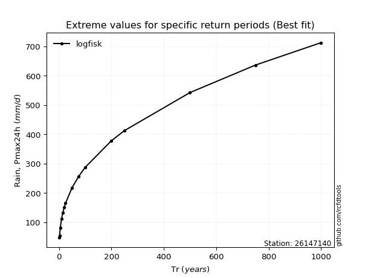</img>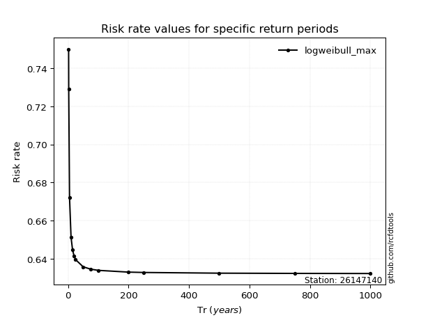</img>

</div>


<sub>**APP DISCLAIMER**: NO WARRANTY - This software is provided by [github.com/rcfdtools](https://github.com/rcfdtools) "as is", without any express or implied warranty, including warranties of merchantability, fitness for a particular purpose, or non-infringement. There is no guarantee that the software will be error-free or operate without interruption. LIMITATION OF LIABILITY - Neither the authors nor copyright holders will be liable for claims or damages arising from the software or its use. You are responsible for determining if the software is appropriate for your use and assume all associated risks, including errors, legal compliance, and data loss. NO PROFESSIONAL ADVICE - The software provides general information and does not offer professional advice. It should not replace consultation with professional advisors.</sub>