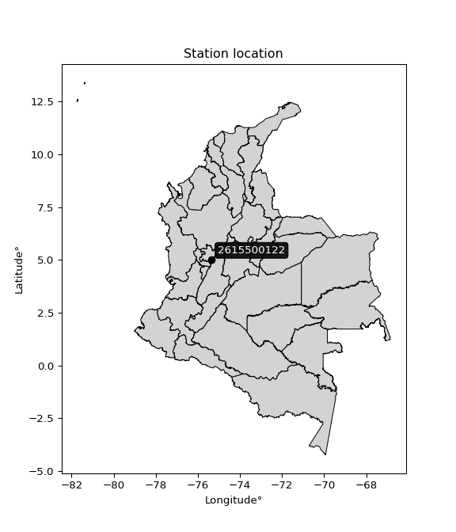

<div align="center">


</div>

# PMP Station (Rain, Pmax24h): 2615500122

Probable Maximum Precipitation (PMP) is the greatest amount of rainfall for a specific duration that is meteorologically possible for a given location, acting as a "worst-case" scenario for extreme storms, crucial for designing safety-critical infrastructure like bridges, river deviations, dams, spillways, and nuclear plants to prevent catastrophic failure. PMP is calculated by hydrologists using meteorological data to determine the upper limit of extreme rainfall, often leading to the Probable Maximum Flood (PMF) for flood control design, and is increasingly being studied for climate change impacts. Probable Maximum Precipitation (PMP) is the theoretical upper limit of rainfall, a deterministic estimate for extreme events, while probability distributions (like GEV, Gumbel) describe the likelihood and frequency of various precipitation amounts, including rare ones, showing how often events occur, with PMP representing the extreme end of these distributions, used for critical infrastructure design to ensure safety against the worst conceivable weather, unlike standard statistical forecasts which cover typical probabilities.

The most common probability distributions in hydrology, used for analyzing floods, rainfall, and streamflow, include the Normal, Log-Normal, Gumbel, Gamma (including Log-Pearson Type III), and Generalized Extreme Value (GEV) distributions, often chosen based on the data´s skewness and whether modeling extremes or general conditions, with Gumbel and GEV popular for extreme events like floods, while the Normal distribution serves as a baseline, though often requiring transformations for skewed hydrological data. These distributions help in designing water infrastructure, managing water resources, and forecasting hydrologic events.

> Hydrological data often isn´t perfectly normal (it´s skewed), so different distributions are needed for different applications, such as: **Flood Frequency Analysis**: Using Gumbel, GEV, or Log-Pearson Type III for predicting extreme flood magnitudes and their return periods, **Rainfall Analysis**: Normal for annual totals, but Log-Normal, Weibull, or GEV for intensity or extreme daily rainfall, **Streamflow Modeling**: Gamma and Log-Normal for maximum flows, GEV for minimum flows, and Kappa for daily flows.

<div align="center">

</img>

</div>


## A. General information


### 1. General running parameters

• app_version: _v20260113_. • runtime: _2026-01-13 16:28:34.738620_. • Python version: _3.14.0_. • SciPy version: _1.16.3_. • Pandas version: _2.3.3_. • NumPy version: _2.3.5_. • Stations dataset (station_dataset_file): _dataset/pmax24h_in/automatic_colombia_2003_2025.csv_. • Stations catalog (station_catalog_file): _dataset/CNE.xls_. • Minimum year to eval til year_max (date_min): _1900_. • Maximum year to eval since year_min (date_max): _2025_. • Creates, save and include plots into reports (create_plot): _False_. • Plot only fit distributions with Δo > Δ (plot_only_fit): _True_. • Plot only simple graphs avoiding multiple CDFs and multiple Extreme values plots (plot_only_simple): _True_. • Eval low extreme values, if False, evaluates high extreme values (low_extreme): _False_. • Eval every SciPy distribution as logarithmic (pdist_logarithmic_on): _True_. • Standard deviation normalized (ddof): _1.0_. • Return periods to eval in years (Tr): _[2, 2.33, 5, 10, 15, 20, 25, 50, 75, 100, 200, 250, 500, 750, 1000]_. • Minimum data sample per station, 0 means any (minimum_sample): _5_. • Z-Score maximum threshold to adjust a value, 0 means disable (zscore_max): _3.5_. • Z-Score minimum threshold to adjust a value, 0 means disable (zscore_min): _-2.5_. • Avoid zeros, e.g. rain = 0 (avoid_zeros): _True_. • Avoid null values (avoid_nans): _True_. 

:file_folder:Table: [dataset.csv](../../dataset/pmax24h_in/automatic_colombia_2003_2025.csv)

> Delta Degrees of Freedom (DDOF): is a parameter used in the formulas for calculating variance and standard deviation. When ddof=0, the divisor is $N$ (the total number of observations) and this is used when your data set is the entire population. When ddof=1, the divisor is $N-1$ and this is used when your data set is a sample drawn from a larger population. Using $N-1$ provides an unbiased estimate of the population variance (known as Bessel´s correction).


### 2. Station info and location

|   id |     CODIGO | NOMBRE                                      | CATEGORIA               | TECNOLOGIA                | ESTADO           | FECHA_INSTALACION   |   FECHA_SUSPENSION |   ALTITUD |   LATITUD |   LONGITUD | DEPARTAMENTO   | MUNICIPIO   | AREA_OPERATIVA                         | ENTIDAD                                                     | AREA_HIDROGRAFICA   | ZONA_HIDROGRAFICA   | SUBZONA_HIDROGRAFICA   |   CORRIENTE | Catalogo   |   Version |
|-----:|-----------:|:--------------------------------------------|:------------------------|:--------------------------|:-----------------|:--------------------|-------------------:|----------:|----------:|-----------:|:---------------|:------------|:---------------------------------------|:------------------------------------------------------------|:--------------------|:--------------------|:-----------------------|------------:|:-----------|----------:|
|    0 | 2615500122 | LA ESPERANZA ANDALUCIA - AUT   [2615500122] | Climatológica Principal | Automática con Telemetría | En Mantenimiento | 20/04/2017          |                nan |      3316 |   5.01778 |   -75.3566 | Caldas         | Manizales   | Area Operativa 09 - Cauca-Valle-Caldas | INSTITUTO DE HIDROLOGIA METEOROLOGIA Y ESTUDIOS AMBIENTALES | Magdalena Cauca     | Cauca               | Río Chinchiná          |         nan | CNE_IDEAM  |  20251226 |

<div align="center">

Dynamic map: [:earth_americas:Google](http://maps.google.com/maps?q=5.017777778,-75.356583333) [:earth_americas:OSM](https://www.openstreetmap.org/#map=18/5.017777778/-75.356583333&layers=P) [:earth_americas:Bing](https://www.bing.com/maps?cp=5.017777778~-75.356583333&lvl=18) [:earth_americas:Apple](https://maps.apple.com/frame?center=5.017777778%2C-75.356583333&span=0.003%2C0.006)

</div>


<div align="center">

```geojson
{
  "type": "Feature",
  "geometry": {
    "type": "Point", 
    "coordinates": [-75.356583333, 5.017777778]
  }, 
  "properties": {
    "Name": "2615500122"
  }
}
```

</div>


### 3. Discrete values table and plot

<div align="center">

|               |           0 |           1 |          2 |           3 |           4 |           5 |
|:--------------|------------:|------------:|-----------:|------------:|------------:|------------:|
| Date          | 2019        | 2020        | 2021       | 2022        | 2023        | 2025        |
| Value         |   27        |   25.8      |   61.9     |   34.9      |   47.4      |   20.7      |
| Value_initial |   27        |   25.8      |   61.9     |   34.9      |   47.4      |   20.7      |
| count         |    6        |    6        |    6       |    6        |    6        |    6        |
| mean          |   36.2833   |   36.2833   |   36.2833  |   36.2833   |   36.2833   |   36.2833   |
| std           |   15.6245   |   15.6245   |   15.6245  |   15.6245   |   15.6245   |   15.6245   |
| zscore        |   -0.594152 |   -0.670954 |    1.63952 |   -0.088536 |    0.711488 |   -0.997364 |


</div>


> The initial value (value_initial) correspond to the initial obtained or null completed value, and value (value) is adjusted only when the initial value is outside the valid range (outlier) definite through the Z-Score value. If Z-Score is active, values out of range or outliers are replaced with the station mean value. A Z-Score (or standard score) measures how many standard deviations a data point is from the mean of a dataset, indicating its relative position; positive scores mean above the mean, negative mean below, and a score of zero is exactly at the mean, allowing for comparison of values from different distributions. It´s calculated using the formula $z=(x–μ)/σ$, where $x$ is the data point, $μ$ is the mean, and $σ$ is the standard deviation, helping identify outliers and understand probability.
>
> <sub>**Note**: In this study, "completing" (filling gaps in) and "extending" (forecasting or lengthening the historical record) rainfall data series are avoided for certain critical analyses because they introduce artificial bias and uncertainty, which can distort the statistics of rare events (extremes), alter day-to-day variability, and compromise the integrity and homogeneity of the original data. Some reasons against Completing/Extending rainfall data are: **Distortion of Extremes and Variability**: The primary issue is that most gap-filling or extension methods rely on averaging or regression with nearby stations, which inherently smooths the data. Rainfall is highly variable in space and time, with a large percentage of zero values and occasional large storms. Infilling methods often underestimate the highest values and overestimate the lowest (zero) values, which severely distorts analyses focused on flood frequency, drought severity, and intensity-duration-frequency (IDF) curves, **Loss of Data Homogeneity**: Infilled or extended data are synthetic estimates, not actual measurements. Combining these estimates with observed data can violate the assumption of data homogeneity, which requires that the data properties do not change over time. Inhomogeneity can lead to incorrect conclusions about long-term trends or changes in climate patterns, **Propagation of Errors**: Errors and biases from the original data (e.g., wind-induced undercatch, instrument errors, site changes) or the data used for imputation can propagate through the analysis, leading to unreliable hydrological models and inaccurate predictions, **Compromised Statistical Integrity**: For statistical analyses, especially those involving the frequency of events, using artificial data can introduce time bias or autocorrelation that doesn´t exist in reality, making it difficult to assess the true probability of events, **Difficulty in Validation**: It is difficult to accurately validate the quality of filled or extended data, especially for past periods where ground-truth measurements are unavailable. The reliability of imputation techniques heavily depends on the density of the surrounding station network and the complexity of the local topography.</sub>


### 4. Active continuous probability distributions from SciPy (45 of 104 available)

A Probability Density Function (PDF) describes the relative likelihood of a continuous random variable falling within a specific range, where the total area under its curve equals 1, and the area over any interval gives the actual probability for that range. Unlike discrete probabilities (like rolling a die), a PDF shows density, not direct probability for a single point (which is zero), with higher points indicating higher likelihood, often visualized as a bell curve for normal distributions.

A log of a probability density function (log-PDF) is simply the logarithm of the PDF´s value, denoted as $log(f(x))$, useful for converting multiplication of probabilities into addition, improving numerical stability with tiny numbers, and connecting to information theory concepts like entropy. Instead of dealing with very small probabilities (e.g., 0.000001), log-PDFs use negative numbers (e.g., $log(0.00001) ≈ -11.51$ that are easier for computers to handle, preventing underflow errors and simplifying complex calculations. In this study, each active probability distribution from SciPy is also evaluated in the $log$ form.

[scipy.stats](https://docs.scipy.org/doc/scipy/reference/stats.html) is a Python´s powerful submodule within the SciPy library for comprehensive statistical analysis, offering over 130 probability distributions (like Normal, Poisson), functions for descriptive stats (mean, variance), hypothesis testing (t-tests, chi-square), random variable generation, and statistical tests, making it essential for data science, modeling, and research. It provides tools to explore, model, and draw conclusions from data efficiently, working seamlessly with NumPy.

<div align="center">

|   id | p_dist             |   n_parameter | fit_method   | label                                                                       | active   | ref                                                                                                        |
|-----:|:-------------------|--------------:|:-------------|:----------------------------------------------------------------------------|:---------|:-----------------------------------------------------------------------------------------------------------|
|    0 | alpha              |             3 | MLE          | Alpha                                                                       | True     | [:mortar_board:](https://docs.scipy.org/doc/scipy/reference/generated/scipy.stats.alpha.html)              |
|    1 | betaprime          |             4 | MLE          | Beta prime                                                                  | True     | [:mortar_board:](https://docs.scipy.org/doc/scipy/reference/generated/scipy.stats.betaprime.html)          |
|    2 | chi2               |             3 | MLE          | Chi²                                                                        | True     | [:mortar_board:](https://docs.scipy.org/doc/scipy/reference/generated/scipy.stats.chi2.html)               |
|    3 | crystalball        |             4 | MLE          | Crystalball                                                                 | True     | [:mortar_board:](https://docs.scipy.org/doc/scipy/reference/generated/scipy.stats.crystalball.html)        |
|    4 | dweibull           |             3 | MLE          | Double Weibull                                                              | True     | [:mortar_board:](https://docs.scipy.org/doc/scipy/reference/generated/scipy.stats.dweibull.html)           |
|    5 | erlang             |             3 | MLE          | Erlang                                                                      | True     | [:mortar_board:](https://docs.scipy.org/doc/scipy/reference/generated/scipy.stats.erlang.html)             |
|    6 | expon              |             2 | MLE          | Exponential                                                                 | True     | [:mortar_board:](https://docs.scipy.org/doc/scipy/reference/generated/scipy.stats.expon.html)              |
|    7 | exponnorm          |             3 | MLE          | Exponentially modified Normal                                               | True     | [:mortar_board:](https://docs.scipy.org/doc/scipy/reference/generated/scipy.stats.exponnorm.html)          |
|    8 | f                  |             4 | MLE          | F                                                                           | True     | [:mortar_board:](https://docs.scipy.org/doc/scipy/reference/generated/scipy.stats.f.html)                  |
|    9 | fatiguelife        |             3 | MLE          | Fatigue-life (Birnbaum-Saunders)                                            | True     | [:mortar_board:](https://docs.scipy.org/doc/scipy/reference/generated/scipy.stats.fatiguelife.html)        |
|   10 | fisk               |             3 | MLE          | Fisk                                                                        | True     | [:mortar_board:](https://docs.scipy.org/doc/scipy/reference/generated/scipy.stats.fisk.html)               |
|   11 | gamma              |             3 | MLE          | Gamma                                                                       | True     | [:mortar_board:](https://docs.scipy.org/doc/scipy/reference/generated/scipy.stats.gamma.html)              |
|   12 | genexpon           |             5 | MLE          | Generalized exponential                                                     | True     | [:mortar_board:](https://docs.scipy.org/doc/scipy/reference/generated/scipy.stats.genexpon.html)           |
|   13 | genlogistic        |             3 | MLE          | Generalized logistic                                                        | True     | [:mortar_board:](https://docs.scipy.org/doc/scipy/reference/generated/scipy.stats.genlogistic.html)        |
|   14 | gibrat             |             2 | MM           | Gibrat                                                                      | True     | [:mortar_board:](https://docs.scipy.org/doc/scipy/reference/generated/scipy.stats.gibrat.html)             |
|   15 | gompertz           |             3 | MLE          | Gompertz (or truncated Gumbel)                                              | True     | [:mortar_board:](https://docs.scipy.org/doc/scipy/reference/generated/scipy.stats.gompertz.html)           |
|   16 | gumbel_l           |             2 | MM           | Gumbel Left Skew                                                            | True     | [:mortar_board:](https://docs.scipy.org/doc/scipy/reference/generated/scipy.stats.gumbel_l.html)           |
|   17 | gumbel_r           |             2 | MM           | Gumbel Right Skew                                                           | True     | [:mortar_board:](https://docs.scipy.org/doc/scipy/reference/generated/scipy.stats.gumbel_r.html)           |
|   18 | halflogistic       |             2 | MM           | Half-logistic                                                               | True     | [:mortar_board:](https://docs.scipy.org/doc/scipy/reference/generated/scipy.stats.halflogistic.html)       |
|   19 | halfnorm           |             2 | MM           | Half Normal                                                                 | True     | [:mortar_board:](https://docs.scipy.org/doc/scipy/reference/generated/scipy.stats.halfnorm.html)           |
|   20 | hypsecant          |             2 | MM           | hyperbolic secant                                                           | True     | [:mortar_board:](https://docs.scipy.org/doc/scipy/reference/generated/scipy.stats.hypsecant.html)          |
|   21 | invgamma           |             3 | MLE          | Inverted gamma                                                              | True     | [:mortar_board:](https://docs.scipy.org/doc/scipy/reference/generated/scipy.stats.invgamma.html)           |
|   22 | invgauss           |             3 | MLE          | Inverse Gaussian                                                            | True     | [:mortar_board:](https://docs.scipy.org/doc/scipy/reference/generated/scipy.stats.invgauss.html)           |
|   23 | invweibull         |             3 | MLE          | Inverted Weibull                                                            | True     | [:mortar_board:](https://docs.scipy.org/doc/scipy/reference/generated/scipy.stats.invweibull.html)         |
|   24 | kappa4             |             4 | MLE          | Kappa 4                                                                     | True     | [:mortar_board:](https://docs.scipy.org/doc/scipy/reference/generated/scipy.stats.kappa4.html)             |
|   25 | kstwobign          |             2 | MLE          | Limiting distribution of scaled Kolmogorov-Smirnov two-sided test statistic | True     | [:mortar_board:](https://docs.scipy.org/doc/scipy/reference/generated/scipy.stats.kstwobign.html)          |
|   26 | laplace            |             2 | MM           | Laplace                                                                     | True     | [:mortar_board:](https://docs.scipy.org/doc/scipy/reference/generated/scipy.stats.laplace.html)            |
|   27 | laplace_asymmetric |             3 | MLE          | Asymmetric Laplace                                                          | True     | [:mortar_board:](https://docs.scipy.org/doc/scipy/reference/generated/scipy.stats.laplace_asymmetric.html) |
|   28 | loggamma           |             3 | MLE          | Log gamma                                                                   | True     | [:mortar_board:](https://docs.scipy.org/doc/scipy/reference/generated/scipy.stats.loggamma.html)           |
|   29 | logistic           |             2 | MM           | Logistic (or Sech-squared)                                                  | True     | [:mortar_board:](https://docs.scipy.org/doc/scipy/reference/generated/scipy.stats.logistic.html)           |
|   30 | lognorm            |             3 | MLE          | Log Normal                                                                  | True     | [:mortar_board:](https://docs.scipy.org/doc/scipy/reference/generated/scipy.stats.lognorm.html)            |
|   31 | maxwell            |             2 | MM           | Maxwell                                                                     | True     | [:mortar_board:](https://docs.scipy.org/doc/scipy/reference/generated/scipy.stats.maxwell.html)            |
|   32 | mielke             |             4 | MLE          | Mielke Beta-Kappa / Dagum                                                   | True     | [:mortar_board:](https://docs.scipy.org/doc/scipy/reference/generated/scipy.stats.mielke.html)             |
|   33 | moyal              |             2 | MM           | Moyal                                                                       | True     | [:mortar_board:](https://docs.scipy.org/doc/scipy/reference/generated/scipy.stats.moyal.html)              |
|   34 | nakagami           |             3 | MLE          | Nakagami                                                                    | True     | [:mortar_board:](https://docs.scipy.org/doc/scipy/reference/generated/scipy.stats.nakagami.html)           |
|   35 | ncf                |             5 | MLE          | Non-central F distribution                                                  | True     | [:mortar_board:](https://docs.scipy.org/doc/scipy/reference/generated/scipy.stats.ncf.html)                |
|   36 | nct                |             4 | MLE          | Non-central Student’s t                                                     | True     | [:mortar_board:](https://docs.scipy.org/doc/scipy/reference/generated/scipy.stats.nct.html)                |
|   37 | norm               |             2 | MM           | Normal                                                                      | True     | [:mortar_board:](https://docs.scipy.org/doc/scipy/reference/generated/scipy.stats.norm.html)               |
|   38 | pearson3           |             3 | MM           | Pearson type III                                                            | True     | [:mortar_board:](https://docs.scipy.org/doc/scipy/reference/generated/scipy.stats.pearson3.html)           |
|   39 | rayleigh           |             2 | MM           | Rayleigh                                                                    | True     | [:mortar_board:](https://docs.scipy.org/doc/scipy/reference/generated/scipy.stats.rayleigh.html)           |
|   40 | rice               |             3 | MLE          | Rice                                                                        | True     | [:mortar_board:](https://docs.scipy.org/doc/scipy/reference/generated/scipy.stats.rice.html)               |
|   41 | t                  |             3 | MLE          | Student’s t                                                                 | True     | [:mortar_board:](https://docs.scipy.org/doc/scipy/reference/generated/scipy.stats.t.html)                  |
|   42 | truncnorm          |             4 | MLE          | Truncated normal                                                            | True     | [:mortar_board:](https://docs.scipy.org/doc/scipy/reference/generated/scipy.stats.truncnorm.html)          |
|   43 | wald               |             2 | MM           | Wald                                                                        | True     | [:mortar_board:](https://docs.scipy.org/doc/scipy/reference/generated/scipy.stats.wald.html)               |
|   44 | weibull_min        |             3 | MLE          | Weibull minimum                                                             | True     | [:mortar_board:](https://docs.scipy.org/doc/scipy/reference/generated/scipy.stats.weibull_min.html)        |

</div>

> **n_parameter:** # arguments & localization & scale.
>
> **Fit methods:** (MLE) maximum likelihood, (MM) L-moments.
>
>**Inactive** (With the only purpose of prevent loops, zero divisions, infinite values, over high estimated values or horizontal trending for recurrence intervals estimations, the follow distributions were disabled.)**:** foldnorm, gennorm, norminvgauss, powernorm, powerlognorm, skewnorm, genextreme, anglit, arcsine, argus, beta, bradford, burr, burr12, cauchy, cosine, halfcauchy, foldcauchy, skewcauchy, wrapcauchy, dgamma, gengamma, exponweib, exponpow, truncexpon, gausshyper, genhalflogistic, genhyperbolic, geninvgauss, halfgennorm, johnsonsb, johnsonsu, kappa3, ksone, kstwo, loglaplace, levy, levy_l, levy_stable, ncx2, pareto, genpareto, truncpareto, lomax, powerlaw, rdist, rel_breitwigner, recipinvgauss, semicircular, studentized_range, trapezoid, triang, truncweibull_min, tukeylambda, uniform, loguniform, vonmises, vonmises_line, weibull_max, 


## B. Probability (PDF) vs. Empirical (EDF) distributions functions

A continuous probability distribution (CPD) describes probabilities for variables that can take any value within a range (like rain any time), unlike discrete variables with specific outcomes (like temperature). It uses a Probability Density Function (PDF), a curve where the total area under it equals 1, and the probability of the variable falling within an interval (a to b) is found by calculating the area under the curve between those points. A key feature is that the probability of hitting any single exact value is zero, so probabilities are always expressed for ranges, e.g., $P(a ≤ X ≤ b)$.

<div align="center">

Distributions parameters from station values
|    |    station | p_dist                |   n |            loc |         scale | shape                 | shape1             | shape2             | shape3   |
|---:|-----------:|:----------------------|----:|---------------:|--------------:|:----------------------|:-------------------|:-------------------|:---------|
|  0 | 2615500122 | alpha                 |   6 |     1.77457    |  80.1832      | 2.700302355276466     |                    |                    |          |
|  1 | 2615500122 | betaprime             |   6 |    -0.674999   |   1.65925     | 162.81417029485664    | 8.311019227413581  |                    |          |
|  2 | 2615500122 | chi2                  |   6 |    20.7        |   4.46024     | 1.0850362864942555    |                    |                    |          |
|  3 | 2615500122 | crystalball           |   6 |    36.2833     |  14.2632      | 3994.2542286321013    | 31.277642580239515 |                    |          |
|  4 | 2615500122 | dweibull              |   6 |    32.611      |  12.9906      | 1.3961556027208244    |                    |                    |          |
|  5 | 2615500122 | erlang                |   6 |    20.7        |  15.168       | 0.6075451114780861    |                    |                    |          |
|  6 | 2615500122 | expon                 |   6 |    20.7        |  15.5833      |                       |                    |                    |          |
|  7 | 2615500122 | exponnorm             |   6 |    20.6848     |   0.00439525  | 3529.4426629824866    |                    |                    |          |
|  8 | 2615500122 | f                     |   6 |    18.2784     |  12.0389      | 4.145931898762088     | 4.949683966886337  |                    |          |
|  9 | 2615500122 | fatiguelife           |   6 |    20.7        |   6.94557e-07 | 4544.298483190076     |                    |                    |          |
| 10 | 2615500122 | fisk                  |   6 |    20.7        |   9.89571     | 0.37166994552422083   |                    |                    |          |
| 11 | 2615500122 | gamma                 |   6 |    20.7        |  12.2883      | 0.18732593633919792   |                    |                    |          |
| 12 | 2615500122 | genexpon              |   6 |    20.6859     |  28.6389      | 1.7174307178824182    | 1.134774876294682  | 0.2214825630612871 |          |
| 13 | 2615500122 | genlogistic           |   6 |   -47.3127     |  10.3884      | 1665.8069195912958    |                    |                    |          |
| 14 | 2615500122 | gibrat                |   6 |    25.4023     |   6.59967     |                       |                    |                    |          |
| 15 | 2615500122 | gompertz              |   6 |    20.7        |  27.6664      | 0.9094620832111462    |                    |                    |          |
| 16 | 2615500122 | gumbel_l              |   6 |    42.7025     |  11.1209      |                       |                    |                    |          |
| 17 | 2615500122 | gumbel_r              |   6 |    29.8641     |  11.1209      |                       |                    |                    |          |
| 18 | 2615500122 | halflogistic          |   6 |    19.3782     |  12.1945      |                       |                    |                    |          |
| 19 | 2615500122 | halfnorm              |   6 |    17.4045     |  23.6611      |                       |                    |                    |          |
| 20 | 2615500122 | hypsecant             |   6 |    36.2833     |   9.08022     |                       |                    |                    |          |
| 21 | 2615500122 | invgamma              |   6 |    13.5529     |  41.2539      | 2.702168987341598     |                    |                    |          |
| 22 | 2615500122 | invgauss              |   6 |    16.9718     |  21.3204      | 0.9057772786905482    |                    |                    |          |
| 23 | 2615500122 | invweibull            |   6 |    20.7        |   1.64402     | 0.046403168289841146  |                    |                    |          |
| 24 | 2615500122 | kappa4                |   6 |    15.6717     |  46.8037      | 1.120451526395501     | 1.0116224425173481 |                    |          |
| 25 | 2615500122 | kstwobign             |   6 |    -6.68249    |  49.3422      |                       |                    |                    |          |
| 26 | 2615500122 | laplace               |   6 |    36.2833     |  10.0856      |                       |                    |                    |          |
| 27 | 2615500122 | laplace_asymmetric    |   6 |    25.8        |   7.55488     | 0.5232992977581725    |                    |                    |          |
| 28 | 2615500122 | loggamma              |   6 | -4138.52       | 568.407       | 1548.4108112135345    |                    |                    |          |
| 29 | 2615500122 | logistic              |   6 |    36.2833     |   7.8637      |                       |                    |                    |          |
| 30 | 2615500122 | lognorm               |   6 |    20.7        |   0.0348226   | 13.397915946662266    |                    |                    |          |
| 31 | 2615500122 | maxwell               |   6 |     2.48561    |  21.1796      |                       |                    |                    |          |
| 32 | 2615500122 | mielke                |   6 |    -0.821119   |   7.45794     | 333.9750744716233     | 3.3737551986161565 |                    |          |
| 33 | 2615500122 | moyal                 |   6 |    28.1267     |   6.42068     |                       |                    |                    |          |
| 34 | 2615500122 | nakagami              |   6 |    20.7        |  32.7314      | 0.0653386965657051    |                    |                    |          |
| 35 | 2615500122 | ncf                   |   6 |    13.561      |   4.91894     | 2744.7358333537777    | 5.404344861594309  | 5771.265073907201  |          |
| 36 | 2615500122 | nct                   |   6 |    -0.323481   |   0.718752    | 4.462326325321289     | 42.05073896396786  |                    |          |
| 37 | 2615500122 | norm                  |   6 |    36.2833     |  14.2632      |                       |                    |                    |          |
| 38 | 2615500122 | pearson3              |   6 |    36.2833     |  14.2631      | 0.7148484099218879    |                    |                    |          |
| 39 | 2615500122 | rayleigh              |   6 |     8.99705    |  21.7713      |                       |                    |                    |          |
| 40 | 2615500122 | rice                  |   6 |    13.0062     |  19.3036      | 0.0003649553040861687 |                    |                    |          |
| 41 | 2615500122 | t                     |   6 |    36.2833     |  14.2632      | 354363927.0219447     |                    |                    |          |
| 42 | 2615500122 | truncnorm             |   6 |    36.2833     |  14.2632      | -23.35513697318455    | 495.7914812026969  |                    |          |
| 43 | 2615500122 | wald                  |   6 |    22.0202     |  14.2632      |                       |                    |                    |          |
| 44 | 2615500122 | weibull_min           |   6 |    20.7        |  12.0303      | 0.40142247741943327   |                    |                    |          |
| 45 | 2615500122 | logalpha              |   6 |     1.35295    |  12.5283      | 5.955912678700242     |                    |                    |          |
| 46 | 2615500122 | logbetaprime          |   6 |    -2.93242    |  29.4605      | 337.06810125378786    | 1540.1960476729762 |                    |          |
| 47 | 2615500122 | logchi2               |   6 |     3.03013    |   0.982138    | 1.0156692077485658    |                    |                    |          |
| 48 | 2615500122 | logcrystalball        |   6 |     3.51883    |   0.37534     | 7.513231225821114     | 89.64622359036225  |                    |          |
| 49 | 2615500122 | logdweibull           |   6 |     3.46918    |   0.368341    | 1.783208162966086     |                    |                    |          |
| 50 | 2615500122 | logerlang             |   6 |     3.03013    |   0.831817    | 0.28245721789538814   |                    |                    |          |
| 51 | 2615500122 | logexpon              |   6 |     3.03013    |   0.488695    |                       |                    |                    |          |
| 52 | 2615500122 | logexponnorm          |   6 |     3.07214    |   0.11184     | 3.9940213647985487    |                    |                    |          |
| 53 | 2615500122 | logf                  |   6 |     2.37995    |   1.03256     | 149.93891781846423    | 20.912078791005122 |                    |          |
| 54 | 2615500122 | logfatiguelife        |   6 |     2.76576    |   0.650778    | 0.5592461354247481    |                    |                    |          |
| 55 | 2615500122 | logfisk               |   6 |     2.82516    |   0.601697    | 2.734643383455377     |                    |                    |          |
| 56 | 2615500122 | loggamma              |   6 |     3.03013    |   0.610022    | 0.2513003168219745    |                    |                    |          |
| 57 | 2615500122 | loggenexpon           |   6 |     3.03013    |   0.794915    | 1.2311438630890963    | 1.056617428988519  | 1.0075871400969465 |          |
| 58 | 2615500122 | loggenlogistic        |   6 |     1.30894    |   0.305752    | 766.2615909609963     |                    |                    |          |
| 59 | 2615500122 | loggibrat             |   6 |     3.2325     |   0.173664    |                       |                    |                    |          |
| 60 | 2615500122 | loggompertz           |   6 |     3.03013    |   0.895513    | 1.1245661857290892    |                    |                    |          |
| 61 | 2615500122 | loggumbel_l           |   6 |     3.68775    |   0.292652    |                       |                    |                    |          |
| 62 | 2615500122 | loggumbel_r           |   6 |     3.34991    |   0.292652    |                       |                    |                    |          |
| 63 | 2615500122 | loghalflogistic       |   6 |     3.07398    |   0.320893    |                       |                    |                    |          |
| 64 | 2615500122 | loghalfnorm           |   6 |     3.02203    |   0.622651    |                       |                    |                    |          |
| 65 | 2615500122 | loghypsecant          |   6 |     3.51883    |   0.238949    |                       |                    |                    |          |
| 66 | 2615500122 | loginvgamma           |   6 |     0.409263   | 217.014       | 70.79496405304792     |                    |                    |          |
| 67 | 2615500122 | loginvgauss           |   6 |     2.70046    |   3.09514     | 0.2644056308851296    |                    |                    |          |
| 68 | 2615500122 | loginvweibull         |   6 |    -4.1813e+06 |   4.1813e+06  | 13674450.465044275    |                    |                    |          |
| 69 | 2615500122 | logkappa4             |   6 |     2.95361    |   1.21713     | 1.0671777198700627    | 1.038564586209909  |                    |          |
| 70 | 2615500122 | logkstwobign          |   6 |     2.27698    |   1.42106     |                       |                    |                    |          |
| 71 | 2615500122 | loglaplace            |   6 |     3.51883    |   0.265406    |                       |                    |                    |          |
| 72 | 2615500122 | loglaplace_asymmetric |   6 |     3.25037    |   0.242028    | 0.5889446927760362    |                    |                    |          |
| 73 | 2615500122 | logloggamma           |   6 |  -104.039      |  14.7089      | 1499.2169851175431    |                    |                    |          |
| 74 | 2615500122 | loglogistic           |   6 |     3.51883    |   0.206936    |                       |                    |                    |          |
| 75 | 2615500122 | loglognorm            |   6 |     3.03013    |   0.00151972  | 12.919681920508179    |                    |                    |          |
| 76 | 2615500122 | logmaxwell            |   6 |     2.62943    |   0.557348    |                       |                    |                    |          |
| 77 | 2615500122 | logmielke             |   6 |   -99.5277     | 101.452       | 36580.9118537764      | 337.9002435586501  |                    |          |
| 78 | 2615500122 | logmoyal              |   6 |     3.30419    |   0.168963    |                       |                    |                    |          |
| 79 | 2615500122 | lognakagami           |   6 |     3.03013    |   0.727145    | 0.39930901775826333   |                    |                    |          |
| 80 | 2615500122 | logncf                |   6 |    -3.49052    |   6.98827     | 517.9163919323757     | 758.9768586012765  | 0.9382689732439404 |          |
| 81 | 2615500122 | lognct                |   6 |    -0.149779   |   0.0570869   | 51.35485098310731     | 63.306483931193725 |                    |          |
| 82 | 2615500122 | lognorm               |   6 |     3.51883    |   0.37534     |                       |                    |                    |          |
| 83 | 2615500122 | logpearson3           |   6 |     3.51883    |   0.37534     | 0.36385047370852963   |                    |                    |          |
| 84 | 2615500122 | lograyleigh           |   6 |     2.80078    |   0.57292     |                       |                    |                    |          |
| 85 | 2615500122 | logrice               |   6 |     2.85344    |   0.513557    | 0.4613733171211737    |                    |                    |          |
| 86 | 2615500122 | logt                  |   6 |     3.51883    |   0.37534     | 6163088402.727602     |                    |                    |          |
| 87 | 2615500122 | logtruncnorm          |   6 |    -0.111351   |   1.02531     | 3.5734013779320826    | 4.132349476516983  |                    |          |
| 88 | 2615500122 | logwald               |   6 |     3.14346    |   0.375363    |                       |                    |                    |          |
| 89 | 2615500122 | logweibull_min        |   6 |     3.03013    |   0.60348     | 0.17091089631775724   |                    |                    |          |

</div>

> **loc** (Location parameter): This shifts the distribution along the x-axis. For many common distributions, like the normal (Gaussian) distribution, loc represents the mean $μ$. For others, like the uniform distribution, it might represent the minimum value, or for the beta distribution, the left end of the support interval.
>
> **scale** (Scale parameter): This determines the width or spread of the distribution. For the normal distribution, scale represents the standard deviation $σ$. For a uniform distribution, it defines the length of the interval (from $loc$ to $loc + scale$).
>
> **shape** (Shape parameters): Refers to parameters that define the specific form of a probability distribution, distinct from its location (loc) and scale (scale). These parameters are required arguments for most distribution functions. For example, a normal (Gaussian) distribution is fully defined by its location (mean) and scale (standard deviation), so it has no specific shape parameters beyond loc and scale. However, other distributions have intrinsic properties that need specification, as Gamma distribution that takes a shape parameter, often named $a$ or $alpha$.


### 0. Cumulative distribution values - CDF (90 evaluated)

Cumulative Distribution Function (CDF), denoted as $F$<sub>$X$</sub>$(x)$, is a function that gives the probability that a random variable $X$ will take a value less than or equal to a specific value, $x$ (i.e., $(P(X≥x)$. It essentially "accumulates" probabilities from a given point up to the far right (positive infinity), providing a complete picture of the distribution´s probabilities for both discrete (like rain) and continuous (like temperature) variables, helping to find probabilities over ranges or above certain values. Each station is evaluated separately ordering the $x$ values ascending, calculating the CDF and PDF values for the activated distributions and their logarithmic forms.

<div align="center">

CDF ordered by x ascending and calculating $log(f(x))$ separately
|   id |    Station |   date |    x |   count |    mean |     std |    zscore |   Value_initial |    station |   m |     alpha |   alpha_pdf |   betaprime |   betaprime_pdf |        chi2 |         chi2_pdf |   crystalball |   crystalball_pdf |   dweibull |   dweibull_pdf |      erlang |     erlang_pdf |    expon |   expon_pdf |   exponnorm |   exponnorm_pdf |         f |      f_pdf |   fatiguelife |   fatiguelife_pdf |        fisk |    fisk_pdf |      gamma |   gamma_pdf |    genexpon |   genexpon_pdf |   genlogistic |   genlogistic_pdf |     gibrat |   gibrat_pdf |    gompertz |   gompertz_pdf |   gumbel_l |   gumbel_l_pdf |   gumbel_r |   gumbel_r_pdf |   halflogistic |   halflogistic_pdf |   halfnorm |   halfnorm_pdf |   hypsecant |   hypsecant_pdf |   invgamma |   invgamma_pdf |   invgauss |   invgauss_pdf |   invweibull |   invweibull_pdf |      kappa4 |   kappa4_pdf |   kstwobign |   kstwobign_pdf |   laplace |   laplace_pdf |   laplace_asymmetric |   laplace_asymmetric_pdf |    loggamma |   loggamma_pdf |   logistic |   logistic_pdf |   lognorm |   lognorm_pdf |   maxwell |   maxwell_pdf |      mielke |   mielke_pdf |     moyal |   moyal_pdf |   nakagami |   nakagami_pdf |       ncf |    ncf_pdf |       nct |   nct_pdf |     norm |   norm_pdf |   pearson3 |   pearson3_pdf |   rayleigh |   rayleigh_pdf |      rice |   rice_pdf |        t |      t_pdf |   truncnorm |   truncnorm_pdf |     wald |   wald_pdf |   weibull_min |   weibull_min_pdf |   logalpha |   logalpha_pdf |   logbetaprime |   logbetaprime_pdf |     logchi2 |   logchi2_pdf |   logcrystalball |   logcrystalball_pdf |   logdweibull |   logdweibull_pdf |   logerlang |   logerlang_pdf |   logexpon |   logexpon_pdf |   logexponnorm |   logexponnorm_pdf |      logf |   logf_pdf |   logfatiguelife |   logfatiguelife_pdf |   logfisk |   logfisk_pdf |   loggenexpon |   loggenexpon_pdf |   loggenlogistic |   loggenlogistic_pdf |   loggibrat |   loggibrat_pdf |   loggompertz |   loggompertz_pdf |   loggumbel_l |   loggumbel_l_pdf |   loggumbel_r |   loggumbel_r_pdf |   loghalflogistic |   loghalflogistic_pdf |   loghalfnorm |   loghalfnorm_pdf |   loghypsecant |   loghypsecant_pdf |   loginvgamma |   loginvgamma_pdf |   loginvgauss |   loginvgauss_pdf |   loginvweibull |   loginvweibull_pdf |   logkappa4 |   logkappa4_pdf |   logkstwobign |   logkstwobign_pdf |   loglaplace |   loglaplace_pdf |   loglaplace_asymmetric |   loglaplace_asymmetric_pdf |   logloggamma |   logloggamma_pdf |   loglogistic |   loglogistic_pdf |   loglognorm |   loglognorm_pdf |   logmaxwell |   logmaxwell_pdf |   logmielke |   logmielke_pdf |   logmoyal |   logmoyal_pdf |   lognakagami |   lognakagami_pdf |   logncf |   logncf_pdf |   lognct |   lognct_pdf |   logpearson3 |   logpearson3_pdf |   lograyleigh |   lograyleigh_pdf |   logrice |   logrice_pdf |      logt |   logt_pdf |   logtruncnorm |   logtruncnorm_pdf |   logwald |   logwald_pdf |   logweibull_min |   logweibull_min_pdf |
|-----:|-----------:|-------:|-----:|--------:|--------:|--------:|----------:|----------------:|-----------:|----:|----------:|------------:|------------:|----------------:|------------:|-----------------:|--------------:|------------------:|-----------:|---------------:|------------:|---------------:|---------:|------------:|------------:|----------------:|----------:|-----------:|--------------:|------------------:|------------:|------------:|-----------:|------------:|------------:|---------------:|--------------:|------------------:|-----------:|-------------:|------------:|---------------:|-----------:|---------------:|-----------:|---------------:|---------------:|-------------------:|-----------:|---------------:|------------:|----------------:|-----------:|---------------:|-----------:|---------------:|-------------:|-----------------:|------------:|-------------:|------------:|----------------:|----------:|--------------:|---------------------:|-------------------------:|------------:|---------------:|-----------:|---------------:|----------:|--------------:|----------:|--------------:|------------:|-------------:|----------:|------------:|-----------:|---------------:|----------:|-----------:|----------:|----------:|---------:|-----------:|-----------:|---------------:|-----------:|---------------:|----------:|-----------:|---------:|-----------:|------------:|----------------:|---------:|-----------:|--------------:|------------------:|-----------:|---------------:|---------------:|-------------------:|------------:|--------------:|-----------------:|---------------------:|--------------:|------------------:|------------:|----------------:|-----------:|---------------:|---------------:|-------------------:|----------:|-----------:|-----------------:|---------------------:|----------:|--------------:|--------------:|------------------:|-----------------:|---------------------:|------------:|----------------:|--------------:|------------------:|--------------:|------------------:|--------------:|------------------:|------------------:|----------------------:|--------------:|------------------:|---------------:|-------------------:|--------------:|------------------:|--------------:|------------------:|----------------:|--------------------:|------------:|----------------:|---------------:|-------------------:|-------------:|-----------------:|------------------------:|----------------------------:|--------------:|------------------:|--------------:|------------------:|-------------:|-----------------:|-------------:|-----------------:|------------:|----------------:|-----------:|---------------:|--------------:|------------------:|---------:|-------------:|---------:|-------------:|--------------:|------------------:|--------------:|------------------:|----------:|--------------:|----------:|-----------:|---------------:|-------------------:|----------:|--------------:|-----------------:|---------------------:|
|    0 | 2615500122 |   2025 | 20.7 |       6 | 36.2833 | 15.6245 | -0.997364 |            20.7 | 2615500122 |   1 | 0.0624249 |  0.0275274  |   0.0870881 |      0.0235812  | 4.97431e-09 | 759603           |      0.137294 |        0.0153989  |   0.206169 |     0.0214092  | 3.56715e-10 | 61001.4        | 0        |  0.0641711  | 0.000977214 |      0.064382   | 0.0690277 | 0.0467193  |     0.0844091 |       5.99548e+12 | 2.22151e-05 | 2.76338e+06 | 0.00133229 | 7.02482e+10 | 0.000844693 |      0.0599222 |     0.0918349 |        0.021093   | 0          |   0          | 8.62058e-12 |     0.0328724  |   0.129145 |     0.0108284  |   0.102315 |     0.0209737  |      0.0541451 |         0.0408819  |   0.110771 |      0.0333958 |    0.113224 |      0.012208   |  0.0528618 |     0.0321176  |  0.0465205 |     0.0397608  |   0.00829569 |      5.19229e+11 | 5.76197e-15 |    1.11034   |   0.0822421 |      0.0210596  |  0.106644 |    0.0105739  |            0.0591754 |               0.014968   | 0.000173242 |     9.8034e+10 |   0.12114  |     0.0135388  | 0.0964573 |      0.455379 |  0.136147 |    0.0192493  |   0.0649453 |    0.0274564 | 0.0745725 |  0.0225998  | 0.00710066 |     2.6118e+11 | 0.0528619 | 0.0321176  | 0.0753087 | 0.0256004 | 0.137294 | 0.0153989  |   0.123852 |     0.0200191  |   0.134523 |      0.0213689 | 0.0763547 |  0.0190706 | 0.137295 | 0.015399   |    0.137294 |      0.0153989  | 0        | 0          |   5.83476e-07 |       6.59271e+07 |  0.0650212 |       0.564858 |       0.100976 |           0.484629 | 1.27901e-08 |    1.4626e+07 |        0.0964573 |             0.455379 |      0.127348 |          0.70741  | 5.39225e-05 |     3.42967e+10 |   0        |       2.04626  |      0.0524545 |           0.674207 | 0.0592894 |   0.61269  |        0.0478771 |             0.743324 | 0.0499776 |      0.63346  |   2.39744e-08 |          1.54877  |        0.0641491 |             0.575214 |   0         |        0        |   1.90871e-10 |          1.25578  |      0.10031  |          0.324966 |     0.0506797 |          0.516445 |          0        |              0        |      0.01039  |          1.28132  |       0.081896 |           0.338965 |     0.0818637 |          0.511826 |     0.0502296 |          0.695247 |       0.0639077 |            0.574823 | 1.12133e-15 |        8.31913  |      0.0585267 |           0.604905 |    0.0793045 |         0.298805 |               0.0549283 |                    0.385351 |     0.0998605 |          0.456387 |      0.08615  |          0.380447 |    0.0127448 |       5.7353e+12 |    0.0848335 |         0.571435 |    0.064574 |        0.575619 |  0.0244414 |       0.422572 |   5.52628e-13 |        993.806    | 0.190996 |     0.515307 | 0.081157 |     0.512861 |      0.086932 |          0.505448 |      0.077003 |          0.644937 | 0.0518288 |      0.571274 | 0.0964569 |   0.455379 |    0           |           0        |  0        |      0        |       0.00258827 |          9.94825e+11 |
|    1 | 2615500122 |   2020 | 25.8 |       6 | 36.2833 | 15.6245 | -0.670954 |            25.8 | 2615500122 |   2 | 0.262932  |  0.0453953  |   0.24194   |      0.0351383  | 0.689457    |      0.0499155   |      0.231172 |        0.0213495  |   0.333167 |     0.0277253  | 0.510363    |     0.0490763  | 0.279113 |  0.0462601  | 0.280889    |      0.0463561  | 0.330151  | 0.0471907  |     0.724512  |       0.0195237   | 0.438718    | 0.0179454   | 0.866168   | 0.0223193   | 0.267022    |      0.0450819 |     0.231807  |        0.0326055  | 0.00248411 |   0.0194024  | 0.168144    |     0.0328804  |   0.196468 |     0.0158047  |   0.236653 |     0.0306678  |      0.257388  |         0.0382858  |   0.277278 |      0.031664  |    0.194392 |      0.0201021  |  0.282089  |     0.0483816  |  0.306552  |     0.0491992  |   0.387196   |      0.00334267  | 0.153344    |    0.0268559 |   0.220971  |      0.0319287  |  0.176827 |    0.0175326  |            0.214973  |               0.054376   | 0.798105    |     0.679389   |   0.208642 |     0.0209966  | 0.237234  |      0.823005 |  0.249813 |    0.0249062  |   0.26089   |    0.0441254 | 0.230666  |  0.0363106  | 0.679102   |     0.0173748  | 0.282089  | 0.0483816  | 0.249803  | 0.0394952 | 0.231172 | 0.0213495  |   0.245351 |     0.0270049  |   0.257574 |      0.026319  | 0.197183  |  0.0275636 | 0.231173 | 0.0213496  |    0.231172 |      0.0213495  | 0.128394 | 0.073987   |   0.507656    |       0.0274592   |  0.258853  |       1.12617  |       0.24804  |           0.843375 | 0.357736    |    0.765334   |        0.237234  |             0.823005 |      0.336824 |          1.08442  | 0.721747    |     0.751046    |   0.3628   |       1.30388  |      0.314176  |           1.41109  | 0.271074  |   1.19757  |        0.298371  |             1.29368  | 0.279009  |      1.29373  |   0.315054    |          1.2826   |        0.262453  |             1.14725  |   0.0114841 |        1.68237  |   0.269154    |          1.17368  |      0.200967 |          0.612556 |     0.245345  |          1.17796  |          0.268136 |              1.44612  |      0.286185 |          1.19809  |       0.200131 |           0.783445 |     0.246082  |          0.956915 |     0.288487  |          1.27142  |       0.262276  |            1.14797  | 0.215482    |        0.920773 |      0.263918  |           1.15472  |    0.181839  |         0.685135 |               0.25753   |                    1.80671  |     0.239598  |          0.812544 |      0.214623 |          0.81455  |    0.649942  |       0.130181   |    0.256867  |         0.955292 |    0.262928 |        1.14766  |  0.240949  |       1.39217  |   0.297818    |          1.05196  | 0.321411 |     0.657505 | 0.246301 |     0.963524 |      0.245893 |          0.920573 |      0.265018 |          1.00672  | 0.235669  |      1.03584  | 0.237233  |   0.823006 |    0           |           0        |  0.149458 |      2.84871  |       0.569043   |          0.281506    |
|    2 | 2615500122 |   2019 | 27   |       6 | 36.2833 | 15.6245 | -0.594152 |            27   | 2615500122 |   3 | 0.317295  |  0.0449918  |   0.284716  |      0.0360431  | 0.742845    |      0.0396123   |      0.257568 |        0.0226311  |   0.366825 |     0.0282702  | 0.564651    |     0.0417347  | 0.332542 |  0.0428316  | 0.334419    |      0.0429054  | 0.384518  | 0.0433955  |     0.746255  |       0.0168465   | 0.458141    | 0.0146454   | 0.889576   | 0.0170487   | 0.319316    |      0.042105  |     0.271869  |        0.034072   | 0.0780286  |   0.0913085  | 0.207507    |     0.0327131  |   0.216247 |     0.0171721  |   0.27424  |     0.0319036  |      0.30272   |         0.0372447  |   0.314919 |      0.0310593 |    0.219842 |      0.0223317  |  0.33896   |     0.0462313  |  0.363323  |     0.045372   |   0.390798   |      0.00270449  | 0.185201    |    0.0262624 |   0.260079  |      0.0331639  |  0.199169 |    0.0197479  |            0.277586  |               0.050039   | 0.825835    |     0.547941   |   0.234957 |     0.0228585  | 0.27622   |      0.890922 |  0.280272 |    0.0258296  |   0.313793  |    0.0438464 | 0.274962  |  0.0373795  | 0.69808    |     0.014447   | 0.33896   | 0.0462313  | 0.297552  | 0.0399332 | 0.257568 | 0.0226311  |   0.278403 |     0.0280383  |   0.289575 |      0.0269832 | 0.231074  |  0.0288762 | 0.25757  | 0.0226312  |    0.257568 |      0.0226311  | 0.218149 | 0.0739138  |   0.537591    |       0.0227255   |  0.311224  |       1.1729   |       0.287789 |           0.903793 | 0.390548    |    0.681849   |        0.27622   |             0.890922 |      0.385226 |          1.03344  | 0.752789    |     0.621515    |   0.419403 |       1.18805  |      0.376973  |           1.34385  | 0.326216  |   1.2228   |        0.356629  |             1.26453  | 0.338138  |      1.3003   |   0.371763    |          1.21178  |        0.315688  |             1.18957  |   0.156556  |        3.78731  |   0.32189     |          1.1457   |      0.230534 |          0.689028 |     0.300315  |          1.23442  |          0.33255  |              1.38584  |      0.339883 |          1.16333  |       0.238544 |           0.907451 |     0.291067  |          1.01942  |     0.346139  |          1.25963  |       0.315544  |            1.19031  | 0.257128    |        0.911712 |      0.317162  |           1.18292  |    0.215814  |         0.813146 |               0.335287  |                    1.6175   |     0.278065  |          0.878591 |      0.253962 |          0.915575 |    0.655307  |       0.107293   |    0.301397  |         1.00138  |    0.316183 |        1.19005  |  0.305357  |       1.43121  |   0.344348    |          0.996185 | 0.351756 |     0.676744 | 0.291593 |     1.02625  |      0.289202 |          0.982438 |      0.311561 |          1.03832  | 0.283879  |      1.08207  | 0.27622   |   0.890924 |    0           |           0        |  0.27656  |      2.66067  |       0.580705   |          0.234424    |
|    3 | 2615500122 |   2022 | 34.9 |       6 | 36.2833 | 15.6245 | -0.088536 |            34.9 | 2615500122 |   4 | 0.612271  |  0.0281312  |   0.556439  |      0.0302556  | 0.916539    |      0.0112655   |      0.461369 |        0.0278389  |   0.542385 |     0.0247238  | 0.782972    |     0.0180213  | 0.597971 |  0.0257987  | 0.600025    |      0.0257836  | 0.638169  | 0.0227433  |     0.840132  |       0.00851988  | 0.533506    | 0.0065141   | 0.961579   | 0.00463081  | 0.58615     |      0.0265251 |     0.543922  |        0.0318779  | 0.642082   |   0.0393112  | 0.456649    |     0.0298413  |   0.39091  |     0.0271542  |   0.529496 |     0.0302734  |      0.562462  |         0.0280305  |   0.540348 |      0.0256555 |    0.451693 |      0.0346524  |  0.622724  |     0.0259981  |  0.63024   |     0.0241923  |   0.404626   |      0.00119636  | 0.382969    |    0.0241328 |   0.523582  |      0.031154   |  0.435916 |    0.0432216  |            0.582037  |               0.0289508  | 0.914944    |     0.216882   |   0.456135 |     0.031547   | 0.535726  |      1.05862  |  0.495533 |    0.0273553  |   0.606289  |    0.0285816 | 0.555121  |  0.0308065  | 0.775828   |     0.0070577  | 0.622725  | 0.0259982  | 0.58119   | 0.029605  | 0.461369 | 0.0278389  |   0.508655 |     0.0285303  |   0.507264 |      0.0269274 | 0.474381  |  0.0308825 | 0.46137  | 0.0278388  |    0.461369 |      0.0278389  | 0.626421 | 0.0324258  |   0.656589    |       0.0103761   |  0.602578  |       0.998751 |       0.543592 |           1.01801  | 0.528008    |    0.429003   |        0.535726  |             1.05862  |      0.534085 |          0.704126 | 0.859935    |     0.281065    |   0.656605 |       0.702678 |      0.647959  |           0.788089 | 0.615574  |   0.951499 |        0.632969  |             0.859754 | 0.626805  |      0.879512 |   0.630473    |          0.810162 |        0.60758   |             0.989827 |   0.729448  |        1.03438  |   0.589587    |          0.923545 |      0.467351 |          1.14645  |     0.606251  |          1.03674  |          0.632512 |              0.93478  |      0.605753 |          0.891434 |       0.544689 |           1.31902  |     0.567643  |          1.04337  |     0.627747  |          0.88968  |       0.60757   |            0.99009  | 0.487095    |        0.885496 |      0.603906  |           0.976666 |    0.559552  |         1.65953  |               0.644036  |                    0.866195 |     0.534059  |          1.04702  |      0.540573 |          1.20015  |    0.674369  |       0.0533738  |    0.567007  |         0.996351 |    0.608099 |        0.989263 |  0.631505  |       1.00939  |   0.566544    |          0.746251 | 0.531645 |     0.700527 | 0.569396 |     1.04471  |      0.559538 |          1.0388   |      0.577157 |          0.968368 | 0.566084  |      1.03891  | 0.535727  |   1.05862  |    1.68043e-05 |           4.14912  |  0.701596 |      0.93092  |       0.623044   |          0.120332    |
|    4 | 2615500122 |   2023 | 47.4 |       6 | 36.2833 | 15.6245 |  0.711488 |            47.4 | 2615500122 |   5 | 0.830004  |  0.00988639 |   0.82307   |      0.0134679  | 0.98348     |      0.00207843  |      0.782127 |        0.0206436  |   0.849169 |     0.0170649  | 0.919396    |     0.00616966 | 0.819743 |  0.0115673  | 0.821317    |      0.0115185  | 0.819751  | 0.00889113 |     0.913776  |       0.00401863  | 0.591195    | 0.00336429  | 0.990439   | 0.00100237  | 0.818081    |      0.0122549 |     0.832903  |        0.0146584  | 0.885689   |   0.00878609 | 0.771872    |     0.019685   |   0.782513 |     0.0298357  |   0.813321 |     0.0151116  |      0.817407  |         0.0136064  |   0.795099 |      0.0150983 |    0.81798  |      0.0189711  |  0.826632  |     0.00963358 |  0.826449  |     0.0097718  |   0.415336   |      0.00063425  | 0.674465    |    0.0227038 |   0.819195  |      0.0160297  |  0.833936 |    0.0164655  |            0.824162  |               0.0121797  | 0.959136    |     0.0929595  |   0.804344 |     0.0200128  | 0.817345  |      0.705538 |  0.787454 |    0.0178821  |   0.833496  |    0.0106109 | 0.823586  |  0.0135119  | 0.840969   |     0.00395124 | 0.826632  | 0.00963358 | 0.827918  | 0.0119279 | 0.782127 | 0.0206436  |   0.797823 |     0.0167396  |   0.788962 |      0.0170985 | 0.795517  |  0.0188738 | 0.782128 | 0.0206436  |    0.782127 |      0.0206436  | 0.857909 | 0.00993468 |   0.747708    |       0.00522373  |  0.830446  |       0.504108 |       0.810884 |           0.669835 | 0.636176    |    0.292539   |        0.817345  |             0.705538 |      0.834303 |          0.837948 | 0.921061    |     0.139711    |   0.816457 |       0.375577 |      0.8226    |           0.397143 | 0.829361  |   0.472183 |        0.825709  |             0.434892 | 0.814452  |      0.39988  |   0.817798    |          0.439639 |        0.832675  |             0.498621 |   0.900152  |        0.279985 |   0.819474    |          0.571797 |      0.833533 |          1.01987  |     0.83877   |          0.503916 |          0.840418 |              0.457624 |      0.820924 |          0.519619 |       0.849311 |           0.607339 |     0.824795  |          0.60498  |     0.827226  |          0.447251 |       0.83269   |            0.498603 | 0.757226    |        0.884374 |      0.832198  |           0.524766 |    0.86102   |         0.523651 |               0.831002  |                    0.411236 |     0.814519  |          0.709163 |      0.83781  |          0.65665  |    0.687123  |       0.0330918  |    0.817963  |         0.611805 |    0.832865 |        0.497403 |  0.846299  |       0.449168 |   0.755926    |          0.497633 | 0.728391 |     0.561253 | 0.825838 |     0.600678 |      0.821157 |          0.628806 |      0.818156 |          0.586047 | 0.822792  |      0.612847 | 0.817346  |   0.705538 |    0.772344    |           1.3653   |  0.874487 |      0.325938 |       0.652035   |          0.0757775   |
|    5 | 2615500122 |   2021 | 61.9 |       6 | 36.2833 | 15.6245 |  1.63952  |            61.9 | 2615500122 |   6 | 0.917318  |  0.00348963 |   0.940674  |      0.00436648 | 0.99724     |      0.000335443 |      0.963753 |        0.00557519 |   0.97773  |     0.00330296 | 0.972747    |     0.00200059 | 0.928913 |  0.00456174 | 0.929831    |      0.00452328 | 0.904257  | 0.0037067  |     0.954947  |       0.00195147  | 0.629513    | 0.00210396  | 0.997782   | 0.000216505 | 0.933211    |      0.0047275 |     0.95573   |        0.00416564 | 0.956388   |   0.00253229 | 0.955956    |     0.00641888 |   0.996374 |     0.00183246 |   0.945448 |     0.00476907 |      0.940629  |         0.00472411 |   0.939964 |      0.0057542 |    0.962142 |      0.00415946 |  0.915092  |     0.00370907 |  0.919357  |     0.00402912 |   0.422673   |      0.000409956 | 0.999114    |    0.0231871 |   0.958026  |      0.00472936 |  0.960564 |    0.00391014 |            0.935594  |               0.00446115 | 0.977318    |     0.0486943  |   0.962945 |     0.00453758 | 0.946993  |      0.28784  |  0.951213 |    0.00579596 | nan         |  nan         | 0.942542  |  0.00446674 | 0.886851   |     0.00255205 | 0.915092  | 0.00370907 | 0.932938  | 0.0040537 | 0.963753 | 0.00557519 |   0.94806  |     0.00537261 |   0.947781 |      0.0058283 | 0.959552  |  0.0053073 | 0.963753 | 0.00557516 |    0.963753 |      0.00557519 | 0.944311 | 0.00336027 |   0.805848    |       0.00310067  |  0.924676  |       0.231462 |       0.937219 |           0.296346 | 0.704275    |    0.222578   |        0.946993  |             0.28784  |      0.969637 |          0.231095 | 0.949986    |     0.0829582   |   0.893696 |       0.217526 |      0.902397  |           0.218502 | 0.919071  |   0.226678 |        0.911117  |             0.226098 | 0.891623  |      0.203216 |   0.906094    |          0.239123 |        0.926356  |             0.231755 |   0.949235  |        0.116897 |   0.932575    |          0.287714 |      0.988475 |          0.175773 |     0.931806  |          0.224887 |          0.927258 |              0.218443 |      0.923647 |          0.266479 |       0.949846 |           0.209028 |     0.936922  |          0.263189 |     0.914216  |          0.227144 |       0.926364  |            0.231726 | 0.99997     |        1.22738  |      0.932195  |           0.24824  |    0.949159  |         0.19156  |               0.911728  |                    0.214799 |     0.945727  |          0.293756 |      0.949395 |          0.232168 |    0.694738  |       0.0247605  |    0.934371  |         0.281079 |  nan        |      nan        |  0.929884  |       0.206955 |   0.863998    |          0.319208 | 0.853621 |     0.375335 | 0.936994 |     0.260737 |      0.938207 |          0.273734 |      0.930974 |          0.278583 | 0.937866  |      0.273193 | 0.946994  |   0.287838 |    0.999973    |           0.481706 |  0.934891 |      0.152443 |       0.669537   |          0.057092    |


</div>

An Empirical Distribution Function (EDF) is a step-function estimate of a true cumulative distribution function (CDF) based on observed sample data, representing the proportion of data points less than or equal to a given value. It is calculated by ordering your data and jumping up by $1/n$ (where $n$ is sample size) at each unique data point, allowing analysis without assuming an underlying population distribution, and it gets closer to the true CDF as the sample size grows. For the empirical probability calculations, the parameter $m$ correspond to the order number which means the position of the $x$ values in an ascending order list.

The Kolmogorov-Smirnov (K-S) test is a non-parametric statistical test used to determine if a sample data set comes from a specific theoretical distribution (one-sample) or if two different samples come from the same underlying distribution (two-sample), by comparing their cumulative distribution functions (CDFs). It calculates the maximum vertical difference (D statistic) between these functions, with a small p-value indicating a significant difference and rejection of the null hypothesis (that the data/samples match).


### 1. EDF California (1923)

California´s estimates the true probability distribution of water-related data (like rainfall, streamflow) using observed samples, crucial for risk assessment.

<div align="center">


$P=m/n$


</div>


**1.1. Empirical values**

<div align="center">

|                | 0                   | 1                  | 2              | 3                  | 4                  | 5              |
|:---------------|:--------------------|:-------------------|:---------------|:-------------------|:-------------------|:---------------|
| date           | 2025                | 2020               | 2019           | 2022               | 2023               | 2021           |
| x              | 20.7                | 25.8               | 27.0           | 34.9               | 47.4               | 61.9           |
| m              | 1                   | 2                  | 3              | 4                  | 5                  | 6              |
| empirical_dist | edf_california      | edf_california     | edf_california | edf_california     | edf_california     | edf_california |
| empirical      | 0.16666666666666666 | 0.3333333333333333 | 0.5            | 0.6666666666666666 | 0.8333333333333334 | 1.0            |
| empirical_tr   | 1.2                 | 1.4999999999999998 | 2.0            | 2.9999999999999996 | 6.000000000000002  | inf            |

</div>


**1.2. Kolmogorov-Smirnov fit test (sorted by Δ)**


<div align="center">

|                | 0                   | 1                   | 2                   | 3                  | 4                   | 5                   | 6                   | 7                   | 8                   | 9                   | 10                  | 11                 | 12                    | 13                  | 14                  | 15                  | 16                  | 17                 | 18                  | 19                  | 20                  | 21                 | 22                  | 23                  | 24                  | 25                  | 26                  | 27                 | 28                  | 29                  | 30                 | 31                 | 32                  | 33                 | 34                  | 35                  | 36                 | 37                  | 38                 | 39                  | 40                 | 41                  | 42                  | 43                  | 44                 | 45                  | 46                  | 47                  | 48                  | 49                  | 50                  | 51                  | 52                  | 53                  | 54                  | 55                  | 56                  | 57                  | 58                  | 59                  | 60                  | 61                  | 62                  | 63                  | 64                  | 65                 | 66                  | 67                 | 68                  | 69                 | 70                  | 71                 | 72                 | 73                 | 74                  | 75                 | 76                  | 77                  | 78                 | 79                  | 80                 | 81                 | 82                | 83                | 84                 | 85                  | 86                  | 87                 | 88                 | 89                 |
|:---------------|:--------------------|:--------------------|:--------------------|:-------------------|:--------------------|:--------------------|:--------------------|:--------------------|:--------------------|:--------------------|:--------------------|:-------------------|:----------------------|:--------------------|:--------------------|:--------------------|:--------------------|:-------------------|:--------------------|:--------------------|:--------------------|:-------------------|:--------------------|:--------------------|:--------------------|:--------------------|:--------------------|:-------------------|:--------------------|:--------------------|:-------------------|:-------------------|:--------------------|:-------------------|:--------------------|:--------------------|:-------------------|:--------------------|:-------------------|:--------------------|:-------------------|:--------------------|:--------------------|:--------------------|:-------------------|:--------------------|:--------------------|:--------------------|:--------------------|:--------------------|:--------------------|:--------------------|:--------------------|:--------------------|:--------------------|:--------------------|:--------------------|:--------------------|:--------------------|:--------------------|:--------------------|:--------------------|:--------------------|:--------------------|:--------------------|:-------------------|:--------------------|:-------------------|:--------------------|:-------------------|:--------------------|:-------------------|:-------------------|:-------------------|:--------------------|:-------------------|:--------------------|:--------------------|:-------------------|:--------------------|:-------------------|:-------------------|:------------------|:------------------|:-------------------|:--------------------|:--------------------|:-------------------|:-------------------|:-------------------|
| station        | 2615500122          | 2615500122          | 2615500122          | 2615500122         | 2615500122          | 2615500122          | 2615500122          | 2615500122          | 2615500122          | 2615500122          | 2615500122          | 2615500122         | 2615500122            | 2615500122          | 2615500122          | 2615500122          | 2615500122          | 2615500122         | 2615500122          | 2615500122          | 2615500122          | 2615500122         | 2615500122          | 2615500122          | 2615500122          | 2615500122          | 2615500122          | 2615500122         | 2615500122          | 2615500122          | 2615500122         | 2615500122         | 2615500122          | 2615500122         | 2615500122          | 2615500122          | 2615500122         | 2615500122          | 2615500122         | 2615500122          | 2615500122         | 2615500122          | 2615500122          | 2615500122          | 2615500122         | 2615500122          | 2615500122          | 2615500122          | 2615500122          | 2615500122          | 2615500122          | 2615500122          | 2615500122          | 2615500122          | 2615500122          | 2615500122          | 2615500122          | 2615500122          | 2615500122          | 2615500122          | 2615500122          | 2615500122          | 2615500122          | 2615500122          | 2615500122          | 2615500122         | 2615500122          | 2615500122         | 2615500122          | 2615500122         | 2615500122          | 2615500122         | 2615500122         | 2615500122         | 2615500122          | 2615500122         | 2615500122          | 2615500122          | 2615500122         | 2615500122          | 2615500122         | 2615500122         | 2615500122        | 2615500122        | 2615500122         | 2615500122          | 2615500122          | 2615500122         | 2615500122         | 2615500122         |
| empirical_dist | edf_california      | edf_california      | edf_california      | edf_california     | edf_california      | edf_california      | edf_california      | edf_california      | edf_california      | edf_california      | edf_california      | edf_california     | edf_california        | edf_california      | edf_california      | edf_california      | edf_california      | edf_california     | edf_california      | edf_california      | edf_california      | edf_california     | edf_california      | edf_california      | edf_california      | edf_california      | edf_california      | edf_california     | edf_california      | edf_california      | edf_california     | edf_california     | edf_california      | edf_california     | edf_california      | edf_california      | edf_california     | edf_california      | edf_california     | edf_california      | edf_california     | edf_california      | edf_california      | edf_california      | edf_california     | edf_california      | edf_california      | edf_california      | edf_california      | edf_california      | edf_california      | edf_california      | edf_california      | edf_california      | edf_california      | edf_california      | edf_california      | edf_california      | edf_california      | edf_california      | edf_california      | edf_california      | edf_california      | edf_california      | edf_california      | edf_california     | edf_california      | edf_california     | edf_california      | edf_california     | edf_california      | edf_california     | edf_california     | edf_california     | edf_california      | edf_california     | edf_california      | edf_california      | edf_california     | edf_california      | edf_california     | edf_california     | edf_california    | edf_california    | edf_california     | edf_california      | edf_california      | edf_california     | edf_california     | edf_california     |
| p_dist         | f                   | logexponnorm        | logdweibull         | dweibull           | invgauss            | logfatiguelife      | logncf              | loginvgauss         | loghalfnorm         | ncf                 | invgamma            | logfisk            | loglaplace_asymmetric | exponnorm           | loggenexpon         | lognakagami         | logexpon            | loghalflogistic    | expon               | logf                | erlang              | loggompertz        | genexpon            | alpha               | logkstwobign        | logmielke           | loggenlogistic      | loginvweibull      | halfnorm            | mielke              | lograyleigh        | logalpha           | weibull_min         | logmoyal           | halflogistic        | logmaxwell          | loggumbel_r        | nct                 | lognct             | loginvgamma         | rayleigh           | logpearson3         | logbetaprime        | betaprime           | logrice            | maxwell             | pearson3            | logloggamma         | laplace_asymmetric  | logwald             | logcrystalball      | lognorm             | lognorm             | logt                | moyal               | gumbel_r            | genlogistic         | kstwobign           | t                   | norm                | crystalball         | truncnorm           | logkappa4           | loglogistic         | loghypsecant        | logistic           | rice                | loggumbel_l        | hypsecant           | wald               | gumbel_l            | loglaplace         | gompertz           | logchi2            | laplace             | kappa4             | loglognorm          | logweibull_min      | loggibrat          | nakagami            | chi2               | fisk               | logerlang         | fatiguelife       | gibrat             | loggamma            | loggamma            | gamma              | invweibull         | logtruncnorm       |
| delta          | 0.11548158181119711 | 0.12302658414211287 | 0.13258207634802055 | 0.1331747250283294 | 0.13667695042079236 | 0.14337137692765356 | 0.14824387487703344 | 0.15386070924212036 | 0.16011737217700717 | 0.16104003105069753 | 0.16104009270079966 | 0.1618616988247591 | 0.1647131589943549    | 0.16568945240833435 | 0.16666664269224896 | 0.16666666666611402 | 0.16666666666666666 | 0.1674504280311881 | 0.16745849202977348 | 0.17378405274530884 | 0.17702922305300756 | 0.1781100416345472 | 0.18068395827294725 | 0.18270482951534084 | 0.18283772241117946 | 0.18381688871990842 | 0.18431234469200747 | 0.1844564345027146 | 0.18508119106278026 | 0.18620736487286754 | 0.1884388888864395 | 0.1887759321793518 | 0.19415219094075975 | 0.1946427396416942 | 0.19728006699322187 | 0.19860256381940017 | 0.1996852409248822 | 0.20244790899757897 | 0.2084070831266342 | 0.20893294138401497 | 0.2104252286896156 | 0.21079843861239017 | 0.21221083500742183 | 0.21528437981243082 | 0.2161207748353728 | 0.21972827949827228 | 0.22159703591470248 | 0.22193484962071192 | 0.22241370456565668 | 0.22343967835432282 | 0.22377952277157126 | 0.22377952287828973 | 0.22377952287828973 | 0.22377962969131265 | 0.22503818333090242 | 0.22575963744105804 | 0.22813148723750798 | 0.23992149135084762 | 0.24243029075482458 | 0.24243169587443436 | 0.24243170220475463 | 0.24243172820439307 | 0.24287183756199182 | 0.24603760457309226 | 0.26145575918031805 | 0.2650431170750362 | 0.26892591292855705 | 0.2694658478328642 | 0.28015809303943917 | 0.2818511647648412 | 0.28375312736242186 | 0.2841864635228502 | 0.2924927322371963 | 0.2957254782599904 | 0.30083124150840296 | 0.3147991953507048 | 0.31660866626338874 | 0.33046315796470727 | 0.3434444476071502 | 0.34576900102474045 | 0.3561234080064361 | 0.3704873447064275 | 0.388414023926495 | 0.391179039313102 | 0.4219713500594784 | 0.46477121750879474 | 0.46477121750879474 | 0.5328349852755763 | 0.5773272582874571 | 0.6666498623758649 |
| deltao         | 0.530385761606      | 0.530385761606      | 0.530385761606      | 0.530385761606     | 0.530385761606      | 0.530385761606      | 0.530385761606      | 0.530385761606      | 0.530385761606      | 0.530385761606      | 0.530385761606      | 0.530385761606     | 0.530385761606        | 0.530385761606      | 0.530385761606      | 0.530385761606      | 0.530385761606      | 0.530385761606     | 0.530385761606      | 0.530385761606      | 0.530385761606      | 0.530385761606     | 0.530385761606      | 0.530385761606      | 0.530385761606      | 0.530385761606      | 0.530385761606      | 0.530385761606     | 0.530385761606      | 0.530385761606      | 0.530385761606     | 0.530385761606     | 0.530385761606      | 0.530385761606     | 0.530385761606      | 0.530385761606      | 0.530385761606     | 0.530385761606      | 0.530385761606     | 0.530385761606      | 0.530385761606     | 0.530385761606      | 0.530385761606      | 0.530385761606      | 0.530385761606     | 0.530385761606      | 0.530385761606      | 0.530385761606      | 0.530385761606      | 0.530385761606      | 0.530385761606      | 0.530385761606      | 0.530385761606      | 0.530385761606      | 0.530385761606      | 0.530385761606      | 0.530385761606      | 0.530385761606      | 0.530385761606      | 0.530385761606      | 0.530385761606      | 0.530385761606      | 0.530385761606      | 0.530385761606      | 0.530385761606      | 0.530385761606     | 0.530385761606      | 0.530385761606     | 0.530385761606      | 0.530385761606     | 0.530385761606      | 0.530385761606     | 0.530385761606     | 0.530385761606     | 0.530385761606      | 0.530385761606     | 0.530385761606      | 0.530385761606      | 0.530385761606     | 0.530385761606      | 0.530385761606     | 0.530385761606     | 0.530385761606    | 0.530385761606    | 0.530385761606     | 0.530385761606      | 0.530385761606      | 0.530385761606     | 0.530385761606     | 0.530385761606     |
| eval           | Δo > Δ              | Δo > Δ              | Δo > Δ              | Δo > Δ             | Δo > Δ              | Δo > Δ              | Δo > Δ              | Δo > Δ              | Δo > Δ              | Δo > Δ              | Δo > Δ              | Δo > Δ             | Δo > Δ                | Δo > Δ              | Δo > Δ              | Δo > Δ              | Δo > Δ              | Δo > Δ             | Δo > Δ              | Δo > Δ              | Δo > Δ              | Δo > Δ             | Δo > Δ              | Δo > Δ              | Δo > Δ              | Δo > Δ              | Δo > Δ              | Δo > Δ             | Δo > Δ              | Δo > Δ              | Δo > Δ             | Δo > Δ             | Δo > Δ              | Δo > Δ             | Δo > Δ              | Δo > Δ              | Δo > Δ             | Δo > Δ              | Δo > Δ             | Δo > Δ              | Δo > Δ             | Δo > Δ              | Δo > Δ              | Δo > Δ              | Δo > Δ             | Δo > Δ              | Δo > Δ              | Δo > Δ              | Δo > Δ              | Δo > Δ              | Δo > Δ              | Δo > Δ              | Δo > Δ              | Δo > Δ              | Δo > Δ              | Δo > Δ              | Δo > Δ              | Δo > Δ              | Δo > Δ              | Δo > Δ              | Δo > Δ              | Δo > Δ              | Δo > Δ              | Δo > Δ              | Δo > Δ              | Δo > Δ             | Δo > Δ              | Δo > Δ             | Δo > Δ              | Δo > Δ             | Δo > Δ              | Δo > Δ             | Δo > Δ             | Δo > Δ             | Δo > Δ              | Δo > Δ             | Δo > Δ              | Δo > Δ              | Δo > Δ             | Δo > Δ              | Δo > Δ             | Δo > Δ             | Δo > Δ            | Δo > Δ            | Δo > Δ             | Δo > Δ              | Δo > Δ              | Δo <= Δ            | Δo <= Δ            | Δo <= Δ            |
| fit            | 1                   | 1                   | 1                   | 1                  | 1                   | 1                   | 1                   | 1                   | 1                   | 1                   | 1                   | 1                  | 1                     | 1                   | 1                   | 1                   | 1                   | 1                  | 1                   | 1                   | 1                   | 1                  | 1                   | 1                   | 1                   | 1                   | 1                   | 1                  | 1                   | 1                   | 1                  | 1                  | 1                   | 1                  | 1                   | 1                   | 1                  | 1                   | 1                  | 1                   | 1                  | 1                   | 1                   | 1                   | 1                  | 1                   | 1                   | 1                   | 1                   | 1                   | 1                   | 1                   | 1                   | 1                   | 1                   | 1                   | 1                   | 1                   | 1                   | 1                   | 1                   | 1                   | 1                   | 1                   | 1                   | 1                  | 1                   | 1                  | 1                   | 1                  | 1                   | 1                  | 1                  | 1                  | 1                   | 1                  | 1                   | 1                   | 1                  | 1                   | 1                  | 1                  | 1                 | 1                 | 1                  | 1                   | 1                   | 0                  | 0                  | 0                  |
| n              | 6                   | 6                   | 6                   | 6                  | 6                   | 6                   | 6                   | 6                   | 6                   | 6                   | 6                   | 6                  | 6                     | 6                   | 6                   | 6                   | 6                   | 6                  | 6                   | 6                   | 6                   | 6                  | 6                   | 6                   | 6                   | 6                   | 6                   | 6                  | 6                   | 6                   | 6                  | 6                  | 6                   | 6                  | 6                   | 6                   | 6                  | 6                   | 6                  | 6                   | 6                  | 6                   | 6                   | 6                   | 6                  | 6                   | 6                   | 6                   | 6                   | 6                   | 6                   | 6                   | 6                   | 6                   | 6                   | 6                   | 6                   | 6                   | 6                   | 6                   | 6                   | 6                   | 6                   | 6                   | 6                   | 6                  | 6                   | 6                  | 6                   | 6                  | 6                   | 6                  | 6                  | 6                  | 6                   | 6                  | 6                   | 6                   | 6                  | 6                   | 6                  | 6                  | 6                 | 6                 | 6                  | 6                   | 6                   | 6                  | 6                  | 6                  |
| best_fit       | 1                   | 0                   | 0                   | 0                  | 0                   | 0                   | 0                   | 0                   | 0                   | 0                   | 0                   | 0                  | 0                     | 0                   | 0                   | 0                   | 0                   | 0                  | 0                   | 0                   | 0                   | 0                  | 0                   | 0                   | 0                   | 0                   | 0                   | 0                  | 0                   | 0                   | 0                  | 0                  | 0                   | 0                  | 0                   | 0                   | 0                  | 0                   | 0                  | 0                   | 0                  | 0                   | 0                   | 0                   | 0                  | 0                   | 0                   | 0                   | 0                   | 0                   | 0                   | 0                   | 0                   | 0                   | 0                   | 0                   | 0                   | 0                   | 0                   | 0                   | 0                   | 0                   | 0                   | 0                   | 0                   | 0                  | 0                   | 0                  | 0                   | 0                  | 0                   | 0                  | 0                  | 0                  | 0                   | 0                  | 0                   | 0                   | 0                  | 0                   | 0                  | 0                  | 0                 | 0                 | 0                  | 0                   | 0                   | 0                  | 0                  | 0                  |
| best_fit_sort  | 1                   | 2                   | 3                   | 4                  | 5                   | 6                   | 7                   | 8                   | 9                   | 10                  | 11                  | 12                 | 13                    | 14                  | 15                  | 16                  | 17                  | 18                 | 19                  | 20                  | 21                  | 22                 | 23                  | 24                  | 25                  | 26                  | 27                  | 28                 | 29                  | 30                  | 31                 | 32                 | 33                  | 34                 | 35                  | 36                  | 37                 | 38                  | 39                 | 40                  | 41                 | 42                  | 43                  | 44                  | 45                 | 46                  | 47                  | 48                  | 49                  | 50                  | 51                  | 52                  | 53                  | 54                  | 55                  | 56                  | 57                  | 58                  | 59                  | 60                  | 61                  | 62                  | 63                  | 64                  | 65                  | 66                 | 67                  | 68                 | 69                  | 70                 | 71                  | 72                 | 73                 | 74                 | 75                  | 76                 | 77                  | 78                  | 79                 | 80                  | 81                 | 82                 | 83                | 84                | 85                 | 86                  | 87                  | 88                 | 89                 | 90                 |

</div>


**1.3. Best fit**

<div align="center">

|   id |    station | empirical_dist   | p_dist   |    delta |   deltao | eval   |   fit |   n |   best_fit |   best_fit_sort |
|-----:|-----------:|:-----------------|:---------|---------:|---------:|:-------|------:|----:|-----------:|----------------:|
|    0 | 2615500122 | edf_california   | f        | 0.115482 | 0.530386 | Δo > Δ |     1 |   6 |          1 |               1 |

</div>


### 2. EDF Hazen (1930)

Hazen method for plotting positions is a formula used to estimate the empirical cumulative probability distribution of flood events or other hydrological data. This formula often results in biased estimations, particularly when extrapolating to extreme events (high return periods).

<div align="center">


$P=(m-0.5)/n$


</div>


**2.1. Empirical values**

<div align="center">

|                | 0                   | 1                  | 2                  | 3                  | 4         | 5                  |
|:---------------|:--------------------|:-------------------|:-------------------|:-------------------|:----------|:-------------------|
| date           | 2025                | 2020               | 2019               | 2022               | 2023      | 2021               |
| x              | 20.7                | 25.8               | 27.0               | 34.9               | 47.4      | 61.9               |
| m              | 1                   | 2                  | 3                  | 4                  | 5         | 6                  |
| empirical_dist | edf_hazen           | edf_hazen          | edf_hazen          | edf_hazen          | edf_hazen | edf_hazen          |
| empirical      | 0.08333333333333333 | 0.25               | 0.4166666666666667 | 0.5833333333333334 | 0.75      | 0.9166666666666666 |
| empirical_tr   | 1.090909090909091   | 1.3333333333333333 | 1.7142857142857144 | 2.4000000000000004 | 4.0       | 11.999999999999995 |

</div>


**2.2. Kolmogorov-Smirnov fit test (sorted by Δ)**


<div align="center">

|                | 0                   | 1                   | 2                   | 3                   | 4                   | 5                   | 6                   | 7                   | 8                  | 9                     | 10                  | 11                  | 12                 | 13                  | 14                  | 15                  | 16                  | 17                  | 18                  | 19                  | 20                  | 21                  | 22                  | 23                  | 24                  | 25                  | 26                  | 27                  | 28                 | 29                  | 30                  | 31                  | 32                  | 33                 | 34                  | 35                  | 36                  | 37                  | 38                 | 39                  | 40                 | 41                 | 42                  | 43                  | 44                  | 45                 | 46                  | 47                 | 48                  | 49                 | 50                 | 51                  | 52                 | 53                  | 54                  | 55                 | 56                  | 57                  | 58                  | 59                  | 60                 | 61                  | 62                 | 63                  | 64                  | 65                  | 66                  | 67                  | 68                  | 69                 | 70                | 71                  | 72                  | 73                  | 74                 | 75                 | 76                  | 77                  | 78                 | 79                 | 80                  | 81                  | 82                 | 83                 | 84                 | 85                  | 86                 | 87                 | 88                 | 89                 |
|:---------------|:--------------------|:--------------------|:--------------------|:--------------------|:--------------------|:--------------------|:--------------------|:--------------------|:-------------------|:----------------------|:--------------------|:--------------------|:-------------------|:--------------------|:--------------------|:--------------------|:--------------------|:--------------------|:--------------------|:--------------------|:--------------------|:--------------------|:--------------------|:--------------------|:--------------------|:--------------------|:--------------------|:--------------------|:-------------------|:--------------------|:--------------------|:--------------------|:--------------------|:-------------------|:--------------------|:--------------------|:--------------------|:--------------------|:-------------------|:--------------------|:-------------------|:-------------------|:--------------------|:--------------------|:--------------------|:-------------------|:--------------------|:-------------------|:--------------------|:-------------------|:-------------------|:--------------------|:-------------------|:--------------------|:--------------------|:-------------------|:--------------------|:--------------------|:--------------------|:--------------------|:-------------------|:--------------------|:-------------------|:--------------------|:--------------------|:--------------------|:--------------------|:--------------------|:--------------------|:-------------------|:------------------|:--------------------|:--------------------|:--------------------|:-------------------|:-------------------|:--------------------|:--------------------|:-------------------|:-------------------|:--------------------|:--------------------|:-------------------|:-------------------|:-------------------|:--------------------|:-------------------|:-------------------|:-------------------|:-------------------|
| station        | 2615500122          | 2615500122          | 2615500122          | 2615500122          | 2615500122          | 2615500122          | 2615500122          | 2615500122          | 2615500122         | 2615500122            | 2615500122          | 2615500122          | 2615500122         | 2615500122          | 2615500122          | 2615500122          | 2615500122          | 2615500122          | 2615500122          | 2615500122          | 2615500122          | 2615500122          | 2615500122          | 2615500122          | 2615500122          | 2615500122          | 2615500122          | 2615500122          | 2615500122         | 2615500122          | 2615500122          | 2615500122          | 2615500122          | 2615500122         | 2615500122          | 2615500122          | 2615500122          | 2615500122          | 2615500122         | 2615500122          | 2615500122         | 2615500122         | 2615500122          | 2615500122          | 2615500122          | 2615500122         | 2615500122          | 2615500122         | 2615500122          | 2615500122         | 2615500122         | 2615500122          | 2615500122         | 2615500122          | 2615500122          | 2615500122         | 2615500122          | 2615500122          | 2615500122          | 2615500122          | 2615500122         | 2615500122          | 2615500122         | 2615500122          | 2615500122          | 2615500122          | 2615500122          | 2615500122          | 2615500122          | 2615500122         | 2615500122        | 2615500122          | 2615500122          | 2615500122          | 2615500122         | 2615500122         | 2615500122          | 2615500122          | 2615500122         | 2615500122         | 2615500122          | 2615500122          | 2615500122         | 2615500122         | 2615500122         | 2615500122          | 2615500122         | 2615500122         | 2615500122         | 2615500122         |
| empirical_dist | edf_hazen           | edf_hazen           | edf_hazen           | edf_hazen           | edf_hazen           | edf_hazen           | edf_hazen           | edf_hazen           | edf_hazen          | edf_hazen             | edf_hazen           | edf_hazen           | edf_hazen          | edf_hazen           | edf_hazen           | edf_hazen           | edf_hazen           | edf_hazen           | edf_hazen           | edf_hazen           | edf_hazen           | edf_hazen           | edf_hazen           | edf_hazen           | edf_hazen           | edf_hazen           | edf_hazen           | edf_hazen           | edf_hazen          | edf_hazen           | edf_hazen           | edf_hazen           | edf_hazen           | edf_hazen          | edf_hazen           | edf_hazen           | edf_hazen           | edf_hazen           | edf_hazen          | edf_hazen           | edf_hazen          | edf_hazen          | edf_hazen           | edf_hazen           | edf_hazen           | edf_hazen          | edf_hazen           | edf_hazen          | edf_hazen           | edf_hazen          | edf_hazen          | edf_hazen           | edf_hazen          | edf_hazen           | edf_hazen           | edf_hazen          | edf_hazen           | edf_hazen           | edf_hazen           | edf_hazen           | edf_hazen          | edf_hazen           | edf_hazen          | edf_hazen           | edf_hazen           | edf_hazen           | edf_hazen           | edf_hazen           | edf_hazen           | edf_hazen          | edf_hazen         | edf_hazen           | edf_hazen           | edf_hazen           | edf_hazen          | edf_hazen          | edf_hazen           | edf_hazen           | edf_hazen          | edf_hazen          | edf_hazen           | edf_hazen           | edf_hazen          | edf_hazen          | edf_hazen          | edf_hazen           | edf_hazen          | edf_hazen          | edf_hazen          | edf_hazen          |
| p_dist         | logexponnorm        | logfatiguelife      | invgauss            | loghalfnorm         | loginvgauss         | ncf                 | invgamma            | logfisk             | f                  | loglaplace_asymmetric | exponnorm           | loggenexpon         | lognakagami        | expon               | logdweibull         | loghalflogistic     | logf                | loggompertz         | genexpon            | alpha               | logkstwobign        | logmielke           | loggenlogistic      | loginvweibull       | halfnorm            | mielke              | lograyleigh         | logalpha            | logncf             | logmoyal            | logexpon            | halflogistic        | logmaxwell          | loggumbel_r        | nct                 | dweibull            | lognct              | loginvgamma         | rayleigh           | logpearson3         | logbetaprime       | betaprime          | logrice             | maxwell             | pearson3            | logloggamma        | laplace_asymmetric  | logwald            | logcrystalball      | lognorm            | lognorm            | logt                | moyal              | gumbel_r            | genlogistic         | kstwobign          | t                   | norm                | crystalball         | truncnorm           | logkappa4          | loglogistic         | loghypsecant       | logistic            | rice                | loggumbel_l         | hypsecant           | wald                | gumbel_l            | loglaplace         | gompertz          | logchi2             | laplace             | kappa4              | weibull_min        | loggibrat          | erlang              | fisk                | logweibull_min     | gibrat             | loglognorm          | nakagami            | chi2               | logerlang          | fatiguelife        | invweibull          | loggamma           | loggamma           | logtruncnorm       | gamma              |
| delta          | 0.07259961174246987 | 0.07570946012948887 | 0.07644909145682344 | 0.07678403884367385 | 0.07722592316898291 | 0.07770669771736421 | 0.07770675936746635 | 0.07852836549142578 | 0.0801506884742873 | 0.08137982566102159   | 0.08235611907500102 | 0.08333330935891564 | 0.0833333333327807 | 0.08412515869644016 | 0.08682437530887388 | 0.09041848621333504 | 0.09045071941197552 | 0.09477670830121387 | 0.09735062493961394 | 0.09937149618200752 | 0.09950438907784614 | 0.10048355538657511 | 0.10097901135867415 | 0.10112310116938128 | 0.10174785772944694 | 0.10287403153953423 | 0.10510555555310619 | 0.10544259884601848 | 0.1076629417347414 | 0.11130940630836089 | 0.11279951425860618 | 0.11394673365988855 | 0.11526923048606685 | 0.1163519075915489 | 0.11911457566424566 | 0.12283597643604093 | 0.12507374979330088 | 0.12559960805068165 | 0.1270918953562823 | 0.12746510527905686 | 0.1288775016740885 | 0.1319510464790975 | 0.13278744150203947 | 0.13639494616493897 | 0.13826370258136916 | 0.1386015162873786 | 0.13908037123232336 | 0.1401063450209895 | 0.14044618943823794 | 0.1404461895449564 | 0.1404461895449564 | 0.14044629635797934 | 0.1417048499975691 | 0.14242630410772472 | 0.14479815390417466 | 0.1565881580175143 | 0.15909695742149127 | 0.15909836254110105 | 0.15909836887142131 | 0.15909839487105976 | 0.1595385042286585 | 0.16270427123975895 | 0.1781224258469847 | 0.18170978374170288 | 0.18559257959522374 | 0.18613251449953086 | 0.19682475970610583 | 0.19851783143150786 | 0.20041979402908855 | 0.2008531301895169 | 0.209159398903863 | 0.21239214492665703 | 0.21749790817506964 | 0.23146586201737146 | 0.2576559831069617 | 0.2601111142738169 | 0.26036255638634087 | 0.28715401137309415 | 0.3190427194405805 | 0.3386380167261451 | 0.39994199959672205 | 0.42910233435807377 | 0.4394567413397694 | 0.4717473572598283 | 0.4745123726464353 | 0.49399392495412375 | 0.5481045508421281 | 0.5481045508421281 | 0.5833165290425316 | 0.6161683186089096 |
| deltao         | 0.530385761606      | 0.530385761606      | 0.530385761606      | 0.530385761606      | 0.530385761606      | 0.530385761606      | 0.530385761606      | 0.530385761606      | 0.530385761606     | 0.530385761606        | 0.530385761606      | 0.530385761606      | 0.530385761606     | 0.530385761606      | 0.530385761606      | 0.530385761606      | 0.530385761606      | 0.530385761606      | 0.530385761606      | 0.530385761606      | 0.530385761606      | 0.530385761606      | 0.530385761606      | 0.530385761606      | 0.530385761606      | 0.530385761606      | 0.530385761606      | 0.530385761606      | 0.530385761606     | 0.530385761606      | 0.530385761606      | 0.530385761606      | 0.530385761606      | 0.530385761606     | 0.530385761606      | 0.530385761606      | 0.530385761606      | 0.530385761606      | 0.530385761606     | 0.530385761606      | 0.530385761606     | 0.530385761606     | 0.530385761606      | 0.530385761606      | 0.530385761606      | 0.530385761606     | 0.530385761606      | 0.530385761606     | 0.530385761606      | 0.530385761606     | 0.530385761606     | 0.530385761606      | 0.530385761606     | 0.530385761606      | 0.530385761606      | 0.530385761606     | 0.530385761606      | 0.530385761606      | 0.530385761606      | 0.530385761606      | 0.530385761606     | 0.530385761606      | 0.530385761606     | 0.530385761606      | 0.530385761606      | 0.530385761606      | 0.530385761606      | 0.530385761606      | 0.530385761606      | 0.530385761606     | 0.530385761606    | 0.530385761606      | 0.530385761606      | 0.530385761606      | 0.530385761606     | 0.530385761606     | 0.530385761606      | 0.530385761606      | 0.530385761606     | 0.530385761606     | 0.530385761606      | 0.530385761606      | 0.530385761606     | 0.530385761606     | 0.530385761606     | 0.530385761606      | 0.530385761606     | 0.530385761606     | 0.530385761606     | 0.530385761606     |
| eval           | Δo > Δ              | Δo > Δ              | Δo > Δ              | Δo > Δ              | Δo > Δ              | Δo > Δ              | Δo > Δ              | Δo > Δ              | Δo > Δ             | Δo > Δ                | Δo > Δ              | Δo > Δ              | Δo > Δ             | Δo > Δ              | Δo > Δ              | Δo > Δ              | Δo > Δ              | Δo > Δ              | Δo > Δ              | Δo > Δ              | Δo > Δ              | Δo > Δ              | Δo > Δ              | Δo > Δ              | Δo > Δ              | Δo > Δ              | Δo > Δ              | Δo > Δ              | Δo > Δ             | Δo > Δ              | Δo > Δ              | Δo > Δ              | Δo > Δ              | Δo > Δ             | Δo > Δ              | Δo > Δ              | Δo > Δ              | Δo > Δ              | Δo > Δ             | Δo > Δ              | Δo > Δ             | Δo > Δ             | Δo > Δ              | Δo > Δ              | Δo > Δ              | Δo > Δ             | Δo > Δ              | Δo > Δ             | Δo > Δ              | Δo > Δ             | Δo > Δ             | Δo > Δ              | Δo > Δ             | Δo > Δ              | Δo > Δ              | Δo > Δ             | Δo > Δ              | Δo > Δ              | Δo > Δ              | Δo > Δ              | Δo > Δ             | Δo > Δ              | Δo > Δ             | Δo > Δ              | Δo > Δ              | Δo > Δ              | Δo > Δ              | Δo > Δ              | Δo > Δ              | Δo > Δ             | Δo > Δ            | Δo > Δ              | Δo > Δ              | Δo > Δ              | Δo > Δ             | Δo > Δ             | Δo > Δ              | Δo > Δ              | Δo > Δ             | Δo > Δ             | Δo > Δ              | Δo > Δ              | Δo > Δ             | Δo > Δ             | Δo > Δ             | Δo > Δ              | Δo <= Δ            | Δo <= Δ            | Δo <= Δ            | Δo <= Δ            |
| fit            | 1                   | 1                   | 1                   | 1                   | 1                   | 1                   | 1                   | 1                   | 1                  | 1                     | 1                   | 1                   | 1                  | 1                   | 1                   | 1                   | 1                   | 1                   | 1                   | 1                   | 1                   | 1                   | 1                   | 1                   | 1                   | 1                   | 1                   | 1                   | 1                  | 1                   | 1                   | 1                   | 1                   | 1                  | 1                   | 1                   | 1                   | 1                   | 1                  | 1                   | 1                  | 1                  | 1                   | 1                   | 1                   | 1                  | 1                   | 1                  | 1                   | 1                  | 1                  | 1                   | 1                  | 1                   | 1                   | 1                  | 1                   | 1                   | 1                   | 1                   | 1                  | 1                   | 1                  | 1                   | 1                   | 1                   | 1                   | 1                   | 1                   | 1                  | 1                 | 1                   | 1                   | 1                   | 1                  | 1                  | 1                   | 1                   | 1                  | 1                  | 1                   | 1                   | 1                  | 1                  | 1                  | 1                   | 0                  | 0                  | 0                  | 0                  |
| n              | 6                   | 6                   | 6                   | 6                   | 6                   | 6                   | 6                   | 6                   | 6                  | 6                     | 6                   | 6                   | 6                  | 6                   | 6                   | 6                   | 6                   | 6                   | 6                   | 6                   | 6                   | 6                   | 6                   | 6                   | 6                   | 6                   | 6                   | 6                   | 6                  | 6                   | 6                   | 6                   | 6                   | 6                  | 6                   | 6                   | 6                   | 6                   | 6                  | 6                   | 6                  | 6                  | 6                   | 6                   | 6                   | 6                  | 6                   | 6                  | 6                   | 6                  | 6                  | 6                   | 6                  | 6                   | 6                   | 6                  | 6                   | 6                   | 6                   | 6                   | 6                  | 6                   | 6                  | 6                   | 6                   | 6                   | 6                   | 6                   | 6                   | 6                  | 6                 | 6                   | 6                   | 6                   | 6                  | 6                  | 6                   | 6                   | 6                  | 6                  | 6                   | 6                   | 6                  | 6                  | 6                  | 6                   | 6                  | 6                  | 6                  | 6                  |
| best_fit       | 1                   | 0                   | 0                   | 0                   | 0                   | 0                   | 0                   | 0                   | 0                  | 0                     | 0                   | 0                   | 0                  | 0                   | 0                   | 0                   | 0                   | 0                   | 0                   | 0                   | 0                   | 0                   | 0                   | 0                   | 0                   | 0                   | 0                   | 0                   | 0                  | 0                   | 0                   | 0                   | 0                   | 0                  | 0                   | 0                   | 0                   | 0                   | 0                  | 0                   | 0                  | 0                  | 0                   | 0                   | 0                   | 0                  | 0                   | 0                  | 0                   | 0                  | 0                  | 0                   | 0                  | 0                   | 0                   | 0                  | 0                   | 0                   | 0                   | 0                   | 0                  | 0                   | 0                  | 0                   | 0                   | 0                   | 0                   | 0                   | 0                   | 0                  | 0                 | 0                   | 0                   | 0                   | 0                  | 0                  | 0                   | 0                   | 0                  | 0                  | 0                   | 0                   | 0                  | 0                  | 0                  | 0                   | 0                  | 0                  | 0                  | 0                  |
| best_fit_sort  | 1                   | 2                   | 3                   | 4                   | 5                   | 6                   | 7                   | 8                   | 9                  | 10                    | 11                  | 12                  | 13                 | 14                  | 15                  | 16                  | 17                  | 18                  | 19                  | 20                  | 21                  | 22                  | 23                  | 24                  | 25                  | 26                  | 27                  | 28                  | 29                 | 30                  | 31                  | 32                  | 33                  | 34                 | 35                  | 36                  | 37                  | 38                  | 39                 | 40                  | 41                 | 42                 | 43                  | 44                  | 45                  | 46                 | 47                  | 48                 | 49                  | 50                 | 51                 | 52                  | 53                 | 54                  | 55                  | 56                 | 57                  | 58                  | 59                  | 60                  | 61                 | 62                  | 63                 | 64                  | 65                  | 66                  | 67                  | 68                  | 69                  | 70                 | 71                | 72                  | 73                  | 74                  | 75                 | 76                 | 77                  | 78                  | 79                 | 80                 | 81                  | 82                  | 83                 | 84                 | 85                 | 86                  | 87                 | 88                 | 89                 | 90                 |

</div>


**2.3. Best fit**

<div align="center">

|   id |    station | empirical_dist   | p_dist       |     delta |   deltao | eval   |   fit |   n |   best_fit |   best_fit_sort |
|-----:|-----------:|:-----------------|:-------------|----------:|---------:|:-------|------:|----:|-----------:|----------------:|
|    0 | 2615500122 | edf_hazen        | logexponnorm | 0.0725996 | 0.530386 | Δo > Δ |     1 |   6 |          1 |               1 |

</div>


### 3. EDF Weibull (1939)

Weibull plotting position formula is an empirical method used to estimate the non-exceedance probability or plotting position for a set of observed data, is often recommended or widely used in practice, particularly in flood frequency analysis.

<div align="center">


$P=m/(n+1)$


</div>


**3.1. Empirical values**

<div align="center">

|                | 0                   | 1                  | 2                   | 3                  | 4                  | 5                  |
|:---------------|:--------------------|:-------------------|:--------------------|:-------------------|:-------------------|:-------------------|
| date           | 2025                | 2020               | 2019                | 2022               | 2023               | 2021               |
| x              | 20.7                | 25.8               | 27.0                | 34.9               | 47.4               | 61.9               |
| m              | 1                   | 2                  | 3                   | 4                  | 5                  | 6                  |
| empirical_dist | edf_weibull         | edf_weibull        | edf_weibull         | edf_weibull        | edf_weibull        | edf_weibull        |
| empirical      | 0.14285714285714285 | 0.2857142857142857 | 0.42857142857142855 | 0.5714285714285714 | 0.7142857142857143 | 0.8571428571428571 |
| empirical_tr   | 1.1666666666666665  | 1.4                | 1.75                | 2.333333333333333  | 3.5                | 6.999999999999997  |

</div>


**3.2. Kolmogorov-Smirnov fit test (sorted by Δ)**


<div align="center">

|                | 0                   | 1                   | 2                  | 3                   | 4                   | 5                   | 6                   | 7                   | 8                   | 9                  | 10                  | 11                  | 12                    | 13                  | 14                  | 15                  | 16                  | 17                  | 18                  | 19                  | 20                  | 21                  | 22                  | 23                  | 24                  | 25                 | 26                  | 27                 | 28                  | 29                  | 30                  | 31                  | 32                  | 33                  | 34                  | 35                  | 36                 | 37                 | 38                  | 39                  | 40                  | 41                  | 42                  | 43                  | 44                  | 45                  | 46                  | 47                 | 48                  | 49                  | 50                 | 51                 | 52                  | 53                  | 54                  | 55                  | 56                  | 57                  | 58                 | 59                  | 60                  | 61                  | 62                 | 63                  | 64                  | 65                 | 66                  | 67                 | 68                  | 69                 | 70                  | 71                  | 72                | 73                  | 74                  | 75                 | 76                  | 77                 | 78                 | 79                  | 80                  | 81                  | 82                 | 83                 | 84                 | 85                 | 86                 | 87                 | 88                 | 89                 |
|:---------------|:--------------------|:--------------------|:-------------------|:--------------------|:--------------------|:--------------------|:--------------------|:--------------------|:--------------------|:-------------------|:--------------------|:--------------------|:----------------------|:--------------------|:--------------------|:--------------------|:--------------------|:--------------------|:--------------------|:--------------------|:--------------------|:--------------------|:--------------------|:--------------------|:--------------------|:-------------------|:--------------------|:-------------------|:--------------------|:--------------------|:--------------------|:--------------------|:--------------------|:--------------------|:--------------------|:--------------------|:-------------------|:-------------------|:--------------------|:--------------------|:--------------------|:--------------------|:--------------------|:--------------------|:--------------------|:--------------------|:--------------------|:-------------------|:--------------------|:--------------------|:-------------------|:-------------------|:--------------------|:--------------------|:--------------------|:--------------------|:--------------------|:--------------------|:-------------------|:--------------------|:--------------------|:--------------------|:-------------------|:--------------------|:--------------------|:-------------------|:--------------------|:-------------------|:--------------------|:-------------------|:--------------------|:--------------------|:------------------|:--------------------|:--------------------|:-------------------|:--------------------|:-------------------|:-------------------|:--------------------|:--------------------|:--------------------|:-------------------|:-------------------|:-------------------|:-------------------|:-------------------|:-------------------|:-------------------|:-------------------|
| station        | 2615500122          | 2615500122          | 2615500122         | 2615500122          | 2615500122          | 2615500122          | 2615500122          | 2615500122          | 2615500122          | 2615500122         | 2615500122          | 2615500122          | 2615500122            | 2615500122          | 2615500122          | 2615500122          | 2615500122          | 2615500122          | 2615500122          | 2615500122          | 2615500122          | 2615500122          | 2615500122          | 2615500122          | 2615500122          | 2615500122         | 2615500122          | 2615500122         | 2615500122          | 2615500122          | 2615500122          | 2615500122          | 2615500122          | 2615500122          | 2615500122          | 2615500122          | 2615500122         | 2615500122         | 2615500122          | 2615500122          | 2615500122          | 2615500122          | 2615500122          | 2615500122          | 2615500122          | 2615500122          | 2615500122          | 2615500122         | 2615500122          | 2615500122          | 2615500122         | 2615500122         | 2615500122          | 2615500122          | 2615500122          | 2615500122          | 2615500122          | 2615500122          | 2615500122         | 2615500122          | 2615500122          | 2615500122          | 2615500122         | 2615500122          | 2615500122          | 2615500122         | 2615500122          | 2615500122         | 2615500122          | 2615500122         | 2615500122          | 2615500122          | 2615500122        | 2615500122          | 2615500122          | 2615500122         | 2615500122          | 2615500122         | 2615500122         | 2615500122          | 2615500122          | 2615500122          | 2615500122         | 2615500122         | 2615500122         | 2615500122         | 2615500122         | 2615500122         | 2615500122         | 2615500122         |
| empirical_dist | edf_weibull         | edf_weibull         | edf_weibull        | edf_weibull         | edf_weibull         | edf_weibull         | edf_weibull         | edf_weibull         | edf_weibull         | edf_weibull        | edf_weibull         | edf_weibull         | edf_weibull           | edf_weibull         | edf_weibull         | edf_weibull         | edf_weibull         | edf_weibull         | edf_weibull         | edf_weibull         | edf_weibull         | edf_weibull         | edf_weibull         | edf_weibull         | edf_weibull         | edf_weibull        | edf_weibull         | edf_weibull        | edf_weibull         | edf_weibull         | edf_weibull         | edf_weibull         | edf_weibull         | edf_weibull         | edf_weibull         | edf_weibull         | edf_weibull        | edf_weibull        | edf_weibull         | edf_weibull         | edf_weibull         | edf_weibull         | edf_weibull         | edf_weibull         | edf_weibull         | edf_weibull         | edf_weibull         | edf_weibull        | edf_weibull         | edf_weibull         | edf_weibull        | edf_weibull        | edf_weibull         | edf_weibull         | edf_weibull         | edf_weibull         | edf_weibull         | edf_weibull         | edf_weibull        | edf_weibull         | edf_weibull         | edf_weibull         | edf_weibull        | edf_weibull         | edf_weibull         | edf_weibull        | edf_weibull         | edf_weibull        | edf_weibull         | edf_weibull        | edf_weibull         | edf_weibull         | edf_weibull       | edf_weibull         | edf_weibull         | edf_weibull        | edf_weibull         | edf_weibull        | edf_weibull        | edf_weibull         | edf_weibull         | edf_weibull         | edf_weibull        | edf_weibull        | edf_weibull        | edf_weibull        | edf_weibull        | edf_weibull        | edf_weibull        | edf_weibull        |
| p_dist         | logncf              | logfisk             | f                  | logexponnorm        | logfatiguelife      | invgauss            | invgamma            | ncf                 | loginvgauss         | halfnorm           | logf                | alpha               | loglaplace_asymmetric | lograyleigh         | logalpha            | logkstwobign        | loggenlogistic      | loginvweibull       | logmielke           | mielke              | logdweibull         | halflogistic        | logmaxwell          | loggumbel_r         | nct                 | logmoyal           | loghalfnorm         | dweibull           | lognct              | loginvgamma         | rayleigh            | logpearson3         | logbetaprime        | exponnorm           | genexpon            | loggenexpon         | loggompertz        | lognakagami        | loghalflogistic     | expon               | logexpon            | betaprime           | logrice             | maxwell             | pearson3            | logloggamma         | laplace_asymmetric  | logcrystalball     | lognorm             | lognorm             | logt               | logchi2            | moyal               | gumbel_r            | genlogistic         | logwald             | kstwobign           | t                   | norm               | crystalball         | truncnorm           | logkappa4           | loglogistic        | loghypsecant        | logistic            | rice               | loggumbel_l         | hypsecant          | wald                | gumbel_l           | loglaplace          | gompertz            | weibull_min       | erlang              | fisk                | laplace            | kappa4              | loggibrat          | logweibull_min     | gibrat              | loglognorm          | nakagami            | chi2               | invweibull         | logerlang          | fatiguelife        | loggamma           | loggamma           | logtruncnorm       | gamma              |
| delta          | 0.07681530344846199 | 0.10016627087458962 | 0.1054651196001648 | 0.10831389745675557 | 0.11142374584377457 | 0.11216337717110914 | 0.11234582956380057 | 0.11234595627777211 | 0.11294020888326861 | 0.1136526196342088 | 0.11507498401674743 | 0.11571796289854808 | 0.11671650576011772   | 0.11701031745786805 | 0.11734736075078034 | 0.11791270793501019 | 0.11838921334181673 | 0.11840446699326368 | 0.11857940499927766 | 0.11921019659927368 | 0.12001706584320249 | 0.12585149556465042 | 0.12717399239082872 | 0.12825666949631076 | 0.13101933756900752 | 0.1320134956237835 | 0.13246713320407255 | 0.1348834593433238 | 0.13697851169806274 | 0.13750436995544352 | 0.13899665726104415 | 0.13936986718381872 | 0.14078226357885038 | 0.14187992859881055 | 0.14201244958841644 | 0.14285711888272515 | 0.1428571426662715 | 0.1428571428565902 | 0.14285714285714285 | 0.14285714285714285 | 0.14285714285714285 | 0.14385580838385936 | 0.14469220340680133 | 0.14829970806970083 | 0.15016846448613103 | 0.15050627819214046 | 0.15098513313708523 | 0.1523509513429998 | 0.15235095144971827 | 0.15235095144971827 | 0.1523510582627412 | 0.1528683354028475 | 0.15360961190233097 | 0.15433106601248658 | 0.15670291580893653 | 0.16020169725439914 | 0.16849291992227616 | 0.17100171932625313 | 0.1710031244458629 | 0.17100313077618318 | 0.17100315677582162 | 0.17144326613342037 | 0.1746090331445208 | 0.19002718775174657 | 0.19361454564646474 | 0.1974973414999856 | 0.19803727640429272 | 0.2087295216108677 | 0.21042259333626973 | 0.2123245559338504 | 0.21275789209427876 | 0.22106416080862487 | 0.221941697392676 | 0.22464827067205517 | 0.22763020184928462 | 0.2294026700798315 | 0.24337062392213332 | 0.2742302116114278 | 0.2833284337262948 | 0.35054277863090694 | 0.36422771388243635 | 0.39338804864378807 | 0.4037424556254837 | 0.4344701154303142 | 0.4360330715455426 | 0.4387980869321496 | 0.5123902651278424 | 0.5123902651278424 | 0.5714117671377696 | 0.5804540328946239 |
| deltao         | 0.530385761606      | 0.530385761606      | 0.530385761606     | 0.530385761606      | 0.530385761606      | 0.530385761606      | 0.530385761606      | 0.530385761606      | 0.530385761606      | 0.530385761606     | 0.530385761606      | 0.530385761606      | 0.530385761606        | 0.530385761606      | 0.530385761606      | 0.530385761606      | 0.530385761606      | 0.530385761606      | 0.530385761606      | 0.530385761606      | 0.530385761606      | 0.530385761606      | 0.530385761606      | 0.530385761606      | 0.530385761606      | 0.530385761606     | 0.530385761606      | 0.530385761606     | 0.530385761606      | 0.530385761606      | 0.530385761606      | 0.530385761606      | 0.530385761606      | 0.530385761606      | 0.530385761606      | 0.530385761606      | 0.530385761606     | 0.530385761606     | 0.530385761606      | 0.530385761606      | 0.530385761606      | 0.530385761606      | 0.530385761606      | 0.530385761606      | 0.530385761606      | 0.530385761606      | 0.530385761606      | 0.530385761606     | 0.530385761606      | 0.530385761606      | 0.530385761606     | 0.530385761606     | 0.530385761606      | 0.530385761606      | 0.530385761606      | 0.530385761606      | 0.530385761606      | 0.530385761606      | 0.530385761606     | 0.530385761606      | 0.530385761606      | 0.530385761606      | 0.530385761606     | 0.530385761606      | 0.530385761606      | 0.530385761606     | 0.530385761606      | 0.530385761606     | 0.530385761606      | 0.530385761606     | 0.530385761606      | 0.530385761606      | 0.530385761606    | 0.530385761606      | 0.530385761606      | 0.530385761606     | 0.530385761606      | 0.530385761606     | 0.530385761606     | 0.530385761606      | 0.530385761606      | 0.530385761606      | 0.530385761606     | 0.530385761606     | 0.530385761606     | 0.530385761606     | 0.530385761606     | 0.530385761606     | 0.530385761606     | 0.530385761606     |
| eval           | Δo > Δ              | Δo > Δ              | Δo > Δ             | Δo > Δ              | Δo > Δ              | Δo > Δ              | Δo > Δ              | Δo > Δ              | Δo > Δ              | Δo > Δ             | Δo > Δ              | Δo > Δ              | Δo > Δ                | Δo > Δ              | Δo > Δ              | Δo > Δ              | Δo > Δ              | Δo > Δ              | Δo > Δ              | Δo > Δ              | Δo > Δ              | Δo > Δ              | Δo > Δ              | Δo > Δ              | Δo > Δ              | Δo > Δ             | Δo > Δ              | Δo > Δ             | Δo > Δ              | Δo > Δ              | Δo > Δ              | Δo > Δ              | Δo > Δ              | Δo > Δ              | Δo > Δ              | Δo > Δ              | Δo > Δ             | Δo > Δ             | Δo > Δ              | Δo > Δ              | Δo > Δ              | Δo > Δ              | Δo > Δ              | Δo > Δ              | Δo > Δ              | Δo > Δ              | Δo > Δ              | Δo > Δ             | Δo > Δ              | Δo > Δ              | Δo > Δ             | Δo > Δ             | Δo > Δ              | Δo > Δ              | Δo > Δ              | Δo > Δ              | Δo > Δ              | Δo > Δ              | Δo > Δ             | Δo > Δ              | Δo > Δ              | Δo > Δ              | Δo > Δ             | Δo > Δ              | Δo > Δ              | Δo > Δ             | Δo > Δ              | Δo > Δ             | Δo > Δ              | Δo > Δ             | Δo > Δ              | Δo > Δ              | Δo > Δ            | Δo > Δ              | Δo > Δ              | Δo > Δ             | Δo > Δ              | Δo > Δ             | Δo > Δ             | Δo > Δ              | Δo > Δ              | Δo > Δ              | Δo > Δ             | Δo > Δ             | Δo > Δ             | Δo > Δ             | Δo > Δ             | Δo > Δ             | Δo <= Δ            | Δo <= Δ            |
| fit            | 1                   | 1                   | 1                  | 1                   | 1                   | 1                   | 1                   | 1                   | 1                   | 1                  | 1                   | 1                   | 1                     | 1                   | 1                   | 1                   | 1                   | 1                   | 1                   | 1                   | 1                   | 1                   | 1                   | 1                   | 1                   | 1                  | 1                   | 1                  | 1                   | 1                   | 1                   | 1                   | 1                   | 1                   | 1                   | 1                   | 1                  | 1                  | 1                   | 1                   | 1                   | 1                   | 1                   | 1                   | 1                   | 1                   | 1                   | 1                  | 1                   | 1                   | 1                  | 1                  | 1                   | 1                   | 1                   | 1                   | 1                   | 1                   | 1                  | 1                   | 1                   | 1                   | 1                  | 1                   | 1                   | 1                  | 1                   | 1                  | 1                   | 1                  | 1                   | 1                   | 1                 | 1                   | 1                   | 1                  | 1                   | 1                  | 1                  | 1                   | 1                   | 1                   | 1                  | 1                  | 1                  | 1                  | 1                  | 1                  | 0                  | 0                  |
| n              | 6                   | 6                   | 6                  | 6                   | 6                   | 6                   | 6                   | 6                   | 6                   | 6                  | 6                   | 6                   | 6                     | 6                   | 6                   | 6                   | 6                   | 6                   | 6                   | 6                   | 6                   | 6                   | 6                   | 6                   | 6                   | 6                  | 6                   | 6                  | 6                   | 6                   | 6                   | 6                   | 6                   | 6                   | 6                   | 6                   | 6                  | 6                  | 6                   | 6                   | 6                   | 6                   | 6                   | 6                   | 6                   | 6                   | 6                   | 6                  | 6                   | 6                   | 6                  | 6                  | 6                   | 6                   | 6                   | 6                   | 6                   | 6                   | 6                  | 6                   | 6                   | 6                   | 6                  | 6                   | 6                   | 6                  | 6                   | 6                  | 6                   | 6                  | 6                   | 6                   | 6                 | 6                   | 6                   | 6                  | 6                   | 6                  | 6                  | 6                   | 6                   | 6                   | 6                  | 6                  | 6                  | 6                  | 6                  | 6                  | 6                  | 6                  |
| best_fit       | 1                   | 0                   | 0                  | 0                   | 0                   | 0                   | 0                   | 0                   | 0                   | 0                  | 0                   | 0                   | 0                     | 0                   | 0                   | 0                   | 0                   | 0                   | 0                   | 0                   | 0                   | 0                   | 0                   | 0                   | 0                   | 0                  | 0                   | 0                  | 0                   | 0                   | 0                   | 0                   | 0                   | 0                   | 0                   | 0                   | 0                  | 0                  | 0                   | 0                   | 0                   | 0                   | 0                   | 0                   | 0                   | 0                   | 0                   | 0                  | 0                   | 0                   | 0                  | 0                  | 0                   | 0                   | 0                   | 0                   | 0                   | 0                   | 0                  | 0                   | 0                   | 0                   | 0                  | 0                   | 0                   | 0                  | 0                   | 0                  | 0                   | 0                  | 0                   | 0                   | 0                 | 0                   | 0                   | 0                  | 0                   | 0                  | 0                  | 0                   | 0                   | 0                   | 0                  | 0                  | 0                  | 0                  | 0                  | 0                  | 0                  | 0                  |
| best_fit_sort  | 1                   | 2                   | 3                  | 4                   | 5                   | 6                   | 7                   | 8                   | 9                   | 10                 | 11                  | 12                  | 13                    | 14                  | 15                  | 16                  | 17                  | 18                  | 19                  | 20                  | 21                  | 22                  | 23                  | 24                  | 25                  | 26                 | 27                  | 28                 | 29                  | 30                  | 31                  | 32                  | 33                  | 34                  | 35                  | 36                  | 37                 | 38                 | 39                  | 40                  | 41                  | 42                  | 43                  | 44                  | 45                  | 46                  | 47                  | 48                 | 49                  | 50                  | 51                 | 52                 | 53                  | 54                  | 55                  | 56                  | 57                  | 58                  | 59                 | 60                  | 61                  | 62                  | 63                 | 64                  | 65                  | 66                 | 67                  | 68                 | 69                  | 70                 | 71                  | 72                  | 73                | 74                  | 75                  | 76                 | 77                  | 78                 | 79                 | 80                  | 81                  | 82                  | 83                 | 84                 | 85                 | 86                 | 87                 | 88                 | 89                 | 90                 |

</div>


**3.3. Best fit**

<div align="center">

|   id |    station | empirical_dist   | p_dist   |     delta |   deltao | eval   |   fit |   n |   best_fit |   best_fit_sort |
|-----:|-----------:|:-----------------|:---------|----------:|---------:|:-------|------:|----:|-----------:|----------------:|
|    0 | 2615500122 | edf_weibull      | logncf   | 0.0768153 | 0.530386 | Δo > Δ |     1 |   6 |          1 |               1 |

</div>


### 4. EDF Beard (1943)

The Beard formula (or Beard´s plotting position formula) in hydrology is used to estimate the empirical non-exceedance probability _(P)_ of a flood event (or other extreme hydrological data point) within a given dataset.

<div align="center">


$P=(m-0.31)/(n+0.38)$


</div>


**4.1. Empirical values**

<div align="center">

|                | 0                   | 1                   | 2                  | 3                  | 4                  | 5                  |
|:---------------|:--------------------|:--------------------|:-------------------|:-------------------|:-------------------|:-------------------|
| date           | 2025                | 2020                | 2019               | 2022               | 2023               | 2021               |
| x              | 20.7                | 25.8                | 27.0               | 34.9               | 47.4               | 61.9               |
| m              | 1                   | 2                   | 3                  | 4                  | 5                  | 6                  |
| empirical_dist | edf_beard           | edf_beard           | edf_beard          | edf_beard          | edf_beard          | edf_beard          |
| empirical      | 0.10815047021943573 | 0.26489028213166144 | 0.4216300940438871 | 0.5783699059561128 | 0.7351097178683387 | 0.8918495297805643 |
| empirical_tr   | 1.1212653778558874  | 1.3603411513859276  | 1.7289972899728996 | 2.3717472118959106 | 3.7751479289940844 | 9.246376811594207  |

</div>


**4.2. Kolmogorov-Smirnov fit test (sorted by Δ)**


<div align="center">

|                | 0                 | 1                   | 2                   | 3                  | 4                  | 5                   | 6                  | 7                   | 8                   | 9                   | 10                    | 11                  | 12                  | 13                  | 14                  | 15                  | 16                 | 17                  | 18                  | 19                  | 20                  | 21                  | 22                  | 23                 | 24                 | 25                  | 26                  | 27                  | 28                  | 29                  | 30                  | 31                  | 32                | 33                 | 34                  | 35                 | 36                  | 37                 | 38                  | 39                 | 40                  | 41                  | 42                 | 43                 | 44                 | 45                  | 46                 | 47                  | 48                 | 49                  | 50                  | 51                  | 52                  | 53                  | 54                 | 55                  | 56                 | 57                 | 58                  | 59                 | 60                  | 61                 | 62                  | 63                  | 64                 | 65                  | 66                 | 67                  | 68                 | 69                | 70                  | 71                  | 72                  | 73                 | 74                  | 75                  | 76                  | 77                  | 78                  | 79                 | 80                 | 81                  | 82                | 83                  | 84                 | 85                  | 86                 | 87                 | 88                 | 89                 |
|:---------------|:------------------|:--------------------|:--------------------|:-------------------|:-------------------|:--------------------|:-------------------|:--------------------|:--------------------|:--------------------|:----------------------|:--------------------|:--------------------|:--------------------|:--------------------|:--------------------|:-------------------|:--------------------|:--------------------|:--------------------|:--------------------|:--------------------|:--------------------|:-------------------|:-------------------|:--------------------|:--------------------|:--------------------|:--------------------|:--------------------|:--------------------|:--------------------|:------------------|:-------------------|:--------------------|:-------------------|:--------------------|:-------------------|:--------------------|:-------------------|:--------------------|:--------------------|:-------------------|:-------------------|:-------------------|:--------------------|:-------------------|:--------------------|:-------------------|:--------------------|:--------------------|:--------------------|:--------------------|:--------------------|:-------------------|:--------------------|:-------------------|:-------------------|:--------------------|:-------------------|:--------------------|:-------------------|:--------------------|:--------------------|:-------------------|:--------------------|:-------------------|:--------------------|:-------------------|:------------------|:--------------------|:--------------------|:--------------------|:-------------------|:--------------------|:--------------------|:--------------------|:--------------------|:--------------------|:-------------------|:-------------------|:--------------------|:------------------|:--------------------|:-------------------|:--------------------|:-------------------|:-------------------|:-------------------|:-------------------|
| station        | 2615500122        | 2615500122          | 2615500122          | 2615500122         | 2615500122         | 2615500122          | 2615500122         | 2615500122          | 2615500122          | 2615500122          | 2615500122            | 2615500122          | 2615500122          | 2615500122          | 2615500122          | 2615500122          | 2615500122         | 2615500122          | 2615500122          | 2615500122          | 2615500122          | 2615500122          | 2615500122          | 2615500122         | 2615500122         | 2615500122          | 2615500122          | 2615500122          | 2615500122          | 2615500122          | 2615500122          | 2615500122          | 2615500122        | 2615500122         | 2615500122          | 2615500122         | 2615500122          | 2615500122         | 2615500122          | 2615500122         | 2615500122          | 2615500122          | 2615500122         | 2615500122         | 2615500122         | 2615500122          | 2615500122         | 2615500122          | 2615500122         | 2615500122          | 2615500122          | 2615500122          | 2615500122          | 2615500122          | 2615500122         | 2615500122          | 2615500122         | 2615500122         | 2615500122          | 2615500122         | 2615500122          | 2615500122         | 2615500122          | 2615500122          | 2615500122         | 2615500122          | 2615500122         | 2615500122          | 2615500122         | 2615500122        | 2615500122          | 2615500122          | 2615500122          | 2615500122         | 2615500122          | 2615500122          | 2615500122          | 2615500122          | 2615500122          | 2615500122         | 2615500122         | 2615500122          | 2615500122        | 2615500122          | 2615500122         | 2615500122          | 2615500122         | 2615500122         | 2615500122         | 2615500122         |
| empirical_dist | edf_beard         | edf_beard           | edf_beard           | edf_beard          | edf_beard          | edf_beard           | edf_beard          | edf_beard           | edf_beard           | edf_beard           | edf_beard             | edf_beard           | edf_beard           | edf_beard           | edf_beard           | edf_beard           | edf_beard          | edf_beard           | edf_beard           | edf_beard           | edf_beard           | edf_beard           | edf_beard           | edf_beard          | edf_beard          | edf_beard           | edf_beard           | edf_beard           | edf_beard           | edf_beard           | edf_beard           | edf_beard           | edf_beard         | edf_beard          | edf_beard           | edf_beard          | edf_beard           | edf_beard          | edf_beard           | edf_beard          | edf_beard           | edf_beard           | edf_beard          | edf_beard          | edf_beard          | edf_beard           | edf_beard          | edf_beard           | edf_beard          | edf_beard           | edf_beard           | edf_beard           | edf_beard           | edf_beard           | edf_beard          | edf_beard           | edf_beard          | edf_beard          | edf_beard           | edf_beard          | edf_beard           | edf_beard          | edf_beard           | edf_beard           | edf_beard          | edf_beard           | edf_beard          | edf_beard           | edf_beard          | edf_beard         | edf_beard           | edf_beard           | edf_beard           | edf_beard          | edf_beard           | edf_beard           | edf_beard           | edf_beard           | edf_beard           | edf_beard          | edf_beard          | edf_beard           | edf_beard         | edf_beard           | edf_beard          | edf_beard           | edf_beard          | edf_beard          | edf_beard          | edf_beard          |
| p_dist         | logncf            | logfisk             | f                   | logexponnorm       | logfatiguelife     | invgauss            | invgamma           | ncf                 | loginvgauss         | logf                | loglaplace_asymmetric | loghalfnorm         | logdweibull         | alpha               | logkstwobign        | logmielke           | loggenlogistic     | loginvweibull       | halfnorm            | exponnorm           | genexpon            | mielke              | loggenexpon         | loggompertz        | lognakagami        | loghalflogistic     | logexpon            | expon               | lograyleigh         | logalpha            | dweibull            | logmoyal            | halflogistic      | logmaxwell         | loggumbel_r         | nct                | lognct              | loginvgamma        | rayleigh            | logpearson3        | logbetaprime        | betaprime           | logrice            | maxwell            | pearson3           | logloggamma         | laplace_asymmetric | logwald             | logcrystalball     | lognorm             | lognorm             | logt                | moyal               | gumbel_r            | genlogistic        | kstwobign           | t                  | norm               | crystalball         | truncnorm          | logkappa4           | loglogistic        | loghypsecant        | logistic            | logchi2            | rice                | loggumbel_l        | hypsecant           | wald               | gumbel_l          | loglaplace          | gompertz            | laplace             | kappa4             | weibull_min         | erlang              | fisk                | loggibrat           | logweibull_min      | gibrat             | loglognorm         | nakagami            | chi2              | logerlang           | fatiguelife        | invweibull          | loggamma           | loggamma           | logtruncnorm       | gamma              |
| delta          | 0.082845804848639 | 0.08349179286864622 | 0.08464111601754043 | 0.0874898938741312 | 0.0905997422611502 | 0.09133937358848476 | 0.0915218259811762 | 0.09152195269514773 | 0.09211620530064424 | 0.09541414678919596 | 0.09589250217749334   | 0.09776046056636543 | 0.09919306226057811 | 0.10433492355922797 | 0.10446781645506659 | 0.10544698276379555 | 0.1059424387358946 | 0.10608652854660172 | 0.10671128510666739 | 0.10717325596110343 | 0.10730577695070934 | 0.10783745891675467 | 0.10815044624501804 | 0.1081504700285644 | 0.1081504702188831 | 0.10815047021943573 | 0.10815047021943573 | 0.10815047021943573 | 0.11006898293032663 | 0.11040602622323892 | 0.11405945576069942 | 0.11627283368558133 | 0.118910161037109 | 0.1202326578632873 | 0.12131533496876934 | 0.1240780030414661 | 0.13003717717052132 | 0.1305630354279021 | 0.13205532273350273 | 0.1324285326562773 | 0.13384092905130895 | 0.13691447385631794 | 0.1377508688792599 | 0.1413583735421594 | 0.1432271299585896 | 0.14356494366459904 | 0.1440437986095438 | 0.14506977239820995 | 0.1454096168154584 | 0.14540961692217685 | 0.14540961692217685 | 0.14540972373519978 | 0.14666827737478955 | 0.14738973148494516 | 0.1497615812813951 | 0.16155158539473474 | 0.1640603847987117 | 0.1640617899183215 | 0.16406179624864176 | 0.1640618222482802 | 0.16450193160587895 | 0.1676676986169794 | 0.18308585322420515 | 0.18667321111892332 | 0.1875750080405547 | 0.19055600697244418 | 0.1910959418767513 | 0.20178818708332627 | 0.2034812588087283 | 0.205383221406309 | 0.20581655756673733 | 0.21412282628108345 | 0.22246133555229008 | 0.2364292893945919 | 0.24276570097530026 | 0.24547227425467943 | 0.26233687448699183 | 0.26507454165103733 | 0.30415243730891905 | 0.3436014441033655 | 0.3850517174650606 | 0.41421205222641233 | 0.424566459208108 | 0.45685707512816687 | 0.4596220905147739 | 0.46917678806802143 | 0.5332142687104666 | 0.5332142687104666 | 0.5783531016653111 | 0.6012780364772482 |
| deltao         | 0.530385761606    | 0.530385761606      | 0.530385761606      | 0.530385761606     | 0.530385761606     | 0.530385761606      | 0.530385761606     | 0.530385761606      | 0.530385761606      | 0.530385761606      | 0.530385761606        | 0.530385761606      | 0.530385761606      | 0.530385761606      | 0.530385761606      | 0.530385761606      | 0.530385761606     | 0.530385761606      | 0.530385761606      | 0.530385761606      | 0.530385761606      | 0.530385761606      | 0.530385761606      | 0.530385761606     | 0.530385761606     | 0.530385761606      | 0.530385761606      | 0.530385761606      | 0.530385761606      | 0.530385761606      | 0.530385761606      | 0.530385761606      | 0.530385761606    | 0.530385761606     | 0.530385761606      | 0.530385761606     | 0.530385761606      | 0.530385761606     | 0.530385761606      | 0.530385761606     | 0.530385761606      | 0.530385761606      | 0.530385761606     | 0.530385761606     | 0.530385761606     | 0.530385761606      | 0.530385761606     | 0.530385761606      | 0.530385761606     | 0.530385761606      | 0.530385761606      | 0.530385761606      | 0.530385761606      | 0.530385761606      | 0.530385761606     | 0.530385761606      | 0.530385761606     | 0.530385761606     | 0.530385761606      | 0.530385761606     | 0.530385761606      | 0.530385761606     | 0.530385761606      | 0.530385761606      | 0.530385761606     | 0.530385761606      | 0.530385761606     | 0.530385761606      | 0.530385761606     | 0.530385761606    | 0.530385761606      | 0.530385761606      | 0.530385761606      | 0.530385761606     | 0.530385761606      | 0.530385761606      | 0.530385761606      | 0.530385761606      | 0.530385761606      | 0.530385761606     | 0.530385761606     | 0.530385761606      | 0.530385761606    | 0.530385761606      | 0.530385761606     | 0.530385761606      | 0.530385761606     | 0.530385761606     | 0.530385761606     | 0.530385761606     |
| eval           | Δo > Δ            | Δo > Δ              | Δo > Δ              | Δo > Δ             | Δo > Δ             | Δo > Δ              | Δo > Δ             | Δo > Δ              | Δo > Δ              | Δo > Δ              | Δo > Δ                | Δo > Δ              | Δo > Δ              | Δo > Δ              | Δo > Δ              | Δo > Δ              | Δo > Δ             | Δo > Δ              | Δo > Δ              | Δo > Δ              | Δo > Δ              | Δo > Δ              | Δo > Δ              | Δo > Δ             | Δo > Δ             | Δo > Δ              | Δo > Δ              | Δo > Δ              | Δo > Δ              | Δo > Δ              | Δo > Δ              | Δo > Δ              | Δo > Δ            | Δo > Δ             | Δo > Δ              | Δo > Δ             | Δo > Δ              | Δo > Δ             | Δo > Δ              | Δo > Δ             | Δo > Δ              | Δo > Δ              | Δo > Δ             | Δo > Δ             | Δo > Δ             | Δo > Δ              | Δo > Δ             | Δo > Δ              | Δo > Δ             | Δo > Δ              | Δo > Δ              | Δo > Δ              | Δo > Δ              | Δo > Δ              | Δo > Δ             | Δo > Δ              | Δo > Δ             | Δo > Δ             | Δo > Δ              | Δo > Δ             | Δo > Δ              | Δo > Δ             | Δo > Δ              | Δo > Δ              | Δo > Δ             | Δo > Δ              | Δo > Δ             | Δo > Δ              | Δo > Δ             | Δo > Δ            | Δo > Δ              | Δo > Δ              | Δo > Δ              | Δo > Δ             | Δo > Δ              | Δo > Δ              | Δo > Δ              | Δo > Δ              | Δo > Δ              | Δo > Δ             | Δo > Δ             | Δo > Δ              | Δo > Δ            | Δo > Δ              | Δo > Δ             | Δo > Δ              | Δo <= Δ            | Δo <= Δ            | Δo <= Δ            | Δo <= Δ            |
| fit            | 1                 | 1                   | 1                   | 1                  | 1                  | 1                   | 1                  | 1                   | 1                   | 1                   | 1                     | 1                   | 1                   | 1                   | 1                   | 1                   | 1                  | 1                   | 1                   | 1                   | 1                   | 1                   | 1                   | 1                  | 1                  | 1                   | 1                   | 1                   | 1                   | 1                   | 1                   | 1                   | 1                 | 1                  | 1                   | 1                  | 1                   | 1                  | 1                   | 1                  | 1                   | 1                   | 1                  | 1                  | 1                  | 1                   | 1                  | 1                   | 1                  | 1                   | 1                   | 1                   | 1                   | 1                   | 1                  | 1                   | 1                  | 1                  | 1                   | 1                  | 1                   | 1                  | 1                   | 1                   | 1                  | 1                   | 1                  | 1                   | 1                  | 1                 | 1                   | 1                   | 1                   | 1                  | 1                   | 1                   | 1                   | 1                   | 1                   | 1                  | 1                  | 1                   | 1                 | 1                   | 1                  | 1                   | 0                  | 0                  | 0                  | 0                  |
| n              | 6                 | 6                   | 6                   | 6                  | 6                  | 6                   | 6                  | 6                   | 6                   | 6                   | 6                     | 6                   | 6                   | 6                   | 6                   | 6                   | 6                  | 6                   | 6                   | 6                   | 6                   | 6                   | 6                   | 6                  | 6                  | 6                   | 6                   | 6                   | 6                   | 6                   | 6                   | 6                   | 6                 | 6                  | 6                   | 6                  | 6                   | 6                  | 6                   | 6                  | 6                   | 6                   | 6                  | 6                  | 6                  | 6                   | 6                  | 6                   | 6                  | 6                   | 6                   | 6                   | 6                   | 6                   | 6                  | 6                   | 6                  | 6                  | 6                   | 6                  | 6                   | 6                  | 6                   | 6                   | 6                  | 6                   | 6                  | 6                   | 6                  | 6                 | 6                   | 6                   | 6                   | 6                  | 6                   | 6                   | 6                   | 6                   | 6                   | 6                  | 6                  | 6                   | 6                 | 6                   | 6                  | 6                   | 6                  | 6                  | 6                  | 6                  |
| best_fit       | 1                 | 0                   | 0                   | 0                  | 0                  | 0                   | 0                  | 0                   | 0                   | 0                   | 0                     | 0                   | 0                   | 0                   | 0                   | 0                   | 0                  | 0                   | 0                   | 0                   | 0                   | 0                   | 0                   | 0                  | 0                  | 0                   | 0                   | 0                   | 0                   | 0                   | 0                   | 0                   | 0                 | 0                  | 0                   | 0                  | 0                   | 0                  | 0                   | 0                  | 0                   | 0                   | 0                  | 0                  | 0                  | 0                   | 0                  | 0                   | 0                  | 0                   | 0                   | 0                   | 0                   | 0                   | 0                  | 0                   | 0                  | 0                  | 0                   | 0                  | 0                   | 0                  | 0                   | 0                   | 0                  | 0                   | 0                  | 0                   | 0                  | 0                 | 0                   | 0                   | 0                   | 0                  | 0                   | 0                   | 0                   | 0                   | 0                   | 0                  | 0                  | 0                   | 0                 | 0                   | 0                  | 0                   | 0                  | 0                  | 0                  | 0                  |
| best_fit_sort  | 1                 | 2                   | 3                   | 4                  | 5                  | 6                   | 7                  | 8                   | 9                   | 10                  | 11                    | 12                  | 13                  | 14                  | 15                  | 16                  | 17                 | 18                  | 19                  | 20                  | 21                  | 22                  | 23                  | 24                 | 25                 | 26                  | 27                  | 28                  | 29                  | 30                  | 31                  | 32                  | 33                | 34                 | 35                  | 36                 | 37                  | 38                 | 39                  | 40                 | 41                  | 42                  | 43                 | 44                 | 45                 | 46                  | 47                 | 48                  | 49                 | 50                  | 51                  | 52                  | 53                  | 54                  | 55                 | 56                  | 57                 | 58                 | 59                  | 60                 | 61                  | 62                 | 63                  | 64                  | 65                 | 66                  | 67                 | 68                  | 69                 | 70                | 71                  | 72                  | 73                  | 74                 | 75                  | 76                  | 77                  | 78                  | 79                  | 80                 | 81                 | 82                  | 83                | 84                  | 85                 | 86                  | 87                 | 88                 | 89                 | 90                 |

</div>


**4.3. Best fit**

<div align="center">

|   id |    station | empirical_dist   | p_dist   |     delta |   deltao | eval   |   fit |   n |   best_fit |   best_fit_sort |
|-----:|-----------:|:-----------------|:---------|----------:|---------:|:-------|------:|----:|-----------:|----------------:|
|    0 | 2615500122 | edf_beard        | logncf   | 0.0828458 | 0.530386 | Δo > Δ |     1 |   6 |          1 |               1 |

</div>


### 5. EDF Chegodayev (1955)

The Chegodayev formula is an empirical plotting position formula used in hydrological frequency analysis to estimate the exceedance probability or return period of a specific event from a set of observed data. It is primarily used for plotting observed data points on probability paper to fit a theoretical distribution, particularly for analyzing extreme events like maximum flood flows or rainfall intensities. The constant _b_ value in the generalized plotting position formula is 0.3.

<div align="center">


$P=(m-b)/(n+1-2b)$


</div>


**5.1. Empirical values**

<div align="center">

|                | 0                   | 1                  | 2                  | 3                  | 4                 | 5                 |
|:---------------|:--------------------|:-------------------|:-------------------|:-------------------|:------------------|:------------------|
| date           | 2025                | 2020               | 2019               | 2022               | 2023              | 2021              |
| x              | 20.7                | 25.8               | 27.0               | 34.9               | 47.4              | 61.9              |
| m              | 1                   | 2                  | 3                  | 4                  | 5                 | 6                 |
| empirical_dist | edf_chegodayev      | edf_chegodayev     | edf_chegodayev     | edf_chegodayev     | edf_chegodayev    | edf_chegodayev    |
| empirical      | 0.10937499999999999 | 0.265625           | 0.421875           | 0.578125           | 0.734375          | 0.890625          |
| empirical_tr   | 1.1228070175438596  | 1.3617021276595744 | 1.7297297297297298 | 2.3703703703703702 | 3.764705882352941 | 9.142857142857142 |

</div>


**5.2. Kolmogorov-Smirnov fit test (sorted by Δ)**


<div align="center">

|                | 0                   | 1                   | 2                  | 3                   | 4                   | 5                   | 6                   | 7                   | 8                   | 9                   | 10                    | 11                  | 12                  | 13                  | 14                  | 15                  | 16                  | 17                 | 18                  | 19                  | 20                  | 21                  | 22                 | 23                  | 24                  | 25                  | 26                  | 27                  | 28                 | 29                  | 30                 | 31                 | 32                  | 33                  | 34                  | 35                  | 36                 | 37                  | 38                 | 39                  | 40                  | 41                  | 42                 | 43                  | 44                  | 45                  | 46                  | 47                  | 48                  | 49                  | 50                  | 51                  | 52                  | 53                  | 54                  | 55                  | 56                  | 57                  | 58                  | 59                  | 60                  | 61                  | 62                  | 63                 | 64                 | 65                  | 66                  | 67                  | 68                  | 69                  | 70                 | 71                  | 72                  | 73                  | 74                 | 75                  | 76                 | 77                 | 78                 | 79                 | 80                  | 81                  | 82                 | 83                 | 84                 | 85                 | 86                 | 87                 | 88                 | 89                 |
|:---------------|:--------------------|:--------------------|:-------------------|:--------------------|:--------------------|:--------------------|:--------------------|:--------------------|:--------------------|:--------------------|:----------------------|:--------------------|:--------------------|:--------------------|:--------------------|:--------------------|:--------------------|:-------------------|:--------------------|:--------------------|:--------------------|:--------------------|:-------------------|:--------------------|:--------------------|:--------------------|:--------------------|:--------------------|:-------------------|:--------------------|:-------------------|:-------------------|:--------------------|:--------------------|:--------------------|:--------------------|:-------------------|:--------------------|:-------------------|:--------------------|:--------------------|:--------------------|:-------------------|:--------------------|:--------------------|:--------------------|:--------------------|:--------------------|:--------------------|:--------------------|:--------------------|:--------------------|:--------------------|:--------------------|:--------------------|:--------------------|:--------------------|:--------------------|:--------------------|:--------------------|:--------------------|:--------------------|:--------------------|:-------------------|:-------------------|:--------------------|:--------------------|:--------------------|:--------------------|:--------------------|:-------------------|:--------------------|:--------------------|:--------------------|:-------------------|:--------------------|:-------------------|:-------------------|:-------------------|:-------------------|:--------------------|:--------------------|:-------------------|:-------------------|:-------------------|:-------------------|:-------------------|:-------------------|:-------------------|:-------------------|
| station        | 2615500122          | 2615500122          | 2615500122         | 2615500122          | 2615500122          | 2615500122          | 2615500122          | 2615500122          | 2615500122          | 2615500122          | 2615500122            | 2615500122          | 2615500122          | 2615500122          | 2615500122          | 2615500122          | 2615500122          | 2615500122         | 2615500122          | 2615500122          | 2615500122          | 2615500122          | 2615500122         | 2615500122          | 2615500122          | 2615500122          | 2615500122          | 2615500122          | 2615500122         | 2615500122          | 2615500122         | 2615500122         | 2615500122          | 2615500122          | 2615500122          | 2615500122          | 2615500122         | 2615500122          | 2615500122         | 2615500122          | 2615500122          | 2615500122          | 2615500122         | 2615500122          | 2615500122          | 2615500122          | 2615500122          | 2615500122          | 2615500122          | 2615500122          | 2615500122          | 2615500122          | 2615500122          | 2615500122          | 2615500122          | 2615500122          | 2615500122          | 2615500122          | 2615500122          | 2615500122          | 2615500122          | 2615500122          | 2615500122          | 2615500122         | 2615500122         | 2615500122          | 2615500122          | 2615500122          | 2615500122          | 2615500122          | 2615500122         | 2615500122          | 2615500122          | 2615500122          | 2615500122         | 2615500122          | 2615500122         | 2615500122         | 2615500122         | 2615500122         | 2615500122          | 2615500122          | 2615500122         | 2615500122         | 2615500122         | 2615500122         | 2615500122         | 2615500122         | 2615500122         | 2615500122         |
| empirical_dist | edf_chegodayev      | edf_chegodayev      | edf_chegodayev     | edf_chegodayev      | edf_chegodayev      | edf_chegodayev      | edf_chegodayev      | edf_chegodayev      | edf_chegodayev      | edf_chegodayev      | edf_chegodayev        | edf_chegodayev      | edf_chegodayev      | edf_chegodayev      | edf_chegodayev      | edf_chegodayev      | edf_chegodayev      | edf_chegodayev     | edf_chegodayev      | edf_chegodayev      | edf_chegodayev      | edf_chegodayev      | edf_chegodayev     | edf_chegodayev      | edf_chegodayev      | edf_chegodayev      | edf_chegodayev      | edf_chegodayev      | edf_chegodayev     | edf_chegodayev      | edf_chegodayev     | edf_chegodayev     | edf_chegodayev      | edf_chegodayev      | edf_chegodayev      | edf_chegodayev      | edf_chegodayev     | edf_chegodayev      | edf_chegodayev     | edf_chegodayev      | edf_chegodayev      | edf_chegodayev      | edf_chegodayev     | edf_chegodayev      | edf_chegodayev      | edf_chegodayev      | edf_chegodayev      | edf_chegodayev      | edf_chegodayev      | edf_chegodayev      | edf_chegodayev      | edf_chegodayev      | edf_chegodayev      | edf_chegodayev      | edf_chegodayev      | edf_chegodayev      | edf_chegodayev      | edf_chegodayev      | edf_chegodayev      | edf_chegodayev      | edf_chegodayev      | edf_chegodayev      | edf_chegodayev      | edf_chegodayev     | edf_chegodayev     | edf_chegodayev      | edf_chegodayev      | edf_chegodayev      | edf_chegodayev      | edf_chegodayev      | edf_chegodayev     | edf_chegodayev      | edf_chegodayev      | edf_chegodayev      | edf_chegodayev     | edf_chegodayev      | edf_chegodayev     | edf_chegodayev     | edf_chegodayev     | edf_chegodayev     | edf_chegodayev      | edf_chegodayev      | edf_chegodayev     | edf_chegodayev     | edf_chegodayev     | edf_chegodayev     | edf_chegodayev     | edf_chegodayev     | edf_chegodayev     | edf_chegodayev     |
| p_dist         | logncf              | logfisk             | f                  | logexponnorm        | logfatiguelife      | invgauss            | invgamma            | ncf                 | loginvgauss         | logf                | loglaplace_asymmetric | loghalfnorm         | logdweibull         | alpha               | logkstwobign        | logmielke           | loggenlogistic      | loginvweibull      | halfnorm            | mielke              | exponnorm           | genexpon            | loggenexpon        | loggompertz         | lognakagami         | loghalflogistic     | logexpon            | expon               | lograyleigh        | logalpha            | dweibull           | logmoyal           | halflogistic        | logmaxwell          | loggumbel_r         | nct                 | lognct             | loginvgamma         | rayleigh           | logpearson3         | logbetaprime        | betaprime           | logrice            | maxwell             | pearson3            | logloggamma         | laplace_asymmetric  | logwald             | logcrystalball      | lognorm             | lognorm             | logt                | moyal               | gumbel_r            | genlogistic         | kstwobign           | t                   | norm                | crystalball         | truncnorm           | logkappa4           | loglogistic         | loghypsecant        | logchi2            | logistic           | rice                | loggumbel_l         | hypsecant           | wald                | gumbel_l            | loglaplace         | gompertz            | laplace             | kappa4              | weibull_min        | erlang              | fisk               | loggibrat          | logweibull_min     | gibrat             | loglognorm          | nakagami            | chi2               | logerlang          | fatiguelife        | invweibull         | loggamma           | loggamma           | logtruncnorm       | gamma              |
| delta          | 0.08162127506807475 | 0.08373669882475909 | 0.0853758338858791 | 0.08822461174246987 | 0.09133446012948887 | 0.09207409145682344 | 0.09225654384951487 | 0.09225667056348641 | 0.09285092316898291 | 0.09565905274530884 | 0.09662722004583202   | 0.09898499034692969 | 0.09992778012891679 | 0.10457982951534084 | 0.10471272241117946 | 0.10569188871990842 | 0.10618734469200747 | 0.1063314345027146 | 0.10695619106278026 | 0.10808236487286754 | 0.10839778574166768 | 0.10853030673127359 | 0.1093749760255823 | 0.10937499980912865 | 0.10937499999944736 | 0.10937499999999999 | 0.10937499999999999 | 0.10937499999999999 | 0.1103138888864395 | 0.11065093217935179 | 0.1147941736290381 | 0.1165177396416942 | 0.11915506699322187 | 0.12047756381940017 | 0.12156024092488221 | 0.12432290899757897 | 0.1302820831266342 | 0.13080794138401497 | 0.1323002286896156 | 0.13267343861239017 | 0.13408583500742183 | 0.13715937981243082 | 0.1379957748353728 | 0.14160327949827228 | 0.14347203591470248 | 0.14380984962071192 | 0.14428870456565668 | 0.14531467835432282 | 0.14565452277157126 | 0.14565452287828973 | 0.14565452287828973 | 0.14565462969131265 | 0.14691318333090242 | 0.14763463744105804 | 0.15000648723750798 | 0.16179649135084762 | 0.16430529075482458 | 0.16430669587443436 | 0.16430670220475463 | 0.16430672820439307 | 0.16474683756199182 | 0.16791260457309226 | 0.18333075918031802 | 0.1863504782599904 | 0.1869181170750362 | 0.19080091292855705 | 0.19134084783286417 | 0.20203309303943914 | 0.20372616476484118 | 0.20562812736242186 | 0.2060614635228502 | 0.21436773223719632 | 0.22270624150840296 | 0.23667419535070477 | 0.2420309831069617 | 0.24473755638634087 | 0.2611123447064275 | 0.2653194476071502 | 0.3034177194405805 | 0.3438463500594784 | 0.38431699959672205 | 0.41347733435807377 | 0.4238317413397694 | 0.4561223572598283 | 0.4588873726464353 | 0.4679522582874571 | 0.5324795508421281 | 0.5324795508421281 | 0.5781081957091982 | 0.6005433186089096 |
| deltao         | 0.530385761606      | 0.530385761606      | 0.530385761606     | 0.530385761606      | 0.530385761606      | 0.530385761606      | 0.530385761606      | 0.530385761606      | 0.530385761606      | 0.530385761606      | 0.530385761606        | 0.530385761606      | 0.530385761606      | 0.530385761606      | 0.530385761606      | 0.530385761606      | 0.530385761606      | 0.530385761606     | 0.530385761606      | 0.530385761606      | 0.530385761606      | 0.530385761606      | 0.530385761606     | 0.530385761606      | 0.530385761606      | 0.530385761606      | 0.530385761606      | 0.530385761606      | 0.530385761606     | 0.530385761606      | 0.530385761606     | 0.530385761606     | 0.530385761606      | 0.530385761606      | 0.530385761606      | 0.530385761606      | 0.530385761606     | 0.530385761606      | 0.530385761606     | 0.530385761606      | 0.530385761606      | 0.530385761606      | 0.530385761606     | 0.530385761606      | 0.530385761606      | 0.530385761606      | 0.530385761606      | 0.530385761606      | 0.530385761606      | 0.530385761606      | 0.530385761606      | 0.530385761606      | 0.530385761606      | 0.530385761606      | 0.530385761606      | 0.530385761606      | 0.530385761606      | 0.530385761606      | 0.530385761606      | 0.530385761606      | 0.530385761606      | 0.530385761606      | 0.530385761606      | 0.530385761606     | 0.530385761606     | 0.530385761606      | 0.530385761606      | 0.530385761606      | 0.530385761606      | 0.530385761606      | 0.530385761606     | 0.530385761606      | 0.530385761606      | 0.530385761606      | 0.530385761606     | 0.530385761606      | 0.530385761606     | 0.530385761606     | 0.530385761606     | 0.530385761606     | 0.530385761606      | 0.530385761606      | 0.530385761606     | 0.530385761606     | 0.530385761606     | 0.530385761606     | 0.530385761606     | 0.530385761606     | 0.530385761606     | 0.530385761606     |
| eval           | Δo > Δ              | Δo > Δ              | Δo > Δ             | Δo > Δ              | Δo > Δ              | Δo > Δ              | Δo > Δ              | Δo > Δ              | Δo > Δ              | Δo > Δ              | Δo > Δ                | Δo > Δ              | Δo > Δ              | Δo > Δ              | Δo > Δ              | Δo > Δ              | Δo > Δ              | Δo > Δ             | Δo > Δ              | Δo > Δ              | Δo > Δ              | Δo > Δ              | Δo > Δ             | Δo > Δ              | Δo > Δ              | Δo > Δ              | Δo > Δ              | Δo > Δ              | Δo > Δ             | Δo > Δ              | Δo > Δ             | Δo > Δ             | Δo > Δ              | Δo > Δ              | Δo > Δ              | Δo > Δ              | Δo > Δ             | Δo > Δ              | Δo > Δ             | Δo > Δ              | Δo > Δ              | Δo > Δ              | Δo > Δ             | Δo > Δ              | Δo > Δ              | Δo > Δ              | Δo > Δ              | Δo > Δ              | Δo > Δ              | Δo > Δ              | Δo > Δ              | Δo > Δ              | Δo > Δ              | Δo > Δ              | Δo > Δ              | Δo > Δ              | Δo > Δ              | Δo > Δ              | Δo > Δ              | Δo > Δ              | Δo > Δ              | Δo > Δ              | Δo > Δ              | Δo > Δ             | Δo > Δ             | Δo > Δ              | Δo > Δ              | Δo > Δ              | Δo > Δ              | Δo > Δ              | Δo > Δ             | Δo > Δ              | Δo > Δ              | Δo > Δ              | Δo > Δ             | Δo > Δ              | Δo > Δ             | Δo > Δ             | Δo > Δ             | Δo > Δ             | Δo > Δ              | Δo > Δ              | Δo > Δ             | Δo > Δ             | Δo > Δ             | Δo > Δ             | Δo <= Δ            | Δo <= Δ            | Δo <= Δ            | Δo <= Δ            |
| fit            | 1                   | 1                   | 1                  | 1                   | 1                   | 1                   | 1                   | 1                   | 1                   | 1                   | 1                     | 1                   | 1                   | 1                   | 1                   | 1                   | 1                   | 1                  | 1                   | 1                   | 1                   | 1                   | 1                  | 1                   | 1                   | 1                   | 1                   | 1                   | 1                  | 1                   | 1                  | 1                  | 1                   | 1                   | 1                   | 1                   | 1                  | 1                   | 1                  | 1                   | 1                   | 1                   | 1                  | 1                   | 1                   | 1                   | 1                   | 1                   | 1                   | 1                   | 1                   | 1                   | 1                   | 1                   | 1                   | 1                   | 1                   | 1                   | 1                   | 1                   | 1                   | 1                   | 1                   | 1                  | 1                  | 1                   | 1                   | 1                   | 1                   | 1                   | 1                  | 1                   | 1                   | 1                   | 1                  | 1                   | 1                  | 1                  | 1                  | 1                  | 1                   | 1                   | 1                  | 1                  | 1                  | 1                  | 0                  | 0                  | 0                  | 0                  |
| n              | 6                   | 6                   | 6                  | 6                   | 6                   | 6                   | 6                   | 6                   | 6                   | 6                   | 6                     | 6                   | 6                   | 6                   | 6                   | 6                   | 6                   | 6                  | 6                   | 6                   | 6                   | 6                   | 6                  | 6                   | 6                   | 6                   | 6                   | 6                   | 6                  | 6                   | 6                  | 6                  | 6                   | 6                   | 6                   | 6                   | 6                  | 6                   | 6                  | 6                   | 6                   | 6                   | 6                  | 6                   | 6                   | 6                   | 6                   | 6                   | 6                   | 6                   | 6                   | 6                   | 6                   | 6                   | 6                   | 6                   | 6                   | 6                   | 6                   | 6                   | 6                   | 6                   | 6                   | 6                  | 6                  | 6                   | 6                   | 6                   | 6                   | 6                   | 6                  | 6                   | 6                   | 6                   | 6                  | 6                   | 6                  | 6                  | 6                  | 6                  | 6                   | 6                   | 6                  | 6                  | 6                  | 6                  | 6                  | 6                  | 6                  | 6                  |
| best_fit       | 1                   | 0                   | 0                  | 0                   | 0                   | 0                   | 0                   | 0                   | 0                   | 0                   | 0                     | 0                   | 0                   | 0                   | 0                   | 0                   | 0                   | 0                  | 0                   | 0                   | 0                   | 0                   | 0                  | 0                   | 0                   | 0                   | 0                   | 0                   | 0                  | 0                   | 0                  | 0                  | 0                   | 0                   | 0                   | 0                   | 0                  | 0                   | 0                  | 0                   | 0                   | 0                   | 0                  | 0                   | 0                   | 0                   | 0                   | 0                   | 0                   | 0                   | 0                   | 0                   | 0                   | 0                   | 0                   | 0                   | 0                   | 0                   | 0                   | 0                   | 0                   | 0                   | 0                   | 0                  | 0                  | 0                   | 0                   | 0                   | 0                   | 0                   | 0                  | 0                   | 0                   | 0                   | 0                  | 0                   | 0                  | 0                  | 0                  | 0                  | 0                   | 0                   | 0                  | 0                  | 0                  | 0                  | 0                  | 0                  | 0                  | 0                  |
| best_fit_sort  | 1                   | 2                   | 3                  | 4                   | 5                   | 6                   | 7                   | 8                   | 9                   | 10                  | 11                    | 12                  | 13                  | 14                  | 15                  | 16                  | 17                  | 18                 | 19                  | 20                  | 21                  | 22                  | 23                 | 24                  | 25                  | 26                  | 27                  | 28                  | 29                 | 30                  | 31                 | 32                 | 33                  | 34                  | 35                  | 36                  | 37                 | 38                  | 39                 | 40                  | 41                  | 42                  | 43                 | 44                  | 45                  | 46                  | 47                  | 48                  | 49                  | 50                  | 51                  | 52                  | 53                  | 54                  | 55                  | 56                  | 57                  | 58                  | 59                  | 60                  | 61                  | 62                  | 63                  | 64                 | 65                 | 66                  | 67                  | 68                  | 69                  | 70                  | 71                 | 72                  | 73                  | 74                  | 75                 | 76                  | 77                 | 78                 | 79                 | 80                 | 81                  | 82                  | 83                 | 84                 | 85                 | 86                 | 87                 | 88                 | 89                 | 90                 |

</div>


**5.3. Best fit**

<div align="center">

|   id |    station | empirical_dist   | p_dist   |     delta |   deltao | eval   |   fit |   n |   best_fit |   best_fit_sort |
|-----:|-----------:|:-----------------|:---------|----------:|---------:|:-------|------:|----:|-----------:|----------------:|
|    0 | 2615500122 | edf_chegodayev   | logncf   | 0.0816213 | 0.530386 | Δo > Δ |     1 |   6 |          1 |               1 |

</div>


### 6. EDF Blom (1958)

The Blom formula is a specific "plotting position" formula used in hydrology and statistical analysis to estimate the empirical cumulative probability (or non-exceedance probability) of a data series. It is particularly recommended for data that are approximately normally distributed. The constant _a_ is set to 0.375 (or 3/8).

<div align="center">


$P=(m-a)/(n+1-2a)$


</div>


**6.1. Empirical values**

<div align="center">

|                | 0                  | 1                  | 2                  | 3                 | 4                 | 5                  |
|:---------------|:-------------------|:-------------------|:-------------------|:------------------|:------------------|:-------------------|
| date           | 2025               | 2020               | 2019               | 2022              | 2023              | 2021               |
| x              | 20.7               | 25.8               | 27.0               | 34.9              | 47.4              | 61.9               |
| m              | 1                  | 2                  | 3                  | 4                 | 5                 | 6                  |
| empirical_dist | edf_blom           | edf_blom           | edf_blom           | edf_blom          | edf_blom          | edf_blom           |
| empirical      | 0.1                | 0.26               | 0.42               | 0.58              | 0.74              | 0.9                |
| empirical_tr   | 1.1111111111111112 | 1.3513513513513513 | 1.7241379310344827 | 2.380952380952381 | 3.846153846153846 | 10.000000000000002 |

</div>


**6.2. Kolmogorov-Smirnov fit test (sorted by Δ)**


<div align="center">

|                | 0                   | 1                   | 2                   | 3                   | 4                   | 5                   | 6                   | 7                   | 8                   | 9                   | 10                    | 11                  | 12                 | 13                 | 14                  | 15                  | 16                  | 17             | 18                  | 19                  | 20                  | 21                  | 22                  | 23                 | 24                  | 25                  | 26                  | 27                  | 28                  | 29                  | 30                  | 31                  | 32                  | 33                  | 34                 | 35                  | 36                  | 37                  | 38                 | 39                  | 40                 | 41                 | 42                  | 43                  | 44                  | 45                 | 46                  | 47                 | 48                  | 49                 | 50                 | 51                  | 52                 | 53                  | 54                  | 55                 | 56                  | 57                  | 58                 | 59                  | 60                 | 61                  | 62                | 63                  | 64                  | 65                  | 66                  | 67                  | 68                  | 69                  | 70                 | 71                 | 72                  | 73                  | 74                  | 75                  | 76                 | 77                  | 78                 | 79                 | 80                  | 81                  | 82                 | 83                 | 84                 | 85                  | 86                | 87                | 88                 | 89                 |
|:---------------|:--------------------|:--------------------|:--------------------|:--------------------|:--------------------|:--------------------|:--------------------|:--------------------|:--------------------|:--------------------|:----------------------|:--------------------|:-------------------|:-------------------|:--------------------|:--------------------|:--------------------|:---------------|:--------------------|:--------------------|:--------------------|:--------------------|:--------------------|:-------------------|:--------------------|:--------------------|:--------------------|:--------------------|:--------------------|:--------------------|:--------------------|:--------------------|:--------------------|:--------------------|:-------------------|:--------------------|:--------------------|:--------------------|:-------------------|:--------------------|:-------------------|:-------------------|:--------------------|:--------------------|:--------------------|:-------------------|:--------------------|:-------------------|:--------------------|:-------------------|:-------------------|:--------------------|:-------------------|:--------------------|:--------------------|:-------------------|:--------------------|:--------------------|:-------------------|:--------------------|:-------------------|:--------------------|:------------------|:--------------------|:--------------------|:--------------------|:--------------------|:--------------------|:--------------------|:--------------------|:-------------------|:-------------------|:--------------------|:--------------------|:--------------------|:--------------------|:-------------------|:--------------------|:-------------------|:-------------------|:--------------------|:--------------------|:-------------------|:-------------------|:-------------------|:--------------------|:------------------|:------------------|:-------------------|:-------------------|
| station        | 2615500122          | 2615500122          | 2615500122          | 2615500122          | 2615500122          | 2615500122          | 2615500122          | 2615500122          | 2615500122          | 2615500122          | 2615500122            | 2615500122          | 2615500122         | 2615500122         | 2615500122          | 2615500122          | 2615500122          | 2615500122     | 2615500122          | 2615500122          | 2615500122          | 2615500122          | 2615500122          | 2615500122         | 2615500122          | 2615500122          | 2615500122          | 2615500122          | 2615500122          | 2615500122          | 2615500122          | 2615500122          | 2615500122          | 2615500122          | 2615500122         | 2615500122          | 2615500122          | 2615500122          | 2615500122         | 2615500122          | 2615500122         | 2615500122         | 2615500122          | 2615500122          | 2615500122          | 2615500122         | 2615500122          | 2615500122         | 2615500122          | 2615500122         | 2615500122         | 2615500122          | 2615500122         | 2615500122          | 2615500122          | 2615500122         | 2615500122          | 2615500122          | 2615500122         | 2615500122          | 2615500122         | 2615500122          | 2615500122        | 2615500122          | 2615500122          | 2615500122          | 2615500122          | 2615500122          | 2615500122          | 2615500122          | 2615500122         | 2615500122         | 2615500122          | 2615500122          | 2615500122          | 2615500122          | 2615500122         | 2615500122          | 2615500122         | 2615500122         | 2615500122          | 2615500122          | 2615500122         | 2615500122         | 2615500122         | 2615500122          | 2615500122        | 2615500122        | 2615500122         | 2615500122         |
| empirical_dist | edf_blom            | edf_blom            | edf_blom            | edf_blom            | edf_blom            | edf_blom            | edf_blom            | edf_blom            | edf_blom            | edf_blom            | edf_blom              | edf_blom            | edf_blom           | edf_blom           | edf_blom            | edf_blom            | edf_blom            | edf_blom       | edf_blom            | edf_blom            | edf_blom            | edf_blom            | edf_blom            | edf_blom           | edf_blom            | edf_blom            | edf_blom            | edf_blom            | edf_blom            | edf_blom            | edf_blom            | edf_blom            | edf_blom            | edf_blom            | edf_blom           | edf_blom            | edf_blom            | edf_blom            | edf_blom           | edf_blom            | edf_blom           | edf_blom           | edf_blom            | edf_blom            | edf_blom            | edf_blom           | edf_blom            | edf_blom           | edf_blom            | edf_blom           | edf_blom           | edf_blom            | edf_blom           | edf_blom            | edf_blom            | edf_blom           | edf_blom            | edf_blom            | edf_blom           | edf_blom            | edf_blom           | edf_blom            | edf_blom          | edf_blom            | edf_blom            | edf_blom            | edf_blom            | edf_blom            | edf_blom            | edf_blom            | edf_blom           | edf_blom           | edf_blom            | edf_blom            | edf_blom            | edf_blom            | edf_blom           | edf_blom            | edf_blom           | edf_blom           | edf_blom            | edf_blom            | edf_blom           | edf_blom           | edf_blom           | edf_blom            | edf_blom          | edf_blom          | edf_blom           | edf_blom           |
| p_dist         | f                   | logfisk             | logexponnorm        | logfatiguelife      | invgauss            | invgamma            | ncf                 | loginvgauss         | loghalfnorm         | logncf              | loglaplace_asymmetric | logf                | logdweibull        | exponnorm          | loggenexpon         | loggompertz         | lognakagami         | expon          | loghalflogistic     | genexpon            | alpha               | logexpon            | logkstwobign        | logmielke          | loggenlogistic      | loginvweibull       | halfnorm            | mielke              | lograyleigh         | logalpha            | dweibull            | logmoyal            | halflogistic        | logmaxwell          | loggumbel_r        | nct                 | lognct              | loginvgamma         | rayleigh           | logpearson3         | logbetaprime       | betaprime          | logrice             | maxwell             | pearson3            | logloggamma        | laplace_asymmetric  | logwald            | logcrystalball      | lognorm            | lognorm            | logt                | moyal              | gumbel_r            | genlogistic         | kstwobign          | t                   | norm                | crystalball        | truncnorm           | logkappa4          | loglogistic         | loghypsecant      | logistic            | rice                | loggumbel_l         | logchi2             | hypsecant           | wald                | gumbel_l            | loglaplace         | gompertz           | laplace             | kappa4              | weibull_min         | erlang              | loggibrat          | fisk                | logweibull_min     | gibrat             | loglognorm          | nakagami            | chi2               | logerlang          | fatiguelife        | invweibull          | loggamma          | loggamma          | logtruncnorm       | gamma              |
| delta          | 0.07975083388587911 | 0.08186169882475908 | 0.08259961174246988 | 0.08570946012948888 | 0.08644909145682345 | 0.08663154384951488 | 0.08663167056348642 | 0.08722592316898292 | 0.08960999034692971 | 0.09099627506807473 | 0.09100222004583203   | 0.09378405274530882 | 0.0943027801289168 | 0.0990227857416677 | 0.09999997602558232 | 0.09999999980912867 | 0.09999999999944738 | 0.1            | 0.10041848621333505 | 0.10068395827294724 | 0.10270482951534082 | 0.10279951425860617 | 0.10283772241117944 | 0.1038168887199084 | 0.10431234469200745 | 0.10445643450271458 | 0.10508119106278024 | 0.10620736487286753 | 0.10843888888643949 | 0.10877593217935178 | 0.10916917362903811 | 0.11464273964169419 | 0.11728006699322185 | 0.11860256381940015 | 0.1196852409248822 | 0.12244790899757896 | 0.12840708312663418 | 0.12893294138401495 | 0.1304252286896156 | 0.13079843861239016 | 0.1322108350074218 | 0.1352843798124308 | 0.13612077483537277 | 0.13972827949827227 | 0.14159703591470246 | 0.1419348496207119 | 0.14241370456565666 | 0.1434396783543228 | 0.14377952277157124 | 0.1437795228782897 | 0.1437795228782897 | 0.14377962969131264 | 0.1450381833309024 | 0.14575963744105802 | 0.14813148723750796 | 0.1599214913508476 | 0.16243029075482457 | 0.16243169587443435 | 0.1624317022047546 | 0.16243172820439306 | 0.1628718375619918 | 0.16603760457309225 | 0.181455759180318 | 0.18504311707503618 | 0.18892591292855704 | 0.18946584783286416 | 0.19572547825999043 | 0.20015809303943913 | 0.20185116476484116 | 0.20375312736242185 | 0.2041864635228502 | 0.2124927322371963 | 0.22083124150840294 | 0.23479919535070476 | 0.24765598310696169 | 0.25036255638634086 | 0.2634444476071502 | 0.27048734470642755 | 0.3090427194405805 | 0.3419713500594784 | 0.38994199959672204 | 0.41910233435807376 | 0.4294567413397694 | 0.4617473572598283 | 0.4645123726464353 | 0.47732725828745715 | 0.538104550842128 | 0.538104550842128 | 0.5799831957091982 | 0.6061683186089096 |
| deltao         | 0.530385761606      | 0.530385761606      | 0.530385761606      | 0.530385761606      | 0.530385761606      | 0.530385761606      | 0.530385761606      | 0.530385761606      | 0.530385761606      | 0.530385761606      | 0.530385761606        | 0.530385761606      | 0.530385761606     | 0.530385761606     | 0.530385761606      | 0.530385761606      | 0.530385761606      | 0.530385761606 | 0.530385761606      | 0.530385761606      | 0.530385761606      | 0.530385761606      | 0.530385761606      | 0.530385761606     | 0.530385761606      | 0.530385761606      | 0.530385761606      | 0.530385761606      | 0.530385761606      | 0.530385761606      | 0.530385761606      | 0.530385761606      | 0.530385761606      | 0.530385761606      | 0.530385761606     | 0.530385761606      | 0.530385761606      | 0.530385761606      | 0.530385761606     | 0.530385761606      | 0.530385761606     | 0.530385761606     | 0.530385761606      | 0.530385761606      | 0.530385761606      | 0.530385761606     | 0.530385761606      | 0.530385761606     | 0.530385761606      | 0.530385761606     | 0.530385761606     | 0.530385761606      | 0.530385761606     | 0.530385761606      | 0.530385761606      | 0.530385761606     | 0.530385761606      | 0.530385761606      | 0.530385761606     | 0.530385761606      | 0.530385761606     | 0.530385761606      | 0.530385761606    | 0.530385761606      | 0.530385761606      | 0.530385761606      | 0.530385761606      | 0.530385761606      | 0.530385761606      | 0.530385761606      | 0.530385761606     | 0.530385761606     | 0.530385761606      | 0.530385761606      | 0.530385761606      | 0.530385761606      | 0.530385761606     | 0.530385761606      | 0.530385761606     | 0.530385761606     | 0.530385761606      | 0.530385761606      | 0.530385761606     | 0.530385761606     | 0.530385761606     | 0.530385761606      | 0.530385761606    | 0.530385761606    | 0.530385761606     | 0.530385761606     |
| eval           | Δo > Δ              | Δo > Δ              | Δo > Δ              | Δo > Δ              | Δo > Δ              | Δo > Δ              | Δo > Δ              | Δo > Δ              | Δo > Δ              | Δo > Δ              | Δo > Δ                | Δo > Δ              | Δo > Δ             | Δo > Δ             | Δo > Δ              | Δo > Δ              | Δo > Δ              | Δo > Δ         | Δo > Δ              | Δo > Δ              | Δo > Δ              | Δo > Δ              | Δo > Δ              | Δo > Δ             | Δo > Δ              | Δo > Δ              | Δo > Δ              | Δo > Δ              | Δo > Δ              | Δo > Δ              | Δo > Δ              | Δo > Δ              | Δo > Δ              | Δo > Δ              | Δo > Δ             | Δo > Δ              | Δo > Δ              | Δo > Δ              | Δo > Δ             | Δo > Δ              | Δo > Δ             | Δo > Δ             | Δo > Δ              | Δo > Δ              | Δo > Δ              | Δo > Δ             | Δo > Δ              | Δo > Δ             | Δo > Δ              | Δo > Δ             | Δo > Δ             | Δo > Δ              | Δo > Δ             | Δo > Δ              | Δo > Δ              | Δo > Δ             | Δo > Δ              | Δo > Δ              | Δo > Δ             | Δo > Δ              | Δo > Δ             | Δo > Δ              | Δo > Δ            | Δo > Δ              | Δo > Δ              | Δo > Δ              | Δo > Δ              | Δo > Δ              | Δo > Δ              | Δo > Δ              | Δo > Δ             | Δo > Δ             | Δo > Δ              | Δo > Δ              | Δo > Δ              | Δo > Δ              | Δo > Δ             | Δo > Δ              | Δo > Δ             | Δo > Δ             | Δo > Δ              | Δo > Δ              | Δo > Δ             | Δo > Δ             | Δo > Δ             | Δo > Δ              | Δo <= Δ           | Δo <= Δ           | Δo <= Δ            | Δo <= Δ            |
| fit            | 1                   | 1                   | 1                   | 1                   | 1                   | 1                   | 1                   | 1                   | 1                   | 1                   | 1                     | 1                   | 1                  | 1                  | 1                   | 1                   | 1                   | 1              | 1                   | 1                   | 1                   | 1                   | 1                   | 1                  | 1                   | 1                   | 1                   | 1                   | 1                   | 1                   | 1                   | 1                   | 1                   | 1                   | 1                  | 1                   | 1                   | 1                   | 1                  | 1                   | 1                  | 1                  | 1                   | 1                   | 1                   | 1                  | 1                   | 1                  | 1                   | 1                  | 1                  | 1                   | 1                  | 1                   | 1                   | 1                  | 1                   | 1                   | 1                  | 1                   | 1                  | 1                   | 1                 | 1                   | 1                   | 1                   | 1                   | 1                   | 1                   | 1                   | 1                  | 1                  | 1                   | 1                   | 1                   | 1                   | 1                  | 1                   | 1                  | 1                  | 1                   | 1                   | 1                  | 1                  | 1                  | 1                   | 0                 | 0                 | 0                  | 0                  |
| n              | 6                   | 6                   | 6                   | 6                   | 6                   | 6                   | 6                   | 6                   | 6                   | 6                   | 6                     | 6                   | 6                  | 6                  | 6                   | 6                   | 6                   | 6              | 6                   | 6                   | 6                   | 6                   | 6                   | 6                  | 6                   | 6                   | 6                   | 6                   | 6                   | 6                   | 6                   | 6                   | 6                   | 6                   | 6                  | 6                   | 6                   | 6                   | 6                  | 6                   | 6                  | 6                  | 6                   | 6                   | 6                   | 6                  | 6                   | 6                  | 6                   | 6                  | 6                  | 6                   | 6                  | 6                   | 6                   | 6                  | 6                   | 6                   | 6                  | 6                   | 6                  | 6                   | 6                 | 6                   | 6                   | 6                   | 6                   | 6                   | 6                   | 6                   | 6                  | 6                  | 6                   | 6                   | 6                   | 6                   | 6                  | 6                   | 6                  | 6                  | 6                   | 6                   | 6                  | 6                  | 6                  | 6                   | 6                 | 6                 | 6                  | 6                  |
| best_fit       | 1                   | 0                   | 0                   | 0                   | 0                   | 0                   | 0                   | 0                   | 0                   | 0                   | 0                     | 0                   | 0                  | 0                  | 0                   | 0                   | 0                   | 0              | 0                   | 0                   | 0                   | 0                   | 0                   | 0                  | 0                   | 0                   | 0                   | 0                   | 0                   | 0                   | 0                   | 0                   | 0                   | 0                   | 0                  | 0                   | 0                   | 0                   | 0                  | 0                   | 0                  | 0                  | 0                   | 0                   | 0                   | 0                  | 0                   | 0                  | 0                   | 0                  | 0                  | 0                   | 0                  | 0                   | 0                   | 0                  | 0                   | 0                   | 0                  | 0                   | 0                  | 0                   | 0                 | 0                   | 0                   | 0                   | 0                   | 0                   | 0                   | 0                   | 0                  | 0                  | 0                   | 0                   | 0                   | 0                   | 0                  | 0                   | 0                  | 0                  | 0                   | 0                   | 0                  | 0                  | 0                  | 0                   | 0                 | 0                 | 0                  | 0                  |
| best_fit_sort  | 1                   | 2                   | 3                   | 4                   | 5                   | 6                   | 7                   | 8                   | 9                   | 10                  | 11                    | 12                  | 13                 | 14                 | 15                  | 16                  | 17                  | 18             | 19                  | 20                  | 21                  | 22                  | 23                  | 24                 | 25                  | 26                  | 27                  | 28                  | 29                  | 30                  | 31                  | 32                  | 33                  | 34                  | 35                 | 36                  | 37                  | 38                  | 39                 | 40                  | 41                 | 42                 | 43                  | 44                  | 45                  | 46                 | 47                  | 48                 | 49                  | 50                 | 51                 | 52                  | 53                 | 54                  | 55                  | 56                 | 57                  | 58                  | 59                 | 60                  | 61                 | 62                  | 63                | 64                  | 65                  | 66                  | 67                  | 68                  | 69                  | 70                  | 71                 | 72                 | 73                  | 74                  | 75                  | 76                  | 77                 | 78                  | 79                 | 80                 | 81                  | 82                  | 83                 | 84                 | 85                 | 86                  | 87                | 88                | 89                 | 90                 |

</div>


**6.3. Best fit**

<div align="center">

|   id |    station | empirical_dist   | p_dist   |     delta |   deltao | eval   |   fit |   n |   best_fit |   best_fit_sort |
|-----:|-----------:|:-----------------|:---------|----------:|---------:|:-------|------:|----:|-----------:|----------------:|
|    0 | 2615500122 | edf_blom         | f        | 0.0797508 | 0.530386 | Δo > Δ |     1 |   6 |          1 |               1 |

</div>


### 7. EDF Tukey (1962)

In hydrology, the Tukey formula is used as a plotting position formula to estimate the empirical probability or frequency of a flood event (or other hydrological data). The formula parameter is given as _c=0.333_ (or 1/3).

<div align="center">


$P=(m-c)/(n+1-2c)$


</div>


**7.1. Empirical values**

<div align="center">

|                | 0                   | 1                  | 2                   | 3                  | 4                  | 5                  |
|:---------------|:--------------------|:-------------------|:--------------------|:-------------------|:-------------------|:-------------------|
| date           | 2025                | 2020               | 2019                | 2022               | 2023               | 2021               |
| x              | 20.7                | 25.8               | 27.0                | 34.9               | 47.4               | 61.9               |
| m              | 1                   | 2                  | 3                   | 4                  | 5                  | 6                  |
| empirical_dist | edf_tukey           | edf_tukey          | edf_tukey           | edf_tukey          | edf_tukey          | edf_tukey          |
| empirical      | 0.10526315789473684 | 0.2631578947368421 | 0.42105263157894735 | 0.5789473684210527 | 0.7368421052631579 | 0.8947368421052632 |
| empirical_tr   | 1.1176470588235294  | 1.357142857142857  | 1.7272727272727273  | 2.375              | 3.7999999999999994 | 9.5                |

</div>


**7.2. Kolmogorov-Smirnov fit test (sorted by Δ)**


<div align="center">

|                | 0                   | 1                   | 2                  | 3                   | 4                   | 5                   | 6                   | 7                   | 8                   | 9                     | 10                  | 11                  | 12                  | 13                  | 14                 | 15                  | 16                  | 17                  | 18                  | 19                 | 20                  | 21                  | 22                  | 23                  | 24                  | 25                  | 26                 | 27                  | 28                  | 29                  | 30                  | 31                  | 32                  | 33                  | 34                  | 35                  | 36                  | 37                  | 38                  | 39                  | 40                  | 41                  | 42                  | 43                  | 44                  | 45                  | 46                  | 47                  | 48                 | 49                  | 50                  | 51               | 52                  | 53                  | 54                  | 55                  | 56                  | 57                 | 58                  | 59                  | 60                  | 61                 | 62                  | 63                  | 64                 | 65                  | 66                  | 67                 | 68                  | 69                 | 70                  | 71                  | 72                 | 73                  | 74                 | 75                  | 76                  | 77                 | 78                 | 79                  | 80                  | 81                 | 82                  | 83                 | 84                 | 85                 | 86                | 87                | 88                 | 89                 |
|:---------------|:--------------------|:--------------------|:-------------------|:--------------------|:--------------------|:--------------------|:--------------------|:--------------------|:--------------------|:----------------------|:--------------------|:--------------------|:--------------------|:--------------------|:-------------------|:--------------------|:--------------------|:--------------------|:--------------------|:-------------------|:--------------------|:--------------------|:--------------------|:--------------------|:--------------------|:--------------------|:-------------------|:--------------------|:--------------------|:--------------------|:--------------------|:--------------------|:--------------------|:--------------------|:--------------------|:--------------------|:--------------------|:--------------------|:--------------------|:--------------------|:--------------------|:--------------------|:--------------------|:--------------------|:--------------------|:--------------------|:--------------------|:--------------------|:-------------------|:--------------------|:--------------------|:-----------------|:--------------------|:--------------------|:--------------------|:--------------------|:--------------------|:-------------------|:--------------------|:--------------------|:--------------------|:-------------------|:--------------------|:--------------------|:-------------------|:--------------------|:--------------------|:-------------------|:--------------------|:-------------------|:--------------------|:--------------------|:-------------------|:--------------------|:-------------------|:--------------------|:--------------------|:-------------------|:-------------------|:--------------------|:--------------------|:-------------------|:--------------------|:-------------------|:-------------------|:-------------------|:------------------|:------------------|:-------------------|:-------------------|
| station        | 2615500122          | 2615500122          | 2615500122         | 2615500122          | 2615500122          | 2615500122          | 2615500122          | 2615500122          | 2615500122          | 2615500122            | 2615500122          | 2615500122          | 2615500122          | 2615500122          | 2615500122         | 2615500122          | 2615500122          | 2615500122          | 2615500122          | 2615500122         | 2615500122          | 2615500122          | 2615500122          | 2615500122          | 2615500122          | 2615500122          | 2615500122         | 2615500122          | 2615500122          | 2615500122          | 2615500122          | 2615500122          | 2615500122          | 2615500122          | 2615500122          | 2615500122          | 2615500122          | 2615500122          | 2615500122          | 2615500122          | 2615500122          | 2615500122          | 2615500122          | 2615500122          | 2615500122          | 2615500122          | 2615500122          | 2615500122          | 2615500122         | 2615500122          | 2615500122          | 2615500122       | 2615500122          | 2615500122          | 2615500122          | 2615500122          | 2615500122          | 2615500122         | 2615500122          | 2615500122          | 2615500122          | 2615500122         | 2615500122          | 2615500122          | 2615500122         | 2615500122          | 2615500122          | 2615500122         | 2615500122          | 2615500122         | 2615500122          | 2615500122          | 2615500122         | 2615500122          | 2615500122         | 2615500122          | 2615500122          | 2615500122         | 2615500122         | 2615500122          | 2615500122          | 2615500122         | 2615500122          | 2615500122         | 2615500122         | 2615500122         | 2615500122        | 2615500122        | 2615500122         | 2615500122         |
| empirical_dist | edf_tukey           | edf_tukey           | edf_tukey          | edf_tukey           | edf_tukey           | edf_tukey           | edf_tukey           | edf_tukey           | edf_tukey           | edf_tukey             | edf_tukey           | edf_tukey           | edf_tukey           | edf_tukey           | edf_tukey          | edf_tukey           | edf_tukey           | edf_tukey           | edf_tukey           | edf_tukey          | edf_tukey           | edf_tukey           | edf_tukey           | edf_tukey           | edf_tukey           | edf_tukey           | edf_tukey          | edf_tukey           | edf_tukey           | edf_tukey           | edf_tukey           | edf_tukey           | edf_tukey           | edf_tukey           | edf_tukey           | edf_tukey           | edf_tukey           | edf_tukey           | edf_tukey           | edf_tukey           | edf_tukey           | edf_tukey           | edf_tukey           | edf_tukey           | edf_tukey           | edf_tukey           | edf_tukey           | edf_tukey           | edf_tukey          | edf_tukey           | edf_tukey           | edf_tukey        | edf_tukey           | edf_tukey           | edf_tukey           | edf_tukey           | edf_tukey           | edf_tukey          | edf_tukey           | edf_tukey           | edf_tukey           | edf_tukey          | edf_tukey           | edf_tukey           | edf_tukey          | edf_tukey           | edf_tukey           | edf_tukey          | edf_tukey           | edf_tukey          | edf_tukey           | edf_tukey           | edf_tukey          | edf_tukey           | edf_tukey          | edf_tukey           | edf_tukey           | edf_tukey          | edf_tukey          | edf_tukey           | edf_tukey           | edf_tukey          | edf_tukey           | edf_tukey          | edf_tukey          | edf_tukey          | edf_tukey         | edf_tukey         | edf_tukey          | edf_tukey          |
| p_dist         | f                   | logfisk             | logncf             | logexponnorm        | logfatiguelife      | invgauss            | invgamma            | ncf                 | loginvgauss         | loglaplace_asymmetric | logf                | loghalfnorm         | logdweibull         | alpha               | logkstwobign       | exponnorm           | genexpon            | logmielke           | loggenexpon         | loggompertz        | lognakagami         | loghalflogistic     | expon               | logexpon            | loggenlogistic      | loginvweibull       | halfnorm           | mielke              | lograyleigh         | logalpha            | dweibull            | logmoyal            | halflogistic        | logmaxwell          | loggumbel_r         | nct                 | lognct              | loginvgamma         | rayleigh            | logpearson3         | logbetaprime        | betaprime           | logrice             | maxwell             | pearson3            | logloggamma         | laplace_asymmetric  | logwald             | logcrystalball     | lognorm             | lognorm             | logt             | moyal               | gumbel_r            | genlogistic         | kstwobign           | t                   | norm               | crystalball         | truncnorm           | logkappa4           | loglogistic        | loghypsecant        | logistic            | rice               | logchi2             | loggumbel_l         | hypsecant          | wald                | gumbel_l           | loglaplace          | gompertz            | laplace            | kappa4              | weibull_min        | erlang              | loggibrat           | fisk               | logweibull_min     | gibrat              | loglognorm          | nakagami           | chi2                | logerlang          | fatiguelife        | invweibull         | loggamma          | loggamma          | logtruncnorm       | gamma              |
| delta          | 0.08290872862272125 | 0.08291433040370644 | 0.0857331171733379 | 0.08575750647931202 | 0.08886735486633102 | 0.08960698619366558 | 0.08978943858635702 | 0.08978956530032856 | 0.09038381790582506 | 0.09416011478267416   | 0.09483668432425618 | 0.09487314824166654 | 0.09746067486575893 | 0.10375746109428818 | 0.1038903539901268 | 0.10428594363640453 | 0.10441846462601044 | 0.10486952029885577 | 0.10526313392031915 | 0.1052631577038655 | 0.10526315789418421 | 0.10526315789473684 | 0.10526315789473684 | 0.10526315789473684 | 0.10536497627095481 | 0.10550906608166194 | 0.1061338226417276 | 0.10725999645181489 | 0.10949152046538685 | 0.10982856375829914 | 0.11232706836588024 | 0.11569537122064155 | 0.11833269857216921 | 0.11965519539834751 | 0.12073787250382956 | 0.12350054057652632 | 0.12945971470558154 | 0.12998557296296231 | 0.13147786026856295 | 0.13185107019133752 | 0.13326346658636917 | 0.13633701139137816 | 0.13717340641432013 | 0.14078091107721963 | 0.14264966749364982 | 0.14298748119965926 | 0.14346633614460402 | 0.14449230993327017 | 0.1448321543505186 | 0.14483215445723707 | 0.14483215445723707 | 0.14483226127026 | 0.14609081490984976 | 0.14681226902000538 | 0.14918411881645532 | 0.16097412292979496 | 0.16348292233377193 | 0.1634843274533817 | 0.16348433378370197 | 0.16348435978334042 | 0.16392446914093917 | 0.1670902361520396 | 0.18250839075926537 | 0.18609574865398354 | 0.1899785445075044 | 0.19046232036525357 | 0.19051847941181152 | 0.2012107246183865 | 0.20290379634378852 | 0.2048057589413692 | 0.20523909510179755 | 0.21354536381614367 | 0.2218838730873503 | 0.23585182692965212 | 0.2444980883701196 | 0.24720466164949878 | 0.26449707918609755 | 0.2652241868116907 | 0.3058848247037384 | 0.34302398163842573 | 0.38678410485987996 | 0.4159444396212317 | 0.42629884660292733 | 0.4585894625229862 | 0.4613544779095932 | 0.4720641003927203 | 0.534946656105286 | 0.534946656105286 | 0.5789305641302509 | 0.6030104238720675 |
| deltao         | 0.530385761606      | 0.530385761606      | 0.530385761606     | 0.530385761606      | 0.530385761606      | 0.530385761606      | 0.530385761606      | 0.530385761606      | 0.530385761606      | 0.530385761606        | 0.530385761606      | 0.530385761606      | 0.530385761606      | 0.530385761606      | 0.530385761606     | 0.530385761606      | 0.530385761606      | 0.530385761606      | 0.530385761606      | 0.530385761606     | 0.530385761606      | 0.530385761606      | 0.530385761606      | 0.530385761606      | 0.530385761606      | 0.530385761606      | 0.530385761606     | 0.530385761606      | 0.530385761606      | 0.530385761606      | 0.530385761606      | 0.530385761606      | 0.530385761606      | 0.530385761606      | 0.530385761606      | 0.530385761606      | 0.530385761606      | 0.530385761606      | 0.530385761606      | 0.530385761606      | 0.530385761606      | 0.530385761606      | 0.530385761606      | 0.530385761606      | 0.530385761606      | 0.530385761606      | 0.530385761606      | 0.530385761606      | 0.530385761606     | 0.530385761606      | 0.530385761606      | 0.530385761606   | 0.530385761606      | 0.530385761606      | 0.530385761606      | 0.530385761606      | 0.530385761606      | 0.530385761606     | 0.530385761606      | 0.530385761606      | 0.530385761606      | 0.530385761606     | 0.530385761606      | 0.530385761606      | 0.530385761606     | 0.530385761606      | 0.530385761606      | 0.530385761606     | 0.530385761606      | 0.530385761606     | 0.530385761606      | 0.530385761606      | 0.530385761606     | 0.530385761606      | 0.530385761606     | 0.530385761606      | 0.530385761606      | 0.530385761606     | 0.530385761606     | 0.530385761606      | 0.530385761606      | 0.530385761606     | 0.530385761606      | 0.530385761606     | 0.530385761606     | 0.530385761606     | 0.530385761606    | 0.530385761606    | 0.530385761606     | 0.530385761606     |
| eval           | Δo > Δ              | Δo > Δ              | Δo > Δ             | Δo > Δ              | Δo > Δ              | Δo > Δ              | Δo > Δ              | Δo > Δ              | Δo > Δ              | Δo > Δ                | Δo > Δ              | Δo > Δ              | Δo > Δ              | Δo > Δ              | Δo > Δ             | Δo > Δ              | Δo > Δ              | Δo > Δ              | Δo > Δ              | Δo > Δ             | Δo > Δ              | Δo > Δ              | Δo > Δ              | Δo > Δ              | Δo > Δ              | Δo > Δ              | Δo > Δ             | Δo > Δ              | Δo > Δ              | Δo > Δ              | Δo > Δ              | Δo > Δ              | Δo > Δ              | Δo > Δ              | Δo > Δ              | Δo > Δ              | Δo > Δ              | Δo > Δ              | Δo > Δ              | Δo > Δ              | Δo > Δ              | Δo > Δ              | Δo > Δ              | Δo > Δ              | Δo > Δ              | Δo > Δ              | Δo > Δ              | Δo > Δ              | Δo > Δ             | Δo > Δ              | Δo > Δ              | Δo > Δ           | Δo > Δ              | Δo > Δ              | Δo > Δ              | Δo > Δ              | Δo > Δ              | Δo > Δ             | Δo > Δ              | Δo > Δ              | Δo > Δ              | Δo > Δ             | Δo > Δ              | Δo > Δ              | Δo > Δ             | Δo > Δ              | Δo > Δ              | Δo > Δ             | Δo > Δ              | Δo > Δ             | Δo > Δ              | Δo > Δ              | Δo > Δ             | Δo > Δ              | Δo > Δ             | Δo > Δ              | Δo > Δ              | Δo > Δ             | Δo > Δ             | Δo > Δ              | Δo > Δ              | Δo > Δ             | Δo > Δ              | Δo > Δ             | Δo > Δ             | Δo > Δ             | Δo <= Δ           | Δo <= Δ           | Δo <= Δ            | Δo <= Δ            |
| fit            | 1                   | 1                   | 1                  | 1                   | 1                   | 1                   | 1                   | 1                   | 1                   | 1                     | 1                   | 1                   | 1                   | 1                   | 1                  | 1                   | 1                   | 1                   | 1                   | 1                  | 1                   | 1                   | 1                   | 1                   | 1                   | 1                   | 1                  | 1                   | 1                   | 1                   | 1                   | 1                   | 1                   | 1                   | 1                   | 1                   | 1                   | 1                   | 1                   | 1                   | 1                   | 1                   | 1                   | 1                   | 1                   | 1                   | 1                   | 1                   | 1                  | 1                   | 1                   | 1                | 1                   | 1                   | 1                   | 1                   | 1                   | 1                  | 1                   | 1                   | 1                   | 1                  | 1                   | 1                   | 1                  | 1                   | 1                   | 1                  | 1                   | 1                  | 1                   | 1                   | 1                  | 1                   | 1                  | 1                   | 1                   | 1                  | 1                  | 1                   | 1                   | 1                  | 1                   | 1                  | 1                  | 1                  | 0                 | 0                 | 0                  | 0                  |
| n              | 6                   | 6                   | 6                  | 6                   | 6                   | 6                   | 6                   | 6                   | 6                   | 6                     | 6                   | 6                   | 6                   | 6                   | 6                  | 6                   | 6                   | 6                   | 6                   | 6                  | 6                   | 6                   | 6                   | 6                   | 6                   | 6                   | 6                  | 6                   | 6                   | 6                   | 6                   | 6                   | 6                   | 6                   | 6                   | 6                   | 6                   | 6                   | 6                   | 6                   | 6                   | 6                   | 6                   | 6                   | 6                   | 6                   | 6                   | 6                   | 6                  | 6                   | 6                   | 6                | 6                   | 6                   | 6                   | 6                   | 6                   | 6                  | 6                   | 6                   | 6                   | 6                  | 6                   | 6                   | 6                  | 6                   | 6                   | 6                  | 6                   | 6                  | 6                   | 6                   | 6                  | 6                   | 6                  | 6                   | 6                   | 6                  | 6                  | 6                   | 6                   | 6                  | 6                   | 6                  | 6                  | 6                  | 6                 | 6                 | 6                  | 6                  |
| best_fit       | 1                   | 0                   | 0                  | 0                   | 0                   | 0                   | 0                   | 0                   | 0                   | 0                     | 0                   | 0                   | 0                   | 0                   | 0                  | 0                   | 0                   | 0                   | 0                   | 0                  | 0                   | 0                   | 0                   | 0                   | 0                   | 0                   | 0                  | 0                   | 0                   | 0                   | 0                   | 0                   | 0                   | 0                   | 0                   | 0                   | 0                   | 0                   | 0                   | 0                   | 0                   | 0                   | 0                   | 0                   | 0                   | 0                   | 0                   | 0                   | 0                  | 0                   | 0                   | 0                | 0                   | 0                   | 0                   | 0                   | 0                   | 0                  | 0                   | 0                   | 0                   | 0                  | 0                   | 0                   | 0                  | 0                   | 0                   | 0                  | 0                   | 0                  | 0                   | 0                   | 0                  | 0                   | 0                  | 0                   | 0                   | 0                  | 0                  | 0                   | 0                   | 0                  | 0                   | 0                  | 0                  | 0                  | 0                 | 0                 | 0                  | 0                  |
| best_fit_sort  | 1                   | 2                   | 3                  | 4                   | 5                   | 6                   | 7                   | 8                   | 9                   | 10                    | 11                  | 12                  | 13                  | 14                  | 15                 | 16                  | 17                  | 18                  | 19                  | 20                 | 21                  | 22                  | 23                  | 24                  | 25                  | 26                  | 27                 | 28                  | 29                  | 30                  | 31                  | 32                  | 33                  | 34                  | 35                  | 36                  | 37                  | 38                  | 39                  | 40                  | 41                  | 42                  | 43                  | 44                  | 45                  | 46                  | 47                  | 48                  | 49                 | 50                  | 51                  | 52               | 53                  | 54                  | 55                  | 56                  | 57                  | 58                 | 59                  | 60                  | 61                  | 62                 | 63                  | 64                  | 65                 | 66                  | 67                  | 68                 | 69                  | 70                 | 71                  | 72                  | 73                 | 74                  | 75                 | 76                  | 77                  | 78                 | 79                 | 80                  | 81                  | 82                 | 83                  | 84                 | 85                 | 86                 | 87                | 88                | 89                 | 90                 |

</div>


**7.3. Best fit**

<div align="center">

|   id |    station | empirical_dist   | p_dist   |     delta |   deltao | eval   |   fit |   n |   best_fit |   best_fit_sort |
|-----:|-----------:|:-----------------|:---------|----------:|---------:|:-------|------:|----:|-----------:|----------------:|
|    0 | 2615500122 | edf_tukey        | f        | 0.0829087 | 0.530386 | Δo > Δ |     1 |   6 |          1 |               1 |

</div>


### 8. EDF Gringorten (1963)

Gringorten plotting position formula is essential for estimating the probability and return periods of extreme events like floods and heavy rainfall. The constant _a=0.44_.

<div align="center">


$P=(m-a)/(n+1-2a)$


</div>


**8.1. Empirical values**

<div align="center">

|                | 0                   | 1                  | 2                   | 3                  | 4                  | 5                  |
|:---------------|:--------------------|:-------------------|:--------------------|:-------------------|:-------------------|:-------------------|
| date           | 2025                | 2020               | 2019                | 2022               | 2023               | 2021               |
| x              | 20.7                | 25.8               | 27.0                | 34.9               | 47.4               | 61.9               |
| m              | 1                   | 2                  | 3                   | 4                  | 5                  | 6                  |
| empirical_dist | edf_gringorten      | edf_gringorten     | edf_gringorten      | edf_gringorten     | edf_gringorten     | edf_gringorten     |
| empirical      | 0.09150326797385622 | 0.2549019607843137 | 0.41830065359477125 | 0.5816993464052288 | 0.7450980392156862 | 0.9084967320261437 |
| empirical_tr   | 1.1007194244604317  | 1.3421052631578947 | 1.7191011235955058  | 2.3906250000000004 | 3.9230769230769216 | 10.928571428571415 |

</div>


**8.2. Kolmogorov-Smirnov fit test (sorted by Δ)**


<div align="center">

|                | 0                  | 1                   | 2                   | 3                   | 4                   | 5                   | 6                   | 7                   | 8                   | 9                     | 10                 | 11                  | 12                  | 13                  | 14                  | 15                  | 16                  | 17                  | 18                  | 19                  | 20                 | 21                  | 22                  | 23                  | 24                  | 25                  | 26                 | 27                  | 28                  | 29                  | 30                  | 31                  | 32                  | 33                  | 34                  | 35                  | 36                  | 37                  | 38                  | 39                  | 40                  | 41                  | 42                  | 43                  | 44                  | 45                  | 46                  | 47                  | 48                  | 49                  | 50                  | 51                 | 52                  | 53                 | 54                  | 55                  | 56                  | 57                  | 58                  | 59                  | 60                  | 61                  | 62                  | 63                  | 64                 | 65                  | 66                 | 67                  | 68                  | 69                  | 70                  | 71                  | 72                 | 73                  | 74                | 75                  | 76                  | 77                 | 78                 | 79                  | 80                  | 81                  | 82                 | 83                 | 84                 | 85                 | 86                 | 87                 | 88                | 89                 |
|:---------------|:-------------------|:--------------------|:--------------------|:--------------------|:--------------------|:--------------------|:--------------------|:--------------------|:--------------------|:----------------------|:-------------------|:--------------------|:--------------------|:--------------------|:--------------------|:--------------------|:--------------------|:--------------------|:--------------------|:--------------------|:-------------------|:--------------------|:--------------------|:--------------------|:--------------------|:--------------------|:-------------------|:--------------------|:--------------------|:--------------------|:--------------------|:--------------------|:--------------------|:--------------------|:--------------------|:--------------------|:--------------------|:--------------------|:--------------------|:--------------------|:--------------------|:--------------------|:--------------------|:--------------------|:--------------------|:--------------------|:--------------------|:--------------------|:--------------------|:--------------------|:--------------------|:-------------------|:--------------------|:-------------------|:--------------------|:--------------------|:--------------------|:--------------------|:--------------------|:--------------------|:--------------------|:--------------------|:--------------------|:--------------------|:-------------------|:--------------------|:-------------------|:--------------------|:--------------------|:--------------------|:--------------------|:--------------------|:-------------------|:--------------------|:------------------|:--------------------|:--------------------|:-------------------|:-------------------|:--------------------|:--------------------|:--------------------|:-------------------|:-------------------|:-------------------|:-------------------|:-------------------|:-------------------|:------------------|:-------------------|
| station        | 2615500122         | 2615500122          | 2615500122          | 2615500122          | 2615500122          | 2615500122          | 2615500122          | 2615500122          | 2615500122          | 2615500122            | 2615500122         | 2615500122          | 2615500122          | 2615500122          | 2615500122          | 2615500122          | 2615500122          | 2615500122          | 2615500122          | 2615500122          | 2615500122         | 2615500122          | 2615500122          | 2615500122          | 2615500122          | 2615500122          | 2615500122         | 2615500122          | 2615500122          | 2615500122          | 2615500122          | 2615500122          | 2615500122          | 2615500122          | 2615500122          | 2615500122          | 2615500122          | 2615500122          | 2615500122          | 2615500122          | 2615500122          | 2615500122          | 2615500122          | 2615500122          | 2615500122          | 2615500122          | 2615500122          | 2615500122          | 2615500122          | 2615500122          | 2615500122          | 2615500122         | 2615500122          | 2615500122         | 2615500122          | 2615500122          | 2615500122          | 2615500122          | 2615500122          | 2615500122          | 2615500122          | 2615500122          | 2615500122          | 2615500122          | 2615500122         | 2615500122          | 2615500122         | 2615500122          | 2615500122          | 2615500122          | 2615500122          | 2615500122          | 2615500122         | 2615500122          | 2615500122        | 2615500122          | 2615500122          | 2615500122         | 2615500122         | 2615500122          | 2615500122          | 2615500122          | 2615500122         | 2615500122         | 2615500122         | 2615500122         | 2615500122         | 2615500122         | 2615500122        | 2615500122         |
| empirical_dist | edf_gringorten     | edf_gringorten      | edf_gringorten      | edf_gringorten      | edf_gringorten      | edf_gringorten      | edf_gringorten      | edf_gringorten      | edf_gringorten      | edf_gringorten        | edf_gringorten     | edf_gringorten      | edf_gringorten      | edf_gringorten      | edf_gringorten      | edf_gringorten      | edf_gringorten      | edf_gringorten      | edf_gringorten      | edf_gringorten      | edf_gringorten     | edf_gringorten      | edf_gringorten      | edf_gringorten      | edf_gringorten      | edf_gringorten      | edf_gringorten     | edf_gringorten      | edf_gringorten      | edf_gringorten      | edf_gringorten      | edf_gringorten      | edf_gringorten      | edf_gringorten      | edf_gringorten      | edf_gringorten      | edf_gringorten      | edf_gringorten      | edf_gringorten      | edf_gringorten      | edf_gringorten      | edf_gringorten      | edf_gringorten      | edf_gringorten      | edf_gringorten      | edf_gringorten      | edf_gringorten      | edf_gringorten      | edf_gringorten      | edf_gringorten      | edf_gringorten      | edf_gringorten     | edf_gringorten      | edf_gringorten     | edf_gringorten      | edf_gringorten      | edf_gringorten      | edf_gringorten      | edf_gringorten      | edf_gringorten      | edf_gringorten      | edf_gringorten      | edf_gringorten      | edf_gringorten      | edf_gringorten     | edf_gringorten      | edf_gringorten     | edf_gringorten      | edf_gringorten      | edf_gringorten      | edf_gringorten      | edf_gringorten      | edf_gringorten     | edf_gringorten      | edf_gringorten    | edf_gringorten      | edf_gringorten      | edf_gringorten     | edf_gringorten     | edf_gringorten      | edf_gringorten      | edf_gringorten      | edf_gringorten     | edf_gringorten     | edf_gringorten     | edf_gringorten     | edf_gringorten     | edf_gringorten     | edf_gringorten    | edf_gringorten     |
| p_dist         | f                  | logexponnorm        | logfisk             | logfatiguelife      | loghalfnorm         | invgauss            | invgamma            | ncf                 | loginvgauss         | loglaplace_asymmetric | logdweibull        | exponnorm           | loggenexpon         | lognakagami         | expon               | logf                | loghalflogistic     | loggompertz         | genexpon            | logncf              | alpha              | logkstwobign        | logmielke           | loggenlogistic      | loginvweibull       | halfnorm            | mielke             | lograyleigh         | logalpha            | logexpon            | logmoyal            | dweibull            | halflogistic        | logmaxwell          | loggumbel_r         | nct                 | lognct              | loginvgamma         | rayleigh            | logpearson3         | logbetaprime        | betaprime           | logrice             | maxwell             | pearson3            | logloggamma         | laplace_asymmetric  | logwald             | logcrystalball      | lognorm             | lognorm             | logt               | moyal               | gumbel_r           | genlogistic         | kstwobign           | t                   | norm                | crystalball         | truncnorm           | logkappa4           | loglogistic         | loghypsecant        | logistic            | rice               | loggumbel_l         | hypsecant          | wald                | gumbel_l            | loglaplace          | logchi2             | gompertz            | laplace            | kappa4              | weibull_min       | erlang              | loggibrat           | fisk               | logweibull_min     | gibrat              | loglognorm          | nakagami            | chi2               | logerlang          | fatiguelife        | invweibull         | loggamma           | loggamma           | logtruncnorm      | gamma              |
| delta          | 0.0752487276899736 | 0.07750157252678369 | 0.08016235241953035 | 0.08061142091380269 | 0.08111325832078592 | 0.08135105224113726 | 0.08153350463382869 | 0.08153363134780023 | 0.08212788395329673 | 0.08590418083014584   | 0.0892047409132306 | 0.09052605371552391 | 0.09150324399943853 | 0.09150326797330359 | 0.09150326797385622 | 0.09208470634008009 | 0.09532044699764886 | 0.09641069522931844 | 0.09898461186771851 | 0.09949300709421852 | 0.1010054831101121 | 0.10113837600595071 | 0.10211754231467968 | 0.10261299828677872 | 0.10275708809748585 | 0.10338184465755151 | 0.1045080184676388 | 0.10673954248121076 | 0.10707658577412305 | 0.10789755347429247 | 0.11294339323646546 | 0.11466604179551804 | 0.11558072058799312 | 0.11690321741417142 | 0.11798589451965347 | 0.12074856259235023 | 0.12670773672140545 | 0.12723359497878622 | 0.12872588228438686 | 0.12909909220716143 | 0.13051148860219308 | 0.13358503340720207 | 0.13442142843014404 | 0.13802893309304354 | 0.13989768950947373 | 0.14023550321548317 | 0.14071435816042793 | 0.14174033194909408 | 0.14208017636634251 | 0.14208017647306098 | 0.14208017647306098 | 0.1420802832860839 | 0.14333883692567367 | 0.1440602910358293 | 0.14643214083227923 | 0.15822214494561887 | 0.16073094434959584 | 0.16073234946920562 | 0.16073235579952588 | 0.16073238179916433 | 0.16117249115676308 | 0.16433825816786352 | 0.17975641277508927 | 0.18334377066980745 | 0.1872265665233283 | 0.18776650142763543 | 0.1984587466342104 | 0.20015181835961243 | 0.20205378095719312 | 0.20248711711762146 | 0.20422221028613408 | 0.21079338583196758 | 0.2191318951031742 | 0.23309984894547603 | 0.252754022322648 | 0.25546059560202716 | 0.26174510120192146 | 0.2789840767325712 | 0.3141407586562668 | 0.34027200365424964 | 0.39504003881240835 | 0.42420037357376006 | 0.4345547805554557 | 0.4668453964755146 | 0.4696104118621216 | 0.4858239903136008 | 0.5432025900578143 | 0.5432025900578143 | 0.581682542114427 | 0.6112663578245959 |
| deltao         | 0.530385761606     | 0.530385761606      | 0.530385761606      | 0.530385761606      | 0.530385761606      | 0.530385761606      | 0.530385761606      | 0.530385761606      | 0.530385761606      | 0.530385761606        | 0.530385761606     | 0.530385761606      | 0.530385761606      | 0.530385761606      | 0.530385761606      | 0.530385761606      | 0.530385761606      | 0.530385761606      | 0.530385761606      | 0.530385761606      | 0.530385761606     | 0.530385761606      | 0.530385761606      | 0.530385761606      | 0.530385761606      | 0.530385761606      | 0.530385761606     | 0.530385761606      | 0.530385761606      | 0.530385761606      | 0.530385761606      | 0.530385761606      | 0.530385761606      | 0.530385761606      | 0.530385761606      | 0.530385761606      | 0.530385761606      | 0.530385761606      | 0.530385761606      | 0.530385761606      | 0.530385761606      | 0.530385761606      | 0.530385761606      | 0.530385761606      | 0.530385761606      | 0.530385761606      | 0.530385761606      | 0.530385761606      | 0.530385761606      | 0.530385761606      | 0.530385761606      | 0.530385761606     | 0.530385761606      | 0.530385761606     | 0.530385761606      | 0.530385761606      | 0.530385761606      | 0.530385761606      | 0.530385761606      | 0.530385761606      | 0.530385761606      | 0.530385761606      | 0.530385761606      | 0.530385761606      | 0.530385761606     | 0.530385761606      | 0.530385761606     | 0.530385761606      | 0.530385761606      | 0.530385761606      | 0.530385761606      | 0.530385761606      | 0.530385761606     | 0.530385761606      | 0.530385761606    | 0.530385761606      | 0.530385761606      | 0.530385761606     | 0.530385761606     | 0.530385761606      | 0.530385761606      | 0.530385761606      | 0.530385761606     | 0.530385761606     | 0.530385761606     | 0.530385761606     | 0.530385761606     | 0.530385761606     | 0.530385761606    | 0.530385761606     |
| eval           | Δo > Δ             | Δo > Δ              | Δo > Δ              | Δo > Δ              | Δo > Δ              | Δo > Δ              | Δo > Δ              | Δo > Δ              | Δo > Δ              | Δo > Δ                | Δo > Δ             | Δo > Δ              | Δo > Δ              | Δo > Δ              | Δo > Δ              | Δo > Δ              | Δo > Δ              | Δo > Δ              | Δo > Δ              | Δo > Δ              | Δo > Δ             | Δo > Δ              | Δo > Δ              | Δo > Δ              | Δo > Δ              | Δo > Δ              | Δo > Δ             | Δo > Δ              | Δo > Δ              | Δo > Δ              | Δo > Δ              | Δo > Δ              | Δo > Δ              | Δo > Δ              | Δo > Δ              | Δo > Δ              | Δo > Δ              | Δo > Δ              | Δo > Δ              | Δo > Δ              | Δo > Δ              | Δo > Δ              | Δo > Δ              | Δo > Δ              | Δo > Δ              | Δo > Δ              | Δo > Δ              | Δo > Δ              | Δo > Δ              | Δo > Δ              | Δo > Δ              | Δo > Δ             | Δo > Δ              | Δo > Δ             | Δo > Δ              | Δo > Δ              | Δo > Δ              | Δo > Δ              | Δo > Δ              | Δo > Δ              | Δo > Δ              | Δo > Δ              | Δo > Δ              | Δo > Δ              | Δo > Δ             | Δo > Δ              | Δo > Δ             | Δo > Δ              | Δo > Δ              | Δo > Δ              | Δo > Δ              | Δo > Δ              | Δo > Δ             | Δo > Δ              | Δo > Δ            | Δo > Δ              | Δo > Δ              | Δo > Δ             | Δo > Δ             | Δo > Δ              | Δo > Δ              | Δo > Δ              | Δo > Δ             | Δo > Δ             | Δo > Δ             | Δo > Δ             | Δo <= Δ            | Δo <= Δ            | Δo <= Δ           | Δo <= Δ            |
| fit            | 1                  | 1                   | 1                   | 1                   | 1                   | 1                   | 1                   | 1                   | 1                   | 1                     | 1                  | 1                   | 1                   | 1                   | 1                   | 1                   | 1                   | 1                   | 1                   | 1                   | 1                  | 1                   | 1                   | 1                   | 1                   | 1                   | 1                  | 1                   | 1                   | 1                   | 1                   | 1                   | 1                   | 1                   | 1                   | 1                   | 1                   | 1                   | 1                   | 1                   | 1                   | 1                   | 1                   | 1                   | 1                   | 1                   | 1                   | 1                   | 1                   | 1                   | 1                   | 1                  | 1                   | 1                  | 1                   | 1                   | 1                   | 1                   | 1                   | 1                   | 1                   | 1                   | 1                   | 1                   | 1                  | 1                   | 1                  | 1                   | 1                   | 1                   | 1                   | 1                   | 1                  | 1                   | 1                 | 1                   | 1                   | 1                  | 1                  | 1                   | 1                   | 1                   | 1                  | 1                  | 1                  | 1                  | 0                  | 0                  | 0                 | 0                  |
| n              | 6                  | 6                   | 6                   | 6                   | 6                   | 6                   | 6                   | 6                   | 6                   | 6                     | 6                  | 6                   | 6                   | 6                   | 6                   | 6                   | 6                   | 6                   | 6                   | 6                   | 6                  | 6                   | 6                   | 6                   | 6                   | 6                   | 6                  | 6                   | 6                   | 6                   | 6                   | 6                   | 6                   | 6                   | 6                   | 6                   | 6                   | 6                   | 6                   | 6                   | 6                   | 6                   | 6                   | 6                   | 6                   | 6                   | 6                   | 6                   | 6                   | 6                   | 6                   | 6                  | 6                   | 6                  | 6                   | 6                   | 6                   | 6                   | 6                   | 6                   | 6                   | 6                   | 6                   | 6                   | 6                  | 6                   | 6                  | 6                   | 6                   | 6                   | 6                   | 6                   | 6                  | 6                   | 6                 | 6                   | 6                   | 6                  | 6                  | 6                   | 6                   | 6                   | 6                  | 6                  | 6                  | 6                  | 6                  | 6                  | 6                 | 6                  |
| best_fit       | 1                  | 0                   | 0                   | 0                   | 0                   | 0                   | 0                   | 0                   | 0                   | 0                     | 0                  | 0                   | 0                   | 0                   | 0                   | 0                   | 0                   | 0                   | 0                   | 0                   | 0                  | 0                   | 0                   | 0                   | 0                   | 0                   | 0                  | 0                   | 0                   | 0                   | 0                   | 0                   | 0                   | 0                   | 0                   | 0                   | 0                   | 0                   | 0                   | 0                   | 0                   | 0                   | 0                   | 0                   | 0                   | 0                   | 0                   | 0                   | 0                   | 0                   | 0                   | 0                  | 0                   | 0                  | 0                   | 0                   | 0                   | 0                   | 0                   | 0                   | 0                   | 0                   | 0                   | 0                   | 0                  | 0                   | 0                  | 0                   | 0                   | 0                   | 0                   | 0                   | 0                  | 0                   | 0                 | 0                   | 0                   | 0                  | 0                  | 0                   | 0                   | 0                   | 0                  | 0                  | 0                  | 0                  | 0                  | 0                  | 0                 | 0                  |
| best_fit_sort  | 1                  | 2                   | 3                   | 4                   | 5                   | 6                   | 7                   | 8                   | 9                   | 10                    | 11                 | 12                  | 13                  | 14                  | 15                  | 16                  | 17                  | 18                  | 19                  | 20                  | 21                 | 22                  | 23                  | 24                  | 25                  | 26                  | 27                 | 28                  | 29                  | 30                  | 31                  | 32                  | 33                  | 34                  | 35                  | 36                  | 37                  | 38                  | 39                  | 40                  | 41                  | 42                  | 43                  | 44                  | 45                  | 46                  | 47                  | 48                  | 49                  | 50                  | 51                  | 52                 | 53                  | 54                 | 55                  | 56                  | 57                  | 58                  | 59                  | 60                  | 61                  | 62                  | 63                  | 64                  | 65                 | 66                  | 67                 | 68                  | 69                  | 70                  | 71                  | 72                  | 73                 | 74                  | 75                | 76                  | 77                  | 78                 | 79                 | 80                  | 81                  | 82                  | 83                 | 84                 | 85                 | 86                 | 87                 | 88                 | 89                | 90                 |

</div>


**8.3. Best fit**

<div align="center">

|   id |    station | empirical_dist   | p_dist   |     delta |   deltao | eval   |   fit |   n |   best_fit |   best_fit_sort |
|-----:|-----------:|:-----------------|:---------|----------:|---------:|:-------|------:|----:|-----------:|----------------:|
|    0 | 2615500122 | edf_gringorten   | f        | 0.0752487 | 0.530386 | Δo > Δ |     1 |   6 |          1 |               1 |

</div>


### 9. EDF Filliben (1975)

The specific values of the constants (0.3175) (often denoted as $alpha$) and (0.365) are derived from a method proposed by James J. Filliben in a 1975 paper. This particular formula is the mean value of the $i$-th order statistic of the normal distribution and is considered a robust and effective plotting position formula for the normal probability plot correlation coefficient test for normality.

<div align="center">


$P=(m-0.3175)/(n+0.365)$


</div>


**9.1. Empirical values**

<div align="center">

|                | 0                   | 1                   | 2                  | 3                  | 4                  | 5                  |
|:---------------|:--------------------|:--------------------|:-------------------|:-------------------|:-------------------|:-------------------|
| date           | 2025                | 2020                | 2019               | 2022               | 2023               | 2021               |
| x              | 20.7                | 25.8                | 27.0               | 34.9               | 47.4               | 61.9               |
| m              | 1                   | 2                   | 3                  | 4                  | 5                  | 6                  |
| empirical_dist | edf_filliben        | edf_filliben        | edf_filliben       | edf_filliben       | edf_filliben       | edf_filliben       |
| empirical      | 0.10722702278083267 | 0.26433621366849963 | 0.4214454045561665 | 0.5785545954438335 | 0.7356637863315004 | 0.8927729772191673 |
| empirical_tr   | 1.1201055873295205  | 1.3593166043780034  | 1.7284453496266123 | 2.3727865796831313 | 3.783060921248143  | 9.326007326007321  |

</div>


**9.2. Kolmogorov-Smirnov fit test (sorted by Δ)**


<div align="center">

|                | 0                   | 1                   | 2                   | 3                   | 4                   | 5                   | 6                   | 7                   | 8                   | 9                   | 10                    | 11                  | 12                  | 13                  | 14                  | 15                  | 16                | 17                  | 18                  | 19                  | 20                  | 21                  | 22                  | 23                  | 24                  | 25                  | 26                  | 27                  | 28                  | 29                  | 30                  | 31                  | 32                 | 33                 | 34                  | 35                 | 36                  | 37                 | 38                  | 39                 | 40                  | 41                  | 42                 | 43                 | 44                | 45                  | 46                 | 47                  | 48                  | 49                  | 50                  | 51                  | 52                  | 53                  | 54                 | 55                  | 56                 | 57                  | 58                  | 59                 | 60                  | 61                 | 62                  | 63                  | 64                  | 65                  | 66                 | 67                  | 68                 | 69                 | 70                  | 71                  | 72                  | 73                 | 74                  | 75                  | 76                 | 77                  | 78                  | 79                 | 80                 | 81                  | 82                 | 83                 | 84                 | 85                 | 86                 | 87                 | 88                 | 89                 |
|:---------------|:--------------------|:--------------------|:--------------------|:--------------------|:--------------------|:--------------------|:--------------------|:--------------------|:--------------------|:--------------------|:----------------------|:--------------------|:--------------------|:--------------------|:--------------------|:--------------------|:------------------|:--------------------|:--------------------|:--------------------|:--------------------|:--------------------|:--------------------|:--------------------|:--------------------|:--------------------|:--------------------|:--------------------|:--------------------|:--------------------|:--------------------|:--------------------|:-------------------|:-------------------|:--------------------|:-------------------|:--------------------|:-------------------|:--------------------|:-------------------|:--------------------|:--------------------|:-------------------|:-------------------|:------------------|:--------------------|:-------------------|:--------------------|:--------------------|:--------------------|:--------------------|:--------------------|:--------------------|:--------------------|:-------------------|:--------------------|:-------------------|:--------------------|:--------------------|:-------------------|:--------------------|:-------------------|:--------------------|:--------------------|:--------------------|:--------------------|:-------------------|:--------------------|:-------------------|:-------------------|:--------------------|:--------------------|:--------------------|:-------------------|:--------------------|:--------------------|:-------------------|:--------------------|:--------------------|:-------------------|:-------------------|:--------------------|:-------------------|:-------------------|:-------------------|:-------------------|:-------------------|:-------------------|:-------------------|:-------------------|
| station        | 2615500122          | 2615500122          | 2615500122          | 2615500122          | 2615500122          | 2615500122          | 2615500122          | 2615500122          | 2615500122          | 2615500122          | 2615500122            | 2615500122          | 2615500122          | 2615500122          | 2615500122          | 2615500122          | 2615500122        | 2615500122          | 2615500122          | 2615500122          | 2615500122          | 2615500122          | 2615500122          | 2615500122          | 2615500122          | 2615500122          | 2615500122          | 2615500122          | 2615500122          | 2615500122          | 2615500122          | 2615500122          | 2615500122         | 2615500122         | 2615500122          | 2615500122         | 2615500122          | 2615500122         | 2615500122          | 2615500122         | 2615500122          | 2615500122          | 2615500122         | 2615500122         | 2615500122        | 2615500122          | 2615500122         | 2615500122          | 2615500122          | 2615500122          | 2615500122          | 2615500122          | 2615500122          | 2615500122          | 2615500122         | 2615500122          | 2615500122         | 2615500122          | 2615500122          | 2615500122         | 2615500122          | 2615500122         | 2615500122          | 2615500122          | 2615500122          | 2615500122          | 2615500122         | 2615500122          | 2615500122         | 2615500122         | 2615500122          | 2615500122          | 2615500122          | 2615500122         | 2615500122          | 2615500122          | 2615500122         | 2615500122          | 2615500122          | 2615500122         | 2615500122         | 2615500122          | 2615500122         | 2615500122         | 2615500122         | 2615500122         | 2615500122         | 2615500122         | 2615500122         | 2615500122         |
| empirical_dist | edf_filliben        | edf_filliben        | edf_filliben        | edf_filliben        | edf_filliben        | edf_filliben        | edf_filliben        | edf_filliben        | edf_filliben        | edf_filliben        | edf_filliben          | edf_filliben        | edf_filliben        | edf_filliben        | edf_filliben        | edf_filliben        | edf_filliben      | edf_filliben        | edf_filliben        | edf_filliben        | edf_filliben        | edf_filliben        | edf_filliben        | edf_filliben        | edf_filliben        | edf_filliben        | edf_filliben        | edf_filliben        | edf_filliben        | edf_filliben        | edf_filliben        | edf_filliben        | edf_filliben       | edf_filliben       | edf_filliben        | edf_filliben       | edf_filliben        | edf_filliben       | edf_filliben        | edf_filliben       | edf_filliben        | edf_filliben        | edf_filliben       | edf_filliben       | edf_filliben      | edf_filliben        | edf_filliben       | edf_filliben        | edf_filliben        | edf_filliben        | edf_filliben        | edf_filliben        | edf_filliben        | edf_filliben        | edf_filliben       | edf_filliben        | edf_filliben       | edf_filliben        | edf_filliben        | edf_filliben       | edf_filliben        | edf_filliben       | edf_filliben        | edf_filliben        | edf_filliben        | edf_filliben        | edf_filliben       | edf_filliben        | edf_filliben       | edf_filliben       | edf_filliben        | edf_filliben        | edf_filliben        | edf_filliben       | edf_filliben        | edf_filliben        | edf_filliben       | edf_filliben        | edf_filliben        | edf_filliben       | edf_filliben       | edf_filliben        | edf_filliben       | edf_filliben       | edf_filliben       | edf_filliben       | edf_filliben       | edf_filliben       | edf_filliben       | edf_filliben       |
| p_dist         | logfisk             | logncf              | f                   | logexponnorm        | logfatiguelife      | invgauss            | invgamma            | ncf                 | loginvgauss         | logf                | loglaplace_asymmetric | loghalfnorm         | logdweibull         | alpha               | logkstwobign        | logmielke           | loggenlogistic    | loginvweibull       | exponnorm           | genexpon            | halfnorm            | loggenexpon         | loggompertz         | lognakagami         | logexpon            | loghalflogistic     | expon               | mielke              | lograyleigh         | logalpha            | dweibull            | logmoyal            | halflogistic       | logmaxwell         | loggumbel_r         | nct                | lognct              | loginvgamma        | rayleigh            | logpearson3        | logbetaprime        | betaprime           | logrice            | maxwell            | pearson3          | logloggamma         | laplace_asymmetric | logwald             | logcrystalball      | lognorm             | lognorm             | logt                | moyal               | gumbel_r            | genlogistic        | kstwobign           | t                  | norm                | crystalball         | truncnorm          | logkappa4           | loglogistic        | loghypsecant        | logistic            | logchi2             | rice                | loggumbel_l        | hypsecant           | wald               | gumbel_l           | loglaplace          | gompertz            | laplace             | kappa4             | weibull_min         | erlang              | fisk               | loggibrat           | logweibull_min      | gibrat             | loglognorm         | nakagami            | chi2               | logerlang          | fatiguelife        | invweibull         | loggamma           | loggamma           | logtruncnorm       | gamma              |
| delta          | 0.08330710338092562 | 0.08376925228724207 | 0.08408704755437868 | 0.08693582541096945 | 0.09004567379798845 | 0.09078530512532301 | 0.09096775751801445 | 0.09096788423198598 | 0.09156213683748249 | 0.09522945730147536 | 0.0953384337143316    | 0.09683701312776237 | 0.09863899379741636 | 0.10415023407150736 | 0.10428312696734598 | 0.10526229327607495 | 0.105757749248174 | 0.10590183905888112 | 0.10624980852250036 | 0.10638232951210627 | 0.10652659561894678 | 0.10722699880641498 | 0.10722702258996133 | 0.10722702278028004 | 0.10722702278083267 | 0.10722702278083267 | 0.10722702278083267 | 0.10765276942903407 | 0.10988429344260603 | 0.11022133673551832 | 0.11350538729753767 | 0.11608814419786073 | 0.1187254715493884 | 0.1200479683755667 | 0.12113064548104874 | 0.1238933135537455 | 0.12985248768280072 | 0.1303783459401815 | 0.13187063324578213 | 0.1322438431685567 | 0.13365623956358835 | 0.13672978436859734 | 0.1375661793915393 | 0.1411736840544388 | 0.143042440470869 | 0.14338025417687844 | 0.1438591091218232 | 0.14488508291048935 | 0.14522492732773779 | 0.14522492743445625 | 0.14522492743445625 | 0.14522503424747918 | 0.14648358788706894 | 0.14720504199722456 | 0.1495768917936745 | 0.16136689590701414 | 0.1638756953109911 | 0.16387710043060089 | 0.16387710676092115 | 0.1638771327605596 | 0.16431724211815835 | 0.1674830091292588 | 0.18290116373648455 | 0.18648852163120272 | 0.18849845547915767 | 0.19037131748472358 | 0.1909112523890307 | 0.20160349759560567 | 0.2032965693210077 | 0.2051985319185884 | 0.20563186807901673 | 0.21393813679336285 | 0.22227664606456948 | 0.2362445999068713 | 0.24331976943846206 | 0.24602634271784124 | 0.2632603219255948 | 0.26488985216331673 | 0.30470650577208086 | 0.3434167546156449 | 0.3856057859282224 | 0.41476612068957414 | 0.4251205276712698 | 0.4574111435913287 | 0.4601761589779357 | 0.4701002355066244 | 0.5337683371736284 | 0.5337683371736284 | 0.5785377911530317 | 0.6018321049404101 |
| deltao         | 0.530385761606      | 0.530385761606      | 0.530385761606      | 0.530385761606      | 0.530385761606      | 0.530385761606      | 0.530385761606      | 0.530385761606      | 0.530385761606      | 0.530385761606      | 0.530385761606        | 0.530385761606      | 0.530385761606      | 0.530385761606      | 0.530385761606      | 0.530385761606      | 0.530385761606    | 0.530385761606      | 0.530385761606      | 0.530385761606      | 0.530385761606      | 0.530385761606      | 0.530385761606      | 0.530385761606      | 0.530385761606      | 0.530385761606      | 0.530385761606      | 0.530385761606      | 0.530385761606      | 0.530385761606      | 0.530385761606      | 0.530385761606      | 0.530385761606     | 0.530385761606     | 0.530385761606      | 0.530385761606     | 0.530385761606      | 0.530385761606     | 0.530385761606      | 0.530385761606     | 0.530385761606      | 0.530385761606      | 0.530385761606     | 0.530385761606     | 0.530385761606    | 0.530385761606      | 0.530385761606     | 0.530385761606      | 0.530385761606      | 0.530385761606      | 0.530385761606      | 0.530385761606      | 0.530385761606      | 0.530385761606      | 0.530385761606     | 0.530385761606      | 0.530385761606     | 0.530385761606      | 0.530385761606      | 0.530385761606     | 0.530385761606      | 0.530385761606     | 0.530385761606      | 0.530385761606      | 0.530385761606      | 0.530385761606      | 0.530385761606     | 0.530385761606      | 0.530385761606     | 0.530385761606     | 0.530385761606      | 0.530385761606      | 0.530385761606      | 0.530385761606     | 0.530385761606      | 0.530385761606      | 0.530385761606     | 0.530385761606      | 0.530385761606      | 0.530385761606     | 0.530385761606     | 0.530385761606      | 0.530385761606     | 0.530385761606     | 0.530385761606     | 0.530385761606     | 0.530385761606     | 0.530385761606     | 0.530385761606     | 0.530385761606     |
| eval           | Δo > Δ              | Δo > Δ              | Δo > Δ              | Δo > Δ              | Δo > Δ              | Δo > Δ              | Δo > Δ              | Δo > Δ              | Δo > Δ              | Δo > Δ              | Δo > Δ                | Δo > Δ              | Δo > Δ              | Δo > Δ              | Δo > Δ              | Δo > Δ              | Δo > Δ            | Δo > Δ              | Δo > Δ              | Δo > Δ              | Δo > Δ              | Δo > Δ              | Δo > Δ              | Δo > Δ              | Δo > Δ              | Δo > Δ              | Δo > Δ              | Δo > Δ              | Δo > Δ              | Δo > Δ              | Δo > Δ              | Δo > Δ              | Δo > Δ             | Δo > Δ             | Δo > Δ              | Δo > Δ             | Δo > Δ              | Δo > Δ             | Δo > Δ              | Δo > Δ             | Δo > Δ              | Δo > Δ              | Δo > Δ             | Δo > Δ             | Δo > Δ            | Δo > Δ              | Δo > Δ             | Δo > Δ              | Δo > Δ              | Δo > Δ              | Δo > Δ              | Δo > Δ              | Δo > Δ              | Δo > Δ              | Δo > Δ             | Δo > Δ              | Δo > Δ             | Δo > Δ              | Δo > Δ              | Δo > Δ             | Δo > Δ              | Δo > Δ             | Δo > Δ              | Δo > Δ              | Δo > Δ              | Δo > Δ              | Δo > Δ             | Δo > Δ              | Δo > Δ             | Δo > Δ             | Δo > Δ              | Δo > Δ              | Δo > Δ              | Δo > Δ             | Δo > Δ              | Δo > Δ              | Δo > Δ             | Δo > Δ              | Δo > Δ              | Δo > Δ             | Δo > Δ             | Δo > Δ              | Δo > Δ             | Δo > Δ             | Δo > Δ             | Δo > Δ             | Δo <= Δ            | Δo <= Δ            | Δo <= Δ            | Δo <= Δ            |
| fit            | 1                   | 1                   | 1                   | 1                   | 1                   | 1                   | 1                   | 1                   | 1                   | 1                   | 1                     | 1                   | 1                   | 1                   | 1                   | 1                   | 1                 | 1                   | 1                   | 1                   | 1                   | 1                   | 1                   | 1                   | 1                   | 1                   | 1                   | 1                   | 1                   | 1                   | 1                   | 1                   | 1                  | 1                  | 1                   | 1                  | 1                   | 1                  | 1                   | 1                  | 1                   | 1                   | 1                  | 1                  | 1                 | 1                   | 1                  | 1                   | 1                   | 1                   | 1                   | 1                   | 1                   | 1                   | 1                  | 1                   | 1                  | 1                   | 1                   | 1                  | 1                   | 1                  | 1                   | 1                   | 1                   | 1                   | 1                  | 1                   | 1                  | 1                  | 1                   | 1                   | 1                   | 1                  | 1                   | 1                   | 1                  | 1                   | 1                   | 1                  | 1                  | 1                   | 1                  | 1                  | 1                  | 1                  | 0                  | 0                  | 0                  | 0                  |
| n              | 6                   | 6                   | 6                   | 6                   | 6                   | 6                   | 6                   | 6                   | 6                   | 6                   | 6                     | 6                   | 6                   | 6                   | 6                   | 6                   | 6                 | 6                   | 6                   | 6                   | 6                   | 6                   | 6                   | 6                   | 6                   | 6                   | 6                   | 6                   | 6                   | 6                   | 6                   | 6                   | 6                  | 6                  | 6                   | 6                  | 6                   | 6                  | 6                   | 6                  | 6                   | 6                   | 6                  | 6                  | 6                 | 6                   | 6                  | 6                   | 6                   | 6                   | 6                   | 6                   | 6                   | 6                   | 6                  | 6                   | 6                  | 6                   | 6                   | 6                  | 6                   | 6                  | 6                   | 6                   | 6                   | 6                   | 6                  | 6                   | 6                  | 6                  | 6                   | 6                   | 6                   | 6                  | 6                   | 6                   | 6                  | 6                   | 6                   | 6                  | 6                  | 6                   | 6                  | 6                  | 6                  | 6                  | 6                  | 6                  | 6                  | 6                  |
| best_fit       | 1                   | 0                   | 0                   | 0                   | 0                   | 0                   | 0                   | 0                   | 0                   | 0                   | 0                     | 0                   | 0                   | 0                   | 0                   | 0                   | 0                 | 0                   | 0                   | 0                   | 0                   | 0                   | 0                   | 0                   | 0                   | 0                   | 0                   | 0                   | 0                   | 0                   | 0                   | 0                   | 0                  | 0                  | 0                   | 0                  | 0                   | 0                  | 0                   | 0                  | 0                   | 0                   | 0                  | 0                  | 0                 | 0                   | 0                  | 0                   | 0                   | 0                   | 0                   | 0                   | 0                   | 0                   | 0                  | 0                   | 0                  | 0                   | 0                   | 0                  | 0                   | 0                  | 0                   | 0                   | 0                   | 0                   | 0                  | 0                   | 0                  | 0                  | 0                   | 0                   | 0                   | 0                  | 0                   | 0                   | 0                  | 0                   | 0                   | 0                  | 0                  | 0                   | 0                  | 0                  | 0                  | 0                  | 0                  | 0                  | 0                  | 0                  |
| best_fit_sort  | 1                   | 2                   | 3                   | 4                   | 5                   | 6                   | 7                   | 8                   | 9                   | 10                  | 11                    | 12                  | 13                  | 14                  | 15                  | 16                  | 17                | 18                  | 19                  | 20                  | 21                  | 22                  | 23                  | 24                  | 25                  | 26                  | 27                  | 28                  | 29                  | 30                  | 31                  | 32                  | 33                 | 34                 | 35                  | 36                 | 37                  | 38                 | 39                  | 40                 | 41                  | 42                  | 43                 | 44                 | 45                | 46                  | 47                 | 48                  | 49                  | 50                  | 51                  | 52                  | 53                  | 54                  | 55                 | 56                  | 57                 | 58                  | 59                  | 60                 | 61                  | 62                 | 63                  | 64                  | 65                  | 66                  | 67                 | 68                  | 69                 | 70                 | 71                  | 72                  | 73                  | 74                 | 75                  | 76                  | 77                 | 78                  | 79                  | 80                 | 81                 | 82                  | 83                 | 84                 | 85                 | 86                 | 87                 | 88                 | 89                 | 90                 |

</div>


**9.3. Best fit**

<div align="center">

|   id |    station | empirical_dist   | p_dist   |     delta |   deltao | eval   |   fit |   n |   best_fit |   best_fit_sort |
|-----:|-----------:|:-----------------|:---------|----------:|---------:|:-------|------:|----:|-----------:|----------------:|
|    0 | 2615500122 | edf_filliben     | logfisk  | 0.0833071 | 0.530386 | Δo > Δ |     1 |   6 |          1 |               1 |

</div>


### 10. EDF Jenkinson (1977)

The Jenkinson formula in hydrology is an empirical plotting position formula used to estimate the non-exceedance probability _(P)_ or return period _(T)_ of a given ordered observation within a sample. It is a widely used method in the frequency analysis of extreme events such as floods and rainfall, as it provides a distribution-free way to plot data. _a≈0.31_ and _b≈0.38_ are constants derived to approximate the median of the probability distribution for the given rank.

<div align="center">


$P=(m-a)/(n+b)$


</div>


**10.1. Empirical values**

<div align="center">

|                | 0                   | 1                   | 2                  | 3                  | 4                  | 5                  |
|:---------------|:--------------------|:--------------------|:-------------------|:-------------------|:-------------------|:-------------------|
| date           | 2025                | 2020                | 2019               | 2022               | 2023               | 2021               |
| x              | 20.7                | 25.8                | 27.0               | 34.9               | 47.4               | 61.9               |
| m              | 1                   | 2                   | 3                  | 4                  | 5                  | 6                  |
| empirical_dist | edf_jenkinson       | edf_jenkinson       | edf_jenkinson      | edf_jenkinson      | edf_jenkinson      | edf_jenkinson      |
| empirical      | 0.10815047021943573 | 0.26489028213166144 | 0.4216300940438871 | 0.5783699059561128 | 0.7351097178683387 | 0.8918495297805643 |
| empirical_tr   | 1.1212653778558874  | 1.3603411513859276  | 1.7289972899728996 | 2.3717472118959106 | 3.7751479289940844 | 9.246376811594207  |

</div>


**10.2. Kolmogorov-Smirnov fit test (sorted by Δ)**


<div align="center">

|                | 0                 | 1                   | 2                   | 3                  | 4                  | 5                   | 6                  | 7                   | 8                   | 9                   | 10                    | 11                  | 12                  | 13                  | 14                  | 15                  | 16                 | 17                  | 18                  | 19                  | 20                  | 21                  | 22                  | 23                 | 24                 | 25                  | 26                  | 27                  | 28                  | 29                  | 30                  | 31                  | 32                | 33                 | 34                  | 35                 | 36                  | 37                 | 38                  | 39                 | 40                  | 41                  | 42                 | 43                 | 44                 | 45                  | 46                 | 47                  | 48                 | 49                  | 50                  | 51                  | 52                  | 53                  | 54                 | 55                  | 56                 | 57                 | 58                  | 59                 | 60                  | 61                 | 62                  | 63                  | 64                 | 65                  | 66                 | 67                  | 68                 | 69                | 70                  | 71                  | 72                  | 73                 | 74                  | 75                  | 76                  | 77                  | 78                  | 79                 | 80                 | 81                  | 82                | 83                  | 84                 | 85                  | 86                 | 87                 | 88                 | 89                 |
|:---------------|:------------------|:--------------------|:--------------------|:-------------------|:-------------------|:--------------------|:-------------------|:--------------------|:--------------------|:--------------------|:----------------------|:--------------------|:--------------------|:--------------------|:--------------------|:--------------------|:-------------------|:--------------------|:--------------------|:--------------------|:--------------------|:--------------------|:--------------------|:-------------------|:-------------------|:--------------------|:--------------------|:--------------------|:--------------------|:--------------------|:--------------------|:--------------------|:------------------|:-------------------|:--------------------|:-------------------|:--------------------|:-------------------|:--------------------|:-------------------|:--------------------|:--------------------|:-------------------|:-------------------|:-------------------|:--------------------|:-------------------|:--------------------|:-------------------|:--------------------|:--------------------|:--------------------|:--------------------|:--------------------|:-------------------|:--------------------|:-------------------|:-------------------|:--------------------|:-------------------|:--------------------|:-------------------|:--------------------|:--------------------|:-------------------|:--------------------|:-------------------|:--------------------|:-------------------|:------------------|:--------------------|:--------------------|:--------------------|:-------------------|:--------------------|:--------------------|:--------------------|:--------------------|:--------------------|:-------------------|:-------------------|:--------------------|:------------------|:--------------------|:-------------------|:--------------------|:-------------------|:-------------------|:-------------------|:-------------------|
| station        | 2615500122        | 2615500122          | 2615500122          | 2615500122         | 2615500122         | 2615500122          | 2615500122         | 2615500122          | 2615500122          | 2615500122          | 2615500122            | 2615500122          | 2615500122          | 2615500122          | 2615500122          | 2615500122          | 2615500122         | 2615500122          | 2615500122          | 2615500122          | 2615500122          | 2615500122          | 2615500122          | 2615500122         | 2615500122         | 2615500122          | 2615500122          | 2615500122          | 2615500122          | 2615500122          | 2615500122          | 2615500122          | 2615500122        | 2615500122         | 2615500122          | 2615500122         | 2615500122          | 2615500122         | 2615500122          | 2615500122         | 2615500122          | 2615500122          | 2615500122         | 2615500122         | 2615500122         | 2615500122          | 2615500122         | 2615500122          | 2615500122         | 2615500122          | 2615500122          | 2615500122          | 2615500122          | 2615500122          | 2615500122         | 2615500122          | 2615500122         | 2615500122         | 2615500122          | 2615500122         | 2615500122          | 2615500122         | 2615500122          | 2615500122          | 2615500122         | 2615500122          | 2615500122         | 2615500122          | 2615500122         | 2615500122        | 2615500122          | 2615500122          | 2615500122          | 2615500122         | 2615500122          | 2615500122          | 2615500122          | 2615500122          | 2615500122          | 2615500122         | 2615500122         | 2615500122          | 2615500122        | 2615500122          | 2615500122         | 2615500122          | 2615500122         | 2615500122         | 2615500122         | 2615500122         |
| empirical_dist | edf_jenkinson     | edf_jenkinson       | edf_jenkinson       | edf_jenkinson      | edf_jenkinson      | edf_jenkinson       | edf_jenkinson      | edf_jenkinson       | edf_jenkinson       | edf_jenkinson       | edf_jenkinson         | edf_jenkinson       | edf_jenkinson       | edf_jenkinson       | edf_jenkinson       | edf_jenkinson       | edf_jenkinson      | edf_jenkinson       | edf_jenkinson       | edf_jenkinson       | edf_jenkinson       | edf_jenkinson       | edf_jenkinson       | edf_jenkinson      | edf_jenkinson      | edf_jenkinson       | edf_jenkinson       | edf_jenkinson       | edf_jenkinson       | edf_jenkinson       | edf_jenkinson       | edf_jenkinson       | edf_jenkinson     | edf_jenkinson      | edf_jenkinson       | edf_jenkinson      | edf_jenkinson       | edf_jenkinson      | edf_jenkinson       | edf_jenkinson      | edf_jenkinson       | edf_jenkinson       | edf_jenkinson      | edf_jenkinson      | edf_jenkinson      | edf_jenkinson       | edf_jenkinson      | edf_jenkinson       | edf_jenkinson      | edf_jenkinson       | edf_jenkinson       | edf_jenkinson       | edf_jenkinson       | edf_jenkinson       | edf_jenkinson      | edf_jenkinson       | edf_jenkinson      | edf_jenkinson      | edf_jenkinson       | edf_jenkinson      | edf_jenkinson       | edf_jenkinson      | edf_jenkinson       | edf_jenkinson       | edf_jenkinson      | edf_jenkinson       | edf_jenkinson      | edf_jenkinson       | edf_jenkinson      | edf_jenkinson     | edf_jenkinson       | edf_jenkinson       | edf_jenkinson       | edf_jenkinson      | edf_jenkinson       | edf_jenkinson       | edf_jenkinson       | edf_jenkinson       | edf_jenkinson       | edf_jenkinson      | edf_jenkinson      | edf_jenkinson       | edf_jenkinson     | edf_jenkinson       | edf_jenkinson      | edf_jenkinson       | edf_jenkinson      | edf_jenkinson      | edf_jenkinson      | edf_jenkinson      |
| p_dist         | logncf            | logfisk             | f                   | logexponnorm       | logfatiguelife     | invgauss            | invgamma           | ncf                 | loginvgauss         | logf                | loglaplace_asymmetric | loghalfnorm         | logdweibull         | alpha               | logkstwobign        | logmielke           | loggenlogistic     | loginvweibull       | halfnorm            | exponnorm           | genexpon            | mielke              | loggenexpon         | loggompertz        | lognakagami        | loghalflogistic     | logexpon            | expon               | lograyleigh         | logalpha            | dweibull            | logmoyal            | halflogistic      | logmaxwell         | loggumbel_r         | nct                | lognct              | loginvgamma        | rayleigh            | logpearson3        | logbetaprime        | betaprime           | logrice            | maxwell            | pearson3           | logloggamma         | laplace_asymmetric | logwald             | logcrystalball     | lognorm             | lognorm             | logt                | moyal               | gumbel_r            | genlogistic        | kstwobign           | t                  | norm               | crystalball         | truncnorm          | logkappa4           | loglogistic        | loghypsecant        | logistic            | logchi2            | rice                | loggumbel_l        | hypsecant           | wald               | gumbel_l          | loglaplace          | gompertz            | laplace             | kappa4             | weibull_min         | erlang              | fisk                | loggibrat           | logweibull_min      | gibrat             | loglognorm         | nakagami            | chi2              | logerlang           | fatiguelife        | invweibull          | loggamma           | loggamma           | logtruncnorm       | gamma              |
| delta          | 0.082845804848639 | 0.08349179286864622 | 0.08464111601754043 | 0.0874898938741312 | 0.0905997422611502 | 0.09133937358848476 | 0.0915218259811762 | 0.09152195269514773 | 0.09211620530064424 | 0.09541414678919596 | 0.09589250217749334   | 0.09776046056636543 | 0.09919306226057811 | 0.10433492355922797 | 0.10446781645506659 | 0.10544698276379555 | 0.1059424387358946 | 0.10608652854660172 | 0.10671128510666739 | 0.10717325596110343 | 0.10730577695070934 | 0.10783745891675467 | 0.10815044624501804 | 0.1081504700285644 | 0.1081504702188831 | 0.10815047021943573 | 0.10815047021943573 | 0.10815047021943573 | 0.11006898293032663 | 0.11040602622323892 | 0.11405945576069942 | 0.11627283368558133 | 0.118910161037109 | 0.1202326578632873 | 0.12131533496876934 | 0.1240780030414661 | 0.13003717717052132 | 0.1305630354279021 | 0.13205532273350273 | 0.1324285326562773 | 0.13384092905130895 | 0.13691447385631794 | 0.1377508688792599 | 0.1413583735421594 | 0.1432271299585896 | 0.14356494366459904 | 0.1440437986095438 | 0.14506977239820995 | 0.1454096168154584 | 0.14540961692217685 | 0.14540961692217685 | 0.14540972373519978 | 0.14666827737478955 | 0.14738973148494516 | 0.1497615812813951 | 0.16155158539473474 | 0.1640603847987117 | 0.1640617899183215 | 0.16406179624864176 | 0.1640618222482802 | 0.16450193160587895 | 0.1676676986169794 | 0.18308585322420515 | 0.18667321111892332 | 0.1875750080405547 | 0.19055600697244418 | 0.1910959418767513 | 0.20178818708332627 | 0.2034812588087283 | 0.205383221406309 | 0.20581655756673733 | 0.21412282628108345 | 0.22246133555229008 | 0.2364292893945919 | 0.24276570097530026 | 0.24547227425467943 | 0.26233687448699183 | 0.26507454165103733 | 0.30415243730891905 | 0.3436014441033655 | 0.3850517174650606 | 0.41421205222641233 | 0.424566459208108 | 0.45685707512816687 | 0.4596220905147739 | 0.46917678806802143 | 0.5332142687104666 | 0.5332142687104666 | 0.5783531016653111 | 0.6012780364772482 |
| deltao         | 0.530385761606    | 0.530385761606      | 0.530385761606      | 0.530385761606     | 0.530385761606     | 0.530385761606      | 0.530385761606     | 0.530385761606      | 0.530385761606      | 0.530385761606      | 0.530385761606        | 0.530385761606      | 0.530385761606      | 0.530385761606      | 0.530385761606      | 0.530385761606      | 0.530385761606     | 0.530385761606      | 0.530385761606      | 0.530385761606      | 0.530385761606      | 0.530385761606      | 0.530385761606      | 0.530385761606     | 0.530385761606     | 0.530385761606      | 0.530385761606      | 0.530385761606      | 0.530385761606      | 0.530385761606      | 0.530385761606      | 0.530385761606      | 0.530385761606    | 0.530385761606     | 0.530385761606      | 0.530385761606     | 0.530385761606      | 0.530385761606     | 0.530385761606      | 0.530385761606     | 0.530385761606      | 0.530385761606      | 0.530385761606     | 0.530385761606     | 0.530385761606     | 0.530385761606      | 0.530385761606     | 0.530385761606      | 0.530385761606     | 0.530385761606      | 0.530385761606      | 0.530385761606      | 0.530385761606      | 0.530385761606      | 0.530385761606     | 0.530385761606      | 0.530385761606     | 0.530385761606     | 0.530385761606      | 0.530385761606     | 0.530385761606      | 0.530385761606     | 0.530385761606      | 0.530385761606      | 0.530385761606     | 0.530385761606      | 0.530385761606     | 0.530385761606      | 0.530385761606     | 0.530385761606    | 0.530385761606      | 0.530385761606      | 0.530385761606      | 0.530385761606     | 0.530385761606      | 0.530385761606      | 0.530385761606      | 0.530385761606      | 0.530385761606      | 0.530385761606     | 0.530385761606     | 0.530385761606      | 0.530385761606    | 0.530385761606      | 0.530385761606     | 0.530385761606      | 0.530385761606     | 0.530385761606     | 0.530385761606     | 0.530385761606     |
| eval           | Δo > Δ            | Δo > Δ              | Δo > Δ              | Δo > Δ             | Δo > Δ             | Δo > Δ              | Δo > Δ             | Δo > Δ              | Δo > Δ              | Δo > Δ              | Δo > Δ                | Δo > Δ              | Δo > Δ              | Δo > Δ              | Δo > Δ              | Δo > Δ              | Δo > Δ             | Δo > Δ              | Δo > Δ              | Δo > Δ              | Δo > Δ              | Δo > Δ              | Δo > Δ              | Δo > Δ             | Δo > Δ             | Δo > Δ              | Δo > Δ              | Δo > Δ              | Δo > Δ              | Δo > Δ              | Δo > Δ              | Δo > Δ              | Δo > Δ            | Δo > Δ             | Δo > Δ              | Δo > Δ             | Δo > Δ              | Δo > Δ             | Δo > Δ              | Δo > Δ             | Δo > Δ              | Δo > Δ              | Δo > Δ             | Δo > Δ             | Δo > Δ             | Δo > Δ              | Δo > Δ             | Δo > Δ              | Δo > Δ             | Δo > Δ              | Δo > Δ              | Δo > Δ              | Δo > Δ              | Δo > Δ              | Δo > Δ             | Δo > Δ              | Δo > Δ             | Δo > Δ             | Δo > Δ              | Δo > Δ             | Δo > Δ              | Δo > Δ             | Δo > Δ              | Δo > Δ              | Δo > Δ             | Δo > Δ              | Δo > Δ             | Δo > Δ              | Δo > Δ             | Δo > Δ            | Δo > Δ              | Δo > Δ              | Δo > Δ              | Δo > Δ             | Δo > Δ              | Δo > Δ              | Δo > Δ              | Δo > Δ              | Δo > Δ              | Δo > Δ             | Δo > Δ             | Δo > Δ              | Δo > Δ            | Δo > Δ              | Δo > Δ             | Δo > Δ              | Δo <= Δ            | Δo <= Δ            | Δo <= Δ            | Δo <= Δ            |
| fit            | 1                 | 1                   | 1                   | 1                  | 1                  | 1                   | 1                  | 1                   | 1                   | 1                   | 1                     | 1                   | 1                   | 1                   | 1                   | 1                   | 1                  | 1                   | 1                   | 1                   | 1                   | 1                   | 1                   | 1                  | 1                  | 1                   | 1                   | 1                   | 1                   | 1                   | 1                   | 1                   | 1                 | 1                  | 1                   | 1                  | 1                   | 1                  | 1                   | 1                  | 1                   | 1                   | 1                  | 1                  | 1                  | 1                   | 1                  | 1                   | 1                  | 1                   | 1                   | 1                   | 1                   | 1                   | 1                  | 1                   | 1                  | 1                  | 1                   | 1                  | 1                   | 1                  | 1                   | 1                   | 1                  | 1                   | 1                  | 1                   | 1                  | 1                 | 1                   | 1                   | 1                   | 1                  | 1                   | 1                   | 1                   | 1                   | 1                   | 1                  | 1                  | 1                   | 1                 | 1                   | 1                  | 1                   | 0                  | 0                  | 0                  | 0                  |
| n              | 6                 | 6                   | 6                   | 6                  | 6                  | 6                   | 6                  | 6                   | 6                   | 6                   | 6                     | 6                   | 6                   | 6                   | 6                   | 6                   | 6                  | 6                   | 6                   | 6                   | 6                   | 6                   | 6                   | 6                  | 6                  | 6                   | 6                   | 6                   | 6                   | 6                   | 6                   | 6                   | 6                 | 6                  | 6                   | 6                  | 6                   | 6                  | 6                   | 6                  | 6                   | 6                   | 6                  | 6                  | 6                  | 6                   | 6                  | 6                   | 6                  | 6                   | 6                   | 6                   | 6                   | 6                   | 6                  | 6                   | 6                  | 6                  | 6                   | 6                  | 6                   | 6                  | 6                   | 6                   | 6                  | 6                   | 6                  | 6                   | 6                  | 6                 | 6                   | 6                   | 6                   | 6                  | 6                   | 6                   | 6                   | 6                   | 6                   | 6                  | 6                  | 6                   | 6                 | 6                   | 6                  | 6                   | 6                  | 6                  | 6                  | 6                  |
| best_fit       | 1                 | 0                   | 0                   | 0                  | 0                  | 0                   | 0                  | 0                   | 0                   | 0                   | 0                     | 0                   | 0                   | 0                   | 0                   | 0                   | 0                  | 0                   | 0                   | 0                   | 0                   | 0                   | 0                   | 0                  | 0                  | 0                   | 0                   | 0                   | 0                   | 0                   | 0                   | 0                   | 0                 | 0                  | 0                   | 0                  | 0                   | 0                  | 0                   | 0                  | 0                   | 0                   | 0                  | 0                  | 0                  | 0                   | 0                  | 0                   | 0                  | 0                   | 0                   | 0                   | 0                   | 0                   | 0                  | 0                   | 0                  | 0                  | 0                   | 0                  | 0                   | 0                  | 0                   | 0                   | 0                  | 0                   | 0                  | 0                   | 0                  | 0                 | 0                   | 0                   | 0                   | 0                  | 0                   | 0                   | 0                   | 0                   | 0                   | 0                  | 0                  | 0                   | 0                 | 0                   | 0                  | 0                   | 0                  | 0                  | 0                  | 0                  |
| best_fit_sort  | 1                 | 2                   | 3                   | 4                  | 5                  | 6                   | 7                  | 8                   | 9                   | 10                  | 11                    | 12                  | 13                  | 14                  | 15                  | 16                  | 17                 | 18                  | 19                  | 20                  | 21                  | 22                  | 23                  | 24                 | 25                 | 26                  | 27                  | 28                  | 29                  | 30                  | 31                  | 32                  | 33                | 34                 | 35                  | 36                 | 37                  | 38                 | 39                  | 40                 | 41                  | 42                  | 43                 | 44                 | 45                 | 46                  | 47                 | 48                  | 49                 | 50                  | 51                  | 52                  | 53                  | 54                  | 55                 | 56                  | 57                 | 58                 | 59                  | 60                 | 61                  | 62                 | 63                  | 64                  | 65                 | 66                  | 67                 | 68                  | 69                 | 70                | 71                  | 72                  | 73                  | 74                 | 75                  | 76                  | 77                  | 78                  | 79                  | 80                 | 81                 | 82                  | 83                | 84                  | 85                 | 86                  | 87                 | 88                 | 89                 | 90                 |

</div>


**10.3. Best fit**

<div align="center">

|   id |    station | empirical_dist   | p_dist   |     delta |   deltao | eval   |   fit |   n |   best_fit |   best_fit_sort |
|-----:|-----------:|:-----------------|:---------|----------:|---------:|:-------|------:|----:|-----------:|----------------:|
|    0 | 2615500122 | edf_jenkinson    | logncf   | 0.0828458 | 0.530386 | Δo > Δ |     1 |   6 |          1 |               1 |

</div>


### 11. EDF Cunnane (1978)

Cunnane´s work in statistical hydrology has focused on the performance and evaluation of different probability distributions (such as GEV, Gumbel, Lognormal) for flood frequency estimation. _b_ is a constant, typically set to 0.4.

<div align="center">


$P=(m-b)/(n+1-2b)$


</div>


**11.1. Empirical values**

<div align="center">

|                | 0                  | 1                   | 2                   | 3                  | 4                  | 5                  |
|:---------------|:-------------------|:--------------------|:--------------------|:-------------------|:-------------------|:-------------------|
| date           | 2025               | 2020                | 2019                | 2022               | 2023               | 2021               |
| x              | 20.7               | 25.8                | 27.0                | 34.9               | 47.4               | 61.9               |
| m              | 1                  | 2                   | 3                   | 4                  | 5                  | 6                  |
| empirical_dist | edf_cunnane        | edf_cunnane         | edf_cunnane         | edf_cunnane        | edf_cunnane        | edf_cunnane        |
| empirical      | 0.0967741935483871 | 0.25806451612903225 | 0.41935483870967744 | 0.5806451612903226 | 0.7419354838709676 | 0.9032258064516128 |
| empirical_tr   | 1.1071428571428572 | 1.3478260869565217  | 1.7222222222222225  | 2.384615384615385  | 3.8749999999999982 | 10.333333333333318 |

</div>


**11.2. Kolmogorov-Smirnov fit test (sorted by Δ)**


<div align="center">

|                | 0                   | 1                   | 2                   | 3                   | 4                  | 5                   | 6                   | 7                   | 8                  | 9                     | 10                  | 11                  | 12                  | 13                  | 14                 | 15                  | 16                 | 17                  | 18                 | 19                  | 20                  | 21                 | 22                  | 23                 | 24                  | 25                 | 26                  | 27                  | 28                  | 29                  | 30                  | 31                  | 32                 | 33                 | 34                  | 35                  | 36                  | 37                 | 38                  | 39                 | 40                  | 41                  | 42                  | 43                  | 44                 | 45                  | 46                 | 47                  | 48                 | 49                  | 50                  | 51                 | 52                  | 53                  | 54                  | 55                  | 56                  | 57                 | 58                  | 59                 | 60                  | 61                 | 62                  | 63                  | 64                 | 65                 | 66                  | 67                  | 68                 | 69                 | 70                  | 71                  | 72                 | 73                 | 74                  | 75                 | 76                  | 77                 | 78                  | 79                 | 80                 | 81                 | 82                  | 83                  | 84                  | 85                 | 86                 | 87                 | 88                 | 89                 |
|:---------------|:--------------------|:--------------------|:--------------------|:--------------------|:-------------------|:--------------------|:--------------------|:--------------------|:-------------------|:----------------------|:--------------------|:--------------------|:--------------------|:--------------------|:-------------------|:--------------------|:-------------------|:--------------------|:-------------------|:--------------------|:--------------------|:-------------------|:--------------------|:-------------------|:--------------------|:-------------------|:--------------------|:--------------------|:--------------------|:--------------------|:--------------------|:--------------------|:-------------------|:-------------------|:--------------------|:--------------------|:--------------------|:-------------------|:--------------------|:-------------------|:--------------------|:--------------------|:--------------------|:--------------------|:-------------------|:--------------------|:-------------------|:--------------------|:-------------------|:--------------------|:--------------------|:-------------------|:--------------------|:--------------------|:--------------------|:--------------------|:--------------------|:-------------------|:--------------------|:-------------------|:--------------------|:-------------------|:--------------------|:--------------------|:-------------------|:-------------------|:--------------------|:--------------------|:-------------------|:-------------------|:--------------------|:--------------------|:-------------------|:-------------------|:--------------------|:-------------------|:--------------------|:-------------------|:--------------------|:-------------------|:-------------------|:-------------------|:--------------------|:--------------------|:--------------------|:-------------------|:-------------------|:-------------------|:-------------------|:-------------------|
| station        | 2615500122          | 2615500122          | 2615500122          | 2615500122          | 2615500122         | 2615500122          | 2615500122          | 2615500122          | 2615500122         | 2615500122            | 2615500122          | 2615500122          | 2615500122          | 2615500122          | 2615500122         | 2615500122          | 2615500122         | 2615500122          | 2615500122         | 2615500122          | 2615500122          | 2615500122         | 2615500122          | 2615500122         | 2615500122          | 2615500122         | 2615500122          | 2615500122          | 2615500122          | 2615500122          | 2615500122          | 2615500122          | 2615500122         | 2615500122         | 2615500122          | 2615500122          | 2615500122          | 2615500122         | 2615500122          | 2615500122         | 2615500122          | 2615500122          | 2615500122          | 2615500122          | 2615500122         | 2615500122          | 2615500122         | 2615500122          | 2615500122         | 2615500122          | 2615500122          | 2615500122         | 2615500122          | 2615500122          | 2615500122          | 2615500122          | 2615500122          | 2615500122         | 2615500122          | 2615500122         | 2615500122          | 2615500122         | 2615500122          | 2615500122          | 2615500122         | 2615500122         | 2615500122          | 2615500122          | 2615500122         | 2615500122         | 2615500122          | 2615500122          | 2615500122         | 2615500122         | 2615500122          | 2615500122         | 2615500122          | 2615500122         | 2615500122          | 2615500122         | 2615500122         | 2615500122         | 2615500122          | 2615500122          | 2615500122          | 2615500122         | 2615500122         | 2615500122         | 2615500122         | 2615500122         |
| empirical_dist | edf_cunnane         | edf_cunnane         | edf_cunnane         | edf_cunnane         | edf_cunnane        | edf_cunnane         | edf_cunnane         | edf_cunnane         | edf_cunnane        | edf_cunnane           | edf_cunnane         | edf_cunnane         | edf_cunnane         | edf_cunnane         | edf_cunnane        | edf_cunnane         | edf_cunnane        | edf_cunnane         | edf_cunnane        | edf_cunnane         | edf_cunnane         | edf_cunnane        | edf_cunnane         | edf_cunnane        | edf_cunnane         | edf_cunnane        | edf_cunnane         | edf_cunnane         | edf_cunnane         | edf_cunnane         | edf_cunnane         | edf_cunnane         | edf_cunnane        | edf_cunnane        | edf_cunnane         | edf_cunnane         | edf_cunnane         | edf_cunnane        | edf_cunnane         | edf_cunnane        | edf_cunnane         | edf_cunnane         | edf_cunnane         | edf_cunnane         | edf_cunnane        | edf_cunnane         | edf_cunnane        | edf_cunnane         | edf_cunnane        | edf_cunnane         | edf_cunnane         | edf_cunnane        | edf_cunnane         | edf_cunnane         | edf_cunnane         | edf_cunnane         | edf_cunnane         | edf_cunnane        | edf_cunnane         | edf_cunnane        | edf_cunnane         | edf_cunnane        | edf_cunnane         | edf_cunnane         | edf_cunnane        | edf_cunnane        | edf_cunnane         | edf_cunnane         | edf_cunnane        | edf_cunnane        | edf_cunnane         | edf_cunnane         | edf_cunnane        | edf_cunnane        | edf_cunnane         | edf_cunnane        | edf_cunnane         | edf_cunnane        | edf_cunnane         | edf_cunnane        | edf_cunnane        | edf_cunnane        | edf_cunnane         | edf_cunnane         | edf_cunnane         | edf_cunnane        | edf_cunnane        | edf_cunnane        | edf_cunnane        | edf_cunnane        |
| p_dist         | f                   | logexponnorm        | logfisk             | logfatiguelife      | invgauss           | invgamma            | ncf                 | loginvgauss         | loghalfnorm        | loglaplace_asymmetric | logdweibull         | logf                | logncf              | exponnorm           | loggenexpon        | lognakagami         | expon              | loggompertz         | loghalflogistic    | genexpon            | alpha               | logkstwobign       | logmielke           | loggenlogistic     | loginvweibull       | halfnorm           | logexpon            | mielke              | lograyleigh         | logalpha            | dweibull            | logmoyal            | halflogistic       | logmaxwell         | loggumbel_r         | nct                 | lognct              | loginvgamma        | rayleigh            | logpearson3        | logbetaprime        | betaprime           | logrice             | maxwell             | pearson3           | logloggamma         | laplace_asymmetric | logwald             | logcrystalball     | lognorm             | lognorm             | logt               | moyal               | gumbel_r            | genlogistic         | kstwobign           | t                   | norm               | crystalball         | truncnorm          | logkappa4           | loglogistic        | loghypsecant        | logistic            | rice               | loggumbel_l        | logchi2             | hypsecant           | wald               | gumbel_l           | loglaplace          | gompertz            | laplace            | kappa4             | weibull_min         | erlang             | loggibrat           | fisk               | logweibull_min      | gibrat             | loglognorm         | nakagami           | chi2                | logerlang           | fatiguelife         | invweibull         | loggamma           | loggamma           | logtruncnorm       | gamma              |
| delta          | 0.07781535001491147 | 0.08066412787150223 | 0.08121653753443653 | 0.08377397625852123 | 0.0845136075858558 | 0.08469605997854723 | 0.08469618669251877 | 0.08529043929801527 | 0.0863841838953168 | 0.08906673617486438   | 0.09236729625794915 | 0.09313889145498627 | 0.09422208151968764 | 0.09579697929005479 | 0.0967741695739694 | 0.09677419354783447 | 0.0967741935483871 | 0.09746488034422462 | 0.0984830023423674 | 0.10003879698262469 | 0.10205966822501827 | 0.1021925611208569 | 0.10317172742958586 | 0.1036671834016849 | 0.10381127321239203 | 0.1044360297724577 | 0.10473499812957393 | 0.10556220358254498 | 0.10779372759611694 | 0.10813077088902923 | 0.10939511622098716 | 0.11399757835137164 | 0.1166349057028993 | 0.1179574025290776 | 0.11904007963455965 | 0.12180274770725641 | 0.12776192183631163 | 0.1282877800936924 | 0.12978006739929304 | 0.1301532773220676 | 0.13156567371709926 | 0.13463921852210825 | 0.13547561354505022 | 0.13908311820794972 | 0.1409518746243799 | 0.14128968833038935 | 0.1417685432753341 | 0.14279451706400026 | 0.1431343614812487 | 0.14313436158796716 | 0.14313436158796716 | 0.1431344684009901 | 0.14439302204057985 | 0.14511447615073547 | 0.14748632594718541 | 0.15927633006052505 | 0.16178512946450202 | 0.1617865345841118 | 0.16178654091443206 | 0.1617865669140705 | 0.16222667627166926 | 0.1653924432827697 | 0.18081059788999546 | 0.18439795578471363 | 0.1882807516382345 | 0.1888206865425416 | 0.19895128471160317 | 0.19951293174911658 | 0.2012060034745186 | 0.2031079660720993 | 0.20354130223252764 | 0.21184757094687376 | 0.2201860802180804 | 0.2341540340603822 | 0.24959146697792944 | 0.2522980402573086 | 0.26279928631682764 | 0.2737131511580403 | 0.31097820331154824 | 0.3413261887691558 | 0.3918774834676898 | 0.4210378182290415 | 0.43139222521073717 | 0.46368284113079605 | 0.46644785651740306 | 0.4805530647390699 | 0.5400400347130958 | 0.5400400347130958 | 0.5806283569995209 | 0.6081038024798774 |
| deltao         | 0.530385761606      | 0.530385761606      | 0.530385761606      | 0.530385761606      | 0.530385761606     | 0.530385761606      | 0.530385761606      | 0.530385761606      | 0.530385761606     | 0.530385761606        | 0.530385761606      | 0.530385761606      | 0.530385761606      | 0.530385761606      | 0.530385761606     | 0.530385761606      | 0.530385761606     | 0.530385761606      | 0.530385761606     | 0.530385761606      | 0.530385761606      | 0.530385761606     | 0.530385761606      | 0.530385761606     | 0.530385761606      | 0.530385761606     | 0.530385761606      | 0.530385761606      | 0.530385761606      | 0.530385761606      | 0.530385761606      | 0.530385761606      | 0.530385761606     | 0.530385761606     | 0.530385761606      | 0.530385761606      | 0.530385761606      | 0.530385761606     | 0.530385761606      | 0.530385761606     | 0.530385761606      | 0.530385761606      | 0.530385761606      | 0.530385761606      | 0.530385761606     | 0.530385761606      | 0.530385761606     | 0.530385761606      | 0.530385761606     | 0.530385761606      | 0.530385761606      | 0.530385761606     | 0.530385761606      | 0.530385761606      | 0.530385761606      | 0.530385761606      | 0.530385761606      | 0.530385761606     | 0.530385761606      | 0.530385761606     | 0.530385761606      | 0.530385761606     | 0.530385761606      | 0.530385761606      | 0.530385761606     | 0.530385761606     | 0.530385761606      | 0.530385761606      | 0.530385761606     | 0.530385761606     | 0.530385761606      | 0.530385761606      | 0.530385761606     | 0.530385761606     | 0.530385761606      | 0.530385761606     | 0.530385761606      | 0.530385761606     | 0.530385761606      | 0.530385761606     | 0.530385761606     | 0.530385761606     | 0.530385761606      | 0.530385761606      | 0.530385761606      | 0.530385761606     | 0.530385761606     | 0.530385761606     | 0.530385761606     | 0.530385761606     |
| eval           | Δo > Δ              | Δo > Δ              | Δo > Δ              | Δo > Δ              | Δo > Δ             | Δo > Δ              | Δo > Δ              | Δo > Δ              | Δo > Δ             | Δo > Δ                | Δo > Δ              | Δo > Δ              | Δo > Δ              | Δo > Δ              | Δo > Δ             | Δo > Δ              | Δo > Δ             | Δo > Δ              | Δo > Δ             | Δo > Δ              | Δo > Δ              | Δo > Δ             | Δo > Δ              | Δo > Δ             | Δo > Δ              | Δo > Δ             | Δo > Δ              | Δo > Δ              | Δo > Δ              | Δo > Δ              | Δo > Δ              | Δo > Δ              | Δo > Δ             | Δo > Δ             | Δo > Δ              | Δo > Δ              | Δo > Δ              | Δo > Δ             | Δo > Δ              | Δo > Δ             | Δo > Δ              | Δo > Δ              | Δo > Δ              | Δo > Δ              | Δo > Δ             | Δo > Δ              | Δo > Δ             | Δo > Δ              | Δo > Δ             | Δo > Δ              | Δo > Δ              | Δo > Δ             | Δo > Δ              | Δo > Δ              | Δo > Δ              | Δo > Δ              | Δo > Δ              | Δo > Δ             | Δo > Δ              | Δo > Δ             | Δo > Δ              | Δo > Δ             | Δo > Δ              | Δo > Δ              | Δo > Δ             | Δo > Δ             | Δo > Δ              | Δo > Δ              | Δo > Δ             | Δo > Δ             | Δo > Δ              | Δo > Δ              | Δo > Δ             | Δo > Δ             | Δo > Δ              | Δo > Δ             | Δo > Δ              | Δo > Δ             | Δo > Δ              | Δo > Δ             | Δo > Δ             | Δo > Δ             | Δo > Δ              | Δo > Δ              | Δo > Δ              | Δo > Δ             | Δo <= Δ            | Δo <= Δ            | Δo <= Δ            | Δo <= Δ            |
| fit            | 1                   | 1                   | 1                   | 1                   | 1                  | 1                   | 1                   | 1                   | 1                  | 1                     | 1                   | 1                   | 1                   | 1                   | 1                  | 1                   | 1                  | 1                   | 1                  | 1                   | 1                   | 1                  | 1                   | 1                  | 1                   | 1                  | 1                   | 1                   | 1                   | 1                   | 1                   | 1                   | 1                  | 1                  | 1                   | 1                   | 1                   | 1                  | 1                   | 1                  | 1                   | 1                   | 1                   | 1                   | 1                  | 1                   | 1                  | 1                   | 1                  | 1                   | 1                   | 1                  | 1                   | 1                   | 1                   | 1                   | 1                   | 1                  | 1                   | 1                  | 1                   | 1                  | 1                   | 1                   | 1                  | 1                  | 1                   | 1                   | 1                  | 1                  | 1                   | 1                   | 1                  | 1                  | 1                   | 1                  | 1                   | 1                  | 1                   | 1                  | 1                  | 1                  | 1                   | 1                   | 1                   | 1                  | 0                  | 0                  | 0                  | 0                  |
| n              | 6                   | 6                   | 6                   | 6                   | 6                  | 6                   | 6                   | 6                   | 6                  | 6                     | 6                   | 6                   | 6                   | 6                   | 6                  | 6                   | 6                  | 6                   | 6                  | 6                   | 6                   | 6                  | 6                   | 6                  | 6                   | 6                  | 6                   | 6                   | 6                   | 6                   | 6                   | 6                   | 6                  | 6                  | 6                   | 6                   | 6                   | 6                  | 6                   | 6                  | 6                   | 6                   | 6                   | 6                   | 6                  | 6                   | 6                  | 6                   | 6                  | 6                   | 6                   | 6                  | 6                   | 6                   | 6                   | 6                   | 6                   | 6                  | 6                   | 6                  | 6                   | 6                  | 6                   | 6                   | 6                  | 6                  | 6                   | 6                   | 6                  | 6                  | 6                   | 6                   | 6                  | 6                  | 6                   | 6                  | 6                   | 6                  | 6                   | 6                  | 6                  | 6                  | 6                   | 6                   | 6                   | 6                  | 6                  | 6                  | 6                  | 6                  |
| best_fit       | 1                   | 0                   | 0                   | 0                   | 0                  | 0                   | 0                   | 0                   | 0                  | 0                     | 0                   | 0                   | 0                   | 0                   | 0                  | 0                   | 0                  | 0                   | 0                  | 0                   | 0                   | 0                  | 0                   | 0                  | 0                   | 0                  | 0                   | 0                   | 0                   | 0                   | 0                   | 0                   | 0                  | 0                  | 0                   | 0                   | 0                   | 0                  | 0                   | 0                  | 0                   | 0                   | 0                   | 0                   | 0                  | 0                   | 0                  | 0                   | 0                  | 0                   | 0                   | 0                  | 0                   | 0                   | 0                   | 0                   | 0                   | 0                  | 0                   | 0                  | 0                   | 0                  | 0                   | 0                   | 0                  | 0                  | 0                   | 0                   | 0                  | 0                  | 0                   | 0                   | 0                  | 0                  | 0                   | 0                  | 0                   | 0                  | 0                   | 0                  | 0                  | 0                  | 0                   | 0                   | 0                   | 0                  | 0                  | 0                  | 0                  | 0                  |
| best_fit_sort  | 1                   | 2                   | 3                   | 4                   | 5                  | 6                   | 7                   | 8                   | 9                  | 10                    | 11                  | 12                  | 13                  | 14                  | 15                 | 16                  | 17                 | 18                  | 19                 | 20                  | 21                  | 22                 | 23                  | 24                 | 25                  | 26                 | 27                  | 28                  | 29                  | 30                  | 31                  | 32                  | 33                 | 34                 | 35                  | 36                  | 37                  | 38                 | 39                  | 40                 | 41                  | 42                  | 43                  | 44                  | 45                 | 46                  | 47                 | 48                  | 49                 | 50                  | 51                  | 52                 | 53                  | 54                  | 55                  | 56                  | 57                  | 58                 | 59                  | 60                 | 61                  | 62                 | 63                  | 64                  | 65                 | 66                 | 67                  | 68                  | 69                 | 70                 | 71                  | 72                  | 73                 | 74                 | 75                  | 76                 | 77                  | 78                 | 79                  | 80                 | 81                 | 82                 | 83                  | 84                  | 85                  | 86                 | 87                 | 88                 | 89                 | 90                 |

</div>


**11.3. Best fit**

<div align="center">

|   id |    station | empirical_dist   | p_dist   |     delta |   deltao | eval   |   fit |   n |   best_fit |   best_fit_sort |
|-----:|-----------:|:-----------------|:---------|----------:|---------:|:-------|------:|----:|-----------:|----------------:|
|    0 | 2615500122 | edf_cunnane      | f        | 0.0778154 | 0.530386 | Δo > Δ |     1 |   6 |          1 |               1 |

</div>


### 12. EDF Adamowski (1981)

The Adamowski formula in hydrology refers to a specific plotting position formula used for estimating the non-parametric empirical distribution of hydrological events (like flood peaks) to calculate their return periods. This formula provides an alternative to traditional parametric methods (like the Gumbel or Log Pearson Type III distributions). 

<div align="center">


$P=(m-0.25)/(n+0.5)$


</div>


**12.1. Empirical values**

<div align="center">

|                | 0                   | 1                  | 2                  | 3                  | 4                  | 5                  |
|:---------------|:--------------------|:-------------------|:-------------------|:-------------------|:-------------------|:-------------------|
| date           | 2025                | 2020               | 2019               | 2022               | 2023               | 2021               |
| x              | 20.7                | 25.8               | 27.0               | 34.9               | 47.4               | 61.9               |
| m              | 1                   | 2                  | 3                  | 4                  | 5                  | 6                  |
| empirical_dist | edf_adamowski       | edf_adamowski      | edf_adamowski      | edf_adamowski      | edf_adamowski      | edf_adamowski      |
| empirical      | 0.11538461538461539 | 0.2692307692307692 | 0.4230769230769231 | 0.5769230769230769 | 0.7307692307692307 | 0.8846153846153846 |
| empirical_tr   | 1.1304347826086958  | 1.3684210526315788 | 1.7333333333333334 | 2.3636363636363633 | 3.7142857142857135 | 8.666666666666664  |

</div>


**12.2. Kolmogorov-Smirnov fit test (sorted by Δ)**


<div align="center">

|                | 0                   | 1                   | 2                   | 3                   | 4                   | 5                   | 6                   | 7                   | 8                   | 9                 | 10                    | 11                  | 12                 | 13                  | 14                  | 15                 | 16                  | 17                  | 18                  | 19                  | 20                  | 21                  | 22                  | 23                | 24                 | 25                  | 26                  | 27                  | 28                  | 29                  | 30                  | 31                  | 32                  | 33                  | 34                  | 35                  | 36                  | 37                  | 38                  | 39                  | 40                 | 41                 | 42                  | 43                  | 44                  | 45                | 46                  | 47                 | 48                  | 49                 | 50                 | 51                  | 52                 | 53                 | 54                  | 55                 | 56                  | 57                  | 58                 | 59                  | 60                 | 61                  | 62                  | 63                 | 64                  | 65                  | 66                  | 67                  | 68                  | 69                  | 70                  | 71                 | 72                  | 73                  | 74                  | 75                  | 76                 | 77                 | 78                 | 79                  | 80                  | 81                  | 82                 | 83                 | 84                 | 85                 | 86                 | 87                 | 88                 | 89                 |
|:---------------|:--------------------|:--------------------|:--------------------|:--------------------|:--------------------|:--------------------|:--------------------|:--------------------|:--------------------|:------------------|:----------------------|:--------------------|:-------------------|:--------------------|:--------------------|:-------------------|:--------------------|:--------------------|:--------------------|:--------------------|:--------------------|:--------------------|:--------------------|:------------------|:-------------------|:--------------------|:--------------------|:--------------------|:--------------------|:--------------------|:--------------------|:--------------------|:--------------------|:--------------------|:--------------------|:--------------------|:--------------------|:--------------------|:--------------------|:--------------------|:-------------------|:-------------------|:--------------------|:--------------------|:--------------------|:------------------|:--------------------|:-------------------|:--------------------|:-------------------|:-------------------|:--------------------|:-------------------|:-------------------|:--------------------|:-------------------|:--------------------|:--------------------|:-------------------|:--------------------|:-------------------|:--------------------|:--------------------|:-------------------|:--------------------|:--------------------|:--------------------|:--------------------|:--------------------|:--------------------|:--------------------|:-------------------|:--------------------|:--------------------|:--------------------|:--------------------|:-------------------|:-------------------|:-------------------|:--------------------|:--------------------|:--------------------|:-------------------|:-------------------|:-------------------|:-------------------|:-------------------|:-------------------|:-------------------|:-------------------|
| station        | 2615500122          | 2615500122          | 2615500122          | 2615500122          | 2615500122          | 2615500122          | 2615500122          | 2615500122          | 2615500122          | 2615500122        | 2615500122            | 2615500122          | 2615500122         | 2615500122          | 2615500122          | 2615500122         | 2615500122          | 2615500122          | 2615500122          | 2615500122          | 2615500122          | 2615500122          | 2615500122          | 2615500122        | 2615500122         | 2615500122          | 2615500122          | 2615500122          | 2615500122          | 2615500122          | 2615500122          | 2615500122          | 2615500122          | 2615500122          | 2615500122          | 2615500122          | 2615500122          | 2615500122          | 2615500122          | 2615500122          | 2615500122         | 2615500122         | 2615500122          | 2615500122          | 2615500122          | 2615500122        | 2615500122          | 2615500122         | 2615500122          | 2615500122         | 2615500122         | 2615500122          | 2615500122         | 2615500122         | 2615500122          | 2615500122         | 2615500122          | 2615500122          | 2615500122         | 2615500122          | 2615500122         | 2615500122          | 2615500122          | 2615500122         | 2615500122          | 2615500122          | 2615500122          | 2615500122          | 2615500122          | 2615500122          | 2615500122          | 2615500122         | 2615500122          | 2615500122          | 2615500122          | 2615500122          | 2615500122         | 2615500122         | 2615500122         | 2615500122          | 2615500122          | 2615500122          | 2615500122         | 2615500122         | 2615500122         | 2615500122         | 2615500122         | 2615500122         | 2615500122         | 2615500122         |
| empirical_dist | edf_adamowski       | edf_adamowski       | edf_adamowski       | edf_adamowski       | edf_adamowski       | edf_adamowski       | edf_adamowski       | edf_adamowski       | edf_adamowski       | edf_adamowski     | edf_adamowski         | edf_adamowski       | edf_adamowski      | edf_adamowski       | edf_adamowski       | edf_adamowski      | edf_adamowski       | edf_adamowski       | edf_adamowski       | edf_adamowski       | edf_adamowski       | edf_adamowski       | edf_adamowski       | edf_adamowski     | edf_adamowski      | edf_adamowski       | edf_adamowski       | edf_adamowski       | edf_adamowski       | edf_adamowski       | edf_adamowski       | edf_adamowski       | edf_adamowski       | edf_adamowski       | edf_adamowski       | edf_adamowski       | edf_adamowski       | edf_adamowski       | edf_adamowski       | edf_adamowski       | edf_adamowski      | edf_adamowski      | edf_adamowski       | edf_adamowski       | edf_adamowski       | edf_adamowski     | edf_adamowski       | edf_adamowski      | edf_adamowski       | edf_adamowski      | edf_adamowski      | edf_adamowski       | edf_adamowski      | edf_adamowski      | edf_adamowski       | edf_adamowski      | edf_adamowski       | edf_adamowski       | edf_adamowski      | edf_adamowski       | edf_adamowski      | edf_adamowski       | edf_adamowski       | edf_adamowski      | edf_adamowski       | edf_adamowski       | edf_adamowski       | edf_adamowski       | edf_adamowski       | edf_adamowski       | edf_adamowski       | edf_adamowski      | edf_adamowski       | edf_adamowski       | edf_adamowski       | edf_adamowski       | edf_adamowski      | edf_adamowski      | edf_adamowski      | edf_adamowski       | edf_adamowski       | edf_adamowski       | edf_adamowski      | edf_adamowski      | edf_adamowski      | edf_adamowski      | edf_adamowski      | edf_adamowski      | edf_adamowski      | edf_adamowski      |
| p_dist         | logncf              | logfisk             | f                   | logexponnorm        | logfatiguelife      | invgauss            | invgamma            | ncf                 | loginvgauss         | logf              | loglaplace_asymmetric | logdweibull         | loghalfnorm        | alpha               | logkstwobign        | logmielke          | loggenlogistic      | loginvweibull       | halfnorm            | mielke              | lograyleigh         | logalpha            | exponnorm           | genexpon          | loggenexpon        | loggompertz         | lognakagami         | logexpon            | expon               | loghalflogistic     | logmoyal            | dweibull            | halflogistic        | logmaxwell          | loggumbel_r         | nct                 | lognct              | loginvgamma         | rayleigh            | logpearson3         | logbetaprime       | betaprime          | logrice             | maxwell             | pearson3            | logloggamma       | laplace_asymmetric  | logwald            | logcrystalball      | lognorm            | lognorm            | logt                | moyal              | gumbel_r           | genlogistic         | kstwobign          | t                   | norm                | crystalball        | truncnorm           | logkappa4          | loglogistic         | logchi2             | loghypsecant       | logistic            | rice                | loggumbel_l         | hypsecant           | wald                | gumbel_l            | loglaplace          | gompertz           | laplace             | kappa4              | weibull_min         | erlang              | fisk               | loggibrat          | logweibull_min     | gibrat              | loglognorm          | nakagami            | chi2               | logerlang          | fatiguelife        | invweibull         | loggamma           | loggamma           | logtruncnorm       | gamma              |
| delta          | 0.07561165968345934 | 0.08493862190168217 | 0.08898160311664838 | 0.09183038097323915 | 0.09494022936025814 | 0.09567986068759271 | 0.09586231308028414 | 0.09586243979425568 | 0.09645669239975219 | 0.098591467533231 | 0.10023298927660129   | 0.10353354935968606 | 0.1049946057315451 | 0.10578175259226391 | 0.10591464548810253 | 0.1068938117968315 | 0.10738926776893054 | 0.10753335757963767 | 0.10815811413970333 | 0.10928428794979062 | 0.11151581196336258 | 0.11185285525627486 | 0.11440740112628309 | 0.114539922115889 | 0.1153845914101977 | 0.11538461519374406 | 0.11538461538406276 | 0.11538461538461539 | 0.11538461538461539 | 0.11538461538461539 | 0.11771966271861728 | 0.11839994285980737 | 0.12035699007014494 | 0.12167948689632324 | 0.12276216400180529 | 0.12552483207450205 | 0.13148400620355727 | 0.13200986446093804 | 0.13350215176653868 | 0.13387536168931324 | 0.1352877580843449 | 0.1383613028893539 | 0.13919769791229586 | 0.14280520257519536 | 0.14467395899162555 | 0.145011772697635 | 0.14549062764257975 | 0.1465166014312459 | 0.14685644584849433 | 0.1468564459552128 | 0.1468564459552128 | 0.14685655276823573 | 0.1481151064078255 | 0.1488365605179811 | 0.15120841031443105 | 0.1629984144277707 | 0.16550721383174766 | 0.16550861895135743 | 0.1655086252816777 | 0.16550865128131614 | 0.1659487606389149 | 0.16911452765001533 | 0.18034086287537499 | 0.1845326822572411 | 0.18812004015195927 | 0.19200283600548013 | 0.19254277090978725 | 0.20323501611636222 | 0.20492808784176425 | 0.20683005043934494 | 0.20726338659977328 | 0.2155696553141194 | 0.22390816458532603 | 0.23787611842762785 | 0.23842521387619248 | 0.24113178715557165 | 0.2551027293218121 | 0.2665213706840733 | 0.2998119502098113 | 0.34504827313640146 | 0.38071123036595284 | 0.40987156512730455 | 0.4202259721090002 | 0.4525165880290591 | 0.4552816034156661 | 0.4619426429028417 | 0.5288737816113589 | 0.5288737816113589 | 0.5769062726322751 | 0.5969375493781404 |
| deltao         | 0.530385761606      | 0.530385761606      | 0.530385761606      | 0.530385761606      | 0.530385761606      | 0.530385761606      | 0.530385761606      | 0.530385761606      | 0.530385761606      | 0.530385761606    | 0.530385761606        | 0.530385761606      | 0.530385761606     | 0.530385761606      | 0.530385761606      | 0.530385761606     | 0.530385761606      | 0.530385761606      | 0.530385761606      | 0.530385761606      | 0.530385761606      | 0.530385761606      | 0.530385761606      | 0.530385761606    | 0.530385761606     | 0.530385761606      | 0.530385761606      | 0.530385761606      | 0.530385761606      | 0.530385761606      | 0.530385761606      | 0.530385761606      | 0.530385761606      | 0.530385761606      | 0.530385761606      | 0.530385761606      | 0.530385761606      | 0.530385761606      | 0.530385761606      | 0.530385761606      | 0.530385761606     | 0.530385761606     | 0.530385761606      | 0.530385761606      | 0.530385761606      | 0.530385761606    | 0.530385761606      | 0.530385761606     | 0.530385761606      | 0.530385761606     | 0.530385761606     | 0.530385761606      | 0.530385761606     | 0.530385761606     | 0.530385761606      | 0.530385761606     | 0.530385761606      | 0.530385761606      | 0.530385761606     | 0.530385761606      | 0.530385761606     | 0.530385761606      | 0.530385761606      | 0.530385761606     | 0.530385761606      | 0.530385761606      | 0.530385761606      | 0.530385761606      | 0.530385761606      | 0.530385761606      | 0.530385761606      | 0.530385761606     | 0.530385761606      | 0.530385761606      | 0.530385761606      | 0.530385761606      | 0.530385761606     | 0.530385761606     | 0.530385761606     | 0.530385761606      | 0.530385761606      | 0.530385761606      | 0.530385761606     | 0.530385761606     | 0.530385761606     | 0.530385761606     | 0.530385761606     | 0.530385761606     | 0.530385761606     | 0.530385761606     |
| eval           | Δo > Δ              | Δo > Δ              | Δo > Δ              | Δo > Δ              | Δo > Δ              | Δo > Δ              | Δo > Δ              | Δo > Δ              | Δo > Δ              | Δo > Δ            | Δo > Δ                | Δo > Δ              | Δo > Δ             | Δo > Δ              | Δo > Δ              | Δo > Δ             | Δo > Δ              | Δo > Δ              | Δo > Δ              | Δo > Δ              | Δo > Δ              | Δo > Δ              | Δo > Δ              | Δo > Δ            | Δo > Δ             | Δo > Δ              | Δo > Δ              | Δo > Δ              | Δo > Δ              | Δo > Δ              | Δo > Δ              | Δo > Δ              | Δo > Δ              | Δo > Δ              | Δo > Δ              | Δo > Δ              | Δo > Δ              | Δo > Δ              | Δo > Δ              | Δo > Δ              | Δo > Δ             | Δo > Δ             | Δo > Δ              | Δo > Δ              | Δo > Δ              | Δo > Δ            | Δo > Δ              | Δo > Δ             | Δo > Δ              | Δo > Δ             | Δo > Δ             | Δo > Δ              | Δo > Δ             | Δo > Δ             | Δo > Δ              | Δo > Δ             | Δo > Δ              | Δo > Δ              | Δo > Δ             | Δo > Δ              | Δo > Δ             | Δo > Δ              | Δo > Δ              | Δo > Δ             | Δo > Δ              | Δo > Δ              | Δo > Δ              | Δo > Δ              | Δo > Δ              | Δo > Δ              | Δo > Δ              | Δo > Δ             | Δo > Δ              | Δo > Δ              | Δo > Δ              | Δo > Δ              | Δo > Δ             | Δo > Δ             | Δo > Δ             | Δo > Δ              | Δo > Δ              | Δo > Δ              | Δo > Δ             | Δo > Δ             | Δo > Δ             | Δo > Δ             | Δo > Δ             | Δo > Δ             | Δo <= Δ            | Δo <= Δ            |
| fit            | 1                   | 1                   | 1                   | 1                   | 1                   | 1                   | 1                   | 1                   | 1                   | 1                 | 1                     | 1                   | 1                  | 1                   | 1                   | 1                  | 1                   | 1                   | 1                   | 1                   | 1                   | 1                   | 1                   | 1                 | 1                  | 1                   | 1                   | 1                   | 1                   | 1                   | 1                   | 1                   | 1                   | 1                   | 1                   | 1                   | 1                   | 1                   | 1                   | 1                   | 1                  | 1                  | 1                   | 1                   | 1                   | 1                 | 1                   | 1                  | 1                   | 1                  | 1                  | 1                   | 1                  | 1                  | 1                   | 1                  | 1                   | 1                   | 1                  | 1                   | 1                  | 1                   | 1                   | 1                  | 1                   | 1                   | 1                   | 1                   | 1                   | 1                   | 1                   | 1                  | 1                   | 1                   | 1                   | 1                   | 1                  | 1                  | 1                  | 1                   | 1                   | 1                   | 1                  | 1                  | 1                  | 1                  | 1                  | 1                  | 0                  | 0                  |
| n              | 6                   | 6                   | 6                   | 6                   | 6                   | 6                   | 6                   | 6                   | 6                   | 6                 | 6                     | 6                   | 6                  | 6                   | 6                   | 6                  | 6                   | 6                   | 6                   | 6                   | 6                   | 6                   | 6                   | 6                 | 6                  | 6                   | 6                   | 6                   | 6                   | 6                   | 6                   | 6                   | 6                   | 6                   | 6                   | 6                   | 6                   | 6                   | 6                   | 6                   | 6                  | 6                  | 6                   | 6                   | 6                   | 6                 | 6                   | 6                  | 6                   | 6                  | 6                  | 6                   | 6                  | 6                  | 6                   | 6                  | 6                   | 6                   | 6                  | 6                   | 6                  | 6                   | 6                   | 6                  | 6                   | 6                   | 6                   | 6                   | 6                   | 6                   | 6                   | 6                  | 6                   | 6                   | 6                   | 6                   | 6                  | 6                  | 6                  | 6                   | 6                   | 6                   | 6                  | 6                  | 6                  | 6                  | 6                  | 6                  | 6                  | 6                  |
| best_fit       | 1                   | 0                   | 0                   | 0                   | 0                   | 0                   | 0                   | 0                   | 0                   | 0                 | 0                     | 0                   | 0                  | 0                   | 0                   | 0                  | 0                   | 0                   | 0                   | 0                   | 0                   | 0                   | 0                   | 0                 | 0                  | 0                   | 0                   | 0                   | 0                   | 0                   | 0                   | 0                   | 0                   | 0                   | 0                   | 0                   | 0                   | 0                   | 0                   | 0                   | 0                  | 0                  | 0                   | 0                   | 0                   | 0                 | 0                   | 0                  | 0                   | 0                  | 0                  | 0                   | 0                  | 0                  | 0                   | 0                  | 0                   | 0                   | 0                  | 0                   | 0                  | 0                   | 0                   | 0                  | 0                   | 0                   | 0                   | 0                   | 0                   | 0                   | 0                   | 0                  | 0                   | 0                   | 0                   | 0                   | 0                  | 0                  | 0                  | 0                   | 0                   | 0                   | 0                  | 0                  | 0                  | 0                  | 0                  | 0                  | 0                  | 0                  |
| best_fit_sort  | 1                   | 2                   | 3                   | 4                   | 5                   | 6                   | 7                   | 8                   | 9                   | 10                | 11                    | 12                  | 13                 | 14                  | 15                  | 16                 | 17                  | 18                  | 19                  | 20                  | 21                  | 22                  | 23                  | 24                | 25                 | 26                  | 27                  | 28                  | 29                  | 30                  | 31                  | 32                  | 33                  | 34                  | 35                  | 36                  | 37                  | 38                  | 39                  | 40                  | 41                 | 42                 | 43                  | 44                  | 45                  | 46                | 47                  | 48                 | 49                  | 50                 | 51                 | 52                  | 53                 | 54                 | 55                  | 56                 | 57                  | 58                  | 59                 | 60                  | 61                 | 62                  | 63                  | 64                 | 65                  | 66                  | 67                  | 68                  | 69                  | 70                  | 71                  | 72                 | 73                  | 74                  | 75                  | 76                  | 77                 | 78                 | 79                 | 80                  | 81                  | 82                  | 83                 | 84                 | 85                 | 86                 | 87                 | 88                 | 89                 | 90                 |

</div>


**12.3. Best fit**

<div align="center">

|   id |    station | empirical_dist   | p_dist   |     delta |   deltao | eval   |   fit |   n |   best_fit |   best_fit_sort |
|-----:|-----------:|:-----------------|:---------|----------:|---------:|:-------|------:|----:|-----------:|----------------:|
|    0 | 2615500122 | edf_adamowski    | logncf   | 0.0756117 | 0.530386 | Δo > Δ |     1 |   6 |          1 |               1 |

</div>


## C. Best fit & Estimate extreme values for specific return periods - Tr

Best fit in probability distribution analysis means finding the theoretical distribution (like Normal, Poisson, Exponential) that most accurately mirrors your real-world data´s patterns (shape, center, spread) for better predictions, using methods like visual checks (Q-Q plots), goodness-of-fit tests (Kolmogorov-Smirnov, Chi-Squared), and information criteria (AIC) to score and select the simplest, most representative model.


### 1. Best fit (ordered by delta Δ)

:file_folder:Table: [bestfit_2615500122.csv](table/bestfit_2615500122.csv)

<div align="center">

|   id |    station | empirical_dist   | p_dist       |     delta |   deltao | eval   |   fit |   n |   best_fit |   best_fit_sort |
|-----:|-----------:|:-----------------|:-------------|----------:|---------:|:-------|------:|----:|-----------:|----------------:|
|    0 | 2615500122 | edf_hazen        | logexponnorm | 0.0725996 | 0.530386 | Δo > Δ |     1 |   6 |          1 |               1 |
|    1 | 2615500122 | edf_gringorten   | f            | 0.0752487 | 0.530386 | Δo > Δ |     1 |   6 |          1 |               2 |
|    2 | 2615500122 | edf_adamowski    | logncf       | 0.0756117 | 0.530386 | Δo > Δ |     1 |   6 |          1 |               3 |
|    3 | 2615500122 | edf_weibull      | logncf       | 0.0768153 | 0.530386 | Δo > Δ |     1 |   6 |          1 |               4 |
|    4 | 2615500122 | edf_cunnane      | f            | 0.0778154 | 0.530386 | Δo > Δ |     1 |   6 |          1 |               5 |
|    5 | 2615500122 | edf_blom         | f            | 0.0797508 | 0.530386 | Δo > Δ |     1 |   6 |          1 |               6 |
|    6 | 2615500122 | edf_chegodayev   | logncf       | 0.0816213 | 0.530386 | Δo > Δ |     1 |   6 |          1 |               7 |
|    7 | 2615500122 | edf_jenkinson    | logncf       | 0.0828458 | 0.530386 | Δo > Δ |     1 |   6 |          1 |               8 |
|    8 | 2615500122 | edf_beard        | logncf       | 0.0828458 | 0.530386 | Δo > Δ |     1 |   6 |          1 |               9 |
|    9 | 2615500122 | edf_tukey        | f            | 0.0829087 | 0.530386 | Δo > Δ |     1 |   6 |          1 |              10 |
|   10 | 2615500122 | edf_filliben     | logfisk      | 0.0833071 | 0.530386 | Δo > Δ |     1 |   6 |          1 |              11 |
|   11 | 2615500122 | edf_california   | f            | 0.115482  | 0.530386 | Δo > Δ |     1 |   6 |          1 |              12 |

</div>


### 2. Extreme values and % difference analysis

In hydrology, a return period (or recurrence interval $Tr$) is the statistical average time between extreme events like floods or droughts of a specific magnitude, indicating how rare an event is, with a 100-year flood, for example, having a 1% chance of occurring in any given year, not that it happens exactly every century. It is a key tool for infrastructure design (like bridges or dams) and risk assessment, calculated from historical data to determine the probability of future events, although it is important to remember it is statistical average, and events can cluster or be missed.

The extreme value porcentage difference is evaluated as $pdiff = 1 - (ETrBf / ETr) * 100$, where _ETrBf_ correspond to the bestfit extreme value for a specific recurrence interval and _ETr_ correspond to the extreme value for one of the most used PDFsused in hydrology.

> risk_rate: assuming the return period as the project useful life.

:file_folder:Table: [extreme_2615500122.csv](table/extreme_2615500122.csv), all PDFs.  
:file_folder:Table: [extremepdiff_2615500122.csv](table/extremepdiff_2615500122.csv), % difference between bestfit and most used PDFs in Hydrology.

<div align="center">

Extreme values table for only best fit PDFs
|   id |      tr |   prob_l |     prob_g |    alpha |   betaprime |    chi2 |   crystalball |   dweibull |   erlang |    expon |   exponnorm |        f |   fatiguelife |             fisk |   gamma |   genexpon |   genlogistic |   gibrat |   gompertz |   gumbel_l |   gumbel_r |   halflogistic |   halfnorm |   hypsecant |   invgamma |   invgauss |       invweibull |   kappa4 |   kstwobign |   laplace |   laplace_asymmetric |   loggamma |   logistic |   lognorm |   maxwell |   mielke |    moyal |   nakagami |      ncf |      nct |    norm |   pearson3 |   rayleigh |    rice |       t |   truncnorm |     wald |   weibull_min |   logalpha |   logbetaprime |     logchi2 |   logcrystalball |   logdweibull |   logerlang |   logexpon |   logexponnorm |     logf |   logfatiguelife |    logfisk |   loggenexpon |   loggenlogistic |   loggibrat |   loggompertz |   loggumbel_l |   loggumbel_r |   loghalflogistic |   loghalfnorm |   loghypsecant |   loginvgamma |   loginvgauss |   loginvweibull |   logkappa4 |   logkstwobign |   loglaplace |   loglaplace_asymmetric |   logloggamma |   loglogistic |    loglognorm |   logmaxwell |   logmielke |   logmoyal |   lognakagami |   logncf |   lognct |   logpearson3 |   lograyleigh |   logrice |     logt |   logtruncnorm |   logwald |    logweibull_min |    station |   n |   risk_rate |
|-----:|--------:|---------:|-----------:|---------:|------------:|--------:|--------------:|-----------:|---------:|---------:|------------:|---------:|--------------:|-----------------:|--------:|-----------:|--------------:|---------:|-----------:|-----------:|-----------:|---------------:|-----------:|------------:|-----------:|-----------:|-----------------:|---------:|------------:|----------:|---------------------:|-----------:|-----------:|----------:|----------:|---------:|---------:|-----------:|---------:|---------:|--------:|-----------:|-----------:|--------:|--------:|------------:|---------:|--------------:|-----------:|---------------:|------------:|-----------------:|--------------:|------------:|-----------:|---------------:|---------:|-----------------:|-----------:|--------------:|-----------------:|------------:|--------------:|--------------:|--------------:|------------------:|--------------:|---------------:|--------------:|--------------:|----------------:|------------:|---------------:|-------------:|------------------------:|--------------:|--------------:|--------------:|-------------:|------------:|-----------:|--------------:|---------:|---------:|--------------:|--------------:|----------:|---------:|---------------:|----------:|------------------:|-----------:|----:|------------:|
|    0 |    2    | 0.5      | 0.5        |  31.4211 |     33.1081 | 23.0589 |       36.2833 |    32.611  |  25.592  |  31.5015 |     31.4375 |  29.9822 |       20.7    |     30.5957      | 20.8992 |    31.9305 |       33.5544 |  32.002  |    36.374  |    38.6265 |    33.9401 |        32.7752 |    33.3637 |     36.2833 |    30.9073 |    30.4257 |   4448.19        |  39.8262 |     34.1518 |   36.2833 |              32.3127 |    21.2679 |    36.2833 |   33.7449 |   35.0635 |  31.602  |  33.1837 |    21.1895 |  30.9073 |  32.3556 | 36.2833 |    34.5975 |    34.6308 | 35.7345 | 36.2833 |     36.2833 |  31.6598 |       25.5278 |    31.7045 |        33.4465 |     32.7921 |          33.7449 |       32.1104 |     21.7987 |    29.0457 |        29.8334 |  31.2356 |          30.4639 |    30.7799 |       30.2745 |          31.5483 |     30.1495 |       31.8215 |       35.8912 |       31.727  |           30.7692 |       31.2493 |        33.7449 |       32.7579 |       30.7137 |         31.5496 |     35.4126 |        31.5956 |      33.7449 |                 30.3518 |       33.7852 |       33.7449 |  20.7315      |      32.6788 |     31.5331 |    31.1016 |       32.0601 |  33.3662 |  32.7098 |       32.987  |       32.3089 |   32.8027 |  33.7449 |        40.8325 |   29.8788 |     22.2161       | 2615500122 |   6 |    0.75     |
|    1 |    2.33 | 0.570815 | 0.429185   |  33.5066 |     35.3807 | 23.8823 |       38.8286 |    35.9923 |  27.1491 |  33.8814 |     33.8066 |  32.2515 |       21.1568 |     42.0146      | 21.1097 |    34.3317 |       35.7579 |  33.2913 |    38.8923 |    40.841  |    36.2986 |        35.2001 |    36.1107 |     38.3203 |    33.0518 |    32.6569 | 427588           |  42.8716 |     36.457  |   37.8236 |              34.5175 |    21.6969 |    38.5259 |   36.0825 |   37.7078 |  33.7125 |  35.4163 |    22.0489 |  33.0518 |  34.5533 | 38.8286 |    37.1333 |    37.3143 | 38.1139 | 38.8286 |     38.8286 |  33.3288 |       28.6282 |    33.8328 |        35.8518 |     38.8585 |          36.0825 |       36.51   |     22.5414 |    31.2965 |        31.9434 |  33.3568 |          32.6162 |    32.8843 |       32.5652 |          33.6627 |     31.1899 |       34.2056 |       38.0448 |       33.7585 |           32.7966 |       33.5919 |        35.6031 |       35.0064 |       32.8534 |         33.6633 |     38.3687 |        33.7645 |      35.1408 |                 32.3177 |       36.1533 |       35.7962 |  21.0179      |      35.0339 |     33.6454 |    32.9836 |       35.101  |  36.9263 |  34.9475 |       35.2825 |       34.6729 |   35.0596 |  36.0825 |        42.1433 |   31.2204 |     25.9653       | 2615500122 |   6 |    0.729209 |
|    2 |    5    | 0.8      | 0.2        |  44.6868 |     45.7878 | 28.6694 |       48.2875 |    44.8131 |  35.889  |  45.7804 |     45.6517 |  45.3322 |       30.8596 |    433.106       | 23.6253 |    45.9897 |       45.3303 |  40.7144 |    48.8845 |    47.9948 |    46.5449 |        46.1722 |    47.7274 |     46.4911 |    44.8858 |    44.9129 |      1.79506e+14 |  52.9739 |     46.2493 |   45.5247 |              45.5412 |    25.8726 |    47.1847 |   46.2806 |   48.1158 |  44.5798 |  45.7579 |    38.7208 |  44.8857 |  45.2476 | 48.2875 |    47.5306 |    48.0574 | 47.6393 | 48.2875 |     48.2875 |  42.6716 |       60.0669 |    44.8184 |        46.6497 |    106.645  |          46.2806 |       45.5995 |     29.512  |    45.4521 |        44.928  |  44.7446 |          44.8489 |    45.7916 |       45.5955 |          44.6191 |     37.918  |       45.864  |       45.9255 |       44.2062 |           43.7745 |       45.6035 |        44.1437 |       45.5866 |       44.7843 |         44.6179 |     49.7448 |        44.765  |      43.0352 |                 44.2301 |       46.4612 |       44.9569 |   1.37044e+36 |      46.072  |     44.5988 |    43.3001 |       52.1335 |  54.4847 |  45.5037 |       45.8916 |       46.0013 |   45.741  |  46.2806 |        48.4095 |   39.9228 | 362424            | 2615500122 |   6 |    0.67232  |
|    3 |   10    | 0.9      | 0.1        |  57.6002 |     54.9058 | 33.5693 |       54.5623 |    50.8776 |  44.6    |  56.582  |     56.4043 |  60.7859 |       44.2567 |   3675.75        | 27.6535 |    56.1446 |       53.1264 |  49.1758 |    55.6098 |    51.9778 |    54.8904 |        55.2841 |    56.3236 |     53.0157 |    58.2594 |    57.6574 |      1.89428e+21 |  57.4616 |     53.7048 |   52.5155 |              55.5482 |    32.7892 |    53.5616 |   54.5898 |   55.4404 |  55.8996 |  54.7618 |    67.4232 |  58.2594 |  55.5039 | 54.5623 |    55.3035 |    55.7175 | 54.4312 | 54.5623 |     54.5623 |  52.5866 |      116.774  |    56.4396 |        55.8067 |    304.987  |          54.5898 |       51.9449 |     41.5878 |    63.7772 |        61.2328 |  57.3994 |          59.0946 |    64.6462 |       60.3873 |          56.1277 |     47.3743 |       56.1503 |       51.0004 |       55.0631 |           55.6358 |       57.1795 |        52.4126 |       55.215  |       58.4122 |         56.1258 |     55.6285 |        55.4869 |      51.7272 |                 58.8066 |       54.83   |       53.171  | inf           |      55.866  |     56.126  |    54.8772 |       70.274  |  71.3061 |  55.155  |       55.2622 |       56.2748 |   55.2642 |  54.5897 |        53.2092 |   51.8254 |      6.48932e+35  | 2615500122 |   6 |    0.651322 |
|    4 |   15    | 0.933333 | 0.0666667  |  67.2964 |     60.3205 | 36.5768 |       57.6936 |    54.0671 |  49.8922 |  62.9004 |     62.6942 |  71.9453 |       53.0186 |  12020.4         | 30.5378 |    61.9258 |       57.5248 |  55.0121 |    58.8987 |    53.7815 |    59.5988 |        60.4407 |    60.797  |     56.7393 |    67.6784 |    65.7574 |      1.73767e+25 |  58.9613 |     57.6628 |   56.6048 |              61.4019 |    38.4858 |    57.0361 |   59.2785 |   59.1986 |  63.4871 |  59.9874 |    85.8411 |  67.6784 |  61.9979 | 57.6936 |    59.4517 |    59.6644 | 57.9307 | 57.6935 |     57.6936 |  58.9536 |      164.608  |    64.4089 |        61.1129 |    583.651  |          59.2785 |       55.4108 |     52.2169 |    77.7536 |        73.391  |  66.3429 |          69.2925 |    81.8234 |       70.7163 |          63.8852 |     55.2383 |       62.0641 |       53.4796 |       62.3263 |           63.7213 |       64.3228 |        57.8084 |       61.0815 |       68.0714 |         63.8832 |     57.7042 |        62.1865 |      57.6042 |                 69.469  |       59.5402 |       58.2617 | inf           |      61.6734 |     63.9106 |    62.9669 |       82.1485 |  81.8309 |  61.0579 |       60.8417 |       62.4339 |   60.9102 |  59.2784 |        55.4446 |   61.2791 |      2.66132e+90  | 2615500122 |   6 |    0.644736 |
|    5 |   20    | 0.95     | 0.05       |  75.5707 |     64.2364 | 38.7563 |       59.7442 |    56.2194 |  53.7106 |  67.3835 |     67.1569 |  81.018  |       59.5057 |  27311.1         | 32.7598 |    65.9643 |       60.6045 |  59.5903 |    61.0158 |    54.9043 |    62.8955 |        64.0535 |    63.7794 |     59.3661 |    75.2277 |    71.7634 |      1.03377e+28 |  59.7105 |     60.329  |   59.5063 |              65.5551 |    43.4245 |    59.4375 |   62.5652 |   61.6928 |  69.3952 |  63.6881 |    98.82   |  75.2276 |  66.8838 | 59.7442 |    62.2673 |    62.2877 | 60.2567 | 59.7441 |     59.7442 |  63.6982 |      205.76   |    70.7419 |        64.8911 |    935.343  |          62.5652 |       57.8108 |     61.9105 |    89.4906 |        83.4548 |  73.5716 |          77.5404 |    98.609  |       78.9349 |          69.9464 |     62.3103 |       66.22   |       55.0833 |       67.9749 |           70.0766 |       69.5746 |        61.9458 |       65.39   |       75.8436 |         69.9445 |     58.7583 |        67.1498 |      62.1747 |                 78.1871 |       62.8367 |       62.0624 | inf           |      65.8571 |     70.0013 |    69.4076 |       91.173  |  89.6641 |  65.4044 |       64.8792 |       66.8963 |   64.9741 |  62.5651 |        56.7554 |   69.4289 |      1.52387e+162 | 2615500122 |   6 |    0.641514 |
|    6 |   25    | 0.96     | 0.04       |  83.0167 |     67.3262 | 40.4685 |       61.2537 |    57.8364 |  56.7026 |  70.8608 |     70.6185 |  88.805  |       64.66   |  51187.3         | 34.5668 |    69.0633 |       62.9766 |  63.4069 |    62.5531 |    55.7033 |    65.4349 |        66.837  |    65.9985 |     61.399  |    81.6422 |    76.5592 |      1.41738e+30 |  60.1595 |     62.3262 |   61.7568 |              68.7767 |    47.8482 |    61.2746 |   65.1005 |   63.5444 |  74.3132 |  66.5566 |   108.702  |  81.6422 |  70.8519 | 61.2537 |    64.3903 |    64.2368 | 61.9848 | 61.2536 |     61.2537 |  67.4986 |      242.029  |    76.1097 |        67.8384 |   1355.6    |          65.1005 |       59.6492 |     70.9479 |    99.8015 |        92.202  |  79.77   |          84.593  |   115.429  |       85.8779 |          75.0044 |     68.8931 |       69.4227 |       56.2537 |       72.6725 |           75.4021 |       73.7584 |        65.35   |       68.8279 |       82.4672 |         75.0025 |     59.3943 |        71.1253 |      65.9682 |                 85.6959 |       65.3767 |       65.1364 | inf           |      69.1456 |     75.0895 |    74.8497 |       98.5291 |  95.9673 |  68.8793 |       68.0653 |       70.4169 |   68.1657 |  65.1004 |        57.6206 |   76.7318 |      1.72417e+246 | 2615500122 |   6 |    0.639603 |
|    7 |   50    | 0.98     | 0.02       | 114.376  |     77.2758 | 45.8847 |       65.5763 |    62.6214 |  66.1324 |  81.6624 |     81.3712 | 117.935  |       81.1973 | 349177           | 40.5535 |    78.5185 |       70.2839 |  76.8605 |    66.8471 |    57.8721 |    73.2574 |        75.4134 |    72.4485 |     67.7019 |   105.213  |    92.1459 |      5.42947e+36 |  61.0546 |     68.1906 |   68.7476 |              78.7836 |    65.6555 |    66.8874 |   72.9434 |   68.9146 |  91.7337 |  75.4616 |   137.987  | 105.213  |  84.3094 | 65.5763 |    70.7094 |    69.8946 | 67.0014 | 65.5763 |     65.5763 |  79.9068 |      380.476  |    95.9242 |        77.1336 |   4395.98   |          72.9434 |       65.2807 |    110.378  |   140.039  |       125.663  | 103.095  |         110.799  |   204.859  |      111.106  |          93.0017 |     98.1576 |       79.2657 |       59.5577 |       89.2834 |           94.4924 |       87.4029 |        77.1398 |       80.1195 |      106.947  |         93.0005 |     60.6671 |        84.2123 |      79.292  |                113.938  |       73.2181 |       75.5041 | inf           |      79.6413 |     93.2339 |    94.6154 |      123.468  | 116.935  |  80.3348 |       78.3185 |       81.722  |   78.3329 |  72.9433 |        59.571  |  106.363  |    inf            | 2615500122 |   6 |    0.63583  |
|    8 |   75    | 0.986667 | 0.0133333  | 141.397  |     83.3814 | 49.1083 |       67.8957 |    65.2831 |  71.7256 |  87.9809 |     87.661  | 139.13   |       91.1568 |      1.05861e+06 | 44.2647 |    83.9405 |       74.5312 |  85.9471 |    69.0811 |    58.9688 |    77.8042 |        80.3988 |    75.9596 |     71.3853 |   122.028  |   101.696  |      3.64088e+40 |  61.3515 |     71.4173 |   72.8369 |              84.6374 |    79.6744 |    70.1292 |   77.5342 |   71.8343 | 103.659  |  80.6691 |   154.059  | 122.028  |  93.0826 | 67.8957 |    74.2479 |    72.9727 | 69.7306 | 67.8957 |     67.8957 |  87.5422 |      480.667  |   110.296  |        82.6976 |   8866.77   |          77.5342 |       68.5462 |    144.455  |   170.728  |       150.614  | 120.34   |         129.727  |   307.545  |      128.869  |         105.385  |    124.671  |       84.9567 |       61.3016 |      100.631  |          107.739  |       95.8634 |        84.9913 |       87.2101 |      124.534  |        105.385  |     61.0883 |        92.413  |      88.3009 |                134.597  |       77.7969 |       82.228  | inf           |      86.0015 |    105.753  |   108.512  |      139.605  | 130.263  |  87.5612 |       84.6004 |       88.617  |   84.4785 |  77.5341 |        60.2997 |  130.035  |    inf            | 2615500122 |   6 |    0.634587 |
|    9 |  100    | 0.99     | 0.01       | 166.512  |     87.8575 | 51.4155 |       69.4644 |    67.1204 |  75.722  |  92.4639 |     92.1238 | 156.408  |       98.323  |      2.31646e+06 | 46.9726 |    87.7432 |       77.5372 |  92.9861 |    70.5634 |    59.6862 |    81.0222 |        83.9274 |    78.3515 |     73.9981 |   135.568  |   108.643  |      1.8596e+43  |  61.4995 |     73.628  |   75.7384 |              88.7906 |    91.6791 |    72.418  |   80.802  |   73.823  | 113.016  |  84.3636 |   165.003  | 135.568  |  99.7634 | 69.4644 |    76.7002 |    75.0698 | 71.59   | 69.4644 |     69.4644 |  93.1091 |      560.85   |   122.082  |        86.7126 |  14658.1    |          80.802  |       70.8593 |    175.503  |   196.499  |       171.268  | 134.625  |         145.087  |   426.106  |      143.051  |         115.134  |    150.04   |       88.9676 |       62.4699 |      109.524  |          118.222  |      102.091  |        91.0406 |       92.4837 |      138.764  |        115.134  |     61.2972 |        98.4882 |      95.3069 |                151.488  |       81.0513 |       87.3327 | inf           |      90.6221 |    115.628  |   119.591  |      151.788  | 140.235  |  92.9519 |       89.1988 |       93.6447 |   88.9354 |  80.8018 |        60.6812 |  150.552  |    inf            | 2615500122 |   6 |    0.633968 |
|   10 |  200    | 0.995    | 0.005      | 259.371  |     99.184  | 57.0315 |       73.0228 |    71.3974 |  85.4308 | 103.265  |    102.876  | 207.268  |      115.865  |      1.51582e+07 | 53.7058 |    96.7678 |       84.764  | 112.137  |    73.839  |    61.2455 |    88.7586 |        92.4106 |    83.8221 |     80.2925 |   174.722  |   125.905  |      6.02888e+49 |  61.7203 |     78.7198 |   82.7292 |              98.7976 |   129.667  |    77.9083 |   88.7339 |   78.3728 | 139.086  |  93.2648 |   189.934  | 174.722  | 117.609  | 73.0228 |    82.4413 |    79.868  | 75.8444 | 73.0228 |     73.0228 | 106.976  |      786.66   |   157.506  |        96.6443 |  49898.9    |          88.7339 |       76.441  |    283.548  |   275.723  |       233.422  | 178.062  |         190.009  |  1090.11   |      183.564  |         142.423  |    248.348  |       98.5475 |       65.0865 |      134.254  |          147.79   |      117.899  |       107.442  |      106.103  |      180.229  |        142.425  |     61.6065 |       114.044  |     114.556  |                201.412  |       88.9341 |      100.908  | inf           |     102.149  |    143.35   |   151.157  |      183.788  | 166.164  | 106.937  |      100.802  |      106.248  |  100.025  |  88.7337 |        61.277  |  216.857  |    inf            | 2615500122 |   6 |    0.633042 |
|   11 |  250    | 0.996    | 0.004      | 303.782  |    103.006  | 58.8542 |       74.1103 |    72.7345 |  88.5769 | 106.743  |    106.338  | 226.906  |      121.581  |      2.77053e+07 | 55.9267 |    99.6347 |       87.0874 | 119.008  |    74.8161 |    61.7042 |    91.2458 |        95.1378 |    85.505  |     82.3188 |   189.608  |   131.604  |      7.47084e+51 |  61.7642 |     80.2956 |   84.9797 |             102.019  |   145.294  |    79.6709 |   91.3098 |   79.7734 | 148.675  |  96.1303 |   197.564  | 189.608  | 123.934  | 74.1103 |    84.2455 |    81.345  | 77.154  | 74.1102 |     74.1103 | 111.563  |      869.563  |   171.571  |        99.9257 |  74287.5    |          91.3098 |       78.2447 |    331.808  |   307.491  |       257.888  | 195.435  |         207.26   |  1556.41   |      198.8    |         152.503  |    297.568  |      101.608  |       65.877  |      143.335  |          158.786  |      123.238  |       113.326  |      110.786  |      196.107  |        152.506  |     61.6674 |       119.339  |     121.546  |                220.755  |       91.4891 |      105.698  | inf           |     105.984  |    153.619  |   162.996  |      194.925  | 175.12   | 111.765  |      104.706  |      110.459  |  103.705  |  91.3095 |        61.3998 |  244.683  |    inf            | 2615500122 |   6 |    0.632858 |
|   12 |  500    | 0.998    | 0.002      | 519.569  |    115.474  | 64.5541 |       77.335  |    76.7809 |  98.4032 | 117.544  |    117.091  | 300.508  |      139.515  |      1.79823e+08 | 62.9611 |   108.432  |       94.2985 | 142.755  |    77.648  |    63.0194 |    98.9654 |       103.603  |    90.5229 |     88.6128 |   244.497  |   149.697  |      2.34436e+58 |  61.8517 |     85.018  |   91.9705 |             112.026  |   208.055  |    85.1374 |   99.3968 |   83.9528 | 182.827  | 105.031  |   220.178  | 244.496  | 145.631  | 77.335  |    89.7339 |    85.752  | 81.0614 | 77.335  |     77.335  | 126.15   |     1160.38   |   226.685  |       110.403  | 258090      |          99.3968 |       83.8834 |    544.456  |   431.464  |       351.479  | 263.723  |         271.553  |  5766.47   |      254.348  |         188.561  |    555.861  |      111.048  |       68.1969 |      175.621  |          198.404  |      140.634  |       133.74   |      126.355  |      255.135  |        188.567  |     61.7874 |       136.725  |     146.095  |                293.508  |       99.495  |      122.051  | inf           |     118.305  |    190.471  |   206.017  |      232.281  | 204.993  | 127.892  |      117.396  |      124.041  |  115.5    |  99.3965 |        61.649  |  359.187  |    inf            | 2615500122 |   6 |    0.632489 |
|   13 |  750    | 0.998667 | 0.00133333 | 731.687  |    123.216  | 67.9117 |       79.1265 |    79.0806 | 104.184  | 123.863  |    123.381  | 354.137  |      150.111  |      5.36303e+08 | 67.1575 |   113.508  |       98.5141 | 158.459  |    79.1795 |    63.7223 |   103.478  |       108.551  |    93.3261 |     92.2946 |   283.755  |   160.528  |      1.47218e+62 |  61.8806 |     87.6709 |   96.0599 |             117.88   |   257.548  |    88.3311 |  104.195  |   86.2903 | 206.3    | 110.238  |   232.718  | 283.754  | 159.917  | 79.1265 |    92.8725 |    88.2163 | 83.2464 | 79.1264 |     79.1265 | 134.896  |     1354.72   |   269.546  |       116.744  | 537776      |         104.195  |       87.2132 |    730.495  |   526.017  |       421.267  | 316.742  |         318.11   | 14676.4    |      293.567  |         213.469  |    840.311  |      116.527  |       69.47   |      197.766  |          225.998  |      151.401  |       147.346  |      136.241  |      297.776  |        213.479  |     61.8266 |       147.581  |     162.694  |                346.725  |      104.234  |      132.752  | inf           |     125.811  |    216.028  |   236.27   |      256.173  | 224.003  | 138.189  |      125.239  |      132.352  |  122.663  | 104.194  |        61.7333 |  452.147  |    inf            | 2615500122 |   6 |    0.632366 |
|   14 | 1000    | 0.999    | 0.001      | 942.617  |    128.924  | 70.303  |       80.3598 |    80.6853 | 108.298  | 128.346  |    127.843  | 397.879  |      157.669  |      1.16401e+09 | 70.1662 |   117.08   |      101.504  | 170.478  |    80.2168 |    64.1954 |   106.679  |       112.061  |    95.2621 |     94.9068 |   315.4    |   168.312  |      7.2775e+64  |  61.8951 |     89.5088 |   98.9613 |             122.033  |   300.043  |    90.596  |  107.632  |   87.9059 | 224.747  | 113.932  |   241.339  | 315.399  | 170.848  | 80.3598 |    95.0709 |    89.9193 | 84.7564 | 80.3598 |     80.3598 | 141.187  |     1503.84   |   306.372  |       121.343  | 907336      |         107.632  |       89.5923 |    901.366  |   605.419  |       479.034  | 362.069  |         355.94   | 31125.8    |      324.924  |         233.108  |   1152.88   |      120.395  |       70.3402 |      215.148  |          247.867  |      159.314  |       157.831  |      143.635  |      332.379  |        233.121  |     61.8459 |       155.603  |     175.602  |                390.237  |      107.624  |      140.905  | inf           |     131.275  |    236.231  |   260.392  |      274.087  | 238.226  | 145.918  |      131.002  |      138.418  |  127.868  | 107.632  |        61.7756 |  533.559  |    inf            | 2615500122 |   6 |    0.632305 |


</div>


<sub>**APP DISCLAIMER**: NO WARRANTY - This software is provided by [github.com/rcfdtools](https://github.com/rcfdtools) "as is", without any express or implied warranty, including warranties of merchantability, fitness for a particular purpose, or non-infringement. There is no guarantee that the software will be error-free or operate without interruption. LIMITATION OF LIABILITY - Neither the authors nor copyright holders will be liable for claims or damages arising from the software or its use. You are responsible for determining if the software is appropriate for your use and assume all associated risks, including errors, legal compliance, and data loss. NO PROFESSIONAL ADVICE - The software provides general information and does not offer professional advice. It should not replace consultation with professional advisors.</sub>