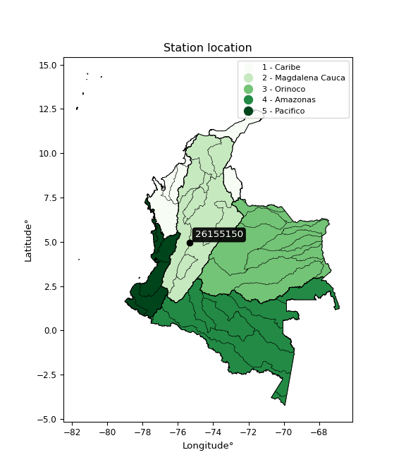

<div align="center">


</div>

# PMax24h Station (Rain): 26155150

Maximum Precipitation in 24 hours (PMax24h) is the greatest amount of rainfall for a specific duration that is meteorologically possible for a given location, acting as a "worst-case" scenario for extreme storms, crucial for designing safety-critical infrastructure like bridges, river deviations, dams, spillways, and nuclear plants to prevent catastrophic failure. The PMax24h is related with the Probable Maximum Precipitation (PMP) and it is calculated by hydrologists using meteorological data to determine the upper limit of extreme rainfall, often leading to the Probable Maximum Flood (PMF) for flood control design, and is increasingly being studied for climate change impacts. Probable Maximum Precipitation (PMP) is the theoretical upper limit of rainfall, a deterministic estimate for extreme events, while probability distributions (like GEV, Gumbel) describe the likelihood and frequency of various precipitation amounts, including rare ones, showing how often events occur, with PMP representing the extreme end of these distributions, used for critical infrastructure design to ensure safety against the worst conceivable weather, unlike standard statistical forecasts which cover typical probabilities.

The most common probability distributions in hydrology, used for analyzing floods, rainfall, and streamflow, include the Normal, Log-Normal, Gumbel, Gamma (including Log-Pearson Type III), and Generalized Extreme Value (GEV) distributions, often chosen based on the data´s skewness and whether modeling extremes or general conditions, with Gumbel and GEV popular for extreme events like floods, while the Normal distribution serves as a baseline, though often requiring transformations for skewed hydrological data. These distributions help in designing water infrastructure, managing water resources, and forecasting hydrologic events.

> Hydrological data often isn´t perfectly normal (it´s skewed), so different distributions are needed for different applications, such as: **Flood Frequency Analysis**: Using Gumbel, GEV, or Log-Pearson Type III for predicting extreme flood magnitudes and their return periods, **Rainfall Analysis**: Normal for annual totals, but Log-Normal, Weibull, or GEV for intensity or extreme daily rainfall, **Streamflow Modeling**: Gamma and Log-Normal for maximum flows, GEV for minimum flows, and Kappa for daily flows.

<div align="center">

</img>

</div>


## A. General information


### 1. General running parameters

• app_version: _v20260225_. • runtime: _2026-02-28 16:54:07.457399_. • Python version: _3.14.0_. • SciPy version: _1.16.3_. • Pandas version: _2.3.3_. • NumPy version: _2.3.5_. • Stations dataset (station_dataset_file): _dataset/pmax24h_in/automatic_colombia_2003_2025.csv_. • Stations catalog (station_catalog_file): _dataset/CNE.xls_. • Minimum year to eval til year_max (date_min): _1900_. • Maximum year to eval since year_min (date_max): _2025_. • Creates, save and include plots into reports (create_plot): _False_. • Plot only fit distributions with Δo > Δ (plot_only_fit): _True_. • Plot only simple graphs avoiding multiple CDFs and multiple Extreme values plots (plot_only_simple): _False_. • Eval low extreme values, if False, evaluates high extreme values (low_extreme): _False_. • Eval every SciPy distribution as logarithmic (pdist_logarithmic_on): _True_. • Standard deviation normalized (ddof): _1.0_. • Return periods to eval in years (Tr): _[2, 2.33, 5, 10, 15, 20, 25, 50, 75, 100, 200, 250, 500, 750, 1000]_. • Minimum data sample per station, 0 means any (minimum_sample): _5_. • Z-Score maximum threshold to adjust a value, 0 means disable (zscore_max): _3.5_. • Z-Score minimum threshold to adjust a value, 0 means disable (zscore_min): _-2.5_. • Avoid zeros, e.g. rain = 0 (avoid_zeros): _True_. • Avoid null values (avoid_nans): _True_. 

:file_folder:Table: [dataset.csv](../../dataset/pmax24h_in/automatic_colombia_2003_2025.csv)

> Delta Degrees of Freedom (DDOF): is a parameter used in the formulas for calculating variance and standard deviation. When ddof=0, the divisor is $N$ (the total number of observations) and this is used when your data set is the entire population. When ddof=1, the divisor is $N-1$ and this is used when your data set is a sample drawn from a larger population. Using $N-1$ provides an unbiased estimate of the population variance (known as Bessel´s correction).


### 2. Station info and location

|   id |   CODIGO | NOMBRE                      | CATEGORIA               | TECNOLOGIA                              | ESTADO           | FECHA_INSTALACION   |   FECHA_SUSPENSION |   ALTITUD |   LATITUD |   LONGITUD | DEPARTAMENTO   | MUNICIPIO   | AREA_OPERATIVA                         | ENTIDAD                                                     | AREA_HIDROGRAFICA   | ZONA_HIDROGRAFICA   | SUBZONA_HIDROGRAFICA   |   CORRIENTE | Catalogo   |   Version |
|-----:|---------:|:----------------------------|:------------------------|:----------------------------------------|:-----------------|:--------------------|-------------------:|----------:|----------:|-----------:|:---------------|:------------|:---------------------------------------|:------------------------------------------------------------|:--------------------|:--------------------|:-----------------------|------------:|:-----------|----------:|
|    0 | 26155150 | LAS BRISAS - AUT [26155150] | Climatológica Principal | Automática con Telemetría, Convencional | En Mantenimiento | 15/10/1981          |                nan |      4133 |   4.93453 |   -75.3504 | Caldas         | Villamaria  | Area Operativa 09 - Cauca-Valle-Caldas | INSTITUTO DE HIDROLOGIA METEOROLOGIA Y ESTUDIOS AMBIENTALES | Magdalena Cauca     | Medio Magdalena     | Río Gualí              |         nan | CNE_IDEAM  |  20251226 |

<div align="center">

Dynamic map: [:earth_americas:Google](http://maps.google.com/maps?q=4.934527778,-75.35038889) [:earth_americas:OSM](https://www.openstreetmap.org/#map=18/4.934527778/-75.35038889&layers=P) [:earth_americas:Bing](https://www.bing.com/maps?cp=4.934527778~-75.35038889&lvl=18) [:earth_americas:Apple](https://maps.apple.com/frame?center=4.934527778%2C-75.35038889&span=0.003%2C0.006)

</div>


<div align="center">

```geojson
{
  "type": "Feature",
  "geometry": {
    "type": "Point", 
    "coordinates": [-75.35038889, 4.934527778]
  }, 
  "properties": {
    "Name": "26155150"
  }
}
```

</div>


### 3. Discrete values table and plot

<div align="center">

|               |           0 |           1 |          2 |           3 |           4 |          5 |
|:--------------|------------:|------------:|-----------:|------------:|------------:|-----------:|
| Date          | 2019        | 2020        | 2021       | 2022        | 2023        | 2025       |
| Value         |   20.9      |   29.1      |   29.4     |   19.8      |   19.1      |   34.5     |
| Value_initial |   20.9      |   29.1      |   29.4     |   19.8      |   19.1      |   34.5     |
| count         |    6        |    6        |    6       |    6        |    6        |    6       |
| mean          |   25.4667   |   25.4667   |   25.4667  |   25.4667   |   25.4667   |   25.4667  |
| std           |    6.38394  |    6.38394  |    6.38394 |    6.38394  |    6.38394  |    6.38394 |
| zscore        |   -0.715337 |    0.569137 |    0.61613 |   -0.887644 |   -0.997295 |    1.41501 |


</div>


> The initial value (value_initial) correspond to the initial obtained or null completed value, and value (value) is adjusted only when the initial value is outside the valid range (outlier) definite through the Z-Score value. If Z-Score is active, values out of range or outliers are replaced with the station mean value. A Z-Score (or standard score) measures how many standard deviations a data point is from the mean of a dataset, indicating its relative position; positive scores mean above the mean, negative mean below, and a score of zero is exactly at the mean, allowing for comparison of values from different distributions. It´s calculated using the formula $z=(x–μ)/σ$, where $x$ is the data point, $μ$ is the mean, and $σ$ is the standard deviation, helping identify outliers and understand probability.
>
> <sub>**Note**: In this study, "completing" (filling gaps in) and "extending" (forecasting or lengthening the historical record) rainfall data series are avoided for certain critical analyses because they introduce artificial bias and uncertainty, which can distort the statistics of rare events (extremes), alter day-to-day variability, and compromise the integrity and homogeneity of the original data. Some reasons against Completing/Extending rainfall data are: **Distortion of Extremes and Variability**: The primary issue is that most gap-filling or extension methods rely on averaging or regression with nearby stations, which inherently smooths the data. Rainfall is highly variable in space and time, with a large percentage of zero values and occasional large storms. Infilling methods often underestimate the highest values and overestimate the lowest (zero) values, which severely distorts analyses focused on flood frequency, drought severity, and intensity-duration-frequency (IDF) curves, **Loss of Data Homogeneity**: Infilled or extended data are synthetic estimates, not actual measurements. Combining these estimates with observed data can violate the assumption of data homogeneity, which requires that the data properties do not change over time. Inhomogeneity can lead to incorrect conclusions about long-term trends or changes in climate patterns, **Propagation of Errors**: Errors and biases from the original data (e.g., wind-induced undercatch, instrument errors, site changes) or the data used for imputation can propagate through the analysis, leading to unreliable hydrological models and inaccurate predictions, **Compromised Statistical Integrity**: For statistical analyses, especially those involving the frequency of events, using artificial data can introduce time bias or autocorrelation that doesn´t exist in reality, making it difficult to assess the true probability of events, **Difficulty in Validation**: It is difficult to accurately validate the quality of filled or extended data, especially for past periods where ground-truth measurements are unavailable. The reliability of imputation techniques heavily depends on the density of the surrounding station network and the complexity of the local topography.</sub>


### 4. Active continuous probability distributions from SciPy (80 of 104 available)

A Probability Density Function (PDF) describes the relative likelihood of a continuous random variable falling within a specific range, where the total area under its curve equals 1, and the area over any interval gives the actual probability for that range. Unlike discrete probabilities (like rolling a die), a PDF shows density, not direct probability for a single point (which is zero), with higher points indicating higher likelihood, often visualized as a bell curve for normal distributions.

A log of a probability density function (log-PDF) is simply the logarithm of the PDF´s value, denoted as $log(f(x))$, useful for converting multiplication of probabilities into addition, improving numerical stability with tiny numbers, and connecting to information theory concepts like entropy. Instead of dealing with very small probabilities (e.g., 0.000001), log-PDFs use negative numbers (e.g., $log(0.00001) ≈ -11.51$ that are easier for computers to handle, preventing underflow errors and simplifying complex calculations. In this study, each active probability distribution from SciPy is also evaluated in the $log$ form.

[scipy.stats](https://docs.scipy.org/doc/scipy/reference/stats.html) is a Python´s powerful submodule within the SciPy library for comprehensive statistical analysis, offering over 130 probability distributions (like Normal, Poisson, etc.), functions for descriptive stats (mean, variance), hypothesis testing (t-tests, chi-square), random variable generation, and statistical tests, making it essential for data science, modeling, and research. It provides tools to explore, model, and draw conclusions from data efficiently, working seamlessly with [NumPy](https://numpy.org/).

<div align="center">

|   id | p_dist           |   n_parameter | fit_method   | label                                                                       | active   | ref                                                                                                      |
|-----:|:-----------------|--------------:|:-------------|:----------------------------------------------------------------------------|:---------|:---------------------------------------------------------------------------------------------------------|
|    0 | alpha            |             3 | MLE          | Alpha                                                                       | True     | [:mortar_board:](https://docs.scipy.org/doc/scipy/reference/generated/scipy.stats.alpha.html)            |
|    1 | anglit           |             2 | MM           | Anglit                                                                      | True     | [:mortar_board:](https://docs.scipy.org/doc/scipy/reference/generated/scipy.stats.anglit.html)           |
|    2 | arcsine          |             2 | MM           | Arcsine                                                                     | True     | [:mortar_board:](https://docs.scipy.org/doc/scipy/reference/generated/scipy.stats.arcsine.html)          |
|    3 | argus            |             3 | MLE          | Argus                                                                       | True     | [:mortar_board:](https://docs.scipy.org/doc/scipy/reference/generated/scipy.stats.argus.html)            |
|    4 | beta             |             4 | MLE          | Beta                                                                        | True     | [:mortar_board:](https://docs.scipy.org/doc/scipy/reference/generated/scipy.stats.beta.html)             |
|    5 | betaprime        |             4 | MLE          | Beta prime                                                                  | True     | [:mortar_board:](https://docs.scipy.org/doc/scipy/reference/generated/scipy.stats.betaprime.html)        |
|    6 | bradford         |             3 | MLE          | Bradford                                                                    | True     | [:mortar_board:](https://docs.scipy.org/doc/scipy/reference/generated/scipy.stats.bradford.html)         |
|    7 | burr             |             4 | MLE          | Burr (Type III)                                                             | True     | [:mortar_board:](https://docs.scipy.org/doc/scipy/reference/generated/scipy.stats.burr.html)             |
|    8 | burr12           |             4 | MLE          | Burr (Type III) 12                                                          | True     | [:mortar_board:](https://docs.scipy.org/doc/scipy/reference/generated/scipy.stats.burr12.html)           |
|    9 | cosine           |             2 | MLE          | Cosine                                                                      | True     | [:mortar_board:](https://docs.scipy.org/doc/scipy/reference/generated/scipy.stats.cosine.html)           |
|   10 | crystalball      |             4 | MLE          | Crystalball                                                                 | True     | [:mortar_board:](https://docs.scipy.org/doc/scipy/reference/generated/scipy.stats.crystalball.html)      |
|   11 | dgamma           |             3 | MLE          | Double gamma                                                                | True     | [:mortar_board:](https://docs.scipy.org/doc/scipy/reference/generated/scipy.stats.dgamma.html)           |
|   12 | dweibull         |             3 | MLE          | Double Weibull                                                              | True     | [:mortar_board:](https://docs.scipy.org/doc/scipy/reference/generated/scipy.stats.dweibull.html)         |
|   13 | erlang           |             3 | MLE          | Erlang                                                                      | True     | [:mortar_board:](https://docs.scipy.org/doc/scipy/reference/generated/scipy.stats.erlang.html)           |
|   14 | exponnorm        |             3 | MLE          | Exponentially modified Normal                                               | True     | [:mortar_board:](https://docs.scipy.org/doc/scipy/reference/generated/scipy.stats.exponnorm.html)        |
|   15 | exponpow         |             3 | MLE          | Exponential power                                                           | True     | [:mortar_board:](https://docs.scipy.org/doc/scipy/reference/generated/scipy.stats.exponpow.html)         |
|   16 | exponweib        |             4 | MLE          | Exponentiated Weibull                                                       | True     | [:mortar_board:](https://docs.scipy.org/doc/scipy/reference/generated/scipy.stats.exponweib.html)        |
|   17 | f                |             4 | MLE          | F                                                                           | True     | [:mortar_board:](https://docs.scipy.org/doc/scipy/reference/generated/scipy.stats.f.html)                |
|   18 | fatiguelife      |             3 | MLE          | Fatigue-life (Birnbaum-Saunders)                                            | True     | [:mortar_board:](https://docs.scipy.org/doc/scipy/reference/generated/scipy.stats.fatiguelife.html)      |
|   19 | foldnorm         |             3 | MM           | Fold Normal                                                                 | True     | [:mortar_board:](https://docs.scipy.org/doc/scipy/reference/generated/scipy.stats.foldnorm.html)         |
|   20 | gamma            |             3 | MLE          | Gamma                                                                       | True     | [:mortar_board:](https://docs.scipy.org/doc/scipy/reference/generated/scipy.stats.gamma.html)            |
|   21 | gausshyper       |             6 | MLE          | Gauss hypergeometric                                                        | True     | [:mortar_board:](https://docs.scipy.org/doc/scipy/reference/generated/scipy.stats.gausshyper.html)       |
|   22 | genexpon         |             5 | MLE          | Generalized exponential                                                     | True     | [:mortar_board:](https://docs.scipy.org/doc/scipy/reference/generated/scipy.stats.genexpon.html)         |
|   23 | genextreme       |             3 | MLE          | Generalized exponential                                                     | True     | [:mortar_board:](https://docs.scipy.org/doc/scipy/reference/generated/scipy.stats.genextreme.html)       |
|   24 | gengamma         |             4 | MLE          | Generalized gamma                                                           | True     | [:mortar_board:](https://docs.scipy.org/doc/scipy/reference/generated/scipy.stats.gengamma.html)         |
|   25 | genhalflogistic  |             3 | MLE          | Generalized half-logistic                                                   | True     | [:mortar_board:](https://docs.scipy.org/doc/scipy/reference/generated/scipy.stats.genhalflogistic.html)  |
|   26 | genlogistic      |             3 | MLE          | Generalized logistic                                                        | True     | [:mortar_board:](https://docs.scipy.org/doc/scipy/reference/generated/scipy.stats.genlogistic.html)      |
|   27 | gennorm          |             3 | MLE          | Generalized Normal                                                          | True     | [:mortar_board:](https://docs.scipy.org/doc/scipy/reference/generated/scipy.stats.gennorm.html)          |
|   28 | genpareto        |             3 | MLE          | Generalized Pareto                                                          | True     | [:mortar_board:](https://docs.scipy.org/doc/scipy/reference/generated/scipy.stats.genpareto.html)        |
|   29 | gompertz         |             3 | MLE          | Gompertz (or truncated Gumbel)                                              | True     | [:mortar_board:](https://docs.scipy.org/doc/scipy/reference/generated/scipy.stats.gompertz.html)         |
|   30 | gumbel_l         |             2 | MM           | Gumbel Left Skew                                                            | True     | [:mortar_board:](https://docs.scipy.org/doc/scipy/reference/generated/scipy.stats.gumbel_l.html)         |
|   31 | gumbel_r         |             2 | MM           | Gumbel Right Skew                                                           | True     | [:mortar_board:](https://docs.scipy.org/doc/scipy/reference/generated/scipy.stats.gumbel_r.html)         |
|   32 | halfgennorm      |             3 | MLE          | Upper half of a generalized normal                                          | True     | [:mortar_board:](https://docs.scipy.org/doc/scipy/reference/generated/scipy.stats.halfgennorm.html)      |
|   33 | halflogistic     |             2 | MM           | Half-logistic                                                               | True     | [:mortar_board:](https://docs.scipy.org/doc/scipy/reference/generated/scipy.stats.halflogistic.html)     |
|   34 | halfnorm         |             2 | MM           | Half Normal                                                                 | True     | [:mortar_board:](https://docs.scipy.org/doc/scipy/reference/generated/scipy.stats.halfnorm.html)         |
|   35 | hypsecant        |             2 | MM           | hyperbolic secant                                                           | True     | [:mortar_board:](https://docs.scipy.org/doc/scipy/reference/generated/scipy.stats.hypsecant.html)        |
|   36 | invgamma         |             3 | MLE          | Inverted gamma                                                              | True     | [:mortar_board:](https://docs.scipy.org/doc/scipy/reference/generated/scipy.stats.invgamma.html)         |
|   37 | invgauss         |             3 | MLE          | Inverse Gaussian                                                            | True     | [:mortar_board:](https://docs.scipy.org/doc/scipy/reference/generated/scipy.stats.invgauss.html)         |
|   38 | invweibull       |             3 | MLE          | Inverted Weibull                                                            | True     | [:mortar_board:](https://docs.scipy.org/doc/scipy/reference/generated/scipy.stats.invweibull.html)       |
|   39 | johnsonsb        |             4 | MLE          | Johnson SB                                                                  | True     | [:mortar_board:](https://docs.scipy.org/doc/scipy/reference/generated/scipy.stats.johnsonsb.html)        |
|   40 | johnsonsu        |             4 | MLE          | Johnson Su                                                                  | True     | [:mortar_board:](https://docs.scipy.org/doc/scipy/reference/generated/scipy.stats.johnsonsu.html)        |
|   41 | kappa3           |             3 | MLE          | Kappa 3                                                                     | True     | [:mortar_board:](https://docs.scipy.org/doc/scipy/reference/generated/scipy.stats.kappa3.html)           |
|   42 | kappa4           |             4 | MLE          | Kappa 4                                                                     | True     | [:mortar_board:](https://docs.scipy.org/doc/scipy/reference/generated/scipy.stats.kappa4.html)           |
|   43 | ksone            |             3 | MLE          | Kolmogorov-Smirnov one-sided test statistic distribution                    | True     | [:mortar_board:](https://docs.scipy.org/doc/scipy/reference/generated/scipy.stats.ksone.html)            |
|   44 | kstwobign        |             2 | MLE          | Limiting distribution of scaled Kolmogorov-Smirnov two-sided test statistic | True     | [:mortar_board:](https://docs.scipy.org/doc/scipy/reference/generated/scipy.stats.kstwobign.html)        |
|   45 | laplace          |             2 | MM           | Laplace                                                                     | True     | [:mortar_board:](https://docs.scipy.org/doc/scipy/reference/generated/scipy.stats.laplace.html)          |
|   46 | levy_l           |             2 | MLE          | Left-skewed Levy                                                            | True     | [:mortar_board:](https://docs.scipy.org/doc/scipy/reference/generated/scipy.stats.levy_l.html)           |
|   47 | loggamma         |             3 | MLE          | Log gamma                                                                   | True     | [:mortar_board:](https://docs.scipy.org/doc/scipy/reference/generated/scipy.stats.loggamma.html)         |
|   48 | logistic         |             2 | MM           | Logistic (or Sech-squared)                                                  | True     | [:mortar_board:](https://docs.scipy.org/doc/scipy/reference/generated/scipy.stats.logistic.html)         |
|   49 | loglaplace       |             3 | MLE          | Log-Laplace                                                                 | True     | [:mortar_board:](https://docs.scipy.org/doc/scipy/reference/generated/scipy.stats.loglaplace.html)       |
|   50 | lomax            |             3 | MLE          | Lomax (Pareto of the second kind)                                           | True     | [:mortar_board:](https://docs.scipy.org/doc/scipy/reference/generated/scipy.stats.lomax.html)            |
|   51 | maxwell          |             2 | MM           | Maxwell                                                                     | True     | [:mortar_board:](https://docs.scipy.org/doc/scipy/reference/generated/scipy.stats.maxwell.html)          |
|   52 | mielke           |             4 | MLE          | Mielke Beta-Kappa / Dagum                                                   | True     | [:mortar_board:](https://docs.scipy.org/doc/scipy/reference/generated/scipy.stats.mielke.html)           |
|   53 | moyal            |             2 | MM           | Moyal                                                                       | True     | [:mortar_board:](https://docs.scipy.org/doc/scipy/reference/generated/scipy.stats.moyal.html)            |
|   54 | nakagami         |             3 | MLE          | Nakagami                                                                    | True     | [:mortar_board:](https://docs.scipy.org/doc/scipy/reference/generated/scipy.stats.nakagami.html)         |
|   55 | ncf              |             5 | MLE          | Non-central F distribution                                                  | True     | [:mortar_board:](https://docs.scipy.org/doc/scipy/reference/generated/scipy.stats.ncf.html)              |
|   56 | nct              |             4 | MLE          | Non-central Student’s t                                                     | True     | [:mortar_board:](https://docs.scipy.org/doc/scipy/reference/generated/scipy.stats.nct.html)              |
|   57 | norm             |             2 | MM           | Normal                                                                      | True     | [:mortar_board:](https://docs.scipy.org/doc/scipy/reference/generated/scipy.stats.norm.html)             |
|   58 | pearson3         |             3 | MM           | Pearson type III                                                            | True     | [:mortar_board:](https://docs.scipy.org/doc/scipy/reference/generated/scipy.stats.pearson3.html)         |
|   59 | powerlaw         |             3 | MLE          | Power-function                                                              | True     | [:mortar_board:](https://docs.scipy.org/doc/scipy/reference/generated/scipy.stats.powerlaw.html)         |
|   60 | rayleigh         |             2 | MM           | Rayleigh                                                                    | True     | [:mortar_board:](https://docs.scipy.org/doc/scipy/reference/generated/scipy.stats.rayleigh.html)         |
|   61 | rdist            |             3 | MLE          | R-distributed (symmetric beta)                                              | True     | [:mortar_board:](https://docs.scipy.org/doc/scipy/reference/generated/scipy.stats.rdist.html)            |
|   62 | rice             |             3 | MLE          | Rice                                                                        | True     | [:mortar_board:](https://docs.scipy.org/doc/scipy/reference/generated/scipy.stats.rice.html)             |
|   63 | semicircular     |             2 | MM           | Semicircular                                                                | True     | [:mortar_board:](https://docs.scipy.org/doc/scipy/reference/generated/scipy.stats.semicircular.html)     |
|   64 | skewnorm         |             3 | MLE          | Skew normal                                                                 | True     | [:mortar_board:](https://docs.scipy.org/doc/scipy/reference/generated/scipy.stats.skewnorm.html)         |
|   65 | t                |             3 | MLE          | Student’s t                                                                 | True     | [:mortar_board:](https://docs.scipy.org/doc/scipy/reference/generated/scipy.stats.t.html)                |
|   66 | trapezoid        |             4 | MLE          | Trapezoid                                                                   | True     | [:mortar_board:](https://docs.scipy.org/doc/scipy/reference/generated/scipy.stats.trapezoid.html)        |
|   67 | triang           |             3 | MLE          | Triangular                                                                  | True     | [:mortar_board:](https://docs.scipy.org/doc/scipy/reference/generated/scipy.stats.triang.html)           |
|   68 | truncexpon       |             3 | MLE          | Truncated exponential                                                       | True     | [:mortar_board:](https://docs.scipy.org/doc/scipy/reference/generated/scipy.stats.truncexpon.html)       |
|   69 | truncnorm        |             4 | MLE          | Truncated normal                                                            | True     | [:mortar_board:](https://docs.scipy.org/doc/scipy/reference/generated/scipy.stats.truncnorm.html)        |
|   70 | truncpareto      |             4 | MLE          | Upper truncated Pareto                                                      | True     | [:mortar_board:](https://docs.scipy.org/doc/scipy/reference/generated/scipy.stats.truncpareto.html)      |
|   71 | truncweibull_min |             5 | MLE          | Doubly truncated Weibull minimum                                            | True     | [:mortar_board:](https://docs.scipy.org/doc/scipy/reference/generated/scipy.stats.truncweibull_min.html) |
|   72 | tukeylambda      |             3 | MLE          | Tukey-Lamdba                                                                | True     | [:mortar_board:](https://docs.scipy.org/doc/scipy/reference/generated/scipy.stats.tukeylambda.html)      |
|   73 | uniform          |             2 | MLE          | Uniform                                                                     | True     | [:mortar_board:](https://docs.scipy.org/doc/scipy/reference/generated/scipy.stats.uniform.html)          |
|   74 | vonmises         |             3 | MLE          | Von Mises                                                                   | True     | [:mortar_board:](https://docs.scipy.org/doc/scipy/reference/generated/scipy.stats.vonmises.html)         |
|   75 | vonmises_line    |             3 | MLE          | Von Mises line                                                              | True     | [:mortar_board:](https://docs.scipy.org/doc/scipy/reference/generated/scipy.stats.vonmises_line.html)    |
|   76 | wald             |             2 | MM           | Wald                                                                        | True     | [:mortar_board:](https://docs.scipy.org/doc/scipy/reference/generated/scipy.stats.wald.html)             |
|   77 | weibull_max      |             3 | MLE          | Weibull maximum                                                             | True     | [:mortar_board:](https://docs.scipy.org/doc/scipy/reference/generated/scipy.stats.weibull_max.html)      |
|   78 | weibull_min      |             3 | MLE          | Weibull minimum                                                             | True     | [:mortar_board:](https://docs.scipy.org/doc/scipy/reference/generated/scipy.stats.weibull_min.html)      |
|   79 | wrapcauchy       |             3 | MLE          | Wrapped  Cauchy                                                             | True     | [:mortar_board:](https://docs.scipy.org/doc/scipy/reference/generated/scipy.stats.wrapcauchy.html)       |

</div>

> **n_parameter:** # arguments & localization & scale.
>
> **Fit methods:** (MLE) maximum likelihood, (MM) L-moments.
>
>**Inactive** (With the only purpose of prevent loops, zero divisions, infinite values, over high estimated values or horizontal trending for recurrence intervals estimations, the follow distributions were disabled.)**:** lognorm, norminvgauss, powernorm, powerlognorm, cauchy, halfcauchy, foldcauchy, skewcauchy, chi2, expon, fisk, genhyperbolic, geninvgauss, gibrat, kstwo, laplace_asymmetric, levy, levy_stable, ncx2, pareto, rel_breitwigner, recipinvgauss, studentized_range, loguniform, 


## B. Probability (PDF) vs. Empirical (EDF) distributions functions

A continuous probability distribution (CPD) describes probabilities for variables that can take any value within a range (like rain any time), unlike discrete variables with specific outcomes (like temperature). It uses a Probability Density Function (PDF), a curve where the total area under it equals 1, and the probability of the variable falling within an interval (a to b) is found by calculating the area under the curve between those points. A key feature is that the probability of hitting any single exact value is zero, so probabilities are always expressed for ranges, e.g., $P(a ≤ X ≤ b)$.

<div align="center">

Distributions parameters from station values
|     |   station | p_dist              |   n |              loc |           scale | shape                  | shape1                | shape2                 | shape3             |
|----:|----------:|:--------------------|----:|-----------------:|----------------:|:-----------------------|:----------------------|:-----------------------|:-------------------|
|   0 |  26155150 | alpha               |   6 |     16.9891      |     4.76996     | 0.5744939341852433     |                       |                        |                    |
|   1 |  26155150 | anglit              |   6 |     25.4667      |    17.0484      |                        |                       |                        |                    |
|   2 |  26155150 | arcsine             |   6 |     17.225       |    16.4833      |                        |                       |                        |                    |
|   3 |  26155150 | argus               |   6 |     13.2704      |    22.3089      | 4.577915895780582e-05  |                       |                        |                    |
|   4 |  26155150 | beta                |   6 |     19.1         |    15.4003      | 0.3335359446545642     | 0.4039942614593104    |                        |                    |
|   5 |  26155150 | betaprime           |   6 |     -0.570971    |     9.04656     | 76.34616519071938      | 27.558594467437523    |                        |                    |
|   6 |  26155150 | bradford            |   6 |     19.0994      |    15.813       | 48.62571522062969      |                       |                        |                    |
|   7 |  26155150 | burr                |   6 |     -0.881966    |     8.36078     | 5.522222577272718      | 274.08737023887477    |                        |                    |
|   8 |  26155150 | burr12              |   6 |     -7.24838     |    26.281       | 1533.6232879994823     | 0.003207752048160955  |                        |                    |
|   9 |  26155150 | cosine              |   6 |     25.7276      |     4.64225     |                        |                       |                        |                    |
|  10 |  26155150 | crystalball         |   6 |     25.4667      |     5.82771     | 810.5857432541659      | 713.8204577688768     |                        |                    |
|  11 |  26155150 | dgamma              |   6 |     25.1181      |     0.516766    | 10.70761658234201      |                       |                        |                    |
|  12 |  26155150 | dweibull            |   6 |     25.5372      |     6.1849      | 3.209903593591754      |                       |                        |                    |
|  13 |  26155150 | erlang              |   6 |     19.1         |     6.86954     | 0.5265037651445572     |                       |                        |                    |
|  14 |  26155150 | exponnorm           |   6 |     24.3804      |     5.72587     | 0.18971631882151946    |                       |                        |                    |
|  15 |  26155150 | exponpow            |   6 |     19.1         |    12.5937      | 0.7538117853856792     |                       |                        |                    |
|  16 |  26155150 | exponweib           |   6 |     19.1         |     1.35919     | 1.2236173606842522     | 0.3952779084729159    |                        |                    |
|  17 |  26155150 | f                   |   6 |     18.365       |     2.22623     | 2086.160013787745      | 1.8673128889146753    |                        |                    |
|  18 |  26155150 | fatiguelife         |   6 |     19.1         |     5.86837e-06 | 1197.5072591388553     |                       |                        |                    |
|  19 |  26155150 | foldnorm            |   6 |     14.2248      |     6.1574      | 1.7969849913264195     |                       |                        |                    |
|  20 |  26155150 | gamma               |   6 |     19.1         |     8.03017     | 0.28467386357450686    |                       |                        |                    |
|  21 |  26155150 | gausshyper          |   6 |     19.1         |    15.6726      | 0.7285421727434618     | 1.2131318645136944    | 0.9765710885163965     | 1.2441254781100977 |
|  22 |  26155150 | genexpon            |   6 |     19.1         |    19.5911      | 2.9905873256784687     | 0.5277080246640258    | 0.547520627859746      |                    |
|  23 |  26155150 | genextreme          |   6 |     20.381       |     2.20183     | -1.3457676828771628    |                       |                        |                    |
|  24 |  26155150 | gengamma            |   6 |     19.1         |     1.32946     | 1.200094479330402      | 0.4244492853753833    |                        |                    |
|  25 |  26155150 | genhalflogistic     |   6 |     17.7302      |    17.7661      | 1.0594101301712464     |                       |                        |                    |
|  26 |  26155150 | genlogistic         |   6 |    -10.7114      |     4.68664     | 1235.3391587083524     |                       |                        |                    |
|  27 |  26155150 | gennorm             |   6 |     26.8         |     7.70001     | 9020845.416043526      |                       |                        |                    |
|  28 |  26155150 | genpareto           |   6 |     -0.133173    |    55.1785      | -1.5932262732733427    |                       |                        |                    |
|  29 |  26155150 | gompertz            |   6 |     19.1         |    36.4679      | 4.680131125643626      |                       |                        |                    |
|  30 |  26155150 | gumbel_l            |   6 |     28.0894      |     4.54385     |                        |                       |                        |                    |
|  31 |  26155150 | gumbel_r            |   6 |     22.8439      |     4.54385     |                        |                       |                        |                    |
|  32 |  26155150 | halfgennorm         |   6 |     19.1         |     1.29775     | 0.5145364536865831     |                       |                        |                    |
|  33 |  26155150 | halflogistic        |   6 |     18.5595      |     4.98249     |                        |                       |                        |                    |
|  34 |  26155150 | halfnorm            |   6 |     17.7531      |     9.66757     |                        |                       |                        |                    |
|  35 |  26155150 | hypsecant           |   6 |     25.4667      |     3.71004     |                        |                       |                        |                    |
|  36 |  26155150 | invgamma            |   6 |     18.3874      |     1.94545     | 0.9002133558259608     |                       |                        |                    |
|  37 |  26155150 | invgauss            |   6 |     18.5295      |     2.55728     | 2.712656142879953      |                       |                        |                    |
|  38 |  26155150 | invweibull          |   6 |     18.7449      |     1.63608     | 0.743059437111746      |                       |                        |                    |
|  39 |  26155150 | johnsonsb           |   6 |     19.1         |    36.303       | 1.3728147397255563     | 0.1685212077681678    |                        |                    |
|  40 |  26155150 | johnsonsu           |   6 |     19.1         |     1.23087e-11 | -1.7021110963662736    | 0.10211164873774567   |                        |                    |
|  41 |  26155150 | kappa3              |   6 |     19.1         |    15.3997      | 79883.3275772504       |                       |                        |                    |
|  42 |  26155150 | kappa4              |   6 |     16.7082      |    19.4069      | 1.1413390506322694     | 1.0743379779026736    |                        |                    |
|  43 |  26155150 | ksone               |   6 |     15.3728      |    20.1878      | 1.0                    |                       |                        |                    |
|  44 |  26155150 | kstwobign           |   6 |      6.81717     |    21.2659      |                        |                       |                        |                    |
|  45 |  26155150 | laplace             |   6 |     25.4667      |     4.12081     |                        |                       |                        |                    |
|  46 |  26155150 | levy_l              |   6 |     35.358       |     3.55426     |                        |                       |                        |                    |
|  47 |  26155150 | loggamma            |   6 |  -1662.86        |   230.225       | 1531.0629716544802     |                       |                        |                    |
|  48 |  26155150 | logistic            |   6 |     25.4667      |     3.21299     |                        |                       |                        |                    |
|  49 |  26155150 | loglaplace          |   6 |     -0.0496908   |    20.9497      | 4.5629357856206045     |                       |                        |                    |
|  50 |  26155150 | lomax               |   6 |     19.1         |    22.1354      | 4.188923831018421      |                       |                        |                    |
|  51 |  26155150 | maxwell             |   6 |     11.6574      |     8.65365     |                        |                       |                        |                    |
|  52 |  26155150 | mielke              |   6 |      8.76911     |     3.3624      | 345.66346740435756     | 3.395424836866745     |                        |                    |
|  53 |  26155150 | moyal               |   6 |     22.134       |     2.62339     |                        |                       |                        |                    |
|  54 |  26155150 | nakagami            |   6 |     19.1         |    10.1547      | 0.23554114691814457    |                       |                        |                    |
|  55 |  26155150 | ncf                 |   6 |     -0.680287    |    25.3095      | 119.96773033260794     | 62.09519641064669     | 1.1659741640368462e-06 |                    |
|  56 |  26155150 | nct                 |   6 |      0.0570177   |     0.618732    | 10.466859460253197     | 38.074652992527064    |                        |                    |
|  57 |  26155150 | norm                |   6 |     25.4667      |     5.82771     |                        |                       |                        |                    |
|  58 |  26155150 | pearson3            |   6 |     25.4667      |     5.82771     | 0.26163476023284604    |                       |                        |                    |
|  59 |  26155150 | powerlaw            |   6 |     19.1         |    15.4         | 0.14259550894061532    |                       |                        |                    |
|  60 |  26155150 | rayleigh            |   6 |     14.3179      |     8.89542     |                        |                       |                        |                    |
|  61 |  26155150 | rdist               |   6 |     20           |     0.900007    | 1.534599274375303      |                       |                        |                    |
|  62 |  26155150 | rice                |   6 |     15.5094      |     7.70569     | 0.491670386542741      |                       |                        |                    |
|  63 |  26155150 | semicircular        |   6 |     25.4667      |    11.6554      |                        |                       |                        |                    |
|  64 |  26155150 | skewnorm            |   6 |     19.1         |     8.62994     | 11297819.591595136     |                       |                        |                    |
|  65 |  26155150 | t                   |   6 |     25.4666      |     5.82767     | 198209625.73915774     |                       |                        |                    |
|  66 |  26155150 | trapezoid           |   6 |     17.56        |    18.48        | 1.0                    | 1.0                   |                        |                    |
|  67 |  26155150 | triang              |   6 |     11.7385      |    22.7615      | 0.9999999998837148     |                       |                        |                    |
|  68 |  26155150 | truncexpon          |   6 |     19.1         |    21.3987      | 0.7196685923677937     |                       |                        |                    |
|  69 |  26155150 | truncnorm           |   6 |     -4.70167     |     3.16107     | 10.67916034817937      | 224.57535999364552    |                        |                    |
|  70 |  26155150 | truncpareto         |   6 |     19.0858      |     0.0142047   | 0.00012384759244298747 | 1085.1462169463016    |                        |                    |
|  71 |  26155150 | truncweibull_min    |   6 |     19.0714      |    12.5787      | 0.486314358071804      | 0.0022713421522394016 | 1.2265647361664556     |                    |
|  72 |  26155150 | tukeylambda         |   6 |     26.8         |     8.97147     | 1.1651252681343214     |                       |                        |                    |
|  73 |  26155150 | uniform             |   6 |     19.1         |    15.4         |                        |                       |                        |                    |
|  74 |  26155150 | vonmises            |   6 |      2.7943      |     1           | 0.3670415015611282     |                       |                        |                    |
|  75 |  26155150 | vonmises_line       |   6 |     27.2896      |     2.60685     | 2.862483722896858e-06  |                       |                        |                    |
|  76 |  26155150 | wald                |   6 |     19.6389      |     5.82774     |                        |                       |                        |                    |
|  77 |  26155150 | weibull_max         |   6 |     34.5         |     1.39658     | 0.38208923232809083    |                       |                        |                    |
|  78 |  26155150 | weibull_min         |   6 |     19.1         |     6.68603     | 0.5223441968693856     |                       |                        |                    |
|  79 |  26155150 | wrapcauchy          |   6 |     19.1         |     2.45099     | 0.525                  |                       |                        |                    |
|  80 |  26155150 | logalpha            |   6 |      1.2218      |    17.3288      | 8.837509918344363      |                       |                        |                    |
|  81 |  26155150 | loganglit           |   6 |      3.2113      |     0.666736    |                        |                       |                        |                    |
|  82 |  26155150 | logarcsine          |   6 |      2.88902     |     0.644563    |                        |                       |                        |                    |
|  83 |  26155150 | logargus            |   6 |      2.74153     |     0.842315    | 0.00015165578937309868 |                       |                        |                    |
|  84 |  26155150 | logbeta             |   6 |      2.94969     |     0.655981    | 0.6244532237280986     | 1.2973583376323945    |                        |                    |
|  85 |  26155150 | logbetaprime        |   6 |      2.67887     |     7.19792     | 5.00550650984205       | 69.4065472302533      |                        |                    |
|  86 |  26155150 | logbradford         |   6 |      2.94969     |     0.591283    | 1.1163595961045734     |                       |                        |                    |
|  87 |  26155150 | logburr             |   6 |     -0.421173    |     2.44877     | 19.281791769256763     | 1068.80746321394      |                        |                    |
|  88 |  26155150 | logburr12           |   6 |      2.36605     |     3.91119     | 4.512312915566781      | 651.2532641061694     |                        |                    |
|  89 |  26155150 | logcosine           |   6 |      3.21709     |     0.17945     |                        |                       |                        |                    |
|  90 |  26155150 | logcrystalball      |   6 |      3.2113      |     0.227911    | 90.00994655817647      | 1.5026571123898975    |                        |                    |
|  91 |  26155150 | logdgamma           |   6 |      3.20391     |     0.0153615   | 14.295190562304992     |                       |                        |                    |
|  92 |  26155150 | logdweibull         |   6 |      3.2162      |     0.242997    | 3.8656208400858305     |                       |                        |                    |
|  93 |  26155150 | logerlang           |   6 |      2.33359     |     0.0541139   | 16.17218078541527      |                       |                        |                    |
|  94 |  26155150 | logexponnorm        |   6 |      3.19107     |     0.227012    | 0.08913113118209139    |                       |                        |                    |
|  95 |  26155150 | logexponpow         |   6 |      2.94969     |     0.468604    | 0.829397757343507      |                       |                        |                    |
|  96 |  26155150 | logexponweib        |   6 |      2.94969     |     1.14493     | 0.3470635421698807     | 1.0598231556908049    |                        |                    |
|  97 |  26155150 | logf                |   6 |      2.94969     |     0.164069    | 0.8172084017481619     | 18.245483368653517    |                        |                    |
|  98 |  26155150 | logfatiguelife      |   6 |      2.94969     |     3.00002e-07 | 968.3082227142515      |                       |                        |                    |
|  99 |  26155150 | logfoldnorm         |   6 |      2.88324     |     0.28394     | 0.9839568076423298     |                       |                        |                    |
| 100 |  26155150 | loggamma            |   6 |      2.34539     |     0.0577546   | 14.866226284435413     |                       |                        |                    |
| 101 |  26155150 | loggausshyper       |   6 |      2.94969     |     0.695035    | 0.8841804715380519     | 1.2682824546333       | 1.0363281185790219     | 1.2622061042723216 |
| 102 |  26155150 | loggenexpon         |   6 |      2.94937     |     0.00399408  | 0.013039270995205736   | 3.385284837557368     | 1.1344022075325012e-05 |                    |
| 103 |  26155150 | loggenextreme       |   6 |      3.02329     |     0.110633    | -0.991794092621679     |                       |                        |                    |
| 104 |  26155150 | loggengamma         |   6 |      2.94969     |     1.18533     | 0.32889084373226607    | 1.0690864037467078    |                        |                    |
| 105 |  26155150 | loggenhalflogistic  |   6 |      2.88934     |     0.688318    | 1.0563260454422632     |                       |                        |                    |
| 106 |  26155150 | loggenlogistic      |   6 |      1.85448     |     0.187667    | 763.0758334892234      |                       |                        |                    |
| 107 |  26155150 | loggennorm          |   6 |      3.37074     |     0.172603    | 0.8551649716919902     |                       |                        |                    |
| 108 |  26155150 | loggenpareto        |   6 |      0.00254741  |     4.44676     | -1.256711408244086     |                       |                        |                    |
| 109 |  26155150 | loggompertz         |   6 |      2.94969     |     0.52662     | 1.245654061796591      |                       |                        |                    |
| 110 |  26155150 | loggumbel_l         |   6 |      3.31387     |     0.177703    |                        |                       |                        |                    |
| 111 |  26155150 | loggumbel_r         |   6 |      3.10873     |     0.177703    |                        |                       |                        |                    |
| 112 |  26155150 | loghalfgennorm      |   6 |      2.94969     |     0.00720949  | 0.3609615023907131     |                       |                        |                    |
| 113 |  26155150 | loghalflogistic     |   6 |      2.94117     |     0.194857    |                        |                       |                        |                    |
| 114 |  26155150 | loghalfnorm         |   6 |      2.90963     |     0.378084    |                        |                       |                        |                    |
| 115 |  26155150 | loghypsecant        |   6 |      3.2113      |     0.145094    |                        |                       |                        |                    |
| 116 |  26155150 | loginvgamma         |   6 |      2.81001     |     0.788145    | 2.8751528393612347     |                       |                        |                    |
| 117 |  26155150 | loginvgauss         |   6 |      2.91606     |     0.158677    | 1.8606480794323548     |                       |                        |                    |
| 118 |  26155150 | loginvweibull       |   6 |      2.91174     |     0.111549    | 1.0082925178550632     |                       |                        |                    |
| 119 |  26155150 | logjohnsonsb        |   6 |      2.94969     |     0.922736    | 1.3083939948790642     | 0.09336725741179223   |                        |                    |
| 120 |  26155150 | logjohnsonsu        |   6 |      1.31415e+07 |     1.11045e+07 | 76352474.06415841      | 75947699.38448188     |                        |                    |
| 121 |  26155150 | logkappa3           |   6 |      2.94759     |     0.592499    | 1223.4896507190938     |                       |                        |                    |
| 122 |  26155150 | logkappa4           |   6 |      2.91617     |     0.6964      | 1.0345613795260378     | 1.114619671875987     |                        |                    |
| 123 |  26155150 | logksone            |   6 |      2.81655     |     0.789514    | 1.0                    |                       |                        |                    |
| 124 |  26155150 | logkstwobign        |   6 |      2.46725     |     0.847473    |                        |                       |                        |                    |
| 125 |  26155150 | loglaplace          |   6 |      3.2113      |     0.161159    |                        |                       |                        |                    |
| 126 |  26155150 | loglevy_l           |   6 |      3.57001     |     0.120137    |                        |                       |                        |                    |
| 127 |  26155150 | logloggamma         |   6 |    -49.7263      |     7.57079     | 1088.6559407441987     |                       |                        |                    |
| 128 |  26155150 | loglogistic         |   6 |      3.2113      |     0.125655    |                        |                       |                        |                    |
| 129 |  26155150 | logloglaplace       |   6 |     -0.0645816   |     3.43532     | 14.911798229517181     |                       |                        |                    |
| 130 |  26155150 | loglomax            |   6 |      2.94969     |     4.05961     | 16.25414514050302      |                       |                        |                    |
| 131 |  26155150 | logmaxwell          |   6 |      2.67124     |     0.338431    |                        |                       |                        |                    |
| 132 |  26155150 | logmielke           |   6 | -11751.8         | 11754.1         | 3514020.668334135      | 62797.370958180996    |                        |                    |
| 133 |  26155150 | logmoyal            |   6 |      3.08097     |     0.102597    |                        |                       |                        |                    |
| 134 |  26155150 | lognakagami         |   6 |      2.94969     |     0.414922    | 0.3109647735906632     |                       |                        |                    |
| 135 |  26155150 | logncf              |   6 |     -3.15833     |     6.36448     | 635.5618305713244      | 390.4004969060378     | 2.1346949285239016e-11 |                    |
| 136 |  26155150 | lognct              |   6 |     -0.225347    |     0.0357407   | 118.44814659365159     | 95.53566164966588     |                        |                    |
| 137 |  26155150 | lognorm             |   6 |      3.2113      |     0.227913    |                        |                       |                        |                    |
| 138 |  26155150 | logpearson3         |   6 |      3.2113      |     0.227913    | 0.14530765256367278    |                       |                        |                    |
| 139 |  26155150 | logpowerlaw         |   6 |      2.94969     |     0.591271    | 0.14939968655208324    |                       |                        |                    |
| 140 |  26155150 | lograyleigh         |   6 |      2.77529     |     0.347886    |                        |                       |                        |                    |
| 141 |  26155150 | logrdist            |   6 |      3.74123     |     0.370487    | 1.0345977195965945     |                       |                        |                    |
| 142 |  26155150 | logrice             |   6 |      2.81377     |     0.292513    | 0.6738365541471565     |                       |                        |                    |
| 143 |  26155150 | logsemicircular     |   6 |      3.2113      |     0.455826    |                        |                       |                        |                    |
| 144 |  26155150 | logskewnorm         |   6 |      2.94969     |     0.347022    | 10528216.436668292     |                       |                        |                    |
| 145 |  26155150 | logt                |   6 |      3.2113      |     0.227911    | 1024099895.6109598     |                       |                        |                    |
| 146 |  26155150 | logtrapezoid        |   6 |      2.89056     |     0.709525    | 1.0                    | 1.0                   |                        |                    |
| 147 |  26155150 | logtriang           |   6 |      2.68569     |     0.855274    | 0.9999997896375761     |                       |                        |                    |
| 148 |  26155150 | logtruncexpon       |   6 |      2.94969     |     0.588952    | 1.003957022687639      |                       |                        |                    |
| 149 |  26155150 | logtruncnorm        |   6 |     -1.44259     |     1.46518     | 2.9977612601796566     | 3.401310373767081     |                        |                    |
| 150 |  26155150 | logtruncpareto      |   6 |      2.94907     |     0.000614636 | 0.00035089387847370547 | 963.1609675504694     |                        |                    |
| 151 |  26155150 | logtruncweibull_min |   6 |      2.94969     |     1.03228     | 0.5165267637092036     | 3.373823020641804e-16 | 0.6217820057135197     |                    |
| 152 |  26155150 | logtukeylambda      |   6 |      3.24389     |     0.353647    | 1.1904426485893094     |                       |                        |                    |
| 153 |  26155150 | loguniform          |   6 |      2.94969     |     0.591271    |                        |                       |                        |                    |
| 154 |  26155150 | logvonmises         |   6 |     -3.07217     |     1           | 19.62240806092712      |                       |                        |                    |
| 155 |  26155150 | logvonmises_line    |   6 |      3.24533     |     0.0941081   | 3.1517146417466425e-06 |                       |                        |                    |
| 156 |  26155150 | logwald             |   6 |      2.98336     |     0.227939    |                        |                       |                        |                    |
| 157 |  26155150 | logweibull_max      |   6 |      3.60247     |     0.436178    | 1.683336354211229      |                       |                        |                    |
| 158 |  26155150 | logweibull_min      |   6 |      2.94969     |     0.222275    | 0.6210985855204076     |                       |                        |                    |
| 159 |  26155150 | logwrapcauchy       |   6 |      2.94969     |     0.0941037   | 0.525                  |                       |                        |                    |

</div>

> **loc** (Location parameter): This shifts the distribution along the x-axis. For many common distributions, like the normal (Gaussian) distribution, loc represents the mean $μ$. For others, like the uniform distribution, it might represent the minimum value, or for the beta distribution, the left end of the support interval.
>
> **scale** (Scale parameter): This determines the width or spread of the distribution. For the normal distribution, scale represents the standard deviation $σ$. For a uniform distribution, it defines the length of the interval (from $loc$ to $loc + scale$).
>
> **shape** (Shape parameters): Refers to parameters that define the specific form of a probability distribution, distinct from its location (loc) and scale (scale). These parameters are required arguments for most distribution functions. For example, a normal (Gaussian) distribution is fully defined by its location (mean) and scale (standard deviation), so it has no specific shape parameters beyond loc and scale. However, other distributions have intrinsic properties that need specification, as Gamma distribution that takes a shape parameter, often named $a$ or $alpha$.


### 0. Cumulative distribution values - CDF (160 evaluated)

Cumulative Distribution Function (CDF), denoted as $F$<sub>$X$</sub>$(x)$, is a function that gives the probability that a random variable $X$ will take a value less than or equal to a specific value, $x$ (i.e., $(P(X≥x)$. It essentially "accumulates" probabilities from a given point up to the far right (positive infinity), providing a complete picture of the distribution´s probabilities for both discrete (like rain) and continuous (like temperature) variables, helping to find probabilities over ranges or above certain values. Each station is evaluated separately ordering the $x$ values ascending, calculating the CDF and PDF values for the activated distributions and their logarithmic forms.

<div align="center">

CDF ordered by x ascending and calculating $log(f(x))$ separately
|   id |   Station |   date |    x |   count |    mean |     std |    zscore |   Value_initial |   station |   m |     alpha |   alpha_pdf |   anglit |   anglit_pdf |   arcsine |   arcsine_pdf |    argus |   argus_pdf |        beta |    beta_pdf |   betaprime |   betaprime_pdf |    bradford |   bradford_pdf |     burr |   burr_pdf |   burr12 |   burr12_pdf |   cosine |   cosine_pdf |   crystalball |   crystalball_pdf |   dgamma |   dgamma_pdf |   dweibull |   dweibull_pdf |      erlang |      erlang_pdf |   exponnorm |   exponnorm_pdf |    exponpow |   exponpow_pdf |   exponweib |   exponweib_pdf |         f |      f_pdf |   fatiguelife |   fatiguelife_pdf |   foldnorm |   foldnorm_pdf |       gamma |   gamma_pdf |   gausshyper |   gausshyper_pdf |    genexpon |   genexpon_pdf |   genextreme |   genextreme_pdf |    gengamma |   gengamma_pdf |   genhalflogistic |   genhalflogistic_pdf |   genlogistic |   genlogistic_pdf |     gennorm |   gennorm_pdf |   genpareto |   genpareto_pdf |    gompertz |   gompertz_pdf |   gumbel_l |   gumbel_l_pdf |   gumbel_r |   gumbel_r_pdf |   halfgennorm |   halfgennorm_pdf |   halflogistic |   halflogistic_pdf |   halfnorm |   halfnorm_pdf |   hypsecant |   hypsecant_pdf |   invgamma |   invgamma_pdf |   invgauss |   invgauss_pdf |   invweibull |   invweibull_pdf |   johnsonsb |   johnsonsb_pdf |   johnsonsu |   johnsonsu_pdf |      kappa3 |   kappa3_pdf |      kappa4 |   kappa4_pdf |    ksone |   ksone_pdf |   kstwobign |   kstwobign_pdf |   laplace |   laplace_pdf |   levy_l |   levy_l_pdf |   loggamma |   loggamma_pdf |   logistic |   logistic_pdf |   loglaplace |   loglaplace_pdf |       lomax |   lomax_pdf |   maxwell |   maxwell_pdf |   mielke |   mielke_pdf |    moyal |   moyal_pdf |    nakagami |   nakagami_pdf |      ncf |   ncf_pdf |      nct |   nct_pdf |     norm |   norm_pdf |   pearson3 |   pearson3_pdf |   powerlaw |   powerlaw_pdf |   rayleigh |   rayleigh_pdf |       rdist |   rdist_pdf |      rice |   rice_pdf |   semicircular |   semicircular_pdf |   skewnorm |   skewnorm_pdf |        t |     t_pdf |   trapezoid |   trapezoid_pdf |   triang |   triang_pdf |   truncexpon |   truncexpon_pdf |   truncnorm |   truncnorm_pdf |   truncpareto |   truncpareto_pdf |   truncweibull_min |   truncweibull_min_pdf |   tukeylambda |   tukeylambda_pdf |   uniform |   uniform_pdf |   vonmises |   vonmises_pdf |   vonmises_line |   vonmises_line_pdf |        wald |    wald_pdf |   weibull_max |   weibull_max_pdf |   weibull_min |   weibull_min_pdf |   wrapcauchy |   wrapcauchy_pdf |   logalpha |   logalpha_pdf |   loganglit |   loganglit_pdf |   logarcsine |   logarcsine_pdf |   logargus |   logargus_pdf |     logbeta |   logbeta_pdf |   logbetaprime |   logbetaprime_pdf |   logbradford |   logbradford_pdf |   logburr |   logburr_pdf |   logburr12 |   logburr12_pdf |   logcosine |   logcosine_pdf |   logcrystalball |   logcrystalball_pdf |   logdgamma |   logdgamma_pdf |   logdweibull |   logdweibull_pdf |   logerlang |   logerlang_pdf |   logexponnorm |   logexponnorm_pdf |   logexponpow |   logexponpow_pdf |   logexponweib |   logexponweib_pdf |        logf |    logf_pdf |   logfatiguelife |   logfatiguelife_pdf |   logfoldnorm |   logfoldnorm_pdf |   loggausshyper |   loggausshyper_pdf |   loggenexpon |   loggenexpon_pdf |   loggenextreme |   loggenextreme_pdf |   loggengamma |   loggengamma_pdf |   loggenhalflogistic |   loggenhalflogistic_pdf |   loggenlogistic |   loggenlogistic_pdf |   loggennorm |   loggennorm_pdf |   loggenpareto |   loggenpareto_pdf |   loggompertz |   loggompertz_pdf |   loggumbel_l |   loggumbel_l_pdf |   loggumbel_r |   loggumbel_r_pdf |   loghalfgennorm |   loghalfgennorm_pdf |   loghalflogistic |   loghalflogistic_pdf |   loghalfnorm |   loghalfnorm_pdf |   loghypsecant |   loghypsecant_pdf |   loginvgamma |   loginvgamma_pdf |   loginvgauss |   loginvgauss_pdf |   loginvweibull |   loginvweibull_pdf |   logjohnsonsb |   logjohnsonsb_pdf |   logjohnsonsu |   logjohnsonsu_pdf |   logkappa3 |   logkappa3_pdf |   logkappa4 |   logkappa4_pdf |   logksone |   logksone_pdf |   logkstwobign |   logkstwobign_pdf |   loglevy_l |   loglevy_l_pdf |   logloggamma |   logloggamma_pdf |   loglogistic |   loglogistic_pdf |   logloglaplace |   logloglaplace_pdf |    loglomax |   loglomax_pdf |   logmaxwell |   logmaxwell_pdf |   logmielke |   logmielke_pdf |   logmoyal |   logmoyal_pdf |   lognakagami |   lognakagami_pdf |   logncf |   logncf_pdf |   lognct |   lognct_pdf |   lognorm |   lognorm_pdf |   logpearson3 |   logpearson3_pdf |   logpowerlaw |   logpowerlaw_pdf |   lograyleigh |   lograyleigh_pdf |    logrdist |   logrdist_pdf |   logrice |   logrice_pdf |   logsemicircular |   logsemicircular_pdf |   logskewnorm |   logskewnorm_pdf |     logt |   logt_pdf |   logtrapezoid |   logtrapezoid_pdf |   logtriang |   logtriang_pdf |   logtruncexpon |   logtruncexpon_pdf |   logtruncnorm |   logtruncnorm_pdf |   logtruncpareto |   logtruncpareto_pdf |   logtruncweibull_min |   logtruncweibull_min_pdf |   logtukeylambda |   logtukeylambda_pdf |   loguniform |   loguniform_pdf |   logvonmises |   logvonmises_pdf |   logvonmises_line |   logvonmises_line_pdf |    logwald |   logwald_pdf |   logweibull_max |   logweibull_max_pdf |   logweibull_min |   logweibull_min_pdf |   logwrapcauchy |   logwrapcauchy_pdf |
|-----:|----------:|-------:|-----:|--------:|--------:|--------:|----------:|----------------:|----------:|----:|----------:|------------:|---------:|-------------:|----------:|--------------:|---------:|------------:|------------:|------------:|------------:|----------------:|------------:|---------------:|---------:|-----------:|---------:|-------------:|---------:|-------------:|--------------:|------------------:|---------:|-------------:|-----------:|---------------:|------------:|----------------:|------------:|----------------:|------------:|---------------:|------------:|----------------:|----------:|-----------:|--------------:|------------------:|-----------:|---------------:|------------:|------------:|-------------:|-----------------:|------------:|---------------:|-------------:|-----------------:|------------:|---------------:|------------------:|----------------------:|--------------:|------------------:|------------:|--------------:|------------:|----------------:|------------:|---------------:|-----------:|---------------:|-----------:|---------------:|--------------:|------------------:|---------------:|-------------------:|-----------:|---------------:|------------:|----------------:|-----------:|---------------:|-----------:|---------------:|-------------:|-----------------:|------------:|----------------:|------------:|----------------:|------------:|-------------:|------------:|-------------:|---------:|------------:|------------:|----------------:|----------:|--------------:|---------:|-------------:|-----------:|---------------:|-----------:|---------------:|-------------:|-----------------:|------------:|------------:|----------:|--------------:|---------:|-------------:|---------:|------------:|------------:|---------------:|---------:|----------:|---------:|----------:|---------:|-----------:|-----------:|---------------:|-----------:|---------------:|-----------:|---------------:|------------:|------------:|----------:|-----------:|---------------:|-------------------:|-----------:|---------------:|---------:|----------:|------------:|----------------:|---------:|-------------:|-------------:|-----------------:|------------:|----------------:|--------------:|------------------:|-------------------:|-----------------------:|--------------:|------------------:|----------:|--------------:|-----------:|---------------:|----------------:|--------------------:|------------:|------------:|--------------:|------------------:|--------------:|------------------:|-------------:|-----------------:|-----------:|---------------:|------------:|----------------:|-------------:|-----------------:|-----------:|---------------:|------------:|--------------:|---------------:|-------------------:|--------------:|------------------:|----------:|--------------:|------------:|----------------:|------------:|----------------:|-----------------:|---------------------:|------------:|----------------:|--------------:|------------------:|------------:|----------------:|---------------:|-------------------:|--------------:|------------------:|---------------:|-------------------:|------------:|------------:|-----------------:|---------------------:|--------------:|------------------:|----------------:|--------------------:|--------------:|------------------:|----------------:|--------------------:|--------------:|------------------:|---------------------:|-------------------------:|-----------------:|---------------------:|-------------:|-----------------:|---------------:|-------------------:|--------------:|------------------:|--------------:|------------------:|--------------:|------------------:|-----------------:|---------------------:|------------------:|----------------------:|--------------:|------------------:|---------------:|-------------------:|--------------:|------------------:|--------------:|------------------:|----------------:|--------------------:|---------------:|-------------------:|---------------:|-------------------:|------------:|----------------:|------------:|----------------:|-----------:|---------------:|---------------:|-------------------:|------------:|----------------:|--------------:|------------------:|--------------:|------------------:|----------------:|--------------------:|------------:|---------------:|-------------:|-----------------:|------------:|----------------:|-----------:|---------------:|--------------:|------------------:|---------:|-------------:|---------:|-------------:|----------:|--------------:|--------------:|------------------:|--------------:|------------------:|--------------:|------------------:|------------:|---------------:|----------:|--------------:|------------------:|----------------------:|--------------:|------------------:|---------:|-----------:|---------------:|-------------------:|------------:|----------------:|----------------:|--------------------:|---------------:|-------------------:|-----------------:|---------------------:|----------------------:|--------------------------:|-----------------:|---------------------:|-------------:|-----------------:|--------------:|------------------:|-------------------:|-----------------------:|-----------:|--------------:|-----------------:|---------------------:|-----------------:|---------------------:|----------------:|--------------------:|
|    0 |  26155150 |   2023 | 19.1 |       6 | 25.4667 | 6.38394 | -0.997295 |            19.1 |  26155150 |   1 | 0.0641039 |  0.143941   | 0.160319 |    0.0430424 |  0.219005 |     0.0608211 | 0.100658 |   0.0339192 | 3.85794e-06 | 3.62191e+08 |    0.126797 |       0.0491336 | 0.000448227 |      0.786188  | 0.10849  |  0.0663246 | 0.012579 |    0.180798  | 0.115251 |    0.0391741 |      0.137311 |         0.0376915 | 0.175968 |    0.103518  |   0.160404 |      0.0909369 | 4.61816e-08 | 380223          |    0.13713  |       0.0378189 | 1.89903e-12 |    402.936     |  8.8469e-08 |     1.20442e+07 | 0.0521713 | 0.203868   |     0.0273392 |       5.45896e+10 |   0.15258  |      0.0413638 | 5.76184e-05 | 2.30844e+09 |  6.43236e-12 |     1320.44      | 1.27988e-13 |      0.15265   |     0.044532 |       0.289933   | 3.42477e-08 |    4.91035e+06 |         0.0401948 |             0.0305973 |      0.118536 |         0.0538902 | 9.13831e-07 |     0.064935  |    0.398712 |       0.0245067 | 3.37395e-14 |      0.128335  |   0.129157 |      0.0265044 |   0.102338 |      0.051339  |   2.83906e-13 |         0.405647  |      0.0541894 |          0.100057  |   0.110807 |      0.0817349 |    0.113237 |       0.0298821 |  0.0536978 |     0.211545   |  0.0489296 |     0.224151   |    0.0445294 |       0.289937   | 6.51235e-07 |     1.55421e+08 |   0.0474442 |      7.8186e+08 | 4.10954e-11 |    0.0649273 | 1.04994e-14 |    4.92116   | 0.184628 |   0.0495349 |    0.107498 |       0.0559794 |  0.106656 |     0.0258822 | 0.359904 |    0.0102852 |   0.116936 |       1.11661  |   0.121155 |      0.0331393 |    0.0986206 |         0.611947 | 3.06449e-11 |   0.189241  |  0.136167 |     0.0471158 | 0.107823 |    0.0780725 | 0.074597 |   0.0553226 | 4.09443e-08 |    5.42913e+06 | 0.125373 | 0.0481154 | 0.119637 | 0.0545654 | 0.137311 |  0.0376915 |   0.13454  |      0.0412019 | 0.00589169 |    2.36475e+11 |   0.134546 |      0.0523032 | 4.57973e-13 |  1758.41    | 0.0917539 |  0.0487062 |       0.170417 |          0.0457513 |  0         |      0.0924554 | 0.13731  | 0.0376916 |  0.00694444 |      0.00901876 | 0.104599 |    0.028418  |  2.29972e-07 |        0.0910796 |    0        |     0           |    3.6097e-06 |       10.0763     |        5.36412e-05 |              1.35342   |   1.49056e-07 |         0.103726  | 0         |     0.0649351 |    3.06514 |       0.113645 |      3.0118e-06 |           0.0610523 | 0           | 0           |     0.0819098 |       0.005085    |    1.0505e-08 |       1.54452e+06 |     0        |        0.208476  |   0.116754 |       1.13877  |    0.146673 |        1.06123  |     0.198511 |          1.69124 |  0.0901939 |       0.852869 | 4.05651e-10 | 570404        |       0.127229 |           1.37399  |   4.33458e-06 |           2.51838 |  0.105351 |      1.35475  |    0.114712 |        0.833867 |    0.1042   |        0.958363 |         0.125509 |             0.905784 |    0.128184 |         2.51093 |      0.119757 |          2.48243  |    0.105974 |         1.06483 |       0.12549  |           0.906149 |   3.46481e-13 |        647.1      |    2.14447e-06 |         1.7762e+09 | 2.11403e-06 | 2.16123e+08 |        0.0502228 |           7.1696e+11 |      0.115032 |          1.72981  |     6.66552e-14 |          132.727    |    0.00103036 |          3.26204  |       0.0515086 |            4.05941  |   4.21494e-06 |       3.33723e+09 |            0.0459664 |                 0.798853 |         0.108012 |             1.27903  |    0.0763182 |         0.313244 |       0.759175 |           0.324101 |   6.35886e-09 |           2.36538 |      0.12086  |          0.637258 |      0.086528 |          1.19165  |      5.02966e-13 |            30.6097   |          0.021849 |              2.56475  |     0.0843693 |          2.09853  |       0.103976 |           0.703936 |     0.0703199 |          2.05405  |      0.049885 |          4.0421   |       0.0515058 |            4.05932  |      0.0235902 |        1.17032e+13 |       0.124088 |           0.904059 |  0.00352223 |         1.67799 |   0.0176698 |         1.66028 |   0.16864  |         1.2666 |      0.0978183 |           1.34105  |    0.34012  |        0.256903 |      0.128174 |          0.902397 |      0.110859 |          0.784442 |       0.0711549 |            0.352008 | 3.91586e-11 |       4.00387  |     0.121381 |         1.13767  |    0.109237 |        1.26695  |  0.0579523 |       1.22173  |   3.79676e-10 |     531721        | 0.322743 |     0.647842 | 0.120427 |     1.00484  |  0.125512 |      0.905792 |      0.12363  |          0.949911 |    0.00550088 |       1.85059e+12 |      0.11808  |          1.27085  | 0           |    0           | 0.0825334 |      1.16437  |          0.155813 |              1.1437   |     0         |          2.29923  | 0.125512 |   0.905797 |     0.00694444 |           0.234899 |   0.0952805 |        0.721816 |     3.88706e-06 |            2.67992  |    3.64117e-06 |           2.97222  |      2.55402e-07 |           237.101    |           2.51263e-09 |                2.4772e+07 |       0.00616386 |              2.05169 |     0        |          1.69127 |       1.12575 |          0.90182  |        1.71393e-05 |                1.69119 | 0          |   0           |         0.139272 |             0.707986 |       7.4167e-10 |          1.03729e+06 |        0        |            5.42987  |
|    1 |  26155150 |   2022 | 19.8 |       6 | 25.4667 | 6.38394 | -0.887644 |            19.8 |  26155150 |   2 | 0.182424  |  0.178862   | 0.191559 |    0.046166  |  0.258679 |     0.0531897 | 0.125709 |   0.037636  | 0.227558    | 0.110709    |    0.163667 |       0.0560826 | 0.294215    |      0.249681  | 0.15917  |  0.0778435 | 0.13202  |    0.157866  | 0.144447 |    0.044216  |      0.165434 |         0.0426678 | 0.255292 |    0.120775  |   0.227907 |      0.100183  | 0.327061    |      0.230007   |    0.165353 |       0.0428229 | 0.112972    |      0.121115  |  0.46693    |     0.214287    | 0.213467  | 0.221785   |     0.613483  |       0.078838    |   0.18288  |      0.0452242 | 0.544354    | 0.206794    |  0.162758    |        0.163376  | 0.101509    |      0.137624  |     0.250235 |       0.244138   | 0.441941    |    0.222399    |         0.0620921 |             0.0319824 |      0.159312 |         0.0623947 | 0.5         |     0.064935  |    0.416015 |       0.0249349 | 0.0867107   |      0.119479  |   0.148986 |      0.0302148 |   0.141702 |      0.0609374 |   0.178347    |         0.195901  |      0.12385   |          0.0988122 |   0.167684 |      0.0807027 |    0.136099 |       0.0355765 |  0.218206  |     0.222964   |  0.220682  |     0.227618   |    0.250236  |       0.24414    | 0.761358    |     0.0760763   |   0.815238  |      0.0389069  | 0.0454491   |    0.0649273 | 0.061725    |    0.077382  | 0.219302 |   0.0495349 |    0.149918 |       0.0648982 |  0.126403 |     0.0306743 | 0.367326 |    0.0109332 |   0.161119 |       1.33552  |   0.146331 |      0.0388791 |    0.1233    |         0.765086 | 0.122271    |   0.16101   |  0.171042 |     0.0524335 | 0.167522 |    0.0913245 | 0.118701 |   0.0702462 | 0.221822    |    0.149145    | 0.161501 | 0.0549945 | 0.160799 | 0.0627995 | 0.165434 |  0.0426678 |   0.165314 |      0.0466989 | 0.643541   |    0.131094    |   0.17296  |      0.0572981 | 0.405525    |     0.4761  | 0.128417  |  0.05587   |       0.203154 |          0.0477301 |  0.0646482 |      0.0921517 | 0.165433 | 0.042668  |  0.0146924  |      0.0131182  | 0.125438 |    0.0311203 |  0.0627244   |        0.0881484 |    0        |     0           |    0.560606   |        0.200313   |        0.276498    |              0.210395  |   0.0512899   |         0.0695052 | 0.0454545 |     0.0649351 |    3.15265 |       0.13942  |      0.0427396  |           0.0610523 | 4.82601e-09 | 5.55874e-07 |     0.0856013 |       0.00546914  |    0.264832   |       0.168776    |     0.137657 |        0.175409  |   0.161889 |       1.36558  |    0.186853 |        1.16926  |     0.253151 |          1.38316 |  0.123341  |       0.988043 | 0.195323    |      3.35356  |       0.180639 |           1.58377  |   0.0877026   |           2.35813 |  0.159764 |      1.65696  |    0.147524 |        0.990727 |    0.141858 |        1.13306  |         0.161099 |             1.07236  |    0.237106 |         3.43494 |      0.221178 |          3.02519  |    0.148495 |         1.2958  |       0.161095 |           1.07282  |   0.118717    |          2.72211  |    0.278868    |         2.81355    | 0.404366    | 4.29518     |        0.639721  |           1.85956    |      0.177233 |          1.72593  |     0.127485    |            3.00166  |    0.11319    |          2.97263  |       0.220075  |            4.54293  |   0.325636    |       3.1244      |            0.0755832 |                 0.847567 |         0.159203 |             1.55698  |    0.0885287 |         0.366761 |       0.770915 |           0.328286 |   0.0843448   |           2.31908 |      0.145921 |          0.758091 |      0.135529 |          1.52425  |      0.318365    |             5.12749  |          0.113717 |              2.5328   |     0.15941   |          2.06808  |       0.132501 |           0.887065 |     0.157416  |          2.68427  |      0.215264 |          4.44663  |       0.220072  |            4.54298  |      0.843567  |        0.647123    |       0.159648 |           1.07251  |  0.0639191  |         1.67799 |   0.0757817 |         1.58903 |   0.214229 |         1.2666 |      0.151628  |           1.63594  |    0.349761 |        0.279331 |      0.16357  |          1.06499  |      0.142393 |          0.971848 |       0.0849334 |            0.415213 | 0.133661    |       3.43823  |     0.16571  |         1.32175  |    0.159907 |        1.54064  |  0.111609  |       1.74495  |   0.169605    |          2.92535  | 0.34632  |     0.661843 | 0.160071 |     1.19713  |  0.161102 |      1.07236  |      0.161001 |          1.12662  |    0.658257   |       2.73225     |      0.167126 |          1.44788  | 0           |    0           | 0.128819  |      1.4005   |          0.198279 |              1.21355  |     0.0826099 |          2.2869   | 0.161102 |   1.07237  |     0.0179727  |           0.377893 |   0.123032  |        0.820227 |     0.0935755   |            2.52104  |    0.10313     |           2.76037  |      0.595177    |             3.97513  |           0.298393    |                3.91499    |       0.0731063  |              1.77474 |     0.060875 |          1.69127 |       1.16121 |          1.0691   |        0.0608891   |                1.69119 | 9.9828e-23 |   2.13463e-18 |         0.166656 |             0.814988 |       0.275873   |          4.03337     |        0.177026 |            4.06341  |
|    2 |  26155150 |   2019 | 20.9 |       6 | 25.4667 | 6.38394 | -0.715337 |            20.9 |  26155150 |   3 | 0.361704  |  0.140883   | 0.244765 |    0.0504386 |  0.313063 |     0.0463957 | 0.170209 |   0.0432171 | 0.31538     | 0.0617943   |    0.230541 |       0.0650369 | 0.480843    |      0.120481  | 0.251181 |  0.0877578 | 0.286584 |    0.124683  | 0.197239 |    0.0516413 |      0.216634 |         0.0503585 | 0.385995 |    0.10702   |   0.336256 |      0.0923447 | 0.510167    |      0.125309   |    0.216742 |       0.0505449 | 0.228585    |      0.0938869 |  0.615832   |     0.0898931   | 0.409379  | 0.138352   |     0.678133  |       0.0460535   |   0.235977 |      0.0512735 | 0.692061    | 0.091757    |  0.311307    |        0.115099  | 0.241164    |      0.116839  |     0.4427   |       0.12438    | 0.598966    |    0.0961111   |         0.0985591 |             0.0343659 |      0.233906 |         0.072467  | 0.5         |     0.064935  |    0.443839 |       0.0256675 | 0.210851    |      0.1064    |   0.185772 |      0.0368269 |   0.215695 |      0.0728133 |   0.348491    |         0.124232  |      0.230649  |          0.0950129 |   0.255209 |      0.0782733 |    0.180883 |       0.046173  |  0.413008  |     0.136406   |  0.417891  |     0.138368   |    0.442702  |       0.12438    | 0.809248    |     0.0267964   |   0.839841  |      0.0138117  | 0.116869    |    0.0649273 | 0.14152     |    0.0691832 | 0.273791 |   0.0495349 |    0.227161 |       0.0746249 |  0.165077 |     0.0400593 | 0.379976 |    0.0120988 |   0.241163 |       1.61161  |   0.194455 |      0.0487529 |    0.172451  |         1.07007  | 0.27927     |   0.126134  |  0.23275  |     0.0594591 | 0.273372 |    0.0986065 | 0.205816 |   0.0864214 | 0.345709    |    0.0899359   | 0.227191 | 0.0640065 | 0.235526 | 0.0722905 | 0.216634 |  0.0503585 |   0.221212 |      0.0547707 | 0.736318   |    0.0583309   |   0.239483 |      0.0632616 | 0.999907    |     5.30832 | 0.195086  |  0.064864  |       0.257106 |          0.0502531 |  0.165221  |      0.090466  | 0.216633 | 0.0503588 |  0.0326655  |      0.0195602  | 0.162006 |    0.0353667 |  0.157238    |        0.0837316 |    0        |     0           |    0.693968   |        0.0788491  |        0.442412    |              0.113872  |   0.125515    |         0.0660352 | 0.116883  |     0.0649351 |    3.34001 |       0.201657 |      0.109897   |           0.0610524 | 0.0790159   | 0.164575    |     0.0919895 |       0.00616665  |    0.395812   |       0.0883435   |     0.283335 |        0.09478   |   0.24367  |       1.64348  |    0.253905 |        1.30559  |     0.321324 |          1.16671 |  0.182002  |       1.1793   | 0.342892    |      2.3128   |       0.272204 |           1.77849  |   0.209469    |           2.15239 |  0.258174 |      1.94648  |    0.207686 |        1.23518  |    0.209806 |        1.37483  |         0.225808 |             1.31859  |    0.415604 |         2.63403 |      0.374037 |          2.37839  |    0.227058 |         1.59765 |       0.225832 |           1.31914  |   0.251735    |          2.26359  |    0.387942    |         1.53151    | 0.565978    | 2.17449     |        0.714248  |           1.06786    |      0.270226 |          1.71188  |     0.271885    |            2.40756  |    0.262787   |          2.56711  |       0.418769  |            2.87115  |   0.445218    |       1.65673     |            0.123583  |                 0.929968 |         0.252077 |             1.8493   |    0.110943  |         0.466735 |       0.788848 |           0.335228 |   0.207314    |           2.22471 |      0.192509 |          0.971623 |      0.228942 |          1.89938  |      0.51099     |             2.54322  |          0.247686 |              2.40856  |     0.269261  |          1.989    |       0.189369 |           1.22951  |     0.30726   |          2.72763  |      0.413463 |          2.94181  |       0.418769  |            2.8712   |      0.864493  |        0.250077    |       0.224454 |           1.32208  |  0.154643   |         1.67799 |   0.160886  |         1.56462 |   0.282711 |         1.2666 |      0.248518  |           1.913    |    0.365916 |        0.319756 |      0.227732 |          1.30594  |      0.203385 |          1.2894   |       0.110373  |            0.530184 | 0.299983    |       2.74195  |     0.243545 |         1.54512  |    0.251858 |        1.83262  |  0.221531  |       2.25166  |   0.299154    |          2.04288  | 0.382567 |     0.677966 | 0.232132 |     1.46071  |  0.225812 |      1.31859  |      0.228876 |          1.37932  |    0.754924   |       1.25232     |      0.250943 |          1.6368   | 0           |    0           | 0.212297  |      1.66925  |          0.266187 |              1.29394  |     0.20477   |          2.22309  | 0.225812 |   1.3186   |     0.0442111  |           0.592691 |   0.171376  |        0.968054 |     0.223812    |            2.29991  |    0.244323    |           2.46737  |      0.727146    |             1.60436  |           0.455168    |                2.25771    |       0.166289   |              1.68661 |     0.152317 |          1.69127 |       1.2258  |          1.31757  |        0.152327    |                1.69119 | 0.10998    |   4.52722     |         0.215366 |             0.989194 |       0.434797   |          2.22402     |        0.327872 |            1.82612  |
|    3 |  26155150 |   2020 | 29.1 |       6 | 25.4667 | 6.38394 |  0.569137 |            29.1 |  26155150 |   4 | 0.797109  |  0.0177975  | 0.706724 |    0.0534084 |  0.645323 |     0.0430293 | 0.650133 |   0.0672361 | 0.6293      | 0.0341735   |    0.761949 |       0.0455387 | 0.885634    |      0.0248034 | 0.788881 |  0.0344414 | 0.797174 |    0.0274511 | 0.721333 |    0.0599125 |      0.733508 |         0.0563647 | 0.589906 |    0.0966065 |   0.578277 |      0.0646898 | 0.905569    |      0.0168636  |    0.734062 |       0.0561932 | 0.732161    |      0.0393219 |  0.866265   |     0.0114795   | 0.797762  | 0.0158868  |     0.862164  |       0.0120035   |   0.731978 |      0.0535089 | 0.944227    | 0.00969253  |  0.846516    |        0.0384544 | 0.790047    |      0.0334284 |     0.775822 |       0.0141313  | 0.869062    |    0.0122636   |         0.489054  |             0.0664963 |      0.77672  |         0.0418718 | 0.5         |     0.064935  |    0.688528 |       0.0362032 | 0.771578    |      0.0385633 |   0.713229 |      0.0788313 |   0.776952 |      0.0431539 |   0.79071     |         0.0232416 |      0.784804  |          0.0385433 |   0.759489 |      0.0414458 |    0.771285 |       0.0564784 |  0.794315  |     0.0156867  |  0.825808  |     0.0179575  |    0.775821  |       0.0141312  | 0.88683     |     0.00446336  |   0.878779  |      0.00205726 | 0.649273    |    0.0649273 | 0.65009     |    0.0593317 | 0.679977 |   0.0495349 |    0.777778 |       0.0436162 |  0.792961 |     0.0502422 | 0.548928 |    0.0361663 |   0.785379 |       1.16335  |   0.755992 |      0.0574134 |    0.814084  |         1.15362  | 0.790188    |   0.0273494 |  0.745234 |     0.0491297 | 0.797875 |    0.0300554 | 0.790937 |   0.0389213 | 0.74473     |    0.0291103   | 0.759149 | 0.0463026 | 0.770617 | 0.0413678 | 0.733508 |  0.0563647 |   0.74235  |      0.052561  | 0.940287   |    0.0134081   |   0.748605 |      0.0469634 | 1           |     0       | 0.749741  |  0.0512564 |       0.69519  |          0.0518984 |  0.753445  |      0.047246  | 0.733511 | 0.0563648 |  0.389949   |      0.0675821  | 0.581798 |    0.0670218 |  0.727594    |        0.0570779 |    0.139599 |     2.93555     |    0.93832    |        0.0142815  |        0.875544    |              0.0286927 |   0.644009    |         0.0628636 | 0.649351  |     0.0649351 |    4.74148 |       0.177448 |      0.610528   |           0.0610526 | 0.833607    | 0.0293602   |     0.187021  |       0.0221858   |    0.70888    |       0.0187651   |     0.549851 |        0.0248053 |   0.780423 |       1.10986  |    0.730117 |        1.33156  |     0.664725 |          1.13649 |  0.706152  |       1.76878  | 0.832829    |      0.997844 |       0.781267 |           0.993708 |   0.78029     |           1.40303 |  0.792284 |      0.937932 |    0.756289 |        1.54361  |    0.756487 |        1.46811  |         0.757895 |             1.3705   |    0.591592 |         2.74365 |      0.579782 |          1.82725  |    0.783697 |         1.20204 |       0.757941 |           1.36995  |   0.77619     |          1.00734  |    0.6529      |         0.477276   | 0.870572    | 0.390301    |        0.889423  |           0.27422    |      0.764748 |          1.11068  |     0.802051    |            1.05747  |    0.795917   |          0.873145 |       0.786471  |            0.414978 |   0.719676    |       0.466611    |            0.561752  |                 1.90323  |         0.789479 |             0.994259 |    0.5       |         2.67265  |       0.910588 |           0.41797  |   0.782445    |           1.14473 |      0.747695 |          1.95525  |      0.795399 |          1.02461  |      0.841809    |             0.398578 |          0.801308 |              0.918376 |     0.777376  |          1.00316  |       0.795212 |           1.31604  |     0.809758  |          0.65096  |      0.82067  |          0.49262  |       0.786475  |            0.414978 |      0.901827  |        0.070619    |       0.759236 |           1.37466  |  0.710039   |         1.67799 |   0.686675  |         1.66286 |   0.701942 |         1.2666 |      0.794243  |           1.03195  |    0.56252  |        1.14993  |      0.75666  |          1.37448  |      0.780544 |          1.36322  |       0.500002  |            2.17036  | 0.798912    |       0.72947  |     0.766445 |         1.18974  |    0.788432 |        0.999082 |  0.807533  |       0.91957  |   0.728893    |          0.840051 | 0.607602 |     0.645659 | 0.767818 |     1.2479   |  0.757895 |      1.37049  |      0.761816 |          1.31408  |    0.95054    |       0.337277    |      0.768878 |          1.13713  | 2.51603e-09 |    3.16428e+07 | 0.770489  |      1.23252  |          0.718046 |              1.30841  |     0.774993  |          1.10131  | 0.757899 |   1.37049  |     0.458002   |           1.90764  |   0.641558  |        1.87302  |     0.806168    |            1.31111  |    0.82982     |           1.20509  |      0.950672    |             0.344818 |           0.860577    |                0.758167   |       0.70559    |              1.63638 |     0.71211  |          1.69127 |       1.75871 |          1.36762  |        0.712094    |                1.69119 | 0.846026   |   0.684078    |         0.70833  |             1.77437  |       0.773957   |          0.495836    |        0.576458 |            0.80428  |
|    4 |  26155150 |   2021 | 29.4 |       6 | 25.4667 | 6.38394 |  0.61613  |            29.4 |  26155150 |   5 | 0.802315  |  0.0169176  | 0.722615 |    0.052522  |  0.658367 |     0.0439505 | 0.670296 |   0.0671681 | 0.639624    | 0.034668    |    0.775316 |       0.0435783 | 0.892969    |      0.0241031 | 0.798949 |  0.0326894 | 0.805211 |    0.0261474 | 0.739081 |    0.0583884 |      0.750142 |         0.0545121 | 0.620903 |    0.109427  |   0.599024 |      0.073539  | 0.910484    |      0.0159186  |    0.750643 |       0.0543316 | 0.743767    |      0.0380591 |  0.869636   |     0.010996    | 0.802415  | 0.0151418  |     0.865706  |       0.0116184   |   0.747785 |      0.0518566 | 0.947051    | 0.00914175  |  0.857867    |        0.0372253 | 0.799844    |      0.0319024 |     0.779968 |       0.0135169  | 0.87266     |    0.0117329   |         0.509307  |             0.0685367 |      0.788984 |         0.0398961 | 0.5         |     0.064935  |    0.699504 |       0.036982  | 0.782904    |      0.0369539 |   0.736663 |      0.07733   |   0.789581 |      0.0410534 |   0.797532    |         0.0222451 |      0.796097  |          0.0367517 |   0.771697 |      0.0399442 |    0.787715 |       0.0530708 |  0.79891   |     0.0149585  |  0.831071  |     0.0171397  |    0.779967  |       0.0135168  | 0.888151    |     0.00434673  |   0.879386  |      0.00199029 | 0.668752    |    0.0649273 | 0.667888    |    0.0593282 | 0.694837 |   0.0495349 |    0.790573 |       0.0416867 |  0.807498 |     0.0467144 | 0.560105 |    0.0383792 |   0.79708  |       1.11821  |   0.772802 |      0.0546468 |    0.825547  |         1.08249  | 0.798198    |   0.026062  |  0.75971  |     0.0473749 | 0.806655 |    0.0284944 | 0.802307 |   0.0368981 | 0.753336    |    0.0282628   | 0.772744 | 0.0443343 | 0.782739 | 0.0394529 | 0.750142 |  0.0545121 |   0.757833 |      0.0506513 | 0.944259   |    0.0130725   |   0.762442 |      0.0452792 | 1           |     0       | 0.764817  |  0.0492508 |       0.710688 |          0.0514159 |  0.767334  |      0.0453533 | 0.750144 | 0.0545122 |  0.410487   |      0.069339   | 0.602078 |    0.0681799 |  0.744598    |        0.0562833 |    0.692221 |     1.05926     |    0.942542   |        0.0138661  |        0.884032    |              0.0278984 |   0.662884    |         0.0629739 | 0.668831  |     0.0649351 |    4.79201 |       0.159546 |      0.628844   |           0.0610526 | 0.842142    | 0.0275648   |     0.193919  |       0.023831    |    0.714417   |       0.0181502   |     0.55751  |        0.0263041 |   0.791584 |       1.06646  |    0.743663 |        1.30969  |     0.676509 |          1.16176 |  0.72425   |       1.75992  | 0.842951    |      0.975826 |       0.791269 |           0.956916 |   0.794603    |           1.38806 |  0.801701 |      0.898493 |    0.771885 |        1.49715  |    0.771345 |        1.42889  |         0.771728 |             1.32668  |    0.621693 |         3.11066 |      0.599883 |          2.09162  |    0.795782 |         1.15464 |       0.771768 |           1.32613  |   0.786358    |          0.975467 |    0.657743    |         0.467165   | 0.8745      | 0.375695    |        0.892193  |           0.266045   |      0.775975 |          1.07851  |     0.812769    |            1.03249  |    0.804704   |          0.840369 |       0.790644  |            0.39907  |   0.724405    |       0.455444    |            0.581552  |                 1.95827  |         0.799465 |             0.953303 |    0.52613   |         2.44399  |       0.914902 |           0.42331  |   0.793984    |           1.10533 |      0.767517 |          1.90868  |      0.805676 |          0.97964  |      0.84582     |             0.383763 |          0.810531 |              0.880232 |     0.787495  |          0.970162 |       0.808332 |           1.2426   |     0.816287  |          0.62232  |      0.825625 |          0.473803 |       0.790649  |            0.39907  |      0.902548  |        0.0699992   |       0.773108 |           1.33018  |  0.72725    |         1.67799 |   0.703777  |         1.6721  |   0.714933 |         1.2666 |      0.804619  |           0.991502 |    0.574691 |        1.22459  |      0.770537 |          1.33136  |      0.794206 |          1.30073  |       0.521742  |            2.06981  | 0.806249    |       0.701252 |     0.778444 |         1.14999  |    0.798468 |        0.958069 |  0.816745  |       0.877209 |   0.737403    |          0.819401 | 0.614202 |     0.641445 | 0.78039  |     1.20364  |  0.771728 |      1.32667  |      0.775069 |          1.27018  |    0.953964   |       0.330443    |      0.780347 |          1.09931  | 0.070659    |    3.57962     | 0.782905  |      1.18853  |          0.731404 |              1.29624  |     0.786087  |          1.06205  | 0.771732 |   1.32667  |     0.477776   |           1.94838  |   0.660913  |        1.90106  |     0.819499    |            1.28847  |    0.842039    |           1.17766  |      0.954166    |             0.336627 |           0.868277    |                0.74352    |       0.722395   |              1.64077 |     0.729456 |          1.69127 |       1.77251 |          1.32319  |        0.72944     |                1.69119 | 0.852855   |   0.648047    |         0.726481 |             1.76441  |       0.778963   |          0.480454    |        0.585026 |            0.868394 |
|    5 |  26155150 |   2025 | 34.5 |       6 | 25.4667 | 6.38394 |  1.41501  |            34.5 |  26155150 |   6 | 0.862694  |  0.00826727 | 0.936112 |    0.0286894 |  1        |     0         | 0.970987 |   0.0393222 | 0.993351    | 8.59707     |    0.92394  |       0.0172963 | 0.99337     |      0.0162863 | 0.909328 |  0.0134873 | 0.897389 |    0.0120914 | 0.951884 |    0.0235356 |      0.939437 |         0.0205907 | 0.988389 |    0.0114816 |   0.981368 |      0.0219518 | 0.962939    |      0.00626283 |    0.939128 |       0.0205166 | 0.889408    |      0.0201713 |  0.910817   |     0.00592408  | 0.857489  | 0.00770912 |     0.911935  |       0.00701791  |   0.932652 |      0.0211662 | 0.977205    | 0.00363288  |  0.996756    |        0.014528  | 0.911835    |      0.014289  |     0.830417 |       0.00727803 | 0.916169    |    0.00617896  |         1         |             0.88338   |      0.923268 |         0.015727  | 0.999999    |     0.0649349 |    1        |   15805.4       | 0.914494    |      0.0167394 |   0.983416 |      0.0149616 |   0.925983 |      0.0156713 |   0.879413    |         0.0114106 |      0.921617  |          0.0151152 |   0.916776 |      0.0184081 |    0.944366 |       0.0149192 |  0.853512  |     0.00767561 |  0.893625  |     0.00872691 |    0.830415  |       0.00727799 | 0.906804    |     0.00316708  |   0.887434  |      0.00126754 | 0.999881    |    0.0649225 | 0.979821    |    0.0690799 | 0.947465 |   0.0495349 |    0.932524 |       0.0165198 |  0.94416  |     0.0135506 | 0.958183 |    0.119266  |   0.924375 |       0.513608 |   0.943295 |      0.0166481 |    0.935345  |         0.401188 | 0.89054     |   0.0122157 |  0.927066 |     0.0197156 | 0.903442 |    0         | 0.92454  |   0.0143391 | 0.866445    |    0.0169356   | 0.924142 | 0.0175827 | 0.916746 | 0.0159435 | 0.939437 |  0.0205907 |   0.933076 |      0.0196862 | 1          |    0.00925945  |   0.923752 |      0.0194473 | 1           |     0       | 0.93387   |  0.0190689 |       0.938162 |          0.0345156 |  0.925655  |      0.0188127 | 0.939439 | 0.0205904 |  0.840278   |      0.0992063  | 1        |    0.0878678 |  1           |        0.0443479 |    1        |     7.95811e-09 |    1          |        0.00927783 |        1           |              0.0186643 |   1           |         0.110953  | 1         |     0.0649351 |    5.56406 |       0.218813 |      0.940212   |           0.0610523 | 0.930973    | 0.0104951   |     0.999997  |       1.85862e+08 |    0.786949   |       0.0111736   |     1        |        0.208476  |   0.913951 |       0.505976 |    0.917702 |        0.824367 |     1        |          0       |  0.968739  |       1.06485  | 0.970651    |      0.598654 |       0.904146 |           0.489876 |   0.999987    |           1.18997 |  0.904972 |      0.439733 |    0.942592 |        0.628653 |    0.942057 |        0.68128  |         0.925971 |             0.614953 |    0.983161 |         0.48585 |      0.976751 |          0.849109 |    0.926212 |         0.51898 |       0.925938 |           0.614716 |   0.90582     |          0.538711 |    0.722054    |         0.346882   | 0.920408    | 0.216357    |        0.926447  |           0.170988   |      0.908161 |          0.584364 |     0.948336    |            0.662844 |    0.904853   |          0.446009 |       0.839657  |            0.235141 |   0.785832    |       0.323965    |            1         |                20.6054   |         0.908972 |             0.462242 |    0.777541  |         0.994896 |       1        |         408.355    |   0.924428    |           0.54938 |      0.972375 |          0.557931 |      0.915914 |          0.452707 |      0.893092    |             0.226306 |          0.911959 |              0.431933 |     0.905041  |          0.523473 |       0.934594 |           0.44762  |     0.888798  |          0.323255 |      0.883534 |          0.274606 |       0.839661  |            0.235139 |      0.913469  |        0.0693243   |       0.927201 |           0.610808 |  0.995664   |         1.66974 |   1         |        62.7769  |   0.917545 |         1.2666 |      0.919319  |           0.482371 |    0.958012 |        3.53185  |      0.925827 |          0.620611 |      0.93236  |          0.501892 |       0.756907  |            1.00538  | 0.890307    |       0.38336  |     0.914354 |         0.573088 |    0.908583 |        0.464919 |  0.915366  |       0.410908 |   0.845185    |          0.541232 | 0.710574 |     0.558699 | 0.919527 |     0.566378 |  0.92597  |      0.614953 |      0.922583 |          0.595343 |    1          |       0.252675    |      0.911257 |          0.561434 | 0.314256    |    1.03927     | 0.920746  |      0.565302 |          0.91632  |              0.964553 |     0.911589  |          0.538502 | 0.925972 |   0.614943 |     0.840278   |           2.58389  |   0.999997  |        2.33843  |     0.99999     |            0.982014 |    0.999999    |           0.817213 |      0.999974    |             0.245622 |           0.97218     |                0.570281   |       1          |              2.82197 |     1        |          1.69127 |       1.92582 |          0.609207 |        0.999971    |                1.69119 | 0.924277   |   0.29831     |         0.963696 |             0.975267 |       0.840566   |          0.307509    |        1        |            5.42987  |


</div>

An Empirical Distribution Function (EDF) is a step-function estimate of a true cumulative distribution function (CDF) based on observed sample data, representing the proportion of data points less than or equal to a given value. It is calculated by ordering your data and jumping up by $1/n$ (where $n$ is sample size) at each unique data point, allowing analysis without assuming an underlying population distribution, and it gets closer to the true CDF as the sample size grows. For the empirical probability calculations, the parameter $m$ correspond to the order number which means the position of the $x$ values in an ascending order list.

The Kolmogorov-Smirnov (K-S) test is a non-parametric statistical test used to determine if a sample data set comes from a specific theoretical distribution (one-sample) or if two different samples come from the same underlying distribution (two-sample), by comparing their cumulative distribution functions (CDFs). It calculates the maximum vertical difference (D statistic) between these functions, with a small p-value indicating a significant difference and rejection of the null hypothesis (that the data/samples match).


### 1. EDF California (1923)

California´s estimates the true probability distribution of water-related data (like rainfall, streamflow) using observed samples, crucial for risk assessment.

<div align="center">


$P=m/n$


</div>


**1.1. Empirical values**

<div align="center">

|                | 0                   | 1                  | 2              | 3                  | 4                  | 5              |
|:---------------|:--------------------|:-------------------|:---------------|:-------------------|:-------------------|:---------------|
| date           | 2023                | 2022               | 2019           | 2020               | 2021               | 2025           |
| x              | 19.1                | 19.8               | 20.9           | 29.1               | 29.4               | 34.5           |
| m              | 1                   | 2                  | 3              | 4                  | 5                  | 6              |
| empirical_dist | edf_california      | edf_california     | edf_california | edf_california     | edf_california     | edf_california |
| empirical      | 0.16666666666666666 | 0.3333333333333333 | 0.5            | 0.6666666666666666 | 0.8333333333333334 | 1.0            |
| empirical_tr   | 1.2                 | 1.4999999999999998 | 2.0            | 2.9999999999999996 | 6.000000000000002  | inf            |

</div>


**1.2. Kolmogorov-Smirnov fit test (sorted by Δ)**


<div align="center">

|                | 0                   | 1                  | 2                   | 3                   | 4                   | 5                  | 6                   | 7                   | 8                 | 9                   | 10                  | 11                  | 12                 | 13                  | 14                 | 15                  | 16                  | 17                  | 18                  | 19                  | 20                  | 21                 | 22                 | 23                  | 24                  | 25                  | 26                  | 27                 | 28                  | 29                  | 30                  | 31                  | 32                  | 33                 | 34                  | 35                 | 36                  | 37                 | 38                  | 39                  | 40                  | 41                 | 42                  | 43                  | 44                  | 45                  | 46                  | 47                  | 48                  | 49                 | 50                  | 51                  | 52                  | 53                 | 54                  | 55                  | 56                  | 57                 | 58                 | 59                 | 60                | 61                 | 62                  | 63                  | 64                 | 65                 | 66                  | 67                  | 68                  | 69                 | 70                 | 71                  | 72                  | 73                  | 74                 | 75                 | 76                  | 77                  | 78                  | 79                  | 80                 | 81                 | 82                 | 83                 | 84                 | 85                  | 86                 | 87                  | 88                  | 89                 | 90                 | 91                 | 92                 | 93                 | 94                  | 95                  | 96                 | 97                  | 98                 | 99                  | 100                | 101                 | 102                | 103                | 104                | 105               | 106                | 107                 | 108                 | 109                | 110                 | 111                | 112                 | 113               | 114                | 115                 | 116                 | 117                | 118                | 119                 | 120                | 121                 | 122                 | 123                | 124                | 125                | 126                 | 127                 | 128                 | 129                | 130                 | 131                | 132                 | 133                | 134                | 135                | 136                | 137                 | 138                | 139                 | 140                | 141                | 142                | 143                 | 144                | 145                | 146                 | 147                | 148               | 149                | 150                | 151                 | 152                | 153                | 154                | 155               | 156                | 157                | 158                | 159               |
|:---------------|:--------------------|:-------------------|:--------------------|:--------------------|:--------------------|:-------------------|:--------------------|:--------------------|:------------------|:--------------------|:--------------------|:--------------------|:-------------------|:--------------------|:-------------------|:--------------------|:--------------------|:--------------------|:--------------------|:--------------------|:--------------------|:-------------------|:-------------------|:--------------------|:--------------------|:--------------------|:--------------------|:-------------------|:--------------------|:--------------------|:--------------------|:--------------------|:--------------------|:-------------------|:--------------------|:-------------------|:--------------------|:-------------------|:--------------------|:--------------------|:--------------------|:-------------------|:--------------------|:--------------------|:--------------------|:--------------------|:--------------------|:--------------------|:--------------------|:-------------------|:--------------------|:--------------------|:--------------------|:-------------------|:--------------------|:--------------------|:--------------------|:-------------------|:-------------------|:-------------------|:------------------|:-------------------|:--------------------|:--------------------|:-------------------|:-------------------|:--------------------|:--------------------|:--------------------|:-------------------|:-------------------|:--------------------|:--------------------|:--------------------|:-------------------|:-------------------|:--------------------|:--------------------|:--------------------|:--------------------|:-------------------|:-------------------|:-------------------|:-------------------|:-------------------|:--------------------|:-------------------|:--------------------|:--------------------|:-------------------|:-------------------|:-------------------|:-------------------|:-------------------|:--------------------|:--------------------|:-------------------|:--------------------|:-------------------|:--------------------|:-------------------|:--------------------|:-------------------|:-------------------|:-------------------|:------------------|:-------------------|:--------------------|:--------------------|:-------------------|:--------------------|:-------------------|:--------------------|:------------------|:-------------------|:--------------------|:--------------------|:-------------------|:-------------------|:--------------------|:-------------------|:--------------------|:--------------------|:-------------------|:-------------------|:-------------------|:--------------------|:--------------------|:--------------------|:-------------------|:--------------------|:-------------------|:--------------------|:-------------------|:-------------------|:-------------------|:-------------------|:--------------------|:-------------------|:--------------------|:-------------------|:-------------------|:-------------------|:--------------------|:-------------------|:-------------------|:--------------------|:-------------------|:------------------|:-------------------|:-------------------|:--------------------|:-------------------|:-------------------|:-------------------|:------------------|:-------------------|:-------------------|:-------------------|:------------------|
| station        | 26155150            | 26155150           | 26155150            | 26155150            | 26155150            | 26155150           | 26155150            | 26155150            | 26155150          | 26155150            | 26155150            | 26155150            | 26155150           | 26155150            | 26155150           | 26155150            | 26155150            | 26155150            | 26155150            | 26155150            | 26155150            | 26155150           | 26155150           | 26155150            | 26155150            | 26155150            | 26155150            | 26155150           | 26155150            | 26155150            | 26155150            | 26155150            | 26155150            | 26155150           | 26155150            | 26155150           | 26155150            | 26155150           | 26155150            | 26155150            | 26155150            | 26155150           | 26155150            | 26155150            | 26155150            | 26155150            | 26155150            | 26155150            | 26155150            | 26155150           | 26155150            | 26155150            | 26155150            | 26155150           | 26155150            | 26155150            | 26155150            | 26155150           | 26155150           | 26155150           | 26155150          | 26155150           | 26155150            | 26155150            | 26155150           | 26155150           | 26155150            | 26155150            | 26155150            | 26155150           | 26155150           | 26155150            | 26155150            | 26155150            | 26155150           | 26155150           | 26155150            | 26155150            | 26155150            | 26155150            | 26155150           | 26155150           | 26155150           | 26155150           | 26155150           | 26155150            | 26155150           | 26155150            | 26155150            | 26155150           | 26155150           | 26155150           | 26155150           | 26155150           | 26155150            | 26155150            | 26155150           | 26155150            | 26155150           | 26155150            | 26155150           | 26155150            | 26155150           | 26155150           | 26155150           | 26155150          | 26155150           | 26155150            | 26155150            | 26155150           | 26155150            | 26155150           | 26155150            | 26155150          | 26155150           | 26155150            | 26155150            | 26155150           | 26155150           | 26155150            | 26155150           | 26155150            | 26155150            | 26155150           | 26155150           | 26155150           | 26155150            | 26155150            | 26155150            | 26155150           | 26155150            | 26155150           | 26155150            | 26155150           | 26155150           | 26155150           | 26155150           | 26155150            | 26155150           | 26155150            | 26155150           | 26155150           | 26155150           | 26155150            | 26155150           | 26155150           | 26155150            | 26155150           | 26155150          | 26155150           | 26155150           | 26155150            | 26155150           | 26155150           | 26155150           | 26155150          | 26155150           | 26155150           | 26155150           | 26155150          |
| empirical_dist | edf_california      | edf_california     | edf_california      | edf_california      | edf_california      | edf_california     | edf_california      | edf_california      | edf_california    | edf_california      | edf_california      | edf_california      | edf_california     | edf_california      | edf_california     | edf_california      | edf_california      | edf_california      | edf_california      | edf_california      | edf_california      | edf_california     | edf_california     | edf_california      | edf_california      | edf_california      | edf_california      | edf_california     | edf_california      | edf_california      | edf_california      | edf_california      | edf_california      | edf_california     | edf_california      | edf_california     | edf_california      | edf_california     | edf_california      | edf_california      | edf_california      | edf_california     | edf_california      | edf_california      | edf_california      | edf_california      | edf_california      | edf_california      | edf_california      | edf_california     | edf_california      | edf_california      | edf_california      | edf_california     | edf_california      | edf_california      | edf_california      | edf_california     | edf_california     | edf_california     | edf_california    | edf_california     | edf_california      | edf_california      | edf_california     | edf_california     | edf_california      | edf_california      | edf_california      | edf_california     | edf_california     | edf_california      | edf_california      | edf_california      | edf_california     | edf_california     | edf_california      | edf_california      | edf_california      | edf_california      | edf_california     | edf_california     | edf_california     | edf_california     | edf_california     | edf_california      | edf_california     | edf_california      | edf_california      | edf_california     | edf_california     | edf_california     | edf_california     | edf_california     | edf_california      | edf_california      | edf_california     | edf_california      | edf_california     | edf_california      | edf_california     | edf_california      | edf_california     | edf_california     | edf_california     | edf_california    | edf_california     | edf_california      | edf_california      | edf_california     | edf_california      | edf_california     | edf_california      | edf_california    | edf_california     | edf_california      | edf_california      | edf_california     | edf_california     | edf_california      | edf_california     | edf_california      | edf_california      | edf_california     | edf_california     | edf_california     | edf_california      | edf_california      | edf_california      | edf_california     | edf_california      | edf_california     | edf_california      | edf_california     | edf_california     | edf_california     | edf_california     | edf_california      | edf_california     | edf_california      | edf_california     | edf_california     | edf_california     | edf_california      | edf_california     | edf_california     | edf_california      | edf_california     | edf_california    | edf_california     | edf_california     | edf_california      | edf_california     | edf_california     | edf_california     | edf_california    | edf_california     | edf_california     | edf_california     | edf_california    |
| p_dist         | f                   | invgamma           | alpha               | loginvgauss         | invgauss            | loginvweibull      | loggenextreme       | nakagami            | logweibull_min    | logbeta             | halfgennorm         | genextreme          | invweibull         | loghalfgennorm      | logarcsine         | arcsine             | gausshyper          | loginvgamma         | beta                | logtruncweibull_min | exponweib           | loglomax           | lognakagami        | gengamma            | logf                | truncweibull_min    | logdgamma           | dgamma             | weibull_min         | burr12              | loggengamma         | logksone            | bradford            | lomax              | ksone               | mielke             | logbetaprime        | loggausshyper      | logfoldnorm         | loghalfnorm         | genpareto           | logdweibull        | logsemicircular     | dweibull            | loggenexpon         | erlang              | logburr             | semicircular        | halfnorm            | loganglit          | loggenlogistic      | logmielke           | logexponpow         | logwrapcauchy      | burr                | lograyleigh         | logkstwobign        | loghalflogistic    | anglit             | logtruncnorm       | logalpha          | logmaxwell         | loglevy_l           | genexpon            | loggamma           | loggamma           | rayleigh            | foldnorm            | nct                 | genlogistic        | maxwell            | lognct              | halflogistic        | betaprime           | loggumbel_r        | logpearson3        | exponpow            | truncpareto         | logloggamma         | ncf                 | kstwobign          | logerlang          | levy_l             | logexponnorm       | logt               | lognorm             | logcrystalball     | logjohnsonsu        | wrapcauchy          | logtruncexpon      | gamma              | logexponweib       | logmoyal           | pearson3           | fatiguelife         | exponnorm           | norm               | crystalball         | t                  | logtruncpareto      | gumbel_r           | logweibull_max      | logrice            | gompertz           | logncf             | logcosine         | logbradford        | logburr12           | loggompertz         | moyal              | logskewnorm         | loglogistic        | cosine              | rice              | logistic           | logfatiguelife      | loggumbel_l         | powerlaw           | loghypsecant       | gumbel_l            | logargus           | hypsecant           | logpowerlaw         | loglaplace         | loglaplace         | logtriang          | argus               | gennorm             | logtukeylambda      | skewnorm           | laplace             | triang             | logkappa4           | truncexpon         | logkappa3          | logvonmises_line   | loguniform         | kappa4              | tukeylambda        | loggenhalflogistic  | uniform            | kappa3             | loggennorm         | logloglaplace       | logwald            | vonmises_line      | genhalflogistic     | wald               | johnsonsb         | logtrapezoid       | trapezoid          | johnsonsu           | rdist              | logjohnsonsb       | truncnorm          | loggenpareto      | weibull_max        | logrdist           | logvonmises        | vonmises          |
| delta          | 0.14251138548873976 | 0.1464876136966604 | 0.15090927793850814 | 0.15400286546628605 | 0.15914147327150951 | 0.1603392243072861 | 0.16034344659409927 | 0.16666662572235724 | 0.166666665924997 | 0.16666666626101556 | 0.16666666666638275 | 0.16958298485950996 | 0.1695845365601525 | 0.17514233432292836 | 0.1786756301018958 | 0.18693656060905706 | 0.18869299290971614 | 0.19274015845378267 | 0.19370980214790157 | 0.19390990268760522 | 0.19959833115437464 | 0.2000173313575051 | 0.2008463241966459 | 0.20239496017716774 | 0.20390531229341535 | 0.20887760406265032 | 0.21164019317624339 | 0.2124304533398993 | 0.21305082832085964 | 0.21341615543200998 | 0.21416824933943612 | 0.21728916570341972 | 0.21896717822836476 | 0.2207297526055897 | 0.22620939579449134 | 0.2266281441764607 | 0.22779637084043425 | 0.2281149895438047 | 0.22977394958034236 | 0.23073936005694862 | 0.23204538496365915 | 0.2334499069814392 | 0.23381267855757032 | 0.23430943097109613 | 0.23721324211461803 | 0.23890186847693662 | 0.24182645709419742 | 0.24289409127377393 | 0.24479133593979718 | 0.2460952950919576 | 0.24792287170428234 | 0.24814184770405145 | 0.24826539718093799 | 0.2483068819614508 | 0.24881931054772904 | 0.24905652114603383 | 0.25148221578365004 | 0.2523135322141568 | 0.2552345352736509 | 0.2556773856074372 | 0.256329627033683 | 0.2564545119216277 | 0.25864227977847054 | 0.25883562704110674 | 0.2588370888714939 | 0.2588370888714939 | 0.26051725106507273 | 0.26402341200831414 | 0.26447364198846346 | 0.2660944827058215 | 0.2672498837442471 | 0.26786848607812225 | 0.26935055707684247 | 0.26945941858518985 | 0.2710581559595907 | 0.2711241782384509 | 0.27141512811475543 | 0.27165343700283107 | 0.27226774727524206 | 0.27280882406977985 | 0.2728388821784389 | 0.2729418024627862 | 0.2732287377070556 | 0.2741679760757424 | 0.2741880327848228 | 0.27418842616239264 | 0.2741919734900301 | 0.27554554396844005 | 0.27582310819058187 | 0.2761881340585579 | 0.2775602263059427 | 0.2779460768816441 | 0.2784690058514522 | 0.2787880005143954 | 0.28014978303290144 | 0.28325813160530083 | 0.2833661916361598 | 0.28336620788921973 | 0.2833670792064753 | 0.28400496360837046 | 0.2843047580994109 | 0.28463385617894243 | 0.2877028832991535 | 0.2891492181243781 | 0.2894259825818344 | 0.290193540577988 | 0.2905309017377511 | 0.29231391004235696 | 0.29268636220871924 | 0.2941835041357378 | 0.29523014207048104 | 0.2966145669767579 | 0.30276059045055786 | 0.304914455301071 | 0.3055445706190637 | 0.30638721498392635 | 0.30749117451091923 | 0.3102081609824237 | 0.3106310812602097 | 0.31422809439713517 | 0.3179975427521885 | 0.31911733191077524 | 0.32492373291707516 | 0.3275490353426188 | 0.3275490353426188 | 0.3286240028013965 | 0.32979089842909504 | 0.33333333333333337 | 0.33371127960793245 | 0.3347788068705491 | 0.33492285518277143 | 0.3379944621262213 | 0.33911372136118256 | 0.3427623638953471 | 0.3453566995109656 | 0.3476729711631512 | 0.3476826605803477 | 0.35847972447886745 | 0.3744852641824892 | 0.37641744021408174 | 0.3831168831168833 | 0.3831307739445923 | 0.3890572275549111 | 0.38962650173689906 | 0.3900199344285323 | 0.3901027823740853 | 0.40144088858862215 | 0.4209840532148703 | 0.428024570989413 | 0.4557888612695749 | 0.4673345233410169 | 0.48190427844375544 | 0.4999065120723276 | 0.5102333914154566 | 0.5270675727201914 | 0.592507947793231 | 0.6394142691972384 | 0.7626743600971733 | 1.0920474888900569 | 4.564056052744547 |
| deltao         | 0.530385761606      | 0.530385761606     | 0.530385761606      | 0.530385761606      | 0.530385761606      | 0.530385761606     | 0.530385761606      | 0.530385761606      | 0.530385761606    | 0.530385761606      | 0.530385761606      | 0.530385761606      | 0.530385761606     | 0.530385761606      | 0.530385761606     | 0.530385761606      | 0.530385761606      | 0.530385761606      | 0.530385761606      | 0.530385761606      | 0.530385761606      | 0.530385761606     | 0.530385761606     | 0.530385761606      | 0.530385761606      | 0.530385761606      | 0.530385761606      | 0.530385761606     | 0.530385761606      | 0.530385761606      | 0.530385761606      | 0.530385761606      | 0.530385761606      | 0.530385761606     | 0.530385761606      | 0.530385761606     | 0.530385761606      | 0.530385761606     | 0.530385761606      | 0.530385761606      | 0.530385761606      | 0.530385761606     | 0.530385761606      | 0.530385761606      | 0.530385761606      | 0.530385761606      | 0.530385761606      | 0.530385761606      | 0.530385761606      | 0.530385761606     | 0.530385761606      | 0.530385761606      | 0.530385761606      | 0.530385761606     | 0.530385761606      | 0.530385761606      | 0.530385761606      | 0.530385761606     | 0.530385761606     | 0.530385761606     | 0.530385761606    | 0.530385761606     | 0.530385761606      | 0.530385761606      | 0.530385761606     | 0.530385761606     | 0.530385761606      | 0.530385761606      | 0.530385761606      | 0.530385761606     | 0.530385761606     | 0.530385761606      | 0.530385761606      | 0.530385761606      | 0.530385761606     | 0.530385761606     | 0.530385761606      | 0.530385761606      | 0.530385761606      | 0.530385761606      | 0.530385761606     | 0.530385761606     | 0.530385761606     | 0.530385761606     | 0.530385761606     | 0.530385761606      | 0.530385761606     | 0.530385761606      | 0.530385761606      | 0.530385761606     | 0.530385761606     | 0.530385761606     | 0.530385761606     | 0.530385761606     | 0.530385761606      | 0.530385761606      | 0.530385761606     | 0.530385761606      | 0.530385761606     | 0.530385761606      | 0.530385761606     | 0.530385761606      | 0.530385761606     | 0.530385761606     | 0.530385761606     | 0.530385761606    | 0.530385761606     | 0.530385761606      | 0.530385761606      | 0.530385761606     | 0.530385761606      | 0.530385761606     | 0.530385761606      | 0.530385761606    | 0.530385761606     | 0.530385761606      | 0.530385761606      | 0.530385761606     | 0.530385761606     | 0.530385761606      | 0.530385761606     | 0.530385761606      | 0.530385761606      | 0.530385761606     | 0.530385761606     | 0.530385761606     | 0.530385761606      | 0.530385761606      | 0.530385761606      | 0.530385761606     | 0.530385761606      | 0.530385761606     | 0.530385761606      | 0.530385761606     | 0.530385761606     | 0.530385761606     | 0.530385761606     | 0.530385761606      | 0.530385761606     | 0.530385761606      | 0.530385761606     | 0.530385761606     | 0.530385761606     | 0.530385761606      | 0.530385761606     | 0.530385761606     | 0.530385761606      | 0.530385761606     | 0.530385761606    | 0.530385761606     | 0.530385761606     | 0.530385761606      | 0.530385761606     | 0.530385761606     | 0.530385761606     | 0.530385761606    | 0.530385761606     | 0.530385761606     | 0.530385761606     | 0.530385761606    |
| eval           | Δo > Δ              | Δo > Δ             | Δo > Δ              | Δo > Δ              | Δo > Δ              | Δo > Δ             | Δo > Δ              | Δo > Δ              | Δo > Δ            | Δo > Δ              | Δo > Δ              | Δo > Δ              | Δo > Δ             | Δo > Δ              | Δo > Δ             | Δo > Δ              | Δo > Δ              | Δo > Δ              | Δo > Δ              | Δo > Δ              | Δo > Δ              | Δo > Δ             | Δo > Δ             | Δo > Δ              | Δo > Δ              | Δo > Δ              | Δo > Δ              | Δo > Δ             | Δo > Δ              | Δo > Δ              | Δo > Δ              | Δo > Δ              | Δo > Δ              | Δo > Δ             | Δo > Δ              | Δo > Δ             | Δo > Δ              | Δo > Δ             | Δo > Δ              | Δo > Δ              | Δo > Δ              | Δo > Δ             | Δo > Δ              | Δo > Δ              | Δo > Δ              | Δo > Δ              | Δo > Δ              | Δo > Δ              | Δo > Δ              | Δo > Δ             | Δo > Δ              | Δo > Δ              | Δo > Δ              | Δo > Δ             | Δo > Δ              | Δo > Δ              | Δo > Δ              | Δo > Δ             | Δo > Δ             | Δo > Δ             | Δo > Δ            | Δo > Δ             | Δo > Δ              | Δo > Δ              | Δo > Δ             | Δo > Δ             | Δo > Δ              | Δo > Δ              | Δo > Δ              | Δo > Δ             | Δo > Δ             | Δo > Δ              | Δo > Δ              | Δo > Δ              | Δo > Δ             | Δo > Δ             | Δo > Δ              | Δo > Δ              | Δo > Δ              | Δo > Δ              | Δo > Δ             | Δo > Δ             | Δo > Δ             | Δo > Δ             | Δo > Δ             | Δo > Δ              | Δo > Δ             | Δo > Δ              | Δo > Δ              | Δo > Δ             | Δo > Δ             | Δo > Δ             | Δo > Δ             | Δo > Δ             | Δo > Δ              | Δo > Δ              | Δo > Δ             | Δo > Δ              | Δo > Δ             | Δo > Δ              | Δo > Δ             | Δo > Δ              | Δo > Δ             | Δo > Δ             | Δo > Δ             | Δo > Δ            | Δo > Δ             | Δo > Δ              | Δo > Δ              | Δo > Δ             | Δo > Δ              | Δo > Δ             | Δo > Δ              | Δo > Δ            | Δo > Δ             | Δo > Δ              | Δo > Δ              | Δo > Δ             | Δo > Δ             | Δo > Δ              | Δo > Δ             | Δo > Δ              | Δo > Δ              | Δo > Δ             | Δo > Δ             | Δo > Δ             | Δo > Δ              | Δo > Δ              | Δo > Δ              | Δo > Δ             | Δo > Δ              | Δo > Δ             | Δo > Δ              | Δo > Δ             | Δo > Δ             | Δo > Δ             | Δo > Δ             | Δo > Δ              | Δo > Δ             | Δo > Δ              | Δo > Δ             | Δo > Δ             | Δo > Δ             | Δo > Δ              | Δo > Δ             | Δo > Δ             | Δo > Δ              | Δo > Δ             | Δo > Δ            | Δo > Δ             | Δo > Δ             | Δo > Δ              | Δo > Δ             | Δo > Δ             | Δo > Δ             | Δo <= Δ           | Δo <= Δ            | Δo <= Δ            | Δo <= Δ            | Δo <= Δ           |
| fit            | 1                   | 1                  | 1                   | 1                   | 1                   | 1                  | 1                   | 1                   | 1                 | 1                   | 1                   | 1                   | 1                  | 1                   | 1                  | 1                   | 1                   | 1                   | 1                   | 1                   | 1                   | 1                  | 1                  | 1                   | 1                   | 1                   | 1                   | 1                  | 1                   | 1                   | 1                   | 1                   | 1                   | 1                  | 1                   | 1                  | 1                   | 1                  | 1                   | 1                   | 1                   | 1                  | 1                   | 1                   | 1                   | 1                   | 1                   | 1                   | 1                   | 1                  | 1                   | 1                   | 1                   | 1                  | 1                   | 1                   | 1                   | 1                  | 1                  | 1                  | 1                 | 1                  | 1                   | 1                   | 1                  | 1                  | 1                   | 1                   | 1                   | 1                  | 1                  | 1                   | 1                   | 1                   | 1                  | 1                  | 1                   | 1                   | 1                   | 1                   | 1                  | 1                  | 1                  | 1                  | 1                  | 1                   | 1                  | 1                   | 1                   | 1                  | 1                  | 1                  | 1                  | 1                  | 1                   | 1                   | 1                  | 1                   | 1                  | 1                   | 1                  | 1                   | 1                  | 1                  | 1                  | 1                 | 1                  | 1                   | 1                   | 1                  | 1                   | 1                  | 1                   | 1                 | 1                  | 1                   | 1                   | 1                  | 1                  | 1                   | 1                  | 1                   | 1                   | 1                  | 1                  | 1                  | 1                   | 1                   | 1                   | 1                  | 1                   | 1                  | 1                   | 1                  | 1                  | 1                  | 1                  | 1                   | 1                  | 1                   | 1                  | 1                  | 1                  | 1                   | 1                  | 1                  | 1                   | 1                  | 1                 | 1                  | 1                  | 1                   | 1                  | 1                  | 1                  | 0                 | 0                  | 0                  | 0                  | 0                 |
| n              | 6                   | 6                  | 6                   | 6                   | 6                   | 6                  | 6                   | 6                   | 6                 | 6                   | 6                   | 6                   | 6                  | 6                   | 6                  | 6                   | 6                   | 6                   | 6                   | 6                   | 6                   | 6                  | 6                  | 6                   | 6                   | 6                   | 6                   | 6                  | 6                   | 6                   | 6                   | 6                   | 6                   | 6                  | 6                   | 6                  | 6                   | 6                  | 6                   | 6                   | 6                   | 6                  | 6                   | 6                   | 6                   | 6                   | 6                   | 6                   | 6                   | 6                  | 6                   | 6                   | 6                   | 6                  | 6                   | 6                   | 6                   | 6                  | 6                  | 6                  | 6                 | 6                  | 6                   | 6                   | 6                  | 6                  | 6                   | 6                   | 6                   | 6                  | 6                  | 6                   | 6                   | 6                   | 6                  | 6                  | 6                   | 6                   | 6                   | 6                   | 6                  | 6                  | 6                  | 6                  | 6                  | 6                   | 6                  | 6                   | 6                   | 6                  | 6                  | 6                  | 6                  | 6                  | 6                   | 6                   | 6                  | 6                   | 6                  | 6                   | 6                  | 6                   | 6                  | 6                  | 6                  | 6                 | 6                  | 6                   | 6                   | 6                  | 6                   | 6                  | 6                   | 6                 | 6                  | 6                   | 6                   | 6                  | 6                  | 6                   | 6                  | 6                   | 6                   | 6                  | 6                  | 6                  | 6                   | 6                   | 6                   | 6                  | 6                   | 6                  | 6                   | 6                  | 6                  | 6                  | 6                  | 6                   | 6                  | 6                   | 6                  | 6                  | 6                  | 6                   | 6                  | 6                  | 6                   | 6                  | 6                 | 6                  | 6                  | 6                   | 6                  | 6                  | 6                  | 6                 | 6                  | 6                  | 6                  | 6                 |
| best_fit       | 1                   | 0                  | 0                   | 0                   | 0                   | 0                  | 0                   | 0                   | 0                 | 0                   | 0                   | 0                   | 0                  | 0                   | 0                  | 0                   | 0                   | 0                   | 0                   | 0                   | 0                   | 0                  | 0                  | 0                   | 0                   | 0                   | 0                   | 0                  | 0                   | 0                   | 0                   | 0                   | 0                   | 0                  | 0                   | 0                  | 0                   | 0                  | 0                   | 0                   | 0                   | 0                  | 0                   | 0                   | 0                   | 0                   | 0                   | 0                   | 0                   | 0                  | 0                   | 0                   | 0                   | 0                  | 0                   | 0                   | 0                   | 0                  | 0                  | 0                  | 0                 | 0                  | 0                   | 0                   | 0                  | 0                  | 0                   | 0                   | 0                   | 0                  | 0                  | 0                   | 0                   | 0                   | 0                  | 0                  | 0                   | 0                   | 0                   | 0                   | 0                  | 0                  | 0                  | 0                  | 0                  | 0                   | 0                  | 0                   | 0                   | 0                  | 0                  | 0                  | 0                  | 0                  | 0                   | 0                   | 0                  | 0                   | 0                  | 0                   | 0                  | 0                   | 0                  | 0                  | 0                  | 0                 | 0                  | 0                   | 0                   | 0                  | 0                   | 0                  | 0                   | 0                 | 0                  | 0                   | 0                   | 0                  | 0                  | 0                   | 0                  | 0                   | 0                   | 0                  | 0                  | 0                  | 0                   | 0                   | 0                   | 0                  | 0                   | 0                  | 0                   | 0                  | 0                  | 0                  | 0                  | 0                   | 0                  | 0                   | 0                  | 0                  | 0                  | 0                   | 0                  | 0                  | 0                   | 0                  | 0                 | 0                  | 0                  | 0                   | 0                  | 0                  | 0                  | 0                 | 0                  | 0                  | 0                  | 0                 |
| best_fit_sort  | 1                   | 2                  | 3                   | 4                   | 5                   | 6                  | 7                   | 8                   | 9                 | 10                  | 11                  | 12                  | 13                 | 14                  | 15                 | 16                  | 17                  | 18                  | 19                  | 20                  | 21                  | 22                 | 23                 | 24                  | 25                  | 26                  | 27                  | 28                 | 29                  | 30                  | 31                  | 32                  | 33                  | 34                 | 35                  | 36                 | 37                  | 38                 | 39                  | 40                  | 41                  | 42                 | 43                  | 44                  | 45                  | 46                  | 47                  | 48                  | 49                  | 50                 | 51                  | 52                  | 53                  | 54                 | 55                  | 56                  | 57                  | 58                 | 59                 | 60                 | 61                | 62                 | 63                  | 64                  | 65                 | 66                 | 67                  | 68                  | 69                  | 70                 | 71                 | 72                  | 73                  | 74                  | 75                 | 76                 | 77                  | 78                  | 79                  | 80                  | 81                 | 82                 | 83                 | 84                 | 85                 | 86                  | 87                 | 88                  | 89                  | 90                 | 91                 | 92                 | 93                 | 94                 | 95                  | 96                  | 97                 | 98                  | 99                 | 100                 | 101                | 102                 | 103                | 104                | 105                | 106               | 107                | 108                 | 109                 | 110                | 111                 | 112                | 113                 | 114               | 115                | 116                 | 117                 | 118                | 119                | 120                 | 121                | 122                 | 123                 | 124                | 125                | 126                | 127                 | 128                 | 129                 | 130                | 131                 | 132                | 133                 | 134                | 135                | 136                | 137                | 138                 | 139                | 140                 | 141                | 142                | 143                | 144                 | 145                | 146                | 147                 | 148                | 149               | 150                | 151                | 152                 | 153                | 154                | 155                | 156               | 157                | 158                | 159                | 160               |

</div>


**1.3. Best fit**

<div align="center">

|   id |   station | empirical_dist   | p_dist   |    delta |   deltao | eval   |   fit |   n |   best_fit |   best_fit_sort |
|-----:|----------:|:-----------------|:---------|---------:|---------:|:-------|------:|----:|-----------:|----------------:|
|    0 |  26155150 | edf_california   | f        | 0.142511 | 0.530386 | Δo > Δ |     1 |   6 |          1 |               1 |

</div>


### 2. EDF Hazen (1930)

Hazen method for plotting positions is a formula used to estimate the empirical cumulative probability distribution of flood events or other hydrological data. This formula often results in biased estimations, particularly when extrapolating to extreme events (high return periods).

<div align="center">


$P=(m-0.5)/n$


</div>


**2.1. Empirical values**

<div align="center">

|                | 0                   | 1                  | 2                  | 3                  | 4         | 5                  |
|:---------------|:--------------------|:-------------------|:-------------------|:-------------------|:----------|:-------------------|
| date           | 2023                | 2022               | 2019               | 2020               | 2021      | 2025               |
| x              | 19.1                | 19.8               | 20.9               | 29.1               | 29.4      | 34.5               |
| m              | 1                   | 2                  | 3                  | 4                  | 5         | 6                  |
| empirical_dist | edf_hazen           | edf_hazen          | edf_hazen          | edf_hazen          | edf_hazen | edf_hazen          |
| empirical      | 0.08333333333333333 | 0.25               | 0.4166666666666667 | 0.5833333333333334 | 0.75      | 0.9166666666666666 |
| empirical_tr   | 1.090909090909091   | 1.3333333333333333 | 1.7142857142857144 | 2.4000000000000004 | 4.0       | 11.999999999999995 |

</div>


**2.2. Kolmogorov-Smirnov fit test (sorted by Δ)**


<div align="center">

|                | 0                  | 1                  | 2                   | 3                   | 4                   | 5                  | 6                   | 7                   | 8                   | 9                   | 10                  | 11                | 12                  | 13                 | 14                 | 15                  | 16                  | 17                 | 18                  | 19                 | 20                  | 21                  | 22                 | 23                  | 24                  | 25                  | 26                 | 27                  | 28                 | 29                  | 30                 | 31                  | 32                  | 33                  | 34                  | 35                  | 36                  | 37                  | 38                  | 39                  | 40                 | 41                 | 42                  | 43                 | 44                  | 45                 | 46                  | 47                  | 48                 | 49                  | 50                  | 51                  | 52                | 53                  | 54                 | 55                  | 56                 | 57                  | 58                  | 59                  | 60                  | 61                  | 62                  | 63                  | 64                 | 65                 | 66                 | 67                  | 68                 | 69                  | 70                  | 71                  | 72                  | 73                  | 74                  | 75                  | 76                  | 77                  | 78                  | 79                  | 80                  | 81                  | 82                 | 83                 | 84                 | 85                 | 86                  | 87                 | 88                  | 89                  | 90                 | 91                  | 92                  | 93                  | 94                  | 95                 | 96                  | 97                  | 98                  | 99                 | 100                 | 101                 | 102                | 103                | 104                | 105                 | 106                 | 107                 | 108            | 109                 | 110                | 111                | 112                 | 113                 | 114                 | 115                | 116                 | 117                 | 118                | 119                 | 120                | 121                 | 122                | 123                 | 124                | 125               | 126                | 127                 | 128                | 129                | 130              | 131                 | 132               | 133                | 134                 | 135                 | 136               | 137                | 138                 | 139                | 140                 | 141                | 142                 | 143                 | 144                | 145                | 146                | 147                 | 148               | 149                | 150                 | 151                | 152                | 153                | 154                | 155                | 156                | 157                | 158              | 159              |
|:---------------|:-------------------|:-------------------|:--------------------|:--------------------|:--------------------|:-------------------|:--------------------|:--------------------|:--------------------|:--------------------|:--------------------|:------------------|:--------------------|:-------------------|:-------------------|:--------------------|:--------------------|:-------------------|:--------------------|:-------------------|:--------------------|:--------------------|:-------------------|:--------------------|:--------------------|:--------------------|:-------------------|:--------------------|:-------------------|:--------------------|:-------------------|:--------------------|:--------------------|:--------------------|:--------------------|:--------------------|:--------------------|:--------------------|:--------------------|:--------------------|:-------------------|:-------------------|:--------------------|:-------------------|:--------------------|:-------------------|:--------------------|:--------------------|:-------------------|:--------------------|:--------------------|:--------------------|:------------------|:--------------------|:-------------------|:--------------------|:-------------------|:--------------------|:--------------------|:--------------------|:--------------------|:--------------------|:--------------------|:--------------------|:-------------------|:-------------------|:-------------------|:--------------------|:-------------------|:--------------------|:--------------------|:--------------------|:--------------------|:--------------------|:--------------------|:--------------------|:--------------------|:--------------------|:--------------------|:--------------------|:--------------------|:--------------------|:-------------------|:-------------------|:-------------------|:-------------------|:--------------------|:-------------------|:--------------------|:--------------------|:-------------------|:--------------------|:--------------------|:--------------------|:--------------------|:-------------------|:--------------------|:--------------------|:--------------------|:-------------------|:--------------------|:--------------------|:-------------------|:-------------------|:-------------------|:--------------------|:--------------------|:--------------------|:---------------|:--------------------|:-------------------|:-------------------|:--------------------|:--------------------|:--------------------|:-------------------|:--------------------|:--------------------|:-------------------|:--------------------|:-------------------|:--------------------|:-------------------|:--------------------|:-------------------|:------------------|:-------------------|:--------------------|:-------------------|:-------------------|:-----------------|:--------------------|:------------------|:-------------------|:--------------------|:--------------------|:------------------|:-------------------|:--------------------|:-------------------|:--------------------|:-------------------|:--------------------|:--------------------|:-------------------|:-------------------|:-------------------|:--------------------|:------------------|:-------------------|:--------------------|:-------------------|:-------------------|:-------------------|:-------------------|:-------------------|:-------------------|:-------------------|:-----------------|:-----------------|
| station        | 26155150           | 26155150           | 26155150            | 26155150            | 26155150            | 26155150           | 26155150            | 26155150            | 26155150            | 26155150            | 26155150            | 26155150          | 26155150            | 26155150           | 26155150           | 26155150            | 26155150            | 26155150           | 26155150            | 26155150           | 26155150            | 26155150            | 26155150           | 26155150            | 26155150            | 26155150            | 26155150           | 26155150            | 26155150           | 26155150            | 26155150           | 26155150            | 26155150            | 26155150            | 26155150            | 26155150            | 26155150            | 26155150            | 26155150            | 26155150            | 26155150           | 26155150           | 26155150            | 26155150           | 26155150            | 26155150           | 26155150            | 26155150            | 26155150           | 26155150            | 26155150            | 26155150            | 26155150          | 26155150            | 26155150           | 26155150            | 26155150           | 26155150            | 26155150            | 26155150            | 26155150            | 26155150            | 26155150            | 26155150            | 26155150           | 26155150           | 26155150           | 26155150            | 26155150           | 26155150            | 26155150            | 26155150            | 26155150            | 26155150            | 26155150            | 26155150            | 26155150            | 26155150            | 26155150            | 26155150            | 26155150            | 26155150            | 26155150           | 26155150           | 26155150           | 26155150           | 26155150            | 26155150           | 26155150            | 26155150            | 26155150           | 26155150            | 26155150            | 26155150            | 26155150            | 26155150           | 26155150            | 26155150            | 26155150            | 26155150           | 26155150            | 26155150            | 26155150           | 26155150           | 26155150           | 26155150            | 26155150            | 26155150            | 26155150       | 26155150            | 26155150           | 26155150           | 26155150            | 26155150            | 26155150            | 26155150           | 26155150            | 26155150            | 26155150           | 26155150            | 26155150           | 26155150            | 26155150           | 26155150            | 26155150           | 26155150          | 26155150           | 26155150            | 26155150           | 26155150           | 26155150         | 26155150            | 26155150          | 26155150           | 26155150            | 26155150            | 26155150          | 26155150           | 26155150            | 26155150           | 26155150            | 26155150           | 26155150            | 26155150            | 26155150           | 26155150           | 26155150           | 26155150            | 26155150          | 26155150           | 26155150            | 26155150           | 26155150           | 26155150           | 26155150           | 26155150           | 26155150           | 26155150           | 26155150         | 26155150         |
| empirical_dist | edf_hazen          | edf_hazen          | edf_hazen           | edf_hazen           | edf_hazen           | edf_hazen          | edf_hazen           | edf_hazen           | edf_hazen           | edf_hazen           | edf_hazen           | edf_hazen         | edf_hazen           | edf_hazen          | edf_hazen          | edf_hazen           | edf_hazen           | edf_hazen          | edf_hazen           | edf_hazen          | edf_hazen           | edf_hazen           | edf_hazen          | edf_hazen           | edf_hazen           | edf_hazen           | edf_hazen          | edf_hazen           | edf_hazen          | edf_hazen           | edf_hazen          | edf_hazen           | edf_hazen           | edf_hazen           | edf_hazen           | edf_hazen           | edf_hazen           | edf_hazen           | edf_hazen           | edf_hazen           | edf_hazen          | edf_hazen          | edf_hazen           | edf_hazen          | edf_hazen           | edf_hazen          | edf_hazen           | edf_hazen           | edf_hazen          | edf_hazen           | edf_hazen           | edf_hazen           | edf_hazen         | edf_hazen           | edf_hazen          | edf_hazen           | edf_hazen          | edf_hazen           | edf_hazen           | edf_hazen           | edf_hazen           | edf_hazen           | edf_hazen           | edf_hazen           | edf_hazen          | edf_hazen          | edf_hazen          | edf_hazen           | edf_hazen          | edf_hazen           | edf_hazen           | edf_hazen           | edf_hazen           | edf_hazen           | edf_hazen           | edf_hazen           | edf_hazen           | edf_hazen           | edf_hazen           | edf_hazen           | edf_hazen           | edf_hazen           | edf_hazen          | edf_hazen          | edf_hazen          | edf_hazen          | edf_hazen           | edf_hazen          | edf_hazen           | edf_hazen           | edf_hazen          | edf_hazen           | edf_hazen           | edf_hazen           | edf_hazen           | edf_hazen          | edf_hazen           | edf_hazen           | edf_hazen           | edf_hazen          | edf_hazen           | edf_hazen           | edf_hazen          | edf_hazen          | edf_hazen          | edf_hazen           | edf_hazen           | edf_hazen           | edf_hazen      | edf_hazen           | edf_hazen          | edf_hazen          | edf_hazen           | edf_hazen           | edf_hazen           | edf_hazen          | edf_hazen           | edf_hazen           | edf_hazen          | edf_hazen           | edf_hazen          | edf_hazen           | edf_hazen          | edf_hazen           | edf_hazen          | edf_hazen         | edf_hazen          | edf_hazen           | edf_hazen          | edf_hazen          | edf_hazen        | edf_hazen           | edf_hazen         | edf_hazen          | edf_hazen           | edf_hazen           | edf_hazen         | edf_hazen          | edf_hazen           | edf_hazen          | edf_hazen           | edf_hazen          | edf_hazen           | edf_hazen           | edf_hazen          | edf_hazen          | edf_hazen          | edf_hazen           | edf_hazen         | edf_hazen          | edf_hazen           | edf_hazen          | edf_hazen          | edf_hazen          | edf_hazen          | edf_hazen          | edf_hazen          | edf_hazen          | edf_hazen        | edf_hazen        |
| p_dist         | beta               | logarcsine         | logdgamma           | dgamma              | weibull_min         | logksone           | arcsine             | loggengamma         | ksone               | lognakagami         | logdweibull         | logsemicircular   | dweibull            | semicircular       | nakagami           | loganglit           | logwrapcauchy       | anglit             | halfnorm            | rayleigh           | foldnorm            | logfoldnorm         | logmaxwell         | maxwell             | lognct              | lograyleigh         | betaprime          | nct                 | logpearson3        | exponpow            | logloggamma        | ncf                 | logweibull_min      | logexponnorm        | logt                | lognorm             | logcrystalball      | logjohnsonsu        | invweibull          | genextreme          | wrapcauchy         | logexponpow        | genlogistic         | loghalfnorm        | kstwobign           | logexponweib       | pearson3            | logalpha            | logbetaprime       | exponnorm           | norm                | crystalball         | t                 | logerlang           | gumbel_r           | logweibull_max      | halflogistic       | loggamma            | loggamma            | loggenextreme       | loginvweibull       | logrice             | logmielke           | burr                | gompertz           | loggenlogistic     | genexpon           | lomax               | logcosine          | logbradford         | halfgennorm         | logburr             | logburr12           | loggompertz         | moyal               | logkstwobign        | invgamma            | logskewnorm         | loggumbel_r         | loggenexpon         | loglogistic         | alpha               | burr12             | f                  | mielke             | loglomax           | loghalflogistic     | loggausshyper      | cosine              | rice                | logistic           | logtruncexpon       | loggumbel_l         | logmoyal            | loginvgamma         | loghypsecant       | gumbel_l            | logargus            | hypsecant           | loginvgauss        | logncf              | invgauss            | loglaplace         | loglaplace         | logtriang          | argus               | logtruncnorm        | logbeta             | gennorm        | logtukeylambda      | skewnorm           | laplace            | triang              | logkappa4           | loglevy_l           | loghalfgennorm     | truncexpon          | logkappa3           | gausshyper         | logvonmises_line    | loguniform         | kappa4              | levy_l             | logtruncweibull_min | exponweib          | gengamma          | logf               | tukeylambda         | truncweibull_min   | loggenhalflogistic | uniform          | kappa3              | bradford          | loggennorm         | logloglaplace       | logwald             | vonmises_line     | genpareto          | genhalflogistic     | erlang             | wald                | truncpareto        | gamma               | fatiguelife         | logtruncpareto     | logtrapezoid       | trapezoid          | logfatiguelife      | powerlaw          | logpowerlaw        | truncnorm           | johnsonsb          | weibull_max        | johnsonsu          | rdist              | logjohnsonsb       | loggenpareto       | logrdist           | logvonmises      | vonmises         |
| delta          | 0.1103764688145682 | 0.1151780657620048 | 0.12830685984291001 | 0.12909712000656592 | 0.12971749498752627 | 0.1339558323700864 | 0.13567214013774076 | 0.13634301151718198 | 0.14287606246115803 | 0.14555964538863142 | 0.15011657364810582 | 0.150479345224237 | 0.15097609763776276 | 0.1595607579404406 | 0.1613969614865196 | 0.16276196175862429 | 0.16497354862811742 | 0.1719012019403176 | 0.17615604097781523 | 0.1771839177317394 | 0.18069007867498083 | 0.18141430325756258 | 0.1831116922710163 | 0.18391655041091376 | 0.18453515274478893 | 0.18554504494756374 | 0.1861260852518565 | 0.18728359765402847 | 0.1877908449051176 | 0.18808179478142212 | 0.1889344139419087 | 0.18947549073644654 | 0.19062318264450118 | 0.19083464274240908 | 0.19085469945148947 | 0.19085509282905933 | 0.19085864015669682 | 0.19221221063510674 | 0.19248763257516655 | 0.19248883297060104 | 0.1924897748572485 | 0.1928566680549455 | 0.19338637553238758 | 0.1940424368564816 | 0.19444498461625814 | 0.1946127435483107 | 0.19545466718106208 | 0.19708987564122804 | 0.1979334387696554 | 0.19992479827196752 | 0.20003285830282647 | 0.20003287455588645 | 0.200033745873142 | 0.20036363729640738 | 0.2009714247660776 | 0.20130052284560912 | 0.2014707969333014 | 0.20204591092490298 | 0.20204591092490298 | 0.20313724155396518 | 0.20314158809165284 | 0.20436954996582016 | 0.20509879806877218 | 0.20554798876817515 | 0.2058158847910448 | 0.2061452020785547 | 0.2067132188533617 | 0.20685490423730135 | 0.2068602072446547 | 0.20719756840441778 | 0.20737703068082303 | 0.20895095195363933 | 0.20898057670902362 | 0.20935302887538595 | 0.21085017080240448 | 0.21090953936155854 | 0.21098169121132537 | 0.21189680873714772 | 0.21206595344454715 | 0.21258415259081043 | 0.21328123364342463 | 0.21377607848792712 | 0.2138401839848615 | 0.2144285486836328 | 0.2145414199096376 | 0.2155791048018253 | 0.21797495670740696 | 0.2187177112184826 | 0.21942725711722455 | 0.22158112196773766 | 0.2222112372857304 | 0.22283511052377059 | 0.22415784117758594 | 0.22419918023705288 | 0.22642506841176158 | 0.2272977479268764 | 0.23089476106380188 | 0.23466420941885519 | 0.23578399857744192 | 0.2373361987996193 | 0.23940923554601468 | 0.24247480660484277 | 0.2442157020092855 | 0.2442157020092855 | 0.2452906694680632 | 0.24645756509576172 | 0.24648702530465016 | 0.24949616648911332 | 0.25           | 0.25037794627459914 | 0.2514454735372158 | 0.2515895218494381 | 0.25466112879288805 | 0.25578038802784925 | 0.25678645819496165 | 0.2584756676562616 | 0.25942903056201383 | 0.26202336617763233 | 0.2631825062279748 | 0.26433963782981784 | 0.2643493272470144 | 0.27514639114553413 | 0.2765705449530244 | 0.2772432360209385  | 0.2829316644877079 | 0.285728293510501 | 0.2872386456267486 | 0.29115193084915586 | 0.2922109373959836 | 0.2930841068807485 | 0.29978354978355 | 0.29979744061125896 | 0.302300511561698 | 0.3057238942215778 | 0.30629316840356574 | 0.30668660109519896 | 0.306769449040752 | 0.3153787182969925 | 0.31810755525528883 | 0.3222352018102699 | 0.33765071988153694 | 0.3549867703361643 | 0.36089355963927594 | 0.36348311636623476 | 0.3673382969417037 | 0.3724555279362416 | 0.3840011900076836 | 0.38972054831725966 | 0.393541494315757 | 0.4082570662504085 | 0.44373423938685824 | 0.5113579043227463 | 0.5560809358639051 | 0.5652376117770888 | 0.5832398454056609 | 0.5935667247487899 | 0.6758412811265643 | 0.6793410267638399 | 1.17538082222339 | 4.64738938607788 |
| deltao         | 0.530385761606     | 0.530385761606     | 0.530385761606      | 0.530385761606      | 0.530385761606      | 0.530385761606     | 0.530385761606      | 0.530385761606      | 0.530385761606      | 0.530385761606      | 0.530385761606      | 0.530385761606    | 0.530385761606      | 0.530385761606     | 0.530385761606     | 0.530385761606      | 0.530385761606      | 0.530385761606     | 0.530385761606      | 0.530385761606     | 0.530385761606      | 0.530385761606      | 0.530385761606     | 0.530385761606      | 0.530385761606      | 0.530385761606      | 0.530385761606     | 0.530385761606      | 0.530385761606     | 0.530385761606      | 0.530385761606     | 0.530385761606      | 0.530385761606      | 0.530385761606      | 0.530385761606      | 0.530385761606      | 0.530385761606      | 0.530385761606      | 0.530385761606      | 0.530385761606      | 0.530385761606     | 0.530385761606     | 0.530385761606      | 0.530385761606     | 0.530385761606      | 0.530385761606     | 0.530385761606      | 0.530385761606      | 0.530385761606     | 0.530385761606      | 0.530385761606      | 0.530385761606      | 0.530385761606    | 0.530385761606      | 0.530385761606     | 0.530385761606      | 0.530385761606     | 0.530385761606      | 0.530385761606      | 0.530385761606      | 0.530385761606      | 0.530385761606      | 0.530385761606      | 0.530385761606      | 0.530385761606     | 0.530385761606     | 0.530385761606     | 0.530385761606      | 0.530385761606     | 0.530385761606      | 0.530385761606      | 0.530385761606      | 0.530385761606      | 0.530385761606      | 0.530385761606      | 0.530385761606      | 0.530385761606      | 0.530385761606      | 0.530385761606      | 0.530385761606      | 0.530385761606      | 0.530385761606      | 0.530385761606     | 0.530385761606     | 0.530385761606     | 0.530385761606     | 0.530385761606      | 0.530385761606     | 0.530385761606      | 0.530385761606      | 0.530385761606     | 0.530385761606      | 0.530385761606      | 0.530385761606      | 0.530385761606      | 0.530385761606     | 0.530385761606      | 0.530385761606      | 0.530385761606      | 0.530385761606     | 0.530385761606      | 0.530385761606      | 0.530385761606     | 0.530385761606     | 0.530385761606     | 0.530385761606      | 0.530385761606      | 0.530385761606      | 0.530385761606 | 0.530385761606      | 0.530385761606     | 0.530385761606     | 0.530385761606      | 0.530385761606      | 0.530385761606      | 0.530385761606     | 0.530385761606      | 0.530385761606      | 0.530385761606     | 0.530385761606      | 0.530385761606     | 0.530385761606      | 0.530385761606     | 0.530385761606      | 0.530385761606     | 0.530385761606    | 0.530385761606     | 0.530385761606      | 0.530385761606     | 0.530385761606     | 0.530385761606   | 0.530385761606      | 0.530385761606    | 0.530385761606     | 0.530385761606      | 0.530385761606      | 0.530385761606    | 0.530385761606     | 0.530385761606      | 0.530385761606     | 0.530385761606      | 0.530385761606     | 0.530385761606      | 0.530385761606      | 0.530385761606     | 0.530385761606     | 0.530385761606     | 0.530385761606      | 0.530385761606    | 0.530385761606     | 0.530385761606      | 0.530385761606     | 0.530385761606     | 0.530385761606     | 0.530385761606     | 0.530385761606     | 0.530385761606     | 0.530385761606     | 0.530385761606   | 0.530385761606   |
| eval           | Δo > Δ             | Δo > Δ             | Δo > Δ              | Δo > Δ              | Δo > Δ              | Δo > Δ             | Δo > Δ              | Δo > Δ              | Δo > Δ              | Δo > Δ              | Δo > Δ              | Δo > Δ            | Δo > Δ              | Δo > Δ             | Δo > Δ             | Δo > Δ              | Δo > Δ              | Δo > Δ             | Δo > Δ              | Δo > Δ             | Δo > Δ              | Δo > Δ              | Δo > Δ             | Δo > Δ              | Δo > Δ              | Δo > Δ              | Δo > Δ             | Δo > Δ              | Δo > Δ             | Δo > Δ              | Δo > Δ             | Δo > Δ              | Δo > Δ              | Δo > Δ              | Δo > Δ              | Δo > Δ              | Δo > Δ              | Δo > Δ              | Δo > Δ              | Δo > Δ              | Δo > Δ             | Δo > Δ             | Δo > Δ              | Δo > Δ             | Δo > Δ              | Δo > Δ             | Δo > Δ              | Δo > Δ              | Δo > Δ             | Δo > Δ              | Δo > Δ              | Δo > Δ              | Δo > Δ            | Δo > Δ              | Δo > Δ             | Δo > Δ              | Δo > Δ             | Δo > Δ              | Δo > Δ              | Δo > Δ              | Δo > Δ              | Δo > Δ              | Δo > Δ              | Δo > Δ              | Δo > Δ             | Δo > Δ             | Δo > Δ             | Δo > Δ              | Δo > Δ             | Δo > Δ              | Δo > Δ              | Δo > Δ              | Δo > Δ              | Δo > Δ              | Δo > Δ              | Δo > Δ              | Δo > Δ              | Δo > Δ              | Δo > Δ              | Δo > Δ              | Δo > Δ              | Δo > Δ              | Δo > Δ             | Δo > Δ             | Δo > Δ             | Δo > Δ             | Δo > Δ              | Δo > Δ             | Δo > Δ              | Δo > Δ              | Δo > Δ             | Δo > Δ              | Δo > Δ              | Δo > Δ              | Δo > Δ              | Δo > Δ             | Δo > Δ              | Δo > Δ              | Δo > Δ              | Δo > Δ             | Δo > Δ              | Δo > Δ              | Δo > Δ             | Δo > Δ             | Δo > Δ             | Δo > Δ              | Δo > Δ              | Δo > Δ              | Δo > Δ         | Δo > Δ              | Δo > Δ             | Δo > Δ             | Δo > Δ              | Δo > Δ              | Δo > Δ              | Δo > Δ             | Δo > Δ              | Δo > Δ              | Δo > Δ             | Δo > Δ              | Δo > Δ             | Δo > Δ              | Δo > Δ             | Δo > Δ              | Δo > Δ             | Δo > Δ            | Δo > Δ             | Δo > Δ              | Δo > Δ             | Δo > Δ             | Δo > Δ           | Δo > Δ              | Δo > Δ            | Δo > Δ             | Δo > Δ              | Δo > Δ              | Δo > Δ            | Δo > Δ             | Δo > Δ              | Δo > Δ             | Δo > Δ              | Δo > Δ             | Δo > Δ              | Δo > Δ              | Δo > Δ             | Δo > Δ             | Δo > Δ             | Δo > Δ              | Δo > Δ            | Δo > Δ             | Δo > Δ              | Δo > Δ             | Δo <= Δ            | Δo <= Δ            | Δo <= Δ            | Δo <= Δ            | Δo <= Δ            | Δo <= Δ            | Δo <= Δ          | Δo <= Δ          |
| fit            | 1                  | 1                  | 1                   | 1                   | 1                   | 1                  | 1                   | 1                   | 1                   | 1                   | 1                   | 1                 | 1                   | 1                  | 1                  | 1                   | 1                   | 1                  | 1                   | 1                  | 1                   | 1                   | 1                  | 1                   | 1                   | 1                   | 1                  | 1                   | 1                  | 1                   | 1                  | 1                   | 1                   | 1                   | 1                   | 1                   | 1                   | 1                   | 1                   | 1                   | 1                  | 1                  | 1                   | 1                  | 1                   | 1                  | 1                   | 1                   | 1                  | 1                   | 1                   | 1                   | 1                 | 1                   | 1                  | 1                   | 1                  | 1                   | 1                   | 1                   | 1                   | 1                   | 1                   | 1                   | 1                  | 1                  | 1                  | 1                   | 1                  | 1                   | 1                   | 1                   | 1                   | 1                   | 1                   | 1                   | 1                   | 1                   | 1                   | 1                   | 1                   | 1                   | 1                  | 1                  | 1                  | 1                  | 1                   | 1                  | 1                   | 1                   | 1                  | 1                   | 1                   | 1                   | 1                   | 1                  | 1                   | 1                   | 1                   | 1                  | 1                   | 1                   | 1                  | 1                  | 1                  | 1                   | 1                   | 1                   | 1              | 1                   | 1                  | 1                  | 1                   | 1                   | 1                   | 1                  | 1                   | 1                   | 1                  | 1                   | 1                  | 1                   | 1                  | 1                   | 1                  | 1                 | 1                  | 1                   | 1                  | 1                  | 1                | 1                   | 1                 | 1                  | 1                   | 1                   | 1                 | 1                  | 1                   | 1                  | 1                   | 1                  | 1                   | 1                   | 1                  | 1                  | 1                  | 1                   | 1                 | 1                  | 1                   | 1                  | 0                  | 0                  | 0                  | 0                  | 0                  | 0                  | 0                | 0                |
| n              | 6                  | 6                  | 6                   | 6                   | 6                   | 6                  | 6                   | 6                   | 6                   | 6                   | 6                   | 6                 | 6                   | 6                  | 6                  | 6                   | 6                   | 6                  | 6                   | 6                  | 6                   | 6                   | 6                  | 6                   | 6                   | 6                   | 6                  | 6                   | 6                  | 6                   | 6                  | 6                   | 6                   | 6                   | 6                   | 6                   | 6                   | 6                   | 6                   | 6                   | 6                  | 6                  | 6                   | 6                  | 6                   | 6                  | 6                   | 6                   | 6                  | 6                   | 6                   | 6                   | 6                 | 6                   | 6                  | 6                   | 6                  | 6                   | 6                   | 6                   | 6                   | 6                   | 6                   | 6                   | 6                  | 6                  | 6                  | 6                   | 6                  | 6                   | 6                   | 6                   | 6                   | 6                   | 6                   | 6                   | 6                   | 6                   | 6                   | 6                   | 6                   | 6                   | 6                  | 6                  | 6                  | 6                  | 6                   | 6                  | 6                   | 6                   | 6                  | 6                   | 6                   | 6                   | 6                   | 6                  | 6                   | 6                   | 6                   | 6                  | 6                   | 6                   | 6                  | 6                  | 6                  | 6                   | 6                   | 6                   | 6              | 6                   | 6                  | 6                  | 6                   | 6                   | 6                   | 6                  | 6                   | 6                   | 6                  | 6                   | 6                  | 6                   | 6                  | 6                   | 6                  | 6                 | 6                  | 6                   | 6                  | 6                  | 6                | 6                   | 6                 | 6                  | 6                   | 6                   | 6                 | 6                  | 6                   | 6                  | 6                   | 6                  | 6                   | 6                   | 6                  | 6                  | 6                  | 6                   | 6                 | 6                  | 6                   | 6                  | 6                  | 6                  | 6                  | 6                  | 6                  | 6                  | 6                | 6                |
| best_fit       | 1                  | 0                  | 0                   | 0                   | 0                   | 0                  | 0                   | 0                   | 0                   | 0                   | 0                   | 0                 | 0                   | 0                  | 0                  | 0                   | 0                   | 0                  | 0                   | 0                  | 0                   | 0                   | 0                  | 0                   | 0                   | 0                   | 0                  | 0                   | 0                  | 0                   | 0                  | 0                   | 0                   | 0                   | 0                   | 0                   | 0                   | 0                   | 0                   | 0                   | 0                  | 0                  | 0                   | 0                  | 0                   | 0                  | 0                   | 0                   | 0                  | 0                   | 0                   | 0                   | 0                 | 0                   | 0                  | 0                   | 0                  | 0                   | 0                   | 0                   | 0                   | 0                   | 0                   | 0                   | 0                  | 0                  | 0                  | 0                   | 0                  | 0                   | 0                   | 0                   | 0                   | 0                   | 0                   | 0                   | 0                   | 0                   | 0                   | 0                   | 0                   | 0                   | 0                  | 0                  | 0                  | 0                  | 0                   | 0                  | 0                   | 0                   | 0                  | 0                   | 0                   | 0                   | 0                   | 0                  | 0                   | 0                   | 0                   | 0                  | 0                   | 0                   | 0                  | 0                  | 0                  | 0                   | 0                   | 0                   | 0              | 0                   | 0                  | 0                  | 0                   | 0                   | 0                   | 0                  | 0                   | 0                   | 0                  | 0                   | 0                  | 0                   | 0                  | 0                   | 0                  | 0                 | 0                  | 0                   | 0                  | 0                  | 0                | 0                   | 0                 | 0                  | 0                   | 0                   | 0                 | 0                  | 0                   | 0                  | 0                   | 0                  | 0                   | 0                   | 0                  | 0                  | 0                  | 0                   | 0                 | 0                  | 0                   | 0                  | 0                  | 0                  | 0                  | 0                  | 0                  | 0                  | 0                | 0                |
| best_fit_sort  | 1                  | 2                  | 3                   | 4                   | 5                   | 6                  | 7                   | 8                   | 9                   | 10                  | 11                  | 12                | 13                  | 14                 | 15                 | 16                  | 17                  | 18                 | 19                  | 20                 | 21                  | 22                  | 23                 | 24                  | 25                  | 26                  | 27                 | 28                  | 29                 | 30                  | 31                 | 32                  | 33                  | 34                  | 35                  | 36                  | 37                  | 38                  | 39                  | 40                  | 41                 | 42                 | 43                  | 44                 | 45                  | 46                 | 47                  | 48                  | 49                 | 50                  | 51                  | 52                  | 53                | 54                  | 55                 | 56                  | 57                 | 58                  | 59                  | 60                  | 61                  | 62                  | 63                  | 64                  | 65                 | 66                 | 67                 | 68                  | 69                 | 70                  | 71                  | 72                  | 73                  | 74                  | 75                  | 76                  | 77                  | 78                  | 79                  | 80                  | 81                  | 82                  | 83                 | 84                 | 85                 | 86                 | 87                  | 88                 | 89                  | 90                  | 91                 | 92                  | 93                  | 94                  | 95                  | 96                 | 97                  | 98                  | 99                  | 100                | 101                 | 102                 | 103                | 104                | 105                | 106                 | 107                 | 108                 | 109            | 110                 | 111                | 112                | 113                 | 114                 | 115                 | 116                | 117                 | 118                 | 119                | 120                 | 121                | 122                 | 123                | 124                 | 125                | 126               | 127                | 128                 | 129                | 130                | 131              | 132                 | 133               | 134                | 135                 | 136                 | 137               | 138                | 139                 | 140                | 141                 | 142                | 143                 | 144                 | 145                | 146                | 147                | 148                 | 149               | 150                | 151                 | 152                | 153                | 154                | 155                | 156                | 157                | 158                | 159              | 160              |

</div>


**2.3. Best fit**

<div align="center">

|   id |   station | empirical_dist   | p_dist   |    delta |   deltao | eval   |   fit |   n |   best_fit |   best_fit_sort |
|-----:|----------:|:-----------------|:---------|---------:|---------:|:-------|------:|----:|-----------:|----------------:|
|    0 |  26155150 | edf_hazen        | beta     | 0.110376 | 0.530386 | Δo > Δ |     1 |   6 |          1 |               1 |

</div>


### 3. EDF Weibull (1939)

Weibull plotting position formula is an empirical method used to estimate the non-exceedance probability or plotting position for a set of observed data, is often recommended or widely used in practice, particularly in flood frequency analysis.

<div align="center">


$P=m/(n+1)$


</div>


**3.1. Empirical values**

<div align="center">

|                | 0                   | 1                  | 2                   | 3                  | 4                  | 5                  |
|:---------------|:--------------------|:-------------------|:--------------------|:-------------------|:-------------------|:-------------------|
| date           | 2023                | 2022               | 2019                | 2020               | 2021               | 2025               |
| x              | 19.1                | 19.8               | 20.9                | 29.1               | 29.4               | 34.5               |
| m              | 1                   | 2                  | 3                   | 4                  | 5                  | 6                  |
| empirical_dist | edf_weibull         | edf_weibull        | edf_weibull         | edf_weibull        | edf_weibull        | edf_weibull        |
| empirical      | 0.14285714285714285 | 0.2857142857142857 | 0.42857142857142855 | 0.5714285714285714 | 0.7142857142857143 | 0.8571428571428571 |
| empirical_tr   | 1.1666666666666665  | 1.4                | 1.75                | 2.333333333333333  | 3.5                | 6.999999999999997  |

</div>


**3.2. Kolmogorov-Smirnov fit test (sorted by Δ)**


<div align="center">

|                | 0                   | 1                   | 2                   | 3                  | 4                   | 5                  | 6                   | 7                  | 8                  | 9                  | 10                  | 11                  | 12                 | 13                 | 14                 | 15                  | 16                  | 17                  | 18                  | 19                  | 20                  | 21                 | 22                  | 23                 | 24                  | 25                 | 26                  | 27                 | 28                  | 29                  | 30                  | 31                  | 32                  | 33                  | 34                  | 35                 | 36                  | 37                  | 38                  | 39                 | 40                  | 41                 | 42                  | 43                  | 44                  | 45                  | 46                  | 47                  | 48                  | 49                  | 50                  | 51                  | 52                  | 53                 | 54                  | 55                  | 56                  | 57                  | 58                  | 59                  | 60                  | 61                 | 62                  | 63                 | 64                  | 65                  | 66                  | 67                  | 68                  | 69                  | 70                  | 71                  | 72                  | 73                  | 74                | 75                 | 76                  | 77                  | 78                  | 79                 | 80                  | 81                 | 82                  | 83                 | 84                 | 85                 | 86                  | 87                 | 88                  | 89                  | 90                  | 91                  | 92                 | 93                  | 94                  | 95                  | 96                 | 97                  | 98                  | 99                  | 100                 | 101                 | 102                 | 103                | 104                 | 105                 | 106                 | 107                 | 108                | 109                | 110                 | 111                | 112               | 113                 | 114             | 115                | 116                | 117                | 118                | 119                | 120                 | 121                | 122                 | 123               | 124                 | 125                | 126                 | 127                | 128                | 129                 | 130                 | 131                 | 132                | 133              | 134                 | 135                | 136                | 137                 | 138                 | 139                | 140                 | 141                | 142                 | 143                | 144                 | 145                | 146                | 147                | 148                 | 149                | 150                 | 151                | 152                | 153                | 154                | 155               | 156                | 157                | 158               | 159                |
|:---------------|:--------------------|:--------------------|:--------------------|:-------------------|:--------------------|:-------------------|:--------------------|:-------------------|:-------------------|:-------------------|:--------------------|:--------------------|:-------------------|:-------------------|:-------------------|:--------------------|:--------------------|:--------------------|:--------------------|:--------------------|:--------------------|:-------------------|:--------------------|:-------------------|:--------------------|:-------------------|:--------------------|:-------------------|:--------------------|:--------------------|:--------------------|:--------------------|:--------------------|:--------------------|:--------------------|:-------------------|:--------------------|:--------------------|:--------------------|:-------------------|:--------------------|:-------------------|:--------------------|:--------------------|:--------------------|:--------------------|:--------------------|:--------------------|:--------------------|:--------------------|:--------------------|:--------------------|:--------------------|:-------------------|:--------------------|:--------------------|:--------------------|:--------------------|:--------------------|:--------------------|:--------------------|:-------------------|:--------------------|:-------------------|:--------------------|:--------------------|:--------------------|:--------------------|:--------------------|:--------------------|:--------------------|:--------------------|:--------------------|:--------------------|:------------------|:-------------------|:--------------------|:--------------------|:--------------------|:-------------------|:--------------------|:-------------------|:--------------------|:-------------------|:-------------------|:-------------------|:--------------------|:-------------------|:--------------------|:--------------------|:--------------------|:--------------------|:-------------------|:--------------------|:--------------------|:--------------------|:-------------------|:--------------------|:--------------------|:--------------------|:--------------------|:--------------------|:--------------------|:-------------------|:--------------------|:--------------------|:--------------------|:--------------------|:-------------------|:-------------------|:--------------------|:-------------------|:------------------|:--------------------|:----------------|:-------------------|:-------------------|:-------------------|:-------------------|:-------------------|:--------------------|:-------------------|:--------------------|:------------------|:--------------------|:-------------------|:--------------------|:-------------------|:-------------------|:--------------------|:--------------------|:--------------------|:-------------------|:-----------------|:--------------------|:-------------------|:-------------------|:--------------------|:--------------------|:-------------------|:--------------------|:-------------------|:--------------------|:-------------------|:--------------------|:-------------------|:-------------------|:-------------------|:--------------------|:-------------------|:--------------------|:-------------------|:-------------------|:-------------------|:-------------------|:------------------|:-------------------|:-------------------|:------------------|:-------------------|
| station        | 26155150            | 26155150            | 26155150            | 26155150           | 26155150            | 26155150           | 26155150            | 26155150           | 26155150           | 26155150           | 26155150            | 26155150            | 26155150           | 26155150           | 26155150           | 26155150            | 26155150            | 26155150            | 26155150            | 26155150            | 26155150            | 26155150           | 26155150            | 26155150           | 26155150            | 26155150           | 26155150            | 26155150           | 26155150            | 26155150            | 26155150            | 26155150            | 26155150            | 26155150            | 26155150            | 26155150           | 26155150            | 26155150            | 26155150            | 26155150           | 26155150            | 26155150           | 26155150            | 26155150            | 26155150            | 26155150            | 26155150            | 26155150            | 26155150            | 26155150            | 26155150            | 26155150            | 26155150            | 26155150           | 26155150            | 26155150            | 26155150            | 26155150            | 26155150            | 26155150            | 26155150            | 26155150           | 26155150            | 26155150           | 26155150            | 26155150            | 26155150            | 26155150            | 26155150            | 26155150            | 26155150            | 26155150            | 26155150            | 26155150            | 26155150          | 26155150           | 26155150            | 26155150            | 26155150            | 26155150           | 26155150            | 26155150           | 26155150            | 26155150           | 26155150           | 26155150           | 26155150            | 26155150           | 26155150            | 26155150            | 26155150            | 26155150            | 26155150           | 26155150            | 26155150            | 26155150            | 26155150           | 26155150            | 26155150            | 26155150            | 26155150            | 26155150            | 26155150            | 26155150           | 26155150            | 26155150            | 26155150            | 26155150            | 26155150           | 26155150           | 26155150            | 26155150           | 26155150          | 26155150            | 26155150        | 26155150           | 26155150           | 26155150           | 26155150           | 26155150           | 26155150            | 26155150           | 26155150            | 26155150          | 26155150            | 26155150           | 26155150            | 26155150           | 26155150           | 26155150            | 26155150            | 26155150            | 26155150           | 26155150         | 26155150            | 26155150           | 26155150           | 26155150            | 26155150            | 26155150           | 26155150            | 26155150           | 26155150            | 26155150           | 26155150            | 26155150           | 26155150           | 26155150           | 26155150            | 26155150           | 26155150            | 26155150           | 26155150           | 26155150           | 26155150           | 26155150          | 26155150           | 26155150           | 26155150          | 26155150           |
| empirical_dist | edf_weibull         | edf_weibull         | edf_weibull         | edf_weibull        | edf_weibull         | edf_weibull        | edf_weibull         | edf_weibull        | edf_weibull        | edf_weibull        | edf_weibull         | edf_weibull         | edf_weibull        | edf_weibull        | edf_weibull        | edf_weibull         | edf_weibull         | edf_weibull         | edf_weibull         | edf_weibull         | edf_weibull         | edf_weibull        | edf_weibull         | edf_weibull        | edf_weibull         | edf_weibull        | edf_weibull         | edf_weibull        | edf_weibull         | edf_weibull         | edf_weibull         | edf_weibull         | edf_weibull         | edf_weibull         | edf_weibull         | edf_weibull        | edf_weibull         | edf_weibull         | edf_weibull         | edf_weibull        | edf_weibull         | edf_weibull        | edf_weibull         | edf_weibull         | edf_weibull         | edf_weibull         | edf_weibull         | edf_weibull         | edf_weibull         | edf_weibull         | edf_weibull         | edf_weibull         | edf_weibull         | edf_weibull        | edf_weibull         | edf_weibull         | edf_weibull         | edf_weibull         | edf_weibull         | edf_weibull         | edf_weibull         | edf_weibull        | edf_weibull         | edf_weibull        | edf_weibull         | edf_weibull         | edf_weibull         | edf_weibull         | edf_weibull         | edf_weibull         | edf_weibull         | edf_weibull         | edf_weibull         | edf_weibull         | edf_weibull       | edf_weibull        | edf_weibull         | edf_weibull         | edf_weibull         | edf_weibull        | edf_weibull         | edf_weibull        | edf_weibull         | edf_weibull        | edf_weibull        | edf_weibull        | edf_weibull         | edf_weibull        | edf_weibull         | edf_weibull         | edf_weibull         | edf_weibull         | edf_weibull        | edf_weibull         | edf_weibull         | edf_weibull         | edf_weibull        | edf_weibull         | edf_weibull         | edf_weibull         | edf_weibull         | edf_weibull         | edf_weibull         | edf_weibull        | edf_weibull         | edf_weibull         | edf_weibull         | edf_weibull         | edf_weibull        | edf_weibull        | edf_weibull         | edf_weibull        | edf_weibull       | edf_weibull         | edf_weibull     | edf_weibull        | edf_weibull        | edf_weibull        | edf_weibull        | edf_weibull        | edf_weibull         | edf_weibull        | edf_weibull         | edf_weibull       | edf_weibull         | edf_weibull        | edf_weibull         | edf_weibull        | edf_weibull        | edf_weibull         | edf_weibull         | edf_weibull         | edf_weibull        | edf_weibull      | edf_weibull         | edf_weibull        | edf_weibull        | edf_weibull         | edf_weibull         | edf_weibull        | edf_weibull         | edf_weibull        | edf_weibull         | edf_weibull        | edf_weibull         | edf_weibull        | edf_weibull        | edf_weibull        | edf_weibull         | edf_weibull        | edf_weibull         | edf_weibull        | edf_weibull        | edf_weibull        | edf_weibull        | edf_weibull       | edf_weibull        | edf_weibull        | edf_weibull       | edf_weibull        |
| p_dist         | logdweibull         | dweibull            | logdgamma           | dgamma             | beta                | logexponweib       | weibull_min         | arcsine            | logarcsine         | logwrapcauchy      | logksone            | loggengamma         | ksone              | wrapcauchy         | lognakagami        | logsemicircular     | semicircular        | nakagami            | loganglit           | logncf              | anglit              | halfnorm           | rayleigh            | foldnorm           | logfoldnorm         | logmaxwell         | maxwell             | lognct             | loglevy_l           | lograyleigh         | betaprime           | nct                 | logpearson3         | exponpow            | logloggamma         | ncf                | logweibull_min      | logexponnorm        | logt                | lognorm            | logcrystalball      | logjohnsonsu       | invweibull          | genextreme          | logexponpow         | genlogistic         | loghalfnorm         | kstwobign           | pearson3            | logalpha            | logbetaprime        | exponnorm           | norm                | crystalball        | t                   | logerlang           | gumbel_r            | logweibull_max      | halflogistic        | loggamma            | loggamma            | gennorm            | loggenextreme       | loginvweibull      | logrice             | logmielke           | levy_l              | burr                | gompertz            | loggenlogistic      | genexpon            | lomax               | logcosine           | logbradford         | halfgennorm       | logburr            | logburr12           | loggompertz         | moyal               | logkstwobign       | invgamma            | logskewnorm        | loggumbel_r         | loggenexpon        | loglogistic        | alpha              | burr12              | f                  | mielke              | loglomax            | loghalflogistic     | loggausshyper       | cosine             | rice                | logistic            | logtruncexpon       | loggumbel_l        | logmoyal            | loginvgamma         | loghypsecant        | gumbel_l            | logargus            | hypsecant           | loginvgauss        | invgauss            | genpareto           | loglaplace          | loglaplace          | logtriang          | argus              | logtruncnorm        | logbeta            | logtukeylambda    | skewnorm            | laplace         | triang             | logkappa4          | loghalfgennorm     | truncexpon         | logkappa3          | gausshyper          | logvonmises_line   | loguniform          | kappa4            | logtruncweibull_min | exponweib          | gengamma            | logf               | tukeylambda        | truncweibull_min    | loggenhalflogistic  | uniform             | kappa3             | bradford         | loggennorm          | logloglaplace      | logwald            | vonmises_line       | fatiguelife         | genhalflogistic    | erlang              | wald               | logfatiguelife      | truncpareto        | powerlaw            | gamma              | logpowerlaw        | logtruncpareto     | logtrapezoid        | trapezoid          | truncnorm           | johnsonsb          | weibull_max        | johnsonsu          | logjohnsonsb       | rdist             | loggenpareto       | logrdist           | logvonmises       | vonmises           |
| delta          | 0.11960850873287043 | 0.12422489502433354 | 0.12601847965344815 | 0.1312458125616468 | 0.14285328492075586 | 0.1428549983875841 | 0.14285713235212075 | 0.1428571428571429 | 0.1428571428571429 | 0.1428571428571429 | 0.14586059427484827 | 0.14824777342194395 | 0.1547808243659199 | 0.1567754891429628 | 0.1574644072933934 | 0.16238410712899887 | 0.17146551984520247 | 0.17330172339128158 | 0.17466672366338615 | 0.17988542602220514 | 0.18380596384507947 | 0.1880608028825772 | 0.18908867963650125 | 0.1925948405797427 | 0.19331906516232455 | 0.1950164541757783 | 0.19582131231567562 | 0.1964399146495508 | 0.19726264867115212 | 0.19744980685232572 | 0.19803084715661837 | 0.19918835955879044 | 0.19969560680987947 | 0.19998655668618398 | 0.20083917584667058 | 0.2013802526412084 | 0.20252794454926315 | 0.20273940464717094 | 0.20275946135625134 | 0.2027598547338212 | 0.20276340206145868 | 0.2041169725398686 | 0.20439239447992852 | 0.20439359487536302 | 0.20476142995970747 | 0.20529113743714955 | 0.20594719876124357 | 0.20634974652102012 | 0.20735942908582394 | 0.20899463754599001 | 0.20983820067441739 | 0.21182956017672938 | 0.21193762020758833 | 0.2119376364606483 | 0.21193850777790385 | 0.21226839920116936 | 0.21287618667083946 | 0.21320528475037098 | 0.21337555883806336 | 0.21395067282966496 | 0.21395067282966496 | 0.2142857142857143 | 0.21504200345872715 | 0.2150463499964148 | 0.21627431187058202 | 0.21700355997353415 | 0.21704673542921488 | 0.21745275067293712 | 0.21772064669580665 | 0.21804996398331666 | 0.21861798075812366 | 0.21875966614206332 | 0.21876496914941657 | 0.21910233030917964 | 0.219281792585585 | 0.2208557138584013 | 0.22088533861378548 | 0.22125779078014782 | 0.22275493270716634 | 0.2228143012663205 | 0.22288645311608735 | 0.2238015706419096 | 0.22397071534930912 | 0.2244889144955724 | 0.2251859955481865 | 0.2256808403926891 | 0.22574494588962346 | 0.2263333105883948 | 0.22644618181439957 | 0.22748386670658727 | 0.22987971861216894 | 0.23062247312324458 | 0.2313320190219864 | 0.23348588387249952 | 0.23411599919049225 | 0.23473987242853256 | 0.2360626030823478 | 0.23610394214181485 | 0.23832983031652355 | 0.23920250983163827 | 0.24279952296856375 | 0.24656897132361705 | 0.24768876048220378 | 0.2492409607043813 | 0.25437956850960475 | 0.25585490877318295 | 0.25612046391404736 | 0.25612046391404736 | 0.2571954313728251 | 0.2583623270005236 | 0.25839178720941214 | 0.2614009283938753 | 0.262282708179361 | 0.26335023544197766 | 0.2634942837542 | 0.2665658906976499 | 0.2676851499326111 | 0.2703804295610236 | 0.2713337924667757 | 0.2739281280823942 | 0.27508726813273676 | 0.2762443997345797 | 0.27625408915177624 | 0.287051153050296 | 0.28914799792570045 | 0.2948364263924699 | 0.29763305541526297 | 0.2991434075315106 | 0.3030566927539177 | 0.30411569930074556 | 0.30498886878551035 | 0.31168831168831185 | 0.3117022025160208 | 0.31420527346646 | 0.31762865612633967 | 0.3181979303083276 | 0.3185913629999608 | 0.31867421094551385 | 0.32776883065194906 | 0.3300123171600507 | 0.33413996371503185 | 0.3495554817862988 | 0.35400626260297396 | 0.3668915322409263 | 0.36885833242497146 | 0.3727983215440379 | 0.3791117810480371 | 0.3792430588464657 | 0.38436028984100346 | 0.3959059519124455 | 0.43182947748209627 | 0.4756436186084606 | 0.5203666501496194 | 0.5295233260628031 | 0.5578524390345042 | 0.571335083500899 | 0.6163174716027549 | 0.6436267410495542 | 1.187285584128152 | 4.7069131956016905 |
| deltao         | 0.530385761606      | 0.530385761606      | 0.530385761606      | 0.530385761606     | 0.530385761606      | 0.530385761606     | 0.530385761606      | 0.530385761606     | 0.530385761606     | 0.530385761606     | 0.530385761606      | 0.530385761606      | 0.530385761606     | 0.530385761606     | 0.530385761606     | 0.530385761606      | 0.530385761606      | 0.530385761606      | 0.530385761606      | 0.530385761606      | 0.530385761606      | 0.530385761606     | 0.530385761606      | 0.530385761606     | 0.530385761606      | 0.530385761606     | 0.530385761606      | 0.530385761606     | 0.530385761606      | 0.530385761606      | 0.530385761606      | 0.530385761606      | 0.530385761606      | 0.530385761606      | 0.530385761606      | 0.530385761606     | 0.530385761606      | 0.530385761606      | 0.530385761606      | 0.530385761606     | 0.530385761606      | 0.530385761606     | 0.530385761606      | 0.530385761606      | 0.530385761606      | 0.530385761606      | 0.530385761606      | 0.530385761606      | 0.530385761606      | 0.530385761606      | 0.530385761606      | 0.530385761606      | 0.530385761606      | 0.530385761606     | 0.530385761606      | 0.530385761606      | 0.530385761606      | 0.530385761606      | 0.530385761606      | 0.530385761606      | 0.530385761606      | 0.530385761606     | 0.530385761606      | 0.530385761606     | 0.530385761606      | 0.530385761606      | 0.530385761606      | 0.530385761606      | 0.530385761606      | 0.530385761606      | 0.530385761606      | 0.530385761606      | 0.530385761606      | 0.530385761606      | 0.530385761606    | 0.530385761606     | 0.530385761606      | 0.530385761606      | 0.530385761606      | 0.530385761606     | 0.530385761606      | 0.530385761606     | 0.530385761606      | 0.530385761606     | 0.530385761606     | 0.530385761606     | 0.530385761606      | 0.530385761606     | 0.530385761606      | 0.530385761606      | 0.530385761606      | 0.530385761606      | 0.530385761606     | 0.530385761606      | 0.530385761606      | 0.530385761606      | 0.530385761606     | 0.530385761606      | 0.530385761606      | 0.530385761606      | 0.530385761606      | 0.530385761606      | 0.530385761606      | 0.530385761606     | 0.530385761606      | 0.530385761606      | 0.530385761606      | 0.530385761606      | 0.530385761606     | 0.530385761606     | 0.530385761606      | 0.530385761606     | 0.530385761606    | 0.530385761606      | 0.530385761606  | 0.530385761606     | 0.530385761606     | 0.530385761606     | 0.530385761606     | 0.530385761606     | 0.530385761606      | 0.530385761606     | 0.530385761606      | 0.530385761606    | 0.530385761606      | 0.530385761606     | 0.530385761606      | 0.530385761606     | 0.530385761606     | 0.530385761606      | 0.530385761606      | 0.530385761606      | 0.530385761606     | 0.530385761606   | 0.530385761606      | 0.530385761606     | 0.530385761606     | 0.530385761606      | 0.530385761606      | 0.530385761606     | 0.530385761606      | 0.530385761606     | 0.530385761606      | 0.530385761606     | 0.530385761606      | 0.530385761606     | 0.530385761606     | 0.530385761606     | 0.530385761606      | 0.530385761606     | 0.530385761606      | 0.530385761606     | 0.530385761606     | 0.530385761606     | 0.530385761606     | 0.530385761606    | 0.530385761606     | 0.530385761606     | 0.530385761606    | 0.530385761606     |
| eval           | Δo > Δ              | Δo > Δ              | Δo > Δ              | Δo > Δ             | Δo > Δ              | Δo > Δ             | Δo > Δ              | Δo > Δ             | Δo > Δ             | Δo > Δ             | Δo > Δ              | Δo > Δ              | Δo > Δ             | Δo > Δ             | Δo > Δ             | Δo > Δ              | Δo > Δ              | Δo > Δ              | Δo > Δ              | Δo > Δ              | Δo > Δ              | Δo > Δ             | Δo > Δ              | Δo > Δ             | Δo > Δ              | Δo > Δ             | Δo > Δ              | Δo > Δ             | Δo > Δ              | Δo > Δ              | Δo > Δ              | Δo > Δ              | Δo > Δ              | Δo > Δ              | Δo > Δ              | Δo > Δ             | Δo > Δ              | Δo > Δ              | Δo > Δ              | Δo > Δ             | Δo > Δ              | Δo > Δ             | Δo > Δ              | Δo > Δ              | Δo > Δ              | Δo > Δ              | Δo > Δ              | Δo > Δ              | Δo > Δ              | Δo > Δ              | Δo > Δ              | Δo > Δ              | Δo > Δ              | Δo > Δ             | Δo > Δ              | Δo > Δ              | Δo > Δ              | Δo > Δ              | Δo > Δ              | Δo > Δ              | Δo > Δ              | Δo > Δ             | Δo > Δ              | Δo > Δ             | Δo > Δ              | Δo > Δ              | Δo > Δ              | Δo > Δ              | Δo > Δ              | Δo > Δ              | Δo > Δ              | Δo > Δ              | Δo > Δ              | Δo > Δ              | Δo > Δ            | Δo > Δ             | Δo > Δ              | Δo > Δ              | Δo > Δ              | Δo > Δ             | Δo > Δ              | Δo > Δ             | Δo > Δ              | Δo > Δ             | Δo > Δ             | Δo > Δ             | Δo > Δ              | Δo > Δ             | Δo > Δ              | Δo > Δ              | Δo > Δ              | Δo > Δ              | Δo > Δ             | Δo > Δ              | Δo > Δ              | Δo > Δ              | Δo > Δ             | Δo > Δ              | Δo > Δ              | Δo > Δ              | Δo > Δ              | Δo > Δ              | Δo > Δ              | Δo > Δ             | Δo > Δ              | Δo > Δ              | Δo > Δ              | Δo > Δ              | Δo > Δ             | Δo > Δ             | Δo > Δ              | Δo > Δ             | Δo > Δ            | Δo > Δ              | Δo > Δ          | Δo > Δ             | Δo > Δ             | Δo > Δ             | Δo > Δ             | Δo > Δ             | Δo > Δ              | Δo > Δ             | Δo > Δ              | Δo > Δ            | Δo > Δ              | Δo > Δ             | Δo > Δ              | Δo > Δ             | Δo > Δ             | Δo > Δ              | Δo > Δ              | Δo > Δ              | Δo > Δ             | Δo > Δ           | Δo > Δ              | Δo > Δ             | Δo > Δ             | Δo > Δ              | Δo > Δ              | Δo > Δ             | Δo > Δ              | Δo > Δ             | Δo > Δ              | Δo > Δ             | Δo > Δ              | Δo > Δ             | Δo > Δ             | Δo > Δ             | Δo > Δ              | Δo > Δ             | Δo > Δ              | Δo > Δ             | Δo > Δ             | Δo > Δ             | Δo <= Δ            | Δo <= Δ           | Δo <= Δ            | Δo <= Δ            | Δo <= Δ           | Δo <= Δ            |
| fit            | 1                   | 1                   | 1                   | 1                  | 1                   | 1                  | 1                   | 1                  | 1                  | 1                  | 1                   | 1                   | 1                  | 1                  | 1                  | 1                   | 1                   | 1                   | 1                   | 1                   | 1                   | 1                  | 1                   | 1                  | 1                   | 1                  | 1                   | 1                  | 1                   | 1                   | 1                   | 1                   | 1                   | 1                   | 1                   | 1                  | 1                   | 1                   | 1                   | 1                  | 1                   | 1                  | 1                   | 1                   | 1                   | 1                   | 1                   | 1                   | 1                   | 1                   | 1                   | 1                   | 1                   | 1                  | 1                   | 1                   | 1                   | 1                   | 1                   | 1                   | 1                   | 1                  | 1                   | 1                  | 1                   | 1                   | 1                   | 1                   | 1                   | 1                   | 1                   | 1                   | 1                   | 1                   | 1                 | 1                  | 1                   | 1                   | 1                   | 1                  | 1                   | 1                  | 1                   | 1                  | 1                  | 1                  | 1                   | 1                  | 1                   | 1                   | 1                   | 1                   | 1                  | 1                   | 1                   | 1                   | 1                  | 1                   | 1                   | 1                   | 1                   | 1                   | 1                   | 1                  | 1                   | 1                   | 1                   | 1                   | 1                  | 1                  | 1                   | 1                  | 1                 | 1                   | 1               | 1                  | 1                  | 1                  | 1                  | 1                  | 1                   | 1                  | 1                   | 1                 | 1                   | 1                  | 1                   | 1                  | 1                  | 1                   | 1                   | 1                   | 1                  | 1                | 1                   | 1                  | 1                  | 1                   | 1                   | 1                  | 1                   | 1                  | 1                   | 1                  | 1                   | 1                  | 1                  | 1                  | 1                   | 1                  | 1                   | 1                  | 1                  | 1                  | 0                  | 0                 | 0                  | 0                  | 0                 | 0                  |
| n              | 6                   | 6                   | 6                   | 6                  | 6                   | 6                  | 6                   | 6                  | 6                  | 6                  | 6                   | 6                   | 6                  | 6                  | 6                  | 6                   | 6                   | 6                   | 6                   | 6                   | 6                   | 6                  | 6                   | 6                  | 6                   | 6                  | 6                   | 6                  | 6                   | 6                   | 6                   | 6                   | 6                   | 6                   | 6                   | 6                  | 6                   | 6                   | 6                   | 6                  | 6                   | 6                  | 6                   | 6                   | 6                   | 6                   | 6                   | 6                   | 6                   | 6                   | 6                   | 6                   | 6                   | 6                  | 6                   | 6                   | 6                   | 6                   | 6                   | 6                   | 6                   | 6                  | 6                   | 6                  | 6                   | 6                   | 6                   | 6                   | 6                   | 6                   | 6                   | 6                   | 6                   | 6                   | 6                 | 6                  | 6                   | 6                   | 6                   | 6                  | 6                   | 6                  | 6                   | 6                  | 6                  | 6                  | 6                   | 6                  | 6                   | 6                   | 6                   | 6                   | 6                  | 6                   | 6                   | 6                   | 6                  | 6                   | 6                   | 6                   | 6                   | 6                   | 6                   | 6                  | 6                   | 6                   | 6                   | 6                   | 6                  | 6                  | 6                   | 6                  | 6                 | 6                   | 6               | 6                  | 6                  | 6                  | 6                  | 6                  | 6                   | 6                  | 6                   | 6                 | 6                   | 6                  | 6                   | 6                  | 6                  | 6                   | 6                   | 6                   | 6                  | 6                | 6                   | 6                  | 6                  | 6                   | 6                   | 6                  | 6                   | 6                  | 6                   | 6                  | 6                   | 6                  | 6                  | 6                  | 6                   | 6                  | 6                   | 6                  | 6                  | 6                  | 6                  | 6                 | 6                  | 6                  | 6                 | 6                  |
| best_fit       | 1                   | 0                   | 0                   | 0                  | 0                   | 0                  | 0                   | 0                  | 0                  | 0                  | 0                   | 0                   | 0                  | 0                  | 0                  | 0                   | 0                   | 0                   | 0                   | 0                   | 0                   | 0                  | 0                   | 0                  | 0                   | 0                  | 0                   | 0                  | 0                   | 0                   | 0                   | 0                   | 0                   | 0                   | 0                   | 0                  | 0                   | 0                   | 0                   | 0                  | 0                   | 0                  | 0                   | 0                   | 0                   | 0                   | 0                   | 0                   | 0                   | 0                   | 0                   | 0                   | 0                   | 0                  | 0                   | 0                   | 0                   | 0                   | 0                   | 0                   | 0                   | 0                  | 0                   | 0                  | 0                   | 0                   | 0                   | 0                   | 0                   | 0                   | 0                   | 0                   | 0                   | 0                   | 0                 | 0                  | 0                   | 0                   | 0                   | 0                  | 0                   | 0                  | 0                   | 0                  | 0                  | 0                  | 0                   | 0                  | 0                   | 0                   | 0                   | 0                   | 0                  | 0                   | 0                   | 0                   | 0                  | 0                   | 0                   | 0                   | 0                   | 0                   | 0                   | 0                  | 0                   | 0                   | 0                   | 0                   | 0                  | 0                  | 0                   | 0                  | 0                 | 0                   | 0               | 0                  | 0                  | 0                  | 0                  | 0                  | 0                   | 0                  | 0                   | 0                 | 0                   | 0                  | 0                   | 0                  | 0                  | 0                   | 0                   | 0                   | 0                  | 0                | 0                   | 0                  | 0                  | 0                   | 0                   | 0                  | 0                   | 0                  | 0                   | 0                  | 0                   | 0                  | 0                  | 0                  | 0                   | 0                  | 0                   | 0                  | 0                  | 0                  | 0                  | 0                 | 0                  | 0                  | 0                 | 0                  |
| best_fit_sort  | 1                   | 2                   | 3                   | 4                  | 5                   | 6                  | 7                   | 8                  | 9                  | 10                 | 11                  | 12                  | 13                 | 14                 | 15                 | 16                  | 17                  | 18                  | 19                  | 20                  | 21                  | 22                 | 23                  | 24                 | 25                  | 26                 | 27                  | 28                 | 29                  | 30                  | 31                  | 32                  | 33                  | 34                  | 35                  | 36                 | 37                  | 38                  | 39                  | 40                 | 41                  | 42                 | 43                  | 44                  | 45                  | 46                  | 47                  | 48                  | 49                  | 50                  | 51                  | 52                  | 53                  | 54                 | 55                  | 56                  | 57                  | 58                  | 59                  | 60                  | 61                  | 62                 | 63                  | 64                 | 65                  | 66                  | 67                  | 68                  | 69                  | 70                  | 71                  | 72                  | 73                  | 74                  | 75                | 76                 | 77                  | 78                  | 79                  | 80                 | 81                  | 82                 | 83                  | 84                 | 85                 | 86                 | 87                  | 88                 | 89                  | 90                  | 91                  | 92                  | 93                 | 94                  | 95                  | 96                  | 97                 | 98                  | 99                  | 100                 | 101                 | 102                 | 103                 | 104                | 105                 | 106                 | 107                 | 108                 | 109                | 110                | 111                 | 112                | 113               | 114                 | 115             | 116                | 117                | 118                | 119                | 120                | 121                 | 122                | 123                 | 124               | 125                 | 126                | 127                 | 128                | 129                | 130                 | 131                 | 132                 | 133                | 134              | 135                 | 136                | 137                | 138                 | 139                 | 140                | 141                 | 142                | 143                 | 144                | 145                 | 146                | 147                | 148                | 149                 | 150                | 151                 | 152                | 153                | 154                | 155                | 156               | 157                | 158                | 159               | 160                |

</div>


**3.3. Best fit**

<div align="center">

|   id |   station | empirical_dist   | p_dist      |    delta |   deltao | eval   |   fit |   n |   best_fit |   best_fit_sort |
|-----:|----------:|:-----------------|:------------|---------:|---------:|:-------|------:|----:|-----------:|----------------:|
|    0 |  26155150 | edf_weibull      | logdweibull | 0.119609 | 0.530386 | Δo > Δ |     1 |   6 |          1 |               1 |

</div>


### 4. EDF Beard (1943)

The Beard formula (or Beard´s plotting position formula) in hydrology is used to estimate the empirical non-exceedance probability _(P)_ of a flood event (or other extreme hydrological data point) within a given dataset.

<div align="center">


$P=(m-0.31)/(n+0.38)$


</div>


**4.1. Empirical values**

<div align="center">

|                | 0                   | 1                   | 2                  | 3                  | 4                  | 5                  |
|:---------------|:--------------------|:--------------------|:-------------------|:-------------------|:-------------------|:-------------------|
| date           | 2023                | 2022                | 2019               | 2020               | 2021               | 2025               |
| x              | 19.1                | 19.8                | 20.9               | 29.1               | 29.4               | 34.5               |
| m              | 1                   | 2                   | 3                  | 4                  | 5                  | 6                  |
| empirical_dist | edf_beard           | edf_beard           | edf_beard          | edf_beard          | edf_beard          | edf_beard          |
| empirical      | 0.10815047021943573 | 0.26489028213166144 | 0.4216300940438871 | 0.5783699059561128 | 0.7351097178683387 | 0.8918495297805643 |
| empirical_tr   | 1.1212653778558874  | 1.3603411513859276  | 1.7289972899728996 | 2.3717472118959106 | 3.7751479289940844 | 9.246376811594207  |

</div>


**4.2. Kolmogorov-Smirnov fit test (sorted by Δ)**


<div align="center">

|                | 0                   | 1                   | 2                   | 3                   | 4                  | 5                   | 6                  | 7                   | 8                   | 9                   | 10                  | 11                 | 12                  | 13                  | 14                  | 15                  | 16                  | 17                 | 18                  | 19                  | 20                  | 21                  | 22                  | 23                  | 24                  | 25                 | 26                  | 27                 | 28                  | 29                  | 30                  | 31                  | 32                  | 33                  | 34                  | 35                  | 36                  | 37                  | 38                  | 39                  | 40                 | 41                 | 42                  | 43                  | 44                  | 45                 | 46                  | 47                 | 48                  | 49                  | 50                 | 51                 | 52                  | 53                  | 54                  | 55                  | 56                  | 57                  | 58                  | 59                  | 60                 | 61                 | 62                  | 63                 | 64                  | 65                  | 66                  | 67                 | 68                  | 69                  | 70                  | 71                  | 72                  | 73                 | 74                  | 75                  | 76                 | 77                  | 78                  | 79                 | 80                  | 81                  | 82                  | 83                  | 84                  | 85                  | 86                  | 87                  | 88                  | 89                | 90                 | 91                  | 92                  | 93                  | 94                  | 95                  | 96                  | 97                  | 98                  | 99                  | 100                 | 101                 | 102                 | 103                 | 104                 | 105                 | 106                 | 107                 | 108                | 109               | 110                | 111                | 112                 | 113                 | 114                | 115                | 116                | 117                 | 118                | 119                 | 120                | 121                | 122                | 123                 | 124                 | 125                 | 126                 | 127                 | 128                | 129                 | 130                | 131                | 132                | 133                 | 134                 | 135                | 136                | 137                | 138                | 139                 | 140                | 141                | 142                | 143                | 144                | 145                | 146                 | 147                | 148                 | 149                 | 150                | 151                 | 152                | 153                | 154                | 155                | 156               | 157                | 158                | 159               |
|:---------------|:--------------------|:--------------------|:--------------------|:--------------------|:-------------------|:--------------------|:-------------------|:--------------------|:--------------------|:--------------------|:--------------------|:-------------------|:--------------------|:--------------------|:--------------------|:--------------------|:--------------------|:-------------------|:--------------------|:--------------------|:--------------------|:--------------------|:--------------------|:--------------------|:--------------------|:-------------------|:--------------------|:-------------------|:--------------------|:--------------------|:--------------------|:--------------------|:--------------------|:--------------------|:--------------------|:--------------------|:--------------------|:--------------------|:--------------------|:--------------------|:-------------------|:-------------------|:--------------------|:--------------------|:--------------------|:-------------------|:--------------------|:-------------------|:--------------------|:--------------------|:-------------------|:-------------------|:--------------------|:--------------------|:--------------------|:--------------------|:--------------------|:--------------------|:--------------------|:--------------------|:-------------------|:-------------------|:--------------------|:-------------------|:--------------------|:--------------------|:--------------------|:-------------------|:--------------------|:--------------------|:--------------------|:--------------------|:--------------------|:-------------------|:--------------------|:--------------------|:-------------------|:--------------------|:--------------------|:-------------------|:--------------------|:--------------------|:--------------------|:--------------------|:--------------------|:--------------------|:--------------------|:--------------------|:--------------------|:------------------|:-------------------|:--------------------|:--------------------|:--------------------|:--------------------|:--------------------|:--------------------|:--------------------|:--------------------|:--------------------|:--------------------|:--------------------|:--------------------|:--------------------|:--------------------|:--------------------|:--------------------|:--------------------|:-------------------|:------------------|:-------------------|:-------------------|:--------------------|:--------------------|:-------------------|:-------------------|:-------------------|:--------------------|:-------------------|:--------------------|:-------------------|:-------------------|:-------------------|:--------------------|:--------------------|:--------------------|:--------------------|:--------------------|:-------------------|:--------------------|:-------------------|:-------------------|:-------------------|:--------------------|:--------------------|:-------------------|:-------------------|:-------------------|:-------------------|:--------------------|:-------------------|:-------------------|:-------------------|:-------------------|:-------------------|:-------------------|:--------------------|:-------------------|:--------------------|:--------------------|:-------------------|:--------------------|:-------------------|:-------------------|:-------------------|:-------------------|:------------------|:-------------------|:-------------------|:------------------|
| station        | 26155150            | 26155150            | 26155150            | 26155150            | 26155150           | 26155150            | 26155150           | 26155150            | 26155150            | 26155150            | 26155150            | 26155150           | 26155150            | 26155150            | 26155150            | 26155150            | 26155150            | 26155150           | 26155150            | 26155150            | 26155150            | 26155150            | 26155150            | 26155150            | 26155150            | 26155150           | 26155150            | 26155150           | 26155150            | 26155150            | 26155150            | 26155150            | 26155150            | 26155150            | 26155150            | 26155150            | 26155150            | 26155150            | 26155150            | 26155150            | 26155150           | 26155150           | 26155150            | 26155150            | 26155150            | 26155150           | 26155150            | 26155150           | 26155150            | 26155150            | 26155150           | 26155150           | 26155150            | 26155150            | 26155150            | 26155150            | 26155150            | 26155150            | 26155150            | 26155150            | 26155150           | 26155150           | 26155150            | 26155150           | 26155150            | 26155150            | 26155150            | 26155150           | 26155150            | 26155150            | 26155150            | 26155150            | 26155150            | 26155150           | 26155150            | 26155150            | 26155150           | 26155150            | 26155150            | 26155150           | 26155150            | 26155150            | 26155150            | 26155150            | 26155150            | 26155150            | 26155150            | 26155150            | 26155150            | 26155150          | 26155150           | 26155150            | 26155150            | 26155150            | 26155150            | 26155150            | 26155150            | 26155150            | 26155150            | 26155150            | 26155150            | 26155150            | 26155150            | 26155150            | 26155150            | 26155150            | 26155150            | 26155150            | 26155150           | 26155150          | 26155150           | 26155150           | 26155150            | 26155150            | 26155150           | 26155150           | 26155150           | 26155150            | 26155150           | 26155150            | 26155150           | 26155150           | 26155150           | 26155150            | 26155150            | 26155150            | 26155150            | 26155150            | 26155150           | 26155150            | 26155150           | 26155150           | 26155150           | 26155150            | 26155150            | 26155150           | 26155150           | 26155150           | 26155150           | 26155150            | 26155150           | 26155150           | 26155150           | 26155150           | 26155150           | 26155150           | 26155150            | 26155150           | 26155150            | 26155150            | 26155150           | 26155150            | 26155150           | 26155150           | 26155150           | 26155150           | 26155150          | 26155150           | 26155150           | 26155150          |
| empirical_dist | edf_beard           | edf_beard           | edf_beard           | edf_beard           | edf_beard          | edf_beard           | edf_beard          | edf_beard           | edf_beard           | edf_beard           | edf_beard           | edf_beard          | edf_beard           | edf_beard           | edf_beard           | edf_beard           | edf_beard           | edf_beard          | edf_beard           | edf_beard           | edf_beard           | edf_beard           | edf_beard           | edf_beard           | edf_beard           | edf_beard          | edf_beard           | edf_beard          | edf_beard           | edf_beard           | edf_beard           | edf_beard           | edf_beard           | edf_beard           | edf_beard           | edf_beard           | edf_beard           | edf_beard           | edf_beard           | edf_beard           | edf_beard          | edf_beard          | edf_beard           | edf_beard           | edf_beard           | edf_beard          | edf_beard           | edf_beard          | edf_beard           | edf_beard           | edf_beard          | edf_beard          | edf_beard           | edf_beard           | edf_beard           | edf_beard           | edf_beard           | edf_beard           | edf_beard           | edf_beard           | edf_beard          | edf_beard          | edf_beard           | edf_beard          | edf_beard           | edf_beard           | edf_beard           | edf_beard          | edf_beard           | edf_beard           | edf_beard           | edf_beard           | edf_beard           | edf_beard          | edf_beard           | edf_beard           | edf_beard          | edf_beard           | edf_beard           | edf_beard          | edf_beard           | edf_beard           | edf_beard           | edf_beard           | edf_beard           | edf_beard           | edf_beard           | edf_beard           | edf_beard           | edf_beard         | edf_beard          | edf_beard           | edf_beard           | edf_beard           | edf_beard           | edf_beard           | edf_beard           | edf_beard           | edf_beard           | edf_beard           | edf_beard           | edf_beard           | edf_beard           | edf_beard           | edf_beard           | edf_beard           | edf_beard           | edf_beard           | edf_beard          | edf_beard         | edf_beard          | edf_beard          | edf_beard           | edf_beard           | edf_beard          | edf_beard          | edf_beard          | edf_beard           | edf_beard          | edf_beard           | edf_beard          | edf_beard          | edf_beard          | edf_beard           | edf_beard           | edf_beard           | edf_beard           | edf_beard           | edf_beard          | edf_beard           | edf_beard          | edf_beard          | edf_beard          | edf_beard           | edf_beard           | edf_beard          | edf_beard          | edf_beard          | edf_beard          | edf_beard           | edf_beard          | edf_beard          | edf_beard          | edf_beard          | edf_beard          | edf_beard          | edf_beard           | edf_beard          | edf_beard           | edf_beard           | edf_beard          | edf_beard           | edf_beard          | edf_beard          | edf_beard          | edf_beard          | edf_beard         | edf_beard          | edf_beard          | edf_beard         |
| p_dist         | beta                | logarcsine          | arcsine             | logdgamma           | dgamma             | weibull_min         | logdweibull        | dweibull            | logksone            | loggengamma         | ksone               | logwrapcauchy      | lognakagami         | logsemicircular     | semicircular        | nakagami            | loganglit           | logexponweib       | anglit              | wrapcauchy          | halfnorm            | rayleigh            | foldnorm            | logfoldnorm         | logmaxwell          | maxwell            | lognct              | lograyleigh        | betaprime           | nct                 | logpearson3         | exponpow            | logloggamma         | ncf                 | logweibull_min      | logexponnorm        | logt                | lognorm             | logcrystalball      | logjohnsonsu        | invweibull         | genextreme         | logexponpow         | genlogistic         | loghalfnorm         | kstwobign          | pearson3            | logalpha           | logbetaprime        | exponnorm           | norm               | crystalball        | t                   | logerlang           | gumbel_r            | logweibull_max      | halflogistic        | loggamma            | loggamma            | loggenextreme       | loginvweibull      | logrice            | logmielke           | burr               | gompertz            | loggenlogistic      | genexpon            | lomax              | logcosine           | logbradford         | halfgennorm         | logburr             | logburr12           | loggompertz        | logncf              | moyal               | logkstwobign       | invgamma            | logskewnorm         | loggumbel_r        | loggenexpon         | loglogistic         | alpha               | burr12              | f                   | mielke              | loglomax            | loghalflogistic     | loggausshyper       | cosine            | rice               | logistic            | logtruncexpon       | loggumbel_l         | logmoyal            | loginvgamma         | loglevy_l           | loghypsecant        | gennorm             | gumbel_l            | logargus            | hypsecant           | loginvgauss         | invgauss            | loglaplace          | loglaplace          | logtriang           | argus               | logtruncnorm       | levy_l            | logbeta            | logtukeylambda     | skewnorm            | laplace             | triang             | logkappa4          | loghalfgennorm     | truncexpon          | logkappa3          | gausshyper          | logvonmises_line   | loguniform         | kappa4             | logtruncweibull_min | exponweib           | genpareto           | gengamma            | logf                | tukeylambda        | truncweibull_min    | loggenhalflogistic | uniform            | kappa3             | bradford            | loggennorm          | logloglaplace      | logwald            | vonmises_line      | genhalflogistic    | erlang              | wald               | fatiguelife        | truncpareto        | gamma              | logtruncpareto     | logfatiguelife     | logtrapezoid        | powerlaw           | trapezoid           | logpowerlaw         | truncnorm          | johnsonsb           | weibull_max        | johnsonsu          | rdist              | logjohnsonsb       | loggenpareto      | logrdist           | logvonmises        | vonmises          |
| delta          | 0.10814661228304874 | 0.10815047021943569 | 0.11085500325163834 | 0.11341657771124869 | 0.1142068378749046 | 0.13051016957014205 | 0.1352262915164445 | 0.13608581550610144 | 0.13891925974730684 | 0.14130643889440253 | 0.14783948983837847 | 0.1500832664964561 | 0.15052307276585197 | 0.15544277260145745 | 0.16452418531766105 | 0.16636038886374016 | 0.16772538913584473 | 0.1697956066622084 | 0.17686462931753805 | 0.17759949272558717 | 0.18111946835503578 | 0.18214734510895983 | 0.18565350605220127 | 0.18637773063478313 | 0.18807511964823687 | 0.1888799777881342 | 0.18949858012200937 | 0.1905084723247843 | 0.19108951262907695 | 0.19224702503124902 | 0.19275427228233805 | 0.19304522215864256 | 0.19389784131912915 | 0.19443891811366698 | 0.19558661002172173 | 0.19579807011962952 | 0.19581812682870992 | 0.19581852020627977 | 0.19582206753391726 | 0.19717563801232718 | 0.1974510599523871 | 0.1974522603478216 | 0.19782009543216605 | 0.19834980290960813 | 0.19900586423370215 | 0.1994084119934787 | 0.20041809455828252 | 0.2020533030184486 | 0.20289686614687596 | 0.20488822564918796 | 0.2049962856800469 | 0.2049963019331069 | 0.20499717325036243 | 0.20532706467362793 | 0.20593485214329804 | 0.20626395022282956 | 0.20643422431052194 | 0.20700933830212354 | 0.20700933830212354 | 0.20810066893118573 | 0.2081050154688734 | 0.2093329773430406 | 0.21006222544599273 | 0.2105114161453957 | 0.21077931216826523 | 0.21110862945577524 | 0.21167664623058224 | 0.2118183316145219 | 0.21182363462187515 | 0.21216099578163822 | 0.21234045805804358 | 0.21391437933085988 | 0.21394400408624406 | 0.2143164562526064 | 0.21459209865991224 | 0.21581359817962492 | 0.2158729667387791 | 0.21594511858854593 | 0.21686023611436817 | 0.2170293808217677 | 0.21754757996803098 | 0.21824466102064508 | 0.21873950586514768 | 0.21880361136208204 | 0.21939197606085337 | 0.21950484728685815 | 0.22054253217904585 | 0.22293838408462752 | 0.22368113859570316 | 0.224390684494445 | 0.2265445493449581 | 0.22717466466295083 | 0.22779853790099114 | 0.22912126855480638 | 0.22916260761427343 | 0.23138849578898213 | 0.23196932130885922 | 0.23226117530409685 | 0.23510971786833867 | 0.23585818844102233 | 0.23962763679607563 | 0.24074742595466236 | 0.24229962617683987 | 0.24743823398206333 | 0.24917912938650594 | 0.24917912938650594 | 0.25025409684528366 | 0.25142099247298216 | 0.2514504526818707 | 0.251753408066922 | 0.2544595938663339 | 0.2553413736518196 | 0.25640890091443624 | 0.25655294922665856 | 0.2596245561701085 | 0.2607438154050697 | 0.2634390950334822 | 0.26439245793923427 | 0.2669867935548528 | 0.26814593360519534 | 0.2693030652070383 | 0.2693127546242348 | 0.2801098185227546 | 0.28220666339815903 | 0.28789509186492845 | 0.29056158141089006 | 0.29069172088772155 | 0.29220207300396916 | 0.2961153582263763 | 0.29717436477320414 | 0.2980475342579689 | 0.3047469771607704 | 0.3047608679884794 | 0.30726393893891857 | 0.31068732159879825 | 0.3112565957807862 | 0.3116500284724194 | 0.3117328764179724 | 0.3230709826325093 | 0.32719862918749043 | 0.3426141472587574 | 0.3485928342345733 | 0.3599501977133849 | 0.3658569870164965 | 0.3723017243189243 | 0.3748302661855982 | 0.37741895531346203 | 0.3786512121840956 | 0.38896461738490407 | 0.39336678411874704 | 0.4387708120096377 | 0.49646762219108487 | 0.5411906537322437 | 0.5503473296454273 | 0.5782764180284405 | 0.5786764426171285 | 0.651024144240462 | 0.6644507446321786 | 1.1803442496006107 | 4.672206522963983 |
| deltao         | 0.530385761606      | 0.530385761606      | 0.530385761606      | 0.530385761606      | 0.530385761606     | 0.530385761606      | 0.530385761606     | 0.530385761606      | 0.530385761606      | 0.530385761606      | 0.530385761606      | 0.530385761606     | 0.530385761606      | 0.530385761606      | 0.530385761606      | 0.530385761606      | 0.530385761606      | 0.530385761606     | 0.530385761606      | 0.530385761606      | 0.530385761606      | 0.530385761606      | 0.530385761606      | 0.530385761606      | 0.530385761606      | 0.530385761606     | 0.530385761606      | 0.530385761606     | 0.530385761606      | 0.530385761606      | 0.530385761606      | 0.530385761606      | 0.530385761606      | 0.530385761606      | 0.530385761606      | 0.530385761606      | 0.530385761606      | 0.530385761606      | 0.530385761606      | 0.530385761606      | 0.530385761606     | 0.530385761606     | 0.530385761606      | 0.530385761606      | 0.530385761606      | 0.530385761606     | 0.530385761606      | 0.530385761606     | 0.530385761606      | 0.530385761606      | 0.530385761606     | 0.530385761606     | 0.530385761606      | 0.530385761606      | 0.530385761606      | 0.530385761606      | 0.530385761606      | 0.530385761606      | 0.530385761606      | 0.530385761606      | 0.530385761606     | 0.530385761606     | 0.530385761606      | 0.530385761606     | 0.530385761606      | 0.530385761606      | 0.530385761606      | 0.530385761606     | 0.530385761606      | 0.530385761606      | 0.530385761606      | 0.530385761606      | 0.530385761606      | 0.530385761606     | 0.530385761606      | 0.530385761606      | 0.530385761606     | 0.530385761606      | 0.530385761606      | 0.530385761606     | 0.530385761606      | 0.530385761606      | 0.530385761606      | 0.530385761606      | 0.530385761606      | 0.530385761606      | 0.530385761606      | 0.530385761606      | 0.530385761606      | 0.530385761606    | 0.530385761606     | 0.530385761606      | 0.530385761606      | 0.530385761606      | 0.530385761606      | 0.530385761606      | 0.530385761606      | 0.530385761606      | 0.530385761606      | 0.530385761606      | 0.530385761606      | 0.530385761606      | 0.530385761606      | 0.530385761606      | 0.530385761606      | 0.530385761606      | 0.530385761606      | 0.530385761606      | 0.530385761606     | 0.530385761606    | 0.530385761606     | 0.530385761606     | 0.530385761606      | 0.530385761606      | 0.530385761606     | 0.530385761606     | 0.530385761606     | 0.530385761606      | 0.530385761606     | 0.530385761606      | 0.530385761606     | 0.530385761606     | 0.530385761606     | 0.530385761606      | 0.530385761606      | 0.530385761606      | 0.530385761606      | 0.530385761606      | 0.530385761606     | 0.530385761606      | 0.530385761606     | 0.530385761606     | 0.530385761606     | 0.530385761606      | 0.530385761606      | 0.530385761606     | 0.530385761606     | 0.530385761606     | 0.530385761606     | 0.530385761606      | 0.530385761606     | 0.530385761606     | 0.530385761606     | 0.530385761606     | 0.530385761606     | 0.530385761606     | 0.530385761606      | 0.530385761606     | 0.530385761606      | 0.530385761606      | 0.530385761606     | 0.530385761606      | 0.530385761606     | 0.530385761606     | 0.530385761606     | 0.530385761606     | 0.530385761606    | 0.530385761606     | 0.530385761606     | 0.530385761606    |
| eval           | Δo > Δ              | Δo > Δ              | Δo > Δ              | Δo > Δ              | Δo > Δ             | Δo > Δ              | Δo > Δ             | Δo > Δ              | Δo > Δ              | Δo > Δ              | Δo > Δ              | Δo > Δ             | Δo > Δ              | Δo > Δ              | Δo > Δ              | Δo > Δ              | Δo > Δ              | Δo > Δ             | Δo > Δ              | Δo > Δ              | Δo > Δ              | Δo > Δ              | Δo > Δ              | Δo > Δ              | Δo > Δ              | Δo > Δ             | Δo > Δ              | Δo > Δ             | Δo > Δ              | Δo > Δ              | Δo > Δ              | Δo > Δ              | Δo > Δ              | Δo > Δ              | Δo > Δ              | Δo > Δ              | Δo > Δ              | Δo > Δ              | Δo > Δ              | Δo > Δ              | Δo > Δ             | Δo > Δ             | Δo > Δ              | Δo > Δ              | Δo > Δ              | Δo > Δ             | Δo > Δ              | Δo > Δ             | Δo > Δ              | Δo > Δ              | Δo > Δ             | Δo > Δ             | Δo > Δ              | Δo > Δ              | Δo > Δ              | Δo > Δ              | Δo > Δ              | Δo > Δ              | Δo > Δ              | Δo > Δ              | Δo > Δ             | Δo > Δ             | Δo > Δ              | Δo > Δ             | Δo > Δ              | Δo > Δ              | Δo > Δ              | Δo > Δ             | Δo > Δ              | Δo > Δ              | Δo > Δ              | Δo > Δ              | Δo > Δ              | Δo > Δ             | Δo > Δ              | Δo > Δ              | Δo > Δ             | Δo > Δ              | Δo > Δ              | Δo > Δ             | Δo > Δ              | Δo > Δ              | Δo > Δ              | Δo > Δ              | Δo > Δ              | Δo > Δ              | Δo > Δ              | Δo > Δ              | Δo > Δ              | Δo > Δ            | Δo > Δ             | Δo > Δ              | Δo > Δ              | Δo > Δ              | Δo > Δ              | Δo > Δ              | Δo > Δ              | Δo > Δ              | Δo > Δ              | Δo > Δ              | Δo > Δ              | Δo > Δ              | Δo > Δ              | Δo > Δ              | Δo > Δ              | Δo > Δ              | Δo > Δ              | Δo > Δ              | Δo > Δ             | Δo > Δ            | Δo > Δ             | Δo > Δ             | Δo > Δ              | Δo > Δ              | Δo > Δ             | Δo > Δ             | Δo > Δ             | Δo > Δ              | Δo > Δ             | Δo > Δ              | Δo > Δ             | Δo > Δ             | Δo > Δ             | Δo > Δ              | Δo > Δ              | Δo > Δ              | Δo > Δ              | Δo > Δ              | Δo > Δ             | Δo > Δ              | Δo > Δ             | Δo > Δ             | Δo > Δ             | Δo > Δ              | Δo > Δ              | Δo > Δ             | Δo > Δ             | Δo > Δ             | Δo > Δ             | Δo > Δ              | Δo > Δ             | Δo > Δ             | Δo > Δ             | Δo > Δ             | Δo > Δ             | Δo > Δ             | Δo > Δ              | Δo > Δ             | Δo > Δ              | Δo > Δ              | Δo > Δ             | Δo > Δ              | Δo <= Δ            | Δo <= Δ            | Δo <= Δ            | Δo <= Δ            | Δo <= Δ           | Δo <= Δ            | Δo <= Δ            | Δo <= Δ           |
| fit            | 1                   | 1                   | 1                   | 1                   | 1                  | 1                   | 1                  | 1                   | 1                   | 1                   | 1                   | 1                  | 1                   | 1                   | 1                   | 1                   | 1                   | 1                  | 1                   | 1                   | 1                   | 1                   | 1                   | 1                   | 1                   | 1                  | 1                   | 1                  | 1                   | 1                   | 1                   | 1                   | 1                   | 1                   | 1                   | 1                   | 1                   | 1                   | 1                   | 1                   | 1                  | 1                  | 1                   | 1                   | 1                   | 1                  | 1                   | 1                  | 1                   | 1                   | 1                  | 1                  | 1                   | 1                   | 1                   | 1                   | 1                   | 1                   | 1                   | 1                   | 1                  | 1                  | 1                   | 1                  | 1                   | 1                   | 1                   | 1                  | 1                   | 1                   | 1                   | 1                   | 1                   | 1                  | 1                   | 1                   | 1                  | 1                   | 1                   | 1                  | 1                   | 1                   | 1                   | 1                   | 1                   | 1                   | 1                   | 1                   | 1                   | 1                 | 1                  | 1                   | 1                   | 1                   | 1                   | 1                   | 1                   | 1                   | 1                   | 1                   | 1                   | 1                   | 1                   | 1                   | 1                   | 1                   | 1                   | 1                   | 1                  | 1                 | 1                  | 1                  | 1                   | 1                   | 1                  | 1                  | 1                  | 1                   | 1                  | 1                   | 1                  | 1                  | 1                  | 1                   | 1                   | 1                   | 1                   | 1                   | 1                  | 1                   | 1                  | 1                  | 1                  | 1                   | 1                   | 1                  | 1                  | 1                  | 1                  | 1                   | 1                  | 1                  | 1                  | 1                  | 1                  | 1                  | 1                   | 1                  | 1                   | 1                   | 1                  | 1                   | 0                  | 0                  | 0                  | 0                  | 0                 | 0                  | 0                  | 0                 |
| n              | 6                   | 6                   | 6                   | 6                   | 6                  | 6                   | 6                  | 6                   | 6                   | 6                   | 6                   | 6                  | 6                   | 6                   | 6                   | 6                   | 6                   | 6                  | 6                   | 6                   | 6                   | 6                   | 6                   | 6                   | 6                   | 6                  | 6                   | 6                  | 6                   | 6                   | 6                   | 6                   | 6                   | 6                   | 6                   | 6                   | 6                   | 6                   | 6                   | 6                   | 6                  | 6                  | 6                   | 6                   | 6                   | 6                  | 6                   | 6                  | 6                   | 6                   | 6                  | 6                  | 6                   | 6                   | 6                   | 6                   | 6                   | 6                   | 6                   | 6                   | 6                  | 6                  | 6                   | 6                  | 6                   | 6                   | 6                   | 6                  | 6                   | 6                   | 6                   | 6                   | 6                   | 6                  | 6                   | 6                   | 6                  | 6                   | 6                   | 6                  | 6                   | 6                   | 6                   | 6                   | 6                   | 6                   | 6                   | 6                   | 6                   | 6                 | 6                  | 6                   | 6                   | 6                   | 6                   | 6                   | 6                   | 6                   | 6                   | 6                   | 6                   | 6                   | 6                   | 6                   | 6                   | 6                   | 6                   | 6                   | 6                  | 6                 | 6                  | 6                  | 6                   | 6                   | 6                  | 6                  | 6                  | 6                   | 6                  | 6                   | 6                  | 6                  | 6                  | 6                   | 6                   | 6                   | 6                   | 6                   | 6                  | 6                   | 6                  | 6                  | 6                  | 6                   | 6                   | 6                  | 6                  | 6                  | 6                  | 6                   | 6                  | 6                  | 6                  | 6                  | 6                  | 6                  | 6                   | 6                  | 6                   | 6                   | 6                  | 6                   | 6                  | 6                  | 6                  | 6                  | 6                 | 6                  | 6                  | 6                 |
| best_fit       | 1                   | 0                   | 0                   | 0                   | 0                  | 0                   | 0                  | 0                   | 0                   | 0                   | 0                   | 0                  | 0                   | 0                   | 0                   | 0                   | 0                   | 0                  | 0                   | 0                   | 0                   | 0                   | 0                   | 0                   | 0                   | 0                  | 0                   | 0                  | 0                   | 0                   | 0                   | 0                   | 0                   | 0                   | 0                   | 0                   | 0                   | 0                   | 0                   | 0                   | 0                  | 0                  | 0                   | 0                   | 0                   | 0                  | 0                   | 0                  | 0                   | 0                   | 0                  | 0                  | 0                   | 0                   | 0                   | 0                   | 0                   | 0                   | 0                   | 0                   | 0                  | 0                  | 0                   | 0                  | 0                   | 0                   | 0                   | 0                  | 0                   | 0                   | 0                   | 0                   | 0                   | 0                  | 0                   | 0                   | 0                  | 0                   | 0                   | 0                  | 0                   | 0                   | 0                   | 0                   | 0                   | 0                   | 0                   | 0                   | 0                   | 0                 | 0                  | 0                   | 0                   | 0                   | 0                   | 0                   | 0                   | 0                   | 0                   | 0                   | 0                   | 0                   | 0                   | 0                   | 0                   | 0                   | 0                   | 0                   | 0                  | 0                 | 0                  | 0                  | 0                   | 0                   | 0                  | 0                  | 0                  | 0                   | 0                  | 0                   | 0                  | 0                  | 0                  | 0                   | 0                   | 0                   | 0                   | 0                   | 0                  | 0                   | 0                  | 0                  | 0                  | 0                   | 0                   | 0                  | 0                  | 0                  | 0                  | 0                   | 0                  | 0                  | 0                  | 0                  | 0                  | 0                  | 0                   | 0                  | 0                   | 0                   | 0                  | 0                   | 0                  | 0                  | 0                  | 0                  | 0                 | 0                  | 0                  | 0                 |
| best_fit_sort  | 1                   | 2                   | 3                   | 4                   | 5                  | 6                   | 7                  | 8                   | 9                   | 10                  | 11                  | 12                 | 13                  | 14                  | 15                  | 16                  | 17                  | 18                 | 19                  | 20                  | 21                  | 22                  | 23                  | 24                  | 25                  | 26                 | 27                  | 28                 | 29                  | 30                  | 31                  | 32                  | 33                  | 34                  | 35                  | 36                  | 37                  | 38                  | 39                  | 40                  | 41                 | 42                 | 43                  | 44                  | 45                  | 46                 | 47                  | 48                 | 49                  | 50                  | 51                 | 52                 | 53                  | 54                  | 55                  | 56                  | 57                  | 58                  | 59                  | 60                  | 61                 | 62                 | 63                  | 64                 | 65                  | 66                  | 67                  | 68                 | 69                  | 70                  | 71                  | 72                  | 73                  | 74                 | 75                  | 76                  | 77                 | 78                  | 79                  | 80                 | 81                  | 82                  | 83                  | 84                  | 85                  | 86                  | 87                  | 88                  | 89                  | 90                | 91                 | 92                  | 93                  | 94                  | 95                  | 96                  | 97                  | 98                  | 99                  | 100                 | 101                 | 102                 | 103                 | 104                 | 105                 | 106                 | 107                 | 108                 | 109                | 110               | 111                | 112                | 113                 | 114                 | 115                | 116                | 117                | 118                 | 119                | 120                 | 121                | 122                | 123                | 124                 | 125                 | 126                 | 127                 | 128                 | 129                | 130                 | 131                | 132                | 133                | 134                 | 135                 | 136                | 137                | 138                | 139                | 140                 | 141                | 142                | 143                | 144                | 145                | 146                | 147                 | 148                | 149                 | 150                 | 151                | 152                 | 153                | 154                | 155                | 156                | 157               | 158                | 159                | 160               |

</div>


**4.3. Best fit**

<div align="center">

|   id |   station | empirical_dist   | p_dist   |    delta |   deltao | eval   |   fit |   n |   best_fit |   best_fit_sort |
|-----:|----------:|:-----------------|:---------|---------:|---------:|:-------|------:|----:|-----------:|----------------:|
|    0 |  26155150 | edf_beard        | beta     | 0.108147 | 0.530386 | Δo > Δ |     1 |   6 |          1 |               1 |

</div>


### 5. EDF Chegodayev (1955)

The Chegodayev formula is an empirical plotting position formula used in hydrological frequency analysis to estimate the exceedance probability or return period of a specific event from a set of observed data. It is primarily used for plotting observed data points on probability paper to fit a theoretical distribution, particularly for analyzing extreme events like maximum flood flows or rainfall intensities. The constant _b_ value in the generalized plotting position formula is 0.3.

<div align="center">


$P=(m-b)/(n+1-2b)$


</div>


**5.1. Empirical values**

<div align="center">

|                | 0                   | 1                  | 2                  | 3                  | 4                 | 5                 |
|:---------------|:--------------------|:-------------------|:-------------------|:-------------------|:------------------|:------------------|
| date           | 2023                | 2022               | 2019               | 2020               | 2021              | 2025              |
| x              | 19.1                | 19.8               | 20.9               | 29.1               | 29.4              | 34.5              |
| m              | 1                   | 2                  | 3                  | 4                  | 5                 | 6                 |
| empirical_dist | edf_chegodayev      | edf_chegodayev     | edf_chegodayev     | edf_chegodayev     | edf_chegodayev    | edf_chegodayev    |
| empirical      | 0.10937499999999999 | 0.265625           | 0.421875           | 0.578125           | 0.734375          | 0.890625          |
| empirical_tr   | 1.1228070175438596  | 1.3617021276595744 | 1.7297297297297298 | 2.3703703703703702 | 3.764705882352941 | 9.142857142857142 |

</div>


**5.2. Kolmogorov-Smirnov fit test (sorted by Δ)**


<div align="center">

|                | 0                 | 1              | 2                   | 3                   | 4                   | 5                   | 6                   | 7                   | 8                   | 9                   | 10                  | 11                  | 12                 | 13                  | 14                  | 15                  | 16                 | 17                  | 18                 | 19                  | 20                 | 21                 | 22                  | 23                  | 24                  | 25                  | 26                  | 27                 | 28                  | 29                  | 30                  | 31                  | 32                  | 33                  | 34                  | 35                 | 36                 | 37                  | 38                  | 39                  | 40                  | 41                 | 42                  | 43                  | 44                  | 45                 | 46                 | 47                 | 48                  | 49                  | 50                  | 51                  | 52                 | 53                  | 54                  | 55                  | 56                  | 57                  | 58                  | 59                  | 60                 | 61                  | 62                  | 63                  | 64                 | 65                  | 66                  | 67                  | 68                  | 69                 | 70                 | 71                | 72                 | 73                  | 74                  | 75                 | 76                 | 77                  | 78                  | 79                  | 80                 | 81                  | 82                 | 83                  | 84                  | 85                  | 86                  | 87                  | 88                  | 89                  | 90                  | 91                 | 92                  | 93                  | 94                  | 95                  | 96                  | 97                  | 98             | 99                 | 100                | 101                 | 102                 | 103                 | 104                | 105                | 106                | 107                | 108                 | 109                 | 110                | 111                 | 112                | 113                 | 114                | 115                 | 116               | 117                | 118                | 119                 | 120                | 121                | 122                 | 123                 | 124                 | 125                | 126                 | 127               | 128                | 129                 | 130                 | 131                | 132                | 133                | 134                | 135                 | 136                | 137                | 138                 | 139                 | 140                | 141                 | 142                | 143                | 144                | 145                 | 146                | 147               | 148                | 149                | 150                 | 151                | 152                | 153                | 154                | 155                | 156                | 157                | 158                | 159               |
|:---------------|:------------------|:---------------|:--------------------|:--------------------|:--------------------|:--------------------|:--------------------|:--------------------|:--------------------|:--------------------|:--------------------|:--------------------|:-------------------|:--------------------|:--------------------|:--------------------|:-------------------|:--------------------|:-------------------|:--------------------|:-------------------|:-------------------|:--------------------|:--------------------|:--------------------|:--------------------|:--------------------|:-------------------|:--------------------|:--------------------|:--------------------|:--------------------|:--------------------|:--------------------|:--------------------|:-------------------|:-------------------|:--------------------|:--------------------|:--------------------|:--------------------|:-------------------|:--------------------|:--------------------|:--------------------|:-------------------|:-------------------|:-------------------|:--------------------|:--------------------|:--------------------|:--------------------|:-------------------|:--------------------|:--------------------|:--------------------|:--------------------|:--------------------|:--------------------|:--------------------|:-------------------|:--------------------|:--------------------|:--------------------|:-------------------|:--------------------|:--------------------|:--------------------|:--------------------|:-------------------|:-------------------|:------------------|:-------------------|:--------------------|:--------------------|:-------------------|:-------------------|:--------------------|:--------------------|:--------------------|:-------------------|:--------------------|:-------------------|:--------------------|:--------------------|:--------------------|:--------------------|:--------------------|:--------------------|:--------------------|:--------------------|:-------------------|:--------------------|:--------------------|:--------------------|:--------------------|:--------------------|:--------------------|:---------------|:-------------------|:-------------------|:--------------------|:--------------------|:--------------------|:-------------------|:-------------------|:-------------------|:-------------------|:--------------------|:--------------------|:-------------------|:--------------------|:-------------------|:--------------------|:-------------------|:--------------------|:------------------|:-------------------|:-------------------|:--------------------|:-------------------|:-------------------|:--------------------|:--------------------|:--------------------|:-------------------|:--------------------|:------------------|:-------------------|:--------------------|:--------------------|:-------------------|:-------------------|:-------------------|:-------------------|:--------------------|:-------------------|:-------------------|:--------------------|:--------------------|:-------------------|:--------------------|:-------------------|:-------------------|:-------------------|:--------------------|:-------------------|:------------------|:-------------------|:-------------------|:--------------------|:-------------------|:-------------------|:-------------------|:-------------------|:-------------------|:-------------------|:-------------------|:-------------------|:------------------|
| station        | 26155150          | 26155150       | 26155150            | 26155150            | 26155150            | 26155150            | 26155150            | 26155150            | 26155150            | 26155150            | 26155150            | 26155150            | 26155150           | 26155150            | 26155150            | 26155150            | 26155150           | 26155150            | 26155150           | 26155150            | 26155150           | 26155150           | 26155150            | 26155150            | 26155150            | 26155150            | 26155150            | 26155150           | 26155150            | 26155150            | 26155150            | 26155150            | 26155150            | 26155150            | 26155150            | 26155150           | 26155150           | 26155150            | 26155150            | 26155150            | 26155150            | 26155150           | 26155150            | 26155150            | 26155150            | 26155150           | 26155150           | 26155150           | 26155150            | 26155150            | 26155150            | 26155150            | 26155150           | 26155150            | 26155150            | 26155150            | 26155150            | 26155150            | 26155150            | 26155150            | 26155150           | 26155150            | 26155150            | 26155150            | 26155150           | 26155150            | 26155150            | 26155150            | 26155150            | 26155150           | 26155150           | 26155150          | 26155150           | 26155150            | 26155150            | 26155150           | 26155150           | 26155150            | 26155150            | 26155150            | 26155150           | 26155150            | 26155150           | 26155150            | 26155150            | 26155150            | 26155150            | 26155150            | 26155150            | 26155150            | 26155150            | 26155150           | 26155150            | 26155150            | 26155150            | 26155150            | 26155150            | 26155150            | 26155150       | 26155150           | 26155150           | 26155150            | 26155150            | 26155150            | 26155150           | 26155150           | 26155150           | 26155150           | 26155150            | 26155150            | 26155150           | 26155150            | 26155150           | 26155150            | 26155150           | 26155150            | 26155150          | 26155150           | 26155150           | 26155150            | 26155150           | 26155150           | 26155150            | 26155150            | 26155150            | 26155150           | 26155150            | 26155150          | 26155150           | 26155150            | 26155150            | 26155150           | 26155150           | 26155150           | 26155150           | 26155150            | 26155150           | 26155150           | 26155150            | 26155150            | 26155150           | 26155150            | 26155150           | 26155150           | 26155150           | 26155150            | 26155150           | 26155150          | 26155150           | 26155150           | 26155150            | 26155150           | 26155150           | 26155150           | 26155150           | 26155150           | 26155150           | 26155150           | 26155150           | 26155150          |
| empirical_dist | edf_chegodayev    | edf_chegodayev | edf_chegodayev      | edf_chegodayev      | edf_chegodayev      | edf_chegodayev      | edf_chegodayev      | edf_chegodayev      | edf_chegodayev      | edf_chegodayev      | edf_chegodayev      | edf_chegodayev      | edf_chegodayev     | edf_chegodayev      | edf_chegodayev      | edf_chegodayev      | edf_chegodayev     | edf_chegodayev      | edf_chegodayev     | edf_chegodayev      | edf_chegodayev     | edf_chegodayev     | edf_chegodayev      | edf_chegodayev      | edf_chegodayev      | edf_chegodayev      | edf_chegodayev      | edf_chegodayev     | edf_chegodayev      | edf_chegodayev      | edf_chegodayev      | edf_chegodayev      | edf_chegodayev      | edf_chegodayev      | edf_chegodayev      | edf_chegodayev     | edf_chegodayev     | edf_chegodayev      | edf_chegodayev      | edf_chegodayev      | edf_chegodayev      | edf_chegodayev     | edf_chegodayev      | edf_chegodayev      | edf_chegodayev      | edf_chegodayev     | edf_chegodayev     | edf_chegodayev     | edf_chegodayev      | edf_chegodayev      | edf_chegodayev      | edf_chegodayev      | edf_chegodayev     | edf_chegodayev      | edf_chegodayev      | edf_chegodayev      | edf_chegodayev      | edf_chegodayev      | edf_chegodayev      | edf_chegodayev      | edf_chegodayev     | edf_chegodayev      | edf_chegodayev      | edf_chegodayev      | edf_chegodayev     | edf_chegodayev      | edf_chegodayev      | edf_chegodayev      | edf_chegodayev      | edf_chegodayev     | edf_chegodayev     | edf_chegodayev    | edf_chegodayev     | edf_chegodayev      | edf_chegodayev      | edf_chegodayev     | edf_chegodayev     | edf_chegodayev      | edf_chegodayev      | edf_chegodayev      | edf_chegodayev     | edf_chegodayev      | edf_chegodayev     | edf_chegodayev      | edf_chegodayev      | edf_chegodayev      | edf_chegodayev      | edf_chegodayev      | edf_chegodayev      | edf_chegodayev      | edf_chegodayev      | edf_chegodayev     | edf_chegodayev      | edf_chegodayev      | edf_chegodayev      | edf_chegodayev      | edf_chegodayev      | edf_chegodayev      | edf_chegodayev | edf_chegodayev     | edf_chegodayev     | edf_chegodayev      | edf_chegodayev      | edf_chegodayev      | edf_chegodayev     | edf_chegodayev     | edf_chegodayev     | edf_chegodayev     | edf_chegodayev      | edf_chegodayev      | edf_chegodayev     | edf_chegodayev      | edf_chegodayev     | edf_chegodayev      | edf_chegodayev     | edf_chegodayev      | edf_chegodayev    | edf_chegodayev     | edf_chegodayev     | edf_chegodayev      | edf_chegodayev     | edf_chegodayev     | edf_chegodayev      | edf_chegodayev      | edf_chegodayev      | edf_chegodayev     | edf_chegodayev      | edf_chegodayev    | edf_chegodayev     | edf_chegodayev      | edf_chegodayev      | edf_chegodayev     | edf_chegodayev     | edf_chegodayev     | edf_chegodayev     | edf_chegodayev      | edf_chegodayev     | edf_chegodayev     | edf_chegodayev      | edf_chegodayev      | edf_chegodayev     | edf_chegodayev      | edf_chegodayev     | edf_chegodayev     | edf_chegodayev     | edf_chegodayev      | edf_chegodayev     | edf_chegodayev    | edf_chegodayev     | edf_chegodayev     | edf_chegodayev      | edf_chegodayev     | edf_chegodayev     | edf_chegodayev     | edf_chegodayev     | edf_chegodayev     | edf_chegodayev     | edf_chegodayev     | edf_chegodayev     | edf_chegodayev    |
| p_dist         | beta              | logarcsine     | arcsine             | logdgamma           | dgamma              | weibull_min         | logdweibull         | dweibull            | logksone            | loggengamma         | ksone               | logwrapcauchy       | lognakagami        | logsemicircular     | semicircular        | nakagami            | loganglit          | logexponweib        | wrapcauchy         | anglit              | halfnorm           | rayleigh           | foldnorm            | logfoldnorm         | logmaxwell          | maxwell             | lognct              | lograyleigh        | betaprime           | nct                 | logpearson3         | exponpow            | logloggamma         | ncf                 | logweibull_min      | logexponnorm       | logt               | lognorm             | logcrystalball      | logjohnsonsu        | invweibull          | genextreme         | logexponpow         | genlogistic         | loghalfnorm         | kstwobign          | pearson3           | logalpha           | logbetaprime        | exponnorm           | norm                | crystalball         | t                  | logerlang           | gumbel_r            | logweibull_max      | halflogistic        | loggamma            | loggamma            | loggenextreme       | loginvweibull      | logrice             | logmielke           | burr                | gompertz           | loggenlogistic      | genexpon            | lomax               | logcosine           | logbradford        | halfgennorm        | logncf            | logburr            | logburr12           | loggompertz         | moyal              | logkstwobign       | invgamma            | logskewnorm         | loggumbel_r         | loggenexpon        | loglogistic         | alpha              | burr12              | f                   | mielke              | loglomax            | loghalflogistic     | loggausshyper       | cosine              | rice                | logistic           | logtruncexpon       | loggumbel_l         | logmoyal            | loglevy_l           | loginvgamma         | loghypsecant        | gennorm        | gumbel_l           | logargus           | hypsecant           | loginvgauss         | invgauss            | loglaplace         | loglaplace         | logtriang          | levy_l             | argus               | logtruncnorm        | logbeta            | logtukeylambda      | skewnorm           | laplace             | triang             | logkappa4           | loghalfgennorm    | truncexpon         | logkappa3          | gausshyper          | logvonmises_line   | loguniform         | kappa4              | logtruncweibull_min | exponweib           | genpareto          | gengamma            | logf              | tukeylambda        | truncweibull_min    | loggenhalflogistic  | uniform            | kappa3             | bradford           | loggennorm         | logloglaplace       | logwald            | vonmises_line      | genhalflogistic     | erlang              | wald               | fatiguelife         | truncpareto        | gamma              | logtruncpareto     | logfatiguelife      | logtrapezoid       | powerlaw          | trapezoid          | logpowerlaw        | truncnorm           | johnsonsb          | weibull_max        | johnsonsu          | logjohnsonsb       | rdist              | loggenpareto       | logrdist           | logvonmises        | vonmises          |
| delta          | 0.109371142063613 | 0.109375       | 0.10963047347107409 | 0.11268185984291001 | 0.11347212000656592 | 0.13075507552625487 | 0.13449157364810582 | 0.13535109763776276 | 0.13916416570341972 | 0.14155134485051535 | 0.14808439579449134 | 0.14934854862811742 | 0.1507679787219648 | 0.15568767855757032 | 0.16476909127377393 | 0.16660529481985298 | 0.1679702950919576 | 0.16857107688164408 | 0.1768647748572485 | 0.17710953527365092 | 0.1813643743111486 | 0.1823922510650727 | 0.18589841200831414 | 0.18662263659089595 | 0.18832002560434968 | 0.18912488374424707 | 0.18974348607812225 | 0.1907533782808971 | 0.19133441858518982 | 0.19249193098736184 | 0.19299917823845092 | 0.19329012811475543 | 0.19414274727524203 | 0.19468382406977985 | 0.19583151597783455 | 0.1960429760757424 | 0.1960630327848228 | 0.19606342616239264 | 0.19606697349003013 | 0.19742054396844005 | 0.19769596590849992 | 0.1976971663039344 | 0.19806500138827887 | 0.19859470886572095 | 0.19925077018981496 | 0.1996533179495915 | 0.2006630005143954 | 0.2022982089745614 | 0.20314177210298878 | 0.20513313160530083 | 0.20524119163615978 | 0.20524120788921976 | 0.2052420792064753 | 0.20557197062974075 | 0.20617975809941091 | 0.20650885617894243 | 0.20667913026663476 | 0.20725424425823635 | 0.20725424425823635 | 0.20834557488729855 | 0.2083499214249862 | 0.20957788329915347 | 0.21030713140210555 | 0.21075632210150852 | 0.2110242181243781 | 0.21135353541188806 | 0.21192155218669506 | 0.21206323757063472 | 0.21206854057798802 | 0.2124059017377511 | 0.2125853640141564 | 0.213367568879348 | 0.2141592852869727 | 0.21418891004235693 | 0.21456136220871927 | 0.2160585041357378 | 0.2161178726948919 | 0.21619002454465874 | 0.21710514207048104 | 0.21727428677788052 | 0.2177924859241438 | 0.21848956697675795 | 0.2189844118212605 | 0.21904851731819486 | 0.21963688201696618 | 0.21974975324297097 | 0.22078743813515866 | 0.22318329004074033 | 0.22392604455181597 | 0.22463559045055786 | 0.22678945530107097 | 0.2274195706190637 | 0.22804344385710396 | 0.22936617451091926 | 0.22940751357038625 | 0.23074479152829497 | 0.23163340174509495 | 0.23250608126020972 | 0.234375       | 0.2361030943971352 | 0.2398725427521885 | 0.24099233191077524 | 0.24254453213295268 | 0.24768313993817614 | 0.2494240353426188 | 0.2494240353426188 | 0.2504990028013965 | 0.2505288782863577 | 0.25166589842909504 | 0.25169535863798354 | 0.2547044998224467 | 0.25558627960793245 | 0.2566538068705491 | 0.25679785518277143 | 0.2598694621262213 | 0.26098872136118256 | 0.263684000989595 | 0.2646373638953471 | 0.2672316995109656 | 0.26839083956130816 | 0.2695479711631512 | 0.2695576605803477 | 0.28035472447886745 | 0.28245156935427185 | 0.28813999782104127 | 0.2893370516303258 | 0.29093662684383437 | 0.292446978960082 | 0.2963602641824892 | 0.29741927072931695 | 0.29829244021408174 | 0.3049918831168833 | 0.3050057739445923 | 0.3075088448950314 | 0.3109322275549111 | 0.31150150173689906 | 0.3118949344285323 | 0.3119777823740853 | 0.32331588858862215 | 0.32744353514360325 | 0.3428590532148703 | 0.34785811636623476 | 0.3601951036694977 | 0.3661018929726093 | 0.3725466302750371 | 0.37409554831725966 | 0.3776638612695749 | 0.377916494315757 | 0.3892095233410169 | 0.3926320662504085 | 0.43852590605352487 | 0.4957329043227463 | 0.5404559358639051 | 0.5496126117770888 | 0.5779417247487899 | 0.5780315120723276 | 0.6497996144598976 | 0.6637160267638399 | 1.1805891555567234 | 4.673431052744547 |
| deltao         | 0.530385761606    | 0.530385761606 | 0.530385761606      | 0.530385761606      | 0.530385761606      | 0.530385761606      | 0.530385761606      | 0.530385761606      | 0.530385761606      | 0.530385761606      | 0.530385761606      | 0.530385761606      | 0.530385761606     | 0.530385761606      | 0.530385761606      | 0.530385761606      | 0.530385761606     | 0.530385761606      | 0.530385761606     | 0.530385761606      | 0.530385761606     | 0.530385761606     | 0.530385761606      | 0.530385761606      | 0.530385761606      | 0.530385761606      | 0.530385761606      | 0.530385761606     | 0.530385761606      | 0.530385761606      | 0.530385761606      | 0.530385761606      | 0.530385761606      | 0.530385761606      | 0.530385761606      | 0.530385761606     | 0.530385761606     | 0.530385761606      | 0.530385761606      | 0.530385761606      | 0.530385761606      | 0.530385761606     | 0.530385761606      | 0.530385761606      | 0.530385761606      | 0.530385761606     | 0.530385761606     | 0.530385761606     | 0.530385761606      | 0.530385761606      | 0.530385761606      | 0.530385761606      | 0.530385761606     | 0.530385761606      | 0.530385761606      | 0.530385761606      | 0.530385761606      | 0.530385761606      | 0.530385761606      | 0.530385761606      | 0.530385761606     | 0.530385761606      | 0.530385761606      | 0.530385761606      | 0.530385761606     | 0.530385761606      | 0.530385761606      | 0.530385761606      | 0.530385761606      | 0.530385761606     | 0.530385761606     | 0.530385761606    | 0.530385761606     | 0.530385761606      | 0.530385761606      | 0.530385761606     | 0.530385761606     | 0.530385761606      | 0.530385761606      | 0.530385761606      | 0.530385761606     | 0.530385761606      | 0.530385761606     | 0.530385761606      | 0.530385761606      | 0.530385761606      | 0.530385761606      | 0.530385761606      | 0.530385761606      | 0.530385761606      | 0.530385761606      | 0.530385761606     | 0.530385761606      | 0.530385761606      | 0.530385761606      | 0.530385761606      | 0.530385761606      | 0.530385761606      | 0.530385761606 | 0.530385761606     | 0.530385761606     | 0.530385761606      | 0.530385761606      | 0.530385761606      | 0.530385761606     | 0.530385761606     | 0.530385761606     | 0.530385761606     | 0.530385761606      | 0.530385761606      | 0.530385761606     | 0.530385761606      | 0.530385761606     | 0.530385761606      | 0.530385761606     | 0.530385761606      | 0.530385761606    | 0.530385761606     | 0.530385761606     | 0.530385761606      | 0.530385761606     | 0.530385761606     | 0.530385761606      | 0.530385761606      | 0.530385761606      | 0.530385761606     | 0.530385761606      | 0.530385761606    | 0.530385761606     | 0.530385761606      | 0.530385761606      | 0.530385761606     | 0.530385761606     | 0.530385761606     | 0.530385761606     | 0.530385761606      | 0.530385761606     | 0.530385761606     | 0.530385761606      | 0.530385761606      | 0.530385761606     | 0.530385761606      | 0.530385761606     | 0.530385761606     | 0.530385761606     | 0.530385761606      | 0.530385761606     | 0.530385761606    | 0.530385761606     | 0.530385761606     | 0.530385761606      | 0.530385761606     | 0.530385761606     | 0.530385761606     | 0.530385761606     | 0.530385761606     | 0.530385761606     | 0.530385761606     | 0.530385761606     | 0.530385761606    |
| eval           | Δo > Δ            | Δo > Δ         | Δo > Δ              | Δo > Δ              | Δo > Δ              | Δo > Δ              | Δo > Δ              | Δo > Δ              | Δo > Δ              | Δo > Δ              | Δo > Δ              | Δo > Δ              | Δo > Δ             | Δo > Δ              | Δo > Δ              | Δo > Δ              | Δo > Δ             | Δo > Δ              | Δo > Δ             | Δo > Δ              | Δo > Δ             | Δo > Δ             | Δo > Δ              | Δo > Δ              | Δo > Δ              | Δo > Δ              | Δo > Δ              | Δo > Δ             | Δo > Δ              | Δo > Δ              | Δo > Δ              | Δo > Δ              | Δo > Δ              | Δo > Δ              | Δo > Δ              | Δo > Δ             | Δo > Δ             | Δo > Δ              | Δo > Δ              | Δo > Δ              | Δo > Δ              | Δo > Δ             | Δo > Δ              | Δo > Δ              | Δo > Δ              | Δo > Δ             | Δo > Δ             | Δo > Δ             | Δo > Δ              | Δo > Δ              | Δo > Δ              | Δo > Δ              | Δo > Δ             | Δo > Δ              | Δo > Δ              | Δo > Δ              | Δo > Δ              | Δo > Δ              | Δo > Δ              | Δo > Δ              | Δo > Δ             | Δo > Δ              | Δo > Δ              | Δo > Δ              | Δo > Δ             | Δo > Δ              | Δo > Δ              | Δo > Δ              | Δo > Δ              | Δo > Δ             | Δo > Δ             | Δo > Δ            | Δo > Δ             | Δo > Δ              | Δo > Δ              | Δo > Δ             | Δo > Δ             | Δo > Δ              | Δo > Δ              | Δo > Δ              | Δo > Δ             | Δo > Δ              | Δo > Δ             | Δo > Δ              | Δo > Δ              | Δo > Δ              | Δo > Δ              | Δo > Δ              | Δo > Δ              | Δo > Δ              | Δo > Δ              | Δo > Δ             | Δo > Δ              | Δo > Δ              | Δo > Δ              | Δo > Δ              | Δo > Δ              | Δo > Δ              | Δo > Δ         | Δo > Δ             | Δo > Δ             | Δo > Δ              | Δo > Δ              | Δo > Δ              | Δo > Δ             | Δo > Δ             | Δo > Δ             | Δo > Δ             | Δo > Δ              | Δo > Δ              | Δo > Δ             | Δo > Δ              | Δo > Δ             | Δo > Δ              | Δo > Δ             | Δo > Δ              | Δo > Δ            | Δo > Δ             | Δo > Δ             | Δo > Δ              | Δo > Δ             | Δo > Δ             | Δo > Δ              | Δo > Δ              | Δo > Δ              | Δo > Δ             | Δo > Δ              | Δo > Δ            | Δo > Δ             | Δo > Δ              | Δo > Δ              | Δo > Δ             | Δo > Δ             | Δo > Δ             | Δo > Δ             | Δo > Δ              | Δo > Δ             | Δo > Δ             | Δo > Δ              | Δo > Δ              | Δo > Δ             | Δo > Δ              | Δo > Δ             | Δo > Δ             | Δo > Δ             | Δo > Δ              | Δo > Δ             | Δo > Δ            | Δo > Δ             | Δo > Δ             | Δo > Δ              | Δo > Δ             | Δo <= Δ            | Δo <= Δ            | Δo <= Δ            | Δo <= Δ            | Δo <= Δ            | Δo <= Δ            | Δo <= Δ            | Δo <= Δ           |
| fit            | 1                 | 1              | 1                   | 1                   | 1                   | 1                   | 1                   | 1                   | 1                   | 1                   | 1                   | 1                   | 1                  | 1                   | 1                   | 1                   | 1                  | 1                   | 1                  | 1                   | 1                  | 1                  | 1                   | 1                   | 1                   | 1                   | 1                   | 1                  | 1                   | 1                   | 1                   | 1                   | 1                   | 1                   | 1                   | 1                  | 1                  | 1                   | 1                   | 1                   | 1                   | 1                  | 1                   | 1                   | 1                   | 1                  | 1                  | 1                  | 1                   | 1                   | 1                   | 1                   | 1                  | 1                   | 1                   | 1                   | 1                   | 1                   | 1                   | 1                   | 1                  | 1                   | 1                   | 1                   | 1                  | 1                   | 1                   | 1                   | 1                   | 1                  | 1                  | 1                 | 1                  | 1                   | 1                   | 1                  | 1                  | 1                   | 1                   | 1                   | 1                  | 1                   | 1                  | 1                   | 1                   | 1                   | 1                   | 1                   | 1                   | 1                   | 1                   | 1                  | 1                   | 1                   | 1                   | 1                   | 1                   | 1                   | 1              | 1                  | 1                  | 1                   | 1                   | 1                   | 1                  | 1                  | 1                  | 1                  | 1                   | 1                   | 1                  | 1                   | 1                  | 1                   | 1                  | 1                   | 1                 | 1                  | 1                  | 1                   | 1                  | 1                  | 1                   | 1                   | 1                   | 1                  | 1                   | 1                 | 1                  | 1                   | 1                   | 1                  | 1                  | 1                  | 1                  | 1                   | 1                  | 1                  | 1                   | 1                   | 1                  | 1                   | 1                  | 1                  | 1                  | 1                   | 1                  | 1                 | 1                  | 1                  | 1                   | 1                  | 0                  | 0                  | 0                  | 0                  | 0                  | 0                  | 0                  | 0                 |
| n              | 6                 | 6              | 6                   | 6                   | 6                   | 6                   | 6                   | 6                   | 6                   | 6                   | 6                   | 6                   | 6                  | 6                   | 6                   | 6                   | 6                  | 6                   | 6                  | 6                   | 6                  | 6                  | 6                   | 6                   | 6                   | 6                   | 6                   | 6                  | 6                   | 6                   | 6                   | 6                   | 6                   | 6                   | 6                   | 6                  | 6                  | 6                   | 6                   | 6                   | 6                   | 6                  | 6                   | 6                   | 6                   | 6                  | 6                  | 6                  | 6                   | 6                   | 6                   | 6                   | 6                  | 6                   | 6                   | 6                   | 6                   | 6                   | 6                   | 6                   | 6                  | 6                   | 6                   | 6                   | 6                  | 6                   | 6                   | 6                   | 6                   | 6                  | 6                  | 6                 | 6                  | 6                   | 6                   | 6                  | 6                  | 6                   | 6                   | 6                   | 6                  | 6                   | 6                  | 6                   | 6                   | 6                   | 6                   | 6                   | 6                   | 6                   | 6                   | 6                  | 6                   | 6                   | 6                   | 6                   | 6                   | 6                   | 6              | 6                  | 6                  | 6                   | 6                   | 6                   | 6                  | 6                  | 6                  | 6                  | 6                   | 6                   | 6                  | 6                   | 6                  | 6                   | 6                  | 6                   | 6                 | 6                  | 6                  | 6                   | 6                  | 6                  | 6                   | 6                   | 6                   | 6                  | 6                   | 6                 | 6                  | 6                   | 6                   | 6                  | 6                  | 6                  | 6                  | 6                   | 6                  | 6                  | 6                   | 6                   | 6                  | 6                   | 6                  | 6                  | 6                  | 6                   | 6                  | 6                 | 6                  | 6                  | 6                   | 6                  | 6                  | 6                  | 6                  | 6                  | 6                  | 6                  | 6                  | 6                 |
| best_fit       | 1                 | 0              | 0                   | 0                   | 0                   | 0                   | 0                   | 0                   | 0                   | 0                   | 0                   | 0                   | 0                  | 0                   | 0                   | 0                   | 0                  | 0                   | 0                  | 0                   | 0                  | 0                  | 0                   | 0                   | 0                   | 0                   | 0                   | 0                  | 0                   | 0                   | 0                   | 0                   | 0                   | 0                   | 0                   | 0                  | 0                  | 0                   | 0                   | 0                   | 0                   | 0                  | 0                   | 0                   | 0                   | 0                  | 0                  | 0                  | 0                   | 0                   | 0                   | 0                   | 0                  | 0                   | 0                   | 0                   | 0                   | 0                   | 0                   | 0                   | 0                  | 0                   | 0                   | 0                   | 0                  | 0                   | 0                   | 0                   | 0                   | 0                  | 0                  | 0                 | 0                  | 0                   | 0                   | 0                  | 0                  | 0                   | 0                   | 0                   | 0                  | 0                   | 0                  | 0                   | 0                   | 0                   | 0                   | 0                   | 0                   | 0                   | 0                   | 0                  | 0                   | 0                   | 0                   | 0                   | 0                   | 0                   | 0              | 0                  | 0                  | 0                   | 0                   | 0                   | 0                  | 0                  | 0                  | 0                  | 0                   | 0                   | 0                  | 0                   | 0                  | 0                   | 0                  | 0                   | 0                 | 0                  | 0                  | 0                   | 0                  | 0                  | 0                   | 0                   | 0                   | 0                  | 0                   | 0                 | 0                  | 0                   | 0                   | 0                  | 0                  | 0                  | 0                  | 0                   | 0                  | 0                  | 0                   | 0                   | 0                  | 0                   | 0                  | 0                  | 0                  | 0                   | 0                  | 0                 | 0                  | 0                  | 0                   | 0                  | 0                  | 0                  | 0                  | 0                  | 0                  | 0                  | 0                  | 0                 |
| best_fit_sort  | 1                 | 2              | 3                   | 4                   | 5                   | 6                   | 7                   | 8                   | 9                   | 10                  | 11                  | 12                  | 13                 | 14                  | 15                  | 16                  | 17                 | 18                  | 19                 | 20                  | 21                 | 22                 | 23                  | 24                  | 25                  | 26                  | 27                  | 28                 | 29                  | 30                  | 31                  | 32                  | 33                  | 34                  | 35                  | 36                 | 37                 | 38                  | 39                  | 40                  | 41                  | 42                 | 43                  | 44                  | 45                  | 46                 | 47                 | 48                 | 49                  | 50                  | 51                  | 52                  | 53                 | 54                  | 55                  | 56                  | 57                  | 58                  | 59                  | 60                  | 61                 | 62                  | 63                  | 64                  | 65                 | 66                  | 67                  | 68                  | 69                  | 70                 | 71                 | 72                | 73                 | 74                  | 75                  | 76                 | 77                 | 78                  | 79                  | 80                  | 81                 | 82                  | 83                 | 84                  | 85                  | 86                  | 87                  | 88                  | 89                  | 90                  | 91                  | 92                 | 93                  | 94                  | 95                  | 96                  | 97                  | 98                  | 99             | 100                | 101                | 102                 | 103                 | 104                 | 105                | 106                | 107                | 108                | 109                 | 110                 | 111                | 112                 | 113                | 114                 | 115                | 116                 | 117               | 118                | 119                | 120                 | 121                | 122                | 123                 | 124                 | 125                 | 126                | 127                 | 128               | 129                | 130                 | 131                 | 132                | 133                | 134                | 135                | 136                 | 137                | 138                | 139                 | 140                 | 141                | 142                 | 143                | 144                | 145                | 146                 | 147                | 148               | 149                | 150                | 151                 | 152                | 153                | 154                | 155                | 156                | 157                | 158                | 159                | 160               |

</div>


**5.3. Best fit**

<div align="center">

|   id |   station | empirical_dist   | p_dist   |    delta |   deltao | eval   |   fit |   n |   best_fit |   best_fit_sort |
|-----:|----------:|:-----------------|:---------|---------:|---------:|:-------|------:|----:|-----------:|----------------:|
|    0 |  26155150 | edf_chegodayev   | beta     | 0.109371 | 0.530386 | Δo > Δ |     1 |   6 |          1 |               1 |

</div>


### 6. EDF Blom (1958)

The Blom formula is a specific "plotting position" formula used in hydrology and statistical analysis to estimate the empirical cumulative probability (or non-exceedance probability) of a data series. It is particularly recommended for data that are approximately normally distributed. The constant _a_ is set to 0.375 (or 3/8).

<div align="center">


$P=(m-a)/(n+1-2a)$


</div>


**6.1. Empirical values**

<div align="center">

|                | 0                  | 1                  | 2                  | 3                 | 4                 | 5                  |
|:---------------|:-------------------|:-------------------|:-------------------|:------------------|:------------------|:-------------------|
| date           | 2023               | 2022               | 2019               | 2020              | 2021              | 2025               |
| x              | 19.1               | 19.8               | 20.9               | 29.1              | 29.4              | 34.5               |
| m              | 1                  | 2                  | 3                  | 4                 | 5                 | 6                  |
| empirical_dist | edf_blom           | edf_blom           | edf_blom           | edf_blom          | edf_blom          | edf_blom           |
| empirical      | 0.1                | 0.26               | 0.42               | 0.58              | 0.74              | 0.9                |
| empirical_tr   | 1.1111111111111112 | 1.3513513513513513 | 1.7241379310344827 | 2.380952380952381 | 3.846153846153846 | 10.000000000000002 |

</div>


**6.2. Kolmogorov-Smirnov fit test (sorted by Δ)**


<div align="center">

|                | 0                   | 1                   | 2                | 3                   | 4                   | 5                  | 6                  | 7                  | 8                  | 9                   | 10                  | 11                  | 12                 | 13                 | 14                 | 15                  | 16                  | 17                 | 18                 | 19                  | 20                 | 21                 | 22                  | 23                | 24                  | 25                  | 26                  | 27                  | 28                 | 29                  | 30                 | 31                  | 32                | 33                  | 34                 | 35                  | 36                  | 37                  | 38                  | 39                  | 40                  | 41                  | 42                 | 43                | 44                | 45                  | 46                  | 47                  | 48                  | 49                  | 50                  | 51                  | 52                 | 53                 | 54                 | 55                  | 56                 | 57                 | 58                 | 59                  | 60                  | 61                  | 62                 | 63                  | 64                 | 65                 | 66                 | 67                  | 68                | 69                  | 70                  | 71                  | 72                  | 73                  | 74                  | 75                  | 76                  | 77                  | 78                  | 79                  | 80                  | 81                  | 82                 | 83                  | 84                | 85                 | 86                  | 87                | 88                  | 89                  | 90                  | 91                 | 92                | 93                  | 94                  | 95                | 96                 | 97                  | 98                  | 99                  | 100            | 101                 | 102                 | 103                 | 104                | 105                | 106                | 107                 | 108                 | 109                 | 110                 | 111                | 112                | 113                 | 114                 | 115                 | 116                 | 117                 | 118                 | 119                | 120                 | 121                | 122                 | 123                 | 124                | 125                | 126               | 127                 | 128               | 129                | 130                 | 131                | 132                 | 133                | 134                | 135                 | 136                 | 137                | 138                 | 139                | 140                 | 141                 | 142                 | 143                 | 144                 | 145                | 146                 | 147               | 148                | 149                 | 150                 | 151                | 152               | 153                | 154                | 155                | 156                | 157                | 158                | 159               |
|:---------------|:--------------------|:--------------------|:-----------------|:--------------------|:--------------------|:-------------------|:-------------------|:-------------------|:-------------------|:--------------------|:--------------------|:--------------------|:-------------------|:-------------------|:-------------------|:--------------------|:--------------------|:-------------------|:-------------------|:--------------------|:-------------------|:-------------------|:--------------------|:------------------|:--------------------|:--------------------|:--------------------|:--------------------|:-------------------|:--------------------|:-------------------|:--------------------|:------------------|:--------------------|:-------------------|:--------------------|:--------------------|:--------------------|:--------------------|:--------------------|:--------------------|:--------------------|:-------------------|:------------------|:------------------|:--------------------|:--------------------|:--------------------|:--------------------|:--------------------|:--------------------|:--------------------|:-------------------|:-------------------|:-------------------|:--------------------|:-------------------|:-------------------|:-------------------|:--------------------|:--------------------|:--------------------|:-------------------|:--------------------|:-------------------|:-------------------|:-------------------|:--------------------|:------------------|:--------------------|:--------------------|:--------------------|:--------------------|:--------------------|:--------------------|:--------------------|:--------------------|:--------------------|:--------------------|:--------------------|:--------------------|:--------------------|:-------------------|:--------------------|:------------------|:-------------------|:--------------------|:------------------|:--------------------|:--------------------|:--------------------|:-------------------|:------------------|:--------------------|:--------------------|:------------------|:-------------------|:--------------------|:--------------------|:--------------------|:---------------|:--------------------|:--------------------|:--------------------|:-------------------|:-------------------|:-------------------|:--------------------|:--------------------|:--------------------|:--------------------|:-------------------|:-------------------|:--------------------|:--------------------|:--------------------|:--------------------|:--------------------|:--------------------|:-------------------|:--------------------|:-------------------|:--------------------|:--------------------|:-------------------|:-------------------|:------------------|:--------------------|:------------------|:-------------------|:--------------------|:-------------------|:--------------------|:-------------------|:-------------------|:--------------------|:--------------------|:-------------------|:--------------------|:-------------------|:--------------------|:--------------------|:--------------------|:--------------------|:--------------------|:-------------------|:--------------------|:------------------|:-------------------|:--------------------|:--------------------|:-------------------|:------------------|:-------------------|:-------------------|:-------------------|:-------------------|:-------------------|:-------------------|:------------------|
| station        | 26155150            | 26155150            | 26155150         | 26155150            | 26155150            | 26155150           | 26155150           | 26155150           | 26155150           | 26155150            | 26155150            | 26155150            | 26155150           | 26155150           | 26155150           | 26155150            | 26155150            | 26155150           | 26155150           | 26155150            | 26155150           | 26155150           | 26155150            | 26155150          | 26155150            | 26155150            | 26155150            | 26155150            | 26155150           | 26155150            | 26155150           | 26155150            | 26155150          | 26155150            | 26155150           | 26155150            | 26155150            | 26155150            | 26155150            | 26155150            | 26155150            | 26155150            | 26155150           | 26155150          | 26155150          | 26155150            | 26155150            | 26155150            | 26155150            | 26155150            | 26155150            | 26155150            | 26155150           | 26155150           | 26155150           | 26155150            | 26155150           | 26155150           | 26155150           | 26155150            | 26155150            | 26155150            | 26155150           | 26155150            | 26155150           | 26155150           | 26155150           | 26155150            | 26155150          | 26155150            | 26155150            | 26155150            | 26155150            | 26155150            | 26155150            | 26155150            | 26155150            | 26155150            | 26155150            | 26155150            | 26155150            | 26155150            | 26155150           | 26155150            | 26155150          | 26155150           | 26155150            | 26155150          | 26155150            | 26155150            | 26155150            | 26155150           | 26155150          | 26155150            | 26155150            | 26155150          | 26155150           | 26155150            | 26155150            | 26155150            | 26155150       | 26155150            | 26155150            | 26155150            | 26155150           | 26155150           | 26155150           | 26155150            | 26155150            | 26155150            | 26155150            | 26155150           | 26155150           | 26155150            | 26155150            | 26155150            | 26155150            | 26155150            | 26155150            | 26155150           | 26155150            | 26155150           | 26155150            | 26155150            | 26155150           | 26155150           | 26155150          | 26155150            | 26155150          | 26155150           | 26155150            | 26155150           | 26155150            | 26155150           | 26155150           | 26155150            | 26155150            | 26155150           | 26155150            | 26155150           | 26155150            | 26155150            | 26155150            | 26155150            | 26155150            | 26155150           | 26155150            | 26155150          | 26155150           | 26155150            | 26155150            | 26155150           | 26155150          | 26155150           | 26155150           | 26155150           | 26155150           | 26155150           | 26155150           | 26155150          |
| empirical_dist | edf_blom            | edf_blom            | edf_blom         | edf_blom            | edf_blom            | edf_blom           | edf_blom           | edf_blom           | edf_blom           | edf_blom            | edf_blom            | edf_blom            | edf_blom           | edf_blom           | edf_blom           | edf_blom            | edf_blom            | edf_blom           | edf_blom           | edf_blom            | edf_blom           | edf_blom           | edf_blom            | edf_blom          | edf_blom            | edf_blom            | edf_blom            | edf_blom            | edf_blom           | edf_blom            | edf_blom           | edf_blom            | edf_blom          | edf_blom            | edf_blom           | edf_blom            | edf_blom            | edf_blom            | edf_blom            | edf_blom            | edf_blom            | edf_blom            | edf_blom           | edf_blom          | edf_blom          | edf_blom            | edf_blom            | edf_blom            | edf_blom            | edf_blom            | edf_blom            | edf_blom            | edf_blom           | edf_blom           | edf_blom           | edf_blom            | edf_blom           | edf_blom           | edf_blom           | edf_blom            | edf_blom            | edf_blom            | edf_blom           | edf_blom            | edf_blom           | edf_blom           | edf_blom           | edf_blom            | edf_blom          | edf_blom            | edf_blom            | edf_blom            | edf_blom            | edf_blom            | edf_blom            | edf_blom            | edf_blom            | edf_blom            | edf_blom            | edf_blom            | edf_blom            | edf_blom            | edf_blom           | edf_blom            | edf_blom          | edf_blom           | edf_blom            | edf_blom          | edf_blom            | edf_blom            | edf_blom            | edf_blom           | edf_blom          | edf_blom            | edf_blom            | edf_blom          | edf_blom           | edf_blom            | edf_blom            | edf_blom            | edf_blom       | edf_blom            | edf_blom            | edf_blom            | edf_blom           | edf_blom           | edf_blom           | edf_blom            | edf_blom            | edf_blom            | edf_blom            | edf_blom           | edf_blom           | edf_blom            | edf_blom            | edf_blom            | edf_blom            | edf_blom            | edf_blom            | edf_blom           | edf_blom            | edf_blom           | edf_blom            | edf_blom            | edf_blom           | edf_blom           | edf_blom          | edf_blom            | edf_blom          | edf_blom           | edf_blom            | edf_blom           | edf_blom            | edf_blom           | edf_blom           | edf_blom            | edf_blom            | edf_blom           | edf_blom            | edf_blom           | edf_blom            | edf_blom            | edf_blom            | edf_blom            | edf_blom            | edf_blom           | edf_blom            | edf_blom          | edf_blom           | edf_blom            | edf_blom            | edf_blom           | edf_blom          | edf_blom           | edf_blom           | edf_blom           | edf_blom           | edf_blom           | edf_blom           | edf_blom          |
| p_dist         | logarcsine          | beta                | logdgamma        | arcsine             | dgamma              | weibull_min        | logksone           | loggengamma        | logdweibull        | dweibull            | ksone               | lognakagami         | logsemicircular    | logwrapcauchy      | semicircular       | nakagami            | loganglit           | anglit             | logexponweib       | halfnorm            | rayleigh           | wrapcauchy         | foldnorm            | logfoldnorm       | logmaxwell          | maxwell             | lognct              | lograyleigh         | betaprime          | nct                 | logpearson3        | exponpow            | logloggamma       | ncf                 | logweibull_min     | logexponnorm        | logt                | lognorm             | logcrystalball      | logjohnsonsu        | invweibull          | genextreme          | logexponpow        | genlogistic       | loghalfnorm       | kstwobign           | pearson3            | logalpha            | logbetaprime        | exponnorm           | norm                | crystalball         | t                  | logerlang          | gumbel_r           | logweibull_max      | halflogistic       | loggamma           | loggamma           | loggenextreme       | loginvweibull       | logrice             | logmielke          | burr                | gompertz           | loggenlogistic     | genexpon           | lomax               | logcosine         | logbradford         | halfgennorm         | logburr             | logburr12           | loggompertz         | moyal               | logkstwobign        | invgamma            | logskewnorm         | loggumbel_r         | loggenexpon         | loglogistic         | alpha               | burr12             | f                   | mielke            | loglomax           | loghalflogistic     | loggausshyper     | logncf              | cosine              | rice                | logistic           | logtruncexpon     | loggumbel_l         | logmoyal            | loginvgamma       | loghypsecant       | gumbel_l            | logargus            | hypsecant           | gennorm        | loglevy_l           | loginvgauss         | invgauss            | loglaplace         | loglaplace         | logtriang          | argus               | logtruncnorm        | logbeta             | logtukeylambda      | skewnorm           | laplace            | triang              | logkappa4           | levy_l              | loghalfgennorm      | truncexpon          | logkappa3           | gausshyper         | logvonmises_line    | loguniform         | kappa4              | logtruncweibull_min | exponweib          | gengamma           | logf              | tukeylambda         | truncweibull_min  | loggenhalflogistic | genpareto           | uniform            | kappa3              | bradford           | loggennorm         | logloglaplace       | logwald             | vonmises_line      | genhalflogistic     | erlang             | wald                | fatiguelife         | truncpareto         | gamma               | logtruncpareto      | logtrapezoid       | logfatiguelife      | powerlaw          | trapezoid          | logpowerlaw         | truncnorm           | johnsonsb          | weibull_max       | johnsonsu          | rdist              | logjohnsonsb       | loggenpareto       | logrdist           | logvonmises        | vonmises          |
| delta          | 0.09999999999999998 | 0.10462038118372718 | 0.11830685984291 | 0.11900547347107407 | 0.11909712000656592 | 0.1288800755262549 | 0.1372891657034197 | 0.1396763448505154 | 0.1401165736481058 | 0.14097609763776275 | 0.14620939579449133 | 0.14889297872196483 | 0.1538126785575703 | 0.1549735486281174 | 0.1628940912737739 | 0.16473029481985302 | 0.16609529509195758 | 0.1752345352736509 | 0.1779460768816441 | 0.17948937431114864 | 0.1805172510650727 | 0.1824897748572485 | 0.18402341200831412 | 0.184747636590896 | 0.18644502560434972 | 0.18724988374424706 | 0.18786848607812223 | 0.18887837828089715 | 0.1894594185851898 | 0.19061693098736188 | 0.1911241782384509 | 0.19141512811475542 | 0.192267747275242 | 0.19280882406977984 | 0.1939565159778346 | 0.19416797607574238 | 0.19418803278482277 | 0.19418842616239262 | 0.19419197349003012 | 0.19554554396844004 | 0.19582096590849996 | 0.19582216630393445 | 0.1961900013882789 | 0.196719708865721 | 0.197375770189815 | 0.19777831794959155 | 0.19878800051439538 | 0.20042320897456145 | 0.20126677210298882 | 0.20325813160530082 | 0.20336619163615977 | 0.20336620788921975 | 0.2033670792064753 | 0.2036969706297408 | 0.2043047580994109 | 0.20463385617894242 | 0.2048041302666348 | 0.2053792442582364 | 0.2053792442582364 | 0.20647057488729859 | 0.20647492142498625 | 0.20770288329915346 | 0.2084321314021056 | 0.20888132210150856 | 0.2091492181243781 | 0.2094785354118881 | 0.2100465521866951 | 0.21018823757063476 | 0.210193540577988 | 0.21053090173775107 | 0.21071036401415644 | 0.21228428528697274 | 0.21231391004235692 | 0.21268636220871925 | 0.21418350413573778 | 0.21424287269489195 | 0.21431502454465878 | 0.21523014207048102 | 0.21539928677788056 | 0.21591748592414384 | 0.21661456697675793 | 0.21710941182126053 | 0.2171735173181949 | 0.21776188201696622 | 0.217874753242971 | 0.2189124381351587 | 0.22130829004074037 | 0.222051044551816 | 0.22274256887934799 | 0.22276059045055785 | 0.22491445530107096 | 0.2255445706190637 | 0.226168443857104 | 0.22749117451091924 | 0.22753251357038629 | 0.229758401745095 | 0.2306310812602097 | 0.23422809439713518 | 0.23799754275218848 | 0.23911733191077522 | 0.24           | 0.24011979152829496 | 0.24066953213295272 | 0.24580813993817618 | 0.2475490353426188 | 0.2475490353426188 | 0.2486240028013965 | 0.24979089842909502 | 0.24982035863798358 | 0.25282949982244673 | 0.25371127960793244 | 0.2547788068705491 | 0.2549228551827714 | 0.25799446212622135 | 0.25911372136118255 | 0.25990387828635775 | 0.26180900098959503 | 0.26276236389534713 | 0.26535669951096563 | 0.2665158395613082 | 0.26767297116315114 | 0.2676826605803477 | 0.27847972447886743 | 0.2805765693542719  | 0.2862649978210413 | 0.2890616268438344 | 0.290571978960082 | 0.29448526418248916 | 0.295544270729317 | 0.2964174402140818 | 0.29871205163032577 | 0.3031168831168833 | 0.30313077394459226 | 0.3056338448950314 | 0.3090572275549111 | 0.30962650173689904 | 0.31001993442853226 | 0.3101027823740853 | 0.32144088858862213 | 0.3255685351436033 | 0.34098405321487024 | 0.35348311636623475 | 0.35832010366949774 | 0.36422689297260935 | 0.37067163027503713 | 0.3757888612695749 | 0.37972054831725965 | 0.383541494315757 | 0.3873345233410169 | 0.39825706625040846 | 0.44040090605352483 | 0.5013579043227463 | 0.546080935863905 | 0.5552376117770887 | 0.5799065120723277 | 0.5835667247487899 | 0.6591746144598977 | 0.6693410267638399 | 1.1787141555567233 | 4.664056052744547 |
| deltao         | 0.530385761606      | 0.530385761606      | 0.530385761606   | 0.530385761606      | 0.530385761606      | 0.530385761606     | 0.530385761606     | 0.530385761606     | 0.530385761606     | 0.530385761606      | 0.530385761606      | 0.530385761606      | 0.530385761606     | 0.530385761606     | 0.530385761606     | 0.530385761606      | 0.530385761606      | 0.530385761606     | 0.530385761606     | 0.530385761606      | 0.530385761606     | 0.530385761606     | 0.530385761606      | 0.530385761606    | 0.530385761606      | 0.530385761606      | 0.530385761606      | 0.530385761606      | 0.530385761606     | 0.530385761606      | 0.530385761606     | 0.530385761606      | 0.530385761606    | 0.530385761606      | 0.530385761606     | 0.530385761606      | 0.530385761606      | 0.530385761606      | 0.530385761606      | 0.530385761606      | 0.530385761606      | 0.530385761606      | 0.530385761606     | 0.530385761606    | 0.530385761606    | 0.530385761606      | 0.530385761606      | 0.530385761606      | 0.530385761606      | 0.530385761606      | 0.530385761606      | 0.530385761606      | 0.530385761606     | 0.530385761606     | 0.530385761606     | 0.530385761606      | 0.530385761606     | 0.530385761606     | 0.530385761606     | 0.530385761606      | 0.530385761606      | 0.530385761606      | 0.530385761606     | 0.530385761606      | 0.530385761606     | 0.530385761606     | 0.530385761606     | 0.530385761606      | 0.530385761606    | 0.530385761606      | 0.530385761606      | 0.530385761606      | 0.530385761606      | 0.530385761606      | 0.530385761606      | 0.530385761606      | 0.530385761606      | 0.530385761606      | 0.530385761606      | 0.530385761606      | 0.530385761606      | 0.530385761606      | 0.530385761606     | 0.530385761606      | 0.530385761606    | 0.530385761606     | 0.530385761606      | 0.530385761606    | 0.530385761606      | 0.530385761606      | 0.530385761606      | 0.530385761606     | 0.530385761606    | 0.530385761606      | 0.530385761606      | 0.530385761606    | 0.530385761606     | 0.530385761606      | 0.530385761606      | 0.530385761606      | 0.530385761606 | 0.530385761606      | 0.530385761606      | 0.530385761606      | 0.530385761606     | 0.530385761606     | 0.530385761606     | 0.530385761606      | 0.530385761606      | 0.530385761606      | 0.530385761606      | 0.530385761606     | 0.530385761606     | 0.530385761606      | 0.530385761606      | 0.530385761606      | 0.530385761606      | 0.530385761606      | 0.530385761606      | 0.530385761606     | 0.530385761606      | 0.530385761606     | 0.530385761606      | 0.530385761606      | 0.530385761606     | 0.530385761606     | 0.530385761606    | 0.530385761606      | 0.530385761606    | 0.530385761606     | 0.530385761606      | 0.530385761606     | 0.530385761606      | 0.530385761606     | 0.530385761606     | 0.530385761606      | 0.530385761606      | 0.530385761606     | 0.530385761606      | 0.530385761606     | 0.530385761606      | 0.530385761606      | 0.530385761606      | 0.530385761606      | 0.530385761606      | 0.530385761606     | 0.530385761606      | 0.530385761606    | 0.530385761606     | 0.530385761606      | 0.530385761606      | 0.530385761606     | 0.530385761606    | 0.530385761606     | 0.530385761606     | 0.530385761606     | 0.530385761606     | 0.530385761606     | 0.530385761606     | 0.530385761606    |
| eval           | Δo > Δ              | Δo > Δ              | Δo > Δ           | Δo > Δ              | Δo > Δ              | Δo > Δ             | Δo > Δ             | Δo > Δ             | Δo > Δ             | Δo > Δ              | Δo > Δ              | Δo > Δ              | Δo > Δ             | Δo > Δ             | Δo > Δ             | Δo > Δ              | Δo > Δ              | Δo > Δ             | Δo > Δ             | Δo > Δ              | Δo > Δ             | Δo > Δ             | Δo > Δ              | Δo > Δ            | Δo > Δ              | Δo > Δ              | Δo > Δ              | Δo > Δ              | Δo > Δ             | Δo > Δ              | Δo > Δ             | Δo > Δ              | Δo > Δ            | Δo > Δ              | Δo > Δ             | Δo > Δ              | Δo > Δ              | Δo > Δ              | Δo > Δ              | Δo > Δ              | Δo > Δ              | Δo > Δ              | Δo > Δ             | Δo > Δ            | Δo > Δ            | Δo > Δ              | Δo > Δ              | Δo > Δ              | Δo > Δ              | Δo > Δ              | Δo > Δ              | Δo > Δ              | Δo > Δ             | Δo > Δ             | Δo > Δ             | Δo > Δ              | Δo > Δ             | Δo > Δ             | Δo > Δ             | Δo > Δ              | Δo > Δ              | Δo > Δ              | Δo > Δ             | Δo > Δ              | Δo > Δ             | Δo > Δ             | Δo > Δ             | Δo > Δ              | Δo > Δ            | Δo > Δ              | Δo > Δ              | Δo > Δ              | Δo > Δ              | Δo > Δ              | Δo > Δ              | Δo > Δ              | Δo > Δ              | Δo > Δ              | Δo > Δ              | Δo > Δ              | Δo > Δ              | Δo > Δ              | Δo > Δ             | Δo > Δ              | Δo > Δ            | Δo > Δ             | Δo > Δ              | Δo > Δ            | Δo > Δ              | Δo > Δ              | Δo > Δ              | Δo > Δ             | Δo > Δ            | Δo > Δ              | Δo > Δ              | Δo > Δ            | Δo > Δ             | Δo > Δ              | Δo > Δ              | Δo > Δ              | Δo > Δ         | Δo > Δ              | Δo > Δ              | Δo > Δ              | Δo > Δ             | Δo > Δ             | Δo > Δ             | Δo > Δ              | Δo > Δ              | Δo > Δ              | Δo > Δ              | Δo > Δ             | Δo > Δ             | Δo > Δ              | Δo > Δ              | Δo > Δ              | Δo > Δ              | Δo > Δ              | Δo > Δ              | Δo > Δ             | Δo > Δ              | Δo > Δ             | Δo > Δ              | Δo > Δ              | Δo > Δ             | Δo > Δ             | Δo > Δ            | Δo > Δ              | Δo > Δ            | Δo > Δ             | Δo > Δ              | Δo > Δ             | Δo > Δ              | Δo > Δ             | Δo > Δ             | Δo > Δ              | Δo > Δ              | Δo > Δ             | Δo > Δ              | Δo > Δ             | Δo > Δ              | Δo > Δ              | Δo > Δ              | Δo > Δ              | Δo > Δ              | Δo > Δ             | Δo > Δ              | Δo > Δ            | Δo > Δ             | Δo > Δ              | Δo > Δ              | Δo > Δ             | Δo <= Δ           | Δo <= Δ            | Δo <= Δ            | Δo <= Δ            | Δo <= Δ            | Δo <= Δ            | Δo <= Δ            | Δo <= Δ           |
| fit            | 1                   | 1                   | 1                | 1                   | 1                   | 1                  | 1                  | 1                  | 1                  | 1                   | 1                   | 1                   | 1                  | 1                  | 1                  | 1                   | 1                   | 1                  | 1                  | 1                   | 1                  | 1                  | 1                   | 1                 | 1                   | 1                   | 1                   | 1                   | 1                  | 1                   | 1                  | 1                   | 1                 | 1                   | 1                  | 1                   | 1                   | 1                   | 1                   | 1                   | 1                   | 1                   | 1                  | 1                 | 1                 | 1                   | 1                   | 1                   | 1                   | 1                   | 1                   | 1                   | 1                  | 1                  | 1                  | 1                   | 1                  | 1                  | 1                  | 1                   | 1                   | 1                   | 1                  | 1                   | 1                  | 1                  | 1                  | 1                   | 1                 | 1                   | 1                   | 1                   | 1                   | 1                   | 1                   | 1                   | 1                   | 1                   | 1                   | 1                   | 1                   | 1                   | 1                  | 1                   | 1                 | 1                  | 1                   | 1                 | 1                   | 1                   | 1                   | 1                  | 1                 | 1                   | 1                   | 1                 | 1                  | 1                   | 1                   | 1                   | 1              | 1                   | 1                   | 1                   | 1                  | 1                  | 1                  | 1                   | 1                   | 1                   | 1                   | 1                  | 1                  | 1                   | 1                   | 1                   | 1                   | 1                   | 1                   | 1                  | 1                   | 1                  | 1                   | 1                   | 1                  | 1                  | 1                 | 1                   | 1                 | 1                  | 1                   | 1                  | 1                   | 1                  | 1                  | 1                   | 1                   | 1                  | 1                   | 1                  | 1                   | 1                   | 1                   | 1                   | 1                   | 1                  | 1                   | 1                 | 1                  | 1                   | 1                   | 1                  | 0                 | 0                  | 0                  | 0                  | 0                  | 0                  | 0                  | 0                 |
| n              | 6                   | 6                   | 6                | 6                   | 6                   | 6                  | 6                  | 6                  | 6                  | 6                   | 6                   | 6                   | 6                  | 6                  | 6                  | 6                   | 6                   | 6                  | 6                  | 6                   | 6                  | 6                  | 6                   | 6                 | 6                   | 6                   | 6                   | 6                   | 6                  | 6                   | 6                  | 6                   | 6                 | 6                   | 6                  | 6                   | 6                   | 6                   | 6                   | 6                   | 6                   | 6                   | 6                  | 6                 | 6                 | 6                   | 6                   | 6                   | 6                   | 6                   | 6                   | 6                   | 6                  | 6                  | 6                  | 6                   | 6                  | 6                  | 6                  | 6                   | 6                   | 6                   | 6                  | 6                   | 6                  | 6                  | 6                  | 6                   | 6                 | 6                   | 6                   | 6                   | 6                   | 6                   | 6                   | 6                   | 6                   | 6                   | 6                   | 6                   | 6                   | 6                   | 6                  | 6                   | 6                 | 6                  | 6                   | 6                 | 6                   | 6                   | 6                   | 6                  | 6                 | 6                   | 6                   | 6                 | 6                  | 6                   | 6                   | 6                   | 6              | 6                   | 6                   | 6                   | 6                  | 6                  | 6                  | 6                   | 6                   | 6                   | 6                   | 6                  | 6                  | 6                   | 6                   | 6                   | 6                   | 6                   | 6                   | 6                  | 6                   | 6                  | 6                   | 6                   | 6                  | 6                  | 6                 | 6                   | 6                 | 6                  | 6                   | 6                  | 6                   | 6                  | 6                  | 6                   | 6                   | 6                  | 6                   | 6                  | 6                   | 6                   | 6                   | 6                   | 6                   | 6                  | 6                   | 6                 | 6                  | 6                   | 6                   | 6                  | 6                 | 6                  | 6                  | 6                  | 6                  | 6                  | 6                  | 6                 |
| best_fit       | 1                   | 0                   | 0                | 0                   | 0                   | 0                  | 0                  | 0                  | 0                  | 0                   | 0                   | 0                   | 0                  | 0                  | 0                  | 0                   | 0                   | 0                  | 0                  | 0                   | 0                  | 0                  | 0                   | 0                 | 0                   | 0                   | 0                   | 0                   | 0                  | 0                   | 0                  | 0                   | 0                 | 0                   | 0                  | 0                   | 0                   | 0                   | 0                   | 0                   | 0                   | 0                   | 0                  | 0                 | 0                 | 0                   | 0                   | 0                   | 0                   | 0                   | 0                   | 0                   | 0                  | 0                  | 0                  | 0                   | 0                  | 0                  | 0                  | 0                   | 0                   | 0                   | 0                  | 0                   | 0                  | 0                  | 0                  | 0                   | 0                 | 0                   | 0                   | 0                   | 0                   | 0                   | 0                   | 0                   | 0                   | 0                   | 0                   | 0                   | 0                   | 0                   | 0                  | 0                   | 0                 | 0                  | 0                   | 0                 | 0                   | 0                   | 0                   | 0                  | 0                 | 0                   | 0                   | 0                 | 0                  | 0                   | 0                   | 0                   | 0              | 0                   | 0                   | 0                   | 0                  | 0                  | 0                  | 0                   | 0                   | 0                   | 0                   | 0                  | 0                  | 0                   | 0                   | 0                   | 0                   | 0                   | 0                   | 0                  | 0                   | 0                  | 0                   | 0                   | 0                  | 0                  | 0                 | 0                   | 0                 | 0                  | 0                   | 0                  | 0                   | 0                  | 0                  | 0                   | 0                   | 0                  | 0                   | 0                  | 0                   | 0                   | 0                   | 0                   | 0                   | 0                  | 0                   | 0                 | 0                  | 0                   | 0                   | 0                  | 0                 | 0                  | 0                  | 0                  | 0                  | 0                  | 0                  | 0                 |
| best_fit_sort  | 1                   | 2                   | 3                | 4                   | 5                   | 6                  | 7                  | 8                  | 9                  | 10                  | 11                  | 12                  | 13                 | 14                 | 15                 | 16                  | 17                  | 18                 | 19                 | 20                  | 21                 | 22                 | 23                  | 24                | 25                  | 26                  | 27                  | 28                  | 29                 | 30                  | 31                 | 32                  | 33                | 34                  | 35                 | 36                  | 37                  | 38                  | 39                  | 40                  | 41                  | 42                  | 43                 | 44                | 45                | 46                  | 47                  | 48                  | 49                  | 50                  | 51                  | 52                  | 53                 | 54                 | 55                 | 56                  | 57                 | 58                 | 59                 | 60                  | 61                  | 62                  | 63                 | 64                  | 65                 | 66                 | 67                 | 68                  | 69                | 70                  | 71                  | 72                  | 73                  | 74                  | 75                  | 76                  | 77                  | 78                  | 79                  | 80                  | 81                  | 82                  | 83                 | 84                  | 85                | 86                 | 87                  | 88                | 89                  | 90                  | 91                  | 92                 | 93                | 94                  | 95                  | 96                | 97                 | 98                  | 99                  | 100                 | 101            | 102                 | 103                 | 104                 | 105                | 106                | 107                | 108                 | 109                 | 110                 | 111                 | 112                | 113                | 114                 | 115                 | 116                 | 117                 | 118                 | 119                 | 120                | 121                 | 122                | 123                 | 124                 | 125                | 126                | 127               | 128                 | 129               | 130                | 131                 | 132                | 133                 | 134                | 135                | 136                 | 137                 | 138                | 139                 | 140                | 141                 | 142                 | 143                 | 144                 | 145                 | 146                | 147                 | 148               | 149                | 150                 | 151                 | 152                | 153               | 154                | 155                | 156                | 157                | 158                | 159                | 160               |

</div>


**6.3. Best fit**

<div align="center">

|   id |   station | empirical_dist   | p_dist     |   delta |   deltao | eval   |   fit |   n |   best_fit |   best_fit_sort |
|-----:|----------:|:-----------------|:-----------|--------:|---------:|:-------|------:|----:|-----------:|----------------:|
|    0 |  26155150 | edf_blom         | logarcsine |     0.1 | 0.530386 | Δo > Δ |     1 |   6 |          1 |               1 |

</div>


### 7. EDF Tukey (1962)

In hydrology, the Tukey formula is used as a plotting position formula to estimate the empirical probability or frequency of a flood event (or other hydrological data). The formula parameter is given as _c=0.333_ (or 1/3).

<div align="center">


$P=(m-c)/(n+1-2c)$


</div>


**7.1. Empirical values**

<div align="center">

|                | 0                   | 1                  | 2                   | 3                  | 4                  | 5                  |
|:---------------|:--------------------|:-------------------|:--------------------|:-------------------|:-------------------|:-------------------|
| date           | 2023                | 2022               | 2019                | 2020               | 2021               | 2025               |
| x              | 19.1                | 19.8               | 20.9                | 29.1               | 29.4               | 34.5               |
| m              | 1                   | 2                  | 3                   | 4                  | 5                  | 6                  |
| empirical_dist | edf_tukey           | edf_tukey          | edf_tukey           | edf_tukey          | edf_tukey          | edf_tukey          |
| empirical      | 0.10526315789473684 | 0.2631578947368421 | 0.42105263157894735 | 0.5789473684210527 | 0.7368421052631579 | 0.8947368421052632 |
| empirical_tr   | 1.1176470588235294  | 1.357142857142857  | 1.7272727272727273  | 2.375              | 3.7999999999999994 | 9.5                |

</div>


**7.2. Kolmogorov-Smirnov fit test (sorted by Δ)**


<div align="center">

|                | 0                   | 1                   | 2                   | 3                   | 4                   | 5                   | 6                   | 7                   | 8                   | 9                  | 10                 | 11                  | 12                  | 13                  | 14                  | 15                  | 16                  | 17                  | 18                  | 19                  | 20                  | 21                  | 22                  | 23                 | 24                  | 25                  | 26                 | 27                  | 28                  | 29                  | 30                  | 31                  | 32                  | 33                 | 34                 | 35                  | 36                  | 37                  | 38                  | 39                 | 40                  | 41                  | 42                  | 43                 | 44                 | 45                  | 46                  | 47                  | 48                  | 49                  | 50                  | 51                 | 52                  | 53                 | 54                  | 55                  | 56                 | 57                 | 58                 | 59                 | 60                  | 61                  | 62                 | 63                  | 64                  | 65                 | 66                 | 67                  | 68                  | 69                  | 70                  | 71                  | 72                  | 73                  | 74                  | 75                  | 76                 | 77                  | 78                  | 79                  | 80                  | 81                 | 82                  | 83                 | 84                  | 85                 | 86                | 87                  | 88                  | 89                 | 90                  | 91                  | 92                 | 93                 | 94                 | 95                 | 96                  | 97                  | 98                  | 99                 | 100                 | 101                 | 102                 | 103                | 104                 | 105                 | 106                 | 107                | 108                | 109                 | 110                | 111                | 112                 | 113                | 114                 | 115                | 116                 | 117                 | 118                 | 119                | 120                 | 121                 | 122                | 123                 | 124                | 125                | 126                | 127                 | 128                | 129                | 130                | 131                 | 132                | 133                 | 134                 | 135                | 136                | 137                 | 138                | 139                | 140                 | 141                 | 142                 | 143                 | 144                 | 145                | 146                 | 147                 | 148                 | 149                | 150                | 151                | 152                | 153                | 154                | 155                | 156                | 157                | 158                | 159                |
|:---------------|:--------------------|:--------------------|:--------------------|:--------------------|:--------------------|:--------------------|:--------------------|:--------------------|:--------------------|:-------------------|:-------------------|:--------------------|:--------------------|:--------------------|:--------------------|:--------------------|:--------------------|:--------------------|:--------------------|:--------------------|:--------------------|:--------------------|:--------------------|:-------------------|:--------------------|:--------------------|:-------------------|:--------------------|:--------------------|:--------------------|:--------------------|:--------------------|:--------------------|:-------------------|:-------------------|:--------------------|:--------------------|:--------------------|:--------------------|:-------------------|:--------------------|:--------------------|:--------------------|:-------------------|:-------------------|:--------------------|:--------------------|:--------------------|:--------------------|:--------------------|:--------------------|:-------------------|:--------------------|:-------------------|:--------------------|:--------------------|:-------------------|:-------------------|:-------------------|:-------------------|:--------------------|:--------------------|:-------------------|:--------------------|:--------------------|:-------------------|:-------------------|:--------------------|:--------------------|:--------------------|:--------------------|:--------------------|:--------------------|:--------------------|:--------------------|:--------------------|:-------------------|:--------------------|:--------------------|:--------------------|:--------------------|:-------------------|:--------------------|:-------------------|:--------------------|:-------------------|:------------------|:--------------------|:--------------------|:-------------------|:--------------------|:--------------------|:-------------------|:-------------------|:-------------------|:-------------------|:--------------------|:--------------------|:--------------------|:-------------------|:--------------------|:--------------------|:--------------------|:-------------------|:--------------------|:--------------------|:--------------------|:-------------------|:-------------------|:--------------------|:-------------------|:-------------------|:--------------------|:-------------------|:--------------------|:-------------------|:--------------------|:--------------------|:--------------------|:-------------------|:--------------------|:--------------------|:-------------------|:--------------------|:-------------------|:-------------------|:-------------------|:--------------------|:-------------------|:-------------------|:-------------------|:--------------------|:-------------------|:--------------------|:--------------------|:-------------------|:-------------------|:--------------------|:-------------------|:-------------------|:--------------------|:--------------------|:--------------------|:--------------------|:--------------------|:-------------------|:--------------------|:--------------------|:--------------------|:-------------------|:-------------------|:-------------------|:-------------------|:-------------------|:-------------------|:-------------------|:-------------------|:-------------------|:-------------------|:-------------------|
| station        | 26155150            | 26155150            | 26155150            | 26155150            | 26155150            | 26155150            | 26155150            | 26155150            | 26155150            | 26155150           | 26155150           | 26155150            | 26155150            | 26155150            | 26155150            | 26155150            | 26155150            | 26155150            | 26155150            | 26155150            | 26155150            | 26155150            | 26155150            | 26155150           | 26155150            | 26155150            | 26155150           | 26155150            | 26155150            | 26155150            | 26155150            | 26155150            | 26155150            | 26155150           | 26155150           | 26155150            | 26155150            | 26155150            | 26155150            | 26155150           | 26155150            | 26155150            | 26155150            | 26155150           | 26155150           | 26155150            | 26155150            | 26155150            | 26155150            | 26155150            | 26155150            | 26155150           | 26155150            | 26155150           | 26155150            | 26155150            | 26155150           | 26155150           | 26155150           | 26155150           | 26155150            | 26155150            | 26155150           | 26155150            | 26155150            | 26155150           | 26155150           | 26155150            | 26155150            | 26155150            | 26155150            | 26155150            | 26155150            | 26155150            | 26155150            | 26155150            | 26155150           | 26155150            | 26155150            | 26155150            | 26155150            | 26155150           | 26155150            | 26155150           | 26155150            | 26155150           | 26155150          | 26155150            | 26155150            | 26155150           | 26155150            | 26155150            | 26155150           | 26155150           | 26155150           | 26155150           | 26155150            | 26155150            | 26155150            | 26155150           | 26155150            | 26155150            | 26155150            | 26155150           | 26155150            | 26155150            | 26155150            | 26155150           | 26155150           | 26155150            | 26155150           | 26155150           | 26155150            | 26155150           | 26155150            | 26155150           | 26155150            | 26155150            | 26155150            | 26155150           | 26155150            | 26155150            | 26155150           | 26155150            | 26155150           | 26155150           | 26155150           | 26155150            | 26155150           | 26155150           | 26155150           | 26155150            | 26155150           | 26155150            | 26155150            | 26155150           | 26155150           | 26155150            | 26155150           | 26155150           | 26155150            | 26155150            | 26155150            | 26155150            | 26155150            | 26155150           | 26155150            | 26155150            | 26155150            | 26155150           | 26155150           | 26155150           | 26155150           | 26155150           | 26155150           | 26155150           | 26155150           | 26155150           | 26155150           | 26155150           |
| empirical_dist | edf_tukey           | edf_tukey           | edf_tukey           | edf_tukey           | edf_tukey           | edf_tukey           | edf_tukey           | edf_tukey           | edf_tukey           | edf_tukey          | edf_tukey          | edf_tukey           | edf_tukey           | edf_tukey           | edf_tukey           | edf_tukey           | edf_tukey           | edf_tukey           | edf_tukey           | edf_tukey           | edf_tukey           | edf_tukey           | edf_tukey           | edf_tukey          | edf_tukey           | edf_tukey           | edf_tukey          | edf_tukey           | edf_tukey           | edf_tukey           | edf_tukey           | edf_tukey           | edf_tukey           | edf_tukey          | edf_tukey          | edf_tukey           | edf_tukey           | edf_tukey           | edf_tukey           | edf_tukey          | edf_tukey           | edf_tukey           | edf_tukey           | edf_tukey          | edf_tukey          | edf_tukey           | edf_tukey           | edf_tukey           | edf_tukey           | edf_tukey           | edf_tukey           | edf_tukey          | edf_tukey           | edf_tukey          | edf_tukey           | edf_tukey           | edf_tukey          | edf_tukey          | edf_tukey          | edf_tukey          | edf_tukey           | edf_tukey           | edf_tukey          | edf_tukey           | edf_tukey           | edf_tukey          | edf_tukey          | edf_tukey           | edf_tukey           | edf_tukey           | edf_tukey           | edf_tukey           | edf_tukey           | edf_tukey           | edf_tukey           | edf_tukey           | edf_tukey          | edf_tukey           | edf_tukey           | edf_tukey           | edf_tukey           | edf_tukey          | edf_tukey           | edf_tukey          | edf_tukey           | edf_tukey          | edf_tukey         | edf_tukey           | edf_tukey           | edf_tukey          | edf_tukey           | edf_tukey           | edf_tukey          | edf_tukey          | edf_tukey          | edf_tukey          | edf_tukey           | edf_tukey           | edf_tukey           | edf_tukey          | edf_tukey           | edf_tukey           | edf_tukey           | edf_tukey          | edf_tukey           | edf_tukey           | edf_tukey           | edf_tukey          | edf_tukey          | edf_tukey           | edf_tukey          | edf_tukey          | edf_tukey           | edf_tukey          | edf_tukey           | edf_tukey          | edf_tukey           | edf_tukey           | edf_tukey           | edf_tukey          | edf_tukey           | edf_tukey           | edf_tukey          | edf_tukey           | edf_tukey          | edf_tukey          | edf_tukey          | edf_tukey           | edf_tukey          | edf_tukey          | edf_tukey          | edf_tukey           | edf_tukey          | edf_tukey           | edf_tukey           | edf_tukey          | edf_tukey          | edf_tukey           | edf_tukey          | edf_tukey          | edf_tukey           | edf_tukey           | edf_tukey           | edf_tukey           | edf_tukey           | edf_tukey          | edf_tukey           | edf_tukey           | edf_tukey           | edf_tukey          | edf_tukey          | edf_tukey          | edf_tukey          | edf_tukey          | edf_tukey          | edf_tukey          | edf_tukey          | edf_tukey          | edf_tukey          | edf_tukey          |
| p_dist         | logarcsine          | beta                | arcsine             | logdgamma           | dgamma              | weibull_min         | logdweibull         | dweibull            | logksone            | loggengamma        | ksone              | lognakagami         | logwrapcauchy       | logsemicircular     | semicircular        | nakagami            | loganglit           | logexponweib        | anglit              | wrapcauchy          | halfnorm            | rayleigh            | foldnorm            | logfoldnorm        | logmaxwell          | maxwell             | lognct             | lograyleigh         | betaprime           | nct                 | logpearson3         | exponpow            | logloggamma         | ncf                | logweibull_min     | logexponnorm        | logt                | lognorm             | logcrystalball      | logjohnsonsu       | invweibull          | genextreme          | logexponpow         | genlogistic        | loghalfnorm        | kstwobign           | pearson3            | logalpha            | logbetaprime        | exponnorm           | norm                | crystalball        | t                   | logerlang          | gumbel_r            | logweibull_max      | halflogistic       | loggamma           | loggamma           | loggenextreme      | loginvweibull       | logrice             | logmielke          | burr                | gompertz            | loggenlogistic     | genexpon           | lomax               | logcosine           | logbradford         | halfgennorm         | logburr             | logburr12           | loggompertz         | moyal               | logkstwobign        | invgamma           | logskewnorm         | loggumbel_r         | loggenexpon         | logncf              | loglogistic        | alpha               | burr12             | f                   | mielke             | loglomax          | loghalflogistic     | loggausshyper       | cosine             | rice                | logistic            | logtruncexpon      | loggumbel_l        | logmoyal           | loginvgamma        | loghypsecant        | loglevy_l           | gumbel_l            | gennorm            | logargus            | hypsecant           | loginvgauss         | invgauss           | loglaplace          | loglaplace          | logtriang           | argus              | logtruncnorm       | logbeta             | levy_l             | logtukeylambda     | skewnorm            | laplace            | triang              | logkappa4          | loghalfgennorm      | truncexpon          | logkappa3           | gausshyper         | logvonmises_line    | loguniform          | kappa4             | logtruncweibull_min | exponweib          | gengamma           | logf               | genpareto           | tukeylambda        | truncweibull_min   | loggenhalflogistic | uniform             | kappa3             | bradford            | loggennorm          | logloglaplace      | logwald            | vonmises_line       | genhalflogistic    | erlang             | wald                | fatiguelife         | truncpareto         | gamma               | logtruncpareto      | logfatiguelife     | logtrapezoid        | powerlaw            | trapezoid           | logpowerlaw        | truncnorm          | johnsonsb          | weibull_max        | johnsonsu          | rdist              | logjohnsonsb       | loggenpareto       | logrdist           | logvonmises        | vonmises           |
| delta          | 0.10526315789473684 | 0.10567301276267455 | 0.11374231557633724 | 0.11514896510606787 | 0.11593922526972378 | 0.12993270710520222 | 0.13695867891126368 | 0.13781820290092062 | 0.13834179728236706 | 0.1407289764294627 | 0.1472620273734387 | 0.14994561030091214 | 0.15181565389127527 | 0.15486531013651766 | 0.16394672285272127 | 0.16578292639880032 | 0.16714792667090494 | 0.17268291898690724 | 0.17628716685259826 | 0.17933188012040635 | 0.18054200589009595 | 0.18156988264402005 | 0.18507604358726149 | 0.1858002681698433 | 0.18749765718329703 | 0.18830251532319442 | 0.1889211176570696 | 0.18993100985984446 | 0.19051205016413716 | 0.19166956256630918 | 0.19217680981739826 | 0.19246775969370278 | 0.19332037885418937 | 0.1938614556487272 | 0.1950091475567819 | 0.19522060765468974 | 0.19524066436377013 | 0.19524105774133999 | 0.19524460506897748 | 0.1965981755473874 | 0.19687359748744726 | 0.19687479788288176 | 0.19724263296722622 | 0.1977723404446683 | 0.1984284017687623 | 0.19883094952853886 | 0.19984063209334274 | 0.20147584055350876 | 0.20231940368193613 | 0.20431076318424818 | 0.20441882321510713 | 0.2044188394681671 | 0.20441971078542265 | 0.2047496022086881 | 0.20535738967835826 | 0.20568648775788978 | 0.2058567618455821 | 0.2064318758371837 | 0.2064318758371837 | 0.2075232064662459 | 0.20752755300393355 | 0.20875551487810082 | 0.2094847629810529 | 0.20993395368045586 | 0.21020184970332545 | 0.2105311669908354 | 0.2110991837656424 | 0.21124086914958207 | 0.21124617215693536 | 0.21158353331669844 | 0.21176299559310374 | 0.21333691686592005 | 0.21336654162130428 | 0.21373899378766661 | 0.21523613571468514 | 0.21529550427383926 | 0.2153676561236061 | 0.21628277364942838 | 0.21645191835682787 | 0.21697011750309114 | 0.21747941098461115 | 0.2176671985557053 | 0.21816204340020784 | 0.2182261488971422 | 0.21881451359591353 | 0.2189273848219183 | 0.219965069714106 | 0.22236092161968768 | 0.22310367613076332 | 0.2238132220295052 | 0.22596708688001832 | 0.22659720219801105 | 0.2272210754360513 | 0.2285438060898666 | 0.2285851451493336 | 0.2308110333240423 | 0.23168371283915706 | 0.23485663363355813 | 0.23528072597608254 | 0.2368421052631579 | 0.23905017433113585 | 0.24016996348972258 | 0.24172216371190003 | 0.2468607715171235 | 0.24860166692156616 | 0.24860166692156616 | 0.24967663438034385 | 0.2508435300080424 | 0.2508729902169309 | 0.25388213140139404 | 0.2546407203916209 | 0.2547639111868798 | 0.25583143844949646 | 0.2559754867617188 | 0.25904709370516865 | 0.2601663529401299 | 0.26286163256854234 | 0.26381499547429443 | 0.26640933108991294 | 0.2675684711402555 | 0.26872560274209856 | 0.26873529215929504 | 0.2795323560578148 | 0.2816292009332192  | 0.2873176293999886 | 0.2901142584227817 | 0.2916246105390293 | 0.29344889373558897 | 0.2955378957614365 | 0.2965969023082643 | 0.2974700717930291 | 0.30416951469583065 | 0.3041834055235396 | 0.30668647647397873 | 0.31010985913385847 | 0.3106791333158464 | 0.3110725660074796 | 0.31115541395303264 | 0.3224935201675695 | 0.3266211667225506 | 0.34203668479381766 | 0.35032522162939267 | 0.35937273524844504 | 0.36527952455155666 | 0.37172426185398444 | 0.3765626535804176 | 0.37684149284852225 | 0.38038359957891493 | 0.38838715491996423 | 0.3950991715135664 | 0.4393482744745775 | 0.4982000095859042 | 0.5429230411270629 | 0.5520797170402467 | 0.5788538804933803 | 0.5804088300119479 | 0.6539114565651608 | 0.6661831320269977 | 1.1797667871356707 | 4.6693192106392845 |
| deltao         | 0.530385761606      | 0.530385761606      | 0.530385761606      | 0.530385761606      | 0.530385761606      | 0.530385761606      | 0.530385761606      | 0.530385761606      | 0.530385761606      | 0.530385761606     | 0.530385761606     | 0.530385761606      | 0.530385761606      | 0.530385761606      | 0.530385761606      | 0.530385761606      | 0.530385761606      | 0.530385761606      | 0.530385761606      | 0.530385761606      | 0.530385761606      | 0.530385761606      | 0.530385761606      | 0.530385761606     | 0.530385761606      | 0.530385761606      | 0.530385761606     | 0.530385761606      | 0.530385761606      | 0.530385761606      | 0.530385761606      | 0.530385761606      | 0.530385761606      | 0.530385761606     | 0.530385761606     | 0.530385761606      | 0.530385761606      | 0.530385761606      | 0.530385761606      | 0.530385761606     | 0.530385761606      | 0.530385761606      | 0.530385761606      | 0.530385761606     | 0.530385761606     | 0.530385761606      | 0.530385761606      | 0.530385761606      | 0.530385761606      | 0.530385761606      | 0.530385761606      | 0.530385761606     | 0.530385761606      | 0.530385761606     | 0.530385761606      | 0.530385761606      | 0.530385761606     | 0.530385761606     | 0.530385761606     | 0.530385761606     | 0.530385761606      | 0.530385761606      | 0.530385761606     | 0.530385761606      | 0.530385761606      | 0.530385761606     | 0.530385761606     | 0.530385761606      | 0.530385761606      | 0.530385761606      | 0.530385761606      | 0.530385761606      | 0.530385761606      | 0.530385761606      | 0.530385761606      | 0.530385761606      | 0.530385761606     | 0.530385761606      | 0.530385761606      | 0.530385761606      | 0.530385761606      | 0.530385761606     | 0.530385761606      | 0.530385761606     | 0.530385761606      | 0.530385761606     | 0.530385761606    | 0.530385761606      | 0.530385761606      | 0.530385761606     | 0.530385761606      | 0.530385761606      | 0.530385761606     | 0.530385761606     | 0.530385761606     | 0.530385761606     | 0.530385761606      | 0.530385761606      | 0.530385761606      | 0.530385761606     | 0.530385761606      | 0.530385761606      | 0.530385761606      | 0.530385761606     | 0.530385761606      | 0.530385761606      | 0.530385761606      | 0.530385761606     | 0.530385761606     | 0.530385761606      | 0.530385761606     | 0.530385761606     | 0.530385761606      | 0.530385761606     | 0.530385761606      | 0.530385761606     | 0.530385761606      | 0.530385761606      | 0.530385761606      | 0.530385761606     | 0.530385761606      | 0.530385761606      | 0.530385761606     | 0.530385761606      | 0.530385761606     | 0.530385761606     | 0.530385761606     | 0.530385761606      | 0.530385761606     | 0.530385761606     | 0.530385761606     | 0.530385761606      | 0.530385761606     | 0.530385761606      | 0.530385761606      | 0.530385761606     | 0.530385761606     | 0.530385761606      | 0.530385761606     | 0.530385761606     | 0.530385761606      | 0.530385761606      | 0.530385761606      | 0.530385761606      | 0.530385761606      | 0.530385761606     | 0.530385761606      | 0.530385761606      | 0.530385761606      | 0.530385761606     | 0.530385761606     | 0.530385761606     | 0.530385761606     | 0.530385761606     | 0.530385761606     | 0.530385761606     | 0.530385761606     | 0.530385761606     | 0.530385761606     | 0.530385761606     |
| eval           | Δo > Δ              | Δo > Δ              | Δo > Δ              | Δo > Δ              | Δo > Δ              | Δo > Δ              | Δo > Δ              | Δo > Δ              | Δo > Δ              | Δo > Δ             | Δo > Δ             | Δo > Δ              | Δo > Δ              | Δo > Δ              | Δo > Δ              | Δo > Δ              | Δo > Δ              | Δo > Δ              | Δo > Δ              | Δo > Δ              | Δo > Δ              | Δo > Δ              | Δo > Δ              | Δo > Δ             | Δo > Δ              | Δo > Δ              | Δo > Δ             | Δo > Δ              | Δo > Δ              | Δo > Δ              | Δo > Δ              | Δo > Δ              | Δo > Δ              | Δo > Δ             | Δo > Δ             | Δo > Δ              | Δo > Δ              | Δo > Δ              | Δo > Δ              | Δo > Δ             | Δo > Δ              | Δo > Δ              | Δo > Δ              | Δo > Δ             | Δo > Δ             | Δo > Δ              | Δo > Δ              | Δo > Δ              | Δo > Δ              | Δo > Δ              | Δo > Δ              | Δo > Δ             | Δo > Δ              | Δo > Δ             | Δo > Δ              | Δo > Δ              | Δo > Δ             | Δo > Δ             | Δo > Δ             | Δo > Δ             | Δo > Δ              | Δo > Δ              | Δo > Δ             | Δo > Δ              | Δo > Δ              | Δo > Δ             | Δo > Δ             | Δo > Δ              | Δo > Δ              | Δo > Δ              | Δo > Δ              | Δo > Δ              | Δo > Δ              | Δo > Δ              | Δo > Δ              | Δo > Δ              | Δo > Δ             | Δo > Δ              | Δo > Δ              | Δo > Δ              | Δo > Δ              | Δo > Δ             | Δo > Δ              | Δo > Δ             | Δo > Δ              | Δo > Δ             | Δo > Δ            | Δo > Δ              | Δo > Δ              | Δo > Δ             | Δo > Δ              | Δo > Δ              | Δo > Δ             | Δo > Δ             | Δo > Δ             | Δo > Δ             | Δo > Δ              | Δo > Δ              | Δo > Δ              | Δo > Δ             | Δo > Δ              | Δo > Δ              | Δo > Δ              | Δo > Δ             | Δo > Δ              | Δo > Δ              | Δo > Δ              | Δo > Δ             | Δo > Δ             | Δo > Δ              | Δo > Δ             | Δo > Δ             | Δo > Δ              | Δo > Δ             | Δo > Δ              | Δo > Δ             | Δo > Δ              | Δo > Δ              | Δo > Δ              | Δo > Δ             | Δo > Δ              | Δo > Δ              | Δo > Δ             | Δo > Δ              | Δo > Δ             | Δo > Δ             | Δo > Δ             | Δo > Δ              | Δo > Δ             | Δo > Δ             | Δo > Δ             | Δo > Δ              | Δo > Δ             | Δo > Δ              | Δo > Δ              | Δo > Δ             | Δo > Δ             | Δo > Δ              | Δo > Δ             | Δo > Δ             | Δo > Δ              | Δo > Δ              | Δo > Δ              | Δo > Δ              | Δo > Δ              | Δo > Δ             | Δo > Δ              | Δo > Δ              | Δo > Δ              | Δo > Δ             | Δo > Δ             | Δo > Δ             | Δo <= Δ            | Δo <= Δ            | Δo <= Δ            | Δo <= Δ            | Δo <= Δ            | Δo <= Δ            | Δo <= Δ            | Δo <= Δ            |
| fit            | 1                   | 1                   | 1                   | 1                   | 1                   | 1                   | 1                   | 1                   | 1                   | 1                  | 1                  | 1                   | 1                   | 1                   | 1                   | 1                   | 1                   | 1                   | 1                   | 1                   | 1                   | 1                   | 1                   | 1                  | 1                   | 1                   | 1                  | 1                   | 1                   | 1                   | 1                   | 1                   | 1                   | 1                  | 1                  | 1                   | 1                   | 1                   | 1                   | 1                  | 1                   | 1                   | 1                   | 1                  | 1                  | 1                   | 1                   | 1                   | 1                   | 1                   | 1                   | 1                  | 1                   | 1                  | 1                   | 1                   | 1                  | 1                  | 1                  | 1                  | 1                   | 1                   | 1                  | 1                   | 1                   | 1                  | 1                  | 1                   | 1                   | 1                   | 1                   | 1                   | 1                   | 1                   | 1                   | 1                   | 1                  | 1                   | 1                   | 1                   | 1                   | 1                  | 1                   | 1                  | 1                   | 1                  | 1                 | 1                   | 1                   | 1                  | 1                   | 1                   | 1                  | 1                  | 1                  | 1                  | 1                   | 1                   | 1                   | 1                  | 1                   | 1                   | 1                   | 1                  | 1                   | 1                   | 1                   | 1                  | 1                  | 1                   | 1                  | 1                  | 1                   | 1                  | 1                   | 1                  | 1                   | 1                   | 1                   | 1                  | 1                   | 1                   | 1                  | 1                   | 1                  | 1                  | 1                  | 1                   | 1                  | 1                  | 1                  | 1                   | 1                  | 1                   | 1                   | 1                  | 1                  | 1                   | 1                  | 1                  | 1                   | 1                   | 1                   | 1                   | 1                   | 1                  | 1                   | 1                   | 1                   | 1                  | 1                  | 1                  | 0                  | 0                  | 0                  | 0                  | 0                  | 0                  | 0                  | 0                  |
| n              | 6                   | 6                   | 6                   | 6                   | 6                   | 6                   | 6                   | 6                   | 6                   | 6                  | 6                  | 6                   | 6                   | 6                   | 6                   | 6                   | 6                   | 6                   | 6                   | 6                   | 6                   | 6                   | 6                   | 6                  | 6                   | 6                   | 6                  | 6                   | 6                   | 6                   | 6                   | 6                   | 6                   | 6                  | 6                  | 6                   | 6                   | 6                   | 6                   | 6                  | 6                   | 6                   | 6                   | 6                  | 6                  | 6                   | 6                   | 6                   | 6                   | 6                   | 6                   | 6                  | 6                   | 6                  | 6                   | 6                   | 6                  | 6                  | 6                  | 6                  | 6                   | 6                   | 6                  | 6                   | 6                   | 6                  | 6                  | 6                   | 6                   | 6                   | 6                   | 6                   | 6                   | 6                   | 6                   | 6                   | 6                  | 6                   | 6                   | 6                   | 6                   | 6                  | 6                   | 6                  | 6                   | 6                  | 6                 | 6                   | 6                   | 6                  | 6                   | 6                   | 6                  | 6                  | 6                  | 6                  | 6                   | 6                   | 6                   | 6                  | 6                   | 6                   | 6                   | 6                  | 6                   | 6                   | 6                   | 6                  | 6                  | 6                   | 6                  | 6                  | 6                   | 6                  | 6                   | 6                  | 6                   | 6                   | 6                   | 6                  | 6                   | 6                   | 6                  | 6                   | 6                  | 6                  | 6                  | 6                   | 6                  | 6                  | 6                  | 6                   | 6                  | 6                   | 6                   | 6                  | 6                  | 6                   | 6                  | 6                  | 6                   | 6                   | 6                   | 6                   | 6                   | 6                  | 6                   | 6                   | 6                   | 6                  | 6                  | 6                  | 6                  | 6                  | 6                  | 6                  | 6                  | 6                  | 6                  | 6                  |
| best_fit       | 1                   | 0                   | 0                   | 0                   | 0                   | 0                   | 0                   | 0                   | 0                   | 0                  | 0                  | 0                   | 0                   | 0                   | 0                   | 0                   | 0                   | 0                   | 0                   | 0                   | 0                   | 0                   | 0                   | 0                  | 0                   | 0                   | 0                  | 0                   | 0                   | 0                   | 0                   | 0                   | 0                   | 0                  | 0                  | 0                   | 0                   | 0                   | 0                   | 0                  | 0                   | 0                   | 0                   | 0                  | 0                  | 0                   | 0                   | 0                   | 0                   | 0                   | 0                   | 0                  | 0                   | 0                  | 0                   | 0                   | 0                  | 0                  | 0                  | 0                  | 0                   | 0                   | 0                  | 0                   | 0                   | 0                  | 0                  | 0                   | 0                   | 0                   | 0                   | 0                   | 0                   | 0                   | 0                   | 0                   | 0                  | 0                   | 0                   | 0                   | 0                   | 0                  | 0                   | 0                  | 0                   | 0                  | 0                 | 0                   | 0                   | 0                  | 0                   | 0                   | 0                  | 0                  | 0                  | 0                  | 0                   | 0                   | 0                   | 0                  | 0                   | 0                   | 0                   | 0                  | 0                   | 0                   | 0                   | 0                  | 0                  | 0                   | 0                  | 0                  | 0                   | 0                  | 0                   | 0                  | 0                   | 0                   | 0                   | 0                  | 0                   | 0                   | 0                  | 0                   | 0                  | 0                  | 0                  | 0                   | 0                  | 0                  | 0                  | 0                   | 0                  | 0                   | 0                   | 0                  | 0                  | 0                   | 0                  | 0                  | 0                   | 0                   | 0                   | 0                   | 0                   | 0                  | 0                   | 0                   | 0                   | 0                  | 0                  | 0                  | 0                  | 0                  | 0                  | 0                  | 0                  | 0                  | 0                  | 0                  |
| best_fit_sort  | 1                   | 2                   | 3                   | 4                   | 5                   | 6                   | 7                   | 8                   | 9                   | 10                 | 11                 | 12                  | 13                  | 14                  | 15                  | 16                  | 17                  | 18                  | 19                  | 20                  | 21                  | 22                  | 23                  | 24                 | 25                  | 26                  | 27                 | 28                  | 29                  | 30                  | 31                  | 32                  | 33                  | 34                 | 35                 | 36                  | 37                  | 38                  | 39                  | 40                 | 41                  | 42                  | 43                  | 44                 | 45                 | 46                  | 47                  | 48                  | 49                  | 50                  | 51                  | 52                 | 53                  | 54                 | 55                  | 56                  | 57                 | 58                 | 59                 | 60                 | 61                  | 62                  | 63                 | 64                  | 65                  | 66                 | 67                 | 68                  | 69                  | 70                  | 71                  | 72                  | 73                  | 74                  | 75                  | 76                  | 77                 | 78                  | 79                  | 80                  | 81                  | 82                 | 83                  | 84                 | 85                  | 86                 | 87                | 88                  | 89                  | 90                 | 91                  | 92                  | 93                 | 94                 | 95                 | 96                 | 97                  | 98                  | 99                  | 100                | 101                 | 102                 | 103                 | 104                | 105                 | 106                 | 107                 | 108                | 109                | 110                 | 111                | 112                | 113                 | 114                | 115                 | 116                | 117                 | 118                 | 119                 | 120                | 121                 | 122                 | 123                | 124                 | 125                | 126                | 127                | 128                 | 129                | 130                | 131                | 132                 | 133                | 134                 | 135                 | 136                | 137                | 138                 | 139                | 140                | 141                 | 142                 | 143                 | 144                 | 145                 | 146                | 147                 | 148                 | 149                 | 150                | 151                | 152                | 153                | 154                | 155                | 156                | 157                | 158                | 159                | 160                |

</div>


**7.3. Best fit**

<div align="center">

|   id |   station | empirical_dist   | p_dist     |    delta |   deltao | eval   |   fit |   n |   best_fit |   best_fit_sort |
|-----:|----------:|:-----------------|:-----------|---------:|---------:|:-------|------:|----:|-----------:|----------------:|
|    0 |  26155150 | edf_tukey        | logarcsine | 0.105263 | 0.530386 | Δo > Δ |     1 |   6 |          1 |               1 |

</div>


### 8. EDF Gringorten (1963)

Gringorten plotting position formula is essential for estimating the probability and return periods of extreme events like floods and heavy rainfall. The constant _a=0.44_.

<div align="center">


$P=(m-a)/(n+1-2a)$


</div>


**8.1. Empirical values**

<div align="center">

|                | 0                   | 1                  | 2                   | 3                  | 4                  | 5                  |
|:---------------|:--------------------|:-------------------|:--------------------|:-------------------|:-------------------|:-------------------|
| date           | 2023                | 2022               | 2019                | 2020               | 2021               | 2025               |
| x              | 19.1                | 19.8               | 20.9                | 29.1               | 29.4               | 34.5               |
| m              | 1                   | 2                  | 3                   | 4                  | 5                  | 6                  |
| empirical_dist | edf_gringorten      | edf_gringorten     | edf_gringorten      | edf_gringorten     | edf_gringorten     | edf_gringorten     |
| empirical      | 0.09150326797385622 | 0.2549019607843137 | 0.41830065359477125 | 0.5816993464052288 | 0.7450980392156862 | 0.9084967320261437 |
| empirical_tr   | 1.1007194244604317  | 1.3421052631578947 | 1.7191011235955058  | 2.3906250000000004 | 3.9230769230769216 | 10.928571428571415 |

</div>


**8.2. Kolmogorov-Smirnov fit test (sorted by Δ)**


<div align="center">

|                | 0                   | 1                   | 2                  | 3                  | 4                   | 5                   | 6                   | 7                   | 8                  | 9                 | 10                  | 11                | 12                  | 13                 | 14                  | 15                  | 16                  | 17                  | 18                 | 19                  | 20                 | 21                  | 22                  | 23                  | 24                 | 25                  | 26                 | 27                  | 28                  | 29                  | 30                  | 31                 | 32                  | 33                 | 34                  | 35                  | 36                  | 37                 | 38                 | 39                 | 40                  | 41                 | 42                  | 43                  | 44                  | 45                 | 46                  | 47                 | 48                  | 49                 | 50                  | 51                  | 52                  | 53                  | 54                  | 55                 | 56                  | 57                  | 58                  | 59                  | 60                 | 61                  | 62                  | 63                  | 64                  | 65                  | 66                  | 67                  | 68                  | 69                  | 70                 | 71                 | 72                 | 73                  | 74                  | 75                 | 76                  | 77                 | 78                  | 79                | 80                 | 81                 | 82                  | 83                  | 84                  | 85                  | 86                  | 87                  | 88                  | 89                  | 90                  | 91                  | 92                 | 93                  | 94                  | 95                  | 96                  | 97                  | 98                  | 99                 | 100                 | 101                 | 102                | 103                 | 104                 | 105                 | 106                | 107                 | 108                 | 109                | 110                | 111                 | 112                | 113                | 114                | 115                | 116                | 117                | 118                 | 119                | 120                 | 121                | 122                | 123                 | 124                 | 125                 | 126                | 127                 | 128                 | 129                 | 130                 | 131                 | 132                | 133                | 134                | 135                | 136                 | 137                 | 138                | 139                 | 140                | 141                | 142                 | 143                | 144                | 145                 | 146                 | 147                | 148                | 149                 | 150                | 151                | 152                | 153               | 154                | 155                | 156                | 157                | 158                | 159               |
|:---------------|:--------------------|:--------------------|:-------------------|:-------------------|:--------------------|:--------------------|:--------------------|:--------------------|:-------------------|:------------------|:--------------------|:------------------|:--------------------|:-------------------|:--------------------|:--------------------|:--------------------|:--------------------|:-------------------|:--------------------|:-------------------|:--------------------|:--------------------|:--------------------|:-------------------|:--------------------|:-------------------|:--------------------|:--------------------|:--------------------|:--------------------|:-------------------|:--------------------|:-------------------|:--------------------|:--------------------|:--------------------|:-------------------|:-------------------|:-------------------|:--------------------|:-------------------|:--------------------|:--------------------|:--------------------|:-------------------|:--------------------|:-------------------|:--------------------|:-------------------|:--------------------|:--------------------|:--------------------|:--------------------|:--------------------|:-------------------|:--------------------|:--------------------|:--------------------|:--------------------|:-------------------|:--------------------|:--------------------|:--------------------|:--------------------|:--------------------|:--------------------|:--------------------|:--------------------|:--------------------|:-------------------|:-------------------|:-------------------|:--------------------|:--------------------|:-------------------|:--------------------|:-------------------|:--------------------|:------------------|:-------------------|:-------------------|:--------------------|:--------------------|:--------------------|:--------------------|:--------------------|:--------------------|:--------------------|:--------------------|:--------------------|:--------------------|:-------------------|:--------------------|:--------------------|:--------------------|:--------------------|:--------------------|:--------------------|:-------------------|:--------------------|:--------------------|:-------------------|:--------------------|:--------------------|:--------------------|:-------------------|:--------------------|:--------------------|:-------------------|:-------------------|:--------------------|:-------------------|:-------------------|:-------------------|:-------------------|:-------------------|:-------------------|:--------------------|:-------------------|:--------------------|:-------------------|:-------------------|:--------------------|:--------------------|:--------------------|:-------------------|:--------------------|:--------------------|:--------------------|:--------------------|:--------------------|:-------------------|:-------------------|:-------------------|:-------------------|:--------------------|:--------------------|:-------------------|:--------------------|:-------------------|:-------------------|:--------------------|:-------------------|:-------------------|:--------------------|:--------------------|:-------------------|:-------------------|:--------------------|:-------------------|:-------------------|:-------------------|:------------------|:-------------------|:-------------------|:-------------------|:-------------------|:-------------------|:------------------|
| station        | 26155150            | 26155150            | 26155150           | 26155150           | 26155150            | 26155150            | 26155150            | 26155150            | 26155150           | 26155150          | 26155150            | 26155150          | 26155150            | 26155150           | 26155150            | 26155150            | 26155150            | 26155150            | 26155150           | 26155150            | 26155150           | 26155150            | 26155150            | 26155150            | 26155150           | 26155150            | 26155150           | 26155150            | 26155150            | 26155150            | 26155150            | 26155150           | 26155150            | 26155150           | 26155150            | 26155150            | 26155150            | 26155150           | 26155150           | 26155150           | 26155150            | 26155150           | 26155150            | 26155150            | 26155150            | 26155150           | 26155150            | 26155150           | 26155150            | 26155150           | 26155150            | 26155150            | 26155150            | 26155150            | 26155150            | 26155150           | 26155150            | 26155150            | 26155150            | 26155150            | 26155150           | 26155150            | 26155150            | 26155150            | 26155150            | 26155150            | 26155150            | 26155150            | 26155150            | 26155150            | 26155150           | 26155150           | 26155150           | 26155150            | 26155150            | 26155150           | 26155150            | 26155150           | 26155150            | 26155150          | 26155150           | 26155150           | 26155150            | 26155150            | 26155150            | 26155150            | 26155150            | 26155150            | 26155150            | 26155150            | 26155150            | 26155150            | 26155150           | 26155150            | 26155150            | 26155150            | 26155150            | 26155150            | 26155150            | 26155150           | 26155150            | 26155150            | 26155150           | 26155150            | 26155150            | 26155150            | 26155150           | 26155150            | 26155150            | 26155150           | 26155150           | 26155150            | 26155150           | 26155150           | 26155150           | 26155150           | 26155150           | 26155150           | 26155150            | 26155150           | 26155150            | 26155150           | 26155150           | 26155150            | 26155150            | 26155150            | 26155150           | 26155150            | 26155150            | 26155150            | 26155150            | 26155150            | 26155150           | 26155150           | 26155150           | 26155150           | 26155150            | 26155150            | 26155150           | 26155150            | 26155150           | 26155150           | 26155150            | 26155150           | 26155150           | 26155150            | 26155150            | 26155150           | 26155150           | 26155150            | 26155150           | 26155150           | 26155150           | 26155150          | 26155150           | 26155150           | 26155150           | 26155150           | 26155150           | 26155150          |
| empirical_dist | edf_gringorten      | edf_gringorten      | edf_gringorten     | edf_gringorten     | edf_gringorten      | edf_gringorten      | edf_gringorten      | edf_gringorten      | edf_gringorten     | edf_gringorten    | edf_gringorten      | edf_gringorten    | edf_gringorten      | edf_gringorten     | edf_gringorten      | edf_gringorten      | edf_gringorten      | edf_gringorten      | edf_gringorten     | edf_gringorten      | edf_gringorten     | edf_gringorten      | edf_gringorten      | edf_gringorten      | edf_gringorten     | edf_gringorten      | edf_gringorten     | edf_gringorten      | edf_gringorten      | edf_gringorten      | edf_gringorten      | edf_gringorten     | edf_gringorten      | edf_gringorten     | edf_gringorten      | edf_gringorten      | edf_gringorten      | edf_gringorten     | edf_gringorten     | edf_gringorten     | edf_gringorten      | edf_gringorten     | edf_gringorten      | edf_gringorten      | edf_gringorten      | edf_gringorten     | edf_gringorten      | edf_gringorten     | edf_gringorten      | edf_gringorten     | edf_gringorten      | edf_gringorten      | edf_gringorten      | edf_gringorten      | edf_gringorten      | edf_gringorten     | edf_gringorten      | edf_gringorten      | edf_gringorten      | edf_gringorten      | edf_gringorten     | edf_gringorten      | edf_gringorten      | edf_gringorten      | edf_gringorten      | edf_gringorten      | edf_gringorten      | edf_gringorten      | edf_gringorten      | edf_gringorten      | edf_gringorten     | edf_gringorten     | edf_gringorten     | edf_gringorten      | edf_gringorten      | edf_gringorten     | edf_gringorten      | edf_gringorten     | edf_gringorten      | edf_gringorten    | edf_gringorten     | edf_gringorten     | edf_gringorten      | edf_gringorten      | edf_gringorten      | edf_gringorten      | edf_gringorten      | edf_gringorten      | edf_gringorten      | edf_gringorten      | edf_gringorten      | edf_gringorten      | edf_gringorten     | edf_gringorten      | edf_gringorten      | edf_gringorten      | edf_gringorten      | edf_gringorten      | edf_gringorten      | edf_gringorten     | edf_gringorten      | edf_gringorten      | edf_gringorten     | edf_gringorten      | edf_gringorten      | edf_gringorten      | edf_gringorten     | edf_gringorten      | edf_gringorten      | edf_gringorten     | edf_gringorten     | edf_gringorten      | edf_gringorten     | edf_gringorten     | edf_gringorten     | edf_gringorten     | edf_gringorten     | edf_gringorten     | edf_gringorten      | edf_gringorten     | edf_gringorten      | edf_gringorten     | edf_gringorten     | edf_gringorten      | edf_gringorten      | edf_gringorten      | edf_gringorten     | edf_gringorten      | edf_gringorten      | edf_gringorten      | edf_gringorten      | edf_gringorten      | edf_gringorten     | edf_gringorten     | edf_gringorten     | edf_gringorten     | edf_gringorten      | edf_gringorten      | edf_gringorten     | edf_gringorten      | edf_gringorten     | edf_gringorten     | edf_gringorten      | edf_gringorten     | edf_gringorten     | edf_gringorten      | edf_gringorten      | edf_gringorten     | edf_gringorten     | edf_gringorten      | edf_gringorten     | edf_gringorten     | edf_gringorten     | edf_gringorten    | edf_gringorten     | edf_gringorten     | edf_gringorten     | edf_gringorten     | edf_gringorten     | edf_gringorten    |
| p_dist         | beta                | logarcsine          | logdgamma          | dgamma             | weibull_min         | arcsine             | logksone            | loggengamma         | ksone              | logdweibull       | dweibull            | lognakagami       | logsemicircular     | logwrapcauchy      | semicircular        | nakagami            | loganglit           | anglit              | halfnorm           | rayleigh            | foldnorm           | logfoldnorm         | logmaxwell          | maxwell             | lognct             | logexponweib        | lograyleigh        | wrapcauchy          | betaprime           | nct                 | logpearson3         | exponpow           | logloggamma         | ncf                | logweibull_min      | logexponnorm        | logt                | lognorm            | logcrystalball     | logjohnsonsu       | invweibull          | genextreme         | logexponpow         | genlogistic         | loghalfnorm         | kstwobign          | pearson3            | logalpha           | logbetaprime        | exponnorm          | norm                | crystalball         | t                   | logerlang           | gumbel_r            | logweibull_max     | halflogistic        | loggamma            | loggamma            | loggenextreme       | loginvweibull      | logrice             | logmielke           | burr                | gompertz            | loggenlogistic      | genexpon            | lomax               | logcosine           | logbradford         | halfgennorm        | logburr            | logburr12          | loggompertz         | moyal               | logkstwobign       | invgamma            | logskewnorm        | loggumbel_r         | loggenexpon       | loglogistic        | alpha              | burr12              | f                   | mielke              | loglomax            | loghalflogistic     | loggausshyper       | cosine              | rice                | logistic            | logtruncexpon       | loggumbel_l        | logmoyal            | loginvgamma         | loghypsecant        | logncf              | gumbel_l            | logargus            | hypsecant          | loginvgauss         | invgauss            | gennorm            | loglaplace          | loglaplace          | logtriang           | argus              | logtruncnorm        | loglevy_l           | logbeta            | logtukeylambda     | skewnorm            | laplace            | triang             | logkappa4          | loghalfgennorm     | truncexpon         | logkappa3          | gausshyper          | logvonmises_line   | loguniform          | levy_l             | kappa4             | logtruncweibull_min | exponweib           | gengamma            | logf               | tukeylambda         | truncweibull_min    | loggenhalflogistic  | uniform             | kappa3              | bradford           | genpareto          | loggennorm         | logloglaplace      | logwald             | vonmises_line       | genhalflogistic    | erlang              | wald               | truncpareto        | fatiguelife         | gamma              | logtruncpareto     | logtrapezoid        | logfatiguelife      | trapezoid          | powerlaw           | logpowerlaw         | truncnorm          | johnsonsb          | weibull_max        | johnsonsu         | rdist              | logjohnsonsb       | loggenpareto       | logrdist           | logvonmises        | vonmises          |
| delta          | 0.10547450803025438 | 0.10700813112148191 | 0.1234048990585962 | 0.1241951592222521 | 0.12718072912102607 | 0.12750220549721786 | 0.13558981929819097 | 0.13797699844528655 | 0.1445100493892626 | 0.145214612863792 | 0.14607413685344894 | 0.147193632316736 | 0.15211333215234157 | 0.1600715878438036 | 0.16119474486854518 | 0.16303094841462418 | 0.16439594868672885 | 0.17353518886842217 | 0.1777900279059198 | 0.17881790465984396 | 0.1823240656030854 | 0.18304829018566715 | 0.18474567919912088 | 0.18555053733901833 | 0.1861691396728935 | 0.18644280890778775 | 0.1871790318756683 | 0.18758781407293468 | 0.18776007217996107 | 0.18891758458213304 | 0.18942483183322217 | 0.1897157817095267 | 0.19056840087001328 | 0.1911094776645511 | 0.19225716957260575 | 0.19246862967051365 | 0.19248868637959404 | 0.1924890797571639 | 0.1924926270848014 | 0.1938461975632113 | 0.19412161950327111 | 0.1941228198987056 | 0.19449065498305007 | 0.19502036246049215 | 0.19567642378458616 | 0.1960789715443627 | 0.19708865410916665 | 0.1987238625693326 | 0.19956742569775998 | 0.2015587852000721 | 0.20166684523093104 | 0.20166686148399102 | 0.20166773280124656 | 0.20199762422451195 | 0.20260541169418217 | 0.2029345097737137 | 0.20310478386140596 | 0.20367989785300755 | 0.20367989785300755 | 0.20477122848206974 | 0.2047755750197574 | 0.20600353689392473 | 0.20673278499687675 | 0.20718197569627972 | 0.20744987171914936 | 0.20777918900665926 | 0.20834720578146626 | 0.20848889116540592 | 0.20849419417275927 | 0.20883155533252235 | 0.2090110176089276 | 0.2105849388817439 | 0.2106145636371282 | 0.21098701580349052 | 0.21248415773050905 | 0.2125435262896631 | 0.21261567813942994 | 0.2135307956652523 | 0.21369994037265172 | 0.214218139518915 | 0.2149152205715292 | 0.2154100654160317 | 0.21547417091296606 | 0.21606253561173738 | 0.21617540683774217 | 0.21721309172992986 | 0.21960894363551153 | 0.22035169814658717 | 0.22106124404532912 | 0.22321510889584223 | 0.22384522421383496 | 0.22446909745187515 | 0.2257918281056905 | 0.22583316716515744 | 0.22805905533986615 | 0.22893173485498097 | 0.23123930090549177 | 0.23252874799190645 | 0.23629819634695975 | 0.2374179855055465 | 0.23897018572772388 | 0.24410879353294734 | 0.2450980392156863 | 0.24584968893739007 | 0.24584968893739007 | 0.24692465639616776 | 0.2480915520238663 | 0.24812101223275473 | 0.24861652355443875 | 0.2511301534172179 | 0.2520119332027037 | 0.25307946046532037 | 0.2532235087775427 | 0.2562951157209926 | 0.2574143749559538 | 0.2601096545843662 | 0.2610630174901184 | 0.2636573531057369 | 0.26481649315607936 | 0.2659736247579224 | 0.26598331417511895 | 0.2684006103125015 | 0.2767803780736387 | 0.27887722294904305 | 0.28456565141581247 | 0.28736228043860557 | 0.2888726325548532 | 0.29278591777726043 | 0.29384492432408815 | 0.29471809380885305 | 0.30141753671165455 | 0.30143142753936353 | 0.3039344984898026 | 0.3072087836564696 | 0.3073578811496824 | 0.3079271553316703 | 0.30832058802330353 | 0.30840343596885655 | 0.3197415421833934 | 0.32386918873837445 | 0.3392847068096415 | 0.3566207572642689 | 0.35858115558192105 | 0.3625275465673805 | 0.3689722838698083 | 0.37408951486434616 | 0.38481858753294595 | 0.3856351769357882 | 0.3886395335314433 | 0.40335510546609477 | 0.4421002524587537 | 0.5064559435384326 | 0.5511789750795912 | 0.560335650992775 | 0.5816058584775563 | 0.5886647639644762 | 0.6676713464860414 | 0.6744390659795261 | 1.1770148091514945 | 4.655559320718403 |
| deltao         | 0.530385761606      | 0.530385761606      | 0.530385761606     | 0.530385761606     | 0.530385761606      | 0.530385761606      | 0.530385761606      | 0.530385761606      | 0.530385761606     | 0.530385761606    | 0.530385761606      | 0.530385761606    | 0.530385761606      | 0.530385761606     | 0.530385761606      | 0.530385761606      | 0.530385761606      | 0.530385761606      | 0.530385761606     | 0.530385761606      | 0.530385761606     | 0.530385761606      | 0.530385761606      | 0.530385761606      | 0.530385761606     | 0.530385761606      | 0.530385761606     | 0.530385761606      | 0.530385761606      | 0.530385761606      | 0.530385761606      | 0.530385761606     | 0.530385761606      | 0.530385761606     | 0.530385761606      | 0.530385761606      | 0.530385761606      | 0.530385761606     | 0.530385761606     | 0.530385761606     | 0.530385761606      | 0.530385761606     | 0.530385761606      | 0.530385761606      | 0.530385761606      | 0.530385761606     | 0.530385761606      | 0.530385761606     | 0.530385761606      | 0.530385761606     | 0.530385761606      | 0.530385761606      | 0.530385761606      | 0.530385761606      | 0.530385761606      | 0.530385761606     | 0.530385761606      | 0.530385761606      | 0.530385761606      | 0.530385761606      | 0.530385761606     | 0.530385761606      | 0.530385761606      | 0.530385761606      | 0.530385761606      | 0.530385761606      | 0.530385761606      | 0.530385761606      | 0.530385761606      | 0.530385761606      | 0.530385761606     | 0.530385761606     | 0.530385761606     | 0.530385761606      | 0.530385761606      | 0.530385761606     | 0.530385761606      | 0.530385761606     | 0.530385761606      | 0.530385761606    | 0.530385761606     | 0.530385761606     | 0.530385761606      | 0.530385761606      | 0.530385761606      | 0.530385761606      | 0.530385761606      | 0.530385761606      | 0.530385761606      | 0.530385761606      | 0.530385761606      | 0.530385761606      | 0.530385761606     | 0.530385761606      | 0.530385761606      | 0.530385761606      | 0.530385761606      | 0.530385761606      | 0.530385761606      | 0.530385761606     | 0.530385761606      | 0.530385761606      | 0.530385761606     | 0.530385761606      | 0.530385761606      | 0.530385761606      | 0.530385761606     | 0.530385761606      | 0.530385761606      | 0.530385761606     | 0.530385761606     | 0.530385761606      | 0.530385761606     | 0.530385761606     | 0.530385761606     | 0.530385761606     | 0.530385761606     | 0.530385761606     | 0.530385761606      | 0.530385761606     | 0.530385761606      | 0.530385761606     | 0.530385761606     | 0.530385761606      | 0.530385761606      | 0.530385761606      | 0.530385761606     | 0.530385761606      | 0.530385761606      | 0.530385761606      | 0.530385761606      | 0.530385761606      | 0.530385761606     | 0.530385761606     | 0.530385761606     | 0.530385761606     | 0.530385761606      | 0.530385761606      | 0.530385761606     | 0.530385761606      | 0.530385761606     | 0.530385761606     | 0.530385761606      | 0.530385761606     | 0.530385761606     | 0.530385761606      | 0.530385761606      | 0.530385761606     | 0.530385761606     | 0.530385761606      | 0.530385761606     | 0.530385761606     | 0.530385761606     | 0.530385761606    | 0.530385761606     | 0.530385761606     | 0.530385761606     | 0.530385761606     | 0.530385761606     | 0.530385761606    |
| eval           | Δo > Δ              | Δo > Δ              | Δo > Δ             | Δo > Δ             | Δo > Δ              | Δo > Δ              | Δo > Δ              | Δo > Δ              | Δo > Δ             | Δo > Δ            | Δo > Δ              | Δo > Δ            | Δo > Δ              | Δo > Δ             | Δo > Δ              | Δo > Δ              | Δo > Δ              | Δo > Δ              | Δo > Δ             | Δo > Δ              | Δo > Δ             | Δo > Δ              | Δo > Δ              | Δo > Δ              | Δo > Δ             | Δo > Δ              | Δo > Δ             | Δo > Δ              | Δo > Δ              | Δo > Δ              | Δo > Δ              | Δo > Δ             | Δo > Δ              | Δo > Δ             | Δo > Δ              | Δo > Δ              | Δo > Δ              | Δo > Δ             | Δo > Δ             | Δo > Δ             | Δo > Δ              | Δo > Δ             | Δo > Δ              | Δo > Δ              | Δo > Δ              | Δo > Δ             | Δo > Δ              | Δo > Δ             | Δo > Δ              | Δo > Δ             | Δo > Δ              | Δo > Δ              | Δo > Δ              | Δo > Δ              | Δo > Δ              | Δo > Δ             | Δo > Δ              | Δo > Δ              | Δo > Δ              | Δo > Δ              | Δo > Δ             | Δo > Δ              | Δo > Δ              | Δo > Δ              | Δo > Δ              | Δo > Δ              | Δo > Δ              | Δo > Δ              | Δo > Δ              | Δo > Δ              | Δo > Δ             | Δo > Δ             | Δo > Δ             | Δo > Δ              | Δo > Δ              | Δo > Δ             | Δo > Δ              | Δo > Δ             | Δo > Δ              | Δo > Δ            | Δo > Δ             | Δo > Δ             | Δo > Δ              | Δo > Δ              | Δo > Δ              | Δo > Δ              | Δo > Δ              | Δo > Δ              | Δo > Δ              | Δo > Δ              | Δo > Δ              | Δo > Δ              | Δo > Δ             | Δo > Δ              | Δo > Δ              | Δo > Δ              | Δo > Δ              | Δo > Δ              | Δo > Δ              | Δo > Δ             | Δo > Δ              | Δo > Δ              | Δo > Δ             | Δo > Δ              | Δo > Δ              | Δo > Δ              | Δo > Δ             | Δo > Δ              | Δo > Δ              | Δo > Δ             | Δo > Δ             | Δo > Δ              | Δo > Δ             | Δo > Δ             | Δo > Δ             | Δo > Δ             | Δo > Δ             | Δo > Δ             | Δo > Δ              | Δo > Δ             | Δo > Δ              | Δo > Δ             | Δo > Δ             | Δo > Δ              | Δo > Δ              | Δo > Δ              | Δo > Δ             | Δo > Δ              | Δo > Δ              | Δo > Δ              | Δo > Δ              | Δo > Δ              | Δo > Δ             | Δo > Δ             | Δo > Δ             | Δo > Δ             | Δo > Δ              | Δo > Δ              | Δo > Δ             | Δo > Δ              | Δo > Δ             | Δo > Δ             | Δo > Δ              | Δo > Δ             | Δo > Δ             | Δo > Δ              | Δo > Δ              | Δo > Δ             | Δo > Δ             | Δo > Δ              | Δo > Δ             | Δo > Δ             | Δo <= Δ            | Δo <= Δ           | Δo <= Δ            | Δo <= Δ            | Δo <= Δ            | Δo <= Δ            | Δo <= Δ            | Δo <= Δ           |
| fit            | 1                   | 1                   | 1                  | 1                  | 1                   | 1                   | 1                   | 1                   | 1                  | 1                 | 1                   | 1                 | 1                   | 1                  | 1                   | 1                   | 1                   | 1                   | 1                  | 1                   | 1                  | 1                   | 1                   | 1                   | 1                  | 1                   | 1                  | 1                   | 1                   | 1                   | 1                   | 1                  | 1                   | 1                  | 1                   | 1                   | 1                   | 1                  | 1                  | 1                  | 1                   | 1                  | 1                   | 1                   | 1                   | 1                  | 1                   | 1                  | 1                   | 1                  | 1                   | 1                   | 1                   | 1                   | 1                   | 1                  | 1                   | 1                   | 1                   | 1                   | 1                  | 1                   | 1                   | 1                   | 1                   | 1                   | 1                   | 1                   | 1                   | 1                   | 1                  | 1                  | 1                  | 1                   | 1                   | 1                  | 1                   | 1                  | 1                   | 1                 | 1                  | 1                  | 1                   | 1                   | 1                   | 1                   | 1                   | 1                   | 1                   | 1                   | 1                   | 1                   | 1                  | 1                   | 1                   | 1                   | 1                   | 1                   | 1                   | 1                  | 1                   | 1                   | 1                  | 1                   | 1                   | 1                   | 1                  | 1                   | 1                   | 1                  | 1                  | 1                   | 1                  | 1                  | 1                  | 1                  | 1                  | 1                  | 1                   | 1                  | 1                   | 1                  | 1                  | 1                   | 1                   | 1                   | 1                  | 1                   | 1                   | 1                   | 1                   | 1                   | 1                  | 1                  | 1                  | 1                  | 1                   | 1                   | 1                  | 1                   | 1                  | 1                  | 1                   | 1                  | 1                  | 1                   | 1                   | 1                  | 1                  | 1                   | 1                  | 1                  | 0                  | 0                 | 0                  | 0                  | 0                  | 0                  | 0                  | 0                 |
| n              | 6                   | 6                   | 6                  | 6                  | 6                   | 6                   | 6                   | 6                   | 6                  | 6                 | 6                   | 6                 | 6                   | 6                  | 6                   | 6                   | 6                   | 6                   | 6                  | 6                   | 6                  | 6                   | 6                   | 6                   | 6                  | 6                   | 6                  | 6                   | 6                   | 6                   | 6                   | 6                  | 6                   | 6                  | 6                   | 6                   | 6                   | 6                  | 6                  | 6                  | 6                   | 6                  | 6                   | 6                   | 6                   | 6                  | 6                   | 6                  | 6                   | 6                  | 6                   | 6                   | 6                   | 6                   | 6                   | 6                  | 6                   | 6                   | 6                   | 6                   | 6                  | 6                   | 6                   | 6                   | 6                   | 6                   | 6                   | 6                   | 6                   | 6                   | 6                  | 6                  | 6                  | 6                   | 6                   | 6                  | 6                   | 6                  | 6                   | 6                 | 6                  | 6                  | 6                   | 6                   | 6                   | 6                   | 6                   | 6                   | 6                   | 6                   | 6                   | 6                   | 6                  | 6                   | 6                   | 6                   | 6                   | 6                   | 6                   | 6                  | 6                   | 6                   | 6                  | 6                   | 6                   | 6                   | 6                  | 6                   | 6                   | 6                  | 6                  | 6                   | 6                  | 6                  | 6                  | 6                  | 6                  | 6                  | 6                   | 6                  | 6                   | 6                  | 6                  | 6                   | 6                   | 6                   | 6                  | 6                   | 6                   | 6                   | 6                   | 6                   | 6                  | 6                  | 6                  | 6                  | 6                   | 6                   | 6                  | 6                   | 6                  | 6                  | 6                   | 6                  | 6                  | 6                   | 6                   | 6                  | 6                  | 6                   | 6                  | 6                  | 6                  | 6                 | 6                  | 6                  | 6                  | 6                  | 6                  | 6                 |
| best_fit       | 1                   | 0                   | 0                  | 0                  | 0                   | 0                   | 0                   | 0                   | 0                  | 0                 | 0                   | 0                 | 0                   | 0                  | 0                   | 0                   | 0                   | 0                   | 0                  | 0                   | 0                  | 0                   | 0                   | 0                   | 0                  | 0                   | 0                  | 0                   | 0                   | 0                   | 0                   | 0                  | 0                   | 0                  | 0                   | 0                   | 0                   | 0                  | 0                  | 0                  | 0                   | 0                  | 0                   | 0                   | 0                   | 0                  | 0                   | 0                  | 0                   | 0                  | 0                   | 0                   | 0                   | 0                   | 0                   | 0                  | 0                   | 0                   | 0                   | 0                   | 0                  | 0                   | 0                   | 0                   | 0                   | 0                   | 0                   | 0                   | 0                   | 0                   | 0                  | 0                  | 0                  | 0                   | 0                   | 0                  | 0                   | 0                  | 0                   | 0                 | 0                  | 0                  | 0                   | 0                   | 0                   | 0                   | 0                   | 0                   | 0                   | 0                   | 0                   | 0                   | 0                  | 0                   | 0                   | 0                   | 0                   | 0                   | 0                   | 0                  | 0                   | 0                   | 0                  | 0                   | 0                   | 0                   | 0                  | 0                   | 0                   | 0                  | 0                  | 0                   | 0                  | 0                  | 0                  | 0                  | 0                  | 0                  | 0                   | 0                  | 0                   | 0                  | 0                  | 0                   | 0                   | 0                   | 0                  | 0                   | 0                   | 0                   | 0                   | 0                   | 0                  | 0                  | 0                  | 0                  | 0                   | 0                   | 0                  | 0                   | 0                  | 0                  | 0                   | 0                  | 0                  | 0                   | 0                   | 0                  | 0                  | 0                   | 0                  | 0                  | 0                  | 0                 | 0                  | 0                  | 0                  | 0                  | 0                  | 0                 |
| best_fit_sort  | 1                   | 2                   | 3                  | 4                  | 5                   | 6                   | 7                   | 8                   | 9                  | 10                | 11                  | 12                | 13                  | 14                 | 15                  | 16                  | 17                  | 18                  | 19                 | 20                  | 21                 | 22                  | 23                  | 24                  | 25                 | 26                  | 27                 | 28                  | 29                  | 30                  | 31                  | 32                 | 33                  | 34                 | 35                  | 36                  | 37                  | 38                 | 39                 | 40                 | 41                  | 42                 | 43                  | 44                  | 45                  | 46                 | 47                  | 48                 | 49                  | 50                 | 51                  | 52                  | 53                  | 54                  | 55                  | 56                 | 57                  | 58                  | 59                  | 60                  | 61                 | 62                  | 63                  | 64                  | 65                  | 66                  | 67                  | 68                  | 69                  | 70                  | 71                 | 72                 | 73                 | 74                  | 75                  | 76                 | 77                  | 78                 | 79                  | 80                | 81                 | 82                 | 83                  | 84                  | 85                  | 86                  | 87                  | 88                  | 89                  | 90                  | 91                  | 92                  | 93                 | 94                  | 95                  | 96                  | 97                  | 98                  | 99                  | 100                | 101                 | 102                 | 103                | 104                 | 105                 | 106                 | 107                | 108                 | 109                 | 110                | 111                | 112                 | 113                | 114                | 115                | 116                | 117                | 118                | 119                 | 120                | 121                 | 122                | 123                | 124                 | 125                 | 126                 | 127                | 128                 | 129                 | 130                 | 131                 | 132                 | 133                | 134                | 135                | 136                | 137                 | 138                 | 139                | 140                 | 141                | 142                | 143                 | 144                | 145                | 146                 | 147                 | 148                | 149                | 150                 | 151                | 152                | 153                | 154               | 155                | 156                | 157                | 158                | 159                | 160               |

</div>


**8.3. Best fit**

<div align="center">

|   id |   station | empirical_dist   | p_dist   |    delta |   deltao | eval   |   fit |   n |   best_fit |   best_fit_sort |
|-----:|----------:|:-----------------|:---------|---------:|---------:|:-------|------:|----:|-----------:|----------------:|
|    0 |  26155150 | edf_gringorten   | beta     | 0.105475 | 0.530386 | Δo > Δ |     1 |   6 |          1 |               1 |

</div>


### 9. EDF Filliben (1975)

The specific values of the constants (0.3175) (often denoted as $alpha$) and (0.365) are derived from a method proposed by James J. Filliben in a 1975 paper. This particular formula is the mean value of the $i$-th order statistic of the normal distribution and is considered a robust and effective plotting position formula for the normal probability plot correlation coefficient test for normality.

<div align="center">


$P=(m-0.3175)/(n+0.365)$


</div>


**9.1. Empirical values**

<div align="center">

|                | 0                   | 1                   | 2                  | 3                  | 4                  | 5                  |
|:---------------|:--------------------|:--------------------|:-------------------|:-------------------|:-------------------|:-------------------|
| date           | 2023                | 2022                | 2019               | 2020               | 2021               | 2025               |
| x              | 19.1                | 19.8                | 20.9               | 29.1               | 29.4               | 34.5               |
| m              | 1                   | 2                   | 3                  | 4                  | 5                  | 6                  |
| empirical_dist | edf_filliben        | edf_filliben        | edf_filliben       | edf_filliben       | edf_filliben       | edf_filliben       |
| empirical      | 0.10722702278083267 | 0.26433621366849963 | 0.4214454045561665 | 0.5785545954438335 | 0.7356637863315004 | 0.8927729772191673 |
| empirical_tr   | 1.1201055873295205  | 1.3593166043780034  | 1.7284453496266123 | 2.3727865796831313 | 3.783060921248143  | 9.326007326007321  |

</div>


**9.2. Kolmogorov-Smirnov fit test (sorted by Δ)**


<div align="center">

|                | 0                   | 1                   | 2                   | 3                   | 4                   | 5                  | 6                   | 7                  | 8                   | 9                   | 10                  | 11                  | 12                  | 13                  | 14                  | 15                 | 16                  | 17                  | 18                  | 19                  | 20                  | 21                  | 22                  | 23                  | 24                 | 25                 | 26                  | 27                  | 28                  | 29                  | 30                  | 31                  | 32                  | 33                  | 34                  | 35                  | 36                 | 37                  | 38                  | 39                  | 40                  | 41                  | 42                 | 43                  | 44                 | 45                  | 46                  | 47                  | 48                 | 49                  | 50                 | 51                 | 52                  | 53                  | 54                  | 55                  | 56                  | 57                  | 58                  | 59                  | 60                  | 61               | 62                  | 63                  | 64                  | 65                  | 66                 | 67                  | 68                  | 69                  | 70                  | 71                  | 72                  | 73                 | 74                 | 75                  | 76                  | 77                  | 78                  | 79                  | 80                  | 81                  | 82                  | 83                  | 84                 | 85                 | 86                 | 87                  | 88                 | 89                 | 90                 | 91                  | 92                  | 93                  | 94                  | 95                  | 96                  | 97                 | 98                  | 99                  | 100                 | 101                 | 102                | 103                 | 104                 | 105                 | 106               | 107                 | 108                 | 109                 | 110                | 111               | 112                 | 113                 | 114                 | 115                | 116                | 117                | 118                | 119                | 120                 | 121                | 122                 | 123                 | 124                | 125                | 126                | 127                | 128                | 129                | 130                 | 131                | 132                | 133                | 134                 | 135                | 136                | 137                | 138                 | 139                | 140                 | 141                 | 142                | 143                 | 144                | 145                 | 146                 | 147                | 148                | 149                 | 150                 | 151                | 152                | 153                | 154                | 155                | 156               | 157                | 158              | 159                |
|:---------------|:--------------------|:--------------------|:--------------------|:--------------------|:--------------------|:-------------------|:--------------------|:-------------------|:--------------------|:--------------------|:--------------------|:--------------------|:--------------------|:--------------------|:--------------------|:-------------------|:--------------------|:--------------------|:--------------------|:--------------------|:--------------------|:--------------------|:--------------------|:--------------------|:-------------------|:-------------------|:--------------------|:--------------------|:--------------------|:--------------------|:--------------------|:--------------------|:--------------------|:--------------------|:--------------------|:--------------------|:-------------------|:--------------------|:--------------------|:--------------------|:--------------------|:--------------------|:-------------------|:--------------------|:-------------------|:--------------------|:--------------------|:--------------------|:-------------------|:--------------------|:-------------------|:-------------------|:--------------------|:--------------------|:--------------------|:--------------------|:--------------------|:--------------------|:--------------------|:--------------------|:--------------------|:-----------------|:--------------------|:--------------------|:--------------------|:--------------------|:-------------------|:--------------------|:--------------------|:--------------------|:--------------------|:--------------------|:--------------------|:-------------------|:-------------------|:--------------------|:--------------------|:--------------------|:--------------------|:--------------------|:--------------------|:--------------------|:--------------------|:--------------------|:-------------------|:-------------------|:-------------------|:--------------------|:-------------------|:-------------------|:-------------------|:--------------------|:--------------------|:--------------------|:--------------------|:--------------------|:--------------------|:-------------------|:--------------------|:--------------------|:--------------------|:--------------------|:-------------------|:--------------------|:--------------------|:--------------------|:------------------|:--------------------|:--------------------|:--------------------|:-------------------|:------------------|:--------------------|:--------------------|:--------------------|:-------------------|:-------------------|:-------------------|:-------------------|:-------------------|:--------------------|:-------------------|:--------------------|:--------------------|:-------------------|:-------------------|:-------------------|:-------------------|:-------------------|:-------------------|:--------------------|:-------------------|:-------------------|:-------------------|:--------------------|:-------------------|:-------------------|:-------------------|:--------------------|:-------------------|:--------------------|:--------------------|:-------------------|:--------------------|:-------------------|:--------------------|:--------------------|:-------------------|:-------------------|:--------------------|:--------------------|:-------------------|:-------------------|:-------------------|:-------------------|:-------------------|:------------------|:-------------------|:-----------------|:-------------------|
| station        | 26155150            | 26155150            | 26155150            | 26155150            | 26155150            | 26155150           | 26155150            | 26155150           | 26155150            | 26155150            | 26155150            | 26155150            | 26155150            | 26155150            | 26155150            | 26155150           | 26155150            | 26155150            | 26155150            | 26155150            | 26155150            | 26155150            | 26155150            | 26155150            | 26155150           | 26155150           | 26155150            | 26155150            | 26155150            | 26155150            | 26155150            | 26155150            | 26155150            | 26155150            | 26155150            | 26155150            | 26155150           | 26155150            | 26155150            | 26155150            | 26155150            | 26155150            | 26155150           | 26155150            | 26155150           | 26155150            | 26155150            | 26155150            | 26155150           | 26155150            | 26155150           | 26155150           | 26155150            | 26155150            | 26155150            | 26155150            | 26155150            | 26155150            | 26155150            | 26155150            | 26155150            | 26155150         | 26155150            | 26155150            | 26155150            | 26155150            | 26155150           | 26155150            | 26155150            | 26155150            | 26155150            | 26155150            | 26155150            | 26155150           | 26155150           | 26155150            | 26155150            | 26155150            | 26155150            | 26155150            | 26155150            | 26155150            | 26155150            | 26155150            | 26155150           | 26155150           | 26155150           | 26155150            | 26155150           | 26155150           | 26155150           | 26155150            | 26155150            | 26155150            | 26155150            | 26155150            | 26155150            | 26155150           | 26155150            | 26155150            | 26155150            | 26155150            | 26155150           | 26155150            | 26155150            | 26155150            | 26155150          | 26155150            | 26155150            | 26155150            | 26155150           | 26155150          | 26155150            | 26155150            | 26155150            | 26155150           | 26155150           | 26155150           | 26155150           | 26155150           | 26155150            | 26155150           | 26155150            | 26155150            | 26155150           | 26155150           | 26155150           | 26155150           | 26155150           | 26155150           | 26155150            | 26155150           | 26155150           | 26155150           | 26155150            | 26155150           | 26155150           | 26155150           | 26155150            | 26155150           | 26155150            | 26155150            | 26155150           | 26155150            | 26155150           | 26155150            | 26155150            | 26155150           | 26155150           | 26155150            | 26155150            | 26155150           | 26155150           | 26155150           | 26155150           | 26155150           | 26155150          | 26155150           | 26155150         | 26155150           |
| empirical_dist | edf_filliben        | edf_filliben        | edf_filliben        | edf_filliben        | edf_filliben        | edf_filliben       | edf_filliben        | edf_filliben       | edf_filliben        | edf_filliben        | edf_filliben        | edf_filliben        | edf_filliben        | edf_filliben        | edf_filliben        | edf_filliben       | edf_filliben        | edf_filliben        | edf_filliben        | edf_filliben        | edf_filliben        | edf_filliben        | edf_filliben        | edf_filliben        | edf_filliben       | edf_filliben       | edf_filliben        | edf_filliben        | edf_filliben        | edf_filliben        | edf_filliben        | edf_filliben        | edf_filliben        | edf_filliben        | edf_filliben        | edf_filliben        | edf_filliben       | edf_filliben        | edf_filliben        | edf_filliben        | edf_filliben        | edf_filliben        | edf_filliben       | edf_filliben        | edf_filliben       | edf_filliben        | edf_filliben        | edf_filliben        | edf_filliben       | edf_filliben        | edf_filliben       | edf_filliben       | edf_filliben        | edf_filliben        | edf_filliben        | edf_filliben        | edf_filliben        | edf_filliben        | edf_filliben        | edf_filliben        | edf_filliben        | edf_filliben     | edf_filliben        | edf_filliben        | edf_filliben        | edf_filliben        | edf_filliben       | edf_filliben        | edf_filliben        | edf_filliben        | edf_filliben        | edf_filliben        | edf_filliben        | edf_filliben       | edf_filliben       | edf_filliben        | edf_filliben        | edf_filliben        | edf_filliben        | edf_filliben        | edf_filliben        | edf_filliben        | edf_filliben        | edf_filliben        | edf_filliben       | edf_filliben       | edf_filliben       | edf_filliben        | edf_filliben       | edf_filliben       | edf_filliben       | edf_filliben        | edf_filliben        | edf_filliben        | edf_filliben        | edf_filliben        | edf_filliben        | edf_filliben       | edf_filliben        | edf_filliben        | edf_filliben        | edf_filliben        | edf_filliben       | edf_filliben        | edf_filliben        | edf_filliben        | edf_filliben      | edf_filliben        | edf_filliben        | edf_filliben        | edf_filliben       | edf_filliben      | edf_filliben        | edf_filliben        | edf_filliben        | edf_filliben       | edf_filliben       | edf_filliben       | edf_filliben       | edf_filliben       | edf_filliben        | edf_filliben       | edf_filliben        | edf_filliben        | edf_filliben       | edf_filliben       | edf_filliben       | edf_filliben       | edf_filliben       | edf_filliben       | edf_filliben        | edf_filliben       | edf_filliben       | edf_filliben       | edf_filliben        | edf_filliben       | edf_filliben       | edf_filliben       | edf_filliben        | edf_filliben       | edf_filliben        | edf_filliben        | edf_filliben       | edf_filliben        | edf_filliben       | edf_filliben        | edf_filliben        | edf_filliben       | edf_filliben       | edf_filliben        | edf_filliben        | edf_filliben       | edf_filliben       | edf_filliben       | edf_filliben       | edf_filliben       | edf_filliben      | edf_filliben       | edf_filliben     | edf_filliben       |
| p_dist         | beta                | logarcsine          | arcsine             | logdgamma           | dgamma              | weibull_min        | logdweibull         | dweibull           | logksone            | loggengamma         | ksone               | lognakagami         | logwrapcauchy       | logsemicircular     | semicircular        | nakagami           | loganglit           | logexponweib        | anglit              | wrapcauchy          | halfnorm            | rayleigh            | foldnorm            | logfoldnorm         | logmaxwell         | maxwell            | lognct              | lograyleigh         | betaprime           | nct                 | logpearson3         | exponpow            | logloggamma         | ncf                 | logweibull_min      | logexponnorm        | logt               | lognorm             | logcrystalball      | logjohnsonsu        | invweibull          | genextreme          | logexponpow        | genlogistic         | loghalfnorm        | kstwobign           | pearson3            | logalpha            | logbetaprime       | exponnorm           | norm               | crystalball        | t                   | logerlang           | gumbel_r            | logweibull_max      | halflogistic        | loggamma            | loggamma            | loggenextreme       | loginvweibull       | logrice          | logmielke           | burr                | gompertz            | loggenlogistic      | genexpon           | lomax               | logcosine           | logbradford         | halfgennorm         | logburr             | logburr12           | loggompertz        | logncf             | moyal               | logkstwobign        | invgamma            | logskewnorm         | loggumbel_r         | loggenexpon         | loglogistic         | alpha               | burr12              | f                  | mielke             | loglomax           | loghalflogistic     | loggausshyper      | cosine             | rice               | logistic            | logtruncexpon       | loggumbel_l         | logmoyal            | loginvgamma         | loghypsecant        | loglevy_l          | gennorm             | gumbel_l            | logargus            | hypsecant           | loginvgauss        | invgauss            | loglaplace          | loglaplace          | logtriang         | argus               | logtruncnorm        | levy_l              | logbeta            | logtukeylambda    | skewnorm            | laplace             | triang              | logkappa4          | loghalfgennorm     | truncexpon         | logkappa3          | gausshyper         | logvonmises_line    | loguniform         | kappa4              | logtruncweibull_min | exponweib          | gengamma           | genpareto          | logf               | tukeylambda        | truncweibull_min   | loggenhalflogistic  | uniform            | kappa3             | bradford           | loggennorm          | logloglaplace      | logwald            | vonmises_line      | genhalflogistic     | erlang             | wald                | fatiguelife         | truncpareto        | gamma               | logtruncpareto     | logfatiguelife      | logtrapezoid        | powerlaw           | trapezoid          | logpowerlaw         | truncnorm           | johnsonsb          | weibull_max        | johnsonsu          | rdist              | logjohnsonsb       | loggenpareto      | logrdist           | logvonmises      | vonmises           |
| delta          | 0.10722316484444568 | 0.10722702278083274 | 0.11177845069024141 | 0.11397064617441044 | 0.11476090633806635 | 0.1303254800824214 | 0.13578035997960625 | 0.1366398839692632 | 0.13873457025958624 | 0.14112174940668187 | 0.14765480035065787 | 0.15033838327813132 | 0.15063733495961784 | 0.15525808311373684 | 0.16433949582994045 | 0.1661756993760195 | 0.16754069964812413 | 0.17071905410081134 | 0.17667993982981745 | 0.17815356118874892 | 0.18093477886731513 | 0.18196265562123923 | 0.18546881656448067 | 0.18619304114706248 | 0.1878904301605162 | 0.1886952883004136 | 0.18931389063428877 | 0.19032378283706364 | 0.19090482314135634 | 0.19206233554352836 | 0.19256958279461744 | 0.19286053267092196 | 0.19371315183140855 | 0.19425422862594638 | 0.19540192053400107 | 0.19561338063190892 | 0.1956334373409893 | 0.19563383071855917 | 0.19563737804619666 | 0.19699094852460658 | 0.19726637046466644 | 0.19726757086010094 | 0.1976354059444454 | 0.19816511342188747 | 0.1988211747459815 | 0.19922372250575804 | 0.20023340507056192 | 0.20186861353072794 | 0.2027121766591553 | 0.20470353616146736 | 0.2048115961923263 | 0.2048116124453863 | 0.20481248376264183 | 0.20514237518590728 | 0.20575016265557744 | 0.20607926073510896 | 0.20624953482280128 | 0.20682464881440288 | 0.20682464881440288 | 0.20791597944346507 | 0.20792032598115273 | 0.20914828785532 | 0.20987753595827208 | 0.21032672665767504 | 0.21059462268054463 | 0.21092393996805459 | 0.2114919567428616 | 0.21163364212680125 | 0.21163894513415454 | 0.21197630629391762 | 0.21215576857032292 | 0.21372968984313923 | 0.21375931459852346 | 0.2141317667648858 | 0.2155155460985153 | 0.21562890869190432 | 0.21568827725105844 | 0.21576042910082527 | 0.21667554662664756 | 0.21684469133404705 | 0.21736289048031032 | 0.21805997153292447 | 0.21855481637742702 | 0.21861892187436138 | 0.2192072865731327 | 0.2193201577991375 | 0.2203578426913252 | 0.22275369459690686 | 0.2234964491079825 | 0.2242059950067244 | 0.2263598598572375 | 0.22698997517523023 | 0.22761384841327048 | 0.22893657906708578 | 0.22897791812655277 | 0.23120380630126147 | 0.23207648581637624 | 0.2328927687474623 | 0.23566378633150042 | 0.23567349895330172 | 0.23944294730835503 | 0.24056273646694176 | 0.2421149366891192 | 0.24725354449434267 | 0.24899443989878534 | 0.24899443989878534 | 0.250069407357563 | 0.25123630298526156 | 0.25126576319415006 | 0.25267685550552504 | 0.2542749043786132 | 0.255156684164099 | 0.25622421142671564 | 0.25636825973893795 | 0.25943986668238783 | 0.2605591259173491 | 0.2632544055457615 | 0.2642077684515136 | 0.2668021040671321 | 0.2679612441174747 | 0.26911837571931774 | 0.2691280651365142 | 0.27992512903503397 | 0.2820219739104384  | 0.2877104023772078 | 0.2905070314000009 | 0.2914850288494931 | 0.2920173835162485 | 0.2959306687386557 | 0.2969896752854835 | 0.29786284477024827 | 0.3045622876730498 | 0.3045761785007588 | 0.3070792494511979 | 0.31050263211107765 | 0.3110719062930656 | 0.3114653389846988 | 0.3115481869302518 | 0.32288629314478867 | 0.3270139396997698 | 0.34242945777103684 | 0.34914690269773513 | 0.3597655082256642 | 0.36567229752877584 | 0.3721170348312036 | 0.37538433464876003 | 0.37723426582574143 | 0.3792052806472574 | 0.3887799278971834 | 0.39392085258190884 | 0.43895550149735835 | 0.4970216906542467 | 0.5417447221954055 | 0.5509013981085891 | 0.5784611075161611 | 0.5792305110802902 | 0.651947591679065 | 0.6650048130953403 | 1.18015956011289 | 4.6712830755253805 |
| deltao         | 0.530385761606      | 0.530385761606      | 0.530385761606      | 0.530385761606      | 0.530385761606      | 0.530385761606     | 0.530385761606      | 0.530385761606     | 0.530385761606      | 0.530385761606      | 0.530385761606      | 0.530385761606      | 0.530385761606      | 0.530385761606      | 0.530385761606      | 0.530385761606     | 0.530385761606      | 0.530385761606      | 0.530385761606      | 0.530385761606      | 0.530385761606      | 0.530385761606      | 0.530385761606      | 0.530385761606      | 0.530385761606     | 0.530385761606     | 0.530385761606      | 0.530385761606      | 0.530385761606      | 0.530385761606      | 0.530385761606      | 0.530385761606      | 0.530385761606      | 0.530385761606      | 0.530385761606      | 0.530385761606      | 0.530385761606     | 0.530385761606      | 0.530385761606      | 0.530385761606      | 0.530385761606      | 0.530385761606      | 0.530385761606     | 0.530385761606      | 0.530385761606     | 0.530385761606      | 0.530385761606      | 0.530385761606      | 0.530385761606     | 0.530385761606      | 0.530385761606     | 0.530385761606     | 0.530385761606      | 0.530385761606      | 0.530385761606      | 0.530385761606      | 0.530385761606      | 0.530385761606      | 0.530385761606      | 0.530385761606      | 0.530385761606      | 0.530385761606   | 0.530385761606      | 0.530385761606      | 0.530385761606      | 0.530385761606      | 0.530385761606     | 0.530385761606      | 0.530385761606      | 0.530385761606      | 0.530385761606      | 0.530385761606      | 0.530385761606      | 0.530385761606     | 0.530385761606     | 0.530385761606      | 0.530385761606      | 0.530385761606      | 0.530385761606      | 0.530385761606      | 0.530385761606      | 0.530385761606      | 0.530385761606      | 0.530385761606      | 0.530385761606     | 0.530385761606     | 0.530385761606     | 0.530385761606      | 0.530385761606     | 0.530385761606     | 0.530385761606     | 0.530385761606      | 0.530385761606      | 0.530385761606      | 0.530385761606      | 0.530385761606      | 0.530385761606      | 0.530385761606     | 0.530385761606      | 0.530385761606      | 0.530385761606      | 0.530385761606      | 0.530385761606     | 0.530385761606      | 0.530385761606      | 0.530385761606      | 0.530385761606    | 0.530385761606      | 0.530385761606      | 0.530385761606      | 0.530385761606     | 0.530385761606    | 0.530385761606      | 0.530385761606      | 0.530385761606      | 0.530385761606     | 0.530385761606     | 0.530385761606     | 0.530385761606     | 0.530385761606     | 0.530385761606      | 0.530385761606     | 0.530385761606      | 0.530385761606      | 0.530385761606     | 0.530385761606     | 0.530385761606     | 0.530385761606     | 0.530385761606     | 0.530385761606     | 0.530385761606      | 0.530385761606     | 0.530385761606     | 0.530385761606     | 0.530385761606      | 0.530385761606     | 0.530385761606     | 0.530385761606     | 0.530385761606      | 0.530385761606     | 0.530385761606      | 0.530385761606      | 0.530385761606     | 0.530385761606      | 0.530385761606     | 0.530385761606      | 0.530385761606      | 0.530385761606     | 0.530385761606     | 0.530385761606      | 0.530385761606      | 0.530385761606     | 0.530385761606     | 0.530385761606     | 0.530385761606     | 0.530385761606     | 0.530385761606    | 0.530385761606     | 0.530385761606   | 0.530385761606     |
| eval           | Δo > Δ              | Δo > Δ              | Δo > Δ              | Δo > Δ              | Δo > Δ              | Δo > Δ             | Δo > Δ              | Δo > Δ             | Δo > Δ              | Δo > Δ              | Δo > Δ              | Δo > Δ              | Δo > Δ              | Δo > Δ              | Δo > Δ              | Δo > Δ             | Δo > Δ              | Δo > Δ              | Δo > Δ              | Δo > Δ              | Δo > Δ              | Δo > Δ              | Δo > Δ              | Δo > Δ              | Δo > Δ             | Δo > Δ             | Δo > Δ              | Δo > Δ              | Δo > Δ              | Δo > Δ              | Δo > Δ              | Δo > Δ              | Δo > Δ              | Δo > Δ              | Δo > Δ              | Δo > Δ              | Δo > Δ             | Δo > Δ              | Δo > Δ              | Δo > Δ              | Δo > Δ              | Δo > Δ              | Δo > Δ             | Δo > Δ              | Δo > Δ             | Δo > Δ              | Δo > Δ              | Δo > Δ              | Δo > Δ             | Δo > Δ              | Δo > Δ             | Δo > Δ             | Δo > Δ              | Δo > Δ              | Δo > Δ              | Δo > Δ              | Δo > Δ              | Δo > Δ              | Δo > Δ              | Δo > Δ              | Δo > Δ              | Δo > Δ           | Δo > Δ              | Δo > Δ              | Δo > Δ              | Δo > Δ              | Δo > Δ             | Δo > Δ              | Δo > Δ              | Δo > Δ              | Δo > Δ              | Δo > Δ              | Δo > Δ              | Δo > Δ             | Δo > Δ             | Δo > Δ              | Δo > Δ              | Δo > Δ              | Δo > Δ              | Δo > Δ              | Δo > Δ              | Δo > Δ              | Δo > Δ              | Δo > Δ              | Δo > Δ             | Δo > Δ             | Δo > Δ             | Δo > Δ              | Δo > Δ             | Δo > Δ             | Δo > Δ             | Δo > Δ              | Δo > Δ              | Δo > Δ              | Δo > Δ              | Δo > Δ              | Δo > Δ              | Δo > Δ             | Δo > Δ              | Δo > Δ              | Δo > Δ              | Δo > Δ              | Δo > Δ             | Δo > Δ              | Δo > Δ              | Δo > Δ              | Δo > Δ            | Δo > Δ              | Δo > Δ              | Δo > Δ              | Δo > Δ             | Δo > Δ            | Δo > Δ              | Δo > Δ              | Δo > Δ              | Δo > Δ             | Δo > Δ             | Δo > Δ             | Δo > Δ             | Δo > Δ             | Δo > Δ              | Δo > Δ             | Δo > Δ              | Δo > Δ              | Δo > Δ             | Δo > Δ             | Δo > Δ             | Δo > Δ             | Δo > Δ             | Δo > Δ             | Δo > Δ              | Δo > Δ             | Δo > Δ             | Δo > Δ             | Δo > Δ              | Δo > Δ             | Δo > Δ             | Δo > Δ             | Δo > Δ              | Δo > Δ             | Δo > Δ              | Δo > Δ              | Δo > Δ             | Δo > Δ              | Δo > Δ             | Δo > Δ              | Δo > Δ              | Δo > Δ             | Δo > Δ             | Δo > Δ              | Δo > Δ              | Δo > Δ             | Δo <= Δ            | Δo <= Δ            | Δo <= Δ            | Δo <= Δ            | Δo <= Δ           | Δo <= Δ            | Δo <= Δ          | Δo <= Δ            |
| fit            | 1                   | 1                   | 1                   | 1                   | 1                   | 1                  | 1                   | 1                  | 1                   | 1                   | 1                   | 1                   | 1                   | 1                   | 1                   | 1                  | 1                   | 1                   | 1                   | 1                   | 1                   | 1                   | 1                   | 1                   | 1                  | 1                  | 1                   | 1                   | 1                   | 1                   | 1                   | 1                   | 1                   | 1                   | 1                   | 1                   | 1                  | 1                   | 1                   | 1                   | 1                   | 1                   | 1                  | 1                   | 1                  | 1                   | 1                   | 1                   | 1                  | 1                   | 1                  | 1                  | 1                   | 1                   | 1                   | 1                   | 1                   | 1                   | 1                   | 1                   | 1                   | 1                | 1                   | 1                   | 1                   | 1                   | 1                  | 1                   | 1                   | 1                   | 1                   | 1                   | 1                   | 1                  | 1                  | 1                   | 1                   | 1                   | 1                   | 1                   | 1                   | 1                   | 1                   | 1                   | 1                  | 1                  | 1                  | 1                   | 1                  | 1                  | 1                  | 1                   | 1                   | 1                   | 1                   | 1                   | 1                   | 1                  | 1                   | 1                   | 1                   | 1                   | 1                  | 1                   | 1                   | 1                   | 1                 | 1                   | 1                   | 1                   | 1                  | 1                 | 1                   | 1                   | 1                   | 1                  | 1                  | 1                  | 1                  | 1                  | 1                   | 1                  | 1                   | 1                   | 1                  | 1                  | 1                  | 1                  | 1                  | 1                  | 1                   | 1                  | 1                  | 1                  | 1                   | 1                  | 1                  | 1                  | 1                   | 1                  | 1                   | 1                   | 1                  | 1                   | 1                  | 1                   | 1                   | 1                  | 1                  | 1                   | 1                   | 1                  | 0                  | 0                  | 0                  | 0                  | 0                 | 0                  | 0                | 0                  |
| n              | 6                   | 6                   | 6                   | 6                   | 6                   | 6                  | 6                   | 6                  | 6                   | 6                   | 6                   | 6                   | 6                   | 6                   | 6                   | 6                  | 6                   | 6                   | 6                   | 6                   | 6                   | 6                   | 6                   | 6                   | 6                  | 6                  | 6                   | 6                   | 6                   | 6                   | 6                   | 6                   | 6                   | 6                   | 6                   | 6                   | 6                  | 6                   | 6                   | 6                   | 6                   | 6                   | 6                  | 6                   | 6                  | 6                   | 6                   | 6                   | 6                  | 6                   | 6                  | 6                  | 6                   | 6                   | 6                   | 6                   | 6                   | 6                   | 6                   | 6                   | 6                   | 6                | 6                   | 6                   | 6                   | 6                   | 6                  | 6                   | 6                   | 6                   | 6                   | 6                   | 6                   | 6                  | 6                  | 6                   | 6                   | 6                   | 6                   | 6                   | 6                   | 6                   | 6                   | 6                   | 6                  | 6                  | 6                  | 6                   | 6                  | 6                  | 6                  | 6                   | 6                   | 6                   | 6                   | 6                   | 6                   | 6                  | 6                   | 6                   | 6                   | 6                   | 6                  | 6                   | 6                   | 6                   | 6                 | 6                   | 6                   | 6                   | 6                  | 6                 | 6                   | 6                   | 6                   | 6                  | 6                  | 6                  | 6                  | 6                  | 6                   | 6                  | 6                   | 6                   | 6                  | 6                  | 6                  | 6                  | 6                  | 6                  | 6                   | 6                  | 6                  | 6                  | 6                   | 6                  | 6                  | 6                  | 6                   | 6                  | 6                   | 6                   | 6                  | 6                   | 6                  | 6                   | 6                   | 6                  | 6                  | 6                   | 6                   | 6                  | 6                  | 6                  | 6                  | 6                  | 6                 | 6                  | 6                | 6                  |
| best_fit       | 1                   | 0                   | 0                   | 0                   | 0                   | 0                  | 0                   | 0                  | 0                   | 0                   | 0                   | 0                   | 0                   | 0                   | 0                   | 0                  | 0                   | 0                   | 0                   | 0                   | 0                   | 0                   | 0                   | 0                   | 0                  | 0                  | 0                   | 0                   | 0                   | 0                   | 0                   | 0                   | 0                   | 0                   | 0                   | 0                   | 0                  | 0                   | 0                   | 0                   | 0                   | 0                   | 0                  | 0                   | 0                  | 0                   | 0                   | 0                   | 0                  | 0                   | 0                  | 0                  | 0                   | 0                   | 0                   | 0                   | 0                   | 0                   | 0                   | 0                   | 0                   | 0                | 0                   | 0                   | 0                   | 0                   | 0                  | 0                   | 0                   | 0                   | 0                   | 0                   | 0                   | 0                  | 0                  | 0                   | 0                   | 0                   | 0                   | 0                   | 0                   | 0                   | 0                   | 0                   | 0                  | 0                  | 0                  | 0                   | 0                  | 0                  | 0                  | 0                   | 0                   | 0                   | 0                   | 0                   | 0                   | 0                  | 0                   | 0                   | 0                   | 0                   | 0                  | 0                   | 0                   | 0                   | 0                 | 0                   | 0                   | 0                   | 0                  | 0                 | 0                   | 0                   | 0                   | 0                  | 0                  | 0                  | 0                  | 0                  | 0                   | 0                  | 0                   | 0                   | 0                  | 0                  | 0                  | 0                  | 0                  | 0                  | 0                   | 0                  | 0                  | 0                  | 0                   | 0                  | 0                  | 0                  | 0                   | 0                  | 0                   | 0                   | 0                  | 0                   | 0                  | 0                   | 0                   | 0                  | 0                  | 0                   | 0                   | 0                  | 0                  | 0                  | 0                  | 0                  | 0                 | 0                  | 0                | 0                  |
| best_fit_sort  | 1                   | 2                   | 3                   | 4                   | 5                   | 6                  | 7                   | 8                  | 9                   | 10                  | 11                  | 12                  | 13                  | 14                  | 15                  | 16                 | 17                  | 18                  | 19                  | 20                  | 21                  | 22                  | 23                  | 24                  | 25                 | 26                 | 27                  | 28                  | 29                  | 30                  | 31                  | 32                  | 33                  | 34                  | 35                  | 36                  | 37                 | 38                  | 39                  | 40                  | 41                  | 42                  | 43                 | 44                  | 45                 | 46                  | 47                  | 48                  | 49                 | 50                  | 51                 | 52                 | 53                  | 54                  | 55                  | 56                  | 57                  | 58                  | 59                  | 60                  | 61                  | 62               | 63                  | 64                  | 65                  | 66                  | 67                 | 68                  | 69                  | 70                  | 71                  | 72                  | 73                  | 74                 | 75                 | 76                  | 77                  | 78                  | 79                  | 80                  | 81                  | 82                  | 83                  | 84                  | 85                 | 86                 | 87                 | 88                  | 89                 | 90                 | 91                 | 92                  | 93                  | 94                  | 95                  | 96                  | 97                  | 98                 | 99                  | 100                 | 101                 | 102                 | 103                | 104                 | 105                 | 106                 | 107               | 108                 | 109                 | 110                 | 111                | 112               | 113                 | 114                 | 115                 | 116                | 117                | 118                | 119                | 120                | 121                 | 122                | 123                 | 124                 | 125                | 126                | 127                | 128                | 129                | 130                | 131                 | 132                | 133                | 134                | 135                 | 136                | 137                | 138                | 139                 | 140                | 141                 | 142                 | 143                | 144                 | 145                | 146                 | 147                 | 148                | 149                | 150                 | 151                 | 152                | 153                | 154                | 155                | 156                | 157               | 158                | 159              | 160                |

</div>


**9.3. Best fit**

<div align="center">

|   id |   station | empirical_dist   | p_dist   |    delta |   deltao | eval   |   fit |   n |   best_fit |   best_fit_sort |
|-----:|----------:|:-----------------|:---------|---------:|---------:|:-------|------:|----:|-----------:|----------------:|
|    0 |  26155150 | edf_filliben     | beta     | 0.107223 | 0.530386 | Δo > Δ |     1 |   6 |          1 |               1 |

</div>


### 10. EDF Jenkinson (1977)

The Jenkinson formula in hydrology is an empirical plotting position formula used to estimate the non-exceedance probability _(P)_ or return period _(T)_ of a given ordered observation within a sample. It is a widely used method in the frequency analysis of extreme events such as floods and rainfall, as it provides a distribution-free way to plot data. _a≈0.31_ and _b≈0.38_ are constants derived to approximate the median of the probability distribution for the given rank.

<div align="center">


$P=(m-a)/(n+b)$


</div>


**10.1. Empirical values**

<div align="center">

|                | 0                   | 1                   | 2                  | 3                  | 4                  | 5                  |
|:---------------|:--------------------|:--------------------|:-------------------|:-------------------|:-------------------|:-------------------|
| date           | 2023                | 2022                | 2019               | 2020               | 2021               | 2025               |
| x              | 19.1                | 19.8                | 20.9               | 29.1               | 29.4               | 34.5               |
| m              | 1                   | 2                   | 3                  | 4                  | 5                  | 6                  |
| empirical_dist | edf_jenkinson       | edf_jenkinson       | edf_jenkinson      | edf_jenkinson      | edf_jenkinson      | edf_jenkinson      |
| empirical      | 0.10815047021943573 | 0.26489028213166144 | 0.4216300940438871 | 0.5783699059561128 | 0.7351097178683387 | 0.8918495297805643 |
| empirical_tr   | 1.1212653778558874  | 1.3603411513859276  | 1.7289972899728996 | 2.3717472118959106 | 3.7751479289940844 | 9.246376811594207  |

</div>


**10.2. Kolmogorov-Smirnov fit test (sorted by Δ)**


<div align="center">

|                | 0                   | 1                   | 2                   | 3                   | 4                  | 5                   | 6                  | 7                   | 8                   | 9                   | 10                  | 11                 | 12                  | 13                  | 14                  | 15                  | 16                  | 17                 | 18                  | 19                  | 20                  | 21                  | 22                  | 23                  | 24                  | 25                 | 26                  | 27                 | 28                  | 29                  | 30                  | 31                  | 32                  | 33                  | 34                  | 35                  | 36                  | 37                  | 38                  | 39                  | 40                 | 41                 | 42                  | 43                  | 44                  | 45                 | 46                  | 47                 | 48                  | 49                  | 50                 | 51                 | 52                  | 53                  | 54                  | 55                  | 56                  | 57                  | 58                  | 59                  | 60                 | 61                 | 62                  | 63                 | 64                  | 65                  | 66                  | 67                 | 68                  | 69                  | 70                  | 71                  | 72                  | 73                 | 74                  | 75                  | 76                 | 77                  | 78                  | 79                 | 80                  | 81                  | 82                  | 83                  | 84                  | 85                  | 86                  | 87                  | 88                  | 89                | 90                 | 91                  | 92                  | 93                  | 94                  | 95                  | 96                  | 97                  | 98                  | 99                  | 100                 | 101                 | 102                 | 103                 | 104                 | 105                 | 106                 | 107                 | 108                | 109               | 110                | 111                | 112                 | 113                 | 114                | 115                | 116                | 117                 | 118                | 119                 | 120                | 121                | 122                | 123                 | 124                 | 125                 | 126                 | 127                 | 128                | 129                 | 130                | 131                | 132                | 133                 | 134                 | 135                | 136                | 137                | 138                | 139                 | 140                | 141                | 142                | 143                | 144                | 145                | 146                 | 147                | 148                 | 149                 | 150                | 151                 | 152                | 153                | 154                | 155                | 156               | 157                | 158                | 159               |
|:---------------|:--------------------|:--------------------|:--------------------|:--------------------|:-------------------|:--------------------|:-------------------|:--------------------|:--------------------|:--------------------|:--------------------|:-------------------|:--------------------|:--------------------|:--------------------|:--------------------|:--------------------|:-------------------|:--------------------|:--------------------|:--------------------|:--------------------|:--------------------|:--------------------|:--------------------|:-------------------|:--------------------|:-------------------|:--------------------|:--------------------|:--------------------|:--------------------|:--------------------|:--------------------|:--------------------|:--------------------|:--------------------|:--------------------|:--------------------|:--------------------|:-------------------|:-------------------|:--------------------|:--------------------|:--------------------|:-------------------|:--------------------|:-------------------|:--------------------|:--------------------|:-------------------|:-------------------|:--------------------|:--------------------|:--------------------|:--------------------|:--------------------|:--------------------|:--------------------|:--------------------|:-------------------|:-------------------|:--------------------|:-------------------|:--------------------|:--------------------|:--------------------|:-------------------|:--------------------|:--------------------|:--------------------|:--------------------|:--------------------|:-------------------|:--------------------|:--------------------|:-------------------|:--------------------|:--------------------|:-------------------|:--------------------|:--------------------|:--------------------|:--------------------|:--------------------|:--------------------|:--------------------|:--------------------|:--------------------|:------------------|:-------------------|:--------------------|:--------------------|:--------------------|:--------------------|:--------------------|:--------------------|:--------------------|:--------------------|:--------------------|:--------------------|:--------------------|:--------------------|:--------------------|:--------------------|:--------------------|:--------------------|:--------------------|:-------------------|:------------------|:-------------------|:-------------------|:--------------------|:--------------------|:-------------------|:-------------------|:-------------------|:--------------------|:-------------------|:--------------------|:-------------------|:-------------------|:-------------------|:--------------------|:--------------------|:--------------------|:--------------------|:--------------------|:-------------------|:--------------------|:-------------------|:-------------------|:-------------------|:--------------------|:--------------------|:-------------------|:-------------------|:-------------------|:-------------------|:--------------------|:-------------------|:-------------------|:-------------------|:-------------------|:-------------------|:-------------------|:--------------------|:-------------------|:--------------------|:--------------------|:-------------------|:--------------------|:-------------------|:-------------------|:-------------------|:-------------------|:------------------|:-------------------|:-------------------|:------------------|
| station        | 26155150            | 26155150            | 26155150            | 26155150            | 26155150           | 26155150            | 26155150           | 26155150            | 26155150            | 26155150            | 26155150            | 26155150           | 26155150            | 26155150            | 26155150            | 26155150            | 26155150            | 26155150           | 26155150            | 26155150            | 26155150            | 26155150            | 26155150            | 26155150            | 26155150            | 26155150           | 26155150            | 26155150           | 26155150            | 26155150            | 26155150            | 26155150            | 26155150            | 26155150            | 26155150            | 26155150            | 26155150            | 26155150            | 26155150            | 26155150            | 26155150           | 26155150           | 26155150            | 26155150            | 26155150            | 26155150           | 26155150            | 26155150           | 26155150            | 26155150            | 26155150           | 26155150           | 26155150            | 26155150            | 26155150            | 26155150            | 26155150            | 26155150            | 26155150            | 26155150            | 26155150           | 26155150           | 26155150            | 26155150           | 26155150            | 26155150            | 26155150            | 26155150           | 26155150            | 26155150            | 26155150            | 26155150            | 26155150            | 26155150           | 26155150            | 26155150            | 26155150           | 26155150            | 26155150            | 26155150           | 26155150            | 26155150            | 26155150            | 26155150            | 26155150            | 26155150            | 26155150            | 26155150            | 26155150            | 26155150          | 26155150           | 26155150            | 26155150            | 26155150            | 26155150            | 26155150            | 26155150            | 26155150            | 26155150            | 26155150            | 26155150            | 26155150            | 26155150            | 26155150            | 26155150            | 26155150            | 26155150            | 26155150            | 26155150           | 26155150          | 26155150           | 26155150           | 26155150            | 26155150            | 26155150           | 26155150           | 26155150           | 26155150            | 26155150           | 26155150            | 26155150           | 26155150           | 26155150           | 26155150            | 26155150            | 26155150            | 26155150            | 26155150            | 26155150           | 26155150            | 26155150           | 26155150           | 26155150           | 26155150            | 26155150            | 26155150           | 26155150           | 26155150           | 26155150           | 26155150            | 26155150           | 26155150           | 26155150           | 26155150           | 26155150           | 26155150           | 26155150            | 26155150           | 26155150            | 26155150            | 26155150           | 26155150            | 26155150           | 26155150           | 26155150           | 26155150           | 26155150          | 26155150           | 26155150           | 26155150          |
| empirical_dist | edf_jenkinson       | edf_jenkinson       | edf_jenkinson       | edf_jenkinson       | edf_jenkinson      | edf_jenkinson       | edf_jenkinson      | edf_jenkinson       | edf_jenkinson       | edf_jenkinson       | edf_jenkinson       | edf_jenkinson      | edf_jenkinson       | edf_jenkinson       | edf_jenkinson       | edf_jenkinson       | edf_jenkinson       | edf_jenkinson      | edf_jenkinson       | edf_jenkinson       | edf_jenkinson       | edf_jenkinson       | edf_jenkinson       | edf_jenkinson       | edf_jenkinson       | edf_jenkinson      | edf_jenkinson       | edf_jenkinson      | edf_jenkinson       | edf_jenkinson       | edf_jenkinson       | edf_jenkinson       | edf_jenkinson       | edf_jenkinson       | edf_jenkinson       | edf_jenkinson       | edf_jenkinson       | edf_jenkinson       | edf_jenkinson       | edf_jenkinson       | edf_jenkinson      | edf_jenkinson      | edf_jenkinson       | edf_jenkinson       | edf_jenkinson       | edf_jenkinson      | edf_jenkinson       | edf_jenkinson      | edf_jenkinson       | edf_jenkinson       | edf_jenkinson      | edf_jenkinson      | edf_jenkinson       | edf_jenkinson       | edf_jenkinson       | edf_jenkinson       | edf_jenkinson       | edf_jenkinson       | edf_jenkinson       | edf_jenkinson       | edf_jenkinson      | edf_jenkinson      | edf_jenkinson       | edf_jenkinson      | edf_jenkinson       | edf_jenkinson       | edf_jenkinson       | edf_jenkinson      | edf_jenkinson       | edf_jenkinson       | edf_jenkinson       | edf_jenkinson       | edf_jenkinson       | edf_jenkinson      | edf_jenkinson       | edf_jenkinson       | edf_jenkinson      | edf_jenkinson       | edf_jenkinson       | edf_jenkinson      | edf_jenkinson       | edf_jenkinson       | edf_jenkinson       | edf_jenkinson       | edf_jenkinson       | edf_jenkinson       | edf_jenkinson       | edf_jenkinson       | edf_jenkinson       | edf_jenkinson     | edf_jenkinson      | edf_jenkinson       | edf_jenkinson       | edf_jenkinson       | edf_jenkinson       | edf_jenkinson       | edf_jenkinson       | edf_jenkinson       | edf_jenkinson       | edf_jenkinson       | edf_jenkinson       | edf_jenkinson       | edf_jenkinson       | edf_jenkinson       | edf_jenkinson       | edf_jenkinson       | edf_jenkinson       | edf_jenkinson       | edf_jenkinson      | edf_jenkinson     | edf_jenkinson      | edf_jenkinson      | edf_jenkinson       | edf_jenkinson       | edf_jenkinson      | edf_jenkinson      | edf_jenkinson      | edf_jenkinson       | edf_jenkinson      | edf_jenkinson       | edf_jenkinson      | edf_jenkinson      | edf_jenkinson      | edf_jenkinson       | edf_jenkinson       | edf_jenkinson       | edf_jenkinson       | edf_jenkinson       | edf_jenkinson      | edf_jenkinson       | edf_jenkinson      | edf_jenkinson      | edf_jenkinson      | edf_jenkinson       | edf_jenkinson       | edf_jenkinson      | edf_jenkinson      | edf_jenkinson      | edf_jenkinson      | edf_jenkinson       | edf_jenkinson      | edf_jenkinson      | edf_jenkinson      | edf_jenkinson      | edf_jenkinson      | edf_jenkinson      | edf_jenkinson       | edf_jenkinson      | edf_jenkinson       | edf_jenkinson       | edf_jenkinson      | edf_jenkinson       | edf_jenkinson      | edf_jenkinson      | edf_jenkinson      | edf_jenkinson      | edf_jenkinson     | edf_jenkinson      | edf_jenkinson      | edf_jenkinson     |
| p_dist         | beta                | logarcsine          | arcsine             | logdgamma           | dgamma             | weibull_min         | logdweibull        | dweibull            | logksone            | loggengamma         | ksone               | logwrapcauchy      | lognakagami         | logsemicircular     | semicircular        | nakagami            | loganglit           | logexponweib       | anglit              | wrapcauchy          | halfnorm            | rayleigh            | foldnorm            | logfoldnorm         | logmaxwell          | maxwell            | lognct              | lograyleigh        | betaprime           | nct                 | logpearson3         | exponpow            | logloggamma         | ncf                 | logweibull_min      | logexponnorm        | logt                | lognorm             | logcrystalball      | logjohnsonsu        | invweibull         | genextreme         | logexponpow         | genlogistic         | loghalfnorm         | kstwobign          | pearson3            | logalpha           | logbetaprime        | exponnorm           | norm               | crystalball        | t                   | logerlang           | gumbel_r            | logweibull_max      | halflogistic        | loggamma            | loggamma            | loggenextreme       | loginvweibull      | logrice            | logmielke           | burr               | gompertz            | loggenlogistic      | genexpon            | lomax              | logcosine           | logbradford         | halfgennorm         | logburr             | logburr12           | loggompertz        | logncf              | moyal               | logkstwobign       | invgamma            | logskewnorm         | loggumbel_r        | loggenexpon         | loglogistic         | alpha               | burr12              | f                   | mielke              | loglomax            | loghalflogistic     | loggausshyper       | cosine            | rice               | logistic            | logtruncexpon       | loggumbel_l         | logmoyal            | loginvgamma         | loglevy_l           | loghypsecant        | gennorm             | gumbel_l            | logargus            | hypsecant           | loginvgauss         | invgauss            | loglaplace          | loglaplace          | logtriang           | argus               | logtruncnorm       | levy_l            | logbeta            | logtukeylambda     | skewnorm            | laplace             | triang             | logkappa4          | loghalfgennorm     | truncexpon          | logkappa3          | gausshyper          | logvonmises_line   | loguniform         | kappa4             | logtruncweibull_min | exponweib           | genpareto           | gengamma            | logf                | tukeylambda        | truncweibull_min    | loggenhalflogistic | uniform            | kappa3             | bradford            | loggennorm          | logloglaplace      | logwald            | vonmises_line      | genhalflogistic    | erlang              | wald               | fatiguelife        | truncpareto        | gamma              | logtruncpareto     | logfatiguelife     | logtrapezoid        | powerlaw           | trapezoid           | logpowerlaw         | truncnorm          | johnsonsb           | weibull_max        | johnsonsu          | rdist              | logjohnsonsb       | loggenpareto      | logrdist           | logvonmises        | vonmises          |
| delta          | 0.10814661228304874 | 0.10815047021943569 | 0.11085500325163834 | 0.11341657771124869 | 0.1142068378749046 | 0.13051016957014205 | 0.1352262915164445 | 0.13608581550610144 | 0.13891925974730684 | 0.14130643889440253 | 0.14783948983837847 | 0.1500832664964561 | 0.15052307276585197 | 0.15544277260145745 | 0.16452418531766105 | 0.16636038886374016 | 0.16772538913584473 | 0.1697956066622084 | 0.17686462931753805 | 0.17759949272558717 | 0.18111946835503578 | 0.18214734510895983 | 0.18565350605220127 | 0.18637773063478313 | 0.18807511964823687 | 0.1888799777881342 | 0.18949858012200937 | 0.1905084723247843 | 0.19108951262907695 | 0.19224702503124902 | 0.19275427228233805 | 0.19304522215864256 | 0.19389784131912915 | 0.19443891811366698 | 0.19558661002172173 | 0.19579807011962952 | 0.19581812682870992 | 0.19581852020627977 | 0.19582206753391726 | 0.19717563801232718 | 0.1974510599523871 | 0.1974522603478216 | 0.19782009543216605 | 0.19834980290960813 | 0.19900586423370215 | 0.1994084119934787 | 0.20041809455828252 | 0.2020533030184486 | 0.20289686614687596 | 0.20488822564918796 | 0.2049962856800469 | 0.2049963019331069 | 0.20499717325036243 | 0.20532706467362793 | 0.20593485214329804 | 0.20626395022282956 | 0.20643422431052194 | 0.20700933830212354 | 0.20700933830212354 | 0.20810066893118573 | 0.2081050154688734 | 0.2093329773430406 | 0.21006222544599273 | 0.2105114161453957 | 0.21077931216826523 | 0.21110862945577524 | 0.21167664623058224 | 0.2118183316145219 | 0.21182363462187515 | 0.21216099578163822 | 0.21234045805804358 | 0.21391437933085988 | 0.21394400408624406 | 0.2143164562526064 | 0.21459209865991224 | 0.21581359817962492 | 0.2158729667387791 | 0.21594511858854593 | 0.21686023611436817 | 0.2170293808217677 | 0.21754757996803098 | 0.21824466102064508 | 0.21873950586514768 | 0.21880361136208204 | 0.21939197606085337 | 0.21950484728685815 | 0.22054253217904585 | 0.22293838408462752 | 0.22368113859570316 | 0.224390684494445 | 0.2265445493449581 | 0.22717466466295083 | 0.22779853790099114 | 0.22912126855480638 | 0.22916260761427343 | 0.23138849578898213 | 0.23196932130885922 | 0.23226117530409685 | 0.23510971786833867 | 0.23585818844102233 | 0.23962763679607563 | 0.24074742595466236 | 0.24229962617683987 | 0.24743823398206333 | 0.24917912938650594 | 0.24917912938650594 | 0.25025409684528366 | 0.25142099247298216 | 0.2514504526818707 | 0.251753408066922 | 0.2544595938663339 | 0.2553413736518196 | 0.25640890091443624 | 0.25655294922665856 | 0.2596245561701085 | 0.2607438154050697 | 0.2634390950334822 | 0.26439245793923427 | 0.2669867935548528 | 0.26814593360519534 | 0.2693030652070383 | 0.2693127546242348 | 0.2801098185227546 | 0.28220666339815903 | 0.28789509186492845 | 0.29056158141089006 | 0.29069172088772155 | 0.29220207300396916 | 0.2961153582263763 | 0.29717436477320414 | 0.2980475342579689 | 0.3047469771607704 | 0.3047608679884794 | 0.30726393893891857 | 0.31068732159879825 | 0.3112565957807862 | 0.3116500284724194 | 0.3117328764179724 | 0.3230709826325093 | 0.32719862918749043 | 0.3426141472587574 | 0.3485928342345733 | 0.3599501977133849 | 0.3658569870164965 | 0.3723017243189243 | 0.3748302661855982 | 0.37741895531346203 | 0.3786512121840956 | 0.38896461738490407 | 0.39336678411874704 | 0.4387708120096377 | 0.49646762219108487 | 0.5411906537322437 | 0.5503473296454273 | 0.5782764180284405 | 0.5786764426171285 | 0.651024144240462 | 0.6644507446321786 | 1.1803442496006107 | 4.672206522963983 |
| deltao         | 0.530385761606      | 0.530385761606      | 0.530385761606      | 0.530385761606      | 0.530385761606     | 0.530385761606      | 0.530385761606     | 0.530385761606      | 0.530385761606      | 0.530385761606      | 0.530385761606      | 0.530385761606     | 0.530385761606      | 0.530385761606      | 0.530385761606      | 0.530385761606      | 0.530385761606      | 0.530385761606     | 0.530385761606      | 0.530385761606      | 0.530385761606      | 0.530385761606      | 0.530385761606      | 0.530385761606      | 0.530385761606      | 0.530385761606     | 0.530385761606      | 0.530385761606     | 0.530385761606      | 0.530385761606      | 0.530385761606      | 0.530385761606      | 0.530385761606      | 0.530385761606      | 0.530385761606      | 0.530385761606      | 0.530385761606      | 0.530385761606      | 0.530385761606      | 0.530385761606      | 0.530385761606     | 0.530385761606     | 0.530385761606      | 0.530385761606      | 0.530385761606      | 0.530385761606     | 0.530385761606      | 0.530385761606     | 0.530385761606      | 0.530385761606      | 0.530385761606     | 0.530385761606     | 0.530385761606      | 0.530385761606      | 0.530385761606      | 0.530385761606      | 0.530385761606      | 0.530385761606      | 0.530385761606      | 0.530385761606      | 0.530385761606     | 0.530385761606     | 0.530385761606      | 0.530385761606     | 0.530385761606      | 0.530385761606      | 0.530385761606      | 0.530385761606     | 0.530385761606      | 0.530385761606      | 0.530385761606      | 0.530385761606      | 0.530385761606      | 0.530385761606     | 0.530385761606      | 0.530385761606      | 0.530385761606     | 0.530385761606      | 0.530385761606      | 0.530385761606     | 0.530385761606      | 0.530385761606      | 0.530385761606      | 0.530385761606      | 0.530385761606      | 0.530385761606      | 0.530385761606      | 0.530385761606      | 0.530385761606      | 0.530385761606    | 0.530385761606     | 0.530385761606      | 0.530385761606      | 0.530385761606      | 0.530385761606      | 0.530385761606      | 0.530385761606      | 0.530385761606      | 0.530385761606      | 0.530385761606      | 0.530385761606      | 0.530385761606      | 0.530385761606      | 0.530385761606      | 0.530385761606      | 0.530385761606      | 0.530385761606      | 0.530385761606      | 0.530385761606     | 0.530385761606    | 0.530385761606     | 0.530385761606     | 0.530385761606      | 0.530385761606      | 0.530385761606     | 0.530385761606     | 0.530385761606     | 0.530385761606      | 0.530385761606     | 0.530385761606      | 0.530385761606     | 0.530385761606     | 0.530385761606     | 0.530385761606      | 0.530385761606      | 0.530385761606      | 0.530385761606      | 0.530385761606      | 0.530385761606     | 0.530385761606      | 0.530385761606     | 0.530385761606     | 0.530385761606     | 0.530385761606      | 0.530385761606      | 0.530385761606     | 0.530385761606     | 0.530385761606     | 0.530385761606     | 0.530385761606      | 0.530385761606     | 0.530385761606     | 0.530385761606     | 0.530385761606     | 0.530385761606     | 0.530385761606     | 0.530385761606      | 0.530385761606     | 0.530385761606      | 0.530385761606      | 0.530385761606     | 0.530385761606      | 0.530385761606     | 0.530385761606     | 0.530385761606     | 0.530385761606     | 0.530385761606    | 0.530385761606     | 0.530385761606     | 0.530385761606    |
| eval           | Δo > Δ              | Δo > Δ              | Δo > Δ              | Δo > Δ              | Δo > Δ             | Δo > Δ              | Δo > Δ             | Δo > Δ              | Δo > Δ              | Δo > Δ              | Δo > Δ              | Δo > Δ             | Δo > Δ              | Δo > Δ              | Δo > Δ              | Δo > Δ              | Δo > Δ              | Δo > Δ             | Δo > Δ              | Δo > Δ              | Δo > Δ              | Δo > Δ              | Δo > Δ              | Δo > Δ              | Δo > Δ              | Δo > Δ             | Δo > Δ              | Δo > Δ             | Δo > Δ              | Δo > Δ              | Δo > Δ              | Δo > Δ              | Δo > Δ              | Δo > Δ              | Δo > Δ              | Δo > Δ              | Δo > Δ              | Δo > Δ              | Δo > Δ              | Δo > Δ              | Δo > Δ             | Δo > Δ             | Δo > Δ              | Δo > Δ              | Δo > Δ              | Δo > Δ             | Δo > Δ              | Δo > Δ             | Δo > Δ              | Δo > Δ              | Δo > Δ             | Δo > Δ             | Δo > Δ              | Δo > Δ              | Δo > Δ              | Δo > Δ              | Δo > Δ              | Δo > Δ              | Δo > Δ              | Δo > Δ              | Δo > Δ             | Δo > Δ             | Δo > Δ              | Δo > Δ             | Δo > Δ              | Δo > Δ              | Δo > Δ              | Δo > Δ             | Δo > Δ              | Δo > Δ              | Δo > Δ              | Δo > Δ              | Δo > Δ              | Δo > Δ             | Δo > Δ              | Δo > Δ              | Δo > Δ             | Δo > Δ              | Δo > Δ              | Δo > Δ             | Δo > Δ              | Δo > Δ              | Δo > Δ              | Δo > Δ              | Δo > Δ              | Δo > Δ              | Δo > Δ              | Δo > Δ              | Δo > Δ              | Δo > Δ            | Δo > Δ             | Δo > Δ              | Δo > Δ              | Δo > Δ              | Δo > Δ              | Δo > Δ              | Δo > Δ              | Δo > Δ              | Δo > Δ              | Δo > Δ              | Δo > Δ              | Δo > Δ              | Δo > Δ              | Δo > Δ              | Δo > Δ              | Δo > Δ              | Δo > Δ              | Δo > Δ              | Δo > Δ             | Δo > Δ            | Δo > Δ             | Δo > Δ             | Δo > Δ              | Δo > Δ              | Δo > Δ             | Δo > Δ             | Δo > Δ             | Δo > Δ              | Δo > Δ             | Δo > Δ              | Δo > Δ             | Δo > Δ             | Δo > Δ             | Δo > Δ              | Δo > Δ              | Δo > Δ              | Δo > Δ              | Δo > Δ              | Δo > Δ             | Δo > Δ              | Δo > Δ             | Δo > Δ             | Δo > Δ             | Δo > Δ              | Δo > Δ              | Δo > Δ             | Δo > Δ             | Δo > Δ             | Δo > Δ             | Δo > Δ              | Δo > Δ             | Δo > Δ             | Δo > Δ             | Δo > Δ             | Δo > Δ             | Δo > Δ             | Δo > Δ              | Δo > Δ             | Δo > Δ              | Δo > Δ              | Δo > Δ             | Δo > Δ              | Δo <= Δ            | Δo <= Δ            | Δo <= Δ            | Δo <= Δ            | Δo <= Δ           | Δo <= Δ            | Δo <= Δ            | Δo <= Δ           |
| fit            | 1                   | 1                   | 1                   | 1                   | 1                  | 1                   | 1                  | 1                   | 1                   | 1                   | 1                   | 1                  | 1                   | 1                   | 1                   | 1                   | 1                   | 1                  | 1                   | 1                   | 1                   | 1                   | 1                   | 1                   | 1                   | 1                  | 1                   | 1                  | 1                   | 1                   | 1                   | 1                   | 1                   | 1                   | 1                   | 1                   | 1                   | 1                   | 1                   | 1                   | 1                  | 1                  | 1                   | 1                   | 1                   | 1                  | 1                   | 1                  | 1                   | 1                   | 1                  | 1                  | 1                   | 1                   | 1                   | 1                   | 1                   | 1                   | 1                   | 1                   | 1                  | 1                  | 1                   | 1                  | 1                   | 1                   | 1                   | 1                  | 1                   | 1                   | 1                   | 1                   | 1                   | 1                  | 1                   | 1                   | 1                  | 1                   | 1                   | 1                  | 1                   | 1                   | 1                   | 1                   | 1                   | 1                   | 1                   | 1                   | 1                   | 1                 | 1                  | 1                   | 1                   | 1                   | 1                   | 1                   | 1                   | 1                   | 1                   | 1                   | 1                   | 1                   | 1                   | 1                   | 1                   | 1                   | 1                   | 1                   | 1                  | 1                 | 1                  | 1                  | 1                   | 1                   | 1                  | 1                  | 1                  | 1                   | 1                  | 1                   | 1                  | 1                  | 1                  | 1                   | 1                   | 1                   | 1                   | 1                   | 1                  | 1                   | 1                  | 1                  | 1                  | 1                   | 1                   | 1                  | 1                  | 1                  | 1                  | 1                   | 1                  | 1                  | 1                  | 1                  | 1                  | 1                  | 1                   | 1                  | 1                   | 1                   | 1                  | 1                   | 0                  | 0                  | 0                  | 0                  | 0                 | 0                  | 0                  | 0                 |
| n              | 6                   | 6                   | 6                   | 6                   | 6                  | 6                   | 6                  | 6                   | 6                   | 6                   | 6                   | 6                  | 6                   | 6                   | 6                   | 6                   | 6                   | 6                  | 6                   | 6                   | 6                   | 6                   | 6                   | 6                   | 6                   | 6                  | 6                   | 6                  | 6                   | 6                   | 6                   | 6                   | 6                   | 6                   | 6                   | 6                   | 6                   | 6                   | 6                   | 6                   | 6                  | 6                  | 6                   | 6                   | 6                   | 6                  | 6                   | 6                  | 6                   | 6                   | 6                  | 6                  | 6                   | 6                   | 6                   | 6                   | 6                   | 6                   | 6                   | 6                   | 6                  | 6                  | 6                   | 6                  | 6                   | 6                   | 6                   | 6                  | 6                   | 6                   | 6                   | 6                   | 6                   | 6                  | 6                   | 6                   | 6                  | 6                   | 6                   | 6                  | 6                   | 6                   | 6                   | 6                   | 6                   | 6                   | 6                   | 6                   | 6                   | 6                 | 6                  | 6                   | 6                   | 6                   | 6                   | 6                   | 6                   | 6                   | 6                   | 6                   | 6                   | 6                   | 6                   | 6                   | 6                   | 6                   | 6                   | 6                   | 6                  | 6                 | 6                  | 6                  | 6                   | 6                   | 6                  | 6                  | 6                  | 6                   | 6                  | 6                   | 6                  | 6                  | 6                  | 6                   | 6                   | 6                   | 6                   | 6                   | 6                  | 6                   | 6                  | 6                  | 6                  | 6                   | 6                   | 6                  | 6                  | 6                  | 6                  | 6                   | 6                  | 6                  | 6                  | 6                  | 6                  | 6                  | 6                   | 6                  | 6                   | 6                   | 6                  | 6                   | 6                  | 6                  | 6                  | 6                  | 6                 | 6                  | 6                  | 6                 |
| best_fit       | 1                   | 0                   | 0                   | 0                   | 0                  | 0                   | 0                  | 0                   | 0                   | 0                   | 0                   | 0                  | 0                   | 0                   | 0                   | 0                   | 0                   | 0                  | 0                   | 0                   | 0                   | 0                   | 0                   | 0                   | 0                   | 0                  | 0                   | 0                  | 0                   | 0                   | 0                   | 0                   | 0                   | 0                   | 0                   | 0                   | 0                   | 0                   | 0                   | 0                   | 0                  | 0                  | 0                   | 0                   | 0                   | 0                  | 0                   | 0                  | 0                   | 0                   | 0                  | 0                  | 0                   | 0                   | 0                   | 0                   | 0                   | 0                   | 0                   | 0                   | 0                  | 0                  | 0                   | 0                  | 0                   | 0                   | 0                   | 0                  | 0                   | 0                   | 0                   | 0                   | 0                   | 0                  | 0                   | 0                   | 0                  | 0                   | 0                   | 0                  | 0                   | 0                   | 0                   | 0                   | 0                   | 0                   | 0                   | 0                   | 0                   | 0                 | 0                  | 0                   | 0                   | 0                   | 0                   | 0                   | 0                   | 0                   | 0                   | 0                   | 0                   | 0                   | 0                   | 0                   | 0                   | 0                   | 0                   | 0                   | 0                  | 0                 | 0                  | 0                  | 0                   | 0                   | 0                  | 0                  | 0                  | 0                   | 0                  | 0                   | 0                  | 0                  | 0                  | 0                   | 0                   | 0                   | 0                   | 0                   | 0                  | 0                   | 0                  | 0                  | 0                  | 0                   | 0                   | 0                  | 0                  | 0                  | 0                  | 0                   | 0                  | 0                  | 0                  | 0                  | 0                  | 0                  | 0                   | 0                  | 0                   | 0                   | 0                  | 0                   | 0                  | 0                  | 0                  | 0                  | 0                 | 0                  | 0                  | 0                 |
| best_fit_sort  | 1                   | 2                   | 3                   | 4                   | 5                  | 6                   | 7                  | 8                   | 9                   | 10                  | 11                  | 12                 | 13                  | 14                  | 15                  | 16                  | 17                  | 18                 | 19                  | 20                  | 21                  | 22                  | 23                  | 24                  | 25                  | 26                 | 27                  | 28                 | 29                  | 30                  | 31                  | 32                  | 33                  | 34                  | 35                  | 36                  | 37                  | 38                  | 39                  | 40                  | 41                 | 42                 | 43                  | 44                  | 45                  | 46                 | 47                  | 48                 | 49                  | 50                  | 51                 | 52                 | 53                  | 54                  | 55                  | 56                  | 57                  | 58                  | 59                  | 60                  | 61                 | 62                 | 63                  | 64                 | 65                  | 66                  | 67                  | 68                 | 69                  | 70                  | 71                  | 72                  | 73                  | 74                 | 75                  | 76                  | 77                 | 78                  | 79                  | 80                 | 81                  | 82                  | 83                  | 84                  | 85                  | 86                  | 87                  | 88                  | 89                  | 90                | 91                 | 92                  | 93                  | 94                  | 95                  | 96                  | 97                  | 98                  | 99                  | 100                 | 101                 | 102                 | 103                 | 104                 | 105                 | 106                 | 107                 | 108                 | 109                | 110               | 111                | 112                | 113                 | 114                 | 115                | 116                | 117                | 118                 | 119                | 120                 | 121                | 122                | 123                | 124                 | 125                 | 126                 | 127                 | 128                 | 129                | 130                 | 131                | 132                | 133                | 134                 | 135                 | 136                | 137                | 138                | 139                | 140                 | 141                | 142                | 143                | 144                | 145                | 146                | 147                 | 148                | 149                 | 150                 | 151                | 152                 | 153                | 154                | 155                | 156                | 157               | 158                | 159                | 160               |

</div>


**10.3. Best fit**

<div align="center">

|   id |   station | empirical_dist   | p_dist   |    delta |   deltao | eval   |   fit |   n |   best_fit |   best_fit_sort |
|-----:|----------:|:-----------------|:---------|---------:|---------:|:-------|------:|----:|-----------:|----------------:|
|    0 |  26155150 | edf_jenkinson    | beta     | 0.108147 | 0.530386 | Δo > Δ |     1 |   6 |          1 |               1 |

</div>


### 11. EDF Cunnane (1978)

Cunnane´s work in statistical hydrology has focused on the performance and evaluation of different probability distributions (such as GEV, Gumbel, Lognormal) for flood frequency estimation. _b_ is a constant, typically set to 0.4.

<div align="center">


$P=(m-b)/(n+1-2b)$


</div>


**11.1. Empirical values**

<div align="center">

|                | 0                  | 1                   | 2                   | 3                  | 4                  | 5                  |
|:---------------|:-------------------|:--------------------|:--------------------|:-------------------|:-------------------|:-------------------|
| date           | 2023               | 2022                | 2019                | 2020               | 2021               | 2025               |
| x              | 19.1               | 19.8                | 20.9                | 29.1               | 29.4               | 34.5               |
| m              | 1                  | 2                   | 3                   | 4                  | 5                  | 6                  |
| empirical_dist | edf_cunnane        | edf_cunnane         | edf_cunnane         | edf_cunnane        | edf_cunnane        | edf_cunnane        |
| empirical      | 0.0967741935483871 | 0.25806451612903225 | 0.41935483870967744 | 0.5806451612903226 | 0.7419354838709676 | 0.9032258064516128 |
| empirical_tr   | 1.1071428571428572 | 1.3478260869565217  | 1.7222222222222225  | 2.384615384615385  | 3.8749999999999982 | 10.333333333333318 |

</div>


**11.2. Kolmogorov-Smirnov fit test (sorted by Δ)**


<div align="center">

|                | 0                   | 1                   | 2                   | 3                   | 4                   | 5                   | 6                   | 7                   | 8                   | 9                  | 10                  | 11                  | 12                  | 13                  | 14                  | 15                  | 16                  | 17                  | 18                  | 19                  | 20                  | 21                  | 22                  | 23                  | 24                  | 25                 | 26                  | 27                 | 28                  | 29                  | 30                  | 31                  | 32                  | 33                 | 34                  | 35                  | 36                  | 37                  | 38                  | 39                 | 40                 | 41                 | 42                  | 43                  | 44                  | 45                 | 46                  | 47                 | 48                  | 49                  | 50                  | 51                 | 52                  | 53                  | 54                  | 55                  | 56                  | 57                  | 58                  | 59                  | 60                 | 61                 | 62                  | 63                 | 64                  | 65                  | 66                  | 67                 | 68                  | 69                  | 70                  | 71                  | 72                  | 73                 | 74                  | 75                 | 76                  | 77                  | 78                 | 79                  | 80                  | 81                  | 82                  | 83                  | 84                  | 85                  | 86                  | 87                  | 88                 | 89                 | 90                  | 91                  | 92                 | 93                 | 94                  | 95                  | 96                  | 97                  | 98                  | 99                  | 100                 | 101                 | 102                 | 103                 | 104                 | 105                 | 106                 | 107                 | 108                 | 109                | 110                | 111                 | 112                 | 113                | 114              | 115                 | 116                | 117                | 118                | 119                 | 120                | 121                | 122                | 123                 | 124                 | 125                 | 126                 | 127                | 128                 | 129                 | 130                 | 131                 | 132                | 133                 | 134                 | 135                | 136                | 137                 | 138                | 139                 | 140                | 141                | 142                | 143                | 144                | 145                 | 146                | 147                | 148                | 149                | 150                | 151               | 152                | 153                | 154                | 155                | 156                | 157                | 158                | 159               |
|:---------------|:--------------------|:--------------------|:--------------------|:--------------------|:--------------------|:--------------------|:--------------------|:--------------------|:--------------------|:-------------------|:--------------------|:--------------------|:--------------------|:--------------------|:--------------------|:--------------------|:--------------------|:--------------------|:--------------------|:--------------------|:--------------------|:--------------------|:--------------------|:--------------------|:--------------------|:-------------------|:--------------------|:-------------------|:--------------------|:--------------------|:--------------------|:--------------------|:--------------------|:-------------------|:--------------------|:--------------------|:--------------------|:--------------------|:--------------------|:-------------------|:-------------------|:-------------------|:--------------------|:--------------------|:--------------------|:-------------------|:--------------------|:-------------------|:--------------------|:--------------------|:--------------------|:-------------------|:--------------------|:--------------------|:--------------------|:--------------------|:--------------------|:--------------------|:--------------------|:--------------------|:-------------------|:-------------------|:--------------------|:-------------------|:--------------------|:--------------------|:--------------------|:-------------------|:--------------------|:--------------------|:--------------------|:--------------------|:--------------------|:-------------------|:--------------------|:-------------------|:--------------------|:--------------------|:-------------------|:--------------------|:--------------------|:--------------------|:--------------------|:--------------------|:--------------------|:--------------------|:--------------------|:--------------------|:-------------------|:-------------------|:--------------------|:--------------------|:-------------------|:-------------------|:--------------------|:--------------------|:--------------------|:--------------------|:--------------------|:--------------------|:--------------------|:--------------------|:--------------------|:--------------------|:--------------------|:--------------------|:--------------------|:--------------------|:--------------------|:-------------------|:-------------------|:--------------------|:--------------------|:-------------------|:-----------------|:--------------------|:-------------------|:-------------------|:-------------------|:--------------------|:-------------------|:-------------------|:-------------------|:--------------------|:--------------------|:--------------------|:--------------------|:-------------------|:--------------------|:--------------------|:--------------------|:--------------------|:-------------------|:--------------------|:--------------------|:-------------------|:-------------------|:--------------------|:-------------------|:--------------------|:-------------------|:-------------------|:-------------------|:-------------------|:-------------------|:--------------------|:-------------------|:-------------------|:-------------------|:-------------------|:-------------------|:------------------|:-------------------|:-------------------|:-------------------|:-------------------|:-------------------|:-------------------|:-------------------|:------------------|
| station        | 26155150            | 26155150            | 26155150            | 26155150            | 26155150            | 26155150            | 26155150            | 26155150            | 26155150            | 26155150           | 26155150            | 26155150            | 26155150            | 26155150            | 26155150            | 26155150            | 26155150            | 26155150            | 26155150            | 26155150            | 26155150            | 26155150            | 26155150            | 26155150            | 26155150            | 26155150           | 26155150            | 26155150           | 26155150            | 26155150            | 26155150            | 26155150            | 26155150            | 26155150           | 26155150            | 26155150            | 26155150            | 26155150            | 26155150            | 26155150           | 26155150           | 26155150           | 26155150            | 26155150            | 26155150            | 26155150           | 26155150            | 26155150           | 26155150            | 26155150            | 26155150            | 26155150           | 26155150            | 26155150            | 26155150            | 26155150            | 26155150            | 26155150            | 26155150            | 26155150            | 26155150           | 26155150           | 26155150            | 26155150           | 26155150            | 26155150            | 26155150            | 26155150           | 26155150            | 26155150            | 26155150            | 26155150            | 26155150            | 26155150           | 26155150            | 26155150           | 26155150            | 26155150            | 26155150           | 26155150            | 26155150            | 26155150            | 26155150            | 26155150            | 26155150            | 26155150            | 26155150            | 26155150            | 26155150           | 26155150           | 26155150            | 26155150            | 26155150           | 26155150           | 26155150            | 26155150            | 26155150            | 26155150            | 26155150            | 26155150            | 26155150            | 26155150            | 26155150            | 26155150            | 26155150            | 26155150            | 26155150            | 26155150            | 26155150            | 26155150           | 26155150           | 26155150            | 26155150            | 26155150           | 26155150         | 26155150            | 26155150           | 26155150           | 26155150           | 26155150            | 26155150           | 26155150           | 26155150           | 26155150            | 26155150            | 26155150            | 26155150            | 26155150           | 26155150            | 26155150            | 26155150            | 26155150            | 26155150           | 26155150            | 26155150            | 26155150           | 26155150           | 26155150            | 26155150           | 26155150            | 26155150           | 26155150           | 26155150           | 26155150           | 26155150           | 26155150            | 26155150           | 26155150           | 26155150           | 26155150           | 26155150           | 26155150          | 26155150           | 26155150           | 26155150           | 26155150           | 26155150           | 26155150           | 26155150           | 26155150          |
| empirical_dist | edf_cunnane         | edf_cunnane         | edf_cunnane         | edf_cunnane         | edf_cunnane         | edf_cunnane         | edf_cunnane         | edf_cunnane         | edf_cunnane         | edf_cunnane        | edf_cunnane         | edf_cunnane         | edf_cunnane         | edf_cunnane         | edf_cunnane         | edf_cunnane         | edf_cunnane         | edf_cunnane         | edf_cunnane         | edf_cunnane         | edf_cunnane         | edf_cunnane         | edf_cunnane         | edf_cunnane         | edf_cunnane         | edf_cunnane        | edf_cunnane         | edf_cunnane        | edf_cunnane         | edf_cunnane         | edf_cunnane         | edf_cunnane         | edf_cunnane         | edf_cunnane        | edf_cunnane         | edf_cunnane         | edf_cunnane         | edf_cunnane         | edf_cunnane         | edf_cunnane        | edf_cunnane        | edf_cunnane        | edf_cunnane         | edf_cunnane         | edf_cunnane         | edf_cunnane        | edf_cunnane         | edf_cunnane        | edf_cunnane         | edf_cunnane         | edf_cunnane         | edf_cunnane        | edf_cunnane         | edf_cunnane         | edf_cunnane         | edf_cunnane         | edf_cunnane         | edf_cunnane         | edf_cunnane         | edf_cunnane         | edf_cunnane        | edf_cunnane        | edf_cunnane         | edf_cunnane        | edf_cunnane         | edf_cunnane         | edf_cunnane         | edf_cunnane        | edf_cunnane         | edf_cunnane         | edf_cunnane         | edf_cunnane         | edf_cunnane         | edf_cunnane        | edf_cunnane         | edf_cunnane        | edf_cunnane         | edf_cunnane         | edf_cunnane        | edf_cunnane         | edf_cunnane         | edf_cunnane         | edf_cunnane         | edf_cunnane         | edf_cunnane         | edf_cunnane         | edf_cunnane         | edf_cunnane         | edf_cunnane        | edf_cunnane        | edf_cunnane         | edf_cunnane         | edf_cunnane        | edf_cunnane        | edf_cunnane         | edf_cunnane         | edf_cunnane         | edf_cunnane         | edf_cunnane         | edf_cunnane         | edf_cunnane         | edf_cunnane         | edf_cunnane         | edf_cunnane         | edf_cunnane         | edf_cunnane         | edf_cunnane         | edf_cunnane         | edf_cunnane         | edf_cunnane        | edf_cunnane        | edf_cunnane         | edf_cunnane         | edf_cunnane        | edf_cunnane      | edf_cunnane         | edf_cunnane        | edf_cunnane        | edf_cunnane        | edf_cunnane         | edf_cunnane        | edf_cunnane        | edf_cunnane        | edf_cunnane         | edf_cunnane         | edf_cunnane         | edf_cunnane         | edf_cunnane        | edf_cunnane         | edf_cunnane         | edf_cunnane         | edf_cunnane         | edf_cunnane        | edf_cunnane         | edf_cunnane         | edf_cunnane        | edf_cunnane        | edf_cunnane         | edf_cunnane        | edf_cunnane         | edf_cunnane        | edf_cunnane        | edf_cunnane        | edf_cunnane        | edf_cunnane        | edf_cunnane         | edf_cunnane        | edf_cunnane        | edf_cunnane        | edf_cunnane        | edf_cunnane        | edf_cunnane       | edf_cunnane        | edf_cunnane        | edf_cunnane        | edf_cunnane        | edf_cunnane        | edf_cunnane        | edf_cunnane        | edf_cunnane       |
| p_dist         | logarcsine          | beta                | logdgamma           | dgamma              | arcsine             | weibull_min         | logksone            | loggengamma         | logdweibull         | dweibull           | ksone               | lognakagami         | logsemicircular     | logwrapcauchy       | semicircular        | nakagami            | loganglit           | anglit              | halfnorm            | rayleigh            | logexponweib        | foldnorm            | logfoldnorm         | wrapcauchy          | logmaxwell          | maxwell            | lognct              | lograyleigh        | betaprime           | nct                 | logpearson3         | exponpow            | logloggamma         | ncf                | logweibull_min      | logexponnorm        | logt                | lognorm             | logcrystalball      | logjohnsonsu       | invweibull         | genextreme         | logexponpow         | genlogistic         | loghalfnorm         | kstwobign          | pearson3            | logalpha           | logbetaprime        | exponnorm           | norm                | crystalball        | t                   | logerlang           | gumbel_r            | logweibull_max      | halflogistic        | loggamma            | loggamma            | loggenextreme       | loginvweibull      | logrice            | logmielke           | burr               | gompertz            | loggenlogistic      | genexpon            | lomax              | logcosine           | logbradford         | halfgennorm         | logburr             | logburr12           | loggompertz        | moyal               | logkstwobign       | invgamma            | logskewnorm         | loggumbel_r        | loggenexpon         | loglogistic         | alpha               | burr12              | f                   | mielke              | loglomax            | loghalflogistic     | loggausshyper       | cosine             | rice               | logistic            | logtruncexpon       | logncf             | loggumbel_l        | logmoyal            | loginvgamma         | loghypsecant        | gumbel_l            | logargus            | hypsecant           | loginvgauss         | gennorm             | loglevy_l           | invgauss            | loglaplace          | loglaplace          | logtriang           | argus               | logtruncnorm        | logbeta            | logtukeylambda     | skewnorm            | laplace             | triang             | logkappa4        | loghalfgennorm      | truncexpon         | levy_l             | logkappa3          | gausshyper          | logvonmises_line   | loguniform         | kappa4             | logtruncweibull_min | exponweib           | gengamma            | logf                | tukeylambda        | truncweibull_min    | loggenhalflogistic  | genpareto           | uniform             | kappa3             | bradford            | loggennorm          | logloglaplace      | logwald            | vonmises_line       | genhalflogistic    | erlang              | wald               | fatiguelife        | truncpareto        | gamma              | logtruncpareto     | logtrapezoid        | logfatiguelife     | powerlaw           | trapezoid          | logpowerlaw        | truncnorm          | johnsonsb         | weibull_max        | johnsonsu          | rdist              | logjohnsonsb       | loggenpareto       | logrdist           | logvonmises        | vonmises          |
| delta          | 0.10173720554695104 | 0.10397521989340464 | 0.12024234371387765 | 0.12103260387753356 | 0.12223127992268698 | 0.12823491423593225 | 0.13664400441309715 | 0.13903118356019273 | 0.14205205751907346 | 0.1429115815087304 | 0.14556423450416878 | 0.14824781743164217 | 0.15316751726724775 | 0.15690903249908505 | 0.16224892998345136 | 0.16408513352953036 | 0.16545013380163504 | 0.17458937398332836 | 0.17884421302082598 | 0.17987208977475014 | 0.18117188333325684 | 0.18337825071799158 | 0.18410247530057333 | 0.18442525872821613 | 0.18579986431402706 | 0.1866047224539245 | 0.18722332478779968 | 0.1882332169905745 | 0.18881425729486725 | 0.18997176969703922 | 0.19047901694812835 | 0.19076996682443287 | 0.19162258598491946 | 0.1921636627794573 | 0.19331135468751193 | 0.19352281478541983 | 0.19354287149450022 | 0.19354326487207008 | 0.19354681219970757 | 0.1949003826781175 | 0.1951758046181773 | 0.1951770050136118 | 0.19554484009795625 | 0.19607454757539833 | 0.19673060889949234 | 0.1971331566592689 | 0.19814283922407283 | 0.1997780476842388 | 0.20062161081266616 | 0.20261297031497827 | 0.20272103034583722 | 0.2027210465988972 | 0.20272191791615274 | 0.20305180933941813 | 0.20365959680908835 | 0.20398869488861987 | 0.20415896897631214 | 0.20473408296791373 | 0.20473408296791373 | 0.20582541359697593 | 0.2058297601346636 | 0.2070577220088309 | 0.20778697011178293 | 0.2082361608111859 | 0.20850405683405554 | 0.20883337412156544 | 0.20940139089637244 | 0.2095430762803121 | 0.20954837928766545 | 0.20988574044742853 | 0.21006520272383378 | 0.21163912399665008 | 0.21166874875203437 | 0.2120412009183967 | 0.21353834284541523 | 0.2135977114045693 | 0.21366986325433612 | 0.21458498078015847 | 0.2147541254875579 | 0.21527232463382118 | 0.21596940568643538 | 0.21646425053093787 | 0.21652835602787224 | 0.21711672072664356 | 0.21722959195264835 | 0.21826727684483604 | 0.22066312875041771 | 0.22140588326149335 | 0.2221154291602353 | 0.2242692940107484 | 0.22489940932874114 | 0.22552328256678134 | 0.2259683753309609 | 0.2268460132205967 | 0.22688735228006363 | 0.22911324045477233 | 0.22998591996988715 | 0.23358293310681263 | 0.23735238146186594 | 0.23847217062045267 | 0.24002437084263006 | 0.24193548387096775 | 0.24334559797990787 | 0.24516297864785352 | 0.24690387405229625 | 0.24690387405229625 | 0.24797884151107394 | 0.24914573713877247 | 0.24917519734766091 | 0.2521843385321241 | 0.2530661183176099 | 0.25413364558022655 | 0.25427769389244886 | 0.2573493008358988 | 0.25846856007086 | 0.26116383969927237 | 0.2621172026050246 | 0.2631296847379706 | 0.2647115382206431 | 0.26587067827098554 | 0.2670278098728286 | 0.2670374992900251 | 0.2778345631885449 | 0.2799314080639492  | 0.28561983653071865 | 0.28841646555351175 | 0.28992681766975936 | 0.2938401028921666 | 0.29489910943899433 | 0.29577227892375924 | 0.30193785808193874 | 0.30247172182656074 | 0.3024856126542697 | 0.30498868360470877 | 0.30841206626458856 | 0.3089813404465765 | 0.3093747731382097 | 0.30945762108376274 | 0.3207957272982996 | 0.32492337385328063 | 0.3403388919245477 | 0.3554186002372025 | 0.3576749423791751 | 0.3635817316822867 | 0.3700264689847145 | 0.37514369997925234 | 0.3816560321882274 | 0.3854769781867248 | 0.3866893620506944 | 0.4001925501213762 | 0.4410460673438475 | 0.503293388193714 | 0.5480164197348727 | 0.5571730956480565 | 0.5805516733626501 | 0.5855022086197577 | 0.6624004209115105 | 0.6712765106348075 | 1.1780689942664009 | 4.660830246292934 |
| deltao         | 0.530385761606      | 0.530385761606      | 0.530385761606      | 0.530385761606      | 0.530385761606      | 0.530385761606      | 0.530385761606      | 0.530385761606      | 0.530385761606      | 0.530385761606     | 0.530385761606      | 0.530385761606      | 0.530385761606      | 0.530385761606      | 0.530385761606      | 0.530385761606      | 0.530385761606      | 0.530385761606      | 0.530385761606      | 0.530385761606      | 0.530385761606      | 0.530385761606      | 0.530385761606      | 0.530385761606      | 0.530385761606      | 0.530385761606     | 0.530385761606      | 0.530385761606     | 0.530385761606      | 0.530385761606      | 0.530385761606      | 0.530385761606      | 0.530385761606      | 0.530385761606     | 0.530385761606      | 0.530385761606      | 0.530385761606      | 0.530385761606      | 0.530385761606      | 0.530385761606     | 0.530385761606     | 0.530385761606     | 0.530385761606      | 0.530385761606      | 0.530385761606      | 0.530385761606     | 0.530385761606      | 0.530385761606     | 0.530385761606      | 0.530385761606      | 0.530385761606      | 0.530385761606     | 0.530385761606      | 0.530385761606      | 0.530385761606      | 0.530385761606      | 0.530385761606      | 0.530385761606      | 0.530385761606      | 0.530385761606      | 0.530385761606     | 0.530385761606     | 0.530385761606      | 0.530385761606     | 0.530385761606      | 0.530385761606      | 0.530385761606      | 0.530385761606     | 0.530385761606      | 0.530385761606      | 0.530385761606      | 0.530385761606      | 0.530385761606      | 0.530385761606     | 0.530385761606      | 0.530385761606     | 0.530385761606      | 0.530385761606      | 0.530385761606     | 0.530385761606      | 0.530385761606      | 0.530385761606      | 0.530385761606      | 0.530385761606      | 0.530385761606      | 0.530385761606      | 0.530385761606      | 0.530385761606      | 0.530385761606     | 0.530385761606     | 0.530385761606      | 0.530385761606      | 0.530385761606     | 0.530385761606     | 0.530385761606      | 0.530385761606      | 0.530385761606      | 0.530385761606      | 0.530385761606      | 0.530385761606      | 0.530385761606      | 0.530385761606      | 0.530385761606      | 0.530385761606      | 0.530385761606      | 0.530385761606      | 0.530385761606      | 0.530385761606      | 0.530385761606      | 0.530385761606     | 0.530385761606     | 0.530385761606      | 0.530385761606      | 0.530385761606     | 0.530385761606   | 0.530385761606      | 0.530385761606     | 0.530385761606     | 0.530385761606     | 0.530385761606      | 0.530385761606     | 0.530385761606     | 0.530385761606     | 0.530385761606      | 0.530385761606      | 0.530385761606      | 0.530385761606      | 0.530385761606     | 0.530385761606      | 0.530385761606      | 0.530385761606      | 0.530385761606      | 0.530385761606     | 0.530385761606      | 0.530385761606      | 0.530385761606     | 0.530385761606     | 0.530385761606      | 0.530385761606     | 0.530385761606      | 0.530385761606     | 0.530385761606     | 0.530385761606     | 0.530385761606     | 0.530385761606     | 0.530385761606      | 0.530385761606     | 0.530385761606     | 0.530385761606     | 0.530385761606     | 0.530385761606     | 0.530385761606    | 0.530385761606     | 0.530385761606     | 0.530385761606     | 0.530385761606     | 0.530385761606     | 0.530385761606     | 0.530385761606     | 0.530385761606    |
| eval           | Δo > Δ              | Δo > Δ              | Δo > Δ              | Δo > Δ              | Δo > Δ              | Δo > Δ              | Δo > Δ              | Δo > Δ              | Δo > Δ              | Δo > Δ             | Δo > Δ              | Δo > Δ              | Δo > Δ              | Δo > Δ              | Δo > Δ              | Δo > Δ              | Δo > Δ              | Δo > Δ              | Δo > Δ              | Δo > Δ              | Δo > Δ              | Δo > Δ              | Δo > Δ              | Δo > Δ              | Δo > Δ              | Δo > Δ             | Δo > Δ              | Δo > Δ             | Δo > Δ              | Δo > Δ              | Δo > Δ              | Δo > Δ              | Δo > Δ              | Δo > Δ             | Δo > Δ              | Δo > Δ              | Δo > Δ              | Δo > Δ              | Δo > Δ              | Δo > Δ             | Δo > Δ             | Δo > Δ             | Δo > Δ              | Δo > Δ              | Δo > Δ              | Δo > Δ             | Δo > Δ              | Δo > Δ             | Δo > Δ              | Δo > Δ              | Δo > Δ              | Δo > Δ             | Δo > Δ              | Δo > Δ              | Δo > Δ              | Δo > Δ              | Δo > Δ              | Δo > Δ              | Δo > Δ              | Δo > Δ              | Δo > Δ             | Δo > Δ             | Δo > Δ              | Δo > Δ             | Δo > Δ              | Δo > Δ              | Δo > Δ              | Δo > Δ             | Δo > Δ              | Δo > Δ              | Δo > Δ              | Δo > Δ              | Δo > Δ              | Δo > Δ             | Δo > Δ              | Δo > Δ             | Δo > Δ              | Δo > Δ              | Δo > Δ             | Δo > Δ              | Δo > Δ              | Δo > Δ              | Δo > Δ              | Δo > Δ              | Δo > Δ              | Δo > Δ              | Δo > Δ              | Δo > Δ              | Δo > Δ             | Δo > Δ             | Δo > Δ              | Δo > Δ              | Δo > Δ             | Δo > Δ             | Δo > Δ              | Δo > Δ              | Δo > Δ              | Δo > Δ              | Δo > Δ              | Δo > Δ              | Δo > Δ              | Δo > Δ              | Δo > Δ              | Δo > Δ              | Δo > Δ              | Δo > Δ              | Δo > Δ              | Δo > Δ              | Δo > Δ              | Δo > Δ             | Δo > Δ             | Δo > Δ              | Δo > Δ              | Δo > Δ             | Δo > Δ           | Δo > Δ              | Δo > Δ             | Δo > Δ             | Δo > Δ             | Δo > Δ              | Δo > Δ             | Δo > Δ             | Δo > Δ             | Δo > Δ              | Δo > Δ              | Δo > Δ              | Δo > Δ              | Δo > Δ             | Δo > Δ              | Δo > Δ              | Δo > Δ              | Δo > Δ              | Δo > Δ             | Δo > Δ              | Δo > Δ              | Δo > Δ             | Δo > Δ             | Δo > Δ              | Δo > Δ             | Δo > Δ              | Δo > Δ             | Δo > Δ             | Δo > Δ             | Δo > Δ             | Δo > Δ             | Δo > Δ              | Δo > Δ             | Δo > Δ             | Δo > Δ             | Δo > Δ             | Δo > Δ             | Δo > Δ            | Δo <= Δ            | Δo <= Δ            | Δo <= Δ            | Δo <= Δ            | Δo <= Δ            | Δo <= Δ            | Δo <= Δ            | Δo <= Δ           |
| fit            | 1                   | 1                   | 1                   | 1                   | 1                   | 1                   | 1                   | 1                   | 1                   | 1                  | 1                   | 1                   | 1                   | 1                   | 1                   | 1                   | 1                   | 1                   | 1                   | 1                   | 1                   | 1                   | 1                   | 1                   | 1                   | 1                  | 1                   | 1                  | 1                   | 1                   | 1                   | 1                   | 1                   | 1                  | 1                   | 1                   | 1                   | 1                   | 1                   | 1                  | 1                  | 1                  | 1                   | 1                   | 1                   | 1                  | 1                   | 1                  | 1                   | 1                   | 1                   | 1                  | 1                   | 1                   | 1                   | 1                   | 1                   | 1                   | 1                   | 1                   | 1                  | 1                  | 1                   | 1                  | 1                   | 1                   | 1                   | 1                  | 1                   | 1                   | 1                   | 1                   | 1                   | 1                  | 1                   | 1                  | 1                   | 1                   | 1                  | 1                   | 1                   | 1                   | 1                   | 1                   | 1                   | 1                   | 1                   | 1                   | 1                  | 1                  | 1                   | 1                   | 1                  | 1                  | 1                   | 1                   | 1                   | 1                   | 1                   | 1                   | 1                   | 1                   | 1                   | 1                   | 1                   | 1                   | 1                   | 1                   | 1                   | 1                  | 1                  | 1                   | 1                   | 1                  | 1                | 1                   | 1                  | 1                  | 1                  | 1                   | 1                  | 1                  | 1                  | 1                   | 1                   | 1                   | 1                   | 1                  | 1                   | 1                   | 1                   | 1                   | 1                  | 1                   | 1                   | 1                  | 1                  | 1                   | 1                  | 1                   | 1                  | 1                  | 1                  | 1                  | 1                  | 1                   | 1                  | 1                  | 1                  | 1                  | 1                  | 1                 | 0                  | 0                  | 0                  | 0                  | 0                  | 0                  | 0                  | 0                 |
| n              | 6                   | 6                   | 6                   | 6                   | 6                   | 6                   | 6                   | 6                   | 6                   | 6                  | 6                   | 6                   | 6                   | 6                   | 6                   | 6                   | 6                   | 6                   | 6                   | 6                   | 6                   | 6                   | 6                   | 6                   | 6                   | 6                  | 6                   | 6                  | 6                   | 6                   | 6                   | 6                   | 6                   | 6                  | 6                   | 6                   | 6                   | 6                   | 6                   | 6                  | 6                  | 6                  | 6                   | 6                   | 6                   | 6                  | 6                   | 6                  | 6                   | 6                   | 6                   | 6                  | 6                   | 6                   | 6                   | 6                   | 6                   | 6                   | 6                   | 6                   | 6                  | 6                  | 6                   | 6                  | 6                   | 6                   | 6                   | 6                  | 6                   | 6                   | 6                   | 6                   | 6                   | 6                  | 6                   | 6                  | 6                   | 6                   | 6                  | 6                   | 6                   | 6                   | 6                   | 6                   | 6                   | 6                   | 6                   | 6                   | 6                  | 6                  | 6                   | 6                   | 6                  | 6                  | 6                   | 6                   | 6                   | 6                   | 6                   | 6                   | 6                   | 6                   | 6                   | 6                   | 6                   | 6                   | 6                   | 6                   | 6                   | 6                  | 6                  | 6                   | 6                   | 6                  | 6                | 6                   | 6                  | 6                  | 6                  | 6                   | 6                  | 6                  | 6                  | 6                   | 6                   | 6                   | 6                   | 6                  | 6                   | 6                   | 6                   | 6                   | 6                  | 6                   | 6                   | 6                  | 6                  | 6                   | 6                  | 6                   | 6                  | 6                  | 6                  | 6                  | 6                  | 6                   | 6                  | 6                  | 6                  | 6                  | 6                  | 6                 | 6                  | 6                  | 6                  | 6                  | 6                  | 6                  | 6                  | 6                 |
| best_fit       | 1                   | 0                   | 0                   | 0                   | 0                   | 0                   | 0                   | 0                   | 0                   | 0                  | 0                   | 0                   | 0                   | 0                   | 0                   | 0                   | 0                   | 0                   | 0                   | 0                   | 0                   | 0                   | 0                   | 0                   | 0                   | 0                  | 0                   | 0                  | 0                   | 0                   | 0                   | 0                   | 0                   | 0                  | 0                   | 0                   | 0                   | 0                   | 0                   | 0                  | 0                  | 0                  | 0                   | 0                   | 0                   | 0                  | 0                   | 0                  | 0                   | 0                   | 0                   | 0                  | 0                   | 0                   | 0                   | 0                   | 0                   | 0                   | 0                   | 0                   | 0                  | 0                  | 0                   | 0                  | 0                   | 0                   | 0                   | 0                  | 0                   | 0                   | 0                   | 0                   | 0                   | 0                  | 0                   | 0                  | 0                   | 0                   | 0                  | 0                   | 0                   | 0                   | 0                   | 0                   | 0                   | 0                   | 0                   | 0                   | 0                  | 0                  | 0                   | 0                   | 0                  | 0                  | 0                   | 0                   | 0                   | 0                   | 0                   | 0                   | 0                   | 0                   | 0                   | 0                   | 0                   | 0                   | 0                   | 0                   | 0                   | 0                  | 0                  | 0                   | 0                   | 0                  | 0                | 0                   | 0                  | 0                  | 0                  | 0                   | 0                  | 0                  | 0                  | 0                   | 0                   | 0                   | 0                   | 0                  | 0                   | 0                   | 0                   | 0                   | 0                  | 0                   | 0                   | 0                  | 0                  | 0                   | 0                  | 0                   | 0                  | 0                  | 0                  | 0                  | 0                  | 0                   | 0                  | 0                  | 0                  | 0                  | 0                  | 0                 | 0                  | 0                  | 0                  | 0                  | 0                  | 0                  | 0                  | 0                 |
| best_fit_sort  | 1                   | 2                   | 3                   | 4                   | 5                   | 6                   | 7                   | 8                   | 9                   | 10                 | 11                  | 12                  | 13                  | 14                  | 15                  | 16                  | 17                  | 18                  | 19                  | 20                  | 21                  | 22                  | 23                  | 24                  | 25                  | 26                 | 27                  | 28                 | 29                  | 30                  | 31                  | 32                  | 33                  | 34                 | 35                  | 36                  | 37                  | 38                  | 39                  | 40                 | 41                 | 42                 | 43                  | 44                  | 45                  | 46                 | 47                  | 48                 | 49                  | 50                  | 51                  | 52                 | 53                  | 54                  | 55                  | 56                  | 57                  | 58                  | 59                  | 60                  | 61                 | 62                 | 63                  | 64                 | 65                  | 66                  | 67                  | 68                 | 69                  | 70                  | 71                  | 72                  | 73                  | 74                 | 75                  | 76                 | 77                  | 78                  | 79                 | 80                  | 81                  | 82                  | 83                  | 84                  | 85                  | 86                  | 87                  | 88                  | 89                 | 90                 | 91                  | 92                  | 93                 | 94                 | 95                  | 96                  | 97                  | 98                  | 99                  | 100                 | 101                 | 102                 | 103                 | 104                 | 105                 | 106                 | 107                 | 108                 | 109                 | 110                | 111                | 112                 | 113                 | 114                | 115              | 116                 | 117                | 118                | 119                | 120                 | 121                | 122                | 123                | 124                 | 125                 | 126                 | 127                 | 128                | 129                 | 130                 | 131                 | 132                 | 133                | 134                 | 135                 | 136                | 137                | 138                 | 139                | 140                 | 141                | 142                | 143                | 144                | 145                | 146                 | 147                | 148                | 149                | 150                | 151                | 152               | 153                | 154                | 155                | 156                | 157                | 158                | 159                | 160               |

</div>


**11.3. Best fit**

<div align="center">

|   id |   station | empirical_dist   | p_dist     |    delta |   deltao | eval   |   fit |   n |   best_fit |   best_fit_sort |
|-----:|----------:|:-----------------|:-----------|---------:|---------:|:-------|------:|----:|-----------:|----------------:|
|    0 |  26155150 | edf_cunnane      | logarcsine | 0.101737 | 0.530386 | Δo > Δ |     1 |   6 |          1 |               1 |

</div>


### 12. EDF Adamowski (1981)

The Adamowski formula in hydrology refers to a specific plotting position formula used for estimating the non-parametric empirical distribution of hydrological events (like flood peaks) to calculate their return periods. This formula provides an alternative to traditional parametric methods (like the Gumbel or Log Pearson Type III distributions). 

<div align="center">


$P=(m-0.25)/(n+0.5)$


</div>


**12.1. Empirical values**

<div align="center">

|                | 0                   | 1                  | 2                  | 3                  | 4                  | 5                  |
|:---------------|:--------------------|:-------------------|:-------------------|:-------------------|:-------------------|:-------------------|
| date           | 2023                | 2022               | 2019               | 2020               | 2021               | 2025               |
| x              | 19.1                | 19.8               | 20.9               | 29.1               | 29.4               | 34.5               |
| m              | 1                   | 2                  | 3                  | 4                  | 5                  | 6                  |
| empirical_dist | edf_adamowski       | edf_adamowski      | edf_adamowski      | edf_adamowski      | edf_adamowski      | edf_adamowski      |
| empirical      | 0.11538461538461539 | 0.2692307692307692 | 0.4230769230769231 | 0.5769230769230769 | 0.7307692307692307 | 0.8846153846153846 |
| empirical_tr   | 1.1304347826086958  | 1.3684210526315788 | 1.7333333333333334 | 2.3636363636363633 | 3.7142857142857135 | 8.666666666666664  |

</div>


**12.2. Kolmogorov-Smirnov fit test (sorted by Δ)**


<div align="center">

|                | 0                   | 1                   | 2                  | 3                   | 4                   | 5                   | 6                  | 7                 | 8                  | 9                   | 10                  | 11                  | 12                  | 13                 | 14                  | 15                | 16                 | 17                  | 18                  | 19                | 20                  | 21                  | 22                 | 23                  | 24                 | 25                  | 26                  | 27                  | 28                 | 29                  | 30                | 31                 | 32                 | 33                  | 34                  | 35                  | 36                  | 37                 | 38                 | 39                  | 40                  | 41                  | 42                | 43                  | 44                 | 45                  | 46                  | 47                  | 48                 | 49                 | 50                  | 51                  | 52                  | 53                  | 54                 | 55                | 56                 | 57                 | 58                  | 59                  | 60                  | 61                  | 62                  | 63                  | 64                  | 65                  | 66                 | 67                 | 68                  | 69                 | 70                  | 71                  | 72                  | 73               | 74                  | 75                  | 76                  | 77                  | 78                 | 79                  | 80                  | 81                  | 82                  | 83                  | 84                 | 85                 | 86                 | 87                  | 88                  | 89                 | 90                  | 91                  | 92                  | 93                  | 94                  | 95                  | 96                  | 97                  | 98                 | 99                  | 100                 | 101                | 102                | 103                 | 104                 | 105                | 106                | 107                | 108                | 109                 | 110                | 111                | 112                | 113                | 114                 | 115                 | 116                | 117                | 118                | 119                | 120                 | 121                 | 122                | 123                 | 124                 | 125                | 126                | 127                | 128                 | 129                | 130                | 131                | 132                 | 133                | 134                | 135                 | 136                 | 137                 | 138                | 139                | 140                 | 141                 | 142                | 143                 | 144                 | 145                | 146                | 147               | 148                 | 149              | 150                 | 151                | 152                | 153                | 154                | 155                | 156                | 157                | 158                | 159               |
|:---------------|:--------------------|:--------------------|:-------------------|:--------------------|:--------------------|:--------------------|:-------------------|:------------------|:-------------------|:--------------------|:--------------------|:--------------------|:--------------------|:-------------------|:--------------------|:------------------|:-------------------|:--------------------|:--------------------|:------------------|:--------------------|:--------------------|:-------------------|:--------------------|:-------------------|:--------------------|:--------------------|:--------------------|:-------------------|:--------------------|:------------------|:-------------------|:-------------------|:--------------------|:--------------------|:--------------------|:--------------------|:-------------------|:-------------------|:--------------------|:--------------------|:--------------------|:------------------|:--------------------|:-------------------|:--------------------|:--------------------|:--------------------|:-------------------|:-------------------|:--------------------|:--------------------|:--------------------|:--------------------|:-------------------|:------------------|:-------------------|:-------------------|:--------------------|:--------------------|:--------------------|:--------------------|:--------------------|:--------------------|:--------------------|:--------------------|:-------------------|:-------------------|:--------------------|:-------------------|:--------------------|:--------------------|:--------------------|:-----------------|:--------------------|:--------------------|:--------------------|:--------------------|:-------------------|:--------------------|:--------------------|:--------------------|:--------------------|:--------------------|:-------------------|:-------------------|:-------------------|:--------------------|:--------------------|:-------------------|:--------------------|:--------------------|:--------------------|:--------------------|:--------------------|:--------------------|:--------------------|:--------------------|:-------------------|:--------------------|:--------------------|:-------------------|:-------------------|:--------------------|:--------------------|:-------------------|:-------------------|:-------------------|:-------------------|:--------------------|:-------------------|:-------------------|:-------------------|:-------------------|:--------------------|:--------------------|:-------------------|:-------------------|:-------------------|:-------------------|:--------------------|:--------------------|:-------------------|:--------------------|:--------------------|:-------------------|:-------------------|:-------------------|:--------------------|:-------------------|:-------------------|:-------------------|:--------------------|:-------------------|:-------------------|:--------------------|:--------------------|:--------------------|:-------------------|:-------------------|:--------------------|:--------------------|:-------------------|:--------------------|:--------------------|:-------------------|:-------------------|:------------------|:--------------------|:-----------------|:--------------------|:-------------------|:-------------------|:-------------------|:-------------------|:-------------------|:-------------------|:-------------------|:-------------------|:------------------|
| station        | 26155150            | 26155150            | 26155150           | 26155150            | 26155150            | 26155150            | 26155150           | 26155150          | 26155150           | 26155150            | 26155150            | 26155150            | 26155150            | 26155150           | 26155150            | 26155150          | 26155150           | 26155150            | 26155150            | 26155150          | 26155150            | 26155150            | 26155150           | 26155150            | 26155150           | 26155150            | 26155150            | 26155150            | 26155150           | 26155150            | 26155150          | 26155150           | 26155150           | 26155150            | 26155150            | 26155150            | 26155150            | 26155150           | 26155150           | 26155150            | 26155150            | 26155150            | 26155150          | 26155150            | 26155150           | 26155150            | 26155150            | 26155150            | 26155150           | 26155150           | 26155150            | 26155150            | 26155150            | 26155150            | 26155150           | 26155150          | 26155150           | 26155150           | 26155150            | 26155150            | 26155150            | 26155150            | 26155150            | 26155150            | 26155150            | 26155150            | 26155150           | 26155150           | 26155150            | 26155150           | 26155150            | 26155150            | 26155150            | 26155150         | 26155150            | 26155150            | 26155150            | 26155150            | 26155150           | 26155150            | 26155150            | 26155150            | 26155150            | 26155150            | 26155150           | 26155150           | 26155150           | 26155150            | 26155150            | 26155150           | 26155150            | 26155150            | 26155150            | 26155150            | 26155150            | 26155150            | 26155150            | 26155150            | 26155150           | 26155150            | 26155150            | 26155150           | 26155150           | 26155150            | 26155150            | 26155150           | 26155150           | 26155150           | 26155150           | 26155150            | 26155150           | 26155150           | 26155150           | 26155150           | 26155150            | 26155150            | 26155150           | 26155150           | 26155150           | 26155150           | 26155150            | 26155150            | 26155150           | 26155150            | 26155150            | 26155150           | 26155150           | 26155150           | 26155150            | 26155150           | 26155150           | 26155150           | 26155150            | 26155150           | 26155150           | 26155150            | 26155150            | 26155150            | 26155150           | 26155150           | 26155150            | 26155150            | 26155150           | 26155150            | 26155150            | 26155150           | 26155150           | 26155150          | 26155150            | 26155150         | 26155150            | 26155150           | 26155150           | 26155150           | 26155150           | 26155150           | 26155150           | 26155150           | 26155150           | 26155150          |
| empirical_dist | edf_adamowski       | edf_adamowski       | edf_adamowski      | edf_adamowski       | edf_adamowski       | edf_adamowski       | edf_adamowski      | edf_adamowski     | edf_adamowski      | edf_adamowski       | edf_adamowski       | edf_adamowski       | edf_adamowski       | edf_adamowski      | edf_adamowski       | edf_adamowski     | edf_adamowski      | edf_adamowski       | edf_adamowski       | edf_adamowski     | edf_adamowski       | edf_adamowski       | edf_adamowski      | edf_adamowski       | edf_adamowski      | edf_adamowski       | edf_adamowski       | edf_adamowski       | edf_adamowski      | edf_adamowski       | edf_adamowski     | edf_adamowski      | edf_adamowski      | edf_adamowski       | edf_adamowski       | edf_adamowski       | edf_adamowski       | edf_adamowski      | edf_adamowski      | edf_adamowski       | edf_adamowski       | edf_adamowski       | edf_adamowski     | edf_adamowski       | edf_adamowski      | edf_adamowski       | edf_adamowski       | edf_adamowski       | edf_adamowski      | edf_adamowski      | edf_adamowski       | edf_adamowski       | edf_adamowski       | edf_adamowski       | edf_adamowski      | edf_adamowski     | edf_adamowski      | edf_adamowski      | edf_adamowski       | edf_adamowski       | edf_adamowski       | edf_adamowski       | edf_adamowski       | edf_adamowski       | edf_adamowski       | edf_adamowski       | edf_adamowski      | edf_adamowski      | edf_adamowski       | edf_adamowski      | edf_adamowski       | edf_adamowski       | edf_adamowski       | edf_adamowski    | edf_adamowski       | edf_adamowski       | edf_adamowski       | edf_adamowski       | edf_adamowski      | edf_adamowski       | edf_adamowski       | edf_adamowski       | edf_adamowski       | edf_adamowski       | edf_adamowski      | edf_adamowski      | edf_adamowski      | edf_adamowski       | edf_adamowski       | edf_adamowski      | edf_adamowski       | edf_adamowski       | edf_adamowski       | edf_adamowski       | edf_adamowski       | edf_adamowski       | edf_adamowski       | edf_adamowski       | edf_adamowski      | edf_adamowski       | edf_adamowski       | edf_adamowski      | edf_adamowski      | edf_adamowski       | edf_adamowski       | edf_adamowski      | edf_adamowski      | edf_adamowski      | edf_adamowski      | edf_adamowski       | edf_adamowski      | edf_adamowski      | edf_adamowski      | edf_adamowski      | edf_adamowski       | edf_adamowski       | edf_adamowski      | edf_adamowski      | edf_adamowski      | edf_adamowski      | edf_adamowski       | edf_adamowski       | edf_adamowski      | edf_adamowski       | edf_adamowski       | edf_adamowski      | edf_adamowski      | edf_adamowski      | edf_adamowski       | edf_adamowski      | edf_adamowski      | edf_adamowski      | edf_adamowski       | edf_adamowski      | edf_adamowski      | edf_adamowski       | edf_adamowski       | edf_adamowski       | edf_adamowski      | edf_adamowski      | edf_adamowski       | edf_adamowski       | edf_adamowski      | edf_adamowski       | edf_adamowski       | edf_adamowski      | edf_adamowski      | edf_adamowski     | edf_adamowski       | edf_adamowski    | edf_adamowski       | edf_adamowski      | edf_adamowski      | edf_adamowski      | edf_adamowski      | edf_adamowski      | edf_adamowski      | edf_adamowski      | edf_adamowski      | edf_adamowski     |
| p_dist         | logdgamma           | dgamma              | beta               | arcsine             | logarcsine          | logdweibull         | dweibull           | weibull_min       | logksone           | loggengamma         | logwrapcauchy       | ksone               | lognakagami         | logsemicircular    | logexponweib        | semicircular      | nakagami           | loganglit           | wrapcauchy          | anglit            | halfnorm            | rayleigh            | foldnorm           | logfoldnorm         | logmaxwell         | maxwell             | lognct              | lograyleigh         | betaprime          | nct                 | logpearson3       | exponpow           | logloggamma        | ncf                 | logweibull_min      | logexponnorm        | logt                | lognorm            | logcrystalball     | logjohnsonsu        | invweibull          | genextreme          | logexponpow       | genlogistic         | loghalfnorm        | kstwobign           | pearson3            | logalpha            | logbetaprime       | exponnorm          | norm                | crystalball         | t                   | logerlang           | logncf             | gumbel_r          | logweibull_max     | halflogistic       | loggamma            | loggamma            | loggenextreme       | loginvweibull       | logrice             | logmielke           | burr                | gompertz            | loggenlogistic     | genexpon           | lomax               | logcosine          | logbradford         | halfgennorm         | logburr             | logburr12        | loggompertz         | moyal               | logkstwobign        | invgamma            | logskewnorm        | loggumbel_r         | loggenexpon         | loglogistic         | alpha               | burr12              | f                  | mielke             | loglomax           | loghalflogistic     | loglevy_l           | loggausshyper      | cosine              | rice                | logistic            | logtruncexpon       | loggumbel_l         | logmoyal            | gennorm             | loginvgamma         | loghypsecant       | gumbel_l            | logargus            | hypsecant          | loginvgauss        | levy_l              | invgauss            | loglaplace         | loglaplace         | logtriang          | argus              | logtruncnorm        | logbeta            | logtukeylambda     | skewnorm           | laplace            | triang              | logkappa4           | loghalfgennorm     | truncexpon         | logkappa3          | gausshyper         | logvonmises_line    | loguniform          | kappa4             | genpareto           | logtruncweibull_min | exponweib          | gengamma           | logf               | tukeylambda         | truncweibull_min   | loggenhalflogistic | uniform            | kappa3              | bradford           | loggennorm         | logloglaplace       | logwald             | vonmises_line       | genhalflogistic    | erlang             | wald                | fatiguelife         | truncpareto        | gamma               | logfatiguelife      | logtruncpareto     | powerlaw           | logtrapezoid      | logpowerlaw         | trapezoid        | truncnorm           | johnsonsb          | weibull_max        | johnsonsu          | logjohnsonsb       | rdist              | loggenpareto       | logrdist           | logvonmises        | vonmises          |
| delta          | 0.10907609061214074 | 0.10986635077579665 | 0.1153807574482284 | 0.11538461538461542 | 0.11538461538461542 | 0.13088580441733655 | 0.1317453284069935 | 0.131956998603178 | 0.1403660887803428 | 0.14275326792743848 | 0.14574277939734814 | 0.14928631887141441 | 0.15196990179888792 | 0.1568896016344934 | 0.16256146149702866 | 0.165971014350697 | 0.1678072178967761 | 0.16917221816888067 | 0.17325900562647922 | 0.178311458350574 | 0.18256629738807173 | 0.18359417414199578 | 0.1871003350852372 | 0.18782455966781908 | 0.1895219486812728 | 0.19032680682117015 | 0.19094540915504532 | 0.19195530135782024 | 0.1925363416621129 | 0.19369385406428496 | 0.194201101315374 | 0.1944920511916785 | 0.1953446703521651 | 0.19588574714670293 | 0.19703343905475768 | 0.19724489915266546 | 0.19726495586174586 | 0.1972653492393157 | 0.1972688965669532 | 0.19862246704536313 | 0.19889788898542304 | 0.19889908938085754 | 0.199266924465202 | 0.19979663194264408 | 0.2004526932667381 | 0.20085524102651464 | 0.20186492359131847 | 0.20350013205148454 | 0.2043436951799119 | 0.2063350546822239 | 0.20644311471308285 | 0.20644313096614283 | 0.20644400228339838 | 0.20677389370666388 | 0.2073579534947326 | 0.207381681176334 | 0.2077107792558655 | 0.2078810533435579 | 0.20845616733515948 | 0.20845616733515948 | 0.20954749796422167 | 0.20955184450190933 | 0.21077980637607655 | 0.21150905447902868 | 0.21195824517843165 | 0.21222614120130118 | 0.2125554584888112 | 0.2131234752636182 | 0.21326516064755785 | 0.2132704636549111 | 0.21360782481467416 | 0.21378728709107953 | 0.21536120836389583 | 0.21539083311928 | 0.21576328528564234 | 0.21726042721266087 | 0.21731979577181504 | 0.21739194762158187 | 0.2183070651474041 | 0.21847620985480365 | 0.21899440900106693 | 0.21969149005368102 | 0.22018633489818362 | 0.22025044039511799 | 0.2208388050938893 | 0.2209516763198941 | 0.2219893612120818 | 0.22438521311766346 | 0.22473517614367958 | 0.2251279676287391 | 0.22583751352748094 | 0.22799137837799405 | 0.22862149369598678 | 0.22924536693402708 | 0.23056809758784233 | 0.23060943664730937 | 0.23076923076923078 | 0.23283532482201807 | 0.2337080043371328 | 0.23730501747405827 | 0.24107446582911157 | 0.2421942549876983 | 0.2437464552098758 | 0.24451926290174233 | 0.24888506301509927 | 0.2506259584195419 | 0.2506259584195419 | 0.2517009258783196 | 0.2528678215060181 | 0.25289728171490666 | 0.2559064228993698 | 0.2567882026848555 | 0.2578557299474722 | 0.2579997782596945 | 0.26107138520314443 | 0.26219064443810564 | 0.2648859240665181 | 0.2658392869722702 | 0.2684336225878887 | 0.2695927626382313 | 0.27074989424007423 | 0.27075958365727076 | 0.2815566475557905 | 0.28332743624571044 | 0.283653492431195   | 0.2893419208979644 | 0.2921385499207575 | 0.2936489020370051 | 0.29756218725941225 | 0.2986211938062401 | 0.2994943632910049 | 0.3061938061938064 | 0.30620769702151535 | 0.3087107679719545 | 0.3121341506318342 | 0.31270342481382213 | 0.31309685750545535 | 0.31317970545100837 | 0.3245178116655452 | 0.3286454582205264 | 0.34406097629179333 | 0.34425234713546554 | 0.3613970267464208 | 0.36730381604953244 | 0.37048977908649044 | 0.3737485533519602 | 0.3743107250849878 | 0.378865784346498 | 0.38902629701963926 | 0.39041144641794 | 0.43732398297660174 | 0.4921271350919771 | 0.5368501666331358 | 0.5460068425463196 | 0.5743359555180207 | 0.5768295889954045 | 0.6437899990752822 | 0.6601102575330706 | 1.1817910786336465 | 4.679440668129162 |
| deltao         | 0.530385761606      | 0.530385761606      | 0.530385761606     | 0.530385761606      | 0.530385761606      | 0.530385761606      | 0.530385761606     | 0.530385761606    | 0.530385761606     | 0.530385761606      | 0.530385761606      | 0.530385761606      | 0.530385761606      | 0.530385761606     | 0.530385761606      | 0.530385761606    | 0.530385761606     | 0.530385761606      | 0.530385761606      | 0.530385761606    | 0.530385761606      | 0.530385761606      | 0.530385761606     | 0.530385761606      | 0.530385761606     | 0.530385761606      | 0.530385761606      | 0.530385761606      | 0.530385761606     | 0.530385761606      | 0.530385761606    | 0.530385761606     | 0.530385761606     | 0.530385761606      | 0.530385761606      | 0.530385761606      | 0.530385761606      | 0.530385761606     | 0.530385761606     | 0.530385761606      | 0.530385761606      | 0.530385761606      | 0.530385761606    | 0.530385761606      | 0.530385761606     | 0.530385761606      | 0.530385761606      | 0.530385761606      | 0.530385761606     | 0.530385761606     | 0.530385761606      | 0.530385761606      | 0.530385761606      | 0.530385761606      | 0.530385761606     | 0.530385761606    | 0.530385761606     | 0.530385761606     | 0.530385761606      | 0.530385761606      | 0.530385761606      | 0.530385761606      | 0.530385761606      | 0.530385761606      | 0.530385761606      | 0.530385761606      | 0.530385761606     | 0.530385761606     | 0.530385761606      | 0.530385761606     | 0.530385761606      | 0.530385761606      | 0.530385761606      | 0.530385761606   | 0.530385761606      | 0.530385761606      | 0.530385761606      | 0.530385761606      | 0.530385761606     | 0.530385761606      | 0.530385761606      | 0.530385761606      | 0.530385761606      | 0.530385761606      | 0.530385761606     | 0.530385761606     | 0.530385761606     | 0.530385761606      | 0.530385761606      | 0.530385761606     | 0.530385761606      | 0.530385761606      | 0.530385761606      | 0.530385761606      | 0.530385761606      | 0.530385761606      | 0.530385761606      | 0.530385761606      | 0.530385761606     | 0.530385761606      | 0.530385761606      | 0.530385761606     | 0.530385761606     | 0.530385761606      | 0.530385761606      | 0.530385761606     | 0.530385761606     | 0.530385761606     | 0.530385761606     | 0.530385761606      | 0.530385761606     | 0.530385761606     | 0.530385761606     | 0.530385761606     | 0.530385761606      | 0.530385761606      | 0.530385761606     | 0.530385761606     | 0.530385761606     | 0.530385761606     | 0.530385761606      | 0.530385761606      | 0.530385761606     | 0.530385761606      | 0.530385761606      | 0.530385761606     | 0.530385761606     | 0.530385761606     | 0.530385761606      | 0.530385761606     | 0.530385761606     | 0.530385761606     | 0.530385761606      | 0.530385761606     | 0.530385761606     | 0.530385761606      | 0.530385761606      | 0.530385761606      | 0.530385761606     | 0.530385761606     | 0.530385761606      | 0.530385761606      | 0.530385761606     | 0.530385761606      | 0.530385761606      | 0.530385761606     | 0.530385761606     | 0.530385761606    | 0.530385761606      | 0.530385761606   | 0.530385761606      | 0.530385761606     | 0.530385761606     | 0.530385761606     | 0.530385761606     | 0.530385761606     | 0.530385761606     | 0.530385761606     | 0.530385761606     | 0.530385761606    |
| eval           | Δo > Δ              | Δo > Δ              | Δo > Δ             | Δo > Δ              | Δo > Δ              | Δo > Δ              | Δo > Δ             | Δo > Δ            | Δo > Δ             | Δo > Δ              | Δo > Δ              | Δo > Δ              | Δo > Δ              | Δo > Δ             | Δo > Δ              | Δo > Δ            | Δo > Δ             | Δo > Δ              | Δo > Δ              | Δo > Δ            | Δo > Δ              | Δo > Δ              | Δo > Δ             | Δo > Δ              | Δo > Δ             | Δo > Δ              | Δo > Δ              | Δo > Δ              | Δo > Δ             | Δo > Δ              | Δo > Δ            | Δo > Δ             | Δo > Δ             | Δo > Δ              | Δo > Δ              | Δo > Δ              | Δo > Δ              | Δo > Δ             | Δo > Δ             | Δo > Δ              | Δo > Δ              | Δo > Δ              | Δo > Δ            | Δo > Δ              | Δo > Δ             | Δo > Δ              | Δo > Δ              | Δo > Δ              | Δo > Δ             | Δo > Δ             | Δo > Δ              | Δo > Δ              | Δo > Δ              | Δo > Δ              | Δo > Δ             | Δo > Δ            | Δo > Δ             | Δo > Δ             | Δo > Δ              | Δo > Δ              | Δo > Δ              | Δo > Δ              | Δo > Δ              | Δo > Δ              | Δo > Δ              | Δo > Δ              | Δo > Δ             | Δo > Δ             | Δo > Δ              | Δo > Δ             | Δo > Δ              | Δo > Δ              | Δo > Δ              | Δo > Δ           | Δo > Δ              | Δo > Δ              | Δo > Δ              | Δo > Δ              | Δo > Δ             | Δo > Δ              | Δo > Δ              | Δo > Δ              | Δo > Δ              | Δo > Δ              | Δo > Δ             | Δo > Δ             | Δo > Δ             | Δo > Δ              | Δo > Δ              | Δo > Δ             | Δo > Δ              | Δo > Δ              | Δo > Δ              | Δo > Δ              | Δo > Δ              | Δo > Δ              | Δo > Δ              | Δo > Δ              | Δo > Δ             | Δo > Δ              | Δo > Δ              | Δo > Δ             | Δo > Δ             | Δo > Δ              | Δo > Δ              | Δo > Δ             | Δo > Δ             | Δo > Δ             | Δo > Δ             | Δo > Δ              | Δo > Δ             | Δo > Δ             | Δo > Δ             | Δo > Δ             | Δo > Δ              | Δo > Δ              | Δo > Δ             | Δo > Δ             | Δo > Δ             | Δo > Δ             | Δo > Δ              | Δo > Δ              | Δo > Δ             | Δo > Δ              | Δo > Δ              | Δo > Δ             | Δo > Δ             | Δo > Δ             | Δo > Δ              | Δo > Δ             | Δo > Δ             | Δo > Δ             | Δo > Δ              | Δo > Δ             | Δo > Δ             | Δo > Δ              | Δo > Δ              | Δo > Δ              | Δo > Δ             | Δo > Δ             | Δo > Δ              | Δo > Δ              | Δo > Δ             | Δo > Δ              | Δo > Δ              | Δo > Δ             | Δo > Δ             | Δo > Δ            | Δo > Δ              | Δo > Δ           | Δo > Δ              | Δo > Δ             | Δo <= Δ            | Δo <= Δ            | Δo <= Δ            | Δo <= Δ            | Δo <= Δ            | Δo <= Δ            | Δo <= Δ            | Δo <= Δ           |
| fit            | 1                   | 1                   | 1                  | 1                   | 1                   | 1                   | 1                  | 1                 | 1                  | 1                   | 1                   | 1                   | 1                   | 1                  | 1                   | 1                 | 1                  | 1                   | 1                   | 1                 | 1                   | 1                   | 1                  | 1                   | 1                  | 1                   | 1                   | 1                   | 1                  | 1                   | 1                 | 1                  | 1                  | 1                   | 1                   | 1                   | 1                   | 1                  | 1                  | 1                   | 1                   | 1                   | 1                 | 1                   | 1                  | 1                   | 1                   | 1                   | 1                  | 1                  | 1                   | 1                   | 1                   | 1                   | 1                  | 1                 | 1                  | 1                  | 1                   | 1                   | 1                   | 1                   | 1                   | 1                   | 1                   | 1                   | 1                  | 1                  | 1                   | 1                  | 1                   | 1                   | 1                   | 1                | 1                   | 1                   | 1                   | 1                   | 1                  | 1                   | 1                   | 1                   | 1                   | 1                   | 1                  | 1                  | 1                  | 1                   | 1                   | 1                  | 1                   | 1                   | 1                   | 1                   | 1                   | 1                   | 1                   | 1                   | 1                  | 1                   | 1                   | 1                  | 1                  | 1                   | 1                   | 1                  | 1                  | 1                  | 1                  | 1                   | 1                  | 1                  | 1                  | 1                  | 1                   | 1                   | 1                  | 1                  | 1                  | 1                  | 1                   | 1                   | 1                  | 1                   | 1                   | 1                  | 1                  | 1                  | 1                   | 1                  | 1                  | 1                  | 1                   | 1                  | 1                  | 1                   | 1                   | 1                   | 1                  | 1                  | 1                   | 1                   | 1                  | 1                   | 1                   | 1                  | 1                  | 1                 | 1                   | 1                | 1                   | 1                  | 0                  | 0                  | 0                  | 0                  | 0                  | 0                  | 0                  | 0                 |
| n              | 6                   | 6                   | 6                  | 6                   | 6                   | 6                   | 6                  | 6                 | 6                  | 6                   | 6                   | 6                   | 6                   | 6                  | 6                   | 6                 | 6                  | 6                   | 6                   | 6                 | 6                   | 6                   | 6                  | 6                   | 6                  | 6                   | 6                   | 6                   | 6                  | 6                   | 6                 | 6                  | 6                  | 6                   | 6                   | 6                   | 6                   | 6                  | 6                  | 6                   | 6                   | 6                   | 6                 | 6                   | 6                  | 6                   | 6                   | 6                   | 6                  | 6                  | 6                   | 6                   | 6                   | 6                   | 6                  | 6                 | 6                  | 6                  | 6                   | 6                   | 6                   | 6                   | 6                   | 6                   | 6                   | 6                   | 6                  | 6                  | 6                   | 6                  | 6                   | 6                   | 6                   | 6                | 6                   | 6                   | 6                   | 6                   | 6                  | 6                   | 6                   | 6                   | 6                   | 6                   | 6                  | 6                  | 6                  | 6                   | 6                   | 6                  | 6                   | 6                   | 6                   | 6                   | 6                   | 6                   | 6                   | 6                   | 6                  | 6                   | 6                   | 6                  | 6                  | 6                   | 6                   | 6                  | 6                  | 6                  | 6                  | 6                   | 6                  | 6                  | 6                  | 6                  | 6                   | 6                   | 6                  | 6                  | 6                  | 6                  | 6                   | 6                   | 6                  | 6                   | 6                   | 6                  | 6                  | 6                  | 6                   | 6                  | 6                  | 6                  | 6                   | 6                  | 6                  | 6                   | 6                   | 6                   | 6                  | 6                  | 6                   | 6                   | 6                  | 6                   | 6                   | 6                  | 6                  | 6                 | 6                   | 6                | 6                   | 6                  | 6                  | 6                  | 6                  | 6                  | 6                  | 6                  | 6                  | 6                 |
| best_fit       | 1                   | 0                   | 0                  | 0                   | 0                   | 0                   | 0                  | 0                 | 0                  | 0                   | 0                   | 0                   | 0                   | 0                  | 0                   | 0                 | 0                  | 0                   | 0                   | 0                 | 0                   | 0                   | 0                  | 0                   | 0                  | 0                   | 0                   | 0                   | 0                  | 0                   | 0                 | 0                  | 0                  | 0                   | 0                   | 0                   | 0                   | 0                  | 0                  | 0                   | 0                   | 0                   | 0                 | 0                   | 0                  | 0                   | 0                   | 0                   | 0                  | 0                  | 0                   | 0                   | 0                   | 0                   | 0                  | 0                 | 0                  | 0                  | 0                   | 0                   | 0                   | 0                   | 0                   | 0                   | 0                   | 0                   | 0                  | 0                  | 0                   | 0                  | 0                   | 0                   | 0                   | 0                | 0                   | 0                   | 0                   | 0                   | 0                  | 0                   | 0                   | 0                   | 0                   | 0                   | 0                  | 0                  | 0                  | 0                   | 0                   | 0                  | 0                   | 0                   | 0                   | 0                   | 0                   | 0                   | 0                   | 0                   | 0                  | 0                   | 0                   | 0                  | 0                  | 0                   | 0                   | 0                  | 0                  | 0                  | 0                  | 0                   | 0                  | 0                  | 0                  | 0                  | 0                   | 0                   | 0                  | 0                  | 0                  | 0                  | 0                   | 0                   | 0                  | 0                   | 0                   | 0                  | 0                  | 0                  | 0                   | 0                  | 0                  | 0                  | 0                   | 0                  | 0                  | 0                   | 0                   | 0                   | 0                  | 0                  | 0                   | 0                   | 0                  | 0                   | 0                   | 0                  | 0                  | 0                 | 0                   | 0                | 0                   | 0                  | 0                  | 0                  | 0                  | 0                  | 0                  | 0                  | 0                  | 0                 |
| best_fit_sort  | 1                   | 2                   | 3                  | 4                   | 5                   | 6                   | 7                  | 8                 | 9                  | 10                  | 11                  | 12                  | 13                  | 14                 | 15                  | 16                | 17                 | 18                  | 19                  | 20                | 21                  | 22                  | 23                 | 24                  | 25                 | 26                  | 27                  | 28                  | 29                 | 30                  | 31                | 32                 | 33                 | 34                  | 35                  | 36                  | 37                  | 38                 | 39                 | 40                  | 41                  | 42                  | 43                | 44                  | 45                 | 46                  | 47                  | 48                  | 49                 | 50                 | 51                  | 52                  | 53                  | 54                  | 55                 | 56                | 57                 | 58                 | 59                  | 60                  | 61                  | 62                  | 63                  | 64                  | 65                  | 66                  | 67                 | 68                 | 69                  | 70                 | 71                  | 72                  | 73                  | 74               | 75                  | 76                  | 77                  | 78                  | 79                 | 80                  | 81                  | 82                  | 83                  | 84                  | 85                 | 86                 | 87                 | 88                  | 89                  | 90                 | 91                  | 92                  | 93                  | 94                  | 95                  | 96                  | 97                  | 98                  | 99                 | 100                 | 101                 | 102                | 103                | 104                 | 105                 | 106                | 107                | 108                | 109                | 110                 | 111                | 112                | 113                | 114                | 115                 | 116                 | 117                | 118                | 119                | 120                | 121                 | 122                 | 123                | 124                 | 125                 | 126                | 127                | 128                | 129                 | 130                | 131                | 132                | 133                 | 134                | 135                | 136                 | 137                 | 138                 | 139                | 140                | 141                 | 142                 | 143                | 144                 | 145                 | 146                | 147                | 148               | 149                 | 150              | 151                 | 152                | 153                | 154                | 155                | 156                | 157                | 158                | 159                | 160               |

</div>


**12.3. Best fit**

<div align="center">

|   id |   station | empirical_dist   | p_dist    |    delta |   deltao | eval   |   fit |   n |   best_fit |   best_fit_sort |
|-----:|----------:|:-----------------|:----------|---------:|---------:|:-------|------:|----:|-----------:|----------------:|
|    0 |  26155150 | edf_adamowski    | logdgamma | 0.109076 | 0.530386 | Δo > Δ |     1 |   6 |          1 |               1 |

</div>


## C. Best fit & Estimate extreme values for specific return periods - Tr

Best fit in probability distribution analysis means finding the theoretical distribution (like Normal, Poisson, Exponential, etc.) that most accurately mirrors your real-world data´s patterns (shape, center, spread) for better predictions, using methods like visual checks (Q-Q plots), goodness-of-fit tests (Kolmogorov-Smirnov, Chi-Squared), and information criteria (AIC) to score and select the simplest, most representative model.


### 1. Best fit (ordered by delta Δ)

:file_folder:Table: [bestfit_26155150.csv](table/bestfit_26155150.csv)

<div align="center">

|   id |   station | empirical_dist   | p_dist      |    delta |   deltao | eval   |   fit |   n |   best_fit |   best_fit_sort |
|-----:|----------:|:-----------------|:------------|---------:|---------:|:-------|------:|----:|-----------:|----------------:|
|    0 |  26155150 | edf_blom         | logarcsine  | 0.1      | 0.530386 | Δo > Δ |     1 |   6 |          1 |               1 |
|    1 |  26155150 | edf_cunnane      | logarcsine  | 0.101737 | 0.530386 | Δo > Δ |     1 |   6 |          1 |               2 |
|    2 |  26155150 | edf_tukey        | logarcsine  | 0.105263 | 0.530386 | Δo > Δ |     1 |   6 |          1 |               3 |
|    3 |  26155150 | edf_gringorten   | beta        | 0.105475 | 0.530386 | Δo > Δ |     1 |   6 |          1 |               4 |
|    4 |  26155150 | edf_filliben     | beta        | 0.107223 | 0.530386 | Δo > Δ |     1 |   6 |          1 |               5 |
|    5 |  26155150 | edf_jenkinson    | beta        | 0.108147 | 0.530386 | Δo > Δ |     1 |   6 |          1 |               6 |
|    6 |  26155150 | edf_beard        | beta        | 0.108147 | 0.530386 | Δo > Δ |     1 |   6 |          1 |               7 |
|    7 |  26155150 | edf_adamowski    | logdgamma   | 0.109076 | 0.530386 | Δo > Δ |     1 |   6 |          1 |               8 |
|    8 |  26155150 | edf_chegodayev   | beta        | 0.109371 | 0.530386 | Δo > Δ |     1 |   6 |          1 |               9 |
|    9 |  26155150 | edf_hazen        | beta        | 0.110376 | 0.530386 | Δo > Δ |     1 |   6 |          1 |              10 |
|   10 |  26155150 | edf_weibull      | logdweibull | 0.119609 | 0.530386 | Δo > Δ |     1 |   6 |          1 |              11 |
|   11 |  26155150 | edf_california   | f           | 0.142511 | 0.530386 | Δo > Δ |     1 |   6 |          1 |              12 |

</div>


### 2. Extreme values and % difference analysis

In hydrology, a return period (or recurrence interval $Tr$) is the statistical average time between extreme events like floods or droughts of a specific magnitude, indicating how rare an event is, with a 100-year flood, for example, having a 1% chance of occurring in any given year, not that it happens exactly every century. It is a key tool for infrastructure design (like bridges or dams) and risk assessment, calculated from historical data to determine the probability of future events, although it is important to remember it is statistical average, and events can cluster or be missed.

The extreme value porcentage difference is evaluated as $pdiff = 1 - (ETrBf / ETr) * 100$, where _ETrBf_ correspond to the bestfit extreme value for a specific recurrence interval and _ETr_ correspond to the extreme value for one of the most used PDFsused in hydrology.

> risk_rate: assuming the return period as the project useful life.

:file_folder:Table: [extreme_26155150.csv](table/extreme_26155150.csv), all PDFs.  
:file_folder:Table: [extremepdiff_26155150.csv](table/extremepdiff_26155150.csv), % difference between bestfit and most used PDFs in Hydrology.

<div align="center">

Extreme values table for only best fit PDFs
|   id |      tr |   prob_l |     prob_g |     alpha |   anglit |   arcsine |   argus |    beta |   betaprime |   bradford |    burr |   burr12 |   cosine |   crystalball |   dgamma |   dweibull |   erlang |   exponnorm |   exponpow |   exponweib |         f |   fatiguelife |   foldnorm |   gamma |   gausshyper |   genexpon |   genextreme |   gengamma |   genhalflogistic |   genlogistic |   gennorm |   genpareto |   gompertz |   gumbel_l |   gumbel_r |   halfgennorm |   halflogistic |   halfnorm |   hypsecant |   invgamma |   invgauss |   invweibull |   johnsonsb |        johnsonsu |   kappa3 |   kappa4 |   ksone |   kstwobign |   laplace |   levy_l |   loggamma |   logistic |   loglaplace |    lomax |   maxwell |   mielke |   moyal |   nakagami |     ncf |     nct |    norm |   pearson3 |   powerlaw |   rayleigh |   rdist |    rice |   semicircular |   skewnorm |       t |   trapezoid |   triang |   truncexpon |   truncnorm |   truncpareto |   truncweibull_min |   tukeylambda |   uniform |   vonmises |   vonmises_line |    wald |   weibull_max |   weibull_min |   wrapcauchy |   logalpha |   loganglit |   logarcsine |   logargus |   logbeta |   logbetaprime |   logbradford |   logburr |   logburr12 |   logcosine |   logcrystalball |   logdgamma |   logdweibull |   logerlang |   logexponnorm |   logexponpow |   logexponweib |     logf |   logfatiguelife |   logfoldnorm |   loggausshyper |   loggenexpon |    loggenextreme |   loggengamma |   loggenhalflogistic |   loggenlogistic |   loggennorm |   loggenpareto |   loggompertz |   loggumbel_l |   loggumbel_r |   loghalfgennorm |   loghalflogistic |   loghalfnorm |   loghypsecant |   loginvgamma |   loginvgauss |    loginvweibull |   logjohnsonsb |   logjohnsonsu |   logkappa3 |   logkappa4 |   logksone |   logkstwobign |   loglevy_l |   logloggamma |   loglogistic |   logloglaplace |   loglomax |   logmaxwell |   logmielke |   logmoyal |   lognakagami |   logncf |   lognct |   lognorm |   logpearson3 |   logpowerlaw |   lograyleigh |   logrdist |   logrice |   logsemicircular |   logskewnorm |    logt |   logtrapezoid |   logtriang |   logtruncexpon |   logtruncnorm |   logtruncpareto |   logtruncweibull_min |   logtukeylambda |   loguniform |   logvonmises |   logvonmises_line |   logwald |   logweibull_max |   logweibull_min |   logwrapcauchy |   station |   n |   risk_rate |
|-----:|--------:|---------:|-----------:|----------:|---------:|----------:|--------:|--------:|------------:|-----------:|--------:|---------:|---------:|--------------:|---------:|-----------:|---------:|------------:|-----------:|------------:|----------:|--------------:|-----------:|--------:|-------------:|-----------:|-------------:|-----------:|------------------:|--------------:|----------:|------------:|-----------:|-----------:|-----------:|--------------:|---------------:|-----------:|------------:|-----------:|-----------:|-------------:|------------:|-----------------:|---------:|---------:|--------:|------------:|----------:|---------:|-----------:|-----------:|-------------:|---------:|----------:|---------:|--------:|-----------:|--------:|--------:|--------:|-----------:|-----------:|-----------:|--------:|--------:|---------------:|-----------:|--------:|------------:|---------:|-------------:|------------:|--------------:|-------------------:|--------------:|----------:|-----------:|----------------:|--------:|--------------:|--------------:|-------------:|-----------:|------------:|-------------:|-----------:|----------:|---------------:|--------------:|----------:|------------:|------------:|-----------------:|------------:|--------------:|------------:|---------------:|--------------:|---------------:|---------:|-----------------:|--------------:|----------------:|--------------:|-----------------:|--------------:|---------------------:|-----------------:|-------------:|---------------:|--------------:|--------------:|--------------:|-----------------:|------------------:|--------------:|---------------:|--------------:|--------------:|-----------------:|---------------:|---------------:|------------:|------------:|-----------:|---------------:|------------:|--------------:|--------------:|----------------:|-----------:|-------------:|------------:|-----------:|--------------:|---------:|---------:|----------:|--------------:|--------------:|--------------:|-----------:|----------:|------------------:|--------------:|--------:|---------------:|------------:|----------------:|---------------:|-----------------:|----------------------:|-----------------:|-------------:|--------------:|-------------------:|----------:|-----------------:|-----------------:|----------------:|----------:|----:|------------:|
|    0 |    2    | 0.5      | 0.5        |   22.0813 |  25.4667 |   25.4667 | 26.8411 | 25.2188 |     24.6864 |    21.0651 | 23.8035 |  23.0091 |  25.7276 |       25.4667 |  25.1181 |    25.5372 |  20.8202 |     25.4548 |    24.4785 |     19.9698 |   21.668  |       19.1    |    25.292  | 19.6101 |      22.8781 |    23.593  |      21.4242 |    20.105  |           29.2633 |       24.3697 |      26.8 |     23.0215 |    24.1367 |    26.4241 |    24.5093 |       22.4231 |        24.0333 |    24.2737 |     25.4667 |    21.6464 |    21.5812 |      21.4242 |     19.1105 |     19.1001      |  19.1    |  26.581  | 25.4667 |     24.4163 |   25.4667 |  27.5453 |    24.1627 |    25.4667 |      24.8114 |  23.0833 |   24.9682 |  23.3709 | 24.2002 |    23.0857 | 24.7613 | 24.3903 | 25.4667 |    25.2128 |    19.2192 |    24.7915 | 20      | 25.1347 |        25.4667 |    24.9208 | 25.4666 |     30.6273 |  27.8333 |      25.4435 |     29.2587 |       19.5534 |            21.4575 |       26.8    |   26.8    |    2.7943  |         27.2896 | 23.5776 |       33.9649 |       22.4146 |      26.8    |    24.1099 |     24.8114 |      24.8114 |    25.8916 |   22.6143 |        23.7171 |       24.302  |   23.6206 |     25.1309 |     24.9555 |          24.8114 |     24.6285 |       24.9332 |     24.3068 |        24.8101 |       23.7113 |        23.0083 |  20.3527 |          19.1    |       23.9986 |         23.3584 |       23.2721 |     21.5891      |       21.7034 |              28.1286 |          23.7787 |      29.1    |        7.84711 |       24.111  |       25.758  |       23.8995 |          20.8118 |           23.4588 |       23.6804 |        24.8114 |       22.6268 |       21.6085 |     21.5891      |        19.1    |        24.8111 |     19.0599 |     25.9406 |    24.8114 |        23.7741 |     27.274  |       24.8205 |       24.8114 |         29.1    |    22.7952 |      24.3324 |     23.799  |    23.6124 |       23.5827 |  24.7878 |  24.5018 |   24.8114 |       24.6748 |       19.2094 |       24.1648 |    42.1496 |   24.4771 |           24.8114 |       24.1371 | 24.8113 |        29.7334 |     26.8551 |         23.904  |        23.4917 |          19.4551 |               21.3494 |          25.6332 |      25.67   |     0.0463203 |            25.6701 |   23.0442 |          25.8325 |          21.6042 |         25.67   |  26155150 |   6 |    0.75     |
|    1 |    2.33 | 0.570815 | 0.429185   |   22.9246 |  26.678  |   27.2851 | 27.9167 | 27.3444 |     25.7155 |    21.7948 | 24.771  |  23.9632 |  26.7647 |       26.5066 |  28.8909 |    28.9814 |  21.4358 |     26.4943 |    25.6789 |     20.4619 |   22.4889 |       19.368  |    26.3896 | 19.9378 |      23.8208 |    24.571  |      22.3092 |    20.6289 |           30.258  |       25.3639 |      26.8 |     25.5006 |    25.1587 |    27.3288 |    25.4729 |       23.4171 |        25.0241 |    25.3961 |     26.2989 |    22.4785 |    22.3556 |      22.3092 |     19.1303 |     19.1006      |  19.1    |  27.7658 | 26.8963 |     25.4098 |   26.096  |  29.6714 |    25.1445 |    26.3829 |      25.4296 |  24.0531 |   26.0487 |  24.315  | 25.1124 |    24.4407 | 25.7909 | 25.4051 | 26.5066 |    26.2574 |    19.4019 |    25.8879 | 20.1502 | 26.1394 |        26.7659 |    25.9227 | 26.5066 |     31.5221 |  28.9354 |      26.5158 |     29.3033 |       19.8528 |            22.3027 |       27.9327 |   27.8906 |    3.11502 |         28.4495 | 24.2595 |       34.1928 |       23.9528 |      29.8792 |    25.1041 |     26.0151 |      26.6399 |    26.9647 |   23.6062 |        24.7484 |       25.3447 |   24.5757 |     26.1235 |     25.9762 |          25.8413 |     28.8662 |       28.9522 |     25.272  |        25.8399 |       24.7644 |        25.1778 |  20.947  |          19.2719 |       25.1239 |         24.3694 |       24.2292 |     22.4154      |       23.1612 |              29.238  |          24.7446 |      29.9808 |       10.1629  |       25.0933 |       26.6857 |       24.8174 |          21.4633 |           24.3856 |       24.743  |        25.6322 |       23.4754 |       22.3766 |     22.4154      |        19.1001 |        25.8346 |     26.783  |     27.1114 |    26.2381 |        24.7343 |     29.3062 |       25.8571 |       25.7166 |         30.1475 |    23.7254 |      25.3826 |     24.7683 |    24.47   |       24.906  |  27.5134 |  25.5194 |   25.8413 |       25.7025 |       19.3667 |       25.2235 |    45.6555 |   25.4707 |           26.1046 |       25.1294 | 25.8412 |        30.7726 |     27.9905 |         24.8797 |        24.4085 |          19.6886 |               22.2172 |          26.7827 |      26.7677 |     0.0482373 |            26.7678 |   23.6671 |          26.9279 |          22.634  |         28.8914 |  26155150 |   6 |    0.729209 |
|    2 |    5    | 0.8      | 0.2        |   29.2647 |  30.952  |   32.1343 | 31.3668 | 33.1359 |     29.9923 |    26.1654 | 29.4322 |  29.2038 |  30.502  |       30.3714 |  30.9119 |    31.5559 |  25.0514 |     30.3648 |    31.0156 |     25.0418 |   29.2425 |       25.0608 |    30.4718 | 22.5582 |      27.9628 |    29.4049 |      31.0608 |    25.1331 |           32.8647 |       29.6826 |      26.8 |     31.8339 |    29.8787 |    30.2518 |    29.6594 |       29.5119 |        29.5071 |    30.1426 |     29.6374 |    29.4733 |    27.8082 |      31.0609 |     20.5888 |     19.5055      |  19.1    |  31.6186 | 31.523  |     29.6302 |   29.2425 |  33.1939 |    29.4773 |    29.9208 |      28.7596 |  29.4695 |   30.3012 |  29.1712 | 29.3378 |    31.2018 | 30.0452 | 29.8537 | 30.3714 |    30.2827 |    22.3204 |    30.2774 | 20.6108 | 30.153  |        31.1995 |    30.1597 | 30.3713 |     34.089  |  32.097  |      30.4077 |     29.525  |       22.8931 |            26.7659 |       31.5566 |   31.42   |    4.31777 |         32.2034 | 28.0768 |       34.4724 |       35.7278 |      33.4091 |    29.6367 |     30.748  |      32.2022 |    30.7163 |   28.1892 |        29.6742 |       29.5148 |   29.3446 |     29.9754 |     30.0136 |          30.0577 |     30.977  |       31.6192 |     29.5084 |        30.057  |       29.8237 |        45.5156 |  25.3899 |          23.3112 |       30.0858 |         29.0437 |       29.2376 |     30.1301      |       36.1129 |              32.362  |          29.4165 |      35.3356 |       21.602   |       29.562  |       29.9174 |       29.2323 |          26.6512 |           29.0587 |       29.7899 |        29.2071 |       28.6807 |       27.9909 |     30.1297      |        19.2184 |        30.0226 |     30.7027 |     31.1085 |    31.4424 |        29.2646 |     33.0116 |       30.0839 |       29.5327 |         36.1779 |    29.1435 |      29.9753 |     29.4472 |    28.8669 |       31.999  |  41.2184 |  29.8981 |   30.0577 |       30.0041 |       21.8121 |       29.9474 |    56.6696 |   29.8377 |           31.0471 |       29.7972 | 30.0576 |        33.9599 |     31.5214 |         28.964  |        28.4075 |          22.1691 |               27.0224 |          30.8127 |      30.6522 |     0.0560991 |            30.6526 |   27.4782 |          30.6778 |          30.8128 |         33.0848 |  26155150 |   6 |    0.67232  |
|    3 |   10    | 0.9      | 0.1        |   40.6745 |  33.3711 |   33.3049 | 33.0306 | 34.246  |     33.2805 |    29.6958 | 33.8461 | inf      |  32.7599 |       32.9352 |  32.0017 |    32.7105 |  28.7799 |     32.9398 |    35.0459 |     32.8335 |   42.4605 |       32.9212 |    33.1806 | 25.8824 |      30.609  |    33.7219 |      52.5561 |    32.2099 |           33.759  |       33.1998 |      26.8 |     33.6164 |    33.6913 |    31.8792 |    33.0692 |       36.5264 |        33.2301 |    33.6548 |     32.3033 |    43.5703 |    35.2628 |      52.557  |     32.4532 |     49.237       |  19.1    |  33.262  | 33.5418 |     32.8434 |   32.0989 |  34.0443 |    33.0775 |    32.5263 |      32.1585 |  35.3188 |   33.294  |  34.2217 | 33.0167 |    36.7254 | 33.2903 | 33.5417 | 32.9352 |    33.0793 |    26.4558 |    33.4072 | 20.7812 | 33.0055 |        33.4745 |    33.295  | 32.9351 |     35.0917 |  33.332  |      32.3562 |     29.7251 |       26.7462 |            29.9878 |       33.084  |   32.96   |    5.04193 |         33.8414 | 32.128  |       34.4961 |       52.1074 |      34.0056 |    33.6225 |     33.799  |      33.7105 |    32.7078 |   31.3049 |        34.2147 |       31.8172 |   34.1219 |     32.6535 |     32.7509 |          33.2277 |     32.1465 |       32.8198 |     33.0038 |        33.2286 |       34.1375 |        86.387  |  31.7807 |          30.3158 |       34.0365 |         32.3172 |       34.1348 |     51.9928      |       59.6742 |              33.512  |          33.8657 |      41.5335 |       28.3615  |       33.1469 |       31.8834 |       33.4023 |          35.6217 |           33.6132 |       34.1761 |        32.4166 |       35.8057 |       36.8613 |     51.9907      |        28.3659 |        33.1688 |     32.588  |     32.8867 |    34.0254 |        33.2625 |     33.9743 |       33.2439 |       32.7006 |         43.0457 |    35.4281 |      33.6972 |     33.8951 |    33.3338 |       38.8877 |  54.7149 |  33.4297 |   33.2277 |       33.3381 |       25.5791 |       33.8468 |    59.8431 |   33.366  |           33.936  |       33.801  | 33.2276 |        35.2927 |     33.0186 |         31.4073 |        30.9745 |          25.7045 |               30.7357 |          32.6805 |      32.5193 |     0.0620442 |            32.5197 |   32.196  |          32.7171 |          44.7449 |         33.8513 |  26155150 |   6 |    0.651322 |
|    4 |   15    | 0.933333 | 0.0666667  |   51.9808 |  34.4041 |   33.5282 | 33.6631 | 34.4066 |     35.0763 |    31.2138 | 36.6138 | inf      |  33.7884 |       34.2146 |  32.5421 |    33.2306 |  31.0749 |     34.2275 |    37.128  |     39.2585 |   56.1641 |       38.062  |    34.5323 | 28.0855 |      31.7017 |    36.2202 |      78.5189 |    37.784  |           34.0266 |       35.1841 |      26.8 |     34.0369 |    35.7496 |    32.6162 |    34.993  |       41.2398 |        35.337  |    35.4826 |     33.8246 |    58.4936 |    40.7281 |      78.5208 |     43.8443 |    277.807       |  19.1    |  33.7927 | 34.2147 |     34.5493 |   33.7697 |  34.3012 |    35.1402 |    33.9459 |      34.3301 |  39.2169 |   34.8295 |  37.6033 | 35.1518 |    39.6655 | 35.0538 | 35.6595 | 34.2146 |    34.5131 |    28.5928 |    35.0198 | 20.8297 | 34.4719 |        34.3617 |    34.9266 | 34.2145 |     35.4134 |  33.7282 |      33.0472 |     29.8417 |       28.7568 |            31.3216 |       33.577  |   33.4733 |    5.32471 |         34.3873 | 34.7294 |       34.4987 |       64.1263 |      34.1759 |    36.0109 |     35.1925 |      34.0062 |    33.4983 |   32.6465 |        36.9957 |       32.6656 |   37.2503 |     34.0224 |     34.0793 |          34.9325 |     32.7366 |       33.3641 |     34.9975 |        34.9347 |       36.5588 |       128.064  |  36.8645 |          35.9995 |       36.2128 |         33.7569 |       37.1671 |     89.4313      |       81.9655 |              33.8647 |          36.6664 |      45.8265 |       30.669   |       35.0905 |       32.8157 |       36.0124 |          44.0907 |           36.5001 |       36.7085 |        34.4039 |       41.774  |       44.6052 |     89.4249      |        43.3135 |        34.8601 |     33.2419 |     33.4637 |    34.9327 |        35.6023 |     34.2706 |       34.9372 |       34.5675 |         47.8344 |    39.8712 |      35.7828 |     36.693  |    36.2367 |       43.092  |  63.3217 |  35.4193 |   34.9325 |       35.1666 |       27.7234 |       36.0501 |    60.4939 |   35.3319 |           35.1341 |       36.0929 | 34.9324 |        35.7313 |     33.5139 |         32.3533 |        32.0155 |          27.7529 |               32.3345 |          33.3051 |      33.1665 |     0.0652602 |            33.167  |   35.6444 |          33.5614 |          57.686  |         34.0734 |  26155150 |   6 |    0.644736 |
|    5 |   20    | 0.95     | 0.05       |   63.2592 |  35.0118 |   33.6068 | 34.0102 | 34.4543 |     36.3135 |    32.0503 | 38.6819 | inf      |  34.4209 |       35.0524 |  32.8989 |    33.5572 |  32.7401 |     35.0719 |    38.5041 |     44.733  |   70.1993 |       41.8682 |    35.4176 | 29.7331 |      32.3109 |    37.9819 |     107.823  |    42.4147 |           34.1541 |       36.5735 |      26.8 |     34.2071 |    37.1427 |    33.0749 |    36.34   |       44.8477 |        36.8131 |    36.7012 |     34.8979 |    73.9862 |    45.0725 |     107.826  |     49.3768 |   1076.58        |  19.1    |  34.0522 | 34.5512 |     35.6984 |   34.9552 |  34.4327 |    36.6001 |    34.9271 |      35.9592 |  42.2206 |   35.8486 |  40.2347 | 36.6639 |    41.6376 | 36.2651 | 37.1624 | 35.0524 |    35.4659 |    29.8473 |    36.0916 | 20.8516 | 35.4454 |        34.8538 |    36.0144 | 35.0523 |     35.5721 |  33.9237 |      33.4013 |     29.9241 |       29.9522 |            32.0478 |       33.8185 |   33.73   |    5.47308 |         34.6603 | 36.668  |       34.4994 |       73.7271 |      34.2584 |    37.7519 |     36.0388 |      34.1109 |    33.9403 |   33.4133 |        39.043  |       33.1065 |   39.6557 |     34.93   |     34.9228 |          36.0961 |     33.1302 |       33.7072 |     36.405  |        36.0993 |       38.2373 |       170.041  |  41.2412 |          40.8835 |       37.7158 |         34.5871 |       39.3974 |    153.562       |      103.398  |              34.0342 |          38.7642 |      49.2095 |       31.784   |       36.4127 |       33.4098 |       37.9603 |          52.348  |           38.6692 |       38.5003 |        35.8787 |       47.2196 |       51.6901 |    153.545       |        46.8977 |        36.0141 |     33.5737 |     33.7446 |    35.3954 |        37.2706 |     34.4233 |       36.0903 |       35.9197 |         51.6425 |    43.4359 |      37.2377 |     38.7879 |    38.4442 |       46.1547 |  69.8022 |  36.8151 |   36.0961 |       36.4288 |       29.0535 |       37.5934 |    60.7304 |   36.6977 |           35.8168 |       37.7068 | 36.096  |        35.9497 |     33.7609 |         32.856  |        32.5812 |          29.0435 |               33.2202 |          33.6148 |      33.495  |     0.0674642 |            33.4955 |   38.4523 |          34.0477 |          70.1133 |         34.1814 |  26155150 |   6 |    0.641514 |
|    6 |   25    | 0.96     | 0.04       |   74.5261 |  35.4236 |   33.6433 | 34.2341 | 34.4738 |     37.2568 |    32.5789 | 40.3523 | inf      |  34.8645 |       35.6692 |  33.1637 |    33.7916 |  34.0491 |     35.6941 |    39.5204 |     49.5316 |   84.4875 |       44.8923 |    36.0692 | 31.051  |      32.7038 |    39.3426 |     139.868  |    46.4045 |           34.2284 |       37.6436 |      26.8 |     34.2948 |    38.1877 |    33.4014 |    37.3775 |       47.7942 |        37.9504 |    37.6078 |     35.7285 |    89.9176 |    48.6944 |     139.873  |     51.9172 |   3000.3         |  19.1    |  34.2052 | 34.753  |     36.5591 |   35.8747 |  34.5153 |    37.7344 |    35.6777 |      37.2758 |  44.6967 |   36.6051 |  42.424  | 37.8359 |    43.1085 | 37.1868 | 38.3327 | 35.6692 |    36.1743 |    30.6662 |    36.888  | 20.8638 | 36.168  |        35.173  |    36.8237 | 35.6691 |     35.6666 |  34.0401 |      33.6165 |     29.9879 |       30.7392 |            32.5041 |       33.9613 |   33.884  |    5.56394 |         34.8241 | 38.2208 |       34.4997 |       81.7817 |      34.3072 |    39.1348 |     36.624  |      34.1596 |    34.2284 |   33.9164 |        40.679  |       33.3766 |   41.6414 |     35.6036 |     35.5267 |          36.9773 |     33.4245 |       33.9543 |     37.4967 |        36.9814 |       39.5187 |       212.166  |  45.1621 |          45.2322 |       38.863  |         35.1344 |       41.1739 |    263.359       |      124.208  |              34.1335 |          40.4614 |      52.0434 |       32.4278  |       37.4093 |       33.839  |       39.5323 |          60.5217 |           40.428  |       39.8899 |        37.0633 |       52.368  |       58.3267 |    263.321       |        47.675  |        36.888  |     33.7744 |     33.9094 |    35.676  |        38.5712 |     34.5195 |       36.9624 |       36.9897 |         54.8601 |    46.4678 |      38.356  |     40.4826 |    40.2473 |       48.5771 |  75.0613 |  37.893  |   36.9774 |       37.3925 |       29.9519 |       38.7827 |    60.8424 |   37.7442 |           36.2667 |       38.9541 | 36.9772 |        36.0804 |     33.909  |         33.1679 |        32.9369 |          29.9245 |               33.7822 |          33.799  |      33.6936 |     0.0691387 |            33.6942 |   40.86   |          34.3719 |          82.2349 |         34.2456 |  26155150 |   6 |    0.639603 |
|    7 |   50    | 0.98     | 0.02       |  130.806  |  36.4373 |   33.692  | 34.7417 | 34.4955 |     40.1204 |    33.7001 | 45.9541 | inf      |  36.0259 |       37.4353 |  33.9356 |    34.4394 |  38.1943 |     37.4788 |    42.4312 |     67.7128 |  158.48   |       54.5951 |    37.9353 | 35.3245 |      33.5784 |    43.5396 |     330.877  |    61.0949 |           34.3711 |       40.9403 |      26.8 |     34.432  |    41.2551 |    34.2875 |    40.5737 |       57.755  |        41.4546 |    40.2432 |     38.3038 |   174.068  |    61.2307 |     330.894  |     54.7756 |  58009.8         |  19.1    |  34.5026 | 35.1568 |     39.0866 |   38.7311 |  34.7012 |    41.2893 |    37.971  |      41.6813 |  53.2861 |   38.7993 |  50.172  | 41.4743 |    47.3917 | 39.9752 | 42.0188 | 37.4353 |    38.2362 |    32.4657 |    39.1997 | 20.8853 | 38.2625 |        35.9022 |    39.1762 | 37.4352 |     35.8543 |  34.2712 |      34.0537 |     30.1854 |       32.4883 |            33.4664 |       34.2401 |   34.192  |    5.74874 |         35.1517 | 43.2906 |       34.4999 |      110.152  |      34.404  |    43.6522 |     38.1051 |      34.2247 |    34.8907 |   35.0687 |        46.064  |       33.9296 |   48.5841 |     37.5577 |     37.1582 |          39.6216 |     34.2929 |       34.6399 |     40.9078 |        39.6288 |       43.3969 |       423.477  |  61.13   |          62.5602 |       42.3486 |         36.3932 |       46.9611 |   3863.11        |      222.523  |              34.3251 |          46.1713 |      62.1623 |       33.6171  |       40.3634 |       35.0323 |       44.7958 |         101.748  |           46.366  |       44.2205 |        40.9906 |       76.2788 |       87.6881 |   3861.7         |        48.0436 |        39.5095 |     34.1794 |     34.2259 |    36.2438 |        42.6587 |     34.7371 |       39.5724 |       40.4606 |         66.5803 |    57.6481 |      41.7927 |     46.1816 |    46.4017 |       56.3725 |  92.8214 |  41.2387 |   39.6217 |       40.3238 |       32.014  |       42.4523 |    60.9964 |   40.9424 |           37.316  |       42.819  | 39.6216 |        36.3413 |     34.2048 |         33.8164 |        33.6885 |          31.9759 |               34.9812 |          34.1608 |      34.0944 |     0.0741943 |            34.095  |   49.8214 |          35.1463 |         140.908  |         34.373  |  26155150 |   6 |    0.63583  |
|    8 |   75    | 0.986667 | 0.0133333  |  187.062  |  36.8835 |   33.7011 | 34.943  | 34.4986 |     41.763  |    34.0937 | 49.5534 | inf      |  36.5806 |       38.383  |  34.3593 |    34.7746 |  40.6636 |     38.4385 |    43.9859 |     80.7914 |  235.269  |       60.4386 |    38.9366 | 37.9253 |      33.9107 |    45.9758 |     559.862  |    71.3565 |           34.4164 |       42.8564 |      26.8 |     34.4643 |    42.9367 |    34.7356 |    42.4314 |       64.1378 |        43.4916 |    41.6778 |     39.8088 |   263.229  |    69.3731 |     559.897  |     55.1614 | 285106           |  19.1    |  34.5977 | 35.2914 |     40.4773 |   40.4019 |  34.7776 |    43.4033 |    39.2956 |      44.4959 |  59.0103 |   39.9922 |  55.4704 | 43.602  |    49.7238 | 41.5683 | 44.2255 | 38.383  |    39.363  |    33.1165 |    40.4574 | 20.8913 | 39.4    |        36.1936 |    40.4569 | 38.3829 |     35.9164 |  34.3477 |      34.2014 |     30.3004 |       33.1279 |            33.8026 |       34.3302 |   34.2947 |    5.81098 |         35.2609 | 46.4103 |       34.5    |      129.073  |      34.436  |    46.4785 |     38.7758 |      34.2368 |    35.1569 |   35.5227 |        49.4531 |       34.1179 |   53.279  |     38.6214 |     37.9635 |          41.1176 |     34.7767 |       34.9968 |     42.9293 |        41.1268 |       45.6017 |       634.766  |  74.0274 |          76.0545 |       44.3475 |         36.8896 |       50.5428 |  56003.7         |      315.185  |              34.3864 |          49.8534 |      69.1342 |       33.9669  |       42.0045 |       35.6517 |       48.1715 |         144.953  |           50.2107 |       46.7724 |        43.4756 |       99.4205 |      113.589  |  55969.8         |        48.0561 |        40.9921 |     34.3154 |     34.3253 |    36.4351 |        45.0895 |     34.827  |       41.0445 |       42.6117 |         74.882  |    65.6805 |      43.7887 |     49.8555 |    50.4281 |       61.1305 | 104.309  |  43.2075 |   41.1177 |       42.0084 |       32.7909 |       44.5925 |    61.0261 |   42.7873 |           37.7436 |       45.0818 | 41.1175 |        36.4281 |     34.3032 |         34.0403 |        33.952  |          32.7594 |               35.4047 |          34.2782 |      34.2291 |     0.0770767 |            34.2297 |   56.2872 |          35.4733 |         198.741  |         34.4153 |  26155150 |   6 |    0.634587 |
|    9 |  100    | 0.99     | 0.01       |  243.311  |  37.1487 |   33.7042 | 35.0554 | 34.4995 |     42.9188 |    34.2944 | 52.2667 | inf      |  36.9283 |       39.0239 |  34.6501 |    34.9971 |  42.4318 |     39.0885 |    45.0322 |     91.2301 |  313.933  |       64.6431 |    39.6138 | 39.8069 |      34.0897 |    47.6966 |     817.5    |    79.4094 |           34.4385 |       44.2125 |      26.8 |     34.4775 |    44.0844 |    35.0287 |    43.7463 |       68.9111 |        44.9333 |    42.6551 |     40.8763 |   355.807  |    75.4708 |     817.556  |     55.2768 | 837081           |  19.1    |  34.6441 | 35.3587 |     41.4301 |   41.5874 |  34.8223 |    44.9232 |    40.2307 |      46.6074 |  63.4211 |   40.8048 |  59.6251 | 45.1115 |    51.3116 | 42.6865 | 45.8196 | 39.024  |    40.1332 |    33.452  |    41.3142 | 20.8941 | 40.1742 |        36.3567 |    41.3293 | 39.0238 |     35.9474 |  34.3859 |      34.2757 |     30.3818 |       33.459  |            33.9738 |       34.3744 |   34.346  |    5.84217 |         35.3155 | 48.6849 |       34.5    |      143.528  |      34.452  |    48.5794 |     39.1801 |      34.241  |    35.3064 |   35.7725 |        51.9769 |       34.2127 |   56.9413 |     39.3467 |     38.4771 |          42.1613 |     35.1118 |       35.2344 |     44.3796 |        42.1721 |       47.1407 |       845.612  |  85.346  |          87.5307 |       45.7531 |         37.1625 |       53.1754 | 805799           |      404.439  |              34.4163 |          52.6355 |      74.622  |       34.1277  |       43.1347 |       36.0627 |       50.7134 |         190.706  |           53.1231 |       48.5947 |        45.3291 |      122.859  |      137.583  | 805104           |        48.0579 |        42.0262 |     34.3837 |     34.3731 |    36.5311 |        46.8345 |     34.8796 |       42.0696 |       44.199  |         81.5522 |    72.1933 |      45.2025 |     52.6309 |    53.4947 |       64.5985 | 112.999  |  44.6146 |   42.1615 |       43.195  |       33.1981 |       46.1121 |    61.0368 |   44.0887 |           37.9851 |       46.6913 | 42.1613 |        36.4715 |     34.3525 |         34.1538 |        34.0863 |          33.1723 |               35.6211 |          34.3359 |      34.2966 |     0.0790981 |            34.2972 |   61.5243 |          35.6625 |         256.814  |         34.4365 |  26155150 |   6 |    0.633968 |
|   10 |  200    | 0.995    | 0.005      |  468.292  |  37.6499 |   33.7073 | 35.2507 | 34.5002 |     45.6831 |    34.6004 | 59.4022 | inf      |  37.6352 |       40.4779 |  35.3234 |    35.4902 |  46.738  |     40.5658 |    47.3844 |    120.546  |  640.531  |       74.9352 |    41.1499 | 44.4427 |      34.3842 |    51.8189 |    2055.79   |   101.526  |           34.4706 |       47.4729 |      26.8 |     34.4925 |    46.7099 |    35.6658 |    46.9073 |       81.2345 |        48.3994 |    44.8903 |     43.4482 |   748.31   |    91.1284 |    2055.96   |     55.3742 |      9.63466e+06 |  34.4248 |  34.7114 | 35.4596 |     43.6246 |   44.4437 |  34.9069 |    48.6661 |    42.474  |      52.1157 |  75.3799 |   42.6638 |  71.1893 | 48.7484 |    54.9382 | 45.3522 | 49.7734 | 40.4779 |    41.9047 |    33.9681 |    43.2747 | 20.8976 | 41.9433 |        36.6411 |    43.3245 | 40.4777 |     35.9937 |  34.443  |      34.3876 |     30.5771 |       33.9704 |            34.2345 |       34.4391 |   34.423  |    5.88901 |         35.3974 | 54.3507 |       34.5    |      181.839  |      34.476  |    54.0136 |     39.9557 |      34.2451 |    35.5677 |   36.195  |        58.506  |       34.356  |   67.0869 |     41.0093 |     39.543  |          44.6281 |     35.8973 |       35.7635 |     47.9411 |        44.6431 |       50.7708 |      1683.84   | 122.97   |         123.471  |       49.1098 |         37.6222 |       59.8422 |      3.29843e+10 |      741.99   |              34.4598 |          59.976  |      89.9721 |       34.3437  |       45.7545 |       36.9725 |       57.3866 |         400.854  |           60.835  |       53.0338 |        50.1255 |      225.026  |      223.648  |      3.29186e+10 |        48.0587 |        44.4698 |     34.4863 |     34.4413 |    36.6756 |        51.1148 |     34.9795 |       44.4865 |       48.2518 |        100.86   |    91.299  |      48.6113 |     59.9518 |    61.6711 |       73.2809 | 135.949  |  48.0532 |   44.6282 |       46.0359 |       33.8335 |       49.7867 |    61.0474 |   47.2083 |           38.41   |       50.5919 | 44.628  |        36.5364 |     34.4263 |         34.3259 |        34.2911 |          33.82   |               35.9519 |          34.4204 |      34.3982 |     0.0839119 |            34.3987 |   76.787  |          36.0067 |         495.951  |         34.4682 |  26155150 |   6 |    0.633042 |
|   11 |  250    | 0.996    | 0.004      |  580.78   |  37.7775 |   33.7076 | 35.2964 | 34.5002 |     46.5694 |    34.6623 | 61.8938 | inf      |  37.8289 |       40.9222 |  35.5331 |    35.638  |  48.1362 |     41.0182 |    48.0965 |    131.289  |  808.793  |       78.2893 |    41.6194 | 45.9614 |      34.449  |    53.1394 |    2771.15   |   109.481  |           34.4768 |       48.521  |      26.8 |     34.4948 |    47.5165 |    35.8533 |    47.9235 |       85.4464 |        49.5137 |    45.5779 |     44.2761 |   953.928  |    96.4293 |    2771.39   |     55.3847 |      2.03281e+07 |  34.4402 |  34.7244 | 35.4798 |     44.3038 |   45.3633 |  34.9289 |    49.898  |    43.1942 |      54.0239 |  79.6704 |   43.236  |  75.4392 | 49.9192 |    56.0523 | 46.2043 | 51.0841 | 40.9222 |    42.4529 |    34.0732 |    43.8782 | 20.8982 | 42.4872 |        36.7079 |    43.9384 | 40.922  |     36.003  |  34.4544 |      34.41   |     30.6398 |       34.0748 |            34.2872 |       34.4517 |   34.4384 |    5.89839 |         35.4138 | 56.225  |       34.5    |      195.213  |      34.4808 |    55.8878 |     40.1555 |      34.2456 |    35.6292 |   36.2906 |        60.7541 |       34.3848 |   70.8079 |     41.5223 |     39.8403 |          45.4103 |     36.1448 |       35.9227 |     49.1103 |        45.4268 |       51.9179 |      2100.11   | 139.27   |         138.12   |       50.1841 |         37.7256 |       62.0889 |      6.55139e+12 |      903.374  |              34.4683 |          62.5469 |      95.6381 |       34.3819  |       46.5696 |       37.2446 |       59.7132 |         522.225  |           63.5448 |       54.4793 |        51.7751 |      282.586  |      263.222  |      6.53439e+12 |        48.0587 |        45.2445 |     34.5069 |     34.4542 |    36.7046 |        52.5171 |     35.0055 |       45.2512 |       49.6301 |        108.23   |    98.6799 |      49.7115 |     62.5152 |    64.5606 |       76.1773 | 143.989  |  49.1775 |   45.4105 |       46.9475 |       33.9642 |       50.9757 |    61.0487 |   48.2099 |           38.5104 |       51.8562 | 45.4102 |        36.5494 |     34.441  |         34.3606 |        34.3326 |          33.9538 |               36.0189 |          34.4369 |      34.4185 |     0.0854498 |            34.4191 |   82.6279 |          36.0908 |         620.26   |         34.4746 |  26155150 |   6 |    0.632858 |
|   12 |  500    | 0.998    | 0.002      | 1143.21   |  38.0938 |   33.7081 | 35.4015 | 34.5003 |     49.3196 |    34.7869 | 70.3023 | inf      |  38.3446 |       42.2398 |  36.1665 |    36.0691 |  52.51   |     42.3623 |    50.1866 |    168.927  | 1680.22   |       88.8114 |    43.0115 | 50.7459 |      34.5892 |    57.2226 |    7023.85   |   136.871  |           34.4889 |       51.7743 |      26.8 |     34.4983 |    49.9137 |    36.3906 |    51.0776 |       99.2793 |        52.9723 |    47.6281 |     46.8477 |  2040.09   |   113.595  |    7024.56   |     55.3982 |      1.86078e+08 |  34.471  |  34.7495 | 35.5202 |     46.3391 |   48.2196 |  34.9858 |    53.8189 |    45.4277 |      60.4088 |  94.5532 |   44.9437 |  90.5625 | 53.556  |    59.3684 | 48.8409 | 55.2872 | 42.2398 |    44.0972 |    34.2853 |    45.6788 | 20.8993 | 44.1083 |        36.8615 |    45.7685 | 42.2396 |     36.0215 |  34.4772 |      34.455  |     30.8337 |       34.2859 |            34.3932 |       34.4765 |   34.4692 |    5.91714 |         35.4465 | 62.185  |       34.5    |      239.96   |      34.4904 |    62.1552 |     40.6553 |      34.2463 |    35.7708 |   36.5027 |        68.2409 |       34.4425 |   84.0628 |     43.0565 |     40.6425 |          47.8116 |     36.9006 |       36.3889 |     52.8223 |        47.833  |       55.4215 |      4159.61   | 209.62   |         196.336  |       53.5105 |         37.954  |       69.3934 |      1.8194e+24  |     1670.31   |              34.4848 |          71.2493 |     115.898  |       34.4505  |       49.0236 |       38.0355 |       67.5525 |        1288.71   |           72.7483 |       59.0274 |        57.2531 |      648.699  |      444.366  |      1.80879e+24 |        48.0587 |        47.6223 |     34.5495 |     34.4789 |    36.7626 |        56.9542 |     35.0729 |       47.5934 |       54.1602 |        135.669  |   126.506  |      53.1447 |     71.1907 |    74.4282 |       85.5014 | 171.194  |  52.7343 |   47.8118 |       49.7781 |       34.2295 |       54.6947 |    61.0505 |   51.3192 |           38.7425 |       55.8164 | 47.8115 |        36.5754 |     34.4705 |         34.4303 |        34.416  |          34.2258 |               36.1539 |          34.4693 |      34.4592 |     0.0902072 |            34.4598 |  104.319  |          36.2918 |        1287.07   |         34.4873 |  26155150 |   6 |    0.632489 |
|   13 |  750    | 0.998667 | 0.00133333 | 1705.64   |  38.2338 |   33.7082 | 35.4438 | 34.5003 |     50.9304 |    34.8286 | 75.7302 | inf      |  38.5945 |       42.9717 |  36.526  |    36.3042 |  55.0873 |     43.1109 |    51.3328 |    194.055  | 2584.6    |       95.0283 |    43.7849 | 53.5854 |      34.6412 |    59.5992 |   12113.2    |   154.813  |           34.4928 |       53.6761 |      26.8 |     34.4991 |    51.2463 |    36.6778 |    52.9215 |      107.892  |        54.9942 |    48.7735 |     48.352  |  3190.92   |   124.074  |   12114.6    |     55.4007 |      6.36615e+08 |  34.4813 |  34.7576 | 35.5336 |     47.4824 |   49.8904 |  35.0128 |    56.1836 |    46.7326 |      64.4879 | 104.472  |   45.8987 | 100.946  | 55.6834 |    61.2173 | 50.3799 | 57.846  | 42.9717 |    45.0229 |    34.3566 |    46.6857 | 20.8996 | 45.0137 |        36.9233 |    46.791  | 42.9716 |     36.0277 |  34.4848 |      34.47   |     30.9466 |       34.357  |            34.4287 |       34.4846 |   34.4795 |    5.92339 |         35.4575 | 65.7584 |       34.5    |      268.368  |      34.4936 |    66.1707 |     40.8785 |      34.2464 |    35.8279 |   36.5838 |        73.0041 |       34.4618 |   93.2026 |     43.9174 |     41.037  |          49.2    |     37.3353 |       36.6443 |     55.0546 |        49.2246 |       57.4323 |      6191.81   | 270.598  |         241.683  |       55.4528 |         38.0405 |       73.9023 |      4.51256e+35 |     2397.33   |              34.4901 |          76.8873 |     129.893  |       34.4703  |       50.4091 |       38.4651 |       72.6038 |        2318.68   |           78.7342 |       61.7316 |        60.7224 |     1166.95   |      610.32   |      4.47062e+35 |        48.0588 |        48.9967 |     34.5654 |     34.4865 |    36.7819 |        59.6094 |     35.1049 |       48.9441 |       56.9959 |        155.608  |   147.023  |      55.1672 |     76.8097 |    80.8854 |       91.1919 | 188.802  |  54.8652 |   49.2002 |       51.4367 |       34.3191 |       56.8915 |    61.0509 |   53.14   |           38.8363 |       58.159  | 49.1999 |        36.5841 |     34.4804 |         34.4536 |        34.4439 |          34.3177 |               36.1991 |          34.4799 |      34.4728 |     0.0929843 |            34.4734 |  119.968  |          36.3765 |        2020.59   |         34.4915 |  26155150 |   6 |    0.632366 |
|   14 | 1000    | 0.999    | 0.001      | 2268.07   |  38.3172 |   33.7083 | 35.4675 | 34.5003 |     52.0757 |    34.8495 | 79.8296 | inf      |  38.7522 |       43.4756 |  36.7767 |    36.4644 |  56.9233 |     43.6272 |    52.1154 |    213.329  | 3511.06   |       99.4629 |    44.3173 | 55.6158 |      34.6689 |    61.2806 |   17835.3    |   168.423  |           34.4947 |       55.0251 |      26.8 |     34.4994 |    52.1631 |    36.8711 |    54.2294 |      114.234  |        56.4284 |    49.5645 |     49.4193 |  4385.89   |   131.682  |   17837.3    |     55.4016 |      1.48477e+09 |  34.4864 |  34.7615 | 35.5404 |     48.2745 |   51.0759 |  35.0297 |    57.8955 |    47.658  |      67.5482 | 112.114  |   46.5588 | 109.101  | 57.1928 |    62.4925 | 51.4719 | 59.7099 | 43.4756 |    45.6652 |    34.3923 |    47.3815 | 20.8997 | 45.6389 |        36.9581 |    47.4971 | 43.4755 |     36.0308 |  34.4886 |      34.4775 |     31.0266 |       34.3926 |            34.4465 |       34.4886 |   34.4846 |    5.92652 |         35.4629 | 68.3289 |       34.5    |      289.517  |      34.4952 |    69.1952 |     41.0121 |      34.2464 |    35.86   |   36.6279 |        76.5708 |       34.4714 |  100.415  |     44.5136 |     41.2878 |          50.1793 |     37.641  |       36.8188 |     56.6677 |        50.2062 |       58.843  |      8203.87   | 326.79   |         280.3    |       56.831  |         38.0873 |       77.2108 |      1.04031e+47 |     3099.86   |              34.4927 |          81.155  |     140.932  |       34.4793  |       51.3718 |       38.757  |       76.4142 |        3614.31   |           83.2766 |       63.6711 |        63.3106 |     1866.5    |      767.799  |      1.0269e+47  |        48.0588 |        49.966  |     34.5744 |     34.4902 |    36.7916 |        61.521  |     35.125  |       49.8953 |       59.0964 |        171.901  |   163.943  |      56.61   |     81.0624 |    85.8039 |       95.3385 | 202.118  |  56.4018 |   50.1795 |       52.6163 |       34.3641 |       58.4609 |    61.051  |   54.4341 |           38.889  |       59.834  | 50.1792 |        36.5884 |     34.4853 |         34.4653 |        34.4579 |          34.364  |               36.2218 |          34.4851 |      34.4796 |     0.0949553 |            34.4802 |  132.656  |          36.4254 |        2811.82   |         34.4936 |  26155150 |   6 |    0.632305 |


</div>


<sub>**APP DISCLAIMER**: NO WARRANTY - This software is provided by [github.com/rcfdtools](https://github.com/rcfdtools) "as is", without any express or implied warranty, including warranties of merchantability, fitness for a particular purpose, or non-infringement. There is no guarantee that the software will be error-free or operate without interruption. LIMITATION OF LIABILITY - Neither the authors nor copyright holders will be liable for claims or damages arising from the software or its use. You are responsible for determining if the software is appropriate for your use and assume all associated risks, including errors, legal compliance, and data loss. NO PROFESSIONAL ADVICE - The software provides general information and does not offer professional advice. It should not replace consultation with professional advisors.</sub>