<div align="center">


</div>

# Station (rain, Pmax24h): 26155170

Probable Maximum Precipitation (PMP) is the greatest amount of rainfall for a specific duration that is meteorologically possible for a given location, acting as a "worst-case" scenario for extreme storms, crucial for designing safety-critical infrastructure like bridges, river deviations, dams, spillways, and nuclear plants to prevent catastrophic failure. PMP is calculated by hydrologists using meteorological data to determine the upper limit of extreme rainfall, often leading to the Probable Maximum Flood (PMF) for flood control design, and is increasingly being studied for climate change impacts.

<div align="center">

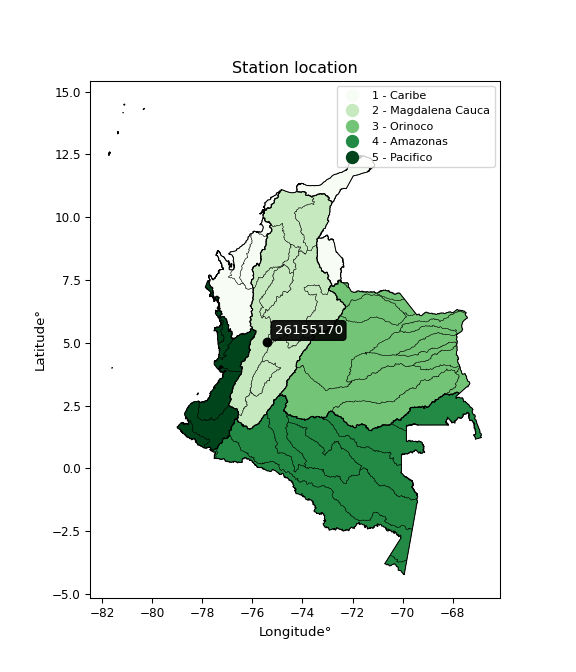</img>

</div>


## A. General information


### 1. General running parameters

• app_version: _v20251225_. • runtime: _2025-12-26 14:29:50.888910_. • Python version: _3.14.0_. • SciPy version: _1.16.3_. • Pandas version: _2.3.3_. • NumPy version: _2.3.5_. • Stations dataset (station_dataset_file): _dataset/pmax24h_in/automatic_colombia.csv_. • Stations catalog (station_catalog_file): _dataset/CNE_IDEAM.xls_. • Plot only fit distributions with Δo > Δ (plot_only_fit): _True_. • Eval low extreme values, if False, evaluates high extreme values (low_extreme): _False_. • Eval every SciPy distribution as logarithmic (pdist_logarithmic_on): _True_. • Standard deviation normalized (ddof): _1.0_. • Return periods to eval in years (Tr): _[2, 2.33, 5, 10, 15, 20, 25, 50, 75, 100, 200, 250, 500, 750, 1000]_. • Minimum data sample per station, 0 means any (minimum_sample): _5_. • Z-Score threshold to adjust a value, 0 means disable (zscore): _3.5_. • Avoid zeros, e.g. rain = 0 (avoid_zeros): _True_. • Avoid null values (avoid_nans): _True_. [:file_folder:Dataset file.](../../dataset/pmax24h_in/automatic_colombia.csv)


### 2. Station info and location

|   id |   CODIGO | NOMBRE                           | CATEGORIA               | TECNOLOGIA                              | ESTADO   | FECHA_INSTALACION   |   FECHA_SUSPENSION |   ALTITUD |   LATITUD |   LONGITUD | DEPARTAMENTO   | MUNICIPIO   | AREA_OPERATIVA                         | ENTIDAD                                                     | AREA_HIDROGRAFICA   | ZONA_HIDROGRAFICA   | SUBZONA_HIDROGRAFICA   |   CORRIENTE | OBSERVACION                                                                                                                                                                                                                                    | SUBRED                                        | Catalogo   |
|-----:|---------:|:---------------------------------|:------------------------|:----------------------------------------|:---------|:--------------------|-------------------:|----------:|----------:|-----------:|:---------------|:------------|:---------------------------------------|:------------------------------------------------------------|:--------------------|:--------------------|:-----------------------|------------:|:-----------------------------------------------------------------------------------------------------------------------------------------------------------------------------------------------------------------------------------------------|:----------------------------------------------|:-----------|
|    0 | 26155170 | TESORITO FINCA  - AUT [26155170] | Climatológica Ordinaria | Automática con Telemetría, Convencional | Activa   | 15/10/1992          |                nan |      2325 |   5.03222 |   -75.4383 | Caldas         | Manizales   | Area Operativa 09 - Cauca-Valle-Caldas | INSTITUTO DE HIDROLOGIA METEOROLOGIA Y ESTUDIOS AMBIENTALES | Magdalena Cauca     | Cauca               | Río Chinchiná          |         nan | Cambio de tecnología por instalación o repotenciación de estaciones proyecto Fondo de Adaptación|25/08/2022$Migracion$Se Cambia Estado por orden de la Coordinación de Planeacion Operativa Decisión tomada en la Reunión de la RED 19/08/2022 | RED ALERTAS - AREA OPERATIVA 09,Zona cafetera | CNE_IDEAM  |

<div align="center">

Map location in: [:earth_americas:Google](http://maps.google.com/maps?q=5.032222222,-75.43833333) [:earth_americas:OSM](https://www.openstreetmap.org/#map=18/5.032222222/-75.43833333&layers=P) [:earth_americas:Bing](https://www.bing.com/maps?cp=5.032222222~-75.43833333&lvl=18) [:earth_americas:Apple](https://maps.apple.com/frame?center=5.032222222%2C-75.43833333&span=0.003%2C0.006)

</div>


<div align="center">

```geojson
{
  "type": "Feature",
  "geometry": {
    "type": "Point", 
    "coordinates": [-75.43833333, 5.032222222]
  }, 
  "properties": {
    "Name": "26155170"
  }
}
```

</div>


### 3. Discrete values table and plot

|               |           0 |           1 |            2 |           3 |          4 |           5 |
|:--------------|------------:|------------:|-------------:|------------:|-----------:|------------:|
| Date          | 2017        | 2018        | 2019         | 2020        | 2024       | 2025        |
| Value         |   20.1      |   24.6      |   35.5       |   28.9      |   71.6     |   30.4      |
| Value_initial |   20.1      |   24.6      |   35.5       |   28.9      |   71.6     |   30.4      |
| count         |    6        |    6        |    6         |    6        |    6       |    6        |
| mean          |   35.1833   |   35.1833   |   35.1833    |   35.1833   |   35.1833  |   35.1833   |
| std           |   18.5911   |   18.5911   |   18.5911    |   18.5911   |   18.5911  |   18.5911   |
| zscore        |   -0.811319 |   -0.569268 |    0.0170332 |   -0.337975 |    1.95882 |   -0.257291 |

<div align="center">

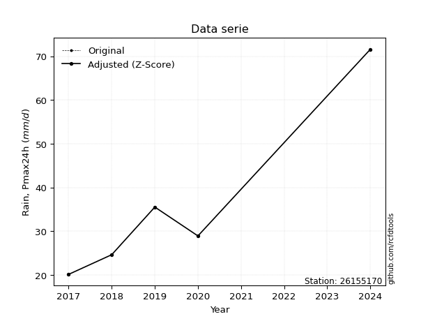</img>

</div>

> If Z-Score is active, values out of range or outliers are replaced with the station mean value.


### 4. Active continuous probability distributions from SciPy (45 of 104 available)

[scipy.stats](https://docs.scipy.org/doc/scipy/reference/stats.html) is a Python´s powerful submodule within the SciPy library for comprehensive statistical analysis, offering over 130 probability distributions (like Normal, Poisson), functions for descriptive stats (mean, variance), hypothesis testing (t-tests, chi-square), random variable generation, and statistical tests, making it essential for data science, modeling, and research. It provides tools to explore, model, and draw conclusions from data efficiently, working seamlessly with NumPy.

<div align="center">

|   id | p_dist             |   n_parameter | fit_method   | label                                                                       | active   | ref                                                                                                        |
|-----:|:-------------------|--------------:|:-------------|:----------------------------------------------------------------------------|:---------|:-----------------------------------------------------------------------------------------------------------|
|    0 | alpha              |             3 | MLE          | Alpha                                                                       | True     | [:mortar_board:](https://docs.scipy.org/doc/scipy/reference/generated/scipy.stats.alpha.html)              |
|    1 | betaprime          |             4 | MLE          | Beta prime                                                                  | True     | [:mortar_board:](https://docs.scipy.org/doc/scipy/reference/generated/scipy.stats.betaprime.html)          |
|    2 | chi2               |             3 | MLE          | Chi²                                                                        | True     | [:mortar_board:](https://docs.scipy.org/doc/scipy/reference/generated/scipy.stats.chi2.html)               |
|    3 | crystalball        |             4 | MLE          | Crystalball                                                                 | True     | [:mortar_board:](https://docs.scipy.org/doc/scipy/reference/generated/scipy.stats.crystalball.html)        |
|    4 | erlang             |             3 | MLE          | Erlang                                                                      | True     | [:mortar_board:](https://docs.scipy.org/doc/scipy/reference/generated/scipy.stats.erlang.html)             |
|    5 | expon              |             2 | MLE          | Exponential                                                                 | True     | [:mortar_board:](https://docs.scipy.org/doc/scipy/reference/generated/scipy.stats.expon.html)              |
|    6 | exponnorm          |             3 | MLE          | Exponentially modified Normal                                               | True     | [:mortar_board:](https://docs.scipy.org/doc/scipy/reference/generated/scipy.stats.exponnorm.html)          |
|    7 | f                  |             4 | MLE          | F                                                                           | True     | [:mortar_board:](https://docs.scipy.org/doc/scipy/reference/generated/scipy.stats.f.html)                  |
|    8 | fatiguelife        |             3 | MLE          | Fatigue-life (Birnbaum-Saunders)                                            | True     | [:mortar_board:](https://docs.scipy.org/doc/scipy/reference/generated/scipy.stats.fatiguelife.html)        |
|    9 | fisk               |             3 | MLE          | Fisk                                                                        | True     | [:mortar_board:](https://docs.scipy.org/doc/scipy/reference/generated/scipy.stats.fisk.html)               |
|   10 | gamma              |             3 | MLE          | Gamma                                                                       | True     | [:mortar_board:](https://docs.scipy.org/doc/scipy/reference/generated/scipy.stats.gamma.html)              |
|   11 | genexpon           |             5 | MLE          | Generalized exponential                                                     | True     | [:mortar_board:](https://docs.scipy.org/doc/scipy/reference/generated/scipy.stats.genexpon.html)           |
|   12 | genlogistic        |             3 | MLE          | Generalized logistic                                                        | True     | [:mortar_board:](https://docs.scipy.org/doc/scipy/reference/generated/scipy.stats.genlogistic.html)        |
|   13 | gibrat             |             2 | MM           | Gibrat                                                                      | True     | [:mortar_board:](https://docs.scipy.org/doc/scipy/reference/generated/scipy.stats.gibrat.html)             |
|   14 | gompertz           |             3 | MLE          | Gompertz (or truncated Gumbel)                                              | True     | [:mortar_board:](https://docs.scipy.org/doc/scipy/reference/generated/scipy.stats.gompertz.html)           |
|   15 | gumbel_l           |             2 | MM           | Gumbel Left Skew                                                            | True     | [:mortar_board:](https://docs.scipy.org/doc/scipy/reference/generated/scipy.stats.gumbel_l.html)           |
|   16 | gumbel_r           |             2 | MM           | Gumbel Right Skew                                                           | True     | [:mortar_board:](https://docs.scipy.org/doc/scipy/reference/generated/scipy.stats.gumbel_r.html)           |
|   17 | halflogistic       |             2 | MM           | Half-logistic                                                               | True     | [:mortar_board:](https://docs.scipy.org/doc/scipy/reference/generated/scipy.stats.halflogistic.html)       |
|   18 | halfnorm           |             2 | MM           | Half Normal                                                                 | True     | [:mortar_board:](https://docs.scipy.org/doc/scipy/reference/generated/scipy.stats.halfnorm.html)           |
|   19 | hypsecant          |             2 | MM           | hyperbolic secant                                                           | True     | [:mortar_board:](https://docs.scipy.org/doc/scipy/reference/generated/scipy.stats.hypsecant.html)          |
|   20 | invgamma           |             3 | MLE          | Inverted gamma                                                              | True     | [:mortar_board:](https://docs.scipy.org/doc/scipy/reference/generated/scipy.stats.invgamma.html)           |
|   21 | invgauss           |             3 | MLE          | Inverse Gaussian                                                            | True     | [:mortar_board:](https://docs.scipy.org/doc/scipy/reference/generated/scipy.stats.invgauss.html)           |
|   22 | invweibull         |             3 | MLE          | Inverted Weibull                                                            | True     | [:mortar_board:](https://docs.scipy.org/doc/scipy/reference/generated/scipy.stats.invweibull.html)         |
|   23 | johnsonsu          |             4 | MLE          | Johnson Su                                                                  | True     | [:mortar_board:](https://docs.scipy.org/doc/scipy/reference/generated/scipy.stats.johnsonsu.html)          |
|   24 | kstwobign          |             2 | MLE          | Limiting distribution of scaled Kolmogorov-Smirnov two-sided test statistic | True     | [:mortar_board:](https://docs.scipy.org/doc/scipy/reference/generated/scipy.stats.kstwobign.html)          |
|   25 | laplace            |             2 | MM           | Laplace                                                                     | True     | [:mortar_board:](https://docs.scipy.org/doc/scipy/reference/generated/scipy.stats.laplace.html)            |
|   26 | laplace_asymmetric |             3 | MLE          | Asymmetric Laplace                                                          | True     | [:mortar_board:](https://docs.scipy.org/doc/scipy/reference/generated/scipy.stats.laplace_asymmetric.html) |
|   27 | loggamma           |             3 | MLE          | Log gamma                                                                   | True     | [:mortar_board:](https://docs.scipy.org/doc/scipy/reference/generated/scipy.stats.loggamma.html)           |
|   28 | logistic           |             2 | MM           | Logistic (or Sech-squared)                                                  | True     | [:mortar_board:](https://docs.scipy.org/doc/scipy/reference/generated/scipy.stats.logistic.html)           |
|   29 | lognorm            |             3 | MLE          | Log Normal                                                                  | True     | [:mortar_board:](https://docs.scipy.org/doc/scipy/reference/generated/scipy.stats.lognorm.html)            |
|   30 | maxwell            |             2 | MM           | Maxwell                                                                     | True     | [:mortar_board:](https://docs.scipy.org/doc/scipy/reference/generated/scipy.stats.maxwell.html)            |
|   31 | mielke             |             4 | MLE          | Mielke Beta-Kappa / Dagum                                                   | True     | [:mortar_board:](https://docs.scipy.org/doc/scipy/reference/generated/scipy.stats.mielke.html)             |
|   32 | moyal              |             2 | MM           | Moyal                                                                       | True     | [:mortar_board:](https://docs.scipy.org/doc/scipy/reference/generated/scipy.stats.moyal.html)              |
|   33 | nakagami           |             3 | MLE          | Nakagami                                                                    | True     | [:mortar_board:](https://docs.scipy.org/doc/scipy/reference/generated/scipy.stats.nakagami.html)           |
|   34 | ncf                |             5 | MLE          | Non-central F distribution                                                  | True     | [:mortar_board:](https://docs.scipy.org/doc/scipy/reference/generated/scipy.stats.ncf.html)                |
|   35 | nct                |             4 | MLE          | Non-central Student’s t                                                     | True     | [:mortar_board:](https://docs.scipy.org/doc/scipy/reference/generated/scipy.stats.nct.html)                |
|   36 | norm               |             2 | MM           | Normal                                                                      | True     | [:mortar_board:](https://docs.scipy.org/doc/scipy/reference/generated/scipy.stats.norm.html)               |
|   37 | pareto             |             3 | MLE          | Pareto                                                                      | True     | [:mortar_board:](https://docs.scipy.org/doc/scipy/reference/generated/scipy.stats.pareto.html)             |
|   38 | pearson3           |             3 | MM           | Pearson type III                                                            | True     | [:mortar_board:](https://docs.scipy.org/doc/scipy/reference/generated/scipy.stats.pearson3.html)           |
|   39 | rayleigh           |             2 | MM           | Rayleigh                                                                    | True     | [:mortar_board:](https://docs.scipy.org/doc/scipy/reference/generated/scipy.stats.rayleigh.html)           |
|   40 | rice               |             3 | MLE          | Rice                                                                        | True     | [:mortar_board:](https://docs.scipy.org/doc/scipy/reference/generated/scipy.stats.rice.html)               |
|   41 | t                  |             3 | MLE          | Student’s t                                                                 | True     | [:mortar_board:](https://docs.scipy.org/doc/scipy/reference/generated/scipy.stats.t.html)                  |
|   42 | truncnorm          |             4 | MLE          | Truncated normal                                                            | True     | [:mortar_board:](https://docs.scipy.org/doc/scipy/reference/generated/scipy.stats.truncnorm.html)          |
|   43 | wald               |             2 | MM           | Wald                                                                        | True     | [:mortar_board:](https://docs.scipy.org/doc/scipy/reference/generated/scipy.stats.wald.html)               |
|   44 | weibull_min        |             3 | MLE          | Weibull minimum                                                             | True     | [:mortar_board:](https://docs.scipy.org/doc/scipy/reference/generated/scipy.stats.weibull_min.html)        |

</div>

> **n_parameter:** # arguments & localization & scale.
>
> **Fit methods:** (MLE) maximum likelihood, (MM) L-moments.
>
>**Inactive:** foldnorm, gennorm, norminvgauss, powernorm, powerlognorm, skewnorm, genextreme, anglit, arcsine, argus, beta, bradford, burr, burr12, cauchy, cosine, halfcauchy, foldcauchy, skewcauchy, wrapcauchy, dgamma, gengamma, exponweib, exponpow, truncexpon, gausshyper, genhalflogistic, genhyperbolic, geninvgauss, halfgennorm, johnsonsb, kappa4, kappa3, ksone, kstwo, loglaplace, levy, levy_l, levy_stable, ncx2, genpareto, truncpareto, lomax, powerlaw, rdist, rel_breitwigner, recipinvgauss, semicircular, studentized_range, trapezoid, triang, truncweibull_min, tukeylambda, uniform, loguniform, vonmises, vonmises_line, weibull_max, dweibull, 


## B. Probability distributions vs. Empirical distributions

A continuous probability distribution (CPD) describes probabilities for variables that can take any value within a range (like rain any time), unlike discrete variables with specific outcomes (like temperature). It uses a Probability Density Function (PDF), a curve where the total area under it equals 1, and the probability of the variable falling within an interval (a to b) is found by calculating the area under the curve between those points. A key feature is that the probability of hitting any single exact value is zero, so probabilities are always expressed for ranges, e.g., $P(a ≤ X ≤ b)$.

<div align="center">

Distributions parameters
|    |   station | p_dist                |   n |           loc |         scale | shape                  | shape1                | shape2             | shape3   |
|---:|----------:|:----------------------|----:|--------------:|--------------:|:-----------------------|:----------------------|:-------------------|:---------|
|  0 |  26155170 | alpha                 |   6 |     7.95328   |  46.8471      | 2.202775448144052      |                       |                    |          |
|  1 |  26155170 | betaprime             |   6 |    -0.751331  |   1.56921     | 155.46281951054834     | 7.873464313557903     |                    |          |
|  2 |  26155170 | chi2                  |   6 |    20.1       |   6.13538     | 0.506368773986196      |                       |                    |          |
|  3 |  26155170 | crystalball           |   6 |    35.1833    |  16.9713      | 3865.8346391416358     | 21.452832596634646    |                    |          |
|  4 |  26155170 | erlang                |   6 |    20.1       |  19.5363      | 0.2787122567584541     |                       |                    |          |
|  5 |  26155170 | expon                 |   6 |    20.1       |  15.0833      |                        |                       |                    |          |
|  6 |  26155170 | exponnorm             |   6 |    20.0855    |   0.00438416  | 3426.8328343380267     |                       |                    |          |
|  7 |  26155170 | f                     |   6 |    14.8888    |  12.084       | 2925.573504145126      | 4.530537236887267     |                    |          |
|  8 |  26155170 | fatiguelife           |   6 |    18.4118    |   9.88727     | 1.1664795530372207     |                       |                    |          |
|  9 |  26155170 | fisk                  |   6 |    19.2971    |   9.44991     | 1.4275250774051644     |                       |                    |          |
| 10 |  26155170 | gamma                 |   6 |    20.1       |  15.1766      | 0.7210809272797057     |                       |                    |          |
| 11 |  26155170 | genexpon              |   6 |    20.1       |  21.116       | 1.3999777751227482     | 9.625002625577345e-10 | 1.4082517816424143 |          |
| 12 |  26155170 | genlogistic           |   6 |   -46.6244    |   9.87459     | 1975.2234892225097     |                       |                    |          |
| 13 |  26155170 | gibrat                |   6 |    22.2364    |   7.85272     |                        |                       |                    |          |
| 14 |  26155170 | gompertz              |   6 |    20.1       |   8.83457e+12 | 413842094956.0323      |                       |                    |          |
| 15 |  26155170 | gumbel_l              |   6 |    42.8213    |  13.2325      |                        |                       |                    |          |
| 16 |  26155170 | gumbel_r              |   6 |    27.5453    |  13.2325      |                        |                       |                    |          |
| 17 |  26155170 | halflogistic          |   6 |    15.0684    |  14.5099      |                        |                       |                    |          |
| 18 |  26155170 | halfnorm              |   6 |    12.72      |  28.1536      |                        |                       |                    |          |
| 19 |  26155170 | hypsecant             |   6 |    35.1833    |  10.8043      |                        |                       |                    |          |
| 20 |  26155170 | invgamma              |   6 |    14.8795    |  27.3854      | 2.2652702751821403     |                       |                    |          |
| 21 |  26155170 | invgauss              |   6 |    17.286     |  15.2857      | 1.1708502446203146     |                       |                    |          |
| 22 |  26155170 | invweibull            |   6 |    20.1       |   1.67242     | 0.06901397284280011    |                       |                    |          |
| 23 |  26155170 | johnsonsu             |   6 |    18.584     |   0.0393724   | -5.808548804901492     | 0.9323528603157911    |                    |          |
| 24 |  26155170 | kstwobign             |   6 |    -9.43929   |  52.0285      |                        |                       |                    |          |
| 25 |  26155170 | laplace               |   6 |    35.1833    |  12.0005      |                        |                       |                    |          |
| 26 |  26155170 | laplace_asymmetric    |   6 |    20.1       |   0.000256864 | 1.7029637291654753e-05 |                       |                    |          |
| 27 |  26155170 | loggamma              |   6 | -5640.04      | 753.231       | 1871.801513668173      |                       |                    |          |
| 28 |  26155170 | logistic              |   6 |    35.1833    |   9.35676     |                        |                       |                    |          |
| 29 |  26155170 | lognorm               |   6 |    20.1       |   0.0323646   | 13.36531235834979      |                       |                    |          |
| 30 |  26155170 | maxwell               |   6 |    -5.0315    |  25.2009      |                        |                       |                    |          |
| 31 |  26155170 | mielke                |   6 |     0.586755  |   7.52712     | 246.72742688595952     | 3.4350029967418614    |                    |          |
| 32 |  26155170 | moyal                 |   6 |    25.4781    |   7.63977     |                        |                       |                    |          |
| 33 |  26155170 | nakagami              |   6 |    20.1       |  31.2929      | 0.2690175151561178     |                       |                    |          |
| 34 |  26155170 | ncf                   |   6 |    14.8836    |  10.6767      | 6578.222047021487      | 4.530540860082731     | 868.9037610818446  |          |
| 35 |  26155170 | nct                   |   6 |    -0.0903277 |   0.413151    | 4.4587412867553216     | 69.20724612316411     |                    |          |
| 36 |  26155170 | norm                  |   6 |    35.1833    |  16.9713      |                        |                       |                    |          |
| 37 |  26155170 | pareto                |   6 |    20.0642    |   0.0358464   | 0.20444339745517898    |                       |                    |          |
| 38 |  26155170 | pearson3              |   6 |    35.1833    |  16.9713      | 1.4770212583510214     |                       |                    |          |
| 39 |  26155170 | rayleigh              |   6 |     2.71626   |  25.905       |                        |                       |                    |          |
| 40 |  26155170 | rice                  |   6 |    10.1659    |  21.3764      | 0.0007722123106861178  |                       |                    |          |
| 41 |  26155170 | t                     |   6 |    29.8945    |  15.909       | 4.061036269019887      |                       |                    |          |
| 42 |  26155170 | truncnorm             |   6 | -6886.38      | 343.107       | 20.129222428141123     | 20.279321487269886    |                    |          |
| 43 |  26155170 | wald                  |   6 |    18.212     |  16.9713      |                        |                       |                    |          |
| 44 |  26155170 | weibull_min           |   6 |    20.1       |   9.71813     | 0.8500049417538349     |                       |                    |          |
| 45 |  26155170 | logalpha              |   6 |     2.07947   |   5.18944     | 4.005082276950224      |                       |                    |          |
| 46 |  26155170 | logbetaprime          |   6 |     2.60958   |   0.126767    | 37.001176775390675     | 6.474844450605161     |                    |          |
| 47 |  26155170 | logchi2               |   6 |     3.00072   |   0.958613    | 1.0388535704165465     |                       |                    |          |
| 48 |  26155170 | logcrystalball        |   6 |     3.4704    |   0.399513    | 700.1969186238537      | 1.6629424178872907    |                    |          |
| 49 |  26155170 | logerlang             |   6 |     3.00072   |   0.423579    | 0.8415434872472809     |                       |                    |          |
| 50 |  26155170 | logexpon              |   6 |     3.00072   |   0.469677    |                        |                       |                    |          |
| 51 |  26155170 | logexponnorm          |   6 |     3.0908    |   0.148582    | 2.5547990633210693     |                       |                    |          |
| 52 |  26155170 | logf                  |   6 |     2.57411   |   0.754697    | 460.3907262550532      | 12.327008085145867    |                    |          |
| 53 |  26155170 | logfatiguelife        |   6 |     2.79823   |   0.561478    | 0.6267204879616403     |                       |                    |          |
| 54 |  26155170 | logfisk               |   6 |     2.81325   |   0.556581    | 2.813865009807146      |                       |                    |          |
| 55 |  26155170 | loggamma              |   6 |     3.00072   |   0.406564    | 0.4022551648098881     |                       |                    |          |
| 56 |  26155170 | loggenexpon           |   6 |     3.00072   |   0.792502    | 1.4208709471663497     | 1.175844976961197     | 0.5442020300424195 |          |
| 57 |  26155170 | loggenlogistic        |   6 |     1.31958   |   0.287016    | 970.0885764707114      |                       |                    |          |
| 58 |  26155170 | loggibrat             |   6 |     3.16567   |   0.184828    |                        |                       |                    |          |
| 59 |  26155170 | loggompertz           |   6 |     3.00072   |   1.97912     | 3.380296380404978      |                       |                    |          |
| 60 |  26155170 | loggumbel_l           |   6 |     3.6502    |   0.311499    |                        |                       |                    |          |
| 61 |  26155170 | loggumbel_r           |   6 |     3.29059   |   0.311499    |                        |                       |                    |          |
| 62 |  26155170 | loghalflogistic       |   6 |     2.99688   |   0.341569    |                        |                       |                    |          |
| 63 |  26155170 | loghalfnorm           |   6 |     2.9416    |   0.662751    |                        |                       |                    |          |
| 64 |  26155170 | loghypsecant          |   6 |     3.4704    |   0.254338    |                        |                       |                    |          |
| 65 |  26155170 | loginvgamma           |   6 |     2.56416   |   4.70177     | 6.1622171288669545     |                       |                    |          |
| 66 |  26155170 | loginvgauss           |   6 |     2.7607    |   1.96061     | 0.36197897719016425    |                       |                    |          |
| 67 |  26155170 | loginvweibull         |   6 |     1.5104    |   1.76053     | 6.557075244921601      |                       |                    |          |
| 68 |  26155170 | logjohnsonsu          |   6 |     2.78564   |   0.0152265   | -7.3765900554191814    | 1.7027732073678399    |                    |          |
| 69 |  26155170 | logkstwobign          |   6 |     2.25365   |   1.40476     |                        |                       |                    |          |
| 70 |  26155170 | loglaplace            |   6 |     3.4704    |   0.282498    |                        |                       |                    |          |
| 71 |  26155170 | loglaplace_asymmetric |   6 |     3.36384   |   0.265624    | 0.8193403502548104     |                       |                    |          |
| 72 |  26155170 | logloggamma           |   6 |  -121.292     |  16.8364      | 1653.4059904649198     |                       |                    |          |
| 73 |  26155170 | loglogistic           |   6 |     3.4704    |   0.220263    |                        |                       |                    |          |
| 74 |  26155170 | loglognorm            |   6 |     3.00072   |   0.00146136  | 12.901407024235187     |                       |                    |          |
| 75 |  26155170 | logmaxwell            |   6 |     2.52372   |   0.593242    |                        |                       |                    |          |
| 76 |  26155170 | logmielke             |   6 |     1.73626   |   0.858176    | 170.10109814393786     | 5.794542179864948     |                    |          |
| 77 |  26155170 | logmoyal              |   6 |     3.24193   |   0.179844    |                        |                       |                    |          |
| 78 |  26155170 | lognakagami           |   6 |     3.00072   |   0.8417      | 0.2956856505518186     |                       |                    |          |
| 79 |  26155170 | logncf                |   6 |     2.56429   |   0.490053    | 31681.96938854335      | 12.324448258925223    | 17639.04562721656  |          |
| 80 |  26155170 | lognct                |   6 |    -0.0587494 |   0.0489451   | 46.63773154092186      | 70.8410060754702      |                    |          |
| 81 |  26155170 | lognorm               |   6 |     3.4704    |   0.399513    |                        |                       |                    |          |
| 82 |  26155170 | logpareto             |   6 |     2.99942   |   0.00130126  | 0.20395178087641094    |                       |                    |          |
| 83 |  26155170 | logpearson3           |   6 |     3.4704    |   0.399513    | 1.0197026340778739     |                       |                    |          |
| 84 |  26155170 | lograyleigh           |   6 |     2.7061    |   0.609817    |                        |                       |                    |          |
| 85 |  26155170 | logrice               |   6 |     2.81157   |   0.544821    | 0.00039775021675454464 |                       |                    |          |
| 86 |  26155170 | logt                  |   6 |     3.36655   |   0.219523    | 1.9454923292042259     |                       |                    |          |
| 87 |  26155170 | logtruncnorm          |   6 |    -0.172027  |   1.50527     | 2.1075817831487127     | 2.9519338433156013    |                    |          |
| 88 |  26155170 | logwald               |   6 |     3.07092   |   0.39948     |                        |                       |                    |          |
| 89 |  26155170 | logweibull_min        |   6 |     3.00072   |   0.297072    | 0.4303068741413449     |                       |                    |          |

</div>

> **loc** (Location parameter): This shifts the distribution along the x-axis. For many common distributions, like the normal (Gaussian) distribution, loc represents the mean $μ$. For others, like the uniform distribution, it might represent the minimum value, or for the beta distribution, the left end of the support interval.
>
> **scale** (Scale parameter): This determines the width or spread of the distribution. For the normal distribution, scale represents the standard deviation $σ$. For a uniform distribution, it defines the length of the interval (from $loc$ to $loc + scale$).
>
> **shape** (Shape parameters): Refers to parameters that define the specific form of a probability distribution, distinct from its location (loc) and scale (scale). These parameters are required arguments for most distribution functions. For example, a normal (Gaussian) distribution is fully defined by its location (mean) and scale (standard deviation), so it has no specific shape parameters beyond loc and scale. However, other distributions have intrinsic properties that need specification, as Gamma distribution that takes a shape parameter, often named $a$ or $alpha$.


### 0. Cumulative distribution values - CDF (90 evaluated)

> Ordered by x ascending and calculating $log(f(x))$ separately. 

|   id |   Station |   date |    x |   count |    mean |     std |     zscore |   Value_initial |   station |   m |     alpha |   alpha_pdf |   betaprime |   betaprime_pdf |        chi2 |    chi2_pdf |   crystalball |   crystalball_pdf |      erlang |   erlang_pdf |    expon |   expon_pdf |   exponnorm |   exponnorm_pdf |         f |      f_pdf |   fatiguelife |   fatiguelife_pdf |      fisk |   fisk_pdf |       gamma |     gamma_pdf |    genexpon |   genexpon_pdf |   genlogistic |   genlogistic_pdf |   gibrat |   gibrat_pdf |    gompertz |   gompertz_pdf |   gumbel_l |   gumbel_l_pdf |   gumbel_r |   gumbel_r_pdf |   halflogistic |   halflogistic_pdf |   halfnorm |   halfnorm_pdf |   hypsecant |   hypsecant_pdf |   invgamma |   invgamma_pdf |   invgauss |   invgauss_pdf |   invweibull |   invweibull_pdf |   johnsonsu |   johnsonsu_pdf |   kstwobign |   kstwobign_pdf |   laplace |   laplace_pdf |   laplace_asymmetric |   laplace_asymmetric_pdf |    loggamma |   loggamma_pdf |   logistic |   logistic_pdf |   lognorm |   lognorm_pdf |   maxwell |   maxwell_pdf |    mielke |   mielke_pdf |    moyal |   moyal_pdf |    nakagami |   nakagami_pdf |      ncf |    ncf_pdf |       nct |   nct_pdf |     norm |   norm_pdf |   pareto |   pareto_pdf |   pearson3 |   pearson3_pdf |   rayleigh |   rayleigh_pdf |     rice |   rice_pdf |        t |      t_pdf |   truncnorm |   truncnorm_pdf |       wald |   wald_pdf |   weibull_min |   weibull_min_pdf |   logalpha |   logalpha_pdf |   logbetaprime |   logbetaprime_pdf |     logchi2 |   logchi2_pdf |   logcrystalball |   logcrystalball_pdf |   logerlang |   logerlang_pdf |   logexpon |   logexpon_pdf |   logexponnorm |   logexponnorm_pdf |      logf |   logf_pdf |   logfatiguelife |   logfatiguelife_pdf |   logfisk |   logfisk_pdf |   loggenexpon |   loggenexpon_pdf |   loggenlogistic |   loggenlogistic_pdf |   loggibrat |   loggibrat_pdf |   loggompertz |   loggompertz_pdf |   loggumbel_l |   loggumbel_l_pdf |   loggumbel_r |   loggumbel_r_pdf |   loghalflogistic |   loghalflogistic_pdf |   loghalfnorm |   loghalfnorm_pdf |   loghypsecant |   loghypsecant_pdf |   loginvgamma |   loginvgamma_pdf |   loginvgauss |   loginvgauss_pdf |   loginvweibull |   loginvweibull_pdf |   logjohnsonsu |   logjohnsonsu_pdf |   logkstwobign |   logkstwobign_pdf |   loglaplace |   loglaplace_pdf |   loglaplace_asymmetric |   loglaplace_asymmetric_pdf |   logloggamma |   logloggamma_pdf |   loglogistic |   loglogistic_pdf |   loglognorm |   loglognorm_pdf |   logmaxwell |   logmaxwell_pdf |   logmielke |   logmielke_pdf |   logmoyal |   logmoyal_pdf |   lognakagami |   lognakagami_pdf |    logncf |   logncf_pdf |    lognct |   lognct_pdf |   logpareto |   logpareto_pdf |   logpearson3 |   logpearson3_pdf |   lograyleigh |   lograyleigh_pdf |   logrice |   logrice_pdf |     logt |   logt_pdf |   logtruncnorm |   logtruncnorm_pdf |   logwald |   logwald_pdf |   logweibull_min |   logweibull_min_pdf |
|-----:|----------:|-------:|-----:|--------:|--------:|--------:|-----------:|----------------:|----------:|----:|----------:|------------:|------------:|----------------:|------------:|------------:|--------------:|------------------:|------------:|-------------:|---------:|------------:|------------:|----------------:|----------:|-----------:|--------------:|------------------:|----------:|-----------:|------------:|--------------:|------------:|---------------:|--------------:|------------------:|---------:|-------------:|------------:|---------------:|-----------:|---------------:|-----------:|---------------:|---------------:|-------------------:|-----------:|---------------:|------------:|----------------:|-----------:|---------------:|-----------:|---------------:|-------------:|-----------------:|------------:|----------------:|------------:|----------------:|----------:|--------------:|---------------------:|-------------------------:|------------:|---------------:|-----------:|---------------:|----------:|--------------:|----------:|--------------:|----------:|-------------:|---------:|------------:|------------:|---------------:|---------:|-----------:|----------:|----------:|---------:|-----------:|---------:|-------------:|-----------:|---------------:|-----------:|---------------:|---------:|-----------:|---------:|-----------:|------------:|----------------:|-----------:|-----------:|--------------:|------------------:|-----------:|---------------:|---------------:|-------------------:|------------:|--------------:|-----------------:|---------------------:|------------:|----------------:|-----------:|---------------:|---------------:|-------------------:|----------:|-----------:|-----------------:|---------------------:|----------:|--------------:|--------------:|------------------:|-----------------:|---------------------:|------------:|----------------:|--------------:|------------------:|--------------:|------------------:|--------------:|------------------:|------------------:|----------------------:|--------------:|------------------:|---------------:|-------------------:|--------------:|------------------:|--------------:|------------------:|----------------:|--------------------:|---------------:|-------------------:|---------------:|-------------------:|-------------:|-----------------:|------------------------:|----------------------------:|--------------:|------------------:|--------------:|------------------:|-------------:|-----------------:|-------------:|-----------------:|------------:|----------------:|-----------:|---------------:|--------------:|------------------:|----------:|-------------:|----------:|-------------:|------------:|----------------:|--------------:|------------------:|--------------:|------------------:|----------:|--------------:|---------:|-----------:|---------------:|-------------------:|----------:|--------------:|-----------------:|---------------------:|
|    0 |  26155170 |   2017 | 20.1 |       6 | 35.1833 | 18.5911 | -0.811319  |            20.1 |  26155170 |   1 | 0.0497515 |  0.0327088  |    0.104328 |      0.0266863  | 0.000128509 | 9.15819e+09 |      0.187067 |        0.015837   | 4.55296e-05 |  3.57182e+09 | 0        |  0.0662983  | 0.000962499 |      0.0664649  | 0.0470029 | 0.0377216  |     0.0426777 |        0.0653339  | 0.0287614 | 0.0496635  | 5.87064e-12 | 1191.54       | 3.70432e-11 |     0.0662995  |      0.100774 |        0.0234065  | 0        |   0          | 2.66274e-15 |     0.0468435  |   0.164386 |    0.0113408   |   0.17285  |     0.0229291  |       0.171669 |         0.0334438  |   0.206781 |     0.0273832  |    0.154503 |      0.0137452  |  0.0470031 |     0.0377217  |  0.0440498 |     0.0480033  |   3.3801e-05 |      6.7598e+09  |   0.0393456 |      0.0522738  |    0.096107 |      0.021651   |  0.142269 |    0.0118552  |          3.02547e-10 |               0.0662982  | 1.08044e-06 |    9.78663e+08 |   0.166308 |     0.0148181  |  0.119873 |      0.500337 |  0.197417 |    0.0191503  | 0.0689936 |   0.0318763  | 0.155062 |  0.0270195  | 2.05191e-09 | 310748         | 0.047003 | 0.0377217  | 0.0831871 | 0.0285281 | 0.187067 | 0.015837   | 0        |  5.70332     |   0.167356 |     0.0307343  |   0.201611 |     0.0206819  | 0.102358 | 0.0195148  | 0.285477 | 0.0188243  | 8.25737e-08 |       0.061766  | 0.00704176 | 0.0181941  |   7.55883e-14 |       18.0849     |  0.0517674 |       0.648319 |      0.0506192 |           0.709141 | 8.52566e-09 |   9.97199e+06 |         0.119873 |             0.500337 | 2.62776e-13 |     497.957     |   0        |       2.12912  |      0.0542399 |           0.574107 | 0.0488703 |   0.696519 |        0.0446828 |             0.841328 | 0.0447024 |      0.640967 |    1.5023e-10 |          1.79289  |        0.0626933 |             0.604083 |   0         |       0         |   3.16755e-11 |          1.70798  |      0.11689  |         0.352411  |     0.0791843 |          0.644656 |        0.00561982 |              1.46379  |     0.0710827 |          1.19912  |      0.0996138 |           0.385298 |     0.0488716 |          0.696506 |     0.0457109 |          0.794064 |       0.0506907 |            0.665073 |      0.0459638 |           0.761425 |      0.0601044 |           0.621435 |    0.0948244 |         0.335663 |               0.0757282 |                    0.347958 |      0.128341 |          0.501638 |      0.105993 |          0.430205 |    0.0127406 |      5.74177e+12 |     0.114293 |         0.629354 |   0.0521812 |        0.671792 |   0.050533 |       0.64114  |   7.16811e-10 |     954541        | 0.0488713 |     0.696503 | 0.0944075 |     0.570272 |    0        |     156.734     |      0.084315 |          0.72505  |      0.11015  |          0.704974 | 0.0584849 |      0.599958 | 0.120497 |  0.434874  |    0.000496278 |           1.80176  |  0        |     0         |       4.1738e-07 |          4.04427e+08 |
|    1 |  26155170 |   2018 | 24.6 |       6 | 35.1833 | 18.5911 | -0.569268  |            24.6 |  26155170 |   2 | 0.274248  |  0.0567278  |    0.250118 |      0.0363097  | 0.79893     | 0.0333923   |      0.266444 |        0.0193531  | 0.702462    |  0.0362657   | 0.257953 |  0.0491965  | 0.259543    |      0.0492856  | 0.28776   | 0.0561968  |     0.342588  |        0.0523108  | 0.304758  | 0.0570372  | 0.40426     |    0.0543149  | 0.257957    |     0.0491971  |      0.233343 |        0.0343757  | 0.114941 |   0.0820906  | 0.19006     |     0.0379404  |   0.223012 |    0.0148164   |   0.286705 |     0.0270684  |       0.31713  |         0.0309937  |   0.326954 |     0.0259263  |    0.228668 |      0.0193906  |  0.28776   |     0.0561969  |  0.311392  |     0.0547181  |   0.39299    |      0.00562911  |   0.317974  |      0.0552732  |    0.214588 |      0.030036   |  0.206996 |    0.017249   |          0.257953    |               0.0491964  | 0.745246    |    1.03067     |   0.24396  |     0.0197123  |  0.251448 |      0.797846 |  0.290365 |    0.0219273  | 0.266259  |   0.049939   | 0.289532 |  0.031564   | 0.273781    |      0.0325909 | 0.28776  | 0.0561969  | 0.248393  | 0.0417739 | 0.266444 | 0.0193531  | 0.62828  |  0.0167545   |   0.308812 |     0.0312566  |   0.3001   |     0.022824   | 0.203854 | 0.0251487  | 0.37788  | 0.0220401  | 0.244277    |       0.0474304 | 0.246579   | 0.0607262  |   0.405323    |        0.0583813  |  0.26934   |       1.35827  |      0.282116  |           1.38839  | 0.338083    |   0.810599    |         0.251448 |             0.797846 | 0.461844    |       1.47031   |   0.349582 |       1.38482  |      0.258853  |           1.35816  | 0.278225  |   1.37929  |        0.299618  |             1.38912  | 0.268075  |      1.41749  |    0.317556   |          1.35471  |        0.253866  |             1.21175  |   0.0540823 |       2.96084   |   0.304611    |          1.31535  |      0.211617 |         0.601782  |     0.26559   |          1.1304   |        0.29255    |              1.33855  |     0.306447  |          1.11397  |      0.213835  |           0.778925 |     0.278226  |          1.37931  |     0.292736  |          1.3865   |       0.273715  |            1.37409  |      0.288059  |           1.39208  |      0.248669  |           1.15423  |    0.193866  |         0.686257 |               0.191603  |                    0.880384 |      0.257861 |          0.775826 |      0.228793 |          0.801074 |    0.648789  |      0.142288    |     0.273269 |         0.915229 |   0.275977  |        1.37357  |   0.264812 |       1.32837  |   0.332663    |          0.961042 | 0.278226  |     1.37931  | 0.253109  |     0.975176 |    0.643086 |       0.35801   |      0.277528 |          1.10653  |      0.282249 |          0.958558 | 0.227214  |      1.01841  | 0.267617 |  1.1082    |    0.31666     |           1.34563  |  0.197853 |     2.66844   |       0.571351   |          0.773419    |
|    2 |  26155170 |   2020 | 28.9 |       6 | 35.1833 | 18.5911 | -0.337975  |            28.9 |  26155170 |   3 | 0.493365  |  0.0431669  |    0.408649 |      0.0361765  | 0.892941    | 0.0142539   |      0.355604 |        0.0219498  | 0.811441    |  0.0179398   | 0.442016 |  0.0369934  | 0.443841    |      0.0370186  | 0.49676   | 0.0403217  |     0.520174  |        0.032581   | 0.505733  | 0.0371589  | 0.588637    |    0.0339336  | 0.442022    |     0.0369937  |      0.389996 |        0.0371803  | 0.434788 |   0.059067   | 0.337823    |     0.0310187  |   0.294761 |    0.018612    |   0.405476 |     0.0276608  |       0.443539 |         0.0276803  |   0.434509 |     0.0240262  |    0.324514 |      0.0250966  |  0.49676   |     0.0403217  |  0.505068  |     0.0363376  |   0.409948   |      0.00286691  |   0.511733  |      0.0360403  |    0.350734 |      0.0324208  |  0.296195 |    0.0246819  |          0.442016    |               0.0369934  | 0.860241    |    0.488455    |   0.338155 |     0.0239192  |  0.394846 |      0.963679 |  0.387868 |    0.0231863  | 0.47026   |   0.0428192  | 0.424087 |  0.0303262  | 0.39145     |      0.0235351 | 0.49676  | 0.0403217  | 0.426884  | 0.0395261 | 0.355604 | 0.0219498  | 0.675652 |  0.00750476  |   0.437828 |     0.0284272  |   0.399996 |     0.023411   | 0.318891 | 0.0279243  | 0.476556 | 0.0235357  | 0.424518    |       0.0368461 | 0.468217   | 0.0421854  |   0.601124    |        0.0354113  |  0.485906  |       1.25427  |      0.497333  |           1.2199   | 0.445954    |   0.562263    |         0.394845 |             0.963679 | 0.649692    |       0.915985  |   0.538435 |       0.98273  |      0.480011  |           1.28276  | 0.492169  |   1.21363  |        0.504673  |             1.12535  | 0.492393  |      1.27735  |    0.509808   |          1.03937  |        0.457336  |             1.24608  |   0.527783  |       2.00825   |   0.493761    |          1.03877  |      0.328877 |         0.859219  |     0.453638  |          1.15115  |        0.490842   |              1.11116  |     0.475946  |          0.982762 |      0.370382  |           1.14919  |     0.492173  |          1.21364  |     0.500248  |          1.14965  |       0.489795  |            1.23681  |      0.498708  |           1.17446  |      0.440006  |           1.16938  |    0.342894  |         1.21379  |               0.40167   |                    1.8456   |      0.396516 |          0.928816 |      0.381364 |          1.07111  |    0.665493  |      0.0777205   |     0.428733 |         0.989559 |   0.491267  |        1.22821  |   0.476139 |       1.22623  |   0.466523    |          0.72809  | 0.492172  |     1.21364  | 0.42357   |     1.10269  |    0.68313  |       0.177338  |      0.457379 |          1.08758  |      0.441035 |          0.98864  | 0.401761  |      1.11306  | 0.495656 |  1.60526   |    0.509044    |           1.05253  |  0.536424 |     1.51514   |       0.663861   |          0.434273    |
|    3 |  26155170 |   2025 | 30.4 |       6 | 35.1833 | 18.5911 | -0.257291  |            30.4 |  26155170 |   4 | 0.553716  |  0.0373607  |    0.46186  |      0.0346845  | 0.911922    | 0.0112149   |      0.38903  |        0.0225915  | 0.835909    |  0.0148309   | 0.494836 |  0.0334915  | 0.496687    |      0.0335011  | 0.553135  | 0.0349451  |     0.565698  |        0.0282714  | 0.557279  | 0.0317211  | 0.636044    |    0.0294198  | 0.494843    |     0.0334917  |      0.445329 |        0.0364746  | 0.515486 |   0.0488315  | 0.382754    |     0.0289139  |   0.323712 |    0.0199903   |   0.446662 |     0.027205   |       0.484093 |         0.0263839  |   0.469985 |     0.0232686  |    0.363466 |      0.0267926  |  0.553136  |     0.0349451  |  0.555847  |     0.0315045  |   0.413916   |      0.00244639  |   0.561979  |      0.0310981  |    0.399221 |      0.0321491  |  0.335632 |    0.0279681  |          0.494836    |               0.0334915  | 0.882597    |    0.398939    |   0.374908 |     0.0250463  |  0.444308 |      0.988826 |  0.422749 |    0.0232932  | 0.531309  |   0.0385438  | 0.468693 |  0.0291017  | 0.425339    |      0.021713  | 0.553136 | 0.0349451  | 0.48431   | 0.0369582 | 0.38903  | 0.0225915  | 0.685884 |  0.00621322  |   0.479483 |     0.0270957  |   0.435052 |     0.0233059  | 0.361091 | 0.0282915  | 0.511924 | 0.0235782  | 0.477422    |       0.0337381 | 0.527164   | 0.036547   |   0.650297    |        0.0303215  |  0.546895  |       1.15369  |      0.556436  |           1.11459  | 0.473156    |   0.514339    |         0.444308 |             0.988826 | 0.692931    |       0.796213  |   0.585577 |       0.882359 |      0.54208   |           1.16762  | 0.55099   |   1.10969  |        0.55902   |             1.02279  | 0.55403   |      1.15645  |    0.56012    |          0.950063 |        0.51896   |             1.1856   |   0.616807  |       1.53442   |   0.544298    |          0.959291 |      0.374463 |         0.942114  |     0.510718  |          1.10168  |        0.545      |              1.02904  |     0.524438  |          0.933377 |      0.430531  |           1.22184  |     0.550994  |          1.10969  |     0.555833  |          1.047    |       0.549795  |            1.13263  |      0.5555    |           1.06954  |      0.498037  |           1.12136  |    0.410157  |         1.45189  |               0.488136  |                    1.57889  |      0.44418  |          0.95287  |      0.436831 |          1.11689  |    0.669167  |      0.067917    |     0.478678 |         0.982207 |   0.550796  |        1.12278  |   0.535904 |       1.13373  |   0.502096    |          0.67906  | 0.550993  |     1.10969  | 0.479267  |     1.09512  |    0.691422 |       0.151642  |      0.511306 |          1.04158  |      0.490645 |          0.970204 | 0.457856  |      1.10111  | 0.575986 |  1.54929   |    0.560245    |           0.972068 |  0.605812 |     1.23813   |       0.68437    |          0.37857     |
|    4 |  26155170 |   2019 | 35.5 |       6 | 35.1833 | 18.5911 |  0.0170332 |            35.5 |  26155170 |   5 | 0.701904  |  0.022016   |    0.620786 |      0.0272938  | 0.952358    | 0.00548072  |      0.507443 |        0.0235028  | 0.893495    |  0.00854668  | 0.639763 |  0.0238831  | 0.641564    |      0.0238579  | 0.693762  | 0.0213796  |     0.68258   |        0.0185528  | 0.683457  | 0.0190605  | 0.756513    |    0.0187921  | 0.63977     |     0.0238831  |      0.617133 |        0.0301618  | 0.699918 |   0.0262172  | 0.513924    |     0.0227695  |   0.437328 |    0.0244527   |   0.577999 |     0.0239448  |       0.606938 |         0.0217654  |   0.581561 |     0.0204287  |    0.509328 |      0.0294489  |  0.693762  |     0.0213796  |  0.68457   |     0.0200627  |   0.424033   |      0.00163033  |   0.688117  |      0.0194959  |    0.555316 |      0.0285117  |  0.513021 |    0.0405798  |          0.639763    |               0.0238831  | 0.929483    |    0.225213    |   0.50846  |     0.026711   |  0.597988 |      0.968296 |  0.540181 |    0.0224685  | 0.691897  |   0.0250086  | 0.603781 |  0.0236859  | 0.524155    |      0.0173934 | 0.693762 | 0.0213796  | 0.646941  | 0.0267753 | 0.507443 | 0.0235028  | 0.710613 |  0.00383285  |   0.605203 |     0.0221625  |   0.551027 |     0.0219337  | 0.504549 | 0.0274688  | 0.628948 | 0.021862   | 0.626094    |       0.0249998 | 0.675443   | 0.0228601  |   0.772119    |        0.0186019  |  0.699319  |       0.813543 |      0.703299  |           0.784851 | 0.543995    |   0.407074    |         0.597988 |             0.968297 | 0.793788    |       0.524938  |   0.702123 |       0.634218 |      0.694193  |           0.803935 | 0.697441  |   0.784363 |        0.694539  |             0.734268 | 0.703234  |      0.776482 |    0.688116   |          0.708801 |        0.682386  |             0.908412 |   0.782788  |       0.727794  |   0.675518    |          0.738741 |      0.537845 |         1.14516   |     0.664703  |          0.871511 |        0.68489    |              0.777187 |     0.656599  |          0.768525 |      0.621044  |           1.16212  |     0.697444  |          0.784352 |     0.694529  |          0.749977 |       0.699085  |            0.796928 |      0.696677  |           0.758869 |      0.655947  |           0.903387 |    0.647982  |         1.24609  |               0.682757  |                    0.978566 |      0.592622 |          0.939132 |      0.610659 |          1.07941  |    0.678063  |      0.0488536   |     0.62469  |         0.883721 |   0.698514  |        0.78735  |   0.687535 |       0.822871 |   0.59767     |          0.559488 | 0.697444  |     0.784353 | 0.640316  |     0.957062 |    0.710771 |       0.103468  |      0.658214 |          0.843168 |      0.632988 |          0.852135 | 0.620057  |      0.970192 | 0.772454 |  0.938853  |    0.693703    |           0.756447 |  0.751148 |     0.698706  |       0.733529   |          0.266594    |
|    5 |  26155170 |   2024 | 71.6 |       6 | 35.1833 | 18.5911 |  1.95882   |            71.6 |  26155170 |   6 | 0.941776  |  0.00159563 |    0.973578 |      0.00180665 | 0.998748    | 0.000117387 |      0.984055 |        0.00235162 | 0.990947    |  0.000563805 | 0.967103 |  0.00218104 | 0.967576    |      0.00215817 | 0.946591  | 0.00182893 |     0.947247  |        0.00238569 | 0.920016  | 0.00200843 | 0.982305    |    0.00124366 | 0.967105    |     0.00218094 |      0.987604 |        0.00124753 | 0.966995 |   0.00149157 | 0.910403    |     0.00419701 |   0.999849 |    0.000100162 |   0.964815 |     0.00261164 |       0.960167 |         0.00269058 |   0.963506 |     0.00318148 |    0.978128 |      0.00202277 |  0.946591  |     0.00182892 |  0.948985  |     0.00217604 |   0.454135   |      0.000480386 |   0.940096  |      0.00209231 |    0.984378 |      0.00187077 |  0.975953 |    0.00200384 |          0.967103    |               0.00218105 | 0.991267    |    0.0248078   |   0.980004 |     0.00209435 |  0.977475 |      0.134014 |  0.973814 |    0.00287496 | 0.968298  |   0.00150855 | 0.961021 |  0.00254903 | 0.887512    |      0.0051291 | 0.946591 | 0.00182892 | 0.968773  | 0.0017342 | 0.984055 | 0.00235162 | 0.773829 |  0.000897223 |   0.960182 |     0.00271347 |   0.970853 |     0.00299193 | 0.983913 | 0.00216283 | 0.971093 | 0.00192474 | 1           |       0.0029764 | 0.958559   | 0.00202662 |   0.983863    |        0.00109911 |  0.949238  |       0.112835 |      0.950806  |           0.116831 | 0.739617    |   0.19189     |         0.977475 |             0.134014 | 0.964137    |       0.0882068 |   0.933115 |       0.142406 |      0.951816  |           0.126934 | 0.947473  |   0.120995 |        0.945104  |             0.134595 | 0.937584  |      0.112953 |    0.945247   |          0.145448 |        0.967373  |             0.111801 |   0.963157  |       0.0729022 |   0.952284    |          0.154851 |      0.999351 |         0.0153021 |     0.957958  |          0.132089 |        0.95316    |              0.13392  |     0.955147  |          0.160974 |      0.972686  |           0.10726  |     0.947471  |          0.120993 |     0.946488  |          0.131729 |       0.948996  |            0.117999 |      0.945552  |           0.126497 |      0.967674  |           0.132191 |    0.970622  |         0.103995 |               0.963561  |                    0.112399 |      0.974031 |          0.148038 |      0.974299 |          0.113684 |    0.700059  |      0.0212123   |     0.966073 |         0.152438 |   0.946327  |        0.119229 |   0.954389 |       0.126668 |   0.863303    |          0.235134 | 0.947471  |     0.120994 | 0.972148  |     0.122973 |    0.754426 |       0.0393852 |      0.957612 |          0.142314 |      0.962859 |          0.156304 | 0.972354  |      0.135938 | 0.971624 |  0.0563041 |    0.999931    |           0.213051 |  0.953359 |     0.0982698 |       0.845685   |          0.0976804   |

An Empirical Distribution Function (EDF) is a step-function estimate of a true cumulative distribution function (CDF) based on observed sample data, representing the proportion of data points less than or equal to a given value. It is calculated by ordering your data and jumping up by $1/n$ (where $n$ is sample size) at each unique data point, allowing analysis without assuming an underlying population distribution, and it gets closer to the true CDF as the sample size grows.


### 1. Empirical - EDF California (1923)

California´s estimates the true probability distribution of water-related data (like rainfall, streamflow) using observed samples, crucial for risk assessment.

<div align="center">


$P=m/n$


</div>


**1.1. Empirical values**

<div align="center">

|                | 0                   | 1                  | 2              | 3                  | 4                  | 5              |
|:---------------|:--------------------|:-------------------|:---------------|:-------------------|:-------------------|:---------------|
| date           | 2017                | 2018               | 2020           | 2025               | 2019               | 2024           |
| x              | 20.1                | 24.6               | 28.9           | 30.4               | 35.5               | 71.6           |
| m              | 1                   | 2                  | 3              | 4                  | 5                  | 6              |
| empirical_dist | edf_california      | edf_california     | edf_california | edf_california     | edf_california     | edf_california |
| empirical      | 0.16666666666666666 | 0.3333333333333333 | 0.5            | 0.6666666666666666 | 0.8333333333333334 | 1.0            |
| empirical_tr   | 1.2                 | 1.4999999999999998 | 2.0            | 2.9999999999999996 | 6.000000000000002  | inf            |

</div>


**1.2. Kolmogorov-Smirnov fit test (sorted by Δ)**


<div align="center">

|                | 0                   | 1                  | 2                   | 3                   | 4                   | 5                  | 6                   | 7                  | 8                   | 9                   | 10                 | 11                  | 12                 | 13                 | 14                  | 15                  | 16                 | 17                  | 18                 | 19                  | 20                 | 21                  | 22                  | 23                 | 24                  | 25                  | 26                | 27                  | 28                  | 29                  | 30                 | 31                  | 32                  | 33                  | 34                 | 35                  | 36                  | 37                 | 38                    | 39                  | 40                 | 41                 | 42                  | 43                  | 44                  | 45                  | 46                  | 47                 | 48                  | 49                  | 50                 | 51                  | 52                 | 53                  | 54                 | 55                  | 56                  | 57                  | 58                  | 59                 | 60                  | 61                  | 62                 | 63                 | 64                  | 65                 | 66                 | 67                 | 68                  | 69                 | 70                  | 71                 | 72                  | 73                  | 74                  | 75                  | 76                 | 77                  | 78                 | 79                  | 80                  | 81                 | 82                  | 83                 | 84                | 85                 | 86                  | 87                  | 88                | 89                 |
|:---------------|:--------------------|:-------------------|:--------------------|:--------------------|:--------------------|:-------------------|:--------------------|:-------------------|:--------------------|:--------------------|:-------------------|:--------------------|:-------------------|:-------------------|:--------------------|:--------------------|:-------------------|:--------------------|:-------------------|:--------------------|:-------------------|:--------------------|:--------------------|:-------------------|:--------------------|:--------------------|:------------------|:--------------------|:--------------------|:--------------------|:-------------------|:--------------------|:--------------------|:--------------------|:-------------------|:--------------------|:--------------------|:-------------------|:----------------------|:--------------------|:-------------------|:-------------------|:--------------------|:--------------------|:--------------------|:--------------------|:--------------------|:-------------------|:--------------------|:--------------------|:-------------------|:--------------------|:-------------------|:--------------------|:-------------------|:--------------------|:--------------------|:--------------------|:--------------------|:-------------------|:--------------------|:--------------------|:-------------------|:-------------------|:--------------------|:-------------------|:-------------------|:-------------------|:--------------------|:-------------------|:--------------------|:-------------------|:--------------------|:--------------------|:--------------------|:--------------------|:-------------------|:--------------------|:-------------------|:--------------------|:--------------------|:-------------------|:--------------------|:-------------------|:------------------|:-------------------|:--------------------|:--------------------|:------------------|:-------------------|
| station        | 26155170            | 26155170           | 26155170            | 26155170            | 26155170            | 26155170           | 26155170            | 26155170           | 26155170            | 26155170            | 26155170           | 26155170            | 26155170           | 26155170           | 26155170            | 26155170            | 26155170           | 26155170            | 26155170           | 26155170            | 26155170           | 26155170            | 26155170            | 26155170           | 26155170            | 26155170            | 26155170          | 26155170            | 26155170            | 26155170            | 26155170           | 26155170            | 26155170            | 26155170            | 26155170           | 26155170            | 26155170            | 26155170           | 26155170              | 26155170            | 26155170           | 26155170           | 26155170            | 26155170            | 26155170            | 26155170            | 26155170            | 26155170           | 26155170            | 26155170            | 26155170           | 26155170            | 26155170           | 26155170            | 26155170           | 26155170            | 26155170            | 26155170            | 26155170            | 26155170           | 26155170            | 26155170            | 26155170           | 26155170           | 26155170            | 26155170           | 26155170           | 26155170           | 26155170            | 26155170           | 26155170            | 26155170           | 26155170            | 26155170            | 26155170            | 26155170            | 26155170           | 26155170            | 26155170           | 26155170            | 26155170            | 26155170           | 26155170            | 26155170           | 26155170          | 26155170           | 26155170            | 26155170            | 26155170          | 26155170           |
| empirical_dist | edf_california      | edf_california     | edf_california      | edf_california      | edf_california      | edf_california     | edf_california      | edf_california     | edf_california      | edf_california      | edf_california     | edf_california      | edf_california     | edf_california     | edf_california      | edf_california      | edf_california     | edf_california      | edf_california     | edf_california      | edf_california     | edf_california      | edf_california      | edf_california     | edf_california      | edf_california      | edf_california    | edf_california      | edf_california      | edf_california      | edf_california     | edf_california      | edf_california      | edf_california      | edf_california     | edf_california      | edf_california      | edf_california     | edf_california        | edf_california      | edf_california     | edf_california     | edf_california      | edf_california      | edf_california      | edf_california      | edf_california      | edf_california     | edf_california      | edf_california      | edf_california     | edf_california      | edf_california     | edf_california      | edf_california     | edf_california      | edf_california      | edf_california      | edf_california      | edf_california     | edf_california      | edf_california      | edf_california     | edf_california     | edf_california      | edf_california     | edf_california     | edf_california     | edf_california      | edf_california     | edf_california      | edf_california     | edf_california      | edf_california      | edf_california      | edf_california      | edf_california     | edf_california      | edf_california     | edf_california      | edf_california      | edf_california     | edf_california      | edf_california     | edf_california    | edf_california     | edf_california      | edf_california      | edf_california    | edf_california     |
| p_dist         | logt                | logbetaprime       | logfisk             | alpha               | logalpha            | loginvweibull      | logmielke           | loginvgamma        | logncf              | logf                | logjohnsonsu       | logfatiguelife      | loginvgauss        | logexponnorm       | invgamma            | ncf                 | f                  | mielke              | johnsonsu          | logmoyal            | invgauss           | fisk                | fatiguelife         | loggenlogistic     | wald                | loghalflogistic     | logtruncnorm      | loggenexpon         | loggompertz         | gamma               | logerlang          | weibull_min         | logwald             | logexpon            | loggumbel_r        | logpearson3         | loghalfnorm         | logkstwobign       | loglaplace_asymmetric | nct                 | exponnorm          | lognct             | genexpon            | expon               | laplace_asymmetric  | lograyleigh         | t                   | truncnorm          | logmaxwell          | betaprime           | logrice            | gibrat              | genlogistic        | halflogistic        | pearson3           | moyal               | loglogistic         | lognorm             | lognorm             | logcrystalball     | lognakagami         | loghypsecant        | logweibull_min     | logloggamma        | halfnorm            | gumbel_r           | loglaplace         | kstwobign          | loggibrat           | rayleigh           | logchi2             | maxwell            | pareto              | loggumbel_l         | nakagami            | logpareto           | loglognorm         | gompertz            | hypsecant          | logistic            | norm                | crystalball        | rice                | laplace            | erlang            | gumbel_l           | loggamma            | loggamma            | chi2              | invweibull         |
| delta          | 0.09068074735094023 | 0.1300341177743457 | 0.13009902274355112 | 0.13142957923930276 | 0.13401474640589794 | 0.1342483042062097 | 0.13481969019073659 | 0.1358889050432759 | 0.13588942426494555 | 0.13589197052644464 | 0.1366564105137703 | 0.13879442526955332 | 0.1388039617147624 | 0.1391406856068319 | 0.13957100876881257 | 0.13957111199024697 | 0.1395715707103925 | 0.14143643823954288 | 0.1452165736497495 | 0.14579852498125578 | 0.1487632941147955 | 0.14987642199636309 | 0.15075334235545546 | 0.1509472948589603 | 0.15962491118302893 | 0.16104684262233568 | 0.166170388430387 | 0.16666666651643655 | 0.16666666663499113 | 0.16666666666079602 | 0.1666666666664039 | 0.16666666666659108 | 0.16666666666666666 | 0.16666666666666666 | 0.1686303949483433 | 0.17511952365545713 | 0.17673385430232713 | 0.1773864014275831 | 0.17853061393408443   | 0.18639220579915172 | 0.1917695384764876 | 0.1930177614133538 | 0.19356322536545245 | 0.19356984905511954 | 0.19357045977052056 | 0.20034547156458793 | 0.20438549390593452 | 0.2072390280839752 | 0.20864353367657718 | 0.21254686845128856 | 0.2132768037482462 | 0.21839250789709058 | 0.2213378981000645 | 0.22639527267616322 | 0.2281307631338655 | 0.22955271483501039 | 0.22983521920695826 | 0.23534524034436388 | 0.23534524034436388 | 0.2353452622602874 | 0.23566294585177983 | 0.23613599680736785 | 0.2380180947688389 | 0.2407112830580045 | 0.25177234145284966 | 0.2553340599852312 | 0.2565094620639068 | 0.2780174500246738 | 0.27925100165173616 | 0.2823058529818928 | 0.28933783422941084 | 0.2931521242095332 | 0.29494618281196733 | 0.29548881170718233 | 0.30917819337438845 | 0.30975218755283235 | 0.3154559630596268 | 0.31940974175883186 | 0.3240051880603584 | 0.32487323772502175 | 0.32588991661936006 | 0.3258899234214466 | 0.32878471168547463 | 0.3310350784360978 | 0.369128697746064 | 0.3960056449485596 | 0.41191304296093006 | 0.41191304296093006 | 0.465597075101625 | 0.5458648149995484 |
| deltao         | 0.530385761606      | 0.530385761606     | 0.530385761606      | 0.530385761606      | 0.530385761606      | 0.530385761606     | 0.530385761606      | 0.530385761606     | 0.530385761606      | 0.530385761606      | 0.530385761606     | 0.530385761606      | 0.530385761606     | 0.530385761606     | 0.530385761606      | 0.530385761606      | 0.530385761606     | 0.530385761606      | 0.530385761606     | 0.530385761606      | 0.530385761606     | 0.530385761606      | 0.530385761606      | 0.530385761606     | 0.530385761606      | 0.530385761606      | 0.530385761606    | 0.530385761606      | 0.530385761606      | 0.530385761606      | 0.530385761606     | 0.530385761606      | 0.530385761606      | 0.530385761606      | 0.530385761606     | 0.530385761606      | 0.530385761606      | 0.530385761606     | 0.530385761606        | 0.530385761606      | 0.530385761606     | 0.530385761606     | 0.530385761606      | 0.530385761606      | 0.530385761606      | 0.530385761606      | 0.530385761606      | 0.530385761606     | 0.530385761606      | 0.530385761606      | 0.530385761606     | 0.530385761606      | 0.530385761606     | 0.530385761606      | 0.530385761606     | 0.530385761606      | 0.530385761606      | 0.530385761606      | 0.530385761606      | 0.530385761606     | 0.530385761606      | 0.530385761606      | 0.530385761606     | 0.530385761606     | 0.530385761606      | 0.530385761606     | 0.530385761606     | 0.530385761606     | 0.530385761606      | 0.530385761606     | 0.530385761606      | 0.530385761606     | 0.530385761606      | 0.530385761606      | 0.530385761606      | 0.530385761606      | 0.530385761606     | 0.530385761606      | 0.530385761606     | 0.530385761606      | 0.530385761606      | 0.530385761606     | 0.530385761606      | 0.530385761606     | 0.530385761606    | 0.530385761606     | 0.530385761606      | 0.530385761606      | 0.530385761606    | 0.530385761606     |
| eval           | Δo > Δ              | Δo > Δ             | Δo > Δ              | Δo > Δ              | Δo > Δ              | Δo > Δ             | Δo > Δ              | Δo > Δ             | Δo > Δ              | Δo > Δ              | Δo > Δ             | Δo > Δ              | Δo > Δ             | Δo > Δ             | Δo > Δ              | Δo > Δ              | Δo > Δ             | Δo > Δ              | Δo > Δ             | Δo > Δ              | Δo > Δ             | Δo > Δ              | Δo > Δ              | Δo > Δ             | Δo > Δ              | Δo > Δ              | Δo > Δ            | Δo > Δ              | Δo > Δ              | Δo > Δ              | Δo > Δ             | Δo > Δ              | Δo > Δ              | Δo > Δ              | Δo > Δ             | Δo > Δ              | Δo > Δ              | Δo > Δ             | Δo > Δ                | Δo > Δ              | Δo > Δ             | Δo > Δ             | Δo > Δ              | Δo > Δ              | Δo > Δ              | Δo > Δ              | Δo > Δ              | Δo > Δ             | Δo > Δ              | Δo > Δ              | Δo > Δ             | Δo > Δ              | Δo > Δ             | Δo > Δ              | Δo > Δ             | Δo > Δ              | Δo > Δ              | Δo > Δ              | Δo > Δ              | Δo > Δ             | Δo > Δ              | Δo > Δ              | Δo > Δ             | Δo > Δ             | Δo > Δ              | Δo > Δ             | Δo > Δ             | Δo > Δ             | Δo > Δ              | Δo > Δ             | Δo > Δ              | Δo > Δ             | Δo > Δ              | Δo > Δ              | Δo > Δ              | Δo > Δ              | Δo > Δ             | Δo > Δ              | Δo > Δ             | Δo > Δ              | Δo > Δ              | Δo > Δ             | Δo > Δ              | Δo > Δ             | Δo > Δ            | Δo > Δ             | Δo > Δ              | Δo > Δ              | Δo > Δ            | Δo <= Δ            |
| fit            | 1                   | 1                  | 1                   | 1                   | 1                   | 1                  | 1                   | 1                  | 1                   | 1                   | 1                  | 1                   | 1                  | 1                  | 1                   | 1                   | 1                  | 1                   | 1                  | 1                   | 1                  | 1                   | 1                   | 1                  | 1                   | 1                   | 1                 | 1                   | 1                   | 1                   | 1                  | 1                   | 1                   | 1                   | 1                  | 1                   | 1                   | 1                  | 1                     | 1                   | 1                  | 1                  | 1                   | 1                   | 1                   | 1                   | 1                   | 1                  | 1                   | 1                   | 1                  | 1                   | 1                  | 1                   | 1                  | 1                   | 1                   | 1                   | 1                   | 1                  | 1                   | 1                   | 1                  | 1                  | 1                   | 1                  | 1                  | 1                  | 1                   | 1                  | 1                   | 1                  | 1                   | 1                   | 1                   | 1                   | 1                  | 1                   | 1                  | 1                   | 1                   | 1                  | 1                   | 1                  | 1                 | 1                  | 1                   | 1                   | 1                 | 0                  |
| n              | 6                   | 6                  | 6                   | 6                   | 6                   | 6                  | 6                   | 6                  | 6                   | 6                   | 6                  | 6                   | 6                  | 6                  | 6                   | 6                   | 6                  | 6                   | 6                  | 6                   | 6                  | 6                   | 6                   | 6                  | 6                   | 6                   | 6                 | 6                   | 6                   | 6                   | 6                  | 6                   | 6                   | 6                   | 6                  | 6                   | 6                   | 6                  | 6                     | 6                   | 6                  | 6                  | 6                   | 6                   | 6                   | 6                   | 6                   | 6                  | 6                   | 6                   | 6                  | 6                   | 6                  | 6                   | 6                  | 6                   | 6                   | 6                   | 6                   | 6                  | 6                   | 6                   | 6                  | 6                  | 6                   | 6                  | 6                  | 6                  | 6                   | 6                  | 6                   | 6                  | 6                   | 6                   | 6                   | 6                   | 6                  | 6                   | 6                  | 6                   | 6                   | 6                  | 6                   | 6                  | 6                 | 6                  | 6                   | 6                   | 6                 | 6                  |
| best_fit       | 1                   | 0                  | 0                   | 0                   | 0                   | 0                  | 0                   | 0                  | 0                   | 0                   | 0                  | 0                   | 0                  | 0                  | 0                   | 0                   | 0                  | 0                   | 0                  | 0                   | 0                  | 0                   | 0                   | 0                  | 0                   | 0                   | 0                 | 0                   | 0                   | 0                   | 0                  | 0                   | 0                   | 0                   | 0                  | 0                   | 0                   | 0                  | 0                     | 0                   | 0                  | 0                  | 0                   | 0                   | 0                   | 0                   | 0                   | 0                  | 0                   | 0                   | 0                  | 0                   | 0                  | 0                   | 0                  | 0                   | 0                   | 0                   | 0                   | 0                  | 0                   | 0                   | 0                  | 0                  | 0                   | 0                  | 0                  | 0                  | 0                   | 0                  | 0                   | 0                  | 0                   | 0                   | 0                   | 0                   | 0                  | 0                   | 0                  | 0                   | 0                   | 0                  | 0                   | 0                  | 0                 | 0                  | 0                   | 0                   | 0                 | 0                  |
| best_fit_sort  | 1                   | 2                  | 3                   | 4                   | 5                   | 6                  | 7                   | 8                  | 9                   | 10                  | 11                 | 12                  | 13                 | 14                 | 15                  | 16                  | 17                 | 18                  | 19                 | 20                  | 21                 | 22                  | 23                  | 24                 | 25                  | 26                  | 27                | 28                  | 29                  | 30                  | 31                 | 32                  | 33                  | 34                  | 35                 | 36                  | 37                  | 38                 | 39                    | 40                  | 41                 | 42                 | 43                  | 44                  | 45                  | 46                  | 47                  | 48                 | 49                  | 50                  | 51                 | 52                  | 53                 | 54                  | 55                 | 56                  | 57                  | 58                  | 59                  | 60                 | 61                  | 62                  | 63                 | 64                 | 65                  | 66                 | 67                 | 68                 | 69                  | 70                 | 71                  | 72                 | 73                  | 74                  | 75                  | 76                  | 77                 | 78                  | 79                 | 80                  | 81                  | 82                 | 83                  | 84                 | 85                | 86                 | 87                  | 88                  | 89                | 90                 |

</div>


<div align="center">

</img>

</div>


**1.3. Best fit**

<div align="center">

|   id |   station | empirical_dist   | p_dist   |     delta |   deltao | eval   |   fit |   n |   best_fit |   best_fit_sort |
|-----:|----------:|:-----------------|:---------|----------:|---------:|:-------|------:|----:|-----------:|----------------:|
|    0 |  26155170 | edf_california   | logt     | 0.0906807 | 0.530386 | Δo > Δ |     1 |   6 |          1 |               1 |

</div>


<div align="center">

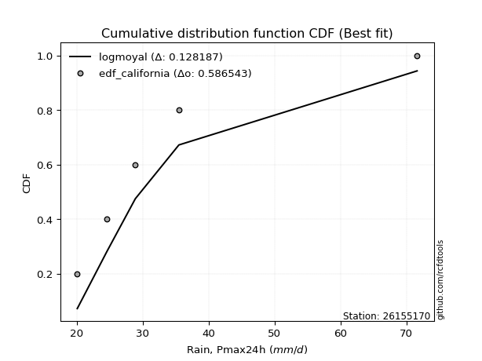</img>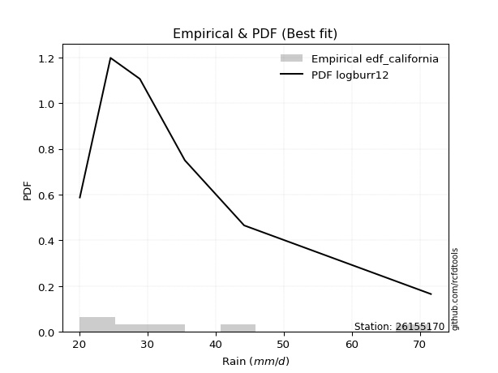</img>

</div>


### 2. Empirical - EDF Hazen (1930)

Hazen method for plotting positions is a formula used to estimate the empirical cumulative probability distribution of flood events or other hydrological data. This formula often results in biased estimations, particularly when extrapolating to extreme events (high return periods).

<div align="center">


$P=(m-0.5)/n$


</div>


**2.1. Empirical values**

<div align="center">

|                | 0                   | 1                  | 2                  | 3                  | 4         | 5                  |
|:---------------|:--------------------|:-------------------|:-------------------|:-------------------|:----------|:-------------------|
| date           | 2017                | 2018               | 2020               | 2025               | 2019      | 2024               |
| x              | 20.1                | 24.6               | 28.9               | 30.4               | 35.5      | 71.6               |
| m              | 1                   | 2                  | 3                  | 4                  | 5         | 6                  |
| empirical_dist | edf_hazen           | edf_hazen          | edf_hazen          | edf_hazen          | edf_hazen | edf_hazen          |
| empirical      | 0.08333333333333333 | 0.25               | 0.4166666666666667 | 0.5833333333333334 | 0.75      | 0.9166666666666666 |
| empirical_tr   | 1.090909090909091   | 1.3333333333333333 | 1.7142857142857144 | 2.4000000000000004 | 4.0       | 11.999999999999995 |

</div>


**2.2. Kolmogorov-Smirnov fit test (sorted by Δ)**


<div align="center">

|                | 0                   | 1                   | 2                   | 3                   | 4                  | 5                   | 6                   | 7                   | 8                  | 9                   | 10                  | 11                 | 12                  | 13                  | 14                  | 15                  | 16                  | 17                  | 18                  | 19                  | 20                 | 21                  | 22                  | 23                  | 24                  | 25                  | 26                  | 27                  | 28                  | 29                  | 30                  | 31                  | 32                    | 33                  | 34                  | 35                  | 36                  | 37                  | 38                  | 39                 | 40                  | 41                  | 42                  | 43                  | 44                 | 45                 | 46                  | 47                  | 48                  | 49                  | 50                  | 51                  | 52                | 53                 | 54                 | 55                  | 56                  | 57                 | 58                  | 59                 | 60                  | 61                 | 62                  | 63                  | 64                  | 65                  | 66                  | 67                  | 68                  | 69                 | 70                  | 71                  | 72                  | 73                  | 74                  | 75                  | 76                 | 77                  | 78                  | 79                  | 80                  | 81                 | 82                  | 83                  | 84                 | 85                 | 86                  | 87                 | 88                 | 89                 |
|:---------------|:--------------------|:--------------------|:--------------------|:--------------------|:-------------------|:--------------------|:--------------------|:--------------------|:-------------------|:--------------------|:--------------------|:-------------------|:--------------------|:--------------------|:--------------------|:--------------------|:--------------------|:--------------------|:--------------------|:--------------------|:-------------------|:--------------------|:--------------------|:--------------------|:--------------------|:--------------------|:--------------------|:--------------------|:--------------------|:--------------------|:--------------------|:--------------------|:----------------------|:--------------------|:--------------------|:--------------------|:--------------------|:--------------------|:--------------------|:-------------------|:--------------------|:--------------------|:--------------------|:--------------------|:-------------------|:-------------------|:--------------------|:--------------------|:--------------------|:--------------------|:--------------------|:--------------------|:------------------|:-------------------|:-------------------|:--------------------|:--------------------|:-------------------|:--------------------|:-------------------|:--------------------|:-------------------|:--------------------|:--------------------|:--------------------|:--------------------|:--------------------|:--------------------|:--------------------|:-------------------|:--------------------|:--------------------|:--------------------|:--------------------|:--------------------|:--------------------|:-------------------|:--------------------|:--------------------|:--------------------|:--------------------|:-------------------|:--------------------|:--------------------|:-------------------|:-------------------|:--------------------|:-------------------|:-------------------|:-------------------|
| station        | 26155170            | 26155170            | 26155170            | 26155170            | 26155170           | 26155170            | 26155170            | 26155170            | 26155170           | 26155170            | 26155170            | 26155170           | 26155170            | 26155170            | 26155170            | 26155170            | 26155170            | 26155170            | 26155170            | 26155170            | 26155170           | 26155170            | 26155170            | 26155170            | 26155170            | 26155170            | 26155170            | 26155170            | 26155170            | 26155170            | 26155170            | 26155170            | 26155170              | 26155170            | 26155170            | 26155170            | 26155170            | 26155170            | 26155170            | 26155170           | 26155170            | 26155170            | 26155170            | 26155170            | 26155170           | 26155170           | 26155170            | 26155170            | 26155170            | 26155170            | 26155170            | 26155170            | 26155170          | 26155170           | 26155170           | 26155170            | 26155170            | 26155170           | 26155170            | 26155170           | 26155170            | 26155170           | 26155170            | 26155170            | 26155170            | 26155170            | 26155170            | 26155170            | 26155170            | 26155170           | 26155170            | 26155170            | 26155170            | 26155170            | 26155170            | 26155170            | 26155170           | 26155170            | 26155170            | 26155170            | 26155170            | 26155170           | 26155170            | 26155170            | 26155170           | 26155170           | 26155170            | 26155170           | 26155170           | 26155170           |
| empirical_dist | edf_hazen           | edf_hazen           | edf_hazen           | edf_hazen           | edf_hazen          | edf_hazen           | edf_hazen           | edf_hazen           | edf_hazen          | edf_hazen           | edf_hazen           | edf_hazen          | edf_hazen           | edf_hazen           | edf_hazen           | edf_hazen           | edf_hazen           | edf_hazen           | edf_hazen           | edf_hazen           | edf_hazen          | edf_hazen           | edf_hazen           | edf_hazen           | edf_hazen           | edf_hazen           | edf_hazen           | edf_hazen           | edf_hazen           | edf_hazen           | edf_hazen           | edf_hazen           | edf_hazen             | edf_hazen           | edf_hazen           | edf_hazen           | edf_hazen           | edf_hazen           | edf_hazen           | edf_hazen          | edf_hazen           | edf_hazen           | edf_hazen           | edf_hazen           | edf_hazen          | edf_hazen          | edf_hazen           | edf_hazen           | edf_hazen           | edf_hazen           | edf_hazen           | edf_hazen           | edf_hazen         | edf_hazen          | edf_hazen          | edf_hazen           | edf_hazen           | edf_hazen          | edf_hazen           | edf_hazen          | edf_hazen           | edf_hazen          | edf_hazen           | edf_hazen           | edf_hazen           | edf_hazen           | edf_hazen           | edf_hazen           | edf_hazen           | edf_hazen          | edf_hazen           | edf_hazen           | edf_hazen           | edf_hazen           | edf_hazen           | edf_hazen           | edf_hazen          | edf_hazen           | edf_hazen           | edf_hazen           | edf_hazen           | edf_hazen          | edf_hazen           | edf_hazen           | edf_hazen          | edf_hazen          | edf_hazen           | edf_hazen          | edf_hazen          | edf_hazen          |
| p_dist         | mielke              | logmoyal            | logexponnorm        | loggenlogistic      | logalpha           | loginvweibull       | logmielke           | logf                | logncf             | loginvgamma         | logfisk             | wald               | alpha               | loghalflogistic     | logt                | f                   | ncf                 | invgamma            | logbetaprime        | logjohnsonsu        | loggompertz        | loginvgauss         | loggumbel_r         | logfatiguelife      | invgauss            | fisk                | logpearson3         | logtruncnorm        | loggenexpon         | loghalfnorm         | logkstwobign        | johnsonsu           | loglaplace_asymmetric | nct                 | fatiguelife         | exponnorm           | lognct              | genexpon            | expon               | laplace_asymmetric | lograyleigh         | logwald             | logexpon            | truncnorm           | logmaxwell         | betaprime          | logrice             | gibrat              | genlogistic         | halflogistic        | pearson3            | moyal               | loglogistic       | lognorm            | lognorm            | logcrystalball      | lognakagami         | loghypsecant       | logloggamma         | halfnorm           | gamma               | gumbel_r           | loglaplace          | weibull_min         | kstwobign           | loggibrat           | rayleigh            | t                   | logchi2             | maxwell            | loggumbel_l         | nakagami            | logerlang           | gompertz            | hypsecant           | logistic            | norm               | crystalball         | rice                | laplace             | gumbel_l            | logweibull_min     | pareto              | logpareto           | loglognorm         | erlang             | invweibull          | loggamma           | loggamma           | chi2               |
| delta          | 0.05810310490620951 | 0.06246519164792241 | 0.06334478106561087 | 0.06761396152562693 | 0.0692395613561721 | 0.07312869832609231 | 0.07460000233182318 | 0.07550276038458542 | 0.0755058297681408 | 0.07550659537289811 | 0.07572601642257665 | 0.0762915778496956 | 0.07669807079524094 | 0.07771350928900235 | 0.07898950277102562 | 0.08009292651891425 | 0.08009336149840984 | 0.08009351134846127 | 0.08066597632727929 | 0.08204100290157268 | 0.0833333333016578 | 0.08358131646208594 | 0.08529706161500994 | 0.08800656719155248 | 0.08840129301053162 | 0.08906616784951155 | 0.09178619032212376 | 0.09237728115746763 | 0.09314104262922968 | 0.09340052096899376 | 0.09405306809424974 | 0.09506592548536935 | 0.09519728060075117   | 0.10305887246581835 | 0.10350723039290283 | 0.10843620514315422 | 0.10968442808002044 | 0.11022989203211908 | 0.11023651572178617 | 0.1102371264371872 | 0.11701213823125456 | 0.11975746382485392 | 0.12176796099553072 | 0.12390569475064184 | 0.1253102003432438 | 0.1292135351179552 | 0.12994347041491283 | 0.13505917456375727 | 0.13800456476673123 | 0.14306193934282985 | 0.14479742980053212 | 0.14621938150167701 | 0.146501885873625 | 0.1520119070110305 | 0.1520119070110305 | 0.15201192892695403 | 0.15232961251844646 | 0.1528026634740346 | 0.15737794972467112 | 0.1684390081195163 | 0.17196994008035887 | 0.1720007266518978 | 0.17317612873057353 | 0.18445718593740562 | 0.19468411669134045 | 0.19591766831840285 | 0.19897251964855944 | 0.20214343198215895 | 0.20600450089607747 | 0.2098187908761998 | 0.21215547837384896 | 0.22584486004105508 | 0.23302516257150735 | 0.23607640842549849 | 0.24067185472702501 | 0.24153990439168838 | 0.2425565832860267 | 0.24255659008811326 | 0.24545137835214126 | 0.24770174510276455 | 0.31267231161522624 | 0.3213514281021722 | 0.37827951614530064 | 0.39308552088616566 | 0.3987892963929601 | 0.4524620310793973 | 0.46253148166621505 | 0.4952463762942634 | 0.4952463762942634 | 0.5489304084349583 |
| deltao         | 0.530385761606      | 0.530385761606      | 0.530385761606      | 0.530385761606      | 0.530385761606     | 0.530385761606      | 0.530385761606      | 0.530385761606      | 0.530385761606     | 0.530385761606      | 0.530385761606      | 0.530385761606     | 0.530385761606      | 0.530385761606      | 0.530385761606      | 0.530385761606      | 0.530385761606      | 0.530385761606      | 0.530385761606      | 0.530385761606      | 0.530385761606     | 0.530385761606      | 0.530385761606      | 0.530385761606      | 0.530385761606      | 0.530385761606      | 0.530385761606      | 0.530385761606      | 0.530385761606      | 0.530385761606      | 0.530385761606      | 0.530385761606      | 0.530385761606        | 0.530385761606      | 0.530385761606      | 0.530385761606      | 0.530385761606      | 0.530385761606      | 0.530385761606      | 0.530385761606     | 0.530385761606      | 0.530385761606      | 0.530385761606      | 0.530385761606      | 0.530385761606     | 0.530385761606     | 0.530385761606      | 0.530385761606      | 0.530385761606      | 0.530385761606      | 0.530385761606      | 0.530385761606      | 0.530385761606    | 0.530385761606     | 0.530385761606     | 0.530385761606      | 0.530385761606      | 0.530385761606     | 0.530385761606      | 0.530385761606     | 0.530385761606      | 0.530385761606     | 0.530385761606      | 0.530385761606      | 0.530385761606      | 0.530385761606      | 0.530385761606      | 0.530385761606      | 0.530385761606      | 0.530385761606     | 0.530385761606      | 0.530385761606      | 0.530385761606      | 0.530385761606      | 0.530385761606      | 0.530385761606      | 0.530385761606     | 0.530385761606      | 0.530385761606      | 0.530385761606      | 0.530385761606      | 0.530385761606     | 0.530385761606      | 0.530385761606      | 0.530385761606     | 0.530385761606     | 0.530385761606      | 0.530385761606     | 0.530385761606     | 0.530385761606     |
| eval           | Δo > Δ              | Δo > Δ              | Δo > Δ              | Δo > Δ              | Δo > Δ             | Δo > Δ              | Δo > Δ              | Δo > Δ              | Δo > Δ             | Δo > Δ              | Δo > Δ              | Δo > Δ             | Δo > Δ              | Δo > Δ              | Δo > Δ              | Δo > Δ              | Δo > Δ              | Δo > Δ              | Δo > Δ              | Δo > Δ              | Δo > Δ             | Δo > Δ              | Δo > Δ              | Δo > Δ              | Δo > Δ              | Δo > Δ              | Δo > Δ              | Δo > Δ              | Δo > Δ              | Δo > Δ              | Δo > Δ              | Δo > Δ              | Δo > Δ                | Δo > Δ              | Δo > Δ              | Δo > Δ              | Δo > Δ              | Δo > Δ              | Δo > Δ              | Δo > Δ             | Δo > Δ              | Δo > Δ              | Δo > Δ              | Δo > Δ              | Δo > Δ             | Δo > Δ             | Δo > Δ              | Δo > Δ              | Δo > Δ              | Δo > Δ              | Δo > Δ              | Δo > Δ              | Δo > Δ            | Δo > Δ             | Δo > Δ             | Δo > Δ              | Δo > Δ              | Δo > Δ             | Δo > Δ              | Δo > Δ             | Δo > Δ              | Δo > Δ             | Δo > Δ              | Δo > Δ              | Δo > Δ              | Δo > Δ              | Δo > Δ              | Δo > Δ              | Δo > Δ              | Δo > Δ             | Δo > Δ              | Δo > Δ              | Δo > Δ              | Δo > Δ              | Δo > Δ              | Δo > Δ              | Δo > Δ             | Δo > Δ              | Δo > Δ              | Δo > Δ              | Δo > Δ              | Δo > Δ             | Δo > Δ              | Δo > Δ              | Δo > Δ             | Δo > Δ             | Δo > Δ              | Δo > Δ             | Δo > Δ             | Δo <= Δ            |
| fit            | 1                   | 1                   | 1                   | 1                   | 1                  | 1                   | 1                   | 1                   | 1                  | 1                   | 1                   | 1                  | 1                   | 1                   | 1                   | 1                   | 1                   | 1                   | 1                   | 1                   | 1                  | 1                   | 1                   | 1                   | 1                   | 1                   | 1                   | 1                   | 1                   | 1                   | 1                   | 1                   | 1                     | 1                   | 1                   | 1                   | 1                   | 1                   | 1                   | 1                  | 1                   | 1                   | 1                   | 1                   | 1                  | 1                  | 1                   | 1                   | 1                   | 1                   | 1                   | 1                   | 1                 | 1                  | 1                  | 1                   | 1                   | 1                  | 1                   | 1                  | 1                   | 1                  | 1                   | 1                   | 1                   | 1                   | 1                   | 1                   | 1                   | 1                  | 1                   | 1                   | 1                   | 1                   | 1                   | 1                   | 1                  | 1                   | 1                   | 1                   | 1                   | 1                  | 1                   | 1                   | 1                  | 1                  | 1                   | 1                  | 1                  | 0                  |
| n              | 6                   | 6                   | 6                   | 6                   | 6                  | 6                   | 6                   | 6                   | 6                  | 6                   | 6                   | 6                  | 6                   | 6                   | 6                   | 6                   | 6                   | 6                   | 6                   | 6                   | 6                  | 6                   | 6                   | 6                   | 6                   | 6                   | 6                   | 6                   | 6                   | 6                   | 6                   | 6                   | 6                     | 6                   | 6                   | 6                   | 6                   | 6                   | 6                   | 6                  | 6                   | 6                   | 6                   | 6                   | 6                  | 6                  | 6                   | 6                   | 6                   | 6                   | 6                   | 6                   | 6                 | 6                  | 6                  | 6                   | 6                   | 6                  | 6                   | 6                  | 6                   | 6                  | 6                   | 6                   | 6                   | 6                   | 6                   | 6                   | 6                   | 6                  | 6                   | 6                   | 6                   | 6                   | 6                   | 6                   | 6                  | 6                   | 6                   | 6                   | 6                   | 6                  | 6                   | 6                   | 6                  | 6                  | 6                   | 6                  | 6                  | 6                  |
| best_fit       | 1                   | 0                   | 0                   | 0                   | 0                  | 0                   | 0                   | 0                   | 0                  | 0                   | 0                   | 0                  | 0                   | 0                   | 0                   | 0                   | 0                   | 0                   | 0                   | 0                   | 0                  | 0                   | 0                   | 0                   | 0                   | 0                   | 0                   | 0                   | 0                   | 0                   | 0                   | 0                   | 0                     | 0                   | 0                   | 0                   | 0                   | 0                   | 0                   | 0                  | 0                   | 0                   | 0                   | 0                   | 0                  | 0                  | 0                   | 0                   | 0                   | 0                   | 0                   | 0                   | 0                 | 0                  | 0                  | 0                   | 0                   | 0                  | 0                   | 0                  | 0                   | 0                  | 0                   | 0                   | 0                   | 0                   | 0                   | 0                   | 0                   | 0                  | 0                   | 0                   | 0                   | 0                   | 0                   | 0                   | 0                  | 0                   | 0                   | 0                   | 0                   | 0                  | 0                   | 0                   | 0                  | 0                  | 0                   | 0                  | 0                  | 0                  |
| best_fit_sort  | 1                   | 2                   | 3                   | 4                   | 5                  | 6                   | 7                   | 8                   | 9                  | 10                  | 11                  | 12                 | 13                  | 14                  | 15                  | 16                  | 17                  | 18                  | 19                  | 20                  | 21                 | 22                  | 23                  | 24                  | 25                  | 26                  | 27                  | 28                  | 29                  | 30                  | 31                  | 32                  | 33                    | 34                  | 35                  | 36                  | 37                  | 38                  | 39                  | 40                 | 41                  | 42                  | 43                  | 44                  | 45                 | 46                 | 47                  | 48                  | 49                  | 50                  | 51                  | 52                  | 53                | 54                 | 55                 | 56                  | 57                  | 58                 | 59                  | 60                 | 61                  | 62                 | 63                  | 64                  | 65                  | 66                  | 67                  | 68                  | 69                  | 70                 | 71                  | 72                  | 73                  | 74                  | 75                  | 76                  | 77                 | 78                  | 79                  | 80                  | 81                  | 82                 | 83                  | 84                  | 85                 | 86                 | 87                  | 88                 | 89                 | 90                 |

</div>


<div align="center">

</img>

</div>


**2.3. Best fit**

<div align="center">

|   id |   station | empirical_dist   | p_dist   |     delta |   deltao | eval   |   fit |   n |   best_fit |   best_fit_sort |
|-----:|----------:|:-----------------|:---------|----------:|---------:|:-------|------:|----:|-----------:|----------------:|
|    0 |  26155170 | edf_hazen        | mielke   | 0.0581031 | 0.530386 | Δo > Δ |     1 |   6 |          1 |               1 |

</div>


<div align="center">

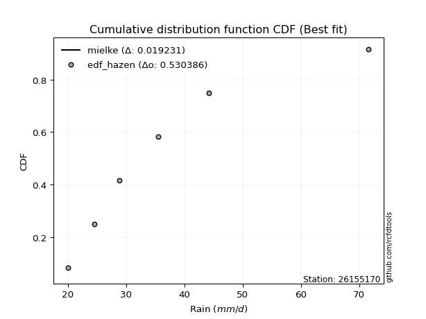</img>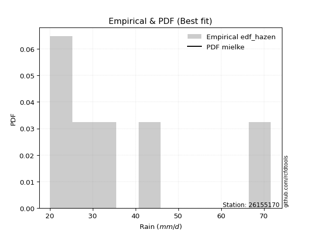</img>

</div>


### 3. Empirical - EDF Weibull (1939)

Weibull plotting position formula is an empirical method used to estimate the non-exceedance probability or plotting position for a set of observed data, is often recommended or widely used in practice, particularly in flood frequency analysis.

<div align="center">


$P=m/(n+1)$


</div>


**3.1. Empirical values**

<div align="center">

|                | 0                   | 1                  | 2                   | 3                  | 4                  | 5                  |
|:---------------|:--------------------|:-------------------|:--------------------|:-------------------|:-------------------|:-------------------|
| date           | 2017                | 2018               | 2020                | 2025               | 2019               | 2024               |
| x              | 20.1                | 24.6               | 28.9                | 30.4               | 35.5               | 71.6               |
| m              | 1                   | 2                  | 3                   | 4                  | 5                  | 6                  |
| empirical_dist | edf_weibull         | edf_weibull        | edf_weibull         | edf_weibull        | edf_weibull        | edf_weibull        |
| empirical      | 0.14285714285714285 | 0.2857142857142857 | 0.42857142857142855 | 0.5714285714285714 | 0.7142857142857143 | 0.8571428571428571 |
| empirical_tr   | 1.1666666666666665  | 1.4                | 1.75                | 2.333333333333333  | 3.5                | 6.999999999999997  |

</div>


**3.2. Kolmogorov-Smirnov fit test (sorted by Δ)**


<div align="center">

|                | 0                   | 1                  | 2                   | 3                   | 4                   | 5                   | 6                   | 7                   | 8                   | 9                   | 10                  | 11                  | 12                 | 13                  | 14                  | 15                  | 16                  | 17                  | 18                  | 19                  | 20                  | 21                 | 22                  | 23                  | 24                    | 25                  | 26                  | 27                  | 28                  | 29                  | 30                  | 31                  | 32                  | 33                 | 34                  | 35                  | 36                  | 37                  | 38                  | 39                  | 40                | 41                  | 42                  | 43                 | 44                  | 45                  | 46                 | 47                  | 48                  | 49                  | 50                  | 51                  | 52                  | 53                  | 54                  | 55                  | 56                  | 57                  | 58                  | 59                  | 60                  | 61                | 62                  | 63                  | 64                  | 65                  | 66                 | 67                  | 68                 | 69                  | 70                  | 71                 | 72                  | 73                | 74                  | 75                 | 76                  | 77                 | 78                  | 79                  | 80                  | 81                 | 82                  | 83                  | 84                 | 85                 | 86                 | 87                 | 88                 | 89                 |
|:---------------|:--------------------|:-------------------|:--------------------|:--------------------|:--------------------|:--------------------|:--------------------|:--------------------|:--------------------|:--------------------|:--------------------|:--------------------|:-------------------|:--------------------|:--------------------|:--------------------|:--------------------|:--------------------|:--------------------|:--------------------|:--------------------|:-------------------|:--------------------|:--------------------|:----------------------|:--------------------|:--------------------|:--------------------|:--------------------|:--------------------|:--------------------|:--------------------|:--------------------|:-------------------|:--------------------|:--------------------|:--------------------|:--------------------|:--------------------|:--------------------|:------------------|:--------------------|:--------------------|:-------------------|:--------------------|:--------------------|:-------------------|:--------------------|:--------------------|:--------------------|:--------------------|:--------------------|:--------------------|:--------------------|:--------------------|:--------------------|:--------------------|:--------------------|:--------------------|:--------------------|:--------------------|:------------------|:--------------------|:--------------------|:--------------------|:--------------------|:-------------------|:--------------------|:-------------------|:--------------------|:--------------------|:-------------------|:--------------------|:------------------|:--------------------|:-------------------|:--------------------|:-------------------|:--------------------|:--------------------|:--------------------|:-------------------|:--------------------|:--------------------|:-------------------|:-------------------|:-------------------|:-------------------|:-------------------|:-------------------|
| station        | 26155170            | 26155170           | 26155170            | 26155170            | 26155170            | 26155170            | 26155170            | 26155170            | 26155170            | 26155170            | 26155170            | 26155170            | 26155170           | 26155170            | 26155170            | 26155170            | 26155170            | 26155170            | 26155170            | 26155170            | 26155170            | 26155170           | 26155170            | 26155170            | 26155170              | 26155170            | 26155170            | 26155170            | 26155170            | 26155170            | 26155170            | 26155170            | 26155170            | 26155170           | 26155170            | 26155170            | 26155170            | 26155170            | 26155170            | 26155170            | 26155170          | 26155170            | 26155170            | 26155170           | 26155170            | 26155170            | 26155170           | 26155170            | 26155170            | 26155170            | 26155170            | 26155170            | 26155170            | 26155170            | 26155170            | 26155170            | 26155170            | 26155170            | 26155170            | 26155170            | 26155170            | 26155170          | 26155170            | 26155170            | 26155170            | 26155170            | 26155170           | 26155170            | 26155170           | 26155170            | 26155170            | 26155170           | 26155170            | 26155170          | 26155170            | 26155170           | 26155170            | 26155170           | 26155170            | 26155170            | 26155170            | 26155170           | 26155170            | 26155170            | 26155170           | 26155170           | 26155170           | 26155170           | 26155170           | 26155170           |
| empirical_dist | edf_weibull         | edf_weibull        | edf_weibull         | edf_weibull         | edf_weibull         | edf_weibull         | edf_weibull         | edf_weibull         | edf_weibull         | edf_weibull         | edf_weibull         | edf_weibull         | edf_weibull        | edf_weibull         | edf_weibull         | edf_weibull         | edf_weibull         | edf_weibull         | edf_weibull         | edf_weibull         | edf_weibull         | edf_weibull        | edf_weibull         | edf_weibull         | edf_weibull           | edf_weibull         | edf_weibull         | edf_weibull         | edf_weibull         | edf_weibull         | edf_weibull         | edf_weibull         | edf_weibull         | edf_weibull        | edf_weibull         | edf_weibull         | edf_weibull         | edf_weibull         | edf_weibull         | edf_weibull         | edf_weibull       | edf_weibull         | edf_weibull         | edf_weibull        | edf_weibull         | edf_weibull         | edf_weibull        | edf_weibull         | edf_weibull         | edf_weibull         | edf_weibull         | edf_weibull         | edf_weibull         | edf_weibull         | edf_weibull         | edf_weibull         | edf_weibull         | edf_weibull         | edf_weibull         | edf_weibull         | edf_weibull         | edf_weibull       | edf_weibull         | edf_weibull         | edf_weibull         | edf_weibull         | edf_weibull        | edf_weibull         | edf_weibull        | edf_weibull         | edf_weibull         | edf_weibull        | edf_weibull         | edf_weibull       | edf_weibull         | edf_weibull        | edf_weibull         | edf_weibull        | edf_weibull         | edf_weibull         | edf_weibull         | edf_weibull        | edf_weibull         | edf_weibull         | edf_weibull        | edf_weibull        | edf_weibull        | edf_weibull        | edf_weibull        | edf_weibull        |
| p_dist         | logmielke           | logalpha           | loginvweibull       | alpha               | logbetaprime        | loginvgamma         | logncf              | logf                | logexponnorm        | invgamma            | ncf                 | f                   | logjohnsonsu       | loginvgauss         | logmoyal            | loghalfnorm         | logfisk             | logfatiguelife      | invgauss            | fatiguelife         | logpearson3         | loggumbel_r        | johnsonsu           | lograyleigh         | loglaplace_asymmetric | halflogistic        | logmaxwell          | pearson3            | loggenlogistic      | moyal               | logkstwobign        | mielke              | nct                 | fisk               | logt                | lognct              | logrice             | betaprime           | lognorm             | lognorm             | logcrystalball    | logloggamma         | genlogistic         | halfnorm           | loglogistic         | wald                | gumbel_r           | loghalflogistic     | loghypsecant        | exponnorm           | t                   | logtruncnorm        | truncnorm           | lognakagami         | laplace_asymmetric  | loggenexpon         | genexpon            | loggompertz         | logwald             | logexpon            | expon               | gamma             | loglaplace          | rayleigh            | logchi2             | gibrat              | kstwobign          | weibull_min         | maxwell            | nakagami            | loggumbel_l         | gompertz           | logistic            | norm              | crystalball         | hypsecant          | rice                | logerlang          | loggibrat           | laplace             | gumbel_l            | logweibull_min     | pareto              | logpareto           | loglognorm         | invweibull         | erlang             | loggamma           | loggamma           | chi2               |
| delta          | 0.09067590661363509 | 0.0920953339375995 | 0.09216647320221719 | 0.09310560025033471 | 0.09366316867473046 | 0.09398553256830217 | 0.09398585983548732 | 0.09398688289870682 | 0.09467356548697536 | 0.09585403970753731 | 0.09585413227669443 | 0.09585419916709706 | 0.0968932984488426 | 0.09714628487674776 | 0.09724630408679291 | 0.09800399460573628 | 0.09815472681328047 | 0.09817437080621308 | 0.09880737602753491 | 0.10017944856042023 | 0.10046906835381131 | 0.1008150587878256 | 0.10351154021508786 | 0.10571580260025881 | 0.10641822772197251   | 0.10734765362854415 | 0.10893008040626573 | 0.10908314408624642 | 0.11022985873449598 | 0.11050509578739132 | 0.11053124454513408 | 0.11115540741318708 | 0.11162969893860408 | 0.1140957419078344 | 0.11448085692166798 | 0.11500479453846157 | 0.11521077998744267 | 0.11643494392630005 | 0.12712027770330653 | 0.12712027770330653 | 0.127120372100043 | 0.12724832343588116 | 0.13046114810550458 | 0.1327247224052306 | 0.13459712396886303 | 0.13581538737350513 | 0.1362864409376121 | 0.13723731881281187 | 0.14089790156927262 | 0.14189464397425794 | 0.14261962245834942 | 0.14278814730448564 | 0.14285706028341072 | 0.14285714214033216 | 0.14285714255459608 | 0.14285714270691274 | 0.14285714282009968 | 0.14285714282546733 | 0.14285714285714285 | 0.14285714285714285 | 0.14285714285714285 | 0.160065178175597 | 0.16127136682581156 | 0.16325823393427374 | 0.17029021518179177 | 0.17077346027804297 | 0.1722071603951243 | 0.17255242403264376 | 0.1741045051619141 | 0.19013057432676939 | 0.19696535891977002 | 0.2003621227112128 | 0.20582561867740268 | 0.206842297571741 | 0.20684230437382756 | 0.2079626359227001 | 0.21033783515482185 | 0.2211204006667455 | 0.23163195403268855 | 0.23579698319800257 | 0.27695802590094054 | 0.2856371423878865 | 0.34256523043101494 | 0.35737123517187996 | 0.3630750106786744 | 0.4030076721424055 | 0.4167477453651116 | 0.4595320905799777 | 0.4595320905799777 | 0.5132161227206726 |
| deltao         | 0.530385761606      | 0.530385761606     | 0.530385761606      | 0.530385761606      | 0.530385761606      | 0.530385761606      | 0.530385761606      | 0.530385761606      | 0.530385761606      | 0.530385761606      | 0.530385761606      | 0.530385761606      | 0.530385761606     | 0.530385761606      | 0.530385761606      | 0.530385761606      | 0.530385761606      | 0.530385761606      | 0.530385761606      | 0.530385761606      | 0.530385761606      | 0.530385761606     | 0.530385761606      | 0.530385761606      | 0.530385761606        | 0.530385761606      | 0.530385761606      | 0.530385761606      | 0.530385761606      | 0.530385761606      | 0.530385761606      | 0.530385761606      | 0.530385761606      | 0.530385761606     | 0.530385761606      | 0.530385761606      | 0.530385761606      | 0.530385761606      | 0.530385761606      | 0.530385761606      | 0.530385761606    | 0.530385761606      | 0.530385761606      | 0.530385761606     | 0.530385761606      | 0.530385761606      | 0.530385761606     | 0.530385761606      | 0.530385761606      | 0.530385761606      | 0.530385761606      | 0.530385761606      | 0.530385761606      | 0.530385761606      | 0.530385761606      | 0.530385761606      | 0.530385761606      | 0.530385761606      | 0.530385761606      | 0.530385761606      | 0.530385761606      | 0.530385761606    | 0.530385761606      | 0.530385761606      | 0.530385761606      | 0.530385761606      | 0.530385761606     | 0.530385761606      | 0.530385761606     | 0.530385761606      | 0.530385761606      | 0.530385761606     | 0.530385761606      | 0.530385761606    | 0.530385761606      | 0.530385761606     | 0.530385761606      | 0.530385761606     | 0.530385761606      | 0.530385761606      | 0.530385761606      | 0.530385761606     | 0.530385761606      | 0.530385761606      | 0.530385761606     | 0.530385761606     | 0.530385761606     | 0.530385761606     | 0.530385761606     | 0.530385761606     |
| eval           | Δo > Δ              | Δo > Δ             | Δo > Δ              | Δo > Δ              | Δo > Δ              | Δo > Δ              | Δo > Δ              | Δo > Δ              | Δo > Δ              | Δo > Δ              | Δo > Δ              | Δo > Δ              | Δo > Δ             | Δo > Δ              | Δo > Δ              | Δo > Δ              | Δo > Δ              | Δo > Δ              | Δo > Δ              | Δo > Δ              | Δo > Δ              | Δo > Δ             | Δo > Δ              | Δo > Δ              | Δo > Δ                | Δo > Δ              | Δo > Δ              | Δo > Δ              | Δo > Δ              | Δo > Δ              | Δo > Δ              | Δo > Δ              | Δo > Δ              | Δo > Δ             | Δo > Δ              | Δo > Δ              | Δo > Δ              | Δo > Δ              | Δo > Δ              | Δo > Δ              | Δo > Δ            | Δo > Δ              | Δo > Δ              | Δo > Δ             | Δo > Δ              | Δo > Δ              | Δo > Δ             | Δo > Δ              | Δo > Δ              | Δo > Δ              | Δo > Δ              | Δo > Δ              | Δo > Δ              | Δo > Δ              | Δo > Δ              | Δo > Δ              | Δo > Δ              | Δo > Δ              | Δo > Δ              | Δo > Δ              | Δo > Δ              | Δo > Δ            | Δo > Δ              | Δo > Δ              | Δo > Δ              | Δo > Δ              | Δo > Δ             | Δo > Δ              | Δo > Δ             | Δo > Δ              | Δo > Δ              | Δo > Δ             | Δo > Δ              | Δo > Δ            | Δo > Δ              | Δo > Δ             | Δo > Δ              | Δo > Δ             | Δo > Δ              | Δo > Δ              | Δo > Δ              | Δo > Δ             | Δo > Δ              | Δo > Δ              | Δo > Δ             | Δo > Δ             | Δo > Δ             | Δo > Δ             | Δo > Δ             | Δo > Δ             |
| fit            | 1                   | 1                  | 1                   | 1                   | 1                   | 1                   | 1                   | 1                   | 1                   | 1                   | 1                   | 1                   | 1                  | 1                   | 1                   | 1                   | 1                   | 1                   | 1                   | 1                   | 1                   | 1                  | 1                   | 1                   | 1                     | 1                   | 1                   | 1                   | 1                   | 1                   | 1                   | 1                   | 1                   | 1                  | 1                   | 1                   | 1                   | 1                   | 1                   | 1                   | 1                 | 1                   | 1                   | 1                  | 1                   | 1                   | 1                  | 1                   | 1                   | 1                   | 1                   | 1                   | 1                   | 1                   | 1                   | 1                   | 1                   | 1                   | 1                   | 1                   | 1                   | 1                 | 1                   | 1                   | 1                   | 1                   | 1                  | 1                   | 1                  | 1                   | 1                   | 1                  | 1                   | 1                 | 1                   | 1                  | 1                   | 1                  | 1                   | 1                   | 1                   | 1                  | 1                   | 1                   | 1                  | 1                  | 1                  | 1                  | 1                  | 1                  |
| n              | 6                   | 6                  | 6                   | 6                   | 6                   | 6                   | 6                   | 6                   | 6                   | 6                   | 6                   | 6                   | 6                  | 6                   | 6                   | 6                   | 6                   | 6                   | 6                   | 6                   | 6                   | 6                  | 6                   | 6                   | 6                     | 6                   | 6                   | 6                   | 6                   | 6                   | 6                   | 6                   | 6                   | 6                  | 6                   | 6                   | 6                   | 6                   | 6                   | 6                   | 6                 | 6                   | 6                   | 6                  | 6                   | 6                   | 6                  | 6                   | 6                   | 6                   | 6                   | 6                   | 6                   | 6                   | 6                   | 6                   | 6                   | 6                   | 6                   | 6                   | 6                   | 6                 | 6                   | 6                   | 6                   | 6                   | 6                  | 6                   | 6                  | 6                   | 6                   | 6                  | 6                   | 6                 | 6                   | 6                  | 6                   | 6                  | 6                   | 6                   | 6                   | 6                  | 6                   | 6                   | 6                  | 6                  | 6                  | 6                  | 6                  | 6                  |
| best_fit       | 1                   | 0                  | 0                   | 0                   | 0                   | 0                   | 0                   | 0                   | 0                   | 0                   | 0                   | 0                   | 0                  | 0                   | 0                   | 0                   | 0                   | 0                   | 0                   | 0                   | 0                   | 0                  | 0                   | 0                   | 0                     | 0                   | 0                   | 0                   | 0                   | 0                   | 0                   | 0                   | 0                   | 0                  | 0                   | 0                   | 0                   | 0                   | 0                   | 0                   | 0                 | 0                   | 0                   | 0                  | 0                   | 0                   | 0                  | 0                   | 0                   | 0                   | 0                   | 0                   | 0                   | 0                   | 0                   | 0                   | 0                   | 0                   | 0                   | 0                   | 0                   | 0                 | 0                   | 0                   | 0                   | 0                   | 0                  | 0                   | 0                  | 0                   | 0                   | 0                  | 0                   | 0                 | 0                   | 0                  | 0                   | 0                  | 0                   | 0                   | 0                   | 0                  | 0                   | 0                   | 0                  | 0                  | 0                  | 0                  | 0                  | 0                  |
| best_fit_sort  | 1                   | 2                  | 3                   | 4                   | 5                   | 6                   | 7                   | 8                   | 9                   | 10                  | 11                  | 12                  | 13                 | 14                  | 15                  | 16                  | 17                  | 18                  | 19                  | 20                  | 21                  | 22                 | 23                  | 24                  | 25                    | 26                  | 27                  | 28                  | 29                  | 30                  | 31                  | 32                  | 33                  | 34                 | 35                  | 36                  | 37                  | 38                  | 39                  | 40                  | 41                | 42                  | 43                  | 44                 | 45                  | 46                  | 47                 | 48                  | 49                  | 50                  | 51                  | 52                  | 53                  | 54                  | 55                  | 56                  | 57                  | 58                  | 59                  | 60                  | 61                  | 62                | 63                  | 64                  | 65                  | 66                  | 67                 | 68                  | 69                 | 70                  | 71                  | 72                 | 73                  | 74                | 75                  | 76                 | 77                  | 78                 | 79                  | 80                  | 81                  | 82                 | 83                  | 84                  | 85                 | 86                 | 87                 | 88                 | 89                 | 90                 |

</div>


<div align="center">

</img>

</div>


**3.3. Best fit**

<div align="center">

|   id |   station | empirical_dist   | p_dist    |     delta |   deltao | eval   |   fit |   n |   best_fit |   best_fit_sort |
|-----:|----------:|:-----------------|:----------|----------:|---------:|:-------|------:|----:|-----------:|----------------:|
|    0 |  26155170 | edf_weibull      | logmielke | 0.0906759 | 0.530386 | Δo > Δ |     1 |   6 |          1 |               1 |

</div>


<div align="center">

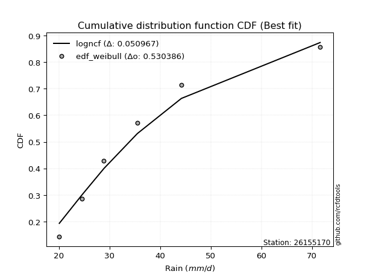</img>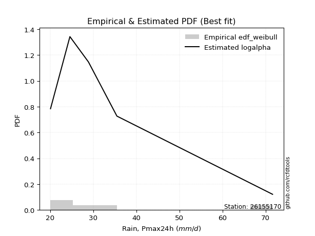</img>

</div>


### 4. Empirical - EDF Beard (1943)

The Beard formula (or Beard´s plotting position formula) in hydrology is used to estimate the empirical non-exceedance probability _(P)_ of a flood event (or other extreme hydrological data point) within a given dataset.

<div align="center">


$P=(m-0.31)/(n+0.38)$


</div>


**4.1. Empirical values**

<div align="center">

|                | 0                   | 1                   | 2                  | 3                  | 4                  | 5                  |
|:---------------|:--------------------|:--------------------|:-------------------|:-------------------|:-------------------|:-------------------|
| date           | 2017                | 2018                | 2020               | 2025               | 2019               | 2024               |
| x              | 20.1                | 24.6                | 28.9               | 30.4               | 35.5               | 71.6               |
| m              | 1                   | 2                   | 3                  | 4                  | 5                  | 6                  |
| empirical_dist | edf_beard           | edf_beard           | edf_beard          | edf_beard          | edf_beard          | edf_beard          |
| empirical      | 0.10815047021943573 | 0.26489028213166144 | 0.4216300940438871 | 0.5783699059561128 | 0.7351097178683387 | 0.8918495297805643 |
| empirical_tr   | 1.1212653778558874  | 1.3603411513859276  | 1.7289972899728996 | 2.3717472118959106 | 3.7751479289940844 | 9.246376811594207  |

</div>


**4.2. Kolmogorov-Smirnov fit test (sorted by Δ)**


<div align="center">

|                | 0                   | 1                  | 2                   | 3                   | 4                   | 5                   | 6                   | 7                   | 8                   | 9                  | 10                 | 11                  | 12                 | 13                  | 14                  | 15                  | 16                  | 17                  | 18                  | 19                  | 20                 | 21                  | 22                  | 23                  | 24                  | 25                 | 26                  | 27                    | 28                  | 29                  | 30                  | 31                  | 32                  | 33                  | 34                  | 35                  | 36                  | 37                  | 38                  | 39                  | 40                  | 41                  | 42                  | 43                  | 44                  | 45                  | 46                  | 47                  | 48                 | 49                 | 50                  | 51                  | 52                  | 53                 | 54                  | 55                  | 56                 | 57                  | 58                 | 59                  | 60                  | 61                  | 62                  | 63                  | 64                  | 65                  | 66                  | 67                  | 68                 | 69                  | 70                  | 71                  | 72                  | 73                 | 74                  | 75                  | 76                  | 77                 | 78                  | 79                | 80                 | 81                 | 82                 | 83                 | 84                 | 85                 | 86                  | 87                  | 88                  | 89                 |
|:---------------|:--------------------|:-------------------|:--------------------|:--------------------|:--------------------|:--------------------|:--------------------|:--------------------|:--------------------|:-------------------|:-------------------|:--------------------|:-------------------|:--------------------|:--------------------|:--------------------|:--------------------|:--------------------|:--------------------|:--------------------|:-------------------|:--------------------|:--------------------|:--------------------|:--------------------|:-------------------|:--------------------|:----------------------|:--------------------|:--------------------|:--------------------|:--------------------|:--------------------|:--------------------|:--------------------|:--------------------|:--------------------|:--------------------|:--------------------|:--------------------|:--------------------|:--------------------|:--------------------|:--------------------|:--------------------|:--------------------|:--------------------|:--------------------|:-------------------|:-------------------|:--------------------|:--------------------|:--------------------|:-------------------|:--------------------|:--------------------|:-------------------|:--------------------|:-------------------|:--------------------|:--------------------|:--------------------|:--------------------|:--------------------|:--------------------|:--------------------|:--------------------|:--------------------|:-------------------|:--------------------|:--------------------|:--------------------|:--------------------|:-------------------|:--------------------|:--------------------|:--------------------|:-------------------|:--------------------|:------------------|:-------------------|:-------------------|:-------------------|:-------------------|:-------------------|:-------------------|:--------------------|:--------------------|:--------------------|:-------------------|
| station        | 26155170            | 26155170           | 26155170            | 26155170            | 26155170            | 26155170            | 26155170            | 26155170            | 26155170            | 26155170           | 26155170           | 26155170            | 26155170           | 26155170            | 26155170            | 26155170            | 26155170            | 26155170            | 26155170            | 26155170            | 26155170           | 26155170            | 26155170            | 26155170            | 26155170            | 26155170           | 26155170            | 26155170              | 26155170            | 26155170            | 26155170            | 26155170            | 26155170            | 26155170            | 26155170            | 26155170            | 26155170            | 26155170            | 26155170            | 26155170            | 26155170            | 26155170            | 26155170            | 26155170            | 26155170            | 26155170            | 26155170            | 26155170            | 26155170           | 26155170           | 26155170            | 26155170            | 26155170            | 26155170           | 26155170            | 26155170            | 26155170           | 26155170            | 26155170           | 26155170            | 26155170            | 26155170            | 26155170            | 26155170            | 26155170            | 26155170            | 26155170            | 26155170            | 26155170           | 26155170            | 26155170            | 26155170            | 26155170            | 26155170           | 26155170            | 26155170            | 26155170            | 26155170           | 26155170            | 26155170          | 26155170           | 26155170           | 26155170           | 26155170           | 26155170           | 26155170           | 26155170            | 26155170            | 26155170            | 26155170           |
| empirical_dist | edf_beard           | edf_beard          | edf_beard           | edf_beard           | edf_beard           | edf_beard           | edf_beard           | edf_beard           | edf_beard           | edf_beard          | edf_beard          | edf_beard           | edf_beard          | edf_beard           | edf_beard           | edf_beard           | edf_beard           | edf_beard           | edf_beard           | edf_beard           | edf_beard          | edf_beard           | edf_beard           | edf_beard           | edf_beard           | edf_beard          | edf_beard           | edf_beard             | edf_beard           | edf_beard           | edf_beard           | edf_beard           | edf_beard           | edf_beard           | edf_beard           | edf_beard           | edf_beard           | edf_beard           | edf_beard           | edf_beard           | edf_beard           | edf_beard           | edf_beard           | edf_beard           | edf_beard           | edf_beard           | edf_beard           | edf_beard           | edf_beard          | edf_beard          | edf_beard           | edf_beard           | edf_beard           | edf_beard          | edf_beard           | edf_beard           | edf_beard          | edf_beard           | edf_beard          | edf_beard           | edf_beard           | edf_beard           | edf_beard           | edf_beard           | edf_beard           | edf_beard           | edf_beard           | edf_beard           | edf_beard          | edf_beard           | edf_beard           | edf_beard           | edf_beard           | edf_beard          | edf_beard           | edf_beard           | edf_beard           | edf_beard          | edf_beard           | edf_beard         | edf_beard          | edf_beard          | edf_beard          | edf_beard          | edf_beard          | edf_beard          | edf_beard           | edf_beard           | edf_beard           | edf_beard          |
| p_dist         | logexponnorm        | logmoyal           | logalpha            | loginvweibull       | logmielke           | loggumbel_r         | logf                | logncf              | loginvgamma         | logfisk            | alpha              | f                   | ncf                | invgamma            | loggenlogistic      | logbetaprime        | mielke              | logpearson3         | logjohnsonsu        | loghalfnorm         | loginvgauss        | logt                | logkstwobign        | logfatiguelife      | invgauss            | fisk               | johnsonsu           | loglaplace_asymmetric | nct                 | fatiguelife         | lognct              | wald                | lograyleigh         | loghalflogistic     | exponnorm           | logtruncnorm        | laplace_asymmetric  | loggenexpon         | genexpon            | loggompertz         | expon               | truncnorm           | logmaxwell          | logwald             | betaprime           | logexpon            | logrice             | halflogistic        | pearson3           | moyal              | genlogistic         | lognorm             | lognorm             | logcrystalball     | lognakagami         | loglogistic         | logloggamma        | loghypsecant        | gibrat             | halfnorm            | gumbel_r            | gamma               | loglaplace          | t                   | weibull_min         | kstwobign           | rayleigh            | logchi2             | maxwell            | loggumbel_l         | loggibrat           | nakagami            | gompertz            | hypsecant          | logistic            | norm                | crystalball         | logerlang          | rice                | laplace           | gumbel_l           | logweibull_min     | pareto             | logpareto          | loglognorm         | erlang             | invweibull          | loggamma            | loggamma            | chi2               |
| delta          | 0.05996689284926815 | 0.0625396314490857 | 0.06427613397895166 | 0.06816527094887187 | 0.06963657495460274 | 0.07040677948334861 | 0.07053933300736498 | 0.07054240239092036 | 0.07054316799567767 | 0.0707625890453562 | 0.0717346434180205 | 0.07512949914169381 | 0.0751299341211894 | 0.07513008397124082 | 0.07552318609678876 | 0.07570254895005885 | 0.07644873477547987 | 0.07689590819046244 | 0.07707757552435224 | 0.07851023883733244 | 0.0786178890848655 | 0.07977418428396077 | 0.08033293301134092 | 0.08304313981433203 | 0.08343786563331118 | 0.0841027404722911 | 0.09010249810814891 | 0.09023385322353061   | 0.09406022278557225 | 0.09854380301568239 | 0.09910262772854872 | 0.10110871473579801 | 0.10212185609959323 | 0.10253064617510475 | 0.10718797133655082 | 0.10808147466677842 | 0.10815046991688897 | 0.10815047006920561 | 0.10815047018239254 | 0.10815047018776021 | 0.10815047021943573 | 0.10901541261898051 | 0.11041991821158248 | 0.11479403644763347 | 0.11651027946253367 | 0.11680453361831028 | 0.12051374295971667 | 0.12817165721116852 | 0.1299071476688708 | 0.1313290993700157 | 0.13304113738951068 | 0.13712162487936919 | 0.13712162487936919 | 0.1371216467952927 | 0.13743933038678513 | 0.14153845849640445 | 0.1424876675930098 | 0.14783923609681404 | 0.1499494566954187 | 0.15354872598785496 | 0.15711044452023648 | 0.16700651270313843 | 0.16821270135335298 | 0.17732629509605652 | 0.17949375856018518 | 0.17979383455967912 | 0.18408223751689812 | 0.19111421876441614 | 0.1949285087445385 | 0.20390669344731144 | 0.21080795045006429 | 0.21095457790939376 | 0.22118612629383716 | 0.2257815725953637 | 0.22664962226002705 | 0.22766630115436537 | 0.22766630795645193 | 0.2280617351942869 | 0.23056109622047993 | 0.242738317725544 | 0.2977820294835649 | 0.3064611459705108 | 0.3633892340136392 | 0.3781952387545042 | 0.3838990142612987 | 0.4375717489477359 | 0.43771434478011273 | 0.48035609416260194 | 0.48035609416260194 | 0.5340401263032969 |
| deltao         | 0.530385761606      | 0.530385761606     | 0.530385761606      | 0.530385761606      | 0.530385761606      | 0.530385761606      | 0.530385761606      | 0.530385761606      | 0.530385761606      | 0.530385761606     | 0.530385761606     | 0.530385761606      | 0.530385761606     | 0.530385761606      | 0.530385761606      | 0.530385761606      | 0.530385761606      | 0.530385761606      | 0.530385761606      | 0.530385761606      | 0.530385761606     | 0.530385761606      | 0.530385761606      | 0.530385761606      | 0.530385761606      | 0.530385761606     | 0.530385761606      | 0.530385761606        | 0.530385761606      | 0.530385761606      | 0.530385761606      | 0.530385761606      | 0.530385761606      | 0.530385761606      | 0.530385761606      | 0.530385761606      | 0.530385761606      | 0.530385761606      | 0.530385761606      | 0.530385761606      | 0.530385761606      | 0.530385761606      | 0.530385761606      | 0.530385761606      | 0.530385761606      | 0.530385761606      | 0.530385761606      | 0.530385761606      | 0.530385761606     | 0.530385761606     | 0.530385761606      | 0.530385761606      | 0.530385761606      | 0.530385761606     | 0.530385761606      | 0.530385761606      | 0.530385761606     | 0.530385761606      | 0.530385761606     | 0.530385761606      | 0.530385761606      | 0.530385761606      | 0.530385761606      | 0.530385761606      | 0.530385761606      | 0.530385761606      | 0.530385761606      | 0.530385761606      | 0.530385761606     | 0.530385761606      | 0.530385761606      | 0.530385761606      | 0.530385761606      | 0.530385761606     | 0.530385761606      | 0.530385761606      | 0.530385761606      | 0.530385761606     | 0.530385761606      | 0.530385761606    | 0.530385761606     | 0.530385761606     | 0.530385761606     | 0.530385761606     | 0.530385761606     | 0.530385761606     | 0.530385761606      | 0.530385761606      | 0.530385761606      | 0.530385761606     |
| eval           | Δo > Δ              | Δo > Δ             | Δo > Δ              | Δo > Δ              | Δo > Δ              | Δo > Δ              | Δo > Δ              | Δo > Δ              | Δo > Δ              | Δo > Δ             | Δo > Δ             | Δo > Δ              | Δo > Δ             | Δo > Δ              | Δo > Δ              | Δo > Δ              | Δo > Δ              | Δo > Δ              | Δo > Δ              | Δo > Δ              | Δo > Δ             | Δo > Δ              | Δo > Δ              | Δo > Δ              | Δo > Δ              | Δo > Δ             | Δo > Δ              | Δo > Δ                | Δo > Δ              | Δo > Δ              | Δo > Δ              | Δo > Δ              | Δo > Δ              | Δo > Δ              | Δo > Δ              | Δo > Δ              | Δo > Δ              | Δo > Δ              | Δo > Δ              | Δo > Δ              | Δo > Δ              | Δo > Δ              | Δo > Δ              | Δo > Δ              | Δo > Δ              | Δo > Δ              | Δo > Δ              | Δo > Δ              | Δo > Δ             | Δo > Δ             | Δo > Δ              | Δo > Δ              | Δo > Δ              | Δo > Δ             | Δo > Δ              | Δo > Δ              | Δo > Δ             | Δo > Δ              | Δo > Δ             | Δo > Δ              | Δo > Δ              | Δo > Δ              | Δo > Δ              | Δo > Δ              | Δo > Δ              | Δo > Δ              | Δo > Δ              | Δo > Δ              | Δo > Δ             | Δo > Δ              | Δo > Δ              | Δo > Δ              | Δo > Δ              | Δo > Δ             | Δo > Δ              | Δo > Δ              | Δo > Δ              | Δo > Δ             | Δo > Δ              | Δo > Δ            | Δo > Δ             | Δo > Δ             | Δo > Δ             | Δo > Δ             | Δo > Δ             | Δo > Δ             | Δo > Δ              | Δo > Δ              | Δo > Δ              | Δo <= Δ            |
| fit            | 1                   | 1                  | 1                   | 1                   | 1                   | 1                   | 1                   | 1                   | 1                   | 1                  | 1                  | 1                   | 1                  | 1                   | 1                   | 1                   | 1                   | 1                   | 1                   | 1                   | 1                  | 1                   | 1                   | 1                   | 1                   | 1                  | 1                   | 1                     | 1                   | 1                   | 1                   | 1                   | 1                   | 1                   | 1                   | 1                   | 1                   | 1                   | 1                   | 1                   | 1                   | 1                   | 1                   | 1                   | 1                   | 1                   | 1                   | 1                   | 1                  | 1                  | 1                   | 1                   | 1                   | 1                  | 1                   | 1                   | 1                  | 1                   | 1                  | 1                   | 1                   | 1                   | 1                   | 1                   | 1                   | 1                   | 1                   | 1                   | 1                  | 1                   | 1                   | 1                   | 1                   | 1                  | 1                   | 1                   | 1                   | 1                  | 1                   | 1                 | 1                  | 1                  | 1                  | 1                  | 1                  | 1                  | 1                   | 1                   | 1                   | 0                  |
| n              | 6                   | 6                  | 6                   | 6                   | 6                   | 6                   | 6                   | 6                   | 6                   | 6                  | 6                  | 6                   | 6                  | 6                   | 6                   | 6                   | 6                   | 6                   | 6                   | 6                   | 6                  | 6                   | 6                   | 6                   | 6                   | 6                  | 6                   | 6                     | 6                   | 6                   | 6                   | 6                   | 6                   | 6                   | 6                   | 6                   | 6                   | 6                   | 6                   | 6                   | 6                   | 6                   | 6                   | 6                   | 6                   | 6                   | 6                   | 6                   | 6                  | 6                  | 6                   | 6                   | 6                   | 6                  | 6                   | 6                   | 6                  | 6                   | 6                  | 6                   | 6                   | 6                   | 6                   | 6                   | 6                   | 6                   | 6                   | 6                   | 6                  | 6                   | 6                   | 6                   | 6                   | 6                  | 6                   | 6                   | 6                   | 6                  | 6                   | 6                 | 6                  | 6                  | 6                  | 6                  | 6                  | 6                  | 6                   | 6                   | 6                   | 6                  |
| best_fit       | 1                   | 0                  | 0                   | 0                   | 0                   | 0                   | 0                   | 0                   | 0                   | 0                  | 0                  | 0                   | 0                  | 0                   | 0                   | 0                   | 0                   | 0                   | 0                   | 0                   | 0                  | 0                   | 0                   | 0                   | 0                   | 0                  | 0                   | 0                     | 0                   | 0                   | 0                   | 0                   | 0                   | 0                   | 0                   | 0                   | 0                   | 0                   | 0                   | 0                   | 0                   | 0                   | 0                   | 0                   | 0                   | 0                   | 0                   | 0                   | 0                  | 0                  | 0                   | 0                   | 0                   | 0                  | 0                   | 0                   | 0                  | 0                   | 0                  | 0                   | 0                   | 0                   | 0                   | 0                   | 0                   | 0                   | 0                   | 0                   | 0                  | 0                   | 0                   | 0                   | 0                   | 0                  | 0                   | 0                   | 0                   | 0                  | 0                   | 0                 | 0                  | 0                  | 0                  | 0                  | 0                  | 0                  | 0                   | 0                   | 0                   | 0                  |
| best_fit_sort  | 1                   | 2                  | 3                   | 4                   | 5                   | 6                   | 7                   | 8                   | 9                   | 10                 | 11                 | 12                  | 13                 | 14                  | 15                  | 16                  | 17                  | 18                  | 19                  | 20                  | 21                 | 22                  | 23                  | 24                  | 25                  | 26                 | 27                  | 28                    | 29                  | 30                  | 31                  | 32                  | 33                  | 34                  | 35                  | 36                  | 37                  | 38                  | 39                  | 40                  | 41                  | 42                  | 43                  | 44                  | 45                  | 46                  | 47                  | 48                  | 49                 | 50                 | 51                  | 52                  | 53                  | 54                 | 55                  | 56                  | 57                 | 58                  | 59                 | 60                  | 61                  | 62                  | 63                  | 64                  | 65                  | 66                  | 67                  | 68                  | 69                 | 70                  | 71                  | 72                  | 73                  | 74                 | 75                  | 76                  | 77                  | 78                 | 79                  | 80                | 81                 | 82                 | 83                 | 84                 | 85                 | 86                 | 87                  | 88                  | 89                  | 90                 |

</div>


<div align="center">

</img>

</div>


**4.3. Best fit**

<div align="center">

|   id |   station | empirical_dist   | p_dist       |     delta |   deltao | eval   |   fit |   n |   best_fit |   best_fit_sort |
|-----:|----------:|:-----------------|:-------------|----------:|---------:|:-------|------:|----:|-----------:|----------------:|
|    0 |  26155170 | edf_beard        | logexponnorm | 0.0599669 | 0.530386 | Δo > Δ |     1 |   6 |          1 |               1 |

</div>


<div align="center">

</img>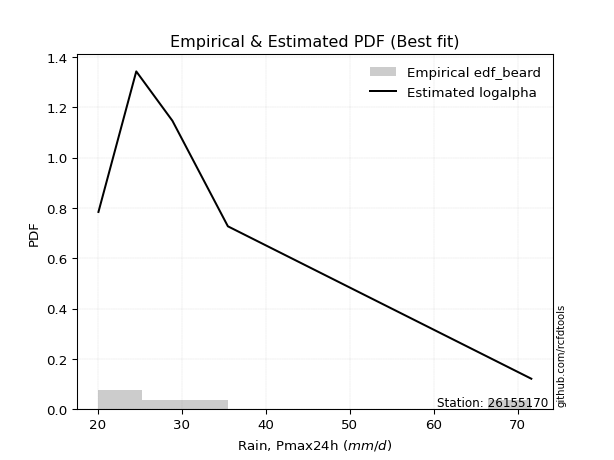</img>

</div>


### 5. Empirical - EDF Chegodayev (1955)

The Chegodayev formula is an empirical plotting position formula used in hydrological frequency analysis to estimate the exceedance probability or return period of a specific event from a set of observed data. It is primarily used for plotting observed data points on probability paper to fit a theoretical distribution, particularly for analyzing extreme events like maximum flood flows or rainfall intensities. The constant _b_ value in the generalized plotting position formula is 0.3.

<div align="center">


$P=(m-b)/(n+1-2b)$


</div>


**5.1. Empirical values**

<div align="center">

|                | 0                   | 1                  | 2                  | 3                  | 4                 | 5                 |
|:---------------|:--------------------|:-------------------|:-------------------|:-------------------|:------------------|:------------------|
| date           | 2017                | 2018               | 2020               | 2025               | 2019              | 2024              |
| x              | 20.1                | 24.6               | 28.9               | 30.4               | 35.5              | 71.6              |
| m              | 1                   | 2                  | 3                  | 4                  | 5                 | 6                 |
| empirical_dist | edf_chegodayev      | edf_chegodayev     | edf_chegodayev     | edf_chegodayev     | edf_chegodayev    | edf_chegodayev    |
| empirical      | 0.10937499999999999 | 0.265625           | 0.421875           | 0.578125           | 0.734375          | 0.890625          |
| empirical_tr   | 1.1228070175438596  | 1.3617021276595744 | 1.7297297297297298 | 2.3703703703703702 | 3.764705882352941 | 9.142857142857142 |

</div>


**5.2. Kolmogorov-Smirnov fit test (sorted by Δ)**


<div align="center">

|                | 0                   | 1                   | 2                   | 3                 | 4                   | 5                   | 6                  | 7                   | 8                  | 9                   | 10                  | 11                  | 12                  | 13                  | 14                  | 15                  | 16                  | 17                  | 18                  | 19                  | 20                  | 21                 | 22                  | 23                  | 24                  | 25                  | 26                  | 27                    | 28                  | 29                  | 30                 | 31                  | 32                  | 33                  | 34                  | 35                  | 36                  | 37                  | 38                  | 39                 | 40                  | 41                  | 42                 | 43                 | 44                  | 45                  | 46                  | 47                  | 48                  | 49                  | 50                  | 51                 | 52                 | 53                  | 54                  | 55                  | 56                  | 57                  | 58                  | 59                 | 60                 | 61                  | 62                  | 63                  | 64                  | 65                 | 66                  | 67                  | 68                 | 69                  | 70                  | 71                  | 72                  | 73                  | 74                  | 75                 | 76                  | 77                  | 78                  | 79                  | 80                  | 81                 | 82                  | 83                  | 84                 | 85                 | 86                 | 87                 | 88                 | 89                 |
|:---------------|:--------------------|:--------------------|:--------------------|:------------------|:--------------------|:--------------------|:-------------------|:--------------------|:-------------------|:--------------------|:--------------------|:--------------------|:--------------------|:--------------------|:--------------------|:--------------------|:--------------------|:--------------------|:--------------------|:--------------------|:--------------------|:-------------------|:--------------------|:--------------------|:--------------------|:--------------------|:--------------------|:----------------------|:--------------------|:--------------------|:-------------------|:--------------------|:--------------------|:--------------------|:--------------------|:--------------------|:--------------------|:--------------------|:--------------------|:-------------------|:--------------------|:--------------------|:-------------------|:-------------------|:--------------------|:--------------------|:--------------------|:--------------------|:--------------------|:--------------------|:--------------------|:-------------------|:-------------------|:--------------------|:--------------------|:--------------------|:--------------------|:--------------------|:--------------------|:-------------------|:-------------------|:--------------------|:--------------------|:--------------------|:--------------------|:-------------------|:--------------------|:--------------------|:-------------------|:--------------------|:--------------------|:--------------------|:--------------------|:--------------------|:--------------------|:-------------------|:--------------------|:--------------------|:--------------------|:--------------------|:--------------------|:-------------------|:--------------------|:--------------------|:-------------------|:-------------------|:-------------------|:-------------------|:-------------------|:-------------------|
| station        | 26155170            | 26155170            | 26155170            | 26155170          | 26155170            | 26155170            | 26155170           | 26155170            | 26155170           | 26155170            | 26155170            | 26155170            | 26155170            | 26155170            | 26155170            | 26155170            | 26155170            | 26155170            | 26155170            | 26155170            | 26155170            | 26155170           | 26155170            | 26155170            | 26155170            | 26155170            | 26155170            | 26155170              | 26155170            | 26155170            | 26155170           | 26155170            | 26155170            | 26155170            | 26155170            | 26155170            | 26155170            | 26155170            | 26155170            | 26155170           | 26155170            | 26155170            | 26155170           | 26155170           | 26155170            | 26155170            | 26155170            | 26155170            | 26155170            | 26155170            | 26155170            | 26155170           | 26155170           | 26155170            | 26155170            | 26155170            | 26155170            | 26155170            | 26155170            | 26155170           | 26155170           | 26155170            | 26155170            | 26155170            | 26155170            | 26155170           | 26155170            | 26155170            | 26155170           | 26155170            | 26155170            | 26155170            | 26155170            | 26155170            | 26155170            | 26155170           | 26155170            | 26155170            | 26155170            | 26155170            | 26155170            | 26155170           | 26155170            | 26155170            | 26155170           | 26155170           | 26155170           | 26155170           | 26155170           | 26155170           |
| empirical_dist | edf_chegodayev      | edf_chegodayev      | edf_chegodayev      | edf_chegodayev    | edf_chegodayev      | edf_chegodayev      | edf_chegodayev     | edf_chegodayev      | edf_chegodayev     | edf_chegodayev      | edf_chegodayev      | edf_chegodayev      | edf_chegodayev      | edf_chegodayev      | edf_chegodayev      | edf_chegodayev      | edf_chegodayev      | edf_chegodayev      | edf_chegodayev      | edf_chegodayev      | edf_chegodayev      | edf_chegodayev     | edf_chegodayev      | edf_chegodayev      | edf_chegodayev      | edf_chegodayev      | edf_chegodayev      | edf_chegodayev        | edf_chegodayev      | edf_chegodayev      | edf_chegodayev     | edf_chegodayev      | edf_chegodayev      | edf_chegodayev      | edf_chegodayev      | edf_chegodayev      | edf_chegodayev      | edf_chegodayev      | edf_chegodayev      | edf_chegodayev     | edf_chegodayev      | edf_chegodayev      | edf_chegodayev     | edf_chegodayev     | edf_chegodayev      | edf_chegodayev      | edf_chegodayev      | edf_chegodayev      | edf_chegodayev      | edf_chegodayev      | edf_chegodayev      | edf_chegodayev     | edf_chegodayev     | edf_chegodayev      | edf_chegodayev      | edf_chegodayev      | edf_chegodayev      | edf_chegodayev      | edf_chegodayev      | edf_chegodayev     | edf_chegodayev     | edf_chegodayev      | edf_chegodayev      | edf_chegodayev      | edf_chegodayev      | edf_chegodayev     | edf_chegodayev      | edf_chegodayev      | edf_chegodayev     | edf_chegodayev      | edf_chegodayev      | edf_chegodayev      | edf_chegodayev      | edf_chegodayev      | edf_chegodayev      | edf_chegodayev     | edf_chegodayev      | edf_chegodayev      | edf_chegodayev      | edf_chegodayev      | edf_chegodayev      | edf_chegodayev     | edf_chegodayev      | edf_chegodayev      | edf_chegodayev     | edf_chegodayev     | edf_chegodayev     | edf_chegodayev     | edf_chegodayev     | edf_chegodayev     |
| p_dist         | logexponnorm        | logmoyal            | logalpha            | loginvweibull     | logmielke           | loggumbel_r         | logf               | logncf              | loginvgamma        | logfisk             | alpha               | f                   | ncf                 | invgamma            | logbetaprime        | logpearson3         | loggenlogistic      | logjohnsonsu        | mielke              | loghalfnorm         | loginvgauss         | logkstwobign       | logt                | logfatiguelife      | invgauss            | fisk                | johnsonsu           | loglaplace_asymmetric | nct                 | fatiguelife         | lognct             | lograyleigh         | wald                | loghalflogistic     | exponnorm           | logtruncnorm        | truncnorm           | laplace_asymmetric  | loggenexpon         | genexpon           | loggompertz         | expon               | logmaxwell         | logwald            | betaprime           | logexpon            | logrice             | halflogistic        | pearson3            | moyal               | genlogistic         | lognorm            | lognorm            | logcrystalball      | lognakagami         | loglogistic         | logloggamma         | loghypsecant        | gibrat              | halfnorm           | gumbel_r           | gamma               | loglaplace          | t                   | kstwobign           | weibull_min        | rayleigh            | logchi2             | maxwell            | loggumbel_l         | nakagami            | loggibrat           | gompertz            | hypsecant           | logistic            | norm               | crystalball         | logerlang           | rice                | laplace             | gumbel_l            | logweibull_min     | pareto              | logpareto           | loglognorm         | invweibull         | erlang             | loggamma           | loggamma           | chi2               |
| delta          | 0.06119142262983246 | 0.06376416122965001 | 0.06403122802283878 | 0.067920364992759 | 0.06939166899848986 | 0.06967206161500994 | 0.0702944270512521 | 0.07029749643480748 | 0.0702982620395648 | 0.07051768308924333 | 0.07148973746190762 | 0.07488459318558094 | 0.07488502816507653 | 0.07488517801512795 | 0.07545764299394597 | 0.07616119032212376 | 0.07674771587735307 | 0.07683266956823936 | 0.07767326455604417 | 0.07777552096899376 | 0.07837298312875263 | 0.0800880270552281 | 0.08099871406452508 | 0.08279823385821916 | 0.08319295967719831 | 0.08385783451617823 | 0.08985759215203604 | 0.0899889472674178    | 0.09381531682945943 | 0.09829889705956951 | 0.0988577217724359 | 0.10138713823125456 | 0.10233324451636226 | 0.10375517595566901 | 0.10841250111711508 | 0.10930600444734273 | 0.10937491742626786 | 0.10937499969745322 | 0.10937499984976987 | 0.1093749999629568 | 0.10937499996832446 | 0.10937499999999999 | 0.1096852003432438 | 0.1145491304915206 | 0.11626537350642085 | 0.11655962766219741 | 0.12026883700360386 | 0.12743693934282985 | 0.12917242980053212 | 0.13059438150167701 | 0.13279623143339786 | 0.1363869070110305 | 0.1363869070110305 | 0.13638692892695403 | 0.13670461251844646 | 0.14129355254029163 | 0.14175294972467112 | 0.14759433014070122 | 0.15068417456375727 | 0.1528140081195163 | 0.1563757266518978 | 0.16676160674702556 | 0.16796779539724016 | 0.17610176531549226 | 0.17905911669134045 | 0.1792488526040723 | 0.18334751964855944 | 0.19037950089607747 | 0.1941937908761998 | 0.20366178749119862 | 0.21021986004105508 | 0.21154266831840285 | 0.22045140842549849 | 0.22504685472702501 | 0.22591490439168838 | 0.2269315832860267 | 0.22693159008811326 | 0.22781682923817403 | 0.22982637835214126 | 0.24249341176943118 | 0.29704731161522624 | 0.3057264281021722 | 0.36265451614530064 | 0.37746052088616566 | 0.3831642963929601 | 0.4364898149995484 | 0.4368370310793973 | 0.4796213762942634 | 0.4796213762942634 | 0.5333054084349583 |
| deltao         | 0.530385761606      | 0.530385761606      | 0.530385761606      | 0.530385761606    | 0.530385761606      | 0.530385761606      | 0.530385761606     | 0.530385761606      | 0.530385761606     | 0.530385761606      | 0.530385761606      | 0.530385761606      | 0.530385761606      | 0.530385761606      | 0.530385761606      | 0.530385761606      | 0.530385761606      | 0.530385761606      | 0.530385761606      | 0.530385761606      | 0.530385761606      | 0.530385761606     | 0.530385761606      | 0.530385761606      | 0.530385761606      | 0.530385761606      | 0.530385761606      | 0.530385761606        | 0.530385761606      | 0.530385761606      | 0.530385761606     | 0.530385761606      | 0.530385761606      | 0.530385761606      | 0.530385761606      | 0.530385761606      | 0.530385761606      | 0.530385761606      | 0.530385761606      | 0.530385761606     | 0.530385761606      | 0.530385761606      | 0.530385761606     | 0.530385761606     | 0.530385761606      | 0.530385761606      | 0.530385761606      | 0.530385761606      | 0.530385761606      | 0.530385761606      | 0.530385761606      | 0.530385761606     | 0.530385761606     | 0.530385761606      | 0.530385761606      | 0.530385761606      | 0.530385761606      | 0.530385761606      | 0.530385761606      | 0.530385761606     | 0.530385761606     | 0.530385761606      | 0.530385761606      | 0.530385761606      | 0.530385761606      | 0.530385761606     | 0.530385761606      | 0.530385761606      | 0.530385761606     | 0.530385761606      | 0.530385761606      | 0.530385761606      | 0.530385761606      | 0.530385761606      | 0.530385761606      | 0.530385761606     | 0.530385761606      | 0.530385761606      | 0.530385761606      | 0.530385761606      | 0.530385761606      | 0.530385761606     | 0.530385761606      | 0.530385761606      | 0.530385761606     | 0.530385761606     | 0.530385761606     | 0.530385761606     | 0.530385761606     | 0.530385761606     |
| eval           | Δo > Δ              | Δo > Δ              | Δo > Δ              | Δo > Δ            | Δo > Δ              | Δo > Δ              | Δo > Δ             | Δo > Δ              | Δo > Δ             | Δo > Δ              | Δo > Δ              | Δo > Δ              | Δo > Δ              | Δo > Δ              | Δo > Δ              | Δo > Δ              | Δo > Δ              | Δo > Δ              | Δo > Δ              | Δo > Δ              | Δo > Δ              | Δo > Δ             | Δo > Δ              | Δo > Δ              | Δo > Δ              | Δo > Δ              | Δo > Δ              | Δo > Δ                | Δo > Δ              | Δo > Δ              | Δo > Δ             | Δo > Δ              | Δo > Δ              | Δo > Δ              | Δo > Δ              | Δo > Δ              | Δo > Δ              | Δo > Δ              | Δo > Δ              | Δo > Δ             | Δo > Δ              | Δo > Δ              | Δo > Δ             | Δo > Δ             | Δo > Δ              | Δo > Δ              | Δo > Δ              | Δo > Δ              | Δo > Δ              | Δo > Δ              | Δo > Δ              | Δo > Δ             | Δo > Δ             | Δo > Δ              | Δo > Δ              | Δo > Δ              | Δo > Δ              | Δo > Δ              | Δo > Δ              | Δo > Δ             | Δo > Δ             | Δo > Δ              | Δo > Δ              | Δo > Δ              | Δo > Δ              | Δo > Δ             | Δo > Δ              | Δo > Δ              | Δo > Δ             | Δo > Δ              | Δo > Δ              | Δo > Δ              | Δo > Δ              | Δo > Δ              | Δo > Δ              | Δo > Δ             | Δo > Δ              | Δo > Δ              | Δo > Δ              | Δo > Δ              | Δo > Δ              | Δo > Δ             | Δo > Δ              | Δo > Δ              | Δo > Δ             | Δo > Δ             | Δo > Δ             | Δo > Δ             | Δo > Δ             | Δo <= Δ            |
| fit            | 1                   | 1                   | 1                   | 1                 | 1                   | 1                   | 1                  | 1                   | 1                  | 1                   | 1                   | 1                   | 1                   | 1                   | 1                   | 1                   | 1                   | 1                   | 1                   | 1                   | 1                   | 1                  | 1                   | 1                   | 1                   | 1                   | 1                   | 1                     | 1                   | 1                   | 1                  | 1                   | 1                   | 1                   | 1                   | 1                   | 1                   | 1                   | 1                   | 1                  | 1                   | 1                   | 1                  | 1                  | 1                   | 1                   | 1                   | 1                   | 1                   | 1                   | 1                   | 1                  | 1                  | 1                   | 1                   | 1                   | 1                   | 1                   | 1                   | 1                  | 1                  | 1                   | 1                   | 1                   | 1                   | 1                  | 1                   | 1                   | 1                  | 1                   | 1                   | 1                   | 1                   | 1                   | 1                   | 1                  | 1                   | 1                   | 1                   | 1                   | 1                   | 1                  | 1                   | 1                   | 1                  | 1                  | 1                  | 1                  | 1                  | 0                  |
| n              | 6                   | 6                   | 6                   | 6                 | 6                   | 6                   | 6                  | 6                   | 6                  | 6                   | 6                   | 6                   | 6                   | 6                   | 6                   | 6                   | 6                   | 6                   | 6                   | 6                   | 6                   | 6                  | 6                   | 6                   | 6                   | 6                   | 6                   | 6                     | 6                   | 6                   | 6                  | 6                   | 6                   | 6                   | 6                   | 6                   | 6                   | 6                   | 6                   | 6                  | 6                   | 6                   | 6                  | 6                  | 6                   | 6                   | 6                   | 6                   | 6                   | 6                   | 6                   | 6                  | 6                  | 6                   | 6                   | 6                   | 6                   | 6                   | 6                   | 6                  | 6                  | 6                   | 6                   | 6                   | 6                   | 6                  | 6                   | 6                   | 6                  | 6                   | 6                   | 6                   | 6                   | 6                   | 6                   | 6                  | 6                   | 6                   | 6                   | 6                   | 6                   | 6                  | 6                   | 6                   | 6                  | 6                  | 6                  | 6                  | 6                  | 6                  |
| best_fit       | 1                   | 0                   | 0                   | 0                 | 0                   | 0                   | 0                  | 0                   | 0                  | 0                   | 0                   | 0                   | 0                   | 0                   | 0                   | 0                   | 0                   | 0                   | 0                   | 0                   | 0                   | 0                  | 0                   | 0                   | 0                   | 0                   | 0                   | 0                     | 0                   | 0                   | 0                  | 0                   | 0                   | 0                   | 0                   | 0                   | 0                   | 0                   | 0                   | 0                  | 0                   | 0                   | 0                  | 0                  | 0                   | 0                   | 0                   | 0                   | 0                   | 0                   | 0                   | 0                  | 0                  | 0                   | 0                   | 0                   | 0                   | 0                   | 0                   | 0                  | 0                  | 0                   | 0                   | 0                   | 0                   | 0                  | 0                   | 0                   | 0                  | 0                   | 0                   | 0                   | 0                   | 0                   | 0                   | 0                  | 0                   | 0                   | 0                   | 0                   | 0                   | 0                  | 0                   | 0                   | 0                  | 0                  | 0                  | 0                  | 0                  | 0                  |
| best_fit_sort  | 1                   | 2                   | 3                   | 4                 | 5                   | 6                   | 7                  | 8                   | 9                  | 10                  | 11                  | 12                  | 13                  | 14                  | 15                  | 16                  | 17                  | 18                  | 19                  | 20                  | 21                  | 22                 | 23                  | 24                  | 25                  | 26                  | 27                  | 28                    | 29                  | 30                  | 31                 | 32                  | 33                  | 34                  | 35                  | 36                  | 37                  | 38                  | 39                  | 40                 | 41                  | 42                  | 43                 | 44                 | 45                  | 46                  | 47                  | 48                  | 49                  | 50                  | 51                  | 52                 | 53                 | 54                  | 55                  | 56                  | 57                  | 58                  | 59                  | 60                 | 61                 | 62                  | 63                  | 64                  | 65                  | 66                 | 67                  | 68                  | 69                 | 70                  | 71                  | 72                  | 73                  | 74                  | 75                  | 76                 | 77                  | 78                  | 79                  | 80                  | 81                  | 82                 | 83                  | 84                  | 85                 | 86                 | 87                 | 88                 | 89                 | 90                 |

</div>


<div align="center">

</img>

</div>


**5.3. Best fit**

<div align="center">

|   id |   station | empirical_dist   | p_dist       |     delta |   deltao | eval   |   fit |   n |   best_fit |   best_fit_sort |
|-----:|----------:|:-----------------|:-------------|----------:|---------:|:-------|------:|----:|-----------:|----------------:|
|    0 |  26155170 | edf_chegodayev   | logexponnorm | 0.0611914 | 0.530386 | Δo > Δ |     1 |   6 |          1 |               1 |

</div>


<div align="center">

</img></img>

</div>


### 6. Empirical - EDF Blom (1958)

The Blom formula is a specific "plotting position" formula used in hydrology and statistical analysis to estimate the empirical cumulative probability (or non-exceedance probability) of a data series. It is particularly recommended for data that are approximately normally distributed. The constant _a_ is set to 0.375 (or 3/8).

<div align="center">


$P=(m-a)/(n+1-2a)$


</div>


**6.1. Empirical values**

<div align="center">

|                | 0                  | 1                  | 2                  | 3                 | 4                 | 5                  |
|:---------------|:-------------------|:-------------------|:-------------------|:------------------|:------------------|:-------------------|
| date           | 2017               | 2018               | 2020               | 2025              | 2019              | 2024               |
| x              | 20.1               | 24.6               | 28.9               | 30.4              | 35.5              | 71.6               |
| m              | 1                  | 2                  | 3                  | 4                 | 5                 | 6                  |
| empirical_dist | edf_blom           | edf_blom           | edf_blom           | edf_blom          | edf_blom          | edf_blom           |
| empirical      | 0.1                | 0.26               | 0.42               | 0.58              | 0.74              | 0.9                |
| empirical_tr   | 1.1111111111111112 | 1.3513513513513513 | 1.7241379310344827 | 2.380952380952381 | 3.846153846153846 | 10.000000000000002 |

</div>


**6.2. Kolmogorov-Smirnov fit test (sorted by Δ)**


<div align="center">

|                | 0                   | 1                   | 2                  | 3                   | 4                   | 5                   | 6                   | 7                   | 8                  | 9                   | 10                  | 11                  | 12                  | 13                  | 14                  | 15                  | 16                  | 17                  | 18                  | 19                  | 20                  | 21                  | 22                  | 23                  | 24                  | 25                  | 26                  | 27                    | 28                  | 29                  | 30                  | 31                 | 32                  | 33                  | 34                  | 35                  | 36                  | 37                  | 38                  | 39                  | 40                  | 41                  | 42                 | 43                  | 44                  | 45                  | 46                  | 47                  | 48                  | 49                 | 50                | 51                 | 52                 | 53                  | 54                  | 55                 | 56                  | 57                 | 58                  | 59                  | 60                 | 61                  | 62                  | 63                  | 64                  | 65                  | 66                  | 67                  | 68                 | 69                  | 70                  | 71                  | 72                  | 73                  | 74                | 75                  | 76                  | 77                  | 78                  | 79                  | 80                  | 81                 | 82                  | 83                  | 84                 | 85                 | 86                  | 87                  | 88                  | 89                 |
|:---------------|:--------------------|:--------------------|:-------------------|:--------------------|:--------------------|:--------------------|:--------------------|:--------------------|:-------------------|:--------------------|:--------------------|:--------------------|:--------------------|:--------------------|:--------------------|:--------------------|:--------------------|:--------------------|:--------------------|:--------------------|:--------------------|:--------------------|:--------------------|:--------------------|:--------------------|:--------------------|:--------------------|:----------------------|:--------------------|:--------------------|:--------------------|:-------------------|:--------------------|:--------------------|:--------------------|:--------------------|:--------------------|:--------------------|:--------------------|:--------------------|:--------------------|:--------------------|:-------------------|:--------------------|:--------------------|:--------------------|:--------------------|:--------------------|:--------------------|:-------------------|:------------------|:-------------------|:-------------------|:--------------------|:--------------------|:-------------------|:--------------------|:-------------------|:--------------------|:--------------------|:-------------------|:--------------------|:--------------------|:--------------------|:--------------------|:--------------------|:--------------------|:--------------------|:-------------------|:--------------------|:--------------------|:--------------------|:--------------------|:--------------------|:------------------|:--------------------|:--------------------|:--------------------|:--------------------|:--------------------|:--------------------|:-------------------|:--------------------|:--------------------|:-------------------|:-------------------|:--------------------|:--------------------|:--------------------|:-------------------|
| station        | 26155170            | 26155170            | 26155170           | 26155170            | 26155170            | 26155170            | 26155170            | 26155170            | 26155170           | 26155170            | 26155170            | 26155170            | 26155170            | 26155170            | 26155170            | 26155170            | 26155170            | 26155170            | 26155170            | 26155170            | 26155170            | 26155170            | 26155170            | 26155170            | 26155170            | 26155170            | 26155170            | 26155170              | 26155170            | 26155170            | 26155170            | 26155170           | 26155170            | 26155170            | 26155170            | 26155170            | 26155170            | 26155170            | 26155170            | 26155170            | 26155170            | 26155170            | 26155170           | 26155170            | 26155170            | 26155170            | 26155170            | 26155170            | 26155170            | 26155170           | 26155170          | 26155170           | 26155170           | 26155170            | 26155170            | 26155170           | 26155170            | 26155170           | 26155170            | 26155170            | 26155170           | 26155170            | 26155170            | 26155170            | 26155170            | 26155170            | 26155170            | 26155170            | 26155170           | 26155170            | 26155170            | 26155170            | 26155170            | 26155170            | 26155170          | 26155170            | 26155170            | 26155170            | 26155170            | 26155170            | 26155170            | 26155170           | 26155170            | 26155170            | 26155170           | 26155170           | 26155170            | 26155170            | 26155170            | 26155170           |
| empirical_dist | edf_blom            | edf_blom            | edf_blom           | edf_blom            | edf_blom            | edf_blom            | edf_blom            | edf_blom            | edf_blom           | edf_blom            | edf_blom            | edf_blom            | edf_blom            | edf_blom            | edf_blom            | edf_blom            | edf_blom            | edf_blom            | edf_blom            | edf_blom            | edf_blom            | edf_blom            | edf_blom            | edf_blom            | edf_blom            | edf_blom            | edf_blom            | edf_blom              | edf_blom            | edf_blom            | edf_blom            | edf_blom           | edf_blom            | edf_blom            | edf_blom            | edf_blom            | edf_blom            | edf_blom            | edf_blom            | edf_blom            | edf_blom            | edf_blom            | edf_blom           | edf_blom            | edf_blom            | edf_blom            | edf_blom            | edf_blom            | edf_blom            | edf_blom           | edf_blom          | edf_blom           | edf_blom           | edf_blom            | edf_blom            | edf_blom           | edf_blom            | edf_blom           | edf_blom            | edf_blom            | edf_blom           | edf_blom            | edf_blom            | edf_blom            | edf_blom            | edf_blom            | edf_blom            | edf_blom            | edf_blom           | edf_blom            | edf_blom            | edf_blom            | edf_blom            | edf_blom            | edf_blom          | edf_blom            | edf_blom            | edf_blom            | edf_blom            | edf_blom            | edf_blom            | edf_blom           | edf_blom            | edf_blom            | edf_blom           | edf_blom           | edf_blom            | edf_blom            | edf_blom            | edf_blom           |
| p_dist         | logmoyal            | logexponnorm        | logalpha           | loggenlogistic      | mielke              | loginvweibull       | logmielke           | logf                | logncf             | loginvgamma         | logfisk             | alpha               | loggumbel_r         | logt                | f                   | ncf                 | invgamma            | logbetaprime        | logjohnsonsu        | loginvgauss         | logpearson3         | loghalfnorm         | logkstwobign        | logfatiguelife      | invgauss            | fisk                | johnsonsu           | loglaplace_asymmetric | wald                | loghalflogistic     | nct                 | exponnorm          | logtruncnorm        | loggenexpon         | loggompertz         | fatiguelife         | genexpon            | expon               | laplace_asymmetric  | lognct              | lograyleigh         | truncnorm           | logmaxwell         | logwald             | logexpon            | betaprime           | logrice             | halflogistic        | genlogistic         | pearson3           | moyal             | lognorm            | lognorm            | logcrystalball      | lognakagami         | loglogistic        | gibrat              | logloggamma        | loghypsecant        | halfnorm            | gumbel_r           | gamma               | loglaplace          | weibull_min         | kstwobign           | t                   | rayleigh            | logchi2             | maxwell            | loggumbel_l         | loggibrat           | nakagami            | gompertz            | logerlang           | hypsecant         | logistic            | norm                | crystalball         | rice                | laplace             | gumbel_l            | logweibull_min     | pareto              | logpareto           | loglognorm         | erlang             | invweibull          | loggamma            | loggamma            | chi2               |
| delta          | 0.05613927385893108 | 0.06001144773227757 | 0.0659062280228388 | 0.06737271587735305 | 0.06829826455604415 | 0.06979536499275901 | 0.07126666899848988 | 0.07216942705125212 | 0.0721724964348075 | 0.07217326203956481 | 0.07239268308924335 | 0.07336473746190764 | 0.07529706161500993 | 0.07565616943769232 | 0.07675959318558095 | 0.07676002816507654 | 0.07676017801512797 | 0.07733264299394599 | 0.07870766956823938 | 0.08024798312875264 | 0.08178619032212375 | 0.08340052096899375 | 0.08405306809424973 | 0.08467323385821918 | 0.08506795967719832 | 0.08573283451617825 | 0.09173259215203605 | 0.09186394726741776   | 0.09295824451636228 | 0.09438017595566903 | 0.09569031682945939 | 0.0990375011171151 | 0.09993100444734271 | 0.09999999984976989 | 0.09999999996832448 | 0.10017389705956953 | 0.10022989203211907 | 0.10023651572178616 | 0.10023712643718719 | 0.10073272177243586 | 0.10701213823125455 | 0.11390569475064183 | 0.1153102003432438 | 0.11642413049152062 | 0.11843462766219742 | 0.11921353511795518 | 0.12214383700360382 | 0.13306193934282984 | 0.13467123143339782 | 0.1347974298005321 | 0.136219381501677 | 0.1420119070110305 | 0.1420119070110305 | 0.14201192892695402 | 0.14232961251844645 | 0.1431685525402916 | 0.14505917456375728 | 0.1473779497246711 | 0.14946933014070118 | 0.15843900811951628 | 0.1620007266518978 | 0.16863660674702557 | 0.16984279539724012 | 0.18112385260407232 | 0.18468411669134044 | 0.18547676531549226 | 0.18897251964855943 | 0.19600450089607746 | 0.1998187908761998 | 0.20553678749119858 | 0.20591766831840286 | 0.21584486004105508 | 0.22607640842549848 | 0.22969182923817405 | 0.230671854727025 | 0.23153990439168837 | 0.23255658328602669 | 0.23255659008811325 | 0.23545137835214125 | 0.24436841176943114 | 0.30267231161522623 | 0.3113514281021722 | 0.36827951614530063 | 0.38308552088616565 | 0.3887892963929601 | 0.4424620310793973 | 0.44586481499954844 | 0.48524637629426337 | 0.48524637629426337 | 0.5389304084349583 |
| deltao         | 0.530385761606      | 0.530385761606      | 0.530385761606     | 0.530385761606      | 0.530385761606      | 0.530385761606      | 0.530385761606      | 0.530385761606      | 0.530385761606     | 0.530385761606      | 0.530385761606      | 0.530385761606      | 0.530385761606      | 0.530385761606      | 0.530385761606      | 0.530385761606      | 0.530385761606      | 0.530385761606      | 0.530385761606      | 0.530385761606      | 0.530385761606      | 0.530385761606      | 0.530385761606      | 0.530385761606      | 0.530385761606      | 0.530385761606      | 0.530385761606      | 0.530385761606        | 0.530385761606      | 0.530385761606      | 0.530385761606      | 0.530385761606     | 0.530385761606      | 0.530385761606      | 0.530385761606      | 0.530385761606      | 0.530385761606      | 0.530385761606      | 0.530385761606      | 0.530385761606      | 0.530385761606      | 0.530385761606      | 0.530385761606     | 0.530385761606      | 0.530385761606      | 0.530385761606      | 0.530385761606      | 0.530385761606      | 0.530385761606      | 0.530385761606     | 0.530385761606    | 0.530385761606     | 0.530385761606     | 0.530385761606      | 0.530385761606      | 0.530385761606     | 0.530385761606      | 0.530385761606     | 0.530385761606      | 0.530385761606      | 0.530385761606     | 0.530385761606      | 0.530385761606      | 0.530385761606      | 0.530385761606      | 0.530385761606      | 0.530385761606      | 0.530385761606      | 0.530385761606     | 0.530385761606      | 0.530385761606      | 0.530385761606      | 0.530385761606      | 0.530385761606      | 0.530385761606    | 0.530385761606      | 0.530385761606      | 0.530385761606      | 0.530385761606      | 0.530385761606      | 0.530385761606      | 0.530385761606     | 0.530385761606      | 0.530385761606      | 0.530385761606     | 0.530385761606     | 0.530385761606      | 0.530385761606      | 0.530385761606      | 0.530385761606     |
| eval           | Δo > Δ              | Δo > Δ              | Δo > Δ             | Δo > Δ              | Δo > Δ              | Δo > Δ              | Δo > Δ              | Δo > Δ              | Δo > Δ             | Δo > Δ              | Δo > Δ              | Δo > Δ              | Δo > Δ              | Δo > Δ              | Δo > Δ              | Δo > Δ              | Δo > Δ              | Δo > Δ              | Δo > Δ              | Δo > Δ              | Δo > Δ              | Δo > Δ              | Δo > Δ              | Δo > Δ              | Δo > Δ              | Δo > Δ              | Δo > Δ              | Δo > Δ                | Δo > Δ              | Δo > Δ              | Δo > Δ              | Δo > Δ             | Δo > Δ              | Δo > Δ              | Δo > Δ              | Δo > Δ              | Δo > Δ              | Δo > Δ              | Δo > Δ              | Δo > Δ              | Δo > Δ              | Δo > Δ              | Δo > Δ             | Δo > Δ              | Δo > Δ              | Δo > Δ              | Δo > Δ              | Δo > Δ              | Δo > Δ              | Δo > Δ             | Δo > Δ            | Δo > Δ             | Δo > Δ             | Δo > Δ              | Δo > Δ              | Δo > Δ             | Δo > Δ              | Δo > Δ             | Δo > Δ              | Δo > Δ              | Δo > Δ             | Δo > Δ              | Δo > Δ              | Δo > Δ              | Δo > Δ              | Δo > Δ              | Δo > Δ              | Δo > Δ              | Δo > Δ             | Δo > Δ              | Δo > Δ              | Δo > Δ              | Δo > Δ              | Δo > Δ              | Δo > Δ            | Δo > Δ              | Δo > Δ              | Δo > Δ              | Δo > Δ              | Δo > Δ              | Δo > Δ              | Δo > Δ             | Δo > Δ              | Δo > Δ              | Δo > Δ             | Δo > Δ             | Δo > Δ              | Δo > Δ              | Δo > Δ              | Δo <= Δ            |
| fit            | 1                   | 1                   | 1                  | 1                   | 1                   | 1                   | 1                   | 1                   | 1                  | 1                   | 1                   | 1                   | 1                   | 1                   | 1                   | 1                   | 1                   | 1                   | 1                   | 1                   | 1                   | 1                   | 1                   | 1                   | 1                   | 1                   | 1                   | 1                     | 1                   | 1                   | 1                   | 1                  | 1                   | 1                   | 1                   | 1                   | 1                   | 1                   | 1                   | 1                   | 1                   | 1                   | 1                  | 1                   | 1                   | 1                   | 1                   | 1                   | 1                   | 1                  | 1                 | 1                  | 1                  | 1                   | 1                   | 1                  | 1                   | 1                  | 1                   | 1                   | 1                  | 1                   | 1                   | 1                   | 1                   | 1                   | 1                   | 1                   | 1                  | 1                   | 1                   | 1                   | 1                   | 1                   | 1                 | 1                   | 1                   | 1                   | 1                   | 1                   | 1                   | 1                  | 1                   | 1                   | 1                  | 1                  | 1                   | 1                   | 1                   | 0                  |
| n              | 6                   | 6                   | 6                  | 6                   | 6                   | 6                   | 6                   | 6                   | 6                  | 6                   | 6                   | 6                   | 6                   | 6                   | 6                   | 6                   | 6                   | 6                   | 6                   | 6                   | 6                   | 6                   | 6                   | 6                   | 6                   | 6                   | 6                   | 6                     | 6                   | 6                   | 6                   | 6                  | 6                   | 6                   | 6                   | 6                   | 6                   | 6                   | 6                   | 6                   | 6                   | 6                   | 6                  | 6                   | 6                   | 6                   | 6                   | 6                   | 6                   | 6                  | 6                 | 6                  | 6                  | 6                   | 6                   | 6                  | 6                   | 6                  | 6                   | 6                   | 6                  | 6                   | 6                   | 6                   | 6                   | 6                   | 6                   | 6                   | 6                  | 6                   | 6                   | 6                   | 6                   | 6                   | 6                 | 6                   | 6                   | 6                   | 6                   | 6                   | 6                   | 6                  | 6                   | 6                   | 6                  | 6                  | 6                   | 6                   | 6                   | 6                  |
| best_fit       | 1                   | 0                   | 0                  | 0                   | 0                   | 0                   | 0                   | 0                   | 0                  | 0                   | 0                   | 0                   | 0                   | 0                   | 0                   | 0                   | 0                   | 0                   | 0                   | 0                   | 0                   | 0                   | 0                   | 0                   | 0                   | 0                   | 0                   | 0                     | 0                   | 0                   | 0                   | 0                  | 0                   | 0                   | 0                   | 0                   | 0                   | 0                   | 0                   | 0                   | 0                   | 0                   | 0                  | 0                   | 0                   | 0                   | 0                   | 0                   | 0                   | 0                  | 0                 | 0                  | 0                  | 0                   | 0                   | 0                  | 0                   | 0                  | 0                   | 0                   | 0                  | 0                   | 0                   | 0                   | 0                   | 0                   | 0                   | 0                   | 0                  | 0                   | 0                   | 0                   | 0                   | 0                   | 0                 | 0                   | 0                   | 0                   | 0                   | 0                   | 0                   | 0                  | 0                   | 0                   | 0                  | 0                  | 0                   | 0                   | 0                   | 0                  |
| best_fit_sort  | 1                   | 2                   | 3                  | 4                   | 5                   | 6                   | 7                   | 8                   | 9                  | 10                  | 11                  | 12                  | 13                  | 14                  | 15                  | 16                  | 17                  | 18                  | 19                  | 20                  | 21                  | 22                  | 23                  | 24                  | 25                  | 26                  | 27                  | 28                    | 29                  | 30                  | 31                  | 32                 | 33                  | 34                  | 35                  | 36                  | 37                  | 38                  | 39                  | 40                  | 41                  | 42                  | 43                 | 44                  | 45                  | 46                  | 47                  | 48                  | 49                  | 50                 | 51                | 52                 | 53                 | 54                  | 55                  | 56                 | 57                  | 58                 | 59                  | 60                  | 61                 | 62                  | 63                  | 64                  | 65                  | 66                  | 67                  | 68                  | 69                 | 70                  | 71                  | 72                  | 73                  | 74                  | 75                | 76                  | 77                  | 78                  | 79                  | 80                  | 81                  | 82                 | 83                  | 84                  | 85                 | 86                 | 87                  | 88                  | 89                  | 90                 |

</div>


<div align="center">

</img>

</div>


**6.3. Best fit**

<div align="center">

|   id |   station | empirical_dist   | p_dist   |     delta |   deltao | eval   |   fit |   n |   best_fit |   best_fit_sort |
|-----:|----------:|:-----------------|:---------|----------:|---------:|:-------|------:|----:|-----------:|----------------:|
|    0 |  26155170 | edf_blom         | logmoyal | 0.0561393 | 0.530386 | Δo > Δ |     1 |   6 |          1 |               1 |

</div>


<div align="center">

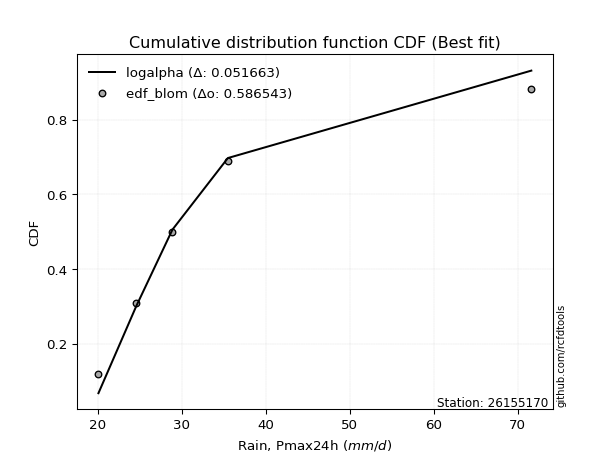</img>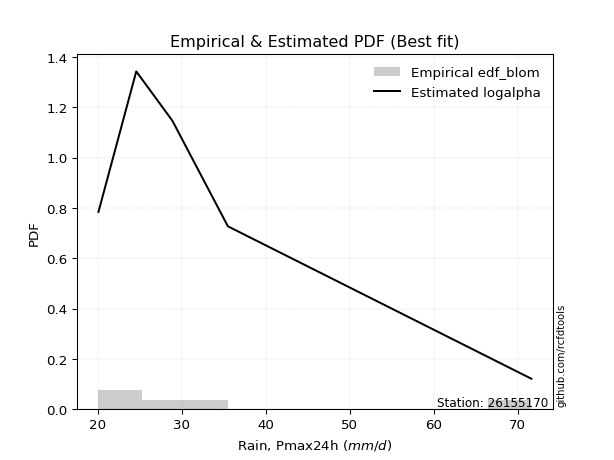</img>

</div>


### 7. Empirical - EDF Tukey (1962)

In hydrology, the Tukey formula is used as a plotting position formula to estimate the empirical probability or frequency of a flood event (or other hydrological data). The formula parameter is given as _c=0.333_ (or 1/3).

<div align="center">


$P=(m-c)/(n+1-2c)$


</div>


**7.1. Empirical values**

<div align="center">

|                | 0                   | 1                  | 2                   | 3                  | 4                  | 5                  |
|:---------------|:--------------------|:-------------------|:--------------------|:-------------------|:-------------------|:-------------------|
| date           | 2017                | 2018               | 2020                | 2025               | 2019               | 2024               |
| x              | 20.1                | 24.6               | 28.9                | 30.4               | 35.5               | 71.6               |
| m              | 1                   | 2                  | 3                   | 4                  | 5                  | 6                  |
| empirical_dist | edf_tukey           | edf_tukey          | edf_tukey           | edf_tukey          | edf_tukey          | edf_tukey          |
| empirical      | 0.10526315789473684 | 0.2631578947368421 | 0.42105263157894735 | 0.5789473684210527 | 0.7368421052631579 | 0.8947368421052632 |
| empirical_tr   | 1.1176470588235294  | 1.357142857142857  | 1.7272727272727273  | 2.375              | 3.7999999999999994 | 9.5                |

</div>


**7.2. Kolmogorov-Smirnov fit test (sorted by Δ)**


<div align="center">

|                | 0                   | 1                   | 2                   | 3                   | 4                   | 5                   | 6                   | 7                   | 8                   | 9                   | 10                  | 11                  | 12                  | 13                 | 14                  | 15                 | 16                  | 17                  | 18                  | 19                  | 20                  | 21                  | 22                  | 23                  | 24                  | 25                  | 26                  | 27                    | 28                  | 29                  | 30                  | 31                  | 32                  | 33                  | 34                  | 35                  | 36                  | 37                  | 38                  | 39                  | 40                  | 41                  | 42                  | 43                  | 44                  | 45                  | 46                  | 47                 | 48                  | 49                  | 50                  | 51                  | 52                  | 53                  | 54                 | 55                 | 56                  | 57                  | 58                  | 59                  | 60                  | 61                  | 62                  | 63                  | 64                  | 65                 | 66                 | 67                  | 68                  | 69                  | 70                  | 71                  | 72                  | 73                  | 74                  | 75                 | 76                  | 77                 | 78                 | 79                  | 80                 | 81                 | 82                  | 83                  | 84                  | 85                 | 86                 | 87                 | 88                 | 89                 |
|:---------------|:--------------------|:--------------------|:--------------------|:--------------------|:--------------------|:--------------------|:--------------------|:--------------------|:--------------------|:--------------------|:--------------------|:--------------------|:--------------------|:-------------------|:--------------------|:-------------------|:--------------------|:--------------------|:--------------------|:--------------------|:--------------------|:--------------------|:--------------------|:--------------------|:--------------------|:--------------------|:--------------------|:----------------------|:--------------------|:--------------------|:--------------------|:--------------------|:--------------------|:--------------------|:--------------------|:--------------------|:--------------------|:--------------------|:--------------------|:--------------------|:--------------------|:--------------------|:--------------------|:--------------------|:--------------------|:--------------------|:--------------------|:-------------------|:--------------------|:--------------------|:--------------------|:--------------------|:--------------------|:--------------------|:-------------------|:-------------------|:--------------------|:--------------------|:--------------------|:--------------------|:--------------------|:--------------------|:--------------------|:--------------------|:--------------------|:-------------------|:-------------------|:--------------------|:--------------------|:--------------------|:--------------------|:--------------------|:--------------------|:--------------------|:--------------------|:-------------------|:--------------------|:-------------------|:-------------------|:--------------------|:-------------------|:-------------------|:--------------------|:--------------------|:--------------------|:-------------------|:-------------------|:-------------------|:-------------------|:-------------------|
| station        | 26155170            | 26155170            | 26155170            | 26155170            | 26155170            | 26155170            | 26155170            | 26155170            | 26155170            | 26155170            | 26155170            | 26155170            | 26155170            | 26155170           | 26155170            | 26155170           | 26155170            | 26155170            | 26155170            | 26155170            | 26155170            | 26155170            | 26155170            | 26155170            | 26155170            | 26155170            | 26155170            | 26155170              | 26155170            | 26155170            | 26155170            | 26155170            | 26155170            | 26155170            | 26155170            | 26155170            | 26155170            | 26155170            | 26155170            | 26155170            | 26155170            | 26155170            | 26155170            | 26155170            | 26155170            | 26155170            | 26155170            | 26155170           | 26155170            | 26155170            | 26155170            | 26155170            | 26155170            | 26155170            | 26155170           | 26155170           | 26155170            | 26155170            | 26155170            | 26155170            | 26155170            | 26155170            | 26155170            | 26155170            | 26155170            | 26155170           | 26155170           | 26155170            | 26155170            | 26155170            | 26155170            | 26155170            | 26155170            | 26155170            | 26155170            | 26155170           | 26155170            | 26155170           | 26155170           | 26155170            | 26155170           | 26155170           | 26155170            | 26155170            | 26155170            | 26155170           | 26155170           | 26155170           | 26155170           | 26155170           |
| empirical_dist | edf_tukey           | edf_tukey           | edf_tukey           | edf_tukey           | edf_tukey           | edf_tukey           | edf_tukey           | edf_tukey           | edf_tukey           | edf_tukey           | edf_tukey           | edf_tukey           | edf_tukey           | edf_tukey          | edf_tukey           | edf_tukey          | edf_tukey           | edf_tukey           | edf_tukey           | edf_tukey           | edf_tukey           | edf_tukey           | edf_tukey           | edf_tukey           | edf_tukey           | edf_tukey           | edf_tukey           | edf_tukey             | edf_tukey           | edf_tukey           | edf_tukey           | edf_tukey           | edf_tukey           | edf_tukey           | edf_tukey           | edf_tukey           | edf_tukey           | edf_tukey           | edf_tukey           | edf_tukey           | edf_tukey           | edf_tukey           | edf_tukey           | edf_tukey           | edf_tukey           | edf_tukey           | edf_tukey           | edf_tukey          | edf_tukey           | edf_tukey           | edf_tukey           | edf_tukey           | edf_tukey           | edf_tukey           | edf_tukey          | edf_tukey          | edf_tukey           | edf_tukey           | edf_tukey           | edf_tukey           | edf_tukey           | edf_tukey           | edf_tukey           | edf_tukey           | edf_tukey           | edf_tukey          | edf_tukey          | edf_tukey           | edf_tukey           | edf_tukey           | edf_tukey           | edf_tukey           | edf_tukey           | edf_tukey           | edf_tukey           | edf_tukey          | edf_tukey           | edf_tukey          | edf_tukey          | edf_tukey           | edf_tukey          | edf_tukey          | edf_tukey           | edf_tukey           | edf_tukey           | edf_tukey          | edf_tukey          | edf_tukey          | edf_tukey          | edf_tukey          |
| p_dist         | logexponnorm        | logmoyal            | logalpha            | loginvweibull       | logmielke           | logf                | logncf              | loginvgamma         | logfisk             | loggumbel_r         | alpha               | loggenlogistic      | mielke              | f                  | ncf                 | invgamma           | logbetaprime        | logt                | logjohnsonsu        | logpearson3         | loginvgauss         | loghalfnorm         | logkstwobign        | logfatiguelife      | invgauss            | fisk                | johnsonsu           | loglaplace_asymmetric | nct                 | wald                | fatiguelife         | loghalflogistic     | lognct              | lograyleigh         | exponnorm           | logtruncnorm        | laplace_asymmetric  | loggenexpon         | genexpon            | loggompertz         | expon               | truncnorm           | logmaxwell          | logwald             | betaprime           | logexpon            | logrice             | halflogistic       | pearson3            | moyal               | genlogistic         | lognorm             | lognorm             | logcrystalball      | lognakagami        | loglogistic        | logloggamma         | gibrat              | loghypsecant        | halfnorm            | gumbel_r            | gamma               | loglaplace          | weibull_min         | t                   | kstwobign          | rayleigh           | logchi2             | maxwell             | loggumbel_l         | loggibrat           | nakagami            | gompertz            | hypsecant           | logistic            | logerlang          | norm                | crystalball        | rice               | laplace             | gumbel_l           | logweibull_min     | pareto              | logpareto           | loglognorm          | erlang             | invweibull         | loggamma           | loggamma           | chi2               |
| delta          | 0.05895881615333021 | 0.05965231912438684 | 0.06485359644389144 | 0.06874273341381165 | 0.07021403741954252 | 0.07111679547230476 | 0.07111986485586014 | 0.07112063046061745 | 0.07134005151029599 | 0.07213916687816779 | 0.07231210588296028 | 0.07263587377208991 | 0.07356142245078101 | 0.0757069616066336 | 0.07570739658612918 | 0.0757075464361806 | 0.07628001141499863 | 0.07688687195926192 | 0.07765503798929202 | 0.07862829558528162 | 0.07919535154980528 | 0.08024262623215161 | 0.08091039547628076 | 0.08362060227927182 | 0.08401532809825096 | 0.08468020293723089 | 0.09067996057308869 | 0.09081131568847045   | 0.09463768525051208 | 0.09822140241109911 | 0.09912126548062217 | 0.09964333385040586 | 0.09968009019348856 | 0.10385424349441241 | 0.10430065901185193 | 0.10519416234207957 | 0.10526315759219007 | 0.10526315774450672 | 0.10526315785769365 | 0.10526315786306131 | 0.10526315789473684 | 0.11074780001379969 | 0.11215230560640166 | 0.11537149891257326 | 0.11708774192747351 | 0.11738199608325006 | 0.12109120542465651 | 0.1299040446059877 | 0.13163953506368997 | 0.13306148676483487 | 0.13361859985445051 | 0.13885401227418837 | 0.13885401227418837 | 0.13885403419011189 | 0.1391717177816043 | 0.1421159209613443 | 0.14422005498782897 | 0.14821706930059936 | 0.14841669856175388 | 0.15528111338267414 | 0.15884283191505566 | 0.16758397516807821 | 0.16879016381829282 | 0.18007122102512496 | 0.18021360742075543 | 0.1815262219544983 | 0.1858146249117173 | 0.19284660615923532 | 0.19666089613935767 | 0.20448415591225128 | 0.20907556305524494 | 0.21268696530421294 | 0.22291851368865634 | 0.22751395999018287 | 0.22838200965484623 | 0.2286391976592267 | 0.22939868854918455 | 0.2293986953512711 | 0.2322934836152991 | 0.24331578019048383 | 0.2995144168783841 | 0.3081935333653301 | 0.36512162140845855 | 0.37992762614932357 | 0.38563140165611803 | 0.4393041363425552 | 0.4406016571048116 | 0.4820884815574213 | 0.4820884815574213 | 0.5357725136981162 |
| deltao         | 0.530385761606      | 0.530385761606      | 0.530385761606      | 0.530385761606      | 0.530385761606      | 0.530385761606      | 0.530385761606      | 0.530385761606      | 0.530385761606      | 0.530385761606      | 0.530385761606      | 0.530385761606      | 0.530385761606      | 0.530385761606     | 0.530385761606      | 0.530385761606     | 0.530385761606      | 0.530385761606      | 0.530385761606      | 0.530385761606      | 0.530385761606      | 0.530385761606      | 0.530385761606      | 0.530385761606      | 0.530385761606      | 0.530385761606      | 0.530385761606      | 0.530385761606        | 0.530385761606      | 0.530385761606      | 0.530385761606      | 0.530385761606      | 0.530385761606      | 0.530385761606      | 0.530385761606      | 0.530385761606      | 0.530385761606      | 0.530385761606      | 0.530385761606      | 0.530385761606      | 0.530385761606      | 0.530385761606      | 0.530385761606      | 0.530385761606      | 0.530385761606      | 0.530385761606      | 0.530385761606      | 0.530385761606     | 0.530385761606      | 0.530385761606      | 0.530385761606      | 0.530385761606      | 0.530385761606      | 0.530385761606      | 0.530385761606     | 0.530385761606     | 0.530385761606      | 0.530385761606      | 0.530385761606      | 0.530385761606      | 0.530385761606      | 0.530385761606      | 0.530385761606      | 0.530385761606      | 0.530385761606      | 0.530385761606     | 0.530385761606     | 0.530385761606      | 0.530385761606      | 0.530385761606      | 0.530385761606      | 0.530385761606      | 0.530385761606      | 0.530385761606      | 0.530385761606      | 0.530385761606     | 0.530385761606      | 0.530385761606     | 0.530385761606     | 0.530385761606      | 0.530385761606     | 0.530385761606     | 0.530385761606      | 0.530385761606      | 0.530385761606      | 0.530385761606     | 0.530385761606     | 0.530385761606     | 0.530385761606     | 0.530385761606     |
| eval           | Δo > Δ              | Δo > Δ              | Δo > Δ              | Δo > Δ              | Δo > Δ              | Δo > Δ              | Δo > Δ              | Δo > Δ              | Δo > Δ              | Δo > Δ              | Δo > Δ              | Δo > Δ              | Δo > Δ              | Δo > Δ             | Δo > Δ              | Δo > Δ             | Δo > Δ              | Δo > Δ              | Δo > Δ              | Δo > Δ              | Δo > Δ              | Δo > Δ              | Δo > Δ              | Δo > Δ              | Δo > Δ              | Δo > Δ              | Δo > Δ              | Δo > Δ                | Δo > Δ              | Δo > Δ              | Δo > Δ              | Δo > Δ              | Δo > Δ              | Δo > Δ              | Δo > Δ              | Δo > Δ              | Δo > Δ              | Δo > Δ              | Δo > Δ              | Δo > Δ              | Δo > Δ              | Δo > Δ              | Δo > Δ              | Δo > Δ              | Δo > Δ              | Δo > Δ              | Δo > Δ              | Δo > Δ             | Δo > Δ              | Δo > Δ              | Δo > Δ              | Δo > Δ              | Δo > Δ              | Δo > Δ              | Δo > Δ             | Δo > Δ             | Δo > Δ              | Δo > Δ              | Δo > Δ              | Δo > Δ              | Δo > Δ              | Δo > Δ              | Δo > Δ              | Δo > Δ              | Δo > Δ              | Δo > Δ             | Δo > Δ             | Δo > Δ              | Δo > Δ              | Δo > Δ              | Δo > Δ              | Δo > Δ              | Δo > Δ              | Δo > Δ              | Δo > Δ              | Δo > Δ             | Δo > Δ              | Δo > Δ             | Δo > Δ             | Δo > Δ              | Δo > Δ             | Δo > Δ             | Δo > Δ              | Δo > Δ              | Δo > Δ              | Δo > Δ             | Δo > Δ             | Δo > Δ             | Δo > Δ             | Δo <= Δ            |
| fit            | 1                   | 1                   | 1                   | 1                   | 1                   | 1                   | 1                   | 1                   | 1                   | 1                   | 1                   | 1                   | 1                   | 1                  | 1                   | 1                  | 1                   | 1                   | 1                   | 1                   | 1                   | 1                   | 1                   | 1                   | 1                   | 1                   | 1                   | 1                     | 1                   | 1                   | 1                   | 1                   | 1                   | 1                   | 1                   | 1                   | 1                   | 1                   | 1                   | 1                   | 1                   | 1                   | 1                   | 1                   | 1                   | 1                   | 1                   | 1                  | 1                   | 1                   | 1                   | 1                   | 1                   | 1                   | 1                  | 1                  | 1                   | 1                   | 1                   | 1                   | 1                   | 1                   | 1                   | 1                   | 1                   | 1                  | 1                  | 1                   | 1                   | 1                   | 1                   | 1                   | 1                   | 1                   | 1                   | 1                  | 1                   | 1                  | 1                  | 1                   | 1                  | 1                  | 1                   | 1                   | 1                   | 1                  | 1                  | 1                  | 1                  | 0                  |
| n              | 6                   | 6                   | 6                   | 6                   | 6                   | 6                   | 6                   | 6                   | 6                   | 6                   | 6                   | 6                   | 6                   | 6                  | 6                   | 6                  | 6                   | 6                   | 6                   | 6                   | 6                   | 6                   | 6                   | 6                   | 6                   | 6                   | 6                   | 6                     | 6                   | 6                   | 6                   | 6                   | 6                   | 6                   | 6                   | 6                   | 6                   | 6                   | 6                   | 6                   | 6                   | 6                   | 6                   | 6                   | 6                   | 6                   | 6                   | 6                  | 6                   | 6                   | 6                   | 6                   | 6                   | 6                   | 6                  | 6                  | 6                   | 6                   | 6                   | 6                   | 6                   | 6                   | 6                   | 6                   | 6                   | 6                  | 6                  | 6                   | 6                   | 6                   | 6                   | 6                   | 6                   | 6                   | 6                   | 6                  | 6                   | 6                  | 6                  | 6                   | 6                  | 6                  | 6                   | 6                   | 6                   | 6                  | 6                  | 6                  | 6                  | 6                  |
| best_fit       | 1                   | 0                   | 0                   | 0                   | 0                   | 0                   | 0                   | 0                   | 0                   | 0                   | 0                   | 0                   | 0                   | 0                  | 0                   | 0                  | 0                   | 0                   | 0                   | 0                   | 0                   | 0                   | 0                   | 0                   | 0                   | 0                   | 0                   | 0                     | 0                   | 0                   | 0                   | 0                   | 0                   | 0                   | 0                   | 0                   | 0                   | 0                   | 0                   | 0                   | 0                   | 0                   | 0                   | 0                   | 0                   | 0                   | 0                   | 0                  | 0                   | 0                   | 0                   | 0                   | 0                   | 0                   | 0                  | 0                  | 0                   | 0                   | 0                   | 0                   | 0                   | 0                   | 0                   | 0                   | 0                   | 0                  | 0                  | 0                   | 0                   | 0                   | 0                   | 0                   | 0                   | 0                   | 0                   | 0                  | 0                   | 0                  | 0                  | 0                   | 0                  | 0                  | 0                   | 0                   | 0                   | 0                  | 0                  | 0                  | 0                  | 0                  |
| best_fit_sort  | 1                   | 2                   | 3                   | 4                   | 5                   | 6                   | 7                   | 8                   | 9                   | 10                  | 11                  | 12                  | 13                  | 14                 | 15                  | 16                 | 17                  | 18                  | 19                  | 20                  | 21                  | 22                  | 23                  | 24                  | 25                  | 26                  | 27                  | 28                    | 29                  | 30                  | 31                  | 32                  | 33                  | 34                  | 35                  | 36                  | 37                  | 38                  | 39                  | 40                  | 41                  | 42                  | 43                  | 44                  | 45                  | 46                  | 47                  | 48                 | 49                  | 50                  | 51                  | 52                  | 53                  | 54                  | 55                 | 56                 | 57                  | 58                  | 59                  | 60                  | 61                  | 62                  | 63                  | 64                  | 65                  | 66                 | 67                 | 68                  | 69                  | 70                  | 71                  | 72                  | 73                  | 74                  | 75                  | 76                 | 77                  | 78                 | 79                 | 80                  | 81                 | 82                 | 83                  | 84                  | 85                  | 86                 | 87                 | 88                 | 89                 | 90                 |

</div>


<div align="center">

</img>

</div>


**7.3. Best fit**

<div align="center">

|   id |   station | empirical_dist   | p_dist       |     delta |   deltao | eval   |   fit |   n |   best_fit |   best_fit_sort |
|-----:|----------:|:-----------------|:-------------|----------:|---------:|:-------|------:|----:|-----------:|----------------:|
|    0 |  26155170 | edf_tukey        | logexponnorm | 0.0589588 | 0.530386 | Δo > Δ |     1 |   6 |          1 |               1 |

</div>


<div align="center">

</img></img>

</div>


### 8. Empirical - EDF Gringorten (1963)

Gringorten plotting position formula is essential for estimating the probability and return periods of extreme events like floods and heavy rainfall. The constant _a=0.44_.

<div align="center">


$P=(m-a)/(n+1-2a)$


</div>


**8.1. Empirical values**

<div align="center">

|                | 0                   | 1                  | 2                   | 3                  | 4                  | 5                  |
|:---------------|:--------------------|:-------------------|:--------------------|:-------------------|:-------------------|:-------------------|
| date           | 2017                | 2018               | 2020                | 2025               | 2019               | 2024               |
| x              | 20.1                | 24.6               | 28.9                | 30.4               | 35.5               | 71.6               |
| m              | 1                   | 2                  | 3                   | 4                  | 5                  | 6                  |
| empirical_dist | edf_gringorten      | edf_gringorten     | edf_gringorten      | edf_gringorten     | edf_gringorten     | edf_gringorten     |
| empirical      | 0.09150326797385622 | 0.2549019607843137 | 0.41830065359477125 | 0.5816993464052288 | 0.7450980392156862 | 0.9084967320261437 |
| empirical_tr   | 1.1007194244604317  | 1.3421052631578947 | 1.7191011235955058  | 2.3906250000000004 | 3.9230769230769216 | 10.928571428571415 |

</div>


**8.2. Kolmogorov-Smirnov fit test (sorted by Δ)**


<div align="center">

|                | 0                   | 1                  | 2                  | 3                   | 4                   | 5                   | 6                   | 7                   | 8                   | 9                   | 10                  | 11                  | 12                  | 13                  | 14                  | 15                 | 16                  | 17                  | 18                  | 19                  | 20                 | 21                  | 22                 | 23                  | 24                  | 25                  | 26                  | 27                  | 28                  | 29                 | 30                 | 31                  | 32                    | 33                  | 34                  | 35                 | 36                  | 37                  | 38                  | 39                  | 40                  | 41                  | 42                  | 43                  | 44                  | 45                  | 46                | 47                  | 48                  | 49                 | 50                  | 51                 | 52                  | 53                 | 54                 | 55                 | 56                  | 57                  | 58                 | 59                  | 60                | 61                 | 62                  | 63                  | 64                  | 65                  | 66                  | 67                  | 68                  | 69                | 70                  | 71                  | 72                  | 73                  | 74                 | 75                  | 76                  | 77                  | 78                  | 79                  | 80                 | 81                 | 82                  | 83                  | 84                 | 85                 | 86                 | 87                  | 88                  | 89                 |
|:---------------|:--------------------|:-------------------|:-------------------|:--------------------|:--------------------|:--------------------|:--------------------|:--------------------|:--------------------|:--------------------|:--------------------|:--------------------|:--------------------|:--------------------|:--------------------|:-------------------|:--------------------|:--------------------|:--------------------|:--------------------|:-------------------|:--------------------|:-------------------|:--------------------|:--------------------|:--------------------|:--------------------|:--------------------|:--------------------|:-------------------|:-------------------|:--------------------|:----------------------|:--------------------|:--------------------|:-------------------|:--------------------|:--------------------|:--------------------|:--------------------|:--------------------|:--------------------|:--------------------|:--------------------|:--------------------|:--------------------|:------------------|:--------------------|:--------------------|:-------------------|:--------------------|:-------------------|:--------------------|:-------------------|:-------------------|:-------------------|:--------------------|:--------------------|:-------------------|:--------------------|:------------------|:-------------------|:--------------------|:--------------------|:--------------------|:--------------------|:--------------------|:--------------------|:--------------------|:------------------|:--------------------|:--------------------|:--------------------|:--------------------|:-------------------|:--------------------|:--------------------|:--------------------|:--------------------|:--------------------|:-------------------|:-------------------|:--------------------|:--------------------|:-------------------|:-------------------|:-------------------|:--------------------|:--------------------|:-------------------|
| station        | 26155170            | 26155170           | 26155170           | 26155170            | 26155170            | 26155170            | 26155170            | 26155170            | 26155170            | 26155170            | 26155170            | 26155170            | 26155170            | 26155170            | 26155170            | 26155170           | 26155170            | 26155170            | 26155170            | 26155170            | 26155170           | 26155170            | 26155170           | 26155170            | 26155170            | 26155170            | 26155170            | 26155170            | 26155170            | 26155170           | 26155170           | 26155170            | 26155170              | 26155170            | 26155170            | 26155170           | 26155170            | 26155170            | 26155170            | 26155170            | 26155170            | 26155170            | 26155170            | 26155170            | 26155170            | 26155170            | 26155170          | 26155170            | 26155170            | 26155170           | 26155170            | 26155170           | 26155170            | 26155170           | 26155170           | 26155170           | 26155170            | 26155170            | 26155170           | 26155170            | 26155170          | 26155170           | 26155170            | 26155170            | 26155170            | 26155170            | 26155170            | 26155170            | 26155170            | 26155170          | 26155170            | 26155170            | 26155170            | 26155170            | 26155170           | 26155170            | 26155170            | 26155170            | 26155170            | 26155170            | 26155170           | 26155170           | 26155170            | 26155170            | 26155170           | 26155170           | 26155170           | 26155170            | 26155170            | 26155170           |
| empirical_dist | edf_gringorten      | edf_gringorten     | edf_gringorten     | edf_gringorten      | edf_gringorten      | edf_gringorten      | edf_gringorten      | edf_gringorten      | edf_gringorten      | edf_gringorten      | edf_gringorten      | edf_gringorten      | edf_gringorten      | edf_gringorten      | edf_gringorten      | edf_gringorten     | edf_gringorten      | edf_gringorten      | edf_gringorten      | edf_gringorten      | edf_gringorten     | edf_gringorten      | edf_gringorten     | edf_gringorten      | edf_gringorten      | edf_gringorten      | edf_gringorten      | edf_gringorten      | edf_gringorten      | edf_gringorten     | edf_gringorten     | edf_gringorten      | edf_gringorten        | edf_gringorten      | edf_gringorten      | edf_gringorten     | edf_gringorten      | edf_gringorten      | edf_gringorten      | edf_gringorten      | edf_gringorten      | edf_gringorten      | edf_gringorten      | edf_gringorten      | edf_gringorten      | edf_gringorten      | edf_gringorten    | edf_gringorten      | edf_gringorten      | edf_gringorten     | edf_gringorten      | edf_gringorten     | edf_gringorten      | edf_gringorten     | edf_gringorten     | edf_gringorten     | edf_gringorten      | edf_gringorten      | edf_gringorten     | edf_gringorten      | edf_gringorten    | edf_gringorten     | edf_gringorten      | edf_gringorten      | edf_gringorten      | edf_gringorten      | edf_gringorten      | edf_gringorten      | edf_gringorten      | edf_gringorten    | edf_gringorten      | edf_gringorten      | edf_gringorten      | edf_gringorten      | edf_gringorten     | edf_gringorten      | edf_gringorten      | edf_gringorten      | edf_gringorten      | edf_gringorten      | edf_gringorten     | edf_gringorten     | edf_gringorten      | edf_gringorten      | edf_gringorten     | edf_gringorten     | edf_gringorten     | edf_gringorten      | edf_gringorten      | edf_gringorten     |
| p_dist         | logmoyal            | mielke             | logexponnorm       | loggenlogistic      | logalpha            | loginvweibull       | logmielke           | logf                | logncf              | loginvgamma         | logfisk             | alpha               | logt                | f                   | ncf                 | invgamma           | logbetaprime        | loggumbel_r         | logjohnsonsu        | loginvgauss         | wald               | loghalflogistic     | logfatiguelife     | invgauss            | logpearson3         | fisk                | loghalfnorm         | logkstwobign        | logtruncnorm        | loggompertz        | loggenexpon        | johnsonsu           | loglaplace_asymmetric | nct                 | fatiguelife         | exponnorm          | lognct              | genexpon            | expon               | laplace_asymmetric  | lograyleigh         | logwald             | truncnorm           | logexpon            | logmaxwell          | betaprime           | logrice           | genlogistic         | halflogistic        | pearson3           | gibrat              | moyal              | loglogistic         | lognorm            | lognorm            | logcrystalball     | lognakagami         | loghypsecant        | logloggamma        | halfnorm            | gumbel_r          | gamma              | loglaplace          | weibull_min         | kstwobign           | t                   | rayleigh            | loggibrat           | logchi2             | maxwell           | loggumbel_l         | nakagami            | gompertz            | logerlang           | hypsecant          | logistic            | norm                | crystalball         | rice                | laplace             | gumbel_l           | logweibull_min     | pareto              | logpareto           | loglognorm         | erlang             | invweibull         | loggamma            | loggamma            | chi2               |
| delta          | 0.05783862026415981 | 0.0598015325299005 | 0.0617107941375063 | 0.06273894694176341 | 0.06760557442806753 | 0.07149471139798774 | 0.07296601540371861 | 0.07386877345648085 | 0.07387184284003623 | 0.07387260844479354 | 0.07409202949447208 | 0.07506408386713637 | 0.07735551584292105 | 0.07845893959080968 | 0.07845937457030527 | 0.0784595244203567 | 0.07903198939917472 | 0.08039510083069612 | 0.08040701597346811 | 0.08194732953398137 | 0.0844615124902185 | 0.08588344392952524 | 0.0863725802634479 | 0.08676730608242705 | 0.08688422953780994 | 0.08743218092140698 | 0.08849856018467994 | 0.08915110730993592 | 0.09143427242119906 | 0.0915032679421807 | 0.0915070557011251 | 0.09343193855726478 | 0.0935632936726466    | 0.09815691168150453 | 0.10187324346479826 | 0.1035342443588404 | 0.10478246729570662 | 0.10532793124780526 | 0.10533455493747235 | 0.10533516565287337 | 0.11211017744694074 | 0.11812347689674935 | 0.11900373396632802 | 0.12013397406742615 | 0.12040823955892999 | 0.12431157433364137 | 0.125041509630599 | 0.13637057783862666 | 0.13815997855851603 | 0.1398954690162183 | 0.13996113534807098 | 0.1413174207173632 | 0.14486789894552043 | 0.1471099462267167 | 0.1471099462267167 | 0.1471099681426402 | 0.14742765173413264 | 0.15116867654593003 | 0.1524759889403573 | 0.16353704733520247 | 0.167098765867584 | 0.1703359531522543 | 0.17154214180246896 | 0.18282319900930105 | 0.18978215590702663 | 0.19397349734163605 | 0.19407055886424562 | 0.20081962910271656 | 0.20110254011176365 | 0.204916830091886 | 0.20725351758953514 | 0.22094289925674127 | 0.23117444764118467 | 0.23139117564340278 | 0.2357698939427112 | 0.23663794360737456 | 0.23765462250171288 | 0.23765462930379944 | 0.24054941756782744 | 0.24606775817465998 | 0.3077703508309124 | 0.3164494673178585 | 0.37337755536098693 | 0.38818356010185195 | 0.3938873356086464 | 0.4475600702950836 | 0.4543615470256921 | 0.49034441550994967 | 0.49034441550994967 | 0.5440284476506446 |
| deltao         | 0.530385761606      | 0.530385761606     | 0.530385761606     | 0.530385761606      | 0.530385761606      | 0.530385761606      | 0.530385761606      | 0.530385761606      | 0.530385761606      | 0.530385761606      | 0.530385761606      | 0.530385761606      | 0.530385761606      | 0.530385761606      | 0.530385761606      | 0.530385761606     | 0.530385761606      | 0.530385761606      | 0.530385761606      | 0.530385761606      | 0.530385761606     | 0.530385761606      | 0.530385761606     | 0.530385761606      | 0.530385761606      | 0.530385761606      | 0.530385761606      | 0.530385761606      | 0.530385761606      | 0.530385761606     | 0.530385761606     | 0.530385761606      | 0.530385761606        | 0.530385761606      | 0.530385761606      | 0.530385761606     | 0.530385761606      | 0.530385761606      | 0.530385761606      | 0.530385761606      | 0.530385761606      | 0.530385761606      | 0.530385761606      | 0.530385761606      | 0.530385761606      | 0.530385761606      | 0.530385761606    | 0.530385761606      | 0.530385761606      | 0.530385761606     | 0.530385761606      | 0.530385761606     | 0.530385761606      | 0.530385761606     | 0.530385761606     | 0.530385761606     | 0.530385761606      | 0.530385761606      | 0.530385761606     | 0.530385761606      | 0.530385761606    | 0.530385761606     | 0.530385761606      | 0.530385761606      | 0.530385761606      | 0.530385761606      | 0.530385761606      | 0.530385761606      | 0.530385761606      | 0.530385761606    | 0.530385761606      | 0.530385761606      | 0.530385761606      | 0.530385761606      | 0.530385761606     | 0.530385761606      | 0.530385761606      | 0.530385761606      | 0.530385761606      | 0.530385761606      | 0.530385761606     | 0.530385761606     | 0.530385761606      | 0.530385761606      | 0.530385761606     | 0.530385761606     | 0.530385761606     | 0.530385761606      | 0.530385761606      | 0.530385761606     |
| eval           | Δo > Δ              | Δo > Δ             | Δo > Δ             | Δo > Δ              | Δo > Δ              | Δo > Δ              | Δo > Δ              | Δo > Δ              | Δo > Δ              | Δo > Δ              | Δo > Δ              | Δo > Δ              | Δo > Δ              | Δo > Δ              | Δo > Δ              | Δo > Δ             | Δo > Δ              | Δo > Δ              | Δo > Δ              | Δo > Δ              | Δo > Δ             | Δo > Δ              | Δo > Δ             | Δo > Δ              | Δo > Δ              | Δo > Δ              | Δo > Δ              | Δo > Δ              | Δo > Δ              | Δo > Δ             | Δo > Δ             | Δo > Δ              | Δo > Δ                | Δo > Δ              | Δo > Δ              | Δo > Δ             | Δo > Δ              | Δo > Δ              | Δo > Δ              | Δo > Δ              | Δo > Δ              | Δo > Δ              | Δo > Δ              | Δo > Δ              | Δo > Δ              | Δo > Δ              | Δo > Δ            | Δo > Δ              | Δo > Δ              | Δo > Δ             | Δo > Δ              | Δo > Δ             | Δo > Δ              | Δo > Δ             | Δo > Δ             | Δo > Δ             | Δo > Δ              | Δo > Δ              | Δo > Δ             | Δo > Δ              | Δo > Δ            | Δo > Δ             | Δo > Δ              | Δo > Δ              | Δo > Δ              | Δo > Δ              | Δo > Δ              | Δo > Δ              | Δo > Δ              | Δo > Δ            | Δo > Δ              | Δo > Δ              | Δo > Δ              | Δo > Δ              | Δo > Δ             | Δo > Δ              | Δo > Δ              | Δo > Δ              | Δo > Δ              | Δo > Δ              | Δo > Δ             | Δo > Δ             | Δo > Δ              | Δo > Δ              | Δo > Δ             | Δo > Δ             | Δo > Δ             | Δo > Δ              | Δo > Δ              | Δo <= Δ            |
| fit            | 1                   | 1                  | 1                  | 1                   | 1                   | 1                   | 1                   | 1                   | 1                   | 1                   | 1                   | 1                   | 1                   | 1                   | 1                   | 1                  | 1                   | 1                   | 1                   | 1                   | 1                  | 1                   | 1                  | 1                   | 1                   | 1                   | 1                   | 1                   | 1                   | 1                  | 1                  | 1                   | 1                     | 1                   | 1                   | 1                  | 1                   | 1                   | 1                   | 1                   | 1                   | 1                   | 1                   | 1                   | 1                   | 1                   | 1                 | 1                   | 1                   | 1                  | 1                   | 1                  | 1                   | 1                  | 1                  | 1                  | 1                   | 1                   | 1                  | 1                   | 1                 | 1                  | 1                   | 1                   | 1                   | 1                   | 1                   | 1                   | 1                   | 1                 | 1                   | 1                   | 1                   | 1                   | 1                  | 1                   | 1                   | 1                   | 1                   | 1                   | 1                  | 1                  | 1                   | 1                   | 1                  | 1                  | 1                  | 1                   | 1                   | 0                  |
| n              | 6                   | 6                  | 6                  | 6                   | 6                   | 6                   | 6                   | 6                   | 6                   | 6                   | 6                   | 6                   | 6                   | 6                   | 6                   | 6                  | 6                   | 6                   | 6                   | 6                   | 6                  | 6                   | 6                  | 6                   | 6                   | 6                   | 6                   | 6                   | 6                   | 6                  | 6                  | 6                   | 6                     | 6                   | 6                   | 6                  | 6                   | 6                   | 6                   | 6                   | 6                   | 6                   | 6                   | 6                   | 6                   | 6                   | 6                 | 6                   | 6                   | 6                  | 6                   | 6                  | 6                   | 6                  | 6                  | 6                  | 6                   | 6                   | 6                  | 6                   | 6                 | 6                  | 6                   | 6                   | 6                   | 6                   | 6                   | 6                   | 6                   | 6                 | 6                   | 6                   | 6                   | 6                   | 6                  | 6                   | 6                   | 6                   | 6                   | 6                   | 6                  | 6                  | 6                   | 6                   | 6                  | 6                  | 6                  | 6                   | 6                   | 6                  |
| best_fit       | 1                   | 0                  | 0                  | 0                   | 0                   | 0                   | 0                   | 0                   | 0                   | 0                   | 0                   | 0                   | 0                   | 0                   | 0                   | 0                  | 0                   | 0                   | 0                   | 0                   | 0                  | 0                   | 0                  | 0                   | 0                   | 0                   | 0                   | 0                   | 0                   | 0                  | 0                  | 0                   | 0                     | 0                   | 0                   | 0                  | 0                   | 0                   | 0                   | 0                   | 0                   | 0                   | 0                   | 0                   | 0                   | 0                   | 0                 | 0                   | 0                   | 0                  | 0                   | 0                  | 0                   | 0                  | 0                  | 0                  | 0                   | 0                   | 0                  | 0                   | 0                 | 0                  | 0                   | 0                   | 0                   | 0                   | 0                   | 0                   | 0                   | 0                 | 0                   | 0                   | 0                   | 0                   | 0                  | 0                   | 0                   | 0                   | 0                   | 0                   | 0                  | 0                  | 0                   | 0                   | 0                  | 0                  | 0                  | 0                   | 0                   | 0                  |
| best_fit_sort  | 1                   | 2                  | 3                  | 4                   | 5                   | 6                   | 7                   | 8                   | 9                   | 10                  | 11                  | 12                  | 13                  | 14                  | 15                  | 16                 | 17                  | 18                  | 19                  | 20                  | 21                 | 22                  | 23                 | 24                  | 25                  | 26                  | 27                  | 28                  | 29                  | 30                 | 31                 | 32                  | 33                    | 34                  | 35                  | 36                 | 37                  | 38                  | 39                  | 40                  | 41                  | 42                  | 43                  | 44                  | 45                  | 46                  | 47                | 48                  | 49                  | 50                 | 51                  | 52                 | 53                  | 54                 | 55                 | 56                 | 57                  | 58                  | 59                 | 60                  | 61                | 62                 | 63                  | 64                  | 65                  | 66                  | 67                  | 68                  | 69                  | 70                | 71                  | 72                  | 73                  | 74                  | 75                 | 76                  | 77                  | 78                  | 79                  | 80                  | 81                 | 82                 | 83                  | 84                  | 85                 | 86                 | 87                 | 88                  | 89                  | 90                 |

</div>


<div align="center">

</img>

</div>


**8.3. Best fit**

<div align="center">

|   id |   station | empirical_dist   | p_dist   |     delta |   deltao | eval   |   fit |   n |   best_fit |   best_fit_sort |
|-----:|----------:|:-----------------|:---------|----------:|---------:|:-------|------:|----:|-----------:|----------------:|
|    0 |  26155170 | edf_gringorten   | logmoyal | 0.0578386 | 0.530386 | Δo > Δ |     1 |   6 |          1 |               1 |

</div>


<div align="center">

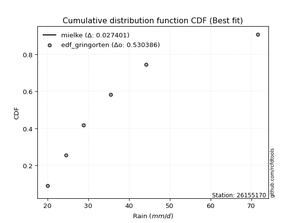</img>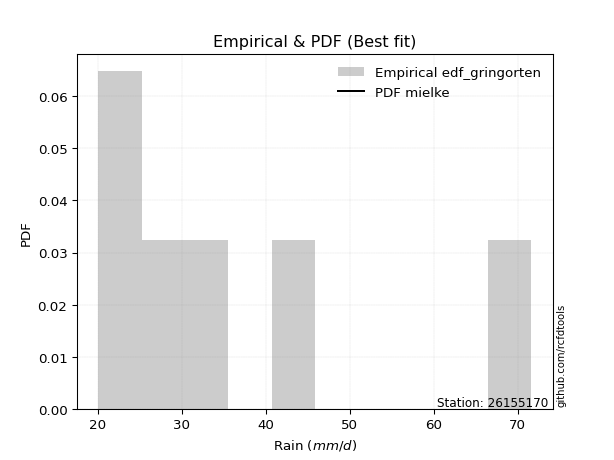</img>

</div>


### 9. Empirical - EDF Filliben (1975)

The specific values of the constants (0.3175) (often denoted as $alpha$) and (0.365) are derived from a method proposed by James J. Filliben in a 1975 paper. This particular formula is the mean value of the $i$-th order statistic of the normal distribution and is considered a robust and effective plotting position formula for the normal probability plot correlation coefficient test for normality.

<div align="center">


$P=(m-0.3175)/(n+0.365)$


</div>


**9.1. Empirical values**

<div align="center">

|                | 0                   | 1                   | 2                  | 3                  | 4                  | 5                  |
|:---------------|:--------------------|:--------------------|:-------------------|:-------------------|:-------------------|:-------------------|
| date           | 2017                | 2018                | 2020               | 2025               | 2019               | 2024               |
| x              | 20.1                | 24.6                | 28.9               | 30.4               | 35.5               | 71.6               |
| m              | 1                   | 2                   | 3                  | 4                  | 5                  | 6                  |
| empirical_dist | edf_filliben        | edf_filliben        | edf_filliben       | edf_filliben       | edf_filliben       | edf_filliben       |
| empirical      | 0.10722702278083267 | 0.26433621366849963 | 0.4214454045561665 | 0.5785545954438335 | 0.7356637863315004 | 0.8927729772191673 |
| empirical_tr   | 1.1201055873295205  | 1.3593166043780034  | 1.7284453496266123 | 2.3727865796831313 | 3.783060921248143  | 9.326007326007321  |

</div>


**9.2. Kolmogorov-Smirnov fit test (sorted by Δ)**


<div align="center">

|                | 0                    | 1                    | 2                   | 3                   | 4                   | 5                   | 6                   | 7                   | 8                   | 9                   | 10                 | 11                  | 12                  | 13               | 14                  | 15                  | 16                  | 17                  | 18                  | 19                 | 20                  | 21                  | 22                  | 23                  | 24                  | 25                 | 26                  | 27                    | 28                 | 29                  | 30                  | 31                  | 32                  | 33                  | 34                  | 35                  | 36                 | 37                  | 38                  | 39                  | 40                  | 41                  | 42                  | 43                  | 44                  | 45                  | 46                  | 47                  | 48                  | 49                  | 50                  | 51                  | 52                  | 53                  | 54                  | 55                 | 56                  | 57                 | 58                 | 59                 | 60                  | 61                  | 62                  | 63                  | 64                  | 65                  | 66                  | 67                 | 68                  | 69                 | 70                  | 71                 | 72                 | 73                  | 74                 | 75                  | 76                  | 77                 | 78                  | 79                  | 80                  | 81                 | 82                | 83                  | 84                 | 85                 | 86                 | 87                  | 88                  | 89                 |
|:---------------|:---------------------|:---------------------|:--------------------|:--------------------|:--------------------|:--------------------|:--------------------|:--------------------|:--------------------|:--------------------|:-------------------|:--------------------|:--------------------|:-----------------|:--------------------|:--------------------|:--------------------|:--------------------|:--------------------|:-------------------|:--------------------|:--------------------|:--------------------|:--------------------|:--------------------|:-------------------|:--------------------|:----------------------|:-------------------|:--------------------|:--------------------|:--------------------|:--------------------|:--------------------|:--------------------|:--------------------|:-------------------|:--------------------|:--------------------|:--------------------|:--------------------|:--------------------|:--------------------|:--------------------|:--------------------|:--------------------|:--------------------|:--------------------|:--------------------|:--------------------|:--------------------|:--------------------|:--------------------|:--------------------|:--------------------|:-------------------|:--------------------|:-------------------|:-------------------|:-------------------|:--------------------|:--------------------|:--------------------|:--------------------|:--------------------|:--------------------|:--------------------|:-------------------|:--------------------|:-------------------|:--------------------|:-------------------|:-------------------|:--------------------|:-------------------|:--------------------|:--------------------|:-------------------|:--------------------|:--------------------|:--------------------|:-------------------|:------------------|:--------------------|:-------------------|:-------------------|:-------------------|:--------------------|:--------------------|:-------------------|
| station        | 26155170             | 26155170             | 26155170            | 26155170            | 26155170            | 26155170            | 26155170            | 26155170            | 26155170            | 26155170            | 26155170           | 26155170            | 26155170            | 26155170         | 26155170            | 26155170            | 26155170            | 26155170            | 26155170            | 26155170           | 26155170            | 26155170            | 26155170            | 26155170            | 26155170            | 26155170           | 26155170            | 26155170              | 26155170           | 26155170            | 26155170            | 26155170            | 26155170            | 26155170            | 26155170            | 26155170            | 26155170           | 26155170            | 26155170            | 26155170            | 26155170            | 26155170            | 26155170            | 26155170            | 26155170            | 26155170            | 26155170            | 26155170            | 26155170            | 26155170            | 26155170            | 26155170            | 26155170            | 26155170            | 26155170            | 26155170           | 26155170            | 26155170           | 26155170           | 26155170           | 26155170            | 26155170            | 26155170            | 26155170            | 26155170            | 26155170            | 26155170            | 26155170           | 26155170            | 26155170           | 26155170            | 26155170           | 26155170           | 26155170            | 26155170           | 26155170            | 26155170            | 26155170           | 26155170            | 26155170            | 26155170            | 26155170           | 26155170          | 26155170            | 26155170           | 26155170           | 26155170           | 26155170            | 26155170            | 26155170           |
| empirical_dist | edf_filliben         | edf_filliben         | edf_filliben        | edf_filliben        | edf_filliben        | edf_filliben        | edf_filliben        | edf_filliben        | edf_filliben        | edf_filliben        | edf_filliben       | edf_filliben        | edf_filliben        | edf_filliben     | edf_filliben        | edf_filliben        | edf_filliben        | edf_filliben        | edf_filliben        | edf_filliben       | edf_filliben        | edf_filliben        | edf_filliben        | edf_filliben        | edf_filliben        | edf_filliben       | edf_filliben        | edf_filliben          | edf_filliben       | edf_filliben        | edf_filliben        | edf_filliben        | edf_filliben        | edf_filliben        | edf_filliben        | edf_filliben        | edf_filliben       | edf_filliben        | edf_filliben        | edf_filliben        | edf_filliben        | edf_filliben        | edf_filliben        | edf_filliben        | edf_filliben        | edf_filliben        | edf_filliben        | edf_filliben        | edf_filliben        | edf_filliben        | edf_filliben        | edf_filliben        | edf_filliben        | edf_filliben        | edf_filliben        | edf_filliben       | edf_filliben        | edf_filliben       | edf_filliben       | edf_filliben       | edf_filliben        | edf_filliben        | edf_filliben        | edf_filliben        | edf_filliben        | edf_filliben        | edf_filliben        | edf_filliben       | edf_filliben        | edf_filliben       | edf_filliben        | edf_filliben       | edf_filliben       | edf_filliben        | edf_filliben       | edf_filliben        | edf_filliben        | edf_filliben       | edf_filliben        | edf_filliben        | edf_filliben        | edf_filliben       | edf_filliben      | edf_filliben        | edf_filliben       | edf_filliben       | edf_filliben       | edf_filliben        | edf_filliben        | edf_filliben       |
| p_dist         | logexponnorm         | logmoyal             | logalpha            | loginvweibull       | logmielke           | logf                | logncf              | loginvgamma         | logfisk             | loggumbel_r         | alpha              | loggenlogistic      | f                   | ncf              | invgamma            | mielke              | logbetaprime        | logjohnsonsu        | logpearson3         | loginvgauss        | logt                | loghalfnorm         | logkstwobign        | logfatiguelife      | invgauss            | fisk               | johnsonsu           | loglaplace_asymmetric | nct                | fatiguelife         | lognct              | wald                | loghalflogistic     | lograyleigh         | exponnorm           | logtruncnorm        | laplace_asymmetric | loggenexpon         | genexpon            | loggompertz         | expon               | truncnorm           | logmaxwell          | logwald             | betaprime           | logexpon            | logrice             | halflogistic        | pearson3            | moyal               | genlogistic         | lognorm             | lognorm             | logcrystalball      | lognakagami         | loglogistic        | logloggamma         | loghypsecant       | gibrat             | halfnorm           | gumbel_r            | gamma               | loglaplace          | t                   | weibull_min         | kstwobign           | rayleigh            | logchi2            | maxwell             | loggumbel_l        | loggibrat           | nakagami           | gompertz           | hypsecant           | logistic           | norm                | crystalball         | logerlang          | rice                | laplace             | gumbel_l            | logweibull_min     | pareto            | logpareto           | loglognorm         | erlang             | invweibull         | loggamma            | loggamma            | chi2               |
| delta          | 0.059043445410665196 | 0.061616184010482744 | 0.06446082346667226 | 0.06834996043659247 | 0.06982126444232334 | 0.07072402249508558 | 0.07072709187864096 | 0.07072785748339827 | 0.07094727853307681 | 0.07096084794651036 | 0.0719193329057411 | 0.07459973865818581 | 0.07531418862941441 | 0.07531462360891 | 0.07531477345896143 | 0.07552528733687691 | 0.07588723843777945 | 0.07726226501207284 | 0.07744997665362419 | 0.0788025785725861 | 0.07885073684535782 | 0.07906430730049419 | 0.08051762249906158 | 0.08322782930205264 | 0.08362255512103178 | 0.0842874299600117 | 0.09028718759586951 | 0.09041854271125127   | 0.0942449122732929 | 0.09872849250340299 | 0.09928731721626938 | 0.10018526729719494 | 0.10160719873650169 | 0.10267592456275498 | 0.10626452389794776 | 0.10715802722817547 | 0.1072270224782859 | 0.10722702263060255 | 0.10722702274378948 | 0.10722702274915714 | 0.10722702278083267 | 0.10956948108214226 | 0.11097398667474423 | 0.11497872593535408 | 0.11669496895025433 | 0.11698922310603088 | 0.12069843244743733 | 0.12872572567433027 | 0.13046121613203254 | 0.13188316783317744 | 0.13322582687723133 | 0.13767569334253094 | 0.13767569334253094 | 0.13767571525845446 | 0.13799339884994688 | 0.1417231479841251 | 0.14304173605617154 | 0.1480239255845347 | 0.1493953882322569 | 0.1541027944510167 | 0.15766451298339823 | 0.16719120219085903 | 0.16839739084107364 | 0.17824974253465958 | 0.17967844804790578 | 0.18034790302284087 | 0.18463630598005987 | 0.1916682872275779 | 0.19548257720770024 | 0.2040913829350321 | 0.21025388198690248 | 0.2115086463725555 | 0.2217401947569989 | 0.22633564105852544 | 0.2272036907231888 | 0.22822036961752712 | 0.22822037641961368 | 0.2282464246820075 | 0.23111516468364168 | 0.24292300721326465 | 0.29833609794672666 | 0.3070152144336726 | 0.363943302476801 | 0.37874930721766603 | 0.3844530827244605 | 0.4381258174108977 | 0.4386377922187157 | 0.48091016262576375 | 0.48091016262576375 | 0.5345941947664588 |
| deltao         | 0.530385761606       | 0.530385761606       | 0.530385761606      | 0.530385761606      | 0.530385761606      | 0.530385761606      | 0.530385761606      | 0.530385761606      | 0.530385761606      | 0.530385761606      | 0.530385761606     | 0.530385761606      | 0.530385761606      | 0.530385761606   | 0.530385761606      | 0.530385761606      | 0.530385761606      | 0.530385761606      | 0.530385761606      | 0.530385761606     | 0.530385761606      | 0.530385761606      | 0.530385761606      | 0.530385761606      | 0.530385761606      | 0.530385761606     | 0.530385761606      | 0.530385761606        | 0.530385761606     | 0.530385761606      | 0.530385761606      | 0.530385761606      | 0.530385761606      | 0.530385761606      | 0.530385761606      | 0.530385761606      | 0.530385761606     | 0.530385761606      | 0.530385761606      | 0.530385761606      | 0.530385761606      | 0.530385761606      | 0.530385761606      | 0.530385761606      | 0.530385761606      | 0.530385761606      | 0.530385761606      | 0.530385761606      | 0.530385761606      | 0.530385761606      | 0.530385761606      | 0.530385761606      | 0.530385761606      | 0.530385761606      | 0.530385761606      | 0.530385761606     | 0.530385761606      | 0.530385761606     | 0.530385761606     | 0.530385761606     | 0.530385761606      | 0.530385761606      | 0.530385761606      | 0.530385761606      | 0.530385761606      | 0.530385761606      | 0.530385761606      | 0.530385761606     | 0.530385761606      | 0.530385761606     | 0.530385761606      | 0.530385761606     | 0.530385761606     | 0.530385761606      | 0.530385761606     | 0.530385761606      | 0.530385761606      | 0.530385761606     | 0.530385761606      | 0.530385761606      | 0.530385761606      | 0.530385761606     | 0.530385761606    | 0.530385761606      | 0.530385761606     | 0.530385761606     | 0.530385761606     | 0.530385761606      | 0.530385761606      | 0.530385761606     |
| eval           | Δo > Δ               | Δo > Δ               | Δo > Δ              | Δo > Δ              | Δo > Δ              | Δo > Δ              | Δo > Δ              | Δo > Δ              | Δo > Δ              | Δo > Δ              | Δo > Δ             | Δo > Δ              | Δo > Δ              | Δo > Δ           | Δo > Δ              | Δo > Δ              | Δo > Δ              | Δo > Δ              | Δo > Δ              | Δo > Δ             | Δo > Δ              | Δo > Δ              | Δo > Δ              | Δo > Δ              | Δo > Δ              | Δo > Δ             | Δo > Δ              | Δo > Δ                | Δo > Δ             | Δo > Δ              | Δo > Δ              | Δo > Δ              | Δo > Δ              | Δo > Δ              | Δo > Δ              | Δo > Δ              | Δo > Δ             | Δo > Δ              | Δo > Δ              | Δo > Δ              | Δo > Δ              | Δo > Δ              | Δo > Δ              | Δo > Δ              | Δo > Δ              | Δo > Δ              | Δo > Δ              | Δo > Δ              | Δo > Δ              | Δo > Δ              | Δo > Δ              | Δo > Δ              | Δo > Δ              | Δo > Δ              | Δo > Δ              | Δo > Δ             | Δo > Δ              | Δo > Δ             | Δo > Δ             | Δo > Δ             | Δo > Δ              | Δo > Δ              | Δo > Δ              | Δo > Δ              | Δo > Δ              | Δo > Δ              | Δo > Δ              | Δo > Δ             | Δo > Δ              | Δo > Δ             | Δo > Δ              | Δo > Δ             | Δo > Δ             | Δo > Δ              | Δo > Δ             | Δo > Δ              | Δo > Δ              | Δo > Δ             | Δo > Δ              | Δo > Δ              | Δo > Δ              | Δo > Δ             | Δo > Δ            | Δo > Δ              | Δo > Δ             | Δo > Δ             | Δo > Δ             | Δo > Δ              | Δo > Δ              | Δo <= Δ            |
| fit            | 1                    | 1                    | 1                   | 1                   | 1                   | 1                   | 1                   | 1                   | 1                   | 1                   | 1                  | 1                   | 1                   | 1                | 1                   | 1                   | 1                   | 1                   | 1                   | 1                  | 1                   | 1                   | 1                   | 1                   | 1                   | 1                  | 1                   | 1                     | 1                  | 1                   | 1                   | 1                   | 1                   | 1                   | 1                   | 1                   | 1                  | 1                   | 1                   | 1                   | 1                   | 1                   | 1                   | 1                   | 1                   | 1                   | 1                   | 1                   | 1                   | 1                   | 1                   | 1                   | 1                   | 1                   | 1                   | 1                  | 1                   | 1                  | 1                  | 1                  | 1                   | 1                   | 1                   | 1                   | 1                   | 1                   | 1                   | 1                  | 1                   | 1                  | 1                   | 1                  | 1                  | 1                   | 1                  | 1                   | 1                   | 1                  | 1                   | 1                   | 1                   | 1                  | 1                 | 1                   | 1                  | 1                  | 1                  | 1                   | 1                   | 0                  |
| n              | 6                    | 6                    | 6                   | 6                   | 6                   | 6                   | 6                   | 6                   | 6                   | 6                   | 6                  | 6                   | 6                   | 6                | 6                   | 6                   | 6                   | 6                   | 6                   | 6                  | 6                   | 6                   | 6                   | 6                   | 6                   | 6                  | 6                   | 6                     | 6                  | 6                   | 6                   | 6                   | 6                   | 6                   | 6                   | 6                   | 6                  | 6                   | 6                   | 6                   | 6                   | 6                   | 6                   | 6                   | 6                   | 6                   | 6                   | 6                   | 6                   | 6                   | 6                   | 6                   | 6                   | 6                   | 6                   | 6                  | 6                   | 6                  | 6                  | 6                  | 6                   | 6                   | 6                   | 6                   | 6                   | 6                   | 6                   | 6                  | 6                   | 6                  | 6                   | 6                  | 6                  | 6                   | 6                  | 6                   | 6                   | 6                  | 6                   | 6                   | 6                   | 6                  | 6                 | 6                   | 6                  | 6                  | 6                  | 6                   | 6                   | 6                  |
| best_fit       | 1                    | 0                    | 0                   | 0                   | 0                   | 0                   | 0                   | 0                   | 0                   | 0                   | 0                  | 0                   | 0                   | 0                | 0                   | 0                   | 0                   | 0                   | 0                   | 0                  | 0                   | 0                   | 0                   | 0                   | 0                   | 0                  | 0                   | 0                     | 0                  | 0                   | 0                   | 0                   | 0                   | 0                   | 0                   | 0                   | 0                  | 0                   | 0                   | 0                   | 0                   | 0                   | 0                   | 0                   | 0                   | 0                   | 0                   | 0                   | 0                   | 0                   | 0                   | 0                   | 0                   | 0                   | 0                   | 0                  | 0                   | 0                  | 0                  | 0                  | 0                   | 0                   | 0                   | 0                   | 0                   | 0                   | 0                   | 0                  | 0                   | 0                  | 0                   | 0                  | 0                  | 0                   | 0                  | 0                   | 0                   | 0                  | 0                   | 0                   | 0                   | 0                  | 0                 | 0                   | 0                  | 0                  | 0                  | 0                   | 0                   | 0                  |
| best_fit_sort  | 1                    | 2                    | 3                   | 4                   | 5                   | 6                   | 7                   | 8                   | 9                   | 10                  | 11                 | 12                  | 13                  | 14               | 15                  | 16                  | 17                  | 18                  | 19                  | 20                 | 21                  | 22                  | 23                  | 24                  | 25                  | 26                 | 27                  | 28                    | 29                 | 30                  | 31                  | 32                  | 33                  | 34                  | 35                  | 36                  | 37                 | 38                  | 39                  | 40                  | 41                  | 42                  | 43                  | 44                  | 45                  | 46                  | 47                  | 48                  | 49                  | 50                  | 51                  | 52                  | 53                  | 54                  | 55                  | 56                 | 57                  | 58                 | 59                 | 60                 | 61                  | 62                  | 63                  | 64                  | 65                  | 66                  | 67                  | 68                 | 69                  | 70                 | 71                  | 72                 | 73                 | 74                  | 75                 | 76                  | 77                  | 78                 | 79                  | 80                  | 81                  | 82                 | 83                | 84                  | 85                 | 86                 | 87                 | 88                  | 89                  | 90                 |

</div>


<div align="center">

</img>

</div>


**9.3. Best fit**

<div align="center">

|   id |   station | empirical_dist   | p_dist       |     delta |   deltao | eval   |   fit |   n |   best_fit |   best_fit_sort |
|-----:|----------:|:-----------------|:-------------|----------:|---------:|:-------|------:|----:|-----------:|----------------:|
|    0 |  26155170 | edf_filliben     | logexponnorm | 0.0590434 | 0.530386 | Δo > Δ |     1 |   6 |          1 |               1 |

</div>


<div align="center">

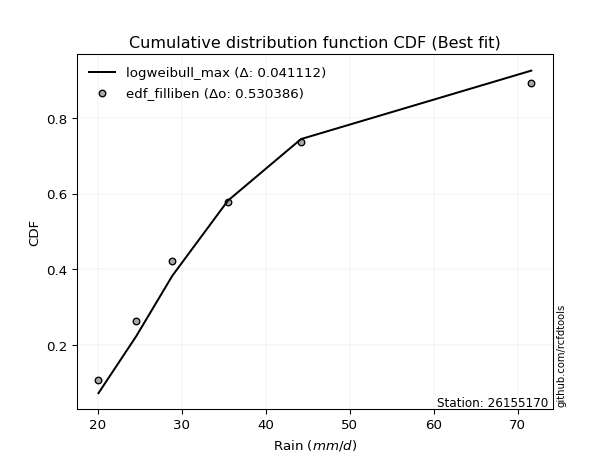</img>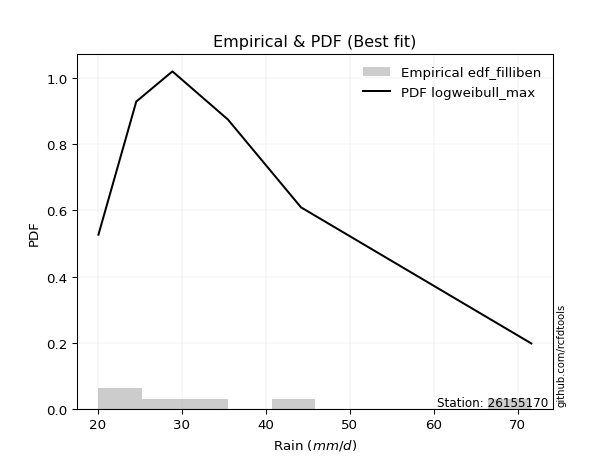</img>

</div>


### 10. Empirical - EDF Jenkinson (1977)

The Jenkinson formula in hydrology is an empirical plotting position formula used to estimate the non-exceedance probability _(P)_ or return period _(T)_ of a given ordered observation within a sample. It is a widely used method in the frequency analysis of extreme events such as floods and rainfall, as it provides a distribution-free way to plot data. _a≈0.31_ and _b≈0.38_ are constants derived to approximate the median of the probability distribution for the given rank.

<div align="center">


$P=(m-a)/(n+b)$


</div>


**10.1. Empirical values**

<div align="center">

|                | 0                   | 1                   | 2                  | 3                  | 4                  | 5                  |
|:---------------|:--------------------|:--------------------|:-------------------|:-------------------|:-------------------|:-------------------|
| date           | 2017                | 2018                | 2020               | 2025               | 2019               | 2024               |
| x              | 20.1                | 24.6                | 28.9               | 30.4               | 35.5               | 71.6               |
| m              | 1                   | 2                   | 3                  | 4                  | 5                  | 6                  |
| empirical_dist | edf_jenkinson       | edf_jenkinson       | edf_jenkinson      | edf_jenkinson      | edf_jenkinson      | edf_jenkinson      |
| empirical      | 0.10815047021943573 | 0.26489028213166144 | 0.4216300940438871 | 0.5783699059561128 | 0.7351097178683387 | 0.8918495297805643 |
| empirical_tr   | 1.1212653778558874  | 1.3603411513859276  | 1.7289972899728996 | 2.3717472118959106 | 3.7751479289940844 | 9.246376811594207  |

</div>


**10.2. Kolmogorov-Smirnov fit test (sorted by Δ)**


<div align="center">

|                | 0                   | 1                  | 2                   | 3                   | 4                   | 5                   | 6                   | 7                   | 8                   | 9                  | 10                 | 11                  | 12                 | 13                  | 14                  | 15                  | 16                  | 17                  | 18                  | 19                  | 20                 | 21                  | 22                  | 23                  | 24                  | 25                 | 26                  | 27                    | 28                  | 29                  | 30                  | 31                  | 32                  | 33                  | 34                  | 35                  | 36                  | 37                  | 38                  | 39                  | 40                  | 41                  | 42                  | 43                  | 44                  | 45                  | 46                  | 47                  | 48                 | 49                 | 50                  | 51                  | 52                  | 53                 | 54                  | 55                  | 56                 | 57                  | 58                 | 59                  | 60                  | 61                  | 62                  | 63                  | 64                  | 65                  | 66                  | 67                  | 68                 | 69                  | 70                  | 71                  | 72                  | 73                 | 74                  | 75                  | 76                  | 77                 | 78                  | 79                | 80                 | 81                 | 82                 | 83                 | 84                 | 85                 | 86                  | 87                  | 88                  | 89                 |
|:---------------|:--------------------|:-------------------|:--------------------|:--------------------|:--------------------|:--------------------|:--------------------|:--------------------|:--------------------|:-------------------|:-------------------|:--------------------|:-------------------|:--------------------|:--------------------|:--------------------|:--------------------|:--------------------|:--------------------|:--------------------|:-------------------|:--------------------|:--------------------|:--------------------|:--------------------|:-------------------|:--------------------|:----------------------|:--------------------|:--------------------|:--------------------|:--------------------|:--------------------|:--------------------|:--------------------|:--------------------|:--------------------|:--------------------|:--------------------|:--------------------|:--------------------|:--------------------|:--------------------|:--------------------|:--------------------|:--------------------|:--------------------|:--------------------|:-------------------|:-------------------|:--------------------|:--------------------|:--------------------|:-------------------|:--------------------|:--------------------|:-------------------|:--------------------|:-------------------|:--------------------|:--------------------|:--------------------|:--------------------|:--------------------|:--------------------|:--------------------|:--------------------|:--------------------|:-------------------|:--------------------|:--------------------|:--------------------|:--------------------|:-------------------|:--------------------|:--------------------|:--------------------|:-------------------|:--------------------|:------------------|:-------------------|:-------------------|:-------------------|:-------------------|:-------------------|:-------------------|:--------------------|:--------------------|:--------------------|:-------------------|
| station        | 26155170            | 26155170           | 26155170            | 26155170            | 26155170            | 26155170            | 26155170            | 26155170            | 26155170            | 26155170           | 26155170           | 26155170            | 26155170           | 26155170            | 26155170            | 26155170            | 26155170            | 26155170            | 26155170            | 26155170            | 26155170           | 26155170            | 26155170            | 26155170            | 26155170            | 26155170           | 26155170            | 26155170              | 26155170            | 26155170            | 26155170            | 26155170            | 26155170            | 26155170            | 26155170            | 26155170            | 26155170            | 26155170            | 26155170            | 26155170            | 26155170            | 26155170            | 26155170            | 26155170            | 26155170            | 26155170            | 26155170            | 26155170            | 26155170           | 26155170           | 26155170            | 26155170            | 26155170            | 26155170           | 26155170            | 26155170            | 26155170           | 26155170            | 26155170           | 26155170            | 26155170            | 26155170            | 26155170            | 26155170            | 26155170            | 26155170            | 26155170            | 26155170            | 26155170           | 26155170            | 26155170            | 26155170            | 26155170            | 26155170           | 26155170            | 26155170            | 26155170            | 26155170           | 26155170            | 26155170          | 26155170           | 26155170           | 26155170           | 26155170           | 26155170           | 26155170           | 26155170            | 26155170            | 26155170            | 26155170           |
| empirical_dist | edf_jenkinson       | edf_jenkinson      | edf_jenkinson       | edf_jenkinson       | edf_jenkinson       | edf_jenkinson       | edf_jenkinson       | edf_jenkinson       | edf_jenkinson       | edf_jenkinson      | edf_jenkinson      | edf_jenkinson       | edf_jenkinson      | edf_jenkinson       | edf_jenkinson       | edf_jenkinson       | edf_jenkinson       | edf_jenkinson       | edf_jenkinson       | edf_jenkinson       | edf_jenkinson      | edf_jenkinson       | edf_jenkinson       | edf_jenkinson       | edf_jenkinson       | edf_jenkinson      | edf_jenkinson       | edf_jenkinson         | edf_jenkinson       | edf_jenkinson       | edf_jenkinson       | edf_jenkinson       | edf_jenkinson       | edf_jenkinson       | edf_jenkinson       | edf_jenkinson       | edf_jenkinson       | edf_jenkinson       | edf_jenkinson       | edf_jenkinson       | edf_jenkinson       | edf_jenkinson       | edf_jenkinson       | edf_jenkinson       | edf_jenkinson       | edf_jenkinson       | edf_jenkinson       | edf_jenkinson       | edf_jenkinson      | edf_jenkinson      | edf_jenkinson       | edf_jenkinson       | edf_jenkinson       | edf_jenkinson      | edf_jenkinson       | edf_jenkinson       | edf_jenkinson      | edf_jenkinson       | edf_jenkinson      | edf_jenkinson       | edf_jenkinson       | edf_jenkinson       | edf_jenkinson       | edf_jenkinson       | edf_jenkinson       | edf_jenkinson       | edf_jenkinson       | edf_jenkinson       | edf_jenkinson      | edf_jenkinson       | edf_jenkinson       | edf_jenkinson       | edf_jenkinson       | edf_jenkinson      | edf_jenkinson       | edf_jenkinson       | edf_jenkinson       | edf_jenkinson      | edf_jenkinson       | edf_jenkinson     | edf_jenkinson      | edf_jenkinson      | edf_jenkinson      | edf_jenkinson      | edf_jenkinson      | edf_jenkinson      | edf_jenkinson       | edf_jenkinson       | edf_jenkinson       | edf_jenkinson      |
| p_dist         | logexponnorm        | logmoyal           | logalpha            | loginvweibull       | logmielke           | loggumbel_r         | logf                | logncf              | loginvgamma         | logfisk            | alpha              | f                   | ncf                | invgamma            | loggenlogistic      | logbetaprime        | mielke              | logpearson3         | logjohnsonsu        | loghalfnorm         | loginvgauss        | logt                | logkstwobign        | logfatiguelife      | invgauss            | fisk               | johnsonsu           | loglaplace_asymmetric | nct                 | fatiguelife         | lognct              | wald                | lograyleigh         | loghalflogistic     | exponnorm           | logtruncnorm        | laplace_asymmetric  | loggenexpon         | genexpon            | loggompertz         | expon               | truncnorm           | logmaxwell          | logwald             | betaprime           | logexpon            | logrice             | halflogistic        | pearson3           | moyal              | genlogistic         | lognorm             | lognorm             | logcrystalball     | lognakagami         | loglogistic         | logloggamma        | loghypsecant        | gibrat             | halfnorm            | gumbel_r            | gamma               | loglaplace          | t                   | weibull_min         | kstwobign           | rayleigh            | logchi2             | maxwell            | loggumbel_l         | loggibrat           | nakagami            | gompertz            | hypsecant          | logistic            | norm                | crystalball         | logerlang          | rice                | laplace           | gumbel_l           | logweibull_min     | pareto             | logpareto          | loglognorm         | erlang             | invweibull          | loggamma            | loggamma            | chi2               |
| delta          | 0.05996689284926815 | 0.0625396314490857 | 0.06427613397895166 | 0.06816527094887187 | 0.06963657495460274 | 0.07040677948334861 | 0.07053933300736498 | 0.07054240239092036 | 0.07054316799567767 | 0.0707625890453562 | 0.0717346434180205 | 0.07512949914169381 | 0.0751299341211894 | 0.07513008397124082 | 0.07552318609678876 | 0.07570254895005885 | 0.07644873477547987 | 0.07689590819046244 | 0.07707757552435224 | 0.07851023883733244 | 0.0786178890848655 | 0.07977418428396077 | 0.08033293301134092 | 0.08304313981433203 | 0.08343786563331118 | 0.0841027404722911 | 0.09010249810814891 | 0.09023385322353061   | 0.09406022278557225 | 0.09854380301568239 | 0.09910262772854872 | 0.10110871473579801 | 0.10212185609959323 | 0.10253064617510475 | 0.10718797133655082 | 0.10808147466677842 | 0.10815046991688897 | 0.10815047006920561 | 0.10815047018239254 | 0.10815047018776021 | 0.10815047021943573 | 0.10901541261898051 | 0.11041991821158248 | 0.11479403644763347 | 0.11651027946253367 | 0.11680453361831028 | 0.12051374295971667 | 0.12817165721116852 | 0.1299071476688708 | 0.1313290993700157 | 0.13304113738951068 | 0.13712162487936919 | 0.13712162487936919 | 0.1371216467952927 | 0.13743933038678513 | 0.14153845849640445 | 0.1424876675930098 | 0.14783923609681404 | 0.1499494566954187 | 0.15354872598785496 | 0.15711044452023648 | 0.16700651270313843 | 0.16821270135335298 | 0.17732629509605652 | 0.17949375856018518 | 0.17979383455967912 | 0.18408223751689812 | 0.19111421876441614 | 0.1949285087445385 | 0.20390669344731144 | 0.21080795045006429 | 0.21095457790939376 | 0.22118612629383716 | 0.2257815725953637 | 0.22664962226002705 | 0.22766630115436537 | 0.22766630795645193 | 0.2280617351942869 | 0.23056109622047993 | 0.242738317725544 | 0.2977820294835649 | 0.3064611459705108 | 0.3633892340136392 | 0.3781952387545042 | 0.3838990142612987 | 0.4375717489477359 | 0.43771434478011273 | 0.48035609416260194 | 0.48035609416260194 | 0.5340401263032969 |
| deltao         | 0.530385761606      | 0.530385761606     | 0.530385761606      | 0.530385761606      | 0.530385761606      | 0.530385761606      | 0.530385761606      | 0.530385761606      | 0.530385761606      | 0.530385761606     | 0.530385761606     | 0.530385761606      | 0.530385761606     | 0.530385761606      | 0.530385761606      | 0.530385761606      | 0.530385761606      | 0.530385761606      | 0.530385761606      | 0.530385761606      | 0.530385761606     | 0.530385761606      | 0.530385761606      | 0.530385761606      | 0.530385761606      | 0.530385761606     | 0.530385761606      | 0.530385761606        | 0.530385761606      | 0.530385761606      | 0.530385761606      | 0.530385761606      | 0.530385761606      | 0.530385761606      | 0.530385761606      | 0.530385761606      | 0.530385761606      | 0.530385761606      | 0.530385761606      | 0.530385761606      | 0.530385761606      | 0.530385761606      | 0.530385761606      | 0.530385761606      | 0.530385761606      | 0.530385761606      | 0.530385761606      | 0.530385761606      | 0.530385761606     | 0.530385761606     | 0.530385761606      | 0.530385761606      | 0.530385761606      | 0.530385761606     | 0.530385761606      | 0.530385761606      | 0.530385761606     | 0.530385761606      | 0.530385761606     | 0.530385761606      | 0.530385761606      | 0.530385761606      | 0.530385761606      | 0.530385761606      | 0.530385761606      | 0.530385761606      | 0.530385761606      | 0.530385761606      | 0.530385761606     | 0.530385761606      | 0.530385761606      | 0.530385761606      | 0.530385761606      | 0.530385761606     | 0.530385761606      | 0.530385761606      | 0.530385761606      | 0.530385761606     | 0.530385761606      | 0.530385761606    | 0.530385761606     | 0.530385761606     | 0.530385761606     | 0.530385761606     | 0.530385761606     | 0.530385761606     | 0.530385761606      | 0.530385761606      | 0.530385761606      | 0.530385761606     |
| eval           | Δo > Δ              | Δo > Δ             | Δo > Δ              | Δo > Δ              | Δo > Δ              | Δo > Δ              | Δo > Δ              | Δo > Δ              | Δo > Δ              | Δo > Δ             | Δo > Δ             | Δo > Δ              | Δo > Δ             | Δo > Δ              | Δo > Δ              | Δo > Δ              | Δo > Δ              | Δo > Δ              | Δo > Δ              | Δo > Δ              | Δo > Δ             | Δo > Δ              | Δo > Δ              | Δo > Δ              | Δo > Δ              | Δo > Δ             | Δo > Δ              | Δo > Δ                | Δo > Δ              | Δo > Δ              | Δo > Δ              | Δo > Δ              | Δo > Δ              | Δo > Δ              | Δo > Δ              | Δo > Δ              | Δo > Δ              | Δo > Δ              | Δo > Δ              | Δo > Δ              | Δo > Δ              | Δo > Δ              | Δo > Δ              | Δo > Δ              | Δo > Δ              | Δo > Δ              | Δo > Δ              | Δo > Δ              | Δo > Δ             | Δo > Δ             | Δo > Δ              | Δo > Δ              | Δo > Δ              | Δo > Δ             | Δo > Δ              | Δo > Δ              | Δo > Δ             | Δo > Δ              | Δo > Δ             | Δo > Δ              | Δo > Δ              | Δo > Δ              | Δo > Δ              | Δo > Δ              | Δo > Δ              | Δo > Δ              | Δo > Δ              | Δo > Δ              | Δo > Δ             | Δo > Δ              | Δo > Δ              | Δo > Δ              | Δo > Δ              | Δo > Δ             | Δo > Δ              | Δo > Δ              | Δo > Δ              | Δo > Δ             | Δo > Δ              | Δo > Δ            | Δo > Δ             | Δo > Δ             | Δo > Δ             | Δo > Δ             | Δo > Δ             | Δo > Δ             | Δo > Δ              | Δo > Δ              | Δo > Δ              | Δo <= Δ            |
| fit            | 1                   | 1                  | 1                   | 1                   | 1                   | 1                   | 1                   | 1                   | 1                   | 1                  | 1                  | 1                   | 1                  | 1                   | 1                   | 1                   | 1                   | 1                   | 1                   | 1                   | 1                  | 1                   | 1                   | 1                   | 1                   | 1                  | 1                   | 1                     | 1                   | 1                   | 1                   | 1                   | 1                   | 1                   | 1                   | 1                   | 1                   | 1                   | 1                   | 1                   | 1                   | 1                   | 1                   | 1                   | 1                   | 1                   | 1                   | 1                   | 1                  | 1                  | 1                   | 1                   | 1                   | 1                  | 1                   | 1                   | 1                  | 1                   | 1                  | 1                   | 1                   | 1                   | 1                   | 1                   | 1                   | 1                   | 1                   | 1                   | 1                  | 1                   | 1                   | 1                   | 1                   | 1                  | 1                   | 1                   | 1                   | 1                  | 1                   | 1                 | 1                  | 1                  | 1                  | 1                  | 1                  | 1                  | 1                   | 1                   | 1                   | 0                  |
| n              | 6                   | 6                  | 6                   | 6                   | 6                   | 6                   | 6                   | 6                   | 6                   | 6                  | 6                  | 6                   | 6                  | 6                   | 6                   | 6                   | 6                   | 6                   | 6                   | 6                   | 6                  | 6                   | 6                   | 6                   | 6                   | 6                  | 6                   | 6                     | 6                   | 6                   | 6                   | 6                   | 6                   | 6                   | 6                   | 6                   | 6                   | 6                   | 6                   | 6                   | 6                   | 6                   | 6                   | 6                   | 6                   | 6                   | 6                   | 6                   | 6                  | 6                  | 6                   | 6                   | 6                   | 6                  | 6                   | 6                   | 6                  | 6                   | 6                  | 6                   | 6                   | 6                   | 6                   | 6                   | 6                   | 6                   | 6                   | 6                   | 6                  | 6                   | 6                   | 6                   | 6                   | 6                  | 6                   | 6                   | 6                   | 6                  | 6                   | 6                 | 6                  | 6                  | 6                  | 6                  | 6                  | 6                  | 6                   | 6                   | 6                   | 6                  |
| best_fit       | 1                   | 0                  | 0                   | 0                   | 0                   | 0                   | 0                   | 0                   | 0                   | 0                  | 0                  | 0                   | 0                  | 0                   | 0                   | 0                   | 0                   | 0                   | 0                   | 0                   | 0                  | 0                   | 0                   | 0                   | 0                   | 0                  | 0                   | 0                     | 0                   | 0                   | 0                   | 0                   | 0                   | 0                   | 0                   | 0                   | 0                   | 0                   | 0                   | 0                   | 0                   | 0                   | 0                   | 0                   | 0                   | 0                   | 0                   | 0                   | 0                  | 0                  | 0                   | 0                   | 0                   | 0                  | 0                   | 0                   | 0                  | 0                   | 0                  | 0                   | 0                   | 0                   | 0                   | 0                   | 0                   | 0                   | 0                   | 0                   | 0                  | 0                   | 0                   | 0                   | 0                   | 0                  | 0                   | 0                   | 0                   | 0                  | 0                   | 0                 | 0                  | 0                  | 0                  | 0                  | 0                  | 0                  | 0                   | 0                   | 0                   | 0                  |
| best_fit_sort  | 1                   | 2                  | 3                   | 4                   | 5                   | 6                   | 7                   | 8                   | 9                   | 10                 | 11                 | 12                  | 13                 | 14                  | 15                  | 16                  | 17                  | 18                  | 19                  | 20                  | 21                 | 22                  | 23                  | 24                  | 25                  | 26                 | 27                  | 28                    | 29                  | 30                  | 31                  | 32                  | 33                  | 34                  | 35                  | 36                  | 37                  | 38                  | 39                  | 40                  | 41                  | 42                  | 43                  | 44                  | 45                  | 46                  | 47                  | 48                  | 49                 | 50                 | 51                  | 52                  | 53                  | 54                 | 55                  | 56                  | 57                 | 58                  | 59                 | 60                  | 61                  | 62                  | 63                  | 64                  | 65                  | 66                  | 67                  | 68                  | 69                 | 70                  | 71                  | 72                  | 73                  | 74                 | 75                  | 76                  | 77                  | 78                 | 79                  | 80                | 81                 | 82                 | 83                 | 84                 | 85                 | 86                 | 87                  | 88                  | 89                  | 90                 |

</div>


<div align="center">

</img>

</div>


**10.3. Best fit**

<div align="center">

|   id |   station | empirical_dist   | p_dist       |     delta |   deltao | eval   |   fit |   n |   best_fit |   best_fit_sort |
|-----:|----------:|:-----------------|:-------------|----------:|---------:|:-------|------:|----:|-----------:|----------------:|
|    0 |  26155170 | edf_jenkinson    | logexponnorm | 0.0599669 | 0.530386 | Δo > Δ |     1 |   6 |          1 |               1 |

</div>


<div align="center">

</img>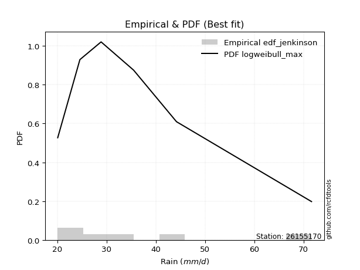</img>

</div>


### 11. Empirical - EDF Cunnane (1978)

Cunnane´s work in statistical hydrology has focused on the performance and evaluation of different probability distributions (such as GEV, Gumbel, Lognormal) for flood frequency estimation. _b_ is a constant, typically set to 0.4.

<div align="center">


$P=(m-b)/(n+1-2b)$


</div>


**11.1. Empirical values**

<div align="center">

|                | 0                  | 1                   | 2                   | 3                  | 4                  | 5                  |
|:---------------|:-------------------|:--------------------|:--------------------|:-------------------|:-------------------|:-------------------|
| date           | 2017               | 2018                | 2020                | 2025               | 2019               | 2024               |
| x              | 20.1               | 24.6                | 28.9                | 30.4               | 35.5               | 71.6               |
| m              | 1                  | 2                   | 3                   | 4                  | 5                  | 6                  |
| empirical_dist | edf_cunnane        | edf_cunnane         | edf_cunnane         | edf_cunnane        | edf_cunnane        | edf_cunnane        |
| empirical      | 0.0967741935483871 | 0.25806451612903225 | 0.41935483870967744 | 0.5806451612903226 | 0.7419354838709676 | 0.9032258064516128 |
| empirical_tr   | 1.1071428571428572 | 1.3478260869565217  | 1.7222222222222225  | 2.384615384615385  | 3.8749999999999982 | 10.333333333333318 |

</div>


**11.2. Kolmogorov-Smirnov fit test (sorted by Δ)**


<div align="center">

|                | 0                   | 1                    | 2                  | 3                   | 4                   | 5                   | 6                   | 7                   | 8                   | 9                   | 10                 | 11                  | 12                  | 13                  | 14                 | 15                  | 16                  | 17                  | 18                  | 19                  | 20                 | 21                  | 22                 | 23                  | 24                  | 25                 | 26                  | 27                  | 28                 | 29                    | 30                  | 31                  | 32                  | 33                  | 34                  | 35                  | 36                  | 37                  | 38                 | 39                  | 40                 | 41                  | 42                  | 43                  | 44                  | 45                  | 46                  | 47                  | 48                  | 49                  | 50                  | 51                  | 52                  | 53                  | 54                  | 55                  | 56                 | 57                  | 58                  | 59                  | 60                  | 61                  | 62                  | 63                  | 64                  | 65                  | 66                  | 67                 | 68                  | 69                 | 70                  | 71                  | 72                  | 73                 | 74                  | 75                  | 76                  | 77                 | 78                 | 79                 | 80                 | 81                  | 82                 | 83                 | 84                 | 85                  | 86                 | 87                  | 88                  | 89                 |
|:---------------|:--------------------|:---------------------|:-------------------|:--------------------|:--------------------|:--------------------|:--------------------|:--------------------|:--------------------|:--------------------|:-------------------|:--------------------|:--------------------|:--------------------|:-------------------|:--------------------|:--------------------|:--------------------|:--------------------|:--------------------|:-------------------|:--------------------|:-------------------|:--------------------|:--------------------|:-------------------|:--------------------|:--------------------|:-------------------|:----------------------|:--------------------|:--------------------|:--------------------|:--------------------|:--------------------|:--------------------|:--------------------|:--------------------|:-------------------|:--------------------|:-------------------|:--------------------|:--------------------|:--------------------|:--------------------|:--------------------|:--------------------|:--------------------|:--------------------|:--------------------|:--------------------|:--------------------|:--------------------|:--------------------|:--------------------|:--------------------|:-------------------|:--------------------|:--------------------|:--------------------|:--------------------|:--------------------|:--------------------|:--------------------|:--------------------|:--------------------|:--------------------|:-------------------|:--------------------|:-------------------|:--------------------|:--------------------|:--------------------|:-------------------|:--------------------|:--------------------|:--------------------|:-------------------|:-------------------|:-------------------|:-------------------|:--------------------|:-------------------|:-------------------|:-------------------|:--------------------|:-------------------|:--------------------|:--------------------|:-------------------|
| station        | 26155170            | 26155170             | 26155170           | 26155170            | 26155170            | 26155170            | 26155170            | 26155170            | 26155170            | 26155170            | 26155170           | 26155170            | 26155170            | 26155170            | 26155170           | 26155170            | 26155170            | 26155170            | 26155170            | 26155170            | 26155170           | 26155170            | 26155170           | 26155170            | 26155170            | 26155170           | 26155170            | 26155170            | 26155170           | 26155170              | 26155170            | 26155170            | 26155170            | 26155170            | 26155170            | 26155170            | 26155170            | 26155170            | 26155170           | 26155170            | 26155170           | 26155170            | 26155170            | 26155170            | 26155170            | 26155170            | 26155170            | 26155170            | 26155170            | 26155170            | 26155170            | 26155170            | 26155170            | 26155170            | 26155170            | 26155170            | 26155170           | 26155170            | 26155170            | 26155170            | 26155170            | 26155170            | 26155170            | 26155170            | 26155170            | 26155170            | 26155170            | 26155170           | 26155170            | 26155170           | 26155170            | 26155170            | 26155170            | 26155170           | 26155170            | 26155170            | 26155170            | 26155170           | 26155170           | 26155170           | 26155170           | 26155170            | 26155170           | 26155170           | 26155170           | 26155170            | 26155170           | 26155170            | 26155170            | 26155170           |
| empirical_dist | edf_cunnane         | edf_cunnane          | edf_cunnane        | edf_cunnane         | edf_cunnane         | edf_cunnane         | edf_cunnane         | edf_cunnane         | edf_cunnane         | edf_cunnane         | edf_cunnane        | edf_cunnane         | edf_cunnane         | edf_cunnane         | edf_cunnane        | edf_cunnane         | edf_cunnane         | edf_cunnane         | edf_cunnane         | edf_cunnane         | edf_cunnane        | edf_cunnane         | edf_cunnane        | edf_cunnane         | edf_cunnane         | edf_cunnane        | edf_cunnane         | edf_cunnane         | edf_cunnane        | edf_cunnane           | edf_cunnane         | edf_cunnane         | edf_cunnane         | edf_cunnane         | edf_cunnane         | edf_cunnane         | edf_cunnane         | edf_cunnane         | edf_cunnane        | edf_cunnane         | edf_cunnane        | edf_cunnane         | edf_cunnane         | edf_cunnane         | edf_cunnane         | edf_cunnane         | edf_cunnane         | edf_cunnane         | edf_cunnane         | edf_cunnane         | edf_cunnane         | edf_cunnane         | edf_cunnane         | edf_cunnane         | edf_cunnane         | edf_cunnane         | edf_cunnane        | edf_cunnane         | edf_cunnane         | edf_cunnane         | edf_cunnane         | edf_cunnane         | edf_cunnane         | edf_cunnane         | edf_cunnane         | edf_cunnane         | edf_cunnane         | edf_cunnane        | edf_cunnane         | edf_cunnane        | edf_cunnane         | edf_cunnane         | edf_cunnane         | edf_cunnane        | edf_cunnane         | edf_cunnane         | edf_cunnane         | edf_cunnane        | edf_cunnane        | edf_cunnane        | edf_cunnane        | edf_cunnane         | edf_cunnane        | edf_cunnane        | edf_cunnane        | edf_cunnane         | edf_cunnane        | edf_cunnane         | edf_cunnane         | edf_cunnane        |
| p_dist         | logmoyal            | logexponnorm         | loggenlogistic     | mielke              | logalpha            | loginvweibull       | logmielke           | logf                | logncf              | loginvgamma         | logfisk            | alpha               | logt                | loggumbel_r         | f                  | ncf                 | invgamma            | logbetaprime        | logjohnsonsu        | loginvgauss         | logpearson3        | logfatiguelife      | loghalfnorm        | invgauss            | logkstwobign        | fisk               | wald                | loghalflogistic     | johnsonsu          | loglaplace_asymmetric | nct                 | logtruncnorm        | loggenexpon         | loggompertz         | exponnorm           | fatiguelife         | lognct              | genexpon            | expon              | laplace_asymmetric  | lograyleigh        | truncnorm           | logwald             | logmaxwell          | logexpon            | betaprime           | logrice             | halflogistic        | genlogistic         | pearson3            | moyal               | gibrat              | loglogistic         | lognorm             | lognorm             | logcrystalball      | lognakagami        | logloggamma         | loghypsecant        | halfnorm            | gumbel_r            | gamma               | loglaplace          | weibull_min         | kstwobign           | t                   | rayleigh            | logchi2            | maxwell             | loggibrat          | loggumbel_l         | nakagami            | gompertz            | logerlang          | hypsecant           | logistic            | norm                | crystalball        | rice               | laplace            | gumbel_l           | logweibull_min      | pareto             | logpareto          | loglognorm         | erlang              | invweibull         | loggamma            | loggamma            | chi2               |
| delta          | 0.05678443514925363 | 0.060656609022600116 | 0.0641469094257403 | 0.06507245810443141 | 0.06655138931316135 | 0.07044052628308156 | 0.07191183028881243 | 0.07281458834157467 | 0.07281765772513005 | 0.07281842332988736 | 0.0730378443795659 | 0.07400989875223019 | 0.07630133072801487 | 0.07723254548597758 | 0.0774047544759035 | 0.07740518945539909 | 0.07740533930545052 | 0.07797780428426854 | 0.07935283085856193 | 0.08089314441907519 | 0.0837216741930914 | 0.08531839514854173 | 0.0853360048399614 | 0.08571312096752087 | 0.08598855196521737 | 0.0863779958065008 | 0.08973243806474937 | 0.09115436950405612 | 0.0923777534423586 | 0.09250910855774042   | 0.09633547811978205 | 0.09670519799572996 | 0.09677419339815697 | 0.09677419351671157 | 0.10037168901412186 | 0.10081905834989208 | 0.10161991195098807 | 0.10216537590308672 | 0.1021719995927538 | 0.10217261030815483 | 0.1089476221022222 | 0.11584117862160948 | 0.11706929178184317 | 0.11724568421421144 | 0.11907978895251997 | 0.12114901898892283 | 0.12278899829392648 | 0.13499742321379748 | 0.13531639272372048 | 0.13673291367149976 | 0.13815486537264465 | 0.14312369069278952 | 0.14381371383061425 | 0.14394739088199815 | 0.14394739088199815 | 0.14394741279792167 | 0.1442650963894141 | 0.14931343359563876 | 0.15011449143102384 | 0.16037449199048393 | 0.16393621052286544 | 0.16928176803734812 | 0.17048795668756278 | 0.18176901389439487 | 0.18661960056230809 | 0.18870257176710517 | 0.19090800351952708 | 0.1979399847670451 | 0.20175427474716745 | 0.2039821844474351 | 0.20618194878152124 | 0.21778034391202272 | 0.22801189229646612 | 0.2303369905284966 | 0.23260733859799265 | 0.23347538826265601 | 0.23449206715699433 | 0.2344920739590809 | 0.2373868622231089 | 0.2450135730597538 | 0.3046077954861939 | 0.31328691197313996 | 0.3702150000162684 | 0.3850210047571334 | 0.3907247802639279 | 0.44439751495036506 | 0.4490906214511612 | 0.48718186016523113 | 0.48718186016523113 | 0.5408658923059261 |
| deltao         | 0.530385761606      | 0.530385761606       | 0.530385761606     | 0.530385761606      | 0.530385761606      | 0.530385761606      | 0.530385761606      | 0.530385761606      | 0.530385761606      | 0.530385761606      | 0.530385761606     | 0.530385761606      | 0.530385761606      | 0.530385761606      | 0.530385761606     | 0.530385761606      | 0.530385761606      | 0.530385761606      | 0.530385761606      | 0.530385761606      | 0.530385761606     | 0.530385761606      | 0.530385761606     | 0.530385761606      | 0.530385761606      | 0.530385761606     | 0.530385761606      | 0.530385761606      | 0.530385761606     | 0.530385761606        | 0.530385761606      | 0.530385761606      | 0.530385761606      | 0.530385761606      | 0.530385761606      | 0.530385761606      | 0.530385761606      | 0.530385761606      | 0.530385761606     | 0.530385761606      | 0.530385761606     | 0.530385761606      | 0.530385761606      | 0.530385761606      | 0.530385761606      | 0.530385761606      | 0.530385761606      | 0.530385761606      | 0.530385761606      | 0.530385761606      | 0.530385761606      | 0.530385761606      | 0.530385761606      | 0.530385761606      | 0.530385761606      | 0.530385761606      | 0.530385761606     | 0.530385761606      | 0.530385761606      | 0.530385761606      | 0.530385761606      | 0.530385761606      | 0.530385761606      | 0.530385761606      | 0.530385761606      | 0.530385761606      | 0.530385761606      | 0.530385761606     | 0.530385761606      | 0.530385761606     | 0.530385761606      | 0.530385761606      | 0.530385761606      | 0.530385761606     | 0.530385761606      | 0.530385761606      | 0.530385761606      | 0.530385761606     | 0.530385761606     | 0.530385761606     | 0.530385761606     | 0.530385761606      | 0.530385761606     | 0.530385761606     | 0.530385761606     | 0.530385761606      | 0.530385761606     | 0.530385761606      | 0.530385761606      | 0.530385761606     |
| eval           | Δo > Δ              | Δo > Δ               | Δo > Δ             | Δo > Δ              | Δo > Δ              | Δo > Δ              | Δo > Δ              | Δo > Δ              | Δo > Δ              | Δo > Δ              | Δo > Δ             | Δo > Δ              | Δo > Δ              | Δo > Δ              | Δo > Δ             | Δo > Δ              | Δo > Δ              | Δo > Δ              | Δo > Δ              | Δo > Δ              | Δo > Δ             | Δo > Δ              | Δo > Δ             | Δo > Δ              | Δo > Δ              | Δo > Δ             | Δo > Δ              | Δo > Δ              | Δo > Δ             | Δo > Δ                | Δo > Δ              | Δo > Δ              | Δo > Δ              | Δo > Δ              | Δo > Δ              | Δo > Δ              | Δo > Δ              | Δo > Δ              | Δo > Δ             | Δo > Δ              | Δo > Δ             | Δo > Δ              | Δo > Δ              | Δo > Δ              | Δo > Δ              | Δo > Δ              | Δo > Δ              | Δo > Δ              | Δo > Δ              | Δo > Δ              | Δo > Δ              | Δo > Δ              | Δo > Δ              | Δo > Δ              | Δo > Δ              | Δo > Δ              | Δo > Δ             | Δo > Δ              | Δo > Δ              | Δo > Δ              | Δo > Δ              | Δo > Δ              | Δo > Δ              | Δo > Δ              | Δo > Δ              | Δo > Δ              | Δo > Δ              | Δo > Δ             | Δo > Δ              | Δo > Δ             | Δo > Δ              | Δo > Δ              | Δo > Δ              | Δo > Δ             | Δo > Δ              | Δo > Δ              | Δo > Δ              | Δo > Δ             | Δo > Δ             | Δo > Δ             | Δo > Δ             | Δo > Δ              | Δo > Δ             | Δo > Δ             | Δo > Δ             | Δo > Δ              | Δo > Δ             | Δo > Δ              | Δo > Δ              | Δo <= Δ            |
| fit            | 1                   | 1                    | 1                  | 1                   | 1                   | 1                   | 1                   | 1                   | 1                   | 1                   | 1                  | 1                   | 1                   | 1                   | 1                  | 1                   | 1                   | 1                   | 1                   | 1                   | 1                  | 1                   | 1                  | 1                   | 1                   | 1                  | 1                   | 1                   | 1                  | 1                     | 1                   | 1                   | 1                   | 1                   | 1                   | 1                   | 1                   | 1                   | 1                  | 1                   | 1                  | 1                   | 1                   | 1                   | 1                   | 1                   | 1                   | 1                   | 1                   | 1                   | 1                   | 1                   | 1                   | 1                   | 1                   | 1                   | 1                  | 1                   | 1                   | 1                   | 1                   | 1                   | 1                   | 1                   | 1                   | 1                   | 1                   | 1                  | 1                   | 1                  | 1                   | 1                   | 1                   | 1                  | 1                   | 1                   | 1                   | 1                  | 1                  | 1                  | 1                  | 1                   | 1                  | 1                  | 1                  | 1                   | 1                  | 1                   | 1                   | 0                  |
| n              | 6                   | 6                    | 6                  | 6                   | 6                   | 6                   | 6                   | 6                   | 6                   | 6                   | 6                  | 6                   | 6                   | 6                   | 6                  | 6                   | 6                   | 6                   | 6                   | 6                   | 6                  | 6                   | 6                  | 6                   | 6                   | 6                  | 6                   | 6                   | 6                  | 6                     | 6                   | 6                   | 6                   | 6                   | 6                   | 6                   | 6                   | 6                   | 6                  | 6                   | 6                  | 6                   | 6                   | 6                   | 6                   | 6                   | 6                   | 6                   | 6                   | 6                   | 6                   | 6                   | 6                   | 6                   | 6                   | 6                   | 6                  | 6                   | 6                   | 6                   | 6                   | 6                   | 6                   | 6                   | 6                   | 6                   | 6                   | 6                  | 6                   | 6                  | 6                   | 6                   | 6                   | 6                  | 6                   | 6                   | 6                   | 6                  | 6                  | 6                  | 6                  | 6                   | 6                  | 6                  | 6                  | 6                   | 6                  | 6                   | 6                   | 6                  |
| best_fit       | 1                   | 0                    | 0                  | 0                   | 0                   | 0                   | 0                   | 0                   | 0                   | 0                   | 0                  | 0                   | 0                   | 0                   | 0                  | 0                   | 0                   | 0                   | 0                   | 0                   | 0                  | 0                   | 0                  | 0                   | 0                   | 0                  | 0                   | 0                   | 0                  | 0                     | 0                   | 0                   | 0                   | 0                   | 0                   | 0                   | 0                   | 0                   | 0                  | 0                   | 0                  | 0                   | 0                   | 0                   | 0                   | 0                   | 0                   | 0                   | 0                   | 0                   | 0                   | 0                   | 0                   | 0                   | 0                   | 0                   | 0                  | 0                   | 0                   | 0                   | 0                   | 0                   | 0                   | 0                   | 0                   | 0                   | 0                   | 0                  | 0                   | 0                  | 0                   | 0                   | 0                   | 0                  | 0                   | 0                   | 0                   | 0                  | 0                  | 0                  | 0                  | 0                   | 0                  | 0                  | 0                  | 0                   | 0                  | 0                   | 0                   | 0                  |
| best_fit_sort  | 1                   | 2                    | 3                  | 4                   | 5                   | 6                   | 7                   | 8                   | 9                   | 10                  | 11                 | 12                  | 13                  | 14                  | 15                 | 16                  | 17                  | 18                  | 19                  | 20                  | 21                 | 22                  | 23                 | 24                  | 25                  | 26                 | 27                  | 28                  | 29                 | 30                    | 31                  | 32                  | 33                  | 34                  | 35                  | 36                  | 37                  | 38                  | 39                 | 40                  | 41                 | 42                  | 43                  | 44                  | 45                  | 46                  | 47                  | 48                  | 49                  | 50                  | 51                  | 52                  | 53                  | 54                  | 55                  | 56                  | 57                 | 58                  | 59                  | 60                  | 61                  | 62                  | 63                  | 64                  | 65                  | 66                  | 67                  | 68                 | 69                  | 70                 | 71                  | 72                  | 73                  | 74                 | 75                  | 76                  | 77                  | 78                 | 79                 | 80                 | 81                 | 82                  | 83                 | 84                 | 85                 | 86                  | 87                 | 88                  | 89                  | 90                 |

</div>


<div align="center">

</img>

</div>


**11.3. Best fit**

<div align="center">

|   id |   station | empirical_dist   | p_dist   |     delta |   deltao | eval   |   fit |   n |   best_fit |   best_fit_sort |
|-----:|----------:|:-----------------|:---------|----------:|---------:|:-------|------:|----:|-----------:|----------------:|
|    0 |  26155170 | edf_cunnane      | logmoyal | 0.0567844 | 0.530386 | Δo > Δ |     1 |   6 |          1 |               1 |

</div>


<div align="center">

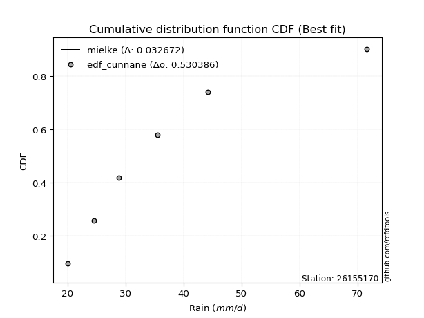</img>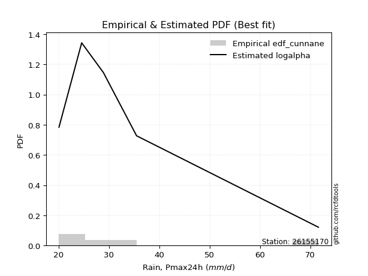</img>

</div>


### 12. Empirical - EDF Adamowski (1981)

The Adamowski formula in hydrology refers to a specific plotting position formula used for estimating the non-parametric empirical distribution of hydrological events (like flood peaks) to calculate their return periods. This formula provides an alternative to traditional parametric methods (like the Gumbel or Log Pearson Type III distributions). 

<div align="center">


$P=(m-0.25)/(n+0.5)$


</div>


**12.1. Empirical values**

<div align="center">

|                | 0                   | 1                  | 2                  | 3                  | 4                  | 5                  |
|:---------------|:--------------------|:-------------------|:-------------------|:-------------------|:-------------------|:-------------------|
| date           | 2017                | 2018               | 2020               | 2025               | 2019               | 2024               |
| x              | 20.1                | 24.6               | 28.9               | 30.4               | 35.5               | 71.6               |
| m              | 1                   | 2                  | 3                  | 4                  | 5                  | 6                  |
| empirical_dist | edf_adamowski       | edf_adamowski      | edf_adamowski      | edf_adamowski      | edf_adamowski      | edf_adamowski      |
| empirical      | 0.11538461538461539 | 0.2692307692307692 | 0.4230769230769231 | 0.5769230769230769 | 0.7307692307692307 | 0.8846153846153846 |
| empirical_tr   | 1.1304347826086958  | 1.3684210526315788 | 1.7333333333333334 | 2.3636363636363633 | 3.7142857142857135 | 8.666666666666664  |

</div>


**12.2. Kolmogorov-Smirnov fit test (sorted by Δ)**


<div align="center">

|                | 0                   | 1                   | 2                   | 3                   | 4                   | 5                   | 6                   | 7                   | 8                   | 9                   | 10                  | 11                  | 12                  | 13                  | 14                  | 15                  | 16                 | 17                  | 18                  | 19                  | 20                  | 21                  | 22                  | 23                 | 24                  | 25                 | 26                  | 27                    | 28                 | 29                  | 30                  | 31                  | 32                  | 33                  | 34                  | 35                  | 36                  | 37                  | 38                  | 39                  | 40                  | 41                 | 42                  | 43                  | 44                  | 45                  | 46                  | 47                  | 48                  | 49                  | 50                  | 51                  | 52                  | 53                  | 54                  | 55                  | 56                 | 57                 | 58                | 59                  | 60                  | 61                 | 62                  | 63                  | 64                  | 65                  | 66                  | 67                 | 68                  | 69                 | 70                 | 71                  | 72                 | 73                  | 74                 | 75                  | 76                  | 77                  | 78                  | 79                  | 80                  | 81                | 82                 | 83                  | 84                 | 85                | 86                 | 87                  | 88                  | 89                |
|:---------------|:--------------------|:--------------------|:--------------------|:--------------------|:--------------------|:--------------------|:--------------------|:--------------------|:--------------------|:--------------------|:--------------------|:--------------------|:--------------------|:--------------------|:--------------------|:--------------------|:-------------------|:--------------------|:--------------------|:--------------------|:--------------------|:--------------------|:--------------------|:-------------------|:--------------------|:-------------------|:--------------------|:----------------------|:-------------------|:--------------------|:--------------------|:--------------------|:--------------------|:--------------------|:--------------------|:--------------------|:--------------------|:--------------------|:--------------------|:--------------------|:--------------------|:-------------------|:--------------------|:--------------------|:--------------------|:--------------------|:--------------------|:--------------------|:--------------------|:--------------------|:--------------------|:--------------------|:--------------------|:--------------------|:--------------------|:--------------------|:-------------------|:-------------------|:------------------|:--------------------|:--------------------|:-------------------|:--------------------|:--------------------|:--------------------|:--------------------|:--------------------|:-------------------|:--------------------|:-------------------|:-------------------|:--------------------|:-------------------|:--------------------|:-------------------|:--------------------|:--------------------|:--------------------|:--------------------|:--------------------|:--------------------|:------------------|:-------------------|:--------------------|:-------------------|:------------------|:-------------------|:--------------------|:--------------------|:------------------|
| station        | 26155170            | 26155170            | 26155170            | 26155170            | 26155170            | 26155170            | 26155170            | 26155170            | 26155170            | 26155170            | 26155170            | 26155170            | 26155170            | 26155170            | 26155170            | 26155170            | 26155170           | 26155170            | 26155170            | 26155170            | 26155170            | 26155170            | 26155170            | 26155170           | 26155170            | 26155170           | 26155170            | 26155170              | 26155170           | 26155170            | 26155170            | 26155170            | 26155170            | 26155170            | 26155170            | 26155170            | 26155170            | 26155170            | 26155170            | 26155170            | 26155170            | 26155170           | 26155170            | 26155170            | 26155170            | 26155170            | 26155170            | 26155170            | 26155170            | 26155170            | 26155170            | 26155170            | 26155170            | 26155170            | 26155170            | 26155170            | 26155170           | 26155170           | 26155170          | 26155170            | 26155170            | 26155170           | 26155170            | 26155170            | 26155170            | 26155170            | 26155170            | 26155170           | 26155170            | 26155170           | 26155170           | 26155170            | 26155170           | 26155170            | 26155170           | 26155170            | 26155170            | 26155170            | 26155170            | 26155170            | 26155170            | 26155170          | 26155170           | 26155170            | 26155170           | 26155170          | 26155170           | 26155170            | 26155170            | 26155170          |
| empirical_dist | edf_adamowski       | edf_adamowski       | edf_adamowski       | edf_adamowski       | edf_adamowski       | edf_adamowski       | edf_adamowski       | edf_adamowski       | edf_adamowski       | edf_adamowski       | edf_adamowski       | edf_adamowski       | edf_adamowski       | edf_adamowski       | edf_adamowski       | edf_adamowski       | edf_adamowski      | edf_adamowski       | edf_adamowski       | edf_adamowski       | edf_adamowski       | edf_adamowski       | edf_adamowski       | edf_adamowski      | edf_adamowski       | edf_adamowski      | edf_adamowski       | edf_adamowski         | edf_adamowski      | edf_adamowski       | edf_adamowski       | edf_adamowski       | edf_adamowski       | edf_adamowski       | edf_adamowski       | edf_adamowski       | edf_adamowski       | edf_adamowski       | edf_adamowski       | edf_adamowski       | edf_adamowski       | edf_adamowski      | edf_adamowski       | edf_adamowski       | edf_adamowski       | edf_adamowski       | edf_adamowski       | edf_adamowski       | edf_adamowski       | edf_adamowski       | edf_adamowski       | edf_adamowski       | edf_adamowski       | edf_adamowski       | edf_adamowski       | edf_adamowski       | edf_adamowski      | edf_adamowski      | edf_adamowski     | edf_adamowski       | edf_adamowski       | edf_adamowski      | edf_adamowski       | edf_adamowski       | edf_adamowski       | edf_adamowski       | edf_adamowski       | edf_adamowski      | edf_adamowski       | edf_adamowski      | edf_adamowski      | edf_adamowski       | edf_adamowski      | edf_adamowski       | edf_adamowski      | edf_adamowski       | edf_adamowski       | edf_adamowski       | edf_adamowski       | edf_adamowski       | edf_adamowski       | edf_adamowski     | edf_adamowski      | edf_adamowski       | edf_adamowski      | edf_adamowski     | edf_adamowski      | edf_adamowski       | edf_adamowski       | edf_adamowski     |
| p_dist         | logalpha            | loginvweibull       | logexponnorm        | logmielke           | logf                | logncf              | loginvgamma         | logmoyal            | alpha               | logfisk             | logpearson3         | loggumbel_r         | f                   | ncf                 | invgamma            | loghalfnorm         | logbetaprime       | logjohnsonsu        | loginvgauss         | logfatiguelife      | invgauss            | loggenlogistic      | logkstwobign        | mielke             | fisk                | logt               | johnsonsu           | loglaplace_asymmetric | nct                | fatiguelife         | lognct              | lograyleigh         | logmaxwell          | wald                | loghalflogistic     | exponnorm           | betaprime           | logtruncnorm        | truncnorm           | laplace_asymmetric  | loggenexpon         | genexpon           | loggompertz         | logwald             | expon               | logexpon            | logrice             | halflogistic        | pearson3            | moyal               | genlogistic         | lognorm             | lognorm             | logcrystalball      | lognakagami         | logloggamma         | loglogistic        | loghypsecant       | halfnorm          | gumbel_r            | gibrat              | gamma              | loglaplace          | t                   | kstwobign           | weibull_min         | rayleigh            | logchi2            | maxwell             | loggumbel_l        | nakagami           | loggibrat           | gompertz           | hypsecant           | logistic           | norm                | crystalball         | rice                | logerlang           | laplace             | gumbel_l            | logweibull_min    | pareto             | logpareto           | loglognorm         | invweibull        | erlang             | loggamma            | loggamma            | chi2              |
| delta          | 0.06462280646507201 | 0.06671844191583592 | 0.06720103801444788 | 0.06818974592156679 | 0.06909250397432903 | 0.06909557335788441 | 0.06909633896264172 | 0.06977377661426543 | 0.07028781438498455 | 0.07068219934075301 | 0.07299654088128382 | 0.07334253131529811 | 0.07368267010865787 | 0.07368310508815346 | 0.07368325493820488 | 0.07416975173822449 | 0.0742557199170229 | 0.07563074649131629 | 0.07717106005182955 | 0.08159631078129609 | 0.08199103660027524 | 0.08275733126196849 | 0.08305871707260659 | 0.0836828799406596 | 0.08662321443530695 | 0.0870083294491405 | 0.08865566907511296 | 0.08878702419049467   | 0.0926133937525363 | 0.09709697398264644 | 0.09765579869551277 | 0.09778136900048529 | 0.10607943111247453 | 0.10834285990097767 | 0.10976479134028441 | 0.11442211650173048 | 0.11506345042949773 | 0.11531561983195815 | 0.11538453281088326 | 0.11538461508206863 | 0.11538461523438527 | 0.1153846153475722 | 0.11538461535293987 | 0.11538461538461539 | 0.11538461538461539 | 0.11538461538461539 | 0.11906691392668073 | 0.12383117011206057 | 0.12556666056976284 | 0.12698861227090774 | 0.13159430835647473 | 0.13278113778026124 | 0.13278113778026124 | 0.13278115969618476 | 0.13309884328767718 | 0.13814718049390184 | 0.1400916294633685 | 0.1463924070637781 | 0.149208238888747 | 0.15276995742112853 | 0.15428994379452649 | 0.1655596836701025 | 0.16676587232031703 | 0.17009214993087687 | 0.17770166588962977 | 0.17804692952714923 | 0.17974175041779017 | 0.1867737316653082 | 0.19058802164543054 | 0.2024598644142755 | 0.2066140908102858 | 0.21514843754917207 | 0.2168456391947292 | 0.22144108549625574 | 0.2223091351609191 | 0.22332581405525742 | 0.22332582085734398 | 0.22622060912137198 | 0.22661490616125096 | 0.24129148869250805 | 0.29344154238445697 | 0.302120658871403 | 0.3590487469145314 | 0.37385475165539644 | 0.3795585271621909 | 0.430480199614933 | 0.4332312618486281 | 0.47601560706349416 | 0.47601560706349416 | 0.529699639204189 |
| deltao         | 0.530385761606      | 0.530385761606      | 0.530385761606      | 0.530385761606      | 0.530385761606      | 0.530385761606      | 0.530385761606      | 0.530385761606      | 0.530385761606      | 0.530385761606      | 0.530385761606      | 0.530385761606      | 0.530385761606      | 0.530385761606      | 0.530385761606      | 0.530385761606      | 0.530385761606     | 0.530385761606      | 0.530385761606      | 0.530385761606      | 0.530385761606      | 0.530385761606      | 0.530385761606      | 0.530385761606     | 0.530385761606      | 0.530385761606     | 0.530385761606      | 0.530385761606        | 0.530385761606     | 0.530385761606      | 0.530385761606      | 0.530385761606      | 0.530385761606      | 0.530385761606      | 0.530385761606      | 0.530385761606      | 0.530385761606      | 0.530385761606      | 0.530385761606      | 0.530385761606      | 0.530385761606      | 0.530385761606     | 0.530385761606      | 0.530385761606      | 0.530385761606      | 0.530385761606      | 0.530385761606      | 0.530385761606      | 0.530385761606      | 0.530385761606      | 0.530385761606      | 0.530385761606      | 0.530385761606      | 0.530385761606      | 0.530385761606      | 0.530385761606      | 0.530385761606     | 0.530385761606     | 0.530385761606    | 0.530385761606      | 0.530385761606      | 0.530385761606     | 0.530385761606      | 0.530385761606      | 0.530385761606      | 0.530385761606      | 0.530385761606      | 0.530385761606     | 0.530385761606      | 0.530385761606     | 0.530385761606     | 0.530385761606      | 0.530385761606     | 0.530385761606      | 0.530385761606     | 0.530385761606      | 0.530385761606      | 0.530385761606      | 0.530385761606      | 0.530385761606      | 0.530385761606      | 0.530385761606    | 0.530385761606     | 0.530385761606      | 0.530385761606     | 0.530385761606    | 0.530385761606     | 0.530385761606      | 0.530385761606      | 0.530385761606    |
| eval           | Δo > Δ              | Δo > Δ              | Δo > Δ              | Δo > Δ              | Δo > Δ              | Δo > Δ              | Δo > Δ              | Δo > Δ              | Δo > Δ              | Δo > Δ              | Δo > Δ              | Δo > Δ              | Δo > Δ              | Δo > Δ              | Δo > Δ              | Δo > Δ              | Δo > Δ             | Δo > Δ              | Δo > Δ              | Δo > Δ              | Δo > Δ              | Δo > Δ              | Δo > Δ              | Δo > Δ             | Δo > Δ              | Δo > Δ             | Δo > Δ              | Δo > Δ                | Δo > Δ             | Δo > Δ              | Δo > Δ              | Δo > Δ              | Δo > Δ              | Δo > Δ              | Δo > Δ              | Δo > Δ              | Δo > Δ              | Δo > Δ              | Δo > Δ              | Δo > Δ              | Δo > Δ              | Δo > Δ             | Δo > Δ              | Δo > Δ              | Δo > Δ              | Δo > Δ              | Δo > Δ              | Δo > Δ              | Δo > Δ              | Δo > Δ              | Δo > Δ              | Δo > Δ              | Δo > Δ              | Δo > Δ              | Δo > Δ              | Δo > Δ              | Δo > Δ             | Δo > Δ             | Δo > Δ            | Δo > Δ              | Δo > Δ              | Δo > Δ             | Δo > Δ              | Δo > Δ              | Δo > Δ              | Δo > Δ              | Δo > Δ              | Δo > Δ             | Δo > Δ              | Δo > Δ             | Δo > Δ             | Δo > Δ              | Δo > Δ             | Δo > Δ              | Δo > Δ             | Δo > Δ              | Δo > Δ              | Δo > Δ              | Δo > Δ              | Δo > Δ              | Δo > Δ              | Δo > Δ            | Δo > Δ             | Δo > Δ              | Δo > Δ             | Δo > Δ            | Δo > Δ             | Δo > Δ              | Δo > Δ              | Δo > Δ            |
| fit            | 1                   | 1                   | 1                   | 1                   | 1                   | 1                   | 1                   | 1                   | 1                   | 1                   | 1                   | 1                   | 1                   | 1                   | 1                   | 1                   | 1                  | 1                   | 1                   | 1                   | 1                   | 1                   | 1                   | 1                  | 1                   | 1                  | 1                   | 1                     | 1                  | 1                   | 1                   | 1                   | 1                   | 1                   | 1                   | 1                   | 1                   | 1                   | 1                   | 1                   | 1                   | 1                  | 1                   | 1                   | 1                   | 1                   | 1                   | 1                   | 1                   | 1                   | 1                   | 1                   | 1                   | 1                   | 1                   | 1                   | 1                  | 1                  | 1                 | 1                   | 1                   | 1                  | 1                   | 1                   | 1                   | 1                   | 1                   | 1                  | 1                   | 1                  | 1                  | 1                   | 1                  | 1                   | 1                  | 1                   | 1                   | 1                   | 1                   | 1                   | 1                   | 1                 | 1                  | 1                   | 1                  | 1                 | 1                  | 1                   | 1                   | 1                 |
| n              | 6                   | 6                   | 6                   | 6                   | 6                   | 6                   | 6                   | 6                   | 6                   | 6                   | 6                   | 6                   | 6                   | 6                   | 6                   | 6                   | 6                  | 6                   | 6                   | 6                   | 6                   | 6                   | 6                   | 6                  | 6                   | 6                  | 6                   | 6                     | 6                  | 6                   | 6                   | 6                   | 6                   | 6                   | 6                   | 6                   | 6                   | 6                   | 6                   | 6                   | 6                   | 6                  | 6                   | 6                   | 6                   | 6                   | 6                   | 6                   | 6                   | 6                   | 6                   | 6                   | 6                   | 6                   | 6                   | 6                   | 6                  | 6                  | 6                 | 6                   | 6                   | 6                  | 6                   | 6                   | 6                   | 6                   | 6                   | 6                  | 6                   | 6                  | 6                  | 6                   | 6                  | 6                   | 6                  | 6                   | 6                   | 6                   | 6                   | 6                   | 6                   | 6                 | 6                  | 6                   | 6                  | 6                 | 6                  | 6                   | 6                   | 6                 |
| best_fit       | 1                   | 0                   | 0                   | 0                   | 0                   | 0                   | 0                   | 0                   | 0                   | 0                   | 0                   | 0                   | 0                   | 0                   | 0                   | 0                   | 0                  | 0                   | 0                   | 0                   | 0                   | 0                   | 0                   | 0                  | 0                   | 0                  | 0                   | 0                     | 0                  | 0                   | 0                   | 0                   | 0                   | 0                   | 0                   | 0                   | 0                   | 0                   | 0                   | 0                   | 0                   | 0                  | 0                   | 0                   | 0                   | 0                   | 0                   | 0                   | 0                   | 0                   | 0                   | 0                   | 0                   | 0                   | 0                   | 0                   | 0                  | 0                  | 0                 | 0                   | 0                   | 0                  | 0                   | 0                   | 0                   | 0                   | 0                   | 0                  | 0                   | 0                  | 0                  | 0                   | 0                  | 0                   | 0                  | 0                   | 0                   | 0                   | 0                   | 0                   | 0                   | 0                 | 0                  | 0                   | 0                  | 0                 | 0                  | 0                   | 0                   | 0                 |
| best_fit_sort  | 1                   | 2                   | 3                   | 4                   | 5                   | 6                   | 7                   | 8                   | 9                   | 10                  | 11                  | 12                  | 13                  | 14                  | 15                  | 16                  | 17                 | 18                  | 19                  | 20                  | 21                  | 22                  | 23                  | 24                 | 25                  | 26                 | 27                  | 28                    | 29                 | 30                  | 31                  | 32                  | 33                  | 34                  | 35                  | 36                  | 37                  | 38                  | 39                  | 40                  | 41                  | 42                 | 43                  | 44                  | 45                  | 46                  | 47                  | 48                  | 49                  | 50                  | 51                  | 52                  | 53                  | 54                  | 55                  | 56                  | 57                 | 58                 | 59                | 60                  | 61                  | 62                 | 63                  | 64                  | 65                  | 66                  | 67                  | 68                 | 69                  | 70                 | 71                 | 72                  | 73                 | 74                  | 75                 | 76                  | 77                  | 78                  | 79                  | 80                  | 81                  | 82                | 83                 | 84                  | 85                 | 86                | 87                 | 88                  | 89                  | 90                |

</div>


<div align="center">

</img>

</div>


**12.3. Best fit**

<div align="center">

|   id |   station | empirical_dist   | p_dist   |     delta |   deltao | eval   |   fit |   n |   best_fit |   best_fit_sort |
|-----:|----------:|:-----------------|:---------|----------:|---------:|:-------|------:|----:|-----------:|----------------:|
|    0 |  26155170 | edf_adamowski    | logalpha | 0.0646228 | 0.530386 | Δo > Δ |     1 |   6 |          1 |               1 |

</div>


<div align="center">

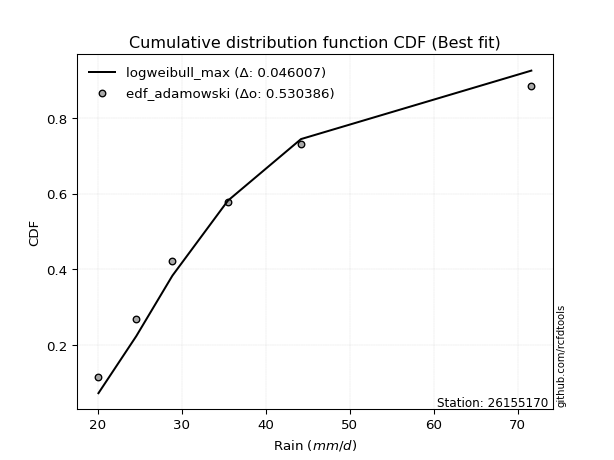</img>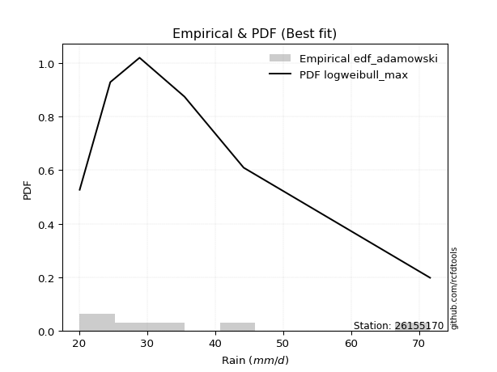</img>

</div>


## C. Best fit & Estimate extreme values for specific return periods - Tr


### 1. Best fit (ordered by delta Δ)

<div align="center">

|   id |   station | empirical_dist   | p_dist       |     delta |   deltao | eval   |   fit |   n |   best_fit |   best_fit_sort |
|-----:|----------:|:-----------------|:-------------|----------:|---------:|:-------|------:|----:|-----------:|----------------:|
|    0 |  26155170 | edf_blom         | logmoyal     | 0.0561393 | 0.530386 | Δo > Δ |     1 |   6 |          1 |               1 |
|    1 |  26155170 | edf_cunnane      | logmoyal     | 0.0567844 | 0.530386 | Δo > Δ |     1 |   6 |          1 |               2 |
|    2 |  26155170 | edf_gringorten   | logmoyal     | 0.0578386 | 0.530386 | Δo > Δ |     1 |   6 |          1 |               3 |
|    3 |  26155170 | edf_hazen        | mielke       | 0.0581031 | 0.530386 | Δo > Δ |     1 |   6 |          1 |               4 |
|    4 |  26155170 | edf_tukey        | logexponnorm | 0.0589588 | 0.530386 | Δo > Δ |     1 |   6 |          1 |               5 |
|    5 |  26155170 | edf_filliben     | logexponnorm | 0.0590434 | 0.530386 | Δo > Δ |     1 |   6 |          1 |               6 |
|    6 |  26155170 | edf_beard        | logexponnorm | 0.0599669 | 0.530386 | Δo > Δ |     1 |   6 |          1 |               7 |
|    7 |  26155170 | edf_jenkinson    | logexponnorm | 0.0599669 | 0.530386 | Δo > Δ |     1 |   6 |          1 |               8 |
|    8 |  26155170 | edf_chegodayev   | logexponnorm | 0.0611914 | 0.530386 | Δo > Δ |     1 |   6 |          1 |               9 |
|    9 |  26155170 | edf_adamowski    | logalpha     | 0.0646228 | 0.530386 | Δo > Δ |     1 |   6 |          1 |              10 |
|   10 |  26155170 | edf_weibull      | logmielke    | 0.0906759 | 0.530386 | Δo > Δ |     1 |   6 |          1 |              11 |
|   11 |  26155170 | edf_california   | logt         | 0.0906807 | 0.530386 | Δo > Δ |     1 |   6 |          1 |              12 |

</div>

:file_folder:Tables: [bestfit_26155170.csv](table/bestfit_26155170.csv) | [extreme_26155170.csv](table/extreme_26155170.csv)


### 2. Extreme values

In hydrology, a return period (or recurrence interval $Tr$) is the statistical average time between extreme events like floods or droughts of a specific magnitude, indicating how rare an event is, with a 100-year flood, for example, having a 1% chance of occurring in any given year, not that it happens exactly every century. It is a key tool for infrastructure design (like bridges or dams) and risk assessment, calculated from historical data to determine the probability of future events, although it is important to remember it is statistical average, and events can cluster or be missed.

> risk_rate: assuming the return period as the project useful life.

|   id |      tr |   prob_l |     prob_g |     alpha |   betaprime |    chi2 |   crystalball |   erlang |    expon |   exponnorm |        f |   fatiguelife |      fisk |    gamma |   genexpon |   genlogistic |   gibrat |   gompertz |   gumbel_l |   gumbel_r |   halflogistic |   halfnorm |   hypsecant |   invgamma |   invgauss |     invweibull |   johnsonsu |   kstwobign |   laplace |   laplace_asymmetric |   loggamma |   logistic |   lognorm |   maxwell |   mielke |    moyal |   nakagami |      ncf |      nct |    norm |           pareto |   pearson3 |   rayleigh |    rice |        t |   truncnorm |     wald |   weibull_min |   logalpha |   logbetaprime |     logchi2 |   logcrystalball |   logerlang |   logexpon |   logexponnorm |     logf |   logfatiguelife |    logfisk |   loggenexpon |   loggenlogistic |   loggibrat |   loggompertz |   loggumbel_l |   loggumbel_r |   loghalflogistic |   loghalfnorm |   loghypsecant |   loginvgamma |   loginvgauss |   loginvweibull |   logjohnsonsu |   logkstwobign |   loglaplace |   loglaplace_asymmetric |   logloggamma |   loglogistic |    loglognorm |   logmaxwell |   logmielke |   logmoyal |   lognakagami |   logncf |   lognct |     logpareto |   logpearson3 |   lograyleigh |   logrice |      logt |   logtruncnorm |   logwald |   logweibull_min |   station |   n |   risk_rate |
|-----:|--------:|---------:|-----------:|----------:|------------:|--------:|--------------:|---------:|---------:|------------:|---------:|--------------:|----------:|---------:|-----------:|--------------:|---------:|-----------:|-----------:|-----------:|---------------:|-----------:|------------:|-----------:|-----------:|---------------:|------------:|------------:|----------:|---------------------:|-----------:|-----------:|----------:|----------:|---------:|---------:|-----------:|---------:|---------:|--------:|-----------------:|-----------:|-----------:|--------:|---------:|------------:|---------:|--------------:|-----------:|---------------:|------------:|-----------------:|------------:|-----------:|---------------:|---------:|-----------------:|-----------:|--------------:|-----------------:|------------:|--------------:|--------------:|--------------:|------------------:|--------------:|---------------:|--------------:|--------------:|----------------:|---------------:|---------------:|-------------:|------------------------:|--------------:|--------------:|--------------:|-------------:|------------:|-----------:|--------------:|---------:|---------:|--------------:|--------------:|--------------:|----------:|----------:|---------------:|----------:|-----------------:|----------:|----:|------------:|
|    0 |    2    | 0.5      | 0.5        |   29.0548 |     31.5218 | 20.6568 |       35.1833 |  21.2705 |  30.555  |     30.4992 |  28.9807 |       28.2991 |   28.747  |  26.5815 |    30.5548 |       31.9258 |  30.0891 |    34.8971 |    37.9714 |    32.3952 |        31.0091 |    31.7093 |     35.1833 |    28.9807 |    28.7615 |  358.753       |     28.5796 |     33.6181 |   35.1833 |              30.555  |    21.3365 |    35.1833 |   32.1495 |   33.7318 |  29.611  |  31.4951 |    34.1477 |  28.9807 |  30.8292 | 35.1833 |     21.128       |    31.1673 |    33.217  | 35.3346 |  29.8945 |     31.0827 |  29.6819 |       26.4142 |    29.2293 |        28.9634 |     32.1045 |          32.1495 |     25.2747 |    27.8345 |        29.3599 |  29.0881 |          28.7807 |    29.0735 |       28.6308 |          29.9221 |     28.517  |       29.0749 |       34.3304 |       30.1071 |           29.1406 |       29.6249 |        32.1495 |       29.088  |       28.8938 |         29.141  |        28.9318 |        30.4533 |      32.1495 |                 30.632  |       32.2206 |       32.1495 |  20.1294      |      31.0695 |     29.1074 |    29.4759 |       30.3065 |  29.088  |  30.9831 |  20.8709      |       30.0735 |       30.6953 |   31.5966 |   28.9783 |        28.6544 |   28.2446 |     22.8162      |  26155170 |   6 |    0.75     |
|    1 |    2.33 | 0.570815 | 0.429185   |   30.8685 |     33.7567 | 21.0642 |       38.2119 |  22.0399 |  32.8585 |     32.7937 |  30.9188 |       30.5825 |   30.8366 |  28.3879 |    32.8583 |       34.0203 |  31.6232 |    38.1573 |    40.6063 |    35.2015 |        33.8944 |    34.9779 |     37.6071 |    30.9187 |    30.886  | 7336.77        |     30.6881 |     36.0489 |   37.0161 |              32.8585 |    21.9228 |    37.8517 |   34.5252 |   36.8783 |  31.4678 |  34.1516 |    38.3266 |  30.9187 |  32.9068 | 38.2119 |     22.3096      |    33.9982 |    36.41   | 37.9694 |  32.9185 |     33.4212 |  31.6678 |       28.081  |    31.0498 |        30.7998 |     38.0346 |          34.5252 |     26.7567 |    29.9044 |        31.1782 |  30.9579 |          30.7567 |    30.8518 |       30.7477 |          31.8006 |     29.5655 |       31.2719 |       36.5272 |       32.1632 |           31.1887 |       31.9944 |        34.0371 |       30.9578 |       30.8445 |         30.9801 |        30.8449 |        32.519  |      33.5669 |                 32.1868 |       34.6898 |       34.2337 |  20.3958      |      33.4582 |     30.9568 |    31.3781 |       33.8814 |  30.9578 |  33.1144 |  21.7965      |       32.2477 |       33.0914 |   33.7913 |   30.299  |        30.7353 |   29.5962 |     24.583       |  26155170 |   6 |    0.729209 |
|    2 |    5    | 0.8      | 0.2        |   41.4161 |     44.0549 | 24.6322 |       49.4667 |  28.2883 |  44.3757 |     44.2654 |  42.1033 |       43.8768 |   44.2533 |  38.07   |    44.3753 |       43.1191 |  40.4557 |    54.4578 |    49.1184 |    47.3932 |        46.9498 |    48.8003 |     47.3292 |    42.1033 |    43.1624 |    4.59452e+09 |     43.2355 |     46.3743 |   46.1793 |              44.3757 |    26.1758 |    48.1546 |   44.9988 |   49.2624 |  40.9957 |  46.4568 |    58.2727 |  42.1033 |  43.02   | 49.4667 |    114.11        |    46.96   |    49.193  | 48.5177 |  44.8383 |     44.4465 |  42.7846 |       37.1109 |    41.2585 |        41.1795 |    103.408  |          44.9988 |     35.9294 |    42.8042 |        41.7131 |  41.6265 |          42.2707 |    41.4376 |       42.9389 |          41.4289 |     36.3974 |       43.442  |       44.6313 |       42.8551 |           42.41   |       44.2983 |        42.7905 |       41.6264 |       42.1191 |         41.4069 |        41.9043 |        42.9746 |      41.6477 |                 41.2273 |       45.6004 |       43.63   |   1.88717e+34 |      44.7829 |     41.551  |    41.9207 |       56.8933 |  41.6264 |  43.2209 | 651.174       |       43.4713 |       44.7097 |   44.2143 |   36.635  |        41.6684 |   38.4485 |     49.327       |  26155170 |   6 |    0.67232  |
|    3 |   10    | 0.9      | 0.1        |   55.3194 |     53.154  | 29.4166 |       56.9329 |  36.2908 |  54.8307 |     54.6791 |  55.5464 |       57.7999 |   63.3411 |  47.3788 |    54.83   |       50.5295 |  50.5236 |    69.2549 |    53.8576 |    57.3232 |        57.7918 |    59.0286 |     55.0927 |    55.5463 |    56.6436 |    2.42419e+14 |     58.0993 |     54.2357 |   54.4974 |              54.8307 |    31.8871 |    55.7422 |   53.6452 |   57.9778 |  50.8741 |  57.1703 |    74.1534 |  55.5464 |  52.7223 | 56.9329 |   2811.16        |    57.8257 |    58.3075 | 56.0388 |  54.2156 |     53.0859 |  54.5821 |       46.0249 |    53.7729 |        53.6935 |    291.092  |          53.6452 |     47.3195 |    59.2751 |        54.2679 |  54.6846 |          56.0798 |    56.174  |       56.8164 |          51.3867 |     46.13   |       56.197  |       49.8989 |       54.1404 |           54.7409 |       56.3581 |        51.3709 |       54.6849 |       55.6182 |         54.1513 |        55.4461 |        53.1366 |      50.6561 |                 51.615  |       54.6262 |       52.1625 | inf           |      54.9811 |     54.7594 |    53.9459 |       85.4105 |  54.685  |  52.5318 |   3.28305e+46 |       54.9252 |       55.4095 |   53.5566 |   44.0639 |        51.2207 |   50.7554 |    158.271       |  26155170 |   6 |    0.651322 |
|    4 |   15    | 0.933333 | 0.0666667  |   66.904  |     58.5874 | 32.6475 |       60.6587 |  41.6116 |  60.9464 |     60.7707 |  65.4253 |       66.4659 |   79.3183 |  52.9545 |    60.9457 |       54.7104 |  57.4681 |    77.9106 |    56.0039 |    62.9257 |        63.9274 |    64.3513 |     59.5232 |    65.4252 |    65.4523 |    1.11908e+17 |     68.5903 |     58.4092 |   59.3632 |              60.9465 |    36.1314 |    59.8764 |   58.5628 |   62.4495 |  57.4747 |  63.388  |    82.5581 |  65.4252 |  58.8668 | 60.6587 |  20301.3         |    63.9618 |    63.0037 | 59.9141 |  59.6876 |     57.33   |  62.1579 |       51.4753 |    63.5451 |        63.1327 |    550.878  |          58.5628 |     55.698  |    71.7098 |        63.2975 |  64.6544 |          66.1485 |    69.066  |       66.4552 |          58.0267 |     54.3211 |       64.4094 |       52.4848 |       61.7729 |           63.2469 |       63.8813 |        57.0181 |       64.6554 |       65.4961 |         63.898  |        65.6704 |        59.4746 |      56.8038 |                 58.8658 |       59.7634 |       57.4941 | inf           |      61.0844 |     65.0417 |    62.4489 |      105.821  |  64.6554 |  58.2573 | inf           |       62.4143 |       61.8864 |   59.1164 |   50.1333 |        56.0552 |   60.6635 |    407.088       |  26155170 |   6 |    0.644736 |
|    5 |   20    | 0.95     | 0.05       |   77.4968 |     62.5294 | 35.0814 |       63.0986 |  45.5958 |  65.2856 |     65.0928 |  73.5537 |       72.7871 |   93.6351 |  56.9526 |    65.2848 |       57.6377 |  62.9155 |    84.052  |    57.3398 |    66.8483 |        68.2261 |    67.9001 |     62.6487 |    73.5536 |    72.0719 |    8.20983e+18 |     76.9275 |     61.2206 |   62.8155 |              65.2857 |    39.6029 |    62.7338 |   62.025  |   65.4172 |  62.6045 |  67.7914 |    88.1871 |  73.5536 |  63.4903 | 63.0986 |  82854.7         |    68.2447 |    66.1251 | 62.4898 |  63.6642 |     59.931  |  67.8034 |       55.4322 |    72.0895 |        71.1122 |    875.315  |          62.0249 |     62.5669 |    82.0842 |        70.6013 |  73.1535 |          74.3816 |    81.2924 |       74.0828 |          63.1802 |     61.7521 |       70.572  |       54.1616 |       67.7488 |           69.9822 |       69.4471 |        61.3715 |       73.1552 |       73.6031 |         72.2187 |        74.2848 |        64.165  |      61.613  |                 64.6201 |       63.3811 |       61.4945 | inf           |      65.5044 |     73.9341 |    69.2697 |      122.136  |  73.1552 |  62.4872 | inf           |       68.1423 |       66.6051 |   63.1275 |   55.6993 |        59.014  |   69.2851 |    901.916       |  26155170 |   6 |    0.641514 |
|    6 |   25    | 0.96     | 0.04       |   87.5335 |     65.6471 | 37.0365 |       64.8947 |  48.7852 |  68.6514 |     68.4452 |  80.594  |       77.7727 |  106.853  |  60.0737 |    68.6505 |       59.8924 |  67.4567 |    88.8156 |    58.2905 |    69.8698 |        71.5381 |    70.5405 |     65.0677 |    80.5939 |    77.4018 |    2.24511e+20 |     83.9407 |     63.3264 |   65.4934 |              68.6515 |    42.586  |    64.9196 |   64.7037 |   67.6205 |  66.8686 |  71.2046 |    92.3831 |  80.5939 |  67.2456 | 64.8947 | 246755           |    71.533  |    68.4442 | 64.4035 |  66.8302 |     61.7076 |  72.3254 |       58.5484 |    79.9211 |        78.199  |   1259.85   |          64.7037 |     68.4933 |    91.154  |        76.8421 |  80.7518 |          81.4775 |    93.2462 |       80.4959 |          67.4596 |     68.7182 |       75.5438 |       55.3873 |       72.7431 |           75.6568 |       73.9006 |        64.9676 |       80.7542 |       80.6129 |         79.6652 |        81.9022 |        67.9189 |      65.622  |                 69.468  |       66.1805 |       64.7416 | inf           |      68.9915 |     81.9761 |    75.0651 |      135.908  |  80.7542 |  65.8772 | inf           |       72.8447 |       70.3424 |   66.2829 |   61.0213 |        61.0197 |   77.0665 |   1800.27        |  26155170 |   6 |    0.639603 |
|    7 |   50    | 0.98     | 0.02       |  134.058  |     75.7267 | 43.4107 |       70.0381 |  59.137  |  79.1063 |     78.8589 | 107.388  |       93.6314 |  163.652  |  69.859  |    79.1053 |       66.8383 |  83.4647 |   103.613  |    60.8711 |    79.1776 |        81.7429 |    78.2151 |     72.5673 |   107.388  |    94.9378 |    5.99314e+24 |    109.044  |     69.5102 |   73.8115 |              79.1064 |    53.7145 |    71.5982 |   73.0319 |   74.0103 |  81.9345 |  81.8003 |   104.596  | 107.388  |  79.9828 | 70.0381 |      7.32266e+06 |    81.5949 |    75.1764 | 69.9588 |  77.2905 |     65.9414 |  87.0895 |       68.4639 |   114.211  |       106.842  |   3993.33   |          73.0318 |     90.849  |   126.23   |        99.9699 | 111.881  |         108.226  |   153.307  |      103.56   |          82.5513 |    100.162  |       92.0546 |       58.8564 |       90.5629 |           96.2003 |       88.534  |        77.5121 |      111.888  |      107.227  |        110.227  |       112.291  |        80.2604 |      79.816  |                 86.9714 |       74.8846 |       75.7638 | inf           |      80.1903 |    115.728  |    96.3305 |      185.466  | 111.888  |  77.1022 | inf           |       89.0667 |       82.422  |   76.3645 |   86.7445 |        65.7038 |  109.092  |  23693.5         |  26155170 |   6 |    0.63583  |
|    8 |   75    | 0.986667 | 0.0133333  |  178.177  |     81.9407 | 47.3083 |       72.7979 |  65.4422 |  85.2221 |     84.9505 | 127.275  |      103.119  |  211.982  |  75.6343 |    85.2209 |       70.8755 |  94.2765 |   112.268  |    62.1761 |    84.5876 |        87.6749 |    82.3929 |     76.95   |   127.274  |   105.807  |    2.24108e+27 |    126.281  |     72.9125 |   78.6773 |              85.2222 |    61.7562 |    75.4555 |   77.934  |   77.4843 |  92.2178 |  87.9966 |   111.246  | 127.274  |  88.2876 | 72.7979 |      5.32094e+07 |    87.3935 |    78.8389 | 72.981  |  83.9691 |     67.6258 |  96.1746 |       74.4137 |   145.362  |       129.972  |   7941.92   |          77.934  |    107.253  |   152.71   |       116.604  | 137.441  |         127.86   |   217.585  |      119.585  |          92.8297 |    129.188  |      102.46   |       60.6925 |      102.863  |          110.617  |       97.6836 |        85.9362 |      137.452  |      126.944  |        135.356  |       136.326  |        87.9824 |      89.5025 |                 99.1891 |       80.0076 |       82.9653 | inf           |      87.0239 |    144.274  |   111.458  |      219.672  | 137.452  |  84.2203 | inf           |       99.8258 |       89.8436 |   82.4793 |  113.321  |        67.5142 |  135.104  | 146469           |  26155170 |   6 |    0.634587 |
|    9 |  100    | 0.99     | 0.01       |  221.399  |     86.5091 | 50.1345 |       74.6645 |  70.0056 |  89.5613 |     89.2726 | 143.693  |      109.926  |  255.56   |  79.7506 |    89.5601 |       73.7329 | 102.652  |   118.41   |    63.0297 |    88.4166 |        91.8735 |    85.2389 |     80.0589 |   143.693  |   113.76   |    1.48384e+29 |    139.765  |     75.2436 |   82.1296 |              89.5614 |    68.2736 |    78.1788 |   81.4348 |   79.8506 | 100.272  |  92.3925 |   115.773  | 143.693  |  94.6122 | 74.6645 |      2.17322e+08 |    91.4757 |    81.3341 | 75.04   |  89.0128 |     68.5354 | 102.799  |       78.6959 |   175.675  |       150.358  |  12995.1    |          81.4348 |    120.692  |   174.803  |       130.059  | 160.236  |         143.956  |   287.891  |      132.261  |         100.869  |    157.338  |      110.177  |       61.9243 |      112.566  |          122.109  |      104.452  |        92.4613 |      160.252  |      143.217  |        157.78   |       157.14   |        93.6979 |      97.0801 |                108.885  |       83.6658 |       88.4583 | inf           |      92.009  |    170.276  |   123.61   |      246.509  | 160.252  |  89.5478 | inf           |      108.097  |       95.279  |   86.9232 |  141.895  |        68.4761 |  157.901  | 617191           |  26155170 |   6 |    0.633968 |
|   10 |  200    | 0.995    | 0.005      |  391.326  |     98.1146 | 57.1145 |       78.8985 |  81.2536 | 100.016  |     99.6863 | 192.94   |      126.544  |  404.602  |  89.7215 |   100.015  |       80.6023 | 125.439  |   133.207  |    64.885  |    97.622  |       101.967  |    91.7482 |     87.5485 |   192.94   |   133.655  |    3.5407e+33  |    176.944  |     80.6127 |   90.4477 |             100.016  |    87.2736 |    84.7115 |   89.9698 |   85.2643 | 122.651  | 102.984  |   126.118  | 192.94   | 111.508  | 78.8985 |      6.44973e+09 |   101.22   |    87.0434 | 79.7512 | 102.395  |     69.9984 | 119.298  |       89.2042 |   300.351  |       218.992  |  43123.9    |          89.9697 |    160.53   |   242.067  |       169.203  | 238.502  |         191.743  |   642.267  |      167.953  |         123.16   |    269.002  |      129.908  |       64.6888 |      139.803  |          154.861  |      121.749  |       110.288  |      238.539  |      192.048  |        234.775  |       224.88   |       108.315  |     118.078  |                136.32   |       92.5819 |      103.164  | inf           |     104.515  |    262.783  |   158.611  |      320.793  | 238.539  | 103.435  | inf           |      130.457  |      108.985  |   98.0129 |  284.55   |        69.9975 |  232.838  |      3.30254e+07 |  26155170 |   6 |    0.633042 |
|   11 |  250    | 0.996    | 0.004      |  475.636  |    102.045  | 59.4052 |       80.1924 |  84.9396 | 103.382  |    103.039  | 212.272  |      131.949  |  470.11   |  92.9452 |   103.381  |       82.8107 | 133.614  |   137.97   |    65.4309 |   100.581  |       105.212  |    93.7507 |     89.9595 |   212.272  |   140.258  |    9.04599e+34 |    190.438  |     82.2743 |   93.1256 |             103.382  |    94.5443 |    86.8088 |   92.7523 |   86.9308 | 130.863  | 106.393  |   129.297  | 212.272  | 117.497  | 80.1924 |      1.92114e+10 |   104.333  |    88.8008 | 81.2014 | 107.124  |     70.3069 | 124.757  |       92.6408 |   367.821  |       249.182  |  63663.7    |          92.7523 |    176.005  |   268.814  |       184.16   | 273.56   |         210.337  |   869.395  |      181.196  |         131.325  |    326.084  |      136.602  |       65.5255 |      149.89   |          167.154  |      127.626  |       116.729  |      273.608  |      211.239  |        269.243  |       253.661  |       113.285  |     125.761  |                146.547  |       95.4878 |      108.385  | inf           |     108.696  |    305.592  |   171.866  |      347.843  | 273.608  | 108.251  | inf           |      138.46   |      113.588  |  101.703  |  376.926  |        70.3139 |  264.761  |      1.39392e+08 |  26155170 |   6 |    0.632858 |
|   12 |  500    | 0.998    | 0.002      |  895.591  |    114.911  | 66.6328 |       84.0295 |  96.5554 | 113.837  |    113.452  | 286.021  |      148.882  |  752.936  | 102.995  |   113.835  |       89.6651 | 161.87   |   152.768  |    66.9957 |   109.767  |       115.284  |    99.7212 |     97.4485 |   286.02   |   161.308  |    2.11171e+39 |    237.599  |     87.2537 |  101.444  |             113.837  |   121.529  |    93.3132 |  101.52   |   91.9037 | 160.039  | 116.984  |   138.762  | 286.02   | 138.044  | 84.0295 |      5.7016e+11  |   113.939  |    94.0445 | 85.5285 | 123.352  |     70.9411 | 142.113  |      103.469  |   784.254  |       382.631  | 215373      |         101.52   |    234.376  |   372.254  |       239.588  | 432.138  |         280.623  |  2633.35   |      228.76   |         160.278  |    634.097  |      158.455  |       67.9843 |      186.071  |          211.879  |      146.885  |       139.233  |      432.248  |      284.63   |        424.88   |       374.858  |       129.586  |     152.964  |                183.472  |      104.641  |      126.318  | inf           |     122.195  |    507.528  |   220.53   |      442.689  | 432.248  | 124.411  | inf           |      166.154  |      128.512  |  113.561  | 1141.4    |        70.9596 |  398.365  |      2.03274e+10 |  26155170 |   6 |    0.632489 |
|   13 |  750    | 0.998667 | 0.00133333 | 1314.76   |    122.933  | 70.9282 |       86.161  | 103.451  | 119.953  |    119.544  | 340.848  |      158.874  |  994.376  | 108.895  |   119.951  |       93.6722 | 180.556  |   161.423  |    67.8321 |   115.136  |       121.172  |   103.057  |    101.829  |   340.847  |   173.961  |    7.55555e+41 |    269.182  |     90.0511 |  106.309  |             119.953  |   140.973  |    97.1133 |  106.744  |   94.685  | 180.034  | 123.18   |   144.042  | 340.847  | 151.575  | 86.161  |      4.14302e+12 |   119.52   |    96.9767 | 87.9481 | 134.068  |     71.1579 | 152.519  |      109.904  |  1374.88   |       502.165  | 441700      |         106.744  |    277.215  |   450.345  |       279.453  | 578.187  |         332.346  |  5779.66   |      261.749  |         180.076  |    984.39   |      171.982  |       69.336  |      211.142  |          243.38   |      158.883  |       154.358  |      578.367  |      339.396  |        567.783  |       476.745  |       139.753  |     171.527  |                209.246  |      110.091  |      138.139  | inf           |     130.464  |    703.109  |   255.156  |      506.435  | 578.366  | 134.786  | inf           |      184.559  |      137.696  |  120.785  | 2684.43   |        71.1788 |  508.935  |      5.40502e+11 |  26155170 |   6 |    0.632366 |
|   14 | 1000    | 0.999    | 0.001      | 1733.71   |    128.862  | 74.0019 |       87.6286 | 108.382  | 124.292  |    123.866  | 386.146  |      165.997  | 1212.36   | 113.09   |   124.29   |       96.5146 | 194.856  |   167.565  |    68.395  |   118.945  |       125.349  |   105.36   |    104.937  |   386.144  |   183.076  |    4.8939e+43  |    293.536  |     91.989  |  109.762  |             124.292  |   156.72   |    99.8082 |  110.497  |   96.6074 | 195.72   | 127.575  |   147.684  | 386.144  | 161.928  | 87.6286 |      1.69213e+13 |   123.465  |    99.003  | 89.6202 | 142.291  |     71.2674 | 160.005  |      114.513  |  2200.07   |       615.209  | 736805      |         110.496  |    312.32   |   515.497  |       311.699  | 719.076  |         374.811  | 10856      |      287.818  |         195.586  |   1378.28   |      181.911  |       70.2609 |      230.949  |          268.525  |      167.737  |       166.076  |      719.332  |      384.783  |        705.251  |       568.577  |       147.26   |     186.05   |                229.7    |      114.005  |      147.186  | inf           |     136.503  |    898.713  |   282.973  |      555.7    | 719.331  | 142.6    | inf           |      198.714  |      144.423  |  126.044  | 5537.08   |        71.2891 |  606.996  |      6.554e+12   |  26155170 |   6 |    0.632305 |

<div align="center">

</img>

</div>


<div align="center">

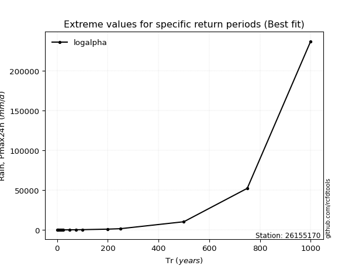</img>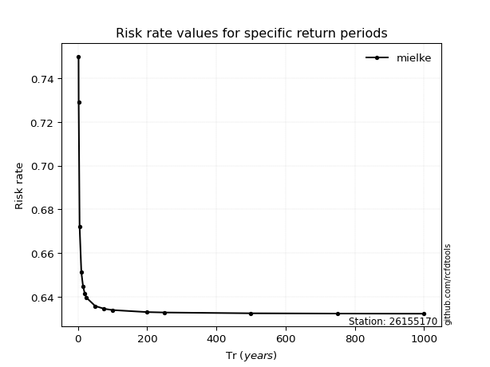</img>

</div>


<sub>**APP DISCLAIMER**: NO WARRANTY - This software is provided by [github.com/rcfdtools](https://github.com/rcfdtools) "as is", without any express or implied warranty, including warranties of merchantability, fitness for a particular purpose, or non-infringement. There is no guarantee that the software will be error-free or operate without interruption. LIMITATION OF LIABILITY - Neither the authors nor copyright holders will be liable for claims or damages arising from the software or its use. You are responsible for determining if the software is appropriate for your use and assume all associated risks, including errors, legal compliance, and data loss. NO PROFESSIONAL ADVICE - The software provides general information and does not offer professional advice. It should not replace consultation with professional advisors.</sub>