<div align="center">


</div>

# PMax24h Station (Rain): 26155220

Maximum Precipitation in 24 hours (PMax24h) is the greatest amount of rainfall for a specific duration that is meteorologically possible for a given location, acting as a "worst-case" scenario for extreme storms, crucial for designing safety-critical infrastructure like bridges, river deviations, dams, spillways, and nuclear plants to prevent catastrophic failure. The PMax24h is related with the Probable Maximum Precipitation (PMP) and it is calculated by hydrologists using meteorological data to determine the upper limit of extreme rainfall, often leading to the Probable Maximum Flood (PMF) for flood control design, and is increasingly being studied for climate change impacts. Probable Maximum Precipitation (PMP) is the theoretical upper limit of rainfall, a deterministic estimate for extreme events, while probability distributions (like GEV, Gumbel) describe the likelihood and frequency of various precipitation amounts, including rare ones, showing how often events occur, with PMP representing the extreme end of these distributions, used for critical infrastructure design to ensure safety against the worst conceivable weather, unlike standard statistical forecasts which cover typical probabilities.

The most common probability distributions in hydrology, used for analyzing floods, rainfall, and streamflow, include the Normal, Log-Normal, Gumbel, Gamma (including Log-Pearson Type III), and Generalized Extreme Value (GEV) distributions, often chosen based on the data´s skewness and whether modeling extremes or general conditions, with Gumbel and GEV popular for extreme events like floods, while the Normal distribution serves as a baseline, though often requiring transformations for skewed hydrological data. These distributions help in designing water infrastructure, managing water resources, and forecasting hydrologic events.

> Hydrological data often isn´t perfectly normal (it´s skewed), so different distributions are needed for different applications, such as: **Flood Frequency Analysis**: Using Gumbel, GEV, or Log-Pearson Type III for predicting extreme flood magnitudes and their return periods, **Rainfall Analysis**: Normal for annual totals, but Log-Normal, Weibull, or GEV for intensity or extreme daily rainfall, **Streamflow Modeling**: Gamma and Log-Normal for maximum flows, GEV for minimum flows, and Kappa for daily flows.

<div align="center">

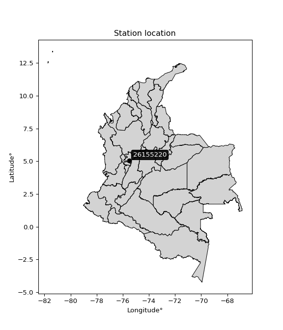</img>

</div>


## A. General information


### 1. General running parameters

• app_version: _v20260312_. • runtime: _2026-03-12 07:15:23.203550_. • Python version: _3.14.0_. • SciPy version: _1.16.3_. • Pandas version: _2.3.3_. • NumPy version: _2.3.5_. • Stations dataset (station_dataset_file): _dataset/pmax24h_in/automatic_colombia_2003_2025.csv_. • Stations catalog (station_catalog_file): _dataset/CNE.xls_. • Minimum year to eval til year_max (date_min): _1900_. • Maximum year to eval since year_min (date_max): _2025_. • Creates, save and include plots into reports (create_plot): _True_. • Plot only fit distributions with Δo > Δ (plot_only_fit): _True_. • Plot only simple graphs avoiding multiple CDFs and multiple Extreme values plots (plot_only_simple): _True_. • Eval low extreme values, if False, evaluates high extreme values (low_extreme): _False_. • Eval every SciPy distribution as logarithmic (pdist_logarithmic_on): _True_. • Standard deviation normalized (ddof): _1.0_. • Return periods to eval in years (Tr): _[2, 2.33, 5, 10, 15, 20, 25, 50, 75, 100, 200, 250, 500, 750, 1000]_. • Minimum data sample per station, 0 means any (minimum_sample): _5_. • Z-Score maximum threshold to adjust a value, 0 means disable (zscore_max): _3.5_. • Z-Score minimum threshold to adjust a value, 0 means disable (zscore_min): _-2.5_. • Avoid zeros, e.g. rain = 0 (avoid_zeros): _True_. • Avoid null values (avoid_nans): _True_. 

:file_folder:Table: [dataset.csv](../../dataset/pmax24h_in/automatic_colombia_2003_2025.csv)

> Delta Degrees of Freedom (DDOF): is a parameter used in the formulas for calculating variance and standard deviation. When ddof=0, the divisor is $N$ (the total number of observations) and this is used when your data set is the entire population. When ddof=1, the divisor is $N-1$ and this is used when your data set is a sample drawn from a larger population. Using $N-1$ provides an unbiased estimate of the population variance (known as Bessel´s correction).


### 2. Station info and location

|   id |   CODIGO | NOMBRE                      | CATEGORIA               | TECNOLOGIA                | ESTADO     | FECHA_INSTALACION   | FECHA_SUSPENSION   |   ALTITUD |   LATITUD |   LONGITUD | DEPARTAMENTO   | MUNICIPIO   | AREA_OPERATIVA                         | ENTIDAD                                                     | AREA_HIDROGRAFICA   | ZONA_HIDROGRAFICA   | SUBZONA_HIDROGRAFICA   |   CORRIENTE | Catalogo   |   Version |
|-----:|---------:|:----------------------------|:------------------------|:--------------------------|:-----------|:--------------------|:-------------------|----------:|----------:|-----------:|:---------------|:------------|:---------------------------------------|:------------------------------------------------------------|:--------------------|:--------------------|:-----------------------|------------:|:-----------|----------:|
|    0 | 26155220 | VILLAMARIA - AUT [26155220] | Climatológica Principal | Automática con Telemetría | Suspendida | 14/06/2004          | 05/03/2025         |      1906 |   5.04867 |   -75.5139 | Caldas         | Villamaria  | Area Operativa 09 - Cauca-Valle-Caldas | INSTITUTO DE HIDROLOGIA METEOROLOGIA Y ESTUDIOS AMBIENTALES | Magdalena Cauca     | Cauca               | Río Chinchiná          |         nan | CNE_IDEAM  |  20251226 |

<div align="center">

Dynamic map: [:earth_americas:Google](http://maps.google.com/maps?q=5.048666667,-75.51388889) [:earth_americas:OSM](https://www.openstreetmap.org/#map=18/5.048666667/-75.51388889&layers=P) [:earth_americas:Bing](https://www.bing.com/maps?cp=5.048666667~-75.51388889&lvl=18) [:earth_americas:Apple](https://maps.apple.com/frame?center=5.048666667%2C-75.51388889&span=0.003%2C0.006)

</div>


<div align="center">

```geojson
{
  "type": "Feature",
  "geometry": {
    "type": "Point", 
    "coordinates": [-75.51388889, 5.048666667]
  }, 
  "properties": {
    "Name": "26155220"
  }
}
```

</div>


### 3. Discrete values table and plot

<div align="center">

|               |          0 |          1 |           2 |           3 |          4 |           5 |
|:--------------|-----------:|-----------:|------------:|------------:|-----------:|------------:|
| Date          | 2017       | 2018       | 2019        | 2020        | 2021       | 2022        |
| Value         |   68.2     |   51       |   59.6      |   59.2      |   49.9     |   59.9      |
| Value_initial |   68.2     |   51       |   59.6      |   59.2      |   49.9     |   59.9      |
| count         |    6       |    6       |    6        |    6        |    6       |    6        |
| mean          |   57.9667  |   57.9667  |   57.9667   |   57.9667   |   57.9667  |   57.9667   |
| std           |    6.72686 |    6.72686 |    6.72686  |    6.72686  |    6.72686 |    6.72686  |
| zscore        |    1.52126 |   -1.03565 |    0.242808 |    0.183345 |   -1.19917 |    0.287405 |


</div>


<div align="center">

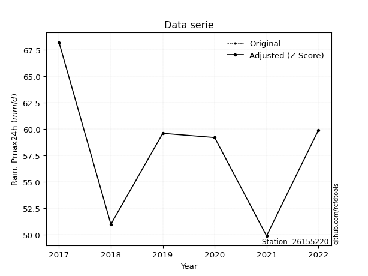</img>

</div>


> The initial value (value_initial) correspond to the initial obtained or null completed value, and value (value) is adjusted only when the initial value is outside the valid range (outlier) definite through the Z-Score value. If Z-Score is active, values out of range or outliers are replaced with the station mean value. A Z-Score (or standard score) measures how many standard deviations a data point is from the mean of a dataset, indicating its relative position; positive scores mean above the mean, negative mean below, and a score of zero is exactly at the mean, allowing for comparison of values from different distributions. It´s calculated using the formula $z=(x–μ)/σ$, where $x$ is the data point, $μ$ is the mean, and $σ$ is the standard deviation, helping identify outliers and understand probability.
>
> <sub>**Note**: In this study, "completing" (filling gaps in) and "extending" (forecasting or lengthening the historical record) rainfall data series are avoided for certain critical analyses because they introduce artificial bias and uncertainty, which can distort the statistics of rare events (extremes), alter day-to-day variability, and compromise the integrity and homogeneity of the original data. Some reasons against Completing/Extending rainfall data are: **Distortion of Extremes and Variability**: The primary issue is that most gap-filling or extension methods rely on averaging or regression with nearby stations, which inherently smooths the data. Rainfall is highly variable in space and time, with a large percentage of zero values and occasional large storms. Infilling methods often underestimate the highest values and overestimate the lowest (zero) values, which severely distorts analyses focused on flood frequency, drought severity, and intensity-duration-frequency (IDF) curves, **Loss of Data Homogeneity**: Infilled or extended data are synthetic estimates, not actual measurements. Combining these estimates with observed data can violate the assumption of data homogeneity, which requires that the data properties do not change over time. Inhomogeneity can lead to incorrect conclusions about long-term trends or changes in climate patterns, **Propagation of Errors**: Errors and biases from the original data (e.g., wind-induced undercatch, instrument errors, site changes) or the data used for imputation can propagate through the analysis, leading to unreliable hydrological models and inaccurate predictions, **Compromised Statistical Integrity**: For statistical analyses, especially those involving the frequency of events, using artificial data can introduce time bias or autocorrelation that doesn´t exist in reality, making it difficult to assess the true probability of events, **Difficulty in Validation**: It is difficult to accurately validate the quality of filled or extended data, especially for past periods where ground-truth measurements are unavailable. The reliability of imputation techniques heavily depends on the density of the surrounding station network and the complexity of the local topography.</sub>


### 4. Active continuous probability distributions from SciPy (80 of 104 available)

A Probability Density Function (PDF) describes the relative likelihood of a continuous random variable falling within a specific range, where the total area under its curve equals 1, and the area over any interval gives the actual probability for that range. Unlike discrete probabilities (like rolling a die), a PDF shows density, not direct probability for a single point (which is zero), with higher points indicating higher likelihood, often visualized as a bell curve for normal distributions.

A log of a probability density function (log-PDF) is simply the logarithm of the PDF´s value, denoted as $log(f(x))$, useful for converting multiplication of probabilities into addition, improving numerical stability with tiny numbers, and connecting to information theory concepts like entropy. Instead of dealing with very small probabilities (e.g., 0.000001), log-PDFs use negative numbers (e.g., $log(0.00001) ≈ -11.51$ that are easier for computers to handle, preventing underflow errors and simplifying complex calculations. In this study, each active probability distribution from SciPy is also evaluated in the $log$ form.

[scipy.stats](https://docs.scipy.org/doc/scipy/reference/stats.html) is a Python´s powerful submodule within the SciPy library for comprehensive statistical analysis, offering over 130 probability distributions (like Normal, Poisson, etc.), functions for descriptive stats (mean, variance), hypothesis testing (t-tests, chi-square), random variable generation, and statistical tests, making it essential for data science, modeling, and research. It provides tools to explore, model, and draw conclusions from data efficiently, working seamlessly with [NumPy](https://numpy.org/).

<div align="center">

|   id | p_dist           |   n_parameter | fit_method   | label                                                                       | active   | ref                                                                                                      |
|-----:|:-----------------|--------------:|:-------------|:----------------------------------------------------------------------------|:---------|:---------------------------------------------------------------------------------------------------------|
|    0 | alpha            |             3 | MLE          | Alpha                                                                       | True     | [:mortar_board:](https://docs.scipy.org/doc/scipy/reference/generated/scipy.stats.alpha.html)            |
|    1 | anglit           |             2 | MM           | Anglit                                                                      | True     | [:mortar_board:](https://docs.scipy.org/doc/scipy/reference/generated/scipy.stats.anglit.html)           |
|    2 | arcsine          |             2 | MM           | Arcsine                                                                     | True     | [:mortar_board:](https://docs.scipy.org/doc/scipy/reference/generated/scipy.stats.arcsine.html)          |
|    3 | argus            |             3 | MLE          | Argus                                                                       | True     | [:mortar_board:](https://docs.scipy.org/doc/scipy/reference/generated/scipy.stats.argus.html)            |
|    4 | beta             |             4 | MLE          | Beta                                                                        | True     | [:mortar_board:](https://docs.scipy.org/doc/scipy/reference/generated/scipy.stats.beta.html)             |
|    5 | betaprime        |             4 | MLE          | Beta prime                                                                  | True     | [:mortar_board:](https://docs.scipy.org/doc/scipy/reference/generated/scipy.stats.betaprime.html)        |
|    6 | bradford         |             3 | MLE          | Bradford                                                                    | True     | [:mortar_board:](https://docs.scipy.org/doc/scipy/reference/generated/scipy.stats.bradford.html)         |
|    7 | burr             |             4 | MLE          | Burr (Type III)                                                             | True     | [:mortar_board:](https://docs.scipy.org/doc/scipy/reference/generated/scipy.stats.burr.html)             |
|    8 | burr12           |             4 | MLE          | Burr (Type III) 12                                                          | True     | [:mortar_board:](https://docs.scipy.org/doc/scipy/reference/generated/scipy.stats.burr12.html)           |
|    9 | cosine           |             2 | MLE          | Cosine                                                                      | True     | [:mortar_board:](https://docs.scipy.org/doc/scipy/reference/generated/scipy.stats.cosine.html)           |
|   10 | crystalball      |             4 | MLE          | Crystalball                                                                 | True     | [:mortar_board:](https://docs.scipy.org/doc/scipy/reference/generated/scipy.stats.crystalball.html)      |
|   11 | dgamma           |             3 | MLE          | Double gamma                                                                | True     | [:mortar_board:](https://docs.scipy.org/doc/scipy/reference/generated/scipy.stats.dgamma.html)           |
|   12 | dweibull         |             3 | MLE          | Double Weibull                                                              | True     | [:mortar_board:](https://docs.scipy.org/doc/scipy/reference/generated/scipy.stats.dweibull.html)         |
|   13 | erlang           |             3 | MLE          | Erlang                                                                      | True     | [:mortar_board:](https://docs.scipy.org/doc/scipy/reference/generated/scipy.stats.erlang.html)           |
|   14 | exponnorm        |             3 | MLE          | Exponentially modified Normal                                               | True     | [:mortar_board:](https://docs.scipy.org/doc/scipy/reference/generated/scipy.stats.exponnorm.html)        |
|   15 | exponpow         |             3 | MLE          | Exponential power                                                           | True     | [:mortar_board:](https://docs.scipy.org/doc/scipy/reference/generated/scipy.stats.exponpow.html)         |
|   16 | exponweib        |             4 | MLE          | Exponentiated Weibull                                                       | True     | [:mortar_board:](https://docs.scipy.org/doc/scipy/reference/generated/scipy.stats.exponweib.html)        |
|   17 | f                |             4 | MLE          | F                                                                           | True     | [:mortar_board:](https://docs.scipy.org/doc/scipy/reference/generated/scipy.stats.f.html)                |
|   18 | fatiguelife      |             3 | MLE          | Fatigue-life (Birnbaum-Saunders)                                            | True     | [:mortar_board:](https://docs.scipy.org/doc/scipy/reference/generated/scipy.stats.fatiguelife.html)      |
|   19 | foldnorm         |             3 | MM           | Fold Normal                                                                 | True     | [:mortar_board:](https://docs.scipy.org/doc/scipy/reference/generated/scipy.stats.foldnorm.html)         |
|   20 | gamma            |             3 | MLE          | Gamma                                                                       | True     | [:mortar_board:](https://docs.scipy.org/doc/scipy/reference/generated/scipy.stats.gamma.html)            |
|   21 | gausshyper       |             6 | MLE          | Gauss hypergeometric                                                        | True     | [:mortar_board:](https://docs.scipy.org/doc/scipy/reference/generated/scipy.stats.gausshyper.html)       |
|   22 | genexpon         |             5 | MLE          | Generalized exponential                                                     | True     | [:mortar_board:](https://docs.scipy.org/doc/scipy/reference/generated/scipy.stats.genexpon.html)         |
|   23 | genextreme       |             3 | MLE          | Generalized exponential                                                     | True     | [:mortar_board:](https://docs.scipy.org/doc/scipy/reference/generated/scipy.stats.genextreme.html)       |
|   24 | gengamma         |             4 | MLE          | Generalized gamma                                                           | True     | [:mortar_board:](https://docs.scipy.org/doc/scipy/reference/generated/scipy.stats.gengamma.html)         |
|   25 | genhalflogistic  |             3 | MLE          | Generalized half-logistic                                                   | True     | [:mortar_board:](https://docs.scipy.org/doc/scipy/reference/generated/scipy.stats.genhalflogistic.html)  |
|   26 | genlogistic      |             3 | MLE          | Generalized logistic                                                        | True     | [:mortar_board:](https://docs.scipy.org/doc/scipy/reference/generated/scipy.stats.genlogistic.html)      |
|   27 | gennorm          |             3 | MLE          | Generalized Normal                                                          | True     | [:mortar_board:](https://docs.scipy.org/doc/scipy/reference/generated/scipy.stats.gennorm.html)          |
|   28 | genpareto        |             3 | MLE          | Generalized Pareto                                                          | True     | [:mortar_board:](https://docs.scipy.org/doc/scipy/reference/generated/scipy.stats.genpareto.html)        |
|   29 | gompertz         |             3 | MLE          | Gompertz (or truncated Gumbel)                                              | True     | [:mortar_board:](https://docs.scipy.org/doc/scipy/reference/generated/scipy.stats.gompertz.html)         |
|   30 | gumbel_l         |             2 | MM           | Gumbel Left Skew                                                            | True     | [:mortar_board:](https://docs.scipy.org/doc/scipy/reference/generated/scipy.stats.gumbel_l.html)         |
|   31 | gumbel_r         |             2 | MM           | Gumbel Right Skew                                                           | True     | [:mortar_board:](https://docs.scipy.org/doc/scipy/reference/generated/scipy.stats.gumbel_r.html)         |
|   32 | halfgennorm      |             3 | MLE          | Upper half of a generalized normal                                          | True     | [:mortar_board:](https://docs.scipy.org/doc/scipy/reference/generated/scipy.stats.halfgennorm.html)      |
|   33 | halflogistic     |             2 | MM           | Half-logistic                                                               | True     | [:mortar_board:](https://docs.scipy.org/doc/scipy/reference/generated/scipy.stats.halflogistic.html)     |
|   34 | halfnorm         |             2 | MM           | Half Normal                                                                 | True     | [:mortar_board:](https://docs.scipy.org/doc/scipy/reference/generated/scipy.stats.halfnorm.html)         |
|   35 | hypsecant        |             2 | MM           | hyperbolic secant                                                           | True     | [:mortar_board:](https://docs.scipy.org/doc/scipy/reference/generated/scipy.stats.hypsecant.html)        |
|   36 | invgamma         |             3 | MLE          | Inverted gamma                                                              | True     | [:mortar_board:](https://docs.scipy.org/doc/scipy/reference/generated/scipy.stats.invgamma.html)         |
|   37 | invgauss         |             3 | MLE          | Inverse Gaussian                                                            | True     | [:mortar_board:](https://docs.scipy.org/doc/scipy/reference/generated/scipy.stats.invgauss.html)         |
|   38 | invweibull       |             3 | MLE          | Inverted Weibull                                                            | True     | [:mortar_board:](https://docs.scipy.org/doc/scipy/reference/generated/scipy.stats.invweibull.html)       |
|   39 | johnsonsb        |             4 | MLE          | Johnson SB                                                                  | True     | [:mortar_board:](https://docs.scipy.org/doc/scipy/reference/generated/scipy.stats.johnsonsb.html)        |
|   40 | johnsonsu        |             4 | MLE          | Johnson Su                                                                  | True     | [:mortar_board:](https://docs.scipy.org/doc/scipy/reference/generated/scipy.stats.johnsonsu.html)        |
|   41 | kappa3           |             3 | MLE          | Kappa 3                                                                     | True     | [:mortar_board:](https://docs.scipy.org/doc/scipy/reference/generated/scipy.stats.kappa3.html)           |
|   42 | kappa4           |             4 | MLE          | Kappa 4                                                                     | True     | [:mortar_board:](https://docs.scipy.org/doc/scipy/reference/generated/scipy.stats.kappa4.html)           |
|   43 | ksone            |             3 | MLE          | Kolmogorov-Smirnov one-sided test statistic distribution                    | True     | [:mortar_board:](https://docs.scipy.org/doc/scipy/reference/generated/scipy.stats.ksone.html)            |
|   44 | kstwobign        |             2 | MLE          | Limiting distribution of scaled Kolmogorov-Smirnov two-sided test statistic | True     | [:mortar_board:](https://docs.scipy.org/doc/scipy/reference/generated/scipy.stats.kstwobign.html)        |
|   45 | laplace          |             2 | MM           | Laplace                                                                     | True     | [:mortar_board:](https://docs.scipy.org/doc/scipy/reference/generated/scipy.stats.laplace.html)          |
|   46 | levy_l           |             2 | MLE          | Left-skewed Levy                                                            | True     | [:mortar_board:](https://docs.scipy.org/doc/scipy/reference/generated/scipy.stats.levy_l.html)           |
|   47 | loggamma         |             3 | MLE          | Log gamma                                                                   | True     | [:mortar_board:](https://docs.scipy.org/doc/scipy/reference/generated/scipy.stats.loggamma.html)         |
|   48 | logistic         |             2 | MM           | Logistic (or Sech-squared)                                                  | True     | [:mortar_board:](https://docs.scipy.org/doc/scipy/reference/generated/scipy.stats.logistic.html)         |
|   49 | loglaplace       |             3 | MLE          | Log-Laplace                                                                 | True     | [:mortar_board:](https://docs.scipy.org/doc/scipy/reference/generated/scipy.stats.loglaplace.html)       |
|   50 | lomax            |             3 | MLE          | Lomax (Pareto of the second kind)                                           | True     | [:mortar_board:](https://docs.scipy.org/doc/scipy/reference/generated/scipy.stats.lomax.html)            |
|   51 | maxwell          |             2 | MM           | Maxwell                                                                     | True     | [:mortar_board:](https://docs.scipy.org/doc/scipy/reference/generated/scipy.stats.maxwell.html)          |
|   52 | mielke           |             4 | MLE          | Mielke Beta-Kappa / Dagum                                                   | True     | [:mortar_board:](https://docs.scipy.org/doc/scipy/reference/generated/scipy.stats.mielke.html)           |
|   53 | moyal            |             2 | MM           | Moyal                                                                       | True     | [:mortar_board:](https://docs.scipy.org/doc/scipy/reference/generated/scipy.stats.moyal.html)            |
|   54 | nakagami         |             3 | MLE          | Nakagami                                                                    | True     | [:mortar_board:](https://docs.scipy.org/doc/scipy/reference/generated/scipy.stats.nakagami.html)         |
|   55 | ncf              |             5 | MLE          | Non-central F distribution                                                  | True     | [:mortar_board:](https://docs.scipy.org/doc/scipy/reference/generated/scipy.stats.ncf.html)              |
|   56 | nct              |             4 | MLE          | Non-central Student’s t                                                     | True     | [:mortar_board:](https://docs.scipy.org/doc/scipy/reference/generated/scipy.stats.nct.html)              |
|   57 | norm             |             2 | MM           | Normal                                                                      | True     | [:mortar_board:](https://docs.scipy.org/doc/scipy/reference/generated/scipy.stats.norm.html)             |
|   58 | pearson3         |             3 | MM           | Pearson type III                                                            | True     | [:mortar_board:](https://docs.scipy.org/doc/scipy/reference/generated/scipy.stats.pearson3.html)         |
|   59 | powerlaw         |             3 | MLE          | Power-function                                                              | True     | [:mortar_board:](https://docs.scipy.org/doc/scipy/reference/generated/scipy.stats.powerlaw.html)         |
|   60 | rayleigh         |             2 | MM           | Rayleigh                                                                    | True     | [:mortar_board:](https://docs.scipy.org/doc/scipy/reference/generated/scipy.stats.rayleigh.html)         |
|   61 | rdist            |             3 | MLE          | R-distributed (symmetric beta)                                              | True     | [:mortar_board:](https://docs.scipy.org/doc/scipy/reference/generated/scipy.stats.rdist.html)            |
|   62 | rice             |             3 | MLE          | Rice                                                                        | True     | [:mortar_board:](https://docs.scipy.org/doc/scipy/reference/generated/scipy.stats.rice.html)             |
|   63 | semicircular     |             2 | MM           | Semicircular                                                                | True     | [:mortar_board:](https://docs.scipy.org/doc/scipy/reference/generated/scipy.stats.semicircular.html)     |
|   64 | skewnorm         |             3 | MLE          | Skew normal                                                                 | True     | [:mortar_board:](https://docs.scipy.org/doc/scipy/reference/generated/scipy.stats.skewnorm.html)         |
|   65 | t                |             3 | MLE          | Student’s t                                                                 | True     | [:mortar_board:](https://docs.scipy.org/doc/scipy/reference/generated/scipy.stats.t.html)                |
|   66 | trapezoid        |             4 | MLE          | Trapezoid                                                                   | True     | [:mortar_board:](https://docs.scipy.org/doc/scipy/reference/generated/scipy.stats.trapezoid.html)        |
|   67 | triang           |             3 | MLE          | Triangular                                                                  | True     | [:mortar_board:](https://docs.scipy.org/doc/scipy/reference/generated/scipy.stats.triang.html)           |
|   68 | truncexpon       |             3 | MLE          | Truncated exponential                                                       | True     | [:mortar_board:](https://docs.scipy.org/doc/scipy/reference/generated/scipy.stats.truncexpon.html)       |
|   69 | truncnorm        |             4 | MLE          | Truncated normal                                                            | True     | [:mortar_board:](https://docs.scipy.org/doc/scipy/reference/generated/scipy.stats.truncnorm.html)        |
|   70 | truncpareto      |             4 | MLE          | Upper truncated Pareto                                                      | True     | [:mortar_board:](https://docs.scipy.org/doc/scipy/reference/generated/scipy.stats.truncpareto.html)      |
|   71 | truncweibull_min |             5 | MLE          | Doubly truncated Weibull minimum                                            | True     | [:mortar_board:](https://docs.scipy.org/doc/scipy/reference/generated/scipy.stats.truncweibull_min.html) |
|   72 | tukeylambda      |             3 | MLE          | Tukey-Lamdba                                                                | True     | [:mortar_board:](https://docs.scipy.org/doc/scipy/reference/generated/scipy.stats.tukeylambda.html)      |
|   73 | uniform          |             2 | MLE          | Uniform                                                                     | True     | [:mortar_board:](https://docs.scipy.org/doc/scipy/reference/generated/scipy.stats.uniform.html)          |
|   74 | vonmises         |             3 | MLE          | Von Mises                                                                   | True     | [:mortar_board:](https://docs.scipy.org/doc/scipy/reference/generated/scipy.stats.vonmises.html)         |
|   75 | vonmises_line    |             3 | MLE          | Von Mises line                                                              | True     | [:mortar_board:](https://docs.scipy.org/doc/scipy/reference/generated/scipy.stats.vonmises_line.html)    |
|   76 | wald             |             2 | MM           | Wald                                                                        | True     | [:mortar_board:](https://docs.scipy.org/doc/scipy/reference/generated/scipy.stats.wald.html)             |
|   77 | weibull_max      |             3 | MLE          | Weibull maximum                                                             | True     | [:mortar_board:](https://docs.scipy.org/doc/scipy/reference/generated/scipy.stats.weibull_max.html)      |
|   78 | weibull_min      |             3 | MLE          | Weibull minimum                                                             | True     | [:mortar_board:](https://docs.scipy.org/doc/scipy/reference/generated/scipy.stats.weibull_min.html)      |
|   79 | wrapcauchy       |             3 | MLE          | Wrapped  Cauchy                                                             | True     | [:mortar_board:](https://docs.scipy.org/doc/scipy/reference/generated/scipy.stats.wrapcauchy.html)       |

</div>

> **n_parameter:** # arguments & localization & scale.
>
> **Fit methods:** (MLE) maximum likelihood, (MM) L-moments.
>
>**Inactive** (With the only purpose of prevent loops, zero divisions, infinite values, over high estimated values or horizontal trending for recurrence intervals estimations, the follow distributions were disabled.)**:** lognorm, norminvgauss, powernorm, powerlognorm, cauchy, halfcauchy, foldcauchy, skewcauchy, chi2, expon, fisk, genhyperbolic, geninvgauss, gibrat, kstwo, laplace_asymmetric, levy, levy_stable, ncx2, pareto, rel_breitwigner, recipinvgauss, studentized_range, loguniform, 


## B. Probability (PDF) vs. Empirical (EDF) distributions functions

A continuous probability distribution (CPD) describes probabilities for variables that can take any value within a range (like rain any time), unlike discrete variables with specific outcomes (like temperature). It uses a Probability Density Function (PDF), a curve where the total area under it equals 1, and the probability of the variable falling within an interval (a to b) is found by calculating the area under the curve between those points. A key feature is that the probability of hitting any single exact value is zero, so probabilities are always expressed for ranges, e.g., $P(a ≤ X ≤ b)$.

<div align="center">

Distributions parameters from station values
|     |   station | p_dist              |   n |               loc |            scale | shape                  | shape1                | shape2                 | shape3             |
|----:|----------:|:--------------------|----:|------------------:|-----------------:|:-----------------------|:----------------------|:-----------------------|:-------------------|
|   0 |  26155220 | alpha               |   6 |     -39.7127      |   1554.29        | 15.977312545060354     |                       |                        |                    |
|   1 |  26155220 | anglit              |   6 |      57.9667      |     17.9642      |                        |                       |                        |                    |
|   2 |  26155220 | arcsine             |   6 |      49.2823      |     17.3687      |                        |                       |                        |                    |
|   3 |  26155220 | argus               |   6 |      44.1519      |     25.2137      | 5.64538206637671e-06   |                       |                        |                    |
|   4 |  26155220 | beta                |   6 |      49.9         |     21.4392      | 0.6391549829298084     | 1.8670057338435393    |                        |                    |
|   5 |  26155220 | betaprime           |   6 |      -5.55079     |      5.45774     | 1346.0120759184115     | 116.65394076118437    |                        |                    |
|   6 |  26155220 | bradford            |   6 |      49.9         |     18.3001      | 1.0955101698280016     |                       |                        |                    |
|   7 |  26155220 | burr                |   6 |     -29.8756      |     45.4375      | 15.781862867650318     | 18397.468914629804    |                        |                    |
|   8 |  26155220 | burr12              |   6 |      -7.78375     |     57.5942      | 2561.4927120658995     | 0.0030478554626221493 |                        |                    |
|   9 |  26155220 | cosine              |   6 |      58.1874      |      5.0899      |                        |                       |                        |                    |
|  10 |  26155220 | crystalball         |   6 |      57.9667      |      6.14076     | 9074.96119930219       | 19511.54063138138     |                        |                    |
|  11 |  26155220 | dgamma              |   6 |      59.2         |      4.96944     | 0.8023883629541361     |                       |                        |                    |
|  12 |  26155220 | dweibull            |   6 |      59.9         |      4.50056     | 0.9037750361180563     |                       |                        |                    |
|  13 |  26155220 | erlang              |   6 |      23.3431      |      1.08598     | 31.85754851076905      |                       |                        |                    |
|  14 |  26155220 | exponnorm           |   6 |      56.8555      |      6.03956     | 0.18397428070333455    |                       |                        |                    |
|  15 |  26155220 | exponpow            |   6 |      49.9         |     18.748       | 0.4711852152983328     |                       |                        |                    |
|  16 |  26155220 | exponweib           |   6 |      49.9         |      1.42096     | 1.051658106055495      | 0.4036066380632983    |                        |                    |
|  17 |  26155220 | f                   |   6 |      -4.50764     |     62.0318      | 787.2047902241866      | 281.8751936248894     |                        |                    |
|  18 |  26155220 | fatiguelife         |   6 |      49.9         |      1.19266e-05 | 740.8635245019116      |                       |                        |                    |
|  19 |  26155220 | foldnorm            |   6 |      44.8561      |      6.3336      | 2.0553956301866476     |                       |                        |                    |
|  20 |  26155220 | gamma               |   6 |      26.489       |      1.16343     | 27.014947348772594     |                       |                        |                    |
|  21 |  26155220 | gausshyper          |   6 |      49.9         |     19.7113      | 0.8424440401709052     | 0.9758018921358141    | 1.4231359851852243     | 0.6971140379599425 |
|  22 |  26155220 | genexpon            |   6 |      49.8997      |      0.310397    | 0.026833852578588745   | 2.6587358391384406    | 0.00021060671159356165 |                    |
|  23 |  26155220 | genextreme          |   6 |      55.7453      |      5.92713     | 0.26309354275779206    |                       |                        |                    |
|  24 |  26155220 | gengamma            |   6 |      49.9         |      1.40496     | 1.307338066129803      | 0.3383023683171468    |                        |                    |
|  25 |  26155220 | genhalflogistic     |   6 |      48.4118      |     21.2562      | 1.0741824919442604     |                       |                        |                    |
|  26 |  26155220 | genlogistic         |   6 |      22.4054      |      5.37011     | 428.5683687393482      |                       |                        |                    |
|  27 |  26155220 | gennorm             |   6 |      59.6         |      0.0892666   | 0.34764298070399674    |                       |                        |                    |
|  28 |  26155220 | genpareto           |   6 |      -1.20183     |    160.432       | -2.3116375146244743    |                       |                        |                    |
|  29 |  26155220 | gompertz            |   6 |      49.9         |     13.767       | 1.0160581062985203     |                       |                        |                    |
|  30 |  26155220 | gumbel_l            |   6 |      60.7303      |      4.78793     |                        |                       |                        |                    |
|  31 |  26155220 | gumbel_r            |   6 |      55.203       |      4.78793     |                        |                       |                        |                    |
|  32 |  26155220 | halfgennorm         |   6 |      49.9         |      1.48025     | 0.4958767613055124     |                       |                        |                    |
|  33 |  26155220 | halflogistic        |   6 |      50.6884      |      5.25015     |                        |                       |                        |                    |
|  34 |  26155220 | halfnorm            |   6 |      49.8387      |     10.1869      |                        |                       |                        |                    |
|  35 |  26155220 | hypsecant           |   6 |      57.9667      |      3.90933     |                        |                       |                        |                    |
|  36 |  26155220 | invgamma            |   6 |      -5.16558     |   6634.58        | 106.09230403352183     |                       |                        |                    |
|  37 |  26155220 | invgauss            |   6 |      33.4314      |    358.41        | 0.06857025977949144    |                       |                        |                    |
|  38 |  26155220 | invweibull          |   6 |      -2.59332e+08 |      2.59332e+08 | 48071635.33535616      |                       |                        |                    |
|  39 |  26155220 | johnsonsb           |   6 |      49.9         |     22.0861      | 0.9405798998876594     | 0.11758333343141913   |                        |                    |
|  40 |  26155220 | johnsonsu           |   6 |      59.6529      |      0.191467    | 0.2845991713564778     | 0.31439596887487137   |                        |                    |
|  41 |  26155220 | kappa3              |   6 |      49.9         |      0.625143    | 0.1604464607071182     |                       |                        |                    |
|  42 |  26155220 | kappa4              |   6 |      47.872       |     20.5363      | 1.109615740930511      | 1.0065098570012858    |                        |                    |
|  43 |  26155220 | ksone               |   6 |      47.3306      |     21.2722      | 1.0                    |                       |                        |                    |
|  44 |  26155220 | kstwobign           |   6 |      36.4722      |     24.5384      |                        |                       |                        |                    |
|  45 |  26155220 | laplace             |   6 |      57.9667      |      4.34217     |                        |                       |                        |                    |
|  46 |  26155220 | levy_l              |   6 |      69.2683      |      4.43796     |                        |                       |                        |                    |
|  47 |  26155220 | loggamma            |   6 |   -1554.54        |    224.629       | 1311.4031238792927     |                       |                        |                    |
|  48 |  26155220 | logistic            |   6 |      57.9667      |      3.38558     |                        |                       |                        |                    |
|  49 |  26155220 | loglaplace          |   6 |      -0.175125    |     59.6003      | 12.538165665113812     |                       |                        |                    |
|  50 |  26155220 | lomax               |   6 |      49.8873      |   2345.12        | 278.28710432897856     |                       |                        |                    |
|  51 |  26155220 | maxwell             |   6 |      43.4157      |      9.1185      |                        |                       |                        |                    |
|  52 |  26155220 | mielke              |   6 |     -17.182       |     47.7183      | 3882.7633707487057     | 13.794730660320383    |                        |                    |
|  53 |  26155220 | moyal               |   6 |      54.455       |      2.76431     |                        |                       |                        |                    |
|  54 |  26155220 | nakagami            |   6 |      49.9         |     14.5338      | 0.20227324533549507    |                       |                        |                    |
|  55 |  26155220 | ncf                 |   6 |     -39.0601      |      0.29709     | 5.101951780073099      | 1228.9448504846227    | 1658.4397110721598     |                    |
|  56 |  26155220 | nct                 |   6 |      -0.676351    |      1.01455     | 47.44864802457007      | 56.887989679007845    |                        |                    |
|  57 |  26155220 | norm                |   6 |      57.9667      |      6.14076     |                        |                       |                        |                    |
|  58 |  26155220 | pearson3            |   6 |      57.9667      |      6.14075     | 0.15984193063787144    |                       |                        |                    |
|  59 |  26155220 | powerlaw            |   6 |      49.9         |     18.3         | 0.14920775446920875    |                       |                        |                    |
|  60 |  26155220 | rayleigh            |   6 |      46.219       |      9.37325     |                        |                       |                        |                    |
|  61 |  26155220 | rdist               |   6 |      48.9552      |     10.9448      | 1.0252378618807012     |                       |                        |                    |
|  62 |  26155220 | rice                |   6 |      46.4888      |      7.67885     | 0.9347550618606109     |                       |                        |                    |
|  63 |  26155220 | semicircular        |   6 |      57.9667      |     12.2815      |                        |                       |                        |                    |
|  64 |  26155220 | skewnorm            |   6 |      52.8107      |      8.01828     | 1.3433495561545425     |                       |                        |                    |
|  65 |  26155220 | t                   |   6 |      57.9666      |      6.14058     | 19673.233279737105     |                       |                        |                    |
|  66 |  26155220 | trapezoid           |   6 |      48.07        |     21.96        | 1.0                    | 1.0                   |                        |                    |
|  67 |  26155220 | triang              |   6 |      44.7105      |     23.4896      | 0.999999784176332      |                       |                        |                    |
|  68 |  26155220 | truncexpon          |   6 |      49.8998      |     17.9082      | 1.0218925172298239     |                       |                        |                    |
|  69 |  26155220 | truncnorm           |   6 |      57.9667      |      6.14076     | -149.3363364920438     | 1299.3047583603575    |                        |                    |
|  70 |  26155220 | truncpareto         |   6 |      49.8786      |      0.0213912   | 2.743692547538041e-09  | 858.6265985261565     |                        |                    |
|  71 |  26155220 | truncweibull_min    |   6 |      49.9         |     26.3322      | 0.4995530735089074     | 2.310411283283068e-16 | 0.7557873537063358     |                    |
|  72 |  26155220 | tukeylambda         |   6 |      58.9861      |      9.51222     | 1.032374471824725      |                       |                        |                    |
|  73 |  26155220 | uniform             |   6 |      49.9         |     18.3         |                        |                       |                        |                    |
|  74 |  26155220 | vonmises            |   6 |      -2.92255     |      1           | 0.19570445328856317    |                       |                        |                    |
|  75 |  26155220 | vonmises_line       |   6 |      59.05        |      2.91255     | 0.1108614630525358     |                       |                        |                    |
|  76 |  26155220 | wald                |   6 |      51.8259      |      6.14073     |                        |                       |                        |                    |
|  77 |  26155220 | weibull_max         |   6 |      68.2         |      1.48003     | 0.16455925713912511    |                       |                        |                    |
|  78 |  26155220 | weibull_min         |   6 |      49.9         |      6.81934     | 0.4116478436345331     |                       |                        |                    |
|  79 |  26155220 | wrapcauchy          |   6 |      49.9         |      2.91254     | 0.5                    |                       |                        |                    |
|  80 |  26155220 | logalpha            |   6 |      -3.16072     |    491.084       | 68.07937434079433      |                       |                        |                    |
|  81 |  26155220 | loganglit           |   6 |       4.05426     |      0.310016    |                        |                       |                        |                    |
|  82 |  26155220 | logarcsine          |   6 |       3.90437     |      0.29978     |                        |                       |                        |                    |
|  83 |  26155220 | logargus            |   6 |       3.81679     |      0.425769    | 0.00047946695342790066 |                       |                        |                    |
|  84 |  26155220 | logbeta             |   6 |       3.91002     |      0.341668    | 0.3823840860061171     | 0.7862534151772753    |                        |                    |
|  85 |  26155220 | logbetaprime        |   6 |       2.9492      |      3.59463     | 140.403036875194       | 457.7052686980179     |                        |                    |
|  86 |  26155220 | logbradford         |   6 |       3.91002     |      0.312428    | 1.1275000136698492     |                       |                        |                    |
|  87 |  26155220 | logburr             |   6 |      -0.267339    |      3.74151     | 45.02018859842829      | 374.07385389542776    |                        |                    |
|  88 |  26155220 | logburr12           |   6 |      -0.206899    |      4.35646     | 54.4883930187529       | 2.4244417430644716    |                        |                    |
|  89 |  26155220 | logcosine           |   6 |       4.05568     |      0.08711     |                        |                       |                        |                    |
|  90 |  26155220 | logcrystalball      |   6 |       4.05426     |      0.105974    | 7.821030915352884      | 5.7312757249195325    |                        |                    |
|  91 |  26155220 | logdgamma           |   6 |       4.08766     |      0.101026    | 0.6814682165587713     |                       |                        |                    |
|  92 |  26155220 | logdweibull         |   6 |       4.08766     |      0.0835729   | 0.7740301225872435     |                       |                        |                    |
|  93 |  26155220 | logerlang           |   6 |     -39.8167      |      0.000255985 | 171381.0995165768      |                       |                        |                    |
|  94 |  26155220 | logexponnorm        |   6 |       4.05377     |      0.105973    | 0.0046270978695200395  |                       |                        |                    |
|  95 |  26155220 | logexponpow         |   6 |       3.91002     |      0.425648    | 0.36667712874038694    |                       |                        |                    |
|  96 |  26155220 | logexponweib        |   6 |       3.91002     |      0.465852    | 0.2797048753560518     | 1.3396212810174712    |                        |                    |
|  97 |  26155220 | logf                |   6 |      -6.33999     |     10.3934      | 159455.29747449758     | 21874.867619207907    |                        |                    |
|  98 |  26155220 | logfatiguelife      |   6 |       3.91002     |      1.02785e-06 | 319.51907981747127     |                       |                        |                    |
|  99 |  26155220 | logfoldnorm         |   6 |       3.90004     |      0.131787    | 1.005359213303127      |                       |                        |                    |
| 100 |  26155220 | loggamma            |   6 |     -39.8149      |      0.000255997 | 171365.9560915045      |                       |                        |                    |
| 101 |  26155220 | loggausshyper       |   6 |       3.91002     |      0.31299     | 0.8218499581549952     | 0.48508569187804396   | 1.1937038635468535     | 1.8505847854877548 |
| 102 |  26155220 | loggenexpon         |   6 |       3.91002     |   2236.27        | 12189.061322004301     | 14067.339248689648    | 5562.03381315421       |                    |
| 103 |  26155220 | loggenextreme       |   6 |       4.02156     |      0.108549    | 0.373670862925936      |                       |                        |                    |
| 104 |  26155220 | loggengamma         |   6 |       3.91002     |      0.235043    | 0.4713585766758469     | 1.3599555579651876    |                        |                    |
| 105 |  26155220 | loggenhalflogistic  |   6 |       3.86544     |      0.372639    | 1.0438042194655046     |                       |                        |                    |
| 106 |  26155220 | loggenlogistic      |   6 |       4.08205     |      0.0565754   | 0.765054892321844      |                       |                        |                    |
| 107 |  26155220 | loggennorm          |   6 |       4.09268     |      0.00505479  | 0.4094945436783702     |                       |                        |                    |
| 108 |  26155220 | loggenpareto        |   6 |      -0.0156213   |     17.14        | -4.044299776425644     |                       |                        |                    |
| 109 |  26155220 | loggompertz         |   6 |       3.91002     |      0.243239    | 1.0288174605766103     |                       |                        |                    |
| 110 |  26155220 | loggumbel_l         |   6 |       4.10195     |      0.0826277   |                        |                       |                        |                    |
| 111 |  26155220 | loggumbel_r         |   6 |       4.00656     |      0.0826277   |                        |                       |                        |                    |
| 112 |  26155220 | loghalfgennorm      |   6 |       3.91002     |      0.313192    | 2117.8233704155978     |                       |                        |                    |
| 113 |  26155220 | loghalflogistic     |   6 |       3.92863     |      0.0906237   |                        |                       |                        |                    |
| 114 |  26155220 | loghalfnorm         |   6 |       3.91399     |      0.175802    |                        |                       |                        |                    |
| 115 |  26155220 | loghypsecant        |   6 |       4.05426     |      0.0674652   |                        |                       |                        |                    |
| 116 |  26155220 | loginvgamma         |   6 |      -7.09727     | 123459           | 11072.028697902155     |                       |                        |                    |
| 117 |  26155220 | loginvgauss         |   6 |       3.49657     |     14.3971      | 0.038741334597947985   |                       |                        |                    |
| 118 |  26155220 | loginvweibull       |   6 | -208131           | 208135           | 2177908.3629977033     |                       |                        |                    |
| 119 |  26155220 | logjohnsonsb        |   6 |       3.91002     |      0.312619    | 0.8393088313270604     | 0.09775315954382578   |                        |                    |
| 120 |  26155220 | logjohnsonsu        |   6 |       4.08861     |      0.00319178  | 0.29836050448655205    | 0.3128845544419208    |                        |                    |
| 121 |  26155220 | logkappa3           |   6 |       3.91002     |      1.00276     | 180.98730818333127     |                       |                        |                    |
| 122 |  26155220 | logkappa4           |   6 |       3.8883      |      0.350244    | 1.066230558376735      | 1.0474747950955723    |                        |                    |
| 123 |  26155220 | logksone            |   6 |       3.8707      |      0.367105    | 1.0                    |                       |                        |                    |
| 124 |  26155220 | logkstwobign        |   6 |       3.6746      |      0.432872    |                        |                       |                        |                    |
| 125 |  26155220 | loglaplace          |   6 |       4.05426     |      0.074935    |                        |                       |                        |                    |
| 126 |  26155220 | loglevy_l           |   6 |       4.23956     |      0.071138    |                        |                       |                        |                    |
| 127 |  26155220 | logloggamma         |   6 |     -13.1136      |      2.66416     | 629.3797470349418      |                       |                        |                    |
| 128 |  26155220 | loglogistic         |   6 |       4.05426     |      0.0584266   |                        |                       |                        |                    |
| 129 |  26155220 | logloglaplace       |   6 |      -0.0471829   |      4.13484     | 51.174152499236484     |                       |                        |                    |
| 130 |  26155220 | loglomax            |   6 |       3.91002     |      8.30281     | 58.09934435757965      |                       |                        |                    |
| 131 |  26155220 | logmaxwell          |   6 |       3.80314     |      0.157362    |                        |                       |                        |                    |
| 132 |  26155220 | logmielke           |   6 |    -547.981       |    551.648       | 213448.8864058305      | 5889.251558636914     |                        |                    |
| 133 |  26155220 | logmoyal            |   6 |       3.99365     |      0.0477051   |                        |                       |                        |                    |
| 134 |  26155220 | lognakagami         |   6 |       3.91002     |      0.141143    | 0.3021683564697193     |                       |                        |                    |
| 135 |  26155220 | logncf              |   6 |      -0.884273    |      4.91608     | 10796.619379257125     | 7266.6270915873265    | 45.84313756613801      |                    |
| 136 |  26155220 | lognct              |   6 |      -4.97884     |      0.0888194   | 632.3975838648007      | 101.67861568579934    |                        |                    |
| 137 |  26155220 | lognorm             |   6 |       4.05426     |      0.105974    |                        |                       |                        |                    |
| 138 |  26155220 | logpearson3         |   6 |       4.05426     |      0.105974    | 0.004798701984616967   |                       |                        |                    |
| 139 |  26155220 | logpowerlaw         |   6 |       3.91002     |      0.312424    | 0.15562581203911796    |                       |                        |                    |
| 140 |  26155220 | lograyleigh         |   6 |       3.85152     |      0.161759    |                        |                       |                        |                    |
| 141 |  26155220 | logrdist            |   6 |       5.88878     |      3.43256e-29 | 1.3053444141123793     |                       |                        |                    |
| 142 |  26155220 | logrice             |   6 |       3.84975     |      0.127787    | 1.1175485787204376     |                       |                        |                    |
| 143 |  26155220 | logsemicircular     |   6 |       4.05426     |      0.211948    |                        |                       |                        |                    |
| 144 |  26155220 | logskewnorm         |   6 |       4.05209     |      0.105996    | 0.025680450222225024   |                       |                        |                    |
| 145 |  26155220 | logt                |   6 |       4.05426     |      0.105975    | 205326866.7644679      |                       |                        |                    |
| 146 |  26155220 | logtrapezoid        |   6 |       3.87878     |      0.374908    | 1.0                    | 1.0                   |                        |                    |
| 147 |  26155220 | logtriang           |   6 |       3.78785     |      0.434597    | 0.9999975381084683     |                       |                        |                    |
| 148 |  26155220 | logtruncexpon       |   6 |       3.91002     |      0.268047    | 1.1655711198641125     |                       |                        |                    |
| 149 |  26155220 | logtruncnorm        |   6 |      -0.873866    |      1.23753     | 3.8656733948726245     | 4.118130924468387     |                        |                    |
| 150 |  26155220 | logtruncpareto      |   6 |       3.90963     |      0.000388192 | 1.5335437408767455e-09 | 813.6572461076132     |                        |                    |
| 151 |  26155220 | logtruncweibull_min |   6 |       3.90941     |      0.384553    | 0.6443778911414576     | 0.0015913595796619026 | 0.8140248647379607     |                    |
| 152 |  26155220 | logtukeylambda      |   6 |       4.06748     |      0.168551    | 1.0704572724621915     |                       |                        |                    |
| 153 |  26155220 | loguniform          |   6 |       3.91002     |      0.312424    |                        |                       |                        |                    |
| 154 |  26155220 | logvonmises         |   6 |      -2.22893     |      1           | 89.45642132092883      |                       |                        |                    |
| 155 |  26155220 | logvonmises_line    |   6 |       4.06623     |      0.049724    | 0.33299749225825065    |                       |                        |                    |
| 156 |  26155220 | logwald             |   6 |       3.94824     |      0.10602     |                        |                       |                        |                    |
| 157 |  26155220 | logweibull_max      |   6 |       4.31207     |      0.290502    | 2.6764701127351573     |                       |                        |                    |
| 158 |  26155220 | logweibull_min      |   6 |       3.91002     |      0.112383    | 0.9572837018957316     |                       |                        |                    |
| 159 |  26155220 | logwrapcauchy       |   6 |       3.91002     |      0.0497238   | 0.5                    |                       |                        |                    |

</div>

> **loc** (Location parameter): This shifts the distribution along the x-axis. For many common distributions, like the normal (Gaussian) distribution, loc represents the mean $μ$. For others, like the uniform distribution, it might represent the minimum value, or for the beta distribution, the left end of the support interval.
>
> **scale** (Scale parameter): This determines the width or spread of the distribution. For the normal distribution, scale represents the standard deviation $σ$. For a uniform distribution, it defines the length of the interval (from $loc$ to $loc + scale$).
>
> **shape** (Shape parameters): Refers to parameters that define the specific form of a probability distribution, distinct from its location (loc) and scale (scale). These parameters are required arguments for most distribution functions. For example, a normal (Gaussian) distribution is fully defined by its location (mean) and scale (standard deviation), so it has no specific shape parameters beyond loc and scale. However, other distributions have intrinsic properties that need specification, as Gamma distribution that takes a shape parameter, often named $a$ or $alpha$.


### 0. Cumulative distribution values - CDF (160 evaluated)

Cumulative Distribution Function (CDF), denoted as $F$<sub>$X$</sub>$(x)$, is a function that gives the probability that a random variable $X$ will take a value less than or equal to a specific value, $x$ (i.e., $(P(X≥x)$. It essentially "accumulates" probabilities from a given point up to the far right (positive infinity), providing a complete picture of the distribution´s probabilities for both discrete (like rain) and continuous (like temperature) variables, helping to find probabilities over ranges or above certain values. Each station is evaluated separately ordering the $x$ values ascending, calculating the CDF and PDF values for the activated distributions and their logarithmic forms.

<div align="center">

CDF ordered by x ascending and calculating $log(f(x))$ separately
|   id |   Station |   date |    x |   count |    mean |     std |    zscore |   Value_initial |   station |   m |     alpha |   alpha_pdf |   anglit |   anglit_pdf |   arcsine |   arcsine_pdf |     argus |   argus_pdf |        beta |       beta_pdf |   betaprime |   betaprime_pdf |   bradford |   bradford_pdf |      burr |   burr_pdf |    burr12 |   burr12_pdf |    cosine |   cosine_pdf |   crystalball |   crystalball_pdf |    dgamma |   dgamma_pdf |   dweibull |   dweibull_pdf |    erlang |   erlang_pdf |   exponnorm |   exponnorm_pdf |    exponpow |   exponpow_pdf |   exponweib |   exponweib_pdf |         f |     f_pdf |   fatiguelife |   fatiguelife_pdf |   foldnorm |   foldnorm_pdf |     gamma |   gamma_pdf |   gausshyper |   gausshyper_pdf |    genexpon |   genexpon_pdf |   genextreme |   genextreme_pdf |    gengamma |   gengamma_pdf |   genhalflogistic |   genhalflogistic_pdf |   genlogistic |   genlogistic_pdf |   gennorm |   gennorm_pdf |   genpareto |   genpareto_pdf |    gompertz |   gompertz_pdf |   gumbel_l |   gumbel_l_pdf |   gumbel_r |   gumbel_r_pdf |   halfgennorm |   halfgennorm_pdf |   halflogistic |   halflogistic_pdf |   halfnorm |   halfnorm_pdf |   hypsecant |   hypsecant_pdf |   invgamma |   invgamma_pdf |   invgauss |   invgauss_pdf |   invweibull |   invweibull_pdf |   johnsonsb |   johnsonsb_pdf |   johnsonsu |   johnsonsu_pdf |      kappa3 |     kappa3_pdf |      kappa4 |   kappa4_pdf |    ksone |   ksone_pdf |   kstwobign |   kstwobign_pdf |   laplace |   laplace_pdf |   levy_l |   levy_l_pdf |   loggamma |   loggamma_pdf |   logistic |   logistic_pdf |   loglaplace |   loglaplace_pdf |      lomax |   lomax_pdf |   maxwell |   maxwell_pdf |   mielke |   mielke_pdf |     moyal |   moyal_pdf |    nakagami |   nakagami_pdf |      ncf |   ncf_pdf |       nct |   nct_pdf |      norm |   norm_pdf |   pearson3 |   pearson3_pdf |   powerlaw |   powerlaw_pdf |   rayleigh |   rayleigh_pdf |    rdist |      rdist_pdf |      rice |   rice_pdf |   semicircular |   semicircular_pdf |   skewnorm |   skewnorm_pdf |         t |     t_pdf |   trapezoid |   trapezoid_pdf |    triang |   triang_pdf |   truncexpon |   truncexpon_pdf |   truncnorm |   truncnorm_pdf |   truncpareto |   truncpareto_pdf |   truncweibull_min |   truncweibull_min_pdf |   tukeylambda |   tukeylambda_pdf |   uniform |   uniform_pdf |   vonmises |   vonmises_pdf |   vonmises_line |   vonmises_line_pdf |     wald |   wald_pdf |   weibull_max |   weibull_max_pdf |   weibull_min |   weibull_min_pdf |   wrapcauchy |   wrapcauchy_pdf |   logalpha |   logalpha_pdf |   loganglit |   loganglit_pdf |   logarcsine |   logarcsine_pdf |   logargus |   logargus_pdf |     logbeta |   logbeta_pdf |   logbetaprime |   logbetaprime_pdf |   logbradford |   logbradford_pdf |   logburr |   logburr_pdf |   logburr12 |   logburr12_pdf |   logcosine |   logcosine_pdf |   logcrystalball |   logcrystalball_pdf |   logdgamma |   logdgamma_pdf |   logdweibull |   logdweibull_pdf |   logerlang |   logerlang_pdf |   logexponnorm |   logexponnorm_pdf |   logexponpow |   logexponpow_pdf |   logexponweib |   logexponweib_pdf |      logf |   logf_pdf |   logfatiguelife |   logfatiguelife_pdf |   logfoldnorm |   logfoldnorm_pdf |   loggausshyper |   loggausshyper_pdf |   loggenexpon |   loggenexpon_pdf |   loggenextreme |   loggenextreme_pdf |   loggengamma |   loggengamma_pdf |   loggenhalflogistic |   loggenhalflogistic_pdf |   loggenlogistic |   loggenlogistic_pdf |   loggennorm |   loggennorm_pdf |   loggenpareto |   loggenpareto_pdf |   loggompertz |   loggompertz_pdf |   loggumbel_l |   loggumbel_l_pdf |   loggumbel_r |   loggumbel_r_pdf |   loghalfgennorm |   loghalfgennorm_pdf |   loghalflogistic |   loghalflogistic_pdf |   loghalfnorm |   loghalfnorm_pdf |   loghypsecant |   loghypsecant_pdf |   loginvgamma |   loginvgamma_pdf |   loginvgauss |   loginvgauss_pdf |   loginvweibull |   loginvweibull_pdf |   logjohnsonsb |   logjohnsonsb_pdf |   logjohnsonsu |   logjohnsonsu_pdf |   logkappa3 |   logkappa3_pdf |   logkappa4 |   logkappa4_pdf |   logksone |   logksone_pdf |   logkstwobign |   logkstwobign_pdf |   loglevy_l |   loglevy_l_pdf |   logloggamma |   logloggamma_pdf |   loglogistic |   loglogistic_pdf |   logloglaplace |   logloglaplace_pdf |    loglomax |   loglomax_pdf |   logmaxwell |   logmaxwell_pdf |   logmielke |   logmielke_pdf |   logmoyal |   logmoyal_pdf |   lognakagami |   lognakagami_pdf |    logncf |   logncf_pdf |   lognct |   lognct_pdf |   lognorm |   lognorm_pdf |   logpearson3 |   logpearson3_pdf |   logpowerlaw |   logpowerlaw_pdf |   lograyleigh |   lograyleigh_pdf |   logrdist |   logrdist_pdf |   logrice |   logrice_pdf |   logsemicircular |   logsemicircular_pdf |   logskewnorm |   logskewnorm_pdf |      logt |   logt_pdf |   logtrapezoid |   logtrapezoid_pdf |   logtriang |   logtriang_pdf |   logtruncexpon |   logtruncexpon_pdf |   logtruncnorm |   logtruncnorm_pdf |   logtruncpareto |   logtruncpareto_pdf |   logtruncweibull_min |   logtruncweibull_min_pdf |   logtukeylambda |   logtukeylambda_pdf |   loguniform |   loguniform_pdf |   logvonmises |   logvonmises_pdf |   logvonmises_line |   logvonmises_line_pdf |   logwald |   logwald_pdf |   logweibull_max |   logweibull_max_pdf |   logweibull_min |   logweibull_min_pdf |   logwrapcauchy |   logwrapcauchy_pdf |
|-----:|----------:|-------:|-----:|--------:|--------:|--------:|----------:|----------------:|----------:|----:|----------:|------------:|---------:|-------------:|----------:|--------------:|----------:|------------:|------------:|---------------:|------------:|----------------:|-----------:|---------------:|----------:|-----------:|----------:|-------------:|----------:|-------------:|--------------:|------------------:|----------:|-------------:|-----------:|---------------:|----------:|-------------:|------------:|----------------:|------------:|---------------:|------------:|----------------:|----------:|----------:|--------------:|------------------:|-----------:|---------------:|----------:|------------:|-------------:|-----------------:|------------:|---------------:|-------------:|-----------------:|------------:|---------------:|------------------:|----------------------:|--------------:|------------------:|----------:|--------------:|------------:|----------------:|------------:|---------------:|-----------:|---------------:|-----------:|---------------:|--------------:|------------------:|---------------:|-------------------:|-----------:|---------------:|------------:|----------------:|-----------:|---------------:|-----------:|---------------:|-------------:|-----------------:|------------:|----------------:|------------:|----------------:|------------:|---------------:|------------:|-------------:|---------:|------------:|------------:|----------------:|----------:|--------------:|---------:|-------------:|-----------:|---------------:|-----------:|---------------:|-------------:|-----------------:|-----------:|------------:|----------:|--------------:|---------:|-------------:|----------:|------------:|------------:|---------------:|---------:|----------:|----------:|----------:|----------:|-----------:|-----------:|---------------:|-----------:|---------------:|-----------:|---------------:|---------:|---------------:|----------:|-----------:|---------------:|-------------------:|-----------:|---------------:|----------:|----------:|------------:|----------------:|----------:|-------------:|-------------:|-----------------:|------------:|----------------:|--------------:|------------------:|-------------------:|-----------------------:|--------------:|------------------:|----------:|--------------:|-----------:|---------------:|----------------:|--------------------:|---------:|-----------:|--------------:|------------------:|--------------:|------------------:|-------------:|-----------------:|-----------:|---------------:|------------:|----------------:|-------------:|-----------------:|-----------:|---------------:|------------:|--------------:|---------------:|-------------------:|--------------:|------------------:|----------:|--------------:|------------:|----------------:|------------:|----------------:|-----------------:|---------------------:|------------:|----------------:|--------------:|------------------:|------------:|----------------:|---------------:|-------------------:|--------------:|------------------:|---------------:|-------------------:|----------:|-----------:|-----------------:|---------------------:|--------------:|------------------:|----------------:|--------------------:|--------------:|------------------:|----------------:|--------------------:|--------------:|------------------:|---------------------:|-------------------------:|-----------------:|---------------------:|-------------:|-----------------:|---------------:|-------------------:|--------------:|------------------:|--------------:|------------------:|--------------:|------------------:|-----------------:|---------------------:|------------------:|----------------------:|--------------:|------------------:|---------------:|-------------------:|--------------:|------------------:|--------------:|------------------:|----------------:|--------------------:|---------------:|-------------------:|---------------:|-------------------:|------------:|----------------:|------------:|----------------:|-----------:|---------------:|---------------:|-------------------:|------------:|----------------:|--------------:|------------------:|--------------:|------------------:|----------------:|--------------------:|------------:|---------------:|-------------:|-----------------:|------------:|----------------:|-----------:|---------------:|--------------:|------------------:|----------:|-------------:|---------:|-------------:|----------:|--------------:|--------------:|------------------:|--------------:|------------------:|--------------:|------------------:|-----------:|---------------:|----------:|--------------:|------------------:|----------------------:|--------------:|------------------:|----------:|-----------:|---------------:|-------------------:|------------:|----------------:|----------------:|--------------------:|---------------:|-------------------:|-----------------:|---------------------:|----------------------:|--------------------------:|-----------------:|---------------------:|-------------:|-----------------:|--------------:|------------------:|-------------------:|-----------------------:|----------:|--------------:|-----------------:|---------------------:|-----------------:|---------------------:|----------------:|--------------------:|
|    0 |  26155220 |   2021 | 49.9 |       6 | 57.9667 | 6.72686 | -1.19917  |            49.9 |  26155220 |   1 | 0.0857776 |   0.0303242 | 0.108933 |    0.0346862 |  0.120777 |     0.0989576 | 0.0769366 |   0.0264108 | 1.99521e-10 | 17947.5        |   0.0855669 |       0.0302704 | 1.3311e-06 |      0.0809191 | 0.0779811 |  0.0393557 | 0.0121094 |    0.131248  | 0.0819693 |    0.0294744 |     0.0944858 |         0.0274142 | 0.0543865 |    0.0117783 |  0.0638777 |      0.011879  | 0.0854368 |    0.0304315 |   0.0942006 |       0.0274757 | 5.41602e-08 |    3.59155e+06 | 8.50855e-07 |     5.08274e+07 | 0.0862381 | 0.0300292 |     0.0539394 |       1.04763e+10 |   0.101838 |      0.0295934 | 0.0817001 |   0.0304415 |  1.36421e-13 |       16.1785    | 2.81537e-05 |      0.0864496 |    0.0904264 |        0.0291112 | 4.05799e-07 |    2.52587e+07 |         0.0363775 |             0.0254019 |     0.0777938 |         0.0368839 | 0.0516822 |    0.00661176 |    0.438224 |      0.0132798  | 2.81609e-10 |      0.0738037 |  0.0989019 |     0.0195996  |  0.0484601 |      0.0306373 |   1.44356e-11 |         0.332616  |      0         |          0         | 0.00480035 |      0.0783233 |   0.0804303 |       0.0203557 |  0.0852277 |      0.0304343 |  0.0773229 |      0.0345777 |    0.0778182 |        0.0368324 | 0.000569052 |     3.31484e+10 |    0.121178 |      0.00649181 | 0.000206109 | 16869.5        | 4.18329e-15 |    1.83603   | 0.120788 |   0.0470097 |   0.0744151 |       0.0401224 | 0.0780117 |     0.0179661 | 0.367835 |   0.00879245 |   0.086639 |        1.49279 |  0.0845048 |      0.022851  |    0.0729509 |         0.973523 | 0.00151159 |   0.118486  | 0.0823609 |     0.0343632 |      nan |          nan | 0.0226461 |   0.0244882 | 5.04713e-07 |    2.87358e+07 | 0.091437 | 0.0287648 | 0.0825916 | 0.031408  | 0.0944858 |  0.0274142 |   0.090815 |      0.0286703 | 0.00501857 |    1.05386e+11 |  0.0742121 |      0.0387875 | 0.52799  |      0.0296969 | 0.0619987 |  0.0353387 |       0.114254 |          0.0390868 |  0.0887327 |      0.0291506 | 0.0944888 | 0.0274135 |  0.00694444 |      0.00758956 | 0.0488099 |    0.0188109 |  1.95168e-05 |        0.0872378 |   0.0944858 |       0.0274142 |   2.15521e-05 |        6.91918    |        2.14428e-09 |            2.02048e+06 |    0.00736048 |         0.0567416 | 0         |     0.0546448 |    8.92339 |       0.133903 |      1.8473e-06 |           0.0487603 | 0        | 0          |      0.220333 |       0.00299695  |   6.80188e-07 |       3.94062e+07 |     0        |        0.163934  |  0.0847796 |        1.52551 |   0.0990381 |         1.92708 |    0.0877071 |          7.80552 |  0.0710492 |        1.5054  | 1.79649e-06 |   1.54687e+09 |      0.0819478 |            1.5921  |    1.1216e-05 |           4.78021 | 0.0733741 |      2.05843  |    0.103065 |         1.2627  |   0.0755262 |         1.64213 |        0.0867483 |              1.49091 |   0.0479555 |        0.536436 |     0.0832695 |          0.650402 |   0.0866373 |         1.49277 |      0.0867488 |            1.49092 |   3.21068e-06 |       2.65101e+09 |    2.35362e-06 |        1.98585e+09 | 0.0857593 |    1.50407 |        0.0258413 |          2.19836e+10 |     0.0364735 |           3.65256 |     1.28313e-12 |          1187.69    |     1.474e-08 |          5.45062  |       0.0919971 |             1.46115 |   4.11596e-10 |     594124        |            0.0638043 |                  1.52699 |        0.0942252 |             1.21606  |    0.0575487 |         0.411455 |       0.475199 |        0.415344    |   1.39301e-07 |           4.22966 |     0.0933469 |           1.07528 |     0.0400809 |          1.56043  |         0        |              3.19379 |         0         |              0        |     0         |          0        |      0.0747111 |           1.09726  |     0.0858965 |           1.50575 |     0.0754012 |          1.77514  |        0.074017 |            2.0164   |     0.00616336 |        3.83284e+12 |       0.119448 |           0.349271 | 7.43433e-12 |         0.96901 | 1.08756e-15 |        28.054   |   0.107098 |        2.72402 |      0.0711505 |           2.21892  |    0.357794 |        0.504916 |     0.0884391 |           1.48211 |     0.0780833 |           1.23208 |       0.0528534 |            0.683495 | 1.60038e-11 |       6.99755  |    0.0726897 |          1.85713 |   0.0739616 |        1.98326  |  0.016277  |       1.12075  |   1.33623e-09 |        1.8184e+06 | 0.0854921 |      1.52189 | 0.290475 |      1.30423 | 0.0867483 |       1.49091 |     0.0866403 |           1.49278 |    0.00489081 |       1.71393e+12 |     0.0632989 |           2.09415 |          0 |              0 | 0.0583148 |       1.89354 |          0.10303  |               2.20085 |     0.0867482 |           1.49091 | 0.0867479 |    1.4909  |     0.00694444 |           0.444553 |    0.079026 |         1.29369 |     1.02011e-06 |             5.42049 |    5.85432e-07 |            5.05357 |         0        |           384.396    |           1.12932e-07 |                  28.722   |      7.10543e-15 |              5.38999 |    0         |          3.20078 |       1.08674 |           1.48828 |        3.26112e-06 |                2.23192 |  0        |      0        |         0.091969 |              1.46101 |      1.62938e-14 |            35.1231   |        0        |             9.60235 |
|    1 |  26155220 |   2018 | 51   |       6 | 57.9667 | 6.72686 | -1.03565  |            51   |  26155220 |   2 | 0.123657  |   0.0385898 | 0.149921 |    0.0397451 |  0.203657 |     0.0613915 | 0.108585  |   0.0311012 | 0.230068    |     0.129973   |   0.123368  |       0.0385004 | 0.0862042  |      0.0759197 | 0.128037  |  0.0513518 | 0.147517  |    0.113218  | 0.118103  |    0.0362103 |     0.128293  |         0.0341352 | 0.0690732 |    0.0150667 |  0.0784656 |      0.0147563 | 0.12342   |    0.0386654 |   0.128098  |       0.0342373 | 0.259648    |    0.108417    | 0.578407    |     0.137476    | 0.123698  | 0.0381256 |     0.659066  |       0.0683446   |   0.137644 |      0.0355997 | 0.119898  |   0.0390496 |  0.119831    |        0.0891795 | 0.0939317   |      0.0841217 |    0.126454  |        0.0364419 | 0.469286    |    0.122638    |         0.0651564 |             0.0269473 |     0.1247    |         0.0482256 | 0.0597604 |    0.00814964 |    0.453089 |      0.0137552  | 0.0810426   |      0.0734639 |  0.122816  |     0.0240072  |  0.0902041 |      0.0453228 |   0.209897    |         0.140316  |      0.0296657 |          0.0951515 | 0.0907609  |      0.0778174 |   0.106143  |       0.0266507 |  0.123256  |      0.0387471 |  0.121011  |      0.0447533 |    0.124633  |        0.0481089 | 0.723704    |     0.0376239   |    0.128922 |      0.00764025 | 0.426434    |     0.0495478  | 0.078613    |    0.0644194 | 0.172499 |   0.0470097 |   0.125361  |       0.0521137 | 0.100503  |     0.0231458 | 0.377904 |   0.00953244 |   0.123928 |        1.93444 |  0.113272  |      0.0296674 |    0.0975893 |         1.30232  | 0.123672   |   0.103941  | 0.124873  |     0.0428333 |      nan |          nan | 0.0617467 |   0.0470888 | 0.277584    |    0.101989    | 0.127059 | 0.0360674 | 0.122018  | 0.0402935 | 0.128293  |  0.0341352 |   0.126339 |      0.0359845 | 0.657368   |    0.0891677   |  0.121977  |      0.0477794 | 0.560852 |      0.0301056 | 0.106194  |  0.0447882 |       0.159308 |          0.0426891 |  0.125043  |      0.0369394 | 0.128295  | 0.0341345 |  0.0178021  |      0.0121516  | 0.0716949 |    0.0227981 |  0.0930933   |        0.0820405 |   0.128293  |       0.0341351 |   0.586107    |        0.132006   |        0.318666    |            0.130413    |    0.0684079  |         0.0549104 | 0.0601093 |     0.0546448 |    9.06739 |       0.13296  |      0.0537789  |           0.0491428 | 0        | 0          |      0.223742 |       0.00320508  |   0.376171    |       0.110161    |     0.16571  |        0.127883  |  0.123004  |        1.98709 |   0.144879  |         2.27071 |    0.195742  |          3.68103 |  0.10747   |        1.83289 | 0.309991    |   5.49223     |      0.122036  |            2.09023 |    0.100344   |           4.4315  | 0.126451  |      2.79574  |    0.134104 |         1.59369 |   0.116309  |         2.09815 |        0.123984  |              1.93144 |   0.0612906 |        0.694016 |     0.0989765 |          0.796307 |   0.123926  |         1.93442 |      0.123984  |            1.93144 |   0.329573    |       5.30845     |    0.316782    |        5.39878     | 0.123379  |    1.95334 |        0.67574   |          3.75879     |     0.116119  |           3.65257 |     0.123443    |             4.39086 |     0.115296  |          5.11597  |       0.128063  |             1.85248 |   0.242864    |          6.95066  |            0.0982287 |                  1.63236 |        0.1245    |             1.57304  |    0.0675719 |         0.512903 |       0.484503 |        0.43859     |   0.0919777   |           4.20081 |     0.119784  |           1.35917 |     0.0845231 |          2.52741  |         0        |              3.19379 |         0.0176535 |              5.5156   |     0.0808196 |          4.51525  |      0.10279   |           1.49726  |     0.123554  |           1.95517 |     0.120639  |          2.37373  |        0.125891 |            2.72992  |     0.721087   |        1.61922     |       0.127766 |           0.417031 | 0.0211289   |         0.96901 | 0.0789041   |         3.39954 |   0.166494 |        2.72402 |      0.128173  |           2.98355  |    0.369338 |        0.555256 |     0.125372  |           1.91253 |     0.109537  |           1.66942 |       0.070016  |            0.900477 | 0.141337    |       5.9928   |    0.119461  |          2.42698 |   0.125082  |        2.6965   |  0.0559046 |       2.57118  |   0.250712    |        6.91034    | 0.12359   |      1.9792  | 0.319486 |      1.35555 | 0.123984  |       1.93144 |     0.123929  |           1.93441 |    0.660794   |       4.71627     |     0.115934  |           2.71318 |          0 |              0 | 0.106152  |       2.48135 |          0.153878 |               2.45184 |     0.123984  |           1.93144 | 0.123983  |    1.93141 |     0.0200203  |           0.754815 |    0.109752 |         1.52458 |     0.113513    |             4.99702 |    0.106518    |            4.7201  |         0.603745 |             6.72377  |           0.233137    |                   6.90795 |      0.0729157   |              3.24875 |    0.0697919 |          3.20078 |       1.12392 |           1.92885 |        0.0491888   |                2.30336 |  0        |      0        |         0.128032 |              1.85239 |      0.187873    |             7.41968  |        0.187575 |             6.96596 |
|    2 |  26155220 |   2020 | 59.2 |       6 | 57.9667 | 6.72686 |  0.183345 |            59.2 |  26155220 |   3 | 0.603937  |   0.0612147 | 0.56844  |    0.0551424 |  0.545359 |     0.0370286 | 0.483429  |   0.0569779 | 0.779143    |     0.0384577  |   0.602562  |       0.0612141 | 0.598259   |      0.0519801 | 0.63908   |  0.0506946 | 0.69244   |    0.0358466 | 0.563115  |    0.0619208 |     0.57959   |         0.0636691 | 0.5       |   74.3209    |  0.415122  |      0.0997092 | 0.603367  |    0.0613545 |   0.580347  |       0.0636402 | 0.650666    |    0.0260979   | 0.875985    |     0.0114502   | 0.600781  | 0.0614531 |     0.883352  |       0.0125647   |   0.582901 |      0.0616286 | 0.607566  |   0.0618291 |  0.618522    |        0.0455135 | 0.651751    |      0.0488705 |    0.587934  |        0.0622285 | 0.769972    |    0.0140677   |         0.351125  |             0.0453425 |     0.635704  |         0.0535996 | 0.367515  |    0.201845   |    0.58673  |      0.0198642  | 0.624901    |      0.0544004 |  0.516364  |     0.0733771  |  0.64794   |      0.0587265 |   0.705986    |         0.0276433 |      0.669923  |          0.052494  | 0.641881   |      0.0513479 |   0.598796  |       0.0775326 |  0.603789  |      0.0610634 |  0.622327  |      0.0568007 |    0.634171  |        0.0535387 | 0.816776    |     0.00579471  |    0.414038 |      0.249155   | 0.539621    |     0.00546798 | 0.539153    |    0.0523796 | 0.557979 |   0.0470097 |   0.642431  |       0.0530394 | 0.62363   |     0.0866778 | 0.493257 |   0.0211035  |   0.599623 |        3.64508 |  0.590079  |      0.071446  |    0.649704  |         4.67467  | 0.6681     |   0.0392296 | 0.607827  |     0.0586075 |      nan |          nan | 0.67164   |   0.0559197 | 0.64949     |    0.0263662   | 0.589767 | 0.0624305 | 0.610783  | 0.0600177 | 0.57959   |  0.0636691 |   0.58955  |      0.0626433 | 0.903936   |    0.0145026   |  0.616711  |      0.0566308 | 0.889332 |      0.0818988 | 0.604464  |  0.0599558 |       0.563823 |          0.0515736 |  0.597777  |      0.0621385 | 0.579595  | 0.0636699 |  0.256877   |      0.0461594  | 0.380504  |    0.0525212 |  0.632852    |        0.0519001 |   0.57959   |       0.0636691 |   0.899598    |        0.0158808  |        0.771656    |            0.0303414   |    0.5115     |         0.0537573 | 0.508197  |     0.0546448 |   10.3662  |       0.18288  |      0.509128   |           0.0608549 | 0.737498 | 0.0485473  |      0.260308 |       0.00640585  |   0.678973    |       0.0161455   |     0.502733 |        0.0182257 |  0.604668  |        3.60654 |   0.585585  |         3.17803 |    0.556928  |          2.15804 |  0.517521  |        3.42833 | 0.703545    |   1.76092     |      0.612971  |            3.5208  |    0.636368   |           2.95668 | 0.64997   |      2.89761  |    0.5733   |         3.89416 |   0.591575  |         3.57797 |        0.599328  |              3.64723 |   0.415075  |        8.25857  |     0.433657  |          7.09581  |   0.59962   |         3.64509 |      0.599329  |            3.64723 |   0.648469    |       1.10402     |    0.662691    |        1.2716      | 0.601273  |    3.63038 |        0.899052  |          0.659786    |     0.634562  |           3.00894 |     0.545927    |             2.21064 |     0.677222  |          2.46242  |       0.581354  |             3.65099 |   0.761182    |          1.80551  |            0.416313  |                  2.7981  |        0.583923  |             3.98761  |    0.356245  |         7.72038  |       0.568523 |        0.753854    |   0.649491    |           2.99324 |     0.539431  |           4.3215  |     0.665908  |          3.27688  |         0        |              3.19379 |         0.68595   |              2.92127  |     0.657663  |          2.89151  |      0.622652  |           4.37219  |     0.601613  |           3.62987 |     0.631335  |          3.29517  |        0.646995 |            2.94782  |     0.804447   |        0.348477    |       0.418264 |          14.6756   | 0.165604    |         0.96901 | 0.551392    |         3.08777 |   0.572633 |        2.72402 |      0.658398  |           2.91781  |    0.496914 |        1.34574  |     0.597431  |           3.65525 |     0.612152  |           4.06359 |       0.459987  |            5.70224  | 0.69387     |       2.09896  |    0.625913  |          3.32665 |   0.648308  |        2.97946  |  0.688673  |       3.09215  |   0.792122    |        1.97894    | 0.604264  |      3.61425 | 0.535589 |      1.46975 | 0.599328  |       3.64723 |     0.599618  |           3.64508 |    0.910387   |       0.829018    |     0.634167  |           3.20729 |          0 |              0 | 0.619566  |       3.41641 |          0.579878 |               2.97979 |     0.599328  |           3.64723 | 0.599323  |    3.64722 |     0.290715   |           2.87633  |    0.454756 |         3.10337 |     0.684962    |             2.86512 |    0.667369    |            2.93503 |         0.908688 |             0.871157 |           0.76156     |                   2.17028 |      0.541877    |              3.11564 |    0.547016  |          3.20078 |       1.59942 |           3.65001 |        0.563508    |                4.28204 |  0.75208  |      2.62058  |         0.581344 |              3.65122 |      0.775463    |             1.87868  |        0.515774 |             1.08787 |
|    3 |  26155220 |   2019 | 59.6 |       6 | 57.9667 | 6.72686 |  0.242808 |            59.6 |  26155220 |   4 | 0.628106  |   0.0595986 | 0.590422 |    0.0547486 |  0.560226 |     0.0373193 | 0.50635   |   0.0576142 | 0.794191    |     0.0367932  |   0.626735  |       0.0596238 | 0.618892   |      0.0511926 | 0.658915  |  0.0484821 | 0.706408  |    0.0340154 | 0.587773  |    0.0613411 |     0.604874  |         0.0627084 | 0.568564  |    0.131492  |  0.458567  |      0.119501  | 0.6276    |    0.0597795 |   0.605615  |       0.0626563 | 0.660911    |    0.0251341   | 0.880426    |     0.0107677   | 0.62506   | 0.0599077 |     0.88825   |       0.0119327   |   0.607374 |      0.0606968 | 0.631967  |   0.0601447 |  0.636539    |        0.0445786 | 0.670912    |      0.0469416 |    0.612607  |        0.0611029 | 0.775458    |    0.0133725   |         0.369538  |             0.0467333 |     0.656705  |         0.0513997 | 0.5       |    1.08739    |    0.594778 |      0.0203833  | 0.646343    |      0.0528027 |  0.546027  |     0.074878   |  0.670872  |      0.0559316 |   0.716757    |         0.0262296 |      0.690389  |          0.0498427 | 0.662049   |      0.0494899 |   0.629283  |       0.0747992 |  0.627897  |      0.0594455 |  0.644654  |      0.0548204 |    0.655151  |        0.0513572 | 0.819073    |     0.00569013  |    0.578816 |      0.619092   | 0.54176     |     0.00523116 | 0.560064    |    0.0521768 | 0.576783 |   0.0470097 |   0.663237  |       0.0509846 | 0.656752  |     0.0790498 | 0.50192  |   0.0222231  |   0.623955 |        3.57952 |  0.618324  |      0.0697073 |    0.67981   |         4.2729   | 0.683425   |   0.0374118 | 0.630964  |     0.0570551 |      nan |          nan | 0.693351  |   0.0526502 | 0.659868    |    0.0255268   | 0.614497 | 0.0611831 | 0.634437  | 0.0582287 | 0.604874  |  0.0627084 |   0.614367 |      0.0614008 | 0.909634   |    0.0139922   |  0.639036  |      0.0549757 | 0.928541 |      0.122649  | 0.628135  |  0.058374  |       0.584415 |          0.0513752 |  0.622342  |      0.0606533 | 0.604879  | 0.062709  |  0.275673   |      0.0478184  | 0.401803  |    0.0539711 |  0.653382    |        0.0507537 |   0.604874  |       0.0627084 |   0.905818    |        0.0152274  |        0.783589    |            0.0293355   |    0.533004   |         0.0537605 | 0.530055  |     0.0546448 |   10.4409  |       0.189947 |      0.533452   |           0.060744  | 0.756062 | 0.044352   |      0.262932 |       0.00672091  |   0.685288    |       0.0154405   |     0.510045 |        0.01836   |  0.628715  |        3.53312 |   0.606898  |         3.15105 |    0.571526  |          2.17839 |  0.540712  |        3.45848 | 0.715312    |   1.73423     |      0.636399  |            3.43545 |    0.65613    |           2.9129  | 0.66908   |      2.77799  |    0.599464 |         3.87303 |   0.615522  |         3.53244 |        0.623677  |              3.58214 |   0.5       |   111808        |     0.5       |       5691.72     |   0.623953  |         3.57954 |      0.623678  |            3.58214 |   0.655773    |       1.06577     |    0.671113    |        1.23        | 0.625496  |    3.56184 |        0.903382  |          0.626723    |     0.654567  |           2.93201 |     0.560772    |             2.19897 |     0.693456  |          2.35951  |       0.605846  |             3.62083 |   0.773048    |          1.71941  |            0.435429  |                  2.88003 |        0.610576  |             3.92409  |    0.419602  |        11.6982   |       0.573693 |        0.782032    |   0.669344    |           2.90296 |     0.568775  |           4.38974 |     0.68744   |          3.11807  |         0        |              3.19379 |         0.705124  |              2.77411  |     0.67678   |          2.78618  |      0.651509  |           4.19369  |     0.625833  |           3.56116 |     0.653172  |          3.18928  |        0.666449 |            2.82986  |     0.806796   |        0.349412    |       0.581592 |          36.6761   | 0.17213     |         0.96901 | 0.572183    |         3.08701 |   0.590977 |        2.72402 |      0.67767   |           2.80587  |    0.506229 |        1.42201  |     0.621847  |           3.59407 |     0.639138  |           3.94753 |       0.5       |            6.18817  | 0.707677    |       2.0027   |    0.648003  |          3.23303 |   0.667968  |        2.85935  |  0.708885  |       2.91204  |   0.805115    |        1.88075    | 0.628367  |      3.54222 | 0.545468 |      1.46438 | 0.623677  |       3.58214 |     0.623951  |           3.57952 |    0.915879   |       0.802402    |     0.655439  |           3.10947 |          0 |              0 | 0.642277  |       3.3273  |          0.5999   |               2.96613 |     0.623677  |           3.58214 | 0.623672  |    3.58214 |     0.310407   |           2.97215  |    0.475894 |         3.17468 |     0.704015    |             2.79404 |    0.68692     |            2.87174 |         0.914442 |             0.838204 |           0.775967    |                   2.10903 |      0.562861    |              3.11655 |    0.56857   |          3.20078 |       1.62378 |           3.58458 |        0.592127    |                4.21405 |  0.768981 |      2.4029   |         0.605837 |              3.62105 |      0.787754    |             1.77291  |        0.523176 |             1.1121  |
|    4 |  26155220 |   2022 | 59.9 |       6 | 57.9667 | 6.72686 |  0.287405 |            59.9 |  26155220 |   5 | 0.645788  |   0.0582698 | 0.606793 |    0.0543819 |  0.571462 |     0.0375968 | 0.523699  |   0.0580368 | 0.805047    |     0.0355833  |   0.644428  |       0.0583139 | 0.634163   |      0.0506175 | 0.673212  |  0.0468283 | 0.716416  |    0.0327103 | 0.606095  |    0.0607842 |     0.623557  |         0.061825  | 0.604638  |    0.11083   |  0.5       |      2.66719   | 0.645342  |    0.0584802 |   0.62428   |       0.0617562 | 0.668347    |    0.0244478   | 0.883585    |     0.0102955   | 0.642843  | 0.0586273 |     0.891763  |       0.0114861   |   0.625459 |      0.0598504 | 0.649806  |   0.0587647 |  0.649811    |        0.0439034 | 0.68478     |      0.0455095 |    0.630794  |        0.0601266 | 0.779397    |    0.0128881   |         0.383721  |             0.0478233 |     0.671876  |         0.0497325 | 0.610647  |    0.236941   |    0.600955 |      0.0207981  | 0.662       |      0.0515768 |  0.568627  |     0.0757511  |  0.687336  |      0.0538238 |   0.724475    |         0.025235  |      0.705048  |          0.0478945 | 0.676686   |      0.048092  |   0.651368  |       0.0723891 |  0.645534  |      0.0581175 |  0.660871  |      0.0532806 |    0.67031   |        0.0497032 | 0.820769    |     0.00562307  |    0.732992 |      0.330656   | 0.543305    |     0.00506619 | 0.575695    |    0.0520314 | 0.590885 |   0.0470097 |   0.678299  |       0.0494313 | 0.679667  |     0.0737726 | 0.508721 |   0.0231284  |   0.641787 |        3.52216 |  0.639005  |      0.0681354 |    0.700561  |         3.99598  | 0.694451   |   0.0361042 | 0.647895  |     0.0558023 |      nan |          nan | 0.708787  |   0.0502697 | 0.667435    |    0.0249265   | 0.632693 | 0.060105  | 0.651692  | 0.05679   | 0.623557  |  0.061825  |   0.632628 |      0.0603247 | 0.913777   |    0.0136343   |  0.655334  |      0.0536704 | 1        | 641126         | 0.645458  |  0.0570986 |       0.5998   |          0.0511893 |  0.640354  |      0.0594076 | 0.623563  | 0.0618255 |  0.290205   |      0.0490625  | 0.418157  |    0.0550586 |  0.668481    |        0.0499106 |   0.623557  |       0.061825  |   0.910317    |        0.0147715  |        0.792282    |            0.028624    |    0.549132   |         0.053765  | 0.546448  |     0.0546448 |   10.4982  |       0.191717 |      0.551652   |           0.0605792 | 0.768933 | 0.0414965  |      0.264986 |       0.00697736  |   0.689845    |       0.0149467   |     0.515581 |        0.0185638 |  0.6463    |        3.47048 |   0.622661  |         3.12706 |    0.582509  |          2.19702 |  0.558126  |        3.47749 | 0.723973    |   1.716       |      0.653474  |            3.36511 |    0.670676   |           2.88109 | 0.682804  |      2.6887   |    0.618842 |         3.84392 |   0.633158  |         3.49184 |        0.641523  |              3.52509 |   0.570001  |        9.22315  |     0.553612  |          7.80508  |   0.641785  |         3.52217 |      0.641523  |            3.52509 |   0.661056    |       1.03877     |    0.677214    |        1.20047     | 0.643234  |    3.50247 |        0.90647   |          0.603439    |     0.669139  |           2.87207 |     0.571797    |             2.19312 |     0.705114  |          2.28458  |       0.623952  |             3.59025 |   0.781526    |          1.65795  |            0.450048  |                  2.94368 |        0.630127  |             3.86169  |    0.5       |        31.6977   |       0.577676 |        0.804702    |   0.683748    |           2.83441 |     0.59091   |           4.42531 |     0.702799  |          2.9998   |         0        |              3.19379 |         0.718782  |              2.66681  |     0.690572  |          2.70757  |      0.672195  |           4.04444  |     0.643566  |           3.50167 |     0.668978  |          3.10652  |        0.680435 |            2.74137  |     0.808554   |        0.350967    |       0.735882 |          19.7965   | 0.176995    |         0.96901 | 0.587682    |         3.08685 |   0.604654 |        2.72402 |      0.691548  |           2.72212  |    0.513521 |        1.48362  |     0.63976   |           3.53974 |     0.658712  |           3.84774 |       0.530107  |            5.8085   | 0.717559    |       1.93385  |    0.664051  |          3.15885 |   0.682098  |        2.76913  |  0.723178  |       2.78206  |   0.81438     |        1.80978    | 0.646     |      3.4805  | 0.55281  |      1.4598  | 0.641523  |       3.52509 |     0.641782  |           3.52216 |    0.91986    |       0.783738    |     0.670861  |           3.03345 |          0 |              0 | 0.658805  |       3.25592 |          0.614763 |               2.9539  |     0.641523  |           3.52509 | 0.641518  |    3.52509 |     0.325509   |           3.04359  |    0.491967 |         3.22784 |     0.717913    |             2.74219 |    0.701222    |            2.82538 |         0.918592 |             0.815212 |           0.786446    |                   2.06544 |      0.578511    |              3.11747 |    0.584641  |          3.20078 |       1.64164 |           3.52725 |        0.613127    |                4.14898 |  0.78067  |      2.25498  |         0.623944 |              3.59045 |      0.796467    |             1.69811  |        0.528819 |             1.1367  |
|    5 |  26155220 |   2017 | 68.2 |       6 | 57.9667 | 6.72686 |  1.52126  |            68.2 |  26155220 |   6 | 0.942267  |   0.0154262 | 0.954172 |    0.0232811 |  1        |     0         | 0.972856  |   0.0341053 | 0.984641    |     0.00932502 |   0.94219   |       0.015546  | 0.999998   |      0.0386155 | 0.906634  |  0.0142997 | 0.885057  |    0.01181   | 0.959897  |    0.0191974 |     0.952189  |         0.016205  | 0.941959  |    0.0125925 |  0.912129  |      0.0166365 | 0.944081  |    0.0154795 |   0.951871  |       0.0161662 | 0.815047    |    0.0126539   | 0.936476    |     0.00392361  | 0.943036  | 0.0156036 |     0.952735  |       0.00450428  |   0.948484 |      0.0166757 | 0.945894  |   0.0150546 |  0.955491    |        0.0316311 | 0.922015    |      0.0149848 |    0.954156  |        0.0168944 | 0.851443    |    0.00592178  |         1         |             1.18949   |     0.918686  |         0.0145075 | 0.94024   |    0.00814964 |    1        |      7.0379e+06 | 0.940565    |      0.0165735 |  0.991429  |     0.00852024 |  0.93591   |      0.0129473 |   0.859427    |         0.0102491 |      0.93125   |          0.0126447 | 0.928525   |      0.0154323 |   0.953626  |       0.0118204 |  0.94175   |      0.0155002 |  0.929364  |      0.0151814 |    0.917704  |        0.0146093 | 0.869883    |     0.00793402  |    0.955136 |      0.00347724 | 0.573414    |     0.00267488 | 0.996167    |    0.0505117 | 0.981066 |   0.0470097 |   0.929385  |       0.0148814 | 0.952635  |     0.0109081 | 0.958474 |   0.0953614  |   0.943614 |        1.06781 |  0.953586  |      0.0130731 |    0.947007  |         0.707192 | 0.885212   |   0.013516  | 0.939484  |     0.0160809 |      nan |          nan | 0.933669  |   0.01197   | 0.822963    |    0.0138899   | 0.947017 | 0.0160409 | 0.93806   | 0.0152519 | 0.952189  |  0.016205  |   0.947823 |      0.0159892 | 1          |    0.00815343  |  0.936052  |      0.015999  | 1        |      0         | 0.942931  |  0.0160531 |       0.960161 |          0.0286612 |  0.945151  |      0.0156968 | 0.952187  | 0.0162041 |  0.840278   |      0.0834851  | 0.999999  |    0.0851442 |  1           |        0.0313984 |   0.952189  |       0.016205  |   0.999631    |        0.00807969 |        0.97378     |            0.0170228   |    1          |         0.0779707 | 1         |     0.0546448 |   11.847   |       0.145118 |      0.999996   |           0.0487603 | 0.937692 | 0.00886396 |      0.995077 |       5.68624e+10 |   0.777167    |       0.00752543  |     1        |        0.163934  |  0.941247  |        1.05564 |   0.942156  |         1.50603 |    1         |          0       |  0.971975  |        2.03913 | 0.936222    |   1.76901     |      0.936485  |            1.03863 |    0.999996   |           2.24689 | 0.903099  |      0.922848 |    0.951005 |         1.04009 |   0.954533  |         1.21163 |        0.94375   |              1.06849 |   0.92209   |        0.895133 |     0.882445  |          0.977289 |   0.943614  |         1.06782 |      0.94375   |            1.06849 |   0.763534    |       0.60506     |    0.796441    |        0.702672    | 0.942534  |    1.06485 |        0.957779  |          0.248624    |     0.924941  |           1.07956 |     0.973703    |            22.5307  |     0.899926  |          0.885558 |       0.957952  |             1.229   |   0.920557    |          0.637614 |            1         |                 25.0779  |        0.940411  |             0.981316 |    0.913438  |         0.725786 |       0.999886 |        5.96515e+10 |   0.931976    |           1.03941 |     0.986411  |           0.70693 |     0.929288  |          0.824793 |         0.997824 |              3.17596 |         0.924783  |              0.798781 |     0.920668  |          0.973697 |      0.947493  |           0.774765 |     0.942659  |           1.06326 |     0.925919  |          0.994238 |        0.905716 |            0.938536 |     0.940645   |       58.9883      |       0.95393  |           0.225761 | 0.302741    |         0.96901 | 0.999069    |         3.97706 |   0.958144 |        2.72402 |      0.918767  |           0.949827 |    0.958503 |        5.94816  |     0.94469   |           1.07437 |     0.946779  |           0.86243 |       0.903163  |            1.16065  | 0.883057    |       0.788637 |    0.931218  |          1.03412 |   0.908254  |        0.930913 |  0.92757   |       0.757059 |   0.95638     |        0.55231    | 0.942065  |      1.05517 | 0.727965 |      1.19904 | 0.94375   |       1.06849 |     0.943613  |           1.06783 |    1          |       0.498124    |     0.927853  |           1.02274 |          0 |              0 | 0.935464  |       1.04918 |          0.945467 |               1.82782 |     0.94375   |           1.06849 | 0.943748  |    1.06852 |     0.840278   |           4.89009  |    0.999997 |         4.60197 |     0.999993    |             1.68984 |    1           |            1.84469 |         0.998555 |             0.477026 |           1           |                   1.32236 |      0.991145    |              3.45717 |    1         |          3.20078 |       1.9437  |           1.06639 |        0.999999    |                2.23192 |  0.933154 |      0.556154 |         0.957951 |              1.22896 |      0.930135    |             0.569682 |        1        |             9.60235 |


</div>

An Empirical Distribution Function (EDF) is a step-function estimate of a true cumulative distribution function (CDF) based on observed sample data, representing the proportion of data points less than or equal to a given value. It is calculated by ordering your data and jumping up by $1/n$ (where $n$ is sample size) at each unique data point, allowing analysis without assuming an underlying population distribution, and it gets closer to the true CDF as the sample size grows. For the empirical probability calculations, the parameter $m$ correspond to the order number which means the position of the $x$ values in an ascending order list.

The Kolmogorov-Smirnov (K-S) test is a non-parametric statistical test used to determine if a sample data set comes from a specific theoretical distribution (one-sample) or if two different samples come from the same underlying distribution (two-sample), by comparing their cumulative distribution functions (CDFs). It calculates the maximum vertical difference (D statistic) between these functions, with a small p-value indicating a significant difference and rejection of the null hypothesis (that the data/samples match).


### 1. EDF California (1923)

California´s estimates the true probability distribution of water-related data (like rainfall, streamflow) using observed samples, crucial for risk assessment.

<div align="center">


$P=m/n$


</div>


**1.1. Empirical values**

<div align="center">

|                | 0                   | 1                  | 2              | 3                  | 4                  | 5              |
|:---------------|:--------------------|:-------------------|:---------------|:-------------------|:-------------------|:---------------|
| date           | 2021                | 2018               | 2020           | 2019               | 2022               | 2017           |
| x              | 49.9                | 51.0               | 59.2           | 59.6               | 59.9               | 68.2           |
| m              | 1                   | 2                  | 3              | 4                  | 5                  | 6              |
| empirical_dist | edf_california      | edf_california     | edf_california | edf_california     | edf_california     | edf_california |
| empirical      | 0.16666666666666666 | 0.3333333333333333 | 0.5            | 0.6666666666666666 | 0.8333333333333334 | 1.0            |
| empirical_tr   | 1.2                 | 1.4999999999999998 | 2.0            | 2.9999999999999996 | 6.000000000000002  | inf            |

</div>


**1.2. Kolmogorov-Smirnov fit test (sorted by Δ)**


<div align="center">

|                | 0                   | 1                   | 2                   | 3                  | 4                   | 5                   | 6                  | 7                   | 8                   | 9                  | 10                  | 11                 | 12                  | 13                  | 14                 | 15                  | 16                 | 17                 | 18                 | 19                  | 20                  | 21                  | 22                 | 23                  | 24                  | 25                  | 26                  | 27                  | 28                  | 29                  | 30                  | 31                  | 32                 | 33                  | 34                  | 35                  | 36                 | 37                  | 38                  | 39                 | 40                  | 41                 | 42                 | 43                 | 44                  | 45                  | 46                  | 47                 | 48                 | 49                 | 50                 | 51                 | 52                 | 53                | 54                 | 55                  | 56                 | 57                | 58                  | 59                  | 60                 | 61                  | 62                 | 63                  | 64                  | 65                  | 66                  | 67                  | 68                  | 69                  | 70                 | 71                  | 72                 | 73                 | 74                  | 75                  | 76                  | 77                  | 78                 | 79                  | 80                 | 81                  | 82                  | 83                  | 84                  | 85                  | 86                  | 87                 | 88                  | 89                  | 90                 | 91                  | 92                  | 93                  | 94                  | 95                 | 96               | 97                  | 98                 | 99                 | 100                 | 101                 | 102               | 103                | 104                | 105                | 106                | 107                | 108                | 109                | 110                 | 111               | 112                | 113                | 114                | 115                | 116                | 117                 | 118                | 119                 | 120                | 121                 | 122                 | 123                 | 124                | 125                | 126                 | 127                 | 128                 | 129                | 130                 | 131                 | 132                 | 133                | 134                | 135                | 136                 | 137                | 138                 | 139                 | 140                | 141                | 142                | 143                 | 144                | 145              | 146                 | 147                 | 148                 | 149                | 150                 | 151                | 152                | 153                | 154                | 155                | 156            | 157                | 158                | 159            |
|:---------------|:--------------------|:--------------------|:--------------------|:-------------------|:--------------------|:--------------------|:-------------------|:--------------------|:--------------------|:-------------------|:--------------------|:-------------------|:--------------------|:--------------------|:-------------------|:--------------------|:-------------------|:-------------------|:-------------------|:--------------------|:--------------------|:--------------------|:-------------------|:--------------------|:--------------------|:--------------------|:--------------------|:--------------------|:--------------------|:--------------------|:--------------------|:--------------------|:-------------------|:--------------------|:--------------------|:--------------------|:-------------------|:--------------------|:--------------------|:-------------------|:--------------------|:-------------------|:-------------------|:-------------------|:--------------------|:--------------------|:--------------------|:-------------------|:-------------------|:-------------------|:-------------------|:-------------------|:-------------------|:------------------|:-------------------|:--------------------|:-------------------|:------------------|:--------------------|:--------------------|:-------------------|:--------------------|:-------------------|:--------------------|:--------------------|:--------------------|:--------------------|:--------------------|:--------------------|:--------------------|:-------------------|:--------------------|:-------------------|:-------------------|:--------------------|:--------------------|:--------------------|:--------------------|:-------------------|:--------------------|:-------------------|:--------------------|:--------------------|:--------------------|:--------------------|:--------------------|:--------------------|:-------------------|:--------------------|:--------------------|:-------------------|:--------------------|:--------------------|:--------------------|:--------------------|:-------------------|:-----------------|:--------------------|:-------------------|:-------------------|:--------------------|:--------------------|:------------------|:-------------------|:-------------------|:-------------------|:-------------------|:-------------------|:-------------------|:-------------------|:--------------------|:------------------|:-------------------|:-------------------|:-------------------|:-------------------|:-------------------|:--------------------|:-------------------|:--------------------|:-------------------|:--------------------|:--------------------|:--------------------|:-------------------|:-------------------|:--------------------|:--------------------|:--------------------|:-------------------|:--------------------|:--------------------|:--------------------|:-------------------|:-------------------|:-------------------|:--------------------|:-------------------|:--------------------|:--------------------|:-------------------|:-------------------|:-------------------|:--------------------|:-------------------|:-----------------|:--------------------|:--------------------|:--------------------|:-------------------|:--------------------|:-------------------|:-------------------|:-------------------|:-------------------|:-------------------|:---------------|:-------------------|:-------------------|:---------------|
| station        | 26155220            | 26155220            | 26155220            | 26155220           | 26155220            | 26155220            | 26155220           | 26155220            | 26155220            | 26155220           | 26155220            | 26155220           | 26155220            | 26155220            | 26155220           | 26155220            | 26155220           | 26155220           | 26155220           | 26155220            | 26155220            | 26155220            | 26155220           | 26155220            | 26155220            | 26155220            | 26155220            | 26155220            | 26155220            | 26155220            | 26155220            | 26155220            | 26155220           | 26155220            | 26155220            | 26155220            | 26155220           | 26155220            | 26155220            | 26155220           | 26155220            | 26155220           | 26155220           | 26155220           | 26155220            | 26155220            | 26155220            | 26155220           | 26155220           | 26155220           | 26155220           | 26155220           | 26155220           | 26155220          | 26155220           | 26155220            | 26155220           | 26155220          | 26155220            | 26155220            | 26155220           | 26155220            | 26155220           | 26155220            | 26155220            | 26155220            | 26155220            | 26155220            | 26155220            | 26155220            | 26155220           | 26155220            | 26155220           | 26155220           | 26155220            | 26155220            | 26155220            | 26155220            | 26155220           | 26155220            | 26155220           | 26155220            | 26155220            | 26155220            | 26155220            | 26155220            | 26155220            | 26155220           | 26155220            | 26155220            | 26155220           | 26155220            | 26155220            | 26155220            | 26155220            | 26155220           | 26155220         | 26155220            | 26155220           | 26155220           | 26155220            | 26155220            | 26155220          | 26155220           | 26155220           | 26155220           | 26155220           | 26155220           | 26155220           | 26155220           | 26155220            | 26155220          | 26155220           | 26155220           | 26155220           | 26155220           | 26155220           | 26155220            | 26155220           | 26155220            | 26155220           | 26155220            | 26155220            | 26155220            | 26155220           | 26155220           | 26155220            | 26155220            | 26155220            | 26155220           | 26155220            | 26155220            | 26155220            | 26155220           | 26155220           | 26155220           | 26155220            | 26155220           | 26155220            | 26155220            | 26155220           | 26155220           | 26155220           | 26155220            | 26155220           | 26155220         | 26155220            | 26155220            | 26155220            | 26155220           | 26155220            | 26155220           | 26155220           | 26155220           | 26155220           | 26155220           | 26155220       | 26155220           | 26155220           | 26155220       |
| empirical_dist | edf_california      | edf_california      | edf_california      | edf_california     | edf_california      | edf_california      | edf_california     | edf_california      | edf_california      | edf_california     | edf_california      | edf_california     | edf_california      | edf_california      | edf_california     | edf_california      | edf_california     | edf_california     | edf_california     | edf_california      | edf_california      | edf_california      | edf_california     | edf_california      | edf_california      | edf_california      | edf_california      | edf_california      | edf_california      | edf_california      | edf_california      | edf_california      | edf_california     | edf_california      | edf_california      | edf_california      | edf_california     | edf_california      | edf_california      | edf_california     | edf_california      | edf_california     | edf_california     | edf_california     | edf_california      | edf_california      | edf_california      | edf_california     | edf_california     | edf_california     | edf_california     | edf_california     | edf_california     | edf_california    | edf_california     | edf_california      | edf_california     | edf_california    | edf_california      | edf_california      | edf_california     | edf_california      | edf_california     | edf_california      | edf_california      | edf_california      | edf_california      | edf_california      | edf_california      | edf_california      | edf_california     | edf_california      | edf_california     | edf_california     | edf_california      | edf_california      | edf_california      | edf_california      | edf_california     | edf_california      | edf_california     | edf_california      | edf_california      | edf_california      | edf_california      | edf_california      | edf_california      | edf_california     | edf_california      | edf_california      | edf_california     | edf_california      | edf_california      | edf_california      | edf_california      | edf_california     | edf_california   | edf_california      | edf_california     | edf_california     | edf_california      | edf_california      | edf_california    | edf_california     | edf_california     | edf_california     | edf_california     | edf_california     | edf_california     | edf_california     | edf_california      | edf_california    | edf_california     | edf_california     | edf_california     | edf_california     | edf_california     | edf_california      | edf_california     | edf_california      | edf_california     | edf_california      | edf_california      | edf_california      | edf_california     | edf_california     | edf_california      | edf_california      | edf_california      | edf_california     | edf_california      | edf_california      | edf_california      | edf_california     | edf_california     | edf_california     | edf_california      | edf_california     | edf_california      | edf_california      | edf_california     | edf_california     | edf_california     | edf_california      | edf_california     | edf_california   | edf_california      | edf_california      | edf_california      | edf_california     | edf_california      | edf_california     | edf_california     | edf_california     | edf_california     | edf_california     | edf_california | edf_california     | edf_california     | edf_california |
| p_dist         | nakagami            | exponpow            | burr12              | loglomax           | logbeta             | logexponweib        | johnsonsu          | logkstwobign        | burr                | logjohnsonsu       | halfgennorm         | ncf                | genextreme          | logburr             | pearson3           | loginvweibull       | foldnorm           | logloggamma        | kstwobign          | logmielke           | skewnorm            | maxwell             | genlogistic        | invweibull          | loggenlogistic      | exponnorm           | logexponnorm        | logcrystalball      | lognorm             | logskewnorm         | logt                | loggenextreme       | logweibull_max     | logpearson3         | loggamma            | loggamma            | logerlang          | f                   | lomax               | alpha              | logncf              | t                  | crystalball        | norm               | truncnorm           | loginvgamma         | erlang              | logf               | betaprime          | invgamma           | logalpha           | loganglit          | logbetaprime       | nct               | rayleigh           | invgauss            | loginvgauss        | gamma             | gausshyper          | logmaxwell          | logburr12          | logcosine           | logfoldnorm        | lograyleigh         | loggenexpon         | logsemicircular     | logtruncexpon       | logistic            | weibull_min         | loglogistic         | anglit             | logtruncnorm        | rice               | logrice            | hypsecant           | cosine              | logksone            | loghypsecant        | laplace            | logbradford         | semicircular       | loglaplace          | loglaplace          | logexponpow         | genexpon            | truncexpon          | loggompertz         | loggumbel_l        | ksone               | halfnorm            | gumbel_r           | bradford            | loggumbel_r         | logarcsine          | gompertz            | loghalfnorm        | logkappa4        | kappa4              | logtukeylambda     | loggengamma        | loggausshyper       | logtruncweibull_min | arcsine           | loguniform         | dgamma             | gumbel_l           | gengamma           | genpareto          | moyal              | truncweibull_min   | logdgamma           | gennorm           | logargus           | logweibull_min     | logmoyal           | beta               | logdweibull        | lognct              | vonmises_line      | logvonmises_line    | tukeylambda        | uniform             | lognakagami         | logloglaplace       | halflogistic       | logwrapcauchy      | loggenpareto        | argus               | loghalflogistic     | wrapcauchy         | loglevy_l           | levy_l              | loggennorm          | dweibull           | logwald            | wald               | logtriang           | exponweib          | loggenhalflogistic  | fatiguelife         | logjohnsonsb       | rdist              | johnsonsb          | logfatiguelife      | truncpareto        | powerlaw         | logtruncpareto      | logpowerlaw         | triang              | kappa3             | genhalflogistic     | logtrapezoid       | trapezoid          | weibull_max        | logkappa3          | loghalfgennorm     | logrdist       | logvonmises        | vonmises           | mielke         |
| delta          | 0.17703663869901842 | 0.18495327691593588 | 0.19243950058904247 | 0.1938695616609083 | 0.20354524611323588 | 0.20355885428206433 | 0.2044116919624171 | 0.20516063283944877 | 0.20529624099946178 | 0.2055672485019771 | 0.20598582051868153 | 0.2062741724353598 | 0.20687924021814472 | 0.20688229314136403 | 0.2069946401198939 | 0.20744273693211385 | 0.2078742556377099 | 0.2079610706177837 | 0.2079720506697237 | 0.20825087701908965 | 0.20829006765105246 | 0.20846074313088636 | 0.2086333702955912 | 0.20870077236510257 | 0.20883295650517142 | 0.20905302540816073 | 0.20934892430566837 | 0.20934949054433016 | 0.20934949056112628 | 0.20934956608779437 | 0.20935033459368596 | 0.20938173895725953 | 0.2093896036668813 | 0.20940453510362264 | 0.20940531911213173 | 0.20940531911213173 | 0.2094073765895298 | 0.20963553608279042 | 0.20966179679068211 | 0.2096767386478408 | 0.20974331040276134 | 0.2097702622371047 | 0.2097762843384816 | 0.2097762881935512 | 0.20977635788972837 | 0.20977889745151695 | 0.20991339572546544 | 0.2099545815223267 | 0.2099655178391105 | 0.2100770754279942 | 0.2103296437716144 | 0.2106724682605159 | 0.2112972803563783 | 0.211315748190707 | 0.2113561079608787 | 0.21232220723762568 | 0.2126941317164266 | 0.213435476172962 | 0.21350216035576605 | 0.21387206559790212 | 0.2144912376982323 | 0.21702446387074237 | 0.2172141555828862 | 0.21739897338099148 | 0.21803765756122362 | 0.21857079676219926 | 0.21981992447705173 | 0.22006161127628604 | 0.22283290321256322 | 0.22379661113756616 | 0.2265407503365402 | 0.22681573413997128 | 0.2271392135484338 | 0.2271810309834929 | 0.22719078999376238 | 0.22723854156943568 | 0.22867925644804032 | 0.23054327394387036 | 0.2328303159878627 | 0.23298915836583292 | 0.2335332605568704 | 0.23574407012320014 | 0.23574407012320014 | 0.23646623157264468 | 0.23940159901081395 | 0.24024004939544658 | 0.24135566184693746 | 0.2424230027299007 | 0.24244790719046383 | 0.24257238810172493 | 0.2431292040879271 | 0.24712910299477037 | 0.24881024462746126 | 0.25082405762479576 | 0.25229069644955093 | 0.2525137342490896 | 0.25442920343705 | 0.25763839287423984 | 0.2604176216701409 | 0.2611818798234029 | 0.26153604992276824 | 0.2615602925639029  | 0.261871443476722 | 0.2635414462526914 | 0.2642601316630603 | 0.2647062053773753 | 0.2699722355376437 | 0.2715577238199075 | 0.2715866317249462 | 0.2716562562428646 | 0.27204276804377736 | 0.273572912486272 | 0.2752078070964955 | 0.2754626730530707 | 0.2774287321205964 | 0.2791431511312026 | 0.2797209109262021 | 0.28052369879421357 | 0.2816813222379857 | 0.28414457089393064 | 0.2842010085150667 | 0.28688524590163955 | 0.29212170954410344 | 0.30322621082363743 | 0.3036675960863771 | 0.3045144798110452 | 0.30853184302136416 | 0.30963428781004365 | 0.31567981537372153 | 0.3177522590225462 | 0.31981193230396776 | 0.32461256277858375 | 0.33333333230645457 | 0.3333333333333124 | 0.3333333333333333 | 0.3333333333333333 | 0.34136619649437894 | 0.3759845251327243 | 0.38328507247390536 | 0.38335227680840456 | 0.3877534322910307 | 0.3893318846451692 | 0.3903703106928465 | 0.39905164692702266 | 0.3995982933798593 | 0.40393598104816 | 0.40868750112012353 | 0.41038686527635626 | 0.41517607684777674 | 0.4265856240176654 | 0.44961261460452917 | 0.5078244674946771 | 0.5431283821221564 | 0.5683470792808993 | 0.6972585336866577 | 0.8333333333333334 | 1.0            | 1.0994174163940986 | 10.847011268680154 | nan            |
| deltao         | 0.530385761606      | 0.530385761606      | 0.530385761606      | 0.530385761606     | 0.530385761606      | 0.530385761606      | 0.530385761606     | 0.530385761606      | 0.530385761606      | 0.530385761606     | 0.530385761606      | 0.530385761606     | 0.530385761606      | 0.530385761606      | 0.530385761606     | 0.530385761606      | 0.530385761606     | 0.530385761606     | 0.530385761606     | 0.530385761606      | 0.530385761606      | 0.530385761606      | 0.530385761606     | 0.530385761606      | 0.530385761606      | 0.530385761606      | 0.530385761606      | 0.530385761606      | 0.530385761606      | 0.530385761606      | 0.530385761606      | 0.530385761606      | 0.530385761606     | 0.530385761606      | 0.530385761606      | 0.530385761606      | 0.530385761606     | 0.530385761606      | 0.530385761606      | 0.530385761606     | 0.530385761606      | 0.530385761606     | 0.530385761606     | 0.530385761606     | 0.530385761606      | 0.530385761606      | 0.530385761606      | 0.530385761606     | 0.530385761606     | 0.530385761606     | 0.530385761606     | 0.530385761606     | 0.530385761606     | 0.530385761606    | 0.530385761606     | 0.530385761606      | 0.530385761606     | 0.530385761606    | 0.530385761606      | 0.530385761606      | 0.530385761606     | 0.530385761606      | 0.530385761606     | 0.530385761606      | 0.530385761606      | 0.530385761606      | 0.530385761606      | 0.530385761606      | 0.530385761606      | 0.530385761606      | 0.530385761606     | 0.530385761606      | 0.530385761606     | 0.530385761606     | 0.530385761606      | 0.530385761606      | 0.530385761606      | 0.530385761606      | 0.530385761606     | 0.530385761606      | 0.530385761606     | 0.530385761606      | 0.530385761606      | 0.530385761606      | 0.530385761606      | 0.530385761606      | 0.530385761606      | 0.530385761606     | 0.530385761606      | 0.530385761606      | 0.530385761606     | 0.530385761606      | 0.530385761606      | 0.530385761606      | 0.530385761606      | 0.530385761606     | 0.530385761606   | 0.530385761606      | 0.530385761606     | 0.530385761606     | 0.530385761606      | 0.530385761606      | 0.530385761606    | 0.530385761606     | 0.530385761606     | 0.530385761606     | 0.530385761606     | 0.530385761606     | 0.530385761606     | 0.530385761606     | 0.530385761606      | 0.530385761606    | 0.530385761606     | 0.530385761606     | 0.530385761606     | 0.530385761606     | 0.530385761606     | 0.530385761606      | 0.530385761606     | 0.530385761606      | 0.530385761606     | 0.530385761606      | 0.530385761606      | 0.530385761606      | 0.530385761606     | 0.530385761606     | 0.530385761606      | 0.530385761606      | 0.530385761606      | 0.530385761606     | 0.530385761606      | 0.530385761606      | 0.530385761606      | 0.530385761606     | 0.530385761606     | 0.530385761606     | 0.530385761606      | 0.530385761606     | 0.530385761606      | 0.530385761606      | 0.530385761606     | 0.530385761606     | 0.530385761606     | 0.530385761606      | 0.530385761606     | 0.530385761606   | 0.530385761606      | 0.530385761606      | 0.530385761606      | 0.530385761606     | 0.530385761606      | 0.530385761606     | 0.530385761606     | 0.530385761606     | 0.530385761606     | 0.530385761606     | 0.530385761606 | 0.530385761606     | 0.530385761606     | 0.530385761606 |
| eval           | Δo > Δ              | Δo > Δ              | Δo > Δ              | Δo > Δ             | Δo > Δ              | Δo > Δ              | Δo > Δ             | Δo > Δ              | Δo > Δ              | Δo > Δ             | Δo > Δ              | Δo > Δ             | Δo > Δ              | Δo > Δ              | Δo > Δ             | Δo > Δ              | Δo > Δ             | Δo > Δ             | Δo > Δ             | Δo > Δ              | Δo > Δ              | Δo > Δ              | Δo > Δ             | Δo > Δ              | Δo > Δ              | Δo > Δ              | Δo > Δ              | Δo > Δ              | Δo > Δ              | Δo > Δ              | Δo > Δ              | Δo > Δ              | Δo > Δ             | Δo > Δ              | Δo > Δ              | Δo > Δ              | Δo > Δ             | Δo > Δ              | Δo > Δ              | Δo > Δ             | Δo > Δ              | Δo > Δ             | Δo > Δ             | Δo > Δ             | Δo > Δ              | Δo > Δ              | Δo > Δ              | Δo > Δ             | Δo > Δ             | Δo > Δ             | Δo > Δ             | Δo > Δ             | Δo > Δ             | Δo > Δ            | Δo > Δ             | Δo > Δ              | Δo > Δ             | Δo > Δ            | Δo > Δ              | Δo > Δ              | Δo > Δ             | Δo > Δ              | Δo > Δ             | Δo > Δ              | Δo > Δ              | Δo > Δ              | Δo > Δ              | Δo > Δ              | Δo > Δ              | Δo > Δ              | Δo > Δ             | Δo > Δ              | Δo > Δ             | Δo > Δ             | Δo > Δ              | Δo > Δ              | Δo > Δ              | Δo > Δ              | Δo > Δ             | Δo > Δ              | Δo > Δ             | Δo > Δ              | Δo > Δ              | Δo > Δ              | Δo > Δ              | Δo > Δ              | Δo > Δ              | Δo > Δ             | Δo > Δ              | Δo > Δ              | Δo > Δ             | Δo > Δ              | Δo > Δ              | Δo > Δ              | Δo > Δ              | Δo > Δ             | Δo > Δ           | Δo > Δ              | Δo > Δ             | Δo > Δ             | Δo > Δ              | Δo > Δ              | Δo > Δ            | Δo > Δ             | Δo > Δ             | Δo > Δ             | Δo > Δ             | Δo > Δ             | Δo > Δ             | Δo > Δ             | Δo > Δ              | Δo > Δ            | Δo > Δ             | Δo > Δ             | Δo > Δ             | Δo > Δ             | Δo > Δ             | Δo > Δ              | Δo > Δ             | Δo > Δ              | Δo > Δ             | Δo > Δ              | Δo > Δ              | Δo > Δ              | Δo > Δ             | Δo > Δ             | Δo > Δ              | Δo > Δ              | Δo > Δ              | Δo > Δ             | Δo > Δ              | Δo > Δ              | Δo > Δ              | Δo > Δ             | Δo > Δ             | Δo > Δ             | Δo > Δ              | Δo > Δ             | Δo > Δ              | Δo > Δ              | Δo > Δ             | Δo > Δ             | Δo > Δ             | Δo > Δ              | Δo > Δ             | Δo > Δ           | Δo > Δ              | Δo > Δ              | Δo > Δ              | Δo > Δ             | Δo > Δ              | Δo > Δ             | Δo <= Δ            | Δo <= Δ            | Δo <= Δ            | Δo <= Δ            | Δo <= Δ        | Δo <= Δ            | Δo <= Δ            | Δo <= Δ        |
| fit            | 1                   | 1                   | 1                   | 1                  | 1                   | 1                   | 1                  | 1                   | 1                   | 1                  | 1                   | 1                  | 1                   | 1                   | 1                  | 1                   | 1                  | 1                  | 1                  | 1                   | 1                   | 1                   | 1                  | 1                   | 1                   | 1                   | 1                   | 1                   | 1                   | 1                   | 1                   | 1                   | 1                  | 1                   | 1                   | 1                   | 1                  | 1                   | 1                   | 1                  | 1                   | 1                  | 1                  | 1                  | 1                   | 1                   | 1                   | 1                  | 1                  | 1                  | 1                  | 1                  | 1                  | 1                 | 1                  | 1                   | 1                  | 1                 | 1                   | 1                   | 1                  | 1                   | 1                  | 1                   | 1                   | 1                   | 1                   | 1                   | 1                   | 1                   | 1                  | 1                   | 1                  | 1                  | 1                   | 1                   | 1                   | 1                   | 1                  | 1                   | 1                  | 1                   | 1                   | 1                   | 1                   | 1                   | 1                   | 1                  | 1                   | 1                   | 1                  | 1                   | 1                   | 1                   | 1                   | 1                  | 1                | 1                   | 1                  | 1                  | 1                   | 1                   | 1                 | 1                  | 1                  | 1                  | 1                  | 1                  | 1                  | 1                  | 1                   | 1                 | 1                  | 1                  | 1                  | 1                  | 1                  | 1                   | 1                  | 1                   | 1                  | 1                   | 1                   | 1                   | 1                  | 1                  | 1                   | 1                   | 1                   | 1                  | 1                   | 1                   | 1                   | 1                  | 1                  | 1                  | 1                   | 1                  | 1                   | 1                   | 1                  | 1                  | 1                  | 1                   | 1                  | 1                | 1                   | 1                   | 1                   | 1                  | 1                   | 1                  | 0                  | 0                  | 0                  | 0                  | 0              | 0                  | 0                  | 0              |
| n              | 6                   | 6                   | 6                   | 6                  | 6                   | 6                   | 6                  | 6                   | 6                   | 6                  | 6                   | 6                  | 6                   | 6                   | 6                  | 6                   | 6                  | 6                  | 6                  | 6                   | 6                   | 6                   | 6                  | 6                   | 6                   | 6                   | 6                   | 6                   | 6                   | 6                   | 6                   | 6                   | 6                  | 6                   | 6                   | 6                   | 6                  | 6                   | 6                   | 6                  | 6                   | 6                  | 6                  | 6                  | 6                   | 6                   | 6                   | 6                  | 6                  | 6                  | 6                  | 6                  | 6                  | 6                 | 6                  | 6                   | 6                  | 6                 | 6                   | 6                   | 6                  | 6                   | 6                  | 6                   | 6                   | 6                   | 6                   | 6                   | 6                   | 6                   | 6                  | 6                   | 6                  | 6                  | 6                   | 6                   | 6                   | 6                   | 6                  | 6                   | 6                  | 6                   | 6                   | 6                   | 6                   | 6                   | 6                   | 6                  | 6                   | 6                   | 6                  | 6                   | 6                   | 6                   | 6                   | 6                  | 6                | 6                   | 6                  | 6                  | 6                   | 6                   | 6                 | 6                  | 6                  | 6                  | 6                  | 6                  | 6                  | 6                  | 6                   | 6                 | 6                  | 6                  | 6                  | 6                  | 6                  | 6                   | 6                  | 6                   | 6                  | 6                   | 6                   | 6                   | 6                  | 6                  | 6                   | 6                   | 6                   | 6                  | 6                   | 6                   | 6                   | 6                  | 6                  | 6                  | 6                   | 6                  | 6                   | 6                   | 6                  | 6                  | 6                  | 6                   | 6                  | 6                | 6                   | 6                   | 6                   | 6                  | 6                   | 6                  | 6                  | 6                  | 6                  | 6                  | 6              | 6                  | 6                  | 6              |
| best_fit       | 1                   | 0                   | 0                   | 0                  | 0                   | 0                   | 0                  | 0                   | 0                   | 0                  | 0                   | 0                  | 0                   | 0                   | 0                  | 0                   | 0                  | 0                  | 0                  | 0                   | 0                   | 0                   | 0                  | 0                   | 0                   | 0                   | 0                   | 0                   | 0                   | 0                   | 0                   | 0                   | 0                  | 0                   | 0                   | 0                   | 0                  | 0                   | 0                   | 0                  | 0                   | 0                  | 0                  | 0                  | 0                   | 0                   | 0                   | 0                  | 0                  | 0                  | 0                  | 0                  | 0                  | 0                 | 0                  | 0                   | 0                  | 0                 | 0                   | 0                   | 0                  | 0                   | 0                  | 0                   | 0                   | 0                   | 0                   | 0                   | 0                   | 0                   | 0                  | 0                   | 0                  | 0                  | 0                   | 0                   | 0                   | 0                   | 0                  | 0                   | 0                  | 0                   | 0                   | 0                   | 0                   | 0                   | 0                   | 0                  | 0                   | 0                   | 0                  | 0                   | 0                   | 0                   | 0                   | 0                  | 0                | 0                   | 0                  | 0                  | 0                   | 0                   | 0                 | 0                  | 0                  | 0                  | 0                  | 0                  | 0                  | 0                  | 0                   | 0                 | 0                  | 0                  | 0                  | 0                  | 0                  | 0                   | 0                  | 0                   | 0                  | 0                   | 0                   | 0                   | 0                  | 0                  | 0                   | 0                   | 0                   | 0                  | 0                   | 0                   | 0                   | 0                  | 0                  | 0                  | 0                   | 0                  | 0                   | 0                   | 0                  | 0                  | 0                  | 0                   | 0                  | 0                | 0                   | 0                   | 0                   | 0                  | 0                   | 0                  | 0                  | 0                  | 0                  | 0                  | 0              | 0                  | 0                  | 0              |
| best_fit_sort  | 1                   | 2                   | 3                   | 4                  | 5                   | 6                   | 7                  | 8                   | 9                   | 10                 | 11                  | 12                 | 13                  | 14                  | 15                 | 16                  | 17                 | 18                 | 19                 | 20                  | 21                  | 22                  | 23                 | 24                  | 25                  | 26                  | 27                  | 28                  | 29                  | 30                  | 31                  | 32                  | 33                 | 34                  | 35                  | 36                  | 37                 | 38                  | 39                  | 40                 | 41                  | 42                 | 43                 | 44                 | 45                  | 46                  | 47                  | 48                 | 49                 | 50                 | 51                 | 52                 | 53                 | 54                | 55                 | 56                  | 57                 | 58                | 59                  | 60                  | 61                 | 62                  | 63                 | 64                  | 65                  | 66                  | 67                  | 68                  | 69                  | 70                  | 71                 | 72                  | 73                 | 74                 | 75                  | 76                  | 77                  | 78                  | 79                 | 80                  | 81                 | 82                  | 83                  | 84                  | 85                  | 86                  | 87                  | 88                 | 89                  | 90                  | 91                 | 92                  | 93                  | 94                  | 95                  | 96                 | 97               | 98                  | 99                 | 100                | 101                 | 102                 | 103               | 104                | 105                | 106                | 107                | 108                | 109                | 110                | 111                 | 112               | 113                | 114                | 115                | 116                | 117                | 118                 | 119                | 120                 | 121                | 122                 | 123                 | 124                 | 125                | 126                | 127                 | 128                 | 129                 | 130                | 131                 | 132                 | 133                 | 134                | 135                | 136                | 137                 | 138                | 139                 | 140                 | 141                | 142                | 143                | 144                 | 145                | 146              | 147                 | 148                 | 149                 | 150                | 151                 | 152                | 153                | 154                | 155                | 156                | 157            | 158                | 159                | 160            |

</div>


**1.3. Best fit**

<div align="center">

|   id |   station | empirical_dist   | p_dist   |    delta |   deltao | eval   |   fit |   n |   best_fit |   best_fit_sort |
|-----:|----------:|:-----------------|:---------|---------:|---------:|:-------|------:|----:|-----------:|----------------:|
|    0 |  26155220 | edf_california   | nakagami | 0.177037 | 0.530386 | Δo > Δ |     1 |   6 |          1 |               1 |

</div>


<div align="center">

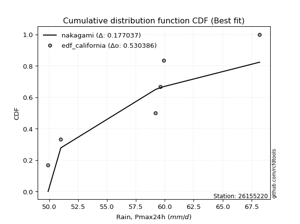</img>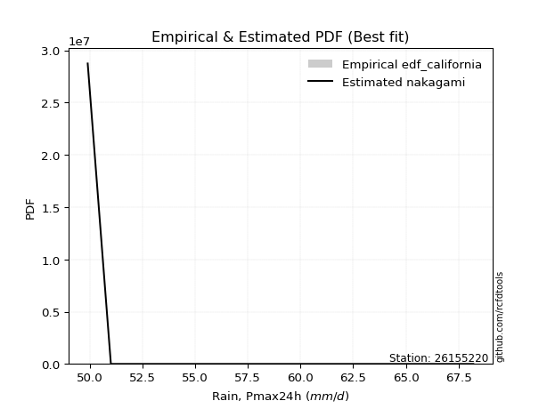</img>

</div>


### 2. EDF Hazen (1930)

Hazen method for plotting positions is a formula used to estimate the empirical cumulative probability distribution of flood events or other hydrological data. This formula often results in biased estimations, particularly when extrapolating to extreme events (high return periods).

<div align="center">


$P=(m-0.5)/n$


</div>


**2.1. Empirical values**

<div align="center">

|                | 0                   | 1                  | 2                  | 3                  | 4         | 5                  |
|:---------------|:--------------------|:-------------------|:-------------------|:-------------------|:----------|:-------------------|
| date           | 2021                | 2018               | 2020               | 2019               | 2022      | 2017               |
| x              | 49.9                | 51.0               | 59.2               | 59.6               | 59.9      | 68.2               |
| m              | 1                   | 2                  | 3                  | 4                  | 5         | 6                  |
| empirical_dist | edf_hazen           | edf_hazen          | edf_hazen          | edf_hazen          | edf_hazen | edf_hazen          |
| empirical      | 0.08333333333333333 | 0.25               | 0.4166666666666667 | 0.5833333333333334 | 0.75      | 0.9166666666666666 |
| empirical_tr   | 1.090909090909091   | 1.3333333333333333 | 1.7142857142857144 | 2.4000000000000004 | 4.0       | 11.999999999999995 |

</div>


**2.2. Kolmogorov-Smirnov fit test (sorted by Δ)**


<div align="center">

|                | 0                   | 1                   | 2                  | 3                   | 4                   | 5                   | 6                   | 7                   | 8                   | 9                   | 10                 | 11                 | 12                  | 13                 | 14                  | 15                  | 16                 | 17                  | 18                  | 19                 | 20                 | 21                  | 22                 | 23                  | 24                  | 25                  | 26                  | 27                  | 28                  | 29                  | 30                 | 31                 | 32                  | 33                  | 34                 | 35                  | 36                  | 37                  | 38                | 39                  | 40                  | 41                  | 42                  | 43                  | 44                 | 45                  | 46                  | 47                 | 48                  | 49                 | 50                  | 51                  | 52                  | 53                  | 54                | 55                  | 56                 | 57                  | 58                  | 59                  | 60                 | 61                  | 62                  | 63                  | 64                  | 65                  | 66                  | 67                  | 68                  | 69                  | 70                  | 71                  | 72                  | 73                  | 74                  | 75                  | 76                  | 77                  | 78                 | 79                 | 80                  | 81                  | 82                  | 83                  | 84                  | 85                 | 86                  | 87                 | 88                  | 89                  | 90                  | 91                  | 92                 | 93                 | 94                 | 95                  | 96                 | 97                  | 98                  | 99                  | 100                 | 101                 | 102                 | 103                 | 104                | 105                | 106                | 107                | 108                | 109                 | 110                 | 111                 | 112                 | 113                 | 114                 | 115                 | 116                 | 117                | 118                | 119               | 120               | 121                | 122                | 123                 | 124                | 125                 | 126                | 127                 | 128                | 129                | 130                 | 131                | 132                 | 133               | 134                | 135                | 136               | 137                | 138                | 139                 | 140                 | 141                 | 142                | 143                | 144                 | 145               | 146                | 147                | 148               | 149                | 150               | 151                | 152                 | 153                | 154                | 155            | 156                | 157                | 158                | 159            |
|:---------------|:--------------------|:--------------------|:-------------------|:--------------------|:--------------------|:--------------------|:--------------------|:--------------------|:--------------------|:--------------------|:-------------------|:-------------------|:--------------------|:-------------------|:--------------------|:--------------------|:-------------------|:--------------------|:--------------------|:-------------------|:-------------------|:--------------------|:-------------------|:--------------------|:--------------------|:--------------------|:--------------------|:--------------------|:--------------------|:--------------------|:-------------------|:-------------------|:--------------------|:--------------------|:-------------------|:--------------------|:--------------------|:--------------------|:------------------|:--------------------|:--------------------|:--------------------|:--------------------|:--------------------|:-------------------|:--------------------|:--------------------|:-------------------|:--------------------|:-------------------|:--------------------|:--------------------|:--------------------|:--------------------|:------------------|:--------------------|:-------------------|:--------------------|:--------------------|:--------------------|:-------------------|:--------------------|:--------------------|:--------------------|:--------------------|:--------------------|:--------------------|:--------------------|:--------------------|:--------------------|:--------------------|:--------------------|:--------------------|:--------------------|:--------------------|:--------------------|:--------------------|:--------------------|:-------------------|:-------------------|:--------------------|:--------------------|:--------------------|:--------------------|:--------------------|:-------------------|:--------------------|:-------------------|:--------------------|:--------------------|:--------------------|:--------------------|:-------------------|:-------------------|:-------------------|:--------------------|:-------------------|:--------------------|:--------------------|:--------------------|:--------------------|:--------------------|:--------------------|:--------------------|:-------------------|:-------------------|:-------------------|:-------------------|:-------------------|:--------------------|:--------------------|:--------------------|:--------------------|:--------------------|:--------------------|:--------------------|:--------------------|:-------------------|:-------------------|:------------------|:------------------|:-------------------|:-------------------|:--------------------|:-------------------|:--------------------|:-------------------|:--------------------|:-------------------|:-------------------|:--------------------|:-------------------|:--------------------|:------------------|:-------------------|:-------------------|:------------------|:-------------------|:-------------------|:--------------------|:--------------------|:--------------------|:-------------------|:-------------------|:--------------------|:------------------|:-------------------|:-------------------|:------------------|:-------------------|:------------------|:-------------------|:--------------------|:-------------------|:-------------------|:---------------|:-------------------|:-------------------|:-------------------|:---------------|
| station        | 26155220            | 26155220            | 26155220           | 26155220            | 26155220            | 26155220            | 26155220            | 26155220            | 26155220            | 26155220            | 26155220           | 26155220           | 26155220            | 26155220           | 26155220            | 26155220            | 26155220           | 26155220            | 26155220            | 26155220           | 26155220           | 26155220            | 26155220           | 26155220            | 26155220            | 26155220            | 26155220            | 26155220            | 26155220            | 26155220            | 26155220           | 26155220           | 26155220            | 26155220            | 26155220           | 26155220            | 26155220            | 26155220            | 26155220          | 26155220            | 26155220            | 26155220            | 26155220            | 26155220            | 26155220           | 26155220            | 26155220            | 26155220           | 26155220            | 26155220           | 26155220            | 26155220            | 26155220            | 26155220            | 26155220          | 26155220            | 26155220           | 26155220            | 26155220            | 26155220            | 26155220           | 26155220            | 26155220            | 26155220            | 26155220            | 26155220            | 26155220            | 26155220            | 26155220            | 26155220            | 26155220            | 26155220            | 26155220            | 26155220            | 26155220            | 26155220            | 26155220            | 26155220            | 26155220           | 26155220           | 26155220            | 26155220            | 26155220            | 26155220            | 26155220            | 26155220           | 26155220            | 26155220           | 26155220            | 26155220            | 26155220            | 26155220            | 26155220           | 26155220           | 26155220           | 26155220            | 26155220           | 26155220            | 26155220            | 26155220            | 26155220            | 26155220            | 26155220            | 26155220            | 26155220           | 26155220           | 26155220           | 26155220           | 26155220           | 26155220            | 26155220            | 26155220            | 26155220            | 26155220            | 26155220            | 26155220            | 26155220            | 26155220           | 26155220           | 26155220          | 26155220          | 26155220           | 26155220           | 26155220            | 26155220           | 26155220            | 26155220           | 26155220            | 26155220           | 26155220           | 26155220            | 26155220           | 26155220            | 26155220          | 26155220           | 26155220           | 26155220          | 26155220           | 26155220           | 26155220            | 26155220            | 26155220            | 26155220           | 26155220           | 26155220            | 26155220          | 26155220           | 26155220           | 26155220          | 26155220           | 26155220          | 26155220           | 26155220            | 26155220           | 26155220           | 26155220       | 26155220           | 26155220           | 26155220           | 26155220       |
| empirical_dist | edf_hazen           | edf_hazen           | edf_hazen          | edf_hazen           | edf_hazen           | edf_hazen           | edf_hazen           | edf_hazen           | edf_hazen           | edf_hazen           | edf_hazen          | edf_hazen          | edf_hazen           | edf_hazen          | edf_hazen           | edf_hazen           | edf_hazen          | edf_hazen           | edf_hazen           | edf_hazen          | edf_hazen          | edf_hazen           | edf_hazen          | edf_hazen           | edf_hazen           | edf_hazen           | edf_hazen           | edf_hazen           | edf_hazen           | edf_hazen           | edf_hazen          | edf_hazen          | edf_hazen           | edf_hazen           | edf_hazen          | edf_hazen           | edf_hazen           | edf_hazen           | edf_hazen         | edf_hazen           | edf_hazen           | edf_hazen           | edf_hazen           | edf_hazen           | edf_hazen          | edf_hazen           | edf_hazen           | edf_hazen          | edf_hazen           | edf_hazen          | edf_hazen           | edf_hazen           | edf_hazen           | edf_hazen           | edf_hazen         | edf_hazen           | edf_hazen          | edf_hazen           | edf_hazen           | edf_hazen           | edf_hazen          | edf_hazen           | edf_hazen           | edf_hazen           | edf_hazen           | edf_hazen           | edf_hazen           | edf_hazen           | edf_hazen           | edf_hazen           | edf_hazen           | edf_hazen           | edf_hazen           | edf_hazen           | edf_hazen           | edf_hazen           | edf_hazen           | edf_hazen           | edf_hazen          | edf_hazen          | edf_hazen           | edf_hazen           | edf_hazen           | edf_hazen           | edf_hazen           | edf_hazen          | edf_hazen           | edf_hazen          | edf_hazen           | edf_hazen           | edf_hazen           | edf_hazen           | edf_hazen          | edf_hazen          | edf_hazen          | edf_hazen           | edf_hazen          | edf_hazen           | edf_hazen           | edf_hazen           | edf_hazen           | edf_hazen           | edf_hazen           | edf_hazen           | edf_hazen          | edf_hazen          | edf_hazen          | edf_hazen          | edf_hazen          | edf_hazen           | edf_hazen           | edf_hazen           | edf_hazen           | edf_hazen           | edf_hazen           | edf_hazen           | edf_hazen           | edf_hazen          | edf_hazen          | edf_hazen         | edf_hazen         | edf_hazen          | edf_hazen          | edf_hazen           | edf_hazen          | edf_hazen           | edf_hazen          | edf_hazen           | edf_hazen          | edf_hazen          | edf_hazen           | edf_hazen          | edf_hazen           | edf_hazen         | edf_hazen          | edf_hazen          | edf_hazen         | edf_hazen          | edf_hazen          | edf_hazen           | edf_hazen           | edf_hazen           | edf_hazen          | edf_hazen          | edf_hazen           | edf_hazen         | edf_hazen          | edf_hazen          | edf_hazen         | edf_hazen          | edf_hazen         | edf_hazen          | edf_hazen           | edf_hazen          | edf_hazen          | edf_hazen      | edf_hazen          | edf_hazen          | edf_hazen          | edf_hazen      |
| p_dist         | johnsonsu           | logjohnsonsu        | cosine             | semicircular        | anglit              | logksone            | logburr12           | loggumbel_l         | ksone               | truncnorm           | norm               | crystalball        | t                   | logsemicircular    | exponnorm           | logweibull_max      | loggenextreme      | foldnorm            | loggenlogistic      | logarcsine         | loganglit          | logkappa4           | genextreme         | pearson3            | ncf                 | logistic            | kappa4              | logcosine           | logtukeylambda      | loggausshyper       | arcsine            | loguniform         | logloggamma         | dgamma              | skewnorm           | gumbel_l            | bradford            | hypsecant           | logt              | logskewnorm         | logcrystalball      | lognorm             | logexponnorm        | logpearson3         | logerlang          | loggamma            | loggamma            | f                  | logf                | loginvgamma        | betaprime           | erlang              | invgamma            | alpha               | logncf            | rice                | logalpha           | logdgamma           | gennorm             | gamma               | maxwell            | logargus            | nct                 | loglogistic         | logbetaprime        | logdweibull         | vonmises_line       | rayleigh            | logvonmises_line    | tukeylambda         | gausshyper          | logrice             | uniform             | invgauss            | loghypsecant        | laplace             | lognct              | gompertz            | logmaxwell         | loginvgauss        | truncexpon          | lograyleigh         | invweibull          | logfoldnorm         | genlogistic         | logbradford        | logloglaplace       | logwrapcauchy      | burr                | halfnorm            | kstwobign           | argus               | loginvweibull      | gumbel_r           | logmielke          | logexponpow         | nakagami           | loggompertz         | loglaplace          | loglaplace          | logburr             | exponpow            | wrapcauchy          | genexpon            | loghalfnorm        | logkstwobign       | logexponweib       | loggumbel_r        | loggennorm         | dweibull            | logtruncnorm        | lomax               | halflogistic        | moyal               | logtriang           | loggenexpon         | weibull_min         | logtruncexpon      | loghalflogistic    | logmoyal          | loglevy_l         | burr12             | loglomax           | levy_l              | logbeta            | halfgennorm         | loggenhalflogistic | wald                | triang             | logwald            | kappa3              | loggengamma        | logtruncweibull_min | gengamma          | genpareto          | truncweibull_min   | logweibull_min    | beta               | genhalflogistic    | lognakagami         | loggenpareto        | logtrapezoid        | exponweib          | trapezoid          | fatiguelife         | logjohnsonsb      | rdist              | johnsonsb          | logfatiguelife    | truncpareto        | weibull_max       | powerlaw           | logtruncpareto      | logpowerlaw        | logkappa3          | loghalfgennorm | logrdist           | logvonmises        | vonmises           | mielke         |
| delta          | 0.12107835862908378 | 0.12223391516864379 | 0.1464480889026188 | 0.15019992722353703 | 0.15177300279936917 | 0.15596669888463782 | 0.15663375246931915 | 0.15908966939656732 | 0.15911457385713046 | 0.16292293893107174 | 0.1629230077619142 | 0.1629230108487711 | 0.16292858752663836 | 0.1632113143734732 | 0.16368064500016127 | 0.16467707744540921 | 0.1646875124376243 | 0.16623452883687367 | 0.16725672683942622 | 0.1674907242914624 | 0.1689183533876471 | 0.17109587010371669 | 0.1712670455363799 | 0.17288357302924168 | 0.17310045814477232 | 0.17341197842227346 | 0.17430505954090647 | 0.17490856518598857 | 0.17708428833680756 | 0.17820271658943487 | 0.1785381101433886 | 0.1802081129193581 | 0.18076444074149317 | 0.18092679832972697 | 0.1811102648312462 | 0.18137287204404196 | 0.18159186493521157 | 0.18212971776298786 | 0.182656585709217 | 0.18266175998685003 | 0.18266181192004532 | 0.18266182136148584 | 0.18266242144708572 | 0.18295132063950842 | 0.1829537427246301 | 0.18295586535816727 | 0.18295586535816727 | 0.1841146618468668 | 0.18460602611902904 | 0.1849462624205203 | 0.18589492437819716 | 0.18670066907907018 | 0.18712230429239157 | 0.18727012885359545 | 0.187597567861626 | 0.18779762717248122 | 0.1880016043570047 | 0.18870943471044405 | 0.19023957915293874 | 0.19089916213386054 | 0.1911602996654363 | 0.19187447376316213 | 0.19411623697649288 | 0.19548575780713312 | 0.19630417985804655 | 0.19638757759286873 | 0.19834798890465233 | 0.20004435743891885 | 0.20081123756059732 | 0.20086767518173332 | 0.20185533449835574 | 0.20289952176888165 | 0.20355191256830618 | 0.20566049096263633 | 0.20598517381497478 | 0.20696361253858037 | 0.20714128708330376 | 0.20823420867681236 | 0.2092460818022998 | 0.2146684278495698 | 0.21618517456793224 | 0.21750034724610195 | 0.21750400260886255 | 0.21789503487739875 | 0.21903772519728387 | 0.2197014117590253 | 0.21989287749030406 | 0.2211811464777118 | 0.22241335443130422 | 0.22521438800095278 | 0.22576439878369353 | 0.22630095447671028 | 0.2303281072272912 | 0.2312729210816153 | 0.2316411320790734 | 0.23180207254105006 | 0.2328238046226449 | 0.23282389673477782 | 0.23303725652589674 | 0.23303725652589674 | 0.23330336363188026 | 0.23399979317296898 | 0.23441892568921285 | 0.23508384368133523 | 0.2409962538542449 | 0.2417316556187466 | 0.2460244567012046 | 0.2492416218286176 | 0.2499999989731212 | 0.24999999999997902 | 0.25070250990843307 | 0.25143296144911603 | 0.25325676687456583 | 0.25497367998232573 | 0.25803286316104557 | 0.26055554883750903 | 0.26230586192846833 | 0.2682948856449405 | 0.2692830302367523 | 0.272005881491803 | 0.274461127699642 | 0.2757728339223758 | 0.2772028949942416 | 0.28450132286877955 | 0.2868785794465692 | 0.28931915385201484 | 0.299951739140572  | 0.32083095340298046 | 0.3318427435144434 | 0.3354134781235905 | 0.34325229068433205 | 0.3445152131567362 | 0.3448936258972362  | 0.353305568870977 | 0.3548910571532409 | 0.3549895895761979 | 0.358796006386404 | 0.3624764844645359 | 0.3662792812711958 | 0.37545504287743675 | 0.39186517635469753 | 0.42449113416134376 | 0.4593178584660576 | 0.4597950487888231 | 0.46668561014173787 | 0.471086765624364 | 0.4726652179785025 | 0.4737036440261798 | 0.482384980260356 | 0.4829316267131926 | 0.485013745947566 | 0.4872693143814933 | 0.49202083445345685 | 0.4937201986096896 | 0.6139252003533242 | 0.75           | 0.9166666666666666 | 1.1827507497274319 | 10.930344602013488 | nan            |
| deltao         | 0.530385761606      | 0.530385761606      | 0.530385761606     | 0.530385761606      | 0.530385761606      | 0.530385761606      | 0.530385761606      | 0.530385761606      | 0.530385761606      | 0.530385761606      | 0.530385761606     | 0.530385761606     | 0.530385761606      | 0.530385761606     | 0.530385761606      | 0.530385761606      | 0.530385761606     | 0.530385761606      | 0.530385761606      | 0.530385761606     | 0.530385761606     | 0.530385761606      | 0.530385761606     | 0.530385761606      | 0.530385761606      | 0.530385761606      | 0.530385761606      | 0.530385761606      | 0.530385761606      | 0.530385761606      | 0.530385761606     | 0.530385761606     | 0.530385761606      | 0.530385761606      | 0.530385761606     | 0.530385761606      | 0.530385761606      | 0.530385761606      | 0.530385761606    | 0.530385761606      | 0.530385761606      | 0.530385761606      | 0.530385761606      | 0.530385761606      | 0.530385761606     | 0.530385761606      | 0.530385761606      | 0.530385761606     | 0.530385761606      | 0.530385761606     | 0.530385761606      | 0.530385761606      | 0.530385761606      | 0.530385761606      | 0.530385761606    | 0.530385761606      | 0.530385761606     | 0.530385761606      | 0.530385761606      | 0.530385761606      | 0.530385761606     | 0.530385761606      | 0.530385761606      | 0.530385761606      | 0.530385761606      | 0.530385761606      | 0.530385761606      | 0.530385761606      | 0.530385761606      | 0.530385761606      | 0.530385761606      | 0.530385761606      | 0.530385761606      | 0.530385761606      | 0.530385761606      | 0.530385761606      | 0.530385761606      | 0.530385761606      | 0.530385761606     | 0.530385761606     | 0.530385761606      | 0.530385761606      | 0.530385761606      | 0.530385761606      | 0.530385761606      | 0.530385761606     | 0.530385761606      | 0.530385761606     | 0.530385761606      | 0.530385761606      | 0.530385761606      | 0.530385761606      | 0.530385761606     | 0.530385761606     | 0.530385761606     | 0.530385761606      | 0.530385761606     | 0.530385761606      | 0.530385761606      | 0.530385761606      | 0.530385761606      | 0.530385761606      | 0.530385761606      | 0.530385761606      | 0.530385761606     | 0.530385761606     | 0.530385761606     | 0.530385761606     | 0.530385761606     | 0.530385761606      | 0.530385761606      | 0.530385761606      | 0.530385761606      | 0.530385761606      | 0.530385761606      | 0.530385761606      | 0.530385761606      | 0.530385761606     | 0.530385761606     | 0.530385761606    | 0.530385761606    | 0.530385761606     | 0.530385761606     | 0.530385761606      | 0.530385761606     | 0.530385761606      | 0.530385761606     | 0.530385761606      | 0.530385761606     | 0.530385761606     | 0.530385761606      | 0.530385761606     | 0.530385761606      | 0.530385761606    | 0.530385761606     | 0.530385761606     | 0.530385761606    | 0.530385761606     | 0.530385761606     | 0.530385761606      | 0.530385761606      | 0.530385761606      | 0.530385761606     | 0.530385761606     | 0.530385761606      | 0.530385761606    | 0.530385761606     | 0.530385761606     | 0.530385761606    | 0.530385761606     | 0.530385761606    | 0.530385761606     | 0.530385761606      | 0.530385761606     | 0.530385761606     | 0.530385761606 | 0.530385761606     | 0.530385761606     | 0.530385761606     | 0.530385761606 |
| eval           | Δo > Δ              | Δo > Δ              | Δo > Δ             | Δo > Δ              | Δo > Δ              | Δo > Δ              | Δo > Δ              | Δo > Δ              | Δo > Δ              | Δo > Δ              | Δo > Δ             | Δo > Δ             | Δo > Δ              | Δo > Δ             | Δo > Δ              | Δo > Δ              | Δo > Δ             | Δo > Δ              | Δo > Δ              | Δo > Δ             | Δo > Δ             | Δo > Δ              | Δo > Δ             | Δo > Δ              | Δo > Δ              | Δo > Δ              | Δo > Δ              | Δo > Δ              | Δo > Δ              | Δo > Δ              | Δo > Δ             | Δo > Δ             | Δo > Δ              | Δo > Δ              | Δo > Δ             | Δo > Δ              | Δo > Δ              | Δo > Δ              | Δo > Δ            | Δo > Δ              | Δo > Δ              | Δo > Δ              | Δo > Δ              | Δo > Δ              | Δo > Δ             | Δo > Δ              | Δo > Δ              | Δo > Δ             | Δo > Δ              | Δo > Δ             | Δo > Δ              | Δo > Δ              | Δo > Δ              | Δo > Δ              | Δo > Δ            | Δo > Δ              | Δo > Δ             | Δo > Δ              | Δo > Δ              | Δo > Δ              | Δo > Δ             | Δo > Δ              | Δo > Δ              | Δo > Δ              | Δo > Δ              | Δo > Δ              | Δo > Δ              | Δo > Δ              | Δo > Δ              | Δo > Δ              | Δo > Δ              | Δo > Δ              | Δo > Δ              | Δo > Δ              | Δo > Δ              | Δo > Δ              | Δo > Δ              | Δo > Δ              | Δo > Δ             | Δo > Δ             | Δo > Δ              | Δo > Δ              | Δo > Δ              | Δo > Δ              | Δo > Δ              | Δo > Δ             | Δo > Δ              | Δo > Δ             | Δo > Δ              | Δo > Δ              | Δo > Δ              | Δo > Δ              | Δo > Δ             | Δo > Δ             | Δo > Δ             | Δo > Δ              | Δo > Δ             | Δo > Δ              | Δo > Δ              | Δo > Δ              | Δo > Δ              | Δo > Δ              | Δo > Δ              | Δo > Δ              | Δo > Δ             | Δo > Δ             | Δo > Δ             | Δo > Δ             | Δo > Δ             | Δo > Δ              | Δo > Δ              | Δo > Δ              | Δo > Δ              | Δo > Δ              | Δo > Δ              | Δo > Δ              | Δo > Δ              | Δo > Δ             | Δo > Δ             | Δo > Δ            | Δo > Δ            | Δo > Δ             | Δo > Δ             | Δo > Δ              | Δo > Δ             | Δo > Δ              | Δo > Δ             | Δo > Δ              | Δo > Δ             | Δo > Δ             | Δo > Δ              | Δo > Δ             | Δo > Δ              | Δo > Δ            | Δo > Δ             | Δo > Δ             | Δo > Δ            | Δo > Δ             | Δo > Δ             | Δo > Δ              | Δo > Δ              | Δo > Δ              | Δo > Δ             | Δo > Δ             | Δo > Δ              | Δo > Δ            | Δo > Δ             | Δo > Δ             | Δo > Δ            | Δo > Δ             | Δo > Δ            | Δo > Δ             | Δo > Δ              | Δo > Δ             | Δo <= Δ            | Δo <= Δ        | Δo <= Δ            | Δo <= Δ            | Δo <= Δ            | Δo <= Δ        |
| fit            | 1                   | 1                   | 1                  | 1                   | 1                   | 1                   | 1                   | 1                   | 1                   | 1                   | 1                  | 1                  | 1                   | 1                  | 1                   | 1                   | 1                  | 1                   | 1                   | 1                  | 1                  | 1                   | 1                  | 1                   | 1                   | 1                   | 1                   | 1                   | 1                   | 1                   | 1                  | 1                  | 1                   | 1                   | 1                  | 1                   | 1                   | 1                   | 1                 | 1                   | 1                   | 1                   | 1                   | 1                   | 1                  | 1                   | 1                   | 1                  | 1                   | 1                  | 1                   | 1                   | 1                   | 1                   | 1                 | 1                   | 1                  | 1                   | 1                   | 1                   | 1                  | 1                   | 1                   | 1                   | 1                   | 1                   | 1                   | 1                   | 1                   | 1                   | 1                   | 1                   | 1                   | 1                   | 1                   | 1                   | 1                   | 1                   | 1                  | 1                  | 1                   | 1                   | 1                   | 1                   | 1                   | 1                  | 1                   | 1                  | 1                   | 1                   | 1                   | 1                   | 1                  | 1                  | 1                  | 1                   | 1                  | 1                   | 1                   | 1                   | 1                   | 1                   | 1                   | 1                   | 1                  | 1                  | 1                  | 1                  | 1                  | 1                   | 1                   | 1                   | 1                   | 1                   | 1                   | 1                   | 1                   | 1                  | 1                  | 1                 | 1                 | 1                  | 1                  | 1                   | 1                  | 1                   | 1                  | 1                   | 1                  | 1                  | 1                   | 1                  | 1                   | 1                 | 1                  | 1                  | 1                 | 1                  | 1                  | 1                   | 1                   | 1                   | 1                  | 1                  | 1                   | 1                 | 1                  | 1                  | 1                 | 1                  | 1                 | 1                  | 1                   | 1                  | 0                  | 0              | 0                  | 0                  | 0                  | 0              |
| n              | 6                   | 6                   | 6                  | 6                   | 6                   | 6                   | 6                   | 6                   | 6                   | 6                   | 6                  | 6                  | 6                   | 6                  | 6                   | 6                   | 6                  | 6                   | 6                   | 6                  | 6                  | 6                   | 6                  | 6                   | 6                   | 6                   | 6                   | 6                   | 6                   | 6                   | 6                  | 6                  | 6                   | 6                   | 6                  | 6                   | 6                   | 6                   | 6                 | 6                   | 6                   | 6                   | 6                   | 6                   | 6                  | 6                   | 6                   | 6                  | 6                   | 6                  | 6                   | 6                   | 6                   | 6                   | 6                 | 6                   | 6                  | 6                   | 6                   | 6                   | 6                  | 6                   | 6                   | 6                   | 6                   | 6                   | 6                   | 6                   | 6                   | 6                   | 6                   | 6                   | 6                   | 6                   | 6                   | 6                   | 6                   | 6                   | 6                  | 6                  | 6                   | 6                   | 6                   | 6                   | 6                   | 6                  | 6                   | 6                  | 6                   | 6                   | 6                   | 6                   | 6                  | 6                  | 6                  | 6                   | 6                  | 6                   | 6                   | 6                   | 6                   | 6                   | 6                   | 6                   | 6                  | 6                  | 6                  | 6                  | 6                  | 6                   | 6                   | 6                   | 6                   | 6                   | 6                   | 6                   | 6                   | 6                  | 6                  | 6                 | 6                 | 6                  | 6                  | 6                   | 6                  | 6                   | 6                  | 6                   | 6                  | 6                  | 6                   | 6                  | 6                   | 6                 | 6                  | 6                  | 6                 | 6                  | 6                  | 6                   | 6                   | 6                   | 6                  | 6                  | 6                   | 6                 | 6                  | 6                  | 6                 | 6                  | 6                 | 6                  | 6                   | 6                  | 6                  | 6              | 6                  | 6                  | 6                  | 6              |
| best_fit       | 1                   | 0                   | 0                  | 0                   | 0                   | 0                   | 0                   | 0                   | 0                   | 0                   | 0                  | 0                  | 0                   | 0                  | 0                   | 0                   | 0                  | 0                   | 0                   | 0                  | 0                  | 0                   | 0                  | 0                   | 0                   | 0                   | 0                   | 0                   | 0                   | 0                   | 0                  | 0                  | 0                   | 0                   | 0                  | 0                   | 0                   | 0                   | 0                 | 0                   | 0                   | 0                   | 0                   | 0                   | 0                  | 0                   | 0                   | 0                  | 0                   | 0                  | 0                   | 0                   | 0                   | 0                   | 0                 | 0                   | 0                  | 0                   | 0                   | 0                   | 0                  | 0                   | 0                   | 0                   | 0                   | 0                   | 0                   | 0                   | 0                   | 0                   | 0                   | 0                   | 0                   | 0                   | 0                   | 0                   | 0                   | 0                   | 0                  | 0                  | 0                   | 0                   | 0                   | 0                   | 0                   | 0                  | 0                   | 0                  | 0                   | 0                   | 0                   | 0                   | 0                  | 0                  | 0                  | 0                   | 0                  | 0                   | 0                   | 0                   | 0                   | 0                   | 0                   | 0                   | 0                  | 0                  | 0                  | 0                  | 0                  | 0                   | 0                   | 0                   | 0                   | 0                   | 0                   | 0                   | 0                   | 0                  | 0                  | 0                 | 0                 | 0                  | 0                  | 0                   | 0                  | 0                   | 0                  | 0                   | 0                  | 0                  | 0                   | 0                  | 0                   | 0                 | 0                  | 0                  | 0                 | 0                  | 0                  | 0                   | 0                   | 0                   | 0                  | 0                  | 0                   | 0                 | 0                  | 0                  | 0                 | 0                  | 0                 | 0                  | 0                   | 0                  | 0                  | 0              | 0                  | 0                  | 0                  | 0              |
| best_fit_sort  | 1                   | 2                   | 3                  | 4                   | 5                   | 6                   | 7                   | 8                   | 9                   | 10                  | 11                 | 12                 | 13                  | 14                 | 15                  | 16                  | 17                 | 18                  | 19                  | 20                 | 21                 | 22                  | 23                 | 24                  | 25                  | 26                  | 27                  | 28                  | 29                  | 30                  | 31                 | 32                 | 33                  | 34                  | 35                 | 36                  | 37                  | 38                  | 39                | 40                  | 41                  | 42                  | 43                  | 44                  | 45                 | 46                  | 47                  | 48                 | 49                  | 50                 | 51                  | 52                  | 53                  | 54                  | 55                | 56                  | 57                 | 58                  | 59                  | 60                  | 61                 | 62                  | 63                  | 64                  | 65                  | 66                  | 67                  | 68                  | 69                  | 70                  | 71                  | 72                  | 73                  | 74                  | 75                  | 76                  | 77                  | 78                  | 79                 | 80                 | 81                  | 82                  | 83                  | 84                  | 85                  | 86                 | 87                  | 88                 | 89                  | 90                  | 91                  | 92                  | 93                 | 94                 | 95                 | 96                  | 97                 | 98                  | 99                  | 100                 | 101                 | 102                 | 103                 | 104                 | 105                | 106                | 107                | 108                | 109                | 110                 | 111                 | 112                 | 113                 | 114                 | 115                 | 116                 | 117                 | 118                | 119                | 120               | 121               | 122                | 123                | 124                 | 125                | 126                 | 127                | 128                 | 129                | 130                | 131                 | 132                | 133                 | 134               | 135                | 136                | 137               | 138                | 139                | 140                 | 141                 | 142                 | 143                | 144                | 145                 | 146               | 147                | 148                | 149               | 150                | 151               | 152                | 153                 | 154                | 155                | 156            | 157                | 158                | 159                | 160            |

</div>


**2.3. Best fit**

<div align="center">

|   id |   station | empirical_dist   | p_dist    |    delta |   deltao | eval   |   fit |   n |   best_fit |   best_fit_sort |
|-----:|----------:|:-----------------|:----------|---------:|---------:|:-------|------:|----:|-----------:|----------------:|
|    0 |  26155220 | edf_hazen        | johnsonsu | 0.121078 | 0.530386 | Δo > Δ |     1 |   6 |          1 |               1 |

</div>


<div align="center">

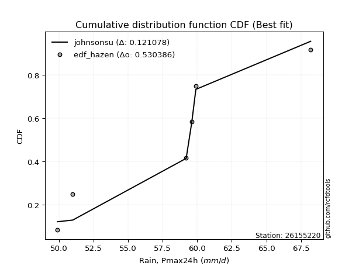</img></img>

</div>


### 3. EDF Weibull (1939)

Weibull plotting position formula is an empirical method used to estimate the non-exceedance probability or plotting position for a set of observed data, is often recommended or widely used in practice, particularly in flood frequency analysis.

<div align="center">


$P=m/(n+1)$


</div>


**3.1. Empirical values**

<div align="center">

|                | 0                   | 1                  | 2                   | 3                  | 4                  | 5                  |
|:---------------|:--------------------|:-------------------|:--------------------|:-------------------|:-------------------|:-------------------|
| date           | 2021                | 2018               | 2020                | 2019               | 2022               | 2017               |
| x              | 49.9                | 51.0               | 59.2                | 59.6               | 59.9               | 68.2               |
| m              | 1                   | 2                  | 3                   | 4                  | 5                  | 6                  |
| empirical_dist | edf_weibull         | edf_weibull        | edf_weibull         | edf_weibull        | edf_weibull        | edf_weibull        |
| empirical      | 0.14285714285714285 | 0.2857142857142857 | 0.42857142857142855 | 0.5714285714285714 | 0.7142857142857143 | 0.8571428571428571 |
| empirical_tr   | 1.1666666666666665  | 1.4                | 1.75                | 2.333333333333333  | 3.5                | 6.999999999999997  |

</div>


**3.2. Kolmogorov-Smirnov fit test (sorted by Δ)**


<div align="center">

|                | 0                   | 1                   | 2                  | 3                  | 4                  | 5                   | 6                   | 7                   | 8                  | 9                   | 10                  | 11                 | 12                | 13                | 14                 | 15                  | 16                | 17                  | 18                 | 19                  | 20                  | 21                  | 22                 | 23                 | 24                 | 25                 | 26                  | 27                  | 28                 | 29                  | 30                  | 31                  | 32                  | 33                  | 34                  | 35                  | 36                  | 37                  | 38                 | 39                 | 40                  | 41                  | 42                  | 43                  | 44                 | 45                  | 46                 | 47                 | 48                  | 49                  | 50                  | 51                  | 52                  | 53                 | 54                  | 55                  | 56                  | 57                  | 58                 | 59                  | 60                | 61                  | 62                  | 63                 | 64                  | 65                 | 66                 | 67                  | 68                  | 69                  | 70                  | 71                  | 72                 | 73                 | 74                  | 75                 | 76                  | 77                  | 78                | 79                  | 80                  | 81                  | 82                  | 83                  | 84                  | 85                  | 86                  | 87                 | 88                  | 89                  | 90                  | 91                  | 92                  | 93                  | 94                 | 95                  | 96                  | 97                  | 98                  | 99                 | 100                 | 101                 | 102                 | 103                 | 104                 | 105                | 106                 | 107                 | 108                 | 109                 | 110                 | 111                 | 112                 | 113                | 114                 | 115                 | 116                 | 117                 | 118                | 119                | 120                 | 121                | 122                | 123                 | 124                | 125                 | 126               | 127                | 128                 | 129                | 130                | 131                 | 132                | 133               | 134                 | 135                 | 136                 | 137                 | 138                 | 139                 | 140                | 141                 | 142                | 143                | 144                | 145                 | 146                | 147               | 148                 | 149                | 150                 | 151                 | 152               | 153                | 154                | 155                | 156                | 157              | 158                | 159            |
|:---------------|:--------------------|:--------------------|:-------------------|:-------------------|:-------------------|:--------------------|:--------------------|:--------------------|:-------------------|:--------------------|:--------------------|:-------------------|:------------------|:------------------|:-------------------|:--------------------|:------------------|:--------------------|:-------------------|:--------------------|:--------------------|:--------------------|:-------------------|:-------------------|:-------------------|:-------------------|:--------------------|:--------------------|:-------------------|:--------------------|:--------------------|:--------------------|:--------------------|:--------------------|:--------------------|:--------------------|:--------------------|:--------------------|:-------------------|:-------------------|:--------------------|:--------------------|:--------------------|:--------------------|:-------------------|:--------------------|:-------------------|:-------------------|:--------------------|:--------------------|:--------------------|:--------------------|:--------------------|:-------------------|:--------------------|:--------------------|:--------------------|:--------------------|:-------------------|:--------------------|:------------------|:--------------------|:--------------------|:-------------------|:--------------------|:-------------------|:-------------------|:--------------------|:--------------------|:--------------------|:--------------------|:--------------------|:-------------------|:-------------------|:--------------------|:-------------------|:--------------------|:--------------------|:------------------|:--------------------|:--------------------|:--------------------|:--------------------|:--------------------|:--------------------|:--------------------|:--------------------|:-------------------|:--------------------|:--------------------|:--------------------|:--------------------|:--------------------|:--------------------|:-------------------|:--------------------|:--------------------|:--------------------|:--------------------|:-------------------|:--------------------|:--------------------|:--------------------|:--------------------|:--------------------|:-------------------|:--------------------|:--------------------|:--------------------|:--------------------|:--------------------|:--------------------|:--------------------|:-------------------|:--------------------|:--------------------|:--------------------|:--------------------|:-------------------|:-------------------|:--------------------|:-------------------|:-------------------|:--------------------|:-------------------|:--------------------|:------------------|:-------------------|:--------------------|:-------------------|:-------------------|:--------------------|:-------------------|:------------------|:--------------------|:--------------------|:--------------------|:--------------------|:--------------------|:--------------------|:-------------------|:--------------------|:-------------------|:-------------------|:-------------------|:--------------------|:-------------------|:------------------|:--------------------|:-------------------|:--------------------|:--------------------|:------------------|:-------------------|:-------------------|:-------------------|:-------------------|:-----------------|:-------------------|:---------------|
| station        | 26155220            | 26155220            | 26155220           | 26155220           | 26155220           | 26155220            | 26155220            | 26155220            | 26155220           | 26155220            | 26155220            | 26155220           | 26155220          | 26155220          | 26155220           | 26155220            | 26155220          | 26155220            | 26155220           | 26155220            | 26155220            | 26155220            | 26155220           | 26155220           | 26155220           | 26155220           | 26155220            | 26155220            | 26155220           | 26155220            | 26155220            | 26155220            | 26155220            | 26155220            | 26155220            | 26155220            | 26155220            | 26155220            | 26155220           | 26155220           | 26155220            | 26155220            | 26155220            | 26155220            | 26155220           | 26155220            | 26155220           | 26155220           | 26155220            | 26155220            | 26155220            | 26155220            | 26155220            | 26155220           | 26155220            | 26155220            | 26155220            | 26155220            | 26155220           | 26155220            | 26155220          | 26155220            | 26155220            | 26155220           | 26155220            | 26155220           | 26155220           | 26155220            | 26155220            | 26155220            | 26155220            | 26155220            | 26155220           | 26155220           | 26155220            | 26155220           | 26155220            | 26155220            | 26155220          | 26155220            | 26155220            | 26155220            | 26155220            | 26155220            | 26155220            | 26155220            | 26155220            | 26155220           | 26155220            | 26155220            | 26155220            | 26155220            | 26155220            | 26155220            | 26155220           | 26155220            | 26155220            | 26155220            | 26155220            | 26155220           | 26155220            | 26155220            | 26155220            | 26155220            | 26155220            | 26155220           | 26155220            | 26155220            | 26155220            | 26155220            | 26155220            | 26155220            | 26155220            | 26155220           | 26155220            | 26155220            | 26155220            | 26155220            | 26155220           | 26155220           | 26155220            | 26155220           | 26155220           | 26155220            | 26155220           | 26155220            | 26155220          | 26155220           | 26155220            | 26155220           | 26155220           | 26155220            | 26155220           | 26155220          | 26155220            | 26155220            | 26155220            | 26155220            | 26155220            | 26155220            | 26155220           | 26155220            | 26155220           | 26155220           | 26155220           | 26155220            | 26155220           | 26155220          | 26155220            | 26155220           | 26155220            | 26155220            | 26155220          | 26155220           | 26155220           | 26155220           | 26155220           | 26155220         | 26155220           | 26155220       |
| empirical_dist | edf_weibull         | edf_weibull         | edf_weibull        | edf_weibull        | edf_weibull        | edf_weibull         | edf_weibull         | edf_weibull         | edf_weibull        | edf_weibull         | edf_weibull         | edf_weibull        | edf_weibull       | edf_weibull       | edf_weibull        | edf_weibull         | edf_weibull       | edf_weibull         | edf_weibull        | edf_weibull         | edf_weibull         | edf_weibull         | edf_weibull        | edf_weibull        | edf_weibull        | edf_weibull        | edf_weibull         | edf_weibull         | edf_weibull        | edf_weibull         | edf_weibull         | edf_weibull         | edf_weibull         | edf_weibull         | edf_weibull         | edf_weibull         | edf_weibull         | edf_weibull         | edf_weibull        | edf_weibull        | edf_weibull         | edf_weibull         | edf_weibull         | edf_weibull         | edf_weibull        | edf_weibull         | edf_weibull        | edf_weibull        | edf_weibull         | edf_weibull         | edf_weibull         | edf_weibull         | edf_weibull         | edf_weibull        | edf_weibull         | edf_weibull         | edf_weibull         | edf_weibull         | edf_weibull        | edf_weibull         | edf_weibull       | edf_weibull         | edf_weibull         | edf_weibull        | edf_weibull         | edf_weibull        | edf_weibull        | edf_weibull         | edf_weibull         | edf_weibull         | edf_weibull         | edf_weibull         | edf_weibull        | edf_weibull        | edf_weibull         | edf_weibull        | edf_weibull         | edf_weibull         | edf_weibull       | edf_weibull         | edf_weibull         | edf_weibull         | edf_weibull         | edf_weibull         | edf_weibull         | edf_weibull         | edf_weibull         | edf_weibull        | edf_weibull         | edf_weibull         | edf_weibull         | edf_weibull         | edf_weibull         | edf_weibull         | edf_weibull        | edf_weibull         | edf_weibull         | edf_weibull         | edf_weibull         | edf_weibull        | edf_weibull         | edf_weibull         | edf_weibull         | edf_weibull         | edf_weibull         | edf_weibull        | edf_weibull         | edf_weibull         | edf_weibull         | edf_weibull         | edf_weibull         | edf_weibull         | edf_weibull         | edf_weibull        | edf_weibull         | edf_weibull         | edf_weibull         | edf_weibull         | edf_weibull        | edf_weibull        | edf_weibull         | edf_weibull        | edf_weibull        | edf_weibull         | edf_weibull        | edf_weibull         | edf_weibull       | edf_weibull        | edf_weibull         | edf_weibull        | edf_weibull        | edf_weibull         | edf_weibull        | edf_weibull       | edf_weibull         | edf_weibull         | edf_weibull         | edf_weibull         | edf_weibull         | edf_weibull         | edf_weibull        | edf_weibull         | edf_weibull        | edf_weibull        | edf_weibull        | edf_weibull         | edf_weibull        | edf_weibull       | edf_weibull         | edf_weibull        | edf_weibull         | edf_weibull         | edf_weibull       | edf_weibull        | edf_weibull        | edf_weibull        | edf_weibull        | edf_weibull      | edf_weibull        | edf_weibull    |
| p_dist         | ksone               | semicircular        | anglit             | arcsine            | logarcsine         | logksone            | logsemicircular     | logburr12           | foldnorm           | johnsonsu           | loganglit           | t                  | norm              | crystalball       | truncnorm          | exponnorm           | loggenextreme     | logweibull_max      | logjohnsonsu       | genextreme          | pearson3            | ncf                 | loggenlogistic     | lognct             | loggausshyper      | gumbel_l           | loggumbel_l         | cosine              | logloggamma        | skewnorm            | logcosine           | logt                | logskewnorm         | logcrystalball      | lognorm             | logexponnorm        | logpearson3         | logerlang           | loggamma           | loggamma           | f                   | logistic            | logf                | loginvgamma         | betaprime          | erlang              | invgamma           | alpha              | logncf              | logalpha            | logargus            | gamma               | maxwell             | rice               | hypsecant           | nct                 | loglogistic         | logbetaprime        | logwrapcauchy      | logdweibull         | rayleigh          | gausshyper          | argus               | logrice            | invgauss            | loghypsecant       | laplace            | logmaxwell          | wrapcauchy          | bradford            | loginvgauss         | truncexpon          | gompertz           | lograyleigh        | invweibull          | logfoldnorm        | logkappa4           | kappa4              | genlogistic       | logbradford         | burr                | logtukeylambda      | halfnorm            | kstwobign           | dweibull            | loglevy_l           | logloglaplace       | loguniform         | dgamma              | tukeylambda         | loggennorm          | loginvweibull       | gumbel_r            | logmielke           | logexponpow        | nakagami            | loggompertz         | loglaplace          | loglaplace          | logburr            | exponpow            | logtriang           | genexpon            | logdgamma           | levy_l              | uniform            | gennorm             | loghalfnorm         | logkstwobign        | vonmises_line       | logexponweib        | logvonmises_line    | loggumbel_r         | logtruncnorm       | lomax               | moyal               | loggenexpon         | weibull_min         | halflogistic       | logtruncexpon      | logmoyal            | burr12             | loggenhalflogistic | loglomax            | loghalflogistic    | logbeta             | halfgennorm       | kappa3             | genpareto           | triang             | wald               | logwald             | genhalflogistic    | loggenpareto      | loggengamma         | logtruncweibull_min | gengamma            | truncweibull_min    | logweibull_min      | beta                | lognakagami        | logtrapezoid        | trapezoid          | logjohnsonsb       | johnsonsb          | exponweib           | weibull_max        | fatiguelife       | rdist               | logfatiguelife     | truncpareto         | powerlaw            | logtruncpareto    | logpowerlaw        | logkappa3          | loghalfgennorm     | logrdist           | logvonmises      | vonmises           | mielke         |
| delta          | 0.12940720534729871 | 0.13525154864602146 | 0.1398682408946073 | 0.1428571428571429 | 0.1428571428571429 | 0.14406193697987596 | 0.15130655246871133 | 0.15160998099590187 | 0.1543297669321118 | 0.15679264434336948 | 0.15701359148288524 | 0.1574188664608589 | 0.157421116861315 | 0.157421120753228 | 0.1574211352728072 | 0.15761621374236148 | 0.157651164828893 | 0.15768184021693152 | 0.1579482008829295 | 0.15936228363161803 | 0.16097881112447981 | 0.16119569624001046 | 0.1612139088861238 | 0.1614760797465945 | 0.1622712512941321 | 0.1628982720878257 | 0.16592981761627035 | 0.16761157952882222 | 0.1688596788367313 | 0.16920550292648434 | 0.16940541625169475 | 0.17075182380445514 | 0.17075699808208816 | 0.17075705001528346 | 0.17075705945672398 | 0.17075765954232386 | 0.17104655873474656 | 0.17104898081986825 | 0.1710511034534054 | 0.1710511034534054 | 0.17220989994210495 | 0.17244256365723842 | 0.17270126421426718 | 0.17304150051575845 | 0.1739901624734353 | 0.17479590717430832 | 0.1752175423876297 | 0.1753653669488336 | 0.17569280595686415 | 0.17609684245224283 | 0.17824406039415397 | 0.17899440022909868 | 0.17925553776067443 | 0.1795201659293862 | 0.17957174237471477 | 0.18221147507173102 | 0.18358099590237126 | 0.18439941795328468 | 0.1854668607634261 | 0.18673774276333127 | 0.188139595534157 | 0.18995057259359388 | 0.19058666876242458 | 0.1909947598641198 | 0.19375572905787447 | 0.1940804119102129 | 0.1950588506338185 | 0.19734131989753795 | 0.19870463997492716 | 0.19951005537572275 | 0.20276366594480794 | 0.20428041266317037 | 0.2046716488305033 | 0.2055955853413401 | 0.20559924070410068 | 0.2059902729726369 | 0.20681015581800238 | 0.20710126288571115 | 0.207132963292522 | 0.20779664985426344 | 0.21050859252654236 | 0.21279857405109326 | 0.21330962609619092 | 0.21385963687893167 | 0.21428571428569332 | 0.21493731817583245 | 0.21569832649528675 | 0.2159223986336438 | 0.21664108404401267 | 0.21730639215711378 | 0.21814240527925155 | 0.21842334532252933 | 0.21936815917685343 | 0.21973637017431152 | 0.2198973106362882 | 0.22091904271788304 | 0.22091913483001596 | 0.22113249462113488 | 0.22113249462113488 | 0.2213986017271184 | 0.22209503126820712 | 0.22231857744675987 | 0.22317908177657336 | 0.22442372042472974 | 0.22497751334497001 | 0.2256049960967993 | 0.22595386486722444 | 0.22909149194948303 | 0.22982689371398474 | 0.23193542874025846 | 0.23411969479644273 | 0.23652552327488302 | 0.23733685992385573 | 0.2387977480036712 | 0.23952819954435417 | 0.24306891807756387 | 0.24865078693274717 | 0.25040110002370647 | 0.2560485484673295 | 0.2563901237401786 | 0.26010111958704113 | 0.2638680720176139 | 0.2642374534262863 | 0.26529813308947975 | 0.2680607677546739 | 0.27497381754180733 | 0.277414391947253 | 0.2837284811605225 | 0.29536724762943134 | 0.2961284578001577 | 0.3089261914982186 | 0.32350871621882865 | 0.3305649955569101 | 0.332341366830888 | 0.33261045125197436 | 0.33298886399247435 | 0.34140080696621516 | 0.34308482767143605 | 0.34689124448164216 | 0.35057172255977403 | 0.3635502809726749 | 0.38877684844705807 | 0.4240807630745374 | 0.4353724799100783 | 0.4379893583118941 | 0.44741309656129574 | 0.4492994602332803 | 0.454780848236976 | 0.46076045607374067 | 0.4704802183555941 | 0.47102686480843076 | 0.47536455247673143 | 0.480116072548695 | 0.4818154367049277 | 0.5544013908295147 | 0.7142857142857143 | 0.8571428571428571 | 1.17084598782267 | 10.989868411537296 | nan            |
| deltao         | 0.530385761606      | 0.530385761606      | 0.530385761606     | 0.530385761606     | 0.530385761606     | 0.530385761606      | 0.530385761606      | 0.530385761606      | 0.530385761606     | 0.530385761606      | 0.530385761606      | 0.530385761606     | 0.530385761606    | 0.530385761606    | 0.530385761606     | 0.530385761606      | 0.530385761606    | 0.530385761606      | 0.530385761606     | 0.530385761606      | 0.530385761606      | 0.530385761606      | 0.530385761606     | 0.530385761606     | 0.530385761606     | 0.530385761606     | 0.530385761606      | 0.530385761606      | 0.530385761606     | 0.530385761606      | 0.530385761606      | 0.530385761606      | 0.530385761606      | 0.530385761606      | 0.530385761606      | 0.530385761606      | 0.530385761606      | 0.530385761606      | 0.530385761606     | 0.530385761606     | 0.530385761606      | 0.530385761606      | 0.530385761606      | 0.530385761606      | 0.530385761606     | 0.530385761606      | 0.530385761606     | 0.530385761606     | 0.530385761606      | 0.530385761606      | 0.530385761606      | 0.530385761606      | 0.530385761606      | 0.530385761606     | 0.530385761606      | 0.530385761606      | 0.530385761606      | 0.530385761606      | 0.530385761606     | 0.530385761606      | 0.530385761606    | 0.530385761606      | 0.530385761606      | 0.530385761606     | 0.530385761606      | 0.530385761606     | 0.530385761606     | 0.530385761606      | 0.530385761606      | 0.530385761606      | 0.530385761606      | 0.530385761606      | 0.530385761606     | 0.530385761606     | 0.530385761606      | 0.530385761606     | 0.530385761606      | 0.530385761606      | 0.530385761606    | 0.530385761606      | 0.530385761606      | 0.530385761606      | 0.530385761606      | 0.530385761606      | 0.530385761606      | 0.530385761606      | 0.530385761606      | 0.530385761606     | 0.530385761606      | 0.530385761606      | 0.530385761606      | 0.530385761606      | 0.530385761606      | 0.530385761606      | 0.530385761606     | 0.530385761606      | 0.530385761606      | 0.530385761606      | 0.530385761606      | 0.530385761606     | 0.530385761606      | 0.530385761606      | 0.530385761606      | 0.530385761606      | 0.530385761606      | 0.530385761606     | 0.530385761606      | 0.530385761606      | 0.530385761606      | 0.530385761606      | 0.530385761606      | 0.530385761606      | 0.530385761606      | 0.530385761606     | 0.530385761606      | 0.530385761606      | 0.530385761606      | 0.530385761606      | 0.530385761606     | 0.530385761606     | 0.530385761606      | 0.530385761606     | 0.530385761606     | 0.530385761606      | 0.530385761606     | 0.530385761606      | 0.530385761606    | 0.530385761606     | 0.530385761606      | 0.530385761606     | 0.530385761606     | 0.530385761606      | 0.530385761606     | 0.530385761606    | 0.530385761606      | 0.530385761606      | 0.530385761606      | 0.530385761606      | 0.530385761606      | 0.530385761606      | 0.530385761606     | 0.530385761606      | 0.530385761606     | 0.530385761606     | 0.530385761606     | 0.530385761606      | 0.530385761606     | 0.530385761606    | 0.530385761606      | 0.530385761606     | 0.530385761606      | 0.530385761606      | 0.530385761606    | 0.530385761606     | 0.530385761606     | 0.530385761606     | 0.530385761606     | 0.530385761606   | 0.530385761606     | 0.530385761606 |
| eval           | Δo > Δ              | Δo > Δ              | Δo > Δ             | Δo > Δ             | Δo > Δ             | Δo > Δ              | Δo > Δ              | Δo > Δ              | Δo > Δ             | Δo > Δ              | Δo > Δ              | Δo > Δ             | Δo > Δ            | Δo > Δ            | Δo > Δ             | Δo > Δ              | Δo > Δ            | Δo > Δ              | Δo > Δ             | Δo > Δ              | Δo > Δ              | Δo > Δ              | Δo > Δ             | Δo > Δ             | Δo > Δ             | Δo > Δ             | Δo > Δ              | Δo > Δ              | Δo > Δ             | Δo > Δ              | Δo > Δ              | Δo > Δ              | Δo > Δ              | Δo > Δ              | Δo > Δ              | Δo > Δ              | Δo > Δ              | Δo > Δ              | Δo > Δ             | Δo > Δ             | Δo > Δ              | Δo > Δ              | Δo > Δ              | Δo > Δ              | Δo > Δ             | Δo > Δ              | Δo > Δ             | Δo > Δ             | Δo > Δ              | Δo > Δ              | Δo > Δ              | Δo > Δ              | Δo > Δ              | Δo > Δ             | Δo > Δ              | Δo > Δ              | Δo > Δ              | Δo > Δ              | Δo > Δ             | Δo > Δ              | Δo > Δ            | Δo > Δ              | Δo > Δ              | Δo > Δ             | Δo > Δ              | Δo > Δ             | Δo > Δ             | Δo > Δ              | Δo > Δ              | Δo > Δ              | Δo > Δ              | Δo > Δ              | Δo > Δ             | Δo > Δ             | Δo > Δ              | Δo > Δ             | Δo > Δ              | Δo > Δ              | Δo > Δ            | Δo > Δ              | Δo > Δ              | Δo > Δ              | Δo > Δ              | Δo > Δ              | Δo > Δ              | Δo > Δ              | Δo > Δ              | Δo > Δ             | Δo > Δ              | Δo > Δ              | Δo > Δ              | Δo > Δ              | Δo > Δ              | Δo > Δ              | Δo > Δ             | Δo > Δ              | Δo > Δ              | Δo > Δ              | Δo > Δ              | Δo > Δ             | Δo > Δ              | Δo > Δ              | Δo > Δ              | Δo > Δ              | Δo > Δ              | Δo > Δ             | Δo > Δ              | Δo > Δ              | Δo > Δ              | Δo > Δ              | Δo > Δ              | Δo > Δ              | Δo > Δ              | Δo > Δ             | Δo > Δ              | Δo > Δ              | Δo > Δ              | Δo > Δ              | Δo > Δ             | Δo > Δ             | Δo > Δ              | Δo > Δ             | Δo > Δ             | Δo > Δ              | Δo > Δ             | Δo > Δ              | Δo > Δ            | Δo > Δ             | Δo > Δ              | Δo > Δ             | Δo > Δ             | Δo > Δ              | Δo > Δ             | Δo > Δ            | Δo > Δ              | Δo > Δ              | Δo > Δ              | Δo > Δ              | Δo > Δ              | Δo > Δ              | Δo > Δ             | Δo > Δ              | Δo > Δ             | Δo > Δ             | Δo > Δ             | Δo > Δ              | Δo > Δ             | Δo > Δ            | Δo > Δ              | Δo > Δ             | Δo > Δ              | Δo > Δ              | Δo > Δ            | Δo > Δ             | Δo <= Δ            | Δo <= Δ            | Δo <= Δ            | Δo <= Δ          | Δo <= Δ            | Δo <= Δ        |
| fit            | 1                   | 1                   | 1                  | 1                  | 1                  | 1                   | 1                   | 1                   | 1                  | 1                   | 1                   | 1                  | 1                 | 1                 | 1                  | 1                   | 1                 | 1                   | 1                  | 1                   | 1                   | 1                   | 1                  | 1                  | 1                  | 1                  | 1                   | 1                   | 1                  | 1                   | 1                   | 1                   | 1                   | 1                   | 1                   | 1                   | 1                   | 1                   | 1                  | 1                  | 1                   | 1                   | 1                   | 1                   | 1                  | 1                   | 1                  | 1                  | 1                   | 1                   | 1                   | 1                   | 1                   | 1                  | 1                   | 1                   | 1                   | 1                   | 1                  | 1                   | 1                 | 1                   | 1                   | 1                  | 1                   | 1                  | 1                  | 1                   | 1                   | 1                   | 1                   | 1                   | 1                  | 1                  | 1                   | 1                  | 1                   | 1                   | 1                 | 1                   | 1                   | 1                   | 1                   | 1                   | 1                   | 1                   | 1                   | 1                  | 1                   | 1                   | 1                   | 1                   | 1                   | 1                   | 1                  | 1                   | 1                   | 1                   | 1                   | 1                  | 1                   | 1                   | 1                   | 1                   | 1                   | 1                  | 1                   | 1                   | 1                   | 1                   | 1                   | 1                   | 1                   | 1                  | 1                   | 1                   | 1                   | 1                   | 1                  | 1                  | 1                   | 1                  | 1                  | 1                   | 1                  | 1                   | 1                 | 1                  | 1                   | 1                  | 1                  | 1                   | 1                  | 1                 | 1                   | 1                   | 1                   | 1                   | 1                   | 1                   | 1                  | 1                   | 1                  | 1                  | 1                  | 1                   | 1                  | 1                 | 1                   | 1                  | 1                   | 1                   | 1                 | 1                  | 0                  | 0                  | 0                  | 0                | 0                  | 0              |
| n              | 6                   | 6                   | 6                  | 6                  | 6                  | 6                   | 6                   | 6                   | 6                  | 6                   | 6                   | 6                  | 6                 | 6                 | 6                  | 6                   | 6                 | 6                   | 6                  | 6                   | 6                   | 6                   | 6                  | 6                  | 6                  | 6                  | 6                   | 6                   | 6                  | 6                   | 6                   | 6                   | 6                   | 6                   | 6                   | 6                   | 6                   | 6                   | 6                  | 6                  | 6                   | 6                   | 6                   | 6                   | 6                  | 6                   | 6                  | 6                  | 6                   | 6                   | 6                   | 6                   | 6                   | 6                  | 6                   | 6                   | 6                   | 6                   | 6                  | 6                   | 6                 | 6                   | 6                   | 6                  | 6                   | 6                  | 6                  | 6                   | 6                   | 6                   | 6                   | 6                   | 6                  | 6                  | 6                   | 6                  | 6                   | 6                   | 6                 | 6                   | 6                   | 6                   | 6                   | 6                   | 6                   | 6                   | 6                   | 6                  | 6                   | 6                   | 6                   | 6                   | 6                   | 6                   | 6                  | 6                   | 6                   | 6                   | 6                   | 6                  | 6                   | 6                   | 6                   | 6                   | 6                   | 6                  | 6                   | 6                   | 6                   | 6                   | 6                   | 6                   | 6                   | 6                  | 6                   | 6                   | 6                   | 6                   | 6                  | 6                  | 6                   | 6                  | 6                  | 6                   | 6                  | 6                   | 6                 | 6                  | 6                   | 6                  | 6                  | 6                   | 6                  | 6                 | 6                   | 6                   | 6                   | 6                   | 6                   | 6                   | 6                  | 6                   | 6                  | 6                  | 6                  | 6                   | 6                  | 6                 | 6                   | 6                  | 6                   | 6                   | 6                 | 6                  | 6                  | 6                  | 6                  | 6                | 6                  | 6              |
| best_fit       | 1                   | 0                   | 0                  | 0                  | 0                  | 0                   | 0                   | 0                   | 0                  | 0                   | 0                   | 0                  | 0                 | 0                 | 0                  | 0                   | 0                 | 0                   | 0                  | 0                   | 0                   | 0                   | 0                  | 0                  | 0                  | 0                  | 0                   | 0                   | 0                  | 0                   | 0                   | 0                   | 0                   | 0                   | 0                   | 0                   | 0                   | 0                   | 0                  | 0                  | 0                   | 0                   | 0                   | 0                   | 0                  | 0                   | 0                  | 0                  | 0                   | 0                   | 0                   | 0                   | 0                   | 0                  | 0                   | 0                   | 0                   | 0                   | 0                  | 0                   | 0                 | 0                   | 0                   | 0                  | 0                   | 0                  | 0                  | 0                   | 0                   | 0                   | 0                   | 0                   | 0                  | 0                  | 0                   | 0                  | 0                   | 0                   | 0                 | 0                   | 0                   | 0                   | 0                   | 0                   | 0                   | 0                   | 0                   | 0                  | 0                   | 0                   | 0                   | 0                   | 0                   | 0                   | 0                  | 0                   | 0                   | 0                   | 0                   | 0                  | 0                   | 0                   | 0                   | 0                   | 0                   | 0                  | 0                   | 0                   | 0                   | 0                   | 0                   | 0                   | 0                   | 0                  | 0                   | 0                   | 0                   | 0                   | 0                  | 0                  | 0                   | 0                  | 0                  | 0                   | 0                  | 0                   | 0                 | 0                  | 0                   | 0                  | 0                  | 0                   | 0                  | 0                 | 0                   | 0                   | 0                   | 0                   | 0                   | 0                   | 0                  | 0                   | 0                  | 0                  | 0                  | 0                   | 0                  | 0                 | 0                   | 0                  | 0                   | 0                   | 0                 | 0                  | 0                  | 0                  | 0                  | 0                | 0                  | 0              |
| best_fit_sort  | 1                   | 2                   | 3                  | 4                  | 5                  | 6                   | 7                   | 8                   | 9                  | 10                  | 11                  | 12                 | 13                | 14                | 15                 | 16                  | 17                | 18                  | 19                 | 20                  | 21                  | 22                  | 23                 | 24                 | 25                 | 26                 | 27                  | 28                  | 29                 | 30                  | 31                  | 32                  | 33                  | 34                  | 35                  | 36                  | 37                  | 38                  | 39                 | 40                 | 41                  | 42                  | 43                  | 44                  | 45                 | 46                  | 47                 | 48                 | 49                  | 50                  | 51                  | 52                  | 53                  | 54                 | 55                  | 56                  | 57                  | 58                  | 59                 | 60                  | 61                | 62                  | 63                  | 64                 | 65                  | 66                 | 67                 | 68                  | 69                  | 70                  | 71                  | 72                  | 73                 | 74                 | 75                  | 76                 | 77                  | 78                  | 79                | 80                  | 81                  | 82                  | 83                  | 84                  | 85                  | 86                  | 87                  | 88                 | 89                  | 90                  | 91                  | 92                  | 93                  | 94                  | 95                 | 96                  | 97                  | 98                  | 99                  | 100                | 101                 | 102                 | 103                 | 104                 | 105                 | 106                | 107                 | 108                 | 109                 | 110                 | 111                 | 112                 | 113                 | 114                | 115                 | 116                 | 117                 | 118                 | 119                | 120                | 121                 | 122                | 123                | 124                 | 125                | 126                 | 127               | 128                | 129                 | 130                | 131                | 132                 | 133                | 134               | 135                 | 136                 | 137                 | 138                 | 139                 | 140                 | 141                | 142                 | 143                | 144                | 145                | 146                 | 147                | 148               | 149                 | 150                | 151                 | 152                 | 153               | 154                | 155                | 156                | 157                | 158              | 159                | 160            |

</div>


**3.3. Best fit**

<div align="center">

|   id |   station | empirical_dist   | p_dist   |    delta |   deltao | eval   |   fit |   n |   best_fit |   best_fit_sort |
|-----:|----------:|:-----------------|:---------|---------:|---------:|:-------|------:|----:|-----------:|----------------:|
|    0 |  26155220 | edf_weibull      | ksone    | 0.129407 | 0.530386 | Δo > Δ |     1 |   6 |          1 |               1 |

</div>


<div align="center">

</img>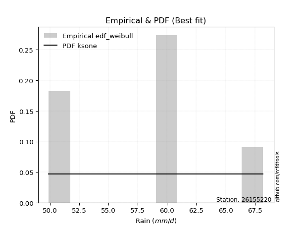</img>

</div>


### 4. EDF Beard (1943)

The Beard formula (or Beard´s plotting position formula) in hydrology is used to estimate the empirical non-exceedance probability _(P)_ of a flood event (or other extreme hydrological data point) within a given dataset.

<div align="center">


$P=(m-0.31)/(n+0.38)$


</div>


**4.1. Empirical values**

<div align="center">

|                | 0                   | 1                   | 2                  | 3                  | 4                  | 5                  |
|:---------------|:--------------------|:--------------------|:-------------------|:-------------------|:-------------------|:-------------------|
| date           | 2021                | 2018                | 2020               | 2019               | 2022               | 2017               |
| x              | 49.9                | 51.0                | 59.2               | 59.6               | 59.9               | 68.2               |
| m              | 1                   | 2                   | 3                  | 4                  | 5                  | 6                  |
| empirical_dist | edf_beard           | edf_beard           | edf_beard          | edf_beard          | edf_beard          | edf_beard          |
| empirical      | 0.10815047021943573 | 0.26489028213166144 | 0.4216300940438871 | 0.5783699059561128 | 0.7351097178683387 | 0.8918495297805643 |
| empirical_tr   | 1.1212653778558874  | 1.3603411513859276  | 1.7289972899728996 | 2.3717472118959106 | 3.7751479289940844 | 9.246376811594207  |

</div>


**4.2. Kolmogorov-Smirnov fit test (sorted by Δ)**


<div align="center">

|                | 0                   | 1                   | 2                   | 3                   | 4                   | 5                   | 6                   | 7                   | 8                  | 9                   | 10                 | 11                  | 12                  | 13                  | 14                  | 15                  | 16                  | 17                  | 18                  | 19                  | 20                  | 21                  | 22                  | 23                  | 24                  | 25                  | 26                  | 27                  | 28                  | 29                  | 30                  | 31                 | 32                  | 33                  | 34                  | 35                  | 36                 | 37                  | 38                  | 39                  | 40                  | 41                  | 42                 | 43                  | 44                 | 45                  | 46                  | 47                 | 48                  | 49                  | 50                | 51                  | 52                  | 53                  | 54                  | 55                 | 56                  | 57                  | 58                 | 59                  | 60                  | 61                 | 62                | 63                 | 64                  | 65                 | 66                  | 67                 | 68                 | 69                 | 70                  | 71                  | 72                  | 73                  | 74                  | 75                  | 76                  | 77                  | 78                  | 79                  | 80                 | 81                 | 82                  | 83                 | 84                 | 85                 | 86                  | 87                  | 88                  | 89                  | 90                  | 91                  | 92                 | 93                  | 94                  | 95                  | 96                  | 97                  | 98                  | 99                 | 100                | 101                 | 102                 | 103                 | 104                 | 105                | 106                 | 107                 | 108                 | 109                 | 110                 | 111                 | 112                | 113                | 114                 | 115                | 116                | 117                | 118                | 119                 | 120                | 121                 | 122                 | 123                 | 124                 | 125                | 126                 | 127              | 128                 | 129                 | 130                 | 131                 | 132                | 133                 | 134                | 135                | 136                | 137                | 138                 | 139                | 140                | 141                 | 142                | 143                 | 144                | 145                | 146                 | 147                | 148                | 149                 | 150                | 151                 | 152                | 153                 | 154                | 155                | 156                | 157                | 158                | 159            |
|:---------------|:--------------------|:--------------------|:--------------------|:--------------------|:--------------------|:--------------------|:--------------------|:--------------------|:-------------------|:--------------------|:-------------------|:--------------------|:--------------------|:--------------------|:--------------------|:--------------------|:--------------------|:--------------------|:--------------------|:--------------------|:--------------------|:--------------------|:--------------------|:--------------------|:--------------------|:--------------------|:--------------------|:--------------------|:--------------------|:--------------------|:--------------------|:-------------------|:--------------------|:--------------------|:--------------------|:--------------------|:-------------------|:--------------------|:--------------------|:--------------------|:--------------------|:--------------------|:-------------------|:--------------------|:-------------------|:--------------------|:--------------------|:-------------------|:--------------------|:--------------------|:------------------|:--------------------|:--------------------|:--------------------|:--------------------|:-------------------|:--------------------|:--------------------|:-------------------|:--------------------|:--------------------|:-------------------|:------------------|:-------------------|:--------------------|:-------------------|:--------------------|:-------------------|:-------------------|:-------------------|:--------------------|:--------------------|:--------------------|:--------------------|:--------------------|:--------------------|:--------------------|:--------------------|:--------------------|:--------------------|:-------------------|:-------------------|:--------------------|:-------------------|:-------------------|:-------------------|:--------------------|:--------------------|:--------------------|:--------------------|:--------------------|:--------------------|:-------------------|:--------------------|:--------------------|:--------------------|:--------------------|:--------------------|:--------------------|:-------------------|:-------------------|:--------------------|:--------------------|:--------------------|:--------------------|:-------------------|:--------------------|:--------------------|:--------------------|:--------------------|:--------------------|:--------------------|:-------------------|:-------------------|:--------------------|:-------------------|:-------------------|:-------------------|:-------------------|:--------------------|:-------------------|:--------------------|:--------------------|:--------------------|:--------------------|:-------------------|:--------------------|:-----------------|:--------------------|:--------------------|:--------------------|:--------------------|:-------------------|:--------------------|:-------------------|:-------------------|:-------------------|:-------------------|:--------------------|:-------------------|:-------------------|:--------------------|:-------------------|:--------------------|:-------------------|:-------------------|:--------------------|:-------------------|:-------------------|:--------------------|:-------------------|:--------------------|:-------------------|:--------------------|:-------------------|:-------------------|:-------------------|:-------------------|:-------------------|:---------------|
| station        | 26155220            | 26155220            | 26155220            | 26155220            | 26155220            | 26155220            | 26155220            | 26155220            | 26155220           | 26155220            | 26155220           | 26155220            | 26155220            | 26155220            | 26155220            | 26155220            | 26155220            | 26155220            | 26155220            | 26155220            | 26155220            | 26155220            | 26155220            | 26155220            | 26155220            | 26155220            | 26155220            | 26155220            | 26155220            | 26155220            | 26155220            | 26155220           | 26155220            | 26155220            | 26155220            | 26155220            | 26155220           | 26155220            | 26155220            | 26155220            | 26155220            | 26155220            | 26155220           | 26155220            | 26155220           | 26155220            | 26155220            | 26155220           | 26155220            | 26155220            | 26155220          | 26155220            | 26155220            | 26155220            | 26155220            | 26155220           | 26155220            | 26155220            | 26155220           | 26155220            | 26155220            | 26155220           | 26155220          | 26155220           | 26155220            | 26155220           | 26155220            | 26155220           | 26155220           | 26155220           | 26155220            | 26155220            | 26155220            | 26155220            | 26155220            | 26155220            | 26155220            | 26155220            | 26155220            | 26155220            | 26155220           | 26155220           | 26155220            | 26155220           | 26155220           | 26155220           | 26155220            | 26155220            | 26155220            | 26155220            | 26155220            | 26155220            | 26155220           | 26155220            | 26155220            | 26155220            | 26155220            | 26155220            | 26155220            | 26155220           | 26155220           | 26155220            | 26155220            | 26155220            | 26155220            | 26155220           | 26155220            | 26155220            | 26155220            | 26155220            | 26155220            | 26155220            | 26155220           | 26155220           | 26155220            | 26155220           | 26155220           | 26155220           | 26155220           | 26155220            | 26155220           | 26155220            | 26155220            | 26155220            | 26155220            | 26155220           | 26155220            | 26155220         | 26155220            | 26155220            | 26155220            | 26155220            | 26155220           | 26155220            | 26155220           | 26155220           | 26155220           | 26155220           | 26155220            | 26155220           | 26155220           | 26155220            | 26155220           | 26155220            | 26155220           | 26155220           | 26155220            | 26155220           | 26155220           | 26155220            | 26155220           | 26155220            | 26155220           | 26155220            | 26155220           | 26155220           | 26155220           | 26155220           | 26155220           | 26155220       |
| empirical_dist | edf_beard           | edf_beard           | edf_beard           | edf_beard           | edf_beard           | edf_beard           | edf_beard           | edf_beard           | edf_beard          | edf_beard           | edf_beard          | edf_beard           | edf_beard           | edf_beard           | edf_beard           | edf_beard           | edf_beard           | edf_beard           | edf_beard           | edf_beard           | edf_beard           | edf_beard           | edf_beard           | edf_beard           | edf_beard           | edf_beard           | edf_beard           | edf_beard           | edf_beard           | edf_beard           | edf_beard           | edf_beard          | edf_beard           | edf_beard           | edf_beard           | edf_beard           | edf_beard          | edf_beard           | edf_beard           | edf_beard           | edf_beard           | edf_beard           | edf_beard          | edf_beard           | edf_beard          | edf_beard           | edf_beard           | edf_beard          | edf_beard           | edf_beard           | edf_beard         | edf_beard           | edf_beard           | edf_beard           | edf_beard           | edf_beard          | edf_beard           | edf_beard           | edf_beard          | edf_beard           | edf_beard           | edf_beard          | edf_beard         | edf_beard          | edf_beard           | edf_beard          | edf_beard           | edf_beard          | edf_beard          | edf_beard          | edf_beard           | edf_beard           | edf_beard           | edf_beard           | edf_beard           | edf_beard           | edf_beard           | edf_beard           | edf_beard           | edf_beard           | edf_beard          | edf_beard          | edf_beard           | edf_beard          | edf_beard          | edf_beard          | edf_beard           | edf_beard           | edf_beard           | edf_beard           | edf_beard           | edf_beard           | edf_beard          | edf_beard           | edf_beard           | edf_beard           | edf_beard           | edf_beard           | edf_beard           | edf_beard          | edf_beard          | edf_beard           | edf_beard           | edf_beard           | edf_beard           | edf_beard          | edf_beard           | edf_beard           | edf_beard           | edf_beard           | edf_beard           | edf_beard           | edf_beard          | edf_beard          | edf_beard           | edf_beard          | edf_beard          | edf_beard          | edf_beard          | edf_beard           | edf_beard          | edf_beard           | edf_beard           | edf_beard           | edf_beard           | edf_beard          | edf_beard           | edf_beard        | edf_beard           | edf_beard           | edf_beard           | edf_beard           | edf_beard          | edf_beard           | edf_beard          | edf_beard          | edf_beard          | edf_beard          | edf_beard           | edf_beard          | edf_beard          | edf_beard           | edf_beard          | edf_beard           | edf_beard          | edf_beard          | edf_beard           | edf_beard          | edf_beard          | edf_beard           | edf_beard          | edf_beard           | edf_beard          | edf_beard           | edf_beard          | edf_beard          | edf_beard          | edf_beard          | edf_beard          | edf_beard      |
| p_dist         | johnsonsu           | logjohnsonsu        | semicircular        | ksone               | loggumbel_l         | cosine              | anglit              | logksone            | logburr12          | logarcsine          | truncnorm          | norm                | crystalball         | t                   | logsemicircular     | exponnorm           | logweibull_max      | loggenextreme       | foldnorm            | loggenlogistic      | loggausshyper       | arcsine             | loganglit           | genextreme          | gumbel_l            | pearson3            | ncf                 | logistic            | logcosine           | logloggamma         | skewnorm            | logargus           | hypsecant           | logt                | logskewnorm         | logcrystalball      | lognorm            | logexponnorm        | logpearson3         | logerlang           | loggamma            | loggamma            | bradford           | f                   | logf               | loginvgamma         | betaprime           | logdweibull        | erlang              | invgamma            | alpha             | lognct              | logncf              | rice                | logalpha            | gamma              | logkappa4           | maxwell             | kappa4             | nct                 | loglogistic         | logbetaprime       | logtukeylambda    | rayleigh           | loguniform          | dgamma             | tukeylambda         | gausshyper         | logrice            | invgauss           | loghypsecant        | laplace             | gompertz            | logdgamma           | logmaxwell          | uniform             | logloglaplace       | gennorm             | logwrapcauchy       | loginvgauss         | vonmises_line      | truncexpon         | argus               | lograyleigh        | invweibull         | logfoldnorm        | genlogistic         | logbradford         | logvonmises_line    | burr                | wrapcauchy          | halfnorm            | kstwobign          | loginvweibull       | gumbel_r            | logmielke           | logexponpow         | nakagami            | loggompertz         | loglaplace         | loglaplace         | logburr             | exponpow            | genexpon            | loggennorm          | dweibull           | loghalfnorm         | logkstwobign        | logexponweib        | logtriang           | loggumbel_r         | logtruncnorm        | lomax              | halflogistic       | loglevy_l           | moyal              | loggenexpon        | weibull_min        | levy_l             | logtruncexpon       | loghalflogistic    | logmoyal            | burr12              | loglomax            | logbeta             | halfgennorm        | loggenhalflogistic  | wald             | triang              | kappa3              | genpareto           | logwald             | loggengamma        | logtruncweibull_min | gengamma           | truncweibull_min   | genhalflogistic    | logweibull_min     | beta                | loggenpareto       | lognakagami        | logtrapezoid        | trapezoid          | exponweib           | logjohnsonsb       | johnsonsb          | fatiguelife         | rdist              | weibull_max        | logfatiguelife      | truncpareto        | powerlaw            | logtruncpareto     | logpowerlaw         | logkappa3          | loghalfgennorm     | logrdist           | logvonmises        | vonmises           | mielke         |
| delta          | 0.13596864076074522 | 0.13712419730030523 | 0.14219288317356288 | 0.14422429172546913 | 0.14510581403364609 | 0.14678757594619796 | 0.14680957542214873 | 0.15100327150741738 | 0.1516703250920987 | 0.15260044215980106 | 0.1579595115538513 | 0.15795958038469377 | 0.15795958347155065 | 0.15796516014941792 | 0.15824788699625275 | 0.15871721762294083 | 0.15971365006818877 | 0.15972408506040386 | 0.16127110145965323 | 0.16229329946220578 | 0.16331243445777355 | 0.16364782801172728 | 0.16395492601042666 | 0.16630361815915945 | 0.16648258991238063 | 0.16792014565202124 | 0.16813703076755188 | 0.16844855104505302 | 0.16994513780876813 | 0.17580101336427273 | 0.17614683745402576 | 0.1769841916315008 | 0.17716629038576742 | 0.17769315833199656 | 0.17769833260962958 | 0.17769838454282488 | 0.1776983939842654 | 0.17769899406986528 | 0.17798789326228798 | 0.17799031534740967 | 0.17799243798094683 | 0.17799243798094683 | 0.1786860517930985 | 0.17915123446964637 | 0.1796425987418086 | 0.17998283504329987 | 0.18093149700097672 | 0.1814972954612074 | 0.18173724170184974 | 0.18215887691517113 | 0.182306701476375 | 0.18232415019720133 | 0.18263414048440557 | 0.18283419979526078 | 0.18303817697978425 | 0.1859357347566401 | 0.18598615223537812 | 0.18619687228821585 | 0.1862772593030869 | 0.18915280959927244 | 0.19052233042991268 | 0.1913407524808261 | 0.191974570468469 | 0.1950809300616984 | 0.19509839505101953 | 0.1958170804613884 | 0.19648238857448952 | 0.1968919071211353 | 0.1979360943916612 | 0.2006970635854159 | 0.20102174643775433 | 0.20200018516135992 | 0.20327078129959192 | 0.20359971684210548 | 0.20428265442507937 | 0.20478099251417503 | 0.20500259535864274 | 0.20512986128460017 | 0.20629086434605048 | 0.20970500047234936 | 0.2111114251576342 | 0.2112217471907118 | 0.21141067234504896 | 0.2125369198688815 | 0.2125405752316421 | 0.2129316075001783 | 0.21407429782006343 | 0.21473798438180486 | 0.21570151969225876 | 0.21744992705408378 | 0.21952864355755153 | 0.22025096062373234 | 0.2208009714064731 | 0.22536467985007075 | 0.22630949370439485 | 0.22667770470185294 | 0.22683864516382962 | 0.22786037724542446 | 0.22786046935755738 | 0.2280738291486763 | 0.2280738291486763 | 0.22833993625465981 | 0.22903636579574854 | 0.23012041630411478 | 0.23510971684145987 | 0.2351097178683177 | 0.23603282647702445 | 0.23676822824152616 | 0.24106102932398416 | 0.24314258102938424 | 0.24427819445139715 | 0.24573908253121263 | 0.2464695340718956 | 0.2482933394973454 | 0.24964399081353955 | 0.2500102526051053 | 0.2555921214602886 | 0.2573424345512479 | 0.2596841859826771 | 0.26333145826772003 | 0.2643196028595319 | 0.26704245411458255 | 0.27080940654515534 | 0.27223946761702117 | 0.28191515206934875 | 0.2843557264747944 | 0.28506145700891067 | 0.31586752602576 | 0.31695246138278205 | 0.31843515379822973 | 0.33007392026713844 | 0.33045005074637007 | 0.3395517857795158 | 0.33993019852001577 | 0.3483421414937566 | 0.3500261621989775 | 0.3513889991395345 | 0.3538325790091836 | 0.35751305708731546 | 0.3670480394685951 | 0.3704916155002163 | 0.40960085202968244 | 0.4449047666571618 | 0.45435443108883716 | 0.4561964834927026 | 0.4588133618945184 | 0.46172218276451743 | 0.4677017906012821 | 0.4701234638159047 | 0.47742155288313554 | 0.4779681993359722 | 0.48230588700427285 | 0.4870574070762364 | 0.48875677123246913 | 0.5891080634672219 | 0.7351097178683387 | 0.8918495297805643 | 1.1777873223502116 | 10.955161738899589 | nan            |
| deltao         | 0.530385761606      | 0.530385761606      | 0.530385761606      | 0.530385761606      | 0.530385761606      | 0.530385761606      | 0.530385761606      | 0.530385761606      | 0.530385761606     | 0.530385761606      | 0.530385761606     | 0.530385761606      | 0.530385761606      | 0.530385761606      | 0.530385761606      | 0.530385761606      | 0.530385761606      | 0.530385761606      | 0.530385761606      | 0.530385761606      | 0.530385761606      | 0.530385761606      | 0.530385761606      | 0.530385761606      | 0.530385761606      | 0.530385761606      | 0.530385761606      | 0.530385761606      | 0.530385761606      | 0.530385761606      | 0.530385761606      | 0.530385761606     | 0.530385761606      | 0.530385761606      | 0.530385761606      | 0.530385761606      | 0.530385761606     | 0.530385761606      | 0.530385761606      | 0.530385761606      | 0.530385761606      | 0.530385761606      | 0.530385761606     | 0.530385761606      | 0.530385761606     | 0.530385761606      | 0.530385761606      | 0.530385761606     | 0.530385761606      | 0.530385761606      | 0.530385761606    | 0.530385761606      | 0.530385761606      | 0.530385761606      | 0.530385761606      | 0.530385761606     | 0.530385761606      | 0.530385761606      | 0.530385761606     | 0.530385761606      | 0.530385761606      | 0.530385761606     | 0.530385761606    | 0.530385761606     | 0.530385761606      | 0.530385761606     | 0.530385761606      | 0.530385761606     | 0.530385761606     | 0.530385761606     | 0.530385761606      | 0.530385761606      | 0.530385761606      | 0.530385761606      | 0.530385761606      | 0.530385761606      | 0.530385761606      | 0.530385761606      | 0.530385761606      | 0.530385761606      | 0.530385761606     | 0.530385761606     | 0.530385761606      | 0.530385761606     | 0.530385761606     | 0.530385761606     | 0.530385761606      | 0.530385761606      | 0.530385761606      | 0.530385761606      | 0.530385761606      | 0.530385761606      | 0.530385761606     | 0.530385761606      | 0.530385761606      | 0.530385761606      | 0.530385761606      | 0.530385761606      | 0.530385761606      | 0.530385761606     | 0.530385761606     | 0.530385761606      | 0.530385761606      | 0.530385761606      | 0.530385761606      | 0.530385761606     | 0.530385761606      | 0.530385761606      | 0.530385761606      | 0.530385761606      | 0.530385761606      | 0.530385761606      | 0.530385761606     | 0.530385761606     | 0.530385761606      | 0.530385761606     | 0.530385761606     | 0.530385761606     | 0.530385761606     | 0.530385761606      | 0.530385761606     | 0.530385761606      | 0.530385761606      | 0.530385761606      | 0.530385761606      | 0.530385761606     | 0.530385761606      | 0.530385761606   | 0.530385761606      | 0.530385761606      | 0.530385761606      | 0.530385761606      | 0.530385761606     | 0.530385761606      | 0.530385761606     | 0.530385761606     | 0.530385761606     | 0.530385761606     | 0.530385761606      | 0.530385761606     | 0.530385761606     | 0.530385761606      | 0.530385761606     | 0.530385761606      | 0.530385761606     | 0.530385761606     | 0.530385761606      | 0.530385761606     | 0.530385761606     | 0.530385761606      | 0.530385761606     | 0.530385761606      | 0.530385761606     | 0.530385761606      | 0.530385761606     | 0.530385761606     | 0.530385761606     | 0.530385761606     | 0.530385761606     | 0.530385761606 |
| eval           | Δo > Δ              | Δo > Δ              | Δo > Δ              | Δo > Δ              | Δo > Δ              | Δo > Δ              | Δo > Δ              | Δo > Δ              | Δo > Δ             | Δo > Δ              | Δo > Δ             | Δo > Δ              | Δo > Δ              | Δo > Δ              | Δo > Δ              | Δo > Δ              | Δo > Δ              | Δo > Δ              | Δo > Δ              | Δo > Δ              | Δo > Δ              | Δo > Δ              | Δo > Δ              | Δo > Δ              | Δo > Δ              | Δo > Δ              | Δo > Δ              | Δo > Δ              | Δo > Δ              | Δo > Δ              | Δo > Δ              | Δo > Δ             | Δo > Δ              | Δo > Δ              | Δo > Δ              | Δo > Δ              | Δo > Δ             | Δo > Δ              | Δo > Δ              | Δo > Δ              | Δo > Δ              | Δo > Δ              | Δo > Δ             | Δo > Δ              | Δo > Δ             | Δo > Δ              | Δo > Δ              | Δo > Δ             | Δo > Δ              | Δo > Δ              | Δo > Δ            | Δo > Δ              | Δo > Δ              | Δo > Δ              | Δo > Δ              | Δo > Δ             | Δo > Δ              | Δo > Δ              | Δo > Δ             | Δo > Δ              | Δo > Δ              | Δo > Δ             | Δo > Δ            | Δo > Δ             | Δo > Δ              | Δo > Δ             | Δo > Δ              | Δo > Δ             | Δo > Δ             | Δo > Δ             | Δo > Δ              | Δo > Δ              | Δo > Δ              | Δo > Δ              | Δo > Δ              | Δo > Δ              | Δo > Δ              | Δo > Δ              | Δo > Δ              | Δo > Δ              | Δo > Δ             | Δo > Δ             | Δo > Δ              | Δo > Δ             | Δo > Δ             | Δo > Δ             | Δo > Δ              | Δo > Δ              | Δo > Δ              | Δo > Δ              | Δo > Δ              | Δo > Δ              | Δo > Δ             | Δo > Δ              | Δo > Δ              | Δo > Δ              | Δo > Δ              | Δo > Δ              | Δo > Δ              | Δo > Δ             | Δo > Δ             | Δo > Δ              | Δo > Δ              | Δo > Δ              | Δo > Δ              | Δo > Δ             | Δo > Δ              | Δo > Δ              | Δo > Δ              | Δo > Δ              | Δo > Δ              | Δo > Δ              | Δo > Δ             | Δo > Δ             | Δo > Δ              | Δo > Δ             | Δo > Δ             | Δo > Δ             | Δo > Δ             | Δo > Δ              | Δo > Δ             | Δo > Δ              | Δo > Δ              | Δo > Δ              | Δo > Δ              | Δo > Δ             | Δo > Δ              | Δo > Δ           | Δo > Δ              | Δo > Δ              | Δo > Δ              | Δo > Δ              | Δo > Δ             | Δo > Δ              | Δo > Δ             | Δo > Δ             | Δo > Δ             | Δo > Δ             | Δo > Δ              | Δo > Δ             | Δo > Δ             | Δo > Δ              | Δo > Δ             | Δo > Δ              | Δo > Δ             | Δo > Δ             | Δo > Δ              | Δo > Δ             | Δo > Δ             | Δo > Δ              | Δo > Δ             | Δo > Δ              | Δo > Δ             | Δo > Δ              | Δo <= Δ            | Δo <= Δ            | Δo <= Δ            | Δo <= Δ            | Δo <= Δ            | Δo <= Δ        |
| fit            | 1                   | 1                   | 1                   | 1                   | 1                   | 1                   | 1                   | 1                   | 1                  | 1                   | 1                  | 1                   | 1                   | 1                   | 1                   | 1                   | 1                   | 1                   | 1                   | 1                   | 1                   | 1                   | 1                   | 1                   | 1                   | 1                   | 1                   | 1                   | 1                   | 1                   | 1                   | 1                  | 1                   | 1                   | 1                   | 1                   | 1                  | 1                   | 1                   | 1                   | 1                   | 1                   | 1                  | 1                   | 1                  | 1                   | 1                   | 1                  | 1                   | 1                   | 1                 | 1                   | 1                   | 1                   | 1                   | 1                  | 1                   | 1                   | 1                  | 1                   | 1                   | 1                  | 1                 | 1                  | 1                   | 1                  | 1                   | 1                  | 1                  | 1                  | 1                   | 1                   | 1                   | 1                   | 1                   | 1                   | 1                   | 1                   | 1                   | 1                   | 1                  | 1                  | 1                   | 1                  | 1                  | 1                  | 1                   | 1                   | 1                   | 1                   | 1                   | 1                   | 1                  | 1                   | 1                   | 1                   | 1                   | 1                   | 1                   | 1                  | 1                  | 1                   | 1                   | 1                   | 1                   | 1                  | 1                   | 1                   | 1                   | 1                   | 1                   | 1                   | 1                  | 1                  | 1                   | 1                  | 1                  | 1                  | 1                  | 1                   | 1                  | 1                   | 1                   | 1                   | 1                   | 1                  | 1                   | 1                | 1                   | 1                   | 1                   | 1                   | 1                  | 1                   | 1                  | 1                  | 1                  | 1                  | 1                   | 1                  | 1                  | 1                   | 1                  | 1                   | 1                  | 1                  | 1                   | 1                  | 1                  | 1                   | 1                  | 1                   | 1                  | 1                   | 0                  | 0                  | 0                  | 0                  | 0                  | 0              |
| n              | 6                   | 6                   | 6                   | 6                   | 6                   | 6                   | 6                   | 6                   | 6                  | 6                   | 6                  | 6                   | 6                   | 6                   | 6                   | 6                   | 6                   | 6                   | 6                   | 6                   | 6                   | 6                   | 6                   | 6                   | 6                   | 6                   | 6                   | 6                   | 6                   | 6                   | 6                   | 6                  | 6                   | 6                   | 6                   | 6                   | 6                  | 6                   | 6                   | 6                   | 6                   | 6                   | 6                  | 6                   | 6                  | 6                   | 6                   | 6                  | 6                   | 6                   | 6                 | 6                   | 6                   | 6                   | 6                   | 6                  | 6                   | 6                   | 6                  | 6                   | 6                   | 6                  | 6                 | 6                  | 6                   | 6                  | 6                   | 6                  | 6                  | 6                  | 6                   | 6                   | 6                   | 6                   | 6                   | 6                   | 6                   | 6                   | 6                   | 6                   | 6                  | 6                  | 6                   | 6                  | 6                  | 6                  | 6                   | 6                   | 6                   | 6                   | 6                   | 6                   | 6                  | 6                   | 6                   | 6                   | 6                   | 6                   | 6                   | 6                  | 6                  | 6                   | 6                   | 6                   | 6                   | 6                  | 6                   | 6                   | 6                   | 6                   | 6                   | 6                   | 6                  | 6                  | 6                   | 6                  | 6                  | 6                  | 6                  | 6                   | 6                  | 6                   | 6                   | 6                   | 6                   | 6                  | 6                   | 6                | 6                   | 6                   | 6                   | 6                   | 6                  | 6                   | 6                  | 6                  | 6                  | 6                  | 6                   | 6                  | 6                  | 6                   | 6                  | 6                   | 6                  | 6                  | 6                   | 6                  | 6                  | 6                   | 6                  | 6                   | 6                  | 6                   | 6                  | 6                  | 6                  | 6                  | 6                  | 6              |
| best_fit       | 1                   | 0                   | 0                   | 0                   | 0                   | 0                   | 0                   | 0                   | 0                  | 0                   | 0                  | 0                   | 0                   | 0                   | 0                   | 0                   | 0                   | 0                   | 0                   | 0                   | 0                   | 0                   | 0                   | 0                   | 0                   | 0                   | 0                   | 0                   | 0                   | 0                   | 0                   | 0                  | 0                   | 0                   | 0                   | 0                   | 0                  | 0                   | 0                   | 0                   | 0                   | 0                   | 0                  | 0                   | 0                  | 0                   | 0                   | 0                  | 0                   | 0                   | 0                 | 0                   | 0                   | 0                   | 0                   | 0                  | 0                   | 0                   | 0                  | 0                   | 0                   | 0                  | 0                 | 0                  | 0                   | 0                  | 0                   | 0                  | 0                  | 0                  | 0                   | 0                   | 0                   | 0                   | 0                   | 0                   | 0                   | 0                   | 0                   | 0                   | 0                  | 0                  | 0                   | 0                  | 0                  | 0                  | 0                   | 0                   | 0                   | 0                   | 0                   | 0                   | 0                  | 0                   | 0                   | 0                   | 0                   | 0                   | 0                   | 0                  | 0                  | 0                   | 0                   | 0                   | 0                   | 0                  | 0                   | 0                   | 0                   | 0                   | 0                   | 0                   | 0                  | 0                  | 0                   | 0                  | 0                  | 0                  | 0                  | 0                   | 0                  | 0                   | 0                   | 0                   | 0                   | 0                  | 0                   | 0                | 0                   | 0                   | 0                   | 0                   | 0                  | 0                   | 0                  | 0                  | 0                  | 0                  | 0                   | 0                  | 0                  | 0                   | 0                  | 0                   | 0                  | 0                  | 0                   | 0                  | 0                  | 0                   | 0                  | 0                   | 0                  | 0                   | 0                  | 0                  | 0                  | 0                  | 0                  | 0              |
| best_fit_sort  | 1                   | 2                   | 3                   | 4                   | 5                   | 6                   | 7                   | 8                   | 9                  | 10                  | 11                 | 12                  | 13                  | 14                  | 15                  | 16                  | 17                  | 18                  | 19                  | 20                  | 21                  | 22                  | 23                  | 24                  | 25                  | 26                  | 27                  | 28                  | 29                  | 30                  | 31                  | 32                 | 33                  | 34                  | 35                  | 36                  | 37                 | 38                  | 39                  | 40                  | 41                  | 42                  | 43                 | 44                  | 45                 | 46                  | 47                  | 48                 | 49                  | 50                  | 51                | 52                  | 53                  | 54                  | 55                  | 56                 | 57                  | 58                  | 59                 | 60                  | 61                  | 62                 | 63                | 64                 | 65                  | 66                 | 67                  | 68                 | 69                 | 70                 | 71                  | 72                  | 73                  | 74                  | 75                  | 76                  | 77                  | 78                  | 79                  | 80                  | 81                 | 82                 | 83                  | 84                 | 85                 | 86                 | 87                  | 88                  | 89                  | 90                  | 91                  | 92                  | 93                 | 94                  | 95                  | 96                  | 97                  | 98                  | 99                  | 100                | 101                | 102                 | 103                 | 104                 | 105                 | 106                | 107                 | 108                 | 109                 | 110                 | 111                 | 112                 | 113                | 114                | 115                 | 116                | 117                | 118                | 119                | 120                 | 121                | 122                 | 123                 | 124                 | 125                 | 126                | 127                 | 128              | 129                 | 130                 | 131                 | 132                 | 133                | 134                 | 135                | 136                | 137                | 138                | 139                 | 140                | 141                | 142                 | 143                | 144                 | 145                | 146                | 147                 | 148                | 149                | 150                 | 151                | 152                 | 153                | 154                 | 155                | 156                | 157                | 158                | 159                | 160            |

</div>


**4.3. Best fit**

<div align="center">

|   id |   station | empirical_dist   | p_dist    |    delta |   deltao | eval   |   fit |   n |   best_fit |   best_fit_sort |
|-----:|----------:|:-----------------|:----------|---------:|---------:|:-------|------:|----:|-----------:|----------------:|
|    0 |  26155220 | edf_beard        | johnsonsu | 0.135969 | 0.530386 | Δo > Δ |     1 |   6 |          1 |               1 |

</div>


<div align="center">

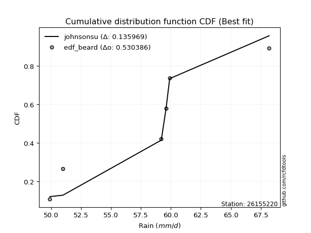</img>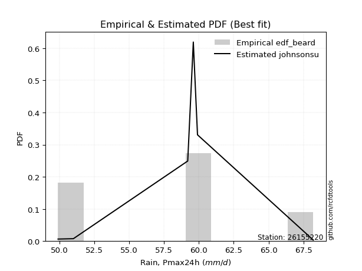</img>

</div>


### 5. EDF Chegodayev (1955)

The Chegodayev formula is an empirical plotting position formula used in hydrological frequency analysis to estimate the exceedance probability or return period of a specific event from a set of observed data. It is primarily used for plotting observed data points on probability paper to fit a theoretical distribution, particularly for analyzing extreme events like maximum flood flows or rainfall intensities. The constant _b_ value in the generalized plotting position formula is 0.3.

<div align="center">


$P=(m-b)/(n+1-2b)$


</div>


**5.1. Empirical values**

<div align="center">

|                | 0                   | 1                  | 2                  | 3                  | 4                 | 5                 |
|:---------------|:--------------------|:-------------------|:-------------------|:-------------------|:------------------|:------------------|
| date           | 2021                | 2018               | 2020               | 2019               | 2022              | 2017              |
| x              | 49.9                | 51.0               | 59.2               | 59.6               | 59.9              | 68.2              |
| m              | 1                   | 2                  | 3                  | 4                  | 5                 | 6                 |
| empirical_dist | edf_chegodayev      | edf_chegodayev     | edf_chegodayev     | edf_chegodayev     | edf_chegodayev    | edf_chegodayev    |
| empirical      | 0.10937499999999999 | 0.265625           | 0.421875           | 0.578125           | 0.734375          | 0.890625          |
| empirical_tr   | 1.1228070175438596  | 1.3617021276595744 | 1.7297297297297298 | 2.3703703703703702 | 3.764705882352941 | 9.142857142857142 |

</div>


**5.2. Kolmogorov-Smirnov fit test (sorted by Δ)**


<div align="center">

|                | 0                   | 1                  | 2                | 3                   | 4                   | 5                   | 6                   | 7                  | 8                   | 9                  | 10                  | 11                 | 12                  | 13                  | 14                  | 15                  | 16                 | 17                | 18                  | 19                 | 20                  | 21                 | 22                 | 23                  | 24                  | 25                  | 26                | 27                  | 28                  | 29                  | 30                 | 31                  | 32                  | 33                  | 34                 | 35                | 36                  | 37                 | 38                 | 39                 | 40                  | 41                  | 42                 | 43                  | 44                  | 45                | 46                  | 47                  | 48                  | 49                 | 50                  | 51                  | 52                 | 53                 | 54                  | 55                  | 56                  | 57                  | 58                  | 59                  | 60                 | 61                  | 62                  | 63                  | 64                 | 65                  | 66                  | 67                  | 68                  | 69                  | 70                  | 71                  | 72                  | 73                 | 74                  | 75                  | 76                 | 77                 | 78                  | 79                  | 80                  | 81                  | 82                  | 83                  | 84                  | 85                  | 86                  | 87                  | 88                  | 89                 | 90                  | 91                  | 92                  | 93                  | 94                  | 95                  | 96                  | 97                 | 98                 | 99                  | 100                 | 101                 | 102                 | 103                | 104                | 105                 | 106                 | 107                 | 108                 | 109                 | 110                 | 111                 | 112                 | 113                 | 114                | 115                 | 116                | 117               | 118                 | 119                 | 120               | 121                | 122                 | 123                | 124                | 125                 | 126                | 127                 | 128                | 129                | 130                | 131                | 132                | 133                 | 134                | 135                | 136                | 137                | 138                | 139                 | 140                 | 141                 | 142                | 143                | 144               | 145                | 146                 | 147                | 148               | 149                 | 150                | 151              | 152                 | 153                 | 154                | 155            | 156            | 157                | 158                | 159            |
|:---------------|:--------------------|:-------------------|:-----------------|:--------------------|:--------------------|:--------------------|:--------------------|:-------------------|:--------------------|:-------------------|:--------------------|:-------------------|:--------------------|:--------------------|:--------------------|:--------------------|:-------------------|:------------------|:--------------------|:-------------------|:--------------------|:-------------------|:-------------------|:--------------------|:--------------------|:--------------------|:------------------|:--------------------|:--------------------|:--------------------|:-------------------|:--------------------|:--------------------|:--------------------|:-------------------|:------------------|:--------------------|:-------------------|:-------------------|:-------------------|:--------------------|:--------------------|:-------------------|:--------------------|:--------------------|:------------------|:--------------------|:--------------------|:--------------------|:-------------------|:--------------------|:--------------------|:-------------------|:-------------------|:--------------------|:--------------------|:--------------------|:--------------------|:--------------------|:--------------------|:-------------------|:--------------------|:--------------------|:--------------------|:-------------------|:--------------------|:--------------------|:--------------------|:--------------------|:--------------------|:--------------------|:--------------------|:--------------------|:-------------------|:--------------------|:--------------------|:-------------------|:-------------------|:--------------------|:--------------------|:--------------------|:--------------------|:--------------------|:--------------------|:--------------------|:--------------------|:--------------------|:--------------------|:--------------------|:-------------------|:--------------------|:--------------------|:--------------------|:--------------------|:--------------------|:--------------------|:--------------------|:-------------------|:-------------------|:--------------------|:--------------------|:--------------------|:--------------------|:-------------------|:-------------------|:--------------------|:--------------------|:--------------------|:--------------------|:--------------------|:--------------------|:--------------------|:--------------------|:--------------------|:-------------------|:--------------------|:-------------------|:------------------|:--------------------|:--------------------|:------------------|:-------------------|:--------------------|:-------------------|:-------------------|:--------------------|:-------------------|:--------------------|:-------------------|:-------------------|:-------------------|:-------------------|:-------------------|:--------------------|:-------------------|:-------------------|:-------------------|:-------------------|:-------------------|:--------------------|:--------------------|:--------------------|:-------------------|:-------------------|:------------------|:-------------------|:--------------------|:-------------------|:------------------|:--------------------|:-------------------|:-----------------|:--------------------|:--------------------|:-------------------|:---------------|:---------------|:-------------------|:-------------------|:---------------|
| station        | 26155220            | 26155220           | 26155220         | 26155220            | 26155220            | 26155220            | 26155220            | 26155220           | 26155220            | 26155220           | 26155220            | 26155220           | 26155220            | 26155220            | 26155220            | 26155220            | 26155220           | 26155220          | 26155220            | 26155220           | 26155220            | 26155220           | 26155220           | 26155220            | 26155220            | 26155220            | 26155220          | 26155220            | 26155220            | 26155220            | 26155220           | 26155220            | 26155220            | 26155220            | 26155220           | 26155220          | 26155220            | 26155220           | 26155220           | 26155220           | 26155220            | 26155220            | 26155220           | 26155220            | 26155220            | 26155220          | 26155220            | 26155220            | 26155220            | 26155220           | 26155220            | 26155220            | 26155220           | 26155220           | 26155220            | 26155220            | 26155220            | 26155220            | 26155220            | 26155220            | 26155220           | 26155220            | 26155220            | 26155220            | 26155220           | 26155220            | 26155220            | 26155220            | 26155220            | 26155220            | 26155220            | 26155220            | 26155220            | 26155220           | 26155220            | 26155220            | 26155220           | 26155220           | 26155220            | 26155220            | 26155220            | 26155220            | 26155220            | 26155220            | 26155220            | 26155220            | 26155220            | 26155220            | 26155220            | 26155220           | 26155220            | 26155220            | 26155220            | 26155220            | 26155220            | 26155220            | 26155220            | 26155220           | 26155220           | 26155220            | 26155220            | 26155220            | 26155220            | 26155220           | 26155220           | 26155220            | 26155220            | 26155220            | 26155220            | 26155220            | 26155220            | 26155220            | 26155220            | 26155220            | 26155220           | 26155220            | 26155220           | 26155220          | 26155220            | 26155220            | 26155220          | 26155220           | 26155220            | 26155220           | 26155220           | 26155220            | 26155220           | 26155220            | 26155220           | 26155220           | 26155220           | 26155220           | 26155220           | 26155220            | 26155220           | 26155220           | 26155220           | 26155220           | 26155220           | 26155220            | 26155220            | 26155220            | 26155220           | 26155220           | 26155220          | 26155220           | 26155220            | 26155220           | 26155220          | 26155220            | 26155220           | 26155220         | 26155220            | 26155220            | 26155220           | 26155220       | 26155220       | 26155220           | 26155220           | 26155220       |
| empirical_dist | edf_chegodayev      | edf_chegodayev     | edf_chegodayev   | edf_chegodayev      | edf_chegodayev      | edf_chegodayev      | edf_chegodayev      | edf_chegodayev     | edf_chegodayev      | edf_chegodayev     | edf_chegodayev      | edf_chegodayev     | edf_chegodayev      | edf_chegodayev      | edf_chegodayev      | edf_chegodayev      | edf_chegodayev     | edf_chegodayev    | edf_chegodayev      | edf_chegodayev     | edf_chegodayev      | edf_chegodayev     | edf_chegodayev     | edf_chegodayev      | edf_chegodayev      | edf_chegodayev      | edf_chegodayev    | edf_chegodayev      | edf_chegodayev      | edf_chegodayev      | edf_chegodayev     | edf_chegodayev      | edf_chegodayev      | edf_chegodayev      | edf_chegodayev     | edf_chegodayev    | edf_chegodayev      | edf_chegodayev     | edf_chegodayev     | edf_chegodayev     | edf_chegodayev      | edf_chegodayev      | edf_chegodayev     | edf_chegodayev      | edf_chegodayev      | edf_chegodayev    | edf_chegodayev      | edf_chegodayev      | edf_chegodayev      | edf_chegodayev     | edf_chegodayev      | edf_chegodayev      | edf_chegodayev     | edf_chegodayev     | edf_chegodayev      | edf_chegodayev      | edf_chegodayev      | edf_chegodayev      | edf_chegodayev      | edf_chegodayev      | edf_chegodayev     | edf_chegodayev      | edf_chegodayev      | edf_chegodayev      | edf_chegodayev     | edf_chegodayev      | edf_chegodayev      | edf_chegodayev      | edf_chegodayev      | edf_chegodayev      | edf_chegodayev      | edf_chegodayev      | edf_chegodayev      | edf_chegodayev     | edf_chegodayev      | edf_chegodayev      | edf_chegodayev     | edf_chegodayev     | edf_chegodayev      | edf_chegodayev      | edf_chegodayev      | edf_chegodayev      | edf_chegodayev      | edf_chegodayev      | edf_chegodayev      | edf_chegodayev      | edf_chegodayev      | edf_chegodayev      | edf_chegodayev      | edf_chegodayev     | edf_chegodayev      | edf_chegodayev      | edf_chegodayev      | edf_chegodayev      | edf_chegodayev      | edf_chegodayev      | edf_chegodayev      | edf_chegodayev     | edf_chegodayev     | edf_chegodayev      | edf_chegodayev      | edf_chegodayev      | edf_chegodayev      | edf_chegodayev     | edf_chegodayev     | edf_chegodayev      | edf_chegodayev      | edf_chegodayev      | edf_chegodayev      | edf_chegodayev      | edf_chegodayev      | edf_chegodayev      | edf_chegodayev      | edf_chegodayev      | edf_chegodayev     | edf_chegodayev      | edf_chegodayev     | edf_chegodayev    | edf_chegodayev      | edf_chegodayev      | edf_chegodayev    | edf_chegodayev     | edf_chegodayev      | edf_chegodayev     | edf_chegodayev     | edf_chegodayev      | edf_chegodayev     | edf_chegodayev      | edf_chegodayev     | edf_chegodayev     | edf_chegodayev     | edf_chegodayev     | edf_chegodayev     | edf_chegodayev      | edf_chegodayev     | edf_chegodayev     | edf_chegodayev     | edf_chegodayev     | edf_chegodayev     | edf_chegodayev      | edf_chegodayev      | edf_chegodayev      | edf_chegodayev     | edf_chegodayev     | edf_chegodayev    | edf_chegodayev     | edf_chegodayev      | edf_chegodayev     | edf_chegodayev    | edf_chegodayev      | edf_chegodayev     | edf_chegodayev   | edf_chegodayev      | edf_chegodayev      | edf_chegodayev     | edf_chegodayev | edf_chegodayev | edf_chegodayev     | edf_chegodayev     | edf_chegodayev |
| p_dist         | johnsonsu           | logjohnsonsu       | semicircular     | ksone               | loggumbel_l         | anglit              | cosine              | logksone           | logburr12           | logarcsine         | truncnorm           | norm               | crystalball         | t                   | logsemicircular     | exponnorm           | logweibull_max     | loggenextreme     | foldnorm            | loggenlogistic     | loggausshyper       | arcsine            | loganglit          | gumbel_l            | genextreme          | pearson3            | ncf               | logistic            | logcosine           | logloggamma         | skewnorm           | logargus            | hypsecant           | logt                | logskewnorm        | logcrystalball    | lognorm             | logexponnorm       | logpearson3        | logerlang          | loggamma            | loggamma            | f                  | logf                | bradford            | loginvgamma       | betaprime           | logdweibull         | erlang              | lognct             | invgamma            | alpha               | logncf             | rice               | logalpha            | gamma               | maxwell             | logkappa4           | kappa4              | nct                 | loglogistic        | logbetaprime        | logtukeylambda      | rayleigh            | loguniform         | dgamma              | gausshyper          | tukeylambda         | logrice             | invgauss            | loghypsecant        | laplace             | gompertz            | logmaxwell         | logloglaplace       | logdgamma           | uniform            | logwrapcauchy      | gennorm             | loginvgauss         | argus               | truncexpon          | vonmises_line       | lograyleigh         | invweibull          | logfoldnorm         | genlogistic         | logbradford         | logvonmises_line    | burr               | wrapcauchy          | halfnorm            | kstwobign           | loginvweibull       | gumbel_r            | logmielke           | logexponpow         | nakagami           | loggompertz        | loglaplace          | loglaplace          | logburr             | exponpow            | genexpon           | loggennorm         | dweibull            | loghalfnorm         | logkstwobign        | logexponweib        | logtriang           | loggumbel_r         | logtruncnorm        | lomax               | halflogistic        | loglevy_l          | moyal               | loggenexpon        | weibull_min       | levy_l              | logtruncexpon       | loghalflogistic   | logmoyal           | burr12              | loglomax           | logbeta            | halfgennorm         | loggenhalflogistic | wald                | triang             | kappa3             | genpareto          | logwald            | loggengamma        | logtruncweibull_min | gengamma           | truncweibull_min   | genhalflogistic    | logweibull_min     | beta               | loggenpareto        | lognakagami         | logtrapezoid        | trapezoid          | exponweib          | logjohnsonsb      | johnsonsb          | fatiguelife         | rdist              | weibull_max       | logfatiguelife      | truncpareto        | powerlaw         | logtruncpareto      | logpowerlaw         | logkappa3          | loghalfgennorm | logrdist       | logvonmises        | vonmises           | mielke         |
| delta          | 0.13670335862908378 | 0.1378589151686438 | 0.14194797721745 | 0.14348957385713046 | 0.14584053190198465 | 0.14656466946603586 | 0.14752229381453652 | 0.1507583655513045 | 0.15142541913598584 | 0.1518657242914624 | 0.15771460559773842 | 0.1577146744285809 | 0.15771467751543777 | 0.15772025419330504 | 0.15800298104013988 | 0.15847231166682796 | 0.1594687441120759 | 0.159479179104291 | 0.16102619550354036 | 0.1620483935060929 | 0.16257771658943487 | 0.1629131101433886 | 0.1637100200543138 | 0.16574787204404196 | 0.16605871220304658 | 0.16767523969590836 | 0.167892124811439 | 0.16820364508894015 | 0.16970023185265526 | 0.17555610740815986 | 0.1759019314979129 | 0.17624947376316213 | 0.17692138442965455 | 0.17744825237588369 | 0.1774534266535167 | 0.177453478586712 | 0.17745348802815253 | 0.1774540881137524 | 0.1777429873061751 | 0.1777454093912968 | 0.17774753202483395 | 0.17774753202483395 | 0.1789063285135335 | 0.17939769278569573 | 0.17942076966143705 | 0.179737929087187 | 0.18068659104486384 | 0.18076257759286873 | 0.18149233574573687 | 0.1815653654608802 | 0.18191397095905826 | 0.18206179552026214 | 0.1823892345282927 | 0.1825892938391479 | 0.18279327102367138 | 0.18569082880052723 | 0.18595196633210298 | 0.18672087010371669 | 0.18701197717142545 | 0.18890790364315957 | 0.1902774244737998 | 0.19109584652471323 | 0.19270928833680756 | 0.19483602410558554 | 0.1958331129193581 | 0.19655179832972697 | 0.19664700116502243 | 0.19721710644282808 | 0.19769118843554834 | 0.20045215762930302 | 0.20077684048164146 | 0.20175527920524705 | 0.20302587534347905 | 0.2040377484689665 | 0.20426787749030406 | 0.20433443471044405 | 0.2055157103825136 | 0.2055561464777118 | 0.20586457915293874 | 0.20946009451623648 | 0.21067595447671028 | 0.21097684123459892 | 0.21184614302597277 | 0.21229201391276864 | 0.21229566927552923 | 0.21268670154406544 | 0.21382939186395056 | 0.21449307842569199 | 0.21643623756059732 | 0.2172050210979709 | 0.21879392568921285 | 0.22000605466761947 | 0.22055606545036022 | 0.22511977389395788 | 0.22606458774828198 | 0.22643279874574007 | 0.22659373920771675 | 0.2276154712893116 | 0.2276155634014445 | 0.22782892319256343 | 0.22782892319256343 | 0.22809503029854694 | 0.22879145983963567 | 0.2298755103480019 | 0.2343749989731212 | 0.23437499999997902 | 0.23578792052091158 | 0.23652332228541328 | 0.24081612336787128 | 0.24240786316104557 | 0.24403328849528427 | 0.24549417657509975 | 0.24622462811578272 | 0.24804843354123252 | 0.2484194610329753 | 0.24976534664899241 | 0.2553472155041757 | 0.257097528595135 | 0.25845965620211286 | 0.26308655231160716 | 0.264074696903419 | 0.2667975481584697 | 0.27056450058904247 | 0.2719945616609083 | 0.2816702461132359 | 0.28411082051868153 | 0.284326739140572  | 0.31562262006964714 | 0.3162177435144434 | 0.3172106240176654 | 0.3288493904865742 | 0.3302051447902572 | 0.3393068798234029 | 0.3396852925639029  | 0.3480972355376437 | 0.3497812562428646 | 0.3506542812711958 | 0.3535876730530707 | 0.3572681511312026 | 0.36582350968803085 | 0.37024670954410344 | 0.40886613416134376 | 0.4441700487888231 | 0.4541095251327243 | 0.455461765624364 | 0.4580786440261798 | 0.46147727680840456 | 0.4674568846451692 | 0.469388745947566 | 0.47717664692702266 | 0.4777232933798593 | 0.48206098104816 | 0.48681250112012353 | 0.48851186527635626 | 0.5878835336866577 | 0.734375       | 0.890625       | 1.1775424163940986 | 10.956386268680154 | nan            |
| deltao         | 0.530385761606      | 0.530385761606     | 0.530385761606   | 0.530385761606      | 0.530385761606      | 0.530385761606      | 0.530385761606      | 0.530385761606     | 0.530385761606      | 0.530385761606     | 0.530385761606      | 0.530385761606     | 0.530385761606      | 0.530385761606      | 0.530385761606      | 0.530385761606      | 0.530385761606     | 0.530385761606    | 0.530385761606      | 0.530385761606     | 0.530385761606      | 0.530385761606     | 0.530385761606     | 0.530385761606      | 0.530385761606      | 0.530385761606      | 0.530385761606    | 0.530385761606      | 0.530385761606      | 0.530385761606      | 0.530385761606     | 0.530385761606      | 0.530385761606      | 0.530385761606      | 0.530385761606     | 0.530385761606    | 0.530385761606      | 0.530385761606     | 0.530385761606     | 0.530385761606     | 0.530385761606      | 0.530385761606      | 0.530385761606     | 0.530385761606      | 0.530385761606      | 0.530385761606    | 0.530385761606      | 0.530385761606      | 0.530385761606      | 0.530385761606     | 0.530385761606      | 0.530385761606      | 0.530385761606     | 0.530385761606     | 0.530385761606      | 0.530385761606      | 0.530385761606      | 0.530385761606      | 0.530385761606      | 0.530385761606      | 0.530385761606     | 0.530385761606      | 0.530385761606      | 0.530385761606      | 0.530385761606     | 0.530385761606      | 0.530385761606      | 0.530385761606      | 0.530385761606      | 0.530385761606      | 0.530385761606      | 0.530385761606      | 0.530385761606      | 0.530385761606     | 0.530385761606      | 0.530385761606      | 0.530385761606     | 0.530385761606     | 0.530385761606      | 0.530385761606      | 0.530385761606      | 0.530385761606      | 0.530385761606      | 0.530385761606      | 0.530385761606      | 0.530385761606      | 0.530385761606      | 0.530385761606      | 0.530385761606      | 0.530385761606     | 0.530385761606      | 0.530385761606      | 0.530385761606      | 0.530385761606      | 0.530385761606      | 0.530385761606      | 0.530385761606      | 0.530385761606     | 0.530385761606     | 0.530385761606      | 0.530385761606      | 0.530385761606      | 0.530385761606      | 0.530385761606     | 0.530385761606     | 0.530385761606      | 0.530385761606      | 0.530385761606      | 0.530385761606      | 0.530385761606      | 0.530385761606      | 0.530385761606      | 0.530385761606      | 0.530385761606      | 0.530385761606     | 0.530385761606      | 0.530385761606     | 0.530385761606    | 0.530385761606      | 0.530385761606      | 0.530385761606    | 0.530385761606     | 0.530385761606      | 0.530385761606     | 0.530385761606     | 0.530385761606      | 0.530385761606     | 0.530385761606      | 0.530385761606     | 0.530385761606     | 0.530385761606     | 0.530385761606     | 0.530385761606     | 0.530385761606      | 0.530385761606     | 0.530385761606     | 0.530385761606     | 0.530385761606     | 0.530385761606     | 0.530385761606      | 0.530385761606      | 0.530385761606      | 0.530385761606     | 0.530385761606     | 0.530385761606    | 0.530385761606     | 0.530385761606      | 0.530385761606     | 0.530385761606    | 0.530385761606      | 0.530385761606     | 0.530385761606   | 0.530385761606      | 0.530385761606      | 0.530385761606     | 0.530385761606 | 0.530385761606 | 0.530385761606     | 0.530385761606     | 0.530385761606 |
| eval           | Δo > Δ              | Δo > Δ             | Δo > Δ           | Δo > Δ              | Δo > Δ              | Δo > Δ              | Δo > Δ              | Δo > Δ             | Δo > Δ              | Δo > Δ             | Δo > Δ              | Δo > Δ             | Δo > Δ              | Δo > Δ              | Δo > Δ              | Δo > Δ              | Δo > Δ             | Δo > Δ            | Δo > Δ              | Δo > Δ             | Δo > Δ              | Δo > Δ             | Δo > Δ             | Δo > Δ              | Δo > Δ              | Δo > Δ              | Δo > Δ            | Δo > Δ              | Δo > Δ              | Δo > Δ              | Δo > Δ             | Δo > Δ              | Δo > Δ              | Δo > Δ              | Δo > Δ             | Δo > Δ            | Δo > Δ              | Δo > Δ             | Δo > Δ             | Δo > Δ             | Δo > Δ              | Δo > Δ              | Δo > Δ             | Δo > Δ              | Δo > Δ              | Δo > Δ            | Δo > Δ              | Δo > Δ              | Δo > Δ              | Δo > Δ             | Δo > Δ              | Δo > Δ              | Δo > Δ             | Δo > Δ             | Δo > Δ              | Δo > Δ              | Δo > Δ              | Δo > Δ              | Δo > Δ              | Δo > Δ              | Δo > Δ             | Δo > Δ              | Δo > Δ              | Δo > Δ              | Δo > Δ             | Δo > Δ              | Δo > Δ              | Δo > Δ              | Δo > Δ              | Δo > Δ              | Δo > Δ              | Δo > Δ              | Δo > Δ              | Δo > Δ             | Δo > Δ              | Δo > Δ              | Δo > Δ             | Δo > Δ             | Δo > Δ              | Δo > Δ              | Δo > Δ              | Δo > Δ              | Δo > Δ              | Δo > Δ              | Δo > Δ              | Δo > Δ              | Δo > Δ              | Δo > Δ              | Δo > Δ              | Δo > Δ             | Δo > Δ              | Δo > Δ              | Δo > Δ              | Δo > Δ              | Δo > Δ              | Δo > Δ              | Δo > Δ              | Δo > Δ             | Δo > Δ             | Δo > Δ              | Δo > Δ              | Δo > Δ              | Δo > Δ              | Δo > Δ             | Δo > Δ             | Δo > Δ              | Δo > Δ              | Δo > Δ              | Δo > Δ              | Δo > Δ              | Δo > Δ              | Δo > Δ              | Δo > Δ              | Δo > Δ              | Δo > Δ             | Δo > Δ              | Δo > Δ             | Δo > Δ            | Δo > Δ              | Δo > Δ              | Δo > Δ            | Δo > Δ             | Δo > Δ              | Δo > Δ             | Δo > Δ             | Δo > Δ              | Δo > Δ             | Δo > Δ              | Δo > Δ             | Δo > Δ             | Δo > Δ             | Δo > Δ             | Δo > Δ             | Δo > Δ              | Δo > Δ             | Δo > Δ             | Δo > Δ             | Δo > Δ             | Δo > Δ             | Δo > Δ              | Δo > Δ              | Δo > Δ              | Δo > Δ             | Δo > Δ             | Δo > Δ            | Δo > Δ             | Δo > Δ              | Δo > Δ             | Δo > Δ            | Δo > Δ              | Δo > Δ             | Δo > Δ           | Δo > Δ              | Δo > Δ              | Δo <= Δ            | Δo <= Δ        | Δo <= Δ        | Δo <= Δ            | Δo <= Δ            | Δo <= Δ        |
| fit            | 1                   | 1                  | 1                | 1                   | 1                   | 1                   | 1                   | 1                  | 1                   | 1                  | 1                   | 1                  | 1                   | 1                   | 1                   | 1                   | 1                  | 1                 | 1                   | 1                  | 1                   | 1                  | 1                  | 1                   | 1                   | 1                   | 1                 | 1                   | 1                   | 1                   | 1                  | 1                   | 1                   | 1                   | 1                  | 1                 | 1                   | 1                  | 1                  | 1                  | 1                   | 1                   | 1                  | 1                   | 1                   | 1                 | 1                   | 1                   | 1                   | 1                  | 1                   | 1                   | 1                  | 1                  | 1                   | 1                   | 1                   | 1                   | 1                   | 1                   | 1                  | 1                   | 1                   | 1                   | 1                  | 1                   | 1                   | 1                   | 1                   | 1                   | 1                   | 1                   | 1                   | 1                  | 1                   | 1                   | 1                  | 1                  | 1                   | 1                   | 1                   | 1                   | 1                   | 1                   | 1                   | 1                   | 1                   | 1                   | 1                   | 1                  | 1                   | 1                   | 1                   | 1                   | 1                   | 1                   | 1                   | 1                  | 1                  | 1                   | 1                   | 1                   | 1                   | 1                  | 1                  | 1                   | 1                   | 1                   | 1                   | 1                   | 1                   | 1                   | 1                   | 1                   | 1                  | 1                   | 1                  | 1                 | 1                   | 1                   | 1                 | 1                  | 1                   | 1                  | 1                  | 1                   | 1                  | 1                   | 1                  | 1                  | 1                  | 1                  | 1                  | 1                   | 1                  | 1                  | 1                  | 1                  | 1                  | 1                   | 1                   | 1                   | 1                  | 1                  | 1                 | 1                  | 1                   | 1                  | 1                 | 1                   | 1                  | 1                | 1                   | 1                   | 0                  | 0              | 0              | 0                  | 0                  | 0              |
| n              | 6                   | 6                  | 6                | 6                   | 6                   | 6                   | 6                   | 6                  | 6                   | 6                  | 6                   | 6                  | 6                   | 6                   | 6                   | 6                   | 6                  | 6                 | 6                   | 6                  | 6                   | 6                  | 6                  | 6                   | 6                   | 6                   | 6                 | 6                   | 6                   | 6                   | 6                  | 6                   | 6                   | 6                   | 6                  | 6                 | 6                   | 6                  | 6                  | 6                  | 6                   | 6                   | 6                  | 6                   | 6                   | 6                 | 6                   | 6                   | 6                   | 6                  | 6                   | 6                   | 6                  | 6                  | 6                   | 6                   | 6                   | 6                   | 6                   | 6                   | 6                  | 6                   | 6                   | 6                   | 6                  | 6                   | 6                   | 6                   | 6                   | 6                   | 6                   | 6                   | 6                   | 6                  | 6                   | 6                   | 6                  | 6                  | 6                   | 6                   | 6                   | 6                   | 6                   | 6                   | 6                   | 6                   | 6                   | 6                   | 6                   | 6                  | 6                   | 6                   | 6                   | 6                   | 6                   | 6                   | 6                   | 6                  | 6                  | 6                   | 6                   | 6                   | 6                   | 6                  | 6                  | 6                   | 6                   | 6                   | 6                   | 6                   | 6                   | 6                   | 6                   | 6                   | 6                  | 6                   | 6                  | 6                 | 6                   | 6                   | 6                 | 6                  | 6                   | 6                  | 6                  | 6                   | 6                  | 6                   | 6                  | 6                  | 6                  | 6                  | 6                  | 6                   | 6                  | 6                  | 6                  | 6                  | 6                  | 6                   | 6                   | 6                   | 6                  | 6                  | 6                 | 6                  | 6                   | 6                  | 6                 | 6                   | 6                  | 6                | 6                   | 6                   | 6                  | 6              | 6              | 6                  | 6                  | 6              |
| best_fit       | 1                   | 0                  | 0                | 0                   | 0                   | 0                   | 0                   | 0                  | 0                   | 0                  | 0                   | 0                  | 0                   | 0                   | 0                   | 0                   | 0                  | 0                 | 0                   | 0                  | 0                   | 0                  | 0                  | 0                   | 0                   | 0                   | 0                 | 0                   | 0                   | 0                   | 0                  | 0                   | 0                   | 0                   | 0                  | 0                 | 0                   | 0                  | 0                  | 0                  | 0                   | 0                   | 0                  | 0                   | 0                   | 0                 | 0                   | 0                   | 0                   | 0                  | 0                   | 0                   | 0                  | 0                  | 0                   | 0                   | 0                   | 0                   | 0                   | 0                   | 0                  | 0                   | 0                   | 0                   | 0                  | 0                   | 0                   | 0                   | 0                   | 0                   | 0                   | 0                   | 0                   | 0                  | 0                   | 0                   | 0                  | 0                  | 0                   | 0                   | 0                   | 0                   | 0                   | 0                   | 0                   | 0                   | 0                   | 0                   | 0                   | 0                  | 0                   | 0                   | 0                   | 0                   | 0                   | 0                   | 0                   | 0                  | 0                  | 0                   | 0                   | 0                   | 0                   | 0                  | 0                  | 0                   | 0                   | 0                   | 0                   | 0                   | 0                   | 0                   | 0                   | 0                   | 0                  | 0                   | 0                  | 0                 | 0                   | 0                   | 0                 | 0                  | 0                   | 0                  | 0                  | 0                   | 0                  | 0                   | 0                  | 0                  | 0                  | 0                  | 0                  | 0                   | 0                  | 0                  | 0                  | 0                  | 0                  | 0                   | 0                   | 0                   | 0                  | 0                  | 0                 | 0                  | 0                   | 0                  | 0                 | 0                   | 0                  | 0                | 0                   | 0                   | 0                  | 0              | 0              | 0                  | 0                  | 0              |
| best_fit_sort  | 1                   | 2                  | 3                | 4                   | 5                   | 6                   | 7                   | 8                  | 9                   | 10                 | 11                  | 12                 | 13                  | 14                  | 15                  | 16                  | 17                 | 18                | 19                  | 20                 | 21                  | 22                 | 23                 | 24                  | 25                  | 26                  | 27                | 28                  | 29                  | 30                  | 31                 | 32                  | 33                  | 34                  | 35                 | 36                | 37                  | 38                 | 39                 | 40                 | 41                  | 42                  | 43                 | 44                  | 45                  | 46                | 47                  | 48                  | 49                  | 50                 | 51                  | 52                  | 53                 | 54                 | 55                  | 56                  | 57                  | 58                  | 59                  | 60                  | 61                 | 62                  | 63                  | 64                  | 65                 | 66                  | 67                  | 68                  | 69                  | 70                  | 71                  | 72                  | 73                  | 74                 | 75                  | 76                  | 77                 | 78                 | 79                  | 80                  | 81                  | 82                  | 83                  | 84                  | 85                  | 86                  | 87                  | 88                  | 89                  | 90                 | 91                  | 92                  | 93                  | 94                  | 95                  | 96                  | 97                  | 98                 | 99                 | 100                 | 101                 | 102                 | 103                 | 104                | 105                | 106                 | 107                 | 108                 | 109                 | 110                 | 111                 | 112                 | 113                 | 114                 | 115                | 116                 | 117                | 118               | 119                 | 120                 | 121               | 122                | 123                 | 124                | 125                | 126                 | 127                | 128                 | 129                | 130                | 131                | 132                | 133                | 134                 | 135                | 136                | 137                | 138                | 139                | 140                 | 141                 | 142                 | 143                | 144                | 145               | 146                | 147                 | 148                | 149               | 150                 | 151                | 152              | 153                 | 154                 | 155                | 156            | 157            | 158                | 159                | 160            |

</div>


**5.3. Best fit**

<div align="center">

|   id |   station | empirical_dist   | p_dist    |    delta |   deltao | eval   |   fit |   n |   best_fit |   best_fit_sort |
|-----:|----------:|:-----------------|:----------|---------:|---------:|:-------|------:|----:|-----------:|----------------:|
|    0 |  26155220 | edf_chegodayev   | johnsonsu | 0.136703 | 0.530386 | Δo > Δ |     1 |   6 |          1 |               1 |

</div>


<div align="center">

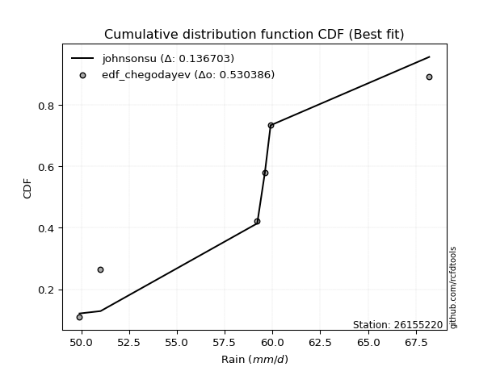</img>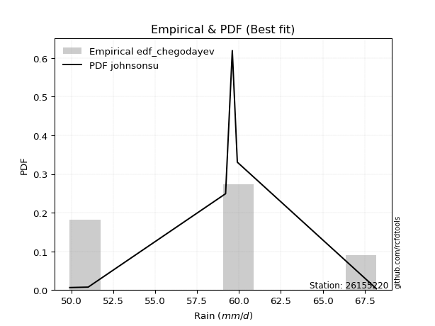</img>

</div>


### 6. EDF Blom (1958)

The Blom formula is a specific "plotting position" formula used in hydrology and statistical analysis to estimate the empirical cumulative probability (or non-exceedance probability) of a data series. It is particularly recommended for data that are approximately normally distributed. The constant _a_ is set to 0.375 (or 3/8).

<div align="center">


$P=(m-a)/(n+1-2a)$


</div>


**6.1. Empirical values**

<div align="center">

|                | 0                  | 1                  | 2                  | 3                 | 4                 | 5                  |
|:---------------|:-------------------|:-------------------|:-------------------|:------------------|:------------------|:-------------------|
| date           | 2021               | 2018               | 2020               | 2019              | 2022              | 2017               |
| x              | 49.9               | 51.0               | 59.2               | 59.6              | 59.9              | 68.2               |
| m              | 1                  | 2                  | 3                  | 4                 | 5                 | 6                  |
| empirical_dist | edf_blom           | edf_blom           | edf_blom           | edf_blom          | edf_blom          | edf_blom           |
| empirical      | 0.1                | 0.26               | 0.42               | 0.58              | 0.74              | 0.9                |
| empirical_tr   | 1.1111111111111112 | 1.3513513513513513 | 1.7241379310344827 | 2.380952380952381 | 3.846153846153846 | 10.000000000000002 |

</div>


**6.2. Kolmogorov-Smirnov fit test (sorted by Δ)**


<div align="center">

|                | 0                  | 1                  | 2                  | 3                   | 4                   | 5                   | 6                   | 7                   | 8                   | 9                   | 10                  | 11                 | 12                 | 13                  | 14                 | 15                  | 16                  | 17                | 18                  | 19                  | 20                 | 21                 | 22                  | 23                 | 24                  | 25                  | 26                  | 27                  | 28                  | 29                  | 30                 | 31                  | 32                  | 33                 | 34                  | 35                  | 36                  | 37                  | 38                  | 39                 | 40                  | 41                  | 42                 | 43                 | 44                  | 45                  | 46                  | 47                  | 48                  | 49                  | 50                  | 51                  | 52                  | 53                  | 54                 | 55                  | 56                  | 57                  | 58                | 59                 | 60                  | 61                  | 62                  | 63                 | 64                  | 65                  | 66                  | 67                  | 68                  | 69                  | 70                 | 71                  | 72                  | 73                  | 74                  | 75                  | 76                 | 77                  | 78                  | 79                  | 80                 | 81                 | 82                  | 83                  | 84                  | 85                  | 86                  | 87                  | 88                | 89                  | 90                  | 91                  | 92                  | 93                 | 94                | 95                 | 96                  | 97                 | 98                  | 99                  | 100                 | 101                 | 102                 | 103                 | 104                | 105                | 106                | 107               | 108                | 109                | 110                 | 111                 | 112                 | 113                 | 114                 | 115                 | 116                | 117                 | 118                | 119               | 120                | 121                | 122                | 123                | 124                | 125                 | 126                | 127                 | 128                 | 129                 | 130                | 131                 | 132                | 133                 | 134                | 135                | 136                | 137                | 138                | 139                 | 140                | 141                 | 142                | 143                | 144               | 145                | 146                | 147                 | 148               | 149                | 150                | 151              | 152                 | 153                | 154                | 155            | 156            | 157                | 158                | 159            |
|:---------------|:-------------------|:-------------------|:-------------------|:--------------------|:--------------------|:--------------------|:--------------------|:--------------------|:--------------------|:--------------------|:--------------------|:-------------------|:-------------------|:--------------------|:-------------------|:--------------------|:--------------------|:------------------|:--------------------|:--------------------|:-------------------|:-------------------|:--------------------|:-------------------|:--------------------|:--------------------|:--------------------|:--------------------|:--------------------|:--------------------|:-------------------|:--------------------|:--------------------|:-------------------|:--------------------|:--------------------|:--------------------|:--------------------|:--------------------|:-------------------|:--------------------|:--------------------|:-------------------|:-------------------|:--------------------|:--------------------|:--------------------|:--------------------|:--------------------|:--------------------|:--------------------|:--------------------|:--------------------|:--------------------|:-------------------|:--------------------|:--------------------|:--------------------|:------------------|:-------------------|:--------------------|:--------------------|:--------------------|:-------------------|:--------------------|:--------------------|:--------------------|:--------------------|:--------------------|:--------------------|:-------------------|:--------------------|:--------------------|:--------------------|:--------------------|:--------------------|:-------------------|:--------------------|:--------------------|:--------------------|:-------------------|:-------------------|:--------------------|:--------------------|:--------------------|:--------------------|:--------------------|:--------------------|:------------------|:--------------------|:--------------------|:--------------------|:--------------------|:-------------------|:------------------|:-------------------|:--------------------|:-------------------|:--------------------|:--------------------|:--------------------|:--------------------|:--------------------|:--------------------|:-------------------|:-------------------|:-------------------|:------------------|:-------------------|:-------------------|:--------------------|:--------------------|:--------------------|:--------------------|:--------------------|:--------------------|:-------------------|:--------------------|:-------------------|:------------------|:-------------------|:-------------------|:-------------------|:-------------------|:-------------------|:--------------------|:-------------------|:--------------------|:--------------------|:--------------------|:-------------------|:--------------------|:-------------------|:--------------------|:-------------------|:-------------------|:-------------------|:-------------------|:-------------------|:--------------------|:-------------------|:--------------------|:-------------------|:-------------------|:------------------|:-------------------|:-------------------|:--------------------|:------------------|:-------------------|:-------------------|:-----------------|:--------------------|:-------------------|:-------------------|:---------------|:---------------|:-------------------|:-------------------|:---------------|
| station        | 26155220           | 26155220           | 26155220           | 26155220            | 26155220            | 26155220            | 26155220            | 26155220            | 26155220            | 26155220            | 26155220            | 26155220           | 26155220           | 26155220            | 26155220           | 26155220            | 26155220            | 26155220          | 26155220            | 26155220            | 26155220           | 26155220           | 26155220            | 26155220           | 26155220            | 26155220            | 26155220            | 26155220            | 26155220            | 26155220            | 26155220           | 26155220            | 26155220            | 26155220           | 26155220            | 26155220            | 26155220            | 26155220            | 26155220            | 26155220           | 26155220            | 26155220            | 26155220           | 26155220           | 26155220            | 26155220            | 26155220            | 26155220            | 26155220            | 26155220            | 26155220            | 26155220            | 26155220            | 26155220            | 26155220           | 26155220            | 26155220            | 26155220            | 26155220          | 26155220           | 26155220            | 26155220            | 26155220            | 26155220           | 26155220            | 26155220            | 26155220            | 26155220            | 26155220            | 26155220            | 26155220           | 26155220            | 26155220            | 26155220            | 26155220            | 26155220            | 26155220           | 26155220            | 26155220            | 26155220            | 26155220           | 26155220           | 26155220            | 26155220            | 26155220            | 26155220            | 26155220            | 26155220            | 26155220          | 26155220            | 26155220            | 26155220            | 26155220            | 26155220           | 26155220          | 26155220           | 26155220            | 26155220           | 26155220            | 26155220            | 26155220            | 26155220            | 26155220            | 26155220            | 26155220           | 26155220           | 26155220           | 26155220          | 26155220           | 26155220           | 26155220            | 26155220            | 26155220            | 26155220            | 26155220            | 26155220            | 26155220           | 26155220            | 26155220           | 26155220          | 26155220           | 26155220           | 26155220           | 26155220           | 26155220           | 26155220            | 26155220           | 26155220            | 26155220            | 26155220            | 26155220           | 26155220            | 26155220           | 26155220            | 26155220           | 26155220           | 26155220           | 26155220           | 26155220           | 26155220            | 26155220           | 26155220            | 26155220           | 26155220           | 26155220          | 26155220           | 26155220           | 26155220            | 26155220          | 26155220           | 26155220           | 26155220         | 26155220            | 26155220           | 26155220           | 26155220       | 26155220       | 26155220           | 26155220           | 26155220       |
| empirical_dist | edf_blom           | edf_blom           | edf_blom           | edf_blom            | edf_blom            | edf_blom            | edf_blom            | edf_blom            | edf_blom            | edf_blom            | edf_blom            | edf_blom           | edf_blom           | edf_blom            | edf_blom           | edf_blom            | edf_blom            | edf_blom          | edf_blom            | edf_blom            | edf_blom           | edf_blom           | edf_blom            | edf_blom           | edf_blom            | edf_blom            | edf_blom            | edf_blom            | edf_blom            | edf_blom            | edf_blom           | edf_blom            | edf_blom            | edf_blom           | edf_blom            | edf_blom            | edf_blom            | edf_blom            | edf_blom            | edf_blom           | edf_blom            | edf_blom            | edf_blom           | edf_blom           | edf_blom            | edf_blom            | edf_blom            | edf_blom            | edf_blom            | edf_blom            | edf_blom            | edf_blom            | edf_blom            | edf_blom            | edf_blom           | edf_blom            | edf_blom            | edf_blom            | edf_blom          | edf_blom           | edf_blom            | edf_blom            | edf_blom            | edf_blom           | edf_blom            | edf_blom            | edf_blom            | edf_blom            | edf_blom            | edf_blom            | edf_blom           | edf_blom            | edf_blom            | edf_blom            | edf_blom            | edf_blom            | edf_blom           | edf_blom            | edf_blom            | edf_blom            | edf_blom           | edf_blom           | edf_blom            | edf_blom            | edf_blom            | edf_blom            | edf_blom            | edf_blom            | edf_blom          | edf_blom            | edf_blom            | edf_blom            | edf_blom            | edf_blom           | edf_blom          | edf_blom           | edf_blom            | edf_blom           | edf_blom            | edf_blom            | edf_blom            | edf_blom            | edf_blom            | edf_blom            | edf_blom           | edf_blom           | edf_blom           | edf_blom          | edf_blom           | edf_blom           | edf_blom            | edf_blom            | edf_blom            | edf_blom            | edf_blom            | edf_blom            | edf_blom           | edf_blom            | edf_blom           | edf_blom          | edf_blom           | edf_blom           | edf_blom           | edf_blom           | edf_blom           | edf_blom            | edf_blom           | edf_blom            | edf_blom            | edf_blom            | edf_blom           | edf_blom            | edf_blom           | edf_blom            | edf_blom           | edf_blom           | edf_blom           | edf_blom           | edf_blom           | edf_blom            | edf_blom           | edf_blom            | edf_blom           | edf_blom           | edf_blom          | edf_blom           | edf_blom           | edf_blom            | edf_blom          | edf_blom           | edf_blom           | edf_blom         | edf_blom            | edf_blom           | edf_blom           | edf_blom       | edf_blom       | edf_blom           | edf_blom           | edf_blom       |
| p_dist         | johnsonsu          | logjohnsonsu       | cosine             | semicircular        | anglit              | loggumbel_l         | ksone               | logksone            | logburr12           | logarcsine          | truncnorm           | norm               | crystalball        | t                   | logsemicircular    | exponnorm           | logweibull_max      | loggenextreme     | foldnorm            | loggenlogistic      | loganglit          | genextreme         | loggausshyper       | arcsine            | pearson3            | ncf                 | logistic            | gumbel_l            | logcosine           | logloggamma         | skewnorm           | bradford            | hypsecant           | logt               | logskewnorm         | logcrystalball      | lognorm             | logexponnorm        | logpearson3         | logerlang          | loggamma            | loggamma            | f                  | logkappa4          | logf                | kappa4              | loginvgamma         | logargus            | betaprime           | erlang              | invgamma            | alpha               | logncf              | rice                | logalpha           | logdweibull         | logtukeylambda      | gamma               | maxwell           | loguniform         | lognct              | nct                 | dgamma              | tukeylambda        | loglogistic         | logbetaprime        | rayleigh            | gausshyper          | logdgamma           | logrice             | uniform            | gennorm             | invgauss            | loghypsecant        | laplace             | gompertz            | logmaxwell         | vonmises_line       | logloglaplace       | logvonmises_line    | logwrapcauchy      | loginvgauss        | truncexpon          | lograyleigh         | invweibull          | logfoldnorm         | genlogistic         | argus               | logbradford       | burr                | halfnorm            | kstwobign           | wrapcauchy          | loginvweibull      | gumbel_r          | logmielke          | logexponpow         | nakagami           | loggompertz         | loglaplace          | loglaplace          | logburr             | exponpow            | genexpon            | loghalfnorm        | logkstwobign       | loggennorm         | dweibull          | logexponweib       | loggumbel_r        | logtruncnorm        | logtriang           | lomax               | halflogistic        | moyal               | loggenexpon         | loglevy_l          | weibull_min         | logtruncexpon      | loghalflogistic   | levy_l             | logmoyal           | burr12             | loglomax           | logbeta            | halfgennorm         | loggenhalflogistic | wald                | triang              | kappa3              | logwald            | genpareto           | loggengamma        | logtruncweibull_min | gengamma           | truncweibull_min   | logweibull_min     | genhalflogistic    | beta               | lognakagami         | loggenpareto       | logtrapezoid        | trapezoid          | exponweib          | logjohnsonsb      | fatiguelife        | johnsonsb          | rdist               | weibull_max       | logfatiguelife     | truncpareto        | powerlaw         | logtruncpareto      | logpowerlaw        | logkappa3          | loghalfgennorm | logrdist       | logvonmises        | vonmises           | mielke         |
| delta          | 0.1310783586290838 | 0.1322339151686438 | 0.1431147555692855 | 0.14382297721745002 | 0.14843966946603587 | 0.14908966939656731 | 0.14911457385713045 | 0.15263336555130452 | 0.15330041913598585 | 0.15749072429146238 | 0.15958960559773844 | 0.1595896744285809 | 0.1595896775154378 | 0.15959525419330506 | 0.1598779810401399 | 0.16034731166682797 | 0.16134374411207592 | 0.161354179104291 | 0.16290119550354037 | 0.16392339350609292 | 0.1655850200543138 | 0.1679337122030466 | 0.16820271658943486 | 0.1685381101433886 | 0.16955023969590838 | 0.16976712481143902 | 0.17007864508894016 | 0.17137287204404195 | 0.17157523185265527 | 0.17743110740815987 | 0.1777769314979129 | 0.17825853160187827 | 0.17879638442965456 | 0.1793232523758837 | 0.17932842665351673 | 0.17932847858671203 | 0.17932848802815254 | 0.17932908811375242 | 0.17961798730617512 | 0.1796204093912968 | 0.17962253202483397 | 0.17962253202483397 | 0.1807813285135335 | 0.1810958701037167 | 0.18127269278569574 | 0.18138697717142546 | 0.18161292908718701 | 0.18187447376316213 | 0.18256159104486386 | 0.18336733574573688 | 0.18378897095905827 | 0.18393679552026215 | 0.18426423452829271 | 0.18446429383914792 | 0.1846682710236714 | 0.18638757759286873 | 0.18708428833680757 | 0.18756582880052725 | 0.187826966332103 | 0.1902081129193581 | 0.19047462041663707 | 0.19078290364315958 | 0.19092679832972698 | 0.1915921064428281 | 0.19215242447379982 | 0.19297084652471325 | 0.19671102410558555 | 0.19852200116502244 | 0.19870943471044406 | 0.19956618843554835 | 0.1998907103825136 | 0.20023957915293875 | 0.20232715762930303 | 0.20265184048164148 | 0.20363027920524707 | 0.20490087534347906 | 0.2059127484689665 | 0.20622114302597278 | 0.20989287749030405 | 0.21081123756059733 | 0.2111811464777118 | 0.2113350945162365 | 0.21285184123459894 | 0.21416701391276866 | 0.21417066927552925 | 0.21456170154406545 | 0.21570439186395057 | 0.21630095447671027 | 0.216368078425692 | 0.21908002109797092 | 0.22188105466761948 | 0.22243106545036023 | 0.22441892568921284 | 0.2269947738939579 | 0.227939587748282 | 0.2283077987457401 | 0.22846873920771676 | 0.2294904712893116 | 0.22949056340144453 | 0.22970392319256344 | 0.22970392319256344 | 0.22997003029854696 | 0.23066645983963568 | 0.23175051034800193 | 0.2376629205209116 | 0.2383983222854133 | 0.2399999989731212 | 0.239999999999979 | 0.2426911233678713 | 0.2459082884952843 | 0.24736917657509977 | 0.24803286316104556 | 0.24809962811578273 | 0.24992343354123253 | 0.25164034664899243 | 0.25722221550417573 | 0.2577944610329753 | 0.25897252859513503 | 0.2649615523116072 | 0.265949696903419 | 0.2678346562021129 | 0.2686725481584697 | 0.2724395005890425 | 0.2738695616609083 | 0.2835452461132359 | 0.28598582051868154 | 0.289951739140572  | 0.31749762006964716 | 0.32184274351444336 | 0.32658562401766544 | 0.3320801447902572 | 0.33822439048657416 | 0.3411818798234029 | 0.3415602925639029  | 0.3499722355376437 | 0.3516562562428646 | 0.3554626730530707 | 0.3562792812711958 | 0.3591431511312026 | 0.37212170954410345 | 0.3751985096880308 | 0.41449113416134375 | 0.4497950487888231 | 0.4559845251327243 | 0.461086765624364 | 0.4633522768084046 | 0.4637036440261798 | 0.46933188464516923 | 0.475013745947566 | 0.4790516469270227 | 0.4795982933798593 | 0.48393598104816 | 0.48868750112012355 | 0.4903868652763563 | 0.5972585336866576 | 0.74           | 0.9            | 1.1794174163940987 | 10.947011268680154 | nan            |
| deltao         | 0.530385761606     | 0.530385761606     | 0.530385761606     | 0.530385761606      | 0.530385761606      | 0.530385761606      | 0.530385761606      | 0.530385761606      | 0.530385761606      | 0.530385761606      | 0.530385761606      | 0.530385761606     | 0.530385761606     | 0.530385761606      | 0.530385761606     | 0.530385761606      | 0.530385761606      | 0.530385761606    | 0.530385761606      | 0.530385761606      | 0.530385761606     | 0.530385761606     | 0.530385761606      | 0.530385761606     | 0.530385761606      | 0.530385761606      | 0.530385761606      | 0.530385761606      | 0.530385761606      | 0.530385761606      | 0.530385761606     | 0.530385761606      | 0.530385761606      | 0.530385761606     | 0.530385761606      | 0.530385761606      | 0.530385761606      | 0.530385761606      | 0.530385761606      | 0.530385761606     | 0.530385761606      | 0.530385761606      | 0.530385761606     | 0.530385761606     | 0.530385761606      | 0.530385761606      | 0.530385761606      | 0.530385761606      | 0.530385761606      | 0.530385761606      | 0.530385761606      | 0.530385761606      | 0.530385761606      | 0.530385761606      | 0.530385761606     | 0.530385761606      | 0.530385761606      | 0.530385761606      | 0.530385761606    | 0.530385761606     | 0.530385761606      | 0.530385761606      | 0.530385761606      | 0.530385761606     | 0.530385761606      | 0.530385761606      | 0.530385761606      | 0.530385761606      | 0.530385761606      | 0.530385761606      | 0.530385761606     | 0.530385761606      | 0.530385761606      | 0.530385761606      | 0.530385761606      | 0.530385761606      | 0.530385761606     | 0.530385761606      | 0.530385761606      | 0.530385761606      | 0.530385761606     | 0.530385761606     | 0.530385761606      | 0.530385761606      | 0.530385761606      | 0.530385761606      | 0.530385761606      | 0.530385761606      | 0.530385761606    | 0.530385761606      | 0.530385761606      | 0.530385761606      | 0.530385761606      | 0.530385761606     | 0.530385761606    | 0.530385761606     | 0.530385761606      | 0.530385761606     | 0.530385761606      | 0.530385761606      | 0.530385761606      | 0.530385761606      | 0.530385761606      | 0.530385761606      | 0.530385761606     | 0.530385761606     | 0.530385761606     | 0.530385761606    | 0.530385761606     | 0.530385761606     | 0.530385761606      | 0.530385761606      | 0.530385761606      | 0.530385761606      | 0.530385761606      | 0.530385761606      | 0.530385761606     | 0.530385761606      | 0.530385761606     | 0.530385761606    | 0.530385761606     | 0.530385761606     | 0.530385761606     | 0.530385761606     | 0.530385761606     | 0.530385761606      | 0.530385761606     | 0.530385761606      | 0.530385761606      | 0.530385761606      | 0.530385761606     | 0.530385761606      | 0.530385761606     | 0.530385761606      | 0.530385761606     | 0.530385761606     | 0.530385761606     | 0.530385761606     | 0.530385761606     | 0.530385761606      | 0.530385761606     | 0.530385761606      | 0.530385761606     | 0.530385761606     | 0.530385761606    | 0.530385761606     | 0.530385761606     | 0.530385761606      | 0.530385761606    | 0.530385761606     | 0.530385761606     | 0.530385761606   | 0.530385761606      | 0.530385761606     | 0.530385761606     | 0.530385761606 | 0.530385761606 | 0.530385761606     | 0.530385761606     | 0.530385761606 |
| eval           | Δo > Δ             | Δo > Δ             | Δo > Δ             | Δo > Δ              | Δo > Δ              | Δo > Δ              | Δo > Δ              | Δo > Δ              | Δo > Δ              | Δo > Δ              | Δo > Δ              | Δo > Δ             | Δo > Δ             | Δo > Δ              | Δo > Δ             | Δo > Δ              | Δo > Δ              | Δo > Δ            | Δo > Δ              | Δo > Δ              | Δo > Δ             | Δo > Δ             | Δo > Δ              | Δo > Δ             | Δo > Δ              | Δo > Δ              | Δo > Δ              | Δo > Δ              | Δo > Δ              | Δo > Δ              | Δo > Δ             | Δo > Δ              | Δo > Δ              | Δo > Δ             | Δo > Δ              | Δo > Δ              | Δo > Δ              | Δo > Δ              | Δo > Δ              | Δo > Δ             | Δo > Δ              | Δo > Δ              | Δo > Δ             | Δo > Δ             | Δo > Δ              | Δo > Δ              | Δo > Δ              | Δo > Δ              | Δo > Δ              | Δo > Δ              | Δo > Δ              | Δo > Δ              | Δo > Δ              | Δo > Δ              | Δo > Δ             | Δo > Δ              | Δo > Δ              | Δo > Δ              | Δo > Δ            | Δo > Δ             | Δo > Δ              | Δo > Δ              | Δo > Δ              | Δo > Δ             | Δo > Δ              | Δo > Δ              | Δo > Δ              | Δo > Δ              | Δo > Δ              | Δo > Δ              | Δo > Δ             | Δo > Δ              | Δo > Δ              | Δo > Δ              | Δo > Δ              | Δo > Δ              | Δo > Δ             | Δo > Δ              | Δo > Δ              | Δo > Δ              | Δo > Δ             | Δo > Δ             | Δo > Δ              | Δo > Δ              | Δo > Δ              | Δo > Δ              | Δo > Δ              | Δo > Δ              | Δo > Δ            | Δo > Δ              | Δo > Δ              | Δo > Δ              | Δo > Δ              | Δo > Δ             | Δo > Δ            | Δo > Δ             | Δo > Δ              | Δo > Δ             | Δo > Δ              | Δo > Δ              | Δo > Δ              | Δo > Δ              | Δo > Δ              | Δo > Δ              | Δo > Δ             | Δo > Δ             | Δo > Δ             | Δo > Δ            | Δo > Δ             | Δo > Δ             | Δo > Δ              | Δo > Δ              | Δo > Δ              | Δo > Δ              | Δo > Δ              | Δo > Δ              | Δo > Δ             | Δo > Δ              | Δo > Δ             | Δo > Δ            | Δo > Δ             | Δo > Δ             | Δo > Δ             | Δo > Δ             | Δo > Δ             | Δo > Δ              | Δo > Δ             | Δo > Δ              | Δo > Δ              | Δo > Δ              | Δo > Δ             | Δo > Δ              | Δo > Δ             | Δo > Δ              | Δo > Δ             | Δo > Δ             | Δo > Δ             | Δo > Δ             | Δo > Δ             | Δo > Δ              | Δo > Δ             | Δo > Δ              | Δo > Δ             | Δo > Δ             | Δo > Δ            | Δo > Δ             | Δo > Δ             | Δo > Δ              | Δo > Δ            | Δo > Δ             | Δo > Δ             | Δo > Δ           | Δo > Δ              | Δo > Δ             | Δo <= Δ            | Δo <= Δ        | Δo <= Δ        | Δo <= Δ            | Δo <= Δ            | Δo <= Δ        |
| fit            | 1                  | 1                  | 1                  | 1                   | 1                   | 1                   | 1                   | 1                   | 1                   | 1                   | 1                   | 1                  | 1                  | 1                   | 1                  | 1                   | 1                   | 1                 | 1                   | 1                   | 1                  | 1                  | 1                   | 1                  | 1                   | 1                   | 1                   | 1                   | 1                   | 1                   | 1                  | 1                   | 1                   | 1                  | 1                   | 1                   | 1                   | 1                   | 1                   | 1                  | 1                   | 1                   | 1                  | 1                  | 1                   | 1                   | 1                   | 1                   | 1                   | 1                   | 1                   | 1                   | 1                   | 1                   | 1                  | 1                   | 1                   | 1                   | 1                 | 1                  | 1                   | 1                   | 1                   | 1                  | 1                   | 1                   | 1                   | 1                   | 1                   | 1                   | 1                  | 1                   | 1                   | 1                   | 1                   | 1                   | 1                  | 1                   | 1                   | 1                   | 1                  | 1                  | 1                   | 1                   | 1                   | 1                   | 1                   | 1                   | 1                 | 1                   | 1                   | 1                   | 1                   | 1                  | 1                 | 1                  | 1                   | 1                  | 1                   | 1                   | 1                   | 1                   | 1                   | 1                   | 1                  | 1                  | 1                  | 1                 | 1                  | 1                  | 1                   | 1                   | 1                   | 1                   | 1                   | 1                   | 1                  | 1                   | 1                  | 1                 | 1                  | 1                  | 1                  | 1                  | 1                  | 1                   | 1                  | 1                   | 1                   | 1                   | 1                  | 1                   | 1                  | 1                   | 1                  | 1                  | 1                  | 1                  | 1                  | 1                   | 1                  | 1                   | 1                  | 1                  | 1                 | 1                  | 1                  | 1                   | 1                 | 1                  | 1                  | 1                | 1                   | 1                  | 0                  | 0              | 0              | 0                  | 0                  | 0              |
| n              | 6                  | 6                  | 6                  | 6                   | 6                   | 6                   | 6                   | 6                   | 6                   | 6                   | 6                   | 6                  | 6                  | 6                   | 6                  | 6                   | 6                   | 6                 | 6                   | 6                   | 6                  | 6                  | 6                   | 6                  | 6                   | 6                   | 6                   | 6                   | 6                   | 6                   | 6                  | 6                   | 6                   | 6                  | 6                   | 6                   | 6                   | 6                   | 6                   | 6                  | 6                   | 6                   | 6                  | 6                  | 6                   | 6                   | 6                   | 6                   | 6                   | 6                   | 6                   | 6                   | 6                   | 6                   | 6                  | 6                   | 6                   | 6                   | 6                 | 6                  | 6                   | 6                   | 6                   | 6                  | 6                   | 6                   | 6                   | 6                   | 6                   | 6                   | 6                  | 6                   | 6                   | 6                   | 6                   | 6                   | 6                  | 6                   | 6                   | 6                   | 6                  | 6                  | 6                   | 6                   | 6                   | 6                   | 6                   | 6                   | 6                 | 6                   | 6                   | 6                   | 6                   | 6                  | 6                 | 6                  | 6                   | 6                  | 6                   | 6                   | 6                   | 6                   | 6                   | 6                   | 6                  | 6                  | 6                  | 6                 | 6                  | 6                  | 6                   | 6                   | 6                   | 6                   | 6                   | 6                   | 6                  | 6                   | 6                  | 6                 | 6                  | 6                  | 6                  | 6                  | 6                  | 6                   | 6                  | 6                   | 6                   | 6                   | 6                  | 6                   | 6                  | 6                   | 6                  | 6                  | 6                  | 6                  | 6                  | 6                   | 6                  | 6                   | 6                  | 6                  | 6                 | 6                  | 6                  | 6                   | 6                 | 6                  | 6                  | 6                | 6                   | 6                  | 6                  | 6              | 6              | 6                  | 6                  | 6              |
| best_fit       | 1                  | 0                  | 0                  | 0                   | 0                   | 0                   | 0                   | 0                   | 0                   | 0                   | 0                   | 0                  | 0                  | 0                   | 0                  | 0                   | 0                   | 0                 | 0                   | 0                   | 0                  | 0                  | 0                   | 0                  | 0                   | 0                   | 0                   | 0                   | 0                   | 0                   | 0                  | 0                   | 0                   | 0                  | 0                   | 0                   | 0                   | 0                   | 0                   | 0                  | 0                   | 0                   | 0                  | 0                  | 0                   | 0                   | 0                   | 0                   | 0                   | 0                   | 0                   | 0                   | 0                   | 0                   | 0                  | 0                   | 0                   | 0                   | 0                 | 0                  | 0                   | 0                   | 0                   | 0                  | 0                   | 0                   | 0                   | 0                   | 0                   | 0                   | 0                  | 0                   | 0                   | 0                   | 0                   | 0                   | 0                  | 0                   | 0                   | 0                   | 0                  | 0                  | 0                   | 0                   | 0                   | 0                   | 0                   | 0                   | 0                 | 0                   | 0                   | 0                   | 0                   | 0                  | 0                 | 0                  | 0                   | 0                  | 0                   | 0                   | 0                   | 0                   | 0                   | 0                   | 0                  | 0                  | 0                  | 0                 | 0                  | 0                  | 0                   | 0                   | 0                   | 0                   | 0                   | 0                   | 0                  | 0                   | 0                  | 0                 | 0                  | 0                  | 0                  | 0                  | 0                  | 0                   | 0                  | 0                   | 0                   | 0                   | 0                  | 0                   | 0                  | 0                   | 0                  | 0                  | 0                  | 0                  | 0                  | 0                   | 0                  | 0                   | 0                  | 0                  | 0                 | 0                  | 0                  | 0                   | 0                 | 0                  | 0                  | 0                | 0                   | 0                  | 0                  | 0              | 0              | 0                  | 0                  | 0              |
| best_fit_sort  | 1                  | 2                  | 3                  | 4                   | 5                   | 6                   | 7                   | 8                   | 9                   | 10                  | 11                  | 12                 | 13                 | 14                  | 15                 | 16                  | 17                  | 18                | 19                  | 20                  | 21                 | 22                 | 23                  | 24                 | 25                  | 26                  | 27                  | 28                  | 29                  | 30                  | 31                 | 32                  | 33                  | 34                 | 35                  | 36                  | 37                  | 38                  | 39                  | 40                 | 41                  | 42                  | 43                 | 44                 | 45                  | 46                  | 47                  | 48                  | 49                  | 50                  | 51                  | 52                  | 53                  | 54                  | 55                 | 56                  | 57                  | 58                  | 59                | 60                 | 61                  | 62                  | 63                  | 64                 | 65                  | 66                  | 67                  | 68                  | 69                  | 70                  | 71                 | 72                  | 73                  | 74                  | 75                  | 76                  | 77                 | 78                  | 79                  | 80                  | 81                 | 82                 | 83                  | 84                  | 85                  | 86                  | 87                  | 88                  | 89                | 90                  | 91                  | 92                  | 93                  | 94                 | 95                | 96                 | 97                  | 98                 | 99                  | 100                 | 101                 | 102                 | 103                 | 104                 | 105                | 106                | 107                | 108               | 109                | 110                | 111                 | 112                 | 113                 | 114                 | 115                 | 116                 | 117                | 118                 | 119                | 120               | 121                | 122                | 123                | 124                | 125                | 126                 | 127                | 128                 | 129                 | 130                 | 131                | 132                 | 133                | 134                 | 135                | 136                | 137                | 138                | 139                | 140                 | 141                | 142                 | 143                | 144                | 145               | 146                | 147                | 148                 | 149               | 150                | 151                | 152              | 153                 | 154                | 155                | 156            | 157            | 158                | 159                | 160            |

</div>


**6.3. Best fit**

<div align="center">

|   id |   station | empirical_dist   | p_dist    |    delta |   deltao | eval   |   fit |   n |   best_fit |   best_fit_sort |
|-----:|----------:|:-----------------|:----------|---------:|---------:|:-------|------:|----:|-----------:|----------------:|
|    0 |  26155220 | edf_blom         | johnsonsu | 0.131078 | 0.530386 | Δo > Δ |     1 |   6 |          1 |               1 |

</div>


<div align="center">

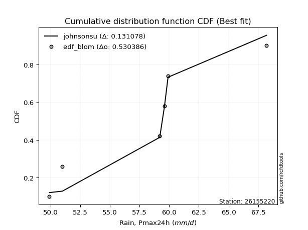</img></img>

</div>


### 7. EDF Tukey (1962)

In hydrology, the Tukey formula is used as a plotting position formula to estimate the empirical probability or frequency of a flood event (or other hydrological data). The formula parameter is given as _c=0.333_ (or 1/3).

<div align="center">


$P=(m-c)/(n+1-2c)$


</div>


**7.1. Empirical values**

<div align="center">

|                | 0                   | 1                  | 2                   | 3                  | 4                  | 5                  |
|:---------------|:--------------------|:-------------------|:--------------------|:-------------------|:-------------------|:-------------------|
| date           | 2021                | 2018               | 2020                | 2019               | 2022               | 2017               |
| x              | 49.9                | 51.0               | 59.2                | 59.6               | 59.9               | 68.2               |
| m              | 1                   | 2                  | 3                   | 4                  | 5                  | 6                  |
| empirical_dist | edf_tukey           | edf_tukey          | edf_tukey           | edf_tukey          | edf_tukey          | edf_tukey          |
| empirical      | 0.10526315789473684 | 0.2631578947368421 | 0.42105263157894735 | 0.5789473684210527 | 0.7368421052631579 | 0.8947368421052632 |
| empirical_tr   | 1.1176470588235294  | 1.357142857142857  | 1.7272727272727273  | 2.375              | 3.7999999999999994 | 9.5                |

</div>


**7.2. Kolmogorov-Smirnov fit test (sorted by Δ)**


<div align="center">

|                | 0                   | 1                   | 2                   | 3                  | 4                   | 5                  | 6                  | 7                   | 8                  | 9                   | 10                  | 11                  | 12                  | 13                 | 14                  | 15                 | 16                  | 17                  | 18                  | 19                  | 20                  | 21                  | 22                  | 23                  | 24                 | 25                  | 26                  | 27                 | 28                 | 29                 | 30                  | 31                 | 32                 | 33                  | 34                  | 35                  | 36                  | 37                  | 38                  | 39                  | 40                 | 41                 | 42               | 43                  | 44                  | 45                  | 46                 | 47                  | 48                 | 49                 | 50                  | 51                 | 52                  | 53                  | 54                  | 55                  | 56                  | 57                  | 58                  | 59                  | 60                  | 61                  | 62                  | 63                  | 64                  | 65                  | 66                 | 67                  | 68                | 69                  | 70                  | 71                  | 72                 | 73                  | 74                  | 75                 | 76                  | 77                  | 78                  | 79                  | 80                  | 81                  | 82                 | 83                  | 84                  | 85                 | 86                 | 87                 | 88                  | 89                  | 90                  | 91                 | 92                  | 93                  | 94                  | 95                  | 96                 | 97                  | 98                  | 99                  | 100                 | 101                | 102                 | 103                 | 104                 | 105                 | 106                 | 107                 | 108                 | 109                 | 110                 | 111                | 112                 | 113                 | 114                 | 115                 | 116                | 117                 | 118                 | 119                | 120                 | 121                 | 122                | 123                 | 124                 | 125                | 126                 | 127                | 128                | 129                | 130                 | 131                 | 132                 | 133                 | 134                 | 135                 | 136                 | 137                 | 138                 | 139               | 140                | 141                | 142                 | 143                 | 144                 | 145                | 146                | 147                 | 148                | 149                | 150                 | 151                 | 152                | 153                | 154                | 155                | 156                | 157                | 158               | 159            |
|:---------------|:--------------------|:--------------------|:--------------------|:-------------------|:--------------------|:-------------------|:-------------------|:--------------------|:-------------------|:--------------------|:--------------------|:--------------------|:--------------------|:-------------------|:--------------------|:-------------------|:--------------------|:--------------------|:--------------------|:--------------------|:--------------------|:--------------------|:--------------------|:--------------------|:-------------------|:--------------------|:--------------------|:-------------------|:-------------------|:-------------------|:--------------------|:-------------------|:-------------------|:--------------------|:--------------------|:--------------------|:--------------------|:--------------------|:--------------------|:--------------------|:-------------------|:-------------------|:-----------------|:--------------------|:--------------------|:--------------------|:-------------------|:--------------------|:-------------------|:-------------------|:--------------------|:-------------------|:--------------------|:--------------------|:--------------------|:--------------------|:--------------------|:--------------------|:--------------------|:--------------------|:--------------------|:--------------------|:--------------------|:--------------------|:--------------------|:--------------------|:-------------------|:--------------------|:------------------|:--------------------|:--------------------|:--------------------|:-------------------|:--------------------|:--------------------|:-------------------|:--------------------|:--------------------|:--------------------|:--------------------|:--------------------|:--------------------|:-------------------|:--------------------|:--------------------|:-------------------|:-------------------|:-------------------|:--------------------|:--------------------|:--------------------|:-------------------|:--------------------|:--------------------|:--------------------|:--------------------|:-------------------|:--------------------|:--------------------|:--------------------|:--------------------|:-------------------|:--------------------|:--------------------|:--------------------|:--------------------|:--------------------|:--------------------|:--------------------|:--------------------|:--------------------|:-------------------|:--------------------|:--------------------|:--------------------|:--------------------|:-------------------|:--------------------|:--------------------|:-------------------|:--------------------|:--------------------|:-------------------|:--------------------|:--------------------|:-------------------|:--------------------|:-------------------|:-------------------|:-------------------|:--------------------|:--------------------|:--------------------|:--------------------|:--------------------|:--------------------|:--------------------|:--------------------|:--------------------|:------------------|:-------------------|:-------------------|:--------------------|:--------------------|:--------------------|:-------------------|:-------------------|:--------------------|:-------------------|:-------------------|:--------------------|:--------------------|:-------------------|:-------------------|:-------------------|:-------------------|:-------------------|:-------------------|:------------------|:---------------|
| station        | 26155220            | 26155220            | 26155220            | 26155220           | 26155220            | 26155220           | 26155220           | 26155220            | 26155220           | 26155220            | 26155220            | 26155220            | 26155220            | 26155220           | 26155220            | 26155220           | 26155220            | 26155220            | 26155220            | 26155220            | 26155220            | 26155220            | 26155220            | 26155220            | 26155220           | 26155220            | 26155220            | 26155220           | 26155220           | 26155220           | 26155220            | 26155220           | 26155220           | 26155220            | 26155220            | 26155220            | 26155220            | 26155220            | 26155220            | 26155220            | 26155220           | 26155220           | 26155220         | 26155220            | 26155220            | 26155220            | 26155220           | 26155220            | 26155220           | 26155220           | 26155220            | 26155220           | 26155220            | 26155220            | 26155220            | 26155220            | 26155220            | 26155220            | 26155220            | 26155220            | 26155220            | 26155220            | 26155220            | 26155220            | 26155220            | 26155220            | 26155220           | 26155220            | 26155220          | 26155220            | 26155220            | 26155220            | 26155220           | 26155220            | 26155220            | 26155220           | 26155220            | 26155220            | 26155220            | 26155220            | 26155220            | 26155220            | 26155220           | 26155220            | 26155220            | 26155220           | 26155220           | 26155220           | 26155220            | 26155220            | 26155220            | 26155220           | 26155220            | 26155220            | 26155220            | 26155220            | 26155220           | 26155220            | 26155220            | 26155220            | 26155220            | 26155220           | 26155220            | 26155220            | 26155220            | 26155220            | 26155220            | 26155220            | 26155220            | 26155220            | 26155220            | 26155220           | 26155220            | 26155220            | 26155220            | 26155220            | 26155220           | 26155220            | 26155220            | 26155220           | 26155220            | 26155220            | 26155220           | 26155220            | 26155220            | 26155220           | 26155220            | 26155220           | 26155220           | 26155220           | 26155220            | 26155220            | 26155220            | 26155220            | 26155220            | 26155220            | 26155220            | 26155220            | 26155220            | 26155220          | 26155220           | 26155220           | 26155220            | 26155220            | 26155220            | 26155220           | 26155220           | 26155220            | 26155220           | 26155220           | 26155220            | 26155220            | 26155220           | 26155220           | 26155220           | 26155220           | 26155220           | 26155220           | 26155220          | 26155220       |
| empirical_dist | edf_tukey           | edf_tukey           | edf_tukey           | edf_tukey          | edf_tukey           | edf_tukey          | edf_tukey          | edf_tukey           | edf_tukey          | edf_tukey           | edf_tukey           | edf_tukey           | edf_tukey           | edf_tukey          | edf_tukey           | edf_tukey          | edf_tukey           | edf_tukey           | edf_tukey           | edf_tukey           | edf_tukey           | edf_tukey           | edf_tukey           | edf_tukey           | edf_tukey          | edf_tukey           | edf_tukey           | edf_tukey          | edf_tukey          | edf_tukey          | edf_tukey           | edf_tukey          | edf_tukey          | edf_tukey           | edf_tukey           | edf_tukey           | edf_tukey           | edf_tukey           | edf_tukey           | edf_tukey           | edf_tukey          | edf_tukey          | edf_tukey        | edf_tukey           | edf_tukey           | edf_tukey           | edf_tukey          | edf_tukey           | edf_tukey          | edf_tukey          | edf_tukey           | edf_tukey          | edf_tukey           | edf_tukey           | edf_tukey           | edf_tukey           | edf_tukey           | edf_tukey           | edf_tukey           | edf_tukey           | edf_tukey           | edf_tukey           | edf_tukey           | edf_tukey           | edf_tukey           | edf_tukey           | edf_tukey          | edf_tukey           | edf_tukey         | edf_tukey           | edf_tukey           | edf_tukey           | edf_tukey          | edf_tukey           | edf_tukey           | edf_tukey          | edf_tukey           | edf_tukey           | edf_tukey           | edf_tukey           | edf_tukey           | edf_tukey           | edf_tukey          | edf_tukey           | edf_tukey           | edf_tukey          | edf_tukey          | edf_tukey          | edf_tukey           | edf_tukey           | edf_tukey           | edf_tukey          | edf_tukey           | edf_tukey           | edf_tukey           | edf_tukey           | edf_tukey          | edf_tukey           | edf_tukey           | edf_tukey           | edf_tukey           | edf_tukey          | edf_tukey           | edf_tukey           | edf_tukey           | edf_tukey           | edf_tukey           | edf_tukey           | edf_tukey           | edf_tukey           | edf_tukey           | edf_tukey          | edf_tukey           | edf_tukey           | edf_tukey           | edf_tukey           | edf_tukey          | edf_tukey           | edf_tukey           | edf_tukey          | edf_tukey           | edf_tukey           | edf_tukey          | edf_tukey           | edf_tukey           | edf_tukey          | edf_tukey           | edf_tukey          | edf_tukey          | edf_tukey          | edf_tukey           | edf_tukey           | edf_tukey           | edf_tukey           | edf_tukey           | edf_tukey           | edf_tukey           | edf_tukey           | edf_tukey           | edf_tukey         | edf_tukey          | edf_tukey          | edf_tukey           | edf_tukey           | edf_tukey           | edf_tukey          | edf_tukey          | edf_tukey           | edf_tukey          | edf_tukey          | edf_tukey           | edf_tukey           | edf_tukey          | edf_tukey          | edf_tukey          | edf_tukey          | edf_tukey          | edf_tukey          | edf_tukey         | edf_tukey      |
| p_dist         | johnsonsu           | logjohnsonsu        | semicircular        | cosine             | loggumbel_l         | ksone              | anglit             | logksone            | logburr12          | logarcsine          | truncnorm           | norm                | crystalball         | t                  | logsemicircular     | exponnorm          | logweibull_max      | loggenextreme       | foldnorm            | loggenlogistic      | loganglit           | loggausshyper       | arcsine             | genextreme          | gumbel_l           | pearson3            | ncf                 | logistic           | logcosine          | logloggamma        | skewnorm            | bradford           | hypsecant          | logt                | logskewnorm         | logcrystalball      | lognorm             | logexponnorm        | logpearson3         | logerlang           | loggamma           | loggamma           | logargus         | f                   | logf                | loginvgamma         | betaprime          | erlang              | invgamma           | alpha              | logncf              | logdweibull        | rice                | logalpha            | logkappa4           | kappa4              | lognct              | gamma               | maxwell             | nct                 | logtukeylambda      | loglogistic         | logbetaprime        | loguniform          | dgamma              | tukeylambda         | rayleigh           | gausshyper          | logrice           | invgauss            | loghypsecant        | logdgamma           | laplace            | uniform             | gennorm             | gompertz           | logmaxwell          | logloglaplace       | logwrapcauchy       | vonmises_line       | loginvgauss         | truncexpon          | lograyleigh        | invweibull          | argus               | logfoldnorm        | logvonmises_line   | genlogistic        | logbradford         | burr                | halfnorm            | wrapcauchy         | kstwobign           | loginvweibull       | gumbel_r            | logmielke           | logexponpow        | nakagami            | loggompertz         | loglaplace          | loglaplace          | logburr            | exponpow            | genexpon            | loghalfnorm         | loggennorm          | dweibull            | logkstwobign        | logexponweib        | loggumbel_r         | logtriang           | logtruncnorm       | lomax               | halflogistic        | moyal               | loglevy_l           | loggenexpon        | weibull_min         | levy_l              | logtruncexpon      | loghalflogistic     | logmoyal            | burr12             | loglomax            | logbeta             | halfgennorm        | loggenhalflogistic  | wald               | triang             | kappa3             | logwald             | genpareto           | loggengamma         | logtruncweibull_min | gengamma            | truncweibull_min    | genhalflogistic     | logweibull_min      | beta                | loggenpareto      | lognakagami        | logtrapezoid       | trapezoid           | exponweib           | logjohnsonsb        | johnsonsb          | fatiguelife        | rdist               | weibull_max        | logfatiguelife     | truncpareto         | powerlaw            | logtruncpareto     | logpowerlaw        | logkappa3          | loghalfgennorm     | logrdist           | logvonmises        | vonmises          | mielke         |
| delta          | 0.13423625336592587 | 0.13539180990548588 | 0.14277034563850266 | 0.1450551885513786 | 0.14593177465972518 | 0.1459566791202883 | 0.1473870378870885 | 0.15158073397235716 | 0.1522477875570385 | 0.15433282955462024 | 0.15853697401879108 | 0.15853704284963355 | 0.15853704593649043 | 0.1585426226143577 | 0.15882534946119253 | 0.1592946800878806 | 0.16029111253312855 | 0.16030154752534365 | 0.16184856392459301 | 0.16287076192714556 | 0.16453238847536644 | 0.16504482185259273 | 0.16538021540654646 | 0.16688108062409923 | 0.1682149773071998 | 0.16849760811696102 | 0.16871449323249166 | 0.1690260135099928 | 0.1705226002737079 | 0.1763784758292125 | 0.17672429991896554 | 0.1772059000229309 | 0.1777437528507072 | 0.17827062079693634 | 0.17827579507456937 | 0.17827584700776467 | 0.17827585644920518 | 0.17827645653480506 | 0.17856535572722776 | 0.17856777781234945 | 0.1785699004458866 | 0.1785699004458866 | 0.17871657902632 | 0.17972869693458615 | 0.18022006120674838 | 0.18056029750823965 | 0.1815089594659165 | 0.18231470416678952 | 0.1827363393801109 | 0.1828841639413148 | 0.18321160294934535 | 0.1832296828560266 | 0.18341166226020056 | 0.18361563944472403 | 0.18425376484055878 | 0.18454487190826754 | 0.18521146252190024 | 0.18651319722157989 | 0.18677433475315564 | 0.18973027206421222 | 0.19024218307364965 | 0.19109979289485246 | 0.19191821494576589 | 0.19336600765620018 | 0.19408469306656906 | 0.19475000117967017 | 0.1956583925266382 | 0.19746936958607508 | 0.198513556856601 | 0.20127452605035567 | 0.20159920890269412 | 0.20186732944728614 | 0.2025776476262997 | 0.20304860511935569 | 0.20339747388978083 | 0.2038482437645317 | 0.20486011689001915 | 0.20673498275346192 | 0.20802325174086966 | 0.20937903776281486 | 0.21028246293728914 | 0.21179920965565158 | 0.2131143823338213 | 0.21311803769658189 | 0.21314305973986813 | 0.2135090699651181 | 0.2139691322974394 | 0.2146517602850032 | 0.21531544684674464 | 0.21802738951902356 | 0.22082842308867212 | 0.2212610309523707 | 0.22137843387141287 | 0.22594214231501053 | 0.22688695616933463 | 0.22725516716679273 | 0.2274161076287694 | 0.22843783971036424 | 0.22843793182249716 | 0.22865129161361608 | 0.22865129161361608 | 0.2289173987195996 | 0.22961382826068832 | 0.23069787876905457 | 0.23661028894196423 | 0.23684210423627905 | 0.23684210526313687 | 0.23734569070646594 | 0.24163849178892394 | 0.24485565691633693 | 0.24487496842420342 | 0.2463165449961524 | 0.24704699653683537 | 0.24887080196228517 | 0.25058771507004507 | 0.25253130313823846 | 0.2561695839252284 | 0.25791989701618767 | 0.26257149830737603 | 0.2639089207326598 | 0.26489706532447166 | 0.26761991657952233 | 0.2713868690100951 | 0.27281693008196095 | 0.28249261453428853 | 0.2849331889397342 | 0.28679384440372985 | 0.3164449884906998 | 0.3186848487776012 | 0.3213224661229286 | 0.33102751321130985 | 0.33296123259183735 | 0.34012924824445556 | 0.34050766098495555 | 0.34891960395869637 | 0.35060362466391726 | 0.35312138653435365 | 0.35441004147412336 | 0.35809051955225524 | 0.369935351793294 | 0.3710690779651561 | 0.4113332394245016 | 0.44663715405198096 | 0.45493189355377694 | 0.45792887088752193 | 0.4605457492893377 | 0.4622996452294572 | 0.46827925306622187 | 0.4718558512107239 | 0.4779990153480753 | 0.47854566180091196 | 0.48288334946921263 | 0.4876348695411762 | 0.4893342336974089 | 0.5919953757919207 | 0.7368421052631579 | 0.8947368421052632 | 1.1783647848151513 | 10.95227442657489 | nan            |
| deltao         | 0.530385761606      | 0.530385761606      | 0.530385761606      | 0.530385761606     | 0.530385761606      | 0.530385761606     | 0.530385761606     | 0.530385761606      | 0.530385761606     | 0.530385761606      | 0.530385761606      | 0.530385761606      | 0.530385761606      | 0.530385761606     | 0.530385761606      | 0.530385761606     | 0.530385761606      | 0.530385761606      | 0.530385761606      | 0.530385761606      | 0.530385761606      | 0.530385761606      | 0.530385761606      | 0.530385761606      | 0.530385761606     | 0.530385761606      | 0.530385761606      | 0.530385761606     | 0.530385761606     | 0.530385761606     | 0.530385761606      | 0.530385761606     | 0.530385761606     | 0.530385761606      | 0.530385761606      | 0.530385761606      | 0.530385761606      | 0.530385761606      | 0.530385761606      | 0.530385761606      | 0.530385761606     | 0.530385761606     | 0.530385761606   | 0.530385761606      | 0.530385761606      | 0.530385761606      | 0.530385761606     | 0.530385761606      | 0.530385761606     | 0.530385761606     | 0.530385761606      | 0.530385761606     | 0.530385761606      | 0.530385761606      | 0.530385761606      | 0.530385761606      | 0.530385761606      | 0.530385761606      | 0.530385761606      | 0.530385761606      | 0.530385761606      | 0.530385761606      | 0.530385761606      | 0.530385761606      | 0.530385761606      | 0.530385761606      | 0.530385761606     | 0.530385761606      | 0.530385761606    | 0.530385761606      | 0.530385761606      | 0.530385761606      | 0.530385761606     | 0.530385761606      | 0.530385761606      | 0.530385761606     | 0.530385761606      | 0.530385761606      | 0.530385761606      | 0.530385761606      | 0.530385761606      | 0.530385761606      | 0.530385761606     | 0.530385761606      | 0.530385761606      | 0.530385761606     | 0.530385761606     | 0.530385761606     | 0.530385761606      | 0.530385761606      | 0.530385761606      | 0.530385761606     | 0.530385761606      | 0.530385761606      | 0.530385761606      | 0.530385761606      | 0.530385761606     | 0.530385761606      | 0.530385761606      | 0.530385761606      | 0.530385761606      | 0.530385761606     | 0.530385761606      | 0.530385761606      | 0.530385761606      | 0.530385761606      | 0.530385761606      | 0.530385761606      | 0.530385761606      | 0.530385761606      | 0.530385761606      | 0.530385761606     | 0.530385761606      | 0.530385761606      | 0.530385761606      | 0.530385761606      | 0.530385761606     | 0.530385761606      | 0.530385761606      | 0.530385761606     | 0.530385761606      | 0.530385761606      | 0.530385761606     | 0.530385761606      | 0.530385761606      | 0.530385761606     | 0.530385761606      | 0.530385761606     | 0.530385761606     | 0.530385761606     | 0.530385761606      | 0.530385761606      | 0.530385761606      | 0.530385761606      | 0.530385761606      | 0.530385761606      | 0.530385761606      | 0.530385761606      | 0.530385761606      | 0.530385761606    | 0.530385761606     | 0.530385761606     | 0.530385761606      | 0.530385761606      | 0.530385761606      | 0.530385761606     | 0.530385761606     | 0.530385761606      | 0.530385761606     | 0.530385761606     | 0.530385761606      | 0.530385761606      | 0.530385761606     | 0.530385761606     | 0.530385761606     | 0.530385761606     | 0.530385761606     | 0.530385761606     | 0.530385761606    | 0.530385761606 |
| eval           | Δo > Δ              | Δo > Δ              | Δo > Δ              | Δo > Δ             | Δo > Δ              | Δo > Δ             | Δo > Δ             | Δo > Δ              | Δo > Δ             | Δo > Δ              | Δo > Δ              | Δo > Δ              | Δo > Δ              | Δo > Δ             | Δo > Δ              | Δo > Δ             | Δo > Δ              | Δo > Δ              | Δo > Δ              | Δo > Δ              | Δo > Δ              | Δo > Δ              | Δo > Δ              | Δo > Δ              | Δo > Δ             | Δo > Δ              | Δo > Δ              | Δo > Δ             | Δo > Δ             | Δo > Δ             | Δo > Δ              | Δo > Δ             | Δo > Δ             | Δo > Δ              | Δo > Δ              | Δo > Δ              | Δo > Δ              | Δo > Δ              | Δo > Δ              | Δo > Δ              | Δo > Δ             | Δo > Δ             | Δo > Δ           | Δo > Δ              | Δo > Δ              | Δo > Δ              | Δo > Δ             | Δo > Δ              | Δo > Δ             | Δo > Δ             | Δo > Δ              | Δo > Δ             | Δo > Δ              | Δo > Δ              | Δo > Δ              | Δo > Δ              | Δo > Δ              | Δo > Δ              | Δo > Δ              | Δo > Δ              | Δo > Δ              | Δo > Δ              | Δo > Δ              | Δo > Δ              | Δo > Δ              | Δo > Δ              | Δo > Δ             | Δo > Δ              | Δo > Δ            | Δo > Δ              | Δo > Δ              | Δo > Δ              | Δo > Δ             | Δo > Δ              | Δo > Δ              | Δo > Δ             | Δo > Δ              | Δo > Δ              | Δo > Δ              | Δo > Δ              | Δo > Δ              | Δo > Δ              | Δo > Δ             | Δo > Δ              | Δo > Δ              | Δo > Δ             | Δo > Δ             | Δo > Δ             | Δo > Δ              | Δo > Δ              | Δo > Δ              | Δo > Δ             | Δo > Δ              | Δo > Δ              | Δo > Δ              | Δo > Δ              | Δo > Δ             | Δo > Δ              | Δo > Δ              | Δo > Δ              | Δo > Δ              | Δo > Δ             | Δo > Δ              | Δo > Δ              | Δo > Δ              | Δo > Δ              | Δo > Δ              | Δo > Δ              | Δo > Δ              | Δo > Δ              | Δo > Δ              | Δo > Δ             | Δo > Δ              | Δo > Δ              | Δo > Δ              | Δo > Δ              | Δo > Δ             | Δo > Δ              | Δo > Δ              | Δo > Δ             | Δo > Δ              | Δo > Δ              | Δo > Δ             | Δo > Δ              | Δo > Δ              | Δo > Δ             | Δo > Δ              | Δo > Δ             | Δo > Δ             | Δo > Δ             | Δo > Δ              | Δo > Δ              | Δo > Δ              | Δo > Δ              | Δo > Δ              | Δo > Δ              | Δo > Δ              | Δo > Δ              | Δo > Δ              | Δo > Δ            | Δo > Δ             | Δo > Δ             | Δo > Δ              | Δo > Δ              | Δo > Δ              | Δo > Δ             | Δo > Δ             | Δo > Δ              | Δo > Δ             | Δo > Δ             | Δo > Δ              | Δo > Δ              | Δo > Δ             | Δo > Δ             | Δo <= Δ            | Δo <= Δ            | Δo <= Δ            | Δo <= Δ            | Δo <= Δ           | Δo <= Δ        |
| fit            | 1                   | 1                   | 1                   | 1                  | 1                   | 1                  | 1                  | 1                   | 1                  | 1                   | 1                   | 1                   | 1                   | 1                  | 1                   | 1                  | 1                   | 1                   | 1                   | 1                   | 1                   | 1                   | 1                   | 1                   | 1                  | 1                   | 1                   | 1                  | 1                  | 1                  | 1                   | 1                  | 1                  | 1                   | 1                   | 1                   | 1                   | 1                   | 1                   | 1                   | 1                  | 1                  | 1                | 1                   | 1                   | 1                   | 1                  | 1                   | 1                  | 1                  | 1                   | 1                  | 1                   | 1                   | 1                   | 1                   | 1                   | 1                   | 1                   | 1                   | 1                   | 1                   | 1                   | 1                   | 1                   | 1                   | 1                  | 1                   | 1                 | 1                   | 1                   | 1                   | 1                  | 1                   | 1                   | 1                  | 1                   | 1                   | 1                   | 1                   | 1                   | 1                   | 1                  | 1                   | 1                   | 1                  | 1                  | 1                  | 1                   | 1                   | 1                   | 1                  | 1                   | 1                   | 1                   | 1                   | 1                  | 1                   | 1                   | 1                   | 1                   | 1                  | 1                   | 1                   | 1                   | 1                   | 1                   | 1                   | 1                   | 1                   | 1                   | 1                  | 1                   | 1                   | 1                   | 1                   | 1                  | 1                   | 1                   | 1                  | 1                   | 1                   | 1                  | 1                   | 1                   | 1                  | 1                   | 1                  | 1                  | 1                  | 1                   | 1                   | 1                   | 1                   | 1                   | 1                   | 1                   | 1                   | 1                   | 1                 | 1                  | 1                  | 1                   | 1                   | 1                   | 1                  | 1                  | 1                   | 1                  | 1                  | 1                   | 1                   | 1                  | 1                  | 0                  | 0                  | 0                  | 0                  | 0                 | 0              |
| n              | 6                   | 6                   | 6                   | 6                  | 6                   | 6                  | 6                  | 6                   | 6                  | 6                   | 6                   | 6                   | 6                   | 6                  | 6                   | 6                  | 6                   | 6                   | 6                   | 6                   | 6                   | 6                   | 6                   | 6                   | 6                  | 6                   | 6                   | 6                  | 6                  | 6                  | 6                   | 6                  | 6                  | 6                   | 6                   | 6                   | 6                   | 6                   | 6                   | 6                   | 6                  | 6                  | 6                | 6                   | 6                   | 6                   | 6                  | 6                   | 6                  | 6                  | 6                   | 6                  | 6                   | 6                   | 6                   | 6                   | 6                   | 6                   | 6                   | 6                   | 6                   | 6                   | 6                   | 6                   | 6                   | 6                   | 6                  | 6                   | 6                 | 6                   | 6                   | 6                   | 6                  | 6                   | 6                   | 6                  | 6                   | 6                   | 6                   | 6                   | 6                   | 6                   | 6                  | 6                   | 6                   | 6                  | 6                  | 6                  | 6                   | 6                   | 6                   | 6                  | 6                   | 6                   | 6                   | 6                   | 6                  | 6                   | 6                   | 6                   | 6                   | 6                  | 6                   | 6                   | 6                   | 6                   | 6                   | 6                   | 6                   | 6                   | 6                   | 6                  | 6                   | 6                   | 6                   | 6                   | 6                  | 6                   | 6                   | 6                  | 6                   | 6                   | 6                  | 6                   | 6                   | 6                  | 6                   | 6                  | 6                  | 6                  | 6                   | 6                   | 6                   | 6                   | 6                   | 6                   | 6                   | 6                   | 6                   | 6                 | 6                  | 6                  | 6                   | 6                   | 6                   | 6                  | 6                  | 6                   | 6                  | 6                  | 6                   | 6                   | 6                  | 6                  | 6                  | 6                  | 6                  | 6                  | 6                 | 6              |
| best_fit       | 1                   | 0                   | 0                   | 0                  | 0                   | 0                  | 0                  | 0                   | 0                  | 0                   | 0                   | 0                   | 0                   | 0                  | 0                   | 0                  | 0                   | 0                   | 0                   | 0                   | 0                   | 0                   | 0                   | 0                   | 0                  | 0                   | 0                   | 0                  | 0                  | 0                  | 0                   | 0                  | 0                  | 0                   | 0                   | 0                   | 0                   | 0                   | 0                   | 0                   | 0                  | 0                  | 0                | 0                   | 0                   | 0                   | 0                  | 0                   | 0                  | 0                  | 0                   | 0                  | 0                   | 0                   | 0                   | 0                   | 0                   | 0                   | 0                   | 0                   | 0                   | 0                   | 0                   | 0                   | 0                   | 0                   | 0                  | 0                   | 0                 | 0                   | 0                   | 0                   | 0                  | 0                   | 0                   | 0                  | 0                   | 0                   | 0                   | 0                   | 0                   | 0                   | 0                  | 0                   | 0                   | 0                  | 0                  | 0                  | 0                   | 0                   | 0                   | 0                  | 0                   | 0                   | 0                   | 0                   | 0                  | 0                   | 0                   | 0                   | 0                   | 0                  | 0                   | 0                   | 0                   | 0                   | 0                   | 0                   | 0                   | 0                   | 0                   | 0                  | 0                   | 0                   | 0                   | 0                   | 0                  | 0                   | 0                   | 0                  | 0                   | 0                   | 0                  | 0                   | 0                   | 0                  | 0                   | 0                  | 0                  | 0                  | 0                   | 0                   | 0                   | 0                   | 0                   | 0                   | 0                   | 0                   | 0                   | 0                 | 0                  | 0                  | 0                   | 0                   | 0                   | 0                  | 0                  | 0                   | 0                  | 0                  | 0                   | 0                   | 0                  | 0                  | 0                  | 0                  | 0                  | 0                  | 0                 | 0              |
| best_fit_sort  | 1                   | 2                   | 3                   | 4                  | 5                   | 6                  | 7                  | 8                   | 9                  | 10                  | 11                  | 12                  | 13                  | 14                 | 15                  | 16                 | 17                  | 18                  | 19                  | 20                  | 21                  | 22                  | 23                  | 24                  | 25                 | 26                  | 27                  | 28                 | 29                 | 30                 | 31                  | 32                 | 33                 | 34                  | 35                  | 36                  | 37                  | 38                  | 39                  | 40                  | 41                 | 42                 | 43               | 44                  | 45                  | 46                  | 47                 | 48                  | 49                 | 50                 | 51                  | 52                 | 53                  | 54                  | 55                  | 56                  | 57                  | 58                  | 59                  | 60                  | 61                  | 62                  | 63                  | 64                  | 65                  | 66                  | 67                 | 68                  | 69                | 70                  | 71                  | 72                  | 73                 | 74                  | 75                  | 76                 | 77                  | 78                  | 79                  | 80                  | 81                  | 82                  | 83                 | 84                  | 85                  | 86                 | 87                 | 88                 | 89                  | 90                  | 91                  | 92                 | 93                  | 94                  | 95                  | 96                  | 97                 | 98                  | 99                  | 100                 | 101                 | 102                | 103                 | 104                 | 105                 | 106                 | 107                 | 108                 | 109                 | 110                 | 111                 | 112                | 113                 | 114                 | 115                 | 116                 | 117                | 118                 | 119                 | 120                | 121                 | 122                 | 123                | 124                 | 125                 | 126                | 127                 | 128                | 129                | 130                | 131                 | 132                 | 133                 | 134                 | 135                 | 136                 | 137                 | 138                 | 139                 | 140               | 141                | 142                | 143                 | 144                 | 145                 | 146                | 147                | 148                 | 149                | 150                | 151                 | 152                 | 153                | 154                | 155                | 156                | 157                | 158                | 159               | 160            |

</div>


**7.3. Best fit**

<div align="center">

|   id |   station | empirical_dist   | p_dist    |    delta |   deltao | eval   |   fit |   n |   best_fit |   best_fit_sort |
|-----:|----------:|:-----------------|:----------|---------:|---------:|:-------|------:|----:|-----------:|----------------:|
|    0 |  26155220 | edf_tukey        | johnsonsu | 0.134236 | 0.530386 | Δo > Δ |     1 |   6 |          1 |               1 |

</div>


<div align="center">

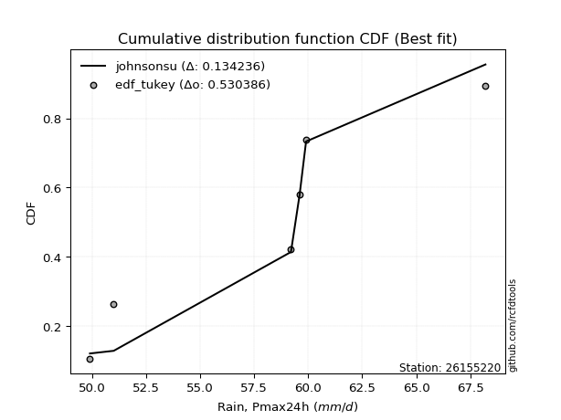</img>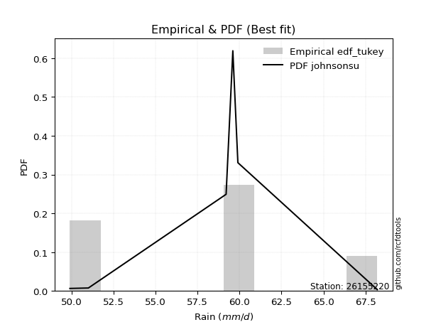</img>

</div>


### 8. EDF Gringorten (1963)

Gringorten plotting position formula is essential for estimating the probability and return periods of extreme events like floods and heavy rainfall. The constant _a=0.44_.

<div align="center">


$P=(m-a)/(n+1-2a)$


</div>


**8.1. Empirical values**

<div align="center">

|                | 0                   | 1                  | 2                   | 3                  | 4                  | 5                  |
|:---------------|:--------------------|:-------------------|:--------------------|:-------------------|:-------------------|:-------------------|
| date           | 2021                | 2018               | 2020                | 2019               | 2022               | 2017               |
| x              | 49.9                | 51.0               | 59.2                | 59.6               | 59.9               | 68.2               |
| m              | 1                   | 2                  | 3                   | 4                  | 5                  | 6                  |
| empirical_dist | edf_gringorten      | edf_gringorten     | edf_gringorten      | edf_gringorten     | edf_gringorten     | edf_gringorten     |
| empirical      | 0.09150326797385622 | 0.2549019607843137 | 0.41830065359477125 | 0.5816993464052288 | 0.7450980392156862 | 0.9084967320261437 |
| empirical_tr   | 1.1007194244604317  | 1.3421052631578947 | 1.7191011235955058  | 2.3906250000000004 | 3.9230769230769216 | 10.928571428571415 |

</div>


**8.2. Kolmogorov-Smirnov fit test (sorted by Δ)**


<div align="center">

|                | 0                  | 1                  | 2                   | 3                   | 4                  | 5                  | 6                   | 7                   | 8                   | 9                   | 10                  | 11                  | 12                 | 13                  | 14                 | 15                  | 16                  | 17                  | 18                 | 19                  | 20                  | 21                  | 22                 | 23                  | 24                 | 25                | 26                  | 27                 | 28                 | 29                  | 30                  | 31                 | 32                  | 33                | 34                 | 35                  | 36                  | 37                  | 38                  | 39                  | 40                  | 41                  | 42                 | 43                 | 44                  | 45                  | 46                  | 47                  | 48                 | 49                 | 50                 | 51                | 52                  | 53                  | 54                  | 55                  | 56                  | 57                  | 58                  | 59                  | 60                  | 61                  | 62                  | 63                  | 64                  | 65                  | 66                 | 67                  | 68                  | 69                  | 70                  | 71                  | 72                  | 73                  | 74                 | 75                 | 76                  | 77                 | 78                  | 79                  | 80                  | 81                  | 82                  | 83                  | 84                  | 85                | 86                 | 87                  | 88                  | 89                  | 90                 | 91                  | 92                  | 93                  | 94                  | 95                  | 96                 | 97                  | 98                  | 99                  | 100                 | 101                | 102                 | 103                 | 104                 | 105                 | 106                 | 107                 | 108                | 109                 | 110                | 111                 | 112                 | 113                 | 114                 | 115                 | 116                 | 117                | 118                | 119                 | 120                | 121                | 122                 | 123                 | 124                | 125                | 126                | 127                | 128                 | 129                 | 130                | 131                 | 132                 | 133                 | 134                 | 135                 | 136                 | 137                 | 138               | 139                | 140                 | 141                 | 142                | 143                 | 144                | 145                | 146                | 147                 | 148                | 149                | 150                 | 151                | 152                | 153               | 154                | 155                | 156                | 157                | 158               | 159            |
|:---------------|:-------------------|:-------------------|:--------------------|:--------------------|:-------------------|:-------------------|:--------------------|:--------------------|:--------------------|:--------------------|:--------------------|:--------------------|:-------------------|:--------------------|:-------------------|:--------------------|:--------------------|:--------------------|:-------------------|:--------------------|:--------------------|:--------------------|:-------------------|:--------------------|:-------------------|:------------------|:--------------------|:-------------------|:-------------------|:--------------------|:--------------------|:-------------------|:--------------------|:------------------|:-------------------|:--------------------|:--------------------|:--------------------|:--------------------|:--------------------|:--------------------|:--------------------|:-------------------|:-------------------|:--------------------|:--------------------|:--------------------|:--------------------|:-------------------|:-------------------|:-------------------|:------------------|:--------------------|:--------------------|:--------------------|:--------------------|:--------------------|:--------------------|:--------------------|:--------------------|:--------------------|:--------------------|:--------------------|:--------------------|:--------------------|:--------------------|:-------------------|:--------------------|:--------------------|:--------------------|:--------------------|:--------------------|:--------------------|:--------------------|:-------------------|:-------------------|:--------------------|:-------------------|:--------------------|:--------------------|:--------------------|:--------------------|:--------------------|:--------------------|:--------------------|:------------------|:-------------------|:--------------------|:--------------------|:--------------------|:-------------------|:--------------------|:--------------------|:--------------------|:--------------------|:--------------------|:-------------------|:--------------------|:--------------------|:--------------------|:--------------------|:-------------------|:--------------------|:--------------------|:--------------------|:--------------------|:--------------------|:--------------------|:-------------------|:--------------------|:-------------------|:--------------------|:--------------------|:--------------------|:--------------------|:--------------------|:--------------------|:-------------------|:-------------------|:--------------------|:-------------------|:-------------------|:--------------------|:--------------------|:-------------------|:-------------------|:-------------------|:-------------------|:--------------------|:--------------------|:-------------------|:--------------------|:--------------------|:--------------------|:--------------------|:--------------------|:--------------------|:--------------------|:------------------|:-------------------|:--------------------|:--------------------|:-------------------|:--------------------|:-------------------|:-------------------|:-------------------|:--------------------|:-------------------|:-------------------|:--------------------|:-------------------|:-------------------|:------------------|:-------------------|:-------------------|:-------------------|:-------------------|:------------------|:---------------|
| station        | 26155220           | 26155220           | 26155220            | 26155220            | 26155220           | 26155220           | 26155220            | 26155220            | 26155220            | 26155220            | 26155220            | 26155220            | 26155220           | 26155220            | 26155220           | 26155220            | 26155220            | 26155220            | 26155220           | 26155220            | 26155220            | 26155220            | 26155220           | 26155220            | 26155220           | 26155220          | 26155220            | 26155220           | 26155220           | 26155220            | 26155220            | 26155220           | 26155220            | 26155220          | 26155220           | 26155220            | 26155220            | 26155220            | 26155220            | 26155220            | 26155220            | 26155220            | 26155220           | 26155220           | 26155220            | 26155220            | 26155220            | 26155220            | 26155220           | 26155220           | 26155220           | 26155220          | 26155220            | 26155220            | 26155220            | 26155220            | 26155220            | 26155220            | 26155220            | 26155220            | 26155220            | 26155220            | 26155220            | 26155220            | 26155220            | 26155220            | 26155220           | 26155220            | 26155220            | 26155220            | 26155220            | 26155220            | 26155220            | 26155220            | 26155220           | 26155220           | 26155220            | 26155220           | 26155220            | 26155220            | 26155220            | 26155220            | 26155220            | 26155220            | 26155220            | 26155220          | 26155220           | 26155220            | 26155220            | 26155220            | 26155220           | 26155220            | 26155220            | 26155220            | 26155220            | 26155220            | 26155220           | 26155220            | 26155220            | 26155220            | 26155220            | 26155220           | 26155220            | 26155220            | 26155220            | 26155220            | 26155220            | 26155220            | 26155220           | 26155220            | 26155220           | 26155220            | 26155220            | 26155220            | 26155220            | 26155220            | 26155220            | 26155220           | 26155220           | 26155220            | 26155220           | 26155220           | 26155220            | 26155220            | 26155220           | 26155220           | 26155220           | 26155220           | 26155220            | 26155220            | 26155220           | 26155220            | 26155220            | 26155220            | 26155220            | 26155220            | 26155220            | 26155220            | 26155220          | 26155220           | 26155220            | 26155220            | 26155220           | 26155220            | 26155220           | 26155220           | 26155220           | 26155220            | 26155220           | 26155220           | 26155220            | 26155220           | 26155220           | 26155220          | 26155220           | 26155220           | 26155220           | 26155220           | 26155220          | 26155220       |
| empirical_dist | edf_gringorten     | edf_gringorten     | edf_gringorten      | edf_gringorten      | edf_gringorten     | edf_gringorten     | edf_gringorten      | edf_gringorten      | edf_gringorten      | edf_gringorten      | edf_gringorten      | edf_gringorten      | edf_gringorten     | edf_gringorten      | edf_gringorten     | edf_gringorten      | edf_gringorten      | edf_gringorten      | edf_gringorten     | edf_gringorten      | edf_gringorten      | edf_gringorten      | edf_gringorten     | edf_gringorten      | edf_gringorten     | edf_gringorten    | edf_gringorten      | edf_gringorten     | edf_gringorten     | edf_gringorten      | edf_gringorten      | edf_gringorten     | edf_gringorten      | edf_gringorten    | edf_gringorten     | edf_gringorten      | edf_gringorten      | edf_gringorten      | edf_gringorten      | edf_gringorten      | edf_gringorten      | edf_gringorten      | edf_gringorten     | edf_gringorten     | edf_gringorten      | edf_gringorten      | edf_gringorten      | edf_gringorten      | edf_gringorten     | edf_gringorten     | edf_gringorten     | edf_gringorten    | edf_gringorten      | edf_gringorten      | edf_gringorten      | edf_gringorten      | edf_gringorten      | edf_gringorten      | edf_gringorten      | edf_gringorten      | edf_gringorten      | edf_gringorten      | edf_gringorten      | edf_gringorten      | edf_gringorten      | edf_gringorten      | edf_gringorten     | edf_gringorten      | edf_gringorten      | edf_gringorten      | edf_gringorten      | edf_gringorten      | edf_gringorten      | edf_gringorten      | edf_gringorten     | edf_gringorten     | edf_gringorten      | edf_gringorten     | edf_gringorten      | edf_gringorten      | edf_gringorten      | edf_gringorten      | edf_gringorten      | edf_gringorten      | edf_gringorten      | edf_gringorten    | edf_gringorten     | edf_gringorten      | edf_gringorten      | edf_gringorten      | edf_gringorten     | edf_gringorten      | edf_gringorten      | edf_gringorten      | edf_gringorten      | edf_gringorten      | edf_gringorten     | edf_gringorten      | edf_gringorten      | edf_gringorten      | edf_gringorten      | edf_gringorten     | edf_gringorten      | edf_gringorten      | edf_gringorten      | edf_gringorten      | edf_gringorten      | edf_gringorten      | edf_gringorten     | edf_gringorten      | edf_gringorten     | edf_gringorten      | edf_gringorten      | edf_gringorten      | edf_gringorten      | edf_gringorten      | edf_gringorten      | edf_gringorten     | edf_gringorten     | edf_gringorten      | edf_gringorten     | edf_gringorten     | edf_gringorten      | edf_gringorten      | edf_gringorten     | edf_gringorten     | edf_gringorten     | edf_gringorten     | edf_gringorten      | edf_gringorten      | edf_gringorten     | edf_gringorten      | edf_gringorten      | edf_gringorten      | edf_gringorten      | edf_gringorten      | edf_gringorten      | edf_gringorten      | edf_gringorten    | edf_gringorten     | edf_gringorten      | edf_gringorten      | edf_gringorten     | edf_gringorten      | edf_gringorten     | edf_gringorten     | edf_gringorten     | edf_gringorten      | edf_gringorten     | edf_gringorten     | edf_gringorten      | edf_gringorten     | edf_gringorten     | edf_gringorten    | edf_gringorten     | edf_gringorten     | edf_gringorten     | edf_gringorten     | edf_gringorten    | edf_gringorten |
| p_dist         | johnsonsu          | logjohnsonsu       | cosine              | semicircular        | anglit             | loggumbel_l        | ksone               | logksone            | logburr12           | truncnorm           | norm                | crystalball         | t                  | logsemicircular     | exponnorm          | logarcsine          | logweibull_max      | loggenextreme       | foldnorm           | loggenlogistic      | loganglit           | genextreme          | pearson3           | ncf                 | logistic           | logcosine         | loggausshyper       | arcsine            | logkappa4          | kappa4              | gumbel_l            | logloggamma        | skewnorm            | bradford          | hypsecant          | logt                | logskewnorm         | logcrystalball      | lognorm             | logexponnorm        | logpearson3         | logerlang           | loggamma           | loggamma           | logtukeylambda      | f                   | logf                | loginvgamma         | betaprime          | erlang             | loguniform         | invgamma          | alpha               | dgamma              | logncf              | rice                | logalpha            | logargus            | gamma               | maxwell             | logdweibull         | nct                 | logdgamma           | loglogistic         | logbetaprime        | gennorm             | tukeylambda        | rayleigh            | uniform             | lognct              | gausshyper          | vonmises_line       | logrice             | invgauss            | loghypsecant       | laplace            | logvonmises_line    | gompertz           | logmaxwell          | loginvgauss         | truncexpon          | logloglaplace       | lograyleigh         | invweibull          | logfoldnorm         | logwrapcauchy     | genlogistic        | logbradford         | burr                | argus               | halfnorm           | kstwobign           | loginvweibull       | wrapcauchy          | gumbel_r            | logmielke           | logexponpow        | nakagami            | loggompertz         | loglaplace          | loglaplace          | logburr            | exponpow            | genexpon            | loghalfnorm         | logkstwobign        | logexponweib        | loggennorm          | dweibull           | loggumbel_r         | logtruncnorm       | lomax               | halflogistic        | logtriang           | moyal               | loggenexpon         | weibull_min         | loglevy_l          | logtruncexpon      | loghalflogistic     | logmoyal           | burr12             | loglomax            | levy_l              | logbeta            | halfgennorm        | loggenhalflogistic | wald               | triang              | logwald             | kappa3             | loggengamma         | logtruncweibull_min | genpareto           | gengamma            | truncweibull_min    | logweibull_min      | beta                | genhalflogistic   | lognakagami        | loggenpareto        | logtrapezoid        | trapezoid          | exponweib           | fatiguelife        | logjohnsonsb       | johnsonsb          | rdist               | weibull_max        | logfatiguelife     | truncpareto         | powerlaw           | logtruncpareto     | logpowerlaw       | logkappa3          | loghalfgennorm     | logrdist           | logvonmises        | vonmises          | mielke         |
| delta          | 0.1259803194133975 | 0.1271358759529575 | 0.14481410197451422 | 0.14552232362267875 | 0.1501390158712646 | 0.1541877086122535 | 0.15421261307281664 | 0.15433271195653325 | 0.15499976554121458 | 0.16128895200296717 | 0.16128902083380964 | 0.16128902392066652 | 0.1612946005985338 | 0.16157732744536862 | 0.1620466580720567 | 0.16258876350714857 | 0.16304309051730465 | 0.16305352550951974 | 0.1646005419087691 | 0.16562273991132165 | 0.16728436645954253 | 0.16963305860827532 | 0.1712495861011371 | 0.17146647121666775 | 0.1717779914941689 | 0.173274578257884 | 0.17330075580512105 | 0.1736361493590748 | 0.1759978308880304 | 0.17628893795573916 | 0.17647091125972814 | 0.1791304538133886 | 0.17947627790314163 | 0.179957878007107 | 0.1804957308348833 | 0.18102259878111243 | 0.18102777305874546 | 0.18102782499194076 | 0.18102783443338127 | 0.18102843451898115 | 0.18131733371140385 | 0.18131975579652554 | 0.1813218784300627 | 0.1813218784300627 | 0.18198624912112127 | 0.18248067491876224 | 0.18297203919092447 | 0.18331227549241574 | 0.1842609374500926 | 0.1850666821509656 | 0.1851100737036718 | 0.185488317364287 | 0.18563614192549088 | 0.18582875911404068 | 0.18596358093352144 | 0.18616364024437665 | 0.18636761742890012 | 0.18697251297884832 | 0.18926517520575598 | 0.18952631273733173 | 0.19148561680855491 | 0.19248225004838831 | 0.19361139549475775 | 0.19385177087902855 | 0.19467019292994198 | 0.19514153993725245 | 0.1959657143974195 | 0.19841037051081428 | 0.19864995178399236 | 0.19897135244278086 | 0.20022134757025117 | 0.20112310381028647 | 0.20126553484077708 | 0.20402650403453176 | 0.2043511868868702 | 0.2053296256104758 | 0.20571319834491103 | 0.2066002217487078 | 0.20761209487419524 | 0.21303444092146523 | 0.21455118763982767 | 0.21499091670599024 | 0.21586636031799739 | 0.21587001568075798 | 0.21626104794929418 | 0.216279185693398 | 0.2174037382691793 | 0.21806742483092073 | 0.22077936750319965 | 0.22139899369239646 | 0.2235804010728482 | 0.22413041185558896 | 0.22869412029918662 | 0.22951696490489903 | 0.22963893415351072 | 0.23000714515096882 | 0.2301680856129455 | 0.23118981769454033 | 0.23118990980667325 | 0.23140326959779217 | 0.23140326959779217 | 0.2316693767037757 | 0.23236580624486441 | 0.23344985675323066 | 0.23936226692614032 | 0.24009766869064203 | 0.24439046977310003 | 0.24509803818880738 | 0.2450980392156652 | 0.24760763490051302 | 0.2490685229803285 | 0.24979897452101146 | 0.25162277994646126 | 0.25313090237673175 | 0.25333969305422116 | 0.25892156190940446 | 0.26067187500036376 | 0.2662911930591191 | 0.2666608987168359 | 0.26764904330864775 | 0.2703718945636984 | 0.2741388469942712 | 0.27556890806613704 | 0.27633138822825665 | 0.2852445925184646 | 0.2876851669239103 | 0.2950497783562582 | 0.3191969664748759 | 0.32694078273012955 | 0.33377949119548594 | 0.3350823560438091 | 0.34288122622863165 | 0.34325963896913164 | 0.34672112251271797 | 0.35167158194287246 | 0.35335560264809335 | 0.35716201945829945 | 0.36084249753643133 | 0.361377320486882 | 0.3738210559493322 | 0.38369524171417463 | 0.41958917337702994 | 0.4548930880045093 | 0.45768387153795304 | 0.4650516232136333 | 0.4661848048400503 | 0.4688016832418661 | 0.47103123105039796 | 0.4801117851632522 | 0.4807509933322514 | 0.48129763978508805 | 0.4856353274533887 | 0.4903868475253523 | 0.492086211681585 | 0.6057552657128014 | 0.7450980392156862 | 0.9084967320261437 | 1.1811167627993273 | 10.93851453665401 | nan            |
| deltao         | 0.530385761606     | 0.530385761606     | 0.530385761606      | 0.530385761606      | 0.530385761606     | 0.530385761606     | 0.530385761606      | 0.530385761606      | 0.530385761606      | 0.530385761606      | 0.530385761606      | 0.530385761606      | 0.530385761606     | 0.530385761606      | 0.530385761606     | 0.530385761606      | 0.530385761606      | 0.530385761606      | 0.530385761606     | 0.530385761606      | 0.530385761606      | 0.530385761606      | 0.530385761606     | 0.530385761606      | 0.530385761606     | 0.530385761606    | 0.530385761606      | 0.530385761606     | 0.530385761606     | 0.530385761606      | 0.530385761606      | 0.530385761606     | 0.530385761606      | 0.530385761606    | 0.530385761606     | 0.530385761606      | 0.530385761606      | 0.530385761606      | 0.530385761606      | 0.530385761606      | 0.530385761606      | 0.530385761606      | 0.530385761606     | 0.530385761606     | 0.530385761606      | 0.530385761606      | 0.530385761606      | 0.530385761606      | 0.530385761606     | 0.530385761606     | 0.530385761606     | 0.530385761606    | 0.530385761606      | 0.530385761606      | 0.530385761606      | 0.530385761606      | 0.530385761606      | 0.530385761606      | 0.530385761606      | 0.530385761606      | 0.530385761606      | 0.530385761606      | 0.530385761606      | 0.530385761606      | 0.530385761606      | 0.530385761606      | 0.530385761606     | 0.530385761606      | 0.530385761606      | 0.530385761606      | 0.530385761606      | 0.530385761606      | 0.530385761606      | 0.530385761606      | 0.530385761606     | 0.530385761606     | 0.530385761606      | 0.530385761606     | 0.530385761606      | 0.530385761606      | 0.530385761606      | 0.530385761606      | 0.530385761606      | 0.530385761606      | 0.530385761606      | 0.530385761606    | 0.530385761606     | 0.530385761606      | 0.530385761606      | 0.530385761606      | 0.530385761606     | 0.530385761606      | 0.530385761606      | 0.530385761606      | 0.530385761606      | 0.530385761606      | 0.530385761606     | 0.530385761606      | 0.530385761606      | 0.530385761606      | 0.530385761606      | 0.530385761606     | 0.530385761606      | 0.530385761606      | 0.530385761606      | 0.530385761606      | 0.530385761606      | 0.530385761606      | 0.530385761606     | 0.530385761606      | 0.530385761606     | 0.530385761606      | 0.530385761606      | 0.530385761606      | 0.530385761606      | 0.530385761606      | 0.530385761606      | 0.530385761606     | 0.530385761606     | 0.530385761606      | 0.530385761606     | 0.530385761606     | 0.530385761606      | 0.530385761606      | 0.530385761606     | 0.530385761606     | 0.530385761606     | 0.530385761606     | 0.530385761606      | 0.530385761606      | 0.530385761606     | 0.530385761606      | 0.530385761606      | 0.530385761606      | 0.530385761606      | 0.530385761606      | 0.530385761606      | 0.530385761606      | 0.530385761606    | 0.530385761606     | 0.530385761606      | 0.530385761606      | 0.530385761606     | 0.530385761606      | 0.530385761606     | 0.530385761606     | 0.530385761606     | 0.530385761606      | 0.530385761606     | 0.530385761606     | 0.530385761606      | 0.530385761606     | 0.530385761606     | 0.530385761606    | 0.530385761606     | 0.530385761606     | 0.530385761606     | 0.530385761606     | 0.530385761606    | 0.530385761606 |
| eval           | Δo > Δ             | Δo > Δ             | Δo > Δ              | Δo > Δ              | Δo > Δ             | Δo > Δ             | Δo > Δ              | Δo > Δ              | Δo > Δ              | Δo > Δ              | Δo > Δ              | Δo > Δ              | Δo > Δ             | Δo > Δ              | Δo > Δ             | Δo > Δ              | Δo > Δ              | Δo > Δ              | Δo > Δ             | Δo > Δ              | Δo > Δ              | Δo > Δ              | Δo > Δ             | Δo > Δ              | Δo > Δ             | Δo > Δ            | Δo > Δ              | Δo > Δ             | Δo > Δ             | Δo > Δ              | Δo > Δ              | Δo > Δ             | Δo > Δ              | Δo > Δ            | Δo > Δ             | Δo > Δ              | Δo > Δ              | Δo > Δ              | Δo > Δ              | Δo > Δ              | Δo > Δ              | Δo > Δ              | Δo > Δ             | Δo > Δ             | Δo > Δ              | Δo > Δ              | Δo > Δ              | Δo > Δ              | Δo > Δ             | Δo > Δ             | Δo > Δ             | Δo > Δ            | Δo > Δ              | Δo > Δ              | Δo > Δ              | Δo > Δ              | Δo > Δ              | Δo > Δ              | Δo > Δ              | Δo > Δ              | Δo > Δ              | Δo > Δ              | Δo > Δ              | Δo > Δ              | Δo > Δ              | Δo > Δ              | Δo > Δ             | Δo > Δ              | Δo > Δ              | Δo > Δ              | Δo > Δ              | Δo > Δ              | Δo > Δ              | Δo > Δ              | Δo > Δ             | Δo > Δ             | Δo > Δ              | Δo > Δ             | Δo > Δ              | Δo > Δ              | Δo > Δ              | Δo > Δ              | Δo > Δ              | Δo > Δ              | Δo > Δ              | Δo > Δ            | Δo > Δ             | Δo > Δ              | Δo > Δ              | Δo > Δ              | Δo > Δ             | Δo > Δ              | Δo > Δ              | Δo > Δ              | Δo > Δ              | Δo > Δ              | Δo > Δ             | Δo > Δ              | Δo > Δ              | Δo > Δ              | Δo > Δ              | Δo > Δ             | Δo > Δ              | Δo > Δ              | Δo > Δ              | Δo > Δ              | Δo > Δ              | Δo > Δ              | Δo > Δ             | Δo > Δ              | Δo > Δ             | Δo > Δ              | Δo > Δ              | Δo > Δ              | Δo > Δ              | Δo > Δ              | Δo > Δ              | Δo > Δ             | Δo > Δ             | Δo > Δ              | Δo > Δ             | Δo > Δ             | Δo > Δ              | Δo > Δ              | Δo > Δ             | Δo > Δ             | Δo > Δ             | Δo > Δ             | Δo > Δ              | Δo > Δ              | Δo > Δ             | Δo > Δ              | Δo > Δ              | Δo > Δ              | Δo > Δ              | Δo > Δ              | Δo > Δ              | Δo > Δ              | Δo > Δ            | Δo > Δ             | Δo > Δ              | Δo > Δ              | Δo > Δ             | Δo > Δ              | Δo > Δ             | Δo > Δ             | Δo > Δ             | Δo > Δ              | Δo > Δ             | Δo > Δ             | Δo > Δ              | Δo > Δ             | Δo > Δ             | Δo > Δ            | Δo <= Δ            | Δo <= Δ            | Δo <= Δ            | Δo <= Δ            | Δo <= Δ           | Δo <= Δ        |
| fit            | 1                  | 1                  | 1                   | 1                   | 1                  | 1                  | 1                   | 1                   | 1                   | 1                   | 1                   | 1                   | 1                  | 1                   | 1                  | 1                   | 1                   | 1                   | 1                  | 1                   | 1                   | 1                   | 1                  | 1                   | 1                  | 1                 | 1                   | 1                  | 1                  | 1                   | 1                   | 1                  | 1                   | 1                 | 1                  | 1                   | 1                   | 1                   | 1                   | 1                   | 1                   | 1                   | 1                  | 1                  | 1                   | 1                   | 1                   | 1                   | 1                  | 1                  | 1                  | 1                 | 1                   | 1                   | 1                   | 1                   | 1                   | 1                   | 1                   | 1                   | 1                   | 1                   | 1                   | 1                   | 1                   | 1                   | 1                  | 1                   | 1                   | 1                   | 1                   | 1                   | 1                   | 1                   | 1                  | 1                  | 1                   | 1                  | 1                   | 1                   | 1                   | 1                   | 1                   | 1                   | 1                   | 1                 | 1                  | 1                   | 1                   | 1                   | 1                  | 1                   | 1                   | 1                   | 1                   | 1                   | 1                  | 1                   | 1                   | 1                   | 1                   | 1                  | 1                   | 1                   | 1                   | 1                   | 1                   | 1                   | 1                  | 1                   | 1                  | 1                   | 1                   | 1                   | 1                   | 1                   | 1                   | 1                  | 1                  | 1                   | 1                  | 1                  | 1                   | 1                   | 1                  | 1                  | 1                  | 1                  | 1                   | 1                   | 1                  | 1                   | 1                   | 1                   | 1                   | 1                   | 1                   | 1                   | 1                 | 1                  | 1                   | 1                   | 1                  | 1                   | 1                  | 1                  | 1                  | 1                   | 1                  | 1                  | 1                   | 1                  | 1                  | 1                 | 0                  | 0                  | 0                  | 0                  | 0                 | 0              |
| n              | 6                  | 6                  | 6                   | 6                   | 6                  | 6                  | 6                   | 6                   | 6                   | 6                   | 6                   | 6                   | 6                  | 6                   | 6                  | 6                   | 6                   | 6                   | 6                  | 6                   | 6                   | 6                   | 6                  | 6                   | 6                  | 6                 | 6                   | 6                  | 6                  | 6                   | 6                   | 6                  | 6                   | 6                 | 6                  | 6                   | 6                   | 6                   | 6                   | 6                   | 6                   | 6                   | 6                  | 6                  | 6                   | 6                   | 6                   | 6                   | 6                  | 6                  | 6                  | 6                 | 6                   | 6                   | 6                   | 6                   | 6                   | 6                   | 6                   | 6                   | 6                   | 6                   | 6                   | 6                   | 6                   | 6                   | 6                  | 6                   | 6                   | 6                   | 6                   | 6                   | 6                   | 6                   | 6                  | 6                  | 6                   | 6                  | 6                   | 6                   | 6                   | 6                   | 6                   | 6                   | 6                   | 6                 | 6                  | 6                   | 6                   | 6                   | 6                  | 6                   | 6                   | 6                   | 6                   | 6                   | 6                  | 6                   | 6                   | 6                   | 6                   | 6                  | 6                   | 6                   | 6                   | 6                   | 6                   | 6                   | 6                  | 6                   | 6                  | 6                   | 6                   | 6                   | 6                   | 6                   | 6                   | 6                  | 6                  | 6                   | 6                  | 6                  | 6                   | 6                   | 6                  | 6                  | 6                  | 6                  | 6                   | 6                   | 6                  | 6                   | 6                   | 6                   | 6                   | 6                   | 6                   | 6                   | 6                 | 6                  | 6                   | 6                   | 6                  | 6                   | 6                  | 6                  | 6                  | 6                   | 6                  | 6                  | 6                   | 6                  | 6                  | 6                 | 6                  | 6                  | 6                  | 6                  | 6                 | 6              |
| best_fit       | 1                  | 0                  | 0                   | 0                   | 0                  | 0                  | 0                   | 0                   | 0                   | 0                   | 0                   | 0                   | 0                  | 0                   | 0                  | 0                   | 0                   | 0                   | 0                  | 0                   | 0                   | 0                   | 0                  | 0                   | 0                  | 0                 | 0                   | 0                  | 0                  | 0                   | 0                   | 0                  | 0                   | 0                 | 0                  | 0                   | 0                   | 0                   | 0                   | 0                   | 0                   | 0                   | 0                  | 0                  | 0                   | 0                   | 0                   | 0                   | 0                  | 0                  | 0                  | 0                 | 0                   | 0                   | 0                   | 0                   | 0                   | 0                   | 0                   | 0                   | 0                   | 0                   | 0                   | 0                   | 0                   | 0                   | 0                  | 0                   | 0                   | 0                   | 0                   | 0                   | 0                   | 0                   | 0                  | 0                  | 0                   | 0                  | 0                   | 0                   | 0                   | 0                   | 0                   | 0                   | 0                   | 0                 | 0                  | 0                   | 0                   | 0                   | 0                  | 0                   | 0                   | 0                   | 0                   | 0                   | 0                  | 0                   | 0                   | 0                   | 0                   | 0                  | 0                   | 0                   | 0                   | 0                   | 0                   | 0                   | 0                  | 0                   | 0                  | 0                   | 0                   | 0                   | 0                   | 0                   | 0                   | 0                  | 0                  | 0                   | 0                  | 0                  | 0                   | 0                   | 0                  | 0                  | 0                  | 0                  | 0                   | 0                   | 0                  | 0                   | 0                   | 0                   | 0                   | 0                   | 0                   | 0                   | 0                 | 0                  | 0                   | 0                   | 0                  | 0                   | 0                  | 0                  | 0                  | 0                   | 0                  | 0                  | 0                   | 0                  | 0                  | 0                 | 0                  | 0                  | 0                  | 0                  | 0                 | 0              |
| best_fit_sort  | 1                  | 2                  | 3                   | 4                   | 5                  | 6                  | 7                   | 8                   | 9                   | 10                  | 11                  | 12                  | 13                 | 14                  | 15                 | 16                  | 17                  | 18                  | 19                 | 20                  | 21                  | 22                  | 23                 | 24                  | 25                 | 26                | 27                  | 28                 | 29                 | 30                  | 31                  | 32                 | 33                  | 34                | 35                 | 36                  | 37                  | 38                  | 39                  | 40                  | 41                  | 42                  | 43                 | 44                 | 45                  | 46                  | 47                  | 48                  | 49                 | 50                 | 51                 | 52                | 53                  | 54                  | 55                  | 56                  | 57                  | 58                  | 59                  | 60                  | 61                  | 62                  | 63                  | 64                  | 65                  | 66                  | 67                 | 68                  | 69                  | 70                  | 71                  | 72                  | 73                  | 74                  | 75                 | 76                 | 77                  | 78                 | 79                  | 80                  | 81                  | 82                  | 83                  | 84                  | 85                  | 86                | 87                 | 88                  | 89                  | 90                  | 91                 | 92                  | 93                  | 94                  | 95                  | 96                  | 97                 | 98                  | 99                  | 100                 | 101                 | 102                | 103                 | 104                 | 105                 | 106                 | 107                 | 108                 | 109                | 110                 | 111                | 112                 | 113                 | 114                 | 115                 | 116                 | 117                 | 118                | 119                | 120                 | 121                | 122                | 123                 | 124                 | 125                | 126                | 127                | 128                | 129                 | 130                 | 131                | 132                 | 133                 | 134                 | 135                 | 136                 | 137                 | 138                 | 139               | 140                | 141                 | 142                 | 143                | 144                 | 145                | 146                | 147                | 148                 | 149                | 150                | 151                 | 152                | 153                | 154               | 155                | 156                | 157                | 158                | 159               | 160            |

</div>


**8.3. Best fit**

<div align="center">

|   id |   station | empirical_dist   | p_dist    |   delta |   deltao | eval   |   fit |   n |   best_fit |   best_fit_sort |
|-----:|----------:|:-----------------|:----------|--------:|---------:|:-------|------:|----:|-----------:|----------------:|
|    0 |  26155220 | edf_gringorten   | johnsonsu | 0.12598 | 0.530386 | Δo > Δ |     1 |   6 |          1 |               1 |

</div>


<div align="center">

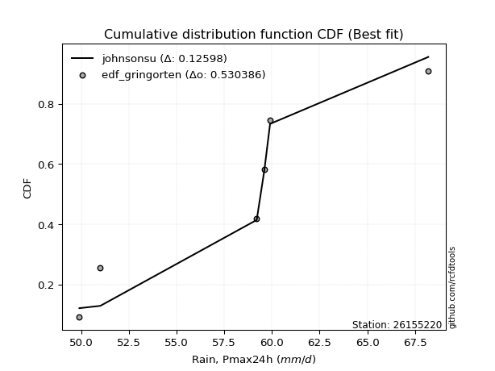</img>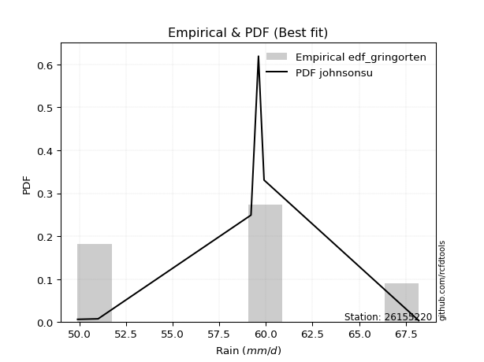</img>

</div>


### 9. EDF Filliben (1975)

The specific values of the constants (0.3175) (often denoted as $alpha$) and (0.365) are derived from a method proposed by James J. Filliben in a 1975 paper. This particular formula is the mean value of the $i$-th order statistic of the normal distribution and is considered a robust and effective plotting position formula for the normal probability plot correlation coefficient test for normality.

<div align="center">


$P=(m-0.3175)/(n+0.365)$


</div>


**9.1. Empirical values**

<div align="center">

|                | 0                   | 1                   | 2                  | 3                  | 4                  | 5                  |
|:---------------|:--------------------|:--------------------|:-------------------|:-------------------|:-------------------|:-------------------|
| date           | 2021                | 2018                | 2020               | 2019               | 2022               | 2017               |
| x              | 49.9                | 51.0                | 59.2               | 59.6               | 59.9               | 68.2               |
| m              | 1                   | 2                   | 3                  | 4                  | 5                  | 6                  |
| empirical_dist | edf_filliben        | edf_filliben        | edf_filliben       | edf_filliben       | edf_filliben       | edf_filliben       |
| empirical      | 0.10722702278083267 | 0.26433621366849963 | 0.4214454045561665 | 0.5785545954438335 | 0.7356637863315004 | 0.8927729772191673 |
| empirical_tr   | 1.1201055873295205  | 1.3593166043780034  | 1.7284453496266123 | 2.3727865796831313 | 3.783060921248143  | 9.326007326007321  |

</div>


**9.2. Kolmogorov-Smirnov fit test (sorted by Δ)**


<div align="center">

|                | 0                  | 1                   | 2                   | 3                   | 4                   | 5                   | 6                   | 7                   | 8                   | 9                   | 10                 | 11                  | 12                  | 13                  | 14                  | 15                  | 16                  | 17                  | 18                  | 19                  | 20                 | 21                  | 22                  | 23                  | 24                  | 25                  | 26                  | 27                  | 28                  | 29                  | 30                  | 31                  | 32                  | 33                  | 34                  | 35                  | 36                | 37                  | 38                  | 39                  | 40                  | 41                  | 42                  | 43                  | 44                 | 45                  | 46                  | 47                  | 48                  | 49                  | 50                 | 51                  | 52                  | 53                  | 54                 | 55                  | 56                  | 57                 | 58                  | 59                  | 60                  | 61                 | 62                 | 63                  | 64                 | 65                | 66                  | 67                 | 68                 | 69                 | 70                  | 71                  | 72                  | 73                  | 74                  | 75                  | 76                  | 77                 | 78                  | 79                  | 80                 | 81                 | 82                 | 83                  | 84                 | 85                 | 86                  | 87                  | 88                  | 89                  | 90                  | 91                  | 92                 | 93                  | 94                  | 95                  | 96                  | 97                  | 98                  | 99                 | 100                | 101                 | 102                 | 103                 | 104                 | 105                 | 106                 | 107                 | 108                 | 109               | 110                 | 111                 | 112                | 113               | 114                | 115                | 116                | 117                | 118                | 119                 | 120                | 121                 | 122                 | 123                 | 124                 | 125               | 126                | 127                | 128                | 129                | 130                | 131                | 132                | 133                 | 134                | 135                | 136                | 137                | 138                 | 139                 | 140                | 141                | 142                | 143                 | 144                | 145                | 146                 | 147                | 148                 | 149                 | 150                | 151                 | 152               | 153                 | 154               | 155                | 156                | 157               | 158                | 159            |
|:---------------|:-------------------|:--------------------|:--------------------|:--------------------|:--------------------|:--------------------|:--------------------|:--------------------|:--------------------|:--------------------|:-------------------|:--------------------|:--------------------|:--------------------|:--------------------|:--------------------|:--------------------|:--------------------|:--------------------|:--------------------|:-------------------|:--------------------|:--------------------|:--------------------|:--------------------|:--------------------|:--------------------|:--------------------|:--------------------|:--------------------|:--------------------|:--------------------|:--------------------|:--------------------|:--------------------|:--------------------|:------------------|:--------------------|:--------------------|:--------------------|:--------------------|:--------------------|:--------------------|:--------------------|:-------------------|:--------------------|:--------------------|:--------------------|:--------------------|:--------------------|:-------------------|:--------------------|:--------------------|:--------------------|:-------------------|:--------------------|:--------------------|:-------------------|:--------------------|:--------------------|:--------------------|:-------------------|:-------------------|:--------------------|:-------------------|:------------------|:--------------------|:-------------------|:-------------------|:-------------------|:--------------------|:--------------------|:--------------------|:--------------------|:--------------------|:--------------------|:--------------------|:-------------------|:--------------------|:--------------------|:-------------------|:-------------------|:-------------------|:--------------------|:-------------------|:-------------------|:--------------------|:--------------------|:--------------------|:--------------------|:--------------------|:--------------------|:-------------------|:--------------------|:--------------------|:--------------------|:--------------------|:--------------------|:--------------------|:-------------------|:-------------------|:--------------------|:--------------------|:--------------------|:--------------------|:--------------------|:--------------------|:--------------------|:--------------------|:------------------|:--------------------|:--------------------|:-------------------|:------------------|:-------------------|:-------------------|:-------------------|:-------------------|:-------------------|:--------------------|:-------------------|:--------------------|:--------------------|:--------------------|:--------------------|:------------------|:-------------------|:-------------------|:-------------------|:-------------------|:-------------------|:-------------------|:-------------------|:--------------------|:-------------------|:-------------------|:-------------------|:-------------------|:--------------------|:--------------------|:-------------------|:-------------------|:-------------------|:--------------------|:-------------------|:-------------------|:--------------------|:-------------------|:--------------------|:--------------------|:-------------------|:--------------------|:------------------|:--------------------|:------------------|:-------------------|:-------------------|:------------------|:-------------------|:---------------|
| station        | 26155220           | 26155220            | 26155220            | 26155220            | 26155220            | 26155220            | 26155220            | 26155220            | 26155220            | 26155220            | 26155220           | 26155220            | 26155220            | 26155220            | 26155220            | 26155220            | 26155220            | 26155220            | 26155220            | 26155220            | 26155220           | 26155220            | 26155220            | 26155220            | 26155220            | 26155220            | 26155220            | 26155220            | 26155220            | 26155220            | 26155220            | 26155220            | 26155220            | 26155220            | 26155220            | 26155220            | 26155220          | 26155220            | 26155220            | 26155220            | 26155220            | 26155220            | 26155220            | 26155220            | 26155220           | 26155220            | 26155220            | 26155220            | 26155220            | 26155220            | 26155220           | 26155220            | 26155220            | 26155220            | 26155220           | 26155220            | 26155220            | 26155220           | 26155220            | 26155220            | 26155220            | 26155220           | 26155220           | 26155220            | 26155220           | 26155220          | 26155220            | 26155220           | 26155220           | 26155220           | 26155220            | 26155220            | 26155220            | 26155220            | 26155220            | 26155220            | 26155220            | 26155220           | 26155220            | 26155220            | 26155220           | 26155220           | 26155220           | 26155220            | 26155220           | 26155220           | 26155220            | 26155220            | 26155220            | 26155220            | 26155220            | 26155220            | 26155220           | 26155220            | 26155220            | 26155220            | 26155220            | 26155220            | 26155220            | 26155220           | 26155220           | 26155220            | 26155220            | 26155220            | 26155220            | 26155220            | 26155220            | 26155220            | 26155220            | 26155220          | 26155220            | 26155220            | 26155220           | 26155220          | 26155220           | 26155220           | 26155220           | 26155220           | 26155220           | 26155220            | 26155220           | 26155220            | 26155220            | 26155220            | 26155220            | 26155220          | 26155220           | 26155220           | 26155220           | 26155220           | 26155220           | 26155220           | 26155220           | 26155220            | 26155220           | 26155220           | 26155220           | 26155220           | 26155220            | 26155220            | 26155220           | 26155220           | 26155220           | 26155220            | 26155220           | 26155220           | 26155220            | 26155220           | 26155220            | 26155220            | 26155220           | 26155220            | 26155220          | 26155220            | 26155220          | 26155220           | 26155220           | 26155220          | 26155220           | 26155220       |
| empirical_dist | edf_filliben       | edf_filliben        | edf_filliben        | edf_filliben        | edf_filliben        | edf_filliben        | edf_filliben        | edf_filliben        | edf_filliben        | edf_filliben        | edf_filliben       | edf_filliben        | edf_filliben        | edf_filliben        | edf_filliben        | edf_filliben        | edf_filliben        | edf_filliben        | edf_filliben        | edf_filliben        | edf_filliben       | edf_filliben        | edf_filliben        | edf_filliben        | edf_filliben        | edf_filliben        | edf_filliben        | edf_filliben        | edf_filliben        | edf_filliben        | edf_filliben        | edf_filliben        | edf_filliben        | edf_filliben        | edf_filliben        | edf_filliben        | edf_filliben      | edf_filliben        | edf_filliben        | edf_filliben        | edf_filliben        | edf_filliben        | edf_filliben        | edf_filliben        | edf_filliben       | edf_filliben        | edf_filliben        | edf_filliben        | edf_filliben        | edf_filliben        | edf_filliben       | edf_filliben        | edf_filliben        | edf_filliben        | edf_filliben       | edf_filliben        | edf_filliben        | edf_filliben       | edf_filliben        | edf_filliben        | edf_filliben        | edf_filliben       | edf_filliben       | edf_filliben        | edf_filliben       | edf_filliben      | edf_filliben        | edf_filliben       | edf_filliben       | edf_filliben       | edf_filliben        | edf_filliben        | edf_filliben        | edf_filliben        | edf_filliben        | edf_filliben        | edf_filliben        | edf_filliben       | edf_filliben        | edf_filliben        | edf_filliben       | edf_filliben       | edf_filliben       | edf_filliben        | edf_filliben       | edf_filliben       | edf_filliben        | edf_filliben        | edf_filliben        | edf_filliben        | edf_filliben        | edf_filliben        | edf_filliben       | edf_filliben        | edf_filliben        | edf_filliben        | edf_filliben        | edf_filliben        | edf_filliben        | edf_filliben       | edf_filliben       | edf_filliben        | edf_filliben        | edf_filliben        | edf_filliben        | edf_filliben        | edf_filliben        | edf_filliben        | edf_filliben        | edf_filliben      | edf_filliben        | edf_filliben        | edf_filliben       | edf_filliben      | edf_filliben       | edf_filliben       | edf_filliben       | edf_filliben       | edf_filliben       | edf_filliben        | edf_filliben       | edf_filliben        | edf_filliben        | edf_filliben        | edf_filliben        | edf_filliben      | edf_filliben       | edf_filliben       | edf_filliben       | edf_filliben       | edf_filliben       | edf_filliben       | edf_filliben       | edf_filliben        | edf_filliben       | edf_filliben       | edf_filliben       | edf_filliben       | edf_filliben        | edf_filliben        | edf_filliben       | edf_filliben       | edf_filliben       | edf_filliben        | edf_filliben       | edf_filliben       | edf_filliben        | edf_filliben       | edf_filliben        | edf_filliben        | edf_filliben       | edf_filliben        | edf_filliben      | edf_filliben        | edf_filliben      | edf_filliben       | edf_filliben       | edf_filliben      | edf_filliben       | edf_filliben   |
| p_dist         | johnsonsu          | logjohnsonsu        | semicircular        | loggumbel_l         | ksone               | cosine              | anglit              | logksone            | logburr12           | logarcsine          | truncnorm          | norm                | crystalball         | t                   | logsemicircular     | exponnorm           | logweibull_max      | loggenextreme       | foldnorm            | loggenlogistic      | loggausshyper      | loganglit           | arcsine             | genextreme          | gumbel_l            | pearson3            | ncf                 | logistic            | logcosine           | logloggamma         | skewnorm            | hypsecant           | logargus            | logt                | logskewnorm         | logcrystalball      | lognorm           | logexponnorm        | bradford            | logpearson3         | logerlang           | loggamma            | loggamma            | f                   | logf               | loginvgamma         | betaprime           | erlang              | logdweibull         | invgamma            | alpha              | logncf              | rice                | logalpha            | lognct             | logkappa4           | kappa4              | gamma              | maxwell             | nct                 | loglogistic         | logtukeylambda     | logbetaprime       | loguniform          | dgamma             | rayleigh          | tukeylambda         | gausshyper         | logrice            | invgauss           | loghypsecant        | laplace             | logdgamma           | gompertz            | uniform             | logmaxwell          | gennorm             | logloglaplace      | logwrapcauchy       | loginvgauss         | vonmises_line      | truncexpon         | argus              | lograyleigh         | invweibull         | logfoldnorm        | genlogistic         | logbradford         | logvonmises_line    | burr                | wrapcauchy          | halfnorm            | kstwobign          | loginvweibull       | gumbel_r            | logmielke           | logexponpow         | nakagami            | loggompertz         | loglaplace         | loglaplace         | logburr             | exponpow            | genexpon            | loggennorm          | dweibull            | loghalfnorm         | logkstwobign        | logexponweib        | logtriang         | loggumbel_r         | logtruncnorm        | lomax              | halflogistic      | moyal              | loglevy_l          | loggenexpon        | weibull_min        | levy_l             | logtruncexpon       | loghalflogistic    | logmoyal            | burr12              | loglomax            | logbeta             | halfgennorm       | loggenhalflogistic | wald               | triang             | kappa3             | logwald            | genpareto          | loggengamma        | logtruncweibull_min | gengamma           | truncweibull_min   | genhalflogistic    | logweibull_min     | beta                | loggenpareto        | lognakagami        | logtrapezoid       | trapezoid          | exponweib           | logjohnsonsb       | johnsonsb          | fatiguelife         | rdist              | weibull_max         | logfatiguelife      | truncpareto        | powerlaw            | logtruncpareto    | logpowerlaw         | logkappa3         | loghalfgennorm     | logrdist           | logvonmises       | vonmises           | mielke         |
| delta          | 0.1354145722975834 | 0.13657012883714342 | 0.14237757266128348 | 0.14475345572806775 | 0.14477836018863088 | 0.14623350748303615 | 0.14699426490986933 | 0.15118796099513798 | 0.15185501457981931 | 0.15315451062296281 | 0.1581442010415719 | 0.15814426987241437 | 0.15814427295927125 | 0.15814984963713852 | 0.15843257648397335 | 0.15890190711066143 | 0.15989833955590937 | 0.15990877454812447 | 0.16145579094737383 | 0.16247798894992638 | 0.1638665029209353 | 0.16413961549814726 | 0.16420189647488903 | 0.16648830764688005 | 0.16703665837554238 | 0.16810483513974184 | 0.16832172025527248 | 0.16863324053277362 | 0.17012982729648873 | 0.17598570285199333 | 0.17633152694174636 | 0.17735097987348802 | 0.17753826009466256 | 0.17787784781971716 | 0.17788302209735019 | 0.17788307403054548 | 0.177883083471986 | 0.17788368355758588 | 0.17813198332993668 | 0.17817258275000858 | 0.17817500483513027 | 0.17817712746866743 | 0.17817712746866743 | 0.17933592395736697 | 0.1798272882295292 | 0.18016752453102047 | 0.18111618648869732 | 0.18192193118957034 | 0.18205136392436916 | 0.18234356640289173 | 0.1824913909640956 | 0.18281882997212617 | 0.18301888928298138 | 0.18322286646750485 | 0.1832475976358044 | 0.18543208377221632 | 0.18572319083992508 | 0.1861204242443607 | 0.18638156177593646 | 0.18933749908699304 | 0.19070701991763328 | 0.1914205020053072 | 0.1915254419685467 | 0.19454432658785772 | 0.1952630119982266 | 0.195265619549419 | 0.19592832011132771 | 0.1970765966088559 | 0.1981207838793818 | 0.2008817530731365 | 0.20120643592547494 | 0.20218487464908053 | 0.20304564837894368 | 0.20345547078731252 | 0.20422692405101323 | 0.20446734391279997 | 0.20457579282143837 | 0.2055566638218045 | 0.20684493280921223 | 0.20988968996006996 | 0.2105573566944724 | 0.2114064366784324 | 0.2119647408082107 | 0.21272160935660211 | 0.2127252647193627 | 0.2131162969878989 | 0.21425898730778403 | 0.21492267386952546 | 0.21514745122909695 | 0.21763461654180438 | 0.22008271202071328 | 0.22043565011145294 | 0.2209856608941937 | 0.22554936933779135 | 0.22649418319211545 | 0.22686239418957355 | 0.22702333465155022 | 0.22804506673314506 | 0.22804515884527798 | 0.2282585186363969 | 0.2282585186363969 | 0.22852462574238042 | 0.22922105528346914 | 0.23030510579183538 | 0.23566378530462162 | 0.23566378633147944 | 0.23621751596474505 | 0.23695291772924676 | 0.24124571881170476 | 0.243696649492546 | 0.24446288393911775 | 0.24592377201893323 | 0.2466542235596162 | 0.248478028985066 | 0.2501949420928259 | 0.2505674382521426 | 0.2557768109480092 | 0.2575271240389685 | 0.2606076334212802 | 0.26351614775544063 | 0.2645042923472525 | 0.26722714360230315 | 0.27099409603287594 | 0.27242415710474177 | 0.28209984155706935 | 0.284540415962515 | 0.2856155254720724 | 0.3160522155134806 | 0.3175065298459438 | 0.3193586012368327 | 0.3306347402340907 | 0.3309973677057415 | 0.3397364752672364 | 0.34011488800773637 | 0.3485268309814772 | 0.3502108516866981 | 0.3519430676026962 | 0.3540172684969042 | 0.35769774657503606 | 0.36797148690719816 | 0.3706763049879369 | 0.4101549204928442 | 0.4454588351203235 | 0.45453912057655776 | 0.4567505519558644 | 0.4593674303576802 | 0.46190687225223803 | 0.4678864800890027 | 0.47067753227906645 | 0.47760624237085614 | 0.4781528888236928 | 0.48249057649199345 | 0.487242096563957 | 0.48894146072018974 | 0.590031510905825 | 0.7356637863315004 | 0.8927729772191673 | 1.177972011837932 | 10.954238291460987 | nan            |
| deltao         | 0.530385761606     | 0.530385761606      | 0.530385761606      | 0.530385761606      | 0.530385761606      | 0.530385761606      | 0.530385761606      | 0.530385761606      | 0.530385761606      | 0.530385761606      | 0.530385761606     | 0.530385761606      | 0.530385761606      | 0.530385761606      | 0.530385761606      | 0.530385761606      | 0.530385761606      | 0.530385761606      | 0.530385761606      | 0.530385761606      | 0.530385761606     | 0.530385761606      | 0.530385761606      | 0.530385761606      | 0.530385761606      | 0.530385761606      | 0.530385761606      | 0.530385761606      | 0.530385761606      | 0.530385761606      | 0.530385761606      | 0.530385761606      | 0.530385761606      | 0.530385761606      | 0.530385761606      | 0.530385761606      | 0.530385761606    | 0.530385761606      | 0.530385761606      | 0.530385761606      | 0.530385761606      | 0.530385761606      | 0.530385761606      | 0.530385761606      | 0.530385761606     | 0.530385761606      | 0.530385761606      | 0.530385761606      | 0.530385761606      | 0.530385761606      | 0.530385761606     | 0.530385761606      | 0.530385761606      | 0.530385761606      | 0.530385761606     | 0.530385761606      | 0.530385761606      | 0.530385761606     | 0.530385761606      | 0.530385761606      | 0.530385761606      | 0.530385761606     | 0.530385761606     | 0.530385761606      | 0.530385761606     | 0.530385761606    | 0.530385761606      | 0.530385761606     | 0.530385761606     | 0.530385761606     | 0.530385761606      | 0.530385761606      | 0.530385761606      | 0.530385761606      | 0.530385761606      | 0.530385761606      | 0.530385761606      | 0.530385761606     | 0.530385761606      | 0.530385761606      | 0.530385761606     | 0.530385761606     | 0.530385761606     | 0.530385761606      | 0.530385761606     | 0.530385761606     | 0.530385761606      | 0.530385761606      | 0.530385761606      | 0.530385761606      | 0.530385761606      | 0.530385761606      | 0.530385761606     | 0.530385761606      | 0.530385761606      | 0.530385761606      | 0.530385761606      | 0.530385761606      | 0.530385761606      | 0.530385761606     | 0.530385761606     | 0.530385761606      | 0.530385761606      | 0.530385761606      | 0.530385761606      | 0.530385761606      | 0.530385761606      | 0.530385761606      | 0.530385761606      | 0.530385761606    | 0.530385761606      | 0.530385761606      | 0.530385761606     | 0.530385761606    | 0.530385761606     | 0.530385761606     | 0.530385761606     | 0.530385761606     | 0.530385761606     | 0.530385761606      | 0.530385761606     | 0.530385761606      | 0.530385761606      | 0.530385761606      | 0.530385761606      | 0.530385761606    | 0.530385761606     | 0.530385761606     | 0.530385761606     | 0.530385761606     | 0.530385761606     | 0.530385761606     | 0.530385761606     | 0.530385761606      | 0.530385761606     | 0.530385761606     | 0.530385761606     | 0.530385761606     | 0.530385761606      | 0.530385761606      | 0.530385761606     | 0.530385761606     | 0.530385761606     | 0.530385761606      | 0.530385761606     | 0.530385761606     | 0.530385761606      | 0.530385761606     | 0.530385761606      | 0.530385761606      | 0.530385761606     | 0.530385761606      | 0.530385761606    | 0.530385761606      | 0.530385761606    | 0.530385761606     | 0.530385761606     | 0.530385761606    | 0.530385761606     | 0.530385761606 |
| eval           | Δo > Δ             | Δo > Δ              | Δo > Δ              | Δo > Δ              | Δo > Δ              | Δo > Δ              | Δo > Δ              | Δo > Δ              | Δo > Δ              | Δo > Δ              | Δo > Δ             | Δo > Δ              | Δo > Δ              | Δo > Δ              | Δo > Δ              | Δo > Δ              | Δo > Δ              | Δo > Δ              | Δo > Δ              | Δo > Δ              | Δo > Δ             | Δo > Δ              | Δo > Δ              | Δo > Δ              | Δo > Δ              | Δo > Δ              | Δo > Δ              | Δo > Δ              | Δo > Δ              | Δo > Δ              | Δo > Δ              | Δo > Δ              | Δo > Δ              | Δo > Δ              | Δo > Δ              | Δo > Δ              | Δo > Δ            | Δo > Δ              | Δo > Δ              | Δo > Δ              | Δo > Δ              | Δo > Δ              | Δo > Δ              | Δo > Δ              | Δo > Δ             | Δo > Δ              | Δo > Δ              | Δo > Δ              | Δo > Δ              | Δo > Δ              | Δo > Δ             | Δo > Δ              | Δo > Δ              | Δo > Δ              | Δo > Δ             | Δo > Δ              | Δo > Δ              | Δo > Δ             | Δo > Δ              | Δo > Δ              | Δo > Δ              | Δo > Δ             | Δo > Δ             | Δo > Δ              | Δo > Δ             | Δo > Δ            | Δo > Δ              | Δo > Δ             | Δo > Δ             | Δo > Δ             | Δo > Δ              | Δo > Δ              | Δo > Δ              | Δo > Δ              | Δo > Δ              | Δo > Δ              | Δo > Δ              | Δo > Δ             | Δo > Δ              | Δo > Δ              | Δo > Δ             | Δo > Δ             | Δo > Δ             | Δo > Δ              | Δo > Δ             | Δo > Δ             | Δo > Δ              | Δo > Δ              | Δo > Δ              | Δo > Δ              | Δo > Δ              | Δo > Δ              | Δo > Δ             | Δo > Δ              | Δo > Δ              | Δo > Δ              | Δo > Δ              | Δo > Δ              | Δo > Δ              | Δo > Δ             | Δo > Δ             | Δo > Δ              | Δo > Δ              | Δo > Δ              | Δo > Δ              | Δo > Δ              | Δo > Δ              | Δo > Δ              | Δo > Δ              | Δo > Δ            | Δo > Δ              | Δo > Δ              | Δo > Δ             | Δo > Δ            | Δo > Δ             | Δo > Δ             | Δo > Δ             | Δo > Δ             | Δo > Δ             | Δo > Δ              | Δo > Δ             | Δo > Δ              | Δo > Δ              | Δo > Δ              | Δo > Δ              | Δo > Δ            | Δo > Δ             | Δo > Δ             | Δo > Δ             | Δo > Δ             | Δo > Δ             | Δo > Δ             | Δo > Δ             | Δo > Δ              | Δo > Δ             | Δo > Δ             | Δo > Δ             | Δo > Δ             | Δo > Δ              | Δo > Δ              | Δo > Δ             | Δo > Δ             | Δo > Δ             | Δo > Δ              | Δo > Δ             | Δo > Δ             | Δo > Δ              | Δo > Δ             | Δo > Δ              | Δo > Δ              | Δo > Δ             | Δo > Δ              | Δo > Δ            | Δo > Δ              | Δo <= Δ           | Δo <= Δ            | Δo <= Δ            | Δo <= Δ           | Δo <= Δ            | Δo <= Δ        |
| fit            | 1                  | 1                   | 1                   | 1                   | 1                   | 1                   | 1                   | 1                   | 1                   | 1                   | 1                  | 1                   | 1                   | 1                   | 1                   | 1                   | 1                   | 1                   | 1                   | 1                   | 1                  | 1                   | 1                   | 1                   | 1                   | 1                   | 1                   | 1                   | 1                   | 1                   | 1                   | 1                   | 1                   | 1                   | 1                   | 1                   | 1                 | 1                   | 1                   | 1                   | 1                   | 1                   | 1                   | 1                   | 1                  | 1                   | 1                   | 1                   | 1                   | 1                   | 1                  | 1                   | 1                   | 1                   | 1                  | 1                   | 1                   | 1                  | 1                   | 1                   | 1                   | 1                  | 1                  | 1                   | 1                  | 1                 | 1                   | 1                  | 1                  | 1                  | 1                   | 1                   | 1                   | 1                   | 1                   | 1                   | 1                   | 1                  | 1                   | 1                   | 1                  | 1                  | 1                  | 1                   | 1                  | 1                  | 1                   | 1                   | 1                   | 1                   | 1                   | 1                   | 1                  | 1                   | 1                   | 1                   | 1                   | 1                   | 1                   | 1                  | 1                  | 1                   | 1                   | 1                   | 1                   | 1                   | 1                   | 1                   | 1                   | 1                 | 1                   | 1                   | 1                  | 1                 | 1                  | 1                  | 1                  | 1                  | 1                  | 1                   | 1                  | 1                   | 1                   | 1                   | 1                   | 1                 | 1                  | 1                  | 1                  | 1                  | 1                  | 1                  | 1                  | 1                   | 1                  | 1                  | 1                  | 1                  | 1                   | 1                   | 1                  | 1                  | 1                  | 1                   | 1                  | 1                  | 1                   | 1                  | 1                   | 1                   | 1                  | 1                   | 1                 | 1                   | 0                 | 0                  | 0                  | 0                 | 0                  | 0              |
| n              | 6                  | 6                   | 6                   | 6                   | 6                   | 6                   | 6                   | 6                   | 6                   | 6                   | 6                  | 6                   | 6                   | 6                   | 6                   | 6                   | 6                   | 6                   | 6                   | 6                   | 6                  | 6                   | 6                   | 6                   | 6                   | 6                   | 6                   | 6                   | 6                   | 6                   | 6                   | 6                   | 6                   | 6                   | 6                   | 6                   | 6                 | 6                   | 6                   | 6                   | 6                   | 6                   | 6                   | 6                   | 6                  | 6                   | 6                   | 6                   | 6                   | 6                   | 6                  | 6                   | 6                   | 6                   | 6                  | 6                   | 6                   | 6                  | 6                   | 6                   | 6                   | 6                  | 6                  | 6                   | 6                  | 6                 | 6                   | 6                  | 6                  | 6                  | 6                   | 6                   | 6                   | 6                   | 6                   | 6                   | 6                   | 6                  | 6                   | 6                   | 6                  | 6                  | 6                  | 6                   | 6                  | 6                  | 6                   | 6                   | 6                   | 6                   | 6                   | 6                   | 6                  | 6                   | 6                   | 6                   | 6                   | 6                   | 6                   | 6                  | 6                  | 6                   | 6                   | 6                   | 6                   | 6                   | 6                   | 6                   | 6                   | 6                 | 6                   | 6                   | 6                  | 6                 | 6                  | 6                  | 6                  | 6                  | 6                  | 6                   | 6                  | 6                   | 6                   | 6                   | 6                   | 6                 | 6                  | 6                  | 6                  | 6                  | 6                  | 6                  | 6                  | 6                   | 6                  | 6                  | 6                  | 6                  | 6                   | 6                   | 6                  | 6                  | 6                  | 6                   | 6                  | 6                  | 6                   | 6                  | 6                   | 6                   | 6                  | 6                   | 6                 | 6                   | 6                 | 6                  | 6                  | 6                 | 6                  | 6              |
| best_fit       | 1                  | 0                   | 0                   | 0                   | 0                   | 0                   | 0                   | 0                   | 0                   | 0                   | 0                  | 0                   | 0                   | 0                   | 0                   | 0                   | 0                   | 0                   | 0                   | 0                   | 0                  | 0                   | 0                   | 0                   | 0                   | 0                   | 0                   | 0                   | 0                   | 0                   | 0                   | 0                   | 0                   | 0                   | 0                   | 0                   | 0                 | 0                   | 0                   | 0                   | 0                   | 0                   | 0                   | 0                   | 0                  | 0                   | 0                   | 0                   | 0                   | 0                   | 0                  | 0                   | 0                   | 0                   | 0                  | 0                   | 0                   | 0                  | 0                   | 0                   | 0                   | 0                  | 0                  | 0                   | 0                  | 0                 | 0                   | 0                  | 0                  | 0                  | 0                   | 0                   | 0                   | 0                   | 0                   | 0                   | 0                   | 0                  | 0                   | 0                   | 0                  | 0                  | 0                  | 0                   | 0                  | 0                  | 0                   | 0                   | 0                   | 0                   | 0                   | 0                   | 0                  | 0                   | 0                   | 0                   | 0                   | 0                   | 0                   | 0                  | 0                  | 0                   | 0                   | 0                   | 0                   | 0                   | 0                   | 0                   | 0                   | 0                 | 0                   | 0                   | 0                  | 0                 | 0                  | 0                  | 0                  | 0                  | 0                  | 0                   | 0                  | 0                   | 0                   | 0                   | 0                   | 0                 | 0                  | 0                  | 0                  | 0                  | 0                  | 0                  | 0                  | 0                   | 0                  | 0                  | 0                  | 0                  | 0                   | 0                   | 0                  | 0                  | 0                  | 0                   | 0                  | 0                  | 0                   | 0                  | 0                   | 0                   | 0                  | 0                   | 0                 | 0                   | 0                 | 0                  | 0                  | 0                 | 0                  | 0              |
| best_fit_sort  | 1                  | 2                   | 3                   | 4                   | 5                   | 6                   | 7                   | 8                   | 9                   | 10                  | 11                 | 12                  | 13                  | 14                  | 15                  | 16                  | 17                  | 18                  | 19                  | 20                  | 21                 | 22                  | 23                  | 24                  | 25                  | 26                  | 27                  | 28                  | 29                  | 30                  | 31                  | 32                  | 33                  | 34                  | 35                  | 36                  | 37                | 38                  | 39                  | 40                  | 41                  | 42                  | 43                  | 44                  | 45                 | 46                  | 47                  | 48                  | 49                  | 50                  | 51                 | 52                  | 53                  | 54                  | 55                 | 56                  | 57                  | 58                 | 59                  | 60                  | 61                  | 62                 | 63                 | 64                  | 65                 | 66                | 67                  | 68                 | 69                 | 70                 | 71                  | 72                  | 73                  | 74                  | 75                  | 76                  | 77                  | 78                 | 79                  | 80                  | 81                 | 82                 | 83                 | 84                  | 85                 | 86                 | 87                  | 88                  | 89                  | 90                  | 91                  | 92                  | 93                 | 94                  | 95                  | 96                  | 97                  | 98                  | 99                  | 100                | 101                | 102                 | 103                 | 104                 | 105                 | 106                 | 107                 | 108                 | 109                 | 110               | 111                 | 112                 | 113                | 114               | 115                | 116                | 117                | 118                | 119                | 120                 | 121                | 122                 | 123                 | 124                 | 125                 | 126               | 127                | 128                | 129                | 130                | 131                | 132                | 133                | 134                 | 135                | 136                | 137                | 138                | 139                 | 140                 | 141                | 142                | 143                | 144                 | 145                | 146                | 147                 | 148                | 149                 | 150                 | 151                | 152                 | 153               | 154                 | 155               | 156                | 157                | 158               | 159                | 160            |

</div>


**9.3. Best fit**

<div align="center">

|   id |   station | empirical_dist   | p_dist    |    delta |   deltao | eval   |   fit |   n |   best_fit |   best_fit_sort |
|-----:|----------:|:-----------------|:----------|---------:|---------:|:-------|------:|----:|-----------:|----------------:|
|    0 |  26155220 | edf_filliben     | johnsonsu | 0.135415 | 0.530386 | Δo > Δ |     1 |   6 |          1 |               1 |

</div>


<div align="center">

</img>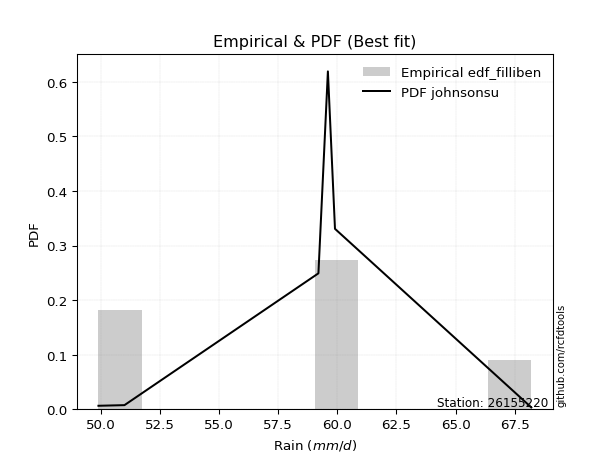</img>

</div>


### 10. EDF Jenkinson (1977)

The Jenkinson formula in hydrology is an empirical plotting position formula used to estimate the non-exceedance probability _(P)_ or return period _(T)_ of a given ordered observation within a sample. It is a widely used method in the frequency analysis of extreme events such as floods and rainfall, as it provides a distribution-free way to plot data. _a≈0.31_ and _b≈0.38_ are constants derived to approximate the median of the probability distribution for the given rank.

<div align="center">


$P=(m-a)/(n+b)$


</div>


**10.1. Empirical values**

<div align="center">

|                | 0                   | 1                   | 2                  | 3                  | 4                  | 5                  |
|:---------------|:--------------------|:--------------------|:-------------------|:-------------------|:-------------------|:-------------------|
| date           | 2021                | 2018                | 2020               | 2019               | 2022               | 2017               |
| x              | 49.9                | 51.0                | 59.2               | 59.6               | 59.9               | 68.2               |
| m              | 1                   | 2                   | 3                  | 4                  | 5                  | 6                  |
| empirical_dist | edf_jenkinson       | edf_jenkinson       | edf_jenkinson      | edf_jenkinson      | edf_jenkinson      | edf_jenkinson      |
| empirical      | 0.10815047021943573 | 0.26489028213166144 | 0.4216300940438871 | 0.5783699059561128 | 0.7351097178683387 | 0.8918495297805643 |
| empirical_tr   | 1.1212653778558874  | 1.3603411513859276  | 1.7289972899728996 | 2.3717472118959106 | 3.7751479289940844 | 9.246376811594207  |

</div>


**10.2. Kolmogorov-Smirnov fit test (sorted by Δ)**


<div align="center">

|                | 0                   | 1                   | 2                   | 3                   | 4                   | 5                   | 6                   | 7                   | 8                  | 9                   | 10                 | 11                  | 12                  | 13                  | 14                  | 15                  | 16                  | 17                  | 18                  | 19                  | 20                  | 21                  | 22                  | 23                  | 24                  | 25                  | 26                  | 27                  | 28                  | 29                  | 30                  | 31                 | 32                  | 33                  | 34                  | 35                  | 36                 | 37                  | 38                  | 39                  | 40                  | 41                  | 42                 | 43                  | 44                 | 45                  | 46                  | 47                 | 48                  | 49                  | 50                | 51                  | 52                  | 53                  | 54                  | 55                 | 56                  | 57                  | 58                 | 59                  | 60                  | 61                 | 62                | 63                 | 64                  | 65                 | 66                  | 67                 | 68                 | 69                 | 70                  | 71                  | 72                  | 73                  | 74                  | 75                  | 76                  | 77                  | 78                  | 79                  | 80                 | 81                 | 82                  | 83                 | 84                 | 85                 | 86                  | 87                  | 88                  | 89                  | 90                  | 91                  | 92                 | 93                  | 94                  | 95                  | 96                  | 97                  | 98                  | 99                 | 100                | 101                 | 102                 | 103                 | 104                 | 105                | 106                 | 107                 | 108                 | 109                 | 110                 | 111                 | 112                | 113                | 114                 | 115                | 116                | 117                | 118                | 119                 | 120                | 121                 | 122                 | 123                 | 124                 | 125                | 126                 | 127              | 128                 | 129                 | 130                 | 131                 | 132                | 133                 | 134                | 135                | 136                | 137                | 138                 | 139                | 140                | 141                 | 142                | 143                 | 144                | 145                | 146                 | 147                | 148                | 149                 | 150                | 151                 | 152                | 153                 | 154                | 155                | 156                | 157                | 158                | 159            |
|:---------------|:--------------------|:--------------------|:--------------------|:--------------------|:--------------------|:--------------------|:--------------------|:--------------------|:-------------------|:--------------------|:-------------------|:--------------------|:--------------------|:--------------------|:--------------------|:--------------------|:--------------------|:--------------------|:--------------------|:--------------------|:--------------------|:--------------------|:--------------------|:--------------------|:--------------------|:--------------------|:--------------------|:--------------------|:--------------------|:--------------------|:--------------------|:-------------------|:--------------------|:--------------------|:--------------------|:--------------------|:-------------------|:--------------------|:--------------------|:--------------------|:--------------------|:--------------------|:-------------------|:--------------------|:-------------------|:--------------------|:--------------------|:-------------------|:--------------------|:--------------------|:------------------|:--------------------|:--------------------|:--------------------|:--------------------|:-------------------|:--------------------|:--------------------|:-------------------|:--------------------|:--------------------|:-------------------|:------------------|:-------------------|:--------------------|:-------------------|:--------------------|:-------------------|:-------------------|:-------------------|:--------------------|:--------------------|:--------------------|:--------------------|:--------------------|:--------------------|:--------------------|:--------------------|:--------------------|:--------------------|:-------------------|:-------------------|:--------------------|:-------------------|:-------------------|:-------------------|:--------------------|:--------------------|:--------------------|:--------------------|:--------------------|:--------------------|:-------------------|:--------------------|:--------------------|:--------------------|:--------------------|:--------------------|:--------------------|:-------------------|:-------------------|:--------------------|:--------------------|:--------------------|:--------------------|:-------------------|:--------------------|:--------------------|:--------------------|:--------------------|:--------------------|:--------------------|:-------------------|:-------------------|:--------------------|:-------------------|:-------------------|:-------------------|:-------------------|:--------------------|:-------------------|:--------------------|:--------------------|:--------------------|:--------------------|:-------------------|:--------------------|:-----------------|:--------------------|:--------------------|:--------------------|:--------------------|:-------------------|:--------------------|:-------------------|:-------------------|:-------------------|:-------------------|:--------------------|:-------------------|:-------------------|:--------------------|:-------------------|:--------------------|:-------------------|:-------------------|:--------------------|:-------------------|:-------------------|:--------------------|:-------------------|:--------------------|:-------------------|:--------------------|:-------------------|:-------------------|:-------------------|:-------------------|:-------------------|:---------------|
| station        | 26155220            | 26155220            | 26155220            | 26155220            | 26155220            | 26155220            | 26155220            | 26155220            | 26155220           | 26155220            | 26155220           | 26155220            | 26155220            | 26155220            | 26155220            | 26155220            | 26155220            | 26155220            | 26155220            | 26155220            | 26155220            | 26155220            | 26155220            | 26155220            | 26155220            | 26155220            | 26155220            | 26155220            | 26155220            | 26155220            | 26155220            | 26155220           | 26155220            | 26155220            | 26155220            | 26155220            | 26155220           | 26155220            | 26155220            | 26155220            | 26155220            | 26155220            | 26155220           | 26155220            | 26155220           | 26155220            | 26155220            | 26155220           | 26155220            | 26155220            | 26155220          | 26155220            | 26155220            | 26155220            | 26155220            | 26155220           | 26155220            | 26155220            | 26155220           | 26155220            | 26155220            | 26155220           | 26155220          | 26155220           | 26155220            | 26155220           | 26155220            | 26155220           | 26155220           | 26155220           | 26155220            | 26155220            | 26155220            | 26155220            | 26155220            | 26155220            | 26155220            | 26155220            | 26155220            | 26155220            | 26155220           | 26155220           | 26155220            | 26155220           | 26155220           | 26155220           | 26155220            | 26155220            | 26155220            | 26155220            | 26155220            | 26155220            | 26155220           | 26155220            | 26155220            | 26155220            | 26155220            | 26155220            | 26155220            | 26155220           | 26155220           | 26155220            | 26155220            | 26155220            | 26155220            | 26155220           | 26155220            | 26155220            | 26155220            | 26155220            | 26155220            | 26155220            | 26155220           | 26155220           | 26155220            | 26155220           | 26155220           | 26155220           | 26155220           | 26155220            | 26155220           | 26155220            | 26155220            | 26155220            | 26155220            | 26155220           | 26155220            | 26155220         | 26155220            | 26155220            | 26155220            | 26155220            | 26155220           | 26155220            | 26155220           | 26155220           | 26155220           | 26155220           | 26155220            | 26155220           | 26155220           | 26155220            | 26155220           | 26155220            | 26155220           | 26155220           | 26155220            | 26155220           | 26155220           | 26155220            | 26155220           | 26155220            | 26155220           | 26155220            | 26155220           | 26155220           | 26155220           | 26155220           | 26155220           | 26155220       |
| empirical_dist | edf_jenkinson       | edf_jenkinson       | edf_jenkinson       | edf_jenkinson       | edf_jenkinson       | edf_jenkinson       | edf_jenkinson       | edf_jenkinson       | edf_jenkinson      | edf_jenkinson       | edf_jenkinson      | edf_jenkinson       | edf_jenkinson       | edf_jenkinson       | edf_jenkinson       | edf_jenkinson       | edf_jenkinson       | edf_jenkinson       | edf_jenkinson       | edf_jenkinson       | edf_jenkinson       | edf_jenkinson       | edf_jenkinson       | edf_jenkinson       | edf_jenkinson       | edf_jenkinson       | edf_jenkinson       | edf_jenkinson       | edf_jenkinson       | edf_jenkinson       | edf_jenkinson       | edf_jenkinson      | edf_jenkinson       | edf_jenkinson       | edf_jenkinson       | edf_jenkinson       | edf_jenkinson      | edf_jenkinson       | edf_jenkinson       | edf_jenkinson       | edf_jenkinson       | edf_jenkinson       | edf_jenkinson      | edf_jenkinson       | edf_jenkinson      | edf_jenkinson       | edf_jenkinson       | edf_jenkinson      | edf_jenkinson       | edf_jenkinson       | edf_jenkinson     | edf_jenkinson       | edf_jenkinson       | edf_jenkinson       | edf_jenkinson       | edf_jenkinson      | edf_jenkinson       | edf_jenkinson       | edf_jenkinson      | edf_jenkinson       | edf_jenkinson       | edf_jenkinson      | edf_jenkinson     | edf_jenkinson      | edf_jenkinson       | edf_jenkinson      | edf_jenkinson       | edf_jenkinson      | edf_jenkinson      | edf_jenkinson      | edf_jenkinson       | edf_jenkinson       | edf_jenkinson       | edf_jenkinson       | edf_jenkinson       | edf_jenkinson       | edf_jenkinson       | edf_jenkinson       | edf_jenkinson       | edf_jenkinson       | edf_jenkinson      | edf_jenkinson      | edf_jenkinson       | edf_jenkinson      | edf_jenkinson      | edf_jenkinson      | edf_jenkinson       | edf_jenkinson       | edf_jenkinson       | edf_jenkinson       | edf_jenkinson       | edf_jenkinson       | edf_jenkinson      | edf_jenkinson       | edf_jenkinson       | edf_jenkinson       | edf_jenkinson       | edf_jenkinson       | edf_jenkinson       | edf_jenkinson      | edf_jenkinson      | edf_jenkinson       | edf_jenkinson       | edf_jenkinson       | edf_jenkinson       | edf_jenkinson      | edf_jenkinson       | edf_jenkinson       | edf_jenkinson       | edf_jenkinson       | edf_jenkinson       | edf_jenkinson       | edf_jenkinson      | edf_jenkinson      | edf_jenkinson       | edf_jenkinson      | edf_jenkinson      | edf_jenkinson      | edf_jenkinson      | edf_jenkinson       | edf_jenkinson      | edf_jenkinson       | edf_jenkinson       | edf_jenkinson       | edf_jenkinson       | edf_jenkinson      | edf_jenkinson       | edf_jenkinson    | edf_jenkinson       | edf_jenkinson       | edf_jenkinson       | edf_jenkinson       | edf_jenkinson      | edf_jenkinson       | edf_jenkinson      | edf_jenkinson      | edf_jenkinson      | edf_jenkinson      | edf_jenkinson       | edf_jenkinson      | edf_jenkinson      | edf_jenkinson       | edf_jenkinson      | edf_jenkinson       | edf_jenkinson      | edf_jenkinson      | edf_jenkinson       | edf_jenkinson      | edf_jenkinson      | edf_jenkinson       | edf_jenkinson      | edf_jenkinson       | edf_jenkinson      | edf_jenkinson       | edf_jenkinson      | edf_jenkinson      | edf_jenkinson      | edf_jenkinson      | edf_jenkinson      | edf_jenkinson  |
| p_dist         | johnsonsu           | logjohnsonsu        | semicircular        | ksone               | loggumbel_l         | cosine              | anglit              | logksone            | logburr12          | logarcsine          | truncnorm          | norm                | crystalball         | t                   | logsemicircular     | exponnorm           | logweibull_max      | loggenextreme       | foldnorm            | loggenlogistic      | loggausshyper       | arcsine             | loganglit           | genextreme          | gumbel_l            | pearson3            | ncf                 | logistic            | logcosine           | logloggamma         | skewnorm            | logargus           | hypsecant           | logt                | logskewnorm         | logcrystalball      | lognorm            | logexponnorm        | logpearson3         | logerlang           | loggamma            | loggamma            | bradford           | f                   | logf               | loginvgamma         | betaprime           | logdweibull        | erlang              | invgamma            | alpha             | lognct              | logncf              | rice                | logalpha            | gamma              | logkappa4           | maxwell             | kappa4             | nct                 | loglogistic         | logbetaprime       | logtukeylambda    | rayleigh           | loguniform          | dgamma             | tukeylambda         | gausshyper         | logrice            | invgauss           | loghypsecant        | laplace             | gompertz            | logdgamma           | logmaxwell          | uniform             | logloglaplace       | gennorm             | logwrapcauchy       | loginvgauss         | vonmises_line      | truncexpon         | argus               | lograyleigh        | invweibull         | logfoldnorm        | genlogistic         | logbradford         | logvonmises_line    | burr                | wrapcauchy          | halfnorm            | kstwobign          | loginvweibull       | gumbel_r            | logmielke           | logexponpow         | nakagami            | loggompertz         | loglaplace         | loglaplace         | logburr             | exponpow            | genexpon            | loggennorm          | dweibull           | loghalfnorm         | logkstwobign        | logexponweib        | logtriang           | loggumbel_r         | logtruncnorm        | lomax              | halflogistic       | loglevy_l           | moyal              | loggenexpon        | weibull_min        | levy_l             | logtruncexpon       | loghalflogistic    | logmoyal            | burr12              | loglomax            | logbeta             | halfgennorm        | loggenhalflogistic  | wald             | triang              | kappa3              | genpareto           | logwald             | loggengamma        | logtruncweibull_min | gengamma           | truncweibull_min   | genhalflogistic    | logweibull_min     | beta                | loggenpareto       | lognakagami        | logtrapezoid        | trapezoid          | exponweib           | logjohnsonsb       | johnsonsb          | fatiguelife         | rdist              | weibull_max        | logfatiguelife      | truncpareto        | powerlaw            | logtruncpareto     | logpowerlaw         | logkappa3          | loghalfgennorm     | logrdist           | logvonmises        | vonmises           | mielke         |
| delta          | 0.13596864076074522 | 0.13712419730030523 | 0.14219288317356288 | 0.14422429172546913 | 0.14510581403364609 | 0.14678757594619796 | 0.14680957542214873 | 0.15100327150741738 | 0.1516703250920987 | 0.15260044215980106 | 0.1579595115538513 | 0.15795958038469377 | 0.15795958347155065 | 0.15796516014941792 | 0.15824788699625275 | 0.15871721762294083 | 0.15971365006818877 | 0.15972408506040386 | 0.16127110145965323 | 0.16229329946220578 | 0.16331243445777355 | 0.16364782801172728 | 0.16395492601042666 | 0.16630361815915945 | 0.16648258991238063 | 0.16792014565202124 | 0.16813703076755188 | 0.16844855104505302 | 0.16994513780876813 | 0.17580101336427273 | 0.17614683745402576 | 0.1769841916315008 | 0.17716629038576742 | 0.17769315833199656 | 0.17769833260962958 | 0.17769838454282488 | 0.1776983939842654 | 0.17769899406986528 | 0.17798789326228798 | 0.17799031534740967 | 0.17799243798094683 | 0.17799243798094683 | 0.1786860517930985 | 0.17915123446964637 | 0.1796425987418086 | 0.17998283504329987 | 0.18093149700097672 | 0.1814972954612074 | 0.18173724170184974 | 0.18215887691517113 | 0.182306701476375 | 0.18232415019720133 | 0.18263414048440557 | 0.18283419979526078 | 0.18303817697978425 | 0.1859357347566401 | 0.18598615223537812 | 0.18619687228821585 | 0.1862772593030869 | 0.18915280959927244 | 0.19052233042991268 | 0.1913407524808261 | 0.191974570468469 | 0.1950809300616984 | 0.19509839505101953 | 0.1958170804613884 | 0.19648238857448952 | 0.1968919071211353 | 0.1979360943916612 | 0.2006970635854159 | 0.20102174643775433 | 0.20200018516135992 | 0.20327078129959192 | 0.20359971684210548 | 0.20428265442507937 | 0.20478099251417503 | 0.20500259535864274 | 0.20512986128460017 | 0.20629086434605048 | 0.20970500047234936 | 0.2111114251576342 | 0.2112217471907118 | 0.21141067234504896 | 0.2125369198688815 | 0.2125405752316421 | 0.2129316075001783 | 0.21407429782006343 | 0.21473798438180486 | 0.21570151969225876 | 0.21744992705408378 | 0.21952864355755153 | 0.22025096062373234 | 0.2208009714064731 | 0.22536467985007075 | 0.22630949370439485 | 0.22667770470185294 | 0.22683864516382962 | 0.22786037724542446 | 0.22786046935755738 | 0.2280738291486763 | 0.2280738291486763 | 0.22833993625465981 | 0.22903636579574854 | 0.23012041630411478 | 0.23510971684145987 | 0.2351097178683177 | 0.23603282647702445 | 0.23676822824152616 | 0.24106102932398416 | 0.24314258102938424 | 0.24427819445139715 | 0.24573908253121263 | 0.2464695340718956 | 0.2482933394973454 | 0.24964399081353955 | 0.2500102526051053 | 0.2555921214602886 | 0.2573424345512479 | 0.2596841859826771 | 0.26333145826772003 | 0.2643196028595319 | 0.26704245411458255 | 0.27080940654515534 | 0.27223946761702117 | 0.28191515206934875 | 0.2843557264747944 | 0.28506145700891067 | 0.31586752602576 | 0.31695246138278205 | 0.31843515379822973 | 0.33007392026713844 | 0.33045005074637007 | 0.3395517857795158 | 0.33993019852001577 | 0.3483421414937566 | 0.3500261621989775 | 0.3513889991395345 | 0.3538325790091836 | 0.35751305708731546 | 0.3670480394685951 | 0.3704916155002163 | 0.40960085202968244 | 0.4449047666571618 | 0.45435443108883716 | 0.4561964834927026 | 0.4588133618945184 | 0.46172218276451743 | 0.4677017906012821 | 0.4701234638159047 | 0.47742155288313554 | 0.4779681993359722 | 0.48230588700427285 | 0.4870574070762364 | 0.48875677123246913 | 0.5891080634672219 | 0.7351097178683387 | 0.8918495297805643 | 1.1777873223502116 | 10.955161738899589 | nan            |
| deltao         | 0.530385761606      | 0.530385761606      | 0.530385761606      | 0.530385761606      | 0.530385761606      | 0.530385761606      | 0.530385761606      | 0.530385761606      | 0.530385761606     | 0.530385761606      | 0.530385761606     | 0.530385761606      | 0.530385761606      | 0.530385761606      | 0.530385761606      | 0.530385761606      | 0.530385761606      | 0.530385761606      | 0.530385761606      | 0.530385761606      | 0.530385761606      | 0.530385761606      | 0.530385761606      | 0.530385761606      | 0.530385761606      | 0.530385761606      | 0.530385761606      | 0.530385761606      | 0.530385761606      | 0.530385761606      | 0.530385761606      | 0.530385761606     | 0.530385761606      | 0.530385761606      | 0.530385761606      | 0.530385761606      | 0.530385761606     | 0.530385761606      | 0.530385761606      | 0.530385761606      | 0.530385761606      | 0.530385761606      | 0.530385761606     | 0.530385761606      | 0.530385761606     | 0.530385761606      | 0.530385761606      | 0.530385761606     | 0.530385761606      | 0.530385761606      | 0.530385761606    | 0.530385761606      | 0.530385761606      | 0.530385761606      | 0.530385761606      | 0.530385761606     | 0.530385761606      | 0.530385761606      | 0.530385761606     | 0.530385761606      | 0.530385761606      | 0.530385761606     | 0.530385761606    | 0.530385761606     | 0.530385761606      | 0.530385761606     | 0.530385761606      | 0.530385761606     | 0.530385761606     | 0.530385761606     | 0.530385761606      | 0.530385761606      | 0.530385761606      | 0.530385761606      | 0.530385761606      | 0.530385761606      | 0.530385761606      | 0.530385761606      | 0.530385761606      | 0.530385761606      | 0.530385761606     | 0.530385761606     | 0.530385761606      | 0.530385761606     | 0.530385761606     | 0.530385761606     | 0.530385761606      | 0.530385761606      | 0.530385761606      | 0.530385761606      | 0.530385761606      | 0.530385761606      | 0.530385761606     | 0.530385761606      | 0.530385761606      | 0.530385761606      | 0.530385761606      | 0.530385761606      | 0.530385761606      | 0.530385761606     | 0.530385761606     | 0.530385761606      | 0.530385761606      | 0.530385761606      | 0.530385761606      | 0.530385761606     | 0.530385761606      | 0.530385761606      | 0.530385761606      | 0.530385761606      | 0.530385761606      | 0.530385761606      | 0.530385761606     | 0.530385761606     | 0.530385761606      | 0.530385761606     | 0.530385761606     | 0.530385761606     | 0.530385761606     | 0.530385761606      | 0.530385761606     | 0.530385761606      | 0.530385761606      | 0.530385761606      | 0.530385761606      | 0.530385761606     | 0.530385761606      | 0.530385761606   | 0.530385761606      | 0.530385761606      | 0.530385761606      | 0.530385761606      | 0.530385761606     | 0.530385761606      | 0.530385761606     | 0.530385761606     | 0.530385761606     | 0.530385761606     | 0.530385761606      | 0.530385761606     | 0.530385761606     | 0.530385761606      | 0.530385761606     | 0.530385761606      | 0.530385761606     | 0.530385761606     | 0.530385761606      | 0.530385761606     | 0.530385761606     | 0.530385761606      | 0.530385761606     | 0.530385761606      | 0.530385761606     | 0.530385761606      | 0.530385761606     | 0.530385761606     | 0.530385761606     | 0.530385761606     | 0.530385761606     | 0.530385761606 |
| eval           | Δo > Δ              | Δo > Δ              | Δo > Δ              | Δo > Δ              | Δo > Δ              | Δo > Δ              | Δo > Δ              | Δo > Δ              | Δo > Δ             | Δo > Δ              | Δo > Δ             | Δo > Δ              | Δo > Δ              | Δo > Δ              | Δo > Δ              | Δo > Δ              | Δo > Δ              | Δo > Δ              | Δo > Δ              | Δo > Δ              | Δo > Δ              | Δo > Δ              | Δo > Δ              | Δo > Δ              | Δo > Δ              | Δo > Δ              | Δo > Δ              | Δo > Δ              | Δo > Δ              | Δo > Δ              | Δo > Δ              | Δo > Δ             | Δo > Δ              | Δo > Δ              | Δo > Δ              | Δo > Δ              | Δo > Δ             | Δo > Δ              | Δo > Δ              | Δo > Δ              | Δo > Δ              | Δo > Δ              | Δo > Δ             | Δo > Δ              | Δo > Δ             | Δo > Δ              | Δo > Δ              | Δo > Δ             | Δo > Δ              | Δo > Δ              | Δo > Δ            | Δo > Δ              | Δo > Δ              | Δo > Δ              | Δo > Δ              | Δo > Δ             | Δo > Δ              | Δo > Δ              | Δo > Δ             | Δo > Δ              | Δo > Δ              | Δo > Δ             | Δo > Δ            | Δo > Δ             | Δo > Δ              | Δo > Δ             | Δo > Δ              | Δo > Δ             | Δo > Δ             | Δo > Δ             | Δo > Δ              | Δo > Δ              | Δo > Δ              | Δo > Δ              | Δo > Δ              | Δo > Δ              | Δo > Δ              | Δo > Δ              | Δo > Δ              | Δo > Δ              | Δo > Δ             | Δo > Δ             | Δo > Δ              | Δo > Δ             | Δo > Δ             | Δo > Δ             | Δo > Δ              | Δo > Δ              | Δo > Δ              | Δo > Δ              | Δo > Δ              | Δo > Δ              | Δo > Δ             | Δo > Δ              | Δo > Δ              | Δo > Δ              | Δo > Δ              | Δo > Δ              | Δo > Δ              | Δo > Δ             | Δo > Δ             | Δo > Δ              | Δo > Δ              | Δo > Δ              | Δo > Δ              | Δo > Δ             | Δo > Δ              | Δo > Δ              | Δo > Δ              | Δo > Δ              | Δo > Δ              | Δo > Δ              | Δo > Δ             | Δo > Δ             | Δo > Δ              | Δo > Δ             | Δo > Δ             | Δo > Δ             | Δo > Δ             | Δo > Δ              | Δo > Δ             | Δo > Δ              | Δo > Δ              | Δo > Δ              | Δo > Δ              | Δo > Δ             | Δo > Δ              | Δo > Δ           | Δo > Δ              | Δo > Δ              | Δo > Δ              | Δo > Δ              | Δo > Δ             | Δo > Δ              | Δo > Δ             | Δo > Δ             | Δo > Δ             | Δo > Δ             | Δo > Δ              | Δo > Δ             | Δo > Δ             | Δo > Δ              | Δo > Δ             | Δo > Δ              | Δo > Δ             | Δo > Δ             | Δo > Δ              | Δo > Δ             | Δo > Δ             | Δo > Δ              | Δo > Δ             | Δo > Δ              | Δo > Δ             | Δo > Δ              | Δo <= Δ            | Δo <= Δ            | Δo <= Δ            | Δo <= Δ            | Δo <= Δ            | Δo <= Δ        |
| fit            | 1                   | 1                   | 1                   | 1                   | 1                   | 1                   | 1                   | 1                   | 1                  | 1                   | 1                  | 1                   | 1                   | 1                   | 1                   | 1                   | 1                   | 1                   | 1                   | 1                   | 1                   | 1                   | 1                   | 1                   | 1                   | 1                   | 1                   | 1                   | 1                   | 1                   | 1                   | 1                  | 1                   | 1                   | 1                   | 1                   | 1                  | 1                   | 1                   | 1                   | 1                   | 1                   | 1                  | 1                   | 1                  | 1                   | 1                   | 1                  | 1                   | 1                   | 1                 | 1                   | 1                   | 1                   | 1                   | 1                  | 1                   | 1                   | 1                  | 1                   | 1                   | 1                  | 1                 | 1                  | 1                   | 1                  | 1                   | 1                  | 1                  | 1                  | 1                   | 1                   | 1                   | 1                   | 1                   | 1                   | 1                   | 1                   | 1                   | 1                   | 1                  | 1                  | 1                   | 1                  | 1                  | 1                  | 1                   | 1                   | 1                   | 1                   | 1                   | 1                   | 1                  | 1                   | 1                   | 1                   | 1                   | 1                   | 1                   | 1                  | 1                  | 1                   | 1                   | 1                   | 1                   | 1                  | 1                   | 1                   | 1                   | 1                   | 1                   | 1                   | 1                  | 1                  | 1                   | 1                  | 1                  | 1                  | 1                  | 1                   | 1                  | 1                   | 1                   | 1                   | 1                   | 1                  | 1                   | 1                | 1                   | 1                   | 1                   | 1                   | 1                  | 1                   | 1                  | 1                  | 1                  | 1                  | 1                   | 1                  | 1                  | 1                   | 1                  | 1                   | 1                  | 1                  | 1                   | 1                  | 1                  | 1                   | 1                  | 1                   | 1                  | 1                   | 0                  | 0                  | 0                  | 0                  | 0                  | 0              |
| n              | 6                   | 6                   | 6                   | 6                   | 6                   | 6                   | 6                   | 6                   | 6                  | 6                   | 6                  | 6                   | 6                   | 6                   | 6                   | 6                   | 6                   | 6                   | 6                   | 6                   | 6                   | 6                   | 6                   | 6                   | 6                   | 6                   | 6                   | 6                   | 6                   | 6                   | 6                   | 6                  | 6                   | 6                   | 6                   | 6                   | 6                  | 6                   | 6                   | 6                   | 6                   | 6                   | 6                  | 6                   | 6                  | 6                   | 6                   | 6                  | 6                   | 6                   | 6                 | 6                   | 6                   | 6                   | 6                   | 6                  | 6                   | 6                   | 6                  | 6                   | 6                   | 6                  | 6                 | 6                  | 6                   | 6                  | 6                   | 6                  | 6                  | 6                  | 6                   | 6                   | 6                   | 6                   | 6                   | 6                   | 6                   | 6                   | 6                   | 6                   | 6                  | 6                  | 6                   | 6                  | 6                  | 6                  | 6                   | 6                   | 6                   | 6                   | 6                   | 6                   | 6                  | 6                   | 6                   | 6                   | 6                   | 6                   | 6                   | 6                  | 6                  | 6                   | 6                   | 6                   | 6                   | 6                  | 6                   | 6                   | 6                   | 6                   | 6                   | 6                   | 6                  | 6                  | 6                   | 6                  | 6                  | 6                  | 6                  | 6                   | 6                  | 6                   | 6                   | 6                   | 6                   | 6                  | 6                   | 6                | 6                   | 6                   | 6                   | 6                   | 6                  | 6                   | 6                  | 6                  | 6                  | 6                  | 6                   | 6                  | 6                  | 6                   | 6                  | 6                   | 6                  | 6                  | 6                   | 6                  | 6                  | 6                   | 6                  | 6                   | 6                  | 6                   | 6                  | 6                  | 6                  | 6                  | 6                  | 6              |
| best_fit       | 1                   | 0                   | 0                   | 0                   | 0                   | 0                   | 0                   | 0                   | 0                  | 0                   | 0                  | 0                   | 0                   | 0                   | 0                   | 0                   | 0                   | 0                   | 0                   | 0                   | 0                   | 0                   | 0                   | 0                   | 0                   | 0                   | 0                   | 0                   | 0                   | 0                   | 0                   | 0                  | 0                   | 0                   | 0                   | 0                   | 0                  | 0                   | 0                   | 0                   | 0                   | 0                   | 0                  | 0                   | 0                  | 0                   | 0                   | 0                  | 0                   | 0                   | 0                 | 0                   | 0                   | 0                   | 0                   | 0                  | 0                   | 0                   | 0                  | 0                   | 0                   | 0                  | 0                 | 0                  | 0                   | 0                  | 0                   | 0                  | 0                  | 0                  | 0                   | 0                   | 0                   | 0                   | 0                   | 0                   | 0                   | 0                   | 0                   | 0                   | 0                  | 0                  | 0                   | 0                  | 0                  | 0                  | 0                   | 0                   | 0                   | 0                   | 0                   | 0                   | 0                  | 0                   | 0                   | 0                   | 0                   | 0                   | 0                   | 0                  | 0                  | 0                   | 0                   | 0                   | 0                   | 0                  | 0                   | 0                   | 0                   | 0                   | 0                   | 0                   | 0                  | 0                  | 0                   | 0                  | 0                  | 0                  | 0                  | 0                   | 0                  | 0                   | 0                   | 0                   | 0                   | 0                  | 0                   | 0                | 0                   | 0                   | 0                   | 0                   | 0                  | 0                   | 0                  | 0                  | 0                  | 0                  | 0                   | 0                  | 0                  | 0                   | 0                  | 0                   | 0                  | 0                  | 0                   | 0                  | 0                  | 0                   | 0                  | 0                   | 0                  | 0                   | 0                  | 0                  | 0                  | 0                  | 0                  | 0              |
| best_fit_sort  | 1                   | 2                   | 3                   | 4                   | 5                   | 6                   | 7                   | 8                   | 9                  | 10                  | 11                 | 12                  | 13                  | 14                  | 15                  | 16                  | 17                  | 18                  | 19                  | 20                  | 21                  | 22                  | 23                  | 24                  | 25                  | 26                  | 27                  | 28                  | 29                  | 30                  | 31                  | 32                 | 33                  | 34                  | 35                  | 36                  | 37                 | 38                  | 39                  | 40                  | 41                  | 42                  | 43                 | 44                  | 45                 | 46                  | 47                  | 48                 | 49                  | 50                  | 51                | 52                  | 53                  | 54                  | 55                  | 56                 | 57                  | 58                  | 59                 | 60                  | 61                  | 62                 | 63                | 64                 | 65                  | 66                 | 67                  | 68                 | 69                 | 70                 | 71                  | 72                  | 73                  | 74                  | 75                  | 76                  | 77                  | 78                  | 79                  | 80                  | 81                 | 82                 | 83                  | 84                 | 85                 | 86                 | 87                  | 88                  | 89                  | 90                  | 91                  | 92                  | 93                 | 94                  | 95                  | 96                  | 97                  | 98                  | 99                  | 100                | 101                | 102                 | 103                 | 104                 | 105                 | 106                | 107                 | 108                 | 109                 | 110                 | 111                 | 112                 | 113                | 114                | 115                 | 116                | 117                | 118                | 119                | 120                 | 121                | 122                 | 123                 | 124                 | 125                 | 126                | 127                 | 128              | 129                 | 130                 | 131                 | 132                 | 133                | 134                 | 135                | 136                | 137                | 138                | 139                 | 140                | 141                | 142                 | 143                | 144                 | 145                | 146                | 147                 | 148                | 149                | 150                 | 151                | 152                 | 153                | 154                 | 155                | 156                | 157                | 158                | 159                | 160            |

</div>


**10.3. Best fit**

<div align="center">

|   id |   station | empirical_dist   | p_dist    |    delta |   deltao | eval   |   fit |   n |   best_fit |   best_fit_sort |
|-----:|----------:|:-----------------|:----------|---------:|---------:|:-------|------:|----:|-----------:|----------------:|
|    0 |  26155220 | edf_jenkinson    | johnsonsu | 0.135969 | 0.530386 | Δo > Δ |     1 |   6 |          1 |               1 |

</div>


<div align="center">

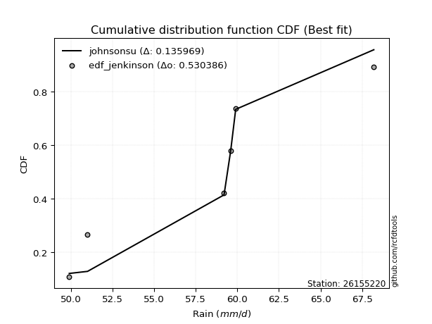</img></img>

</div>


### 11. EDF Cunnane (1978)

Cunnane´s work in statistical hydrology has focused on the performance and evaluation of different probability distributions (such as GEV, Gumbel, Lognormal) for flood frequency estimation. _b_ is a constant, typically set to 0.4.

<div align="center">


$P=(m-b)/(n+1-2b)$


</div>


**11.1. Empirical values**

<div align="center">

|                | 0                  | 1                   | 2                   | 3                  | 4                  | 5                  |
|:---------------|:-------------------|:--------------------|:--------------------|:-------------------|:-------------------|:-------------------|
| date           | 2021               | 2018                | 2020                | 2019               | 2022               | 2017               |
| x              | 49.9               | 51.0                | 59.2                | 59.6               | 59.9               | 68.2               |
| m              | 1                  | 2                   | 3                   | 4                  | 5                  | 6                  |
| empirical_dist | edf_cunnane        | edf_cunnane         | edf_cunnane         | edf_cunnane        | edf_cunnane        | edf_cunnane        |
| empirical      | 0.0967741935483871 | 0.25806451612903225 | 0.41935483870967744 | 0.5806451612903226 | 0.7419354838709676 | 0.9032258064516128 |
| empirical_tr   | 1.1071428571428572 | 1.3478260869565217  | 1.7222222222222225  | 2.384615384615385  | 3.8749999999999982 | 10.333333333333318 |

</div>


**11.2. Kolmogorov-Smirnov fit test (sorted by Δ)**


<div align="center">

|                | 0                   | 1                   | 2                   | 3                   | 4                   | 5                   | 6                  | 7                   | 8                  | 9                   | 10                | 11                  | 12                  | 13                 | 14                  | 15                  | 16                  | 17                  | 18                  | 19                  | 20                  | 21                  | 22                 | 23                  | 24                  | 25                  | 26                 | 27                  | 28                 | 29                  | 30                  | 31                  | 32                  | 33                 | 34                 | 35                  | 36                  | 37                  | 38                 | 39                  | 40                  | 41                  | 42                  | 43                  | 44                  | 45                 | 46                  | 47                 | 48                  | 49                  | 50                  | 51                 | 52                  | 53                  | 54                 | 55                  | 56                 | 57                  | 58                  | 59                  | 60                  | 61                  | 62                  | 63                  | 64                 | 65                  | 66                 | 67                 | 68                  | 69                | 70                | 71                 | 72                  | 73                  | 74                  | 75                  | 76                 | 77                  | 78                  | 79                 | 80                  | 81                  | 82                 | 83                 | 84                 | 85                | 86                  | 87                  | 88                  | 89                  | 90                  | 91                  | 92                 | 93                  | 94                  | 95                  | 96                 | 97                  | 98                  | 99                | 100               | 101                | 102                 | 103                 | 104                 | 105                 | 106                 | 107                 | 108                 | 109                 | 110                 | 111                 | 112                | 113                | 114               | 115                | 116                | 117                | 118                | 119                 | 120                 | 121                 | 122                 | 123                 | 124                 | 125                | 126                 | 127                | 128               | 129                | 130                 | 131                | 132                 | 133                 | 134                | 135                 | 136                 | 137                 | 138                 | 139               | 140                | 141                | 142                 | 143                 | 144                | 145                | 146                 | 147                | 148                 | 149                | 150                 | 151                 | 152                | 153                | 154                | 155                | 156                | 157                | 158                | 159            |
|:---------------|:--------------------|:--------------------|:--------------------|:--------------------|:--------------------|:--------------------|:-------------------|:--------------------|:-------------------|:--------------------|:------------------|:--------------------|:--------------------|:-------------------|:--------------------|:--------------------|:--------------------|:--------------------|:--------------------|:--------------------|:--------------------|:--------------------|:-------------------|:--------------------|:--------------------|:--------------------|:-------------------|:--------------------|:-------------------|:--------------------|:--------------------|:--------------------|:--------------------|:-------------------|:-------------------|:--------------------|:--------------------|:--------------------|:-------------------|:--------------------|:--------------------|:--------------------|:--------------------|:--------------------|:--------------------|:-------------------|:--------------------|:-------------------|:--------------------|:--------------------|:--------------------|:-------------------|:--------------------|:--------------------|:-------------------|:--------------------|:-------------------|:--------------------|:--------------------|:--------------------|:--------------------|:--------------------|:--------------------|:--------------------|:-------------------|:--------------------|:-------------------|:-------------------|:--------------------|:------------------|:------------------|:-------------------|:--------------------|:--------------------|:--------------------|:--------------------|:-------------------|:--------------------|:--------------------|:-------------------|:--------------------|:--------------------|:-------------------|:-------------------|:-------------------|:------------------|:--------------------|:--------------------|:--------------------|:--------------------|:--------------------|:--------------------|:-------------------|:--------------------|:--------------------|:--------------------|:-------------------|:--------------------|:--------------------|:------------------|:------------------|:-------------------|:--------------------|:--------------------|:--------------------|:--------------------|:--------------------|:--------------------|:--------------------|:--------------------|:--------------------|:--------------------|:-------------------|:-------------------|:------------------|:-------------------|:-------------------|:-------------------|:-------------------|:--------------------|:--------------------|:--------------------|:--------------------|:--------------------|:--------------------|:-------------------|:--------------------|:-------------------|:------------------|:-------------------|:--------------------|:-------------------|:--------------------|:--------------------|:-------------------|:--------------------|:--------------------|:--------------------|:--------------------|:------------------|:-------------------|:-------------------|:--------------------|:--------------------|:-------------------|:-------------------|:--------------------|:-------------------|:--------------------|:-------------------|:--------------------|:--------------------|:-------------------|:-------------------|:-------------------|:-------------------|:-------------------|:-------------------|:-------------------|:---------------|
| station        | 26155220            | 26155220            | 26155220            | 26155220            | 26155220            | 26155220            | 26155220           | 26155220            | 26155220           | 26155220            | 26155220          | 26155220            | 26155220            | 26155220           | 26155220            | 26155220            | 26155220            | 26155220            | 26155220            | 26155220            | 26155220            | 26155220            | 26155220           | 26155220            | 26155220            | 26155220            | 26155220           | 26155220            | 26155220           | 26155220            | 26155220            | 26155220            | 26155220            | 26155220           | 26155220           | 26155220            | 26155220            | 26155220            | 26155220           | 26155220            | 26155220            | 26155220            | 26155220            | 26155220            | 26155220            | 26155220           | 26155220            | 26155220           | 26155220            | 26155220            | 26155220            | 26155220           | 26155220            | 26155220            | 26155220           | 26155220            | 26155220           | 26155220            | 26155220            | 26155220            | 26155220            | 26155220            | 26155220            | 26155220            | 26155220           | 26155220            | 26155220           | 26155220           | 26155220            | 26155220          | 26155220          | 26155220           | 26155220            | 26155220            | 26155220            | 26155220            | 26155220           | 26155220            | 26155220            | 26155220           | 26155220            | 26155220            | 26155220           | 26155220           | 26155220           | 26155220          | 26155220            | 26155220            | 26155220            | 26155220            | 26155220            | 26155220            | 26155220           | 26155220            | 26155220            | 26155220            | 26155220           | 26155220            | 26155220            | 26155220          | 26155220          | 26155220           | 26155220            | 26155220            | 26155220            | 26155220            | 26155220            | 26155220            | 26155220            | 26155220            | 26155220            | 26155220            | 26155220           | 26155220           | 26155220          | 26155220           | 26155220           | 26155220           | 26155220           | 26155220            | 26155220            | 26155220            | 26155220            | 26155220            | 26155220            | 26155220           | 26155220            | 26155220           | 26155220          | 26155220           | 26155220            | 26155220           | 26155220            | 26155220            | 26155220           | 26155220            | 26155220            | 26155220            | 26155220            | 26155220          | 26155220           | 26155220           | 26155220            | 26155220            | 26155220           | 26155220           | 26155220            | 26155220           | 26155220            | 26155220           | 26155220            | 26155220            | 26155220           | 26155220           | 26155220           | 26155220           | 26155220           | 26155220           | 26155220           | 26155220       |
| empirical_dist | edf_cunnane         | edf_cunnane         | edf_cunnane         | edf_cunnane         | edf_cunnane         | edf_cunnane         | edf_cunnane        | edf_cunnane         | edf_cunnane        | edf_cunnane         | edf_cunnane       | edf_cunnane         | edf_cunnane         | edf_cunnane        | edf_cunnane         | edf_cunnane         | edf_cunnane         | edf_cunnane         | edf_cunnane         | edf_cunnane         | edf_cunnane         | edf_cunnane         | edf_cunnane        | edf_cunnane         | edf_cunnane         | edf_cunnane         | edf_cunnane        | edf_cunnane         | edf_cunnane        | edf_cunnane         | edf_cunnane         | edf_cunnane         | edf_cunnane         | edf_cunnane        | edf_cunnane        | edf_cunnane         | edf_cunnane         | edf_cunnane         | edf_cunnane        | edf_cunnane         | edf_cunnane         | edf_cunnane         | edf_cunnane         | edf_cunnane         | edf_cunnane         | edf_cunnane        | edf_cunnane         | edf_cunnane        | edf_cunnane         | edf_cunnane         | edf_cunnane         | edf_cunnane        | edf_cunnane         | edf_cunnane         | edf_cunnane        | edf_cunnane         | edf_cunnane        | edf_cunnane         | edf_cunnane         | edf_cunnane         | edf_cunnane         | edf_cunnane         | edf_cunnane         | edf_cunnane         | edf_cunnane        | edf_cunnane         | edf_cunnane        | edf_cunnane        | edf_cunnane         | edf_cunnane       | edf_cunnane       | edf_cunnane        | edf_cunnane         | edf_cunnane         | edf_cunnane         | edf_cunnane         | edf_cunnane        | edf_cunnane         | edf_cunnane         | edf_cunnane        | edf_cunnane         | edf_cunnane         | edf_cunnane        | edf_cunnane        | edf_cunnane        | edf_cunnane       | edf_cunnane         | edf_cunnane         | edf_cunnane         | edf_cunnane         | edf_cunnane         | edf_cunnane         | edf_cunnane        | edf_cunnane         | edf_cunnane         | edf_cunnane         | edf_cunnane        | edf_cunnane         | edf_cunnane         | edf_cunnane       | edf_cunnane       | edf_cunnane        | edf_cunnane         | edf_cunnane         | edf_cunnane         | edf_cunnane         | edf_cunnane         | edf_cunnane         | edf_cunnane         | edf_cunnane         | edf_cunnane         | edf_cunnane         | edf_cunnane        | edf_cunnane        | edf_cunnane       | edf_cunnane        | edf_cunnane        | edf_cunnane        | edf_cunnane        | edf_cunnane         | edf_cunnane         | edf_cunnane         | edf_cunnane         | edf_cunnane         | edf_cunnane         | edf_cunnane        | edf_cunnane         | edf_cunnane        | edf_cunnane       | edf_cunnane        | edf_cunnane         | edf_cunnane        | edf_cunnane         | edf_cunnane         | edf_cunnane        | edf_cunnane         | edf_cunnane         | edf_cunnane         | edf_cunnane         | edf_cunnane       | edf_cunnane        | edf_cunnane        | edf_cunnane         | edf_cunnane         | edf_cunnane        | edf_cunnane        | edf_cunnane         | edf_cunnane        | edf_cunnane         | edf_cunnane        | edf_cunnane         | edf_cunnane         | edf_cunnane        | edf_cunnane        | edf_cunnane        | edf_cunnane        | edf_cunnane        | edf_cunnane        | edf_cunnane        | edf_cunnane    |
| p_dist         | johnsonsu           | logjohnsonsu        | cosine              | semicircular        | anglit              | loggumbel_l         | ksone              | logksone            | logburr12          | logarcsine          | truncnorm         | norm                | crystalball         | t                  | logsemicircular     | exponnorm           | logweibull_max      | loggenextreme       | foldnorm            | loggenlogistic      | loganglit           | genextreme          | loggausshyper      | pearson3            | ncf                 | arcsine             | logistic           | logcosine           | gumbel_l           | logloggamma         | skewnorm            | bradford            | logkappa4           | hypsecant          | kappa4             | logt                | logskewnorm         | logcrystalball      | lognorm            | logexponnorm        | logpearson3         | logerlang           | loggamma            | loggamma            | f                   | logf               | loginvgamma         | betaprime          | logargus            | erlang              | invgamma            | alpha              | logncf              | rice                | logtukeylambda     | logalpha            | gamma              | loguniform          | logdweibull         | maxwell             | dgamma              | nct                 | loglogistic         | tukeylambda         | logbetaprime       | lognct              | logdgamma          | rayleigh           | uniform             | gennorm           | gausshyper        | logrice            | invgauss            | loghypsecant        | laplace             | vonmises_line       | gompertz           | logmaxwell          | logvonmises_line    | logloglaplace      | loginvgauss         | logwrapcauchy       | truncexpon         | lograyleigh        | invweibull         | logfoldnorm       | genlogistic         | logbradford         | argus               | burr                | halfnorm            | kstwobign           | wrapcauchy         | loginvweibull       | gumbel_r            | logmielke           | logexponpow        | nakagami            | loggompertz         | loglaplace        | loglaplace        | logburr            | exponpow            | genexpon            | loghalfnorm         | logkstwobign        | loggennorm          | dweibull            | logexponweib        | loggumbel_r         | logtruncnorm        | lomax               | logtriang          | halflogistic       | moyal             | loggenexpon        | weibull_min        | loglevy_l          | logtruncexpon      | loghalflogistic     | logmoyal            | levy_l              | burr12              | loglomax            | logbeta             | halfgennorm        | loggenhalflogistic  | wald               | triang            | kappa3             | logwald             | genpareto          | loggengamma         | logtruncweibull_min | gengamma           | truncweibull_min    | logweibull_min      | genhalflogistic     | beta                | lognakagami       | loggenpareto       | logtrapezoid       | trapezoid           | exponweib           | logjohnsonsb       | fatiguelife        | johnsonsb           | rdist              | weibull_max         | logfatiguelife     | truncpareto         | powerlaw            | logtruncpareto     | logpowerlaw        | logkappa3          | loghalfgennorm     | logrdist           | logvonmises        | vonmises           | mielke         |
| delta          | 0.12914287475811603 | 0.13029843129767604 | 0.14375991685960804 | 0.14446813850777257 | 0.14908483075635842 | 0.15102515326753496 | 0.1510500577280981 | 0.15327852684162707 | 0.1539455804263084 | 0.15942620816243003 | 0.160234766888061 | 0.16023483571890346 | 0.16023483880576034 | 0.1602404154836276 | 0.16052314233046244 | 0.16099247295715052 | 0.16198890540239846 | 0.16199934039461356 | 0.16354635679386292 | 0.16456855479641547 | 0.16623018134463635 | 0.16857887349336914 | 0.1701382004604025 | 0.17019540098623093 | 0.17041228610176157 | 0.17047359401435624 | 0.1707238063792627 | 0.17222039314297782 | 0.1733083559150096 | 0.17807626869848242 | 0.17842209278823545 | 0.17890369289220082 | 0.17916038623274894 | 0.1794415457199771 | 0.1794514933004577 | 0.17996841366620625 | 0.17997358794383927 | 0.17997363987703457 | 0.1799736493184751 | 0.17997424940407497 | 0.18026314859649767 | 0.18026557068161936 | 0.18026769331515652 | 0.18026769331515652 | 0.18142648980385606 | 0.1819178540760183 | 0.18225809037750956 | 0.1832067523351864 | 0.18380995763412977 | 0.18401249703605943 | 0.18443413224938082 | 0.1845819568105847 | 0.18490939581861526 | 0.18510945512947047 | 0.1851488044658398 | 0.18531343231399394 | 0.1882109900908498 | 0.18827262904839034 | 0.18832306146383637 | 0.18847212762242554 | 0.18899131445875922 | 0.19142806493348213 | 0.19279758576412237 | 0.19280315905270096 | 0.1936160078150358 | 0.19370042686824998 | 0.1967739508394763 | 0.1973561853959081 | 0.19795522651154585 | 0.198304095281971 | 0.199167162455345 | 0.2002113497258709 | 0.20297231891962558 | 0.20329700177196403 | 0.20427544049556962 | 0.20428565915500502 | 0.2055460366338016 | 0.20655790975928906 | 0.20887575368962957 | 0.2118283613612717 | 0.21198025580655905 | 0.21311663034867945 | 0.2134970025249215 | 0.2148121752030912 | 0.2148158305658518 | 0.215206862834388 | 0.21634955315427312 | 0.21701323971601455 | 0.21823643834767792 | 0.21972518238829347 | 0.22252621595794203 | 0.22307622674068278 | 0.2263544095601805 | 0.22763993518428044 | 0.22858474903860454 | 0.22895296003606264 | 0.2291139004980393 | 0.23013563257963415 | 0.23013572469176707 | 0.230349084482886 | 0.230349084482886 | 0.2306151915888695 | 0.23131162112995823 | 0.23239567163832447 | 0.23830808181123414 | 0.23904348357573585 | 0.24193548284408883 | 0.24193548387094665 | 0.24333628465819385 | 0.24655344978560684 | 0.24801433786542232 | 0.24874478940610528 | 0.2499683470320132 | 0.2505685948315551 | 0.252285507939315 | 0.2578673767944983 | 0.2596176898854576 | 0.2610202674845882 | 0.2656067136019297 | 0.26659485819374157 | 0.26931770944879224 | 0.27106046265372574 | 0.27308466187936503 | 0.27451472295123086 | 0.28419040740355844 | 0.2866309818090041 | 0.29188722301153963 | 0.3181427813599697 | 0.323778227385411 | 0.3298114304692782 | 0.33272530608057976 | 0.3414501969381871 | 0.34182704111372547 | 0.34220545385422546 | 0.3506173968279663 | 0.35230141753318717 | 0.35610783434339327 | 0.35821476514216344 | 0.35978831242152515 | 0.372766870834426 | 0.3784243161396438 | 0.4164266180323114 | 0.45173053265979074 | 0.45662968642304685 | 0.4630222494953318 | 0.4639974380987271 | 0.46563912789714756 | 0.4699770459354918 | 0.47694922981853366 | 0.4796968082173452 | 0.48024345467018187 | 0.48458114233848254 | 0.4893326624104461 | 0.4910320265666788 | 0.6004843401382705 | 0.7419354838709676 | 0.9032258064516128 | 1.1800625776844211 | 10.943785462228542 | nan            |
| deltao         | 0.530385761606      | 0.530385761606      | 0.530385761606      | 0.530385761606      | 0.530385761606      | 0.530385761606      | 0.530385761606     | 0.530385761606      | 0.530385761606     | 0.530385761606      | 0.530385761606    | 0.530385761606      | 0.530385761606      | 0.530385761606     | 0.530385761606      | 0.530385761606      | 0.530385761606      | 0.530385761606      | 0.530385761606      | 0.530385761606      | 0.530385761606      | 0.530385761606      | 0.530385761606     | 0.530385761606      | 0.530385761606      | 0.530385761606      | 0.530385761606     | 0.530385761606      | 0.530385761606     | 0.530385761606      | 0.530385761606      | 0.530385761606      | 0.530385761606      | 0.530385761606     | 0.530385761606     | 0.530385761606      | 0.530385761606      | 0.530385761606      | 0.530385761606     | 0.530385761606      | 0.530385761606      | 0.530385761606      | 0.530385761606      | 0.530385761606      | 0.530385761606      | 0.530385761606     | 0.530385761606      | 0.530385761606     | 0.530385761606      | 0.530385761606      | 0.530385761606      | 0.530385761606     | 0.530385761606      | 0.530385761606      | 0.530385761606     | 0.530385761606      | 0.530385761606     | 0.530385761606      | 0.530385761606      | 0.530385761606      | 0.530385761606      | 0.530385761606      | 0.530385761606      | 0.530385761606      | 0.530385761606     | 0.530385761606      | 0.530385761606     | 0.530385761606     | 0.530385761606      | 0.530385761606    | 0.530385761606    | 0.530385761606     | 0.530385761606      | 0.530385761606      | 0.530385761606      | 0.530385761606      | 0.530385761606     | 0.530385761606      | 0.530385761606      | 0.530385761606     | 0.530385761606      | 0.530385761606      | 0.530385761606     | 0.530385761606     | 0.530385761606     | 0.530385761606    | 0.530385761606      | 0.530385761606      | 0.530385761606      | 0.530385761606      | 0.530385761606      | 0.530385761606      | 0.530385761606     | 0.530385761606      | 0.530385761606      | 0.530385761606      | 0.530385761606     | 0.530385761606      | 0.530385761606      | 0.530385761606    | 0.530385761606    | 0.530385761606     | 0.530385761606      | 0.530385761606      | 0.530385761606      | 0.530385761606      | 0.530385761606      | 0.530385761606      | 0.530385761606      | 0.530385761606      | 0.530385761606      | 0.530385761606      | 0.530385761606     | 0.530385761606     | 0.530385761606    | 0.530385761606     | 0.530385761606     | 0.530385761606     | 0.530385761606     | 0.530385761606      | 0.530385761606      | 0.530385761606      | 0.530385761606      | 0.530385761606      | 0.530385761606      | 0.530385761606     | 0.530385761606      | 0.530385761606     | 0.530385761606    | 0.530385761606     | 0.530385761606      | 0.530385761606     | 0.530385761606      | 0.530385761606      | 0.530385761606     | 0.530385761606      | 0.530385761606      | 0.530385761606      | 0.530385761606      | 0.530385761606    | 0.530385761606     | 0.530385761606     | 0.530385761606      | 0.530385761606      | 0.530385761606     | 0.530385761606     | 0.530385761606      | 0.530385761606     | 0.530385761606      | 0.530385761606     | 0.530385761606      | 0.530385761606      | 0.530385761606     | 0.530385761606     | 0.530385761606     | 0.530385761606     | 0.530385761606     | 0.530385761606     | 0.530385761606     | 0.530385761606 |
| eval           | Δo > Δ              | Δo > Δ              | Δo > Δ              | Δo > Δ              | Δo > Δ              | Δo > Δ              | Δo > Δ             | Δo > Δ              | Δo > Δ             | Δo > Δ              | Δo > Δ            | Δo > Δ              | Δo > Δ              | Δo > Δ             | Δo > Δ              | Δo > Δ              | Δo > Δ              | Δo > Δ              | Δo > Δ              | Δo > Δ              | Δo > Δ              | Δo > Δ              | Δo > Δ             | Δo > Δ              | Δo > Δ              | Δo > Δ              | Δo > Δ             | Δo > Δ              | Δo > Δ             | Δo > Δ              | Δo > Δ              | Δo > Δ              | Δo > Δ              | Δo > Δ             | Δo > Δ             | Δo > Δ              | Δo > Δ              | Δo > Δ              | Δo > Δ             | Δo > Δ              | Δo > Δ              | Δo > Δ              | Δo > Δ              | Δo > Δ              | Δo > Δ              | Δo > Δ             | Δo > Δ              | Δo > Δ             | Δo > Δ              | Δo > Δ              | Δo > Δ              | Δo > Δ             | Δo > Δ              | Δo > Δ              | Δo > Δ             | Δo > Δ              | Δo > Δ             | Δo > Δ              | Δo > Δ              | Δo > Δ              | Δo > Δ              | Δo > Δ              | Δo > Δ              | Δo > Δ              | Δo > Δ             | Δo > Δ              | Δo > Δ             | Δo > Δ             | Δo > Δ              | Δo > Δ            | Δo > Δ            | Δo > Δ             | Δo > Δ              | Δo > Δ              | Δo > Δ              | Δo > Δ              | Δo > Δ             | Δo > Δ              | Δo > Δ              | Δo > Δ             | Δo > Δ              | Δo > Δ              | Δo > Δ             | Δo > Δ             | Δo > Δ             | Δo > Δ            | Δo > Δ              | Δo > Δ              | Δo > Δ              | Δo > Δ              | Δo > Δ              | Δo > Δ              | Δo > Δ             | Δo > Δ              | Δo > Δ              | Δo > Δ              | Δo > Δ             | Δo > Δ              | Δo > Δ              | Δo > Δ            | Δo > Δ            | Δo > Δ             | Δo > Δ              | Δo > Δ              | Δo > Δ              | Δo > Δ              | Δo > Δ              | Δo > Δ              | Δo > Δ              | Δo > Δ              | Δo > Δ              | Δo > Δ              | Δo > Δ             | Δo > Δ             | Δo > Δ            | Δo > Δ             | Δo > Δ             | Δo > Δ             | Δo > Δ             | Δo > Δ              | Δo > Δ              | Δo > Δ              | Δo > Δ              | Δo > Δ              | Δo > Δ              | Δo > Δ             | Δo > Δ              | Δo > Δ             | Δo > Δ            | Δo > Δ             | Δo > Δ              | Δo > Δ             | Δo > Δ              | Δo > Δ              | Δo > Δ             | Δo > Δ              | Δo > Δ              | Δo > Δ              | Δo > Δ              | Δo > Δ            | Δo > Δ             | Δo > Δ             | Δo > Δ              | Δo > Δ              | Δo > Δ             | Δo > Δ             | Δo > Δ              | Δo > Δ             | Δo > Δ              | Δo > Δ             | Δo > Δ              | Δo > Δ              | Δo > Δ             | Δo > Δ             | Δo <= Δ            | Δo <= Δ            | Δo <= Δ            | Δo <= Δ            | Δo <= Δ            | Δo <= Δ        |
| fit            | 1                   | 1                   | 1                   | 1                   | 1                   | 1                   | 1                  | 1                   | 1                  | 1                   | 1                 | 1                   | 1                   | 1                  | 1                   | 1                   | 1                   | 1                   | 1                   | 1                   | 1                   | 1                   | 1                  | 1                   | 1                   | 1                   | 1                  | 1                   | 1                  | 1                   | 1                   | 1                   | 1                   | 1                  | 1                  | 1                   | 1                   | 1                   | 1                  | 1                   | 1                   | 1                   | 1                   | 1                   | 1                   | 1                  | 1                   | 1                  | 1                   | 1                   | 1                   | 1                  | 1                   | 1                   | 1                  | 1                   | 1                  | 1                   | 1                   | 1                   | 1                   | 1                   | 1                   | 1                   | 1                  | 1                   | 1                  | 1                  | 1                   | 1                 | 1                 | 1                  | 1                   | 1                   | 1                   | 1                   | 1                  | 1                   | 1                   | 1                  | 1                   | 1                   | 1                  | 1                  | 1                  | 1                 | 1                   | 1                   | 1                   | 1                   | 1                   | 1                   | 1                  | 1                   | 1                   | 1                   | 1                  | 1                   | 1                   | 1                 | 1                 | 1                  | 1                   | 1                   | 1                   | 1                   | 1                   | 1                   | 1                   | 1                   | 1                   | 1                   | 1                  | 1                  | 1                 | 1                  | 1                  | 1                  | 1                  | 1                   | 1                   | 1                   | 1                   | 1                   | 1                   | 1                  | 1                   | 1                  | 1                 | 1                  | 1                   | 1                  | 1                   | 1                   | 1                  | 1                   | 1                   | 1                   | 1                   | 1                 | 1                  | 1                  | 1                   | 1                   | 1                  | 1                  | 1                   | 1                  | 1                   | 1                  | 1                   | 1                   | 1                  | 1                  | 0                  | 0                  | 0                  | 0                  | 0                  | 0              |
| n              | 6                   | 6                   | 6                   | 6                   | 6                   | 6                   | 6                  | 6                   | 6                  | 6                   | 6                 | 6                   | 6                   | 6                  | 6                   | 6                   | 6                   | 6                   | 6                   | 6                   | 6                   | 6                   | 6                  | 6                   | 6                   | 6                   | 6                  | 6                   | 6                  | 6                   | 6                   | 6                   | 6                   | 6                  | 6                  | 6                   | 6                   | 6                   | 6                  | 6                   | 6                   | 6                   | 6                   | 6                   | 6                   | 6                  | 6                   | 6                  | 6                   | 6                   | 6                   | 6                  | 6                   | 6                   | 6                  | 6                   | 6                  | 6                   | 6                   | 6                   | 6                   | 6                   | 6                   | 6                   | 6                  | 6                   | 6                  | 6                  | 6                   | 6                 | 6                 | 6                  | 6                   | 6                   | 6                   | 6                   | 6                  | 6                   | 6                   | 6                  | 6                   | 6                   | 6                  | 6                  | 6                  | 6                 | 6                   | 6                   | 6                   | 6                   | 6                   | 6                   | 6                  | 6                   | 6                   | 6                   | 6                  | 6                   | 6                   | 6                 | 6                 | 6                  | 6                   | 6                   | 6                   | 6                   | 6                   | 6                   | 6                   | 6                   | 6                   | 6                   | 6                  | 6                  | 6                 | 6                  | 6                  | 6                  | 6                  | 6                   | 6                   | 6                   | 6                   | 6                   | 6                   | 6                  | 6                   | 6                  | 6                 | 6                  | 6                   | 6                  | 6                   | 6                   | 6                  | 6                   | 6                   | 6                   | 6                   | 6                 | 6                  | 6                  | 6                   | 6                   | 6                  | 6                  | 6                   | 6                  | 6                   | 6                  | 6                   | 6                   | 6                  | 6                  | 6                  | 6                  | 6                  | 6                  | 6                  | 6              |
| best_fit       | 1                   | 0                   | 0                   | 0                   | 0                   | 0                   | 0                  | 0                   | 0                  | 0                   | 0                 | 0                   | 0                   | 0                  | 0                   | 0                   | 0                   | 0                   | 0                   | 0                   | 0                   | 0                   | 0                  | 0                   | 0                   | 0                   | 0                  | 0                   | 0                  | 0                   | 0                   | 0                   | 0                   | 0                  | 0                  | 0                   | 0                   | 0                   | 0                  | 0                   | 0                   | 0                   | 0                   | 0                   | 0                   | 0                  | 0                   | 0                  | 0                   | 0                   | 0                   | 0                  | 0                   | 0                   | 0                  | 0                   | 0                  | 0                   | 0                   | 0                   | 0                   | 0                   | 0                   | 0                   | 0                  | 0                   | 0                  | 0                  | 0                   | 0                 | 0                 | 0                  | 0                   | 0                   | 0                   | 0                   | 0                  | 0                   | 0                   | 0                  | 0                   | 0                   | 0                  | 0                  | 0                  | 0                 | 0                   | 0                   | 0                   | 0                   | 0                   | 0                   | 0                  | 0                   | 0                   | 0                   | 0                  | 0                   | 0                   | 0                 | 0                 | 0                  | 0                   | 0                   | 0                   | 0                   | 0                   | 0                   | 0                   | 0                   | 0                   | 0                   | 0                  | 0                  | 0                 | 0                  | 0                  | 0                  | 0                  | 0                   | 0                   | 0                   | 0                   | 0                   | 0                   | 0                  | 0                   | 0                  | 0                 | 0                  | 0                   | 0                  | 0                   | 0                   | 0                  | 0                   | 0                   | 0                   | 0                   | 0                 | 0                  | 0                  | 0                   | 0                   | 0                  | 0                  | 0                   | 0                  | 0                   | 0                  | 0                   | 0                   | 0                  | 0                  | 0                  | 0                  | 0                  | 0                  | 0                  | 0              |
| best_fit_sort  | 1                   | 2                   | 3                   | 4                   | 5                   | 6                   | 7                  | 8                   | 9                  | 10                  | 11                | 12                  | 13                  | 14                 | 15                  | 16                  | 17                  | 18                  | 19                  | 20                  | 21                  | 22                  | 23                 | 24                  | 25                  | 26                  | 27                 | 28                  | 29                 | 30                  | 31                  | 32                  | 33                  | 34                 | 35                 | 36                  | 37                  | 38                  | 39                 | 40                  | 41                  | 42                  | 43                  | 44                  | 45                  | 46                 | 47                  | 48                 | 49                  | 50                  | 51                  | 52                 | 53                  | 54                  | 55                 | 56                  | 57                 | 58                  | 59                  | 60                  | 61                  | 62                  | 63                  | 64                  | 65                 | 66                  | 67                 | 68                 | 69                  | 70                | 71                | 72                 | 73                  | 74                  | 75                  | 76                  | 77                 | 78                  | 79                  | 80                 | 81                  | 82                  | 83                 | 84                 | 85                 | 86                | 87                  | 88                  | 89                  | 90                  | 91                  | 92                  | 93                 | 94                  | 95                  | 96                  | 97                 | 98                  | 99                  | 100               | 101               | 102                | 103                 | 104                 | 105                 | 106                 | 107                 | 108                 | 109                 | 110                 | 111                 | 112                 | 113                | 114                | 115               | 116                | 117                | 118                | 119                | 120                 | 121                 | 122                 | 123                 | 124                 | 125                 | 126                | 127                 | 128                | 129               | 130                | 131                 | 132                | 133                 | 134                 | 135                | 136                 | 137                 | 138                 | 139                 | 140               | 141                | 142                | 143                 | 144                 | 145                | 146                | 147                 | 148                | 149                 | 150                | 151                 | 152                 | 153                | 154                | 155                | 156                | 157                | 158                | 159                | 160            |

</div>


**11.3. Best fit**

<div align="center">

|   id |   station | empirical_dist   | p_dist    |    delta |   deltao | eval   |   fit |   n |   best_fit |   best_fit_sort |
|-----:|----------:|:-----------------|:----------|---------:|---------:|:-------|------:|----:|-----------:|----------------:|
|    0 |  26155220 | edf_cunnane      | johnsonsu | 0.129143 | 0.530386 | Δo > Δ |     1 |   6 |          1 |               1 |

</div>


<div align="center">

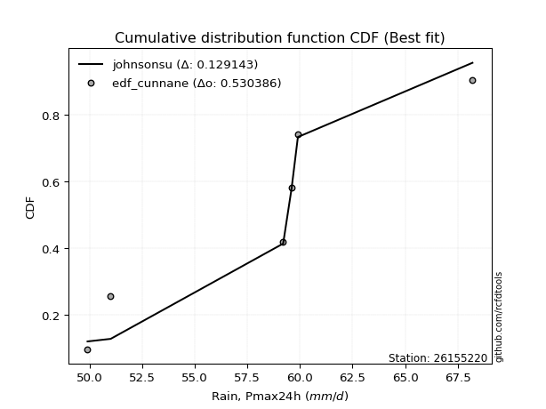</img></img>

</div>


### 12. EDF Adamowski (1981)

The Adamowski formula in hydrology refers to a specific plotting position formula used for estimating the non-parametric empirical distribution of hydrological events (like flood peaks) to calculate their return periods. This formula provides an alternative to traditional parametric methods (like the Gumbel or Log Pearson Type III distributions). 

<div align="center">


$P=(m-0.25)/(n+0.5)$


</div>


**12.1. Empirical values**

<div align="center">

|                | 0                   | 1                  | 2                  | 3                  | 4                  | 5                  |
|:---------------|:--------------------|:-------------------|:-------------------|:-------------------|:-------------------|:-------------------|
| date           | 2021                | 2018               | 2020               | 2019               | 2022               | 2017               |
| x              | 49.9                | 51.0               | 59.2               | 59.6               | 59.9               | 68.2               |
| m              | 1                   | 2                  | 3                  | 4                  | 5                  | 6                  |
| empirical_dist | edf_adamowski       | edf_adamowski      | edf_adamowski      | edf_adamowski      | edf_adamowski      | edf_adamowski      |
| empirical      | 0.11538461538461539 | 0.2692307692307692 | 0.4230769230769231 | 0.5769230769230769 | 0.7307692307692307 | 0.8846153846153846 |
| empirical_tr   | 1.1304347826086958  | 1.3684210526315788 | 1.7333333333333334 | 2.3636363636363633 | 3.7142857142857135 | 8.666666666666664  |

</div>


**12.2. Kolmogorov-Smirnov fit test (sorted by Δ)**


<div align="center">

|                | 0                   | 1                 | 2                   | 3                 | 4                   | 5                   | 6                   | 7                   | 8                   | 9                   | 10                  | 11                  | 12                 | 13                  | 14                 | 15                  | 16                  | 17                  | 18                 | 19                  | 20                 | 21                  | 22                  | 23                  | 24                 | 25                 | 26                  | 27                  | 28                 | 29                  | 30                  | 31                  | 32                  | 33                 | 34                  | 35                  | 36                  | 37                  | 38                  | 39                  | 40                  | 41                  | 42                  | 43                  | 44                  | 45                  | 46                  | 47                  | 48                 | 49                  | 50                  | 51                  | 52                  | 53                 | 54                  | 55                  | 56                 | 57                 | 58                  | 59                  | 60                 | 61                  | 62                  | 63                  | 64                  | 65                  | 66                  | 67                 | 68                 | 69                  | 70                  | 71                 | 72                 | 73                  | 74                  | 75                  | 76                | 77                  | 78                 | 79                 | 80                  | 81                  | 82                  | 83                  | 84                  | 85                  | 86                 | 87                  | 88                  | 89                  | 90                 | 91                  | 92                  | 93                 | 94                 | 95                | 96                  | 97                  | 98                  | 99                  | 100                 | 101                 | 102                | 103                 | 104                 | 105                 | 106                | 107                | 108                | 109                | 110                | 111                | 112                 | 113                 | 114                 | 115                 | 116                 | 117                 | 118                 | 119                | 120                 | 121                | 122                | 123                | 124                | 125                | 126                 | 127              | 128                | 129                 | 130                | 131                | 132                 | 133                 | 134                 | 135                | 136                 | 137                 | 138                | 139                | 140                 | 141                | 142                 | 143                | 144                | 145                | 146                | 147                 | 148                 | 149                | 150                 | 151                | 152                 | 153                | 154                | 155                | 156                | 157                | 158                | 159            |
|:---------------|:--------------------|:------------------|:--------------------|:------------------|:--------------------|:--------------------|:--------------------|:--------------------|:--------------------|:--------------------|:--------------------|:--------------------|:-------------------|:--------------------|:-------------------|:--------------------|:--------------------|:--------------------|:-------------------|:--------------------|:-------------------|:--------------------|:--------------------|:--------------------|:-------------------|:-------------------|:--------------------|:--------------------|:-------------------|:--------------------|:--------------------|:--------------------|:--------------------|:-------------------|:--------------------|:--------------------|:--------------------|:--------------------|:--------------------|:--------------------|:--------------------|:--------------------|:--------------------|:--------------------|:--------------------|:--------------------|:--------------------|:--------------------|:-------------------|:--------------------|:--------------------|:--------------------|:--------------------|:-------------------|:--------------------|:--------------------|:-------------------|:-------------------|:--------------------|:--------------------|:-------------------|:--------------------|:--------------------|:--------------------|:--------------------|:--------------------|:--------------------|:-------------------|:-------------------|:--------------------|:--------------------|:-------------------|:-------------------|:--------------------|:--------------------|:--------------------|:------------------|:--------------------|:-------------------|:-------------------|:--------------------|:--------------------|:--------------------|:--------------------|:--------------------|:--------------------|:-------------------|:--------------------|:--------------------|:--------------------|:-------------------|:--------------------|:--------------------|:-------------------|:-------------------|:------------------|:--------------------|:--------------------|:--------------------|:--------------------|:--------------------|:--------------------|:-------------------|:--------------------|:--------------------|:--------------------|:-------------------|:-------------------|:-------------------|:-------------------|:-------------------|:-------------------|:--------------------|:--------------------|:--------------------|:--------------------|:--------------------|:--------------------|:--------------------|:-------------------|:--------------------|:-------------------|:-------------------|:-------------------|:-------------------|:-------------------|:--------------------|:-----------------|:-------------------|:--------------------|:-------------------|:-------------------|:--------------------|:--------------------|:--------------------|:-------------------|:--------------------|:--------------------|:-------------------|:-------------------|:--------------------|:-------------------|:--------------------|:-------------------|:-------------------|:-------------------|:-------------------|:--------------------|:--------------------|:-------------------|:--------------------|:-------------------|:--------------------|:-------------------|:-------------------|:-------------------|:-------------------|:-------------------|:-------------------|:---------------|
| station        | 26155220            | 26155220          | 26155220            | 26155220          | 26155220            | 26155220            | 26155220            | 26155220            | 26155220            | 26155220            | 26155220            | 26155220            | 26155220           | 26155220            | 26155220           | 26155220            | 26155220            | 26155220            | 26155220           | 26155220            | 26155220           | 26155220            | 26155220            | 26155220            | 26155220           | 26155220           | 26155220            | 26155220            | 26155220           | 26155220            | 26155220            | 26155220            | 26155220            | 26155220           | 26155220            | 26155220            | 26155220            | 26155220            | 26155220            | 26155220            | 26155220            | 26155220            | 26155220            | 26155220            | 26155220            | 26155220            | 26155220            | 26155220            | 26155220           | 26155220            | 26155220            | 26155220            | 26155220            | 26155220           | 26155220            | 26155220            | 26155220           | 26155220           | 26155220            | 26155220            | 26155220           | 26155220            | 26155220            | 26155220            | 26155220            | 26155220            | 26155220            | 26155220           | 26155220           | 26155220            | 26155220            | 26155220           | 26155220           | 26155220            | 26155220            | 26155220            | 26155220          | 26155220            | 26155220           | 26155220           | 26155220            | 26155220            | 26155220            | 26155220            | 26155220            | 26155220            | 26155220           | 26155220            | 26155220            | 26155220            | 26155220           | 26155220            | 26155220            | 26155220           | 26155220           | 26155220          | 26155220            | 26155220            | 26155220            | 26155220            | 26155220            | 26155220            | 26155220           | 26155220            | 26155220            | 26155220            | 26155220           | 26155220           | 26155220           | 26155220           | 26155220           | 26155220           | 26155220            | 26155220            | 26155220            | 26155220            | 26155220            | 26155220            | 26155220            | 26155220           | 26155220            | 26155220           | 26155220           | 26155220           | 26155220           | 26155220           | 26155220            | 26155220         | 26155220           | 26155220            | 26155220           | 26155220           | 26155220            | 26155220            | 26155220            | 26155220           | 26155220            | 26155220            | 26155220           | 26155220           | 26155220            | 26155220           | 26155220            | 26155220           | 26155220           | 26155220           | 26155220           | 26155220            | 26155220            | 26155220           | 26155220            | 26155220           | 26155220            | 26155220           | 26155220           | 26155220           | 26155220           | 26155220           | 26155220           | 26155220       |
| empirical_dist | edf_adamowski       | edf_adamowski     | edf_adamowski       | edf_adamowski     | edf_adamowski       | edf_adamowski       | edf_adamowski       | edf_adamowski       | edf_adamowski       | edf_adamowski       | edf_adamowski       | edf_adamowski       | edf_adamowski      | edf_adamowski       | edf_adamowski      | edf_adamowski       | edf_adamowski       | edf_adamowski       | edf_adamowski      | edf_adamowski       | edf_adamowski      | edf_adamowski       | edf_adamowski       | edf_adamowski       | edf_adamowski      | edf_adamowski      | edf_adamowski       | edf_adamowski       | edf_adamowski      | edf_adamowski       | edf_adamowski       | edf_adamowski       | edf_adamowski       | edf_adamowski      | edf_adamowski       | edf_adamowski       | edf_adamowski       | edf_adamowski       | edf_adamowski       | edf_adamowski       | edf_adamowski       | edf_adamowski       | edf_adamowski       | edf_adamowski       | edf_adamowski       | edf_adamowski       | edf_adamowski       | edf_adamowski       | edf_adamowski      | edf_adamowski       | edf_adamowski       | edf_adamowski       | edf_adamowski       | edf_adamowski      | edf_adamowski       | edf_adamowski       | edf_adamowski      | edf_adamowski      | edf_adamowski       | edf_adamowski       | edf_adamowski      | edf_adamowski       | edf_adamowski       | edf_adamowski       | edf_adamowski       | edf_adamowski       | edf_adamowski       | edf_adamowski      | edf_adamowski      | edf_adamowski       | edf_adamowski       | edf_adamowski      | edf_adamowski      | edf_adamowski       | edf_adamowski       | edf_adamowski       | edf_adamowski     | edf_adamowski       | edf_adamowski      | edf_adamowski      | edf_adamowski       | edf_adamowski       | edf_adamowski       | edf_adamowski       | edf_adamowski       | edf_adamowski       | edf_adamowski      | edf_adamowski       | edf_adamowski       | edf_adamowski       | edf_adamowski      | edf_adamowski       | edf_adamowski       | edf_adamowski      | edf_adamowski      | edf_adamowski     | edf_adamowski       | edf_adamowski       | edf_adamowski       | edf_adamowski       | edf_adamowski       | edf_adamowski       | edf_adamowski      | edf_adamowski       | edf_adamowski       | edf_adamowski       | edf_adamowski      | edf_adamowski      | edf_adamowski      | edf_adamowski      | edf_adamowski      | edf_adamowski      | edf_adamowski       | edf_adamowski       | edf_adamowski       | edf_adamowski       | edf_adamowski       | edf_adamowski       | edf_adamowski       | edf_adamowski      | edf_adamowski       | edf_adamowski      | edf_adamowski      | edf_adamowski      | edf_adamowski      | edf_adamowski      | edf_adamowski       | edf_adamowski    | edf_adamowski      | edf_adamowski       | edf_adamowski      | edf_adamowski      | edf_adamowski       | edf_adamowski       | edf_adamowski       | edf_adamowski      | edf_adamowski       | edf_adamowski       | edf_adamowski      | edf_adamowski      | edf_adamowski       | edf_adamowski      | edf_adamowski       | edf_adamowski      | edf_adamowski      | edf_adamowski      | edf_adamowski      | edf_adamowski       | edf_adamowski       | edf_adamowski      | edf_adamowski       | edf_adamowski      | edf_adamowski       | edf_adamowski      | edf_adamowski      | edf_adamowski      | edf_adamowski      | edf_adamowski      | edf_adamowski      | edf_adamowski  |
| p_dist         | ksone               | johnsonsu         | semicircular        | logjohnsonsu      | anglit              | logarcsine          | loggumbel_l         | logksone            | logburr12           | cosine              | truncnorm           | norm                | crystalball        | t                   | logsemicircular    | exponnorm           | logweibull_max      | loggenextreme       | loggausshyper      | arcsine             | foldnorm           | loggenlogistic      | gumbel_l            | loganglit           | genextreme         | pearson3           | ncf                 | logistic            | logcosine          | logargus            | logloggamma         | skewnorm            | hypsecant           | logt               | logskewnorm         | logcrystalball      | lognorm             | logexponnorm        | logpearson3         | logerlang           | loggamma            | loggamma            | logdweibull         | f                   | lognct              | logf                | loginvgamma         | betaprime           | erlang             | invgamma            | alpha               | logncf              | rice                | logalpha           | bradford            | gamma               | maxwell            | nct                | loglogistic         | logbetaprime        | logkappa4          | kappa4              | rayleigh            | gausshyper          | logtukeylambda      | logrice             | invgauss            | loguniform         | loghypsecant       | dgamma              | laplace             | logloglaplace      | tukeylambda        | gompertz            | logwrapcauchy       | logmaxwell          | argus             | logdgamma           | loginvgauss        | uniform            | gennorm             | truncexpon          | lograyleigh         | invweibull          | logfoldnorm         | genlogistic         | logbradford        | wrapcauchy          | vonmises_line       | burr                | halfnorm           | kstwobign           | logvonmises_line    | loginvweibull      | gumbel_r           | logmielke         | logexponpow         | nakagami            | loggompertz         | loglaplace          | loglaplace          | logburr             | exponpow           | genexpon            | loggennorm          | dweibull            | loghalfnorm        | logkstwobign       | logtriang          | logexponweib       | loglevy_l          | loggumbel_r        | logtruncnorm        | lomax               | halflogistic        | moyal               | levy_l              | loggenexpon         | weibull_min         | logtruncexpon      | loghalflogistic     | logmoyal           | burr12             | loglomax           | logbeta            | loggenhalflogistic | halfgennorm         | kappa3           | triang             | wald                | genpareto          | logwald            | loggengamma         | logtruncweibull_min | gengamma            | genhalflogistic    | truncweibull_min    | logweibull_min      | beta               | loggenpareto       | lognakagami         | logtrapezoid       | trapezoid           | logjohnsonsb       | exponweib          | johnsonsb          | fatiguelife        | weibull_max         | rdist               | logfatiguelife     | truncpareto         | powerlaw           | logtruncpareto      | logpowerlaw        | logkappa3          | loghalfgennorm     | logrdist           | logvonmises        | vonmises           | mielke         |
| delta          | 0.13988380462636119 | 0.140309127859853 | 0.14074605414052693 | 0.141464684399413 | 0.14536274638911278 | 0.14825995506069312 | 0.14944630113275387 | 0.14955644247438143 | 0.15022349605906277 | 0.15112806304530574 | 0.15651268252081535 | 0.15651275135165782 | 0.1565127544385147 | 0.15651833111638197 | 0.1568010579632168 | 0.15727038858990489 | 0.15826682103515283 | 0.15827725602736792 | 0.1589719473586656 | 0.15930734091261933 | 0.1598242724266173 | 0.16084647042916983 | 0.16214210281327268 | 0.16250809697739071 | 0.1648567891261235 | 0.1664733166189853 | 0.16669020173451593 | 0.16700172201201707 | 0.1684983087757322 | 0.17264370453239286 | 0.17435418433123678 | 0.17470000842098982 | 0.17571946135273148 | 0.1762463292989606 | 0.17625150357659364 | 0.17625155550978894 | 0.17625156495122946 | 0.17625216503682933 | 0.17654106422925203 | 0.17654348631437372 | 0.17654560894791088 | 0.17654560894791088 | 0.17715680836209946 | 0.17770440543661042 | 0.17795959623011093 | 0.17819576970877266 | 0.17853600601026393 | 0.17948466796794077 | 0.1802904126688138 | 0.18071204788213518 | 0.18085987244333906 | 0.18118731145136963 | 0.18138737076222483 | 0.1815913479467483 | 0.18302653889220627 | 0.18448890572360416 | 0.1847500432551799 | 0.1877059805662365 | 0.18907550139687673 | 0.18989392344779016 | 0.1903266393344859 | 0.19061774640219467 | 0.19363410102866246 | 0.19544507808809936 | 0.19631505756757678 | 0.19648926535862526 | 0.19925023455237995 | 0.1994388821501273 | 0.1995749174047184 | 0.20015756756049619 | 0.20055335612832398 | 0.2006621082595348 | 0.2008228756735973 | 0.20182395226655597 | 0.20195037724694254 | 0.20283582539204342 | 0.207070185245941 | 0.20794020394121326 | 0.2082581714393134 | 0.2091214796132828 | 0.20947034838370795 | 0.20977491815767585 | 0.21109009083584557 | 0.21109374619860616 | 0.21148477846714236 | 0.21262746878702748 | 0.2132911553487689 | 0.21518815645844358 | 0.21545191225674198 | 0.21600309802104783 | 0.2188041315906964 | 0.21935414237343714 | 0.22004200679136654 | 0.2239178508170348 | 0.2248626646713589 | 0.225230875668817 | 0.22539181613079368 | 0.22641354821238852 | 0.22641364032452144 | 0.22662700011564035 | 0.22662700011564035 | 0.22689310722162387 | 0.2275895367627126 | 0.22867358727107884 | 0.23076922974235192 | 0.23076923076920974 | 0.2345859974439885 | 0.2353213992084902 | 0.2388020939302763 | 0.2396142002909482 | 0.2424098456483599 | 0.2428313654183612 | 0.24429225349817668 | 0.24502270503885965 | 0.24684651046430944 | 0.24856342357206934 | 0.25245004081749745 | 0.25414529242725264 | 0.25589560551821194 | 0.2618846292346841 | 0.26287277382649593 | 0.2655956250815466 | 0.2693625775121194 | 0.2707926385839852 | 0.2804683230363128 | 0.2807209699098027 | 0.28290889744175846 | 0.31120100863305 | 0.3126119742836741 | 0.31442069699272407 | 0.3228397751019588 | 0.3290032217133341 | 0.33810495674647983 | 0.3384833694869798  | 0.34689531246072064 | 0.3470485120404265 | 0.34857933316594153 | 0.35238574997614763 | 0.3560662280542795 | 0.3598138943034155 | 0.36904478646718036 | 0.4052603649305745 | 0.44056427955805383 | 0.4518559963935948 | 0.4529076020558012 | 0.4544728747954106 | 0.4602753537314815 | 0.46578297671679675 | 0.46625496156824614 | 0.4759747238500996 | 0.47652137030293623 | 0.4808590579712369 | 0.48561057804320046 | 0.4873099421994332 | 0.5818739183020423 | 0.7307692307692307 | 0.8846153846153846 | 1.1763404933171755 | 10.962395884064769 | nan            |
| deltao         | 0.530385761606      | 0.530385761606    | 0.530385761606      | 0.530385761606    | 0.530385761606      | 0.530385761606      | 0.530385761606      | 0.530385761606      | 0.530385761606      | 0.530385761606      | 0.530385761606      | 0.530385761606      | 0.530385761606     | 0.530385761606      | 0.530385761606     | 0.530385761606      | 0.530385761606      | 0.530385761606      | 0.530385761606     | 0.530385761606      | 0.530385761606     | 0.530385761606      | 0.530385761606      | 0.530385761606      | 0.530385761606     | 0.530385761606     | 0.530385761606      | 0.530385761606      | 0.530385761606     | 0.530385761606      | 0.530385761606      | 0.530385761606      | 0.530385761606      | 0.530385761606     | 0.530385761606      | 0.530385761606      | 0.530385761606      | 0.530385761606      | 0.530385761606      | 0.530385761606      | 0.530385761606      | 0.530385761606      | 0.530385761606      | 0.530385761606      | 0.530385761606      | 0.530385761606      | 0.530385761606      | 0.530385761606      | 0.530385761606     | 0.530385761606      | 0.530385761606      | 0.530385761606      | 0.530385761606      | 0.530385761606     | 0.530385761606      | 0.530385761606      | 0.530385761606     | 0.530385761606     | 0.530385761606      | 0.530385761606      | 0.530385761606     | 0.530385761606      | 0.530385761606      | 0.530385761606      | 0.530385761606      | 0.530385761606      | 0.530385761606      | 0.530385761606     | 0.530385761606     | 0.530385761606      | 0.530385761606      | 0.530385761606     | 0.530385761606     | 0.530385761606      | 0.530385761606      | 0.530385761606      | 0.530385761606    | 0.530385761606      | 0.530385761606     | 0.530385761606     | 0.530385761606      | 0.530385761606      | 0.530385761606      | 0.530385761606      | 0.530385761606      | 0.530385761606      | 0.530385761606     | 0.530385761606      | 0.530385761606      | 0.530385761606      | 0.530385761606     | 0.530385761606      | 0.530385761606      | 0.530385761606     | 0.530385761606     | 0.530385761606    | 0.530385761606      | 0.530385761606      | 0.530385761606      | 0.530385761606      | 0.530385761606      | 0.530385761606      | 0.530385761606     | 0.530385761606      | 0.530385761606      | 0.530385761606      | 0.530385761606     | 0.530385761606     | 0.530385761606     | 0.530385761606     | 0.530385761606     | 0.530385761606     | 0.530385761606      | 0.530385761606      | 0.530385761606      | 0.530385761606      | 0.530385761606      | 0.530385761606      | 0.530385761606      | 0.530385761606     | 0.530385761606      | 0.530385761606     | 0.530385761606     | 0.530385761606     | 0.530385761606     | 0.530385761606     | 0.530385761606      | 0.530385761606   | 0.530385761606     | 0.530385761606      | 0.530385761606     | 0.530385761606     | 0.530385761606      | 0.530385761606      | 0.530385761606      | 0.530385761606     | 0.530385761606      | 0.530385761606      | 0.530385761606     | 0.530385761606     | 0.530385761606      | 0.530385761606     | 0.530385761606      | 0.530385761606     | 0.530385761606     | 0.530385761606     | 0.530385761606     | 0.530385761606      | 0.530385761606      | 0.530385761606     | 0.530385761606      | 0.530385761606     | 0.530385761606      | 0.530385761606     | 0.530385761606     | 0.530385761606     | 0.530385761606     | 0.530385761606     | 0.530385761606     | 0.530385761606 |
| eval           | Δo > Δ              | Δo > Δ            | Δo > Δ              | Δo > Δ            | Δo > Δ              | Δo > Δ              | Δo > Δ              | Δo > Δ              | Δo > Δ              | Δo > Δ              | Δo > Δ              | Δo > Δ              | Δo > Δ             | Δo > Δ              | Δo > Δ             | Δo > Δ              | Δo > Δ              | Δo > Δ              | Δo > Δ             | Δo > Δ              | Δo > Δ             | Δo > Δ              | Δo > Δ              | Δo > Δ              | Δo > Δ             | Δo > Δ             | Δo > Δ              | Δo > Δ              | Δo > Δ             | Δo > Δ              | Δo > Δ              | Δo > Δ              | Δo > Δ              | Δo > Δ             | Δo > Δ              | Δo > Δ              | Δo > Δ              | Δo > Δ              | Δo > Δ              | Δo > Δ              | Δo > Δ              | Δo > Δ              | Δo > Δ              | Δo > Δ              | Δo > Δ              | Δo > Δ              | Δo > Δ              | Δo > Δ              | Δo > Δ             | Δo > Δ              | Δo > Δ              | Δo > Δ              | Δo > Δ              | Δo > Δ             | Δo > Δ              | Δo > Δ              | Δo > Δ             | Δo > Δ             | Δo > Δ              | Δo > Δ              | Δo > Δ             | Δo > Δ              | Δo > Δ              | Δo > Δ              | Δo > Δ              | Δo > Δ              | Δo > Δ              | Δo > Δ             | Δo > Δ             | Δo > Δ              | Δo > Δ              | Δo > Δ             | Δo > Δ             | Δo > Δ              | Δo > Δ              | Δo > Δ              | Δo > Δ            | Δo > Δ              | Δo > Δ             | Δo > Δ             | Δo > Δ              | Δo > Δ              | Δo > Δ              | Δo > Δ              | Δo > Δ              | Δo > Δ              | Δo > Δ             | Δo > Δ              | Δo > Δ              | Δo > Δ              | Δo > Δ             | Δo > Δ              | Δo > Δ              | Δo > Δ             | Δo > Δ             | Δo > Δ            | Δo > Δ              | Δo > Δ              | Δo > Δ              | Δo > Δ              | Δo > Δ              | Δo > Δ              | Δo > Δ             | Δo > Δ              | Δo > Δ              | Δo > Δ              | Δo > Δ             | Δo > Δ             | Δo > Δ             | Δo > Δ             | Δo > Δ             | Δo > Δ             | Δo > Δ              | Δo > Δ              | Δo > Δ              | Δo > Δ              | Δo > Δ              | Δo > Δ              | Δo > Δ              | Δo > Δ             | Δo > Δ              | Δo > Δ             | Δo > Δ             | Δo > Δ             | Δo > Δ             | Δo > Δ             | Δo > Δ              | Δo > Δ           | Δo > Δ             | Δo > Δ              | Δo > Δ             | Δo > Δ             | Δo > Δ              | Δo > Δ              | Δo > Δ              | Δo > Δ             | Δo > Δ              | Δo > Δ              | Δo > Δ             | Δo > Δ             | Δo > Δ              | Δo > Δ             | Δo > Δ              | Δo > Δ             | Δo > Δ             | Δo > Δ             | Δo > Δ             | Δo > Δ              | Δo > Δ              | Δo > Δ             | Δo > Δ              | Δo > Δ             | Δo > Δ              | Δo > Δ             | Δo <= Δ            | Δo <= Δ            | Δo <= Δ            | Δo <= Δ            | Δo <= Δ            | Δo <= Δ        |
| fit            | 1                   | 1                 | 1                   | 1                 | 1                   | 1                   | 1                   | 1                   | 1                   | 1                   | 1                   | 1                   | 1                  | 1                   | 1                  | 1                   | 1                   | 1                   | 1                  | 1                   | 1                  | 1                   | 1                   | 1                   | 1                  | 1                  | 1                   | 1                   | 1                  | 1                   | 1                   | 1                   | 1                   | 1                  | 1                   | 1                   | 1                   | 1                   | 1                   | 1                   | 1                   | 1                   | 1                   | 1                   | 1                   | 1                   | 1                   | 1                   | 1                  | 1                   | 1                   | 1                   | 1                   | 1                  | 1                   | 1                   | 1                  | 1                  | 1                   | 1                   | 1                  | 1                   | 1                   | 1                   | 1                   | 1                   | 1                   | 1                  | 1                  | 1                   | 1                   | 1                  | 1                  | 1                   | 1                   | 1                   | 1                 | 1                   | 1                  | 1                  | 1                   | 1                   | 1                   | 1                   | 1                   | 1                   | 1                  | 1                   | 1                   | 1                   | 1                  | 1                   | 1                   | 1                  | 1                  | 1                 | 1                   | 1                   | 1                   | 1                   | 1                   | 1                   | 1                  | 1                   | 1                   | 1                   | 1                  | 1                  | 1                  | 1                  | 1                  | 1                  | 1                   | 1                   | 1                   | 1                   | 1                   | 1                   | 1                   | 1                  | 1                   | 1                  | 1                  | 1                  | 1                  | 1                  | 1                   | 1                | 1                  | 1                   | 1                  | 1                  | 1                   | 1                   | 1                   | 1                  | 1                   | 1                   | 1                  | 1                  | 1                   | 1                  | 1                   | 1                  | 1                  | 1                  | 1                  | 1                   | 1                   | 1                  | 1                   | 1                  | 1                   | 1                  | 0                  | 0                  | 0                  | 0                  | 0                  | 0              |
| n              | 6                   | 6                 | 6                   | 6                 | 6                   | 6                   | 6                   | 6                   | 6                   | 6                   | 6                   | 6                   | 6                  | 6                   | 6                  | 6                   | 6                   | 6                   | 6                  | 6                   | 6                  | 6                   | 6                   | 6                   | 6                  | 6                  | 6                   | 6                   | 6                  | 6                   | 6                   | 6                   | 6                   | 6                  | 6                   | 6                   | 6                   | 6                   | 6                   | 6                   | 6                   | 6                   | 6                   | 6                   | 6                   | 6                   | 6                   | 6                   | 6                  | 6                   | 6                   | 6                   | 6                   | 6                  | 6                   | 6                   | 6                  | 6                  | 6                   | 6                   | 6                  | 6                   | 6                   | 6                   | 6                   | 6                   | 6                   | 6                  | 6                  | 6                   | 6                   | 6                  | 6                  | 6                   | 6                   | 6                   | 6                 | 6                   | 6                  | 6                  | 6                   | 6                   | 6                   | 6                   | 6                   | 6                   | 6                  | 6                   | 6                   | 6                   | 6                  | 6                   | 6                   | 6                  | 6                  | 6                 | 6                   | 6                   | 6                   | 6                   | 6                   | 6                   | 6                  | 6                   | 6                   | 6                   | 6                  | 6                  | 6                  | 6                  | 6                  | 6                  | 6                   | 6                   | 6                   | 6                   | 6                   | 6                   | 6                   | 6                  | 6                   | 6                  | 6                  | 6                  | 6                  | 6                  | 6                   | 6                | 6                  | 6                   | 6                  | 6                  | 6                   | 6                   | 6                   | 6                  | 6                   | 6                   | 6                  | 6                  | 6                   | 6                  | 6                   | 6                  | 6                  | 6                  | 6                  | 6                   | 6                   | 6                  | 6                   | 6                  | 6                   | 6                  | 6                  | 6                  | 6                  | 6                  | 6                  | 6              |
| best_fit       | 1                   | 0                 | 0                   | 0                 | 0                   | 0                   | 0                   | 0                   | 0                   | 0                   | 0                   | 0                   | 0                  | 0                   | 0                  | 0                   | 0                   | 0                   | 0                  | 0                   | 0                  | 0                   | 0                   | 0                   | 0                  | 0                  | 0                   | 0                   | 0                  | 0                   | 0                   | 0                   | 0                   | 0                  | 0                   | 0                   | 0                   | 0                   | 0                   | 0                   | 0                   | 0                   | 0                   | 0                   | 0                   | 0                   | 0                   | 0                   | 0                  | 0                   | 0                   | 0                   | 0                   | 0                  | 0                   | 0                   | 0                  | 0                  | 0                   | 0                   | 0                  | 0                   | 0                   | 0                   | 0                   | 0                   | 0                   | 0                  | 0                  | 0                   | 0                   | 0                  | 0                  | 0                   | 0                   | 0                   | 0                 | 0                   | 0                  | 0                  | 0                   | 0                   | 0                   | 0                   | 0                   | 0                   | 0                  | 0                   | 0                   | 0                   | 0                  | 0                   | 0                   | 0                  | 0                  | 0                 | 0                   | 0                   | 0                   | 0                   | 0                   | 0                   | 0                  | 0                   | 0                   | 0                   | 0                  | 0                  | 0                  | 0                  | 0                  | 0                  | 0                   | 0                   | 0                   | 0                   | 0                   | 0                   | 0                   | 0                  | 0                   | 0                  | 0                  | 0                  | 0                  | 0                  | 0                   | 0                | 0                  | 0                   | 0                  | 0                  | 0                   | 0                   | 0                   | 0                  | 0                   | 0                   | 0                  | 0                  | 0                   | 0                  | 0                   | 0                  | 0                  | 0                  | 0                  | 0                   | 0                   | 0                  | 0                   | 0                  | 0                   | 0                  | 0                  | 0                  | 0                  | 0                  | 0                  | 0              |
| best_fit_sort  | 1                   | 2                 | 3                   | 4                 | 5                   | 6                   | 7                   | 8                   | 9                   | 10                  | 11                  | 12                  | 13                 | 14                  | 15                 | 16                  | 17                  | 18                  | 19                 | 20                  | 21                 | 22                  | 23                  | 24                  | 25                 | 26                 | 27                  | 28                  | 29                 | 30                  | 31                  | 32                  | 33                  | 34                 | 35                  | 36                  | 37                  | 38                  | 39                  | 40                  | 41                  | 42                  | 43                  | 44                  | 45                  | 46                  | 47                  | 48                  | 49                 | 50                  | 51                  | 52                  | 53                  | 54                 | 55                  | 56                  | 57                 | 58                 | 59                  | 60                  | 61                 | 62                  | 63                  | 64                  | 65                  | 66                  | 67                  | 68                 | 69                 | 70                  | 71                  | 72                 | 73                 | 74                  | 75                  | 76                  | 77                | 78                  | 79                 | 80                 | 81                  | 82                  | 83                  | 84                  | 85                  | 86                  | 87                 | 88                  | 89                  | 90                  | 91                 | 92                  | 93                  | 94                 | 95                 | 96                | 97                  | 98                  | 99                  | 100                 | 101                 | 102                 | 103                | 104                 | 105                 | 106                 | 107                | 108                | 109                | 110                | 111                | 112                | 113                 | 114                 | 115                 | 116                 | 117                 | 118                 | 119                 | 120                | 121                 | 122                | 123                | 124                | 125                | 126                | 127                 | 128              | 129                | 130                 | 131                | 132                | 133                 | 134                 | 135                 | 136                | 137                 | 138                 | 139                | 140                | 141                 | 142                | 143                 | 144                | 145                | 146                | 147                | 148                 | 149                 | 150                | 151                 | 152                | 153                 | 154                | 155                | 156                | 157                | 158                | 159                | 160            |

</div>


**12.3. Best fit**

<div align="center">

|   id |   station | empirical_dist   | p_dist   |    delta |   deltao | eval   |   fit |   n |   best_fit |   best_fit_sort |
|-----:|----------:|:-----------------|:---------|---------:|---------:|:-------|------:|----:|-----------:|----------------:|
|    0 |  26155220 | edf_adamowski    | ksone    | 0.139884 | 0.530386 | Δo > Δ |     1 |   6 |          1 |               1 |

</div>


<div align="center">

</img>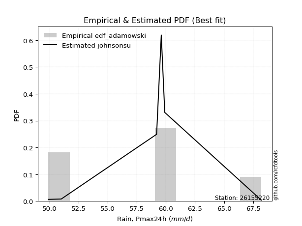</img>

</div>


## C. Best fit & Estimate extreme values for specific return periods - Tr

Best fit in probability distribution analysis means finding the theoretical distribution (like Normal, Poisson, Exponential, etc.) that most accurately mirrors your real-world data´s patterns (shape, center, spread) for better predictions, using methods like visual checks (Q-Q plots), goodness-of-fit tests (Kolmogorov-Smirnov, Chi-Squared), and information criteria (AIC) to score and select the simplest, most representative model.


### 1. Best fit (ordered by delta Δ)

:file_folder:Table: [bestfit_26155220.csv](table/bestfit_26155220.csv)

<div align="center">

|   id |   station | empirical_dist   | p_dist    |    delta |   deltao | eval   |   fit |   n |   best_fit |   best_fit_sort |
|-----:|----------:|:-----------------|:----------|---------:|---------:|:-------|------:|----:|-----------:|----------------:|
|    0 |  26155220 | edf_hazen        | johnsonsu | 0.121078 | 0.530386 | Δo > Δ |     1 |   6 |          1 |               1 |
|    1 |  26155220 | edf_gringorten   | johnsonsu | 0.12598  | 0.530386 | Δo > Δ |     1 |   6 |          1 |               2 |
|    2 |  26155220 | edf_cunnane      | johnsonsu | 0.129143 | 0.530386 | Δo > Δ |     1 |   6 |          1 |               3 |
|    3 |  26155220 | edf_weibull      | ksone     | 0.129407 | 0.530386 | Δo > Δ |     1 |   6 |          1 |               4 |
|    4 |  26155220 | edf_blom         | johnsonsu | 0.131078 | 0.530386 | Δo > Δ |     1 |   6 |          1 |               5 |
|    5 |  26155220 | edf_tukey        | johnsonsu | 0.134236 | 0.530386 | Δo > Δ |     1 |   6 |          1 |               6 |
|    6 |  26155220 | edf_filliben     | johnsonsu | 0.135415 | 0.530386 | Δo > Δ |     1 |   6 |          1 |               7 |
|    7 |  26155220 | edf_jenkinson    | johnsonsu | 0.135969 | 0.530386 | Δo > Δ |     1 |   6 |          1 |               8 |
|    8 |  26155220 | edf_beard        | johnsonsu | 0.135969 | 0.530386 | Δo > Δ |     1 |   6 |          1 |               9 |
|    9 |  26155220 | edf_chegodayev   | johnsonsu | 0.136703 | 0.530386 | Δo > Δ |     1 |   6 |          1 |              10 |
|   10 |  26155220 | edf_adamowski    | ksone     | 0.139884 | 0.530386 | Δo > Δ |     1 |   6 |          1 |              11 |
|   11 |  26155220 | edf_california   | nakagami  | 0.177037 | 0.530386 | Δo > Δ |     1 |   6 |          1 |              12 |

</div>


### 2. Extreme values and % difference analysis

In hydrology, a return period (or recurrence interval $Tr$) is the statistical average time between extreme events like floods or droughts of a specific magnitude, indicating how rare an event is, with a 100-year flood, for example, having a 1% chance of occurring in any given year, not that it happens exactly every century. It is a key tool for infrastructure design (like bridges or dams) and risk assessment, calculated from historical data to determine the probability of future events, although it is important to remember it is statistical average, and events can cluster or be missed.

The extreme value porcentage difference is evaluated as $pdiff = 1 - (ETrBf / ETr) * 100$, where _ETrBf_ correspond to the bestfit extreme value for a specific recurrence interval and _ETr_ correspond to the extreme value for one of the most used PDFsused in hydrology.

> risk_rate: assuming the return period as the project useful life.

:file_folder:Table: [extreme_26155220.csv](table/extreme_26155220.csv), all PDFs.  
:file_folder:Table: [extremepdiff_26155220.csv](table/extremepdiff_26155220.csv), % difference between bestfit and most used PDFs in Hydrology.

<div align="center">

Extreme values table for only best fit PDFs
|   id |      tr |   prob_l |     prob_g |   alpha |   anglit |   arcsine |   argus |    beta |   betaprime |   bradford |     burr |   burr12 |   cosine |   crystalball |   dgamma |   dweibull |   erlang |   exponnorm |   exponpow |   exponweib |       f |   fatiguelife |   foldnorm |   gamma |   gausshyper |   genexpon |   genextreme |   gengamma |   genhalflogistic |   genlogistic |   gennorm |   genpareto |   gompertz |   gumbel_l |   gumbel_r |   halfgennorm |   halflogistic |   halfnorm |   hypsecant |   invgamma |   invgauss |   invweibull |   johnsonsb |   johnsonsu |           kappa3 |   kappa4 |   ksone |   kstwobign |   laplace |   levy_l |   loggamma |   logistic |   loglaplace |    lomax |   maxwell |   mielke |   moyal |   nakagami |     ncf |     nct |    norm |   pearson3 |   powerlaw |   rayleigh |   rdist |    rice |   semicircular |   skewnorm |       t |   trapezoid |   triang |   truncexpon |   truncnorm |   truncpareto |   truncweibull_min |   tukeylambda |   uniform |   vonmises |   vonmises_line |     wald |   weibull_max |   weibull_min |   wrapcauchy |   logalpha |   loganglit |   logarcsine |   logargus |   logbeta |   logbetaprime |   logbradford |   logburr |   logburr12 |   logcosine |   logcrystalball |   logdgamma |   logdweibull |   logerlang |   logexponnorm |   logexponpow |   logexponweib |    logf |   logfatiguelife |   logfoldnorm |   loggausshyper |   loggenexpon |   loggenextreme |   loggengamma |   loggenhalflogistic |   loggenlogistic |   loggennorm |   loggenpareto |   loggompertz |   loggumbel_l |   loggumbel_r |   loghalfgennorm |   loghalflogistic |   loghalfnorm |   loghypsecant |   loginvgamma |   loginvgauss |   loginvweibull |   logjohnsonsb |     logjohnsonsu |   logkappa3 |   logkappa4 |   logksone |   logkstwobign |   loglevy_l |   logloggamma |   loglogistic |   logloglaplace |   loglomax |   logmaxwell |   logmielke |   logmoyal |   lognakagami |   logncf |   lognct |   lognorm |   logpearson3 |   logpowerlaw |   lograyleigh |   logrdist |   logrice |   logsemicircular |   logskewnorm |    logt |   logtrapezoid |   logtriang |   logtruncexpon |   logtruncnorm |   logtruncpareto |   logtruncweibull_min |   logtukeylambda |   loguniform |   logvonmises |   logvonmises_line |   logwald |   logweibull_max |   logweibull_min |   logwrapcauchy |   station |   n |   risk_rate |
|-----:|--------:|---------:|-----------:|--------:|---------:|----------:|--------:|--------:|------------:|-----------:|---------:|---------:|---------:|--------------:|---------:|-----------:|---------:|------------:|-----------:|------------:|--------:|--------------:|-----------:|--------:|-------------:|-----------:|-------------:|-----------:|------------------:|--------------:|----------:|------------:|-----------:|-----------:|-----------:|--------------:|---------------:|-----------:|------------:|-----------:|-----------:|-------------:|------------:|------------:|-----------------:|---------:|--------:|------------:|----------:|---------:|-----------:|-----------:|-------------:|---------:|----------:|---------:|--------:|-----------:|--------:|--------:|--------:|-----------:|-----------:|-----------:|--------:|--------:|---------------:|-----------:|--------:|------------:|---------:|-------------:|------------:|--------------:|-------------------:|--------------:|----------:|-----------:|----------------:|---------:|--------------:|--------------:|-------------:|-----------:|------------:|-------------:|-----------:|----------:|---------------:|--------------:|----------:|------------:|------------:|-----------------:|------------:|--------------:|------------:|---------------:|--------------:|---------------:|--------:|-----------------:|--------------:|----------------:|--------------:|----------------:|--------------:|---------------------:|-----------------:|-------------:|---------------:|--------------:|--------------:|--------------:|-----------------:|------------------:|--------------:|---------------:|--------------:|--------------:|----------------:|---------------:|-----------------:|------------:|------------:|-----------:|---------------:|------------:|--------------:|--------------:|----------------:|-----------:|-------------:|------------:|-----------:|--------------:|---------:|---------:|----------:|--------------:|--------------:|--------------:|-----------:|----------:|------------------:|--------------:|--------:|---------------:|------------:|----------------:|---------------:|-----------------:|----------------------:|-----------------:|-------------:|--------------:|-------------------:|----------:|-----------------:|-----------------:|----------------:|----------:|----:|------------:|
|    0 |    2    | 0.5      | 0.5        | 57.5684 |  57.9667 |   57.9667 | 59.4896 | 53.8948 |     57.5881 |    57.3768 |  56.767  |  55.1578 |  58.1874 |       57.9667 |  59.2    |    59.9    |  57.5785 |     57.9552 |    54.7065 |     50.548  | 57.6185 |       49.9    |    57.8744 | 57.5322 |      56.767  |    56.4691 |      57.8162 |    51.2769 |           62.1202 |       56.9146 |   59.6    |     54.2203 |    57.0602 |    58.9755 |    56.9578 |       54.1896 |        56.4563 |    56.7097 |     57.9667 |    57.5673 |    57.1971 |      56.9343 |     49.9074 |     59.4549 |     54.2266      |  58.4554 | 57.9667 |     56.7795 |   57.9667 |  59.5131 |    57.6374 |    57.9667 |      57.6423 |  55.7357 |   57.4415 |  56.5656 | 56.6322 |    54.6515 | 57.7955 | 57.4452 | 57.9667 |    57.8031 |    50.0758 |    57.2552 | 48.9552 | 57.5318 |        57.9667 |    57.6765 | 57.9666 |     63.5981 |  61.3201 |      56.8074 |     57.9667 |       50.5054 |            52.9933 |       58.9861 |   59.05   | -2.92255   |         59.05   |  55.9761 |       68.0404 |       52.6994 |      59.05   |    57.5518 |     57.6423 |      57.6423 |    58.8971 |   53.7412 |        57.4009 |       56.6615 |   56.5543 |     58.0931 |     57.7247 |          57.6423 |     59.6    |       59.6    |     57.6374 |        57.6423 |       53.7347 |        53.8228 | 57.6089 |          49.9001 |       56.7717 |         57.9977 |       55.7583 |         57.9013 |       53.6683 |              60.8879 |          57.9793 |      59.9    |        52.7506 |       56.56   |       58.6547 |       56.6475 |          49.8998 |           56.1589 |       56.4054 |        57.6423 |       57.6037 |       57.0407 |         56.6272 |        49.9029 |     59.447       |     83.5973 |     58.2234 |    57.6423 |        56.4205 |     59.3347 |       57.6713 |       57.6423 |         59.6    |    55.1287 |      57.1223 |     56.6315 |    56.33   |       53.5233 |  57.5598 |  57.7903 |   57.6423 |       57.6375 |       50.0817 |       56.9389 |    360.964 |   57.2602 |           57.6423 |       57.6423 | 57.6424 |        63.0469 |     60.0486 |         55.8729 |        56.1807 |          50.436  |               53.8843 |          58.4095 |      58.3368 |      0.107644 |            58.3367 |   55.695  |          57.9015 |          53.8744 |         58.3368 |  26155220 |   6 |    0.75     |
|    1 |    2.33 | 0.570815 | 0.429185   | 58.6672 |  59.2431 |   59.8828 | 60.7053 | 54.9584 |     58.6889 |    58.6774 |  57.9391 |  56.4012 |  59.3245 |       59.0625 |  59.6172 |    60.4627 |  58.6772 |     59.0506 |    56.5345 |     50.9461 | 58.7188 |       50.1085 |    59.0045 | 58.6159 |      58.1802 |    57.6622 |      58.9264 |    52.1706 |           63.2895 |       58.0543 |   59.7552 |     58.3785 |    58.2384 |    59.9289 |    57.9732 |       55.4966 |        57.5003 |    57.8923 |     58.8437 |    58.6683 |    58.3243 |      58.0784 |     49.9338 |     59.587  |     67.2552      |  59.8063 | 59.4731 |     57.926  |   58.6298 |  62.1678 |    58.7379 |    58.9322 |      58.3058 |  57.0262 |   58.58   |  57.7094 | 57.5934 |    56.5485 | 58.8984 | 58.5483 | 59.0625 |    58.9028 |    50.327  |    58.4105 | 51.33   | 58.6479 |        59.3357 |    58.7709 | 59.0624 |     64.6613 |  62.4574 |      58.0429 |     59.0625 |       50.8899 |            54.1651 |       60.3033 |   60.3459 | -2.55153   |         60.217  |  56.6946 |       68.156  |       54.4409 |      62.5232 |    58.6533 |     58.9262 |      59.5806 |    60.1186 |   55.325  |        58.5079 |       57.9332 |   57.7159 |     59.1622 |     58.859  |          58.7428 |     59.9053 |       60.0411 |     58.7379 |        58.7428 |       55.8152 |        55.7045 | 58.7101 |          50.0671 |       58.0012 |         59.8732 |       56.9717 |         59.0296 |       54.7588 |              62.1961 |          59.0063 |      60.1538 |        59.3788 |       57.7413 |       59.6277 |       57.6489 |          49.8998 |           57.1801 |       57.5684 |        58.5214 |       58.7046 |       58.1619 |         57.7866 |        49.9181 |     59.5823      |     89.9354 |     59.5736 |    59.1605 |        57.5732 |     61.9141 |       58.7736 |       58.6108 |         60.3411 |    56.3615 |      58.2557 |     57.7785 |    57.2722 |       54.5307 |  58.6607 |  60.6467 |   58.7428 |       58.738  |       50.3266 |       58.0856 |    360.964 |   58.3807 |           59.0204 |       58.7428 | 58.7429 |        64.2018 |     61.3256 |         57.0415 |        57.3778 |          50.7764 |               55.0195 |          59.7523 |      59.6418 |      0.109697 |            59.3013 |   56.3902 |          59.0298 |          54.8375 |         61.9005 |  26155220 |   6 |    0.729209 |
|    2 |    5    | 0.8      | 0.2        | 62.9777 |  63.7466 |   64.9924 | 64.6046 | 59.7593 |     63.0014 |    63.3857 |  63.2184 |  62.9961 |  63.4222 |       63.1349 |  62.6486 |    63.9856 |  62.9651 |     63.1285 |    67.0593 |     54.8474 | 63.0106 |       54.5369 |    63.2046 | 62.8629 |      63.6315 |    62.8745 |      63.0911 |    61.6685 |           66.332  |       63.0041 |   61.6494 |     66.5189 |    62.9696 |    63.0088 |    62.3846 |       63.6166 |        62.2242 |    62.8937 |     62.3614 |    62.9928 |    62.9962 |      63.0488 |     56.5523 |     60.1996 |   6467.89        |  64.2847 | 64.3483 |     62.7958 |   61.9454 |  66.5661 |    63.0181 |    62.6601 |      61.7392 |  63.4893 |   63.0609 |  62.8857 | 62.0458 |    66.6327 | 63.0945 | 62.961  | 63.1349 |    63.0814 |    54.0016 |    63.0358 | 57.7294 | 63.0326 |        64.0075 |    63.0103 | 63.1348 |     67.7116 |  65.7202 |      62.7504 |     63.1349 |       54.635  |            60.1726 |       64.5549 |   64.54   | -1.22968   |         64.2263 |  60.717  |       68.1998 |       71.5675 |      66.8159 |    62.99   |     63.6886 |      65.0737 |    64.2104 |   62.7192 |        62.9641 |       62.792  |   63.115  |     63.1055 |     63.1349 |          63.0197 |     63.0538 |       64.2192 |     63.0181 |        63.0197 |       72.9584 |        68.5496 | 63.0139 |          53.7504 |       63.0825 |         65.9216 |       62.8867 |         63.1934 |       60.6    |              65.7867 |          63.0111 |      62.8148 |        67.7707 |       62.7451 |       62.8828 |       62.209  |          64.1038 |           62.0379 |       62.758  |        62.1842 |       63.0075 |       62.9141 |         63.1054 |        58.4505 |     60.183       |    113.932  |     64.1467 |    64.3533 |        62.7377 |     66.4367 |       63.033  |       62.5055 |         64.2228 |    63.0064 |      62.9394 |     63.0183 |    61.8463 |       59.4398 |  62.9824 |  72.8081 |   63.0197 |       63.0181 |       53.7584 |       62.9121 |    360.964 |   62.9471 |           63.9759 |       63.0197 | 63.0198 |        67.6337 |     65.1416 |         61.8319 |        62.1648 |          54.18   |               60.2998 |          64.2874 |      64.069  |      0.11768  |            63.0315 |   60.4455 |          63.1934 |          60.0259 |         66.6074 |  26155220 |   6 |    0.67232  |
|    3 |   10    | 0.9      | 0.1        | 66.0519 |  66.2957 |   66.226  | 66.485  | 63.0966 |     66.0681 |    65.7039 |  67.752  | inf      |  65.8978 |       65.8364 |  65.7152 |    67.5198 |  65.9908 |     65.8408 |    77.2481 |     61.7073 | 66.045  |       60.6514 |    65.991  | 65.875  |      66.4862 |    66.8799 |      65.8113 |    79.9239 |           67.3629 |       67.0348 |   64.8545 |     67.8614 |    66.195  |    64.7236 |    65.9776 |       73.1023 |        66.1472 |    66.5946 |     65.1705 |    66.0784 |    66.5494 |      67.0971 |     70.8341 |     61.9303 | 731753           |  66.2769 | 66.4755 |     66.5035 |   64.9551 |  67.6279 |    66.0309 |    65.4055 |      65.0308 |  69.3716 |   66.2144 |  67.3632 | 65.9223 |    75.1765 | 65.9654 | 66.1893 | 65.8364 |    65.934  |    58.9319 |    66.3337 | 59.3245 | 66.086  |        66.4047 |    65.9797 | 65.8363 |     68.9031 |  66.9946 |      65.2687 |     65.8364 |       59.2253 |            64.3001 |       66.3952 |   66.37   | -0.538434  |         66.1672 |  64.9857 |       68.2    |      101.62   |      67.5716 |    66.094  |     66.5528 |      66.474  |    66.282  |   66.7589 |        66.2492 |       65.3383 |   67.9748 |     65.7951 |     65.8673 |          66.0273 |     66.7474 |       69.5613 |     66.0309 |        66.0273 |       99.6301 |        83.9353 | 66.0636 |          59.2856 |       66.8059 |         67.6443 |       68.2057 |         65.8089 |       66.2594 |              67.0829 |          66.0411 |      67.0713 |        68.1739 |       66.4083 |       64.7715 |       66.1885 |          66.1427 |           66.3844 |       66.8971 |        65.2729 |       66.0563 |       66.6589 |         67.7973 |        67.985  |     61.8988      |    126.318  |     66.208  |    66.7597 |        66.9783 |     67.5771 |       66.0053 |       65.5382 |         68.0174 |    69.8035 |      66.4595 |     67.6221 |    66.1253 |       63.5808 |  66.0632 |  82.448  |   66.0273 |       66.0309 |       58.4852 |       66.5965 |    360.964 |   66.2989 |           66.6781 |       66.0273 | 66.0275 |        69.0236 |     66.6959 |         64.6493 |        64.8835 |          58.6293 |               63.7183 |          66.3374 |      66.1022 |      0.1233   |            65.3283 |   65.0685 |          65.8089 |          65.2747 |         67.4722 |  26155220 |   6 |    0.651322 |
|    4 |   15    | 0.933333 | 0.0666667  | 67.6558 |  67.3842 |   66.4612 | 67.1998 | 64.6229 |     67.6641 |    66.5155 |  70.4066 | inf      |  67.0255 |       67.1845 |  67.5627 |    69.6705 |  67.5558 |     67.1969 |    83.1811 |     67.428  | 67.6186 |       64.6504 |    67.3814 | 67.4373 |      67.5054 |    69.0063 |      67.125  |    96.0109 |           67.6685 |       69.3086 |   67.4177 |     68.0674 |    67.782  |    65.5002 |    68.0047 |       79.5323 |        68.3672 |    68.5206 |     66.7736 |    67.6877 |    68.4682 |      69.3812 |     71.7998 |     64.2373 |      1.04295e+07 |  66.944  | 67.1846 |     68.4718 |   66.7157 |  67.9487 |    67.5886 |    66.9014 |      67.037  |  72.8194 |   67.8324 |  69.9987 | 68.172  |    79.7609 | 67.4248 | 67.8999 | 67.1845 |    67.3817 |    61.4249 |    68.033  | 59.6378 | 67.6389 |        67.3395 |    67.5063 | 67.1845 |     69.2854 |  67.4035 |      66.1935 |     67.1845 |       61.5858 |            65.9592 |       67.0038 |   66.98   | -0.290973  |         66.8383 |  67.7269 |       68.2    |      126.597  |      67.788  |    67.7158 |     67.8148 |      66.7445 |    67.087  |   68.0882 |        67.9974 |       66.2549 |   70.9187 |     67.1922 |     67.1509 |          67.5815 |     69.1361 |       73.2781 |     67.5886 |        67.5815 |      121.498  |        94.3459 | 67.647  |          63.2105 |       68.757  |         67.9777 |       71.3467 |         67.0266 |       69.6985 |              67.4794 |          67.7348 |      70.4786 |        68.1949 |       68.2898 |       65.6454 |       68.5449 |          66.8366 |           68.9776 |       69.1579 |        67.104  |       67.6392 |       68.7341 |         70.5967 |        68.1889 |     64.272       |    130.739  |     66.8942 |    67.5816 |        69.3449 |     67.9255 |       67.5338 |       67.2521 |         70.3657 |    74.1568 |      68.3414 |     70.364  |    68.7431 |       65.878  |  67.6687 |  87.8092 |   67.5815 |       67.5886 |       60.9812 |       68.5783 |    360.964 |   68.0634 |           67.7625 |       67.5815 | 67.5816 |        69.4755 |     67.2024 |         65.7358 |        65.9116 |          61.0494 |               65.0746 |          67.0241 |      66.7942 |      0.126207 |            66.2304 |   68.222  |          67.0266 |          68.5932 |         67.7219 |  26155220 |   6 |    0.644736 |
|    5 |   20    | 0.95     | 0.05       | 68.7328 |  68.0245 |   66.5441 | 67.5922 | 65.5415 |     68.7341 |    66.9289 |  72.308  | inf      |  67.719  |       68.0673 |  68.8887 |    71.2252 |  68.6007 |     68.086  |    87.3375 |     72.323  | 68.6714 |       67.6112 |    68.292  | 68.4819 |      68.0267 |    70.4384 |      67.9615 |   110.219  |           67.8134 |       70.9007 |   69.5605 |     68.1318 |    68.8064 |    65.9836 |    69.4241 |       84.4783 |        69.9227 |    69.8046 |     67.9045 |    68.7677 |    69.7796 |      70.9804 |     71.9309 |     66.8971 |      6.67608e+07 |  67.2777 | 67.5392 |     69.7978 |   67.9649 |  68.113  |    68.6289 |    67.9353 |      68.4978 |  75.2686 |   68.9063 |  71.8927 | 69.7653 |    82.8423 | 68.3904 | 69.0585 | 68.0673 |    68.3385 |    62.8764 |    69.1624 | 59.7502 | 68.6642 |        67.858  |    68.5209 | 68.0674 |     69.474  |  67.6052 |      66.6744 |     68.0673 |       62.981  |            66.8506 |       67.3067 |   67.285  | -0.164858  |         67.177  |  69.7696 |       68.2    |      147.915  |      67.8928 |    68.8054 |     68.5683 |      66.84   |    67.5329 |   68.7209 |        69.1842 |       66.7269 |   73.0727 |     68.1347 |     67.9526 |          68.619  |     70.9206 |       76.1832 |     68.6289 |        68.619  |      140.496  |       102.351  | 68.7069 |          66.2829 |       70.0678 |         68.0938 |       73.5997 |         67.7826 |       72.195  |              67.6703 |          68.9261 |      73.3689 |        68.1984 |       69.5329 |       66.1953 |       70.2446 |          67.1863 |           70.8547 |       70.7076 |        68.4265 |       68.6987 |       70.1752 |         72.6253 |        68.2077 |     67.1291      |    133.007  |     67.2348 |    67.9964 |        70.986  |     68.1046 |       68.5515 |       68.4628 |         72.0926 |    77.429  |      69.6197 |     72.3491 |    70.6595 |       67.461  |  68.7458 |  91.5396 |   68.619  |       68.6289 |       62.4722 |       69.9281 |    360.964 |   69.2518 |           68.3716 |       68.619  | 68.6192 |        69.6996 |     67.4537 |         66.3127 |        66.4528 |          62.5245 |               65.801  |          67.3666 |      67.1429 |      0.12815  |            66.7055 |   70.6709 |          67.7826 |          71.0642 |         67.8432 |  26155220 |   6 |    0.641514 |
|    6 |   25    | 0.96     | 0.04       | 69.5395 |  68.4585 |   66.5825 | 67.8453 | 66.1707 |     69.5345 |    67.1794 |  73.7972 | inf      |  68.2053 |       68.7172 |  69.9242 |    72.4457 |  69.3801 |     68.7411 |    90.5231 |     76.6226 | 69.4579 |       69.9637 |    68.9623 | 69.2619 |      68.3428 |    71.5109 |      68.5627 |   122.977  |           67.8974 |       72.1269 |   71.4142 |     68.1593 |    69.5516 |    66.3276 |    70.5174 |       88.5311 |        71.1211 |    70.76   |     68.7798 |    69.5763 |    70.7733 |      72.2122 |     71.9636 |     69.7971 |      2.78524e+08 |  67.478  | 67.7519 |     70.791  |   68.9338 |  68.2161 |    69.405  |    68.7262 |      69.6528 |  77.1702 |   69.7035 |  73.3795 | 71.0003 |    85.1425 | 69.1062 | 69.9315 | 68.7172 |    69.0474 |    63.8198 |    70.0015 | 59.803  | 69.4228 |        68.1944 |    69.2747 | 68.7174 |     69.5863 |  67.7254 |      66.9693 |     68.7172 |       63.8967 |            67.4066 |       67.4877 |   67.468  | -0.0886023 |         67.3809 |  71.4058 |       68.2    |      166.605  |      67.9549 |    69.6217 |     69.0838 |      66.8844 |    67.8221 |   69.083  |        70.0798 |       67.0146 |   74.7865 |     68.8448 |     68.5206 |          69.3929 |     72.3539 |       78.5945 |     69.405  |        69.3929 |      157.545  |       108.917  | 69.499  |          68.8301 |       71.0494 |         68.147  |       75.3644 |         68.3154 |       74.1641 |              67.7823 |          69.8496 |      75.9118 |        68.1994 |       70.4516 |       66.5894 |       71.5825 |          67.397  |           72.3356 |       71.883  |        69.4679 |       69.4905 |       71.28   |         74.2275 |        68.2115 |     70.3954      |    134.387  |     67.4377 |    68.2465 |        72.2407 |     68.2172 |       69.3091 |       69.4037 |         73.4682 |    80.0781 |      70.5841 |     73.916  |    72.1816 |       68.6652 |  69.5519 |  94.4034 |   69.3929 |       69.4051 |       63.4569 |       70.9481 |    360.964 |   70.1431 |           68.7696 |       69.3929 | 69.3931 |        69.8334 |     67.6038 |         66.6707 |        66.7869 |          63.5113 |               66.2535 |          67.5713 |      67.353  |      0.1296   |            66.9971 |   72.6957 |          68.3155 |          73.0496 |         67.9152 |  26155220 |   6 |    0.639603 |
|    7 |   50    | 0.98     | 0.02       | 71.9175 |  69.5266 |   66.6339 | 68.4189 | 67.7344 |     71.8884 |    67.6859 |  78.5225 | inf      |  69.4788 |       70.5782 |  73.1703 |    76.3069 |  71.6601 |     70.6199 |   100.176  |     92.9509 | 71.7654 |       77.5114 |    70.8817 | 71.5474 |      68.98   |    74.6595 |      70.2034 |   173.28   |           68.0579 |       75.9044 |   78.2873 |     68.1918 |    71.6384 |    67.2613 |    73.8852 |      102.307  |        74.8135 |    73.5369 |     71.4934 |    71.9577 |    73.7551 |      76.0069 |     71.9844 |     86.2536 |      2.25585e+10 |  67.878  | 68.1773 |     73.7075 |   71.9436 |  68.4482 |    71.6773 |    71.1427 |      73.3662 |  83.0867 |   72.0155 |  78.1173 | 74.8342 |    91.8448 | 71.1799 | 72.5303 | 70.5782 |    71.0982 |    65.8826 |    72.4374 | 59.8749 | 71.6101 |        68.9628 |    71.4631 | 70.5786 |     69.8093 |  67.9639 |      67.5741 |     70.5782 |       65.9245 |            68.5687 |       67.8475 |   67.834  |  0.0648643 |         67.7901 |  76.7479 |       68.2    |      237.33   |      68.0779 |    72.0284 |     70.369  |      66.9437 |    68.4823 |   69.7445 |        72.7525 |       67.6003 |   80.3822 |     70.9692 |     70.0304 |          71.6578 |     77.0736 |       87.0157 |     71.6773 |        71.6578 |      226.339  |       131.371  | 71.8244 |          77.6825 |       73.9398 |         68.2167 |       80.962  |         69.7178 |       80.467  |              67.9992 |          72.7411 |      85.7769 |        68.2    |       73.0901 |       67.6712 |       75.8662 |          67.8204 |           77.0961 |       75.4118 |        72.7984 |       71.8149 |       74.6649 |         79.3888 |        68.2133 |     92.2647      |    137.21   |     67.8377 |    68.7494 |        76.0546 |     68.4716 |       71.5194 |       72.3592 |         77.9519 |    88.9726 |      73.4574 |     78.9586 |    77.1189 |       72.2926 |  71.9242 | 103.197  |   71.6578 |       71.6773 |       65.6547 |       73.9942 |    360.964 |   72.7737 |           69.6877 |       71.6578 | 71.658  |        70.0997 |     67.9028 |         67.415  |        67.4775 |          65.7506 |               67.1984 |          67.9775 |      67.7752 |      0.133848 |            67.5927 |   79.7195 |          69.718  |          79.6193 |         68.0579 |  26155220 |   6 |    0.63583  |
|    8 |   75    | 0.986667 | 0.0133333  | 73.2367 |  69.9967 |   66.6434 | 68.6465 | 68.4247 |     73.1904 |    67.8565 |  81.3674 | inf      |  70.087  |       71.5768 |  75.0853 |    78.6084 |  72.9131 |     71.63   |   105.642  |    104.711  | 73.0384 |       82.057  |    71.9117 | 72.8057 |      69.193  |    76.3916 |      71.0264 |   210.955  |           68.1084 |       78.1    |   83.1263 |     68.1968 |    72.7269 |    67.7335 |    75.8427 |      111.188  |        76.9599 |    75.0486 |     73.0792 |    73.2768 |    75.4405 |      78.2125 |     71.9857 |    104.272  |      2.89362e+11 |  68.0111 | 68.3191 |     75.3121 |   73.7042 |  68.5436 |    72.9275 |    72.5384 |      75.6296 |  86.5544 |   73.2725 |  80.9841 | 77.0762 |    95.4947 | 72.3073 | 73.9881 | 71.5768 |    72.2114 |    66.6256 |    73.7626 | 59.8886 | 72.7918 |        69.2698 |    72.6534 | 71.5774 |     69.8831 |  68.0429 |      67.7803 |     71.5768 |       66.6636 |            68.9716 |       67.9664 |   67.956  |  0.116212  |         67.9267 |  80.0352 |       68.2    |      288.069  |      68.1186 |    73.3633 |     70.9423 |      66.9547 |    68.746  |   69.9365 |        74.2558 |       67.7986 |   83.8686 |     72.1739 |     70.7631 |          72.9033 |     80.021  |       92.6449 |     72.9275 |        72.9033 |      280.469  |       146.023  | 73.1078 |          83.5542 |       75.54   |         68.2291 |       84.3307 |         70.3887 |       84.2894 |              68.0689 |          74.462  |      93.209  |        68.2    |       74.5059 |       68.2248 |       78.4729 |          67.9621 |           80.006  |       77.405  |        74.8182 |       73.0979 |       76.6262 |         82.552  |        68.2133 |    124.196       |    138.208  |     67.968  |    68.9179 |        78.2382 |     68.5763 |       72.7306 |       74.1233 |         80.7307 |    94.6821 |      75.0683 |     82.0459 |    80.1612 |       74.3474 |  73.2374 | 108.305  |   72.9033 |       72.9275 |       66.4618 |       75.7059 |    360.964 |   74.2333 |           70.0578 |       72.9034 | 72.9035 |        70.1881 |     68.0021 |         67.672  |        67.7146 |          66.5857 |               67.5258 |          68.1111 |      67.9165 |      0.136187 |            67.7941 |   84.3748 |          70.389  |          83.7602 |         68.1053 |  26155220 |   6 |    0.634587 |
|    9 |  100    | 0.99     | 0.01       | 74.1467 |  70.2763 |   66.6467 | 68.7735 | 68.8343 |     74.0869 |    67.942  |  83.4258 | inf      |  70.4682 |       72.2522 |  76.4496 |    80.2583 |  73.7724 |     72.314  |   109.438  |    114.099  | 73.9135 |       85.3277 |    72.6083 | 73.6694 |      69.2991 |    77.5782 |      71.5577 |   241.733  |           68.1329 |       79.6539 |   86.9431 |     68.1983 |    73.4502 |    68.0424 |    77.2282 |      117.851  |        78.4791 |    76.0784 |     74.2041 |    74.186  |    76.6151 |      79.7735 |     71.9859 |    122.96   |      1.75964e+12 |  68.0775 | 68.39   |     76.4115 |   74.9533 |  68.5994 |    73.7857 |    73.5238 |      77.2777 |  89.0179 |   74.1287 |  83.0651 | 78.6668 |    97.9792 | 73.0758 | 75.0003 | 72.2522 |    72.9695 |    67.0079 |    74.6655 | 59.8935 | 73.5938 |        69.4417 |    73.4642 | 72.2529 |     69.9199 |  68.0823 |      67.8843 |     72.2522 |       67.0459 |            69.176  |       68.0255 |   68.017  |  0.141907  |         67.995  |  82.4319 |       68.2    |      328.473  |      68.139  |    74.2841 |     71.2853 |      66.9585 |    68.8936 |   70.0242 |        75.3014 |       67.8984 |   86.4474 |     73.0182 |     71.2262 |          73.758  |     82.1967 |       96.9819 |     73.7857 |        73.758  |      326.684  |       157.139  | 73.9905 |          88.0517 |       76.6422 |         68.2334 |       86.7686 |         70.8085 |       87.0644 |              68.103  |          75.7005 |      99.3938 |        68.2    |       75.4618 |       68.5894 |       80.3718 |          68.0331 |           82.1317 |       78.7929 |        76.2849 |       73.9801 |       78.0145 |         84.8668 |        68.2134 |    169.141       |    138.751  |     68.0322 |    69.0022 |        79.7704 |     68.6377 |       73.5599 |       75.3945 |         82.7762 |    98.98   |      76.1857 |     84.3037 |    82.3921 |       75.7801 |  74.1421 | 111.925  |   73.758  |       73.7856 |       66.8804 |       76.8947 |    360.964 |   75.2397 |           70.266  |       73.7581 | 73.7583 |        70.2323 |     68.0516 |         67.8022 |        67.8346 |          67.0216 |               67.6918 |          68.1774 |      67.9873 |      0.137794 |            67.8953 |   87.9395 |          70.8088 |          86.8395 |         68.129  |  26155220 |   6 |    0.633968 |
|   10 |  200    | 0.995    | 0.005      | 76.2663 |  70.8044 |   66.6499 | 68.9942 | 69.6027 |     76.1693 |    68.0708 |  88.5319 | inf      |  71.2432 |       73.7842 |  79.7526 |    84.2853 |  75.757  |     73.8683 |   118.31   |    140.453  | 75.9419 |       93.3337 |    74.1884 | 75.6669 |      69.4574 |    80.3114 |      72.681  |   330.886  |           68.1682 |       83.3898 |   97.5045 |     68.1997 |    75.051  |    68.7137 |    80.559  |      135.135  |        82.1314 |    78.4336 |     76.9141 |    76.3005 |    79.3853 |      83.5264 |     71.9861 |    199.637  |      1.3475e+14  |  68.1769 | 68.4964 |     78.9438 |   77.9631 |  68.705  |    75.7704 |    75.8876 |      81.3976 |  94.9639 |   76.0876 |  88.2502 | 82.499  |   103.652  | 74.8368 | 77.3787 | 73.7842 |    74.7044 |    67.5954 |    76.7313 | 59.8983 | 75.4203 |        69.7414 |    75.3182 | 73.7852 |     69.975  |  68.1412 |      68.0415 |     73.7842 |       67.6357 |            69.4864 |       68.1136 |   68.1085 |  0.180468  |         68.0975 |  88.402  |       68.2    |      441.518  |      68.1695 |    76.4274 |     71.938  |      66.9622 |    69.1509 |   70.141  |        77.7628 |       68.0488 |   93.0508 |     75.0327 |     72.1773 |          75.7341 |     87.7326 |      108.717  |     75.7703 |        75.7341 |      471.628  |       186.559  | 76.0371 |         100.109  |       79.2027 |         68.2374 |       92.8219 |         71.6576 |       93.9742 |              68.1531 |          78.754  |     118.18   |        68.2    |       77.6219 |       69.3887 |       85.127  |          68.1397 |           87.4762 |       82.0615 |        79.9373 |       76.0257 |       81.3613 |         90.7007 |        68.2134 |    602.918       |    139.739  |     68.1266 |    69.129  |        83.4145 |     68.754  |       75.4716 |       78.5336 |         87.9709 |   110.254  |      78.8052 |     89.9892 |    88.0253 |       79.1585 |  76.2445 | 120.67   |   75.7341 |       75.7703 |       67.528  |       79.6855 |    360.964 |   77.5808 |           70.6303 |       75.7341 | 75.7343 |        70.2984 |     68.1259 |         67.9999 |        68.0162 |          67.6996 |               67.944  |          68.2755 |      68.0935 |      0.141514 |            68.0474 |   97.4872 |          71.658  |          94.77   |         68.1645 |  26155220 |   6 |    0.633042 |
|   11 |  250    | 0.996    | 0.004      | 76.9299 |  70.9388 |   66.6503 | 69.0459 | 69.7964 |     76.8195 |    68.0966 |  90.2218 | inf      |  71.4557 |       74.2524 |  80.8199 |    85.596  |  76.3734 |     74.3441 |   121.086  |    150.105  | 76.5741 |       95.9429 |    74.6713 | 76.288  |      69.4888 |    81.1573 |      73.0006 |   364.406  |           68.175  |       84.5908 |  101.33   |     68.1998 |    75.5291 |    68.9112 |    81.6298 |      141.065  |        83.3055 |    79.1582 |     77.7864 |    76.9614 |    80.2617 |      84.7329 |     71.9861 |    238.053  |      5.43386e+14 |  68.1967 | 68.5177 |     79.7274 |   78.932  |  68.7325 |    76.3876 |    76.6464 |      82.7701 |  96.8812 |   76.6906 |  89.9735 | 83.7327 |   105.394  | 75.38   | 78.1291 | 74.2524 |    75.2388 |    67.715  |    77.3672 | 59.8989 | 75.9803 |        69.8117 |    75.8886 | 74.2535 |     69.986  |  68.153  |      68.0731 |     74.2524 |       67.756  |            69.5491 |       68.1311 |   68.1268 |  0.188182  |         68.118  |  90.377  |       68.2    |      482.797  |      68.1756 |    77.098  |     72.105  |      66.9627 |    69.2112 |   70.1615 |        78.5408 |       68.079  |   95.3021 |     75.6786 |     72.4402 |          76.3485 |     89.6054 |      112.915  |     76.3876 |        76.3485 |      530.587  |       196.873  | 76.6751 |         104.385  |       80.0023 |         68.2379 |       94.8287 |         71.8886 |       96.2681 |              68.1628 |          79.7598 |     125.653  |        68.2    |       78.279  |       69.6256 |       86.7147 |          68.161  |           89.2673 |       83.0941 |        81.1498 |       76.6634 |       82.442  |         92.6601 |        68.2134 |   1141.43        |    140      |     68.1451 |    69.1544 |        84.5757 |     68.7843 |       76.0644 |       79.5689 |         89.7275 |   114.181  |      79.6295 |     91.8973 |    89.9195 |       80.2269 |  76.9013 | 123.498  |   76.3485 |       76.3875 |       67.6604 |       80.5648 |    360.964 |   78.3126 |           70.7161 |       76.3485 | 76.3487 |        70.3116 |     68.1407 |         68.0397 |        68.0528 |          67.8388 |               67.9949 |          68.2949 |      68.1148 |      0.142673 |            68.0779 |  100.869  |          71.8891 |          97.4851 |         68.1716 |  26155220 |   6 |    0.632858 |
|   12 |  500    | 0.998    | 0.002      | 78.9431 |  71.272  |   66.6508 | 69.1647 | 70.2718 |     78.7871 |    68.1483 |  95.622  | inf      |  72.0211 |       75.6408 |  84.1453 |    89.7076 |  78.2286 |     75.7577 |   129.471  |    183.889  | 78.4834 |      104.128  |    76.1033 | 78.1594 |      69.551  |    83.6925 |      73.8808 |   484.779  |           68.1881 |       88.3184 |  114.597  |     68.2    |    76.9164 |    69.4774 |    84.9533 |      160.614  |        86.9499 |    81.3185 |     80.4962 |    78.9636 |    82.9443 |      88.4776 |     71.9861 |    425.846  |      4.11585e+16 |  68.2362 | 68.5602 |     82.0759 |   81.9418 |  68.8035 |    78.2483 |    78.9999 |      87.1829 | 102.847  |   78.4899 |  95.5035 | 87.5649 |   110.577  | 77.0047 | 80.4227 | 75.6408 |    76.8354 |    67.9561 |    79.2645 | 59.8997 | 77.6454 |        69.9736 |    77.5891 | 75.6423 |     70.008  |  68.1765 |      68.1364 |     75.6408 |       67.9992 |            69.6749 |       68.1659 |   68.1634 |  0.20361   |         68.1591 |  96.6571 |       68.2    |      626.867  |      68.1878 |    79.131  |     72.5209 |      66.9633 |    69.3502 |   70.1981 |        80.9225 |       68.1395 |  102.721  |     77.687  |     73.1446 |          78.1999 |     95.7153 |      127.428  |     78.2483 |        78.1999 |      763.294  |       231.766  | 78.6025 |         119.02   |       82.4213 |         68.2385 |      101.258  |         72.4978 |      103.619  |              68.182  |          82.9606 |     154.731  |        68.2    |       80.2179 |       70.3093 |       91.8337 |          68.2038 |           95.0631 |       86.2505 |        85.0348 |       78.5898 |       85.8178 |         99.0154 |        68.2134 |  26054.3         |    140.715  |     68.1813 |    69.2052 |        88.1532 |     68.8626 |       77.8464 |       82.8672 |         95.4634 |   127.405  |      82.141  |     98.0816 |    96.0673 |       83.4953 |  78.8894 | 132.346  |   78.1999 |       78.2482 |       67.9282 |       83.2464 |    360.964 |   80.528  |           70.9139 |       78.1999 | 78.2001 |        70.338  |     68.1704 |         68.1198 |        68.1262 |          68.1208 |               68.0972 |          68.3332 |      68.1574 |      0.146167 |            68.1389 |  112.42   |          72.4984 |         106.459  |         68.1858 |  26155220 |   6 |    0.632489 |
|   13 |  750    | 0.998667 | 0.00133333 | 80.0918 |  71.4196 |   66.6509 | 69.2124 | 70.479  |     79.9061 |    68.1655 |  98.8908 | inf      |  72.2951 |       76.412  |  86.0966 |    92.1388 |  79.2769 |     76.5448 |   134.217  |    206.413  | 79.567  |      108.964  |    76.8987 | 79.2181 |      69.5715 |    85.1169 |      74.3257 |   567.32   |           68.1923 |       90.4976 |  123.362  |     68.2    |    77.6676 |    69.78   |    86.8962 |      172.837  |        89.0804 |    82.5254 |     82.0813 |    80.1036 |    84.4894 |      90.6668 |     71.9861 |    605.669  |      5.16435e+17 |  68.2494 | 68.5744 |     83.3952 |   83.7024 |  68.8372 |    79.3018 |    80.3749 |      89.8725 | 106.343  |   79.4963 |  98.8677 | 89.8066 |   113.465  | 77.9163 | 81.7424 | 76.412  |    77.73   |    68.0371 |    80.3255 | 59.8999 | 78.573  |        70.0387 |    78.539  | 76.4138 |     70.0154 |  68.1844 |      68.1576 |     76.412  |       68.081  |            69.717  |       68.1774 |   68.1756 |  0.208753  |         68.1727 | 100.422  |       68.2    |      722.617  |      68.1919 |    80.2897 |     72.7058 |      66.9634 |    69.4061 |   70.2085 |        82.2955 |       68.1597 |  107.38   |     78.8681 |     73.4884 |          79.2477 |     99.5018 |      137.058  |     79.3017 |        79.2477 |      942.392  |       254.326  | 79.6965 |         128.614  |       83.7967 |         68.2386 |      105.166  |         72.7891 |      108.083  |              68.1882 |          84.8893 |     176.981  |        68.2    |       81.2877 |       70.6774 |       94.9651 |          68.2183 |           98.6241 |       88.0658 |        87.3931 |       79.6833 |       87.8101 |        102.931  |        68.2134 | 524792           |    141.094  |     68.193  |    69.2221 |        90.2289 |     68.8998 |       78.8519 |       84.857  |         99.026  |   135.922  |      83.58   |    101.888  |    99.8565 |       85.3766 |  80.0206 | 137.576  |   79.2477 |       79.3016 |       68.0183 |       84.7847 |    360.964 |   81.7885 |           70.9937 |       79.2477 | 79.2479 |        70.3468 |     68.1803 |         68.1466 |        68.1508 |          68.216  |               68.1314 |          68.3458 |      68.1716 |      0.148148 |            68.1593 |  119.971  |          72.7897 |         112.109  |         68.1905 |  26155220 |   6 |    0.632366 |
|   14 | 1000    | 0.999    | 0.001      | 80.8957 |  71.5075 |   66.651  | 69.2392 | 70.6013 |     80.6875 |    68.1742 | 101.261  | inf      |  72.4679 |       76.943  |  87.4835 |    93.8747 |  80.0061 |     77.0874 |   137.516  |    223.675  | 80.3227 |      112.414  |    77.4464 | 79.955  |      69.5817 |    86.1038 |      74.6136 |   631.653  |           68.1944 |       92.0434 |  130.048  |     68.2    |    78.1767 |    69.9837 |    88.2744 |      181.859  |        90.5917 |    83.3589 |     83.206  |    80.9004 |    85.5764 |      92.2196 |     71.9861 |    778.534  |      3.10624e+18 |  68.2559 | 68.5815 |     84.3092 |   84.9516 |  68.8584 |    80.0354 |    81.35   |      91.8309 | 108.827  |   80.1918 | 101.315  | 91.397  |   115.456  | 78.5478 | 82.6708 | 76.943  |    78.349  |    68.0777 |    81.0587 | 59.8999 | 79.2126 |        70.0753 |    79.1951 | 76.945  |     70.019  |  68.1883 |      68.1682 |     76.943  |       68.122  |            69.7381 |       68.1831 |   68.1817 |  0.211325  |         68.1796 | 103.131  |       68.2    |      795.852  |      68.1939 |    81.1    |     72.8162 |      66.9634 |    69.4375 |   70.2132 |        83.2623 |       68.1698 |  110.84   |     79.7107 |     73.7061 |          79.9772 |    102.287  |      144.458  |     80.0354 |        79.9772 |     1093.31   |       271.371  | 80.4596 |         135.926  |       84.757  |         68.2386 |      108.008  |         72.971  |      111.326  |              68.1913 |          86.2842 |     195.799  |        68.2    |       82.021  |       70.9263 |       97.2509 |          68.2258 |          101.231  |       89.3417 |        89.1058 |       80.446  |       89.2333 |        105.802  |        68.2134 |      9.45438e+06 |    141.353  |     68.1988 |    69.2306 |        91.6955 |     68.9232 |       79.5508 |       86.2971 |        101.652  |   142.347  |      84.5894 |    104.678  |   102.635  |       86.6994 |  80.8108 | 141.316  |   79.9772 |       80.0352 |       68.0636 |       85.8643 |    360.964 |   82.6689 |           71.0386 |       79.9773 | 79.9775 |        70.3512 |     68.1852 |         68.16   |        68.1631 |          68.2637 |               68.1485 |          68.352  |      68.1787 |      0.149529 |            68.1695 |  125.715  |          72.9717 |         116.309  |         68.1929 |  26155220 |   6 |    0.632305 |


</div>


<div align="center">

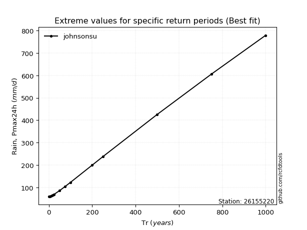</img>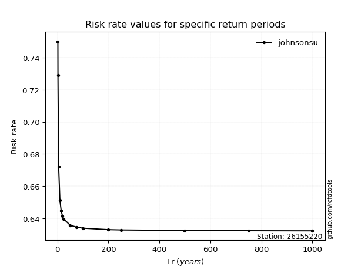</img>

</div>


<sub>**APP DISCLAIMER**: NO WARRANTY - This software is provided by [github.com/rcfdtools](https://github.com/rcfdtools) "as is", without any express or implied warranty, including warranties of merchantability, fitness for a particular purpose, or non-infringement. There is no guarantee that the software will be error-free or operate without interruption. LIMITATION OF LIABILITY - Neither the authors nor copyright holders will be liable for claims or damages arising from the software or its use. You are responsible for determining if the software is appropriate for your use and assume all associated risks, including errors, legal compliance, and data loss. NO PROFESSIONAL ADVICE - The software provides general information and does not offer professional advice. It should not replace consultation with professional advisors.</sub>