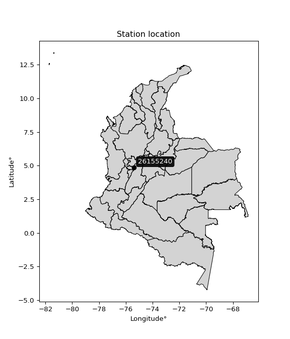

<div align="center">


</div>

# PMax24h Station (Rain, Pmax24h): 26155240

Maximum Precipitation in 24 hours (PMax24h) is the greatest amount of rainfall for a specific duration that is meteorologically possible for a given location, acting as a "worst-case" scenario for extreme storms, crucial for designing safety-critical infrastructure like bridges, river deviations, dams, spillways, and nuclear plants to prevent catastrophic failure. The PMax24h is related with the Probable Maximum Precipitation (PMP) and it is calculated by hydrologists using meteorological data to determine the upper limit of extreme rainfall, often leading to the Probable Maximum Flood (PMF) for flood control design, and is increasingly being studied for climate change impacts. Probable Maximum Precipitation (PMP) is the theoretical upper limit of rainfall, a deterministic estimate for extreme events, while probability distributions (like GEV, Gumbel) describe the likelihood and frequency of various precipitation amounts, including rare ones, showing how often events occur, with PMP representing the extreme end of these distributions, used for critical infrastructure design to ensure safety against the worst conceivable weather, unlike standard statistical forecasts which cover typical probabilities.

The most common probability distributions in hydrology, used for analyzing floods, rainfall, and streamflow, include the Normal, Log-Normal, Gumbel, Gamma (including Log-Pearson Type III), and Generalized Extreme Value (GEV) distributions, often chosen based on the data´s skewness and whether modeling extremes or general conditions, with Gumbel and GEV popular for extreme events like floods, while the Normal distribution serves as a baseline, though often requiring transformations for skewed hydrological data. These distributions help in designing water infrastructure, managing water resources, and forecasting hydrologic events.

> Hydrological data often isn´t perfectly normal (it´s skewed), so different distributions are needed for different applications, such as: **Flood Frequency Analysis**: Using Gumbel, GEV, or Log-Pearson Type III for predicting extreme flood magnitudes and their return periods, **Rainfall Analysis**: Normal for annual totals, but Log-Normal, Weibull, or GEV for intensity or extreme daily rainfall, **Streamflow Modeling**: Gamma and Log-Normal for maximum flows, GEV for minimum flows, and Kappa for daily flows.

<div align="center">

</img>

</div>


## A. General information


### 1. General running parameters

• app_version: _v20260225_. • runtime: _2026-02-27 14:50:08.749431_. • Python version: _3.14.0_. • SciPy version: _1.16.3_. • Pandas version: _2.3.3_. • NumPy version: _2.3.5_. • Stations dataset (station_dataset_file): _dataset/pmax24h_in/automatic_colombia_2003_2025.csv_. • Stations catalog (station_catalog_file): _dataset/CNE.xls_. • Minimum year to eval til year_max (date_min): _1900_. • Maximum year to eval since year_min (date_max): _2025_. • Creates, save and include plots into reports (create_plot): _False_. • Plot only fit distributions with Δo > Δ (plot_only_fit): _True_. • Plot only simple graphs avoiding multiple CDFs and multiple Extreme values plots (plot_only_simple): _False_. • Eval low extreme values, if False, evaluates high extreme values (low_extreme): _False_. • Eval every SciPy distribution as logarithmic (pdist_logarithmic_on): _True_. • Standard deviation normalized (ddof): _1.0_. • Return periods to eval in years (Tr): _[2, 2.33, 5, 10, 15, 20, 25, 50, 75, 100, 200, 250, 500, 750, 1000]_. • Minimum data sample per station, 0 means any (minimum_sample): _5_. • Z-Score maximum threshold to adjust a value, 0 means disable (zscore_max): _3.5_. • Z-Score minimum threshold to adjust a value, 0 means disable (zscore_min): _-2.5_. • Avoid zeros, e.g. rain = 0 (avoid_zeros): _True_. • Avoid null values (avoid_nans): _True_. 

:file_folder:Table: [dataset.csv](../../dataset/pmax24h_in/automatic_colombia_2003_2025.csv)

> Delta Degrees of Freedom (DDOF): is a parameter used in the formulas for calculating variance and standard deviation. When ddof=0, the divisor is $N$ (the total number of observations) and this is used when your data set is the entire population. When ddof=1, the divisor is $N-1$ and this is used when your data set is a sample drawn from a larger population. Using $N-1$ provides an unbiased estimate of the population variance (known as Bessel´s correction).


### 2. Station info and location

|   id |   CODIGO | NOMBRE                       | CATEGORIA               | TECNOLOGIA                | ESTADO           | FECHA_INSTALACION   |   FECHA_SUSPENSION |   ALTITUD |   LATITUD |   LONGITUD | DEPARTAMENTO   | MUNICIPIO   | AREA_OPERATIVA                         | ENTIDAD                                                     | AREA_HIDROGRAFICA   | ZONA_HIDROGRAFICA   | SUBZONA_HIDROGRAFICA   |   CORRIENTE | Catalogo   |   Version |
|-----:|---------:|:-----------------------------|:------------------------|:--------------------------|:-----------------|:--------------------|-------------------:|----------:|----------:|-----------:|:---------------|:------------|:---------------------------------------|:------------------------------------------------------------|:--------------------|:--------------------|:-----------------------|------------:|:-----------|----------:|
|    0 | 26155240 | PNN NEVADOS - AUT [26155240] | Climatológica Principal | Automática con Telemetría | En Mantenimiento | 24/08/2007          |                nan |      3641 |   4.85944 |   -75.3824 | Caldas         | Villamaria  | Area Operativa 09 - Cauca-Valle-Caldas | INSTITUTO DE HIDROLOGIA METEOROLOGIA Y ESTUDIOS AMBIENTALES | Magdalena Cauca     | Cauca               | Río Chinchiná          |         nan | CNE_IDEAM  |  20251226 |

<div align="center">

Dynamic map: [:earth_americas:Google](http://maps.google.com/maps?q=4.859444444,-75.38241667) [:earth_americas:OSM](https://www.openstreetmap.org/#map=18/4.859444444/-75.38241667&layers=P) [:earth_americas:Bing](https://www.bing.com/maps?cp=4.859444444~-75.38241667&lvl=18) [:earth_americas:Apple](https://maps.apple.com/frame?center=4.859444444%2C-75.38241667&span=0.003%2C0.006)

</div>


<div align="center">

```geojson
{
  "type": "Feature",
  "geometry": {
    "type": "Point", 
    "coordinates": [-75.38241667, 4.859444444]
  }, 
  "properties": {
    "Name": "26155240"
  }
}
```

</div>


### 3. Discrete values table and plot

<div align="center">

|               |          0 |           1 |           2 |           3 |           4 |            5 |           6 |
|:--------------|-----------:|------------:|------------:|------------:|------------:|-------------:|------------:|
| Date          | 2017       | 2018        | 2019        | 2020        | 2021        | 2022         | 2025        |
| Value         |   88.5     |   16.6      |   19.2      |   14.4      |   23.9      |   30.2       |   12.6      |
| Value_initial |   88.5     |   16.6      |   19.2      |   14.4      |   23.9      |   30.2       |   12.6      |
| count         |    7       |    7        |    7        |    7        |    7        |    7         |    7        |
| mean          |   29.3429  |   29.3429   |   29.3429   |   29.3429   |   29.3429   |   29.3429    |   29.3429   |
| std           |   26.7669  |   26.7669   |   26.7669   |   26.7669   |   26.7669   |   26.7669    |   26.7669   |
| zscore        |    2.21009 |   -0.476068 |   -0.378933 |   -0.558259 |   -0.203343 |    0.0320225 |   -0.625506 |


</div>


> The initial value (value_initial) correspond to the initial obtained or null completed value, and value (value) is adjusted only when the initial value is outside the valid range (outlier) definite through the Z-Score value. If Z-Score is active, values out of range or outliers are replaced with the station mean value. A Z-Score (or standard score) measures how many standard deviations a data point is from the mean of a dataset, indicating its relative position; positive scores mean above the mean, negative mean below, and a score of zero is exactly at the mean, allowing for comparison of values from different distributions. It´s calculated using the formula $z=(x–μ)/σ$, where $x$ is the data point, $μ$ is the mean, and $σ$ is the standard deviation, helping identify outliers and understand probability.
>
> <sub>**Note**: In this study, "completing" (filling gaps in) and "extending" (forecasting or lengthening the historical record) rainfall data series are avoided for certain critical analyses because they introduce artificial bias and uncertainty, which can distort the statistics of rare events (extremes), alter day-to-day variability, and compromise the integrity and homogeneity of the original data. Some reasons against Completing/Extending rainfall data are: **Distortion of Extremes and Variability**: The primary issue is that most gap-filling or extension methods rely on averaging or regression with nearby stations, which inherently smooths the data. Rainfall is highly variable in space and time, with a large percentage of zero values and occasional large storms. Infilling methods often underestimate the highest values and overestimate the lowest (zero) values, which severely distorts analyses focused on flood frequency, drought severity, and intensity-duration-frequency (IDF) curves, **Loss of Data Homogeneity**: Infilled or extended data are synthetic estimates, not actual measurements. Combining these estimates with observed data can violate the assumption of data homogeneity, which requires that the data properties do not change over time. Inhomogeneity can lead to incorrect conclusions about long-term trends or changes in climate patterns, **Propagation of Errors**: Errors and biases from the original data (e.g., wind-induced undercatch, instrument errors, site changes) or the data used for imputation can propagate through the analysis, leading to unreliable hydrological models and inaccurate predictions, **Compromised Statistical Integrity**: For statistical analyses, especially those involving the frequency of events, using artificial data can introduce time bias or autocorrelation that doesn´t exist in reality, making it difficult to assess the true probability of events, **Difficulty in Validation**: It is difficult to accurately validate the quality of filled or extended data, especially for past periods where ground-truth measurements are unavailable. The reliability of imputation techniques heavily depends on the density of the surrounding station network and the complexity of the local topography.</sub>


### 4. Active continuous probability distributions from SciPy (80 of 104 available)

A Probability Density Function (PDF) describes the relative likelihood of a continuous random variable falling within a specific range, where the total area under its curve equals 1, and the area over any interval gives the actual probability for that range. Unlike discrete probabilities (like rolling a die), a PDF shows density, not direct probability for a single point (which is zero), with higher points indicating higher likelihood, often visualized as a bell curve for normal distributions.

A log of a probability density function (log-PDF) is simply the logarithm of the PDF´s value, denoted as $log(f(x))$, useful for converting multiplication of probabilities into addition, improving numerical stability with tiny numbers, and connecting to information theory concepts like entropy. Instead of dealing with very small probabilities (e.g., 0.000001), log-PDFs use negative numbers (e.g., $log(0.00001) ≈ -11.51$ that are easier for computers to handle, preventing underflow errors and simplifying complex calculations. In this study, each active probability distribution from SciPy is also evaluated in the $log$ form.

[scipy.stats](https://docs.scipy.org/doc/scipy/reference/stats.html) is a Python´s powerful submodule within the SciPy library for comprehensive statistical analysis, offering over 130 probability distributions (like Normal, Poisson, etc.), functions for descriptive stats (mean, variance), hypothesis testing (t-tests, chi-square), random variable generation, and statistical tests, making it essential for data science, modeling, and research. It provides tools to explore, model, and draw conclusions from data efficiently, working seamlessly with [NumPy](https://numpy.org/).

<div align="center">

|   id | p_dist           |   n_parameter | fit_method   | label                                                                       | active   | ref                                                                                                      |
|-----:|:-----------------|--------------:|:-------------|:----------------------------------------------------------------------------|:---------|:---------------------------------------------------------------------------------------------------------|
|    0 | alpha            |             3 | MLE          | Alpha                                                                       | True     | [:mortar_board:](https://docs.scipy.org/doc/scipy/reference/generated/scipy.stats.alpha.html)            |
|    1 | anglit           |             2 | MM           | Anglit                                                                      | True     | [:mortar_board:](https://docs.scipy.org/doc/scipy/reference/generated/scipy.stats.anglit.html)           |
|    2 | arcsine          |             2 | MM           | Arcsine                                                                     | True     | [:mortar_board:](https://docs.scipy.org/doc/scipy/reference/generated/scipy.stats.arcsine.html)          |
|    3 | argus            |             3 | MLE          | Argus                                                                       | True     | [:mortar_board:](https://docs.scipy.org/doc/scipy/reference/generated/scipy.stats.argus.html)            |
|    4 | beta             |             4 | MLE          | Beta                                                                        | True     | [:mortar_board:](https://docs.scipy.org/doc/scipy/reference/generated/scipy.stats.beta.html)             |
|    5 | betaprime        |             4 | MLE          | Beta prime                                                                  | True     | [:mortar_board:](https://docs.scipy.org/doc/scipy/reference/generated/scipy.stats.betaprime.html)        |
|    6 | bradford         |             3 | MLE          | Bradford                                                                    | True     | [:mortar_board:](https://docs.scipy.org/doc/scipy/reference/generated/scipy.stats.bradford.html)         |
|    7 | burr             |             4 | MLE          | Burr (Type III)                                                             | True     | [:mortar_board:](https://docs.scipy.org/doc/scipy/reference/generated/scipy.stats.burr.html)             |
|    8 | burr12           |             4 | MLE          | Burr (Type III) 12                                                          | True     | [:mortar_board:](https://docs.scipy.org/doc/scipy/reference/generated/scipy.stats.burr12.html)           |
|    9 | cosine           |             2 | MLE          | Cosine                                                                      | True     | [:mortar_board:](https://docs.scipy.org/doc/scipy/reference/generated/scipy.stats.cosine.html)           |
|   10 | crystalball      |             4 | MLE          | Crystalball                                                                 | True     | [:mortar_board:](https://docs.scipy.org/doc/scipy/reference/generated/scipy.stats.crystalball.html)      |
|   11 | dgamma           |             3 | MLE          | Double gamma                                                                | True     | [:mortar_board:](https://docs.scipy.org/doc/scipy/reference/generated/scipy.stats.dgamma.html)           |
|   12 | dweibull         |             3 | MLE          | Double Weibull                                                              | True     | [:mortar_board:](https://docs.scipy.org/doc/scipy/reference/generated/scipy.stats.dweibull.html)         |
|   13 | erlang           |             3 | MLE          | Erlang                                                                      | True     | [:mortar_board:](https://docs.scipy.org/doc/scipy/reference/generated/scipy.stats.erlang.html)           |
|   14 | exponnorm        |             3 | MLE          | Exponentially modified Normal                                               | True     | [:mortar_board:](https://docs.scipy.org/doc/scipy/reference/generated/scipy.stats.exponnorm.html)        |
|   15 | exponpow         |             3 | MLE          | Exponential power                                                           | True     | [:mortar_board:](https://docs.scipy.org/doc/scipy/reference/generated/scipy.stats.exponpow.html)         |
|   16 | exponweib        |             4 | MLE          | Exponentiated Weibull                                                       | True     | [:mortar_board:](https://docs.scipy.org/doc/scipy/reference/generated/scipy.stats.exponweib.html)        |
|   17 | f                |             4 | MLE          | F                                                                           | True     | [:mortar_board:](https://docs.scipy.org/doc/scipy/reference/generated/scipy.stats.f.html)                |
|   18 | fatiguelife      |             3 | MLE          | Fatigue-life (Birnbaum-Saunders)                                            | True     | [:mortar_board:](https://docs.scipy.org/doc/scipy/reference/generated/scipy.stats.fatiguelife.html)      |
|   19 | foldnorm         |             3 | MM           | Fold Normal                                                                 | True     | [:mortar_board:](https://docs.scipy.org/doc/scipy/reference/generated/scipy.stats.foldnorm.html)         |
|   20 | gamma            |             3 | MLE          | Gamma                                                                       | True     | [:mortar_board:](https://docs.scipy.org/doc/scipy/reference/generated/scipy.stats.gamma.html)            |
|   21 | gausshyper       |             6 | MLE          | Gauss hypergeometric                                                        | True     | [:mortar_board:](https://docs.scipy.org/doc/scipy/reference/generated/scipy.stats.gausshyper.html)       |
|   22 | genexpon         |             5 | MLE          | Generalized exponential                                                     | True     | [:mortar_board:](https://docs.scipy.org/doc/scipy/reference/generated/scipy.stats.genexpon.html)         |
|   23 | genextreme       |             3 | MLE          | Generalized exponential                                                     | True     | [:mortar_board:](https://docs.scipy.org/doc/scipy/reference/generated/scipy.stats.genextreme.html)       |
|   24 | gengamma         |             4 | MLE          | Generalized gamma                                                           | True     | [:mortar_board:](https://docs.scipy.org/doc/scipy/reference/generated/scipy.stats.gengamma.html)         |
|   25 | genhalflogistic  |             3 | MLE          | Generalized half-logistic                                                   | True     | [:mortar_board:](https://docs.scipy.org/doc/scipy/reference/generated/scipy.stats.genhalflogistic.html)  |
|   26 | genlogistic      |             3 | MLE          | Generalized logistic                                                        | True     | [:mortar_board:](https://docs.scipy.org/doc/scipy/reference/generated/scipy.stats.genlogistic.html)      |
|   27 | gennorm          |             3 | MLE          | Generalized Normal                                                          | True     | [:mortar_board:](https://docs.scipy.org/doc/scipy/reference/generated/scipy.stats.gennorm.html)          |
|   28 | genpareto        |             3 | MLE          | Generalized Pareto                                                          | True     | [:mortar_board:](https://docs.scipy.org/doc/scipy/reference/generated/scipy.stats.genpareto.html)        |
|   29 | gompertz         |             3 | MLE          | Gompertz (or truncated Gumbel)                                              | True     | [:mortar_board:](https://docs.scipy.org/doc/scipy/reference/generated/scipy.stats.gompertz.html)         |
|   30 | gumbel_l         |             2 | MM           | Gumbel Left Skew                                                            | True     | [:mortar_board:](https://docs.scipy.org/doc/scipy/reference/generated/scipy.stats.gumbel_l.html)         |
|   31 | gumbel_r         |             2 | MM           | Gumbel Right Skew                                                           | True     | [:mortar_board:](https://docs.scipy.org/doc/scipy/reference/generated/scipy.stats.gumbel_r.html)         |
|   32 | halfgennorm      |             3 | MLE          | Upper half of a generalized normal                                          | True     | [:mortar_board:](https://docs.scipy.org/doc/scipy/reference/generated/scipy.stats.halfgennorm.html)      |
|   33 | halflogistic     |             2 | MM           | Half-logistic                                                               | True     | [:mortar_board:](https://docs.scipy.org/doc/scipy/reference/generated/scipy.stats.halflogistic.html)     |
|   34 | halfnorm         |             2 | MM           | Half Normal                                                                 | True     | [:mortar_board:](https://docs.scipy.org/doc/scipy/reference/generated/scipy.stats.halfnorm.html)         |
|   35 | hypsecant        |             2 | MM           | hyperbolic secant                                                           | True     | [:mortar_board:](https://docs.scipy.org/doc/scipy/reference/generated/scipy.stats.hypsecant.html)        |
|   36 | invgamma         |             3 | MLE          | Inverted gamma                                                              | True     | [:mortar_board:](https://docs.scipy.org/doc/scipy/reference/generated/scipy.stats.invgamma.html)         |
|   37 | invgauss         |             3 | MLE          | Inverse Gaussian                                                            | True     | [:mortar_board:](https://docs.scipy.org/doc/scipy/reference/generated/scipy.stats.invgauss.html)         |
|   38 | invweibull       |             3 | MLE          | Inverted Weibull                                                            | True     | [:mortar_board:](https://docs.scipy.org/doc/scipy/reference/generated/scipy.stats.invweibull.html)       |
|   39 | johnsonsb        |             4 | MLE          | Johnson SB                                                                  | True     | [:mortar_board:](https://docs.scipy.org/doc/scipy/reference/generated/scipy.stats.johnsonsb.html)        |
|   40 | johnsonsu        |             4 | MLE          | Johnson Su                                                                  | True     | [:mortar_board:](https://docs.scipy.org/doc/scipy/reference/generated/scipy.stats.johnsonsu.html)        |
|   41 | kappa3           |             3 | MLE          | Kappa 3                                                                     | True     | [:mortar_board:](https://docs.scipy.org/doc/scipy/reference/generated/scipy.stats.kappa3.html)           |
|   42 | kappa4           |             4 | MLE          | Kappa 4                                                                     | True     | [:mortar_board:](https://docs.scipy.org/doc/scipy/reference/generated/scipy.stats.kappa4.html)           |
|   43 | ksone            |             3 | MLE          | Kolmogorov-Smirnov one-sided test statistic distribution                    | True     | [:mortar_board:](https://docs.scipy.org/doc/scipy/reference/generated/scipy.stats.ksone.html)            |
|   44 | kstwobign        |             2 | MLE          | Limiting distribution of scaled Kolmogorov-Smirnov two-sided test statistic | True     | [:mortar_board:](https://docs.scipy.org/doc/scipy/reference/generated/scipy.stats.kstwobign.html)        |
|   45 | laplace          |             2 | MM           | Laplace                                                                     | True     | [:mortar_board:](https://docs.scipy.org/doc/scipy/reference/generated/scipy.stats.laplace.html)          |
|   46 | levy_l           |             2 | MLE          | Left-skewed Levy                                                            | True     | [:mortar_board:](https://docs.scipy.org/doc/scipy/reference/generated/scipy.stats.levy_l.html)           |
|   47 | loggamma         |             3 | MLE          | Log gamma                                                                   | True     | [:mortar_board:](https://docs.scipy.org/doc/scipy/reference/generated/scipy.stats.loggamma.html)         |
|   48 | logistic         |             2 | MM           | Logistic (or Sech-squared)                                                  | True     | [:mortar_board:](https://docs.scipy.org/doc/scipy/reference/generated/scipy.stats.logistic.html)         |
|   49 | loglaplace       |             3 | MLE          | Log-Laplace                                                                 | True     | [:mortar_board:](https://docs.scipy.org/doc/scipy/reference/generated/scipy.stats.loglaplace.html)       |
|   50 | lomax            |             3 | MLE          | Lomax (Pareto of the second kind)                                           | True     | [:mortar_board:](https://docs.scipy.org/doc/scipy/reference/generated/scipy.stats.lomax.html)            |
|   51 | maxwell          |             2 | MM           | Maxwell                                                                     | True     | [:mortar_board:](https://docs.scipy.org/doc/scipy/reference/generated/scipy.stats.maxwell.html)          |
|   52 | mielke           |             4 | MLE          | Mielke Beta-Kappa / Dagum                                                   | True     | [:mortar_board:](https://docs.scipy.org/doc/scipy/reference/generated/scipy.stats.mielke.html)           |
|   53 | moyal            |             2 | MM           | Moyal                                                                       | True     | [:mortar_board:](https://docs.scipy.org/doc/scipy/reference/generated/scipy.stats.moyal.html)            |
|   54 | nakagami         |             3 | MLE          | Nakagami                                                                    | True     | [:mortar_board:](https://docs.scipy.org/doc/scipy/reference/generated/scipy.stats.nakagami.html)         |
|   55 | ncf              |             5 | MLE          | Non-central F distribution                                                  | True     | [:mortar_board:](https://docs.scipy.org/doc/scipy/reference/generated/scipy.stats.ncf.html)              |
|   56 | nct              |             4 | MLE          | Non-central Student’s t                                                     | True     | [:mortar_board:](https://docs.scipy.org/doc/scipy/reference/generated/scipy.stats.nct.html)              |
|   57 | norm             |             2 | MM           | Normal                                                                      | True     | [:mortar_board:](https://docs.scipy.org/doc/scipy/reference/generated/scipy.stats.norm.html)             |
|   58 | pearson3         |             3 | MM           | Pearson type III                                                            | True     | [:mortar_board:](https://docs.scipy.org/doc/scipy/reference/generated/scipy.stats.pearson3.html)         |
|   59 | powerlaw         |             3 | MLE          | Power-function                                                              | True     | [:mortar_board:](https://docs.scipy.org/doc/scipy/reference/generated/scipy.stats.powerlaw.html)         |
|   60 | rayleigh         |             2 | MM           | Rayleigh                                                                    | True     | [:mortar_board:](https://docs.scipy.org/doc/scipy/reference/generated/scipy.stats.rayleigh.html)         |
|   61 | rdist            |             3 | MLE          | R-distributed (symmetric beta)                                              | True     | [:mortar_board:](https://docs.scipy.org/doc/scipy/reference/generated/scipy.stats.rdist.html)            |
|   62 | rice             |             3 | MLE          | Rice                                                                        | True     | [:mortar_board:](https://docs.scipy.org/doc/scipy/reference/generated/scipy.stats.rice.html)             |
|   63 | semicircular     |             2 | MM           | Semicircular                                                                | True     | [:mortar_board:](https://docs.scipy.org/doc/scipy/reference/generated/scipy.stats.semicircular.html)     |
|   64 | skewnorm         |             3 | MLE          | Skew normal                                                                 | True     | [:mortar_board:](https://docs.scipy.org/doc/scipy/reference/generated/scipy.stats.skewnorm.html)         |
|   65 | t                |             3 | MLE          | Student’s t                                                                 | True     | [:mortar_board:](https://docs.scipy.org/doc/scipy/reference/generated/scipy.stats.t.html)                |
|   66 | trapezoid        |             4 | MLE          | Trapezoid                                                                   | True     | [:mortar_board:](https://docs.scipy.org/doc/scipy/reference/generated/scipy.stats.trapezoid.html)        |
|   67 | triang           |             3 | MLE          | Triangular                                                                  | True     | [:mortar_board:](https://docs.scipy.org/doc/scipy/reference/generated/scipy.stats.triang.html)           |
|   68 | truncexpon       |             3 | MLE          | Truncated exponential                                                       | True     | [:mortar_board:](https://docs.scipy.org/doc/scipy/reference/generated/scipy.stats.truncexpon.html)       |
|   69 | truncnorm        |             4 | MLE          | Truncated normal                                                            | True     | [:mortar_board:](https://docs.scipy.org/doc/scipy/reference/generated/scipy.stats.truncnorm.html)        |
|   70 | truncpareto      |             4 | MLE          | Upper truncated Pareto                                                      | True     | [:mortar_board:](https://docs.scipy.org/doc/scipy/reference/generated/scipy.stats.truncpareto.html)      |
|   71 | truncweibull_min |             5 | MLE          | Doubly truncated Weibull minimum                                            | True     | [:mortar_board:](https://docs.scipy.org/doc/scipy/reference/generated/scipy.stats.truncweibull_min.html) |
|   72 | tukeylambda      |             3 | MLE          | Tukey-Lamdba                                                                | True     | [:mortar_board:](https://docs.scipy.org/doc/scipy/reference/generated/scipy.stats.tukeylambda.html)      |
|   73 | uniform          |             2 | MLE          | Uniform                                                                     | True     | [:mortar_board:](https://docs.scipy.org/doc/scipy/reference/generated/scipy.stats.uniform.html)          |
|   74 | vonmises         |             3 | MLE          | Von Mises                                                                   | True     | [:mortar_board:](https://docs.scipy.org/doc/scipy/reference/generated/scipy.stats.vonmises.html)         |
|   75 | vonmises_line    |             3 | MLE          | Von Mises line                                                              | True     | [:mortar_board:](https://docs.scipy.org/doc/scipy/reference/generated/scipy.stats.vonmises_line.html)    |
|   76 | wald             |             2 | MM           | Wald                                                                        | True     | [:mortar_board:](https://docs.scipy.org/doc/scipy/reference/generated/scipy.stats.wald.html)             |
|   77 | weibull_max      |             3 | MLE          | Weibull maximum                                                             | True     | [:mortar_board:](https://docs.scipy.org/doc/scipy/reference/generated/scipy.stats.weibull_max.html)      |
|   78 | weibull_min      |             3 | MLE          | Weibull minimum                                                             | True     | [:mortar_board:](https://docs.scipy.org/doc/scipy/reference/generated/scipy.stats.weibull_min.html)      |
|   79 | wrapcauchy       |             3 | MLE          | Wrapped  Cauchy                                                             | True     | [:mortar_board:](https://docs.scipy.org/doc/scipy/reference/generated/scipy.stats.wrapcauchy.html)       |

</div>

> **n_parameter:** # arguments & localization & scale.
>
> **Fit methods:** (MLE) maximum likelihood, (MM) L-moments.
>
>**Inactive** (With the only purpose of prevent loops, zero divisions, infinite values, over high estimated values or horizontal trending for recurrence intervals estimations, the follow distributions were disabled.)**:** lognorm, norminvgauss, powernorm, powerlognorm, cauchy, halfcauchy, foldcauchy, skewcauchy, chi2, expon, fisk, genhyperbolic, geninvgauss, gibrat, kstwo, laplace_asymmetric, levy, levy_stable, ncx2, pareto, rel_breitwigner, recipinvgauss, studentized_range, loguniform, 


## B. Probability (PDF) vs. Empirical (EDF) distributions functions

A continuous probability distribution (CPD) describes probabilities for variables that can take any value within a range (like rain any time), unlike discrete variables with specific outcomes (like temperature). It uses a Probability Density Function (PDF), a curve where the total area under it equals 1, and the probability of the variable falling within an interval (a to b) is found by calculating the area under the curve between those points. A key feature is that the probability of hitting any single exact value is zero, so probabilities are always expressed for ranges, e.g., $P(a ≤ X ≤ b)$.

<div align="center">

Distributions parameters from station values
|     |   station | p_dist              |   n |            loc |         scale | shape                  | shape1                 | shape2              | shape3             |
|----:|----------:|:--------------------|----:|---------------:|--------------:|:-----------------------|:-----------------------|:--------------------|:-------------------|
|   0 |  26155240 | alpha               |   7 |     9.62554    |   5.9793      | 2.725247210707561e-10  |                        |                     |                    |
|   1 |  26155240 | anglit              |   7 |    29.3428     |  72.4953      |                        |                        |                     |                    |
|   2 |  26155240 | arcsine             |   7 |    -5.70323    |  70.0922      |                        |                        |                     |                    |
|   3 |  26155240 | argus               |   7 |   -26.9788     | 119.874       | 0.056766094978533965   |                        |                     |                    |
|   4 |  26155240 | beta                |   7 |    12.6        | 549.309       | 0.5328481280440726     | 29.983269555874774     |                     |                    |
|   5 |  26155240 | betaprime           |   7 |    11.8777     |   2.00038     | 2.5015456852612674     | 0.996265015020845      |                     |                    |
|   6 |  26155240 | bradford            |   7 |    12.6        |  75.9086      | 2.698764489270885      |                        |                     |                    |
|   7 |  26155240 | burr                |   7 |    10.9575     |   0.027929    | 1.0097476469260382     | 197.07865460381038     |                     |                    |
|   8 |  26155240 | burr12              |   7 |    -1.81216    |  14.2847      | 384.89762331123825     | 0.0045308386282140725  |                     |                    |
|   9 |  26155240 | cosine              |   7 |    35.6613     |  22.9257      |                        |                        |                     |                    |
|  10 |  26155240 | crystalball         |   7 |    29.3429     |  24.7813      | 2923.5487774061035     | 956.0612376339392      |                     |                    |
|  11 |  26155240 | dgamma              |   7 |    16.6        |  20.8088      | 0.6667279646036666     |                        |                     |                    |
|  12 |  26155240 | dweibull            |   7 |    16.6        |  20.5595      | 0.5997909618543955     |                        |                     |                    |
|  13 |  26155240 | erlang              |   7 |    12.6        |  23.0232      | 0.3812316417387457     |                        |                     |                    |
|  14 |  26155240 | exponnorm           |   7 |    12.5812     |   0.00622908  | 2672.284587277005      |                        |                     |                    |
|  15 |  26155240 | exponpow            |   7 |    12.6        |  51.1613      | 0.35184706208513894    |                        |                     |                    |
|  16 |  26155240 | exponweib           |   7 |    12.6        |   0.316334    | 4.472701671920863      | 0.1654237456177609     |                     |                    |
|  17 |  26155240 | f                   |   7 |    12.5791     |   6.80548     | 1.324772391857143      | 2.0229469513928215     |                     |                    |
|  18 |  26155240 | fatiguelife         |   7 |    12.1895     |   5.72261     | 1.9460047679666004     |                        |                     |                    |
|  19 |  26155240 | foldnorm            |   7 |    -6.57462    |  44.318       | 0.0034133570142234095  |                        |                     |                    |
|  20 |  26155240 | gamma               |   7 |    12.6        |  18.4636      | 0.5740051716667419     |                        |                     |                    |
|  21 |  26155240 | gausshyper          |   7 |     5.85434    |  82.6457      | 0.719124700726703      | 0.9324091202173097     | 1.2521659286378226  | 1.0827100073976141 |
|  22 |  26155240 | genexpon            |   7 |    12.6        |   0.66977     | 0.04004261865383976    | 1.0725041979205029e-08 | 10.415514515138486  |                    |
|  23 |  26155240 | genextreme          |   7 |    16.1728     |   5.17676     | -0.9897502254468205    |                        |                     |                    |
|  24 |  26155240 | gengamma            |   7 |    12.6        |   2.11027     | 1.207295117247261      | 0.31864134229109364    |                     |                    |
|  25 |  26155240 | genhalflogistic     |   7 |     5.09494    |  87.0025      | 1.0431323685347285     |                        |                     |                    |
|  26 |  26155240 | genlogistic         |   7 |   -72.2929     |  12.2312      | 1902.9750037887097     |                        |                     |                    |
|  27 |  26155240 | gennorm             |   7 |    16.6        |   0.164469    | 0.32494075513672194    |                        |                     |                    |
|  28 |  26155240 | genpareto           |   7 |    12.5736     |   7.18779     | 0.6651939332115662     |                        |                     |                    |
|  29 |  26155240 | gompertz            |   7 |    12.6        |   1.03145e+14 | 8181271046929.445      |                        |                     |                    |
|  30 |  26155240 | gumbel_l            |   7 |    40.4958     |  19.3219      |                        |                        |                     |                    |
|  31 |  26155240 | gumbel_r            |   7 |    18.1899     |  19.3219      |                        |                        |                     |                    |
|  32 |  26155240 | halfgennorm         |   7 |    12.6        |  14.465       | 0.8805566552156503     |                        |                     |                    |
|  33 |  26155240 | halflogistic        |   7 |    -0.028767   |  21.1871      |                        |                        |                     |                    |
|  34 |  26155240 | halfnorm            |   7 |    -3.4579     |  41.1097      |                        |                        |                     |                    |
|  35 |  26155240 | hypsecant           |   7 |    29.3429     |  15.7763      |                        |                        |                     |                    |
|  36 |  26155240 | invgamma            |   7 |    10.8125     |   5.9782      | 1.085532145679348      |                        |                     |                    |
|  37 |  26155240 | invgauss            |   7 |    11.4987     |   5.24992     | 3.3989415586630107     |                        |                     |                    |
|  38 |  26155240 | invweibull          |   7 |    10.9424     |   5.23031     | 1.0103576334481148     |                        |                     |                    |
|  39 |  26155240 | johnsonsb           |   7 |    12.5983     |  75.9017      | 1.1103902311690381     | 0.07529298339334367    |                     |                    |
|  40 |  26155240 | johnsonsu           |   7 |    12.6        |   1.01012e-08 | -1.9969526840626344    | 0.13758352025741244    |                     |                    |
|  41 |  26155240 | kappa3              |   7 |    12.6        |   6.19379     | 1.0703356516694402     |                        |                     |                    |
|  42 |  26155240 | kappa4              |   7 |     4.95704    |  83.429       | 1.1008313416056592     | 0.9966075178792682     |                     |                    |
|  43 |  26155240 | ksone               |   7 |     5.01       |  91.08        | 1.0                    |                        |                     |                    |
|  44 |  26155240 | kstwobign           |   7 |   -30.3439     |  70.2586      |                        |                        |                     |                    |
|  45 |  26155240 | laplace             |   7 |    29.3429     |  17.523       |                        |                        |                     |                    |
|  46 |  26155240 | levy_l              |   7 |    95.6699     |  32.0006      |                        |                        |                     |                    |
|  47 |  26155240 | loggamma            |   7 | -7225.53       | 987.617       | 1550.1168883070663     |                        |                     |                    |
|  48 |  26155240 | logistic            |   7 |    29.3429     |  13.6627      |                        |                        |                     |                    |
|  49 |  26155240 | loglaplace          |   7 |    -0.0948764  |  19.2949      | 2.300362288371662      |                        |                     |                    |
|  50 |  26155240 | lomax               |   7 |    12.6        |   5.62234e+08 | 16179409.517153122     |                        |                     |                    |
|  51 |  26155240 | maxwell             |   7 |   -29.3785     |  36.7981      |                        |                        |                     |                    |
|  52 |  26155240 | mielke              |   7 |    10.4954     |   0.00999834  | 1398.4983884858866     | 1.1222115147247704     |                     |                    |
|  53 |  26155240 | moyal               |   7 |    15.1713     |  11.1555      |                        |                        |                     |                    |
|  54 |  26155240 | nakagami            |   7 |    12.6        |  34.0088      | 0.2168507343994333     |                        |                     |                    |
|  55 |  26155240 | ncf                 |   7 |     0.34895    |   2.54245e-06 | 1.7894003045393502e-05 | 7.452711866256903      | 141.5078261392943   |                    |
|  56 |  26155240 | nct                 |   7 |     0.301966   |   0.150046    | 2.4311416508629744     | 120.6370480414248      |                     |                    |
|  57 |  26155240 | norm                |   7 |    29.3429     |  24.7813      |                        |                        |                     |                    |
|  58 |  26155240 | pearson3            |   7 |    29.3429     |  24.7813      | 1.8372300027300175     |                        |                     |                    |
|  59 |  26155240 | powerlaw            |   7 |    12.6        |  75.9         | 0.13783092808058728    |                        |                     |                    |
|  60 |  26155240 | rayleigh            |   7 |   -18.0653     |  37.8262      |                        |                        |                     |                    |
|  61 |  26155240 | rdist               |   7 |     7.15562    |  23.0444      | 1.2640810979355308     |                        |                     |                    |
|  62 |  26155240 | rice                |   7 |    -5.17409    |  30.0461      | 0.0004972694243366972  |                        |                     |                    |
|  63 |  26155240 | semicircular        |   7 |    29.3429     |  49.5626      |                        |                        |                     |                    |
|  64 |  26155240 | skewnorm            |   7 |    12.6        |  29.9083      | 46512282.4748721       |                        |                     |                    |
|  65 |  26155240 | t                   |   7 |    17.6089     |   4.68718     | 0.9793548889534067     |                        |                     |                    |
|  66 |  26155240 | trapezoid           |   7 |     5.01       |  91.08        | 0.9999999999999999     | 1.0                    |                     |                    |
|  67 |  26155240 | triang              |   7 |    12.6        | 163.719       | 2.8686107574830162e-08 |                        |                     |                    |
|  68 |  26155240 | truncexpon          |   7 |     5.53022    |  69.3531      | 1.196338467115071      |                        |                     |                    |
|  69 |  26155240 | truncnorm           |   7 | -3995.6        | 317.702       | 12.616220693689542     | 12.855143956614281     |                     |                    |
|  70 |  26155240 | truncpareto         |   7 |     2.91972    |   9.68028     | 1.3929801850953163     | 8.84068073964183       |                     |                    |
|  71 |  26155240 | truncweibull_min    |   7 |    11.9892     |  90.7533      | 0.06352511103035649    | 0.006730558461168813   | 0.8430636432076488  |                    |
|  72 |  26155240 | tukeylambda         |   7 |     6.60109    |  28.6538      | 1.214201386994322      |                        |                     |                    |
|  73 |  26155240 | uniform             |   7 |    12.6        |  75.9         |                        |                        |                     |                    |
|  74 |  26155240 | vonmises            |   7 |    -0.301908   |   1           | 0.841834846958741      |                        |                     |                    |
|  75 |  26155240 | vonmises_line       |   7 |    23.1088     |  20.8147      | 1.8226303017280605     |                        |                     |                    |
|  76 |  26155240 | wald                |   7 |     4.56154    |  24.7813      |                        |                        |                     |                    |
|  77 |  26155240 | weibull_max         |   7 |    88.5        |   1.59661     | 0.21126560836314118    |                        |                     |                    |
|  78 |  26155240 | weibull_min         |   7 |    12.6        |  28.0638      | 0.5893195696630881     |                        |                     |                    |
|  79 |  26155240 | wrapcauchy          |   7 |    12.6        |  12.0835      | 0.7522569482083757     |                        |                     |                    |
|  80 |  26155240 | logalpha            |   7 |     1.87296    |   2.7857      | 2.600129038611798      |                        |                     |                    |
|  81 |  26155240 | loganglit           |   7 |     3.14714    |   1.7866      |                        |                        |                     |                    |
|  82 |  26155240 | logarcsine          |   7 |     2.28346    |   1.72736     |                        |                        |                     |                    |
|  83 |  26155240 | logargus            |   7 |     1.72064    |   2.87053     | 4.89360452044125e-05   |                        |                     |                    |
|  84 |  26155240 | logbeta             |   7 |     2.5337     |   2.17403     | 0.3170916762070511     | 1.0762092212667893     |                     |                    |
|  85 |  26155240 | logbetaprime        |   7 |     2.27964    |   0.0171491   | 89.76812839334592      | 2.684282920867947      |                     |                    |
|  86 |  26155240 | logbradford         |   7 |     2.53369    |   1.94932     | 1.1340453544851037     |                        |                     |                    |
|  87 |  26155240 | logburr             |   7 |     2.08817    |   0.0451766   | 2.320634791369461      | 614.3189533151628      |                     |                    |
|  88 |  26155240 | logburr12           |   7 |   -70.9368     |  73.4611      | 26973.876612959444     | 0.0044087665656882815  |                     |                    |
|  89 |  26155240 | logcosine           |   7 |     3.26243    |   0.543202    |                        |                        |                     |                    |
|  90 |  26155240 | logcrystalball      |   7 |     3.14714    |   0.610722    | 14.317436748145212     | 4.335796955263181      |                     |                    |
|  91 |  26155240 | logdgamma           |   7 |     2.95491    |   0.461652    | 0.8931411804333214     |                        |                     |                    |
|  92 |  26155240 | logdweibull         |   7 |     2.95491    |   0.363055    | 0.8034260743982087     |                        |                     |                    |
|  93 |  26155240 | logerlang           |   7 |     2.5337     |   0.656958    | 0.38168754737348287    |                        |                     |                    |
|  94 |  26155240 | logexponnorm        |   7 |     2.53302    |   0.000225693 | 2712.21803940547       |                        |                     |                    |
|  95 |  26155240 | logexponpow         |   7 |     2.5337     |   1.22503     | 0.36013343737211734    |                        |                     |                    |
|  96 |  26155240 | logexponweib        |   7 |     2.5337     |   0.619926    | 0.8360625508698782     | 1.0072736595512741     |                     |                    |
|  97 |  26155240 | logf                |   7 |     2.27143    |   0.578627    | 6062.113956538156      | 5.367684493223065      |                     |                    |
|  98 |  26155240 | logfatiguelife      |   7 |     2.4474     |   0.450124    | 1.0409717977799313     |                        |                     |                    |
|  99 |  26155240 | logfoldnorm         |   7 |     2.32632    |   0.969916    | 0.346639083047676      |                        |                     |                    |
| 100 |  26155240 | loggamma            |   7 |     2.5337     |   0.512546    | 0.8442335251863797     |                        |                     |                    |
| 101 |  26155240 | loggausshyper       |   7 |     2.5337     |   2.04803     | 0.5848368890532769     | 1.1608041555146258     | 0.9365819163290392  | 1.104720844353868  |
| 102 |  26155240 | loggenexpon         |   7 |     2.5337     |   1.3862      | 2.2594637607631474     | 7.237286543416824e-07  | 1.3424775425334148  |                    |
| 103 |  26155240 | loggenextreme       |   7 |     2.80656    |   0.309846    | -0.4303140664709168    |                        |                     |                    |
| 104 |  26155240 | loggengamma         |   7 |     2.5337     |   0.759334    | 0.7888245190377099     | 1.038978445342658      |                     |                    |
| 105 |  26155240 | loggenhalflogistic  |   7 |     2.36207    |   2.24714     | 1.0595075572550519     |                        |                     |                    |
| 106 |  26155240 | loggenlogistic      |   7 |     0.0964576  |   0.397862    | 1113.295433449696      |                        |                     |                    |
| 107 |  26155240 | loggennorm          |   7 |     2.95491    |   0.176391    | 0.6401627976311839     |                        |                     |                    |
| 108 |  26155240 | loggenpareto        |   7 |    -0.00332759 |   9.7478      | -2.17277822687059      |                        |                     |                    |
| 109 |  26155240 | loggompertz         |   7 |     2.53369    |  49.5202      | 79.49263559457196      |                        |                     |                    |
| 110 |  26155240 | loggumbel_l         |   7 |     3.42199    |   0.476177    |                        |                        |                     |                    |
| 111 |  26155240 | loggumbel_r         |   7 |     2.87228    |   0.476177    |                        |                        |                     |                    |
| 112 |  26155240 | loghalfgennorm      |   7 |     2.5337     |   0.94939     | 1.344171029872785      |                        |                     |                    |
| 113 |  26155240 | loghalflogistic     |   7 |     2.42329    |   0.522144    |                        |                        |                     |                    |
| 114 |  26155240 | loghalfnorm         |   7 |     2.33878    |   1.01312     |                        |                        |                     |                    |
| 115 |  26155240 | loghypsecant        |   7 |     3.14714    |   0.388797    |                        |                        |                     |                    |
| 116 |  26155240 | loginvgamma         |   7 |     2.27117    |   1.55337     | 2.683858035402484      |                        |                     |                    |
| 117 |  26155240 | loginvgauss         |   7 |     2.39719    |   0.807329    | 0.9289179989742427     |                        |                     |                    |
| 118 |  26155240 | loginvweibull       |   7 |     2.08656    |   0.719984    | 2.3237804406079308     |                        |                     |                    |
| 119 |  26155240 | logjohnsonsb        |   7 |     2.5337     |   1.94931     | 0.68807473263293       | 0.191553851259458      |                     |                    |
| 120 |  26155240 | logjohnsonsu        |   7 |     2.45109    |   0.00285607  | -5.982726326019101     | 1.0350423494601126     |                     |                    |
| 121 |  26155240 | logkappa3           |   7 |     2.5337     |   1.90533     | 57.686833949116945     |                        |                     |                    |
| 122 |  26155240 | logkappa4           |   7 |     2.21845    |   2.37901     | 1.1533732655228626     | 1.050460896834637      |                     |                    |
| 123 |  26155240 | logksone            |   7 |     2.33877    |   2.33917     | 1.0                    |                        |                     |                    |
| 124 |  26155240 | logkstwobign        |   7 |     1.42625    |   1.99366     |                        |                        |                     |                    |
| 125 |  26155240 | loglaplace          |   7 |     3.14714    |   0.431845    |                        |                        |                     |                    |
| 126 |  26155240 | loglevy_l           |   7 |     4.64067    |   0.703111    |                        |                        |                     |                    |
| 127 |  26155240 | logloggamma         |   7 |  -192.605      |  26.3069      | 1704.8188323683103     |                        |                     |                    |
| 128 |  26155240 | loglogistic         |   7 |     3.14714    |   0.336708    |                        |                        |                     |                    |
| 129 |  26155240 | logloglaplace       |   7 |    -0.0371255  |   2.99204     | 7.548887927786662      |                        |                     |                    |
| 130 |  26155240 | loglomax            |   7 |     2.5337     |   3.69998e+07 | 60036835.83967689      |                        |                     |                    |
| 131 |  26155240 | logmaxwell          |   7 |     1.69999    |   0.906867    |                        |                        |                     |                    |
| 132 |  26155240 | logmielke           |   7 |     2.08833    |   0.0431058   | 1584.7555083656707     | 2.319895512550646      |                     |                    |
| 133 |  26155240 | logmoyal            |   7 |     2.79789    |   0.274921    |                        |                        |                     |                    |
| 134 |  26155240 | lognakagami         |   7 |     2.5337     |   1.25187     | 0.23724347267653972    |                        |                     |                    |
| 135 |  26155240 | logncf              |   7 |    -1.83287    |   4.94252     | 218.2341375239763      | 318.02449316555055     | 0.37168787253458724 |                    |
| 136 |  26155240 | lognct              |   7 |    -0.0566482  |   0.0548278   | 18.974285598628178     | 55.985013994152666     |                     |                    |
| 137 |  26155240 | lognorm             |   7 |     3.14714    |   0.61072     |                        |                        |                     |                    |
| 138 |  26155240 | logpearson3         |   7 |     3.14714    |   0.610721    | 1.2634723002322794     |                        |                     |                    |
| 139 |  26155240 | logpowerlaw         |   7 |     2.5337     |   1.94931     | 0.15872183421984243    |                        |                     |                    |
| 140 |  26155240 | lograyleigh         |   7 |     1.97879    |   0.932203    |                        |                        |                     |                    |
| 141 |  26155240 | logrdist            |   7 |     3.50828    |   0.974719    | 1.0457379454337075     |                        |                     |                    |
| 142 |  26155240 | logrice             |   7 |     2.2029     |   0.795159    | 0.0009518515987145977  |                        |                     |                    |
| 143 |  26155240 | logsemicircular     |   7 |     3.14714    |   1.22147     |                        |                        |                     |                    |
| 144 |  26155240 | logskewnorm         |   7 |     2.5337     |   0.865629    | 56993883.20481275      |                        |                     |                    |
| 145 |  26155240 | logt                |   7 |     2.95102    |   0.347405    | 2.169711442359848      |                        |                     |                    |
| 146 |  26155240 | logtrapezoid        |   7 |     2.33877    |   2.33917     | 1.0                    | 1.0                    |                     |                    |
| 147 |  26155240 | logtriang           |   7 |     2.5337     |   2.29851     | 1.655995758920762e-09  |                        |                     |                    |
| 148 |  26155240 | logtruncexpon       |   7 |     2.53369    |   2.21542     | 0.8798867308973953     |                        |                     |                    |
| 149 |  26155240 | logtruncnorm        |   7 |    -2.67566    |   1.97968     | 2.631420860939726      | 4.678287615432669      |                     |                    |
| 150 |  26155240 | logtruncpareto      |   7 |     2.5332     |   0.000494603 | 0.16827208818435516    | 3942.153470033794      |                     |                    |
| 151 |  26155240 | logtruncweibull_min |   7 |     2.53184    |   2.01563     | 0.5516758637284441     | 0.0009223364820814049  | 0.9680184926082325  |                    |
| 152 |  26155240 | logtukeylambda      |   7 |     3.51563    |   1.2043      | 1.2264630985337677     |                        |                     |                    |
| 153 |  26155240 | loguniform          |   7 |     2.5337     |   1.94931     |                        |                        |                     |                    |
| 154 |  26155240 | logvonmises         |   7 |     3.09524    |   1           | 3.3654531875346745     |                        |                     |                    |
| 155 |  26155240 | logvonmises_line    |   7 |     3.01395    |   0.467614    | 1.2809551445295217     |                        |                     |                    |
| 156 |  26155240 | logwald             |   7 |     2.53644    |   0.610699    |                        |                        |                     |                    |
| 157 |  26155240 | logweibull_max      |   7 |     4.483      |   1.79769     | 0.3147754485100157     |                        |                     |                    |
| 158 |  26155240 | logweibull_min      |   7 |     2.5337     |   0.657844    | 0.48247372867133576    |                        |                     |                    |
| 159 |  26155240 | logwrapcauchy       |   7 |     2.5337     |   0.325754    | 0.5                    |                        |                     |                    |

</div>

> **loc** (Location parameter): This shifts the distribution along the x-axis. For many common distributions, like the normal (Gaussian) distribution, loc represents the mean $μ$. For others, like the uniform distribution, it might represent the minimum value, or for the beta distribution, the left end of the support interval.
>
> **scale** (Scale parameter): This determines the width or spread of the distribution. For the normal distribution, scale represents the standard deviation $σ$. For a uniform distribution, it defines the length of the interval (from $loc$ to $loc + scale$).
>
> **shape** (Shape parameters): Refers to parameters that define the specific form of a probability distribution, distinct from its location (loc) and scale (scale). These parameters are required arguments for most distribution functions. For example, a normal (Gaussian) distribution is fully defined by its location (mean) and scale (standard deviation), so it has no specific shape parameters beyond loc and scale. However, other distributions have intrinsic properties that need specification, as Gamma distribution that takes a shape parameter, often named $a$ or $alpha$.


### 0. Cumulative distribution values - CDF (160 evaluated)

Cumulative Distribution Function (CDF), denoted as $F$<sub>$X$</sub>$(x)$, is a function that gives the probability that a random variable $X$ will take a value less than or equal to a specific value, $x$ (i.e., $(P(X≥x)$. It essentially "accumulates" probabilities from a given point up to the far right (positive infinity), providing a complete picture of the distribution´s probabilities for both discrete (like rain) and continuous (like temperature) variables, helping to find probabilities over ranges or above certain values. Each station is evaluated separately ordering the $x$ values ascending, calculating the CDF and PDF values for the activated distributions and their logarithmic forms.

<div align="center">

CDF ordered by x ascending and calculating $log(f(x))$ separately
|   id |   Station |   date |    x |   count |    mean |     std |     zscore |   Value_initial |   station |   m |     alpha |   alpha_pdf |   anglit |   anglit_pdf |   arcsine |   arcsine_pdf |    argus |   argus_pdf |        beta |         beta_pdf |   betaprime |   betaprime_pdf |    bradford |   bradford_pdf |      burr |    burr_pdf |    burr12 |   burr12_pdf |   cosine |   cosine_pdf |   crystalball |   crystalball_pdf |   dgamma |    dgamma_pdf |   dweibull |   dweibull_pdf |      erlang |   erlang_pdf |   exponnorm |   exponnorm_pdf |    exponpow |   exponpow_pdf |   exponweib |   exponweib_pdf |         f |       f_pdf |   fatiguelife |   fatiguelife_pdf |   foldnorm |   foldnorm_pdf |       gamma |        gamma_pdf |   gausshyper |   gausshyper_pdf |    genexpon |   genexpon_pdf |   genextreme |   genextreme_pdf |   gengamma |   gengamma_pdf |   genhalflogistic |   genhalflogistic_pdf |   genlogistic |   genlogistic_pdf |   gennorm |   gennorm_pdf |   genpareto |   genpareto_pdf |    gompertz |   gompertz_pdf |   gumbel_l |   gumbel_l_pdf |   gumbel_r |   gumbel_r_pdf |   halfgennorm |   halfgennorm_pdf |   halflogistic |   halflogistic_pdf |   halfnorm |   halfnorm_pdf |   hypsecant |   hypsecant_pdf |   invgamma |   invgamma_pdf |   invgauss |   invgauss_pdf |   invweibull |   invweibull_pdf |   johnsonsb |   johnsonsb_pdf |   johnsonsu |    johnsonsu_pdf |      kappa3 |   kappa3_pdf |      kappa4 |   kappa4_pdf |     ksone |   ksone_pdf |   kstwobign |   kstwobign_pdf |   laplace |   laplace_pdf |   levy_l |   levy_l_pdf |    loggamma |   loggamma_pdf |   logistic |   logistic_pdf |   loglaplace |   loglaplace_pdf |       lomax |   lomax_pdf |   maxwell |   maxwell_pdf |   mielke |   mielke_pdf |    moyal |   moyal_pdf |    nakagami |   nakagami_pdf |      ncf |     ncf_pdf |      nct |     nct_pdf |     norm |    norm_pdf |   pearson3 |   pearson3_pdf |   powerlaw |   powerlaw_pdf |   rayleigh |   rayleigh_pdf |    rdist |    rdist_pdf |     rice |    rice_pdf |   semicircular |   semicircular_pdf |   skewnorm |   skewnorm_pdf |        t |       t_pdf |   trapezoid |   trapezoid_pdf |      triang |   triang_pdf |   truncexpon |   truncexpon_pdf |   truncnorm |   truncnorm_pdf |   truncpareto |   truncpareto_pdf |   truncweibull_min |   truncweibull_min_pdf |   tukeylambda |   tukeylambda_pdf |   uniform |   uniform_pdf |   vonmises |   vonmises_pdf |   vonmises_line |   vonmises_line_pdf |     wald |   wald_pdf |   weibull_max |   weibull_max_pdf |   weibull_min |   weibull_min_pdf |   wrapcauchy |   wrapcauchy_pdf |   logalpha |   logalpha_pdf |   loganglit |   loganglit_pdf |   logarcsine |   logarcsine_pdf |   logargus |   logargus_pdf |     logbeta |   logbeta_pdf |   logbetaprime |   logbetaprime_pdf |   logbradford |   logbradford_pdf |   logburr |   logburr_pdf |   logburr12 |   logburr12_pdf |   logcosine |   logcosine_pdf |   logcrystalball |   logcrystalball_pdf |   logdgamma |   logdgamma_pdf |   logdweibull |   logdweibull_pdf |   logerlang |   logerlang_pdf |   logexponnorm |   logexponnorm_pdf |   logexponpow |   logexponpow_pdf |   logexponweib |   logexponweib_pdf |      logf |   logf_pdf |   logfatiguelife |   logfatiguelife_pdf |   logfoldnorm |   logfoldnorm_pdf |   loggausshyper |   loggausshyper_pdf |   loggenexpon |   loggenexpon_pdf |   loggenextreme |   loggenextreme_pdf |   loggengamma |   loggengamma_pdf |   loggenhalflogistic |   loggenhalflogistic_pdf |   loggenlogistic |   loggenlogistic_pdf |   loggennorm |   loggennorm_pdf |   loggenpareto |   loggenpareto_pdf |   loggompertz |   loggompertz_pdf |   loggumbel_l |   loggumbel_l_pdf |   loggumbel_r |   loggumbel_r_pdf |   loghalfgennorm |   loghalfgennorm_pdf |   loghalflogistic |   loghalflogistic_pdf |   loghalfnorm |   loghalfnorm_pdf |   loghypsecant |   loghypsecant_pdf |   loginvgamma |   loginvgamma_pdf |   loginvgauss |   loginvgauss_pdf |   loginvweibull |   loginvweibull_pdf |   logjohnsonsb |   logjohnsonsb_pdf |   logjohnsonsu |   logjohnsonsu_pdf |   logkappa3 |   logkappa3_pdf |   logkappa4 |   logkappa4_pdf |   logksone |   logksone_pdf |   logkstwobign |   logkstwobign_pdf |   loglevy_l |   loglevy_l_pdf |   logloggamma |   logloggamma_pdf |   loglogistic |   loglogistic_pdf |   logloglaplace |   logloglaplace_pdf |    loglomax |   loglomax_pdf |   logmaxwell |   logmaxwell_pdf |   logmielke |   logmielke_pdf |   logmoyal |   logmoyal_pdf |   lognakagami |   lognakagami_pdf |   logncf |   logncf_pdf |   lognct |   lognct_pdf |   lognorm |   lognorm_pdf |   logpearson3 |   logpearson3_pdf |   logpowerlaw |   logpowerlaw_pdf |   lograyleigh |   lograyleigh_pdf |   logrdist |   logrdist_pdf |   logrice |   logrice_pdf |   logsemicircular |   logsemicircular_pdf |   logskewnorm |   logskewnorm_pdf |     logt |   logt_pdf |   logtrapezoid |   logtrapezoid_pdf |   logtriang |   logtriang_pdf |   logtruncexpon |   logtruncexpon_pdf |   logtruncnorm |   logtruncnorm_pdf |   logtruncpareto |   logtruncpareto_pdf |   logtruncweibull_min |   logtruncweibull_min_pdf |   logtukeylambda |   logtukeylambda_pdf |   loguniform |   loguniform_pdf |   logvonmises |   logvonmises_pdf |   logvonmises_line |   logvonmises_line_pdf |   logwald |   logwald_pdf |   logweibull_max |   logweibull_max_pdf |   logweibull_min |   logweibull_min_pdf |   logwrapcauchy |   logwrapcauchy_pdf |
|-----:|----------:|-------:|-----:|--------:|--------:|--------:|-----------:|----------------:|----------:|----:|----------:|------------:|---------:|-------------:|----------:|--------------:|---------:|------------:|------------:|-----------------:|------------:|----------------:|------------:|---------------:|----------:|------------:|----------:|-------------:|---------:|-------------:|--------------:|------------------:|---------:|--------------:|-----------:|---------------:|------------:|-------------:|------------:|----------------:|------------:|---------------:|------------:|----------------:|----------:|------------:|--------------:|------------------:|-----------:|---------------:|------------:|-----------------:|-------------:|-----------------:|------------:|---------------:|-------------:|-----------------:|-----------:|---------------:|------------------:|----------------------:|--------------:|------------------:|----------:|--------------:|------------:|----------------:|------------:|---------------:|-----------:|---------------:|-----------:|---------------:|--------------:|------------------:|---------------:|-------------------:|-----------:|---------------:|------------:|----------------:|-----------:|---------------:|-----------:|---------------:|-------------:|-----------------:|------------:|----------------:|------------:|-----------------:|------------:|-------------:|------------:|-------------:|----------:|------------:|------------:|----------------:|----------:|--------------:|---------:|-------------:|------------:|---------------:|-----------:|---------------:|-------------:|-----------------:|------------:|------------:|----------:|--------------:|---------:|-------------:|---------:|------------:|------------:|---------------:|---------:|------------:|---------:|------------:|---------:|------------:|-----------:|---------------:|-----------:|---------------:|-----------:|---------------:|---------:|-------------:|---------:|------------:|---------------:|-------------------:|-----------:|---------------:|---------:|------------:|------------:|----------------:|------------:|-------------:|-------------:|-----------------:|------------:|----------------:|--------------:|------------------:|-------------------:|-----------------------:|--------------:|------------------:|----------:|--------------:|-----------:|---------------:|----------------:|--------------------:|---------:|-----------:|--------------:|------------------:|--------------:|------------------:|-------------:|-----------------:|-----------:|---------------:|------------:|----------------:|-------------:|-----------------:|-----------:|---------------:|------------:|--------------:|---------------:|-------------------:|--------------:|------------------:|----------:|--------------:|------------:|----------------:|------------:|----------------:|-----------------:|---------------------:|------------:|----------------:|--------------:|------------------:|------------:|----------------:|---------------:|-------------------:|--------------:|------------------:|---------------:|-------------------:|----------:|-----------:|-----------------:|---------------------:|--------------:|------------------:|----------------:|--------------------:|--------------:|------------------:|----------------:|--------------------:|--------------:|------------------:|---------------------:|-------------------------:|-----------------:|---------------------:|-------------:|-----------------:|---------------:|-------------------:|--------------:|------------------:|--------------:|------------------:|--------------:|------------------:|-----------------:|---------------------:|------------------:|----------------------:|--------------:|------------------:|---------------:|-------------------:|--------------:|------------------:|--------------:|------------------:|----------------:|--------------------:|---------------:|-------------------:|---------------:|-------------------:|------------:|----------------:|------------:|----------------:|-----------:|---------------:|---------------:|-------------------:|------------:|----------------:|--------------:|------------------:|--------------:|------------------:|----------------:|--------------------:|------------:|---------------:|-------------:|-----------------:|------------:|----------------:|-----------:|---------------:|--------------:|------------------:|---------:|-------------:|---------:|-------------:|----------:|--------------:|--------------:|------------------:|--------------:|------------------:|--------------:|------------------:|-----------:|---------------:|----------:|--------------:|------------------:|----------------------:|--------------:|------------------:|---------:|-----------:|---------------:|-------------------:|------------:|----------------:|----------------:|--------------------:|---------------:|-------------------:|-----------------:|---------------------:|----------------------:|--------------------------:|-----------------:|---------------------:|-------------:|-----------------:|--------------:|------------------:|-------------------:|-----------------------:|----------:|--------------:|-----------------:|---------------------:|-----------------:|---------------------:|----------------:|--------------------:|
|    0 |  26155240 |   2025 | 12.6 |       7 | 29.3429 | 26.7669 | -0.625506  |            12.6 |  26155240 |   1 | 0.0444083 | 0.0714973   | 0.277174 |    0.0123485 |  0.341457 |    0.0103387  | 0.158889 |  0.00779591 | 3.29004e-09 | 986903           |   0.0359813 |     0.0915804   | 3.93436e-07 |      0.0271811 | 0.0409791 | 0.0798354   | 0.0155141 |  0.115347    | 0.205473 |   0.0106585  |      0.24964  |       0.0128134   | 0.328912 |    0.0253691  |   0.34378  |     0.0193106  | 8.10441e-07 |  1.73932e+08 |  0.00112649 |     0.0599293   | 1.61735e-06 |    3.20352e+08 | 2.83031e-11 |  11763          | 0.0164853 | 0.521234    |     0.0374452 |        0.204565   |   0.334736 |     0.0163949  | 7.18582e-10 | 232200           |     0.225831 |        0.0227169 | 2.27147e-08 |    0.0597856   |    0.0410395 |      0.0798791   | 1.4354e-06 |    3.10852e+08 |         0.045166  |            0.00630234 |      0.158754 |        0.0238759  |  0.241642 |   0.0273574   |  0.00366293 |     0.138277    | 2.39526e-15 |    0.0793184   |   0.210254 |    0.00964784  |   0.263027 |     0.01818    |   3.96016e-12 |       0.0649036   |       0.289508 |         0.0216212  |   0.303916 |     0.0179831  |    0.212072 |     0.0124698   |  0.0417103 |    0.0764488   |  0.0386638 |    0.0970109   |    0.0410403 |      0.0798806   |    0.619209 |    17.0684      |   0.0249357 | 768054           | 5.37627e-11 |  0.151518    | 3.21204e-15 |    0.346667  | 0.0833333 |   0.0109794 |    0.150921 |     0.0196962   |  0.192314 |   0.0109749   | 0.46518  |   0.00245852 | 2.03713e-13 |    387.268     |   0.226979 |    0.0128423   |     0.120795 |        0.279719  | 9.71196e-08 |  0.028777   |  0.271193 |    0.0147206  |      nan |          nan | 0.261798 |   0.0213813 | 6.81722e-08 |    1.66444e+07 | 0.13386  | 0.0363803   | 0.103291 | 0.0414629   | 0.24964  | 0.0128134   |   0.280214 |     0.0262054  | 0.00510239 |    3.95904e+11 |   0.280075 |     0.0154294  | 0.588777 |    0.0165385 | 0.16052  | 0.0165281   |       0.289105 |          0.0120897 |  0         |      0.0266777 | 0.240905 | 0.0314753   |  0.00694444 |      0.00182989 | 4.93395e-07 |    0.012216  |     0.138907 |       0.0186635  | 7.94318e-08 |      0.0419201  |   3.49873e-16 |       0.15116     |        6.81808e-08 |             0.329075   |      0.621639 |         0.0203466 | 0         |     0.0131752 |    2.60294 |      0.29734   |        0.271406 |         0.0186623   | 0.191848 | 0.0431161  |      0.104246 |       0.000656064 |    2.8434e-10 |    94332.1        |  2.41692e-08 |       0.0931584  |  0.0533023 |      0.693093  |    0.183001 |       0.432852  |     0.248574 |         0.523561 |   0.117892 |       0.283894 | 1.09246e-05 |   7.80045e+09 |      0.0463651 |          0.794421  |   6.17681e-06 |          0.767476 | 0.0485651 |     0.763294  |   0.0152153 |       1.54478   |    0.131494 |        0.359574 |         0.157581 |            0.394441  |    0.176571 |       0.408848  |      0.162035 |          0.348255 | 1.82456e-06 |     1.56818e+09 |     0.00110977 |          1.62971   |   2.74977e-06 |       2.22992e+09 |    1.76134e-13 |        334.009     | 0.0463794 |  0.794352  |        0.0380822 |            1.2543    |      0.15958  |         0.759239  |     1.46602e-09 |       970116        |   3.28711e-09 |         1.62997   |       0.0485516 |           0.763259  |   3.52964e-13 |       651.398     |            0.0397996 |                 0.241712 |        0.0879818 |            0.536913  |     0.170675 |        0.355868  |       0.318622 |        0.160876    |   3.21527e-06 |          1.60525  |      0.143433 |         0.278501  |      0.130534 |          0.558161 |      7.91389e-09 |            1.14777   |          0.105331 |              0.946966 |      0.152563 |         0.773109  |       0.129597 |          0.324196  |     0.0463799 |         0.794362  |     0.0407512 |         0.982672  |       0.0485507 |           0.7633    |     7.8571e-08 |         1.1781e+06 |      0.0373424 |          1.02027   | 1.47278e-12 |        0.489216 |   0         |       56.0196   |  0.0833333 |       0.427503 |      0.0827962 |          0.523079  |    0.436516 |       0.0925702 |      0.169563 |         0.393434  |      0.139209 |         0.355886  |        0.159052 |           0.467035  | 5.69266e-13 |      1.62262   |     0.161364 |        0.487319  |         nan |             nan |   0.105908 |       0.634893 |    3.6499e-08 |       3.89973e+07 | 0.159268 |    0.442603  | 0.114276 |    0.509908  |  0.15758  |     0.394441  |      0.127129 |         0.680727  |    0.00329009 |       1.17591e+12 |      0.16236  |         0.534876  |  0.0042723 |   16.9952      | 0.0828933 |     0.479808  |          0.194281 |              0.450697 |      0        |         0.92174   | 0.172167 |  0.457678  |     0.00694444 |          0.0712504 | 9.37642e-09 |        0.87013  |     5.31057e-06 |            0.771366 |    9.00703e-09 |          1.48703   |         0        |          452.583     |           8.07334e-10 |                 10.1704   |      7.10543e-15 |             0.829836 |     0        |         0.513003 |      0.166424 |         0.416824  |           0.167657 |              0.454058  |  0        |     0         |         0.358504 |          0.059386    |      4.79246e-08 |          5.20669e+07 |        0        |            1.46572  |
|    1 |  26155240 |   2020 | 14.4 |       7 | 29.3429 | 26.7669 | -0.558259  |            14.4 |  26155240 |   2 | 0.210442  | 0.0955371   | 0.299667 |    0.0126384 |  0.35979  |    0.0100411  | 0.1732   |  0.00810407 | 0.315359    |      0.0877      |   0.231069  |     0.101468    | 0.0474245   |      0.0255462 | 0.218768  | 0.097146    | 0.198066  |  0.0862624   | 0.225066 |   0.011107   |      0.273258 |       0.0134225   | 0.381248 |    0.0337599  |   0.384861 |     0.0274618  | 0.416989    |  0.0834349   |  0.103504   |     0.0538569   | 0.302799    |    0.0571119   | 0.254448    |      0.0499202  | 0.285723  | 0.0883397   |     0.30592   |        0.0909371  |   0.363982 |     0.0160961  | 0.284836    |      0.0853404   |     0.26485  |        0.0207274 | 0.102026    |    0.0536859   |    0.218881  |      0.0971704   | 0.52368    |    0.0702431   |         0.0566404 |            0.00644788 |      0.204202 |        0.0265117  |  0.304408 |   0.0450154   |  0.20925    |     0.0941065   | 0.133049    |    0.0687651   |   0.228247 |    0.0103485   |   0.296204 |     0.0186521  |   0.107429    |       0.0553289   |       0.32793  |         0.0210614  |   0.336    |     0.0176612  |    0.235534 |     0.0136041   |  0.213676  |    0.0957595   |  0.236112  |    0.0980736   |    0.218884  |      0.0971712   |    0.796886 |     0.0120956   |   0.761854  |      0.0236612   | 0.221589    |  0.0985695   | 0.0334436   |    0.0168772 | 0.103096  |   0.0109794 |    0.187925 |     0.0213519   |  0.21312  |   0.0121622   | 0.469669 |   0.00252983 | 0.30298     |      1.6583    |   0.250922 |    0.0137572   |     0.164565 |        0.381075  | 0.05048     |  0.0273244  |  0.298064 |    0.0151231  |      nan |          nan | 0.300587 |   0.0216642 | 0.21957     |    0.0528779   | 0.203225 | 0.0401072   | 0.185571 | 0.0486911   | 0.273258 | 0.0134225   |   0.326263 |     0.02495    | 0.597075   |    0.0457197   |   0.308102 |     0.0156991  | 0.618789 |    0.0168247 | 0.191202 | 0.0175366   |       0.311011 |          0.0122471 |  0.0479909 |      0.0266294 | 0.309882 | 0.0459289   |  0.0106288  |      0.00226386 | 0.0218685   |    0.0120817 |     0.172069 |       0.0181853  | 0.0728222   |      0.0390276  |   0.222119    |       0.100508    |        0.279001    |             0.0851363  |      0.658328 |         0.0204227 | 0.0237154 |     0.0131752 |    2.93289 |      0.085579  |        0.306241 |         0.0200191   | 0.267603 | 0.0407109  |      0.105445 |       0.000676292 |    0.179761   |        0.0532151  |  0.154578    |       0.0732685  |  0.18302   |      1.17287   |    0.24412  |       0.480873  |     0.312466 |         0.443285 |   0.158594 |       0.325355 | 0.425399    |   1.00646     |      0.194405  |          1.284     |   0.0987026   |          0.712154 | 0.19241   |     1.26917   |   0.206368  |       1.28227   |    0.184079 |        0.427009 |         0.215991 |            0.479711  |    0.241168 |       0.568689  |      0.218138 |          0.505325 | 0.580267    |     1.4293      |     0.196882   |          1.31201   |   0.433644    |       1.07848     |    0.251484    |          1.42311   | 0.194404  |  1.2839    |        0.240931  |            1.44974   |      0.259385 |         0.733673  |     0.280148    |            1.16956  |   0.195595    |         1.31116   |       0.192375  |           1.26892   |   0.241338    |         1.34963   |            0.0731774 |                 0.258507 |        0.17584   |            0.767612  |     0.228178 |        0.519395  |       0.340516 |        0.167158    |   0.193172    |          1.29866  |      0.185301 |         0.35063   |      0.214764 |          0.693762 |      0.148686    |            1.06845   |          0.229433 |              0.907183 |      0.254207 |         0.747233  |       0.180293 |          0.43932   |     0.194406  |         1.28391   |     0.214722  |         1.38501   |       0.192384  |           1.269     |     0.574614   |         0.603601   |      0.215597  |          1.40135   | 0.0653257   |        0.489216 |   0.0938841 |        0.610643 |  0.140418  |       0.427503 |      0.166781  |          0.721456  |    0.449425 |       0.100976  |      0.2273   |         0.470543  |      0.193832 |         0.464086  |        0.233104 |           0.650682  | 0.194805    |      1.30653   |     0.23199  |        0.566704  |         nan |             nan |   0.204711 |       0.823449 |    0.270229   |       0.958131    | 0.22446  |    0.531442  | 0.193163 |    0.664902  |  0.21599  |     0.479712  |      0.225791 |         0.780389  |    0.653432   |       0.776701    |      0.238674 |         0.603132  |  0.161462  |    0.645902    | 0.15675   |     0.619255  |          0.256469 |              0.47928  |      0.122595 |         0.910838  | 0.246973 |  0.671318  |     0.0197173  |          0.120058  | 0.112815    |        0.81958  |     0.0999641   |            0.726246 |    0.181809    |          1.24236   |         0.812019 |            0.650686  |           0.29917     |                  1.21262  |      0.0766331   |             0.538827 |     0.068502 |         0.513003 |      0.228736 |         0.51589   |           0.238086 |              0.601952  |  0.076883 |     1.55889   |         0.36672  |          0.0637738   |      0.3708      |          1.05329     |        0.177494 |            1.1009   |
|    2 |  26155240 |   2018 | 16.6 |       7 | 29.3429 | 26.7669 | -0.476068  |            16.6 |  26155240 |   3 | 0.391271  | 0.0679155   | 0.327824 |    0.0129504 |  0.381546 |    0.00974995 | 0.191435 |  0.00847187 | 0.46419     |      0.0537424   |   0.411872  |     0.065035    | 0.101656    |      0.0237969 | 0.396874  | 0.0654811   | 0.357662  |  0.0608391   | 0.250073 |   0.01162    |      0.303552 |       0.0141049   | 0.5      | 3191.77       |   0.5      | 29664.2        | 0.551198    |  0.0462666   |  0.214494   |     0.0471892   | 0.395677    |    0.0326028   | 0.33221     |      0.0261222  | 0.432399  | 0.051239    |     0.446616  |        0.0464561  |   0.398966 |     0.0157029  | 0.43202     |      0.053911    |     0.308309 |        0.0188613 | 0.212697    |    0.0470694   |    0.397032  |      0.0654966   | 0.626862   |    0.0326295   |         0.0710278 |            0.00663293 |      0.265215 |        0.0287687  |  0.5      |   0.459097    |  0.378822   |     0.0629606   | 0.271868    |    0.0577542   |   0.251987 |    0.0112398   |   0.337643 |     0.0189733  |   0.219617    |       0.0470158   |       0.37345  |         0.020308   |   0.374388 |     0.0172307  |    0.267009 |     0.0150085   |  0.392167  |    0.066546    |  0.40737   |    0.0610238   |    0.397036  |      0.0654968   |    0.814045 |     0.00531886  |   0.794501  |      0.00978686  | 0.394107    |  0.0621583   | 0.0690742   |    0.0156854 | 0.127251  |   0.0109794 |    0.236625 |     0.0228182   |  0.241629 |   0.0137892   | 0.475335 |   0.00262174 | 0.496857    |      1.1224    |   0.282382 |    0.0148318   |     0.228728 |        0.529654  | 0.10873     |  0.0256481  |  0.33178  |    0.0155082  |      nan |          nan | 0.348259 |   0.0216056 | 0.310306    |    0.0335622   | 0.292685 | 0.0406069   | 0.294386 | 0.0490278   | 0.303552 | 0.0141049   |   0.379416 |     0.0233664  | 0.666541   |    0.0229675   |   0.342905 |     0.0159198  | 0.656321 |    0.0173262 | 0.230941 | 0.0185492   |       0.338143 |          0.012413  |  0.106394  |      0.0264402 | 0.432798 | 0.0646114   |  0.0161928  |      0.00279426 | 0.0482677   |    0.0119176 |     0.211449 |       0.0176175  | 0.155037    |      0.0357605  |   0.40161     |       0.0660684   |        0.412628    |             0.0448629  |      0.703391 |         0.0205507 | 0.0527009 |     0.0131752 |    3.08436 |      0.0985138 |        0.351906 |         0.0214456   | 0.352353 | 0.0362178  |      0.106961 |       0.000702521 |    0.271842   |        0.0340331  |  0.276419    |       0.0399678  |  0.355618  |      1.18695   |    0.315434 |       0.520193  |     0.372114 |         0.400438 |   0.207832 |       0.366776 | 0.534671    |   0.610077    |      0.372886  |          1.16885   |   0.196255    |          0.661392 | 0.371316  |     1.18268   |   0.36911   |       1.01736   |    0.249392 |        0.489863 |         0.290129 |            0.560607  |    0.339165 |       0.832257  |      0.309484 |          0.819727 | 0.72476     |     0.735282    |     0.363338   |          1.04008   |   0.547962    |       0.619089    |    0.423       |          1.02741   | 0.372876  |  1.16881   |        0.416944  |            1.0418    |      0.361046 |         0.694522  |     0.416082    |            0.801328 |   0.361985    |         1.03995   |       0.371253  |           1.18257   |   0.404678    |         0.984448  |            0.111323  |                 0.278483 |        0.296356  |            0.905413  |     0.322216 |        0.842439  |       0.364805 |        0.174679    |   0.358417    |          1.03566  |      0.241371 |         0.4401    |      0.319447 |          0.765559 |      0.292307    |            0.949394  |          0.353761 |              0.837751 |      0.357728 |         0.707004  |       0.252873 |          0.584114  |     0.37288   |         1.16882   |     0.393881  |         1.11047   |       0.371269  |           1.1826    |     0.63406    |         0.304433   |      0.395896  |          1.1129    | 0.13488     |        0.489216 |   0.176318  |        0.556557 |  0.201198  |       0.427503 |      0.278428  |          0.830622  |    0.464502 |       0.11141   |      0.299519 |         0.542961  |      0.268342 |         0.583101  |        0.343184 |           0.910111  | 0.360691    |      1.03736   |     0.316941 |        0.623044  |         nan |             nan |   0.327444 |       0.879767 |    0.380538   |       0.648836    | 0.305528 |    0.604304  | 0.296047 |    0.770071  |  0.290128 |     0.560608  |      0.338633 |         0.794002  |    0.733122   |       0.422053    |      0.327636 |         0.642658  |  0.238898  |    0.475266    | 0.252399  |     0.71712   |          0.326246 |              0.500873 |      0.249897 |         0.876153  | 0.360135 |  0.913502  |     0.0404808  |          0.172026  | 0.225512    |        0.765758 |     0.199974    |            0.681103 |    0.342246    |          1.02082   |         0.871393 |            0.279571  |           0.436145    |                  0.787731 |      0.151237    |             0.513989 |     0.141438 |         0.513003 |      0.308989 |         0.609678  |           0.334383 |              0.746838  |  0.316521 |     1.55268   |         0.376161 |          0.0691744   |      0.481765    |          0.596122    |        0.297195 |            0.623936 |
|    3 |  26155240 |   2019 | 19.2 |       7 | 29.3429 | 26.7669 | -0.378933  |            19.2 |  26155240 |   4 | 0.532296  | 0.0428226   | 0.361908 |    0.0132575 |  0.406539 |    0.00948869 | 0.214013 |  0.00889316 | 0.579724    |      0.0370306   |   0.54491   |     0.0400406   | 0.161152    |      0.0220152 | 0.532185  | 0.0410574   | 0.489821  |  0.0423424   | 0.281014 |   0.0121704  |      0.341162 |       0.014805    | 0.631753 |    0.0313238  |   0.62561  |     0.024987   | 0.648037    |  0.0303145   |  0.328084   |     0.0403653   | 0.465587    |    0.0225441   | 0.386472    |      0.0169608  | 0.538722  | 0.0328029   |     0.541607  |        0.0292336  |   0.439151 |     0.0152023  | 0.549011    |      0.0378332   |     0.35503  |        0.0171483 | 0.32604     |    0.0402931   |    0.532371  |      0.0410642   | 0.691773   |    0.0193943   |         0.0885691 |            0.00686242 |      0.341937 |        0.0299922  |  0.71246  |   0.039545    |  0.512739   |     0.042021    | 0.407557    |    0.0469916   |   0.282623 |    0.0123321   |   0.387102 |     0.0190139  |   0.33146     |       0.0393225   |       0.425004 |         0.0193365  |   0.418474 |     0.0166737  |    0.308149 |     0.0166214   |  0.530691  |    0.0422782   |  0.533051  |    0.03831     |    0.532375  |      0.0410641   |    0.824685 |     0.0032237   |   0.813546  |      0.0055915   | 0.523306    |  0.039644    | 0.108857    |    0.0149804 | 0.155797  |   0.0109794 |    0.297378 |     0.0237813   |  0.280277 |   0.0159948   | 0.4823   |   0.00273768 | 0.634342    |      0.791018  |   0.322484 |    0.0159916   |     0.32037  |        0.741865  | 0.172982    |  0.0237991  |  0.372529 |    0.0158094  |      nan |          nan | 0.403833 |   0.0210705 | 0.385224    |    0.0251446   | 0.395049 | 0.0377002   | 0.415249 | 0.0433257   | 0.341162 | 0.014805    |   0.437736 |     0.0215017  | 0.714172   |    0.0149144   |   0.384475 |     0.0160311  | 0.702436 |    0.0182099 | 0.280387 | 0.0194291   |       0.370633 |          0.0125729 |  0.174654  |      0.026036  | 0.603709 | 0.0605851   |  0.0242727  |      0.0034211  | 0.0790012   |    0.0117236 |     0.256406 |       0.0169693  | 0.24337     |      0.0322481  |   0.541269    |       0.0435676   |        0.505345    |             0.0288179  |      0.757085 |         0.0207653 | 0.0869565 |     0.0131752 |    3.69201 |      0.262161  |        0.409397 |         0.0226886   | 0.439349 | 0.0307714  |      0.10883  |       0.000735868 |    0.346975   |        0.0248479  |  0.351204    |       0.0204005  |  0.512528  |      0.953498  |    0.393235 |       0.546813  |     0.428556 |         0.378034 |   0.264079 |       0.40571  | 0.610751    |   0.453996    |      0.523163  |          0.894661  |   0.289145    |          0.616424 | 0.523659  |     0.906535  |   0.500943  |       0.803183  |    0.324533 |        0.540276 |         0.376475 |            0.621661  |    0.5      |      40.5735    |      0.5      |        944.827    | 0.808812    |     0.453377    |     0.498034   |          0.820034  |   0.622987    |       0.433526    |    0.552799    |          0.772765  | 0.52315   |  0.894654  |        0.54591   |            0.751487  |      0.458532 |         0.643836  |     0.518506    |            0.623061 |   0.496699    |         0.820367  |       0.523595  |           0.906606  |   0.529935    |         0.751843  |            0.153488  |                 0.301552 |        0.43007   |            0.91177   |     0.5      |        2.03933   |       0.390847 |        0.183468    |   0.492898    |          0.820983 |      0.312691 |         0.541231  |      0.431411 |          0.76166  |      0.421087    |            0.8207    |          0.469222 |              0.746758 |      0.45691  |         0.654588  |       0.348668 |          0.727911  |     0.523154  |         0.894655  |     0.533519  |         0.820661  |       0.523612  |           0.906602  |     0.670477   |         0.209968   |      0.535365  |          0.816342  | 0.206064    |        0.489216 |   0.255062  |        0.528218 |  0.263403  |       0.427503 |      0.400961  |          0.838515  |    0.481607 |       0.124068  |      0.382781 |         0.597435  |      0.361029 |         0.685125  |        0.5      |           1.2615    | 0.495138    |      0.8192    |     0.409745 |        0.646736  |         nan |             nan |   0.452303 |       0.822275 |    0.463939   |       0.51138     | 0.396924 |    0.645795  | 0.411124 |    0.798437  |  0.376474 |     0.621663  |      0.451167 |         0.744917  |    0.784134   |       0.295478    |      0.42202  |         0.649222  |  0.302369  |    0.405508    | 0.360586  |     0.760494  |          0.400229 |              0.514698 |      0.373457 |         0.818828  | 0.503992 |  1.02675   |     0.0693812  |          0.225211  | 0.332928    |        0.710674 |     0.295896    |            0.637806 |    0.476521    |          0.83049   |         0.902934 |            0.170521  |           0.535479    |                  0.597354 |      0.224997    |             0.501046 |     0.216084 |         0.513003 |      0.402997 |         0.676139  |           0.450424 |              0.834023  |  0.50619  |     1.07135   |         0.386686 |          0.075683    |      0.553565    |          0.412395    |        0.367616 |            0.375517 |
|    4 |  26155240 |   2021 | 23.9 |       7 | 29.3429 | 26.7669 | -0.203343  |            23.9 |  26155240 |   5 | 0.675303  | 0.0214472   | 0.425203 |    0.0136388 |  0.450364 |    0.00919417 | 0.257527 |  0.00961442 | 0.714974    |      0.0223862   |   0.678854  |     0.020217    | 0.258196    |      0.0193908 | 0.670202  | 0.0209032   | 0.641212  |  0.0243345   | 0.340236 |   0.0129907  |      0.413078 |       0.0157149   | 0.740722 |    0.0177157  |   0.707861 |     0.0128987  | 0.756656    |  0.017721    |  0.49337    |     0.0304358   | 0.550689    |    0.0148027   | 0.44834     |      0.0104191  | 0.653322  | 0.0181942   |     0.646495  |        0.0173689  |   0.508315 |     0.0142129  | 0.688559    |      0.0233258   |     0.429912 |        0.0148491 | 0.491137    |    0.0304227   |    0.670401  |      0.0209033   | 0.758773   |    0.0106475   |         0.121857  |            0.00730972 |      0.481517 |        0.0287652  |  0.8246   |   0.01488     |  0.659665   |     0.0231174   | 0.591922    |    0.0323681   |   0.34533  |    0.0143533   |   0.475141 |     0.0182991  |   0.49061     |       0.0290298   |       0.511456 |         0.017426   |   0.49426  |     0.0155535  |    0.392298 |     0.0190325   |  0.673179  |    0.0215926   |  0.664589  |    0.0205226   |    0.670405  |      0.0209032   |    0.836243 |     0.00193357  |   0.832733  |      0.00304913  | 0.659094    |  0.0209949   | 0.1774      |    0.0142571 | 0.2074    |   0.0109794 |    0.409806 |     0.0237179   |  0.366499 |   0.0209153   | 0.495701 |   0.00296999 | 0.77081     |      0.483426  |   0.401703 |    0.0175908   |     0.530022 |        1.0883    | 0.277603    |  0.0207884  |  0.447337 |    0.0159354  |      nan |          nan | 0.498897 |   0.0192404 | 0.485048    |    0.0182534   | 0.552789 | 0.0292029   | 0.587482 | 0.0301663   | 0.413078 | 0.0157149   |   0.53117  |     0.0183061  | 0.769115   |    0.00938122  |   0.459581 |     0.0158502  | 0.794273 |    0.0213444 | 0.373855 | 0.0201653   |       0.430229 |          0.0127671 |  0.294437  |      0.0248399 | 0.794464 | 0.024078    |  0.0430148  |      0.00455424 | 0.133278    |    0.0113729 |     0.333519 |       0.0158574  | 0.381607    |      0.0267464  |   0.692821    |       0.0237453   |        0.609865    |             0.0175216  |      0.856079 |         0.0214442 | 0.14888   |     0.0131752 |    4.24048 |      0.222006  |        0.518528 |         0.0233966   | 0.563878 | 0.0226421  |      0.112444 |       0.000803607 |    0.442911   |        0.0169971  |  0.413095    |       0.00850006 |  0.679976  |      0.593837  |    0.514965 |       0.559471  |     0.509857 |         0.368728 |   0.358647 |       0.45628  | 0.695954    |   0.337662    |      0.679585  |          0.557838  |   0.417654    |          0.559209 | 0.681376  |     0.55856   |   0.648984  |       0.563258  |    0.448224 |        0.582103 |         0.517463 |            0.652604  |    0.71609  |       0.67949   |      0.74316  |          0.627773 | 0.883058    |     0.250782    |     0.64899    |          0.573426  |   0.700875    |       0.293963    |    0.692205    |          0.519859  | 0.679571  |  0.55784   |        0.678764  |            0.487273  |      0.589838 |         0.553253  |     0.636563    |            0.469441 |   0.647772    |         0.574121  |       0.681339  |           0.558711  |   0.667175    |         0.518854  |            0.223843  |                 0.342421 |        0.614629  |            0.75176   |     0.731989 |        0.646723  |       0.4327   |        0.199442    |   0.644536    |          0.578036 |      0.447826 |         0.688677  |      0.588135 |          0.655599 |      0.580315    |            0.637013  |          0.616137 |              0.594065 |      0.590219 |         0.560713  |       0.521876 |          0.816773  |     0.679575  |         0.557838  |     0.677881  |         0.523337  |       0.681353  |           0.558693  |     0.709198   |         0.152707   |      0.678067  |          0.513385  | 0.313187    |        0.489216 |   0.367726  |        0.50312  |  0.357013  |       0.427503 |      0.574153  |          0.726418  |    0.511285 |       0.148177  |      0.517992 |         0.625692  |      0.519844 |         0.741314  |        0.70663  |           0.689695  | 0.646112    |      0.574228  |     0.549732 |        0.620376  |         nan |             nan |   0.613778 |       0.644786 |    0.562134   |       0.39621     | 0.538966 |    0.637754  | 0.579047 |    0.715073  |  0.517463 |     0.652606  |      0.600689 |         0.614382  |    0.838003   |       0.207768    |      0.560344 |         0.604631  |  0.385144  |    0.357542    | 0.525527  |     0.728637  |          0.513937 |              0.521067 |      0.540431 |         0.701198  | 0.708815 |  0.779777  |     0.127458   |          0.305248  | 0.479467    |        0.627781 |     0.428875    |            0.577782 |    0.632252    |          0.602633  |         0.931974 |            0.104614  |           0.647756    |                  0.444148 |      0.333442    |             0.490745 |     0.328415 |         0.513003 |      0.554769 |         0.691651  |           0.63148  |              0.782322  |  0.68501  |     0.612024  |         0.404545 |          0.0880302   |      0.62729     |          0.277229    |        0.43037  |            0.224214 |
|    5 |  26155240 |   2022 | 30.2 |       7 | 29.3429 | 26.7669 |  0.0320225 |            30.2 |  26155240 |   6 | 0.771344  | 0.0108042   | 0.511823 |    0.0137901 |  0.507786 |    0.00908533 | 0.320912 |  0.0104889  | 0.822744    |      0.0129366   |   0.77023   |     0.0103948   | 0.371527    |      0.0167193 | 0.764748  | 0.0107559   | 0.755173  |  0.0133373   | 0.424531 |   0.0136884  |      0.513796 |       0.0160889   | 0.827212 |    0.010637   |   0.770903 |     0.00788556 | 0.84175     |  0.0102466   |  0.653005   |     0.0208457   | 0.627569    |    0.0101668   | 0.501176    |      0.00684103 | 0.739207  | 0.0102298   |     0.733021  |        0.0109648  |   0.59334  |     0.0127598  | 0.801837    |      0.0137301   |     0.516217 |        0.0126778 | 0.650841    |    0.0208747   |    0.764939  |      0.010754    | 0.809953   |    0.00625795  |         0.169984  |            0.00798415 |      0.64619  |        0.0230668  |  0.888294 |   0.00690016  |  0.766458   |     0.0123484   | 0.752416    |    0.019638    |   0.443967 |    0.0168902   |   0.584443 |     0.0162459  |   0.642224    |       0.0197737   |       0.612789 |         0.0147375  |   0.587062 |     0.0138815  |    0.517286 |     0.0201467   |  0.770595  |    0.0110367   |  0.760392  |    0.0112989   |    0.764942  |      0.0107539   |    0.846188 |     0.00132031  |   0.847551  |      0.0018424   | 0.755496    |  0.0111288   | 0.265276    |    0.0136855 | 0.27657   |   0.0109794 |    0.552322 |     0.0211902   |  0.523869 |   0.0271717   | 0.515529 |   0.00333648 | 0.859501    |      0.291752  |   0.515679 |    0.0182801   |     0.726608 |        0.63308   | 0.397384    |  0.0173415  |  0.546243 |    0.0153257  |      nan |          nan | 0.610142 |   0.0160114 | 0.584307    |    0.013726    | 0.702707 | 0.0189368   | 0.734177 | 0.017541    | 0.513796 | 0.0160889   |   0.634338 |     0.0145555  | 0.817551   |    0.00640249  |   0.556942 |     0.0149455  | 1        | 5593.2       | 0.499952 | 0.0195939   |       0.511009 |          0.0128428 |  0.44378   |      0.0224363 | 0.884454 | 0.00826164  |  0.076491   |      0.00607312 | 0.203446    |    0.0109028 |     0.429018 |       0.0144804  | 0.530625    |      0.0208076  |   0.802379    |       0.0126674   |        0.698606    |             0.0114938  |      1        |         0.0348669 | 0.231884  |     0.0131752 |    5.24423 |      0.224525  |        0.660484 |         0.0210975   | 0.68155  | 0.0152891  |      0.117839 |       0.000913157 |    0.532146   |        0.0118996  |  0.449952    |       0.00410067 |  0.7875    |      0.348213  |    0.64386  |       0.536054  |     0.597605 |         0.386584 |   0.470463 |       0.496968 | 0.766309    |   0.269538    |      0.782261  |          0.340113  |   0.5424      |          0.508753 | 0.78353   |     0.33605   |   0.758711  |       0.385965  |    0.584702 |        0.575553 |         0.665266 |            0.596343  |    0.835913 |       0.378751  |      0.848569 |          0.320853 | 0.92799     |     0.144872    |     0.760488   |          0.391277  |   0.759332    |       0.212867    |    0.792118    |          0.346781  | 0.782248  |  0.340116  |        0.772042  |            0.324153  |      0.706975 |         0.447488  |     0.733746    |            0.368344 |   0.759451    |         0.392088  |       0.783525  |           0.33617   |   0.76823     |         0.356159  |            0.310061  |                 0.39673  |        0.763102  |            0.518496  |     0.840154 |        0.327505  |       0.481846 |        0.221804    |   0.757242    |          0.396629 |      0.621189 |         0.772231  |      0.722711 |          0.492879 |      0.709048    |            0.469012  |          0.736504 |              0.438157 |      0.708672 |         0.451326  |       0.699038 |          0.663798  |     0.782251  |         0.340113  |     0.776485  |         0.336181  |       0.783535  |           0.336155  |     0.741646   |         0.128447   |      0.77414   |          0.325153  | 0.427646    |        0.489216 |   0.483404  |        0.487035 |  0.457033  |       0.427503 |      0.723455  |          0.547071  |    0.54987  |       0.183749  |      0.660188 |         0.576842  |      0.684445 |         0.641446  |        0.82748  |           0.37804   | 0.757901    |      0.392836  |     0.685234 |        0.529751  |         nan |             nan |   0.741565 |       0.453223 |    0.645212   |       0.318816    | 0.679255 |    0.550768  | 0.726883 |    0.542399  |  0.665267 |     0.596345  |      0.726289 |         0.460642  |    0.880476   |       0.159871    |      0.691185 |         0.507837  |  0.466113  |    0.338524    | 0.682771  |     0.604547  |          0.634839 |              0.509182 |      0.687427 |         0.553563  | 0.844862 |  0.405614  |     0.208879   |          0.390765  | 0.615984    |        0.539211 |     0.557162    |            0.519876 |    0.751008    |          0.422048  |         0.952301 |            0.0727193 |           0.739756    |                  0.349807 |      0.447626    |             0.486212 |     0.448439 |         0.513003 |      0.707117 |         0.593704  |           0.789065 |              0.549084  |  0.795452 |     0.359554  |         0.427155 |          0.106376    |      0.682415    |          0.201056    |        0.47531  |            0.170681 |
|    6 |  26155240 |   2017 | 88.5 |       7 | 29.3429 | 26.7669 |  2.21009   |            88.5 |  26155240 |   7 | 0.939572  | 0.000764662 | 1        |    0         |  1        |    0          | 0.980669 |  0.00647387 | 0.996704    |      0.000225664 |   0.936861  |     0.000784592 | 0.999937    |      0.0073493 | 0.936419  | 0.000800919 | 0.959881  |  0.000774685 | 0.984992 |   0.00229206 |      0.991511 |       0.000931876 | 0.992848 |    0.00037071 |   0.93992  |     0.00106199 | 0.993418    |  0.000329682 |  0.989546   |     0.000627996 | 0.884054    |    0.001948    | 0.675112    |      0.00149598 | 0.920701  | 0.000949869 |     0.958699  |        0.00116895 |   0.968069 |     0.00180304 | 0.994677    |      0.000313305 |     1        |        0.0566651 | 0.989302    |    0.000639568 |    0.936523  |      0.000800109 | 0.936337   |    0.000793452 |         1         |            0.105003   |      0.99629  |        0.00030272 |  0.986158 |   0.000338833 |  0.956328   |     0.000756956 | 0.997571    |    0.000192666 |   0.999994 |    3.83535e-06 |   0.97406  |     0.00132493 |   0.981975    |       0.000876601 |       0.969817 |         0.00140309 |   0.974707 |     0.00159023 |    0.985027 |     0.000948721 |  0.942858  |    0.000769335 |  0.955411  |    0.000930086 |    0.936524  |      0.000800098 |    0.999934 |     1.18922e+09 |   0.890101  |      0.000340626 | 0.936104    |  0.000841548 | 0.998011    |    0.0117383 | 0.916667  |   0.0109794 |    0.993457 |     0.000630125 |  0.982907 |   0.000975435 | 0.965367 |   0.0126198  | 0.984329    |      0.0316044 |   0.987002 |    0.000939019 |     0.977326 |        0.0525048 | 0.88743     |  0.00323944 |  0.983532 |    0.00131535 |      nan |          nan | 0.970183 |   0.0013358 | 0.949003    |    0.00215895  | 0.980963 | 0.000653752 | 0.976389 | 0.000635876 | 0.991511 | 0.000931876 |   0.967155 |     0.00138541 | 1          |    0.00181595  |   0.981096 |     0.00140791 | 1        |    0         | 0.992249 | 0.000804241 |       1        |          0         |  0.988843  |      0.0010658 | 0.977856 | 0.000305048 |  0.840278   |      0.0201288  | 0.712274    |    0.0065527 |     1        |       0.00624743 | 0.999987    |      0.00200006 |   1           |       0.000821324 |        1           |             0.00274934 |      1        |         0         | 1         |     0.0131752 |   14.7381  |      0.235937  |        1        |         0.000611797 | 0.966006 | 0.00111353 |      0.998925 |       1.59712e+10 |    0.834269   |        0.00231289 |  0.997845    |       0.0931543  |  0.941729  |      0.0506266 |    0.998581 |       0.0421462 |     1        |         0        |   0.979891 |       0.273488 | 0.972543    |   0.136356    |      0.942657  |          0.0568901 |   0.999998    |          0.359637 | 0.940634  |     0.0557813 |   0.95625   |       0.0689846 |    0.981754 |        0.109629 |         0.985642 |            0.0597203 |    0.985423 |       0.0323946 |      0.979063 |          0.03493  | 0.990336    |     0.0171741   |     0.958646   |          0.0675578 |   0.895773    |       0.0742318   |    0.964785    |          0.0579013 | 0.942648  |  0.0568938 |        0.944211  |            0.0689337 |      0.964655 |         0.0857869 |     0.989178    |            0.1299   |   0.958302    |         0.0679658 |       0.940677  |           0.0557841 |   0.954625    |         0.0683741 |            1         |                 7.00639  |        0.982034  |            0.0447481 |     0.974304 |        0.0379733 |       1        |        4.19507e+07 |   0.958892    |          0.068639 |      0.999907 |         0.0018129 |      0.966612 |          0.068934 |      0.957591    |            0.0827241 |          0.962022 |              0.071354 |      0.965693 |         0.0838687 |       0.97951  |          0.0526643 |     0.94265   |         0.0568927 |     0.946404  |         0.0643928 |       0.940679  |           0.0557812 |     1          |       893.861      |      0.937255  |          0.0628384 | 0.952597    |        0.459012 |   0.999875  |        0.661682 |  0.916667  |       0.427503 |      0.981839  |          0.0558669 |    0.965294 |       0.574702  |      0.982895 |         0.0676556 |      0.981429 |         0.0541291 |        0.977801 |           0.0370734 | 0.957701    |      0.0686355 |     0.975777 |        0.0746994 |         nan |             nan |   0.962779 |       0.067645 |    0.873215   |       0.132107    | 0.975982 |    0.0727417 | 0.977878 |    0.0558292 |  0.985642 |     0.0597197 |      0.964073 |         0.0731958 |    1          |       0.0814248   |      0.972899 |         0.0780964 |  1         |    7.12108e+06 | 0.983612  |     0.0590978 |          1        |              0        |      0.975671 |         0.0730208 | 0.979448 |  0.0268676 |     0.840278   |          0.783755  | 0.976919    |        0.132195 |     0.999998    |            0.319987 |    0.965152    |          0.0686283 |         1        |            0.0285038 |           1           |                  0.172017 |      0.990573    |             0.617083 |     1        |         0.513003 |      0.986094 |         0.0445489 |           1        |              0.0650103 |  0.959964 |     0.0541936 |         0.999985 |          5.38857e+09 |      0.815282    |          0.0772171   |        0.864826 |            1.24455  |


</div>

An Empirical Distribution Function (EDF) is a step-function estimate of a true cumulative distribution function (CDF) based on observed sample data, representing the proportion of data points less than or equal to a given value. It is calculated by ordering your data and jumping up by $1/n$ (where $n$ is sample size) at each unique data point, allowing analysis without assuming an underlying population distribution, and it gets closer to the true CDF as the sample size grows. For the empirical probability calculations, the parameter $m$ correspond to the order number which means the position of the $x$ values in an ascending order list.

The Kolmogorov-Smirnov (K-S) test is a non-parametric statistical test used to determine if a sample data set comes from a specific theoretical distribution (one-sample) or if two different samples come from the same underlying distribution (two-sample), by comparing their cumulative distribution functions (CDFs). It calculates the maximum vertical difference (D statistic) between these functions, with a small p-value indicating a significant difference and rejection of the null hypothesis (that the data/samples match).


### 1. EDF California (1923)

California´s estimates the true probability distribution of water-related data (like rainfall, streamflow) using observed samples, crucial for risk assessment.

<div align="center">


$P=m/n$


</div>


**1.1. Empirical values**

<div align="center">

|                | 0                   | 1                  | 2                   | 3                  | 4                  | 5                  | 6              |
|:---------------|:--------------------|:-------------------|:--------------------|:-------------------|:-------------------|:-------------------|:---------------|
| date           | 2025                | 2020               | 2018                | 2019               | 2021               | 2022               | 2017           |
| x              | 12.6                | 14.4               | 16.6                | 19.2               | 23.9               | 30.2               | 88.5           |
| m              | 1                   | 2                  | 3                   | 4                  | 5                  | 6                  | 7              |
| empirical_dist | edf_california      | edf_california     | edf_california      | edf_california     | edf_california     | edf_california     | edf_california |
| empirical      | 0.14285714285714285 | 0.2857142857142857 | 0.42857142857142855 | 0.5714285714285714 | 0.7142857142857143 | 0.8571428571428571 | 1.0            |
| empirical_tr   | 1.1666666666666665  | 1.4                | 1.75                | 2.333333333333333  | 3.5                | 6.999999999999997  | inf            |

</div>


**1.2. Kolmogorov-Smirnov fit test (sorted by Δ)**


<div align="center">

|                | 0                   | 1                   | 2                   | 3                   | 4                   | 5                   | 6                   | 7                   | 8                   | 9                   | 10                  | 11                  | 12                  | 13                  | 14                  | 15                  | 16                  | 17                  | 18                  | 19                  | 20                  | 21                  | 22                  | 23                  | 24                  | 25                  | 26                  | 27                  | 28                  | 29                  | 30                  | 31                  | 32                  | 33                  | 34                  | 35                  | 36                  | 37                  | 38                  | 39                  | 40                  | 41                  | 42                  | 43                  | 44                  | 45                  | 46                  | 47                  | 48                  | 49                  | 50                  | 51                  | 52                  | 53                  | 54                  | 55                  | 56                  | 57                  | 58                  | 59                  | 60                  | 61                  | 62                  | 63                  | 64                  | 65                  | 66                  | 67                  | 68                  | 69                  | 70                  | 71                  | 72                  | 73                  | 74                  | 75                  | 76                  | 77                  | 78                  | 79                  | 80                  | 81                  | 82                  | 83                  | 84                  | 85                  | 86                  | 87                  | 88                  | 89                  | 90                  | 91                  | 92                  | 93                  | 94                  | 95                  | 96                  | 97                  | 98                  | 99                  | 100                 | 101                 | 102                 | 103                 | 104                 | 105                 | 106                 | 107                 | 108                 | 109                 | 110                 | 111                 | 112                 | 113                 | 114                 | 115                 | 116                 | 117                 | 118                 | 119                 | 120                 | 121                 | 122                 | 123                 | 124                 | 125                 | 126                 | 127                 | 128                 | 129                 | 130                 | 131                 | 132                 | 133                 | 134                 | 135                 | 136                 | 137                 | 138                 | 139                 | 140                 | 141                 | 142                 | 143                 | 144                 | 145                 | 146                 | 147                 | 148                 | 149                 | 150                 | 151                 | 152                 | 153                 | 154                 | 155                 | 156                 | 157                 | 158                 | 159                 |
|:---------------|:--------------------|:--------------------|:--------------------|:--------------------|:--------------------|:--------------------|:--------------------|:--------------------|:--------------------|:--------------------|:--------------------|:--------------------|:--------------------|:--------------------|:--------------------|:--------------------|:--------------------|:--------------------|:--------------------|:--------------------|:--------------------|:--------------------|:--------------------|:--------------------|:--------------------|:--------------------|:--------------------|:--------------------|:--------------------|:--------------------|:--------------------|:--------------------|:--------------------|:--------------------|:--------------------|:--------------------|:--------------------|:--------------------|:--------------------|:--------------------|:--------------------|:--------------------|:--------------------|:--------------------|:--------------------|:--------------------|:--------------------|:--------------------|:--------------------|:--------------------|:--------------------|:--------------------|:--------------------|:--------------------|:--------------------|:--------------------|:--------------------|:--------------------|:--------------------|:--------------------|:--------------------|:--------------------|:--------------------|:--------------------|:--------------------|:--------------------|:--------------------|:--------------------|:--------------------|:--------------------|:--------------------|:--------------------|:--------------------|:--------------------|:--------------------|:--------------------|:--------------------|:--------------------|:--------------------|:--------------------|:--------------------|:--------------------|:--------------------|:--------------------|:--------------------|:--------------------|:--------------------|:--------------------|:--------------------|:--------------------|:--------------------|:--------------------|:--------------------|:--------------------|:--------------------|:--------------------|:--------------------|:--------------------|:--------------------|:--------------------|:--------------------|:--------------------|:--------------------|:--------------------|:--------------------|:--------------------|:--------------------|:--------------------|:--------------------|:--------------------|:--------------------|:--------------------|:--------------------|:--------------------|:--------------------|:--------------------|:--------------------|:--------------------|:--------------------|:--------------------|:--------------------|:--------------------|:--------------------|:--------------------|:--------------------|:--------------------|:--------------------|:--------------------|:--------------------|:--------------------|:--------------------|:--------------------|:--------------------|:--------------------|:--------------------|:--------------------|:--------------------|:--------------------|:--------------------|:--------------------|:--------------------|:--------------------|:--------------------|:--------------------|:--------------------|:--------------------|:--------------------|:--------------------|:--------------------|:--------------------|:--------------------|:--------------------|:--------------------|:--------------------|:--------------------|:--------------------|:--------------------|:--------------------|:--------------------|:--------------------|
| station        | 26155240            | 26155240            | 26155240            | 26155240            | 26155240            | 26155240            | 26155240            | 26155240            | 26155240            | 26155240            | 26155240            | 26155240            | 26155240            | 26155240            | 26155240            | 26155240            | 26155240            | 26155240            | 26155240            | 26155240            | 26155240            | 26155240            | 26155240            | 26155240            | 26155240            | 26155240            | 26155240            | 26155240            | 26155240            | 26155240            | 26155240            | 26155240            | 26155240            | 26155240            | 26155240            | 26155240            | 26155240            | 26155240            | 26155240            | 26155240            | 26155240            | 26155240            | 26155240            | 26155240            | 26155240            | 26155240            | 26155240            | 26155240            | 26155240            | 26155240            | 26155240            | 26155240            | 26155240            | 26155240            | 26155240            | 26155240            | 26155240            | 26155240            | 26155240            | 26155240            | 26155240            | 26155240            | 26155240            | 26155240            | 26155240            | 26155240            | 26155240            | 26155240            | 26155240            | 26155240            | 26155240            | 26155240            | 26155240            | 26155240            | 26155240            | 26155240            | 26155240            | 26155240            | 26155240            | 26155240            | 26155240            | 26155240            | 26155240            | 26155240            | 26155240            | 26155240            | 26155240            | 26155240            | 26155240            | 26155240            | 26155240            | 26155240            | 26155240            | 26155240            | 26155240            | 26155240            | 26155240            | 26155240            | 26155240            | 26155240            | 26155240            | 26155240            | 26155240            | 26155240            | 26155240            | 26155240            | 26155240            | 26155240            | 26155240            | 26155240            | 26155240            | 26155240            | 26155240            | 26155240            | 26155240            | 26155240            | 26155240            | 26155240            | 26155240            | 26155240            | 26155240            | 26155240            | 26155240            | 26155240            | 26155240            | 26155240            | 26155240            | 26155240            | 26155240            | 26155240            | 26155240            | 26155240            | 26155240            | 26155240            | 26155240            | 26155240            | 26155240            | 26155240            | 26155240            | 26155240            | 26155240            | 26155240            | 26155240            | 26155240            | 26155240            | 26155240            | 26155240            | 26155240            | 26155240            | 26155240            | 26155240            | 26155240            | 26155240            | 26155240            | 26155240            | 26155240            | 26155240            | 26155240            | 26155240            | 26155240            |
| empirical_dist | edf_california      | edf_california      | edf_california      | edf_california      | edf_california      | edf_california      | edf_california      | edf_california      | edf_california      | edf_california      | edf_california      | edf_california      | edf_california      | edf_california      | edf_california      | edf_california      | edf_california      | edf_california      | edf_california      | edf_california      | edf_california      | edf_california      | edf_california      | edf_california      | edf_california      | edf_california      | edf_california      | edf_california      | edf_california      | edf_california      | edf_california      | edf_california      | edf_california      | edf_california      | edf_california      | edf_california      | edf_california      | edf_california      | edf_california      | edf_california      | edf_california      | edf_california      | edf_california      | edf_california      | edf_california      | edf_california      | edf_california      | edf_california      | edf_california      | edf_california      | edf_california      | edf_california      | edf_california      | edf_california      | edf_california      | edf_california      | edf_california      | edf_california      | edf_california      | edf_california      | edf_california      | edf_california      | edf_california      | edf_california      | edf_california      | edf_california      | edf_california      | edf_california      | edf_california      | edf_california      | edf_california      | edf_california      | edf_california      | edf_california      | edf_california      | edf_california      | edf_california      | edf_california      | edf_california      | edf_california      | edf_california      | edf_california      | edf_california      | edf_california      | edf_california      | edf_california      | edf_california      | edf_california      | edf_california      | edf_california      | edf_california      | edf_california      | edf_california      | edf_california      | edf_california      | edf_california      | edf_california      | edf_california      | edf_california      | edf_california      | edf_california      | edf_california      | edf_california      | edf_california      | edf_california      | edf_california      | edf_california      | edf_california      | edf_california      | edf_california      | edf_california      | edf_california      | edf_california      | edf_california      | edf_california      | edf_california      | edf_california      | edf_california      | edf_california      | edf_california      | edf_california      | edf_california      | edf_california      | edf_california      | edf_california      | edf_california      | edf_california      | edf_california      | edf_california      | edf_california      | edf_california      | edf_california      | edf_california      | edf_california      | edf_california      | edf_california      | edf_california      | edf_california      | edf_california      | edf_california      | edf_california      | edf_california      | edf_california      | edf_california      | edf_california      | edf_california      | edf_california      | edf_california      | edf_california      | edf_california      | edf_california      | edf_california      | edf_california      | edf_california      | edf_california      | edf_california      | edf_california      | edf_california      | edf_california      | edf_california      |
| p_dist         | logt                | logloglaplace       | logdgamma           | logburr             | loggenextreme       | loginvweibull       | loginvgamma         | logf                | logbetaprime        | t                   | alpha               | invgamma            | invweibull          | genextreme          | burr                | loginvgauss         | logalpha            | invgauss            | logfatiguelife      | logjohnsonsu        | loggennorm          | betaprime           | logdweibull         | logmoyal            | loghalflogistic     | logvonmises_line    | fatiguelife         | f                   | burr12              | logburr12           | logpearson3         | genpareto           | loggumbel_r         | gennorm             | loggenlogistic      | logexponnorm        | logbeta             | loggompertz         | erlang              | logtruncnorm        | beta                | loggenexpon         | loggausshyper       | logtruncweibull_min | gamma               | kappa3              | loglomax            | loggengamma         | loggamma            | loggamma            | logexponweib        | truncpareto         | logexponpow         | loghalfnorm         | logfoldnorm         | loghalfgennorm      | nct                 | truncweibull_min    | lognct              | gompertz            | lograyleigh         | logvonmises         | logkstwobign        | logmaxwell          | wald                | ncf                 | logncf              | logweibull_min      | dgamma              | vonmises_line       | logcrystalball      | lognorm             | logloggamma         | logskewnorm         | dweibull            | logwald             | loglogistic         | logrice             | lognakagami         | loganglit           | logsemicircular     | loghypsecant        | pearson3            | exponpow            | genlogistic         | gengamma            | halfgennorm         | logtriang           | exponnorm           | halflogistic        | genexpon            | moyal               | loglaplace          | loglaplace          | logarcsine          | foldnorm            | loggumbel_l         | halfnorm            | logcosine           | gumbel_r            | nakagami            | logjohnsonsb        | logerlang           | logtruncexpon       | rayleigh            | kstwobign           | loglevy_l           | maxwell             | powerlaw            | logbradford         | weibull_min         | truncnorm           | hypsecant           | gausshyper          | logistic            | levy_l              | norm                | crystalball         | anglit              | semicircular        | laplace             | arcsine             | exponweib           | rice                | logpowerlaw         | logkappa4           | loggenpareto        | logwrapcauchy       | logargus            | logrdist            | logksone            | wrapcauchy          | loguniform          | logtukeylambda      | gumbel_l            | skewnorm            | truncexpon          | logkappa3           | logweibull_max      | cosine              | rdist               | lomax               | johnsonsu           | tukeylambda         | bradford            | johnsonsb           | logtruncpareto      | argus               | loggenhalflogistic  | ksone               | kappa4              | uniform             | logtrapezoid        | triang              | genhalflogistic     | weibull_max         | trapezoid           | vonmises            | mielke              | logmielke           |
| delta          | 0.06843683265125966 | 0.0853875914485192  | 0.08940608627536545 | 0.09429204336012798 | 0.09430549901831842 | 0.0943064873568295  | 0.09647724580239947 | 0.09647778480209707 | 0.09649200873400077 | 0.09804816736583488 | 0.09844886219531672 | 0.1011468286983648  | 0.10181688496055843 | 0.10181763832193771 | 0.10187805683381136 | 0.10210595599144269 | 0.10269415250136432 | 0.10419338449015503 | 0.10477496010929238 | 0.10551469662972698 | 0.10635498778553037 | 0.10687587230681053 | 0.1190869469091822  | 0.1191251478773876  | 0.12063894440302847 | 0.12100410475950535 | 0.1241222707789692  | 0.1263718507536925  | 0.1273429974148393  | 0.127641806457454   | 0.13085421355029314 | 0.13919421553547603 | 0.14001762767600712 | 0.14103100178825623 | 0.14135876850113582 | 0.1417473767371919  | 0.1428462182756695  | 0.14285392758249013 | 0.14285633241609894 | 0.14285713385011206 | 0.1428571395671027  | 0.1428571395700351  | 0.1428571413911254  | 0.14285714204980884 | 0.14285714213856054 | 0.1428571428033802  | 0.14285714285657358 | 0.14285714285678988 | 0.14285714285693912 | 0.14285714285693912 | 0.1428571428569667  | 0.1428571428571425  | 0.14793000115379717 | 0.14847099083368132 | 0.15016800087446047 | 0.15034177974699925 | 0.15617908866160535 | 0.15853693822293835 | 0.16030471867092988 | 0.16387114005027814 | 0.1659579871417579  | 0.16843124353295358 | 0.17046778206836954 | 0.17190857699216944 | 0.17559265671127555 | 0.17637945373696257 | 0.17788765018762343 | 0.1847179350398631  | 0.18605453257020993 | 0.19665884261891287 | 0.19682298508947194 | 0.19682309026771683 | 0.19695504299553634 | 0.1979714591435342  | 0.20092240700808095 | 0.20883130357208124 | 0.21039974220068935 | 0.21084254963403531 | 0.21193043123693    | 0.2132833436395034  | 0.22230367494270364 | 0.2227600992616106  | 0.2228049121775818  | 0.2295741963476733  | 0.2327687168831683  | 0.23796532434286732 | 0.23996822264032253 | 0.24115887364858357 | 0.24334481724547785 | 0.24435396346345328 | 0.245388255337393   | 0.24700037499838612 | 0.25105811345766166 | 0.25105811345766166 | 0.2595378598718191  | 0.263803016753951   | 0.2664596734056236  | 0.27008063934242055 | 0.27244088193383187 | 0.2727003444635967  | 0.27283537842029737 | 0.2888993051796497  | 0.2961886252987596  | 0.29998126608757836 | 0.3002006599350072  | 0.30482099985004163 | 0.30727257563691046 | 0.31089958455684874 | 0.3113608380101688  | 0.3147425816951259  | 0.3249970310632907  | 0.33267901821385376 | 0.3398572276275843  | 0.34092568050288585 | 0.34146395682595987 | 0.3416134586876106  | 0.34334688741378716 | 0.34334689183678013 | 0.3453203408848684  | 0.3461336703360056  | 0.34778640509116593 | 0.3493570162630939  | 0.35596730087579864 | 0.35719102705476274 | 0.36771818338789497 | 0.37373842619461767 | 0.37529669517170305 | 0.3818324732192364  | 0.38667989456901153 | 0.3910295840906806  | 0.4001101884695157  | 0.4071911471412288  | 0.4087036547348474  | 0.4095168242973445  | 0.4131761005915855  | 0.4198489607889385  | 0.42812506492168506 | 0.429496820147466   | 0.4299876674256557  | 0.4326117855207004  | 0.44591973955916714 | 0.45975854738991895 | 0.4761396493816229  | 0.47878196473770934 | 0.4856159045313354  | 0.51117152387503    | 0.5263043218144414  | 0.5362306253271534  | 0.5470817989634791  | 0.5805728088336783  | 0.5918668154807301  | 0.6252587991718426  | 0.6482639969081808  | 0.6536966551643577  | 0.6871592237071313  | 0.7393038398602939  | 0.7806518655211157  | 13.738109370561869  | nan                 | nan                 |
| deltao         | 0.48442053926100004 | 0.48442053926100004 | 0.48442053926100004 | 0.48442053926100004 | 0.48442053926100004 | 0.48442053926100004 | 0.48442053926100004 | 0.48442053926100004 | 0.48442053926100004 | 0.48442053926100004 | 0.48442053926100004 | 0.48442053926100004 | 0.48442053926100004 | 0.48442053926100004 | 0.48442053926100004 | 0.48442053926100004 | 0.48442053926100004 | 0.48442053926100004 | 0.48442053926100004 | 0.48442053926100004 | 0.48442053926100004 | 0.48442053926100004 | 0.48442053926100004 | 0.48442053926100004 | 0.48442053926100004 | 0.48442053926100004 | 0.48442053926100004 | 0.48442053926100004 | 0.48442053926100004 | 0.48442053926100004 | 0.48442053926100004 | 0.48442053926100004 | 0.48442053926100004 | 0.48442053926100004 | 0.48442053926100004 | 0.48442053926100004 | 0.48442053926100004 | 0.48442053926100004 | 0.48442053926100004 | 0.48442053926100004 | 0.48442053926100004 | 0.48442053926100004 | 0.48442053926100004 | 0.48442053926100004 | 0.48442053926100004 | 0.48442053926100004 | 0.48442053926100004 | 0.48442053926100004 | 0.48442053926100004 | 0.48442053926100004 | 0.48442053926100004 | 0.48442053926100004 | 0.48442053926100004 | 0.48442053926100004 | 0.48442053926100004 | 0.48442053926100004 | 0.48442053926100004 | 0.48442053926100004 | 0.48442053926100004 | 0.48442053926100004 | 0.48442053926100004 | 0.48442053926100004 | 0.48442053926100004 | 0.48442053926100004 | 0.48442053926100004 | 0.48442053926100004 | 0.48442053926100004 | 0.48442053926100004 | 0.48442053926100004 | 0.48442053926100004 | 0.48442053926100004 | 0.48442053926100004 | 0.48442053926100004 | 0.48442053926100004 | 0.48442053926100004 | 0.48442053926100004 | 0.48442053926100004 | 0.48442053926100004 | 0.48442053926100004 | 0.48442053926100004 | 0.48442053926100004 | 0.48442053926100004 | 0.48442053926100004 | 0.48442053926100004 | 0.48442053926100004 | 0.48442053926100004 | 0.48442053926100004 | 0.48442053926100004 | 0.48442053926100004 | 0.48442053926100004 | 0.48442053926100004 | 0.48442053926100004 | 0.48442053926100004 | 0.48442053926100004 | 0.48442053926100004 | 0.48442053926100004 | 0.48442053926100004 | 0.48442053926100004 | 0.48442053926100004 | 0.48442053926100004 | 0.48442053926100004 | 0.48442053926100004 | 0.48442053926100004 | 0.48442053926100004 | 0.48442053926100004 | 0.48442053926100004 | 0.48442053926100004 | 0.48442053926100004 | 0.48442053926100004 | 0.48442053926100004 | 0.48442053926100004 | 0.48442053926100004 | 0.48442053926100004 | 0.48442053926100004 | 0.48442053926100004 | 0.48442053926100004 | 0.48442053926100004 | 0.48442053926100004 | 0.48442053926100004 | 0.48442053926100004 | 0.48442053926100004 | 0.48442053926100004 | 0.48442053926100004 | 0.48442053926100004 | 0.48442053926100004 | 0.48442053926100004 | 0.48442053926100004 | 0.48442053926100004 | 0.48442053926100004 | 0.48442053926100004 | 0.48442053926100004 | 0.48442053926100004 | 0.48442053926100004 | 0.48442053926100004 | 0.48442053926100004 | 0.48442053926100004 | 0.48442053926100004 | 0.48442053926100004 | 0.48442053926100004 | 0.48442053926100004 | 0.48442053926100004 | 0.48442053926100004 | 0.48442053926100004 | 0.48442053926100004 | 0.48442053926100004 | 0.48442053926100004 | 0.48442053926100004 | 0.48442053926100004 | 0.48442053926100004 | 0.48442053926100004 | 0.48442053926100004 | 0.48442053926100004 | 0.48442053926100004 | 0.48442053926100004 | 0.48442053926100004 | 0.48442053926100004 | 0.48442053926100004 | 0.48442053926100004 | 0.48442053926100004 | 0.48442053926100004 |
| eval           | Δo > Δ              | Δo > Δ              | Δo > Δ              | Δo > Δ              | Δo > Δ              | Δo > Δ              | Δo > Δ              | Δo > Δ              | Δo > Δ              | Δo > Δ              | Δo > Δ              | Δo > Δ              | Δo > Δ              | Δo > Δ              | Δo > Δ              | Δo > Δ              | Δo > Δ              | Δo > Δ              | Δo > Δ              | Δo > Δ              | Δo > Δ              | Δo > Δ              | Δo > Δ              | Δo > Δ              | Δo > Δ              | Δo > Δ              | Δo > Δ              | Δo > Δ              | Δo > Δ              | Δo > Δ              | Δo > Δ              | Δo > Δ              | Δo > Δ              | Δo > Δ              | Δo > Δ              | Δo > Δ              | Δo > Δ              | Δo > Δ              | Δo > Δ              | Δo > Δ              | Δo > Δ              | Δo > Δ              | Δo > Δ              | Δo > Δ              | Δo > Δ              | Δo > Δ              | Δo > Δ              | Δo > Δ              | Δo > Δ              | Δo > Δ              | Δo > Δ              | Δo > Δ              | Δo > Δ              | Δo > Δ              | Δo > Δ              | Δo > Δ              | Δo > Δ              | Δo > Δ              | Δo > Δ              | Δo > Δ              | Δo > Δ              | Δo > Δ              | Δo > Δ              | Δo > Δ              | Δo > Δ              | Δo > Δ              | Δo > Δ              | Δo > Δ              | Δo > Δ              | Δo > Δ              | Δo > Δ              | Δo > Δ              | Δo > Δ              | Δo > Δ              | Δo > Δ              | Δo > Δ              | Δo > Δ              | Δo > Δ              | Δo > Δ              | Δo > Δ              | Δo > Δ              | Δo > Δ              | Δo > Δ              | Δo > Δ              | Δo > Δ              | Δo > Δ              | Δo > Δ              | Δo > Δ              | Δo > Δ              | Δo > Δ              | Δo > Δ              | Δo > Δ              | Δo > Δ              | Δo > Δ              | Δo > Δ              | Δo > Δ              | Δo > Δ              | Δo > Δ              | Δo > Δ              | Δo > Δ              | Δo > Δ              | Δo > Δ              | Δo > Δ              | Δo > Δ              | Δo > Δ              | Δo > Δ              | Δo > Δ              | Δo > Δ              | Δo > Δ              | Δo > Δ              | Δo > Δ              | Δo > Δ              | Δo > Δ              | Δo > Δ              | Δo > Δ              | Δo > Δ              | Δo > Δ              | Δo > Δ              | Δo > Δ              | Δo > Δ              | Δo > Δ              | Δo > Δ              | Δo > Δ              | Δo > Δ              | Δo > Δ              | Δo > Δ              | Δo > Δ              | Δo > Δ              | Δo > Δ              | Δo > Δ              | Δo > Δ              | Δo > Δ              | Δo > Δ              | Δo > Δ              | Δo > Δ              | Δo > Δ              | Δo > Δ              | Δo > Δ              | Δo > Δ              | Δo > Δ              | Δo > Δ              | Δo > Δ              | Δo > Δ              | Δo > Δ              | Δo <= Δ             | Δo <= Δ             | Δo <= Δ             | Δo <= Δ             | Δo <= Δ             | Δo <= Δ             | Δo <= Δ             | Δo <= Δ             | Δo <= Δ             | Δo <= Δ             | Δo <= Δ             | Δo <= Δ             | Δo <= Δ             | Δo <= Δ             | Δo <= Δ             | Δo <= Δ             |
| fit            | 1                   | 1                   | 1                   | 1                   | 1                   | 1                   | 1                   | 1                   | 1                   | 1                   | 1                   | 1                   | 1                   | 1                   | 1                   | 1                   | 1                   | 1                   | 1                   | 1                   | 1                   | 1                   | 1                   | 1                   | 1                   | 1                   | 1                   | 1                   | 1                   | 1                   | 1                   | 1                   | 1                   | 1                   | 1                   | 1                   | 1                   | 1                   | 1                   | 1                   | 1                   | 1                   | 1                   | 1                   | 1                   | 1                   | 1                   | 1                   | 1                   | 1                   | 1                   | 1                   | 1                   | 1                   | 1                   | 1                   | 1                   | 1                   | 1                   | 1                   | 1                   | 1                   | 1                   | 1                   | 1                   | 1                   | 1                   | 1                   | 1                   | 1                   | 1                   | 1                   | 1                   | 1                   | 1                   | 1                   | 1                   | 1                   | 1                   | 1                   | 1                   | 1                   | 1                   | 1                   | 1                   | 1                   | 1                   | 1                   | 1                   | 1                   | 1                   | 1                   | 1                   | 1                   | 1                   | 1                   | 1                   | 1                   | 1                   | 1                   | 1                   | 1                   | 1                   | 1                   | 1                   | 1                   | 1                   | 1                   | 1                   | 1                   | 1                   | 1                   | 1                   | 1                   | 1                   | 1                   | 1                   | 1                   | 1                   | 1                   | 1                   | 1                   | 1                   | 1                   | 1                   | 1                   | 1                   | 1                   | 1                   | 1                   | 1                   | 1                   | 1                   | 1                   | 1                   | 1                   | 1                   | 1                   | 1                   | 1                   | 1                   | 1                   | 1                   | 1                   | 0                   | 0                   | 0                   | 0                   | 0                   | 0                   | 0                   | 0                   | 0                   | 0                   | 0                   | 0                   | 0                   | 0                   | 0                   | 0                   |
| n              | 7                   | 7                   | 7                   | 7                   | 7                   | 7                   | 7                   | 7                   | 7                   | 7                   | 7                   | 7                   | 7                   | 7                   | 7                   | 7                   | 7                   | 7                   | 7                   | 7                   | 7                   | 7                   | 7                   | 7                   | 7                   | 7                   | 7                   | 7                   | 7                   | 7                   | 7                   | 7                   | 7                   | 7                   | 7                   | 7                   | 7                   | 7                   | 7                   | 7                   | 7                   | 7                   | 7                   | 7                   | 7                   | 7                   | 7                   | 7                   | 7                   | 7                   | 7                   | 7                   | 7                   | 7                   | 7                   | 7                   | 7                   | 7                   | 7                   | 7                   | 7                   | 7                   | 7                   | 7                   | 7                   | 7                   | 7                   | 7                   | 7                   | 7                   | 7                   | 7                   | 7                   | 7                   | 7                   | 7                   | 7                   | 7                   | 7                   | 7                   | 7                   | 7                   | 7                   | 7                   | 7                   | 7                   | 7                   | 7                   | 7                   | 7                   | 7                   | 7                   | 7                   | 7                   | 7                   | 7                   | 7                   | 7                   | 7                   | 7                   | 7                   | 7                   | 7                   | 7                   | 7                   | 7                   | 7                   | 7                   | 7                   | 7                   | 7                   | 7                   | 7                   | 7                   | 7                   | 7                   | 7                   | 7                   | 7                   | 7                   | 7                   | 7                   | 7                   | 7                   | 7                   | 7                   | 7                   | 7                   | 7                   | 7                   | 7                   | 7                   | 7                   | 7                   | 7                   | 7                   | 7                   | 7                   | 7                   | 7                   | 7                   | 7                   | 7                   | 7                   | 7                   | 7                   | 7                   | 7                   | 7                   | 7                   | 7                   | 7                   | 7                   | 7                   | 7                   | 7                   | 7                   | 7                   | 7                   | 7                   |
| best_fit       | 1                   | 0                   | 0                   | 0                   | 0                   | 0                   | 0                   | 0                   | 0                   | 0                   | 0                   | 0                   | 0                   | 0                   | 0                   | 0                   | 0                   | 0                   | 0                   | 0                   | 0                   | 0                   | 0                   | 0                   | 0                   | 0                   | 0                   | 0                   | 0                   | 0                   | 0                   | 0                   | 0                   | 0                   | 0                   | 0                   | 0                   | 0                   | 0                   | 0                   | 0                   | 0                   | 0                   | 0                   | 0                   | 0                   | 0                   | 0                   | 0                   | 0                   | 0                   | 0                   | 0                   | 0                   | 0                   | 0                   | 0                   | 0                   | 0                   | 0                   | 0                   | 0                   | 0                   | 0                   | 0                   | 0                   | 0                   | 0                   | 0                   | 0                   | 0                   | 0                   | 0                   | 0                   | 0                   | 0                   | 0                   | 0                   | 0                   | 0                   | 0                   | 0                   | 0                   | 0                   | 0                   | 0                   | 0                   | 0                   | 0                   | 0                   | 0                   | 0                   | 0                   | 0                   | 0                   | 0                   | 0                   | 0                   | 0                   | 0                   | 0                   | 0                   | 0                   | 0                   | 0                   | 0                   | 0                   | 0                   | 0                   | 0                   | 0                   | 0                   | 0                   | 0                   | 0                   | 0                   | 0                   | 0                   | 0                   | 0                   | 0                   | 0                   | 0                   | 0                   | 0                   | 0                   | 0                   | 0                   | 0                   | 0                   | 0                   | 0                   | 0                   | 0                   | 0                   | 0                   | 0                   | 0                   | 0                   | 0                   | 0                   | 0                   | 0                   | 0                   | 0                   | 0                   | 0                   | 0                   | 0                   | 0                   | 0                   | 0                   | 0                   | 0                   | 0                   | 0                   | 0                   | 0                   | 0                   | 0                   |
| best_fit_sort  | 1                   | 2                   | 3                   | 4                   | 5                   | 6                   | 7                   | 8                   | 9                   | 10                  | 11                  | 12                  | 13                  | 14                  | 15                  | 16                  | 17                  | 18                  | 19                  | 20                  | 21                  | 22                  | 23                  | 24                  | 25                  | 26                  | 27                  | 28                  | 29                  | 30                  | 31                  | 32                  | 33                  | 34                  | 35                  | 36                  | 37                  | 38                  | 39                  | 40                  | 41                  | 42                  | 43                  | 44                  | 45                  | 46                  | 47                  | 48                  | 49                  | 50                  | 51                  | 52                  | 53                  | 54                  | 55                  | 56                  | 57                  | 58                  | 59                  | 60                  | 61                  | 62                  | 63                  | 64                  | 65                  | 66                  | 67                  | 68                  | 69                  | 70                  | 71                  | 72                  | 73                  | 74                  | 75                  | 76                  | 77                  | 78                  | 79                  | 80                  | 81                  | 82                  | 83                  | 84                  | 85                  | 86                  | 87                  | 88                  | 89                  | 90                  | 91                  | 92                  | 93                  | 94                  | 95                  | 96                  | 97                  | 98                  | 99                  | 100                 | 101                 | 102                 | 103                 | 104                 | 105                 | 106                 | 107                 | 108                 | 109                 | 110                 | 111                 | 112                 | 113                 | 114                 | 115                 | 116                 | 117                 | 118                 | 119                 | 120                 | 121                 | 122                 | 123                 | 124                 | 125                 | 126                 | 127                 | 128                 | 129                 | 130                 | 131                 | 132                 | 133                 | 134                 | 135                 | 136                 | 137                 | 138                 | 139                 | 140                 | 141                 | 142                 | 143                 | 144                 | 145                 | 146                 | 147                 | 148                 | 149                 | 150                 | 151                 | 152                 | 153                 | 154                 | 155                 | 156                 | 157                 | 158                 | 159                 | 160                 |

</div>


**1.3. Best fit**

<div align="center">

|   id |   station | empirical_dist   | p_dist   |     delta |   deltao | eval   |   fit |   n |   best_fit |   best_fit_sort |
|-----:|----------:|:-----------------|:---------|----------:|---------:|:-------|------:|----:|-----------:|----------------:|
|    0 |  26155240 | edf_california   | logt     | 0.0684368 | 0.484421 | Δo > Δ |     1 |   7 |          1 |               1 |

</div>


### 2. EDF Hazen (1930)

Hazen method for plotting positions is a formula used to estimate the empirical cumulative probability distribution of flood events or other hydrological data. This formula often results in biased estimations, particularly when extrapolating to extreme events (high return periods).

<div align="center">


$P=(m-0.5)/n$


</div>


**2.1. Empirical values**

<div align="center">

|                | 0                   | 1                   | 2                   | 3         | 4                  | 5                  | 6                  |
|:---------------|:--------------------|:--------------------|:--------------------|:----------|:-------------------|:-------------------|:-------------------|
| date           | 2025                | 2020                | 2018                | 2019      | 2021               | 2022               | 2017               |
| x              | 12.6                | 14.4                | 16.6                | 19.2      | 23.9               | 30.2               | 88.5               |
| m              | 1                   | 2                   | 3                   | 4         | 5                  | 6                  | 7                  |
| empirical_dist | edf_hazen           | edf_hazen           | edf_hazen           | edf_hazen | edf_hazen          | edf_hazen          | edf_hazen          |
| empirical      | 0.07142857142857142 | 0.21428571428571427 | 0.35714285714285715 | 0.5       | 0.6428571428571429 | 0.7857142857142857 | 0.9285714285714286 |
| empirical_tr   | 1.0769230769230769  | 1.2727272727272727  | 1.5555555555555558  | 2.0       | 2.8000000000000003 | 4.666666666666666  | 14.000000000000007 |

</div>


**2.2. Kolmogorov-Smirnov fit test (sorted by Δ)**


<div align="center">

|                | 0                   | 1                   | 2                    | 3                    | 4                   | 5                    | 6                   | 7                   | 8                   | 9                   | 10                   | 11                  | 12                  | 13                   | 14                  | 15                  | 16                  | 17                   | 18                  | 19                  | 20                   | 21                   | 22                  | 23                  | 24                  | 25                  | 26                  | 27                  | 28                  | 29                  | 30                  | 31                  | 32                  | 33                  | 34                  | 35                  | 36                  | 37                  | 38                  | 39                  | 40                  | 41                  | 42                  | 43                  | 44                  | 45                  | 46                  | 47                  | 48                  | 49                  | 50                  | 51                  | 52                  | 53                  | 54                  | 55                  | 56                  | 57                  | 58                  | 59                  | 60                  | 61                  | 62                  | 63                  | 64                  | 65                  | 66                  | 67                  | 68                  | 69                  | 70                  | 71                  | 72                  | 73                  | 74                  | 75                  | 76                  | 77                  | 78                  | 79                  | 80                  | 81                  | 82                  | 83                  | 84                  | 85                  | 86                  | 87                  | 88                  | 89                  | 90                  | 91                  | 92                  | 93                  | 94                  | 95                  | 96                  | 97                  | 98                  | 99                  | 100                 | 101                 | 102                 | 103                 | 104                 | 105                 | 106                 | 107                 | 108                 | 109                 | 110                 | 111                 | 112                 | 113                 | 114                 | 115                 | 116                 | 117                 | 118                 | 119                 | 120                 | 121                 | 122                 | 123                 | 124                 | 125                 | 126                 | 127                 | 128                 | 129                 | 130                 | 131                 | 132                 | 133                 | 134                 | 135                 | 136                 | 137                 | 138                 | 139                 | 140                 | 141                 | 142                 | 143                 | 144                 | 145                 | 146                 | 147                 | 148                 | 149                 | 150                 | 151                 | 152                 | 153                 | 154                 | 155                 | 156                 | 157                 | 158                 | 159                 |
|:---------------|:--------------------|:--------------------|:---------------------|:---------------------|:--------------------|:---------------------|:--------------------|:--------------------|:--------------------|:--------------------|:---------------------|:--------------------|:--------------------|:---------------------|:--------------------|:--------------------|:--------------------|:---------------------|:--------------------|:--------------------|:---------------------|:---------------------|:--------------------|:--------------------|:--------------------|:--------------------|:--------------------|:--------------------|:--------------------|:--------------------|:--------------------|:--------------------|:--------------------|:--------------------|:--------------------|:--------------------|:--------------------|:--------------------|:--------------------|:--------------------|:--------------------|:--------------------|:--------------------|:--------------------|:--------------------|:--------------------|:--------------------|:--------------------|:--------------------|:--------------------|:--------------------|:--------------------|:--------------------|:--------------------|:--------------------|:--------------------|:--------------------|:--------------------|:--------------------|:--------------------|:--------------------|:--------------------|:--------------------|:--------------------|:--------------------|:--------------------|:--------------------|:--------------------|:--------------------|:--------------------|:--------------------|:--------------------|:--------------------|:--------------------|:--------------------|:--------------------|:--------------------|:--------------------|:--------------------|:--------------------|:--------------------|:--------------------|:--------------------|:--------------------|:--------------------|:--------------------|:--------------------|:--------------------|:--------------------|:--------------------|:--------------------|:--------------------|:--------------------|:--------------------|:--------------------|:--------------------|:--------------------|:--------------------|:--------------------|:--------------------|:--------------------|:--------------------|:--------------------|:--------------------|:--------------------|:--------------------|:--------------------|:--------------------|:--------------------|:--------------------|:--------------------|:--------------------|:--------------------|:--------------------|:--------------------|:--------------------|:--------------------|:--------------------|:--------------------|:--------------------|:--------------------|:--------------------|:--------------------|:--------------------|:--------------------|:--------------------|:--------------------|:--------------------|:--------------------|:--------------------|:--------------------|:--------------------|:--------------------|:--------------------|:--------------------|:--------------------|:--------------------|:--------------------|:--------------------|:--------------------|:--------------------|:--------------------|:--------------------|:--------------------|:--------------------|:--------------------|:--------------------|:--------------------|:--------------------|:--------------------|:--------------------|:--------------------|:--------------------|:--------------------|:--------------------|:--------------------|:--------------------|:--------------------|:--------------------|:--------------------|
| station        | 26155240            | 26155240            | 26155240             | 26155240             | 26155240            | 26155240             | 26155240            | 26155240            | 26155240            | 26155240            | 26155240             | 26155240            | 26155240            | 26155240             | 26155240            | 26155240            | 26155240            | 26155240             | 26155240            | 26155240            | 26155240             | 26155240             | 26155240            | 26155240            | 26155240            | 26155240            | 26155240            | 26155240            | 26155240            | 26155240            | 26155240            | 26155240            | 26155240            | 26155240            | 26155240            | 26155240            | 26155240            | 26155240            | 26155240            | 26155240            | 26155240            | 26155240            | 26155240            | 26155240            | 26155240            | 26155240            | 26155240            | 26155240            | 26155240            | 26155240            | 26155240            | 26155240            | 26155240            | 26155240            | 26155240            | 26155240            | 26155240            | 26155240            | 26155240            | 26155240            | 26155240            | 26155240            | 26155240            | 26155240            | 26155240            | 26155240            | 26155240            | 26155240            | 26155240            | 26155240            | 26155240            | 26155240            | 26155240            | 26155240            | 26155240            | 26155240            | 26155240            | 26155240            | 26155240            | 26155240            | 26155240            | 26155240            | 26155240            | 26155240            | 26155240            | 26155240            | 26155240            | 26155240            | 26155240            | 26155240            | 26155240            | 26155240            | 26155240            | 26155240            | 26155240            | 26155240            | 26155240            | 26155240            | 26155240            | 26155240            | 26155240            | 26155240            | 26155240            | 26155240            | 26155240            | 26155240            | 26155240            | 26155240            | 26155240            | 26155240            | 26155240            | 26155240            | 26155240            | 26155240            | 26155240            | 26155240            | 26155240            | 26155240            | 26155240            | 26155240            | 26155240            | 26155240            | 26155240            | 26155240            | 26155240            | 26155240            | 26155240            | 26155240            | 26155240            | 26155240            | 26155240            | 26155240            | 26155240            | 26155240            | 26155240            | 26155240            | 26155240            | 26155240            | 26155240            | 26155240            | 26155240            | 26155240            | 26155240            | 26155240            | 26155240            | 26155240            | 26155240            | 26155240            | 26155240            | 26155240            | 26155240            | 26155240            | 26155240            | 26155240            | 26155240            | 26155240            | 26155240            | 26155240            | 26155240            | 26155240            |
| empirical_dist | edf_hazen           | edf_hazen           | edf_hazen            | edf_hazen            | edf_hazen           | edf_hazen            | edf_hazen           | edf_hazen           | edf_hazen           | edf_hazen           | edf_hazen            | edf_hazen           | edf_hazen           | edf_hazen            | edf_hazen           | edf_hazen           | edf_hazen           | edf_hazen            | edf_hazen           | edf_hazen           | edf_hazen            | edf_hazen            | edf_hazen           | edf_hazen           | edf_hazen           | edf_hazen           | edf_hazen           | edf_hazen           | edf_hazen           | edf_hazen           | edf_hazen           | edf_hazen           | edf_hazen           | edf_hazen           | edf_hazen           | edf_hazen           | edf_hazen           | edf_hazen           | edf_hazen           | edf_hazen           | edf_hazen           | edf_hazen           | edf_hazen           | edf_hazen           | edf_hazen           | edf_hazen           | edf_hazen           | edf_hazen           | edf_hazen           | edf_hazen           | edf_hazen           | edf_hazen           | edf_hazen           | edf_hazen           | edf_hazen           | edf_hazen           | edf_hazen           | edf_hazen           | edf_hazen           | edf_hazen           | edf_hazen           | edf_hazen           | edf_hazen           | edf_hazen           | edf_hazen           | edf_hazen           | edf_hazen           | edf_hazen           | edf_hazen           | edf_hazen           | edf_hazen           | edf_hazen           | edf_hazen           | edf_hazen           | edf_hazen           | edf_hazen           | edf_hazen           | edf_hazen           | edf_hazen           | edf_hazen           | edf_hazen           | edf_hazen           | edf_hazen           | edf_hazen           | edf_hazen           | edf_hazen           | edf_hazen           | edf_hazen           | edf_hazen           | edf_hazen           | edf_hazen           | edf_hazen           | edf_hazen           | edf_hazen           | edf_hazen           | edf_hazen           | edf_hazen           | edf_hazen           | edf_hazen           | edf_hazen           | edf_hazen           | edf_hazen           | edf_hazen           | edf_hazen           | edf_hazen           | edf_hazen           | edf_hazen           | edf_hazen           | edf_hazen           | edf_hazen           | edf_hazen           | edf_hazen           | edf_hazen           | edf_hazen           | edf_hazen           | edf_hazen           | edf_hazen           | edf_hazen           | edf_hazen           | edf_hazen           | edf_hazen           | edf_hazen           | edf_hazen           | edf_hazen           | edf_hazen           | edf_hazen           | edf_hazen           | edf_hazen           | edf_hazen           | edf_hazen           | edf_hazen           | edf_hazen           | edf_hazen           | edf_hazen           | edf_hazen           | edf_hazen           | edf_hazen           | edf_hazen           | edf_hazen           | edf_hazen           | edf_hazen           | edf_hazen           | edf_hazen           | edf_hazen           | edf_hazen           | edf_hazen           | edf_hazen           | edf_hazen           | edf_hazen           | edf_hazen           | edf_hazen           | edf_hazen           | edf_hazen           | edf_hazen           | edf_hazen           | edf_hazen           | edf_hazen           | edf_hazen           | edf_hazen           | edf_hazen           |
| p_dist         | alpha               | invgamma            | logf                 | loginvgamma          | logbetaprime        | loginvgauss          | logalpha            | loggenextreme       | loginvweibull       | logburr             | logjohnsonsu         | burr                | genextreme          | invweibull           | logmoyal            | loghalflogistic     | invgauss            | betaprime            | burr12              | logburr12           | logpearson3          | logfatiguelife       | genpareto           | loggumbel_r         | loggenlogistic      | logexponnorm        | loggompertz         | logtruncnorm        | loggenexpon         | loggausshyper       | kappa3              | loglomax            | loggengamma         | logexponweib        | truncpareto         | gamma               | f                   | loghalfgennorm      | loghalfnorm         | nct                 | logtruncweibull_min | truncweibull_min    | logloglaplace       | logfoldnorm         | lognct              | fatiguelife         | gompertz            | lograyleigh         | logvonmises_line    | logvonmises         | logkstwobign        | loggennorm          | logdweibull         | logmaxwell          | logt                | ncf                 | logdgamma           | logncf              | beta                | wald                | logcrystalball      | lognorm             | logloggamma         | logskewnorm         | logwald             | loglogistic         | logrice             | loggamma            | loggamma            | lognakagami         | loganglit           | logsemicircular     | loghypsecant        | logweibull_min      | exponpow            | genlogistic         | halfgennorm         | t                   | logtriang           | exponnorm           | genexpon            | loglaplace          | loglaplace          | logarcsine          | moyal               | loggumbel_l         | vonmises_line       | logcosine           | gumbel_r            | nakagami            | erlang              | pearson3            | logbeta             | gennorm             | halflogistic        | logexponpow         | logtruncexpon       | rayleigh            | halfnorm            | kstwobign           | maxwell             | logbradford         | weibull_min         | dgamma              | truncnorm           | foldnorm            | hypsecant           | gausshyper          | logistic            | norm                | crystalball         | dweibull            | anglit              | semicircular        | laplace             | arcsine             | exponweib           | rice                | logkappa4           | loggenpareto        | gengamma            | logwrapcauchy       | logargus            | logrdist            | logksone            | wrapcauchy          | loguniform          | logtukeylambda      | gumbel_l            | skewnorm            | truncexpon          | logkappa3           | logweibull_max      | logjohnsonsb        | cosine              | loglevy_l           | logerlang           | powerlaw            | lomax               | levy_l              | bradford            | logpowerlaw         | argus               | loggenhalflogistic  | ksone               | rdist               | kappa4              | johnsonsu           | tukeylambda         | uniform             | logtrapezoid        | triang              | johnsonsb           | logtruncpareto      | genhalflogistic     | weibull_max         | trapezoid           | vonmises            | mielke              | logmielke           |
| delta          | 0.03412838948952773 | 0.03502442860121868 | 0.036713930592425226 | 0.036717963077711246 | 0.03672749327502367 | 0.036738369185887576 | 0.03711876966589833 | 0.03848178368228394 | 0.03849594970985104 | 0.03851863013664225 | 0.038753593984633905 | 0.03973110915397343 | 0.03988865069163361 | 0.039892736469571366 | 0.0476965764488162  | 0.04921037297445707 | 0.05022716632389207 | 0.054729476447751446 | 0.05591442598626786 | 0.05621323502888258 | 0.059425642121721745 | 0.059800994138658914 | 0.06776564410690461 | 0.06858905624743572 | 0.06993019707256443 | 0.07031880530862047 | 0.0714253561539187  | 0.07142856242154064 | 0.07142856814146367 | 0.07142856996255399 | 0.07142857137480876 | 0.07142857142800216 | 0.07142857142821846 | 0.07142857142839529 | 0.0714285714285714  | 0.07487691331261626 | 0.07525619977375958 | 0.07891320831842785 | 0.08113427390860989 | 0.08475051723303395 | 0.08488451147668855 | 0.08710836679436695 | 0.08762306551222071 | 0.08815169602533357 | 0.08887614724235848 | 0.09163443163668814 | 0.09244256862170674 | 0.09452941571318652 | 0.09622808333020982 | 0.09700267210438218 | 0.09903921063979815 | 0.09924653420284194 | 0.10030251148248182 | 0.10048000556359804 | 0.1007384628319958  | 0.10495088230839117 | 0.1051427187885495  | 0.10645907875905203 | 0.1070470321348746  | 0.12041949249472278 | 0.12539441366090054 | 0.12539451883914543 | 0.12552647156696495 | 0.1265428877149628  | 0.13740273214350981 | 0.13897117077211796 | 0.13941397820546392 | 0.13971412905304958 | 0.13971412905304958 | 0.1405018598083586  | 0.141854772210932   | 0.15087510351413225 | 0.15133152783303921 | 0.15651421888681763 | 0.1581456249191019  | 0.1613401454545969  | 0.16853965121175113 | 0.1694767387944063  | 0.16973030222001217 | 0.17191624581690645 | 0.1739596839088216  | 0.17962954202909026 | 0.17962954202909026 | 0.1881092884432477  | 0.19036925821798875 | 0.1950311019770522  | 0.19997756816387277 | 0.20101231050526047 | 0.2012717730350253  | 0.20140680699172597 | 0.2027029204196075  | 0.20878565189755452 | 0.21111298610505316 | 0.21245957321682762 | 0.21807922474242644 | 0.2193585725823686  | 0.22855269465900696 | 0.22877208850643582 | 0.23248695077926232 | 0.23339242842147023 | 0.23947101312827734 | 0.24331401026655453 | 0.2535684596347193  | 0.2574831039987814  | 0.26125044678528236 | 0.2633079138997575  | 0.2684286561990129  | 0.26949710907431446 | 0.27003538539738847 | 0.27191831598521576 | 0.27191832040820874 | 0.27235097843665235 | 0.273891769456297   | 0.2747050989074342  | 0.27635783366259453 | 0.2779284448345225  | 0.28453872944722725 | 0.28576245562619135 | 0.30230985476604627 | 0.30386812374313166 | 0.3093938957714387  | 0.310403901790665   | 0.31525132314044013 | 0.3196010126621092  | 0.3286816170409443  | 0.3357625757126574  | 0.337275083306276   | 0.3380882528687731  | 0.3417475291630141  | 0.3484203893603671  | 0.35669649349311366 | 0.3580682487188946  | 0.3585590959970843  | 0.3603278766082211  | 0.361183214092129   | 0.36508713394371806 | 0.367617196727331   | 0.3827894094387402  | 0.38832997596134755 | 0.3937512446608882  | 0.414187333102764   | 0.43914675481646637 | 0.464802053898582   | 0.4756532275349077  | 0.509144237405107   | 0.5173483109877386  | 0.5204382440521587  | 0.5475682208101943  | 0.5502105361662808  | 0.5538302277432712  | 0.5768354254796094  | 0.5822680837357863  | 0.5826000953036014  | 0.5977328932430128  | 0.6157306522785599  | 0.6678752684317225  | 0.7092232940925443  | 13.80953794199044   | nan                 | nan                 |
| deltao         | 0.48442053926100004 | 0.48442053926100004 | 0.48442053926100004  | 0.48442053926100004  | 0.48442053926100004 | 0.48442053926100004  | 0.48442053926100004 | 0.48442053926100004 | 0.48442053926100004 | 0.48442053926100004 | 0.48442053926100004  | 0.48442053926100004 | 0.48442053926100004 | 0.48442053926100004  | 0.48442053926100004 | 0.48442053926100004 | 0.48442053926100004 | 0.48442053926100004  | 0.48442053926100004 | 0.48442053926100004 | 0.48442053926100004  | 0.48442053926100004  | 0.48442053926100004 | 0.48442053926100004 | 0.48442053926100004 | 0.48442053926100004 | 0.48442053926100004 | 0.48442053926100004 | 0.48442053926100004 | 0.48442053926100004 | 0.48442053926100004 | 0.48442053926100004 | 0.48442053926100004 | 0.48442053926100004 | 0.48442053926100004 | 0.48442053926100004 | 0.48442053926100004 | 0.48442053926100004 | 0.48442053926100004 | 0.48442053926100004 | 0.48442053926100004 | 0.48442053926100004 | 0.48442053926100004 | 0.48442053926100004 | 0.48442053926100004 | 0.48442053926100004 | 0.48442053926100004 | 0.48442053926100004 | 0.48442053926100004 | 0.48442053926100004 | 0.48442053926100004 | 0.48442053926100004 | 0.48442053926100004 | 0.48442053926100004 | 0.48442053926100004 | 0.48442053926100004 | 0.48442053926100004 | 0.48442053926100004 | 0.48442053926100004 | 0.48442053926100004 | 0.48442053926100004 | 0.48442053926100004 | 0.48442053926100004 | 0.48442053926100004 | 0.48442053926100004 | 0.48442053926100004 | 0.48442053926100004 | 0.48442053926100004 | 0.48442053926100004 | 0.48442053926100004 | 0.48442053926100004 | 0.48442053926100004 | 0.48442053926100004 | 0.48442053926100004 | 0.48442053926100004 | 0.48442053926100004 | 0.48442053926100004 | 0.48442053926100004 | 0.48442053926100004 | 0.48442053926100004 | 0.48442053926100004 | 0.48442053926100004 | 0.48442053926100004 | 0.48442053926100004 | 0.48442053926100004 | 0.48442053926100004 | 0.48442053926100004 | 0.48442053926100004 | 0.48442053926100004 | 0.48442053926100004 | 0.48442053926100004 | 0.48442053926100004 | 0.48442053926100004 | 0.48442053926100004 | 0.48442053926100004 | 0.48442053926100004 | 0.48442053926100004 | 0.48442053926100004 | 0.48442053926100004 | 0.48442053926100004 | 0.48442053926100004 | 0.48442053926100004 | 0.48442053926100004 | 0.48442053926100004 | 0.48442053926100004 | 0.48442053926100004 | 0.48442053926100004 | 0.48442053926100004 | 0.48442053926100004 | 0.48442053926100004 | 0.48442053926100004 | 0.48442053926100004 | 0.48442053926100004 | 0.48442053926100004 | 0.48442053926100004 | 0.48442053926100004 | 0.48442053926100004 | 0.48442053926100004 | 0.48442053926100004 | 0.48442053926100004 | 0.48442053926100004 | 0.48442053926100004 | 0.48442053926100004 | 0.48442053926100004 | 0.48442053926100004 | 0.48442053926100004 | 0.48442053926100004 | 0.48442053926100004 | 0.48442053926100004 | 0.48442053926100004 | 0.48442053926100004 | 0.48442053926100004 | 0.48442053926100004 | 0.48442053926100004 | 0.48442053926100004 | 0.48442053926100004 | 0.48442053926100004 | 0.48442053926100004 | 0.48442053926100004 | 0.48442053926100004 | 0.48442053926100004 | 0.48442053926100004 | 0.48442053926100004 | 0.48442053926100004 | 0.48442053926100004 | 0.48442053926100004 | 0.48442053926100004 | 0.48442053926100004 | 0.48442053926100004 | 0.48442053926100004 | 0.48442053926100004 | 0.48442053926100004 | 0.48442053926100004 | 0.48442053926100004 | 0.48442053926100004 | 0.48442053926100004 | 0.48442053926100004 | 0.48442053926100004 | 0.48442053926100004 | 0.48442053926100004 |
| eval           | Δo > Δ              | Δo > Δ              | Δo > Δ               | Δo > Δ               | Δo > Δ              | Δo > Δ               | Δo > Δ              | Δo > Δ              | Δo > Δ              | Δo > Δ              | Δo > Δ               | Δo > Δ              | Δo > Δ              | Δo > Δ               | Δo > Δ              | Δo > Δ              | Δo > Δ              | Δo > Δ               | Δo > Δ              | Δo > Δ              | Δo > Δ               | Δo > Δ               | Δo > Δ              | Δo > Δ              | Δo > Δ              | Δo > Δ              | Δo > Δ              | Δo > Δ              | Δo > Δ              | Δo > Δ              | Δo > Δ              | Δo > Δ              | Δo > Δ              | Δo > Δ              | Δo > Δ              | Δo > Δ              | Δo > Δ              | Δo > Δ              | Δo > Δ              | Δo > Δ              | Δo > Δ              | Δo > Δ              | Δo > Δ              | Δo > Δ              | Δo > Δ              | Δo > Δ              | Δo > Δ              | Δo > Δ              | Δo > Δ              | Δo > Δ              | Δo > Δ              | Δo > Δ              | Δo > Δ              | Δo > Δ              | Δo > Δ              | Δo > Δ              | Δo > Δ              | Δo > Δ              | Δo > Δ              | Δo > Δ              | Δo > Δ              | Δo > Δ              | Δo > Δ              | Δo > Δ              | Δo > Δ              | Δo > Δ              | Δo > Δ              | Δo > Δ              | Δo > Δ              | Δo > Δ              | Δo > Δ              | Δo > Δ              | Δo > Δ              | Δo > Δ              | Δo > Δ              | Δo > Δ              | Δo > Δ              | Δo > Δ              | Δo > Δ              | Δo > Δ              | Δo > Δ              | Δo > Δ              | Δo > Δ              | Δo > Δ              | Δo > Δ              | Δo > Δ              | Δo > Δ              | Δo > Δ              | Δo > Δ              | Δo > Δ              | Δo > Δ              | Δo > Δ              | Δo > Δ              | Δo > Δ              | Δo > Δ              | Δo > Δ              | Δo > Δ              | Δo > Δ              | Δo > Δ              | Δo > Δ              | Δo > Δ              | Δo > Δ              | Δo > Δ              | Δo > Δ              | Δo > Δ              | Δo > Δ              | Δo > Δ              | Δo > Δ              | Δo > Δ              | Δo > Δ              | Δo > Δ              | Δo > Δ              | Δo > Δ              | Δo > Δ              | Δo > Δ              | Δo > Δ              | Δo > Δ              | Δo > Δ              | Δo > Δ              | Δo > Δ              | Δo > Δ              | Δo > Δ              | Δo > Δ              | Δo > Δ              | Δo > Δ              | Δo > Δ              | Δo > Δ              | Δo > Δ              | Δo > Δ              | Δo > Δ              | Δo > Δ              | Δo > Δ              | Δo > Δ              | Δo > Δ              | Δo > Δ              | Δo > Δ              | Δo > Δ              | Δo > Δ              | Δo > Δ              | Δo > Δ              | Δo > Δ              | Δo > Δ              | Δo > Δ              | Δo > Δ              | Δo <= Δ             | Δo <= Δ             | Δo <= Δ             | Δo <= Δ             | Δo <= Δ             | Δo <= Δ             | Δo <= Δ             | Δo <= Δ             | Δo <= Δ             | Δo <= Δ             | Δo <= Δ             | Δo <= Δ             | Δo <= Δ             | Δo <= Δ             | Δo <= Δ             | Δo <= Δ             |
| fit            | 1                   | 1                   | 1                    | 1                    | 1                   | 1                    | 1                   | 1                   | 1                   | 1                   | 1                    | 1                   | 1                   | 1                    | 1                   | 1                   | 1                   | 1                    | 1                   | 1                   | 1                    | 1                    | 1                   | 1                   | 1                   | 1                   | 1                   | 1                   | 1                   | 1                   | 1                   | 1                   | 1                   | 1                   | 1                   | 1                   | 1                   | 1                   | 1                   | 1                   | 1                   | 1                   | 1                   | 1                   | 1                   | 1                   | 1                   | 1                   | 1                   | 1                   | 1                   | 1                   | 1                   | 1                   | 1                   | 1                   | 1                   | 1                   | 1                   | 1                   | 1                   | 1                   | 1                   | 1                   | 1                   | 1                   | 1                   | 1                   | 1                   | 1                   | 1                   | 1                   | 1                   | 1                   | 1                   | 1                   | 1                   | 1                   | 1                   | 1                   | 1                   | 1                   | 1                   | 1                   | 1                   | 1                   | 1                   | 1                   | 1                   | 1                   | 1                   | 1                   | 1                   | 1                   | 1                   | 1                   | 1                   | 1                   | 1                   | 1                   | 1                   | 1                   | 1                   | 1                   | 1                   | 1                   | 1                   | 1                   | 1                   | 1                   | 1                   | 1                   | 1                   | 1                   | 1                   | 1                   | 1                   | 1                   | 1                   | 1                   | 1                   | 1                   | 1                   | 1                   | 1                   | 1                   | 1                   | 1                   | 1                   | 1                   | 1                   | 1                   | 1                   | 1                   | 1                   | 1                   | 1                   | 1                   | 1                   | 1                   | 1                   | 1                   | 1                   | 1                   | 0                   | 0                   | 0                   | 0                   | 0                   | 0                   | 0                   | 0                   | 0                   | 0                   | 0                   | 0                   | 0                   | 0                   | 0                   | 0                   |
| n              | 7                   | 7                   | 7                    | 7                    | 7                   | 7                    | 7                   | 7                   | 7                   | 7                   | 7                    | 7                   | 7                   | 7                    | 7                   | 7                   | 7                   | 7                    | 7                   | 7                   | 7                    | 7                    | 7                   | 7                   | 7                   | 7                   | 7                   | 7                   | 7                   | 7                   | 7                   | 7                   | 7                   | 7                   | 7                   | 7                   | 7                   | 7                   | 7                   | 7                   | 7                   | 7                   | 7                   | 7                   | 7                   | 7                   | 7                   | 7                   | 7                   | 7                   | 7                   | 7                   | 7                   | 7                   | 7                   | 7                   | 7                   | 7                   | 7                   | 7                   | 7                   | 7                   | 7                   | 7                   | 7                   | 7                   | 7                   | 7                   | 7                   | 7                   | 7                   | 7                   | 7                   | 7                   | 7                   | 7                   | 7                   | 7                   | 7                   | 7                   | 7                   | 7                   | 7                   | 7                   | 7                   | 7                   | 7                   | 7                   | 7                   | 7                   | 7                   | 7                   | 7                   | 7                   | 7                   | 7                   | 7                   | 7                   | 7                   | 7                   | 7                   | 7                   | 7                   | 7                   | 7                   | 7                   | 7                   | 7                   | 7                   | 7                   | 7                   | 7                   | 7                   | 7                   | 7                   | 7                   | 7                   | 7                   | 7                   | 7                   | 7                   | 7                   | 7                   | 7                   | 7                   | 7                   | 7                   | 7                   | 7                   | 7                   | 7                   | 7                   | 7                   | 7                   | 7                   | 7                   | 7                   | 7                   | 7                   | 7                   | 7                   | 7                   | 7                   | 7                   | 7                   | 7                   | 7                   | 7                   | 7                   | 7                   | 7                   | 7                   | 7                   | 7                   | 7                   | 7                   | 7                   | 7                   | 7                   | 7                   |
| best_fit       | 1                   | 0                   | 0                    | 0                    | 0                   | 0                    | 0                   | 0                   | 0                   | 0                   | 0                    | 0                   | 0                   | 0                    | 0                   | 0                   | 0                   | 0                    | 0                   | 0                   | 0                    | 0                    | 0                   | 0                   | 0                   | 0                   | 0                   | 0                   | 0                   | 0                   | 0                   | 0                   | 0                   | 0                   | 0                   | 0                   | 0                   | 0                   | 0                   | 0                   | 0                   | 0                   | 0                   | 0                   | 0                   | 0                   | 0                   | 0                   | 0                   | 0                   | 0                   | 0                   | 0                   | 0                   | 0                   | 0                   | 0                   | 0                   | 0                   | 0                   | 0                   | 0                   | 0                   | 0                   | 0                   | 0                   | 0                   | 0                   | 0                   | 0                   | 0                   | 0                   | 0                   | 0                   | 0                   | 0                   | 0                   | 0                   | 0                   | 0                   | 0                   | 0                   | 0                   | 0                   | 0                   | 0                   | 0                   | 0                   | 0                   | 0                   | 0                   | 0                   | 0                   | 0                   | 0                   | 0                   | 0                   | 0                   | 0                   | 0                   | 0                   | 0                   | 0                   | 0                   | 0                   | 0                   | 0                   | 0                   | 0                   | 0                   | 0                   | 0                   | 0                   | 0                   | 0                   | 0                   | 0                   | 0                   | 0                   | 0                   | 0                   | 0                   | 0                   | 0                   | 0                   | 0                   | 0                   | 0                   | 0                   | 0                   | 0                   | 0                   | 0                   | 0                   | 0                   | 0                   | 0                   | 0                   | 0                   | 0                   | 0                   | 0                   | 0                   | 0                   | 0                   | 0                   | 0                   | 0                   | 0                   | 0                   | 0                   | 0                   | 0                   | 0                   | 0                   | 0                   | 0                   | 0                   | 0                   | 0                   |
| best_fit_sort  | 1                   | 2                   | 3                    | 4                    | 5                   | 6                    | 7                   | 8                   | 9                   | 10                  | 11                   | 12                  | 13                  | 14                   | 15                  | 16                  | 17                  | 18                   | 19                  | 20                  | 21                   | 22                   | 23                  | 24                  | 25                  | 26                  | 27                  | 28                  | 29                  | 30                  | 31                  | 32                  | 33                  | 34                  | 35                  | 36                  | 37                  | 38                  | 39                  | 40                  | 41                  | 42                  | 43                  | 44                  | 45                  | 46                  | 47                  | 48                  | 49                  | 50                  | 51                  | 52                  | 53                  | 54                  | 55                  | 56                  | 57                  | 58                  | 59                  | 60                  | 61                  | 62                  | 63                  | 64                  | 65                  | 66                  | 67                  | 68                  | 69                  | 70                  | 71                  | 72                  | 73                  | 74                  | 75                  | 76                  | 77                  | 78                  | 79                  | 80                  | 81                  | 82                  | 83                  | 84                  | 85                  | 86                  | 87                  | 88                  | 89                  | 90                  | 91                  | 92                  | 93                  | 94                  | 95                  | 96                  | 97                  | 98                  | 99                  | 100                 | 101                 | 102                 | 103                 | 104                 | 105                 | 106                 | 107                 | 108                 | 109                 | 110                 | 111                 | 112                 | 113                 | 114                 | 115                 | 116                 | 117                 | 118                 | 119                 | 120                 | 121                 | 122                 | 123                 | 124                 | 125                 | 126                 | 127                 | 128                 | 129                 | 130                 | 131                 | 132                 | 133                 | 134                 | 135                 | 136                 | 137                 | 138                 | 139                 | 140                 | 141                 | 142                 | 143                 | 144                 | 145                 | 146                 | 147                 | 148                 | 149                 | 150                 | 151                 | 152                 | 153                 | 154                 | 155                 | 156                 | 157                 | 158                 | 159                 | 160                 |

</div>


**2.3. Best fit**

<div align="center">

|   id |   station | empirical_dist   | p_dist   |     delta |   deltao | eval   |   fit |   n |   best_fit |   best_fit_sort |
|-----:|----------:|:-----------------|:---------|----------:|---------:|:-------|------:|----:|-----------:|----------------:|
|    0 |  26155240 | edf_hazen        | alpha    | 0.0341284 | 0.484421 | Δo > Δ |     1 |   7 |          1 |               1 |

</div>


### 3. EDF Weibull (1939)

Weibull plotting position formula is an empirical method used to estimate the non-exceedance probability or plotting position for a set of observed data, is often recommended or widely used in practice, particularly in flood frequency analysis.

<div align="center">


$P=m/(n+1)$


</div>


**3.1. Empirical values**

<div align="center">

|                | 0                  | 1                  | 2           | 3           | 4                  | 5           | 6           |
|:---------------|:-------------------|:-------------------|:------------|:------------|:-------------------|:------------|:------------|
| date           | 2025               | 2020               | 2018        | 2019        | 2021               | 2022        | 2017        |
| x              | 12.6               | 14.4               | 16.6        | 19.2        | 23.9               | 30.2        | 88.5        |
| m              | 1                  | 2                  | 3           | 4           | 5                  | 6           | 7           |
| empirical_dist | edf_weibull        | edf_weibull        | edf_weibull | edf_weibull | edf_weibull        | edf_weibull | edf_weibull |
| empirical      | 0.125              | 0.25               | 0.375       | 0.5         | 0.625              | 0.75        | 0.875       |
| empirical_tr   | 1.1428571428571428 | 1.3333333333333333 | 1.6         | 2.0         | 2.6666666666666665 | 4.0         | 8.0         |

</div>


**3.2. Kolmogorov-Smirnov fit test (sorted by Δ)**


<div align="center">

|                | 0                   | 1                   | 2                   | 3                   | 4                   | 5                   | 6                   | 7                   | 8                   | 9                   | 10                  | 11                  | 12                  | 13                  | 14                  | 15                  | 16                  | 17                  | 18                  | 19                  | 20                  | 21                  | 22                  | 23                  | 24                  | 25                  | 26                  | 27                  | 28                  | 29                  | 30                  | 31                  | 32                  | 33                  | 34                  | 35                  | 36                  | 37                  | 38                  | 39                  | 40                  | 41                  | 42                  | 43                  | 44                  | 45                  | 46                  | 47                  | 48                  | 49                  | 50                  | 51                  | 52                  | 53                  | 54                  | 55                  | 56                  | 57                  | 58                  | 59                  | 60                  | 61                  | 62                  | 63                  | 64                  | 65                  | 66                  | 67                  | 68                  | 69                  | 70                  | 71                  | 72                  | 73                  | 74                  | 75                  | 76                  | 77                  | 78                  | 79                  | 80                  | 81                  | 82                  | 83                  | 84                  | 85                  | 86                  | 87                  | 88                  | 89                  | 90                  | 91                  | 92                  | 93                  | 94                  | 95                  | 96                  | 97                  | 98                  | 99                  | 100                 | 101                 | 102                 | 103                 | 104                 | 105                 | 106                 | 107                 | 108                 | 109                 | 110                 | 111                 | 112                 | 113                 | 114                 | 115                 | 116                 | 117                 | 118                 | 119                 | 120                 | 121                 | 122                 | 123                 | 124                 | 125                 | 126                 | 127                 | 128                 | 129                 | 130                 | 131                 | 132                 | 133                 | 134                 | 135                 | 136                 | 137                 | 138                 | 139                 | 140                 | 141                 | 142                 | 143                 | 144                 | 145                 | 146                 | 147                 | 148                 | 149                 | 150                 | 151                 | 152                 | 153                 | 154                 | 155                 | 156                 | 157                 | 158                 | 159                 |
|:---------------|:--------------------|:--------------------|:--------------------|:--------------------|:--------------------|:--------------------|:--------------------|:--------------------|:--------------------|:--------------------|:--------------------|:--------------------|:--------------------|:--------------------|:--------------------|:--------------------|:--------------------|:--------------------|:--------------------|:--------------------|:--------------------|:--------------------|:--------------------|:--------------------|:--------------------|:--------------------|:--------------------|:--------------------|:--------------------|:--------------------|:--------------------|:--------------------|:--------------------|:--------------------|:--------------------|:--------------------|:--------------------|:--------------------|:--------------------|:--------------------|:--------------------|:--------------------|:--------------------|:--------------------|:--------------------|:--------------------|:--------------------|:--------------------|:--------------------|:--------------------|:--------------------|:--------------------|:--------------------|:--------------------|:--------------------|:--------------------|:--------------------|:--------------------|:--------------------|:--------------------|:--------------------|:--------------------|:--------------------|:--------------------|:--------------------|:--------------------|:--------------------|:--------------------|:--------------------|:--------------------|:--------------------|:--------------------|:--------------------|:--------------------|:--------------------|:--------------------|:--------------------|:--------------------|:--------------------|:--------------------|:--------------------|:--------------------|:--------------------|:--------------------|:--------------------|:--------------------|:--------------------|:--------------------|:--------------------|:--------------------|:--------------------|:--------------------|:--------------------|:--------------------|:--------------------|:--------------------|:--------------------|:--------------------|:--------------------|:--------------------|:--------------------|:--------------------|:--------------------|:--------------------|:--------------------|:--------------------|:--------------------|:--------------------|:--------------------|:--------------------|:--------------------|:--------------------|:--------------------|:--------------------|:--------------------|:--------------------|:--------------------|:--------------------|:--------------------|:--------------------|:--------------------|:--------------------|:--------------------|:--------------------|:--------------------|:--------------------|:--------------------|:--------------------|:--------------------|:--------------------|:--------------------|:--------------------|:--------------------|:--------------------|:--------------------|:--------------------|:--------------------|:--------------------|:--------------------|:--------------------|:--------------------|:--------------------|:--------------------|:--------------------|:--------------------|:--------------------|:--------------------|:--------------------|:--------------------|:--------------------|:--------------------|:--------------------|:--------------------|:--------------------|:--------------------|:--------------------|:--------------------|:--------------------|:--------------------|:--------------------|
| station        | 26155240            | 26155240            | 26155240            | 26155240            | 26155240            | 26155240            | 26155240            | 26155240            | 26155240            | 26155240            | 26155240            | 26155240            | 26155240            | 26155240            | 26155240            | 26155240            | 26155240            | 26155240            | 26155240            | 26155240            | 26155240            | 26155240            | 26155240            | 26155240            | 26155240            | 26155240            | 26155240            | 26155240            | 26155240            | 26155240            | 26155240            | 26155240            | 26155240            | 26155240            | 26155240            | 26155240            | 26155240            | 26155240            | 26155240            | 26155240            | 26155240            | 26155240            | 26155240            | 26155240            | 26155240            | 26155240            | 26155240            | 26155240            | 26155240            | 26155240            | 26155240            | 26155240            | 26155240            | 26155240            | 26155240            | 26155240            | 26155240            | 26155240            | 26155240            | 26155240            | 26155240            | 26155240            | 26155240            | 26155240            | 26155240            | 26155240            | 26155240            | 26155240            | 26155240            | 26155240            | 26155240            | 26155240            | 26155240            | 26155240            | 26155240            | 26155240            | 26155240            | 26155240            | 26155240            | 26155240            | 26155240            | 26155240            | 26155240            | 26155240            | 26155240            | 26155240            | 26155240            | 26155240            | 26155240            | 26155240            | 26155240            | 26155240            | 26155240            | 26155240            | 26155240            | 26155240            | 26155240            | 26155240            | 26155240            | 26155240            | 26155240            | 26155240            | 26155240            | 26155240            | 26155240            | 26155240            | 26155240            | 26155240            | 26155240            | 26155240            | 26155240            | 26155240            | 26155240            | 26155240            | 26155240            | 26155240            | 26155240            | 26155240            | 26155240            | 26155240            | 26155240            | 26155240            | 26155240            | 26155240            | 26155240            | 26155240            | 26155240            | 26155240            | 26155240            | 26155240            | 26155240            | 26155240            | 26155240            | 26155240            | 26155240            | 26155240            | 26155240            | 26155240            | 26155240            | 26155240            | 26155240            | 26155240            | 26155240            | 26155240            | 26155240            | 26155240            | 26155240            | 26155240            | 26155240            | 26155240            | 26155240            | 26155240            | 26155240            | 26155240            | 26155240            | 26155240            | 26155240            | 26155240            | 26155240            | 26155240            |
| empirical_dist | edf_weibull         | edf_weibull         | edf_weibull         | edf_weibull         | edf_weibull         | edf_weibull         | edf_weibull         | edf_weibull         | edf_weibull         | edf_weibull         | edf_weibull         | edf_weibull         | edf_weibull         | edf_weibull         | edf_weibull         | edf_weibull         | edf_weibull         | edf_weibull         | edf_weibull         | edf_weibull         | edf_weibull         | edf_weibull         | edf_weibull         | edf_weibull         | edf_weibull         | edf_weibull         | edf_weibull         | edf_weibull         | edf_weibull         | edf_weibull         | edf_weibull         | edf_weibull         | edf_weibull         | edf_weibull         | edf_weibull         | edf_weibull         | edf_weibull         | edf_weibull         | edf_weibull         | edf_weibull         | edf_weibull         | edf_weibull         | edf_weibull         | edf_weibull         | edf_weibull         | edf_weibull         | edf_weibull         | edf_weibull         | edf_weibull         | edf_weibull         | edf_weibull         | edf_weibull         | edf_weibull         | edf_weibull         | edf_weibull         | edf_weibull         | edf_weibull         | edf_weibull         | edf_weibull         | edf_weibull         | edf_weibull         | edf_weibull         | edf_weibull         | edf_weibull         | edf_weibull         | edf_weibull         | edf_weibull         | edf_weibull         | edf_weibull         | edf_weibull         | edf_weibull         | edf_weibull         | edf_weibull         | edf_weibull         | edf_weibull         | edf_weibull         | edf_weibull         | edf_weibull         | edf_weibull         | edf_weibull         | edf_weibull         | edf_weibull         | edf_weibull         | edf_weibull         | edf_weibull         | edf_weibull         | edf_weibull         | edf_weibull         | edf_weibull         | edf_weibull         | edf_weibull         | edf_weibull         | edf_weibull         | edf_weibull         | edf_weibull         | edf_weibull         | edf_weibull         | edf_weibull         | edf_weibull         | edf_weibull         | edf_weibull         | edf_weibull         | edf_weibull         | edf_weibull         | edf_weibull         | edf_weibull         | edf_weibull         | edf_weibull         | edf_weibull         | edf_weibull         | edf_weibull         | edf_weibull         | edf_weibull         | edf_weibull         | edf_weibull         | edf_weibull         | edf_weibull         | edf_weibull         | edf_weibull         | edf_weibull         | edf_weibull         | edf_weibull         | edf_weibull         | edf_weibull         | edf_weibull         | edf_weibull         | edf_weibull         | edf_weibull         | edf_weibull         | edf_weibull         | edf_weibull         | edf_weibull         | edf_weibull         | edf_weibull         | edf_weibull         | edf_weibull         | edf_weibull         | edf_weibull         | edf_weibull         | edf_weibull         | edf_weibull         | edf_weibull         | edf_weibull         | edf_weibull         | edf_weibull         | edf_weibull         | edf_weibull         | edf_weibull         | edf_weibull         | edf_weibull         | edf_weibull         | edf_weibull         | edf_weibull         | edf_weibull         | edf_weibull         | edf_weibull         | edf_weibull         | edf_weibull         | edf_weibull         | edf_weibull         |
| p_dist         | logalpha            | logburr             | loggenextreme       | loginvweibull       | loginvgamma         | logf                | logbetaprime        | alpha               | invgamma            | invweibull          | genextreme          | burr                | loginvgauss         | invgauss            | logfatiguelife      | loghalflogistic     | fatiguelife         | logjohnsonsu        | logmoyal            | betaprime           | logpearson3         | logfoldnorm         | loghalfnorm         | wald                | loggumbel_r         | lograyleigh         | logmaxwell          | nct                 | logloglaplace       | lognct              | logncf              | logt                | ncf                 | logkstwobign        | loggennorm          | loggenlogistic      | f                   | burr12              | logburr12           | logdgamma           | logvonmises         | logloggamma         | logdweibull         | genpareto           | logcrystalball      | lognorm             | loganglit           | logexponnorm        | loggompertz         | exponpow            | logweibull_min      | truncweibull_min    | lognakagami         | logtruncnorm        | loghalfgennorm      | logvonmises_line    | beta                | loggenexpon         | loggausshyper       | logtruncweibull_min | gamma               | kappa3              | loglomax            | loggengamma         | logexponweib        | gompertz            | truncpareto         | logsemicircular     | logskewnorm         | loglogistic         | logrice             | moyal               | loggamma            | loggamma            | vonmises_line       | loghypsecant        | logarcsine          | pearson3            | genlogistic         | halflogistic        | gumbel_r            | nakagami            | logtriang           | halfgennorm         | t                   | exponnorm           | logwald             | genexpon            | logbeta             | erlang              | logcosine           | halfnorm            | loglaplace          | loglaplace          | logexponpow         | loggumbel_l         | rayleigh            | maxwell             | dgamma              | logtruncexpon       | foldnorm            | logbradford         | gennorm             | kstwobign           | weibull_min         | dweibull            | hypsecant           | gausshyper          | logistic            | norm                | crystalball         | anglit              | semicircular        | arcsine             | exponweib           | rice                | truncnorm           | laplace             | logkappa4           | loggenpareto        | gengamma            | logwrapcauchy       | logargus            | logrdist            | logksone            | wrapcauchy          | loguniform          | logtukeylambda      | gumbel_l            | loglevy_l           | truncexpon          | logkappa3           | logweibull_max      | logjohnsonsb        | cosine              | skewnorm            | levy_l              | powerlaw            | logerlang           | lomax               | bradford            | logpowerlaw         | argus               | loggenhalflogistic  | rdist               | ksone               | kappa4              | tukeylambda         | johnsonsu           | uniform             | logtrapezoid        | triang              | johnsonsb           | logtruncpareto      | genhalflogistic     | weibull_max         | trapezoid           | vonmises            | mielke              | logmielke           |
| delta          | 0.07169774898151585 | 0.07643490050298513 | 0.07644835616117557 | 0.07644934449968666 | 0.07862010294525662 | 0.07862064194495422 | 0.07863486587685792 | 0.08059171933817387 | 0.08328968584122196 | 0.08395974210341559 | 0.08396049546479487 | 0.08402091397666851 | 0.08424881313429984 | 0.08633624163301218 | 0.08691781725214953 | 0.08702172373998229 | 0.0875547737474355  | 0.08765755377258413 | 0.08777898005158413 | 0.08901872944966768 | 0.0890725489450972  | 0.08965530105170427 | 0.09069323877627666 | 0.09100614041249167 | 0.09161153884072937 | 0.09789922321350342 | 0.10077657393269013 | 0.1013894858025357  | 0.10280115287291447 | 0.10287810893549021 | 0.10307601755436036 | 0.10444835489405646 | 0.10596257848367907 | 0.10683914965549102 | 0.10698911738667483 | 0.10703391339366142 | 0.10851470789654964 | 0.10948585455769644 | 0.10978466360031115 | 0.11042299253137056 | 0.11109362638241538 | 0.11721850827267721 | 0.11815965433962472 | 0.12133707267833319 | 0.12352545279225513 | 0.12352597187405362 | 0.12358052324820246 | 0.12389023388004905 | 0.12499678472534728 | 0.12499838264878338 | 0.12499995207538016 | 0.12499995261130337 | 0.12499996350104374 | 0.12499999099296921 | 0.12499999208611062 | 0.12499999349398672 | 0.12499999670995984 | 0.12499999671289225 | 0.12499999853398257 | 0.12499999919266598 | 0.12499999928141768 | 0.12499999994623734 | 0.12499999999943073 | 0.12499999999964703 | 0.12499999999982386 | 0.1249999999999976  | 0.125               | 0.125               | 0.12740508471565604 | 0.13897117077211796 | 0.13941397820546392 | 0.13985751785552902 | 0.1458097349315528  | 0.1458097349315528  | 0.1464061395924442  | 0.15133152783303921 | 0.152395002728962   | 0.15521422332612594 | 0.1580628287040326  | 0.16450779617099787 | 0.1655574873207396  | 0.16569252127744027 | 0.16707216345276    | 0.16853965121175113 | 0.16946388064550266 | 0.17191624581690645 | 0.17311701785779554 | 0.1739596839088216  | 0.17539870039076744 | 0.1761976554340322  | 0.17677599951691614 | 0.17891552220783374 | 0.17962954202909026 | 0.17962954202909026 | 0.18364428686808287 | 0.1873085439128152  | 0.19305780279215012 | 0.20375672741399165 | 0.20391167542735278 | 0.20410439297906113 | 0.2097364853283289  | 0.2108554634735194  | 0.21245957321682762 | 0.21519362760162575 | 0.2178541739204336  | 0.2187795498652238  | 0.2327143704847272  | 0.23378282336002876 | 0.23432109968310277 | 0.23620403027093007 | 0.23620403469392304 | 0.2381774837420113  | 0.23899081319314852 | 0.2422141591202368  | 0.24882444373294155 | 0.2511448800158179  | 0.25663000901123223 | 0.2585006908054516  | 0.2665955690517606  | 0.26815383802884596 | 0.273679610057153   | 0.2746896160763793  | 0.27953703742615443 | 0.2838867269478235  | 0.2929673313266586  | 0.3000482899983717  | 0.3015607975919903  | 0.3023739671544874  | 0.3060332434487284  | 0.31151570537228945 | 0.32098220777882797 | 0.3223539630046089  | 0.3228448102827986  | 0.3246135908939354  | 0.3254689283778433  | 0.3305632465032242  | 0.3401798160894596  | 0.3470751237244545  | 0.34976005387018816 | 0.35261569024706185 | 0.3784730473884783  | 0.40343246910218067 | 0.4290877681842963  | 0.439938941820622   | 0.46377688241631    | 0.4734299516908213  | 0.48472395833787296 | 0.4966391075948522  | 0.5118539350959086  | 0.5181159420289855  | 0.5411211397653237  | 0.5465537980215006  | 0.5468858095893157  | 0.5620186075287271  | 0.5800163665642742  | 0.6321609827174368  | 0.6735090083782586  | 13.863109370561869  | nan                 | nan                 |
| deltao         | 0.48442053926100004 | 0.48442053926100004 | 0.48442053926100004 | 0.48442053926100004 | 0.48442053926100004 | 0.48442053926100004 | 0.48442053926100004 | 0.48442053926100004 | 0.48442053926100004 | 0.48442053926100004 | 0.48442053926100004 | 0.48442053926100004 | 0.48442053926100004 | 0.48442053926100004 | 0.48442053926100004 | 0.48442053926100004 | 0.48442053926100004 | 0.48442053926100004 | 0.48442053926100004 | 0.48442053926100004 | 0.48442053926100004 | 0.48442053926100004 | 0.48442053926100004 | 0.48442053926100004 | 0.48442053926100004 | 0.48442053926100004 | 0.48442053926100004 | 0.48442053926100004 | 0.48442053926100004 | 0.48442053926100004 | 0.48442053926100004 | 0.48442053926100004 | 0.48442053926100004 | 0.48442053926100004 | 0.48442053926100004 | 0.48442053926100004 | 0.48442053926100004 | 0.48442053926100004 | 0.48442053926100004 | 0.48442053926100004 | 0.48442053926100004 | 0.48442053926100004 | 0.48442053926100004 | 0.48442053926100004 | 0.48442053926100004 | 0.48442053926100004 | 0.48442053926100004 | 0.48442053926100004 | 0.48442053926100004 | 0.48442053926100004 | 0.48442053926100004 | 0.48442053926100004 | 0.48442053926100004 | 0.48442053926100004 | 0.48442053926100004 | 0.48442053926100004 | 0.48442053926100004 | 0.48442053926100004 | 0.48442053926100004 | 0.48442053926100004 | 0.48442053926100004 | 0.48442053926100004 | 0.48442053926100004 | 0.48442053926100004 | 0.48442053926100004 | 0.48442053926100004 | 0.48442053926100004 | 0.48442053926100004 | 0.48442053926100004 | 0.48442053926100004 | 0.48442053926100004 | 0.48442053926100004 | 0.48442053926100004 | 0.48442053926100004 | 0.48442053926100004 | 0.48442053926100004 | 0.48442053926100004 | 0.48442053926100004 | 0.48442053926100004 | 0.48442053926100004 | 0.48442053926100004 | 0.48442053926100004 | 0.48442053926100004 | 0.48442053926100004 | 0.48442053926100004 | 0.48442053926100004 | 0.48442053926100004 | 0.48442053926100004 | 0.48442053926100004 | 0.48442053926100004 | 0.48442053926100004 | 0.48442053926100004 | 0.48442053926100004 | 0.48442053926100004 | 0.48442053926100004 | 0.48442053926100004 | 0.48442053926100004 | 0.48442053926100004 | 0.48442053926100004 | 0.48442053926100004 | 0.48442053926100004 | 0.48442053926100004 | 0.48442053926100004 | 0.48442053926100004 | 0.48442053926100004 | 0.48442053926100004 | 0.48442053926100004 | 0.48442053926100004 | 0.48442053926100004 | 0.48442053926100004 | 0.48442053926100004 | 0.48442053926100004 | 0.48442053926100004 | 0.48442053926100004 | 0.48442053926100004 | 0.48442053926100004 | 0.48442053926100004 | 0.48442053926100004 | 0.48442053926100004 | 0.48442053926100004 | 0.48442053926100004 | 0.48442053926100004 | 0.48442053926100004 | 0.48442053926100004 | 0.48442053926100004 | 0.48442053926100004 | 0.48442053926100004 | 0.48442053926100004 | 0.48442053926100004 | 0.48442053926100004 | 0.48442053926100004 | 0.48442053926100004 | 0.48442053926100004 | 0.48442053926100004 | 0.48442053926100004 | 0.48442053926100004 | 0.48442053926100004 | 0.48442053926100004 | 0.48442053926100004 | 0.48442053926100004 | 0.48442053926100004 | 0.48442053926100004 | 0.48442053926100004 | 0.48442053926100004 | 0.48442053926100004 | 0.48442053926100004 | 0.48442053926100004 | 0.48442053926100004 | 0.48442053926100004 | 0.48442053926100004 | 0.48442053926100004 | 0.48442053926100004 | 0.48442053926100004 | 0.48442053926100004 | 0.48442053926100004 | 0.48442053926100004 | 0.48442053926100004 | 0.48442053926100004 | 0.48442053926100004 | 0.48442053926100004 |
| eval           | Δo > Δ              | Δo > Δ              | Δo > Δ              | Δo > Δ              | Δo > Δ              | Δo > Δ              | Δo > Δ              | Δo > Δ              | Δo > Δ              | Δo > Δ              | Δo > Δ              | Δo > Δ              | Δo > Δ              | Δo > Δ              | Δo > Δ              | Δo > Δ              | Δo > Δ              | Δo > Δ              | Δo > Δ              | Δo > Δ              | Δo > Δ              | Δo > Δ              | Δo > Δ              | Δo > Δ              | Δo > Δ              | Δo > Δ              | Δo > Δ              | Δo > Δ              | Δo > Δ              | Δo > Δ              | Δo > Δ              | Δo > Δ              | Δo > Δ              | Δo > Δ              | Δo > Δ              | Δo > Δ              | Δo > Δ              | Δo > Δ              | Δo > Δ              | Δo > Δ              | Δo > Δ              | Δo > Δ              | Δo > Δ              | Δo > Δ              | Δo > Δ              | Δo > Δ              | Δo > Δ              | Δo > Δ              | Δo > Δ              | Δo > Δ              | Δo > Δ              | Δo > Δ              | Δo > Δ              | Δo > Δ              | Δo > Δ              | Δo > Δ              | Δo > Δ              | Δo > Δ              | Δo > Δ              | Δo > Δ              | Δo > Δ              | Δo > Δ              | Δo > Δ              | Δo > Δ              | Δo > Δ              | Δo > Δ              | Δo > Δ              | Δo > Δ              | Δo > Δ              | Δo > Δ              | Δo > Δ              | Δo > Δ              | Δo > Δ              | Δo > Δ              | Δo > Δ              | Δo > Δ              | Δo > Δ              | Δo > Δ              | Δo > Δ              | Δo > Δ              | Δo > Δ              | Δo > Δ              | Δo > Δ              | Δo > Δ              | Δo > Δ              | Δo > Δ              | Δo > Δ              | Δo > Δ              | Δo > Δ              | Δo > Δ              | Δo > Δ              | Δo > Δ              | Δo > Δ              | Δo > Δ              | Δo > Δ              | Δo > Δ              | Δo > Δ              | Δo > Δ              | Δo > Δ              | Δo > Δ              | Δo > Δ              | Δo > Δ              | Δo > Δ              | Δo > Δ              | Δo > Δ              | Δo > Δ              | Δo > Δ              | Δo > Δ              | Δo > Δ              | Δo > Δ              | Δo > Δ              | Δo > Δ              | Δo > Δ              | Δo > Δ              | Δo > Δ              | Δo > Δ              | Δo > Δ              | Δo > Δ              | Δo > Δ              | Δo > Δ              | Δo > Δ              | Δo > Δ              | Δo > Δ              | Δo > Δ              | Δo > Δ              | Δo > Δ              | Δo > Δ              | Δo > Δ              | Δo > Δ              | Δo > Δ              | Δo > Δ              | Δo > Δ              | Δo > Δ              | Δo > Δ              | Δo > Δ              | Δo > Δ              | Δo > Δ              | Δo > Δ              | Δo > Δ              | Δo > Δ              | Δo > Δ              | Δo > Δ              | Δo > Δ              | Δo > Δ              | Δo > Δ              | Δo > Δ              | Δo <= Δ             | Δo <= Δ             | Δo <= Δ             | Δo <= Δ             | Δo <= Δ             | Δo <= Δ             | Δo <= Δ             | Δo <= Δ             | Δo <= Δ             | Δo <= Δ             | Δo <= Δ             | Δo <= Δ             | Δo <= Δ             | Δo <= Δ             |
| fit            | 1                   | 1                   | 1                   | 1                   | 1                   | 1                   | 1                   | 1                   | 1                   | 1                   | 1                   | 1                   | 1                   | 1                   | 1                   | 1                   | 1                   | 1                   | 1                   | 1                   | 1                   | 1                   | 1                   | 1                   | 1                   | 1                   | 1                   | 1                   | 1                   | 1                   | 1                   | 1                   | 1                   | 1                   | 1                   | 1                   | 1                   | 1                   | 1                   | 1                   | 1                   | 1                   | 1                   | 1                   | 1                   | 1                   | 1                   | 1                   | 1                   | 1                   | 1                   | 1                   | 1                   | 1                   | 1                   | 1                   | 1                   | 1                   | 1                   | 1                   | 1                   | 1                   | 1                   | 1                   | 1                   | 1                   | 1                   | 1                   | 1                   | 1                   | 1                   | 1                   | 1                   | 1                   | 1                   | 1                   | 1                   | 1                   | 1                   | 1                   | 1                   | 1                   | 1                   | 1                   | 1                   | 1                   | 1                   | 1                   | 1                   | 1                   | 1                   | 1                   | 1                   | 1                   | 1                   | 1                   | 1                   | 1                   | 1                   | 1                   | 1                   | 1                   | 1                   | 1                   | 1                   | 1                   | 1                   | 1                   | 1                   | 1                   | 1                   | 1                   | 1                   | 1                   | 1                   | 1                   | 1                   | 1                   | 1                   | 1                   | 1                   | 1                   | 1                   | 1                   | 1                   | 1                   | 1                   | 1                   | 1                   | 1                   | 1                   | 1                   | 1                   | 1                   | 1                   | 1                   | 1                   | 1                   | 1                   | 1                   | 1                   | 1                   | 1                   | 1                   | 1                   | 1                   | 0                   | 0                   | 0                   | 0                   | 0                   | 0                   | 0                   | 0                   | 0                   | 0                   | 0                   | 0                   | 0                   | 0                   |
| n              | 7                   | 7                   | 7                   | 7                   | 7                   | 7                   | 7                   | 7                   | 7                   | 7                   | 7                   | 7                   | 7                   | 7                   | 7                   | 7                   | 7                   | 7                   | 7                   | 7                   | 7                   | 7                   | 7                   | 7                   | 7                   | 7                   | 7                   | 7                   | 7                   | 7                   | 7                   | 7                   | 7                   | 7                   | 7                   | 7                   | 7                   | 7                   | 7                   | 7                   | 7                   | 7                   | 7                   | 7                   | 7                   | 7                   | 7                   | 7                   | 7                   | 7                   | 7                   | 7                   | 7                   | 7                   | 7                   | 7                   | 7                   | 7                   | 7                   | 7                   | 7                   | 7                   | 7                   | 7                   | 7                   | 7                   | 7                   | 7                   | 7                   | 7                   | 7                   | 7                   | 7                   | 7                   | 7                   | 7                   | 7                   | 7                   | 7                   | 7                   | 7                   | 7                   | 7                   | 7                   | 7                   | 7                   | 7                   | 7                   | 7                   | 7                   | 7                   | 7                   | 7                   | 7                   | 7                   | 7                   | 7                   | 7                   | 7                   | 7                   | 7                   | 7                   | 7                   | 7                   | 7                   | 7                   | 7                   | 7                   | 7                   | 7                   | 7                   | 7                   | 7                   | 7                   | 7                   | 7                   | 7                   | 7                   | 7                   | 7                   | 7                   | 7                   | 7                   | 7                   | 7                   | 7                   | 7                   | 7                   | 7                   | 7                   | 7                   | 7                   | 7                   | 7                   | 7                   | 7                   | 7                   | 7                   | 7                   | 7                   | 7                   | 7                   | 7                   | 7                   | 7                   | 7                   | 7                   | 7                   | 7                   | 7                   | 7                   | 7                   | 7                   | 7                   | 7                   | 7                   | 7                   | 7                   | 7                   | 7                   |
| best_fit       | 1                   | 0                   | 0                   | 0                   | 0                   | 0                   | 0                   | 0                   | 0                   | 0                   | 0                   | 0                   | 0                   | 0                   | 0                   | 0                   | 0                   | 0                   | 0                   | 0                   | 0                   | 0                   | 0                   | 0                   | 0                   | 0                   | 0                   | 0                   | 0                   | 0                   | 0                   | 0                   | 0                   | 0                   | 0                   | 0                   | 0                   | 0                   | 0                   | 0                   | 0                   | 0                   | 0                   | 0                   | 0                   | 0                   | 0                   | 0                   | 0                   | 0                   | 0                   | 0                   | 0                   | 0                   | 0                   | 0                   | 0                   | 0                   | 0                   | 0                   | 0                   | 0                   | 0                   | 0                   | 0                   | 0                   | 0                   | 0                   | 0                   | 0                   | 0                   | 0                   | 0                   | 0                   | 0                   | 0                   | 0                   | 0                   | 0                   | 0                   | 0                   | 0                   | 0                   | 0                   | 0                   | 0                   | 0                   | 0                   | 0                   | 0                   | 0                   | 0                   | 0                   | 0                   | 0                   | 0                   | 0                   | 0                   | 0                   | 0                   | 0                   | 0                   | 0                   | 0                   | 0                   | 0                   | 0                   | 0                   | 0                   | 0                   | 0                   | 0                   | 0                   | 0                   | 0                   | 0                   | 0                   | 0                   | 0                   | 0                   | 0                   | 0                   | 0                   | 0                   | 0                   | 0                   | 0                   | 0                   | 0                   | 0                   | 0                   | 0                   | 0                   | 0                   | 0                   | 0                   | 0                   | 0                   | 0                   | 0                   | 0                   | 0                   | 0                   | 0                   | 0                   | 0                   | 0                   | 0                   | 0                   | 0                   | 0                   | 0                   | 0                   | 0                   | 0                   | 0                   | 0                   | 0                   | 0                   | 0                   |
| best_fit_sort  | 1                   | 2                   | 3                   | 4                   | 5                   | 6                   | 7                   | 8                   | 9                   | 10                  | 11                  | 12                  | 13                  | 14                  | 15                  | 16                  | 17                  | 18                  | 19                  | 20                  | 21                  | 22                  | 23                  | 24                  | 25                  | 26                  | 27                  | 28                  | 29                  | 30                  | 31                  | 32                  | 33                  | 34                  | 35                  | 36                  | 37                  | 38                  | 39                  | 40                  | 41                  | 42                  | 43                  | 44                  | 45                  | 46                  | 47                  | 48                  | 49                  | 50                  | 51                  | 52                  | 53                  | 54                  | 55                  | 56                  | 57                  | 58                  | 59                  | 60                  | 61                  | 62                  | 63                  | 64                  | 65                  | 66                  | 67                  | 68                  | 69                  | 70                  | 71                  | 72                  | 73                  | 74                  | 75                  | 76                  | 77                  | 78                  | 79                  | 80                  | 81                  | 82                  | 83                  | 84                  | 85                  | 86                  | 87                  | 88                  | 89                  | 90                  | 91                  | 92                  | 93                  | 94                  | 95                  | 96                  | 97                  | 98                  | 99                  | 100                 | 101                 | 102                 | 103                 | 104                 | 105                 | 106                 | 107                 | 108                 | 109                 | 110                 | 111                 | 112                 | 113                 | 114                 | 115                 | 116                 | 117                 | 118                 | 119                 | 120                 | 121                 | 122                 | 123                 | 124                 | 125                 | 126                 | 127                 | 128                 | 129                 | 130                 | 131                 | 132                 | 133                 | 134                 | 135                 | 136                 | 137                 | 138                 | 139                 | 140                 | 141                 | 142                 | 143                 | 144                 | 145                 | 146                 | 147                 | 148                 | 149                 | 150                 | 151                 | 152                 | 153                 | 154                 | 155                 | 156                 | 157                 | 158                 | 159                 | 160                 |

</div>


**3.3. Best fit**

<div align="center">

|   id |   station | empirical_dist   | p_dist   |     delta |   deltao | eval   |   fit |   n |   best_fit |   best_fit_sort |
|-----:|----------:|:-----------------|:---------|----------:|---------:|:-------|------:|----:|-----------:|----------------:|
|    0 |  26155240 | edf_weibull      | logalpha | 0.0716977 | 0.484421 | Δo > Δ |     1 |   7 |          1 |               1 |

</div>


### 4. EDF Beard (1943)

The Beard formula (or Beard´s plotting position formula) in hydrology is used to estimate the empirical non-exceedance probability _(P)_ of a flood event (or other extreme hydrological data point) within a given dataset.

<div align="center">


$P=(m-0.31)/(n+0.38)$


</div>


**4.1. Empirical values**

<div align="center">

|                | 0                   | 1                   | 2                   | 3         | 4                  | 5                  | 6                  |
|:---------------|:--------------------|:--------------------|:--------------------|:----------|:-------------------|:-------------------|:-------------------|
| date           | 2025                | 2020                | 2018                | 2019      | 2021               | 2022               | 2017               |
| x              | 12.6                | 14.4                | 16.6                | 19.2      | 23.9               | 30.2               | 88.5               |
| m              | 1                   | 2                   | 3                   | 4         | 5                  | 6                  | 7                  |
| empirical_dist | edf_beard           | edf_beard           | edf_beard           | edf_beard | edf_beard          | edf_beard          | edf_beard          |
| empirical      | 0.09349593495934959 | 0.22899728997289973 | 0.36449864498644985 | 0.5       | 0.6355013550135502 | 0.7710027100271003 | 0.9065040650406505 |
| empirical_tr   | 1.1031390134529149  | 1.29701230228471    | 1.5735607675906182  | 2.0       | 2.743494423791822  | 4.366863905325444  | 10.695652173913055 |

</div>


**4.2. Kolmogorov-Smirnov fit test (sorted by Δ)**


<div align="center">

|                | 0                   | 1                   | 2                   | 3                   | 4                   | 5                    | 6                   | 7                   | 8                    | 9                   | 10                   | 11                  | 12                  | 13                  | 14                  | 15                   | 16                  | 17                   | 18                   | 19                  | 20                  | 21                  | 22                  | 23                  | 24                  | 25                  | 26                  | 27                  | 28                  | 29                  | 30                  | 31                  | 32                  | 33                  | 34                  | 35                  | 36                  | 37                  | 38                  | 39                  | 40                  | 41                  | 42                  | 43                  | 44                  | 45                  | 46                  | 47                  | 48                  | 49                  | 50                  | 51                  | 52                  | 53                  | 54                  | 55                  | 56                  | 57                  | 58                  | 59                  | 60                  | 61                  | 62                  | 63                  | 64                  | 65                  | 66                  | 67                  | 68                  | 69                  | 70                  | 71                  | 72                  | 73                  | 74                  | 75                  | 76                  | 77                  | 78                  | 79                  | 80                  | 81                  | 82                  | 83                  | 84                  | 85                  | 86                  | 87                  | 88                  | 89                  | 90                  | 91                  | 92                  | 93                  | 94                  | 95                  | 96                  | 97                  | 98                  | 99                  | 100                 | 101                 | 102                 | 103                 | 104                 | 105                 | 106                 | 107                 | 108                 | 109                 | 110                 | 111                 | 112                 | 113                 | 114                 | 115                 | 116                 | 117                 | 118                 | 119                 | 120                 | 121                 | 122                 | 123                 | 124                 | 125                 | 126                 | 127                 | 128                 | 129                 | 130                 | 131                 | 132                 | 133                 | 134                 | 135                 | 136                 | 137                 | 138                 | 139                 | 140                 | 141                 | 142                 | 143                 | 144                 | 145                 | 146                 | 147                 | 148                 | 149                 | 150                 | 151                 | 152                 | 153                 | 154                 | 155                 | 156                 | 157                 | 158                 | 159                 |
|:---------------|:--------------------|:--------------------|:--------------------|:--------------------|:--------------------|:---------------------|:--------------------|:--------------------|:---------------------|:--------------------|:---------------------|:--------------------|:--------------------|:--------------------|:--------------------|:---------------------|:--------------------|:---------------------|:---------------------|:--------------------|:--------------------|:--------------------|:--------------------|:--------------------|:--------------------|:--------------------|:--------------------|:--------------------|:--------------------|:--------------------|:--------------------|:--------------------|:--------------------|:--------------------|:--------------------|:--------------------|:--------------------|:--------------------|:--------------------|:--------------------|:--------------------|:--------------------|:--------------------|:--------------------|:--------------------|:--------------------|:--------------------|:--------------------|:--------------------|:--------------------|:--------------------|:--------------------|:--------------------|:--------------------|:--------------------|:--------------------|:--------------------|:--------------------|:--------------------|:--------------------|:--------------------|:--------------------|:--------------------|:--------------------|:--------------------|:--------------------|:--------------------|:--------------------|:--------------------|:--------------------|:--------------------|:--------------------|:--------------------|:--------------------|:--------------------|:--------------------|:--------------------|:--------------------|:--------------------|:--------------------|:--------------------|:--------------------|:--------------------|:--------------------|:--------------------|:--------------------|:--------------------|:--------------------|:--------------------|:--------------------|:--------------------|:--------------------|:--------------------|:--------------------|:--------------------|:--------------------|:--------------------|:--------------------|:--------------------|:--------------------|:--------------------|:--------------------|:--------------------|:--------------------|:--------------------|:--------------------|:--------------------|:--------------------|:--------------------|:--------------------|:--------------------|:--------------------|:--------------------|:--------------------|:--------------------|:--------------------|:--------------------|:--------------------|:--------------------|:--------------------|:--------------------|:--------------------|:--------------------|:--------------------|:--------------------|:--------------------|:--------------------|:--------------------|:--------------------|:--------------------|:--------------------|:--------------------|:--------------------|:--------------------|:--------------------|:--------------------|:--------------------|:--------------------|:--------------------|:--------------------|:--------------------|:--------------------|:--------------------|:--------------------|:--------------------|:--------------------|:--------------------|:--------------------|:--------------------|:--------------------|:--------------------|:--------------------|:--------------------|:--------------------|:--------------------|:--------------------|:--------------------|:--------------------|:--------------------|:--------------------|
| station        | 26155240            | 26155240            | 26155240            | 26155240            | 26155240            | 26155240             | 26155240            | 26155240            | 26155240             | 26155240            | 26155240             | 26155240            | 26155240            | 26155240            | 26155240            | 26155240             | 26155240            | 26155240             | 26155240             | 26155240            | 26155240            | 26155240            | 26155240            | 26155240            | 26155240            | 26155240            | 26155240            | 26155240            | 26155240            | 26155240            | 26155240            | 26155240            | 26155240            | 26155240            | 26155240            | 26155240            | 26155240            | 26155240            | 26155240            | 26155240            | 26155240            | 26155240            | 26155240            | 26155240            | 26155240            | 26155240            | 26155240            | 26155240            | 26155240            | 26155240            | 26155240            | 26155240            | 26155240            | 26155240            | 26155240            | 26155240            | 26155240            | 26155240            | 26155240            | 26155240            | 26155240            | 26155240            | 26155240            | 26155240            | 26155240            | 26155240            | 26155240            | 26155240            | 26155240            | 26155240            | 26155240            | 26155240            | 26155240            | 26155240            | 26155240            | 26155240            | 26155240            | 26155240            | 26155240            | 26155240            | 26155240            | 26155240            | 26155240            | 26155240            | 26155240            | 26155240            | 26155240            | 26155240            | 26155240            | 26155240            | 26155240            | 26155240            | 26155240            | 26155240            | 26155240            | 26155240            | 26155240            | 26155240            | 26155240            | 26155240            | 26155240            | 26155240            | 26155240            | 26155240            | 26155240            | 26155240            | 26155240            | 26155240            | 26155240            | 26155240            | 26155240            | 26155240            | 26155240            | 26155240            | 26155240            | 26155240            | 26155240            | 26155240            | 26155240            | 26155240            | 26155240            | 26155240            | 26155240            | 26155240            | 26155240            | 26155240            | 26155240            | 26155240            | 26155240            | 26155240            | 26155240            | 26155240            | 26155240            | 26155240            | 26155240            | 26155240            | 26155240            | 26155240            | 26155240            | 26155240            | 26155240            | 26155240            | 26155240            | 26155240            | 26155240            | 26155240            | 26155240            | 26155240            | 26155240            | 26155240            | 26155240            | 26155240            | 26155240            | 26155240            | 26155240            | 26155240            | 26155240            | 26155240            | 26155240            | 26155240            |
| empirical_dist | edf_beard           | edf_beard           | edf_beard           | edf_beard           | edf_beard           | edf_beard            | edf_beard           | edf_beard           | edf_beard            | edf_beard           | edf_beard            | edf_beard           | edf_beard           | edf_beard           | edf_beard           | edf_beard            | edf_beard           | edf_beard            | edf_beard            | edf_beard           | edf_beard           | edf_beard           | edf_beard           | edf_beard           | edf_beard           | edf_beard           | edf_beard           | edf_beard           | edf_beard           | edf_beard           | edf_beard           | edf_beard           | edf_beard           | edf_beard           | edf_beard           | edf_beard           | edf_beard           | edf_beard           | edf_beard           | edf_beard           | edf_beard           | edf_beard           | edf_beard           | edf_beard           | edf_beard           | edf_beard           | edf_beard           | edf_beard           | edf_beard           | edf_beard           | edf_beard           | edf_beard           | edf_beard           | edf_beard           | edf_beard           | edf_beard           | edf_beard           | edf_beard           | edf_beard           | edf_beard           | edf_beard           | edf_beard           | edf_beard           | edf_beard           | edf_beard           | edf_beard           | edf_beard           | edf_beard           | edf_beard           | edf_beard           | edf_beard           | edf_beard           | edf_beard           | edf_beard           | edf_beard           | edf_beard           | edf_beard           | edf_beard           | edf_beard           | edf_beard           | edf_beard           | edf_beard           | edf_beard           | edf_beard           | edf_beard           | edf_beard           | edf_beard           | edf_beard           | edf_beard           | edf_beard           | edf_beard           | edf_beard           | edf_beard           | edf_beard           | edf_beard           | edf_beard           | edf_beard           | edf_beard           | edf_beard           | edf_beard           | edf_beard           | edf_beard           | edf_beard           | edf_beard           | edf_beard           | edf_beard           | edf_beard           | edf_beard           | edf_beard           | edf_beard           | edf_beard           | edf_beard           | edf_beard           | edf_beard           | edf_beard           | edf_beard           | edf_beard           | edf_beard           | edf_beard           | edf_beard           | edf_beard           | edf_beard           | edf_beard           | edf_beard           | edf_beard           | edf_beard           | edf_beard           | edf_beard           | edf_beard           | edf_beard           | edf_beard           | edf_beard           | edf_beard           | edf_beard           | edf_beard           | edf_beard           | edf_beard           | edf_beard           | edf_beard           | edf_beard           | edf_beard           | edf_beard           | edf_beard           | edf_beard           | edf_beard           | edf_beard           | edf_beard           | edf_beard           | edf_beard           | edf_beard           | edf_beard           | edf_beard           | edf_beard           | edf_beard           | edf_beard           | edf_beard           | edf_beard           | edf_beard           | edf_beard           | edf_beard           |
| p_dist         | loggenextreme       | loginvweibull       | logburr             | logalpha            | loginvgamma         | logf                 | logbetaprime        | alpha               | invgamma             | invweibull          | genextreme           | burr                | loginvgauss         | invgauss            | logfatiguelife      | loghalflogistic      | logjohnsonsu        | logmoyal             | betaprime            | logpearson3         | loghalfnorm         | logfoldnorm         | loggumbel_r         | logloglaplace       | loggenlogistic      | f                   | burr12              | logburr12           | logt                | lograyleigh         | fatiguelife         | logdgamma           | nct                 | lognct              | genpareto           | logmaxwell          | logexponnorm        | loggompertz         | truncweibull_min    | logtruncnorm        | loghalfgennorm      | logvonmises_line    | loggenexpon         | loggausshyper       | logtruncweibull_min | gamma               | kappa3              | loglomax            | loggengamma         | logexponweib        | truncpareto         | gompertz            | loggennorm          | logvonmises         | wald                | logkstwobign        | beta                | logncf              | ncf                 | logdweibull         | logloggamma         | logcrystalball      | lognorm             | lognakagami         | logskewnorm         | loganglit           | loggamma            | loggamma            | logsemicircular     | loglogistic         | logrice             | logweibull_min      | exponpow            | loghypsecant        | logwald             | genlogistic         | t                   | logtriang           | moyal               | halfgennorm         | exponnorm           | logarcsine          | genexpon            | vonmises_line       | loglaplace          | loglaplace          | gumbel_r            | nakagami            | pearson3            | logcosine           | loggumbel_l         | erlang              | halflogistic        | logbeta             | logexponpow         | halfnorm            | gennorm             | logtruncexpon       | rayleigh            | maxwell             | kstwobign           | logbradford         | dgamma              | weibull_min         | foldnorm            | dweibull            | hypsecant           | gausshyper          | logistic            | truncnorm           | norm                | crystalball         | anglit              | semicircular        | arcsine             | laplace             | exponweib           | rice                | logkappa4           | loggenpareto        | gengamma            | logwrapcauchy       | logargus            | logrdist            | logksone            | wrapcauchy          | loguniform          | logtukeylambda      | gumbel_l            | skewnorm            | truncexpon          | loglevy_l           | logkappa3           | logweibull_max      | logjohnsonsb        | cosine              | logerlang           | powerlaw            | levy_l              | lomax               | bradford            | logpowerlaw         | argus               | loggenhalflogistic  | ksone               | rdist               | kappa4              | tukeylambda         | johnsonsu           | uniform             | logtrapezoid        | triang              | johnsonsb           | logtruncpareto      | genhalflogistic     | weibull_max         | trapezoid           | vonmises            | mielke              | logmielke           |
| delta          | 0.04583757152587664 | 0.04585173755344374 | 0.04587441798023495 | 0.04597715675997835 | 0.0471160379046062  | 0.047116576904303806 | 0.0471308008362075  | 0.04908765429752346 | 0.051785620800571544 | 0.05245567706276517 | 0.052456430424144454 | 0.0525168489360181  | 0.05274474809364943 | 0.05483217659236177 | 0.05541375221149912 | 0.055517658699331784 | 0.05615348873193372 | 0.056274915010933624 | 0.057514664409017265 | 0.05756848390444669 | 0.06233084371792452 | 0.0660843324945554  | 0.06858905624743572 | 0.07129708783226396 | 0.07552984835301091 | 0.07701064285589923 | 0.07798178951704603 | 0.07828059855966074 | 0.07867109930121764 | 0.07981784002600112 | 0.0821174643831657  | 0.08307535525777134 | 0.08475051723303395 | 0.08887614724235848 | 0.08983300763768277 | 0.09025490413853293 | 0.09238616883939864 | 0.09349271968469687 | 0.09349588757065286 | 0.0934959259523188  | 0.09349592704546021 | 0.09349592845333621 | 0.09349593167224184 | 0.09349593349333216 | 0.09349593415201557 | 0.09349593424076727 | 0.09349593490558693 | 0.09349593495878032 | 0.09349593495899662 | 0.09349593495917345 | 0.09349593495934949 | 0.09594805368560241 | 0.09648776237312462 | 0.09700267210438218 | 0.09835212896394462 | 0.09903921063979815 | 0.0996912442912819  | 0.10307601755436036 | 0.10495088230839117 | 0.10765829932607451 | 0.11750952967023476 | 0.12352545279225513 | 0.12352597187405362 | 0.1257902841211732  | 0.1265428877149628  | 0.12714319652374662 | 0.1353083799180026  | 0.1353083799180026  | 0.13616352782694685 | 0.13897117077211796 | 0.13941397820546392 | 0.14180264319963218 | 0.1434340492319165  | 0.15133152783303921 | 0.15211430783069527 | 0.1580628287040326  | 0.15896252563195246 | 0.16707216345276    | 0.16830189468721057 | 0.16853965121175113 | 0.17191624581690645 | 0.1733977127560623  | 0.1739596839088216  | 0.1779102046330946  | 0.17962954202909026 | 0.17962954202909026 | 0.1865601973478399  | 0.18669523130454058 | 0.18671828836677634 | 0.18727735453046634 | 0.1876753141334595  | 0.18799134473242204 | 0.19601186121164826 | 0.1964014104178677  | 0.20464699689518315 | 0.21041958724848414 | 0.21245957321682762 | 0.21384111897182156 | 0.21406051281925043 | 0.22475943744109195 | 0.22569498261517595 | 0.22860243457936913 | 0.23541574046800318 | 0.2388568839475339  | 0.2412405503689793  | 0.2502836149058742  | 0.2537170805118275  | 0.25478553338712906 | 0.2553238097102031  | 0.25663000901123223 | 0.25720674029803037 | 0.25720674472102334 | 0.2591801937691116  | 0.2599935232202488  | 0.2632168691473371  | 0.26900204581900183 | 0.26982715376004185 | 0.27105087993900595 | 0.2875982790788609  | 0.28915654805594626 | 0.2946823200842533  | 0.2956923261034796  | 0.30053974745325474 | 0.3048894369749238  | 0.3139700413537589  | 0.321051000025472   | 0.3225635076190906  | 0.3233766771815877  | 0.3270359534758287  | 0.3410646015167744  | 0.34198491780592827 | 0.34301977041293985 | 0.3433566730317092  | 0.3438475203098989  | 0.3456163009210357  | 0.3464716384049436  | 0.3602614088837383  | 0.3680778337515548  | 0.37168388113010997 | 0.37361840027416215 | 0.3994757574155786  | 0.42443517912928097 | 0.4500904782113966  | 0.4609416518477223  | 0.4944326617179216  | 0.4952809474569604  | 0.5057266683649733  | 0.5281431726355026  | 0.5328566451230089  | 0.5391186520560858  | 0.562123849792424   | 0.5675565080486009  | 0.567888519616416   | 0.5830213175558274  | 0.6010190765913745  | 0.6531636927445371  | 0.6945117184053589  | 13.831605305521219  | nan                 | nan                 |
| deltao         | 0.48442053926100004 | 0.48442053926100004 | 0.48442053926100004 | 0.48442053926100004 | 0.48442053926100004 | 0.48442053926100004  | 0.48442053926100004 | 0.48442053926100004 | 0.48442053926100004  | 0.48442053926100004 | 0.48442053926100004  | 0.48442053926100004 | 0.48442053926100004 | 0.48442053926100004 | 0.48442053926100004 | 0.48442053926100004  | 0.48442053926100004 | 0.48442053926100004  | 0.48442053926100004  | 0.48442053926100004 | 0.48442053926100004 | 0.48442053926100004 | 0.48442053926100004 | 0.48442053926100004 | 0.48442053926100004 | 0.48442053926100004 | 0.48442053926100004 | 0.48442053926100004 | 0.48442053926100004 | 0.48442053926100004 | 0.48442053926100004 | 0.48442053926100004 | 0.48442053926100004 | 0.48442053926100004 | 0.48442053926100004 | 0.48442053926100004 | 0.48442053926100004 | 0.48442053926100004 | 0.48442053926100004 | 0.48442053926100004 | 0.48442053926100004 | 0.48442053926100004 | 0.48442053926100004 | 0.48442053926100004 | 0.48442053926100004 | 0.48442053926100004 | 0.48442053926100004 | 0.48442053926100004 | 0.48442053926100004 | 0.48442053926100004 | 0.48442053926100004 | 0.48442053926100004 | 0.48442053926100004 | 0.48442053926100004 | 0.48442053926100004 | 0.48442053926100004 | 0.48442053926100004 | 0.48442053926100004 | 0.48442053926100004 | 0.48442053926100004 | 0.48442053926100004 | 0.48442053926100004 | 0.48442053926100004 | 0.48442053926100004 | 0.48442053926100004 | 0.48442053926100004 | 0.48442053926100004 | 0.48442053926100004 | 0.48442053926100004 | 0.48442053926100004 | 0.48442053926100004 | 0.48442053926100004 | 0.48442053926100004 | 0.48442053926100004 | 0.48442053926100004 | 0.48442053926100004 | 0.48442053926100004 | 0.48442053926100004 | 0.48442053926100004 | 0.48442053926100004 | 0.48442053926100004 | 0.48442053926100004 | 0.48442053926100004 | 0.48442053926100004 | 0.48442053926100004 | 0.48442053926100004 | 0.48442053926100004 | 0.48442053926100004 | 0.48442053926100004 | 0.48442053926100004 | 0.48442053926100004 | 0.48442053926100004 | 0.48442053926100004 | 0.48442053926100004 | 0.48442053926100004 | 0.48442053926100004 | 0.48442053926100004 | 0.48442053926100004 | 0.48442053926100004 | 0.48442053926100004 | 0.48442053926100004 | 0.48442053926100004 | 0.48442053926100004 | 0.48442053926100004 | 0.48442053926100004 | 0.48442053926100004 | 0.48442053926100004 | 0.48442053926100004 | 0.48442053926100004 | 0.48442053926100004 | 0.48442053926100004 | 0.48442053926100004 | 0.48442053926100004 | 0.48442053926100004 | 0.48442053926100004 | 0.48442053926100004 | 0.48442053926100004 | 0.48442053926100004 | 0.48442053926100004 | 0.48442053926100004 | 0.48442053926100004 | 0.48442053926100004 | 0.48442053926100004 | 0.48442053926100004 | 0.48442053926100004 | 0.48442053926100004 | 0.48442053926100004 | 0.48442053926100004 | 0.48442053926100004 | 0.48442053926100004 | 0.48442053926100004 | 0.48442053926100004 | 0.48442053926100004 | 0.48442053926100004 | 0.48442053926100004 | 0.48442053926100004 | 0.48442053926100004 | 0.48442053926100004 | 0.48442053926100004 | 0.48442053926100004 | 0.48442053926100004 | 0.48442053926100004 | 0.48442053926100004 | 0.48442053926100004 | 0.48442053926100004 | 0.48442053926100004 | 0.48442053926100004 | 0.48442053926100004 | 0.48442053926100004 | 0.48442053926100004 | 0.48442053926100004 | 0.48442053926100004 | 0.48442053926100004 | 0.48442053926100004 | 0.48442053926100004 | 0.48442053926100004 | 0.48442053926100004 | 0.48442053926100004 | 0.48442053926100004 | 0.48442053926100004 |
| eval           | Δo > Δ              | Δo > Δ              | Δo > Δ              | Δo > Δ              | Δo > Δ              | Δo > Δ               | Δo > Δ              | Δo > Δ              | Δo > Δ               | Δo > Δ              | Δo > Δ               | Δo > Δ              | Δo > Δ              | Δo > Δ              | Δo > Δ              | Δo > Δ               | Δo > Δ              | Δo > Δ               | Δo > Δ               | Δo > Δ              | Δo > Δ              | Δo > Δ              | Δo > Δ              | Δo > Δ              | Δo > Δ              | Δo > Δ              | Δo > Δ              | Δo > Δ              | Δo > Δ              | Δo > Δ              | Δo > Δ              | Δo > Δ              | Δo > Δ              | Δo > Δ              | Δo > Δ              | Δo > Δ              | Δo > Δ              | Δo > Δ              | Δo > Δ              | Δo > Δ              | Δo > Δ              | Δo > Δ              | Δo > Δ              | Δo > Δ              | Δo > Δ              | Δo > Δ              | Δo > Δ              | Δo > Δ              | Δo > Δ              | Δo > Δ              | Δo > Δ              | Δo > Δ              | Δo > Δ              | Δo > Δ              | Δo > Δ              | Δo > Δ              | Δo > Δ              | Δo > Δ              | Δo > Δ              | Δo > Δ              | Δo > Δ              | Δo > Δ              | Δo > Δ              | Δo > Δ              | Δo > Δ              | Δo > Δ              | Δo > Δ              | Δo > Δ              | Δo > Δ              | Δo > Δ              | Δo > Δ              | Δo > Δ              | Δo > Δ              | Δo > Δ              | Δo > Δ              | Δo > Δ              | Δo > Δ              | Δo > Δ              | Δo > Δ              | Δo > Δ              | Δo > Δ              | Δo > Δ              | Δo > Δ              | Δo > Δ              | Δo > Δ              | Δo > Δ              | Δo > Δ              | Δo > Δ              | Δo > Δ              | Δo > Δ              | Δo > Δ              | Δo > Δ              | Δo > Δ              | Δo > Δ              | Δo > Δ              | Δo > Δ              | Δo > Δ              | Δo > Δ              | Δo > Δ              | Δo > Δ              | Δo > Δ              | Δo > Δ              | Δo > Δ              | Δo > Δ              | Δo > Δ              | Δo > Δ              | Δo > Δ              | Δo > Δ              | Δo > Δ              | Δo > Δ              | Δo > Δ              | Δo > Δ              | Δo > Δ              | Δo > Δ              | Δo > Δ              | Δo > Δ              | Δo > Δ              | Δo > Δ              | Δo > Δ              | Δo > Δ              | Δo > Δ              | Δo > Δ              | Δo > Δ              | Δo > Δ              | Δo > Δ              | Δo > Δ              | Δo > Δ              | Δo > Δ              | Δo > Δ              | Δo > Δ              | Δo > Δ              | Δo > Δ              | Δo > Δ              | Δo > Δ              | Δo > Δ              | Δo > Δ              | Δo > Δ              | Δo > Δ              | Δo > Δ              | Δo > Δ              | Δo > Δ              | Δo > Δ              | Δo > Δ              | Δo > Δ              | Δo <= Δ             | Δo <= Δ             | Δo <= Δ             | Δo <= Δ             | Δo <= Δ             | Δo <= Δ             | Δo <= Δ             | Δo <= Δ             | Δo <= Δ             | Δo <= Δ             | Δo <= Δ             | Δo <= Δ             | Δo <= Δ             | Δo <= Δ             | Δo <= Δ             | Δo <= Δ             |
| fit            | 1                   | 1                   | 1                   | 1                   | 1                   | 1                    | 1                   | 1                   | 1                    | 1                   | 1                    | 1                   | 1                   | 1                   | 1                   | 1                    | 1                   | 1                    | 1                    | 1                   | 1                   | 1                   | 1                   | 1                   | 1                   | 1                   | 1                   | 1                   | 1                   | 1                   | 1                   | 1                   | 1                   | 1                   | 1                   | 1                   | 1                   | 1                   | 1                   | 1                   | 1                   | 1                   | 1                   | 1                   | 1                   | 1                   | 1                   | 1                   | 1                   | 1                   | 1                   | 1                   | 1                   | 1                   | 1                   | 1                   | 1                   | 1                   | 1                   | 1                   | 1                   | 1                   | 1                   | 1                   | 1                   | 1                   | 1                   | 1                   | 1                   | 1                   | 1                   | 1                   | 1                   | 1                   | 1                   | 1                   | 1                   | 1                   | 1                   | 1                   | 1                   | 1                   | 1                   | 1                   | 1                   | 1                   | 1                   | 1                   | 1                   | 1                   | 1                   | 1                   | 1                   | 1                   | 1                   | 1                   | 1                   | 1                   | 1                   | 1                   | 1                   | 1                   | 1                   | 1                   | 1                   | 1                   | 1                   | 1                   | 1                   | 1                   | 1                   | 1                   | 1                   | 1                   | 1                   | 1                   | 1                   | 1                   | 1                   | 1                   | 1                   | 1                   | 1                   | 1                   | 1                   | 1                   | 1                   | 1                   | 1                   | 1                   | 1                   | 1                   | 1                   | 1                   | 1                   | 1                   | 1                   | 1                   | 1                   | 1                   | 1                   | 1                   | 1                   | 1                   | 0                   | 0                   | 0                   | 0                   | 0                   | 0                   | 0                   | 0                   | 0                   | 0                   | 0                   | 0                   | 0                   | 0                   | 0                   | 0                   |
| n              | 7                   | 7                   | 7                   | 7                   | 7                   | 7                    | 7                   | 7                   | 7                    | 7                   | 7                    | 7                   | 7                   | 7                   | 7                   | 7                    | 7                   | 7                    | 7                    | 7                   | 7                   | 7                   | 7                   | 7                   | 7                   | 7                   | 7                   | 7                   | 7                   | 7                   | 7                   | 7                   | 7                   | 7                   | 7                   | 7                   | 7                   | 7                   | 7                   | 7                   | 7                   | 7                   | 7                   | 7                   | 7                   | 7                   | 7                   | 7                   | 7                   | 7                   | 7                   | 7                   | 7                   | 7                   | 7                   | 7                   | 7                   | 7                   | 7                   | 7                   | 7                   | 7                   | 7                   | 7                   | 7                   | 7                   | 7                   | 7                   | 7                   | 7                   | 7                   | 7                   | 7                   | 7                   | 7                   | 7                   | 7                   | 7                   | 7                   | 7                   | 7                   | 7                   | 7                   | 7                   | 7                   | 7                   | 7                   | 7                   | 7                   | 7                   | 7                   | 7                   | 7                   | 7                   | 7                   | 7                   | 7                   | 7                   | 7                   | 7                   | 7                   | 7                   | 7                   | 7                   | 7                   | 7                   | 7                   | 7                   | 7                   | 7                   | 7                   | 7                   | 7                   | 7                   | 7                   | 7                   | 7                   | 7                   | 7                   | 7                   | 7                   | 7                   | 7                   | 7                   | 7                   | 7                   | 7                   | 7                   | 7                   | 7                   | 7                   | 7                   | 7                   | 7                   | 7                   | 7                   | 7                   | 7                   | 7                   | 7                   | 7                   | 7                   | 7                   | 7                   | 7                   | 7                   | 7                   | 7                   | 7                   | 7                   | 7                   | 7                   | 7                   | 7                   | 7                   | 7                   | 7                   | 7                   | 7                   | 7                   |
| best_fit       | 1                   | 0                   | 0                   | 0                   | 0                   | 0                    | 0                   | 0                   | 0                    | 0                   | 0                    | 0                   | 0                   | 0                   | 0                   | 0                    | 0                   | 0                    | 0                    | 0                   | 0                   | 0                   | 0                   | 0                   | 0                   | 0                   | 0                   | 0                   | 0                   | 0                   | 0                   | 0                   | 0                   | 0                   | 0                   | 0                   | 0                   | 0                   | 0                   | 0                   | 0                   | 0                   | 0                   | 0                   | 0                   | 0                   | 0                   | 0                   | 0                   | 0                   | 0                   | 0                   | 0                   | 0                   | 0                   | 0                   | 0                   | 0                   | 0                   | 0                   | 0                   | 0                   | 0                   | 0                   | 0                   | 0                   | 0                   | 0                   | 0                   | 0                   | 0                   | 0                   | 0                   | 0                   | 0                   | 0                   | 0                   | 0                   | 0                   | 0                   | 0                   | 0                   | 0                   | 0                   | 0                   | 0                   | 0                   | 0                   | 0                   | 0                   | 0                   | 0                   | 0                   | 0                   | 0                   | 0                   | 0                   | 0                   | 0                   | 0                   | 0                   | 0                   | 0                   | 0                   | 0                   | 0                   | 0                   | 0                   | 0                   | 0                   | 0                   | 0                   | 0                   | 0                   | 0                   | 0                   | 0                   | 0                   | 0                   | 0                   | 0                   | 0                   | 0                   | 0                   | 0                   | 0                   | 0                   | 0                   | 0                   | 0                   | 0                   | 0                   | 0                   | 0                   | 0                   | 0                   | 0                   | 0                   | 0                   | 0                   | 0                   | 0                   | 0                   | 0                   | 0                   | 0                   | 0                   | 0                   | 0                   | 0                   | 0                   | 0                   | 0                   | 0                   | 0                   | 0                   | 0                   | 0                   | 0                   | 0                   |
| best_fit_sort  | 1                   | 2                   | 3                   | 4                   | 5                   | 6                    | 7                   | 8                   | 9                    | 10                  | 11                   | 12                  | 13                  | 14                  | 15                  | 16                   | 17                  | 18                   | 19                   | 20                  | 21                  | 22                  | 23                  | 24                  | 25                  | 26                  | 27                  | 28                  | 29                  | 30                  | 31                  | 32                  | 33                  | 34                  | 35                  | 36                  | 37                  | 38                  | 39                  | 40                  | 41                  | 42                  | 43                  | 44                  | 45                  | 46                  | 47                  | 48                  | 49                  | 50                  | 51                  | 52                  | 53                  | 54                  | 55                  | 56                  | 57                  | 58                  | 59                  | 60                  | 61                  | 62                  | 63                  | 64                  | 65                  | 66                  | 67                  | 68                  | 69                  | 70                  | 71                  | 72                  | 73                  | 74                  | 75                  | 76                  | 77                  | 78                  | 79                  | 80                  | 81                  | 82                  | 83                  | 84                  | 85                  | 86                  | 87                  | 88                  | 89                  | 90                  | 91                  | 92                  | 93                  | 94                  | 95                  | 96                  | 97                  | 98                  | 99                  | 100                 | 101                 | 102                 | 103                 | 104                 | 105                 | 106                 | 107                 | 108                 | 109                 | 110                 | 111                 | 112                 | 113                 | 114                 | 115                 | 116                 | 117                 | 118                 | 119                 | 120                 | 121                 | 122                 | 123                 | 124                 | 125                 | 126                 | 127                 | 128                 | 129                 | 130                 | 131                 | 132                 | 133                 | 134                 | 135                 | 136                 | 137                 | 138                 | 139                 | 140                 | 141                 | 142                 | 143                 | 144                 | 145                 | 146                 | 147                 | 148                 | 149                 | 150                 | 151                 | 152                 | 153                 | 154                 | 155                 | 156                 | 157                 | 158                 | 159                 | 160                 |

</div>


**4.3. Best fit**

<div align="center">

|   id |   station | empirical_dist   | p_dist        |     delta |   deltao | eval   |   fit |   n |   best_fit |   best_fit_sort |
|-----:|----------:|:-----------------|:--------------|----------:|---------:|:-------|------:|----:|-----------:|----------------:|
|    0 |  26155240 | edf_beard        | loggenextreme | 0.0458376 | 0.484421 | Δo > Δ |     1 |   7 |          1 |               1 |

</div>


### 5. EDF Chegodayev (1955)

The Chegodayev formula is an empirical plotting position formula used in hydrological frequency analysis to estimate the exceedance probability or return period of a specific event from a set of observed data. It is primarily used for plotting observed data points on probability paper to fit a theoretical distribution, particularly for analyzing extreme events like maximum flood flows or rainfall intensities. The constant _b_ value in the generalized plotting position formula is 0.3.

<div align="center">


$P=(m-b)/(n+1-2b)$


</div>


**5.1. Empirical values**

<div align="center">

|                | 0                   | 1                   | 2                   | 3              | 4                  | 5                  | 6                  |
|:---------------|:--------------------|:--------------------|:--------------------|:---------------|:-------------------|:-------------------|:-------------------|
| date           | 2025                | 2020                | 2018                | 2019           | 2021               | 2022               | 2017               |
| x              | 12.6                | 14.4                | 16.6                | 19.2           | 23.9               | 30.2               | 88.5               |
| m              | 1                   | 2                   | 3                   | 4              | 5                  | 6                  | 7                  |
| empirical_dist | edf_chegodayev      | edf_chegodayev      | edf_chegodayev      | edf_chegodayev | edf_chegodayev     | edf_chegodayev     | edf_chegodayev     |
| empirical      | 0.09459459459459459 | 0.22972972972972971 | 0.36486486486486486 | 0.5            | 0.6351351351351351 | 0.7702702702702703 | 0.9054054054054054 |
| empirical_tr   | 1.1044776119402986  | 1.2982456140350878  | 1.574468085106383   | 2.0            | 2.7407407407407405 | 4.352941176470589  | 10.571428571428568 |

</div>


**5.2. Kolmogorov-Smirnov fit test (sorted by Δ)**


<div align="center">

|                | 0                   | 1                   | 2                   | 3                   | 4                   | 5                   | 6                   | 7                    | 8                   | 9                    | 10                  | 11                  | 12                  | 13                   | 14                  | 15                  | 16                  | 17                  | 18                  | 19                   | 20                   | 21                  | 22                  | 23                  | 24                  | 25                  | 26                  | 27                  | 28                  | 29                  | 30                  | 31                  | 32                  | 33                  | 34                  | 35                  | 36                  | 37                  | 38                  | 39                  | 40                  | 41                  | 42                  | 43                  | 44                  | 45                  | 46                  | 47                  | 48                  | 49                  | 50                  | 51                  | 52                  | 53                  | 54                  | 55                  | 56                  | 57                  | 58                  | 59                  | 60                  | 61                  | 62                  | 63                  | 64                  | 65                  | 66                  | 67                  | 68                  | 69                  | 70                  | 71                  | 72                  | 73                  | 74                  | 75                  | 76                  | 77                  | 78                  | 79                  | 80                  | 81                  | 82                  | 83                  | 84                  | 85                  | 86                  | 87                  | 88                  | 89                  | 90                  | 91                  | 92                  | 93                  | 94                  | 95                  | 96                  | 97                  | 98                  | 99                  | 100                 | 101                 | 102                 | 103                 | 104                 | 105                 | 106                 | 107                 | 108                 | 109                 | 110                 | 111                 | 112                 | 113                 | 114                 | 115                 | 116                 | 117                 | 118                 | 119                 | 120                 | 121                 | 122                 | 123                 | 124                 | 125                 | 126                 | 127                 | 128                 | 129                 | 130                 | 131                 | 132                 | 133                 | 134                 | 135                 | 136                 | 137                 | 138                 | 139                 | 140                 | 141                 | 142                 | 143                 | 144                 | 145                 | 146                 | 147                 | 148                 | 149                 | 150                 | 151                 | 152                 | 153                 | 154                 | 155                 | 156                 | 157                 | 158                 | 159                 |
|:---------------|:--------------------|:--------------------|:--------------------|:--------------------|:--------------------|:--------------------|:--------------------|:---------------------|:--------------------|:---------------------|:--------------------|:--------------------|:--------------------|:---------------------|:--------------------|:--------------------|:--------------------|:--------------------|:--------------------|:---------------------|:---------------------|:--------------------|:--------------------|:--------------------|:--------------------|:--------------------|:--------------------|:--------------------|:--------------------|:--------------------|:--------------------|:--------------------|:--------------------|:--------------------|:--------------------|:--------------------|:--------------------|:--------------------|:--------------------|:--------------------|:--------------------|:--------------------|:--------------------|:--------------------|:--------------------|:--------------------|:--------------------|:--------------------|:--------------------|:--------------------|:--------------------|:--------------------|:--------------------|:--------------------|:--------------------|:--------------------|:--------------------|:--------------------|:--------------------|:--------------------|:--------------------|:--------------------|:--------------------|:--------------------|:--------------------|:--------------------|:--------------------|:--------------------|:--------------------|:--------------------|:--------------------|:--------------------|:--------------------|:--------------------|:--------------------|:--------------------|:--------------------|:--------------------|:--------------------|:--------------------|:--------------------|:--------------------|:--------------------|:--------------------|:--------------------|:--------------------|:--------------------|:--------------------|:--------------------|:--------------------|:--------------------|:--------------------|:--------------------|:--------------------|:--------------------|:--------------------|:--------------------|:--------------------|:--------------------|:--------------------|:--------------------|:--------------------|:--------------------|:--------------------|:--------------------|:--------------------|:--------------------|:--------------------|:--------------------|:--------------------|:--------------------|:--------------------|:--------------------|:--------------------|:--------------------|:--------------------|:--------------------|:--------------------|:--------------------|:--------------------|:--------------------|:--------------------|:--------------------|:--------------------|:--------------------|:--------------------|:--------------------|:--------------------|:--------------------|:--------------------|:--------------------|:--------------------|:--------------------|:--------------------|:--------------------|:--------------------|:--------------------|:--------------------|:--------------------|:--------------------|:--------------------|:--------------------|:--------------------|:--------------------|:--------------------|:--------------------|:--------------------|:--------------------|:--------------------|:--------------------|:--------------------|:--------------------|:--------------------|:--------------------|:--------------------|:--------------------|:--------------------|:--------------------|:--------------------|:--------------------|
| station        | 26155240            | 26155240            | 26155240            | 26155240            | 26155240            | 26155240            | 26155240            | 26155240             | 26155240            | 26155240             | 26155240            | 26155240            | 26155240            | 26155240             | 26155240            | 26155240            | 26155240            | 26155240            | 26155240            | 26155240             | 26155240             | 26155240            | 26155240            | 26155240            | 26155240            | 26155240            | 26155240            | 26155240            | 26155240            | 26155240            | 26155240            | 26155240            | 26155240            | 26155240            | 26155240            | 26155240            | 26155240            | 26155240            | 26155240            | 26155240            | 26155240            | 26155240            | 26155240            | 26155240            | 26155240            | 26155240            | 26155240            | 26155240            | 26155240            | 26155240            | 26155240            | 26155240            | 26155240            | 26155240            | 26155240            | 26155240            | 26155240            | 26155240            | 26155240            | 26155240            | 26155240            | 26155240            | 26155240            | 26155240            | 26155240            | 26155240            | 26155240            | 26155240            | 26155240            | 26155240            | 26155240            | 26155240            | 26155240            | 26155240            | 26155240            | 26155240            | 26155240            | 26155240            | 26155240            | 26155240            | 26155240            | 26155240            | 26155240            | 26155240            | 26155240            | 26155240            | 26155240            | 26155240            | 26155240            | 26155240            | 26155240            | 26155240            | 26155240            | 26155240            | 26155240            | 26155240            | 26155240            | 26155240            | 26155240            | 26155240            | 26155240            | 26155240            | 26155240            | 26155240            | 26155240            | 26155240            | 26155240            | 26155240            | 26155240            | 26155240            | 26155240            | 26155240            | 26155240            | 26155240            | 26155240            | 26155240            | 26155240            | 26155240            | 26155240            | 26155240            | 26155240            | 26155240            | 26155240            | 26155240            | 26155240            | 26155240            | 26155240            | 26155240            | 26155240            | 26155240            | 26155240            | 26155240            | 26155240            | 26155240            | 26155240            | 26155240            | 26155240            | 26155240            | 26155240            | 26155240            | 26155240            | 26155240            | 26155240            | 26155240            | 26155240            | 26155240            | 26155240            | 26155240            | 26155240            | 26155240            | 26155240            | 26155240            | 26155240            | 26155240            | 26155240            | 26155240            | 26155240            | 26155240            | 26155240            | 26155240            |
| empirical_dist | edf_chegodayev      | edf_chegodayev      | edf_chegodayev      | edf_chegodayev      | edf_chegodayev      | edf_chegodayev      | edf_chegodayev      | edf_chegodayev       | edf_chegodayev      | edf_chegodayev       | edf_chegodayev      | edf_chegodayev      | edf_chegodayev      | edf_chegodayev       | edf_chegodayev      | edf_chegodayev      | edf_chegodayev      | edf_chegodayev      | edf_chegodayev      | edf_chegodayev       | edf_chegodayev       | edf_chegodayev      | edf_chegodayev      | edf_chegodayev      | edf_chegodayev      | edf_chegodayev      | edf_chegodayev      | edf_chegodayev      | edf_chegodayev      | edf_chegodayev      | edf_chegodayev      | edf_chegodayev      | edf_chegodayev      | edf_chegodayev      | edf_chegodayev      | edf_chegodayev      | edf_chegodayev      | edf_chegodayev      | edf_chegodayev      | edf_chegodayev      | edf_chegodayev      | edf_chegodayev      | edf_chegodayev      | edf_chegodayev      | edf_chegodayev      | edf_chegodayev      | edf_chegodayev      | edf_chegodayev      | edf_chegodayev      | edf_chegodayev      | edf_chegodayev      | edf_chegodayev      | edf_chegodayev      | edf_chegodayev      | edf_chegodayev      | edf_chegodayev      | edf_chegodayev      | edf_chegodayev      | edf_chegodayev      | edf_chegodayev      | edf_chegodayev      | edf_chegodayev      | edf_chegodayev      | edf_chegodayev      | edf_chegodayev      | edf_chegodayev      | edf_chegodayev      | edf_chegodayev      | edf_chegodayev      | edf_chegodayev      | edf_chegodayev      | edf_chegodayev      | edf_chegodayev      | edf_chegodayev      | edf_chegodayev      | edf_chegodayev      | edf_chegodayev      | edf_chegodayev      | edf_chegodayev      | edf_chegodayev      | edf_chegodayev      | edf_chegodayev      | edf_chegodayev      | edf_chegodayev      | edf_chegodayev      | edf_chegodayev      | edf_chegodayev      | edf_chegodayev      | edf_chegodayev      | edf_chegodayev      | edf_chegodayev      | edf_chegodayev      | edf_chegodayev      | edf_chegodayev      | edf_chegodayev      | edf_chegodayev      | edf_chegodayev      | edf_chegodayev      | edf_chegodayev      | edf_chegodayev      | edf_chegodayev      | edf_chegodayev      | edf_chegodayev      | edf_chegodayev      | edf_chegodayev      | edf_chegodayev      | edf_chegodayev      | edf_chegodayev      | edf_chegodayev      | edf_chegodayev      | edf_chegodayev      | edf_chegodayev      | edf_chegodayev      | edf_chegodayev      | edf_chegodayev      | edf_chegodayev      | edf_chegodayev      | edf_chegodayev      | edf_chegodayev      | edf_chegodayev      | edf_chegodayev      | edf_chegodayev      | edf_chegodayev      | edf_chegodayev      | edf_chegodayev      | edf_chegodayev      | edf_chegodayev      | edf_chegodayev      | edf_chegodayev      | edf_chegodayev      | edf_chegodayev      | edf_chegodayev      | edf_chegodayev      | edf_chegodayev      | edf_chegodayev      | edf_chegodayev      | edf_chegodayev      | edf_chegodayev      | edf_chegodayev      | edf_chegodayev      | edf_chegodayev      | edf_chegodayev      | edf_chegodayev      | edf_chegodayev      | edf_chegodayev      | edf_chegodayev      | edf_chegodayev      | edf_chegodayev      | edf_chegodayev      | edf_chegodayev      | edf_chegodayev      | edf_chegodayev      | edf_chegodayev      | edf_chegodayev      | edf_chegodayev      | edf_chegodayev      | edf_chegodayev      | edf_chegodayev      | edf_chegodayev      | edf_chegodayev      |
| p_dist         | loggenextreme       | loginvweibull       | logburr             | logalpha            | loginvgamma         | logf                | logbetaprime        | alpha                | invgamma            | invweibull           | genextreme          | burr                | loginvgauss         | invgauss             | logfatiguelife      | loghalflogistic     | logjohnsonsu        | logmoyal            | betaprime           | logpearson3          | loghalfnorm          | logfoldnorm         | loggumbel_r         | logloglaplace       | loggenlogistic      | logt                | f                   | burr12              | lograyleigh         | logburr12           | fatiguelife         | logdgamma           | nct                 | lognct              | logmaxwell          | genpareto           | logexponnorm        | loggompertz         | truncweibull_min    | logtruncnorm        | loghalfgennorm      | logvonmises_line    | loggenexpon         | loggausshyper       | logtruncweibull_min | gamma               | kappa3              | loglomax            | loggengamma         | logexponweib        | truncpareto         | gompertz            | loggennorm          | logvonmises         | wald                | logkstwobign        | beta                | logncf              | ncf                 | logdweibull         | logloggamma         | logcrystalball      | lognorm             | lognakagami         | loganglit           | logskewnorm         | logsemicircular     | loggamma            | loggamma            | loglogistic         | logrice             | logweibull_min      | exponpow            | loghypsecant        | logwald             | genlogistic         | t                   | logtriang           | moyal               | halfgennorm         | exponnorm           | logarcsine          | genexpon            | vonmises_line       | loglaplace          | loglaplace          | pearson3            | gumbel_r            | nakagami            | logcosine           | erlang              | loggumbel_l         | halflogistic        | logbeta             | logexponpow         | halfnorm            | gennorm             | logtruncexpon       | rayleigh            | maxwell             | kstwobign           | logbradford         | dgamma              | weibull_min         | foldnorm            | dweibull            | hypsecant           | gausshyper          | logistic            | norm                | crystalball         | truncnorm           | anglit              | semicircular        | arcsine             | laplace             | exponweib           | rice                | logkappa4           | loggenpareto        | gengamma            | logwrapcauchy       | logargus            | logrdist            | logksone            | wrapcauchy          | loguniform          | logtukeylambda      | gumbel_l            | skewnorm            | truncexpon          | loglevy_l           | logkappa3           | logweibull_max      | logjohnsonsb        | cosine              | logerlang           | powerlaw            | levy_l              | lomax               | bradford            | logpowerlaw         | argus               | loggenhalflogistic  | ksone               | rdist               | kappa4              | tukeylambda         | johnsonsu           | uniform             | logtrapezoid        | triang              | johnsonsb           | logtruncpareto      | genhalflogistic     | weibull_max         | trapezoid           | vonmises            | mielke              | logmielke           |
| delta          | 0.04620379140429176 | 0.04621795743185886 | 0.04624063785865007 | 0.04670959651680834 | 0.0482146975398512  | 0.0482152365395488  | 0.0482294604714525  | 0.050186313932768456 | 0.05288428043581654 | 0.053554336698010165 | 0.05355509005938945 | 0.0536155085712631  | 0.05384340772889443 | 0.055930836227606764 | 0.05651241184674412 | 0.05661631833457692 | 0.05725214836717872 | 0.05737357464617876 | 0.05861332404426226 | 0.058667143539691824 | 0.061598403961094506 | 0.06498567285931041 | 0.06858905624743572 | 0.0723957474675091  | 0.07662850798825604 | 0.07757243966597265 | 0.07810930249114423 | 0.07908044915229102 | 0.0790854002691711  | 0.07937925819490574 | 0.08175124450475069 | 0.08197669562252634 | 0.08475051723303395 | 0.08887614724235848 | 0.09025490413853293 | 0.09093166727292777 | 0.09348482847464364 | 0.09459137931994187 | 0.094594547205898   | 0.0945945855875638  | 0.09459458668070521 | 0.09459458808858134 | 0.09459459130748683 | 0.09459459312857715 | 0.09459459378726057 | 0.09459459387601227 | 0.09459459454083192 | 0.09459459459402532 | 0.09459459459424162 | 0.09459459459441845 | 0.09459459459459463 | 0.0966804934424324  | 0.09685398225153974 | 0.09700267210438218 | 0.09725346932869962 | 0.09903921063979815 | 0.09932502441286689 | 0.10307601755436036 | 0.10495088230839117 | 0.10802451920448963 | 0.11721850827267721 | 0.12352545279225513 | 0.12352597187405362 | 0.1250578443643432  | 0.1264107567669166  | 0.1265428877149628  | 0.13543108807011683 | 0.13567459979641772 | 0.13567459979641772 | 0.13897117077211796 | 0.13941397820546392 | 0.1410702034428022  | 0.14270160947508648 | 0.15133152783303921 | 0.15284674758752526 | 0.1580628287040326  | 0.15932874551036758 | 0.16707216345276    | 0.1672032350519656  | 0.16853965121175113 | 0.17191624581690645 | 0.1726652729992323  | 0.1739596839088216  | 0.17681154499784962 | 0.17962954202909026 | 0.17962954202909026 | 0.18561962873153137 | 0.1858277575910099  | 0.18596279154771056 | 0.18691113465205123 | 0.18725890497559206 | 0.18730909425504438 | 0.1949132015764033  | 0.19566897066103772 | 0.20391455713835316 | 0.20932092761323917 | 0.21245957321682762 | 0.21310867921499155 | 0.2133280730624204  | 0.22402699768426193 | 0.22532876273676083 | 0.2278699948225391  | 0.2343170808327582  | 0.2381244441907039  | 0.24014189073373432 | 0.24918495527062923 | 0.2529846407549975  | 0.25405309363029904 | 0.25459136995337306 | 0.25647430054120035 | 0.2564743049641933  | 0.25663000901123223 | 0.2584477540122816  | 0.2592610834634188  | 0.2624844293905071  | 0.2686358259405867  | 0.26909471400321183 | 0.27031844018217593 | 0.28686583932203086 | 0.28842410829911624 | 0.2939498803274233  | 0.2949598863466496  | 0.2998073076964247  | 0.3041569972180938  | 0.31323760159692887 | 0.32031856026864197 | 0.32183106786226057 | 0.3226442374247577  | 0.3263035137189987  | 0.3406983816383593  | 0.34125247804909825 | 0.3419211107776949  | 0.3426242332748792  | 0.3431150805530689  | 0.34488386116420566 | 0.3457391986481136  | 0.3598951890053233  | 0.36734539399472477 | 0.370585221494865   | 0.37288596051733214 | 0.3987433176587486  | 0.42370273937245095 | 0.44935803845456657 | 0.4602092120908923  | 0.4937002219610916  | 0.4941822878217154  | 0.5049942286081432  | 0.5270445130002576  | 0.5321242053661789  | 0.5383862122992558  | 0.561391410035594   | 0.5668240682917709  | 0.5671560798595859  | 0.5822888777989974  | 0.6002866368345445  | 0.6524312529877071  | 0.6937792786485288  | 13.832703965156464  | nan                 | nan                 |
| deltao         | 0.48442053926100004 | 0.48442053926100004 | 0.48442053926100004 | 0.48442053926100004 | 0.48442053926100004 | 0.48442053926100004 | 0.48442053926100004 | 0.48442053926100004  | 0.48442053926100004 | 0.48442053926100004  | 0.48442053926100004 | 0.48442053926100004 | 0.48442053926100004 | 0.48442053926100004  | 0.48442053926100004 | 0.48442053926100004 | 0.48442053926100004 | 0.48442053926100004 | 0.48442053926100004 | 0.48442053926100004  | 0.48442053926100004  | 0.48442053926100004 | 0.48442053926100004 | 0.48442053926100004 | 0.48442053926100004 | 0.48442053926100004 | 0.48442053926100004 | 0.48442053926100004 | 0.48442053926100004 | 0.48442053926100004 | 0.48442053926100004 | 0.48442053926100004 | 0.48442053926100004 | 0.48442053926100004 | 0.48442053926100004 | 0.48442053926100004 | 0.48442053926100004 | 0.48442053926100004 | 0.48442053926100004 | 0.48442053926100004 | 0.48442053926100004 | 0.48442053926100004 | 0.48442053926100004 | 0.48442053926100004 | 0.48442053926100004 | 0.48442053926100004 | 0.48442053926100004 | 0.48442053926100004 | 0.48442053926100004 | 0.48442053926100004 | 0.48442053926100004 | 0.48442053926100004 | 0.48442053926100004 | 0.48442053926100004 | 0.48442053926100004 | 0.48442053926100004 | 0.48442053926100004 | 0.48442053926100004 | 0.48442053926100004 | 0.48442053926100004 | 0.48442053926100004 | 0.48442053926100004 | 0.48442053926100004 | 0.48442053926100004 | 0.48442053926100004 | 0.48442053926100004 | 0.48442053926100004 | 0.48442053926100004 | 0.48442053926100004 | 0.48442053926100004 | 0.48442053926100004 | 0.48442053926100004 | 0.48442053926100004 | 0.48442053926100004 | 0.48442053926100004 | 0.48442053926100004 | 0.48442053926100004 | 0.48442053926100004 | 0.48442053926100004 | 0.48442053926100004 | 0.48442053926100004 | 0.48442053926100004 | 0.48442053926100004 | 0.48442053926100004 | 0.48442053926100004 | 0.48442053926100004 | 0.48442053926100004 | 0.48442053926100004 | 0.48442053926100004 | 0.48442053926100004 | 0.48442053926100004 | 0.48442053926100004 | 0.48442053926100004 | 0.48442053926100004 | 0.48442053926100004 | 0.48442053926100004 | 0.48442053926100004 | 0.48442053926100004 | 0.48442053926100004 | 0.48442053926100004 | 0.48442053926100004 | 0.48442053926100004 | 0.48442053926100004 | 0.48442053926100004 | 0.48442053926100004 | 0.48442053926100004 | 0.48442053926100004 | 0.48442053926100004 | 0.48442053926100004 | 0.48442053926100004 | 0.48442053926100004 | 0.48442053926100004 | 0.48442053926100004 | 0.48442053926100004 | 0.48442053926100004 | 0.48442053926100004 | 0.48442053926100004 | 0.48442053926100004 | 0.48442053926100004 | 0.48442053926100004 | 0.48442053926100004 | 0.48442053926100004 | 0.48442053926100004 | 0.48442053926100004 | 0.48442053926100004 | 0.48442053926100004 | 0.48442053926100004 | 0.48442053926100004 | 0.48442053926100004 | 0.48442053926100004 | 0.48442053926100004 | 0.48442053926100004 | 0.48442053926100004 | 0.48442053926100004 | 0.48442053926100004 | 0.48442053926100004 | 0.48442053926100004 | 0.48442053926100004 | 0.48442053926100004 | 0.48442053926100004 | 0.48442053926100004 | 0.48442053926100004 | 0.48442053926100004 | 0.48442053926100004 | 0.48442053926100004 | 0.48442053926100004 | 0.48442053926100004 | 0.48442053926100004 | 0.48442053926100004 | 0.48442053926100004 | 0.48442053926100004 | 0.48442053926100004 | 0.48442053926100004 | 0.48442053926100004 | 0.48442053926100004 | 0.48442053926100004 | 0.48442053926100004 | 0.48442053926100004 | 0.48442053926100004 | 0.48442053926100004 |
| eval           | Δo > Δ              | Δo > Δ              | Δo > Δ              | Δo > Δ              | Δo > Δ              | Δo > Δ              | Δo > Δ              | Δo > Δ               | Δo > Δ              | Δo > Δ               | Δo > Δ              | Δo > Δ              | Δo > Δ              | Δo > Δ               | Δo > Δ              | Δo > Δ              | Δo > Δ              | Δo > Δ              | Δo > Δ              | Δo > Δ               | Δo > Δ               | Δo > Δ              | Δo > Δ              | Δo > Δ              | Δo > Δ              | Δo > Δ              | Δo > Δ              | Δo > Δ              | Δo > Δ              | Δo > Δ              | Δo > Δ              | Δo > Δ              | Δo > Δ              | Δo > Δ              | Δo > Δ              | Δo > Δ              | Δo > Δ              | Δo > Δ              | Δo > Δ              | Δo > Δ              | Δo > Δ              | Δo > Δ              | Δo > Δ              | Δo > Δ              | Δo > Δ              | Δo > Δ              | Δo > Δ              | Δo > Δ              | Δo > Δ              | Δo > Δ              | Δo > Δ              | Δo > Δ              | Δo > Δ              | Δo > Δ              | Δo > Δ              | Δo > Δ              | Δo > Δ              | Δo > Δ              | Δo > Δ              | Δo > Δ              | Δo > Δ              | Δo > Δ              | Δo > Δ              | Δo > Δ              | Δo > Δ              | Δo > Δ              | Δo > Δ              | Δo > Δ              | Δo > Δ              | Δo > Δ              | Δo > Δ              | Δo > Δ              | Δo > Δ              | Δo > Δ              | Δo > Δ              | Δo > Δ              | Δo > Δ              | Δo > Δ              | Δo > Δ              | Δo > Δ              | Δo > Δ              | Δo > Δ              | Δo > Δ              | Δo > Δ              | Δo > Δ              | Δo > Δ              | Δo > Δ              | Δo > Δ              | Δo > Δ              | Δo > Δ              | Δo > Δ              | Δo > Δ              | Δo > Δ              | Δo > Δ              | Δo > Δ              | Δo > Δ              | Δo > Δ              | Δo > Δ              | Δo > Δ              | Δo > Δ              | Δo > Δ              | Δo > Δ              | Δo > Δ              | Δo > Δ              | Δo > Δ              | Δo > Δ              | Δo > Δ              | Δo > Δ              | Δo > Δ              | Δo > Δ              | Δo > Δ              | Δo > Δ              | Δo > Δ              | Δo > Δ              | Δo > Δ              | Δo > Δ              | Δo > Δ              | Δo > Δ              | Δo > Δ              | Δo > Δ              | Δo > Δ              | Δo > Δ              | Δo > Δ              | Δo > Δ              | Δo > Δ              | Δo > Δ              | Δo > Δ              | Δo > Δ              | Δo > Δ              | Δo > Δ              | Δo > Δ              | Δo > Δ              | Δo > Δ              | Δo > Δ              | Δo > Δ              | Δo > Δ              | Δo > Δ              | Δo > Δ              | Δo > Δ              | Δo > Δ              | Δo > Δ              | Δo > Δ              | Δo > Δ              | Δo > Δ              | Δo <= Δ             | Δo <= Δ             | Δo <= Δ             | Δo <= Δ             | Δo <= Δ             | Δo <= Δ             | Δo <= Δ             | Δo <= Δ             | Δo <= Δ             | Δo <= Δ             | Δo <= Δ             | Δo <= Δ             | Δo <= Δ             | Δo <= Δ             | Δo <= Δ             | Δo <= Δ             |
| fit            | 1                   | 1                   | 1                   | 1                   | 1                   | 1                   | 1                   | 1                    | 1                   | 1                    | 1                   | 1                   | 1                   | 1                    | 1                   | 1                   | 1                   | 1                   | 1                   | 1                    | 1                    | 1                   | 1                   | 1                   | 1                   | 1                   | 1                   | 1                   | 1                   | 1                   | 1                   | 1                   | 1                   | 1                   | 1                   | 1                   | 1                   | 1                   | 1                   | 1                   | 1                   | 1                   | 1                   | 1                   | 1                   | 1                   | 1                   | 1                   | 1                   | 1                   | 1                   | 1                   | 1                   | 1                   | 1                   | 1                   | 1                   | 1                   | 1                   | 1                   | 1                   | 1                   | 1                   | 1                   | 1                   | 1                   | 1                   | 1                   | 1                   | 1                   | 1                   | 1                   | 1                   | 1                   | 1                   | 1                   | 1                   | 1                   | 1                   | 1                   | 1                   | 1                   | 1                   | 1                   | 1                   | 1                   | 1                   | 1                   | 1                   | 1                   | 1                   | 1                   | 1                   | 1                   | 1                   | 1                   | 1                   | 1                   | 1                   | 1                   | 1                   | 1                   | 1                   | 1                   | 1                   | 1                   | 1                   | 1                   | 1                   | 1                   | 1                   | 1                   | 1                   | 1                   | 1                   | 1                   | 1                   | 1                   | 1                   | 1                   | 1                   | 1                   | 1                   | 1                   | 1                   | 1                   | 1                   | 1                   | 1                   | 1                   | 1                   | 1                   | 1                   | 1                   | 1                   | 1                   | 1                   | 1                   | 1                   | 1                   | 1                   | 1                   | 1                   | 1                   | 0                   | 0                   | 0                   | 0                   | 0                   | 0                   | 0                   | 0                   | 0                   | 0                   | 0                   | 0                   | 0                   | 0                   | 0                   | 0                   |
| n              | 7                   | 7                   | 7                   | 7                   | 7                   | 7                   | 7                   | 7                    | 7                   | 7                    | 7                   | 7                   | 7                   | 7                    | 7                   | 7                   | 7                   | 7                   | 7                   | 7                    | 7                    | 7                   | 7                   | 7                   | 7                   | 7                   | 7                   | 7                   | 7                   | 7                   | 7                   | 7                   | 7                   | 7                   | 7                   | 7                   | 7                   | 7                   | 7                   | 7                   | 7                   | 7                   | 7                   | 7                   | 7                   | 7                   | 7                   | 7                   | 7                   | 7                   | 7                   | 7                   | 7                   | 7                   | 7                   | 7                   | 7                   | 7                   | 7                   | 7                   | 7                   | 7                   | 7                   | 7                   | 7                   | 7                   | 7                   | 7                   | 7                   | 7                   | 7                   | 7                   | 7                   | 7                   | 7                   | 7                   | 7                   | 7                   | 7                   | 7                   | 7                   | 7                   | 7                   | 7                   | 7                   | 7                   | 7                   | 7                   | 7                   | 7                   | 7                   | 7                   | 7                   | 7                   | 7                   | 7                   | 7                   | 7                   | 7                   | 7                   | 7                   | 7                   | 7                   | 7                   | 7                   | 7                   | 7                   | 7                   | 7                   | 7                   | 7                   | 7                   | 7                   | 7                   | 7                   | 7                   | 7                   | 7                   | 7                   | 7                   | 7                   | 7                   | 7                   | 7                   | 7                   | 7                   | 7                   | 7                   | 7                   | 7                   | 7                   | 7                   | 7                   | 7                   | 7                   | 7                   | 7                   | 7                   | 7                   | 7                   | 7                   | 7                   | 7                   | 7                   | 7                   | 7                   | 7                   | 7                   | 7                   | 7                   | 7                   | 7                   | 7                   | 7                   | 7                   | 7                   | 7                   | 7                   | 7                   | 7                   |
| best_fit       | 1                   | 0                   | 0                   | 0                   | 0                   | 0                   | 0                   | 0                    | 0                   | 0                    | 0                   | 0                   | 0                   | 0                    | 0                   | 0                   | 0                   | 0                   | 0                   | 0                    | 0                    | 0                   | 0                   | 0                   | 0                   | 0                   | 0                   | 0                   | 0                   | 0                   | 0                   | 0                   | 0                   | 0                   | 0                   | 0                   | 0                   | 0                   | 0                   | 0                   | 0                   | 0                   | 0                   | 0                   | 0                   | 0                   | 0                   | 0                   | 0                   | 0                   | 0                   | 0                   | 0                   | 0                   | 0                   | 0                   | 0                   | 0                   | 0                   | 0                   | 0                   | 0                   | 0                   | 0                   | 0                   | 0                   | 0                   | 0                   | 0                   | 0                   | 0                   | 0                   | 0                   | 0                   | 0                   | 0                   | 0                   | 0                   | 0                   | 0                   | 0                   | 0                   | 0                   | 0                   | 0                   | 0                   | 0                   | 0                   | 0                   | 0                   | 0                   | 0                   | 0                   | 0                   | 0                   | 0                   | 0                   | 0                   | 0                   | 0                   | 0                   | 0                   | 0                   | 0                   | 0                   | 0                   | 0                   | 0                   | 0                   | 0                   | 0                   | 0                   | 0                   | 0                   | 0                   | 0                   | 0                   | 0                   | 0                   | 0                   | 0                   | 0                   | 0                   | 0                   | 0                   | 0                   | 0                   | 0                   | 0                   | 0                   | 0                   | 0                   | 0                   | 0                   | 0                   | 0                   | 0                   | 0                   | 0                   | 0                   | 0                   | 0                   | 0                   | 0                   | 0                   | 0                   | 0                   | 0                   | 0                   | 0                   | 0                   | 0                   | 0                   | 0                   | 0                   | 0                   | 0                   | 0                   | 0                   | 0                   |
| best_fit_sort  | 1                   | 2                   | 3                   | 4                   | 5                   | 6                   | 7                   | 8                    | 9                   | 10                   | 11                  | 12                  | 13                  | 14                   | 15                  | 16                  | 17                  | 18                  | 19                  | 20                   | 21                   | 22                  | 23                  | 24                  | 25                  | 26                  | 27                  | 28                  | 29                  | 30                  | 31                  | 32                  | 33                  | 34                  | 35                  | 36                  | 37                  | 38                  | 39                  | 40                  | 41                  | 42                  | 43                  | 44                  | 45                  | 46                  | 47                  | 48                  | 49                  | 50                  | 51                  | 52                  | 53                  | 54                  | 55                  | 56                  | 57                  | 58                  | 59                  | 60                  | 61                  | 62                  | 63                  | 64                  | 65                  | 66                  | 67                  | 68                  | 69                  | 70                  | 71                  | 72                  | 73                  | 74                  | 75                  | 76                  | 77                  | 78                  | 79                  | 80                  | 81                  | 82                  | 83                  | 84                  | 85                  | 86                  | 87                  | 88                  | 89                  | 90                  | 91                  | 92                  | 93                  | 94                  | 95                  | 96                  | 97                  | 98                  | 99                  | 100                 | 101                 | 102                 | 103                 | 104                 | 105                 | 106                 | 107                 | 108                 | 109                 | 110                 | 111                 | 112                 | 113                 | 114                 | 115                 | 116                 | 117                 | 118                 | 119                 | 120                 | 121                 | 122                 | 123                 | 124                 | 125                 | 126                 | 127                 | 128                 | 129                 | 130                 | 131                 | 132                 | 133                 | 134                 | 135                 | 136                 | 137                 | 138                 | 139                 | 140                 | 141                 | 142                 | 143                 | 144                 | 145                 | 146                 | 147                 | 148                 | 149                 | 150                 | 151                 | 152                 | 153                 | 154                 | 155                 | 156                 | 157                 | 158                 | 159                 | 160                 |

</div>


**5.3. Best fit**

<div align="center">

|   id |   station | empirical_dist   | p_dist        |     delta |   deltao | eval   |   fit |   n |   best_fit |   best_fit_sort |
|-----:|----------:|:-----------------|:--------------|----------:|---------:|:-------|------:|----:|-----------:|----------------:|
|    0 |  26155240 | edf_chegodayev   | loggenextreme | 0.0462038 | 0.484421 | Δo > Δ |     1 |   7 |          1 |               1 |

</div>


### 6. EDF Blom (1958)

The Blom formula is a specific "plotting position" formula used in hydrology and statistical analysis to estimate the empirical cumulative probability (or non-exceedance probability) of a data series. It is particularly recommended for data that are approximately normally distributed. The constant _a_ is set to 0.375 (or 3/8).

<div align="center">


$P=(m-a)/(n+1-2a)$


</div>


**6.1. Empirical values**

<div align="center">

|                | 0                   | 1                   | 2                  | 3        | 4                  | 5                  | 6                  |
|:---------------|:--------------------|:--------------------|:-------------------|:---------|:-------------------|:-------------------|:-------------------|
| date           | 2025                | 2020                | 2018               | 2019     | 2021               | 2022               | 2017               |
| x              | 12.6                | 14.4                | 16.6               | 19.2     | 23.9               | 30.2               | 88.5               |
| m              | 1                   | 2                   | 3                  | 4        | 5                  | 6                  | 7                  |
| empirical_dist | edf_blom            | edf_blom            | edf_blom           | edf_blom | edf_blom           | edf_blom           | edf_blom           |
| empirical      | 0.08620689655172414 | 0.22413793103448276 | 0.3620689655172414 | 0.5      | 0.6379310344827587 | 0.7758620689655172 | 0.9137931034482759 |
| empirical_tr   | 1.0943396226415094  | 1.288888888888889   | 1.5675675675675675 | 2.0      | 2.7619047619047623 | 4.461538461538462  | 11.600000000000007 |

</div>


**6.2. Kolmogorov-Smirnov fit test (sorted by Δ)**


<div align="center">

|                | 0                    | 1                   | 2                   | 3                    | 4                   | 5                    | 6                   | 7                   | 8                   | 9                   | 10                  | 11                   | 12                   | 13                  | 14                  | 15                  | 16                  | 17                  | 18                   | 19                  | 20                  | 21                  | 22                  | 23                  | 24                  | 25                  | 26                  | 27                  | 28                  | 29                  | 30                  | 31                  | 32                  | 33                  | 34                  | 35                  | 36                  | 37                  | 38                  | 39                  | 40                  | 41                  | 42                  | 43                  | 44                  | 45                  | 46                  | 47                  | 48                  | 49                  | 50                  | 51                  | 52                  | 53                  | 54                  | 55                  | 56                  | 57                  | 58                  | 59                  | 60                  | 61                  | 62                  | 63                  | 64                  | 65                  | 66                  | 67                  | 68                  | 69                  | 70                  | 71                  | 72                  | 73                  | 74                  | 75                  | 76                  | 77                  | 78                  | 79                  | 80                  | 81                  | 82                  | 83                  | 84                  | 85                  | 86                  | 87                  | 88                  | 89                  | 90                  | 91                  | 92                  | 93                  | 94                  | 95                  | 96                  | 97                  | 98                  | 99                  | 100                 | 101                 | 102                 | 103                 | 104                 | 105                 | 106                 | 107                 | 108                 | 109                 | 110                 | 111                 | 112                 | 113                 | 114                 | 115                 | 116                 | 117                 | 118                 | 119                 | 120                 | 121                 | 122                 | 123                 | 124                 | 125                 | 126                 | 127                 | 128                 | 129                 | 130                 | 131                 | 132                 | 133                 | 134                 | 135                 | 136                 | 137                 | 138                 | 139                 | 140                 | 141                 | 142                 | 143                 | 144                 | 145                 | 146                 | 147                 | 148                 | 149                 | 150                 | 151                 | 152                 | 153                 | 154                 | 155                 | 156                 | 157                 | 158                 | 159                 |
|:---------------|:---------------------|:--------------------|:--------------------|:---------------------|:--------------------|:---------------------|:--------------------|:--------------------|:--------------------|:--------------------|:--------------------|:---------------------|:---------------------|:--------------------|:--------------------|:--------------------|:--------------------|:--------------------|:---------------------|:--------------------|:--------------------|:--------------------|:--------------------|:--------------------|:--------------------|:--------------------|:--------------------|:--------------------|:--------------------|:--------------------|:--------------------|:--------------------|:--------------------|:--------------------|:--------------------|:--------------------|:--------------------|:--------------------|:--------------------|:--------------------|:--------------------|:--------------------|:--------------------|:--------------------|:--------------------|:--------------------|:--------------------|:--------------------|:--------------------|:--------------------|:--------------------|:--------------------|:--------------------|:--------------------|:--------------------|:--------------------|:--------------------|:--------------------|:--------------------|:--------------------|:--------------------|:--------------------|:--------------------|:--------------------|:--------------------|:--------------------|:--------------------|:--------------------|:--------------------|:--------------------|:--------------------|:--------------------|:--------------------|:--------------------|:--------------------|:--------------------|:--------------------|:--------------------|:--------------------|:--------------------|:--------------------|:--------------------|:--------------------|:--------------------|:--------------------|:--------------------|:--------------------|:--------------------|:--------------------|:--------------------|:--------------------|:--------------------|:--------------------|:--------------------|:--------------------|:--------------------|:--------------------|:--------------------|:--------------------|:--------------------|:--------------------|:--------------------|:--------------------|:--------------------|:--------------------|:--------------------|:--------------------|:--------------------|:--------------------|:--------------------|:--------------------|:--------------------|:--------------------|:--------------------|:--------------------|:--------------------|:--------------------|:--------------------|:--------------------|:--------------------|:--------------------|:--------------------|:--------------------|:--------------------|:--------------------|:--------------------|:--------------------|:--------------------|:--------------------|:--------------------|:--------------------|:--------------------|:--------------------|:--------------------|:--------------------|:--------------------|:--------------------|:--------------------|:--------------------|:--------------------|:--------------------|:--------------------|:--------------------|:--------------------|:--------------------|:--------------------|:--------------------|:--------------------|:--------------------|:--------------------|:--------------------|:--------------------|:--------------------|:--------------------|:--------------------|:--------------------|:--------------------|:--------------------|:--------------------|:--------------------|
| station        | 26155240             | 26155240            | 26155240            | 26155240             | 26155240            | 26155240             | 26155240            | 26155240            | 26155240            | 26155240            | 26155240            | 26155240             | 26155240             | 26155240            | 26155240            | 26155240            | 26155240            | 26155240            | 26155240             | 26155240            | 26155240            | 26155240            | 26155240            | 26155240            | 26155240            | 26155240            | 26155240            | 26155240            | 26155240            | 26155240            | 26155240            | 26155240            | 26155240            | 26155240            | 26155240            | 26155240            | 26155240            | 26155240            | 26155240            | 26155240            | 26155240            | 26155240            | 26155240            | 26155240            | 26155240            | 26155240            | 26155240            | 26155240            | 26155240            | 26155240            | 26155240            | 26155240            | 26155240            | 26155240            | 26155240            | 26155240            | 26155240            | 26155240            | 26155240            | 26155240            | 26155240            | 26155240            | 26155240            | 26155240            | 26155240            | 26155240            | 26155240            | 26155240            | 26155240            | 26155240            | 26155240            | 26155240            | 26155240            | 26155240            | 26155240            | 26155240            | 26155240            | 26155240            | 26155240            | 26155240            | 26155240            | 26155240            | 26155240            | 26155240            | 26155240            | 26155240            | 26155240            | 26155240            | 26155240            | 26155240            | 26155240            | 26155240            | 26155240            | 26155240            | 26155240            | 26155240            | 26155240            | 26155240            | 26155240            | 26155240            | 26155240            | 26155240            | 26155240            | 26155240            | 26155240            | 26155240            | 26155240            | 26155240            | 26155240            | 26155240            | 26155240            | 26155240            | 26155240            | 26155240            | 26155240            | 26155240            | 26155240            | 26155240            | 26155240            | 26155240            | 26155240            | 26155240            | 26155240            | 26155240            | 26155240            | 26155240            | 26155240            | 26155240            | 26155240            | 26155240            | 26155240            | 26155240            | 26155240            | 26155240            | 26155240            | 26155240            | 26155240            | 26155240            | 26155240            | 26155240            | 26155240            | 26155240            | 26155240            | 26155240            | 26155240            | 26155240            | 26155240            | 26155240            | 26155240            | 26155240            | 26155240            | 26155240            | 26155240            | 26155240            | 26155240            | 26155240            | 26155240            | 26155240            | 26155240            | 26155240            |
| empirical_dist | edf_blom             | edf_blom            | edf_blom            | edf_blom             | edf_blom            | edf_blom             | edf_blom            | edf_blom            | edf_blom            | edf_blom            | edf_blom            | edf_blom             | edf_blom             | edf_blom            | edf_blom            | edf_blom            | edf_blom            | edf_blom            | edf_blom             | edf_blom            | edf_blom            | edf_blom            | edf_blom            | edf_blom            | edf_blom            | edf_blom            | edf_blom            | edf_blom            | edf_blom            | edf_blom            | edf_blom            | edf_blom            | edf_blom            | edf_blom            | edf_blom            | edf_blom            | edf_blom            | edf_blom            | edf_blom            | edf_blom            | edf_blom            | edf_blom            | edf_blom            | edf_blom            | edf_blom            | edf_blom            | edf_blom            | edf_blom            | edf_blom            | edf_blom            | edf_blom            | edf_blom            | edf_blom            | edf_blom            | edf_blom            | edf_blom            | edf_blom            | edf_blom            | edf_blom            | edf_blom            | edf_blom            | edf_blom            | edf_blom            | edf_blom            | edf_blom            | edf_blom            | edf_blom            | edf_blom            | edf_blom            | edf_blom            | edf_blom            | edf_blom            | edf_blom            | edf_blom            | edf_blom            | edf_blom            | edf_blom            | edf_blom            | edf_blom            | edf_blom            | edf_blom            | edf_blom            | edf_blom            | edf_blom            | edf_blom            | edf_blom            | edf_blom            | edf_blom            | edf_blom            | edf_blom            | edf_blom            | edf_blom            | edf_blom            | edf_blom            | edf_blom            | edf_blom            | edf_blom            | edf_blom            | edf_blom            | edf_blom            | edf_blom            | edf_blom            | edf_blom            | edf_blom            | edf_blom            | edf_blom            | edf_blom            | edf_blom            | edf_blom            | edf_blom            | edf_blom            | edf_blom            | edf_blom            | edf_blom            | edf_blom            | edf_blom            | edf_blom            | edf_blom            | edf_blom            | edf_blom            | edf_blom            | edf_blom            | edf_blom            | edf_blom            | edf_blom            | edf_blom            | edf_blom            | edf_blom            | edf_blom            | edf_blom            | edf_blom            | edf_blom            | edf_blom            | edf_blom            | edf_blom            | edf_blom            | edf_blom            | edf_blom            | edf_blom            | edf_blom            | edf_blom            | edf_blom            | edf_blom            | edf_blom            | edf_blom            | edf_blom            | edf_blom            | edf_blom            | edf_blom            | edf_blom            | edf_blom            | edf_blom            | edf_blom            | edf_blom            | edf_blom            | edf_blom            | edf_blom            | edf_blom            | edf_blom            | edf_blom            |
| p_dist         | logf                 | loginvgamma         | logbetaprime        | alpha                | logalpha            | loggenextreme        | loginvweibull       | logburr             | invgamma            | invweibull          | genextreme          | burr                 | loginvgauss          | invgauss            | loghalflogistic     | logjohnsonsu        | logmoyal            | betaprime           | logpearson3          | logfatiguelife      | loghalfnorm         | loggumbel_r         | loggenlogistic      | f                   | burr12              | logburr12           | logloglaplace       | logfoldnorm         | genpareto           | fatiguelife         | lograyleigh         | nct                 | logexponnorm        | logt                | loggompertz         | truncweibull_min    | logtruncnorm        | loghalfgennorm      | logvonmises_line    | loggenexpon         | loggausshyper       | logtruncweibull_min | gamma               | kappa3              | loglomax            | loggengamma         | logexponweib        | truncpareto         | lognct              | logdgamma           | logmaxwell          | gompertz            | loggennorm          | logvonmises         | logkstwobign        | beta                | logncf              | ncf                 | logdweibull         | wald                | logloggamma         | logcrystalball      | lognorm             | logskewnorm         | lognakagami         | loganglit           | loggamma            | loggamma            | loglogistic         | logrice             | logsemicircular     | logweibull_min      | logwald             | exponpow            | loghypsecant        | t                   | genlogistic         | logtriang           | halfgennorm         | exponnorm           | genexpon            | moyal               | logarcsine          | loglaplace          | loglaplace          | vonmises_line       | loggumbel_l         | logcosine           | gumbel_r            | nakagami            | erlang              | pearson3            | logbeta             | halflogistic        | logexponpow         | gennorm             | halfnorm            | logtruncexpon       | rayleigh            | kstwobign           | maxwell             | logbradford         | dgamma              | weibull_min         | foldnorm            | truncnorm           | dweibull            | hypsecant           | gausshyper          | logistic            | norm                | crystalball         | anglit              | semicircular        | arcsine             | laplace             | exponweib           | rice                | logkappa4           | loggenpareto        | gengamma            | logwrapcauchy       | logargus            | logrdist            | logksone            | wrapcauchy          | loguniform          | logtukeylambda      | gumbel_l            | skewnorm            | truncexpon          | logkappa3           | logweibull_max      | loglevy_l           | logjohnsonsb        | cosine              | logerlang           | powerlaw            | lomax               | levy_l              | bradford            | logpowerlaw         | argus               | loggenhalflogistic  | ksone               | rdist               | kappa4              | tukeylambda         | johnsonsu           | uniform             | logtrapezoid        | triang              | johnsonsb           | logtruncpareto      | genhalflogistic     | weibull_max         | trapezoid           | vonmises            | mielke              | logmielke           |
| delta          | 0.041640038966809456 | 0.04164407145209548 | 0.0416536016494079  | 0.041798615889898014 | 0.04204487804028256 | 0.043407892056668174 | 0.04342205808423527 | 0.04344473851102648 | 0.0444965823929461  | 0.04516663865513972 | 0.04516739201651901 | 0.045227810528392656 | 0.045455709686023985 | 0.04754313818473632 | 0.04822862029170638 | 0.04886445032430828 | 0.04898587660330822 | 0.05022562600139182 | 0.050279445496821285 | 0.05487488576427468 | 0.06719020265634146 | 0.06858905624743572 | 0.06993019707256443 | 0.07033009139937535 | 0.07069275110942058 | 0.0709915601520353  | 0.07284474038906799 | 0.07337337090218085 | 0.08254396923005733 | 0.08454714385237416 | 0.08467719896441805 | 0.08475051723303395 | 0.0850971304317732  | 0.08596013770884309 | 0.08620368127707143 | 0.08620684916302745 | 0.08620688754469336 | 0.08620688863783477 | 0.0862068900457108  | 0.08620689326461639 | 0.08620689508570671 | 0.08620689574439012 | 0.08620689583314183 | 0.08620689649796148 | 0.08620689655115488 | 0.08620689655137118 | 0.086206896551548   | 0.08620689655172409 | 0.08887614724235848 | 0.09036439366539678 | 0.09062778881482958 | 0.09244256862170674 | 0.09405808290391615 | 0.09700267210438218 | 0.09903921063979815 | 0.10212092376049037 | 0.10307601755436036 | 0.10495088230839117 | 0.10522861985686605 | 0.10564116737157006 | 0.11993920913944323 | 0.12352545279225513 | 0.12352597187405362 | 0.1265428877149628  | 0.13064964305959015 | 0.13200255546216355 | 0.13478802067866535 | 0.13478802067866535 | 0.13897117077211796 | 0.13941397820546392 | 0.1410228867653638  | 0.14666200213804914 | 0.1472549488922783  | 0.14829340817033343 | 0.15133152783303921 | 0.156532846162744   | 0.1580628287040326  | 0.16707216345276    | 0.16853965121175113 | 0.17191624581690645 | 0.1739596839088216  | 0.17559093309483603 | 0.17825707169447924 | 0.17962954202909026 | 0.17962954202909026 | 0.18519924304072005 | 0.19010499360266797 | 0.191160093756492   | 0.19141955628625684 | 0.1915545902429575  | 0.192850703670839   | 0.1940073267744018  | 0.20126076935628467 | 0.20330089961927372 | 0.2095063558336001  | 0.21245957321682762 | 0.2177086256561096  | 0.2187004779102385  | 0.21891987175766736 | 0.22812466208438442 | 0.22961879637950888 | 0.23346179351778606 | 0.24270477887562864 | 0.24371624288595084 | 0.24852958877660475 | 0.25663000901123223 | 0.25757265331349966 | 0.25857643945024444 | 0.259644892325546   | 0.26018316864862    | 0.2620660992364473  | 0.2620661036594403  | 0.26403955270752855 | 0.26485288215866576 | 0.26807622808575404 | 0.2714317252882103  | 0.2746865126984588  | 0.2759102388774229  | 0.2924576380172778  | 0.2940159069943632  | 0.29954167902267026 | 0.30055168504189655 | 0.30539910639167167 | 0.30974879591334076 | 0.3188294002921758  | 0.3259103589638889  | 0.3274228665575075  | 0.3282360361200046  | 0.33189531241424564 | 0.3434942809859829  | 0.3468442767443452  | 0.3482160319701261  | 0.34870687924831584 | 0.3503088088205653  | 0.3504756598594526  | 0.35133099734336054 | 0.3626910883529468  | 0.3729371926899717  | 0.3784777592125791  | 0.37897291953773543 | 0.40433511635399555 | 0.4292945380676979  | 0.4549498371498135  | 0.4658010107861392  | 0.49929202065633854 | 0.5025699858645858  | 0.5105860273033902  | 0.535432211043128   | 0.5377160040614258  | 0.5439780109945027  | 0.566983208730841   | 0.5724158669870179  | 0.5727478785548329  | 0.5878806764942444  | 0.6058784355297915  | 0.658023051682954   | 0.6993710773437758  | 13.824316267113593  | nan                 | nan                 |
| deltao         | 0.48442053926100004  | 0.48442053926100004 | 0.48442053926100004 | 0.48442053926100004  | 0.48442053926100004 | 0.48442053926100004  | 0.48442053926100004 | 0.48442053926100004 | 0.48442053926100004 | 0.48442053926100004 | 0.48442053926100004 | 0.48442053926100004  | 0.48442053926100004  | 0.48442053926100004 | 0.48442053926100004 | 0.48442053926100004 | 0.48442053926100004 | 0.48442053926100004 | 0.48442053926100004  | 0.48442053926100004 | 0.48442053926100004 | 0.48442053926100004 | 0.48442053926100004 | 0.48442053926100004 | 0.48442053926100004 | 0.48442053926100004 | 0.48442053926100004 | 0.48442053926100004 | 0.48442053926100004 | 0.48442053926100004 | 0.48442053926100004 | 0.48442053926100004 | 0.48442053926100004 | 0.48442053926100004 | 0.48442053926100004 | 0.48442053926100004 | 0.48442053926100004 | 0.48442053926100004 | 0.48442053926100004 | 0.48442053926100004 | 0.48442053926100004 | 0.48442053926100004 | 0.48442053926100004 | 0.48442053926100004 | 0.48442053926100004 | 0.48442053926100004 | 0.48442053926100004 | 0.48442053926100004 | 0.48442053926100004 | 0.48442053926100004 | 0.48442053926100004 | 0.48442053926100004 | 0.48442053926100004 | 0.48442053926100004 | 0.48442053926100004 | 0.48442053926100004 | 0.48442053926100004 | 0.48442053926100004 | 0.48442053926100004 | 0.48442053926100004 | 0.48442053926100004 | 0.48442053926100004 | 0.48442053926100004 | 0.48442053926100004 | 0.48442053926100004 | 0.48442053926100004 | 0.48442053926100004 | 0.48442053926100004 | 0.48442053926100004 | 0.48442053926100004 | 0.48442053926100004 | 0.48442053926100004 | 0.48442053926100004 | 0.48442053926100004 | 0.48442053926100004 | 0.48442053926100004 | 0.48442053926100004 | 0.48442053926100004 | 0.48442053926100004 | 0.48442053926100004 | 0.48442053926100004 | 0.48442053926100004 | 0.48442053926100004 | 0.48442053926100004 | 0.48442053926100004 | 0.48442053926100004 | 0.48442053926100004 | 0.48442053926100004 | 0.48442053926100004 | 0.48442053926100004 | 0.48442053926100004 | 0.48442053926100004 | 0.48442053926100004 | 0.48442053926100004 | 0.48442053926100004 | 0.48442053926100004 | 0.48442053926100004 | 0.48442053926100004 | 0.48442053926100004 | 0.48442053926100004 | 0.48442053926100004 | 0.48442053926100004 | 0.48442053926100004 | 0.48442053926100004 | 0.48442053926100004 | 0.48442053926100004 | 0.48442053926100004 | 0.48442053926100004 | 0.48442053926100004 | 0.48442053926100004 | 0.48442053926100004 | 0.48442053926100004 | 0.48442053926100004 | 0.48442053926100004 | 0.48442053926100004 | 0.48442053926100004 | 0.48442053926100004 | 0.48442053926100004 | 0.48442053926100004 | 0.48442053926100004 | 0.48442053926100004 | 0.48442053926100004 | 0.48442053926100004 | 0.48442053926100004 | 0.48442053926100004 | 0.48442053926100004 | 0.48442053926100004 | 0.48442053926100004 | 0.48442053926100004 | 0.48442053926100004 | 0.48442053926100004 | 0.48442053926100004 | 0.48442053926100004 | 0.48442053926100004 | 0.48442053926100004 | 0.48442053926100004 | 0.48442053926100004 | 0.48442053926100004 | 0.48442053926100004 | 0.48442053926100004 | 0.48442053926100004 | 0.48442053926100004 | 0.48442053926100004 | 0.48442053926100004 | 0.48442053926100004 | 0.48442053926100004 | 0.48442053926100004 | 0.48442053926100004 | 0.48442053926100004 | 0.48442053926100004 | 0.48442053926100004 | 0.48442053926100004 | 0.48442053926100004 | 0.48442053926100004 | 0.48442053926100004 | 0.48442053926100004 | 0.48442053926100004 | 0.48442053926100004 | 0.48442053926100004 | 0.48442053926100004 |
| eval           | Δo > Δ               | Δo > Δ              | Δo > Δ              | Δo > Δ               | Δo > Δ              | Δo > Δ               | Δo > Δ              | Δo > Δ              | Δo > Δ              | Δo > Δ              | Δo > Δ              | Δo > Δ               | Δo > Δ               | Δo > Δ              | Δo > Δ              | Δo > Δ              | Δo > Δ              | Δo > Δ              | Δo > Δ               | Δo > Δ              | Δo > Δ              | Δo > Δ              | Δo > Δ              | Δo > Δ              | Δo > Δ              | Δo > Δ              | Δo > Δ              | Δo > Δ              | Δo > Δ              | Δo > Δ              | Δo > Δ              | Δo > Δ              | Δo > Δ              | Δo > Δ              | Δo > Δ              | Δo > Δ              | Δo > Δ              | Δo > Δ              | Δo > Δ              | Δo > Δ              | Δo > Δ              | Δo > Δ              | Δo > Δ              | Δo > Δ              | Δo > Δ              | Δo > Δ              | Δo > Δ              | Δo > Δ              | Δo > Δ              | Δo > Δ              | Δo > Δ              | Δo > Δ              | Δo > Δ              | Δo > Δ              | Δo > Δ              | Δo > Δ              | Δo > Δ              | Δo > Δ              | Δo > Δ              | Δo > Δ              | Δo > Δ              | Δo > Δ              | Δo > Δ              | Δo > Δ              | Δo > Δ              | Δo > Δ              | Δo > Δ              | Δo > Δ              | Δo > Δ              | Δo > Δ              | Δo > Δ              | Δo > Δ              | Δo > Δ              | Δo > Δ              | Δo > Δ              | Δo > Δ              | Δo > Δ              | Δo > Δ              | Δo > Δ              | Δo > Δ              | Δo > Δ              | Δo > Δ              | Δo > Δ              | Δo > Δ              | Δo > Δ              | Δo > Δ              | Δo > Δ              | Δo > Δ              | Δo > Δ              | Δo > Δ              | Δo > Δ              | Δo > Δ              | Δo > Δ              | Δo > Δ              | Δo > Δ              | Δo > Δ              | Δo > Δ              | Δo > Δ              | Δo > Δ              | Δo > Δ              | Δo > Δ              | Δo > Δ              | Δo > Δ              | Δo > Δ              | Δo > Δ              | Δo > Δ              | Δo > Δ              | Δo > Δ              | Δo > Δ              | Δo > Δ              | Δo > Δ              | Δo > Δ              | Δo > Δ              | Δo > Δ              | Δo > Δ              | Δo > Δ              | Δo > Δ              | Δo > Δ              | Δo > Δ              | Δo > Δ              | Δo > Δ              | Δo > Δ              | Δo > Δ              | Δo > Δ              | Δo > Δ              | Δo > Δ              | Δo > Δ              | Δo > Δ              | Δo > Δ              | Δo > Δ              | Δo > Δ              | Δo > Δ              | Δo > Δ              | Δo > Δ              | Δo > Δ              | Δo > Δ              | Δo > Δ              | Δo > Δ              | Δo > Δ              | Δo > Δ              | Δo > Δ              | Δo > Δ              | Δo > Δ              | Δo > Δ              | Δo <= Δ             | Δo <= Δ             | Δo <= Δ             | Δo <= Δ             | Δo <= Δ             | Δo <= Δ             | Δo <= Δ             | Δo <= Δ             | Δo <= Δ             | Δo <= Δ             | Δo <= Δ             | Δo <= Δ             | Δo <= Δ             | Δo <= Δ             | Δo <= Δ             | Δo <= Δ             |
| fit            | 1                    | 1                   | 1                   | 1                    | 1                   | 1                    | 1                   | 1                   | 1                   | 1                   | 1                   | 1                    | 1                    | 1                   | 1                   | 1                   | 1                   | 1                   | 1                    | 1                   | 1                   | 1                   | 1                   | 1                   | 1                   | 1                   | 1                   | 1                   | 1                   | 1                   | 1                   | 1                   | 1                   | 1                   | 1                   | 1                   | 1                   | 1                   | 1                   | 1                   | 1                   | 1                   | 1                   | 1                   | 1                   | 1                   | 1                   | 1                   | 1                   | 1                   | 1                   | 1                   | 1                   | 1                   | 1                   | 1                   | 1                   | 1                   | 1                   | 1                   | 1                   | 1                   | 1                   | 1                   | 1                   | 1                   | 1                   | 1                   | 1                   | 1                   | 1                   | 1                   | 1                   | 1                   | 1                   | 1                   | 1                   | 1                   | 1                   | 1                   | 1                   | 1                   | 1                   | 1                   | 1                   | 1                   | 1                   | 1                   | 1                   | 1                   | 1                   | 1                   | 1                   | 1                   | 1                   | 1                   | 1                   | 1                   | 1                   | 1                   | 1                   | 1                   | 1                   | 1                   | 1                   | 1                   | 1                   | 1                   | 1                   | 1                   | 1                   | 1                   | 1                   | 1                   | 1                   | 1                   | 1                   | 1                   | 1                   | 1                   | 1                   | 1                   | 1                   | 1                   | 1                   | 1                   | 1                   | 1                   | 1                   | 1                   | 1                   | 1                   | 1                   | 1                   | 1                   | 1                   | 1                   | 1                   | 1                   | 1                   | 1                   | 1                   | 1                   | 1                   | 0                   | 0                   | 0                   | 0                   | 0                   | 0                   | 0                   | 0                   | 0                   | 0                   | 0                   | 0                   | 0                   | 0                   | 0                   | 0                   |
| n              | 7                    | 7                   | 7                   | 7                    | 7                   | 7                    | 7                   | 7                   | 7                   | 7                   | 7                   | 7                    | 7                    | 7                   | 7                   | 7                   | 7                   | 7                   | 7                    | 7                   | 7                   | 7                   | 7                   | 7                   | 7                   | 7                   | 7                   | 7                   | 7                   | 7                   | 7                   | 7                   | 7                   | 7                   | 7                   | 7                   | 7                   | 7                   | 7                   | 7                   | 7                   | 7                   | 7                   | 7                   | 7                   | 7                   | 7                   | 7                   | 7                   | 7                   | 7                   | 7                   | 7                   | 7                   | 7                   | 7                   | 7                   | 7                   | 7                   | 7                   | 7                   | 7                   | 7                   | 7                   | 7                   | 7                   | 7                   | 7                   | 7                   | 7                   | 7                   | 7                   | 7                   | 7                   | 7                   | 7                   | 7                   | 7                   | 7                   | 7                   | 7                   | 7                   | 7                   | 7                   | 7                   | 7                   | 7                   | 7                   | 7                   | 7                   | 7                   | 7                   | 7                   | 7                   | 7                   | 7                   | 7                   | 7                   | 7                   | 7                   | 7                   | 7                   | 7                   | 7                   | 7                   | 7                   | 7                   | 7                   | 7                   | 7                   | 7                   | 7                   | 7                   | 7                   | 7                   | 7                   | 7                   | 7                   | 7                   | 7                   | 7                   | 7                   | 7                   | 7                   | 7                   | 7                   | 7                   | 7                   | 7                   | 7                   | 7                   | 7                   | 7                   | 7                   | 7                   | 7                   | 7                   | 7                   | 7                   | 7                   | 7                   | 7                   | 7                   | 7                   | 7                   | 7                   | 7                   | 7                   | 7                   | 7                   | 7                   | 7                   | 7                   | 7                   | 7                   | 7                   | 7                   | 7                   | 7                   | 7                   |
| best_fit       | 1                    | 0                   | 0                   | 0                    | 0                   | 0                    | 0                   | 0                   | 0                   | 0                   | 0                   | 0                    | 0                    | 0                   | 0                   | 0                   | 0                   | 0                   | 0                    | 0                   | 0                   | 0                   | 0                   | 0                   | 0                   | 0                   | 0                   | 0                   | 0                   | 0                   | 0                   | 0                   | 0                   | 0                   | 0                   | 0                   | 0                   | 0                   | 0                   | 0                   | 0                   | 0                   | 0                   | 0                   | 0                   | 0                   | 0                   | 0                   | 0                   | 0                   | 0                   | 0                   | 0                   | 0                   | 0                   | 0                   | 0                   | 0                   | 0                   | 0                   | 0                   | 0                   | 0                   | 0                   | 0                   | 0                   | 0                   | 0                   | 0                   | 0                   | 0                   | 0                   | 0                   | 0                   | 0                   | 0                   | 0                   | 0                   | 0                   | 0                   | 0                   | 0                   | 0                   | 0                   | 0                   | 0                   | 0                   | 0                   | 0                   | 0                   | 0                   | 0                   | 0                   | 0                   | 0                   | 0                   | 0                   | 0                   | 0                   | 0                   | 0                   | 0                   | 0                   | 0                   | 0                   | 0                   | 0                   | 0                   | 0                   | 0                   | 0                   | 0                   | 0                   | 0                   | 0                   | 0                   | 0                   | 0                   | 0                   | 0                   | 0                   | 0                   | 0                   | 0                   | 0                   | 0                   | 0                   | 0                   | 0                   | 0                   | 0                   | 0                   | 0                   | 0                   | 0                   | 0                   | 0                   | 0                   | 0                   | 0                   | 0                   | 0                   | 0                   | 0                   | 0                   | 0                   | 0                   | 0                   | 0                   | 0                   | 0                   | 0                   | 0                   | 0                   | 0                   | 0                   | 0                   | 0                   | 0                   | 0                   |
| best_fit_sort  | 1                    | 2                   | 3                   | 4                    | 5                   | 6                    | 7                   | 8                   | 9                   | 10                  | 11                  | 12                   | 13                   | 14                  | 15                  | 16                  | 17                  | 18                  | 19                   | 20                  | 21                  | 22                  | 23                  | 24                  | 25                  | 26                  | 27                  | 28                  | 29                  | 30                  | 31                  | 32                  | 33                  | 34                  | 35                  | 36                  | 37                  | 38                  | 39                  | 40                  | 41                  | 42                  | 43                  | 44                  | 45                  | 46                  | 47                  | 48                  | 49                  | 50                  | 51                  | 52                  | 53                  | 54                  | 55                  | 56                  | 57                  | 58                  | 59                  | 60                  | 61                  | 62                  | 63                  | 64                  | 65                  | 66                  | 67                  | 68                  | 69                  | 70                  | 71                  | 72                  | 73                  | 74                  | 75                  | 76                  | 77                  | 78                  | 79                  | 80                  | 81                  | 82                  | 83                  | 84                  | 85                  | 86                  | 87                  | 88                  | 89                  | 90                  | 91                  | 92                  | 93                  | 94                  | 95                  | 96                  | 97                  | 98                  | 99                  | 100                 | 101                 | 102                 | 103                 | 104                 | 105                 | 106                 | 107                 | 108                 | 109                 | 110                 | 111                 | 112                 | 113                 | 114                 | 115                 | 116                 | 117                 | 118                 | 119                 | 120                 | 121                 | 122                 | 123                 | 124                 | 125                 | 126                 | 127                 | 128                 | 129                 | 130                 | 131                 | 132                 | 133                 | 134                 | 135                 | 136                 | 137                 | 138                 | 139                 | 140                 | 141                 | 142                 | 143                 | 144                 | 145                 | 146                 | 147                 | 148                 | 149                 | 150                 | 151                 | 152                 | 153                 | 154                 | 155                 | 156                 | 157                 | 158                 | 159                 | 160                 |

</div>


**6.3. Best fit**

<div align="center">

|   id |   station | empirical_dist   | p_dist   |   delta |   deltao | eval   |   fit |   n |   best_fit |   best_fit_sort |
|-----:|----------:|:-----------------|:---------|--------:|---------:|:-------|------:|----:|-----------:|----------------:|
|    0 |  26155240 | edf_blom         | logf     | 0.04164 | 0.484421 | Δo > Δ |     1 |   7 |          1 |               1 |

</div>


### 7. EDF Tukey (1962)

In hydrology, the Tukey formula is used as a plotting position formula to estimate the empirical probability or frequency of a flood event (or other hydrological data). The formula parameter is given as _c=0.333_ (or 1/3).

<div align="center">


$P=(m-c)/(n+1-2c)$


</div>


**7.1. Empirical values**

<div align="center">

|                | 0                   | 1                   | 2                   | 3         | 4                  | 5                  | 6                  |
|:---------------|:--------------------|:--------------------|:--------------------|:----------|:-------------------|:-------------------|:-------------------|
| date           | 2025                | 2020                | 2018                | 2019      | 2021               | 2022               | 2017               |
| x              | 12.6                | 14.4                | 16.6                | 19.2      | 23.9               | 30.2               | 88.5               |
| m              | 1                   | 2                   | 3                   | 4         | 5                  | 6                  | 7                  |
| empirical_dist | edf_tukey           | edf_tukey           | edf_tukey           | edf_tukey | edf_tukey          | edf_tukey          | edf_tukey          |
| empirical      | 0.09090909090909091 | 0.22727272727272727 | 0.36363636363636365 | 0.5       | 0.6363636363636364 | 0.7727272727272727 | 0.9090909090909091 |
| empirical_tr   | 1.1                 | 1.2941176470588236  | 1.5714285714285714  | 2.0       | 2.75               | 4.3999999999999995 | 10.999999999999996 |

</div>


**7.2. Kolmogorov-Smirnov fit test (sorted by Δ)**


<div align="center">

|                | 0                   | 1                    | 2                   | 3                   | 4                    | 5                   | 6                   | 7                   | 8                   | 9                   | 10                  | 11                   | 12                  | 13                  | 14                  | 15                  | 16                   | 17                  | 18                  | 19                   | 20                  | 21                  | 22                  | 23                  | 24                  | 25                  | 26                  | 27                  | 28                  | 29                  | 30                  | 31                  | 32                  | 33                  | 34                  | 35                  | 36                  | 37                  | 38                  | 39                  | 40                  | 41                  | 42                  | 43                  | 44                  | 45                  | 46                  | 47                  | 48                  | 49                  | 50                  | 51                  | 52                  | 53                  | 54                  | 55                  | 56                  | 57                  | 58                  | 59                  | 60                  | 61                  | 62                  | 63                  | 64                  | 65                  | 66                  | 67                  | 68                  | 69                  | 70                  | 71                  | 72                  | 73                  | 74                  | 75                  | 76                  | 77                  | 78                  | 79                  | 80                  | 81                  | 82                  | 83                  | 84                  | 85                  | 86                  | 87                  | 88                  | 89                  | 90                  | 91                  | 92                  | 93                  | 94                  | 95                  | 96                  | 97                  | 98                  | 99                  | 100                 | 101                 | 102                 | 103                 | 104                 | 105                 | 106                 | 107                 | 108                 | 109                 | 110                 | 111                 | 112                 | 113                 | 114                 | 115                 | 116                 | 117                 | 118                 | 119                 | 120                 | 121                 | 122                 | 123                 | 124                 | 125                 | 126                 | 127                 | 128                 | 129                 | 130                 | 131                 | 132                 | 133                 | 134                 | 135                 | 136                 | 137                 | 138                 | 139                 | 140                 | 141                 | 142                 | 143                 | 144                 | 145                 | 146                 | 147                 | 148                 | 149                 | 150                 | 151                 | 152                 | 153                 | 154                 | 155                 | 156                 | 157                 | 158                 | 159                 |
|:---------------|:--------------------|:---------------------|:--------------------|:--------------------|:---------------------|:--------------------|:--------------------|:--------------------|:--------------------|:--------------------|:--------------------|:---------------------|:--------------------|:--------------------|:--------------------|:--------------------|:---------------------|:--------------------|:--------------------|:---------------------|:--------------------|:--------------------|:--------------------|:--------------------|:--------------------|:--------------------|:--------------------|:--------------------|:--------------------|:--------------------|:--------------------|:--------------------|:--------------------|:--------------------|:--------------------|:--------------------|:--------------------|:--------------------|:--------------------|:--------------------|:--------------------|:--------------------|:--------------------|:--------------------|:--------------------|:--------------------|:--------------------|:--------------------|:--------------------|:--------------------|:--------------------|:--------------------|:--------------------|:--------------------|:--------------------|:--------------------|:--------------------|:--------------------|:--------------------|:--------------------|:--------------------|:--------------------|:--------------------|:--------------------|:--------------------|:--------------------|:--------------------|:--------------------|:--------------------|:--------------------|:--------------------|:--------------------|:--------------------|:--------------------|:--------------------|:--------------------|:--------------------|:--------------------|:--------------------|:--------------------|:--------------------|:--------------------|:--------------------|:--------------------|:--------------------|:--------------------|:--------------------|:--------------------|:--------------------|:--------------------|:--------------------|:--------------------|:--------------------|:--------------------|:--------------------|:--------------------|:--------------------|:--------------------|:--------------------|:--------------------|:--------------------|:--------------------|:--------------------|:--------------------|:--------------------|:--------------------|:--------------------|:--------------------|:--------------------|:--------------------|:--------------------|:--------------------|:--------------------|:--------------------|:--------------------|:--------------------|:--------------------|:--------------------|:--------------------|:--------------------|:--------------------|:--------------------|:--------------------|:--------------------|:--------------------|:--------------------|:--------------------|:--------------------|:--------------------|:--------------------|:--------------------|:--------------------|:--------------------|:--------------------|:--------------------|:--------------------|:--------------------|:--------------------|:--------------------|:--------------------|:--------------------|:--------------------|:--------------------|:--------------------|:--------------------|:--------------------|:--------------------|:--------------------|:--------------------|:--------------------|:--------------------|:--------------------|:--------------------|:--------------------|:--------------------|:--------------------|:--------------------|:--------------------|:--------------------|:--------------------|
| station        | 26155240            | 26155240             | 26155240            | 26155240            | 26155240             | 26155240            | 26155240            | 26155240            | 26155240            | 26155240            | 26155240            | 26155240             | 26155240            | 26155240            | 26155240            | 26155240            | 26155240             | 26155240            | 26155240            | 26155240             | 26155240            | 26155240            | 26155240            | 26155240            | 26155240            | 26155240            | 26155240            | 26155240            | 26155240            | 26155240            | 26155240            | 26155240            | 26155240            | 26155240            | 26155240            | 26155240            | 26155240            | 26155240            | 26155240            | 26155240            | 26155240            | 26155240            | 26155240            | 26155240            | 26155240            | 26155240            | 26155240            | 26155240            | 26155240            | 26155240            | 26155240            | 26155240            | 26155240            | 26155240            | 26155240            | 26155240            | 26155240            | 26155240            | 26155240            | 26155240            | 26155240            | 26155240            | 26155240            | 26155240            | 26155240            | 26155240            | 26155240            | 26155240            | 26155240            | 26155240            | 26155240            | 26155240            | 26155240            | 26155240            | 26155240            | 26155240            | 26155240            | 26155240            | 26155240            | 26155240            | 26155240            | 26155240            | 26155240            | 26155240            | 26155240            | 26155240            | 26155240            | 26155240            | 26155240            | 26155240            | 26155240            | 26155240            | 26155240            | 26155240            | 26155240            | 26155240            | 26155240            | 26155240            | 26155240            | 26155240            | 26155240            | 26155240            | 26155240            | 26155240            | 26155240            | 26155240            | 26155240            | 26155240            | 26155240            | 26155240            | 26155240            | 26155240            | 26155240            | 26155240            | 26155240            | 26155240            | 26155240            | 26155240            | 26155240            | 26155240            | 26155240            | 26155240            | 26155240            | 26155240            | 26155240            | 26155240            | 26155240            | 26155240            | 26155240            | 26155240            | 26155240            | 26155240            | 26155240            | 26155240            | 26155240            | 26155240            | 26155240            | 26155240            | 26155240            | 26155240            | 26155240            | 26155240            | 26155240            | 26155240            | 26155240            | 26155240            | 26155240            | 26155240            | 26155240            | 26155240            | 26155240            | 26155240            | 26155240            | 26155240            | 26155240            | 26155240            | 26155240            | 26155240            | 26155240            | 26155240            |
| empirical_dist | edf_tukey           | edf_tukey            | edf_tukey           | edf_tukey           | edf_tukey            | edf_tukey           | edf_tukey           | edf_tukey           | edf_tukey           | edf_tukey           | edf_tukey           | edf_tukey            | edf_tukey           | edf_tukey           | edf_tukey           | edf_tukey           | edf_tukey            | edf_tukey           | edf_tukey           | edf_tukey            | edf_tukey           | edf_tukey           | edf_tukey           | edf_tukey           | edf_tukey           | edf_tukey           | edf_tukey           | edf_tukey           | edf_tukey           | edf_tukey           | edf_tukey           | edf_tukey           | edf_tukey           | edf_tukey           | edf_tukey           | edf_tukey           | edf_tukey           | edf_tukey           | edf_tukey           | edf_tukey           | edf_tukey           | edf_tukey           | edf_tukey           | edf_tukey           | edf_tukey           | edf_tukey           | edf_tukey           | edf_tukey           | edf_tukey           | edf_tukey           | edf_tukey           | edf_tukey           | edf_tukey           | edf_tukey           | edf_tukey           | edf_tukey           | edf_tukey           | edf_tukey           | edf_tukey           | edf_tukey           | edf_tukey           | edf_tukey           | edf_tukey           | edf_tukey           | edf_tukey           | edf_tukey           | edf_tukey           | edf_tukey           | edf_tukey           | edf_tukey           | edf_tukey           | edf_tukey           | edf_tukey           | edf_tukey           | edf_tukey           | edf_tukey           | edf_tukey           | edf_tukey           | edf_tukey           | edf_tukey           | edf_tukey           | edf_tukey           | edf_tukey           | edf_tukey           | edf_tukey           | edf_tukey           | edf_tukey           | edf_tukey           | edf_tukey           | edf_tukey           | edf_tukey           | edf_tukey           | edf_tukey           | edf_tukey           | edf_tukey           | edf_tukey           | edf_tukey           | edf_tukey           | edf_tukey           | edf_tukey           | edf_tukey           | edf_tukey           | edf_tukey           | edf_tukey           | edf_tukey           | edf_tukey           | edf_tukey           | edf_tukey           | edf_tukey           | edf_tukey           | edf_tukey           | edf_tukey           | edf_tukey           | edf_tukey           | edf_tukey           | edf_tukey           | edf_tukey           | edf_tukey           | edf_tukey           | edf_tukey           | edf_tukey           | edf_tukey           | edf_tukey           | edf_tukey           | edf_tukey           | edf_tukey           | edf_tukey           | edf_tukey           | edf_tukey           | edf_tukey           | edf_tukey           | edf_tukey           | edf_tukey           | edf_tukey           | edf_tukey           | edf_tukey           | edf_tukey           | edf_tukey           | edf_tukey           | edf_tukey           | edf_tukey           | edf_tukey           | edf_tukey           | edf_tukey           | edf_tukey           | edf_tukey           | edf_tukey           | edf_tukey           | edf_tukey           | edf_tukey           | edf_tukey           | edf_tukey           | edf_tukey           | edf_tukey           | edf_tukey           | edf_tukey           | edf_tukey           | edf_tukey           | edf_tukey           | edf_tukey           |
| p_dist         | logalpha            | loginvgamma          | logf                | logbetaprime        | loggenextreme        | loginvweibull       | logburr             | alpha               | invgamma            | invweibull          | genextreme          | burr                 | loginvgauss         | invgauss            | loghalflogistic     | logfatiguelife      | logjohnsonsu         | logmoyal            | betaprime           | logpearson3          | loghalfnorm         | loggumbel_r         | logfoldnorm         | logloglaplace       | loggenlogistic      | f                   | burr12              | logburr12           | logt                | lograyleigh         | fatiguelife         | nct                 | logdgamma           | genpareto           | lognct              | logexponnorm        | logmaxwell          | loggompertz         | truncweibull_min    | logtruncnorm        | loghalfgennorm      | logvonmises_line    | loggenexpon         | loggausshyper       | logtruncweibull_min | gamma               | kappa3              | loglomax            | loggengamma         | logexponweib        | truncpareto         | gompertz            | loggennorm          | logvonmises         | logkstwobign        | beta                | wald                | logncf              | ncf                 | logdweibull         | logloggamma         | logcrystalball      | lognorm             | logskewnorm         | lognakagami         | loganglit           | loggamma            | loggamma            | logsemicircular     | loglogistic         | logrice             | logweibull_min      | exponpow            | logwald             | loghypsecant        | genlogistic         | t                   | logtriang           | halfgennorm         | moyal               | exponnorm           | genexpon            | logarcsine          | loglaplace          | loglaplace          | vonmises_line       | logcosine           | gumbel_r            | nakagami            | loggumbel_l         | pearson3            | erlang              | logbeta             | halflogistic        | logexponpow         | gennorm             | halfnorm            | logtruncexpon       | rayleigh            | maxwell             | kstwobign           | logbradford         | dgamma              | weibull_min         | foldnorm            | dweibull            | hypsecant           | gausshyper          | truncnorm           | logistic            | norm                | crystalball         | anglit              | semicircular        | arcsine             | laplace             | exponweib           | rice                | logkappa4           | loggenpareto        | gengamma            | logwrapcauchy       | logargus            | logrdist            | logksone            | wrapcauchy          | loguniform          | logtukeylambda      | gumbel_l            | skewnorm            | truncexpon          | logkappa3           | logweibull_max      | loglevy_l           | logjohnsonsb        | cosine              | logerlang           | powerlaw            | levy_l              | lomax               | bradford            | logpowerlaw         | argus               | loggenhalflogistic  | ksone               | rdist               | kappa4              | tukeylambda         | johnsonsu           | uniform             | logtrapezoid        | triang              | johnsonsb           | logtruncpareto      | genhalflogistic     | weibull_max         | trapezoid           | vonmises            | mielke              | logmielke           |
| delta          | 0.04425259405980589 | 0.044529193854347525 | 0.04452973285404513 | 0.04454395678594882 | 0.044975290175790494 | 0.04498945620335759 | 0.0450121366301488  | 0.04650081024726478 | 0.04919877675031287 | 0.04986883301250649 | 0.04986958637388578 | 0.049930004885759424 | 0.05015790404339075 | 0.05224533254210309 | 0.05293081464907323 | 0.05330748764515242 | 0.053566644681675046 | 0.05368807096067507 | 0.05492782035875859 | 0.054981639854188136 | 0.06405540641809693 | 0.06858905624743572 | 0.06867117654481408 | 0.07026685221781637 | 0.07294300430275236 | 0.07442379880564055 | 0.07539494546678735 | 0.07569375450940206 | 0.08125794335147632 | 0.08154240272617352 | 0.0829797457332519  | 0.08475051723303395 | 0.08566219930803001 | 0.0872461635874241  | 0.08887614724235848 | 0.08979932478913996 | 0.09025490413853293 | 0.0909058756344382  | 0.0909090435203943  | 0.09090908190206012 | 0.09090908299520153 | 0.09090908440307766 | 0.09090908762198316 | 0.09090908944307348 | 0.09090909010175689 | 0.09090909019050859 | 0.09090909085532825 | 0.09090909090852164 | 0.09090909090873794 | 0.09090909090891477 | 0.09090909090909094 | 0.09422349098542995 | 0.09562548102303847 | 0.09700267210438218 | 0.09903921063979815 | 0.1005535256413681  | 0.10093897301420329 | 0.10307601755436036 | 0.10495088230839117 | 0.10679601797598837 | 0.1183718110203209  | 0.12352545279225513 | 0.12352597187405362 | 0.1265428877149628  | 0.12751484682134562 | 0.12886775922391902 | 0.13444609856791645 | 0.13444609856791645 | 0.13788809052711926 | 0.13897117077211796 | 0.13941397820546392 | 0.14352720589980464 | 0.1451586119320889  | 0.1503897451305228  | 0.15133152783303921 | 0.1580628287040326  | 0.1581002442818663  | 0.16707216345276    | 0.16853965121175113 | 0.17088873873746926 | 0.17191624581690645 | 0.1739596839088216  | 0.1751222754562347  | 0.17962954202909026 | 0.17962954202909026 | 0.18049704868335328 | 0.1881396358805525  | 0.1882847600480123  | 0.18841979400471298 | 0.18853759548354565 | 0.18930513241703503 | 0.1897159074325945  | 0.19812597311804017 | 0.19859870526190695 | 0.2063715595953556  | 0.21245957321682762 | 0.21300643129874283 | 0.21556568167199397 | 0.21578507551942283 | 0.22648400014126435 | 0.2265572639652621  | 0.23032699727954153 | 0.23800258451826187 | 0.2405814466477063  | 0.24382739441923798 | 0.2528704589561329  | 0.2554416432119999  | 0.25651009608730146 | 0.25663000901123223 | 0.2570483724103755  | 0.2589313029982028  | 0.25893130742119574 | 0.260904756469284   | 0.26171808592042123 | 0.2649414318475095  | 0.269864327169088   | 0.27155171646021425 | 0.27277544263917836 | 0.2893228417790333  | 0.29088111075611867 | 0.29640688278442573 | 0.297416888803652   | 0.30226431015342714 | 0.3066139996750962  | 0.3156946040539313  | 0.3227755627256444  | 0.324288070319263   | 0.3251012398817601  | 0.3287605161760011  | 0.34192688286686057 | 0.3437094805061007  | 0.3450812357318816  | 0.3455720830100713  | 0.3456066144631985  | 0.3473408636212081  | 0.348196201105116   | 0.3611236902338245  | 0.3698023964517272  | 0.37427072518036864 | 0.37534296297433456 | 0.401200320115751   | 0.4261597418294534  | 0.451815040911569   | 0.4626662145478947  | 0.496157224418094   | 0.49786779150721905 | 0.5074512310651457  | 0.5307300166857613  | 0.5345812078231813  | 0.5408432147562582  | 0.5638484124925964  | 0.5692810707487733  | 0.5696130823165884  | 0.5847458802559998  | 0.602743639291547   | 0.6548882554447095  | 0.6962362811055313  | 13.82901846147096   | nan                 | nan                 |
| deltao         | 0.48442053926100004 | 0.48442053926100004  | 0.48442053926100004 | 0.48442053926100004 | 0.48442053926100004  | 0.48442053926100004 | 0.48442053926100004 | 0.48442053926100004 | 0.48442053926100004 | 0.48442053926100004 | 0.48442053926100004 | 0.48442053926100004  | 0.48442053926100004 | 0.48442053926100004 | 0.48442053926100004 | 0.48442053926100004 | 0.48442053926100004  | 0.48442053926100004 | 0.48442053926100004 | 0.48442053926100004  | 0.48442053926100004 | 0.48442053926100004 | 0.48442053926100004 | 0.48442053926100004 | 0.48442053926100004 | 0.48442053926100004 | 0.48442053926100004 | 0.48442053926100004 | 0.48442053926100004 | 0.48442053926100004 | 0.48442053926100004 | 0.48442053926100004 | 0.48442053926100004 | 0.48442053926100004 | 0.48442053926100004 | 0.48442053926100004 | 0.48442053926100004 | 0.48442053926100004 | 0.48442053926100004 | 0.48442053926100004 | 0.48442053926100004 | 0.48442053926100004 | 0.48442053926100004 | 0.48442053926100004 | 0.48442053926100004 | 0.48442053926100004 | 0.48442053926100004 | 0.48442053926100004 | 0.48442053926100004 | 0.48442053926100004 | 0.48442053926100004 | 0.48442053926100004 | 0.48442053926100004 | 0.48442053926100004 | 0.48442053926100004 | 0.48442053926100004 | 0.48442053926100004 | 0.48442053926100004 | 0.48442053926100004 | 0.48442053926100004 | 0.48442053926100004 | 0.48442053926100004 | 0.48442053926100004 | 0.48442053926100004 | 0.48442053926100004 | 0.48442053926100004 | 0.48442053926100004 | 0.48442053926100004 | 0.48442053926100004 | 0.48442053926100004 | 0.48442053926100004 | 0.48442053926100004 | 0.48442053926100004 | 0.48442053926100004 | 0.48442053926100004 | 0.48442053926100004 | 0.48442053926100004 | 0.48442053926100004 | 0.48442053926100004 | 0.48442053926100004 | 0.48442053926100004 | 0.48442053926100004 | 0.48442053926100004 | 0.48442053926100004 | 0.48442053926100004 | 0.48442053926100004 | 0.48442053926100004 | 0.48442053926100004 | 0.48442053926100004 | 0.48442053926100004 | 0.48442053926100004 | 0.48442053926100004 | 0.48442053926100004 | 0.48442053926100004 | 0.48442053926100004 | 0.48442053926100004 | 0.48442053926100004 | 0.48442053926100004 | 0.48442053926100004 | 0.48442053926100004 | 0.48442053926100004 | 0.48442053926100004 | 0.48442053926100004 | 0.48442053926100004 | 0.48442053926100004 | 0.48442053926100004 | 0.48442053926100004 | 0.48442053926100004 | 0.48442053926100004 | 0.48442053926100004 | 0.48442053926100004 | 0.48442053926100004 | 0.48442053926100004 | 0.48442053926100004 | 0.48442053926100004 | 0.48442053926100004 | 0.48442053926100004 | 0.48442053926100004 | 0.48442053926100004 | 0.48442053926100004 | 0.48442053926100004 | 0.48442053926100004 | 0.48442053926100004 | 0.48442053926100004 | 0.48442053926100004 | 0.48442053926100004 | 0.48442053926100004 | 0.48442053926100004 | 0.48442053926100004 | 0.48442053926100004 | 0.48442053926100004 | 0.48442053926100004 | 0.48442053926100004 | 0.48442053926100004 | 0.48442053926100004 | 0.48442053926100004 | 0.48442053926100004 | 0.48442053926100004 | 0.48442053926100004 | 0.48442053926100004 | 0.48442053926100004 | 0.48442053926100004 | 0.48442053926100004 | 0.48442053926100004 | 0.48442053926100004 | 0.48442053926100004 | 0.48442053926100004 | 0.48442053926100004 | 0.48442053926100004 | 0.48442053926100004 | 0.48442053926100004 | 0.48442053926100004 | 0.48442053926100004 | 0.48442053926100004 | 0.48442053926100004 | 0.48442053926100004 | 0.48442053926100004 | 0.48442053926100004 | 0.48442053926100004 | 0.48442053926100004 |
| eval           | Δo > Δ              | Δo > Δ               | Δo > Δ              | Δo > Δ              | Δo > Δ               | Δo > Δ              | Δo > Δ              | Δo > Δ              | Δo > Δ              | Δo > Δ              | Δo > Δ              | Δo > Δ               | Δo > Δ              | Δo > Δ              | Δo > Δ              | Δo > Δ              | Δo > Δ               | Δo > Δ              | Δo > Δ              | Δo > Δ               | Δo > Δ              | Δo > Δ              | Δo > Δ              | Δo > Δ              | Δo > Δ              | Δo > Δ              | Δo > Δ              | Δo > Δ              | Δo > Δ              | Δo > Δ              | Δo > Δ              | Δo > Δ              | Δo > Δ              | Δo > Δ              | Δo > Δ              | Δo > Δ              | Δo > Δ              | Δo > Δ              | Δo > Δ              | Δo > Δ              | Δo > Δ              | Δo > Δ              | Δo > Δ              | Δo > Δ              | Δo > Δ              | Δo > Δ              | Δo > Δ              | Δo > Δ              | Δo > Δ              | Δo > Δ              | Δo > Δ              | Δo > Δ              | Δo > Δ              | Δo > Δ              | Δo > Δ              | Δo > Δ              | Δo > Δ              | Δo > Δ              | Δo > Δ              | Δo > Δ              | Δo > Δ              | Δo > Δ              | Δo > Δ              | Δo > Δ              | Δo > Δ              | Δo > Δ              | Δo > Δ              | Δo > Δ              | Δo > Δ              | Δo > Δ              | Δo > Δ              | Δo > Δ              | Δo > Δ              | Δo > Δ              | Δo > Δ              | Δo > Δ              | Δo > Δ              | Δo > Δ              | Δo > Δ              | Δo > Δ              | Δo > Δ              | Δo > Δ              | Δo > Δ              | Δo > Δ              | Δo > Δ              | Δo > Δ              | Δo > Δ              | Δo > Δ              | Δo > Δ              | Δo > Δ              | Δo > Δ              | Δo > Δ              | Δo > Δ              | Δo > Δ              | Δo > Δ              | Δo > Δ              | Δo > Δ              | Δo > Δ              | Δo > Δ              | Δo > Δ              | Δo > Δ              | Δo > Δ              | Δo > Δ              | Δo > Δ              | Δo > Δ              | Δo > Δ              | Δo > Δ              | Δo > Δ              | Δo > Δ              | Δo > Δ              | Δo > Δ              | Δo > Δ              | Δo > Δ              | Δo > Δ              | Δo > Δ              | Δo > Δ              | Δo > Δ              | Δo > Δ              | Δo > Δ              | Δo > Δ              | Δo > Δ              | Δo > Δ              | Δo > Δ              | Δo > Δ              | Δo > Δ              | Δo > Δ              | Δo > Δ              | Δo > Δ              | Δo > Δ              | Δo > Δ              | Δo > Δ              | Δo > Δ              | Δo > Δ              | Δo > Δ              | Δo > Δ              | Δo > Δ              | Δo > Δ              | Δo > Δ              | Δo > Δ              | Δo > Δ              | Δo > Δ              | Δo > Δ              | Δo > Δ              | Δo > Δ              | Δo <= Δ             | Δo <= Δ             | Δo <= Δ             | Δo <= Δ             | Δo <= Δ             | Δo <= Δ             | Δo <= Δ             | Δo <= Δ             | Δo <= Δ             | Δo <= Δ             | Δo <= Δ             | Δo <= Δ             | Δo <= Δ             | Δo <= Δ             | Δo <= Δ             | Δo <= Δ             |
| fit            | 1                   | 1                    | 1                   | 1                   | 1                    | 1                   | 1                   | 1                   | 1                   | 1                   | 1                   | 1                    | 1                   | 1                   | 1                   | 1                   | 1                    | 1                   | 1                   | 1                    | 1                   | 1                   | 1                   | 1                   | 1                   | 1                   | 1                   | 1                   | 1                   | 1                   | 1                   | 1                   | 1                   | 1                   | 1                   | 1                   | 1                   | 1                   | 1                   | 1                   | 1                   | 1                   | 1                   | 1                   | 1                   | 1                   | 1                   | 1                   | 1                   | 1                   | 1                   | 1                   | 1                   | 1                   | 1                   | 1                   | 1                   | 1                   | 1                   | 1                   | 1                   | 1                   | 1                   | 1                   | 1                   | 1                   | 1                   | 1                   | 1                   | 1                   | 1                   | 1                   | 1                   | 1                   | 1                   | 1                   | 1                   | 1                   | 1                   | 1                   | 1                   | 1                   | 1                   | 1                   | 1                   | 1                   | 1                   | 1                   | 1                   | 1                   | 1                   | 1                   | 1                   | 1                   | 1                   | 1                   | 1                   | 1                   | 1                   | 1                   | 1                   | 1                   | 1                   | 1                   | 1                   | 1                   | 1                   | 1                   | 1                   | 1                   | 1                   | 1                   | 1                   | 1                   | 1                   | 1                   | 1                   | 1                   | 1                   | 1                   | 1                   | 1                   | 1                   | 1                   | 1                   | 1                   | 1                   | 1                   | 1                   | 1                   | 1                   | 1                   | 1                   | 1                   | 1                   | 1                   | 1                   | 1                   | 1                   | 1                   | 1                   | 1                   | 1                   | 1                   | 0                   | 0                   | 0                   | 0                   | 0                   | 0                   | 0                   | 0                   | 0                   | 0                   | 0                   | 0                   | 0                   | 0                   | 0                   | 0                   |
| n              | 7                   | 7                    | 7                   | 7                   | 7                    | 7                   | 7                   | 7                   | 7                   | 7                   | 7                   | 7                    | 7                   | 7                   | 7                   | 7                   | 7                    | 7                   | 7                   | 7                    | 7                   | 7                   | 7                   | 7                   | 7                   | 7                   | 7                   | 7                   | 7                   | 7                   | 7                   | 7                   | 7                   | 7                   | 7                   | 7                   | 7                   | 7                   | 7                   | 7                   | 7                   | 7                   | 7                   | 7                   | 7                   | 7                   | 7                   | 7                   | 7                   | 7                   | 7                   | 7                   | 7                   | 7                   | 7                   | 7                   | 7                   | 7                   | 7                   | 7                   | 7                   | 7                   | 7                   | 7                   | 7                   | 7                   | 7                   | 7                   | 7                   | 7                   | 7                   | 7                   | 7                   | 7                   | 7                   | 7                   | 7                   | 7                   | 7                   | 7                   | 7                   | 7                   | 7                   | 7                   | 7                   | 7                   | 7                   | 7                   | 7                   | 7                   | 7                   | 7                   | 7                   | 7                   | 7                   | 7                   | 7                   | 7                   | 7                   | 7                   | 7                   | 7                   | 7                   | 7                   | 7                   | 7                   | 7                   | 7                   | 7                   | 7                   | 7                   | 7                   | 7                   | 7                   | 7                   | 7                   | 7                   | 7                   | 7                   | 7                   | 7                   | 7                   | 7                   | 7                   | 7                   | 7                   | 7                   | 7                   | 7                   | 7                   | 7                   | 7                   | 7                   | 7                   | 7                   | 7                   | 7                   | 7                   | 7                   | 7                   | 7                   | 7                   | 7                   | 7                   | 7                   | 7                   | 7                   | 7                   | 7                   | 7                   | 7                   | 7                   | 7                   | 7                   | 7                   | 7                   | 7                   | 7                   | 7                   | 7                   |
| best_fit       | 1                   | 0                    | 0                   | 0                   | 0                    | 0                   | 0                   | 0                   | 0                   | 0                   | 0                   | 0                    | 0                   | 0                   | 0                   | 0                   | 0                    | 0                   | 0                   | 0                    | 0                   | 0                   | 0                   | 0                   | 0                   | 0                   | 0                   | 0                   | 0                   | 0                   | 0                   | 0                   | 0                   | 0                   | 0                   | 0                   | 0                   | 0                   | 0                   | 0                   | 0                   | 0                   | 0                   | 0                   | 0                   | 0                   | 0                   | 0                   | 0                   | 0                   | 0                   | 0                   | 0                   | 0                   | 0                   | 0                   | 0                   | 0                   | 0                   | 0                   | 0                   | 0                   | 0                   | 0                   | 0                   | 0                   | 0                   | 0                   | 0                   | 0                   | 0                   | 0                   | 0                   | 0                   | 0                   | 0                   | 0                   | 0                   | 0                   | 0                   | 0                   | 0                   | 0                   | 0                   | 0                   | 0                   | 0                   | 0                   | 0                   | 0                   | 0                   | 0                   | 0                   | 0                   | 0                   | 0                   | 0                   | 0                   | 0                   | 0                   | 0                   | 0                   | 0                   | 0                   | 0                   | 0                   | 0                   | 0                   | 0                   | 0                   | 0                   | 0                   | 0                   | 0                   | 0                   | 0                   | 0                   | 0                   | 0                   | 0                   | 0                   | 0                   | 0                   | 0                   | 0                   | 0                   | 0                   | 0                   | 0                   | 0                   | 0                   | 0                   | 0                   | 0                   | 0                   | 0                   | 0                   | 0                   | 0                   | 0                   | 0                   | 0                   | 0                   | 0                   | 0                   | 0                   | 0                   | 0                   | 0                   | 0                   | 0                   | 0                   | 0                   | 0                   | 0                   | 0                   | 0                   | 0                   | 0                   | 0                   |
| best_fit_sort  | 1                   | 2                    | 3                   | 4                   | 5                    | 6                   | 7                   | 8                   | 9                   | 10                  | 11                  | 12                   | 13                  | 14                  | 15                  | 16                  | 17                   | 18                  | 19                  | 20                   | 21                  | 22                  | 23                  | 24                  | 25                  | 26                  | 27                  | 28                  | 29                  | 30                  | 31                  | 32                  | 33                  | 34                  | 35                  | 36                  | 37                  | 38                  | 39                  | 40                  | 41                  | 42                  | 43                  | 44                  | 45                  | 46                  | 47                  | 48                  | 49                  | 50                  | 51                  | 52                  | 53                  | 54                  | 55                  | 56                  | 57                  | 58                  | 59                  | 60                  | 61                  | 62                  | 63                  | 64                  | 65                  | 66                  | 67                  | 68                  | 69                  | 70                  | 71                  | 72                  | 73                  | 74                  | 75                  | 76                  | 77                  | 78                  | 79                  | 80                  | 81                  | 82                  | 83                  | 84                  | 85                  | 86                  | 87                  | 88                  | 89                  | 90                  | 91                  | 92                  | 93                  | 94                  | 95                  | 96                  | 97                  | 98                  | 99                  | 100                 | 101                 | 102                 | 103                 | 104                 | 105                 | 106                 | 107                 | 108                 | 109                 | 110                 | 111                 | 112                 | 113                 | 114                 | 115                 | 116                 | 117                 | 118                 | 119                 | 120                 | 121                 | 122                 | 123                 | 124                 | 125                 | 126                 | 127                 | 128                 | 129                 | 130                 | 131                 | 132                 | 133                 | 134                 | 135                 | 136                 | 137                 | 138                 | 139                 | 140                 | 141                 | 142                 | 143                 | 144                 | 145                 | 146                 | 147                 | 148                 | 149                 | 150                 | 151                 | 152                 | 153                 | 154                 | 155                 | 156                 | 157                 | 158                 | 159                 | 160                 |

</div>


**7.3. Best fit**

<div align="center">

|   id |   station | empirical_dist   | p_dist   |     delta |   deltao | eval   |   fit |   n |   best_fit |   best_fit_sort |
|-----:|----------:|:-----------------|:---------|----------:|---------:|:-------|------:|----:|-----------:|----------------:|
|    0 |  26155240 | edf_tukey        | logalpha | 0.0442526 | 0.484421 | Δo > Δ |     1 |   7 |          1 |               1 |

</div>


### 8. EDF Gringorten (1963)

Gringorten plotting position formula is essential for estimating the probability and return periods of extreme events like floods and heavy rainfall. The constant _a=0.44_.

<div align="center">


$P=(m-a)/(n+1-2a)$


</div>


**8.1. Empirical values**

<div align="center">

|                | 0                   | 1                   | 2                  | 3              | 4                  | 5                  | 6                  |
|:---------------|:--------------------|:--------------------|:-------------------|:---------------|:-------------------|:-------------------|:-------------------|
| date           | 2025                | 2020                | 2018               | 2019           | 2021               | 2022               | 2017               |
| x              | 12.6                | 14.4                | 16.6               | 19.2           | 23.9               | 30.2               | 88.5               |
| m              | 1                   | 2                   | 3                  | 4              | 5                  | 6                  | 7                  |
| empirical_dist | edf_gringorten      | edf_gringorten      | edf_gringorten     | edf_gringorten | edf_gringorten     | edf_gringorten     | edf_gringorten     |
| empirical      | 0.07865168539325844 | 0.21910112359550563 | 0.3595505617977528 | 0.5            | 0.6404494382022471 | 0.7808988764044943 | 0.9213483146067415 |
| empirical_tr   | 1.0853658536585364  | 1.2805755395683454  | 1.5614035087719298 | 2.0            | 2.781249999999999  | 4.564102564102562  | 12.714285714285701 |

</div>


**8.2. Kolmogorov-Smirnov fit test (sorted by Δ)**


<div align="center">

|                | 0                    | 1                    | 2                   | 3                    | 4                   | 5                   | 6                   | 7                   | 8                    | 9                   | 10                  | 11                   | 12                   | 13                  | 14                   | 15                  | 16                  | 17                  | 18                  | 19                   | 20                  | 21                  | 22                  | 23                  | 24                  | 25                  | 26                  | 27                  | 28                  | 29                  | 30                  | 31                  | 32                  | 33                  | 34                  | 35                  | 36                  | 37                  | 38                  | 39                  | 40                  | 41                  | 42                  | 43                  | 44                  | 45                  | 46                  | 47                  | 48                  | 49                  | 50                  | 51                  | 52                  | 53                  | 54                  | 55                  | 56                  | 57                  | 58                  | 59                  | 60                  | 61                  | 62                  | 63                  | 64                  | 65                  | 66                  | 67                  | 68                  | 69                  | 70                  | 71                  | 72                  | 73                  | 74                  | 75                  | 76                  | 77                  | 78                  | 79                  | 80                  | 81                  | 82                  | 83                  | 84                  | 85                  | 86                  | 87                  | 88                  | 89                  | 90                  | 91                  | 92                  | 93                  | 94                  | 95                  | 96                  | 97                  | 98                  | 99                  | 100                 | 101                 | 102                 | 103                 | 104                 | 105                 | 106                 | 107                 | 108                 | 109                 | 110                 | 111                 | 112                 | 113                 | 114                 | 115                 | 116                 | 117                 | 118                 | 119                 | 120                 | 121                 | 122                 | 123                 | 124                 | 125                 | 126                 | 127                 | 128                 | 129                 | 130                 | 131                 | 132                 | 133                 | 134                 | 135                 | 136                 | 137                 | 138                 | 139                 | 140                 | 141                 | 142                 | 143                 | 144                 | 145                 | 146                 | 147                 | 148                 | 149                 | 150                 | 151                 | 152                 | 153                 | 154                 | 155                 | 156                 | 157                 | 158                 | 159                 |
|:---------------|:---------------------|:---------------------|:--------------------|:---------------------|:--------------------|:--------------------|:--------------------|:--------------------|:---------------------|:--------------------|:--------------------|:---------------------|:---------------------|:--------------------|:---------------------|:--------------------|:--------------------|:--------------------|:--------------------|:---------------------|:--------------------|:--------------------|:--------------------|:--------------------|:--------------------|:--------------------|:--------------------|:--------------------|:--------------------|:--------------------|:--------------------|:--------------------|:--------------------|:--------------------|:--------------------|:--------------------|:--------------------|:--------------------|:--------------------|:--------------------|:--------------------|:--------------------|:--------------------|:--------------------|:--------------------|:--------------------|:--------------------|:--------------------|:--------------------|:--------------------|:--------------------|:--------------------|:--------------------|:--------------------|:--------------------|:--------------------|:--------------------|:--------------------|:--------------------|:--------------------|:--------------------|:--------------------|:--------------------|:--------------------|:--------------------|:--------------------|:--------------------|:--------------------|:--------------------|:--------------------|:--------------------|:--------------------|:--------------------|:--------------------|:--------------------|:--------------------|:--------------------|:--------------------|:--------------------|:--------------------|:--------------------|:--------------------|:--------------------|:--------------------|:--------------------|:--------------------|:--------------------|:--------------------|:--------------------|:--------------------|:--------------------|:--------------------|:--------------------|:--------------------|:--------------------|:--------------------|:--------------------|:--------------------|:--------------------|:--------------------|:--------------------|:--------------------|:--------------------|:--------------------|:--------------------|:--------------------|:--------------------|:--------------------|:--------------------|:--------------------|:--------------------|:--------------------|:--------------------|:--------------------|:--------------------|:--------------------|:--------------------|:--------------------|:--------------------|:--------------------|:--------------------|:--------------------|:--------------------|:--------------------|:--------------------|:--------------------|:--------------------|:--------------------|:--------------------|:--------------------|:--------------------|:--------------------|:--------------------|:--------------------|:--------------------|:--------------------|:--------------------|:--------------------|:--------------------|:--------------------|:--------------------|:--------------------|:--------------------|:--------------------|:--------------------|:--------------------|:--------------------|:--------------------|:--------------------|:--------------------|:--------------------|:--------------------|:--------------------|:--------------------|:--------------------|:--------------------|:--------------------|:--------------------|:--------------------|:--------------------|
| station        | 26155240             | 26155240             | 26155240            | 26155240             | 26155240            | 26155240            | 26155240            | 26155240            | 26155240             | 26155240            | 26155240            | 26155240             | 26155240             | 26155240            | 26155240             | 26155240            | 26155240            | 26155240            | 26155240            | 26155240             | 26155240            | 26155240            | 26155240            | 26155240            | 26155240            | 26155240            | 26155240            | 26155240            | 26155240            | 26155240            | 26155240            | 26155240            | 26155240            | 26155240            | 26155240            | 26155240            | 26155240            | 26155240            | 26155240            | 26155240            | 26155240            | 26155240            | 26155240            | 26155240            | 26155240            | 26155240            | 26155240            | 26155240            | 26155240            | 26155240            | 26155240            | 26155240            | 26155240            | 26155240            | 26155240            | 26155240            | 26155240            | 26155240            | 26155240            | 26155240            | 26155240            | 26155240            | 26155240            | 26155240            | 26155240            | 26155240            | 26155240            | 26155240            | 26155240            | 26155240            | 26155240            | 26155240            | 26155240            | 26155240            | 26155240            | 26155240            | 26155240            | 26155240            | 26155240            | 26155240            | 26155240            | 26155240            | 26155240            | 26155240            | 26155240            | 26155240            | 26155240            | 26155240            | 26155240            | 26155240            | 26155240            | 26155240            | 26155240            | 26155240            | 26155240            | 26155240            | 26155240            | 26155240            | 26155240            | 26155240            | 26155240            | 26155240            | 26155240            | 26155240            | 26155240            | 26155240            | 26155240            | 26155240            | 26155240            | 26155240            | 26155240            | 26155240            | 26155240            | 26155240            | 26155240            | 26155240            | 26155240            | 26155240            | 26155240            | 26155240            | 26155240            | 26155240            | 26155240            | 26155240            | 26155240            | 26155240            | 26155240            | 26155240            | 26155240            | 26155240            | 26155240            | 26155240            | 26155240            | 26155240            | 26155240            | 26155240            | 26155240            | 26155240            | 26155240            | 26155240            | 26155240            | 26155240            | 26155240            | 26155240            | 26155240            | 26155240            | 26155240            | 26155240            | 26155240            | 26155240            | 26155240            | 26155240            | 26155240            | 26155240            | 26155240            | 26155240            | 26155240            | 26155240            | 26155240            | 26155240            |
| empirical_dist | edf_gringorten       | edf_gringorten       | edf_gringorten      | edf_gringorten       | edf_gringorten      | edf_gringorten      | edf_gringorten      | edf_gringorten      | edf_gringorten       | edf_gringorten      | edf_gringorten      | edf_gringorten       | edf_gringorten       | edf_gringorten      | edf_gringorten       | edf_gringorten      | edf_gringorten      | edf_gringorten      | edf_gringorten      | edf_gringorten       | edf_gringorten      | edf_gringorten      | edf_gringorten      | edf_gringorten      | edf_gringorten      | edf_gringorten      | edf_gringorten      | edf_gringorten      | edf_gringorten      | edf_gringorten      | edf_gringorten      | edf_gringorten      | edf_gringorten      | edf_gringorten      | edf_gringorten      | edf_gringorten      | edf_gringorten      | edf_gringorten      | edf_gringorten      | edf_gringorten      | edf_gringorten      | edf_gringorten      | edf_gringorten      | edf_gringorten      | edf_gringorten      | edf_gringorten      | edf_gringorten      | edf_gringorten      | edf_gringorten      | edf_gringorten      | edf_gringorten      | edf_gringorten      | edf_gringorten      | edf_gringorten      | edf_gringorten      | edf_gringorten      | edf_gringorten      | edf_gringorten      | edf_gringorten      | edf_gringorten      | edf_gringorten      | edf_gringorten      | edf_gringorten      | edf_gringorten      | edf_gringorten      | edf_gringorten      | edf_gringorten      | edf_gringorten      | edf_gringorten      | edf_gringorten      | edf_gringorten      | edf_gringorten      | edf_gringorten      | edf_gringorten      | edf_gringorten      | edf_gringorten      | edf_gringorten      | edf_gringorten      | edf_gringorten      | edf_gringorten      | edf_gringorten      | edf_gringorten      | edf_gringorten      | edf_gringorten      | edf_gringorten      | edf_gringorten      | edf_gringorten      | edf_gringorten      | edf_gringorten      | edf_gringorten      | edf_gringorten      | edf_gringorten      | edf_gringorten      | edf_gringorten      | edf_gringorten      | edf_gringorten      | edf_gringorten      | edf_gringorten      | edf_gringorten      | edf_gringorten      | edf_gringorten      | edf_gringorten      | edf_gringorten      | edf_gringorten      | edf_gringorten      | edf_gringorten      | edf_gringorten      | edf_gringorten      | edf_gringorten      | edf_gringorten      | edf_gringorten      | edf_gringorten      | edf_gringorten      | edf_gringorten      | edf_gringorten      | edf_gringorten      | edf_gringorten      | edf_gringorten      | edf_gringorten      | edf_gringorten      | edf_gringorten      | edf_gringorten      | edf_gringorten      | edf_gringorten      | edf_gringorten      | edf_gringorten      | edf_gringorten      | edf_gringorten      | edf_gringorten      | edf_gringorten      | edf_gringorten      | edf_gringorten      | edf_gringorten      | edf_gringorten      | edf_gringorten      | edf_gringorten      | edf_gringorten      | edf_gringorten      | edf_gringorten      | edf_gringorten      | edf_gringorten      | edf_gringorten      | edf_gringorten      | edf_gringorten      | edf_gringorten      | edf_gringorten      | edf_gringorten      | edf_gringorten      | edf_gringorten      | edf_gringorten      | edf_gringorten      | edf_gringorten      | edf_gringorten      | edf_gringorten      | edf_gringorten      | edf_gringorten      | edf_gringorten      | edf_gringorten      | edf_gringorten      | edf_gringorten      |
| p_dist         | alpha                | invgamma             | invweibull          | genextreme           | burr                | loginvgauss         | logf                | loginvgamma         | logbetaprime         | logalpha            | loggenextreme       | loginvweibull        | logburr              | logjohnsonsu        | loghalflogistic      | logmoyal            | invgauss            | betaprime           | logpearson3         | logfatiguelife       | burr12              | logburr12           | loggumbel_r         | loggenlogistic      | f                   | loghalfnorm         | genpareto           | logexponnorm        | loggompertz         | logtruncnorm        | loggenexpon         | loggausshyper       | gamma               | kappa3              | loglomax            | loggengamma         | logexponweib        | truncpareto         | loghalfgennorm      | logtruncweibull_min | logloglaplace       | logfoldnorm         | truncweibull_min    | nct                 | fatiguelife         | lognct              | logvonmises_line    | lograyleigh         | loggennorm          | gompertz            | logt                | logmaxwell          | logvonmises         | logdgamma           | logkstwobign        | logdweibull         | logncf              | beta                | ncf                 | wald                | logloggamma         | logcrystalball      | lognorm             | logskewnorm         | lognakagami         | loganglit           | loggamma            | loggamma            | loglogistic         | logrice             | logwald             | logsemicircular     | loghypsecant        | logweibull_min      | exponpow            | genlogistic         | t                   | logtriang           | halfgennorm         | exponnorm           | genexpon            | loglaplace          | loglaplace          | moyal               | logarcsine          | loggumbel_l         | vonmises_line       | logcosine           | gumbel_r            | nakagami            | erlang              | pearson3            | logbeta             | halflogistic        | gennorm             | logexponpow         | logtruncexpon       | rayleigh            | halfnorm            | kstwobign           | maxwell             | logbradford         | weibull_min         | dgamma              | foldnorm            | truncnorm           | hypsecant           | gausshyper          | dweibull            | logistic            | norm                | crystalball         | anglit              | semicircular        | arcsine             | laplace             | exponweib           | rice                | logkappa4           | loggenpareto        | gengamma            | logwrapcauchy       | logargus            | logrdist            | logksone            | wrapcauchy          | loguniform          | logtukeylambda      | gumbel_l            | skewnorm            | truncexpon          | logkappa3           | logweibull_max      | logjohnsonsb        | cosine              | loglevy_l           | logerlang           | powerlaw            | lomax               | levy_l              | bradford            | logpowerlaw         | argus               | loggenhalflogistic  | ksone               | rdist               | kappa4              | johnsonsu           | tukeylambda         | uniform             | logtrapezoid        | triang              | johnsonsb           | logtruncpareto      | genhalflogistic     | weibull_max         | trapezoid           | vonmises            | mielke              | logmielke           |
| delta          | 0.034853567233346094 | 0.036941371234480394 | 0.03761142749667402 | 0.037612180858053304 | 0.03767259936992695 | 0.03790049852755828 | 0.03912163524732104 | 0.03912566773260706 | 0.039135197929919485 | 0.03952647432079415 | 0.04088948833717976 | 0.040903654364746855 | 0.040926334791538066 | 0.04130923916584257 | 0.044394963664665665 | 0.0476965764488162  | 0.04781946166899642 | 0.0523217717928558  | 0.05461023281193034 | 0.057393289483763266 | 0.06313753995095488 | 0.06343634899356959 | 0.06858905624743572 | 0.06993019707256443 | 0.07284849511886393 | 0.07391115994392287 | 0.07498875807159162 | 0.07754191927330749 | 0.07864847011860572 | 0.07865167638622765 | 0.07865168210615069 | 0.078651683927241   | 0.07865168467467612 | 0.07865168533949578 | 0.07865168539268917 | 0.07865168539290547 | 0.0786516853930823  | 0.07865168539325851 | 0.07891320831842785 | 0.0800691021668972  | 0.0803999515475337  | 0.08092858206064656 | 0.08229295748457555 | 0.08475051723303395 | 0.08706554757186274 | 0.08887614724235848 | 0.08900496936552281 | 0.08971400640339511 | 0.09202342023815492 | 0.09244256862170674 | 0.09351534886730879 | 0.09566459625380663 | 0.09700267210438218 | 0.09791960482386249 | 0.09903921063979815 | 0.10271021613737763 | 0.10307601755436036 | 0.10463932747997895 | 0.10495088230839117 | 0.11319637853003577 | 0.12245761285893164 | 0.12352545279225513 | 0.12352597187405362 | 0.1265428877149628  | 0.1356864504985672  | 0.1370393629011406  | 0.13730642439815394 | 0.13730642439815394 | 0.13897117077211796 | 0.13941397820546392 | 0.14221814145330117 | 0.14605969420434084 | 0.15133152783303921 | 0.15169880957702628 | 0.15333021560931048 | 0.1589324407997011  | 0.16225362482971928 | 0.16707216345276    | 0.16853965121175113 | 0.17191624581690645 | 0.1739596839088216  | 0.17962954202909026 | 0.17962954202909026 | 0.18314614425330172 | 0.1832938791334563  | 0.1926233973221564  | 0.19275445419918574 | 0.19619690119546906 | 0.1964563637252339  | 0.19659139768193457 | 0.19788751110981614 | 0.2015625379328675  | 0.2062975767952618  | 0.21085611077773941 | 0.21245957321682762 | 0.21454316327257725 | 0.22373728534921555 | 0.22395667919664441 | 0.2252638368145753  | 0.23064306580387284 | 0.23465560381848594 | 0.23849860095676312 | 0.2487530503249279  | 0.2502599900340943  | 0.25608479993507044 | 0.25884274213038655 | 0.2636132468892215  | 0.26468169976452305 | 0.26512786447196535 | 0.26521997608759706 | 0.26710290667542436 | 0.26710291109841733 | 0.2690763601465056  | 0.2698896895976428  | 0.2731130355247311  | 0.2739501290076987  | 0.27972332013743584 | 0.28094704631639994 | 0.29749444545625486 | 0.29905271443334025 | 0.3045784864616474  | 0.3055884924808736  | 0.3104359138306487  | 0.3147856033523178  | 0.3238662077311529  | 0.330947166402866   | 0.3324596739964846  | 0.3332728435589817  | 0.3369321198532227  | 0.3460126847054713  | 0.35188108418332226 | 0.3532528394091032  | 0.3537436866872929  | 0.3555124672984298  | 0.3563678047823376  | 0.357864019979031   | 0.36520949207243536 | 0.3779740001289489  | 0.38351456665155614 | 0.3865281306962011  | 0.4093719237929726  | 0.43433134550667507 | 0.45998664458879057 | 0.4708378182251163  | 0.5043288280953155  | 0.5101251970230516  | 0.5156228347423673  | 0.542752811500403   | 0.5429874222015938  | 0.5490148184334798  | 0.572020016169818   | 0.5774526744259949  | 0.57778468599381    | 0.5929174839332215  | 0.6109152429687685  | 0.6630598591219311  | 0.7044078847827528  | 13.816761055955128  | nan                 | nan                 |
| deltao         | 0.48442053926100004  | 0.48442053926100004  | 0.48442053926100004 | 0.48442053926100004  | 0.48442053926100004 | 0.48442053926100004 | 0.48442053926100004 | 0.48442053926100004 | 0.48442053926100004  | 0.48442053926100004 | 0.48442053926100004 | 0.48442053926100004  | 0.48442053926100004  | 0.48442053926100004 | 0.48442053926100004  | 0.48442053926100004 | 0.48442053926100004 | 0.48442053926100004 | 0.48442053926100004 | 0.48442053926100004  | 0.48442053926100004 | 0.48442053926100004 | 0.48442053926100004 | 0.48442053926100004 | 0.48442053926100004 | 0.48442053926100004 | 0.48442053926100004 | 0.48442053926100004 | 0.48442053926100004 | 0.48442053926100004 | 0.48442053926100004 | 0.48442053926100004 | 0.48442053926100004 | 0.48442053926100004 | 0.48442053926100004 | 0.48442053926100004 | 0.48442053926100004 | 0.48442053926100004 | 0.48442053926100004 | 0.48442053926100004 | 0.48442053926100004 | 0.48442053926100004 | 0.48442053926100004 | 0.48442053926100004 | 0.48442053926100004 | 0.48442053926100004 | 0.48442053926100004 | 0.48442053926100004 | 0.48442053926100004 | 0.48442053926100004 | 0.48442053926100004 | 0.48442053926100004 | 0.48442053926100004 | 0.48442053926100004 | 0.48442053926100004 | 0.48442053926100004 | 0.48442053926100004 | 0.48442053926100004 | 0.48442053926100004 | 0.48442053926100004 | 0.48442053926100004 | 0.48442053926100004 | 0.48442053926100004 | 0.48442053926100004 | 0.48442053926100004 | 0.48442053926100004 | 0.48442053926100004 | 0.48442053926100004 | 0.48442053926100004 | 0.48442053926100004 | 0.48442053926100004 | 0.48442053926100004 | 0.48442053926100004 | 0.48442053926100004 | 0.48442053926100004 | 0.48442053926100004 | 0.48442053926100004 | 0.48442053926100004 | 0.48442053926100004 | 0.48442053926100004 | 0.48442053926100004 | 0.48442053926100004 | 0.48442053926100004 | 0.48442053926100004 | 0.48442053926100004 | 0.48442053926100004 | 0.48442053926100004 | 0.48442053926100004 | 0.48442053926100004 | 0.48442053926100004 | 0.48442053926100004 | 0.48442053926100004 | 0.48442053926100004 | 0.48442053926100004 | 0.48442053926100004 | 0.48442053926100004 | 0.48442053926100004 | 0.48442053926100004 | 0.48442053926100004 | 0.48442053926100004 | 0.48442053926100004 | 0.48442053926100004 | 0.48442053926100004 | 0.48442053926100004 | 0.48442053926100004 | 0.48442053926100004 | 0.48442053926100004 | 0.48442053926100004 | 0.48442053926100004 | 0.48442053926100004 | 0.48442053926100004 | 0.48442053926100004 | 0.48442053926100004 | 0.48442053926100004 | 0.48442053926100004 | 0.48442053926100004 | 0.48442053926100004 | 0.48442053926100004 | 0.48442053926100004 | 0.48442053926100004 | 0.48442053926100004 | 0.48442053926100004 | 0.48442053926100004 | 0.48442053926100004 | 0.48442053926100004 | 0.48442053926100004 | 0.48442053926100004 | 0.48442053926100004 | 0.48442053926100004 | 0.48442053926100004 | 0.48442053926100004 | 0.48442053926100004 | 0.48442053926100004 | 0.48442053926100004 | 0.48442053926100004 | 0.48442053926100004 | 0.48442053926100004 | 0.48442053926100004 | 0.48442053926100004 | 0.48442053926100004 | 0.48442053926100004 | 0.48442053926100004 | 0.48442053926100004 | 0.48442053926100004 | 0.48442053926100004 | 0.48442053926100004 | 0.48442053926100004 | 0.48442053926100004 | 0.48442053926100004 | 0.48442053926100004 | 0.48442053926100004 | 0.48442053926100004 | 0.48442053926100004 | 0.48442053926100004 | 0.48442053926100004 | 0.48442053926100004 | 0.48442053926100004 | 0.48442053926100004 | 0.48442053926100004 | 0.48442053926100004 |
| eval           | Δo > Δ               | Δo > Δ               | Δo > Δ              | Δo > Δ               | Δo > Δ              | Δo > Δ              | Δo > Δ              | Δo > Δ              | Δo > Δ               | Δo > Δ              | Δo > Δ              | Δo > Δ               | Δo > Δ               | Δo > Δ              | Δo > Δ               | Δo > Δ              | Δo > Δ              | Δo > Δ              | Δo > Δ              | Δo > Δ               | Δo > Δ              | Δo > Δ              | Δo > Δ              | Δo > Δ              | Δo > Δ              | Δo > Δ              | Δo > Δ              | Δo > Δ              | Δo > Δ              | Δo > Δ              | Δo > Δ              | Δo > Δ              | Δo > Δ              | Δo > Δ              | Δo > Δ              | Δo > Δ              | Δo > Δ              | Δo > Δ              | Δo > Δ              | Δo > Δ              | Δo > Δ              | Δo > Δ              | Δo > Δ              | Δo > Δ              | Δo > Δ              | Δo > Δ              | Δo > Δ              | Δo > Δ              | Δo > Δ              | Δo > Δ              | Δo > Δ              | Δo > Δ              | Δo > Δ              | Δo > Δ              | Δo > Δ              | Δo > Δ              | Δo > Δ              | Δo > Δ              | Δo > Δ              | Δo > Δ              | Δo > Δ              | Δo > Δ              | Δo > Δ              | Δo > Δ              | Δo > Δ              | Δo > Δ              | Δo > Δ              | Δo > Δ              | Δo > Δ              | Δo > Δ              | Δo > Δ              | Δo > Δ              | Δo > Δ              | Δo > Δ              | Δo > Δ              | Δo > Δ              | Δo > Δ              | Δo > Δ              | Δo > Δ              | Δo > Δ              | Δo > Δ              | Δo > Δ              | Δo > Δ              | Δo > Δ              | Δo > Δ              | Δo > Δ              | Δo > Δ              | Δo > Δ              | Δo > Δ              | Δo > Δ              | Δo > Δ              | Δo > Δ              | Δo > Δ              | Δo > Δ              | Δo > Δ              | Δo > Δ              | Δo > Δ              | Δo > Δ              | Δo > Δ              | Δo > Δ              | Δo > Δ              | Δo > Δ              | Δo > Δ              | Δo > Δ              | Δo > Δ              | Δo > Δ              | Δo > Δ              | Δo > Δ              | Δo > Δ              | Δo > Δ              | Δo > Δ              | Δo > Δ              | Δo > Δ              | Δo > Δ              | Δo > Δ              | Δo > Δ              | Δo > Δ              | Δo > Δ              | Δo > Δ              | Δo > Δ              | Δo > Δ              | Δo > Δ              | Δo > Δ              | Δo > Δ              | Δo > Δ              | Δo > Δ              | Δo > Δ              | Δo > Δ              | Δo > Δ              | Δo > Δ              | Δo > Δ              | Δo > Δ              | Δo > Δ              | Δo > Δ              | Δo > Δ              | Δo > Δ              | Δo > Δ              | Δo > Δ              | Δo > Δ              | Δo > Δ              | Δo > Δ              | Δo > Δ              | Δo > Δ              | Δo > Δ              | Δo <= Δ             | Δo <= Δ             | Δo <= Δ             | Δo <= Δ             | Δo <= Δ             | Δo <= Δ             | Δo <= Δ             | Δo <= Δ             | Δo <= Δ             | Δo <= Δ             | Δo <= Δ             | Δo <= Δ             | Δo <= Δ             | Δo <= Δ             | Δo <= Δ             | Δo <= Δ             |
| fit            | 1                    | 1                    | 1                   | 1                    | 1                   | 1                   | 1                   | 1                   | 1                    | 1                   | 1                   | 1                    | 1                    | 1                   | 1                    | 1                   | 1                   | 1                   | 1                   | 1                    | 1                   | 1                   | 1                   | 1                   | 1                   | 1                   | 1                   | 1                   | 1                   | 1                   | 1                   | 1                   | 1                   | 1                   | 1                   | 1                   | 1                   | 1                   | 1                   | 1                   | 1                   | 1                   | 1                   | 1                   | 1                   | 1                   | 1                   | 1                   | 1                   | 1                   | 1                   | 1                   | 1                   | 1                   | 1                   | 1                   | 1                   | 1                   | 1                   | 1                   | 1                   | 1                   | 1                   | 1                   | 1                   | 1                   | 1                   | 1                   | 1                   | 1                   | 1                   | 1                   | 1                   | 1                   | 1                   | 1                   | 1                   | 1                   | 1                   | 1                   | 1                   | 1                   | 1                   | 1                   | 1                   | 1                   | 1                   | 1                   | 1                   | 1                   | 1                   | 1                   | 1                   | 1                   | 1                   | 1                   | 1                   | 1                   | 1                   | 1                   | 1                   | 1                   | 1                   | 1                   | 1                   | 1                   | 1                   | 1                   | 1                   | 1                   | 1                   | 1                   | 1                   | 1                   | 1                   | 1                   | 1                   | 1                   | 1                   | 1                   | 1                   | 1                   | 1                   | 1                   | 1                   | 1                   | 1                   | 1                   | 1                   | 1                   | 1                   | 1                   | 1                   | 1                   | 1                   | 1                   | 1                   | 1                   | 1                   | 1                   | 1                   | 1                   | 1                   | 1                   | 0                   | 0                   | 0                   | 0                   | 0                   | 0                   | 0                   | 0                   | 0                   | 0                   | 0                   | 0                   | 0                   | 0                   | 0                   | 0                   |
| n              | 7                    | 7                    | 7                   | 7                    | 7                   | 7                   | 7                   | 7                   | 7                    | 7                   | 7                   | 7                    | 7                    | 7                   | 7                    | 7                   | 7                   | 7                   | 7                   | 7                    | 7                   | 7                   | 7                   | 7                   | 7                   | 7                   | 7                   | 7                   | 7                   | 7                   | 7                   | 7                   | 7                   | 7                   | 7                   | 7                   | 7                   | 7                   | 7                   | 7                   | 7                   | 7                   | 7                   | 7                   | 7                   | 7                   | 7                   | 7                   | 7                   | 7                   | 7                   | 7                   | 7                   | 7                   | 7                   | 7                   | 7                   | 7                   | 7                   | 7                   | 7                   | 7                   | 7                   | 7                   | 7                   | 7                   | 7                   | 7                   | 7                   | 7                   | 7                   | 7                   | 7                   | 7                   | 7                   | 7                   | 7                   | 7                   | 7                   | 7                   | 7                   | 7                   | 7                   | 7                   | 7                   | 7                   | 7                   | 7                   | 7                   | 7                   | 7                   | 7                   | 7                   | 7                   | 7                   | 7                   | 7                   | 7                   | 7                   | 7                   | 7                   | 7                   | 7                   | 7                   | 7                   | 7                   | 7                   | 7                   | 7                   | 7                   | 7                   | 7                   | 7                   | 7                   | 7                   | 7                   | 7                   | 7                   | 7                   | 7                   | 7                   | 7                   | 7                   | 7                   | 7                   | 7                   | 7                   | 7                   | 7                   | 7                   | 7                   | 7                   | 7                   | 7                   | 7                   | 7                   | 7                   | 7                   | 7                   | 7                   | 7                   | 7                   | 7                   | 7                   | 7                   | 7                   | 7                   | 7                   | 7                   | 7                   | 7                   | 7                   | 7                   | 7                   | 7                   | 7                   | 7                   | 7                   | 7                   | 7                   |
| best_fit       | 1                    | 0                    | 0                   | 0                    | 0                   | 0                   | 0                   | 0                   | 0                    | 0                   | 0                   | 0                    | 0                    | 0                   | 0                    | 0                   | 0                   | 0                   | 0                   | 0                    | 0                   | 0                   | 0                   | 0                   | 0                   | 0                   | 0                   | 0                   | 0                   | 0                   | 0                   | 0                   | 0                   | 0                   | 0                   | 0                   | 0                   | 0                   | 0                   | 0                   | 0                   | 0                   | 0                   | 0                   | 0                   | 0                   | 0                   | 0                   | 0                   | 0                   | 0                   | 0                   | 0                   | 0                   | 0                   | 0                   | 0                   | 0                   | 0                   | 0                   | 0                   | 0                   | 0                   | 0                   | 0                   | 0                   | 0                   | 0                   | 0                   | 0                   | 0                   | 0                   | 0                   | 0                   | 0                   | 0                   | 0                   | 0                   | 0                   | 0                   | 0                   | 0                   | 0                   | 0                   | 0                   | 0                   | 0                   | 0                   | 0                   | 0                   | 0                   | 0                   | 0                   | 0                   | 0                   | 0                   | 0                   | 0                   | 0                   | 0                   | 0                   | 0                   | 0                   | 0                   | 0                   | 0                   | 0                   | 0                   | 0                   | 0                   | 0                   | 0                   | 0                   | 0                   | 0                   | 0                   | 0                   | 0                   | 0                   | 0                   | 0                   | 0                   | 0                   | 0                   | 0                   | 0                   | 0                   | 0                   | 0                   | 0                   | 0                   | 0                   | 0                   | 0                   | 0                   | 0                   | 0                   | 0                   | 0                   | 0                   | 0                   | 0                   | 0                   | 0                   | 0                   | 0                   | 0                   | 0                   | 0                   | 0                   | 0                   | 0                   | 0                   | 0                   | 0                   | 0                   | 0                   | 0                   | 0                   | 0                   |
| best_fit_sort  | 1                    | 2                    | 3                   | 4                    | 5                   | 6                   | 7                   | 8                   | 9                    | 10                  | 11                  | 12                   | 13                   | 14                  | 15                   | 16                  | 17                  | 18                  | 19                  | 20                   | 21                  | 22                  | 23                  | 24                  | 25                  | 26                  | 27                  | 28                  | 29                  | 30                  | 31                  | 32                  | 33                  | 34                  | 35                  | 36                  | 37                  | 38                  | 39                  | 40                  | 41                  | 42                  | 43                  | 44                  | 45                  | 46                  | 47                  | 48                  | 49                  | 50                  | 51                  | 52                  | 53                  | 54                  | 55                  | 56                  | 57                  | 58                  | 59                  | 60                  | 61                  | 62                  | 63                  | 64                  | 65                  | 66                  | 67                  | 68                  | 69                  | 70                  | 71                  | 72                  | 73                  | 74                  | 75                  | 76                  | 77                  | 78                  | 79                  | 80                  | 81                  | 82                  | 83                  | 84                  | 85                  | 86                  | 87                  | 88                  | 89                  | 90                  | 91                  | 92                  | 93                  | 94                  | 95                  | 96                  | 97                  | 98                  | 99                  | 100                 | 101                 | 102                 | 103                 | 104                 | 105                 | 106                 | 107                 | 108                 | 109                 | 110                 | 111                 | 112                 | 113                 | 114                 | 115                 | 116                 | 117                 | 118                 | 119                 | 120                 | 121                 | 122                 | 123                 | 124                 | 125                 | 126                 | 127                 | 128                 | 129                 | 130                 | 131                 | 132                 | 133                 | 134                 | 135                 | 136                 | 137                 | 138                 | 139                 | 140                 | 141                 | 142                 | 143                 | 144                 | 145                 | 146                 | 147                 | 148                 | 149                 | 150                 | 151                 | 152                 | 153                 | 154                 | 155                 | 156                 | 157                 | 158                 | 159                 | 160                 |

</div>


**8.3. Best fit**

<div align="center">

|   id |   station | empirical_dist   | p_dist   |     delta |   deltao | eval   |   fit |   n |   best_fit |   best_fit_sort |
|-----:|----------:|:-----------------|:---------|----------:|---------:|:-------|------:|----:|-----------:|----------------:|
|    0 |  26155240 | edf_gringorten   | alpha    | 0.0348536 | 0.484421 | Δo > Δ |     1 |   7 |          1 |               1 |

</div>


### 9. EDF Filliben (1975)

The specific values of the constants (0.3175) (often denoted as $alpha$) and (0.365) are derived from a method proposed by James J. Filliben in a 1975 paper. This particular formula is the mean value of the $i$-th order statistic of the normal distribution and is considered a robust and effective plotting position formula for the normal probability plot correlation coefficient test for normality.

<div align="center">


$P=(m-0.3175)/(n+0.365)$


</div>


**9.1. Empirical values**

<div align="center">

|                | 0                   | 1                   | 2                   | 3            | 4                  | 5                  | 6                  |
|:---------------|:--------------------|:--------------------|:--------------------|:-------------|:-------------------|:-------------------|:-------------------|
| date           | 2025                | 2020                | 2018                | 2019         | 2021               | 2022               | 2017               |
| x              | 12.6                | 14.4                | 16.6                | 19.2         | 23.9               | 30.2               | 88.5               |
| m              | 1                   | 2                   | 3                   | 4            | 5                  | 6                  | 7                  |
| empirical_dist | edf_filliben        | edf_filliben        | edf_filliben        | edf_filliben | edf_filliben       | edf_filliben       | edf_filliben       |
| empirical      | 0.09266802443991853 | 0.22844534962661237 | 0.36422267481330617 | 0.5          | 0.6357773251866938 | 0.7715546503733877 | 0.9073319755600815 |
| empirical_tr   | 1.1021324354657687  | 1.2960844698636163  | 1.5728777362520021  | 2.0          | 2.7455731593662627 | 4.377414561664191  | 10.791208791208794 |

</div>


**9.2. Kolmogorov-Smirnov fit test (sorted by Δ)**


<div align="center">

|                | 0                   | 1                   | 2                    | 3                    | 4                   | 5                   | 6                    | 7                    | 8                   | 9                   | 10                  | 11                   | 12                   | 13                  | 14                   | 15                  | 16                  | 17                  | 18                  | 19                  | 20                  | 21                  | 22                  | 23                  | 24                  | 25                  | 26                  | 27                  | 28                  | 29                  | 30                  | 31                  | 32                  | 33                  | 34                  | 35                  | 36                  | 37                  | 38                  | 39                  | 40                  | 41                  | 42                  | 43                  | 44                  | 45                  | 46                  | 47                  | 48                  | 49                  | 50                  | 51                  | 52                  | 53                  | 54                  | 55                  | 56                  | 57                  | 58                  | 59                  | 60                  | 61                  | 62                  | 63                  | 64                  | 65                  | 66                  | 67                  | 68                  | 69                  | 70                  | 71                  | 72                  | 73                  | 74                  | 75                  | 76                  | 77                  | 78                  | 79                  | 80                  | 81                  | 82                  | 83                  | 84                  | 85                  | 86                  | 87                  | 88                  | 89                  | 90                  | 91                  | 92                  | 93                  | 94                  | 95                  | 96                  | 97                  | 98                  | 99                  | 100                 | 101                 | 102                 | 103                 | 104                 | 105                 | 106                 | 107                 | 108                 | 109                 | 110                 | 111                 | 112                 | 113                 | 114                 | 115                 | 116                 | 117                 | 118                 | 119                 | 120                 | 121                 | 122                 | 123                 | 124                 | 125                 | 126                 | 127                 | 128                 | 129                 | 130                 | 131                 | 132                 | 133                 | 134                 | 135                 | 136                 | 137                 | 138                 | 139                 | 140                 | 141                 | 142                 | 143                 | 144                 | 145                 | 146                 | 147                 | 148                 | 149                 | 150                 | 151                 | 152                 | 153                 | 154                 | 155                 | 156                 | 157                 | 158                 | 159                 |
|:---------------|:--------------------|:--------------------|:---------------------|:---------------------|:--------------------|:--------------------|:---------------------|:---------------------|:--------------------|:--------------------|:--------------------|:---------------------|:---------------------|:--------------------|:---------------------|:--------------------|:--------------------|:--------------------|:--------------------|:--------------------|:--------------------|:--------------------|:--------------------|:--------------------|:--------------------|:--------------------|:--------------------|:--------------------|:--------------------|:--------------------|:--------------------|:--------------------|:--------------------|:--------------------|:--------------------|:--------------------|:--------------------|:--------------------|:--------------------|:--------------------|:--------------------|:--------------------|:--------------------|:--------------------|:--------------------|:--------------------|:--------------------|:--------------------|:--------------------|:--------------------|:--------------------|:--------------------|:--------------------|:--------------------|:--------------------|:--------------------|:--------------------|:--------------------|:--------------------|:--------------------|:--------------------|:--------------------|:--------------------|:--------------------|:--------------------|:--------------------|:--------------------|:--------------------|:--------------------|:--------------------|:--------------------|:--------------------|:--------------------|:--------------------|:--------------------|:--------------------|:--------------------|:--------------------|:--------------------|:--------------------|:--------------------|:--------------------|:--------------------|:--------------------|:--------------------|:--------------------|:--------------------|:--------------------|:--------------------|:--------------------|:--------------------|:--------------------|:--------------------|:--------------------|:--------------------|:--------------------|:--------------------|:--------------------|:--------------------|:--------------------|:--------------------|:--------------------|:--------------------|:--------------------|:--------------------|:--------------------|:--------------------|:--------------------|:--------------------|:--------------------|:--------------------|:--------------------|:--------------------|:--------------------|:--------------------|:--------------------|:--------------------|:--------------------|:--------------------|:--------------------|:--------------------|:--------------------|:--------------------|:--------------------|:--------------------|:--------------------|:--------------------|:--------------------|:--------------------|:--------------------|:--------------------|:--------------------|:--------------------|:--------------------|:--------------------|:--------------------|:--------------------|:--------------------|:--------------------|:--------------------|:--------------------|:--------------------|:--------------------|:--------------------|:--------------------|:--------------------|:--------------------|:--------------------|:--------------------|:--------------------|:--------------------|:--------------------|:--------------------|:--------------------|:--------------------|:--------------------|:--------------------|:--------------------|:--------------------|:--------------------|
| station        | 26155240            | 26155240            | 26155240             | 26155240             | 26155240            | 26155240            | 26155240             | 26155240             | 26155240            | 26155240            | 26155240            | 26155240             | 26155240             | 26155240            | 26155240             | 26155240            | 26155240            | 26155240            | 26155240            | 26155240            | 26155240            | 26155240            | 26155240            | 26155240            | 26155240            | 26155240            | 26155240            | 26155240            | 26155240            | 26155240            | 26155240            | 26155240            | 26155240            | 26155240            | 26155240            | 26155240            | 26155240            | 26155240            | 26155240            | 26155240            | 26155240            | 26155240            | 26155240            | 26155240            | 26155240            | 26155240            | 26155240            | 26155240            | 26155240            | 26155240            | 26155240            | 26155240            | 26155240            | 26155240            | 26155240            | 26155240            | 26155240            | 26155240            | 26155240            | 26155240            | 26155240            | 26155240            | 26155240            | 26155240            | 26155240            | 26155240            | 26155240            | 26155240            | 26155240            | 26155240            | 26155240            | 26155240            | 26155240            | 26155240            | 26155240            | 26155240            | 26155240            | 26155240            | 26155240            | 26155240            | 26155240            | 26155240            | 26155240            | 26155240            | 26155240            | 26155240            | 26155240            | 26155240            | 26155240            | 26155240            | 26155240            | 26155240            | 26155240            | 26155240            | 26155240            | 26155240            | 26155240            | 26155240            | 26155240            | 26155240            | 26155240            | 26155240            | 26155240            | 26155240            | 26155240            | 26155240            | 26155240            | 26155240            | 26155240            | 26155240            | 26155240            | 26155240            | 26155240            | 26155240            | 26155240            | 26155240            | 26155240            | 26155240            | 26155240            | 26155240            | 26155240            | 26155240            | 26155240            | 26155240            | 26155240            | 26155240            | 26155240            | 26155240            | 26155240            | 26155240            | 26155240            | 26155240            | 26155240            | 26155240            | 26155240            | 26155240            | 26155240            | 26155240            | 26155240            | 26155240            | 26155240            | 26155240            | 26155240            | 26155240            | 26155240            | 26155240            | 26155240            | 26155240            | 26155240            | 26155240            | 26155240            | 26155240            | 26155240            | 26155240            | 26155240            | 26155240            | 26155240            | 26155240            | 26155240            | 26155240            |
| empirical_dist | edf_filliben        | edf_filliben        | edf_filliben         | edf_filliben         | edf_filliben        | edf_filliben        | edf_filliben         | edf_filliben         | edf_filliben        | edf_filliben        | edf_filliben        | edf_filliben         | edf_filliben         | edf_filliben        | edf_filliben         | edf_filliben        | edf_filliben        | edf_filliben        | edf_filliben        | edf_filliben        | edf_filliben        | edf_filliben        | edf_filliben        | edf_filliben        | edf_filliben        | edf_filliben        | edf_filliben        | edf_filliben        | edf_filliben        | edf_filliben        | edf_filliben        | edf_filliben        | edf_filliben        | edf_filliben        | edf_filliben        | edf_filliben        | edf_filliben        | edf_filliben        | edf_filliben        | edf_filliben        | edf_filliben        | edf_filliben        | edf_filliben        | edf_filliben        | edf_filliben        | edf_filliben        | edf_filliben        | edf_filliben        | edf_filliben        | edf_filliben        | edf_filliben        | edf_filliben        | edf_filliben        | edf_filliben        | edf_filliben        | edf_filliben        | edf_filliben        | edf_filliben        | edf_filliben        | edf_filliben        | edf_filliben        | edf_filliben        | edf_filliben        | edf_filliben        | edf_filliben        | edf_filliben        | edf_filliben        | edf_filliben        | edf_filliben        | edf_filliben        | edf_filliben        | edf_filliben        | edf_filliben        | edf_filliben        | edf_filliben        | edf_filliben        | edf_filliben        | edf_filliben        | edf_filliben        | edf_filliben        | edf_filliben        | edf_filliben        | edf_filliben        | edf_filliben        | edf_filliben        | edf_filliben        | edf_filliben        | edf_filliben        | edf_filliben        | edf_filliben        | edf_filliben        | edf_filliben        | edf_filliben        | edf_filliben        | edf_filliben        | edf_filliben        | edf_filliben        | edf_filliben        | edf_filliben        | edf_filliben        | edf_filliben        | edf_filliben        | edf_filliben        | edf_filliben        | edf_filliben        | edf_filliben        | edf_filliben        | edf_filliben        | edf_filliben        | edf_filliben        | edf_filliben        | edf_filliben        | edf_filliben        | edf_filliben        | edf_filliben        | edf_filliben        | edf_filliben        | edf_filliben        | edf_filliben        | edf_filliben        | edf_filliben        | edf_filliben        | edf_filliben        | edf_filliben        | edf_filliben        | edf_filliben        | edf_filliben        | edf_filliben        | edf_filliben        | edf_filliben        | edf_filliben        | edf_filliben        | edf_filliben        | edf_filliben        | edf_filliben        | edf_filliben        | edf_filliben        | edf_filliben        | edf_filliben        | edf_filliben        | edf_filliben        | edf_filliben        | edf_filliben        | edf_filliben        | edf_filliben        | edf_filliben        | edf_filliben        | edf_filliben        | edf_filliben        | edf_filliben        | edf_filliben        | edf_filliben        | edf_filliben        | edf_filliben        | edf_filliben        | edf_filliben        | edf_filliben        | edf_filliben        | edf_filliben        | edf_filliben        |
| p_dist         | logalpha            | loggenextreme       | loginvweibull        | logburr              | loginvgamma         | logf                | logbetaprime         | alpha                | invgamma            | invweibull          | genextreme          | burr                 | loginvgauss          | invgauss            | logfatiguelife       | loghalflogistic     | logjohnsonsu        | logmoyal            | betaprime           | logpearson3         | loghalfnorm         | logfoldnorm         | loggumbel_r         | logloglaplace       | loggenlogistic      | f                   | burr12              | logburr12           | logt                | lograyleigh         | fatiguelife         | logdgamma           | nct                 | lognct              | genpareto           | logmaxwell          | logexponnorm        | loggompertz         | truncweibull_min    | logtruncnorm        | loghalfgennorm      | logvonmises_line    | loggenexpon         | loggausshyper       | logtruncweibull_min | gamma               | kappa3              | loglomax            | loggengamma         | logexponweib        | truncpareto         | gompertz            | loggennorm          | logvonmises         | logkstwobign        | wald                | beta                | logncf              | ncf                 | logdweibull         | logloggamma         | logcrystalball      | lognorm             | lognakagami         | logskewnorm         | loganglit           | loggamma            | loggamma            | logsemicircular     | loglogistic         | logrice             | logweibull_min      | exponpow            | loghypsecant        | logwald             | genlogistic         | t                   | logtriang           | halfgennorm         | moyal               | exponnorm           | logarcsine          | genexpon            | vonmises_line       | loglaplace          | loglaplace          | gumbel_r            | nakagami            | pearson3            | logcosine           | loggumbel_l         | erlang              | halflogistic        | logbeta             | logexponpow         | halfnorm            | gennorm             | logtruncexpon       | rayleigh            | maxwell             | kstwobign           | logbradford         | dgamma              | weibull_min         | foldnorm            | dweibull            | hypsecant           | gausshyper          | logistic            | truncnorm           | norm                | crystalball         | anglit              | semicircular        | arcsine             | laplace             | exponweib           | rice                | logkappa4           | loggenpareto        | gengamma            | logwrapcauchy       | logargus            | logrdist            | logksone            | wrapcauchy          | loguniform          | logtukeylambda      | gumbel_l            | skewnorm            | truncexpon          | loglevy_l           | logkappa3           | logweibull_max      | logjohnsonsb        | cosine              | logerlang           | powerlaw            | levy_l              | lomax               | bradford            | logpowerlaw         | argus               | loggenhalflogistic  | ksone               | rdist               | kappa4              | tukeylambda         | johnsonsu           | uniform             | logtrapezoid        | triang              | johnsonsb           | logtruncpareto      | genhalflogistic     | weibull_max         | trapezoid           | vonmises            | mielke              | logmielke           |
| delta          | 0.04542521641369099 | 0.04556160135273302 | 0.045575767380300114 | 0.045598447807091325 | 0.04628812738517515 | 0.04628866638487275 | 0.046302890316776445 | 0.048259743778092404 | 0.05095771028114049 | 0.05162776654333411 | 0.0516285199047134  | 0.051688938416587046 | 0.051916837574218375 | 0.05400426607293071 | 0.054585841692068066 | 0.0546897481799008  | 0.05532557821250267 | 0.05544700449150264 | 0.05668675388958621 | 0.0567405733850157  | 0.06288278406421188 | 0.06691224301398646 | 0.06858905624743572 | 0.07085316339475889 | 0.07470193783357992 | 0.07618273233646818 | 0.07715387899761497 | 0.07745268804022969 | 0.0794990098206487  | 0.08036978037228848 | 0.08239343455630938 | 0.08390326577720239 | 0.08475051723303395 | 0.08887614724235848 | 0.08900509711825172 | 0.09025490413853293 | 0.09155825831996758 | 0.09266480916526582 | 0.09266797705122187 | 0.09266801543288775 | 0.09266801652602916 | 0.09266801793390522 | 0.09266802115281078 | 0.0926680229739011  | 0.09266802363258451 | 0.09266802372133622 | 0.09266802438615587 | 0.09266802443934927 | 0.09266802443956557 | 0.0926680244397424  | 0.0926680244399185  | 0.09539611333931505 | 0.096211792199981   | 0.09700267210438218 | 0.09903921063979815 | 0.09918003948337567 | 0.09996721446442558 | 0.10307601755436036 | 0.10495088230839117 | 0.10738232915293089 | 0.11778549984337838 | 0.12352545279225513 | 0.12352597187405362 | 0.12634222446746057 | 0.1265428877149628  | 0.12769513687003398 | 0.13503240974485897 | 0.13503240974485897 | 0.1367154681732342  | 0.13897117077211796 | 0.13941397820546392 | 0.14235458354591954 | 0.14398598957820385 | 0.15133152783303921 | 0.1515623674844079  | 0.1580628287040326  | 0.15868655545880883 | 0.16707216345276    | 0.16853965121175113 | 0.16912980520664164 | 0.17191624581690645 | 0.17394965310234967 | 0.1739596839088216  | 0.17873811515252566 | 0.17962954202909026 | 0.17962954202909026 | 0.18711213769412727 | 0.18724717165082794 | 0.1875461988862074  | 0.18755332470360997 | 0.18795128430660313 | 0.1885432850787094  | 0.19683977173107933 | 0.19695335076415507 | 0.2051989372414705  | 0.2112474977679152  | 0.21245957321682762 | 0.21439305931810893 | 0.2146124531655378  | 0.2253113777873793  | 0.22597095278831958 | 0.2291543749256565  | 0.23624365098743424 | 0.23940882429382127 | 0.24206846088841036 | 0.25111152542530524 | 0.25426902085811487 | 0.2553374737334164  | 0.25587575005649044 | 0.25663000901123223 | 0.25775868064431773 | 0.2577586850673107  | 0.25973213411539897 | 0.2605454635665362  | 0.26376880949362447 | 0.26927801599214546 | 0.2703790941063292  | 0.2716028202852933  | 0.28815021942514824 | 0.2897084884022336  | 0.2952342604305407  | 0.296244266449767   | 0.3010916877995421  | 0.3054413773212112  | 0.31452198170004625 | 0.32160294037175935 | 0.32311544796537794 | 0.32392861752787505 | 0.32758789382211606 | 0.34134057168991805 | 0.34253685815221563 | 0.34384768093237095 | 0.34390861337799655 | 0.34439946065618626 | 0.34616824126732304 | 0.34702357875123097 | 0.360537379056882   | 0.36862977409784214 | 0.37251179164954107 | 0.3741703406204495  | 0.400027697761866   | 0.42498711947556833 | 0.45064241855768394 | 0.46149359219400965 | 0.49498460206420897 | 0.4961088579763915  | 0.5062786087112606  | 0.5289710831549337  | 0.5334085854692963  | 0.5396705924023731  | 0.5626757901387114  | 0.5681084483948883  | 0.5684404599627033  | 0.5835732579021148  | 0.6015710169376619  | 0.6537156330908245  | 0.6950636587516462  | 13.830777395001787  | nan                 | nan                 |
| deltao         | 0.48442053926100004 | 0.48442053926100004 | 0.48442053926100004  | 0.48442053926100004  | 0.48442053926100004 | 0.48442053926100004 | 0.48442053926100004  | 0.48442053926100004  | 0.48442053926100004 | 0.48442053926100004 | 0.48442053926100004 | 0.48442053926100004  | 0.48442053926100004  | 0.48442053926100004 | 0.48442053926100004  | 0.48442053926100004 | 0.48442053926100004 | 0.48442053926100004 | 0.48442053926100004 | 0.48442053926100004 | 0.48442053926100004 | 0.48442053926100004 | 0.48442053926100004 | 0.48442053926100004 | 0.48442053926100004 | 0.48442053926100004 | 0.48442053926100004 | 0.48442053926100004 | 0.48442053926100004 | 0.48442053926100004 | 0.48442053926100004 | 0.48442053926100004 | 0.48442053926100004 | 0.48442053926100004 | 0.48442053926100004 | 0.48442053926100004 | 0.48442053926100004 | 0.48442053926100004 | 0.48442053926100004 | 0.48442053926100004 | 0.48442053926100004 | 0.48442053926100004 | 0.48442053926100004 | 0.48442053926100004 | 0.48442053926100004 | 0.48442053926100004 | 0.48442053926100004 | 0.48442053926100004 | 0.48442053926100004 | 0.48442053926100004 | 0.48442053926100004 | 0.48442053926100004 | 0.48442053926100004 | 0.48442053926100004 | 0.48442053926100004 | 0.48442053926100004 | 0.48442053926100004 | 0.48442053926100004 | 0.48442053926100004 | 0.48442053926100004 | 0.48442053926100004 | 0.48442053926100004 | 0.48442053926100004 | 0.48442053926100004 | 0.48442053926100004 | 0.48442053926100004 | 0.48442053926100004 | 0.48442053926100004 | 0.48442053926100004 | 0.48442053926100004 | 0.48442053926100004 | 0.48442053926100004 | 0.48442053926100004 | 0.48442053926100004 | 0.48442053926100004 | 0.48442053926100004 | 0.48442053926100004 | 0.48442053926100004 | 0.48442053926100004 | 0.48442053926100004 | 0.48442053926100004 | 0.48442053926100004 | 0.48442053926100004 | 0.48442053926100004 | 0.48442053926100004 | 0.48442053926100004 | 0.48442053926100004 | 0.48442053926100004 | 0.48442053926100004 | 0.48442053926100004 | 0.48442053926100004 | 0.48442053926100004 | 0.48442053926100004 | 0.48442053926100004 | 0.48442053926100004 | 0.48442053926100004 | 0.48442053926100004 | 0.48442053926100004 | 0.48442053926100004 | 0.48442053926100004 | 0.48442053926100004 | 0.48442053926100004 | 0.48442053926100004 | 0.48442053926100004 | 0.48442053926100004 | 0.48442053926100004 | 0.48442053926100004 | 0.48442053926100004 | 0.48442053926100004 | 0.48442053926100004 | 0.48442053926100004 | 0.48442053926100004 | 0.48442053926100004 | 0.48442053926100004 | 0.48442053926100004 | 0.48442053926100004 | 0.48442053926100004 | 0.48442053926100004 | 0.48442053926100004 | 0.48442053926100004 | 0.48442053926100004 | 0.48442053926100004 | 0.48442053926100004 | 0.48442053926100004 | 0.48442053926100004 | 0.48442053926100004 | 0.48442053926100004 | 0.48442053926100004 | 0.48442053926100004 | 0.48442053926100004 | 0.48442053926100004 | 0.48442053926100004 | 0.48442053926100004 | 0.48442053926100004 | 0.48442053926100004 | 0.48442053926100004 | 0.48442053926100004 | 0.48442053926100004 | 0.48442053926100004 | 0.48442053926100004 | 0.48442053926100004 | 0.48442053926100004 | 0.48442053926100004 | 0.48442053926100004 | 0.48442053926100004 | 0.48442053926100004 | 0.48442053926100004 | 0.48442053926100004 | 0.48442053926100004 | 0.48442053926100004 | 0.48442053926100004 | 0.48442053926100004 | 0.48442053926100004 | 0.48442053926100004 | 0.48442053926100004 | 0.48442053926100004 | 0.48442053926100004 | 0.48442053926100004 | 0.48442053926100004 | 0.48442053926100004 |
| eval           | Δo > Δ              | Δo > Δ              | Δo > Δ               | Δo > Δ               | Δo > Δ              | Δo > Δ              | Δo > Δ               | Δo > Δ               | Δo > Δ              | Δo > Δ              | Δo > Δ              | Δo > Δ               | Δo > Δ               | Δo > Δ              | Δo > Δ               | Δo > Δ              | Δo > Δ              | Δo > Δ              | Δo > Δ              | Δo > Δ              | Δo > Δ              | Δo > Δ              | Δo > Δ              | Δo > Δ              | Δo > Δ              | Δo > Δ              | Δo > Δ              | Δo > Δ              | Δo > Δ              | Δo > Δ              | Δo > Δ              | Δo > Δ              | Δo > Δ              | Δo > Δ              | Δo > Δ              | Δo > Δ              | Δo > Δ              | Δo > Δ              | Δo > Δ              | Δo > Δ              | Δo > Δ              | Δo > Δ              | Δo > Δ              | Δo > Δ              | Δo > Δ              | Δo > Δ              | Δo > Δ              | Δo > Δ              | Δo > Δ              | Δo > Δ              | Δo > Δ              | Δo > Δ              | Δo > Δ              | Δo > Δ              | Δo > Δ              | Δo > Δ              | Δo > Δ              | Δo > Δ              | Δo > Δ              | Δo > Δ              | Δo > Δ              | Δo > Δ              | Δo > Δ              | Δo > Δ              | Δo > Δ              | Δo > Δ              | Δo > Δ              | Δo > Δ              | Δo > Δ              | Δo > Δ              | Δo > Δ              | Δo > Δ              | Δo > Δ              | Δo > Δ              | Δo > Δ              | Δo > Δ              | Δo > Δ              | Δo > Δ              | Δo > Δ              | Δo > Δ              | Δo > Δ              | Δo > Δ              | Δo > Δ              | Δo > Δ              | Δo > Δ              | Δo > Δ              | Δo > Δ              | Δo > Δ              | Δo > Δ              | Δo > Δ              | Δo > Δ              | Δo > Δ              | Δo > Δ              | Δo > Δ              | Δo > Δ              | Δo > Δ              | Δo > Δ              | Δo > Δ              | Δo > Δ              | Δo > Δ              | Δo > Δ              | Δo > Δ              | Δo > Δ              | Δo > Δ              | Δo > Δ              | Δo > Δ              | Δo > Δ              | Δo > Δ              | Δo > Δ              | Δo > Δ              | Δo > Δ              | Δo > Δ              | Δo > Δ              | Δo > Δ              | Δo > Δ              | Δo > Δ              | Δo > Δ              | Δo > Δ              | Δo > Δ              | Δo > Δ              | Δo > Δ              | Δo > Δ              | Δo > Δ              | Δo > Δ              | Δo > Δ              | Δo > Δ              | Δo > Δ              | Δo > Δ              | Δo > Δ              | Δo > Δ              | Δo > Δ              | Δo > Δ              | Δo > Δ              | Δo > Δ              | Δo > Δ              | Δo > Δ              | Δo > Δ              | Δo > Δ              | Δo > Δ              | Δo > Δ              | Δo > Δ              | Δo > Δ              | Δo > Δ              | Δo > Δ              | Δo <= Δ             | Δo <= Δ             | Δo <= Δ             | Δo <= Δ             | Δo <= Δ             | Δo <= Δ             | Δo <= Δ             | Δo <= Δ             | Δo <= Δ             | Δo <= Δ             | Δo <= Δ             | Δo <= Δ             | Δo <= Δ             | Δo <= Δ             | Δo <= Δ             | Δo <= Δ             |
| fit            | 1                   | 1                   | 1                    | 1                    | 1                   | 1                   | 1                    | 1                    | 1                   | 1                   | 1                   | 1                    | 1                    | 1                   | 1                    | 1                   | 1                   | 1                   | 1                   | 1                   | 1                   | 1                   | 1                   | 1                   | 1                   | 1                   | 1                   | 1                   | 1                   | 1                   | 1                   | 1                   | 1                   | 1                   | 1                   | 1                   | 1                   | 1                   | 1                   | 1                   | 1                   | 1                   | 1                   | 1                   | 1                   | 1                   | 1                   | 1                   | 1                   | 1                   | 1                   | 1                   | 1                   | 1                   | 1                   | 1                   | 1                   | 1                   | 1                   | 1                   | 1                   | 1                   | 1                   | 1                   | 1                   | 1                   | 1                   | 1                   | 1                   | 1                   | 1                   | 1                   | 1                   | 1                   | 1                   | 1                   | 1                   | 1                   | 1                   | 1                   | 1                   | 1                   | 1                   | 1                   | 1                   | 1                   | 1                   | 1                   | 1                   | 1                   | 1                   | 1                   | 1                   | 1                   | 1                   | 1                   | 1                   | 1                   | 1                   | 1                   | 1                   | 1                   | 1                   | 1                   | 1                   | 1                   | 1                   | 1                   | 1                   | 1                   | 1                   | 1                   | 1                   | 1                   | 1                   | 1                   | 1                   | 1                   | 1                   | 1                   | 1                   | 1                   | 1                   | 1                   | 1                   | 1                   | 1                   | 1                   | 1                   | 1                   | 1                   | 1                   | 1                   | 1                   | 1                   | 1                   | 1                   | 1                   | 1                   | 1                   | 1                   | 1                   | 1                   | 1                   | 0                   | 0                   | 0                   | 0                   | 0                   | 0                   | 0                   | 0                   | 0                   | 0                   | 0                   | 0                   | 0                   | 0                   | 0                   | 0                   |
| n              | 7                   | 7                   | 7                    | 7                    | 7                   | 7                   | 7                    | 7                    | 7                   | 7                   | 7                   | 7                    | 7                    | 7                   | 7                    | 7                   | 7                   | 7                   | 7                   | 7                   | 7                   | 7                   | 7                   | 7                   | 7                   | 7                   | 7                   | 7                   | 7                   | 7                   | 7                   | 7                   | 7                   | 7                   | 7                   | 7                   | 7                   | 7                   | 7                   | 7                   | 7                   | 7                   | 7                   | 7                   | 7                   | 7                   | 7                   | 7                   | 7                   | 7                   | 7                   | 7                   | 7                   | 7                   | 7                   | 7                   | 7                   | 7                   | 7                   | 7                   | 7                   | 7                   | 7                   | 7                   | 7                   | 7                   | 7                   | 7                   | 7                   | 7                   | 7                   | 7                   | 7                   | 7                   | 7                   | 7                   | 7                   | 7                   | 7                   | 7                   | 7                   | 7                   | 7                   | 7                   | 7                   | 7                   | 7                   | 7                   | 7                   | 7                   | 7                   | 7                   | 7                   | 7                   | 7                   | 7                   | 7                   | 7                   | 7                   | 7                   | 7                   | 7                   | 7                   | 7                   | 7                   | 7                   | 7                   | 7                   | 7                   | 7                   | 7                   | 7                   | 7                   | 7                   | 7                   | 7                   | 7                   | 7                   | 7                   | 7                   | 7                   | 7                   | 7                   | 7                   | 7                   | 7                   | 7                   | 7                   | 7                   | 7                   | 7                   | 7                   | 7                   | 7                   | 7                   | 7                   | 7                   | 7                   | 7                   | 7                   | 7                   | 7                   | 7                   | 7                   | 7                   | 7                   | 7                   | 7                   | 7                   | 7                   | 7                   | 7                   | 7                   | 7                   | 7                   | 7                   | 7                   | 7                   | 7                   | 7                   |
| best_fit       | 1                   | 0                   | 0                    | 0                    | 0                   | 0                   | 0                    | 0                    | 0                   | 0                   | 0                   | 0                    | 0                    | 0                   | 0                    | 0                   | 0                   | 0                   | 0                   | 0                   | 0                   | 0                   | 0                   | 0                   | 0                   | 0                   | 0                   | 0                   | 0                   | 0                   | 0                   | 0                   | 0                   | 0                   | 0                   | 0                   | 0                   | 0                   | 0                   | 0                   | 0                   | 0                   | 0                   | 0                   | 0                   | 0                   | 0                   | 0                   | 0                   | 0                   | 0                   | 0                   | 0                   | 0                   | 0                   | 0                   | 0                   | 0                   | 0                   | 0                   | 0                   | 0                   | 0                   | 0                   | 0                   | 0                   | 0                   | 0                   | 0                   | 0                   | 0                   | 0                   | 0                   | 0                   | 0                   | 0                   | 0                   | 0                   | 0                   | 0                   | 0                   | 0                   | 0                   | 0                   | 0                   | 0                   | 0                   | 0                   | 0                   | 0                   | 0                   | 0                   | 0                   | 0                   | 0                   | 0                   | 0                   | 0                   | 0                   | 0                   | 0                   | 0                   | 0                   | 0                   | 0                   | 0                   | 0                   | 0                   | 0                   | 0                   | 0                   | 0                   | 0                   | 0                   | 0                   | 0                   | 0                   | 0                   | 0                   | 0                   | 0                   | 0                   | 0                   | 0                   | 0                   | 0                   | 0                   | 0                   | 0                   | 0                   | 0                   | 0                   | 0                   | 0                   | 0                   | 0                   | 0                   | 0                   | 0                   | 0                   | 0                   | 0                   | 0                   | 0                   | 0                   | 0                   | 0                   | 0                   | 0                   | 0                   | 0                   | 0                   | 0                   | 0                   | 0                   | 0                   | 0                   | 0                   | 0                   | 0                   |
| best_fit_sort  | 1                   | 2                   | 3                    | 4                    | 5                   | 6                   | 7                    | 8                    | 9                   | 10                  | 11                  | 12                   | 13                   | 14                  | 15                   | 16                  | 17                  | 18                  | 19                  | 20                  | 21                  | 22                  | 23                  | 24                  | 25                  | 26                  | 27                  | 28                  | 29                  | 30                  | 31                  | 32                  | 33                  | 34                  | 35                  | 36                  | 37                  | 38                  | 39                  | 40                  | 41                  | 42                  | 43                  | 44                  | 45                  | 46                  | 47                  | 48                  | 49                  | 50                  | 51                  | 52                  | 53                  | 54                  | 55                  | 56                  | 57                  | 58                  | 59                  | 60                  | 61                  | 62                  | 63                  | 64                  | 65                  | 66                  | 67                  | 68                  | 69                  | 70                  | 71                  | 72                  | 73                  | 74                  | 75                  | 76                  | 77                  | 78                  | 79                  | 80                  | 81                  | 82                  | 83                  | 84                  | 85                  | 86                  | 87                  | 88                  | 89                  | 90                  | 91                  | 92                  | 93                  | 94                  | 95                  | 96                  | 97                  | 98                  | 99                  | 100                 | 101                 | 102                 | 103                 | 104                 | 105                 | 106                 | 107                 | 108                 | 109                 | 110                 | 111                 | 112                 | 113                 | 114                 | 115                 | 116                 | 117                 | 118                 | 119                 | 120                 | 121                 | 122                 | 123                 | 124                 | 125                 | 126                 | 127                 | 128                 | 129                 | 130                 | 131                 | 132                 | 133                 | 134                 | 135                 | 136                 | 137                 | 138                 | 139                 | 140                 | 141                 | 142                 | 143                 | 144                 | 145                 | 146                 | 147                 | 148                 | 149                 | 150                 | 151                 | 152                 | 153                 | 154                 | 155                 | 156                 | 157                 | 158                 | 159                 | 160                 |

</div>


**9.3. Best fit**

<div align="center">

|   id |   station | empirical_dist   | p_dist   |     delta |   deltao | eval   |   fit |   n |   best_fit |   best_fit_sort |
|-----:|----------:|:-----------------|:---------|----------:|---------:|:-------|------:|----:|-----------:|----------------:|
|    0 |  26155240 | edf_filliben     | logalpha | 0.0454252 | 0.484421 | Δo > Δ |     1 |   7 |          1 |               1 |

</div>


### 10. EDF Jenkinson (1977)

The Jenkinson formula in hydrology is an empirical plotting position formula used to estimate the non-exceedance probability _(P)_ or return period _(T)_ of a given ordered observation within a sample. It is a widely used method in the frequency analysis of extreme events such as floods and rainfall, as it provides a distribution-free way to plot data. _a≈0.31_ and _b≈0.38_ are constants derived to approximate the median of the probability distribution for the given rank.

<div align="center">


$P=(m-a)/(n+b)$


</div>


**10.1. Empirical values**

<div align="center">

|                | 0                   | 1                   | 2                   | 3             | 4                  | 5                  | 6                  |
|:---------------|:--------------------|:--------------------|:--------------------|:--------------|:-------------------|:-------------------|:-------------------|
| date           | 2025                | 2020                | 2018                | 2019          | 2021               | 2022               | 2017               |
| x              | 12.6                | 14.4                | 16.6                | 19.2          | 23.9               | 30.2               | 88.5               |
| m              | 1                   | 2                   | 3                   | 4             | 5                  | 6                  | 7                  |
| empirical_dist | edf_jenkinson       | edf_jenkinson       | edf_jenkinson       | edf_jenkinson | edf_jenkinson      | edf_jenkinson      | edf_jenkinson      |
| empirical      | 0.09349593495934959 | 0.22899728997289973 | 0.36449864498644985 | 0.5           | 0.6355013550135502 | 0.7710027100271003 | 0.9065040650406505 |
| empirical_tr   | 1.1031390134529149  | 1.29701230228471    | 1.5735607675906182  | 2.0           | 2.743494423791822  | 4.366863905325444  | 10.695652173913055 |

</div>


**10.2. Kolmogorov-Smirnov fit test (sorted by Δ)**


<div align="center">

|                | 0                   | 1                   | 2                   | 3                   | 4                   | 5                    | 6                   | 7                   | 8                    | 9                   | 10                   | 11                  | 12                  | 13                  | 14                  | 15                   | 16                  | 17                   | 18                   | 19                  | 20                  | 21                  | 22                  | 23                  | 24                  | 25                  | 26                  | 27                  | 28                  | 29                  | 30                  | 31                  | 32                  | 33                  | 34                  | 35                  | 36                  | 37                  | 38                  | 39                  | 40                  | 41                  | 42                  | 43                  | 44                  | 45                  | 46                  | 47                  | 48                  | 49                  | 50                  | 51                  | 52                  | 53                  | 54                  | 55                  | 56                  | 57                  | 58                  | 59                  | 60                  | 61                  | 62                  | 63                  | 64                  | 65                  | 66                  | 67                  | 68                  | 69                  | 70                  | 71                  | 72                  | 73                  | 74                  | 75                  | 76                  | 77                  | 78                  | 79                  | 80                  | 81                  | 82                  | 83                  | 84                  | 85                  | 86                  | 87                  | 88                  | 89                  | 90                  | 91                  | 92                  | 93                  | 94                  | 95                  | 96                  | 97                  | 98                  | 99                  | 100                 | 101                 | 102                 | 103                 | 104                 | 105                 | 106                 | 107                 | 108                 | 109                 | 110                 | 111                 | 112                 | 113                 | 114                 | 115                 | 116                 | 117                 | 118                 | 119                 | 120                 | 121                 | 122                 | 123                 | 124                 | 125                 | 126                 | 127                 | 128                 | 129                 | 130                 | 131                 | 132                 | 133                 | 134                 | 135                 | 136                 | 137                 | 138                 | 139                 | 140                 | 141                 | 142                 | 143                 | 144                 | 145                 | 146                 | 147                 | 148                 | 149                 | 150                 | 151                 | 152                 | 153                 | 154                 | 155                 | 156                 | 157                 | 158                 | 159                 |
|:---------------|:--------------------|:--------------------|:--------------------|:--------------------|:--------------------|:---------------------|:--------------------|:--------------------|:---------------------|:--------------------|:---------------------|:--------------------|:--------------------|:--------------------|:--------------------|:---------------------|:--------------------|:---------------------|:---------------------|:--------------------|:--------------------|:--------------------|:--------------------|:--------------------|:--------------------|:--------------------|:--------------------|:--------------------|:--------------------|:--------------------|:--------------------|:--------------------|:--------------------|:--------------------|:--------------------|:--------------------|:--------------------|:--------------------|:--------------------|:--------------------|:--------------------|:--------------------|:--------------------|:--------------------|:--------------------|:--------------------|:--------------------|:--------------------|:--------------------|:--------------------|:--------------------|:--------------------|:--------------------|:--------------------|:--------------------|:--------------------|:--------------------|:--------------------|:--------------------|:--------------------|:--------------------|:--------------------|:--------------------|:--------------------|:--------------------|:--------------------|:--------------------|:--------------------|:--------------------|:--------------------|:--------------------|:--------------------|:--------------------|:--------------------|:--------------------|:--------------------|:--------------------|:--------------------|:--------------------|:--------------------|:--------------------|:--------------------|:--------------------|:--------------------|:--------------------|:--------------------|:--------------------|:--------------------|:--------------------|:--------------------|:--------------------|:--------------------|:--------------------|:--------------------|:--------------------|:--------------------|:--------------------|:--------------------|:--------------------|:--------------------|:--------------------|:--------------------|:--------------------|:--------------------|:--------------------|:--------------------|:--------------------|:--------------------|:--------------------|:--------------------|:--------------------|:--------------------|:--------------------|:--------------------|:--------------------|:--------------------|:--------------------|:--------------------|:--------------------|:--------------------|:--------------------|:--------------------|:--------------------|:--------------------|:--------------------|:--------------------|:--------------------|:--------------------|:--------------------|:--------------------|:--------------------|:--------------------|:--------------------|:--------------------|:--------------------|:--------------------|:--------------------|:--------------------|:--------------------|:--------------------|:--------------------|:--------------------|:--------------------|:--------------------|:--------------------|:--------------------|:--------------------|:--------------------|:--------------------|:--------------------|:--------------------|:--------------------|:--------------------|:--------------------|:--------------------|:--------------------|:--------------------|:--------------------|:--------------------|:--------------------|
| station        | 26155240            | 26155240            | 26155240            | 26155240            | 26155240            | 26155240             | 26155240            | 26155240            | 26155240             | 26155240            | 26155240             | 26155240            | 26155240            | 26155240            | 26155240            | 26155240             | 26155240            | 26155240             | 26155240             | 26155240            | 26155240            | 26155240            | 26155240            | 26155240            | 26155240            | 26155240            | 26155240            | 26155240            | 26155240            | 26155240            | 26155240            | 26155240            | 26155240            | 26155240            | 26155240            | 26155240            | 26155240            | 26155240            | 26155240            | 26155240            | 26155240            | 26155240            | 26155240            | 26155240            | 26155240            | 26155240            | 26155240            | 26155240            | 26155240            | 26155240            | 26155240            | 26155240            | 26155240            | 26155240            | 26155240            | 26155240            | 26155240            | 26155240            | 26155240            | 26155240            | 26155240            | 26155240            | 26155240            | 26155240            | 26155240            | 26155240            | 26155240            | 26155240            | 26155240            | 26155240            | 26155240            | 26155240            | 26155240            | 26155240            | 26155240            | 26155240            | 26155240            | 26155240            | 26155240            | 26155240            | 26155240            | 26155240            | 26155240            | 26155240            | 26155240            | 26155240            | 26155240            | 26155240            | 26155240            | 26155240            | 26155240            | 26155240            | 26155240            | 26155240            | 26155240            | 26155240            | 26155240            | 26155240            | 26155240            | 26155240            | 26155240            | 26155240            | 26155240            | 26155240            | 26155240            | 26155240            | 26155240            | 26155240            | 26155240            | 26155240            | 26155240            | 26155240            | 26155240            | 26155240            | 26155240            | 26155240            | 26155240            | 26155240            | 26155240            | 26155240            | 26155240            | 26155240            | 26155240            | 26155240            | 26155240            | 26155240            | 26155240            | 26155240            | 26155240            | 26155240            | 26155240            | 26155240            | 26155240            | 26155240            | 26155240            | 26155240            | 26155240            | 26155240            | 26155240            | 26155240            | 26155240            | 26155240            | 26155240            | 26155240            | 26155240            | 26155240            | 26155240            | 26155240            | 26155240            | 26155240            | 26155240            | 26155240            | 26155240            | 26155240            | 26155240            | 26155240            | 26155240            | 26155240            | 26155240            | 26155240            |
| empirical_dist | edf_jenkinson       | edf_jenkinson       | edf_jenkinson       | edf_jenkinson       | edf_jenkinson       | edf_jenkinson        | edf_jenkinson       | edf_jenkinson       | edf_jenkinson        | edf_jenkinson       | edf_jenkinson        | edf_jenkinson       | edf_jenkinson       | edf_jenkinson       | edf_jenkinson       | edf_jenkinson        | edf_jenkinson       | edf_jenkinson        | edf_jenkinson        | edf_jenkinson       | edf_jenkinson       | edf_jenkinson       | edf_jenkinson       | edf_jenkinson       | edf_jenkinson       | edf_jenkinson       | edf_jenkinson       | edf_jenkinson       | edf_jenkinson       | edf_jenkinson       | edf_jenkinson       | edf_jenkinson       | edf_jenkinson       | edf_jenkinson       | edf_jenkinson       | edf_jenkinson       | edf_jenkinson       | edf_jenkinson       | edf_jenkinson       | edf_jenkinson       | edf_jenkinson       | edf_jenkinson       | edf_jenkinson       | edf_jenkinson       | edf_jenkinson       | edf_jenkinson       | edf_jenkinson       | edf_jenkinson       | edf_jenkinson       | edf_jenkinson       | edf_jenkinson       | edf_jenkinson       | edf_jenkinson       | edf_jenkinson       | edf_jenkinson       | edf_jenkinson       | edf_jenkinson       | edf_jenkinson       | edf_jenkinson       | edf_jenkinson       | edf_jenkinson       | edf_jenkinson       | edf_jenkinson       | edf_jenkinson       | edf_jenkinson       | edf_jenkinson       | edf_jenkinson       | edf_jenkinson       | edf_jenkinson       | edf_jenkinson       | edf_jenkinson       | edf_jenkinson       | edf_jenkinson       | edf_jenkinson       | edf_jenkinson       | edf_jenkinson       | edf_jenkinson       | edf_jenkinson       | edf_jenkinson       | edf_jenkinson       | edf_jenkinson       | edf_jenkinson       | edf_jenkinson       | edf_jenkinson       | edf_jenkinson       | edf_jenkinson       | edf_jenkinson       | edf_jenkinson       | edf_jenkinson       | edf_jenkinson       | edf_jenkinson       | edf_jenkinson       | edf_jenkinson       | edf_jenkinson       | edf_jenkinson       | edf_jenkinson       | edf_jenkinson       | edf_jenkinson       | edf_jenkinson       | edf_jenkinson       | edf_jenkinson       | edf_jenkinson       | edf_jenkinson       | edf_jenkinson       | edf_jenkinson       | edf_jenkinson       | edf_jenkinson       | edf_jenkinson       | edf_jenkinson       | edf_jenkinson       | edf_jenkinson       | edf_jenkinson       | edf_jenkinson       | edf_jenkinson       | edf_jenkinson       | edf_jenkinson       | edf_jenkinson       | edf_jenkinson       | edf_jenkinson       | edf_jenkinson       | edf_jenkinson       | edf_jenkinson       | edf_jenkinson       | edf_jenkinson       | edf_jenkinson       | edf_jenkinson       | edf_jenkinson       | edf_jenkinson       | edf_jenkinson       | edf_jenkinson       | edf_jenkinson       | edf_jenkinson       | edf_jenkinson       | edf_jenkinson       | edf_jenkinson       | edf_jenkinson       | edf_jenkinson       | edf_jenkinson       | edf_jenkinson       | edf_jenkinson       | edf_jenkinson       | edf_jenkinson       | edf_jenkinson       | edf_jenkinson       | edf_jenkinson       | edf_jenkinson       | edf_jenkinson       | edf_jenkinson       | edf_jenkinson       | edf_jenkinson       | edf_jenkinson       | edf_jenkinson       | edf_jenkinson       | edf_jenkinson       | edf_jenkinson       | edf_jenkinson       | edf_jenkinson       | edf_jenkinson       | edf_jenkinson       | edf_jenkinson       |
| p_dist         | loggenextreme       | loginvweibull       | logburr             | logalpha            | loginvgamma         | logf                 | logbetaprime        | alpha               | invgamma             | invweibull          | genextreme           | burr                | loginvgauss         | invgauss            | logfatiguelife      | loghalflogistic      | logjohnsonsu        | logmoyal             | betaprime            | logpearson3         | loghalfnorm         | logfoldnorm         | loggumbel_r         | logloglaplace       | loggenlogistic      | f                   | burr12              | logburr12           | logt                | lograyleigh         | fatiguelife         | logdgamma           | nct                 | lognct              | genpareto           | logmaxwell          | logexponnorm        | loggompertz         | truncweibull_min    | logtruncnorm        | loghalfgennorm      | logvonmises_line    | loggenexpon         | loggausshyper       | logtruncweibull_min | gamma               | kappa3              | loglomax            | loggengamma         | logexponweib        | truncpareto         | gompertz            | loggennorm          | logvonmises         | wald                | logkstwobign        | beta                | logncf              | ncf                 | logdweibull         | logloggamma         | logcrystalball      | lognorm             | lognakagami         | logskewnorm         | loganglit           | loggamma            | loggamma            | logsemicircular     | loglogistic         | logrice             | logweibull_min      | exponpow            | loghypsecant        | logwald             | genlogistic         | t                   | logtriang           | moyal               | halfgennorm         | exponnorm           | logarcsine          | genexpon            | vonmises_line       | loglaplace          | loglaplace          | gumbel_r            | nakagami            | pearson3            | logcosine           | loggumbel_l         | erlang              | halflogistic        | logbeta             | logexponpow         | halfnorm            | gennorm             | logtruncexpon       | rayleigh            | maxwell             | kstwobign           | logbradford         | dgamma              | weibull_min         | foldnorm            | dweibull            | hypsecant           | gausshyper          | logistic            | truncnorm           | norm                | crystalball         | anglit              | semicircular        | arcsine             | laplace             | exponweib           | rice                | logkappa4           | loggenpareto        | gengamma            | logwrapcauchy       | logargus            | logrdist            | logksone            | wrapcauchy          | loguniform          | logtukeylambda      | gumbel_l            | skewnorm            | truncexpon          | loglevy_l           | logkappa3           | logweibull_max      | logjohnsonsb        | cosine              | logerlang           | powerlaw            | levy_l              | lomax               | bradford            | logpowerlaw         | argus               | loggenhalflogistic  | ksone               | rdist               | kappa4              | tukeylambda         | johnsonsu           | uniform             | logtrapezoid        | triang              | johnsonsb           | logtruncpareto      | genhalflogistic     | weibull_max         | trapezoid           | vonmises            | mielke              | logmielke           |
| delta          | 0.04583757152587664 | 0.04585173755344374 | 0.04587441798023495 | 0.04597715675997835 | 0.0471160379046062  | 0.047116576904303806 | 0.0471308008362075  | 0.04908765429752346 | 0.051785620800571544 | 0.05245567706276517 | 0.052456430424144454 | 0.0525168489360181  | 0.05274474809364943 | 0.05483217659236177 | 0.05541375221149912 | 0.055517658699331784 | 0.05615348873193372 | 0.056274915010933624 | 0.057514664409017265 | 0.05756848390444669 | 0.06233084371792452 | 0.0660843324945554  | 0.06858905624743572 | 0.07129708783226396 | 0.07552984835301091 | 0.07701064285589923 | 0.07798178951704603 | 0.07828059855966074 | 0.07867109930121764 | 0.07981784002600112 | 0.0821174643831657  | 0.08307535525777134 | 0.08475051723303395 | 0.08887614724235848 | 0.08983300763768277 | 0.09025490413853293 | 0.09238616883939864 | 0.09349271968469687 | 0.09349588757065286 | 0.0934959259523188  | 0.09349592704546021 | 0.09349592845333621 | 0.09349593167224184 | 0.09349593349333216 | 0.09349593415201557 | 0.09349593424076727 | 0.09349593490558693 | 0.09349593495878032 | 0.09349593495899662 | 0.09349593495917345 | 0.09349593495934949 | 0.09594805368560241 | 0.09648776237312462 | 0.09700267210438218 | 0.09835212896394462 | 0.09903921063979815 | 0.0996912442912819  | 0.10307601755436036 | 0.10495088230839117 | 0.10765829932607451 | 0.11750952967023476 | 0.12352545279225513 | 0.12352597187405362 | 0.1257902841211732  | 0.1265428877149628  | 0.12714319652374662 | 0.1353083799180026  | 0.1353083799180026  | 0.13616352782694685 | 0.13897117077211796 | 0.13941397820546392 | 0.14180264319963218 | 0.1434340492319165  | 0.15133152783303921 | 0.15211430783069527 | 0.1580628287040326  | 0.15896252563195246 | 0.16707216345276    | 0.16830189468721057 | 0.16853965121175113 | 0.17191624581690645 | 0.1733977127560623  | 0.1739596839088216  | 0.1779102046330946  | 0.17962954202909026 | 0.17962954202909026 | 0.1865601973478399  | 0.18669523130454058 | 0.18671828836677634 | 0.18727735453046634 | 0.1876753141334595  | 0.18799134473242204 | 0.19601186121164826 | 0.1964014104178677  | 0.20464699689518315 | 0.21041958724848414 | 0.21245957321682762 | 0.21384111897182156 | 0.21406051281925043 | 0.22475943744109195 | 0.22569498261517595 | 0.22860243457936913 | 0.23541574046800318 | 0.2388568839475339  | 0.2412405503689793  | 0.2502836149058742  | 0.2537170805118275  | 0.25478553338712906 | 0.2553238097102031  | 0.25663000901123223 | 0.25720674029803037 | 0.25720674472102334 | 0.2591801937691116  | 0.2599935232202488  | 0.2632168691473371  | 0.26900204581900183 | 0.26982715376004185 | 0.27105087993900595 | 0.2875982790788609  | 0.28915654805594626 | 0.2946823200842533  | 0.2956923261034796  | 0.30053974745325474 | 0.3048894369749238  | 0.3139700413537589  | 0.321051000025472   | 0.3225635076190906  | 0.3233766771815877  | 0.3270359534758287  | 0.3410646015167744  | 0.34198491780592827 | 0.34301977041293985 | 0.3433566730317092  | 0.3438475203098989  | 0.3456163009210357  | 0.3464716384049436  | 0.3602614088837383  | 0.3680778337515548  | 0.37168388113010997 | 0.37361840027416215 | 0.3994757574155786  | 0.42443517912928097 | 0.4500904782113966  | 0.4609416518477223  | 0.4944326617179216  | 0.4952809474569604  | 0.5057266683649733  | 0.5281431726355026  | 0.5328566451230089  | 0.5391186520560858  | 0.562123849792424   | 0.5675565080486009  | 0.567888519616416   | 0.5830213175558274  | 0.6010190765913745  | 0.6531636927445371  | 0.6945117184053589  | 13.831605305521219  | nan                 | nan                 |
| deltao         | 0.48442053926100004 | 0.48442053926100004 | 0.48442053926100004 | 0.48442053926100004 | 0.48442053926100004 | 0.48442053926100004  | 0.48442053926100004 | 0.48442053926100004 | 0.48442053926100004  | 0.48442053926100004 | 0.48442053926100004  | 0.48442053926100004 | 0.48442053926100004 | 0.48442053926100004 | 0.48442053926100004 | 0.48442053926100004  | 0.48442053926100004 | 0.48442053926100004  | 0.48442053926100004  | 0.48442053926100004 | 0.48442053926100004 | 0.48442053926100004 | 0.48442053926100004 | 0.48442053926100004 | 0.48442053926100004 | 0.48442053926100004 | 0.48442053926100004 | 0.48442053926100004 | 0.48442053926100004 | 0.48442053926100004 | 0.48442053926100004 | 0.48442053926100004 | 0.48442053926100004 | 0.48442053926100004 | 0.48442053926100004 | 0.48442053926100004 | 0.48442053926100004 | 0.48442053926100004 | 0.48442053926100004 | 0.48442053926100004 | 0.48442053926100004 | 0.48442053926100004 | 0.48442053926100004 | 0.48442053926100004 | 0.48442053926100004 | 0.48442053926100004 | 0.48442053926100004 | 0.48442053926100004 | 0.48442053926100004 | 0.48442053926100004 | 0.48442053926100004 | 0.48442053926100004 | 0.48442053926100004 | 0.48442053926100004 | 0.48442053926100004 | 0.48442053926100004 | 0.48442053926100004 | 0.48442053926100004 | 0.48442053926100004 | 0.48442053926100004 | 0.48442053926100004 | 0.48442053926100004 | 0.48442053926100004 | 0.48442053926100004 | 0.48442053926100004 | 0.48442053926100004 | 0.48442053926100004 | 0.48442053926100004 | 0.48442053926100004 | 0.48442053926100004 | 0.48442053926100004 | 0.48442053926100004 | 0.48442053926100004 | 0.48442053926100004 | 0.48442053926100004 | 0.48442053926100004 | 0.48442053926100004 | 0.48442053926100004 | 0.48442053926100004 | 0.48442053926100004 | 0.48442053926100004 | 0.48442053926100004 | 0.48442053926100004 | 0.48442053926100004 | 0.48442053926100004 | 0.48442053926100004 | 0.48442053926100004 | 0.48442053926100004 | 0.48442053926100004 | 0.48442053926100004 | 0.48442053926100004 | 0.48442053926100004 | 0.48442053926100004 | 0.48442053926100004 | 0.48442053926100004 | 0.48442053926100004 | 0.48442053926100004 | 0.48442053926100004 | 0.48442053926100004 | 0.48442053926100004 | 0.48442053926100004 | 0.48442053926100004 | 0.48442053926100004 | 0.48442053926100004 | 0.48442053926100004 | 0.48442053926100004 | 0.48442053926100004 | 0.48442053926100004 | 0.48442053926100004 | 0.48442053926100004 | 0.48442053926100004 | 0.48442053926100004 | 0.48442053926100004 | 0.48442053926100004 | 0.48442053926100004 | 0.48442053926100004 | 0.48442053926100004 | 0.48442053926100004 | 0.48442053926100004 | 0.48442053926100004 | 0.48442053926100004 | 0.48442053926100004 | 0.48442053926100004 | 0.48442053926100004 | 0.48442053926100004 | 0.48442053926100004 | 0.48442053926100004 | 0.48442053926100004 | 0.48442053926100004 | 0.48442053926100004 | 0.48442053926100004 | 0.48442053926100004 | 0.48442053926100004 | 0.48442053926100004 | 0.48442053926100004 | 0.48442053926100004 | 0.48442053926100004 | 0.48442053926100004 | 0.48442053926100004 | 0.48442053926100004 | 0.48442053926100004 | 0.48442053926100004 | 0.48442053926100004 | 0.48442053926100004 | 0.48442053926100004 | 0.48442053926100004 | 0.48442053926100004 | 0.48442053926100004 | 0.48442053926100004 | 0.48442053926100004 | 0.48442053926100004 | 0.48442053926100004 | 0.48442053926100004 | 0.48442053926100004 | 0.48442053926100004 | 0.48442053926100004 | 0.48442053926100004 | 0.48442053926100004 | 0.48442053926100004 | 0.48442053926100004 |
| eval           | Δo > Δ              | Δo > Δ              | Δo > Δ              | Δo > Δ              | Δo > Δ              | Δo > Δ               | Δo > Δ              | Δo > Δ              | Δo > Δ               | Δo > Δ              | Δo > Δ               | Δo > Δ              | Δo > Δ              | Δo > Δ              | Δo > Δ              | Δo > Δ               | Δo > Δ              | Δo > Δ               | Δo > Δ               | Δo > Δ              | Δo > Δ              | Δo > Δ              | Δo > Δ              | Δo > Δ              | Δo > Δ              | Δo > Δ              | Δo > Δ              | Δo > Δ              | Δo > Δ              | Δo > Δ              | Δo > Δ              | Δo > Δ              | Δo > Δ              | Δo > Δ              | Δo > Δ              | Δo > Δ              | Δo > Δ              | Δo > Δ              | Δo > Δ              | Δo > Δ              | Δo > Δ              | Δo > Δ              | Δo > Δ              | Δo > Δ              | Δo > Δ              | Δo > Δ              | Δo > Δ              | Δo > Δ              | Δo > Δ              | Δo > Δ              | Δo > Δ              | Δo > Δ              | Δo > Δ              | Δo > Δ              | Δo > Δ              | Δo > Δ              | Δo > Δ              | Δo > Δ              | Δo > Δ              | Δo > Δ              | Δo > Δ              | Δo > Δ              | Δo > Δ              | Δo > Δ              | Δo > Δ              | Δo > Δ              | Δo > Δ              | Δo > Δ              | Δo > Δ              | Δo > Δ              | Δo > Δ              | Δo > Δ              | Δo > Δ              | Δo > Δ              | Δo > Δ              | Δo > Δ              | Δo > Δ              | Δo > Δ              | Δo > Δ              | Δo > Δ              | Δo > Δ              | Δo > Δ              | Δo > Δ              | Δo > Δ              | Δo > Δ              | Δo > Δ              | Δo > Δ              | Δo > Δ              | Δo > Δ              | Δo > Δ              | Δo > Δ              | Δo > Δ              | Δo > Δ              | Δo > Δ              | Δo > Δ              | Δo > Δ              | Δo > Δ              | Δo > Δ              | Δo > Δ              | Δo > Δ              | Δo > Δ              | Δo > Δ              | Δo > Δ              | Δo > Δ              | Δo > Δ              | Δo > Δ              | Δo > Δ              | Δo > Δ              | Δo > Δ              | Δo > Δ              | Δo > Δ              | Δo > Δ              | Δo > Δ              | Δo > Δ              | Δo > Δ              | Δo > Δ              | Δo > Δ              | Δo > Δ              | Δo > Δ              | Δo > Δ              | Δo > Δ              | Δo > Δ              | Δo > Δ              | Δo > Δ              | Δo > Δ              | Δo > Δ              | Δo > Δ              | Δo > Δ              | Δo > Δ              | Δo > Δ              | Δo > Δ              | Δo > Δ              | Δo > Δ              | Δo > Δ              | Δo > Δ              | Δo > Δ              | Δo > Δ              | Δo > Δ              | Δo > Δ              | Δo > Δ              | Δo > Δ              | Δo > Δ              | Δo > Δ              | Δo > Δ              | Δo <= Δ             | Δo <= Δ             | Δo <= Δ             | Δo <= Δ             | Δo <= Δ             | Δo <= Δ             | Δo <= Δ             | Δo <= Δ             | Δo <= Δ             | Δo <= Δ             | Δo <= Δ             | Δo <= Δ             | Δo <= Δ             | Δo <= Δ             | Δo <= Δ             | Δo <= Δ             |
| fit            | 1                   | 1                   | 1                   | 1                   | 1                   | 1                    | 1                   | 1                   | 1                    | 1                   | 1                    | 1                   | 1                   | 1                   | 1                   | 1                    | 1                   | 1                    | 1                    | 1                   | 1                   | 1                   | 1                   | 1                   | 1                   | 1                   | 1                   | 1                   | 1                   | 1                   | 1                   | 1                   | 1                   | 1                   | 1                   | 1                   | 1                   | 1                   | 1                   | 1                   | 1                   | 1                   | 1                   | 1                   | 1                   | 1                   | 1                   | 1                   | 1                   | 1                   | 1                   | 1                   | 1                   | 1                   | 1                   | 1                   | 1                   | 1                   | 1                   | 1                   | 1                   | 1                   | 1                   | 1                   | 1                   | 1                   | 1                   | 1                   | 1                   | 1                   | 1                   | 1                   | 1                   | 1                   | 1                   | 1                   | 1                   | 1                   | 1                   | 1                   | 1                   | 1                   | 1                   | 1                   | 1                   | 1                   | 1                   | 1                   | 1                   | 1                   | 1                   | 1                   | 1                   | 1                   | 1                   | 1                   | 1                   | 1                   | 1                   | 1                   | 1                   | 1                   | 1                   | 1                   | 1                   | 1                   | 1                   | 1                   | 1                   | 1                   | 1                   | 1                   | 1                   | 1                   | 1                   | 1                   | 1                   | 1                   | 1                   | 1                   | 1                   | 1                   | 1                   | 1                   | 1                   | 1                   | 1                   | 1                   | 1                   | 1                   | 1                   | 1                   | 1                   | 1                   | 1                   | 1                   | 1                   | 1                   | 1                   | 1                   | 1                   | 1                   | 1                   | 1                   | 0                   | 0                   | 0                   | 0                   | 0                   | 0                   | 0                   | 0                   | 0                   | 0                   | 0                   | 0                   | 0                   | 0                   | 0                   | 0                   |
| n              | 7                   | 7                   | 7                   | 7                   | 7                   | 7                    | 7                   | 7                   | 7                    | 7                   | 7                    | 7                   | 7                   | 7                   | 7                   | 7                    | 7                   | 7                    | 7                    | 7                   | 7                   | 7                   | 7                   | 7                   | 7                   | 7                   | 7                   | 7                   | 7                   | 7                   | 7                   | 7                   | 7                   | 7                   | 7                   | 7                   | 7                   | 7                   | 7                   | 7                   | 7                   | 7                   | 7                   | 7                   | 7                   | 7                   | 7                   | 7                   | 7                   | 7                   | 7                   | 7                   | 7                   | 7                   | 7                   | 7                   | 7                   | 7                   | 7                   | 7                   | 7                   | 7                   | 7                   | 7                   | 7                   | 7                   | 7                   | 7                   | 7                   | 7                   | 7                   | 7                   | 7                   | 7                   | 7                   | 7                   | 7                   | 7                   | 7                   | 7                   | 7                   | 7                   | 7                   | 7                   | 7                   | 7                   | 7                   | 7                   | 7                   | 7                   | 7                   | 7                   | 7                   | 7                   | 7                   | 7                   | 7                   | 7                   | 7                   | 7                   | 7                   | 7                   | 7                   | 7                   | 7                   | 7                   | 7                   | 7                   | 7                   | 7                   | 7                   | 7                   | 7                   | 7                   | 7                   | 7                   | 7                   | 7                   | 7                   | 7                   | 7                   | 7                   | 7                   | 7                   | 7                   | 7                   | 7                   | 7                   | 7                   | 7                   | 7                   | 7                   | 7                   | 7                   | 7                   | 7                   | 7                   | 7                   | 7                   | 7                   | 7                   | 7                   | 7                   | 7                   | 7                   | 7                   | 7                   | 7                   | 7                   | 7                   | 7                   | 7                   | 7                   | 7                   | 7                   | 7                   | 7                   | 7                   | 7                   | 7                   |
| best_fit       | 1                   | 0                   | 0                   | 0                   | 0                   | 0                    | 0                   | 0                   | 0                    | 0                   | 0                    | 0                   | 0                   | 0                   | 0                   | 0                    | 0                   | 0                    | 0                    | 0                   | 0                   | 0                   | 0                   | 0                   | 0                   | 0                   | 0                   | 0                   | 0                   | 0                   | 0                   | 0                   | 0                   | 0                   | 0                   | 0                   | 0                   | 0                   | 0                   | 0                   | 0                   | 0                   | 0                   | 0                   | 0                   | 0                   | 0                   | 0                   | 0                   | 0                   | 0                   | 0                   | 0                   | 0                   | 0                   | 0                   | 0                   | 0                   | 0                   | 0                   | 0                   | 0                   | 0                   | 0                   | 0                   | 0                   | 0                   | 0                   | 0                   | 0                   | 0                   | 0                   | 0                   | 0                   | 0                   | 0                   | 0                   | 0                   | 0                   | 0                   | 0                   | 0                   | 0                   | 0                   | 0                   | 0                   | 0                   | 0                   | 0                   | 0                   | 0                   | 0                   | 0                   | 0                   | 0                   | 0                   | 0                   | 0                   | 0                   | 0                   | 0                   | 0                   | 0                   | 0                   | 0                   | 0                   | 0                   | 0                   | 0                   | 0                   | 0                   | 0                   | 0                   | 0                   | 0                   | 0                   | 0                   | 0                   | 0                   | 0                   | 0                   | 0                   | 0                   | 0                   | 0                   | 0                   | 0                   | 0                   | 0                   | 0                   | 0                   | 0                   | 0                   | 0                   | 0                   | 0                   | 0                   | 0                   | 0                   | 0                   | 0                   | 0                   | 0                   | 0                   | 0                   | 0                   | 0                   | 0                   | 0                   | 0                   | 0                   | 0                   | 0                   | 0                   | 0                   | 0                   | 0                   | 0                   | 0                   | 0                   |
| best_fit_sort  | 1                   | 2                   | 3                   | 4                   | 5                   | 6                    | 7                   | 8                   | 9                    | 10                  | 11                   | 12                  | 13                  | 14                  | 15                  | 16                   | 17                  | 18                   | 19                   | 20                  | 21                  | 22                  | 23                  | 24                  | 25                  | 26                  | 27                  | 28                  | 29                  | 30                  | 31                  | 32                  | 33                  | 34                  | 35                  | 36                  | 37                  | 38                  | 39                  | 40                  | 41                  | 42                  | 43                  | 44                  | 45                  | 46                  | 47                  | 48                  | 49                  | 50                  | 51                  | 52                  | 53                  | 54                  | 55                  | 56                  | 57                  | 58                  | 59                  | 60                  | 61                  | 62                  | 63                  | 64                  | 65                  | 66                  | 67                  | 68                  | 69                  | 70                  | 71                  | 72                  | 73                  | 74                  | 75                  | 76                  | 77                  | 78                  | 79                  | 80                  | 81                  | 82                  | 83                  | 84                  | 85                  | 86                  | 87                  | 88                  | 89                  | 90                  | 91                  | 92                  | 93                  | 94                  | 95                  | 96                  | 97                  | 98                  | 99                  | 100                 | 101                 | 102                 | 103                 | 104                 | 105                 | 106                 | 107                 | 108                 | 109                 | 110                 | 111                 | 112                 | 113                 | 114                 | 115                 | 116                 | 117                 | 118                 | 119                 | 120                 | 121                 | 122                 | 123                 | 124                 | 125                 | 126                 | 127                 | 128                 | 129                 | 130                 | 131                 | 132                 | 133                 | 134                 | 135                 | 136                 | 137                 | 138                 | 139                 | 140                 | 141                 | 142                 | 143                 | 144                 | 145                 | 146                 | 147                 | 148                 | 149                 | 150                 | 151                 | 152                 | 153                 | 154                 | 155                 | 156                 | 157                 | 158                 | 159                 | 160                 |

</div>


**10.3. Best fit**

<div align="center">

|   id |   station | empirical_dist   | p_dist        |     delta |   deltao | eval   |   fit |   n |   best_fit |   best_fit_sort |
|-----:|----------:|:-----------------|:--------------|----------:|---------:|:-------|------:|----:|-----------:|----------------:|
|    0 |  26155240 | edf_jenkinson    | loggenextreme | 0.0458376 | 0.484421 | Δo > Δ |     1 |   7 |          1 |               1 |

</div>


### 11. EDF Cunnane (1978)

Cunnane´s work in statistical hydrology has focused on the performance and evaluation of different probability distributions (such as GEV, Gumbel, Lognormal) for flood frequency estimation. _b_ is a constant, typically set to 0.4.

<div align="center">


$P=(m-b)/(n+1-2b)$


</div>


**11.1. Empirical values**

<div align="center">

|                | 0                   | 1                   | 2                  | 3           | 4                  | 5                  | 6                  |
|:---------------|:--------------------|:--------------------|:-------------------|:------------|:-------------------|:-------------------|:-------------------|
| date           | 2025                | 2020                | 2018               | 2019        | 2021               | 2022               | 2017               |
| x              | 12.6                | 14.4                | 16.6               | 19.2        | 23.9               | 30.2               | 88.5               |
| m              | 1                   | 2                   | 3                  | 4           | 5                  | 6                  | 7                  |
| empirical_dist | edf_cunnane         | edf_cunnane         | edf_cunnane        | edf_cunnane | edf_cunnane        | edf_cunnane        | edf_cunnane        |
| empirical      | 0.08333333333333333 | 0.22222222222222224 | 0.3611111111111111 | 0.5         | 0.6388888888888888 | 0.7777777777777777 | 0.9166666666666666 |
| empirical_tr   | 1.090909090909091   | 1.2857142857142856  | 1.565217391304348  | 2.0         | 2.7692307692307687 | 4.499999999999998  | 11.999999999999995 |

</div>


**11.2. Kolmogorov-Smirnov fit test (sorted by Δ)**


<div align="center">

|                | 0                   | 1                   | 2                   | 3                    | 4                   | 5                    | 6                   | 7                    | 8                   | 9                   | 10                   | 11                   | 12                  | 13                  | 14                  | 15                   | 16                  | 17                  | 18                   | 19                  | 20                  | 21                  | 22                  | 23                  | 24                  | 25                  | 26                  | 27                  | 28                  | 29                  | 30                  | 31                  | 32                  | 33                  | 34                  | 35                  | 36                  | 37                  | 38                  | 39                  | 40                  | 41                  | 42                  | 43                  | 44                  | 45                  | 46                  | 47                  | 48                  | 49                  | 50                  | 51                  | 52                  | 53                  | 54                  | 55                  | 56                  | 57                  | 58                  | 59                  | 60                  | 61                  | 62                  | 63                  | 64                  | 65                  | 66                  | 67                  | 68                  | 69                  | 70                  | 71                  | 72                  | 73                  | 74                  | 75                  | 76                  | 77                  | 78                  | 79                  | 80                  | 81                  | 82                  | 83                  | 84                  | 85                  | 86                  | 87                  | 88                  | 89                  | 90                  | 91                  | 92                  | 93                  | 94                  | 95                  | 96                  | 97                  | 98                  | 99                  | 100                 | 101                 | 102                 | 103                 | 104                 | 105                 | 106                 | 107                 | 108                 | 109                 | 110                 | 111                 | 112                 | 113                 | 114                 | 115                 | 116                 | 117                 | 118                 | 119                 | 120                 | 121                 | 122                 | 123                 | 124                 | 125                 | 126                 | 127                 | 128                 | 129                 | 130                 | 131                 | 132                 | 133                 | 134                 | 135                 | 136                 | 137                 | 138                 | 139                 | 140                 | 141                 | 142                 | 143                 | 144                 | 145                 | 146                 | 147                 | 148                 | 149                 | 150                 | 151                 | 152                 | 153                 | 154                 | 155                 | 156                 | 157                 | 158                 | 159                 |
|:---------------|:--------------------|:--------------------|:--------------------|:---------------------|:--------------------|:---------------------|:--------------------|:---------------------|:--------------------|:--------------------|:---------------------|:---------------------|:--------------------|:--------------------|:--------------------|:---------------------|:--------------------|:--------------------|:---------------------|:--------------------|:--------------------|:--------------------|:--------------------|:--------------------|:--------------------|:--------------------|:--------------------|:--------------------|:--------------------|:--------------------|:--------------------|:--------------------|:--------------------|:--------------------|:--------------------|:--------------------|:--------------------|:--------------------|:--------------------|:--------------------|:--------------------|:--------------------|:--------------------|:--------------------|:--------------------|:--------------------|:--------------------|:--------------------|:--------------------|:--------------------|:--------------------|:--------------------|:--------------------|:--------------------|:--------------------|:--------------------|:--------------------|:--------------------|:--------------------|:--------------------|:--------------------|:--------------------|:--------------------|:--------------------|:--------------------|:--------------------|:--------------------|:--------------------|:--------------------|:--------------------|:--------------------|:--------------------|:--------------------|:--------------------|:--------------------|:--------------------|:--------------------|:--------------------|:--------------------|:--------------------|:--------------------|:--------------------|:--------------------|:--------------------|:--------------------|:--------------------|:--------------------|:--------------------|:--------------------|:--------------------|:--------------------|:--------------------|:--------------------|:--------------------|:--------------------|:--------------------|:--------------------|:--------------------|:--------------------|:--------------------|:--------------------|:--------------------|:--------------------|:--------------------|:--------------------|:--------------------|:--------------------|:--------------------|:--------------------|:--------------------|:--------------------|:--------------------|:--------------------|:--------------------|:--------------------|:--------------------|:--------------------|:--------------------|:--------------------|:--------------------|:--------------------|:--------------------|:--------------------|:--------------------|:--------------------|:--------------------|:--------------------|:--------------------|:--------------------|:--------------------|:--------------------|:--------------------|:--------------------|:--------------------|:--------------------|:--------------------|:--------------------|:--------------------|:--------------------|:--------------------|:--------------------|:--------------------|:--------------------|:--------------------|:--------------------|:--------------------|:--------------------|:--------------------|:--------------------|:--------------------|:--------------------|:--------------------|:--------------------|:--------------------|:--------------------|:--------------------|:--------------------|:--------------------|:--------------------|:--------------------|
| station        | 26155240            | 26155240            | 26155240            | 26155240             | 26155240            | 26155240             | 26155240            | 26155240             | 26155240            | 26155240            | 26155240             | 26155240             | 26155240            | 26155240            | 26155240            | 26155240             | 26155240            | 26155240            | 26155240             | 26155240            | 26155240            | 26155240            | 26155240            | 26155240            | 26155240            | 26155240            | 26155240            | 26155240            | 26155240            | 26155240            | 26155240            | 26155240            | 26155240            | 26155240            | 26155240            | 26155240            | 26155240            | 26155240            | 26155240            | 26155240            | 26155240            | 26155240            | 26155240            | 26155240            | 26155240            | 26155240            | 26155240            | 26155240            | 26155240            | 26155240            | 26155240            | 26155240            | 26155240            | 26155240            | 26155240            | 26155240            | 26155240            | 26155240            | 26155240            | 26155240            | 26155240            | 26155240            | 26155240            | 26155240            | 26155240            | 26155240            | 26155240            | 26155240            | 26155240            | 26155240            | 26155240            | 26155240            | 26155240            | 26155240            | 26155240            | 26155240            | 26155240            | 26155240            | 26155240            | 26155240            | 26155240            | 26155240            | 26155240            | 26155240            | 26155240            | 26155240            | 26155240            | 26155240            | 26155240            | 26155240            | 26155240            | 26155240            | 26155240            | 26155240            | 26155240            | 26155240            | 26155240            | 26155240            | 26155240            | 26155240            | 26155240            | 26155240            | 26155240            | 26155240            | 26155240            | 26155240            | 26155240            | 26155240            | 26155240            | 26155240            | 26155240            | 26155240            | 26155240            | 26155240            | 26155240            | 26155240            | 26155240            | 26155240            | 26155240            | 26155240            | 26155240            | 26155240            | 26155240            | 26155240            | 26155240            | 26155240            | 26155240            | 26155240            | 26155240            | 26155240            | 26155240            | 26155240            | 26155240            | 26155240            | 26155240            | 26155240            | 26155240            | 26155240            | 26155240            | 26155240            | 26155240            | 26155240            | 26155240            | 26155240            | 26155240            | 26155240            | 26155240            | 26155240            | 26155240            | 26155240            | 26155240            | 26155240            | 26155240            | 26155240            | 26155240            | 26155240            | 26155240            | 26155240            | 26155240            | 26155240            |
| empirical_dist | edf_cunnane         | edf_cunnane         | edf_cunnane         | edf_cunnane          | edf_cunnane         | edf_cunnane          | edf_cunnane         | edf_cunnane          | edf_cunnane         | edf_cunnane         | edf_cunnane          | edf_cunnane          | edf_cunnane         | edf_cunnane         | edf_cunnane         | edf_cunnane          | edf_cunnane         | edf_cunnane         | edf_cunnane          | edf_cunnane         | edf_cunnane         | edf_cunnane         | edf_cunnane         | edf_cunnane         | edf_cunnane         | edf_cunnane         | edf_cunnane         | edf_cunnane         | edf_cunnane         | edf_cunnane         | edf_cunnane         | edf_cunnane         | edf_cunnane         | edf_cunnane         | edf_cunnane         | edf_cunnane         | edf_cunnane         | edf_cunnane         | edf_cunnane         | edf_cunnane         | edf_cunnane         | edf_cunnane         | edf_cunnane         | edf_cunnane         | edf_cunnane         | edf_cunnane         | edf_cunnane         | edf_cunnane         | edf_cunnane         | edf_cunnane         | edf_cunnane         | edf_cunnane         | edf_cunnane         | edf_cunnane         | edf_cunnane         | edf_cunnane         | edf_cunnane         | edf_cunnane         | edf_cunnane         | edf_cunnane         | edf_cunnane         | edf_cunnane         | edf_cunnane         | edf_cunnane         | edf_cunnane         | edf_cunnane         | edf_cunnane         | edf_cunnane         | edf_cunnane         | edf_cunnane         | edf_cunnane         | edf_cunnane         | edf_cunnane         | edf_cunnane         | edf_cunnane         | edf_cunnane         | edf_cunnane         | edf_cunnane         | edf_cunnane         | edf_cunnane         | edf_cunnane         | edf_cunnane         | edf_cunnane         | edf_cunnane         | edf_cunnane         | edf_cunnane         | edf_cunnane         | edf_cunnane         | edf_cunnane         | edf_cunnane         | edf_cunnane         | edf_cunnane         | edf_cunnane         | edf_cunnane         | edf_cunnane         | edf_cunnane         | edf_cunnane         | edf_cunnane         | edf_cunnane         | edf_cunnane         | edf_cunnane         | edf_cunnane         | edf_cunnane         | edf_cunnane         | edf_cunnane         | edf_cunnane         | edf_cunnane         | edf_cunnane         | edf_cunnane         | edf_cunnane         | edf_cunnane         | edf_cunnane         | edf_cunnane         | edf_cunnane         | edf_cunnane         | edf_cunnane         | edf_cunnane         | edf_cunnane         | edf_cunnane         | edf_cunnane         | edf_cunnane         | edf_cunnane         | edf_cunnane         | edf_cunnane         | edf_cunnane         | edf_cunnane         | edf_cunnane         | edf_cunnane         | edf_cunnane         | edf_cunnane         | edf_cunnane         | edf_cunnane         | edf_cunnane         | edf_cunnane         | edf_cunnane         | edf_cunnane         | edf_cunnane         | edf_cunnane         | edf_cunnane         | edf_cunnane         | edf_cunnane         | edf_cunnane         | edf_cunnane         | edf_cunnane         | edf_cunnane         | edf_cunnane         | edf_cunnane         | edf_cunnane         | edf_cunnane         | edf_cunnane         | edf_cunnane         | edf_cunnane         | edf_cunnane         | edf_cunnane         | edf_cunnane         | edf_cunnane         | edf_cunnane         | edf_cunnane         | edf_cunnane         | edf_cunnane         |
| p_dist         | alpha               | logf                | loginvgamma         | logbetaprime         | logalpha            | invgamma             | invweibull          | genextreme           | burr                | loggenextreme       | loginvweibull        | logburr              | loginvgauss         | loghalflogistic     | logjohnsonsu        | invgauss             | logmoyal            | betaprime           | logpearson3          | logfatiguelife      | burr12              | logburr12           | loggumbel_r         | loghalfnorm         | loggenlogistic      | f                   | logloglaplace       | logfoldnorm         | genpareto           | logexponnorm        | loggompertz         | truncweibull_min    | logtruncnorm        | loghalfgennorm      | loggenexpon         | loggausshyper       | logtruncweibull_min | gamma               | kappa3              | loglomax            | loggengamma         | logexponweib        | truncpareto         | logvonmises_line    | nct                 | fatiguelife         | lograyleigh         | logt                | lognct              | gompertz            | logmaxwell          | loggennorm          | logdgamma           | logvonmises         | logkstwobign        | logncf              | beta                | logdweibull         | ncf                 | wald                | logloggamma         | logcrystalball      | lognorm             | logskewnorm         | lognakagami         | loganglit           | loggamma            | loggamma            | loglogistic         | logrice             | logsemicircular     | logwald             | logweibull_min      | exponpow            | loghypsecant        | t                   | genlogistic         | logtriang           | halfgennorm         | exponnorm           | genexpon            | moyal               | loglaplace          | loglaplace          | logarcsine          | vonmises_line       | loggumbel_l         | logcosine           | gumbel_r            | nakagami            | erlang              | pearson3            | logbeta             | halflogistic        | logexponpow         | gennorm             | halfnorm            | logtruncexpon       | rayleigh            | kstwobign           | maxwell             | logbradford         | dgamma              | weibull_min         | foldnorm            | truncnorm           | dweibull            | hypsecant           | gausshyper          | logistic            | norm                | crystalball         | anglit              | semicircular        | arcsine             | laplace             | exponweib           | rice                | logkappa4           | loggenpareto        | gengamma            | logwrapcauchy       | logargus            | logrdist            | logksone            | wrapcauchy          | loguniform          | logtukeylambda      | gumbel_l            | skewnorm            | truncexpon          | logkappa3           | logweibull_max      | logjohnsonsb        | loglevy_l           | cosine              | logerlang           | powerlaw            | lomax               | levy_l              | bradford            | logpowerlaw         | argus               | loggenhalflogistic  | ksone               | rdist               | kappa4              | tukeylambda         | johnsonsu           | uniform             | logtrapezoid        | triang              | johnsonsb           | logtruncpareto      | genhalflogistic     | weibull_max         | trapezoid           | vonmises            | mielke              | logmielke           |
| delta          | 0.0389250526715072  | 0.04068218456067929 | 0.04068621704596531 | 0.040695747243277736 | 0.0410870236341524  | 0.041623019174555284 | 0.04229307543674891 | 0.042293828798128194 | 0.04235424731000184 | 0.04245003765053801 | 0.042464203678105106 | 0.042486884104896316 | 0.04258214646763317 | 0.04535505707331566 | 0.04599088710591746 | 0.046258912355638115 | 0.0476965764488162  | 0.05076122247949749 | 0.051489134185213725 | 0.05583274017040496 | 0.06781918789102977 | 0.06811799693364448 | 0.06858905624743572 | 0.06922951200384798 | 0.06993019707256443 | 0.07128794580550563 | 0.0757183036074588  | 0.07624693412057167 | 0.07967040601166651 | 0.08222356721338238 | 0.08333011805868061 | 0.08333328594463674 | 0.08333332432630254 | 0.08333332541944395 | 0.08333333004622558 | 0.0833333318673159  | 0.08333333252599931 | 0.08333333261475101 | 0.08333333327957067 | 0.08333333333276406 | 0.08333333333298036 | 0.08333333333315719 | 0.08333333333333337 | 0.08432332142544792 | 0.08475051723303395 | 0.08550499825850444 | 0.0865929077766785  | 0.0888337009272339  | 0.08887614724235848 | 0.09244256862170674 | 0.09254349762709002 | 0.09310022849778599 | 0.0932379568837876  | 0.09700267210438218 | 0.09903921063979815 | 0.10307601755436036 | 0.10307877816662064 | 0.10427076545073588 | 0.10495088230839117 | 0.10851473058996088 | 0.12089706354557339 | 0.12352545279225513 | 0.12352597187405362 | 0.1265428877149628  | 0.1325653518718506  | 0.133918264274424   | 0.13574587508479563 | 0.13574587508479563 | 0.13897117077211796 | 0.13941397820546392 | 0.14293859557762423 | 0.14533924008001778 | 0.14857771095030967 | 0.15020911698259387 | 0.15133152783303921 | 0.15757197688964442 | 0.1580628287040326  | 0.16707216345276    | 0.16853965121175113 | 0.17191624581690645 | 0.1739596839088216  | 0.17846449631322686 | 0.17962954202909026 | 0.17962954202909026 | 0.18017278050673968 | 0.18807280625911088 | 0.19106284800879814 | 0.19307580256875245 | 0.19333526509851728 | 0.19347029905521795 | 0.19476641248309953 | 0.19688088999279263 | 0.2031764781685452  | 0.20617446283766455 | 0.21142206464586064 | 0.21245957321682762 | 0.22058218887450043 | 0.22061618672249894 | 0.2208355805699278  | 0.2290825164905146  | 0.23153450519176932 | 0.2353775023300465  | 0.24557834209401946 | 0.24563195169821128 | 0.2514031519949956  | 0.2572821928170283  | 0.2604462165318905  | 0.2604921482625049  | 0.26156060113780644 | 0.26209887746088045 | 0.26398180804870774 | 0.2639818124717007  | 0.265955261519789   | 0.2667685909709262  | 0.2699919368980145  | 0.27238957969434047 | 0.2766022215107192  | 0.27782594768968333 | 0.29437334682953825 | 0.29593161580662364 | 0.3014573878349308  | 0.302467393854157   | 0.3073148152039321  | 0.3116645047256012  | 0.32074510910443627 | 0.32782606777614937 | 0.32933857536976796 | 0.33015174493226507 | 0.3338110212265061  | 0.34445213539211306 | 0.34875998555660565 | 0.35013174078238657 | 0.3506225880605763  | 0.35239136867171317 | 0.35318237203895614 | 0.353246706155621   | 0.36364894275907705 | 0.37485290150223227 | 0.38039346802483953 | 0.38184648275612626 | 0.406250825166256   | 0.43121024687995846 | 0.45686554596207396 | 0.46771671959839967 | 0.501207729468599   | 0.5054435490829766  | 0.5125017361156506  | 0.5383057742615188  | 0.5396317128736864  | 0.5458937198067632  | 0.5688989175431014  | 0.5743315757992783  | 0.5746635873670934  | 0.5897963853065049  | 0.6077941443420519  | 0.6599387604952145  | 0.7012867861560362  | 13.821442703895203  | nan                 | nan                 |
| deltao         | 0.48442053926100004 | 0.48442053926100004 | 0.48442053926100004 | 0.48442053926100004  | 0.48442053926100004 | 0.48442053926100004  | 0.48442053926100004 | 0.48442053926100004  | 0.48442053926100004 | 0.48442053926100004 | 0.48442053926100004  | 0.48442053926100004  | 0.48442053926100004 | 0.48442053926100004 | 0.48442053926100004 | 0.48442053926100004  | 0.48442053926100004 | 0.48442053926100004 | 0.48442053926100004  | 0.48442053926100004 | 0.48442053926100004 | 0.48442053926100004 | 0.48442053926100004 | 0.48442053926100004 | 0.48442053926100004 | 0.48442053926100004 | 0.48442053926100004 | 0.48442053926100004 | 0.48442053926100004 | 0.48442053926100004 | 0.48442053926100004 | 0.48442053926100004 | 0.48442053926100004 | 0.48442053926100004 | 0.48442053926100004 | 0.48442053926100004 | 0.48442053926100004 | 0.48442053926100004 | 0.48442053926100004 | 0.48442053926100004 | 0.48442053926100004 | 0.48442053926100004 | 0.48442053926100004 | 0.48442053926100004 | 0.48442053926100004 | 0.48442053926100004 | 0.48442053926100004 | 0.48442053926100004 | 0.48442053926100004 | 0.48442053926100004 | 0.48442053926100004 | 0.48442053926100004 | 0.48442053926100004 | 0.48442053926100004 | 0.48442053926100004 | 0.48442053926100004 | 0.48442053926100004 | 0.48442053926100004 | 0.48442053926100004 | 0.48442053926100004 | 0.48442053926100004 | 0.48442053926100004 | 0.48442053926100004 | 0.48442053926100004 | 0.48442053926100004 | 0.48442053926100004 | 0.48442053926100004 | 0.48442053926100004 | 0.48442053926100004 | 0.48442053926100004 | 0.48442053926100004 | 0.48442053926100004 | 0.48442053926100004 | 0.48442053926100004 | 0.48442053926100004 | 0.48442053926100004 | 0.48442053926100004 | 0.48442053926100004 | 0.48442053926100004 | 0.48442053926100004 | 0.48442053926100004 | 0.48442053926100004 | 0.48442053926100004 | 0.48442053926100004 | 0.48442053926100004 | 0.48442053926100004 | 0.48442053926100004 | 0.48442053926100004 | 0.48442053926100004 | 0.48442053926100004 | 0.48442053926100004 | 0.48442053926100004 | 0.48442053926100004 | 0.48442053926100004 | 0.48442053926100004 | 0.48442053926100004 | 0.48442053926100004 | 0.48442053926100004 | 0.48442053926100004 | 0.48442053926100004 | 0.48442053926100004 | 0.48442053926100004 | 0.48442053926100004 | 0.48442053926100004 | 0.48442053926100004 | 0.48442053926100004 | 0.48442053926100004 | 0.48442053926100004 | 0.48442053926100004 | 0.48442053926100004 | 0.48442053926100004 | 0.48442053926100004 | 0.48442053926100004 | 0.48442053926100004 | 0.48442053926100004 | 0.48442053926100004 | 0.48442053926100004 | 0.48442053926100004 | 0.48442053926100004 | 0.48442053926100004 | 0.48442053926100004 | 0.48442053926100004 | 0.48442053926100004 | 0.48442053926100004 | 0.48442053926100004 | 0.48442053926100004 | 0.48442053926100004 | 0.48442053926100004 | 0.48442053926100004 | 0.48442053926100004 | 0.48442053926100004 | 0.48442053926100004 | 0.48442053926100004 | 0.48442053926100004 | 0.48442053926100004 | 0.48442053926100004 | 0.48442053926100004 | 0.48442053926100004 | 0.48442053926100004 | 0.48442053926100004 | 0.48442053926100004 | 0.48442053926100004 | 0.48442053926100004 | 0.48442053926100004 | 0.48442053926100004 | 0.48442053926100004 | 0.48442053926100004 | 0.48442053926100004 | 0.48442053926100004 | 0.48442053926100004 | 0.48442053926100004 | 0.48442053926100004 | 0.48442053926100004 | 0.48442053926100004 | 0.48442053926100004 | 0.48442053926100004 | 0.48442053926100004 | 0.48442053926100004 | 0.48442053926100004 | 0.48442053926100004 |
| eval           | Δo > Δ              | Δo > Δ              | Δo > Δ              | Δo > Δ               | Δo > Δ              | Δo > Δ               | Δo > Δ              | Δo > Δ               | Δo > Δ              | Δo > Δ              | Δo > Δ               | Δo > Δ               | Δo > Δ              | Δo > Δ              | Δo > Δ              | Δo > Δ               | Δo > Δ              | Δo > Δ              | Δo > Δ               | Δo > Δ              | Δo > Δ              | Δo > Δ              | Δo > Δ              | Δo > Δ              | Δo > Δ              | Δo > Δ              | Δo > Δ              | Δo > Δ              | Δo > Δ              | Δo > Δ              | Δo > Δ              | Δo > Δ              | Δo > Δ              | Δo > Δ              | Δo > Δ              | Δo > Δ              | Δo > Δ              | Δo > Δ              | Δo > Δ              | Δo > Δ              | Δo > Δ              | Δo > Δ              | Δo > Δ              | Δo > Δ              | Δo > Δ              | Δo > Δ              | Δo > Δ              | Δo > Δ              | Δo > Δ              | Δo > Δ              | Δo > Δ              | Δo > Δ              | Δo > Δ              | Δo > Δ              | Δo > Δ              | Δo > Δ              | Δo > Δ              | Δo > Δ              | Δo > Δ              | Δo > Δ              | Δo > Δ              | Δo > Δ              | Δo > Δ              | Δo > Δ              | Δo > Δ              | Δo > Δ              | Δo > Δ              | Δo > Δ              | Δo > Δ              | Δo > Δ              | Δo > Δ              | Δo > Δ              | Δo > Δ              | Δo > Δ              | Δo > Δ              | Δo > Δ              | Δo > Δ              | Δo > Δ              | Δo > Δ              | Δo > Δ              | Δo > Δ              | Δo > Δ              | Δo > Δ              | Δo > Δ              | Δo > Δ              | Δo > Δ              | Δo > Δ              | Δo > Δ              | Δo > Δ              | Δo > Δ              | Δo > Δ              | Δo > Δ              | Δo > Δ              | Δo > Δ              | Δo > Δ              | Δo > Δ              | Δo > Δ              | Δo > Δ              | Δo > Δ              | Δo > Δ              | Δo > Δ              | Δo > Δ              | Δo > Δ              | Δo > Δ              | Δo > Δ              | Δo > Δ              | Δo > Δ              | Δo > Δ              | Δo > Δ              | Δo > Δ              | Δo > Δ              | Δo > Δ              | Δo > Δ              | Δo > Δ              | Δo > Δ              | Δo > Δ              | Δo > Δ              | Δo > Δ              | Δo > Δ              | Δo > Δ              | Δo > Δ              | Δo > Δ              | Δo > Δ              | Δo > Δ              | Δo > Δ              | Δo > Δ              | Δo > Δ              | Δo > Δ              | Δo > Δ              | Δo > Δ              | Δo > Δ              | Δo > Δ              | Δo > Δ              | Δo > Δ              | Δo > Δ              | Δo > Δ              | Δo > Δ              | Δo > Δ              | Δo > Δ              | Δo > Δ              | Δo > Δ              | Δo > Δ              | Δo > Δ              | Δo > Δ              | Δo <= Δ             | Δo <= Δ             | Δo <= Δ             | Δo <= Δ             | Δo <= Δ             | Δo <= Δ             | Δo <= Δ             | Δo <= Δ             | Δo <= Δ             | Δo <= Δ             | Δo <= Δ             | Δo <= Δ             | Δo <= Δ             | Δo <= Δ             | Δo <= Δ             | Δo <= Δ             |
| fit            | 1                   | 1                   | 1                   | 1                    | 1                   | 1                    | 1                   | 1                    | 1                   | 1                   | 1                    | 1                    | 1                   | 1                   | 1                   | 1                    | 1                   | 1                   | 1                    | 1                   | 1                   | 1                   | 1                   | 1                   | 1                   | 1                   | 1                   | 1                   | 1                   | 1                   | 1                   | 1                   | 1                   | 1                   | 1                   | 1                   | 1                   | 1                   | 1                   | 1                   | 1                   | 1                   | 1                   | 1                   | 1                   | 1                   | 1                   | 1                   | 1                   | 1                   | 1                   | 1                   | 1                   | 1                   | 1                   | 1                   | 1                   | 1                   | 1                   | 1                   | 1                   | 1                   | 1                   | 1                   | 1                   | 1                   | 1                   | 1                   | 1                   | 1                   | 1                   | 1                   | 1                   | 1                   | 1                   | 1                   | 1                   | 1                   | 1                   | 1                   | 1                   | 1                   | 1                   | 1                   | 1                   | 1                   | 1                   | 1                   | 1                   | 1                   | 1                   | 1                   | 1                   | 1                   | 1                   | 1                   | 1                   | 1                   | 1                   | 1                   | 1                   | 1                   | 1                   | 1                   | 1                   | 1                   | 1                   | 1                   | 1                   | 1                   | 1                   | 1                   | 1                   | 1                   | 1                   | 1                   | 1                   | 1                   | 1                   | 1                   | 1                   | 1                   | 1                   | 1                   | 1                   | 1                   | 1                   | 1                   | 1                   | 1                   | 1                   | 1                   | 1                   | 1                   | 1                   | 1                   | 1                   | 1                   | 1                   | 1                   | 1                   | 1                   | 1                   | 1                   | 0                   | 0                   | 0                   | 0                   | 0                   | 0                   | 0                   | 0                   | 0                   | 0                   | 0                   | 0                   | 0                   | 0                   | 0                   | 0                   |
| n              | 7                   | 7                   | 7                   | 7                    | 7                   | 7                    | 7                   | 7                    | 7                   | 7                   | 7                    | 7                    | 7                   | 7                   | 7                   | 7                    | 7                   | 7                   | 7                    | 7                   | 7                   | 7                   | 7                   | 7                   | 7                   | 7                   | 7                   | 7                   | 7                   | 7                   | 7                   | 7                   | 7                   | 7                   | 7                   | 7                   | 7                   | 7                   | 7                   | 7                   | 7                   | 7                   | 7                   | 7                   | 7                   | 7                   | 7                   | 7                   | 7                   | 7                   | 7                   | 7                   | 7                   | 7                   | 7                   | 7                   | 7                   | 7                   | 7                   | 7                   | 7                   | 7                   | 7                   | 7                   | 7                   | 7                   | 7                   | 7                   | 7                   | 7                   | 7                   | 7                   | 7                   | 7                   | 7                   | 7                   | 7                   | 7                   | 7                   | 7                   | 7                   | 7                   | 7                   | 7                   | 7                   | 7                   | 7                   | 7                   | 7                   | 7                   | 7                   | 7                   | 7                   | 7                   | 7                   | 7                   | 7                   | 7                   | 7                   | 7                   | 7                   | 7                   | 7                   | 7                   | 7                   | 7                   | 7                   | 7                   | 7                   | 7                   | 7                   | 7                   | 7                   | 7                   | 7                   | 7                   | 7                   | 7                   | 7                   | 7                   | 7                   | 7                   | 7                   | 7                   | 7                   | 7                   | 7                   | 7                   | 7                   | 7                   | 7                   | 7                   | 7                   | 7                   | 7                   | 7                   | 7                   | 7                   | 7                   | 7                   | 7                   | 7                   | 7                   | 7                   | 7                   | 7                   | 7                   | 7                   | 7                   | 7                   | 7                   | 7                   | 7                   | 7                   | 7                   | 7                   | 7                   | 7                   | 7                   | 7                   |
| best_fit       | 1                   | 0                   | 0                   | 0                    | 0                   | 0                    | 0                   | 0                    | 0                   | 0                   | 0                    | 0                    | 0                   | 0                   | 0                   | 0                    | 0                   | 0                   | 0                    | 0                   | 0                   | 0                   | 0                   | 0                   | 0                   | 0                   | 0                   | 0                   | 0                   | 0                   | 0                   | 0                   | 0                   | 0                   | 0                   | 0                   | 0                   | 0                   | 0                   | 0                   | 0                   | 0                   | 0                   | 0                   | 0                   | 0                   | 0                   | 0                   | 0                   | 0                   | 0                   | 0                   | 0                   | 0                   | 0                   | 0                   | 0                   | 0                   | 0                   | 0                   | 0                   | 0                   | 0                   | 0                   | 0                   | 0                   | 0                   | 0                   | 0                   | 0                   | 0                   | 0                   | 0                   | 0                   | 0                   | 0                   | 0                   | 0                   | 0                   | 0                   | 0                   | 0                   | 0                   | 0                   | 0                   | 0                   | 0                   | 0                   | 0                   | 0                   | 0                   | 0                   | 0                   | 0                   | 0                   | 0                   | 0                   | 0                   | 0                   | 0                   | 0                   | 0                   | 0                   | 0                   | 0                   | 0                   | 0                   | 0                   | 0                   | 0                   | 0                   | 0                   | 0                   | 0                   | 0                   | 0                   | 0                   | 0                   | 0                   | 0                   | 0                   | 0                   | 0                   | 0                   | 0                   | 0                   | 0                   | 0                   | 0                   | 0                   | 0                   | 0                   | 0                   | 0                   | 0                   | 0                   | 0                   | 0                   | 0                   | 0                   | 0                   | 0                   | 0                   | 0                   | 0                   | 0                   | 0                   | 0                   | 0                   | 0                   | 0                   | 0                   | 0                   | 0                   | 0                   | 0                   | 0                   | 0                   | 0                   | 0                   |
| best_fit_sort  | 1                   | 2                   | 3                   | 4                    | 5                   | 6                    | 7                   | 8                    | 9                   | 10                  | 11                   | 12                   | 13                  | 14                  | 15                  | 16                   | 17                  | 18                  | 19                   | 20                  | 21                  | 22                  | 23                  | 24                  | 25                  | 26                  | 27                  | 28                  | 29                  | 30                  | 31                  | 32                  | 33                  | 34                  | 35                  | 36                  | 37                  | 38                  | 39                  | 40                  | 41                  | 42                  | 43                  | 44                  | 45                  | 46                  | 47                  | 48                  | 49                  | 50                  | 51                  | 52                  | 53                  | 54                  | 55                  | 56                  | 57                  | 58                  | 59                  | 60                  | 61                  | 62                  | 63                  | 64                  | 65                  | 66                  | 67                  | 68                  | 69                  | 70                  | 71                  | 72                  | 73                  | 74                  | 75                  | 76                  | 77                  | 78                  | 79                  | 80                  | 81                  | 82                  | 83                  | 84                  | 85                  | 86                  | 87                  | 88                  | 89                  | 90                  | 91                  | 92                  | 93                  | 94                  | 95                  | 96                  | 97                  | 98                  | 99                  | 100                 | 101                 | 102                 | 103                 | 104                 | 105                 | 106                 | 107                 | 108                 | 109                 | 110                 | 111                 | 112                 | 113                 | 114                 | 115                 | 116                 | 117                 | 118                 | 119                 | 120                 | 121                 | 122                 | 123                 | 124                 | 125                 | 126                 | 127                 | 128                 | 129                 | 130                 | 131                 | 132                 | 133                 | 134                 | 135                 | 136                 | 137                 | 138                 | 139                 | 140                 | 141                 | 142                 | 143                 | 144                 | 145                 | 146                 | 147                 | 148                 | 149                 | 150                 | 151                 | 152                 | 153                 | 154                 | 155                 | 156                 | 157                 | 158                 | 159                 | 160                 |

</div>


**11.3. Best fit**

<div align="center">

|   id |   station | empirical_dist   | p_dist   |     delta |   deltao | eval   |   fit |   n |   best_fit |   best_fit_sort |
|-----:|----------:|:-----------------|:---------|----------:|---------:|:-------|------:|----:|-----------:|----------------:|
|    0 |  26155240 | edf_cunnane      | alpha    | 0.0389251 | 0.484421 | Δo > Δ |     1 |   7 |          1 |               1 |

</div>


### 12. EDF Adamowski (1981)

The Adamowski formula in hydrology refers to a specific plotting position formula used for estimating the non-parametric empirical distribution of hydrological events (like flood peaks) to calculate their return periods. This formula provides an alternative to traditional parametric methods (like the Gumbel or Log Pearson Type III distributions). 

<div align="center">


$P=(m-0.25)/(n+0.5)$


</div>


**12.1. Empirical values**

<div align="center">

|                | 0                  | 1                   | 2                   | 3             | 4                  | 5                  | 6                  |
|:---------------|:-------------------|:--------------------|:--------------------|:--------------|:-------------------|:-------------------|:-------------------|
| date           | 2025               | 2020                | 2018                | 2019          | 2021               | 2022               | 2017               |
| x              | 12.6               | 14.4                | 16.6                | 19.2          | 23.9               | 30.2               | 88.5               |
| m              | 1                  | 2                   | 3                   | 4             | 5                  | 6                  | 7                  |
| empirical_dist | edf_adamowski      | edf_adamowski       | edf_adamowski       | edf_adamowski | edf_adamowski      | edf_adamowski      | edf_adamowski      |
| empirical      | 0.1                | 0.23333333333333334 | 0.36666666666666664 | 0.5           | 0.6333333333333333 | 0.7666666666666667 | 0.9                |
| empirical_tr   | 1.1111111111111112 | 1.3043478260869565  | 1.5789473684210527  | 2.0           | 2.727272727272727  | 4.2857142857142865 | 10.000000000000002 |

</div>


**12.2. Kolmogorov-Smirnov fit test (sorted by Δ)**


<div align="center">

|                | 0                   | 1                   | 2                    | 3                   | 4                   | 5                   | 6                    | 7                    | 8                   | 9                    | 10                  | 11                  | 12                   | 13                   | 14                  | 15                  | 16                  | 17                  | 18                  | 19                  | 20                  | 21                  | 22                  | 23                  | 24                  | 25                  | 26                  | 27                  | 28                  | 29                  | 30                  | 31                  | 32                  | 33                  | 34                  | 35                  | 36                  | 37                  | 38                  | 39                  | 40                  | 41                  | 42                  | 43                  | 44                  | 45                  | 46                  | 47                  | 48                  | 49                  | 50                  | 51                  | 52                  | 53                  | 54                  | 55                  | 56                  | 57                  | 58                  | 59                  | 60                  | 61                  | 62                  | 63                  | 64                  | 65                  | 66                  | 67                  | 68                  | 69                  | 70                  | 71                  | 72                  | 73                  | 74                  | 75                  | 76                  | 77                  | 78                  | 79                  | 80                  | 81                  | 82                  | 83                  | 84                  | 85                  | 86                  | 87                  | 88                  | 89                  | 90                  | 91                  | 92                  | 93                  | 94                  | 95                  | 96                  | 97                  | 98                  | 99                  | 100                 | 101                 | 102                 | 103                 | 104                 | 105                 | 106                 | 107                 | 108                 | 109                 | 110                 | 111                 | 112                 | 113                 | 114                 | 115                 | 116                 | 117                 | 118                 | 119                 | 120                 | 121                 | 122                 | 123                 | 124                 | 125                 | 126                 | 127                 | 128                 | 129                 | 130                 | 131                 | 132                 | 133                 | 134                 | 135                 | 136                 | 137                 | 138                 | 139                 | 140                 | 141                 | 142                 | 143                 | 144                 | 145                 | 146                 | 147                 | 148                 | 149                 | 150                 | 151                 | 152                 | 153                 | 154                 | 155                 | 156                 | 157                 | 158                 | 159                 |
|:---------------|:--------------------|:--------------------|:---------------------|:--------------------|:--------------------|:--------------------|:---------------------|:---------------------|:--------------------|:---------------------|:--------------------|:--------------------|:---------------------|:---------------------|:--------------------|:--------------------|:--------------------|:--------------------|:--------------------|:--------------------|:--------------------|:--------------------|:--------------------|:--------------------|:--------------------|:--------------------|:--------------------|:--------------------|:--------------------|:--------------------|:--------------------|:--------------------|:--------------------|:--------------------|:--------------------|:--------------------|:--------------------|:--------------------|:--------------------|:--------------------|:--------------------|:--------------------|:--------------------|:--------------------|:--------------------|:--------------------|:--------------------|:--------------------|:--------------------|:--------------------|:--------------------|:--------------------|:--------------------|:--------------------|:--------------------|:--------------------|:--------------------|:--------------------|:--------------------|:--------------------|:--------------------|:--------------------|:--------------------|:--------------------|:--------------------|:--------------------|:--------------------|:--------------------|:--------------------|:--------------------|:--------------------|:--------------------|:--------------------|:--------------------|:--------------------|:--------------------|:--------------------|:--------------------|:--------------------|:--------------------|:--------------------|:--------------------|:--------------------|:--------------------|:--------------------|:--------------------|:--------------------|:--------------------|:--------------------|:--------------------|:--------------------|:--------------------|:--------------------|:--------------------|:--------------------|:--------------------|:--------------------|:--------------------|:--------------------|:--------------------|:--------------------|:--------------------|:--------------------|:--------------------|:--------------------|:--------------------|:--------------------|:--------------------|:--------------------|:--------------------|:--------------------|:--------------------|:--------------------|:--------------------|:--------------------|:--------------------|:--------------------|:--------------------|:--------------------|:--------------------|:--------------------|:--------------------|:--------------------|:--------------------|:--------------------|:--------------------|:--------------------|:--------------------|:--------------------|:--------------------|:--------------------|:--------------------|:--------------------|:--------------------|:--------------------|:--------------------|:--------------------|:--------------------|:--------------------|:--------------------|:--------------------|:--------------------|:--------------------|:--------------------|:--------------------|:--------------------|:--------------------|:--------------------|:--------------------|:--------------------|:--------------------|:--------------------|:--------------------|:--------------------|:--------------------|:--------------------|:--------------------|:--------------------|:--------------------|:--------------------|
| station        | 26155240            | 26155240            | 26155240             | 26155240            | 26155240            | 26155240            | 26155240             | 26155240             | 26155240            | 26155240             | 26155240            | 26155240            | 26155240             | 26155240             | 26155240            | 26155240            | 26155240            | 26155240            | 26155240            | 26155240            | 26155240            | 26155240            | 26155240            | 26155240            | 26155240            | 26155240            | 26155240            | 26155240            | 26155240            | 26155240            | 26155240            | 26155240            | 26155240            | 26155240            | 26155240            | 26155240            | 26155240            | 26155240            | 26155240            | 26155240            | 26155240            | 26155240            | 26155240            | 26155240            | 26155240            | 26155240            | 26155240            | 26155240            | 26155240            | 26155240            | 26155240            | 26155240            | 26155240            | 26155240            | 26155240            | 26155240            | 26155240            | 26155240            | 26155240            | 26155240            | 26155240            | 26155240            | 26155240            | 26155240            | 26155240            | 26155240            | 26155240            | 26155240            | 26155240            | 26155240            | 26155240            | 26155240            | 26155240            | 26155240            | 26155240            | 26155240            | 26155240            | 26155240            | 26155240            | 26155240            | 26155240            | 26155240            | 26155240            | 26155240            | 26155240            | 26155240            | 26155240            | 26155240            | 26155240            | 26155240            | 26155240            | 26155240            | 26155240            | 26155240            | 26155240            | 26155240            | 26155240            | 26155240            | 26155240            | 26155240            | 26155240            | 26155240            | 26155240            | 26155240            | 26155240            | 26155240            | 26155240            | 26155240            | 26155240            | 26155240            | 26155240            | 26155240            | 26155240            | 26155240            | 26155240            | 26155240            | 26155240            | 26155240            | 26155240            | 26155240            | 26155240            | 26155240            | 26155240            | 26155240            | 26155240            | 26155240            | 26155240            | 26155240            | 26155240            | 26155240            | 26155240            | 26155240            | 26155240            | 26155240            | 26155240            | 26155240            | 26155240            | 26155240            | 26155240            | 26155240            | 26155240            | 26155240            | 26155240            | 26155240            | 26155240            | 26155240            | 26155240            | 26155240            | 26155240            | 26155240            | 26155240            | 26155240            | 26155240            | 26155240            | 26155240            | 26155240            | 26155240            | 26155240            | 26155240            | 26155240            |
| empirical_dist | edf_adamowski       | edf_adamowski       | edf_adamowski        | edf_adamowski       | edf_adamowski       | edf_adamowski       | edf_adamowski        | edf_adamowski        | edf_adamowski       | edf_adamowski        | edf_adamowski       | edf_adamowski       | edf_adamowski        | edf_adamowski        | edf_adamowski       | edf_adamowski       | edf_adamowski       | edf_adamowski       | edf_adamowski       | edf_adamowski       | edf_adamowski       | edf_adamowski       | edf_adamowski       | edf_adamowski       | edf_adamowski       | edf_adamowski       | edf_adamowski       | edf_adamowski       | edf_adamowski       | edf_adamowski       | edf_adamowski       | edf_adamowski       | edf_adamowski       | edf_adamowski       | edf_adamowski       | edf_adamowski       | edf_adamowski       | edf_adamowski       | edf_adamowski       | edf_adamowski       | edf_adamowski       | edf_adamowski       | edf_adamowski       | edf_adamowski       | edf_adamowski       | edf_adamowski       | edf_adamowski       | edf_adamowski       | edf_adamowski       | edf_adamowski       | edf_adamowski       | edf_adamowski       | edf_adamowski       | edf_adamowski       | edf_adamowski       | edf_adamowski       | edf_adamowski       | edf_adamowski       | edf_adamowski       | edf_adamowski       | edf_adamowski       | edf_adamowski       | edf_adamowski       | edf_adamowski       | edf_adamowski       | edf_adamowski       | edf_adamowski       | edf_adamowski       | edf_adamowski       | edf_adamowski       | edf_adamowski       | edf_adamowski       | edf_adamowski       | edf_adamowski       | edf_adamowski       | edf_adamowski       | edf_adamowski       | edf_adamowski       | edf_adamowski       | edf_adamowski       | edf_adamowski       | edf_adamowski       | edf_adamowski       | edf_adamowski       | edf_adamowski       | edf_adamowski       | edf_adamowski       | edf_adamowski       | edf_adamowski       | edf_adamowski       | edf_adamowski       | edf_adamowski       | edf_adamowski       | edf_adamowski       | edf_adamowski       | edf_adamowski       | edf_adamowski       | edf_adamowski       | edf_adamowski       | edf_adamowski       | edf_adamowski       | edf_adamowski       | edf_adamowski       | edf_adamowski       | edf_adamowski       | edf_adamowski       | edf_adamowski       | edf_adamowski       | edf_adamowski       | edf_adamowski       | edf_adamowski       | edf_adamowski       | edf_adamowski       | edf_adamowski       | edf_adamowski       | edf_adamowski       | edf_adamowski       | edf_adamowski       | edf_adamowski       | edf_adamowski       | edf_adamowski       | edf_adamowski       | edf_adamowski       | edf_adamowski       | edf_adamowski       | edf_adamowski       | edf_adamowski       | edf_adamowski       | edf_adamowski       | edf_adamowski       | edf_adamowski       | edf_adamowski       | edf_adamowski       | edf_adamowski       | edf_adamowski       | edf_adamowski       | edf_adamowski       | edf_adamowski       | edf_adamowski       | edf_adamowski       | edf_adamowski       | edf_adamowski       | edf_adamowski       | edf_adamowski       | edf_adamowski       | edf_adamowski       | edf_adamowski       | edf_adamowski       | edf_adamowski       | edf_adamowski       | edf_adamowski       | edf_adamowski       | edf_adamowski       | edf_adamowski       | edf_adamowski       | edf_adamowski       | edf_adamowski       | edf_adamowski       | edf_adamowski       | edf_adamowski       |
| p_dist         | logalpha            | logburr             | loggenextreme        | loginvweibull       | loginvgamma         | logf                | logbetaprime         | alpha                | invgamma            | invweibull           | genextreme          | burr                | loginvgauss          | invgauss             | logfatiguelife      | loghalflogistic     | logjohnsonsu        | logmoyal            | betaprime           | logpearson3         | logfoldnorm         | loghalfnorm         | loggumbel_r         | logloglaplace       | lograyleigh         | logt                | fatiguelife         | loggenlogistic      | f                   | burr12              | nct                 | logburr12           | logdgamma           | lognct              | logmaxwell          | wald                | genpareto           | logvonmises         | loggennorm          | logexponnorm        | logkstwobign        | loggompertz         | truncweibull_min    | logtruncnorm        | loghalfgennorm      | logvonmises_line    | beta                | loggenexpon         | loggausshyper       | logtruncweibull_min | gamma               | kappa3              | loglomax            | loggengamma         | logexponweib        | truncpareto         | gompertz            | logncf              | ncf                 | logdweibull         | logloggamma         | lognakagami         | loganglit           | logcrystalball      | lognorm             | logskewnorm         | logsemicircular     | logweibull_min      | loggamma            | loggamma            | loglogistic         | exponpow            | logrice             | loghypsecant        | logwald             | genlogistic         | t                   | moyal               | logtriang           | halfgennorm         | logarcsine          | vonmises_line       | exponnorm           | genexpon            | loglaplace          | loglaplace          | pearson3            | gumbel_r            | nakagami            | erlang              | logcosine           | loggumbel_l         | halflogistic        | logbeta             | logexponpow         | halfnorm            | logtruncexpon       | rayleigh            | gennorm             | maxwell             | kstwobign           | logbradford         | dgamma              | weibull_min         | foldnorm            | dweibull            | hypsecant           | gausshyper          | logistic            | norm                | crystalball         | anglit              | semicircular        | truncnorm           | arcsine             | exponweib           | rice                | laplace             | logkappa4           | loggenpareto        | gengamma            | logwrapcauchy       | logargus            | logrdist            | logksone            | wrapcauchy          | loguniform          | logtukeylambda      | gumbel_l            | loglevy_l           | truncexpon          | skewnorm            | logkappa3           | logweibull_max      | logjohnsonsb        | cosine              | logerlang           | powerlaw            | levy_l              | lomax               | bradford            | logpowerlaw         | argus               | loggenhalflogistic  | rdist               | ksone               | kappa4              | tukeylambda         | johnsonsu           | uniform             | logtrapezoid        | triang              | johnsonsb           | logtruncpareto      | genhalflogistic     | weibull_max         | trapezoid           | vonmises            | mielke              | logmielke           |
| delta          | 0.05031320012041196 | 0.05143490050298513 | 0.051448356161175574 | 0.05144934449968667 | 0.05362010294525662 | 0.05362064194495422 | 0.053634865876857916 | 0.055591719338173876 | 0.05828968584122196 | 0.058959742103415584 | 0.05896049546479487 | 0.05902091397666852 | 0.059248813134299846 | 0.061336241633012184 | 0.06191781725214954 | 0.06202172373998227 | 0.06265755377258414 | 0.06277898005158411 | 0.06401872944966769 | 0.06407254894509717 | 0.06465530105170425 | 0.06569323877627664 | 0.06858905624743572 | 0.07780115287291445 | 0.07797969209186095 | 0.07944835489405644 | 0.0799494427029489  | 0.0820339133936614  | 0.08351470789654965 | 0.08448585455769644 | 0.08475051723303395 | 0.08478466360031116 | 0.08542299253137053 | 0.08887614724235848 | 0.09025490413853293 | 0.0918480639232942  | 0.09633707267833319 | 0.09700267210438218 | 0.09865578405334152 | 0.09889023388004906 | 0.09903921063979815 | 0.09999678472534729 | 0.09999995261130334 | 0.09999999099296922 | 0.09999999208611063 | 0.0999999934939867  | 0.09999999670995985 | 0.09999999671289225 | 0.09999999853398257 | 0.09999999919266599 | 0.09999999928141769 | 0.09999999994623734 | 0.09999999999943074 | 0.09999999999964704 | 0.09999999999982387 | 0.09999999999999998 | 0.10028409704603602 | 0.10307601755436036 | 0.10495088230839117 | 0.10982632100629142 | 0.11721850827267721 | 0.12145424076073963 | 0.12280715316331303 | 0.12352545279225513 | 0.12352597187405362 | 0.1265428877149628  | 0.13182748446651327 | 0.13746659983919857 | 0.1374764015982195  | 0.1374764015982195  | 0.13897117077211796 | 0.1390980058714829  | 0.13941397820546392 | 0.15133152783303921 | 0.15645035119112888 | 0.1580628287040326  | 0.16113054731216936 | 0.16179782964656017 | 0.16707216345276    | 0.16853965121175113 | 0.16906166939562872 | 0.1714061395924442  | 0.17191624581690645 | 0.1739596839088216  | 0.17962954202909026 | 0.17962954202909026 | 0.18021422332612594 | 0.18222415398740632 | 0.182359187944107   | 0.18453098876736557 | 0.18510933285024944 | 0.1873085439128152  | 0.18950779617099786 | 0.1920653670574341  | 0.20031095353474954 | 0.20391552220783374 | 0.20950507561138798 | 0.20972446945881684 | 0.21245957321682762 | 0.22042339408065836 | 0.22352696093495905 | 0.22426639121893555 | 0.22891167542735277 | 0.23452084058710032 | 0.2347364853283289  | 0.2437795498652238  | 0.24938103715139393 | 0.2504494900266955  | 0.2509877663497695  | 0.2528706969375968  | 0.25287070136058976 | 0.254844150408678   | 0.25565747985981524 | 0.25663000901123223 | 0.2588808257869035  | 0.26549111039960827 | 0.26671483657857237 | 0.26683402413878493 | 0.2832622357184273  | 0.2848205046955127  | 0.2903462767238197  | 0.29135628274304604 | 0.29620370409282115 | 0.30055339361449024 | 0.3096339979933253  | 0.3167149566650384  | 0.318227464258657   | 0.3190406338211541  | 0.3226999101153951  | 0.3365157053722895  | 0.3376488744454947  | 0.3388965798365575  | 0.3390206296712756  | 0.3395114769494653  | 0.34128025756060204 | 0.34213559504451    | 0.3580933872035215  | 0.36374179039112114 | 0.3651798160894596  | 0.36928235691372857 | 0.39513971405514503 | 0.42009913576884733 | 0.445754434850963   | 0.4566056084872887  | 0.48877688241631    | 0.490096618357488   | 0.5013906250045397  | 0.5216391075948522  | 0.5285206017625752  | 0.5347826086956522  | 0.5577878064319904  | 0.5632204646881673  | 0.5635524762559823  | 0.5786852741953938  | 0.596683033230941   | 0.6488276493841035  | 0.6901756750449253  | 13.838109370561869  | nan                 | nan                 |
| deltao         | 0.48442053926100004 | 0.48442053926100004 | 0.48442053926100004  | 0.48442053926100004 | 0.48442053926100004 | 0.48442053926100004 | 0.48442053926100004  | 0.48442053926100004  | 0.48442053926100004 | 0.48442053926100004  | 0.48442053926100004 | 0.48442053926100004 | 0.48442053926100004  | 0.48442053926100004  | 0.48442053926100004 | 0.48442053926100004 | 0.48442053926100004 | 0.48442053926100004 | 0.48442053926100004 | 0.48442053926100004 | 0.48442053926100004 | 0.48442053926100004 | 0.48442053926100004 | 0.48442053926100004 | 0.48442053926100004 | 0.48442053926100004 | 0.48442053926100004 | 0.48442053926100004 | 0.48442053926100004 | 0.48442053926100004 | 0.48442053926100004 | 0.48442053926100004 | 0.48442053926100004 | 0.48442053926100004 | 0.48442053926100004 | 0.48442053926100004 | 0.48442053926100004 | 0.48442053926100004 | 0.48442053926100004 | 0.48442053926100004 | 0.48442053926100004 | 0.48442053926100004 | 0.48442053926100004 | 0.48442053926100004 | 0.48442053926100004 | 0.48442053926100004 | 0.48442053926100004 | 0.48442053926100004 | 0.48442053926100004 | 0.48442053926100004 | 0.48442053926100004 | 0.48442053926100004 | 0.48442053926100004 | 0.48442053926100004 | 0.48442053926100004 | 0.48442053926100004 | 0.48442053926100004 | 0.48442053926100004 | 0.48442053926100004 | 0.48442053926100004 | 0.48442053926100004 | 0.48442053926100004 | 0.48442053926100004 | 0.48442053926100004 | 0.48442053926100004 | 0.48442053926100004 | 0.48442053926100004 | 0.48442053926100004 | 0.48442053926100004 | 0.48442053926100004 | 0.48442053926100004 | 0.48442053926100004 | 0.48442053926100004 | 0.48442053926100004 | 0.48442053926100004 | 0.48442053926100004 | 0.48442053926100004 | 0.48442053926100004 | 0.48442053926100004 | 0.48442053926100004 | 0.48442053926100004 | 0.48442053926100004 | 0.48442053926100004 | 0.48442053926100004 | 0.48442053926100004 | 0.48442053926100004 | 0.48442053926100004 | 0.48442053926100004 | 0.48442053926100004 | 0.48442053926100004 | 0.48442053926100004 | 0.48442053926100004 | 0.48442053926100004 | 0.48442053926100004 | 0.48442053926100004 | 0.48442053926100004 | 0.48442053926100004 | 0.48442053926100004 | 0.48442053926100004 | 0.48442053926100004 | 0.48442053926100004 | 0.48442053926100004 | 0.48442053926100004 | 0.48442053926100004 | 0.48442053926100004 | 0.48442053926100004 | 0.48442053926100004 | 0.48442053926100004 | 0.48442053926100004 | 0.48442053926100004 | 0.48442053926100004 | 0.48442053926100004 | 0.48442053926100004 | 0.48442053926100004 | 0.48442053926100004 | 0.48442053926100004 | 0.48442053926100004 | 0.48442053926100004 | 0.48442053926100004 | 0.48442053926100004 | 0.48442053926100004 | 0.48442053926100004 | 0.48442053926100004 | 0.48442053926100004 | 0.48442053926100004 | 0.48442053926100004 | 0.48442053926100004 | 0.48442053926100004 | 0.48442053926100004 | 0.48442053926100004 | 0.48442053926100004 | 0.48442053926100004 | 0.48442053926100004 | 0.48442053926100004 | 0.48442053926100004 | 0.48442053926100004 | 0.48442053926100004 | 0.48442053926100004 | 0.48442053926100004 | 0.48442053926100004 | 0.48442053926100004 | 0.48442053926100004 | 0.48442053926100004 | 0.48442053926100004 | 0.48442053926100004 | 0.48442053926100004 | 0.48442053926100004 | 0.48442053926100004 | 0.48442053926100004 | 0.48442053926100004 | 0.48442053926100004 | 0.48442053926100004 | 0.48442053926100004 | 0.48442053926100004 | 0.48442053926100004 | 0.48442053926100004 | 0.48442053926100004 | 0.48442053926100004 | 0.48442053926100004 | 0.48442053926100004 |
| eval           | Δo > Δ              | Δo > Δ              | Δo > Δ               | Δo > Δ              | Δo > Δ              | Δo > Δ              | Δo > Δ               | Δo > Δ               | Δo > Δ              | Δo > Δ               | Δo > Δ              | Δo > Δ              | Δo > Δ               | Δo > Δ               | Δo > Δ              | Δo > Δ              | Δo > Δ              | Δo > Δ              | Δo > Δ              | Δo > Δ              | Δo > Δ              | Δo > Δ              | Δo > Δ              | Δo > Δ              | Δo > Δ              | Δo > Δ              | Δo > Δ              | Δo > Δ              | Δo > Δ              | Δo > Δ              | Δo > Δ              | Δo > Δ              | Δo > Δ              | Δo > Δ              | Δo > Δ              | Δo > Δ              | Δo > Δ              | Δo > Δ              | Δo > Δ              | Δo > Δ              | Δo > Δ              | Δo > Δ              | Δo > Δ              | Δo > Δ              | Δo > Δ              | Δo > Δ              | Δo > Δ              | Δo > Δ              | Δo > Δ              | Δo > Δ              | Δo > Δ              | Δo > Δ              | Δo > Δ              | Δo > Δ              | Δo > Δ              | Δo > Δ              | Δo > Δ              | Δo > Δ              | Δo > Δ              | Δo > Δ              | Δo > Δ              | Δo > Δ              | Δo > Δ              | Δo > Δ              | Δo > Δ              | Δo > Δ              | Δo > Δ              | Δo > Δ              | Δo > Δ              | Δo > Δ              | Δo > Δ              | Δo > Δ              | Δo > Δ              | Δo > Δ              | Δo > Δ              | Δo > Δ              | Δo > Δ              | Δo > Δ              | Δo > Δ              | Δo > Δ              | Δo > Δ              | Δo > Δ              | Δo > Δ              | Δo > Δ              | Δo > Δ              | Δo > Δ              | Δo > Δ              | Δo > Δ              | Δo > Δ              | Δo > Δ              | Δo > Δ              | Δo > Δ              | Δo > Δ              | Δo > Δ              | Δo > Δ              | Δo > Δ              | Δo > Δ              | Δo > Δ              | Δo > Δ              | Δo > Δ              | Δo > Δ              | Δo > Δ              | Δo > Δ              | Δo > Δ              | Δo > Δ              | Δo > Δ              | Δo > Δ              | Δo > Δ              | Δo > Δ              | Δo > Δ              | Δo > Δ              | Δo > Δ              | Δo > Δ              | Δo > Δ              | Δo > Δ              | Δo > Δ              | Δo > Δ              | Δo > Δ              | Δo > Δ              | Δo > Δ              | Δo > Δ              | Δo > Δ              | Δo > Δ              | Δo > Δ              | Δo > Δ              | Δo > Δ              | Δo > Δ              | Δo > Δ              | Δo > Δ              | Δo > Δ              | Δo > Δ              | Δo > Δ              | Δo > Δ              | Δo > Δ              | Δo > Δ              | Δo > Δ              | Δo > Δ              | Δo > Δ              | Δo > Δ              | Δo > Δ              | Δo > Δ              | Δo > Δ              | Δo > Δ              | Δo > Δ              | Δo <= Δ             | Δo <= Δ             | Δo <= Δ             | Δo <= Δ             | Δo <= Δ             | Δo <= Δ             | Δo <= Δ             | Δo <= Δ             | Δo <= Δ             | Δo <= Δ             | Δo <= Δ             | Δo <= Δ             | Δo <= Δ             | Δo <= Δ             | Δo <= Δ             | Δo <= Δ             |
| fit            | 1                   | 1                   | 1                    | 1                   | 1                   | 1                   | 1                    | 1                    | 1                   | 1                    | 1                   | 1                   | 1                    | 1                    | 1                   | 1                   | 1                   | 1                   | 1                   | 1                   | 1                   | 1                   | 1                   | 1                   | 1                   | 1                   | 1                   | 1                   | 1                   | 1                   | 1                   | 1                   | 1                   | 1                   | 1                   | 1                   | 1                   | 1                   | 1                   | 1                   | 1                   | 1                   | 1                   | 1                   | 1                   | 1                   | 1                   | 1                   | 1                   | 1                   | 1                   | 1                   | 1                   | 1                   | 1                   | 1                   | 1                   | 1                   | 1                   | 1                   | 1                   | 1                   | 1                   | 1                   | 1                   | 1                   | 1                   | 1                   | 1                   | 1                   | 1                   | 1                   | 1                   | 1                   | 1                   | 1                   | 1                   | 1                   | 1                   | 1                   | 1                   | 1                   | 1                   | 1                   | 1                   | 1                   | 1                   | 1                   | 1                   | 1                   | 1                   | 1                   | 1                   | 1                   | 1                   | 1                   | 1                   | 1                   | 1                   | 1                   | 1                   | 1                   | 1                   | 1                   | 1                   | 1                   | 1                   | 1                   | 1                   | 1                   | 1                   | 1                   | 1                   | 1                   | 1                   | 1                   | 1                   | 1                   | 1                   | 1                   | 1                   | 1                   | 1                   | 1                   | 1                   | 1                   | 1                   | 1                   | 1                   | 1                   | 1                   | 1                   | 1                   | 1                   | 1                   | 1                   | 1                   | 1                   | 1                   | 1                   | 1                   | 1                   | 1                   | 1                   | 0                   | 0                   | 0                   | 0                   | 0                   | 0                   | 0                   | 0                   | 0                   | 0                   | 0                   | 0                   | 0                   | 0                   | 0                   | 0                   |
| n              | 7                   | 7                   | 7                    | 7                   | 7                   | 7                   | 7                    | 7                    | 7                   | 7                    | 7                   | 7                   | 7                    | 7                    | 7                   | 7                   | 7                   | 7                   | 7                   | 7                   | 7                   | 7                   | 7                   | 7                   | 7                   | 7                   | 7                   | 7                   | 7                   | 7                   | 7                   | 7                   | 7                   | 7                   | 7                   | 7                   | 7                   | 7                   | 7                   | 7                   | 7                   | 7                   | 7                   | 7                   | 7                   | 7                   | 7                   | 7                   | 7                   | 7                   | 7                   | 7                   | 7                   | 7                   | 7                   | 7                   | 7                   | 7                   | 7                   | 7                   | 7                   | 7                   | 7                   | 7                   | 7                   | 7                   | 7                   | 7                   | 7                   | 7                   | 7                   | 7                   | 7                   | 7                   | 7                   | 7                   | 7                   | 7                   | 7                   | 7                   | 7                   | 7                   | 7                   | 7                   | 7                   | 7                   | 7                   | 7                   | 7                   | 7                   | 7                   | 7                   | 7                   | 7                   | 7                   | 7                   | 7                   | 7                   | 7                   | 7                   | 7                   | 7                   | 7                   | 7                   | 7                   | 7                   | 7                   | 7                   | 7                   | 7                   | 7                   | 7                   | 7                   | 7                   | 7                   | 7                   | 7                   | 7                   | 7                   | 7                   | 7                   | 7                   | 7                   | 7                   | 7                   | 7                   | 7                   | 7                   | 7                   | 7                   | 7                   | 7                   | 7                   | 7                   | 7                   | 7                   | 7                   | 7                   | 7                   | 7                   | 7                   | 7                   | 7                   | 7                   | 7                   | 7                   | 7                   | 7                   | 7                   | 7                   | 7                   | 7                   | 7                   | 7                   | 7                   | 7                   | 7                   | 7                   | 7                   | 7                   |
| best_fit       | 1                   | 0                   | 0                    | 0                   | 0                   | 0                   | 0                    | 0                    | 0                   | 0                    | 0                   | 0                   | 0                    | 0                    | 0                   | 0                   | 0                   | 0                   | 0                   | 0                   | 0                   | 0                   | 0                   | 0                   | 0                   | 0                   | 0                   | 0                   | 0                   | 0                   | 0                   | 0                   | 0                   | 0                   | 0                   | 0                   | 0                   | 0                   | 0                   | 0                   | 0                   | 0                   | 0                   | 0                   | 0                   | 0                   | 0                   | 0                   | 0                   | 0                   | 0                   | 0                   | 0                   | 0                   | 0                   | 0                   | 0                   | 0                   | 0                   | 0                   | 0                   | 0                   | 0                   | 0                   | 0                   | 0                   | 0                   | 0                   | 0                   | 0                   | 0                   | 0                   | 0                   | 0                   | 0                   | 0                   | 0                   | 0                   | 0                   | 0                   | 0                   | 0                   | 0                   | 0                   | 0                   | 0                   | 0                   | 0                   | 0                   | 0                   | 0                   | 0                   | 0                   | 0                   | 0                   | 0                   | 0                   | 0                   | 0                   | 0                   | 0                   | 0                   | 0                   | 0                   | 0                   | 0                   | 0                   | 0                   | 0                   | 0                   | 0                   | 0                   | 0                   | 0                   | 0                   | 0                   | 0                   | 0                   | 0                   | 0                   | 0                   | 0                   | 0                   | 0                   | 0                   | 0                   | 0                   | 0                   | 0                   | 0                   | 0                   | 0                   | 0                   | 0                   | 0                   | 0                   | 0                   | 0                   | 0                   | 0                   | 0                   | 0                   | 0                   | 0                   | 0                   | 0                   | 0                   | 0                   | 0                   | 0                   | 0                   | 0                   | 0                   | 0                   | 0                   | 0                   | 0                   | 0                   | 0                   | 0                   |
| best_fit_sort  | 1                   | 2                   | 3                    | 4                   | 5                   | 6                   | 7                    | 8                    | 9                   | 10                   | 11                  | 12                  | 13                   | 14                   | 15                  | 16                  | 17                  | 18                  | 19                  | 20                  | 21                  | 22                  | 23                  | 24                  | 25                  | 26                  | 27                  | 28                  | 29                  | 30                  | 31                  | 32                  | 33                  | 34                  | 35                  | 36                  | 37                  | 38                  | 39                  | 40                  | 41                  | 42                  | 43                  | 44                  | 45                  | 46                  | 47                  | 48                  | 49                  | 50                  | 51                  | 52                  | 53                  | 54                  | 55                  | 56                  | 57                  | 58                  | 59                  | 60                  | 61                  | 62                  | 63                  | 64                  | 65                  | 66                  | 67                  | 68                  | 69                  | 70                  | 71                  | 72                  | 73                  | 74                  | 75                  | 76                  | 77                  | 78                  | 79                  | 80                  | 81                  | 82                  | 83                  | 84                  | 85                  | 86                  | 87                  | 88                  | 89                  | 90                  | 91                  | 92                  | 93                  | 94                  | 95                  | 96                  | 97                  | 98                  | 99                  | 100                 | 101                 | 102                 | 103                 | 104                 | 105                 | 106                 | 107                 | 108                 | 109                 | 110                 | 111                 | 112                 | 113                 | 114                 | 115                 | 116                 | 117                 | 118                 | 119                 | 120                 | 121                 | 122                 | 123                 | 124                 | 125                 | 126                 | 127                 | 128                 | 129                 | 130                 | 131                 | 132                 | 133                 | 134                 | 135                 | 136                 | 137                 | 138                 | 139                 | 140                 | 141                 | 142                 | 143                 | 144                 | 145                 | 146                 | 147                 | 148                 | 149                 | 150                 | 151                 | 152                 | 153                 | 154                 | 155                 | 156                 | 157                 | 158                 | 159                 | 160                 |

</div>


**12.3. Best fit**

<div align="center">

|   id |   station | empirical_dist   | p_dist   |     delta |   deltao | eval   |   fit |   n |   best_fit |   best_fit_sort |
|-----:|----------:|:-----------------|:---------|----------:|---------:|:-------|------:|----:|-----------:|----------------:|
|    0 |  26155240 | edf_adamowski    | logalpha | 0.0503132 | 0.484421 | Δo > Δ |     1 |   7 |          1 |               1 |

</div>


## C. Best fit & Estimate extreme values for specific return periods - Tr

Best fit in probability distribution analysis means finding the theoretical distribution (like Normal, Poisson, Exponential, etc.) that most accurately mirrors your real-world data´s patterns (shape, center, spread) for better predictions, using methods like visual checks (Q-Q plots), goodness-of-fit tests (Kolmogorov-Smirnov, Chi-Squared), and information criteria (AIC) to score and select the simplest, most representative model.


### 1. Best fit (ordered by delta Δ)

:file_folder:Table: [bestfit_26155240.csv](table/bestfit_26155240.csv)

<div align="center">

|   id |   station | empirical_dist   | p_dist        |     delta |   deltao | eval   |   fit |   n |   best_fit |   best_fit_sort |
|-----:|----------:|:-----------------|:--------------|----------:|---------:|:-------|------:|----:|-----------:|----------------:|
|    0 |  26155240 | edf_hazen        | alpha         | 0.0341284 | 0.484421 | Δo > Δ |     1 |   7 |          1 |               1 |
|    1 |  26155240 | edf_gringorten   | alpha         | 0.0348536 | 0.484421 | Δo > Δ |     1 |   7 |          1 |               2 |
|    2 |  26155240 | edf_cunnane      | alpha         | 0.0389251 | 0.484421 | Δo > Δ |     1 |   7 |          1 |               3 |
|    3 |  26155240 | edf_blom         | logf          | 0.04164   | 0.484421 | Δo > Δ |     1 |   7 |          1 |               4 |
|    4 |  26155240 | edf_tukey        | logalpha      | 0.0442526 | 0.484421 | Δo > Δ |     1 |   7 |          1 |               5 |
|    5 |  26155240 | edf_filliben     | logalpha      | 0.0454252 | 0.484421 | Δo > Δ |     1 |   7 |          1 |               6 |
|    6 |  26155240 | edf_beard        | loggenextreme | 0.0458376 | 0.484421 | Δo > Δ |     1 |   7 |          1 |               7 |
|    7 |  26155240 | edf_jenkinson    | loggenextreme | 0.0458376 | 0.484421 | Δo > Δ |     1 |   7 |          1 |               8 |
|    8 |  26155240 | edf_chegodayev   | loggenextreme | 0.0462038 | 0.484421 | Δo > Δ |     1 |   7 |          1 |               9 |
|    9 |  26155240 | edf_adamowski    | logalpha      | 0.0503132 | 0.484421 | Δo > Δ |     1 |   7 |          1 |              10 |
|   10 |  26155240 | edf_california   | logt          | 0.0684368 | 0.484421 | Δo > Δ |     1 |   7 |          1 |              11 |
|   11 |  26155240 | edf_weibull      | logalpha      | 0.0716977 | 0.484421 | Δo > Δ |     1 |   7 |          1 |              12 |

</div>


### 2. Extreme values and % difference analysis

In hydrology, a return period (or recurrence interval $Tr$) is the statistical average time between extreme events like floods or droughts of a specific magnitude, indicating how rare an event is, with a 100-year flood, for example, having a 1% chance of occurring in any given year, not that it happens exactly every century. It is a key tool for infrastructure design (like bridges or dams) and risk assessment, calculated from historical data to determine the probability of future events, although it is important to remember it is statistical average, and events can cluster or be missed.

The extreme value porcentage difference is evaluated as $pdiff = 1 - (ETrBf / ETr) * 100$, where _ETrBf_ correspond to the bestfit extreme value for a specific recurrence interval and _ETr_ correspond to the extreme value for one of the most used PDFsused in hydrology.

> risk_rate: assuming the return period as the project useful life.

:file_folder:Table: [extreme_26155240.csv](table/extreme_26155240.csv), all PDFs.  
:file_folder:Table: [extremepdiff_26155240.csv](table/extremepdiff_26155240.csv), % difference between bestfit and most used PDFs in Hydrology.

<div align="center">

Extreme values table for only best fit PDFs
|   id |      tr |   prob_l |     prob_g |     alpha |   anglit |   arcsine |   argus |     beta |   betaprime |   bradford |      burr |   burr12 |   cosine |   crystalball |   dgamma |   dweibull |   erlang |   exponnorm |   exponpow |   exponweib |         f |   fatiguelife |   foldnorm |    gamma |   gausshyper |   genexpon |   genextreme |   gengamma |   genhalflogistic |   genlogistic |   gennorm |   genpareto |   gompertz |   gumbel_l |   gumbel_r |   halfgennorm |   halflogistic |   halfnorm |   hypsecant |   invgamma |   invgauss |   invweibull |   johnsonsb |        johnsonsu |    kappa3 |   kappa4 |   ksone |   kstwobign |   laplace |   levy_l |   loggamma |   logistic |   loglaplace |    lomax |   maxwell |    mielke |    moyal |   nakagami |      ncf |      nct |     norm |   pearson3 |   powerlaw |   rayleigh |    rdist |     rice |   semicircular |   skewnorm |         t |   trapezoid |   triang |   truncexpon |   truncnorm |   truncpareto |   truncweibull_min |   tukeylambda |   uniform |   vonmises |   vonmises_line |     wald |   weibull_max |   weibull_min |   wrapcauchy |         logalpha |   loganglit |   logarcsine |   logargus |   logbeta |     logbetaprime |   logbradford |          logburr |   logburr12 |   logcosine |   logcrystalball |   logdgamma |   logdweibull |   logerlang |   logexponnorm |   logexponpow |   logexponweib |             logf |   logfatiguelife |   logfoldnorm |   loggausshyper |   loggenexpon |    loggenextreme |   loggengamma |   loggenhalflogistic |   loggenlogistic |   loggennorm |   loggenpareto |   loggompertz |   loggumbel_l |   loggumbel_r |   loghalfgennorm |   loghalflogistic |   loghalfnorm |   loghypsecant |      loginvgamma |   loginvgauss |    loginvweibull |   logjohnsonsb |   logjohnsonsu |   logkappa3 |   logkappa4 |   logksone |   logkstwobign |   loglevy_l |   logloggamma |   loglogistic |   logloglaplace |   loglomax |   logmaxwell |        logmielke |   logmoyal |   lognakagami |   logncf |   lognct |   lognorm |   logpearson3 |   logpowerlaw |   lograyleigh |   logrdist |   logrice |   logsemicircular |   logskewnorm |       logt |   logtrapezoid |   logtriang |   logtruncexpon |   logtruncnorm |   logtruncpareto |   logtruncweibull_min |   logtukeylambda |   loguniform |   logvonmises |   logvonmises_line |   logwald |   logweibull_max |   logweibull_min |   logwrapcauchy |   station |   n |   risk_rate |
|-----:|--------:|---------:|-----------:|----------:|---------:|----------:|--------:|---------:|------------:|-----------:|----------:|---------:|---------:|--------------:|---------:|-----------:|---------:|------------:|-----------:|------------:|----------:|--------------:|-----------:|---------:|-------------:|-----------:|-------------:|-----------:|------------------:|--------------:|----------:|------------:|-----------:|-----------:|-----------:|--------------:|---------------:|-----------:|------------:|-----------:|-----------:|-------------:|------------:|-----------------:|----------:|---------:|--------:|------------:|----------:|---------:|-----------:|-----------:|-------------:|---------:|----------:|----------:|---------:|-----------:|---------:|---------:|---------:|-----------:|-----------:|-----------:|---------:|---------:|---------------:|-----------:|----------:|------------:|---------:|-------------:|------------:|--------------:|-------------------:|--------------:|----------:|-----------:|----------------:|---------:|--------------:|--------------:|-------------:|-----------------:|------------:|-------------:|-----------:|----------:|-----------------:|--------------:|-----------------:|------------:|------------:|-----------------:|------------:|--------------:|------------:|---------------:|--------------:|---------------:|-----------------:|-----------------:|--------------:|----------------:|--------------:|-----------------:|--------------:|---------------------:|-----------------:|-------------:|---------------:|--------------:|--------------:|--------------:|-----------------:|------------------:|--------------:|---------------:|-----------------:|--------------:|-----------------:|---------------:|---------------:|------------:|------------:|-----------:|---------------:|------------:|--------------:|--------------:|----------------:|-----------:|-------------:|-----------------:|-----------:|--------------:|---------:|---------:|----------:|--------------:|--------------:|--------------:|-----------:|----------:|------------------:|--------------:|-----------:|---------------:|------------:|----------------:|---------------:|-----------------:|----------------------:|-----------------:|-------------:|--------------:|-------------------:|----------:|-----------------:|-----------------:|----------------:|----------:|----:|------------:|
|    0 |    2    | 0.5      | 0.5        |   18.4905 |  29.3428 |   29.3429 | 45.9564 |  17.3055 |     18.1756 |    38.5675 |   18.4638 |  19.4442 |  35.6613 |       29.3429 |  16.6    |    16.6    |  15.6064 |     24.1193 |    20.8666 |     30.029  |   18.1158 |       17.9122 |    23.3176 |  17.998  |      28.9393 |    24.1939 |      18.46   |    14.0903 |           61.985  |       24.5473 |   16.6    |     18.9033 |    21.3388 |    33.414  |    25.2717 |       24.2268 |        23.2477 |    24.2701 |     29.3429 |    18.5145 |    18.3927 |      18.4599 |     12.5983 |     12.6102      |   18.638  |  47.9809 | 50.55   |     27.8003 |   29.3429 |  25.3291 |    16.6467 |    29.3429 |      23.2694 |  36.6868 |   27.2234 |   18.4411 |  23.9574 |    24.7376 |  22.1865 |  21.3011 |  29.3429 |    22.2462 |    13.0968 |    26.4717 |  7.15562 |  30.2025 |        29.3429 |    32.7729 |   17.6089 |     69.4133 |  60.5522 |      35.2838 |     28.7698 |       18.3142 |            19.0169 |       6.60109 |   50.55   | -0.301908  |         23.1088 |  21.3098 |       88.2183 |       27.6677 |      50.5616 |     18.9524      |     23.2694 |      23.2694 |    32.0345 |   15.745  |     18.7217      |       27.822  |     18.7182      |     19.1775 |     26.1129 |          23.2693 |     19.2    |       19.2    |     13.7318 |        19.2462 |       15.4887 |        18.0053 |     18.7219      |          18.1293 |       20.5039 |         18.6503 |       19.2777 |     18.7195      |       18.4754 |              45.6392 |          20.7634 |      19.2    |        32.7208 |       19.368  |       25.7251 |       21.048  |          21.2537 |           20.0239 |       20.5348 |        23.2694 |     18.7219      |       18.4623 |     18.7191      |        13.2758 |        18.4212 |     35.0137 |     31.2487 |    33.3931 |        21.6748 |     22.0906 |       23.2229 |       23.2694 |         19.2    |    19.3148 |      22.0851 |     18.718       |    20.3772 |       20.6748 |  22.4956 |  21.4933 |   23.2694 |       20.5327 |       12.9155 |       21.6798 |    33.3909 |   23.0838 |           23.2693 |       22.5911 |    19.1255 |        54.2068 |     24.7027 |         27.127  |        19.7622 |          12.6968 |               18.143  |          33.6371 |      33.3931 |       22.0926 |            20.3677 |   19.0902 |          50.4966 |     17.1407      |         35.0608 |  26155240 |   7 |    0.75     |
|    1 |    2.33 | 0.570815 | 0.429185   |   20.1738 |  34.494  |   37.0755 | 51.7355 |  18.963  |     19.8848 |    43.8175 |   20.2212 |  21.3897 |  40.7829 |       33.7651 |  17.5787 |    17.4961 |  17.0424 |     26.6615 |    25.3284 |     43.9193 |   20.2551 |       20.2742 |    28.4628 |  19.7966 |      34.724  |    26.7484 |      20.2157 |    15.2008 |           66.952  |       27.1417 |   17.0112 |     20.7355 |    23.2642 |    37.2614 |    29.3694 |       26.931  |        27.4608 |    29.0429 |     32.882  |    20.2296 |    20.2692 |      20.2156 |     12.5986 |     12.6372      |   20.5232 |  53.5429 | 56.9999 |     31.0828 |   32.019  |  44.4713 |    17.838  |    33.2392 |      24.8557 |  41.9939 |   31.8178 |   20.0944 |  27.8364 |    29.2355 |  24.5298 |  23.36   |  33.7651 |    26.1538 |    13.8988 |    31.1341 | 11.5096  |  33.9059 |        34.8675 |    36.2451 |   18.6739 |     73.8231 |  69.0632 |      40.7566 |     32.21   |       19.9139 |            21.8661 |      10.0974  |   55.9249 | -0.0730001 |         26.1512 |  24.2095 |       88.3968 |       33.7246 |      75.0235 |     20.4928      |     26.419  |      28.1544 |    36.7894 |   17.6935 |     20.3155      |       31.9541 |     20.2883      |     21.0877 |     29.4821 |          25.9487 |     20.2335 |       19.8841 |     14.307  |        21.1322 |       17.2599 |        19.6632 |     20.3159      |          19.8712 |       23.1028 |         20.9964 |       21.1712 |     20.2898      |       20.329  |              51.7576 |          22.5919 |      20.0723 |        43.3361 |       21.2817 |       28.2837 |       23.2846 |          23.5494 |           22.2147 |       23.098  |        25.39   |     20.3158      |       20.1395 |     20.2894      |        14.3117 |        20.0959 |     40.4672 |     36.1946 |    39.4092 |        23.7907 |     33.6409 |       26.0173 |       25.6145 |         20.4107 |    21.221  |      24.7328 |     20.2882      |    22.4213 |       24.4355 |  25.1362 |  23.6278 |   25.9487 |       22.7931 |       13.3388 |       24.3195 |    41.1403 |   25.4608 |           26.6634 |       24.9794 |    20.5048 |        60.7071 |     27.838  |         31.0085 |        21.7355 |          12.7692 |               20.4291 |          38.9131 |      38.336  |       24.4629 |            22.1665 |   20.5043 |          66.4836 |     20.0592      |         51.7046 |  26155240 |   7 |    0.729209 |
|    2 |    5    | 0.8      | 0.2        |   33.2268 |  52.6682 |   57.6957 | 70.2706 |  28.5575 |     33.4889 |    64.5616 |   34.0477 |  34.1361 |  59.2392 |       50.1993 |  27.8575 |    34.3711 |  26.6804 |     39.3717 |    58.0403 |    266.251  |   37.957  |       37.7014 |    50.2215 |  30.0669 |      59.2019 |    39.5202 |      34.0243 |    28.6946 |           80.0707 |       38.412  |   22.4336 |     33.2889 |    32.8909 |    49.6908 |    47.1717 |       40.9332 |        46.5242 |    49.2262 |     47.0782 |    33.2361 |    34.2831 |      34.024  |     14.6776 |     17.2084      |   35.0464 |  72.0162 | 77.874  |     45.026  |   45.3991 |  76.1856 |    25.4989 |    48.2833 |      34.5647 |  68.5279 |   49.901  |   32.3146 |  45.8042 |    52.4217 |  36.6078 |  34.7023 |  50.1993 |    45.133  |    27.6361 |    49.7996 | 24.1665  |  48.7323 |        53.7208 |    50.929  |   24.1355 |     86.4744 | 103.102  |      62.1785 |     48.4244 |       30.0137 |            41.5303 |      21.2556  |   73.32   |  0.824081  |         37.8384 |  40.4421 |       88.4987 |       75.5283 |      86.0493 |     31.3512      |     41.3461 |      46.7993 |    57.3485 |   34.4527 |     31.9114      |       52.8255 |     31.8019      |     33.9627 |     45.6539 |          38.9054 |     27.7289 |       26.59   |     18.8407 |        33.7236 |       37.5141 |        30.9082 |     31.9128      |          33.1422 |       38.2298 |         36.7652 |       33.8216 |     31.8017      |       33.2473 |              71.9684 |          32.597  |      27.1603 |        77.2551 |       33.9974 |       38.4208 |       36.1081 |          37.8832 |           35.5365 |       37.9835 |        36.025  |     31.9124      |       32.5433 |     31.8007      |        48.3917 |        32.9115 |     64.6485 |     58.7159 |    67.3633 |        35.3376 |     67.5292 |       39.6302 |       37.111  |         28.2487 |    33.9731 |      38.6204 |     31.8041      |    34.9115 |       56.1321 |  38.7715 |  35.1297 |   38.9054 |       36.2115 |       20.3193 |       38.524  |    72.5276 |   37.6946 |           42.4331 |       38.208  |    27.4534 |        84.0138 |     44.893  |         51.0311 |        34.327  |          14.1563 |               36.3914 |          61.9337 |      59.9279 |       35.9217 |            30.8205 |   30.5897 |          87.1545 |     73.5266      |         83.5684 |  26155240 |   7 |    0.67232  |
|    3 |   10    | 0.9      | 0.1        |   57.2082 |  62.9551 |   62.6737 | 79.2071 |  38.2449 |     58.855  |    75.7531 |   59.5218 |  51.6807 |  70.3899 |       61.1014 |  39.4368 |    62.0559 |  37.599  |     50.9098 |    97.4259 |    961.637  |   71.1995 |       58.5201 |    66.3224 |  40.4376 |      73.139  |    51.114  |      59.4531 |    57.7276 |           84.6338 |       47.591  |   32.0544 |     51.7532 |    41.6297 |    56.6109 |    61.6714 |       54.1828 |        62.3555 |    64.1615 |     58.4143 |    56.0109 |    54.8067 |      59.4524 |     81.4137 |    125.38        |   60.6796 |  80.2768 | 86.982  |     55.642  |   57.5451 |  83.8421 |    35.5962 |    59.3628 |      46.6263 |  92.6147 |   62.6271 |   53.0818 |  61.4481 |    71.7227 |  49.0373 |  47.6616 |  61.1014 |    61.9322 |    47.9394 |    63.1085 | 28.1427  |  59.3038 |        63.3948 |    61.7948 |   32.3652 |     91.4161 | 124.547  |      74.0979 |     61.1353 |       41.9817 |            59.5446 |      25.9251  |   80.91   |  1.49621   |         46.4733 |  57.6687 |       88.5    |      128.153  |      87.4137 |     51.861       |     53.2762 |      52.9075 |    71.0386 |   55.7655 |     53.2189      |       67.7095 |     53.6863      |     52.4857 |     59.4595 |          50.8973 |     37.4937 |       37.0171 |     25.7322 |        51.547  |       93.8144 |        46.9551 |     53.2237      |          55.6952 |       55.4253 |         53.7475 |       51.7462 |     53.6697      |       52.4389 |              80.5853 |          43.9393 |      38.4801 |        85.8726 |       51.8169 |       45.565  |       51.6171 |          56.1773 |           52.4948 |       54.8839 |        47.6358 |     53.2228      |       53.7393 |     53.6679      |        81.3557 |        57.1742 |     79.3166 |     72.4737 |    85.1161 |        47.7599 |     79.901  |       52.3275 |       48.7624 |         39.0921 |    52.0782 |      52.8473 |     53.6982      |    51.3338 |      110.623  |  52.6878 |  47.8429 |   50.8972 |       52.7364 |       34.3764 |       53.478  |    83.8328 |   49.8635 |           53.8576 |       52.3279 |    36.0213 |        95.3825 |     60.6642 |         66.0665 |        50.7353 |          18.88   |               53.3985 |          75.2066 |      72.8259 |       46.8934 |            39.6663 |   46.7676 |          88.3751 |    512.547       |         90.9381 |  26155240 |   7 |    0.651322 |
|    4 |   15    | 0.933333 | 0.0666667  |   81.104  |  67.3478 |   63.6231 | 82.6042 |  44.1133 |     84.2424 |    79.821  |   84.8253 |  65.6828 |  75.4692 |       66.5418 |  46.6148 |    82.712  |  44.5557 |     57.6591 |   122.937  |   1810.89   |  104.305  |       71.9172 |    74.7012 |  46.77   |      78.2246 |    57.896  |      84.7034 |    84.8605 |           86.0128 |       52.7696 |   39.9383 |     67.2281 |    46.7415 |    59.7448 |    69.852  |       62.122  |        71.3146 |    71.9337 |     64.8837 |    77.8242 |    70.4399 |      84.7021 |     88.079  |    568.775       |   85.3397 |  83.0569 | 90.018  |     61.2778 |   64.6501 |  86.1551 |    43.3667 |    65.3994 |      55.5488 | 106.705  |   69.1567 |   72.6004 |  70.527  |    82.0389 |  57.2508 |  56.9203 |  66.5418 |    71.6531 |    58.6098 |    69.9658 | 29.1116  |  64.7507 |        67.1673 |    67.4493 |   40.3367 |     93.0016 | 134.047  |      78.5744 |     67.3874 |       49.6755 |            67.7154 |      27.4228  |   83.44   |  1.8388    |         51.3069 |  68.7309 |       88.5    |      164.763  |      87.7971 |     76.2591      |     59.3675 |      54.16   |    77.0618 |   67.9232 |     76.3378      |       73.8652 |     78.4501      |     67.785  |     67.0638 |          58.1999 |     44.8463 |       45.7507 |     31.3848 |        66.0684 |      168.907  |        60.0455 |     76.3482      |          76.6795 |       67.2102 |         63.0295 |       66.3608 |     78.3992      |       68.5717 |              83.3582 |          52.0011 |      48.4015 |        87.4017 |       66.1937 |       49.2237 |       63.1466 |          69.9108 |           65.4644 |       66.4708 |        55.8695 |     76.3463      |       73.977  |     78.3966      |        86.0935 |        83.3428 |     84.956  |     77.6495 |    92.0184 |        56.0423 |     84.0666 |       60.0902 |       56.5841 |         47.9547 |    66.8619 |      62.0738 |     78.4785      |    64.206  |      158.716  |  61.7747 |  56.7248 |   58.1998 |       65.0042 |       44.5147 |       63.3241 |    86.3091 |   57.5952 |           59.1051 |       61.6323 |    43.2615 |        99.3467 |     69.32   |         72.522  |        63.1636 |          24.2163 |               62.2143 |          80.0331 |      77.715  |       53.9048 |            45.758  |   61.424  |          88.4674 |   2253.27        |         93.1661 |  26155240 |   7 |    0.644736 |
|    5 |   20    | 0.95     | 0.05       |  104.979  |  69.9319 |   63.9575 | 84.4688 |  48.3279 |    109.656  |    81.9224 |  110.035  |  77.788  |  78.5929 |       70.1045 |  51.8242 |    99.188  |  49.6763 |     62.4478 |   141.771  |   2726.58   |  137.296  |       81.7965 |    80.2875 |  51.3489 |      80.8287 |    62.7079 |     109.855  |   109.582  |           86.674  |       56.3955 |   46.6157 |     81.0336 |    50.3684 |    61.6956 |    75.5798 |       67.8288 |        77.5917 |    77.1155 |     69.4476 |    99.0513 |    83.1069 |     109.853  |     88.4373 |   1593.95        |  109.414  |  84.4524 | 91.536  |     65.0743 |   69.6911 |  87.3396 |    49.9253 |    69.5717 |      62.8968 | 116.702  |   73.4901 |   91.3775 |  76.9569 |    88.9658 |  63.5822 |  64.4214 |  70.1045 |    78.5161 |    64.9143 |    74.5237 | 29.5082  |  68.3711 |        69.2598 |    71.2192 |   48.2827 |     93.7838 | 139.71   |      80.9258 |     71.2233 |       55.1223 |            72.312  |      28.154   |   84.705  |  2.04842   |         54.7499 |  76.9744 |       88.5    |      193.197  |      87.982  |    106.455       |     63.2711 |      54.6082 |    80.5824 |   75.6294 |    101.959       |       77.214  |    106.951       |     81.3176 |     72.2156 |          63.541  |     50.9594 |       53.5233 |     36.3243 |        78.7902 |      260.192  |        71.5119 |    101.977       |          96.7326 |       76.4136 |         68.8941 |       79.1703 |    106.846       |       82.9802 |              84.7133 |          58.5108 |      57.5437 |        87.9104 |       78.6959 |       51.6479 |       72.7201 |          81.2955 |           76.4165 |       75.5251 |        62.5204 |    101.974       |       93.7881 |    106.843       |        87.347  |       111.809  |     88.0031 |     80.3369 |    95.6767 |        62.4169 |     86.2831 |       65.7791 |       62.712  |         55.8148 |    79.832  |      69.0699 |    107.004       |    75.2305 |      202.193  |  68.714  |  63.8289 |   63.5408 |       75.1424 |       51.6614 |       70.8519 |    87.2274 |   63.3866 |           62.2331 |       68.7377 |    50.0662 |       101.363  |     75.0566 |         76.0976 |        73.4982 |          29.2787 |               67.5246 |          82.4985 |      80.2813 |       59.2444 |            50.5418 |   75.2601 |          88.4873 |   7535.1         |         94.2644 |  26155240 |   7 |    0.641514 |
|    6 |   25    | 0.96     | 0.04       |  128.845  |  71.683  |   64.1126 | 85.6712 |  51.6162 |    135.09   |    83.2054 |  135.179  | inf      |  80.7834 |       72.7272 |  55.9174 |   112.959  |  53.7359 |     66.1622 |   156.699  |   3673.93   |  170.198  |       89.6318 |    84.4439 |  54.9413 |      82.4028 |    66.4403 |     134.936  |   132.238  |           87.0609 |       59.1883 |   52.4434 |     93.7174 |    53.1817 |    63.0837 |    79.9918 |       72.2944 |        82.4278 |    80.971  |     72.9797 |   119.856  |    93.7936 |     134.934  |     88.4846 |   3425.29        |  133.071  |  85.2917 | 92.4468 |     67.918  |   73.6013 |  88.083  |    55.708  |    72.7635 |      69.2594 | 124.456  |   76.7072 |  109.629  |  81.9407 |    94.1346 |  68.8122 |  70.8497 |  72.7272 |    83.8232 |    69.0436 |    77.9101 | 29.7135  |  71.061  |        70.6172 |    74.0242 |   56.2384 |     94.2498 | 143.575  |      82.3759 |     73.846  |       59.2033 |            75.2496 |      28.5851  |   85.464  |  2.18844   |         57.4548 |  83.5773 |       88.5    |      216.612  |      88.0915 |    144.19        |     66.0614 |      54.8173 |    82.9375 |   80.9382 |    130.405       |       79.3171 |    139.713       |    inf      |     76.0627 |          67.7836 |     56.2879 |       60.6555 |     40.7868 |        90.3219 |      366.076  |        81.9016 |    130.434       |         116.139  |       84.0608 |         72.9551 |       90.7857 |    139.528       |       96.2253 |              85.5128 |          64.0754 |      66.1735 |        88.1365 |       89.9605 |       53.4454 |       81.0729 |          91.188  |           86.0891 |       83.0532 |        68.2065 |    130.429       |      113.37   |    139.525       |        87.8327 |       142.696  |     89.9644 |     81.9759 |    97.9411 |        67.6623 |     87.7041 |       70.3035 |       67.8441 |         63.0431 |    91.6012 |      74.769  |    139.799       |    85.062  |      242.208  |  74.4024 |  69.8642 |   67.7834 |       83.9446 |       56.8797 |       77.0187 |    87.6667 |   68.0634 |           64.3503 |       74.5508 |    56.7074 |       102.583  |     79.2418 |         78.367  |        82.4865 |          33.8394 |               71.06   |          83.9871 |      81.8616 |       63.6361 |            54.46   |   88.5589 |          88.4939 |  21034.5         |         94.9214 |  26155240 |   7 |    0.639603 |
|    7 |   50    | 0.98     | 0.02       |  248.14   |  75.9937 |   64.3198 | 88.3972 |  61.8858 |    262.489  |    85.8223 |  260.275  | inf      |  86.5194 |       80.2375 |  68.8581 |   160.972  |  66.7399 |     77.7003 |   204.312  |   8496.38   |  333.815  |      114.722  |    96.525  |  66.2842 |      85.5453 |    78.0342 |     259.687  |   224.622  |           87.809  |       67.7919 |   74.3691 |    147.58   |    61.9205 |    66.8519 |    93.5829 |       86.3655 |        97.3287 |    92.1775 |     83.9305 |   219.905  |   131.431  |     259.683  |     88.4997 |  30897.1         |  247.452  |  86.9752 | 94.2684 |     76.2685 |   85.7473 |  89.7569 |    78.4259 |    82.5155 |      93.428  | 148.543  |   86.0376 |  196.037  |  97.4126 |   109.191  |  87.0727 |  94.8723 |  80.2375 |   100.235  |    78.1518 |    87.7403 | 30.0373  |  78.8693 |        73.7183 |    82.1771 |   96.2884 |     95.1746 | 153.166  |      85.3704 |     80.1067 |       70.2612 |            81.5604 |      29.424   |   86.982  |  2.49963   |         66.0734 | 105.136  |       88.5    |      296.637  |      88.3082 |    531.616       |     73.4656 |      55.0979 |    88.5353 |   93.5775 |    322.457       |       83.7483 |    383.444       |    inf      |     87.1357 |          81.5656 |     76.7709 |       90.9678 |     59.1166 |       138.058  |     1082.17   |       124.856  |    322.583       |         207.434  |      110.859  |         82.8075 |      138.9    |    382.346       |      152.503  |              87.0693 |          84.7683 |     105.14   |        88.4192 |      135.997  |       58.6463 |      113.329  |         128.887  |          124.289  |      109.471  |        89.3371 |    322.567       |      210.111  |    382.347       |        88.362  |       335.103  |     94.6247 |     85.2904 |   102.632  |        85.7539 |     90.9897 |       85.0294 |       86.2753 |         94.2446 |   140.418  |      94.0986 |    383.883       |   124.546  |      409.773  |  93.9591 |  92.1043 |   81.5653 |      117.54   |       70.1074 |       98.1313 |    88.2776 |   83.6869 |           69.4611 |       94.3914 |    90.3721 |       105.049  |     90.6628 |         83.2104 |       116.665  |          49.8015 |               79.0499 |          86.9588 |      85.1161 |       79.0447 |            66.6154 |  150.648  |          88.4993 | 847552           |         96.2363 |  26155240 |   7 |    0.63583  |
|    8 |   75    | 0.986667 | 0.0133333  |  367.418  |  77.8908 |   64.3582 | 89.4783 |  67.9028 |    390.133  |    86.71   |  384.729  | inf      |  89.2586 |       84.2673 |  76.5507 |   192.549  |  74.569  |     84.4496 |   232.727  |  13188.4    |  496.474  |      129.811  |   103.101  |  73.0235 |      86.5755 |    84.8162 |     383.757  |   296.129  |           88.0489 |       72.7925 |   90.0395 |    192.721  |    67.0324 |    68.7574 |   101.483  |       94.7248 |       105.991  |    98.2778 |     90.3302 |   315.898  |   156.264  |     383.75   |     88.5    | 100716           |  357.872  |  87.5382 | 94.8756 |     80.8629 |   92.8523 |  90.4448 |    95.8838 |    88.1478 |     111.307  | 162.633  |   91.1103 |  277.589  | 106.46   |   117.389  |  99.3648 | 112.358  |  84.2673 |   109.794  |    81.4568 |    93.0883 | 30.1143  |  83.1173 |        74.9571 |    86.6153 |  136.719  |     95.4808 | 157.415  |      86.398  |     82.6026 |       75.242  |            83.8008 |      29.6937  |   87.488  |  2.61096   |         71.0605 | 118.402  |       88.5    |      348.378  |      88.3799 |   1679.48        |     76.9819 |      55.1501 |    90.8586 |   98.5788 |    615.66        |       85.2954 |    806.765       |    inf      |     92.9787 |          90.0819 |     92.1246 |      116.518  |     73.9181 |       176.951  |     2060.09   |       159.787  |    615.991       |         293.248  |      128.839  |         86.8368 |      178.129  |    803.349       |      199.676  |              87.5696 |          99.742  |     140.507  |        88.4665 |      172.913  |       61.4661 |      137.686  |         156.769  |          153.865  |      127.23   |       104.599  |    615.952       |      306.761  |    803.371       |        88.4409 |       593.845  |     96.7618 |     86.3944 |   104.245  |        97.6952 |     92.3753 |       94.1463 |       99.1218 |        121.363  |   180.279  |     106.629  |    808.05        |   155.656  |      545.608  | 106.868  | 108.081  |   90.0815 |      142.511  |       75.5602 |      111.956  |    88.3975 |   93.6444 |           71.6145 |      107.329  |   127.31   |       105.878  |     96.2353 |         84.9215 |       141.729  |          58.8129 |               82.0222 |          87.9356 |      86.2295 |       89.671  |            72.6467 |  208.902  |          88.4998 |      1.05457e+07 |         96.6761 |  26155240 |   7 |    0.634587 |
|    9 |  100    | 0.99     | 0.01       |  486.692  |  79.0189 |   64.3717 | 90.0818 |  72.1659 |    517.939  |    87.1567 |  508.77   | inf      |  90.9755 |       86.9928 |  82.0517 |   216.445  |  80.2041 |     89.2383 |   253.032  |  17681.6    |  658.509  |      140.662  |   107.582  |  77.843  |      87.0822 |    89.6281 |     507.392  |   355.644  |           88.1664 |       76.3318 |  102.508  |    232.993  |    70.6593 |    70.0038 |   107.074  |      100.708  |       112.121  |   102.434  |     94.8697 |   409.351  |   175.005  |     507.382  |     88.5    | 224000           |  465.818  |  87.8202 | 95.1792 |     84.0107 |   97.8934 |  90.8468 |   110.616  |    92.1244 |     126.03   | 172.629  |   94.5655 |  356.155  | 112.879  |   122.971  | 108.908  | 126.626  |  86.9928 |   116.56   |    83.1625 |    96.7318 | 30.1456  |  86.0114 |        75.6509 |    89.6387 |  177.424  |     95.6335 | 159.947  |      86.9175 |     83.9518 |       78.0827 |            84.9478 |      29.8258  |   87.741  |  2.66759   |         74.3555 | 128.074  |       88.5    |      387.219  |      88.4158 |   4965.79        |     79.1521 |      55.1684 |    92.182  |  101.28   |   1036.81        |       86.0826 |   1487.07        |    inf      |     96.8391 |          96.3406 |    104.875  |      139.475  |     86.8153 |       211.024  |     3259.57   |       190.346  |   1037.5         |         375.849  |      142.712  |         89.0654 |      212.513  |   1478.91        |      241.752  |              87.8143 |         111.912  |     174.006  |        88.4821 |      204.891  |       63.3834 |      158.027  |         179.674  |          178.96   |      140.951  |       116.98   |   1037.42        |      404.046  |   1478.99        |        88.4667 |       923.196  |     98.1355 |     86.9423 |   105.061  |       106.823  |     93.195  |      100.853  |      109.328  |        146.443  |   215.249  |     116.107  |   1490.03        |   182.334  |      663.031  | 116.757  | 121.036  |   96.3402 |      163.127  |       78.5235 |      122.474  |    88.4409 |  101.099  |           72.8494 |      117.144  |   168.876  |       106.294  |     99.7188 |         85.7963 |       162.1    |          64.4751 |               83.5726 |          88.4178 |      86.7916 |       98.168  |            76.1386 |  265.131  |          88.4999 |      7.4183e+07  |         96.8965 |  26155240 |   7 |    0.633968 |
|   10 |  200    | 0.995    | 0.005      |  963.778  |  81.15   |   64.3846 | 91.1307 |  82.3927 |   1030.16   |    87.8304 | 1002.42   | inf      |  94.4664 |       93.1753 |  95.4247 |   278.906  |  94.0085 |    100.776  |   302.189  |  33940.2    | 1302.82   |      167.209  |   117.828  |  89.5626 |      87.8229 |   101.222  |     999.27   |   532.292  |           88.3386 |       84.8406 |  137.412  |    368.441  |    79.3981 |    72.7129 |   120.515  |      115.292  |       126.86   |   111.938  |    105.806  |   768.095  |   223.543  |     999.249  |     88.5    |      1.37321e+06 |  882.905  |  88.244  | 95.6346 |     91.2611 |  110.039  |  91.6086 |   156.24   |   101.663  |     170.01   | 196.716  |  102.471  |  652.991  | 128.344  |   135.716  | 135.093  | 168.716  |  93.1753 |   132.82   |    85.7893 |   105.068  | 30.1818  |  92.6333 |        76.8603 |    96.5537 |  342.012  |     95.862  | 164.742  |      87.7043 |     86.1244 |       82.8878 |            86.7028 |      30.0189  |   88.1205 |  2.75337   |         80.6742 | 152.166  |       88.5    |      487.843  |      88.4695 | 293914           |     83.4204 |      55.186  |    94.5281 |  105.661  |   4689.44        |       87.2809 |   9209.36        |    inf      |    105.19   |         112.197  |    143.431  |      217.954  |    128.734  |       322.552  |     9863.85   |       290.138  |   4694.52        |         688.379  |      180.247  |         92.8008 |      325.14   |   9119.52        |      383.172  |              88.1712 |         147.598  |     299.043  |        88.496  |      307.649  |       67.7596 |      220.087  |         247.612  |          257.339  |      178.154  |       153.166  |   4694.02        |      801.406  |   9120.87        |        88.4909 |      3043.59   |    101.177  |     87.7523 |   106.297  |       131.225  |     94.7681 |      117.864  |      138.301  |        237.404  |   329.961  |     141.08   |   9239.78        |   266.926  |     1034.88   | 143.338  | 159.013  |  112.196  |      224.879  |       83.2963 |      150.407  |    88.4843 |  120.463  |           75.0535 |      143.1    |   394.791  |       106.92   |    106.663  |         87.1332 |       220.915  |          74.9221 |               85.9829 |          89.1273 |      87.6416 |      123.131  |            81.9845 |  480.077  |          88.5    |      1.42357e+10 |         97.2278 |  26155240 |   7 |    0.633042 |
|   11 |  250    | 0.996    | 0.004      | 1202.32   |  81.6925 |   64.3862 | 91.3761 |  85.6665 |   1286.68   |    87.9657 | 1248.24   | inf      |  95.4234 |       95.0647 |  99.76   |   300.438  |  98.511  |    104.491  |   318.033  |  41273.2    | 1623.44   |      175.858  |   120.98   |  93.3633 |      87.9666 |   104.954  |    1244.14   |   600.032  |           88.3721 |       87.576  |  150.179  |    427.114  |    82.2114 |    73.51   |   124.836  |      120.035  |       131.599  |   114.862  |    109.326  |   941.573  |   240.081  |    1244.12   |     88.5    |      2.38999e+06 | 1085.69   |  88.329  | 95.7257 |     93.5049 |  113.95   |  91.8069 |   174.654  |   104.726  |     187.208  | 204.471  |  104.904  |  794.685  | 133.323  |   139.63   | 144.594  | 185.004  |  95.0647 |   138.043  |    86.3247 |   107.635  | 30.1872  |  94.6717 |        77.144  |    98.681  |  425.034  |     95.9077 | 165.965  |      87.8627 |     86.5828 |       83.9392 |            87.0589 |      30.0565  |   88.1964 |  2.77061   |         82.1456 | 160.137  |       88.5    |      522.303  |      88.4802 |      2.11795e+06 |     84.543  |      55.1882 |    95.0857 |  106.6    |   8328.69        |       87.5231 |  18773.3         |    inf      |    107.602  |         117.544  |    158.671  |      252.563  |    146.386  |       369.761  |    14080.8    |       332.287  |   8339.16        |         838.009  |      193.65   |         93.6293 |      372.842  |  18555.4         |      444.381  |              88.2405 |         161.334  |     358.714  |        88.4976 |      350.413  |       69.1038 |      244.819  |         273.953  |          289.214  |      191.466  |       167.048  |   8338.17        |     1004.85   |  18559           |        88.4939 |      4658.94   |    102.111  |     87.9113 |   106.546  |       139.852  |     95.1818 |      123.606  |      149.143  |        280.053  |   378.605  |     149.799  |  18845.8         |   301.77   |     1186.54   | 152.798  | 173.667  |  117.544  |      249.07   |       84.3011 |      160.227  |    88.4897 |  127.14   |           75.5801 |      152.188  |   551.706  |       107.045  |    108.509  |         87.4042 |       242.918  |          77.3535 |               86.4776 |          89.2662 |      87.8126 |      132.97   |            83.2376 |  584.271  |          88.5    |      9.15164e+10 |         97.2941 |  26155240 |   7 |    0.632858 |
|   12 |  500    | 0.998    | 0.002      | 2395.02   |  83.0373 |   64.3883 | 91.9405 |  95.7626 |   2571.64   |    88.2368 | 2471.48   | inf      |  97.9701 |      100.668  | 113.303  |   371.578  | 112.648  |    116.029  |   367.151  |  72972.2    | 3217.58   |      202.983  |   130.379  | 105.242  |      88.2459 |   116.548  |    2462.31   |   847.874  |           88.438  |       96.0663 |  194.869  |    676.274  |    90.9502 |    75.795  |   138.249  |      134.901  |       146.306  |   123.58   |    120.262  |  1775.96   |   293.905  |    2462.26   |     88.5    |      1.23615e+07 | 2067.19   |  88.4991 | 95.9078 |    100.229  |  126.096  |  92.3189 |   247.035  |   114.224  |     252.535  | 228.557  |  112.165  | 1466.14   | 148.788  |   151.28   | 177.966  | 246.221  | 100.668  |   154.237  |    87.4055 |   115.291  | 30.1957  | 100.754  |        77.7973 |   105.024  |  844.481  |     95.9989 | 168.997  |      88.1806 |     87.5259 |       86.1449 |            87.776  |      30.1302  |   88.3482 |  2.80513   |         85.255  | 185.48   |       88.5    |      635.571  |      88.5017 |      3.39373e+10 |     87.3921 |      55.191  |    96.3802 |  108.568  |  69419.3         |       88.0101 | 280159           |    inf      |    114.295  |         134.949  |    217.239  |      403.386  |    219.133  |       565.184  |    42335.9    |       506.314  |  69555.8         |        1551.29   |      239.75   |         95.4218 |      570.439  | 274739           |      703.964  |              88.3755 |         212.651  |     645.663  |        88.4995 |      523.862  |       73.1069 |      340.718  |         372.788  |          415.555  |      237.357  |       218.718  |  69544           |     2061.28   | 274843           |        88.4981 |     20135.1    |    104.96   |     88.2234 |   107.046  |       169.252  |     96.2586 |      142.309  |      188.476  |        483.213  |   580.373  |     179.154  | 281883           |   441.769  |     1782.75   | 185.329  | 228.775  |  134.948  |      341.044  |       86.3639 |      193.502  |    88.4973 |  149.343  |           76.8068 |      182.854  |  1993.37   |       107.296  |    113.229  |         87.9499 |       320.478  |          82.623  |               87.48   |          89.539  |      88.1556 |      171.901  |            85.8213 | 1091.07   |          88.5    |      5.01847e+13 |         97.427  |  26155240 |   7 |    0.632489 |
|   13 |  750    | 0.998667 | 0.00133333 | 3587.72   |  83.6328 |   64.3886 | 92.1673 | 101.61   |   3859.12   |    88.3273 | 3688.54   | inf      |  99.2042 |      103.78   | 121.271  |   416.095  | 121.009  |    122.778  |   395.749  |  99482.8    | 4802.28   |      219.006  |   135.63   | 112.234  |      88.3354 |   123.33   |    3673.96   |  1021.22   |           88.4594 |      101.03   |  224.702  |    885.093  |    96.062  |    77.0162 |   146.09   |      143.688  |       154.903  |   128.451  |    126.659  |  2576.58   |   326.918  |    3673.87   |     88.5    |      3.07986e+07 | 3015.4    |  88.5559 | 95.9686 |    104.007  |  133.201  |  92.5618 |   302.7    |   119.772  |     300.861  | 242.647  |  116.227  | 2100.27   | 157.834  |   157.773  | 200.538  | 290.976  | 103.78   |   163.692  |    87.7688 |   119.573  | 30.1978  | 104.155  |        78.0602 |   108.567  | 1268.57   |     96.0293 | 170.341  |      88.2869 |     87.8485 |       86.9126 |            88.0166 |      30.1542  |   88.3988 |  2.81664   |         86.3278 | 200.676  |       88.5    |      706.098  |      88.5088 |      4.88117e+14 |     88.6839 |      55.1915 |    96.9054 |  109.262  | 316973           |       88.1732 |      2.06555e+06 |    inf      |    117.686  |         145.707  |    261.143  |      534.143  |    278.185  |       724.403  |    80232.5    |       647.672  | 317773           |        2230.62   |      270.077  |         96.0806 |      731.547  |      2.01255e+06 |      921.125  |              88.419  |         249.91   |     924.647  |        88.4998 |      661.789  |       75.3406 |      413.347  |         444.686  |          513.628  |      267.627  |       256.063  | 317707           |     3169.57   |      2.01363e+06 |        88.499  |     52709.7    |    106.619  |     88.3247 |   107.213  |       188.402  |     96.7737 |      153.878  |      216.095  |        680.989  |   745.126  |     198.013  |      2.08208e+06 |   552.1    |     2237.03   | 206.778  | 269.239  |  145.706  |      409.092  |       87.0676 |      215.036  |    88.4987 |  163.408  |           77.3061 |      202.602  |  5220.66   |       107.38   |    115.385  |         88.1329 |       371.224  |          84.5103 |               87.818  |          89.6278 |      88.2703 |      202.672  |            86.7041 | 1586.66   |          88.5    |      2.91196e+15 |         97.4713 |  26155240 |   7 |    0.632366 |
|   14 | 1000    | 0.999    | 0.001      | 4780.42   |  83.9876 |   64.3888 | 92.2946 | 105.731  |   5148.24   |    88.3726 | 4901.61   | inf      |  99.9827 |      105.923  | 126.943  |   448.945  | 126.977  |    127.567  |   415.956  | 122803      | 6380.88   |      230.434  |   139.256  | 117.212  |      88.3791 |   128.142  |    4881.38   |  1157.92   |           88.4699 |      104.55   |  247.596  |   1071.39   |    99.689  |    77.8382 |   151.651  |      149.961  |       161.002  |   131.815  |    131.197  |  3356.03   |   350.946  |    4881.27   |     88.5    |      5.7742e+07  | 3942.62   |  88.5844 | 95.9989 |    106.624  |  138.242  |  92.7144 |   349.7    |   123.707  |     340.659  | 252.644  |  119.034  | 2711.33   | 164.253  |   162.251  | 218.1    | 327.564  | 105.923  |   170.393  |    87.951  |   122.532  | 30.1986  | 106.505  |        78.208  |   111.014  | 1695.71   |     96.0444 | 171.142  |      88.3401 |     88.0113 |       87.3028 |            88.1372 |      30.166   |   88.4241 |  2.8224    |         86.8685 | 211.606  |       88.5    |      758.007  |      88.5124 |      6.78978e+18 |     89.4629 |      55.1917 |    97.2016 |  109.621  |      1.07924e+06 |       88.2548 |      1.06964e+07 |    inf      |    119.877  |         153.609  |    297.609  |      653.776  |    329.835  |       863.891  |   125962      |       771.259  |      1.08248e+06 |        2889.61   |      293.21   |         96.4291 |      872.757  |      1.03631e+07 |     1114.59   |              88.4403 |         280.234  |    1200.94   |        88.4999 |      780.634  |       76.8822 |      474.07   |         503.164  |          596.929  |      290.757  |       286.367  |      1.08222e+06 |     4318.49   |      1.03702e+07 |        88.4994 |    109794      |    107.803  |     88.3745 |   107.296  |       202.925  |     97.0988 |      162.378  |      238.101  |        878.656  |   889.668  |     212.196  |      1.07991e+07 |   646.717  |     2616.19   | 223.189  | 302.49   |  153.608  |      465.108  |       87.4226 |      231.301  |    88.4993 |  173.894  |           77.5881 |      217.472  | 11619      |       107.422  |    116.69   |         88.2246 |       408.678  |          85.4802 |               87.9878 |          89.6715 |      88.3277 |      228.988  |            87.1494 | 2077.14   |          88.5    |      6.13912e+16 |         97.4935 |  26155240 |   7 |    0.632305 |


</div>


<sub>**APP DISCLAIMER**: NO WARRANTY - This software is provided by [github.com/rcfdtools](https://github.com/rcfdtools) "as is", without any express or implied warranty, including warranties of merchantability, fitness for a particular purpose, or non-infringement. There is no guarantee that the software will be error-free or operate without interruption. LIMITATION OF LIABILITY - Neither the authors nor copyright holders will be liable for claims or damages arising from the software or its use. You are responsible for determining if the software is appropriate for your use and assume all associated risks, including errors, legal compliance, and data loss. NO PROFESSIONAL ADVICE - The software provides general information and does not offer professional advice. It should not replace consultation with professional advisors.</sub>