<div align="center">


</div>

# Station (rain, Pmax24h): 26155250

Probable Maximum Precipitation (PMP) is the greatest amount of rainfall for a specific duration that is meteorologically possible for a given location, acting as a "worst-case" scenario for extreme storms, crucial for designing safety-critical infrastructure like bridges, river deviations, dams, spillways, and nuclear plants to prevent catastrophic failure. PMP is calculated by hydrologists using meteorological data to determine the upper limit of extreme rainfall, often leading to the Probable Maximum Flood (PMF) for flood control design, and is increasingly being studied for climate change impacts.

<div align="center">

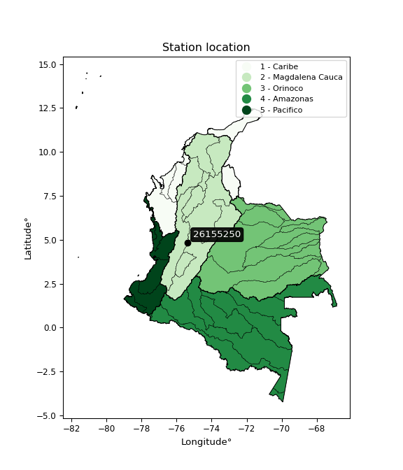</img>

</div>


## A. General information


### 1. General running parameters

• app_version: _v20251225_. • runtime: _2025-12-26 14:29:50.888910_. • Python version: _3.14.0_. • SciPy version: _1.16.3_. • Pandas version: _2.3.3_. • NumPy version: _2.3.5_. • Stations dataset (station_dataset_file): _dataset/pmax24h_in/automatic_colombia.csv_. • Stations catalog (station_catalog_file): _dataset/CNE_IDEAM.xls_. • Plot only fit distributions with Δo > Δ (plot_only_fit): _True_. • Eval low extreme values, if False, evaluates high extreme values (low_extreme): _False_. • Eval every SciPy distribution as logarithmic (pdist_logarithmic_on): _True_. • Standard deviation normalized (ddof): _1.0_. • Return periods to eval in years (Tr): _[2, 2.33, 5, 10, 15, 20, 25, 50, 75, 100, 200, 250, 500, 750, 1000]_. • Minimum data sample per station, 0 means any (minimum_sample): _5_. • Z-Score threshold to adjust a value, 0 means disable (zscore): _3.5_. • Avoid zeros, e.g. rain = 0 (avoid_zeros): _True_. • Avoid null values (avoid_nans): _True_. [:file_folder:Dataset file.](../../dataset/pmax24h_in/automatic_colombia.csv)


### 2. Station info and location

|   id |   CODIGO | NOMBRE                             | CATEGORIA               | TECNOLOGIA                | ESTADO           | FECHA_INSTALACION   |   FECHA_SUSPENSION |   ALTITUD |   LATITUD |   LONGITUD | DEPARTAMENTO   | MUNICIPIO   | AREA_OPERATIVA                         | ENTIDAD                                                     | AREA_HIDROGRAFICA   | ZONA_HIDROGRAFICA   | SUBZONA_HIDROGRAFICA   |   CORRIENTE | OBSERVACION                                                                                                                                                                                                                                    |   SUBRED | Catalogo   |
|-----:|---------:|:-----------------------------------|:------------------------|:--------------------------|:-----------------|:--------------------|-------------------:|----------:|----------:|-----------:|:---------------|:------------|:---------------------------------------|:------------------------------------------------------------|:--------------------|:--------------------|:-----------------------|------------:|:-----------------------------------------------------------------------------------------------------------------------------------------------------------------------------------------------------------------------------------------------|---------:|:-----------|
|    0 | 26155250 | PARAMO CONEJERAS  - AUT [26155250] | Climatológica Ordinaria | Automática con Telemetría | En Mantenimiento | 06/12/2007          |                nan |      4413 |   4.82981 |   -75.3758 | Caldas         | Villamaria  | Area Operativa 09 - Cauca-Valle-Caldas | INSTITUTO DE HIDROLOGIA METEOROLOGIA Y ESTUDIOS AMBIENTALES | Magdalena Cauca     | Cauca               | Río Chinchiná          |         nan | Cambio de tecnología por instalación o repotenciación de estaciones proyecto Fondo de Adaptación|25/08/2022$Migracion$Se Cambia Estado por orden de la Coordinación de Planeacion Operativa Decisión tomada en la Reunión de la RED 19/08/2022 |      nan | CNE_IDEAM  |

<div align="center">

Map location in: [:earth_americas:Google](http://maps.google.com/maps?q=4.829805556,-75.37583333) [:earth_americas:OSM](https://www.openstreetmap.org/#map=18/4.829805556/-75.37583333&layers=P) [:earth_americas:Bing](https://www.bing.com/maps?cp=4.829805556~-75.37583333&lvl=18) [:earth_americas:Apple](https://maps.apple.com/frame?center=4.829805556%2C-75.37583333&span=0.003%2C0.006)

</div>


<div align="center">

```geojson
{
  "type": "Feature",
  "geometry": {
    "type": "Point", 
    "coordinates": [-75.37583333, 4.829805556]
  }, 
  "properties": {
    "Name": "26155250"
  }
}
```

</div>


### 3. Discrete values table and plot

|               |           0 |          1 |           2 |           3 |           4 |          5 |         6 |
|:--------------|------------:|-----------:|------------:|------------:|------------:|-----------:|----------:|
| Date          | 2016        | 2017       | 2018        | 2019        | 2020        | 2021       | 2022      |
| Value         |    0.7      |   31.6     |   26.5      |   18.7      |   23.3      |    0.2     |    0.1    |
| Value_initial |    0.7      |   31.6     |   26.5      |   18.7      |   23.3      |    0.2     |    0.1    |
| count         |    7        |    7       |    7        |    7        |    7        |    7       |    7      |
| mean          |   14.4429   |   14.4429  |   14.4429   |   14.4429   |   14.4429   |   14.4429  |   14.4429 |
| std           |   13.7463   |   13.7463  |   13.7463   |   13.7463   |   13.7463   |   13.7463  |   13.7463 |
| zscore        |   -0.999753 |    1.24813 |    0.877122 |    0.309695 |    0.644331 |   -1.03613 |   -1.0434 |

<div align="center">

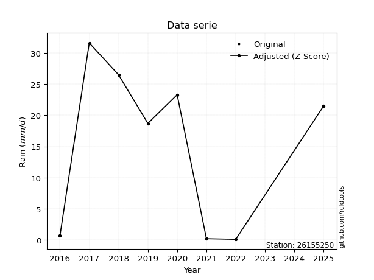</img>

</div>

> If Z-Score is active, values out of range or outliers are replaced with the station mean value.


### 4. Active continuous probability distributions from SciPy (45 of 104 available)

[scipy.stats](https://docs.scipy.org/doc/scipy/reference/stats.html) is a Python´s powerful submodule within the SciPy library for comprehensive statistical analysis, offering over 130 probability distributions (like Normal, Poisson), functions for descriptive stats (mean, variance), hypothesis testing (t-tests, chi-square), random variable generation, and statistical tests, making it essential for data science, modeling, and research. It provides tools to explore, model, and draw conclusions from data efficiently, working seamlessly with NumPy.

<div align="center">

|   id | p_dist             |   n_parameter | fit_method   | label                                                                       | active   | ref                                                                                                        |
|-----:|:-------------------|--------------:|:-------------|:----------------------------------------------------------------------------|:---------|:-----------------------------------------------------------------------------------------------------------|
|    0 | alpha              |             3 | MLE          | Alpha                                                                       | True     | [:mortar_board:](https://docs.scipy.org/doc/scipy/reference/generated/scipy.stats.alpha.html)              |
|    1 | betaprime          |             4 | MLE          | Beta prime                                                                  | True     | [:mortar_board:](https://docs.scipy.org/doc/scipy/reference/generated/scipy.stats.betaprime.html)          |
|    2 | chi2               |             3 | MLE          | Chi²                                                                        | True     | [:mortar_board:](https://docs.scipy.org/doc/scipy/reference/generated/scipy.stats.chi2.html)               |
|    3 | crystalball        |             4 | MLE          | Crystalball                                                                 | True     | [:mortar_board:](https://docs.scipy.org/doc/scipy/reference/generated/scipy.stats.crystalball.html)        |
|    4 | erlang             |             3 | MLE          | Erlang                                                                      | True     | [:mortar_board:](https://docs.scipy.org/doc/scipy/reference/generated/scipy.stats.erlang.html)             |
|    5 | expon              |             2 | MLE          | Exponential                                                                 | True     | [:mortar_board:](https://docs.scipy.org/doc/scipy/reference/generated/scipy.stats.expon.html)              |
|    6 | exponnorm          |             3 | MLE          | Exponentially modified Normal                                               | True     | [:mortar_board:](https://docs.scipy.org/doc/scipy/reference/generated/scipy.stats.exponnorm.html)          |
|    7 | f                  |             4 | MLE          | F                                                                           | True     | [:mortar_board:](https://docs.scipy.org/doc/scipy/reference/generated/scipy.stats.f.html)                  |
|    8 | fatiguelife        |             3 | MLE          | Fatigue-life (Birnbaum-Saunders)                                            | True     | [:mortar_board:](https://docs.scipy.org/doc/scipy/reference/generated/scipy.stats.fatiguelife.html)        |
|    9 | fisk               |             3 | MLE          | Fisk                                                                        | True     | [:mortar_board:](https://docs.scipy.org/doc/scipy/reference/generated/scipy.stats.fisk.html)               |
|   10 | gamma              |             3 | MLE          | Gamma                                                                       | True     | [:mortar_board:](https://docs.scipy.org/doc/scipy/reference/generated/scipy.stats.gamma.html)              |
|   11 | genexpon           |             5 | MLE          | Generalized exponential                                                     | True     | [:mortar_board:](https://docs.scipy.org/doc/scipy/reference/generated/scipy.stats.genexpon.html)           |
|   12 | genlogistic        |             3 | MLE          | Generalized logistic                                                        | True     | [:mortar_board:](https://docs.scipy.org/doc/scipy/reference/generated/scipy.stats.genlogistic.html)        |
|   13 | gibrat             |             2 | MM           | Gibrat                                                                      | True     | [:mortar_board:](https://docs.scipy.org/doc/scipy/reference/generated/scipy.stats.gibrat.html)             |
|   14 | gompertz           |             3 | MLE          | Gompertz (or truncated Gumbel)                                              | True     | [:mortar_board:](https://docs.scipy.org/doc/scipy/reference/generated/scipy.stats.gompertz.html)           |
|   15 | gumbel_l           |             2 | MM           | Gumbel Left Skew                                                            | True     | [:mortar_board:](https://docs.scipy.org/doc/scipy/reference/generated/scipy.stats.gumbel_l.html)           |
|   16 | gumbel_r           |             2 | MM           | Gumbel Right Skew                                                           | True     | [:mortar_board:](https://docs.scipy.org/doc/scipy/reference/generated/scipy.stats.gumbel_r.html)           |
|   17 | halflogistic       |             2 | MM           | Half-logistic                                                               | True     | [:mortar_board:](https://docs.scipy.org/doc/scipy/reference/generated/scipy.stats.halflogistic.html)       |
|   18 | halfnorm           |             2 | MM           | Half Normal                                                                 | True     | [:mortar_board:](https://docs.scipy.org/doc/scipy/reference/generated/scipy.stats.halfnorm.html)           |
|   19 | hypsecant          |             2 | MM           | hyperbolic secant                                                           | True     | [:mortar_board:](https://docs.scipy.org/doc/scipy/reference/generated/scipy.stats.hypsecant.html)          |
|   20 | invgamma           |             3 | MLE          | Inverted gamma                                                              | True     | [:mortar_board:](https://docs.scipy.org/doc/scipy/reference/generated/scipy.stats.invgamma.html)           |
|   21 | invgauss           |             3 | MLE          | Inverse Gaussian                                                            | True     | [:mortar_board:](https://docs.scipy.org/doc/scipy/reference/generated/scipy.stats.invgauss.html)           |
|   22 | invweibull         |             3 | MLE          | Inverted Weibull                                                            | True     | [:mortar_board:](https://docs.scipy.org/doc/scipy/reference/generated/scipy.stats.invweibull.html)         |
|   23 | johnsonsu          |             4 | MLE          | Johnson Su                                                                  | True     | [:mortar_board:](https://docs.scipy.org/doc/scipy/reference/generated/scipy.stats.johnsonsu.html)          |
|   24 | kstwobign          |             2 | MLE          | Limiting distribution of scaled Kolmogorov-Smirnov two-sided test statistic | True     | [:mortar_board:](https://docs.scipy.org/doc/scipy/reference/generated/scipy.stats.kstwobign.html)          |
|   25 | laplace            |             2 | MM           | Laplace                                                                     | True     | [:mortar_board:](https://docs.scipy.org/doc/scipy/reference/generated/scipy.stats.laplace.html)            |
|   26 | laplace_asymmetric |             3 | MLE          | Asymmetric Laplace                                                          | True     | [:mortar_board:](https://docs.scipy.org/doc/scipy/reference/generated/scipy.stats.laplace_asymmetric.html) |
|   27 | loggamma           |             3 | MLE          | Log gamma                                                                   | True     | [:mortar_board:](https://docs.scipy.org/doc/scipy/reference/generated/scipy.stats.loggamma.html)           |
|   28 | logistic           |             2 | MM           | Logistic (or Sech-squared)                                                  | True     | [:mortar_board:](https://docs.scipy.org/doc/scipy/reference/generated/scipy.stats.logistic.html)           |
|   29 | lognorm            |             3 | MLE          | Log Normal                                                                  | True     | [:mortar_board:](https://docs.scipy.org/doc/scipy/reference/generated/scipy.stats.lognorm.html)            |
|   30 | maxwell            |             2 | MM           | Maxwell                                                                     | True     | [:mortar_board:](https://docs.scipy.org/doc/scipy/reference/generated/scipy.stats.maxwell.html)            |
|   31 | mielke             |             4 | MLE          | Mielke Beta-Kappa / Dagum                                                   | True     | [:mortar_board:](https://docs.scipy.org/doc/scipy/reference/generated/scipy.stats.mielke.html)             |
|   32 | moyal              |             2 | MM           | Moyal                                                                       | True     | [:mortar_board:](https://docs.scipy.org/doc/scipy/reference/generated/scipy.stats.moyal.html)              |
|   33 | nakagami           |             3 | MLE          | Nakagami                                                                    | True     | [:mortar_board:](https://docs.scipy.org/doc/scipy/reference/generated/scipy.stats.nakagami.html)           |
|   34 | ncf                |             5 | MLE          | Non-central F distribution                                                  | True     | [:mortar_board:](https://docs.scipy.org/doc/scipy/reference/generated/scipy.stats.ncf.html)                |
|   35 | nct                |             4 | MLE          | Non-central Student’s t                                                     | True     | [:mortar_board:](https://docs.scipy.org/doc/scipy/reference/generated/scipy.stats.nct.html)                |
|   36 | norm               |             2 | MM           | Normal                                                                      | True     | [:mortar_board:](https://docs.scipy.org/doc/scipy/reference/generated/scipy.stats.norm.html)               |
|   37 | pareto             |             3 | MLE          | Pareto                                                                      | True     | [:mortar_board:](https://docs.scipy.org/doc/scipy/reference/generated/scipy.stats.pareto.html)             |
|   38 | pearson3           |             3 | MM           | Pearson type III                                                            | True     | [:mortar_board:](https://docs.scipy.org/doc/scipy/reference/generated/scipy.stats.pearson3.html)           |
|   39 | rayleigh           |             2 | MM           | Rayleigh                                                                    | True     | [:mortar_board:](https://docs.scipy.org/doc/scipy/reference/generated/scipy.stats.rayleigh.html)           |
|   40 | rice               |             3 | MLE          | Rice                                                                        | True     | [:mortar_board:](https://docs.scipy.org/doc/scipy/reference/generated/scipy.stats.rice.html)               |
|   41 | t                  |             3 | MLE          | Student’s t                                                                 | True     | [:mortar_board:](https://docs.scipy.org/doc/scipy/reference/generated/scipy.stats.t.html)                  |
|   42 | truncnorm          |             4 | MLE          | Truncated normal                                                            | True     | [:mortar_board:](https://docs.scipy.org/doc/scipy/reference/generated/scipy.stats.truncnorm.html)          |
|   43 | wald               |             2 | MM           | Wald                                                                        | True     | [:mortar_board:](https://docs.scipy.org/doc/scipy/reference/generated/scipy.stats.wald.html)               |
|   44 | weibull_min        |             3 | MLE          | Weibull minimum                                                             | True     | [:mortar_board:](https://docs.scipy.org/doc/scipy/reference/generated/scipy.stats.weibull_min.html)        |

</div>

> **n_parameter:** # arguments & localization & scale.
>
> **Fit methods:** (MLE) maximum likelihood, (MM) L-moments.
>
>**Inactive:** foldnorm, gennorm, norminvgauss, powernorm, powerlognorm, skewnorm, genextreme, anglit, arcsine, argus, beta, bradford, burr, burr12, cauchy, cosine, halfcauchy, foldcauchy, skewcauchy, wrapcauchy, dgamma, gengamma, exponweib, exponpow, truncexpon, gausshyper, genhalflogistic, genhyperbolic, geninvgauss, halfgennorm, johnsonsb, kappa4, kappa3, ksone, kstwo, loglaplace, levy, levy_l, levy_stable, ncx2, genpareto, truncpareto, lomax, powerlaw, rdist, rel_breitwigner, recipinvgauss, semicircular, studentized_range, trapezoid, triang, truncweibull_min, tukeylambda, uniform, loguniform, vonmises, vonmises_line, weibull_max, dweibull, 


## B. Probability distributions vs. Empirical distributions

A continuous probability distribution (CPD) describes probabilities for variables that can take any value within a range (like rain any time), unlike discrete variables with specific outcomes (like temperature). It uses a Probability Density Function (PDF), a curve where the total area under it equals 1, and the probability of the variable falling within an interval (a to b) is found by calculating the area under the curve between those points. A key feature is that the probability of hitting any single exact value is zero, so probabilities are always expressed for ranges, e.g., $P(a ≤ X ≤ b)$.

<div align="center">

Distributions parameters
|    |   station | p_dist                |   n |            loc |          scale | shape                  | shape1              | shape2                | shape3   |
|---:|----------:|:----------------------|----:|---------------:|---------------:|:-----------------------|:--------------------|:----------------------|:---------|
|  0 |  26155250 | alpha                 |   7 |   -2.95001     |    4.92066     | 1.5969053800950732e-07 |                     |                       |          |
|  1 |  26155250 | betaprime             |   7 |    0.1         |  242.22        | 0.45650976043461533    | 11.733905346421773  |                       |          |
|  2 |  26155250 | chi2                  |   7 |    0.1         |    2.09316     | 0.6416576959287636     |                     |                       |          |
|  3 |  26155250 | crystalball           |   7 |   14.4429      |   12.7266      | 1176.9517532875607     | 318.9976735967423   |                       |          |
|  4 |  26155250 | erlang                |   7 | -472.391       |    0.333264    | 1460.7776843507115     |                     |                       |          |
|  5 |  26155250 | expon                 |   7 |    0.1         |   14.3429      |                        |                     |                       |          |
|  6 |  26155250 | exponnorm             |   7 |   14.4284      |   12.7265      | 0.0011386164686421714  |                     |                       |          |
|  7 |  26155250 | f                     |   7 |    0.1         |    0.660287    | 1.238360723351501      | 0.804125087093736   |                       |          |
|  8 |  26155250 | fatiguelife           |   7 |    0.1         |    2.41266e-05 | 1116.6626364182785     |                     |                       |          |
|  9 |  26155250 | fisk                  |   7 |    0.1         |    3.70454     | 0.5490503162490252     |                     |                       |          |
| 10 |  26155250 | gamma                 |   7 | -476.077       |    0.330222    | 1485.418249826792      |                     |                       |          |
| 11 |  26155250 | genexpon              |   7 |    0.0968082   |   90.5696      | 5.6477806033464155     | 18.9049717262088    | 0.2752321493805543    |          |
| 12 |  26155250 | genlogistic           |   7 |  -65.5476      |   11.0302      | 794.2437942351735      |                     |                       |          |
| 13 |  26155250 | gibrat                |   7 |    4.73407     |    5.88867     |                        |                     |                       |          |
| 14 |  26155250 | gompertz              |   7 |    0.1         |   42.4027      | 2.146412577958956      |                     |                       |          |
| 15 |  26155250 | gumbel_l              |   7 |   20.1705      |    9.92286     |                        |                     |                       |          |
| 16 |  26155250 | gumbel_r              |   7 |    8.71523     |    9.92286     |                        |                     |                       |          |
| 17 |  26155250 | halflogistic          |   7 |   -0.641073    |   10.8808      |                        |                     |                       |          |
| 18 |  26155250 | halfnorm              |   7 |   -2.40212     |   21.112       |                        |                     |                       |          |
| 19 |  26155250 | hypsecant             |   7 |   14.4429      |    8.10198     |                        |                     |                       |          |
| 20 |  26155250 | invgamma              |   7 |    0.1         |    2.568e-14   | 0.1128213689140492     |                     |                       |          |
| 21 |  26155250 | invgauss              |   7 |   -0.0687042   |    0.658334    | 22.042833811761646     |                     |                       |          |
| 22 |  26155250 | invweibull            |   7 |    0.1         |    3.34099     | 0.04246186573921448    |                     |                       |          |
| 23 |  26155250 | johnsonsu             |   7 |   44.7288      |    0.938572    | 8.887313857513575      | 2.184819969021083   |                       |          |
| 24 |  26155250 | kstwobign             |   7 |  -28.89        |   49.2609      |                        |                     |                       |          |
| 25 |  26155250 | laplace               |   7 |   14.4429      |    8.99904     |                        |                     |                       |          |
| 26 |  26155250 | laplace_asymmetric    |   7 |   26.5         |    7.73807     | 2.0467363990417726     |                     |                       |          |
| 27 |  26155250 | loggamma              |   7 |   31.6001      |    5.31558e-06 | 3.1011518781202077e-07 |                     |                       |          |
| 28 |  26155250 | logistic              |   7 |   14.4429      |    7.01652     |                        |                     |                       |          |
| 29 |  26155250 | lognorm               |   7 |    0.1         |    0.0162469   | 14.315321109797074     |                     |                       |          |
| 30 |  26155250 | maxwell               |   7 |  -15.7137      |   18.8978      |                        |                     |                       |          |
| 31 |  26155250 | mielke                |   7 |    0.1         |    0.60374     | 0.4044653520632461     | 0.36066894487374035 |                       |          |
| 32 |  26155250 | moyal                 |   7 |    7.16499     |    5.72896     |                        |                     |                       |          |
| 33 |  26155250 | nakagami              |   7 |    0.1         |   21.2804      | 0.16803026945056665    |                     |                       |          |
| 34 |  26155250 | ncf                   |   7 |    0.1         |   21.4404      | 0.9609230484729012     | 3.6559866963846583  | 0.16230298598013493   |          |
| 35 |  26155250 | nct                   |   7 |    0.1         |    5.61608e-13 | 0.15174797204248336    | 5.482747352250227   |                       |          |
| 36 |  26155250 | norm                  |   7 |   14.4429      |   12.7266      |                        |                     |                       |          |
| 37 |  26155250 | pareto                |   7 |  -14.2263      |   14.3263      | 1.7281215842383353     |                     |                       |          |
| 38 |  26155250 | pearson3              |   7 |   14.4429      |   12.7265      | -0.05960814451140492   |                     |                       |          |
| 39 |  26155250 | rayleigh              |   7 |   -9.90379     |   19.4258      |                        |                     |                       |          |
| 40 |  26155250 | rice                  |   7 |   -8.69056     |   15.6321      | 0.923475209947477      |                     |                       |          |
| 41 |  26155250 | t                     |   7 |    0.171235    |    0.138095    | 0.2338670961763977     |                     |                       |          |
| 42 |  26155250 | truncnorm             |   7 |   -4.21613     |   20.1675      | 0.2139730068043582     | 1.7759329299013382  |                       |          |
| 43 |  26155250 | wald                  |   7 |    1.71627     |   12.7266      |                        |                     |                       |          |
| 44 |  26155250 | weibull_min           |   7 |    0.1         |   15.5832      | 0.4303352847631554     |                     |                       |          |
| 45 |  26155250 | logalpha              |   7 |  -54.0852      | 1270.45        | 23.033860188615535     |                     |                       |          |
| 46 |  26155250 | logbetaprime          |   7 |   -2.30259     |    2.2412      | 0.16661320273626945    | 0.8826592968274027  |                       |          |
| 47 |  26155250 | logchi2               |   7 |   -2.30259     |    1.21227     | 1.0295638972049854     |                     |                       |          |
| 48 |  26155250 | logcrystalball        |   7 |    1.2198      |    2.35302     | 7.464152781590496      | 481.78241613578444  |                       |          |
| 49 |  26155250 | logerlang             |   7 |  -36.4659      |    0.151245    | 249.06855962868985     |                     |                       |          |
| 50 |  26155250 | logexpon              |   7 |   -2.30259     |    3.52238     |                        |                     |                       |          |
| 51 |  26155250 | logexponnorm          |   7 |    1.21781     |    2.35302     | 0.0008455711385033608  |                     |                       |          |
| 52 |  26155250 | logf                  |   7 |   -2.30259     |    1.06226     | 1.1104415616297656     | 1.057214514020517   |                       |          |
| 53 |  26155250 | logfatiguelife        |   7 | -539.592       |  540.82        | 0.00433589430581144    |                     |                       |          |
| 54 |  26155250 | logfisk               |   7 |   -2.30259     |    2.83582     | 0.7331178830392711     |                     |                       |          |
| 55 |  26155250 | loggamma              |   7 |  -36.0874      |    0.15337     | 243.28190096180765     |                     |                       |          |
| 56 |  26155250 | loggenexpon           |   7 |   -2.30359     |    0.0137596   | 0.0022078348177041913  | 0.9172911189777646  | 9.956022956735028e-06 |          |
| 57 |  26155250 | loggenlogistic        |   7 |    3.45319     |    3.97358e-06 | 1.7801364649194393e-06 |                     |                       |          |
| 58 |  26155250 | loggibrat             |   7 |   -0.575282    |    1.08876     |                        |                     |                       |          |
| 59 |  26155250 | loggompertz           |   7 |   -2.30259     |    2.66678     | 0.24164622816214584    |                     |                       |          |
| 60 |  26155250 | loggumbel_l           |   7 |    2.27878     |    1.83465     |                        |                     |                       |          |
| 61 |  26155250 | loggumbel_r           |   7 |    0.160811    |    1.83465     |                        |                     |                       |          |
| 62 |  26155250 | loghalflogistic       |   7 |   -1.56909     |    2.01173     |                        |                     |                       |          |
| 63 |  26155250 | loghalfnorm           |   7 |   -1.89468     |    3.90343     |                        |                     |                       |          |
| 64 |  26155250 | loghypsecant          |   7 |    1.2198      |    1.49798     |                        |                     |                       |          |
| 65 |  26155250 | loginvgamma           |   7 |  -31.2094      | 5844.46        | 181.41518563355157     |                     |                       |          |
| 66 |  26155250 | loginvgauss           |   7 |  -14.6111      |  635.316       | 0.0248525403282576     |                     |                       |          |
| 67 |  26155250 | loginvweibull         |   7 |   -3.7661e+08  |    3.7661e+08  | 169741154.7153951      |                     |                       |          |
| 68 |  26155250 | logjohnsonsu          |   7 |    3.45316     |    3.97875e-14 | 3.8926030863227132     | 0.15353227108379905 |                       |          |
| 69 |  26155250 | logkstwobign          |   7 |   -7.5773      |    9.99767     |                        |                     |                       |          |
| 70 |  26155250 | loglaplace            |   7 |    1.2198      |    1.66384     |                        |                     |                       |          |
| 71 |  26155250 | loglaplace_asymmetric |   7 |    3.45317     |    0.0494656   | 45.31834300053586      |                     |                       |          |
| 72 |  26155250 | logloggamma           |   7 |    3.45323     |    4.5905e-06  | 2.051372949789702e-06  |                     |                       |          |
| 73 |  26155250 | loglogistic           |   7 |    1.2198      |    1.29729     |                        |                     |                       |          |
| 74 |  26155250 | loglognorm            |   7 | -458.743       |  459.955       | 0.005094906546098489   |                     |                       |          |
| 75 |  26155250 | logmaxwell            |   7 |   -4.35588     |    3.49404     |                        |                     |                       |          |
| 76 |  26155250 | logmielke             |   7 |   -2.30259     |    2.09032     | 0.17233048360371073    | 0.9791601220068664  |                       |          |
| 77 |  26155250 | logmoyal              |   7 |   -0.125813    |    1.05923     |                        |                     |                       |          |
| 78 |  26155250 | lognakagami           |   7 |   -2.30259     |    4.55522     | 0.353095275255356      |                     |                       |          |
| 79 |  26155250 | logncf                |   7 |   -2.30259     |    1.00204     | 1.024413441472039      | 1.1751488160202346  | 1.0653196754737326    |          |
| 80 |  26155250 | lognct                |   7 | -149.698       |    2.33337     | 115998.58060344978     | 64.67788826341624   |                       |          |
| 81 |  26155250 | lognorm               |   7 |    1.2198      |    2.35302     |                        |                     |                       |          |
| 82 |  26155250 | logpareto             |   7 |   -2.30579     |    0.00320647  | 0.16833764715509167    |                     |                       |          |
| 83 |  26155250 | logpearson3           |   7 |    1.21977     |    2.35302     | -0.41945154156983677   |                     |                       |          |
| 84 |  26155250 | lograyleigh           |   7 |   -3.28167     |    3.59165     |                        |                     |                       |          |
| 85 |  26155250 | logrice               |   7 |   -3.5948      |    2.73965     | 1.351342411986482      |                     |                       |          |
| 86 |  26155250 | logt                  |   7 |    1.2198      |    2.35302     | 55940463235.22511      |                     |                       |          |
| 87 |  26155250 | logtruncnorm          |   7 |   -0.0794937   |    3.13769     | -0.7085129200027589    | 6.544837872814233   |                       |          |
| 88 |  26155250 | logwald               |   7 |   -1.13325     |    2.35302     |                        |                     |                       |          |
| 89 |  26155250 | logweibull_min        |   7 |   -4.41697e+07 |    4.41697e+07 | 25081560.17062654      |                     |                       |          |

</div>

> **loc** (Location parameter): This shifts the distribution along the x-axis. For many common distributions, like the normal (Gaussian) distribution, loc represents the mean $μ$. For others, like the uniform distribution, it might represent the minimum value, or for the beta distribution, the left end of the support interval.
>
> **scale** (Scale parameter): This determines the width or spread of the distribution. For the normal distribution, scale represents the standard deviation $σ$. For a uniform distribution, it defines the length of the interval (from $loc$ to $loc + scale$).
>
> **shape** (Shape parameters): Refers to parameters that define the specific form of a probability distribution, distinct from its location (loc) and scale (scale). These parameters are required arguments for most distribution functions. For example, a normal (Gaussian) distribution is fully defined by its location (mean) and scale (standard deviation), so it has no specific shape parameters beyond loc and scale. However, other distributions have intrinsic properties that need specification, as Gamma distribution that takes a shape parameter, often named $a$ or $alpha$.


### 0. Cumulative distribution values - CDF (90 evaluated)

> Ordered by x ascending and calculating $log(f(x))$ separately. 

|   id |   Station |   date |    x |   count |    mean |     std |    zscore |   Value_initial |   station |   m |    alpha |   alpha_pdf |   betaprime |   betaprime_pdf |        chi2 |    chi2_pdf |   crystalball |   crystalball_pdf |   erlang |   erlang_pdf |      expon |   expon_pdf |   exponnorm |   exponnorm_pdf |           f |       f_pdf |   fatiguelife |   fatiguelife_pdf |        fisk |    fisk_pdf |    gamma |   gamma_pdf |    genexpon |   genexpon_pdf |   genlogistic |   genlogistic_pdf |   gibrat |   gibrat_pdf |    gompertz |   gompertz_pdf |   gumbel_l |   gumbel_l_pdf |   gumbel_r |   gumbel_r_pdf |   halflogistic |   halflogistic_pdf |   halfnorm |   halfnorm_pdf |   hypsecant |   hypsecant_pdf |   invgamma |   invgamma_pdf |   invgauss |   invgauss_pdf |   invweibull |   invweibull_pdf |   johnsonsu |   johnsonsu_pdf |   kstwobign |   kstwobign_pdf |   laplace |   laplace_pdf |   laplace_asymmetric |   laplace_asymmetric_pdf |   loggamma |   loggamma_pdf |   logistic |   logistic_pdf |   lognorm |   lognorm_pdf |   maxwell |   maxwell_pdf |      mielke |   mielke_pdf |     moyal |   moyal_pdf |    nakagami |   nakagami_pdf |         ncf |     ncf_pdf |      nct |     nct_pdf |     norm |   norm_pdf |    pareto |   pareto_pdf |   pearson3 |   pearson3_pdf |   rayleigh |   rayleigh_pdf |      rice |   rice_pdf |        t |       t_pdf |   truncnorm |   truncnorm_pdf |     wald |   wald_pdf |   weibull_min |   weibull_min_pdf |   logalpha |   logalpha_pdf |   logbetaprime |   logbetaprime_pdf |     logchi2 |   logchi2_pdf |   logcrystalball |   logcrystalball_pdf |   logerlang |   logerlang_pdf |   logexpon |   logexpon_pdf |   logexponnorm |   logexponnorm_pdf |        logf |    logf_pdf |   logfatiguelife |   logfatiguelife_pdf |     logfisk |   logfisk_pdf |   loggenexpon |   loggenexpon_pdf |   loggenlogistic |   loggenlogistic_pdf |   loggibrat |   loggibrat_pdf |   loggompertz |   loggompertz_pdf |   loggumbel_l |   loggumbel_l_pdf |   loggumbel_r |   loggumbel_r_pdf |   loghalflogistic |   loghalflogistic_pdf |   loghalfnorm |   loghalfnorm_pdf |   loghypsecant |   loghypsecant_pdf |   loginvgamma |   loginvgamma_pdf |   loginvgauss |   loginvgauss_pdf |   loginvweibull |   loginvweibull_pdf |   logjohnsonsu |   logjohnsonsu_pdf |   logkstwobign |   logkstwobign_pdf |   loglaplace |   loglaplace_pdf |   loglaplace_asymmetric |   loglaplace_asymmetric_pdf |   logloggamma |   logloggamma_pdf |   loglogistic |   loglogistic_pdf |   loglognorm |   loglognorm_pdf |   logmaxwell |   logmaxwell_pdf |   logmielke |   logmielke_pdf |   logmoyal |   logmoyal_pdf |   lognakagami |   lognakagami_pdf |     logncf |   logncf_pdf |    lognct |   lognct_pdf |   logpareto |   logpareto_pdf |   logpearson3 |   logpearson3_pdf |   lograyleigh |   lograyleigh_pdf |   logrice |   logrice_pdf |      logt |   logt_pdf |   logtruncnorm |   logtruncnorm_pdf |   logwald |   logwald_pdf |   logweibull_min |   logweibull_min_pdf |
|-----:|----------:|-------:|-----:|--------:|--------:|--------:|----------:|----------------:|----------:|----:|---------:|------------:|------------:|----------------:|------------:|------------:|--------------:|------------------:|---------:|-------------:|-----------:|------------:|------------:|----------------:|------------:|------------:|--------------:|------------------:|------------:|------------:|---------:|------------:|------------:|---------------:|--------------:|------------------:|---------:|-------------:|------------:|---------------:|-----------:|---------------:|-----------:|---------------:|---------------:|-------------------:|-----------:|---------------:|------------:|----------------:|-----------:|---------------:|-----------:|---------------:|-------------:|-----------------:|------------:|----------------:|------------:|----------------:|----------:|--------------:|---------------------:|-------------------------:|-----------:|---------------:|-----------:|---------------:|----------:|--------------:|----------:|--------------:|------------:|-------------:|----------:|------------:|------------:|---------------:|------------:|------------:|---------:|------------:|---------:|-----------:|----------:|-------------:|-----------:|---------------:|-----------:|---------------:|----------:|-----------:|---------:|------------:|------------:|----------------:|---------:|-----------:|--------------:|------------------:|-----------:|---------------:|---------------:|-------------------:|------------:|--------------:|-----------------:|---------------------:|------------:|----------------:|-----------:|---------------:|---------------:|-------------------:|------------:|------------:|-----------------:|---------------------:|------------:|--------------:|--------------:|------------------:|-----------------:|---------------------:|------------:|----------------:|--------------:|------------------:|--------------:|------------------:|--------------:|------------------:|------------------:|----------------------:|--------------:|------------------:|---------------:|-------------------:|--------------:|------------------:|--------------:|------------------:|----------------:|--------------------:|---------------:|-------------------:|---------------:|-------------------:|-------------:|-----------------:|------------------------:|----------------------------:|--------------:|------------------:|--------------:|------------------:|-------------:|-----------------:|-------------:|-----------------:|------------:|----------------:|-----------:|---------------:|--------------:|------------------:|-----------:|-------------:|----------:|-------------:|------------:|----------------:|--------------:|------------------:|--------------:|------------------:|----------:|--------------:|----------:|-----------:|---------------:|-------------------:|----------:|--------------:|-----------------:|---------------------:|
|    0 |  26155250 |   2022 |  0.1 |       7 | 14.4429 | 13.7463 | -1.0434   |             0.1 |  26155250 |   1 | 0.106674 |  0.114859   | 5.65276e-09 |     1.85947e+08 | 2.75723e-06 | 6.3742e+10  |      0.129871 |         0.0166109 | 0.129703 |    0.0169157 | 0          |  0.0697211  |    0.129871 |       0.0166109 | 3.08101e-11 | 1.37464e+06 |      0.034762 |       1.18721e+10 | 2.70409e-10 | 1.06983e+07 | 0.129387 |   0.0168984 | 0.000199018 |     0.0623481  |      0.126989 |        0.0237277  | 0        |   0          | 8.68609e-13 |     0.0506197  |   0.123926 |      0.0116809 |  0.0923041 |     0.022164   |      0.0340411 |         0.0458994  |  0.0943413 |      0.0375284 |    0.107376 |       0.0130031 |  0.0207553 |    1.71494e+12 |  0.0504482 |     0.694479   |   0.00420774 |      7.04337e+13 |    0.143525 |       0.011079  |    0.120865 |      0.0255338  |  0.101574 |    0.0112872  |             0.152442 |               0.0096252  |  0.0665282 |      0.0576699 |   0.114644 |      0.014466  | 0.0672018 |     0.0552944 |  0.126852 |     0.0208314 | 1.86333e-07 |  5.43064e+09 | 0.0639363 |  0.0231913  | 6.18213e-07 |    1.49705e+10 | 1.24741e-09 | 4.31863e+07 | 0.049667 | 7.46924e+10 | 0.129871 |  0.0166109 | 0         |   0.120626   |   0.130393 |      0.0162943 |   0.124184 |      0.0232177 | 0.0986463 |  0.0214254 | 0.4088   | 0.949872    | 4.20996e-05 |       0.0512266 | 0        | 0          |   1.70727e-08 |       5.29407e+08 |  0.0667631 |      0.0613331 |     0.00234479 |        8.79716e+11 | 8.93246e-09 |   1.03544e+07 |        0.0672018 |            0.0552944 |   0.0672969 |       0.0582509 |   0        |      0.283899  |      0.0672019 |          0.0552944 | 1.90799e-09 | 2.38546e+06 |        0.0654774 |            0.0547369 | 2.58773e-12 |  4271.91      |    0.00016127 |         0.16048   |         0        |            0.0339955 |   0         |       0         |   4.08229e-10 |         0.0906135 |     0.0790228 |         0.041324  |     0.0217225 |         0.0453408 |          0        |             0         |     0         |         0         |      0.0604455 |          0.0401092 |     0.0653656 |         0.0615306 |     0.0654702 |         0.0664367 |       0.0596954 |           0.0758323 |       0.11127  |         0.00505721 |      0.0564874 |          0.0842186 |    0.0601949 |        0.0361783 |               0.0766834 |                   0.0342077 |     0.0763735 |         0.0341293 |     0.0620833 |         0.044885  |    0.0660742 |        0.0552204 |    0.0487128 |        0.0663545 |  0.00199117 |     7.72681e+11 | 0.00520386 |      0.0212254 |   3.83458e-12 |      6097.74      | 5.2873e-09 |   6.0983e+06 | 0.0672504 |    0.0553398 |    0        |     52.4994     |      0.076039 |         0.0507181 |     0.0364739 |         0.0731302 | 0.0443865 |     0.068255  | 0.0672018 |  0.0552943 |     4.7053e-10 |          0.130044  |  0        |     0         |        0.0695277 |            0.0380755 |
|    1 |  26155250 |   2021 |  0.2 |       7 | 14.4429 | 13.7463 | -1.03613  |             0.2 |  26155250 |   2 | 0.118262 |  0.116805   | 0.0978952   |     0.44536     | 0.3354      | 1.05675     |      0.131539 |         0.0167581 | 0.131402 |    0.0170662 | 0.00694786 |  0.0692367  |    0.131539 |       0.0167581 | 0.1868      | 1.0146      |      0.522982 |       0.11484     | 0.120973    | 0.583851    | 0.131085 |   0.017049  | 0.00641758  |     0.0620233  |      0.129373 |        0.0239555  | 0        |   0          | 0.00505512  |     0.0504827  |   0.125099 |      0.0117835 |  0.0945359 |     0.0224723  |      0.0386303 |         0.0458841  |  0.0980931 |      0.0375069 |    0.108684 |       0.0131553 |  0.959867  |    0.0452786   |  0.122942  |     0.714042   |   0.313278   |      0.154396    |    0.144637 |       0.0111618 |    0.12343  |      0.0257787  |  0.102709 |    0.0114133  |             0.153407 |               0.00968616 |  0.116116  |      0.0861217 |   0.116099 |      0.0146255 | 0.114608  |     0.0822903 |  0.128943 |     0.0210022 | 0.301535    |  0.800874    | 0.06628   |  0.0236827  | 0.13191     |    0.443297    | 0.051842    | 0.248685    | 0.978324 | 0.0328928   | 0.131539 |  0.0167581 | 0.0119487 |   0.118358   |   0.132029 |      0.0164378 |   0.126514 |      0.0233874 | 0.100799  |  0.0216232 | 0.54213  | 1.36658     | 0.00516203  |       0.0511717 | 0        | 0          |   0.107629    |       0.437295    |  0.119743  |      0.0921512 |     0.76537    |        0.144412    | 0.53901     |   0.330274    |        0.114608  |            0.0822903 |   0.117352  |       0.0868826 |   0.178632 |      0.233185  |      0.114608  |          0.0822903 | 0.422515    | 0.236692    |        0.112564  |            0.081952  | 0.262532    |     0.204774  |    0.115738   |         0.171488  |         0        |            0.0463747 |   0         |       0         |   0.0692148   |         0.109377  |     0.113179  |         0.0580591 |     0.0724741 |         0.103677  |          0        |             0         |     0.0582524 |         0.203861  |      0.095576  |          0.0628488 |     0.118684  |         0.0929102 |     0.123106  |         0.100157  |       0.127167  |           0.118199  |       0.11505  |         0.00588833 |      0.131672  |          0.130719  |    0.0913029 |        0.0548748 |               0.104469  |                   0.0466026 |     0.104103  |         0.046521  |     0.101481  |         0.0702867 |    0.113553  |        0.0825915 |    0.107667  |        0.103594  |  0.785336   |     0.145784    | 0.0439657  |      0.0997496 |   0.205209    |         0.20781   | 0.312003   |   0.210543   | 0.11469   |    0.0823413 |    0.59577  |      0.0977191  |      0.118484 |         0.0725372 |     0.10272   |         0.116315  | 0.103719  |     0.102412  | 0.114608  |  0.0822902 |     0.0967577  |          0.148411  |  0        |     0         |        0.101312  |            0.0545116 |
|    2 |  26155250 |   2016 |  0.7 |       7 | 14.4429 | 13.7463 | -0.999753 |             0.7 |  26155250 |   3 | 0.177619 |  0.118775   | 0.220085    |     0.164014    | 0.57937     | 0.277718    |      0.140103 |         0.0174979 | 0.140123 |    0.0178216 | 0.0409698  |  0.0668647  |    0.140103 |       0.0174979 | 0.428358    | 0.259874    |      0.556151 |       0.0464859   | 0.269043    | 0.179959    | 0.139798 |   0.0178054 | 0.0370266   |     0.0604177  |      0.141631 |        0.0250658  | 0        |   0          | 0.0301247   |     0.0497944  |   0.131121 |      0.0123071 |  0.106154  |     0.023994   |      0.061548  |         0.0457786  |  0.116817  |      0.0373871 |    0.115456 |       0.0139399 |  0.967212  |    0.00616523  |  0.370983  |     0.327119   |   0.341081   |      0.0259639   |    0.150323 |       0.0115839 |    0.136617 |      0.026956   |  0.108577 |    0.0120654  |             0.158328 |               0.00999683 |  0.258111  |      0.139031  |   0.123614 |      0.0154398 | 0.251436  |     0.135461  |  0.139656 |     0.0218427 | 0.45906     |  0.154902    | 0.0787293 |  0.026103   | 0.240866    |    0.134894    | 0.122153    | 0.0968903   | 0.983484 | 0.00417703  | 0.140103 |  0.0174979 | 0.0684458 |   0.107852   |   0.140428 |      0.0171594 |   0.138415 |      0.0242103 | 0.111853  |  0.0225893 | 0.733112 | 0.117014    | 0.0306759   |       0.050879  | 0        | 0          |   0.218234    |       0.138045    |  0.270344  |      0.145608  |     0.860935   |        0.0420715   | 0.787741    |   0.119386    |        0.251436  |            0.135461  |   0.260403  |       0.139884  |   0.424457 |      0.163396  |      0.251436  |          0.135461  | 0.593858    | 0.082307    |        0.24934   |            0.135724  | 0.431412    |     0.0924147 |    0.332206   |         0.169824  |         0        |            0.0812867 |   0.0541898 |       0.50293   |   0.228664    |         0.144989  |     0.211608  |         0.102171  |     0.265574  |         0.191925  |          0.292534 |             0.227273  |     0.306428  |         0.18914   |      0.213823  |          0.132245  |     0.270515  |         0.146567  |     0.283475  |         0.151368  |       0.309581  |           0.163605  |       0.123748 |         0.00823749 |      0.32602   |          0.168427  |    0.193856  |        0.116511  |               0.18268   |                   0.0814917 |     0.182219  |         0.081429  |     0.228782  |         0.136007  |    0.251206  |        0.136415  |    0.273255  |        0.155392  |  0.879616   |     0.0403141   | 0.264792   |      0.225537  |   0.419253    |         0.145051  | 0.483433   |   0.0919538  | 0.251566  |    0.135473  |    0.660078 |      0.0293578  |      0.238812 |         0.120612  |     0.282235  |         0.162749  | 0.264596  |     0.150416  | 0.251436  |  0.135461  |     0.29643    |          0.166495  |  0.197884 |     0.453024  |        0.195528  |            0.0993889 |
|    3 |  26155250 |   2019 | 18.7 |       7 | 14.4429 | 13.7463 |  0.309695 |            18.7 |  26155250 |   4 | 0.820204 |  0.00816263 | 0.826967    |     0.0106108   | 0.998645    | 0.000365904 |      0.631002 |         0.0296416 | 0.63409  |    0.0293625 | 0.726598   |  0.0190619  |    0.631002 |       0.0296416 | 0.83203     | 0.00357114  |      0.784153 |       0.00619014  | 0.708053    | 0.00610195  | 0.63395  |   0.0293915 | 0.718547    |     0.0207801  |      0.682079 |        0.0236539  | 0.806094 |   0.0196741  | 0.693288    |     0.0240743  |   0.577796 |      0.0366883 |  0.693786  |     0.0255614  |      0.710788  |         0.0227365  |  0.682462  |      0.0229333 |    0.66005  |       0.0344253 |  0.977744  |    0.000134999 |  0.887383  |     0.0039749  |   0.394675   |      0.000837655 |    0.544953 |       0.0332522 |    0.691854 |      0.0239037  |  0.688456 |    0.0346197  |             0.493336 |               0.0311493  |  0.765154  |      0.12464   |   0.647195 |      0.0325423 | 0.766137  |     0.130249  |  0.654604 |     0.0266726 | 0.75129     |  0.0036772   | 0.714803  |  0.0238025  | 0.750157    |    0.0121375   | 0.56214     | 0.0110282   | 0.990192 | 8.00192e-05 | 0.631002 |  0.0296416 | 0.762621  |   0.0124587  |   0.627668 |      0.0299267 |   0.661785 |      0.0256365 | 0.65103   |  0.0279011 | 0.883709 | 0.00146779  | 0.761412    |       0.0274835 | 0.77388  | 0.0194988  |   0.660109    |       0.00848609  |  0.773588  |      0.117633  |     0.927696   |        0.0100493   | 0.96051     |   0.0190592   |        0.766137  |            0.130249  |   0.768097  |       0.124036  |   0.773522 |      0.064297  |      0.766137  |          0.130249  | 0.735549    | 0.0235912   |        0.765547  |            0.13047   | 0.610373    |     0.0333292 |    0.776635   |         0.0921075 |         0        |            0.354153  |   0.87876   |       0.0575071 |   0.771587    |         0.14717   |     0.759484  |         0.186809  |     0.801538  |         0.0966503 |          0.806818 |             0.0867522 |     0.783405  |         0.0952701 |      0.803068  |          0.123237  |     0.772814  |         0.116695  |     0.772666  |         0.109573  |       0.765876  |           0.0920734 |       0.197092 |         0.0812093  |      0.780555  |          0.0918934 |    0.820956  |        0.107609  |               0.790946  |                   0.352833  |     0.790985  |         0.35347   |     0.788707  |         0.128459  |    0.767598  |        0.129843  |    0.773596  |        0.112961  |  0.941638   |     0.00897812  | 0.813038   |      0.0866204 |   0.765434    |         0.0726259 | 0.654963   |   0.030561   | 0.76602   |    0.130161  |    0.712155 |      0.00925722 |      0.75673  |         0.148523  |     0.775713  |         0.107974  | 0.7698    |     0.119452  | 0.766136  |  0.130249  |     0.778014   |          0.105566  |  0.850126 |     0.0641669 |        0.754704  |            0.195743  |
|    4 |  26155250 |   2020 | 23.3 |       7 | 14.4429 | 13.7463 |  0.644331 |            23.3 |  26155250 |   5 | 0.851305 |  0.00559853 | 0.868373    |     0.00760375  | 0.999603    | 0.000104948 |      0.756772 |         0.0246049 | 0.758234 |    0.0242106 | 0.801612   |  0.0138318  |    0.756773 |       0.0246049 | 0.846108    | 0.00263166  |      0.810072 |       0.00513464  | 0.732488    | 0.00463733  | 0.758216 |   0.0242335 | 0.800856    |     0.0152484  |      0.777121 |        0.0177628  | 0.874577 |   0.0111139  | 0.79054     |     0.0183248  |   0.746093 |      0.0350758 |  0.794559  |     0.0184144  |      0.800555  |         0.0165021  |  0.776554  |      0.0180126 |    0.794133 |       0.0236748 |  0.978292  |    0.000105567 |  0.902847  |     0.00285038 |   0.398117   |      0.000671098 |    0.704525 |       0.0351711 |    0.788379 |      0.0181405  |  0.813137 |    0.0207648  |             0.6596   |               0.0416472  |  0.791618  |      0.115971  |   0.779426 |      0.0245023 | 0.793792  |     0.121171  |  0.76547  |     0.021363  | 0.766089    |  0.00282457  | 0.806778  |  0.01653    | 0.800251    |    0.00975938  | 0.607896    | 0.00898337  | 0.990515 | 6.20376e-05 | 0.756772 |  0.0246049 | 0.810636  |   0.00872038 |   0.755179 |      0.025039  |   0.767946 |      0.0204182 | 0.766806  |  0.022249  | 0.889586 | 0.00111644  | 0.871884    |       0.0206641 | 0.845476 | 0.0123044  |   0.694801    |       0.00671856  |  0.798519  |      0.109063  |     0.929835   |        0.00941919  | 0.964478    |   0.0170621   |        0.793792  |            0.121171  |   0.794421  |       0.115295  |   0.78723  |      0.0604052 |      0.793792  |          0.121171  | 0.740594    | 0.0223099   |        0.793247  |            0.121348  | 0.617529    |     0.0317651 |    0.796238   |         0.0861774 |         0        |            0.390823  |   0.890593  |       0.0503009 |   0.802952    |         0.137875  |     0.799401  |         0.175648  |     0.821822  |         0.0879013 |          0.825074 |             0.0793477 |     0.803634  |         0.0887222 |      0.828585  |          0.108979  |     0.797547  |         0.108206  |     0.795897  |         0.101692  |       0.785399  |           0.08551   |       0.221057 |         0.149604   |      0.800065  |          0.0855599 |    0.843125  |        0.0942848 |               0.872479  |                   0.389204  |     0.872672  |         0.389974  |     0.81558   |         0.115941  |    0.795155  |        0.120681  |    0.797557  |        0.104934  |  0.943546   |     0.00838809  | 0.831181   |      0.0784894 |   0.781       |         0.0689406 | 0.661512   |   0.0290143  | 0.793658  |    0.121096  |    0.714142 |      0.00882261 |      0.788421 |         0.139476  |     0.798624  |         0.100378  | 0.79517   |     0.111224  | 0.793792  |  0.121171  |     0.80045    |          0.0984634 |  0.86348  |     0.0574282 |        0.796527  |            0.183967  |
|    5 |  26155250 |   2018 | 26.5 |       7 | 14.4429 | 13.7463 |  0.877122 |            26.5 |  26155250 |   6 | 0.867303 |  0.00446406 | 0.890233    |     0.00612466  | 0.999829    | 4.47598e-05 |      0.828283 |         0.0200122 | 0.828518 |    0.0196542 | 0.841284   |  0.0110659  |    0.828283 |       0.0200122 | 0.853805    | 0.00220054  |      0.825561 |       0.0045641   | 0.746158    | 0.00393915  | 0.828561 |   0.0196694 | 0.844602    |     0.0121913  |      0.828061 |        0.014162   | 0.904447 |   0.00779852 | 0.843392    |     0.014775   |   0.849298 |      0.0287413 |  0.846558  |     0.0142113  |      0.847498  |         0.012947   |  0.828997  |      0.0148064 |    0.858631 |       0.0168807 |  0.978606  |    9.14282e-05 |  0.911114  |     0.00234349 |   0.400129   |      0.000589489 |    0.813379 |       0.0321239 |    0.840547 |      0.0145364  |  0.869054 |    0.0145511  |             0.807289 |               0.0509723  |  0.80621   |      0.110788  |   0.847922 |      0.0183781 | 0.809034  |     0.115686  |  0.827454 |     0.0173816 | 0.774447    |  0.00241831  | 0.85324   |  0.0126631  | 0.829318    |    0.00844477  | 0.634856    | 0.0079041   | 0.9907   | 5.34594e-05 | 0.828283 |  0.0200122 | 0.835608  |   0.00697557 |   0.828056 |      0.0204152 |   0.827252 |      0.0166649 | 0.831167  |  0.0179778 | 0.892882 | 0.000951477 | 0.931106    |       0.0164335 | 0.879522 | 0.00916076 |   0.714825    |       0.00583227  |  0.812229  |      0.104015  |     0.931025   |        0.00907836  | 0.966604    |   0.0159979   |        0.809034  |            0.115686  |   0.808923  |       0.110078  |   0.794863 |      0.0582381 |      0.809034  |          0.115686  | 0.74342     | 0.0216127   |        0.80851   |            0.115841  | 0.621561    |     0.0309058 |    0.807108   |         0.0827725 |         0        |            0.414018  |   0.896825  |       0.0466042 |   0.820317    |         0.131941  |     0.821502  |         0.167653  |     0.832819  |         0.0830433 |          0.83502  |             0.0752441 |     0.81481   |         0.0849762 |      0.842101  |          0.101138  |     0.811151  |         0.103216  |     0.808689  |         0.0971075 |       0.796163  |           0.0817973 |       0.24687  |         0.275335   |      0.810843  |          0.0819568 |    0.854801  |        0.0872672 |               0.924032  |                   0.412201  |     0.924329  |         0.413058  |     0.830036  |         0.108747  |    0.810331  |        0.115157  |    0.810759  |        0.100238  |  0.944605   |     0.00806976  | 0.840994   |      0.0740556 |   0.789736    |         0.0668354 | 0.665191   |   0.0281676  | 0.80889   |    0.11562   |    0.715262 |      0.00858547 |      0.806001 |         0.133688  |     0.811257  |         0.0959636 | 0.809169  |     0.106339  | 0.809034  |  0.115686  |     0.812855   |          0.0943158 |  0.87064  |     0.0538815 |        0.819664  |            0.175409  |
|    6 |  26155250 |   2017 | 31.6 |       7 | 14.4429 | 13.7463 |  1.24813  |            31.6 |  26155250 |   7 | 0.886747 |  0.00325584 | 0.916851    |     0.00442404  | 0.999955    | 1.17411e-05 |      0.911193 |         0.012634  | 0.910024 |    0.0124556 | 0.888777   |  0.00775461 |    0.911193 |       0.012634  | 0.863723    | 0.00172238  |      0.846907 |       0.00383875  | 0.764084    | 0.00314196  | 0.910113 |   0.0124588 | 0.896631    |     0.00841579 |      0.887961 |        0.00956516 | 0.935471 |   0.00469292 | 0.906078    |     0.00999341 |   0.957744 |      0.0134739 |  0.90517   |     0.00908853 |      0.901761  |         0.00858524 |  0.892723  |      0.0103313 |    0.923772 |       0.0093189 |  0.979028  |    7.51137e-05 |  0.921551  |     0.0017901  |   0.402877   |      0.000493724 |    0.945876 |       0.018232  |    0.901991 |      0.00976899 |  0.925704 |    0.00825598 |             0.94999  |               0.0132278  |  0.825081  |      0.103637  |   0.920213 |      0.010464  | 0.828726  |     0.108059  |  0.900738 |     0.0115221 | 0.78552     |  0.00195345  | 0.905647  |  0.00819621 | 0.867847    |    0.00673094  | 0.671585    | 0.00656459  | 0.990945 | 4.36191e-05 | 0.911193 |  0.012634  | 0.86593   |   0.00505582 |   0.912556 |      0.0128356 |   0.897958 |      0.0112229 | 0.906322  |  0.0116727 | 0.897227 | 0.000764748 | 0.999999    |       0.0108287 | 0.917254 | 0.00591617 |   0.741726    |       0.00477651  |  0.829931  |      0.0971329 |     0.932584   |        0.00864221  | 0.9693      |   0.0146551   |        0.828726  |            0.108059  |   0.827666  |       0.102888  |   0.804862 |      0.0553994 |      0.828726  |          0.108059  | 0.747144    | 0.0207159   |        0.828227  |            0.108189  | 0.626902    |     0.0297917 |    0.821274   |         0.0782052 |         0.999983 |            0.447948  |   0.904621  |       0.0420795 |   0.842789    |         0.123316  |     0.849935  |         0.15514   |     0.846874  |         0.0767198 |          0.847789 |             0.0699034 |     0.829324  |         0.0799667 |      0.859006  |          0.0910751 |     0.82872   |         0.0964222 |     0.825234  |         0.0909112 |       0.810125  |           0.0768841 |       0.999887 |         8.4374e+08 |      0.824844  |          0.0771618 |    0.869377  |        0.078507  |               0.999509  |                   0.445871  |     0.999968  |         0.446859  |     0.848329  |         0.0991811 |    0.829927  |        0.10749   |    0.82784   |        0.0938623 |  0.945989   |     0.00766328  | 0.853521   |      0.0683617 |   0.801251    |         0.0640175 | 0.670051   |   0.0270734  | 0.828572  |    0.108005  |    0.716746 |      0.00827969 |      0.8288   |         0.125282  |     0.827621  |         0.0899955 | 0.827296  |     0.0996253 | 0.828726  |  0.108059  |     0.828959   |          0.0886827 |  0.879727 |     0.0494481 |        0.849378  |            0.161906  |

An Empirical Distribution Function (EDF) is a step-function estimate of a true cumulative distribution function (CDF) based on observed sample data, representing the proportion of data points less than or equal to a given value. It is calculated by ordering your data and jumping up by $1/n$ (where $n$ is sample size) at each unique data point, allowing analysis without assuming an underlying population distribution, and it gets closer to the true CDF as the sample size grows.


### 1. Empirical - EDF California (1923)

California´s estimates the true probability distribution of water-related data (like rainfall, streamflow) using observed samples, crucial for risk assessment.

<div align="center">


$P=m/n$


</div>


**1.1. Empirical values**

<div align="center">

|                | 0                   | 1                  | 2                   | 3                  | 4                  | 5                  | 6              |
|:---------------|:--------------------|:-------------------|:--------------------|:-------------------|:-------------------|:-------------------|:---------------|
| date           | 2022                | 2021               | 2016                | 2019               | 2020               | 2018               | 2017           |
| x              | 0.1                 | 0.2                | 0.7                 | 18.7               | 23.3               | 26.5               | 31.6           |
| m              | 1                   | 2                  | 3                   | 4                  | 5                  | 6                  | 7              |
| empirical_dist | edf_california      | edf_california     | edf_california      | edf_california     | edf_california     | edf_california     | edf_california |
| empirical      | 0.14285714285714285 | 0.2857142857142857 | 0.42857142857142855 | 0.5714285714285714 | 0.7142857142857143 | 0.8571428571428571 | 1.0            |
| empirical_tr   | 1.1666666666666665  | 1.4                | 1.75                | 2.333333333333333  | 3.5                | 6.999999999999997  | inf            |

</div>


**1.2. Kolmogorov-Smirnov fit test (sorted by Δ)**


<div align="center">

|                | 0                   | 1                   | 2                   | 3                   | 4                   | 5                   | 6                   | 7                   | 8                   | 9                   | 10                  | 11                  | 12                  | 13                  | 14                  | 15                  | 16                  | 17                  | 18                  | 19                  | 20                  | 21                  | 22                  | 23                  | 24                  | 25                  | 26                  | 27                  | 28                  | 29                  | 30                  | 31                  | 32                  | 33                  | 34                  | 35                  | 36                    | 37                  | 38                  | 39                  | 40                  | 41                  | 42                  | 43                  | 44                  | 45                  | 46                  | 47                  | 48                  | 49                  | 50                  | 51                  | 52                  | 53                  | 54                  | 55                  | 56                  | 57                  | 58                  | 59                  | 60                  | 61                  | 62                  | 63                  | 64                  | 65                  | 66                  | 67                  | 68                  | 69                  | 70                  | 71                  | 72                  | 73                  | 74                  | 75                  | 76                  | 77                  | 78                  | 79                  | 80                  | 81                  | 82                  | 83                  | 84                  | 85                  | 86                  | 87                  | 88                  | 89                  |
|:---------------|:--------------------|:--------------------|:--------------------|:--------------------|:--------------------|:--------------------|:--------------------|:--------------------|:--------------------|:--------------------|:--------------------|:--------------------|:--------------------|:--------------------|:--------------------|:--------------------|:--------------------|:--------------------|:--------------------|:--------------------|:--------------------|:--------------------|:--------------------|:--------------------|:--------------------|:--------------------|:--------------------|:--------------------|:--------------------|:--------------------|:--------------------|:--------------------|:--------------------|:--------------------|:--------------------|:--------------------|:----------------------|:--------------------|:--------------------|:--------------------|:--------------------|:--------------------|:--------------------|:--------------------|:--------------------|:--------------------|:--------------------|:--------------------|:--------------------|:--------------------|:--------------------|:--------------------|:--------------------|:--------------------|:--------------------|:--------------------|:--------------------|:--------------------|:--------------------|:--------------------|:--------------------|:--------------------|:--------------------|:--------------------|:--------------------|:--------------------|:--------------------|:--------------------|:--------------------|:--------------------|:--------------------|:--------------------|:--------------------|:--------------------|:--------------------|:--------------------|:--------------------|:--------------------|:--------------------|:--------------------|:--------------------|:--------------------|:--------------------|:--------------------|:--------------------|:--------------------|:--------------------|:--------------------|:--------------------|:--------------------|
| station        | 26155250            | 26155250            | 26155250            | 26155250            | 26155250            | 26155250            | 26155250            | 26155250            | 26155250            | 26155250            | 26155250            | 26155250            | 26155250            | 26155250            | 26155250            | 26155250            | 26155250            | 26155250            | 26155250            | 26155250            | 26155250            | 26155250            | 26155250            | 26155250            | 26155250            | 26155250            | 26155250            | 26155250            | 26155250            | 26155250            | 26155250            | 26155250            | 26155250            | 26155250            | 26155250            | 26155250            | 26155250              | 26155250            | 26155250            | 26155250            | 26155250            | 26155250            | 26155250            | 26155250            | 26155250            | 26155250            | 26155250            | 26155250            | 26155250            | 26155250            | 26155250            | 26155250            | 26155250            | 26155250            | 26155250            | 26155250            | 26155250            | 26155250            | 26155250            | 26155250            | 26155250            | 26155250            | 26155250            | 26155250            | 26155250            | 26155250            | 26155250            | 26155250            | 26155250            | 26155250            | 26155250            | 26155250            | 26155250            | 26155250            | 26155250            | 26155250            | 26155250            | 26155250            | 26155250            | 26155250            | 26155250            | 26155250            | 26155250            | 26155250            | 26155250            | 26155250            | 26155250            | 26155250            | 26155250            | 26155250            |
| empirical_dist | edf_california      | edf_california      | edf_california      | edf_california      | edf_california      | edf_california      | edf_california      | edf_california      | edf_california      | edf_california      | edf_california      | edf_california      | edf_california      | edf_california      | edf_california      | edf_california      | edf_california      | edf_california      | edf_california      | edf_california      | edf_california      | edf_california      | edf_california      | edf_california      | edf_california      | edf_california      | edf_california      | edf_california      | edf_california      | edf_california      | edf_california      | edf_california      | edf_california      | edf_california      | edf_california      | edf_california      | edf_california        | edf_california      | edf_california      | edf_california      | edf_california      | edf_california      | edf_california      | edf_california      | edf_california      | edf_california      | edf_california      | edf_california      | edf_california      | edf_california      | edf_california      | edf_california      | edf_california      | edf_california      | edf_california      | edf_california      | edf_california      | edf_california      | edf_california      | edf_california      | edf_california      | edf_california      | edf_california      | edf_california      | edf_california      | edf_california      | edf_california      | edf_california      | edf_california      | edf_california      | edf_california      | edf_california      | edf_california      | edf_california      | edf_california      | edf_california      | edf_california      | edf_california      | edf_california      | edf_california      | edf_california      | edf_california      | edf_california      | edf_california      | edf_california      | edf_california      | edf_california      | edf_california      | edf_california      | edf_california      |
| p_dist         | nakagami            | logpearson3         | loggamma            | loggamma            | logfatiguelife      | loginvweibull       | lognct              | logt                | logexponnorm        | logcrystalball      | lognorm             | lognorm             | loglognorm          | logerlang           | logrice             | lognakagami         | loginvgauss         | loginvgamma         | logexpon            | logalpha            | logmaxwell          | lograyleigh         | loggenexpon         | logtruncnorm        | logkstwobign        | mielke              | loggompertz         | loggumbel_l         | loglogistic         | loghalfnorm         | loggumbel_r         | loghypsecant        | logweibull_min      | fisk                | fatiguelife         | logmoyal            | loglaplace_asymmetric | logloggamma         | loglaplace          | alpha               | logf                | betaprime           | weibull_min         | f                   | laplace_asymmetric  | johnsonsu           | logwald             | loghalflogistic     | genlogistic         | pearson3            | erlang              | exponnorm           | crystalball         | norm                | gamma               | maxwell             | rayleigh            | kstwobign           | gumbel_l            | logistic            | logpareto           | halfnorm            | t                   | hypsecant           | invgauss            | rice                | laplace             | gumbel_r            | ncf                 | logncf              | moyal               | pareto              | halflogistic        | logfisk             | loggibrat           | expon               | logchi2             | genexpon            | truncnorm           | gompertz            | chi2                | wald                | gibrat              | logbetaprime        | logmielke           | invweibull          | logjohnsonsu        | invgamma            | nct                 | loggenlogistic      |
| delta          | 0.1877049708678793  | 0.1897594671780094  | 0.1937257295016659  | 0.1937257295016659  | 0.19411880977644458 | 0.19444717041828563 | 0.19459142228558923 | 0.19470787759581576 | 0.1947081367306277  | 0.19470817830307297 | 0.19470817883165736 | 0.19470817883165736 | 0.19616980344950163 | 0.19666874041537707 | 0.19837115114120896 | 0.19874922217531443 | 0.2012372502415457  | 0.20138550440331282 | 0.20209293234936254 | 0.20215938713520776 | 0.2021672694972546  | 0.2042846231803579  | 0.20520645297479045 | 0.20658567152631468 | 0.2091265841332135  | 0.2144802169515886  | 0.2164994866599368  | 0.2169635402701295  | 0.21727866822315955 | 0.22746188544673235 | 0.23010893915419417 | 0.23163957200227014 | 0.23304362645851082 | 0.2359159378644229  | 0.2372680872100884  | 0.24174854708330534 | 0.24589137304512707   | 0.2463520949064601  | 0.24952770581614003 | 0.25095237927580744 | 0.2528559873171321  | 0.25553859877017104 | 0.2582742816562642  | 0.26060138884137174 | 0.27024359110346186 | 0.27824807512591826 | 0.2857142857142857  | 0.2857142857142857  | 0.2869406727465445  | 0.28814311668446996 | 0.28844800816282173 | 0.28846831470972467 | 0.2884683756425012  | 0.2884683781115602  | 0.28877334719265957 | 0.2889158818511892  | 0.29015600743544023 | 0.2919540500776495  | 0.29745084398691135 | 0.30495744474037684 | 0.31005616394871605 | 0.3117539757517034  | 0.3122806744437222  | 0.31311542726712244 | 0.3159540367401621  | 0.3167180049854442  | 0.31999433766938346 | 0.3224174909014807  | 0.3284154466959315  | 0.3299487833547712  | 0.3498420891063149  | 0.360125615370912   | 0.3670234214138263  | 0.37309789035584007 | 0.37438158892444573 | 0.3876016708984426  | 0.3890815705037536  | 0.3915448680480328  | 0.39789550111188005 | 0.3984467715199657  | 0.4272159907304448  | 0.42857142857142855 | 0.42857142857142855 | 0.4796560093841161  | 0.49962204856633474 | 0.5971234398768431  | 0.6102732322541924  | 0.6741527482903319  | 0.6926097516284183  | 0.8571428571428571  |
| deltao         | 0.48442053926100004 | 0.48442053926100004 | 0.48442053926100004 | 0.48442053926100004 | 0.48442053926100004 | 0.48442053926100004 | 0.48442053926100004 | 0.48442053926100004 | 0.48442053926100004 | 0.48442053926100004 | 0.48442053926100004 | 0.48442053926100004 | 0.48442053926100004 | 0.48442053926100004 | 0.48442053926100004 | 0.48442053926100004 | 0.48442053926100004 | 0.48442053926100004 | 0.48442053926100004 | 0.48442053926100004 | 0.48442053926100004 | 0.48442053926100004 | 0.48442053926100004 | 0.48442053926100004 | 0.48442053926100004 | 0.48442053926100004 | 0.48442053926100004 | 0.48442053926100004 | 0.48442053926100004 | 0.48442053926100004 | 0.48442053926100004 | 0.48442053926100004 | 0.48442053926100004 | 0.48442053926100004 | 0.48442053926100004 | 0.48442053926100004 | 0.48442053926100004   | 0.48442053926100004 | 0.48442053926100004 | 0.48442053926100004 | 0.48442053926100004 | 0.48442053926100004 | 0.48442053926100004 | 0.48442053926100004 | 0.48442053926100004 | 0.48442053926100004 | 0.48442053926100004 | 0.48442053926100004 | 0.48442053926100004 | 0.48442053926100004 | 0.48442053926100004 | 0.48442053926100004 | 0.48442053926100004 | 0.48442053926100004 | 0.48442053926100004 | 0.48442053926100004 | 0.48442053926100004 | 0.48442053926100004 | 0.48442053926100004 | 0.48442053926100004 | 0.48442053926100004 | 0.48442053926100004 | 0.48442053926100004 | 0.48442053926100004 | 0.48442053926100004 | 0.48442053926100004 | 0.48442053926100004 | 0.48442053926100004 | 0.48442053926100004 | 0.48442053926100004 | 0.48442053926100004 | 0.48442053926100004 | 0.48442053926100004 | 0.48442053926100004 | 0.48442053926100004 | 0.48442053926100004 | 0.48442053926100004 | 0.48442053926100004 | 0.48442053926100004 | 0.48442053926100004 | 0.48442053926100004 | 0.48442053926100004 | 0.48442053926100004 | 0.48442053926100004 | 0.48442053926100004 | 0.48442053926100004 | 0.48442053926100004 | 0.48442053926100004 | 0.48442053926100004 | 0.48442053926100004 |
| eval           | Δo > Δ              | Δo > Δ              | Δo > Δ              | Δo > Δ              | Δo > Δ              | Δo > Δ              | Δo > Δ              | Δo > Δ              | Δo > Δ              | Δo > Δ              | Δo > Δ              | Δo > Δ              | Δo > Δ              | Δo > Δ              | Δo > Δ              | Δo > Δ              | Δo > Δ              | Δo > Δ              | Δo > Δ              | Δo > Δ              | Δo > Δ              | Δo > Δ              | Δo > Δ              | Δo > Δ              | Δo > Δ              | Δo > Δ              | Δo > Δ              | Δo > Δ              | Δo > Δ              | Δo > Δ              | Δo > Δ              | Δo > Δ              | Δo > Δ              | Δo > Δ              | Δo > Δ              | Δo > Δ              | Δo > Δ                | Δo > Δ              | Δo > Δ              | Δo > Δ              | Δo > Δ              | Δo > Δ              | Δo > Δ              | Δo > Δ              | Δo > Δ              | Δo > Δ              | Δo > Δ              | Δo > Δ              | Δo > Δ              | Δo > Δ              | Δo > Δ              | Δo > Δ              | Δo > Δ              | Δo > Δ              | Δo > Δ              | Δo > Δ              | Δo > Δ              | Δo > Δ              | Δo > Δ              | Δo > Δ              | Δo > Δ              | Δo > Δ              | Δo > Δ              | Δo > Δ              | Δo > Δ              | Δo > Δ              | Δo > Δ              | Δo > Δ              | Δo > Δ              | Δo > Δ              | Δo > Δ              | Δo > Δ              | Δo > Δ              | Δo > Δ              | Δo > Δ              | Δo > Δ              | Δo > Δ              | Δo > Δ              | Δo > Δ              | Δo > Δ              | Δo > Δ              | Δo > Δ              | Δo > Δ              | Δo > Δ              | Δo <= Δ             | Δo <= Δ             | Δo <= Δ             | Δo <= Δ             | Δo <= Δ             | Δo <= Δ             |
| fit            | 1                   | 1                   | 1                   | 1                   | 1                   | 1                   | 1                   | 1                   | 1                   | 1                   | 1                   | 1                   | 1                   | 1                   | 1                   | 1                   | 1                   | 1                   | 1                   | 1                   | 1                   | 1                   | 1                   | 1                   | 1                   | 1                   | 1                   | 1                   | 1                   | 1                   | 1                   | 1                   | 1                   | 1                   | 1                   | 1                   | 1                     | 1                   | 1                   | 1                   | 1                   | 1                   | 1                   | 1                   | 1                   | 1                   | 1                   | 1                   | 1                   | 1                   | 1                   | 1                   | 1                   | 1                   | 1                   | 1                   | 1                   | 1                   | 1                   | 1                   | 1                   | 1                   | 1                   | 1                   | 1                   | 1                   | 1                   | 1                   | 1                   | 1                   | 1                   | 1                   | 1                   | 1                   | 1                   | 1                   | 1                   | 1                   | 1                   | 1                   | 1                   | 1                   | 1                   | 1                   | 0                   | 0                   | 0                   | 0                   | 0                   | 0                   |
| n              | 7                   | 7                   | 7                   | 7                   | 7                   | 7                   | 7                   | 7                   | 7                   | 7                   | 7                   | 7                   | 7                   | 7                   | 7                   | 7                   | 7                   | 7                   | 7                   | 7                   | 7                   | 7                   | 7                   | 7                   | 7                   | 7                   | 7                   | 7                   | 7                   | 7                   | 7                   | 7                   | 7                   | 7                   | 7                   | 7                   | 7                     | 7                   | 7                   | 7                   | 7                   | 7                   | 7                   | 7                   | 7                   | 7                   | 7                   | 7                   | 7                   | 7                   | 7                   | 7                   | 7                   | 7                   | 7                   | 7                   | 7                   | 7                   | 7                   | 7                   | 7                   | 7                   | 7                   | 7                   | 7                   | 7                   | 7                   | 7                   | 7                   | 7                   | 7                   | 7                   | 7                   | 7                   | 7                   | 7                   | 7                   | 7                   | 7                   | 7                   | 7                   | 7                   | 7                   | 7                   | 7                   | 7                   | 7                   | 7                   | 7                   | 7                   |
| best_fit       | 1                   | 0                   | 0                   | 0                   | 0                   | 0                   | 0                   | 0                   | 0                   | 0                   | 0                   | 0                   | 0                   | 0                   | 0                   | 0                   | 0                   | 0                   | 0                   | 0                   | 0                   | 0                   | 0                   | 0                   | 0                   | 0                   | 0                   | 0                   | 0                   | 0                   | 0                   | 0                   | 0                   | 0                   | 0                   | 0                   | 0                     | 0                   | 0                   | 0                   | 0                   | 0                   | 0                   | 0                   | 0                   | 0                   | 0                   | 0                   | 0                   | 0                   | 0                   | 0                   | 0                   | 0                   | 0                   | 0                   | 0                   | 0                   | 0                   | 0                   | 0                   | 0                   | 0                   | 0                   | 0                   | 0                   | 0                   | 0                   | 0                   | 0                   | 0                   | 0                   | 0                   | 0                   | 0                   | 0                   | 0                   | 0                   | 0                   | 0                   | 0                   | 0                   | 0                   | 0                   | 0                   | 0                   | 0                   | 0                   | 0                   | 0                   |
| best_fit_sort  | 1                   | 2                   | 3                   | 4                   | 5                   | 6                   | 7                   | 8                   | 9                   | 10                  | 11                  | 12                  | 13                  | 14                  | 15                  | 16                  | 17                  | 18                  | 19                  | 20                  | 21                  | 22                  | 23                  | 24                  | 25                  | 26                  | 27                  | 28                  | 29                  | 30                  | 31                  | 32                  | 33                  | 34                  | 35                  | 36                  | 37                    | 38                  | 39                  | 40                  | 41                  | 42                  | 43                  | 44                  | 45                  | 46                  | 47                  | 48                  | 49                  | 50                  | 51                  | 52                  | 53                  | 54                  | 55                  | 56                  | 57                  | 58                  | 59                  | 60                  | 61                  | 62                  | 63                  | 64                  | 65                  | 66                  | 67                  | 68                  | 69                  | 70                  | 71                  | 72                  | 73                  | 74                  | 75                  | 76                  | 77                  | 78                  | 79                  | 80                  | 81                  | 82                  | 83                  | 84                  | 85                  | 86                  | 87                  | 88                  | 89                  | 90                  |

</div>


<div align="center">

</img>

</div>


**1.3. Best fit**

<div align="center">

|   id |   station | empirical_dist   | p_dist   |    delta |   deltao | eval   |   fit |   n |   best_fit |   best_fit_sort |
|-----:|----------:|:-----------------|:---------|---------:|---------:|:-------|------:|----:|-----------:|----------------:|
|    0 |  26155250 | edf_california   | nakagami | 0.187705 | 0.484421 | Δo > Δ |     1 |   7 |          1 |               1 |

</div>


<div align="center">

</img>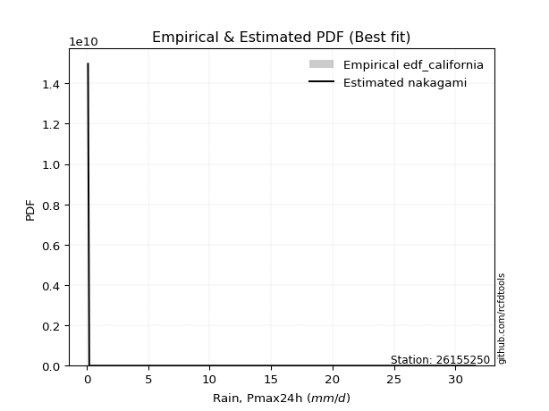</img>

</div>


### 2. Empirical - EDF Hazen (1930)

Hazen method for plotting positions is a formula used to estimate the empirical cumulative probability distribution of flood events or other hydrological data. This formula often results in biased estimations, particularly when extrapolating to extreme events (high return periods).

<div align="center">


$P=(m-0.5)/n$


</div>


**2.1. Empirical values**

<div align="center">

|                | 0                   | 1                   | 2                   | 3         | 4                  | 5                  | 6                  |
|:---------------|:--------------------|:--------------------|:--------------------|:----------|:-------------------|:-------------------|:-------------------|
| date           | 2022                | 2021                | 2016                | 2019      | 2020               | 2018               | 2017               |
| x              | 0.1                 | 0.2                 | 0.7                 | 18.7      | 23.3               | 26.5               | 31.6               |
| m              | 1                   | 2                   | 3                   | 4         | 5                  | 6                  | 7                  |
| empirical_dist | edf_hazen           | edf_hazen           | edf_hazen           | edf_hazen | edf_hazen          | edf_hazen          | edf_hazen          |
| empirical      | 0.07142857142857142 | 0.21428571428571427 | 0.35714285714285715 | 0.5       | 0.6428571428571429 | 0.7857142857142857 | 0.9285714285714286 |
| empirical_tr   | 1.0769230769230769  | 1.2727272727272727  | 1.5555555555555558  | 2.0       | 2.8000000000000003 | 4.666666666666666  | 14.000000000000007 |

</div>


**2.2. Kolmogorov-Smirnov fit test (sorted by Δ)**


<div align="center">

|                | 0                   | 1                   | 2                   | 3                   | 4                   | 5                   | 6                   | 7                   | 8                   | 9                   | 10                  | 11                  | 12                  | 13                  | 14                  | 15                  | 16                  | 17                  | 18                  | 19                  | 20                  | 21                  | 22                  | 23                  | 24                  | 25                  | 26                  | 27                  | 28                  | 29                  | 30                  | 31                  | 32                  | 33                  | 34                  | 35                  | 36                  | 37                  | 38                  | 39                  | 40                  | 41                  | 42                  | 43                  | 44                  | 45                  | 46                  | 47                  | 48                  | 49                  | 50                  | 51                  | 52                  | 53                  | 54                  | 55                  | 56                  | 57                    | 58                  | 59                  | 60                  | 61                  | 62                  | 63                  | 64                  | 65                  | 66                  | 67                  | 68                  | 69                  | 70                  | 71                  | 72                  | 73                  | 74                  | 75                  | 76                  | 77                  | 78                  | 79                  | 80                  | 81                  | 82                  | 83                  | 84                  | 85                  | 86                  | 87                  | 88                  | 89                  |
|:---------------|:--------------------|:--------------------|:--------------------|:--------------------|:--------------------|:--------------------|:--------------------|:--------------------|:--------------------|:--------------------|:--------------------|:--------------------|:--------------------|:--------------------|:--------------------|:--------------------|:--------------------|:--------------------|:--------------------|:--------------------|:--------------------|:--------------------|:--------------------|:--------------------|:--------------------|:--------------------|:--------------------|:--------------------|:--------------------|:--------------------|:--------------------|:--------------------|:--------------------|:--------------------|:--------------------|:--------------------|:--------------------|:--------------------|:--------------------|:--------------------|:--------------------|:--------------------|:--------------------|:--------------------|:--------------------|:--------------------|:--------------------|:--------------------|:--------------------|:--------------------|:--------------------|:--------------------|:--------------------|:--------------------|:--------------------|:--------------------|:--------------------|:----------------------|:--------------------|:--------------------|:--------------------|:--------------------|:--------------------|:--------------------|:--------------------|:--------------------|:--------------------|:--------------------|:--------------------|:--------------------|:--------------------|:--------------------|:--------------------|:--------------------|:--------------------|:--------------------|:--------------------|:--------------------|:--------------------|:--------------------|:--------------------|:--------------------|:--------------------|:--------------------|:--------------------|:--------------------|:--------------------|:--------------------|:--------------------|:--------------------|
| station        | 26155250            | 26155250            | 26155250            | 26155250            | 26155250            | 26155250            | 26155250            | 26155250            | 26155250            | 26155250            | 26155250            | 26155250            | 26155250            | 26155250            | 26155250            | 26155250            | 26155250            | 26155250            | 26155250            | 26155250            | 26155250            | 26155250            | 26155250            | 26155250            | 26155250            | 26155250            | 26155250            | 26155250            | 26155250            | 26155250            | 26155250            | 26155250            | 26155250            | 26155250            | 26155250            | 26155250            | 26155250            | 26155250            | 26155250            | 26155250            | 26155250            | 26155250            | 26155250            | 26155250            | 26155250            | 26155250            | 26155250            | 26155250            | 26155250            | 26155250            | 26155250            | 26155250            | 26155250            | 26155250            | 26155250            | 26155250            | 26155250            | 26155250              | 26155250            | 26155250            | 26155250            | 26155250            | 26155250            | 26155250            | 26155250            | 26155250            | 26155250            | 26155250            | 26155250            | 26155250            | 26155250            | 26155250            | 26155250            | 26155250            | 26155250            | 26155250            | 26155250            | 26155250            | 26155250            | 26155250            | 26155250            | 26155250            | 26155250            | 26155250            | 26155250            | 26155250            | 26155250            | 26155250            | 26155250            | 26155250            |
| empirical_dist | edf_hazen           | edf_hazen           | edf_hazen           | edf_hazen           | edf_hazen           | edf_hazen           | edf_hazen           | edf_hazen           | edf_hazen           | edf_hazen           | edf_hazen           | edf_hazen           | edf_hazen           | edf_hazen           | edf_hazen           | edf_hazen           | edf_hazen           | edf_hazen           | edf_hazen           | edf_hazen           | edf_hazen           | edf_hazen           | edf_hazen           | edf_hazen           | edf_hazen           | edf_hazen           | edf_hazen           | edf_hazen           | edf_hazen           | edf_hazen           | edf_hazen           | edf_hazen           | edf_hazen           | edf_hazen           | edf_hazen           | edf_hazen           | edf_hazen           | edf_hazen           | edf_hazen           | edf_hazen           | edf_hazen           | edf_hazen           | edf_hazen           | edf_hazen           | edf_hazen           | edf_hazen           | edf_hazen           | edf_hazen           | edf_hazen           | edf_hazen           | edf_hazen           | edf_hazen           | edf_hazen           | edf_hazen           | edf_hazen           | edf_hazen           | edf_hazen           | edf_hazen             | edf_hazen           | edf_hazen           | edf_hazen           | edf_hazen           | edf_hazen           | edf_hazen           | edf_hazen           | edf_hazen           | edf_hazen           | edf_hazen           | edf_hazen           | edf_hazen           | edf_hazen           | edf_hazen           | edf_hazen           | edf_hazen           | edf_hazen           | edf_hazen           | edf_hazen           | edf_hazen           | edf_hazen           | edf_hazen           | edf_hazen           | edf_hazen           | edf_hazen           | edf_hazen           | edf_hazen           | edf_hazen           | edf_hazen           | edf_hazen           | edf_hazen           | edf_hazen           |
| p_dist         | weibull_min         | laplace_asymmetric  | johnsonsu           | fisk                | genlogistic         | pearson3            | erlang              | exponnorm           | crystalball         | norm                | gamma               | maxwell             | rayleigh            | kstwobign           | gumbel_l            | logistic            | logf                | halfnorm            | hypsecant           | rice                | laplace             | nakagami            | gumbel_r            | mielke              | logweibull_min      | logpearson3         | ncf                 | logncf              | loggumbel_l         | loggamma            | loggamma            | lognakagami         | logfatiguelife      | loginvweibull       | lognct              | logt                | logexponnorm        | logcrystalball      | lognorm             | lognorm             | loglognorm          | logerlang           | logrice             | loggompertz         | loginvgauss         | loginvgamma         | logexpon            | logalpha            | logmaxwell          | lograyleigh         | loggenexpon         | logtruncnorm        | moyal               | logkstwobign        | loghalfnorm         | pareto              | loglogistic         | loglaplace_asymmetric | logloggamma         | halflogistic        | loggumbel_r         | logfisk             | loghypsecant        | loghalflogistic     | fatiguelife         | logmoyal            | expon               | genexpon            | alpha               | loglaplace          | truncnorm           | betaprime           | gompertz            | f                   | logwald             | gibrat              | wald                | loggibrat           | logpareto           | t                   | invgauss            | logchi2             | chi2                | invweibull          | logjohnsonsu        | logbetaprime        | logmielke           | invgamma            | nct                 | loggenlogistic      |
| delta          | 0.1868457102276928  | 0.1988150196748905  | 0.20681950369734686 | 0.20805333746997257 | 0.2155121013179731  | 0.21671454525589856 | 0.21701943673425034 | 0.2170397432811533  | 0.21703980421392982 | 0.21703980668298878 | 0.2173447757640882  | 0.21748731042261785 | 0.21872743600686884 | 0.2205254786490781  | 0.22602227255833998 | 0.23352887331180544 | 0.236714695597166   | 0.24032540432313196 | 0.24168685583855104 | 0.24528943355687285 | 0.24856576624081209 | 0.2501566653157865  | 0.2509889194729093  | 0.2512903566600112  | 0.2547042679492114  | 0.25673013066121686 | 0.2569868752673601  | 0.2585202119261998  | 0.2594842019819745  | 0.2651543009302373  | 0.2651543009302373  | 0.26543444916289927 | 0.265547381205016   | 0.265875741846857   | 0.26601999371416063 | 0.26613644902438716 | 0.2661367081591991  | 0.26613674973164436 | 0.26613675026022876 | 0.26613675026022876 | 0.26759837487807303 | 0.26809731184394847 | 0.26979972256978035 | 0.2715866063170159  | 0.2726658216701171  | 0.2728140758318842  | 0.27352150377793394 | 0.27358795856377915 | 0.273595840925826   | 0.2757131946089293  | 0.27663502440336185 | 0.2780142429548861  | 0.2784135176777435  | 0.2805551555617849  | 0.2834046176028744  | 0.2886970439423406  | 0.28870723965173095 | 0.29094636914235583   | 0.29098482769185785 | 0.2955948499852549  | 0.30153751058276557 | 0.30166931892726867 | 0.30306814343084154 | 0.3068182185774073  | 0.3086966586386598  | 0.3130375572047337  | 0.3161730994698712  | 0.3201162966194614  | 0.32020430867272953 | 0.32095627724471143 | 0.32646692968330865 | 0.32696717019874244 | 0.3270182000913943  | 0.33202996026994314 | 0.35012567630638236 | 0.35714285714285715 | 0.35714285714285715 | 0.3787599534468622  | 0.38148473537728744 | 0.3837092458722936  | 0.3873826081687335  | 0.460510141932325   | 0.4986445621590162  | 0.5256948684482717  | 0.538844660825621   | 0.5510845808126875  | 0.5710506199949061  | 0.7455813197189033  | 0.7640383230569897  | 0.7857142857142857  |
| deltao         | 0.48442053926100004 | 0.48442053926100004 | 0.48442053926100004 | 0.48442053926100004 | 0.48442053926100004 | 0.48442053926100004 | 0.48442053926100004 | 0.48442053926100004 | 0.48442053926100004 | 0.48442053926100004 | 0.48442053926100004 | 0.48442053926100004 | 0.48442053926100004 | 0.48442053926100004 | 0.48442053926100004 | 0.48442053926100004 | 0.48442053926100004 | 0.48442053926100004 | 0.48442053926100004 | 0.48442053926100004 | 0.48442053926100004 | 0.48442053926100004 | 0.48442053926100004 | 0.48442053926100004 | 0.48442053926100004 | 0.48442053926100004 | 0.48442053926100004 | 0.48442053926100004 | 0.48442053926100004 | 0.48442053926100004 | 0.48442053926100004 | 0.48442053926100004 | 0.48442053926100004 | 0.48442053926100004 | 0.48442053926100004 | 0.48442053926100004 | 0.48442053926100004 | 0.48442053926100004 | 0.48442053926100004 | 0.48442053926100004 | 0.48442053926100004 | 0.48442053926100004 | 0.48442053926100004 | 0.48442053926100004 | 0.48442053926100004 | 0.48442053926100004 | 0.48442053926100004 | 0.48442053926100004 | 0.48442053926100004 | 0.48442053926100004 | 0.48442053926100004 | 0.48442053926100004 | 0.48442053926100004 | 0.48442053926100004 | 0.48442053926100004 | 0.48442053926100004 | 0.48442053926100004 | 0.48442053926100004   | 0.48442053926100004 | 0.48442053926100004 | 0.48442053926100004 | 0.48442053926100004 | 0.48442053926100004 | 0.48442053926100004 | 0.48442053926100004 | 0.48442053926100004 | 0.48442053926100004 | 0.48442053926100004 | 0.48442053926100004 | 0.48442053926100004 | 0.48442053926100004 | 0.48442053926100004 | 0.48442053926100004 | 0.48442053926100004 | 0.48442053926100004 | 0.48442053926100004 | 0.48442053926100004 | 0.48442053926100004 | 0.48442053926100004 | 0.48442053926100004 | 0.48442053926100004 | 0.48442053926100004 | 0.48442053926100004 | 0.48442053926100004 | 0.48442053926100004 | 0.48442053926100004 | 0.48442053926100004 | 0.48442053926100004 | 0.48442053926100004 | 0.48442053926100004 |
| eval           | Δo > Δ              | Δo > Δ              | Δo > Δ              | Δo > Δ              | Δo > Δ              | Δo > Δ              | Δo > Δ              | Δo > Δ              | Δo > Δ              | Δo > Δ              | Δo > Δ              | Δo > Δ              | Δo > Δ              | Δo > Δ              | Δo > Δ              | Δo > Δ              | Δo > Δ              | Δo > Δ              | Δo > Δ              | Δo > Δ              | Δo > Δ              | Δo > Δ              | Δo > Δ              | Δo > Δ              | Δo > Δ              | Δo > Δ              | Δo > Δ              | Δo > Δ              | Δo > Δ              | Δo > Δ              | Δo > Δ              | Δo > Δ              | Δo > Δ              | Δo > Δ              | Δo > Δ              | Δo > Δ              | Δo > Δ              | Δo > Δ              | Δo > Δ              | Δo > Δ              | Δo > Δ              | Δo > Δ              | Δo > Δ              | Δo > Δ              | Δo > Δ              | Δo > Δ              | Δo > Δ              | Δo > Δ              | Δo > Δ              | Δo > Δ              | Δo > Δ              | Δo > Δ              | Δo > Δ              | Δo > Δ              | Δo > Δ              | Δo > Δ              | Δo > Δ              | Δo > Δ                | Δo > Δ              | Δo > Δ              | Δo > Δ              | Δo > Δ              | Δo > Δ              | Δo > Δ              | Δo > Δ              | Δo > Δ              | Δo > Δ              | Δo > Δ              | Δo > Δ              | Δo > Δ              | Δo > Δ              | Δo > Δ              | Δo > Δ              | Δo > Δ              | Δo > Δ              | Δo > Δ              | Δo > Δ              | Δo > Δ              | Δo > Δ              | Δo > Δ              | Δo > Δ              | Δo > Δ              | Δo <= Δ             | Δo <= Δ             | Δo <= Δ             | Δo <= Δ             | Δo <= Δ             | Δo <= Δ             | Δo <= Δ             | Δo <= Δ             |
| fit            | 1                   | 1                   | 1                   | 1                   | 1                   | 1                   | 1                   | 1                   | 1                   | 1                   | 1                   | 1                   | 1                   | 1                   | 1                   | 1                   | 1                   | 1                   | 1                   | 1                   | 1                   | 1                   | 1                   | 1                   | 1                   | 1                   | 1                   | 1                   | 1                   | 1                   | 1                   | 1                   | 1                   | 1                   | 1                   | 1                   | 1                   | 1                   | 1                   | 1                   | 1                   | 1                   | 1                   | 1                   | 1                   | 1                   | 1                   | 1                   | 1                   | 1                   | 1                   | 1                   | 1                   | 1                   | 1                   | 1                   | 1                   | 1                     | 1                   | 1                   | 1                   | 1                   | 1                   | 1                   | 1                   | 1                   | 1                   | 1                   | 1                   | 1                   | 1                   | 1                   | 1                   | 1                   | 1                   | 1                   | 1                   | 1                   | 1                   | 1                   | 1                   | 1                   | 0                   | 0                   | 0                   | 0                   | 0                   | 0                   | 0                   | 0                   |
| n              | 7                   | 7                   | 7                   | 7                   | 7                   | 7                   | 7                   | 7                   | 7                   | 7                   | 7                   | 7                   | 7                   | 7                   | 7                   | 7                   | 7                   | 7                   | 7                   | 7                   | 7                   | 7                   | 7                   | 7                   | 7                   | 7                   | 7                   | 7                   | 7                   | 7                   | 7                   | 7                   | 7                   | 7                   | 7                   | 7                   | 7                   | 7                   | 7                   | 7                   | 7                   | 7                   | 7                   | 7                   | 7                   | 7                   | 7                   | 7                   | 7                   | 7                   | 7                   | 7                   | 7                   | 7                   | 7                   | 7                   | 7                   | 7                     | 7                   | 7                   | 7                   | 7                   | 7                   | 7                   | 7                   | 7                   | 7                   | 7                   | 7                   | 7                   | 7                   | 7                   | 7                   | 7                   | 7                   | 7                   | 7                   | 7                   | 7                   | 7                   | 7                   | 7                   | 7                   | 7                   | 7                   | 7                   | 7                   | 7                   | 7                   | 7                   |
| best_fit       | 1                   | 0                   | 0                   | 0                   | 0                   | 0                   | 0                   | 0                   | 0                   | 0                   | 0                   | 0                   | 0                   | 0                   | 0                   | 0                   | 0                   | 0                   | 0                   | 0                   | 0                   | 0                   | 0                   | 0                   | 0                   | 0                   | 0                   | 0                   | 0                   | 0                   | 0                   | 0                   | 0                   | 0                   | 0                   | 0                   | 0                   | 0                   | 0                   | 0                   | 0                   | 0                   | 0                   | 0                   | 0                   | 0                   | 0                   | 0                   | 0                   | 0                   | 0                   | 0                   | 0                   | 0                   | 0                   | 0                   | 0                   | 0                     | 0                   | 0                   | 0                   | 0                   | 0                   | 0                   | 0                   | 0                   | 0                   | 0                   | 0                   | 0                   | 0                   | 0                   | 0                   | 0                   | 0                   | 0                   | 0                   | 0                   | 0                   | 0                   | 0                   | 0                   | 0                   | 0                   | 0                   | 0                   | 0                   | 0                   | 0                   | 0                   |
| best_fit_sort  | 1                   | 2                   | 3                   | 4                   | 5                   | 6                   | 7                   | 8                   | 9                   | 10                  | 11                  | 12                  | 13                  | 14                  | 15                  | 16                  | 17                  | 18                  | 19                  | 20                  | 21                  | 22                  | 23                  | 24                  | 25                  | 26                  | 27                  | 28                  | 29                  | 30                  | 31                  | 32                  | 33                  | 34                  | 35                  | 36                  | 37                  | 38                  | 39                  | 40                  | 41                  | 42                  | 43                  | 44                  | 45                  | 46                  | 47                  | 48                  | 49                  | 50                  | 51                  | 52                  | 53                  | 54                  | 55                  | 56                  | 57                  | 58                    | 59                  | 60                  | 61                  | 62                  | 63                  | 64                  | 65                  | 66                  | 67                  | 68                  | 69                  | 70                  | 71                  | 72                  | 73                  | 74                  | 75                  | 76                  | 77                  | 78                  | 79                  | 80                  | 81                  | 82                  | 83                  | 84                  | 85                  | 86                  | 87                  | 88                  | 89                  | 90                  |

</div>


<div align="center">

</img>

</div>


**2.3. Best fit**

<div align="center">

|   id |   station | empirical_dist   | p_dist      |    delta |   deltao | eval   |   fit |   n |   best_fit |   best_fit_sort |
|-----:|----------:|:-----------------|:------------|---------:|---------:|:-------|------:|----:|-----------:|----------------:|
|    0 |  26155250 | edf_hazen        | weibull_min | 0.186846 | 0.484421 | Δo > Δ |     1 |   7 |          1 |               1 |

</div>


<div align="center">

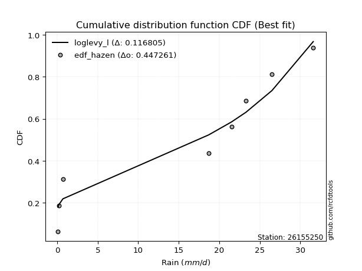</img>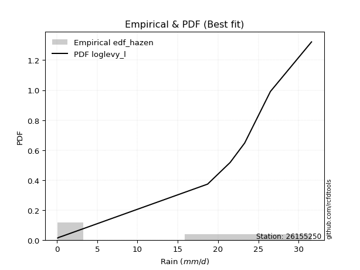</img>

</div>


### 3. Empirical - EDF Weibull (1939)

Weibull plotting position formula is an empirical method used to estimate the non-exceedance probability or plotting position for a set of observed data, is often recommended or widely used in practice, particularly in flood frequency analysis.

<div align="center">


$P=m/(n+1)$


</div>


**3.1. Empirical values**

<div align="center">

|                | 0                  | 1                  | 2           | 3           | 4                  | 5           | 6           |
|:---------------|:-------------------|:-------------------|:------------|:------------|:-------------------|:------------|:------------|
| date           | 2022               | 2021               | 2016        | 2019        | 2020               | 2018        | 2017        |
| x              | 0.1                | 0.2                | 0.7         | 18.7        | 23.3               | 26.5        | 31.6        |
| m              | 1                  | 2                  | 3           | 4           | 5                  | 6           | 7           |
| empirical_dist | edf_weibull        | edf_weibull        | edf_weibull | edf_weibull | edf_weibull        | edf_weibull | edf_weibull |
| empirical      | 0.125              | 0.25               | 0.375       | 0.5         | 0.625              | 0.75        | 0.875       |
| empirical_tr   | 1.1428571428571428 | 1.3333333333333333 | 1.6         | 2.0         | 2.6666666666666665 | 4.0         | 8.0         |

</div>


**3.2. Kolmogorov-Smirnov fit test (sorted by Δ)**


<div align="center">

|                | 0                   | 1                   | 2                   | 3                   | 4                   | 5                   | 6                   | 7                   | 8                   | 9                   | 10                  | 11                  | 12                  | 13                  | 14                  | 15                  | 16                  | 17                  | 18                  | 19                  | 20                  | 21                  | 22                  | 23                  | 24                  | 25                  | 26                  | 27                  | 28                  | 29                  | 30                  | 31                  | 32                  | 33                  | 34                  | 35                  | 36                  | 37                  | 38                  | 39                  | 40                  | 41                  | 42                  | 43                  | 44                  | 45                  | 46                  | 47                  | 48                  | 49                  | 50                  | 51                  | 52                  | 53                  | 54                  | 55                  | 56                  | 57                    | 58                  | 59                  | 60                  | 61                  | 62                  | 63                  | 64                  | 65                  | 66                  | 67                  | 68                  | 69                  | 70                  | 71                  | 72                  | 73                  | 74                  | 75                  | 76                  | 77                  | 78                  | 79                  | 80                  | 81                  | 82                  | 83                  | 84                  | 85                  | 86                  | 87                  | 88                  | 89                  |
|:---------------|:--------------------|:--------------------|:--------------------|:--------------------|:--------------------|:--------------------|:--------------------|:--------------------|:--------------------|:--------------------|:--------------------|:--------------------|:--------------------|:--------------------|:--------------------|:--------------------|:--------------------|:--------------------|:--------------------|:--------------------|:--------------------|:--------------------|:--------------------|:--------------------|:--------------------|:--------------------|:--------------------|:--------------------|:--------------------|:--------------------|:--------------------|:--------------------|:--------------------|:--------------------|:--------------------|:--------------------|:--------------------|:--------------------|:--------------------|:--------------------|:--------------------|:--------------------|:--------------------|:--------------------|:--------------------|:--------------------|:--------------------|:--------------------|:--------------------|:--------------------|:--------------------|:--------------------|:--------------------|:--------------------|:--------------------|:--------------------|:--------------------|:----------------------|:--------------------|:--------------------|:--------------------|:--------------------|:--------------------|:--------------------|:--------------------|:--------------------|:--------------------|:--------------------|:--------------------|:--------------------|:--------------------|:--------------------|:--------------------|:--------------------|:--------------------|:--------------------|:--------------------|:--------------------|:--------------------|:--------------------|:--------------------|:--------------------|:--------------------|:--------------------|:--------------------|:--------------------|:--------------------|:--------------------|:--------------------|:--------------------|
| station        | 26155250            | 26155250            | 26155250            | 26155250            | 26155250            | 26155250            | 26155250            | 26155250            | 26155250            | 26155250            | 26155250            | 26155250            | 26155250            | 26155250            | 26155250            | 26155250            | 26155250            | 26155250            | 26155250            | 26155250            | 26155250            | 26155250            | 26155250            | 26155250            | 26155250            | 26155250            | 26155250            | 26155250            | 26155250            | 26155250            | 26155250            | 26155250            | 26155250            | 26155250            | 26155250            | 26155250            | 26155250            | 26155250            | 26155250            | 26155250            | 26155250            | 26155250            | 26155250            | 26155250            | 26155250            | 26155250            | 26155250            | 26155250            | 26155250            | 26155250            | 26155250            | 26155250            | 26155250            | 26155250            | 26155250            | 26155250            | 26155250            | 26155250              | 26155250            | 26155250            | 26155250            | 26155250            | 26155250            | 26155250            | 26155250            | 26155250            | 26155250            | 26155250            | 26155250            | 26155250            | 26155250            | 26155250            | 26155250            | 26155250            | 26155250            | 26155250            | 26155250            | 26155250            | 26155250            | 26155250            | 26155250            | 26155250            | 26155250            | 26155250            | 26155250            | 26155250            | 26155250            | 26155250            | 26155250            | 26155250            |
| empirical_dist | edf_weibull         | edf_weibull         | edf_weibull         | edf_weibull         | edf_weibull         | edf_weibull         | edf_weibull         | edf_weibull         | edf_weibull         | edf_weibull         | edf_weibull         | edf_weibull         | edf_weibull         | edf_weibull         | edf_weibull         | edf_weibull         | edf_weibull         | edf_weibull         | edf_weibull         | edf_weibull         | edf_weibull         | edf_weibull         | edf_weibull         | edf_weibull         | edf_weibull         | edf_weibull         | edf_weibull         | edf_weibull         | edf_weibull         | edf_weibull         | edf_weibull         | edf_weibull         | edf_weibull         | edf_weibull         | edf_weibull         | edf_weibull         | edf_weibull         | edf_weibull         | edf_weibull         | edf_weibull         | edf_weibull         | edf_weibull         | edf_weibull         | edf_weibull         | edf_weibull         | edf_weibull         | edf_weibull         | edf_weibull         | edf_weibull         | edf_weibull         | edf_weibull         | edf_weibull         | edf_weibull         | edf_weibull         | edf_weibull         | edf_weibull         | edf_weibull         | edf_weibull           | edf_weibull         | edf_weibull         | edf_weibull         | edf_weibull         | edf_weibull         | edf_weibull         | edf_weibull         | edf_weibull         | edf_weibull         | edf_weibull         | edf_weibull         | edf_weibull         | edf_weibull         | edf_weibull         | edf_weibull         | edf_weibull         | edf_weibull         | edf_weibull         | edf_weibull         | edf_weibull         | edf_weibull         | edf_weibull         | edf_weibull         | edf_weibull         | edf_weibull         | edf_weibull         | edf_weibull         | edf_weibull         | edf_weibull         | edf_weibull         | edf_weibull         | edf_weibull         |
| p_dist         | weibull_min         | logncf              | fisk                | laplace_asymmetric  | johnsonsu           | genlogistic         | pearson3            | erlang              | exponnorm           | crystalball         | norm                | gamma               | maxwell             | logf                | rayleigh            | kstwobign           | gumbel_l            | logfisk             | nakagami            | mielke              | logistic            | ncf                 | logweibull_min      | logpearson3         | halfnorm            | loggumbel_l         | hypsecant           | rice                | loggamma            | loggamma            | lognakagami         | logfatiguelife      | loginvweibull       | lognct              | logt                | logexponnorm        | logcrystalball      | lognorm             | lognorm             | laplace             | loglognorm          | logerlang           | gumbel_r            | logrice             | loggompertz         | loginvgauss         | loginvgamma         | logexpon            | logalpha            | logmaxwell          | lograyleigh         | loggenexpon         | logtruncnorm        | logkstwobign        | loghalfnorm         | fatiguelife         | loglogistic         | loglaplace_asymmetric | logloggamma         | moyal               | loggumbel_r         | loghypsecant        | pareto              | loghalflogistic     | logmoyal            | halflogistic        | alpha               | loglaplace          | betaprime           | f                   | expon               | genexpon            | truncnorm           | gompertz            | logpareto           | logwald             | wald                | gibrat              | loggibrat           | t                   | invgauss            | logchi2             | invweibull          | chi2                | logjohnsonsu        | logbetaprime        | logmielke           | invgamma            | nct                 | loggenlogistic      |
| delta          | 0.16010857155867775 | 0.20494878335477118 | 0.20805333746997257 | 0.21667216253203334 | 0.2246766465544897  | 0.23336924417511595 | 0.2345716881130414  | 0.2348765795913932  | 0.23489688613829615 | 0.23489694707107267 | 0.23489694954013163 | 0.23520191862123105 | 0.2353444532797607  | 0.23554857771962745 | 0.23658457886401169 | 0.23838262150622094 | 0.24387941541548283 | 0.24809789035584007 | 0.2501566653157865  | 0.2512903566600112  | 0.2513860161689483  | 0.2528474197775727  | 0.2547042679492114  | 0.25673013066121686 | 0.2581825471802748  | 0.2594842019819745  | 0.2595439986956939  | 0.26314657641401573 | 0.2651543009302373  | 0.2651543009302373  | 0.26543444916289927 | 0.265547381205016   | 0.265875741846857   | 0.26601999371416063 | 0.26613644902438716 | 0.2661367081591991  | 0.26613674973164436 | 0.26613675026022876 | 0.26613675026022876 | 0.26642290909795496 | 0.26759837487807303 | 0.26809731184394847 | 0.26884606233005215 | 0.26979972256978035 | 0.2715866063170159  | 0.2726658216701171  | 0.2728140758318842  | 0.27352150377793394 | 0.27358795856377915 | 0.273595840925826   | 0.2757131946089293  | 0.27663502440336185 | 0.2780142429548861  | 0.2805551555617849  | 0.2834046176028744  | 0.2841528815012687  | 0.28870723965173095 | 0.29094636914235583   | 0.29098482769185785 | 0.2962706605348864  | 0.30153751058276557 | 0.30306814343084154 | 0.30655418679948343 | 0.3068182185774073  | 0.3130375572047337  | 0.3134519928423978  | 0.32020430867272953 | 0.32095627724471143 | 0.32696717019874244 | 0.33202996026994314 | 0.33403024232701406 | 0.33797343947660424 | 0.3443240725404515  | 0.34487534294853717 | 0.34577044966300174 | 0.35012567630638236 | 0.375               | 0.375               | 0.3787599534468622  | 0.3837092458722936  | 0.3873826081687335  | 0.460510141932325   | 0.47212343987684313 | 0.4986445621590162  | 0.5031303751113354  | 0.5153702950984018  | 0.5353363342806204  | 0.7098670340046176  | 0.728324037342704   | 0.75                |
| deltao         | 0.48442053926100004 | 0.48442053926100004 | 0.48442053926100004 | 0.48442053926100004 | 0.48442053926100004 | 0.48442053926100004 | 0.48442053926100004 | 0.48442053926100004 | 0.48442053926100004 | 0.48442053926100004 | 0.48442053926100004 | 0.48442053926100004 | 0.48442053926100004 | 0.48442053926100004 | 0.48442053926100004 | 0.48442053926100004 | 0.48442053926100004 | 0.48442053926100004 | 0.48442053926100004 | 0.48442053926100004 | 0.48442053926100004 | 0.48442053926100004 | 0.48442053926100004 | 0.48442053926100004 | 0.48442053926100004 | 0.48442053926100004 | 0.48442053926100004 | 0.48442053926100004 | 0.48442053926100004 | 0.48442053926100004 | 0.48442053926100004 | 0.48442053926100004 | 0.48442053926100004 | 0.48442053926100004 | 0.48442053926100004 | 0.48442053926100004 | 0.48442053926100004 | 0.48442053926100004 | 0.48442053926100004 | 0.48442053926100004 | 0.48442053926100004 | 0.48442053926100004 | 0.48442053926100004 | 0.48442053926100004 | 0.48442053926100004 | 0.48442053926100004 | 0.48442053926100004 | 0.48442053926100004 | 0.48442053926100004 | 0.48442053926100004 | 0.48442053926100004 | 0.48442053926100004 | 0.48442053926100004 | 0.48442053926100004 | 0.48442053926100004 | 0.48442053926100004 | 0.48442053926100004 | 0.48442053926100004   | 0.48442053926100004 | 0.48442053926100004 | 0.48442053926100004 | 0.48442053926100004 | 0.48442053926100004 | 0.48442053926100004 | 0.48442053926100004 | 0.48442053926100004 | 0.48442053926100004 | 0.48442053926100004 | 0.48442053926100004 | 0.48442053926100004 | 0.48442053926100004 | 0.48442053926100004 | 0.48442053926100004 | 0.48442053926100004 | 0.48442053926100004 | 0.48442053926100004 | 0.48442053926100004 | 0.48442053926100004 | 0.48442053926100004 | 0.48442053926100004 | 0.48442053926100004 | 0.48442053926100004 | 0.48442053926100004 | 0.48442053926100004 | 0.48442053926100004 | 0.48442053926100004 | 0.48442053926100004 | 0.48442053926100004 | 0.48442053926100004 | 0.48442053926100004 |
| eval           | Δo > Δ              | Δo > Δ              | Δo > Δ              | Δo > Δ              | Δo > Δ              | Δo > Δ              | Δo > Δ              | Δo > Δ              | Δo > Δ              | Δo > Δ              | Δo > Δ              | Δo > Δ              | Δo > Δ              | Δo > Δ              | Δo > Δ              | Δo > Δ              | Δo > Δ              | Δo > Δ              | Δo > Δ              | Δo > Δ              | Δo > Δ              | Δo > Δ              | Δo > Δ              | Δo > Δ              | Δo > Δ              | Δo > Δ              | Δo > Δ              | Δo > Δ              | Δo > Δ              | Δo > Δ              | Δo > Δ              | Δo > Δ              | Δo > Δ              | Δo > Δ              | Δo > Δ              | Δo > Δ              | Δo > Δ              | Δo > Δ              | Δo > Δ              | Δo > Δ              | Δo > Δ              | Δo > Δ              | Δo > Δ              | Δo > Δ              | Δo > Δ              | Δo > Δ              | Δo > Δ              | Δo > Δ              | Δo > Δ              | Δo > Δ              | Δo > Δ              | Δo > Δ              | Δo > Δ              | Δo > Δ              | Δo > Δ              | Δo > Δ              | Δo > Δ              | Δo > Δ                | Δo > Δ              | Δo > Δ              | Δo > Δ              | Δo > Δ              | Δo > Δ              | Δo > Δ              | Δo > Δ              | Δo > Δ              | Δo > Δ              | Δo > Δ              | Δo > Δ              | Δo > Δ              | Δo > Δ              | Δo > Δ              | Δo > Δ              | Δo > Δ              | Δo > Δ              | Δo > Δ              | Δo > Δ              | Δo > Δ              | Δo > Δ              | Δo > Δ              | Δo > Δ              | Δo > Δ              | Δo > Δ              | Δo <= Δ             | Δo <= Δ             | Δo <= Δ             | Δo <= Δ             | Δo <= Δ             | Δo <= Δ             | Δo <= Δ             |
| fit            | 1                   | 1                   | 1                   | 1                   | 1                   | 1                   | 1                   | 1                   | 1                   | 1                   | 1                   | 1                   | 1                   | 1                   | 1                   | 1                   | 1                   | 1                   | 1                   | 1                   | 1                   | 1                   | 1                   | 1                   | 1                   | 1                   | 1                   | 1                   | 1                   | 1                   | 1                   | 1                   | 1                   | 1                   | 1                   | 1                   | 1                   | 1                   | 1                   | 1                   | 1                   | 1                   | 1                   | 1                   | 1                   | 1                   | 1                   | 1                   | 1                   | 1                   | 1                   | 1                   | 1                   | 1                   | 1                   | 1                   | 1                   | 1                     | 1                   | 1                   | 1                   | 1                   | 1                   | 1                   | 1                   | 1                   | 1                   | 1                   | 1                   | 1                   | 1                   | 1                   | 1                   | 1                   | 1                   | 1                   | 1                   | 1                   | 1                   | 1                   | 1                   | 1                   | 1                   | 0                   | 0                   | 0                   | 0                   | 0                   | 0                   | 0                   |
| n              | 7                   | 7                   | 7                   | 7                   | 7                   | 7                   | 7                   | 7                   | 7                   | 7                   | 7                   | 7                   | 7                   | 7                   | 7                   | 7                   | 7                   | 7                   | 7                   | 7                   | 7                   | 7                   | 7                   | 7                   | 7                   | 7                   | 7                   | 7                   | 7                   | 7                   | 7                   | 7                   | 7                   | 7                   | 7                   | 7                   | 7                   | 7                   | 7                   | 7                   | 7                   | 7                   | 7                   | 7                   | 7                   | 7                   | 7                   | 7                   | 7                   | 7                   | 7                   | 7                   | 7                   | 7                   | 7                   | 7                   | 7                   | 7                     | 7                   | 7                   | 7                   | 7                   | 7                   | 7                   | 7                   | 7                   | 7                   | 7                   | 7                   | 7                   | 7                   | 7                   | 7                   | 7                   | 7                   | 7                   | 7                   | 7                   | 7                   | 7                   | 7                   | 7                   | 7                   | 7                   | 7                   | 7                   | 7                   | 7                   | 7                   | 7                   |
| best_fit       | 1                   | 0                   | 0                   | 0                   | 0                   | 0                   | 0                   | 0                   | 0                   | 0                   | 0                   | 0                   | 0                   | 0                   | 0                   | 0                   | 0                   | 0                   | 0                   | 0                   | 0                   | 0                   | 0                   | 0                   | 0                   | 0                   | 0                   | 0                   | 0                   | 0                   | 0                   | 0                   | 0                   | 0                   | 0                   | 0                   | 0                   | 0                   | 0                   | 0                   | 0                   | 0                   | 0                   | 0                   | 0                   | 0                   | 0                   | 0                   | 0                   | 0                   | 0                   | 0                   | 0                   | 0                   | 0                   | 0                   | 0                   | 0                     | 0                   | 0                   | 0                   | 0                   | 0                   | 0                   | 0                   | 0                   | 0                   | 0                   | 0                   | 0                   | 0                   | 0                   | 0                   | 0                   | 0                   | 0                   | 0                   | 0                   | 0                   | 0                   | 0                   | 0                   | 0                   | 0                   | 0                   | 0                   | 0                   | 0                   | 0                   | 0                   |
| best_fit_sort  | 1                   | 2                   | 3                   | 4                   | 5                   | 6                   | 7                   | 8                   | 9                   | 10                  | 11                  | 12                  | 13                  | 14                  | 15                  | 16                  | 17                  | 18                  | 19                  | 20                  | 21                  | 22                  | 23                  | 24                  | 25                  | 26                  | 27                  | 28                  | 29                  | 30                  | 31                  | 32                  | 33                  | 34                  | 35                  | 36                  | 37                  | 38                  | 39                  | 40                  | 41                  | 42                  | 43                  | 44                  | 45                  | 46                  | 47                  | 48                  | 49                  | 50                  | 51                  | 52                  | 53                  | 54                  | 55                  | 56                  | 57                  | 58                    | 59                  | 60                  | 61                  | 62                  | 63                  | 64                  | 65                  | 66                  | 67                  | 68                  | 69                  | 70                  | 71                  | 72                  | 73                  | 74                  | 75                  | 76                  | 77                  | 78                  | 79                  | 80                  | 81                  | 82                  | 83                  | 84                  | 85                  | 86                  | 87                  | 88                  | 89                  | 90                  |

</div>


<div align="center">

</img>

</div>


**3.3. Best fit**

<div align="center">

|   id |   station | empirical_dist   | p_dist      |    delta |   deltao | eval   |   fit |   n |   best_fit |   best_fit_sort |
|-----:|----------:|:-----------------|:------------|---------:|---------:|:-------|------:|----:|-----------:|----------------:|
|    0 |  26155250 | edf_weibull      | weibull_min | 0.160109 | 0.484421 | Δo > Δ |     1 |   7 |          1 |               1 |

</div>


<div align="center">

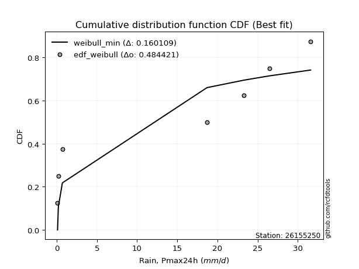</img>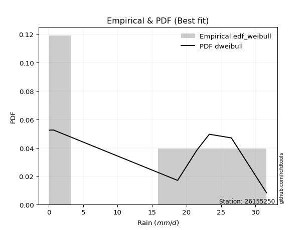</img>

</div>


### 4. Empirical - EDF Beard (1943)

The Beard formula (or Beard´s plotting position formula) in hydrology is used to estimate the empirical non-exceedance probability _(P)_ of a flood event (or other extreme hydrological data point) within a given dataset.

<div align="center">


$P=(m-0.31)/(n+0.38)$


</div>


**4.1. Empirical values**

<div align="center">

|                | 0                   | 1                   | 2                   | 3         | 4                  | 5                  | 6                  |
|:---------------|:--------------------|:--------------------|:--------------------|:----------|:-------------------|:-------------------|:-------------------|
| date           | 2022                | 2021                | 2016                | 2019      | 2020               | 2018               | 2017               |
| x              | 0.1                 | 0.2                 | 0.7                 | 18.7      | 23.3               | 26.5               | 31.6               |
| m              | 1                   | 2                   | 3                   | 4         | 5                  | 6                  | 7                  |
| empirical_dist | edf_beard           | edf_beard           | edf_beard           | edf_beard | edf_beard          | edf_beard          | edf_beard          |
| empirical      | 0.09349593495934959 | 0.22899728997289973 | 0.36449864498644985 | 0.5       | 0.6355013550135502 | 0.7710027100271003 | 0.9065040650406505 |
| empirical_tr   | 1.1031390134529149  | 1.29701230228471    | 1.5735607675906182  | 2.0       | 2.743494423791822  | 4.366863905325444  | 10.695652173913055 |

</div>


**4.2. Kolmogorov-Smirnov fit test (sorted by Δ)**


<div align="center">

|                | 0                   | 1                   | 2                   | 3                   | 4                   | 5                   | 6                   | 7                   | 8                   | 9                   | 10                  | 11                  | 12                  | 13                  | 14                  | 15                  | 16                  | 17                  | 18                  | 19                  | 20                  | 21                  | 22                  | 23                  | 24                  | 25                  | 26                  | 27                  | 28                  | 29                  | 30                  | 31                  | 32                  | 33                  | 34                  | 35                  | 36                  | 37                  | 38                  | 39                  | 40                  | 41                  | 42                  | 43                  | 44                  | 45                  | 46                  | 47                  | 48                  | 49                  | 50                  | 51                  | 52                  | 53                  | 54                  | 55                  | 56                  | 57                    | 58                  | 59                  | 60                  | 61                  | 62                  | 63                  | 64                  | 65                  | 66                  | 67                  | 68                  | 69                  | 70                  | 71                  | 72                  | 73                  | 74                  | 75                  | 76                  | 77                  | 78                  | 79                  | 80                  | 81                  | 82                  | 83                  | 84                  | 85                  | 86                  | 87                  | 88                  | 89                  |
|:---------------|:--------------------|:--------------------|:--------------------|:--------------------|:--------------------|:--------------------|:--------------------|:--------------------|:--------------------|:--------------------|:--------------------|:--------------------|:--------------------|:--------------------|:--------------------|:--------------------|:--------------------|:--------------------|:--------------------|:--------------------|:--------------------|:--------------------|:--------------------|:--------------------|:--------------------|:--------------------|:--------------------|:--------------------|:--------------------|:--------------------|:--------------------|:--------------------|:--------------------|:--------------------|:--------------------|:--------------------|:--------------------|:--------------------|:--------------------|:--------------------|:--------------------|:--------------------|:--------------------|:--------------------|:--------------------|:--------------------|:--------------------|:--------------------|:--------------------|:--------------------|:--------------------|:--------------------|:--------------------|:--------------------|:--------------------|:--------------------|:--------------------|:----------------------|:--------------------|:--------------------|:--------------------|:--------------------|:--------------------|:--------------------|:--------------------|:--------------------|:--------------------|:--------------------|:--------------------|:--------------------|:--------------------|:--------------------|:--------------------|:--------------------|:--------------------|:--------------------|:--------------------|:--------------------|:--------------------|:--------------------|:--------------------|:--------------------|:--------------------|:--------------------|:--------------------|:--------------------|:--------------------|:--------------------|:--------------------|:--------------------|
| station        | 26155250            | 26155250            | 26155250            | 26155250            | 26155250            | 26155250            | 26155250            | 26155250            | 26155250            | 26155250            | 26155250            | 26155250            | 26155250            | 26155250            | 26155250            | 26155250            | 26155250            | 26155250            | 26155250            | 26155250            | 26155250            | 26155250            | 26155250            | 26155250            | 26155250            | 26155250            | 26155250            | 26155250            | 26155250            | 26155250            | 26155250            | 26155250            | 26155250            | 26155250            | 26155250            | 26155250            | 26155250            | 26155250            | 26155250            | 26155250            | 26155250            | 26155250            | 26155250            | 26155250            | 26155250            | 26155250            | 26155250            | 26155250            | 26155250            | 26155250            | 26155250            | 26155250            | 26155250            | 26155250            | 26155250            | 26155250            | 26155250            | 26155250              | 26155250            | 26155250            | 26155250            | 26155250            | 26155250            | 26155250            | 26155250            | 26155250            | 26155250            | 26155250            | 26155250            | 26155250            | 26155250            | 26155250            | 26155250            | 26155250            | 26155250            | 26155250            | 26155250            | 26155250            | 26155250            | 26155250            | 26155250            | 26155250            | 26155250            | 26155250            | 26155250            | 26155250            | 26155250            | 26155250            | 26155250            | 26155250            |
| empirical_dist | edf_beard           | edf_beard           | edf_beard           | edf_beard           | edf_beard           | edf_beard           | edf_beard           | edf_beard           | edf_beard           | edf_beard           | edf_beard           | edf_beard           | edf_beard           | edf_beard           | edf_beard           | edf_beard           | edf_beard           | edf_beard           | edf_beard           | edf_beard           | edf_beard           | edf_beard           | edf_beard           | edf_beard           | edf_beard           | edf_beard           | edf_beard           | edf_beard           | edf_beard           | edf_beard           | edf_beard           | edf_beard           | edf_beard           | edf_beard           | edf_beard           | edf_beard           | edf_beard           | edf_beard           | edf_beard           | edf_beard           | edf_beard           | edf_beard           | edf_beard           | edf_beard           | edf_beard           | edf_beard           | edf_beard           | edf_beard           | edf_beard           | edf_beard           | edf_beard           | edf_beard           | edf_beard           | edf_beard           | edf_beard           | edf_beard           | edf_beard           | edf_beard             | edf_beard           | edf_beard           | edf_beard           | edf_beard           | edf_beard           | edf_beard           | edf_beard           | edf_beard           | edf_beard           | edf_beard           | edf_beard           | edf_beard           | edf_beard           | edf_beard           | edf_beard           | edf_beard           | edf_beard           | edf_beard           | edf_beard           | edf_beard           | edf_beard           | edf_beard           | edf_beard           | edf_beard           | edf_beard           | edf_beard           | edf_beard           | edf_beard           | edf_beard           | edf_beard           | edf_beard           | edf_beard           |
| p_dist         | weibull_min         | laplace_asymmetric  | fisk                | johnsonsu           | genlogistic         | pearson3            | erlang              | exponnorm           | crystalball         | norm                | gamma               | maxwell             | rayleigh            | kstwobign           | gumbel_l            | logf                | logncf              | logistic            | ncf                 | halfnorm            | hypsecant           | nakagami            | mielke              | rice                | logweibull_min      | laplace             | logpearson3         | gumbel_r            | loggumbel_l         | loggamma            | loggamma            | lognakagami         | logfatiguelife      | loginvweibull       | lognct              | logt                | logexponnorm        | logcrystalball      | lognorm             | lognorm             | loglognorm          | logerlang           | logrice             | loggompertz         | loginvgauss         | loginvgamma         | logexpon            | logalpha            | logmaxwell          | lograyleigh         | loggenexpon         | logtruncnorm        | logfisk             | logkstwobign        | loghalfnorm         | moyal               | loglogistic         | loglaplace_asymmetric | logloggamma         | fatiguelife         | pareto              | loggumbel_r         | halflogistic        | loghypsecant        | loghalflogistic     | logmoyal            | alpha               | loglaplace          | expon               | betaprime           | genexpon            | f                   | truncnorm           | gompertz            | logwald             | gibrat              | wald                | logpareto           | loggibrat           | t                   | invgauss            | logchi2             | chi2                | invweibull          | logjohnsonsu        | logbetaprime        | logmielke           | invgamma            | nct                 | loggenlogistic      |
| delta          | 0.1647783466969147  | 0.20617080751848318 | 0.20805333746997257 | 0.21417529154093956 | 0.2228678891615658  | 0.22407033309949126 | 0.22437522457784304 | 0.224395531124746   | 0.22439559205752252 | 0.22439559452658148 | 0.2247005636076809  | 0.22484309826621054 | 0.22608322385046153 | 0.2278812664926708  | 0.23337806040193268 | 0.23554857771962745 | 0.2364528483954217  | 0.24088466115539814 | 0.24234606476402254 | 0.24768119216672466 | 0.24904264368214374 | 0.2501566653157865  | 0.2512903566600112  | 0.2526452214004655  | 0.2547042679492114  | 0.25592155408440476 | 0.25673013066121686 | 0.258344707316502   | 0.2594842019819745  | 0.2651543009302373  | 0.2651543009302373  | 0.26543444916289927 | 0.265547381205016   | 0.265875741846857   | 0.26601999371416063 | 0.26613644902438716 | 0.2661367081591991  | 0.26613674973164436 | 0.26613675026022876 | 0.26613675026022876 | 0.26759837487807303 | 0.26809731184394847 | 0.26979972256978035 | 0.2715866063170159  | 0.2726658216701171  | 0.2728140758318842  | 0.27352150377793394 | 0.27358795856377915 | 0.273595840925826   | 0.2757131946089293  | 0.27663502440336185 | 0.2780142429548861  | 0.2796019553964906  | 0.2805551555617849  | 0.2834046176028744  | 0.2857693055213362  | 0.28870723965173095 | 0.29094636914235583   | 0.29098482769185785 | 0.2939850829514744  | 0.2960528317859333  | 0.30153751058276557 | 0.3029506378288476  | 0.30306814343084154 | 0.3068182185774073  | 0.3130375572047337  | 0.32020430867272953 | 0.32095627724471143 | 0.3235288873134639  | 0.32696717019874244 | 0.3274720844630541  | 0.33202996026994314 | 0.33382271752690135 | 0.334373987934987   | 0.35012567630638236 | 0.36449864498644985 | 0.36449864498644985 | 0.36677315969010205 | 0.3787599534468622  | 0.3837092458722936  | 0.3873826081687335  | 0.460510141932325   | 0.4986445621590162  | 0.5036275049174936  | 0.5241330851384356  | 0.5363730051255021  | 0.5563390443077207  | 0.7308697440317179  | 0.7493267473698043  | 0.7710027100271003  |
| deltao         | 0.48442053926100004 | 0.48442053926100004 | 0.48442053926100004 | 0.48442053926100004 | 0.48442053926100004 | 0.48442053926100004 | 0.48442053926100004 | 0.48442053926100004 | 0.48442053926100004 | 0.48442053926100004 | 0.48442053926100004 | 0.48442053926100004 | 0.48442053926100004 | 0.48442053926100004 | 0.48442053926100004 | 0.48442053926100004 | 0.48442053926100004 | 0.48442053926100004 | 0.48442053926100004 | 0.48442053926100004 | 0.48442053926100004 | 0.48442053926100004 | 0.48442053926100004 | 0.48442053926100004 | 0.48442053926100004 | 0.48442053926100004 | 0.48442053926100004 | 0.48442053926100004 | 0.48442053926100004 | 0.48442053926100004 | 0.48442053926100004 | 0.48442053926100004 | 0.48442053926100004 | 0.48442053926100004 | 0.48442053926100004 | 0.48442053926100004 | 0.48442053926100004 | 0.48442053926100004 | 0.48442053926100004 | 0.48442053926100004 | 0.48442053926100004 | 0.48442053926100004 | 0.48442053926100004 | 0.48442053926100004 | 0.48442053926100004 | 0.48442053926100004 | 0.48442053926100004 | 0.48442053926100004 | 0.48442053926100004 | 0.48442053926100004 | 0.48442053926100004 | 0.48442053926100004 | 0.48442053926100004 | 0.48442053926100004 | 0.48442053926100004 | 0.48442053926100004 | 0.48442053926100004 | 0.48442053926100004   | 0.48442053926100004 | 0.48442053926100004 | 0.48442053926100004 | 0.48442053926100004 | 0.48442053926100004 | 0.48442053926100004 | 0.48442053926100004 | 0.48442053926100004 | 0.48442053926100004 | 0.48442053926100004 | 0.48442053926100004 | 0.48442053926100004 | 0.48442053926100004 | 0.48442053926100004 | 0.48442053926100004 | 0.48442053926100004 | 0.48442053926100004 | 0.48442053926100004 | 0.48442053926100004 | 0.48442053926100004 | 0.48442053926100004 | 0.48442053926100004 | 0.48442053926100004 | 0.48442053926100004 | 0.48442053926100004 | 0.48442053926100004 | 0.48442053926100004 | 0.48442053926100004 | 0.48442053926100004 | 0.48442053926100004 | 0.48442053926100004 | 0.48442053926100004 |
| eval           | Δo > Δ              | Δo > Δ              | Δo > Δ              | Δo > Δ              | Δo > Δ              | Δo > Δ              | Δo > Δ              | Δo > Δ              | Δo > Δ              | Δo > Δ              | Δo > Δ              | Δo > Δ              | Δo > Δ              | Δo > Δ              | Δo > Δ              | Δo > Δ              | Δo > Δ              | Δo > Δ              | Δo > Δ              | Δo > Δ              | Δo > Δ              | Δo > Δ              | Δo > Δ              | Δo > Δ              | Δo > Δ              | Δo > Δ              | Δo > Δ              | Δo > Δ              | Δo > Δ              | Δo > Δ              | Δo > Δ              | Δo > Δ              | Δo > Δ              | Δo > Δ              | Δo > Δ              | Δo > Δ              | Δo > Δ              | Δo > Δ              | Δo > Δ              | Δo > Δ              | Δo > Δ              | Δo > Δ              | Δo > Δ              | Δo > Δ              | Δo > Δ              | Δo > Δ              | Δo > Δ              | Δo > Δ              | Δo > Δ              | Δo > Δ              | Δo > Δ              | Δo > Δ              | Δo > Δ              | Δo > Δ              | Δo > Δ              | Δo > Δ              | Δo > Δ              | Δo > Δ                | Δo > Δ              | Δo > Δ              | Δo > Δ              | Δo > Δ              | Δo > Δ              | Δo > Δ              | Δo > Δ              | Δo > Δ              | Δo > Δ              | Δo > Δ              | Δo > Δ              | Δo > Δ              | Δo > Δ              | Δo > Δ              | Δo > Δ              | Δo > Δ              | Δo > Δ              | Δo > Δ              | Δo > Δ              | Δo > Δ              | Δo > Δ              | Δo > Δ              | Δo > Δ              | Δo > Δ              | Δo <= Δ             | Δo <= Δ             | Δo <= Δ             | Δo <= Δ             | Δo <= Δ             | Δo <= Δ             | Δo <= Δ             | Δo <= Δ             |
| fit            | 1                   | 1                   | 1                   | 1                   | 1                   | 1                   | 1                   | 1                   | 1                   | 1                   | 1                   | 1                   | 1                   | 1                   | 1                   | 1                   | 1                   | 1                   | 1                   | 1                   | 1                   | 1                   | 1                   | 1                   | 1                   | 1                   | 1                   | 1                   | 1                   | 1                   | 1                   | 1                   | 1                   | 1                   | 1                   | 1                   | 1                   | 1                   | 1                   | 1                   | 1                   | 1                   | 1                   | 1                   | 1                   | 1                   | 1                   | 1                   | 1                   | 1                   | 1                   | 1                   | 1                   | 1                   | 1                   | 1                   | 1                   | 1                     | 1                   | 1                   | 1                   | 1                   | 1                   | 1                   | 1                   | 1                   | 1                   | 1                   | 1                   | 1                   | 1                   | 1                   | 1                   | 1                   | 1                   | 1                   | 1                   | 1                   | 1                   | 1                   | 1                   | 1                   | 0                   | 0                   | 0                   | 0                   | 0                   | 0                   | 0                   | 0                   |
| n              | 7                   | 7                   | 7                   | 7                   | 7                   | 7                   | 7                   | 7                   | 7                   | 7                   | 7                   | 7                   | 7                   | 7                   | 7                   | 7                   | 7                   | 7                   | 7                   | 7                   | 7                   | 7                   | 7                   | 7                   | 7                   | 7                   | 7                   | 7                   | 7                   | 7                   | 7                   | 7                   | 7                   | 7                   | 7                   | 7                   | 7                   | 7                   | 7                   | 7                   | 7                   | 7                   | 7                   | 7                   | 7                   | 7                   | 7                   | 7                   | 7                   | 7                   | 7                   | 7                   | 7                   | 7                   | 7                   | 7                   | 7                   | 7                     | 7                   | 7                   | 7                   | 7                   | 7                   | 7                   | 7                   | 7                   | 7                   | 7                   | 7                   | 7                   | 7                   | 7                   | 7                   | 7                   | 7                   | 7                   | 7                   | 7                   | 7                   | 7                   | 7                   | 7                   | 7                   | 7                   | 7                   | 7                   | 7                   | 7                   | 7                   | 7                   |
| best_fit       | 1                   | 0                   | 0                   | 0                   | 0                   | 0                   | 0                   | 0                   | 0                   | 0                   | 0                   | 0                   | 0                   | 0                   | 0                   | 0                   | 0                   | 0                   | 0                   | 0                   | 0                   | 0                   | 0                   | 0                   | 0                   | 0                   | 0                   | 0                   | 0                   | 0                   | 0                   | 0                   | 0                   | 0                   | 0                   | 0                   | 0                   | 0                   | 0                   | 0                   | 0                   | 0                   | 0                   | 0                   | 0                   | 0                   | 0                   | 0                   | 0                   | 0                   | 0                   | 0                   | 0                   | 0                   | 0                   | 0                   | 0                   | 0                     | 0                   | 0                   | 0                   | 0                   | 0                   | 0                   | 0                   | 0                   | 0                   | 0                   | 0                   | 0                   | 0                   | 0                   | 0                   | 0                   | 0                   | 0                   | 0                   | 0                   | 0                   | 0                   | 0                   | 0                   | 0                   | 0                   | 0                   | 0                   | 0                   | 0                   | 0                   | 0                   |
| best_fit_sort  | 1                   | 2                   | 3                   | 4                   | 5                   | 6                   | 7                   | 8                   | 9                   | 10                  | 11                  | 12                  | 13                  | 14                  | 15                  | 16                  | 17                  | 18                  | 19                  | 20                  | 21                  | 22                  | 23                  | 24                  | 25                  | 26                  | 27                  | 28                  | 29                  | 30                  | 31                  | 32                  | 33                  | 34                  | 35                  | 36                  | 37                  | 38                  | 39                  | 40                  | 41                  | 42                  | 43                  | 44                  | 45                  | 46                  | 47                  | 48                  | 49                  | 50                  | 51                  | 52                  | 53                  | 54                  | 55                  | 56                  | 57                  | 58                    | 59                  | 60                  | 61                  | 62                  | 63                  | 64                  | 65                  | 66                  | 67                  | 68                  | 69                  | 70                  | 71                  | 72                  | 73                  | 74                  | 75                  | 76                  | 77                  | 78                  | 79                  | 80                  | 81                  | 82                  | 83                  | 84                  | 85                  | 86                  | 87                  | 88                  | 89                  | 90                  |

</div>


<div align="center">

</img>

</div>


**4.3. Best fit**

<div align="center">

|   id |   station | empirical_dist   | p_dist      |    delta |   deltao | eval   |   fit |   n |   best_fit |   best_fit_sort |
|-----:|----------:|:-----------------|:------------|---------:|---------:|:-------|------:|----:|-----------:|----------------:|
|    0 |  26155250 | edf_beard        | weibull_min | 0.164778 | 0.484421 | Δo > Δ |     1 |   7 |          1 |               1 |

</div>


<div align="center">

</img>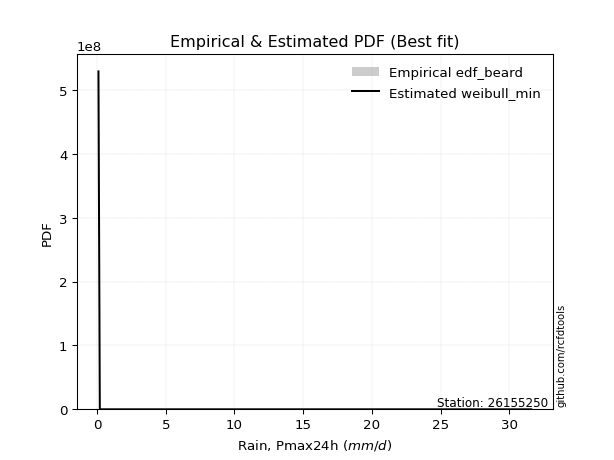</img>

</div>


### 5. Empirical - EDF Chegodayev (1955)

The Chegodayev formula is an empirical plotting position formula used in hydrological frequency analysis to estimate the exceedance probability or return period of a specific event from a set of observed data. It is primarily used for plotting observed data points on probability paper to fit a theoretical distribution, particularly for analyzing extreme events like maximum flood flows or rainfall intensities. The constant _b_ value in the generalized plotting position formula is 0.3.

<div align="center">


$P=(m-b)/(n+1-2b)$


</div>


**5.1. Empirical values**

<div align="center">

|                | 0                   | 1                   | 2                   | 3              | 4                  | 5                  | 6                  |
|:---------------|:--------------------|:--------------------|:--------------------|:---------------|:-------------------|:-------------------|:-------------------|
| date           | 2022                | 2021                | 2016                | 2019           | 2020               | 2018               | 2017               |
| x              | 0.1                 | 0.2                 | 0.7                 | 18.7           | 23.3               | 26.5               | 31.6               |
| m              | 1                   | 2                   | 3                   | 4              | 5                  | 6                  | 7                  |
| empirical_dist | edf_chegodayev      | edf_chegodayev      | edf_chegodayev      | edf_chegodayev | edf_chegodayev     | edf_chegodayev     | edf_chegodayev     |
| empirical      | 0.09459459459459459 | 0.22972972972972971 | 0.36486486486486486 | 0.5            | 0.6351351351351351 | 0.7702702702702703 | 0.9054054054054054 |
| empirical_tr   | 1.1044776119402986  | 1.2982456140350878  | 1.574468085106383   | 2.0            | 2.7407407407407405 | 4.352941176470589  | 10.571428571428568 |

</div>


**5.2. Kolmogorov-Smirnov fit test (sorted by Δ)**


<div align="center">

|                | 0                   | 1                   | 2                   | 3                   | 4                   | 5                   | 6                   | 7                   | 8                   | 9                   | 10                  | 11                  | 12                  | 13                  | 14                  | 15                  | 16                  | 17                  | 18                  | 19                  | 20                  | 21                  | 22                  | 23                  | 24                  | 25                  | 26                  | 27                  | 28                  | 29                  | 30                  | 31                  | 32                  | 33                  | 34                  | 35                  | 36                  | 37                  | 38                  | 39                  | 40                  | 41                  | 42                  | 43                  | 44                  | 45                  | 46                  | 47                  | 48                  | 49                  | 50                  | 51                  | 52                  | 53                  | 54                  | 55                  | 56                  | 57                    | 58                  | 59                  | 60                  | 61                  | 62                  | 63                  | 64                  | 65                  | 66                  | 67                  | 68                  | 69                  | 70                  | 71                  | 72                  | 73                  | 74                  | 75                  | 76                  | 77                  | 78                  | 79                  | 80                  | 81                  | 82                  | 83                  | 84                  | 85                  | 86                  | 87                  | 88                  | 89                  |
|:---------------|:--------------------|:--------------------|:--------------------|:--------------------|:--------------------|:--------------------|:--------------------|:--------------------|:--------------------|:--------------------|:--------------------|:--------------------|:--------------------|:--------------------|:--------------------|:--------------------|:--------------------|:--------------------|:--------------------|:--------------------|:--------------------|:--------------------|:--------------------|:--------------------|:--------------------|:--------------------|:--------------------|:--------------------|:--------------------|:--------------------|:--------------------|:--------------------|:--------------------|:--------------------|:--------------------|:--------------------|:--------------------|:--------------------|:--------------------|:--------------------|:--------------------|:--------------------|:--------------------|:--------------------|:--------------------|:--------------------|:--------------------|:--------------------|:--------------------|:--------------------|:--------------------|:--------------------|:--------------------|:--------------------|:--------------------|:--------------------|:--------------------|:----------------------|:--------------------|:--------------------|:--------------------|:--------------------|:--------------------|:--------------------|:--------------------|:--------------------|:--------------------|:--------------------|:--------------------|:--------------------|:--------------------|:--------------------|:--------------------|:--------------------|:--------------------|:--------------------|:--------------------|:--------------------|:--------------------|:--------------------|:--------------------|:--------------------|:--------------------|:--------------------|:--------------------|:--------------------|:--------------------|:--------------------|:--------------------|:--------------------|
| station        | 26155250            | 26155250            | 26155250            | 26155250            | 26155250            | 26155250            | 26155250            | 26155250            | 26155250            | 26155250            | 26155250            | 26155250            | 26155250            | 26155250            | 26155250            | 26155250            | 26155250            | 26155250            | 26155250            | 26155250            | 26155250            | 26155250            | 26155250            | 26155250            | 26155250            | 26155250            | 26155250            | 26155250            | 26155250            | 26155250            | 26155250            | 26155250            | 26155250            | 26155250            | 26155250            | 26155250            | 26155250            | 26155250            | 26155250            | 26155250            | 26155250            | 26155250            | 26155250            | 26155250            | 26155250            | 26155250            | 26155250            | 26155250            | 26155250            | 26155250            | 26155250            | 26155250            | 26155250            | 26155250            | 26155250            | 26155250            | 26155250            | 26155250              | 26155250            | 26155250            | 26155250            | 26155250            | 26155250            | 26155250            | 26155250            | 26155250            | 26155250            | 26155250            | 26155250            | 26155250            | 26155250            | 26155250            | 26155250            | 26155250            | 26155250            | 26155250            | 26155250            | 26155250            | 26155250            | 26155250            | 26155250            | 26155250            | 26155250            | 26155250            | 26155250            | 26155250            | 26155250            | 26155250            | 26155250            | 26155250            |
| empirical_dist | edf_chegodayev      | edf_chegodayev      | edf_chegodayev      | edf_chegodayev      | edf_chegodayev      | edf_chegodayev      | edf_chegodayev      | edf_chegodayev      | edf_chegodayev      | edf_chegodayev      | edf_chegodayev      | edf_chegodayev      | edf_chegodayev      | edf_chegodayev      | edf_chegodayev      | edf_chegodayev      | edf_chegodayev      | edf_chegodayev      | edf_chegodayev      | edf_chegodayev      | edf_chegodayev      | edf_chegodayev      | edf_chegodayev      | edf_chegodayev      | edf_chegodayev      | edf_chegodayev      | edf_chegodayev      | edf_chegodayev      | edf_chegodayev      | edf_chegodayev      | edf_chegodayev      | edf_chegodayev      | edf_chegodayev      | edf_chegodayev      | edf_chegodayev      | edf_chegodayev      | edf_chegodayev      | edf_chegodayev      | edf_chegodayev      | edf_chegodayev      | edf_chegodayev      | edf_chegodayev      | edf_chegodayev      | edf_chegodayev      | edf_chegodayev      | edf_chegodayev      | edf_chegodayev      | edf_chegodayev      | edf_chegodayev      | edf_chegodayev      | edf_chegodayev      | edf_chegodayev      | edf_chegodayev      | edf_chegodayev      | edf_chegodayev      | edf_chegodayev      | edf_chegodayev      | edf_chegodayev        | edf_chegodayev      | edf_chegodayev      | edf_chegodayev      | edf_chegodayev      | edf_chegodayev      | edf_chegodayev      | edf_chegodayev      | edf_chegodayev      | edf_chegodayev      | edf_chegodayev      | edf_chegodayev      | edf_chegodayev      | edf_chegodayev      | edf_chegodayev      | edf_chegodayev      | edf_chegodayev      | edf_chegodayev      | edf_chegodayev      | edf_chegodayev      | edf_chegodayev      | edf_chegodayev      | edf_chegodayev      | edf_chegodayev      | edf_chegodayev      | edf_chegodayev      | edf_chegodayev      | edf_chegodayev      | edf_chegodayev      | edf_chegodayev      | edf_chegodayev      | edf_chegodayev      | edf_chegodayev      |
| p_dist         | weibull_min         | laplace_asymmetric  | fisk                | johnsonsu           | genlogistic         | pearson3            | erlang              | exponnorm           | crystalball         | norm                | gamma               | maxwell             | rayleigh            | kstwobign           | gumbel_l            | logncf              | logf                | logistic            | ncf                 | halfnorm            | hypsecant           | nakagami            | mielke              | rice                | logweibull_min      | laplace             | logpearson3         | gumbel_r            | loggumbel_l         | loggamma            | loggamma            | lognakagami         | logfatiguelife      | loginvweibull       | lognct              | logt                | logexponnorm        | logcrystalball      | lognorm             | lognorm             | loglognorm          | logerlang           | logrice             | loggompertz         | loginvgauss         | loginvgamma         | logexpon            | logalpha            | logmaxwell          | lograyleigh         | loggenexpon         | logtruncnorm        | logfisk             | logkstwobign        | loghalfnorm         | moyal               | loglogistic         | loglaplace_asymmetric | logloggamma         | fatiguelife         | pareto              | loggumbel_r         | loghypsecant        | halflogistic        | loghalflogistic     | logmoyal            | alpha               | loglaplace          | expon               | betaprime           | genexpon            | f                   | truncnorm           | gompertz            | logwald             | gibrat              | wald                | logpareto           | loggibrat           | t                   | invgauss            | logchi2             | chi2                | invweibull          | logjohnsonsu        | logbetaprime        | logmielke           | invgamma            | nct                 | loggenlogistic      |
| delta          | 0.16367968706166958 | 0.2065370273968982  | 0.20805333746997257 | 0.21454151141935457 | 0.2232341090399808  | 0.22443655297790627 | 0.22474144445625804 | 0.224761751003161   | 0.22476181193593753 | 0.22476181440499649 | 0.2250667834860959  | 0.22520931814462555 | 0.22644944372887654 | 0.2282474863710858  | 0.2337442802803477  | 0.23535418876017655 | 0.23554857771962745 | 0.24125088103381315 | 0.24271228464243755 | 0.24804741204513966 | 0.24940886356055875 | 0.2501566653157865  | 0.2512903566600112  | 0.25301144127888053 | 0.2547042679492114  | 0.25628777396281976 | 0.25673013066121686 | 0.258710927194917   | 0.2594842019819745  | 0.2651543009302373  | 0.2651543009302373  | 0.26543444916289927 | 0.265547381205016   | 0.265875741846857   | 0.26601999371416063 | 0.26613644902438716 | 0.2661367081591991  | 0.26613674973164436 | 0.26613675026022876 | 0.26613675026022876 | 0.26759837487807303 | 0.26809731184394847 | 0.26979972256978035 | 0.2715866063170159  | 0.2726658216701171  | 0.2728140758318842  | 0.27352150377793394 | 0.27358795856377915 | 0.273595840925826   | 0.2757131946089293  | 0.27663502440336185 | 0.2780142429548861  | 0.27850329576124544 | 0.2805551555617849  | 0.2834046176028744  | 0.28613552539975123 | 0.28870723965173095 | 0.29094636914235583   | 0.29098482769185785 | 0.2932526431946444  | 0.2964190516643483  | 0.30153751058276557 | 0.30306814343084154 | 0.30331685770726263 | 0.3068182185774073  | 0.3130375572047337  | 0.32020430867272953 | 0.32095627724471143 | 0.3238951071918789  | 0.32696717019874244 | 0.3278383043414691  | 0.33202996026994314 | 0.33418893740531636 | 0.334740207813402   | 0.35012567630638236 | 0.36486486486486486 | 0.36486486486486486 | 0.36604071993327203 | 0.3787599534468622  | 0.3837092458722936  | 0.3873826081687335  | 0.460510141932325   | 0.4986445621590162  | 0.5025288452822485  | 0.5234006453816056  | 0.5356405653686721  | 0.5556066045508907  | 0.7301373042748879  | 0.7485943076129743  | 0.7702702702702703  |
| deltao         | 0.48442053926100004 | 0.48442053926100004 | 0.48442053926100004 | 0.48442053926100004 | 0.48442053926100004 | 0.48442053926100004 | 0.48442053926100004 | 0.48442053926100004 | 0.48442053926100004 | 0.48442053926100004 | 0.48442053926100004 | 0.48442053926100004 | 0.48442053926100004 | 0.48442053926100004 | 0.48442053926100004 | 0.48442053926100004 | 0.48442053926100004 | 0.48442053926100004 | 0.48442053926100004 | 0.48442053926100004 | 0.48442053926100004 | 0.48442053926100004 | 0.48442053926100004 | 0.48442053926100004 | 0.48442053926100004 | 0.48442053926100004 | 0.48442053926100004 | 0.48442053926100004 | 0.48442053926100004 | 0.48442053926100004 | 0.48442053926100004 | 0.48442053926100004 | 0.48442053926100004 | 0.48442053926100004 | 0.48442053926100004 | 0.48442053926100004 | 0.48442053926100004 | 0.48442053926100004 | 0.48442053926100004 | 0.48442053926100004 | 0.48442053926100004 | 0.48442053926100004 | 0.48442053926100004 | 0.48442053926100004 | 0.48442053926100004 | 0.48442053926100004 | 0.48442053926100004 | 0.48442053926100004 | 0.48442053926100004 | 0.48442053926100004 | 0.48442053926100004 | 0.48442053926100004 | 0.48442053926100004 | 0.48442053926100004 | 0.48442053926100004 | 0.48442053926100004 | 0.48442053926100004 | 0.48442053926100004   | 0.48442053926100004 | 0.48442053926100004 | 0.48442053926100004 | 0.48442053926100004 | 0.48442053926100004 | 0.48442053926100004 | 0.48442053926100004 | 0.48442053926100004 | 0.48442053926100004 | 0.48442053926100004 | 0.48442053926100004 | 0.48442053926100004 | 0.48442053926100004 | 0.48442053926100004 | 0.48442053926100004 | 0.48442053926100004 | 0.48442053926100004 | 0.48442053926100004 | 0.48442053926100004 | 0.48442053926100004 | 0.48442053926100004 | 0.48442053926100004 | 0.48442053926100004 | 0.48442053926100004 | 0.48442053926100004 | 0.48442053926100004 | 0.48442053926100004 | 0.48442053926100004 | 0.48442053926100004 | 0.48442053926100004 | 0.48442053926100004 | 0.48442053926100004 |
| eval           | Δo > Δ              | Δo > Δ              | Δo > Δ              | Δo > Δ              | Δo > Δ              | Δo > Δ              | Δo > Δ              | Δo > Δ              | Δo > Δ              | Δo > Δ              | Δo > Δ              | Δo > Δ              | Δo > Δ              | Δo > Δ              | Δo > Δ              | Δo > Δ              | Δo > Δ              | Δo > Δ              | Δo > Δ              | Δo > Δ              | Δo > Δ              | Δo > Δ              | Δo > Δ              | Δo > Δ              | Δo > Δ              | Δo > Δ              | Δo > Δ              | Δo > Δ              | Δo > Δ              | Δo > Δ              | Δo > Δ              | Δo > Δ              | Δo > Δ              | Δo > Δ              | Δo > Δ              | Δo > Δ              | Δo > Δ              | Δo > Δ              | Δo > Δ              | Δo > Δ              | Δo > Δ              | Δo > Δ              | Δo > Δ              | Δo > Δ              | Δo > Δ              | Δo > Δ              | Δo > Δ              | Δo > Δ              | Δo > Δ              | Δo > Δ              | Δo > Δ              | Δo > Δ              | Δo > Δ              | Δo > Δ              | Δo > Δ              | Δo > Δ              | Δo > Δ              | Δo > Δ                | Δo > Δ              | Δo > Δ              | Δo > Δ              | Δo > Δ              | Δo > Δ              | Δo > Δ              | Δo > Δ              | Δo > Δ              | Δo > Δ              | Δo > Δ              | Δo > Δ              | Δo > Δ              | Δo > Δ              | Δo > Δ              | Δo > Δ              | Δo > Δ              | Δo > Δ              | Δo > Δ              | Δo > Δ              | Δo > Δ              | Δo > Δ              | Δo > Δ              | Δo > Δ              | Δo > Δ              | Δo <= Δ             | Δo <= Δ             | Δo <= Δ             | Δo <= Δ             | Δo <= Δ             | Δo <= Δ             | Δo <= Δ             | Δo <= Δ             |
| fit            | 1                   | 1                   | 1                   | 1                   | 1                   | 1                   | 1                   | 1                   | 1                   | 1                   | 1                   | 1                   | 1                   | 1                   | 1                   | 1                   | 1                   | 1                   | 1                   | 1                   | 1                   | 1                   | 1                   | 1                   | 1                   | 1                   | 1                   | 1                   | 1                   | 1                   | 1                   | 1                   | 1                   | 1                   | 1                   | 1                   | 1                   | 1                   | 1                   | 1                   | 1                   | 1                   | 1                   | 1                   | 1                   | 1                   | 1                   | 1                   | 1                   | 1                   | 1                   | 1                   | 1                   | 1                   | 1                   | 1                   | 1                   | 1                     | 1                   | 1                   | 1                   | 1                   | 1                   | 1                   | 1                   | 1                   | 1                   | 1                   | 1                   | 1                   | 1                   | 1                   | 1                   | 1                   | 1                   | 1                   | 1                   | 1                   | 1                   | 1                   | 1                   | 1                   | 0                   | 0                   | 0                   | 0                   | 0                   | 0                   | 0                   | 0                   |
| n              | 7                   | 7                   | 7                   | 7                   | 7                   | 7                   | 7                   | 7                   | 7                   | 7                   | 7                   | 7                   | 7                   | 7                   | 7                   | 7                   | 7                   | 7                   | 7                   | 7                   | 7                   | 7                   | 7                   | 7                   | 7                   | 7                   | 7                   | 7                   | 7                   | 7                   | 7                   | 7                   | 7                   | 7                   | 7                   | 7                   | 7                   | 7                   | 7                   | 7                   | 7                   | 7                   | 7                   | 7                   | 7                   | 7                   | 7                   | 7                   | 7                   | 7                   | 7                   | 7                   | 7                   | 7                   | 7                   | 7                   | 7                   | 7                     | 7                   | 7                   | 7                   | 7                   | 7                   | 7                   | 7                   | 7                   | 7                   | 7                   | 7                   | 7                   | 7                   | 7                   | 7                   | 7                   | 7                   | 7                   | 7                   | 7                   | 7                   | 7                   | 7                   | 7                   | 7                   | 7                   | 7                   | 7                   | 7                   | 7                   | 7                   | 7                   |
| best_fit       | 1                   | 0                   | 0                   | 0                   | 0                   | 0                   | 0                   | 0                   | 0                   | 0                   | 0                   | 0                   | 0                   | 0                   | 0                   | 0                   | 0                   | 0                   | 0                   | 0                   | 0                   | 0                   | 0                   | 0                   | 0                   | 0                   | 0                   | 0                   | 0                   | 0                   | 0                   | 0                   | 0                   | 0                   | 0                   | 0                   | 0                   | 0                   | 0                   | 0                   | 0                   | 0                   | 0                   | 0                   | 0                   | 0                   | 0                   | 0                   | 0                   | 0                   | 0                   | 0                   | 0                   | 0                   | 0                   | 0                   | 0                   | 0                     | 0                   | 0                   | 0                   | 0                   | 0                   | 0                   | 0                   | 0                   | 0                   | 0                   | 0                   | 0                   | 0                   | 0                   | 0                   | 0                   | 0                   | 0                   | 0                   | 0                   | 0                   | 0                   | 0                   | 0                   | 0                   | 0                   | 0                   | 0                   | 0                   | 0                   | 0                   | 0                   |
| best_fit_sort  | 1                   | 2                   | 3                   | 4                   | 5                   | 6                   | 7                   | 8                   | 9                   | 10                  | 11                  | 12                  | 13                  | 14                  | 15                  | 16                  | 17                  | 18                  | 19                  | 20                  | 21                  | 22                  | 23                  | 24                  | 25                  | 26                  | 27                  | 28                  | 29                  | 30                  | 31                  | 32                  | 33                  | 34                  | 35                  | 36                  | 37                  | 38                  | 39                  | 40                  | 41                  | 42                  | 43                  | 44                  | 45                  | 46                  | 47                  | 48                  | 49                  | 50                  | 51                  | 52                  | 53                  | 54                  | 55                  | 56                  | 57                  | 58                    | 59                  | 60                  | 61                  | 62                  | 63                  | 64                  | 65                  | 66                  | 67                  | 68                  | 69                  | 70                  | 71                  | 72                  | 73                  | 74                  | 75                  | 76                  | 77                  | 78                  | 79                  | 80                  | 81                  | 82                  | 83                  | 84                  | 85                  | 86                  | 87                  | 88                  | 89                  | 90                  |

</div>


<div align="center">

</img>

</div>


**5.3. Best fit**

<div align="center">

|   id |   station | empirical_dist   | p_dist      |   delta |   deltao | eval   |   fit |   n |   best_fit |   best_fit_sort |
|-----:|----------:|:-----------------|:------------|--------:|---------:|:-------|------:|----:|-----------:|----------------:|
|    0 |  26155250 | edf_chegodayev   | weibull_min | 0.16368 | 0.484421 | Δo > Δ |     1 |   7 |          1 |               1 |

</div>


<div align="center">

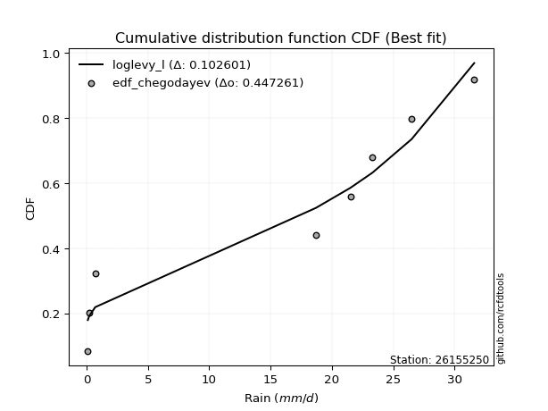</img>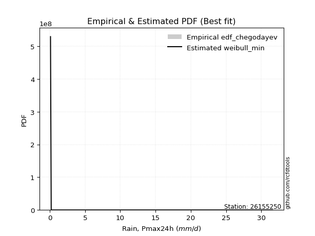</img>

</div>


### 6. Empirical - EDF Blom (1958)

The Blom formula is a specific "plotting position" formula used in hydrology and statistical analysis to estimate the empirical cumulative probability (or non-exceedance probability) of a data series. It is particularly recommended for data that are approximately normally distributed. The constant _a_ is set to 0.375 (or 3/8).

<div align="center">


$P=(m-a)/(n+1-2a)$


</div>


**6.1. Empirical values**

<div align="center">

|                | 0                   | 1                   | 2                  | 3        | 4                  | 5                  | 6                  |
|:---------------|:--------------------|:--------------------|:-------------------|:---------|:-------------------|:-------------------|:-------------------|
| date           | 2022                | 2021                | 2016               | 2019     | 2020               | 2018               | 2017               |
| x              | 0.1                 | 0.2                 | 0.7                | 18.7     | 23.3               | 26.5               | 31.6               |
| m              | 1                   | 2                   | 3                  | 4        | 5                  | 6                  | 7                  |
| empirical_dist | edf_blom            | edf_blom            | edf_blom           | edf_blom | edf_blom           | edf_blom           | edf_blom           |
| empirical      | 0.08620689655172414 | 0.22413793103448276 | 0.3620689655172414 | 0.5      | 0.6379310344827587 | 0.7758620689655172 | 0.9137931034482759 |
| empirical_tr   | 1.0943396226415094  | 1.288888888888889   | 1.5675675675675675 | 2.0      | 2.7619047619047623 | 4.461538461538462  | 11.600000000000007 |

</div>


**6.2. Kolmogorov-Smirnov fit test (sorted by Δ)**


<div align="center">

|                | 0                   | 1                   | 2                   | 3                   | 4                   | 5                   | 6                   | 7                   | 8                   | 9                   | 10                  | 11                  | 12                  | 13                  | 14                  | 15                  | 16                  | 17                  | 18                  | 19                  | 20                  | 21                  | 22                  | 23                  | 24                  | 25                  | 26                  | 27                  | 28                  | 29                  | 30                  | 31                  | 32                  | 33                  | 34                  | 35                  | 36                  | 37                  | 38                  | 39                  | 40                  | 41                  | 42                  | 43                  | 44                  | 45                  | 46                  | 47                  | 48                  | 49                  | 50                  | 51                  | 52                  | 53                  | 54                  | 55                  | 56                  | 57                    | 58                  | 59                  | 60                  | 61                  | 62                  | 63                  | 64                  | 65                  | 66                  | 67                  | 68                  | 69                  | 70                  | 71                  | 72                  | 73                  | 74                  | 75                  | 76                  | 77                  | 78                  | 79                  | 80                  | 81                  | 82                  | 83                  | 84                  | 85                  | 86                  | 87                  | 88                  | 89                  |
|:---------------|:--------------------|:--------------------|:--------------------|:--------------------|:--------------------|:--------------------|:--------------------|:--------------------|:--------------------|:--------------------|:--------------------|:--------------------|:--------------------|:--------------------|:--------------------|:--------------------|:--------------------|:--------------------|:--------------------|:--------------------|:--------------------|:--------------------|:--------------------|:--------------------|:--------------------|:--------------------|:--------------------|:--------------------|:--------------------|:--------------------|:--------------------|:--------------------|:--------------------|:--------------------|:--------------------|:--------------------|:--------------------|:--------------------|:--------------------|:--------------------|:--------------------|:--------------------|:--------------------|:--------------------|:--------------------|:--------------------|:--------------------|:--------------------|:--------------------|:--------------------|:--------------------|:--------------------|:--------------------|:--------------------|:--------------------|:--------------------|:--------------------|:----------------------|:--------------------|:--------------------|:--------------------|:--------------------|:--------------------|:--------------------|:--------------------|:--------------------|:--------------------|:--------------------|:--------------------|:--------------------|:--------------------|:--------------------|:--------------------|:--------------------|:--------------------|:--------------------|:--------------------|:--------------------|:--------------------|:--------------------|:--------------------|:--------------------|:--------------------|:--------------------|:--------------------|:--------------------|:--------------------|:--------------------|:--------------------|:--------------------|
| station        | 26155250            | 26155250            | 26155250            | 26155250            | 26155250            | 26155250            | 26155250            | 26155250            | 26155250            | 26155250            | 26155250            | 26155250            | 26155250            | 26155250            | 26155250            | 26155250            | 26155250            | 26155250            | 26155250            | 26155250            | 26155250            | 26155250            | 26155250            | 26155250            | 26155250            | 26155250            | 26155250            | 26155250            | 26155250            | 26155250            | 26155250            | 26155250            | 26155250            | 26155250            | 26155250            | 26155250            | 26155250            | 26155250            | 26155250            | 26155250            | 26155250            | 26155250            | 26155250            | 26155250            | 26155250            | 26155250            | 26155250            | 26155250            | 26155250            | 26155250            | 26155250            | 26155250            | 26155250            | 26155250            | 26155250            | 26155250            | 26155250            | 26155250              | 26155250            | 26155250            | 26155250            | 26155250            | 26155250            | 26155250            | 26155250            | 26155250            | 26155250            | 26155250            | 26155250            | 26155250            | 26155250            | 26155250            | 26155250            | 26155250            | 26155250            | 26155250            | 26155250            | 26155250            | 26155250            | 26155250            | 26155250            | 26155250            | 26155250            | 26155250            | 26155250            | 26155250            | 26155250            | 26155250            | 26155250            | 26155250            |
| empirical_dist | edf_blom            | edf_blom            | edf_blom            | edf_blom            | edf_blom            | edf_blom            | edf_blom            | edf_blom            | edf_blom            | edf_blom            | edf_blom            | edf_blom            | edf_blom            | edf_blom            | edf_blom            | edf_blom            | edf_blom            | edf_blom            | edf_blom            | edf_blom            | edf_blom            | edf_blom            | edf_blom            | edf_blom            | edf_blom            | edf_blom            | edf_blom            | edf_blom            | edf_blom            | edf_blom            | edf_blom            | edf_blom            | edf_blom            | edf_blom            | edf_blom            | edf_blom            | edf_blom            | edf_blom            | edf_blom            | edf_blom            | edf_blom            | edf_blom            | edf_blom            | edf_blom            | edf_blom            | edf_blom            | edf_blom            | edf_blom            | edf_blom            | edf_blom            | edf_blom            | edf_blom            | edf_blom            | edf_blom            | edf_blom            | edf_blom            | edf_blom            | edf_blom              | edf_blom            | edf_blom            | edf_blom            | edf_blom            | edf_blom            | edf_blom            | edf_blom            | edf_blom            | edf_blom            | edf_blom            | edf_blom            | edf_blom            | edf_blom            | edf_blom            | edf_blom            | edf_blom            | edf_blom            | edf_blom            | edf_blom            | edf_blom            | edf_blom            | edf_blom            | edf_blom            | edf_blom            | edf_blom            | edf_blom            | edf_blom            | edf_blom            | edf_blom            | edf_blom            | edf_blom            | edf_blom            |
| p_dist         | weibull_min         | laplace_asymmetric  | fisk                | johnsonsu           | genlogistic         | pearson3            | erlang              | exponnorm           | crystalball         | norm                | gamma               | maxwell             | rayleigh            | kstwobign           | gumbel_l            | logf                | logistic            | ncf                 | logncf              | halfnorm            | hypsecant           | nakagami            | rice                | mielke              | laplace             | logweibull_min      | gumbel_r            | logpearson3         | loggumbel_l         | loggamma            | loggamma            | lognakagami         | logfatiguelife      | loginvweibull       | lognct              | logt                | logexponnorm        | logcrystalball      | lognorm             | lognorm             | loglognorm          | logerlang           | logrice             | loggompertz         | loginvgauss         | loginvgamma         | logexpon            | logalpha            | logmaxwell          | lograyleigh         | loggenexpon         | logtruncnorm        | logkstwobign        | moyal               | loghalfnorm         | logfisk             | loglogistic         | loglaplace_asymmetric | logloggamma         | pareto              | fatiguelife         | halflogistic        | loggumbel_r         | loghypsecant        | loghalflogistic     | logmoyal            | alpha               | loglaplace          | expon               | genexpon            | betaprime           | truncnorm           | gompertz            | f                   | logwald             | gibrat              | wald                | logpareto           | loggibrat           | t                   | invgauss            | logchi2             | chi2                | invweibull          | logjohnsonsu        | logbetaprime        | logmielke           | invgamma            | nct                 | loggenlogistic      |
| delta          | 0.17206738510454012 | 0.20374112804927472 | 0.20805333746997257 | 0.2117456120717311  | 0.22043820969235733 | 0.2216406536302828  | 0.22194554510863457 | 0.22196585165553753 | 0.22196591258831405 | 0.221965915057373   | 0.22227088413847243 | 0.22241341879700208 | 0.22365354438125307 | 0.22545158702346232 | 0.2309483809327242  | 0.23554857771962745 | 0.23845498168618967 | 0.2422085501442074  | 0.2437418868030471  | 0.2452515126975162  | 0.24661296421293527 | 0.2501566653157865  | 0.25021554193125706 | 0.2512903566600112  | 0.2534918746151963  | 0.2547042679492114  | 0.25591502784729353 | 0.25673013066121686 | 0.2594842019819745  | 0.2651543009302373  | 0.2651543009302373  | 0.26543444916289927 | 0.265547381205016   | 0.265875741846857   | 0.26601999371416063 | 0.26613644902438716 | 0.2661367081591991  | 0.26613674973164436 | 0.26613675026022876 | 0.26613675026022876 | 0.26759837487807303 | 0.26809731184394847 | 0.26979972256978035 | 0.2715866063170159  | 0.2726658216701171  | 0.2728140758318842  | 0.27352150377793394 | 0.27358795856377915 | 0.273595840925826   | 0.2757131946089293  | 0.27663502440336185 | 0.2780142429548861  | 0.2805551555617849  | 0.28333962605212776 | 0.2834046176028744  | 0.286890993804116   | 0.28870723965173095 | 0.29094636914235583   | 0.29098482769185785 | 0.2936231523167248  | 0.29884444188989134 | 0.30052095835963916 | 0.30153751058276557 | 0.30306814343084154 | 0.3068182185774073  | 0.3130375572047337  | 0.32020430867272953 | 0.32095627724471143 | 0.32109920784425544 | 0.3250424049938456  | 0.32696717019874244 | 0.3313930380576929  | 0.33194430846577855 | 0.33202996026994314 | 0.35012567630638236 | 0.3620689655172414  | 0.3620689655172414  | 0.371632518628519   | 0.3787599534468622  | 0.3837092458722936  | 0.3873826081687335  | 0.460510141932325   | 0.4986445621590162  | 0.510916543325119   | 0.5289924440768525  | 0.5412323640639191  | 0.5611984032461377  | 0.7357291029701348  | 0.7541861063082212  | 0.7758620689655172  |
| deltao         | 0.48442053926100004 | 0.48442053926100004 | 0.48442053926100004 | 0.48442053926100004 | 0.48442053926100004 | 0.48442053926100004 | 0.48442053926100004 | 0.48442053926100004 | 0.48442053926100004 | 0.48442053926100004 | 0.48442053926100004 | 0.48442053926100004 | 0.48442053926100004 | 0.48442053926100004 | 0.48442053926100004 | 0.48442053926100004 | 0.48442053926100004 | 0.48442053926100004 | 0.48442053926100004 | 0.48442053926100004 | 0.48442053926100004 | 0.48442053926100004 | 0.48442053926100004 | 0.48442053926100004 | 0.48442053926100004 | 0.48442053926100004 | 0.48442053926100004 | 0.48442053926100004 | 0.48442053926100004 | 0.48442053926100004 | 0.48442053926100004 | 0.48442053926100004 | 0.48442053926100004 | 0.48442053926100004 | 0.48442053926100004 | 0.48442053926100004 | 0.48442053926100004 | 0.48442053926100004 | 0.48442053926100004 | 0.48442053926100004 | 0.48442053926100004 | 0.48442053926100004 | 0.48442053926100004 | 0.48442053926100004 | 0.48442053926100004 | 0.48442053926100004 | 0.48442053926100004 | 0.48442053926100004 | 0.48442053926100004 | 0.48442053926100004 | 0.48442053926100004 | 0.48442053926100004 | 0.48442053926100004 | 0.48442053926100004 | 0.48442053926100004 | 0.48442053926100004 | 0.48442053926100004 | 0.48442053926100004   | 0.48442053926100004 | 0.48442053926100004 | 0.48442053926100004 | 0.48442053926100004 | 0.48442053926100004 | 0.48442053926100004 | 0.48442053926100004 | 0.48442053926100004 | 0.48442053926100004 | 0.48442053926100004 | 0.48442053926100004 | 0.48442053926100004 | 0.48442053926100004 | 0.48442053926100004 | 0.48442053926100004 | 0.48442053926100004 | 0.48442053926100004 | 0.48442053926100004 | 0.48442053926100004 | 0.48442053926100004 | 0.48442053926100004 | 0.48442053926100004 | 0.48442053926100004 | 0.48442053926100004 | 0.48442053926100004 | 0.48442053926100004 | 0.48442053926100004 | 0.48442053926100004 | 0.48442053926100004 | 0.48442053926100004 | 0.48442053926100004 | 0.48442053926100004 |
| eval           | Δo > Δ              | Δo > Δ              | Δo > Δ              | Δo > Δ              | Δo > Δ              | Δo > Δ              | Δo > Δ              | Δo > Δ              | Δo > Δ              | Δo > Δ              | Δo > Δ              | Δo > Δ              | Δo > Δ              | Δo > Δ              | Δo > Δ              | Δo > Δ              | Δo > Δ              | Δo > Δ              | Δo > Δ              | Δo > Δ              | Δo > Δ              | Δo > Δ              | Δo > Δ              | Δo > Δ              | Δo > Δ              | Δo > Δ              | Δo > Δ              | Δo > Δ              | Δo > Δ              | Δo > Δ              | Δo > Δ              | Δo > Δ              | Δo > Δ              | Δo > Δ              | Δo > Δ              | Δo > Δ              | Δo > Δ              | Δo > Δ              | Δo > Δ              | Δo > Δ              | Δo > Δ              | Δo > Δ              | Δo > Δ              | Δo > Δ              | Δo > Δ              | Δo > Δ              | Δo > Δ              | Δo > Δ              | Δo > Δ              | Δo > Δ              | Δo > Δ              | Δo > Δ              | Δo > Δ              | Δo > Δ              | Δo > Δ              | Δo > Δ              | Δo > Δ              | Δo > Δ                | Δo > Δ              | Δo > Δ              | Δo > Δ              | Δo > Δ              | Δo > Δ              | Δo > Δ              | Δo > Δ              | Δo > Δ              | Δo > Δ              | Δo > Δ              | Δo > Δ              | Δo > Δ              | Δo > Δ              | Δo > Δ              | Δo > Δ              | Δo > Δ              | Δo > Δ              | Δo > Δ              | Δo > Δ              | Δo > Δ              | Δo > Δ              | Δo > Δ              | Δo > Δ              | Δo > Δ              | Δo <= Δ             | Δo <= Δ             | Δo <= Δ             | Δo <= Δ             | Δo <= Δ             | Δo <= Δ             | Δo <= Δ             | Δo <= Δ             |
| fit            | 1                   | 1                   | 1                   | 1                   | 1                   | 1                   | 1                   | 1                   | 1                   | 1                   | 1                   | 1                   | 1                   | 1                   | 1                   | 1                   | 1                   | 1                   | 1                   | 1                   | 1                   | 1                   | 1                   | 1                   | 1                   | 1                   | 1                   | 1                   | 1                   | 1                   | 1                   | 1                   | 1                   | 1                   | 1                   | 1                   | 1                   | 1                   | 1                   | 1                   | 1                   | 1                   | 1                   | 1                   | 1                   | 1                   | 1                   | 1                   | 1                   | 1                   | 1                   | 1                   | 1                   | 1                   | 1                   | 1                   | 1                   | 1                     | 1                   | 1                   | 1                   | 1                   | 1                   | 1                   | 1                   | 1                   | 1                   | 1                   | 1                   | 1                   | 1                   | 1                   | 1                   | 1                   | 1                   | 1                   | 1                   | 1                   | 1                   | 1                   | 1                   | 1                   | 0                   | 0                   | 0                   | 0                   | 0                   | 0                   | 0                   | 0                   |
| n              | 7                   | 7                   | 7                   | 7                   | 7                   | 7                   | 7                   | 7                   | 7                   | 7                   | 7                   | 7                   | 7                   | 7                   | 7                   | 7                   | 7                   | 7                   | 7                   | 7                   | 7                   | 7                   | 7                   | 7                   | 7                   | 7                   | 7                   | 7                   | 7                   | 7                   | 7                   | 7                   | 7                   | 7                   | 7                   | 7                   | 7                   | 7                   | 7                   | 7                   | 7                   | 7                   | 7                   | 7                   | 7                   | 7                   | 7                   | 7                   | 7                   | 7                   | 7                   | 7                   | 7                   | 7                   | 7                   | 7                   | 7                   | 7                     | 7                   | 7                   | 7                   | 7                   | 7                   | 7                   | 7                   | 7                   | 7                   | 7                   | 7                   | 7                   | 7                   | 7                   | 7                   | 7                   | 7                   | 7                   | 7                   | 7                   | 7                   | 7                   | 7                   | 7                   | 7                   | 7                   | 7                   | 7                   | 7                   | 7                   | 7                   | 7                   |
| best_fit       | 1                   | 0                   | 0                   | 0                   | 0                   | 0                   | 0                   | 0                   | 0                   | 0                   | 0                   | 0                   | 0                   | 0                   | 0                   | 0                   | 0                   | 0                   | 0                   | 0                   | 0                   | 0                   | 0                   | 0                   | 0                   | 0                   | 0                   | 0                   | 0                   | 0                   | 0                   | 0                   | 0                   | 0                   | 0                   | 0                   | 0                   | 0                   | 0                   | 0                   | 0                   | 0                   | 0                   | 0                   | 0                   | 0                   | 0                   | 0                   | 0                   | 0                   | 0                   | 0                   | 0                   | 0                   | 0                   | 0                   | 0                   | 0                     | 0                   | 0                   | 0                   | 0                   | 0                   | 0                   | 0                   | 0                   | 0                   | 0                   | 0                   | 0                   | 0                   | 0                   | 0                   | 0                   | 0                   | 0                   | 0                   | 0                   | 0                   | 0                   | 0                   | 0                   | 0                   | 0                   | 0                   | 0                   | 0                   | 0                   | 0                   | 0                   |
| best_fit_sort  | 1                   | 2                   | 3                   | 4                   | 5                   | 6                   | 7                   | 8                   | 9                   | 10                  | 11                  | 12                  | 13                  | 14                  | 15                  | 16                  | 17                  | 18                  | 19                  | 20                  | 21                  | 22                  | 23                  | 24                  | 25                  | 26                  | 27                  | 28                  | 29                  | 30                  | 31                  | 32                  | 33                  | 34                  | 35                  | 36                  | 37                  | 38                  | 39                  | 40                  | 41                  | 42                  | 43                  | 44                  | 45                  | 46                  | 47                  | 48                  | 49                  | 50                  | 51                  | 52                  | 53                  | 54                  | 55                  | 56                  | 57                  | 58                    | 59                  | 60                  | 61                  | 62                  | 63                  | 64                  | 65                  | 66                  | 67                  | 68                  | 69                  | 70                  | 71                  | 72                  | 73                  | 74                  | 75                  | 76                  | 77                  | 78                  | 79                  | 80                  | 81                  | 82                  | 83                  | 84                  | 85                  | 86                  | 87                  | 88                  | 89                  | 90                  |

</div>


<div align="center">

</img>

</div>


**6.3. Best fit**

<div align="center">

|   id |   station | empirical_dist   | p_dist      |    delta |   deltao | eval   |   fit |   n |   best_fit |   best_fit_sort |
|-----:|----------:|:-----------------|:------------|---------:|---------:|:-------|------:|----:|-----------:|----------------:|
|    0 |  26155250 | edf_blom         | weibull_min | 0.172067 | 0.484421 | Δo > Δ |     1 |   7 |          1 |               1 |

</div>


<div align="center">

</img></img>

</div>


### 7. Empirical - EDF Tukey (1962)

In hydrology, the Tukey formula is used as a plotting position formula to estimate the empirical probability or frequency of a flood event (or other hydrological data). The formula parameter is given as _c=0.333_ (or 1/3).

<div align="center">


$P=(m-c)/(n+1-2c)$


</div>


**7.1. Empirical values**

<div align="center">

|                | 0                   | 1                   | 2                   | 3         | 4                  | 5                  | 6                  |
|:---------------|:--------------------|:--------------------|:--------------------|:----------|:-------------------|:-------------------|:-------------------|
| date           | 2022                | 2021                | 2016                | 2019      | 2020               | 2018               | 2017               |
| x              | 0.1                 | 0.2                 | 0.7                 | 18.7      | 23.3               | 26.5               | 31.6               |
| m              | 1                   | 2                   | 3                   | 4         | 5                  | 6                  | 7                  |
| empirical_dist | edf_tukey           | edf_tukey           | edf_tukey           | edf_tukey | edf_tukey          | edf_tukey          | edf_tukey          |
| empirical      | 0.09090909090909091 | 0.22727272727272727 | 0.36363636363636365 | 0.5       | 0.6363636363636364 | 0.7727272727272727 | 0.9090909090909091 |
| empirical_tr   | 1.1                 | 1.2941176470588236  | 1.5714285714285714  | 2.0       | 2.75               | 4.3999999999999995 | 10.999999999999996 |

</div>


**7.2. Kolmogorov-Smirnov fit test (sorted by Δ)**


<div align="center">

|                | 0                   | 1                   | 2                   | 3                   | 4                   | 5                   | 6                   | 7                   | 8                   | 9                   | 10                  | 11                  | 12                  | 13                  | 14                  | 15                  | 16                  | 17                  | 18                  | 19                  | 20                  | 21                  | 22                  | 23                  | 24                  | 25                  | 26                  | 27                  | 28                  | 29                  | 30                  | 31                  | 32                  | 33                  | 34                  | 35                  | 36                  | 37                  | 38                  | 39                  | 40                  | 41                  | 42                  | 43                  | 44                  | 45                  | 46                  | 47                  | 48                  | 49                  | 50                  | 51                  | 52                  | 53                  | 54                  | 55                  | 56                  | 57                    | 58                  | 59                  | 60                  | 61                  | 62                  | 63                  | 64                  | 65                  | 66                  | 67                  | 68                  | 69                  | 70                  | 71                  | 72                  | 73                  | 74                  | 75                  | 76                  | 77                  | 78                  | 79                  | 80                  | 81                  | 82                  | 83                  | 84                  | 85                  | 86                  | 87                  | 88                  | 89                  |
|:---------------|:--------------------|:--------------------|:--------------------|:--------------------|:--------------------|:--------------------|:--------------------|:--------------------|:--------------------|:--------------------|:--------------------|:--------------------|:--------------------|:--------------------|:--------------------|:--------------------|:--------------------|:--------------------|:--------------------|:--------------------|:--------------------|:--------------------|:--------------------|:--------------------|:--------------------|:--------------------|:--------------------|:--------------------|:--------------------|:--------------------|:--------------------|:--------------------|:--------------------|:--------------------|:--------------------|:--------------------|:--------------------|:--------------------|:--------------------|:--------------------|:--------------------|:--------------------|:--------------------|:--------------------|:--------------------|:--------------------|:--------------------|:--------------------|:--------------------|:--------------------|:--------------------|:--------------------|:--------------------|:--------------------|:--------------------|:--------------------|:--------------------|:----------------------|:--------------------|:--------------------|:--------------------|:--------------------|:--------------------|:--------------------|:--------------------|:--------------------|:--------------------|:--------------------|:--------------------|:--------------------|:--------------------|:--------------------|:--------------------|:--------------------|:--------------------|:--------------------|:--------------------|:--------------------|:--------------------|:--------------------|:--------------------|:--------------------|:--------------------|:--------------------|:--------------------|:--------------------|:--------------------|:--------------------|:--------------------|:--------------------|
| station        | 26155250            | 26155250            | 26155250            | 26155250            | 26155250            | 26155250            | 26155250            | 26155250            | 26155250            | 26155250            | 26155250            | 26155250            | 26155250            | 26155250            | 26155250            | 26155250            | 26155250            | 26155250            | 26155250            | 26155250            | 26155250            | 26155250            | 26155250            | 26155250            | 26155250            | 26155250            | 26155250            | 26155250            | 26155250            | 26155250            | 26155250            | 26155250            | 26155250            | 26155250            | 26155250            | 26155250            | 26155250            | 26155250            | 26155250            | 26155250            | 26155250            | 26155250            | 26155250            | 26155250            | 26155250            | 26155250            | 26155250            | 26155250            | 26155250            | 26155250            | 26155250            | 26155250            | 26155250            | 26155250            | 26155250            | 26155250            | 26155250            | 26155250              | 26155250            | 26155250            | 26155250            | 26155250            | 26155250            | 26155250            | 26155250            | 26155250            | 26155250            | 26155250            | 26155250            | 26155250            | 26155250            | 26155250            | 26155250            | 26155250            | 26155250            | 26155250            | 26155250            | 26155250            | 26155250            | 26155250            | 26155250            | 26155250            | 26155250            | 26155250            | 26155250            | 26155250            | 26155250            | 26155250            | 26155250            | 26155250            |
| empirical_dist | edf_tukey           | edf_tukey           | edf_tukey           | edf_tukey           | edf_tukey           | edf_tukey           | edf_tukey           | edf_tukey           | edf_tukey           | edf_tukey           | edf_tukey           | edf_tukey           | edf_tukey           | edf_tukey           | edf_tukey           | edf_tukey           | edf_tukey           | edf_tukey           | edf_tukey           | edf_tukey           | edf_tukey           | edf_tukey           | edf_tukey           | edf_tukey           | edf_tukey           | edf_tukey           | edf_tukey           | edf_tukey           | edf_tukey           | edf_tukey           | edf_tukey           | edf_tukey           | edf_tukey           | edf_tukey           | edf_tukey           | edf_tukey           | edf_tukey           | edf_tukey           | edf_tukey           | edf_tukey           | edf_tukey           | edf_tukey           | edf_tukey           | edf_tukey           | edf_tukey           | edf_tukey           | edf_tukey           | edf_tukey           | edf_tukey           | edf_tukey           | edf_tukey           | edf_tukey           | edf_tukey           | edf_tukey           | edf_tukey           | edf_tukey           | edf_tukey           | edf_tukey             | edf_tukey           | edf_tukey           | edf_tukey           | edf_tukey           | edf_tukey           | edf_tukey           | edf_tukey           | edf_tukey           | edf_tukey           | edf_tukey           | edf_tukey           | edf_tukey           | edf_tukey           | edf_tukey           | edf_tukey           | edf_tukey           | edf_tukey           | edf_tukey           | edf_tukey           | edf_tukey           | edf_tukey           | edf_tukey           | edf_tukey           | edf_tukey           | edf_tukey           | edf_tukey           | edf_tukey           | edf_tukey           | edf_tukey           | edf_tukey           | edf_tukey           | edf_tukey           |
| p_dist         | weibull_min         | laplace_asymmetric  | fisk                | johnsonsu           | genlogistic         | pearson3            | erlang              | exponnorm           | crystalball         | norm                | gamma               | maxwell             | rayleigh            | kstwobign           | gumbel_l            | logf                | logncf              | logistic            | ncf                 | halfnorm            | hypsecant           | nakagami            | mielke              | rice                | logweibull_min      | laplace             | logpearson3         | gumbel_r            | loggumbel_l         | loggamma            | loggamma            | lognakagami         | logfatiguelife      | loginvweibull       | lognct              | logt                | logexponnorm        | logcrystalball      | lognorm             | lognorm             | loglognorm          | logerlang           | logrice             | loggompertz         | loginvgauss         | loginvgamma         | logexpon            | logalpha            | logmaxwell          | lograyleigh         | loggenexpon         | logtruncnorm        | logkstwobign        | logfisk             | loghalfnorm         | moyal               | loglogistic         | loglaplace_asymmetric | logloggamma         | pareto              | fatiguelife         | loggumbel_r         | halflogistic        | loghypsecant        | loghalflogistic     | logmoyal            | alpha               | loglaplace          | expon               | genexpon            | betaprime           | f                   | truncnorm           | gompertz            | logwald             | gibrat              | wald                | logpareto           | loggibrat           | t                   | invgauss            | logchi2             | chi2                | invweibull          | logjohnsonsu        | logbetaprime        | logmielke           | invgamma            | nct                 | loggenlogistic      |
| delta          | 0.16736519074717326 | 0.20530852616839698 | 0.20805333746997257 | 0.21331301019085336 | 0.2220056078114796  | 0.22320805174940506 | 0.22351294322775683 | 0.2235332497746598  | 0.22353331070743632 | 0.22353331317649527 | 0.2238382822575947  | 0.22398081691612434 | 0.22522094250037533 | 0.2270189851425846  | 0.23251577905184648 | 0.23554857771962745 | 0.23903969244568024 | 0.24002237980531194 | 0.24148378341393634 | 0.24681891081663845 | 0.24818036233205754 | 0.2501566653157865  | 0.2512903566600112  | 0.2517829400503794  | 0.2547042679492114  | 0.2550592727343186  | 0.25673013066121686 | 0.2574824259664158  | 0.2594842019819745  | 0.2651543009302373  | 0.2651543009302373  | 0.26543444916289927 | 0.265547381205016   | 0.265875741846857   | 0.26601999371416063 | 0.26613644902438716 | 0.2661367081591991  | 0.26613674973164436 | 0.26613675026022876 | 0.26613675026022876 | 0.26759837487807303 | 0.26809731184394847 | 0.26979972256978035 | 0.2715866063170159  | 0.2726658216701171  | 0.2728140758318842  | 0.27352150377793394 | 0.27358795856377915 | 0.273595840925826   | 0.2757131946089293  | 0.27663502440336185 | 0.2780142429548861  | 0.2805551555617849  | 0.28218879944674913 | 0.2834046176028744  | 0.28490702417125    | 0.28870723965173095 | 0.29094636914235583   | 0.29098482769185785 | 0.2951905504358471  | 0.2957096456516468  | 0.30153751058276557 | 0.3020883564787614  | 0.30306814343084154 | 0.3068182185774073  | 0.3130375572047337  | 0.32020430867272953 | 0.32095627724471143 | 0.3226666059633777  | 0.3266098031129679  | 0.32696717019874244 | 0.33202996026994314 | 0.33296043617681514 | 0.3335117065849008  | 0.35012567630638236 | 0.36363636363636365 | 0.36363636363636365 | 0.36849772239027445 | 0.3787599534468622  | 0.3837092458722936  | 0.3873826081687335  | 0.460510141932325   | 0.4986445621590162  | 0.5062143489677522  | 0.5258576478386081  | 0.5380975678256745  | 0.5580636070078931  | 0.7325943067318903  | 0.7510513100699767  | 0.7727272727272727  |
| deltao         | 0.48442053926100004 | 0.48442053926100004 | 0.48442053926100004 | 0.48442053926100004 | 0.48442053926100004 | 0.48442053926100004 | 0.48442053926100004 | 0.48442053926100004 | 0.48442053926100004 | 0.48442053926100004 | 0.48442053926100004 | 0.48442053926100004 | 0.48442053926100004 | 0.48442053926100004 | 0.48442053926100004 | 0.48442053926100004 | 0.48442053926100004 | 0.48442053926100004 | 0.48442053926100004 | 0.48442053926100004 | 0.48442053926100004 | 0.48442053926100004 | 0.48442053926100004 | 0.48442053926100004 | 0.48442053926100004 | 0.48442053926100004 | 0.48442053926100004 | 0.48442053926100004 | 0.48442053926100004 | 0.48442053926100004 | 0.48442053926100004 | 0.48442053926100004 | 0.48442053926100004 | 0.48442053926100004 | 0.48442053926100004 | 0.48442053926100004 | 0.48442053926100004 | 0.48442053926100004 | 0.48442053926100004 | 0.48442053926100004 | 0.48442053926100004 | 0.48442053926100004 | 0.48442053926100004 | 0.48442053926100004 | 0.48442053926100004 | 0.48442053926100004 | 0.48442053926100004 | 0.48442053926100004 | 0.48442053926100004 | 0.48442053926100004 | 0.48442053926100004 | 0.48442053926100004 | 0.48442053926100004 | 0.48442053926100004 | 0.48442053926100004 | 0.48442053926100004 | 0.48442053926100004 | 0.48442053926100004   | 0.48442053926100004 | 0.48442053926100004 | 0.48442053926100004 | 0.48442053926100004 | 0.48442053926100004 | 0.48442053926100004 | 0.48442053926100004 | 0.48442053926100004 | 0.48442053926100004 | 0.48442053926100004 | 0.48442053926100004 | 0.48442053926100004 | 0.48442053926100004 | 0.48442053926100004 | 0.48442053926100004 | 0.48442053926100004 | 0.48442053926100004 | 0.48442053926100004 | 0.48442053926100004 | 0.48442053926100004 | 0.48442053926100004 | 0.48442053926100004 | 0.48442053926100004 | 0.48442053926100004 | 0.48442053926100004 | 0.48442053926100004 | 0.48442053926100004 | 0.48442053926100004 | 0.48442053926100004 | 0.48442053926100004 | 0.48442053926100004 | 0.48442053926100004 |
| eval           | Δo > Δ              | Δo > Δ              | Δo > Δ              | Δo > Δ              | Δo > Δ              | Δo > Δ              | Δo > Δ              | Δo > Δ              | Δo > Δ              | Δo > Δ              | Δo > Δ              | Δo > Δ              | Δo > Δ              | Δo > Δ              | Δo > Δ              | Δo > Δ              | Δo > Δ              | Δo > Δ              | Δo > Δ              | Δo > Δ              | Δo > Δ              | Δo > Δ              | Δo > Δ              | Δo > Δ              | Δo > Δ              | Δo > Δ              | Δo > Δ              | Δo > Δ              | Δo > Δ              | Δo > Δ              | Δo > Δ              | Δo > Δ              | Δo > Δ              | Δo > Δ              | Δo > Δ              | Δo > Δ              | Δo > Δ              | Δo > Δ              | Δo > Δ              | Δo > Δ              | Δo > Δ              | Δo > Δ              | Δo > Δ              | Δo > Δ              | Δo > Δ              | Δo > Δ              | Δo > Δ              | Δo > Δ              | Δo > Δ              | Δo > Δ              | Δo > Δ              | Δo > Δ              | Δo > Δ              | Δo > Δ              | Δo > Δ              | Δo > Δ              | Δo > Δ              | Δo > Δ                | Δo > Δ              | Δo > Δ              | Δo > Δ              | Δo > Δ              | Δo > Δ              | Δo > Δ              | Δo > Δ              | Δo > Δ              | Δo > Δ              | Δo > Δ              | Δo > Δ              | Δo > Δ              | Δo > Δ              | Δo > Δ              | Δo > Δ              | Δo > Δ              | Δo > Δ              | Δo > Δ              | Δo > Δ              | Δo > Δ              | Δo > Δ              | Δo > Δ              | Δo > Δ              | Δo > Δ              | Δo <= Δ             | Δo <= Δ             | Δo <= Δ             | Δo <= Δ             | Δo <= Δ             | Δo <= Δ             | Δo <= Δ             | Δo <= Δ             |
| fit            | 1                   | 1                   | 1                   | 1                   | 1                   | 1                   | 1                   | 1                   | 1                   | 1                   | 1                   | 1                   | 1                   | 1                   | 1                   | 1                   | 1                   | 1                   | 1                   | 1                   | 1                   | 1                   | 1                   | 1                   | 1                   | 1                   | 1                   | 1                   | 1                   | 1                   | 1                   | 1                   | 1                   | 1                   | 1                   | 1                   | 1                   | 1                   | 1                   | 1                   | 1                   | 1                   | 1                   | 1                   | 1                   | 1                   | 1                   | 1                   | 1                   | 1                   | 1                   | 1                   | 1                   | 1                   | 1                   | 1                   | 1                   | 1                     | 1                   | 1                   | 1                   | 1                   | 1                   | 1                   | 1                   | 1                   | 1                   | 1                   | 1                   | 1                   | 1                   | 1                   | 1                   | 1                   | 1                   | 1                   | 1                   | 1                   | 1                   | 1                   | 1                   | 1                   | 0                   | 0                   | 0                   | 0                   | 0                   | 0                   | 0                   | 0                   |
| n              | 7                   | 7                   | 7                   | 7                   | 7                   | 7                   | 7                   | 7                   | 7                   | 7                   | 7                   | 7                   | 7                   | 7                   | 7                   | 7                   | 7                   | 7                   | 7                   | 7                   | 7                   | 7                   | 7                   | 7                   | 7                   | 7                   | 7                   | 7                   | 7                   | 7                   | 7                   | 7                   | 7                   | 7                   | 7                   | 7                   | 7                   | 7                   | 7                   | 7                   | 7                   | 7                   | 7                   | 7                   | 7                   | 7                   | 7                   | 7                   | 7                   | 7                   | 7                   | 7                   | 7                   | 7                   | 7                   | 7                   | 7                   | 7                     | 7                   | 7                   | 7                   | 7                   | 7                   | 7                   | 7                   | 7                   | 7                   | 7                   | 7                   | 7                   | 7                   | 7                   | 7                   | 7                   | 7                   | 7                   | 7                   | 7                   | 7                   | 7                   | 7                   | 7                   | 7                   | 7                   | 7                   | 7                   | 7                   | 7                   | 7                   | 7                   |
| best_fit       | 1                   | 0                   | 0                   | 0                   | 0                   | 0                   | 0                   | 0                   | 0                   | 0                   | 0                   | 0                   | 0                   | 0                   | 0                   | 0                   | 0                   | 0                   | 0                   | 0                   | 0                   | 0                   | 0                   | 0                   | 0                   | 0                   | 0                   | 0                   | 0                   | 0                   | 0                   | 0                   | 0                   | 0                   | 0                   | 0                   | 0                   | 0                   | 0                   | 0                   | 0                   | 0                   | 0                   | 0                   | 0                   | 0                   | 0                   | 0                   | 0                   | 0                   | 0                   | 0                   | 0                   | 0                   | 0                   | 0                   | 0                   | 0                     | 0                   | 0                   | 0                   | 0                   | 0                   | 0                   | 0                   | 0                   | 0                   | 0                   | 0                   | 0                   | 0                   | 0                   | 0                   | 0                   | 0                   | 0                   | 0                   | 0                   | 0                   | 0                   | 0                   | 0                   | 0                   | 0                   | 0                   | 0                   | 0                   | 0                   | 0                   | 0                   |
| best_fit_sort  | 1                   | 2                   | 3                   | 4                   | 5                   | 6                   | 7                   | 8                   | 9                   | 10                  | 11                  | 12                  | 13                  | 14                  | 15                  | 16                  | 17                  | 18                  | 19                  | 20                  | 21                  | 22                  | 23                  | 24                  | 25                  | 26                  | 27                  | 28                  | 29                  | 30                  | 31                  | 32                  | 33                  | 34                  | 35                  | 36                  | 37                  | 38                  | 39                  | 40                  | 41                  | 42                  | 43                  | 44                  | 45                  | 46                  | 47                  | 48                  | 49                  | 50                  | 51                  | 52                  | 53                  | 54                  | 55                  | 56                  | 57                  | 58                    | 59                  | 60                  | 61                  | 62                  | 63                  | 64                  | 65                  | 66                  | 67                  | 68                  | 69                  | 70                  | 71                  | 72                  | 73                  | 74                  | 75                  | 76                  | 77                  | 78                  | 79                  | 80                  | 81                  | 82                  | 83                  | 84                  | 85                  | 86                  | 87                  | 88                  | 89                  | 90                  |

</div>


<div align="center">

</img>

</div>


**7.3. Best fit**

<div align="center">

|   id |   station | empirical_dist   | p_dist      |    delta |   deltao | eval   |   fit |   n |   best_fit |   best_fit_sort |
|-----:|----------:|:-----------------|:------------|---------:|---------:|:-------|------:|----:|-----------:|----------------:|
|    0 |  26155250 | edf_tukey        | weibull_min | 0.167365 | 0.484421 | Δo > Δ |     1 |   7 |          1 |               1 |

</div>


<div align="center">

</img></img>

</div>


### 8. Empirical - EDF Gringorten (1963)

Gringorten plotting position formula is essential for estimating the probability and return periods of extreme events like floods and heavy rainfall. The constant _a=0.44_.

<div align="center">


$P=(m-a)/(n+1-2a)$


</div>


**8.1. Empirical values**

<div align="center">

|                | 0                   | 1                   | 2                  | 3              | 4                  | 5                  | 6                  |
|:---------------|:--------------------|:--------------------|:-------------------|:---------------|:-------------------|:-------------------|:-------------------|
| date           | 2022                | 2021                | 2016               | 2019           | 2020               | 2018               | 2017               |
| x              | 0.1                 | 0.2                 | 0.7                | 18.7           | 23.3               | 26.5               | 31.6               |
| m              | 1                   | 2                   | 3                  | 4              | 5                  | 6                  | 7                  |
| empirical_dist | edf_gringorten      | edf_gringorten      | edf_gringorten     | edf_gringorten | edf_gringorten     | edf_gringorten     | edf_gringorten     |
| empirical      | 0.07865168539325844 | 0.21910112359550563 | 0.3595505617977528 | 0.5            | 0.6404494382022471 | 0.7808988764044943 | 0.9213483146067415 |
| empirical_tr   | 1.0853658536585364  | 1.2805755395683454  | 1.5614035087719298 | 2.0            | 2.781249999999999  | 4.564102564102562  | 12.714285714285701 |

</div>


**8.2. Kolmogorov-Smirnov fit test (sorted by Δ)**


<div align="center">

|                | 0                   | 1                   | 2                   | 3                   | 4                   | 5                   | 6                   | 7                   | 8                   | 9                   | 10                  | 11                  | 12                  | 13                  | 14                  | 15                  | 16                  | 17                  | 18                  | 19                  | 20                  | 21                  | 22                  | 23                  | 24                  | 25                  | 26                  | 27                  | 28                  | 29                  | 30                  | 31                  | 32                  | 33                  | 34                  | 35                  | 36                  | 37                  | 38                  | 39                  | 40                  | 41                  | 42                  | 43                  | 44                  | 45                  | 46                  | 47                  | 48                  | 49                  | 50                  | 51                  | 52                  | 53                  | 54                  | 55                  | 56                    | 57                  | 58                  | 59                  | 60                  | 61                  | 62                  | 63                  | 64                  | 65                  | 66                  | 67                  | 68                  | 69                  | 70                  | 71                  | 72                  | 73                  | 74                  | 75                  | 76                  | 77                  | 78                  | 79                  | 80                  | 81                  | 82                  | 83                  | 84                  | 85                  | 86                  | 87                  | 88                  | 89                  |
|:---------------|:--------------------|:--------------------|:--------------------|:--------------------|:--------------------|:--------------------|:--------------------|:--------------------|:--------------------|:--------------------|:--------------------|:--------------------|:--------------------|:--------------------|:--------------------|:--------------------|:--------------------|:--------------------|:--------------------|:--------------------|:--------------------|:--------------------|:--------------------|:--------------------|:--------------------|:--------------------|:--------------------|:--------------------|:--------------------|:--------------------|:--------------------|:--------------------|:--------------------|:--------------------|:--------------------|:--------------------|:--------------------|:--------------------|:--------------------|:--------------------|:--------------------|:--------------------|:--------------------|:--------------------|:--------------------|:--------------------|:--------------------|:--------------------|:--------------------|:--------------------|:--------------------|:--------------------|:--------------------|:--------------------|:--------------------|:--------------------|:----------------------|:--------------------|:--------------------|:--------------------|:--------------------|:--------------------|:--------------------|:--------------------|:--------------------|:--------------------|:--------------------|:--------------------|:--------------------|:--------------------|:--------------------|:--------------------|:--------------------|:--------------------|:--------------------|:--------------------|:--------------------|:--------------------|:--------------------|:--------------------|:--------------------|:--------------------|:--------------------|:--------------------|:--------------------|:--------------------|:--------------------|:--------------------|:--------------------|:--------------------|
| station        | 26155250            | 26155250            | 26155250            | 26155250            | 26155250            | 26155250            | 26155250            | 26155250            | 26155250            | 26155250            | 26155250            | 26155250            | 26155250            | 26155250            | 26155250            | 26155250            | 26155250            | 26155250            | 26155250            | 26155250            | 26155250            | 26155250            | 26155250            | 26155250            | 26155250            | 26155250            | 26155250            | 26155250            | 26155250            | 26155250            | 26155250            | 26155250            | 26155250            | 26155250            | 26155250            | 26155250            | 26155250            | 26155250            | 26155250            | 26155250            | 26155250            | 26155250            | 26155250            | 26155250            | 26155250            | 26155250            | 26155250            | 26155250            | 26155250            | 26155250            | 26155250            | 26155250            | 26155250            | 26155250            | 26155250            | 26155250            | 26155250              | 26155250            | 26155250            | 26155250            | 26155250            | 26155250            | 26155250            | 26155250            | 26155250            | 26155250            | 26155250            | 26155250            | 26155250            | 26155250            | 26155250            | 26155250            | 26155250            | 26155250            | 26155250            | 26155250            | 26155250            | 26155250            | 26155250            | 26155250            | 26155250            | 26155250            | 26155250            | 26155250            | 26155250            | 26155250            | 26155250            | 26155250            | 26155250            | 26155250            |
| empirical_dist | edf_gringorten      | edf_gringorten      | edf_gringorten      | edf_gringorten      | edf_gringorten      | edf_gringorten      | edf_gringorten      | edf_gringorten      | edf_gringorten      | edf_gringorten      | edf_gringorten      | edf_gringorten      | edf_gringorten      | edf_gringorten      | edf_gringorten      | edf_gringorten      | edf_gringorten      | edf_gringorten      | edf_gringorten      | edf_gringorten      | edf_gringorten      | edf_gringorten      | edf_gringorten      | edf_gringorten      | edf_gringorten      | edf_gringorten      | edf_gringorten      | edf_gringorten      | edf_gringorten      | edf_gringorten      | edf_gringorten      | edf_gringorten      | edf_gringorten      | edf_gringorten      | edf_gringorten      | edf_gringorten      | edf_gringorten      | edf_gringorten      | edf_gringorten      | edf_gringorten      | edf_gringorten      | edf_gringorten      | edf_gringorten      | edf_gringorten      | edf_gringorten      | edf_gringorten      | edf_gringorten      | edf_gringorten      | edf_gringorten      | edf_gringorten      | edf_gringorten      | edf_gringorten      | edf_gringorten      | edf_gringorten      | edf_gringorten      | edf_gringorten      | edf_gringorten        | edf_gringorten      | edf_gringorten      | edf_gringorten      | edf_gringorten      | edf_gringorten      | edf_gringorten      | edf_gringorten      | edf_gringorten      | edf_gringorten      | edf_gringorten      | edf_gringorten      | edf_gringorten      | edf_gringorten      | edf_gringorten      | edf_gringorten      | edf_gringorten      | edf_gringorten      | edf_gringorten      | edf_gringorten      | edf_gringorten      | edf_gringorten      | edf_gringorten      | edf_gringorten      | edf_gringorten      | edf_gringorten      | edf_gringorten      | edf_gringorten      | edf_gringorten      | edf_gringorten      | edf_gringorten      | edf_gringorten      | edf_gringorten      | edf_gringorten      |
| p_dist         | weibull_min         | laplace_asymmetric  | fisk                | johnsonsu           | genlogistic         | pearson3            | erlang              | exponnorm           | crystalball         | norm                | gamma               | maxwell             | rayleigh            | kstwobign           | gumbel_l            | logf                | logistic            | halfnorm            | hypsecant           | rice                | ncf                 | nakagami            | laplace             | mielke              | logncf              | gumbel_r            | logweibull_min      | logpearson3         | loggumbel_l         | loggamma            | loggamma            | lognakagami         | logfatiguelife      | loginvweibull       | lognct              | logt                | logexponnorm        | logcrystalball      | lognorm             | lognorm             | loglognorm          | logerlang           | logrice             | loggompertz         | loginvgauss         | loginvgamma         | logexpon            | logalpha            | logmaxwell          | lograyleigh         | loggenexpon         | logtruncnorm        | logkstwobign        | moyal               | loghalfnorm         | loglogistic         | loglaplace_asymmetric | logloggamma         | pareto              | logfisk             | halflogistic        | loggumbel_r         | loghypsecant        | fatiguelife         | loghalflogistic     | logmoyal            | expon               | alpha               | loglaplace          | genexpon            | betaprime           | truncnorm           | gompertz            | f                   | logwald             | gibrat              | wald                | logpareto           | loggibrat           | t                   | invgauss            | logchi2             | chi2                | invweibull          | logjohnsonsu        | logbetaprime        | logmielke           | invgamma            | nct                 | loggenlogistic      |
| delta          | 0.1796225962630057  | 0.20122272432978613 | 0.20805333746997257 | 0.2092272083522425  | 0.21791980597286875 | 0.2191222499107942  | 0.21942714138914599 | 0.21944744793604895 | 0.21944750886882547 | 0.21944751133788443 | 0.21975248041898385 | 0.2198950150775135  | 0.22113514066176448 | 0.22293318330397374 | 0.22842997721323563 | 0.23554857771962745 | 0.2359365779667011  | 0.2427331089780276  | 0.2440945604934467  | 0.2476971382117685  | 0.24976376130267297 | 0.2501566653157865  | 0.25097347089570776 | 0.2512903566600112  | 0.25129709796151267 | 0.25339662412780495 | 0.2547042679492114  | 0.25673013066121686 | 0.2594842019819745  | 0.2651543009302373  | 0.2651543009302373  | 0.26543444916289927 | 0.265547381205016   | 0.265875741846857   | 0.26601999371416063 | 0.26613644902438716 | 0.2661367081591991  | 0.26613674973164436 | 0.26613675026022876 | 0.26613675026022876 | 0.26759837487807303 | 0.26809731184394847 | 0.26979972256978035 | 0.2715866063170159  | 0.2726658216701171  | 0.2728140758318842  | 0.27352150377793394 | 0.27358795856377915 | 0.273595840925826   | 0.2757131946089293  | 0.27663502440336185 | 0.2780142429548861  | 0.2805551555617849  | 0.2808212223326392  | 0.2834046176028744  | 0.28870723965173095 | 0.29094636914235583   | 0.29098482769185785 | 0.29110474859723623 | 0.29444620496258156 | 0.2980025546401506  | 0.30153751058276557 | 0.30306814343084154 | 0.3038812493288685  | 0.3068182185774073  | 0.3130375572047337  | 0.31858080412476686 | 0.32020430867272953 | 0.32095627724471143 | 0.32252400127435704 | 0.32696717019874244 | 0.3288746343382043  | 0.32942590474628997 | 0.33202996026994314 | 0.35012567630638236 | 0.3595505617977528  | 0.3595505617977528  | 0.37666932606749615 | 0.3787599534468622  | 0.3837092458722936  | 0.3873826081687335  | 0.460510141932325   | 0.4986445621590162  | 0.5184717544835846  | 0.5340292515158296  | 0.5462691715028962  | 0.5662352106851148  | 0.740765910409112   | 0.7592229137471984  | 0.7808988764044943  |
| deltao         | 0.48442053926100004 | 0.48442053926100004 | 0.48442053926100004 | 0.48442053926100004 | 0.48442053926100004 | 0.48442053926100004 | 0.48442053926100004 | 0.48442053926100004 | 0.48442053926100004 | 0.48442053926100004 | 0.48442053926100004 | 0.48442053926100004 | 0.48442053926100004 | 0.48442053926100004 | 0.48442053926100004 | 0.48442053926100004 | 0.48442053926100004 | 0.48442053926100004 | 0.48442053926100004 | 0.48442053926100004 | 0.48442053926100004 | 0.48442053926100004 | 0.48442053926100004 | 0.48442053926100004 | 0.48442053926100004 | 0.48442053926100004 | 0.48442053926100004 | 0.48442053926100004 | 0.48442053926100004 | 0.48442053926100004 | 0.48442053926100004 | 0.48442053926100004 | 0.48442053926100004 | 0.48442053926100004 | 0.48442053926100004 | 0.48442053926100004 | 0.48442053926100004 | 0.48442053926100004 | 0.48442053926100004 | 0.48442053926100004 | 0.48442053926100004 | 0.48442053926100004 | 0.48442053926100004 | 0.48442053926100004 | 0.48442053926100004 | 0.48442053926100004 | 0.48442053926100004 | 0.48442053926100004 | 0.48442053926100004 | 0.48442053926100004 | 0.48442053926100004 | 0.48442053926100004 | 0.48442053926100004 | 0.48442053926100004 | 0.48442053926100004 | 0.48442053926100004 | 0.48442053926100004   | 0.48442053926100004 | 0.48442053926100004 | 0.48442053926100004 | 0.48442053926100004 | 0.48442053926100004 | 0.48442053926100004 | 0.48442053926100004 | 0.48442053926100004 | 0.48442053926100004 | 0.48442053926100004 | 0.48442053926100004 | 0.48442053926100004 | 0.48442053926100004 | 0.48442053926100004 | 0.48442053926100004 | 0.48442053926100004 | 0.48442053926100004 | 0.48442053926100004 | 0.48442053926100004 | 0.48442053926100004 | 0.48442053926100004 | 0.48442053926100004 | 0.48442053926100004 | 0.48442053926100004 | 0.48442053926100004 | 0.48442053926100004 | 0.48442053926100004 | 0.48442053926100004 | 0.48442053926100004 | 0.48442053926100004 | 0.48442053926100004 | 0.48442053926100004 | 0.48442053926100004 |
| eval           | Δo > Δ              | Δo > Δ              | Δo > Δ              | Δo > Δ              | Δo > Δ              | Δo > Δ              | Δo > Δ              | Δo > Δ              | Δo > Δ              | Δo > Δ              | Δo > Δ              | Δo > Δ              | Δo > Δ              | Δo > Δ              | Δo > Δ              | Δo > Δ              | Δo > Δ              | Δo > Δ              | Δo > Δ              | Δo > Δ              | Δo > Δ              | Δo > Δ              | Δo > Δ              | Δo > Δ              | Δo > Δ              | Δo > Δ              | Δo > Δ              | Δo > Δ              | Δo > Δ              | Δo > Δ              | Δo > Δ              | Δo > Δ              | Δo > Δ              | Δo > Δ              | Δo > Δ              | Δo > Δ              | Δo > Δ              | Δo > Δ              | Δo > Δ              | Δo > Δ              | Δo > Δ              | Δo > Δ              | Δo > Δ              | Δo > Δ              | Δo > Δ              | Δo > Δ              | Δo > Δ              | Δo > Δ              | Δo > Δ              | Δo > Δ              | Δo > Δ              | Δo > Δ              | Δo > Δ              | Δo > Δ              | Δo > Δ              | Δo > Δ              | Δo > Δ                | Δo > Δ              | Δo > Δ              | Δo > Δ              | Δo > Δ              | Δo > Δ              | Δo > Δ              | Δo > Δ              | Δo > Δ              | Δo > Δ              | Δo > Δ              | Δo > Δ              | Δo > Δ              | Δo > Δ              | Δo > Δ              | Δo > Δ              | Δo > Δ              | Δo > Δ              | Δo > Δ              | Δo > Δ              | Δo > Δ              | Δo > Δ              | Δo > Δ              | Δo > Δ              | Δo > Δ              | Δo > Δ              | Δo <= Δ             | Δo <= Δ             | Δo <= Δ             | Δo <= Δ             | Δo <= Δ             | Δo <= Δ             | Δo <= Δ             | Δo <= Δ             |
| fit            | 1                   | 1                   | 1                   | 1                   | 1                   | 1                   | 1                   | 1                   | 1                   | 1                   | 1                   | 1                   | 1                   | 1                   | 1                   | 1                   | 1                   | 1                   | 1                   | 1                   | 1                   | 1                   | 1                   | 1                   | 1                   | 1                   | 1                   | 1                   | 1                   | 1                   | 1                   | 1                   | 1                   | 1                   | 1                   | 1                   | 1                   | 1                   | 1                   | 1                   | 1                   | 1                   | 1                   | 1                   | 1                   | 1                   | 1                   | 1                   | 1                   | 1                   | 1                   | 1                   | 1                   | 1                   | 1                   | 1                   | 1                     | 1                   | 1                   | 1                   | 1                   | 1                   | 1                   | 1                   | 1                   | 1                   | 1                   | 1                   | 1                   | 1                   | 1                   | 1                   | 1                   | 1                   | 1                   | 1                   | 1                   | 1                   | 1                   | 1                   | 1                   | 1                   | 0                   | 0                   | 0                   | 0                   | 0                   | 0                   | 0                   | 0                   |
| n              | 7                   | 7                   | 7                   | 7                   | 7                   | 7                   | 7                   | 7                   | 7                   | 7                   | 7                   | 7                   | 7                   | 7                   | 7                   | 7                   | 7                   | 7                   | 7                   | 7                   | 7                   | 7                   | 7                   | 7                   | 7                   | 7                   | 7                   | 7                   | 7                   | 7                   | 7                   | 7                   | 7                   | 7                   | 7                   | 7                   | 7                   | 7                   | 7                   | 7                   | 7                   | 7                   | 7                   | 7                   | 7                   | 7                   | 7                   | 7                   | 7                   | 7                   | 7                   | 7                   | 7                   | 7                   | 7                   | 7                   | 7                     | 7                   | 7                   | 7                   | 7                   | 7                   | 7                   | 7                   | 7                   | 7                   | 7                   | 7                   | 7                   | 7                   | 7                   | 7                   | 7                   | 7                   | 7                   | 7                   | 7                   | 7                   | 7                   | 7                   | 7                   | 7                   | 7                   | 7                   | 7                   | 7                   | 7                   | 7                   | 7                   | 7                   |
| best_fit       | 1                   | 0                   | 0                   | 0                   | 0                   | 0                   | 0                   | 0                   | 0                   | 0                   | 0                   | 0                   | 0                   | 0                   | 0                   | 0                   | 0                   | 0                   | 0                   | 0                   | 0                   | 0                   | 0                   | 0                   | 0                   | 0                   | 0                   | 0                   | 0                   | 0                   | 0                   | 0                   | 0                   | 0                   | 0                   | 0                   | 0                   | 0                   | 0                   | 0                   | 0                   | 0                   | 0                   | 0                   | 0                   | 0                   | 0                   | 0                   | 0                   | 0                   | 0                   | 0                   | 0                   | 0                   | 0                   | 0                   | 0                     | 0                   | 0                   | 0                   | 0                   | 0                   | 0                   | 0                   | 0                   | 0                   | 0                   | 0                   | 0                   | 0                   | 0                   | 0                   | 0                   | 0                   | 0                   | 0                   | 0                   | 0                   | 0                   | 0                   | 0                   | 0                   | 0                   | 0                   | 0                   | 0                   | 0                   | 0                   | 0                   | 0                   |
| best_fit_sort  | 1                   | 2                   | 3                   | 4                   | 5                   | 6                   | 7                   | 8                   | 9                   | 10                  | 11                  | 12                  | 13                  | 14                  | 15                  | 16                  | 17                  | 18                  | 19                  | 20                  | 21                  | 22                  | 23                  | 24                  | 25                  | 26                  | 27                  | 28                  | 29                  | 30                  | 31                  | 32                  | 33                  | 34                  | 35                  | 36                  | 37                  | 38                  | 39                  | 40                  | 41                  | 42                  | 43                  | 44                  | 45                  | 46                  | 47                  | 48                  | 49                  | 50                  | 51                  | 52                  | 53                  | 54                  | 55                  | 56                  | 57                    | 58                  | 59                  | 60                  | 61                  | 62                  | 63                  | 64                  | 65                  | 66                  | 67                  | 68                  | 69                  | 70                  | 71                  | 72                  | 73                  | 74                  | 75                  | 76                  | 77                  | 78                  | 79                  | 80                  | 81                  | 82                  | 83                  | 84                  | 85                  | 86                  | 87                  | 88                  | 89                  | 90                  |

</div>


<div align="center">

</img>

</div>


**8.3. Best fit**

<div align="center">

|   id |   station | empirical_dist   | p_dist      |    delta |   deltao | eval   |   fit |   n |   best_fit |   best_fit_sort |
|-----:|----------:|:-----------------|:------------|---------:|---------:|:-------|------:|----:|-----------:|----------------:|
|    0 |  26155250 | edf_gringorten   | weibull_min | 0.179623 | 0.484421 | Δo > Δ |     1 |   7 |          1 |               1 |

</div>


<div align="center">

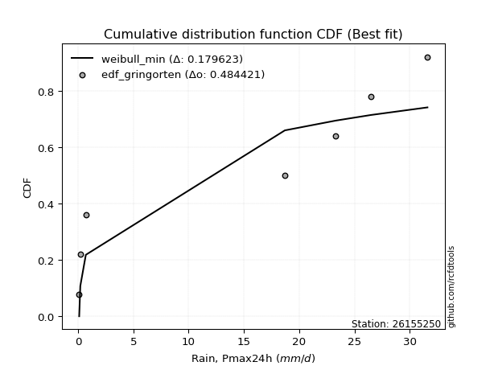</img></img>

</div>


### 9. Empirical - EDF Filliben (1975)

The specific values of the constants (0.3175) (often denoted as $alpha$) and (0.365) are derived from a method proposed by James J. Filliben in a 1975 paper. This particular formula is the mean value of the $i$-th order statistic of the normal distribution and is considered a robust and effective plotting position formula for the normal probability plot correlation coefficient test for normality.

<div align="center">


$P=(m-0.3175)/(n+0.365)$


</div>


**9.1. Empirical values**

<div align="center">

|                | 0                   | 1                   | 2                   | 3            | 4                  | 5                  | 6                  |
|:---------------|:--------------------|:--------------------|:--------------------|:-------------|:-------------------|:-------------------|:-------------------|
| date           | 2022                | 2021                | 2016                | 2019         | 2020               | 2018               | 2017               |
| x              | 0.1                 | 0.2                 | 0.7                 | 18.7         | 23.3               | 26.5               | 31.6               |
| m              | 1                   | 2                   | 3                   | 4            | 5                  | 6                  | 7                  |
| empirical_dist | edf_filliben        | edf_filliben        | edf_filliben        | edf_filliben | edf_filliben       | edf_filliben       | edf_filliben       |
| empirical      | 0.09266802443991853 | 0.22844534962661237 | 0.36422267481330617 | 0.5          | 0.6357773251866938 | 0.7715546503733877 | 0.9073319755600815 |
| empirical_tr   | 1.1021324354657687  | 1.2960844698636163  | 1.5728777362520021  | 2.0          | 2.7455731593662627 | 4.377414561664191  | 10.791208791208794 |

</div>


**9.2. Kolmogorov-Smirnov fit test (sorted by Δ)**


<div align="center">

|                | 0                   | 1                   | 2                   | 3                   | 4                   | 5                   | 6                   | 7                   | 8                   | 9                   | 10                  | 11                  | 12                  | 13                  | 14                  | 15                  | 16                  | 17                  | 18                  | 19                  | 20                  | 21                  | 22                  | 23                  | 24                  | 25                  | 26                  | 27                  | 28                  | 29                  | 30                  | 31                  | 32                  | 33                  | 34                  | 35                  | 36                  | 37                  | 38                  | 39                  | 40                  | 41                  | 42                  | 43                  | 44                  | 45                  | 46                  | 47                  | 48                  | 49                  | 50                  | 51                  | 52                  | 53                  | 54                  | 55                  | 56                  | 57                    | 58                  | 59                  | 60                  | 61                  | 62                  | 63                  | 64                  | 65                  | 66                  | 67                  | 68                  | 69                  | 70                  | 71                  | 72                  | 73                  | 74                  | 75                  | 76                  | 77                  | 78                  | 79                  | 80                  | 81                  | 82                  | 83                  | 84                  | 85                  | 86                  | 87                  | 88                  | 89                  |
|:---------------|:--------------------|:--------------------|:--------------------|:--------------------|:--------------------|:--------------------|:--------------------|:--------------------|:--------------------|:--------------------|:--------------------|:--------------------|:--------------------|:--------------------|:--------------------|:--------------------|:--------------------|:--------------------|:--------------------|:--------------------|:--------------------|:--------------------|:--------------------|:--------------------|:--------------------|:--------------------|:--------------------|:--------------------|:--------------------|:--------------------|:--------------------|:--------------------|:--------------------|:--------------------|:--------------------|:--------------------|:--------------------|:--------------------|:--------------------|:--------------------|:--------------------|:--------------------|:--------------------|:--------------------|:--------------------|:--------------------|:--------------------|:--------------------|:--------------------|:--------------------|:--------------------|:--------------------|:--------------------|:--------------------|:--------------------|:--------------------|:--------------------|:----------------------|:--------------------|:--------------------|:--------------------|:--------------------|:--------------------|:--------------------|:--------------------|:--------------------|:--------------------|:--------------------|:--------------------|:--------------------|:--------------------|:--------------------|:--------------------|:--------------------|:--------------------|:--------------------|:--------------------|:--------------------|:--------------------|:--------------------|:--------------------|:--------------------|:--------------------|:--------------------|:--------------------|:--------------------|:--------------------|:--------------------|:--------------------|:--------------------|
| station        | 26155250            | 26155250            | 26155250            | 26155250            | 26155250            | 26155250            | 26155250            | 26155250            | 26155250            | 26155250            | 26155250            | 26155250            | 26155250            | 26155250            | 26155250            | 26155250            | 26155250            | 26155250            | 26155250            | 26155250            | 26155250            | 26155250            | 26155250            | 26155250            | 26155250            | 26155250            | 26155250            | 26155250            | 26155250            | 26155250            | 26155250            | 26155250            | 26155250            | 26155250            | 26155250            | 26155250            | 26155250            | 26155250            | 26155250            | 26155250            | 26155250            | 26155250            | 26155250            | 26155250            | 26155250            | 26155250            | 26155250            | 26155250            | 26155250            | 26155250            | 26155250            | 26155250            | 26155250            | 26155250            | 26155250            | 26155250            | 26155250            | 26155250              | 26155250            | 26155250            | 26155250            | 26155250            | 26155250            | 26155250            | 26155250            | 26155250            | 26155250            | 26155250            | 26155250            | 26155250            | 26155250            | 26155250            | 26155250            | 26155250            | 26155250            | 26155250            | 26155250            | 26155250            | 26155250            | 26155250            | 26155250            | 26155250            | 26155250            | 26155250            | 26155250            | 26155250            | 26155250            | 26155250            | 26155250            | 26155250            |
| empirical_dist | edf_filliben        | edf_filliben        | edf_filliben        | edf_filliben        | edf_filliben        | edf_filliben        | edf_filliben        | edf_filliben        | edf_filliben        | edf_filliben        | edf_filliben        | edf_filliben        | edf_filliben        | edf_filliben        | edf_filliben        | edf_filliben        | edf_filliben        | edf_filliben        | edf_filliben        | edf_filliben        | edf_filliben        | edf_filliben        | edf_filliben        | edf_filliben        | edf_filliben        | edf_filliben        | edf_filliben        | edf_filliben        | edf_filliben        | edf_filliben        | edf_filliben        | edf_filliben        | edf_filliben        | edf_filliben        | edf_filliben        | edf_filliben        | edf_filliben        | edf_filliben        | edf_filliben        | edf_filliben        | edf_filliben        | edf_filliben        | edf_filliben        | edf_filliben        | edf_filliben        | edf_filliben        | edf_filliben        | edf_filliben        | edf_filliben        | edf_filliben        | edf_filliben        | edf_filliben        | edf_filliben        | edf_filliben        | edf_filliben        | edf_filliben        | edf_filliben        | edf_filliben          | edf_filliben        | edf_filliben        | edf_filliben        | edf_filliben        | edf_filliben        | edf_filliben        | edf_filliben        | edf_filliben        | edf_filliben        | edf_filliben        | edf_filliben        | edf_filliben        | edf_filliben        | edf_filliben        | edf_filliben        | edf_filliben        | edf_filliben        | edf_filliben        | edf_filliben        | edf_filliben        | edf_filliben        | edf_filliben        | edf_filliben        | edf_filliben        | edf_filliben        | edf_filliben        | edf_filliben        | edf_filliben        | edf_filliben        | edf_filliben        | edf_filliben        | edf_filliben        |
| p_dist         | weibull_min         | laplace_asymmetric  | fisk                | johnsonsu           | genlogistic         | pearson3            | erlang              | exponnorm           | crystalball         | norm                | gamma               | maxwell             | rayleigh            | kstwobign           | gumbel_l            | logf                | logncf              | logistic            | ncf                 | halfnorm            | hypsecant           | nakagami            | mielke              | rice                | logweibull_min      | laplace             | logpearson3         | gumbel_r            | loggumbel_l         | loggamma            | loggamma            | lognakagami         | logfatiguelife      | loginvweibull       | lognct              | logt                | logexponnorm        | logcrystalball      | lognorm             | lognorm             | loglognorm          | logerlang           | logrice             | loggompertz         | loginvgauss         | loginvgamma         | logexpon            | logalpha            | logmaxwell          | lograyleigh         | loggenexpon         | logtruncnorm        | logfisk             | logkstwobign        | loghalfnorm         | moyal               | loglogistic         | loglaplace_asymmetric | logloggamma         | fatiguelife         | pareto              | loggumbel_r         | halflogistic        | loghypsecant        | loghalflogistic     | logmoyal            | alpha               | loglaplace          | expon               | betaprime           | genexpon            | f                   | truncnorm           | gompertz            | logwald             | gibrat              | wald                | logpareto           | loggibrat           | t                   | invgauss            | logchi2             | chi2                | invweibull          | logjohnsonsu        | logbetaprime        | logmielke           | invgamma            | nct                 | loggenlogistic      |
| delta          | 0.1656062572163457  | 0.2058948373453395  | 0.20805333746997257 | 0.21389932136779588 | 0.22259191898842212 | 0.22379436292634758 | 0.22409925440469936 | 0.22411956095160232 | 0.22411962188437884 | 0.2241196243534378  | 0.22442459343453722 | 0.22456712809306686 | 0.22580725367731785 | 0.2276052963195271  | 0.233102090228789   | 0.23554857771962745 | 0.23728075891485267 | 0.24060869098225446 | 0.24207009459087886 | 0.24740522199358098 | 0.24876667350900006 | 0.2501566653157865  | 0.2512903566600112  | 0.2523692512273219  | 0.2547042679492114  | 0.25564558391126113 | 0.25673013066121686 | 0.2580687371433583  | 0.2594842019819745  | 0.2651543009302373  | 0.2651543009302373  | 0.26543444916289927 | 0.265547381205016   | 0.265875741846857   | 0.26601999371416063 | 0.26613644902438716 | 0.2661367081591991  | 0.26613674973164436 | 0.26613675026022876 | 0.26613675026022876 | 0.26759837487807303 | 0.26809731184394847 | 0.26979972256978035 | 0.2715866063170159  | 0.2726658216701171  | 0.2728140758318842  | 0.27352150377793394 | 0.27358795856377915 | 0.273595840925826   | 0.2757131946089293  | 0.27663502440336185 | 0.2780142429548861  | 0.28042986591592156 | 0.2805551555617849  | 0.2834046176028744  | 0.28549333534819255 | 0.28870723965173095 | 0.29094636914235583   | 0.29098482769185785 | 0.29453702329776177 | 0.2957768616127896  | 0.30153751058276557 | 0.30267466765570394 | 0.30306814343084154 | 0.3068182185774073  | 0.3130375572047337  | 0.32020430867272953 | 0.32095627724471143 | 0.32325291714032023 | 0.32696717019874244 | 0.3271961142899104  | 0.33202996026994314 | 0.33354674735375767 | 0.33409801776184334 | 0.35012567630638236 | 0.36422267481330617 | 0.36422267481330617 | 0.3673251000363894  | 0.3787599534468622  | 0.3837092458722936  | 0.3873826081687335  | 0.460510141932325   | 0.4986445621590162  | 0.5044554154369246  | 0.5246850254847231  | 0.5369249454717895  | 0.5568909846540081  | 0.7314216843780053  | 0.7498786877160917  | 0.7715546503733877  |
| deltao         | 0.48442053926100004 | 0.48442053926100004 | 0.48442053926100004 | 0.48442053926100004 | 0.48442053926100004 | 0.48442053926100004 | 0.48442053926100004 | 0.48442053926100004 | 0.48442053926100004 | 0.48442053926100004 | 0.48442053926100004 | 0.48442053926100004 | 0.48442053926100004 | 0.48442053926100004 | 0.48442053926100004 | 0.48442053926100004 | 0.48442053926100004 | 0.48442053926100004 | 0.48442053926100004 | 0.48442053926100004 | 0.48442053926100004 | 0.48442053926100004 | 0.48442053926100004 | 0.48442053926100004 | 0.48442053926100004 | 0.48442053926100004 | 0.48442053926100004 | 0.48442053926100004 | 0.48442053926100004 | 0.48442053926100004 | 0.48442053926100004 | 0.48442053926100004 | 0.48442053926100004 | 0.48442053926100004 | 0.48442053926100004 | 0.48442053926100004 | 0.48442053926100004 | 0.48442053926100004 | 0.48442053926100004 | 0.48442053926100004 | 0.48442053926100004 | 0.48442053926100004 | 0.48442053926100004 | 0.48442053926100004 | 0.48442053926100004 | 0.48442053926100004 | 0.48442053926100004 | 0.48442053926100004 | 0.48442053926100004 | 0.48442053926100004 | 0.48442053926100004 | 0.48442053926100004 | 0.48442053926100004 | 0.48442053926100004 | 0.48442053926100004 | 0.48442053926100004 | 0.48442053926100004 | 0.48442053926100004   | 0.48442053926100004 | 0.48442053926100004 | 0.48442053926100004 | 0.48442053926100004 | 0.48442053926100004 | 0.48442053926100004 | 0.48442053926100004 | 0.48442053926100004 | 0.48442053926100004 | 0.48442053926100004 | 0.48442053926100004 | 0.48442053926100004 | 0.48442053926100004 | 0.48442053926100004 | 0.48442053926100004 | 0.48442053926100004 | 0.48442053926100004 | 0.48442053926100004 | 0.48442053926100004 | 0.48442053926100004 | 0.48442053926100004 | 0.48442053926100004 | 0.48442053926100004 | 0.48442053926100004 | 0.48442053926100004 | 0.48442053926100004 | 0.48442053926100004 | 0.48442053926100004 | 0.48442053926100004 | 0.48442053926100004 | 0.48442053926100004 | 0.48442053926100004 |
| eval           | Δo > Δ              | Δo > Δ              | Δo > Δ              | Δo > Δ              | Δo > Δ              | Δo > Δ              | Δo > Δ              | Δo > Δ              | Δo > Δ              | Δo > Δ              | Δo > Δ              | Δo > Δ              | Δo > Δ              | Δo > Δ              | Δo > Δ              | Δo > Δ              | Δo > Δ              | Δo > Δ              | Δo > Δ              | Δo > Δ              | Δo > Δ              | Δo > Δ              | Δo > Δ              | Δo > Δ              | Δo > Δ              | Δo > Δ              | Δo > Δ              | Δo > Δ              | Δo > Δ              | Δo > Δ              | Δo > Δ              | Δo > Δ              | Δo > Δ              | Δo > Δ              | Δo > Δ              | Δo > Δ              | Δo > Δ              | Δo > Δ              | Δo > Δ              | Δo > Δ              | Δo > Δ              | Δo > Δ              | Δo > Δ              | Δo > Δ              | Δo > Δ              | Δo > Δ              | Δo > Δ              | Δo > Δ              | Δo > Δ              | Δo > Δ              | Δo > Δ              | Δo > Δ              | Δo > Δ              | Δo > Δ              | Δo > Δ              | Δo > Δ              | Δo > Δ              | Δo > Δ                | Δo > Δ              | Δo > Δ              | Δo > Δ              | Δo > Δ              | Δo > Δ              | Δo > Δ              | Δo > Δ              | Δo > Δ              | Δo > Δ              | Δo > Δ              | Δo > Δ              | Δo > Δ              | Δo > Δ              | Δo > Δ              | Δo > Δ              | Δo > Δ              | Δo > Δ              | Δo > Δ              | Δo > Δ              | Δo > Δ              | Δo > Δ              | Δo > Δ              | Δo > Δ              | Δo > Δ              | Δo <= Δ             | Δo <= Δ             | Δo <= Δ             | Δo <= Δ             | Δo <= Δ             | Δo <= Δ             | Δo <= Δ             | Δo <= Δ             |
| fit            | 1                   | 1                   | 1                   | 1                   | 1                   | 1                   | 1                   | 1                   | 1                   | 1                   | 1                   | 1                   | 1                   | 1                   | 1                   | 1                   | 1                   | 1                   | 1                   | 1                   | 1                   | 1                   | 1                   | 1                   | 1                   | 1                   | 1                   | 1                   | 1                   | 1                   | 1                   | 1                   | 1                   | 1                   | 1                   | 1                   | 1                   | 1                   | 1                   | 1                   | 1                   | 1                   | 1                   | 1                   | 1                   | 1                   | 1                   | 1                   | 1                   | 1                   | 1                   | 1                   | 1                   | 1                   | 1                   | 1                   | 1                   | 1                     | 1                   | 1                   | 1                   | 1                   | 1                   | 1                   | 1                   | 1                   | 1                   | 1                   | 1                   | 1                   | 1                   | 1                   | 1                   | 1                   | 1                   | 1                   | 1                   | 1                   | 1                   | 1                   | 1                   | 1                   | 0                   | 0                   | 0                   | 0                   | 0                   | 0                   | 0                   | 0                   |
| n              | 7                   | 7                   | 7                   | 7                   | 7                   | 7                   | 7                   | 7                   | 7                   | 7                   | 7                   | 7                   | 7                   | 7                   | 7                   | 7                   | 7                   | 7                   | 7                   | 7                   | 7                   | 7                   | 7                   | 7                   | 7                   | 7                   | 7                   | 7                   | 7                   | 7                   | 7                   | 7                   | 7                   | 7                   | 7                   | 7                   | 7                   | 7                   | 7                   | 7                   | 7                   | 7                   | 7                   | 7                   | 7                   | 7                   | 7                   | 7                   | 7                   | 7                   | 7                   | 7                   | 7                   | 7                   | 7                   | 7                   | 7                   | 7                     | 7                   | 7                   | 7                   | 7                   | 7                   | 7                   | 7                   | 7                   | 7                   | 7                   | 7                   | 7                   | 7                   | 7                   | 7                   | 7                   | 7                   | 7                   | 7                   | 7                   | 7                   | 7                   | 7                   | 7                   | 7                   | 7                   | 7                   | 7                   | 7                   | 7                   | 7                   | 7                   |
| best_fit       | 1                   | 0                   | 0                   | 0                   | 0                   | 0                   | 0                   | 0                   | 0                   | 0                   | 0                   | 0                   | 0                   | 0                   | 0                   | 0                   | 0                   | 0                   | 0                   | 0                   | 0                   | 0                   | 0                   | 0                   | 0                   | 0                   | 0                   | 0                   | 0                   | 0                   | 0                   | 0                   | 0                   | 0                   | 0                   | 0                   | 0                   | 0                   | 0                   | 0                   | 0                   | 0                   | 0                   | 0                   | 0                   | 0                   | 0                   | 0                   | 0                   | 0                   | 0                   | 0                   | 0                   | 0                   | 0                   | 0                   | 0                   | 0                     | 0                   | 0                   | 0                   | 0                   | 0                   | 0                   | 0                   | 0                   | 0                   | 0                   | 0                   | 0                   | 0                   | 0                   | 0                   | 0                   | 0                   | 0                   | 0                   | 0                   | 0                   | 0                   | 0                   | 0                   | 0                   | 0                   | 0                   | 0                   | 0                   | 0                   | 0                   | 0                   |
| best_fit_sort  | 1                   | 2                   | 3                   | 4                   | 5                   | 6                   | 7                   | 8                   | 9                   | 10                  | 11                  | 12                  | 13                  | 14                  | 15                  | 16                  | 17                  | 18                  | 19                  | 20                  | 21                  | 22                  | 23                  | 24                  | 25                  | 26                  | 27                  | 28                  | 29                  | 30                  | 31                  | 32                  | 33                  | 34                  | 35                  | 36                  | 37                  | 38                  | 39                  | 40                  | 41                  | 42                  | 43                  | 44                  | 45                  | 46                  | 47                  | 48                  | 49                  | 50                  | 51                  | 52                  | 53                  | 54                  | 55                  | 56                  | 57                  | 58                    | 59                  | 60                  | 61                  | 62                  | 63                  | 64                  | 65                  | 66                  | 67                  | 68                  | 69                  | 70                  | 71                  | 72                  | 73                  | 74                  | 75                  | 76                  | 77                  | 78                  | 79                  | 80                  | 81                  | 82                  | 83                  | 84                  | 85                  | 86                  | 87                  | 88                  | 89                  | 90                  |

</div>


<div align="center">

</img>

</div>


**9.3. Best fit**

<div align="center">

|   id |   station | empirical_dist   | p_dist      |    delta |   deltao | eval   |   fit |   n |   best_fit |   best_fit_sort |
|-----:|----------:|:-----------------|:------------|---------:|---------:|:-------|------:|----:|-----------:|----------------:|
|    0 |  26155250 | edf_filliben     | weibull_min | 0.165606 | 0.484421 | Δo > Δ |     1 |   7 |          1 |               1 |

</div>


<div align="center">

</img>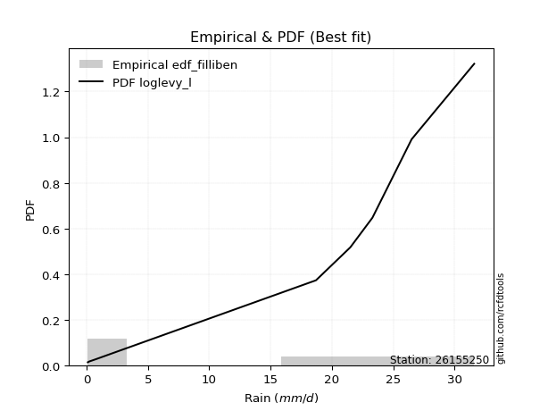</img>

</div>


### 10. Empirical - EDF Jenkinson (1977)

The Jenkinson formula in hydrology is an empirical plotting position formula used to estimate the non-exceedance probability _(P)_ or return period _(T)_ of a given ordered observation within a sample. It is a widely used method in the frequency analysis of extreme events such as floods and rainfall, as it provides a distribution-free way to plot data. _a≈0.31_ and _b≈0.38_ are constants derived to approximate the median of the probability distribution for the given rank.

<div align="center">


$P=(m-a)/(n+b)$


</div>


**10.1. Empirical values**

<div align="center">

|                | 0                   | 1                   | 2                   | 3             | 4                  | 5                  | 6                  |
|:---------------|:--------------------|:--------------------|:--------------------|:--------------|:-------------------|:-------------------|:-------------------|
| date           | 2022                | 2021                | 2016                | 2019          | 2020               | 2018               | 2017               |
| x              | 0.1                 | 0.2                 | 0.7                 | 18.7          | 23.3               | 26.5               | 31.6               |
| m              | 1                   | 2                   | 3                   | 4             | 5                  | 6                  | 7                  |
| empirical_dist | edf_jenkinson       | edf_jenkinson       | edf_jenkinson       | edf_jenkinson | edf_jenkinson      | edf_jenkinson      | edf_jenkinson      |
| empirical      | 0.09349593495934959 | 0.22899728997289973 | 0.36449864498644985 | 0.5           | 0.6355013550135502 | 0.7710027100271003 | 0.9065040650406505 |
| empirical_tr   | 1.1031390134529149  | 1.29701230228471    | 1.5735607675906182  | 2.0           | 2.743494423791822  | 4.366863905325444  | 10.695652173913055 |

</div>


**10.2. Kolmogorov-Smirnov fit test (sorted by Δ)**


<div align="center">

|                | 0                   | 1                   | 2                   | 3                   | 4                   | 5                   | 6                   | 7                   | 8                   | 9                   | 10                  | 11                  | 12                  | 13                  | 14                  | 15                  | 16                  | 17                  | 18                  | 19                  | 20                  | 21                  | 22                  | 23                  | 24                  | 25                  | 26                  | 27                  | 28                  | 29                  | 30                  | 31                  | 32                  | 33                  | 34                  | 35                  | 36                  | 37                  | 38                  | 39                  | 40                  | 41                  | 42                  | 43                  | 44                  | 45                  | 46                  | 47                  | 48                  | 49                  | 50                  | 51                  | 52                  | 53                  | 54                  | 55                  | 56                  | 57                    | 58                  | 59                  | 60                  | 61                  | 62                  | 63                  | 64                  | 65                  | 66                  | 67                  | 68                  | 69                  | 70                  | 71                  | 72                  | 73                  | 74                  | 75                  | 76                  | 77                  | 78                  | 79                  | 80                  | 81                  | 82                  | 83                  | 84                  | 85                  | 86                  | 87                  | 88                  | 89                  |
|:---------------|:--------------------|:--------------------|:--------------------|:--------------------|:--------------------|:--------------------|:--------------------|:--------------------|:--------------------|:--------------------|:--------------------|:--------------------|:--------------------|:--------------------|:--------------------|:--------------------|:--------------------|:--------------------|:--------------------|:--------------------|:--------------------|:--------------------|:--------------------|:--------------------|:--------------------|:--------------------|:--------------------|:--------------------|:--------------------|:--------------------|:--------------------|:--------------------|:--------------------|:--------------------|:--------------------|:--------------------|:--------------------|:--------------------|:--------------------|:--------------------|:--------------------|:--------------------|:--------------------|:--------------------|:--------------------|:--------------------|:--------------------|:--------------------|:--------------------|:--------------------|:--------------------|:--------------------|:--------------------|:--------------------|:--------------------|:--------------------|:--------------------|:----------------------|:--------------------|:--------------------|:--------------------|:--------------------|:--------------------|:--------------------|:--------------------|:--------------------|:--------------------|:--------------------|:--------------------|:--------------------|:--------------------|:--------------------|:--------------------|:--------------------|:--------------------|:--------------------|:--------------------|:--------------------|:--------------------|:--------------------|:--------------------|:--------------------|:--------------------|:--------------------|:--------------------|:--------------------|:--------------------|:--------------------|:--------------------|:--------------------|
| station        | 26155250            | 26155250            | 26155250            | 26155250            | 26155250            | 26155250            | 26155250            | 26155250            | 26155250            | 26155250            | 26155250            | 26155250            | 26155250            | 26155250            | 26155250            | 26155250            | 26155250            | 26155250            | 26155250            | 26155250            | 26155250            | 26155250            | 26155250            | 26155250            | 26155250            | 26155250            | 26155250            | 26155250            | 26155250            | 26155250            | 26155250            | 26155250            | 26155250            | 26155250            | 26155250            | 26155250            | 26155250            | 26155250            | 26155250            | 26155250            | 26155250            | 26155250            | 26155250            | 26155250            | 26155250            | 26155250            | 26155250            | 26155250            | 26155250            | 26155250            | 26155250            | 26155250            | 26155250            | 26155250            | 26155250            | 26155250            | 26155250            | 26155250              | 26155250            | 26155250            | 26155250            | 26155250            | 26155250            | 26155250            | 26155250            | 26155250            | 26155250            | 26155250            | 26155250            | 26155250            | 26155250            | 26155250            | 26155250            | 26155250            | 26155250            | 26155250            | 26155250            | 26155250            | 26155250            | 26155250            | 26155250            | 26155250            | 26155250            | 26155250            | 26155250            | 26155250            | 26155250            | 26155250            | 26155250            | 26155250            |
| empirical_dist | edf_jenkinson       | edf_jenkinson       | edf_jenkinson       | edf_jenkinson       | edf_jenkinson       | edf_jenkinson       | edf_jenkinson       | edf_jenkinson       | edf_jenkinson       | edf_jenkinson       | edf_jenkinson       | edf_jenkinson       | edf_jenkinson       | edf_jenkinson       | edf_jenkinson       | edf_jenkinson       | edf_jenkinson       | edf_jenkinson       | edf_jenkinson       | edf_jenkinson       | edf_jenkinson       | edf_jenkinson       | edf_jenkinson       | edf_jenkinson       | edf_jenkinson       | edf_jenkinson       | edf_jenkinson       | edf_jenkinson       | edf_jenkinson       | edf_jenkinson       | edf_jenkinson       | edf_jenkinson       | edf_jenkinson       | edf_jenkinson       | edf_jenkinson       | edf_jenkinson       | edf_jenkinson       | edf_jenkinson       | edf_jenkinson       | edf_jenkinson       | edf_jenkinson       | edf_jenkinson       | edf_jenkinson       | edf_jenkinson       | edf_jenkinson       | edf_jenkinson       | edf_jenkinson       | edf_jenkinson       | edf_jenkinson       | edf_jenkinson       | edf_jenkinson       | edf_jenkinson       | edf_jenkinson       | edf_jenkinson       | edf_jenkinson       | edf_jenkinson       | edf_jenkinson       | edf_jenkinson         | edf_jenkinson       | edf_jenkinson       | edf_jenkinson       | edf_jenkinson       | edf_jenkinson       | edf_jenkinson       | edf_jenkinson       | edf_jenkinson       | edf_jenkinson       | edf_jenkinson       | edf_jenkinson       | edf_jenkinson       | edf_jenkinson       | edf_jenkinson       | edf_jenkinson       | edf_jenkinson       | edf_jenkinson       | edf_jenkinson       | edf_jenkinson       | edf_jenkinson       | edf_jenkinson       | edf_jenkinson       | edf_jenkinson       | edf_jenkinson       | edf_jenkinson       | edf_jenkinson       | edf_jenkinson       | edf_jenkinson       | edf_jenkinson       | edf_jenkinson       | edf_jenkinson       | edf_jenkinson       |
| p_dist         | weibull_min         | laplace_asymmetric  | fisk                | johnsonsu           | genlogistic         | pearson3            | erlang              | exponnorm           | crystalball         | norm                | gamma               | maxwell             | rayleigh            | kstwobign           | gumbel_l            | logf                | logncf              | logistic            | ncf                 | halfnorm            | hypsecant           | nakagami            | mielke              | rice                | logweibull_min      | laplace             | logpearson3         | gumbel_r            | loggumbel_l         | loggamma            | loggamma            | lognakagami         | logfatiguelife      | loginvweibull       | lognct              | logt                | logexponnorm        | logcrystalball      | lognorm             | lognorm             | loglognorm          | logerlang           | logrice             | loggompertz         | loginvgauss         | loginvgamma         | logexpon            | logalpha            | logmaxwell          | lograyleigh         | loggenexpon         | logtruncnorm        | logfisk             | logkstwobign        | loghalfnorm         | moyal               | loglogistic         | loglaplace_asymmetric | logloggamma         | fatiguelife         | pareto              | loggumbel_r         | halflogistic        | loghypsecant        | loghalflogistic     | logmoyal            | alpha               | loglaplace          | expon               | betaprime           | genexpon            | f                   | truncnorm           | gompertz            | logwald             | gibrat              | wald                | logpareto           | loggibrat           | t                   | invgauss            | logchi2             | chi2                | invweibull          | logjohnsonsu        | logbetaprime        | logmielke           | invgamma            | nct                 | loggenlogistic      |
| delta          | 0.1647783466969147  | 0.20617080751848318 | 0.20805333746997257 | 0.21417529154093956 | 0.2228678891615658  | 0.22407033309949126 | 0.22437522457784304 | 0.224395531124746   | 0.22439559205752252 | 0.22439559452658148 | 0.2247005636076809  | 0.22484309826621054 | 0.22608322385046153 | 0.2278812664926708  | 0.23337806040193268 | 0.23554857771962745 | 0.2364528483954217  | 0.24088466115539814 | 0.24234606476402254 | 0.24768119216672466 | 0.24904264368214374 | 0.2501566653157865  | 0.2512903566600112  | 0.2526452214004655  | 0.2547042679492114  | 0.25592155408440476 | 0.25673013066121686 | 0.258344707316502   | 0.2594842019819745  | 0.2651543009302373  | 0.2651543009302373  | 0.26543444916289927 | 0.265547381205016   | 0.265875741846857   | 0.26601999371416063 | 0.26613644902438716 | 0.2661367081591991  | 0.26613674973164436 | 0.26613675026022876 | 0.26613675026022876 | 0.26759837487807303 | 0.26809731184394847 | 0.26979972256978035 | 0.2715866063170159  | 0.2726658216701171  | 0.2728140758318842  | 0.27352150377793394 | 0.27358795856377915 | 0.273595840925826   | 0.2757131946089293  | 0.27663502440336185 | 0.2780142429548861  | 0.2796019553964906  | 0.2805551555617849  | 0.2834046176028744  | 0.2857693055213362  | 0.28870723965173095 | 0.29094636914235583   | 0.29098482769185785 | 0.2939850829514744  | 0.2960528317859333  | 0.30153751058276557 | 0.3029506378288476  | 0.30306814343084154 | 0.3068182185774073  | 0.3130375572047337  | 0.32020430867272953 | 0.32095627724471143 | 0.3235288873134639  | 0.32696717019874244 | 0.3274720844630541  | 0.33202996026994314 | 0.33382271752690135 | 0.334373987934987   | 0.35012567630638236 | 0.36449864498644985 | 0.36449864498644985 | 0.36677315969010205 | 0.3787599534468622  | 0.3837092458722936  | 0.3873826081687335  | 0.460510141932325   | 0.4986445621590162  | 0.5036275049174936  | 0.5241330851384356  | 0.5363730051255021  | 0.5563390443077207  | 0.7308697440317179  | 0.7493267473698043  | 0.7710027100271003  |
| deltao         | 0.48442053926100004 | 0.48442053926100004 | 0.48442053926100004 | 0.48442053926100004 | 0.48442053926100004 | 0.48442053926100004 | 0.48442053926100004 | 0.48442053926100004 | 0.48442053926100004 | 0.48442053926100004 | 0.48442053926100004 | 0.48442053926100004 | 0.48442053926100004 | 0.48442053926100004 | 0.48442053926100004 | 0.48442053926100004 | 0.48442053926100004 | 0.48442053926100004 | 0.48442053926100004 | 0.48442053926100004 | 0.48442053926100004 | 0.48442053926100004 | 0.48442053926100004 | 0.48442053926100004 | 0.48442053926100004 | 0.48442053926100004 | 0.48442053926100004 | 0.48442053926100004 | 0.48442053926100004 | 0.48442053926100004 | 0.48442053926100004 | 0.48442053926100004 | 0.48442053926100004 | 0.48442053926100004 | 0.48442053926100004 | 0.48442053926100004 | 0.48442053926100004 | 0.48442053926100004 | 0.48442053926100004 | 0.48442053926100004 | 0.48442053926100004 | 0.48442053926100004 | 0.48442053926100004 | 0.48442053926100004 | 0.48442053926100004 | 0.48442053926100004 | 0.48442053926100004 | 0.48442053926100004 | 0.48442053926100004 | 0.48442053926100004 | 0.48442053926100004 | 0.48442053926100004 | 0.48442053926100004 | 0.48442053926100004 | 0.48442053926100004 | 0.48442053926100004 | 0.48442053926100004 | 0.48442053926100004   | 0.48442053926100004 | 0.48442053926100004 | 0.48442053926100004 | 0.48442053926100004 | 0.48442053926100004 | 0.48442053926100004 | 0.48442053926100004 | 0.48442053926100004 | 0.48442053926100004 | 0.48442053926100004 | 0.48442053926100004 | 0.48442053926100004 | 0.48442053926100004 | 0.48442053926100004 | 0.48442053926100004 | 0.48442053926100004 | 0.48442053926100004 | 0.48442053926100004 | 0.48442053926100004 | 0.48442053926100004 | 0.48442053926100004 | 0.48442053926100004 | 0.48442053926100004 | 0.48442053926100004 | 0.48442053926100004 | 0.48442053926100004 | 0.48442053926100004 | 0.48442053926100004 | 0.48442053926100004 | 0.48442053926100004 | 0.48442053926100004 | 0.48442053926100004 |
| eval           | Δo > Δ              | Δo > Δ              | Δo > Δ              | Δo > Δ              | Δo > Δ              | Δo > Δ              | Δo > Δ              | Δo > Δ              | Δo > Δ              | Δo > Δ              | Δo > Δ              | Δo > Δ              | Δo > Δ              | Δo > Δ              | Δo > Δ              | Δo > Δ              | Δo > Δ              | Δo > Δ              | Δo > Δ              | Δo > Δ              | Δo > Δ              | Δo > Δ              | Δo > Δ              | Δo > Δ              | Δo > Δ              | Δo > Δ              | Δo > Δ              | Δo > Δ              | Δo > Δ              | Δo > Δ              | Δo > Δ              | Δo > Δ              | Δo > Δ              | Δo > Δ              | Δo > Δ              | Δo > Δ              | Δo > Δ              | Δo > Δ              | Δo > Δ              | Δo > Δ              | Δo > Δ              | Δo > Δ              | Δo > Δ              | Δo > Δ              | Δo > Δ              | Δo > Δ              | Δo > Δ              | Δo > Δ              | Δo > Δ              | Δo > Δ              | Δo > Δ              | Δo > Δ              | Δo > Δ              | Δo > Δ              | Δo > Δ              | Δo > Δ              | Δo > Δ              | Δo > Δ                | Δo > Δ              | Δo > Δ              | Δo > Δ              | Δo > Δ              | Δo > Δ              | Δo > Δ              | Δo > Δ              | Δo > Δ              | Δo > Δ              | Δo > Δ              | Δo > Δ              | Δo > Δ              | Δo > Δ              | Δo > Δ              | Δo > Δ              | Δo > Δ              | Δo > Δ              | Δo > Δ              | Δo > Δ              | Δo > Δ              | Δo > Δ              | Δo > Δ              | Δo > Δ              | Δo > Δ              | Δo <= Δ             | Δo <= Δ             | Δo <= Δ             | Δo <= Δ             | Δo <= Δ             | Δo <= Δ             | Δo <= Δ             | Δo <= Δ             |
| fit            | 1                   | 1                   | 1                   | 1                   | 1                   | 1                   | 1                   | 1                   | 1                   | 1                   | 1                   | 1                   | 1                   | 1                   | 1                   | 1                   | 1                   | 1                   | 1                   | 1                   | 1                   | 1                   | 1                   | 1                   | 1                   | 1                   | 1                   | 1                   | 1                   | 1                   | 1                   | 1                   | 1                   | 1                   | 1                   | 1                   | 1                   | 1                   | 1                   | 1                   | 1                   | 1                   | 1                   | 1                   | 1                   | 1                   | 1                   | 1                   | 1                   | 1                   | 1                   | 1                   | 1                   | 1                   | 1                   | 1                   | 1                   | 1                     | 1                   | 1                   | 1                   | 1                   | 1                   | 1                   | 1                   | 1                   | 1                   | 1                   | 1                   | 1                   | 1                   | 1                   | 1                   | 1                   | 1                   | 1                   | 1                   | 1                   | 1                   | 1                   | 1                   | 1                   | 0                   | 0                   | 0                   | 0                   | 0                   | 0                   | 0                   | 0                   |
| n              | 7                   | 7                   | 7                   | 7                   | 7                   | 7                   | 7                   | 7                   | 7                   | 7                   | 7                   | 7                   | 7                   | 7                   | 7                   | 7                   | 7                   | 7                   | 7                   | 7                   | 7                   | 7                   | 7                   | 7                   | 7                   | 7                   | 7                   | 7                   | 7                   | 7                   | 7                   | 7                   | 7                   | 7                   | 7                   | 7                   | 7                   | 7                   | 7                   | 7                   | 7                   | 7                   | 7                   | 7                   | 7                   | 7                   | 7                   | 7                   | 7                   | 7                   | 7                   | 7                   | 7                   | 7                   | 7                   | 7                   | 7                   | 7                     | 7                   | 7                   | 7                   | 7                   | 7                   | 7                   | 7                   | 7                   | 7                   | 7                   | 7                   | 7                   | 7                   | 7                   | 7                   | 7                   | 7                   | 7                   | 7                   | 7                   | 7                   | 7                   | 7                   | 7                   | 7                   | 7                   | 7                   | 7                   | 7                   | 7                   | 7                   | 7                   |
| best_fit       | 1                   | 0                   | 0                   | 0                   | 0                   | 0                   | 0                   | 0                   | 0                   | 0                   | 0                   | 0                   | 0                   | 0                   | 0                   | 0                   | 0                   | 0                   | 0                   | 0                   | 0                   | 0                   | 0                   | 0                   | 0                   | 0                   | 0                   | 0                   | 0                   | 0                   | 0                   | 0                   | 0                   | 0                   | 0                   | 0                   | 0                   | 0                   | 0                   | 0                   | 0                   | 0                   | 0                   | 0                   | 0                   | 0                   | 0                   | 0                   | 0                   | 0                   | 0                   | 0                   | 0                   | 0                   | 0                   | 0                   | 0                   | 0                     | 0                   | 0                   | 0                   | 0                   | 0                   | 0                   | 0                   | 0                   | 0                   | 0                   | 0                   | 0                   | 0                   | 0                   | 0                   | 0                   | 0                   | 0                   | 0                   | 0                   | 0                   | 0                   | 0                   | 0                   | 0                   | 0                   | 0                   | 0                   | 0                   | 0                   | 0                   | 0                   |
| best_fit_sort  | 1                   | 2                   | 3                   | 4                   | 5                   | 6                   | 7                   | 8                   | 9                   | 10                  | 11                  | 12                  | 13                  | 14                  | 15                  | 16                  | 17                  | 18                  | 19                  | 20                  | 21                  | 22                  | 23                  | 24                  | 25                  | 26                  | 27                  | 28                  | 29                  | 30                  | 31                  | 32                  | 33                  | 34                  | 35                  | 36                  | 37                  | 38                  | 39                  | 40                  | 41                  | 42                  | 43                  | 44                  | 45                  | 46                  | 47                  | 48                  | 49                  | 50                  | 51                  | 52                  | 53                  | 54                  | 55                  | 56                  | 57                  | 58                    | 59                  | 60                  | 61                  | 62                  | 63                  | 64                  | 65                  | 66                  | 67                  | 68                  | 69                  | 70                  | 71                  | 72                  | 73                  | 74                  | 75                  | 76                  | 77                  | 78                  | 79                  | 80                  | 81                  | 82                  | 83                  | 84                  | 85                  | 86                  | 87                  | 88                  | 89                  | 90                  |

</div>


<div align="center">

</img>

</div>


**10.3. Best fit**

<div align="center">

|   id |   station | empirical_dist   | p_dist      |    delta |   deltao | eval   |   fit |   n |   best_fit |   best_fit_sort |
|-----:|----------:|:-----------------|:------------|---------:|---------:|:-------|------:|----:|-----------:|----------------:|
|    0 |  26155250 | edf_jenkinson    | weibull_min | 0.164778 | 0.484421 | Δo > Δ |     1 |   7 |          1 |               1 |

</div>


<div align="center">

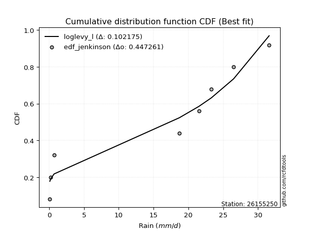</img>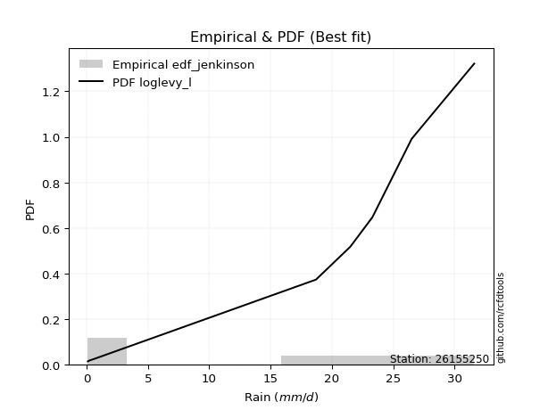</img>

</div>


### 11. Empirical - EDF Cunnane (1978)

Cunnane´s work in statistical hydrology has focused on the performance and evaluation of different probability distributions (such as GEV, Gumbel, Lognormal) for flood frequency estimation. _b_ is a constant, typically set to 0.4.

<div align="center">


$P=(m-b)/(n+1-2b)$


</div>


**11.1. Empirical values**

<div align="center">

|                | 0                   | 1                   | 2                  | 3           | 4                  | 5                  | 6                  |
|:---------------|:--------------------|:--------------------|:-------------------|:------------|:-------------------|:-------------------|:-------------------|
| date           | 2022                | 2021                | 2016               | 2019        | 2020               | 2018               | 2017               |
| x              | 0.1                 | 0.2                 | 0.7                | 18.7        | 23.3               | 26.5               | 31.6               |
| m              | 1                   | 2                   | 3                  | 4           | 5                  | 6                  | 7                  |
| empirical_dist | edf_cunnane         | edf_cunnane         | edf_cunnane        | edf_cunnane | edf_cunnane        | edf_cunnane        | edf_cunnane        |
| empirical      | 0.08333333333333333 | 0.22222222222222224 | 0.3611111111111111 | 0.5         | 0.6388888888888888 | 0.7777777777777777 | 0.9166666666666666 |
| empirical_tr   | 1.090909090909091   | 1.2857142857142856  | 1.565217391304348  | 2.0         | 2.7692307692307687 | 4.499999999999998  | 11.999999999999995 |

</div>


**11.2. Kolmogorov-Smirnov fit test (sorted by Δ)**


<div align="center">

|                | 0                   | 1                   | 2                   | 3                   | 4                   | 5                   | 6                   | 7                   | 8                   | 9                   | 10                  | 11                  | 12                  | 13                  | 14                  | 15                  | 16                  | 17                  | 18                  | 19                  | 20                  | 21                  | 22                  | 23                  | 24                  | 25                  | 26                  | 27                  | 28                  | 29                  | 30                  | 31                  | 32                  | 33                  | 34                  | 35                  | 36                  | 37                  | 38                  | 39                  | 40                  | 41                  | 42                  | 43                  | 44                  | 45                  | 46                  | 47                  | 48                  | 49                  | 50                  | 51                  | 52                  | 53                  | 54                  | 55                  | 56                  | 57                    | 58                  | 59                  | 60                  | 61                  | 62                  | 63                  | 64                  | 65                  | 66                  | 67                  | 68                  | 69                  | 70                  | 71                  | 72                  | 73                  | 74                  | 75                  | 76                  | 77                  | 78                  | 79                  | 80                  | 81                  | 82                  | 83                  | 84                  | 85                  | 86                  | 87                  | 88                  | 89                  |
|:---------------|:--------------------|:--------------------|:--------------------|:--------------------|:--------------------|:--------------------|:--------------------|:--------------------|:--------------------|:--------------------|:--------------------|:--------------------|:--------------------|:--------------------|:--------------------|:--------------------|:--------------------|:--------------------|:--------------------|:--------------------|:--------------------|:--------------------|:--------------------|:--------------------|:--------------------|:--------------------|:--------------------|:--------------------|:--------------------|:--------------------|:--------------------|:--------------------|:--------------------|:--------------------|:--------------------|:--------------------|:--------------------|:--------------------|:--------------------|:--------------------|:--------------------|:--------------------|:--------------------|:--------------------|:--------------------|:--------------------|:--------------------|:--------------------|:--------------------|:--------------------|:--------------------|:--------------------|:--------------------|:--------------------|:--------------------|:--------------------|:--------------------|:----------------------|:--------------------|:--------------------|:--------------------|:--------------------|:--------------------|:--------------------|:--------------------|:--------------------|:--------------------|:--------------------|:--------------------|:--------------------|:--------------------|:--------------------|:--------------------|:--------------------|:--------------------|:--------------------|:--------------------|:--------------------|:--------------------|:--------------------|:--------------------|:--------------------|:--------------------|:--------------------|:--------------------|:--------------------|:--------------------|:--------------------|:--------------------|:--------------------|
| station        | 26155250            | 26155250            | 26155250            | 26155250            | 26155250            | 26155250            | 26155250            | 26155250            | 26155250            | 26155250            | 26155250            | 26155250            | 26155250            | 26155250            | 26155250            | 26155250            | 26155250            | 26155250            | 26155250            | 26155250            | 26155250            | 26155250            | 26155250            | 26155250            | 26155250            | 26155250            | 26155250            | 26155250            | 26155250            | 26155250            | 26155250            | 26155250            | 26155250            | 26155250            | 26155250            | 26155250            | 26155250            | 26155250            | 26155250            | 26155250            | 26155250            | 26155250            | 26155250            | 26155250            | 26155250            | 26155250            | 26155250            | 26155250            | 26155250            | 26155250            | 26155250            | 26155250            | 26155250            | 26155250            | 26155250            | 26155250            | 26155250            | 26155250              | 26155250            | 26155250            | 26155250            | 26155250            | 26155250            | 26155250            | 26155250            | 26155250            | 26155250            | 26155250            | 26155250            | 26155250            | 26155250            | 26155250            | 26155250            | 26155250            | 26155250            | 26155250            | 26155250            | 26155250            | 26155250            | 26155250            | 26155250            | 26155250            | 26155250            | 26155250            | 26155250            | 26155250            | 26155250            | 26155250            | 26155250            | 26155250            |
| empirical_dist | edf_cunnane         | edf_cunnane         | edf_cunnane         | edf_cunnane         | edf_cunnane         | edf_cunnane         | edf_cunnane         | edf_cunnane         | edf_cunnane         | edf_cunnane         | edf_cunnane         | edf_cunnane         | edf_cunnane         | edf_cunnane         | edf_cunnane         | edf_cunnane         | edf_cunnane         | edf_cunnane         | edf_cunnane         | edf_cunnane         | edf_cunnane         | edf_cunnane         | edf_cunnane         | edf_cunnane         | edf_cunnane         | edf_cunnane         | edf_cunnane         | edf_cunnane         | edf_cunnane         | edf_cunnane         | edf_cunnane         | edf_cunnane         | edf_cunnane         | edf_cunnane         | edf_cunnane         | edf_cunnane         | edf_cunnane         | edf_cunnane         | edf_cunnane         | edf_cunnane         | edf_cunnane         | edf_cunnane         | edf_cunnane         | edf_cunnane         | edf_cunnane         | edf_cunnane         | edf_cunnane         | edf_cunnane         | edf_cunnane         | edf_cunnane         | edf_cunnane         | edf_cunnane         | edf_cunnane         | edf_cunnane         | edf_cunnane         | edf_cunnane         | edf_cunnane         | edf_cunnane           | edf_cunnane         | edf_cunnane         | edf_cunnane         | edf_cunnane         | edf_cunnane         | edf_cunnane         | edf_cunnane         | edf_cunnane         | edf_cunnane         | edf_cunnane         | edf_cunnane         | edf_cunnane         | edf_cunnane         | edf_cunnane         | edf_cunnane         | edf_cunnane         | edf_cunnane         | edf_cunnane         | edf_cunnane         | edf_cunnane         | edf_cunnane         | edf_cunnane         | edf_cunnane         | edf_cunnane         | edf_cunnane         | edf_cunnane         | edf_cunnane         | edf_cunnane         | edf_cunnane         | edf_cunnane         | edf_cunnane         | edf_cunnane         |
| p_dist         | weibull_min         | laplace_asymmetric  | fisk                | johnsonsu           | genlogistic         | pearson3            | erlang              | exponnorm           | crystalball         | norm                | gamma               | maxwell             | rayleigh            | kstwobign           | gumbel_l            | logf                | logistic            | halfnorm            | ncf                 | hypsecant           | logncf              | rice                | nakagami            | mielke              | laplace             | logweibull_min      | gumbel_r            | logpearson3         | loggumbel_l         | loggamma            | loggamma            | lognakagami         | logfatiguelife      | loginvweibull       | lognct              | logt                | logexponnorm        | logcrystalball      | lognorm             | lognorm             | loglognorm          | logerlang           | logrice             | loggompertz         | loginvgauss         | loginvgamma         | logexpon            | logalpha            | logmaxwell          | lograyleigh         | loggenexpon         | logtruncnorm        | logkstwobign        | moyal               | loghalfnorm         | loglogistic         | logfisk             | loglaplace_asymmetric | logloggamma         | pareto              | halflogistic        | fatiguelife         | loggumbel_r         | loghypsecant        | loghalflogistic     | logmoyal            | expon               | alpha               | loglaplace          | genexpon            | betaprime           | truncnorm           | gompertz            | f                   | logwald             | gibrat              | wald                | logpareto           | loggibrat           | t                   | invgauss            | logchi2             | chi2                | invweibull          | logjohnsonsu        | logbetaprime        | logmielke           | invgamma            | nct                 | loggenlogistic      |
| delta          | 0.17494094832293083 | 0.20278327364314444 | 0.20805333746997257 | 0.21078775766560082 | 0.21948035528622706 | 0.22068279922415251 | 0.2209876907025043  | 0.22100799724940726 | 0.22100805818218378 | 0.22100806065124273 | 0.22131302973234215 | 0.2214555643908718  | 0.2226956899751228  | 0.22449373261733205 | 0.22999052652659394 | 0.23554857771962745 | 0.2374971272800594  | 0.2442936582913859  | 0.2450821133625981  | 0.245655109806805   | 0.2466154500214378  | 0.2492576875251268  | 0.2501566653157865  | 0.2512903566600112  | 0.252534020209066   | 0.2547042679492114  | 0.25495717344116325 | 0.25673013066121686 | 0.2594842019819745  | 0.2651543009302373  | 0.2651543009302373  | 0.26543444916289927 | 0.265547381205016   | 0.265875741846857   | 0.26601999371416063 | 0.26613644902438716 | 0.2661367081591991  | 0.26613674973164436 | 0.26613675026022876 | 0.26613675026022876 | 0.26759837487807303 | 0.26809731184394847 | 0.26979972256978035 | 0.2715866063170159  | 0.2726658216701171  | 0.2728140758318842  | 0.27352150377793394 | 0.27358795856377915 | 0.273595840925826   | 0.2757131946089293  | 0.27663502440336185 | 0.2780142429548861  | 0.2805551555617849  | 0.2823817716459975  | 0.2834046176028744  | 0.28870723965173095 | 0.2897645570225067  | 0.29094636914235583   | 0.29098482769185785 | 0.29266529791059454 | 0.2995631039535089  | 0.3007601507021519  | 0.30153751058276557 | 0.30306814343084154 | 0.3068182185774073  | 0.3130375572047337  | 0.32014135343812516 | 0.32020430867272953 | 0.32095627724471143 | 0.32408455058771535 | 0.32696717019874244 | 0.3304351836515626  | 0.33098645405964827 | 0.33202996026994314 | 0.35012567630638236 | 0.3611111111111111  | 0.3611111111111111  | 0.37354822744077953 | 0.3787599534468622  | 0.3837092458722936  | 0.3873826081687335  | 0.460510141932325   | 0.4986445621590162  | 0.5137901065435098  | 0.5309081528891131  | 0.5431480728761796  | 0.5631141120583982  | 0.7376448117823954  | 0.7561018151204818  | 0.7777777777777777  |
| deltao         | 0.48442053926100004 | 0.48442053926100004 | 0.48442053926100004 | 0.48442053926100004 | 0.48442053926100004 | 0.48442053926100004 | 0.48442053926100004 | 0.48442053926100004 | 0.48442053926100004 | 0.48442053926100004 | 0.48442053926100004 | 0.48442053926100004 | 0.48442053926100004 | 0.48442053926100004 | 0.48442053926100004 | 0.48442053926100004 | 0.48442053926100004 | 0.48442053926100004 | 0.48442053926100004 | 0.48442053926100004 | 0.48442053926100004 | 0.48442053926100004 | 0.48442053926100004 | 0.48442053926100004 | 0.48442053926100004 | 0.48442053926100004 | 0.48442053926100004 | 0.48442053926100004 | 0.48442053926100004 | 0.48442053926100004 | 0.48442053926100004 | 0.48442053926100004 | 0.48442053926100004 | 0.48442053926100004 | 0.48442053926100004 | 0.48442053926100004 | 0.48442053926100004 | 0.48442053926100004 | 0.48442053926100004 | 0.48442053926100004 | 0.48442053926100004 | 0.48442053926100004 | 0.48442053926100004 | 0.48442053926100004 | 0.48442053926100004 | 0.48442053926100004 | 0.48442053926100004 | 0.48442053926100004 | 0.48442053926100004 | 0.48442053926100004 | 0.48442053926100004 | 0.48442053926100004 | 0.48442053926100004 | 0.48442053926100004 | 0.48442053926100004 | 0.48442053926100004 | 0.48442053926100004 | 0.48442053926100004   | 0.48442053926100004 | 0.48442053926100004 | 0.48442053926100004 | 0.48442053926100004 | 0.48442053926100004 | 0.48442053926100004 | 0.48442053926100004 | 0.48442053926100004 | 0.48442053926100004 | 0.48442053926100004 | 0.48442053926100004 | 0.48442053926100004 | 0.48442053926100004 | 0.48442053926100004 | 0.48442053926100004 | 0.48442053926100004 | 0.48442053926100004 | 0.48442053926100004 | 0.48442053926100004 | 0.48442053926100004 | 0.48442053926100004 | 0.48442053926100004 | 0.48442053926100004 | 0.48442053926100004 | 0.48442053926100004 | 0.48442053926100004 | 0.48442053926100004 | 0.48442053926100004 | 0.48442053926100004 | 0.48442053926100004 | 0.48442053926100004 | 0.48442053926100004 |
| eval           | Δo > Δ              | Δo > Δ              | Δo > Δ              | Δo > Δ              | Δo > Δ              | Δo > Δ              | Δo > Δ              | Δo > Δ              | Δo > Δ              | Δo > Δ              | Δo > Δ              | Δo > Δ              | Δo > Δ              | Δo > Δ              | Δo > Δ              | Δo > Δ              | Δo > Δ              | Δo > Δ              | Δo > Δ              | Δo > Δ              | Δo > Δ              | Δo > Δ              | Δo > Δ              | Δo > Δ              | Δo > Δ              | Δo > Δ              | Δo > Δ              | Δo > Δ              | Δo > Δ              | Δo > Δ              | Δo > Δ              | Δo > Δ              | Δo > Δ              | Δo > Δ              | Δo > Δ              | Δo > Δ              | Δo > Δ              | Δo > Δ              | Δo > Δ              | Δo > Δ              | Δo > Δ              | Δo > Δ              | Δo > Δ              | Δo > Δ              | Δo > Δ              | Δo > Δ              | Δo > Δ              | Δo > Δ              | Δo > Δ              | Δo > Δ              | Δo > Δ              | Δo > Δ              | Δo > Δ              | Δo > Δ              | Δo > Δ              | Δo > Δ              | Δo > Δ              | Δo > Δ                | Δo > Δ              | Δo > Δ              | Δo > Δ              | Δo > Δ              | Δo > Δ              | Δo > Δ              | Δo > Δ              | Δo > Δ              | Δo > Δ              | Δo > Δ              | Δo > Δ              | Δo > Δ              | Δo > Δ              | Δo > Δ              | Δo > Δ              | Δo > Δ              | Δo > Δ              | Δo > Δ              | Δo > Δ              | Δo > Δ              | Δo > Δ              | Δo > Δ              | Δo > Δ              | Δo > Δ              | Δo <= Δ             | Δo <= Δ             | Δo <= Δ             | Δo <= Δ             | Δo <= Δ             | Δo <= Δ             | Δo <= Δ             | Δo <= Δ             |
| fit            | 1                   | 1                   | 1                   | 1                   | 1                   | 1                   | 1                   | 1                   | 1                   | 1                   | 1                   | 1                   | 1                   | 1                   | 1                   | 1                   | 1                   | 1                   | 1                   | 1                   | 1                   | 1                   | 1                   | 1                   | 1                   | 1                   | 1                   | 1                   | 1                   | 1                   | 1                   | 1                   | 1                   | 1                   | 1                   | 1                   | 1                   | 1                   | 1                   | 1                   | 1                   | 1                   | 1                   | 1                   | 1                   | 1                   | 1                   | 1                   | 1                   | 1                   | 1                   | 1                   | 1                   | 1                   | 1                   | 1                   | 1                   | 1                     | 1                   | 1                   | 1                   | 1                   | 1                   | 1                   | 1                   | 1                   | 1                   | 1                   | 1                   | 1                   | 1                   | 1                   | 1                   | 1                   | 1                   | 1                   | 1                   | 1                   | 1                   | 1                   | 1                   | 1                   | 0                   | 0                   | 0                   | 0                   | 0                   | 0                   | 0                   | 0                   |
| n              | 7                   | 7                   | 7                   | 7                   | 7                   | 7                   | 7                   | 7                   | 7                   | 7                   | 7                   | 7                   | 7                   | 7                   | 7                   | 7                   | 7                   | 7                   | 7                   | 7                   | 7                   | 7                   | 7                   | 7                   | 7                   | 7                   | 7                   | 7                   | 7                   | 7                   | 7                   | 7                   | 7                   | 7                   | 7                   | 7                   | 7                   | 7                   | 7                   | 7                   | 7                   | 7                   | 7                   | 7                   | 7                   | 7                   | 7                   | 7                   | 7                   | 7                   | 7                   | 7                   | 7                   | 7                   | 7                   | 7                   | 7                   | 7                     | 7                   | 7                   | 7                   | 7                   | 7                   | 7                   | 7                   | 7                   | 7                   | 7                   | 7                   | 7                   | 7                   | 7                   | 7                   | 7                   | 7                   | 7                   | 7                   | 7                   | 7                   | 7                   | 7                   | 7                   | 7                   | 7                   | 7                   | 7                   | 7                   | 7                   | 7                   | 7                   |
| best_fit       | 1                   | 0                   | 0                   | 0                   | 0                   | 0                   | 0                   | 0                   | 0                   | 0                   | 0                   | 0                   | 0                   | 0                   | 0                   | 0                   | 0                   | 0                   | 0                   | 0                   | 0                   | 0                   | 0                   | 0                   | 0                   | 0                   | 0                   | 0                   | 0                   | 0                   | 0                   | 0                   | 0                   | 0                   | 0                   | 0                   | 0                   | 0                   | 0                   | 0                   | 0                   | 0                   | 0                   | 0                   | 0                   | 0                   | 0                   | 0                   | 0                   | 0                   | 0                   | 0                   | 0                   | 0                   | 0                   | 0                   | 0                   | 0                     | 0                   | 0                   | 0                   | 0                   | 0                   | 0                   | 0                   | 0                   | 0                   | 0                   | 0                   | 0                   | 0                   | 0                   | 0                   | 0                   | 0                   | 0                   | 0                   | 0                   | 0                   | 0                   | 0                   | 0                   | 0                   | 0                   | 0                   | 0                   | 0                   | 0                   | 0                   | 0                   |
| best_fit_sort  | 1                   | 2                   | 3                   | 4                   | 5                   | 6                   | 7                   | 8                   | 9                   | 10                  | 11                  | 12                  | 13                  | 14                  | 15                  | 16                  | 17                  | 18                  | 19                  | 20                  | 21                  | 22                  | 23                  | 24                  | 25                  | 26                  | 27                  | 28                  | 29                  | 30                  | 31                  | 32                  | 33                  | 34                  | 35                  | 36                  | 37                  | 38                  | 39                  | 40                  | 41                  | 42                  | 43                  | 44                  | 45                  | 46                  | 47                  | 48                  | 49                  | 50                  | 51                  | 52                  | 53                  | 54                  | 55                  | 56                  | 57                  | 58                    | 59                  | 60                  | 61                  | 62                  | 63                  | 64                  | 65                  | 66                  | 67                  | 68                  | 69                  | 70                  | 71                  | 72                  | 73                  | 74                  | 75                  | 76                  | 77                  | 78                  | 79                  | 80                  | 81                  | 82                  | 83                  | 84                  | 85                  | 86                  | 87                  | 88                  | 89                  | 90                  |

</div>


<div align="center">

</img>

</div>


**11.3. Best fit**

<div align="center">

|   id |   station | empirical_dist   | p_dist      |    delta |   deltao | eval   |   fit |   n |   best_fit |   best_fit_sort |
|-----:|----------:|:-----------------|:------------|---------:|---------:|:-------|------:|----:|-----------:|----------------:|
|    0 |  26155250 | edf_cunnane      | weibull_min | 0.174941 | 0.484421 | Δo > Δ |     1 |   7 |          1 |               1 |

</div>


<div align="center">

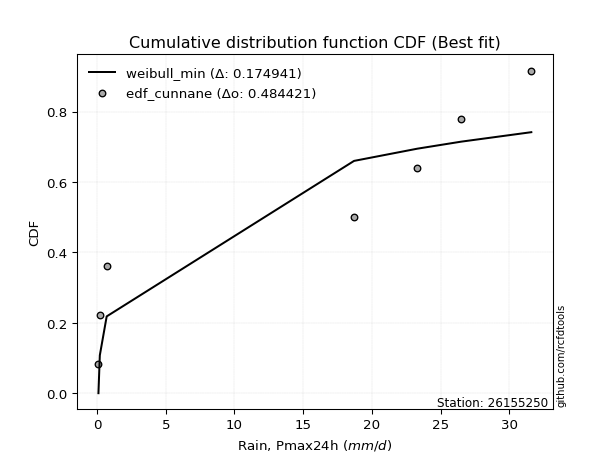</img>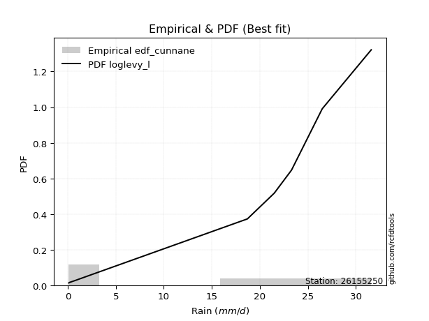</img>

</div>


### 12. Empirical - EDF Adamowski (1981)

The Adamowski formula in hydrology refers to a specific plotting position formula used for estimating the non-parametric empirical distribution of hydrological events (like flood peaks) to calculate their return periods. This formula provides an alternative to traditional parametric methods (like the Gumbel or Log Pearson Type III distributions). 

<div align="center">


$P=(m-0.25)/(n+0.5)$


</div>


**12.1. Empirical values**

<div align="center">

|                | 0                  | 1                   | 2                   | 3             | 4                  | 5                  | 6                  |
|:---------------|:-------------------|:--------------------|:--------------------|:--------------|:-------------------|:-------------------|:-------------------|
| date           | 2022               | 2021                | 2016                | 2019          | 2020               | 2018               | 2017               |
| x              | 0.1                | 0.2                 | 0.7                 | 18.7          | 23.3               | 26.5               | 31.6               |
| m              | 1                  | 2                   | 3                   | 4             | 5                  | 6                  | 7                  |
| empirical_dist | edf_adamowski      | edf_adamowski       | edf_adamowski       | edf_adamowski | edf_adamowski      | edf_adamowski      | edf_adamowski      |
| empirical      | 0.1                | 0.23333333333333334 | 0.36666666666666664 | 0.5           | 0.6333333333333333 | 0.7666666666666667 | 0.9                |
| empirical_tr   | 1.1111111111111112 | 1.3043478260869565  | 1.5789473684210527  | 2.0           | 2.727272727272727  | 4.2857142857142865 | 10.000000000000002 |

</div>


**12.2. Kolmogorov-Smirnov fit test (sorted by Δ)**


<div align="center">

|                | 0                   | 1                   | 2                   | 3                   | 4                   | 5                   | 6                   | 7                   | 8                   | 9                   | 10                  | 11                  | 12                  | 13                  | 14                  | 15                  | 16                  | 17                  | 18                  | 19                  | 20                  | 21                  | 22                  | 23                  | 24                  | 25                  | 26                  | 27                  | 28                  | 29                  | 30                  | 31                  | 32                  | 33                  | 34                  | 35                  | 36                  | 37                  | 38                  | 39                  | 40                  | 41                  | 42                  | 43                  | 44                  | 45                  | 46                  | 47                  | 48                  | 49                  | 50                  | 51                  | 52                  | 53                  | 54                  | 55                  | 56                  | 57                  | 58                    | 59                  | 60                  | 61                  | 62                  | 63                  | 64                  | 65                  | 66                  | 67                  | 68                  | 69                  | 70                  | 71                  | 72                  | 73                  | 74                  | 75                  | 76                  | 77                  | 78                  | 79                  | 80                  | 81                  | 82                  | 83                  | 84                  | 85                  | 86                  | 87                  | 88                  | 89                  |
|:---------------|:--------------------|:--------------------|:--------------------|:--------------------|:--------------------|:--------------------|:--------------------|:--------------------|:--------------------|:--------------------|:--------------------|:--------------------|:--------------------|:--------------------|:--------------------|:--------------------|:--------------------|:--------------------|:--------------------|:--------------------|:--------------------|:--------------------|:--------------------|:--------------------|:--------------------|:--------------------|:--------------------|:--------------------|:--------------------|:--------------------|:--------------------|:--------------------|:--------------------|:--------------------|:--------------------|:--------------------|:--------------------|:--------------------|:--------------------|:--------------------|:--------------------|:--------------------|:--------------------|:--------------------|:--------------------|:--------------------|:--------------------|:--------------------|:--------------------|:--------------------|:--------------------|:--------------------|:--------------------|:--------------------|:--------------------|:--------------------|:--------------------|:--------------------|:----------------------|:--------------------|:--------------------|:--------------------|:--------------------|:--------------------|:--------------------|:--------------------|:--------------------|:--------------------|:--------------------|:--------------------|:--------------------|:--------------------|:--------------------|:--------------------|:--------------------|:--------------------|:--------------------|:--------------------|:--------------------|:--------------------|:--------------------|:--------------------|:--------------------|:--------------------|:--------------------|:--------------------|:--------------------|:--------------------|:--------------------|:--------------------|
| station        | 26155250            | 26155250            | 26155250            | 26155250            | 26155250            | 26155250            | 26155250            | 26155250            | 26155250            | 26155250            | 26155250            | 26155250            | 26155250            | 26155250            | 26155250            | 26155250            | 26155250            | 26155250            | 26155250            | 26155250            | 26155250            | 26155250            | 26155250            | 26155250            | 26155250            | 26155250            | 26155250            | 26155250            | 26155250            | 26155250            | 26155250            | 26155250            | 26155250            | 26155250            | 26155250            | 26155250            | 26155250            | 26155250            | 26155250            | 26155250            | 26155250            | 26155250            | 26155250            | 26155250            | 26155250            | 26155250            | 26155250            | 26155250            | 26155250            | 26155250            | 26155250            | 26155250            | 26155250            | 26155250            | 26155250            | 26155250            | 26155250            | 26155250            | 26155250              | 26155250            | 26155250            | 26155250            | 26155250            | 26155250            | 26155250            | 26155250            | 26155250            | 26155250            | 26155250            | 26155250            | 26155250            | 26155250            | 26155250            | 26155250            | 26155250            | 26155250            | 26155250            | 26155250            | 26155250            | 26155250            | 26155250            | 26155250            | 26155250            | 26155250            | 26155250            | 26155250            | 26155250            | 26155250            | 26155250            | 26155250            |
| empirical_dist | edf_adamowski       | edf_adamowski       | edf_adamowski       | edf_adamowski       | edf_adamowski       | edf_adamowski       | edf_adamowski       | edf_adamowski       | edf_adamowski       | edf_adamowski       | edf_adamowski       | edf_adamowski       | edf_adamowski       | edf_adamowski       | edf_adamowski       | edf_adamowski       | edf_adamowski       | edf_adamowski       | edf_adamowski       | edf_adamowski       | edf_adamowski       | edf_adamowski       | edf_adamowski       | edf_adamowski       | edf_adamowski       | edf_adamowski       | edf_adamowski       | edf_adamowski       | edf_adamowski       | edf_adamowski       | edf_adamowski       | edf_adamowski       | edf_adamowski       | edf_adamowski       | edf_adamowski       | edf_adamowski       | edf_adamowski       | edf_adamowski       | edf_adamowski       | edf_adamowski       | edf_adamowski       | edf_adamowski       | edf_adamowski       | edf_adamowski       | edf_adamowski       | edf_adamowski       | edf_adamowski       | edf_adamowski       | edf_adamowski       | edf_adamowski       | edf_adamowski       | edf_adamowski       | edf_adamowski       | edf_adamowski       | edf_adamowski       | edf_adamowski       | edf_adamowski       | edf_adamowski       | edf_adamowski         | edf_adamowski       | edf_adamowski       | edf_adamowski       | edf_adamowski       | edf_adamowski       | edf_adamowski       | edf_adamowski       | edf_adamowski       | edf_adamowski       | edf_adamowski       | edf_adamowski       | edf_adamowski       | edf_adamowski       | edf_adamowski       | edf_adamowski       | edf_adamowski       | edf_adamowski       | edf_adamowski       | edf_adamowski       | edf_adamowski       | edf_adamowski       | edf_adamowski       | edf_adamowski       | edf_adamowski       | edf_adamowski       | edf_adamowski       | edf_adamowski       | edf_adamowski       | edf_adamowski       | edf_adamowski       | edf_adamowski       |
| p_dist         | weibull_min         | fisk                | laplace_asymmetric  | johnsonsu           | genlogistic         | pearson3            | erlang              | exponnorm           | crystalball         | norm                | gamma               | maxwell             | rayleigh            | logncf              | kstwobign           | gumbel_l            | logf                | logistic            | ncf                 | halfnorm            | nakagami            | hypsecant           | mielke              | logweibull_min      | rice                | logpearson3         | laplace             | loggumbel_l         | gumbel_r            | loggamma            | loggamma            | lognakagami         | logfatiguelife      | loginvweibull       | lognct              | logt                | logexponnorm        | logcrystalball      | lognorm             | lognorm             | loglognorm          | logerlang           | logrice             | loggompertz         | loginvgauss         | loginvgamma         | logfisk             | logexpon            | logalpha            | logmaxwell          | lograyleigh         | loggenexpon         | logtruncnorm        | logkstwobign        | loghalfnorm         | moyal               | loglogistic         | fatiguelife         | loglaplace_asymmetric | logloggamma         | pareto              | loggumbel_r         | loghypsecant        | halflogistic        | loghalflogistic     | logmoyal            | alpha               | loglaplace          | expon               | betaprime           | genexpon            | f                   | truncnorm           | gompertz            | logwald             | logpareto           | wald                | gibrat              | loggibrat           | t                   | invgauss            | logchi2             | invweibull          | chi2                | logjohnsonsu        | logbetaprime        | logmielke           | invgamma            | nct                 | loggenlogistic      |
| delta          | 0.16010857155867775 | 0.20805333746997257 | 0.20833882919869998 | 0.21634331322115635 | 0.2250359108417826  | 0.22623835477970805 | 0.22654324625805983 | 0.2265635528049628  | 0.2265636137377393  | 0.22656361620679827 | 0.2268685852878977  | 0.22701111994642734 | 0.22825124553067833 | 0.2299487833547712  | 0.23004928817288758 | 0.23554608208214947 | 0.23554857771962745 | 0.24305268283561493 | 0.24451408644423933 | 0.24984921384694145 | 0.2501566653157865  | 0.25121066536236053 | 0.2512903566600112  | 0.2547042679492114  | 0.2548132430806823  | 0.25673013066121686 | 0.25808957576462155 | 0.2594842019819745  | 0.2605127289967188  | 0.2651543009302373  | 0.2651543009302373  | 0.26543444916289927 | 0.265547381205016   | 0.265875741846857   | 0.26601999371416063 | 0.26613644902438716 | 0.2661367081591991  | 0.26613674973164436 | 0.26613675026022876 | 0.26613675026022876 | 0.26759837487807303 | 0.26809731184394847 | 0.26979972256978035 | 0.2715866063170159  | 0.2726658216701171  | 0.2728140758318842  | 0.2730978903558401  | 0.27352150377793394 | 0.27358795856377915 | 0.273595840925826   | 0.2757131946089293  | 0.27663502440336185 | 0.2780142429548861  | 0.2805551555617849  | 0.2834046176028744  | 0.287937327201553   | 0.28870723965173095 | 0.28964903959104077 | 0.29094636914235583   | 0.29098482769185785 | 0.29822085346615007 | 0.30153751058276557 | 0.30306814343084154 | 0.3051186595090644  | 0.3068182185774073  | 0.3130375572047337  | 0.32020430867272953 | 0.32095627724471143 | 0.3256969089936807  | 0.32696717019874244 | 0.3296401061432709  | 0.33202996026994314 | 0.33599073920711814 | 0.3365420096152038  | 0.35012567630638236 | 0.3624371163296684  | 0.36666666666666664 | 0.36666666666666664 | 0.3787599534468622  | 0.3837092458722936  | 0.3873826081687335  | 0.460510141932325   | 0.49712343987684315 | 0.4986445621590162  | 0.519797041778002   | 0.5320369617650684  | 0.5520030009472872  | 0.7265337006712842  | 0.7449907040093706  | 0.7666666666666667  |
| deltao         | 0.48442053926100004 | 0.48442053926100004 | 0.48442053926100004 | 0.48442053926100004 | 0.48442053926100004 | 0.48442053926100004 | 0.48442053926100004 | 0.48442053926100004 | 0.48442053926100004 | 0.48442053926100004 | 0.48442053926100004 | 0.48442053926100004 | 0.48442053926100004 | 0.48442053926100004 | 0.48442053926100004 | 0.48442053926100004 | 0.48442053926100004 | 0.48442053926100004 | 0.48442053926100004 | 0.48442053926100004 | 0.48442053926100004 | 0.48442053926100004 | 0.48442053926100004 | 0.48442053926100004 | 0.48442053926100004 | 0.48442053926100004 | 0.48442053926100004 | 0.48442053926100004 | 0.48442053926100004 | 0.48442053926100004 | 0.48442053926100004 | 0.48442053926100004 | 0.48442053926100004 | 0.48442053926100004 | 0.48442053926100004 | 0.48442053926100004 | 0.48442053926100004 | 0.48442053926100004 | 0.48442053926100004 | 0.48442053926100004 | 0.48442053926100004 | 0.48442053926100004 | 0.48442053926100004 | 0.48442053926100004 | 0.48442053926100004 | 0.48442053926100004 | 0.48442053926100004 | 0.48442053926100004 | 0.48442053926100004 | 0.48442053926100004 | 0.48442053926100004 | 0.48442053926100004 | 0.48442053926100004 | 0.48442053926100004 | 0.48442053926100004 | 0.48442053926100004 | 0.48442053926100004 | 0.48442053926100004 | 0.48442053926100004   | 0.48442053926100004 | 0.48442053926100004 | 0.48442053926100004 | 0.48442053926100004 | 0.48442053926100004 | 0.48442053926100004 | 0.48442053926100004 | 0.48442053926100004 | 0.48442053926100004 | 0.48442053926100004 | 0.48442053926100004 | 0.48442053926100004 | 0.48442053926100004 | 0.48442053926100004 | 0.48442053926100004 | 0.48442053926100004 | 0.48442053926100004 | 0.48442053926100004 | 0.48442053926100004 | 0.48442053926100004 | 0.48442053926100004 | 0.48442053926100004 | 0.48442053926100004 | 0.48442053926100004 | 0.48442053926100004 | 0.48442053926100004 | 0.48442053926100004 | 0.48442053926100004 | 0.48442053926100004 | 0.48442053926100004 | 0.48442053926100004 |
| eval           | Δo > Δ              | Δo > Δ              | Δo > Δ              | Δo > Δ              | Δo > Δ              | Δo > Δ              | Δo > Δ              | Δo > Δ              | Δo > Δ              | Δo > Δ              | Δo > Δ              | Δo > Δ              | Δo > Δ              | Δo > Δ              | Δo > Δ              | Δo > Δ              | Δo > Δ              | Δo > Δ              | Δo > Δ              | Δo > Δ              | Δo > Δ              | Δo > Δ              | Δo > Δ              | Δo > Δ              | Δo > Δ              | Δo > Δ              | Δo > Δ              | Δo > Δ              | Δo > Δ              | Δo > Δ              | Δo > Δ              | Δo > Δ              | Δo > Δ              | Δo > Δ              | Δo > Δ              | Δo > Δ              | Δo > Δ              | Δo > Δ              | Δo > Δ              | Δo > Δ              | Δo > Δ              | Δo > Δ              | Δo > Δ              | Δo > Δ              | Δo > Δ              | Δo > Δ              | Δo > Δ              | Δo > Δ              | Δo > Δ              | Δo > Δ              | Δo > Δ              | Δo > Δ              | Δo > Δ              | Δo > Δ              | Δo > Δ              | Δo > Δ              | Δo > Δ              | Δo > Δ              | Δo > Δ                | Δo > Δ              | Δo > Δ              | Δo > Δ              | Δo > Δ              | Δo > Δ              | Δo > Δ              | Δo > Δ              | Δo > Δ              | Δo > Δ              | Δo > Δ              | Δo > Δ              | Δo > Δ              | Δo > Δ              | Δo > Δ              | Δo > Δ              | Δo > Δ              | Δo > Δ              | Δo > Δ              | Δo > Δ              | Δo > Δ              | Δo > Δ              | Δo > Δ              | Δo > Δ              | Δo <= Δ             | Δo <= Δ             | Δo <= Δ             | Δo <= Δ             | Δo <= Δ             | Δo <= Δ             | Δo <= Δ             | Δo <= Δ             |
| fit            | 1                   | 1                   | 1                   | 1                   | 1                   | 1                   | 1                   | 1                   | 1                   | 1                   | 1                   | 1                   | 1                   | 1                   | 1                   | 1                   | 1                   | 1                   | 1                   | 1                   | 1                   | 1                   | 1                   | 1                   | 1                   | 1                   | 1                   | 1                   | 1                   | 1                   | 1                   | 1                   | 1                   | 1                   | 1                   | 1                   | 1                   | 1                   | 1                   | 1                   | 1                   | 1                   | 1                   | 1                   | 1                   | 1                   | 1                   | 1                   | 1                   | 1                   | 1                   | 1                   | 1                   | 1                   | 1                   | 1                   | 1                   | 1                   | 1                     | 1                   | 1                   | 1                   | 1                   | 1                   | 1                   | 1                   | 1                   | 1                   | 1                   | 1                   | 1                   | 1                   | 1                   | 1                   | 1                   | 1                   | 1                   | 1                   | 1                   | 1                   | 1                   | 1                   | 0                   | 0                   | 0                   | 0                   | 0                   | 0                   | 0                   | 0                   |
| n              | 7                   | 7                   | 7                   | 7                   | 7                   | 7                   | 7                   | 7                   | 7                   | 7                   | 7                   | 7                   | 7                   | 7                   | 7                   | 7                   | 7                   | 7                   | 7                   | 7                   | 7                   | 7                   | 7                   | 7                   | 7                   | 7                   | 7                   | 7                   | 7                   | 7                   | 7                   | 7                   | 7                   | 7                   | 7                   | 7                   | 7                   | 7                   | 7                   | 7                   | 7                   | 7                   | 7                   | 7                   | 7                   | 7                   | 7                   | 7                   | 7                   | 7                   | 7                   | 7                   | 7                   | 7                   | 7                   | 7                   | 7                   | 7                   | 7                     | 7                   | 7                   | 7                   | 7                   | 7                   | 7                   | 7                   | 7                   | 7                   | 7                   | 7                   | 7                   | 7                   | 7                   | 7                   | 7                   | 7                   | 7                   | 7                   | 7                   | 7                   | 7                   | 7                   | 7                   | 7                   | 7                   | 7                   | 7                   | 7                   | 7                   | 7                   |
| best_fit       | 1                   | 0                   | 0                   | 0                   | 0                   | 0                   | 0                   | 0                   | 0                   | 0                   | 0                   | 0                   | 0                   | 0                   | 0                   | 0                   | 0                   | 0                   | 0                   | 0                   | 0                   | 0                   | 0                   | 0                   | 0                   | 0                   | 0                   | 0                   | 0                   | 0                   | 0                   | 0                   | 0                   | 0                   | 0                   | 0                   | 0                   | 0                   | 0                   | 0                   | 0                   | 0                   | 0                   | 0                   | 0                   | 0                   | 0                   | 0                   | 0                   | 0                   | 0                   | 0                   | 0                   | 0                   | 0                   | 0                   | 0                   | 0                   | 0                     | 0                   | 0                   | 0                   | 0                   | 0                   | 0                   | 0                   | 0                   | 0                   | 0                   | 0                   | 0                   | 0                   | 0                   | 0                   | 0                   | 0                   | 0                   | 0                   | 0                   | 0                   | 0                   | 0                   | 0                   | 0                   | 0                   | 0                   | 0                   | 0                   | 0                   | 0                   |
| best_fit_sort  | 1                   | 2                   | 3                   | 4                   | 5                   | 6                   | 7                   | 8                   | 9                   | 10                  | 11                  | 12                  | 13                  | 14                  | 15                  | 16                  | 17                  | 18                  | 19                  | 20                  | 21                  | 22                  | 23                  | 24                  | 25                  | 26                  | 27                  | 28                  | 29                  | 30                  | 31                  | 32                  | 33                  | 34                  | 35                  | 36                  | 37                  | 38                  | 39                  | 40                  | 41                  | 42                  | 43                  | 44                  | 45                  | 46                  | 47                  | 48                  | 49                  | 50                  | 51                  | 52                  | 53                  | 54                  | 55                  | 56                  | 57                  | 58                  | 59                    | 60                  | 61                  | 62                  | 63                  | 64                  | 65                  | 66                  | 67                  | 68                  | 69                  | 70                  | 71                  | 72                  | 73                  | 74                  | 75                  | 76                  | 77                  | 78                  | 79                  | 80                  | 81                  | 82                  | 83                  | 84                  | 85                  | 86                  | 87                  | 88                  | 89                  | 90                  |

</div>


<div align="center">

</img>

</div>


**12.3. Best fit**

<div align="center">

|   id |   station | empirical_dist   | p_dist      |    delta |   deltao | eval   |   fit |   n |   best_fit |   best_fit_sort |
|-----:|----------:|:-----------------|:------------|---------:|---------:|:-------|------:|----:|-----------:|----------------:|
|    0 |  26155250 | edf_adamowski    | weibull_min | 0.160109 | 0.484421 | Δo > Δ |     1 |   7 |          1 |               1 |

</div>


<div align="center">

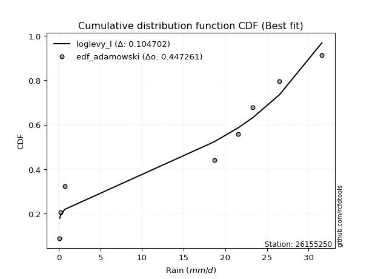</img>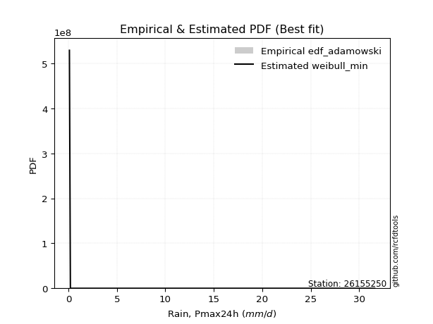</img>

</div>


## C. Best fit & Estimate extreme values for specific return periods - Tr


### 1. Best fit (ordered by delta Δ)

<div align="center">

|   id |   station | empirical_dist   | p_dist      |    delta |   deltao | eval   |   fit |   n |   best_fit |   best_fit_sort |
|-----:|----------:|:-----------------|:------------|---------:|---------:|:-------|------:|----:|-----------:|----------------:|
|    0 |  26155250 | edf_adamowski    | weibull_min | 0.160109 | 0.484421 | Δo > Δ |     1 |   7 |          1 |               1 |
|    1 |  26155250 | edf_weibull      | weibull_min | 0.160109 | 0.484421 | Δo > Δ |     1 |   7 |          1 |               2 |
|    2 |  26155250 | edf_chegodayev   | weibull_min | 0.16368  | 0.484421 | Δo > Δ |     1 |   7 |          1 |               3 |
|    3 |  26155250 | edf_jenkinson    | weibull_min | 0.164778 | 0.484421 | Δo > Δ |     1 |   7 |          1 |               4 |
|    4 |  26155250 | edf_beard        | weibull_min | 0.164778 | 0.484421 | Δo > Δ |     1 |   7 |          1 |               5 |
|    5 |  26155250 | edf_filliben     | weibull_min | 0.165606 | 0.484421 | Δo > Δ |     1 |   7 |          1 |               6 |
|    6 |  26155250 | edf_tukey        | weibull_min | 0.167365 | 0.484421 | Δo > Δ |     1 |   7 |          1 |               7 |
|    7 |  26155250 | edf_blom         | weibull_min | 0.172067 | 0.484421 | Δo > Δ |     1 |   7 |          1 |               8 |
|    8 |  26155250 | edf_cunnane      | weibull_min | 0.174941 | 0.484421 | Δo > Δ |     1 |   7 |          1 |               9 |
|    9 |  26155250 | edf_gringorten   | weibull_min | 0.179623 | 0.484421 | Δo > Δ |     1 |   7 |          1 |              10 |
|   10 |  26155250 | edf_hazen        | weibull_min | 0.186846 | 0.484421 | Δo > Δ |     1 |   7 |          1 |              11 |
|   11 |  26155250 | edf_california   | nakagami    | 0.187705 | 0.484421 | Δo > Δ |     1 |   7 |          1 |              12 |

</div>

:file_folder:Tables: [bestfit_26155250.csv](table/bestfit_26155250.csv) | [extreme_26155250.csv](table/extreme_26155250.csv)


### 2. Extreme values

In hydrology, a return period (or recurrence interval $Tr$) is the statistical average time between extreme events like floods or droughts of a specific magnitude, indicating how rare an event is, with a 100-year flood, for example, having a 1% chance of occurring in any given year, not that it happens exactly every century. It is a key tool for infrastructure design (like bridges or dams) and risk assessment, calculated from historical data to determine the probability of future events, although it is important to remember it is statistical average, and events can cluster or be missed.

> risk_rate: assuming the return period as the project useful life.

|   id |      tr |   prob_l |     prob_g |      alpha |   betaprime |      chi2 |   crystalball |   erlang |   expon |   exponnorm |                f |   fatiguelife |             fisk |   gamma |   genexpon |   genlogistic |   gibrat |   gompertz |   gumbel_l |   gumbel_r |   halflogistic |   halfnorm |   hypsecant |        invgamma |   invgauss |      invweibull |   johnsonsu |   kstwobign |   laplace |   laplace_asymmetric |   loggamma |   logistic |   lognorm |   maxwell |           mielke |   moyal |   nakagami |       ncf |              nct |    norm |    pareto |   pearson3 |   rayleigh |    rice |                t |   truncnorm |     wald |   weibull_min |    logalpha |    logbetaprime |      logchi2 |   logcrystalball |   logerlang |         logexpon |   logexponnorm |           logf |   logfatiguelife |        logfisk |   loggenexpon |   loggenlogistic |        loggibrat |   loggompertz |   loggumbel_l |   loggumbel_r |   loghalflogistic |   loghalfnorm |   loghypsecant |   loginvgamma |   loginvgauss |    loginvweibull |   logjohnsonsu |   logkstwobign |   loglaplace |   loglaplace_asymmetric |   logloggamma |   loglogistic |   loglognorm |   logmaxwell |      logmielke |         logmoyal |      lognakagami |            logncf |     lognct |     logpareto |   logpearson3 |   lograyleigh |    logrice |       logt |   logtruncnorm |          logwald |   logweibull_min |   station |   n |   risk_rate |
|-----:|--------:|---------:|-----------:|-----------:|------------:|----------:|--------------:|---------:|--------:|------------:|-----------------:|--------------:|-----------------:|--------:|-----------:|--------------:|---------:|-----------:|-----------:|-----------:|---------------:|-----------:|------------:|----------------:|-----------:|----------------:|------------:|------------:|----------:|---------------------:|-----------:|-----------:|----------:|----------:|-----------------:|--------:|-----------:|----------:|-----------------:|--------:|----------:|-----------:|-----------:|--------:|-----------------:|------------:|---------:|--------------:|------------:|----------------:|-------------:|-----------------:|------------:|-----------------:|---------------:|---------------:|-----------------:|---------------:|--------------:|-----------------:|-----------------:|--------------:|--------------:|--------------:|------------------:|--------------:|---------------:|--------------:|--------------:|-----------------:|---------------:|---------------:|-------------:|------------------------:|--------------:|--------------:|-------------:|-------------:|---------------:|-----------------:|-----------------:|------------------:|-----------:|--------------:|--------------:|--------------:|-----------:|-----------:|---------------:|-----------------:|-----------------:|----------:|----:|------------:|
|    0 |    2    | 0.5      | 0.5        |    4.34537 |     4.16285 |  0.463783 |       14.4429 |  14.3223 | 10.0417 |     14.4428 |      1.05131     |      0.100024 |      3.80454     | 14.3307 |    10.6517 |       12.1434 |  10.6227 |    11.9664 |    16.5336 |    12.3521 |        11.3127 |    11.8377 |     14.4429 |     0.1         |    1.24039 | 18729.4         |     17.3185 |     11.877  |   14.4429 |              18.9125 |    3.23354 |    14.4429 |    3.3865 |   13.3544 |      1.03098     | 11.6771 |    5.39561 |   13.7487 |      0.1         | 14.4429 |   7.16952 |    14.5693 |    12.9684 | 13.6928 |      0.171235    |     10.9128 |  10.3174 |       6.74926 |     2.91638 |    0.104384     |     0.179036 |           3.3865 |     3.17109 |      1.14906     |         3.3865 |    0.30124     |          3.41271 |   1.70444      |       1.97298 |         inf      |      1.67109     |       3.68831 |       4.98464 |       2.30074 |           1.89843 |       2.09205 |        3.3865  |       2.90335 |       2.677   |      2.24716     |        31.5356 |        2.00674 |      3.3865  |                 6.68877 |       6.70011 |       3.3865  |      3.36146 |      2.76918 |   0.103894     |      2.03081     |      1.26548     |      0.845196     |    3.3852  |   0.121374    |       3.99014 |       2.57842 |    2.98647 |    3.38651 |        2.40171 |      1.57937     |          5.38649 |  26155250 |   7 |    0.75     |
|    1 |    2.33 | 0.570815 | 0.429185   |    5.73069 |     5.82641 |  0.669838 |       16.7139 |  16.5986 | 12.2322 |     16.7139 |      1.62791     |      1.05807  |      6.32743     | 16.6051 |    12.8454 |       14.4836 |  11.7732 |    14.1878 |    18.5095 |    14.4565 |        13.4763 |    14.2888 |     16.2604 |     0.1         |    1.73789 |     2.7644e+06  |     19.4696 |     14.1785 |   15.8172 |              21.0104 |    4.96172 |    16.4438 |    5.1536 |   15.7139 |      2.10454     | 13.6692 |    7.99666 |   19.5018 |      0.1         | 16.7139 |   9.14643 |    16.8359 |    15.3627 | 15.9585 |      0.222887    |     12.768  |  11.8066 |      10.6615  |     4.48611 |    0.110192     |     0.221408 |           5.1536 |     4.86127 |      1.96774     |         5.1536 |    0.540692    |          5.18684 |   6.56439      |       3.19981 |         inf      |      2.06717     |       5.52187 |       7.18273 |       3.39504 |           2.83222 |       3.29144 |        4.73907 |       4.47101 |       4.17153 |      3.59738     |        31.5798 |        3.20144 |      4.36623 |                 9.00123 |       9.01179 |       4.90256 |      5.10772 |      4.28362 |   0.108798     |      2.93513     |      2.27226     |      2.39432      |    5.15292 |   0.162359    |       6.01893 |       4.01435 |    4.60906 |    5.15361 |        3.78643 |      2.07997     |          7.64885 |  26155250 |   7 |    0.729209 |
|    2 |    5    | 0.8      | 0.2        |   16.4726  |    16.3799  |  2.19159  |       25.1538 |  25.1198 | 23.1839 |     25.1538 |     12.0406      |     21.4096   |     46.3682      | 25.1189 |    23.244  |       24.6486 |  18.3965 |    23.825  |    24.8926 |    23.5989 |        23.2664 |    24.6541 |     23.5509 |     0.1         |    7.38819 |     7.32938e+15 |     26.0878 |     23.9546 |   22.6886 |              26.3563 |   25.0695  |    24.1698 |   24.5363 |   25.0006 |     40.2048      | 22.8967 |   23.2743  |   61.1015 |      0.1         | 25.1538 |  22.1319  |    25.189  |    24.9485 | 24.8653 |      1.99416     |     20.164  |  20.1429 |      47.1892  |    23.6194  |    0.268034     |     0.778519 |          24.5363 |    24.4655  |     28.9761      |        24.5363 | 1161.89        |         24.6471  |   1.44576e+07  |      24.347   |         inf      |      7.03416     |      22.8081  |      23.3796  |      18.4059  |          17.3075  |      22.371   |       18.2432  |      23.8364  |      24.2663  |     27.7834      |        31.5997 |       23.2823  |     15.5546  |                19.1833  |      19.1803  |      20.4549  |     24.2615  |     23.851   |   0.223113     |     16.1647      |     30.99        | 484315            |   24.5649  |   5.86652e+18 |      25.3453  |      23.6224  |   24.3421  |   24.5363  |       23.1937  |      9.71496     |         23.7455  |  26155250 |   7 |    0.67232  |
|    3 |   10    | 0.9      | 0.1        |   36.2081  |    28.1842  |  4.02748  |       30.7526 |  30.8267 | 33.1256 |     30.7526 |     68.4824      |     49.5097   |    202.739       | 30.8204 |    32.0064 |       32.9268 |  25.9464 |    31.0065 |    28.4465 |    31.0453 |        31.3966 |    32.3241 |     29.3726 |     0.100031    |   22.3329  |     3.47009e+23 |     29.4923 |     31.3979 |   28.9262 |              28.9802 |   75.2911  |    29.8597 |   69.0837 |   31.5361 |    372.999       | 30.9306 |   36.9731  |  120.7    |      0.100004    | 30.7526 |  40.0734  |    30.6692 |    31.7833 | 31.0719 |     35.4989      |     24.7286 |  28.9898 |     108.334   |    75.1787  |    2.67784      |     2.86836  |          69.0837 |    73.2596  |    332.953       |        69.0837 |    8.31597e+14 |         69.4791  |   4.62636e+23  |     109.457   |         inf      |     28.4081      |      53.2662  |      45.1025  |      72.9254  |          77.815   |      92.3781  |       53.5263  |      77.0725  |      86.4536  |    146.853       |        31.6    |      105.46    |     49.2861  |                24.9799  |      24.9645  |      58.5707  |     68.4037  |     79.8528  |   1.29498      |     71.3954      |    228.826       |      1.38491e+22  |   69.2459  | inf           |      60.9456  |      83.5876  |   75.6116  |   69.0839  |       82.5781  |     49.8671      |         44.6166  |  26155250 |   7 |    0.651322 |
|    4 |   15    | 0.933333 | 0.0666667  |   55.8732  |    35.8253  |  5.22338  |       33.5465 |  33.6908 | 38.9412 |     33.5465 |    188.106       |     67.8878   |    453.215       | 33.6816 |    36.8887 |       37.5971 |  31.1539 |    34.7049 |    30.0559 |    35.2465 |        35.9976 |    36.3156 |     32.695  |     0.101113    |   39.4143  |     7.42448e+27 |     30.9518 |     35.3493 |   32.575  |              30.5131 |  131.326   |    32.9599 |  115.803  |   34.8894 |   1262.46        | 35.5932 |   44.4166  |  168.288  |      0.100061    | 33.5465 |  54.4322  |    33.3858 |    35.305  | 34.2295 |    200.189       |     26.6362 |  34.6708 |     157.88    |   136.364   |   34.4973       |     6.41211  |         115.803  |   127.58    |   1388.81        |       115.803  |    4.36254e+33 |        116.621   |   1.15728e+44  |     240.136   |         inf      |     74.4035      |      79.0158  |      60.7344  |     158.57    |         182.182   |     193.229   |       98.9341  |     141.217   |     168.283   |    375.707       |        31.6    |      235.166   |     96.7637  |                27.1017  |      27.0811  |     103.899   |    114.841   |    148.439   |   8.34184      |    169.067       |    653.048       |      5.70363e+45  |  116.154   | inf           |      92.357   |     160.294   |  133.882   |  115.803   |      157.589   |    142.556       |         59.3672  |  26155250 |   7 |    0.644736 |
|    5 |   20    | 0.95     | 0.05       |   75.521   |    41.5383  |  6.11157  |       35.3762 |  35.5723 | 43.0674 |     35.3762 |    384.944       |     81.4944   |    790.347       | 35.5611 |    40.2577 |       40.8671 |  35.2389 |    37.1461 |    31.0577 |    38.1881 |        39.2212 |    38.9767 |     35.0388 |     0.11425     |   56.9224  |     7.99187e+30 |     31.8313 |     38.0112 |   35.1639 |              31.6008 |  189.565   |    35.1026 |  162.419  |   37.1149 |   2935.9         | 38.8953 |   49.4359  |  209.247  |      0.100405    | 35.3762 |  66.8683  |    35.1583 |    37.6457 | 36.3147 |    684.554       |     27.7034 |  38.9043 |     199.599   |   202.736   |  510.17         |    11.5006   |         162.419  |   183.96    |   3825.82        |       162.419  |    8.29164e+58 |        163.754   |   2.23223e+67  |     406.113   |         inf      |    158.344       |     101.273   |      73.0932  |     273.162   |         330.635   |     316.05    |      152.597   |     211.514   |     263.405   |    725.266       |        31.6    |      403.64    |    156.167   |                28.1987  |      28.1753  |     154.406   |    161.284   |    224       |  55.67         |    311.321       |   1315.99        |      4.81486e+75  |  162.991   | inf           |     120.305   |     247.099   |  194.958   |  162.419   |      241.449   |    311.832       |         70.9188  |  26155250 |   7 |    0.641514 |
|    6 |   25    | 0.96     | 0.04       |   95.1619  |    46.128   |  6.81933  |       36.7231 |  36.9603 | 46.2679 |     36.723  |    670.705       |     92.3055   |   1209.45        | 36.9477 |    42.8209 |       43.3858 |  38.6443 |    38.9473 |    31.7706 |    40.4538 |        41.7049 |    40.9567 |     36.8527 |     0.202985    |   74.1978  |     1.7301e+33  |     32.4428 |     40.005  |   37.172  |              32.4444 |  248.717   |    36.7417 |  208.347  |   38.7671 |   5602.04        | 41.4547 |   53.1878  |  245.846  |      0.101764    | 36.7231 |  78.0458  |    36.4598 |    39.3848 | 37.8574 |   1777.14        |     28.3893 |  42.2952 |     235.847   |   272.397   | 8334.05         |    18.2094   |         208.347  |   241.167   |   8396.13        |       208.347  |    3.56574e+90 |        210.265   |   9.97333e+92  |     600.913   |         inf      |    297.198       |     120.974   |      83.3912  |     415.294   |         523.329   |     455.767   |      213.402   |     285.864   |     368.563   |   1203.71        |        31.6    |      604.969   |    226.377   |                28.8684  |      28.8433  |     209.067   |    207.128   |    304.027   | 378.777        |    499.719       |   2217.54        |      2.46865e+111 |  209.159   | inf           |     145.577   |     340.813   |  257.284   |  208.347   |      331.044   |    583.717       |         80.4837  |  26155250 |   7 |    0.639603 |
|    7 |   50    | 0.98     | 0.02       |  193.335   |    61.2305  |  9.10234  |       40.58   |  40.9489 | 56.2096 |     40.58   |   3761.48        |    126.992    |   4437.56        | 40.932  |    50.5307 |       51.1446 |  50.6485 |    44.0993 |    33.7058 |    47.4336 |        49.3573 |    46.7118 |     42.4766 |    48.0706      |  152.019   |     2.70645e+40 |     34.0391 |     45.8598 |   43.4096 |              35.065  |  544.865   |    41.7499 |  425.097  |   43.5587 |  40406.8         | 49.4004 |   64.1312  |  393.068  |      0.269944    | 40.58   | 123.579   |    40.1713 |    44.4331 | 42.3066 |  34424.4         |     29.8868 |  53.3667 |     371.005   |   645.183   |    2.59594e+10  |    78.1105   |         425.097  |   527.051   |  96476.6         |       425.097  |  inf           |        430.484   |   7.22738e+247 |    1885.04    |         inf      |   2734.94        |     196.853   |     119.264   |    1509.43    |        2153.95    |    1320.88    |      603.641   |     689.879   |     992.929   |   5732.04        |        31.6    |     1985.12    |    717.296   |                30.2341  |      30.2054  |     527.747   |    424.307   |    737.338   |   6.39117e+06  |   2171.39        |  10116.4         |    inf            |  427.247   | inf           |     246.792   |     866.725   |  571.115   |  425.098   |      822.187   |   4520.69        |        113.465   |  26155250 |   7 |    0.63583  |
|    8 |   75    | 0.986667 | 0.0133333  |  291.495   |    70.6425  | 10.4854   |       42.6495 |  43.0975 | 62.0251 |     42.6495 |  10312           |    147.882    |   9402.02        | 43.0783 |    54.8813 |       55.6543 |  58.7562 |    46.8462 |    34.6844 |    51.4905 |        53.8056 |    49.8447 |     45.7632 |  1745.01        |  216.179   |     4.11167e+44 |     34.8089 |     49.0811 |   47.0584 |              36.5979 |  833.238   |    44.6424 |  623.252  |   46.1638 | 126593           | 54.0468 |   70.0923  |  509.103  |      2.55881     | 42.6495 | 160.02    |    42.1534 |    47.1796 | 44.7105 | 194903           |     30.4304 |  60.1795 |     466.532   |  1035.41    |    2.398e+17    |   186.086    |         623.253  |   804.905   | 402423           |       623.253  |  inf           |        632.558   | inf            |    3522.04    |         inf      |  12245.3         |     252.357   |     142.918   |    3195.73    |        4902.54    |    2357.34    |     1108.36    |    1119.62    |    1720.77    |  14199.2         |        31.6    |     3816.96    |   1408.27    |                30.6971  |      30.6671  |     900.921   |    623.718   |   1193.58    |   1.22996e+11  |   5126.65        |  23114.1         |    inf            |  626.826   | inf           |     324.02    |    1440.18    |  877.507   |  623.254   |     1343.7     |  15931.5         |        134.986   |  26155250 |   7 |    0.634587 |
|    9 |  100    | 0.99     | 0.01       |  389.652   |    77.5758  | 11.4838   |       44.0493 |  44.5542 | 66.1513 |     44.0492 |  21090.8         |    162.913    |  15975           | 44.5333 |    57.9038 |       58.8461 |  65.0369 |    48.6926 |    35.3245 |    54.3619 |        56.9541 |    51.9789 |     48.0945 | 22344.8         |  270.322   |     3.74634e+47 |     35.2982 |     51.2882 |   49.6473 |              37.6856 | 1112.32    |    46.6846 |  807.344  |   47.9383 | 283568           | 57.3433 |   74.1495  |  608.572  |     16.4702      | 44.0493 | 191.581   |    43.4903 |    49.0507 | 46.342  | 666880           |     30.7119 |  65.1467 |     541.961   |  1431.81    |    4.65791e+24  |   346.55     |         807.344  |  1073.49    |      1.10857e+06 |       807.344  |  inf           |        820.759   | inf            |    5397.72    |         inf      |  39110.1         |     297.087   |     160.873   |    5434.12    |        8774.63    |    3497.78    |     1705.6     |    1560.77    |    2514.26    |  26983.1         |        31.6    |     5973.84    |   2272.81    |                30.9301  |      30.8994  |    1314.22    |    809.52    |   1657.04    |   2.5604e+15   |   9430.42        |  40577.4         |    inf            |  812.357   | inf           |     387.871   |    2035.46    | 1173.97    |  807.346   |     1875.18    |  39912.4         |        151.225   |  26155250 |   7 |    0.633968 |
|   10 |  200    | 0.995    | 0.005      |  782.269   |    95.154   | 13.9378   |       47.2243 |  47.8684 | 76.093  |     47.2243 | 118253           |    199.706    |  56976.8         | 47.8437 |    64.987  |       66.5195 |  82.1242 |    52.8366 |    36.7158 |    61.2648 |        64.5234 |    56.8601 |     53.7108 |     1.04082e+07 |  429.272   |     4.8838e+54  |     36.3212 |     56.3717 |   55.885  |              40.3061 | 2152.21    |    51.5834 | 1452.13   |   51.9979 |      1.96353e+06 | 65.2856 |   83.4087  |  923.693  |   1577           | 47.2243 | 293.139   |    46.5115 |    53.332  | 50.058  |      1.29191e+07 |     31.1474 |  77.5195 |     750.664   |  3025.6     |    8.58633e+55  |  1576.55     |        1452.13   |  2072.52    |      1.27382e+07 |      1452.13   |  inf           |       1482.51    | inf            |   14378.2     |         inf      | 921200           |     424.317   |     208.065   |   19472.3     |       35564.2     |    8624.61    |     4817.86    |    3363.43    |    6075.67    | 126305           |        31.6    |    16761.7     |   7201.61    |                31.2813  |      31.2497  |    3251.1     |   1463.27    |   3510.06    |   7.67675e+32  |  40951.6         | 146887           |    inf            | 1462.81    | inf           |     575.963   |    4491.99    | 2275.34    | 1452.13    |     4004.26    | 393193           |        193.579   |  26155250 |   7 |    0.633042 |
|   11 |  250    | 0.996    | 0.004      |  978.576   |   101.078   | 14.7403   |       48.1946 |  48.8841 | 79.2935 |     48.1946 | 205989           |    211.697    |  85703.2         | 48.8582 |    67.2119 |       68.9863 |  88.2552 |    54.0889 |    37.1251 |    63.484  |        66.9568 |    58.3618 |     55.5188 |     7.52218e+07 |  488.536   |     9.46617e+56 |     36.6113 |     57.9449 |   57.893  |              41.1498 | 2636.68    |    53.1562 | 1737.46   |   53.2476 |      3.65491e+06 | 67.8424 |   86.2503  | 1053.37   |   6861.77        | 48.1946 | 335.504   |    47.4318 |    54.6499 | 51.1974 |      3.35438e+07 |     31.2365 |  81.6128 |     826.177   |  3816.77    |    2.92009e+72  |  2578.69     |        1737.46   |  2537.3     |      2.79551e+07 |      1737.46   |  inf           |       1776.33    | inf            |   19453.2     |         inf      |      2.86191e+06 |     471.438   |     224.424   |   29350.3     |       55770.8     |   11384.6     |     6730.21    |    4270.03    |    8005.57    | 207454           |        31.6    |    23066.6     |  10439.3     |                31.3519  |      31.3201  |    4348.27    |   1753.71    |   4422.42    |   5.06692e+41  |  65701.2         | 218153           |    inf            | 1750.88    | inf           |     647.69    |    5731.4     | 2786.38    | 1737.47    |     5052.39    | 838073           |        208.165   |  26155250 |   7 |    0.632858 |
|   12 |  500    | 0.998    | 0.002      | 1960.11    |   120.318   | 17.2648   |       51.072  |  51.9036 | 89.2352 |     51.0719 |      1.15494e+06 |    249.313    | 303989           | 51.8741 |    73.9674 |       76.643  | 109.444  |    57.7585 |    38.2986 |    70.372  |        74.5096 |    62.839  |     61.1347 |     3.50384e+10 |  695.201   |     1.19082e+64 |     37.4149 |     62.6595 |   64.1307 |              43.7703 | 4831.86    |    58.0337 | 2957.74   |   56.9767 |      2.51076e+07 | 75.7844 |   94.7005  | 1573.79   | 660967           | 51.072  | 508.084   |    50.1522 |    58.5821 | 54.5854 |      6.49825e+08 |     31.4168 |  94.6281 |    1087.45    |  7679.87    |    5.73906e+160 | 12024        |        2957.74   |  4640.01    |      3.21221e+08 |      2957.74   |  inf           |       3037.71    | inf            |   48026.5     |         inf      |      1.43891e+08 |     638.206   |     278.802   |  104880       |      225358       |   26051.2     |    19009.6     |    8764.59    |   18458.5     | 967815           |        31.6    |    60053       |  33077.9     |                31.4932  |      31.461   |   10714.5     |   3001.41    |   8812.41    |   1.88606e+86  | 285298           | 708917           |    inf            | 2983.95    | inf           |     908.78    |   11857.8     | 5086.26    | 2957.75    |    10083.8     |      9.29755e+06 |        256.363   |  26155250 |   7 |    0.632489 |
|   13 |  750    | 0.998667 | 0.00133333 | 2941.64    |   132.174   | 18.7609   |       52.6704 |  53.586  | 95.0508 |     52.6703 |      3.16613e+06 |    271.538    | 636950           | 53.5545 |    77.8179 |       81.119  | 123.457  |    59.7665 |    38.9257 |    74.3987 |        78.925  |    65.3403 |     64.4198 |     1.2745e+12  |  830.343   |     1.68386e+68 |     37.827  |     65.308  |   67.7795 |              45.3033 | 6780.62    |    60.8834 | 3974.73   |   59.0624 |      7.74106e+07 | 80.4302 |   99.4063  | 1983.35   |      9.5631e+06  | 52.6704 | 646.202   |    51.658  |    60.7809 | 56.473  |      3.67918e+09 |     31.4776 | 102.432  |    1259.47    | 11402.5     |    2.46514e+255 | 29795.6      |        3974.73   |  6503.59    |      1.33988e+09 |      3974.74   |  inf           |       4093.48    | inf            |   79691.3     |         inf      |      1.91963e+09 |     750.764   |     313.08    |  220813       |      509816       |   41368.6     |    34894.3     |   13166.2     |   29694       |      2.38129e+06 |        31.6    |   102797       |  64941.9     |                31.5404  |      31.508   |   18146.3     |   4046.5     |  12959       |   2.2365e+131  | 673507           |      1.3687e+06  |    inf            | 4012.6     | inf           |    1090.37    |   17805.9     | 7109.42    | 3974.75    |    14816.5     |      3.93529e+07 |        286.546   |  26155250 |   7 |    0.632366 |
|   14 | 1000    | 0.999    | 0.001      | 3923.17    |   140.862   | 19.8299   |       53.7709 |  54.7465 | 99.1769 |     53.7709 |      6.47549e+06 |    287.391    |      1.07628e+06 | 54.7135 |    80.508  |       84.2941 | 134.18   |    61.1356 |    39.3478 |    77.2549 |        82.057  |    67.0676 |     66.7506 |     1.63209e+13 |  931.885   |     1.48043e+71 |     38.0973 |     67.1429 |   70.3683 |              46.3909 | 8570.6     |    62.9042 | 4871.65   |   60.504  |      1.72024e+08 | 83.7265 |  102.65    | 2334.25   |      6.36692e+07 | 53.7709 | 765.825   |    52.6924 |    62.3005 | 57.7746 |      1.25887e+10 |     31.5081 | 108.045  |    1390.32    | 15012       |  inf            | 56875.7      |        4871.65   |  8213.54    |      3.69103e+09 |      4871.65   |  inf           |       5027.2     | inf            |  113127       |          31.5307 |      1.39402e+10 |     837.665   |     338.492   |  374435       |      909708       |   56934.3     |    53692.2     |   17478.9     |   41390.1     |      4.51003e+06 |        31.6    |   149179       | 104810       |                31.564   |      31.5316  |   26366.8     |   4971.23    |  16917       |   5.65398e+176 |      1.23886e+06 |      2.15538e+06 |    inf            | 4920.34    | inf           |    1233.04    |   23581.7     | 8954.91    | 4871.66    |    19317.7     |      1.111e+08   |        308.836   |  26155250 |   7 |    0.632305 |

<div align="center">

</img>

</div>


<div align="center">

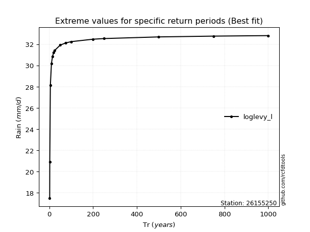</img>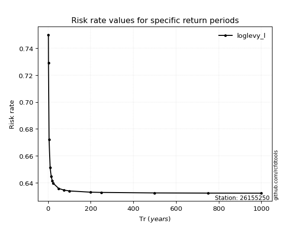</img>

</div>


<sub>**APP DISCLAIMER**: NO WARRANTY - This software is provided by [github.com/rcfdtools](https://github.com/rcfdtools) "as is", without any express or implied warranty, including warranties of merchantability, fitness for a particular purpose, or non-infringement. There is no guarantee that the software will be error-free or operate without interruption. LIMITATION OF LIABILITY - Neither the authors nor copyright holders will be liable for claims or damages arising from the software or its use. You are responsible for determining if the software is appropriate for your use and assume all associated risks, including errors, legal compliance, and data loss. NO PROFESSIONAL ADVICE - The software provides general information and does not offer professional advice. It should not replace consultation with professional advisors.</sub>